# 第5章 细胞质基质与内膜系统 · 第二节 细胞内膜系统及其功能

[返回本章](../README.md) · [中文本章原文](../中文原文.md)

<!-- BEGIN CN CN05-S02 -->
## 第二节 细胞内膜系统及其功能

细胞内膜系统（endomembrane system）包括内质网、高尔基体、溶酶体、内体和分泌泡等，这些细胞器是结构、功能乃至发生上彼此关联并不断变化的动态结构体系。各区室之间通过生物合成、蛋白质修饰与分选、膜泡运输和各种质量监控机制维系其系统的动态平衡。细胞内膜相结构所占的比例因细胞的种类和生理功能不同而有很大的差别，根据对肝细胞和胰腺外分泌细胞的分析，肝细胞体积平均约 $5000\mu \mathrm{m}^3$ ，而胰腺外分泌细胞为 $1000\mu \mathrm{m}^3$ ，总细胞膜面积（包括细胞器膜）大约分别为 $110000\mu \mathrm{m}^2$ 和 $13000\mu \mathrm{m}^2$ 。二者质膜和各种细胞器的膜所占百分比也不尽相同。

## 一、内质网的结构与功能

内质网（endoplasmic reticulum, ER）是真核细胞中最普遍且形态多变、适应性最强的细胞器之一。内质网由封闭的管状或扁平囊状膜系统及其包被的腔所形成互相连通的三维网络结构。内质网通常占细胞膜系统的一半左右，体积占细胞总体积的10%以上。在不同类型细胞中，内质网占细胞总体积的比例差异很大，同一细胞在不同发育阶段和不同的生理状态下，内质网的结构与功能也随之显著变化。在细胞周期不同阶段，内质网也发生很大变化，细胞分裂时，内质网要经历解体与重建的过程。

内质网是细胞内除核酸以外一系列重要的生物大分子如蛋白质、脂类和糖类的合成基地。由于内质网的存在，使细胞内膜的表面积大为增加，为多种酶特别是多酶体系提供了大面积的结合位点。同时内质网作为完整封闭体系，将内质网合成的物质与细胞质基质中合成的物质分隔开来，这更有利于它们的加工和运输。原核细胞内没有内质网，由细胞膜代行其某些类似的职能。

内质网的发现要比线粒体和高尔基体等细胞器晚得多。1945年，K.R.Porter等人在体外培养的细胞中初次观察到细胞质的内质部分有网状结构，建议称为内质网。随着超薄切片和固定技术的改进，G. E. Palade 和 Porter 等人于 1954 年证实内质网是由膜围绕的囊泡所组成。虽然之后发现的内质网不仅仅存在于细胞的内质部位，但仍习惯延用此名称。

生物化学家曾从细胞质中分离出大量称为微粒体（microsome）的结构，实际上这是在细胞匀浆和超速离心过程中，由破碎的内质网形成的近似球形的囊泡结构，它包含内质网膜与核糖体两种基本组分。虽然这是形态上的人工产物，但在体外实验中，微粒体仍具有蛋白质合成、蛋白质糖基化和脂类合成等内质网的基本功能。因此在生化与功能研究中，常常把微粒体和内质网等同看待。

## （一）内质网的两种基本类型

内质网是真核细胞中最大的膜性细胞器，包括核膜（将在细胞核部分介绍）和延伸到细胞质内的外周内质网(peripheral ER)。其中外周内质网根据形态的不同，又分为片层状内质网和管状内质网。片层状内质网一般位于核膜周围，大部分是有核糖体附着的糙面内质网（rough endoplasmic reticulum, rER），是膜蛋白和分泌蛋白的合成加工场所。而管状内质网一般没有核糖体附着，属于光面内质网（smooth endoplasmic reticulum, sER），主要发挥脂质合成、信号转导、与其它细胞器的相互作用等功能。

糙面内质网多呈扁囊状，排列较为整齐，因其膜表面附有大量的核糖体而命名（图5-3）。它是内质网与核糖体共同形成的复合机能结构，其主要功能是合成分泌性蛋白和多种膜蛋白。因此在分泌活动旺盛的细胞（如胰腺腺泡细胞和分泌抗体的浆细胞）中糙面内质网非常发达，而在一些未分化的细胞与肿瘤细胞中则较为稀少。内质网膜上有一种称为移位子（translocon）的蛋白复合体，直径约8.5 nm，中心有一个直径为2 nm的“通道”，eER上新合成的多肽经该通道向ER的腔内转移。

表面没有附着核糖体的内质网称光面内质网，光面内质网常为分支管状，形成较为复杂的三维结构，其表面通常无核糖体附着。光面内质网是脂类合成的重要场所，细胞中几乎不含有纯的光面内质网，它们只是作为内质网这一连续结构的一部分。光面内质网所占的区域通常较小，往往作为出芽的位点，将内质网上合成的蛋白质或脂类转运到高尔基体。在某些细胞中，光面内质网非常发达并具有特殊的功能，如合成固醇类激素的细胞（图 5-3B）及肝细胞等。

用密度梯度离心法将肝细胞中的光面内质网和糙面内质网分开，并发现糙面内质网上有20余种与光面内质网上不同的蛋白质。既然内质网是一个连续的整体结构，那么在糙面内质网和光面内质网组分中存在如此多的蛋白质种类的差异就暗示在内质网膜上可能存在某些

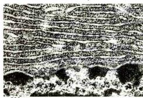  
A 500 nm

  
B 500 nm

## 图5-3 内质网的形态结构

A. 胰腺外分泌细胞中发达的糙面内质网，内质网膜及外层核膜上均附有核糖体。B. 黄体细胞有丰富的光面内质网。C. Cos-7 细胞经双重荧光染色显示的内质网的分布：抗钙网蛋白（Calreticulin）绿色荧光染色和抗 CLIMP-63 红色荧光染色，绿色显示两种形式的内质网，叠加色（黄）显示糙面内质网区。（A 图由梁凤霞博士惠赠；B 图由黄百渠博士和曾宪录博士惠赠；C 图由 Yoko Shibata 博士惠赠）

特殊的装置，影响了光面内质网与糙面内质网之间蛋白质的自由移动，并维持其特殊的形态。否则在内质网膜这个二维的流体结构中，不同区域的脂类和蛋白质就会因侧向扩散而趋于平衡。

对内质网与其他细胞器关系的研究，不仅有利于阐明细胞的某些生理生化过程，而且对探讨细胞器的发生与演化很有意义。来源于细胞膜的胞吞小泡常与来自高尔基体的膜泡或溶酶体融合，甚至会到达高尔基体。内质网上合成的膜蛋白经高尔基体分选被转运到细胞质膜上。在原核细胞中也能观察到一些核糖体附着在细胞膜内侧，因而有人认为，在演化过程中，内质网可能由细胞膜演化而来。内质网膜与核膜连成一体，内质网的腔也与核周隙相通，而且外层核膜也附着大量的核糖体，这种结构上的联系提示内质网与核膜在发生上有同源关系。

光面内质网与高尔基体在结构、功能与发生上的关系更为密切。此外，在合成代谢旺盛的细胞内，糙面内质网总是与线粒体紧密相依，这固然与线粒体为内质网执行功能提供所需能量直接相关，最近还发现这种分布上的联系与脂类的转移以及 $Ca^{2+}$ 释放的调节也密切相关。在间期细胞中，内质网的分布常常与微管的走向一致，且总是沿微管向细胞周缘延伸。已发现依赖于微管的驱动蛋白（kinesin）与内质网结合，提示源于核膜的内质网在驱动蛋白的牵引下沿微管向外延伸形成复杂的网状结构。

内质网对外界因素（射线、化学毒物、病毒等）的作用非常敏感，糙面内质网发生的最普遍的病理变化是内质网腔扩大并形成空泡，继而核糖体从内质网膜上脱落，使蛋白质合成受阻。

## （二）内质网的功能

ER腔面

内质网是细胞内蛋白质和脂质的合成基地，几乎全部的脂质、分泌蛋白和跨膜蛋白都是在内质网上合成的。目前对内质网的功能尚不完全了解，就已积累的资料可以看出，内质网是行使多种重要功能的复杂的结构体系。

## 1. 糙面内质网与蛋白质的合成

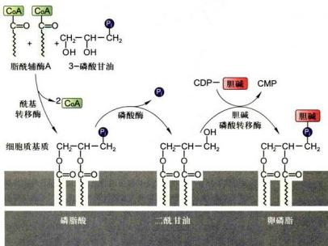

细胞内蛋白质的合成都起始于细胞质基质中的游离核糖体。有些蛋白质刚起始合成不久便转移至内质网膜上，继续肽链延伸并完成蛋白质合成。在糙面内质网上，多肽链边延伸边穿过内质网膜进入腔内，如细胞外基质组分、抗体和多肽类激素等分泌性蛋白质，以及内质网、高尔基体和溶酶体等细胞器腔内的可溶性驻留蛋白等。还有一些蛋白质在合成过程中就定位到内质网的膜上，如位于内质网、高尔基体、溶酶体以及细胞质膜的跨膜蛋白。这些跨膜蛋白的构象都具有方向性，并且在内质网上合成时就已确定，在后续的转运过程中，其拓扑学特性始终保持不变。

## 2. 光面内质网与脂质的合成

内质网合成细胞所需包括磷脂和胆固醇在内的几乎全部膜脂，其中最主要的磷脂是磷脂酰胆碱（卵磷脂）。合成磷脂所需要的三种酶都定位在内质网膜上，其活性部位在膜的细胞质基质侧（图5-4）。用于磷脂合成的

图5-4 卵磷脂在内质网膜上合成过程的示意图底物来自细胞质基质，反应的第一步是增大膜面积，第二、三两步确定新合成磷脂的种类。除卵磷脂外，其他几种磷脂，如磷脂酰乙醇胺、磷脂酰丝氨酸以及磷脂酰肌酶等都以类似的方式合成。在内质网膜上合成的磷脂几分钟后就由细胞质基质侧转向内质网腔面，这一过程借助磷脂转位蛋白（phospholipid translocator）或称转位酶（flippase）的帮助来完成。转位蛋白的转位效率因磷脂的种类而异，通常是对含胆碱的磷脂要比对含丝氨酸、乙醇胺或肌醇的磷脂转位能力更强，因此卵磷脂更容易转位到内质网膜的腔面。

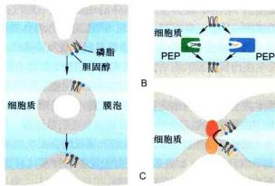  
图 5-5 胆固醇与磷脂在供体膜与受体膜之间可能的转运机制  
A. 通过膜泡转运脂质。B. 通过 PEP 介导的脂质转运。C. 膜嵌入蛋白介导的膜间直接接触。

在内质网膜上合成的磷脂向其他膜的转运主要有三种可能的机制（图5-5）：第一种是以出芽的方式形成膜泡转运到高尔基体、溶酶体和细胞质膜上。第二种是凭借磷脂交换蛋白（phospholipid exchange protein, PEP)在供体膜与受体膜之间转移磷脂。其转运模式首先是PEP与磷脂分子结合形成水溶性的复合物进入细胞质基质，遇到靶膜时，将磷脂安插在膜上，结果是将磷脂从内质网膜转移到靶膜（如线粒体或过氧化物酶体的膜）上。每种PEP只能识别一种磷脂，推测磷脂酰丝氨酸就是以这种方式转移到线粒体膜上，然后脱羧基而形成磷脂酰乙醇胺，而磷脂酰胆碱则不加任何修饰地转移到线粒体膜上。第三种膜脂转运机制可能是供体膜与受体膜之间通过膜嵌入蛋白所介导的直接接触。

## 3. 蛋白质的修饰与加工

在糙面内质网合成的膜蛋白、细胞内膜系统腔内的各种蛋白和分泌蛋白在它们到达目的地之前，通常要发生4种基本修饰与加工：①发生在内质网和高尔基体的糖基化修饰；②在内质网腔内形成二硫键；③蛋白质的折叠和装配；④在内质网、高尔基体和分泌泡发生特异性的蛋白质水解切割。

蛋白质糖基化是指在蛋白质合成的同时或合成后，在酶的催化下寡糖链被连接在肽链特定的糖基化位点上形成糖蛋白的过程。蛋白质的糖基化修饰会影响蛋白质折叠、分选及其定位，糖链结构不同还会影响糖蛋白的半寿期和降解。参与靶蛋白糖基化修饰的寡糖链具有共同的内核结构。大多数寡糖链在糖基转移酶(glycosyltranferase)的催化下从位于内质网膜腔面的磷酸多萜醇载体转移到靶蛋白三氨基酸残基（Asn-X-Ser/Thr, X 为除 Pro 以外任意氨基酸）序列的天冬酰胺残基上，这种形式的糖基化修饰称为 N-连接的糖基化 (N-linked glycosylation)，与天冬酰胺直接结合的糖都是 N-乙酰葡糖肽（表 5-1）。N-连接糖基化起始于内质网，以磷酸多萜醇为载体，先合成 14 个糖基 $\left[\left(\mathrm{Glc}\right)_{3}(\mathrm{Man})_{9}\left(\mathrm{GlcNAc}\right)_{2}\right]$ 的前体，然后膜上糖基转移酶将寡糖链由磷酸多萜醇转移至肽链糖基化位点（Asn-X-Ser/Thr）的天冬酰胺残基上，经内质网特异性糖苷酶的加工，形成高甘露糖型糖蛋白，再转移至高尔基体完成蛋白质 N-连接糖基化修饰。也有少数糖基化是发生在靶蛋白的丝氨酸或苏氨酸残基上，或在羟赖氨酸或羟脯氨酸残基上（如胶原蛋白），这种形式的糖基化修饰都发生在靶蛋白氨基酸残基的羟基氧原子上，故称为 O-连接的糖基化 (O-linked glycosylation)，O-连接糖基化发生在高尔基体，与靶蛋白直接结合的糖是 N-乙酰半乳糖胺。两种糖基化其寡糖链在成分和结构上有很大的不同，合成与加工的方式也完全不同（表 5-1，图 5-6）。

表 5-1 N-连接与 O-连接的寡糖比较

<table><tr><td>特征</td><td>N-连接</td><td>O-连接</td></tr><tr><td>1合成部位</td><td>糙面内质网和高尔基体</td><td>高尔基体</td></tr><tr><td>2合成方式</td><td>来自同一个寡糖前体</td><td>一个个单糖加上去</td></tr><tr><td>3与之结合的氨基酸残基</td><td>天冬酰胺</td><td>丝氨酸、苏氨酸、羟赖氨酸、羟脯氨酸</td></tr><tr><td>4最终长度</td><td>至少5个糖残基</td><td>一般1~4个糖残基,但ABO血型抗原较长</td></tr><tr><td>5第一个糖残基</td><td>N-乙酰葡糖胺</td><td>N-乙酰半乳糖胺等</td></tr></table>

O-连接糖基化  
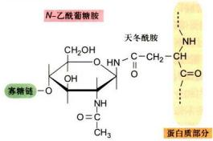

  
图 5-6 N- 连接的糖基化与 O- 连接的糖基化的比较  
N-连接的糖基化与之直接结合的糖是N-乙酰葡糖胺；O-连接的糖基化与之直接结合的糖是N-乙酰半乳糖胺。

在内质网发生的蛋白质 N- 连接糖基化的加工过程如图 5-7 所示，转移至高尔基体后还会经过一系列复杂的修饰，其进一步加工过程参见本节后述高尔基体功能。

另一种较常见的蛋白质修饰是酰基化（acylation），发生在内质网膜的胞质面，通常是软脂酸共价结合在跨膜蛋白的半胱氨酸残基上，类似的酰基化也发生在高尔基体甚至膜蛋白向细胞膜转移的过程中，是形成脂锚定蛋白的重要方式。

此外，一些新生肽的脯氨酸和赖氨酸会发生羟基化(hydroxylation)，如在胶原蛋白上发生的羟基化修饰形成了大量的羟脯氨酸和羟赖氨酸。

## 4. 新生多肽的折叠与组装

肽链的合成仅需几十秒钟至几分钟即可完成，而新合成的多肽在内质网停留的时间往往长达几十分钟。不同的蛋白质在内质网停留的时间长短不一，这在很大程度上取决于蛋白质正确折叠所需要的时间。有些多肽还要进一步参与多亚基寡聚体的组装。不能正确折叠的肽链或未组装成寡聚体的蛋白质亚基，不论在内质网膜上还是在内质网腔中，一般都不能转运至高尔基体，这类多肽一旦被识别，便通过Sec61p复合体从内质网腔转至细胞质基质，进而通过依赖泛素的降解途径被蛋白酶体所降解。可见内质网是蛋白质分泌转运途径中行使质量监控的重要场所。

在目前发现的 16 000 种与人类疾病相关的蛋白质错义突变中，绝大多数是通过影响这些蛋白质的折叠、组装及转运直接或间接造成的。蛋白质错误折叠引起疾病，究其机制大体可分为两类彼此重叠的情况，一是正确折叠和转运的蛋白质减少，无法保障功能需求，即功能丢失（loss of function）；二是错误折叠的蛋白质可以获得异常的功能（gain of function），例如某些离子通道蛋白突变致使功能异常（肺囊性纤维病）；错误折叠或加工的蛋白质形成细胞毒性聚合体，从而导致人类疾病（如阿尔茨海默病 Aβ 淀粉样斑块，亨廷顿舞蹈症中亨廷顿蛋白聚合体）。

  
图5-7发生在糙面内质网蛋白质 $N-$ 连接的糖基化过程  
1. 含有 $(\mathrm{Glc})_{3}(\mathrm{Man})_{9}(\mathrm{GlcNAc})_{2}$ 的寡聚糖首先在内质网磺酸多萜醇载体上组装，然后在糖基转移酶的催化下，寡聚糖基从磷酸多萜醇载体转移到新生肽链的天冬酰胺残基上。2—3. 在分子伴侣 BiP 和蛋白二硫键异构酶的帮助下，蛋白质折叠时，3 个葡萄糖残基分别被葡糖苷酶所切除（3a 在内质网蛋白质正确折叠时起作用）。4. 1 个 Man 残基被移除，形成 $(\mathrm{Man})_{8}(\mathrm{GlcNAc})_{2}$ 高甘露糖型寡聚糖。

在内质网狭小的腔隙中常常同时有多种蛋白质大量合成，特别是许多分泌蛋白质常含有连接半胱氨酸残基的二硫键。内质网腔是一种非还原性环境，多肽链疏水基团之间以及侧链基团之间的相互作用，也极易导致二硫键形成，从而对肽链的正确折叠带来很大困难。内质网中有一种蛋白二硫键异构酶（protein disulfide isomerase, PDI），它附着在内质网膜腔面上，可以切断异常的二硫键，形成自由能最低的蛋白质构象，从而帮助蛋白重新形成二硫键并产生正确折叠的构象。

折叠好的蛋白质，内部往往有一个疏水的核心，未折叠的蛋白质由于疏水核心的外露，即使在很低的浓度下，也很容易发生聚集，甚至与其它未折叠的蛋白形成复合物。内质网含有一种结合蛋白（binding protein, BiP），是属于Hsp70家族的分子伴侣，在内质网中有两个作用：一是与进入内质网的未折叠蛋白质的疏水氨基酸残基结合，防止多肽链错误折叠和聚合，或者识别错误折叠的蛋白质或未装配好的蛋白质亚基，并促进它们重新折叠与装配；二是防止蛋白质在转运过程中变性或断裂。一旦这些蛋白质形成正确构象或完成装配，便与BiP分离，进入高尔基体。蛋白二硫键异构酶和BiP等蛋白质都具有四肽驻留信号（KDEL或HDEL）以保证它们滞留在内质网中，并维持很高的浓度。BiP还可同 $\mathrm{Ca^{2+}}$ 结合，可能通过 $\mathrm{Ca^{2+}}$ 与带负电的磷脂头部基团相互作用，使BiP结合到内质网膜上。

## 5. 内质网的其他功能

一般情况下，光面内质网所占比例很小，但在某些细胞中却非常发达。肝细胞中的光面内质网很丰富，它是合成外输性脂蛋白颗粒的基地。肝细胞中的光面内质网中还含有一些酶，介导氧化、还原和水解反应，使脂溶性的毒物转变成水溶性物质而被排出体外，此过程称为肝细胞的解毒作用（detoxification）。研究较为深入的是细胞色素P450家族酶系的解毒反应。聚集在光面内质网膜上的水不溶性毒物或代谢产物在P450混合功能氧化酶(mixed-function oxidase)作用下羟基化，完全溶于水并转送出细胞进入尿液排除体外。某些药物如苯巴比妥(phenobarbital)进入体内后，便诱导肝细胞中与解毒反应有关的酶大量合成，在以后的几天时间内光面内质网的面积成倍增加。一旦毒物消失，多余的光面内质网也随之被溶酶体消化，5天内又恢复到原来的大小。

心肌细胞和骨骼肌细胞中含有发达的特化的光面内质网，称肌质网（sarcoplasmic reticulum），是储存 $Ca^{2+}$ 的细胞器，对细胞质中 $Ca^{2+}$ 浓度起调节作用。肌质网膜上的 $Ca^{2+}-ATP$ 酶将细胞质基质中的 $Ca^{2+}$ 泵入肌质网腔中，储存起来。当肌细胞受到神经冲动刺激后， $Ca^{2+}$ 释放，肌肉收缩。在多数真核细胞中，内质网具有储存 $Ca^{2+}$ 的功能，内质网膜上存在与肌质网膜上相同的三磷酸肌醇 ( $IP_{3}$ ) 的受体，细胞外信号通过胞内第二信使 ( $IP_{3}$ ) 也可引起 $Ca^{2+}$ 向细胞质基质释放。内质网储存 $Ca^{2+}$ 的功能，在于内质网中存在大量包括 BiP 在内的 4 种以上的 $Ca^{2+}$ 结合蛋白，其浓度可达 30～100 mg/mL。每个 $Ca^{2+}$ 结合蛋白分子可与 30 个左右的 $Ca^{2+}$ 结合，从而致使内质网中的 $Ca^{2+}$ 浓度高达 3 mmol/L。内质网作为 $Ca^{2+}$ 的储存库，由于高浓度的 $Ca^{2+}$ 及与之结合的 $Ca^{2+}$ 结合蛋白，从而阻止内质网以出芽的方式形成转运膜泡。因此， $Ca^{2+}$ 浓度的变化对转运膜泡的形成，可能起重要的调节作用。

在某些合成固醇类激素的细胞如睾丸间质细胞中，光面内质网也非常丰富，其中含有合成胆固醇并进一步产生固醇类激素的一系列的酶。

## （三）内质网应激及其信号调控

内质网是蛋白质合成、折叠、组装、运输和参与脂质代谢的重要场所，也是细胞内主要的 $\mathrm{Ca^{2+}}$ 库。当某些因素致使内质网的生理功能紊乱、钙稳态失衡，未折叠或错误折叠的蛋白质在内质网腔内超量积累时，便会激活相关信号通路，引发内质网应激（endoplasmic reticulum stress, ERS）反应，来应对环境的变化并恢复内质网的正常状态。所以，ERS是一种自我保护反应，也是监控蛋白质合成质量的有效机制，也是细胞存活程序和凋亡程序的选择过程，细胞可以调动相关的信号通路来恢复或者是维持细胞稳态；或者是启动细胞凋亡程序来处理不能修复的损伤细胞，因此ERS机制事关细胞生死抉择（cell life and death decisions）。ERS（图5-8）涉及以下几个方面：①未折叠蛋白质应答反应(unfolded protein response, UPR)，即错误折叠与未折叠蛋白质不能按正常途径从内质网中释放，从而在内质网腔内聚集，引起一系列分子伴侣和折叠酶表达上调，促进蛋白质正确折叠，防止其聚集，从而提高细胞在有害因素下的生存能力。②内质网超负荷反应（endoplasmicreticulum overload response, EOR)，一些正确折叠的蛋白质如没有被及时运出而在内质网过度蓄积，特别是膜蛋白在内质网异常堆积也会启动其他促生存的机制来反制内质网压力，例如激活细胞核因子κB（NFκB）引发的内质网超负荷反应，最终产生促炎性细胞因子(proinflammatory cytokine)，进而激活细胞存活、凋亡、细胞炎症反应和细胞分化等相关的信号途径。③固醇调节级联反应，是由内质网表面合成的胆固醇损耗所致，通过固醇调节元件结合蛋白（sterol regulatory element binding protein, SREBP）介导的信号途径，影响特定基因表达。④如果内质网功能持续紊乱，细胞将最终启动细胞凋亡程序。

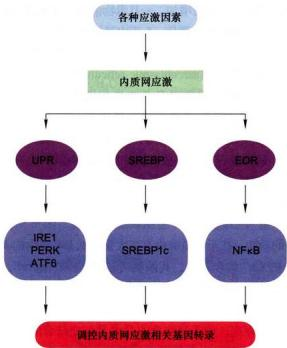  
图5-8 内质网应激反应  
在各种应激因素（错误折叠或未折叠蛋白质在ER腔内聚集、 $\mathrm{Ca^{2+}}$ 平衡紊乱、缺氧、异常糖基化和病毒感染等）作用下，主要通过3条途径引发内质网应激（ERS）反应，影响特定基因表达。如果内质网功能持续紊乱，细胞将最终启动凋亡程序。（图中英文缩写符号见正文）

## 1. 未折叠蛋白质应答反应

哺乳类动物细胞的3种ER跨膜蛋白参与了UPR，它们是需肌酶酶1（inositol requiring enzyme 1, IRE1）、PKR类似的内质网激酶（PKR-like endoplasmic reticulum kinase, PERK；PKR为双链RNA激活的蛋白激酶）和激活性转录因子6（activating transcription factor 6, ATF6），它们在UPR信号转导途径中起着内质网应激感受器的作用。在正常生理条件下，它们与内质网腔中的调控蛋白BiP/GRP78相结合，形成稳定的复合物，当错误或未折叠蛋白质在ER中超量积累时，BiP/GRP78与这些感应蛋白解离，感应ERS信号，分别引发三条不同的平行信号途径，以保护ERS下的细胞，引发不同的未折叠蛋白质应答反应（图5-9A）。

第一条途径最先是在酵母细胞中发现，参与UPR的关键蛋白是跨ER膜的双功能蛋白激酶/核酸内切酶IRE1。IRE1的ER腔面结构域具有BiP/GRP78(glucose-regulated protein 78)的结合位点，胞质面结构域具有丝氨酸/苏氨酸激酶活性和特异性的RNA内切酶活性。应答反应的基本步骤如图5-9B所示；超量的错误折叠蛋白质在ER腔面与BiP竞争性结合，从而使原来BiP结合的IRE1单体与相邻的IRE1形成二聚体，并发挥激酶活性使所结合的IRE1磷酸化，结果激活IRE1具有核酸内切酶活性，切割基因调节蛋白前体mRNA，产生有功能的mRNA。这种发生在细胞质基质中mRNA加工过程使得基因调节蛋白（如Hac1）被翻译，再转位进入核内作为转录因子激活那些编码未折叠蛋白质应答反应相关蛋白质的基因的转录，以缓解内质网应激压力。IRE1还能切割28S rRNA，影响核糖体装配，抑制蛋白质翻译。

第二条途径是超量积累的错误折叠蛋白质作为信号激活ER膜上的PKR类似的内质网激酶PERK。和双功能跨膜蛋白IRE1一样，PERK正常情况下通过内质网腔面N端结构域与伴侣蛋白BiP/GRP78结合而处于失活状态。在ER应激时，未折叠蛋白质或错误折叠蛋白质竞争性地结合BiP/GRP78，因而PERK与之解离，然后PERK激酶二聚化和交叉磷酸化，活化的PERK可使翻译起始因子eIF2α第51位丝氨酸磷酸化，磷酸化的eIF2α不能完成GTP—GDP的交换作用，从而减缓或暂停蛋白质合成，限制了内质网的蛋白质负荷，这对蛋白质折叠是有利的。有研究表明：PERK活化后能特异性地抑制细胞周期蛋白D1的翻译表达，导致 $\mathrm{G}_{\mathrm{i}}$ 期的停顿，PERK磷酸化eIF2α后抑制细胞内大部分蛋白质的翻译过程，同时PERK激活后还会激活JNK（c-Jun N-terminal kinase）及P38信号传导通路，诱导UPR基因的转录上调。

第三条从内质网到细胞核的信号通路并激活未折叠蛋白质应答反应的途径，是通过内质网应激调节的ATF6完成的。ATF6合成后定位在内质网膜上，当错误折叠蛋白质在内质网积累后，ATF6被转运到高尔基体，在那里被 S1P 和 S2P 蛋白酶裂解而被激活，激活后的 ATF6 进入细胞核内，促进含顺式作用元件 ERSE（ER stress response element, ERSE）的转录因子（如 XBP1）及 UPR 靶分子（BiP/GRP78）等基因转录。

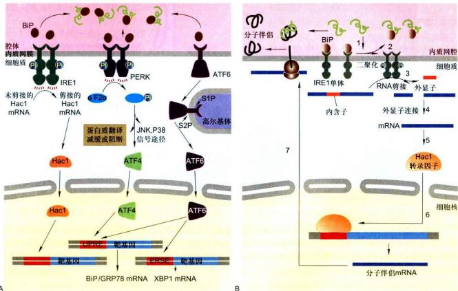  
图5-9 未折叠蛋白质应答反应图示  
A. 三条不同的平行信号传导途径执行未折叠蛋白质应答反应（UPR）。B. IRE1膜蛋白介导的UPR：1. 错误折叠蛋白质作为内质网信号，激活内质网跨膜激酶（感受器）；2. 活化的激酶二聚化、交叉磷酸化，激活核糖核酸内切酶活性；3. 活化的核糖核酸内切酶，切除前体RNA的内含子；4. 外显子连接，形成有功能活性的mRNA；5. mRNA翻译形成基因调节蛋白Hac1；6. 基因调节蛋白进入核内，激活为ER分子伴侣编码的基因；7. 新合成的ER分子伴侣帮助蛋白质折叠。

## 2. 固醇调节级联反应

依赖胆固醇的转录调控有赖于受控靶基因启动子内10个碱基对组成的固醇调控元件（sterol regulatory element, SRE），依赖类固醇的转录因子称作固醇调控元件结合蛋白（SREBP），SREBP通过两个跨膜结构域锚定在内质网膜上。由SREBP介导的信号通路始于内质网膜，除SREBP之外，至少还涉及内质网膜上的两种跨膜蛋白insig-1(2)和SCAP的联合作用，从而使细胞胆固醇库的变化受到监控，以维持磷脂和胆固醇的水平（图5-10）。当膜上胆固醇水平升高时，SREBP和SCAP结合形成复合物而抑制胆固醇的合成；当胆固醇耗竭时，SREBP-SCAP复合物被释放并转移到高尔基体被 S1P 和 S2P 分别在两个位点酶切，成为活性因子易位到胞核而激活靶基因转录。

## 3. ERS 反应引发的细胞凋亡

ERS 介导的细胞凋亡是近些年提出的一种新的途径。尽管某些信号通路的细节尚不清楚，但在此过程中，细胞内钙稳态失衡和需钙蛋白酶、caspase-12 的激活是关键的环节。细胞内钙稳态失衡是诱导 ERS 的重要因素，当 ERS 时，Ca $^{2+}$ 从内质网腔释放到胞质中，胞质中的 Ca $^{2+}$ 水平增高，从而激活 Ca $^{2+}$ 依赖的蛋白酶 calpain，诱发细胞凋亡途径。calpain 以无活性的二聚体形式存在于胞质中，由大小亚基组成，大亚基（分子质量 80 kDa）有 4 个结构域，包含活性部位，小亚基（分子质量 30 kDa）由两个结构域组成，包含调节部位，大小亚基上均有 Ca $^{2+}$ 的结合位点。ERS 时，不同的凋亡信号可刺激内质网膜上的 IP,R 通道开放，使 Ca $^{2+}$ 从内质网腔释放到细胞质中，高水平的 Ca $^{2+}$ 与需钙蛋白

<!-- END OFFICIAL API PART part_001 -->

<!-- BEGIN OFFICIAL API PART part_002 -->

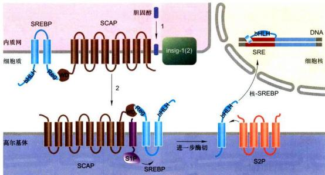  
图 5-10 SREBP 的胆固醇敏感调控  
1. 当胆固醇水平过高时，insig-1(2)与SCAP蛋白上固醇敏感结构域结合，将SCAP-SREBP复合物锚定在内质网膜上。2. 在胆固醇水平降低时，insig-1(2)与SCAP解离，容许SCAP-SREBP复合物以膜泡转运的形式移动到高尔基体。在高尔基体，SREBP随即在两个位点分别被蛋白酶S1P和S2P切割，从而使SREBP蛋白N端bHLH结构域得以释放。释放后的bHLH结构域称作核-SREBP（nSREBP），并转位到核内，调控具有SRE的靶基因的转录。

酶结合，从而导致 calpain 酶原大小亚基水解而被激活。活化的 calpain 可调解多种蛋白质底物，例如与几种细胞骨架蛋白结合的黏着斑蛋白（vinculin），calpain 可通过裂解黏着斑蛋白，破坏细胞骨架稳定性，使胞膜起泡，核染色质聚集，诱导细胞凋亡。同时活化的 calpain 还可剪切 Bcl-xL 使之由抗凋亡分子转变为促凋亡分子，促进细胞凋亡。caspase-12 位于内质网膜的胞质侧，并且是唯一存在于内质网上的 caspase 家族成员。在非应激情况下，它以酶原的形式存在，当 ERS 时，caspase-12 可以通过不同的途径被激活，如当 ERS 时，活化的 calpain 可转位于内质网膜上，在 T132/A133 和 K158/T159 两个切割位点切割 caspase-12 酶原，使其成为活化的 caspase-12，作为执行细胞凋亡的重要水解酶而发挥作用。

上述源自内质网的信号途径，虽然了解得还不够深入，但都是应激条件下细胞中内质网的一种保护性反应。内质网分子伴侣表达的上调可辅助未折叠蛋白质的折叠，如果仍未形成天然构象，则可转位到细胞质中经泛素-蛋白酶体途径降解（内质网相关蛋白质的降解）。ERS可以通过未折叠蛋白质反应和内质网相关蛋白质的降解，维持内质网的稳态，促进细胞生存；但如果ERS反应过强或持续时间过长，则会导致细胞

启动细胞凋亡程序。

## 二、高尔基体的形态结构与功能

高尔基体（Golgi body）又称高尔基器（Golgi apparatus）或高尔基复合体（Golgi complex），是真核细胞内普遍存在的一种细胞器。1898年，意大利医生Golgi用镀银法首次在神经细胞内观察到一种网状结构，命名为内网器（internal reticular apparatus）。后来在很多细胞中相继发现了类似的结构并称之为高尔基体。高尔基体从发现至今已有百余年历史，其中几乎一半时间是进行关于高尔基体形态乃至是否真实存在的争论。20世纪50年代以后随着电子显微镜技术的应用和超薄切片技术的发展，才确证了高尔基体的真实存在。

高尔基体是由大小不一、形态多变的囊胞体系组成，在不同的细胞中，甚至细胞生长的不同阶段都有很大的变化。高尔基体是高度动态的结构，而且难于分离与纯化，再加之动物细胞中高尔基体数目较少，即使在含量丰富的肝细胞中高尔基体也仅有50个左右。因此对高尔基体的结构与功能的研究，一直是细胞生物学家面临的挑战性难题之一。近些年来虽然对高尔基体的结构与功能进行了较多研究，但目前积累的资料仍不足以彻底阐明高尔基体的结构与功能。

## （一）高尔基体的形态结构与极性

电子显微镜所观察到的高尔基体特征性结构是由排列较为整齐的扁平膜囊（saccule）堆叠而成（常常4～8个），囊堆构成了高尔基体的主体结构（图5-11），扁平膜囊多呈弓形或半球形。膜囊周围又有许多大小不等的囊泡结构。高尔基体是一种有极性的细胞器，这不仅表现在它在细胞中往往有比较恒定的位置与方向，而且物质从高尔基体的一侧输入，从另一侧输出，因此每层膜囊也各不相同。在很多细胞中，高尔基体靠近细胞核的一侧，扁囊弯曲成凸面（convex）又称形成面（forming face）或顺面（cis face），面向细胞质膜的一侧常呈凹面（concave）又称成熟面（mature face）或反面(trans face）。

根据高尔基体的各部膜囊特有的成分，可用电镜组织化学染色方法对高尔基体的结构组分作进一步的分析，常用的4种标志细胞化学反应是：

（1）嗜饿反应，经饿酸浸染后，高尔基体的顺面膜囊被特异地染色；

(2) 焦磷酸硫胺素酶（TPP 酶）的细胞化学反应，可特异地显示高尔基体反面的 1\~2 层膜囊；

(3) 胞嘧啶单核苷酸酶（CMP 酶）和酸性磷酸酶的细胞化学反应，常常可显示靠近反面膜囊状和反面管网结构，CMP 酶也是溶酶体的标志酶。20 世纪 60 年代初，A. B. Novikoff 发现 CMP 酶和酸性磷酸酶存在于高尔基体反面一侧，称这种结构为 GERL，意为这种结构与高尔基体（G）密切相关，但它是内质网（ER）的一部分，参与溶酶体（L）的生成，当时认为溶酶体中的酶是内质网合成后，通过 GERL 而不过过高尔基体进入溶酶体中，这一假说影响达十年之久。

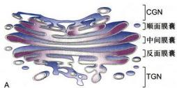

(4) 烟酰胺腺嘌呤二核苷磷酸酶（NADP酶）的细胞化学反应，是高尔基体中间几层扁平囊的标志反应。

组织化学染色技术可以反映高尔基体的生化极性，高尔基体的各种标志反应不仅有助于对高尔基体结构与功能的深入了解，而且可以用来更准确地鉴别高尔基体的极性。如汤雪明等用啫饿反应作为高尔基体顺面的标志反应，研究了中性颗粒细胞发育过程中高尔基体的极性变化。结果表明，高尔基体的顺面并非总是在高尔基体的凸面，在细胞发育的某个阶段可能位于高尔基的凹面。在此以前，由于仅根据形态上的凸凹来确定高尔基体的极性，因此一度认为中性颗粒细胞的中幼粒细胞阶段，其高尔基体的顺面也具有输出分泌颗粒的功能。

A. Rambourg 等借助超高压电镜观察不同厚度的切片，并从不同角度拍摄高尔基体的立体照片，对高尔基体的形态结构进行了比较并做了系统的三维结构分析，结果显示高尔基体是一个十分复杂的连续的整体结构。酵母细胞高尔基体功能缺陷突变株研究发现，高尔基体是一个复杂的由许多功能不同的间隔所组成的完整体系。目前多数学者认为，高尔基体至少由以下几个互相联系的部分组成：

(1) 高尔基体顺面膜囊与顺面网状结构 (cis Golgi network, CGN)

顺面膜囊位于高尔基体顺面外侧，顺面网状结构（CGN）与之相连，呈中间多孔而连续分支状。CGN膜厚约6 nm，比高尔基体其他部位略薄，但与内质网膜厚度接近。一般认为，CGN接受来自内质网新合成的物质并将其分类后大部分转入高尔基体中间膜囊，少部

图5-11 高尔基体的形态结构

A. 动物分泌细胞高尔基体三维结构的分区示意图。B. 动物细胞冷冻蚀刻扫描电镜观察到的高尔基体。C. 小鼠回肠 Paneth 细胞电镜超薄切片观察到的高尔基体。（B 图由 Bechara Kachar 博士惠赠；C 图由梁凤霞博士惠赠）

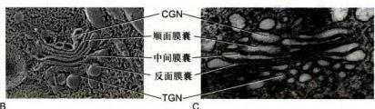

分蛋白质与脂质再返回内质网。返回内质网的蛋白质具有KDEL（或HDEL）信号序列，它是内质网驻留蛋白的特有序列。CGN区域还可能具有其他生物活性，如蛋白质丝氨酸残基发生O-连接的糖基化，跨膜蛋白在细胞质基质一侧结构域的酰基化，溶酶体酶上寡糖的磷酸化，日冕病毒的装配也发生在CGN。

## (2) 高尔基体中间膜囊 (medial Golgi)

中间膜囊位于顺面膜囊与反面膜囊之间，由扁平膜囊与管道组成，形成不同间隔，但功能上是连续的、完整的膜囊体系。多数糖基修饰与加工、糖脂的形成以及与高尔基体有关的多糖的合成都发生在中间膜囊。扁平膜囊特殊的形态大大增加了糖的合成与修饰的有效表面积。

(3) 高尔基体反面膜囊与反面网状结构 (trans Golgi network, TGN)

反面膜囊位于高尔基体反面外侧，反面网状结构(TGN)与之相连，外侧伸入反面侧细胞质中，形态呈管网状。TGN内 $\mathsf{pH}$ 可能比高尔基体其他部位低。TGN是高尔基体蛋白质分选的枢纽区，同时也是蛋白质包装形成网格蛋白/AP包被膜泡的重要发源地之一。此外，某些“晚期”的蛋白质修饰也发生在TGN，如半乳糖 $\alpha -2,6$ 位的唾液酸化、蛋白质酪氨酸残基的硫酸化及蛋白原的水解加工作用等。有人认为TGN在蛋白质与脂质的转运过程中还起到“瓣膜”的作用，保证这些物质单向转运。

令人疑惑的是高尔基体作为细胞内高度动态的细胞器，却又始终维持一种极性结构并实现大分子在各部组分间有序转移，对此目前有两种假说（图5-12）：①膜泡运输模型（vesicular transport model），该模型认为高尔基体的膜囊群主体是相对稳态的结构，膜囊自身的更新和各部膜囊的生化极性（特征性酶和驻留蛋白的变化）是通过不同类型转运膜泡在相邻膜囊间顺向（顺面→反面）和反向（反面→顺面）有序转移实现的。②膜囊成熟模型（cisternal maturation model），此模型认为高尔基体的膜囊群主体是动态的结构，源自ER的泡管结构首先形成高尔基体CGN，随后膜囊自身从顺面一反面渐次成熟并迁移，一些不当转移的膜囊特异酶类或驻留蛋白通过反向COP I转运膜泡再没收回来。实际上，关于解释高尔基体结构如何组织与维持，以及膜囊间蛋白质转运的机制问题，现在并没有定论，也许上述两种模型共同发挥作用。

高尔基体与细胞骨架关系十分密切，在没有极性的细胞中，高尔基体分布在微管的负极端即微管组织中心处；在分离的高尔基体囊上，既存在依赖微管的马达蛋白，如细胞质动力蛋白（cytoplasmic dynein）和驱动蛋白（kinesin），又存在依赖微丝的马达蛋白，如不同类型的肌球蛋白（myosin）。最近还发现特异的血影蛋白（spectrin）网架也存在于高尔基体处。显然，它们对维持高尔基体动态的空间结构以及复杂的膜泡运输功能起重要的作用。

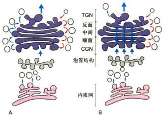  
图5-12 解释高尔基体结构组织及膜囊间蛋白质转运的两种可能模型  
A. 膜泡运输模型。B. 膜囊成熟模型。

## （二）高尔基体的功能

高尔基体的主要功能是将内质网合成的多种蛋白质进行加工、分类与包装，然后运送到细胞特定的部位或分泌到细胞外。内质网合成的脂质一部分也通过高尔基体向细胞质膜和溶酶体膜等部位转运。因此，高尔基体是细胞内大分子转运的枢纽或“集散地”。此外高尔基体还是细胞内糖类合成的工厂。

## 1. 高尔基体与细胞的分泌活动

早期的形态学观察结果就提示高尔基体可能与细胞分泌活动有关，但对这一功能的了解却经历了一个较长的认识过程。20世纪70年代初，L.G.Caro用 ${}^{1}\mathrm{H}-$ 亮氨酸对胰腺的腺泡细胞进行脉冲标记，发现在脉冲标记 $3\mathrm{min}$ 后，放射自显影银粒主要位于内质网； $20\mathrm{min}$ 后，银粒出现在高尔基体； $120\mathrm{min}$ 后则位于分泌泡并开始在细胞顶端释放。实验显示了分泌性蛋白在细胞内的合成与转运过程是通过高尔基体来完成的，后来的研究进一步发现，除分泌性蛋白外，多种细胞质膜上的膜蛋白、溶酶体中的酸性水解酶及胶原等胞外基质成分，其定向转运过程都是通过高尔基体完成的。

  
图5-13 发生在高尔基体TGN区的三条蛋白质分选途径。

作为蛋白质合成主要场所的糙面内质网常常同时合成多种蛋白质，高尔基体 TGN 区是蛋白质包装分选的关键枢纽，在这里至少有三条分选途径（图 5-13）：

(1) 溶酶体酶的包装与分选途径 具有 6-磷酸甘露糖（M6P）标记的溶酶体酶与相应膜受体结合，通过出芽方式形成网格蛋白/AP 包被膜泡，再转运至晚期内体 (late endosome)，在这里溶酶体酶（M6P 残基）与膜受体解离，受体返回再利用，溶酶体酶被释放到溶酶体。溶酶体中含有几十种酸性水解酶，它们在内质网上合成后进入高尔基体。溶酶体酶在内质网合成时已起始 N-连接的糖基化修饰，即把一个寡糖链共价结合到酶分子的天冬酰胺残基上。进入高尔基体膜囊后，在 N-乙酰葡糖胺磷酸转移酶和磷酸葡糖苷酶先后催化下，寡糖链中的甘露糖残基磷酸化生成 6-磷酸甘露糖。这种特异的反应，只发生在溶酶体的酶上，而不发生在其他的糖蛋白上，估计溶酶体酶本身的构象含有某种磷酸化的信号，如改变其构象则不能被识别也就不能形成 6-磷酸甘露糖。在高尔基体反面的膜囊上有结合 6-磷酸甘露糖的受体，由于溶酶体酶的多个位点上都可形成 6-磷酸甘露糖，从而大大增加了与受体的亲和力，这种特异的亲和力使溶酶体酶与其他蛋白质分离并起到局部浓缩的作用。在一种称为 1 细胞病 (inclusion cell disease) 的患者中，由于 N-乙酰葡糖胺磷酸转移酶单基因突变而不能合成 6-磷酸甘露糖，溶酶体的酶也就不能被受体识别，因而无法转运到溶酶体中。在内质网合成的蛋白质很多都是糖蛋白，而且这些蛋白质的糖链在高尔基体中经历十分复杂的修饰，于是人们猜测这种修饰作用可能与蛋白质在高尔基体的分选有关。然而用重组 DNA 技术证明，多种糖蛋白在去掉糖链后仍能正常地输送到细胞的特定部位，说明糖链在多数蛋白质的分选中并不起决定性的作用。上述溶酶体酶的分选途径可能仅是一种特例，况且也不是溶酶体酶唯一的分选途径，已发现在肝细胞中溶酶体酶还存在不依赖于 6-磷酸甘露糖的其他分选途径。

(2) 调节型分泌 (regulated secretion) 途径 特化类型的分泌细胞, 新合成的可溶性分泌蛋白在分泌泡聚集、储存并浓缩, 自在特殊刺激条件下才引发分泌活动。例如胰腺 β 细胞胰岛素储存在特殊分泌泡内, 当细胞应答血糖升高时才会分泌。在调节型分泌过程中, 分泌型蛋白例如促肾上腺皮质激素 (ACTH)、胰岛素和胰蛋白酶原等的分选进入调节型分泌泡似乎利用一种共同的机制。在合成 ACTH 的垂体肿瘤细胞中, 用重组 DNA 技术同时诱导胰岛素和胰蛋白酶原的合成, 正常情况下这些细胞并不表达胰岛素和胰蛋白酶原, 但诱导合成的这三种蛋白质却分别进入同样的调节型分泌泡, 当一种激素与垂体肿瘤细胞的受体结合并引起胞质中 Ca²⁺ 升高时, 则三种蛋白质一起被分泌。虽然并发症现有三种蛋白质具有共有氨基酸序列作为分选信号, 但明显具有某些共同特征发挥 “信号” 作用, 指导它们选择性进入调节型分泌泡。电镜观察的形态学证据表明, 调节型分泌途径是通过蛋白质选择性聚集而调控的, 而选择性聚集与特殊的离子条件 (pH 6.5 和 1 mmol/L Ca²⁺) 有某些关联。

(3) 组成型分泌 (constitutive secretion) 途径 所有真核细胞，均可通过分泌泡连续分泌某些蛋白质至细胞表面，特别是非极性细胞，该途径似乎不受调节，所以称为组成型分泌。在极性细胞，分泌蛋白和质膜膜蛋白被选择性分选到顶面或基底面质膜，这种分选形式可能涉及特殊信号介导。一个很有趣的实验显示了蛋白质在高尔基体分选及其转运的信息仅存在于编码这个蛋白质的基因本身。流感病毒和水疱性口炎病毒可同时感染上皮细胞，这两种有囊膜病毒的囊膜蛋白均在糙面内质网上合成，然后经高尔基体转运到细胞质膜上。流感病毒的囊膜蛋白特异性地转运到上皮细胞游离端的细胞质膜上，而水疱性口炎病毒的囊膜蛋白则转运到基底面的细胞质膜上。

目前，人们发现水疱性口炎病毒囊膜蛋白在由糙面内质网合成后进入高尔基体时，存在于细胞质基质一侧的双酸分选信号（Asp-X-Glu或DXE）起重要的作用，其他一些膜蛋白也具有这一信号序列，表明膜蛋白在由内质网向高尔基体转运时，也存在一种选择性的转运机制。但是在有极性的上皮细胞高尔基体TGN如何使质膜膜蛋白进入不同的转运膜泡被分选到顶端或基底面质膜，其分子机制仍然不太清楚。

## 2. 蛋白质的糖基化及其修饰

大多数蛋白质或膜脂的糖基化修饰和与高尔基体有关多糖的合成，主要发生在高尔基体。溶酶体酶类、质膜上大多数膜蛋白和可溶性分泌蛋白都是糖蛋白，修饰蛋白质侧链的寡糖链是在糙面内质网合成及其从内质网向高尔基体转运过程中发生一系列有序加工的结果。而细胞质基质和细胞核中绝大多数蛋白都缺少糖基化修饰，仅有的例外是某些转录因子和核孔复合体上发现的一些糖蛋白，但其糖基都比较简单。与细胞内DNA、RNA和蛋白质合成不同，糖蛋白中寡糖链的合成与修饰都没有模板，是依靠不同的糖基转移酶、在细胞的不同间隔中经历复杂的加工过程才完成的。这自然会使人们联想，真核细胞中普遍存在的蛋白质糖基化一定具有某些重要的生物学功能：①糖基化的蛋白质其寡糖链具有促进蛋白质折叠和增强糖蛋白稳定性的作用。用衣霉素（tunicamycin）阻断蛋白质糖基化，在糙面内质网合成的多肽，如分泌的抗体IgG或分选到质膜上的糖蛋白如血凝素，由于缺少糖基侧链不能正确折叠而滞留在内质网中。虽然很多糖蛋白的分选与行使其功能并非需要糖基化的修饰，例如成纤维细胞所分泌的纤连蛋白(fibronectin)的数量与速率不受蛋白质糖基化与否的影响，但是糖基化的FN比未糖基化的FN对组织蛋白酶有更强的抗性，提示糖基化增强了糖蛋白的稳定性。②蛋白质糖基化修饰使不同蛋白质携带不同的标志，以利于在高尔基体进行分选与包装，同时保证糖蛋白从糙面内质网至高尔基体膜囊单向转移。目前所知，M6P即作为溶酶体酶分选和包装的指导信号。③鉴于细胞内一些负责糖链合成与加工的酶类均由严格意义上的管家基因所编码，如多萜醇二磷酸寡糖基转移酶、甘露糖蛋白GlcNAc转移酶、α-葡糖苷酶II的α亚基，这些蛋白质的编码基因被敲除后会导致胚胎致死。另外，细胞表面、细胞外基质密集存在的寡糖链，可通过与另一个细胞表面的凝集素(lectin)之间发生特异性相互作用，直接介导细胞间的双向通信，或参与分化、发育等多种过程。④多羟基糖侧链还可能影响蛋白质的水溶性及蛋白质所带电荷的性质，如哺乳动物细胞表面常常带有负电荷，显然与膜上糖蛋白末端唾液酸残基的存在有关。

考虑到寡糖链具有比核酸和多肽更大的潜在信息编码容量，作为分子标志之一可能还有其他重要作用，如参与机体细胞间识别，以及宿主细胞与病原微生物之间的识别。典型的例证是ABO血型抗原的许多决定簇是红细胞表面的不同结构的糖链，被抗糖抗体特异性识别，具有重要临床价值。目前对蛋白质糖基化生物学意义的了解还不够深入，有些学者从演化的角度提出，糖链的复杂加工可能是在演化过程中逐步产生的。因为寡糖链具有一定的刚性，从而限制了其他大分子接近细胞表面的膜蛋白，这就可能使真核细胞的祖先具有一个保护性的外被，同时又不像细胞壁那样限制细胞的形状与运动。

N-连接的糖基化反应起始发生在糙面内质网，一个由14个糖残基的寡糖链从供体磷酸多萜醇上转移至新生肽链的特定三肽序列（Asn-X-Ser 或 Asn-X-Thr，其中X是除Pro以外的任何氨基酸）的天冬酰胺残基上。因此，所有的N-连接的寡糖链都有一个共同的前体，在糙面内质网以及在通过高尔基体各膜囊间隔的转移过程中，寡糖链经过一系列加工、切除和添加特定的单糖，最后形成成熟的糖蛋白。所有成熟的N-连接的寡糖链都含有2个N-乙酰葡糖胺和3个甘露糖残基。根据其结构特征又可分为高甘露糖N-连接寡糖（high mannose N-linked oligosacchiride）和复杂的N-连接寡糖（complex N-linked oligosacchiride），前者只含有N-乙酰葡萄糖和甘露糖，后者除此之外还含有岩藻糖、半乳糖和唾液酸，二者可能分别存在于不同种类的糖蛋白中，也可能存在于同一条肽链的不同位点上。

O-连接的糖基化是在高尔基体中进行的。由不同的糖基转移酶催化，每次加上一个单糖。同复杂的N-连接的糖基化一样，最后一步是加上唾液酸残基，这一反应发生在高尔基体反面膜囊和TGN中，至此完成全部糖基的加工与修饰。多数的糖蛋白在10 min内便可从高尔基体分选到其它靶位点。

内质网和高尔基体中所有与糖基化及寡糖加工有关的酶都是整合膜蛋白。它们固定在细胞的不同间隔中，其活性部位均位于内质网或高尔基体的腔面。在高尔基体中，其反应底物核苷酸单糖（nucleotide sugar）通过载体蛋白介导的反向协同运输方式从细胞质基质转运到高尔基体囊腔内。在不同的膜囊间隔中，膜上的载体蛋白也有所不同，以维持腔内特定反应底物的浓度。

用电镜放射自显影的方法或不同的寡糖链合成的抑制剂，可显示在内质网和高尔基体各间隔中寡糖合成的活性。如用 ${}^{3}$ H-甘露糖进行脉冲标记，标记物集中在糙面内质网上，用 ${}^{3}$ H-岩藻糖或 ${}^{3}$ H-半乳糖标记，则标记物集中在高尔基体的反面囊膜中。进一步分析证明半乳糖苷转移酶位于高尔基体反面膜囊，唾液酸转移酶定位于高尔基体反面膜囊和 TGN。因此寡糖链的合成与加工非常像在一条装配流水线上，糖蛋白从细胞器的一个间隔输送到另一个间隔，固定在间隔内测上的一套排列有序的酶系，依次进行一道道加工，前一个反应的产物又作为下一个反应的底物，确保只有加工过的底物才能进入下一道工序（图 5-14）。

细胞中还有一类重要的糖蛋白，即蛋白聚糖

## 图5-14脊椎动物细胞糖蛋白 $N-$ 连接寡糖在高尔基体各膜囊区间的加工过程

N-连接寡糖的核心糖基是在内质网装配然后转移到的高尔基体的。N-连接寡糖的进一步加工修饰在高尔基体完成：1. 在顺面膜囊切除3个Man残基；2. 在中间膜囊，再附加3个GlcNAc残基；3. 移除2个Man残基；5. 附加1个海藻糖残基；6. 在反面膜囊，再加3个半乳糖残基；7. 最后每个半乳糖残基连上1个N-乙酰神经氨酸残基，完成N-连接寡糖的加工。

(proteoglycan)，也在高尔基体完成组装的。它是由一个或多个糖胺聚糖（glycosaminoglycan）结合到核心蛋白的丝氨酸残基上，与一般 $O-$ 连接寡糖不同，直接与丝氨酸羟基结合的不是 $N-$ 乙酰半乳糖胺而是木糖(xylose)。蛋白聚糖多为胞外基质的成分，有些也整合在细胞质膜上，很多上皮细胞分泌的保护性黏液常常是蛋白聚糖和高度糖基化的糖蛋白的混合物。

在植物细胞中，高尔基体合成和分泌多种多糖，它们至少含12种以上的单糖，多数多糖呈分支状且有很多共价修饰，远比动物细胞复杂得多，估计构成植物细胞典型初生壁的过程就涉及数百种酶。除少数酶共价结合在细胞壁上外，多数酶都存在于内质网和高尔基体中。其中一个例外是多数植物细胞的纤维素是由细胞质膜外侧的纤维素合成酶合成的。对糖脂研究的资料不多，但已有的证据表明，糖脂的糖侧链也是以与糖蛋白相同的途径和方式合成与加工的，最后由高尔基体转运到溶酶体膜或细胞质膜上。

## 3. 蛋白酶的水解和其他加工过程

有些多肽，如某些生长因子和某些病毒囊膜蛋白，在糙面内质网中切除信号肽后便成为有活性的成熟多肽。还有很多肽激素和神经肽（neuropeptide）当转运至高尔基体的TGN或TGN所形成的分泌泡中时，在与TGN膜相结合的蛋白水解酶作用下，经特异性水解（常常发生在与一对碱性氨基酸相邻的肽键上）才成为有生物活性的多肽。

不同的蛋白质在高尔基体中酶解加工的方式各不相同，可归纳为以下几种类型：

（1）没有生物活性的蛋白原（proprotein）进入高尔基体后，将蛋白原N端或两端的序列切除形成成熟的多肽。如胰岛素、胰高血糖素及血清蛋白（如白蛋白等）这是一种比较简单的蛋白质加工形式。

（2）有些蛋白质分子在糙面内质网合成时是含有多个相同氨基酸序列的前体，然后在高尔基体中被水解形成同种有活性的多肽，如神经肽。

(3) 一个蛋白质分子的前体中含有不同的信号序列，最后加工形成不同的产物；有些情况下，同一种蛋白质前体在不同的细胞中可能以不同的方式加工，产生不同种类的多肽，这样大大增加了细胞信号分子的多样性。不同的多肽采用不同的加工方式，推测其原因是：①有些多肽分子太小，在核糖体上难以有效地合成，如仅由5个氨基酸残基组成的神经肽；②有些可能缺少包装并转运到分泌泡中的必要信号；③更重要的是可以有效地防止这些活性物质在合成它的细胞内提前发挥作用。假如胰岛素在糙面内质网中合成后便具有生物活性，那么它很可能与内质网膜上的受体结合启动错误的反应。胰岛素即使进入分泌泡后也不会与受体结合，因为它仅在 pH 7 左右的条件下与受体结合，而储存胰岛素的分泌泡中 pH 为 5.5。

硫酸化作用也在高尔基体中进行的，硫酸化反应的硫酸根供体是3'-磷酸腺苷-5'-磷酸硫酸(3'-phosphoadenosine-5'-phosphosulfate, PAPS)，它从细胞质基质中转入高尔基体膜囊内，在酶的催化下，将硫酸根转移到肽链中酪氨酸残基的羟基上。硫酸化的蛋白质主要是蛋白聚糖。

## 三、溶酶体的结构与功能

与其他细胞器不同，发现溶酶体的最早证据不是来自形态观察，而是在用差速离心法分离细胞组分时获得的。1949年，C.de Duve将大鼠肝组织匀浆，并对其中各种细胞器进行分级分离，以期找出哪些细胞器与糖代谢的酶有关。在测定作为对照的酸性磷酸酶活性时，发现酶的活性主要存在于线粒体组分中。但实验结果却出现了一些反常的现象，如蒸馏水提取物中酶的活性比在蔗糖渗透平衡液抽提物中酶的活性高。放置一段时间的抽提物比新鲜制品中的酶活性高，而且酶活性与沉淀物线粒体无关。随后又发现其他几种水解酶也有类似的现象，从而推测在线粒体组分中还存在另一种新的细胞器。1955年，de Duve与Novikoff合作首次用电子显微镜证明了溶酶体的存在。

## （一）溶酶体的形态结构与类型

溶酶体（lysosome）是单层膜围绕、内含多种酸性水解酶类的囊泡状细胞器，其主要功能是行使细胞内的消化作用。溶酶体在维持细胞正常代谢活动及防御等方面起着重要作用，特别是在病理学研究中具有重要意义，因此越来越引起人们的高度重视。

溶酶体几乎存在于所有的动物细胞中，植物细胞内也有与溶酶体功能类似的细胞器，如圆球体、糊粉粒及中央液泡等。典型的动物细胞约含数百个溶酶体，但在不同的细胞内溶酶体的数量和形态有很大差异，即使在同一种细胞中溶酶体的大小、形态也有很大变化，这主要与溶酶体处于不同生理功能阶段相关。

溶酶体是一种异质性的（heterogeneous）细胞器，这是指不同溶酶体的形态大小，甚至其中所含水解酶的种类都可能有很大的不同。根据溶酶体处于完成其生理功能的不同阶段，大致可分为初级溶酶体（primary lysosome）、次级溶酶体（secondary lysosome）和残质体（residual body）。

初级溶酶体呈球形，直径 $0.2\sim 0.5\mu \mathrm{m}$ ，内容物均一，不含有明显的颗粒物质，外面由一层脂蛋白膜围绕（图5-15）。溶酶体含多种酸性水解酶类，如蛋白酶、核酸酶、糖苷酶、酯酶、磷脂酶、磷酸酶和硫酸酶，酶的最适 $\mathsf{pH}$ 为5.0左右。若将氢氧化氨或氯奎(chloroquine）等可透过细胞膜的碱性物质加入细胞培养液中，致使溶酶体内 $\mathsf{pH}$ 提高至7.0左右，则导致溶酶体酶失活。

溶酶体膜在成分上也与其他生物膜不同：①嵌有质子泵，利用ATP水解释放的能量将 $H^{+}$ 泵入溶酶体内，使溶酶体中的 $H^{+}$ 浓度比细胞质中高100倍以上，以形成和维持酸性的内环境；②具有多种载体蛋白用于水解产物向外转运；③膜蛋白高度糖基化，可能有利于防止自身膜蛋白的降解，以保持其稳定。

目前已发现60余种溶酶体酶，多数为可溶性酶，有些整合在溶酶体膜上。溶酶体酶本身的结构能抵御酸变性的作用。对已知的溶酶体酶的一级结构进行分析发现它们具有某些特征性同源序列。此外，发现催化相关反应的某种溶酶体酶和非溶酶体酶之间蛋白质一级结构非常相似，与低等真核生物及原核生物的有关酶也具相似性。显然，溶酶体酶与相关的非溶酶体酶是一类结构与功能上相似的酶家族，在分子演化上可能具有共同的起源。

次级溶酶体是初级溶酶体与细胞内的自噬泡或异噬泡（胞饮泡或吞噬泡）融合形成的进行消化作用的复合体，分别称之为自噬溶酶体（autophagolysosome）和异噬溶酶体（heterophagic lysosome）。电镜观察显示次级溶酶体内部结构复杂多样，含有多种生物大分子、颗粒、膜片甚至某些细胞器，因此次级溶酶体形态不规则，大者直径可达几个微米。次级溶酶体内经历消化后，小分子物质可通过膜上载体蛋白转运到细胞质基质中，供细胞代谢利用，未被消化的物质残存在溶酶体内形成残质体或称后溶酶体。残质体可通过类似胞吐的方式将内容物排出细胞。

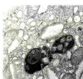  
次级溶酶体

  
图 5-15 小鼠膀胱上皮细胞中的溶酶体（梁凤霞博士惠赠）

根据溶酶体的标志酶反应，可辨认出不同形态与大小的溶酶体。酸性磷酸酶（acid phosphatase）是常用的标志酶，用这种方法不仅有助于研究溶酶体的发生与成熟过程，而且还发现了多泡体等多种类型的溶酶体。溶酶体可看作是以含有大量酸性水解酶为共同特征，有不同形态大小，执行不同生理功能的一类异质性的细胞器。少量的溶酶体酶泄露到细胞质基质中，并不会引起细胞损伤，其主要原因是细胞质基质中的pH为7.0左右，在这种环境中溶酶体酶的活性大大降低。此外，在酵母细胞质中已发现一些蛋白质可以特异地与溶酶体酶结合而使其丧失活性。植物细胞的液泡中含有多种水解酶类，具有与动物细胞溶酶体类似的功能，一般液泡约占细胞总体积的30%以上，但在不同细胞中液泡体积从 $5\%$ 直至 $90\%$ 不等。除此之外，液泡还具有储存营养与废物、调节细胞体积增长及细胞膨压等多种作用。

## （二）溶酶体的功能

溶酶体的基本功能是细胞内的消化作用，这对于维持细胞的正常代谢活动及防御微生物的侵染都有重要的意义。溶酶体的消化作用一般可概括成三种途径，每种途径都将导致不同来源的物质在细胞内被消化（图5-16）。

## 1. 消化由胞吞作用进入细胞的内容物

细胞需要从周围环境中获取自己生长所需的营养物质，其中葡萄糖、氨基酸和一些小分子物质可以通过细胞膜上的转运系统进入细胞后直接利用，而另外一些如细胞的膜组分、胞外基质以及其他被吞噬的物质等，则需要通过胞吞作用包裹在胞吞泡中，经溶酶体途径加以消化后才能利用。对于细胞凋亡而产生的有膜包裹的碎片也会被周围的细胞所吞噬，然后经溶酶体消化。在这些事件中溶酶体就相当于细胞的消化器官，将细胞胞吞的内容物降解成小分子物质供细胞利用。很多单细胞真核生物如黏菌、变形虫等靠吞噬细菌和某些真核微生物而生存，其溶酶体的消化作用就显得更为重要。当基因突变导致溶酶体酶缺失或产生溶酶体酶功能异常时，其底物不能被水解而积留在溶酶体中，结果会导致代谢紊乱，引起疾病。对衰老细胞的清除主要是由巨噬细胞完成，如红细胞衰老时，细胞膜骨架发生改变，导致细胞韧性的改变，而不能进入比其直径更小的毛细血管中。同时细胞表面糖链中的唾液酸残基脱落，暴露出半乳糖残基，从而被巨噬细胞识别并捕获，进而被吞噬和降解。

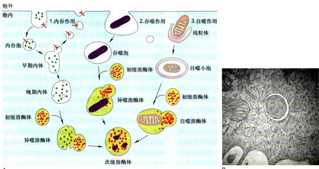  
图5-16 溶酶体的消化作用

## 2. 细胞自噬与生物大分子、损伤的细胞器的降解

在真核细胞中，一些生物大分子、损伤或折叠错误的蛋白质、损伤的细胞器等需要清除。对于定位于细胞质基质中的快速周转蛋白（如与细胞周期调控相关的激酶），其清除方式通常采用如前所述的泛素依赖的蛋白酶体降解途径，而一些半寿期较长的蛋白也可通过细胞自噬介导的溶酶体降解途径。对于一些受损或需要淘汰的细胞器，如线粒体、内质网和过氧化物酶体等，通常采用自噬降解途径。

细胞自噬（auotophagy）是自噬相关基因（autophagy-related gene, Atg）调控下对细胞内受损或需要淘汰的物质进行再利用的过程。该过程中一些受损的蛋白质或细胞器被双层膜结构的自噬小泡包裹，并与溶酶体（动物中）或液泡（酵母和植物中）融合，将内容物降解后循环利用。在大多数细胞中，细胞自噬只维持在很低的水平，以维持细胞结构的正常更新和内环境的稳定。但当外界环境发生变化，如营养物质缺乏时，细胞的自噬作用增强，以为细胞提供生存所必需的小分子物质和能量。

细胞自噬主要有微自噬（microautophagy）、巨自噬（macrautophagy）和分子伴侣介导的自噬（chaperone-mediated autophagy，CMA）三种形式。微自噬是指溶酶体或者液泡的膜直接内陷，将细胞质基质中的物质包裹进入溶酶体腔，并降解的过程。巨自噬也称大自噬，即通常所说的自噬，是细胞在相关信号的刺激下，底物蛋白或细胞器被一种双层膜的结构包裹，形成直径400\~900 nm大小的自噬小泡（autophagosome），自噬小泡的外膜与溶酶体膜融合，释放所包裹的底物到溶酶体降解的过程。CMA是指溶酶体通过Hsp70等分子伴侣识别并结合带有“KFERQ”氨基酸序列的底物蛋白进行降解的过程，CMA不仅在持续饥饿状态下为细胞提供能量，还在氧化性损伤保护、维持细胞内环境稳定等方面发挥作用。

在自噬信号的刺激下，细胞利用内质网、线粒体或高尔基体等细胞器的膜形成一种称为分离膜(phagephore)的双层膜结构。该结构不断延伸并最后将胞浆成分包裹形成自噬体，并与溶酶体融合形成自噬溶酶体（autolysosome），将内容物降解利用。日本学者大隅良典利用酵母突变体鉴定了一批对自噬过程至关重要的自噬相关基因，自噬过程是由这些基因编码的蛋白质和蛋白质复合物所控制的。每种蛋白质负责调控自噬体启动与形成的不同阶段。

细胞自噬涉及细胞结构组分的降解和小分子物质的再利用，能在细胞饥饿时快速提供能量并更新受损的细胞结构，也能在病原微生物侵染细胞时发挥作用。细胞自噬相关基因的变异可能与帕金森病、肿瘤等人类疾病相关。

## 3. 防御功能

防御功能是某些细胞特有的功能，它可以识别并吞噬入侵的病毒或细菌，在溶酶体作用下将其杀死并进一步降解。动物有几种吞噬细胞（phagocyte），位于肝、脾和其他血管通道中，用以清除抗原抗体复合物及吞噬的细菌、病毒等入侵者，同时也不断清除衰老死亡的细胞和血管中颗粒物质。当机体被感染后，单核细胞（monocyte）迁移至感染或发炎的部位，分化成巨噬细胞，巨噬细胞中溶酶体非常丰富，溶酶体酶与溶酶体所含过氧化氢、超氧化物（ $\mathrm{O}_2$ ）等共同作用杀死细菌，电镜下巨噬细胞内常可见较多残质体，这也可能是为什么巨噬细胞的寿命只有1\~2天的缘故。某些病原体被细胞摄入，进入吞噬泡但未被杀死，如麻风分枝杆菌（Mycobacterium leprae）、利什曼原虫（Leishmania）等，它们可在巨噬细胞的吞噬泡中繁殖，其原因主要是通过抑制吞噬泡的酸化从而抑制了溶酶体酶的活性。某些病毒借助受体介导的细胞内吞作用而侵入宿主细胞，它们巧妙地利用内体中的酸性环境将病毒核衣壳释放到细胞质中，如在细胞培养液中加入氢氧化铵或氯奎等碱性试剂，将内吞泡中的pH提高至7.0左右，则病毒虽然能进入细胞，但不能将其核衣壳从内体中释放到细胞质基质中，因而也就不能在细胞中繁殖。在免疫细胞中，溶酶体还参与抗原的处理，外源性抗原被细胞摄取，经溶酶体降解产生小肽，然后递呈至细胞表面供 $\mathrm{CD}_4^+$ 细胞识别。

## （三）溶酶体的发生

如前所述，溶酶体酶是在糙面内质网上合成并经N-连接的糖基化修饰，然后转至高尔基体，在高尔基体的顺面膜囊中寡糖链上的甘露糖残基被磷酸化形成6-磷酸甘露糖（M6P），并与存在于高尔基体的反面膜囊和TGN膜上的M6P受体结合，使溶酶体酶得以浓缩富集，最后以出芽的方式形成网格蛋白/AP包被膜泡转运到溶酶体中。

溶酶体酶甘露糖残基的磷酸化先后由两种酶催化：一种是N-乙酰葡糖胺磷酸转移酶（N-acetylglucosamine phosphotransferase, GlcNAc-P-transferase）；另一种是磷酸葡糖苷酶（phosphoglycosidase）。当溶酶体酶进入高尔基体的顺面膜囊后，N-乙酰葡糖胺磷酸转移酶将单糖三核苷酸UDP-GlcNAc上的GlcNAc-P转移到高甘露糖寡糖链上的α-1,6甘露糖残基上，再将第二个GlcNAc-P加到α-1,3的甘露糖残基上，接着在高尔基体中间膜囊中磷酸葡糖苷酶除去末端的GlcNAc暴露出磷酸基团，形成M6P标志。上述反应涉及磷酸转移酶如何从内质网转入高尔基体的多种蛋白质中识别溶酶体酶，现已确定溶酶体酶分子中存在识别信号。这种信号不是肽链某些一级结构序列而是依赖于溶酶体酶的构象或三级结构形成的信号斑（signal patch）。

多数溶酶体酶分子上具有多个 $N-$ 连接的寡糖链，一旦GlcNAc-磷酸转移酶识别了溶酶体酶的信号斑后，在每条寡糖链上便可形成多个M6P残基。溶酶体酶与GlcNAc-磷酸转移酶的识别位点的结合，其亲和常数为 $K_{\mathrm{a}} = 10^{5}\mathrm{L / mol}$ ，在高尔基体TGN区，含有多个M6P的溶酶体酶与M6P受体结合，其亲和常数高达 $K_{\mathrm{a}} = 10^{9}\mathrm{L / mol}$ ，前后对比放大了10000倍。在高尔基体TGN中，M6P受体常集中地分布在某些TGN膜区，从而使溶酶体酶与其他的蛋白质分离并起到局部浓缩的作用，保证了它们以出芽的方式向溶酶体转移。M6P受体有两种，其中之一是依赖 $\mathrm{Ca^{2 + }}$ 的受体，它同样也是胰岛素类生长因子II的受体，该受体在pH7.0左右时与M6P结合，而pH6.0以下则与M6P分离。

在 TGN 形成的转移小泡首先将溶酶体酶转运到前溶酶体（prelyssosome）中，有人认为前溶酶体是载有溶酶体酶的脱包被的转运膜泡与每期内体融合形成的。前溶酶体的基本特征是脂蛋白膜上具有质子泵，腔内呈酸性，pH 6.0 左右。用抗 M6P 受体的抗体进行免疫标记，显示 M6P 受体存在于高尔基体的 TGN 和前溶酶体（晚期内体）膜上，但不存在于溶酶体膜上。如用弱碱性试剂处理体外培养细胞，则 M6P 受体从高尔基体的 TGN 上消失而仅存在于前溶酶体膜上，该结果提示，M6P 受体穿梭于高尔基体和前溶酶体之间。在高尔基体的中性环境中，M6P受体与M6P结合，进入前溶酶体的酸性环境中后，M6P受体与M6P分离，并返回高尔基体。同时在前溶酶体中，溶酶体酶M6P去磷酸化，使M6P受体与之彻底分离。在高尔基TGN中，包装溶酶体酶的转运膜泡是网格蛋白/AP包被膜泡，但出芽后很快便脱包被，转运至晚期内体并与之融合。溶酶体的发生及其转运过程见图5-17所示。

溶酶体酶的M6P特异标志是目前研究高尔基体分选机制中较为清楚的一条途径。然而这一分选体系的效率似乎不高，一部分含有M6P标志的溶酶体酶会通过运输小泡直接分泌到细胞外。在细胞质膜上，存在依赖于 $\mathrm{Ca^{2+}}$ 的M6P受体，它同样可与胞外的溶酶体酶结合，在网格蛋白/AP协助下通过受体介导的内吞作用，将敲送至前溶酶体中，M6P受体也同样可返回细胞质膜，循环使用。分泌到细胞外的溶酶体酶多数以酶前体的形式存在且具有一定的活性，但蛋白酶是一例外，其前体没有活性。蛋白酶需要进一步切割与加工才能成为有活性的蛋白酶，这一过程是否发生在前溶酶体或溶酶体中，尚不清楚。

已发现在正常淋巴细胞中，如在细胞毒性T细胞和天然杀伤细胞的溶酶体中，既含有溶酶体酶也含有水溶性蛋白穿孔素（perforin）和粒酶（granzyme），溶酶体酶是通过依赖于M6P的途径进入溶酶体，而后者是通过不依赖M6P的途径进入溶酶体。当细胞受到外界信号刺激后，这类溶酶体会象分泌泡一样释放内含物，杀伤靶细胞，因此又称这类溶酶体为分泌溶酶体（secretory lysosome）。

在溶酶体中，除可溶性水解酶外，还有一些是结合在膜上的酶，如葡糖脑苷脂酶（glucocerebrosidase），此外还有溶酶体膜上的特异膜蛋白，这些膜蛋白也是在内质网上合成，经高尔基体加工与分选的。M6P标志的作用是把可溶性的蛋白质结合在特异膜受体上，因此溶酶体的膜蛋白就无需M6P化，但这些膜蛋白如何同其他蛋白质区分开来而特异地分选到溶酶体膜上，其机制尚不清楚。实际上，溶酶体的发生可能是多种途径的复杂过程。不同种类的细胞可能采取不同的途径，同一种细胞也可能有不同的方式，甚至某些酶还可能通过不同的渠道进入溶酶体中，如酸性磷酸酶合成时是一种跨膜蛋白，它并不涉及M6P途径，而像其他膜蛋白那样经高尔基体转运到细胞表面，随后依赖于胞质侧部分酪氨酸残基信号，从细胞表面再转运到溶酶体，在胞质中巯基蛋白酶和溶酶体中天冬氨酸蛋白酶的作用下成为可溶性的酶。溶酶体酶的加工常常发生在它们进入溶酶体以后，不同种酶的加工方式也各自不同，然而有些加工，如糖侧链的部分水解，可能是溶酶体内特定环境造成的，对酶的活性并非必要。

  
图5-17 溶酶体酶转运示意图  
1. 具有 M6P 标记的溶酶体酶在高尔基体的 TGN 与膜受体结合，形成网格蛋白/接头蛋白包被膜泡；2. 包被复合物解聚，形成转运膜泡；3. 转运膜泡与晚期内体融合；4. 磷酸化的酶与 M6P 受体解离，形成溶酶体，2a 和 4a 表示包被蛋白和 M6P 受体可再循环利用；5. 某些受体可转运到细胞表面，磷酸化的溶酶体酶偶尔也会通过组成型分泌途径转运到细胞表面或分泌到细胞外；6—8. 分泌的酶通过受体介导的内存作用被回收。

## （四）溶酶体与疾病

溶酶体是细胞内消化的主要场所，由于遗传缺陷致使溶酶体中缺乏某种水解酶，导致相应的底物不能被降解而积蓄在溶酶体内。溶酶体过载和代谢紊乱引起溶酶体贮积症（lysosomal storage disease），例如泰-萨克斯病（Tay-Sachs disease）就是因为己糖胺酶A的先天性缺失，从而不能有效降解神经节苷脂GM2，结果导致患儿智力迟钝、失明，一般在2\~6岁死亡。还有一些其他类型的溶酶体贮积症，也是由于相关溶酶体酶的缺失，引起底物贮积造成的。另一个案例是I细胞病（inclusion-cell disease），其主要病因不是由于酶的生成障碍，而是由于N-乙酰氨基葡糖磷酸转移酶缺乏，M6P信号缺失，致使异常转运不能进入溶酶体而分泌进入血液，结果底物在溶酶体内积蓄形成很大的包涵体。此外，由于不同因素引起溶酶体膜稳定性下降，导致溶酶体水解酶类外溢，也可导致与溶酶体相关的疾病发生，如硅肺、类风湿性关节炎。

## （五）过氧化物酶体

过氧化物酶体（peroxisome）又称微体（microbody），是由单层膜围绕的内含一种或几种氧化酶类的细胞器（图5-18）。1954年J.Rhodin首次在鼠肾的肾小管上皮细胞中观察到这种细胞器。

由于过氧化物酶体在形态大小及降解生物大分子等功能上与溶酶体类似，是一种异质性的细胞器，其确切的生理功能在发现后的相当一段时间内都不清楚，因此人们把它看作是某种特殊溶酶体。直至20世纪70年代才逐渐确认，过氧化物酶体是一种与溶酶体完全不同的细胞器。它普遍地存在于所有动物细胞和很多植物细胞中。早年以大鼠肝组织及种子植物的种子作为研究过氧化物酶体的实验材料。近些年来，人们从几种酵母菌

过氧化物酶体

  
图 5-18 鼠肝细胞超薄切片所显示的过氧化物酶体和其他细胞器如线粒体等

及成纤维细胞中筛选出一系列过氧化物酶体缺陷突变株，进而克隆了20多种与过氧化物酶体发生相关的基因（称Pex基因，对应的蛋白质称peroxin），从而对该细胞器结构、功能及其发生过程有了进一步了解。

## 1. 过氧化物酶体与溶酶体的区别

过氧化物酶体和初级溶酶体的形态与大小类似，但过氧化物酶体中高浓度的尿酸氧化酶等常形成晶格状结构，因此可作为电镜识别的主要特征。此外，这两种细胞器在成分、功能及发生方式等方面都有很大的差异，详见表5-2所示。

## 2. 过氧化物酶体的功能

过氧化物酶体是一种异质性细胞器，不同生物的细胞中，甚至单细胞生物的不同个体中所含酶的种类及其行使的功能都有所不同。如在含糖培养液中生长的酵母细胞内过氧化物酶体的体积很小；但当它生长在含甲醇培养液中时，其体积增大、数量增多，可占细胞质体积的80%以上，并能氧化甲醇；当酵母生长在含脂肪酸培养基中，则过氧化物酶体非常发达，并可把脂肪酸分解成乙酰辅酶 A 供细胞利用。

对动物细胞过氧化物酶体的功能了解很少，已知在肝细胞或肾细胞中，它可氧化分解血液中的有毒成分，起到解毒作用，例如饮酒后几乎半数的酒精是在过氧化物酶体中被氧化成乙醛的。

过氧化物酶体是真核细胞中直接利用分子氧的细胞器，其中常含有两种酶：一是依赖于黄素（FAD）的氧化酶，其作用是将底物氧化降解，并产生 $H_{2}O_{2}$ ；二是过氧化氢酶，其含量常占过氧化物酶蛋白质总量的40%，它的作用是将 $H_{2}O_{2}$ 分解，形成水和氧气。由这两种酶催化的反应，相互偶联，从而使细胞免受 $H_{2}O_{2}$ 的毒害。氧化酶和过氧化氢酶之间可以形成一个简单的呼吸链，但不起能量转换的作用。

过氧化物酶体可降解生物大分子，最终产生 $H_{2}O_{2}$ ，其中多数反应也可在其他细胞器中进行，但并不产生 $H_{2}O_{2}$ 。因此有的学者提出，过氧化物酶体另一种功能是分解脂肪酸等高能分子向细胞直接提供热能，而不必通过水解ATP的途径获得能量。在植物细胞中过氧化物酶体起着重要的作用。一是在绿色植物叶肉细胞中，它催化 $CO_{2}$ 固定反应的副产物的氧化，即所谓光呼吸作用，将光合作用的副产物乙醇酸氧化为乙醛酸和过氧化氢；二是在种子萌发过程中，过氧化物酶体降解储存在种子中的脂肪酸产生乙酰辅酶A，并进一步形成琥珀酸，后者离开过氧化物酶体进一步转变成葡萄糖。因上述转化过程伴随着一系列称为乙醛酸循环的反应，因此又将这种过氧化物酶体称为乙醛酸循环体(glyoxysome)。在动物细胞中没有乙醛酸循环反应，因此动物细胞不能将脂肪中的脂肪酸转化成糖。

近年来，越来越多与过氧化物酶体相关的疾病被发现，主要有各型肾上腺脑白质营养不良（adreno-leukodystrophy)，脑肝肾综合征（Zellweger病，一种遗传病)，婴儿儿型Refsum病，高六氢吡啶羧酸血症（hyperpipecolicacidemia），肢近端型点状软骨发育不良（rhizomelic chondrodysplasiapunctata）等。

表 5-2 过氧化物酶体与初级溶酶体的特征比较

<table><tr><td>特征</td><td>溶酶体</td><td>过氧化物酶体</td></tr><tr><td>形态大小</td><td>多呈球形,直径  ${0.2} \sim  {0.5\mu }\mathrm{m}$  ,无酶晶体</td><td>球形,哺乳动物细胞中直径多在  ${0.15} \sim  {0.25\mu }\mathrm{m}$  ,内常有酶的晶体</td></tr><tr><td>酶种类</td><td>酸性水解酶</td><td>含有氧化酶类</td></tr><tr><td>pH</td><td>5 左右</td><td>7 左右</td></tr><tr><td>是否需  ${\mathrm{O}}_{2}$ </td><td>不需要</td><td>需要</td></tr><tr><td>功能</td><td>细胞内的消化作用</td><td>多种功能</td></tr><tr><td>发生</td><td>酶在糙面内质网合成,经高尔基体出芽形成</td><td>酶在细胞质基质中合成,经组装与分裂形成</td></tr><tr><td>识别的标志酶</td><td>酸性水解酶等</td><td>过氧化氢酶</td></tr></table>

## 3. 过氧化物酶体的发生

过氧化物酶体的发生过程既不同于线粒体或叶绿体，也有别于溶酶体。过氧化物酶体中不含DNA，组成过氧化物酶体的膜蛋白和可溶性基质蛋白均由细胞核基因编码，主要在细胞质基质中合成，然后分选转运到过氧化物酶体中。现在已知，过氧化物酶体的发生有两种途径：一是细胞内已有的成熟过氧化物酶体经分裂增殖而产生子代细胞器；二是在细胞内从头开始组装（de novo）。过氧化物酶体的组装包括3个阶段（图5-19）：①过氧化物酶体的装配起始于内质网。在那里，Pex3和Pex16等在内质网膜上合成，并被插入到膜上，它们再招募Pex19并形成一个特殊的区域，然后由内质网出芽形成过氧化物酶体的前体。这种过氧化物酶体的前体可以相互之间或是与已经存在的过氧化物酶体融合，以使之生长成较大的体积或为以后的分裂做准备。在这个特殊的膜泡上，Pex19蛋白作为过氧化物酶体膜蛋白靶向序列的胞质受体而发挥作用，一些在细胞质游离核糖体上合成的过氧化物酶体的其他膜蛋白可以通过自己所带的靶向序列与Pex19结合，并在Pex3和Pex16等的帮助下插入到该细胞器的膜上，待所有过氧化物酶体膜蛋白都插入后，便形成了过氧化物酶体雏形（peroxisomal ghost），为基质蛋白输入提供基础。②具有过氧化物酶体引导信号1（peroxisomal targeting signal 1, PTS1）和PTS2的基质蛋白，它们分别以Pex5和Pex7为胞质受体，各自靶向序列与相应受体结合后再与膜受体（Pex14）结合。在过氧化物酶体的膜上，有一种至少由6种peroxin组装而成的易位体(translocator)，具有过氧化物酶体引导信号的蛋白质或寡聚体被Pex5或Pex7识别，并与Pex14结合后，通过易位体进入过氧化物酶体的腔内。与蛋白质进入内质网、线粒体或叶绿体不需要的是，这种方式进入过氧化物酶体的蛋白体不需要将多肽链展开就能与胞质受体如Pex5一起进入腔内，即便是直径较大的寡聚体。Pex5等胞质受体与过氧化物酶体蛋白一起进入以后便将货物释放，并回到细胞质内重复使用。这一过程由定位于过氧化物酶体膜上的蛋白复合物（Pex10、Pex12和Pex2）介导完成。基质蛋白输入产生成熟的过氧化物酶体。③成熟的过氧化物酶体经分裂产生子代过氧化物酶体，分裂过程依赖于Pex11蛋白。

与Pex5等胞质受体结合的蛋白质进入过氧化物酶体的机制还没有完全研究清楚，但有一点可以肯定，由peroxin组装而成的易位体的孔径是动态可调的，并且只有在货物通过时开启，以适应不同直径的已折叠的蛋白质通过，甚至是在细胞质里就已经装配好的寡聚体。这与蛋白质进入线粒体和叶绿体的情况完全不同，后者需要将已经已折叠的蛋白质解开，进去以后重新折叠或组装成有活性的蛋白质。过氧化物酶体在物质代谢过程中会产生 $\mathrm{H}_2\mathrm{O}_2$ 等对细胞有害的物质，因此，过氧化物酶体膜上的转运通道应该是非常严密的，不会允许这些分子自由扩散出去，但其机制还未明了。

  
图5-19 过氧化物酶体的生物发生与分裂过程的模型

## 思考题

1. 谈谈你对细胞质基质的结构组成及其在细胞生命活动中作用的理解。

2. 为什么说细胞内膜系统是一个结构与功能密切联系的动态性整体？

3. 试述内质网的主要功能及其质量监控作用。

4. 试述高尔基体的结构特征及其生理功能。

5. 蛋白质糖基化的基本类型、功能定位及生物学意义是什么？

6. 溶酶体是怎样发生的？它有哪些基本功能？

7. 过氧化物酶体与溶酶体有哪些区别？怎样理解过氧化物酶体是异质性的细胞器？

## - 参考文献

1. Bernales S, Papa F R, Walter P. Intracellular signaling by the unfolded protein response. Annual Review of Cell and Developmental Biology, 2006, 22: 487-508.

2. Chen S, Novick P, Ferro-Novick S. ER structure and function. Current Opinion in Cell Biology, 2013, 25: 428-433.

3. Ellgaard L, Helenius A. Quality control in the endoplasmic reticulum. Nature Reviews Molecular Cell Biology, 2003, 4:181-191.

4. Farquhar M G, Palade G E. Golgi apparatus: 100 years of progress and controversy. Trends in Cell Biology, 1998, 8: 2-10.

5. Hiderou Yoshida. ER stress and diseases. The FEBS Journal, 2007, 274:630-58.

6. Hoepfner D, Schildnegt D, Braakman I, et al. Contribution of the endoplasmic reticulum to peroxisome formation. Cell, 2005, 122 (1): 85-95.

7. Kubota H. Quality control against misfolded proteins in the cytosol: a network for cell survival. Journal of Biochemistry, 2009, 146: 609-616.

8. Mizushima N, Komatsu M. Autophagy: Renovation of cell and tissues. Cell, 2011, 147 (4): 728-741.

9. Phillips M J, Voeltz G K. Structure and function of ER membrane contact sites with other organelles. Nature Reviews Molecular Cell Biology, 2016,17: 69-82.

10. Raychaudhuri S, Prinz W A. Nonvesicular phospholipid transfer between peroxisomes and the endoplasmic reticulum. Proceedings of the National Academy of Sciences of the United States of America, 2008, 105: 15785-15790.

11. Trombetta E S, Parod A J. Quality control and protein folding in the secretory pathway. Annual Review of Cell and Developmental Biology, 2003, 19: 649-676.

12. Wu H, Carvalho P, Voeltz G K. Here, there, and everywhere: the importance of ER membrane contact sites. Science, 2018, 361 (6401): eaan5835.

13. Yang Z, Klionsky D J. Eaten alive: a history of macroautophagy. Nature Cell Biology, 2010, 12: 814-822.

<!-- END CN CN05-S02 -->

---

## 对应英文内容

### 英文补充：内质网的结构与功能

> 对应中文板块：内质网的结构与功能。英文来源：Molecular Biology of the Cell，第7版，第12章；[本章完整原文](../../来源/英文教材/12_Intracellular_Organization_and_Protein_Sorting/chapter.md)。物理PDF页码范围：722–787（整章范围）。

<!-- BEGIN EN EN12-H012-H013 -->
#### THE ENDOPLASMIC RETICULUM

The membrane of the **endoplasmic reticulum (ER)** typically constitutes more than half of the total membrane of an average animal cell (see Table 12–2). The ER is organized into a netlike labyrinth of branching tubules and flattened sacs that extends throughout the cytosol (**Figure 12–14** and **Movie 12.2**). The tubules and sacs interconnect, and their membrane is continuous with the outer nuclear membrane. This membrane system encloses a single internal space, called the **ER lumen**, which is continuous with the space between the inner and outerMBoC7 m12.31/12.14 nuclear membranes. The ER often occupies more than 10% of the total cell volume (see Table 12–1).

The ER has a central role in the biosynthesis of both lipids and proteins, and the ER lumen stores intracellular $\mathrm { C a ^ { 2 + } }$ that is mobilized in many cell signaling responses (discussed in Chapter 15). The ER membrane is the site of production of many of the transmembrane proteins and lipids of the cell’s organelles, including the ER itself, the Golgi apparatus, lysosomes, endosomes, secretory vesicles, peroxisomes, and the plasma membrane. The ER membrane is also the site at which most of the lipids for mitochondrial and plastid membranes are made. In addition, almost all of the proteins that will be secreted to the cell exterior— plus those destined for the lumen of the ER, Golgi apparatus, or lysosomes—are initially delivered to the ER lumen.

#### The ER Is Structurally and Functionally Diverse

While the various functions of the ER are essential to every cell, their relative importance varies greatly between individual cell types. To meet different functional demands, distinct regions of the ER become highly specialized. Functional specialization entails dramatic changes in the proportional abundance of different parts of the ER. These changes are observed as characteristically different types of ER membrane in different types of cells. The most visually remarkable specializations are the **rough ER** and **smooth ER** (**Figure 12–15**). The rough appearance is due to the abundance of ribosomes engaged in protein synthesis bound to the surface of this part of the ER. By contrast, regions of smooth ER lack ribosomes and are dedicated to other ER functions such as the biosynthesis and metabolism of lipids. All cells have both rough and smooth ER, but their relative abundance can vary enormously in specialized cells.

Most secreted proteins are synthesized by the ribosomes that stud the surface of the rough ER. Thus, cells specialized to secrete vast amounts of protein are packed with an abundance of rough ER. For example, exocrine cells of the pancreas secrete their own weight in digestive enzymes every day, explaining why the rough ER makes up 60% of these cells’ membranes (see Table 12–2). Similarly, antibody-secreting plasma cells and insulin-secreting β cells also contain a markedly expanded rough ER. This correlation between highly secretory cells and an abundance of rough ER provided biologists the first clue that the ER is responsible for the synthesis and assembly of secreted proteins.7 1

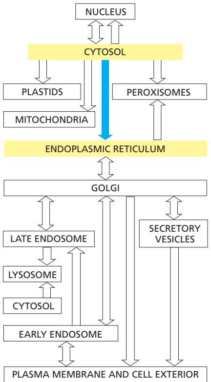

Figure 12–15 The rough and smooth ER. (A) An electron micrograph of the rough ER in a pancreatic exocrine cell that makes and secretes large amounts of digestive enzymes every day. The cytosol is filled with closely packed sheets of ER membrane that are studded with ribosomes. At the top left is a portion of the nucleus and its nuclear envelope; note that the outer nuclear membrane, which is continuous with the ER, is also studded with ribosomes. (B) Abundant smooth ER in a cell that secretes steroid hormone. This electron micrograph is of a testosterone-secreting Leydig cell in the human testis. (C) A three-dimensional reconstruction of a region of smooth ER and rough ER in a liver cell. The rough ER forms oriented stacks of flattened cisternae, each having a lumenal space 20–30 nm wide. The smooth ER membrane is connected to these cisternae and forms a fine network of tubules 30–60 nm in diameter. The ER lumen is colored green. (A, courtesy of Lelio Orci. B, courtesy of Daniel S. Friend, by permission of E.L. Bearer. C, after R.V. Kristi ć, Ultrastructure of the Mammalian Cell. New York: Springer-Verlag, 1979. With permission from Springer Nature.)

In contrast to rough ER, functions for the smooth ER are more diverse and can become highly specialized. A type of smooth ER found in all cells is called transitional ER, from which transport vesicles carrying newly synthesized proteins and lipids bud off for transport to the Golgi apparatus. In certain specialized cells, the smooth ER has additional functions that warrant its expansion. For example, cells that synthesize steroid hormones contain prominent smooth ER to accommodate the enzymes that make cholesterol and modify it to form a variety of steroid hormones (see Figure 12–15B).

The main cell type in the liver, the hepatocyte, also has expanded amounts of smooth ER (see Table 12–2) serving two separate purposes. The hepatocyte is the principal site of production of lipoprotein particles, which carry lipids via the bloodstream to other parts of the body. The enzymes that synthesize the lipid components of the particles are enriched in the membrane of the smooth ER. In addition, these membranes contain enzymes that catalyze a series of reactions to detoxify drugs and various harmful compounds produced by metabolism. The most extensively studied of these detoxification reactions are carried out by the cytochrome P450 family of enzymes. They catalyze a series of reactions in which water-insoluble drugs or metabolites that would otherwise accumulate to toxic levels in cell membranes are rendered sufficiently water soluble to leave the cell and be excreted in the urine or bile.

Another crucially important function of the ER in most eukaryotic cells is to sequester $\mathrm { C a ^ { 2 + } }$ from the cytosol. The release of $\mathrm { C a ^ { 2 + } }$ into the cytosol from the

cell wall

Figure 12–16 The ER makes close contacts with the mitochondria and plasma membrane. Electron micrographs of organelle contact sites between the ER and other membranes. (A) Region of a mouse embryonic fibroblast showing a mitochondrion that is closely apposed by sections of ER (black brackets). (B) Yeast cell showing a section of the ER that is closely juxtaposed with the plasma membrane (white bracket). [A, from P. Cosson et al., PLOS ONE 7(9):e46293, 2012. Courtesy of Pierre Cosson. B, courtesy of Wanda Kukulski.]MBoC7 n12.102/12.1

ER, and its subsequent reuptake, occur in many rapid responses to extracellular signals, as discussed in Chapter 15. $\mathrm { A   C a ^ { 2 + } }$ pump transports $\mathrm { C a ^ { 2 + } }$ from the cytosol into the ER lumen. A high concentration of $\mathbf { \bar { C } } \mathbf { a } ^ { 2 + }$ -binding proteins in the ER facilitates $\mathrm { C a ^ { 2 + } }$ storage. In some cell types, specific regions of the ER are specialized for $\mathrm { C a ^ { 2 + } }$ storage. Muscle cells have an abundant, modified smooth ER called the sarcoplasmic reticulum. The release and reuptake of $\mathrm { C a ^ { 2 + } }$ by the sarcoplasmic reticulum trigger myofibril contraction and relaxation, respectively, during each round of muscle contraction (discussed in Chapter 16).

Finally, the smooth ER can be specialized in regions that make intimate contacts with other organelles, most notably the mitochondria, plastids, endosomes, and the plasma membrane (**Figure 12–16**). These **organelle contact sites** are enriched for proteins involved in communication or transport of key metabolites between the juxtaposed membranes. For example, the transport of lipids from their site of synthesis in the ER to the mitochondrion is thought to occur at ER– mitochondria contact sites. Contact of ER with the plasma membrane modulates levels of plasma membrane phosphoinositides, which are lipids that participate in numerous signaling pathways (discussed in Chapters 13 and 15). Contacts between other combinations of organelles have also been observed, and it is likely that these are also involved in the selective transfer of lipids and other metabolites.

To study the functions and biochemistry of the ER, it is necessary to isolate it. This may seem to be a hopeless task because the ER is intricately interleaved with other components of the cytoplasm. Fortunately, when tissues or cells are disrupted by homogenization, the ER breaks into fragments, which reseal to form small (∼100–200 nm in diameter) closed vesicles called **microsomes** (**Figure 12–17**). To the biochemist, microsomes represent small authentic versions of the ER, still capable of protein translocation, protein glycosylation (discussed later), $\mathrm { C a ^ { 2 + } }$ uptake and release, and lipid synthesis. Rough microsomes, derived from rough ER, contain ribosomes on their outside surface and enclose a small part of the ER lumen. Smooth microsomes, which lack ribosomes, are derived from vesiculated fragments of the smooth ER, plasma membrane, Golgi apparatus, endosomes, and mitochondria. The ribosomes attached to rough microsomes make them denser than smooth microsomes. As a result, scientists use equilibrium density centrifugation to separate the rough and smooth microsomes (Figure 12–17). Smooth microsomes derived from different organelles can be further separated on the basis of differences in their protein content. Microsomes have been invaluable in elucidating the molecular aspects of ER function, as we discuss next.

Figure 12–17 The isolation of purified rough and smooth microsomes from the ER. When an intact cell or tissue is homogenized, many of its membrane-enclosed compartments form small sealed vesicles called microsomes. When this mixture of vesicles is sedimented to equilibrium through a gradient of sucrose, the two types of microsomes separate from each other on the basis of their different densities. Note that the smooth fraction contains non-ER–derived material. Thin section electron micrographs of the purified smooth and rough microsome fractions show an abundance of ribosomestudded vesicles in the rough microsome fraction that originated from the rough ER. These are not seen in the smooth microsome fraction, which primarily contains ribosome-free vesicles originating from the smooth ER, Golgi cisternae, and other organelles. (Electron micrographs courtesy of George Palade.)

<!-- END EN EN12-H012-H013 -->

### 英文补充：内质网加工、糖基化、未折叠蛋白应答与过氧化物酶体

> 对应中文板块：内质网加工、糖基化、未折叠蛋白应答与过氧化物酶体。英文来源：Molecular Biology of the Cell，第7版，第12章；[本章完整原文](../../来源/英文教材/12_Intracellular_Organization_and_Protein_Sorting/chapter.md)。物理PDF页码范围：722–787（整章范围）。

<!-- BEGIN EN EN12-H021-H031 -->
#### Translocated Polypeptide Chains Fold and Assemble in the Lumen of the Rough ER

Proteins enter the ER lumen as unfolded polypeptides. They must therefore fold and assemble into their correct three-dimensional structures just as newly made proteins in the cytosol must fold (discussed in Chapter 3). To meet this demand, the lumen of the ER contains a high concentration of resident chaperones and other protein-folding catalysts. These **ER resident proteins** contain an **ER retention signal** of four amino acids at their C-terminus that is responsible for retaining the protein in the ER (see Figure 12–13; discussed in Chapter 13, p. 768).

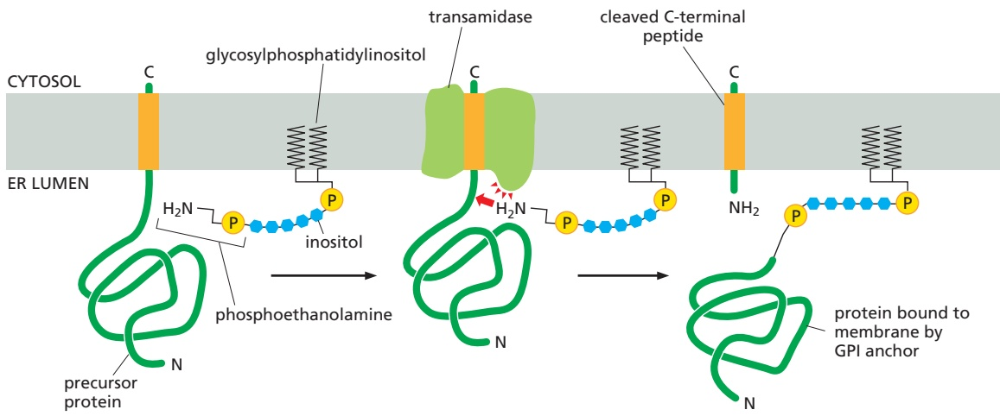

Figure 12–30 The attachment of a GPI anchor to a protein in the ER. GPI-anchored proteins are targeted to the ER membrane by an N-terminal signal sequence (not shown), integrated into the membrane, and processed by signal peptidase similarly to a single-pass transmembrane protein (see Figure 12–27). Immediately after the completion of protein synthesis, the precursor protein remains anchored in the ER membrane by a hydrophobic C-terminal sequence of 15–20 amino acids; the rest of the protein is in the ER lumen. Within less than a minute, a transamidase enzyme in the ER cleaves the protein from its membrane-bound C-terminus and simultaneously attaches the new C-terminus to an amino group on a preassembled. / . GPI intermediate. The sugar chain contains an inositol attached to the lipid from which the GPI anchor derives its name. It is followed by a glucosamine and three mannoses. The terminal mannose links to a phosphoethanolamine that provides the amino group to attach the protein through an amide bond. The signal that specifies this modification is contained within the hydrophobic C-terminal sequence and a few amino acids adjacent to it on the lumenal side of the ER membrane; if this signal is added to other proteins, they too become modified in this way. Because of the covalently linked lipid anchor, the protein remains membrane-bound, with all of its amino acids exposed initially on the lumenal side of the ER and eventually on the exterior of the plasma membrane.

The protein **BiP**, a member of the hsp70 family of chaperone proteins, is a major component of the ER folding machinery. We have already discussed how BiP pulls proteins post-translationally into the ER through the Sec61 ER translocator. Like other chaperones (discussed in Chapter 6), BiP recognizes incorrectly folded proteins, as well as protein subunits that have not yet assembled into their final oligomeric complexes. It does so by binding to exposed hydrophobic amino acid sequences that would normally be buried in the interior of correctly folded or assembled polypeptide chains. The bound BiP both prevents the protein from aggregating and helps keep it in the ER (and thus out of the Golgi apparatus and later parts of the secretory pathway). BiP hydrolyzes ATP to shuttle between highand low-affinity polypeptide-binding states. In this way, BiP periodically lets go of its substrate proteins to allow them an opportunity to fold, and then re-binds them if folding is not yet achieved.

The ER resident protein protein disulfide isomerase (PDI) catalyzes the oxidation of free sulfhydryl (SH) groups on cysteines to form disulfide (S}S) bonds (**Figure 12–31**). Almost all cysteines in protein domains exposed to either the

Figure 12–31 The formation of disulfide bonds in the ER. Proteins that contain free sulfhydryl (SH) groups on cysteines are oxidized during protein folding to incorporate disulfide (S}S) bonds. Protein disulfide isomerase (PDI) contains an intramolecular disulfide bond that accepts electrons from a free sulfhydryl group in the substrate protein to be oxidized. This leads to the formation of an intermolecular mixed disulfide bond between PDI and its substrate. A second free sulfhydryl group in the substrate then donates its electrons to the mixed disulfide bond, resulting in an oxidized substrate and reduced PDI. Reoxidation of PDI is carried out by other ER enzymes (not shown).

extracellular space or the lumen of organelles in the secretory and endocytic pathways are disulfide bonded. Disulfide bonds stabilize the folded state of a protein, enabling it to better withstand a harsh, variable, and chaperone-free extracellular environment. Because proteins often contain multiple cysteines, they sometimes pair incorrectly. PDI resolves this problem by rearranging the disulfide bonds in a protein until it is correctly folded. This is possible because PDI enzymes are capable of operating in reverse to reduce incorrectly paired disulfides of immature proteins. The ER lumen contains multiple members of the PDI family, some of which are specialized for reducing disulfide bonds to fully unfold misfolded proteins that need to be translocated back to the cytosol for degradation (discussed later). All PDI enzymes are therefore oxidoreductases that can catalyze either the formation or breakage of disulfide bonds in their client proteins. The formation of disulfide bonds relies on maintaining an oxidizing environment in the ER lumen. Disulfide bonds form only very rarely in domains exposed to the cytosol because of the reducing environment there.

#### Most Proteins Synthesized in the Rough ER Are Glycosylated by the Addition of a Common N-Linked Oligosaccharide

The covalent addition of oligosaccharides to proteins is one of the major biosynthetic functions of the ER. About half of the soluble and membrane-bound proteins that are processed in the ER—including those destined for transport to the Golgi apparatus, lysosomes, plasma membrane, or extracellular space—are **glycoproteins** that are modified in this way. Some proteins in the cytosol and nucleus are also glycosylated, but not with large oligosaccharides: they instead carry a much simpler sugar modification, in which a single N-acetylglucosamine group is added to a serine or threonine of the protein.

During the most common form of **protein glycosylation** in the ER, a preformed precursor oligosaccharide (containing 14 sugars composed of 2 Nacetylglucosamines, 9 mannoses, and 3 glucoses) is transferred as a complete unit to proteins. Because this oligosaccharide is transferred to the side-chain NH2 group of an asparagine in the protein, it is said to be N-linked, or asparagine-linked (**Figure 12–32A**). A special lipid molecule called **dolichol** (see Panel 2–5, pp. 102–103) anchors the precursor oligosaccharide in the ER membrane. The pre-cursor oligosaccharide is transferred to the target asparagine in a single enzymatic step by an **oligosaccharyl transferase**. This membrane-bound enzyme associates with the Sec61 translocator and has its active site exposed on the lumenal side

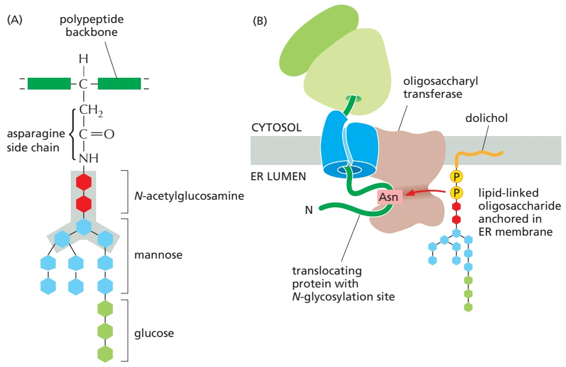

#### Figure 12–32 N-linked protein glycosylation in the rough ER.

(A) Almost as soon as a polypeptide chain enters the ER lumen, it is glycosylated on target asparagine amino acids. The precursor oligosaccharide (shown in color) is attached only to asparagine side chains in the sequences Asn-X-Ser and Asn-X-Thr (where X is any amino acid except proline). These sequences occur much less frequently in glycoproteins than in nonglycosylated cytosolic proteins. Evidently there has been selective pressure against these sequences during protein evolution, presumably because glycosylation at inappropriate sites would interfere with protein folding. The five sugars in the gray box form the core region of this oligosaccharide. For many glycoproteins, only the core sugars survive the extensive oligosaccharide trimming that takes place in the Golgi apparatus (Movie 13.4). (B) The precursor oligosaccharide is transferred from a dolichol lipid anchor to the asparagine as an intact unit in a reaction catalyzed by a transmembrane oligosaccharyl transferase enzyme complex. One copy of this enzyme is associated with each protein translocator in the ER membrane. Oligosaccharyl transferase contains 13 transmembrane α helices and a large ER lumenal domain that contains binding sites for the nascent protein and dolichol–oligosaccharide. The asparagine binds a tunnel that penetrates the enzyme interior. There, the amino group of the asparagine is twisted out of the plane that stabilizes the otherwise poorly reactive amide bond, activating it for reaction with the dolichol–oligosaccharide.

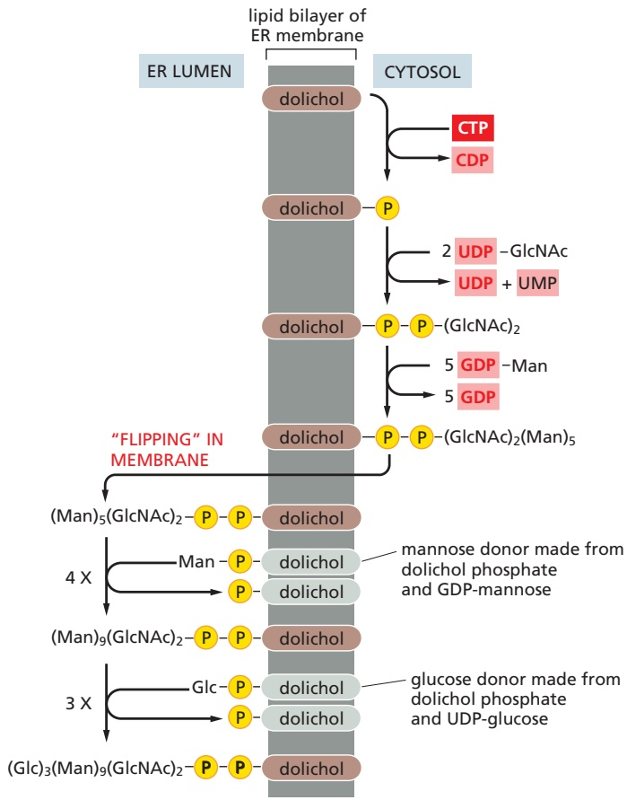

Figure 12–33 Synthesis of the lipidlinked precursor oligosaccharide in the rough ER membrane. The oligosaccharide is assembled sugar by sugar onto the carrier lipid dolichol (a polyisoprenoid; see Panel 2–5, pp. 102–103). Dolichol is long and very hydrophobic: its 22 fivecarbon units can span the thickness of a lipid bilayer more than three times, so that the attached oligosaccharide is firmly anchored in the membrane. The first sugar is linked to dolichol by a pyrophosphate bridge. This high-energy bond activates the oligosaccharide for its eventual transfer from the lipid to an asparagine side chain of a growing polypeptide on the lumenal side of the rough ER. As indicated, the synthesis of the oligosaccharide starts on the cytosolic side of the ER membrane and continues on the lumenal face after the (Man)5(GlcNAc)2 lipid intermediate is flipped across the bilayer by a transporter (which is not shown). All the subsequent glycosyl transfer reactions on the lumenal side of the ER involve transfers from dolichol-P-glucose and dolichol-Pmannose; these activated, lipid-linked monosaccharides are synthesized from dolichol phosphate and UDP-glucose or GDP-mannose (as appropriate) on the cytosolic side of the ER and are then flipped across the ER membrane. GlcNAc = N-acetylglucosamine; Man = mannose; Glc = glucose.

of the ER membrane. This allows the oligosaccharyl transferase to modify newly made proteins immediately after the target asparagine enters the ER lumen during protein translocation (**Figure 12–32B**).

The precursor oligosaccharide is built up sugar by sugar on the membranebound dolichol lipid. The sugars are first activated in the cytosol by the formation of nucleotide (UDP or GDP)-sugar intermediates, which then donate their sugarMBoC7 m12.48/12.33 first to the dolichol lipid and then to the partially assembled oligosaccharide tree in an orderly sequence. Partway through this process, the lipid-linked oligosaccharide is flipped, with the help of a transporter, from the cytosolic to the lumenal side of the ER membrane (**Figure 12–33**).

The N-linked oligosaccharides are by far the most common oligosaccharides, being found on 90% of all glycoproteins. Less frequently, oligosaccharides are linked to the hydroxyl group on the side chain of a serine, threonine, hydroxylysine, or hydroxyproline amino acid. The first sugar of these O-linked oligosaccharides is added in the ER. N-linked and O-linked oligosaccharides undergo extensive processing, modification, and extension in the Golgi apparatus (Chapter 13), producing the diversity of oligosaccharide structures observed on mature glycoproteins.

#### Oligosaccharides Are Used as Tags to Mark the State of Protein Folding

It has long been debated why glycosylation is such a common modification of proteins that enter the ER. One particularly puzzling observation has been that some proteins require N-linked glycosylation for proper folding in the ER, yet the precise location of the oligosaccharides attached to the protein’s surface does not seem to matter. A clue to the role of glycosylation in protein folding came from studies of two ER chaperone proteins, which are called **calnexin** and **calreticulin** because they require $\mathrm { C a ^ { 2 + } }$ for their activities. These chaperones are carbohydrate-binding proteins, or lectins, which bind to oligosaccharides on incompletely folded proteins and retain them in the ER. Like other chaperones, they prevent incompletely folded proteins from irreversibly aggregating. Both calnexin and calreticulin also promote the association of incompletely folded proteins with another ER chaper-. / . one, which binds to cysteines that have not yet formed disulfide bonds.

How do calnexin and calreticulin distinguish properly folded from incompletely folded proteins? The answer lies in the structure of the oligosaccharide attached to the protein. Shortly after a newly made protein acquires an N-linked precursor oligosaccharide, ER glucosidases rapidly remove two glucoses, leaving behind a single terminal glucose. This singly glucosylated oligosaccharide is recognized by calnexin and calreticulin, ensuring that all newly made (and hence, likely to be not yet folded) glycoproteins bind to one of these chaperones. This last glucose is removed over time, leaving a de-glucosylated glycoprotein that no longer binds to calnexin or calreticulin. If the glycoprotein is folded, it can leave the ER. However, yet another ER enzyme, a glucosyl transferase, re-adds the terminal glucose selectively to glycoproteins that have not yet folded completely. The terminal glucose then causes re-association of the unfolded protein with calnexin or calreticulin. Thus, glucose trimming (by glucosidases) and glucose addition (by the glucosyl transferase) drive cycles of dissociation and re-association with calnexin and calreticulin until a newly made unfolded protein has achieved its fully folded state (**Figure 12–34**).

#### Improperly Folded Proteins Are Exported from the ER and Degraded in the Cytosol

Despite all the help from chaperones, many protein molecules translocated into the ER fail to achieve their properly folded or oligomeric state. Such proteins are exported from the ER back into the cytosol, where they are degraded in proteasomes (discussed in Chapter 6). In many ways, the mechanism of such retrotranslocation is similar to other post-translational modes of translocation.

Figure 12–34 The role of N-linked glycosylation in ER protein folding. The ER membrane–bound chaperone protein calnexin binds to incompletely folded proteins containing one terminal glucose on N-linked oligosaccharides, trapping the protein in the ER. Removal of the terminal glucose by a glucosidase releases the protein from calnexin. A glucosyl transferase is the crucial enzyme that determines whether the protein is folded properly or not: if the protein is still incompletely folded, the enzyme transfers a new glucose from UDP-glucose to the N-linked oligosaccharide, renewing the protein’s affinity for calnexin and retaining it in the ER. The cycle repeats until the protein has folded completely. Calreticulin functions similarly, except that it is a soluble ER resident protein. Another ER chaperone, ERp57 (not shown), collaborates with calnexin and calreticulin in retaining an incompletely folded protein in the ER. ERp57 recognizes free sulfhydryl groups, which are a sign of incomplete disulfide bond formation. The longer a protein spends in this cycle without folding correctly, the more likely it is that ER-resident mannosidase enzymes (not shown) remove the terminal mannoses from the N-linked oligosaccharide. The trimmed oligosaccharide with reduced mannoses is recognized by other ER lectins that route the polypeptide for degradation. Thus, only proteins that fold promptly and exit the ER avoid trimming by mannosidases and escape degradation.

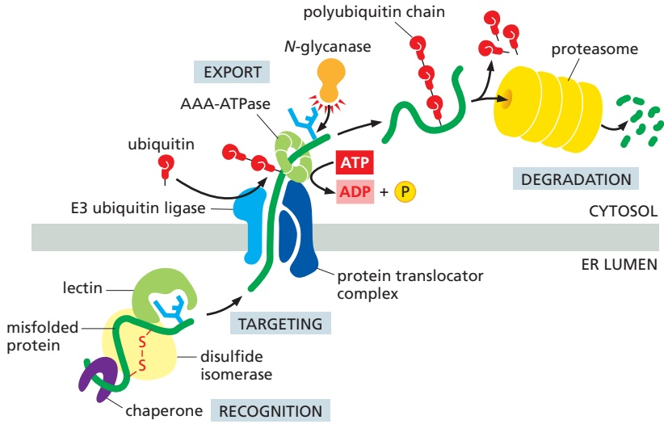

For example, like post-translational import into the ER, chaperone proteins are necessary to keep the polypeptide chain in an unfolded state prior to and during translocation. Similarly, a source of energy is required to provide directionalityMBOC7 m12.50/12.35 to the transport and to pull the protein into the cytosol. Finally, a translocator is necessary.

Selecting proteins from the ER for degradation is a challenging process: misfolded proteins or unassembled protein subunits should be degraded, but folding intermediates of newly made proteins should not. Help in making this distinction comes from the N-linked oligosaccharides, which serve as timers that measure how long a protein has spent in the ER. The slow trimming of a particular mannose on the core oligosaccharide tree by an enzyme (a mannosidase) in the ER creates a new oligosaccharide structure that ER-lumenal lectins of the retrotranslocation apparatus recognize. A protein that folds and exits from the ER faster than the mannosidase can remove its target mannose therefore escapes degradation.

In addition to the lectins in the ER that recognize the oligosaccharides, chaperones and protein disulfide isomerases associate with the proteins that must be degraded. The chaperones prevent the unfolded proteins from aggregating, and the disulfide isomerases break disulfide bonds that may have formed incorrectly, so that a linear polypeptide chain can be translocated back into the cytosol.

Multiple translocator complexes move different proteins from the ER membrane or lumen into the cytosol. Translocator complexes always contain an E3 ubiquitin ligase enzyme (Chapter 6), which attaches polyubiquitin tags to the unfolded proteins as they emerge into the cytosol, marking them for destruction. Fueled by the energy derived from ATP hydrolysis, a hexameric ATPase of the family of AAA-ATPases (see Figure 6–88) pulls the unfolded protein through the translocator into the cytosol. An N-glycanase removes en bloc any oligosaccharide chains attached to the retrotranslocated protein. Guided by its ubiquitin tag, the de-glycosylated polypeptide is rapidly fed into proteasomes, where it is degraded (**Figure 12–35**).

#### Misfolded Proteins in the ER Activate an Unfolded Protein Response

Cells carefully monitor the amount of misfolded protein in various compartments. An accumulation of misfolded proteins in the cytosol, for example, triggers a heat-shock response (discussed in Chapter 6), which stimulates the transcription of genes encoding cytosolic chaperones that help to refold the proteins. Similarly, an accumulation of misfolded proteins in the ER triggers an **unfolded**

Figure 12–35 The export and degradation of misfolded ER proteins. Misfolded soluble proteins in the ER lumen are recognized and targeted to a translocator complex in the ER membrane. They first interact in the ER lumen with chaperones, disulfide isomerases, and lectins. The chaperones maintain the misfolded protein in an unfolded conformation and prevent their aggregation. The disulfide isomerases reduce disulfide bonds to fully unfold the protein. The lectins selectively recognize trimmed N-linked oligosaccharides that are generated when a protein spends too long in the ER. The lectins have binding sites on a membrane-embedded protein translocator built around an E3 ubiquitin ligase. The unfolded protein is then exported into the cytosol through the translocator. The E3 ubiquitin ligase ubiquitylates the unfolded protein as it emerges on the cytosolic side of the translocator. The ubiquitin prevents backsliding of the protein into the ER and provides a molecular handle for an AAA-ATPase that completes the extraction reaction. The unfolded protein is then de-glycosylated and degraded in proteasomes. Misfolded membrane proteins follow a similar pathway but are thought to engage the translocator sideways within the lipid bilayer. Multiple translocator complexes containing different E3 ubiquitin ligases reside in the ER. They are thought to handle different subsets of proteins that are misfolded in different ways.

Figure 12–36 The unfolded protein response. Three parallel intracellular signaling pathways sense misfolded proteins in the ER lumen and lead to the activation of transcription in the nucleus. Each pathway begins with an ER-resident sensor of misfolded proteins. When these sensors are activated, they initiate different downstream signaling pathways. Although the downstream mechanisms are very different from each other, all of them culminate with the production of an active transcription factor. The overlapping targets of the transcription factors produce gene products that improve the proteinprocessing capacity of the ER and increase the protein degradation capacity of the cell.

**protein response**, which stimulates transcription of genes that collectively improve the protein-folding capacity of the ER. The stimulated genes code for ER chaperones, the machinery for protein retrotranslocation and degradation, factors for protein transport out of the ER, and factors for expansion of the ER. This multipronged response operates by coupling the detection of misfolded proteins in the ER lumen to the production of transcription regulatory proteins that enter the nucleus to tune the transcription of hundreds of genes.

How do misfolded proteins in the ER signal to the nucleus? There are three parallel pathways that execute the unfolded protein response (**Figure 12–36**). The first pathway, which was initially discovered in yeast cells, is conserved in all eukaryotic cells and is particularly remarkable. Misfolded proteins in the ER cause IRE1, a transmembrane protein kinase in the ER, to oligomerize and phosphorylate itself. This mechanism of activation is similar to how some cell-surface receptor kinases in the plasma membrane are activated (discussed in Chapter 15). Oligomeric and phosphorylated IRE1 enables its cytosolic endoribonuclease domain to remove an intron from a specific cytosolic mRNA molecule. IRE1 accomplishes this task by cleaving the mRNA at two positions that are then joined together by an RNA ligase. The mRNA produced by this splicing reaction is translated to produce an active transcription regulatory protein that increases expression of a subset of the genes of the unfolded protein response (**Figure 12–37**). The regulated splicing of a cytosolic mRNA by IRE1 is a unique exception to the rule that all mRNA splicing occurs in the nucleus and is catalyzed by the spliceosome.

Misfolded proteins also activate a second transmembrane kinase in the ER, PERK. The target of activated PERK is a translation initiation protein whose phosphorylation has two consequences. First, translation of new proteins is reduced throughout the cell, thereby reducing the load of proteins that need to be folded in the ER. Second, some proteins are preferentially translated when translation initiation factors are scarce, and one of these is a transcription regulator that helps activate the transcription of the genes that execute the unfolded protein response.

Finally, a third transcription regulator, ATF6, is initially synthesized as a transmembrane ER protein. Because it is embedded in the ER membrane, it cannot

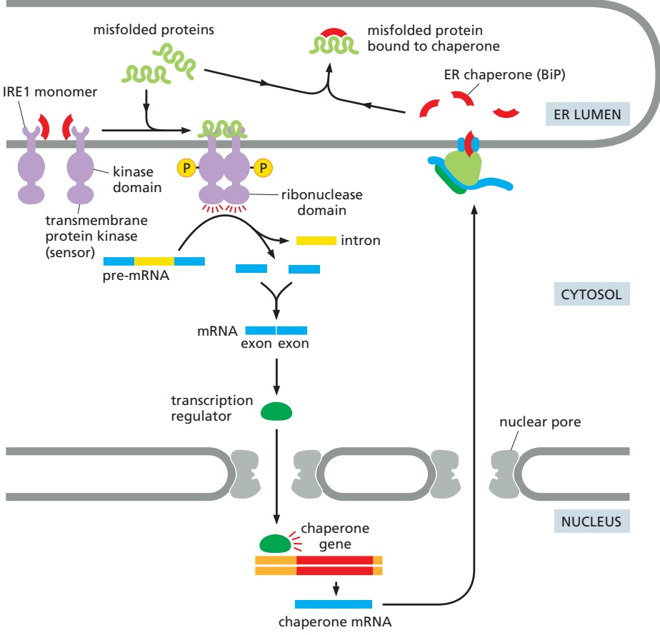

Figure 12–37 The IRE1 limb of the unfolded protein response. Regulated RNA splicing is a key regulatory switch in the unfolded protein response pathway initiated by IRE1 (Movie 12.4). During normal conditions, IRE1 is maintained in an inactive state by its association with the ER-lumenal chaperone BiP. Elevated levels of misfolded proteins activate IRE1 by a combination of two mechanisms. First, BiP dissociates from IRE1 to bind and protect misfolded proteins from aggregation. Second, misfolded proteins bind to the lumenal domain of IRE1 facilitating the formation of IRE1 oligomers. The oligomerized IRE1 phosphorylates itself on the cytosolic side, activating its ribonuclease domain. The activated ribonuclease catalyzes the splicing of a pre-mRNA that codes for a transcription factor that ultimately activates numerous genes in the nucleus including those coding for chaperones. Elevated chaperones help reduce the level of misfolded proteins in the ER lumen, eventually turning off IRE1 signaling.

activate the transcription of genes in the nucleus. When misfolded proteins accumulate in the ER, the ATF6 protein is transported to the Golgi apparatus. Resident proteases in the Golgi apparatus membrane cleave off the cytosolic domain of ATF6, which can now migrate to the nucleus and help activate the transcrip-MBoC7 m12.51b/12.37 tion of genes encoding proteins involved in the unfolded protein response. This mechanism of activation of a latent membrane-embedded transcription factor is similar to how the transcription regulator that controls cholesterol biosynthesis is activated (discussed later in this chapter). The relative importance of each of these three pathways in the unfolded protein response differs in different cell types, enabling each cell type to tailor the unfolded protein response to its particular needs.

The signaling pathways that execute the unfolded protein response are used during normal physiological conditions to adjust ER capacity to closely match demand for the ER. For example, insulin production increases substantially in pancreatic β cells in response to eating a meal. The elevated demand for the processing capacity of the ER, where insulin is initially assembled, partially activates PERK so cells can adjust insulin synthesis rates to avoid overburdening the ER. In another example, IRE1 is activated when B cells begin differentiating into antibody-secreting plasma cells. IRE1 activation dramatically expands the ER content of the cell in preparation for the very high levels of immunoglobulins that will soon be assembled there.

The unfolded protein response ultimately increases the production of proteins that improve protein processing in the ER and reduce the burden of misfolded proteins. As homeostasis is restored, the activities of IRE1, PERK, and ATF6 abate. If homeostasis cannot be restored, persistently active signaling from the ER, particularly via PERK, activates genes that initiate apoptosis. In multicellular organisms, it is often less detrimental to eliminate a persistently dysfunctional cell than risk its aberrant interactions with neighboring cells.

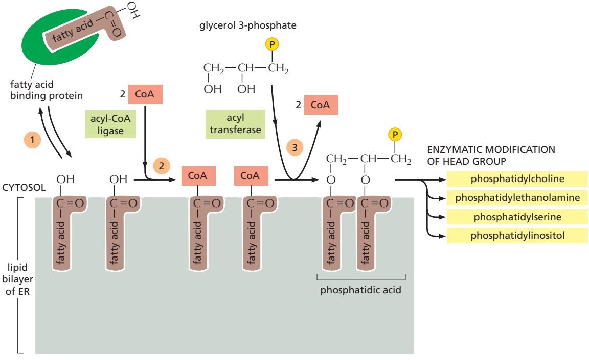

Figure 12–38 The synthesis of phospholipids at the ER membrane. As illustrated, fatty acids delivered to the ER by a cytosolic fatty acid binding protein are linked to glycerol 3-phosphate to produce phosphatidic acid, which serves as a precursor to make other phospholipids that differ in the structures of their polar head groups.

#### The ER Assembles Most Lipid Bilayers

The ER membrane is the site of synthesis of nearly all of the cell’s major classes of lipids, including both phospholipids and cholesterol, required for the production of new cell membranes. The major phospholipid made is phosphatidylcholine, which can be formed in three steps from choline, two fatty acids, and glycerol phosphate (**Figure 12–38**). Each step is catalyzed by enzymes in the ER membrane, which have their active sites facing the cytosol, where all of the required metabolites are found. Thus, phospholipid synthesis occurs exclusively in the cytosolic leaflet of the ER membrane. Because fatty acids are not soluble in water, they are shepherded from their sites of synthesis in the cytosol to the ER by a fatty acid binding protein. After arrival in the ER membrane and activation with CoA, acyl transferases successively add two fatty acids to glycerol phosphate to produce phosphatidic acid. Phosphatidic acid is sufficiently water-insoluble to remain in the lipid bilayer; it cannot be extracted from the bilayer by the fatty acid binding proteins. It is therefore this first step that enlarges the ER lipid bilayer. The later steps determine the head group of a newly formed lipid molecule and therefore the chemical nature of the bilayer, but they do not result in net membrane growth. The two other major membrane phospholipids—phosphatidylethanolamine and phosphatidylserine (see Figure 10–3)—as well as the minor phospholipid phosphatidylinositol (PI), are all synthesized in this way.

Because phospholipid synthesis takes place in the cytosolic leaflet of the ER lipid bilayer, there needs to be a mechanism that transfers some of the newly formed phospholipid molecules to the lumenal leaflet of the bilayer. In synthetic lipid bilayers, lipids do not “flip-flop” in this way (see Figure 10–10). In the ER, however, phospholipids equilibrate across the membrane within minutes, which is almost 100,000 times faster than can be accounted for by spontaneous “flipflop.” This rapid trans-bilayer movement is mediated by a poorly characterized phospholipid translocator called a scramblase, which nonselectively equilibrates

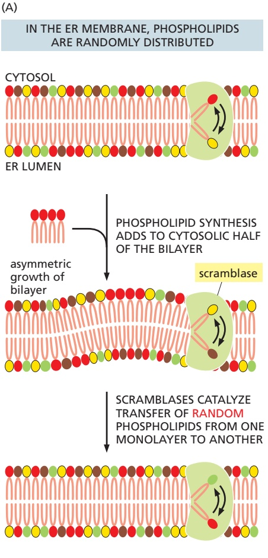

symmetric growth of bilayer

growth of asymmetric bilayer

Figure 12–39 The role of phospholipid translocators in lipid bilayer synthesis. (A) Because new lipid molecules are added only to the cytosolic half of the ER membrane bilayer and lipid molecules do not flip spontaneously from one monolayer to the other, a transmembrane phospholipid translocator (called a scramblase) is required to transfer lipid molecules from the cytosolic half to the lumenal half so that the membrane grows as a bilayer. The scramblase is not specific for particular phospholipid head groups and therefore equilibrates the different phospholipids between the two monolayers. Scramblases do not need energy to catalyze phospholipid flipping and probably function by providing a hydrophilic path for passive movement of the phospholipid head group through the hydrophobic interior of the membrane. (B) The membranes of the Golgi apparatus, cell surface, and other compartments of the secretory and endocytic pathways are asymmetric. When new membrane is delivered via transport vesicles, the incoming lipids must be segregated to the appropriate side of the lipid bilayer to maintain its asymmetry. This is accomplished by enzymes called flippases, which move selective phospholipids unidirectionally from one side of the bilayer to the other. Flippases typically couple the transport of their substrate (the phospholipid head group) to ATP hydrolysis, and are therefore considered active transporters (see Chapter 11).

phospholipids between the two leaflets of the lipid bilayer (**Figure 12–39**). Thus, the different types of phospholipids are thought to be equally distributed between the two leaflets of the ER membrane.MBoC7 m12.

The ER also produces cholesterol and ceramide (**Figure 12–40**). Ceramide is made by condensing the amino acid serine with a fatty acid to form the amino alcohol sphingosine (see Figure 10–3); a second fatty acid is then covalently added to form ceramide. The ceramide is exported to the Golgi apparatus, where it serves as a precursor for the synthesis of two types of lipids. Glycosphingolipids (glycolipids; see Figure 10–16) are formed when oligosaccharides are added to ceramide, while sphingomyelin (discussed in Chapter 10) results from the addition of phosphocholine. Because glycolipids and sphingomyelin are both produced by enzymes that have their active sites exposed to the lumen of the Golgi apparatus, they are restricted to the noncytosolic leaflet of the lipid bilayers that contain them.

As discussed in Chapter 13, the plasma membrane and the membranes of the Golgi apparatus, lysosomes, and endosomes all form part of a membrane system that communicates with the ER by means of transport vesicles. A large proportion of the lipids that compose the membranes of these organelles is acquired via the membranes delivered by transport vesicles. Despite exchange of membrane lipids through vesicular transport, the lipid composition of each organellar membrane is distinct and contributes to its unique identity and functional properties. This specialization is achieved by a combination of three mechanisms. First, a transport vesicle can have a different lipid composition than the organelle it is departing, thereby delivering only a subset of lipids to its destination. Second, proteins in an organelle’s membrane can modify the head groups of certain lipids to change their identity (such as production of sphingomyelin from ceramide) or use flippases to move certain phospholipids from one leaflet of the membrane to the other (Figure 12–39B). Third, specific lipids can be selectively transferred from one membrane to another by nonvesicular transport routes as discussed next.

Figure 12–40 The structure of ceramide.

Figure 12–41 The spatial relationships between the ER and several organelles within a mouse neuron. A section of the cell body of a neuron in the mouse brain was analyzed by focused ion beam-scanning electron microscopy. (A) The three-dimensional positions of the major organelles reconstructed from the serial electron microscopy images and shown in different colors. The ER (yellow) makes close contacts with all major organelles and the plasma membrane. (B) The mitochondria (green) from the reconstruction are shown with the areas that contact the ER (red). (A and B, from Y. Wu et al., Proc. Natl. Acad. Sci. USA 114:E4859–E4867, 2017.)

#### Membrane Contact Sites Between the ER and Other Organelles Facilitate Selective Lipid Transfer

Mitochondria and plastids do not communicate with the ER by vesicular transport, so they require different mechanisms to import many of their lipids from the ER for growth. Carrier proteins in the cytosol called lipid transfer proteins ferry individual lipid molecules between membranes, functioning much like fatty acid binding proteins that shepherd fatty acids through the cytosol (see Figure 12–38). In many cases, lipid transfer proteins function at organelle contact sites where the originating and destination membranes are held within ∼10–30 nm of each other by specific junction complexes. Different lipid transfer proteins shuttle phosphatidylcholine and phosphatidylserine from the ER to mitochondria at contact sites. Disruption of the junctional complexes or the lipid transfer proteins impairs lipid import into mitochondria and causes their dysfunction.

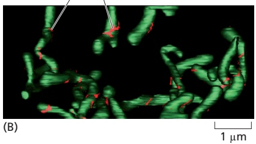

The extensive network of the ER participates in contact sites with most other cellular organelles (**Figure 12–41**). As with the ER–mitochondria contact sites (see Figure 12–16), one of the main functions of these other organelle contact sites is to exchange lipids (**Figure 12–42**). Cells contain several families of lipid transfer proteins. Each of these can typically bind one molecule of a specific lipid (or in some cases multiple related lipids) and has additional domains that can interact with specific cellular membranes. In this manner, they serve as shuttling proteins that have distinctive specificities for the donor and acceptor membranes and the lipid they transport. Contact sites between two organellar membranes favor recruitment of the lipid transfer protein that binds these membranes, thereby enhancing the efficiency of lipid exchange. Cholesterol uses a specialized transport system from lysosomes, where it is delivered as cholesterol esters in lipoproteins, to the plasma membrane and other locations in the cell (as we discuss in Chapter 13).

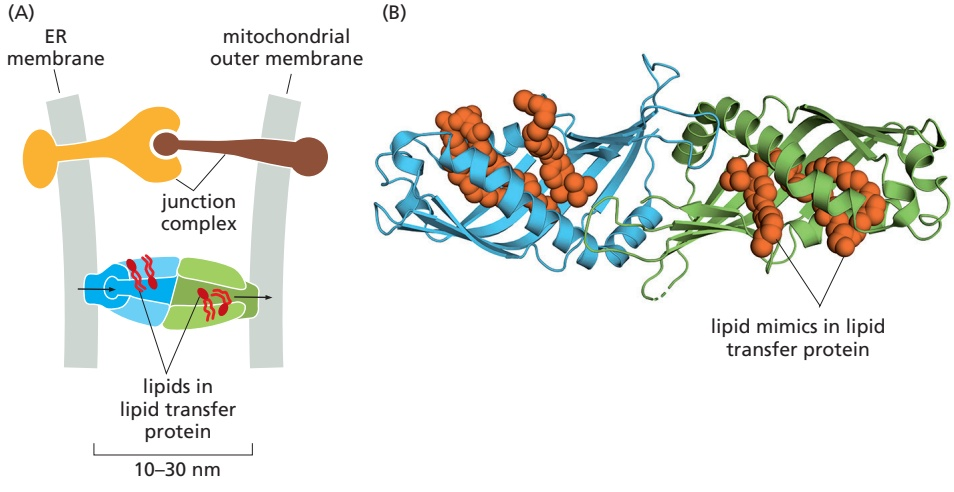

Figure 12–42 The transfer of lipids at organelle contact sites. (A) Proteins anchored to two different membranes (the ER and mitochondrion in the depicted example) interact with each other to hold the membranes 10–30 nm apart. Specialized lipid transfer proteins are recruited to these contact sites or in some cases are part of the junction complex. These transfer proteins have cavities that can bind lipids and facilitate their movement from one membrane to the other. (B) The structure of one such transfer protein is shown with lipid-like molecules bound inside its cavity. (PDB code: 4P42.)

#### Summary

The extensive ER network serves as a factory for the production of almost all of the cell’s lipids. In addition, a major portion of the cell’s protein synthesis occurs on the cytosolic surface of the rough ER: virtually all proteins destined for secretion or for the ER itself, the Golgi apparatus, the lysosomes, the endosomes, and the plasma membrane are first imported into the ER from the cytosol. In the ER lumen, the proteins fold and oligomerize, disulfide bonds are formed, and N-linked oligosaccharides are added. The pattern of N-linked glycosylation is used to indicate the extent of protein folding, so that proteins leave the ER only when they are properly folded. Proteins that do not fold or oligomerize correctly are translocated back into the cytosol, where they are de-glycosylated, polyubiquitylated, and degraded in proteasomes. If misfolded proteins accumulate in excess in the ER, they trigger an unfolded protein response, which activates appropriate genes in the nucleus to help the ER cope.

Only proteins that carry a special ER signal sequence are imported into the ER. The signal sequence is recognized by a signal-recognition particle (SRP), which binds both the growing polypeptide chain and the ribosome and directs them to a receptor protein on the cytosolic surface of the rough ER membrane. This binding to the ER membrane initiates the translocation process that threads a loop of polypeptide chain across the ER membrane through the hydrophilic pore of a protein translocator.

Soluble proteins—destined for the ER lumen, for secretion, or for transfer to the lumen of other organelles—pass completely into the ER lumen. Transmembrane proteins destined for the ER or for other cell membranes become anchored in the ER membrane by one or more membrane-spanning α-helical segments in their polypeptide chains. As these hydrophobic portions of the protein emerge from the ribosome, they are recognized by the protein translocator, which provides a passageway into the membrane. When a polypeptide contains multiple hydrophobic segments, it will pass back and forth across the bilayer multiple times as a multi-pass transmembrane protein.

The asymmetry of protein insertion and glycosylation in the ER establishes the sidedness of the membranes of all the other organelles that the ER supplies with membrane proteins. Lipids are synthesized at the cytosolic face of the ER, equilibrate between both leaflets of the lipid bilayer, and are transported to other organelles often at interorganelle junctions by lipid transfer proteins localized there. Specific flippases establish and maintain lipid asymmetry in the plasma membrane, further contributing to its sidedness.

#### PEROXISOMES

**Peroxisomes** are major sites of oxygen utilization and are found in virtually all eukaryotic cells. They contain oxidative enzymes, such as catalase and urate oxidase, at such high concentrations that, in some cells, the peroxisomes stand out in electron micrographs because of the presence of a crystalloid protein core (**Figure 12–43**). The evolutionary origin of peroxisomes is not firmly established, but they are generally thought to represent a specialized offshoot of the membrane system that composes the secretory and endocytic pathways. One hypothesis is that peroxisomes are a vestige of an ancient organelle that performed all the oxygen metabolism in the primitive ancestors of eukaryotic cells. When the oxygen produced by photosynthetic bacteria first accumulated in the atmosphere, it would have been highly toxic to most cells. Peroxisomes might have lowered the intracellular concentration of oxygen, while also exploiting its chemical reactivity to perform useful oxidation reactions. According to this view, the later development of mitochondria rendered peroxisomes less critical for cellular metabolism because many of the same biochemical reactions—which had formerly been carried out in peroxisomes without producing energy—were now coupled to ATP formation by means of oxidative phosphorylation. The oxidation reactions performed by peroxisomes in present-day cells could therefore partly be those whose functions were not taken over by mitochondria.

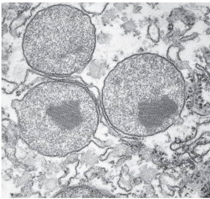

200 nm

Figure 12–43 An electron micrograph of three peroxisomes in a rat liver cell. The paracrystalline, electron-dense inclusions are composed primarily of the enzyme urate oxidase. (Courtesy of Daniel S. Friend, by permission of E.L. Bearer.)

#### Peroxisomes Use Molecular Oxygen and Hydrogen Peroxide to Perform Oxidation Reactions

Peroxisomes are so named because they usually contain one or more enzymes that use molecular oxygen to remove hydrogen atoms from specific organic substrates (designated here as R) in an oxidation reaction that produces hydrogen peroxide $\left( H _ { 2 } O _ { 2 } \right)$

$$
\mathrm{RH} _ {2} + \mathrm{O} _ {2} \rightarrow \mathrm{R} + \mathrm{H} _ {2} \mathrm{O} _ {2}
$$

Catalase uses the $\mathrm { H _ { 2 } O _ { 2 } }$ generated by other enzymes in the organelle to oxidize a variety of substrates—including formic acid, formaldehyde, and alcohol—by the “peroxidation” reaction: $\mathrm{H_{2}O_{2}^{-}+R^{\prime}H_{2}\rightarrow R^{\prime}+2H_{2}O}$ . This type of oxidation reaction is particularly important in liver and kidney cells, where the peroxisomes detoxify various harmful molecules that enter the bloodstream. About 25% of the ethanol we drink is oxidized to acetaldehyde in this way. In addition, when excess $\mathrm { H _ { 2 } O _ { 2 } }$ accumulates in the cell, catalase converts it to $\mathrm { H _ { 2 } O }$ through the reaction

$$
2 \mathrm{H} _ {2} \mathrm{O} _ {2} \rightarrow 2 \mathrm{H} _ {2} \mathrm{O} + \mathrm{O} _ {2}
$$

A major function of the oxidation reactions performed in peroxisomes is the breakdown of fatty acid molecules. The process, called $\beta$ oxidation, shortens the alkyl chains of fatty acids sequentially in blocks of two carbon atoms at a time, thereby converting the fatty acids to acetyl CoA. The peroxisomes then export the acetyl CoA to the cytosol for use in biosynthetic reactions. In mammalian cells, β oxidation occurs in both mitochondria and peroxisomes; in fungi and plant cells, however, this essential reaction occurs exclusively in peroxisomes.

An essential biosynthetic function of animal peroxisomes is to catalyze the first reactions in the formation of plasmalogens. This abundant class of phospholipids is found in all human cells but is particularly enriched in brain, where it is a major constituent of myelin (**Figure 12–44**). Plasmalogen deficiencies cause profound abnormalities in the myelination of nerve-cell axons, which is one reason why many peroxisomal disorders lead to neurological disease.

Peroxisomes are unusually diverse organelles, and even in the various cell types of a single organism they may contain different sets of enzymes. For example, most plants have two major types of peroxisomes (**Figure 12–45**). One is present in leaves, where it participates in photorespiration (discussed in Chapter 14). The other type of peroxisome is present in germinating seeds, where it converts the fatty acids stored in seed lipids into the sugars needed for the growth of the young plant. Because this conversion of fats to sugars is accomplished by a series of reactions known as the glyoxylate cycle, these peroxisomes are also called glyoxysomes. In the glyoxylate cycle, two molecules of acetyl CoA produced by fatty acid breakdown in the peroxisome are used to make succinic acid, which then leaves the peroxisome and is converted into glucose in the cytosol. The glyoxylate cycle does not occur in animal cells, and animals are therefore unable to convert fats into carbohydrates.

In addition to diversification across different cell types or organisms, peroxisomes can adapt to changing conditions within a cell. Yeasts grown on sugar, for example, have a few small peroxisomes. But when some yeasts are grown on methanol, numerous large peroxisomes are formed that oxidize methanol; and when grown on fatty acids, they develop numerous large peroxisomes that break down fatty acids to acetyl CoA by β oxidation.

<!-- END EN EN12-H021-H031 -->

### 英文补充：高尔基体结构、糖链加工与运输模型

> 对应中文板块：高尔基体结构、糖链加工与运输模型。英文来源：Molecular Biology of the Cell，第7版，第13章；[本章完整原文](../../来源/英文教材/13_Intracellular_Membrane_Traffic/chapter.md)。物理PDF页码范围：788–849（整章范围）。

<!-- BEGIN EN EN13-H025-H031 -->
#### The Golgi Apparatus Consists of an Ordered Series of Compartments

Because it could be selectively visualized by silver stains, the Golgi apparatus was one of the first organelles described by early light microscopists. It consists of a collection of flattened, membrane-enclosed compartments called cisternae, that somewhat resemble a stack of pita breads. Each Golgi stack typically consists of four to six cisternae (**Figure 13–27**), although some unicellular flagellates can have more than 20. In animal cells, tubular connections between corresponding cisternae link many stacks, thus forming a single complex, which is usually located near the cell nucleus and close to the centrosome (**Figure 13–28A**). This localization depends on microtubules. If microtubules are experimentally depolymerized, the Golgi apparatus reorganizes into individual stacks that are found throughout the cytoplasm, adjacent to ER exit sites. Some cells, including most plant cells, have hundreds of individual Golgi stacks dispersed throughout the cytoplasm where they are typically found adjacent to ER exit sites (**Figure 13–28B**).

(B)

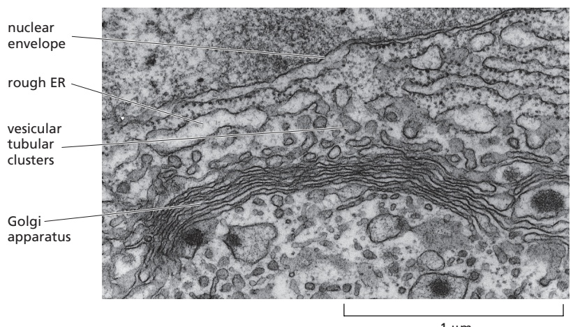

1 µm

Figure 13–27 The Golgi apparatus. (A) Three-dimensional reconstruction from electron micrographs of the Golgi apparatus in a secretory animal cell. The cis face of the Golgi stack is that closest to the ER. (B) A thin-section electron micrograph of an animal cell. In plant cells, the Golgi apparatus is generally more distinct and more clearly separated from other intracellular membranes than in animal cells. (A, redrawn from A. Rambourg and Y. Clermont, Eur. J. Cell Biol. 51:189–200, 1990; B, courtesy of Brij J. Gupta.)

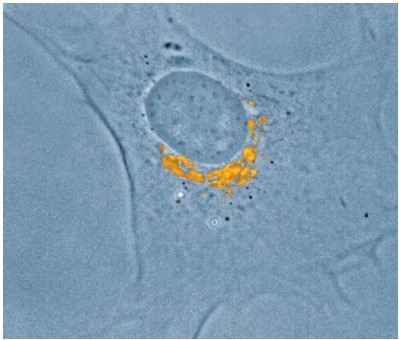

(A)

(B)

Figure 13–28 Localization of the Golgi apparatus in animal and plant cells. (A) The Golgi apparatus in a cultured fibroblast stained with a fluorescent antibody that recognizes a Golgi resident protein (bright orange). The Golgi apparatus is polarized, facing the direction in which the cell was crawling before fixation. (B) The Golgi apparatus in a plant cell that is expressing a fusion protein consisting of a resident Golgi enzyme fused to green fluorescent protein. (A, courtesy of John Henley and Mark McNiven; B, courtesy of Chris Hawes.)

During their passage through the Golgi apparatus, many transported molecules undergo an ordered series of covalent modifications. Each Golgi stack has two distinct faces: a **cis face** (or entry face) and a **trans face** (or exit face). Both cis and trans faces are closely associated with special compartments, each composed of aMBoC7 m13.27/13.28 network of interconnected tubular and cisternal structures: the **cis Golgi network (CGN)** and the **trans Golgi network (TGN)**, respectively. The CGN is a collection of fused vesicular tubular clusters arriving from the ER. Proteins and lipids enter the cis Golgi network and exit from the trans Golgi network, bound for the cell surface or another compartment. Both networks are important for protein sorting: proteins entering the CGN can either move onward in the Golgi apparatus or be returned to the ER. Similarly, proteins exiting from the TGN move onward and are sorted according to their next destination: endosomes, secretory vesicles, or the cell surface. They also can be returned to an earlier compartment. Some membrane proteins are retained in the part of the Golgi apparatus where they function.

As described in Chapter 12, a single species of N-linked oligosaccharide is attached en bloc to many proteins in the ER and then trimmed while the protein is still in the ER. The oligosaccharide intermediates created by the trimming reactions serve to help proteins fold and to help transport misfolded proteins to the cytosol for degradation in proteasomes. Thus, they play an important role in controlling the quality of proteins exiting from the ER. Once these ER functions have been fulfilled, the cell reutilizes the oligosaccharides for new functions. This begins in the Golgi apparatus, which generates the heterogeneous oligosaccharide structures seen in mature proteins. After arrival in the CGN, proteins enter the first of the Golgi processing compartments (the cis Golgi cisterna). They then move to the next compartment (the medial cisterna) and finally to the trans cisterna, where glycosylation is completed. The lumen of the trans cisterna is thought to be continuous with the TGN, the place where proteins are segregated into different transport packages and dispatched to their next destinations.

The oligosaccharide-processing steps occur in an organized sequence in the Golgi apparatus, with each cisterna containing a characteristic mixture of processing enzymes. Proteins are modified in successive stages as they move from cisterna to cisterna across the stack, so that the stack forms a multistage processing unit.

Investigators discovered the functional differences between the cis, medial, and trans subdivisions of the Golgi apparatus by localizing the enzymes involved in processing N-linked oligosaccharides in distinct regions of the organelle, both by physical fractionation of the organelle and by labeling the enzymes in electron microscope sections with antibodies (**Figure 13–29**). The removal of mannose and

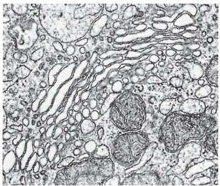

(A)

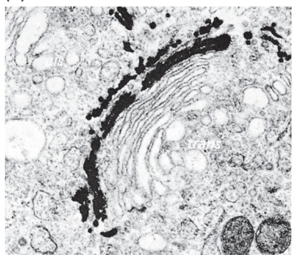

(B)

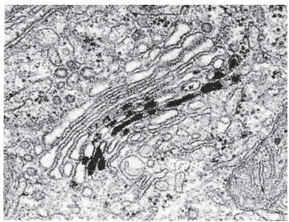

(C)

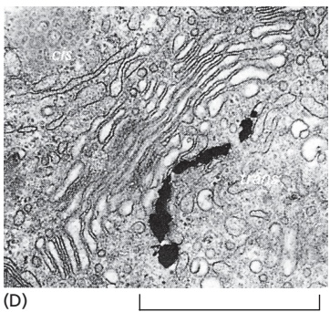

<small>Figure 13–29 Molecular compartmentalization of the Golgi apparatus. A series of electron micrographs shows the Golgi apparatus (A) unstained, (B) stained with osmium, which preferentially labels the cisternae of the cis compartment, and (C and D) stained to reveal the location of specific enzymes. Nucleoside diphosphatase is found in the trans Golgi cisternae (C), while acid phosphatase is found in the trans Golgi network (D). Note that usually more than one cisterna is stained. The enzymes are therefore thought to be highly enriched rather than precisely localized to a specific cisterna. (Courtesy of Daniel S. Friend, by permission of E.L. Bearer.)</small>

1 µm

the addition of N-acetylglucosamine, for example, occur in the cis and medial cisternae, while the addition of galactose and sialic acid occurs in the trans cisterna and trans Golgi network. Figure 13–30 summarizes the functional compartmentalization of the Golgi apparatus.

processing in Golgi compartments. The localization of each processing step shown was determined by a combination of techniques, including biochemical subfractionation of the Golgi apparatus membranes and electron microscopy after staining with antibodies specific for some of the processing enzymes. Processing enzymes are not restricted to a particular cisterna; instead, their distribution is graded across the stack, such that early-acting enzymes are present mostly in the cis Golgi cisternae and later-acting enzymes are mostly in the trans Golgi cisternae. Man, mannose; GlcNAc, N-acetylglucosamine; Gal, galactose; NANA, N-acetylneuraminic acid (sialic acid).

#### Oligosaccharide Chains Are Processed in the Golgi Apparatus

Whereas the ER lumen is full of soluble resident proteins and enzymes, the resident proteins in the Golgi apparatus are all membrane bound. All of the Golgi glycosidases and glycosyl transferases, for example, are single-pass transmembrane proteins, many of which are organized in multienzyme complexes.

Two broad classes of N-linked oligosaccharides, the **complex oligosaccharides** and the **high-mannose oligosaccharides**, are attached to mammalian glycoproteins. Sometimes, both types are attached (in different places) to the same polypeptide chain. Complex oligosaccharides are generated when the original N-linked oligosaccharide added in the ER is trimmed and further sugars are added; by contrast, high-mannose oligosaccharides are trimmed but have no new sugars added to them in the Golgi apparatus (**Figure 13–31**). The sialic acids in the complex oligosaccharides are of special importance because they bear a negative charge. Whether a given oligosaccharide remains high-mannose or is processed depends largely on its position in the protein. If the oligosaccharide is accessible to the processing enzymes in the Golgi apparatus, it is likely to be converted to a complex form; if it is inaccessible because its sugars are tightly held to the protein’s surface, it is likely to remain in a high-mannose form. The processing that generates complex oligosaccharide chains follows the highly ordered pathway shown in **Figure 13–32**.

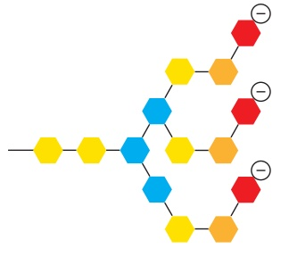

Figure 13–31 The two main classes of asparagine-linked (N-linked) oligosaccharides found in mature mammalian glycoproteins. (A) Both complex oligosaccharides and high-mannose oligosaccharides share a common core region derived by trimming the original N-linked oligosaccharide added in the ER (see Figure 12–32) and typically containing two N-acetylglucosamines (GlcNAc) and three mannoses (Man). The three amino acids constitute the sequence recognized by the oligosaccharyl transferase enzyme that adds the initial oligosaccharide to the protein. Asn, asparagine; Ser, serine; Thr, threonine; X, any amino acid, except proline. (B) Each complex oligosaccharide consists of a core region, together with a terminal region that contains a variable number of copies of a special trisaccharide unit (N-acetylglucosamine–galactose–sialic acid) linked to the three core mannoses. Frequently, the terminal region is truncated and contains only GlcNAc and galactose (Gal) or just GlcNAc. In addition, a fucose may be added, usually to the core GlcNAc attached to the asparagine (Asn). Thus, although the steps of processing and subsequent sugar addition are rigidly ordered, complex oligosaccharides can be heterogeneous. Moreover, although the complex oligosaccharide shown has three terminal branches, two and four branches are also common, depending on the glycoprotein and the cell in which it is made (Movie 13.4). (C) Highmannose oligosaccharides are not trimmed back all the way to the core region and contain additional mannoses. Hybrid oligosaccharides with one Man branch and one GlcNAc and Gal branch are also found (not shown).

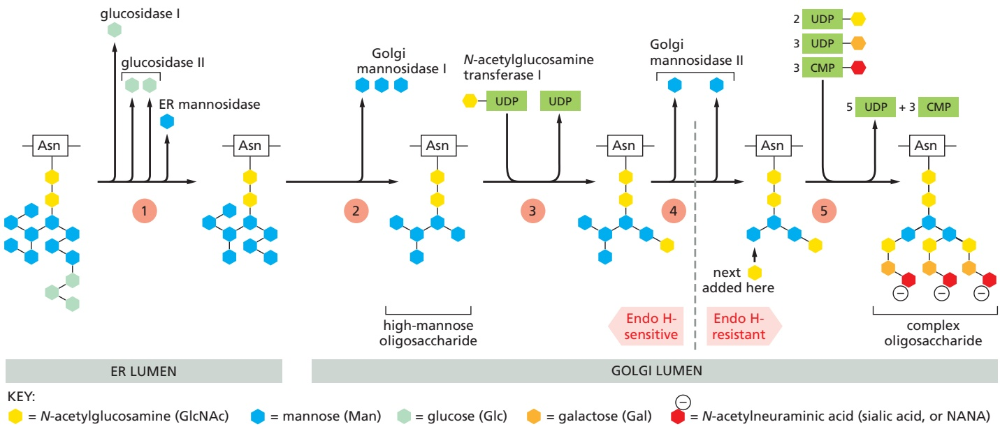

Figure 13–32 Oligosaccharide processing in the ER and the Golgi apparatus. The processing pathway is highly ordered, so that each step shown depends on the previous one. Step 1: Processing begins in the ER with the removal of the glucoses from the oligosaccharide initially transferred to the protein. Then a mannosidase in the ER membrane removes a specific mannose. The remaining steps occur in the Golgi stack. Step 2: Golgi mannosidase I removes three more mannoses. Step 3: N-acetylglucosamine transferase I then adds an N-acetylglucosamine. Step 4: Golgi mannosidase II then removes two additional mannoses. This yields the final core of three mannoses that is present in a complex oligosaccharide. At this stage, the bond between the two N-acetylglucosamines in the core becomes resistant to attack by a highly specific endoglycosidase (Endo H). Because all later structures in the pathway are also Endo H–resistant, treatment with this enzyme is widely used to distinguish complex from high-mannose oligosaccharides. Step 5: Finally, as shown in Figure 13–31, additional N-acetylglucosamines, galactoses, and sialic acids are added. These final steps in the synthesis of a complex oligosaccharide occur in the cisternal compartments of the Golgi apparatus: three types of glycosyl transferase enzymes act sequentially, using sugar substrates that have been activated by linkage to the indicated nucleotide; the membranes of the Golgi cisternae contain specific carrier proteins that allow each sugar nucleotide to enter in exchange for the nucleoside phosphates that are released after the sugar is attached to the protein on the lumenal face.

MBoC7 m13.31/13.32Note that, as a biosynthetic organelle, the Golgi apparatus differs from the ER: all sugars in the Golgi are assembled inside the lumen from sugar nucleotides, whereas in the ER, the N-linked precursor oligosaccharide is assembled partly in the cytosol and partly in the lumen, and most lumenal reactions use dolichol-linked sugars as their substrates (see Figure 12–33).

Beyond these commonalities in oligosaccharide processing that are shared among most cells, the products of the carbohydrate modifications carried out in the Golgi apparatus are highly complex and have given rise to a field of study called glycobiology. The human genome, for example, encodes hundreds of different Golgi glycosyl transferases and many glycosidases. These enzymes are expressed differently from one cell type to another and at different times during development, resulting in a variety of glycosylated forms of a given protein or lipid in different cell types and at varying stages of differentiation. The complexity of modifications is not limited to N-linked oligosaccharides but also occurs on O-linked sugars, as we discuss next.

#### Proteoglycans Are Assembled in the Golgi Apparatus

In addition to the N-linked oligosaccharide alterations, many proteins are modified in the Golgi apparatus in other ways as they pass through the Golgi cisternae en route from the ER to their final destinations. Some proteins have sugars added

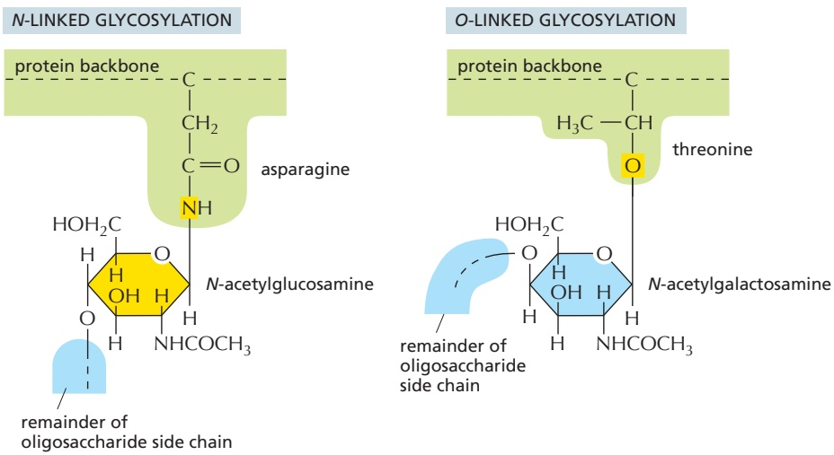

Figure 13–33 N- and O-linked glycosylation. In each case, only the single sugar group that is directly attached to the protein chain is shown.

to the hydroxyl groups of selected serines or threonines or, in some cases (suchMBoC7 m13.32/13.33 as collagens), to hydroxylated proline and lysine side chains. This **O-linked glycosylation** (**Figure 13–33**), like the extension of N-linked oligosaccharide chains, is catalyzed by a series of glycosyl transferase enzymes that use the sugar nucleotides in the lumen of the Golgi apparatus to add sugars to a protein one at a time. Usually, N-acetylgalactosamine is added first, followed by a variable number of additional sugars, ranging from just a few to 10 or more.

The Golgi apparatus confers the heaviest O-linked glycosylation of all on mucins, the glycoproteins in mucus secretions, and on proteoglycan core proteins, which it modifies to produce **proteoglycans**. As discussed in Chapter 19, this process involves the polymerization of one or more glycosaminoglycan chains (long, unbranched polymers composed of repeating disaccharide units; see Figure 19–35) onto serines on a core protein. Many proteoglycans are secreted and become components of the extracellular matrix, while others remain anchored to the extracellular face of the plasma membrane. Still others form a major component of slimy materials, such as the mucus that is secreted to form a protective coating on the surface of many epithelia.

The sugars incorporated into glycosaminoglycans are heavily sulfated in the Golgi apparatus immediately after these polymers are made, thus adding a significant portion of their characteristically large negative charge. Some tyrosines in proteins also become sulfated shortly before they exit from the Golgi apparatus. In both cases, the sulfation depends on the sulfate donor 3′-phosphoadenosine-5′-phosphosulfate (PAPS) (**Figure 13–34**), which is transported from the cytosol into the lumen of the trans Golgi network.

#### What Is the Purpose of Glycosylation?

There is an important difference between the construction of an oligosaccharide and the synthesis of other macromolecules such as DNA, RNA, and protein. Whereas nucleic acids and proteins are copied from a template in a repeated series of identical steps using the same enzyme or set of enzymes, complex carbohydrates require a different enzyme at each step. The product of each enzyme is recognized as the exclusive substrate for the next enzyme in the series. The vast abundance of glycoproteins and the complicated pathways that have evolved to synthesize them emphasize that the oligosaccharides on glycoproteins and glycosphingolipids have very important functions. A large family of genetic human diseases known as congenital disorders of glycosylation is caused by inherited mutations in individual enzymes involved in glycan modification of proteins and lipids.

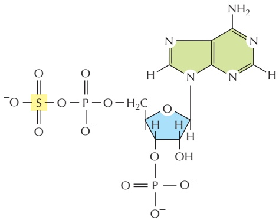

3′-phosphoadenosine-5′-phosphosulfate (PAPS)

Figure 13–34 The structure of PAPS.

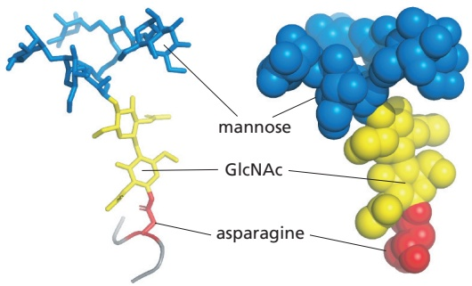

Figure 13–35 The three-dimensional structure of a high-mannose N-linked oligosaccharide. The structure was determined by x-ray crystallographic analysis of a glycoprotein. This oligosaccharide contains only 9 sugars, whereas there are 14 sugars in the N-linked oligosaccharide that is initially transferred to proteins in the ER (see Figure 12–32). Left: a backbone model showing all atoms except hydrogens; only the asparagine side chain of the protein is shown. Right: a space-filling model, with the asparagine and sugars indicated using the same color scheme as at left. (PDB code: 5KZC.)

N-linked glycosylation, for example, is prevalent in all eukaryotes, including yeasts. N-linked oligosaccharides also occur in a very similar form in archaeal cell-wall proteins, suggesting that the whole machinery required for their synthesis is evolutionarily ancient. N-linked glycosylation promotes protein folding inMBoC7 m13.34/13.35 two ways. First, it has a direct role in making folding intermediates more soluble, thereby preventing their aggregation. Second, the sequential modifications of the N-linked oligosaccharide establish a “glyco-code” that marks the progression of protein folding. This glyco-code is used by chaperones and lectins in the ER to guide protein folding and degradation (discussed in Chapter 12) and by other lectins that guide ER-to-Golgi transport. As we discuss later, oligosaccharides also participate in protein sorting in the trans Golgi network.

Because chains of sugars have limited flexibility, even a small N-linked oligosaccharide protruding from the surface of a glycoprotein (**Figure 13–35**) can limit the approach of other macromolecules to the protein surface. In this way, for example, the presence of oligosaccharides tends to make a glycoprotein more resistant to digestion by proteolytic enzymes. It may be that the oligosaccharides on cell-surface proteins originally provided an ancestral cell with a protective coat; compared to the rigid bacterial cell wall, such a sugar coat has the advantage that it leaves the cell with the freedom to change shape and move.

The sugar chains have since been adapted to serve other purposes as well. The mucus coat of lung and intestinal cells, for example, protects against many pathogens. The recognition of sugar chains by lectins in the extracellular space is important in many developmental processes and in cell–cell recognition: selectins, for example, are transmembrane lectins that function in cell–cell adhesion during blood-cell migration, as discussed in Chapter 19. The presence of oligosaccharides may modify a protein’s antigenic and functional properties, making glycosylation an important factor in the production of proteins for pharmaceutical purposes.

Glycosylation can also have important regulatory roles. Signaling through the cell-surface signaling receptor Notch, for example, is an important factor in determining the cell’s fate in development (discussed in Chapter 21). Notch is a transmembrane protein that is O-glycosylated by addition of a single fucose to some serines, threonines, and hydroxylysines. Some cell types express an additional glycosyl transferase that adds an N-acetylglucosamine to each of these fucoses in the Golgi apparatus. This addition changes the specificity of Notch for the cell-surface signal proteins that activate it.

#### Transport Through the Golgi Apparatus Occurs by Multiple Mechanisms

In order to function, the Golgi apparatus must maintain its polarized multi-cisternal structure while facilitating the transit of a large number of diverse molecules. It is likely that multiple mechanisms are used to transport cargo molecules through the Golgi cisternae while efficiently retaining Golgi resident proteins. One mechanism involves the movement of cargo in transport vesicles from one compartment to the next while retrieving any escaped resident proteins using different transport vesicles (**Figure 13–36A**). This vesicle transport mechanism is conceptually similar to how proteins and lipids are transported from the ER to the Golgi, except that only COPI-coated vesicles are used. Although both forward- and backward-moving vesicles would likely be COPI-coated, the coats may contain different adaptor proteins that confer selectivity on the packaging of cargo molecules.

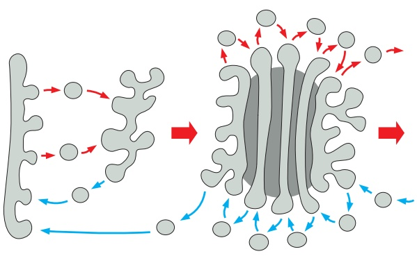

(A) VESICLE TRANSPORT MECHANISM

(B) CISTERNAL MATURATION MECHANISM

A different way for cargo to move through the Golgi apparatus involves the **cisternal maturation mechanism**. According to this view, new cis cisternae continually form as vesicular tubular clusters arrive from the ER and fuse with transport vesicles containing Golgi resident proteins and enzymes. As the cargo within a cis cisterna is modified, the enzymes leave in transport vesicles that will fuse with newly arriving vesicular tubular clusters. At the same time, the cisterna accepts transport vesicles containing enzymes from later Golgi cisternae, converting it into a medial cisterna. In this way, a cisterna full of cargo moves through the Golgi stack while different subsets of Golgi resident proteins transit backwards in COPI-coated vesicles from later to earlier cisternae (**Figure 13–36B**). When a cisterna finally moves forward to become part of the trans Golgi network, various types of coated vesicles bud off it until this network disappears, to be replaced by a maturing cisterna just behind. At the same time, other transport vesicles are continually retrieving membrane from post-Golgi compartments and returning it to the trans Golgi network.

It is likely that aspects of both mechanisms are used to varying degrees depending on the type of cell and the nature of cargo molecules that need to be transported. A stable core of long-lasting cisternae might exist in the center of each Golgi cisterna, while regions at the rim may undergo continual maturation, perhaps utilizing Rab cascades that change their identity. As matured pieces of the cisternae are formed, they might break off and fuse with downstream cisternae by homotypic fusion mechanisms, taking large cargo molecules such as procollagen rods and lipoprotein particles with them. In addition, COPI-coated vesicles might transport small cargo in the forward direction and retrieve escaped Golgi enzymes to their appropriate upstream cisternae.

Figure 13–36 Two mechanisms explaining the organization of the Golgi apparatus and how proteins move through it. It is likely that transport of cargo molecules through the Golgi apparatus in the forward direction (red arrows) involves elements of both mechanisms. (A) In the vesicle transport mechanism, Golgi cisternae are static compartments, which contain a characteristic complement of resident enzymes. The passing of molecules from cis to trans through the Golgi is accomplished by forward-moving transport vesicles, which bud from one cisterna and fuse with the next in a cisto-trans direction. (B) In the cisternal maturation mechanism, each Golgi cisterna matures as it migrates outward through the stack. At each stage, the Golgi resident proteins that are carried forward in a maturing cisterna are moved backwards (blue arrows) to an earlier compartment in COPI-coated vesicles. When a newly formed cisterna moves to a medial position, for example, “leftover” cis Golgi enzymes would be extracted and transported retrogradely to a new cis cisterna behind. Likewise, the medial enzymes would be received by retrograde transport from the cisternae just ahead. In this way, a cis cisterna would mature to a medial and then trans cisterna as it moves outward.

#### Golgi Matrix Proteins Help Organize the Stack

The unique architecture of the Golgi apparatus depends on both the microtubule cytoskeleton, as already mentioned, and cytoplasmic Golgi matrix proteins. The Golgi reassembly and stacking proteins (called GRASPs) form a scaffold between adjacent cisternae and give the Golgi stack its structural integrity. Other matrix proteins, called golgins, form long tethers composed of stiff coiled-coil domains with interspersed hinge regions. Golgins form a forest of tentacles that can extend 100–400 nm from the surface of the Golgi stack. Different members of the golgin family are found in different regions of the Golgi stack and contain binding sites for different Rab proteins. Because transport vesicles arriving from different locations have their characteristic Rab proteins on them, golgins are thought to function as tethers that initially select which part of the Golgi stack a transport vesicle engages (**Figure 13–37**).

When the cell prepares to divide, mitotic protein kinases phosphorylate the Golgi matrix proteins, causing the Golgi apparatus to fragment and disperse throughout the cytosol. The Golgi fragments are then distributed evenly to the two daughter cells, where the matrix proteins are dephosphorylated, leading to the reassembly of the Golgi stack. Similarly, during apoptosis, proteolytic cleavage of golgins by caspases (discussed in Chapter 18) leads to fragmentation of the Golgi apparatus as the cell self-destructs.

#### Summary

Correctly folded and assembled proteins in the ER are packaged into COPII-coated transport vesicles that pinch off from the ER membrane. Shortly thereafter, the vesicles shed their coat and fuse with one another to form vesicular tubular clusters. In animal cells, the clusters then move on microtubule tracks to the Golgi apparatus, where they fuse with one another to form the cis Golgi network. Any resident ER proteins that escape from the ER are returned there from the vesicular tubular clusters and Golgi apparatus by retrograde transport in COPI-coated vesicles.

The Golgi apparatus, unlike the ER, contains many sugar nucleotides, which glycosyl transferase enzymes use to glycosylate lipid and protein molecules as they pass through the Golgi apparatus. The mannoses on the N-linked oligosaccharides that are added to proteins in the ER are often initially removed, and further sugars are added. Moreover, the Golgi apparatus is the site where O-linked glycosylation occurs and where glycosaminoglycan chains are added to core proteins to form proteoglycans. Sulfation of the sugars in proteoglycans and of selected tyrosines on proteins also occurs in a late Golgi compartment.

The Golgi apparatus modifies the many proteins and lipids that it receives from the ER and then distributes them to the plasma membrane, endosomes, and secretory vesicles. The Golgi apparatus is a polarized organelle, consisting of one or more stacks of disc-shaped cisternae. Each stack is organized as a series of at least three functionally distinct compartments, termed cis, medial, and trans cisternae. The cis and trans cisternae are each connected to special sorting stations, called the cis Golgi network and the trans Golgi network, respectively. Proteins and lipids move through the Golgi stack in the cis-to-trans direction. This movement may occur by vesicle transport, by progressive maturation of the cis cisternae as they migrate continuously through the stack, or by a combination of these two mechanisms. Continual retrograde vesicle transport from later to earlier cisternae keeps the enzymes concentrated in the cisternae where they are needed. The finished new proteins end up in the trans Golgi network, which packages them in transport vesicles and dispatches them to their specific destinations in the cell.

<!-- END EN EN13-H025-H031 -->

### 英文补充：溶酶体水解酶分选与储积病

> 对应中文板块：溶酶体水解酶分选与储积病。英文来源：Molecular Biology of the Cell，第7版，第13章；[本章完整原文](../../来源/英文教材/13_Intracellular_Membrane_Traffic/chapter.md)。物理PDF页码范围：788–849（整章范围）。

<!-- BEGIN EN EN13-H034-H035 -->
#### A Mannose 6-Phosphate Receptor Sorts Lysosomal Hydrolases in the Trans Golgi Network

The best-understood mechanism for sorting of cargo molecules at the TGN operates on lysosomal hydrolases. Lysosomes are membrane-enclosed organelles filled with about 40 hydrolytic enzymes responsible for digesting all the macromolecules delivered there. Lysosomes are therefore a major site for degradation and recycling of proteins, nucleic acids, lipids, and even whole organelles. The function of lysosomes and the various transport routes leading to this organelle are considered later. For now, we address the pathway that selectively packages lysosomal hydrolases at the TGN into transport vesicles destined for endosomes. The vesicles that leave the TGN for endosomes incorporate the lysosomal proteins and exclude the many other proteins being packaged into different transport vesicles for delivery elsewhere.

How are lysosomal hydrolases recognized and selected in the TGN with the required accuracy? In animal cells they carry a unique marker in the form of mannose 6-phosphate (M6P) groups, which are added exclusively to the N-linked oligosaccharides of these soluble lysosomal enzymes as they pass through the lumen of the cis Golgi network (**Figure 13–39**). Transmembrane **M6P receptor proteins**, which are present in the TGN, recognize the M6P groups and bind to the lysosomal hydrolases on the lumenal side of the membrane and to adaptor proteins in assembling clathrin coats on the cytosolic side. In this way, the receptors help package the hydrolases into clathrin-coated vesicles that bud from the TGN and deliver their contents to early endosomes.

Figure 13–39 The structure of mannose 6-phosphate on a lysosomal hydrolase.

The M6P receptor protein binds to M6P at pH 6.5–6.7 in the TGN lumen and releases it at pH 6, which is the pH in the lumen of endosomes. Thus, after the receptor is delivered, the lysosomal hydrolases dissociate from the M6P receptors, which are retrieved into transport vesicles that bud from endosomes. These vesicles are coated with retromer, a coat protein complex specialized for endosome-to-TGN transport, which returns the receptors to the TGN for reuse (**Figure 13–40**).

Transport in either direction requires signals in the cytoplasmic tail of the M6P receptor that direct this protein to the endosome or back to the TGN. An adaptor protein of the clathrin coat recognizes the tail at the TGN, while retromer recognizes it at the endosome. The assembly of different coats at different membranes for the same receptor is ensured by organelle-specific markers, such as Rab7 and PI(3)P at the endosome. The recycling of the M6P receptor resembles the recycling of the KDEL receptor discussed earlier, although it differs in the type of coated vesicles that mediate the transport.

Figure 13–40 The transport of newly synthesized lysosomal hydrolases to endosomes. The sequential action of two enzymes in the cis and trans Golgi network adds mannose 6-phosphate (M6P) groups to the precursors of lysosomal enzymes (see Figure 13–41). The M6P-tagged hydrolases then segregate from all other types of proteins in the TGN because adaptor proteins (not shown) in the clathrin coat bind the M6P receptors, which, in turn, bind the M6P-modified lysosomal hydrolases. The clathrin-coated vesicles bud off from the TGN, shed their coat, and fuse with early endosomes. At the lower pH of the endosome, the hydrolases dissociate from the M6P receptors, and the empty receptors are retrieved in retromercoated vesicles to the TGN for further rounds of transport. In the endosomes, the phosphate is removed from the M6P attached to the hydrolases, which may further ensure that the hydrolases do not return to the TGN with the receptor.

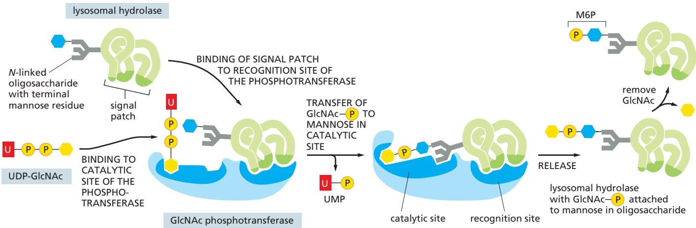

Figure 13–41 The recognition of a lysosomal hydrolase. A GlcNAc phosphotransferase recognizes lysosomal hydrolases in the Golgi apparatus. The enzyme has separate catalytic and recognition sites. The catalytic site binds both high-mannose N-linked oligosaccharides and UDP-GlcNAc. The recognition site binds to a signal patch that is present only on the surface of lysosomal hydrolases. A second enzyme cleaves off the GlcNAc, leaving the mannose 6-phosphate exposed.

Not all the hydrolase molecules that are tagged with M6P get to lysosomes. Some escape the normal packaging process in the trans Golgi network and are transported by the constitutive secretory pathway to the cell surface, where they are secreted into the extracellular fluid. Some M6P receptors, however, also take a detour to the plasma membrane, where they recapture the escaped lysosomal hydrolases and return them by receptor-mediated endocytosis (discussed later) to lysosomes via early and late endosomes. As lysosomal hydrolases require an acidic milieu to work, they can do little harm in the extracellular fluid, which usually has a neutral pH of 7.4.

For the sorting system that segregates lysosomal hydrolases and dispatchesMBoC7 m13.46/13.41 them to endosomes to work, the M6P groups must be added only to the appropriate glycoproteins in the Golgi apparatus. This requires specific recognition of the hydrolases by the Golgi enzymes responsible for adding M6P. Because all glycoproteins leave the ER with identical N-linked oligosaccharide chains, the signal for adding the M6P units to oligosaccharides must reside somewhere in the polypeptide chain of each hydrolase. Genetic engineering experiments have revealed that the recognition signal is a cluster of neighboring amino acids on each protein’s surface, known as a signal patch (**Figure 13–41**). Because most lysosomal hydrolases contain multiple oligosaccharides, they acquire many M6P groups, providing a high-affinity signal for the M6P receptor.

#### Defects in the GlcNAc Phosphotransferase Cause a Lysosomal Storage Disease in Humans

Genetic defects that affect one or more of the lysosomal hydrolases cause a number of human **lysosomal storage diseases**. The defects result in an accumulation of undigested substrates in lysosomes, with severe pathological consequences, most often in the nervous system. In most cases, there is a mutation in a structural gene that codes for an individual lysosomal hydrolase. This occurs in Hurler’s disease, for example, in which the enzyme required for the breakdown of certain types of glycosaminoglycan chains is defective or missing. The most severe form of lysosomal storage disease, however, is a very rare inherited metabolic disorder called inclusion-cell disease (I-cell disease). In this condition, almost all of the hydrolytic enzymes are missing from the lysosomes of many cell types, and their undigested substrates accumulate in these lysosomes, which consequently form large inclusions in the cells. The consequent pathology is complex, affecting all organ systems, skeletal integrity, and mental development; individuals rarely live beyond 6 or 7 years.

I-cell disease is due to a single gene defect and, like most genetic enzyme deficiencies, it is recessive; that is, it occurs only in individuals having two copies of the defective gene. In individuals with I-cell disease, all the hydrolases missing from lysosomes are found in the blood: because they fail to sort properly in the Golgi apparatus, they are secreted rather than transported to lysosomes. The mis-sorting has been traced to a defective or missing GlcNAc phosphotransferase. Because lysosomal enzymes are not phosphorylated in the cis Golgi network, the M6P receptors do not segregate them into the appropriate transport vesicles in the TGN. Instead, the lysosomal hydrolases are carried to the cell surface and secreted.

In I-cell disease, the lysosomes in some cell types, such as hepatocytes, contain a normal complement of lysosomal enzymes, implying that there is another pathway for directing hydrolases to lysosomes that is used by some cell types but not others. Alternative sorting receptors function in these M6P-independent pathways. Similarly, an M6P-independent pathway in all cells sorts the membrane proteins of lysosomes from the TGN for transport to late endosomes, and those proteins are therefore normal in I-cell disease.

<!-- END EN EN13-H034-H035 -->

### 英文补充：溶酶体、液泡与胞内消化途径

> 对应中文板块：溶酶体、液泡与胞内消化途径。英文来源：Molecular Biology of the Cell，第7版，第13章；[本章完整原文](../../来源/英文教材/13_Intracellular_Membrane_Traffic/chapter.md)。物理PDF页码范围：788–849（整章范围）。

<!-- BEGIN EN EN13-H055-H059 -->
#### THE DEGRADATION AND RECYCLING OF MACROMOLECULES IN LYSOSOMES

Having discussed how molecules are trafficked forward through the secretory pathway and how material enters the cell through the endocytic pathway, we now consider lysosomes. The lysosome is a terminal destination for the degradation of proteins, microorganisms, dead cells, and other materials ingested by endocytosis and phagocytosis. In addition, proteins, old organelles, and other components in the cytosol can also be degraded in lysosomes through a process termed autophagy. In this section, we begin with a brief account of lysosome structure and function, then discuss how material for degradation is delivered to lysosomes.

#### Lysosomes Are the Principal Sites of Intracellular Digestion

**Lysosomes** are membrane-enclosed organelles filled with soluble hydrolytic enzymes that digest macromolecules. Lysosomes contain about 40 types of hydrolytic enzymes, including proteases, nucleases, glycosidases, lipases, phospholipases, phosphatases, and sulfatases. All are **acid hydrolases**; that is, hydrolases that work best at acidic pH. For optimal activity, they need to be activated by proteolytic cleavage, which also requires an acid environment. The lysosome provides this acidity, maintaining an interior pH of about 4.5–5.0. By this arrangement, the contents of the cytosol are doubly protected against attack by the cell’s own digestive system: the membrane of the lysosome keeps the digestive enzymes out of the cytosol, but, even if they leak out, they can do little damage at the cytosolic pH of about 7.2.

Like all other membrane-enclosed organelles, the lysosome not only contains a unique collection of enzymes but also has a unique surrounding membrane. Most of the lysosome membrane proteins, for example, are highly glycosylated, which helps to protect them from the lysosome proteases in the lumen. Transport proteins in the lysosome membrane carry the final products of the digestion of macromolecules—such as amino acids, sugars, and nucleotides—to the cytosol, where the cell can either reuse or excrete them.

A vacuolar $H ^ { + }$ ATPase in the lysosome membrane uses the energy of ATP hydrolysis to pump $\mathrm { H } ^ { + }$ into the lysosome, thereby maintaining the lumen at its acidic pH (**Figure 13–62**). The lysosome H+ pump belongs to the family of V-type ATPases and has a similar architecture to the mitochondrial and chloroplast ATP synthases (F-type ATPases), which convert the energy stored in $\mathrm { H } ^ { + }$ gradients into ATP (see Figure 11–12). By contrast to these enzymes, however, the vacuolar H+ ATPase exclusively works in reverse, pumping $\dot { \mathrm { H } } ^ { + }$ into the organelle. Similar or identical V-type ATPases acidify all endocytic and exocytic organelles, including lysosomes, endosomes, some compartments of the Golgi apparatus, and many transport and secretory vesicles. In addition to providing a low-pH environment that is suitable for reactions occurring in the organelle lumen, the H+ gradient provides a source of energy that drives the transport of small metabolites across the organelle membrane.

Figure 13–62 Lysosomes. The acid hydrolases are hydrolytic enzymes that are active under acidic conditions. An H+ ATPase in the membrane pumps H+ into the lysosome, maintaining its lumen at an acidic pH.

#### Lysosomes Are Heterogeneous

Lysosomes are found in all eukaryotic cells. They were initially discovered by the biochemical fractionation of cell extracts; only later were they seen clearly in the electron microscope. Although extraordinarily diverse in shape and size, staining them with specific antibodies shows they are members of a single family of organelles. They can also be identified by histochemical techniques that reveal which organelles contain acid hydrolase (**Figure 13–63**).

The heterogeneous morphology of lysosomes contrasts with the relatively uniform structures of many other cell organelles. The diversity reflects the wide variety of digestive functions that acid hydrolases mediate, including the breakdown of intracellular and extracellular debris, the destruction of phagocytosed microorganisms, and the production of nutrients for the cell. Their morphological diversity, however, also reflects the way lysosomes form. Late endosomes containing material received from the plasma membrane by endocytosis and containing newly synthesized lysosomal hydrolases fuse with preexisting lysosomes to form structures that are referred to as endolysosomes, which then fuse with one another (**Figure 13–64**). When the majority of the endocytosed material within an endolysosome has been digested so that only resistant or slowly digestible residues remain, these organelles become “classical” lysosomes. These are relatively dense, round, and small, but they can enter the cycle again by fusing with late endosomes or endolysosomes. Thus, there is no real distinction between endolysosomes and lysosomes: they are the same except that they are in different stages of a maturation cycle. For this reason, lysosomes are sometimes viewed as a heterogeneous collection of distinct organelles, the common feature of which is a high content of hydrolytic enzymes. It is especially hard to apply a narrower definition than this in plant cells, as we discuss next.

Figure 13–63 Histochemical visualization of lysosomes. These electron micrographs show two sections of a cell stained to reveal the location of acid phosphatase, a marker enzyme for lysosomes. The larger membrane-enclosed organelles, containing dense precipitates of lead phosphate, are lysosomes. Their diverse morphology reflects variations in the amount and nature of the material they are digesting. The precipitates are produced when tissue fixed with glutaraldehyde (to fix the enzyme in place) is incubated with a phosphatase substrate in the presence of lead ions. Red arrows in the top panel indicate two small vesicles thought to be carrying acid hydrolases from the Golgi apparatus. (Courtesy of Daniel S. Friend, and by permission of E.L. Bearer.)

200 nm

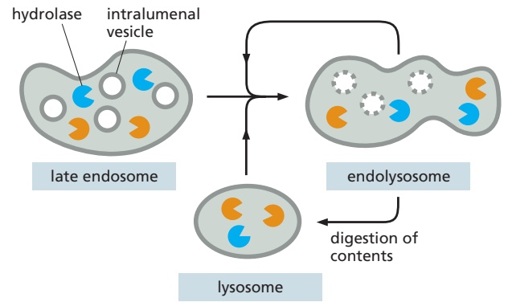

Figure 13–64 A model for lysosome maturation. Late endosomes fuse with preexisting lysosomes (bottom) or preexisting endolysosomes (top right). Endolysosomes eventually mature into lysosomes as hydrolases complete the digestion of their contents, which can include intralumenal vesicles. Lysosomes also fuse with phagosomes, as we discuss later.

hydrolytically active, low-pH compartments

#### Plant and Fungal Vacuoles Are Remarkably Versatile Lysosomes

Most plant and fungal cells (including yeasts) contain one or several very large, fluid-filled vesicles called **vacuoles**. They typically occupy more than 30% of the cell volume and as much as 90% in some cell types (**Figure 13–65**). Vacuoles are related to animal-cell lysosomes and contain a variety of hydrolytic enzymes, but their functions are remarkably diverse. The plant vacuole can act as a storageMBoC7 m13.39/13.64 organelle for both nutrients and waste products, as a degradative compartment, as an economical way of increasing cell size, and as a controller of turgor pressure (the osmotic pressure that pushes outward on the cell wall and keeps the plant from wilting) (**Figure 13–66**). The same cell may have different vacuoles with distinct functions, such as digestion and storage.

The vacuole is important as a homeostatic device, enabling plant cells to withstand wide variations in their environment. When the pH in the environment drops, for example, the flux of H+ into the cytosol is balanced, at least in part, by an increased transport of H+ into the vacuole, which tends to keep the pH in the cytosol constant. Similarly, many plant cells maintain an almost constant turgor pressure despite large changes in the tonicity of the fluid in their immediate environment. They do so by changing the osmotic pressure of the cytosol and vacuole—in part by the controlled breakdown and resynthesis of polymers such as polyphosphate in the vacuole, and in part by altering the transport rates of sugars, amino acids, and other metabolites across the plasma membrane and the vacuolar membrane. The turgor pressure regulates the activities of distinct transporters in each membrane to control these fluxes.

Figure 13–65 The plant-cell vacuole. (A) A confocal image of cells from an Arabidopsis embryo that is expressing an aquaporin—YFP (yellow fluorescent protein) fusion protein in its vacuole membrane. YFP fluorescence and the cell walls have been false colored green and orange, respectively. Each cell contains several large vacuoles. (B) This electron micrograph of cells in a young tobacco leaf shows the cytosol as a thin layer, containing chloroplasts, pressed against the cell wall by the enormous vacuole. (A, courtesy of C. Carroll and L. Frigerio, based on S. Gattolin et al., Mol. Plant 4:180–189, 2011; B, courtesy of J. Burgess.)

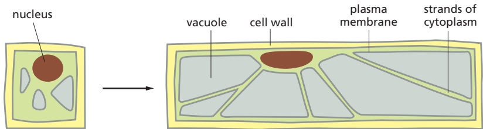

Figure 13–66 The role of the vacuole in controlling the size of plant cells. A plant cell can achieve a large increase in volume without increasing the volume of the cytosol. Localized weakening of the cell wall orients a turgor-driven cell enlargement that accompanies the uptake of water into an expanding vacuole. The cytosol is eventually confined to a thin peripheral layer, which is connected to the nuclear region by strands of cytosol stabilized by bundles of actin filaments (not shown).

Humans often harvest substances stored in plant vacuoles—from rubber to opium to the flavoring of garlic. Many stored products have a metabolic function. Proteins, for example, can be preserved for years in the vacuoles of the storage cells of many seeds, such as those of peas and beans. When the seeds germinate, these proteins are hydrolyzed, and the resulting amino acids provide a food supply for the developing embryo. Anthocyanin pigments stored in vacuoles colorMBoC7 m13.41/13.66 the petals of many flowers so as to attract pollinating insects, while noxious molecules released from vacuoles when a plant is eaten or damaged provide a defense against predators.

#### Multiple Pathways Deliver Materials to Lysosomes

Lysosomes are meeting places where several streams of intracellular traffic converge. A route that leads outward from the ER via the Golgi apparatus delivers most of the lysosome’s digestive enzymes, as we discussed earlier. In addition, at least three paths from the cell surface and extracellular space feed substances into lysosomes for digestion, while a fourth route called autophagy originates in the cytoplasm and is used to digest intracellular macromolecules and organelles.

We have already discussed how macromolecules taken up from plasma membrane and extracellular fluid by endocytosis can reside in endosomes until they mature and fuse with lysosomes. A second pathway called macropinocytosis specializes in the nonspecific uptake of fluids, membrane, and particles attached to the plasma membrane. A third pathway found in phagocytic cells, such as macrophages and neutrophils in vertebrates, is dedicated to the engulfment, or phagocytosis, of large particles and microorganisms to form phagosomes. In contrast to these routes originating from the plasma membrane, autophagy is used to digest cytosol, worn-out organelles, and microbes that invade the cytosol. The four paths to degradation in lysosomes are illustrated in **Figure 13–67**.

Figure 13–67 Four pathways to degradation in lysosomes. Materials in each pathway are derived from a different source. Note that the autophagosome has a double membrane, as we explain later in this chapter. In all cases, the final step is the fusion with lysosomes.

Figure 13–68 Schematic representation of macropinocytosis. Cell signaling events lead to a reprogramming of actin dynamics, which in turn triggers the formation of cellsurface ruffles. As the ruffles collapse back onto the cell surface, they nonspecifically trap extracellular fluid and macromolecules and particles contained in it, forming large vacuoles, or macropinosomes, as shown.

As we have seen, the endocytic pathway not only routes macromolecules for degradation but is also used to regulate the location and trafficking of macromolecules. By contrast, phagocytosis, macropinocytosis, and autophagy are pathways dedicated to degradation. We consider each of the latter three pathways in turn,. / . highlighting the materials each one is responsible for degrading and the mechanisms used to deliver these materials to lysosomes.

<!-- END EN EN13-H055-H059 -->

### 英文补充：自噬、选择性自噬与溶酶体胞吐

> 对应中文板块：自噬、选择性自噬与溶酶体胞吐。英文来源：Molecular Biology of the Cell，第7版，第13章；[本章完整原文](../../来源/英文教材/13_Intracellular_Membrane_Traffic/chapter.md)。物理PDF页码范围：788–849（整章范围）。

<!-- BEGIN EN EN13-H063-H067 -->
#### Autophagy Degrades Unwanted Proteins and Organelles

All eukaryotic cells can carry out a process called **autophagy**, or “self-eating.” During autophagy, a portion of the cytoplasm is engulfed into a membrane structure called the **autophagosome** that subsequently fuses with the lysosome where the autophagosome’s contents are degraded (**Figure 13–71**). Autophagy can be either nonselective or selective. In nonselective autophagy, a bulk portion of cytoplasm is sequestered in autophagosomes. In selective autophagy, autophagosomes tightly enclose specific cargo and mostly exclude the surrounding cytosol.

Autophagy serves several important roles in the cell. During normal cell growth and in development, autophagy helps restructure differentiating cells by removing unwanted organelles or other cellular contents. When cells experience stress or starvation, nonselective autophagy is used to recycle existing

Figure 13–70 Membrane interactions and dynamics during phagocytosis. A bacterium in the body is recognized by antibodies that coat its surface. The Fc receptor on the surface of phagocytic cells recognizes the antibody, recruiting the bacterium to the plasma membrane. This initiates phagocytosis by triggering the formation of pseudopods that begin to surround the bacterium. Pseudopod extension and phagosome formation are driven by actin polymerization and reorganization, which respond to the accumulation of specific phosphoinositides in the membrane of the forming phagosome: PI(4,5)P2 stimulates actin polymerization, which promotes pseudopod formation, and then $\mathsf { P } | ( 3 { , } 4 { , } 5 ) \mathsf { P } _ { 3 }$ depolymerizes actin filaments at the base.

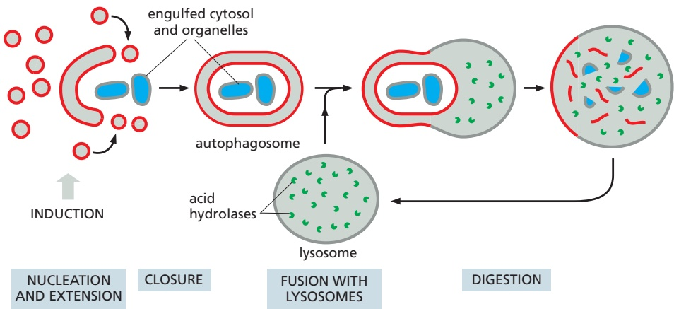

Figure 13–71 A model of autophagy. Activation of a signaling pathway initiates a nucleation event in the cytoplasm. A crescent of autophagosomal membrane grows by fusion of vesicles of unknown origin and eventually fuses to form a double-membrane-enclosed autophagosome, which sequesters a portion of the cytoplasm. The autophagosome then fuses with lysosomes containing acid hydrolases that digest its content.

proteins and macromolecules into building blocks that are used for other priorities. Selective autophagy can be used to degrade bacteria and viruses that invade the cytosol, as well as damaged proteins, protein aggregates, and damaged whole organelles. The range of cargoes degraded by autophagy explains why dysregulated autophagy contributes to diseases ranging from infectious disorders to neurodegeneration and cancer.

The autophagosome assembles by the fusion of small vesicles of unknown origin. The process begins when a phosphoinositide lipid kinase complex (termed the ATG1 complex) locally produces PI(3)P (see Figure 13–10) to mark a potential membrane site for the recruitment of several autophagy-related factors. These factors catalyze the covalent attachment of the membrane lipid phosphatidyl-. / . ethanolamine to a ubiquitin-like protein called ATG8. The ATG8-marked vesicles undergo homotypic fusion with each other and heterotypic fusion with vesicles containing ATG9. This results in expansion of a membrane whose identity is provided by ATG8 and other autophagy-related proteins.

For reasons that are not known, the growing membrane structure formed by vesicle fusion is not spherical. Instead, it is a flattened disc (similar to a Golgi apparatus cisterna) that curls into a cup-shaped structure. Fusion of the lips of this cup encloses the contents inside a compartment that is now surrounded by two membranes. The outer membrane of this newly formed autophagosome then fuses with the lysosome in a SNARE-mediated process. The inner membrane and its enclosed cargo are released into the lysosome where they are degraded by the acid hydrolases.

#### The Rate of Nonselective Autophagy Is Regulated by Nutrient Availability

The activity of the ATG1 kinase complex that initiates autophagosome formation is tightly regulated. Most of the time, it is kept inactive because of phosphorylation by another protein kinase called the mTOR complex 1 (discussed in Chapter 15). The activity of mTOR complex 1 is dependent on the availability of certain amino acids generated by the recycling of proteins in the lysosome. When these amino acids become limiting, mTOR complex 1 activity is reduced, relieving its inhibition of the ATG1 complex. Activation of the ATG1 complex initiates nonselective autophagy to degrade bulk cytosol in lysosomes, thereby generating amino acids that activate the mTOR complex 1. Through this feedback loop, the rate of nonselective autophagy is dynamically regulated by the nutrient status of the cell.

Starvation-induced nonselective autophagy is particularly important in mammals in the hours immediately after birth. During this transition period, the constant nutrient supply from the womb is abruptly lost, and feeding by mouth has not yet started. Rapid acquisition of amino acids via autophagy is used to sustain critical cellular functions until a steady source of food from the mother is established. In mammals, the rate of autophagy is controlled by several other signaling pathways in addition to the mTOR complex 1. This regulation allows the cell to integrate multiple external and internal cues, such as growth factor signaling and ATP levels, into a decision about the rate of recycling of macromolecules in the cytosol.

#### A Family of Cargo-specific Receptors Mediates Selective Autophagy

Selective autophagy mediates the degradation of invading microbes, damaged or otherwise unwanted organelles, and protein complexes or aggregates that are too large for degradation by the proteasome. The steps of autophagosome formation and its fusion with lysosomes are the same as in nonselective autophagy. Selective autophagy differs only at the very early stages when the cargo destined for degradation is recruited to the concave surface of the forming autophagosome membrane. This recruitment is mediated by specialized receptor proteins that recognize the cargo and have a binding site for the autophagosome-specific protein ATG8.

To accommodate the large range of potential cargoes, cells have evolved numerous cargo-specific autophagy receptors. In most cases, autophagy receptors recognize their cargo via a mark that is acquired only when the cargo is destined for degradation. The most commonly used mark is ubiquitin. For example, bacteria that escape from phagosomes and invade the cytosol are recognized by cytosolic proteins that ubiquitylate proteins on the bacterial surface. Several cargo receptors recognize the ubiquitin and other bacteria-specific proteins and recruit ATG8-containing vesicles. These vesicles fuse together, and the forming autophagosome effectively zippers around the cargo to engulf it without trapping bulk cytosol in the process (**Figure 13–72A**). This is why the shape of an autophagosome during selective autophagy typically reflects the shape of its cargo (**Figure 13–72B**).

The selective autophagy of worn out or damaged mitochondria is called mitophagy. As discussed in Chapters 12 and 14, when mitochondria function normally, the inner mitochondrial membrane is energized by an electrochemical H+ gradient that drives ATP synthesis and the import of mitochondrial precursor proteins and metabolites. Damaged mitochondria cannot maintain the gradient, so protein import is blocked. As a consequence, a protein kinase called Pink1, which is normally imported into mitochondria, is instead retained on the mitochondrial surface where it recruits the ubiquitin ligase Parkin from the cytosol. Parkin ubiquitylates mitochondrial outer membrane proteins, which serves as a mark for a ubiquitin-dependent cargo receptor for autophagy. Mutations in Pink1 or Parkin cause a form of early-onset Parkinson’s disease, a degenerative disorder of the central nervous system. It is not known why the neurons that die prematurely in this disease are particularly reliant on mitophagy.

Figure 13–72 Selective autophagy is mediated by receptors that recruit cargo to the autophagosome membrane. (A) Diagram illustrating the concept of a cargo receptor (blue) in the autophagosome membrane that directs it to a specific cargo, in this case a damaged mitochondrion. (B) An electron micrograph of an autophagosome containing a mitochondrion and a peroxisome. (B, courtesy of Daniel S. Friend and by permission of E.L. Bearer.)

#### Some Lysosomes and Multivesicular Bodies Undergo Exocytosis

Targeting of material to lysosomes is not necessarily the end of the pathway. Lysosomal secretion of undigested content enables cells to eliminate indigestible debris. For most cells, this seems to be a minor pathway, used only when the cells are stressed. Some cell types, however, contain specialized lysosomes that have acquired the necessary machinery for fusion with the plasma membrane. Melanocytes in the skin, for example, produce and store pigments in their lysosomes. These pigment-containing melanosomes release their pigment into the extracellular space of the epidermis by exocytosis. The melanosomes are then taken up by keratinocytes, leading to normal skin pigmentation. In some genetic disorders, defects in melanosome exocytosis block this transfer process, leading to forms of hypopigmentation (albinism). Under certain conditions, multivesicular bodies can also fuse with the plasma membrane. If that occurs, their intralumenal vesicles are released from cells. Circulating small vesicles, also called exosomes, have been observed in the blood and may be used to transport components between cells, although the importance of such a mechanism of potential communication between distant cells is unknown. Some exosomes may derive from direct vesicle budding events at the plasma membrane similar to how some viruses bud and are released from the cell (see Figure 13–61).

#### Summary

Lysosomes are specialized for the intracellular digestion of macromolecules. They contain unique membrane proteins and a wide variety of soluble hydrolytic enzymes that operate best at pH 5, which is the internal pH of lysosomes. An ATP-driven H1 pump in the lysosomal membrane maintains this low pH. In plants and fungi, lysosome-related compartments called vacuoles are adapted for other functions including storage, regulation of cell volume, and maintenance of turgor pressure. Lysosomes are the end product of endosome maturation. Cell-surface proteins that are endocytosed into endosomes are degraded in lysosomes unless they are retrieved back to the plasma membrane. Extracellular contents internalized by micropinocytosis are also delivered via endosomes to lysosomes and provide a source of nutrients under some conditions.

Lysosomes can receive content from two other routes. In phagocytosis, cells can engulf large particles including bacteria and even other cells into phagosomes that fuse with lysosomes. Phagocytosis is usually a receptor-mediated process and is especially prominent in some specialized cell types such as macrophages. In autophagy, cells engulf parts of their own cytoplasm into a double-membrane structure called an autophagosome. The autophagosome can engulf random parts of cytosol nonselectively or specific cargoes identified by selective receptors. Nonselective autophagy is used to recycle macromolecules into their building blocks during nutrient starvation. Selective autophagy is used to destroy invading microbes, protein aggregates, and damaged or unwanted organelles.

<!-- END EN EN13-H063-H067 -->
