# 第6章 蛋白质分选与膜泡运输 · 双教材整合

按中文节顺序保留正文，在每节末插入对应英文内容。

---

## 第6章 蛋白质分选与膜泡运输 · 章首导读

[返回本章](README.md) · [中文本章原文](中文原文.md)

<!-- BEGIN CN CN06-S00 -->
# 第6章 蛋白质分选与膜泡运输

<!-- 章节边界按正文内容恢复；原始 MinerU 内容保留如下。 -->

# 蛋白质分选与膜泡运输

细胞中的每种蛋白质需要组装到特定部位才能发挥功能。蛋白质在细胞内的分选和定位，以及复杂的膜泡运输，是真核细胞维持其结构有序与功能稳态的充分必要条件。

<!-- END CN CN06-S00 -->

---

## 第6章 蛋白质分选与膜泡运输 · 第一节 细胞内蛋白质的分选

[返回本章](README.md) · [中文本章原文](中文原文.md)

<!-- BEGIN CN CN06-S01 -->
## 第一节 细胞内蛋白质的分选

在真核细胞中，除少量蛋白质在线粒体和叶绿体内合成外，绝大多数蛋白质都是由核基因编码，或在游离的核糖体上合成，或在糙面内质网膜结合的核糖体上合成。然而，蛋白质合成以后必须转运到达特定的部位才能参与组装细胞结构，发挥其生物学功能，这一过程称为蛋白质靶向转运（protein targeting）或蛋白质分选(protein sorting)。蛋白质分选是涉及多种信号调控的复杂而重要的细胞生物学热点问题。

## 一、信号假说与蛋白质分选信号

Palade 发现，在细胞质的游离核糖体上合成的是非分泌蛋白，而在内质网附着核糖体上能合成分泌蛋白。但细胞学家们并没有发现能够解释游离核糖体和附着核糖体功能差异的原因。Palade 的学生 G. Blobel 假设该差异应存在于蛋白质本身。他和同事 D. Sabatini 推测分泌蛋白可能在N端携带有短的信号序列。一旦该序列从核糖体翻译合成，结合因子便与该序列结合，指导其转移到内质网膜，后续翻译过程将在内质网膜上进行。这就是1975年Blobel和Sabatini提出的信号假说（signal hypothesis）。后来，P.Leder及其同事构建的无细胞翻译系统合成了比正常分泌抗体长6\~8个氨基酸的轻链，其他研究者也获得了相似的结果。在对Blobel和Sabatini的假说不知情的情况下，剑桥大学的Milstein基于他的体外无细胞系统提出了相似假设，但当研究人员检查微粒体的蛋白质时，发现只存在正常长度的蛋白质，他们假设这多余氨基酸序列在指导蛋白质转运至内质网上有重要作用。尽管一些人质疑多出的一段肽链是体外翻译和分离的错误，但Blobel等人设计了一种蛋白质体外翻译-转运系统，获得了一系列信号假说的证据，如利用鼠的mRNA、兔的核糖体和狗的内质网（胰腺微粒体）组建的翻译-转运系统可能是一个通用系统。探究细胞内蛋白质转运机制的诸多细节花费了20多年时间，其中洛克菲勒大学的Blobel在1999年因此获诺贝尔生理学或医学奖。

已知指导分泌蛋白在糙面内质网上合成的决定因素包括：蛋白质N端的信号肽（signal sequence或signal peptide）、信号识别颗粒（signal recognition particle, SRP）和内质网膜上信号识别颗粒的受体（又称停泊蛋白，docking protein, DP）等因子共同协助完成的。

信号肽位于蛋白质的 N 端，一般由 16～26 个氨基酸残基组成，其中包括疏水核心区、信号肽的 C 端和 N

  
图 6-1 信号肽的一级结构序列

以血清白蛋白和 HIV-1 型病毒的糖蛋白 gp160 信号肽为例，显示出两者信号肽一级序列分别由疏水核心、C 端和 N 端三个区域构成。

端等三部分（图6-1）：原核细胞某些分泌蛋白的N端也具有信号序列。信号肽似乎没有严格的专一性，如大鼠的胰岛素原蛋白接上真核或原核细胞的信号肽，均可通过大肠杆菌的细胞质膜分泌到细胞外。

信号识别颗粒（SRP）是一种核糖核蛋白复合体（图6-2），由6种不同的蛋白质和一条长度约为300个核苷酸的7S RNA组成，SRP通常存在于细胞质基质中，等待信号肽从多聚核糖体上延伸暴露出来，SRP既可与新生肽信号序列和核糖体大亚基结合，又可与内质网膜上SRP受体结合。SRP受体是内质网膜上的整合蛋白，由 $\alpha$ 和 $\beta$ 亚基组成，可特异地与SRP结合。当SRP的p54亚基和SRP受体的 $\alpha$ 亚基与GTP结合时，会增进SRP/新生肽/核糖体复合物与SRP受体结合的强度。

应用体外无细胞系统（cell free system）进行蛋白质合成实验，证实分泌蛋白向rER腔内的转运是同蛋白质翻译过程偶联进行的，这种分泌蛋白在信号肽引导下边翻译边跨膜转运的过程称为共翻译转运(cotranslational translocation)。

体外无细胞系统蛋白质合成的实验证实，在分泌蛋白合成过程中信号肽、信号识别颗粒和停泊蛋白之间的相互关系显示在表6-1中。

  
图 6-2 信号识别颗粒（SRP）的结构示意图  
SRP含有两个结构域，p54蛋白是一种包含成簇甲硫氨酸残基的GTP酶，甲硫氨酸侧链与信号肽的疏水核心结合；当SRP与信号肽结合后，SRP的p9和p14蛋白复合体阻断新生肽链的翻译。

根据已有研究资料和证据，对表 6-1 中的结果及分泌蛋白在内质网上合成的共翻译转运过程可概括为如图 6-3 所示。

蛋白质首先在细胞质基质游离核糖体上起始合成，当多肽链延伸至约80个氨基酸残基时，N端的内质网信号序列暴露出核糖体并与SRP结合，导致肽链延伸暂时停止，防止新生肽N端损伤和成熟前折叠（图6-3步骤1和2），直至SRP与内质网膜上的SRP受体结合，将核糖体-新生肽复合物附着到内质网膜上（图6-3步骤3），当2分子GTP分别与SRP-p54亚基和SRP受体α亚基结合时，这种结合复合物的相互作用被强化。核糖体-新生肽复合物与内质网膜的移位子(translocon）结合，SRP脱离了信号序列和核糖体，返回细胞质基质中重复使用，肽链又开始延伸。以环化构象存在的信号肽与移位子组分结合并使孔道打开，信号肽穿入内质网膜并引导肽链以袢环的形式进入内质网腔中，这是一个耗能过程（图6-3步骤4）。与此同时，腔面上的信号肽酶切除信号肽并快速使之降解（图6-3步骤5）。肽链继续延伸，直至完成整个多肽链的合成（图6-3步骤6），蛋白质进入腔内并折叠，核糖体释放，移位子关闭（图6-3步骤7和8）。

引导新生肽链穿过移位子的信号肽可视为起始转

表 6-1 在无细胞系统中蛋白质的翻译过程与 SRP、DP 和微粒体的关系

<table><tr><td>实验组别</td><td>含有编码信号序列的 mRNA</td><td>SRP</td><td>DP</td><td>微粒体</td><td>结果</td></tr><tr><td>1</td><td>+</td><td>-</td><td>-</td><td>-</td><td>产生含信号肽的完整多肽</td></tr><tr><td>2</td><td>+</td><td>+</td><td>-</td><td>-</td><td>合成 70~100 个氨基酸残基后,肽链停止延伸</td></tr><tr><td>3</td><td>+</td><td>+</td><td>+</td><td>-</td><td>产生含信号肽的完整多肽</td></tr><tr><td>4</td><td>+</td><td>+</td><td>+</td><td>+</td><td>信号肽切除,多肽链进入微粒体中</td></tr></table>

“+”和“-”分别代表反应混合物中存在（+）或不存在（-）该物质。

  
图6-3 分泌蛋白的合成与共翻译转运过程图解  
图示信号序列、SRP、SRP受体及移位子之间的相互作用。1—2.分泌基白合成起始，内质网靶向信号序列合成，并被游离的SRP识别；3. SRP与内质网膜上的受体结合，引导核糖体－新生肽复合物附着到内质网膜上；4. 核糖体/新生肽与内质网膜的移位子结合，伴随GTP水解，SRP与相应受体解离，返回细胞质基中重复使用，肽链又开始延伸，通过移位于以祥环的形式进入内质网腔；5. 新生肽链的信号序列被信号肽酶切除；6. 新生肽链继续延伸，直至多肽链的合成结束；7—8. 蛋白质进入腔内并折叠。

移序列 (start transfer sequence)。肽链中还可能存在某些内在序列与内质网膜有很强的亲和力从而使之结合在脂双层之中，这段序列不再转入内质网腔中，称之为内在停止转移锚定序列（internal stop-transfer anchor sequence, STA）和内在信号锚定序列（internal signal-anchor sequence, SA）。如果一种多肽只有N端信号序列而没有停止转移锚定序列，那么这种多肽合成后一般进入内质网腔中，如果一种多肽的停止转移锚定序列位于多肽的内部，那么这种多肽最终会成为内质网的膜蛋白。含有多个起始转移序列和多个停止转移锚定序列的多肽将成为多次跨膜的膜蛋白。跨膜蛋白的拓扑学结构可能就是由这些蛋白质一级结构中的起始和停止转移序列共同决定的。在 rER 合成的整合膜蛋白根据拓扑学特征大体上可分为 4 类（图 6-4），它们的共同点是多肽链的 20～25 个疏水氨基酸残基形成跨膜 α 螺旋，不同点在于是否有 N 端可切割的 ER 信号序列，定位方向或跨膜次数也会有所不同，其中单次跨膜蛋白多肽链内在

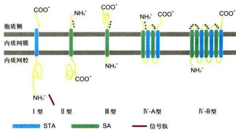

## 图6-4 内质网膜整合蛋白的拓扑学类型

STA: 内在停止转移错定位序列; SA: 内在信号错定位序列。这样的序列在多次跨膜蛋白中会有变化。I、II、III型均为一次跨膜α螺旋, I型蛋白含有一个被切割的N端内质网信号序列, 通过STA 锻定在膜上, N端亲水区位于内质网腔面, C端亲水区位于细胞质基质面, 如LDL受体、流感HA、胰岛素受体、生长素受体, II型蛋白不含有可切制的内质网信号序列, N端亲水区位于细胞质基质侧, C端亲水区位于内质网腔面, 如无唾液酸糖蛋白受体、转殖蛋白受体、高尔基半乳糖苷转移酶、高尔基唾液酸转移酶; III型蛋白含有一个^{-}尿水的跨膜片段, 邻近N端亲水区, 与I型蛋白有相同方向但不含有可切割的信号序列, 如细胞色素P450。IV型蛋白含有2个或多个跨膜片段, 又称多次跨膜蛋白, 例如G蛋白偶联受体、葡糖转运蛋白、电压门控Ca²⁺通道、ABC小分子泵、CFTR（Cl⁻）通道、Sec61蛋白。

表 6-2 指导蛋白质从细胞质基质转运到细胞器的靶向序列的主要特征

<table><tr><td>靶细胞器</td><td>蛋白质中信号 序列的定位</td><td>信号序列 是否切除</td><td>信号序列性质</td></tr><tr><td>内质网(腔)</td><td>N 端</td><td>切除</td><td>6~12 个疏水氨基酸核心,前面常有一个或多个碱性氨基酸(Arg、Lys)</td></tr><tr><td>线粒体 (基质)</td><td>N 端</td><td>切除</td><td>两亲螺旋,长度 20~50 个氨基酸残基,一侧具有 Arg 和 Lys 残基,另一 侧是疏水残基</td></tr><tr><td>叶绿体 (基质)</td><td>N 端</td><td>切除</td><td>没有共同基序,常富含 Ser、Thr 和少数疏水残基,罕见 Glu 和 Asp</td></tr><tr><td>过氧化物酶体</td><td>大多在 C 端, 少数在 N 端</td><td>不被切除</td><td>PTS1 信号(Ser-Lys-Leu)在 C 端,PTS2 信号在 N 端</td></tr><tr><td>细胞核</td><td>变化的</td><td>不被切除</td><td>多种类型,共同基序含有短的富含 Lys 和 Arg 残基序列</td></tr></table>

\* 注：靶向细胞器的膜或其他亚区间的蛋白质有不同或附加的信号序列。

停止转移序列和信号锚定序列决定其拓扑学特征。至于新生肽链的跨膜取向主要受到跨膜片段侧翼氨基酸残基的电荷分布的影响，一般而言，带正电荷氨基酸残基一侧朝向细胞质基质一侧。

线粒体、叶绿体中绝大多数蛋白质以及过氧化物酶体中的蛋白质也是在某种信号序列的指导下进入这些细胞器中。为了研究方便，有人将这种信号序列称之为导肽（leader peptide），其基本特征是蛋白质在细胞质基质中合成以后再转移到这些细胞器中，因此称这种翻译-转运方式为翻译后转运（post-translational translocation）。这种转运方式在蛋白质跨膜过程中不仅需要消耗ATP使多肽去折叠，而且还需要一些分子伴侣蛋白的协助（如热激蛋白Hsp70）以帮助这类转运蛋白正确折叠形成有功能的蛋白质。继发现信号肽序列之后，人们又相继发现一系列蛋白质分选信号序列（表6-2），统称信号序列（signal sequence）。有些信号序列还可形成三维结构的信号斑（signal patch），指导蛋白质转运至细胞的特定部位。

## 二、蛋白质分选转运的基本途径与类型

核基因编码的蛋白质的分选大体可分两条途径：

（1）翻译后转运途径 即在细胞质基质游离核糖体上完成多肽链的合成，然后转运至膜围绕的细胞器，如线粒体、叶绿体、过氧化物酶体及细胞核，或者成为细胞质基质中的可溶性驻留蛋白和骨架蛋白（图6-5右侧）。人们最近在酵母细胞中也发现有些分泌蛋白不像大多数真核细胞那样，边合成边跨膜转运，而是由结合ATP的分子伴侣BiP蛋白（BiP-ATP）与膜整合蛋白 Sec63 复合物相互作用，水解 ATP 提供动力驱动翻译后转运途径，即分泌蛋白在细胞质基质游离核糖体上合成，然后再转运至内质网中。

(2) 共翻译转运途径 即蛋白质合成在游离核糖体上起始之后，由信号肽及其与之结合的SRP（信号肽-SRP）引导转移至糙面内质网，然后新生肽边合成边转入糙面内质网腔或定位在ER膜上，经转运膜泡运至高尔基体加工包装再分选至溶酶体、细胞质膜或分泌到细胞外，内质网与高尔基体本身的蛋白质分选也是通过这一途径完成的（图6-5左侧）。

根据蛋白质分选的转运方式或机制不同，又可将蛋白质转运分为四类：

(1) 蛋白质的跨膜转运 (transmembrane transport) 主要是指共翻译转运途径中，在细胞质基质中起始合成的蛋白质，在信号肽-SRP介导下与内质网膜上SRP受体结合转移到内质网，然后边合成边转运，或进入内质网腔或插入内质网膜；此外是指翻译后转运途径中，在细胞质基质核糖体上完成合成的多肽链在不同靶向信号序列指导下，依不同的机制转运到线粒体、叶绿体和过氧化物酶体等细胞器。

(2) 膜泡运输（vesicular transport）蛋白质通过不同类型的转运膜泡从糙面内质网合成部位转运至高尔基体进而分选转运至细胞的不同部位。膜泡运输涉及供体膜出芽形成不同的转运膜泡、依赖细胞骨架和分子马达的膜泡运输以及膜泡与靶膜的融合等过程。

(3) 选择性的门控转运 (gated transport) 在细胞质基质中合成的蛋白质通过核孔复合体在核-质间双向选择性地完成核输入或核输出，参见第九章第一节关于核孔复合体的选择性运输。

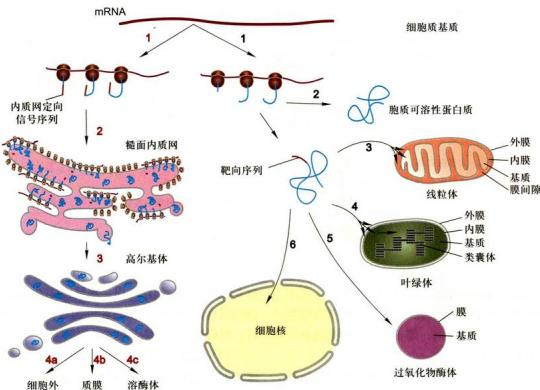  
图6-5 真核细胞蛋白质分选的主要途径与类型  
图右侧（黑色符号）代表翻译后代转运的非分泌途径：1. 核基基因编码 mRNA 在细胞质基质游离核糖体上完成多肽链的合成；2. 合成的蛋白质不含信号序列，并驻留在细胞质基质中；3、4、5. 依据不同的细胞器特异性靶向序列，首先释放到细胞质基质，然后通过跨膜运输方式转运至线粒体、叶绿体和过氧化物酶体；6. 通过核孔复合体门控运输方式转运至细胞核。图右侧（红色符号）代表共翻译转运的蛋白质分泌途径：1. 核基编码 mRNA 在细胞质基质游离核糖体上起始合成，然后在信号肽及其结合的 SRP 引导下与内质网膜融合并完成蛋白质合成；2. 在 rER 完成蛋白质合成；3. 以膜泡运输方式转运至高尔基体；4a、4b、4c、以膜泡运输方式分离至细胞外、质膜和溶酶体。

（4）细胞质基质中蛋白质的转运 上述几种分选类型也涉及蛋白质在细胞质基质中的转运，这一过程显然与细胞骨架系统密切相关，但由于细胞质基质的组织结构尚不清楚，因此对其中的蛋白质转运特别是信号转导途径中蛋白质分子的转运方式了解甚少。

## 三、蛋白质向线粒体和叶绿体的分选

与共翻译转运途中依赖 N 端信号肽序列靶向内质网的过程不同，翻译后转运途中要进入到线粒体（图 6-6）、叶绿体（图 6-7）和过氧化物酶体等细胞器的蛋白质的分选是由多个步骤组成的过程，并需要多个不同的靶向序列（targeting sequence）。定位到叶绿体的前体蛋白的 N 端具有 40～50 个氨基酸组成的转运肽（transit peptide），用以指引多肽定位到叶绿体并进一步穿过叶绿体被膜进入基质或类囊体中。转运到线粒体和过氧化物酶体的蛋白质与此类似，但靠的是不同的引导序列，即线粒体蛋白N端的导肽或过氧化物酶体蛋白C端的内在靶向序列（见表6-2）。至于这些细胞器蛋白最终是定位在不同的膜上还是不同的基质空间，除不同转运肽之外，还需要其他参与空间定位的信号序列。此外，通过翻译后转运途径进入线粒体、叶绿体和过氧化物酶体等细胞器的蛋白质，也必须在分子伴侣的帮助下解析叠或维持非折叠状态，以顺利通过膜上的输入装置。蛋白质输入这些细胞器通常是需要能量的过程。

## 1. 蛋白质从细胞质基质到线粒体的转运

大部分线粒体蛋白是由核基因编码的，这些蛋白质在细胞质基质游离核糖体上合成后被转运到线粒体发挥功能。

（1）蛋白质从细胞质基质输入到线粒体基质 所有线粒体基质蛋白的 N 端靶向信号序列虽然不尽相同，但共享相似的基序 (motif)，由 20～50 个氨基酸残基组

成，富含疏水氨基酸，带正电荷的碱性氨基酸（Arg、Lys）和羟基氨基酸（Ser、Thr），缺少带负电荷的氨基酸（Asp、Glu）。这样的氨基酸残基组成有利于基质蛋白的靶向信号序列形成两亲的α螺旋构象，并且实验表明，两亲的N端靶向信号序列对于指导蛋白质输入线粒体基质是至关重要的。蛋白质从细胞质基质输入到线粒体基质的基本步骤如图6-6A所示：在游离核糖体上合成的前体蛋白，与分子伴侣Hsp70结合，并使其保持未折叠或部分折叠状态。其N端具有线粒体基质靶向序列（步骤1），前体蛋白与内外膜接触点附近的输入受体（Tom20/22）结合（步骤2），被引进输入孔（步骤3），输入的蛋白质进而通过内外膜接触点的输入通道（外膜为Tom40，内膜为Tim23/17，步骤4、5），线粒体基质分子伴侣Hsp70与输入的蛋白质结合并水解ATP以驱动基质蛋白的输入。输入蛋白的基质靶向序列在基质蛋白酶作用下被切除，同时 Hsp70 也从新输入的基质蛋白上释放下来（步骤 6），折叠成活性形式（步骤 7）。

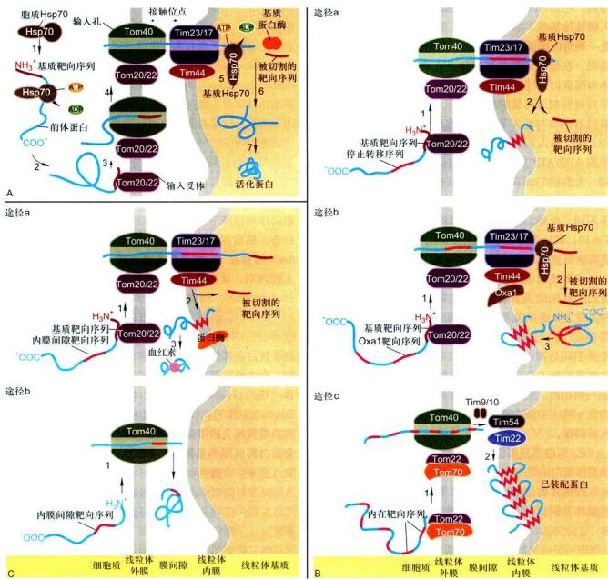  
图 6-6 通过翻译后转运途径，核基因编码的线粒体蛋白的转运  
A. 蛋白质从细胞质基质输入到线粒体基质。B. 线粒体蛋白通过三种途径从细胞质基质输入到线粒体内膜。C. 线粒体蛋白通过两种途径从细胞质基质输入到线粒体膜间隙。TOM/TIM: translocase of outer/inner mitochondria membrane complex, 线粒体外 / 内膜移位酶复合物。

(2) 线粒体内膜蛋白的输入 如图 6-6B 所示，途径 a 和途径 b 输入的线粒体蛋白其 N 端都有基质靶向序列，在线粒体外膜上都利用 Tom40 为输入孔道，外膜上 Tom22/20 作为识别 N 端基质靶向序列的输入受体，内膜转运蛋白都是 Tim23/17，但通过途径 b 输入的内膜蛋白（如 ATP 合酶亚基 9）不但具有 N 端基质靶向序列，还具有内在的疏水结构域，前者引导前体蛋白进入线粒体基质，后者可被内膜蛋白 Oxal 所识别，Oxal 是一种与内膜蛋白插入相关的蛋白质，由线粒体基因组编码，在线粒体基质核糖体上合成。因此，这类线粒体内膜蛋白通过途径 b，其前体先进入基质，基质靶向序列被切割后再装配到内膜上。在 a 和 b 两种途径中，基质 Hsp70 与输入基质可溶性蛋白起相同作用。在途径 c 中，输入的内膜蛋白是多次跨膜蛋白（如 6 次跨膜的 ADP/ATP 反向交换蛋白），缺少 N 端基质靶向序列，含有被 Tom70/Tom22 输入受体识别的多个内在靶向序列，内膜的转运通道 Tim22/54 也与 a、b 途径有所不同。此外，在途径 c 中两种膜间空间蛋白（Tim9/Tim10）被认为起分子伴侣的作用，协助输入蛋白在外膜与内膜通道之间的转运。

(3) 线粒体膜间隙蛋白的输入 如图 6-6C 所示, 蛋白质从细胞质基质输入到线粒体膜间隙的途径有两种: 途径 a 是从细胞质基质输入到线粒体膜间隙的主要途径, 其过程与内膜蛋白途径 a 类似 (图 6-6B), 主要不同是蛋白质 (如细胞色素 b2) 内在靶向序列定位在膜间隙, 并且在转运过程中被内膜上蛋白酶于膜间隙一侧切割, 然后释放的蛋白质折叠并与血红素结合; 途径 b 转运的蛋白质通过外膜 Tom40 输入孔, 直接进入膜间隙。

2. 蛋白质从细胞质基质向叶绿体的分选：基质与类囊体蛋白的靶向输入

叶绿体的结构比线粒体还要复杂，除外膜、内膜、叶绿体基质以外，还有相对独立的类囊体，由核基因编码的叶绿体基质蛋白包括所有卡尔文循环有关的酶和1,5-二磷酸核酮糖羧基歧化酶（Rubisco）的小亚基都是在细胞质基质合成后输入到叶绿体基质的。这些前体蛋白均具有N端基质输入序列（stromal-import sequence），与线粒体基质蛋白的输入过程基本相似，前体蛋白以非折叠形式输入，并有赖于基质Hsp70的作用和ATP提供能量；与线粒体不同的是，叶绿体不产生跨内膜的电化学梯度，因此ATP水解供能几乎是唯一动力来源。

定位在类囊体膜和类囊体腔的许多蛋白质与光合作用相关，其中大多数是在细胞质基质中以前体形式合成的，多肽链上含有多个靶向序列。以质体蓝素蛋白前体（plastocyanin precursor）和金属结合蛋白前体（metal-binding precursor）为例，如图6-7所示，尚未折叠的两种蛋白前体首先通过外膜上相同的转运基质蛋白的通道进入基质，N端基质靶向序列被基质蛋白酶切除，从而使类囊体靶向序列暴露（图6-7步骤1）；进入基质后这两种蛋白的转运途径产生分歧，一个是SRP依赖途径：质体蓝素及类似的蛋白质在基质空间保持非折叠状态，这需要一组分子伴侣参与（图中未示），在类囊体靶向序列指导下与叶绿体SRP（和细菌SRP密切相关）结合，然后在类囊体膜上叶绿体SRP受体在转运蛋白SecY的介导下，转运到类囊体腔（图6-7步骤2）；进入腔内后，质体蓝素的类囊体靶向序列被内切蛋白酶(endoprotease)切除，蛋白质折叠产生成熟构象（图6-7步骤3）。另一种是pH依赖的途径：非折叠的金属结合蛋白的N端基质靶向序列首先被切除，然后金属结合蛋白在基质中折叠并与其辅因子结合（图6-7步骤2），在类囊体靶向序列N端的两个精氨酸残基和跨叶绿体内膜的pH梯度是折叠蛋白输入到类囊体腔所必需的（图6-7步骤3）；类囊体膜上的转运蛋白至少由4种与细菌质膜相关的蛋白质组成，输入到类囊体腔的金属结合蛋白其N端的类囊体靶向序列被切除，产生成熟的构象（图6-7步骤4）。

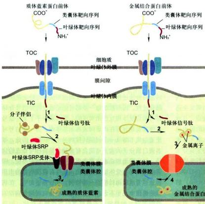  
图 6-7 通过后翻译转运途径，叶绿体蛋白从细胞质基质输入到类囊体腔  
TOC/TIC: translocase of the outer/inner chloroplast membrane complex, 叶绿体外 / 内膜移位酶复合物。

<!-- END CN CN06-S01 -->

---

## 对应英文内容

### 英文补充：分选信号、分选受体与区室间转运

> 对应中文板块：分选信号、分选受体与区室间转运。英文来源：Molecular Biology of the Cell，第7版，第12章；[本章完整原文](../来源/英文教材/12_Intracellular_Organization_and_Protein_Sorting/chapter.md)。物理PDF页码范围：722–787（整章范围）。

<!-- BEGIN EN EN12-H008-H011 -->
#### Proteins Can Move Between Compartments in Different Ways

Nearly all proteins, except a few inside mitochondria and plastids, begin their synthesis on ribosomes in the cytosol. The final location of each protein depends on its amino acid sequence, which can contain one or more **sorting signals** that direct its delivery to different parts of the cell. The sorting signals in the transported protein are recognized by complementary **sorting receptors** that mediate movement between compartments. By contrast, proteins that do not have any sorting signals remain in the cytosol as permanent residents. There are four fundamentally different ways a protein is moved from one compartment to another. These four mechanisms are described below, and the transport steps at which they operate are outlined in **Figure 12–10**. We discuss protein translocation and gated transport in this chapter, vesicular transport in Chapter 13, and engulfment in both this chapter and the next.

1. In **protein translocation**, transmembrane protein translocators directly transport specific proteins from the cytosol into a space that is topologically distinct: either the other side of a membrane or within the lipid bilayer in the case of integral membrane proteins. The transported protein molecule usually must unfold to snake through the translocator. The initial transport of selected proteins from the cytosol into the ER lumen, the ER membrane, or mitochondria occurs in this way.

2. In **gated transport**, proteins and RNA molecules move between the cytosol and the nucleus through nuclear pore complexes in the nuclear envelope. The nuclear pore complexes function as selective gates that support the active transport of specific macromolecules and macromolecular assemblies between the two topologically equivalent spaces.

3. In **vesicular transport**, membrane-enclosed transport intermediates— which may be small, spherical transport vesicles, elongated tubules, or larger, irregularly shaped fragments of organelles—ferry proteins from one topologically equivalent compartment to another. The transport intermediate becomes loaded with a cargo of molecules derived from the lumen and membrane of the originating compartment as it buds and pinches off. At the destination compartment, the transport intermediate fuses with the compartment’s enclosing membrane to discharge its cargo

<small>Figure 12–10 A simplified “road map” of protein traffic within a eukaryotic cell. Proteins can move from one compartment to another by protein translocation (blue), gated transport (red), vesicular transport (green), or engulfment (gray). The sorting signals that direct a given protein’s movement through the system, and thereby determine its eventual location in the cell, are contained in each protein’s amino acid sequence. The journey begins with the synthesis of a protein on a ribosome in the cytosol and, for many proteins, terminates when the protein reaches its final destination. Other proteins shuttle back and forth between the nucleus and cytosol. At each intermediate station (boxes), a decision is made as to whether the protein is to be retained in that compartment or transported further. A sorting signal may direct either retention in or exit from a compartment. A special transport process termed “engulfment” is used to move proteins from the cytosol into the lysosome in autophagy or used to enclose chromosomes inside the nucleus during nuclear envelope re-formation after mitosis. The movement of macromolecules into and out of a condensate is not shown here. This process does not involve crossing a membrane barrier and is mediated by direct physical interactions among the macromolecules that form the condensate. We shall refer to this figure often as a guide in this chapter and the next, highlighting in color the particular pathway being discussed.</small>

(**Figure 12–11**). The transfer of soluble and membrane-embedded proteins from the ER to the Golgi apparatus, for example, occurs in this way. The proteins transported by vesicular transport never cross a membrane during the process, and therefore retain their topological relationships within the cell.

4. In **engulfment**, such as autophagy (discussed in Chapter 13), doublemembrane sheets wrap around portions of the cytoplasm often including fragments of organelles or even entire organelles (**Figure 12–12**). This membrane structure then seals by membrane fusion to enclose a separate compartment, the autophagosome. The re-formation of the nuclear envelope after mitosis (discussed later in this chapter) follows a conceptually similar process. ER tubes and sheets wrap around decondensing chromosomes and then fuse laterally with one another to form a sealed double-membrane envelope only traversed by the nuclear pores.

In addition to these mechanisms for protein movement into and betweenMBoC7 m12.06/12.11 membrane-enclosed compartments, a simpler mechanism based on direct physical binding is used by macromolecules to enter biomolecular condensates. In this mechanism, the macromolecule specifically binds to another protein or RNA that is already part of the condensate to which it is specifically recruited. Once recruited, the macromolecule remains within the condensate because of persistent and repeated interactions with its partner. The interaction between a macromolecule and its binding partner in the condensate is analogous to the interaction between a sorting signal and its cognate sorting receptor; in both cases, the interaction specifies the macromolecule’s destination.

#### Sorting Signals and Sorting Receptors Direct Proteins to the Correct Cell Address

Sorting signals are usually composed of amino acid side chains in a protein and come in two general varieties: a linear sequence of amino acids (called a signal sequence) or a specific three-dimensional arrangement of amino acids (called a signal patch). Sorting signals for protein translocation into organelles are linear **signal sequences**, while examples of linear signals and **signal patches** are known for nuclear and vesicular transport. The linear signal sequences for protein translocation are often found at the N-terminus of the polypeptide chain. These N-terminal signal sequences are usually removed from the finished protein by specialized **signal peptidases** once the sorting process is complete. Other types of signal sequences are not removed and remain part of the final mature protein.

Each signal sequence specifies a particular destination in the cell. The signal sequence for initial transfer to the ER usually includes a linear sequence of about 5–10 predominantly hydrophobic amino acids. Many of these proteins will in turn pass from the ER to the Golgi apparatus, but those with a specific signal sequence of four amino acids at their C-terminus are recognized as ER residents and are returned to the ER. Proteins destined for mitochondria have signal sequences of yet another type, in which positively charged amino acids alternate with hydrophobic ones. The signal for protein import into the nucleus is composed primarily of positively charged amino acids. Finally, many proteins destined for peroxisomes have a signal sequence of three characteristic amino acids at their C-terminus. A sorting signal for any particular destination needs to be sufficiently distinctive from all other sequences to permit its selective recognition by the appropriate sorting receptor.

Figure 12–11 Vesicle budding and fusion during vesicular transport. Transport vesicles bud from one compartment (donor) and fuse with another topologically equivalent (target) compartment. In the process, a subset of soluble components (red dots) are transferred from lumen to lumen. Note that membrane is also transferred and that the original orientation of both proteins and lipids in the donor compartment membrane is preserved in the target compartment membrane. Thus, membrane proteins retain their asymmetrical orientation, with the same domains always facing the cytosol.

Figure 12–12 Formation of a new compartment by engulfment of contents inside of a membrane.

**Figure 12–13** presents some specific signal sequences. Experiments in which the peptide is transferred from one protein to another by genetic engineering techniques have demonstrated the importance of each of these signal sequences for protein targeting. Placing the N-terminal ER signal sequence at the beginning of a cytosolic protein, for example, redirects the protein to the ER; removing or mutating the signal sequence of an ER protein causes its retention in the cytosol. Signal sequences are therefore both necessary and sufficient for protein targeting. Even though their amino acid sequences can vary greatly, the signal sequences of proteins having the same destination are often functionally interchangeable; in these instances, physical properties, such as hydrophobicity, are more important in the signal-recognition process than the exact amino acid sequence.

import into nucleus

– Pro – Pro – Lys – Lys – Lys – Arg – Lys – Val –

export from nucleus

– Met – Glu – Glu – Leu – Ser – Gln – Ala – Leu – Ala – Ser – Ser – Phe –

import into mitochondria

N – Met – Leu – Ser – Leu – Arg – Gln – Ser – Ile – Arg – Phe – Phe – Lys – Pro – Ala – Thr – Arg – Thr –

Leu – Cys – Ser – Ser – Arg – Tyr – Leu – Leu –

import into plastids

$$
\begin{array}{l} \text {N - Met - Val - Ala - Met - Ala - Met - Ala - Ser - Leu - Gln - Ser - Ser - Met - Ser - Ser - Leu - Ser - } \\ \text {Leu - Ser - Ser - Asn - Ser - Phe - Leu - Gly - Gln - Pro - Leu - Ser - Pro - Ile - Thr - Leu - Ser - Pro - } \\ \text {Phe - Leu - Gln - Gly -} \end{array}
$$

import into peroxisomes

Ser – Lys – Leu – C

import into ER

N – Met – Met – Ser – Phe – Val – Ser – Leu – Leu – Leu – Val – Gly – Ile – Leu – Phe – Trp – Ala – Thr –

Glu – Ala – Glu – Gln – Leu – Thr – Lys – Cys – Glu – Val – Phe – Gln –

return to ER

Lys – Asp – Glu – Leu – C

Figure 12–13 Examples of signal sequences that direct proteins to different intracellular locations. The primary characteristic features of each type of signal sequence are highlighted in color. Where they are known to be important for the function of the signal sequence, negatively charged amino acids are shown in blue and positively charged amino acids are shown in red. Similarly, important hydrophobic amino acids are shown in green and important uncharged polar amino acids are shown in yellow. N– indicates the N-terminus of a protein; –C indicates the C-terminus.

Sorting signals are recognized by complementary sorting receptors that guide proteins to their appropriate destination, where the receptors unload their cargo. The receptors function catalytically: after completing one round of targeting, they return to their point of origin to be reused. Most sorting receptors recognize classes of proteins rather than an individual protein species. They can therefore be viewed as public transportation systems, dedicated to delivering numerous different components to their correct locations in the cell.

#### Construction of Most Organelles Requires Information in the Organelle Itself

When a cell reproduces by division, it has to duplicate its chromosomes, its enclosing plasma membrane, and its organelles. In general, cells do this by expanding the plasma membrane and organelles with new proteins and lipids before division and segregation to the two daughter cells. The delivery of new proteins for growth of the ER, mitochondria, and plastids requires preexisting organelle-specific protein translocators. Because the incorporation of new protein translocators requires a preexisting protein translocator, a cell must already have at least some functional ER to make more ER; the same applies to mitochondria and plastids. Thus, two types of information are required to construct these organelles: the DNA that specifies an organelle’s proteins and preexisting protein translocator(s) in the organellar membrane for incorporating new deliveries of protein. Both types of information are passed from parent cell to daughter cells to maintain the cell’s compartmental organization.

Some organelles, such as lysosomes, acquire all of their proteins and membrane by vesicular transport from other organelles (see Chapter 13). Because it is possible, in principle, to construct such organelles de novo, they do not necessarily have to be inherited at cell division. Similarly, biomolecular condensates can be constructed de novo by self-assembly of the constituent proteins and nucleic acids. Thus, during cell division, a condensate can be disassembled, its constituents distributed stochastically among the two daughter cells, then reassembled into a condensate. This is how the nucleolus is acquired by daughter cells.

#### Summary

Eukaryotic cells contain intracellular membrane-enclosed organelles that make up nearly half the cell’s total volume. The main ones present in all eukaryotic cells are the endoplasmic reticulum, Golgi apparatus, nucleus, mitochondria, lysosomes, endosomes, and peroxisomes; plant cells also contain plastids such as chloroplasts. All organelles contain distinct sets of proteins, which mediate each organelle’s unique function.

Cells can also segregate subsets of their macromolecules into biomolecular condensates such as the nucleolus. The components inside these condensates can work together to carry out specialized biochemical reactions. The cell contains a dozen or more condensates that vary widely in size and can assemble and disassemble in response to need.

Each newly synthesized organellar protein must find its way from a ribosome in the cytosol, where the protein is made, to the organelle where it functions. It does so by using sorting signals in its amino acid sequence that are recognized by complementary sorting receptors, which deliver the protein to the appropriate target organelle. Proteins that function in the cytosol do not contain sorting signals and therefore remain there after they are synthesized.

During cell division, organelles such as the ER and mitochondria are distributed to each daughter cell. These organelles contain information that is required for their construction, and so they cannot be made de novo. Biomolecular condensates can be constructed de novo because they self-assemble from components that are encoded genetically.

ER tubules

ER sheets

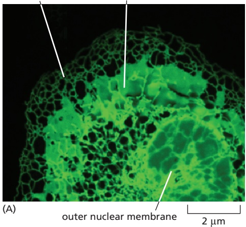

10 µm

Figure 12–14 Fluorescence micrographs of the endoplasmic reticulum. (A) An animal cell in tissue culture that was genetically engineered to express an ER membrane protein fused to a fluorescent protein. The ER extends as a network of tubules and sheets throughout the entire cytosol, so that all regions of the cytosol are close to some portion of the ER membrane. The outer nuclear membrane, which is continuous with the ER, is also stained. (B) Part of an ER network in a living plant cell that was genetically engineered to express a fluorescent protein in the ER. (A, courtesy of Patrick Chitwood and Gia Voeltz. B, courtesy of Petra Boevink and Chris Hawes.)

<!-- END EN EN12-H008-H011 -->

### 英文补充：SRP、转位子、膜蛋白拓扑与GPI锚定

> 对应中文板块：SRP、转位子、膜蛋白拓扑与GPI锚定。英文来源：Molecular Biology of the Cell，第7版，第12章；[本章完整原文](../来源/英文教材/12_Intracellular_Organization_and_Protein_Sorting/chapter.md)。物理PDF页码范围：722–787（整章范围）。

<!-- BEGIN EN EN12-H014-H020 -->
#### Signal Sequences Were First Discovered in Proteins Imported into the Rough ER

The ER captures selected proteins from the cytosol as they are being synthesized. These proteins are of two types: transmembrane proteins, which become embedded in the ER membrane, and water-soluble proteins, which are fully translocated across the ER membrane into the ER lumen. Some of these proteins function in the ER, but many are destined to reside in another organelle, to reside in the plasma membrane, or to be secreted outside the cell. All of these proteins, regardless of their subsequent fate, are initially directed to the ER membrane by an **ER signal sequence**.

Signal sequences (and the signal sequence strategy of protein sorting) were discovered in secreted water-soluble proteins that are first translocated across the ER membrane. In the key experiment, the mRNA encoding a secreted protein was added to cytosol extracted from cells. In this cell-free reaction, ribosomes in the cytosol translated the mRNA into a protein that was slightly larger than the normal secreted protein (**Figure 12–18**). When the reaction was repeated in the presence of microsomes derived from the rough ER, a protein of the correct size was produced and located inside the microsomes (Figure 12–18). By contrast, mRNA encoding a cytosolic protein produced the correctly sized product regardless of the presence or absence of rough microsomes. The signal hypothesis was formulated to explain these observations. According to this model, the mRNA for the secretory protein codes for a protein that is bigger than the protein that is eventually secreted. It was proposed that the extra polypeptide is a signal sequence that directs the secreted protein to the ER membrane. After the signal sequence has served its function, it is cleaved off by a signal peptidase in the ER membrane before the polypeptide chain has been completed.

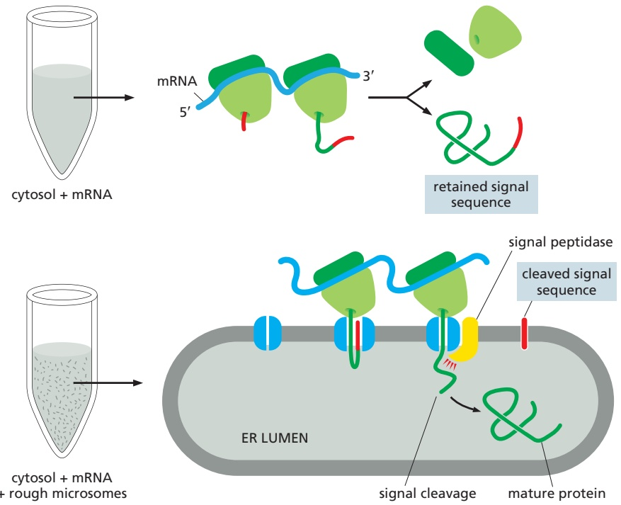

Figure 12–18 Experimental basis for the signal hypothesis. In a test tube, cytosol is mixed with mRNA that codes for a secreted protein. Two versions of this reaction are performed: one lacking and the other containing rough microsomes derived from the ER (see Figure 12–17). In both reactions, ribosomes in the cytosol translate the mRNA to produce a protein. The protein produced in the reaction lacking microsomes was observed to be slightly larger than the protein produced in the reaction containing microsomes. This difference in size was shown to be due to a small segment of protein at the N-terminus that was selectively removed only in the reaction containing microsomes. Additional analysis showed that the protein produced in the presence of microsomes was located in the microsome lumen. This collection of results was used to formulate the signal hypothesis. This sequence at the N-terminus was postulated to represent a signal sequence. When the ER signal sequence emerges from the ribosome, it directs the ribosome to a translocator on the ER membrane that forms a pore in the membrane through which the polypeptide is translocated. A signal peptidase is closely associated with the translocator and clips off the signal sequence during translation, and the mature protein is released into the lumen of the ER immediately after its synthesis is completed. The translocator is closed until the ribosome has bound, so that the permeability barrier of the ER membrane is maintained at all times.

These experiments highlight how a complex cellular process such as ER import can be reconstituted in a cell-free system by mixing together requisite cellular components such as mRNA, cytosol, and microsomes. By combining the constituent parts in different ways, the existence of signal sequencesMBoC7 m12.35/12.18 on secreted proteins was deduced long before it became possible to directly sequence their mRNAs. The ease with which this cell-free system could be manipulated proved indispensable for identifying, purifying, and studying the various components of the molecular machinery responsible for ER import. Similar systems were later established to dissect protein transport into and out of the nucleus, protein import into mitochondria and chloroplasts, and vesicular transport.

#### A Signal-Recognition Particle (SRP) Directs the ER Signal Sequence to a Specific Receptor at the ER

The ER signal sequence is guided to the ER membrane by at least two components: a **signal-recognition particle (SRP)**, which binds to the signal sequence, and an **SRP receptor** in the ER membrane. SRP is a large complex; in animal cells, it consists of six different polypeptide chains bound to a single RNA molecule (**Figure 12–19A**). While SRP and SRP receptor have fewer subunits in bacteria, homologs of both components are present in all living organisms.

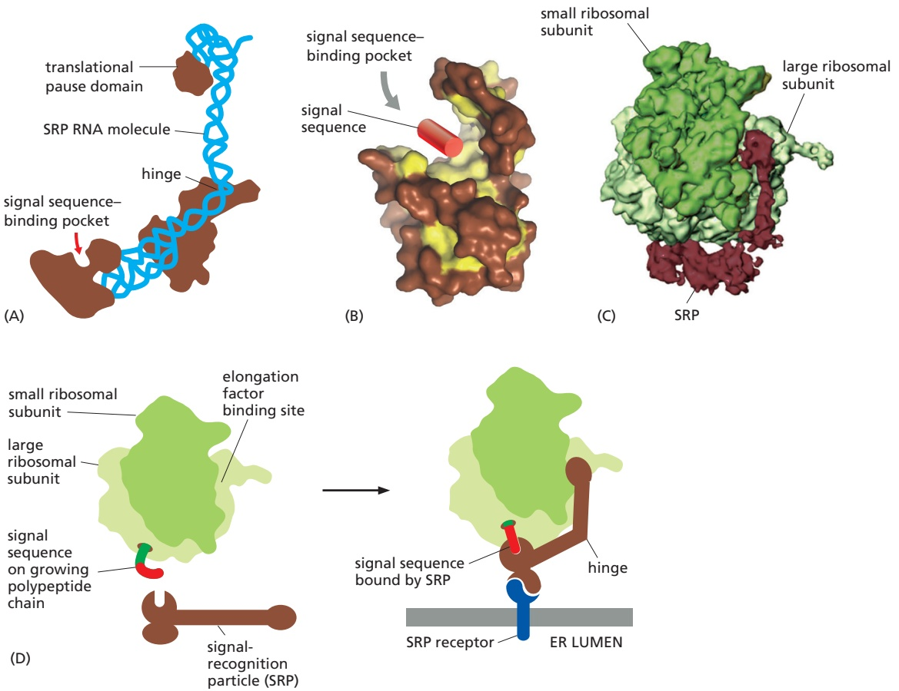

Figure 12–19 The signal-recognition particle (SRP). (A) A mammalian SRP is a rodlike ribonucleoprotein complex containing six protein subunits (brown) and one RNA molecule (blue). The SRP RNA forms a backbone that links the protein domain containing the signal sequence–binding pocket to the domain responsible for slowing translation. (B) Structure of the signal sequence–binding domain of SRP bound to the hydrophobic region of a signal sequence (red cylinder). The surfaces of SRP that are hydrophobic are depicted in yellow. (C) The three-dimensional outline of the SRP bound to a ribosome was determined by cryo-electron microscopy. SRP binds to the large ribosomal subunit so that its signal sequence–binding pocket is positioned near the growing polypeptide chain exit site. Its translational pause domain is positioned at the interface between the ribosomal subunits, where it interferes with elongation factor binding. (D) As a signal sequence emerges from the ribosome and binds to the SRP, a conformational change in the SRP exposes a binding site for the SRP receptor. (C, adapted from M. Halic et al., Nature 427:808–814, 2004.)

This protein-targeting mechanism therefore arose early in evolution and has been conserved.

ER signal sequences vary greatly in amino acid sequence, but each has eight or more nonpolar amino acids at its center (see Figure 12–13). How can SRP bind specifically to so many different sequences? The answer has come from structures of one of the SRP proteins, which shows that the signal sequence–binding site is a large hydrophobic pocket enriched in methionines (**Figure 12–19B**). Because methionines have unbranched, flexible side chains, the pocket is sufficiently plastic to accommodate different hydrophobic signal sequences of various sizes and shapes.

In eukaryotic cells, SRP is a hinged rodlike structure that can wrap along the large ribosomal subunit (**Figure 12–19C**). The end of SRP that contains the signal sequence–binding pocket is positioned near the ribosomal tunnel through which newly made polypeptides emerge. This allows SRP to engage a signal sequence as it emerges from the ribosome. Once SRP engages a signal sequence, the other end of SRP can bind at the interface between the large and small ribosomal subunits (**Figure 12–19D**). This is the same site where translation elongation factors bind, so a ribosome engaged by SRP will translate proteins more slowly than normal. Slower translation presumably gives the ribosome enough time to bind to the ER membrane before completion of the polypeptide chain, thereby ensuring that the protein is not released into the cytosol. This safety device may be especially important for secreted and lysosomal hydrolases, which could wreak havoc in the cytosol; cells that secrete large amounts of hydrolases, however, take the added precaution of having high concentrations of hydrolase inhibitors in their cytosol.

When a signal sequence binds, SRP exposes a binding site for an SRP receptor (see Figure 12–19D), which is a transmembrane protein complex in the rough ER membrane. The binding of SRP to its receptor brings the SRP–ribosome complex to an unoccupied **protein translocator** in the ER membrane. The part of SRP bound near the ribosomal tunnel moves to a different site, allowing the translocator to occupy this position. SRP and SRP receptor are then released, and protein synthesis resumes at full speed. The translocator, which is now tightly bound to the translating ribosome, transfers the growing polypeptide chain across the membrane (**Figure 12–20**).

This **co-translational** transfer process creates two spatially separate populations of ribosomes. **Membrane-bound ribosomes**, attached to the cytosolic side of the ER membrane, are engaged in the synthesis of proteins that are being concurrently translocated across the ER membrane. **Free ribosomes**, unattached to any membrane, synthesize all other proteins encoded by the nuclear genome. Membrane-bound and free ribosomes are structurally and functionally identical. They differ only in the proteins they are making at any given time.

Because many ribosomes can engage with a single mRNA molecule, a **polyribosome** is usually formed. If the mRNA encodes a protein with an ER signal sequence, the polyribosome becomes attached to the ER membrane, directed there by the signal sequences on multiple growing polypeptide chains. The individual ribosomes associated with such an mRNA molecule can return to the cytosol when they finish translation and intermix with the pool of free ribosomes. The mRNA itself, however, remains attached to the ER membrane by a

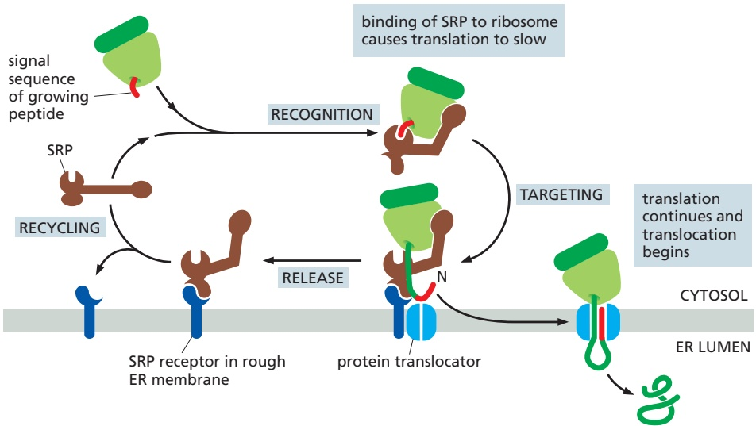

Figure 12–20 How ER signal sequences and SRP direct ribosomes to the ER membrane. The SRP and its receptor act in concert. The SRP binds to both the exposed ER signal sequence and the ribosome, thereby causing translation to slow. The SRP receptor in the ER membrane, which in animal cells is composed of two different polypeptide chains, binds the SRP–ribosome complex and directs it to the translocator. The SRP (in complex with SRP receptor) then moves away from its binding site on the ribosome, which is then occupied by the translocator in the ER membrane. SRP then releases the signal sequence, which inserts into the translocator to initiate polypeptide7 12.37/12.20 chain transfer across the lipid bilayer. The SRP and SRP receptor dissociate from each other and are recycled for the next round of protein targeting. Although not shown in the figure, one of the SRP proteins and both chains of the SRP receptor contain GTP-binding domains. Conformational changes that occur during cycles of GTP binding and hydrolysis (discussed in Chapter 15) ensure that SRP preferentially binds a signal sequence in the cytosol and releases it only after SRP successfully engages the SRP receptor at the ER membrane. The energy of GTP hydrolysis is therefore used to impart directionality to the cycle of SRP-mediated protein targeting.

(B)

(A)

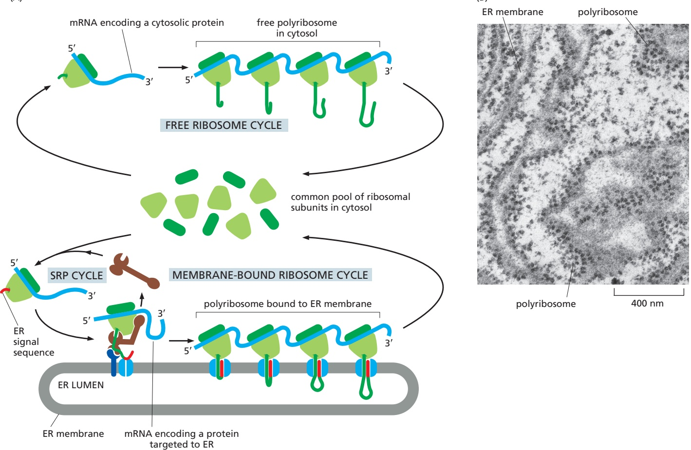

Figure 12–21 Free and membrane-bound polyribosomes. (A) A common pool of ribosomes synthesizes the proteins that stay in the cytosol and those that are transported into the ER. The ER signal sequence on a newly formed polypeptide chain binds to SRP, which directs the translating ribosome to the ER membrane. The mRNA molecule remains bound to the ER as part of a polyribosome, while the ribosomes that move along it are recycled; at the end of each round of protein synthesis, the ribosomal subunits are released and rejoin the common pool in the cytosol. (B) A thin section electron micrograph of polyribosomes attached to the ER membrane. The plane of the section in some places cuts through the ER roughly parallel to the membrane, giving a face-on view of the circular or spiral pattern of the polyribosomes. (B, courtesy of George Palade.)

changing population of ribosomes, each transiently held at the membrane by the translocator (**Figure 12–21**).

#### The Polypeptide Chain Passes Through a Signal Sequence–gated Aqueous Channel in the Translocator

It had long been debated whether polypeptide chains are transferred across the ER membrane in direct contact with the lipid bilayer or through a channel in a protein translocator. The debate ended with the identification of the translocator, which was shown to form a water-filled channel across the membrane through which the polypeptide chain passes. The core of the translocator, called the **Sec61 complex**, is built from three subunits that are highly conserved from bacteria to eukaryotic cells. The structure of the Sec61 translocator revealed that 10 α helices surround a central channel (**Figure 12–22**). The channel is plugged by a short α helix that keeps the translocator closed when it is idle. It is important to keep the channel closed to prevent ions, such as $\mathrm { C a ^ { 2 + } }$ , from leaking out of the ER. During translocation, the plug moves out of the way so the polypeptide can pass through the channel.

The Sec61 translocator only opens for proteins containing a signal sequence. The ability of the Sec61 translocator to recognize signal sequences provides a proofreading step to ensure that only proteins truly intended for the ER are

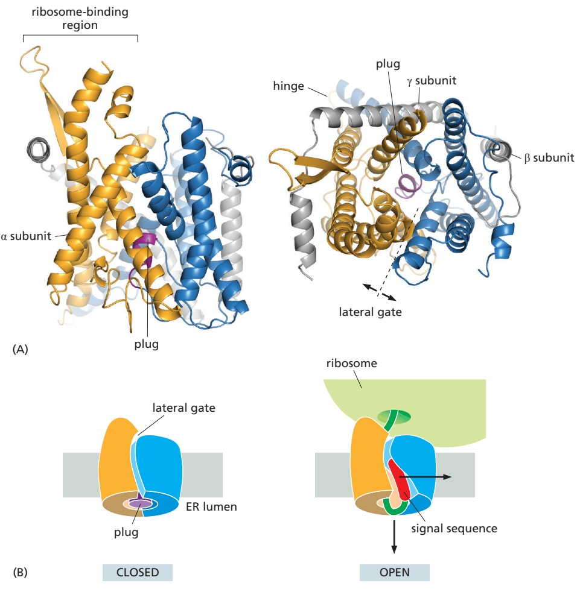

allowed to enter. Cryo-electron microscopy structures of the Sec61 translocator before and after signal sequence recognition show that the signal sequence wedges into a lateral gate, or seam, in Sec61 with its N-terminus facing the cytosol (Figure 12–23A). Insertion of the signal sequence at this lateral gate widens the central channel and releases the plug. The open translocator then readily accommodates the segment of polypeptide following the signal sequence inside the channel. The signal sequence, which is hydrophobic, laterally exits the gate into the membrane where it is cleaved off by signal peptidase and then rapidly degraded to amino acids by other proteases in the ER membrane and cytosol. As this mechanism illustrates, the lateral gate in the Sec61 translocator provides theMBoC7 m12.39/12.22 access route from Sec61’s central channel into the hydrophobic core of the membrane. In addition to its role in recognition of signal sequences, the lateral gate guides the integration of transmembrane proteins into the ER, as we discuss later.

Figure 12–22 Structure of the Sec61 translocator. (A) A side view (left, seen from the membrane) and a top view (right, seen from the cytosol) of the structure of the Sec61 translocator of the archaeon Methanococcus jannaschii (where it is called the SecY translocator). The Sec61 α subunit has an inverted repeat structure (see Figure 11–10) and is shown in blue and orange to indicate this pseudosymmetry; the two smaller β and γ subunits are shown in gray. Some regions of the Sec61 α subunit that protrude into the cytosol bind to the ribosome during protein translocation. The purple short helix forms a plug that seals the pore when the translocator is closed. When the translocator is open, the plug helix moves out of the way. The Sec61/ SecY translocator can also open sideways toward the membrane at a lateral gate. (B) Models of the closed and functionally active states of the Sec61/SecY translocator. In the active state, a protein chain can either translocate across the membrane through the central channel in the translocator or move sideways into the lipid bilayer through the lateral gate. (A, PDB code: 1RH5.)

Once the signal sequence has opened the Sec61 translocator and threaded the ensuing polypeptide into the channel, translocation occurs concurrently with continued translation. During translocation, the polypeptide tunnel inside the ribosomal large subunit is aligned with the channel within the Sec61 translocator (**Figure 12–23B**). This configuration provides a continuous path for the polypeptide from the peptidyl-transferase center in the ribosome, where new amino acids are added to the growing protein chain, to the ER lumen 15 nm away. In this way, the energy used for polypeptide elongation is indirectly harnessed to also drive translocation across the ER membrane.

When translation terminates, the C-terminus of the polypeptide is released from the ribosome and slips through the Sec61 translocator, whose plug returns to close the channel. Thus, the entire process of ER import, from signal sequence recognition by SRP to translocation through the Sec61 translocator, occurs co-translationally before the polypeptide has a chance to fold. This pathway provides one solution

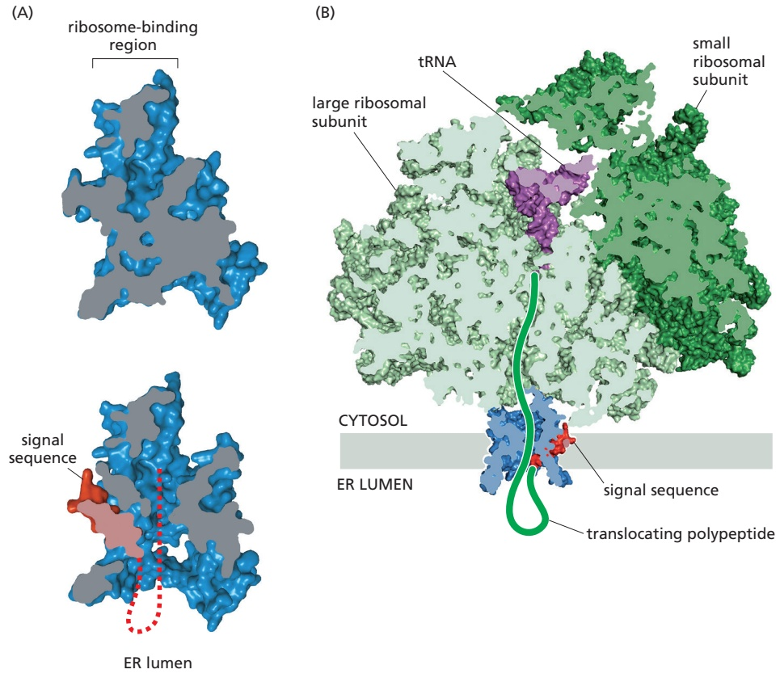

Figure 12–23 A signal sequence opens the Sec61 translocator. (A) Cross section through the Sec61 translocator before and after a signal sequence has inserted into the lateral gate. Insertion of the signal sequence causes the central channel in the translocator to widen and the plug to move out of this channel; hence, a continuous path across the membrane is now apparent (dashed line). (B) Cross section through the structure of a translating ribosome (green) bound to a Sec61 translocator (blue) that has been opened by a signal sequence (red). A translocating polypeptide is shown passing through the tunnel within the large ribosomal subunit and the Sec61 translocator. (A, PDB codes: 3J7Q and 3JC2; B, PDB code: 3JC2.)

to the problem of how to move a large protein across a membrane barrier without leakage of much smaller ions and metabolites during the process.

Translocation Across the ER Membrane Does Not Always Require Ongoing Polypeptide Chain ElongationMBoC7 m12.40/12.23

Some proteins are completely synthesized in the cytosol as precursors before they are imported into the ER, demonstrating that translocation does not always require ongoing translation (**Figure 12–24**). This is termed **post-translational** translocation. Post-translational protein translocation is more common across the yeast ER membrane and the evolutionarily related bacterial plasma membrane. In both cases, the Sec61 translocator (called SecY in bacteria) is used as the translocator; its narrow channel means that precursors can only be translocated as unfolded polypeptides. Thus, precursor proteins do not fold after their initial synthesis in the cytosol. Instead, they interact with other cytosolic proteins that prevent precursor folding or aggregation before they engage the Sec61 translocator. These interacting proteins typically are general chaperone proteins, such as those of the hsp70 family (discussed in Chapter 6), and must dissociate as the unfolded polypeptide is threaded through the translocator.

Figure 12–24 Co-translational and post-translational protein translocation. Ribosomes bind to the ER membrane during co-translational translocation. By contrast, cytosolic ribosomes complete the synthesis of a protein and release it prior to post-translational translocation. The released protein is kept unfolded in the cytosol by chaperones that dissociate before the protein is translocated across the membrane. In both cases, the protein is directed to the ER by an ER signal sequence (red and orange). See Movie 12.3.

Figure 12–25 Three ways in which protein translocation can be driven through structurally similar translocators. (A) Co-translational translocation. The ribosome is brought to the membrane by the SRP and SRP receptor and then engages with the Sec61 translocator. The growing polypeptide chain is threaded across the membrane as it is made. No additional energy is needed, as the only path available to the growing chain is to cross the membrane. (B) Post-translational translocation in eukaryotic cells requires an additional complex composed of Sec62 and Sec63 proteins. This complex is attached to the Sec61 translocator and positions BiP molecules where they can bind to the translocating chain as it emerges from the translocator in the lumen of the ER. ATP-driven cycles of BiP binding and release pull the protein into the lumen. (C) Post-translational translocation in bacteria. The completed polypeptide chain is fed from the cytosolic side into the bacterial homolog of the Sec61 translocator (called SecY) in the plasma membrane by the SecA ATPase. ATP hydrolysis– driven conformational changes drive a pistonlike motion in SecA. The piston not only pushes several amino acids of the protein chain through the pore of the translocator but also prevents backsliding of the chain into the cytosol. Whereas the Sec61 translocator, SRP, and SRP receptor are found in all organisms, SecA is found exclusively in bacteria, and the Sec62–Sec63 complex is found exclusively in eukaryotic cells. (Adapted from P. Walter and A.E. Johnson, Annu. Rev. Cell Biol. 10:87–119, 1994.)

Just as in co-translational translocation discussed earlier, the signal peptide of a precursor directly engages the Sec61 translocator to open the channel. However, the next step of translocation across the membrane occurs differently and relies on accessory proteins that use cellular energy to either pull the polypeptide across the channel from the lumenal side or feed it into the channel from the cytosol (**Figure 12–25**). To pull proteins into the ER lumen, eukaryotic cells use accessory proteins called Sec62 and Sec63 that associate with the Sec61 translocator and position an hsp70-like chaperone protein (called BiP, for binding protein) adjacent to the lumenal opening of the translocation channel. Like its cytosolic cousin, BiP has a high affinity for unfolded polypeptide chains, and it binds tightly to an imported protein chain as soon as it emerges from the Sec61 translocator in the ER lumen. Tight binding by BiP prevents the protein chain from sliding backwards, favoring more of the chain to emerge into the lumen where it can bind another molecule of BiP. ATP hydrolysis by BiP causes it to release the polypeptide, making it available to bind again to any newly emerged segments of the translocating polypeptide. This energy-driven cycle of binding and release serves as a molecular ratchet that provides the driving force for protein import after a precursor has initially inserted into the Sec61 translocator.

Because bacteria transport proteins directly to the extracellular space, where energy is not available, they use a cytosolic accessory protein called the SecA

(A)

(B)

ATPase. SecA binds to the precursor polypeptide and attaches to the cytosolic side of the translocator, where it undergoes cyclic conformational changes fueled by ATP hydrolysis. Each time an ATP is hydrolyzed, a portion of the SecA protein inserts into the pore of the translocator, pushing a short segment of the precursor protein with it. As a result of this pistonlike ratchet mechanism, the SecA ATPase progressively pushes the polypeptide chain of the transported protein across the membrane.

#### Transmembrane Proteins Contain Hydrophobic Segments That Are Recognized Like Signal Sequences

All of the transmembrane proteins that populate the ER, Golgi apparatus, lysosomes, endosomes, secretory vesicles, and plasma membrane are inserted into the ER membrane before moving to their final destination. Transmembrane proteins made at the ER span the lipid bilayer via one or more α-helical hydrophobic **transmembrane segments** (see Figure 10–17). Thus, the biosynthesis of membrane proteins requires some parts of the polypeptide chain to be translocated across the lipid bilayer, other parts to remain in the cytosol, and the transmembrane segments to be integrated into the membrane. Despite this additional complexity, the same factors (SRP, SRP receptor, and the Sec61 translocator) just described for transferring a soluble protein into the ER lumen also mediate transmembrane protein integration into the ER membrane. The same factors can be used because the transmembrane segments that define a transmembrane protein resemble the hydrophobic ER signal sequences that direct soluble protein translocation.

In the simplest case, a transmembrane protein contains a single transmembrane segment that will ultimately be embedded in the lipid bilayer as a membrane-spanning α helix. When this transmembrane segment emerges from the ribosome during synthesis, SRP recognizes its hydrophobic α-helical features as a signal sequence and brings this ribosome to the Sec61 translocator at the ER membrane. The transmembrane segment then inserts into the lateral gate of the Sec61 translocator, which is the same site where signal sequences bind. The orientation in which the transmembrane segment inserts into the lateral gate determines whether the protein segment preceding or the one following the transmembrane segment is moved across the membrane into the ER lumen (**Figure 12–26**). If the N-terminus is short and unfolded, orientation of the transmembrane segment depends on features of the polypeptide chain such as the distribution of nearby charged amino acids and the length of the transmembrane segment. If the preceding N-terminal segment is long and stably folded, it does not cross the membrane through the narrow Sec61 channel. In this case, the C-terminal segment that is still being synthesized, and therefore unfolded, is translocated across the membrane.

Figure 12–26 A transmembrane segment directs membrane protein insertion into the ER membrane. Many single-pass membrane proteins use their transmembrane segment to direct insertion into the ER membrane (Movie 12.3). The transmembrane segment is recognized by SRP (not shown) and delivered via the SRP receptor (not shown) to the Sec61 translocator at the ER membrane. The transmembrane segment then inserts into the lateral gate of the Sec61 translocator in one of two orientations. (A) Some transmembrane segments insert into the lateral gate such that the N-terminal domain is retained on the cytosolic side of Sec61. This orientation is favored for proteins whose N-terminal domains are very long or folded, and for transmembrane segments whose flanking amino acids have a net positive charge on the N-terminal side. (B) Some transmembrane segments insert into the lateral gate such that the C-terminal flanking region is retained on the cytosolic side of Sec61. In this case, the N-terminal flanking region is thought to translocate across the membrane through the Sec61 channel. This orientation is favored for transmembrane segments whose flanking amino acids have a net positive charge on the C-terminal side.

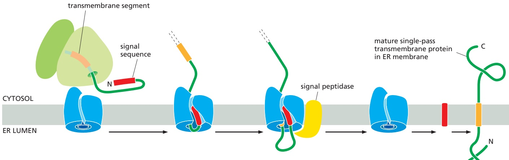

Figure 12–27 Sequential use of a cleaved ER signal sequence and transmembrane segment during membrane protein insertion. Membrane proteins that contain a relatively large N-terminal domain on the lumenal side of the ER utilize both a cleaved ER signal sequence and a transmembrane segment. Targeting to the ER membrane, initiation of translocation through Sec61, and cleavage of the signal sequence all occur exactly as for a secretory protein (see Figure 12–20). However, when the transmembrane segment enters the Sec61 translocator, translocation stops and the transmembrane segment moves through the lateral gate into the lipid bilayer. The remainder of the protein continues to be synthesized on the cytosolic side of the membrane until translation terminates.

Many transmembrane proteins contain large N-terminal lumenal domains. In this case, an N-terminal signal sequence is used to initiate translocation, just as for a soluble protein. In this way, the N-terminus of the mature polypeptide is committed to the ER lumen by the signal sequence, and the remainder of the polypeptide begins translocation through the Sec61 translocator. When a hydrophobic segment in the polypeptide emerges from the ribosome, it inserts into the lateral gate to gain access to the lipid bilayer. Because the hydrophobic segment is more stable in the membrane than in the aqueous channel, it exits the channel laterally, translocation stops, and the rest of the protein is synthesized on the cytosolic side of the ER membrane (**Figure 12–27**).

#### Hydrophobic Segments of Multipass Transmembrane Proteins Are Interpreted Contextually to Determine Their Orientation

In multipass transmembrane proteins, the polypeptide chain passes back and forth repeatedly across the lipid bilayer as hydrophobic α helices (see Figure 10–17). Synthesis of multipass transmembrane proteins up to the first transmembrane segment occurs as we have just described for single-pass transmembrane proteins. Hence, SRP will deliver the protein to the translocator, where the first transmembrane segment will insert into the lateral gate of the Sec61 translocator in an orientation dictated by features of the preceding N-terminal domain and nearby charged amino acids. In this way, insertion of the first transmembrane segment into the membrane effectively locks in the topology for the rest of the protein to come. From this point onward, each successive hydrophobic segment is interpreted by the Sec61 translocator on the basis of the topology and properties of the preceding parts of the protein.

Because of the tight coupling between the ribosome and Sec61 translocator, each hydrophobic segment emerges very close to the lateral gate that provides access to the lipid bilayer. In the simplest cases, the newly emerged hydrophobic segment engages the lateral gate in an orientation opposite to the most recently inserted transmembrane segment and inserts into the lipid bilayer (**Figure 12–28**). Some transmembrane segments of multipass proteins are only partially hydrophobic and would not be stable in the lipid bilayer on their own. These can nevertheless insert into the membrane if they are able to interact with one of the preceding transmembrane segments that is near the lateral gate of Sec61. This cooperation makes it possible to produce multipass transmembrane proteins that contain hydrophilic parts within the lipid bilayer, which is crucial for many important proteins such as transporters and channels (discussed in Chapter 11). The hydrophilic sequences between the transmembrane segments are either synthesized into the cytosol or threaded through the Sec61 translocator, depending on the orientation of the preceding transmembrane segment. In thisMBoC7 m12.44/12.28 way, a multipass protein is woven into the membrane with successive hydrophobic segments achieving opposite orientations until all of them have been inserted into the membrane as transmembrane α helices.

Figure 12–28 The insertion of a multipass transmembrane protein into the ER membrane. The events up to the insertion of the first transmembrane segment follow the steps for single-pass membrane proteins (see Figures 12–26 and 12–27). The orientation of this first transmembrane segment depends on the characteristics of the transmembrane segment and flanking regions just as for single-pass membrane proteins. When the next transmembrane segment emerges from the ribosome, it inserts into the lateral gate of Sec61 in an orientation opposite to that of the first transmembrane segment, then moves into the lipid bilayer. Each successive transmembrane segment is similarly inserted into the membrane via the lateral gate in an orientation opposite to that of the transmembrane segment that immediately preceded it. This proceeds until all transmembrane segments have been inserted into the membrane.

Because membrane proteins are always inserted from the cytosolic side of the ER in this programmed manner, all copies of the same polypeptide chain will have the same orientation in the lipid bilayer. This generates an asymmetrical ER membrane in which the protein domains exposed on one side are different from those exposed on the other side. This asymmetry is maintained during the many membrane budding and fusion events that transport the proteins made in the ER to other cell membranes (discussed in Chapter 13). Thus, the way in which a newly synthesized protein is inserted into the ER membrane determines the orientation of the protein in all of the other membranes as well.

#### Some Proteins Are Integrated into the ER Membrane by a Post-translational Mechanism

Many important cytosol-facing membrane proteins are anchored in the membrane by a single transmembrane α helix very close to the C-terminus. These **tail-anchored proteins** include a large number of SNARE protein subunits that guide vesicular traffic (discussed in Chapter 13). When a tail-anchored protein is translated, the ribosome reaches the termination codon while the polypeptide sequence destined to become a transmembrane α helix is still inside the ribosome exit tunnel. Recognition by SRP is therefore not possible, and the protein is released from the ribosome into the cytosol. The hydrophobic segment is recognized by a specialized chaperone complex that transfers it to a targeting factor called Get3 (**Figure 12–29**). Although unrelated to SRP, Get3 also contains a hydrophobic pocket lined by many methionine side chains to help it recognize diverse hydrophobic segments independent of their exact sequence. Two proteins at the ER membrane called Get1 and Get2 serve not only as the receptor for Get3 but also as the translocator that inserts the hydrophobic segment of the tail-anchored protein into the lipid bilayer. This post-translational targeting mechanism is therefore conceptually similar to SRP-dependent protein targeting (see Figure 12–20). Some tail-anchored proteins are targeted to mitochondria or peroxisomes instead of the ER, but the mechanism of their targeting is not known.

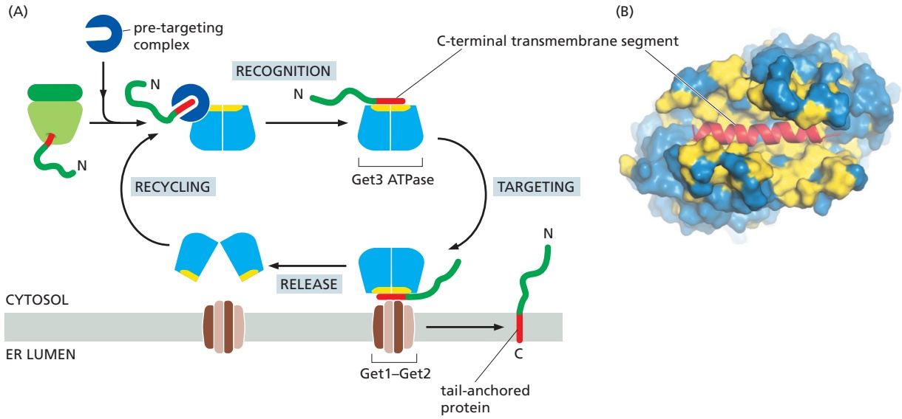

Figure 12–29 The insertion mechanism for tail-anchored proteins. (A) In this post-translational pathway for the insertion of tail-anchored membrane proteins into the ER, a soluble pre-targeting complex captures the hydrophobic C-terminal transmembrane segment (red) after it emerges from the ribosomal exit tunnel and loads it onto the Get3 targeting factor. The resulting complex is targeted to the ER membrane by interaction with the Get1–Get2 receptor complex, which functions as a membrane protein insertion machine. After the tail-anchored protein is released from Get3 and inserted into the ER membrane, Get3 is recycled back to the cytosol. This targeting cycle is conceptually similar to protein targeting by SRP (see Figure 12–20). Although not shown in the figures, both Get3 and SRP bind and hydrolyze nucleoside triphosphates to provide directionality to the targeting cycle. ATP is used by Get3, and GTP is used by SRP. (B) Crystal structure of the Get3 targeting MBOC7 m12.46/12.29 factor bound to a transmembrane segment (red helix). The hydrophobic transmembrane segment binds to a deep groove in Get3 lined by hydrophobic amino acids (yellow), including many flexible methionines. (PDB code: 4XTR.)

#### Some Membrane Proteins Acquire a Covalently Attached Glycosylphosphatidylinositol (GPI) Anchor

Another way that proteins are attached to the membrane is by a **glycosylphosphatidylinositol (GPI) anchor** that is covalently linked to the C-terminus of some proteins destined for the plasma membrane. GPI-anchored proteins are initially made with an N-terminal signal sequence to direct them to the ER and a hydrophobic segment very close to the C-terminus. This hydrophobic segment is selectively recognized by a transamidase enzyme in the ER membrane that simultaneously cleaves off the hydrophobic segment and attaches a preformed GPI anchor to the rest of the protein (**Figure 12–30**). Many plasma membrane proteins are modified in this way. Because they are attached to the exterior of the plasma membrane only by their GPI anchors, they can be released from cells in soluble form in response to signals that activate a specific phospholipase in the plasma membrane. Trypanosome parasites, for example, use this mechanism to shed their coat of GPI-anchored surface proteins when attacked by the immune system. GPI anchors also participate in directing some plasma membrane proteins into specialized domains, such as lipid rafts, thus laterally segregating them from other membrane proteins (see Figure 10–13).

<!-- END EN EN12-H014-H020 -->

### 英文补充：过氧化物酶体、线粒体与叶绿体的蛋白质输入

> 对应中文板块：过氧化物酶体、线粒体与叶绿体的蛋白质输入。英文来源：Molecular Biology of the Cell，第7版，第12章；[本章完整原文](../来源/英文教材/12_Intracellular_Organization_and_Protein_Sorting/chapter.md)。物理PDF页码范围：722–787（整章范围）。

<!-- BEGIN EN EN12-H032-H041 -->
#### Short Signal Sequences Direct the Import of Proteins into Peroxisomes

The proteins that compose peroxisomes are delivered by two different routes (**Figure 12–46**). In the first route, some of the integral membrane proteins of the peroxisomal membrane are first inserted into the ER using the ER-resident Sec61 protein translocator. These peroxisome-destined proteins are then packaged into specialized peroxisomal precursor vesicles. New precursor vesicles then fuse with one another to form a new peroxisome or fuse with an existingMBoC7 m12.29/12.45 peroxisome to facilitate its growth. In the second route, peroxisomal proteins can be imported into preexisting peroxisomes directly from the cytosol. A specific sequence of three amino acids (Ser-Lys-Leu) located at the C-terminus of many peroxisomal proteins functions as an import signal (see Figure 12–13). Other peroxisomal proteins contain a slightly longer and partially hydrophobic signal sequence near the N-terminus. If either sequence is attached to a cytosolic protein, the protein is imported into peroxisomes.

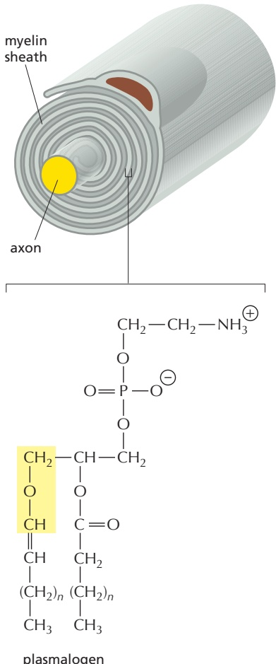

Figure 12–44 The structure of a plasmalogen. Plasmalogens are very abundant in the myelin sheaths that insulate the axons of nerve cells. They make up some 80–90% of the myelinMBoC7 m12.28/12. membrane phospholipids. In addition to an ethanolamine head group and a longchain fatty acid attached to the same glycerol phosphate backbone used for phospholipids, plasmalogens contain an unusual fatty alcohol that is attached through an ether linkage highlighted in yellow (bottom left).

Figure 12–45 Electron micrographs of two types of peroxisomes found in plant cells. (A) A peroxisome with a paracrystalline core in a tobacco leaf mesophyll cell. Its close association with chloroplasts is thought to facilitate the exchange of materials between these organelles during photorespiration. The vacuole in plant cells is equivalent to the lysosome in animal cells. (B) Peroxisomes in a fat-storing cotyledon cell of a tomato seed 4 days after germination. Here the peroxisomes (glyoxysomes) are associated with the lipid droplets that store fat, reflecting their central role in fat mobilization and gluconeogenesis during seed germination. (A, © 1969 S.E. Frederick and E.H. Newcomb. Originally published in J. Cell Biol. https://doi.org/10.1083/jcb.43.2.343. With permission from Rockefeller University Press. B, from W.P. Wergin et al., J. Ultrastruct. Res. 30:533–557, 1970. With permission from Elsevier.)

Peroxisomal protein import is driven by ATP hydrolysis and utilizes a collection of proteins, called **peroxins**, that catalyze the import cycle. C-terminal peroxisomal sorting signals are recognized by the peroxin Pex5 in the cytosol. This import receptor accompanies its cargo all the way into a protein translocator in the peroxisomal membrane. After cargo release inside the peroxisome, Pex5 is recycled back to the cytosol. This recycling step requires modification of Pex5 with ubiquitin, which is used as a handle by an ATPase complex composed of Pex1 and Pex6. The Pex1–Pex6 complex harnesses the energy of ATP hydrolysis to release Pex5 from peroxisomes so it can pick up the next cargo molecule.

Figure 12–46 A model that explains how peroxisomes proliferate and how new peroxisomes arise. Peroxisomal precursor vesicles bud from the ER. At least two peroxisomal membrane proteins, Pex3 and Pex15, follow this route. The machinery that drives the budding reaction and that selects only peroxisomal proteins for packaging into these vesicles depends on Pex19 and other cytosolic proteins that are still unknown. Peroxisomal precursor vesicles may then fuse with one another or with preexisting peroxisomes. The peroxisomal membrane contains import receptors and protein translocators that are required for the import of peroxisomal proteins made on cytosolic ribosomes, including new copies of the import receptors and translocator components. Presumably, the lipids required for growth are also imported, although some may derive directly from the ER in the membrane of peroxisomal precursor vesicles.

N-terminal peroxisomal signal sequences are recognized by the peroxin Pex7. The Pex7–cargo complex, together with additional accessory peroxins, appear to participate in an import cycle similar to that mediated by Pex5.

The protein translocator in the peroxisomal membrane is composed of at least six different peroxins. Unlike protein translocators in the ER, the peroxisomal translocator can transport fully folded and even oligomeric proteins across the membrane. To allow the passage of large and variably sized cargo molecules, the transporter is thought to dynamically adapt in size to the particular cargo molecules to be transported. It is not known how such a large pore can be utilized for transport without leakage of contents between the cytosol and peroxisome.

The importance of protein import into peroxisomes is demonstrated by the inherited human disease Zellweger syndrome. Mutations in any of a dozen different peroxins, the most common being Pex1, cause an impairment in peroxisomal protein import. These individuals, whose cells contain “empty” peroxisomes, accumulate very-long-chain and branched-chain fatty acids that are normally broken down in peroxisomes. Furthermore, they are deficient in plasmalogens. These metabolic impairments cause severe abnormalities in the brain, liver, and kidneys of individuals, and they die soon after birth.

#### Summary

Peroxisomes are specialized for carrying out oxidation reactions using molecular oxygen. They generate hydrogen peroxide, which they employ for oxidative purposes—and contain catalase to destroy the excess. All peroxisomal proteins are encoded in the cell nucleus. Some of these proteins are conveyed to peroxisomes via peroxisomal precursor vesicles that bud from the ER, but most are synthesized in the cytosol and directly imported. A specific sequence of three amino acids near the C-terminus of many of the latter proteins functions as a peroxisomal import signal that is recognized by a complementary import receptor in the cytosol. Import proceeds through a protein translocator in the peroxisomal membrane, which differs from the protein translocators in the ER in that large and fully folded proteins are imported from the cytosol without unfolding.

#### THE TRANSPORT OF PROTEINS INTO MITOCHONDRIA AND CHLOROPLASTS

Mitochondria and chloroplasts (a specialized form of plastids in green algae and plant cells) are double membrane–enclosed organelles. They specialize in ATP synthesis, using energy derived from electron transport and oxidative phosphorylation in mitochondria and from photosynthesis in chloroplasts (discussed in Chapter 14). Although both organelles contain their own DNA, ribosomes, and other components required for protein synthesis, almost all of their proteins are encoded in the cell nucleus and imported from the cytosol. Each imported protein must reach the particular organelle subcompartment in which it functions.

The different subcompartments in **mitochondria** are formed by the two concentric mitochondrial membranes (**Figure 12–47A**): the **inner mitochondrial membrane**, which encloses the **matrix space** and forms extensive invaginations called cristae, and the **outer mitochondrial membrane**, which is in contact with the cytosol. The space between the inner and outer membranes is subdivided into the crista space and **intermembrane space**, with protein complexes at the junctions where the cristae invaginate. Chloroplasts have an outer and inner membrane, which enclose an intermembrane space, and a stroma, which is the chloroplast equivalent of the mitochondrial matrix space (**Figure 12–47B**). They have an additional subcompartment, the thylakoid space, which is surrounded by the thylakoid membrane. The thylakoid membrane derives from the inner membrane during plastid development and is pinched off to become discontinuous with it. Each of the subcompartments in mitochondria and chloroplasts contains a distinct set of proteins.

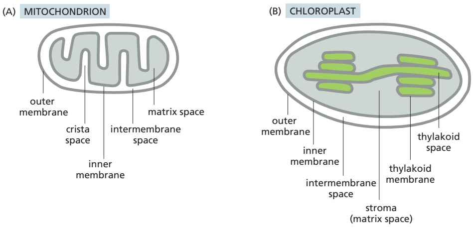

Figure 12–47 The subcompartments of mitochondria and chloroplasts. In contrast to the cristae of mitochondria (A), the thylakoids of chloroplasts (B) are not connected to the inner membrane and therefore form a sealed continuous compartment with a separate internal space.

New mitochondria and chloroplasts are produced by the growth of preexisting organelles, followed by fission (discussed in Chapter 14). The growth depends mainly on the import of proteins from the cytosol. Many of the core principles of protein import into mitochondria and chloroplasts are similar to the analogous process of protein import into the ER we discussed earlier. However, the presence of multiple membranes and subcompartments adds to the complexity of7 12.19/12.47 delivering newly imported proteins to the correct location. This section explains how it occurs.

#### Translocation into Mitochondria Depends on Signal Sequences and Protein Translocators

One or more signal sequences direct all mitochondrial precursor proteins to their appropriate mitochondrial subcompartment. Many proteins entering the matrix space contain a signal sequence at their N-terminus that a signal peptidase rapidly removes after import. Other imported proteins, including all outer membrane and many inner membrane and intermembrane-space proteins, have internal signal sequences that are not removed. The signal sequences are both necessary and sufficient for the import and correct localization of the proteins: when genetic engineering techniques are used to link these signals to a cytosolic protein, the signals direct the protein to the correct mitochondrial subcompartment. Thus, the principles of the signal hypothesis, conceived to explain how proteins are segregated to the ER, also apply to mitochondria.

Multisubunit protein complexes that function as protein translocators mediate protein movement across or into mitochondrial membranes (**Figure 12–48A**). To provide access to each mitochondrial subcompartment, protein translocator complexes are located in both the inner and outer mitochondrial membranes. In general, each translocator has the capacity to recognize particular types of signals and serves as a conduit across or into the membrane within which it resides. Together, these translocators direct ∼1500 different precursor proteins from the cytosol to the appropriate subcompartment of mitochondria: the outer membrane, the intermembrane space and crista space, the inner membrane, and the matrix space.

The organization of signals in a precursor protein ultimately controls which translocator(s) the precursor protein engages and the order in which the signals are used to reach the protein’s final destination inside mitochondria. This combinatorial system means that there is sometimes more than one route to reach a particular destination, the same way that different subway lines can take you from Brooklyn to Times Square in New York City. For example, membrane proteins residing in the inner mitochondrial membrane use at least three routes to arrive there. **Figure 12–48B** shows the possible routes to each mitochondrial subcompartment and the translocator complexes that direct proteins there.

The **TOM complex** is required for the import of nearly all nucleus-encoded mitochondrial proteins. It initially recognizes their signal sequences and transports them from the cytosol into the intermembrane space. From here, different mitochondrial proteins follow different itineraries depending on sequence features encoded in the protein. β-Barrel proteins, which are particularly abundant in the outer membrane, are passed to the **SAM complex** for insertion and folding in the outer membrane. Two different **TIM complexes** mediate protein transport at the inner membrane. Matrix proteins use the TIM23 complex for transport, while inner membrane proteins use the TIM22 complex, the TIM23 complex, or the **OXA complex** for insertion. The remainder of proteins stay in the intermembrane space where they function.

Figure 12–48 The protein translocators in the mitochondrial membranes. (A) The TOM, TIM, SAM, MIM, and OXA complexes are multimeric membrane protein assemblies that catalyze protein translocation across mitochondrial membranes. The protein components of the TIM22 and TIM23 complexes that line the import channel are structurally related, suggesting a common evolutionary origin of both TIM complexes. On the matrix side, the TIM23 complex is bound to a multimeric protein complex containing mitochondrial hsp70, which acts as an import ATPase, using ATP hydrolysis to pull proteins through the pore. In animal cells, subtle variations exist in the subunit composition of the translocator complexes to adapt the mitochondrial import machinery to the particular needs of specialized cell types. (B) Newly made proteins synthesized in the cytosol can use multiple routes to arrive at their final destination. The known routes via the different protein complexes are shown as green lines. There are multiple routes for a protein to become embedded into the inner and outer mitochondrial membranes, including one route for mitochondrially encoded proteins synthesized in the matrix space. SAM = sorting and assembly machinery; OXA = cytochrome oxidase activity; TIM = translocator of the inner mitochondrial membrane; TOM = translocator of the outer membrane; MIM = mitochondrial import machinery.

In addition to the ∼99% of mitochondrial proteins that must be imported from the cytosol, a handful of membrane proteins are encoded by the mitochondrial genome in all eukaryotes. These proteins are synthesized by mitochondrial ribosomes and inserted into the inner membrane by the OXA complex. Mitochondrially encoded membrane proteins are assembled with nuclear-encoded membrane proteins imported from the cytosol to form functional protein complexes such as the respiratory-chain complexes used for energy production (see Chapter 14). How cells communicate between the mitochondria and nucleus to ensure equal expression of the proteins that build inner membrane complexes is not understood.

#### Mitochondrial Proteins Are Imported Post-translationally as Unfolded Polypeptide Chains

As we learned in an earlier section, protein translocation into the ER usually occurs as the protein is being synthesized by ribosomes that are tightly coupled to the ER protein translocator. The binding of ribosomes to the translocator during protein import is what gives the rough ER its characteristic appearance.

In contrast, the protein translocators in the mitochondrial outer membrane do not bind to ribosomes, and most mitochondrial proteins are imported by a post-translational mechanism. This is why very few ribosomes are observed on the surface of mitochondria.

As with ER translocation, mitochondrial protein import can be reconstituted in a cell-free reaction in the test tube. In such experiments, a radioactively labeled mitochondrial precursor protein is mixed with purified mitochondria to permit import into the organelle. By changing the conditions in the test tube, it is possible to establish the biochemical requirements for import, to trap intermediates in the process, and to identify which translocators are used. Most of our knowledge about the molecular mechanism of mitochondrial import comes from analysis in cell-free reactions.

Mitochondrial precursor proteins do not immediately fold into their native structures after they are synthesized; instead, they remain unfolded in the cytosol through interactions with other proteins. Some of these interacting proteins are general chaperones of the hsp70 family (discussed in Chapter 6), whereas others are dedicated to mitochondrial precursor proteins and bind directly to their signal sequences. All the interacting proteins help to prevent the precursor proteins from aggregating or folding up spontaneously before they engage with the TOM complex in the outer mitochondrial membrane. As a first step in the import process, the import receptors of the TOM complex bind the signal sequence of the mitochondrial precursor protein. The unfolded polypeptide chain is then fed— signal sequence first—into the translocation channel within the TOM complex as the cytosolic interacting proteins are stripped off.

Once the translocating protein protrudes into the intermembrane space, sequences within the polypeptide chain determine what happens next. For example, proteins destined for the matrix or inner membrane engage one of the TIM complexes and are either translocated across or inserted into the inner membrane. It is possible to rapidly cool a cell-free mitochondrial import reaction to arrest the proteins at an intermediate step during translocation. Experiments examining an arrested protein destined for the matrix show that it spans both the inner and outer mitochondrial membranes: its N-terminal signal sequence has been removed by the signal peptidase located in the matrix, while the C-terminal part of the protein is still exposed outside the mitochondria. We can therefore conclude that precursor proteins can pass through both mitochondrial membranes at once to enter the matrix space (**Figure 12–49**).

Figure 12–49 Protein import by mitochondria. The N-terminal signal sequence of the mitochondrial precursor protein is recognized by receptors of the TOM complex while the remainder of the protein is kept unfolded by cytosolic hsp70 chaperones. The protein is then translocated through the TIM23 complex so that it transiently spans both mitochondrial membranes (Movie 12.5). The signal sequence is cleaved off by a signal peptidase in the matrix space to form the mature protein. The free signal sequence is then rapidly degraded (not shown).

Although the TOM and TIM complexes usually work together to translocate precursor proteins across both membranes at the same time, they are capable of operating independently. In isolated outer membranes, for example, the TOM complex can translocate the signal sequence of precursor proteins across the membrane. Similarly, if the outer membrane is experimentally removed from isolated mitochondria, the exposed TIM23 complex can efficiently import precursor proteins into the matrix space. The experimental uncoupling of ordinarily linked processes allows each step and translocator system to be studied and understood in greater detail.

#### Protein Import Is Powered by ATP Hydrolysis, a Membrane Potential, and Redox Potential

Directional transport of proteins requires energy (**Figure 12–50**). Mitochondrial protein import utilizes three different sources of energy at four discrete sites. ATP, a common fuel in most biological systems, is used at two of these sites: outside the mitochondria and inside the matrix. The other two energy sources are contributed by the membrane potential across the inner mitochondrial membrane and the redox potential of the electron-transport chain. Not all mitochondrial precursor proteins need each of these energy sources to arrive at their final destination.

The initial use of energy, needed by most mitochondrial precursor proteins at the initial stage of the translocation process, serves to maintain the polypeptide in an unfolded state prior to import (see Figure 12–49). As discussed in Chapter 6,

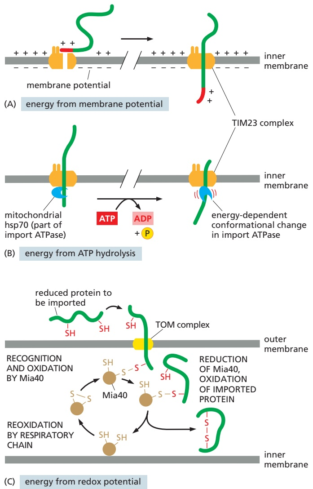

Figure 12–50 The role of energy in protein import into mitochondria. Three different sources of energy are used to import protein into the mitochondria. (A) After initial insertion of the signal sequence and of adjacent portions of the polypeptide chain into the TOM complex translocation channel (not shown), the signal sequence interacts with a TIM23 complex (orange). The signal sequence is then translocated into the matrix space in a process that requires the energy in the membrane potential across the inner membrane. Positively charged amino acids in the signal sequence facilitate this membrane potential–dependent translocation reaction. (B) Mitochondrial hsp70, which is part of an import ATPase complex, binds to regions of the polypeptide chain as they become exposed in the matrix space, pulling the protein through the translocation channel, using the energy of ATP hydrolysis. (C) Polypeptides with multiple cysteines can sample the intermembrane space via partial translocation through the TOM complex. In the intermembrane space, these cysteines are oxidized to disulfide bonds by the enzyme Mia40, which becomes reduced in the process. The oxidized polypeptide is now partially folded, preventing it from sliding back into the cytosol. Reduced Mia40 is reoxidized by electrons provided by the respiratory chain so it can function again in the import reaction.

the chaperones that carry out this task use cycles of ATP binding and hydrolysis to control their interactions with newly synthesized polypeptides. Chaperone interaction is required to prevent premature folding in the cytosol, while chaperone dissociation is needed to permit transport through the TOM complex.

Once the signal sequence has passed through the TOM complex and is bound to a TIM complex, further translocation through the TIM translocation channel requires the membrane potential (Figure 12–50A), which is the electrical component of the electrochemical H+ gradient across the inner membrane (see Figure 11–4). Pumping of H+ from the matrix space to the intermembrane space, driven by electron-transport processes in the inner membrane (discussed in Chapter 14), maintains the electrochemical gradient. The energy in the electrochemical H+ gradient across the inner membrane drives the translocation of the positively charged signal sequences through the TIM complexes by electrophoresis. The same H+ gradient also powers most of the cell’s ATP synthesis by ATP synthase complexes in the inner mitochondrial membrane.

Once the initial segment of a precursor protein reaches the matrix, **mitochondrial hsp70** is crucial for completing the import process similar to how BiP is needed for post-translation protein import into the ER. The mitochondrial hsp70 is bound to the matrix side of the TIM23 complex and acts as a motor to pull the precursor protein into the matrix space. Like its cytosolic cousin, mitochondrial hsp70 has a high affinity for unfolded polypeptide chains, and it binds tightly to an imported protein chain as soon as the chain emerges from the TIM translocator in the matrix space. The hsp70 then undergoes an ATP-dependent conformational change that exerts a pulling force on the protein being imported before releasing it. This energy-driven cycle of binding, pulling, and release continues until the protein has completed import through the TIM23 complex (Figure 12–50B). Many imported matrix proteins are passed on to another chaperone protein, mitochondrial hsp60, to assist their folding through cycles of ATP hydrolysis (see Chapter 6).

Certain intermembrane-space proteins that contain cysteine motifs use the difference in redox potential between the cytosol and mitochondria as a source of energy. When a portion of these proteins initially emerges into the intermembrane space, they form a transient covalent disulfide bond to the Mia40 protein (Figure 12–50C). This interaction prevents backsliding of the protein through the TOM complex into the cytosol. The imported proteins are eventually released from Mia40 in an oxidized form containing intrachain disulfide bonds, resulting in a folded protein that is now trapped in the intermembrane space. Mia40 becomes reduced in the process and is then reoxidized by passing electrons to the electron-transport chain in the inner mitochondrial membrane. In this way, the energy stored in the redox potential in the mitochondrial electron-transport chain is tapped to drive protein import.

#### Transport into the Inner Mitochondrial Membrane Occurs Via Several Routes

The three different translocators in the inner mitochondrial membrane (see Figure 12–48) are all capable of membrane protein insertion. Different subsets of inner mitochondrial membrane proteins take different routes to reach one of these translocators for insertion into the membrane.

In the most common translocation route, a precursor that begins in the cytosol uses the TOM and TIM23 complexes to begin import into the matrix. However, only the N-terminal signal sequence of the transported protein actually enters the matrix space (**Figure 12–51A**). A hydrophobic amino acid sequence, strategically located after the N-terminal signal sequence, is recognized as a transmembrane domain by the TIM23 complex. This allows insertion of the transmembrane domain into the inner membrane and prevents further translocation into the matrix, perhaps through a lateral gate analogous to that found in the ER-resident Sec61 translocator. The remainder of the protein enters the intermembrane space through the TOM complex, and the signal sequence is cleaved off in the matrix.

(A)

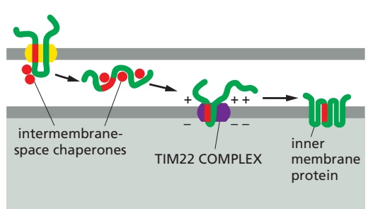

(B)

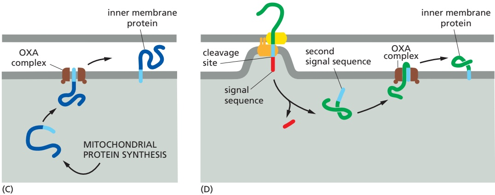

Figure 12–51 Routes for the production of inner mitochondrial membrane proteins. (A) The N-terminal signal sequence (red) initiates import into the matrix space (see Figure 12–49). A hydrophobic transmembrane segment (blue) that follows the matrix-targeting signal sequence binds to the TIM23 translocator (orange) in the inner membrane and stops translocation. The remainder of the protein is then pulled into the intermembrane space through the TOM translocator in the outer membrane, and the transmembrane segment is released into the inner membrane, anchoring the protein there. (B) Multipass inner. / . membrane proteins that function as metabolite transporters contain internal signal sequences and snake through the TOM complex as a loop. They then bind to the chaperones in the intermembrane space, which guide the proteins to the TIM22 complex. The TIM22 complex is specialized for the insertion of multipass inner membrane proteins. (C) The OXA complex mediates membrane protein insertion into the inner membrane for proteins that are encoded by the mitochondrial genome and translated in the matrix space. (D) The OXA complex in the inner membrane can mediate protein insertion from the matrix space. To access this route, nuclear-encoded proteins must first translocate completely into the matrix space via the TOM and TIM23 complexes. Cleavage of the signal sequence (red) used for the initial translocation unmasks an adjacent hydrophobic signal sequence (blue) at the new N-terminus. This signal then directs the protein into the inner membrane.

The second transport route to the inner membrane is specialized for a family of metabolite-specific transporters that transfer a vast number of small molecules across the inner membrane. These transporters supply substrates for metabolic enzymes in the mitochondrial matrix, such as those of the citric acid cycle, and export their products back to the cytosol. These multipass transmembrane proteins use internal signal sequences to enter the intermembrane space through the TOM complex. They engage intermembrane-space chaperones that guide them to the TIM22 complex, where hydrophobic transmembrane regions partition into the inner membrane. This insertion process requires the membrane potential to ensure that appropriate regions of the protein are transported to the matrix side so that the transporter acquires the correct topology (**Figure 12–51B**).

The final insertion route into the inner membrane uses the OXA complex. As mentioned earlier, the OXA complex also inserts the few membrane proteins that are encoded and translated in the mitochondrial matrix (**Figure 12–51C**). Thus, the OXA complex can only be accessed from the matrix side of the membrane. For this reason, nuclear-encoded membrane proteins that rely on the OXA complex for insertion must first use TIM23 to translocate into the matrix (**Figure 12–51D**). Here, the N-terminal signal sequence is removed to expose a hydrophobic signal sequence that is then used by the OXA complex for insertion into the inner membrane.

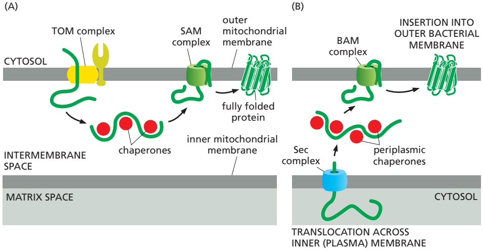

Figure 12–52 Integration of porins into the outer mitochondrial and bacterial membranes. (A) After translocation through the TOM complex in the outer mitochondrial membrane, β-barrel proteins bind to chaperones in the intermembrane space. The SAM complex then inserts the unfolded polypeptide chain into the outer membrane and helps the chain fold. (B) A structurally related BAM complex in the outer membrane of Gram-negative bacteria catalyzes β-barrel protein insertion and folding (see Figure 11–17).

#### Bacteria and Mitochondria Use Similar Mechanisms to Insert β Barrels into Their Outer Membrane

As discussed earlier in this chapter, mitochondria evolved from an ancestral endosymbiont bacterium inside the primordial eukaryotic cell. The outer mitochondrial membrane is therefore evolutionarily related to the outer membrane of Gram-negative bacteria (see Figure 11–17). Both membranes contain **porins**, abundant pore-forming β-barrel proteins that are permeable to inorganic ions and metabolites (but not to most proteins). The TOM complex only allows proteins containing hydrophobic α helices to exit laterally and thus cannot integrate porins or other β-barrel proteins into the lipid bilayer. Instead, they are first transported through the TOM complex as unfolded proteins into the intermembrane space. Specialized chaperone proteins in the intermembrane space keep theMBoC7 m12.24/12.52 β-barrel proteins from aggregating (**Figure 12–52A**) until they are inserted and folded by the SAM complex in the outer membrane.

One of the central subunits of the SAM complex is homologous to a bacterial outer membrane protein that helps insert β-barrel proteins into the bacterial outer membrane. In bacteria, β-barrel proteins are inserted from the periplasmic space, which is the topological equivalent of the intermembrane space in mitochondria (**Figure 12–52B**). This conserved pathway for inserting β-barrel proteins further underscores the endosymbiotic origin of mitochondria. Notably, the central subunits of the TOM and SAM complexes are themselves β-barrel proteins. Thus, preexisting TOM and SAM complexes are required to make more copies of these essential protein translocators.

#### Two Signal Sequences Direct Proteins to the Thylakoid Membrane in Chloroplasts

Protein transport into **chloroplasts** resembles transport into mitochondria. Both processes occur post-translationally, use separate translocation complexes in each membrane, require energy, and use multiple types of signal sequences to direct a precursor to the appropriate organelle subcompartment. However, many of the protein components that form the translocation complexes differ. Moreover, whereas mitochondria harness the electrochemical H+ gradient across their inner membrane to drive transport, chloroplasts, which have an electrochemical H+ gradient across their thylakoid membrane but not their inner membrane, use GTP and ATP hydrolysis to power import across their double-membrane envelope. The functional similarities thus result from convergent evolution, reflecting the common requirements for translocation across a double membrane.

Although the signal sequences for import into chloroplasts superficially resemble those for import into mitochondria, a plant cell can have both mitochondria and chloroplasts, so proteins must partition appropriately between the two organelles. Experiments have shown that a cytosolic protein can be directed specifically to a plant cell’s mitochondria if it is experimentally joined to an N-terminal signal sequence of a mitochondrial protein; the same protein joined to an N-terminal signal sequence of a chloroplast protein ends up in chloroplasts. Thus, the import receptors on each organelle distinguish between the different signal sequences.

The same compartments that are found in mitochondria are also in chloroplasts, and each has its distinctive complement of proteins that are selectively delivered there using mechanisms analogous to the mitochondrial systems. However, chloroplasts have an extra membrane-enclosed compartment, the **thylakoid**. Many chloroplast proteins, including the protein subunits of the photosynthetic system and of the ATP synthase (discussed in Chapter 14), are located in the thylakoid membrane. Many of the components of these vital complexes are encoded in the nuclear genome, and those residing in the thylakoid lumen therefore have to be imported across three membranes. The precursors of these proteins are translocated from the cytosol to their final destination in two steps using bipartite signal sequences. First, they pass across the outer and inner membranes into the **stroma** guided by an N-terminal chloroplast signal sequence. There, a stromal signal peptidase removes the N-terminal chloroplast signal sequence, unmasking a thylakoid signal sequence that follows it in the sequence of the precursor protein. The thylakoid signal sequence initiates integration into the thylakoid membrane or translocation into the thylakoid space (**Figure 12–53A**).

Figure 12–53 Translocation of chloroplast precursor proteins into the thylakoid space. (A) The precursor protein contains an N-terminal chloroplast signal sequence (red), followed immediately by a thylakoid signal sequence (brown). The chloroplast signal sequence initiates translocation into the stroma by a mechanism similar to that used for the translocation of mitochondrial precursor proteins into the matrix space, although the translocator complexes, named TOC and TIC (for translocator in the outer and inner chloroplast membrane, respectively), are different. The signal sequence is then cleaved off, unmasking the thylakoid signal sequence, which initiates translocation across the thylakoid membrane. (B) Translocation into the thylakoid space or thylakoid membrane can occur by any one of at least three routes: (1) a Sec pathway, so called because it uses components that are homologs of Sec proteins, which mediate protein translocation across the ER and bacterial plasma membrane; (2) an OXA-like pathway, so called because it uses a chloroplast homolog of the OXA translocase; (3) a TAT (twin arginine translocation) pathway, so called because two arginines are critical in the signal sequences that direct proteins into this pathway, which depends on the H+ gradient across the thylakoid membrane. The OXA-like pathway makes use of a chloroplast SRP that lacks an RNA subunit. This specialized SRP located in the stroma recognizes a thylakoid-directed signal sequence and functions exclusively post-translationally because it is found in a separate compartment from the ribosome that made the thylakoid precursor protein.

There are three different protein translocators in the thylakoid membrane, each of which recognizes a different type of signal sequence, handles a different subset of thylakoid precursors, and uses energy in different ways (**Figure 12–53B**). As we saw earlier, the thylakoid membrane is developmentally derived from the inner chloroplast membrane, which is evolutionarily related to the bacterial inner membrane. It is therefore not surprising that each of the three translocators in the thylakoid membrane has homologs that are used for translocation or membrane insertion in bacteria.

#### Summary

Although mitochondria and chloroplasts have their own genetic systems, they produce less than 1% of their own proteins. Instead, the two organelles import most of their proteins from the cytosol, using similar mechanisms. In both cases, multiple protein translocator complexes in the outer and inner membranes recognize different types of signal sequences to direct a precursor to the correct organelle subcompartment. Proteins are transported in an unfolded state by a post-translational mechanism. Chaperone proteins of the cytosolic hsp70 family maintain the precursor proteins in an unfolded state prior to translocation, and a second set of hsp70 proteins in the matrix space or stroma pulls the polypeptide chain across the inner membrane. Translocation into mitochondria is powered by ATP hydrolysis, a membrane potential across the inner membrane, and the redox potential of the electron-transport chain. Translocation into chloroplasts is powered by GTP and ATP hydrolysis and a membrane potential across the thylakoid membrane. In chloroplasts, import from the stroma into the thylakoid can occur by several routes, distinguished by the protein translocator complex and energy source used.

<!-- END EN EN12-H032-H041 -->

## 跨章相关英文内容

- 通过核孔的门控运输：[EN第12章 · 核孔、核定位信号、Ran与核质运输](../09_细胞核与染色质/小节/01_第一节%20核被膜.md#EN12-H042-H050)。

---

## 第6章 蛋白质分选与膜泡运输 · 第二节 细胞内膜泡运输

[返回本章](README.md) · [中文本章原文](中文原文.md)

<!-- BEGIN CN CN06-S02 -->
## 第二节 细胞内膜泡运输

## 一、膜泡运输概述

在高度区室化的真核细胞中，细胞生命活动有赖于细胞内部各结构组分之间的协同作用。由内膜系统构成的各区室之间物质的输送通常是靠膜泡的方式进行，如内质网、高尔基体和溶酶体等细胞器之间蛋白质的转运，细胞分泌物的释放和内吞物向溶酶体的转运也是通过膜泡进行的。膜泡运输，是指从细胞内膜系统的某个细胞器（包括内体）表面出芽形成的囊泡，或者是由细胞膜内陷形成的内吞泡在分子马达的介导下沿微管或微丝（相关内容见第八章）转运到目的地，并与靶细胞器或细胞膜融合的过程。通过这一过程将一个细胞器中的物质转运到另一个细胞器中，或分泌到细胞外。膜泡运输是真核细胞内一种最重要的运输系统。例如，对控制血糖具有重要作用的胰岛素，正是借助膜泡进行精确传递并最终释放在血液中。2013年两位美国科学家J.E.Rothman和R.W.Schekman和一位德国科学家T.C.Südhof因为解答了细胞如何组织其内部的运输系统——囊泡运输系统的奥秘而获得诺贝尔生理学或医学奖。这三位科学家中，美国加州大学伯克利分校的Schekman以酵母温度敏感突变株为材料发现了能控制细胞运输系统不同方面的三类基因，从基因层面上为了解细胞中囊泡运输的严格管理机制提供了新线索；耶鲁大学的Rothman在20世纪90年代发现了SNARE蛋白复合体介导膜的融合；基于前两位美国科学家的研究，德国科学家Südhof在研究突触信息传递中，发现并解释了膜泡如何在神经指令下由 $\mathrm{Ca^{2+}}$ 触发并精确地释放出内部的神经递质。若膜泡运输系统发生病变，细胞运输机制随即不能正常运转，可能导致神经系统病变、糖尿病以及免疫紊乱等严重后果，正如诺贝尔奖评选委员会在声明中所说，“没有膜泡运输的精确组织，细胞将陷入混乱状态”。因此，细胞必须依赖有效而精密的机制，确保在糙面内质网合成的各种蛋白质，加工后在高尔基体TGN区通过形成不同的转运膜泡以不同的途径被分选、运输、各就各位，在特定时间和位点发挥其特定功能。膜泡运输是蛋白质分选的一种特有的方式，普遍存在于真核细胞中。在转运过程中不仅涉及蛋白质本身的修饰、加工和组装，还涉及多种不同膜泡靶向运输及其复杂的调控过程。在细胞分泌与胞吞过程中，以膜泡运输方式介导蛋白质分选途径形成细胞内复杂的膜流（membrane flow）（图6-8），这种膜流具有高度组织性、方向性并维持其动态平衡。

在细胞内膜系统中，糙面内质网相当于蛋白质合成工厂，而高尔基体是重要的枢纽和集散中心。由于内质网的驻留蛋白具有回收信号，即使有的蛋白质发生逃逸，也会被回收回来，所以有人将内质网比喻成“开放的监狱”（open prison）。既然高尔基体在细胞的膜泡运输及其随之而形成的膜流中起枢纽作用，那么高尔基体在细胞中的位置如何确定，高尔基体本身的特定成分又是如何保持的呢？对高尔基体特征性蛋白质进行免疫标记，可观察到高尔基体聚集在微管组织中心（MTOC）附近。在有丝分裂过程中用秋水仙素（colchicine）解聚微管后，高尔基体也裂解成若干小囊泡分散在细胞质中。当微管再装配时，囊泡又沿微管移向 MTOC，重新形成高尔基体，这种运动方式与内质网相反，推测在高尔基体膜囊上结合有类似动力蛋白的马达蛋白，从而使高尔基体靠近中心体，并维持其极性。高尔基体不同的膜囊具有各自不同的成分。同样，内质网、溶酶体、分泌泡和细胞质膜及内体也都具有各自相对稳定的特异性成分，这是行使复杂膜运输功能的物质基础。例如，SRP受体仅存在于内质网膜上，而特定的糖苷转移酶和寡糖加工酶仅存在于一定的高尔基体膜囊上。然而由内质网合成的蛋白质，其中包括膜蛋白在通过高尔基体的转运与分选过程中经历了多次囊泡形成和与特定靶膜的融合过程，因而推测每一步都可能是通过特异信号介导并与相应受体相互作用实现的。蛋白质分子上某些信号可使其长期驻留在内质网或高尔基体中。另一些信号可使蛋白质不断从一个间隔转移到另一个间隔。因此，很多蛋白质分子的表面可能含有多种介导转移与分选的信号。转运膜泡形成或出芽主要发生在膜的特异部位，即蛋白质信号与受体结合的部位。某些有囊膜病毒的出芽释放可看成膜泡转移的一种特例，成分分析表明，在病毒的囊膜中几乎不含有宿主细胞的膜蛋白而仅含病毒的囊膜蛋白。如果把病毒囊膜蛋白看成膜上受体，似乎

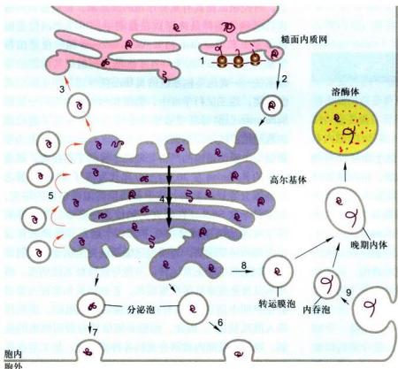

## 图6-8 蛋白质的分泌与胞吞途径概观

1. 在 rER 合成的蛋白质，通过共翻译转运途径跨膜运输；2. 内质网出芽，形成转运泡并与高尔基体融合，形成高尔基体顺面网状结构；3. 从高尔基体顺面膜囊和顺面网状结构到 rER 的逆向运输；4. 高尔基体膜囊顺面→反面成熟递进（非膜泡过程）；5. 高尔基体后期膜囊→早期膜囊的逆向运输；6. 组成型分泌；7. 调节型分泌；8. 分选到溶酶体；9. 胞吞途径。

表 6-3 蛋白质转运中涉及的三种包被膜泡的特征比较

<table><tr><td>膜泡类型</td><td>介导的转运途径</td><td>包被蛋白</td><td>结合的 GTP 酶</td></tr><tr><td>COP II 包被膜泡</td><td>ER  $\rightarrow$  高尔基体顺面膜囊</td><td>Sec23/Sec24 和 Sec13/Sec31 复合体, Sec16</td><td>Sar1</td></tr><tr><td>COP I 包被膜泡</td><td>高尔基体顺面膜囊→ER, 晚期高尔基扁平囊→早期扁平囊</td><td>包含 7 种不同 COP 亚基的包被蛋白</td><td>ARF</td></tr><tr><td rowspan="4">网格蛋白 / 接头蛋白包被膜泡</td><td>高尔基体反面膜囊→内体</td><td>clathrin/AP1</td><td>ARF</td></tr><tr><td>高尔基体反面膜囊→内体</td><td>clathrin/GGA</td><td>ARF</td></tr><tr><td>细胞膜→内体</td><td>clathrin/AP2</td><td>证据表明不需 ARF</td></tr><tr><td>高尔基体→溶酶体, 黑(色)素体或血小板囊泡</td><td>AP3 复合物 **</td><td>ARF</td></tr></table>

\* 新近证据表明，在胞吞作用过程中，不需要 ARF 参与。  
\*\*每种类型AP复合物由4种不同亚基组成。AP3复合物包被蛋白是否含有网格蛋白未知。

正是病毒核衣壳上的信号与受体的相互作用，排除了细胞质膜上的其他多种膜蛋白。在细胞内的出芽、胞吞和膜融合过程中，除受体外究竟有多少膜蛋白会从一个细胞间隔进入另一个细胞间隔，目前还不清楚。但实验表明，受体蛋白可以返回原来的膜结构中，如从高尔基体的顺面膜囊返回内质网，从溶酶体返回至高尔基体的TGN以及从受体介导的胞吞泡返回到细胞质膜上。显然这有利于维持特定膜成分的相对稳定。

细胞内膜泡运输需要多种转运膜泡参与，根据转运膜泡表面包被蛋白的不同，目前发现有三种不同类型：COPⅡ（coat proteinⅡ）包被膜泡、COPⅠ（coat proteinⅠ）包被膜泡和网格蛋白/接头蛋白（clathrin/adaptor protein）包被膜泡，它们分别介导不同的膜泡转运途径（表6-3，图6-9）。

## 二、COP II 包被膜泡的装配及运输

COPⅡ介导细胞内顺向运输（anterograde transport）过程中从内质网出芽的小泡的形成。COPⅡ由小分子GTP结合蛋白Sar1、Sec23/Sec24复合物、Sec13/Sec31

## 图 6-9 在细胞合成－分泌与内吞途径中三种主要膜泡类型的转运方式

各区室之间货物的转运通过囊泡进行。囊泡转运的不同步骤使用不同的包被蛋白。这些包被蛋白选择不同的货物并形成分泌和内吞途径各步骤的运输小泡。如COPII介导从内质网至高尔基体转运货物时膜泡的形成，COPII介导从高尔基体回收货物转运至内质网的膜泡形成，也在高尔基体膜囊之间相关修饰酶类的回收利用中发挥作用，网格蛋白/接头蛋白介导高尔基体反面管网区分分泌的形成，也参与部分内吞泡的形成。

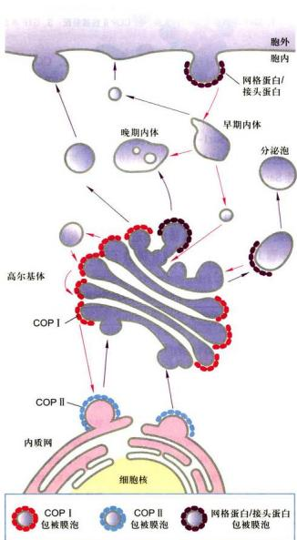

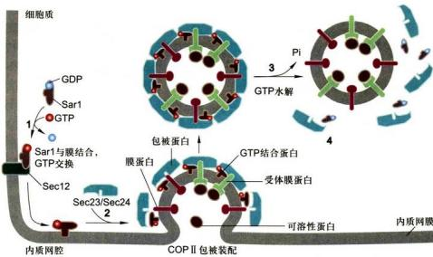  
图 6-10 Sar1 蛋白在 COP II 包被膜泡装配与去装配中作用模型  
1. Sar1 与膜结合，GTP 交换；2. COPⅡ包被装配；3. GTP 水解；4. COPⅡ包被去装配。

复合物以及大的纤维蛋白 Sec16 等结构组成。COP II 包被膜泡是通过胞质可溶性 COP II 在供体膜（ER 膜）出芽时聚合形成的，包被装配的聚合过程受小分子 GTP 结合蛋白 Sar1 调控，Sar1 隶属 GTP 酶超家族成员，通过 Sar1-GDP/Sar1-GTP 的转换，起分子开关调控作用。该包被膜泡的装配过程如图 6-10 所示：细胞质中可溶性 Sar1-GDP 与 ER 膜蛋白 Sec12（鸟苷酸交换因子）相互作用，催化 GTP 置换 GDP 形成 Sar1-GTP，GTP 的结合引发 Sar1 构象改变暴露出疏水 N 端并插入 ER 膜，膜结合的 Sar1 对包被蛋白的进一步装配起募集者作用（步骤 1），Sar1 与酶的结合提供了随后 Sec23/Sec24 复合物的结合位点，从而在 ER 膜出芽区形成三重复合物 Sar1-GTP/Sec23/Sec24（步骤 2），随后，Sec13/Sec31 复合物与三重复合物结合（图中未显示）。因为纯化的 Sec13 和 Sec31 蛋白具有自组装形成网格结构的特点，因而发挥 COPⅡ包被骨架的作用。最后，大的纤维蛋白 Sec16 结合在 ER 膜的胞质表面，一方面与已装配的复合物相互作用，另一方面组织其他包被蛋白的结合，从而增加包被蛋白的聚合效率。当包被组装完成以后，Sec23 亚基促进 GTP 被 Sar1 水解（步骤 3），Sar1-GDP 从膜泡上释放，引发包被去装配而解聚（步骤 4）。

膜泡运输既能转运膜蛋白，又能通过膜受体识别并

表 6-4 指导蛋白质包装到特异性转运膜泡的分选信号

<table><tr><td>信号序列</td><td>具有信号的蛋白</td><td>信号受体</td><td>转运膜泡类型</td></tr><tr><td colspan="4">腔内分选信号</td></tr><tr><td>Lys-Asp-Glu-Leu (KDEL)</td><td>驻留在 ER 的可溶性蛋白</td><td>高尔基体顺面膜囊 KDEL 受体</td><td>COPI</td></tr><tr><td rowspan="2">6-磷酸甘露糖(M6P)</td><td>可溶性溶酶体酶</td><td>高尔基体反面膜囊 M6P 受体</td><td>clathrin/AP1</td></tr><tr><td>分泌的溶酶体酶</td><td>质膜上 M6P 受体</td><td>clathrin/AP2</td></tr><tr><td colspan="4">膜蛋白分选信号</td></tr><tr><td>Lys-Lys-X-X(KXXX)</td><td>驻留在 ER 的膜蛋白</td><td>COP I α 和 β 亚基</td><td>COPI</td></tr><tr><td>二酸(例如 Asp-X-Glu)</td><td>ER- 高尔基体转运膜蛋白</td><td>COP II Sec24 亚基</td><td>COPII</td></tr><tr><td>Asn-Pro-X-Tyr(NPXY)</td><td>质膜上 LDL 受体</td><td>AP2 复合物</td><td>clathrin/AP2</td></tr><tr><td rowspan="2">Tyr-X-X-Φ(YXXΦ)</td><td>高尔基体反面膜囊蛋白</td><td>AP1(μ1 亚基)</td><td>clathrin/AP1</td></tr><tr><td>质膜膜蛋白</td><td>AP2(μ2 亚基)</td><td>clathrin/AP2</td></tr><tr><td>Leu-Leu(LL)</td><td>质膜膜蛋白</td><td>AP2 复合物</td><td>clathrin/AP2</td></tr></table>

注：X=任意氨基酸； $\Phi=$ 疏水氨基酸。括号内为单字母氨基酸缩写。

  
图6-11 不同类型的膜泡及其运输方式  
A. 内质网与高尔基体之间，分别由 COP II 和 COP I 包被膜泡导介质质顺向和逆向转运。1-3。由 COP II 包被膜泡介导的顺向运输，从内质网膜出芽，可溶性包胶复合蛋白聚合形成膜泡包被，v-SNARE 和其他被转运的膜蛋白和可溶性蛋白（与膜泡膜上受体结合），通过与包被蛋白的相互作用被包装在膜泡内，v-SNARE 蛋白在脱包被膜泡表面得以暴露，以利于同靶膜的融合。4-6。由 COP I 包被膜泡介导的反向运输，膜面双分子层、某些蛋白质或v-SNARE 和错误筛选的内质网驻留蛋白，从高尔基体顺网区转运至内质网。B. KDEL 受体在从高尔基体回收内质网腔留蛋白。1-2。内质网膜中存在的 C 端具有 KDEL 信号的弱质白被包装到 COP II 包被膜泡，并转运到高尔基体。3-4。内质网流速蛋白通过 COP I 腔泡介导的反向运输得以回收。注意，COP II、COP I 和高尔基体顺面网状状膜上均有识别与结合 KDEL 信号的受体，信号与受体的亲力和受到高低的影响，低 pH 促进结合，高 pH 有利于释放。C. 在供体膜内质间出芽及其转运蛋白的包装示意图。通过募集小分子 GTP 结合蛋白，引发供体膜出芽，然后胞质中的包被蛋白复合物与转运后的膜蛋白胞质结构域结合，其中有膜素蛋白也为腔内可溶性蛋白的受体。

转运可溶性蛋白，其包装特异性取决于被转运蛋白的靶向分选序列（表6-4)，借以区分哪些膜蛋白或可溶性蛋白将被进一步包装转运，哪些将作为滞留蛋白而被排除在外，从而膜泡包被直接选择靶向序列或分选信号。例如内质网被转运的膜蛋白具有二酸（如：Asp-X-Glu）分选信号，Sec24亚基是识别并结合该信号的受体，最终通过 COPⅡ包被膜泡从内质网转运到高尔基体（图 6-11）。

## 三、COPI包被膜泡的装配与运输

COP I 介导细胞内膜泡逆向运输 (retrograde(transport) 过程中从高尔基体反面膜囊到高尔基体顺面膜囊以及从高尔基体顺面网状区到内质网的货物转运膜泡的形成，包括再循环的膜脂双层、内质网驻留的可溶性蛋白和膜蛋白，是内质网回收错误分选的逃逸蛋白 (escaped protein) 的重要途径。

COP I 包被膜泡首先被分离鉴定，用不能被水解的 GTP 类似物（GTP analogue）处理细胞，将引起 COP I 包被膜泡在细胞内聚集，并通过密度梯度离心法可将其从细胞匀浆中分离出来，分析发现 COP I 包被含有 7 种不同的蛋白质亚基和一种调节膜泡转运的 GTP 结合蛋白 ARF。和 Sar1 一样，ARF 也是一种结合 GDP/GTP 的分子开关调控蛋白，包被蛋白复合物（coatomer）的装配与去装配依赖于 ARF 所结合的核苷酸交换与水解过程；此外，ARF 也参与网格蛋白包被膜泡的装配调节。

是什么因素决定一种特异蛋白是被保留在内质网还是进入高尔基体？已有研究证据显示，细胞器中的蛋白质是通过两种机制保留及回收来维持的：一是转运膜泡将驻留蛋白有效排斥在外，例如，有些驻留蛋白参与形成大的复合物，因而不能被包装在出芽形成的转运膜泡中，结果被保留下来；二是对逃逸蛋白的回收机制，使之返回它们正常驻留的部位。回收逃逸的内质网蛋白是通过回收信号介导的特异性受体完成的。现已发现，内质网的正常驻留蛋白，不管在腔内还是在膜上，它们在C端含有一段回收信号序列(retrieval signal)，如果它们意外地被包装进入转运膜泡从内质网逃逸到高尔基体CGN，则CGN区的膜结合受体蛋白将识别并结合这些逃逸蛋白的回收信号，形成COPI包被膜泡将它们回收到内质网（图6-11B）。如表6-4所示，内质网腔中的可溶性蛋白，如蛋白二硫键异构酶和协助折叠的分子伴侣，均具有典型的KDEL回收信号。如果一个内质网蛋白缺乏KDEL序列，那么这种蛋白质将不能返回内质网，而是被转运膜泡带到质膜。相反，如果通过基因重组方法使表达的溶酶体蛋白或分泌蛋白在C端含有一段附加的KDEL序列，那么这种蛋白质将返回内质网，而不是被转运至溶酶体或分泌泡。内质网的膜蛋白如SRP受体，在C端有一个不同的回收信号，通常是KKXX（K：赖氨酸，X：任意氨基酸），识别并结合该信号的受体是COPI的α和β亚基，从而促进它们返回到ER。

在 ER 膜上整合蛋白 v-SNARE（供体膜受体蛋白，见下文膜融合）和其他被转运蛋白是通过与包被蛋白的相互作用被包装到转运膜泡的，可溶性转运蛋白通过与出芽膜泡上相应受体的结合而被募集，包被膜泡脱去包被复合物，包被蛋白可再循环利用，而v-SNARE暴露在小泡膜表面。膜泡脱被后，在小分子GTP结合蛋白Sar1蛋白参与下，脱包被的膜泡留在高尔基体顺面膜囊，暴露的内质网膜蛋白v-SNARE与高尔基体顺面膜囊上同类蛋白s-SNARE（靶膜受体蛋白，见下文膜融合）相互配对，介导膜泡与靶膜融合，内含物释放进入高尔基体顺面膜囊。内质网腔中的蛋白质（特别是高浓度存在的腔内蛋白质）在出芽过程中可以被动掺入到COPⅡ包被膜泡并转运到高尔基体。许多这类蛋白质带有C端KDEL序列，KDEL的受体主要定位在高尔基体TGN区。COPⅡ和COPⅠ包被膜泡的膜上，它们能识别并结合KDEL分选信号，二者的亲和性对pH变化非常敏感，内质网和高尔基体之间微小的pH差异都有利于携带KDEL序列的蛋白质与高尔基体衍生膜泡上的受体结合，并有助于这些蛋白质从内质网释放。如果在内质网发生错误包装和转运，由于COPⅠ包被膜泡上也有KDEL受体，所以也能保证逃逸蛋白被内质网回收。

这种通过回收信号所介导的回收机制有利于防止内质网腔蛋白（如用于新合分泌蛋白正确折叠所需要的分子伴侣）的损失。在生物合成途径中，每种膜组分也许都具有它自身独特的回收信号，所以任凭转运膜泡在特定空间不断运动，但每种细胞器仍可保持它独特的蛋白质组分。

## 四、网格蛋白/接头蛋白包被膜泡的装配与运输

网格蛋白/接头蛋白包被膜泡介导分泌泡和内吞泡的形成，如从高尔基体 TGN 与细胞膜及内体或向溶酶体、黑（色）素体、血小板囊泡和植物细胞液泡的货物转运过程中膜泡的形成（表 6-3）。另外，在受体介导的内吞途径中，网格蛋白还参与内吞泡的形成。高尔基体的 TGN 区是网格蛋白/接头蛋白包被膜泡形成的发源地，在功能上既是细胞分泌途径中物质转运的主要分选位点，又是网格蛋白包被膜泡的组装位点。典型的网格蛋白/接头蛋白包被膜泡是一类双层包被的膜泡，外层由网格蛋白组成，内层由接头蛋白复合物组成。纯化的网格蛋白分子呈三腿结构（triskelion），每个分支含一条重链和一条轻链。与 COP II 的 Sec13/Sec31 复合物一样，网格蛋白也有自组装形成多角型网格的特性（图6-12），当网格蛋白在供体膜上聚合，便募集接头蛋白复合物到供体膜的胞质面并与其结合，接头蛋白复合物一方面将网格蛋白网格包被连接到质膜上，另一方面又能特异性地促使一些膜结合蛋白富集到形成包被的膜区。现已发现有三种接头蛋白复合物（AP1、AP2和AP3），每种接头蛋白复合物含有4种接头蛋白亚基的一个拷贝，形成异四聚体。接头蛋白复合物的一个亚基与网格蛋白重链远端的球形结构域特异性结合，一方面促进三腿网格蛋白与接头蛋白复合物的联合装配，同时也增加已装配包被的稳定性。正如小分子GTP结合蛋白ARF参与启动COP I包被装配一样，ARF也参与网格蛋白/接头蛋白包被的起始装配。除三种接头蛋白复合物之外，还发现另一类接头蛋白GGA，由单一多肽链组成。接头蛋白复合物或GGA在膜泡的胞质面与转运的膜蛋白或膜受体（结合腔内可溶性蛋白）特异性结合，决定哪些蛋白将被包装转运或哪些蛋白将被排除在外。这种特异性是由转运蛋白的分选信号决定的（表

6-4)。网格蛋白/接头蛋白包被膜泡形成首要步骤是供体膜出芽和包被的装配，芽体如何缢缩并与供体膜断裂是网格蛋白/接头蛋白包被膜泡形成的关键，发动蛋白(dynamin)具有GTP酶活性，它所介导的网格蛋白包被膜泡的组装模式见图6-12C。在供体膜上网格蛋白/接头蛋白包被小泡出芽形成后，发动蛋白围绕颈部聚合，然后催化GTP水解，所释放的能量驱动发动蛋白构象改变，导致网格蛋白/接头蛋白包被膜泡从供体膜断裂并释放。如果人为使细胞表达突变型的发动蛋白，其将不能结合GTP并使之水解，也不形成独立的网格蛋白/接头蛋白包被膜泡，而是产生发动蛋白聚合包绕具有较长颈部的膜泡芽体。现在尚未发现GTP酶也参与COP I和COP II包被膜泡芽体从供体膜的断裂，更不清楚不同类型的包被膜泡断裂会有如此差异。但与COP I和COP II包被膜泡一样，通常情况下网格蛋白/接头蛋白包被膜泡形成后不久便脱去包被，网格蛋白/接头蛋白包被的解聚一方面涉及ARF开关蛋白从结合GTP状态转变为结合GDP状态，另一方面也可能涉及 ATP 水解提供的能量，鉴于胞质内 Hsp70 蛋白是所有真核细胞中普遍存在的组成型分子伴侣，因而认为 Hsp70 致使 ATP 水解释放的能量用于驱动网格蛋白 / 接头蛋白包被的去组装过程。脱包被的结果不仅释放三腿网格蛋白被循环再利用，而且由于包被去组装也会使 v-SNARE 得以暴露，利于膜泡与靶膜的融合。

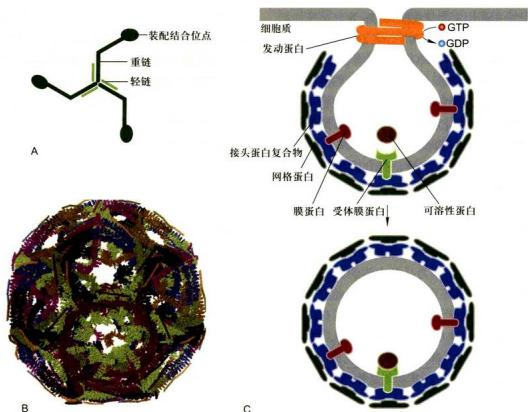  
图6-12 网格蛋白、多角形网格包被结构及发动蛋白介导的网格蛋白/接头蛋白包被膜泡的形成示意图  
A. 三腿网格蛋白分子，3条重链，3条轻链。B. 在体外缺乏膜泡的情况下自组装的网格蛋白网格包被。C. 发动蛋白介导的网格蛋白/接头蛋白包被膜泡的形成示意图。（B图基于PDB数据库1XI4结构绘制）

## 五、转运膜泡与靶膜的锚定和融合

膜泡转运是十分复杂的过程，在酵母基因组中至少发现25种以上与膜泡转运有关的基因。膜泡运输的关键步骤至少涉及如下过程：①供体膜的出芽、装配和断裂，形成不同的包被转运膜泡，该过程已在前面述及（图6-11C和图6-12B）；②在细胞内由马达杰驱动、以微管为轨道的膜泡运输（参见第八章第二节）；③转运膜泡与特定靶膜的锚定和融合。现已知，在膜泡靶向转运过程中，有另一类小分子GTP结合蛋白，即Rab蛋白的参与。和Sar1与ARF蛋白一样，Rab蛋白也属于开关调控蛋白GTP酶超家族成员，在特异性鸟苷酸交换因子（GEF）催化下，胞质中Rab-GDP转换为Rab-GTP，引发Rab构象改变致使其与特定转运膜泡的表面蛋白相互作用，并通过类异戊二烯(isoprenoid)基团插入转运膜泡内。一旦Rab-GTP被结合在膜泡表面，便与靶膜上称作Rab效应器（Rab effector）的结合蛋白相互作用，从而使转运膜泡被锚定在适当的靶膜上（图6-13步骤1）。在膜泡融合发生以后，与Rab蛋白结合的GTP被水解成GDP，随即引发Rab-GDP释放，然后再被用于进行GDP-GTP交换，结合及水解的下一个周期。有些证据表明，在膜泡融合事件中涉及特异性Rab蛋白的参与，如酵母中Sec4基因编码一种Rab蛋白，如果酵母细胞表达突变的Sec4蛋白，则细胞内将导致分泌泡的积累，而不能与质膜融合。在哺乳类细胞中，Rab5蛋白被定位在作为早期内体的脱被内吞泡上，在无细胞系统实验体系中，早期内体彼此融合需要Rab5的存在。此外，在无细胞提取物中加入GTP，则会促进内体彼此融合的速率。在早期内体膜上发现还存在一种长的卷曲蛋白，称之早期内体抗原1（early endosome antigen 1, EEA1），其功能是作为Rab5效应器而存在，这样，一种内吞泡膜上的Rab5-GTP与另一种内吞泡膜上的EEA1特异性结合为膜泡间彼此融合提供了保障机制。

转运膜泡的形成、运输及其与靶膜的融合是一个耗能的特异性过程，涉及多种蛋白质间识别、组装、去组装的复杂调控，膜泡与靶膜的选择性融合是保证细胞内定向膜流的重要因素之一。如果说小分子GTP结合蛋白Rab主要是控制转运膜泡与相应靶膜的锚定，那么，介导转运膜泡与靶膜融合的主要机制是v-SNARE/t-SNARE蛋白的配对。有些与融合相关的蛋白质已被分离，特别是从神经细胞中分离出参与特异性的膜泡锚定和融合的蛋白质组分，如神经元突触前膜含有一种突触融合蛋白（syntaxin），能与突触小泡膜上的膜蛋白VAMP（vesicle-associated membrane protein）特异性地结合，这两种蛋白质的相互作用介导膜的融合和神经递质的释放。尽管酵母与哺乳类在演化上已有10亿年的分歧，而且酵母细胞也没有任何突触传递的功能活性，但却具有编码与突触融合蛋白和VAMP相似蛋白质的基因家族，现已知酵母细胞表达20种以上不同的相关v-SNARE和t-SNARE蛋白，在对每一种编码SNARE基因进行突变缺陷分析后，证实了每种SNARE蛋白所参与的特异性膜融合事件。考察所有融合事件表明，SNARE形成四螺旋束复合体，与1个VAMP/1个syntaxin/2个SNAP25组成的复合体一样（图6-13），其功能都是介导分泌泡与质膜融合，在其他类型的膜泡融合事件中，如COPⅡ包被膜泡与高尔基体顺面网状结构的融合，SNARE复合体四螺旋束的组成（1个v-SNARE/3个t-SNARE）有所不同。应用体外脂质体融合实验，研究者可以检验各种v-SNARE和t-SNARE蛋白组合对供体膜与靶膜之间融合的介导能力，发现只有少数组合可以有效介导膜的融合，说明膜的融合是有选择性的。动物细胞膜泡融合需要一种可溶性的胞质融合蛋白N-乙基马来酰亚胺敏感因子（N-ethylmaleimide-sensitive factor, NSF）和几种可溶性NSF结合蛋白(soluble NSF attachment protein, SNAP)，NSF和SNAP负责介导不同类型膜泡的融合，没有明显特异性。提供特异性保障的是SNAP受体（SNAP receptor，又称SNARE），每种转运膜泡都有特异的v-SNARE（vesicle-SNAP receptor），能识别并与靶膜上s-SNARE（target-SNAP receptor）彼此配对，形成稳定的卷曲SNARE复合体，因此正是通过v-SNARE与t-SNARE两类蛋白间的互补和相互作用，决定了供体膜泡与靶膜的融合（图6-13）。SNARE复合体的稳定性是靠蛋白质分子间大量非共价键来维系的，因此融合完成后，SNARE复合体必须消耗ATP水解能量而解离，释放的单一SNARE蛋白亚基再用于另外的融合事件。

  
图6-13 在供体膜和靶膜之间膜泡的锚定与融合模式图解（图中卷曲SNARE复合体由孔祥鹏博士惠赠）

在供体膜上的 GEF 识别并结合特异性 Rab 蛋白，诱发 GTP 置换 GDP，鸟苷酸交换引发 Rab 蛋白构象改变并暴露其共价结合的脂质基团，从而帮助 Rab-GTP 蛋白锚定在供体膜上，并随膜泡转移，在靶膜上 Rab-GTP 与 Rab 效应器结合，这种结合有助于膜泡锚定和 v-SNARE 与 t-SNARE 的配对（步骤 1）；v-SNARE 蛋白（图中 VAMP）与同类 t-SNARE（图中 syntaxin 和 SNAP25）胞质结构域相互作用，形成稳定的卷曲 SNARE 复合体，将膜泡与靶膜紧密束缚在一起（步骤

2)；伴随SNARE复合体形成后，供体膜泡与靶膜随即融合（步骤3）；两膜融合后，NSF联合 $\alpha$ -SNAP蛋白随即与SNARE复合体结合，然后NSF催化ATP水解，驱动SNARE复合体解离，游离的SNARE蛋白再用于其他膜泡的融合（步骤4）。具有GTP酶活性的Rab蛋白水解与之结合的GTP，释放可溶性的Rab-GDP进入细胞质。在细胞质中Rab-GDP与GDP解离抑制物（GDI）结合，从而防止Rab蛋白从Rab-GDP复合物中释放出来，直至与GEF发生相互作用。

## - 思考题

1. 何谓分泌性蛋白合成的信号肽学说，涉及的主要组分如何协同作用？

2. 试述分泌蛋白的合成、加工及转运途径。

3. 试述细胞内膜泡运输的概况、类型及其各自主要功能。

4. 简述 COPI 和 COPII 包被膜泡形成的机制以及在维持细胞结构稳定方面的作用。

1. Dolezal P, Likic V, Tachezy J, et al. Evolution of the molecular machines for protein import into mitochondria. Science, 2006, 313(5785): 314-318.

2. Edeling M A, Smith C, Owen D. Life of a clathrin coat: insights from clathrin and AP structures. Nature Reviews Molecular Cell Biology, 2006, 7: 32-44.

3. Gevorkyan-Airapetov L, Zohary K, Popov-Čeleketić D, et al. Interaction of Tim23 with Tim50 is essential for protein translocation by the mitochondrial TIM23 complex. Journal of Biochemistry, 2009, 284(8): 4865-4872.

4. Grosshans B L, Ortiz D, Novick P. Rabs and their effectors: achieving specificity in membrane traffic. Proceedings of the National Academy of Sciences of the United States of America, 2006, 103(32): 11821-11827.

5. Gürkan C, Stagg S M, LaPointe P, et al. The COPII cage: unifying principles of vesicle coat assembly. Nature Reviews Molecular Cell Biology, 2006, 7: 727-738.

6. Jahn R, Lang T, Südhof T C. Membrane fusion. Cell, 2003, 112(4): 519-533.

7. Jahn R, Scheller R H. SNAREs—engines for membrane fusion. Nature Reviews Molecular Cell Biology, 2006, 7: 631-643.

8. Kaiser C A, Schekman R. Distinct Sets of SEC genes govern transport vesicle formation and fusion early in the secretory pathway. Cell, 1990, 61(4): 723-733.

9. Martens S, McMahon H T. Mechanisms of membrane fusion: disparate players and common principles. Nature Reviews Molecular Cell Biology, 2008, 9: 543-556.

10. Mokranjac D, Neupert W. Protein import into mitochondria. Biochemical Society Transactions, 2005, 33(5): 1019-1023.

11. Neupert W, Herrmann J M. Translocation of proteins into mitochondria. Annual Review of Biochemistry, 2007, 76: 723-749.

12. Soll J, Schleiff E. Protein import into chloroplasts. Nature Reviews Molecular Cell Biology, 2004, 5: 198-208.

13. Söllner T, Bennett M K, Whiteheart S W, et al. A protein assembly-disassembly pathway in vitro that may correspond to sequential steps of synaptic vesicle docking, activation, and fusion. Cell, 1993, 75(3): 409-418.

14. Südhof T C. A molecular machine for neurotransmitter release: synaptotagmin and beyond. Nature Medicine, 2013, 19: 1227-1231.

15. Wickner, W, Schekman R. Protein translocation across biological membranes. Science, 2005, 310(5753): 1452-1456.

<!-- END CN CN06-S02 -->

---

## 对应英文内容

### 英文补充：包被膜泡、Rab、SNARE与膜融合

> 对应中文板块：包被膜泡、Rab、SNARE与膜融合。英文来源：Molecular Biology of the Cell，第7版，第13章；[本章完整原文](../来源/英文教材/13_Intracellular_Membrane_Traffic/chapter.md)。物理PDF页码范围：788–849（整章范围）。

<!-- BEGIN EN EN13-H000-H018 -->
C HAP T E R

#### Intracellular Membrane Traffic

13

Every cell must eat, communicate with the world around it, and quickly respond to changes in its environment. To help accomplish these tasks, cells continually adjust the composition of their plasma membrane and internal compartments in response to need. Eukaryotic cells use an elaborate internal membrane system to add and remove cell-surface proteins, such as receptors, ion channels, and transporters (**Figure 13–1**). Through the process of exocytosis, the secretory pathway delivers newly synthesized proteins, carbohydrates, and lipids either to the plasma membrane or to the extracellular space. By the converse process of endocytosis, cells take in components of the plasma membrane and extracellular space and deliver them to internal compartments called endosomes.

The proteins, nutrients, lipids, and receptors delivered by endocytosis to endosomes are sorted and either recycled to the plasma membrane or delivered to lysosomes where they are broken down into building blocks and transported to the cytosol for use in various biosynthetic processes. Lysosomes also break down and recycle intracellular macromolecules through a process called autophagy. This pathway engulfs parts of the cytosol or whole organelles into a newly assembled compartment, which then fuses with lysosomes to deliver its contents for degradation. In development, cells often use autophagy to remodel their cytoplasm as they differentiate and adapt to new physiological tasks.

The interior space, or lumen, of each membrane-enclosed compartment along the secretory and endocytic pathways is topologically equivalent to the cell exterior. This means proteins can travel from the lumen of one compartment to another by means of numerous membrane-enclosed transport containers without ever having to cross a membrane (**Figure 13–2**). These containers are formed by membrane budding from a compartment and are either small spherical vesicles, larger irregular vesicles, or tubules. We shall use the term **transport vesicle** to apply to all forms of these containers.

Transport vesicles continually bud off from one membrane compartment and fuse with another, carrying membrane components and soluble lumenal molecules, which are referred to as **cargo**. This vesicular traffic flows along highly

#### IN THIS CHAPTER

Mechanisms of Membrane Transport and Compartment Identity

Transport from the Endoplasmic Reticulum Through the Golgi Apparatus

Transport from the Trans Golgi Network to the Cell Exterior and Endosomes

Transport into the Cell from the Plasma Membrane: Endocytosis

The Degradation and Recycling of Macromolecules in Lysosomes

Figure 13–1 Exocytosis and endocytosis. (A) In exocytosis, a transport vesicle fuses with the plasma membrane. Its content is released into the extracellular space, while the vesicle membrane (red) becomes continuous with the plasma membrane. (B) In endocytosis, a plasma membrane patch (red) is internalized, forming a transport vesicle. Its content derives from the extracellular space. The interior of the transport vesicles in panels A and B is topologically equivalent to the extracellular space.

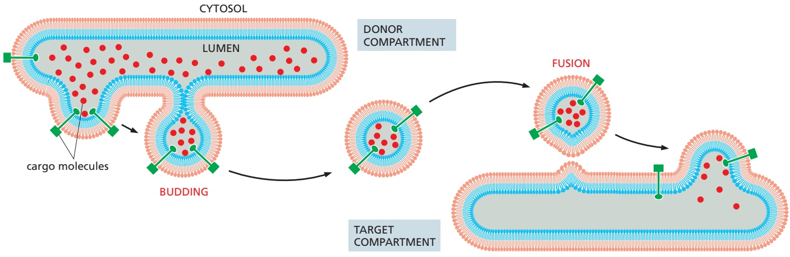

organized, directional routes, which allow the cell to secrete, eat, and remodel its plasma membrane and organelles (**Figure 13–3**). The secretory pathway leads outward from the endoplasmic reticulum (ER) toward the Golgi apparatus and cell surface, with a side route leading to endosomes, while the endocytic pathway leads inward from the plasma membrane. In each case, retrieval pathways bring membrane and selected proteins back to the compartment of origin to balance the flow of materials between compartments.

Figure 13–2 Vesicle transport. Transport vesicles bud off from one compartment and fuse with another. As they do so, they carry material as cargo from the lumen (the space within a membrane-enclosed compartment) and membrane of the donor compartment to the lumen and membrane of the target compartment, as shown.

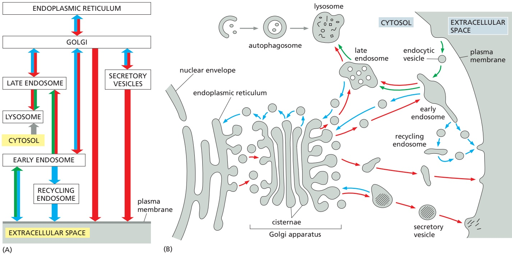

Figure 13–3 A “road map” of the secretory and endocytic pathways. (A) In this schematic road map, which was introduced in Chapter 12, the endocytic and secretory pathways are illustrated with green and red arrows, respectively. In addition, blue arrows denote retrieval pathways for the backflow of selected components. Engulfment during autophagy is illustrated with a gray arrow. (B) The compartments of the eukaryotic cell involved in vesicle transport. The lumens of most membrane-enclosed compartments are topologically equivalent to each other and to the outside of the cell. All compartments shown communicate with one another and the outside of the cell by means of transport vesicles. In the secretory pathway (red arrows), protein molecules are transported from the endoplasmic reticulum (ER) to the plasma membrane or (via endosomes) to lysosomes. In the endocytic pathway (green arrows), molecules are ingested in endocytic vesicles derived from the plasma membrane and delivered to early endosomes and then (via late endosomes) to lysosomes. In autophagy (gray arrows), cytoplasmic components engulfed into an autophagosome are delivered to lysosomes. Many endocytosed molecules MBoC7 m13.03/13.03are retrieved from early endosomes and returned (some via recycling endosomes) to the cell surface for reuse; similarly, some molecules are retrieved from the early and late endosomes and returned to the Golgi apparatus, and some are retrieved from the Golgi apparatus and returned to the ER. All of these retrieval pathways are shown with blue arrows, as in panel A.

To perform its function, each transport vesicle that buds from a compartment must be selective. It must take up only the appropriate molecules and must fuse only with the appropriate target membrane. A vesicle carrying cargo from the ER to the Golgi apparatus, for example, must exclude most other proteins that are to stay in the ER, and it must fuse only with the Golgi apparatus and not with any other organelle.

We begin this chapter by considering the molecular mechanisms of budding and fusion that underlie all vesicle transport. We then discuss the fundamental problem of how, in the face of this transport, the cell maintains the molecular and functional differences between its compartments. Finally, we consider the function of the Golgi apparatus, secretory vesicles, endosomes, and lysosomes as we trace the pathways that connect these organelles.

#### MECHANISMS OF MEMBRANE TRANSPORT AND COMPARTMENT IDENTITY

Vesicle transport mediates a continual exchange of components between the 10 or more chemically distinct, membrane-enclosed compartments that collectively compose the secretory and endocytic pathways. In this section, we discuss how transport vesicles form, how they concentrate cargo within them, and how they deliver their contents selectively to another compartment. Transport begins when a special coat of proteins is assembled on a region of the cytosolic face of a membrane compartment. The coat is used to collect specific cargo components from the membrane and compartment lumen for delivery to another compartment. The coat, with the help of additional proteins, shapes the membrane into a transport vesicle that buds from the originating compartment. These vesicles selectively dock at the appropriate destination membrane and then fuse with it to deliver their cargo.

Despite the constant exchange of components between membrane-enclosed compartments, each compartment maintains its special identity of molecular markers, such as proteins or specific lipids, that are displayed on the cytosolic surface of the membrane. Cells achieve this by tightly controlling the membrane components that are packaged into departing transport vesicles. The identity markers of a compartment serve as guidance cues for outgoing traffic by recruiting the appropriate coat and for incoming traffic to ensure that transport vesicles fuse only with the correct compartment. Many of these membrane markers, however, are found on more than one compartment, and it is the specific combination of marker molecules that gives each compartment its molecular address.

#### There Are Various Types of Coated Vesicles

Most transport vesicles form from specialized, coated regions of membranes. They bud off as **coated vesicles**, which have a distinctive cage of proteins covering their cytosolic surface. Before the vesicles fuse with a target membrane, they shed their coat so that the membrane surfaces of the vesicle and destination compartment can interact directly and fuse.

The coat performs two main functions that are reflected in a common twolayered structure. First, an inner coat layer concentrates specific membrane proteins in a specialized patch, which then gives rise to the vesicle membrane. In this way, the inner layer selects the appropriate membrane molecules for transport. Second, an outer coat layer assembles into a curved, basketlike lattice that deforms the membrane patch and thereby shapes the vesicle.

There are four well-characterized types of coated vesicles, distinguished by their major coat proteins: clathrin-coated, COPI-coated, COPII-coated, and retromer-coated (**Figure 13–4**). Each type is used for different transport steps (**Figure 13–5**). Clathrin-coated vesicles mediate transport originating from the Golgi apparatus, endosome, and the plasma membrane. COPI-coated and COPII-coated vesicles mediate transport originating from the Golgi cisternae and the ER, respectively. Retromer forms coats on transport vesicles for a retrieval pathway from endosomes to the Golgi apparatus. There is, however, much more variety in coated vesicles and their functions than this short list suggests. As we discuss shortly, there are several types of clathrin-coated vesicles, each specialized for a different transport step, and the COPI-coated and COPII-coated vesiclesMBoC7 m13.04/13.04 may be similarly diverse. We discuss clathrin-coated vesicles first, as they provide a good example of how vesicles form.

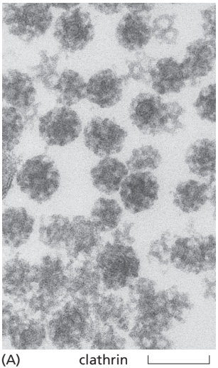

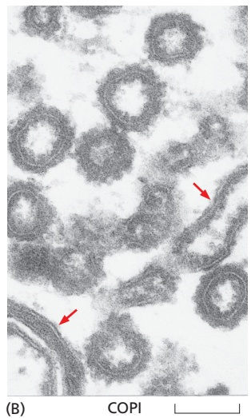

Figure 13–4 Electron micrographs of clathrin-coated, COPI-coated, COPII-coated, and retromer-coated vesicles. All coated vesicles are shown in electron micrographs at the same scale. (A) Clathrin-coated vesicles. (B) COPI-coated vesicles and Golgi cisternae (red arrows) from a cell-free system in which COPI-coated vesicles bud in the test tube. (C) COPII-coated vesicles. (D) Retromer-coated tubules formed in a cell-free system containing large membrane vesicles and purified retromer. (A and B, from L. Orci et al., Cell 46:171–184, 1986. With permission from Elsevier; C, courtesy of Charles Barlowe and Lelio Orci; D, courtesy of John Briggs.)

#### The Assembly of a Clathrin Coat Drives Vesicle Formation

The major protein component of **clathrin-coated vesicles** is clathrin, which forms the outer layer of the coat. **Clathrin** is composed of a large subunit (the heavy chain) and a small subunit (the light chain). Three heavy chains and three light chains assemble into a three-legged structure called a triskelion (**Figure 13–6A and B**). Clathrin triskelions assemble into a basketlike framework of hexagons and pentagons on the cytosolic surface of membranes. Clathrin assembly induces the formation of coated buds (called coated pits when on the plasma membrane), which eventually pinch off to become clathrin-coated vesicles (**Figure 13–7**). Under appropriate conditions, isolated triskelions spontaneously self-assemble into typical polyhedral cages in a test tube, even in the absence of the membrane vesicles that these baskets normally enclose (**Figure 13–6C and D**). Thus, the clathrin triskelions determine the geometry of the clathrin cage (**Figure 13–6E**).

Figure 13–5 Use of different coats for different steps in vesicle traffic. Different coat proteins select different cargo and shape the transport vesicles that mediate the various steps in the secretory and endocytic pathways. When the same coats function in different places in the cell, they usually incorporate different coat protein subunits that modify their properties (not shown). Many differentiated cells have additional pathways besides those shown here, including a sorting pathway from the trans Golgi network to the apical surface of epithelial cells and a specialized recycling pathway for proteins of synaptic vesicles in the nerve terminals of neurons (see Figure 11–38). The arrows are colored as in Figure 13–3.

25 nm

L

(A)

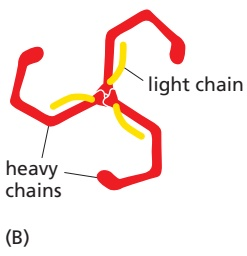

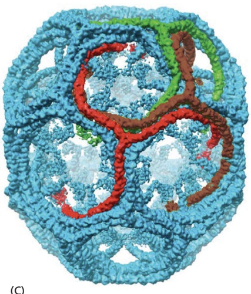

(C)

(E)

Figure 13–6 The structure of a clathrin coat. (A) Electron micrograph of a clathrin triskelion shadowed with platinum. (B) Each triskelion is composed of three clathrin heavy chains and three clathrin light chains, as shown in the diagram. (C and D) A cryo-electron micrograph taken of a clathrin coat composed of 36 triskelions organized in a network of 12 pentagons and 6 hexagons, with some heavy chains (C) and light chains (D) highlighted (Movie 13.1). The light chains link to the actin cytoskeleton, which helps generate force for membrane budding and vesicle movement, and their phosphorylation regulates clathrin coat assembly. The interwoven legs of the clathrin triskelions form an outer shell from which the N-terminal domains of the triskelions protrude inward. These domains bind to the adaptor proteins shown in Figure 13–8. The coat shown was assembled biochemically from pure clathrin triskelions and is too small to enclose a membrane vesicle. (E) Structures of clathrin-coated vesicles isolated from bovine brain. The clathrin coats are constructed similarly to but in a less regular way MBoC7 m13.06/13.06than the coat of panels C and D, utilizing pentagons, a larger number of hexagons, and sometimes heptagons, resembling the architecture of deformed soccer balls. The structures were determined by cryo-electron microscopy and tomographic reconstruction. (A, from E. Ungewickell and D. Branton, Nature 289:420–422, published 1981 by Nature Publishing Group; reproduced with permission of SNCSC; C and D, from A. Fotin et al., Nature 432:573–579, published 2004 by Nature Publishing Group; all reproduced with permission of SNCSC; E, from Y. Cheng et al., J. Mol. Biol. 365:892–899, 2007. With permission from Elsevier.)

#### Adaptor Proteins Select Cargo into Clathrin-coated Vesicles

**Adaptor proteins**, another major coat component in clathrin-coated vesicles, form a discrete inner layer of the coat, positioned between the clathrin cage and the cytosolic face of the membrane. They bind to various transmembrane protein cargoes and transmembrane receptors that capture soluble cargo molecules inside the vesicle—so-called cargo receptors. Adaptor proteins also bind to clathrin and recruit it to the membrane surface where it assembles and bends the membrane. In this way, the specific set of transmembrane and soluble cargoes selected by adaptor proteins is packaged into a newly formed clathrin-coated transport vesicle (**Figure 13–8**).

The assembly of adaptor proteins on the membrane is tightly controlled, in part by the cooperative interaction of the adaptor proteins with the membrane, transmembrane cargoes, and other components of the coat. The adaptor protein AP2 serves as a well-understood example. When it binds to a specific phosphorylated phosphatidylinositol lipid (a phosphoinositide), AP2 acquires a different conformation that exposes binding sites for cargo receptors in the membrane. The simultaneous binding to the cargo receptors and lipid head groups greatly enhances the binding of AP2 to the membrane (**Figure 13–9**). Upon binding, AP2 induces membrane curvature, which makes the binding of additional AP2 proteins in its proximity more likely. The cooperative assembly of the AP2 coat layer then is further amplified by clathrin binding, which leads to the formation and budding of a transport vesicle.

0.2 µm

Figure 13–7 Clathrin-coated pits and vesicles. This rapid-freeze, deep-etch electron micrograph shows numerous clathrin-coated pits and vesicles on the inner surface of the plasma membrane of cultured fibroblasts. The cells were rapidly frozen in liquid helium, fractured, and deepetched to expose the cytoplasmic surface of the plasma membrane. (Courtesy of MJohn Heuser.)

There are several types of adaptor proteins. The best characterized, like AP2, have four different protein subunits; others are single-chain proteins. Many of the adaptor proteins bind to phosphoinositides. As we will see next, different types of phosphoinositides are located in different membrane compartments, serving as one of the molecular markers of that compartment’s identity. Each type of adaptor protein is specific for transmembrane cargoes and cargo receptors that share a particular amino acid sequence motif displayed on the cytosolic side of the membrane. Because different adaptor proteins have different specificities for both the type of phosphoinositide and the sequence motif they recognize, each type of adaptor protein directs assembly of a clathrin-coated vesicle only at particular membranes.

#### Phosphoinositides Mark Organelles and Membrane Domains

Although inositol phospholipids typically compose less than 10% of the totalMBoC7 m13.08/13.08 phospholipids in a membrane, they have important regulatory functions. They can undergo rapid cycles of phosphorylation and dephosphorylation at the 3′, 4′, and 5′ positions of their inositol sugar head groups to produce various types of **phosphoinositides (phosphatidylinositol phosphates, or PIPs)**. The interconversion of phosphatidylinositol (PI) and PIPs is highly compartmentalized: different organelles in the endocytic and secretory pathways have distinct sets of PI and PIP kinases and PIP phosphatases (**Figure 13–10**). The distribution, regulation, and local balance of these enzymes determine the steady-state distribution

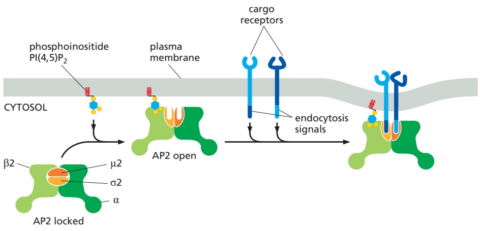

Figure 13–8 The assembly and disassembly of a clathrin coat. The assembly of the coat introduces curvature into the membrane, which leads in turn to the formation of a coated bud (called a coated pit if it is in the plasma membrane). The adaptor proteins bind both clathrin triskelions and membrane-bound cargo receptors, thereby mediating the selective recruitment of both membrane and soluble cargo molecules into the vesicle. Other membrane-bending and fission proteins are recruited to the neck of the budding vesicle, where sharp membrane curvature is introduced. The coat is rapidly lost shortly after the vesicle buds off.

Figure 13–9 Lipid-induced conformation switching of AP2. The AP2 adaptor protein complex has four subunits (α, β2, μ2, and σ2). Upon interaction with the phosphoinositide PI(4,5)P2 (see Figure 13–10) in the cytosolic leaflet of the plasma membrane, AP2 rearranges so that binding sites for cargo receptors become exposed. Each AP2 complex binds four PI(4,5)P2 molecules (for clarity, only one is shown). In the open AP2 complex, the μ2 and σ2 subunits bind the cytosolic tails of cargo receptors that display the appropriate endocytosis signals. These signals consist of short amino acid sequence motifs. When AP2 binds tightly to the membrane, it induces curvature, which favors the binding of additional AP2 complexes in the vicinity.

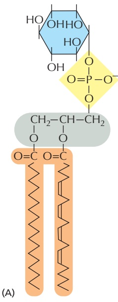

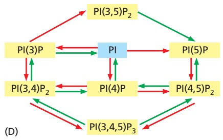

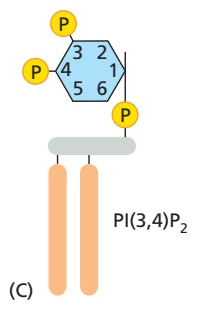

(E)

(F)

of each PIP species. As a consequence, the distribution of PIPs varies from organelle to organelle, and often within a continuous membrane from one region to another, thereby defining specialized membrane domains.

Many proteins involved at different steps in vesicle transport contain domains that bind with high specificity to the head groups of particular PIPs,. / . distinguishing one phosphorylated form from another (see Figure 13–10). Local control of the PI and PIP kinases and PIP phosphatases can therefore be used to rapidly control the binding of proteins to a membrane or membrane domain. The production of a particular type of PIP recruits proteins containing matching PIP-binding domains. The PIP-binding proteins then help regulate vesicle formation and other steps in the control of vesicle traffic (**Figure 13–11**). The same strategy is widely used to recruit specific intracellular signaling proteins to the plasma membrane in response to extracellular signals (discussed in Chapter 15).

#### Membrane-bending Proteins Help Deform the Membrane During Vesicle Formation

Although vesicle-budding is similar at various locations in the cell, each cell membrane poses its own special challenges. The plasma membrane, for example, is comparatively flat and stiff, owing to its cholesterol-rich lipid composition and underlying actin-rich cortex. Thus, the forces generated by clathrin coat assembly alone are not sufficient to shape and pinch off a vesicle from the plasma membrane. Other membrane-bending and force-generating proteins participate at every stage of the process.

Membrane-bending proteins that contain crescent-shaped domains, called BAR domains, bind to and impose their shape on the underlying membrane

#### Figure 13–10 Phosphatidylinositol (PI) and phosphoinositides (phosphatidylinositol phosphates,

or PIPs). (A, B) The structure of PI shows the free hydroxyl groups in the inositol sugar that can be modified. (C) Phosphorylation of one, two, or three of the hydroxyl groups on PI by PI and PIP kinases produces a variety of PIP species. They are named according to the ring position (in parentheses) and the number of phosphate groups (subscript) added to PI. Phosphatidylinositol 3,4-bisphosphate [PI(3,4)P2] is shown. (D) Animal cells have several PI and PIP kinases and a similar number of PIP phosphatases, which are localized to different organelles, where they are regulated to catalyze the production of particular PIPs. The red and green arrows show the kinase and phosphatase reactions, respectively. (E, F) Phosphoinositide head groups are recognized by protein domains that discriminate between the different forms. In this way, select groups of proteins containing such domains are recruited to regions of membrane in which these phosphoinositides are present. Phosphatidylinositol 3-phosphate [PI(3)P] in the endosome membrane, and phosphatidylinositol 4,5-bisphosphate [PI(4,5)P2] in the plasma membrane, are shown. (D, modified from M.A. De Matteis and A. Godi, Nat. Cell Biol. 6:487–492, 2004.)

<small>Figure 13–11 The intracellular location of phosphoinositides. Different types of PIPs are located in different membranes and membrane domains, where they are often associated with specific vesicle transport events. The membrane of secretory vesicles, for example, contains PI(4)P. When the vesicles fuse with the plasma membrane, a phosphoinositide 5-kinase (PI 5-kinase) that is localized there converts the PI(4)P into PI(4,5)P2. The PI(4,5)P2, in turn, helps recruit adaptor proteins, which initiate the formation of a clathrin-coated pit, as the first step in clathrin-mediated endocytosis. Once the clathrin-coated vesicle buds off from the plasma membrane, a PI(5)P phosphatase hydrolyzes PI(4,5)P2, which weakens the binding of the adaptor proteins, promoting vesicle uncoating. We discuss phagocytosis and the distinction between regulated and constitutive exocytosis later in the chapter. (Modified from M.A. De Matteis and A. Godi, Nat. Cell Biol. 6: 487–492, 2004.)</small>

via electrostatic interactions with the lipid head groups (**Figure 13–12**; also see Figure 10–40). Some of these proteins also contain amphiphilic helices that induce membrane curvature after being inserted as wedges into the cytoplasmic leaflet of the membrane. The curved membrane generated by BAR-domain proteins is thought to help AP2 nucleate the formation of a clathrin-coated bud.MBoC7 m13.12/13.12

Other BAR-domain proteins are important in shaping the neck of a budding vesicle, where stabilization of sharp membrane bends is essential. These BAR-domain proteins, together with the clathrin machinery they help nucleate, stimulate the local assembly of actin filaments (**Figure 13–13**). The growing filaments push on the membrane surrounding the budding vesicle and further help propel it away from the membrane.

Figure 13–12 The structure of BAR domains. BAR-domain proteins are diverse and enable many membrane-bending processes in the cell. BAR domains are built from coiled coils that dimerize into modules that have a positively charged inner surface, which preferentially interacts with negatively charged lipid head groups to bend membranes. Local membrane deformations caused by BAR-domain proteins facilitate the binding of additional BAR-domain proteins, thereby generating a positive feedback cycle for curvature propagation. Individual BAR-domain proteins contain a distinctive curvature and often have additional features that adapt them to their specific tasks: some have short amphiphilic helices that cause further membrane deformation by wedge insertion; others are flanked by PIP-binding domains that direct them to membranes enriched in cognate phosphoinositides. (PDB code: 1ZWW.)

#### Cytoplasmic Proteins Regulate the Pinching off and Uncoating of Coated Vesicles

As a clathrin-coated bud grows, soluble cytoplasmic proteins, including **dynamin**, assemble at the neck of the bud and ultimately pinch off the membrane to release the fully formed clathrin-coated vesicle (**Figure 13–14**). Dynamin contains a phosphoinositide-binding domain, which tethers the protein to the membrane, and a GTPase domain, which regulates the rate at which vesicles pinch off from the membrane. The pinching-off process brings the two noncytosolic leaflets of the membrane at the bud neck into close proximity and seals off the forming vesicle (see Figure 13–2). To perform this task, dynamin assembles in a ring around the neck, then undergoes a conformational change when it hydrolyzes its bound GTP. This constricts the dynamin ring together with the underlying membrane at the bud neck. In addition, dynamin may recruit lipidmodifying enzymes that change the lipid composition locally at the neck of the bud to facilitate membrane fusion.

Once released from the membrane, the vesicle rapidly loses its clathrin coat because factors that are co-packaged into a clathrin-coated vesicle initiate reactions that lead to coat disassembly. A phosphoinositide phosphatase in the vesicle depletes the phosphoinositide that binds to the adaptor proteins of the coat. In addition, auxilin, another vesicle protein, activates the ATPase of an hsp70 chaperone protein (see Figure 6–80) that uses the energy of ATP hydrolysis to peel off the clathrin coat. The release of the coat, however, must not happen prematurely, so additional control mechanisms must somehow prevent the clathrin from being removed before it has formed a complete vesicle.

#### Monomeric GTPases Control Coat Assembly

So far we have discussed clathrin-coated vesicles at the plasma membrane to illustrate several principles of coat formation, membrane budding, and uncoating. The formation of COPI coats, COPII coats, retromer coats, and other types of clathrin coats works by similar principles but differs in many important ways. A critical difference is the mechanism cells use to determine when and where to initiate coat formation. While local production of PIPs plays a major part in regulating the assembly of clathrin coats on the plasma membrane and Golgi apparatus, coat-recruitment GTPases control the assembly of COPI coats on Golgi membranes, COPII coats on ER membranes, and retromer and clathrin coats on endosomes.

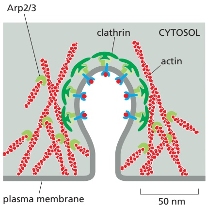

Figure 13–13 Local actin polymerization helps drive budding of membrane vesicles. Polymerization of actin filaments occurs near the vesicle neck, helping propel the budding vesicle away from the plasma membrane.

(A)

(C)

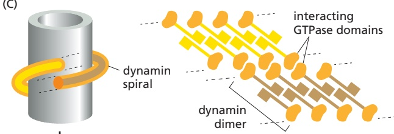

GTP HYDROLYSIS CAUSES CONFORMATIONAL CHANGE

(B)

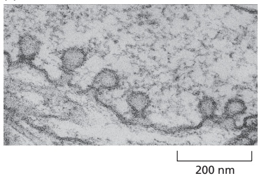

Figure 13–14 The role of dynamin in pinching off clathrin-coated vesicles. (A) Multiple dynamin molecules assemble into a spiral around the neck of the forming bud. The dynamin spiral is thought to recruit other proteins to the bud neck, which, together with dynamin, destabilize the interacting lipid bilayers so that the noncytoplasmic leaflets flow together. The newly formed vesicle then pinches off from the membrane. Specific mutations in dynamin can either enhance or block the pinchingoff process. (B) Dynamin was discovered as the protein defective in the shibire mutant of Drosophila. These mutant flies become paralyzed because clathrin-mediated endocytosis stops, and the synaptic vesicle membrane fails to recycle, blocking neurotransmitter release. Deeply invaginated clathrin-coated pits form in the nerve endings of the fly’s nerve cells, with a belt. / . of mutant dynamin assembled around the neck, as shown in this thin-section electron micrograph. The pinching-off process fails because the required membrane fusion does not take place. (C) A model of how conformational changes in the GTPase domains of membrane-assembled dynamin can power a conformational change that constricts the neck of the bud. In this model, dynamin dimers polymerize to form the dynamin spiral. Where two rungs of the spiral meet, the GTPase domains of one rung’s dynamins interact with the GTPase domains of the other rung’s dynamins. GTP hydrolysis by the GTPase domains induces conformational changes that cause compaction of individual dynamin molecules, leading to partial constriction of the dynamin spiral. Loss of GTP weakens the interactions of the GTPase domains with each other, and rebinding of GTP reverses the compacted state to allow the GTPase domains to bind at the adjacent position on the opposite rung (this step is not shown). In this way, the dynamin molecules can undergo a stepping motion in the direction indicated by the pink arrows. Cycles of dynamin compaction and stepping, powered by cycles of GTP binding and hydrolysis, is one model for how dynamin constricts the neck of a budding vesicle. (B, from J.H. Koenig and K. Ikeda, J. Neurosci. 9:3844–3860, 1989. Copyright 1989 Society for Neuroscience. With permission from the Society for Neuroscience.)

**Coat-recruitment GTPases** are members of a family of monomeric GTPases. They include the **ARF proteins**, which are responsible for the assembly of both COPI and clathrin coats at Golgi membranes, the **Sar1 protein**, which is responsible for the assembly of COPII coats at the ER membrane, and Rab7, which initiates the assembly of retromer coats at the endosome membrane. As discussed in Chapter 3, GTP-binding proteins regulate many processes in eukaryotic cells. They act as molecular switches, which toggle between an active state with GTP bound and an inactive state with GDP bound. Two classes of proteins regulate the toggling: guanine nucleotide exchange factors (GEFs) activate the proteins by catalyzing the exchange of GDP for GTP, and GTPase-activating proteins (GAPs) inactivate the proteins by triggering the hydrolysis of the bound GTP to GDP (see Figures 3–68 and 15–7).

Coat-recruitment GTPases are usually found in high concentration in the cytosol in an inactive, GDP-bound state. When a **COPII-coated vesicle** is to bud from the ER membrane, a specific **Sar1 GEF** embedded in the ER membrane binds to cytosolic Sar1, causing the Sar1 to release its GDP. Because GTP is present in

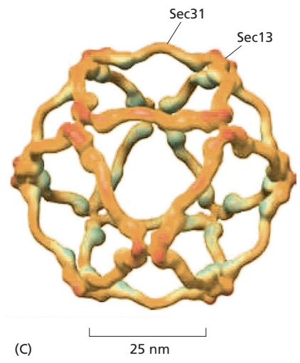

Figure 13–15 Formation of a COPII-coated vesicle. (A) Inactive, soluble Sar1-GDP binds to a Sar1 GEF in the ER membrane, causing Sar1 to release its GDP and bind GTP. A GTP-triggered conformational change in Sar1 exposes an amphiphilic helix, which inserts into the cytoplasmic leaflet of the ER membrane, initiating membrane bending (which is not shown). (B) GTP-bound Sar1 binds to a complex of two COPII adaptor coat proteins, called Sec23 and Sec24, which form the inner coat. Sec24 has several different binding sites for the cytosolic tails of cargo receptors. The entire surface of the complex that attaches to the membrane is gently curved, matching the diameter of COPII-coated vesicles. (C) A complex of two additional COPII coat proteins, called Sec13 and Sec 31, forms the outer shell of the coat. Like clathrin, they can assemble on their own into symmetrical cages with appropriate dimensions to enclose a COPII-coated vesicle. (D) Membrane-bound, active Sar1-GTP recruits COPII adaptor proteins to the membrane. They select certain transmembrane proteins and cause the membrane to deform. The adaptor proteins then recruit the outer coat proteins, which help form a bud. A subsequent sealing event pinches off the coated vesicle. Other coated vesicles are thought to form in a similar way. (C, modified from S.M. Stagg et al., Nature 439:234–238, published 2006 by Nature Publishing Group. Reproduced with permission of SNCSC.)

much higher concentration in the cytosol than GDP, Sar1 binds GTP as soon as GDP is released. In its GTP-bound state, the Sar1 protein exposes an amphiphilic helix, which inserts into the cytoplasmic leaflet of the lipid bilayer of the ER membrane. The tightly bound Sar1 now recruits adaptor coat protein subunits to the ER membrane to initiate budding (Figure 13–15). Other GEFs and coat-recruitment GTPases operate in a similar way on other membranes (Movie 13.2). Some of the small monomeric GTPases use an amphiphilic helix, whereas others use an attached lipid to anchor them to membranes. Thus, GEFs located in different compartments serve as important spatial cues that control where different coat-recruitment GTPases are activated to initiate the formation of different typesMBoC7 m13.14/13.15 of transport vesicles.

#### Coat-recruitment GTPases Participate in Coat Disassembly

As with clathrin-coated vesicles at the plasma membrane, other types of coats must also disassemble once the transport vesicle has budded off the originating compartment. Without coat disassembly, the vesicle membrane could not fuse with that of its target compartment, and coated vesicles would permanently accumulate in the cell with no place to go. Budding vesicles therefore incorporate proteins that initiate coat disassembly only after the vesicle has fully formed. This critical switch from coat formation to coat disassembly is triggered by coat-recruitment GTPases. The hydrolysis of bound GTP to GDP causes the GTPase to change its conformation so that its hydrophobic tail pops out of the membrane, causing the vesicle’s coat to disassemble. Thus, the rate at which coat-recruitment GTPases hydrolyze GTP determines the length of time their associated coats stay assembled.

COPII coats accelerate GTP hydrolysis by Sar1, and a fully formed vesicle will be produced only when bud formation occurs faster than the timed disassembly process; otherwise, disassembly will be triggered before a vesicle pinches off, and the process will have to start again, perhaps at a more appropriate time and place. Once a vesicle pinches off, GTP hydrolysis releases Sar1, but the sealed coat is sufficiently stabilized through many cooperative interactions, including binding to the cargo receptors in the membrane, that it may stay on the vesicle until the vesicle arrives at a target membrane. There, a kinase phosphorylates the coat proteins, which completes coat disassembly and readies the vesicle for fusion.

Clathrin-coated and COPI-coated vesicles, by contrast, shed their coat soon after they pinch off. For **COPI-coated vesicles**, the curvature of the vesicle membrane serves as a trigger to begin uncoating. An ARF GAP that is recruited to the COPI coat as it assembles senses the lipid packing density. When the curvature of the membrane approaches that of a transport vesicle, the ARF GAP is activated. It then stimulates ARF to hydrolyze its GTP, causing the coat to disassemble.

#### The Shape and Size of Transport Vesicles Are Diverse

The types of cargoes that need to be transported through the cell are diverse in size, shape, and topology. Transport vesicles can similarly be diverse in their morphology to accommodate the cargoes they carry. Collagen, for example, is assembled in the ER as 300-nm-long, stiff procollagen rods that then are secreted from the cell where they are eventually embedded into the extracellular matrix (discussed in Chapter 19). Procollagen rods do not fit into the 60- to 80-nm-diameter COPII vesicles that normally carry smaller cargoes. To circumvent this problem, the procollagen cargo molecules bind to transmembrane packaging proteins in the ER, which control the assembly of the COPII coat components (**Figure 13–16**). These events are thought to drive the local assembly of much larger COPII vesicles that accommodate the oversized cargo. Human mutations in genes encoding such packaging proteins result in collagen defects with severe consequences, such as skeletal abnormalities and other developmental defects. Similar mechanisms must regulate the sizes of vesicles required to secrete other large macromolecular complexes, including the lipoprotein particles that transport lipids out of cells.

Another variation on small spherical transport vesicles is thin membrane tubules. Tubules have a higher surface-to-volume ratio than vesicles or the larger organelles from which they form. They are therefore relatively enriched in membrane proteins compared with soluble cargo proteins. As we discuss later, this property of tubules is an important feature for sorting proteins in endosomes. The retromer coat, which is specialized for transporting membrane proteins from endosomes to the Golgi apparatus, preferentially drives the formation of tubular transport vesicles (Figure 13–4).

Figure 13–16 Packaging of procollagen into large tubular COPII-coated vesicles. The diagrams show models for two COPII coat assembly modes. The models are based on cryo-electron tomography images of reconstituted COPII vesicles. On a spherical membrane (left), the Sec23/24 inner COPII coat proteins assemble in patches that anchor the Sec13/31 outer coat COPII protein cage. The Sec13/31 rods assemble a cage of triangles, squares, and pentagons. When procollagen needs to be packaged (right), special packaging proteins sense the cargo and modify the coat assembly process. This interaction recruits the COPII inner coat protein Sec24 and locally enhances the rate with which Sar1 cycles on and off the membrane (not shown). In addition, a monoubiquitin (not shown) is added to the Sec31 protein, changing the assembly properties of the outer cage. Sec23/24 proteins arrange in larger arrays, and Sec13/31 proteins arrange in a regular lattice of diamond shapes. As a result, a large tubular vesicle is formed that can accommodate the large cargo molecules. The packaging proteins are not part of the budding vesicle but remain in the ER. (Modified from G. Zanetti et al., eLife 2:e00951, 2013. With permission from the authors.)

#### Rab Proteins Guide Transport Vesicles to Their Target Membrane

To ensure an orderly flow of vesicle traffic, transport vesicles must be highly accurate in recognizing the correct target membrane with which to fuse. Because of the diversity and crowding of membrane systems in the cytoplasm, a vesicle is likely to encounter many potential target membranes before it finds the correct one. Specificity in targeting is ensured because all transport vesicles display surface markers that identify them according to their origin and type of cargo, and target membranes display complementary receptors that recognize the appropriate markers. Two types of markers act sequentially to ensure the specificity of vesicle targeting. First, Rab proteins direct the vesicle to specific spots on the correct target membrane. Second, SNARE proteins enable the fusion of the lipid bilayers.

Like the coat-recruitment GTPases discussed earlier (see Figure 13–15), **Rab proteins** are also monomeric GTPases. With more than 60 known members in mammalian cells, the Rab subfamily is the largest of the monomeric GTPase subfamilies. Each Rab protein is associated with one or more membrane-enclosed organelles of the secretory or endocytic pathway, and each of these organelles has at least one Rab protein on its cytosolic surface (**Table 13–1**). Different Rab proteins are also found on the different types of transport vesicles that ferry cargoes between organelles. Their selective distribution on these membrane systems makes Rab proteins ideal molecular markers for identifying each type of transport vesicle and target membrane in order to guide vesicle traffic.

Rab proteins cycle between a membrane and the cytosol and regulate the reversible assembly of protein complexes on the membrane. In their GDP-bound state, they are inactive and bound to another protein (GDP dissociation inhibitor, or GDI) that keeps them soluble in the cytosol. Membrane-bound Rab GEFs activate Rab proteins by catalyzing the exchange of GDP for GTP. Once in the GTP-bound state, the Rab protein’s lipid anchor inserts into the membrane where the Rab binds to a diverse set of proteins called **Rab effectors** (**Figure 13–17**). The rate of GTP hydrolysis sets the concentration of active Rab and, consequently, the concentration of its effectors on the membrane.

A Rab protein is activated on a transport vesicle when a specific component of the vesicle, often a coat component, recruits a Rab GEF. Rab protein activation has several consequences. First, the Rab protein itself serves as a specific molecular cue that can be recognized by tethering proteins localized at the target membrane. Tethering proteins are typically protein complexes that often contain threadlike domains that serve as “fishing lines” capable of capturing a vesicle up to 200 nm away. Second, the Rab protein can interact with motor proteins, common Rab effectors that propel vesicles along actin filaments or microtubules to their target membrane. Third, the Rab protein can recruit a Rab effector that selectively binds proteins on the target membrane, such as the SNARE proteins located there.

<table><tbody><tr><td colspan="2">TABLE 13-1 Subcellular Locations of Some Rab Proteins</td></tr><tr><td>Protein</td><td>Organelle</td></tr><tr><td>Rab1</td><td>ER and Golgi complex</td></tr><tr><td>Rab2</td><td>cis Golgi network</td></tr><tr><td>Rab3A</td><td>Synaptic vesicles, secretory vesicles</td></tr><tr><td>Rab4/Rab11</td><td>Recycling endosomes</td></tr><tr><td>Rab5</td><td>Early endosomes, plasma membrane, clathrin-coated vesicles</td></tr><tr><td>Rab6</td><td>Medial and trans Golgi cisternae</td></tr><tr><td>Rab7</td><td>Late endosomes</td></tr><tr><td>Rab8</td><td>Cilia</td></tr><tr><td>Rab9</td><td>Late endosomes, trans Golgi network</td></tr></tbody></table>

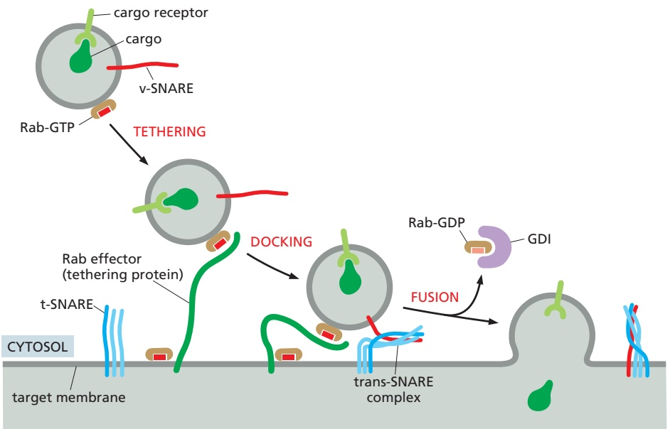

Through one or more of these mechanisms, a Rab protein selectively activated on a transport vesicle guides and docks it at the correct target membrane. Some Rab proteins, such as Rab7 discussed earlier, also function as coat-recruitment GTPases that initiate new budding events as organelles mature, as we discuss next.

#### Rab Proteins Create and Change the Identity of an Organelle

In addition to acting on vesicles, Rab proteins also function on organelle membranes. As on vesicles, a specific Rab GEF at the organelle catalyzes Rab protein activation and insertion at the membrane surface. Many of the effector proteins recruited by an activated Rab protein help give the organelle its identity by directly controlling incoming and outgoing transport vesicles. These effectors include tethering proteins mentioned previously, SNAREs that mediate membrane fusion of incoming vesicles, and enzymes that generate or modify specific phosphoinositides.

The assembly of Rab proteins and their effectors on an organelle membrane can be cooperative and results in the formation of large, specialized membrane patches that define the identity of that organelle. Active Rab5 on the endosome membrane, for example, recruits more copies of the same Rab5 GEF that initially activated Rab5. This stimulates the recruitment of more Rab5 to the same site. At the same time, active Rab5 activates a PI 3-kinase, which locally converts PI to PI(3)P, which in turn binds some of the Rab effectors including tethering proteins and stabilizes their local membrane attachment (**Figure 13–18**). This type of positive feedback greatly amplifies the assembly process and helps to establish functionally distinct membrane domains within a continuous organelle membrane.

Figure 13–17 Tethering of a transport vesicle to a target membrane. Rab effector proteins interact with active Rab proteins (Rab-GTPs, brown) located on the target membrane, vesicle membrane, or both, to establish the first connection between the two membranes that are going to fuse. In the example shown here, the Rab effector is a filamentous tethering protein (dark green). Next, SNARE proteins on the two membranes (red and blue) pair, docking the vesicle to the target membrane and catalyzing the fusion of the two apposed lipid bilayers. During docking and fusion, a Rab GAP (not shown) induces the Rab protein to hydrolyze its bound GTP to GDP, causing the Rab to dissociate from the membrane and return to the cytosol as Rab-GDP, where it is bound by a GDP dissociation inhibitor (GDI) protein that keeps the Rab soluble and inactive.

Figure 13–18 The formation of a Rab5- associated patch on the endosome membrane. A Rab5 GEF on the endosome membrane binds a Rab5 protein and induces it to exchange GDP for GTP. GDI is lost, and GTP binding alters the conformation of the Rab protein to expose a covalently attached lipid group, which anchors the Rab5-GTP to the membrane. Active Rab5 activates PI 3-kinase, which converts PI into PI(3)P. PI(3)P and active Rab5 together bind a variety of Rab effector proteins that contain PI(3)P-binding sites, including filamentous tethering proteins that catch incoming clathrin-coated endocytic vesicles from the plasma membrane. With the help of another effector, active Rab5 also recruits more Rab5 GEF, further enhancing the assembly of the Rab5-associated patch on the membrane. Controlled cycles of GTP hydrolysis and GDP–GTP exchange dynamically regulate the size and activity of such Rab-associated membrane patches. Unlike SNAREs, which are integral membrane proteins, the GDP– GTP cycle, coupled to the membrane– cytosol translocation cycle, endows the Rab machinery with the ability to undergo assembly and disassembly on the membrane. (Adapted from M. Zerial and H. McBride, Nat. Rev. Mol. Cell Biol. 2:107–117, 2001.)

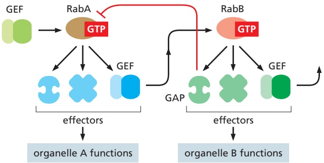

It is thought that different Rab proteins and their effectors help to create multiple specialized membrane domains, each fulfilling a particular set of functions. Thus, while the Rab5-associated membrane patch receives incoming endocytic vesicles from the plasma membrane, distinct Rab11- and Rab4-associated patches. / . in the same endosome organize the budding of recycling vesicles that return proteins from the endosome to the plasma membrane. As we have already discussed, Rab7 on the endosome membrane serves as a coat-recruitment GTPase for retromer, initiating the formation of transport vesicles destined for the Golgi.

One Rab protein can be replaced by a different Rab protein, and this can change the identity of its associated organelle. This is accomplished by one Rab protein selectively recruiting and activating a different Rab protein whose complement of effectors includes proteins that inactivate the first Rab protein and thereby disassemble its associated membrane patch. Such ordered recruitment of sequentially acting Rab proteins is called a **Rab cascade** (**Figure 13–19**). Over time, for example, Rab5-associated membrane patches are replaced by Rab7- associated membrane patches on endosomal membranes. This converts an early endosome, marked by Rab5, into a late endosome, marked by Rab7. Because the set of Rab effectors recruited by Rab7 is different from that recruited by Rab5, this change reprograms the compartment including the incoming and outgoing traffic and repositions the organelle away from the plasma membrane toward the cell interior. All of the cargo contained in the early endosome that has not been recycled to the plasma membrane is now part of a late endosome. This process is also referred to as endosome maturation. The self-amplifying nature of the Rab-associated membrane patches renders the process of endosome maturation unidirectional and irreversible.

#### SNAREs Mediate Membrane Fusion

Once a transport vesicle has budded from its originating compartment and shed its coat, membrane fusion allows it to unload its cargo at its destination compartment. Membrane fusion requires bringing the lipid bilayers of two membranes to within 1.5 nm of each other so that they can merge. When the membranes are in such close proximity, lipids can flow from one bilayer to the other. For this close approach, water must be displaced from the hydrophilic surface of the membrane—a process that is highly energetically unfavorable and requires specialized fusion proteins that overcome this energy barrier. We have already discussed the role of dynamin in the related task of squeezing membranes close together during the pinching off of clathrin-coated vesicles (see Figure 13–14).

The **SNARE proteins** (also called **SNAREs**, for short) catalyze the membrane fusion reactions in vesicle transport. There are at least 35 different SNAREs in an animal cell, each associated with a particular organelle in the secretory or endocytic pathway. These transmembrane proteins exist as complementary sets, with **v-SNAREs** usually found on vesicle membranes and **t-SNAREs** usually found on target membranes (see Figure 13–17). A v-SNARE is a single polypeptide chain, whereas a t-SNARE is usually composed of three proteins. The v-SNAREs and t-SNAREs have characteristic helical domains that are mostly unstructured in isolation. When a v-SNARE interacts with a t-SNARE, the helical domains of one zipper up with the helical domains of the other to form a very stable four-helix

Figure 13–19 A model for a generic Rab cascade. The local activation of a RabA GEF leads to assembly of a RabAassociated membrane patch (sometimes called a “Rab domain”) on the membrane. Active RabA recruits its effector proteins, one of which is a GEF for RabB. The RabB GEF then recruits RabB to the membrane, which in turn begins to recruit its effectors, among them a GAP for RabA. The RabA GAP activates RabA-GTP hydrolysis leading to the inactivation of the RabA and the disassembly of the RabA-associated membrane patch as the RabB-associated membrane patch grows. In this way, the RabA-associated membrane patch is irreversibly replaced by the RabB-associated membrane patch. In principle, this sequence can be continued by the recruitment of a next GEF by RabB. (Adapted from A.H. Hutagalung and P.J. Novick, Physiol. Rev. 91:119–149, 2011.)

Figure 13–20 A model for how SNARE proteins catalyze membrane fusion. Bilayer fusion occurs in multiple steps. A tight pairing between v- and t-SNAREs forces lipid bilayers into close apposition and expels water molecules from the interface. Lipid molecules in the two interacting (cytosolic) leaflets of the bilayers then flow between the membranes to form a connecting stalk. Lipids of the two noncytosolic leaflets then contact each other, forming a new bilayer, which widens the fusion zone (hemifusion, or half-fusion). Rupture of the new bilayer completes the fusion reaction.

bundle. The resulting trans-SNARE complex locks the two membranes together. Biochemical membrane fusion assays with all different SNARE combinations show that v- and t-SNARE pairing is highly specific. The SNAREs thus provide an additional layer of specificity in the transport process by helping to ensure that vesicles fuse only with their correct target membrane.

The extremely high stability of the trans-SNARE complex means that its assembly from initially unstructured v- and t-SNAREs is energetically favorable. This energy is exploited to pull the membrane faces together, simultaneously squeezing out water molecules from the interface to initiate lipid bilayer fusion (**Figure 13–20**). When liposomes containing purified v-SNAREs are mixed with liposomes containing complementary t-SNAREs, their membranes fuse, albeit slowly. In the cell, fusion is greatly accelerated by factors that interact with v-SNARE and t-SNARE pairs to align them precisely so they can initiate zippering. Fusion does not always follow immediately after v-SNAREs and t-SNAREs pair. As we discuss later, in the process of regulated exocytosis, zippering of the last part of the trans-SNARE complex is delayed until secretion is triggered by a specific extracellular signal.

#### Interacting SNAREs Need to Be Pried Apart Before They Can Function Again

After SNARE proteins have participated in membrane fusion, the highly stable trans-SNARE complexes have to disassemble before the SNAREs can mediate new rounds of transport. A crucial protein called **NSF** cycles between membranes and the cytosol and catalyzes the disassembly process. NSF is a hexameric ATPase of the family of AAA-proteins (see Figure 6–88) that uses the energy of ATP hydrolysis to unravel the intimate interactions between the helical domains of paired SNARE proteins (**Figure 13–21**). After disassembly, the SNARE proteins can again exploit the energy gained by their assembly to drive another fusion reaction. Thus, the energy for SNARE-mediated fusion reactions ultimately comes from the ATP consumed by NSF to pry them apart. After trans-SNARE complex disassembly at the destination compartment, v-SNAREs are selectively retrieved and returned to their compartment of origin so that they can be reused in newly formed transport vesicles. Such selective retrieval pathways (discussed later) are critical for maintaining the identity of each compartment in the face of constant outgoing traffic.

Membrane fusion is important in other processes besides vesicle transport. The plasma membranes of a sperm and an egg fuse during fertilization, myoblasts fuse with one another during the development of multinucleate muscle fibers (discussed in Chapter 22), and the epithelial cells in the human placenta fuse into a giant syncytium that separates the mother from the fetus. Likewise, the ER network and mitochondria fuse and fragment in a dynamic way (discussed in Chapters 12 and 14). All cell membrane fusions require special proteins and are tightly regulated to ensure that only appropriate membranes fuse. The controls are crucial for maintaining both the identity of cells and the individuality of each type of intracellular compartment.

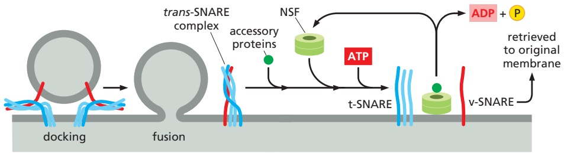

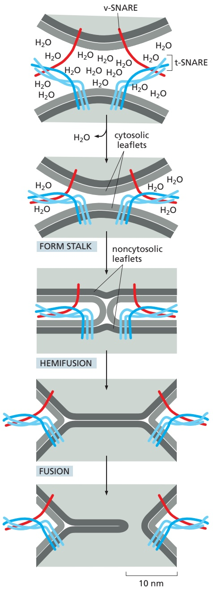

Figure 13–21 Dissociation of SNARE pairs by NSF after a membrane fusion cycle. After a v-SNARE and t-SNARE have effected the fusion of a transport vesicle with a target membrane, NSF binds to the SNARE complex and, with the help of accessory proteins, hydrolyzes ATP to pry the SNAREs apart.

#### Viruses Encode Specialized Membrane Fusion Proteins Needed for Cell Entry

Enveloped viruses, which have a lipid bilayer–based membrane coat, enter the cells that they infect when the viral membrane fuses with a cell’s membrane (discussed in Chapters 5 and 23). For example, viruses such as the human immunodeficiency virus (HIV), which causes AIDS, bind to cell-surface receptors and then fuse with the plasma membrane of the target cell (**Figure 13–22**). This fusion event allows the viral nucleic acid inside the nucleocapsid to enter the cytosol, where it replicates. Other viruses, such as the influenza virus, first enter the cell by receptor-mediated endocytosis (discussed later) and are delivered to endosomes; the low pH in endosomes activates a fusion protein in the viral envelope that catalyzes the fusion of the viral and endosomal membranes, releasing the viral nucleic acid into the cytosol. In the case of the severe acute respiratory syndrome coronavirus 2 (SARS-CoV-2), which causes COVID-19, the fusion reaction requires host proteases that cleave the virus surface protein to activate its fusion activity.

The membrane fusion reactions catalyzed by viral fusion proteins are well understood. Unlike SNARE-mediated fusion, which involves proteins in both membranes, viral fusion typically requires only the viral protein. These viral fusion proteins unfurl in the appropriate environment and insert a partially hydrophobic patch into the host membrane. The fusion protein then undergoes compaction to bring the two membranes close together to drive their fusion in a reaction analogous to SNARE-mediated fusion.

#### Summary

Directed and selective transport of particular membrane components from one membrane-enclosed compartment to another in a eukaryotic cell maintains the differences between those compartments. Transport vesicles, which can be spherical, tubular, or irregularly shaped, bud from specialized coated regions of the donor membrane. The assembly of the coat helps to collect specific membrane and soluble cargo molecules for transport and to drive the formation of the vesicle.

There are various types of coated vesicles. Clathrin-coated vesicles mediate transport from the plasma membrane, endosomes, and the trans Golgi network. COPI-coated and COPII-coated vesicles mediate transport between Golgi cisternae and between the ER and the Golgi apparatus. Retromer forms a coat at the endosome membrane for transport to the Golgi. Coats have a common two-layered structure: an inner layer formed of adaptor proteins traps specific cargo molecules for packaging into the vesicle and an outer layer that forms a cage and helps deform the membrane into a vesicle. The coat is shed before the vesicle fuses with its appropriate target membrane.

The specificity of membrane transport is mediated by several types of molecular markers that determine where transport vesicles originate and where they deliver their cargo. Local synthesis of specific phosphoinositides creates binding sites that trigger clathrin coat assembly and vesicle budding. In addition, the coat-recruitment GTPases, including Sar1 and the ARF proteins, regulate coat assembly and disassembly. Rab proteins are a large family of GTPases that function on both transport vesicles and target membranes to control the specificity of membrane transport. Active Rab proteins recruit Rab effectors, such as motor proteins, which transport vesicles along actin filaments or microtubules, and filamentous tethering proteins, which help ensure that the vesicles deliver their contents only to the appropriate target membrane. Specialized membrane domains that help determine an organelle’s identity can be generated and changed in a dynamic manner by the assembly and disassembly of Rab proteins and their effectors. Complementary v-SNARE proteins on transport vesicles and t-SNARE proteins on the target membrane form stable trans-SNARE complexes, which force the two membranes into close apposition so that their lipid bilayers can fuse.

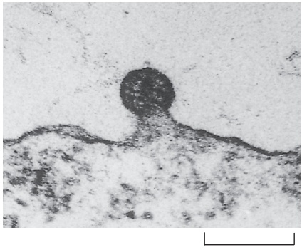

200 nm

Figure 13–22 The entry of enveloped viruses into cells. Electron micrographs showing how HIV enters a cell by fusing its membrane with the plasma membrane of the cell. (From B.S. Stein et al., Cell 49:659–668, 1987. With permission from Elsevier.)

<!-- END EN EN13-H000-H018 -->

### 英文补充：COPII、内质网输出、回收与驻留信号

> 对应中文板块：COPII、内质网输出、回收与驻留信号。英文来源：Molecular Biology of the Cell，第7版，第13章；[本章完整原文](../来源/英文教材/13_Intracellular_Membrane_Traffic/chapter.md)。物理PDF页码范围：788–849（整章范围）。

<!-- BEGIN EN EN13-H019-H024 -->
#### TRANSPORT FROM THE ENDOPLASMIC RETICULUM THROUGH THE GOLGI APPARATUS

As discussed in Chapter 12, newly synthesized proteins cross the endoplasmic reticulum (ER) membrane from the cytosol to enter the secretory pathway. These proteins are successively modified as they pass through a series of compartments from the ER to the Golgi apparatus and from the Golgi apparatus to the cell surface and elsewhere. Transfer from one compartment to the next involves a delicate balance between forward and backward (retrieval) transport pathways. Some transport vesicles select cargo molecules and move them to the next compartment in the pathway, while others retrieve escaped proteins and return them to a previous compartment where they normally function. Thus, the pathway from the ER to the cell surface consists of many sorting steps, which continually select membrane and soluble lumenal proteins for packaging and transport.

In this section, we focus mainly on the **Golgi apparatus** (also called the Golgi complex). It is a major site of carbohydrate synthesis, as well as a sorting and dispatching station for products delivered to it from the ER. The cell makes many polysaccharides in the Golgi apparatus, including the pectin and hemicellulose of the cell wall in plants and most of the glycosaminoglycans of the extracellular matrix in animals (discussed in Chapter 19). The Golgi apparatus also builds and attaches oligosaccharide chains to the many proteins and lipids that the ER sends to it. Some of these oligosaccharides serve as tags to direct specific proteins carrying them into vesicles that are then transported to endosomes for eventual delivery to lysosomes. But most proteins and lipids, once they have acquired their appropriate oligosaccharides in the Golgi apparatus, are recognized in other ways for targeting into the transport vesicles going to the cell surface and other destinations.

#### Proteins Leave the ER in COPII-coated Transport Vesicles

To initiate their journey along the secretory pathway, proteins that have entered the ER and are destined for the Golgi apparatus or beyond are first packaged into COPII-coated transport vesicles. These vesicles bud from specialized regions of the ER called ER exit sites, whose membrane lacks bound ribosomes. Most animal cells have ER exit sites dispersed throughout the ER network.

Entry into vesicles that leave the ER can be a selective process or can happen by default. Many transmembrane proteins are actively recruited into such vesicles, where they become concentrated. These transmembrane proteins display exit (transport) signals on their cytosolic surface that adaptor proteins of the inner COPII coat recognize (**Figure 13–23**). Soluble cargo proteins in the ER lumen have exit signals that are recognized by some of these transmembrane proteins, which serve as cargo receptors. These receptors are recycled back to the ER after they have delivered their cargo to the Golgi apparatus. Proteins without exit signals can also enter transport vesicles, including protein molecules that normally function in the ER (so-called ER resident proteins). These resident proteins slowly leak out of the ER and need retrieval pathways to bring them back from the Golgi apparatus. Different cargo proteins enter the transport vesicles with substantially different rates and efficiencies. These differences can be due to their folding and oligomerization efficiencies and kinetics, as well as their different capacities to engage cargo receptors and the COPII coat. The exit step from the ER is a major checkpoint at which quality control is exerted on the proteins that a cell secretes or displays on its surface, as we discussed in Chapter 12.

The exit signals that direct soluble proteins out of the ER for transport to the Golgi apparatus and beyond are not well understood. Some transmembrane proteins that serve as cargo receptors for packaging some secretory proteins into COPII-coated vesicles are lectins that bind to oligosaccharides on the secreted

Figure 13–23 The recruitment of membrane and soluble cargo molecules into ER transport vesicles. Transmembrane proteins are packaged into budding transport vesicles through interactions of exit signals on their cytosolic tails with adaptor proteins of the inner COPII coat. Some of these transmembrane proteins function as cargo receptors, binding soluble proteins in the ER lumen and helping to package them into vesicles. Other proteins may enter the vesicle by bulk flow. A typical 50-nm transport vesicle contains about 200 transmembrane proteins, which can be of many different types. As indicated, unfolded or incompletely assembled proteins are bound to chaperones and transiently retained in the ER compartment.

proteins. One such lectin, for example, binds to mannose on two secreted blood-clotting factors (Factor V and Factor VIII), thereby packaging the proteins into transport vesicles in the ER; its role in protein transport was identifiedMBoC7 m13.22/13.23 because humans who lack it owing to an inherited mutation have lowered serum levels of Factors V and VIII, and they therefore bleed excessively.

#### Only Proteins That Are Properly Folded and Assembled Can Leave the ER

To exit from the ER, proteins must be properly folded, and, if they are subunits of multiprotein complexes, they need to be completely assembled. Those that are misfolded or incompletely assembled transiently remain in the ER, where they are bound to chaperone proteins (discussed in Chapter 6) such as BiP or calnexin. The chaperones may cover up the exit signals or somehow anchor the proteins in the ER. Such failed proteins are eventually transported back into the cytosol, where they are degraded by proteasomes (discussed in Chapters 6 and 12). This quality-control step prevents the onward transport of misfolded or misassembled proteins that could potentially interfere with the functions of normal proteins. Such failures are surprisingly common. Most of the newly synthesized subunits of the T cell receptor (discussed in Chapter 24) and of the acetylcholine receptor (discussed in Chapter 11), for example, are normally degraded without ever reaching the cell surface where they function. Thus, cells must make a large excess of some protein molecules to produce a select few that fold, assemble, and function properly.

Sometimes, however, there are drawbacks to the stringent quality-control mechanism. The predominant mutations that cause cystic fibrosis, a common inherited disease, result in the production of a slightly misfolded form of a plasma membrane protein important for Cl– transport. Although the mutant protein would function almost normally if it reached the plasma membrane, it is retained in the ER and then is degraded by cytosolic proteasomes. This devastating disease thus results not because the mutation inactivates the protein but because potentially active protein is discarded before it reaches the plasma membrane.

#### Vesicular Tubular Clusters Mediate Transport from the ER to the Golgi Apparatus

After transport vesicles have budded from ER exit sites and have shed their coat, they begin to fuse with one another. The fusion of membranes from the same compartment is called homotypic fusion, to distinguish it from heterotypic fusion, in which a membrane from one compartment fuses with the membrane of a different compartment. As with heterotypic fusion, homotypic fusion requires a set of matching SNAREs. In this case, however, the interaction is symmetrical, with both membranes contributing v-SNAREs and t-SNAREs (**Figure 13–24**).

The structures formed when ER-derived vesicles fuse with one another are called vesicular tubular clusters, because they have a convoluted appearance in the electron microscope (**Figure 13–25A**). These clusters constitute a compartment that is separate from the ER and lacks many of the proteins that function in the ER. They are generated continually and function as transport containers that bring material from the ER to the Golgi apparatus. The clusters move quickly along microtubules to the Golgi apparatus with which they fuse (**Figure 13–25B**MBoC7 m13.23/13.24 and **Movie 13.3**).

As soon as vesicular tubular clusters form, they begin to bud off transport vesicles of their own. Unlike the COPII-coated vesicles that bud from the ER, these vesicles are COPI-coated (see Figure 13–25B). COPI-coated vesicles are unique in that the components that make up the inner and outer coat layers are recruited as a preassembled complex, called coatomer. They function as a retrieval pathway, carrying back ER resident proteins that have escaped, as well as proteins such as cargo receptors and SNAREs that participated in the ER budding and vesicle fusion reactions. This retrieval process demonstrates the exquisite control mechanisms that regulate coat assembly reactions. The COPI coat assembly begins only seconds after the COPII coats have been shed; it remains a mystery how this switch in coat assembly is controlled.

The retrieval (or retrograde) transport continues as the vesicular tubular clusters move toward the Golgi apparatus. Thus, the clusters continually mature, gradually changing their composition as selected proteins are returned to the ER.

Figure 13–24 Homotypic membrane fusion. In step 1, NSF pries apart identical pairs of v-SNAREs and t-SNAREs in both membranes (see Figure 13–21). In steps 2 and 3, the separated matching SNAREs on adjacent identical membranes interact, which leads to membrane fusion and the formation of one continuous compartment. Subsequently, the compartment grows by further homotypic fusion with vesicles from the same kind of membrane, displaying matching SNAREs. Homotypic fusion occurs when ER-derived transport vesicles fuse with one another, but also when endosomes fuse to generate larger endosomes. Rab proteins help regulate the extent of homotypic fusion and hence the size of a cell’s compartments (not shown).

Figure 13–25 Vesicular tubular clusters. (A) An electron micrograph of vesicular tubular clusters forming around an exit site. Many of the vesicle-like structures seen in the micrograph are cross sections of tubules that extend above and below the plane of this thin section and are interconnected. (B) Vesicular tubular clusters move along microtubules to carry proteins from the ER to the Golgi apparatus. COPI coats mediate the budding of vesicles that return to the ER from these clusters (and from the Golgi apparatus). (A, courtesy of Judith Klumperman, from J.A. Martínez-Menárguez et al., Cell 98:81–90, 1999.)

(A)

ER

cis Golgi

(B)

The retrieval continues from the Golgi apparatus, after the vesicular tubular clusters have delivered their cargo.

#### The Retrieval Pathway to the ER Uses Sorting Signals

The retrieval pathway for returning escaped proteins back to the ER depends on ER retrieval signals. Resident ER membrane proteins, for example, contain signals that bind directly to COPI coats and are thus packaged into COPI-coated transport vesicles for retrograde delivery to the ER. The best-characterized retrieval signal of this type consists of two lysines, followed by any two other amino acids, at the extreme C-terminal end of the ER membrane protein. It is called a KKXX sequence, based on the single-letter amino acid code. Most membrane proteins that function at the interface between the ER and Golgi apparatus, including v- and t-SNAREs and some cargo receptors, use this retrieval pathway to come back to the ER.

Soluble ER resident proteins, such as BiP, also contain a short ER retrieval signal at their C-terminal end, but it is different: it consists of a Lys-Asp-Glu-Leu or a similar sequence. If this signal (called the KDEL sequence) is removed from BiP by genetic engineering, the protein is slowly secreted from the cell. If the signal is transferred to a protein that is normally secreted, the protein is now efficiently returned to the ER, where it accumulates. Unlike the retrieval signals on ER membrane proteins, which can interact directly with the COPI coat, soluble ER resident proteins must bind to specialized receptor proteins such as the KDEL receptor—a multipass transmembrane protein that binds to the KDEL sequence and packages any protein displaying it into COPI-coated retrograde transport vesicles (**Figure 13–26**).

The KDEL receptor accomplishes this task by cycling between the ER and the Golgi apparatus, selectively binding proteins with the KDEL sequence in the Golgi apparatus and releasing them in the ER. The markedly different affinity between the receptor and the KDEL sequence in these two compartments is due to the lower pH in the Golgi apparatus, which is regulated by H+ pumps. A critical histidine in the KDEL receptor is protonated in the lower-pH environment of the Golgi apparatus, strongly favoring its interaction with the KDEL sequence. As we discuss later, pH-sensitive protein–protein interactions form the basis for many of the protein-sorting steps in the cell.

#### Many Proteins Are Selectively Retained in the Compartments in Which They Function

The KDEL retrieval pathway only partly explains how ER resident proteins are maintained in the ER. As mentioned, cells that express genetically modified ER resident proteins, from which the KDEL sequence has been experimentally removed, secrete these proteins. But the rate of secretion is much slower than that

Figure 13–26 Retrieval of soluble ER resident proteins. ER resident proteins that escape from the ER are returned by vesicle transport. (A) The KDEL receptor present in both vesicular tubular clusters and the Golgi apparatus captures the soluble ER resident proteins and carries them in COPI-coated transport vesicles back to the ER. (Recall that the COPI-coated vesicles shed their coats as soon as they are formed.) Upon binding its ligands in the tubular cluster or Golgi apparatus, the KDEL receptor may change conformation, so as to facilitate its recruitment into budding COPI-coated vesicles. (B) The retrieval of ER proteins begins in vesicular tubular clusters and continues in later parts of the Golgi apparatus. In the environment of the ER, the ER resident proteins dissociate from the KDEL receptor, which is then returned to the Golgi apparatus for reuse. We discuss the different compartments of the Golgi apparatus shortly.

(A)

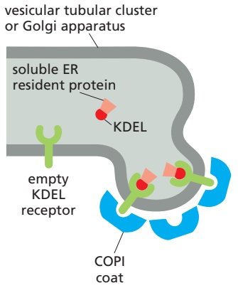

(B)

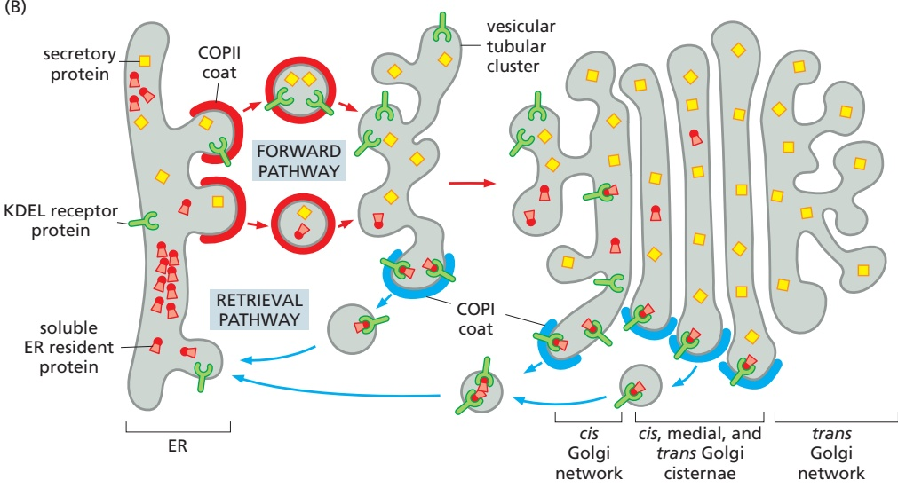

for a normal secretory protein. It seems that a mechanism that is independent of their KDEL signal normally retains ER resident proteins and that only those proteins that escape this retention mechanism are captured and returned via the KDEL receptor.

A suggested retention mechanism is that ER resident proteins bind to one another, thus forming complexes that are too big to enter transport vesicles efficiently. Because ER resident proteins are present in the ER at very high concentrations (estimated to be millimolar), relatively low-affinity interactions would suffice to retain most of the proteins in such complexes. Aggregation of proteins that function in the same compartment is a general mechanism that compartments use to organize and retain their resident proteins. Golgi enzymes that function together, for example, also bind to each other and are thereby restrained from entering transport vesicles leaving the Golgi apparatus.

<!-- END EN EN13-H019-H024 -->

## 跨章相关英文内容

- 病原体改变膜泡运输：[EN第23章 · 病原体的进入、离开与宿主膜运输](../04_物质的跨膜运输/小节/03_第三节%20胞吞作用与胞吐作用.md#EN23-H014-H020)。
