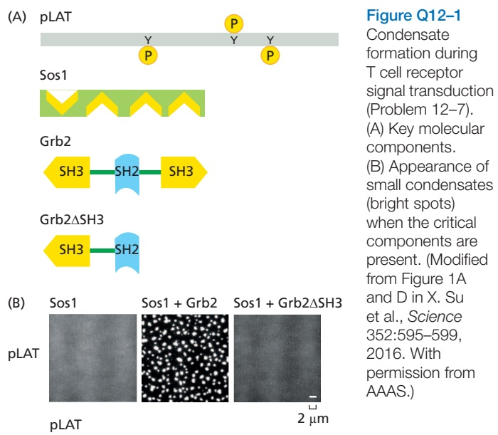
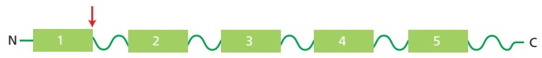
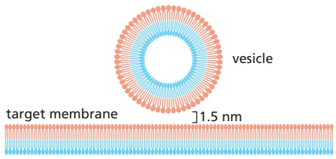
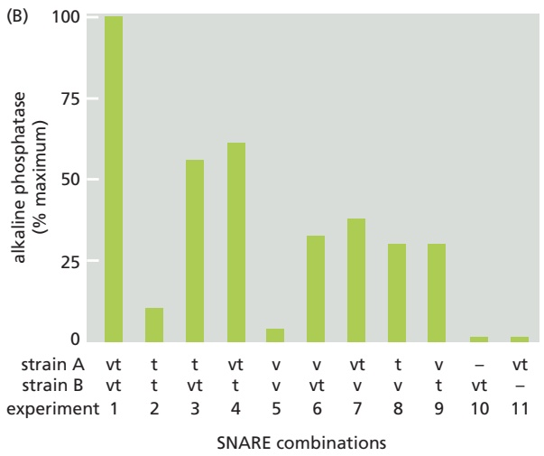

# 第6章 蛋白质分选与膜泡运输 · 英文习题与参考文献

### 英文补充：习题与参考文献

> 对应中文板块：习题与参考文献。英文来源：Molecular Biology of the Cell，第7版，第12章；[本章完整原文](../来源/英文教材/12_Intracellular_Organization_and_Protein_Sorting/chapter.md)。物理PDF页码范围：722–787（整章范围）。

<!-- BEGIN EN EN12-EXERCISES -->
#### PROBLEMS

Which statements are true? Explain why or why not.

12–1 Like the lumen of the ER, the interior of the nucleus is topologically equivalent to the outside of the cell.

12–2 ER-bound and free ribosomes, which are structurally and functionally identical, differ only in the proteins they happen to be making at a particular time.

12–3 The signal sequence binds to a hydrophobic site on the ribosome causing a slowdown in protein synthesis, which resumes when SRP binds to the signal sequence.

12–4 Peroxisomes are found in only a few specialized types of eukaryotic cell.

12–5 The two signal sequences required for insertion of nucleus-encoded proteins into the mitochondrial inner membrane via the TIM23 complex are cleaved off the protein in different mitochondrial compartments.

12–6 To avoid the collisions that would occur if twoway traffic through a single pore were allowed, nuclear pore complexes are specialized so that some mediate import while others mediate export.

Discuss the following problems.

12–7 Biomolecular condensates form just under the membrane during T cell receptor signal transduction in immune responses. Three components are critical: the transmembrane protein LAT (linker for activation of T cells), which is phosphorylated at three cytoplasmic tyrosine residues (pY); Grb2, which contains one SH2 domain and two SH3 domains; and Sos1, which contains four binding sites for SH3 domains (**Figure Q12–1A**).

When you insert phosphorylated LAT (pLAT) in an artificial lipid bilayer and add Grb2 and Sos1, micrometer-sized condensates form just below the bilayer (**Figure Q12–1B**). However, if you use a form of Grb2 that contains just one SH3 domain (Grb2∆SH3), instead of two, the condensates do not form (Figure Q12–1B). Why do you suppose that Grb2 supports condensate formation, while Grb2∆SH3, which is still multivalent, does not?

12–8 What is the fate of a protein with no sorting signal?

12–9 Are proteins bound for the plasma membrane common or rare among all ER membrane proteins? A few simple considerations allow one to answer this question. In a typical growing cell that is dividing once every 24 hours, the equivalent of one new plasma membrane must transit the ER every day. If the ER membrane is 20 times the area of a plasma membrane, what is the ratio of plasma membrane proteins to other membrane proteins in the ER? (Assume that all proteins on their way to the plasma membrane remain in the ER for 30 minutes on average before exiting, and that the ratio of proteins to lipids in the ER and plasma membranes is the same.)

12–10 A multipass transmembrane protein with several membrane-spanning segments is shown schematically in **Figure Q12–2**. The boxes represent membrane-spanning segments, and the arrow represents the site for cleavage of the signal sequence. In which compartments—cytosol or ER lumen—will the N- and C-termini of the mature protein be located?

Figure Q12–2 A multipass transmembrane protein with a cleavable signal sequence (Problem 12–10).

12–11 All new phospholipids are added to the cytosolic leaflet of the ER membrane, yet the ER membrane has a symmetrical distribution of different phospholipids in its two leaflets. By contrast, the plasma membrane, which receives all its membrane components ultimately from the ER, has a very asymmetrical distribution of phospholipids in the two leaflets of its lipid bilayer. How is the symmetry generated in the ER membrane, and how is the asymmetry generated and maintained in the plasma membrane?

12–12 Cells with functional peroxisomes incorporate 9-(1′-pyrene)nonanol (P9OH) into membrane lipids. Exposure of such cells to ultraviolet (UV) light causes cell death by generating reactive oxygen species, which are toxic. Cells that do not make peroxisomes lack a critical enzyme responsible for incorporating P9OH into membrane lipids. How might you make use of P9OH to select for cells that are missing peroxisomes?

12–13 Components of the TIM complexes were initially identified using a genetic trick. The yeast Ura3 gene, which encodes an enzyme that is normally located in the cytosol where it is essential for synthesis of uracil, was modified so that the protein carried an import signal for the mitochondrial matrix. A population of cells carrying the modified Ura3 gene in place of the normal gene was then grown in the absence of uracil. Most cells died, but the rare cells that grew were shown to be defective for mitochondrial import. Explain how this selection system works. Why do most of the cells die, and why do the import-defective cells grow?

12–14 If the enzyme dihydrofolate reductase (DHFR), which is normally located in the cytosol, is engineered to carry a mitochondrial targeting sequence at its N-terminus, it is efficiently imported into mitochondria. If the modified DHFR is first incubated with methotrexate, which binds tightly to the active site, the enzyme remains in the cytosol. How do you suppose that the binding of methotrexate interferes with mitochondrial import?

12–15 Why do mitochondria need a special translocator to import proteins across the outer membrane, when the membrane already has large pores formed by porins?

12–16 Assuming that 32 million histone octamers are required to package the human genome, how many histone molecules must be transported per second per nuclear pore complex in cells whose nuclei contain 3000 nuclear pores and are dividing once per day?

12–17 Selective permeability of the nuclear pore complex (NPC) is controlled by protein components with unstructured tails that extend into the central pore. These tails are characterized by periodic repeats of the hydrophobic amino acids phenylalanine (F) and glycine (G). In a test tube at a concentration of 50 mM, the FG repeat domains of these proteins form a gel, which is held together by weak interactions between the hydrophobic FG repeats. These gels allow passive diffusion of small molecules, which fit through the holes in the mesh, but they prevent entry of larger proteins such as the fluorescent protein mCherry fused to maltose-binding protein (MBP) (**Figure Q12–3A**). However, if the nuclear import receptor, importin, is fused to a similar protein, MBP–GFP, the importin–MBP–GFP fusion readily enters the gel (**Figure Q12–3B**).

Is diffusion of importin–MBP–GFP through the FG repeat gel fast enough to account for the efficient flow of materials between the nucleus and cytosol? From experiments of the type shown in Figure Q12–3B, the diffusion coefficient (D) of importin–MBP–GFP through the FG repeat gel was determined to be about 0.1 $\mu \mathrm { m } ^ { 2 } / \mathrm { s e c } .$ The equation for diffusion is $t = x ^ { 2 } / 2 D ,$ , where t is time and x is distance. About how long would it take importin–MBP– GFP to diffuse through a yeast nuclear pore (a distance of 30 nm) if the pore consisted of a gel of FG repeats?

Figure Q12–3 Diffusion of proteins through FG repeat gels (Problem 12–17). Diffusion of MBP–mCherry (A) and importin–MBP–GFP (B) into a gel of FG repeats (on the right). The bright areas indicate regions that contain the fluorescent proteins. (Modified from Figure 2 of S. Frey & D. Görlich, EMBO J. 28:2554–2567, 2009.)

12–18 A classic experiment that addressed whether nuclear proteins diffused passively into the nucleus or were actively imported used several forms of radioactive nucleoplasmin, which is a large pentameric protein involved in chromatin assembly. In this experiment, either the intact protein or the nucleoplasmin heads, tails, or heads with a single tail were injected into the cytosol or the nucleus of a frog oocyte (**Figure Q12–4**). All forms of nucleoplasmin, except heads, accumulated in the nucleus when injected into the cytoplasm, and all forms were retained in the nucleus when injected there.

How do these experiments distinguish between active transport, in which a nuclear localization signal triggers transport by the nuclear pore complex, and passive diffusion, in which a binding site for a nuclear component allows accumulation in the nucleus?

#### REFERENCES

#### General

Palade G (1975) Intracellular aspects of the process of protein synthesis. Science 189, 347–358.

#### The Compartmentalization of Cells

Banani SF, Lee HO, Hyman AA & Rosen MK (2017) Biomolecular condensates: organizers of cellular biochemistry. Nat. Rev. Mol. Cell Biol. 18, 285–298.

Baum DA & Baum B (2014) An inside-out origin for the eukaryotic cell. BMC Biol. 12, 76.

Blobel G (1980) Intracellular protein topogenesis. Proc. Natl. Acad. Sci. USA 77, 1496–1500.

Devos DP, Gräf R & Field MC (2014) Evolution of the nucleus. Curr. Opin. Cell Biol. 28, 8–15.

Knoblach B & Rachubinski RA (2015) Motors, anchors, and connectors: orchestrators of organelle inheritance. Annu. Rev. Cell Dev. Biol. 31, 55–81.

Wickner W & Schekman R (2005) Protein translocation across biological membranes. Science 310, 1452–1456.

#### The Endoplasmic Reticulum

Akopian D, Shen K, Zhang X & Shan SO (2013) Signal recognition particle: an essential protein-targeting machine. Annu. Rev. Biochem. 82, 693–721.

Blobel G & Dobberstein B (1975) Transfer of proteins across membranes. I. Presence of proteolytically processed and unprocessed nascent immunoglobulin light chains on membranebound ribosomes of murine myeloma. J. Cell Biol. 67, 835–851.

Braakman I & Bulleid NJ (2011) Protein folding and modification in the mammalian endoplasmic reticulum. Annu. Rev. Biochem. 80, 71–99.

Chen S, Novick P & Ferro-Novick S (2013) ER structure and function. Curr. Opin. Cell Biol. 25, 428–433.

Christianson JC & Ye Y (2014) Cleaning up in the endoplasmic reticulum: ubiquitin in charge. Nat. Struct. Mol. Biol. 21, 325–335.

Cymer F, von Heijne G & White SH (2015) Mechanisms of integral membrane protein insertion and folding. J. Mol. Biol. 427, 999–1022.

Deshaies RJ, Sanders SL, Feldheim DA & Schekman R (1991) Assembly of yeast Sec proteins involved in translocation into the endoplasmic reticulum into a membrane-bound multisubunit complex. Nature 349, 806–808.

Görlich D, Prehn S, Hartmann E, . . . , Rapoport TA (1992) A mammalian homolog of SEC61p and SECYp is associated with ribosomes and nascent polypeptides during translocation. Cell 71, 489–503.

Hegde RS & Keenan RJ (2011) Tail-anchored membrane protein insertion into the endoplasmic reticulum. Nat. Rev. Mol. Cell Biol. 12, 787–798.

Mamathambika BS & Bardwell JC (2008) Disulfide-linked protein folding pathways. Annu. Rev. Cell Dev. Biol. 24, 211–235.

Marciniak SJ & Ron D (2006) Endoplasmic reticulum stress signaling in disease. Physiol. Rev. 86, 1133–1149.

Milstein C, Brownlee GG, Harrison TM & Mathews MB (1972) A possible precursor of immunoglobulin light chains. Nat. New Biol. 239, 117–120.

Pelham HR (1986) Speculations on the functions of the major heat shock and glucose-related proteins. Cell 46, 959–961.

Pomorski TG & Menon AK (2016) Lipid somersaults: uncovering the mechanisms of protein-mediated lipid flipping. Prog. Lipid Res. 64, 69–84.

Rapoport TA, Li L & Park E (2017) Structural and mechanistic insights into protein translocation. Annu. Rev. Cell Dev. Biol. 33, 369–390.

Shao S & Hegde RS (2011) Membrane protein insertion at the endoplasmic reticulum. Annu. Rev. Cell Dev. Biol. 27, 25–56.

Van den Berg B, Clemons Jr WM, Collinson I, . . . , Rapoport TA (2004)

X-ray structure of a protein-conducting channel. Nature 427, 36–44.

Walter P & Ron D (2011) The unfolded protein response: from stress pathway to homeostatic regulation. Science 334, 1081–1086.

Wu H, Carvalho P & Voeltz GK (2018) Here, there, and everywhere: the importance of ER membrane contact sites. Science 361, eaan5835.

#### Peroxisomes

Agrawal G & Subramani S (2016) De novo peroxisome biogenesis: evolving concepts and conundrums. Biochim. Biophys. Acta 1863, 892–901.

Fujiki Y, Yagita Y & Matsuzaki T (2012) Peroxisome biogenesis disorders. Biochim. Biophys. Acta 1822, 1337–1342.

Walter T & Erdmann R (2019) Current advances in protein import into peroxisomes. Protein J. 38, 351–362.

#### The Transport of Proteins into Mitochondria and Chloroplasts

Araiso Y, Imai K & Endo T (2020) Structural snapshot of the mitochondrial protein import gate. FEBS J., doi: 10.1111/febs.15661.

Jarvis P & Robinson C (2004) Mechanisms of protein import and routing in chloroplasts. Curr. Biol. 14, R1064–R1077.

Kessler F & Schnell DJ (2009) Chloroplast biogenesis: diversity and regulation of the protein import apparatus. Curr. Opin. Cell Biol. 21, 494–500.

Schleiff E & Becker T (2011) Common ground for protein translocation: access control for mitochondria and chloroplasts. Nat. Rev. Mol. Cell Biol. 12, 48–59.

Wiedemann N & Pfanner N (2017) Mitochondrial machineries for protein import and assembly. Annu. Rev. Biochem. 86, 685–714.

#### The Transport of Molecules Between the Nucleus and the Cytosol

Adam SA & Gerace L (1991) Cytosolic proteins that specifically bind nuclear location signals are receptors for nuclear import. Cell 66, 837–847.

Burke B & Stewart CL (2013) The nuclear lamins: flexibility in function. Nat. Rev. Mol. Cell Biol. 14, 13–24.

Cole CN & Scarcelli JJ (2006) Transport of messenger RNA from the nucleus to the cytoplasm. Curr. Opin. Cell Biol. 18, 299–306.

Güttinger S, Laurell E & Kutay U (2009) Orchestrating nuclear envelope disassembly and reassembly during mitosis. Nat. Rev. Mol. Cell Biol. 10, 178–191.

Hetzer MW & Wente SR (2009) Border control at the nucleus: biogenesis and organization of the nuclear membrane and pore complexes. Dev. Cell 17, 606–616.

Hülsmann BB, Labokha AA & Görlich D (2012) The permeability of reconstituted nuclear pores provides direct evidence for the selective phase model. Cell 150, 738–751.

Köhler A & Hurt E (2007) Exporting RNA from the nucleus to the cytoplasm. Nat. Rev. Mol. Cell Biol. 8, 761–773.

Lin DH & Hoelz A (2019) The structure of the nuclear pore complex (an update). Annu. Rev. Biochem. 88, 725–783.

Moore MS & Blobel G (1993) The GTP-binding protein Ran/TC4 is required for protein import into the nucleus. Nature 365, 661–663.

Rothballer A & Kutay U (2013) Poring over pores: nuclear pore complex insertion into the nuclear envelope. Trends Biochem. Sci. 38, 292–301.

Strambio-De-Castilla C, Niepel M & Rout MP (2010) The nuclear pore complex: bridging nuclear transport and gene regulation. Nat. Rev. Mol. Cell Biol. 11, 490–501.

Tran EJ & Wente SR (2006) Dynamic nuclear pore complexes: life on the edge. Cell 125, 1041–1053.
<!-- END EN EN12-EXERCISES -->

### 英文补充：习题与参考文献

> 对应中文板块：习题与参考文献。英文来源：Molecular Biology of the Cell，第7版，第13章；[本章完整原文](../来源/英文教材/13_Intracellular_Membrane_Traffic/chapter.md)。物理PDF页码范围：788–849（整章范围）。

<!-- BEGIN EN EN13-EXERCISES -->
#### PROBLEMS

Which statements are true? Explain why or why not.

13–1 In all events involving fusion of a vesicle to a target membrane, the cytosolic leaflets of the vesicle and target bilayers always fuse together, as do the leaflets that are not in contact with the cytosol.

13–2 In order for a protein to exit from the ER, it must be correctly folded and, if part of a multiprotein complex, properly assembled.

13–3 When a foreign gene encoding a secretory protein is introduced into a secretory cell that normally does not make the protein, the alien secretory protein is not packaged into secretory vesicles.

13–4 More than 25 different receptors, including the low-density lipoprotein (LDL) receptor, participate in receptor-mediated endocytosis. In all cases, they enter coated pits only after they have bound their specific ligands.

13–5 Lysosomal membranes contain a proton pump that utilizes the energy of ATP hydrolysis to pump protons out of the lysosome, thereby maintaining the lumen at a low pH.

#### Discuss the following problems.

13–6 In a nondividing cell such as a liver cell, why must the flow of membrane between compartments be balanced, so that the retrieval pathways match the outward flow? Would you expect the same balanced flow in a gut epithelial cell, which is actively dividing?

13–7 For fusion of a vesicle with its target membrane to occur, the membranes have to be brought to within 1.5 nm so that the two bilayers can join (**Figure Q13–1**). Assuming that the relevant portions of the two membranes at the fusion site are circular regions 1.5 nm in diameter, calculate the number of water molecules that would remain between the membranes. (Water is 55.5 M and the volume of a cylinder is πr2h.) Given that an average phospholipid occupies a membrane surface area of 0.2 nm2, how many phospholipids would be present in each of the opposing monolayers at the fusion site? Are there sufficient water molecules to bind to the hydrophilic head groups of this number of phospholipids? (It is estimated that 10–12 water molecules are normally associated with each phospholipid head group at the exposed surface of a membrane.)

Figure Q13–1 Close approach of a vesicle and its target membrane in preparation for fusion (Problem 13–7).

13–8 SNAREs exist as complementary partners that carry out membrane fusions between appropriate vesicles and their target membranes. In this way, a vesicle with a particular variety of v-SNARE will fuse only with a membrane that carries the complementary t-SNARE. In some instances, however, fusions of identical membranes (homotypic fusions) are known to occur. For example, when a yeast cell forms a bud, vesicles derived from the mother cell’s vacuole move into the bud where they fuse with one another to form a new vacuole. These vesicles carry both v-SNAREs and t-SNAREs. Are both types of SNAREs essential for this homotypic fusion event?

To test this point, you have developed an ingenious assay for fusion of vacuolar vesicles. You prepare vesicles from two different mutant strains of yeast: strain B has a defective gene for vacuolar alkaline phosphatase (Pase); strain A is defective for the protease that converts the precursor of alkaline phosphatase (pro-Pase) into its active form (Pase) (**Figure Q13–2A**). Neither strain has

Figure Q13–2 SNARE requirements for vesicle fusion (Problem 13–8). (A) Scheme for measuring the fusion of vacuolar vesicles. (B) Results of fusions of vesicles with different combinations of v-SNAREs and t-SNAREs. The SNAREs present on the vesicles of the two strains are indicated as v (v-SNARE) and t (t-SNARE). (Adapted from B.J. Nichols et al., Nature 387:199-202, 1997.)

active alkaline phosphatase, but when extracts of the strains are mixed, vesicle fusion generates active alkaline phosphatase, which can be easily measured.

Now you delete the genes for the vacuolar v-SNARE, t-SNARE, or both, in each of the two yeast strains. You prepare vacuolar vesicles from each and test them for their ability to fuse, as measured by the alkaline phosphatase assay (**Figure Q13–2B**).

What do these data say about the requirements for v-SNAREs and t-SNAREs in the fusion of vacuolar vesicles? Does it matter which kind of SNARE is on which vesicle?

13–9 Enveloped viruses, which have a membrane coat, gain access to the cytosol by fusing with a cell membrane. Why do you suppose that these viruses carry their own special fusion protein, rather than making use of a cell’s SNAREs?

13–10 If you were to remove the ER retrieval signal from protein disulfide isomerase (PDI), which is normally a soluble resident of the ER lumen, where would you expect the modified PDI to be located?

13–11 The KDEL receptor must shuttle back and forth between the ER and the Golgi apparatus to accomplish its task of ensuring that soluble ER proteins are retained in the ER lumen. In which compartment does the KDEL receptor bind its ligands more tightly? In which compartment does it bind its ligands more weakly? What is thought to be the basis for its different binding affinities in the two compartments? If you were designing the system, in which compartment would you have the highest concentration of KDEL receptor? Would you predict that the KDEL receptor, which is a transmembrane protein, would itself possess an ER retrieval signal?

13–12 Drosophila shibire mutants, which carry a temperature-sensitive mutation in the dynamin gene, are rapidly paralyzed when the temperature is elevated. They recover quickly once the temperature is lowered. The complete paralysis at the elevated temperature suggests that synaptic transmission between nerve and muscle cells is blocked. Electron micrographs of nerve terminals from the paralyzed flies showed a loss of synaptic vesicles and a tremendously increased number of coated pits relative to normal synapses (**Figure Q13–3**). What step in synaptic transmission is defective in shibire mutants at high temperature?

Figure Q13–3 Electron micrograph of a nerve terminal from a shibire mutant fly at elevated temperature (Problem 13–12). (From J.H. Koenig and K. Ikeda, J. Neurosci. 9:3844–3860, 1989. With permission from the Society of Neuroscience.)

13–13 A macrophage ingests the equivalent of 100% of its plasma membrane each half hour by endocytosis. What is the rate at which membrane is returned by exocytosis?

13–14 The recycling of transferrin receptors has been studied by covalently attaching radioactive iodine $\mathrm { ( ^ { 1 2 5 } I ) }$ to the receptors on the cell surface at $0 ^ { \circ } \mathrm { C }$ and then following their fate at $0 ^ { \circ } \mathrm { C }$ and $3 7 ^ { \circ } \mathrm { C } ,$ If the labeled cells were kept at $\mathrm { { \bf \bar { 0 } } ^ { \circ } C }$ and treated with trypsin to digest the receptors on the cell surface, all the labeled transferrin receptors were completely degraded. If the cells were first warmed to $3 7 ^ { \circ } \mathrm { C }$ for 1 hour, then cooled back to $0 ^ { \circ } \mathrm { C }$ and treated with trypsin, about 70% of the labeled receptors were resistant to trypsin. Why did the transferrin receptors respond differently to trypsin digestion depending on whether they were kept at $\mathrm { \widetilde { 0 ^ { \circ } C } }$ or first warmed to $3 7 ^ { \circ } \tilde { \mathrm { C } }$ before they were returned to 0°C?

13–15 How does the low pH of lysosomes protect the rest of the cell from lysosomal enzymes in case the lysosome breaks?

13–16 Melanosomes are specialized lysosomes that store pigments for eventual release by exocytosis. Various cells such as skin and hair cells then take up the pigment, which accounts for their characteristic pigmentation. Mouse mutants that have defective melanosomes often have pale or unusual coat colors. One such light-colored mouse, the Mocha mouse (**Figure Q13–4**), has a defect in the gene for one of the subunits of the adaptor protein complex AP3, which is associated with coated vesicles budding from the trans Golgi network. How might the loss of AP3 cause a defect in melanosomes?

Figure Q13–4 A normal mouse and the Mocha mouse (Problem 13–16). In addition to its light coat color, the Mocha mouse has a poor sense of balance. (Courtesy of Margit Burmeister.)

#### REFERENCES

#### General

Harrison SC & Kirchhausen T (2010) Structural biology: conservation in vesicle coats. Nature 466, 1048–1049.

Hernandez-Gonzalez M, Larocque G & Way M (2021) Viral use and subversion of membrane organization and trafficking. J. Cell Sci. 134(5), jcs252676.

Pfeffer SR (2013) A prize for membrane magic. Cell 155, 1203–1206.

Thor F, Gautschi M, Geiger R & Helenius A (2009) Bulk flow revisited: transport of a soluble protein in the secretory pathway. Traffic 10, 1819–1830.

#### Mechanisms of Membrane Transport and Compartment Identity

Antonny B (2011) Mechanisms of membrane curvature sensing. Annu. Rev. Biochem. 80, 101–123.

Burd C & Cullen PJ (2014) Retromer: a master conductor of endosome sorting. Cold Spring Harb. Perspect. Biol. 6(2), a016774.

Faini M, Beck R, Weiland FT & Briggs JAG (2013) Vesicle coats: structure, function, and general principles of assembly. Trends Cell Biol. 23(6), 279-288.

Ferguson SM & De Camilli P (2012) Dynamin, a membrane-remodelling GTPase. Nat. Rev. Mol. Cell Biol. 13, 75–88.

Frost A, Unger VM & De Camilli P (2009) The BAR domain superfamily: membrane-molding macromolecules. Cell 137, 191–196.

Grosshans BL, Ortiz D & Novick P (2006) Rabs and their effectors: achieving specificity in membrane traffic. Proc. Natl. Acad. Sci. USA 103, 11821–11827.

Jackson LP, Kelly BT, McCoy AJ . . . Owen DJ (2010) A large-scale conformational change couples membrane recruitment to cargo binding in the AP2 clathrin adaptor complex. Cell 141, 1220–1229.

Jahn R & Scheller RH (2006) SNAREs—engines for membrane fusion. Nat. Rev. Mol. Cell Biol. 7, 631–643.

Jean S & Kiger AA (2012) Coordination between RAB GTPase and phosphoinositide regulation and functions. Nat. Rev. Mol. Cell Biol. 13, 463–470.

Jin L, Pahuja KB, Wickliffe KE . . . Rape M (2012) Ubiquitin-dependent regulation of COPII coat size and function. Nature 482, 495–500.

Martens S & McMahon HT (2008) Mechanisms of membrane fusion: disparate players and common principles. Nat. Rev. Mol. Cell Biol. 9, 543–556.

McNew JA, Parlati F, Fukuda R . . . Rothman JE (2000) Compartmental specificity of cellular membrane fusion encoded in SNARE proteins. Nature 407, 153–159.

Miller EA & Schekman R (2013) COPII—a flexible vesicle formation system. Curr. Opin. Cell Biol. 25, 420–427.

Müller MP & Goody RS (2018) Molecular control of Rab activity by GEFs, GAPs and GDI. Small GTPases 9(1–2), 5–21.

Pfeffer SR (2013) Rab GTPase regulation of membrane identity. Curr. Opin. Cell Biol. 25, 414–419.

Saito K, Chen M, Bard F . . . Malhotra V (2009) TANGO1 facilitates cargo loading at endoplasmic reticulum exit sites. Cell 136, 891–902.

#### Transport from the Endoplasmic Reticulum Through the Golgi Apparatus

Ellgaard L & Helenius A (2003) Quality control in the endoplasmic reticulum. Nat. Rev. Mol. Cell Biol. 4, 181–191.

Emr S, Glick BS, Linstedt AD . . . Wieland FT (2009) Journeys through the Golgi—taking stock in a new era. J. Cell Biol. 187, 449–453.

Farquhar MG & Palade GE (1998) The Golgi apparatus: 100 years of progress and controversy. Trends Cell Biol. 8, 2–10.

Gillingham AK & Munro S (2016) Finding the Golgi: golgin coiled-coil proteins show the way. Trends Cell Biol. 26(6), 399–408.

Ladinsky MS, Mastronarde DN, McIntosh JR . . . Staehelin LA (1999) Golgi structure in three dimensions: functional insights from the normal rat kidney cell. J. Cell Biol. 144, 1135–1149.

Pfeffer S (2010) How the Golgi works: a cisternal progenitor model. Proc. Natl. Acad. Sci. USA 107, 19614–19618.

Varki A (2011) Evolutionary forces shaping the Golgi glycosylation machinery: why cell surface glycans are universal to living cells. Cold Spring Harb. Perspect. Biol. 3, a005462.

#### Transport From the Trans Golgi Network to the Cell Exterior and Endosomes

Burgess TL & Kelly RB (1987) Constitutive and regulated secretion of proteins. Annu. Rev. Cell Biol. 3, 243–293.

Martin TF (1997) Stages of regulated exocytosis. Trends Cell Biol. 7, 271–276.

Mellman I & Nelson WJ (2008) Coordinated protein sorting, targeting and distribution in polarized cells. Nat. Rev. Mol. Cell Biol. 9, 833–845.

Mostov K, Su T & ter Beest M (2003) Polarized epithelial membrane traffic: conservation and plasticity. Nat. Cell Biol. 5, 287–293.

Pang ZP & Südhof TC (2010) Cell biology of Ca2+-triggered exocytosis. Curr. Opin. Cell Biol. 22, 496–505.

Rizo J & Xu J (2015) The synaptic vesicle release machinery. Annu. Rev. Biophys. 44, 339–367.

Schuck S & Simons K (2004) Polarized sorting in epithelial cells: raft clustering and the biogenesis of the apical membrane. J. Cell Sci. 117, 5955–5964.

#### Transport Into the Cell from the Plasma Membrane: Endocytosis

Bonifacino JS & Traub LM (2003) Signals for sorting of transmembrane proteins to endosomes and lysosomes. Annu. Rev. Biochem. 72, 395–447.

Brown MS & Goldstein JL (1986) A receptor-mediated pathway for cholesterol homeostasis. Science 232, 34–47.

Conner SD & Schmid SL (2003) Regulated portals of entry into the cell. Nature 422, 37–44.

Henne WM, Stenmark H & Emr SD (2013) Molecular mechanisms of the membrane sculpting ESCRT pathway. Cold Spring Harb. Perspect. Biol. 5(9), a016766.

Howes MT, Mayor S & Parton RG (2010) Molecules, mechanisms, and cellular roles of clathrin-independent endocytosis. Curr. Opin. Cell Biol. 22, 519–527.

Huotari J & Helenius A (2011) Endosome maturation. EMBO J. 30, 3481–3500.

Kelly BT & Owen DJ (2011) Endocytic sorting of transmembrane protein cargo. Curr. Opin. Cell Biol. 23, 404–412.

Maxfield FR & McGraw TE (2004) Endocytic recycling. Nat. Rev. Mol. Cell Biol. 5, 121–132.

McMahon HT & Boucrot E (2011) Molecular mechanism and physiological functions of clathrin-mediated endocytosis. Nat. Rev. Mol. Cell Biol. 12, 517–533.

Schöneberg J, Lee I-H, Iwasa JH & Hurley JH (2017) Reverse-topology membrane scission by the ESCRT proteins. Nat. Rev. Mol. Cell Biol. 18(1), 5–17.

Sorkin A & von Zastrow M (2009) Endocytosis and signalling: intertwining molecular networks. Nat. Rev. Mol. Cell Biol. 10, 609–622.

#### The Degradation and Recycling of Macromolecules in Lysosomes

Andrews NW (2000) Regulated secretion of conventional lysosomes. Trends Cell Biol. 10, 316–321.

Bloomfield A & Kay RR (2016) Uses and abuses of micropinocytosis. J. Cell Sci. 129(14), 2697–2705.

de Duve C (2005) The lysosome turns fifty. Nat. Cell Biol. 7, 847–849.

Flannagan RS, Jaumouillé V & Grinstein S (2012) The cell biology of phagocytosis Annu. Rev. Pathol. 7, 61–98.

Futerman AH & van Meer G (2004) The cell biology of lysosomal storage disorders. Nat. Rev. Mol. Cell Biol. 5, 554–565.

Levine B & Kroemer G (2019) Biological functions of autophagy genes: a disease perspective. Cell 176(1–2), 11–42.

Mizushima N, Yoshimori T & Ohsumi Y (2011) The role of Atg proteins in autophagosome formation. Annu. Rev. Cell Dev. Biol. 27, 107–132.
<!-- END EN EN13-EXERCISES -->
