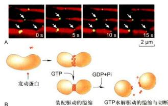
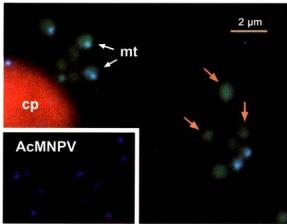
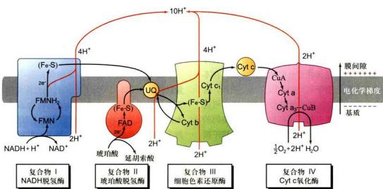

# 第7章 线粒体和叶绿体

<!-- 章节边界按正文内容恢复；原始 MinerU 内容保留如下。 -->

# 线粒体和叶绿体

能量是所有生命活动的基础。真核细胞内存在一类特殊的、由双层膜封闭式包被的细胞器——线粒体和叶绿体，它们在能量的转换和生产中承担着核心的功能。线粒体和叶绿体都携带自身的遗传物质DNA，以原核细胞的编码方式转录合成一些自身需要的RNA与蛋白质；这两种细胞器都以分裂的方式实现增殖；它们的遗传信息以非孟德尔方式遗传给子代。这些结构、行为和遗传学特征表明线粒体和叶绿体具有半自主性，可能是一类起源于内共生的特殊的细胞器。

本章讲述线粒体和叶绿体的基本结构与功能，同时对这两种细胞器在细胞中的行为及调控机制进行初步的讨论。

## 第一节 线粒体与氧化磷酸化

1890年，德国生物学家Altmann首先在光学显微镜下观察到动物细胞内存在一种颗粒状结构，取名为生命小体（bioblast）。1897年，C.Benda将之命名为线粒体（mitochondrion，源于希腊语mito：线，chondrion：颗粒）。在植物细胞中，F.Meves于1904年首次发现了线粒体，从而确认了线粒体是普遍存在于真核细胞内的重要细胞器。

## 一、线粒体的基本形态及动态特征

在动植物细胞中，线粒体是一种高度动态的细胞器，其动态特征包括运动导致的位置和分布的变化以及融合和分裂介导的形态、体积与数目的变化等。

## （一）线粒体的形态、分布及数目

借助光学显微镜，早期的科学家观察到的线粒体正如命名时的取意，呈颗粒或短线状，直径0.3\~1.0 μm，长度为1.5\~3.0 μm。但在许多动、植物的特定细胞或细胞周期的时相中，线粒体的大小和形态可能随着细胞的生命活动呈现出很大的变化。比如，人成纤维细胞中的线粒体可长达40 μm，植物分生组织细胞中会出现环核的片层状线粒体等。

线粒体在细胞内的分布与细胞内的能量需求密切相关。能量需求集中的区域线粒体分布密集，反之较为疏散。已有的证据表明，动植物细胞中的线粒体时刻处于依赖细胞骨架和马达蛋白的运动之中。无论线粒体在细胞中表现为随机还是极性分布，均是各线粒体在运动方向和运动速率上受到调控的一个综合结果，但该调控的深层机制尚待解析。

细胞中线粒体的数目同样呈现动态变化并接受调控。首先，不同类型真核生物细胞中线粒体的数目相差较大，而同一类真核细胞中线粒体的数目则相对比较稳定。比如，衣藻和红藻等低等的真核生物每个细胞只含有一个线粒体，而高等动物细胞内含有数百到数千个线粒体，说明细胞中线粒体的数目受到物种遗传信息的调控。在同一种高等动植物体内，细胞内线粒体数目与细胞类型相关，说明细胞内线粒体的数目随着细胞分化而变化。

## （二）线粒体的融合与分裂

动植物细胞中均可观察到频繁的线粒体融合与分裂现象。这种现象被认为是线粒体形态调控的基本方式，也是线粒体数目调控的基础。多个颗粒状的线粒体融合可形成较大体积的线条状或片层状线粒体，同时后者也可通过分裂形成较小体积的颗粒状线粒体。当融合与分裂的比值大致处于平衡状态时，细胞内线粒体的数目和体积基本保持不变。反之，则会出现线粒体数目的增加或减少。

线粒体数目和体积调控的生物学意义尚不完全清楚。通常认为体积较小的颗粒状线粒体易于依赖细胞骨架的动态运输，而体积较大的线粒体则适合在细胞特定的区域呈现相对静态的分布。这样，线粒体的融合与分裂可能是细胞应对生命活动的需求对线粒体进行合理“排兵布阵”的手段之一。

频繁的线粒体融合与分裂实际上把细胞中所有的线粒体联系成一个不连续的动态整体。在植物细胞中，可以观察到线粒体融合与分裂的偶联现象，即颗粒状或短线状的线粒体融合后随即发生分裂（图7-1）。该过程频繁发生干细胞内的线粒体之间，通常在数十秒内完成。由于其频发性、不同步性和偶联性，这种类型的线粒体融合与分裂并不改变细胞内线粒体的大小及数目，其生物学意义可能在于线粒体之间共享遗传信息。

## 1. 线粒体融合与分裂的分子基础

线粒体的融合与分裂均依赖于特定基因和蛋白质的参与和调控。

参与和调控线粒体融合的基因最早发现于果蝇，取名为 Fzo（fuzzy onion，模糊的葱头）。在野生型果蝇精细胞发育过程中，细胞内的线粒体发生聚集并融合形成一个大体积的球形线粒体。该线粒体膜系统呈同心圆排布，在切片上酷似葱头平切面的结构特征，故被称作“葱头”。“模糊的葱头”是一个果蝇突变体（fzo），其精细胞中的线粒体同样会聚集到一个球形的区域内，但不发生融合（图7-2）。这样，没有融合的线粒体群在显微镜下不呈同心圆的膜系统特征，“模糊的葱头”因而得名。分子遗传学研究结果表明，决定果蝇精细胞线粒体融合的基因（Fzo）编码一个跨膜的大分子GTP酶，定位在线粒体外膜上（图7-2），介导线粒体融合。

  
图7-1 线粒体融合与分裂的偶联  
洋葱表皮细胞内线粒体在约1 min时间内相继发生融合和分裂的模式图。S. Arimura等使用可变色荧光蛋白（Kaede）标记线粒体。红色和绿色的颗粒为不同的线粒体，当它们融合后颜色叠加成为黄色。

进一步的研究发现，与 $Fzo$ 具有同源性的基因家族广泛存在于酵母和哺乳动物的基因组内。这些基因编码结构类似的大分子GTP酶，其核心功能也是介导线粒体融合。可见，线粒体融合的分子机制在动物进化中高度保守。在哺乳动物中，上述大分子GTP酶被称作线粒体融合素（mitofusin），而编码线粒体融合素的 $Fzo$ 同源基因被称作Mfn（如小鼠的Mfn1和Mfn2）。由于线粒体融合与分裂的动态平衡维持线粒体的形态和体积，突变的 $Fzo$ 或Mfn导致线粒体分裂单向发生，细胞内出现线粒体数目增加和体积减小的现象（图7-3）。该现象被称作线粒体片段化。

Fzo 和 Mfn 的发现及其功能的确定为人类认识线粒体的融合现象提供了重要的分子基础。但目前除在酵母中发现了一个与 Fzo1 蛋白相结合的膜间隙蛋白 (Mgm1) 为线粒体融合所必需外，未发现其他与线粒体融合相关的基因和蛋白质。此外，虽然植物细胞中存在频繁的线粒体融合现象，但其基因组中并不存在 Fzo 或 Mfn 的同源基因。

  
图 7-2 “模糊的葱头”与跨膜大分子 GTP 酶的模式结构  
野生型（WT）果蝇精细胞发育过程中线粒体融合形成大体积球形线粒体，突变体（fzo）中线粒体聚集但不融合。（图片获授权）

  
图 7-3 线粒体融合基因突变导致的线粒体片段化  
小鼠细胞 Mfn1 基因野生型（上排）和突变型（下排）的线粒体。注意野生型细胞中蓝色标出的细长线粒体在相对运动中接触并融合，而突变体细胞中的线粒体高度片段化，无融合现象发生。（图片获授权）

线粒体的分裂同样依赖特定基因和蛋白质的参与和调控。研究发现，无论在动物还是植物细胞中，线粒体的分裂都离不开一类发动蛋白（dynamin）。编码这类蛋白质的基因，如酵母中的Dnm1（编码dynamin-1）、大鼠中的Dlp1（编码dynamin-like protein 1）、线虫和哺乳动物中的Drp1（编码dynamin-related protein 1）以及植物细胞中的Adl2B（编码Arabidopsis thaliana dynamin-like protein 2B）突变均会抑制线粒体的分裂，导致细胞中出现结构异常的大体积线粒体。与介导线粒体融合的基因（Fzo和Mfn）相比，线粒体分裂必需的发动蛋白类基因不仅在酵母和动物之间呈现同源性，同时也发现于植物基因组中，说明线粒体分裂的分子机制在整个真核生物的演化中具有高度的保守性。

有趣的是，线粒体分裂必需的发动蛋白类蛋白同样是一类大分子GTP酶。尽管不同类型的大分子GTP酶具有各自的特征性结构，但它们的共性是具有一个相似的GTP酶结构域。除了线粒体的融合与分裂外，这类大分子GTP酶在细胞中还介导各种膜相细胞器的融合与断裂，同时在细胞内膜泡转运的过程中扮演重要的角色。目前，人们已将真核生物基因组中编码大分子GTP酶的所有基因归类为一个基因超家族。该超家族编码的所有大分子GTP酶被统称为发动蛋白相关蛋白（dynamin-related protein）。依照这种新的归类，介导线粒体融合（Fzo和Mfn）及分裂（Dnm1、Dlp1和Drpl）的基因均被列为发动蛋白相关蛋白基因超家族的成员。

线粒体分裂必需的 Dnm1、Dlp1 和 Drp1 蛋白结构中没有线粒体膜的定位结构域。这些分子大部分以可溶性蛋白的形式存在于细胞质中。在线粒体分裂时，这类GTP酶分子在其他蛋白的介导下有序地排布到线粒体分裂面的外膜上（图7-4），组装成环线粒体的纤维状结构。该结构与线粒体膜间隙及内膜下的未知蛋白质协同缢缩，致使线粒体膜发生环形内陷并最终一分为二。如果相关基因发生突变，线粒体分裂过程中的膜内陷和膜断裂便会出现障碍。

由于线粒体分裂相关的发动蛋白不具备膜定位能力，所以如何将它们“招募”到线粒体表面适当位置是线粒体分裂调控分子机制的重要环节。两种线粒体分裂必需的蛋白质——Fis1和Mdv1，在这个环节中发挥着中心的作用。其中Fis1的C端具有线粒体外膜的跨膜结构，保证该蛋白N端朝向细胞质定位于线粒体外膜；而Mdv1同时结合Fis1和Drp1（或Dnm1、Dlp1），以“桥”的方式将Drp1（或Dnm1、Dlp1）定位到线粒体外膜上。除此之外，线粒体分裂还需要endophilin B1、MFF（mitochondrial fission factor）以及GDAP1（ganglioside-induced differentiation associated protein 1）等一些蛋白质的参与。其中GDAP1突变还会引起线粒体疾病（Charcot-Marie-Toothe disease type 4A）。可见，线粒体分裂的分子机制非常复杂且与线粒体的功能密切相关。

## 2. 线粒体融合与分裂的结构动力基础

线粒体的融合与分裂都是一个“动”的过程，和细胞内其他的动态行为（如染色体的移动）一样，需要特定的力学机制予以保证。介导线粒体融合与分

  
图 7-4 线粒体分裂必需蛋白质（Dnm1、Drp1）的定位

A. 线虫细胞中 Drp1 的活细胞定位（线粒体标记为红色，Drp1 标记为绿色）。注意线粒体分裂的位点上出现 Drp1。B. 发动蛋白纤维组装及分解驱动线粒体分裂的模式图。（图片获授权）

  
图7-5 红藻线粒体和叶绿体的分裂过程及分裂环模式图  
红藻细胞含一个线粒体和一个叶绿体。在细胞增殖过程中，叶绿体（红色自发荧光）率先启动分裂，随后线粒体启动分裂，最后细胞核分裂。模式图中红色的环状结构示线粒体和叶绿体的分裂环。C：叶绿体；M：线粒体；N：细胞核。

裂的分子力学机制被称为线粒体的融合与分裂装置(fusion and division apparatus)。这些装置实际上是指参与线粒体融合或分裂的所有蛋白质在细胞内组装而成的功能单位。

借助现有的细胞生物学方法观察线粒体融合时，除了发现线粒体融合素家族的GTP酶（Fzo和Mfn）均匀分布于线粒体外膜之外，人们并未观察到结构上的线粒体融合装置，推测线粒体融合的细胞动力学机制可能比较简单。相比之下，线粒体分裂装置的细胞结构特征则非常突出。借助透射电子显微镜，人们在动植物细胞的线粒体上均发现了环绕线粒体的蛋白质缢缩结构，称为线粒体分裂环（mitochondrial division ring）（图7-5）。线粒体分裂环又分为外环和内环。其中外环位于线粒体外膜的表面，暴露于细胞质；而内环则位于线粒体内膜的下面，暴露在线粒体基质内。在线粒体分裂过程中，以分裂环为主体的线粒体分裂装置呈现有序的动态变化，说明线粒体分裂的细胞动力学机制较为复杂。

线粒体的分裂表现为线粒体内外膜同时发生内陷并最终在内陷处被分断的过程。这个连续的过程可被人为地分为三个阶段：①早期；线粒体分裂的准备阶段，膜内陷尚未发生；②中期；线粒体膜呈现环形内陷并逐渐加深；③后期；线粒体膜被分断，线粒体一分为二。在线粒体分裂的早期，内环首先形成于线粒体内膜下，随后在线粒体的外膜上面出现外环。当内环和外环分别形成时，线粒体膜上的着环区域开始发生内陷，线粒体分裂进入中期。随着线粒体膜内陷程度的加深，外环不断加粗，而内环始终保持细薄的状态。当线粒体分裂进入后期时，内环消失，外环则一直保留到分裂结束。

目前，线粒体分裂装置（分裂环）的蛋白质基本组成尚不清楚。上面介绍的发动蛋白家族蛋白（Dnm1、Dlp1或Drp1）只出现于分裂的中期稍后及后期的外环中，推测参与深度缢缩及膜分断，是线粒体分裂外环的重要成分之一。此外，在红藻细胞的线粒体分裂过程中，一种称作FtsZ的大分子GTP酶（原核细胞分裂的必需蛋白）先干内环出现在线粒体内膜下的分裂位置并形成环状分布。但随着线粒体分裂进程的加深，FtsZ蛋白的密度逐渐减小，推测其可能是招募内环蛋白的重要分子。有趣的是，动物及高等植物的基因组中并未发现产物定位于线粒体的FtsZ同源基因，说明FtsZ蛋白的功能在演化过程中可能被另外的未知蛋白所取代。由于线粒体分裂装置的基本组成以及决定其形成位置的分子机制还不得而知，线粒体分裂在今后一段时期内仍将是细胞生物学中令人关注的重要领域之一。

## 3. 线粒体融合与分裂的生物学意义

线粒体在细胞内发生融合和分裂的现象发现已久，但该现象的生物学意义尚待解析。一般认为，线粒体的基质中含有高水平的氧化自由基，容易导致DNA损伤。因此，线粒体可能通过不断的融合和分裂来平衡这种损伤，以保证部分遗传物质受损的线粒体可以正常工作。

除此之外，线粒体的融合与分裂显然也是线粒体大小、数目及分布调控的基础。拟南芥根尖分生细胞中存在伴随细胞周期的线粒体融合与分裂：在有丝分裂的 $G_{2}$ 期，细胞内大量的颗粒状线粒体融合形成巨大的线粒体片层，环绕在细胞核周围；之后这种大片层状线粒体再度分裂，形成颗粒状线粒体，分散到细胞质中。这种规律性的线粒体融合与分裂可能是一种细胞调控，使线粒体的数量、大小和分布变化更有效地对应细胞内的能量需求与供给。

最近的研究发现，植物体细胞中的线粒体数目远大于细胞中的线粒体 DNA 拷贝数。比如，拟南芥的叶肉细胞拥有 500～1 000 个线粒体，而每个细胞中却只存在 50～70 个线粒体 DNA 拷贝（测序结果展示的 366.9 kb 全长环形 DNA 分子为 1 个拷贝）。这个结果说明植物细胞中多个线粒体共享 1 个线粒体 DNA 分子。进一步的显微成像结果表明，拟南芥叶肉细胞中多数的线粒体并不携带线粒体 DNA，而部分携带 DNA 的线粒体也只携带 100 kb（约 1/3 个拷贝）左右的 DNA 分子（图 7-6）。因此，植物细胞中的线粒体遗传信息在线粒体之间呈现出显著的不均等分布，需要依赖频繁的线粒体融合与分裂实现遗传信息的共享。同时，上面的结果还表明，植物线粒体 DNA 测序获得的全长 DNA 分子序列可能是人为拼接的结果，而实际存在于线粒体中的 DNA 分子则可能是该序列的不同的组成部分。

  
图7-6 荧光显微镜下观察到的拟南芥叶肉细胞  
经 DAPI 染色后，可以观察到线粒体和叶绿体 DNA 的荧光信号。注意多数线粒体（橙色箭头指示）中无 DNA 信号。同时染色观察的改构苜蓿银纹夜蛾核型多角体病毒（Autographa californica multiple nucleopolyhedrovirus, AcMNPV）为一种杆状 DNA 病毒，每个颗粒含 143 kb 的病毒 DNA 分子。cp：叶绿体；mt：线粒体（绿色荧光蛋白标记）。

## 二、线粒体的超微结构

虽然线粒体的形态和大小表现出多种变化，但其基本结构均由内外两层单位膜封闭包裹而成。线粒体的外膜（outer membrane）平展，起界膜作用；而内膜（inner membrane）则向内折叠延伸形成蜡（cristae）。在不同的真核生物中，线粒体蜡的形态也呈现丰富的变化。比如，动物细胞中常见的“袋状蜡”是由内膜规则性折叠而成，而植物细胞线粒体的“管状蜡”则是内膜不规则内陷形成的弯曲小管（图7-7）等。

存在于外膜和内膜之间的空间被称为膜间隙(intermembrane space)。通常情况下，膜间隙的宽度比较稳定。线粒体内膜之内空间称之为基质（matrix）（图7-7C）。近年来的研究发现，线粒体外膜与内质网或细胞骨架等其他细胞组分之间可以通过特定的蛋白质形成结构和功能的联系，而线粒体内膜与外膜之间也由一些蛋白质形成随机的点状连接。

## (一) 外膜

外膜指线粒体最外面的一层平滑的单位膜结构，厚约6 nm。外膜中蛋白质和脂质约各占50%。外膜上分布着由孔蛋白（porin）构成的桶状通道，直径为2\~3 nm，可根据细胞的状态可逆性地开闭。当孔蛋白通道完全打开时，可以通过分子量高达5 000的分子。ATP、NAD、辅酶A等分子量小于1 000的物质均可自由通过外膜。由于外膜的通透性很高，膜间隙中的离子

  
图 7-7 人淋巴细胞线粒体（A）、拟南芥幼叶线粒体（B）的超微结构及线粒体超微结构的模式图（C）（A 图由 Devrim Acehan 博士和 David Stokes 博士惠赠；B 图由张泉博士惠赠）

  
图 7-8 ATP 合酶的负染电子显微图像（A）及分子结构模式图（B）  
线粒体内膜在超声波作用下形成亚线粒体小泡，经电子负染后可以观察到其表面排布的线粒体基粒——ATP合酶（箭头指示）。（图片获授权）

环境几乎与胞质相同。

外膜上还分布有一些特殊的酶类，如参与肾上腺素氧化、色氨酸降解、脂肪酸链延长的酶，表明外膜不仅参与膜磷脂的合成，还可对将在线粒体基质中彻底氧化的物质进行先行初步分解。外膜的标志酶是单胺氧化酶（monoamine oxidase）。

## （二）内膜

内膜是位于外膜内侧的一层单位膜结构，厚6\~8 nm。相对膜而言，内膜有很高的蛋白质/脂质比（质量比≥3:1）。内膜缺乏胆固醇，富含心磷脂(cardiolipin，约占磷脂含量的20%)。这种组成决定了内膜的不透性(impermeability)，限制所有分子和离子的自由通过，是质子电化学梯度的建立及ATP合成所必需的。细菌的质膜也具有线粒体内膜的结构特征，推测线粒体内膜与细菌质膜具有演化上的关联性。

线粒体内膜向内延伸形成嵴，大大增加了内膜的面积。据测算，肝细胞线粒体内膜的面积相当于外膜的5倍，细胞质膜的17倍。同时，嵴的形状、数量和排列与细胞种类及生理状况密切相关，如心肌和骨骼肌线粒体嵴的数量相当于肝细胞线粒体嵴的3倍。这种差异可能反映了不同组织细胞对ATP的需求。通常情况下，能量需求较多的细胞中线粒体嵴的数量也较多。

线粒体内膜是氧化磷酸化的关键场所。早期的研究发现内膜的嵴上存在许多规则排列的颗粒，称为线粒体基粒（elementary particle）。实验证明这些颗粒即为 ATP 合酶（ATP synthase）（图 7-8）。内膜的标志酶是细胞色素氧化酶。

## （三）膜间隙

膜间隙的宽度通常维持在6\~8 nm。当细胞活跃呼吸时，膜间隙可显著扩大。膜间隙内的液态介质含有可溶性的酶、底物和辅助因子。腺苷酸激酶是膜间隙的标志酶，其功能为催化ATP分子末端磷酸基团转移到AMP，生成ADP。

## （四）线粒体基质

线粒体基质为富含可溶性蛋白的胶状物质，具有特定的 pH 和渗透压，催化线粒体重要生化反应，如三羧酸循环、脂肪酸氧化、氨基酸降解等相关的酶类存在于基质中。此外，基质中还含有 DNA、RNA、核糖体以及转录、翻译所必需的重要生物大分子。

从上述结构特征可以看出，线粒体的固形成分主要为蛋白质和脂质。其中脂质占线粒体干重的20%\~30%，而蛋白质中包括了催化线粒体生化反应的主要酶类。

## 三、氧化磷酸化

线粒体的主要功能是高效地将有机物中储存的能量转换为细胞生命活动的直接能源 ATP。人体内的细胞每天要合成数千克 ATP，大约 95% 由线粒体产生。因此，线粒体被誉为细胞的“动力工厂”(power plant)。线粒体通过氧化磷酸化作用进行能量转换，其内膜上的 ATP 合酶、电子传递及内膜本身的理化特性为氧化磷酸化提供了必需的保障。

## (一) ATP 合酶

在线粒体中，最终生成 ATP 合酶。在电子显微镜下，ATP 合酶的分子由球形的头部和柱形的基部组成，头部朝向线粒体基质，规则性地排布在内膜下并以基部与内膜相连（图 7-8A）。由于电子密度的差别不明显，尽管 ATP 合酶头部的直径达到了 9 nm，在常规透射电镜的线粒体超薄切片上仍难以分辨，须借助负染色电镜技术。J. T. Stasny 和 F. L. Crane 于 1964 年分离了线粒体内膜，用超声波处理成“亚线粒体小泡”后，利用负染色技术成功地观察到了 ATP 合酶的分布及分子构型，为后续的线粒体功能研究提供了珍贵的初始资料。

由于 ATP 合酶在 ATP 生成中处于重要地位，其分子结构与分子动力学机制一直是线粒体研究的重要组成部分。在生化研究中，ATP 合酶的头部被称为偶联因子 1（coupling factor 1, $F_{1}$ ），由 5 种类型的 9 个亚基组成，组分为 $\alpha_{3}\beta_{1}\gamma\delta\delta$ 。在空间上，3 个 $\alpha$ 亚基和 3 个 $\beta$ 亚基交替排列，形成一个“橘瓣”状结构（图 7\~8B）。其中 $\alpha$ 和 $\beta$ 亚基具有核苷酸结合位点，但只有 $\beta$ 亚基的结合位点具有催化 ATP 合成或水解的活性。 $F_{1}$ 的功能是催化 ATP 合成，在缺乏质子梯度情况下则呈现水解 ATP 的活性。 $\gamma$ 亚基的一个结构域构成穿过 $F_{1}$ 的中央轴，另一结构域与 3 个 $\beta$ 亚基中的一个结合。 $\varepsilon$ 亚基协助 $\gamma$ 亚基附着到 ATP 合酶的基部结构 $F_{0}$ 上。 $\gamma$ 与 $\varepsilon$ 亚基具有很强的亲和力，结合形成“转子”（rotor），旋转于 $\alpha_{3}\beta_{1}$ 的中央，调节 3 个 $\beta$ 亚基催化位点的开放和关闭。 $\delta$ 亚基为 $F_{1}$ 和 $F_{0}$ 。相连接所必需。

ATP 合酶的基部结构被称作 $F_{n}$ [表示对寡酶素(oligomycin)敏感的因子]。与亲水性的 $F_{1}$ 相比， $F_{0}$ 是一个疏水性的蛋白复合体，嵌合于线粒体内膜，由 a、b、c 3 种亚基按照 $ab_{5}\delta\sim15$ 的比例组成跨膜的质子通道。多拷贝的 c 亚基形成一个环状结构。a 亚基和 b 亚基形成的二聚体排列在 c 亚基十二聚体形成的环的外侧。同时，a 亚基、b 亚基及 $F_{1}$ 的 $\delta$ 亚基共同组成“定子”(stator)，也称外周柄。

在线粒体 ATP 合酶的分子中， $F_{1}$ 和 $F_{0}$ 通过 “定子”和“转子”的双重作用形成连接。合成或水解ATP时，“转子”受到通过 $F_{0}$ 的 $H^{+}$ 流驱动，于 $\alpha_{3}\beta_{3}$ 的中央旋转，依次与3个 $\beta$ 亚基作用，调节 $\beta$ 亚基催化位点的构象变化；“定子”在一侧将 $\alpha_{3}\beta_{3}$ 与 $F_{0}$ 连接起来并使之保持固定的位置。因此， $F_{0}$ 在ATP合酶中的作用是将跨膜质子驱动力转换成扭力矩（torsion），驱动“转子”旋转。

基于 ATP 合酶的分子结构，Boyer 于 1979 年提出了结合变构机制（binding change mechanism），以解释质子流驱动 ATP 合成的分子过程。该机制认为：① 质子梯度的作用并不是生成 ATP，而是使 ATP 从酶分子上解脱下来。② ATP 合酶上的 3 个 β 亚基的氨基酸序列是相同的，但它们的构象却不同。即在任一时刻，3 个 β 催化亚基以 3 种不同的构象存在，从而使它们对核苷酸具有不同的亲和性（图 7-9）。③ ATP 通过旋转催化（rotational catalysis）而生成。在此过程中，通过 Fₐ “通道” 的质子流引起 c 亚基环和附着于其上的 γ 亚基纵轴（中央轴）在 α₁β₂ 的中央进行旋转。旋转的动力来自于 Fₐ 质子通道中的质子跨膜运动。由于在外侧有 “定子”（外周柄）的固定作用，合酶的外周部分相对于膜表面是静止的。“转子” 的旋转在 360° 范围内分三步发生，大约每旋转 120°，γ 亚基就会与一个不同的 β 亚基相接触。这种接触迫使 β 亚基转变成 β-空缺构象。γ 亚基的一次完整旋转（360°）必然使每一个 β 亚基都经历三种不同的构象改变，导致 3 个 ATP 生成并从酶表面释放。ATP 合酶中使化学能转换成机械能的效率几乎达 100%，是迄今发现的自然界最小的“分子马达”。

  
图 7-9 ATP 合酶的 “结合变构” 模型  
L: 松弛构象 (loose); T: 紧密构象 (tight); O: 开放构象 (open)。

## （二）质子驱动力

线粒体 ATP 合酶在质子流的推动下实现分子内“转子”的旋转，驱动 ATP 的生成。依照这个模型，线粒体膜间隙中的质子浓度必须高于基质中的质子浓度，才有可能产生质子的定向流动。也就是说，膜间隙与基质之间质子浓度梯度的形成与保持是线粒体合成 ATP 的基本前提。

研究结果表明，线粒体内膜上的电子传递为膜间隙与基质之间的质子梯度提供了保证。在电子传递的过程中，高能电子的能量逐级释放，基质中的质子则借助高能电子释放的能量被不断地定向转运到膜间隙。这个过程所需的 $H^{+}$ 和高能电子来源于线粒体内的三羧酸循环（tricarboxylic acid cycle, TCA循环）。其产物NADH在NADH脱氢酶作用下脱氢形成 $H^{+}$ 和高能电子（NADH→NAD $^{+}$ +H $^{+}$ +2c $^{-}$ ）（图7-10）。可见线粒体承担的能量转换实质上是把基于质子密度梯度（pH差）的质子驱动力（proton motive force）转换为ATP分子中的高能磷酸键。因此，来源于TCA循环的高能电子是线粒体合成ATP的基本能源，而电子传递过程承担了重要的介导作用。

经过电子传递，高能电子携带的能量被逐级卸载，成为低能电子。由于低能电子最终被 $\mathrm{O}_2$ 分子接收，生成 $\mathrm{H}_2\mathrm{O}$ （图7-10），所以电子传递的化学本质相当于一个氧化反应。ATP合成过程中的磷酸化（ADP+Pi→ATP）反应不仅以电子传递为基础，而且与之偶联发生，因此线粒体中ATP的形成过程也被称为氧化磷酸化（oxidative phosphorylation）。这个过程不仅基于线粒体内膜上的电子传递和ATP合酶，同时依赖于线粒体内膜的物理特性。

由于 $O_{2}$ 分子获得电子生成水时只接受低能电子，所以电子传递实际上是一个高能电子释放多余能量的自然过程，同时质子的转运恰好利用了该过程释放的能量，因此电子传递不需要额外能量的驱使。

## （三）电子传递链

化学和分子生物学实验的结果表明，高能电子释放多余能量的过程是分级分步完成的。在电子传递的每一个能级上，接受和释放电子的分子或原子被称为电子载体（electron carrier），而由电子载体组成的电子传递序列被称为电子传递链（electron transport chain），也称作呼吸链（respiratory chain）。

参与电子传递链的电子载体有5类：黄素蛋白、细胞色素、泛醌、铁硫蛋白和铜原子。它们的共同特征是具有氧化还原作用。

实验证明，呼吸链中的电子载体按严格的顺序和方向排列，规律为氧化还原电位由低向高。其中 $NAD^{+}/NADH$ 的氧化还原电位值最低 ( $E' = -0.32 V$ )，而 $O_{2}/H_{2}O$ 的氧化还原电位最高 ( $E_{0}' = +0.82 V$ )。这种渐高的排序是因为氧化还原电位较低的电子载体具有较强的电子提供能力，因而较容易作为还原剂而处于传递链的前面位置。在呼吸链中，一个电子载体从前面一个电子载体上获得电子而被还原，随后将电子传递给下一个载体而被氧化，周而复始。

  
图 7-10 线粒体产能（ATP）的原理示意图

细胞内储能的大分子化合物糖和脂肪经酵解或分解形成丙酮酸和脂肪酸。后者进入线粒体后进一步分解成乙酸 CoA。乙酰 CoA 通过 TCA 循环，产生含有高能电子的 NADH 和 FADH $_{2}$ （后者能图示）。这两种分子中的高能电子通过电子传递链（蓝基带箭头曲线表示）最终传递给氧，生成水。在电子传递的过程中，内膜上的电子传递复合物将基质中的质子转运至膜间隙，形成 ATP 合酶工作所需的质子梯度。除了糖和脂肪以外，细胞内的储能大分子氨基酸也可被分解为丙酮酸或乙酰 CoA，加入 TCA 循环（未图示）。由于 NADH 不能通过线粒体内膜，细胞质中糖解解产生的 NADH 不能进入线粒体。但其分子上的电子可以通过“穿梭途径”进入线粒体并加入电子传递链。

## （四）电子传递复合物

除了上面的电子载体以外，线粒体内膜上的电子传递还需要与这些载体分子互作的蛋白质及多肽参与。将线粒体内膜破坏后，可从中分离出4种膜蛋白复合物，分别命名为复合物I、II、III和IV。实验证明，每一种复合物催化电子在呼吸链中的一段传递。如：复合物I和II分别催化电子从供体NADH和FADH $_{2}$ 传递到泛醌(UQ)；复合物III催化电子从泛醌传递到细胞色素c(Cyt c)；复合物IV将电子从Cyt c转移到O $_{2}$ 。这样，完整的电子传递由上述4种膜蛋白复合物分段催化完成（图7-11）。这些分布于线粒体内膜、含有电子传递催化中心的膜蛋白复合物被称作电子传递复合物。

膜蛋白复合物的分子解析结果表明，哺乳动物的4个电子传递复合物包含了约70种不同的蛋白质或多肽。其中一部分多肽并不参与电子传递，可能贡献于复合物的结构或构型。

(1) 复合物 I 亦称 NADH-CoQ 还原酶或 NADH 脱氢酶。哺乳动物的复合物 I 由 42 个不同的多肽组成，总分子质量接近 1000 kDa。其中 7 个疏水的跨膜多肽由线粒体基因编码。复合物 I 含一个带有 FMN 的黄素蛋白和至少 6 个铁硫中心。高分辨率电镜显示复合物 I 呈 L 形，一侧臂嵌于膜上，另一侧臂伸至基质。后者催化1对电子从NADH传递给泛醌。复合物I每传递1对电子伴随4个质子从基质转移到膜间隙，可理解为一种由高能电子释放能量驱动的质子泵。

(2) 复合物Ⅱ 亦称琥珀酸 -CoQ 还原酶或琥珀酸脱氢酶，由 4 种不同的蛋白质组成，总分子质量为 140 kDa。复合物Ⅱ是三羧酸循环中唯一一个结合在膜上的酶，催化来自琥珀酸的 1 对电子经 FAD 和 Fe-S 传给泛醌而进入呼吸链。该步电子传递释放的能量较少，不伴随质子的跨膜转移。

(3) 复合物Ⅲ 亦称 CoQ-Cyt c 还原酶、细胞色素还原酶或 Cyt bc₁ 复合物（简称 bc₁），由 10 个多肽组成，总分子质量为 250 kDa。该复合物含 1 个 Cyt b（线粒体基因编码）、1 个 Cyt c₁ 和 1 个铁硫蛋白，催化电子从泛醌传给 Cyt c₁。复合物Ⅲ每传递 1 对电子伴随 4 个质子从基质转移到膜间隙。

(4) 复合物Ⅳ亦称细胞色素氧化酶或Cyt c氧化酶。哺乳动物的复合物Ⅳ由13个多肽组成，总分子质量约为204 kDa。其中3个疏水性多肽由线粒体基因编码。该复合物共有4个氧化还原中心：Cyt a、Cyt a₃及2个铜离子（CuA，CuB），催化电子从Cyt c传给氧，生成H₂O。复合物Ⅳ每传递1对电子从基质中摄取4个H⁺，其中2个用于水的形成，另2个被转移至膜间隙。

  
图 7-11 线粒体内膜电子传递复合物的排列及电子和质子传递示意图

## 四、线粒体与疾病

作为一种半自主性细胞器，线粒体的氧化磷酸化、DNA复制、RNA转录、蛋白质合成等生命活动据推测需要多达1000～2000种蛋白质。目前已经确定在线粒体中发挥功能的蛋白质有近900种，其余的有待进一步探究。如果编码这些蛋白质的基因发生了有害的突变，蛋白质的功能就有可能受到影响甚至丧失。在这种情况下，线粒体的生命活动可能出现障碍，导致动植物机体发生疾病。在医学上，由线粒体功能障碍引起的疾病被称为线粒体病（mitochondrial disease）。

已知的人类线粒体病有100多种，常见的有脑坏死、心肌病、肿瘤、不育、帕金森综合征等。由于肌肉、心脏和大脑等组织需要线粒体提供相对大量的能量供给，线粒体病的症状较多地表现为这些组织的异常病变。例如，曾经在我国一部分地区高发的克山病就是一种心肌线粒体病。它是以心肌损伤为主要病变的地方性心肌病，因缺硒而引起。由于硒对线粒体膜具有不可替代的稳定作用，缺硒的患者心肌线粒体出现膨胀，嵴稀少且不完整，膜电位下降，膜流动性减低。同时，患者线粒体中的琥珀酸脱氢酶、细胞色素氧化酶和ATP合酶活性都有明显降低，导致电子传递和氧化磷酸化偶联的效率受到显著影响。

线粒体中许多功能蛋白复合物（如ATP合酶、电子传递复合物）是由线粒体基因和核基因编码的蛋白质亚基共同组成的。因此，线粒体病既有可能来源于线粒体DNA的突变，也有可能来源于核DNA的突变。此外，线粒体内的化学反应呈链式进行（如电子传递链），催化不同环节的酶类缺失或缺陷往往导致类似的线粒体功能障碍。这样，即使症状非常类似的线粒体病，在不同的患者中也有可能来源于不同的基因突变。例如，常见的Leigh综合征（亚急性坏死性脑脊髓病）既有可能由线粒体编码的基因突变引起，也可能由细胞核编码的其他多个基因突变造成。区别线粒体病致病基因核-质性质的简单方法是分析病症的遗传规律。线粒体DNA（基因）突变导致的线粒体病呈单纯的母系遗传。

人类的线粒体基因组只编码13种蛋白质，约相当于线粒体生命活动所需蛋白质总数的 $1\%$ 。但已知的线粒体病的绝大多数来源于线粒体基因组编码的蛋白质缺失或缺陷，表明线粒体DNA发生突变的频率远高于细胞核DNA。出现这样的现象可能与呼吸链产生的自由基相关。据测算，机体 $95\%$ 以上的氧自由基来自线粒体的呼吸链。正常情况下氧自由基可被线粒体中的 $\mathrm{Mn}^{2+}$ -SOD（超氧化物歧化酶）清除。但机体衰老及退行性疾病时 $\mathrm{Mn}^{2+}$ -SOD活性降低，导致线粒体中氧自由基积累。实验结果表明，氧自由基的过度积累导致线粒体DNA的损伤或突变。

植物的线粒体基因组编码较多的蛋白质（如拟南芥线粒体 DNA 编码 122 种蛋白质）。虽然这些蛋白质的变异同样导致个体缺陷，但植物材料中很少使用线粒体病的概念。农业生产中广为利用的细胞质雄性不育，事实上是一种典型的植物线粒体病。由于该性状具有极高的生产利用价值，其分子机制的研究受到了国内外长期和广泛的关注。中国科学家刘耀光的研究组 2006 年首先破解了水稻细胞质雄性不育及其恢复的机制，他们发现了线粒体 DNA 特定部位重组产生编码毒性多肽的可读框 (Orf79)，其产物在花粉线粒体中的积累导致雄性不育的规律；同时，研究还发现了恢复系中 Rfla 和 Rflb 基因编码枝酶，通过降解 Orf79 mRNA 的方式解除花粉败育的不育系恢复机制。

本节着重介绍了线粒体在真核细胞能量代谢中的重要作用。事实上，除了氧化磷酸化产生ATP以外，线粒体还参与许多其他非常重要的生命活动过程，如细胞氧化还原电位的调节、信号转导、细胞凋亡以及细胞电解质平衡等。相关内容见本教材的其他章节。

## 第二节 叶绿体与光合作用

叶绿体（chloroplast）是植物细胞中另一种承担能量转换的细胞器。叶绿体内进行的光合作用是自然界最重要的化学反应。地球上的绿色植物通过光合作用将太阳能转化为生物能源的产能高达2200亿吨/年，相当于全球每年能耗的10倍。可见，叶绿体及其光合作用为地球上包括人类在内的大多数生物提供了必需的能源。由于光合作用将空气中的 $CO_{2}$ 转换为高能有机碳链，绿色植物中的叶绿体同时还承担着回收大气中 $CO_{2}$ 的重要作用，受到了全世界的广泛关注。在21世纪人类面临的主要挑战中，粮食和环境问题均涉及叶绿体及光合作用。因此，叶绿体与光合作用的研究在理论和生产上具有重要的意义。

A  
  
图7-12 光学显微镜及荧光显微镜下观察到的叶绿体

## 一、叶绿体的基本形态及动态特征

在植物细胞中，叶绿体也是一种动态的细胞器。这种动态表现为光调控下的分布和位置变化、基质小管介导的相互连接、伴随分化和去分化的形态变化以及叶绿体分裂导致的数目变化等。

## （一）叶绿体的形态、分布及数目

在植物细胞中，叶绿体是最容易观察到的细胞器。这是因为叶绿体中含有叶绿素，与透明的细胞质之间呈现较大的反差。同时，叶绿体体积较大，借助普通光学显微镜的中低倍物镜即可清晰分辨。在高等植物的叶肉细胞中，叶绿体呈凸透镜或铁饼状，直径为5\~10 μm，厚2\~4 μm（图7-12）。由于叶肉细胞内的大部分空间被液泡占据，叶绿体分布在细胞质膜与液泡间薄层的细胞质中，呈平层排列。通常情况下，高等植物的叶肉细胞含20\~200个叶绿体。

高等植物的叶片生长平展后，叶肉细胞内叶绿体的体积和数目相对保持稳定。在环境条件不变的情况

A. 拟南芥叶肉细胞原生质体光学显微照片。焦面置于细胞中部时，观察到的叶绿体呈两渐渐变的条形（上图箭头）。而将焦面移动到细胞顶部时，观察到的叶绿体形态的近图形（下图箭头）。可见，叶绿体的立体结构应与心透镜或铁饼相似。B. 将原生质体细胞质平铺并经 DAPI 染色后的荧光显微形状。红色为叶绿素的自发荧光。当细胞质平铺为一薄层时，叶绿体的页面观均近圆形。此外，经 DAPI 染色后的叶绿体中可以观察到叶绿体 DNA 颗粒状荧光（红色箭头）。同时，细胞质可以观察到线粒体 DNA 的荧光信号（蓝色箭头）。（胡迎春博士惠赠）

下，成熟叶肉细胞中罕见有关叶绿体分裂与融合的报道，这种数目和体积的稳定性有别于线粒体。但细胞内的叶绿体仍呈现动态特征。首先，叶绿体在细胞膜下的分布依光照情况而变化。光照较弱时，叶绿体会汇集到细胞顶面，以最大限度地吸收光能，保证高效率的光合作用；而光照强度很高时，叶绿体移动到细胞侧面，以避免强光的伤害（图7-13）。叶绿体通过位移避开强光的行为称为躲避响应（avoidance response）。相反，在弱光下叶绿体汇集到细胞受光面的行为称作积聚响应（accumulation response）。

叶绿体在细胞内位置和分布受到的动态调控称为叶绿体定位（chloroplast positioning）。由于光照强度保持稳定状态时叶绿体的分布和位置不呈现明显的变化，叶绿体定位至少包括两个必需的细胞动力学环节；叶绿体的移动及移动后在新的最适位置上的“锚定”。化学处理破坏细胞内的微丝骨架后，叶绿体定位出现异常，说明叶绿体的运动和位置维持需要借助微丝骨架的作用。在拟南芥的叶肉细胞中，一个被命名为Chup1（chloroplast unusual positioning 1）的微丝结合蛋白为叶绿体正常定位所必需。编码该蛋白质的基因（Chup1）

  
图7-13 光照强度对叶绿体分布及位置影响的示意图

野生型（WT）拟南芥叶片呈深绿色。对叶片的一部分（整体遮光，中部留出一条窄缝）强光照射1 h后，被照射的窄缝处变成浅绿色。这是由于细胞中的叶绿体发生了位置和分布的变化，以减少强光的伤害。在一种叶绿体定位异常的突变体（chup1）中，光照对叶绿体的位置和分布失去影响。

突变后，叶绿体呈现定位异常（图7-13）。研究结果显示，Chup1定位于叶绿体外膜表面，分子质量约112 kDa。由于分子上存在肌动蛋白结合域，Chup1很可能是叶绿体与微丝骨架之间实现连接的重要蛋白质，在以微丝骨架为依托的叶绿体定位过程中发挥重要的作用。

与动物相比，植物缺乏主动运动能力。其适应和抵御环境胁迫的机制更多地体现在细胞内独特的生命活动，如叶绿体定位。目前，在介导细胞器运动的马达蛋白中未发现叶绿体特异的马达蛋白。据推测，叶绿体有可能依靠Chup1等蛋白质与微丝骨架形成连接，随着微丝骨架的动态变化而发生位移。

除了位置和分布的变化以外，细胞中叶绿体的动态行为还表现于叶绿体之间的动态连接。与线粒体不同的是，叶肉细胞内罕见叶绿体之间的相互融合。但叶绿体可以通过其内外膜延伸形成的管状凸出（基质小管，stroma-filled tubule或stromule）实现叶绿体之间的相互联系（图7-14）。用GFP标记叶绿体膜后，荧光显微镜下可以观察到基质小管之间频繁的融合与分断。这种动态的融合与分断有助于叶绿体实现实时的物质或信息交换。因此，与线粒体相似，细胞内的叶绿体仍然可以被视作一个不连续的动态整体。实验结果显示，基质小管

B  
  
图 7-14 叶绿体及原质体膜向外延伸形成的柔性管状结构——基质小管

该结构具双层膜，分别为叶绿体内膜和外膜的直接延伸。由于叶绿体（或质体）基质随小管延伸，故名基质小管（箭头所指）。A. GFP 标记叶绿体膜后荧光显微镜下观察到的基质小管。B. 三维重构显示的拟南芥卵细胞原质体及复杂的基质小管网络。CP：叶绿体；PP：原质体。（图片获授权）

还可能具备其他重要的细胞学功能，比如将叶绿体代谢中产生的废物输送到液泡中。这些功能的背后尚有许多科学问题值得深入研究。

## （二）叶绿体的分化与去分化

叶绿体仅存在于植物茎叶等绿色组织的细胞内。未发芽的种子（胚）细胞中没有叶绿体。在种子萌发过程中，子叶、叶鞘和真叶细胞中的原质体（proplastid）相继分化为叶绿体。这种分化依赖于光照。植物在黑暗条件下生长时，细胞中原质体不能形成叶绿体，幼苗呈黄色。可见，叶绿体是原质体的一种分化方式。在储藏组织（如块根、块茎和胚乳）和一些其他的白化组织中，质体以造粉质体（amyloplast）或白色体（etioplast）的形式存在。

叶绿体分化于幼叶的形成和生长阶段。因此，从生长中的植物顶芽纵切片上，可以观察到分生细胞中的原质体分化形成叶绿体的连续过程。在形态上，叶绿体的分化表现为体积的增大、内膜系统的形成和叶绿素的积累。而在生化和分子生物学上，则体现为叶绿体功能所必需的酶、蛋白质、大分子的合成、运输及定位。据推测，叶绿体的正常工作需要数千个基因的支持。可见叶绿体分化是一个十分复杂的过程。在该过程中，某一个基因的突变或异常往往便会导致叶绿体分化的障碍。植物中常见的白化苗就是叶绿体分化障碍的表现。除了叶绿素合成相关基因的突变直接导致白化外，其他基因的缺陷同样可以导致植物白化，机制多种多样。例如，拟南芥编码叶绿体蛋白酶的基因（Var1 及 Var2）发生突变后，早期质体内多余的蛋白质得不到清除，导致部分叶肉细胞内叶绿体分化异常，叶片出现白斑；园艺中常用的花叶植物（绿色叶片上出现白斑或白色花纹）也是部分叶肉细胞中叶绿体分化出现障碍的结果。白化叶或叶片的白化部分中的质体为白色体（图 7-15）。

在特定情况下，叶绿体的分化是可逆的。叶肉细胞经组织培养形成愈伤组织细胞时，叶绿体去分化再次形成原质体。目前，人们对叶绿体分化与去分化的了解还仅限于发现了一些必需的基因。其复杂的调控网络尚不清楚，有待于进一步研究。

## （三）叶绿体的分裂

质体和叶绿体通过分裂而实现增殖。在高等植物中，叶绿体的分裂集中发生在生长中的幼叶内。在形态上，幼叶中的叶绿体体积为成熟叶绿体的1/10～1/5，基质内只形成少数基质类囊体，尚未或正在开始形成基粒类囊体。这种分化中的叶绿体被称为前叶绿体（pre-chloroplast）（图7-15）。观察茎尖分生组织附近的幼叶细胞时，可以发现频繁的前叶绿体分裂现象。但在停止生长的成熟叶片中很少观察到叶绿体分裂，说明细胞内叶绿体数目的调控主要发生于细胞分化和生长的早期阶段。

叶绿体的分裂与线粒体分裂具有相同的结构动力机制。在分裂中的叶绿体上，可以观察到环绕叶绿体的分裂环（chloroplast division ring），亦由外环和内环组成。外环位于叶绿体外膜表面，暴露于细胞质；而内环位于叶绿体内膜下面，暴露于叶绿体基质（图7-16）。

分裂环的缢缩是叶绿体分裂的细胞动力学基础。但需要说明的是，对叶绿体分裂环与线粒体分裂环的认识还仅限于作为电镜下细胞超微结构概念，所涉及的蛋白质分子基础尚不清楚。人们将叶绿体分裂所有相关蛋白质组成的分裂功能单位称为叶绿体分裂装置（chloroplast division apparatus, chloroplast division machinery）。较分裂环而言，分裂装置是一个更为完整的细胞功能概念，包括分裂环和分裂环以外的相关蛋白质。

与线粒体的分裂相似，发动蛋白相关蛋白在叶绿体分裂装置中起着同样的作用。在被子植物中，叶绿体分裂必需的发动蛋白相关蛋白被称为Arc5（accumulation and replication of chloroplasts 5）。该蛋白在叶绿体表面开始缢陷时组装成环状结构，出现于缢陷处，推动叶绿体膜深度缢陷及分断。在分子结构和作用时空上，Arc5

图 7-15 叶绿体分化及分化异常的表现

野生型拟南芥（WT）叶肉细胞中原质体分化为叶绿体，而花叶突变体（var2）叶片白斑部分的叶肉细胞内质体形成白色体（绿色区域内质体形成正常的叶绿体）。植物的花叶突变体在园艺中常被视为珍稀观叶品种，其变异的分子生物学机制多数不详（“未知”示一种未知变异机制的常春藤花叶突变体）。《张泉博士、胡迎春博士及W. Sakamoto博士惠赠》

与线粒体分裂装置中的发动蛋白类蛋白非常相似，推测可能是分裂外环的重要组成部分。编码 Arc5 的基因突变导致叶绿体分裂受到抑制，细胞内出现异常大体积的叶绿体。

  
0.5 μm B

## 图 7-16 电子显微镜下观察到的红藻的叶绿体分裂环

在扫描电子显微镜下，红叶绿叶体分裂环的外环（A中红色箭头指示）为一环形索状结构，位于叶绿体表面，随着叶绿体分裂的进行而变相。在叶绿体的垂环切面上，分裂环的一对横切面出现在叶绿体的缢缩处，呈较高电子密度（B中蓝色箭头指示）。将分裂环的切面放大（B下图）后，在外环切面（红色箭头）的下面可以清楚地分辨出形状宽扁的内环（黄色箭头）断面。外环与内环的断面之间由叶绿体膜相隔。高等植物的分裂环在超微结构上与红藻相同。CP：叶绿体：MT：线粒体：N：细胞核。（图片获授权）

由于Arc5分子上没有叶绿体膜定位信号，Arc5在叶绿体膜外的外环处的组装需要借助其他蛋白质的作用。研究结果发现，在叶绿体分裂的最早期，FtsZ蛋白先于叶绿体膜的缢陷汇集于叶绿体的内膜下，组装成一个环状结构，称为FtsZ环或Z环（FtsZ ring，Z ring）。由于Z环的荧光强度在叶绿体膜尚未发生缢陷时最强，而随着叶绿体分裂进程而减弱（图7-17），推测其功能可能是在叶绿体分裂前参与分裂位置的决定，而不是内环的组成蛋白。

如果叶绿体分裂环和分裂缢陷的位置由最先出现于该位置的Z环决定的话，叶绿体膜内的Z环位置信息必须传递到膜外的相应位置，以招募外环蛋白在该位置汇集和组装。这个推测近期得到了证实。研究结果表明，一个内膜的跨膜蛋白Arc6通过其伸向叶绿体基质的N端实现与FtsZ的相互作用，同时其伸向膜间隙的C端与外膜上的跨膜蛋白Pdv2（plastid division 2）的C端相结合。由于Pdv2的N端伸向细胞质并与Arc5相

  
图 7-17 高等植物叶绿体分裂过程中 Z 环的免疫荧光（A）及分裂相关蛋白的定位（B）

实验结果表明: 在叶绿体分裂的早期, 内膜下的 Z 环最先完成定位和组装。叶绿体内膜跨膜蛋白 Arc6 的 N 端伸向叶绿体基质, 与 FtsZ 的相互作用, 协助 Z 环组装。同时, Arc6 的 C 端伸向膜间隙, 与外膜跨膜蛋白 Pdv2 的 C 端相结合, 将叶绿体膜内的 Z 环位置信息传递到膜间隙。在 Pdv2 的相同位置, 还存在另一个 C 端较短跨膜蛋白 Pdv1。这两个蛋白质的 N 端均伸向细胞质, 共同招募 Arc5。Pdv1 和 Pdv2 的编码基因双突变后 Arc5 无法正常定位, 而它们的单突变亦导致叶绿体分裂异常。(图片获授权)

互结合，叶绿体膜内的Z环位置信息通过Arc6传递到膜间隙，再通过Pdv2传递给叶绿体膜外的Arc5（图7-17）。实验结果还显示，编码FtsZ、Arc6、Pdv1和Pdv2的基因突变均导致叶绿体分裂障碍，细胞内出现异常大体积的叶绿体。

## 二、叶绿体的超微结构

叶绿体的超微结构可以被分为3个部分：叶绿体被膜（chloroplast envelope）或称叶绿体膜（chloroplast membrane）、类囊体（thylakoid）以及叶绿体基质（stroma）（图7-18）。这三部分结构组成一个三维的产能“车间”，为光合作用提供了必需的结构支持。

## （一）叶绿体膜

与线粒体相同，叶绿体也是一种由双层单位膜包被的细胞器。其外膜和内膜的厚度为每层6\~8 nm。叶绿体内、外膜之间的腔隙称为膜间隙（intermembrane space），为10\~20 nm。与线粒体膜一样，叶绿体的外膜通透性大，含有孔蛋白，允许分子量高达 $10^{4}$ 的分子通过；而内膜则通透性较低，成为细胞质与叶绿体基质间的通透屏障，仅允许 $O_{2}$ 、 $CO_{2}$ 和 $H_{2}O$ 分子自由通过。叶绿体内膜上有很多转运蛋白，选择性转运较大分子进出叶绿体，如磷酸交换载体（phosphate exchange carrier，将细胞质中的无机磷转运到叶绿体基质并将基质中产生的磷酸甘油醛释放到细胞质）和二羧酸交换载体（dicarboxylate exchange carrier，交换含有2个羧基的酸，如苹果酸和延胡索酸）。

## （二）类囊体

叶绿体内部由内膜衍生而来的封闭的扁平膜囊，称为类囊体。类囊体囊内的空间称为类囊体腔（thylakoid lumen）。在叶绿体中，许多圆饼状的类囊体有序叠置成垛，称为基粒（granum，复数 grana）。组成基粒的类囊体称为基粒类囊体（granum thylakoid）。而贯穿于两个或两个以上基粒之间，不形成垛叠的片层结构称为基质片层（stroma lamella）或基质类囊体（stroma thylakoid）（图 7-18）。基粒类囊体的直径为 0.25\~0.8 μm，厚约 0.01 μm。一个叶绿体通常含有 40\~60 个甚至更多的基粒。每个基粒由 5\~30 层基粒类囊体组成。基粒类囊体的层数在不同植物或同一植物的不同绿色组织间可出现较大变化。在光照等因素的调节下，基粒类囊体与基质类囊体之间可发生动态的相互转换。

  
图 7-18 电子显微镜下观察到的叶绿体  
不同植物或同一植物不同绿色组织中叶绿体的超微结构略有差别。如拟南芥幼叶中的叶绿体（A）边缘较为扁平，基粒类囊体层数较少；而水稻幼芒中的叶绿体（B）边缘相对浑圆，基粒类囊体层数较多等。此外，基粒类囊体的层数还与植物的受光情况相关。S：淀粉粒。（张泉博士惠赠）

类囊体垛叠成基粒是高等植物叶绿体特有的结构特征。这种垛叠大大增加了类囊体片层的总面积，有益于更多地捕获光能，提高光反应效率。由于管状或扁平状的基质类囊体将相邻基粒相互连接，叶绿体内的全部类囊体之间实际上是一个完整连续的封闭膜囊。该膜囊系统独立于基质，在电化学梯度的建立和ATP的合成中起重要作用。

类囊体膜的化学组成与其他的细胞膜有明显差异，富含具有半乳糖的糖脂和极少的磷脂。糖脂中的脂肪酸主要是不饱和的亚麻酸，约占87%。这样，类囊体膜的脂质双分子层流动性非常大，有益于光合作用过程中类囊体膜上的光系统Ⅱ（PSⅡ）。Cyt b,f复合物、光系统Ⅰ（PSⅠ）及 $CF_{0}-CF_{1}$ ATP合酶复合物在膜上的侧向移动。此外，类囊体膜上的蛋白质/脂质的比值很高，同样与叶绿体的光合作用功能相关。

## （三）叶绿体基质

叶绿体内膜与类囊体之间的液态胶体物质，称为叶绿体基质。基质的主要成分是可溶性蛋白和其他代谢活跃物质，其中丰度最高的蛋白质为1,5-二磷酸核酮糖羧化酶/加氧酶(ribulose-1,5-biphosphate carboxylase/oxygenase，简称Rubisco)。该酶分子质量为550 kDa，由8个大亚基(每个约53 kDa）和8个小亚基（每个约14 kDa）组成，约占类囊体可溶性蛋白的80%和叶片可溶性蛋白的50%。Rubisco是光合作用中的一个重要的酶系统，亦是自然界含量最丰富的蛋白质。研究证实，Rubisco的大亚基由叶绿体基因编码，而小亚基由核基因编码。此外，叶绿体基质中还含有参与CO₂固定反应的所有酶类，是光合作用固定CO₂的场所。除蛋白质外，基质中还含有叶绿体DNA、核糖体、脂滴(lipid droplet)、植物铁蛋白（phytoferritin）和淀粉粒（starch grain）等物质。

## 三、光合作用

叶绿体的主要功能是进行光合作用。绿色植物、藻类和蓝细菌通过光合作用将水和二氧化碳转变为有机化合物并放出氧气。光合作用是自然界将光能转换为化学能的主要途径，其本质可视为呼吸作用的逆过程。线粒体中的呼吸作用是将氧还原成水，而叶绿体中的光合作用将水光解放出氧。这两个过程逆向进行，前者释放能量，后吸收能量。

高等植物的光合作用由两步反应协同完成，分别被称为依赖光的反应（light dependent reaction）或称“光反应”（light reaction）和碳同化反应（carbon assimilation reaction）或称固碳反应（carbon fixation reaction）。光反应包括原初反应和电子传递及光合磷酸化两个步骤，指叶绿素等光合色素分子吸收、传递光能并将其转换为电能，进而转换为活跃的化学能，形成ATP和NADPH，同时产生 $\mathrm{O}_2$ 的一系列过程。光反应在类囊体膜上进行。固碳反应指在光反应产物即ATP和NADPH的驱动下， $\mathrm{CO}_{2}$ 被还原成糖的分子反应过程。该过程将活跃的化学能转换为稳定的化学能，在叶绿体基质中进行。

## （一）原初反应

捕获光能是光合作用的初始步骤。原初反应(primary reaction)指光合色素分子被光能激发而引起第一个光化学反应的过程。该过程包括光能的吸收、传递和转换，即光能被天线色素分子吸收并传递至反应中心，继而诱发最初的光化学反应，使光能转换为电能的过程（图7-19）。原初反应只需 $10^{-15}\sim10^{-12}$ s，并可在 $-196^{\circ}C$ 低温下进行。

## 1. 光合色素

叶绿体化学成分的显著特点是含有色素（pigment）。色素的特性是分子内含有独特的化学基团，能吸收可见光谱中特定波长的光。植物叶绿体中所含的色素有数十种之多，可分为三类：叶绿素、类胡萝卜素和藻胆素。高等植物和多数藻类的叶绿体内含有叶绿素和类胡萝卜素，藻胆素仅存在于一些细菌和藻类中。

叶绿素（chlorophyll）是光合作用的主要色素，在光吸收中起核心作用。高等植物的叶绿体含有叶绿素a和叶绿素b。这两种叶绿素均为绿色，具有不同的吸收光谱，可互补吸收不同范围的可见光。叶绿素分子由卟啉环（porphyrin ring）和叶绿醇（phytol）两部分基团组成。前者具有吸光性和亲水性，后者则具有疏水性。疏水的叶绿醇插入类囊体膜和脂质结合，起到分子定位作用。

  
图7-19 光合作用原初反应的能量吸收、传递与转换图解  
Chl 为反应中心色素分子；D 为原初电子供体；A 为原初电子受体。

类胡萝卜素（carotenoid）是类囊体膜上的辅助色素（accessory pigment），呈黄色、红色或者紫色。最重要的类胡萝卜素是β-胡萝卜素（β-carotene）和叶黄素（phytoxanthin）。类胡萝卜素能协助叶绿体吸收叶绿素不能吸收的光，提高光吸收效率；同时又能从激发的叶绿素分子上回收多余的能量，以热能的形式释放。叶绿素分子上多余的能量如果不被类胡萝卜素吸收，将转移至氧分子产生单线态氧 $(\mathrm{O}^{\prime})$ ，引起分子或细胞损伤。因此，类胡萝卜素具有重要的光损伤防护功能。

藻胆素（phycobilin）能够吸收叶绿素不能吸收的杂色光。其吸收的光能可以转移给叶绿素，同叶绿素分子吸收的光能一起进入光反应途径。

实验表明，叶绿体中并非所有的叶绿素分子都直接参与将光能转换为化学能的光化学反应。在大约300个叶绿素分子组成的一个光合单位（photosynthetic unit）中，只有一对特殊的叶绿素a分子，即反应中心色素(reaction center pigment)，具有将光能转换为化学能的功能，其余的光合色素称为捕光色素（light harvesting pigment）或天线色素分子（antenna pigment molecule）。后者的作用是吸收光能并将之有效地传递到反应中心色素。

天线色素分子间的能量传递是有序的，即从需能较高的天线色素分子传递到需能较低的色素分子。换言之，能量从吸收短波长光波的天线色素分子传向吸收长波长光波的的天线色素分子。反应中心的叶绿素分子是吸收最长波长光的色素。所有天线色素分子吸收的光能必然且不可逆转地传递给反应中心色素。反应中心色素在直接吸收光能或接受从天线色素分子传递来的光能后被激发，产生电荷分离和能量转换。

## 2. 光化学反应

光化学反应是指反应中心色素分子吸收光能而引发的氧化还原反应。天线色分子吸收的光能通过共振机制迅速地传递给反应中心色素分子Chl。Chl被激发后形成激发态 $\mathrm{Chl^{+}}$ ，放出电子传给原初电子受体A。这时Chl被氧化为带正电荷的 $\mathrm{Chl^{+}}$ ，而A被还原为带负电荷的 $\mathrm{A^{-}}$ 。氧化态的 $\mathrm{Chl^{+}}$ 再次从原初电子供体D获得电子而恢复为原初状态的Chl，原初电子供体D则被氧化为 $\mathrm{D^{+}}$ （见图7-18）。这样，氧化还原（即电荷分离）不断发生，电子被不断地传递给原初电子受体A。通过这样的过程，D被氧化而A被还原，光能最终被转换为电能。

## （二）电子传递和光合磷酸化

原初反应将光能转换为电能，完成了光反应的第一步。电子随后在电子传递体之间的传递，导致ATP和NADPH的形成，即电能转换为活跃的化学能。这一过程涉及水的裂解、电子传递及 $NADP^{+}$ 还原。其中 $H_{2}O$ 是最终电子供体； $NADP^{+}$ 是最终电子受体。水裂解释放的电子在沿着光合电子传递链传递的同时，在类囊体膜的两侧建立质子电化学梯度，驱动ATP的合成。

## 1. 电子传递

光合电子传递链（photosynthetic electron transfer chain）由一系列的电子载体构成。这些电子载体包括细胞色素、黄素蛋白、醌和铁氧还蛋白等。它们分别组装在膜蛋白复合物，如PSI、PSII及Cyt b6f复合物中（图7-20）。

光系统（photosystem, PS）指光合作用中光吸收的功能单位，由叶绿素、类胡萝卜素、脂质和蛋白质组成。每一个光系统复合物含两个组分：捕光复合物（light harvesting complex, LHC）和反应中心复合物（reaction center complex）。在叶绿体的类囊体膜上存在两个不同的光系统：PSⅡ和PSⅠ。这两个光系统具有独特而互补的功能。它们的反应中心相继催化光驱动的电子从 $H_{2}O$ 到 $NADP^{+}$ 的流动（图7-20）。

  
图7-20 叶绿体中的光系统及电子传递途径

光系统驱动1个电子从 $H_{2}O$ 传递到 $NADP^{+}$ 需要2个光子（每个光系统各吸收1个）。这样，每形成1分子的 $O_{2}$ 需要4个电子从2个 $H_{2}O$ 传递到2个 $NADP^{+}$ ，共需吸收8个光子（每个光系统各吸收4个）。

(1) PSⅡ的结构与功能 PSⅡ由反应中心复合物和PSⅡ捕光复合物（LHCⅡ）组成。它们的功能是利用光能在类囊体膜腔面一侧裂解水并在基质侧还原质体醌，使类囊体膜的两侧形成质子梯度。

反应中心复合物是一个由20多个不同多肽组成的叶绿素-蛋白质复合物（图7-21）。这些多肽大多数由叶绿体基因组编码。

LHCⅡ是一个由蛋白质、叶绿素、类胡萝卜素和脂质分子组成的复杂的高疏水性膜蛋白复合物。2004年，中国科学家在《自然》杂志上发表了菠菜LHCⅡ的晶体结构，首次提出了LHCⅡ的完整结构模型。该结构模型揭示了每一个复合物单体中的14个叶绿素分子（其中8个叶绿素a，6个叶绿素b）和4个类胡萝卜素的排布规律，阐述了LHCⅡ高效率进行光吸收和能量传递的分子结构基础。

(2) Cyt b $_{6}$ f复合物的结构与功能 在电子传递过程中， $\mathrm{Cyt~b_f}$ 复合物在PSII和PSI之间承担重要的联系。PSII光反应产生的 $\mathrm{PQ_H_3}$ 脱离D1蛋白后，电子从 $\mathrm{PQ_H_3}$ 经 $\mathrm{Cyt~b_f}$ 复合物传递至质体蓝素（plastocyanin，PC）并经之传递给PSI中的 $\mathrm{P700^{\prime}}$ 。 $\mathrm{Cyt~b_f}$ 复合物含有一个 $\mathrm{Cyt~b_f}$ 、一个Fe-S和一个Cyt f（c型细胞色素），和线粒体中的 $\mathrm{Cyt~bc_1}$ 的结构与功能相似，都是作为电子载体。 $\mathrm{Cyt~b_f}$ 复合物将电子从双电子载体 $\mathrm{PQ_B}$ 转运到单电子载体PC，形成一个Q循环。在这个循环中，电子从 $\mathrm{PQ_H_3}$ 一次一个地传递到PC，引起 $\mathsf{H}^+$ 的跨膜转移。在叶绿体中，一对电子的传递导致4个 $\mathsf{H}^+$ 从基质转移至类囊体腔。随着电子从PSII传递到PSI，质子在类囊体膜的两侧形成梯度。

(3) PS I 的结构与功能 PS I 由反应中心复合物和 PS I 捕光复合物（LHC I）组成（图 7-22），其功能是利用吸收的光能或传递来的激发能在类囊体膜的基质侧将 NADP+ 还原为 NADPH。

## 2. 光合磷酸化

由光照所引起的电子传递与磷酸化作用相偶联而生成 ATP 的过程称为光合磷酸化（photophosphorylation）。光合作用通过光合磷酸化形成 ATP，再通过 $CO_{2}$ 同化将能量储存在有机物中。

(1) $CF_{0}-CF_{1}$ ATP 合酶 在叶绿体中催化 ATP 合成的酶称为 $CF_{0}-CF_{1}$ ATP 合酶 ( $CF_{0}-CF_{1}$ ATP synthase),

## 图 7-21 PS II 结构示意图

LHC II中的天线色素分子吸收光能并将之传递给反应中心P680后，P680受到激发释放一个电子。该电子经D1蛋白上的原初电子受体脱叶绿素（Pheo）传递给与D2蛋白结合的质体醛PO $_{4x}$ ，继而传递至与D1蛋白结合的另一个质体醛PO $_{4y}$ 。PO $_{4y}$ 在连续接受2个电子后，形成PO $_{4x}^{2+}$ 。此时PO $_{4x}^{2+}$ 从基质中摄取2个H⁺形成还原型PO $_{4y}$ 污，并从D1蛋白上解离下来释放到类囊体膜的脂双层中。随后新的氧化型PO补充到D1蛋白上。在上述电子传递过程中，反应中心P680经酪氨酸残基(Z或Tyr $_{T}$ )接受来自水分子的电子。在整体功能上，PSII催化电子从传递给质体醛，从而建立质子梯度。

  
图 7-22 PSI 结构示意图

LHC I 中的天线色素分子吸收光能并传递给反应中心 P700，使其中的一个叶绿素 a 分子激发而释放 1 个离子。释放的电子传递给原初电子受体（另一个单体叶绿素 a 分子） $A_{0}$ ，经 $A_{1}$ （可能是叶绿醛 phylloquinone，即维生素 K $_{1}$ ）、 $F_{x}$ （铁硫中心）和 $F_{y}$ / $F_{z}$ 传递给铁氧还蛋白（ferredoxin、Fd）。Fd 是一个含 2Fe-2S 的低分子量可溶性铁硫蛋白，疏松地结合于类囊体膜基质侧，通过 $Fe^{2+} \rightarrow Fe^{2+}$ 的转变每次接受和传递 1 个离子。在 Fd-NADP\* 还原酶（ferredoxin-NADP reductase）的作用下，电子随后从 Fd 转移到氧化聚酯Ⅱ（NADP\*）。获得 2 个电子的 NADP\* 结合基质中的 1 个 H\* 形成还原型辅酶Ⅱ（NADPH），自 $H_{2}O$ 至 NADP\* 的电子传递最终完成。PSI 至少含有 11 秒多肽，由核基因组和叶绿体基因组共同编码（高等植物中）。反应中心复合物是一个多蛋复合体，其中 P700 是两个特殊的叶绿素 a 的二聚体。LHC I 由天线色素分子和几种不同的多肽组成，位于反应中心复合物的周围。

位于类囊体膜外表面朝向细胞质一侧，由 $\mathrm{CF_0}$ 和 $\mathrm{CF_1}$ （C代表叶绿体）两部分组成。 $\mathrm{CF_1}$ 与线粒体中的 $\mathrm{F_1}$ 在亚基组成、结构和功能上都非常相似，均由 $\alpha$ 、 $\beta$ 、 $\gamma$ 、δ、ε5种亚基组成。 $\mathrm{CF_0}$ 是一个跨膜的质子通道，至少有4种亚基组成，与线粒体中的 $\mathrm{F_0}$ 同源。

叶绿体 ATP 合酶的作用机制也与线粒体 ATP 合酶基本相同。在质子驱动力作用下，ADP 和 Pi 在酶的表面缩合成 ATP。同样，ATP 从酶分子上释放需要质子驱动力。叶绿体 ATP 合酶以旋转催化的方式使其中的 3 个 β 催化亚基按顺序参与 ATP 的合成、ATP 的释放和 ADP 与 Pi 的结合。

(2) 光合磷酸化的类型 光合磷酸化依电子传递的方式的不同分为非循环和循环两种类型。

非循环光合磷酸化：由光能驱动的电子从 $\mathrm{H}_2\mathrm{O}$ 开始，经PSII、Cytb6f复合物和PSI最后传递给NADP+(见图7-19)。非循环光合磷酸化的电子传递经过两个光系统，在电子传递过程中建立质子梯度，驱动ATP的形成。在这个过程中，电子被单方向传递，故称非循环光合磷酸化（noncyclic photophosphorylation）。这种磷酸化途径的产物有ATP和NADPH（绿色植物）或NADH（光合细菌）。

循环光合磷酸化：由光能驱动的电子从PSI开始，经 $\mathrm{A_0}$ 、A1、Fe-S和Fd后传给Cyt $\mathrm{b_0f}$ ，再经PC回到PSI（见图7-20）。电子循环流动过程中释放的能量通过Cyt $\mathrm{b_0f}$ 复合物转移质子，建立质子梯度并驱动ATP的形成。这种电子的传递是一个闭合的回路，故称循环光合磷酸化（cyclic photophosphorylation）。循环光合磷酸化由PSI单独完成，同时在其过程中只有ATP的产生，不伴随NADPH的生成和 $\mathrm{O}_2$ 的释放。当植物缺乏NADP时，启动循环光合磷酸化，以调节ATP与NADPH的比例，适应碳同化反应对ATP与NADPH的比例需求（3：2）。

(3) 光合磷酸化的作用机制 光合磷酸化的作用机制与残粒体的氧化磷酸化相似，同样可用化学渗透学说来阐明。在类囊体膜中，光合链的各组分按一定的顺序排列，呈不对称分布。当两个光系统发生原初反应时，类囊体腔中的水分子发生裂解，释放出氧分子、质子和电子，引起电子从水传递到 $\mathrm{NADP}^{\prime}$ 的电子流（图7-23）。

叶绿体中 ATP 合成的机制也与线粒体的十分相似。通过电子传递，类囊体腔内的 $H^{+}$ 浓度升高，类囊体膜两侧形成质子梯度。当腔内的 $H^{+}$ 顺电化学梯度穿越类囊体膜上的 ATP 合酶 ( $CF_{6}$ 和 $CF_{1}$ ) 时，驱动 ADP 磷酸化形成 ATP。由于 $CF_{1}$ 位于类囊体膜的基质侧，新合成的 ATP 被释放入基质。同时，通过 PS I 形成的 NADPH 也被释放在基质中。这两种光反应高能产物 (ATP 和 NADPH) 随即用于叶绿体基质中的碳同化反应。

(4) ATP 合成机制 在光合作用的光反应中，两个光系统的联合作用将水裂解解放出的电子传递到 $NADP^{+}$ 。在电子从 $H_{2}O$ 转移到 $NADP^{+}$ 的过程中，大约每 4 个电子的转移（即 1 分子 $O_{2}$ 的形成）可使类囊体腔中约增加 12 个 $H^{-}$ 。其中 4 个 $H^{+}$ 由放氧复合体直接提供，另外 8 个 $H^{+}$ 由 $Cyt b_{6}f$ 复合物从基质中摄入。在 ATP 合成的高峰期，检测结果表明类囊体膜两侧的质子浓度相差约 1000 倍，相当于 3 个单位的 $\Delta pH$ 。如此明显的梯度保证了 ATP 合成的强大驱动力。在电子传递过程中，当 $H^{+}$ 从基质转移到类囊体腔时，其他阳离子从类囊体腔转移向基质，以保证叶绿体内不会产生明显的膜电位。

  
图7-23 叶绿体类囊体膜中进行的电子传递和 $\mathsf{H}^+$ 跨膜转移  
P680 分子吸收光子后，激发出的电子传至膜外侧的电子变体 PQ；PQ 接受电子，并从基质中摄取 2 个质子，还原为 PQH $_{3}$ ；PQH $_{2}$ 移到膜的内侧，将 2 个质子释放到类囊体腔中，而把电子交给 Cyt b $_{f}$ ，随后又经位于膜内侧的质体蓝素（PC），把电子传递给 P700；P700 分子吸收光子后，放出电子，经铁硫蛋白传给位于膜外侧的铁氧还蛋白（Fd），最后将电子交给 NADP $^{+}$ ，使之还原成 NADPH $_{3}$ 。在进行电子传递的同时，H $^{+}$ 被泵过类囊体膜，在类囊体膜的两侧建立质子梯度。

## （三）光合碳同化

二氧化碳同化（ $\mathrm{CO}_{2}$ assimilation）是光合作用过程中的固碳反应。从能量转换角度看，碳同化的本质是将光反应产物ATP和NADPH中的活跃化学能转换为糖分子中高稳定性化学能的过程。高等植物的碳同化有三条途径：卡尔文循环、 $\mathrm{C}_{4}$ 途径和景天酸代谢（CAM）。其中卡尔文循环是碳同化的基本途径，具备合成糖类等产物的能力。其他两条途径只能起到固定、浓缩和转运 $\mathrm{CO}_{2}$ 的作用，不能单独形成糖类等产物。

## 1. 卡尔文循环

卡尔文循环（Calvin cycle）以3-磷酸甘油酸（三碳化合物）为固定 $\mathrm{CO}_{2}$ 的最初产物，故也称做 $\mathbf{C}_3$ 途径。20世纪50年代卡尔文（M. Calvin）等应用 $^{14}\mathrm{C}$ 示踪的方法揭示了该著名的碳同化过程。由于卡尔文在光合碳同化途径上做出的重大贡献，1961年被授予诺贝尔化学奖。 $\mathbf{C}_3$ 途径是所有植物进行光合碳同化所共有的基本途径，包括三个主要的阶段：羧化（ $\mathrm{CO}_{2}$ 固定）、还原和RuBP再生（图7-24）。

(1) 羧化阶段 $CO_{2}$ 被 NADPH 还原固定的第一步是被羧化生成羧酸。此时，1,5-二磷酸核酮糖 (ribulose-1, 5-biphosphate, RuBP) 作为 $CO_{2}$ 的受体。在 RuBP 羧化酶/加氧酶 (RuBP carboxylase/oxygenase, Rubisco) 的催化下，1 分子 RuBP 与 1 分子 $CO_{2}$ 反应形成1分子的不稳定六碳化合物，并立即分解为2分子3-磷酸甘油酸。此过程被称为 $\mathrm{CO}_{2}$ 羧化阶段（ $\mathrm{CO}_{2}$ carboxylation phase）。

(2) 还原阶段 3-磷酸甘油酸在 3-磷酸甘油酸激酶催化下被 ATP 磷酸化，形成 1,3-二磷酸甘油酸，然后在 3-磷酸甘油醛脱氢酶催化下被 NADPH 还原成储能更多的3-磷酸甘油醛。光反应中生成的ATP和NADPH主要被用于这个过程。因此，还原阶段是光反应与固碳反应的连接点。当 $\mathrm{CO}_{2}$ 被还原成3-磷酸甘油醛时，光合作用的储能过程便告完成。3-磷酸甘油醛等三碳糖可进一步转化，在叶绿体内合成淀粉。

  
图7-24 卡尔文循环的三个阶段示意图

(3) RuBP再生阶段3-磷酸甘油醛可异构化，形成二羟丙酮磷酸。这两种磷酸丙糖在醛缩酶催化下合成磷酸己糖，然后在一系列酶的作用下，可形成磷酸化的丁糖、戊糖、庚糖。5-磷酸核酮糖在5-磷酸核酮糖激酶的催化下发生磷酸化，消耗1个ATP，再形成RuBP。该反应是第三次耗能反应。RuBP作为卡尔文循环的起始物和 $\mathrm{CO}_{2}$ 的接受体，需要得到不断的再生，以维持循环的连续进行。

综上所述， $C_{3}$ 途径以光反应生成的 ATP 及 NADPH 为能源，推动 $CO_{2}$ 的固定和还原。卡尔文循环每次只固定 1 个 $CO_{2}$ 分子，6 次循环才能把 6 个 $CO_{2}$ 分子同化成 1 个己糖分子。在能量使用上，循环每固定 1 个 $CO_{2}$ 分子需要 3 分子 ATP 和 2 分子 NADPH。

卡尔文循环净反应可表示为：

$$
\begin{array}{r l} 6 \mathrm{CO} _ {2} + 1 8 \mathrm{ATP} + 1 2 \mathrm{NADPH} & \longrightarrow \mathrm{C} _ {6} \mathrm{H} _ {1 2} \mathrm{O} _ {6} + 1 2 \mathrm{NADP} ^ {+} \\ & + 1 8 \mathrm{ADP} + 1 8 \mathrm{Pi} \end{array}
$$

在糖类化合物中，己糖特别是葡萄糖占据中心位置。葡萄糖是合成纤维素和淀粉的构件分子，被看成是 $CO_{2}$ 固定的主要终产物。

## 2. $\mathrm{C_4}$ 途径

20世纪60年代人们发现，除了卡尔文循环以外，一些热带或亚热带起源的植物中还存在着另一个独特的 $\mathrm{CO}_{2}$ 固定途径。该途径固定 $\mathrm{CO}_{2}$ 的最初产物为草酰乙酸（四碳化合物），因而被称为 $\mathrm{C}_{4}$ 途径。通过 $\mathrm{C}_{4}$ 途径固定 $\mathrm{CO}_{2}$ 的植物被称为 $\mathrm{C}_{4}$ 植物，如甘蔗、玉米、高粱。 $\mathrm{C}_{4}$ 植物具有一个典型的结构特征，即叶脉周围有一圈含叶绿体的薄壁维管束鞘细胞，其外面整齐环列叶肉细胞。与 $\mathrm{C}_{3}$ 植物不同的是， $\mathrm{CO}_{2}$ 在叶肉细胞中首先与磷酸烯醇式丙酮酸（PEP）反应生成草酰乙酸。这步反应在磷酸烯醇式丙酮酸羧化酶（PEP羧化酶）催化下进行。生成的草酰乙酸具有不稳定性，迅速被还原为苹果酸。叶肉细胞随后将苹果酸转运至维管束鞘细胞。在维管束鞘细胞中，苹果酸被分解再次释放出 $\mathrm{CO}_{2}$ ，进入卡尔文循环。

可见， $C_{4}$ 植物的卡尔文循环是在维管束鞘细胞内进行的。叶肉细胞为此提供 $CO_{2}$ 的供体（苹果酸）。人们普遍认为 $C_{4}$ 途径是植物适应环境的结果。在热带或亚热带环境中，高温导致强烈的蒸腾作用，植物叶片缺水时调节部分气孔关闭或半关闭，致使叶片中 $\mathrm{CO}_{2}$ 浓度下降，光合作用的效率降低。与 $\mathrm{C}_{3}$ 植物细胞的RuBP羧化酶/加氧酶相比， $\mathrm{C_4}$ 植物叶肉细胞中的PEP羧化酶具有非常高的 $\mathrm{CO}_{2}$ 亲和力，可固定低浓度的 $\mathrm{CO}_{2}$ 。这样，通过高效率固定低浓度 $\mathrm{CO}_{2}$ 并向叶肉细胞输送苹果酸的方式， $\mathrm{C_4}$ 途径保证了维管束鞘细胞中较高的 $\mathrm{CO}_{2}$ 水平（可达大气中浓度的10倍），维持了高热环境下的光合作用。

## 3. 景天酸代谢

景天酸代谢（crassulacean acid metabolism, CAM）发现于生长在干旱地区的景天科及其他一些肉质植物。由于环境干旱，这些植物的气孔白天关闭，夜间开放，以最大限度地减少水分蒸发。由于 $\mathrm{CO}_{2}$ 只能在夜间进入叶片，需要在此间将其固定下来。景天酸代谢与 $C_4$ 途径非常相似， $\mathrm{CO}_{2}$ 在PEP羧化酶的催化下与磷酸烯醇式丙酮酸结合，生成草酰乙酸，进一步还原为苹果酸。细胞中的苹果酸在白天经氧化脱羧释放 $\mathrm{CO}_{2}$ ，进入卡尔文循环，最后形成淀粉。与 $C_4$ 植物不同的是，景天酸代谢过程中的初级固碳产物（苹果酸）合成和卡尔文循环均在叶肉细胞中进行，不需要细胞间转移。

## 第三节 线粒体和叶绿体的半自主性及其起源

在真核生物的细胞中，线粒体和叶绿体是一类特殊的细胞器。它们的功能受到细胞核基因组和自身基因组的双重调控。因此，真核细胞中这两种特殊的细胞器被称为半自主性细胞器（semiautonomous organelle）。由于这样的特殊性，人们普遍认为线粒体和叶绿体具有独特的内共生起源（endosymbiotic origin）。

线粒体和叶绿体以非孟德尔方式遗传。这种遗传方式可能在真核生物的起源与演化过程中发挥了重要的作用。

## 一、线粒体和叶绿体的半自主性

线粒体和叶绿体的功能依赖数以千计的核基因编码的蛋白质。同时，这两种细胞器还拥有自身的遗传物质 DNA，编码一小部分必需的 RNA 和蛋白质。这些蛋白质通过线粒体和叶绿体专用的酶和核糖体系统进行翻译。

## (一) 线粒体和叶绿体 DNA

1962 年，Ris 和 W. Plaut 在衣藻叶绿体中发现了 DNA 状物质；1963 年，M. Nass 和 S. Nass 在鸡胚肝细胞线粒体中也发现同样的物质，推测线粒体和叶绿体中可能存在遗传物质 DNA。人们之后陆续从各种生物的叶绿体和线粒体中纯化出了 DNA。

绝大多数真核细胞的线粒体 DNA（mitochondrial DNA, mtDNA）呈双链环状，分子结构与细菌的 DNA 相似。在不同的物种之间，mtDNA 的分子大小有一定的差异。比如，人类的 mtDNA 约为 16 kb，酵母的约为 78 kb，而高等植物拟南芥的 mtDNA 约为 366 kb。继 1981 年人类的线粒体基因组被成功测序之后，目前已有一千多种真核生物的 mtDNA 序列信息被解读。这些信息为了解线粒体的起源与演化提供了重要的资料。

在动物细胞中，平均每个线粒体携带1个以上拷贝的mtDNA。除了精细胞以外，每个动物细胞携带的mtDNA拷贝数在1000\~10000个范围内。相比之下植物细胞携带的mtDNA拷贝数要低得多。此外，被子植物的mtDNA呈现出丰富的分子多态性。

叶绿体 DNA（cpDNA）或称质体 DNA（ptDNA）亦呈环状，分子大小依物种的不同呈现较大差异，在 200～2 500 kb 之间。在发育中的幼嫩叶片中，叶绿体含较多拷贝的 cpDNA（最多时接近 100 个）。而当叶片成熟后，每个叶绿体中的 cpDNA 数量呈现明显的下调，维持在 10 个左右。

mtDNA 和 cpDNA 均以半保留方式进行复制。 $^{3}$ H-嘧啶核苷标记实验证明，mtDNA 主要在细胞周期的 S 期及 G $_{2}$ 期进行复制；而 cpDNA 则主要在 G $_{1}$ 期复制。mtDNA 和 cpDNA 的复制受细胞核的控制。复制所需的 DNA 聚合酶、解旋酶等均由核基因编码。

## （二）线粒体和叶绿体中的蛋白质

mtDNA 和 cpDNA 也被称为线粒体基因组 (mitochondrial genome) 和叶绿体基因组 (chloroplast genome)，具有与核 DNA 一样的编码功能。借助自身的酶系统（主要由核基因编码），这些基因组携带的遗传信息会被转录和 / 或翻译成相应的功能分子。比如，哺乳动物的线粒体基因组编码 2 种 rRNA（12S 和

16S)、22种tRNA以及13种多肽。这些遗传信息均在线粒体中得到表达，其产物在线粒体的生命活动中扮演着不可缺少的重要角色。比如，上述产物中的13种多肽分别是线粒体复合物I（7个亚基）、复合物Ⅲ（1个亚基）、复合物Ⅳ（3个亚基）和 $F_{0}$ （2个亚基）的组成部分。

叶绿体基因组携带的遗传信息同样为叶绿体的生命活动所必需。它们包括4种rRNA（23S、16S、4.5S及5S）、30种（烟草）或31种（地钱）tRNA以及100多种多肽。叶绿体基因编码的多肽涉及光合作用的各个环节，如RuBP羧化酶（大亚基）、PSI（2个亚基）、PSII（8个亚基）、ATP合酶（6个亚基）以及Cytbf复合物（3个亚基）。此外，叶绿体基因编码的多肽还以70S核糖体的组成蛋白等形式参与叶绿体的生命活动。

可见，线粒体和叶绿体基因组编码的蛋白质在线粒体和叶绿体的生命活动中是重要和不可缺少的。但这些蛋白质还远远不足以支撑线粒体和叶绿体的基本功能，更多的蛋白质来自于核基因组的编码，于细胞质中合成后被运往线粒体和叶绿体的功能位点。比如，酵母线粒体中的主要酶复合物由75个亚基组成。其中线粒体基因组编码并在线粒体中合成的只有9个，其余的亚基均由细胞核编码并在细胞质中合成。

现有的研究资料表明，线粒体和叶绿体的生命活动均需要数以千计的核基因参与。这个数字充分说明了线粒体和叶绿体对细胞核的依赖。细胞核编码的基因产物在细胞质中合成后，需要被准确地定向运输到叶绿体和线粒体（参见第六章）。

## （三）线粒体、叶绿体基因组与细胞核的关系

上面的内容说明线粒体和叶绿体的生命活动受到细胞核以及它们自身基因组的双重调控。这就要求不同的基因表达调控机制以及表达产物分子之间形成精确的协作关系。简而喻之，如果线粒体和叶绿体中的某种酶复合物被看作一台机器的话，这台机器的“国产部件”（细胞器自身编码和合成的多肽亚基）和“进口部件”（细胞核编码的亚基）之间必须形成数量和质量上的完好匹配，才能保证线粒体和叶绿体生命活动的有效运行。在真核生物的演化过程中，细胞核与线粒体、叶绿体之间通过“协同演化”（coevolution）的方式建立了精确有效的分子协作机制。

在真核细胞中，细胞核与线粒体、叶绿体之间在遗传信息和基因表达调控等层次上建立的分子协作机制被称为核质互作（nuclear-cytoplasmic interaction）。有序的核质互作为线粒体、叶绿体以及真核细胞的生命活动提供了必要的保证。当核质互作相关的细胞核或线粒体、叶绿体基因单方面发生突变，引起细胞中的分子协作机制出现严重障碍时，细胞或真核生物个体通常会表现出一些异常的表型。这类表型背后的分子机制被统称为核质冲突（nuclear-cytoplasmic incompatibility, nuclear-cytoplasmic conflict）。

在自然界中，核质冲突的表型并不罕见。人类线粒体疾病的本质就是一类典型的核质冲突。人类的线粒体病多为母系遗传，说明其中核质冲突的直接原因更多地来源于线粒体基因的突变。这些基因突变可能造成其编码亚基的构型发生变化，无法与细胞核编码的其他亚基组装成具有正常功能的蛋白质复合体，导致线粒体功能丧失。

另一个值得注意的现象是，在线粒体和叶绿体的基因表达过程中，一些基因中的个别碱基需要接受必要的修饰方可翻译出正确的蛋白质。这种修饰在RNA水平上进行，称为RNA编辑（RNA editing）。RNA编辑改变RNA分子上的碱基，因此会带来表达产物蛋白质上氨基酸的变化。在高等植物中，将碱基C转换为U的编辑（C-to-U editing）最为普遍，叶绿体基因组中通常有40～50个碱基，而线粒体基因组则有400～500个碱基受到编辑。当某些基因转录的RNA编辑出现障碍时，细胞或植物会呈现类似核质冲突的表型（图7-25）。这个现象暗示RNA编辑有可能是真核细胞为有效消除核质冲突而获得的一种分子机制。

综上所述，在真核生物的形成和进化过程中，细胞核基因组与线粒体、叶绿体基因组之间经历了长期的“磨合”，形成了上述既互相依赖又相互制约的核质互作关系。这种磨合式的共进化在不同类别的真核生物之间既体现出了共性，也表现出一些差别。比如，动物、酵母、脉孢菌和植物的mtDNA在分子大小上存在较大差异，但它们在编码复合物Ⅲ中的细胞色素b、复合物IV的亚基1、2和3以及ATP合酶 $\left(\mathrm{F}_{\mathrm{o}}\right)$ 的亚基6和8上具有完全的一致性（表7-1）。此外，脉孢菌和植物的线粒体基因组编码复合物I中的6个亚基；而酵母中的这些亚基则全部由细胞核编码等（详见表7-1）。细胞核与线粒体、叶绿体基因组的编码内容反映不同类别真核生物的核质互作状态以及这些生物之间的演化关系，

  
图7-25 拟南芥RNA编辑障碍导致的核质冲突

A. 在野生型拟南芥（WT）中，叶绿体基因 PetL 负责编码细胞色素 $b_{sf}$ （Cyt $b_{sf}$ ）复合体的其中一个亚基，Cyt $b_{sf}$ 复合体是光合电子传递链上的重要电子载体之一。PetL 的第 2 个密码子 CCT（脯氨酸）需经 RNA 编辑后变为 CTT（亮氨酸），才能得到具有正常活性的亚基。该 RNA 编辑受到了细胞核基因编码蛋白 Dcd1 的调控。在这个基因的突变体（atwtg1）中，PetL 基因正常的 RNA 编辑行为受到抑制，造成了 RNA 编辑缺陷，从而导致 PetL 编码的亚基不具活性，电子传递受阻，幼叶出现黄化表型。

B. 在野生型拟南芥（WT）中，叶绿体基因AccD（编码乙酰CoA羧化酶复合物中羧基转移酶的β亚基。该复合物在脂肪酸合成中具关键作用。AccD的第265个密码子得到编辑后产物具有正常的活性。该RNA编辑需要细胞核蛋白AtECB2的参与。当编码AtECB2的基因被突变（atecb2）后，正常的RNA编辑机制受到破坏，导致AccD产物的分子中出现错误的氨基酸残基而失活，幼苗出现白化表型。可见，RNA编辑具有消除核质冲突的客观作用。（杨仲南博士和胡迎春博士惠赠）

值得仔细品味。

## 二、线粒体和叶绿体的起源

由于线粒体和叶绿体具有独特的半自主性并与细胞核建立了复杂而协调的互作关系，它们的起源一直以来多被认为有别于其他细胞器。在人们为这两种细胞器设计的起源假说中，内共生起源学说很好地贴合了线粒体和叶绿体的半自主性和核质关系特征，因而得到了广泛的认可和支持。

内共生起源学说认为，线粒体和叶绿体分别起源于原始真核细胞内共生的行有氧呼吸的细菌和行光能自养的蓝细菌。该假说的提出远早于mtDNA和cpDNA的发现。其中叶绿体的内共生起源假说见于1905年，由K. Mereschkowsky提出；而线粒体的类似起源假说见于1918和1922年，分别由P. Porteir和I. E. Wallin提出。随着人们对真核细胞超微结构、线粒体和叶绿体DNA及其编码机制的认识，内共生起源学说的内涵得到了进一步充实。

表 7-1 不同真核生物线粒体基因组（DNA）大小及其表达产物

<table><tr><td></td><td>动物</td><td>酵母</td><td>真菌(脉孢菌属)</td><td>植物</td></tr><tr><td>线粒体 DNA/kb</td><td>14~18</td><td>78</td><td>19~108</td><td>200~2500</td></tr><tr><td colspan="5">表达产物</td></tr><tr><td colspan="5">复合物 I(NADH-CoQ 还原酶)</td></tr><tr><td>亚基数</td><td>7</td><td>0</td><td>6</td><td>6</td></tr><tr><td colspan="5">复合物 II(CoQ-Cyt c 还原酶)</td></tr><tr><td>Cyt b</td><td>+</td><td>+</td><td>+</td><td>+</td></tr><tr><td colspan="5">复合物IV(细胞色素氧化酶)</td></tr><tr><td>亚基 1、2、3</td><td>+</td><td>+</td><td>+</td><td>+</td></tr><tr><td colspan="5">ATP 合酶的  ${\mathrm{F}}_{\alpha }$  部分</td></tr><tr><td>亚基 6</td><td>+</td><td>+</td><td>+</td><td>+</td></tr><tr><td>亚基 8</td><td>+</td><td>+</td><td>+</td><td>+</td></tr><tr><td>亚基 9</td><td>-</td><td>+</td><td>-</td><td>+</td></tr><tr><td colspan="5">ATP 合酶的  ${\mathrm{F}}_{\mathrm{f}}$  部分</td></tr><tr><td> $\alpha$  亚基</td><td>-</td><td>-</td><td>-</td><td>+</td></tr><tr><td colspan="5">rRNA</td></tr><tr><td>大亚基</td><td>16S</td><td>21S</td><td>21S</td><td>26S</td></tr><tr><td>小亚基</td><td>12S</td><td>15S</td><td>15S</td><td>18S</td></tr><tr><td>5S RNA</td><td>-</td><td>-</td><td>-</td><td>+</td></tr><tr><td>tRNA</td><td>22</td><td>23~25</td><td>23~25</td><td>约 30</td></tr></table>

1970年，L. Margulis在已有的资料基础上提出了一种更为细致的设想。该设想认为，真核细胞的祖先是一种体积较大、不需氧具有吞噬能力的细胞，通过糖酵解获取能量。而线粒体的祖先则是一种革兰氏阴性菌，具备三羧酸循环所需的酶和电子传递链系统，可利用氧气把糖酵解的产物丙酮酸进一步分解，获得比酵解更多的能量。当这种细菌被原始真核细胞吞噬后，即与宿主细胞间形成互利的共生关系：原始真核细胞利用这种细菌获得更充分的能量，而这种细菌则从宿主细胞获得更适宜的生存环境。与此类似，叶绿体的祖先可能是原核生物蓝细菌（cyanobacteria）。当这种蓝细菌被原始真核细胞摄入后，为宿主细胞进行光合作用，而宿主细胞则

为其提供生存条件。

线粒体和叶绿体的内共生学说先后得到了大量的生物学研究证据的支持。特别是近期的分子生物学和生物信息学的研究发现真核细菌的细胞核中存在大量原本可能属于呼吸细菌或蓝细菌的遗传信息，说明最初的呼吸细菌和蓝细菌的大部分基因组在漫长的协同演化过程中发生了向细胞核的转移。这种转移极大地消弱了线粒体和叶绿体的自主性，建立起稳定、协调的核质互作关系。

除遗传信息转移之外，线粒体和叶绿体内共生起源学说还得到如下主要论据的支持。

（1）基因组与细菌基因组具有明显的相似性 线粒体和叶绿体具有细菌基因组的典型特征。它们均为单条环状双链DNA分子，不含5-甲基胞嘧啶，无组蛋白结合并能进行独立的复制和转录。此外，在碱基比例、核苷酸序列和基因结构特征等方面，线粒体和叶绿体基因组也与细胞核基因组表现出显著差异，而与原核生物极为相似。同时，线粒体和叶绿体具有自身的 DNA 聚合酶及 RNA 聚合酶，能独立复制和转录自己的 RNA。其 mRNA、rRNA 的沉降系数与细菌的类似。

(2) 具备独立、完整的蛋白质合成系统 线粒体和叶绿体的蛋白质合成机制类似于细菌，而有别于真核生物：①与细菌一样，线粒体和叶绿体中的蛋白质合成从N-甲酰甲硫氨酸开始，而真核细胞中的蛋白质合成从甲硫氨酸开始。②线粒体和叶绿体的核糖体较小于真核生物的80S核糖体。例如，动物细胞线粒体的核糖体为50S\~60S，真菌线粒体的核糖体为70S\~74S，而叶绿体的核糖体为70S。③线粒体、叶绿体和原核生物的核糖体中只有5S rRNA，而不少真核细胞的核糖体中存在5.8S rRNA。④线粒体中的蛋白质合成因子具有原核生物核糖体的识别特别性，其功能可部分地被细菌的蛋白质合成因子取代，但线粒体的蛋白质合成因子不能识别细胞质核糖体。⑤线粒体核糖体与线粒体mRNA形成多核糖体。⑥叶绿体tRNA和氨酰tRNA合成酶通常可与细菌相应的酶交叉识别，而不与细胞质中相应的酶形成交叉识别。⑦叶绿体的核糖体小亚基可与大肠杆菌的核糖体大亚基组合，形成有功能的杂合核糖体。⑧线粒体和叶绿体核糖体上的蛋白质合成被氯霉素、四环素抑制，而抑制真核生物核糖体上蛋白质合成的放线酮对它们无抑制作用。⑨线粒体RNA聚合酶可被原核细胞RNA聚合酶的抑制剂（如利福霉素）所抑制，但不被真核细胞RNA聚合酶的抑制剂（如放线菌素D）所抑制等。

(3) 分裂方式与细菌相似 线粒体和叶绿体均以缢

1. 怎样理解线粒体和叶绿体是细胞能量转换的细胞器？

## - 思考题

2. 线粒体和叶绿体在细胞内呈现怎样的动态特征？

3. 试比较线粒体与叶绿体在基本结构方面的异同。

4. 为什么说三羧酸循环是真核细胞能量代谢的中心？

5. 电子传递链与氧化磷酸化之间有何关系？

6. 试比较线粒体的氧化磷酸化与叶绿体的光合磷酸化的异同点。

7. 氧化磷酸化偶联机制的化学渗透假说的主要论点是什么？

8. 为什么说线粒体和叶绿体是半自主性细胞器？

9. 线粒体与叶绿体的内共生起源学说有哪些证据？

裂的方式分裂增殖，类似于细菌。

(4) 膜的特性 线粒体、叶绿体的内膜和外膜存在明显的性质和成分差异。外膜与真核细胞的内膜系统具有性质上的相似性，可与内质网和高尔基体膜融合沟通；而它们的内膜则与细菌质膜相似，内陷折叠形成细菌的间体、线粒体的嵴和叶绿体的类囊体。在膜的化学成分上，线粒体和叶绿体内膜的蛋白质/脂质比远大于外膜，接近于细菌质膜的成分。这些特性都暗示线粒体和叶绿体的内膜起源于其最初的共生体（呼吸细菌和蓝细菌）的质膜，而外膜则来源于它们的宿主（共生体进入宿主细胞时包被形成）。

(5) 其他佐证 线粒体的磷脂成分、呼吸类型和 Cyt c 的初级结构均与反硝化副球菌或紫色非硫光合细菌非常接近，暗示线粒体的祖先可能是这两种菌中的一种。

自然界中存在的胞内共生蓝藻（蓝小体）表现出了基因片段转移等内共生形成叶绿体的行为特征，为真核生物形成的内共生说提供了“活化石”性的佐证。

近年来，真核细胞线粒体和叶绿体的内共生起源学说得到了越来越多的研究证据的支持，使得非内共生起源学说（non-endosymbiosis theory）逐渐淡出了人们的视野。作为另一种假说，非内共生起源学说由T.Uzzell等于1974年提出，认为真核细胞的前身可能是一种体积较大的好氧细菌。其细胞膜通过内陷、扩张和分化逐渐发展成了线粒体、叶绿体和其他细胞器，继而细胞演化为真核细胞。

1. Arimura S, Yamamoto J, Aida G P, et al. Frequent fusion and fission of plant mitochondria with unequal nucleoid distribution. Proceedings of the National Academy of Sciences of the United States of America, 2004, 101(20): 7805-7808.

2. Berry E A, Guergova-Kuras M, Huang L, et al. Structure and function of cytochrome bc complexes. Annual Review of Biochemistry, 2000, 69: 1005-1075.

3. Boyer P D. What makes ATP synthase spin? Nature, 1999, 402(6759): 247-249.

4. Elston T, Wang H, Oster G. Energy transduction in ATP synthase. Nature, 1998, 391(6666): 510-513.

5. Glynn J M, Froehlich J E, Osteryoung K W. Arabidopsis ARC6 coordinates the division machineries of the inner and outer chloroplast membranes through interaction with PDV2 in the intermembrane space. Plant Cell, 2008, 20(9): 2460-2470.

6. Lackner L L, Nunnari J M. The molecular mechanism and cellular functions of mitochondrial division. Biochimica et Biophysica Acta(BBA)-Molecular Bosis of Disease, 2009, 1792(12): 1138-1144.

7. Liu Z, Yan H, Wang K, et al. Crystal structure of spinach major light-harvesting complex at 2.72 Å resolution. Nature, 2004, 428(6980): 287-292.

8. Oikawa K, Kasahara M, Kiyosue T, et al. Chloroplast unusual positioning 1 is essential for proper chloroplast positioning. Plant Cell, 2003, 15(12): 2805-2815.

9. Praefcke G J K, McMahon H T. The dynamin superfamily: universal membrane tabulation and fission molecules? Nature Reviews Molecular Cell Biology, 2004, 5(2): 133-147.

10. Sun F, Huo X, Zhai Y, et al. Crystal structure of mitochondrial respiratory membrane protein complex II. Cell, 2005, 121(7): 1043-1057.

11. Wang D, Zhang Q, Liu Y, et al. The levels of male gametic mitochondrial DNA are highly regulated in angiosperms with regard to mitochondrial inheritance. Plant Cell, 2010, 22(7): 2402-2416.

12. Wang Z, Zou Y, Li X, et al. Cytoplasmic male sterility of rice with Boro II cytoplasm is caused by a cytotoxic peptide and is restored by two related PPR motif genes via distinct modes of mRNA silencing. Plant Cell, 2006, 18(3): 676-687.

13. Westermann B. Mitochondrial membrane fusion. Biochimica et Biophysica Acta (BBA)-Molecular Cell Research, 2003, 1641(2-3): 195-202.

14. Yu Q, Jiang Y, Chong K, et al. AtECB2, a pentatricopeptide repeat protein, is required for chloroplast transcript accD RNA editing and early chloroplast biogenesis in Arabidopsis thaliana. The Plant Journal, 2009, 59(6): 1011-1023.

## - 图片版权说明

Figure 7-2 is reprinted from Cell, Vol. 90. Karen G. Hales and Margaret T. Fuller. Developmentally Regulated Mitochondrial Fusion Mediated by a Conserved, Novel, Predicted GTPase.121-129. ©1997, with permission from Elsevier; Figure 7-3 is reprinted with permission from ©The Rockefeller University Press, 2003, originally published in The Journal of Cell Biology, 160: 189-200; Figure 7-4 is reprinted from Molecular Cell, Vol. 4. Arnaud M. Labrousse, Mauro D. Zappaterra, Daniel A. Rube, and Alexander M. van der Bliek. C. elegans Dynamin-Related Protein DRP-1 Controls Severing of the Mitochondrial Outer Membrane. 815-826. ©1999, with permission from Elsevier; Figure 7-8 is reprinted with permission from © The Rockefeller University Press, 1964, originally published in The Journal of Cell Biology. 22: 49-62; Figure 7-14A is used with permission of American Society of Plant Biologists. Mobilization of Rubisco and Stroma-Localized Fluorescent Proteins of Chloroplasts to the Vacuole by an ATG Gene-Dependent Autophagic Process. Hiroyuki Ishida, Kohki Yoshimoto, Masanori Izumi, Daniel Reisen, Yuichi Yano, Amane Makino, Yoshinori Ohsumi, Maureen R. Hanson, and Tadahiko Mae. Vol. 148. ©2008, permission conveyed through Copyright Clearance Center, Inc.; Figure 7-16 is reprinted with kind permission from Springer Science+Business Media: Planta. Orderly formation of the double ring structures for plastid and mitochondrial division in the unicellular red alga Cyanidioschyzon merolae. Vol. 206, 1998, 551-560. Shin-ya Miyagishima, Ryuichi Itoh, Kyoko Toda, Hidenori Takahashi, Haruko Kuroiwa, Tsuneyoshi Kuroiwa. Fig. 4i, l. ©Springer-Verlag 1998; and with kind permission from Springer Science+Business Media: Planta. Isolation of dividing chloroplasts with intact plastid-dividing rings from a synchronous culture of the unicellular red alga Cyanidioschyzon merolae. Vol. 209, 1999, 371-375. Shin-ya Miyagishima, Ryuichi Itoh, Saburo Aita, Haruko Kuroiwa, and Tsuneyoshi Kuroiwa. Fig. 2f, g. ©Springer-Verlag 1999; and Figure 7-17A is reprinted with kind permission from Springer Science+Business Media: Planta. Chloroplast division machinery as revealed by immunofluorescence and electron microscopy. Vol. 215, 2002, 185-190. Haruko Kuroiwa, Toshiyuki Mori, Manabu Takahara, Shin-ya Miyagishima, and Tsuneyoshi Kuroiwa. Fig. 1B. ©Springer-Verlag 2002.
