# 第7章 线粒体和叶绿体 · 第二节 叶绿体与光合作用

[返回本章](../README.md) · [中文本章原文](../中文原文.md)

<!-- BEGIN CN CN07-S02 -->
## 第二节 叶绿体与光合作用

叶绿体（chloroplast）是植物细胞中另一种承担能量转换的细胞器。叶绿体内进行的光合作用是自然界最重要的化学反应。地球上的绿色植物通过光合作用将太阳能转化为生物能源的产能高达2200亿吨/年，相当于全球每年能耗的10倍。可见，叶绿体及其光合作用为地球上包括人类在内的大多数生物提供了必需的能源。由于光合作用将空气中的 $CO_{2}$ 转换为高能有机碳链，绿色植物中的叶绿体同时还承担着回收大气中 $CO_{2}$ 的重要作用，受到了全世界的广泛关注。在21世纪人类面临的主要挑战中，粮食和环境问题均涉及叶绿体及光合作用。因此，叶绿体与光合作用的研究在理论和生产上具有重要的意义。

A  
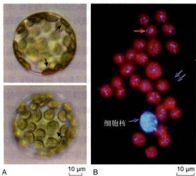  
图7-12 光学显微镜及荧光显微镜下观察到的叶绿体

## 一、叶绿体的基本形态及动态特征

在植物细胞中，叶绿体也是一种动态的细胞器。这种动态表现为光调控下的分布和位置变化、基质小管介导的相互连接、伴随分化和去分化的形态变化以及叶绿体分裂导致的数目变化等。

## （一）叶绿体的形态、分布及数目

在植物细胞中，叶绿体是最容易观察到的细胞器。这是因为叶绿体中含有叶绿素，与透明的细胞质之间呈现较大的反差。同时，叶绿体体积较大，借助普通光学显微镜的中低倍物镜即可清晰分辨。在高等植物的叶肉细胞中，叶绿体呈凸透镜或铁饼状，直径为5\~10 μm，厚2\~4 μm（图7-12）。由于叶肉细胞内的大部分空间被液泡占据，叶绿体分布在细胞质膜与液泡间薄层的细胞质中，呈平层排列。通常情况下，高等植物的叶肉细胞含20\~200个叶绿体。

高等植物的叶片生长平展后，叶肉细胞内叶绿体的体积和数目相对保持稳定。在环境条件不变的情况

A. 拟南芥叶肉细胞原生质体光学显微照片。焦面置于细胞中部时，观察到的叶绿体呈两渐渐变的条形（上图箭头）。而将焦面移动到细胞顶部时，观察到的叶绿体形态的近图形（下图箭头）。可见，叶绿体的立体结构应与心透镜或铁饼相似。B. 将原生质体细胞质平铺并经 DAPI 染色后的荧光显微形状。红色为叶绿素的自发荧光。当细胞质平铺为一薄层时，叶绿体的页面观均近圆形。此外，经 DAPI 染色后的叶绿体中可以观察到叶绿体 DNA 颗粒状荧光（红色箭头）。同时，细胞质可以观察到线粒体 DNA 的荧光信号（蓝色箭头）。（胡迎春博士惠赠）

下，成熟叶肉细胞中罕见有关叶绿体分裂与融合的报道，这种数目和体积的稳定性有别于线粒体。但细胞内的叶绿体仍呈现动态特征。首先，叶绿体在细胞膜下的分布依光照情况而变化。光照较弱时，叶绿体会汇集到细胞顶面，以最大限度地吸收光能，保证高效率的光合作用；而光照强度很高时，叶绿体移动到细胞侧面，以避免强光的伤害（图7-13）。叶绿体通过位移避开强光的行为称为躲避响应（avoidance response）。相反，在弱光下叶绿体汇集到细胞受光面的行为称作积聚响应（accumulation response）。

叶绿体在细胞内位置和分布受到的动态调控称为叶绿体定位（chloroplast positioning）。由于光照强度保持稳定状态时叶绿体的分布和位置不呈现明显的变化，叶绿体定位至少包括两个必需的细胞动力学环节；叶绿体的移动及移动后在新的最适位置上的“锚定”。化学处理破坏细胞内的微丝骨架后，叶绿体定位出现异常，说明叶绿体的运动和位置维持需要借助微丝骨架的作用。在拟南芥的叶肉细胞中，一个被命名为Chup1（chloroplast unusual positioning 1）的微丝结合蛋白为叶绿体正常定位所必需。编码该蛋白质的基因（Chup1）

  
图7-13 光照强度对叶绿体分布及位置影响的示意图

野生型（WT）拟南芥叶片呈深绿色。对叶片的一部分（整体遮光，中部留出一条窄缝）强光照射1 h后，被照射的窄缝处变成浅绿色。这是由于细胞中的叶绿体发生了位置和分布的变化，以减少强光的伤害。在一种叶绿体定位异常的突变体（chup1）中，光照对叶绿体的位置和分布失去影响。

突变后，叶绿体呈现定位异常（图7-13）。研究结果显示，Chup1定位于叶绿体外膜表面，分子质量约112 kDa。由于分子上存在肌动蛋白结合域，Chup1很可能是叶绿体与微丝骨架之间实现连接的重要蛋白质，在以微丝骨架为依托的叶绿体定位过程中发挥重要的作用。

与动物相比，植物缺乏主动运动能力。其适应和抵御环境胁迫的机制更多地体现在细胞内独特的生命活动，如叶绿体定位。目前，在介导细胞器运动的马达蛋白中未发现叶绿体特异的马达蛋白。据推测，叶绿体有可能依靠Chup1等蛋白质与微丝骨架形成连接，随着微丝骨架的动态变化而发生位移。

除了位置和分布的变化以外，细胞中叶绿体的动态行为还表现于叶绿体之间的动态连接。与线粒体不同的是，叶肉细胞内罕见叶绿体之间的相互融合。但叶绿体可以通过其内外膜延伸形成的管状凸出（基质小管，stroma-filled tubule或stromule）实现叶绿体之间的相互联系（图7-14）。用GFP标记叶绿体膜后，荧光显微镜下可以观察到基质小管之间频繁的融合与分断。这种动态的融合与分断有助于叶绿体实现实时的物质或信息交换。因此，与线粒体相似，细胞内的叶绿体仍然可以被视作一个不连续的动态整体。实验结果显示，基质小管

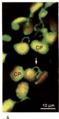

B  
  
图 7-14 叶绿体及原质体膜向外延伸形成的柔性管状结构——基质小管

该结构具双层膜，分别为叶绿体内膜和外膜的直接延伸。由于叶绿体（或质体）基质随小管延伸，故名基质小管（箭头所指）。A. GFP 标记叶绿体膜后荧光显微镜下观察到的基质小管。B. 三维重构显示的拟南芥卵细胞原质体及复杂的基质小管网络。CP：叶绿体；PP：原质体。（图片获授权）

还可能具备其他重要的细胞学功能，比如将叶绿体代谢中产生的废物输送到液泡中。这些功能的背后尚有许多科学问题值得深入研究。

## （二）叶绿体的分化与去分化

叶绿体仅存在于植物茎叶等绿色组织的细胞内。未发芽的种子（胚）细胞中没有叶绿体。在种子萌发过程中，子叶、叶鞘和真叶细胞中的原质体（proplastid）相继分化为叶绿体。这种分化依赖于光照。植物在黑暗条件下生长时，细胞中原质体不能形成叶绿体，幼苗呈黄色。可见，叶绿体是原质体的一种分化方式。在储藏组织（如块根、块茎和胚乳）和一些其他的白化组织中，质体以造粉质体（amyloplast）或白色体（etioplast）的形式存在。

叶绿体分化于幼叶的形成和生长阶段。因此，从生长中的植物顶芽纵切片上，可以观察到分生细胞中的原质体分化形成叶绿体的连续过程。在形态上，叶绿体的分化表现为体积的增大、内膜系统的形成和叶绿素的积累。而在生化和分子生物学上，则体现为叶绿体功能所必需的酶、蛋白质、大分子的合成、运输及定位。据推测，叶绿体的正常工作需要数千个基因的支持。可见叶绿体分化是一个十分复杂的过程。在该过程中，某一个基因的突变或异常往往便会导致叶绿体分化的障碍。植物中常见的白化苗就是叶绿体分化障碍的表现。除了叶绿素合成相关基因的突变直接导致白化外，其他基因的缺陷同样可以导致植物白化，机制多种多样。例如，拟南芥编码叶绿体蛋白酶的基因（Var1 及 Var2）发生突变后，早期质体内多余的蛋白质得不到清除，导致部分叶肉细胞内叶绿体分化异常，叶片出现白斑；园艺中常用的花叶植物（绿色叶片上出现白斑或白色花纹）也是部分叶肉细胞中叶绿体分化出现障碍的结果。白化叶或叶片的白化部分中的质体为白色体（图 7-15）。

在特定情况下，叶绿体的分化是可逆的。叶肉细胞经组织培养形成愈伤组织细胞时，叶绿体去分化再次形成原质体。目前，人们对叶绿体分化与去分化的了解还仅限于发现了一些必需的基因。其复杂的调控网络尚不清楚，有待于进一步研究。

## （三）叶绿体的分裂

质体和叶绿体通过分裂而实现增殖。在高等植物中，叶绿体的分裂集中发生在生长中的幼叶内。在形态上，幼叶中的叶绿体体积为成熟叶绿体的1/10～1/5，基质内只形成少数基质类囊体，尚未或正在开始形成基粒类囊体。这种分化中的叶绿体被称为前叶绿体（pre-chloroplast）（图7-15）。观察茎尖分生组织附近的幼叶细胞时，可以发现频繁的前叶绿体分裂现象。但在停止生长的成熟叶片中很少观察到叶绿体分裂，说明细胞内叶绿体数目的调控主要发生于细胞分化和生长的早期阶段。

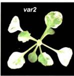

叶绿体的分裂与线粒体分裂具有相同的结构动力机制。在分裂中的叶绿体上，可以观察到环绕叶绿体的分裂环（chloroplast division ring），亦由外环和内环组成。外环位于叶绿体外膜表面，暴露于细胞质；而内环位于叶绿体内膜下面，暴露于叶绿体基质（图7-16）。

分裂环的缢缩是叶绿体分裂的细胞动力学基础。但需要说明的是，对叶绿体分裂环与线粒体分裂环的认识还仅限于作为电镜下细胞超微结构概念，所涉及的蛋白质分子基础尚不清楚。人们将叶绿体分裂所有相关蛋白质组成的分裂功能单位称为叶绿体分裂装置（chloroplast division apparatus, chloroplast division machinery）。较分裂环而言，分裂装置是一个更为完整的细胞功能概念，包括分裂环和分裂环以外的相关蛋白质。

与线粒体的分裂相似，发动蛋白相关蛋白在叶绿体分裂装置中起着同样的作用。在被子植物中，叶绿体分裂必需的发动蛋白相关蛋白被称为Arc5（accumulation and replication of chloroplasts 5）。该蛋白在叶绿体表面开始缢陷时组装成环状结构，出现于缢陷处，推动叶绿体膜深度缢陷及分断。在分子结构和作用时空上，Arc5

图 7-15 叶绿体分化及分化异常的表现

野生型拟南芥（WT）叶肉细胞中原质体分化为叶绿体，而花叶突变体（var2）叶片白斑部分的叶肉细胞内质体形成白色体（绿色区域内质体形成正常的叶绿体）。植物的花叶突变体在园艺中常被视为珍稀观叶品种，其变异的分子生物学机制多数不详（“未知”示一种未知变异机制的常春藤花叶突变体）。《张泉博士、胡迎春博士及W. Sakamoto博士惠赠》

与线粒体分裂装置中的发动蛋白类蛋白非常相似，推测可能是分裂外环的重要组成部分。编码 Arc5 的基因突变导致叶绿体分裂受到抑制，细胞内出现异常大体积的叶绿体。

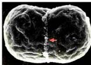

  
0.5 μm B

## 图 7-16 电子显微镜下观察到的红藻的叶绿体分裂环

在扫描电子显微镜下，红叶绿叶体分裂环的外环（A中红色箭头指示）为一环形索状结构，位于叶绿体表面，随着叶绿体分裂的进行而变相。在叶绿体的垂环切面上，分裂环的一对横切面出现在叶绿体的缢缩处，呈较高电子密度（B中蓝色箭头指示）。将分裂环的切面放大（B下图）后，在外环切面（红色箭头）的下面可以清楚地分辨出形状宽扁的内环（黄色箭头）断面。外环与内环的断面之间由叶绿体膜相隔。高等植物的分裂环在超微结构上与红藻相同。CP：叶绿体：MT：线粒体：N：细胞核。（图片获授权）

由于Arc5分子上没有叶绿体膜定位信号，Arc5在叶绿体膜外的外环处的组装需要借助其他蛋白质的作用。研究结果发现，在叶绿体分裂的最早期，FtsZ蛋白先于叶绿体膜的缢陷汇集于叶绿体的内膜下，组装成一个环状结构，称为FtsZ环或Z环（FtsZ ring，Z ring）。由于Z环的荧光强度在叶绿体膜尚未发生缢陷时最强，而随着叶绿体分裂进程而减弱（图7-17），推测其功能可能是在叶绿体分裂前参与分裂位置的决定，而不是内环的组成蛋白。

如果叶绿体分裂环和分裂缢陷的位置由最先出现于该位置的Z环决定的话，叶绿体膜内的Z环位置信息必须传递到膜外的相应位置，以招募外环蛋白在该位置汇集和组装。这个推测近期得到了证实。研究结果表明，一个内膜的跨膜蛋白Arc6通过其伸向叶绿体基质的N端实现与FtsZ的相互作用，同时其伸向膜间隙的C端与外膜上的跨膜蛋白Pdv2（plastid division 2）的C端相结合。由于Pdv2的N端伸向细胞质并与Arc5相

  
图 7-17 高等植物叶绿体分裂过程中 Z 环的免疫荧光（A）及分裂相关蛋白的定位（B）

实验结果表明: 在叶绿体分裂的早期, 内膜下的 Z 环最先完成定位和组装。叶绿体内膜跨膜蛋白 Arc6 的 N 端伸向叶绿体基质, 与 FtsZ 的相互作用, 协助 Z 环组装。同时, Arc6 的 C 端伸向膜间隙, 与外膜跨膜蛋白 Pdv2 的 C 端相结合, 将叶绿体膜内的 Z 环位置信息传递到膜间隙。在 Pdv2 的相同位置, 还存在另一个 C 端较短跨膜蛋白 Pdv1。这两个蛋白质的 N 端均伸向细胞质, 共同招募 Arc5。Pdv1 和 Pdv2 的编码基因双突变后 Arc5 无法正常定位, 而它们的单突变亦导致叶绿体分裂异常。(图片获授权)

互结合，叶绿体膜内的Z环位置信息通过Arc6传递到膜间隙，再通过Pdv2传递给叶绿体膜外的Arc5（图7-17）。实验结果还显示，编码FtsZ、Arc6、Pdv1和Pdv2的基因突变均导致叶绿体分裂障碍，细胞内出现异常大体积的叶绿体。

## 二、叶绿体的超微结构

叶绿体的超微结构可以被分为3个部分：叶绿体被膜（chloroplast envelope）或称叶绿体膜（chloroplast membrane）、类囊体（thylakoid）以及叶绿体基质（stroma）（图7-18）。这三部分结构组成一个三维的产能“车间”，为光合作用提供了必需的结构支持。

## （一）叶绿体膜

与线粒体相同，叶绿体也是一种由双层单位膜包被的细胞器。其外膜和内膜的厚度为每层6\~8 nm。叶绿体内、外膜之间的腔隙称为膜间隙（intermembrane space），为10\~20 nm。与线粒体膜一样，叶绿体的外膜通透性大，含有孔蛋白，允许分子量高达 $10^{4}$ 的分子通过；而内膜则通透性较低，成为细胞质与叶绿体基质间的通透屏障，仅允许 $O_{2}$ 、 $CO_{2}$ 和 $H_{2}O$ 分子自由通过。叶绿体内膜上有很多转运蛋白，选择性转运较大分子进出叶绿体，如磷酸交换载体（phosphate exchange carrier，将细胞质中的无机磷转运到叶绿体基质并将基质中产生的磷酸甘油醛释放到细胞质）和二羧酸交换载体（dicarboxylate exchange carrier，交换含有2个羧基的酸，如苹果酸和延胡索酸）。

## （二）类囊体

叶绿体内部由内膜衍生而来的封闭的扁平膜囊，称为类囊体。类囊体囊内的空间称为类囊体腔（thylakoid lumen）。在叶绿体中，许多圆饼状的类囊体有序叠置成垛，称为基粒（granum，复数 grana）。组成基粒的类囊体称为基粒类囊体（granum thylakoid）。而贯穿于两个或两个以上基粒之间，不形成垛叠的片层结构称为基质片层（stroma lamella）或基质类囊体（stroma thylakoid）（图 7-18）。基粒类囊体的直径为 0.25\~0.8 μm，厚约 0.01 μm。一个叶绿体通常含有 40\~60 个甚至更多的基粒。每个基粒由 5\~30 层基粒类囊体组成。基粒类囊体的层数在不同植物或同一植物的不同绿色组织间可出现较大变化。在光照等因素的调节下，基粒类囊体与基质类囊体之间可发生动态的相互转换。

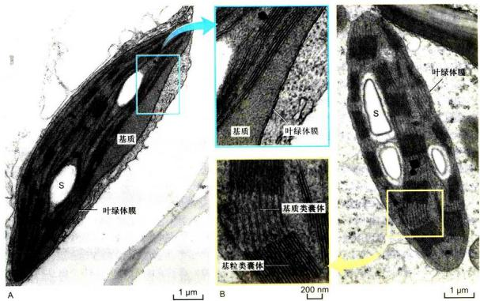  
图 7-18 电子显微镜下观察到的叶绿体  
不同植物或同一植物不同绿色组织中叶绿体的超微结构略有差别。如拟南芥幼叶中的叶绿体（A）边缘较为扁平，基粒类囊体层数较少；而水稻幼芒中的叶绿体（B）边缘相对浑圆，基粒类囊体层数较多等。此外，基粒类囊体的层数还与植物的受光情况相关。S：淀粉粒。（张泉博士惠赠）

类囊体垛叠成基粒是高等植物叶绿体特有的结构特征。这种垛叠大大增加了类囊体片层的总面积，有益于更多地捕获光能，提高光反应效率。由于管状或扁平状的基质类囊体将相邻基粒相互连接，叶绿体内的全部类囊体之间实际上是一个完整连续的封闭膜囊。该膜囊系统独立于基质，在电化学梯度的建立和ATP的合成中起重要作用。

类囊体膜的化学组成与其他的细胞膜有明显差异，富含具有半乳糖的糖脂和极少的磷脂。糖脂中的脂肪酸主要是不饱和的亚麻酸，约占87%。这样，类囊体膜的脂质双分子层流动性非常大，有益于光合作用过程中类囊体膜上的光系统Ⅱ（PSⅡ）。Cyt b,f复合物、光系统Ⅰ（PSⅠ）及 $CF_{0}-CF_{1}$ ATP合酶复合物在膜上的侧向移动。此外，类囊体膜上的蛋白质/脂质的比值很高，同样与叶绿体的光合作用功能相关。

## （三）叶绿体基质

叶绿体内膜与类囊体之间的液态胶体物质，称为叶绿体基质。基质的主要成分是可溶性蛋白和其他代谢活跃物质，其中丰度最高的蛋白质为1,5-二磷酸核酮糖羧化酶/加氧酶(ribulose-1,5-biphosphate carboxylase/oxygenase，简称Rubisco)。该酶分子质量为550 kDa，由8个大亚基(每个约53 kDa）和8个小亚基（每个约14 kDa）组成，约占类囊体可溶性蛋白的80%和叶片可溶性蛋白的50%。Rubisco是光合作用中的一个重要的酶系统，亦是自然界含量最丰富的蛋白质。研究证实，Rubisco的大亚基由叶绿体基因编码，而小亚基由核基因编码。此外，叶绿体基质中还含有参与CO₂固定反应的所有酶类，是光合作用固定CO₂的场所。除蛋白质外，基质中还含有叶绿体DNA、核糖体、脂滴(lipid droplet)、植物铁蛋白（phytoferritin）和淀粉粒（starch grain）等物质。

## 三、光合作用

叶绿体的主要功能是进行光合作用。绿色植物、藻类和蓝细菌通过光合作用将水和二氧化碳转变为有机化合物并放出氧气。光合作用是自然界将光能转换为化学能的主要途径，其本质可视为呼吸作用的逆过程。线粒体中的呼吸作用是将氧还原成水，而叶绿体中的光合作用将水光解放出氧。这两个过程逆向进行，前者释放能量，后吸收能量。

高等植物的光合作用由两步反应协同完成，分别被称为依赖光的反应（light dependent reaction）或称“光反应”（light reaction）和碳同化反应（carbon assimilation reaction）或称固碳反应（carbon fixation reaction）。光反应包括原初反应和电子传递及光合磷酸化两个步骤，指叶绿素等光合色素分子吸收、传递光能并将其转换为电能，进而转换为活跃的化学能，形成ATP和NADPH，同时产生 $\mathrm{O}_2$ 的一系列过程。光反应在类囊体膜上进行。固碳反应指在光反应产物即ATP和NADPH的驱动下， $\mathrm{CO}_{2}$ 被还原成糖的分子反应过程。该过程将活跃的化学能转换为稳定的化学能，在叶绿体基质中进行。

## （一）原初反应

捕获光能是光合作用的初始步骤。原初反应(primary reaction)指光合色素分子被光能激发而引起第一个光化学反应的过程。该过程包括光能的吸收、传递和转换，即光能被天线色素分子吸收并传递至反应中心，继而诱发最初的光化学反应，使光能转换为电能的过程（图7-19）。原初反应只需 $10^{-15}\sim10^{-12}$ s，并可在 $-196^{\circ}C$ 低温下进行。

## 1. 光合色素

叶绿体化学成分的显著特点是含有色素（pigment）。色素的特性是分子内含有独特的化学基团，能吸收可见光谱中特定波长的光。植物叶绿体中所含的色素有数十种之多，可分为三类：叶绿素、类胡萝卜素和藻胆素。高等植物和多数藻类的叶绿体内含有叶绿素和类胡萝卜素，藻胆素仅存在于一些细菌和藻类中。

叶绿素（chlorophyll）是光合作用的主要色素，在光吸收中起核心作用。高等植物的叶绿体含有叶绿素a和叶绿素b。这两种叶绿素均为绿色，具有不同的吸收光谱，可互补吸收不同范围的可见光。叶绿素分子由卟啉环（porphyrin ring）和叶绿醇（phytol）两部分基团组成。前者具有吸光性和亲水性，后者则具有疏水性。疏水的叶绿醇插入类囊体膜和脂质结合，起到分子定位作用。

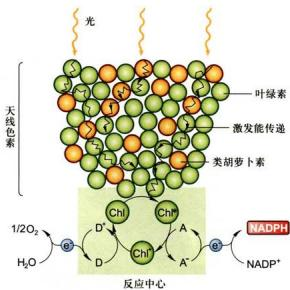  
图7-19 光合作用原初反应的能量吸收、传递与转换图解  
Chl 为反应中心色素分子；D 为原初电子供体；A 为原初电子受体。

类胡萝卜素（carotenoid）是类囊体膜上的辅助色素（accessory pigment），呈黄色、红色或者紫色。最重要的类胡萝卜素是β-胡萝卜素（β-carotene）和叶黄素（phytoxanthin）。类胡萝卜素能协助叶绿体吸收叶绿素不能吸收的光，提高光吸收效率；同时又能从激发的叶绿素分子上回收多余的能量，以热能的形式释放。叶绿素分子上多余的能量如果不被类胡萝卜素吸收，将转移至氧分子产生单线态氧 $(\mathrm{O}^{\prime})$ ，引起分子或细胞损伤。因此，类胡萝卜素具有重要的光损伤防护功能。

藻胆素（phycobilin）能够吸收叶绿素不能吸收的杂色光。其吸收的光能可以转移给叶绿素，同叶绿素分子吸收的光能一起进入光反应途径。

实验表明，叶绿体中并非所有的叶绿素分子都直接参与将光能转换为化学能的光化学反应。在大约300个叶绿素分子组成的一个光合单位（photosynthetic unit）中，只有一对特殊的叶绿素a分子，即反应中心色素(reaction center pigment)，具有将光能转换为化学能的功能，其余的光合色素称为捕光色素（light harvesting pigment）或天线色素分子（antenna pigment molecule）。后者的作用是吸收光能并将之有效地传递到反应中心色素。

天线色素分子间的能量传递是有序的，即从需能较高的天线色素分子传递到需能较低的色素分子。换言之，能量从吸收短波长光波的天线色素分子传向吸收长波长光波的的天线色素分子。反应中心的叶绿素分子是吸收最长波长光的色素。所有天线色素分子吸收的光能必然且不可逆转地传递给反应中心色素。反应中心色素在直接吸收光能或接受从天线色素分子传递来的光能后被激发，产生电荷分离和能量转换。

## 2. 光化学反应

光化学反应是指反应中心色素分子吸收光能而引发的氧化还原反应。天线色分子吸收的光能通过共振机制迅速地传递给反应中心色素分子Chl。Chl被激发后形成激发态 $\mathrm{Chl^{+}}$ ，放出电子传给原初电子受体A。这时Chl被氧化为带正电荷的 $\mathrm{Chl^{+}}$ ，而A被还原为带负电荷的 $\mathrm{A^{-}}$ 。氧化态的 $\mathrm{Chl^{+}}$ 再次从原初电子供体D获得电子而恢复为原初状态的Chl，原初电子供体D则被氧化为 $\mathrm{D^{+}}$ （见图7-18）。这样，氧化还原（即电荷分离）不断发生，电子被不断地传递给原初电子受体A。通过这样的过程，D被氧化而A被还原，光能最终被转换为电能。

## （二）电子传递和光合磷酸化

原初反应将光能转换为电能，完成了光反应的第一步。电子随后在电子传递体之间的传递，导致ATP和NADPH的形成，即电能转换为活跃的化学能。这一过程涉及水的裂解、电子传递及 $NADP^{+}$ 还原。其中 $H_{2}O$ 是最终电子供体； $NADP^{+}$ 是最终电子受体。水裂解释放的电子在沿着光合电子传递链传递的同时，在类囊体膜的两侧建立质子电化学梯度，驱动ATP的合成。

## 1. 电子传递

光合电子传递链（photosynthetic electron transfer chain）由一系列的电子载体构成。这些电子载体包括细胞色素、黄素蛋白、醌和铁氧还蛋白等。它们分别组装在膜蛋白复合物，如PSI、PSII及Cyt b6f复合物中（图7-20）。

光系统（photosystem, PS）指光合作用中光吸收的功能单位，由叶绿素、类胡萝卜素、脂质和蛋白质组成。每一个光系统复合物含两个组分：捕光复合物（light harvesting complex, LHC）和反应中心复合物（reaction center complex）。在叶绿体的类囊体膜上存在两个不同的光系统：PSⅡ和PSⅠ。这两个光系统具有独特而互补的功能。它们的反应中心相继催化光驱动的电子从 $H_{2}O$ 到 $NADP^{+}$ 的流动（图7-20）。

  
图7-20 叶绿体中的光系统及电子传递途径

光系统驱动1个电子从 $H_{2}O$ 传递到 $NADP^{+}$ 需要2个光子（每个光系统各吸收1个）。这样，每形成1分子的 $O_{2}$ 需要4个电子从2个 $H_{2}O$ 传递到2个 $NADP^{+}$ ，共需吸收8个光子（每个光系统各吸收4个）。

(1) PSⅡ的结构与功能 PSⅡ由反应中心复合物和PSⅡ捕光复合物（LHCⅡ）组成。它们的功能是利用光能在类囊体膜腔面一侧裂解水并在基质侧还原质体醌，使类囊体膜的两侧形成质子梯度。

反应中心复合物是一个由20多个不同多肽组成的叶绿素-蛋白质复合物（图7-21）。这些多肽大多数由叶绿体基因组编码。

LHCⅡ是一个由蛋白质、叶绿素、类胡萝卜素和脂质分子组成的复杂的高疏水性膜蛋白复合物。2004年，中国科学家在《自然》杂志上发表了菠菜LHCⅡ的晶体结构，首次提出了LHCⅡ的完整结构模型。该结构模型揭示了每一个复合物单体中的14个叶绿素分子（其中8个叶绿素a，6个叶绿素b）和4个类胡萝卜素的排布规律，阐述了LHCⅡ高效率进行光吸收和能量传递的分子结构基础。

(2) Cyt b $_{6}$ f复合物的结构与功能 在电子传递过程中， $\mathrm{Cyt~b_f}$ 复合物在PSII和PSI之间承担重要的联系。PSII光反应产生的 $\mathrm{PQ_H_3}$ 脱离D1蛋白后，电子从 $\mathrm{PQ_H_3}$ 经 $\mathrm{Cyt~b_f}$ 复合物传递至质体蓝素（plastocyanin，PC）并经之传递给PSI中的 $\mathrm{P700^{\prime}}$ 。 $\mathrm{Cyt~b_f}$ 复合物含有一个 $\mathrm{Cyt~b_f}$ 、一个Fe-S和一个Cyt f（c型细胞色素），和线粒体中的 $\mathrm{Cyt~bc_1}$ 的结构与功能相似，都是作为电子载体。 $\mathrm{Cyt~b_f}$ 复合物将电子从双电子载体 $\mathrm{PQ_B}$ 转运到单电子载体PC，形成一个Q循环。在这个循环中，电子从 $\mathrm{PQ_H_3}$ 一次一个地传递到PC，引起 $\mathsf{H}^+$ 的跨膜转移。在叶绿体中，一对电子的传递导致4个 $\mathsf{H}^+$ 从基质转移至类囊体腔。随着电子从PSII传递到PSI，质子在类囊体膜的两侧形成梯度。

(3) PS I 的结构与功能 PS I 由反应中心复合物和 PS I 捕光复合物（LHC I）组成（图 7-22），其功能是利用吸收的光能或传递来的激发能在类囊体膜的基质侧将 NADP+ 还原为 NADPH。

## 2. 光合磷酸化

由光照所引起的电子传递与磷酸化作用相偶联而生成 ATP 的过程称为光合磷酸化（photophosphorylation）。光合作用通过光合磷酸化形成 ATP，再通过 $CO_{2}$ 同化将能量储存在有机物中。

(1) $CF_{0}-CF_{1}$ ATP 合酶 在叶绿体中催化 ATP 合成的酶称为 $CF_{0}-CF_{1}$ ATP 合酶 ( $CF_{0}-CF_{1}$ ATP synthase),

## 图 7-21 PS II 结构示意图

LHC II中的天线色素分子吸收光能并将之传递给反应中心P680后，P680受到激发释放一个电子。该电子经D1蛋白上的原初电子受体脱叶绿素（Pheo）传递给与D2蛋白结合的质体醛PO $_{4x}$ ，继而传递至与D1蛋白结合的另一个质体醛PO $_{4y}$ 。PO $_{4y}$ 在连续接受2个电子后，形成PO $_{4x}^{2+}$ 。此时PO $_{4x}^{2+}$ 从基质中摄取2个H⁺形成还原型PO $_{4y}$ 污，并从D1蛋白上解离下来释放到类囊体膜的脂双层中。随后新的氧化型PO补充到D1蛋白上。在上述电子传递过程中，反应中心P680经酪氨酸残基(Z或Tyr $_{T}$ )接受来自水分子的电子。在整体功能上，PSII催化电子从传递给质体醛，从而建立质子梯度。

  
图 7-22 PSI 结构示意图

LHC I 中的天线色素分子吸收光能并传递给反应中心 P700，使其中的一个叶绿素 a 分子激发而释放 1 个离子。释放的电子传递给原初电子受体（另一个单体叶绿素 a 分子） $A_{0}$ ，经 $A_{1}$ （可能是叶绿醛 phylloquinone，即维生素 K $_{1}$ ）、 $F_{x}$ （铁硫中心）和 $F_{y}$ / $F_{z}$ 传递给铁氧还蛋白（ferredoxin、Fd）。Fd 是一个含 2Fe-2S 的低分子量可溶性铁硫蛋白，疏松地结合于类囊体膜基质侧，通过 $Fe^{2+} \rightarrow Fe^{2+}$ 的转变每次接受和传递 1 个离子。在 Fd-NADP\* 还原酶（ferredoxin-NADP reductase）的作用下，电子随后从 Fd 转移到氧化聚酯Ⅱ（NADP\*）。获得 2 个电子的 NADP\* 结合基质中的 1 个 H\* 形成还原型辅酶Ⅱ（NADPH），自 $H_{2}O$ 至 NADP\* 的电子传递最终完成。PSI 至少含有 11 秒多肽，由核基因组和叶绿体基因组共同编码（高等植物中）。反应中心复合物是一个多蛋复合体，其中 P700 是两个特殊的叶绿素 a 的二聚体。LHC I 由天线色素分子和几种不同的多肽组成，位于反应中心复合物的周围。

位于类囊体膜外表面朝向细胞质一侧，由 $\mathrm{CF_0}$ 和 $\mathrm{CF_1}$ （C代表叶绿体）两部分组成。 $\mathrm{CF_1}$ 与线粒体中的 $\mathrm{F_1}$ 在亚基组成、结构和功能上都非常相似，均由 $\alpha$ 、 $\beta$ 、 $\gamma$ 、δ、ε5种亚基组成。 $\mathrm{CF_0}$ 是一个跨膜的质子通道，至少有4种亚基组成，与线粒体中的 $\mathrm{F_0}$ 同源。

叶绿体 ATP 合酶的作用机制也与线粒体 ATP 合酶基本相同。在质子驱动力作用下，ADP 和 Pi 在酶的表面缩合成 ATP。同样，ATP 从酶分子上释放需要质子驱动力。叶绿体 ATP 合酶以旋转催化的方式使其中的 3 个 β 催化亚基按顺序参与 ATP 的合成、ATP 的释放和 ADP 与 Pi 的结合。

(2) 光合磷酸化的类型 光合磷酸化依电子传递的方式的不同分为非循环和循环两种类型。

非循环光合磷酸化：由光能驱动的电子从 $\mathrm{H}_2\mathrm{O}$ 开始，经PSII、Cytb6f复合物和PSI最后传递给NADP+(见图7-19)。非循环光合磷酸化的电子传递经过两个光系统，在电子传递过程中建立质子梯度，驱动ATP的形成。在这个过程中，电子被单方向传递，故称非循环光合磷酸化（noncyclic photophosphorylation）。这种磷酸化途径的产物有ATP和NADPH（绿色植物）或NADH（光合细菌）。

循环光合磷酸化：由光能驱动的电子从PSI开始，经 $\mathrm{A_0}$ 、A1、Fe-S和Fd后传给Cyt $\mathrm{b_0f}$ ，再经PC回到PSI（见图7-20）。电子循环流动过程中释放的能量通过Cyt $\mathrm{b_0f}$ 复合物转移质子，建立质子梯度并驱动ATP的形成。这种电子的传递是一个闭合的回路，故称循环光合磷酸化（cyclic photophosphorylation）。循环光合磷酸化由PSI单独完成，同时在其过程中只有ATP的产生，不伴随NADPH的生成和 $\mathrm{O}_2$ 的释放。当植物缺乏NADP时，启动循环光合磷酸化，以调节ATP与NADPH的比例，适应碳同化反应对ATP与NADPH的比例需求（3：2）。

(3) 光合磷酸化的作用机制 光合磷酸化的作用机制与残粒体的氧化磷酸化相似，同样可用化学渗透学说来阐明。在类囊体膜中，光合链的各组分按一定的顺序排列，呈不对称分布。当两个光系统发生原初反应时，类囊体腔中的水分子发生裂解，释放出氧分子、质子和电子，引起电子从水传递到 $\mathrm{NADP}^{\prime}$ 的电子流（图7-23）。

叶绿体中 ATP 合成的机制也与线粒体的十分相似。通过电子传递，类囊体腔内的 $H^{+}$ 浓度升高，类囊体膜两侧形成质子梯度。当腔内的 $H^{+}$ 顺电化学梯度穿越类囊体膜上的 ATP 合酶 ( $CF_{6}$ 和 $CF_{1}$ ) 时，驱动 ADP 磷酸化形成 ATP。由于 $CF_{1}$ 位于类囊体膜的基质侧，新合成的 ATP 被释放入基质。同时，通过 PS I 形成的 NADPH 也被释放在基质中。这两种光反应高能产物 (ATP 和 NADPH) 随即用于叶绿体基质中的碳同化反应。

(4) ATP 合成机制 在光合作用的光反应中，两个光系统的联合作用将水裂解解放出的电子传递到 $NADP^{+}$ 。在电子从 $H_{2}O$ 转移到 $NADP^{+}$ 的过程中，大约每 4 个电子的转移（即 1 分子 $O_{2}$ 的形成）可使类囊体腔中约增加 12 个 $H^{-}$ 。其中 4 个 $H^{+}$ 由放氧复合体直接提供，另外 8 个 $H^{+}$ 由 $Cyt b_{6}f$ 复合物从基质中摄入。在 ATP 合成的高峰期，检测结果表明类囊体膜两侧的质子浓度相差约 1000 倍，相当于 3 个单位的 $\Delta pH$ 。如此明显的梯度保证了 ATP 合成的强大驱动力。在电子传递过程中，当 $H^{+}$ 从基质转移到类囊体腔时，其他阳离子从类囊体腔转移向基质，以保证叶绿体内不会产生明显的膜电位。

  
图7-23 叶绿体类囊体膜中进行的电子传递和 $\mathsf{H}^+$ 跨膜转移  
P680 分子吸收光子后，激发出的电子传至膜外侧的电子变体 PQ；PQ 接受电子，并从基质中摄取 2 个质子，还原为 PQH $_{3}$ ；PQH $_{2}$ 移到膜的内侧，将 2 个质子释放到类囊体腔中，而把电子交给 Cyt b $_{f}$ ，随后又经位于膜内侧的质体蓝素（PC），把电子传递给 P700；P700 分子吸收光子后，放出电子，经铁硫蛋白传给位于膜外侧的铁氧还蛋白（Fd），最后将电子交给 NADP $^{+}$ ，使之还原成 NADPH $_{3}$ 。在进行电子传递的同时，H $^{+}$ 被泵过类囊体膜，在类囊体膜的两侧建立质子梯度。

## （三）光合碳同化

二氧化碳同化（ $\mathrm{CO}_{2}$ assimilation）是光合作用过程中的固碳反应。从能量转换角度看，碳同化的本质是将光反应产物ATP和NADPH中的活跃化学能转换为糖分子中高稳定性化学能的过程。高等植物的碳同化有三条途径：卡尔文循环、 $\mathrm{C}_{4}$ 途径和景天酸代谢（CAM）。其中卡尔文循环是碳同化的基本途径，具备合成糖类等产物的能力。其他两条途径只能起到固定、浓缩和转运 $\mathrm{CO}_{2}$ 的作用，不能单独形成糖类等产物。

## 1. 卡尔文循环

卡尔文循环（Calvin cycle）以3-磷酸甘油酸（三碳化合物）为固定 $\mathrm{CO}_{2}$ 的最初产物，故也称做 $\mathbf{C}_3$ 途径。20世纪50年代卡尔文（M. Calvin）等应用 $^{14}\mathrm{C}$ 示踪的方法揭示了该著名的碳同化过程。由于卡尔文在光合碳同化途径上做出的重大贡献，1961年被授予诺贝尔化学奖。 $\mathbf{C}_3$ 途径是所有植物进行光合碳同化所共有的基本途径，包括三个主要的阶段：羧化（ $\mathrm{CO}_{2}$ 固定）、还原和RuBP再生（图7-24）。

(1) 羧化阶段 $CO_{2}$ 被 NADPH 还原固定的第一步是被羧化生成羧酸。此时，1,5-二磷酸核酮糖 (ribulose-1, 5-biphosphate, RuBP) 作为 $CO_{2}$ 的受体。在 RuBP 羧化酶/加氧酶 (RuBP carboxylase/oxygenase, Rubisco) 的催化下，1 分子 RuBP 与 1 分子 $CO_{2}$ 反应形成1分子的不稳定六碳化合物，并立即分解为2分子3-磷酸甘油酸。此过程被称为 $\mathrm{CO}_{2}$ 羧化阶段（ $\mathrm{CO}_{2}$ carboxylation phase）。

(2) 还原阶段 3-磷酸甘油酸在 3-磷酸甘油酸激酶催化下被 ATP 磷酸化，形成 1,3-二磷酸甘油酸，然后在 3-磷酸甘油醛脱氢酶催化下被 NADPH 还原成储能更多的3-磷酸甘油醛。光反应中生成的ATP和NADPH主要被用于这个过程。因此，还原阶段是光反应与固碳反应的连接点。当 $\mathrm{CO}_{2}$ 被还原成3-磷酸甘油醛时，光合作用的储能过程便告完成。3-磷酸甘油醛等三碳糖可进一步转化，在叶绿体内合成淀粉。

  
图7-24 卡尔文循环的三个阶段示意图

(3) RuBP再生阶段3-磷酸甘油醛可异构化，形成二羟丙酮磷酸。这两种磷酸丙糖在醛缩酶催化下合成磷酸己糖，然后在一系列酶的作用下，可形成磷酸化的丁糖、戊糖、庚糖。5-磷酸核酮糖在5-磷酸核酮糖激酶的催化下发生磷酸化，消耗1个ATP，再形成RuBP。该反应是第三次耗能反应。RuBP作为卡尔文循环的起始物和 $\mathrm{CO}_{2}$ 的接受体，需要得到不断的再生，以维持循环的连续进行。

综上所述， $C_{3}$ 途径以光反应生成的 ATP 及 NADPH 为能源，推动 $CO_{2}$ 的固定和还原。卡尔文循环每次只固定 1 个 $CO_{2}$ 分子，6 次循环才能把 6 个 $CO_{2}$ 分子同化成 1 个己糖分子。在能量使用上，循环每固定 1 个 $CO_{2}$ 分子需要 3 分子 ATP 和 2 分子 NADPH。

卡尔文循环净反应可表示为：

$$
\begin{array}{r l} 6 \mathrm{CO} _ {2} + 1 8 \mathrm{ATP} + 1 2 \mathrm{NADPH} & \longrightarrow \mathrm{C} _ {6} \mathrm{H} _ {1 2} \mathrm{O} _ {6} + 1 2 \mathrm{NADP} ^ {+} \\ & + 1 8 \mathrm{ADP} + 1 8 \mathrm{Pi} \end{array}
$$

在糖类化合物中，己糖特别是葡萄糖占据中心位置。葡萄糖是合成纤维素和淀粉的构件分子，被看成是 $CO_{2}$ 固定的主要终产物。

## 2. $\mathrm{C_4}$ 途径

20世纪60年代人们发现，除了卡尔文循环以外，一些热带或亚热带起源的植物中还存在着另一个独特的 $\mathrm{CO}_{2}$ 固定途径。该途径固定 $\mathrm{CO}_{2}$ 的最初产物为草酰乙酸（四碳化合物），因而被称为 $\mathrm{C}_{4}$ 途径。通过 $\mathrm{C}_{4}$ 途径固定 $\mathrm{CO}_{2}$ 的植物被称为 $\mathrm{C}_{4}$ 植物，如甘蔗、玉米、高粱。 $\mathrm{C}_{4}$ 植物具有一个典型的结构特征，即叶脉周围有一圈含叶绿体的薄壁维管束鞘细胞，其外面整齐环列叶肉细胞。与 $\mathrm{C}_{3}$ 植物不同的是， $\mathrm{CO}_{2}$ 在叶肉细胞中首先与磷酸烯醇式丙酮酸（PEP）反应生成草酰乙酸。这步反应在磷酸烯醇式丙酮酸羧化酶（PEP羧化酶）催化下进行。生成的草酰乙酸具有不稳定性，迅速被还原为苹果酸。叶肉细胞随后将苹果酸转运至维管束鞘细胞。在维管束鞘细胞中，苹果酸被分解再次释放出 $\mathrm{CO}_{2}$ ，进入卡尔文循环。

可见， $C_{4}$ 植物的卡尔文循环是在维管束鞘细胞内进行的。叶肉细胞为此提供 $CO_{2}$ 的供体（苹果酸）。人们普遍认为 $C_{4}$ 途径是植物适应环境的结果。在热带或亚热带环境中，高温导致强烈的蒸腾作用，植物叶片缺水时调节部分气孔关闭或半关闭，致使叶片中 $\mathrm{CO}_{2}$ 浓度下降，光合作用的效率降低。与 $\mathrm{C}_{3}$ 植物细胞的RuBP羧化酶/加氧酶相比， $\mathrm{C_4}$ 植物叶肉细胞中的PEP羧化酶具有非常高的 $\mathrm{CO}_{2}$ 亲和力，可固定低浓度的 $\mathrm{CO}_{2}$ 。这样，通过高效率固定低浓度 $\mathrm{CO}_{2}$ 并向叶肉细胞输送苹果酸的方式， $\mathrm{C_4}$ 途径保证了维管束鞘细胞中较高的 $\mathrm{CO}_{2}$ 水平（可达大气中浓度的10倍），维持了高热环境下的光合作用。

## 3. 景天酸代谢

景天酸代谢（crassulacean acid metabolism, CAM）发现于生长在干旱地区的景天科及其他一些肉质植物。由于环境干旱，这些植物的气孔白天关闭，夜间开放，以最大限度地减少水分蒸发。由于 $\mathrm{CO}_{2}$ 只能在夜间进入叶片，需要在此间将其固定下来。景天酸代谢与 $C_4$ 途径非常相似， $\mathrm{CO}_{2}$ 在PEP羧化酶的催化下与磷酸烯醇式丙酮酸结合，生成草酰乙酸，进一步还原为苹果酸。细胞中的苹果酸在白天经氧化脱羧释放 $\mathrm{CO}_{2}$ ，进入卡尔文循环，最后形成淀粉。与 $C_4$ 植物不同的是，景天酸代谢过程中的初级固碳产物（苹果酸）合成和卡尔文循环均在叶肉细胞中进行，不需要细胞间转移。

<!-- END CN CN07-S02 -->

---

## 对应英文内容

### 英文补充：叶绿体、碳同化、光系统与光合磷酸化

> 对应中文板块：叶绿体、碳同化、光系统与光合磷酸化。英文来源：Molecular Biology of the Cell，第7版，第14章；[本章完整原文](../../来源/英文教材/14_Energy_Conversion_and_Metabolic_Compartmentation_Mitochondria_and_Chloroplasts/chapter.md)。物理PDF页码范围：850–911（整章范围）。

<!-- BEGIN EN EN14-H035-H053 -->
#### CHLOROPLASTS AND PHOTOSYNTHESIS

All animals and most microorganisms rely on the continual uptake of large amounts of organic compounds from their environment. These compounds provide both the carbon-rich building blocks for biosynthesis and the metabolic energy for life. It has been proposed that the first organisms on the primitive Earth had access to an abundance of organic compounds produced by geochemical processes, but these would have been used up early in life’s evolution. Since then, the vast majority of the organic materials required by living cells has been produced by photosynthetic organisms, including plants and photosynthetic bacteria. The core machinery that drives all photosynthesis appears to have evolved more than 3 billion years ago in the ancestors of present-day bacteria; today it provides the major solar energy storage mechanism on Earth.

The most advanced photosynthetic bacteria are the cyanobacteria, which have minimal nutrient requirements. They use electrons from water and the energy of sunlight to convert atmospheric $\mathrm { C O _ { 2 } }$ into organic compounds—a process called carbon fixation. In the course of the overall reaction

$$
n \mathrm{H} _ {2} \mathrm{O} + n \mathrm{CO} _ {2} \xrightarrow {\text {Light}} (\mathrm{CH} _ {2} \mathrm{O}) _ {n} + n \mathrm{O} _ {2}
$$

they also liberate into the atmosphere the molecular oxygen needed for oxidative phosphorylation. In this way, it is thought that the evolution of an organism similar to modern cyanobacteria from more primitive photosynthetic bacteria eventually made possible the development of the many different aerobic lifeforms that populate Earth today.

#### Chloroplasts Resemble Mitochondria but Have a Separate Thylakoid Compartment

Plants (including algae) developed much later than cyanobacteria, and their photosynthesis occurs in a specialized intracellular organelle—the **chloroplast** (**Figure 14–37**). There is good evidence that the chloroplast evolved after an endosymbiotic event between a eukaryotic cell and a photosynthetic cyanobacteria-like organism. Chloroplasts use chemiosmotic mechanisms to carry out their energy interconversions in much the same way that mitochondria do. Although much larger than mitochondria, they are organized on the same principles. They have a highly permeable outer membrane; a much less permeable inner membrane, in which membrane transport proteins are embedded; and a narrow intermembrane space in between. Together, these two membranes form the chloroplast envelope (Figure 14–37D). The inner chloroplast membrane surrounds a large space called the **stroma**, which is analogous to the mitochondrial matrix and to the bacterial cytoplasm. The stroma contains many metabolic enzymes, and, as for the mitochondrial matrix, it is the place where ATP is made by the heads of ATP synthase protein machines. Like the mitochondrion, the chloroplast has its own genome and genetic system. The stroma therefore also contains a special set of ribosomes, RNAs, and the chloroplast DNA.

Figure 14–37 Chloroplasts in a plant cell. (A) Schematic cross section through the leaf of a green plant. (B) Light microscopy of a plant leaf cell—here, a mesophyll cell from Zinnia elegans—shows chloroplasts as bright green bodies, measuring several micrometers across, in the transparent cell interior. (C) An electron micrograph of a thin, stained section through a wheat leaf cell shows a thin rim of cytoplasm— containing chloroplasts, the nucleus, and mitochondria—surrounding a large, water-filled vacuole. (D) At higher magnification, electron microscopy reveals the chloroplast envelope membrane and the thylakoid membrane within the chloroplast that is highly folded into grana stacks (Movie 14.10 and Movie 14.11). (B, courtesy of Preeti Dahiya; C and D, courtesy of K. Plaskitt.)

Figure 14–38 A mitochondrion and chloroplast compared. Chloroplasts are generally larger than mitochondria. In addition to an outer and inner envelope membrane, they contain the thylakoid membrane with its internal thylakoid lumen. The chloroplast thylakoid membrane, which is the site of solar energy conversion in plants and algae, corresponds to the mitochondrial cristae, which are the sites of energy conversion by cellular respiration. Unlike the crista membrane, which is continuous with the inner mitochondrial membrane at cristae junctions, the thylakoid membrane is not connected to the inner chloroplast membrane at any point.

An important difference between the organization of mitochondria and chloroplasts is highlighted in **Figure 14–38**. The inner membrane of the chloroplast is not folded into cristae and does not contain electron-transport chains. Instead, the electron-transport chains, photosynthetic light-capturing systems, and ATP synthase are all contained in the **thylakoid membrane**, a separate, distinct membrane that forms a set of flattened, disc-like sacs, the thylakoids. The thylakoid membrane is highly folded into numerous local stacks of flattened vesicles called grana, interconnected by nonstacked thylakoids. The lumen of each thylakoid is connected with the lumen of other thylakoids, thereby defining a third internal compartment called the thylakoid lumen. This space represents a separate compartment in each chloroplast that is not connected to either the intermembrane space or the stroma. In addition to serving an analogous function, the thylakoid membrane has other similarities to the mitochondrial crista membrane, including a very high protein density and a unique lipid composition.

#### Chloroplasts Capture Energy from Sunlight and Use It to Fix Carbon

We can group the reactions that occur during photosynthesis in chloroplasts into two broad categories:

1. The **photosynthetic electron-transfer reactions** (also called the “light reactions”) occur in two large protein complexes, called reaction centers, embedded in the thylakoid membrane (**Figure 14–39**). A photon (a quantum of light) knocks an electron out of the green pigment molecule chlorophyll in the first reaction center, creating a positively charged chlorophyll ion. This high-energy electron then moves along an electron-transport chain and through a second reaction center in much the same way that an electron moves along the respiratory chain in mitochondria. During the electron-transport process, part of the energy released by electron transfer is harnessed to pump $\mathrm { H } ^ { + }$ ions (protons) across the thylakoid membrane. The resulting electrochemical proton gradient is then used by ATP synthase to drive the synthesis of ATP in the stroma. As the final step in this series of reactions, electrons are loaded (together with H+) onto NADP+,MBoC7 m14.39/14.39 converting it to the energy-rich NADPH molecule. Because the positively charged chlorophyll in the first reaction center quickly regains its electrons from water $\mathrm { ( H _ { 2 } \bar { O } ) , H ^ { + } }$ and $\mathrm { O } _ { 2 }$ gas are produced as by-products. All of these reactions are confined to the chloroplast.

2. The **carbon-fixation reactions** (also called the “dark reactions”) do not require sunlight. Here the ATP and NADPH generated by the above light reactions serve as the source of energy and reducing power, respectively, to drive the conversion of $\mathrm { C O _ { 2 } }$ to carbohydrate. These carbon-fixation reactions occur in the chloroplast stroma, where they generate the three-carbon sugar glyceraldehyde 3-phosphate. This simple sugar is an intermediate in the glycolysis and gluconeogenesis pathways. Upon export to the cytosol, it is used to produce sucrose and many other organic metabolites in the leaves of the plant. The sucrose is then exported to meet the metabolic needs of the nonphotosynthetic plant tissues, serving as a source of both carbon skeletons and energy for growth.

Thus, the formation of ATP, NADPH, and $\mathrm { O } _ { 2 }$ (which requires light energy directly) and the conversion of $\mathrm { C O _ { 2 } }$ to carbohydrate (which requires light energy only indirectly) are separate processes (Figure 14–39). But, they are linked by elaborate feedback mechanisms that allow a plant to manufacture sugars only when it is appropriate to do so. Several of the chloroplast enzymes required for carbon fixation, for example, are inactive in the dark and reactivated by lightstimulated electron-transport processes.

#### Carbon Fixation Uses ATP and NADPH to Convert $\mathrm { C O } _ { 2 }$ into Sugars

We have seen earlier in this chapter how mitochondria in eukaryotic cells produce ATP by using the large amount of free energy released when carbohydrates are oxidized to $\mathrm { C O _ { 2 } }$ and H2O. The reverse reaction, in which plants make carbohydrate from $\mathrm { C O _ { 2 } }$ and $\mathrm { H _ { 2 } O }$ , takes place in the chloroplast stroma. The large amounts

Figure 14–39 A summary of the energyconverting metabolism in chloroplasts. Chloroplasts require only water and carbon dioxide as inputs for their lightdriven photosynthesis reactions, and they produce the nutrients for most other organisms on the planet. Each oxidation of two water molecules by a photochemical reaction center in the thylakoid membrane produces one molecule of oxygen, which is released into the atmosphere. At the same time, protons are concentrated in the thylakoid space. These protons create a large electrochemical gradient across the thylakoid membrane, which is utilized by the chloroplast ATP synthase to produce ATP from ADP and phosphate. The electrons withdrawn from water are transferred to a second type of photochemical reaction center to produce NADPH from $\mathsf { N A D P ^ { + } }$ As indicated, the NADPH and ATP are fed into the carbonfixation cycle to reduce carbon dioxide, thereby producing the precursors for sugars, amino acids, and fatty acids. The CO2 that is taken up from the atmosphere here is the source of the carbon atoms for most organic molecules on Earth.

In a plant cell, a variety of metabolites produced in the chloroplast are exported to the cytoplasm for biosyntheses. Some of the sugar produced is stored in the form of starch granules in the chloroplast, but the rest is transported throughout the plant as sucrose or converted to starch in special storage tissues. These storage tissues serve as a major food source for animals.

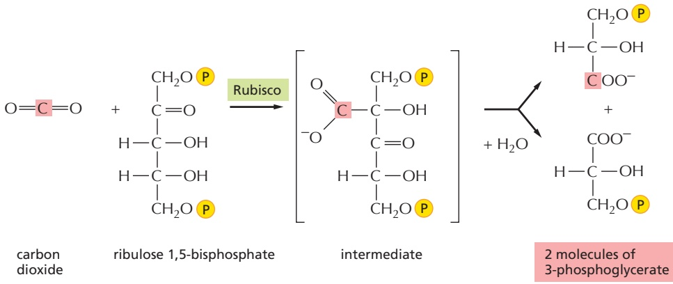

Figure 14–40 The initial reaction in carbon fixation. This carboxylation reaction allows one molecule each of carbon dioxide and water to be incorporated into organic carbon molecules. It is catalyzed in the chloroplast stroma by the abundant enzyme ribulose 1,5-bisphosphate carboxylase/oxygenase, or Rubisco. As indicated, the product is two molecules of 3-phosphoglycerate.

of ATP and NADPH produced by the photosynthetic electron-transfer reactions are required to drive this energetically unfavorable reaction.

**Figure 14–40** illustrates the central reaction of carbon fixation, in which an atom of inorganic carbon is converted to organic carbon: $\mathrm { C O _ { 2 } }$ from the atmosphere combines with the five-carbon compound ribulose 1,5-bisphosphate plus water to yield two molecules of the three-carbon compound 3-phosphoglycerate. This carboxylation reaction is catalyzed in the chloroplast stroma by a large enzyme called ribulose 1,5-bisphosphate carboxylase/oxygenase, or Rubisco. Because the reaction is so slow (each Rubisco molecule turns over only about 3 molecules of substrate per second, compared to 1000 molecules per second for a typical enzyme), a very large number of enzyme molecules are needed. Rubisco constitutes up to 50% of the chloroplast protein mass, and it is one of the most abundant proteins on Earth. Of great importance to the global environment, Rubisco also helps to reduce the amount of the greenhouse gas $\mathrm { C O _ { 2 } }$ in the atmosphere.

Although the production of carbohydrates from $\mathrm { C O _ { 2 } }$ and $\mathrm { H _ { 2 } O }$ is energetically unfavorable, the fixation of $\mathrm { C O _ { 2 } }$ catalyzed by Rubisco is an energetically favorable reaction. Carbon fixation is energetically favorable because a continuous supply of the energy-rich ribulose 1,5-bisphosphate is fed into the process via the carbon-fixation cycle described below. This compound is consumed by the addition of $\mathrm { C O _ { 2 } } ,$ and it must be replenished. As we describe next, the energy and reducing power needed to regenerate ribulose 1,5-bisphosphate come from the ATP and NADPH produced by the photosynthetic light reactions.

The elaborate series of reactions in which $\mathrm { C O _ { 2 } }$ combines with ribulose 1,5-bisphosphate to produce a simple sugar—a portion of which is used to regenerate ribulose 1,5-bisphosphate—forms a cycle, called the carbon-fixation cycle, or the Calvin–Benson–Bassham cycle (**Figure 14–41**). This cycle was one of the first metabolic pathways to be defined by applying radioisotopes as tracers in biochemistry. As indicated, each turn of the cycle converts six molecules of 3-phosphoglycerate to three molecules of ribulose 1,5-bisphosphate plus one molecule of glyceraldehyde 3-phosphate. The net result of each turn of the cycle is that 9 ATP and 6 NADPH molecules are used to power the conversion of $3   \mathrm { C O _ { 2 } }$ molecules into one molecule of glyceraldehyde 3-phosphate.

Glyceraldehyde 3-phosphate, the three-carbon sugar produced by the cycle, occupies a pivotal point in carbohydrate biochemistry as an intermediate in glycolysis and gluconeogenesis, enabling it to serve as the starting material for the synthesis of many other sugars and all of the other organic molecules that form the plant.

#### Carbon Fixation in Some Plants Is Compartmentalized to Facilitate Growth at Low $\mathrm { C O } _ { 2 }$ Concentrations

Although ribulose 1,5-bisphosphate carboxylase/oxygenase preferentially adds $\mathrm { C O _ { 2 } }$ to ribulose 1,5-bisphosphate, it can also use $\mathrm { O } _ { 2 }$ as a substrate in place of $\mathrm { C O _ { 2 } } ,$ and if the concentration of $\mathrm { C O _ { 2 } }$ is low, it will add $\mathrm { O } _ { 2 }$ to ribulose 1,5-bisphosphate

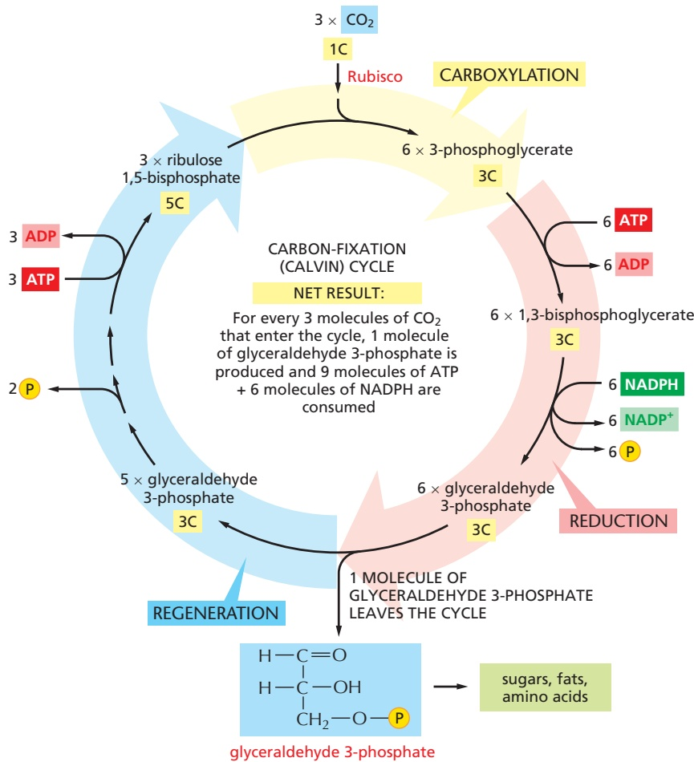

Figure 14–41 The Calvin–Benson–Bassham cycle (Calvin cycle) for carbon fixation. This central metabolic pathway allows organic molecules to be produced from CO2 and H2O. In the first stage of the cycle (carboxylation), $\mathrm { C O } _ { 2 }$ is added to ribulose 1,5-bisphosphate, as shown in Figure 14–40. In the second stage (reduction), ATP and NADPH are consumed to produce glyceraldehyde 3-phosphate molecules. In the final stage (regeneration), some of the glyceraldehyde 3-phosphate produced is used to regenerate ribulose 1,5-bisphosphate. Other glyceraldehyde 3-phosphate molecules are either converted to starch and fat in the chloroplast stroma or transported out of the chloroplast into the cytosol. The number of carbon atoms in each type of molecule is indicated in yellow. There are many intermediates between glyceraldehyde 3-phosphate and ribulose 1,5-bisphosphate, but they have been omitted here for clarity. The entry of water into the cycle is also not shown (but see Figure 14–40).

instead (see Figure 14–40). This is the first step in a pathway called **photorespiration**, whose ultimate effect is to use up $\mathrm { O } _ { 2 }$ and liberate $\mathrm { C O _ { 2 } }$ without the production of useful energy stores. In many plants, about one-third of the $\mathrm { C O _ { 2 } }$ fixed is lost again as $\mathrm { C O _ { 2 } }$ because of photorespiration.

Photorespiration can be a serious liability for plants in hot, dry conditions, which cause them to close their stomata (the gas-exchange pores in their leaves, each of which is called a stoma) to avoid excessive water loss. This in turn causes the $\mathrm { C O _ { 2 } }$ levels in the leaf to fall precipitously, thereby favoring photorespiration. A special adaptation, however, occurs in the leaves of many plants, such as corn and sugarcane, that grow in hot, dry environments. In these plants, the carbonfixation cycle occurs only in the chloroplasts of specialized bundle-sheath cells, which contain all of the plant’s ribulose 1,5-bisphosphate carboxylase/oxygenase. These cells are protected from the air and are surrounded by a specialized layer of mesophyll cells that use the energy harvested by their chloroplasts to “pump” $\mathrm { C O _ { 2 } }$ into the bundle-sheath cells. This supplies the ribulose 1,5-bisphosphate carboxylase/oxygenase with a high concentration of $\mathrm { C O _ { 2 } } ,$ thereby greatly reducing photorespiration.

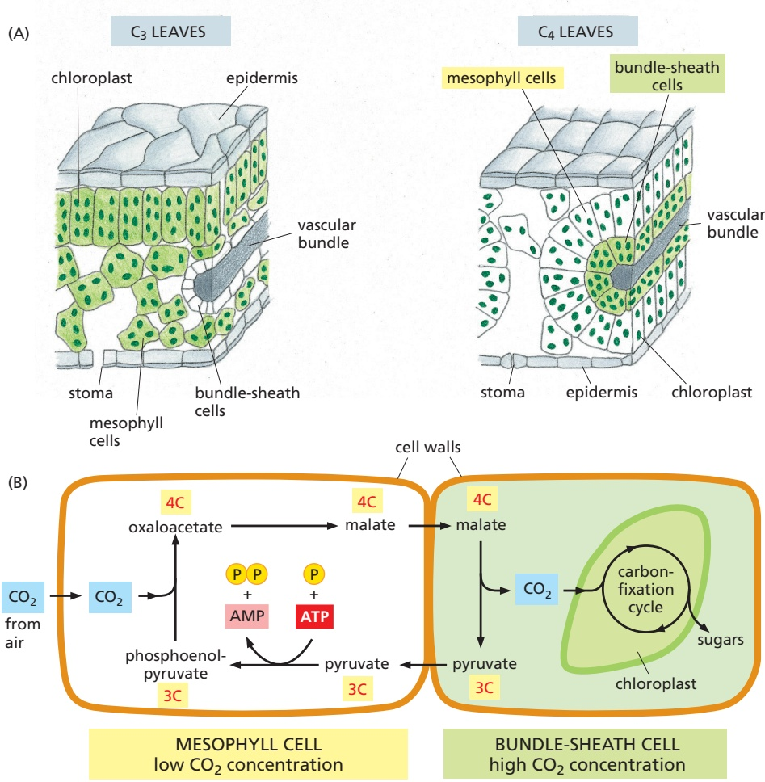

The $\mathrm { C O _ { 2 } }$ pump mechanism depends on a reaction cycle that begins in the cytosol of the mesophyll cells. An initial $\mathrm { C O _ { 2 1 } }$ -fixation step is catalyzed by an enzyme that binds $\mathrm { C O _ { 2 } }$ (as bicarbonate) and combines it with an activated three-carbon molecule (phosphoenolpyruvate) to produce a four-carbon molecule. The four-carbon molecule diffuses into the bundle-sheath cells, where it is broken down to release the $\mathrm { C O _ { 2 } }$ and generate a molecule with three carbons. The pumping cycle is completed when this three-carbon molecule (pyruvate) is returned to the mesophyll cells and converted back to its original activated form. Because the $\mathrm { C O _ { 2 } }$ is initially captured by converting it into a compound containing four carbons, the $\mathrm { C O _ { 2 } }$ -pumping plants are called $C _ { 4 }$ plants. All other plants are called $C _ { 3 }$ plants because they capture $\mathrm { C O _ { 2 } }$ into the three-carbon compound 3-phosphoglycerate (Figure 14–42).

As with any vectorial transport process, pumping $\mathrm { C O _ { 2 } }$ into the bundle-sheath cells in $\mathrm { C } _ { 4 }$ plants costs energy (ATP is hydrolyzed; see Figure 14–42B). In hot, dry environments, however, this cost can be much less than the energy lost by photorespiration in $\mathrm { C } _ { 3 }$ plants, so $\mathrm { C } _ { 4 }$ plants have a potential advantage. Moreover, because $\mathrm { C } _ { 4 }$ plants can perform photosynthesis at a lower concentration. / . of $\mathrm { C O _ { 2 } }$ inside the leaf, they need to open their stomata less often and therefore can fix about twice as much net carbon as $\mathrm { C } _ { 3 }$ plants per unit of water lost. This type of carbon fixation has evolved independently in several different plant lineages. Although the vast majority of plant species are $\mathrm { C } _ { 3 }$ plants, $\mathrm { C } _ { 4 }$ plants such as corn and sugarcane are much more effective at converting sunlight energy into biomass than $\mathrm { C } _ { 3 }$ plants such as cereal grains. They are therefore of special importance in world agriculture.

Many algae have a different adaptation to manage the challenge of limited $\mathrm { C O _ { 2 } }$ concentration, which is often a problem in the aquatic environment in which algae grow. The pyrenoid is a complex structure that contains a biomolecular

Figure 14–42 The $\mathsf { C O } _ { 2 }$ pumping in $\mathbf { C } _ { 4 }$ plants. (A) Comparative leaf anatomy in a C3 plant and a $\mathsf { C } _ { 4 }$ plant. The cells with green cytosol in the leaf interior contain chloroplasts that perform the normal carbon-fixation cycle. In $\mathrm { C } _ { 4 }$ plants, the mesophyll cells are specialized for CO2 pumping rather than for carbon fixation, and they thereby create a high ratio of $\mathrm { C O } _ { 2 }$ to $\mathrm { O } _ { 2 }$ in the bundle-sheath cells, which are the only cells in these plants where the carbon-fixation cycle occurs. The vascular bundles carry the sucrose made in the leaf to other tissues. (B) How carbon dioxide is concentrated in bundle-sheath cells by the harnessing of ATP energy in mesophyll cells.

(B)

condensate highly enriched in Rubisco along with a scaffold protein (see Figure 12–8). This condensate is interwoven with membrane tubules that contain carbonic anhydrase, an enzyme that converts the bicarbonate ions $\mathrm { ( H C O _ { 3 } ^ { - } ) }$ dissolved in water into $\mathrm { C O _ { 2 } } .$ The pyrenoid therefore provides $\mathrm { C O _ { 2 } }$ for Rubisco, thereby favoring carbon fixation over deleterious photorespiration.

Figure 14–43 How chloroplasts and mitochondria collaborate to supply cells with both metabolites and ATP. (A) The inner chloroplast membrane is impermeable to the ATP and NADPH that are produced in the stroma during the light reactions of photosynthesis. These molecules are instead funneled into the carbon-fixation cycle, where they are used to make sugars. The resulting sugars and their metabolites are either stored within the chloroplast—in the form of starch or fat—or exported to the rest of the plant cell. There, they can enter the energy-generating pathway that ends in ATP synthesis linked to oxidative phosphorylation inside the mitochondrion. Unlike the chloroplast, mitochondrial membranes contain a specific transporter that makes them permeable to ATP (see Figure 14–35). Note that the O2 released to the atmosphere by photosynthesis in chloroplasts is used for oxidative phosphorylation in mitochondria; similarly, the CO2 released by the citric acid cycle in mitochondria is used for carbon fixation in chloroplasts. (B) In a leaf, mitochondria (red) tend to cluster close to the chloroplasts (green), as seen in this light micrograph. (B, courtesy of Olivier Grandjean.)

#### The Sugars Generated by Carbon Fixation Can Be Stored as Starch or Consumed to Produce ATP

The glyceraldehyde 3-phosphate generated by carbon fixation in the chloroplastMBoC7 m14.42/14.43 stroma can be used in a number of ways, depending on the needs of the plant. During periods of excess photosynthetic activity, much of it is converted to glucose and stored as starch in the chloroplast stroma. Like glycogen in animal cells, starch is a storage polymer of glucose that is found as large granules. Starch forms an important part of the diet of all animals that eat plants. Other glyceraldehyde 3-phosphate molecules are converted to different important biosynthetic or storage molecules. For example, fat, which accumulates as triglycerides and other storage esters in fat droplets, serves as an additional energy reserve.

At night, stored starch and fat can be broken down to glucose and fatty acids, which are exported to the cytosol to help support the metabolic needs of the plant. Some of the exported sugar enters the glycolytic pathway (see Figure 2–46), where it is converted to pyruvate. Both that pyruvate and the fatty acids can enter the plant cell mitochondria and be catabolized to acetyl CoA that is fed into the citric acid cycle, ultimately leading to the efficient production of ATP by oxidative phosphorylation (**Figure 14–43**). In this way, the metabolic transitions of the light/dark cycle of the plant are reminiscent of the fasting/feeding cycles typical of many animals.

In the cytosol, glucose exported from chloroplasts after starch hydrolysis or generated from gluconeogenesis from glyceraldehyde 3-phosphate can also be converted into the disaccharide sucrose. Sucrose is the major form in which sugar is transported between the cells of a plant. Just as glucose is transported in the blood of animals, so sucrose is exported from the leaves to provide carbohydrate to the rest of the plant.

#### The Thylakoid Membranes of Chloroplasts Contain the Protein Complexes Required for Photosynthesis and ATP Generation

We next need to explain how the large amounts of ATP and NADPH required for carbon fixation are generated in the chloroplast. Chloroplasts make use of chemiosmotic energy conversion in much the same way as mitochondria. As we saw in Figure 14–38, chloroplasts and mitochondria are organized on the same principles, although the chloroplast contains a separate thylakoid membrane system in which its chemiosmotic mechanisms occur. The thylakoid membranes contain two large membrane protein complexes, called photosystems, which endow photosynthetic organisms with the ability to capture and convert solar energy into usable forms of energy. Two other protein complexes in the thylakoid membrane work together with the photosystems to catalyze photophosphorylation—the generation of ATP with sunlight. These have mitochondrial equivalents: a hemecontaining cytochrome $b _ { 6 } { \scriptstyle - f }$ complex, which both functionally and structurally resembles cytochrome c reductase (Complex III) in the respiratory chain; and a chloroplast ATP synthase, which closely resembles the mitochondrial ATP synthase and works in the same way.

#### Chlorophyll–Protein Complexes Can Transfer Either Excitation Energy or Electrons

The photosystems in the thylakoid membrane are multiprotein assemblies of a complexity comparable to that of the protein complexes in the mitochondrial electron-transport chain. They contain large numbers of specifically bound chlorophyll molecules, in addition to cofactors that will be familiar from our discussion of mitochondria (heme, iron–sulfur clusters, and quinones). **Chlorophyll**, the green pigment of photosynthetic organisms, has a long hydrophobic tail that makes it behave like a lipid, plus a porphyrin ring that has an extensive system of delocalized electrons in conjugated double bonds and a central Mg atom (structurally analogous to heme and its central Fe atom; **Figure 14–44**).

When a chlorophyll molecule absorbs a quantum of sunlight (a photon), the energy of the photon causes one of these electrons to move from a low-energy orbital to another orbital of higher energy. A photon of red light (∼600–700 nm wavelength) moves an electron to a low-level excited state. A higher-energy photon of blue light (∼400–500 nm) kicks an electron to a higher-energy excited state, which rapidly decays to the low-level excited state by converting the extra energy into heat (molecular motion). The excited electrons in the low-energy state tend to return to their ground state in one of three ways:

1. By converting the extra energy into heat (molecular motion) or to some combination of heat and light of a longer wavelength (fluorescence); this is what usually happens when light is absorbed by an isolated chlorophyll molecule in solution.

2. By transferring the energy—but not the electron—directly to a neighboring chlorophyll molecule by a process called resonance energy transfer.

3. By transferring the excited electron with its negative charge to another nearby molecule, an electron acceptor, after which the positively charged chlorophyll returns to its original state by taking up an electron from some other molecule, an electron donor.

Only the latter two mechanisms are useful for the capturing of energy from sunlight, and they are enabled by the chlorophylls being precisely positioned within a chlorophyll–protein complex. The protein coordinates the central Mg atom in the chlorophyll porphyrin, most often through a histidine side chain located in the hydrophobic interior of a membrane, causing each of the chlorophylls in the protein complex to be held at exactly defined distances and orientations. The flow of excitation energy or electrons then depends on both the precise spatial arrangement and the local protein environment of the protein-bound chlorophylls.

When excited by a photon, most protein-bound chlorophylls simply transmit the absorbed energy to another nearby chlorophyll by the process of resonance energy transfer. However, in a few specially positioned chlorophylls, the energy difference between the ground state and the excited state is just right for the photon to trigger a light-induced chemical reaction. The special state of such chlorophyll molecules derives from their close interaction with a second chlorophyll molecule in the same chlorophyll–protein complex. Together, these two chlorophylls form a special pair.

The photosynthetic electron-transfer process starts when a photon of suitable energy ionizes a chlorophyll molecule in such a special pair, dissociating it into an electron and a positively charged chlorophyll ion. The energized electron is then passed rapidly to a quinone in the same protein complex, preventing its unproductive reassociation with the chlorophyll ion. This light-induced transfer of

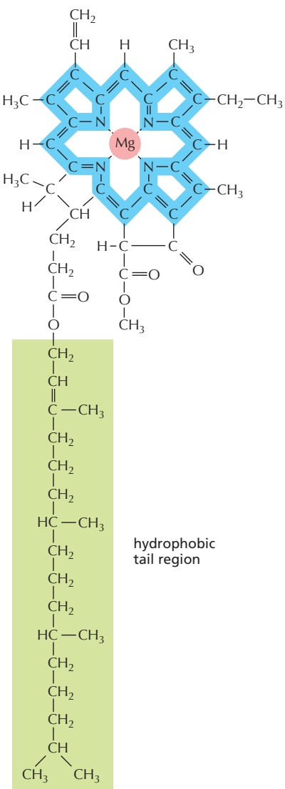

Figure 14–44 The structure of

chlorophyll a. A magnesium atom is held in a porphyrin ring, which is related to the porphyrin ring that binds iron in heme (see Figure 14–15). Electrons are delocalized over the bonds shaded in blue, and the hydrophobic tail is shaded in green.

Figure 14–45 A general scheme for the charge-separation step in a photosynthetic reaction center. In a reaction center, light energy is harnessed to transfer electrons from chlorophyll to mobile electron carriers in which the electrons are held in a high-energy state. Light energy is thereby converted to chemical energy. The process starts when a photon absorbed by the special pair of chlorophylls in the reaction center knocks an electron out of one of the chlorophylls. This electron is rapidly taken up by a mobile electron carrier (orange) bound at the opposite membrane surface, because a set of intermediary carriers embedded in the reaction center (not shown) provides the path from the special pair to this carrier. The physical distance between the positively charged chlorophyll ion and the negatively charged electron carrier stabilizes the chargeseparated state for a short time, during which the chlorophyll ion, a strong oxidant, withdraws an electron from a suitable compound (for example, from water, an event we will discuss in detail shortly). The mobile electron carrier then diffuses away from the reaction center as a strong electron donor that will transfer its electron to an electron-transport chain.

an electron from a chlorophyll to a mobile electron carrier is the central chargeseparation step in photosynthesis, in which a chlorophyll becomes positively charged and an electron carrier becomes negatively charged (**Figure 14–45**). A positively charged chlorophyll ion is a very strong oxidant that is able to withdraw an electron from a low-energy substrate; in the first step of oxygenic photosynthesis, this low-energy substrate is water.

Upon transfer to a mobile carrier in the electron-transport chain, the electron has been stabilized as part of a strong electron donor and made available for subsequent reactions. These subsequent reactions require more time to complete, and we shall see how they cause the production of light-generated energy-rich compounds.

#### A Photosystem Contains Chlorophylls in Antennae and a Reaction Center

There are two distinct types of chlorophyll–protein complexes in the photosynthetic membrane. A photochemical reaction center contains the special pair of chlorophylls just described. The other type engages exclusively in light absorption and resonance energy transfer and contains antenna chlorophylls. Together, the two types of chlorophyll–protein complexes help to create a **photosystem** (**Figure 14–46**).

Most of the chlorophylls in a photosystem are present in light-harvesting complexes, whose role is to efficiently collect the energy of photons for photosynthesis.

Figure 14–46 A photosystem. Each photosystem consists of a reaction center plus a large number of light-harvesting protein-bound chlorophylls (more than depicted in this figure). The solar energy for photosynthesis is collected by the antenna chlorophylls, which account for most of the chlorophyll in a plant cell. The energy hops randomly by resonance energy transfer (red arrows) from one chlorophyll molecule to another, until it reaches the reaction center complex, where it ionizes a chlorophyll in the special pair. The chlorophyll special pair holds its electrons at a lower energy than that of the electrons of the antenna chlorophylls, causing the energy transferred to it to become trapped there. Note that it is only energy, not electrons, that moves from one antenna chlorophyll molecule to another (Movie 14.12).

Without these antennae, the process would be slow and inefficient, inasmuch as each reaction-center chlorophyll would absorb only about one light quantum per second, even in broad daylight, whereas hundreds per second are needed for effective photosynthesis. When light excites an antenna chlorophyll molecule, the energy passes rapidly from one protein-bound chlorophyll to another by resonance energy transfer until it reaches the special pair in the reaction center.

Additional light-harvesting complexes, or LHCs, serve an accessory antenna role by collecting photon energy and transferring it to the photosystem. In addition to many chlorophyll molecules, an LHC contains orange carotenoid pigments. The carotenoids collect light of a different wavelength than that absorbed by chlorophylls, helping to make the antennae more efficient. They also have an important protective role in preventing the formation of harmful oxygen radicals in the photosynthetic membrane.

#### The Thylakoid Membrane Contains Two Different Photosystems Working in Series

As just described, the excitation energy collected by the antenna chlorophylls is delivered to the special pair in the **photochemical reaction center**. The reaction center is a transmembrane chlorophyll–protein complex that lies at the heart of photosynthesis. It harbors the special pair of chlorophyll molecules, which acts as an irreversible trap for excitation energy (see Figure 14–46).

Chloroplasts contain two functionally different although structurally related photosystems, each of which feeds electrons generated by the action of sunlight into an electron-transfer chain. In the chloroplast thylakoid membrane, photosystem I is confined to the unstacked stroma thylakoids, while the stacked grana thylakoids contain photosystem II. The two photosystems were named in order of their discovery, not of their actions in the photosynthetic pathway, and electrons are first activated in photosystem II before being transferred to photosystem I (**Figure 14–47**). The path of the electron through the two photosystems can be

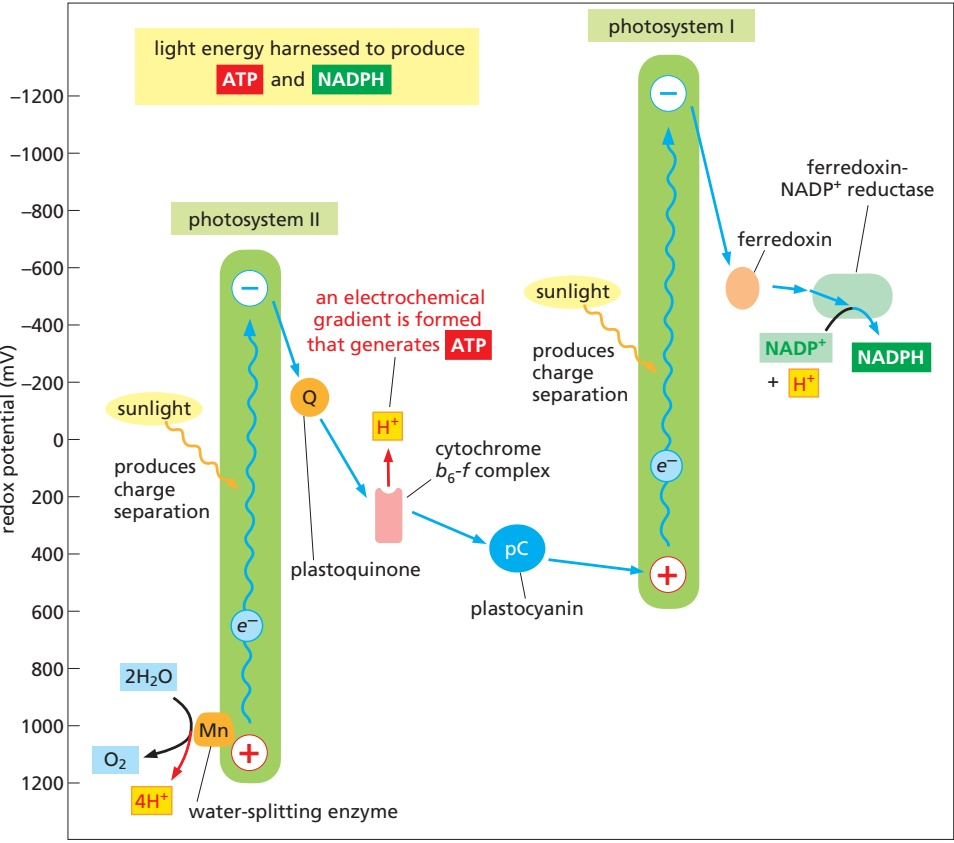

direction of electron flow

Figure 14–47 Changes in redox potential during photosynthesis. The redox potential for each molecule is indicated by its position along the vertical axis. Using excitation energy from sunlight, photosystem II passes electrons derived from water to photosystem I, which also uses sunlight energy to pass them to NADP+ through ferredoxin-NADP+ reductase. The net electron flow through the two photosystems is from water to NADP+, and it produces NADPH as well as an electrochemical proton gradient. This proton gradient is used by the ATP synthase to produce ATP. Details in this figure will be explained in the subsequent text. Note that, for historical reasons, the two photosystems were named opposite to the order in which they act, with photosystem II passing its electrons to photosystem I.

described as a Z-like trajectory and is known as the Z scheme. In the Z scheme, the reaction center of photosystem II first withdraws an electron from water. The electron passes via an electron-transport chain (composed of the electron carrier plastoquinone, the cytochrome $b _ { 6 } { - } f$ complex, and the protein plastocyanin) to photosystem I, which propels the electron across the membrane in a second light-driven charge-separation reaction that leads to NADPH production. In the process, an electrochemical proton gradient is established across the thylakoid membrane that is used to fuel ATP production.

The Z scheme is necessary to bridge the very large energy gap between water and NADPH (Figure 14–47). A single quantum of visible light does not contain enough energy both to withdraw electrons from water, which holds on to its electrons very tightly (redox potential +820 mV) and therefore is a very poor electron donor, and to force them on to $\mathrm { N A D P ^ { + } }$ , which is a very poor electron acceptor (redox potential –320 mV). The Z scheme first evolved in cyanobacteria to enable them to use water as a universally available electron source. Other, simpler photosynthetic bacteria have only one photosystem. As we shall see, they cannot use water as an electron source and must rely on other, more energy-rich substrates instead, from which electrons are more readily withdrawn. The ability to extract electrons from water (and thereby to produce molecular oxygen) was acquired by plants when their ancestors took up the endosymbiotic cyanobacteria that later evolved into chloroplasts (see Figure 1–29).

#### Photosystem II Uses a Manganese Cluster to Withdraw Electrons from Water

In biology, only photosystem II is able to withdraw electrons from water and to generate molecular oxygen as a by-product. This remarkable specialization of photosystem II is conferred by the unique properties of one of the two chlorophyll molecules of its special pair and by a manganese cluster linked to the protein. The special pair of chlorophyll molecules plus the manganese cluster form the catalytic core of the photosystem II reaction center, whose mechanism is outlined in **Figure 14–48**.

Water is an inexhaustible source of electrons, but it is also extremely stable; therefore, a large amount of energy is required to make it part with its electrons. The only compound in living organisms that is able to achieve this feat, after its ionization by light, is the chlorophyll special pair called $\mathrm { P _ { 6 8 0 } \; ( P _ { 6 8 0 } / P _ { 6 8 0 } { } ^ { + } }$ redox potential = +1270 mV). The reaction $\mathrm { 2 H _ { 2 } O \: + \: 4 }$ photons $\rightarrow 4 \mathrm { H } ^ { + }   +   4 e ^ { - }   +   \mathrm { O } _ { 2 }$ is catalyzed by its adjacent manganese cluster. Except for the electrons, the intermediates remain firmly attached to the manganese cluster until two water molecules have been fully oxidized to $\mathrm { O } _ { 2 } ,$ thus ensuring that no dangerous oxygen radicals are released as the reaction proceeds. The four protons released by the two water molecules are discharged to the thylakoid space, contributing to the proton gradient across the thylakoid membrane (pH lower in the thylakoid

Figure 14–48 The conversion of light energy to chemical energy in the photosystem II complex. (A) Schematic diagram of the photosystem II reaction center, whose special pair of chlorophyll molecules is designated as P680 on the basis of the wavelength of its absorbance maximum (680 nm). (B) Cofactors and pigments at the core of the reaction center. Shown are the manganese (Mn) cluster, the tyrosine side chain that connects it to the P680 special pair, four chlorophylls (green), two pheophytins (light blue), two plastoquinones (orange), and an iron atom (red). The path of electrons is shown by blue arrows. In the manganese cluster, four manganese atoms (light blue), one calcium atom (purple), and five oxygen atoms (red) work together to catalyze the oxidation of water. The water-splitting reaction occurs in four successive steps, each requiring the energy of one photon. Each photon turns a P680 reaction-center chlorophyll into a positively charged chlorophyll ion. Through an ionized tyrosine side chain (yellow), this chlorophyll ion pulls an electron away from a water molecule bound at the manganese cluster. In this way, a total of four electrons are withdrawn from two water molecules to generate molecular oxygen, which is released into the atmosphere (see also Figure 4–49).

Each electron that is energized by light passes from the special pair to an electrontransfer chain inside the complex, along the indicated path to the permanently bound plastoquinone $\mathsf { Q } _ { \mathsf { A } }$ and then to plastoquinone $\mathsf { Q } _ { \mathsf { B } } .$ Once QB has picked up two electrons (plus two protons; see Figure 14–17), it dissociates from its binding site in the complex and enters the lipid bilayer as a mobile electron carrier, being immediately replaced by a new, nonreduced molecule of plastoquinone. Note that the chlorophylls and pheophytins form two symmetrical branches of a potential electron-transport chain. Only one branch is active, thus ensuring that the plastoquinones become fully reduced in minimum time.

Figure 14–49 The structure of the complete photosystem II complex. This photosystem contains at least 16 protein subunits, along with 36 chlorophylls, two pheophytins, two hemes, and a number of protective carotenoids (colored). Most of these pigments and cofactors are deeply buried, tightly complexed to protein (gray). The path of electrons is indicated by the blue arrows and is explained in Figure 14–48B. The photosystem II complex presented here is the cyanobacterial complex, which is simpler and more stable than the plant complex, which works in the same way. (PDB code: 3WU2.)

space than in the stroma). The unique protein environment that endows life with this all-important ability to oxidize water has remained essentially unchanged throughout billions of years of evolution (**Figure 14–49**). All of the oxygen in Earth’s atmosphere is believed to have been generated in this way.

#### The Cytochrome $b _ { 6 } - f$ Complex Connects Photosystem II to Photosystem I

Following the path shown previously in Figure 14–49, the electrons extracted from water by photosystem II are transferred to plastoquinol, a strong electron donor similar to ubiquinol in mitochondria. This quinol, which can diffuse rapidly in the lipid bilayer of the thylakoid membrane, transfers its electrons to the cytochrome $b _ { 6 } { - } f$ complex, whose structure is similar to the cytochrome c reductase in mitochondria. The cytochrome $b _ { 6 } { - } f$ complex pumps $\dot { \mathrm { H } } ^ { + }$ into the thylakoid space using the same Q cycle that is utilized in mitochondria (see Figure 14–21), thereby adding to the proton gradient across the thylakoid membrane.

The cytochrome $b _ { 6 } { - } f$ complex forms the connecting link between photosystems II and I in the chloroplast electron-transport chain. It passes its electrons one at a time to the mobile electron carrier plastocyanin (a small copper-containing protein that takes the place of the cytochrome c in mitochondria), which transfers those electrons to photosystem I (**Figure 14–50**). As we discuss next, photosystem I then uses a second photon of light to boost the electrons that it receives to an even higher energy level.

Figure 14–50 Electron flow through the cytochrome $b _ { 6 ^ { - f } }$ complex to NADPH. The cytochrome b6-f complex is the functional equivalent of cytochrome c reductase (the cytochrome b-c1 complex) in mitochondria (see Figure 14–22). Like its mitochondrial homolog, the $b _ { 6 ^ { - } } f$ complex receives its electrons from a quinone and engages in a complicated Q cycle that pumps two protons across the membrane (details not shown). It passes its electrons, one at a time, to plastocyanin (pC). Plastocyanin diffuses along the membrane surface to photosystem I and transfers the electrons via ferredoxin (Fd) to the ferredoxin- $\mathsf { { \cdot } N A D P ^ { + } }$ reductase (FNR), where they are utilized to produce NADPH. $\mathsf { P } _ { 7 0 0 }$ is a special pair of chlorophylls that absorbs light of wavelength 700 nm.

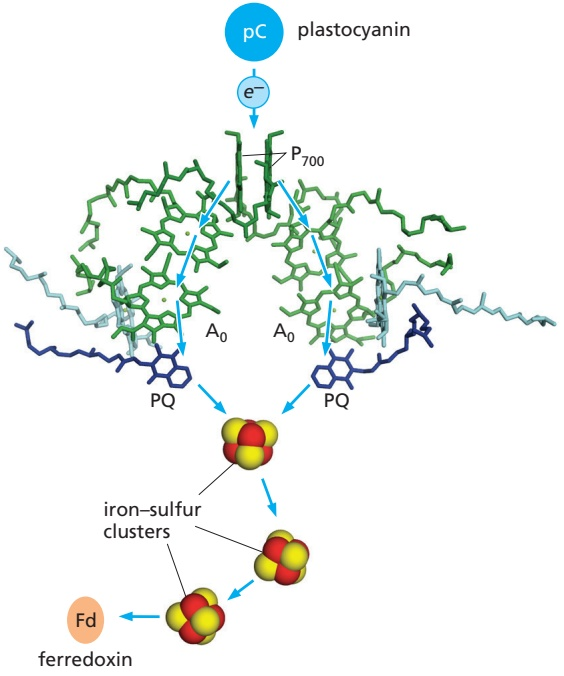

Figure 14–51 Structure and function of photosystem I. At the heart of the photosystem I complex assembly is the electron-transfer chain shown. At one end is a special pair of chlorophylls called P700 (because it absorbs light of 700-nm wavelength), receiving electrons from plastocyanin (pC). At the other end are the A0 chlorophylls, which hand the electrons on to ferredoxin via two plastoquinones (PQ; purple) and three iron–sulfur clusters. Even though the roles of photosystems I and II in photosynthesis are very different, their central electron-transfer chains are structurally similar, suggesting a common evolutionary origin (see Figure 14–53). Note that in photosystem I both branches of the electron-transfer chain are active, unlike in photosystem II (see Figure 14–48). (PDB code: 3LW5.)

#### Photosystem I Carries Out the Second Charge-Separation Step in the Z Scheme

Photosystem I receives electrons from plastocyanin in the thylakoid space and transfers them, via a second charge-separation reaction, to the small protein ferredoxin on the opposite membrane surface (**Figure 14–51**). Then, in a final step, ferredoxin feeds its electrons to a membrane-associated enzyme complex,MBoC7 m14.51/14.51 the ferredoxin-NADP+ reductase, which uses the electrons to reduce $\mathrm { N A D \bar { P } ^ { + } }$ to NADPH (see Figure 14–50). The reduced NADPH is released into the chloroplast stroma, where it is used for biosynthesis of glyceraldehyde 3-phosphate, amino acid precursors, and fatty acids.

The redox potential of the NADP+/NADPH pair (–320 mV) is already very low, and the reduction of NADP+ therefore requires a compound with an even lower redox potential. This turns out to be a chlorophyll molecule near the stromal membrane surface of photosystem I that has a redox potential of –1000 mV (chlorophyll $\mathrm { A _ { 0 } ) }$ , making it the strongest known electron donor in biology.

#### The Chloroplast ATP Synthase Uses the Proton Gradient Generated by the Photosynthetic Light Reactions to Produce ATP

The sequence of events that results in light-driven production of ATP and NADPH in chloroplasts and cyanobacteria is summarized in **Figure 14–52**. Starting with the withdrawal of electrons from water, the light-driven chargeseparation steps in photosystems II and I enable the energetically unfavorable flow of electrons from water to NADPH (see Figure 14–47). Three small mobile electron carriers—plastoquinone, plastocyanin, and ferredoxin—participate in this process. Together with the electron-driven proton pump of the cytochrome b6-f complex, the photosystems generate a large proton gradient across the thylakoid membrane. The ATP synthase molecules embedded in the thylakoid membranes then harness this proton gradient to produce ATP in the chloroplast stroma, analogous to the synthesis of ATP in the mitochondrial matrix.

The linear Z scheme for photosynthesis thus far discussed can switch to a circular mode of electron flow through photosystem I and the $b _ { 6 } { - } f$ complex. Here, the electrons held in the reduced ferredoxin are transferred back to the $b _ { 6 ^ { - } } f$ complex to reduce plastoquinone, instead of being passed to the ferredoxin-NADP+ reductase enzyme complex. This, in effect, turns photosystem I into a light-driven proton pump, thereby increasing the proton gradient and thus the amount of ATP made by the ATP synthase. An elaborate set of regulatory mechanisms controls this switch, which enables the chloroplast to generate either more NADPH (linear mode) or more ATP (circular mode), depending on the metabolic needs of the cell.

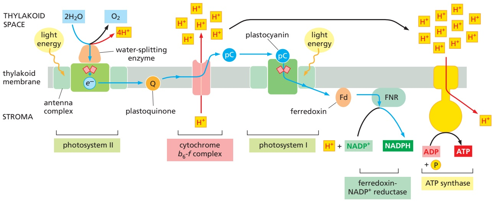

Figure 14–52 Summary of electron and proton movements during photosynthesis in the thylakoid membrane. Electrons are withdrawn, through the action of light energy, from a water molecule that is held by the manganese cluster in photosystem II. The electrons pass on to plastoquinone, which delivers them to the cytochrome $b _ { 6 ^ { - } } f$ complex that resembles the cytochrome c reductase of mitochondria and the cytochrome b-c complex of bacteria. They are then carried to photosystem I by the soluble electron carrier plastocyanin, the functional equivalent of cytochrome c in mitochondria. From photosystem I they are transferred to ferredoxin-NADP+ reductase (FNR) by the soluble carrier ferredoxin (Fd; a small protein containing an iron–sulfur center). Protons are pumped into the thylakoid space by the cytochrome b6-f complex, in the same way that protons are pumped into mitochondrial cristae by cytochrome c reductase (see Figure 14–23). In addition, the H+ released into the thylakoid space by water oxidation, and the H+ consumed during NADPH formation in the stroma, contribute to the generation of the electrochemical H+ gradient across the thylakoid membrane. As illustrated, this gradient drives ATP synthesis by an ATP synthase that sits in the same membrane (see Figure 14–47).

#### The Proton-Motive Force for ATP Production in Mitochondria and Chloroplasts Is Essentially the Same

The proton gradient across the thylakoid membrane depends both on the proton-pumping activity of the cytochrome $b _ { 6 } { - } f$ complex and on the photosynthetic activity of the two photosystems. In chloroplasts exposed to light, H+ is pumped out of the stroma (pH around $8 ,$ similar to the mitochondrial matrix) into the thylakoid space (pH 5–6), creating a gradient of 2–3 pH units across the thylakoid membrane, representing a proton-motive force of about 180 mV. This is very similar to the proton-motive force in respiring mitochondria. However, a membrane potential across the inner mitochondrial membrane makes the largest contribution to the proton-motive force that drives the mitochondrial ATP synthase to make ATP, whereas an $\mathrm { H } ^ { + }$ gradient predominates for chloroplasts.

#### Chemiosmotic Mechanisms Evolved in Stages

The first living cells on Earth may have consumed geochemically produced organic molecules and generated their ATP by fermentation. Because oxygen was not yet present in the atmosphere, such anaerobic fermentation reactions would have dumped organic acids—such as lactic or formic acids, for example—into the environment (see Figure 2–50). Perhaps such acids lowered the $\mathrm { p H }$ of the environment, favoring the survival of cells that evolved transmembrane proteins that could pump $\mathrm { H } ^ { + }$ out of the cytosol, thereby preventing the cell from becoming too acidic (stage 1 in **Figure 14–53**). One of these pumps may have used the energy available from ATP hydrolysis to eject H+ from the cell; such a proton pump could have been the ancestor of present-day ATP synthases.

As Earth’s supply of geochemically produced nutrients began to dwindle, organisms that could find a way to pump $\mathrm { H } ^ { + }$ without consuming ATP would have been at an advantage: they could save the small amounts of ATP they derived from the fermentation of increasingly scarce foodstuffs to fuel other important activities. This need to conserve resources might have led to the evolution of electron-transport proteins that allowed cells to use the movement of electrons between molecules of different redox potentials as a source of energy for pumping H+ across the plasma membrane (stage 2 in Figure 14–53). Some of these cells might have used the nonfermentable organic acids that neighboring cells had excreted as waste to provide the electrons needed to feed this electron-transport system. Some present-day bacteria grow on formic acid, for example, using the small amount of redox energy derived from the transfer of electrons from formic acid to fumarate to pump $\mathrm { H } ^ { \bar { + } }$

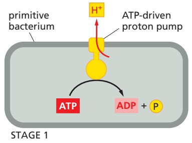

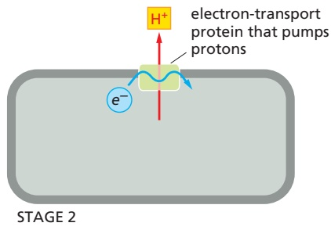

Eventually, some bacteria would have developed H+-pumping electrontransport systems that were so efficient that the bacteria could harvest more redox energy than they needed to maintain their internal pH. Such cells would probably have generated large electrochemical proton gradients, which they could then use to produce ATP. Protons could leak back into the cell through the ATP-driven $\mathrm { H } ^ { + }$ pumps, essentially running them in reverse so that they synthesized ATP (stage 3 in Figure 14–53). Because such cells would require much less of the dwindling supply of fermentable nutrients, they would have proliferated at the expense of their neighbors.

STAGE 3

#### By Providing an Inexhaustible Source of Reducing Power, Photosynthetic Bacteria Overcame a Major Evolutionary Obstacle

The gradual depletion of nutrients from the environment on the early Earth meant that organisms had to find some alternative source of carbon to make the sugars that serve as the precursors for so many other cell components. Although the $\mathrm { C O _ { 2 } }$ in the atmosphere provides an abundant potential carbon source, to convert it into an organic molecule such as a carbohydrate requires reducing the fixed $\mathrm { C O _ { 2 } }$ with a strong electron donor, such as NADPH, which can generate $\left( \mathrm{CH_{2}O} \right)$ units from $\mathrm { C O _ { 2 } }$ (see Figure 14–41). Early in cellular evolution, strong reducing agents (electron donors) are thought to have been plentiful. But once an ancestor of ATP synthase began to generate most of the ATP, it paved the way for cells to evolve a new way of generating strong reducing agents.

Figure 14–53 How ATP synthesis by chemiosmosis might have evolved in stages. The first stage could have involved the evolution of an ATPase that pumped protons out of the cell using the energy of ATP hydrolysis. Stage 2 could have involved the evolution of a different proton pump, driven by an electron-transport chain. Stage 3 would then have linked these two systems together to generate a primitive ATP synthase that used the protons pumped by the electron-transport chain to synthesize ATP. An early bacterium with this final system would have had a selective advantage over bacteria with neither of the systems or only one.

A major evolutionary breakthrough in energy metabolism came with the development of photochemical reaction centers that could use the energy of sunlight to produce molecules such as NADPH. It is thought that this occurred early in the process of cellular evolution in the ancestors of the green sulfur bacteria. Present-day green sulfur bacteria use light energy to transfer hydrogen atoms (as an electron plus a proton) from $\mathrm { H } _ { 2 } S$ to NADPH, thereby producing the strong reducing power required for carbon fixation. Because the redox potential of H2S is much lower than that of $\mathrm { H _ { 2 } O }$ (–230 mV for H2S compared with +820 mV for $\mathrm { H _ { 2 } O ) }$ , one quantum of light absorbed by the single photosystem in these bacteria is sufficient to generate NADPH via a relatively simple photosynthetic electron-transport chain.

#### The Photosynthetic Electron-Transport Chains of Cyanobacteria Produced Atmospheric Oxygen and Permitted New Life-Forms

The next evolutionary step, which is thought to have occurred with the development of the cyanobacteria perhaps 3 billion years ago, was the evolution of organisms capable of using water as the electron source for $\mathrm { C O _ { 2 } }$ reduction. This entailed the evolution of a water-splitting enzyme and also required the addition of a second photosystem, acting in series with the first, to bridge the large gap in redox potential between $\mathrm { H _ { 2 } O }$ and NADPH. The biological consequences of this evolutionary step were far-reaching. For the first time, there would have been organisms that could survive on water, $\mathrm { C O _ { 2 } } ,$ and sunlight (plus several other elements; see Figure 2–1). These cells would have been able to spread and evolve in ways denied to the earlier photosynthetic bacteria, which needed $\mathrm { H } _ { 2 } S$ or organic acids as a source of electrons. Consequently, large amounts of biologically synthesized, reduced organic materials accumulated, and oxygen entered the atmosphere for the first time.

Oxygen is highly toxic because the oxidation of biological molecules alters their structure and properties indiscriminately and irreversibly. Most anaerobic bacteria, for example, occupy environments devoid of oxygen and are rapidly killed when exposed to air. Thus, organisms on the primitive Earth would have had to evolve mechanisms to protect them from the rising $\mathrm { O } _ { 2 }$ levels in the environment. Late evolutionary arrivals, such as ourselves, have numerous detoxifying mechanisms that protect our cells from the ill effects of oxygen.

The increase in atmospheric $\mathrm { O } _ { 2 }$ was very slow at first and would have allowed a gradual evolution of protective devices. For example, the early seas contained large amounts of iron in its reduced, ferrous state $\mathbf { \hat { \Gamma } } \left( \mathrm { F e } ^ { 2 + } \right)$ , and nearly all the $\mathrm { O } _ { 2 }$ produced by early photosynthetic bacteria would have been used up in oxidizing $\mathrm { F e ^ { 2 + } }$ to ferric $\mathbf { \tilde { F } } \mathbf { e } ^ { 3 + }$ . This conversion caused the precipitation of huge amounts of stable oxides, and the extensive banded iron formations in sedimentary rocks, beginning about 2.7 billion years ago, help to date the spread of the cyanobacteria. By about 2 billion years ago, the supply of $\mathrm { F e ^ { 2 + } }$ was exhausted, and the deposition of further iron precipitates ceased. Geological evidence reveals how $\mathrm { O } _ { 2 }$ levels in the atmosphere have changed over billions of years, approximating current levels only about 0.5 billion years ago (**Figure 14–54**).

The availability of $\mathrm { O } _ { 2 }$ enabled the rise of bacteria that developed an aerobic metabolism to make their ATP. These organisms could harness the

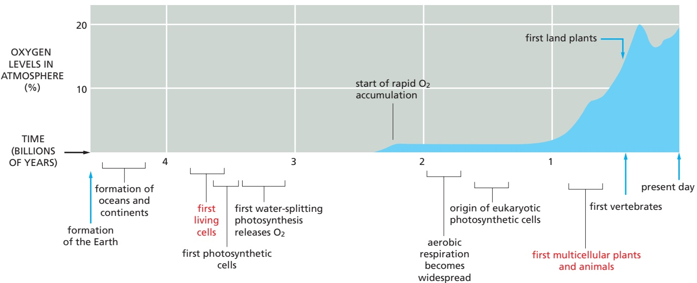

Figure 14–54 Major events during the evolution of living organisms on Earth. With the evolution of the membranebased process of photosynthesis, organisms were able to make their own organic molecules from CO2 gas. The delay of more than a billion years between the appearance of bacteria that split water and released $\mathrm { O } _ { 2 }$ during photosynthesis and the accumulation of high levels of O2 in the atmosphere is thought to be due to the initial reaction of the oxygen with the abundant ferrous iron $\tilde { ( \mathsf { F } } \mathsf { e } ^ { 2 + } )$ that was dissolved in the early oceans. Only when the ferrous iron was used up would oxygen have started to accumulate in the atmosphere. In response to the rising oxygen levels, nonphotosynthetic oxygen-consuming MBoC7 m14.56/14.54organisms evolved, and the concentration of oxygen in the atmosphere equilibrated at its present-day level.

Figure 14–55 Evolutionary scheme showing the postulated origins of mitochondria and chloroplasts and their bacterial ancestors. The consumption of oxygen by respiration is thought to have first developed about 2 billion years ago. Nucleotide-sequence analyses suggest that an endosymbiotic oxygen-evolving cyanobacterium gave rise to chloroplasts (green), while mitochondria (pink) arose from an α-proteobacterium. The nearest relatives of mitochondria are members of three closely related groups of α-proteobacteria—the rhizobacteria, agrobacteria, and rickettsias—known to form intimate associations with present-day eukaryotic cells. Proteobacteria are pink, purple photosynthetic bacteria are purple, and other photosynthetic bacteria are light green.

large amount of energy released by breaking down carbohydrates and other reduced organic molecules all the way to $\mathrm { C O _ { 2 } }$ and $\mathrm { H _ { 2 } O } ,$ as explained when we discussed mitochondria. Components of preexisting electron-transport complexes were modified to produce a cytochrome oxidase, so that the electrons obtained from organic or inorganic substrates could be transported to $\mathrm { O } _ { 2 }$ as the terminal electron acceptor. Some present-day purple photosynthetic bacteria can switch between photosynthesis and respiration depending on the availability of light and $\mathrm { O } _ { 2 } ,$ with only relatively minor reorganizations of their electron-transport chains.

In **Figure 14–55**, we relate these postulated evolutionary pathways to different types of bacteria. By necessity, evolution is always conservative, taking parts of the old and building on them to create something new. Thus, parts of the electron-transport chains that were derived to service anaerobic bacteria 3–4 billion years ago survive today, in altered form, in the mitochondria and chloroplasts of higher eukaryotes. A good example is the overall similarity in structure and function between the cytochrome c reductase that pumps $\mathrm { H } ^ { + }$ in the central segment of the mitochondrial respiratory chain and the analogous cytochrome $b _ { 6 } { - } f$ complex in the electron-transport chains of both bacteria and chloroplasts, revealing their common evolutionary origin (**Figure 14–56**).

Figure 14–56 A comparison of three electron-transport chains discussed in this chapter. Bacteria, chloroplasts, and mitochondria all contain a membranebound enzyme complex that resembles the cytochrome c reductase of mitochondria. These complexes all accept electrons from a quinone carrier (Q) and pump H+ across their respective membranes. Moreover, in reconstituted in vitro systems, the different complexes can substitute for one another, and the structures of their protein components reveal that they are evolutionarily related. Note that the purple nonsulfur bacteria use a cyclic flow of electrons to produce a large electrochemical proton gradient that drives a reverse electron flow through NADH dehydrogenase to produce NADH from $\mathsf { N A D ^ { + } + H ^ { + } + e ^ { - } }$

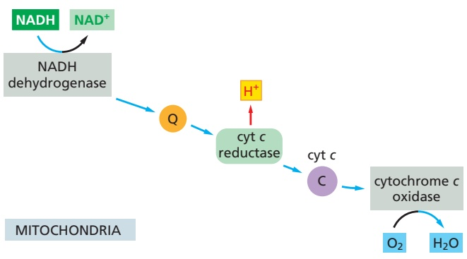

#### Summary

Chloroplasts and photosynthetic bacteria have the unique ability to harness the energy of sunlight to produce energy-rich compounds. This is achieved by the photosystems, in which chlorophyll molecules attached to proteins are excited when hitMBoC7 m14.58/14.56 by a photon. Photosystems are composed of light-harvesting antennae that collect solar energy and a photochemical reaction center, in which the collected energy is funneled to a chlorophyll molecule held in a special position, enabling it to withdraw electrons from an electron donor. Chloroplasts and cyanobacteria contain two distinct photosystems. The two photosystems are normally linked in series in the Z scheme, and they transfer electrons from water to $N A D \dot { P } ^ { + }$ to form NADPH, while also generating a transmembrane electrochemical potential. One of the two photosystems—photosystem II—can split water by removing electrons from this ubiquitous, low-energy compound. It is believed that essentially all of the molecular oxygen $( O _ { 2 } )$ in our atmosphere is a by-product of the water-splitting reaction in this photosystem. The three-dimensional structures of photosystems I and II are strikingly similar to those of the photosystems of purple photosynthetic bacteria, demonstrating a remarkable degree of conservation over billions of years of evolution.

The two photosystems and the cytochrome b6-f complex reside in the thylakoid membrane, a separate membrane system in the central stroma compartment of the chloroplast that is differentiated into stacked grana and unstacked stroma thylakoids. Electron-transport processes in the thylakoid membrane cause protons to be released into the thylakoid space. The backflow of protons through the chloroplast ATP synthase then generates ATP. This ATP is used in conjunction with the NADPH produced by photosynthesis to drive many biosynthetic reactions in the chloroplast stroma, including the carbon-fixation cycle, which generates large amounts of carbohydrates from CO2.

In the early evolution of life, cyanobacteria overcame a major obstacle by devising a way to use solar energy to split water and fix carbon dioxide. By proliferating widely on Earth, the cyanobacteria eventually produced both abundant organic nutrients and the molecular oxygen that enabled the rise of a multitude of aerobic life-forms. The chloroplasts in plants have evolved from a cyanobacterium that was endocytosed long ago by an aerobic eukaryotic host organism.

<!-- END EN EN14-H035-H053 -->
