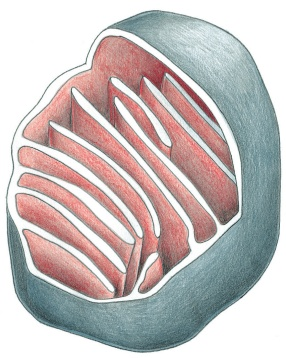
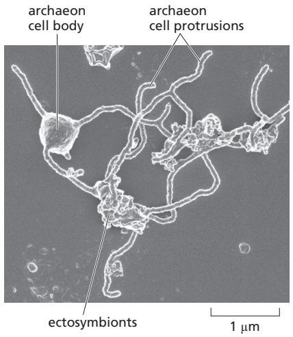
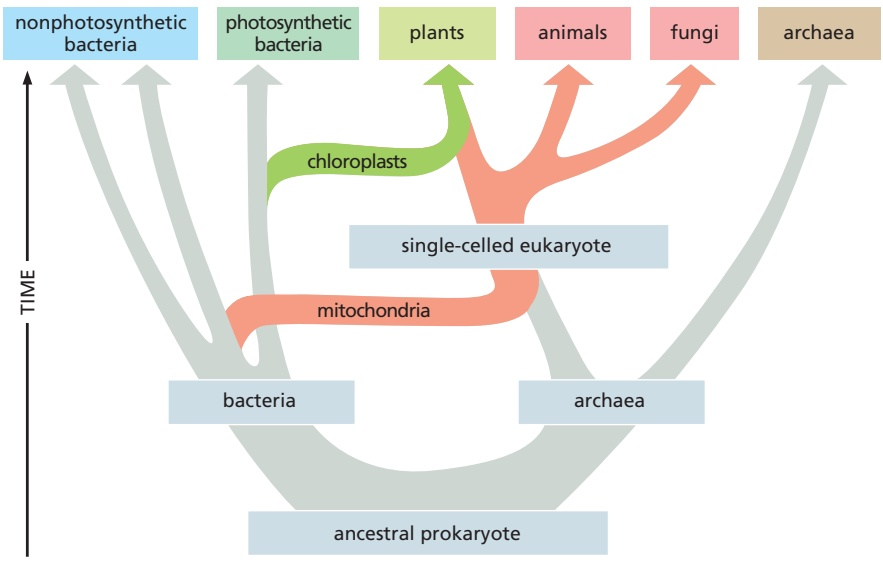
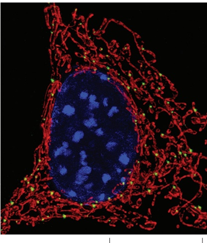
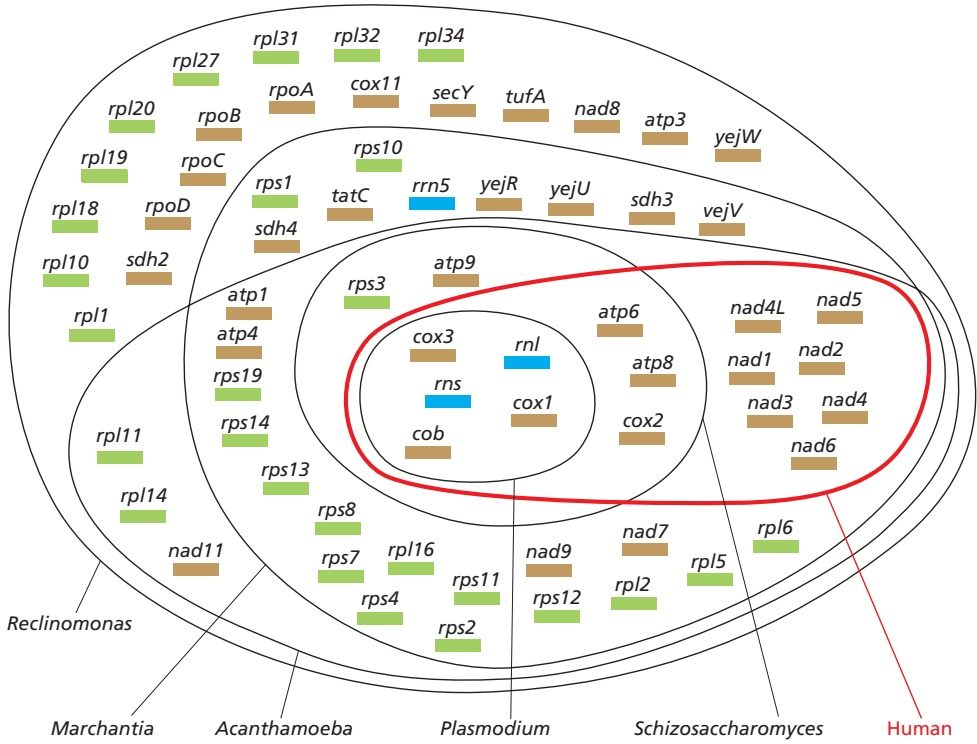
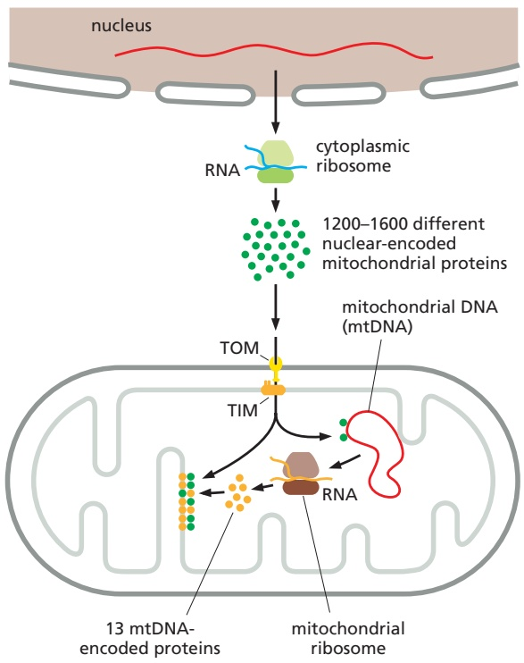
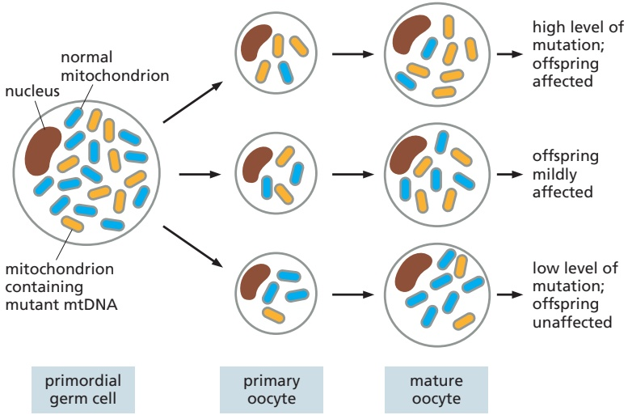

# 第7章 线粒体和叶绿体 · 第三节 线粒体和叶绿体的半自主性及其起源

[返回本章](../README.md) · [中文本章原文](../中文原文.md)

<!-- BEGIN CN CN07-S03 -->
## 第三节 线粒体和叶绿体的半自主性及其起源

在真核生物的细胞中，线粒体和叶绿体是一类特殊的细胞器。它们的功能受到细胞核基因组和自身基因组的双重调控。因此，真核细胞中这两种特殊的细胞器被称为半自主性细胞器（semiautonomous organelle）。由于这样的特殊性，人们普遍认为线粒体和叶绿体具有独特的内共生起源（endosymbiotic origin）。

线粒体和叶绿体以非孟德尔方式遗传。这种遗传方式可能在真核生物的起源与演化过程中发挥了重要的作用。

## 一、线粒体和叶绿体的半自主性

线粒体和叶绿体的功能依赖数以千计的核基因编码的蛋白质。同时，这两种细胞器还拥有自身的遗传物质 DNA，编码一小部分必需的 RNA 和蛋白质。这些蛋白质通过线粒体和叶绿体专用的酶和核糖体系统进行翻译。

## (一) 线粒体和叶绿体 DNA

1962 年，Ris 和 W. Plaut 在衣藻叶绿体中发现了 DNA 状物质；1963 年，M. Nass 和 S. Nass 在鸡胚肝细胞线粒体中也发现同样的物质，推测线粒体和叶绿体中可能存在遗传物质 DNA。人们之后陆续从各种生物的叶绿体和线粒体中纯化出了 DNA。

绝大多数真核细胞的线粒体 DNA（mitochondrial DNA, mtDNA）呈双链环状，分子结构与细菌的 DNA 相似。在不同的物种之间，mtDNA 的分子大小有一定的差异。比如，人类的 mtDNA 约为 16 kb，酵母的约为 78 kb，而高等植物拟南芥的 mtDNA 约为 366 kb。继 1981 年人类的线粒体基因组被成功测序之后，目前已有一千多种真核生物的 mtDNA 序列信息被解读。这些信息为了解线粒体的起源与演化提供了重要的资料。

在动物细胞中，平均每个线粒体携带1个以上拷贝的mtDNA。除了精细胞以外，每个动物细胞携带的mtDNA拷贝数在1000\~10000个范围内。相比之下植物细胞携带的mtDNA拷贝数要低得多。此外，被子植物的mtDNA呈现出丰富的分子多态性。

叶绿体 DNA（cpDNA）或称质体 DNA（ptDNA）亦呈环状，分子大小依物种的不同呈现较大差异，在 200～2 500 kb 之间。在发育中的幼嫩叶片中，叶绿体含较多拷贝的 cpDNA（最多时接近 100 个）。而当叶片成熟后，每个叶绿体中的 cpDNA 数量呈现明显的下调，维持在 10 个左右。

mtDNA 和 cpDNA 均以半保留方式进行复制。 $^{3}$ H-嘧啶核苷标记实验证明，mtDNA 主要在细胞周期的 S 期及 G $_{2}$ 期进行复制；而 cpDNA 则主要在 G $_{1}$ 期复制。mtDNA 和 cpDNA 的复制受细胞核的控制。复制所需的 DNA 聚合酶、解旋酶等均由核基因编码。

## （二）线粒体和叶绿体中的蛋白质

mtDNA 和 cpDNA 也被称为线粒体基因组 (mitochondrial genome) 和叶绿体基因组 (chloroplast genome)，具有与核 DNA 一样的编码功能。借助自身的酶系统（主要由核基因编码），这些基因组携带的遗传信息会被转录和 / 或翻译成相应的功能分子。比如，哺乳动物的线粒体基因组编码 2 种 rRNA（12S 和

16S)、22种tRNA以及13种多肽。这些遗传信息均在线粒体中得到表达，其产物在线粒体的生命活动中扮演着不可缺少的重要角色。比如，上述产物中的13种多肽分别是线粒体复合物I（7个亚基）、复合物Ⅲ（1个亚基）、复合物Ⅳ（3个亚基）和 $F_{0}$ （2个亚基）的组成部分。

叶绿体基因组携带的遗传信息同样为叶绿体的生命活动所必需。它们包括4种rRNA（23S、16S、4.5S及5S）、30种（烟草）或31种（地钱）tRNA以及100多种多肽。叶绿体基因编码的多肽涉及光合作用的各个环节，如RuBP羧化酶（大亚基）、PSI（2个亚基）、PSII（8个亚基）、ATP合酶（6个亚基）以及Cytbf复合物（3个亚基）。此外，叶绿体基因编码的多肽还以70S核糖体的组成蛋白等形式参与叶绿体的生命活动。

可见，线粒体和叶绿体基因组编码的蛋白质在线粒体和叶绿体的生命活动中是重要和不可缺少的。但这些蛋白质还远远不足以支撑线粒体和叶绿体的基本功能，更多的蛋白质来自于核基因组的编码，于细胞质中合成后被运往线粒体和叶绿体的功能位点。比如，酵母线粒体中的主要酶复合物由75个亚基组成。其中线粒体基因组编码并在线粒体中合成的只有9个，其余的亚基均由细胞核编码并在细胞质中合成。

现有的研究资料表明，线粒体和叶绿体的生命活动均需要数以千计的核基因参与。这个数字充分说明了线粒体和叶绿体对细胞核的依赖。细胞核编码的基因产物在细胞质中合成后，需要被准确地定向运输到叶绿体和线粒体（参见第六章）。

## （三）线粒体、叶绿体基因组与细胞核的关系

上面的内容说明线粒体和叶绿体的生命活动受到细胞核以及它们自身基因组的双重调控。这就要求不同的基因表达调控机制以及表达产物分子之间形成精确的协作关系。简而喻之，如果线粒体和叶绿体中的某种酶复合物被看作一台机器的话，这台机器的“国产部件”（细胞器自身编码和合成的多肽亚基）和“进口部件”（细胞核编码的亚基）之间必须形成数量和质量上的完好匹配，才能保证线粒体和叶绿体生命活动的有效运行。在真核生物的演化过程中，细胞核与线粒体、叶绿体之间通过“协同演化”（coevolution）的方式建立了精确有效的分子协作机制。

在真核细胞中，细胞核与线粒体、叶绿体之间在遗传信息和基因表达调控等层次上建立的分子协作机制被称为核质互作（nuclear-cytoplasmic interaction）。有序的核质互作为线粒体、叶绿体以及真核细胞的生命活动提供了必要的保证。当核质互作相关的细胞核或线粒体、叶绿体基因单方面发生突变，引起细胞中的分子协作机制出现严重障碍时，细胞或真核生物个体通常会表现出一些异常的表型。这类表型背后的分子机制被统称为核质冲突（nuclear-cytoplasmic incompatibility, nuclear-cytoplasmic conflict）。

在自然界中，核质冲突的表型并不罕见。人类线粒体疾病的本质就是一类典型的核质冲突。人类的线粒体病多为母系遗传，说明其中核质冲突的直接原因更多地来源于线粒体基因的突变。这些基因突变可能造成其编码亚基的构型发生变化，无法与细胞核编码的其他亚基组装成具有正常功能的蛋白质复合体，导致线粒体功能丧失。

另一个值得注意的现象是，在线粒体和叶绿体的基因表达过程中，一些基因中的个别碱基需要接受必要的修饰方可翻译出正确的蛋白质。这种修饰在RNA水平上进行，称为RNA编辑（RNA editing）。RNA编辑改变RNA分子上的碱基，因此会带来表达产物蛋白质上氨基酸的变化。在高等植物中，将碱基C转换为U的编辑（C-to-U editing）最为普遍，叶绿体基因组中通常有40～50个碱基，而线粒体基因组则有400～500个碱基受到编辑。当某些基因转录的RNA编辑出现障碍时，细胞或植物会呈现类似核质冲突的表型（图7-25）。这个现象暗示RNA编辑有可能是真核细胞为有效消除核质冲突而获得的一种分子机制。

综上所述，在真核生物的形成和进化过程中，细胞核基因组与线粒体、叶绿体基因组之间经历了长期的“磨合”，形成了上述既互相依赖又相互制约的核质互作关系。这种磨合式的共进化在不同类别的真核生物之间既体现出了共性，也表现出一些差别。比如，动物、酵母、脉孢菌和植物的mtDNA在分子大小上存在较大差异，但它们在编码复合物Ⅲ中的细胞色素b、复合物IV的亚基1、2和3以及ATP合酶 $\left(\mathrm{F}_{\mathrm{o}}\right)$ 的亚基6和8上具有完全的一致性（表7-1）。此外，脉孢菌和植物的线粒体基因组编码复合物I中的6个亚基；而酵母中的这些亚基则全部由细胞核编码等（详见表7-1）。细胞核与线粒体、叶绿体基因组的编码内容反映不同类别真核生物的核质互作状态以及这些生物之间的演化关系，

  
图7-25 拟南芥RNA编辑障碍导致的核质冲突

A. 在野生型拟南芥（WT）中，叶绿体基因 PetL 负责编码细胞色素 $b_{sf}$ （Cyt $b_{sf}$ ）复合体的其中一个亚基，Cyt $b_{sf}$ 复合体是光合电子传递链上的重要电子载体之一。PetL 的第 2 个密码子 CCT（脯氨酸）需经 RNA 编辑后变为 CTT（亮氨酸），才能得到具有正常活性的亚基。该 RNA 编辑受到了细胞核基因编码蛋白 Dcd1 的调控。在这个基因的突变体（atwtg1）中，PetL 基因正常的 RNA 编辑行为受到抑制，造成了 RNA 编辑缺陷，从而导致 PetL 编码的亚基不具活性，电子传递受阻，幼叶出现黄化表型。

B. 在野生型拟南芥（WT）中，叶绿体基因AccD（编码乙酰CoA羧化酶复合物中羧基转移酶的β亚基。该复合物在脂肪酸合成中具关键作用。AccD的第265个密码子得到编辑后产物具有正常的活性。该RNA编辑需要细胞核蛋白AtECB2的参与。当编码AtECB2的基因被突变（atecb2）后，正常的RNA编辑机制受到破坏，导致AccD产物的分子中出现错误的氨基酸残基而失活，幼苗出现白化表型。可见，RNA编辑具有消除核质冲突的客观作用。（杨仲南博士和胡迎春博士惠赠）

值得仔细品味。

## 二、线粒体和叶绿体的起源

由于线粒体和叶绿体具有独特的半自主性并与细胞核建立了复杂而协调的互作关系，它们的起源一直以来多被认为有别于其他细胞器。在人们为这两种细胞器设计的起源假说中，内共生起源学说很好地贴合了线粒体和叶绿体的半自主性和核质关系特征，因而得到了广泛的认可和支持。

内共生起源学说认为，线粒体和叶绿体分别起源于原始真核细胞内共生的行有氧呼吸的细菌和行光能自养的蓝细菌。该假说的提出远早于mtDNA和cpDNA的发现。其中叶绿体的内共生起源假说见于1905年，由K. Mereschkowsky提出；而线粒体的类似起源假说见于1918和1922年，分别由P. Porteir和I. E. Wallin提出。随着人们对真核细胞超微结构、线粒体和叶绿体DNA及其编码机制的认识，内共生起源学说的内涵得到了进一步充实。

表 7-1 不同真核生物线粒体基因组（DNA）大小及其表达产物

<table><tr><td></td><td>动物</td><td>酵母</td><td>真菌(脉孢菌属)</td><td>植物</td></tr><tr><td>线粒体 DNA/kb</td><td>14~18</td><td>78</td><td>19~108</td><td>200~2500</td></tr><tr><td colspan="5">表达产物</td></tr><tr><td colspan="5">复合物 I(NADH-CoQ 还原酶)</td></tr><tr><td>亚基数</td><td>7</td><td>0</td><td>6</td><td>6</td></tr><tr><td colspan="5">复合物 II(CoQ-Cyt c 还原酶)</td></tr><tr><td>Cyt b</td><td>+</td><td>+</td><td>+</td><td>+</td></tr><tr><td colspan="5">复合物IV(细胞色素氧化酶)</td></tr><tr><td>亚基 1、2、3</td><td>+</td><td>+</td><td>+</td><td>+</td></tr><tr><td colspan="5">ATP 合酶的  ${\mathrm{F}}_{\alpha }$  部分</td></tr><tr><td>亚基 6</td><td>+</td><td>+</td><td>+</td><td>+</td></tr><tr><td>亚基 8</td><td>+</td><td>+</td><td>+</td><td>+</td></tr><tr><td>亚基 9</td><td>-</td><td>+</td><td>-</td><td>+</td></tr><tr><td colspan="5">ATP 合酶的  ${\mathrm{F}}_{\mathrm{f}}$  部分</td></tr><tr><td> $\alpha$  亚基</td><td>-</td><td>-</td><td>-</td><td>+</td></tr><tr><td colspan="5">rRNA</td></tr><tr><td>大亚基</td><td>16S</td><td>21S</td><td>21S</td><td>26S</td></tr><tr><td>小亚基</td><td>12S</td><td>15S</td><td>15S</td><td>18S</td></tr><tr><td>5S RNA</td><td>-</td><td>-</td><td>-</td><td>+</td></tr><tr><td>tRNA</td><td>22</td><td>23~25</td><td>23~25</td><td>约 30</td></tr></table>

1970年，L. Margulis在已有的资料基础上提出了一种更为细致的设想。该设想认为，真核细胞的祖先是一种体积较大、不需氧具有吞噬能力的细胞，通过糖酵解获取能量。而线粒体的祖先则是一种革兰氏阴性菌，具备三羧酸循环所需的酶和电子传递链系统，可利用氧气把糖酵解的产物丙酮酸进一步分解，获得比酵解更多的能量。当这种细菌被原始真核细胞吞噬后，即与宿主细胞间形成互利的共生关系：原始真核细胞利用这种细菌获得更充分的能量，而这种细菌则从宿主细胞获得更适宜的生存环境。与此类似，叶绿体的祖先可能是原核生物蓝细菌（cyanobacteria）。当这种蓝细菌被原始真核细胞摄入后，为宿主细胞进行光合作用，而宿主细胞则

为其提供生存条件。

线粒体和叶绿体的内共生学说先后得到了大量的生物学研究证据的支持。特别是近期的分子生物学和生物信息学的研究发现真核细菌的细胞核中存在大量原本可能属于呼吸细菌或蓝细菌的遗传信息，说明最初的呼吸细菌和蓝细菌的大部分基因组在漫长的协同演化过程中发生了向细胞核的转移。这种转移极大地消弱了线粒体和叶绿体的自主性，建立起稳定、协调的核质互作关系。

除遗传信息转移之外，线粒体和叶绿体内共生起源学说还得到如下主要论据的支持。

（1）基因组与细菌基因组具有明显的相似性 线粒体和叶绿体具有细菌基因组的典型特征。它们均为单条环状双链DNA分子，不含5-甲基胞嘧啶，无组蛋白结合并能进行独立的复制和转录。此外，在碱基比例、核苷酸序列和基因结构特征等方面，线粒体和叶绿体基因组也与细胞核基因组表现出显著差异，而与原核生物极为相似。同时，线粒体和叶绿体具有自身的 DNA 聚合酶及 RNA 聚合酶，能独立复制和转录自己的 RNA。其 mRNA、rRNA 的沉降系数与细菌的类似。

(2) 具备独立、完整的蛋白质合成系统 线粒体和叶绿体的蛋白质合成机制类似于细菌，而有别于真核生物：①与细菌一样，线粒体和叶绿体中的蛋白质合成从N-甲酰甲硫氨酸开始，而真核细胞中的蛋白质合成从甲硫氨酸开始。②线粒体和叶绿体的核糖体较小于真核生物的80S核糖体。例如，动物细胞线粒体的核糖体为50S\~60S，真菌线粒体的核糖体为70S\~74S，而叶绿体的核糖体为70S。③线粒体、叶绿体和原核生物的核糖体中只有5S rRNA，而不少真核细胞的核糖体中存在5.8S rRNA。④线粒体中的蛋白质合成因子具有原核生物核糖体的识别特别性，其功能可部分地被细菌的蛋白质合成因子取代，但线粒体的蛋白质合成因子不能识别细胞质核糖体。⑤线粒体核糖体与线粒体mRNA形成多核糖体。⑥叶绿体tRNA和氨酰tRNA合成酶通常可与细菌相应的酶交叉识别，而不与细胞质中相应的酶形成交叉识别。⑦叶绿体的核糖体小亚基可与大肠杆菌的核糖体大亚基组合，形成有功能的杂合核糖体。⑧线粒体和叶绿体核糖体上的蛋白质合成被氯霉素、四环素抑制，而抑制真核生物核糖体上蛋白质合成的放线酮对它们无抑制作用。⑨线粒体RNA聚合酶可被原核细胞RNA聚合酶的抑制剂（如利福霉素）所抑制，但不被真核细胞RNA聚合酶的抑制剂（如放线菌素D）所抑制等。

(3) 分裂方式与细菌相似 线粒体和叶绿体均以缢

1. 怎样理解线粒体和叶绿体是细胞能量转换的细胞器？

## - 思考题

2. 线粒体和叶绿体在细胞内呈现怎样的动态特征？

3. 试比较线粒体与叶绿体在基本结构方面的异同。

4. 为什么说三羧酸循环是真核细胞能量代谢的中心？

5. 电子传递链与氧化磷酸化之间有何关系？

6. 试比较线粒体的氧化磷酸化与叶绿体的光合磷酸化的异同点。

7. 氧化磷酸化偶联机制的化学渗透假说的主要论点是什么？

8. 为什么说线粒体和叶绿体是半自主性细胞器？

9. 线粒体与叶绿体的内共生起源学说有哪些证据？

裂的方式分裂增殖，类似于细菌。

(4) 膜的特性 线粒体、叶绿体的内膜和外膜存在明显的性质和成分差异。外膜与真核细胞的内膜系统具有性质上的相似性，可与内质网和高尔基体膜融合沟通；而它们的内膜则与细菌质膜相似，内陷折叠形成细菌的间体、线粒体的嵴和叶绿体的类囊体。在膜的化学成分上，线粒体和叶绿体内膜的蛋白质/脂质比远大于外膜，接近于细菌质膜的成分。这些特性都暗示线粒体和叶绿体的内膜起源于其最初的共生体（呼吸细菌和蓝细菌）的质膜，而外膜则来源于它们的宿主（共生体进入宿主细胞时包被形成）。

(5) 其他佐证 线粒体的磷脂成分、呼吸类型和 Cyt c 的初级结构均与反硝化副球菌或紫色非硫光合细菌非常接近，暗示线粒体的祖先可能是这两种菌中的一种。

自然界中存在的胞内共生蓝藻（蓝小体）表现出了基因片段转移等内共生形成叶绿体的行为特征，为真核生物形成的内共生说提供了“活化石”性的佐证。

近年来，真核细胞线粒体和叶绿体的内共生起源学说得到了越来越多的研究证据的支持，使得非内共生起源学说（non-endosymbiosis theory）逐渐淡出了人们的视野。作为另一种假说，非内共生起源学说由T.Uzzell等于1974年提出，认为真核细胞的前身可能是一种体积较大的好氧细菌。其细胞膜通过内陷、扩张和分化逐渐发展成了线粒体、叶绿体和其他细胞器，继而细胞演化为真核细胞。

1. Arimura S, Yamamoto J, Aida G P, et al. Frequent fusion and fission of plant mitochondria with unequal nucleoid distribution. Proceedings of the National Academy of Sciences of the United States of America, 2004, 101(20): 7805-7808.

2. Berry E A, Guergova-Kuras M, Huang L, et al. Structure and function of cytochrome bc complexes. Annual Review of Biochemistry, 2000, 69: 1005-1075.

3. Boyer P D. What makes ATP synthase spin? Nature, 1999, 402(6759): 247-249.

4. Elston T, Wang H, Oster G. Energy transduction in ATP synthase. Nature, 1998, 391(6666): 510-513.

5. Glynn J M, Froehlich J E, Osteryoung K W. Arabidopsis ARC6 coordinates the division machineries of the inner and outer chloroplast membranes through interaction with PDV2 in the intermembrane space. Plant Cell, 2008, 20(9): 2460-2470.

6. Lackner L L, Nunnari J M. The molecular mechanism and cellular functions of mitochondrial division. Biochimica et Biophysica Acta(BBA)-Molecular Bosis of Disease, 2009, 1792(12): 1138-1144.

7. Liu Z, Yan H, Wang K, et al. Crystal structure of spinach major light-harvesting complex at 2.72 Å resolution. Nature, 2004, 428(6980): 287-292.

8. Oikawa K, Kasahara M, Kiyosue T, et al. Chloroplast unusual positioning 1 is essential for proper chloroplast positioning. Plant Cell, 2003, 15(12): 2805-2815.

9. Praefcke G J K, McMahon H T. The dynamin superfamily: universal membrane tabulation and fission molecules? Nature Reviews Molecular Cell Biology, 2004, 5(2): 133-147.

10. Sun F, Huo X, Zhai Y, et al. Crystal structure of mitochondrial respiratory membrane protein complex II. Cell, 2005, 121(7): 1043-1057.

11. Wang D, Zhang Q, Liu Y, et al. The levels of male gametic mitochondrial DNA are highly regulated in angiosperms with regard to mitochondrial inheritance. Plant Cell, 2010, 22(7): 2402-2416.

12. Wang Z, Zou Y, Li X, et al. Cytoplasmic male sterility of rice with Boro II cytoplasm is caused by a cytotoxic peptide and is restored by two related PPR motif genes via distinct modes of mRNA silencing. Plant Cell, 2006, 18(3): 676-687.

13. Westermann B. Mitochondrial membrane fusion. Biochimica et Biophysica Acta (BBA)-Molecular Cell Research, 2003, 1641(2-3): 195-202.

14. Yu Q, Jiang Y, Chong K, et al. AtECB2, a pentatricopeptide repeat protein, is required for chloroplast transcript accD RNA editing and early chloroplast biogenesis in Arabidopsis thaliana. The Plant Journal, 2009, 59(6): 1011-1023.

## - 图片版权说明

Figure 7-2 is reprinted from Cell, Vol. 90. Karen G. Hales and Margaret T. Fuller. Developmentally Regulated Mitochondrial Fusion Mediated by a Conserved, Novel, Predicted GTPase.121-129. ©1997, with permission from Elsevier; Figure 7-3 is reprinted with permission from ©The Rockefeller University Press, 2003, originally published in The Journal of Cell Biology, 160: 189-200; Figure 7-4 is reprinted from Molecular Cell, Vol. 4. Arnaud M. Labrousse, Mauro D. Zappaterra, Daniel A. Rube, and Alexander M. van der Bliek. C. elegans Dynamin-Related Protein DRP-1 Controls Severing of the Mitochondrial Outer Membrane. 815-826. ©1999, with permission from Elsevier; Figure 7-8 is reprinted with permission from © The Rockefeller University Press, 1964, originally published in The Journal of Cell Biology. 22: 49-62; Figure 7-14A is used with permission of American Society of Plant Biologists. Mobilization of Rubisco and Stroma-Localized Fluorescent Proteins of Chloroplasts to the Vacuole by an ATG Gene-Dependent Autophagic Process. Hiroyuki Ishida, Kohki Yoshimoto, Masanori Izumi, Daniel Reisen, Yuichi Yano, Amane Makino, Yoshinori Ohsumi, Maureen R. Hanson, and Tadahiko Mae. Vol. 148. ©2008, permission conveyed through Copyright Clearance Center, Inc.; Figure 7-16 is reprinted with kind permission from Springer Science+Business Media: Planta. Orderly formation of the double ring structures for plastid and mitochondrial division in the unicellular red alga Cyanidioschyzon merolae. Vol. 206, 1998, 551-560. Shin-ya Miyagishima, Ryuichi Itoh, Kyoko Toda, Hidenori Takahashi, Haruko Kuroiwa, Tsuneyoshi Kuroiwa. Fig. 4i, l. ©Springer-Verlag 1998; and with kind permission from Springer Science+Business Media: Planta. Isolation of dividing chloroplasts with intact plastid-dividing rings from a synchronous culture of the unicellular red alga Cyanidioschyzon merolae. Vol. 209, 1999, 371-375. Shin-ya Miyagishima, Ryuichi Itoh, Saburo Aita, Haruko Kuroiwa, and Tsuneyoshi Kuroiwa. Fig. 2f, g. ©Springer-Verlag 1999; and Figure 7-17A is reprinted with kind permission from Springer Science+Business Media: Planta. Chloroplast division machinery as revealed by immunofluorescence and electron microscopy. Vol. 215, 2002, 185-190. Haruko Kuroiwa, Toshiyuki Mori, Manabu Takahara, Shin-ya Miyagishima, and Tsuneyoshi Kuroiwa. Fig. 1B. ©Springer-Verlag 2002.

<!-- END CN CN07-S03 -->

---

## 对应英文内容

### 英文补充：线粒体和叶绿体的内共生起源

> 对应中文板块：线粒体和叶绿体的内共生起源。英文来源：Molecular Biology of the Cell，第7版，第1章；[本章完整原文](../../来源/英文教材/01_Cells_Genomes_and_the_Diversity_of_Life/chapter.md)。物理PDF页码范围：40–87（整章范围）。

<!-- BEGIN EN EN01-H031-H033 -->
#### Mitochondria Evolved from a Symbiotic Bacterium CapturedMBoC7 e1.24/1.24 by an Ancient Archaeon

A fundamental question in both evolution and cell biology is how did the first eukaryotic cell arise? The evidence suggests that it happened when an archaeal and a bacterial cell merged about 2 billion years ago, in a world that had contained only prokaryotes for more than 1.5 billion years.

All eukaryotic cells contain (or at one time did contain) mitochondria (**Figure 1–25**). Mitochondria are similar in size to small bacteria, and both reproduce by dividing. The mitochondria contain their own DNA, with genes that resemble bacterial genes; they also contain their own ribosomes and translation factors that resemble those in bacteria. These and other similarities between mitochondria and present-day bacteria provide strong evidence that mitochondria evolved from an aerobic bacterium (one that harvested energy by combining electrons derived from foodstuffs with oxygen gas) that was captured

(A)

(B)

Figure 1–25 A mitochondrion. (A) An electron micrograph of the organelle seen in cross section. (B) A drawing of a mitochondrion with part of it cut away to show the three-dimensional structure (Movie 1.2). Note the smooth outer membrane and the convoluted inner membrane, which houses the proteins that generate ATP from the oxidation of food molecules. (A, courtesy of Daniel S. Friend and by permission of E.L. Bearer.)

Figure 1–26 A scanning electron micrograph of an Asgard archaeon in culture. This anaerobic cell proliferates very slowly, doubling only about every 20 days (compared to every half hour or so for the bacterium E. coli). It can be seen to extend elaborate membranous protrusions from its surface—including “blebs” and unique branched and unbranched structures. These protrusions are intimately associated with two other species—one bacterial, one archaeal—that were isolated with the Asgard strain as ectosymbionts, as indicated. The scientists had maintained the deep marine sediment under anaerobic conditions in a bioreactor for more than 2000 days, mimicking conditions of the seabed, and they attempted to culture samples from this bioreactor under a range of different conditions. Only after many years and repeated subculturing were they able to isolate this archaeon with its ectosymbionts. (From H. Imachi et al., Nature 577:519–525, 2020.)

by an anaerobic cell. These two cells (and their descendants) were then able to evolve an endosymbiotic relationship, providing mutual metabolic support within a common cytoplasm.

There are also good reasons to believe that the ancestral capturing cell was an archaeon. As we have seen, the genomes of present-day archaea encode many proteins that are characteristic of present-day eukaryotic cells. Those archaea with the most eukaryotic-like genes belong to the Asgard lineage, first identified by sequencing DNA fragments obtained from the seabed. But no living example had been seen or cultivated—until very recently, when, after a heroic 12-yearlong isolation procedure, the first Asgard archaeon was propagated in culture. This remarkable, living, anaerobic archaeon looked like no other prokaryote— having long branching protrusions—and it seemed to live in an ectosymbiotic relationship with another bacterium and another archaeon, both of which were isolated with it (**Figure 1–26**). The discovery of the strange Asgard archaeon provides a glimpse of how an ancient archaeon might eventually have captured an aerobic bacterium to initiate the eukaryotic lineage, with a hypothetical pathway being illustrated in **Figure 1–27** and discussed in detail in Chapter 12.

#### Chloroplasts Evolved from a Symbiotic Photosynthetic Bacterium Engulfed by an Ancient Eukaryotic Cell

Chloroplasts (**Figure 1–28**) perform photosynthesis in plant cells and algae, using the energy of sunlight to synthesize their own “food” (in the form of carbohydrates) from atmospheric $\mathrm { C O _ { 2 } }$ and water. Like mitochondria, they are enclosed in double membranes, have their own “circular” genomes, and reproduce by dividing. They almost certainly evolved from a symbiotic photosynthetic bacterium that was captured by an ancient eukaryotic cell that already possessed mitochondria. This bacterium may have been captured by phagocytosis, a frequent process in eukaryotes (see Figure 1–22).

Whereas some single-cell eukaryotes are hunters that live by capturing other cells and eating them (see Figure 1–34), a eukaryotic cell equipped with chloroplasts has no need to chase after other cells as prey; it is nourished by the captive chloroplasts it has inherited from its ancient eukaryotic ancestors. Correspondingly, plant cells, although they possess the cytoskeletal equipment for movement, have lost the ability to change shape rapidly and to engulf other cells by phagocytosis. Instead, they wrap themselves in a tough, protective cell wall. If some eukaryotic cells can be viewed as hunters, then one might view plant cells as having given up hunting for farming.

Figure 1–27 A possible model for some early steps in eukaryotic cell evolution. In this model, the surface protrusions of an ancient Asgard archaeon expanded and surrounded an ectosymbiotic aerobic bacterium to create a symbiotic relationship between the two types of cells. Eventually, the protrusions fused with one another, trapping the bacterium as an endosymbiont in the archaeon cytoplasm, where it was initially enclosed by an internal membrane derived from the archaeon’s plasma membrane (the bacterium itself retaining its own membranes). At some point, the endosymbiont escaped from the enclosing archaeon-derived membrane and entered the cytosol, where it eventually evolved into a mitochondrion—with both its DNA and membranes derived from the engulfed bacterium. As shown, it is postulated that the internal archaeon membranes generated by this mechanism of protrusion expansion and fusion progressively formed both the nucleus and single-membraneenclosed organelles, such as the endoplasmic reticulum. The evidence for this general type of model of eukaryoticcell evolution is discussed further in Chapter 12. (Adapted from H. Imachi et al., Nature 577:519–525, 2020, and from D.A. Baum and B. Baum, BMC Biol. 12:76–92, 2014.)

Figure 1–28 Chloroplasts. In plant cells and single-celled photosynthetic eukaryotes, these organelles capture the energy of sunlight. (A) A light micrograph of a single cell isolated from a leaf of a flowering plant, showing the green chloroplasts (Movie 1.3 and see Movie 14.10). (B) A drawing of one chloroplast, showing the highly folded system of internal membranes containing the chlorophyll molecules that absorb light. (A, courtesy of Preeti Dahiya.)

Fungi represent yet another eukaryotic way of life. Fungal cells, like animal cells, possess mitochondria but not chloroplasts; they have a tough outer wall that limits their ability to move rapidly or to take up other cells. Fungi, it seems,MB C7 1.30/1.28 have turned from hunters into scavengers. Other cells secrete nutrient molecules or release them after death, and fungi feed on these leavings—often performing whatever digestion is necessary extracellularly, by secreting digestive enzymes to the exterior.

#### Eukaryotes Have Hybrid Genomes

As just discussed, the genetic information of eukaryotic cells has a hybrid origin— from an ancestral anaerobic archaeon and from the bacteria it adopted as endosymbionts (**Figure 1–29**). Most of this genetic information (DNA) is stored in the nucleus, although a small amount remains inside the organelles that evolved

Figure 1–29 A model for the evolution of eukaryotic cells in the tree of life. All living cells are thought to have evolved from an ancestral prokaryotic cell (the last universal common ancestor) between 3.5 and 3.8 billion years ago). Many millions of years later, it seems an anaerobic archaeon acquired an aerobic bacterial symbiont, which evolved into mitochondria (see Figure 1–27). Later still, a mitochondria-containing eukaryotic cell acquired a photosynthetic bacterium, which evolved into chloroplasts. Mitochondria are essentially the same in plants, animals, and fungi, indicating that they were acquired before these three lineages diverged about 1.5 billion years ago.

from the captured bacteria—the mitochondria and, in plant and algal cells, the chloroplasts. When the mitochondrial DNA and the chloroplast DNA are separated from the nuclear DNA and individually sequenced, both the mitochondrial and chloroplast genomes are found to be cut-down versions of the corresponding bacterial genomes: in a human cell, for example, the mitochondrial genome consists of only 16,569 nucleotide pairs, and it codes for only 13 proteins plus a set of 24 RNAs involved in protein synthesis.

Many of the genes that are missing from the mitochondria and chloroplasts have not been lost; instead, they have moved from the endosymbiont genomes into the DNA of the host-cell nucleus. Thus the nuclear DNA of animals contains many genes coding for proteins that serve essential functions inside the mitochondria; in plants and algae, the nuclear DNA contains many genes specifying proteins required in chloroplasts. In both cases, the DNA sequences of these nuclear genes still show clear evidence of their bacterial origins.

<!-- END EN EN01-H031-H033 -->

### 英文补充：细胞器遗传系统、基因转移与半自主性

> 对应中文板块：细胞器遗传系统、基因转移与半自主性。英文来源：Molecular Biology of the Cell，第7版，第14章；[本章完整原文](../../来源/英文教材/14_Energy_Conversion_and_Metabolic_Compartmentation_Mitochondria_and_Chloroplasts/chapter.md)。物理PDF页码范围：850–911（整章范围）。

<!-- BEGIN EN EN14-H054-H062 -->
#### THE GENETIC SYSTEMS OF MITOCHONDRIA AND CHLOROPLASTS

As we discussed in Chapter 1, mitochondria and chloroplasts are thought to have evolved from endosymbiotic bacteria (see Figures 1–27 and 1–29). Both types of organelles still contain their own genomes (**Figure 14–57**). As we will discuss shortly, they also retain their own machinery for transcribing that DNA into RNA and for translating mRNAs into organelle proteins.

Like bacteria, mitochondria and chloroplasts proliferate by growth and division of an existing organelle. In actively dividing cells, each type of organelle must double in mass in each cell generation and then be distributed into each daughter cell. In addition, nondividing cells must replenish organelles that are degraded as part of the continual process of organelle turnover or produce additional organelles as the need arises. Organelle growth and proliferation are therefore carefully controlled. The process is complicated because mitochondrial and chloroplast proteins are encoded in two places: the nuclear genome and the separate genomes harbored in the organelles themselves. The biogenesis of mitochondria and chloroplasts thus requires contributions from two separate genetic systems, which must be closely coordinated (see pp. 867–868).

Most organellar proteins are encoded by the nuclear DNA. The organelle imports these proteins from the cytosol, after they have been synthesized on cytosolic ribosomes. In Chapter 12, we discuss how this process is catalyzed by mitochondrial protein translocase complexes of the outer and inner mitochondrial membrane. Here, we describe the organellar genomes and genetic systems and consider the consequences of separate organelle genomes for the cell and the organism as a whole.

#### The Genetic Systems of Mitochondria and Chloroplasts Resemble Those of Prokaryotes

As discussed in Chapter 12, it is thought that eukaryotic cells originated through a symbiotic relationship between an archaeon and an aerobic bacterium (an α-proteobacterium). The two organisms are postulated to have merged to form the ancestor of all nucleated cells, with the archaeon providing the nucleus and the proteobacterium serving as a respiring, ATP-producing endosymbiont—one that would eventually evolve into the mitochondrion (see Figure 12–3). This most likely occurred roughly 1.6 billion years ago, when oxygen had entered the atmosphere in substantial amounts (see Figure 14–54). The chloroplast was derived later, after the plant and animal lineages diverged, through endocytosis of an oxygen-producing cyanobacterium.

This endosymbiont hypothesis of organelle development receives strong support from the observation that the genetic systems of mitochondria and chloroplasts are similar to those of present-day bacteria. For example, bacterial, chloroplast, and mitochondrial genomes are typically circular and share many features of genome organization. In addition, chloroplast ribosomes are very similar to bacterial ribosomes, both in their structure and in their sensitivity to various antibiotics (such as chloramphenicol, streptomycin, erythromycin, and tetracycline). In addition, protein synthesis in chloroplasts starts with N-formylmethionine, as in bacteria, and not with methionine, as in the cytosol of eukaryotic cells. Although mitochondrial genetic systems are much less similar to those of present-day bacteria than are the genetic systems of chloroplasts, their ribosomes are also structurally similar and are sensitive to antibacterial antibiotics, and the transcriptional system of mitochondria is reminiscent of bacterial and bacteriophage systems.

5 μm

Figure 14–57 Staining of nuclear and mitochondrial DNA. In this confocal micrograph of a single fibroblast cell, the nuclear DNA is stained with a fluorescent dye (blue) while the mitochondrial DNA is visualized indirectly using a tagged mitochondrial transcription factor (green). The mitochondrial network is stained with a fluorescent mitochondrial matrixMBoC7 m14.59/14.57 marker (red). The image was acquired using a structured illumination microscope (SIM), which yields approximately double the resolution of a confocal microscope. Numerous copies of the mitochondrial genome can be seen distributed in distinct nucleoids throughout the mitochondria that snake through the cytoplasm. [From C. Kukat et al., Proc. Natl. Acad. Sci. USA 108(33):13534–13539, 2011. Copyright 2011 National Academy of Sciences, USA. With permission from National Academy of Sciences.]

The processes of organellar DNA transcription, protein synthesis, and DNA replication take place where the genome is located: in the matrix of mitochondria or the stroma of chloroplasts. The enzymes that mediate these genetic processes are unique to the organelle and resemble those of bacteria (or even of bacterial viruses) rather than their eukaryotic analogs. In spite of the complexity of the system required to maintain independent organellar genomes, the nuclear genome encodes the vast majority of mitochondrial proteins, including the enzymes required for genome expression in most species. The chloroplast genome is larger than that of mitochondria and encodes several enzymes involved in transcription and translation, but even so more than 95% of chloroplast proteins are typically encoded in the nuclear genome.

#### Over Time, Mitochondria and Chloroplasts Have Exported Most of Their Genes to the Nucleus by Gene Transfer

The nature of the organellar genes located in the nucleus of the cell reveals that, over the course of eukaryotic evolution, an extensive transfer of genes from organelle to nuclear DNA has occurred. Each such successful gene transfer is expected to be very difficult, because any gene moved from the organelle needs to adapt to both nuclear transcription and cytoplasmic translation requirements. In addition, the protein produced needs to acquire a signal sequence that directs it to the correct organelle after its synthesis in the cytosol (see Chapter 12).

By comparing the genes in the mitochondria from different organisms, we can infer that some of the gene transfers to the nucleus occurred relatively recently. The smallest and presumably most highly evolved mitochondrial genomes, for example, encode only a few hydrophobic inner-membrane proteins of the electron-transport chain, plus ribosomal RNAs (rRNAs) and transfer RNAs (tRNAs). Other mitochondrial genomes that have remained more complex tend to contain this same subset of genes along with others (**Figure 14–58**). The

Figure 14–58 Comparison of mitochondrial genomes. Less complex mitochondrial genomes contain subsets of the genes found in larger mitochondrial genomes. Even the smallest mitochondrial genomes contain genes encoding respiratory-chain proteins and ribosomal RNAs. In the comparison shown, there are only five genes that are shared by all six mitochondrial genomes; these encode ribosomal RNAs (rns and rnl), cytochrome b (cob), and two cytochrome oxidase subunits (cox1 and cox3). Blue indicates ribosomal RNAs; green, ribosomal proteins; and brown, components of the respiratory chain and other proteins. (Adapted from M.W. Gray et al., Science 283:1476–1481, 1999.)

Figure 14–59 The organization of the human mitochondrial genome. The human mitochondrial genome of ∼16,600 nucleotide pairs contains 2 rRNA genes, 22 tRNA genes, and 13 protein-coding sequences. There are two transcriptional promoters, one for each strand of the mitochondrial DNA (mtDNA). The DNAs of many other animal mitochondrial genomes have been completely sequenced. Most of these animal mitochondrial DNAs contain precisely the same genes as those contained in the mitochondrial DNA of humans, with the gene order being identical for animals ranging from fish to mammals.

most complex mitochondrial genomes include genes that encode components of the mitochondrial genetic system, such as RNA polymerase subunits and ribosomal proteins; these same genes are found in the cell nucleus in yeast and all animal cells. There are only 13 protein-coding genes in human mitochondrial DNA (**Figure 14–59**).

The proteins that are encoded by genes in the organellar DNA are synthesized on ribosomes within the organelle, using organelle-produced messengerMBoC7 m14.65/14.59 RNA (mRNA) to specify their amino acid sequence (**Figure 14–60**). The protein traffic between the cytosol and these organelles seems to be almost exclusively unidirectional: protein export from mitochondria or chloroplasts to the cytosol is rare. An important exception occurs when a cell is about to undergo apoptosis. As will be discussed in detail in Chapter 18, during apoptosis the mitochondrion releases proteins (most notably cytochrome c) from the crista space through its outer mitochondrial membrane as part of an elaborate signaling pathway that is triggered to cause cells to undergo programmed cell death.

Figure 14–60 Biogenesis of the respiratory-chain proteins in human mitochondria. Most of the protein components of the mitochondrial respiratory chain are encoded by nuclear DNA (dark green dots), with only a small number (orange dots) encoded by mitochondrial DNA (mtDNA). The mtDNAencoded subunits assemble together with the nuclear-encoded subunits to form a functional oxidative phosphorylation system.

Transcription of mtDNA produces 13 mRNAs, all of which encode subunits of the oxidative phosphorylation system, and 24 of the RNAs (22 transfer RNAs and 2 ribosomal RNAs) needed for translation of these mRNAs on the mitochondrial ribosomes. The mRNAs produced by transcription of nuclear genes are translated on cytoplasmic ribosomes (light green), which are distinct from the mitochondrial ribosomes (brown). The nuclear-encoded mitochondrial proteins are imported into mitochondria through protein translocases called TOM and TIM (see Figure 12–49), and they constitute the vast majority of the approximately 1200–1600 different protein species present in mammalian mitochondria. These nuclear-encoded mitochondrial proteins in humans include the majority of the oxidative phosphorylation system subunits, all proteins needed for expression and maintenance of mtDNA, and the proteins of the mitochondrial ribosomes. (Adapted from N.G. Larsson, Annu. Rev. Biochem. 79:683–706, 2010.)

#### Mitochondria Have a Relaxed Codon Usage and Can Have a Variant Genetic Code

The human mitochondrial genome has several surprising features that distinguish it from nuclear, chloroplast, and bacterial genomes:

1. Dense gene packing. Unlike other genomes, the human mitochondrial genome seems to contain almost no noncoding DNA: nearly every nucleotide seems to be part of a coding sequence, either for a protein or for one of the rRNAs or tRNAs. Because these coding sequences run directly into each other, there is very little room left for regulatory DNA sequences. The little noncoding DNA present in the human mitochondrial genome is primarily at the origin of replication, which has essential functions in guiding replication and controlling transcription.

2. Relaxed codon usage. Whereas 30 or more tRNAs specify amino acids in the cytosol and in chloroplasts, only 22 tRNAs are required for mitochondrial protein synthesis. The normal codon–anticodon pairing rules are relaxed in mitochondria, so that many tRNA molecules recognize any one of the four nucleotides in the third (wobble) position. Such “2 out of 3” pairing allows one tRNA to pair with any one of four codons and permits protein synthesis with fewer tRNA molecules.

3. Variant genetic code. Perhaps most surprising, comparisons of mitochondrial gene sequences and the amino acid sequences of the corresponding proteins indicate that the genetic code is different: 4 of the 64 codons have different “meanings” from those of the same codons in other genomes (**Table 14–4**).

The close similarity of the genetic code in all organisms provides strong evidence that they all have evolved from a common ancestor. How, then, do we explain the differences in the genetic code in many mitochondria? A hint comes from the finding that the mitochondrial genetic code in different organisms is not the same. In the mitochondrion with the largest number of genes in Figure 14–58, that of the protozoan Reclinomonas, the genetic code is unchanged from the standard genetic code of the cell nucleus. Yet UGA, which is a stop codon elsewhere, is read as tryptophan in the mitochondria of mammals, fungi, and invertebrates. Similarly, the codon AGG normally codes for arginine, but it codes for stop in the mitochondria of mammals and codes for serine in the mitochondria of Drosophila (see Table 14–4). Such variation suggests that a random drift has occurred over evolutionary time in the genetic code in mitochondria. Presumably, the unusually small number of proteins encoded by the mitochondrial genome makes an occasional change in the meaning of a rare codon tolerable, whereas such a change in a larger genome would alter the function of many proteins and thereby destroy the cell.

TABLE 14–4 Some Differences Between the “Universal” Code and Mitochondrial Genetic Codes\*

<table><tbody><tr><td rowspan="2">Codon</td><td rowspan="2">"Universal" code</td><td colspan="4">Mitochondrial codes</td></tr><tr><td>Mammals</td><td>Invertebrates</td><td>Fungi</td><td>Plants</td></tr><tr><td>UGA</td><td>STOP</td><td>Trp</td><td>Trp</td><td>Trp</td><td>STOP</td></tr><tr><td>AUA</td><td>Ile</td><td>Met</td><td>Met</td><td>Met</td><td>Ile</td></tr><tr><td>CUA</td><td>Leu</td><td>Leu</td><td>Leu</td><td>Thr</td><td>Leu</td></tr><tr><td>AGA AGG</td><td>Arg</td><td>STOP</td><td>Ser</td><td>Arg</td><td>Arg</td></tr></tbody></table>

\*Red italics indicate that the code differs from the “universal” code.

Notably, in many species, one or two tRNAs for mitochondrial protein synthesis are encoded in the nucleus. Some parasites, for example trypanosomes, have not retained any tRNA genes in their mitochondrial DNA. Instead, the required tRNAs are all produced in the cytosol and are thought to be imported into the mitochondrion by special tRNA translocases that are poorly characterized but are distinct from the mitochondrial protein import system.

#### Chloroplasts and Bacteria Share Many Striking Similarities

The chloroplast genomes of land plants range in size from 70,000 to 200,000 nucleotide pairs. Of the hundreds of chloroplast genomes that have now been sequenced, many are surprisingly similar, even in distantly related plants (such as tobacco and liverwort), and even those of green algae are closely related (**Figure 14–61**). Chloroplast genes are involved in three main processes: transcription, translation, and photosynthesis. Plant chloroplast genomes typically encode 80–90 proteins and around 45 RNAs, including 37 or more tRNAs. As in mitochondria, most of the organelle-encoded proteins are part of larger protein complexes that also contain one or more subunits encoded in the nucleus and imported from the cytosol.

The genomes of chloroplasts and bacteria have striking similarities. Basic regulatory sequences, such as transcription promoters and terminators, are virtually identical. The amino acid sequences of the proteins encoded in chloroplasts are clearly recognizable as bacterial, and several clusters of genes with related functions (such as those encoding ribosomal proteins) are organized in the same way in the genomes of chloroplasts, the bacterium E. coli, and cyanobacteria.

The mechanisms by which chloroplasts and bacteria divide are also similar. Both utilize FtsZ proteins, which are self-assembling GTPases related to tubulins (see Chapter 16). Bacterial FtsZ is a soluble protein that assembles into a dynamic ring of membrane-attached protofilaments beneath the plasma membrane in the middle of the dividing cell. The FtsZ ring acts as a scaffold for recruitment of other cell-division proteins and generates a contractile force that results in membrane constriction and eventually in cell division. Presumably, chloroplasts divide in very much the same way.

Although both employ membrane-interacting\GTPases, the mechanisms by which mitochondria and chloroplasts divide are fundamentally different. The machinery for chloroplast division acts from the inside, as in bacteria, while the dynamin-like GTPases divide mitochondria from the outside (see Figure 14–8). The chloroplasts have remained closer to their bacterial origins than have mitochondria, inasmuch as the eukaryotic mechanisms of membrane constriction and vesicle formation have been adapted for mitochondrial fission.

Figure 14–61 The organization of the liverwort chloroplast genome. The chloroplast genome organization is similar in all higher plants, although the size varies from species to species—depending on how much of the DNA surrounding the genes encoding the chloroplast’s 16S and 23S ribosomal RNAs is present in two copies.

The RNA editing and RNA processing that is prevalent in chloroplasts owes everything to their eukaryotic hosts. This RNA processing includes the generation of transcript 5′ and 3′ termini and the cleavage of polycistronic transcripts. In addition, an RNA editing process converts specific C residues to U and can change the amino acid specified by the edited codon. These and other RNA-based processes are catalyzed by protein families that are not found in prokaryotes.

#### Organellar Genes Are Maternally Inherited in Animals and Plants

In Saccharomyces cerevisiae (baker’s yeast), when two haploid cells mate, they are equal in size and contribute equal amounts of mitochondrial DNA to the diploid zygote. Mitochondrial inheritance in yeasts is therefore biparental: both parents contribute equally to the mitochondrial gene pool of the progeny. However, during the course of the subsequent asexual, vegetative growth, the mitochondria become distributed more or less randomly to daughter cells. After a few generations, the mitochondria of any given cell contain only the DNA from one or the other parent cell, because only a small sample of the mitochondrial DNA passes from the mother cell to the bud of the daughter cell. This process is known as mitotic segregation, and it gives rise to a distinct form of inheritance that is called non-Mendelian, or cytoplasmic inheritance, in contrast to the Mendelian inheritance of nuclear genes.

The inheritance of mitochondria in animals and plants is quite different. In these organisms, the egg cell contributes much more cytoplasm to the zygote than does the male gamete (sperm in animals, pollen in plants). For example, a typical human oocyte contains about 100,000 copies of maternal mitochondrial DNA, whereas a sperm cell contains only a few. In addition, two active processes ensure that the sperm mitochondria do not compete with those in the egg. First, as sperm mature, the DNA in their mitochondria is degraded. Sperm mitochondria are also specifically recognized and eliminated from the fertilized egg cell by autophagy in very much the same way that damaged mitochondria are removed (by ubiquitylation followed by delivery to lysosomes, as discussed in Chapter 13). Because of both processes, the mitochondrial inheritance in both animals and plants is uniparental. More precisely, the mitochondrial DNA passes from one generation to the next by **maternal inheritance**.

In about two-thirds of higher plants, the chloroplast precursors from the male parent (contained in pollen grains) fail to enter the zygote, so that chloroplast as well as mitochondrial DNA is maternally inherited. In other plants, the chloroplast precursors from the pollen grains enter the zygote, making chloroplast inheritance biparental. In such plants, defective chloroplasts are a cause of variegation: a mixture of normal and defective chloroplasts in a zygote may sort out by mitotic segregation during plant growth and development, thereby producing alternating green and white patches in leaves. Leaf cells in the green patches contain normal chloroplasts, while those in the white patches contain defective chloroplasts (**Figure 14–62**).

#### Mutations in Mitochondrial DNA Can Cause Severe Inherited Diseases

Mitochondria are marvels of efficiency in energy conversion, and they supply the cells of our body with a readily available source of ATP and perform other critical metabolic and signaling functions. But the same marvelous mechanisms that enable these essential functions also are the main source of reactive oxygen species (ROS) such as $\mathrm { H _ { 2 } O _ { 2 } } ,$ superoxide, or hydroxyl radicals. These damaging species contribute to the inevitable accumulation of deletions and point mutations in mitochondrial DNA, which are often observed.

Figure 14–62 A variegated leaf. In the white patches, the plant cells have inherited a defective chloroplast. (Courtesy of John Innes Foundation.)

Figure 14–63 Mitochondrial DNA mutations and inheritance. When a primordial germ cell carries a mixed population of normal and mutated mtDNA, those genomes are distributed randomly to primary oocytes, where they are replicated during the oocyte maturation process. Those oocytes that inherit a higher load of mutant mtDNA lead to offspring that are more likely to be afflicted with mitochondrial disease. Those that inherit a lower fraction of mutated mtDNA are more likely to be unaffected. [Adapted from R.W. Taylor and D.M. Turnbull, Nat. Rev. Genet. 6(5):389–402, 2005. With permission from Nature.]

The less complex DNA replication and repair systems in mitochondria mean that such accidents are corrected less efficiently. This results in a 100-fold higher occurrence of deletions and point mutations than in nuclear DNA. Mathematical modeling suggests that most of these mutations and lesions are acquired in childhood or early adult life and then proliferate by clonal expansion in later life. Because of mitotic segregation, some cells will accumulate higher levels of faulty mitochondrial DNA than others and will exhibit impaired metabolic function. In rare cases, these mutations are passed to progeny.

In humans, as we have explained, all the mitochondrial DNA in a fertilized egg cell is inherited from the mother. Some mothers carry a mixed population of both mutant and normal mitochondrial genomes (**Figure 14–63**). Their daughters and sons typically inherit this mixture of normal and mutant mitochondrial DNAs, although oocytes (and therefore children) frequently have a higher or lower fraction of mutant mitochondrial DNA. If the child receives a low fraction of mutant DNA, she or he will be healthy unless the process of mitotic segregation results in enrichment of defective mitochondria in a particular tissue.

Diseases caused by mutations in mitochondrial DNA are clinically recognized by their passage from affected mothers to both their daughters and their sons, with the daughters but not the sons producing children with the disease. As expected from the random nature of mitotic segregation, the symptoms of these diseases vary greatly between different family members—including not only the severity and age of onset, but also which tissue is affected. Muscle and the nervous system are the most common body systems to be affected by mitochondrial disease, likely because of their particularly high demand for ATP. There are also mitochondrial diseases that are caused by mutations in nuclear-encoded mitochondrial proteins; these diseases are inherited in the regular, Mendelian fashion.

#### Why Do Mitochondria and Chloroplasts Maintain a Costly Separate System for DNA Transcription and Translation?

Why do mitochondria and chloroplasts require their own separate genetic systems, when other organelles that share the same cytoplasm, such as peroxisomes and lysosomes, do not? The question is not trivial, because maintaining a separate genetic system is costly: more than 90 proteins—including many ribosomal proteins, aminoacyl-tRNA synthetases, DNA polymerase, RNA polymerase, and RNA-processing and RNA-modifying enzymes—must be encoded by nuclear genes specifically for this purpose. As we have seen, the mitochondrial genetic system also entails the risk of disease.

The nature of the proteins encoded by the organellar genomes provides an additional layer of complexity in the maintenance of distinct genomes. The vast majority of organelle-encoded proteins act as components of large complexes that also contain proteins encoded in the nuclear genome, which must be translated in and imported from the cytosol. This creates a substantial need for coordination among the gene expression systems of the two genomes, and presumably also creates a substantial burden of quality control when protein abundance is not perfectly matched. For this and other reasons, signaling systems have evolved that regulate transcription of nuclear genes in response to damage and/or other perturbations in the function of mitochondria or chloroplasts.

Several possible reasons have been proposed for maintaining this costly and potentially hazardous arrangement. (1) The nonribosomal proteins encoded by the organellar genome are typically highly hydrophobic. This may make their production in and import from the cytoplasm simply too difficult and energyconsuming; however, several very hydrophobic proteins are synthesized in the cytosol and imported. (2) The current genome organization could be a remnant of an ancient endosymbiotic conflict. In the current arrangement, organelle function is completely dependent on the coordinated expression of both genomes. Neither the nucleus nor the organelle can control these critical functions without the concomitant response from the other. (3) It is also possible that the evolution (and eventual elimination) of the organellar genetic systems is still ongoing, but for now there is no alternative for the cell than to maintain separate genetic systems for its nuclear, mitochondrial, and chloroplast genes. As of now, the reason for the maintenance of distinct organellar genomes remains one of the most interesting and important unanswered questions in evolutionary biology.

#### Summary

Mitochondria are organelles that allow eukaryotes to carry out oxidative phosphorylation, while chloroplasts are organelles that allow plants to carry out photosynthesis. As a result of their prokaryotic origins, each organelle maintains and reproduces itself in a highly coordinated process that requires the contribution of two separate genetic systems—one in the organelle and the other in the cell nucleus. The vast majority of the proteins in these organelles are encoded by nuclear DNA, synthesized in the cytosol, and then imported individually into the organelle. Other organellar proteins, as well as organellar ribosomal and transfer RNAs, are encoded by the organellar DNA; these are synthesized in the organelle itself.

The ribosomes of chloroplasts closely resemble bacterial ribosomes, while the origin of mitochondrial ribosomes is more difficult to trace. Extensive protein similarities, however, suggest that both organelles originated from bacteria: the mitochondrion when a proto-eukaryotic archaeal cell entered into a stable endosymbiotic relationship with a respiratory bacterium, and the chloroplast when a distant descendant of this first eukaryotic cell entered into a stable endosymbiotic relationship with a cyanobacterium. Although some of the genes of these former bacteria still function to make organellar proteins and RNA, most of them have been transferred into the nuclear genome, where they encode bacteria-like enzymes that are synthesized on cytosolic ribosomes and then imported into the organelle. This situation creates substantial challenges for the inter-genome coordination of gene expression, as well as producing an increased risk of mutation and disease.

<!-- END EN EN14-H054-H062 -->
