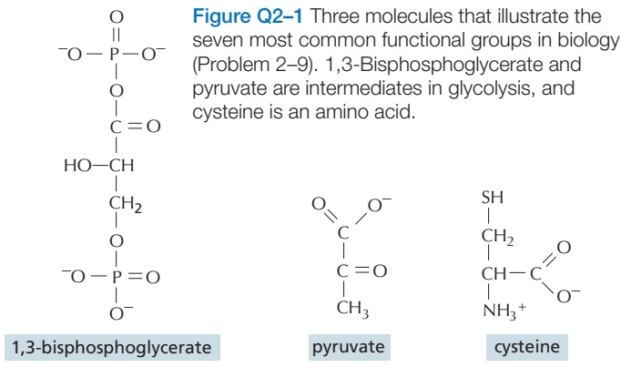
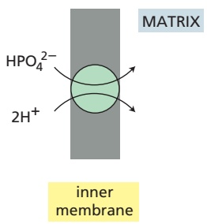
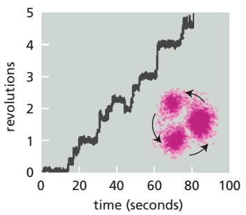
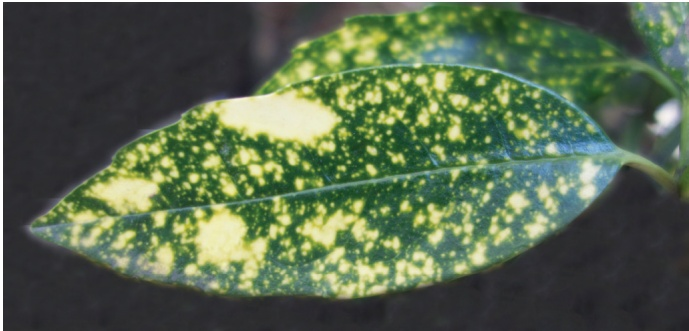

# 第7章 线粒体和叶绿体 · 英文习题与参考文献

### 英文补充：习题与参考文献

> 对应中文板块：习题与参考文献。英文来源：Molecular Biology of the Cell，第7版，第2章；[本章完整原文](../来源/英文教材/02_Cell_Chemistry_and_Bioenergetics/chapter.md)。物理PDF页码范围：88–153（整章范围）。

<!-- BEGIN EN EN02-EXERCISES -->
#### PROBLEMS

Which statements are true? Explain why or why not.

2–1 $\mathrm { A }   1 0 ^ { - 8 }$ M solution of HCl has a pH of 8.

2–2 Most of the interactions between macromolecules could be mediated just as well by covalent bonds as by noncovalent bonds.

2–3 Animals and plants use oxidation to extract energy from food molecules.

2–4 If an oxidation occurs in a reaction, it must be accompanied by a reduction.

2–5 Linking the energetically unfavorable reaction A → B to a second, favorable reaction $\mathrm { B } \to \mathrm { C }$ will shift the equilibrium constant for the first reaction.

2–6 The criterion for whether a reaction proceeds spontaneously is $\Delta G ,$ not $\Delta G ^ { \circ } ,$ because ΔG takes into account the concentrations of the substrates and products.

2–7 The oxygen consumed during the oxidation of glucose in animal cells is returned as $\mathrm { C O _ { 2 } }$ to the atmosphere.

Discuss the following problems.

2-8 During an all-out sprint, muscles produce a high concentration of lactic acid, which lowers the pH of the blood and of the cytosol. The lower pH inside the cell reduces the rate of ATP production and contributes to the fatigue that sprinters experience well before their fuel reserves are exhausted. The main blood buffer against pH changes is the bicarbonate $/ \mathrm { C O _ { 2 } }$ system.

$$
\begin{array}{c}\mathrm{pK} _ {1} = \quad \mathrm{pK} _ {2} = \quad \mathrm{pK} _ {3} =\\\mathrm{CO} _ {2} \rightleftharpoons \mathrm{CO} _ {2} \stackrel {{2. 3}} {{\rightleftharpoons}} \mathrm{H} _ {2} \mathrm{CO} _ {3} \stackrel {{3. 8}} {{\rightleftharpoons}} \mathrm{H} ^ {+} + \mathrm{HCO} _ {3} ^ {-} \stackrel {{1 0. 3}} {{\rightleftharpoons}} \mathrm{H} ^ {+} + \mathrm{CO} _ {3} ^ {2 -}\\(\text {gas}) (\text {dissolved})\end{array}
$$

To improve their performance, would you advise sprinters to hold their breath or to breathe rapidly just before the race? Why?

A. Breathe rapidly to decrease the pH of the blood.

B. Breathe rapidly to increase the pH of the blood.

C. Hold their breath to decrease the pH of the blood.

D. Hold their breath to increase the pH of the blood.

2–9 The three molecules in **Figure Q2–1** contain the seven most common functional groups in biology. Most molecules in the cell are built from these functional groups. Indicate and name the functional groups in these molecules.

2–10 The molecular weight of ethanol $\left( \mathrm{CH_{3}CH_{2}OH} \right)$ is 46 and its density is 0.789 $\mathrm { g / c m ^ { 3 } }$

A. What is the molarity of ethanol in beer that is 5% MBoC7 Q2.02/Q2.01ethanol by volume? [Alcohol content of beer varies from about 4% (lite beer) to 8% (stout beer).]

B. The legal limit for a driver’s blood alcohol content varies, but 80 mg of ethanol per 100 mL of blood (usually referred to as a blood alcohol level of 0.08) is typical. What is the molarity of ethanol in a person at this legal limit?

C. How many 12-oz (355-mL) bottles of 5% beer could a 70-kg person drink and remain under the legal limit? A 70-kg person contains about 40 liters of water. Ignore the metabolism of ethanol and assume that the water content of the person remains constant and that ethanol distributes evenly in that volume.

2–11 A histidine side chain is known to play an important role in the catalytic mechanism of an enzyme; however, it is not clear whether histidine is required in its protonated (charged) or unprotonated (uncharged) state. To answer this question, you measure enzyme activity over a range of pH, with the results shown in **Figure Q2–2**. Which form of histidine is required for enzyme activity?

Figure Q2–2 Enzyme activity as a function of pH (Problem 2–11).

2–12 The organic chemistry of living cells is said to be special for two reasons: it occurs in an aqueous environment, and it accomplishes some very complex reactions. But do you suppose it is really all that much different from the organic chemistry carried out in the top laboratories in the world? Why or why not?

2–13 Polymerization of tubulin subunits into microtubules occurs with an increase in the orderliness of the subunits. Yet tubulin polymerization occurs with an increase in entropy (decrease in order). How can that be?

2–14 “Diffusion” sounds slow—and over everyday distances it is—but on the scale of a cell it is very fast. The average instantaneous velocity of a particle in solution— that is, the velocity between the very frequent collisions—is

$$
\nu = (k T / m) ^ {1 / 2}
$$

where $k = 1 . 3 8 \times 1 0 ^ { - 1 6 }   \mathrm { g   c m ^ { 2 } / K   s e c ^ { 2 } } ,   T =$ temperature in K (37°C is 310 K), and m = mass in g/molecule.

Calculate the instantaneous velocity of a water molecule (molecular mass = 18 daltons), a glucose molecule (molecular mass = 180 daltons), and a myoglobin molecule (molecular mass = 15,000 daltons) at ${ \dot { 3 7 ^ { \circ } \mathrm { C } } } ,$

2–15 Each phosphoanhydride bond between the phosphate groups in ATP is a high-energy linkage with a $\Delta G ^ { \circ }$ value of –30.5 kJ/mole. Hydrolysis of this bond in cells normally liberates usable energy in the range of 45 to 55 kJ/mole. Why do you think a range of values for released energy is given for $\Delta G ,$ rather than a precise number, as for ΔG°?

A. ΔG cannot be accurately measured and can only be estimated as a range of values.

B. Differences in the concentrations of ATP, ADP, and phosphate can significantly change ΔG.

C. The specific enzyme catalyzing hydrolysis determines how much energy is released.

D. The temperature fluctuations occurring inside the cell can significantly change ΔG.

2–16 A 70-kg adult human (154 lb) could meet his or her entire energy needs for one day by eating 3 moles of glucose (540 g). (We do not recommend this.) Each molecule of glucose generates 30 molecules of ATP when it is oxidized to $\mathrm { C O _ { 2 } } .$ The concentration of ATP is maintained in cells at about 2 mM, and a 70-kg adult has about 25 liters of intracellular fluid. Given that the ATP concentration remains constant in cells, calculate how many times per day, on average, each ATP molecule in the body is hydrolyzed and resynthesized.

2–17 What is the “packet of energy” that NADH and NADPH carry? A. A hydride ion (two electrons and one proton) B. A hydrogen atom (one electron and one proton) C. A hydrogen ion (one proton and no electrons) D. A hydronium ion (a protonated water molecule)

2–18 Cancer cells can increase the rate of glycolysis up to 200-fold relative to normal differentiated cells. This effect, known as the Warburg effect after its discoverer, is exploited in an imaging technique that is commonly used to detect tumors. An individual is dosed with a molecule labeled with a radioactive isotope of fluorine (18F). The labeled molecule is preferentially taken up by cancer cells and is detected by positron emission tomography (PET) scanning. Which one of the following molecules would you label with 18F to detect tumors via the Warburg effect?

A. Acetyl CoA B. Glucose C. Lactate D. Pyruvate

2–19 Does a Snickers candy bar (65 g, 1360 kJ) provide enough energy to climb from Zermatt (elevation 1660 m) to the top of the Matterhorn (4478 m; **Figure Q2–3**), or might you need to stop at Hörnli Hut (3260 m) to eat another one? Imagine that you and your gear have a mass of 75 kg and that all of your work is done against gravity (that is, you are just climbing straight up). Remember from your introductory physics course that

$$
\text {work (J) = mass (kg)} \times g (\mathrm{m/sec} ^ {2}) \times \text {height gained (m)}
$$

where g is acceleration due to gravity (9.8 $\mathrm { m } / \mathrm { s e c } ^ { 2 } )$ . One joule is 1 kg $\mathrm { m ^ { 2 } / s e c ^ { 2 } } .$ . What assumptions made here will greatly underestimate how much candy you need?

Figure Q2–3 The Matterhorn (Problem 2–19). (Earth Trotter Photos/Shutterstock.)

2–20 Assuming that there are $5 \times 1 0 ^ { 1 3 }$ cells in the human body and that ATP is turning over at a rate of $1 0 ^ { 9 }$ ATP molecules per minute in each cell, how many watts is the human body consuming? (A watt is a joule MBoC7 Q2.03/Q2.03per second.) Assume that hydrolysis of ATP yields 50 kJ/mole.

#### REFERENCES

#### General

Berg JM, Tymoczko JL, Gatto GJ & Stryer L (2021) Biochemistry, 9th ed. New York: WH Freeman.

Miesfeld RL & McEvoy MM (2021) Biochemistry, 2nd ed. New York: Norton.

Moran LA, Horton HR, Scrimgeour G & Perry M (2012) Principles of Biochemistry, 5th ed. Upper Saddle River, NJ: Prentice Hall.

Nelson DL & Cox MM (2021) Lehninger Principles of Biochemistry, 8th ed. New York: Macmillan.

van Holde KE, Johnson WC & Ho PS (2005) Principles of Physical Biochemistry, 2nd ed. Upper Saddle River, NJ: Prentice Hall.

Voet D, Voet JG & Pratt CM (2016) Fundamentals of Biochemistry, 5th ed. New York: Wiley.

#### The Chemical Components of a Cell

Atkins PW (2003) Molecules, 2nd ed. New York: WH Freeman.

Baldwin RL (2014) Dynamic hydration shell restores Kauzmann’s 1959 explanation of how the hydrophobic factor drives protein folding. Proc. Natl. Acad. Sci. USA 111, 13052–13056.

Ball P (2017) Water is an active matrix of life for cell and molecular biology. Proc. Natl. Acad. Sci. USA 114, 13327–13335.

Bloomfield VA, Crothers DM & Tinoco I (2000) Nucleic Acids: Structures, Properties, and Functions. Sausalito, CA: University Science Books.

Branden C & Tooze J (1999) Introduction to Protein Structure, 2nd ed. New York: Garland Science.

de Duve C (2005) Singularities: Landmarks on the Pathways of Life. Cambridge, UK: Cambridge University Press.

Dowhan W (1997) Molecular basis for membrane phospholipid diversity: why are there so many lipids? Annu. Rev. Biochem. 66, 199–232.

Franks F (1993) Water. Cambridge, UK: Royal Society of Chemistry.

Henderson LJ (1927) The Fitness of the Environment, 1958 ed. Boston: Beacon.

Laage D, Elsaesser T & Hynes, JT (2017) Water dynamics in the hydration shells of biomolecules. Chem. Rev. 117, 10694–10725.

Milo R & Phillips R (2009) A feeling for the numbers in biology. Proc. Natl. Acad. Sci. USA 106, 21465–21471.

Phillips R & Milo R (2015) Cell Biology by the Numbers. New York: Garland Science.

Taylor ME & Drickamer K (2011) Introduction to Glycobiology, 3rd ed. New York: Oxford University Press.

van Meer G, Voelker DR & Feigenson GW (2008) Membrane lipids: where they are and how they behave. Nat. Rev. Mol. Cell Biol. 9, 112–124.

Varki A, Cummings RD, Esko JD, Freeze HH, Stanley P, Bertozzi CR et al., eds. (2009) Essentials of Glycobiology. Cold Spring Harbor, NY: Cold Spring Harbor Laboratory Press.

#### Catalysis and the Use of Energy by Cells

Alon U (2020) An Introduction to Systems Biology: Design Principles of Biological Circuits, 2nd ed. London: Chapman & Hall.

Atkins PW (1994) The Second Law: Energy, Chaos and Form. New York: Scientific American Books.

Baldwin JE & Krebs H (1981) The evolution of metabolic cycles. Nature 291, 381–382.

Berg HC (1983) Random Walks in Biology. Princeton, NJ: Princeton University Press.

Dill KA & Bromberg S (2010) Molecular Driving Forces: Statistical Thermodynamics in Biology, Chemistry, Physics, and Nanoscience, 2nd ed. New York: Garland Science.

Einstein A (1956) Investigations on the Theory of the Brownian Movement. New York: Dover.

Fruton JS (1999) Proteins, Enzymes, Genes: The Interplay of Chemistry and Biology. New Haven, CT: Yale University Press.

Hohmann-Marriott MF & Blankenship RE (2011) Evolution of photosynthesis. Annu. Rev. Plant Biol. 62, 515–548.

Kauzmann W (1967) Thermal Properties of Matter, Vol. 2. Thermodynamics and Statistics: With Applications to Gases. New York: WA Benjamin.

Kornberg A (1989) For the Love of Enzymes. Cambridge, MA: Harvard University Press.

Kuriyan J, Konforti B & Wemmer D (2012) The Molecules of Life: Physical and Chemical Principles. New York: Norton.

Lipmann F (1941) Metabolic generation and utilization of phosphate bond energy. Adv. Enzymol. 1, 99–162.

Lipmann F (1971) Wanderings of a Biochemist. New York: Wiley.

Nisbet EG & Sleep NH (2001) The habitat and nature of early life. Nature 409, 1083–1091.

Racker E (1980) From Pasteur to Mitchell: a hundred years of bioenergetics. Fed. Proc. 39, 210–215.

Sasselov DD, Grotzinger JP, & Sutherland JD (2020) The origin of life as a planetary phenomenon. Sci. Adv. 6, eaax3419.

Schrödinger E (1944 & 1958) What Is Life? The Physical Aspect of the Living Cell and Mind and Matter, 1992 combined ed. Cambridge, UK: Cambridge University Press.

Spang A, Saw JH, Jørgensen SL . . . Ettema TJG (2015) Complex archaea that bridge the gap between prokaryotes and eukaryotes. Nature 52, 173–179.

Tinoco I, Sauer K, Wang JC, Puglisi JD, Harbison G & Rovnyak D (2013) Physical Chemistry: Principles and Applications in Biological Sciences, 5th ed. Glenview, IL: Pearson Education.

van Meer G, Voelker DR & Feigenson GW (2008) Membrane lipids: where they are and how they behave. Nat. Rev. Mol. Cell Biol. 9, 112–124.

Walsh C (2001) Enabling the chemistry of life. Nature 409, 226–231.

Westheimer FH (1987) Why nature chose phosphates. Science 235, 1173–1178.

#### How Cells Obtain Energy from Food

Caetano-Anollés D, Kim KM, Mittenthal JE & Caetano-Anollés G (2011) Proteome evolution and the metabolic origins of translation and cellular life. J. Mol. Evol. 72, 14–33.

Dismukes GC, Klimov VV, Baranov SV, Kozlov YN, DasGupta J & Tyryshkin A (2001) The origin of atmospheric oxygen on Earth: the innovation of oxygenic photosynthesis. Proc. Natl. Acad. Sci. USA 98, 2170–2175.

Fothergill-Gilmore LA (1986) The evolution of the glycolytic pathway. Trends Biochem. Sci. 11, 47–51.

Friedmann HC (2004) From Butyribacterium to E. coli: an essay on unity in biochemistry. Perspect. Biol. Med. 47, 47–66.

Huynen MA, Dandekar T & Bork P (1999) Variation and evolution of the citric-acid cycle: a genomic perspective. Trends Microbiol. 7, 281–291.

Koonin EV (2014) The origins of cellular life. Antonie van Leeuwenhoek 106, 27–41.

Kornberg HL (2000) Krebs and his trinity of cycles. Nat. Rev. Mol. Cell Biol. 1, 225–228.

Krebs HA (1970) The history of the tricarboxylic acid cycle. Perspect. Biol. Med. 14, 154–170.

Lane N & Martin WF (2012) The origin of membrane bioenergetics. Cell 151, 1406–1416.

Martijn J & Ettema TJG (2013) From archaeon to eukaryote: the evolutionary dark ages of the eukaryotic cell. Biochem. Soc. Trans. 41, 451–457.

Mulkidjanian AY, Bychkov AY, Dibrova DV, Galperin MY & Koonin EV (2012) Open questions on the origin of life at anoxic geothermal fields. Orig. Life Evol. Biosph. 42, 507–516.

Zimmer C (2009) On the origin of eukaryotes. Science 325, 666–668.
<!-- END EN EN02-EXERCISES -->

### 英文补充：习题与参考文献

> 对应中文板块：习题与参考文献。英文来源：Molecular Biology of the Cell，第7版，第14章；[本章完整原文](../来源/英文教材/14_Energy_Conversion_and_Metabolic_Compartmentation_Mitochondria_and_Chloroplasts/chapter.md)。物理PDF页码范围：850–911（整章范围）。

<!-- BEGIN EN EN14-EXERCISES -->
#### PROBLEMS

Which statements are true? Explain why or why not.

14–1 The three respiratory enzyme complexes in the mitochondrial inner membrane tend to associate with each other in ways that facilitate the correct transfer of electrons between appropriate complexes.

14–2 The number of c subunits in the rotor ring of ATP synthase defines how many protons need to pass through the turbine to make each molecule of ATP.

14–3 Mutations that are inherited according to Mendelian rules affect nuclear genes; mutations whose inheritance violates Mendelian rules are likely to affect organellar genes.

#### Discuss the following problems.

14–4 Heart muscle gets most of the ATP needed to power its continual contractions through oxidative phosphorylation. When oxidizing glucose to $\mathrm { C O _ { 2 } } ,$ heart muscle consumes $\mathrm { O } _ { 2 }$ at a rate of 10 μmol/min per gram of tissue, in order to replace the ATP used in contraction and give a steady-state ATP concentration of 5 μmol/g of tissue. At this rate, how many seconds would it take the heart to consume an amount of ATP equal to its steady-state levels? (Complete oxidation of one molecule of glucose to $\mathrm { C O _ { 2 } }$ yields 30 ATP, 26 of which are derived by oxidative phosphorylation using the 12 pairs of electrons captured in the electron carriers NADH and FADH2. One pair of electrons is used to reduce each atom of oxygen.)

14–5 The transport of ions and small molecules across the inner mitochondrial membrane is often affected by the electrochemical gradient, whose components—the pH gradient and the membrane potential—may either oppose or drive the transport. How would the components of the electrochemical gradient affect the simultaneous transport of phosphate and protons into the matrix (**Figure Q14–1**)?

Figure Q14–1 Coupled transport of phosphate and protons across the inner mitochondrial membrane into the matrix (Problem 14–5).

14–6 If isolated mitochondria are incubated with a source of electrons such as succinate, but without oxygen, electrons enter the respiratory chain, reducing each of theMBoC7 nQ14.101/Q14.1 electron carriers almost completely. When oxygen is then

introduced, the carriers become oxidized at different rates (**Figure Q14–2**). How does this result allow you to order the electron carriers in the respiratory chain? What is their order?

Figure Q14–2 Rapid spectrophotometric analysis of the rates of oxidation of electron carriers in the respiratory chain (Problem 14–6). Cytochromes a and a3 cannot be distinguished and thus are listed as cytochrome (a + a3).

14–7 Both $\mathrm { H } ^ { + }$ and $\mathrm { C a ^ { 2 + } }$ are ions that move through the cytosol. Why is the movement of $\mathrm { H } ^ { + }$ ions so much faster than that of $\mathrm { { ^ { \circ } C a ^ { 2 + } } }$ ions? How do you suppose the speed of these two ions would be affected by freezing the solution? Would you expect them to move faster or slower? Explain your answer.

14–8 In the 1860s, Louis Pasteur noticed that when he added $\mathrm { O } _ { 2 }$ to a culture of yeast growing anaerobically on glucose, the rate of glucose consumption declined dramatically. Explain the basis for this result, which is known as the Pasteur effect.

14–9 ATP synthase is the world’s smallest rotary motor. Passage of H+ ions through the membrane-embedded portion of ATP synthase (the $\mathrm { F _ { 0 } }$ component) causes rotation of the single, central, axle-like γ subunit (the rotor stalk) inside the head group (the $\mathrm { F } _ { 1 }$ ATPase head). The tripartite head is composed of the three $\alpha \beta$ dimers, the β subunits of which are responsible for synthesis of ATP. The rotation of the $\gamma$ subunit induces conformational changes in the αβ dimers that allow ADP and phosphate to be converted into ATP. A variety of indirect evidence had suggested rotary catalysis by ATP synthase, but seeing is believing.

To demonstrate rotary motion, a modified form of the $\alpha _ { 3 } \beta _ { 3 } \gamma$ complex was used. The β subunits were modified so they could be firmly anchored to a solid support, and the γ subunit was modified (on the end that normally inserts into the $\mathrm { F _ { 0 } }$ component in the inner membrane) so that a fluorescently tagged, readily visible filament of actin could be attached (**Figure Q14–3A**). This arrangement allows rotations of the $\gamma$ subunit to be visualized as revolutions of the long actin filament. In these experiments, ATP synthase was studied in the reverse of its normal mechanism by allowing it to hydrolyze ATP. At low ATP concentrations, the actin filament was observed to revolve in steps of 120° and then pause for variable lengths of time, as shown in **Figure Q14–3B**.

(B)

Figure Q14–3 Experimental setup for observing rotation of the γ subunit of ATP synthase (Problem 14–9). (A) The β subunits are anchored to a solid support, and a fluorescent actin filament is attached to the γ subunit. (B) The indicated trace is a typical example from one experiment. The inset shows the positions in the revolution at which the actin filament paused. (B, from R. Yasuda et al., Cell 93:1117–1124, 1998. With permission from Elsevier.)

A. Why does the actin filament revolve in steps with pauses in between? What does this rotation correspond to in terms of the structure of the α3β3γ complex?

B. In its normal mode of operation inside the cell, how many ATP molecules do you suppose would be synthesized for each complete $\dot{360^{\circ}}$ rotation of the γ subunit? Explain your answer.

14–10 In actively respiring liver mitochondria, the pH in the matrix is about half a pH unit higher than it is in the cytosol. Assuming that the cytosol is at pH 7 and the matrix is a sphere with a diameter of 1 μm $\bar { [ V = ( 4 / 3 ) \pi r ^ { 3 } ] } ,$ , calculate the total number of protons in the matrix of a respiring liver mitochondrion. If the matrix began at pH 7 (equal to that in the cytosol), how many protons would have to be pumped out to establish a matrix pH of 7.5 (a difference of 0.5 pH units)?

14–11 Normally, the flow of electrons to $\mathrm { O } _ { 2 }$ is tightly linked to the production of ATP via the electrochemical gradient. If ATP synthase is inhibited, for example, electrons do not flow down the electron-transport chain and respiration ceases. Since the 1940s, several substances— such as $^ { 2 , 4 }$ -dinitrophenol—have been known to uncouple electron flow from ATP synthesis. Dinitrophenol was once prescribed as a diet drug to aid in weight loss. How would an uncoupler of oxidative phosphorylation promote weight loss? Why do you suppose dinitrophenol is no longer prescribed?

14–12 How much energy is available in visible light? How much energy does sunlight deliver to Earth? How efficient are plants at converting light energy into chemical energy? The answers to these questions provide an important backdrop to the subject of photosynthesis.

Each quantum or photon of light has energy hν, where h is Planck’s constant $( 6 . 6 \times 1 0 ^ { \widetilde { - 3 7 } }$ kJ sec/photon), and ν is the frequency in seconds–1. The frequency of light is equal to c/λ, where c is the speed of light $\bar { ( 3 . 0   \times   1 0 ^ { 1 7 } }$ nm/sec), and λ is the wavelength in nanometers. Thus, the energy (E) of a photon is

$$
E = h \nu = h c / \lambda
$$

A. Calculate the energy of a mole of photons $( 6 \times 1 0 ^ { 2 3 }$ photons/mole) at 400 nm (violet light), at 680 nm (red light), and at 800 nm (near-infrared light).

B. Bright sunlight strikes Earth at the rate of about 1.3 kJ/sec per square meter. Assuming for the sake of calculation that sunlight consists of monochromatic light of wavelength 680 nm, how many seconds would it take for a mole of photons to strike a square meter?

C. Assuming that it takes eight photons to fix one molecule of $\mathrm { C O _ { 2 } }$ as carbohydrate under optimal conditions, calculate how long it would take a tomato plant with a leaf area of 1 square meter to make a mole of glucose from $\mathrm { C O _ { 2 } }$ . Assume that photons strike the leaf at the rate calculated above and, furthermore, that all the photons are absorbed and used to fix $\mathrm { C O _ { 2 } } .$

D. If it takes 468 kJ/mole to fix a mole of $\mathrm { C O _ { 2 } }$ into carbohydrate, what is the efficiency of conversion of light energy into chemical energy after photon capture? Assume again that eight photons of red light (680 nm) are required to fix one molecule of $\mathrm { C O _ { 2 } } .$

14–13 Why are plants green? (“They contain chlorophyll” is not a sufficient answer.)

14–14 Examine the variegated leaf shown in **Figure Q14–4**. Yellow patches surrounded by green are common, but there are no green patches surrounded by yellow. Propose an explanation for this phenomenon.

Figure Q14–4 A variegated leaf of Aucuba japonica with green and yellow patches (Problem 14–14).

#### REFERENCES

#### General

Cramer WA & Knaff DB (1990) Energy Transduction in Biological Membranes: A Textbook of Bioenergetics. New York: Springer-Verlag.

Mathews CK, van Holde KE & Ahern K-G (2012) Biochemistry, 4th ed. San Francisco: Benjamin Cummings.

Nicholls DG & Ferguson SJ (2013) Bioenergetics, 4th ed. New York: Academic Press.

Schatz G (2012) The fires of life. Annu. Rev. Biochem. 81, 34–59.

#### The Mitochondrion

Ernster L & Schatz G (1981) Mitochondria: a historical review. J. Cell Biol. 91, 227s–255s.

Friedman JR & Nunnari J (2014) Mitochondrial form and function. Nature 505, 335–343.

Mitchell P (1961) Coupling of phosphorylation to electron and hydrogen transfer by a chemi-osmotic type of mechanism. Nature 191, 144–148.

Pebay-Peyroula E & Brandolin G (2004) Nucleotide exchange in mitochondria: insight at a molecular level. Curr. Opin. Struct. Biol. 14, 420–425.

Roger AJ, Muñoz-Gómez SA & Kamikawa R (2017) The origin and diversification of mitochondria. Curr. Biol. 27, R1177–R1192.

Scheffler IE (1999) Mitochondria. New York: Wiley-Liss.

#### The Proton Pumps of the Electron-Transport Chain

Althoff T, Mills DJ, Popot J-L & Kühlbrandt W (2011) Arrangement of electron transport chain components in bovine mitochondrial supercomplex I1III2IV1. EMBO J. 30, 4652–4664.

Baradaran R, Berrisford JM, Minhas GS & Sazanov LA (2013) Crystal structure of the entire respiratory complex I. Nature 494, 443–448.

Beinert H, Holm RH & Münck E (1997) Iron-sulfur clusters: nature’s modular, multipurpose structures. Science 277, 653–659.

Berry EA, Guergova-Kuras M, Huang LS & Crofts AR (2000) Structure and function of cytochrome bc complexes. Annu. Rev. Biochem. 69, 1005–1075.

Brandt U (2006) Energy converting NADH:quinone oxidoreductase (complex I). Annu. Rev. Biochem. 75, 69–92.

Chance B & Williams GR (1955) A method for the localization of sites for oxidative phosphorylation. Nature 176, 250–254.

Cooley JW (2013) Protein conformational changes involved in the cytochrome bc1 complex catalytic cycle. Biochim. Biophys. Acta 1827, 1340–1345.

Efremov RG, Baradaran R & Sazanov LA (2010) The architecture of respiratory complex I. Nature 465, 441–445.

Gottschalk G (1997) Bacterial Metabolism, 2nd ed. New York: Springer.

Gray HB & Winkler JR (1996) Electron transfer in proteins. Annu. Rev. Biochem. 65, 537–561.

Hirst J (2013) Mitochondrial complex I. Annu. Rev. Biochem. 82, 551–575.

Hosler JP, Ferguson-Miller S & Mills DA (2006) Energy transduction: proton transfer through the respiratory complexes. Annu. Rev. Biochem. 75, 165–187.

Hongjun Y, Schut GJ, Haja D, Adams MWW & Huilin L (2021) Evolution of complex I-like respiratory complexes. J. Biol. Chem. 296, 100740, 1–10.

Hunte C, Zickermann V & Brandt U (2010) Functional modules and structural basis of conformational coupling in mitochondrial complex I. Science 329, 448–451.

Kampjut D & Sazanov LA (2020) The coupling mechanism of mammalian respiratory complex I. Science 370(6516), eabc4209.

Keilin D (1966) The History of Cell Respiration and Cytochromes. Cambridge, UK: Cambridge University Press.

Rouault TA, Tracey A & Tong WH (2008) Iron–sulfur cluster biogenesis and human disease. Trends Genet. 24, 398–407.

Trumpower BL (2002) A concerted, alternating sites mechanism of ubiquinol oxidation by the dimeric cytochrome bc1 complex. Biochim. Biophys. Acta 1555, 166–173.

Tsukihara T, Aoyama H, Yamashita E . . . Yoshikawa S (1996) The whole structure of the 13-subunit oxidized cytochrome c oxidase at 2.8 Å. Science 272, 1136–1144.

#### ATP Production in Mitochondria

Abrahams JP, Leslie AG, Lutter R & Walker JE (1994) Structure at 2.8 Å resolution of F1-ATPase from bovine heart mitochondria. Nature 370, 621–628.

Berg HC (2003) The rotary motor of bacterial flagella. Annu. Rev. Biochem. 72, 19–54.

Boyer PD (1997) The ATP synthase—a splendid molecular machine. Annu. Rev. Biochem. 66, 717–749.

Meier T, Polzer P, Diederichs K, Welte W & Dimroth P (2005) Structure of the rotor ring of F-type Na+-ATPase from Ilyobacter tartaricus. Science 308, 659–662.

Stock D, Gibbons C, Arechaga I, Leslie AG & Walker JE (2000) The rotary mechanism of ATP synthase. Curr. Opin. Struct. Biol. 10, 672–679.

von Ballmoos C, Wiedenmann A & Dimroth P (2009) Essentials for ATP synthesis by F1F0 ATP synthases. Annu. Rev. Biochem. 78, 649–672.

#### Chloroplasts and Photosynthesis

Barber J (2013) Photosystem II: the water-splitting enzyme of photosynthesis. Cold Spring Harb. Symp. Quant. Biol. 77, 295–307.

Bassham JA (1962) The path of carbon in photosynthesis. Sci. Am. 206, 89–100.

Blankenship RE (2002) Molecular Mechanisms of Photosynthesis. Oxford, UK: Blackwell Scientific.

Blankenship RE & Bauer CE (eds.) (1995) Anoxygenic Photosynthetic Bacteria. Dordrecht: Kluwer.

Deisenhofer J & Michel H (1989) Nobel lecture. The photosynthetic reaction centre from the purple bacterium Rhodopseudomonas viridis. EMBO J. 8, 2149–2170.

De Las Rivas J, Balsera M & Barber J (2004) Evolution of oxygenic photosynthesis: genome-wide analysis of the OEC extrinsic proteins. Trends Plant Sci. 9, 18–25.

Hohmann-Marriott MF & Blankenship RE (2011) Evolution of photosynthesis. Annu. Rev. Plant Biol. 62, 515–548.

Jordan P, Fromme P, Witt HT, Klukas O, Saenger W & Krauss N (2001) Three-dimensional structure of cyanobacterial photosystem I at 2.5 Å resolution. Nature 411, 909–917.

Kobayashi K, Endo K & Wada H (2017) Specific distribution of phosphatidylglycerol to photosystem complexes in the thylakoid membrane. Front. Plant Sci. 8, 1991.

Kühlbrandt W, Wang DN & Fujiyoshi Y (1994) Atomic model of plant light-harvesting complex by electron crystallography. Nature 367, 614–621.

Lane N & Martin WF (2012) The origin of membrane bioenergetics. Cell 151, 1406–1416.

Lyons TW, Reinhard CT & Planavsky NJ (2014) The rise of oxygen in earth’s early ocean and atmosphere. Nature 506, 307–315.

Nelson N & Ben-Shem A (2004) The complex architecture of oxygenic photosynthesis. Nat. Rev. Mol. Cell Biol. 5, 971–982.

Orgel LE (1998) The origin of life—a review of facts and speculations. Trends Biochem. Sci. 23, 491–495.

Pyc M, Cai Y, Greer MS, Yurchenko $\bigcirc , \dots$ Mullen RT (2017) Turning over a new leaf in lipid droplet biology. Trends Plant Sci. 22, 596–609.

Tang K-H, Tang YJ & Blankenship RE (2011) Carbon metabolic pathways in phototrophic bacteria and their broader evolutionary implications. Front. Microbiol. 2, 165.

Umena Y, Kawakami K, Shen J-R & Kamiya N (2011) Crystal structure of oxygen-evolving photosystem II at a resolution of 1.9 Å. Nature 473, 55–60.

Vinyard DJ, Ananyev GM & Dismukes GC (2013) Photosystem II: the reaction center of oxygenic photosynthesis. Annu. Rev. Biochem. 82, 577–606.

Yano J, Kern J, Sauer K . . . Yachandra VK (2006) Where water is oxidized to dioxygen: structure of the photosynthetic Mn4Ca cluster. Science 314, 821–825.

Yoon HS (2004) A molecular timeline for the origin of photosynthetic eukaryotes. Mol. Biol. Evol. 21, 809–818.

#### The Genetic Systems of Mitochondria and Chloroplasts

Al Rawi S, Louvet-Vallee SS, Djeddi D . . . Galy V (2011) Postfertilization autophagy of sperm organelles prevents paternal mitochondrial DNA transmission. Science 334, 1144–1147.

Anderson S, Bankier AT, Barrell BG . . . Young IG (1981) Sequence and organization of the human mitochondrial genome. Nature 290, 457–465.

Bendich AJ (2004) Circular chloroplast chromosomes: the grand illusion. Plant Cell 16, 1661–1666.

Birky CW Jr (1995) Uniparental inheritance of mitochondrial and chloroplast genes: mechanisms and evolution. Proc. Natl. Acad. Sci. USA 92, 11331–11338.

Bullerwell CE & Gray MW (2004) Evolution of the mitochondrial genome: protist connections to animals, fungi and plants. Curr. Opin. Microbiol. 7, 528–534.

Chen XJ & Butow RA (2005) The organization and inheritance of the mitochondrial genome. Nat. Rev. Genet. 6, 815–825.

Clayton DA (2000) Vertebrate mitochondrial DNA—a circle of surprises. Exp. Cell Res. 255, 4–9.

Daley DO & Whelan J (2005) Why genes persist in organelle genomes. Genome Biol. 6, 110.

de Duve C (2007) The origin of eukaryotes: a reappraisal. Nat. Rev. Genet. 8, 395–403.

Dyall SD, Brown MT & Johnson PJ (2004) Ancient invasions: from endosymbionts to organelles. Science 304, 253–257.

Falkenberg M, Larsson NG & Gustafsson CM (2007) DNA replication and transcription in mammalian mitochondria. Annu. Rev. Biochem. 76, 679–699.

Harel A, Bromberg Y, Falkowski PG & Bhattacharya D (2014) Evolutionary history of redox metal-binding domains across the tree of life. Proc. Natl. Acad. Sci. USA 111, 7042–7047.

Hoppins S, Lackner L & Nunnari J (2007) The machines that divide and fuse mitochondria. Annu. Rev. Biochem. 76, 751–780.

Larsson NG (2010) Somatic mitochondrial DNA mutations in mammalian aging. Annu. Rev. Biochem. 79, 683–706.

Ma H, Xu H & O’Farrell PH (2014) Transmission of mitochondrial mutations and action of purifying selection in Drosophila melanogaster. Nat. Genet. 46, 393–397.

Neupert W & Herrmann JM (2007) Translocation of proteins into mitochondria. Annu. Rev. Biochem. 76, 723–749.

Taylor RW, Barron MJ, Borthwick GM . . . Turnbull DM (2003) Mitochondrial DNA mutations in human colonic crypt stem cells. J. Clin. Invest. 112, 1351–1360.

Wallace DC (1999) Mitochondrial diseases in man and mouse. Science 283, 1482–1488.

Williams TA, Foster PG, Cox CJ & Embley TM (2014) An archaeal origin of eukaryotes supports only two primary domains of life. Nature 504, 231–236.
<!-- END EN EN14-EXERCISES -->
