# 第8章 细胞骨架 · 第一节 微丝与细胞运动

[返回本章](../README.md) · [中文本章原文](../中文原文.md)

<!-- BEGIN CN CN08-S01 -->
## 第一节 微丝与细胞运动

微丝又称肌动蛋白丝（actin filament），或纤维状肌动蛋白（fibrous actin, F-actin），这种直径为7 nm的纤维存在于所有真核细胞中。微丝网络的空间结构与功能取决于与之相结合的微丝结合蛋白（microfilament binding protein）。在不同类型的细胞内，甚至是在同一细胞的不同区域，不同的微丝结合蛋白赋予了微丝网络不同的结构特征和功能。如小肠上皮细胞微绒毛内部的微丝束及细胞皮层的微丝网络，与黏着斑相连的应力纤维，迁移中的成纤维细胞前缘的片足和丝足中临时性的微丝结构，胞质分裂环，以及存在于肌细胞中的细肌丝。微丝网络结构的动态变化与多种细胞生命活动过程相关，如细胞突起（微绒毛、伪足）的形成及对细胞微环境的感知和调节、细胞质分裂、吞噬作用、细胞迁移。作为肌球蛋白运动的轨道，微丝还在细胞收缩（如肌细胞）和物质运输等过程中发挥重要作用。

  
图8-1 细胞骨架的基本类型及其分布

  
免疫荧光染色显示细胞内微丝（A）、微管（B）和中间丝（C）在体外培养的小鼠上皮细胞内的分布，以及三种细胞骨架结构的叠加图（D）。微丝网络更接近细胞的边缘。（Ueli Aebi 博士惠赠）

## 一、微丝的组成及其组装

## （一）结构与成分

微丝的主要结构成分是肌动蛋白（actin）。在大多数真核细胞中，肌动蛋白是含量最丰富的蛋白质之一。在肌细胞中，肌动蛋白占细胞总蛋白质质量的10%以上；

即使在非肌细胞中，也占细胞总蛋白质量的1%\~5%。肌动蛋白在细胞内有两种存在形式，即肌动蛋白单体（又称球状肌动蛋白，G-actin）和由单体组装而成的纤维状肌动蛋白。肌动蛋白的电镜图像呈球状，但经X射线衍射得到的三维结构显示该分子上有一条裂缝将其分成两瓣，其底部有两段肽链相连。在裂缝内部有一个核苷酸（ATP或ADP）结合位点和一个二价阳离子 $\left(\mathrm{Mg}^{2+}\right.$ 或 $\left.\mathrm{Ca}^{2+}\right)$ 结合位点（图8-2A）。与肌动蛋白结合的核苷酸可以自由地与周围介质中游离的核苷酸交换，但由于ATP与肌动蛋白的结合力更强，所以游离的肌动蛋白通常是带有ATP的。另外，由于细胞质中游离 $Mg^{2+}$ 的浓度远高于 $Ca^{2+}$ 的浓度，所以肌动蛋白的二价阳离子结合位点也被 $Mg^{2+}$ 占据。

肌动蛋白在生物演化过程中是高度保守的。在哺乳动物和鸟类细胞中至少已分离到6种肌动蛋白，4种为α-肌动蛋白，分别为横纹肌、心肌、血管平滑肌和肠道平滑肌所特有，它们与肌球蛋白等结构组分一起组装成细胞的收缩性装置；另外2种为β-肌动蛋白和γ-肌动蛋白，存在于所有的细胞中。其中β-肌动蛋白通

## 图8-2 肌动蛋白和微丝的结构

常定位于细胞的边缘，而 $\gamma-$ 肌动蛋白是应力纤维的组成成分。不同类型的 $\alpha-$ 肌动蛋白分子的一级结构（约400个氨基酸残基）仅有 $4\sim 6$ 个氨基酸残基不同， $\beta-$ 肌动蛋白或 $\gamma-$ 肌动蛋白与 $\alpha-$ 肌动蛋白（来自横纹肌）也仅相差约25个氨基酸残基。显然这些肌动蛋白基因是从同一个祖先基因演化而来。多数简单的真核生物，如酵母和黏菌，仅含单个肌动蛋白基因。然而大多数多细胞真核生物含有多个编码肌动蛋白的基因，如海胆有11个，网柄菌属（Dictyostelium）有17个，在某些种类的植物基因组中肌动蛋白基因的数目多达60个。

尽管不同生物的肌动蛋白具有很高的相似性，但微小的差异可能会导致功能上的变化。如在果蝇细胞中表达酵母的肌动蛋白基因，将导致果蝇飞翔障碍。另外，在一些原核生物如杆状和螺旋状的细菌中也存在一些肌动蛋白类似物，如MreB和Mbl。这些蛋白质也能组装成与微丝相似的结构，并调控细胞的形态和染色体的分离。MreB突变的大肠杆菌菌体呈球状，而一些球菌的基因组内没有发现编码该蛋白的基因。显然，MreB与细菌的形态相关。

电镜图像显示微丝是一条直径约为7 nm的扭链（图8-2C），整根微丝在外观上类似于由两股肌动蛋白纤维呈右手螺旋盘绕而成，螺距为36 nm（图8-2B）。在纤维内部，每个肌动蛋白亚基周围都有4个单体，上、下各一个，另外两个位于一侧。肌动蛋白分子上的裂缝使得该蛋白本身在结构上具有不对称性。在组装成微丝之后，每一个肌动蛋白亚基的裂缝都朝向微丝的同一端，从而使微丝在结构上具有极性。在结构上，具有裂缝的一端为负极（-），而另一端为正极（+）。在细胞内，多种微丝结合蛋白与微丝的表面相互作用，调节微丝的结构和功能。

## （二）微丝的组装及其动力学特性

有关肌动蛋白组装的信息大多来源于体外实验的结果。在试管中，微丝的组装/解聚与溶液中所含肌动蛋白的状态（结合ATP或ADP）、离子的种类及浓度等参数有关。通常，只有结合ATP的肌动蛋白才能参与微丝的组装。当溶液中含有适当浓度的 $\mathrm{Ca^{2+}}$ ，而 $\mathrm{Na^{+}}$ 、 $\mathbf{K}^+$ 的浓度很低时，微丝趋向于解聚；而当溶液中含有ATP、 $\mathrm{Mg^{2+}}$ 以及较高浓度的 $\mathrm{Na^{+}}$ 、 $\mathbf{K}^+$ 时，溶液中的G-actin则趋向于组装成F-actin，即新的G-actin加到微丝末端，使微丝延伸。

肌动蛋白组装成微丝的过程大体上可以分为几个阶段：首先是成核反应 (nucleation)。当聚合作用在只含有 G-actin，而没有 F-actin 的试管中进行时，组装的起始过程相当缓慢。G-actin 必须先形成一个具有 2～3 个亚基的低聚物，即所谓的成核过程。该过程是 G-actin 组装的限速步骤，称为延迟期。跟随着延迟期的是一个纤维快速延长的过程。当体系中肌动蛋白 -ATP 的浓度较高时，微丝的组装会在两极同时发生，但由于微丝的两端存在结构上的差异，导致肌动蛋白亚基组装的速度也不同，通常是肌动蛋白在微丝正端加入的速度比负端快 5～10 倍。随着组装过程的进行，系统中肌动蛋白单体浓度逐渐降低，组装的速度会逐步减慢。最后，系统（如果 ATP 足够多的话）会到达一个稳定状态，即纤维正极端组装的速度与负极端解聚的速度相同，纤维的长度保持不变。此时，体系中肌动蛋白单体的浓度称为临界浓度 ( $C_{\mathrm{f}}$ ），在数值上等于解聚速度常数和组装速度常数的比值，即 $C_{\mathrm{e}} = K_{\mathrm{eff}} / K_{\mathrm{on}}$ 。微丝末端的延长或解聚取决于增加亚基时体系中自由能 ( $\Delta G$ ) 的变化，当体系中游离的肌动蛋白的浓度高于 $C_{\mathrm{c}}$ 时， $\Delta G$ 小于零，微丝的末端会继续组装。相反，当游离的肌动蛋白浓度低于 $C_{\mathrm{e}}$ 时， $\Delta G$ 大于零，微丝将自发解聚。

在细胞内，微丝的成核过程需要肌动蛋白相关蛋白(actin-related protein, ARP) Arp2/3 复合物的参与，在该复合物由Arp2、Arp3及其他5种蛋白质组成，可以与微丝或其他细胞结构结合，并以此作为微丝组装的起点。肌动蛋白单体与Arp2/3复合物结合而使纤维延长。肌动蛋白在参与微丝的组装前通常先与ATP结合，而肌动蛋白亚基组装到微丝的末端以后，构象发生变化，具有了ATP酶的活性，能将本身结合的ATP水解成ADP，并释放磷酸基。当微丝的组装速度快于肌动蛋白水解ATP的速度时，处于微丝末端的一些肌动蛋白亚基所携带的是ATP，相当于在微丝的末端有一个由肌动蛋白-ATP亚基所构成的帽，带有这种结构的微丝比较稳定，可以持续组装。相反，当微丝末端的组装速度较肌动蛋白亚基水解ATP的速度慢，肌动蛋白亚基所结合的ATP都被水解成ADP时，这段微丝就比较容易解聚。由于微丝两端在结构上存在差异，而且负极端往往与Arp2/3复合物及细胞结构结合，所以新的肌动蛋白亚基通常是在正极端加入，而很少在负极端加入。细胞内微丝的稳定性受多种结合蛋白的调控，其动态性比体外组装更为复杂。待微丝组装到一定长度时，其正极端有可能与微丝结合蛋白或其他细胞结构相结合而使其处于稳定状态，也可能是两端都发生解聚。

  
图8-3 肌动蛋白组装过程中发生的踏车行为  
当体系中肌动蛋白的浓度处于临界浓度时，由于微丝两端结构上的差异，其正端随肌动蛋白亚基的不断加入而延伸，负端则因为解聚而缩短。在统计学意义上，正极端延长，负极端缩短，但长度几乎不变。

相比之下，负极端更容易与帮助微丝解聚的蛋白质相互作用，这样就使得微丝正极端不断组装，而负极端不断解聚，如细胞迁移时片足内部微丝结构的变化就是如此。在体外组装过程中有时也可以见到微丝的正极端由于肌动蛋白亚基的不断添加而延长，而负极端则由于解离而缩短，这一现象称为踏车行为（treadmilling）（图8-3）。

## （三）影响微丝组装的特异性药物

一些药物可以影响肌动蛋白的聚合或解离，从而影响细胞内微丝网络的结构。细胞松弛素（cytochalasin）是一类真菌的代谢产物，可与微丝结合并将其切断。细胞松弛素结合在微丝末端后还可阻止肌动蛋白在该部位的聚合，但对微丝的解聚没有明显影响，因而用细胞松弛素处理细胞可以破坏微丝的网络结构，并阻止细胞的运动。鬼笔环肽（phalloidin）是一种由毒蕈（Amanita phallodies）产生的双环单杆结合，与微丝表面有强亲和力，但不与游离的肌动蛋白单杆结合，因此，用荧光标记的鬼笔环肽染色可清晰地显示微丝在细胞中的分布。鬼笔环肽与微丝结合后能阻止微丝的解聚，使其保持稳定状态；而且，将鬼笔环肽注射到细胞内同样能阻止细胞运动。可见细胞内微丝的功能依赖于其组装和解聚的动态过程。

## 二、微丝网络结构的调节与细胞运动

## （一）非肌细胞内的微丝结合蛋白

尽管纯化的肌动蛋白可以在合适的体外环境下组装成微丝，但其复杂性和有序性都远不能与细胞内的相比。细胞内的微丝与多种结合蛋白相互作用，具有复杂的三维网络结构，并执行相应的功能。在细胞内，有些微丝结构相当稳定，如肌细胞中的细肌丝及小肠上皮细胞微绒毛中的微丝束，而另一些微丝只是暂时性的结构，如由微丝和肌球蛋白组装形成的胞质分裂环，在血小板激活及无脊椎动物精子顶体反应过程中出现的微丝束，只有在执行某种功能时才进行组装。实际上，在大多数非肌细胞中的微丝是一种高度动态的结构，它们持续地进行组装和解聚。微丝的这种动态不稳定性与细胞形态的持续变化及细胞运动有密切的关系。细胞内肌动蛋白的组装受到可溶性肌动蛋白的存在状态和微丝结合蛋白的种类两个不同层次的调节。

细胞内微丝网络的组织形式和功能通常取决于与之结合的微丝结合蛋白，而不是微丝本身。在不同的细胞中，甚至是同一细胞的不同部位，由于微丝结合蛋白的种类及存在状态的差异，微丝网络的结构有可能完全不同。微丝结合蛋白通过影响微丝的组装与解聚，介导微丝与其他细胞结构之间的相互作用来决定微丝的组织行为。此外，微丝还可以通过和肌球蛋白之间的相互作用来转运生物大分子复合物及多种细胞器，并对细胞的形态结构和蛋白质的定位起组织作用，进而调节细胞的行为。目前，人们已经从各种组织细胞中分离到100多种不同的微丝结合蛋白，根据其作用方式的不同，可以分成如下几种类型。

## 1. 肌动蛋白单体结合蛋白

在细胞内，可溶性的肌动蛋白和纤维状肌动蛋白的比例大体是1∶1。也就是说，细胞内游离态肌动蛋白的浓度远远高于肌动蛋白组装所需的临界浓度，但由于游离态肌动蛋白常与肌动蛋白单体结合蛋白（如胸腺素 $\beta_{4}$ 和前纤维蛋白）结合在一起，从而使肌动蛋白组装成微丝的过程受到必要的调控，储存在细胞内的肌动蛋白只有在相关信号的刺激下才会被释放，成为真正的游离状态参与微丝的组装。

胸腺素 $\beta_{4}$ 是由43个氨基酸残基组成的小肽，能与游离的肌动蛋白结合，并封闭肌动蛋白聚合的位点，从而阻止肌动蛋白组装到微丝的末端。在细胞内，胸腺素 $\beta_{4}$ 的浓度通常与游离的肌动蛋白库的容量相关，它与肌动蛋白按 $1:1$ 的比例结合。由于胸腺素 $\beta_{4}$ 与带ATP的肌动蛋白的亲和力高于带ADP的肌动蛋白，所以游离态的肌动蛋白主要是带有ATP的（图8-4）。

前纤维蛋白（profilin）又名抑制蛋白，该蛋白与肌动蛋白的底部（正极端）结合，从而阻碍了前纤维蛋白-肌动蛋白复合体在微丝负极端的聚合，但这并不影响该复合体在微丝正极端的组装。当前纤维蛋白-肌动蛋白复合体与微丝的正极端结合后，前纤维蛋白便解离下来（图8-4）。

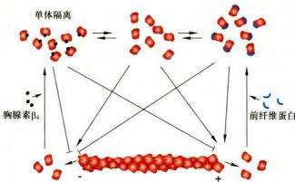  
图8-4 肌动蛋白结合蛋白调节微丝的组装  
在合适的条件下，结合 ATP 的肌动蛋白可以参与微丝的组装。胸腺素 $\beta_{4}$ 与肌动蛋白结合以后抑制微丝的组装。前纤维蛋白与肌动蛋白单体的底部结合，促进了微丝正极端的组装，但阻断了负极端的组装。

## 2. 成核蛋白

细胞内肌动蛋白的组装受外部信号、Arp2/3复合物及形成蛋白（formin）等因素的调控，以实现细胞形态和行为的快速变化。

Arp2/3复合物由Arp2、Arp3和其他5种蛋白质组成，其中Arp2、Arp3与肌动蛋白的相似性达 $45\%$ ，但其本身不能组装成纤维。在该复合物中，Arp2和Arp3形成类似于微丝正极端肌动蛋白两个亚基的结构，从而可以启动肌动蛋白的成核过程。在外来信号的作用下，活化的Arp2/3复合物与细胞膜或其他适当的细胞结构结合，并为肌动蛋白提供组装的起始点。新的肌动蛋白亚基在正极端加入，而Arp2/3复合物则位于纤维的负端（图8-5）。Arp2/3复合物也可以结合在已有的微丝上，启动微丝分支的组装。在这种情况下，新组装的侧支与原有的微丝呈 $70^{\circ}$ 夹角。多个侧支的组装可使微丝连接成一个树状网络。由于Arp2/3复合物与携带ATP的肌动蛋白亚基的亲和力远大于带有ADP的肌动蛋白亚基，因此微丝的分支往往在新组装的一端产生。随着结合在肌动蛋白亚基内部的ATP的水解和Pi的释放，Arp2/3复合物有可能从微丝上解离，导致分支的脱落。

形成蛋白家族的成员在结构上很保守，在微丝的延长过程中形成蛋白始终与其正极端结合，通过与前纤维蛋白相互作用而提高微丝的组装速度，还可保护正极端免受加帽蛋白的干扰。

## 3. 加帽蛋白

细胞内微丝的组装一旦停止，其末端的肌动蛋白亚基所带的ATP很可能因为水解而使得整个纤维处于不稳定状态，而微丝的过度组装也会影响细胞的结构和功能。加帽蛋白（capping protein）是指一类可与微丝的末端结合，从而阻止微丝解聚或过度组装的微丝结合蛋白。如与微丝的负极端结合的Arp2/3复合物和原肌球调节蛋白（tropomodulin），与正极端结合的CapZ和凝溶胶蛋白家族的成员（图8-5）。这些与微丝末端相互作用的蛋白质在调节微丝的动力学性质方面发挥作用。在细胞运动过程中，对微丝加帽和脱帽的调控显得非常重要，这些过程受细胞膜上的G蛋白偶联受体及下游的4,5-二磷酸磷脂酰肌醇（ $\mathrm{PIP}_2$ ）的调节。

## 4. 交联蛋白

微丝的排列方式主要由微丝交联蛋白的种类决定。成束蛋白（bundling protein）将相邻的微丝交联成相互平行的束状结构，而凝胶形成蛋白（gel-forming protein）将微丝连接成网状。微丝交联蛋白都有一个或两个相似的微丝结合位点，能够单独或者以二聚体的形式将相邻的微丝交联在一起。多肽链或二聚体上两个微

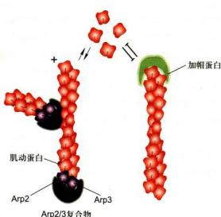  
图8-5 微丝的成核与加帽

Arp2/3 复合物参与肌动蛋白的成核，并可与微丝结合启动侧支的组装。微丝加帽蛋白可以结合在微丝的正极端或负极端，使末端处于稳定状态。

丝结合位点之间的距离决定了它们所交联形成的微丝束或网络的松紧程度。

丝束（毛缘）蛋白（fimbrin）是分布很广的微丝成束蛋白，由于分子较小，肽链上两个微丝结合位点靠得很近，并分别结合到相邻的微丝上，多个丝束蛋白分子与微丝结合可形成排列紧密的微丝束（图8-6A）。在细胞前缘丝足中的微丝束就是这种类型，由于微丝的排列很紧密，肌球蛋白分子很难进入相邻的微丝之间，因此丝足中的微丝束没有收缩能力。绒毛蛋白（villin）是一种与丝束蛋白相似的微丝成束蛋白，主要存在于微绒毛和细胞表面的指状突起中，也可将微丝交联成紧密排列的束状结构。微绒毛中的核心微丝束可通过肌球蛋白I与微绒毛膜相连。α-辅肌动蛋白（α-actinin）只有一个微丝结合位点，但该蛋白可形成反向平行的二聚体，位于二聚体两端的两个微丝结合位点相距较远，因此，由α-辅肌动蛋白交联形成的微丝束（如应力纤维）中微丝的排列相对宽松（图8-6B）。肌球蛋白II可以进入相邻的微丝之间，并依靠其马达结构域与微丝相互作用，所以应力纤维具有收缩能力。

成束蛋白的两个肌动蛋白结合位点之间的区域都是僵直的，而另外一些微丝交联蛋白，如细丝蛋白（filamin）和血影蛋白（见第四章），它们的两个肌动蛋白结合位点之间的区域是柔软的，或者本身就是弯曲的。当微丝与这些交联蛋白相互作用时就会形成网状或凝胶样的结构。两个细丝蛋白的一端相互作用形成二聚体，另两个末端将两根微丝以 $90^{\circ}$ 的夹角交联，使微丝形成松散的网络结构（图8-6C）。这种凝胶样的结构存在于片足中，能帮助细胞在基质表面爬行。血影蛋白是四条多肽链（两条α链和两条β链）组成的细长而容易弯曲的蛋白质分子，在细胞膜的内侧将微丝交联成二维网络，并将这个网络与细胞质膜相连，形成一个结实而富有弹性的细胞皮层，对细胞质膜有机械支撑作用。

## 5. 割断及解聚蛋白

在细胞迁移或其他运动过程中，细胞需要将特定区域的微丝快速解聚，或者是形成大量的末端以加速组装。凝溶胶蛋白（gelsolin）在高Ca²⁺浓度（大于1 μmol/L）情况下能将较长微丝切断，使肌动蛋白由凝胶态转化成溶胶态。微丝被切断后产生许多游离的正端和负端，在某些条件下可以加速微丝的解聚，而在另外一些条件下可以形成大量新的组装位点，促进微丝在短时间内快速组装。丝切蛋白/肌动蛋白解聚因子（cofilin/actin depolymerizing factor, cofilin/ADF）能与游离的肌动蛋白或微丝结合，提高微丝的解聚速度。

## （二）细胞皮层

免疫荧光染色的结果显示，细胞内大部分微丝都集中在紧贴细胞质膜的细胞质区域，并由微丝结合蛋白交联成凝胶态三维网络结构，该区域通常称为细胞皮层（cell cortex）。皮层内一些微丝还与细胞质膜上的蛋白质结合，使膜蛋白的流动性受到某种程度的限制。皮层内密布的微丝网络可以为细胞质膜提供强度和韧性，有助于维持细胞形状。细胞的多种生理活动，如胞质环流（cyclosis）、阿米巴运动（ameboid movement）、变皱膜运动（ruffled membrane locomotion）、吞噬（phagocytosis）以及膜蛋白的定位等都与皮层内微丝网络的溶胶态-凝胶态转化相关。

## （三）应力纤维

体外培养的细胞在基质表面铺展时，常在细胞质膜的特定区域与基质之间形成紧密黏附的黏着斑。在紧贴黏着斑的细胞质膜内侧有大量成束状排列的微丝，这种连接相邻的黏着斑或特定的细胞结构的微丝束称为应力纤维（stress fiber）（图8-7）。应力纤维的结构与骨骼肌细胞中的肌原纤维非常相似，其结构组分除微丝外，还含有肌球蛋白Ⅱ、原肌球蛋白、细丝蛋白和α-辅肌动蛋白等。

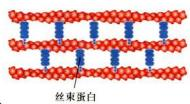  
A  
图8-6 微丝交联蛋白与微丝的相互作用

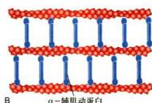

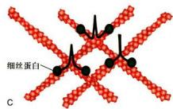

  
图8-7 应力纤维  
体外培养的星形胶质细胞用罗丹明（Rhodamine）标记的鬼笔环肽染色，显示在细胞内应力纤维和黏着斑的分布。（李慧惠博士提供）

应力纤维是真核细胞内广泛存在的微丝结构。用肌球蛋白重链的S1片段标记应力纤维微丝的极性，结果显示应力纤维中相邻的微丝呈反向平行排列，而非肌动蛋白组分则表现不连续的周期性分布。应力纤维通过黏着斑与细胞外基质相连，可能在细胞形态发生、细胞分化和组织结构的维持等方面发挥作用。从应力纤维的蛋白组分来看，它应当可以产生张力。当细胞受到外界刺激开始运动时，细胞内的应力纤维将发生变化或消失。

## （四）细胞伪足的形成与细胞迁移

体外培养的细胞常常会在基质表面迁移。这种现象也发生在动物体内，如在神经系统发育过程中，神经鞘细胞从神经管向外迁移；在发生炎症反应时，中性粒细胞向炎症组织迁移；神经元的轴突顺基质上的化学信号向靶标生长。细胞的这些运动过程主要是通过微丝的组装/解聚，以及与其他细胞结构的相互作用来实现的。

以成纤维细胞为例，细胞在基质或相邻细胞表面的迁移过程通常包含以下几个步骤：首先，细胞在它运动方向的前端伸出突起；接着，突起与基质之间形成新的锚定位点（如黏着斑），使突起附着在基质表面；然后，细胞以附着点为支点向前移动；最后，位于细胞后部的附着点与基质脱离，细胞的尾部前移。在迁移过程中，位于细胞前缘的肌动蛋白聚合使细胞伸出宽而扁平的片足（lamellipodium），在伪足内部微丝的正极端位于细胞的前缘，存在于该部位的WASP蛋白家族的成员能够激活Arp2/3复合物，导致肌动蛋白的聚合及树枝状微丝网络的形成。片足常呈波形运动，在其前端还有一些比较纤细的突起，称为丝足（filopodium）（图8-8）。

片足和丝足的形成依赖于肌动蛋白的聚合，并由此导致细胞形态的变化。当细胞受到外来信号的刺激时，位于细胞质膜附近的WASP蛋白将Arp2/3复合物激活，并使之成为微丝组装的成核位点，启动微丝的组装。前纤维蛋白可以促进结合ATP的肌动蛋白单体在微丝正极端聚合，使其向前延伸，并推动细胞膜向外形成突起。待微丝延伸到一定程度后，Arp2/3复合物结合到微丝侧面，在此启动新微丝的组装，形成分支。游离的肌动蛋白不断在正极端加入而使侧支向细胞质膜处延伸，Arp2/3复合物结合在侧支上面再形成新的分支，并继续延伸。持续延伸的肌动蛋白网络推动细胞质膜向信号源方向伸出，形成伪足。

神经元生长锥的生长方式与成纤维细胞迁移时片足的动态行为非常相似。生长锥位于神经突起的顶端，前面有一个宽大扁平的伪足。突起生长时伪足起伏波

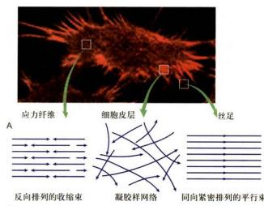  
反向排列的收缩束B  
图 8-8 动物细胞边缘的伪足及其微丝的排列方式

A. 用荧光标记的鬼笔环肽染色显示体外培养细胞内微丝的分布以及细胞周缘伸出的伪足。B. 应力纤维、细胞皮层和丝足内部微丝的排列方式示意图。

动，并不停地伸出丝足勘探周围的环境信号，而微丝及其结合蛋白在片足和丝足的形成和运动过程中发挥主导作用。当某个丝足获得向前生长的信号时，微丝向前组装，突起生长，而其他方向的突起由于内部微丝的解聚而缩回。

## (五) 微绒毛

在小肠上皮细胞的游离面有大量的微绒毛(microvilli)，其轴心是一束平行排列的微丝，对微绒毛的形态起支撑作用，其下端终止于端网结构（terminal web）。微丝结合蛋白如绒毛蛋白、丝束蛋白、胞衬蛋白（fodrin）等在微丝束的形成、维持及其与细胞质膜的连接中发挥作用。将肌球蛋白的S1片段与微绒毛内的微丝结合，然后用快速冷冻－深度蚀刻电镜技术可显示微绒毛内部微丝的极性，其正极端在微绒毛的顶部，在微绒毛的基部微丝束与细胞质中间丝相连（图8-9）。

## (六) 胞质分裂环

胞质分裂环（收缩环）是有丝分裂末期在两个即将分裂的子细胞之间形成的一个起收缩作用的环型结构（图8-10）。收缩环的主体结构由大量反向平行的微丝组装而成。胞质分裂的动力来源于结合在收缩环上的肌球蛋白所介导的极性相反的微丝之间的滑动。随着收缩环的收缩，两子细胞被缢缩分开。收缩环是非肌细胞中具有收缩功能的微丝束的典型代表，能在很短的时间内迅速组装与解聚以完成胞质分裂过程。

  
图 8-9 微绒毛中的微丝和微丝结合蛋白  
A. 微绒毛内部微丝及其结合蛋白排列结构模式图。B. 小肠上皮细胞表面微绒毛（纵切面）的电镜图像（Bechara Kachar 博士惠赠）。

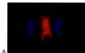

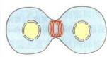  
图 8-10 胞质分裂环  
A. 罗丹明标记的鬼笔环肽染色显示星形胶质细胞的胞质分裂过程中微丝的分布。染色质由DAPI染色显示。B. 胞质分裂环模式图。（A图由李慧惠博士提供）

## 三、肌球蛋白：依赖于微丝的分子马达

在细胞内参与物质运输的马达蛋白（motor protein）可以分为三类：沿微丝运动的肌球蛋白（myosin）、沿微管运动的驱动蛋白（kinesin）和动力蛋白（dynein）。这些蛋白既有与微丝或微管结合的马达结构域，又有与膜性细胞器或大分子复合物特异结合的“货物”结合结构域，利用水解ATP所提供的能量沿微管或微丝运动。

## （一）肌球蛋白的种类

有关肌球蛋白最初的信息来自对骨骼肌细胞的研究，发现多个Ⅱ型肌球蛋白分子（图8-11）组装成肌原纤维的粗肌丝，并被相关的细胞结构约束在一定的区域，肌球蛋白的头部和组成微丝的肌动蛋白亚基之间的相互作用导致粗肌丝与细肌丝之间的滑动。随后，人们又陆续发现了多种不同类型的肌球蛋白分子。马达结构域是肌球蛋白超家族成员最保守的部位，是肌球蛋白定性和分类的依据，而这些肌球蛋白分子的C端和N端扩展部分则变化很大（图8-12）。基于马达结构域多肽链一级结构的相似性，至少可以将肌球蛋白超家族的成员分成18个家族，一些类群还可以进一步分成多个亚家族。不同生物细胞所表达的肌球蛋白的种类具有较大的差别，如芽殖酵母表达的5种肌球蛋白分属3个不同的家族，而人类细胞表达40多种肌球蛋白，它们分别属于12个不同的肌球蛋白家族。

在生物演化过程中，不同类型肌球蛋白成员逐步适应于特殊的细胞功能。如Ⅱ型肌球蛋白的成员在心肌、

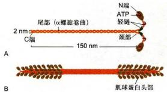  
图8-11 II型肌球蛋白分子和粗肌丝的结构示意图  
A. II型肌球蛋白分子由2条具有马达结构域的重链（黄色）和4条起调节作用的轻链构成。B. 由II型肌球蛋白的尾部结构域相互作用而组装成的粗肌丝。

  
图 8-12 部分肌球蛋白超家族成员的结构示意图  
A. 部分肌球蛋白分子重链的一级结构，棕色部分示马达结构域在多肽链中的位置。B. 一些肌球蛋白超家族成员分子的结构比较。所有的肌球蛋白分子都具有相似的马达结构域，但它们 C 端和某些成员的 N 端扩展部分变化很大。

骨骼肌和平滑肌细胞中与肌动蛋白纤维组装在一起能产生强大的收缩力，也在收缩环、应力纤维等具有收缩能力的细胞结构中发挥作用；V型肌球蛋白与细胞内膜泡和其他细胞器的运输相关，I、Ⅵ、Ⅸ和X型肌球蛋白的一些成员参与了细胞内吞作用以及吞噬泡的运输，另一些肌球蛋白家族的成员在细胞形态和极性化细胞结构的建立及维持过程中发挥功能，如I型肌球蛋白家族的成员将膜脂和微丝结构相连接，参与细胞突起的形成，一些Ⅱ型肌球蛋白的成员与应力纤维及细胞皮层的微丝相互作用，Ⅶ型肌球蛋白参与黏着斑的动态变化，还有一些肌球蛋白参与了细胞感知系统及信号转导过程，如某些Ⅰ型肌球蛋白分子对钙通道的活性具有调控作用，Ⅲ型肌球蛋白的成员与光感受器的信号分子相互作用，Ⅵ、Ⅶ和Ⅸ型肌球蛋白的一些成员与耳朵感觉细胞中的微丝结构相关，如果编码这些蛋白质的基因发生突变有可能造成听力障碍。

## （二）肌球蛋白的结构

肌球蛋白是沿微丝运动的马达分子，该蛋白通常含有三个功能结构域。它们是与运动相关的马达结构域，位于马达结构域后部的调节结构域，以及参与肌球蛋白复合体的组装并选择性地与所运输的“货物”结合的尾部结构域。马达结构域位于肌球蛋白的头部，包含一个肌动蛋白亚基的结合位点和一个具有ATP酶活性的ATP结合位点，负责将ATP水解所释放的化学能转变成机械能。ATP的水解及磷酸基团的释放等会改变马达结构域和调控结构域的构象。当ATP与肌球蛋白结合时，马达结构域与微丝的亲和力降低。调节结构域是连接马达结构域和尾部杆状区的一段 $\alpha$ 螺旋，也是肌球蛋白轻链的结合部位，它在肌球蛋白分子上发挥杠杆作用。肌球蛋白的轻链大多是钙调蛋白家族的成员，不同的轻链结合特定的肌球蛋白分子，而且这种搭配也随生物体的发育阶段而有所变化。

人们习惯上将Ⅱ型肌球蛋白称为传统的肌球蛋白（conventional myosin），而将其他的各种类型称为非传统的肌球蛋白（unconventional myosin）。图8-12显示几种类型的肌球蛋白的分子结构，其中研究较多的是I型、Ⅱ型和V型。除VI型肌球蛋白的运动方向是从微丝的正极端向负极端移动以外，其他各种类型的肌球蛋白都是向微丝的正极端运动的。

## 1. Ⅱ型肌球蛋白

在肌细胞中，Ⅱ型肌球蛋白组装成肌原纤维的粗肌丝，其含量约占肌细胞总蛋白量的一半。在非肌细胞中，Ⅱ型肌球蛋白是胞质分裂过程中收缩环的主要结构组分，并通过与微丝的相互作用主导收缩过程。Ⅱ型肌球蛋白也是应力纤维的结构组分。典型的Ⅱ型肌球蛋白分子包含2条重链和4条轻链，形成一个高度不对称的分子结构（图8-11A）。两条重链的尾部卷曲盘绕形成直径2 nm、长约150 nm的双股α螺旋。用胰蛋白酶处理肌球蛋白分子，可产生轻酶解肌

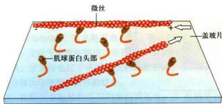  
图8-13 肌球蛋白的体外运动实验模式图

纯化的肌球蛋白 S1 片段被固定在盖玻片上，然后在体系中加入用荧光标记的微丝。当在体系中加入 ATP 时，在荧光显微镜下可观察到微丝在盖玻片表面滑动。

球蛋白（light meromyosin, LMM）和重酶解肌球蛋白（heavy meromyosin, HMM）。重酶解肌球蛋白经木瓜蛋白酶处理，形成肌球蛋白头部（HMM-S1）和杆部（HMM-S2）。当反应体系中有ATP存在时，固定在盖玻片上的S1片段可以驱动微丝位移（图8-13）。

Ⅱ型肌球蛋白分子的尾部主要起结构作用。双极肌球蛋白纤维组装时其尾部位于纤维的中央，而头部朝向两侧（图8-11B）。在骨骼肌细胞中，由肌球蛋白尾部构成的肌原纤维的粗肌丝是高度稳定的，而在胞质分裂时的收缩环中则是一个临时性结构，在胞质分裂结束后便解体。

## 2. 其他类型的肌球蛋白

I 型肌球蛋白分子于 1973 年由 T. Pollard 和 E. Korn 从原生动物 Acanthamoeba 中分离得到。与传统的 II 型肌球蛋白分子不同，该蛋白分子只有一个头部（马达结构域）和一个尾部，长度为 70 nm（图 8-12），在体外也不能组装成纤维。其头部结构域能在 ATP 存在时沿微丝运动，尾部结构域在不同种类的 I 型肌球蛋白中各不相同，这可能与它们所运输“货物”的种类有关。有些 I 型肌球蛋白的尾部可以和膜泡结合，也有一些是和细胞质膜结合，牵引质膜和皮层的微丝作相对运动，从而改变细胞的形状。

V型肌球蛋白分子是由两条肽链组装而成的二聚体，具有两个头部。其颈部的长度大约是Ⅱ型肌球蛋白颈部的3倍，达23 nm（图8-12）。在运动过程中，V型肌球蛋白的步幅正好是微丝上由13个肌动蛋白亚基所组成的重复结构的长度。该蛋白的两个头部交替与微丝结合可以确保马达分子以及所运载的“货物”始终与微丝相连。

细胞中的有些膜泡表面既有依赖微管的马达分子，也有依赖微丝的非传统类型的肌球蛋白。在细胞质内，一些膜性细胞器作长距离转运时通常依赖于微管，而在细胞皮层以及神经细胞生长锥前端等富含微丝的部位，货物的“运输”则依赖微丝进行。然而，在花粉管中的物质运输似乎主要依赖于微丝。

## 四、肌细胞的收缩运动

高等动物的个体运动有赖于骨骼肌的收缩。肌细胞是高度有序的收缩装置，使人们能从分子水平直至器官水平对其功能进行详细了解。

## （一）肌纤维的结构

骨骼肌细胞又称肌纤维，是在胚胎期由单核成肌细胞融合而成，但细胞核仍保留在肌纤维内。用电镜观察肌纤维的纵切面，可见肌纤维是由数百条更细的肌原纤维（myofibril）组成的集束（图8-14）。

每根肌原纤维由称为肌节（sarcomere）的收缩单元呈线性重复排列而成。每个肌节都表现出特征性的带型。肌原纤维的带状条纹由粗肌丝和细肌丝的纤维有序组装而成。粗肌丝由肌球蛋白组装而成，细肌丝的主要成分是肌动蛋白，辅以原肌球蛋白和肌钙蛋白。肌球蛋白的头部突出于粗肌丝的表面，并可与细肌丝上肌动蛋白亚基结合，构成粗肌丝与细肌丝之间的横桥（图8-15）。

原肌球蛋白（tropomyosin, Tm）分子的长度为40 nm，由两条平行的多肽链形成螺旋构型。Tm位于肌动蛋白丝的螺旋状沟槽内，一个Tm的长度相当于7个肌动蛋白单体（图8-16），对肌动蛋白与肌球蛋白头部的结合行使调节功能。

肌钙蛋白（troponin, Tn）含3个亚基，其中肌钙蛋白C（Tn-C）能与Ca $^{2+}$ 结合，肌钙蛋白T（Tn-T）与原肌球蛋白有高亲和力，肌钙蛋白I(Tn-I)能抑制肌球蛋白马达结构域的ATP酶活性。细肌丝中每隔40 nm有一个肌钙蛋白复合体结合到原肌球蛋白上（图8-16）。

除上述分子外，肌肉收缩系统中还有多种蛋白质组分。将细肌丝锚定于Z盘或质膜上的蛋白质有：① CapZ，由两个亚基构成，定位于Z盘，与肌动蛋白丝正极端结合，使肌动蛋白丝保持稳定。② $\alpha-$ 辅肌动蛋白，在细胞内组装成反向平行的二聚体，是骨骼肌Z盘、平滑肌的电子致密部区（致密斑和致密体）及心肌闰盘的主要成分之一，可将微丝横向连接成束。③ 纽蛋白（vinculin），又名黏着斑蛋白，是一种细胞膜骨架蛋白，定位于黏着斑部位，介导整联蛋白和微丝之间的联系。纽蛋白也位于平滑肌细胞的致密区、心肌闰盘，介导微丝与细胞质膜等的结合。

A  
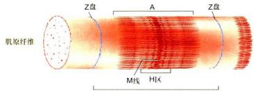

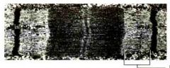

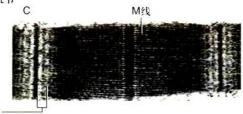

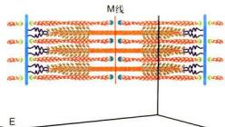

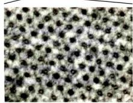  
图8-14 骨骼肌及肌纤维的结构

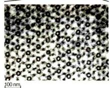  
A. 肌纤维的三维结构模式图。B 和 C. 肌细胞纵切面，低倍电镜图像显示处于松弛（B 上）和收缩（C 上）状态下肌小节中明带和暗带有规律地排列，下面的是根据电镜照片所画的当肌肉处于松弛和收缩状态下粗肌丝和细肌丝的结构模式图。D. 肌原纤维的横切面，显示暗带中粗肌丝排列状态。E. 肌原纤维暗带中粗肌丝和细肌丝交汇处的横切面，显示六根细肌丝围绕一根粗肌丝成六角形排列。（电镜图像由洪健惠赠）

  
图 8-15 快速冷冻－深度蚀刻电镜图像显示骨骼肌细胞中粗肌丝与细肌丝间的横桥（John Heuser 博士惠赠）

  
图 8-16 细肌丝的分子结构示意图  
显示原肌球蛋白和肌钙蛋白沿肌动蛋白丝的分布状况，每个原肌球蛋白分子镶嵌在肌动蛋白丝的沟槽内，前后与7个肌动蛋白单体相互作用。

在肌节中起结构作用的蛋白质还有：① 肌联蛋白 (connectin)，长度达 1 μm，具有弹性，连接 Z 盘与肌球蛋白纤维，在肌肉收缩或舒张时将粗肌丝定位于肌节中央。② 伴肌动蛋白 (nebulin)，从 Z 盘伸出，与肌动蛋白丝伴行，可能参与调节肌动蛋白丝的组装。③ 肌营养不良蛋白 (dystrophin)，可能参与微丝与质膜的锚定作用，对防止肌纤维退化也很重要。

## （二）肌肉收缩的滑动模型

H. E. Huxley 和 J. Hanxon（1954）在观察肌肉收缩时发现肌节缩短只是由神经冲动引发的细肌丝与粗肌丝之间的相对滑动所致，在肌节内并无粗/细肌丝的长度变化，这就是肌肉收缩的滑行学说（sliding theory）。在此之后，人们对肌肉收缩的分子机制又有了更为明晰的认识，其基本过程如下：

## 1. 动作电位的产生

来自脊髓运动神经元的神经冲动经轴突传到运动终板（神经－肌肉接点），使肌细胞质膜去极化，并经T小管传至肌质网。

## 2. $\mathrm{Ca^{2+}}$ 的释放

肌质网去极化后释放 $Ca^{2+}$ 至肌浆中，使 $Ca^{2+}$ 浓度升高至收缩期的 $Ca^{2+}$ 阈浓度（约为 $10^{-6} \, mol/L$ ）。

## 3. 原肌球蛋白位移

Ca $^{2+}$ 与Tn-C结合，引起肌钙蛋白构象变化，Tn-C与Tn-I、Tn-T结合力增强，导致Tn-I与肌动蛋白结合力削弱，使两者脱离；同时，Tn-T使原肌球蛋白移位到肌动蛋白双螺旋沟槽的深处，暴露出细肌丝肌动蛋白与肌球蛋白头部的结合位点，解除了肌动蛋白与肌球蛋白结合的障碍。

## 4. 细肌丝与粗肌丝之间的相对滑动

肌球蛋白将 ATP 中储存的化学能转化成肌丝滑动的机械能，导致细肌丝和粗肌丝之间发生相对方向的滑动。肌球蛋白的头部结构域与肌动蛋白丝之间的每一个机械运动周期消耗一分子 ATP。根据滑动模型（图 8-17），当肌球蛋白头部（马达）结构域没有与 ATP 结合时，突出于粗肌丝表面的头部结构域与细肌丝上的

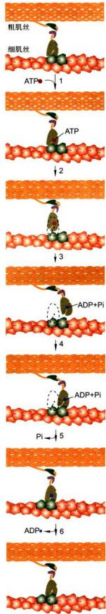

## 图8-17 肌肉收缩过程图解

在初始状态，组成粗肌丝的肌球动蛋白的马达结构域上没有ATP时，该马达结构域与细肌丝结合，并呈垂直状态。1—2. ATP结合到马达结构域导致其与细肌丝的结合力下降，肌球蛋白与肌动蛋白分开。3. ATP水解，但ADP+Pi仍与肌球蛋白结合，获能的肌球蛋白北部发生旋转，向细肌丝的正极端（Z盘一侧）抬升。4. 在Ca²⁺存在的条件下，肌球蛋白底部与靠近细肌丝正极端的一个肌动蛋白亚基结合。5. Pi释放，肌球蛋白颈部结细胞发生构象变化，导致马达结构域与细肌丝的角度发生变化，拉动细肌丝导致细肌丝与细肌丝做相对推动。6. ADP释放，肌球蛋白的马达结构域与细肌丝之间又回到囊状状态。

肌动蛋白单体处于紧密结合状态。当ATP结合到肌球蛋白的头部，引起头部结构域与细肌丝的分离（步骤1、2）；同时头部结构域的ATP酶被激活，将ATP水解，由此释放的能量被被肌球蛋白吸收，导致进一步的构象变化，头部结构域向前抬升，并结合到靠近细肌丝正极端的一个肌动蛋白亚基上（步骤3、4)；随着Pi和能量的释放，肌球蛋白颈部结构域发生构象变化，由此产生的力改变了头部结构域与细肌丝的角度，拉动肌动蛋白丝产生相对于肌球蛋白丝的滑动（步骤5)；接着是ADP的释放，肌球蛋白的头部结构域与细肌丝之间又回到僵直状态（步骤6）。如果体系中仍有高浓度的 $\mathrm{Ca^{2+}}$ 存在，肌球蛋白将继续进行下一个周期沿肌动蛋白丝的滑动。到达肌细胞的冲动一旦停止，肌质网就通过钙泵将 $\mathrm{Ca^{2+}}$ 回收，使胞质中钙浓度降低，于是收缩周期停止。

<!-- END CN CN08-S01 -->

---

## 对应英文内容

### 英文补充：骨架动力学、微丝、肌球蛋白与肌肉收缩

> 对应中文板块：骨架动力学、微丝、肌球蛋白与肌肉收缩。英文来源：Molecular Biology of the Cell，第7版，第16章；[本章完整原文](../../来源/英文教材/16_The_Cytoskeleton/chapter.md)。物理PDF页码范围：988–1065（整章范围）。

<!-- BEGIN EN EN16-H000-H046 -->
(B)

#### The Cytoskeleton

For cells to function properly, they must organize themselves in space and interact mechanically with each other and with their environment. They have to be correctly shaped, physically robust, and properly structured internally. Many have to change their shape and move from place to place. All cells have to be able to rearrange their internal components as they grow, divide, and adapt to changing circumstances. These spatial and mechanical functions depend on a remarkable system of filaments called the **cytoskeleton** (**Figure 16–1**).

The cytoskeleton’s varied functions depend on the behavior of three main families of protein filaments—actin filaments, microtubules, and intermediate filaments. Each type of filament has distinct mechanical properties, dynamics, and biological roles, but all share certain fundamental features. Just as we require our ligaments, bones, and muscles to work together, so all three cytoskeletal filament systems must normally function collectively to give a cell its strength, its shape, and its ability to divide and move around.

In this chapter, we describe the function and evolutionary conservation of cellular filament systems. We explain the basic principles underlying filament assembly and disassembly and how other proteins interact with the filaments to alter their dynamics and direct their organization. Finally, we discuss how cytoskeletal systems work together with other cellular components to generate cell polarity, which is essential for many aspects of cell behavior and function.

#### FUNCTION AND DYNAMICS OF THE CYTOSKELETON

The three major cytoskeletal filaments are responsible for different aspects of the cell’s spatial organization and mechanical properties. Actin filaments determine the shape of the cell’s surface and are necessary for whole-cell locomotion; they also drive the pinching of one cell into two. Microtubules determine the positions of organelles, direct intracellular transport, and form the mitotic spindle that segregates chromosomes during cell division. Intermediate filaments provide mechanical strength. All of these cytoskeletal filaments interact with hundreds of accessory proteins that regulate and link the filaments to other cell components, as well as to each other. The accessory proteins are essential for the controlled assembly of the cytoskeletal filaments in particular locations, and they include the motor proteins, remarkable molecular machines that convert the energy of ATP hydrolysis into mechanical force that can either move organelles along the filaments or move the filaments themselves.

In this part of the chapter, we discuss the general features of the proteins that make up the filaments of the cytoskeleton. We focus on their ability to form intrinsically polarized and self-organized structures that are highly dynamic, allowing the cell to rapidly modify cytoskeletal structure and function when conditions change.

Figure 16–1 The cytoskeleton. (A) A cell in culture has been fixed and labeled to show its cytoplasmic arrays of microtubules (green) and actin filaments (red). (B) This dividing cell has been labeled to show its spindle microtubules (green) and surrounding cage of intermediate filaments (red). The DNA in both cells is labeled in blue. (A, courtesy of Albert Tousson, High Resolution Imaging Facility, University of Alabama at Birmingham; B, courtesy of Conly Rieder.)

C HAP T E R

16

#### IN THIS CHAPTER

Function and Dynamics of the Cytoskeleton

Actin

Myosin and Actin

Microtubules

Intermediate Filaments and Other Cytoskeletal Polymers

Cell Polarity and Coordination of the Cytoskeleton

(A)

10 µm

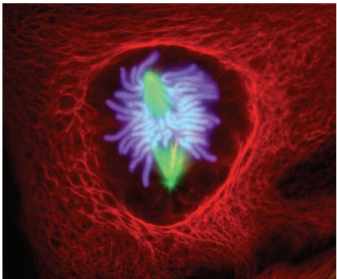

20 µm

#### ACTIN FILAMENTS

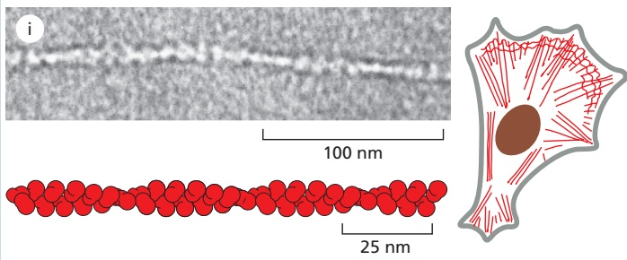

Actin filaments (also known as microfilaments) are helical polymers of the protein actin. They are flexible structures with a diameter of 8 nm that organize into a variety of linear bundles, two-dimensional networks, and three-dimensional gels. Although actin filaments are dispersed throughout the cell, they are most highly concentrated in the cortex, just beneath the plasma membrane. (i) Single actin filament; (ii) microvilli; (iii) stress fibers (red) terminating in focal adhesions (green); (iv) striated muscle.

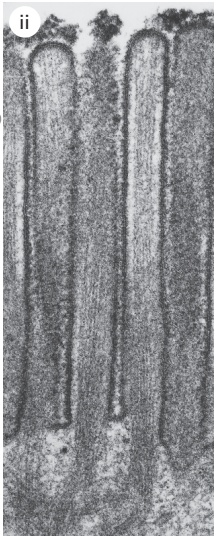

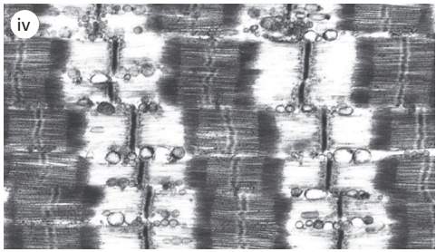

Micrographs courtesy of R. Craig (i and iv); P.T. Matsudaira and D.R. Burgess (ii); K. Burridge (iii).

#### MICROTUBULES

Microtubules are long, hollow cylinders made of the protein tubulin. With an outer diameter of 25 nm, they are much more rigid than actin filaments. Microtubules are long and straight and frequently have one end attached to a microtubule-organizing center (MTOC) called a centrosome. (i) Single microtubule; (ii) cross section at the base of three cilia showing triplet microtubules; (iii) interphase microtubule array (green) and organelles (red); (iv) ciliated protozoan.

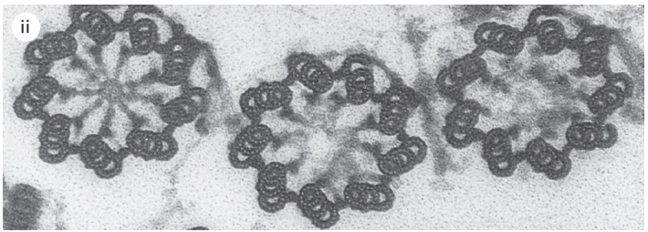

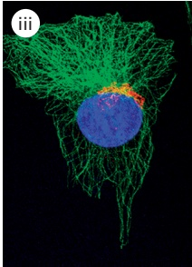

Micrographs courtesy of R. Wade (i); D.T. Woodrow and R.W. Linck (ii); J. Seemann (iii); D. Burnette (iv).

#### INTERMEDIATE FILAMENTS

Intermediate filaments are ropelike fibers with a diameter of about 10 nm; they are made of intermediate filament proteins, which constitute a large and heterogeneous family. One type of intermediate filament forms a meshwork called the nuclear lamina just beneath the inner nuclear membrane. Other types extend across the cytoplasm, giving cells mechanical strength. In an epithelial tissue, they span the cytoplasm from one cell–cell junction to another, thereby strengthening the entire epithelium. (i) Individual intermediate filaments; (ii) intermediate filaments (blue) in neurons and (iii) epithelial cell; (iv) nuclear lamina.

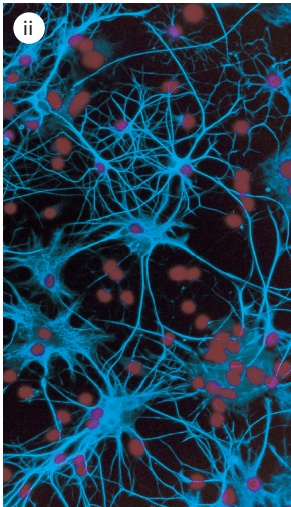

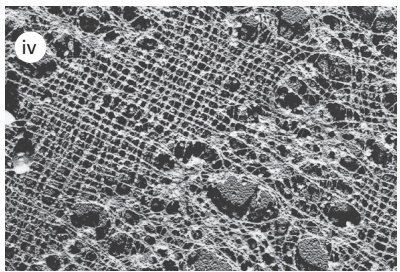

(i) From K.N. Goldie et al., J. Struct. Biol. 158:378–385, 2007; (ii) N. Kedersha; (iii) Alvin Tesler/Science Source; (iv) from U. Aebi et al., Nature 323:560–564, published 1986 by Nature Publishing Group. Reproduced with permission of SNCSC.

#### Cytoskeletal Filaments Are Dynamic, but Can Nevertheless Form Stable Structures

Cytoskeletal systems are dynamic and adaptable, organized more like ant trails than interstate highways. A single trail of ants may persist for many hours, extending from the ant nest to a delectable picnic site, but the individual ants within the trail are anything but static. If the ant scouts find a new and better source of food or if the picnickers clean up and leave, the dynamic structure adapts with astonishing rapidity. In a similar way, large-scale cytoskeletal structures can change or persist, according to need, lasting for lengths of time ranging from less than a minute up to the cell’s lifetime. But the individual macromolecular components that make up these structures are in a constant state of flux. As a result, like the alteration of an ant trail, a structural rearrangement in a cell requires little extra energy when conditions change.

Regulation of the dynamic behavior and assembly of cytoskeletal filaments allows eukaryotic cells to build an enormous range of structures from the three basic filament systems. The micrographs in **Panel 16–1** illustrate some of these structures. Actin filaments underlie the plasma membrane of animal cells in a layer called the cell cortex, providing strength and shape to the thin lipid bilayer. They also form many types of cell-surface projections. Some of these are dynamic structures, such as the filopodia, lamellipodia, and pseudopodia that cells use to explore territory and move around. More stable arrays allow cells to brace themselves against an underlying substratum and enable muscle to contract. The regular bundles of stereocilia on the surface of hair cells in the inner ear contain stable bundles of actin filaments that tilt as rigid rods in response to sound, and the microvilli on the surface of intestinal epithelial cells vastly increase the apical cell-surface area to enhance nutrient absorption. In plants, actin filaments drive rapid streaming of the cytoplasm inside cells.

Microtubules, which are frequently found in a cytoplasmic array that extends to the cell periphery, can quickly rearrange themselves to form a bipolar mitotic spindle during cell division. They can also form cilia, which function as motile whips or sensory devices on the surface of the cell, or tightly aligned bundles that serve as tracks for the transport of materials down long neuronal axons. In plant cells, organized arrays of microtubules help to direct the pattern of cell-wall synthesis, and in many protozoans they form the framework upon which the entire cell is built.

Intermediate filaments line the inner face of the nuclear envelope, forming a protective cage for the cell’s DNA; in the cytosol, they are twisted into strong cables that can hold epithelial cell sheets together or help nerve cells to extend long and robust axons, and they allow us to form tough appendages such as hair and fingernails.

An important and dramatic example of rapid reorganization of the cytoskeleton occurs during cell division, as shown in **Figure 16–2** for a fibroblast growing in a tissue-culture dish. After the chromosomes have replicated, the interphase microtubule array that spreads throughout the cytoplasm is reconfigured into the bipolar mitotic spindle, which transfers the two copies of each chromosome into separate daughter nuclei. At the same time, the specialized actin structures that enable the fibroblast to crawl across the surface of the dish rearrange so that the cell stops moving and assumes a more spherical shape. Actin and its associated motor protein myosin then form a belt around the middle of the cell, the contractile ring, which constricts like a tiny muscle to pinch the cell in two. When division is complete, the cytoskeletons of the two daughter fibroblasts recreate their interphase structures, thereby converting the two rounded-up daughter cells into smaller versions of the flattened, crawling mother cell.

Many cells require rapid cytoskeletal rearrangements for their normal functioning during interphase as well. For example, the neutrophil, a type of white blood cell, chases and engulfs bacterial and fungal cells that accidentally gain access to the normally sterile parts of the body, as through a cut in the skin. Like most crawling cells, neutrophils advance by extending a protrusive structure filled with newly polymerized actin filaments. When the elusive bacterial prey moves in a different direction, the neutrophil can reorganize its polarized protrusive structures within seconds (**Figure 16–3**).

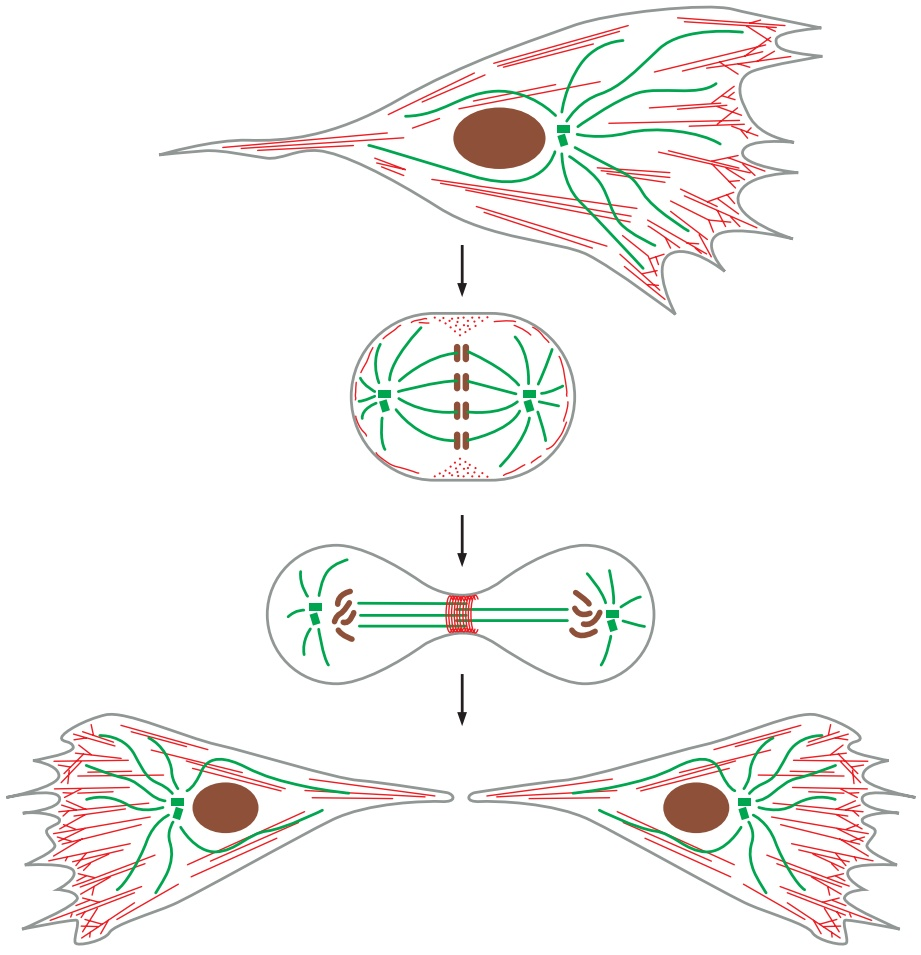

#### The Cytoskeleton Determines Cellular Organization and Polarity

In cells that have achieved a stable, differentiated morphology—such as mature neurons or epithelial cells—the dynamic elements of the cytoskeleton produce stable, large-scale structures for cellular organization. For example, on the specialized epithelial cells that line organs such as the intestine and the lung, cytoskeletal-based cell-surface protrusions including microvilli and cilia are able to maintain a constant location, length, and diameter over the entire lifetime of the cell. For the actin bundles at the cores of microvilli on intestinal epithelial cells, this is only a few days. But the actin bundles at the cores of stereocilia on the hair cells of the inner ear must maintain their stable organization for the entire lifetime of the animal, because these cells do not turn over. Remarkably, the actin filaments in stereocilia are very stable, and polymerization and depolymerization have been observed only at their tips. We do not understand how these actin structures are maintained at a constant length for decades.

time

0 min

1 min

2 min

3 min

15 µm

Figure 16–2 Diagram of changes in cytoskeletal organization associated with cell division. The crawling fibroblast drawn here has a polarized, dynamic actin cytoskeleton (shown in red) that assembles lamellipodia and filopodia to push its leading edge toward the right. The polarization of the actin cytoskeleton is assisted by the microtubule cytoskeleton (green), consisting of long microtubules that emanate from a microtubule-organizing center located in front of the nucleus. When the cell divides, actin filaments are reorganized and the cell assumes a spherical shape. The polarized microtubule array rearranges to form a bipolar mitotic spindle, which is responsible for aligning and then segregating the duplicated chromosomes (brown). After chromosome segregation, the actin filaments form a contractile ring at the center of the cell that pinches the cell in two. Then the two daughter cells reorganize their microtubule and actin cytoskeletons into smaller versions of those that were present in the mother cell, enabling them to crawl their separate ways.

Figure 16–3 A neutrophil in pursuit of bacteria. In this preparation of human blood, a small clump of bacteria (white arrow) is about to be captured by a neutrophil. As the bacteria move, the neutrophil quickly reassembles the dense actin network within a pseudopod (“false foot”) at its leading edge (highlighted in red) to push toward the location of the bacteria (Movie 16.1). Rapid disassembly and reassembly of the actin cytoskeleton in this cell enable it to change its orientation and direction of movement within a few minutes. (From a video recorded by David Rogers.)

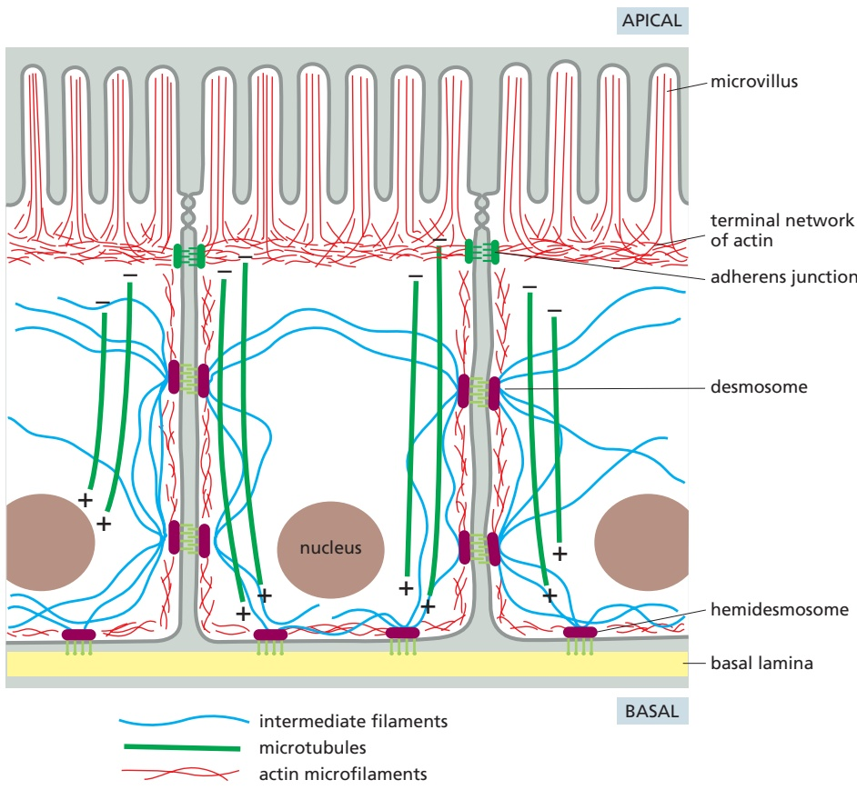

Figure 16–4 Organization of the cytoskeleton in polarized epithelial cells. All the components of the cytoskeleton cooperate to produce the characteristic shapes of specialized cells, including the epithelial cells that line the small intestine, diagrammed here. At the apical (upper) surface, facing the intestinal lumen, bundled actin filaments (red) form microvilli that increase the cell-surface area available for absorbing nutrients from food. Below the microvilli, a circumferential band of actin filaments is connected to cell–cell adherens junctions that anchor the cells to each other. Intermediate filaments (blue) are anchored to other kinds of adhesive structures, including desmosomes and hemidesmosomes, that connect the epithelial cells into a sturdy sheet and attach them to the underlying extracellular matrix; these structures are discussed in Chapter 19. Microtubules (green) run vertically from the top of the cell to the bottom and provide a global coordinate system that enables the cell to direct newly synthesized components to their proper locations.

Besides forming stable, specialized cell-surface protrusions, the cytoskeleton is also responsible for large-scale cellular polarity, enabling cells to tell the difference between top and bottom or front and back. The polarity information conveyed by cytoskeletal organization is often maintained over the lifetime of the cell. For example, polarized epithelial cells use organized arrays of microtubules, actin filaments, and intermediate filaments to maintain the critical differences between the apical surface and the basolateral surface. They also must maintain strong adhesive contacts with one another to enable this single layer of cells to serve as an effective physical barrier (**Figure 16–4**). How cell polarity is established is discussed in the last part of this chapter.

#### Filaments Assemble from Protein Subunits That Impart Specific Physical and Dynamic Properties

Cytoskeletal filaments can reach from one end of the cell to the other, spanning tens or even hundreds of micrometers. Yet the individual protein molecules that form the filaments are only a few nanometers in size. The cell builds the filaments by assembling large numbers of the small subunits, like building a skyscraper out of bricks. Because these subunits are small, they can diffuse rapidly in the cytosol, whereas the assembled filaments cannot. In this way, cells can undergo rapid structural reorganizations, disassembling filaments at one site and reassembling them at another site far away.

Actin filaments and microtubules are built from subunits that are compact and globular—actin subunits for actin filaments and tubulin subunits for microtubules—whereas intermediate filaments are made up of subunits that are themselves elongated and fibrous. All three major types of cytoskeletal filaments form as polymeric assemblies of subunits that self-associate, using a combination of end-to-end and side-to-side protein contacts. Whereas covalent linkages between their subunits hold together the backbones of many biological polymers—including DNA, RNA, and proteins—it is weak noncovalent interactions that hold together the three types of cytoskeletal polymers. Because covalent bonds are not being formed or broken, assembly and disassembly can occur rapidly. Differences in the structures of the subunits and how they associate with one another produce important differences in the stability and mechanical properties of each type of filament.

The subunits of actin filaments and microtubules are asymmetrical and bind to one another head-to-tail so that they all point in one direction. This subunit polarity gives the filaments structural polarity along their length and makes the two ends of each polymer behave differently. In addition, the actin and tubulin subunits are enzymes that catalyze the hydrolysis of a nucleoside triphosphate (NTP)—ATP and GTP, respectively. As we discuss later, the energy derived from NTP hydrolysis helps the filaments to remodel rapidly. It allows the cell to harness the polar and dynamic properties of these filaments to generate force in a specific direction to move the leading edge of a migrating cell forward, for example, or to pull chromosomes apart during cell division. In contrast, the subunits of intermediate filaments are symmetrical and thus do not form polarized filaments with two different ends. Intermediate filament subunits also do not catalyze the hydrolysis of ATP or GTP. Nevertheless, intermediate filaments can be disassembled rapidly when required. In mitosis, for example, kinases phosphorylate the subunits, leading to their dissociation.

Cytoskeletal filaments in living cells are not built by simply stringing subunits together in single file. A thousand tubulin subunits lined up end-to-end, for example, would span the diameter of a small eukaryotic cell, but a filament formed in this way would lack the strength to avoid breakage by ambient thermal energy, unless each subunit in the filament was bound extremely tightly to its two neighbors. Such tight binding would limit the rate at which the filaments could disassemble, making the cytoskeleton a static and less useful

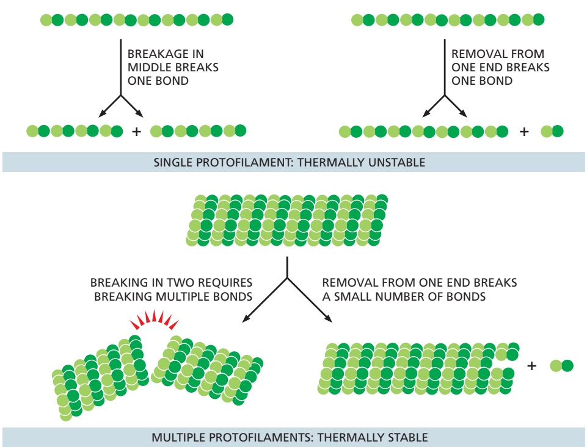

Figure 16–5 The thermal stability of cytoskeletal filaments with dynamic ends. A protofilament consisting of a single strand of subunits is thermally unstable, because breakage of a single bond between subunits is sufficient to break the filament. In contrast, formation of a cytoskeletal filament from more than one protofilament allows the ends to be dynamic, while enabling the filaments themselves to resist thermal breakage. In a microtubule, for example, removing a single subunit dimer from the end of the filament requires breaking noncovalent bonds with a maximum of three other subunits, whereas fracturing the filament in the middle requires breaking noncovalent bonds in all 13 protofilaments.

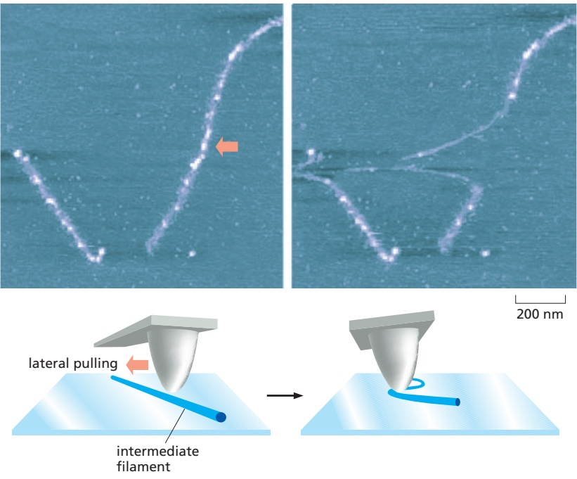

Figure 16–6 Flexibility and stretch in an intermediate filament. Intermediate filaments are formed from elongated fibrous subunits with strong lateral contacts, resulting in resistance to stretching forces. In this experiment, a tiny mechanical probe was used to rapidly scan across a surface to which intermediate filaments were adhered, providing a measurement of the height and contour of the filaments as shown in shades of gray to white. Along a single scan line (arrow) the applied force of the probe was increased from less than 1 nN to 30–40 nN. At this position one of the filaments stretched to more than three times its length before breaking, as illustrated in the micrographs. This technique is called atomic force microscopy. (Adapted from L. Kreplak et al., J. Mol. Biol. 354:569–577, 2005. With permission from Elsevier.)

structure. To provide both strength and adaptability, microtubules are built of 13 **protofilaments**—linear strings of subunits joined end to end—that associate with one another laterally to form a hollow cylinder. The addition or loss of a subunit at the end of one protofilament makes or breaks a small number of bonds. In contrast, loss of a subunit from the middle of a protofilament requires breaking many more bonds, while breaking it in two requires breaking bondsMBoC7 m16.06/16.06 in multiple protofilaments all at the same time (**Figure 16–5**). The greater energy required to break multiple noncovalent bonds simultaneously allows microtubules to resist thermal breakage, while allowing rapid subunit addition and loss at the filament ends. Although made up of only two strands instead of 13, helical actin filament subunits also make both end-to-end and side-to-side contacts, allowing for rapid dynamics at filament ends while providing sufficient strength along the length of the filament. However, the tubular geometry of a microtubule makes it much stiffer than a two-stranded actin filament.

As with other specific protein–protein interactions, many hydrophobic interactions and noncovalent bonds hold the subunits in a cytoskeletal filament together (see Figure 3–4). The locations and types of subunit–subunit contacts differ for the different filaments. Intermediate filaments, for example, assemble by forming strong lateral contacts between α-helical coiled-coils, which extend over most of the length of each elongated fibrous subunit. Because the individual subunits are staggered in the filament, intermediate filaments form strong, ropelike structures that tolerate stretching and bending to a greater extent than do either actin filaments or microtubules (**Figure 16–6**).

#### Accessory Proteins and Motors Act on Cytoskeletal Filaments

The cell regulates the length and stability of its cytoskeletal filaments, their number and geometry, and their attachments to one another and to other components of the cell. Filaments can thereby form a wide variety of higher-order structures. Direct covalent modification of the filament subunits regulates some filament properties, but most of the regulation is performed by hundreds of accessory proteins that determine the spatial distribution and the dynamic behavior of the filaments, converting information received through signaling pathways into cytoskeletal action. These accessory proteins bind to the filaments or their subunits to determine the sites of assembly of new filaments, to regulate the partitioning of polymer proteins between filament and subunit forms, to change the kinetics of filament assembly and disassembly, to harness energy to generate force, and to link filaments to one another or to other cell structures such as organelles and the plasma membrane. In these processes, the accessory proteins bring cytoskeletal structure under the control of extracellular and intracellular signals, including those that trigger the dramatic transformations of the cytoskeleton that occur during each cell cycle. Acting in groups, the accessory proteins enable cells to maintain a highly organized but flexible internal structure and, in many cases, to move.

Among the most fascinating proteins that associate with the cytoskeleton are the motor proteins. These proteins bind to a polarized cytoskeletal filament and use the energy derived from repeated cycles of ATP hydrolysis to move along it. Dozens of different motor proteins coexist in every eukaryotic cell. They differ in the type of filament they bind to (either actin or microtubules), the direction in which they move along the filament, and the “cargo” they carry. Many motor proteins carry membrane-enclosed organelles—such as mitochondria, Golgi stacks, or secretory vesicles—to their appropriate locations in the cell. Other motor proteins cause cytoskeletal filaments to exert tension or to slide against each other, generating the force that drives such phenomena as muscle contraction, ciliary beating, and cell division.

Cytoskeletal motor proteins that move unidirectionally along an oriented polymer track are reminiscent of some other proteins and protein complexes discussed elsewhere in this book, such as DNA and RNA polymerases, helicases, and ribosomes. All of these proteins have the ability to use chemical energy to propel themselves along a linear track, with the direction of sliding dependent on the structural polarity of the track. All of them generate motion by coupling nucleoside triphosphate hydrolysis to a large-scale conformational change (see Figure 3–71).

#### Molecular Motors Operate in a Cellular Environment Dominated by Brownian Motion

Because of the microscopic size of cells, motor-based movements occur in an environment that is highly dynamic due to random thermal fluctuations called Brownian motion. As introduced in Chapter 1 (see p. 9), Brownian motion drives the diffusion of all of the molecules inside cells, and it is thereby critical for the rate of biochemical reactions, which require molecular collisions. Another important effect is its generation of viscous drag forces at small scales. For example, a motor protein moving along a cytoskeletal filament is constantly buffeted by random collisions with water and other molecules. As soon as its motor activity ceases, the motor protein will stop dead in its tracks due to the viscous drag forces generated by these collisions.

The stopping distance for any object moving through a fluid is determined by the **Reynolds number**, which is the ratio of inertial to viscous forces acting on that object. This ratio depends on the size of the object and the velocity of its movement through the fluid. For example, whereas both a bacterium and a fish can propel themselves through water, the size and speed of the fish provide it with significant inertia, such that when it stops swimming it continues to glide through the water for some distance. In contrast, with its much smaller size and slow speed of movement, a bacterium that stops propelling itself will come to an immediate halt (**Figure 16–7**). For a fish to behave similarly, it would need to be placed in an extremely viscous medium, such as roofing tar. Inside the cell, the tiny size and slow speeds of moving molecules result in extremely low Reynolds numbers, because viscous forces are far greater than inertial forces. Thus, there is no “gliding” inside a cell.

Random Brownian motion can also be harnessed to control movement at small scales, even in the absence of motor proteins. As we describe later in this chapter, some intracellular pathogens such as the bacterium Listeria monocytogenes use the force of actin polymerization to move around inside a cell. This movement does not involve motor proteins. Instead, actin filaments are induced to polymerize adjacent to the bacterial surface at one end. When the bacterium randomly moves in the forward direction due to Brownian motion, actin quickly fills in the gap so that the bacterium cannot slip back to its original position. In this way, actin polymerization generates a force that pushes the bacterium through the cytoplasm (see Figure 16–17). A similar process drives forward movement of the plasma membrane at the leading edge of a migrating animal cell (see Figure 1–7). This phenomenon, in which random thermal motions are harnessed in a directed way, creates a Brownian ratchet.

(B)

Figure 16–7 Cellular life occurs at a low Reynolds number. (A) The inertia of a swimming organism is counteracted by the viscous drag of water, and the ratio of these two forces is the Reynolds number, which is dimensionless. As illustrated in the graph, the Reynolds number is in the range of $1 0 ^ { 6 }$ for a blue whale traveling at about 10 meters per second. For a tiny swimming MBoC7 n1.111/1.07bacterium moving at 10–5 meters per second, the viscosity of the water dominates and the Reynolds number decreases to about 10–4. (B) The Reynolds number indicates the extent to which an object will continue to coast or glide through a fluid after the motive force has stopped. The stopping distance in water for a sphere that has an initial velocity equal to its diameter per second is plotted. Thus, a one micron–diameter organelle would come to a halt within just a few angstroms once its forward motion ceases.

#### Summary

The cytoplasm of eukaryotic cells is spatially organized by a network of protein filaments known as the cytoskeleton. This network contains three principal types of filaments: actin filaments, microtubules, and intermediate filaments. All three types of filaments form from assemblies of subunits that self-associate using a combination of end-to-end and side-to-side protein contacts. Differences in the structure of the subunits and the manner of their self-assembly give the filaments different mechanical properties. Subunit assembly and disassembly constantly remodel all three types of cytoskeletal filaments. Actin and tubulin (the subunits of actin filaments and microtubules, respectively) bind and hydrolyze nucleoside triphosphates (ATP and GTP, respectively) and assemble head-to-tail to generate polarized filaments capable of generating force. In living cells, accessory proteins including molecular motors modulate the dynamics and organization of cytoskeletal filaments, resulting in complex events such as cell division, migration, or muscle contraction, and generating elaborate cellular architecture to form polarized tissues such as epithelia.

#### ACTIN

The actin cytoskeleton performs a wide range of functions in diverse cell types. Each actin subunit, sometimes called globular or G-actin, is a 375-amino-acid polypeptide carrying a tightly associated molecule of ATP or ADP (**Figure 16–8A**). Actin is extraordinarily well conserved among eukaryotes. The amino acid sequences of actins from different eukaryotic species are usually about 90% identical. Small variations in actin amino acid sequence can cause significant functional differences: In vertebrates, for example, there are three isoforms of actin, termed α, β, and γ, that differ slightly in their amino acid sequences and have distinct functions. α-Actin is expressed only in muscle cells, while β- and γ-actins are found together in almost all non-muscle cells.

Figure 16–8 The structures of an actin monomer and actin filament. (A) The actin monomer has either ATP or ADP bound in a deep cleft in the center of the molecule. (B) Arrangement of monomers in a filament consisting of two protofilaments, held together by lateral contacts, which wind around each other as two parallel strands of a helix, with a twist repeating every 37 nm. All the subunits within the filament have the same orientation. (C) Electron micrograph of negatively stained actin filament. (C, courtesy of Roger Craig.)

#### Actin Subunits Assemble Head-to-Tail to Create Flexible, Polar Filaments

Actin subunits assemble head-to-tail to form a tight, right-handed helix, forming a structure about 8 nm wide called filamentous or F-actin (**Figure 16–8B and C**). Because the asymmetrical actin subunits of a filament all point in the same direction, filaments are polar and have structurally different ends: a slowergrowing minus end and a faster-growing plus end. The minus end is also referred to as the pointed end and the plus end as the barbed end because of the arrowhead appearance of the complex formed between actin filaments and the motor protein myosin visible in electron micrographs (**Figure 16–9**). Within the filament, the subunits are positioned with their ATP-binding cleft directed toward the minus end.

Individual actin filaments are quite flexible. The stiffness of a filament can be characterized by its persistence length, the minimum filament length at which random thermal fluctuations are likely to cause it to bend. The persistence length of an actin filament is only a few tens of micrometers. In a living cell, however, accessory proteins frequently cross-link and bundle the filaments together, making largescale actin structures that are much more rigid than an individual actin filament.

#### Nucleation Is the Rate-limiting Step in the Formation of Actin Filaments

The regulation of actin filament formation is an important mechanism by which cells control their shape and movement. Actin subunits can spontaneously bind one another, but the association is unstable until subunits assemble into an initial oligomer, or nucleus, that is stabilized by multiple subunit–subunit contacts and can then elongate rapidly by addition of more subunits. This process is called filament nucleation.

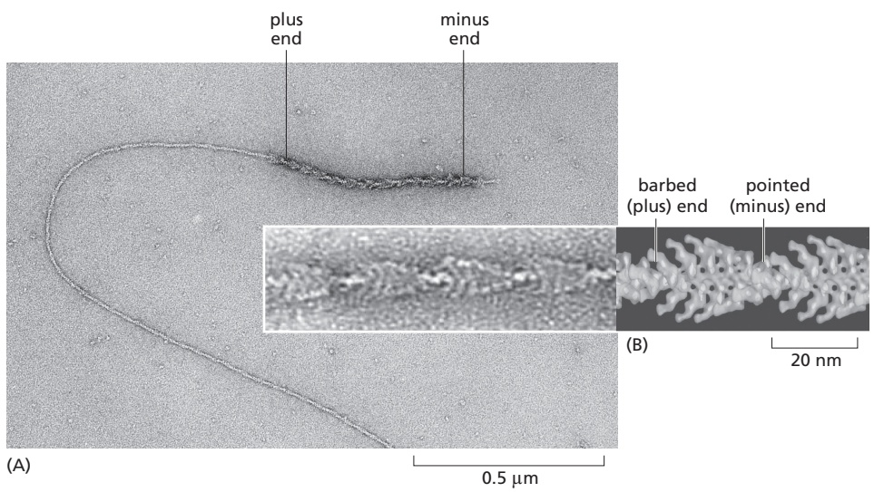

Figure 16–9 Structural polarity of the actin filament. (A) This electron micrograph shows an actin filament polymerized from a short actin filament seed that was decorated with myosin motor domains, resulting in an arrowhead pattern. The filament has grown much faster at the barbed (plus) end than at the pointed (minus) end. (B) Enlarged image and model showing the arrowhead pattern. (A, courtesy of Tom Pollard; B, adapted from M. Whittaker et al., Ultramicroscopy 58:245–259, 1995. With permission from Elsevier.)

Many features of actin nucleation and polymerization have been studied with purified actin in a test tube (**Figure 16–10**). The instability of smaller actinMBoC7 m16.12/16.09 oligomers makes nucleation inefficient. When polymerization is initiated, this results in a lag phase during which no filaments are observed. During this lag phase, however, the small, unstable oligomers gradually succeed in making the transition to a more stable form that resembles an actin filament. This leads to a phase of rapid filament elongation during which subunits are added quickly to the ends of the nucleated filaments (Figure 16–10A). Finally, as the concentration of actin monomers declines, the system approaches a steady state at which the rate of addition of new subunits to the filament ends exactly balances the rate of subunit dissociation. The concentration of free subunits left in solution at this point is called the critical concentration, $C _ { \mathrm { { C } } } .$ As explained in **Panel 16–2**, the

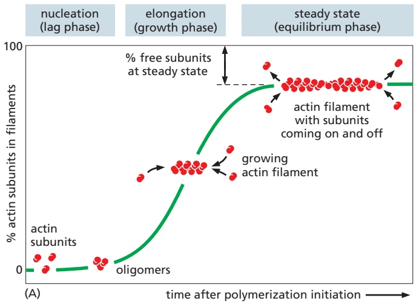

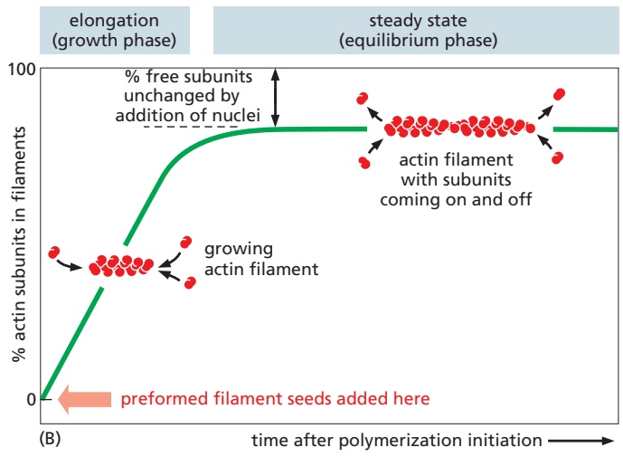

Figure 16–10 The time course of actin polymerization. Purified actin subunits were induced to polymerize in a test tube. (A) Polymerization of actin subunits into filaments occurs after a lag phase. (B) Polymerization occurs more rapidly in the presence of preformed fragments of actin filaments, which act as nuclei for filament growth. The percent (%) free subunits after polymerization reflects the critical concentration $( C _ { \complement } ) ,$ at which there is no net change in polymer. The $C _ { \mathrm { C } }$ has a constant value of ∼0.1 $\mu \mathsf { M } ,$ but the percent of actin subunits in filaments varies depending on how much actin is present in the reaction. Actin polymerization is often studied by observing the change in the light emission from a fluorescent probe, called pyrene, that has been covalently attached to the actin. Pyrene-actin fluoresces more brightly when it is incorporated into actin filaments.

#### ON RATES AND OFF RATES

A linear polymer of protein molecules, such as an actin filament or a microtubule, assembles (polymerizes) and disassembles (depolymerizes) by the addition and removal of subunits at the ends of the polymer. The rate of addition of these subunits (called monomers) is given by the rate constant $k _ { \mathrm { o n } } ,$ which has units of $\mathsf { M } ^ { - 1 }   \mathsf { s e c } ^ { - 1 }$ . The rate of loss is given by $k _ { \mathrm { o f f } }$ (units of sec–1).

#### THE CRITICAL CONCENTRATION

The number of monomers that add to the polymer (actin filament or microtubule) per second will be proportional to the concentration of the free subunit $( k _ { \mathrm { o n } } C ) ,$ but the subunits will leave the polymer end at a constant rate $( k _ { \mathrm { o f f } } )$ that does not depend on C. As the polymer grows, subunits are used up, and C is observed to drop until it reaches a constant value, called the critical concentration (C ). At this concentration, the rate of subunit addition equals the rate of subunit loss.

At this equilibrium,

$$
k _ {\text {on}} C = k _ {\text {off}}
$$

so that

$$
C _ {c} = \frac {k _ {\text {off}}}{k _ {\text {on}}} = K _ {d}
$$

where $K _ { \mathrm { d } }$ is the dissociation constant.

#### PLUS AND MINUS ENDS

The two ends of an actin filament or microtubule polymerize at different rates. The fast-growing end is called the plus end, whereas the slow-growing end is called the minus end. The difference in the rates of growth at the two ends is made possible by changes in the conformation of each subunit as it enters the polymer.

This conformational change affects the rates at which subunits add to the two ends.

Even though $k _ { \mathrm { o n } }$ and $k _ { \mathrm { o f f } }$ will have different values for the plus and minus ends of the polymer, their ratio $k _ { \mathrm { o f f } } / k _ { \mathrm { o n } ^ { - } }$ —and hence $C_{c} — \mathsf{m}\mathsf{u}\mathsf{s}\mathsf{t}$ be the same at both ends for a simple polymerization reaction (no ATP or GTP hydrolysis). This is because exactly the same subunit interactions are broken when a subunit is lost at either end, and the final state of the subunit after dissociation is identical. Therefore, the ΔG for subunit

#### NUCLEATION

A helical polymer is stabilized by multiple contacts between adjacent subunits. In the case of actin, two actin molecules bind relatively weakly to each other, but addition of a third actin monomer to form a trimer makes the entire group more stable.

Further monomer addition can take place onto this trimer, which therefore acts as a nucleus for polymerization. For tubulin, the nucleus is larger and has a more complicated structure (possibly a ring of 13 or more tubulin molecules)—but the principle is the same.

The assembly of a nucleus is relatively slow, which explains the lag phase seen during polymerization. The lag phase can be reduced or abolished entirely by adding premade nuclei, such as fragments of already polymerized microtubules or actin filaments.

#### TIME COURSE OF POLYMERIZATION

The in vitro assembly of a protein into a long polymer such as a cytoskeletal filament typically shows the following time course:

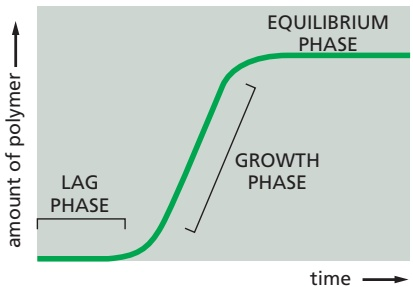

The lag phase corresponds to time taken for nucleation.

The growth phase occurs as monomers add to the exposed ends of the growing filament, causing filament elongation.

The equilibrium phase, or steady state, is reached when the growth of the polymer due to monomer addition precisely balances the shrinkage of the polymer due to disassembly back to monomers.

loss, which determines the equilibrium constant for its association with the end, is identical at both ends: if the plus end grows four times faster than the minus end, it must also shrink four times faster. Thus, for $C > C _ { c r }$ both ends grow; for $C < C _ { c r }$ both ends shrink.

The nucleoside triphosphate hydrolysis that accompanies actin and tubulin polymerization removes this constraint.

#### NUCLEOTIDE HYDROLYSIS

Each actin molecule carries a tightly bound ATP molecule that is hydrolyzed to a tightly bound ADP molecule soon after its assembly into the polymer. Similarly, each tubulin molecule carries a tightly bound GTP molecule that is converted to a tightly bound GDP molecule soon after the molecule assembles into the polymer.

Hydrolysis of the bound nucleotide reduces the binding affinity of the subunit for neighboring subunits and makes it more likely to dissociate from each end of the filament. It is usually the T form that adds to the filament and the D form that leaves.

Considering events at the plus end only:

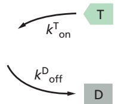

As before, the polymer will grow until $C = C _ { 0 }$ . For illustrative purposes, we can ignore $k _ { \mathrm { ~ \sf ~ o n ~ } } ^ { \sf D }$ and $k _ { \mathrm { \scriptsize ~ o f f } } ^ { \mathsf { T } }$ since they are usually very small, so that polymer growth ceases when

$$
k _ {\text {on}} ^ {T} C = k _ {\text {off}} ^ {D} \quad \text {or} \quad C _ {c} = \frac {k _ {\text {off}} ^ {D}}{k _ {\text {on}} ^ {T}}
$$

This is a steady state and not a true equilibrium, because the ATP or GTP that is hydrolyzed must be replenished by a nucleotide exchange reaction of the free subunit $( \mathsf { D } \to \mathsf { T } )$

#### TREADMILLING

One consequence of the nucleotide hydrolysis that accompanies polymer formation is to change the critical concentration at the two ends of the polymer. Because ${ k ^ { \mathsf { D } } } _ { \mathsf { o f f } } ^ { - }$ and $k _ { \mathrm { ~ o n ~ } } ^ { \mathsf { T } }$ refer to different reactions, their ratio $\widehat { k ^ { \mathsf { D } } { } _ { \mathsf { o f f } } / k ^ { \mathsf { T } } { } _ { \mathsf { o n } } }$ need not be the same at both ends of the polymer, so that:

$$
C _ {c} (\text {minus end}) > C _ {c} (\text {plus end})
$$

Thus, if both ends of a polymer are exposed, polymerization proceeds until the concentration of free monomer reaches a value that is above $C _ { \mathrm { c } }$ for the plus end but below $C _ { c }$ for the minus end. At this steady state, subunits undergo a net assembly at the plus end and a net disassembly at the minus end at an identical rate. The polymer maintains a constant length, even though there is a net flux of subunits through the polymer, known as treadmilling.

Microtubules depolymerize about 100 times faster from an end containing GDP-tubulin than from one containing GTP-tubulin. A GTP cap favors growth, but if it is lost, then depolymerization ensues.

#### DYNAMIC INSTABILITY

#### ATP CAPS AND GTP CAPS

The rate of addition of subunits to a growing actin filament or microtubule can be faster than the rate at which their bound nucleotide is hydrolyzed. Under such conditions, the end has a “cap” of subunits containing the nucleoside triphosphate—an ATP cap on an actin filament or a GTP cap on a microtubule.

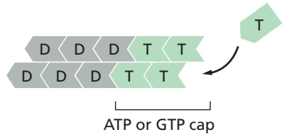

#### DYNAMIC INSTABILITY and

TREADMILLING are two behaviors observed in cytoskeletal polymers. Both are associated with nucleoside triphosphate hydrolysis. Dynamic instability is believed to predominate in microtubules, whereas treadmilling may predominate in actin filaments.

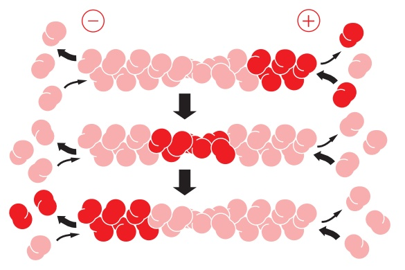

Individual microtubules can therefore alternate between a period of growth and a period of rapid disassembly, a phenomenon called dynamic instability.

value of the critical concentration is equal to the rate constant for subunit loss divided by the rate constant for subunit addition; that is, $C _ { \mathrm { c } } = k _ { \mathrm { o f f } } / k _ { \mathrm { o n } } ,$ which is equal to the dissociation constant, $K _ { \mathrm { d } } ,$ and the inverse of the equilibrium constant, K (see Figure 3–42). In a test tube, the $C _ { \mathrm { c } }$ for actin polymerization—that $\mathbf { i } \mathbf { s } ,$ the free actin monomer concentration at which the fraction of actin in the polymer stops increasing—is about $0 . 1 ~ \mu \mathrm { M }$ . Inside the cell, the concentration of unpolymerized actin is much higher than this, and the cell has evolved mechanisms to prevent most of its monomeric actin from assembling into filaments, as we discuss later.

The lag phase in filament growth is eliminated if preexisting seeds (such as fragments of actin filaments) are added to the solution at the beginning of the polymerization reaction (Figure 16–10B). The cell takes great advantage of the barrier to nucleation: it uses special proteins to catalyze filament nucleation at specific sites, thereby determining the location at which new actin filaments are assembled.

#### Actin Filaments Have Two Distinct Ends That Grow at Different Rates

Because of the uniform orientation of asymmetrical actin subunits in the filament, the structures at its two ends are different. This orientation makes the two ends of each polymer different in ways that have a profound effect on filament growth rates. The kinetic rate constants for actin subunit association and dissociation— $k _ { \mathrm { o n } }$ and $k _ { \mathrm { o f f } } ,$ respectively—are much greater at the plus end than at the minus end. This can be seen when an excess of purified actin monomers is allowed to assemble onto polarity-marked filaments—the plus end of the filament elongates up to 10 times faster (see Figure 16–9). If filaments are rapidly diluted so that the free subunit concentration drops below the critical concentration, the plus end also depolymerizes faster.

It is important to note, however, that the two ends of an actin filament have the same net affinity for actin subunits, if all of the subunits are bound to either ATP or ADP. Addition of a subunit to either end of a filament of n subunits results in a filament of $n + 1$ subunits. Thus, the free-energy difference, and therefore the equilibrium constant (and the critical concentration), must be the same for addition of subunits at either end of the polymer. In this case, the ratio of the rate constants, $k _ { \mathrm { o f f } } / k _ { \mathrm { o n } } ,$ must be identical at the two ends, even though the absolute values of these rate constants are very different at each end (see Panel 16–2).

The cell takes advantage of actin filament dynamics and polarity to do mechanical work. Filament elongation proceeds spontaneously when the free-energy change (∆G) for addition of the soluble subunit is less than zero. This is the case when the concentration of subunits in solution exceeds the critical concentration. A cell can couple an energetically unfavorable process to this spontaneous process; thus, the cell can use free energy released during spontaneous filament polymerization to move an attached load. For example, by orienting the fastgrowing plus ends of actin filaments toward its leading edge, a motile cell can push its plasma membrane forward, as we discuss later.

#### ATP Hydrolysis Within Actin Filaments Leads to Treadmilling at Steady State

Thus far in our discussion of actin filament dynamics, we have ignored the critical fact that actin can catalyze the hydrolysis of the nucleoside triphosphate ATP. For free actin subunits, this hydrolysis proceeds very slowly; however, it is accelerated when the subunits are incorporated into filaments. Shortly after ATP hydrolysis occurs, the free phosphate group is released from each subunit, but the ADP remains trapped in the filament structure. Thus, two different types of filament structures can exist, one in the ATP-bound T form and one in the ADP-bound D form.

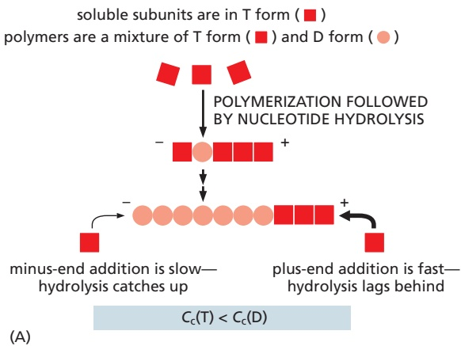

When the ATP is hydrolyzed, much of the free energy released by cleavage of the phosphate–phosphate bond is stored in the polymer. This makes the free-energy change for dissociation of a subunit from the D-form polymer more negative than the free-energy change for dissociation of a subunit from the T-form polymer. Consequently, the ratio of $k _ { \mathrm { o f f } } / k _ { \mathrm { o n } }$ for the D-form polymer, which is numerically equal to its critical concentration $[ C _ { \mathrm { c } } ( \mathrm { D } ) ]$ , is larger than the corresponding ratio for the T-form polymer. Thus, $C _ { \mathrm { c } } ( \mathrm { D } )$ is greater than $C _ { \mathrm { c } } ( \mathrm { T } )$ . At certain concentrations of free subunits, D-form polymers will therefore shrink while T-form polymers grow.

Figure 16–11 Treadmilling of an actin filament, made possible by the ATP hydrolysis that follows subunit addition. (A) Explanation for the different critical concentrations (Cc) at the plus and minus ends. Subunits with bound ATP (T-form subunits) polymerize at both ends of a growing filament and then undergo ATP hydrolysis within the filament. As the filament grows, elongation is faster than hydrolysis at the plus end in this example, and the terminal subunits at this end are therefore always in the T form. However, hydrolysis is faster than elongation at the minus end, and so terminal subunits at this end are in the D form. (B) Treadmilling occurs at intermediate concentrations of free subunits. The critical concentration for polymerization on a filament end in the T form, $C _ { \mathbb { C } } ( \overline { { \mathbb { T } } } )$ , is lower than that for a filament end in the D form, $C _ { \complement } ( \triangleright ) .$ If the actual subunit concentration is somewhere between these two values, the plus end grows while the minus end shrinks, resulting in treadmilling.

#### The Functions of Actin Filaments Are Inhibited by Both Polymer-stabilizing and Polymer-destabilizing Chemicals

In living cells, most soluble actin subunits are in the T form, as the free concentration of ATP is about tenfold higher than that of ADP. However, the longer the time that subunits have been in the actin filament, the more likely they are to have hydrolyzed their ATP. Whether the subunit at each end of a filament is in the T or the D form depends on the rate of this hydrolysis compared with the rate of subunit addition. If the concentration of actin monomers is greater than the critical concentration for both the T-form and D-form polymers, then subunits will add to the polymers at both ends before the ATP in the previously added subunits is hydrolyzed; as a result, the tips of the actin filament will remain in the T form. On the other hand, if the subunit concentration is less than the critical concentrations for both the T-form and D-form polymers, then hydrolysis may occur before the next subunit is added, and both ends of the filament will be in the D form and will shrink. At intermediate concentrations of actin subunits, it is possible for the rate of subunit addition to be faster than ATP hydrolysis at the plus end but slower than ATP hydrolysis at the minus end. In this case, the plus end of the filament remains in the T conformation, while the minus end adopts the D conformation. The filament then undergoes a net addition of subunits at the plus end while simultaneously losing subunits from the minus end. This leads to the remarkable property of filament **treadmilling** (**Figure 16–11**; see Panel 16–2).

Chemical compounds that stabilize or destabilize actin filaments are important tools in studies of the filaments’ dynamic behavior and function in cells. The cytochalasins are fungal products that prevent actin polymerization by binding to the plus end of actin filaments. Latrunculin prevents actin polymerization by binding to actin subunits. The phalloidins are toxins isolated from the Amanita mushroom that bind tightly all along the side of actin filaments and stabilize them

At a particular intermediate subunit concentration, the filament growth at the plus end exactly balances the filament shrinkage at the minus end. Under these conditions, the subunits cycle rapidly between the free and filamentous states, while the total length of the filament remains unchanged. This steady-state treadmilling requires a constant consumption of energy in the form of ATP hydrolysis.

<table><tbody><tr><td colspan="4">TABLE 16-1 Chemical Inhibitors of Actin and Microtubules</td></tr><tr><td>Chemical</td><td>Effect on filaments</td><td>Mechanism</td><td>Original source</td></tr><tr><td colspan="4">Actin</td></tr><tr><td>Latrunculin</td><td>Depolymerizes</td><td>Binds actin subunits</td><td>Sponges</td></tr><tr><td>Cytochalasin B</td><td>Depolymerizes</td><td>Caps filament plus ends</td><td>Fungi</td></tr><tr><td>Phalloidin</td><td>Stabilizes</td><td>Binds along filaments</td><td>Amanita mushroom</td></tr><tr><td colspan="4">Microtubules</td></tr><tr><td>Taxol (paclitaxel)</td><td>Stabilizes</td><td>Binds along filaments</td><td>Yew tree</td></tr><tr><td>Nocodazole</td><td>Depolymerizes</td><td>Binds tubulin subunits</td><td>Synthetic</td></tr><tr><td>Colchicine</td><td>Depolymerizes</td><td>Caps both filament ends</td><td>Autumn crocus</td></tr></tbody></table>

against depolymerization. All of these compounds cause dramatic changes in the actin cytoskeleton and are toxic to cells, indicating that the function of actin filaments depends on a dynamic equilibrium between filaments and actin monomers (**Table 16–1**).

#### Actin-binding Proteins Influence Filament Dynamics and Organization

In a test tube, polymerization of actin is controlled simply by its concentration, as described earlier, and by pH and the concentrations of salts and ATP. Within a cell, however, actin behavior is also regulated by numerous accessory proteins that bind actin monomers or filaments (summarized in **Panel 16–3**). At steady state in vitro, when the monomer concentration is 0.1 μM, filament half-life, a measure of how long an individual actin monomer spends in a filament as it treadmills, is approximately 30 minutes. In a non-muscle vertebrate cell, the actin half-life in filaments is only 30 seconds, demonstrating that cellular factors modify the dynamic behavior of actin filaments. Actin-binding proteins dramatically alter actin filament dynamics through spatial and temporal control of filament nucleation, elongation, and depolymerization. They also regulate the association of actin with membranes as well as how filaments are organized. In the following sections, we describe the ways in which these accessory proteins modify actin function in the cell, enabling actin polymerization to generate the forces required to support, shape, and move cellular membranes.

#### Actin Nucleation Is Tightly Regulated and Generates Branched or Straight Filaments

In most non-muscle vertebrate cells, approximately 50% of the actin is in filaments and 50% is soluble—and yet the soluble monomer concentration is 50–200 μM, well above the critical concentration. Why does so little of the actin polymerize into filaments? A major reason is that actin filament polymerization is tightly regulated in cells by a large number of proteins that control actin filament nucleation, almost always adjacent to a membrane surface. Proteins that contain actin monomer binding motifs linked in tandem mediate the simplest mechanism of filament nucleation. These actin-nucleating proteins bring several actin subunits together to form a seed. In most cases, actin nucleation is catalyzed by one of two different factors: the Arp2/3 complex or the formins. The first of these is a complex of proteins that includes two actinrelated proteins, or ARPs, each of which is about 45% identical to actin. The **Arp2/3 complex** nucleates actin filament growth and remains bound to the

#### ACTIN FILAMENTS

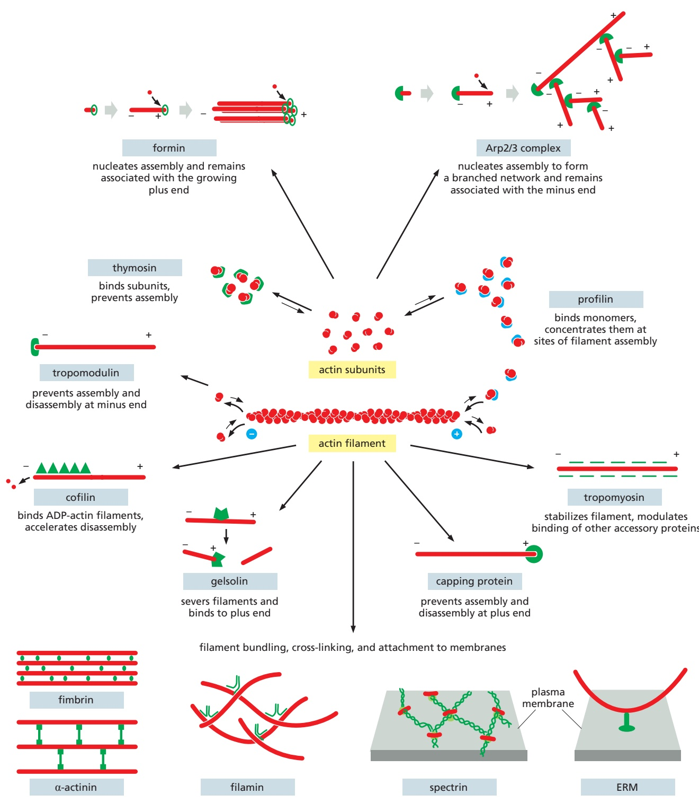

Some of the major accessory proteins of the actin cytoskeleton. Except for the myosin motor proteins, an example of each major type is shown. Each of these is discussed in the text. However, most cells contain more than a hundred different actin-binding proteins, and it is likely that there are important types of actin-associated proteins that are not yet recognized.

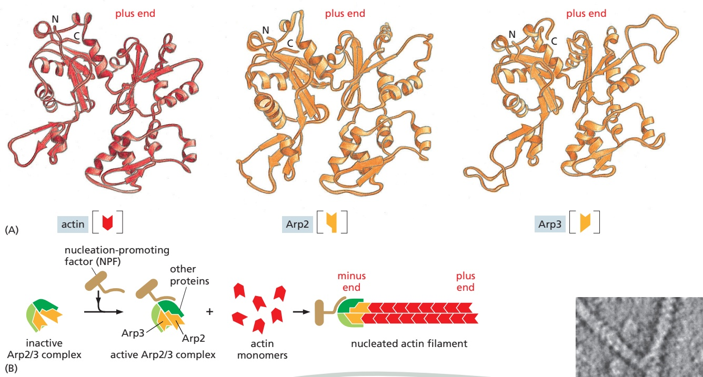

minus end, allowing rapid elongation at the plus end (**Figure 16–12A and B**). Arp2/3 complex–mediated actin filament nucleation requires the activity of a nucleation-promoting factor (NPF). The Arp2/3 complex is further stimulated when it attaches to the side of a preexisting actin filament. Thus, Arp2/3 complex activation generates a branched array of actin filaments adjacent to a membrane, building individual filaments into a treelike network

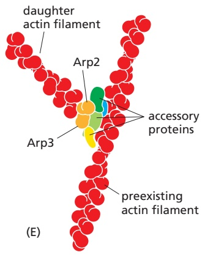

Figure 16–12 Nucleation and branching of actin filaments by the Arp2/3 complex. (A) The structures of Arp2 and Arp3 compared to the structure of actin. Although the face of the molecule equivalent to the plus end (top) in both Arp2 and Arp3 is very similar to the plus end of actin itself, differences on the sides and minus end prevent these actin-related proteins from forming filaments on their own or coassembling into filaments with actin. (B) A model for actin filament nucleation by the Arp2/3 complex. In the absence of an activating factor, Arp2 and Arp3 are held by their accessory proteins in an orientation that prevents them from nucleating a new actin filament. When a nucleation-promoting factor (NPF; brown) binds the complex, Arp2 and Arp3 are brought together into a new configuration that resembles the plus end of an actin filament. Actin MBoC7 m16.16/16.12subunits can then assemble onto this structure, bypassing the rate-limiting step of filament nucleation. In cells, NPF activation required to induce Arp2/3-dependent nucleation occurs at membrane surfaces. (C) The Arp2/3 complex nucleates filaments most efficiently when it is bound to the side of a preexisting actin filament. The result is a filament branch that grows at a 70° angle relative to the original filament. Repeated rounds of branching nucleation result in a treelike web of actin filaments. (D) Electron micrograph of a branched actin filament formed by mixing purified actin subunits with purified Arp2/3 complexes. (E) Diagram showing the position of the Arp2/3 complex at the branch between the preexisting mother filament and the daughter filament. (D, from I. Rouiller et al., J. Cell Biol. 180:887–895, 2008. © 2008A. Rouiller et al. Originally published in J. Cell Biol. 180:887–895. https://doi.org/10.1083/jcb.200709092. With permission from Rockefeller University Press.)

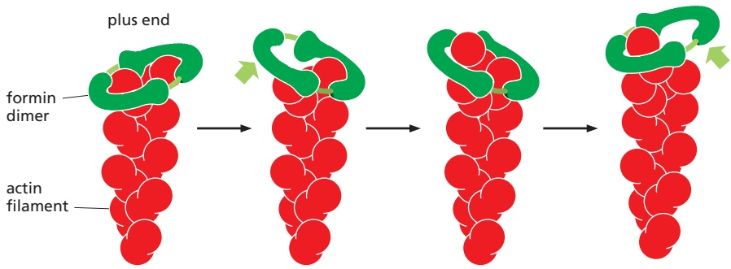

Figure 16–13 Actin filament elongation mediated by formins. Formin proteins (green) form a dimeric complex that can nucleate the formation of a new actin filament (red) and remain associated with the rapidly growing plus end as it elongates. The formin protein maintains its binding to one of the two actin subunits exposed at the plus end as it allows each new subunit to assemble. Only part of the large dimeric formin molecule is shown here. Other regions regulate its activity and link it to particular structures in the cell. Many formins are indirectly connected to the cell plasma membrane and aid the insertional polymerization of the actin filament directly beneath the membrane surface.

(**Figure 16–12C, D, and E**). Cells express multiple NPFs, each of which makes branched actin networks that are used to initiate various actin polymerizationdependent processes, such as transport of membrane-bound vesicles across short distances within the cell, the formation of adherens junctions (see Chapter 19), and phagocytosis (see Figure 13–70). As discussed below, NPF-driven actin polymerization frequently plays a direct role in protrusion of the leading edge of the cell during cell migration.

**Formins** are dimeric proteins that nucleate the growth of unbranched fila-MBoC7 m16.17/16.13 ments that can be cross-linked by other proteins to form parallel bundles. Each formin subunit has a binding site for monomeric actin, and the formin dimer appears to nucleate actin filament polymerization by capturing two monomers. As the newly nucleated filament grows, the formin dimer remains associated with the rapidly growing plus end while still allowing the addition of new subunits at that end (**Figure 16–13**). This mechanism of filament assembly is clearly different from that used by the Arp2/3 complex, which remains stably bound to the filament minus end, preventing subunit addition or loss at that end. In addition to their role in actin nucleation, formin proteins also dramatically accelerate actin filament growth. Formins mediate assembly of a variety of cellular structures that contain polarized actin cables, including filopodia, stress fibers, and the contractile ring.

Actin filament nucleation by the Arp2/3 complex and formins occurs primarily at the plasma membrane, and therefore the highest density of actin filaments in most cells is at the cell periphery within the **cell cortex**. Actin filaments in this region determine the shape and movement of the cell surface, allowing the cell to change its shape and stiffness rapidly in response to changes in its external environment.

#### Actin Filament Elongation Is Regulated by Monomer-binding Proteins

Once nucleated, rapid polymerization of actin depends on the further addition of actin monomers at the plus end of each filament. A key factor is the monomerbinding protein profilin. Profilin binds to the face of the actin monomer opposite the ATP-binding cleft, blocking the side of the monomer that would normally associate with the filament minus end, while leaving exposed the site on the monomer that binds to the plus end (see Figure 16–8). When the profilin–actin complex binds a free plus end, a conformational change in actin reduces its affinity for profilin and the profilin falls off, leaving the actin filament one subunit longer. In some cell types, a small protein called thymosin is highly abundant and competes with profilin for actin monomer binding, thereby further regulating the pool of actin monomers available for polymerization.

Growth of actin filaments is greatly enhanced by profilin for two reasons. First, profilin maintains a large pool of actin monomers poised for polymerization at filament plus ends. Second, binding sites for profilin are present in many formin proteins, as well as in many NPFs that activate the Arp2/3 complex. By binding to the factors that stimulate filament nucleation, profilin-bound actin monomers are recruited directly to sites of filament elongation, rapidly accelerating actin filament assembly (**Figure 16–14**).

Figure 16–14 Profilin stimulates actin filament elongation. (A) Many nucleation-promoting factors (NPFs; brown) contain binding sites for profilin (blue), which is bound to actin monomers. As a result, NPF activation leads not only to nucleation of branched actin filaments by Arp2/3 (green; see Figure 16–12), but also to rapid elongation of the new filaments. (B) Some members of the formin protein family possess whisker-like unstructured domains that contain several binding sites for profilin–actin complexes. This serves to recruit actin monomers to the growing plus end of the actin filament when formin is bound. Under some conditions, profilin can enhance the rate of actin filament elongation so that filament growth is faster than that expected for a diffusion-controlled reaction (see also Figure 3–76). Like NPFs, formin proteins inside the cell are activated to promote actin filament polymerization at membrane surfaces.

#### Actin Filament–binding Proteins Alter Filament Dynamics and Organization

Actin filament behavior is regulated by two major classes of binding proteins: those that bind along the side of a filament and those that bind to the ends (see Panel 16–3). Side-binding proteins include tropomyosin, an elongated protein unrelated to the myosin motor that binds simultaneously to six or seven adjacent actin subunits along each of the two grooves of the helical actin filament. In addition to stabilizing and stiffening the filament, the binding of tropomyosin can prevent the actin filament from interacting with other proteins; this aspect of tropomyosin function is important in the control of muscle contraction, as we discuss later.

An actin filament that stops growing and is not specifically stabilized in the cell will depolymerize rapidly, particularly at its plus end, once the actin molecules have hydrolyzed their ATP. The binding of plus-end capping protein (also called CapZ for its location in the muscle Z band) stabilizes an actin filament at its plus end by rendering it inactive, greatly reducing the rates of filament growth and depolymerization (**Figure 16–15**). At the minus end, an actin filament may be capped by the Arp2/3 complex that was responsible for its nucleation,

Figure 16–15 Filament capping and its effects on filament dynamics. A population of uncapped filaments adds and loses subunits at both the plus and minus ends, resulting in rapid growth or shrinkage, depending on the concentration of available free monomers (green line). In the presence of a protein that caps the plus end (red line), only the minus end is able to add or lose subunits; consequently, filament growth will be slower at all monomer concentrations above the critical concentration, and filament shrinkage will be slower at all monomer concentrations below the critical concentration. In addition, the critical concentration for the population shifts to that of the filament minus end.

although many minus ends in a typical cell are released from the Arp2/3 complex and are uncapped.

Tropomodulin, best known for its function in the capping of actin filaments in muscle, binds tightly to the minus ends of actin filaments that have been coated and thereby stabilized by tropomyosin. A large family of tropomodulin proteins regulates actin filament length and stability in many cell types.

End-binding proteins can affect filament dynamics even when they are present at very low levels. Because subunit addition and loss occur exclusively at filament ends, one molecule of an end-binding protein per actin filament (roughly one molecule per 200–500 actin subunits) can be enough to transform the architecture of an actin filament network. For example, rapid capping of actin filament plus ends after their nucleation at membranes focuses actin polymerization at new sites of nucleation, so that plus ends grow only where a pushing force is needed (see Figure 16–17).

The three-dimensional organization of cellular actin networks also depends on the activity of actin cross-linking proteins. Some of these cross-linking proteins bundle actin filaments into a parallel array, while others hold two actin filaments together at a large angle to each other, thereby creating a looser meshwork. Actin cross-linking proteins generally have two similar actin filament–binding sites, which can either be part of a single polypeptide chain or contributed by each of two polypeptide chains held together in a dimer (see Panel 16–3). The spacing and arrangement of these two filament-binding domains influence the type of actin structure that a given cross-linking protein forms. For example, the small monomeric protein fimbrin contributes to the tight packing of parallel bundles of actin filaments found in long cellular protrusions such as microvilli and the stereocilia of the inner ear’s sensory hair cells. Other actin cross-linking proteins have either a flexible or a stiff, bent connection between their two binding domains, allowing them to form actin filament webs or three-dimensional networks, rather than actin bundles. The protein filamin achieves this by clamping together pairs of actin filaments roughly at right angles, thereby promoting the formation of a loose and highly viscous gel.

Each type of bundling protein also influences which other molecules can interact with the cross-linked actin filaments. Myosin II is the motor protein that enables stress fibers and other contractile arrays to exert tension. The very close packing of actin filaments caused by fimbrin apparently excludes myosin, and thus the parallel actin filaments held together by fimbrin are not contractile. On the other hand, α-actinin cross-links oppositely polarized actin filaments into loose bundles, allowing the binding of myosin and formation of contractile actin bundles. Because of the very different spacing and orientation of the actin filaments, bundling by fimbrin automatically discourages bundling by α-actinin, and vice versa, so that the two types of bundling protein are mutually exclusive.

As discussed previously, much of the actin polymerization in animal cells initiates at the plasma membrane where nucleation proteins are activated. Dozens of other actin-binding proteins associate with the cortical actin network. For example, a netlike meshwork of the protein **spectrin** connects to actin in the cortex of red blood cells, where it maintains cell shape and structural integrity of the plasma membrane (see pp. 630–631). More widely expressed are members of the ERM family (named for its first three members, ezrin, radixin, and moesin), which help organize membrane domains through their ability to interact with transmembrane proteins and the underlying actin cytoskeleton in many cell types. In so doing, they not only provide structural links to strengthen the cell cortex but also regulate the activities of signal transduction pathways. Moesin also increases cortical stiffness to promote cell rounding during mitosis. ERM proteins are thought to bind to and organize the cortical actin cytoskeleton in a variety of contexts, thereby affecting the shape and stiffness of the membrane as well as the localization and activity of signaling molecules.

#### Severing Proteins Regulate Actin Filament Depolymerization

Another important mechanism of actin filament regulation depends on proteins that break an actin filament into many smaller filaments, thereby generating a large number of new filament ends. The fate of these new ends depends on the presence of other accessory proteins. Under some conditions, newly formed ends nucleate filament elongation, thereby accelerating the assembly of new filament structures. Under other conditions, severing promotes the depolymerization of old filaments, speeding up the depolymerization rate by tenfold or more. In addition, severing changes the physical and mechanical properties of the cytoplasm: stiff, large bundles and gels become more fluid.

One class of actin-severing proteins is the gelsolin superfamily. These proteins are activated by high levels of cytosolic $\tilde { \mathrm { C a } } ^ { 2 + }$ . Gelsolin interacts with the side of the actin filament and contains subdomains that bind to two different sites: one that is exposed on the surface of the filament and one that is hidden between adjacent subunits. Activated gelsolin is thought to sever an actin filament when a thermal fluctuation creates a small gap between neighboring subunits, at which point gelsolin inserts itself into the gap to break the filament. After the severing event, gelsolin remains attached to the actin filament and caps the new plus end.

A second actin filament–destabilizing protein, found in all eukaryotic cells, is cofilin. Also called actin-depolymerizing factor, cofilin binds along the length of the actin filament, forcing the filament to twist a little more tightly (**Figure 16–16**). Mechanical stress induced by cofilin binding weakens the contacts between actin subunits in the filament, making the filament less stable and more easily severed by thermal motions, generating filament ends that undergo rapid disassembly. As a result, most of the actin filaments inside cells are shorter lived than are filaments formed from pure actin in a test tube.

Cofilin binds preferentially to ADP-containing actin filaments rather than to ATP-containing filaments. Because ATP hydrolysis is usually slower than filament assembly, the newest actin filaments in the cell still contain mostly ATP and are resistant to depolymerization by cofilin. Cofilin therefore tends to dismantle the older filaments in the cell. As discussed later, the cofilin-mediated disassembly of old but not new actin filaments is critical for the polarized, directed growth of the actin network that drives the intracellular motility of pathogens as well as cell migration. Actin filaments can be protected from cofilin by tropomyosin binding. Thus, the dynamics of actin in different subcellular locations depend on the balance of stabilizing and destabilizing accessory proteins.

74 nm

Figure 16–16 Twisting of an actin filament induced by cofilin. (A) Three-dimensional reconstruction from cryo-electron micrographs of filaments made of pure actin. The bracket shows the span of two twists of the actin helix. (B) Reconstruction of an actin filament coated with cofilin, which binds in a 1:1 stoichiometry to actin subunits all along the filament. Cofilin is a small protein (14 kilodaltons) compared to actin (43 kilodaltons), and so the filament appears only slightly thicker. The energy of cofilin binding serves to deform the actin filament, twisting it more tightly and MBoC7 m16.20/16.16reducing the distance spanned by each twist of the helix. (© 1997 A. McGough et al. Originally published in J. Cell Biol. https://doi.org.10.1083/jcb.138.4.771. With permission from Rockefeller University Press.)

#### Bacteria Can Hijack the Host Actin Cytoskeleton

The importance of accessory proteins in actin-based motility and force production is illustrated beautifully by studies of certain bacteria and viruses that use components of the host-cell actin cytoskeleton to move through the cytoplasm. The cytoplasm of mammalian cells is extremely viscous, containing organelles and cytoskeletal elements that inhibit diffusion of large particles such as bacteria or viruses. To move around in a cell and invade neighboring cells, several pathogens, including Listeria monocytogenes (which causes a rare but serious form of food poisoning), overcome this problem by recruiting and activating the Arp2/3 complex at their surface. The Arp2/3 complex nucleates the assembly of actin filaments that generate a substantial force and push the bacterium through the cytoplasm at rates of up to 15 μm/min, leaving behind a long actin “comet tail” (**Figure 16–17**; see also Figures 23–29 and 23–30). This motility can be reconstituted in a test tube by adding the bacteria to a mixture of pure actin, Arp2/3 complex, cofilin, and capping protein, illustrating how actin polymerization dynamics generates movement through spatial regulation of filament assembly and disassembly. As we shall see, actin-based movement of this sort also underlies membrane protrusion at the leading edge of motile cells.

#### Actin at the Cell Cortex Determines Cell Shape

Although actin is found throughout the cytoplasm of a eukaryotic cell, dynamic actin filament behavior occurs primarily at the cell cortex. Here, through interaction with many different proteins, actin filaments are organized into several types of arrays, including branched networks, parallel bundles, and combinations of straight and branched filaments (**Figure 16–18**). Different structures are initiated by the action of distinct nucleating proteins: the actin filaments of branched networks are nucleated by the Arp2/3 complex, while bundles are made of the long, straight filaments produced by formins. Dynamics here generate distinct cellular shapes and properties, as well as protrusive structures termed **filopodia** and **lamellipodia** observed in migrating fibroblasts. These are filled with dense cores of filamentous actin, which excludes membrane-enclosed organelles. The structures differ primarily in the way in which the actin is organized by actin cross-linking proteins (see Panel 16–3). Filopodia are essentially one-dimensional. They contain a core of long, bundled actin filaments, which are reminiscent of those in microvilli but longer and thinner, as well as more dynamic. Lamellipodia are two-dimensional, sheet-like structures. They contain a cross-linked mesh of actin filaments, most of which lie in a plane parallel to the solid substratum. Filopodia help cells sense environmental cues and function in cell migration. For example, filopodia extend from the leading edge of the growth cone in developing neurons and help guide them to their target. Protrusion of lamellipodia and related actinrich structures, discussed in more detail later, drives the forward movement of the leading edge of many migrating cells.

(A)

10 µm

Figure 16–17 The actin-based movement of Listeria monocytogenes. (A) Fluorescence micrograph of an infected cell that has been stained to reveal bacteria in blue and actin filaments in red. Note the cometlike tail of actin filaments behind each moving bacterium. (B) Listeria motility can be reconstituted in a test tube with ATP and just four purified proteins: actin, Arp2/3 complex, capping protein, and cofilin. This micrograph shows the dense actin tails behind bacteria (black). (C) The ActA protein on the bacterial surface activates the Arp2/3 complex to nucleate new filament assembly along the sides of existing filaments. Filaments grow at their plus end until capped by capping protein. Actin is recycled through the action of MBoC7 m16.25/16.17cofilin, which enhances depolymerization at the minus ends of the filaments. By this mechanism, polymerization is focused at the rear surface of the bacterium, propelling it forward (see Movie 23.7). (A, courtesy of Julie Theriot and Tim Mitchison; B, from T.P. Loisel et al., Nature 401:613–616, published 1999 by Nature Publishing Group. Reproduced with permission of SNCSC.)

Figure 16–18 Actin arrays in a cell moving along a flat surface. (A) A schematic of a fibroblast migrating in a tissue-culture dish is shown with four areas enlarged to show the arrangement of actin filaments. The actin filaments are shown in red, with arrowheads pointing toward the minus end. Stress fibers are contractile and exert tension. The actin cortex underlies the plasma membrane and consists of actin networks that enable membrane protrusion at lamellipodia. Filopodia are spikelike projections of the plasma membrane that sense extracellular signals and allow a cell to explore its environment. (B) A migrating cell that was fixed, dried, and shadowed with platinum reveals a dense network of actin filaments at the leading edge (right side of image). The fast-growing plus ends are oriented toward the cell edge. Accessory proteins organize the filaments. Pseudo-colored in red are actin filaments in the process of becoming a filopodium. (B, courtesy of Tatyana Svitkina.)

#### Distinct Modes of Cell Migration Rely on the Actin Cytoskeleton

Cell movement is one of the most striking of all cell behaviors. While some cells employ microtubule-based cilia or flagella to swim (discussed later in this chapter), many cells undergo crawling movements that rely on the actin cytoskeleton. Predatory amoebae continually crawl in search of food, and they can easily be observed to attack and devour smaller ciliates and flagellates in a drop of pond water (see Movie 1.4). During embryogenesis, the structure of an animal is created by the migrations of individual cells to specific target locations and by the coordinated movements of whole epithelial sheets (discussed in Chapter 21). In vertebrates, neural crest cells migrate long distances from their site of origin in the neural tube to a variety of sites throughout the embryo (see Movie 21.7). Similarly, actin-rich growth cones at the advancing tips of developing axons travel to distant synaptic targets.

The adult animal seethes with crawling cells. Macrophages and neutrophils crawl to sites of infection and engulf foreign invaders as a critical part of

the innate immune response. Osteoclasts tunnel into bone, forming channels that are filled in by the osteoblasts that follow them, in a continual process of bone remodeling and renewal. Similarly, fibroblasts migrate through connective tissues, remodeling them where necessary and helping to rebuild damaged structures at sites of injury. In an ordered procession, the cells in the epithelial lining of the intestine travel up the sides of the intestinal villi, replacing absorptive cells lost at the tip of the villus. Cell migration also has a role in many cancers, when cells in a primary tumor invade neighboring tissues and crawl into blood vessels or lymph vessels and then emerge at other sites in the body to form metastases.

Cell migration depends on the actin-rich cortex that lies beneath the plasma membrane. **Figure 16–19** illustrates distinct modes of cell migration on the basis of how the actin is organized. All migration is characterized by protrusion, in which the plasma membrane is pushed out at the front of the cell. In **mesenchymal cell migration**, characteristic of fibroblasts or epithelial cells grown on glass surfaces, the Arp2/3 complex mediates actin filament nucleation at the leading edge of the cell, thereby generating a lamellipodium (see Figure 16–18). Behind the leading edge, cofilin (see Figure 16–16) disassembles the older (ADP-bound) actin filaments. The actin network is therefore assembling at the front and disassembling at the back, reminiscent of the treadmilling that occurs in individual actin filaments as discussed previously (see Figure 16–11). Mesenchymal cell migration requires firm attachment to the underlying substratum, which allows the cell body to generate traction and propel itself forward. The actin cytoskeleton braces itself using stress fibers connected to integrin-based focal adhesions on the bottom surface of the cell (see Figure 19–56). Contraction of bundles of actin filaments and myosin II motors at the rear of the cell, coordinated with disassembly of attachment sites, enables the cell body to translocate.

Figure 16–19 Modes of cell migration. (A) In the mesenchymal mode of cell migration, focal adhesions form behind protruding lamellipodia that connect to contractile stress fibers, bracing the cell against the surface (substratum) across which it is migrating. (B) In amoeboid cell migration, a three-dimensional pseudopod is formed by explosive actin polymerization at the leading edge. Cells MBoC7 n16.204-16.19maintain traction even though adhesion to the substratum is reduced, enabling much more rapid cell movement. (C) Leading edge protrusion can also occur through the formation of a bleb if the plasma membrane detaches from the underlying cortex and is pushed out by hydrostatic pressure. In all three modes of migration, contraction of cortical actin and myosin II at the rear of the cell drives locomotion of the cell body.

Mesenchymal cell migration is slow, with movement rates of less than 1 μm per minute. In contrast, a second mode of cell migration, **amoeboid cell migration**, resembles the rapid movement and shape changes typical of amoebae and can be hundreds of times faster (**Movie 16.2**). This mode of movement is typical of white blood cells such as neutrophils and is characterized by the explosive extension of cell protrusions by local activation of the Arp2/3 complex. The protrusions are much thicker than lamellipodia and are called **pseudopodia** (or pseudopods). In contrast to mesenchymal cell migration, amoeboid-type movement does not rely as heavily on integrin-based attachments to the underlying surface. Traction nevertheless occurs through a weaker association to the substratum, and migrating cells appear more rounded. Locomotion is accompanied by a combination of protrusion at the front of the cell and contraction at the rear.

Protrusion of pseudopodia is driven by the same principles of actin filament polymerization and depolymerization that operate in lamellipodia, with cycles of actin nucleation, polymerization, and disassembly at the leading edge of the cell, but generating a three-dimensional rather than a two-dimensional structure. A distinct type of three-dimensional membrane protrusion can also result from a process called **blebbing**. In this case, the plasma membrane detaches locally from the underlying actin cortex, thereby allowing cytoplasmic flow to push the membrane outward. The formation of a membrane bleb depends on hydrostatic pressure, which is generated by the contraction of actin and myosin assemblies in the rear of the cell. Once blebs have extended, actin filaments reassemble on the inside surface of the blebbed membrane to form a new actin cortex.

Thus, leading-edge protrusion, adhesion to the surface, and contraction at the cell cortex underlie all modes of cell migration. These migration modes can interconvert depending on cell state, the extracellular environment, and the activation of different signaling pathways.

#### Cells Migrating in Three Dimensions Can Navigate Around Barriers

Studying the movement of cells on two-dimensional surfaces reveals important principles of cell migration. Most migrating cells in the body, however, must negotiate their way through a complex, three-dimensional environment. Surrounded by other cells and extracellular matrix, migrating cells are confined in space and must navigate around physical barriers separating them from their destination. During immune surveillance, for example, white blood cells called dendritic cells migrate between sites of infection and lymph nodes to initiate a systemic immune response (see Chapter 24). Dendritic cell migration can be mimicked by embedding them in a three-dimensional collagen gel matrix, in which they undergo rapid amoeboid migration toward a chemotactic signal, extending a large number of actin-rich protrusions (**Figure 16–20A and B**). When introduced into a microchamber containing different-sized channels, a cell will choose the widest path (**Figure 16–20C**). Later in this chapter, we discuss how chemotactic cues induce cell polarization and guide a migrating cell in the right direction.

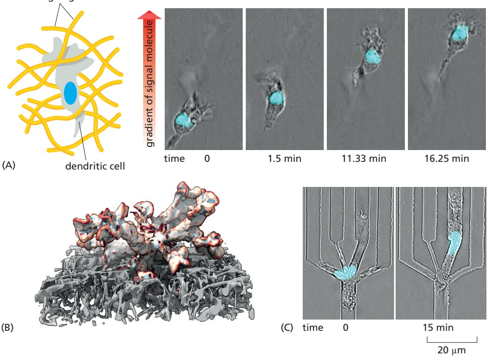

Figure 16–20 A dendritic cell migrating in three dimensions. (A) Schematic of a cell introduced into a collagen gel matrix. Images at right show that a chemotactic signal gradient induces polarized extension of pseudopodia that explore the environment, seeking out a path through gaps in the gel matrix that are typically smaller than the cell diameter. The nucleus is stained with a blue dye. (B) Three-dimensional image of a dendritic cell and its many pseudopodia (outlined in red) that is based on fluorescence microscopy. A portion of the collagen matrix surrounding the cell is shown in gray. (C) In this experiment, a dendritic cell was introduced into a microchannel that contains a decision point with four different pore sizes. Using the nucleus as a gauge, the cell ultimately chooses a path through the largest pore (Movie 16.3). (Courtesy of Michael Sixt.)

Some cells use specialized adhesion structures called **podosomes** that areMBoC7 n16.205/16.20 important for cells to cross tissue barriers, for example during embryonic development. **Invadopodia** are related structures that contribute to the migration of metastatic cancer cells invading a tissue. Podosomes and invadopodia contain many of the same actin-regulatory components as other protrusions. They also secrete proteases that degrade the extracellular matrix, allowing them to carve through matrix barriers in their path.

#### Summary

Actin is a highly conserved cytoskeletal protein that is present in high concentrations in nearly all eukaryotic cells. Nucleation presents a kinetic barrier to actin polymerization, but once formed, actin filaments undergo dynamic behavior due to hydrolysis of the bound ATP. Actin filaments are polarized and can undergo treadmilling when a filament assembles at the plus end while simultaneously depolymerizing at the minus end. In cells, actin filament dynamics are regulated at every step, and the varied forms and functions of actin depend on a versatile repertoire of accessory proteins. Approximately half of the actin is kept in a monomeric form through association with proteins such as profilin. Nucleation factors such as the Arp2/3 complex and formins promote formation of branched and parallel filaments, respectively. Interplay between proteins that bind or cap actin filaments and those that promote filament severing or depolymerization can slow or accelerate the kinetics of filament assembly and disassembly. Another class of accessory proteins assembles the filaments into larger ordered structures by cross-linking them to one another in geometrically defined ways. Connections between these actin arrays and the plasma membrane of cells give an animal cell mechanical strength and permit the elaboration of cortical cellular structures such as lamellipodia, filopodia, pseudopodia, and microvilli. By inducing actin filament polymerization at their surface, intracellular pathogens can hijack the host-cell cytoskeleton and move around inside the cell. Cell migration depends on the formation of protrusions at the leading edge by assembly of new actin filaments or membrane blebbing, traction against the underlying substratum, and contractile forces generated by myosin motors to bring the cell body forward.

Figure 16–21 Myosin II. (A) The two globular heads and long tail of a myosin II molecule shadowed with platinum can be seen in this electron micrograph. (B) A myosin II molecule is composed of two heavy chains (each about 2000 amino acids long; green) and four light chains (blue). The light chains are of two distinct types, and one copy of each type is present on each myosin head. Dimerization occurs when the two α helices of the heavy chains wrap around each other to form a coiledcoil, driven by the association of regularly spaced hydrophobic amino acids (see Figure 3–8). The coiled-coil arrangement makes an extended rod in solution, and this part of the molecule forms the tail. (A, courtesy of David Shotton.)

#### MYOSIN AND ACTIN

A crucial feature of the actin cytoskeleton is that it can form contractile structures that cross-link and slide actin filaments relative to one another through the action of **myosin** motor proteins. Actin–myosin assemblies perform important functions in all eukaryotic cells, such as in cell migration as described earlier. In addition, actin and myosin drive muscle contraction.

#### Actin-based Motor Proteins Are Members of the Myosin Superfamily

The first motor protein to be identified was skeletal muscle myosin, which gen-MBoC7 m16.26/16.21 erates the force for muscle contraction. This protein, now called myosin II, is an elongated protein formed from two heavy chains and two copies of each of two light chains. Each heavy chain has a globular head domain at its N-terminus that contains the force-generating machinery, followed by a very long α-helical amino acid sequence that forms an extended coiled-coil to mediate heavy-chain dimerization (**Figure 16–21**). The two light chains bind close to the N-terminal head domain, while the long coiled-coil tail bundles itself with the tails of other myosin molecules. In skeletal muscle, these tail–tail interactions form large, bipolar thick filaments that have several hundred myosin heads, oriented in opposite directions at the two ends of the thick filament (**Figure 16–22**).

Figure 16–22 The myosin II bipolar thick filament in muscle. (A) Electron micrograph of a myosin II thick filament isolated from frog muscle. Note the central bare zone, which is free of head domains. (B) Schematic diagram, not drawn to scale. The myosin II molecules aggregate by means of their tail regions, with their heads projecting to the outside of the filament. The bare zone in the center of the filament consists entirely of myosin II tails. (C) A small section of a myosin II filament as reconstructed from electron micrographs. In the relaxed (noncontracting) state, the two heads of a myosin molecule are bent backward and sterically interfere with each other to switch off their activity. An individual myosin molecule in the inactive state is highlighted in green. The cytoplasmic myosin II filaments in non-muscle cells are much smaller, although similarly organized (see Figure 16–34). (A, from M. Stewart and R.W. Kensler, J. Mol. Biol. 192:831–851, 1986. With permission from Elsevier; C, based on R.A. Crowther et al., J. Mol. Biol. 184:429–439, 1985.)

Figure 16–23 Direct evidence for the motor activity of the myosin head. In this experiment, purified myosin heads were attached to a glass slide, and then actin filaments labeled with fluorescent phalloidin were added and allowed to bind to the myosin heads. (A) When ATP was added, the actin filaments began to glide along the surface, owing to the many individual steps taken by each of the dozens of myosin heads bound to each filament. The video frames shown in this sequence were recorded about 0.6 second apart; the two actin filaments shown (red) were moving in opposite directions at a rate of about 4 μm/sec. (B) Diagram of the experiment. The large red arrows indicate the direction of actin filament movement (Movie 16.4). (A, courtesy of James Spudich.)

Each myosin head binds and hydrolyzes ATP, using the energy of ATP hydrolysis to walk toward the plus end of an actin filament (**Figure 16–23**). The opposing orientation of the heads in the thick filament makes the filament efficient at sliding pairs of oppositely oriented actin filaments toward each other, shortening the muscle. In skeletal muscle, in which carefully arranged actin filaments are aligned in thin filament arrays surrounding the myosin thick filaments, the ATP-driven sliding of actin filaments results in a powerful contraction. Cardiac and smooth muscle contain myosin II molecules that are similarly arranged, although different genes encode them.

#### Myosin Generates Force by Coupling ATP Hydrolysis to Conformational Changes

Motor proteins use structural changes in their ATP-binding sites to produce cyclic interactions with a cytoskeletal filament. Each cycle of ATP binding, hydrolysis, and release propels them forward in a single direction to a new binding site along the filament. For myosin II, each step of the movement along actin is generated by the swinging of an 8.5-nm-long α helix, or lever arm, which is structurally stabilized by the binding of light chains. At the base of this lever arm next to the head, there is a pistonlike helix that connects movements at the ATP-binding cleft in the head to small rotations of the so-called converter domain. A small change at this point can swing the helix like a long lever, causing the far end of the helix to move by about 5.0 nm.

These changes in the conformation of the myosin are coupled to changes in its binding affinity for actin, allowing the myosin head to release its grip on the actin filament at one point and snatch hold of it again at another. The full mechanochemical cycle of ATP binding, ATP hydrolysis, and phosphate release (which causes the power stroke) produces a single step of movement (**Figure 16–24**). At low ATP concentrations, the interval between the force-producing step and the binding of the next ATP is long enough that single steps can be observed (**Figure 16–25**).

#### Sliding of Myosin II Along Actin Filaments Causes Muscles to Contract

Muscle contraction is the most familiar and best-understood form of movement in animals. In vertebrates, running, walking, swimming, and flying all depend on the rapid contraction of skeletal muscle on its scaffolding of bone, while

**ATTACHED** At the start of the cycle shown in this figure, a myosin head lacking a bound nucleotide is locked tightly onto an actin filament in a rigor configuration (so named because it is responsible for rigor mortis, the rigidity of death). In an actively contracting muscle, this state is very short-lived, being rapidly terminated by the binding of a molecule of ATP.

**RELEASED** A molecule of ATP binds to the large cleft on the “back” of the head (that is, on the side furthest from the actin filament) and immediately causes a slight change in the conformation of the actin-binding site, reducing the affinity of the head for actin. (The space drawn here between the head and actin emphasizes this change, although in reality the head probably remains very close to the actin.)

**COCKED** ATP binding triggers a conformational change in the cleft that leads to a rotation in the converter domain, causing the lever arm to swing out and the head to be displaced along the filament by a distance of about 5 nm. Hydrolysis of ATP occurs, but the ADP and inorganic phosphate (P) remain tightly bound to the protein.

**RE-BINDING AND POWER STROKE** The myosin head binds weakly to a new site on the actin filament, causing release of the inorganic phosphate produced by ATP hydrolysis, concomitantly with the tight binding of the head to actin. This release triggers the power stroke—the force-generating change in shape during which the head regains its original conformation. In the course of the power stroke, the head loses its bound ADP, thereby returning to the start of a new cycle.

**FORCE GENERATING** At the end of the cycle, the myosin head is again locked tightly to the actin filament in a rigor configuration. Note that the head has moved to a new position on the actin filament.

Figure 16–24 The cycle of structural changes used by myosin II to walk along an actin filament. In the myosin II cycle, the head remains bound to the actin filament for only about 5% of the entire cycle time, allowing many myosins to work together to move a single actin filament (Movie 16.5). (Based on I. Rayment et al., Science 261:58–65, 1993.)

involuntary movements such as heart pumping and gut peristalsis depend on theMBoC7 m16.29/16.24 contraction of cardiac muscle and smooth muscle, respectively. All these forms of muscle contraction depend on the ATP-driven sliding of highly organized arrays of actin filaments against arrays of myosin II filaments.

Skeletal muscle was a relatively late evolutionary development, and muscle cells are highly specialized for rapid and efficient contraction. The long, thin muscle fibers of skeletal muscle are actually huge single cells that form during development by the fusion of many separate cells. The large muscle cell retains the many nuclei of the contributing cells. These nuclei lie just beneath the plasma membrane (**Figure 16–26**). The bulk of the cytoplasm inside is made up of myofibrils, which is the name given to the basic contractile elements of the muscle cell. A **myofibril** is a cylindrical structure 1–2 μm in diameter that is often as long as the muscle cell itself. It consists of a long, repeated chain of tiny contractile units—called sarcomeres, each about 2.2 μm long—which give the vertebrate myofibril its striated appearance (**Figure 16–27**).

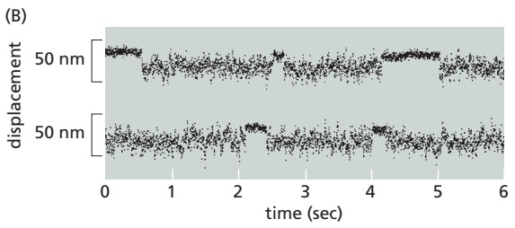

Figure 16–25 The force of a single myosin molecule moving along an actin filament measured using an optical trap. (A) Schematic of the experiment, showing an actin filament with beads attached at both ends and held in place by focused beams of light called optical tweezers (Movie 16.6). The tweezers trap and move the bead and can also be used to measure the force exerted on the bead through the filament. In this experiment, the filament was positioned over another bead to which myosin II motors were attached, and the optical tweezers were used to determine the effects of myosin binding on movement of the actin filament. (B) These traces show filament movement in two separate experiments. Initially, when the actin filament is unattached to myosin, thermal motion of the filament produces noisy fluctuations in filament position. When a single myosin binds to the actin filament, thermal motion decreases abruptly, and a roughly 10-nm displacement results from movement of the filament by the motor. The motor then releases the filament. Because the ATP concentration is very low in this experiment, the myosin remains attached to the actin filament for much longer than it would in a muscle cell. (Adapted from C. Rüegg et al., News Physiol. Sci. 17:213–218, 2002. With permission from the American Physiological Society.)

Each sarcomere is formed from a miniature, precisely ordered array of parallel and partly overlapping thin and thick filaments. The thin filaments are composed of actin and associated proteins, and they are attached at their plus ends to a Z disc at each end of the sarcomere. The capped minus ends of the actin filaments extend in toward the middle of the sarcomere, where they overlap with thick filaments, the bipolar assemblies formed from specific muscle isoforms of myosin II (see Figure 16–22). When this region of overlap is examined in cross section by electron microscopy, the myosin filaments are arranged

Figure 16–26 Skeletal muscle cells (also called muscle fibers). (A) These huge multinucleated cells form by the fusion of many muscle cell precursors, called myoblasts. Here, a single muscle cell is depicted. In an adult human, a muscle cell is typically 50 μm in diameter and can be up to several centimeters long. (B) Fluorescence micrograph of rat muscle, showing the peripherally located nuclei (blue) in these giant cells. Myofibrils are stained red. (B, courtesy of Nancy L. Kedersha.)

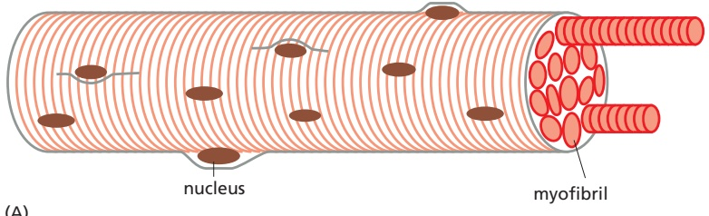

Figure 16–27 Skeletal muscle myofibrils. (A) Low-magnification electron micrograph of a longitudinal section through a skeletal muscle cell of a rabbit, showing the regular pattern of cross-striations. The cell contains many myofibrils aligned in parallel (see Figure 16–26). (B) Detail of the skeletal muscle shown in A, showing portions of two adjacent myofibrils and the definition of a sarcomere (black arrow). (C) Schematic diagram of a single sarcomere, showing the origin of the dark and light bands seen in the electron micrographs. The Z discs, at each end of the sarcomere, are attachment sites for the plus ends of actin filaments (thin filaments); the M line, or midline, is the location of proteins that link adjacent myosin II filaments (thick filaments) to one another. (D) When the sarcomere contracts, the actin and myosin filaments slide past one another without shortening. (A and B, courtesy of Roger Craig.)

in a regular hexagonal lattice, with the actin filaments evenly spaced between them (**Figure 16–28**).

Sarcomere shortening is caused by the myosin filaments sliding past the actin thin filaments, with no change in the length of either type of filament (see Figure 16–27C and D). Bipolar thick filaments walk toward the plus ends of two sets of thin filaments of opposite orientations, driven by dozens of independent myosin heads that are positioned to interact with each thin filament. Because there is no coordination among the movements of the myosin heads, it is critical that they remain tightly bound to the actin filament for only a small fraction of each ATPase cycle so that they do not hold one another back. Each myosin thick filament has about 300 heads (294 in frog muscle), and each head cycles about five times per second in the course of a rapid contraction—sliding the myosin and actin filaments past one another at rates of up to 15 μm/sec and enabling the sarcomere to shorten by 10% of its length in less than one-fiftieth of a second. The rapid synchronized shortening of the thousands of sarcomeres lying end-to-end in each myofibril enables skeletal muscle to contract rapidly enough for running and flying or for playing the piano.

Accessory proteins produce the remarkable uniformity in filament organization, length, and spacing in the sarcomere and enable it to withstand the constant wear-and-tear of contraction (**Figure 16–29**). The actin filament plus ends are anchored in the Z disc, which is built from CapZ and α-actinin; CapZ in the Z disc caps the filaments (preventing depolymerization), while α-actinin holds them together in a regularly spaced bundle. Actin filaments are stabilized along their length by tropomyosin and also by a protein of enormous size, called nebulin, which consists almost entirely of a repeating 35-amino-acid actin-binding motif. Nebulin stretches from the Z disc toward the minus end of each thin filament, which is capped and stabilized by tropomodulin. Although there is some slow exchange of actin subunits at both ends of the muscle thin filament, such that the components of the thin filament turn over with a half-life of several days, the actin filaments in sarcomeres are remarkably stable compared with those found in most other cell types, whose dynamic actin filaments turn over with half-lives of a few minutes or less.

(C)

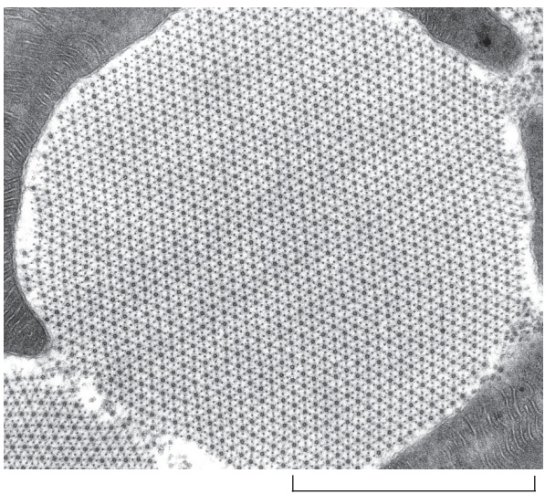

1 µm

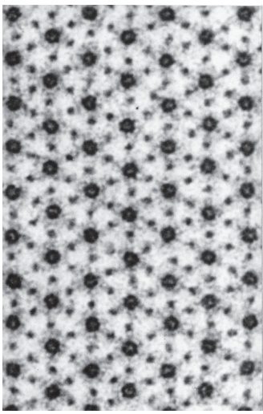

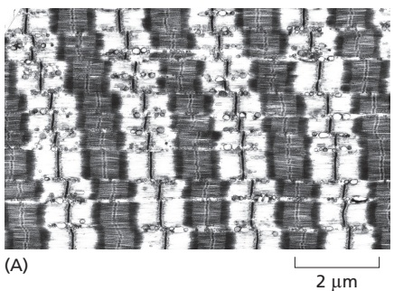

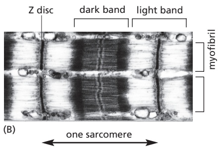

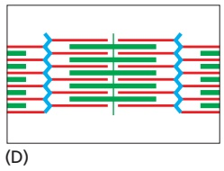

Figure 16–28 Electron micrographs of an insect flight muscle viewed in cross section. The myosin and actin filaments are packed together with almost crystalline regularity. Unlike their vertebrate counterparts, these myosin filaments have a hollow center, as seen in the enlargement on the right. The geometry of the hexagonal lattice is slightly different in vertebrate muscle. (From J. Auber and R. Couteaux, J. Microsc. 2:309–324, 1963. With permission from Société Française de Microscopie Électronique.)

Opposing pairs of an even longer protein, called titin, position the thick filaments midway between the Z discs. Titin acts as a molecular spring, with a long series of immunoglobulin-like domains that can unfold one by one as stress is applied to the protein. A springlike unfolding and refolding of these domainsMBoC7 m16.34/16.29 keeps the thick filaments poised in the middle of the sarcomere and allows the muscle fiber to recover after being overstretched. In Caenorhabditis elegans, whose sarcomeres are longer than those in vertebrates, titin is longer as well, suggesting that it serves also as a molecular ruler, determining in this case the overall length of each sarcomere.

#### A Sudden Rise in Cytosolic $\mathbb { C } \mathbb { a } ^ { 2 + }$ Concentration Initiates Muscle Contraction

The force-generating molecular interaction between myosin thick filaments and actin thin filaments takes place only when a signal passes to the skeletal muscle from the nerve that stimulates it. Immediately upon arrival of the signal, the muscle cell needs to be able to contract very rapidly, with all the sarcomeres shortening simultaneously. Two major features of the muscle cell make extremely rapid contraction possible. First, as previously discussed, the individual myosin motor heads in each thick filament spend only a small fraction of the ATP cycle time bound to the filament and actively generating force, so many myosin heads can act in rapid succession on the same thin filament without interfering with one another. Second, a specialized membrane system relays the incoming signal rapidly throughout the entire cell. The signal from the nerve triggers an action potential in the muscle cell plasma membrane (discussed in Chapter 11), and this electrical excitation spreads swiftly into a series of membranous folds—the transverse tubules, or T tubules—that extend inward from the plasma membrane around each myofibril. The signal is then relayed across a small gap to the sarcoplasmic reticulum, an adjacent weblike sheath of modified endoplasmic reticulum that surrounds each myofibril like a net stocking (**Figure 16–30A and B**).

Figure 16–29 Organization of accessory proteins in a sarcomere. Each giant titin molecule extends from the Z disc to the M line—a distance of more than 1 μm. Part of each titin molecule is closely associated with a myosin thick filament (which switches polarity at the M line); the rest of the titin molecule is elastic and changes length as the sarcomere contracts and relaxes. Each nebulin molecule is exactly the length of a thin filament. The actin filaments are also coated with tropomyosin and bound intermittently by troponin (not shown; see Figure 16–31) and are capped at both ends. Tropomodulin caps the minus end of the actin filaments, and CapZ anchors the plus end at the Z disc, which also contains α-actinin (not shown).

When the incoming action potential activates a $\mathrm { C a ^ { 2 + } }$ channel in the T-tubule membrane, it triggers the opening of a $\mathrm { C a ^ { 2 + } }$ -release channel in the closely associated sarcoplasmic reticulum membrane (**Figure 16–30C**). $\mathrm { C a ^ { 2 + } }$ flooding into the cytosol then initiates the contraction of each myofibril. Because the signal from the muscle cell plasma membrane is passed within milliseconds (via the T tubules and sarcoplasmic reticulum) to every sarcomere in the cell, all of the myofibrils in the cell contract at once. The increase in $\mathrm { C a ^ { 2 + } }$ concentration is transient because the $\mathrm { C a ^ { 2 + } }$ is rapidly pumped back into the sarcoplasmic reticulum by an abundant, ATP-dependent $\mathrm { C a ^ { \hat { 2 } + } }$ -pump (also called a $\mathbf { \bar { C } } \mathbf { a } ^ { 2 + }$ -ATPase) in its membrane (see Figure 11–14). Typically, the cytoplasmic $\mathrm { C a ^ { 2 + } }$ concentration is restored to resting levels within 30 milliseconds, allowing the myofibrils to relax. Thus, muscle contraction depends on two processes that consume enormous amounts of ATP: filament sliding, driven by the ATPase of the myosin motor domain, and $\mathrm { C a ^ { 2 + } }$ pumping, driven by the $\dot { \mathrm { C a } ^ { 2 + } }$ -pump.

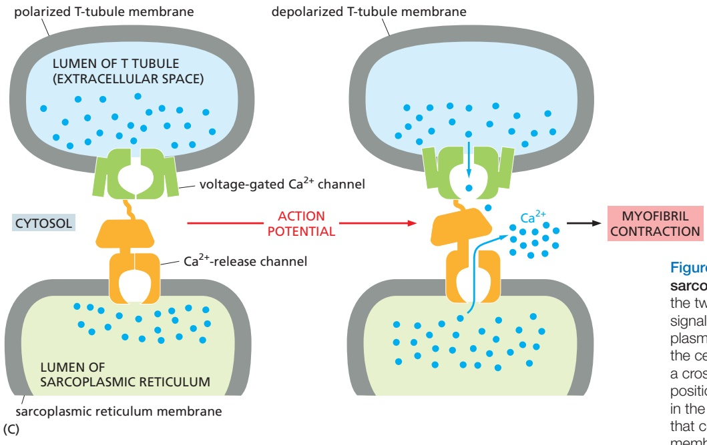

The $\mathrm { C a ^ { 2 + } }$ dependence of vertebrate skeletal muscle contraction, and hence its dependence on commands transmitted via nerves, is due entirely to a set of specialized accessory proteins that are closely associated with the actin thin filaments. One of these accessory proteins is a muscle form of tropomyosin, the elongated protein that binds along the groove of the actin filament helix.MBoC7 e17.44,45/16.30 The other is troponin, a complex of three polypeptides, troponins T, I, and C (named for their tropomyosin-binding, inhibitory, and $\mathbf { C a } ^ { 2 + } .$ -binding activities, respectively). Troponin I binds to actin as well as to troponin T. In a resting muscle, the troponin I–T complex pulls the tropomyosin out of its normal binding groove into a position along the actin filament that interferes with the binding of myosin heads, thereby preventing any force-generating interaction. When the level of $\mathrm { C a ^ { 2 + } }$ is raised, troponin C—which binds up to four molecules of $\mathrm { { C a ^ { 2 + } } }$ —causes troponin I to release its hold on actin. This allows the tropomyosin molecules to slip back into their normal position so that the myosin heads can walk along the actin filaments (Figure 16–31). Troponin C is closely related to the ubiquitous $\mathrm { C a ^ { 2 + } }$ -binding protein calmodulin (see Figure 15–34); it can be thought of as a specialized form of calmodulin that has acquired binding sites for troponin I and troponin T, thereby ensuring that the myofibril responds extremely rapidly to an increase in $\mathrm { C a ^ { 2 + } }$ concentration.

Figure 16–30 T tubules and the sarcoplasmic reticulum. (A) Drawing of the two membrane systems that relay the signal to contract from the muscle cell plasma membrane to all of the myofibrils in the cell. (B) Electron micrograph showing a cross section of a T tubule. Note the position of the large $\mathrm { C a ^ { 2 + } }$ -release channels in the sarcoplasmic reticulum membrane that connect to the adjacent T-tubule membrane. (C) Schematic diagram showing how a $\mathrm { C a ^ { 2 - } }$ -release channel in the sarcoplasmic reticulum membrane is thought to be opened by the activation of a voltage-gated $\mathrm { C a ^ { 2 + } }$ channel in the membrane of the T tubule (Movie 16.7). (B, courtesy of Clara Franzini-Armstrong.)

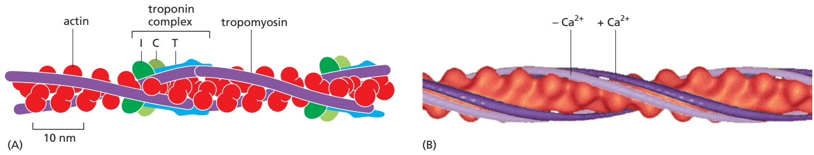

Figure 16–31 The control of skeletal muscle contraction by troponin. (A) A thin filament of a skeletal muscle cell, showing the positions of tropomyosin and troponin along the actin filament. Each tropomyosin molecule has seven evenly spaced regions with similar amino acid sequences, each of which is thought to bind to an actin subunit in the filament. (B) Reconstructed cryo-electron microscopy image of an actin filament showing the relative position of a superimposed tropomyosin strand in the presence (dark purple) or absence (light purple) of calcium. (A, adapted from G.N. Phillips et al., J. Mol. Biol. 192:111–131, 1986; B, adapted from C. Xu et al., Biophys. J. 77:985–992, 1999. With permission from the Biophysical Society.)

In smooth muscle cells, so called because they lack the regular striations of skeletal muscle, contraction is also triggered by an influx of calcium ions, but the regulatory mechanism is different. Smooth muscle forms the contractile portion of the stomach, intestine, and uterus, as well as the walls of arteries and many other structures requiring slow and sustained contractions. Smooth muscle is composed of sheets of highly elongated spindle-shaped cells, each with a single nucleus. Smooth muscle cells do not express the troponins. Instead, elevated intracellular $\mathrm { C a ^ { 2 + } }$ levels regulate contraction by a mechanism that depends on calmodulin (**Figure 16–32**). $\mathrm { C a ^ { 2 + } }$ -bound calmodulin activates myosin

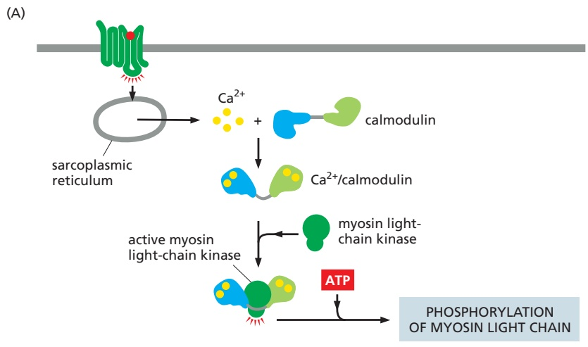

(B)

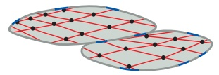

gur sc e contraction. (A) Upon muscle stimulation by activation of cell-surface receptors, Ca2+ released into the cytoplasm from the sarcoplasmic reticulum (SR) binds to calmodulin (see Figure 15–34). Ca2+-bound calmodulin then binds myosin light-chain kinase (MLCK), which phosphorylates myosin light chain, stimulating myosin activity. Non-muscle myosin is regulated by the same mechanism (see Figure 16–34). (B) Smooth muscle cells in a cross section of cat intestinal wall. The outer layer of smooth muscle is oriented with the long axis of its cells extending parallel along the length of the intestine, and upon contraction will shorten the intestine. The inner layer is oriented circularly around the intestine and when contracted will cause the intestine to become narrower. Contraction of both layers squeezes material through the intestine, much like squeezing toothpaste out of a tube. (C) A model for the contractile apparatus in a smooth muscle cell, with bundles of contractile filaments containing actin and myosin (red) oriented obliquely to the long axis of the cell. Their contraction greatly shortens the cell. In this diagram, the bundle angles are exaggerated to schematically illustrate the effect of contraction. In addition, only a few of the many bundles are shown. (B, courtesy of Gwen V. Childs.)

light-chain kinase (MLCK), thereby inducing the phosphorylation of smooth muscle myosin on one of its two light chains. When the light chain is phosphorylated, the myosin head can interact with actin filaments and cause contraction; when it is dephosphorylated, the myosin head tends to dissociate from actin and becomes inactive.

The phosphorylation events that regulate contraction in smooth muscle cells occur relatively slowly, so that maximum contraction often requires nearly a second (compared with the few milliseconds required for contraction of a skeletal muscle cell). But rapid activation of contraction is not important in smooth muscle: its myosin II hydrolyzes ATP about 10 times more slowly than does skeletal muscle myosin, producing a slow cycle of myosin conformational changes that results in slow contraction.

#### Heart Muscle Is a Precisely Engineered Machine

The heart is the most heavily worked muscle in the body, contracting about 3 billion $( 3 \times 1 0 ^ { 9 } )$ times during the course of a human lifetime (Movie 16.8). Heart cells express several specific isoforms of cardiac muscle myosin and cardiac muscle actin. Even subtle changes in these cardiac-specific contractile proteins— changes that would not cause any noticeable consequences in other tissues—can cause serious heart disease (**Figure 16–33**).

The normal cardiac contractile apparatus is such a highly tuned machine that a tiny abnormality anywhere in the works can be enough to gradually wear it down over years of repetitive motion. Familial hypertrophic cardiomyopathy is a common cause of sudden death in young athletes. It is a genetically dominant inherited condition that affects about two out of every thousand people, and it is associated with heart enlargement, abnormally small coronary vessels, and disturbances in heart rhythm (cardiac arrhythmias). The cause of this condition is either any one of more than 40 subtle point mutations in the genes encoding cardiac β-myosin heavy chain (almost all causing changes in or near the motor domain) or one of about a dozen mutations in other genes encoding contractile proteins—including myosin light chains, cardiac troponin, and tropomyosin. Minor missense mutations in the cardiac actin gene cause another type of heart condition, called dilated cardiomyopathy, which can also result in early heart failure.

#### Actin and Myosin Perform a Variety of Functions in Non-Muscle Cells

Most non-muscle cells contain contractile actin–myosin II assemblies that form transiently, enabling dynamic changes in cell morphology. Non-muscle contractile bundles are regulated by myosin phosphorylation rather than by troponin (**Figure 16–34A**). Contractile actin and myosin just beneath the plasma membrane in the cell cortex creates tension, and gradients in this tension lead to cell-shape changes. Actin–myosin II bundles also provide mechanical support by assembling into **stress fibers** that connect the cell to the extracellular matrix through focal adhesions or by forming a circumferential belt in an epithelial cell, connecting it to adjacent cells through adherens junctions (discussed in Chapter 19). As described in Chapter 17, actin and myosin II in the contractile ring generate the force for cytokinesis, the final stage in cell division. Finally, as discussed previously, contractile bundles also contribute to the adhesion and forward motion of migrating cells. Organization of contractile bundles is somewhat similar to the periodic organization of sarcomeres and involves many of the same proteins. However, non-muscle myosin II filaments are about sevenfold shorter than the thick filaments of skeletal muscle, and their formation is highly dynamic (**Figure 16–34B and C**).

Non-muscle cells also express a large family of other myosin proteins, which have diverse structures and functions in the cell. After the discovery of conventional muscle myosin, a second member of the family was found in the freshwater

2 mm

Figure 16–33 Effect on the heart of a subtle mutation in cardiac myosin. Left, normal heart from a 6-day-old mouse pup. Right, heart from a pup with a point mutation in both copies of its cardiac myosin gene, changing Arg403 to Gln. The arrows indicate the atria. In the heart from the pup with the cardiac myosin mutation, both atria are greatly enlarged (hypertrophic), and the mice die within aMBoC7 m16.38/16.33 few weeks of birth. (From D. Fatkin et al., J. Clin. Invest. 103:147–153, 1999. With permission from the American Society for Clinical Investigation.)

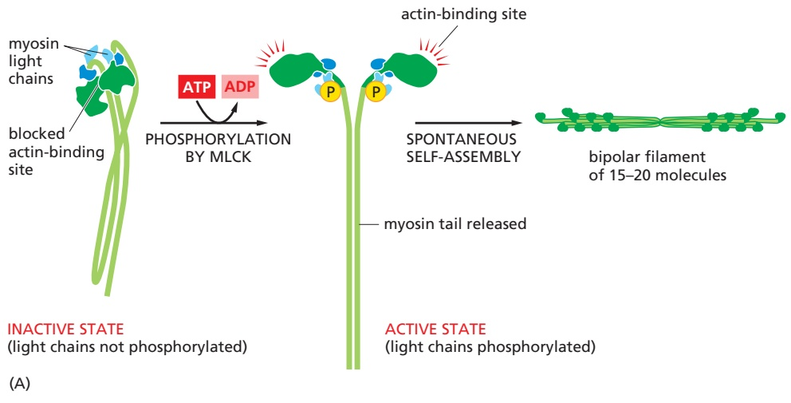

Figure 16–34 Light-chain phosphorylation and the regulation of the assembly of myosin II into thick filaments. (A) Phosphorylation by myosin light-chain kinase (MLCK) of one of the two light chains (the so-called regulatory light chain, shown in light blue) on non-muscle myosin II in a test tube has at least two effects: it causes a change in the conformation of the myosin heads, relieving steric inhibition to permit actin binding, and it releases the myosin tail from a “sticky patch” on the myosin head, thereby allowing the myosin molecules to assemble into short, bipolar, thick filaments. Smooth muscle is regulated by the same mechanism (see Figure 16–32). (B) Fluorescence micrograph showing the distribution of myosin light chain (yellow) and the actin filament cross-linker α-actinin (blue) in the contractile fibers of a rat embryo fibroblast. (C) A parallel stack of myosin filaments at higher magnification. These myosin II filaments are much smaller than those found in skeletal muscle cells (see Figure 16–22), but nevertheless form sarcomere-like units.MBoC7 m16.39/16.34 (B and C, courtesy of Shiqiong Hu and Alexander Bershadsky.)

amoeba Acanthamoeba castellanii. This protein had a different tail structure and seemed to function as a monomer, and so it was named myosin I (for oneheaded). Conventional muscle myosin was renamed myosin II (for two-headed). Subsequently, many other myosin types were discovered. The heavy chains generally start with a recognizable myosin motor domain at the N-terminus and then diverge widely with a variety of C-terminal tail domains (**Figure 16–35**). The myosin family includes a number of one-headed and two-headed varieties that are about equally related to myosin I and myosin II, and the nomenclature now reflects their approximate order of discovery (myosin III through at least myosin XVIII). Sequence comparisons among diverse eukaryotes indicate that there are at least 37 distinct myosin families in the superfamily. All of the myosins except one move toward the plus end of an actin filament, although they do so at different speeds. The exception is myosin VI, which moves toward the minus end. The myosin tails (and the tails of motor proteins generally) have apparently diversified during evolution to permit the proteins to bind other subunits and to interact with different cargoes.

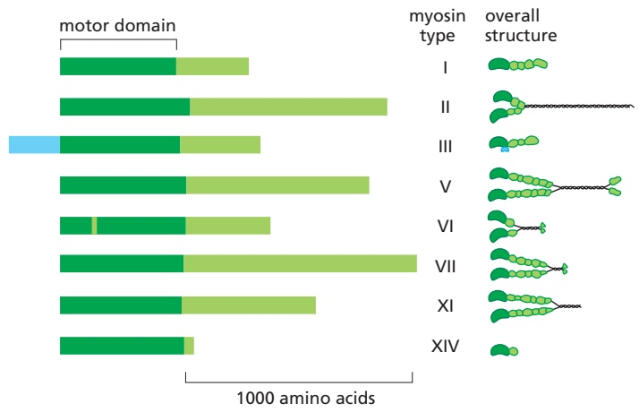

Figure 16–35 Myosin superfamily members. Comparison of the domain structure of the heavy chains of some myosin types. All myosins share similar motor domains (shown in dark green), but their C-terminal tails (light green) and N-terminal extensions (light blue) are very diverse. On the right are depictions of the molecular structures for these family members. Many myosins form dimers, with two motor domains per molecule, but a few (such as I, III, and XIV) seem to function as monomers, with just one motor domain. Myosin VI, despite its overall structural similarity to other family members, is unique in moving toward the minus end (instead of the plus end) of an actin filament. The small insertion within its motor head domain, not found in other myosins, is probably responsible for this change in direction.

Figure 16–36 Myosin V walks along actin filaments. (A) The lever arm of myosin V is long, allowing it to take a bigger step along an actin filament than can myosin II (see Figure 16–24). (B) Atomic force microscopy images showing myosin V (green) walking along an actin filament. Myosin V functions to carry cargo in cells. (B, adapted from N. Kodera and T. Ando, Biophys. Rev. 6:237–260, 2014. Reproduced with permission of SNCSC.)

Some myosins are found only in plants, and some are found only in vertebrates. Most, however, are found in all eukaryotes, suggesting that myosins arose early inMB C7 16.41/16.36 eukaryotic evolution. The human genome includes about 40 myosin genes. Nine of the human myosins are expressed primarily or exclusively in the hair cells of the inner ear, and mutations in five of them are known to cause hereditary deafness. These extremely specialized myosins are important for the construction and function of the complex and beautiful bundles of actin found in stereocilia that project from the apical surface of these cells; these cellular protrusions tilt in response to sound and convert sound waves into electrical signals.

The functions of most of the myosins remain to be determined, but several are well characterized. The myosin I proteins often contain either a second actin-binding site or a membrane-binding site in their tails, and they are generally involved in intracellular organization—including the protrusion of actin-rich structures at the cell surface, such as microvilli (see Panel 16–1 and Figure 16–4), and endocytosis. Myosin V is a two-headed myosin with a large step size (**Figure 16–36**) and is involved in organelle transport along actin filaments. In contrast to myosin II motors, which work in ensembles and are attached only transiently to actin filaments so as not to interfere with one another, myosin V moves continuously, or processively, along actin filaments without letting go. Myosin V functions are well studied in the yeast Saccharomyces cerevisiae, which undergoes a stereotypical pattern of growth and division called budding. Actin cables in the mother cell point toward the bud, where actin is found in patches that concentrate where cell-wall growth is taking place. Myosin V motors carry a wide range of cargoes—including mRNA, endoplasmic reticulum, and secretory vesicles—along the actin cables and into the bud (see Figure 16–76).

#### Summary

Using their neck domain as a lever arm, myosins convert ATP hydrolysis into mechanical work to move along actin filaments in a stepwise fashion. Skeletal muscle is made up of myofibrils containing thousands of sarcomeres assembled from highly ordered arrays of actin and myosin II filaments, together with many accessory proteins. Muscle contraction is stimulated by calcium, which causes the actin filament–associated protein tropomyosin to move, uncovering myosin binding sites and allowing the filaments to slide past one another. Smooth muscle and non-muscle cells have less well-ordered contractile bundles of actin and myosin, which are regulated by myosin light-chain phosphorylation. Myosin V transports cargo by walking along actin filaments.

<!-- END EN EN16-H000-H046 -->

### 英文补充：细胞极性、Rho家族与协调迁移

> 对应中文板块：细胞极性、Rho家族与协调迁移。英文来源：Molecular Biology of the Cell，第7版，第16章；[本章完整原文](../../来源/英文教材/16_The_Cytoskeleton/chapter.md)。物理PDF页码范围：988–1065（整章范围）。

<!-- BEGIN EN EN16-H070-H077 -->
#### CELL POLARITY AND COORDINATION OF THE CYTOSKELETON

A central challenge in cell biology is to understand how multiple individual molecular components collaborate to produce complex cell behaviors. Cell polarity, which we describe in this final part of the chapter, controls many aspects of cell function, such as the direction of protein secretion and signaling, the orientation of cell division, and the path a migrating cell will take. Cells polarize in response to extracellular cues or intracellular landmarks to establish specific domains on their surface. Coordination with the cytoskeleton is then required for a cell to build different structures with distinct molecular components at the front versus the back, or at the top versus the bottom. In this way, the cytoskeleton acts to transduce polarity signals to generate whole-cell organization and behavior. Carefully controlled cell-polarization processes are also required for oriented cell divisions in tissues and for development of a coherent, organized multicellular organism.

Genetic studies in yeast, flies, and worms have provided most of our current understanding of the molecular basis of cell polarity. As we shall see, with increasing complexity of a cellular system comes greater elaboration of polarity-determining mechanisms. However, many of the molecular components have been evolutionarily conserved, and in all cases the cytoskeleton plays a central role.

#### Cell Polarity Is Governed by Small GTPases in Budding Yeast

The establishment of cell polarity often begins with local regulation of the actin cytoskeleton by external or internal signals. Many polarity signals converge just beneath the plasma membrane through activation of a group of closely related small monomeric GTPases that are members of the **Rho family**—Cdc42, Rac, and Rho. Like other monomeric GTPases, the Rho proteins act as molecular switches that cycle between an active GTP-bound state and an inactive GDP-bound state (see Figure 3–63). The state of each GTPase depends on dedicated regulatory proteins. Guanine nucleotide exchange factors (GEFs) are required to activate

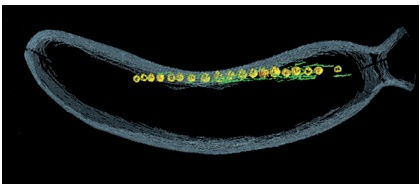

(A)

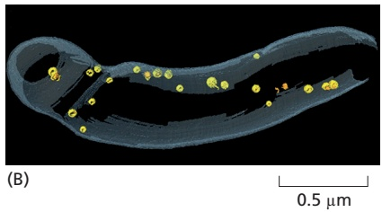

Figure 16–74 MamK organizes

chains of magnetosomes. (A) Threedimensional reconstruction of a wild-type Magnetospirillum magneticum cell showing the cell membrane (gray),MBoC7 n16.202/16.74 magnetosomes (yellow), and magnetosome-associated MamK filaments (green). (B) Magnetosomes appear disordered in a mamk deletion mutant, and no filaments are observed. (C) Magnetosomes are formed from invaginations of the plasma membrane and form chains along MamK filaments. (A and B, adapted from A. Komeili et al., Science 311:242–245, 2006. With permission from AAAS.)

actin staining

(A) QUIESCENT CELLS

actin staining

(C) Rac ACTIVATION

(B) Cdc42 ACTIVATION

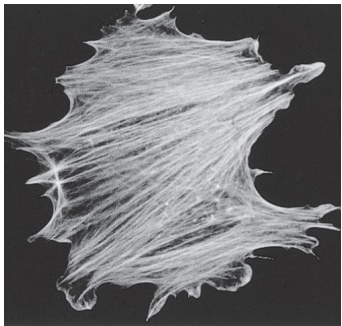

(D) Rho ACTIVATION

20 µm

the GTPase by replacing tightly bound GDP with GTP, whereas GTPase activating proteins (GAPs) inactivate the GTPase by promoting GTP hydrolysis, which is otherwise very slow. In addition, guanine nucleotide dissociation inhibitors (GDIs) can bind to the GDP-bound form of a GTPase and inhibit GTP exchange by a GEF.

When the GTP-bound form of each Rho family GTPase is introduced into a fibroblast cell, dramatic changes in cell shape are observed. Active Cdc42 leads to the formation of many long filopodia at the cell surface. Activation of Rac promotes actin polymerization at the cell periphery, leading to the formation of sheet-like lamellipodial protrusions. Activation of Rho promotes both the bundling of actin filaments with myosin II filaments into stress fibers and the clustering of integrins and associated proteins to form focal adhesions (**Figure 16–75**). These dramatic and complex structural changes occur because each of these three molecular switches has numerous downstream target proteins that affect actin organization and dynamics. Normally, however, these GTPase pathways are not activated uniformly throughout the cell as in this experiment, but are deployed with pre-cise spatial and temporal regulation to generate polarized subcellular structures, which in turn give rise to changes in cell shape and behavior.

Cdc42 is the most highly conserved of all the Rho family GTPases and a master regulator of cell polarity in many cell types. Its importance in the establishment of cell polarity is illustrated by its role in the budding yeast Saccharomyces cerevisiae, which undergoes a highly polarized cell division. The formation of a new bud begins with the selection of a single bud site on the cell surface. It is crucial that only a single site is selected, because producing more than one bud would be detrimental to cell division. Before bud site selection, inactive GDP-bound Cdc42 is uniformly distributed on the cell membrane. Occasionally, a Cdc42 molecule will release its GDP and bind GTP, leading to the formation of multiple GTP-Cdc42 foci at random locations in the membrane. Eventually, one of these Cdc42 molecules recruits a protein kinase called PAK, which in turn recruits a scaffold protein together with the Cdc42 GEF. The GEF-containing complex promotes activation of neighboring GDP-bound Cdc42 molecules, resulting in positive feedback. The clustering of Cdc42-GTP molecules at a single site depletes the cytoplasmic pool of

Figure 16–75 The dramatic effects of Cdc42, Rac, and Rho on actin organization in fibroblasts. In each case, the actin filaments have been labeled with fluorescent phalloidin. (A) Serum-starved fibroblasts have actin filaments primarily in the cortex and relatively few stress fibers. (B) Microinjection of a constitutively activated form of Cdc42 results in many long filopodia at the cell periphery. (C) Microinjection of a constitutively activated form of Rac causes the formation of an enormous lamellipodium that extends from the entire circumference of the cell. (D) Microinjection of a constitutively activated form of Rho causes the rapid assembly of many prominent stress fibers. (From A. Hall, Science 279:509–514, 1998. With permission from Catherine Nobes.)

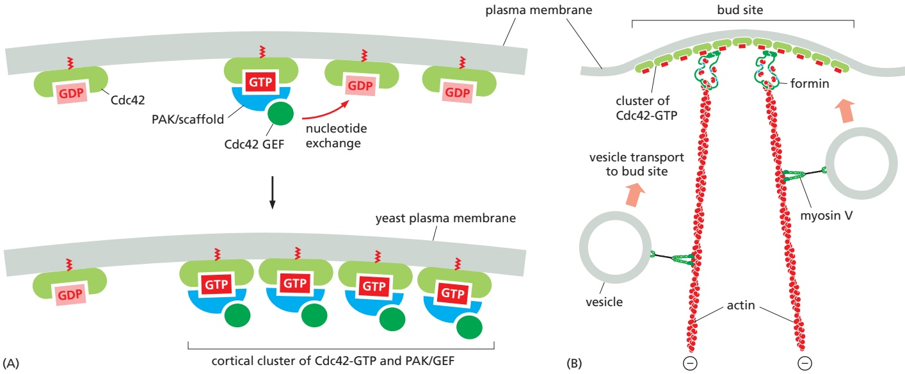

Figure 16–76 Cdc42 establishes yeast-cell polarity. (A) A positive feedback loop by which Cdc42-GTP recruits its own GEF to the plasma membrane to generate a focal site of Cdc42 activity. (B) Local activation of a formin protein by Cdc42- GTP nucleates actin filament assembly. Transport of vesicles along these actin filaments toward their plus ends by myosin V delivers cargoes necessary for growth of the bud.

the Cdc42 GEF, thereby ensuring the formation of just one localized site of Cdc42 activation (**Figure 16–76A**). This cluster of Cdc42-GTP then transmits a signal that polarizes the cytoskeleton by recruiting and activating a formin protein. Recall that formins stimulate rapid assembly of long, straight actin filaments and remain tethered at their plus ends (see Figure 16–13). The resulting actin filaments enable bud growth through the delivery of secretory vesicles and other cargoes to the polarity site by type V myosins (**Figure 16–76B**; see also Figure 16–36). In addition, both PAK and formin contribute to assembly of septin filaments at the bud neck (see Figure 16–68A). Thus, a low level of Cdc42 activity is locally amplified by positive feedback to initiate the polarized assembly of actin and septins at a single site on the mother cell. Downstream effectors then contribute to bud growth and polarized cell division to produce a daughter cell.

#### PAR Proteins Generate Anterior–Posterior Polarity in Embryos

Most animal cells do not polarize toward a single membrane site like budding yeast, but instead form complementary cortical domains that mark opposite ends of the cell. This form of polarity has been studied extensively in the early stages of embryonic development of the nematode Caenorhabditis elegans. The unfertilized egg is symmetrical, but the fertilized egg, or zygote, rapidly establishes the anterior–posterior axis. The first cell division then occurs asymmetrically along this axis, giving rise to two daughter cells that are of different sizes, compositions, and fates (see Figure 17–50). Genetic screens for mutants defective in this asymmetrical cell division identified partitioning defective (par) genes that encode the so-called PAR proteins. Subsequent studies revealed that other factors are also involved, and the precise molecular mechanisms by which anterior–posterior polarity is established in this system remain under active investigation.

The initial events leading to polarization of the zygote depend on regulation of the cortical actin cytoskeleton by the GTPase Rho. Egg symmetry is first broken when the sperm enters the egg, which marks the location of the posterior end of the embryo. The centrosome associated with the sperm nucleates a microtubule aster, which through an unknown mechanism depletes the Rho GEF from the acto-myosin cortex in that region of the cell. Local loss of Rho activity decreases myosin II–dependent cortical contractility, resulting in greater tension toward the other end of the cell. This asymmetry then sets up localization of the PAR proteins so that they occupy separate cortical domains.

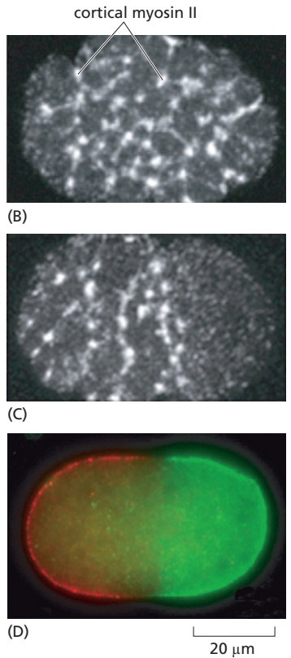

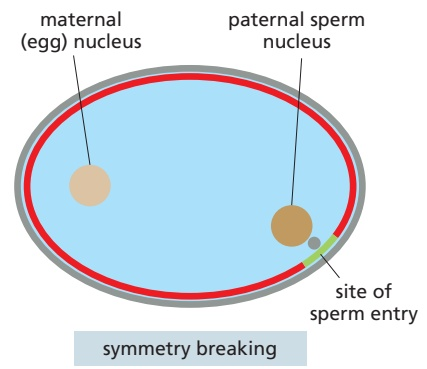

Figure 16–77 PAR proteins establish two distinct cortical domains in C. elegans. (A) Symmetry breaking and polarity establishment occur in the fertilized egg before the maternal and paternal nuclei meet. After sperm entry, its centrosome duplicates and nucleates microtubules that decrease Rho GEF activity at what will become the posterior end of the embryo. This leads to accumulation of the anterior PAR proteins (including Par-3), allowing posterior PAR proteins (including Par-2) to bind the cortex at the posterior end. (B) Prior to fertilization, bundles of fluorescently labeled myosin II (white) are distributed throughout the cortex of the unpolarized egg because of the uniform distribution of activated Rho all along the plasma membrane, resulting in uniform cortical acto-myosin contractility. (C) After fertilization, local depletion of the Rho GEF near the sperm entry site (at right in this image) reduces myosin levels and contractility in the posterior cortex of the cell. (D) Par complex localization after polarization with Par-3 (red) at the anterior and Par-2 (green) at the posterior of the zygote. Multiple mechanisms operate to maintain this asymmetry through mutual antagonism between anterior and posterior PAR proteins. (B and C, from L. Rose and P. Gönczy, The C. elegans Research Community, WormBook, 2014, doi 10.1895/wormbook.1.30.2; D, from J. Nance and J.A. Zallen, Development 138:799–809, 2011. With permission from the Company of Biologists.)

One set of PAR proteins, the anterior PAR proteins, includes Par-3, Par-6, Cdc42, and atypical protein kinase C (aPKC). Initially unpolarized at the cortex, these proteins move toward the anterior because of the change in contractilityMBoC7 n16.208/16.77 that causes flow within the membrane. Enrichment of the anterior PAR proteins actively displaces another set of proteins (the posterior PAR proteins, including Par-1 and Par-2), which then bind to the posterior cortex (**Figure 16–77**). These complementary cortical domains are maintained by mutual antagonism between the anterior and posterior components, which occurs through multiple mechanisms. For example, phosphorylation by aPKC in the anterior region excludes the posterior PAR proteins, while the posterior PAR proteins suppress aPKC activity in their domain. It remains unclear how PAR proteins then direct the trafficking and localization of other proteins to define the cortical domains. As in yeast, the master polarity regulator Cdc42, which is activated exclusively at the anterior cortex, likely plays a key role.

In all animal species, mechanisms that establish polarity in the embryo determine the overall body plan (see Chapter 21). Subsequent polarized cell divisions produce daughter cells that are destined to become different tissues in the organism. In this way, the establishment of intracellular polarity early in development sets the stage for polarity throughout the adult animal.

#### Conserved Complexes Polarize Epithelial Cells and Control Their Growth

All animal cells are polarized in some way, perhaps most prominently in the epithelial cells that make up many tissues. Epithelia are sheets of tightly connected cells that line the surface of organs and act as highly selective barriers, such as the barriers between the skin and the outside environment or between the lumen of the gut and its surrounding tissues. Epithelial cells have two distinct domains: the apical domain at the upper surface, which faces the outside environment, and

200 µm

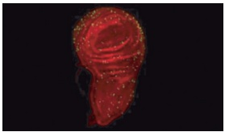

(B)

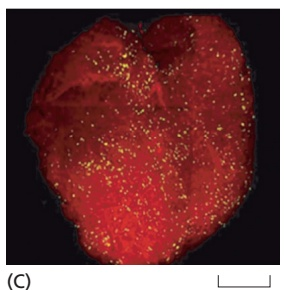

(D)

the basolateral domain at the bottom and side surfaces, which face the underlying matrix and adjacent cells (see Figure 16–4). Cell polarization is initiated by cues from the adjacent cells or the extracellular matrix. An important early step is the formation of cell–cell junctions that separate the apical and basolateral domains and hold the epithelial sheet together (see Chapter 19). In addition, as discussed earlier (see Figure 16–44), microtubules become aligned with their minus ends anchored at the apical surface and their plus ends pointing basally.MBoC7 n16 209/16.78 This arrangement helps to polarize the secretory system so that nascent secreted and membrane proteins are transported to the appropriate domain. For example, digestive enzymes must be secreted exclusively into the lumen of the gut to avoid extensive damage to the surrounding tissues.

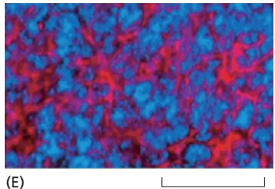

25 µm

#### Cell Migration Requires Dynamic Cell Polarity

Much of what we know about the regulators of epithelial polarity comes from genetic screens that identified polarity-deficient mutants in Drosophila. These screens revealed some familiar proteins, including Cdc42 and the anterior PAR proteins, which in this system localize to the apical domain. In addition, two other protein groups were identified, termed Crumbs and Scribble, which are located in the apical and basolateral domains, respectively. Cells cannot form an apical domain in the absence of PAR or Crumbs proteins. In contrast, the apical domain is greatly expanded in the absence of Scribble proteins. This and other evidence indicate that mutual antagonism between apical and basolateral regulators helps maintain cell polarity and junctional contacts (**Figure 16–78A**). Downstream of the PAR, Crumbs, and Scribble modules, the organization of epithelial cell junctions, cytoskeleton, and secretory pathway is mediated by Rho family GTPases; the mechanisms underlying this regulation are not well understood.

Disruption of these polarity modules can lead to cellular growth defects, often through misregulation of a signaling system called the Hippo pathway (see Figure 21–67). For example, mutation of Scribble in epithelia of the developing fly larva not only leads to the loss of polarized cell organization but also promotes massive and invasive overgrowth, all characteristics of malignant tumors (**Figure 16–78B, C, D, and E**). Because Scribble proteins also help maintain polarity and normal growth in human epithelial tissues, they act as tumor suppressors (see Chapter 20).

Whereas epithelial cells maintain a polarized state throughout their lifetime to perform an essential barrier function within tissues, migrating cells display a dynamic polarity that requires continual long-distance communication and coordination between one end of a cell and the other. In addition to driving local mechanical processes such as protrusion at the front and retraction at the rear,

(A) PAR and Crumbs proteins cooperate to assemble the apical domain and junctional complexes, whereas Scribble defines the basolateral domain. Scribble and PAR are mutually antagonistic, whereas PAR and Crumbs reinforce each other. Cdc42 helps to recruit PAR proteins. (B) Fluorescence micrograph of a wild-type Drosophila larval epithelial tissue called the imaginal disc stained for actin (red) shows the wellorganized, folded monolayer epithelium. (C) In a Scribble mutant, the imaginal disc has lost its normal morphology and grown dramatically larger because of hyperproliferation. Actively dividing cells are labeled yellow. (D) Higher-magnification image of a wild-type disc shows the polarized localization of actin (red) to the apical domain. (E) Actin organization is disrupted in the absence of Scribble. Nuclei are stained blue. (B and C, courtesy of David Bilder; D and E, from D. Bilder et al., Science 289:113–116, 2000. With permission from AAAS.)

the cytoskeleton is responsible for coordinating cell shape, organization, and mechanical properties along its entire length, a distance that is typically tens of micrometers for animal cells. As we shall see, the Rho family GTPases and several cell-polarity proteins that we have already introduced are central to this process.

Cell locomotion requires an initial polarization of the cell to propel it in a particular direction. Once again, Cdc42 appears to be critical, as it sets up the overallMBoC7 n16.210/16.79 polarity of a migrating cell. The downstream effectors of Cdc42-GTP include the polarity protein Par-3, and Cdc42 is also thought to stimulate extension of filopodia (see Figure 16–75) that help sense and respond to extracellular cues. Once polarized, protrusion of the leading edge of the cell is driven through nucleation of branched actin filaments by the Arp2/3 complex (see Figure 16–12). This process depends on Rac-GTP, which stimulates members of the WAVE family of actin nucleation-promoting factors (NPFs). A WAVE protein, present in a large regulatory complex, can exist in an inactive folded conformation and an activated open conformation. Association with Rac-GTP recruits WAVE to the plasma membrane and stabilizes the open conformation (**Figure 16–79A**). Active WAVE then stimulates nucleation of new actin filaments by Arp2/3 along the sides of existing filaments (see Figures 16–12 and 16–14A). In this way, Rac-GTP–dependent WAVE promotes the formation of branched actin networks that drive lamellipod formation at the leading edge of migrating cells (**Figure 16–80A**).

Figure 16–79 Regulation of nucleationpromoting factors and formins by Rho family GTPases. (A) Members of the WAVE family of nucleation-promoting factors are activated upon binding to Rac-GTP at the plasma membrane. A conformational change in WAVE opens up the protein, allowing domains that were previously inaccessible to interact with both the Arp2/3 complex and profilinbound actin subunits. For clarity, the WAVE regulatory complex is not shown. (B) The activity of some formin proteins is inhibited by an autoinhibitory interaction in the absence of an active GTPase. Binding to Rho-GTP exposes a binding site for the plus end of an actin filament, as well as profilin–actin binding domains.

Rho-GTP is equally important for cell migration and has a very different set of targets. Instead of activating the Arp2/3 complex to build branched actin networks, Rho-GTP induces formin proteins to construct parallel actin bundles. Similar to the effects of Rac-GTP on WAVE, association of formins with Rho-GTP stabilizes an open, active conformation (**Figure 16–79B**). As discussed previously, formins stimulate both the nucleation and elongation of straight actin filaments (see Figures 16–13 and 16–14B). At the same time, Rho-GTP activates the Rho-associated kinase (ROCK), which stimulates another kinase called LIM, which phosphorylates and inhibits the activity of the actin-destabilizing protein cofilin. The resulting stable, unbranched actin filaments are ideal for interacting with myosin II. Furthermore, ROCK activates myosin II by inhibiting a phosphatase acting on myosin light chains (see Figure 16–34). The consequent increase in the net amount of myosin light-chain phosphorylation increases the level of contractile myosin motor-protein activity in the cell, enhancing the formation of tension-dependent structures such as stress fibers and focal adhesions (**Figure 16–80B**).

Spatial and temporal separation between the Rac and Rho pathways is thought to facilitate maintenance of the large-scale differences between the cell front and the cell rear during migration. Whereas Rac is activated exclusively at the leading edge of the cell, Rho activation predominates at the rear. Furthermore, the two pathways are mutually antagonistic. For example, Rac inhibits Rho activity through one of its effectors, the kinase PAK, which inhibits myosin II and therefore contractility. Rac and Rho also modulate the activities of the other’s GEFs, GAPs, or GDIs to reinforce spatial separation of their activities.

#### External Signals Can Dictate the Direction of Cell Migration

**Chemotaxis** is the movement of a cell toward or away from a source of some diffusible chemical. These external signals act through cell surface receptors that trigger Rho family proteins to polarize and orient the cell motility apparatus,MBoC7 m16.85/16.80 enabling directed cell migration. One well-studied example is the chemotactic movement of a class of white blood cells, called neutrophils, toward a source of bacterial infection. Receptor proteins on the surface of neutrophils enable them to detect very low concentrations of N-formylated peptides that are derived from bacterial proteins (only prokaryotes begin protein synthesis with N-formylmethionine). Using these receptors, neutrophils are guided to bacterial targets by their ability to detect a difference of only 1% in the concentration of these diffusible peptides on one side of the cell versus the other (**Figure 16–81A**).

In this case, and in the chemotaxis of Dictyostelium amoebae toward a source of cyclic AMP, binding of the chemoattractant to its G-protein-coupled receptor activates phosphoinositide 3-kinases (PI3Ks) (see Figure 15–53), which generate a signaling molecule $\mathrm { [ P I ( 3 , } 4 \mathrm { , } 5 \mathrm { ) P _ { 3 } ] }$ that in turn activates the Rac GTPase. Rac then activates the $\mathrm { A r p 2 } / 3$ complex leading to lamellipodial protrusion. Through an unknown mechanism, accumulation of the polarized actin network at the leading edge causes further local enhancement of PI3K activity in a positive feedback loop, strengthening the induction of protrusion. The $\mathrm { P I ( 3 , } 4 \mathrm { , } 5 \mathrm { ) P _ { 3 } }$ that activates Rac cannot diffuse far from its site of synthesis, because it is rapidly converted back into $\mathrm { P I ( 4 , } 5 \mathrm { ) P _ { 2 } }$ by a constitutively active lipid phosphatase. At the same time, binding of the chemoattractant ligand to its receptor activates another signaling pathway that turns on Rho and enhances myosin-based contractility. As described in the previous section, these two pathways directly inhibit each other, such that Rac activation dominates in the front of the cell and Rho activation dominates in the rear (**Figure 16–81B**). This enables the cell to maintain its functional polarity with protrusion at the leading edge and contraction at the back.

Nondiffusible chemical cues attached to the extracellular matrix or to the surface of cells can also influence the direction of cell migration. When these signals activate receptors, they can cause increased cell adhesion and directed actin polymerization. Most long-distance cell migrations in animals, including neural-crest-cell migration and the travels of neuronal growth cones, depend on a combination of diffusible and nondiffusible signals to steer the locomoting cells or growth cones to their proper destinations.

Figure 16–80 The contrasting effects of Rac and Rho activation on actin organization. (A) Activation of the small GTPase Rac leads to alterations in actin accessory proteins that promote the formation of protrusive actin networks in lamellipodia and pseudopodia. Several different pathways contribute independently. Rac-GTP activates members of the WAVE protein family, which in turn activate actin nucleation and branched network formation by the Arp2/3 complex. In a parallel pathway, Rac-GTP activates the protein kinase PAK, which has several targets including the myosin light-chain kinase (MLCK), which is inhibited by phosphorylation. Inhibition of MLCK results in decreased phosphorylation of the myosin regulatory light chain and leads to myosin II filament disassembly and a decrease in contractile activity. In some cells, PAK also directly inhibits myosin II activity by phosphorylation of the myosin heavy chain (MHC). (B) Activation of the related GTPase Rho leads to nucleation of actin filaments by formins and increases contraction by myosin II, promoting the formation of contractile actin bundles at the rear of the cell and assembly of stress fibers. Activation of myosin II by Rho requires a Rho-associated kinase called ROCK. This kinase inhibits the phosphatase that removes the activating phosphate groups from myosin II light chains (MLC); it may also directly phosphorylate the myosin light chains in some cell types. ROCK also activates other protein kinases, such as LIM kinase, which in turn contributes to the formation of stable contractile actin filament bundles by inhibiting the actindepolymerizing factor cofilin. A similar signaling pathway is important for forming the contractile ring necessary for cytokinesis (see Figure 17–45).

#### Communication Among Cytoskeletal Elements Supports Whole-Cell Polarity and Locomotion

The interconnected cytoskeleton is crucial for cell polarity and migration. Although polarity signals are frequently transduced by Rho family GTPases that act primarily on the actin cytoskeleton and myosin contractility, microtubules, septins, and intermediate filaments also participate. For example, vimentin intermediate filament networks associate with integrins at focal adhesions, and vimentin-deficient fibroblasts display impaired mechanical stability, migration, and contractile capacity. Furthermore, disruption of linker proteins that connect different cytoskeletal elements, including several plakins and KASH proteins, leads to defects in cell polarization and migration. Thus, interactions among cytoplasmic filament systems, as well as mechanical linkage to the nucleus, are required for complex, whole-cell behaviors such as migration.

Cells also use microtubules to support cell polarity and to organize persistent movement in a specific direction. Cross-linking proteins connect microtubule minus and plus ends to actin at the apical and basal cortex of epithelial cells, respectively. They also link the plus ends of microtubules and actin at the front of migrating cells. An example of such a cross-linker is the formin proteins, a subset of which binds to microtubules in addition to regulating actin filament assembly. These interactions enable microtubules to influence actin rearrangements and cell adhesion. By extending from the centrosome into the protrusive region of a migrating cell, microtubules can also serve as a compass to aid in directed cell migration. Microtubules also influence actin and focal adhesions by serving as tracks for motor-dependent transport of cargoes to and from the cell periphery. They can also deliver regulatory proteins, such as Rac GEFs, which bind to the +TIPs traveling on growing microtubule ends. Thus, microtubules reinforce the polarity information that the actin cytoskeleton receives from the outside world, allowing a sensitive response to weak signals and enabling motility to persist in the same direction for a prolonged period.

#### Summary

Cell polarity and migration require large-scale shaping and structuring of cells. This involves the coordinated activities of all three basic filament systems along with a large variety of regulatory and motor proteins. Rho family proteins work together with cell-polarity proteins to establish stable cytoskeletal structures necessary to generate higher levels of polarity within an organism or to maintain epithelial tissues. These same factors also operate during the dynamic polarization required for directed cell migration—a widespread behavior important in embryonic development and also in wound healing, tissue maintenance, and immune system function in the adult animal—providing a prime example of complex, coordinated cytoskeletal action influenced by external cues.

Figure 16–81 Neutrophil polarization and chemotaxis. (A) The pipette tip at the right is leaking a small amount of the bacterial peptide formyl-Met-Leu-Phe, which is recognized by the human neutrophil as the product of a foreign invader. The neutrophil quickly extends a new lamellipodium toward the source of the chemoattractant peptide (top). It then extends this lamellipodium and polarizes its cytoskeleton so that contractile myosin II is located primarily at the rear, opposite the position of the lamellipodium (middle). Finally, the cell crawls toward the source of the peptide (bottom). If a real bacterium were the source of the peptide, rather than an investigator’s pipette, the neutrophil would engulf the bacterium and destroy it (see also Figure 16–3 and Movie 16.17). (B) Binding of bacterial molecules to G-protein-coupled receptors on the neutrophil stimulates directed motility. These receptors are found all over the surface of the cell, but are more likely to be bound to the bacterial ligand at the front. Two distinct signaling pathways contribute to the cell’s polarization. At the front of the cell, stimulation of the Rac pathway leads, via the trimeric G protein Gi, to growth of protrusive actin networks. Second messengers within this pathway are short-lived, so protrusion is limited to the region of the cell closest to the stimulant. The same receptor also stimulates a second signaling pathway, via the trimeric G proteins $\mathsf { G } _ { 1 2 }$ and $\mathsf { G } _ { 1 3 } ,$ that triggers the activation of Rho. The two pathways are mutually antagonistic. Because Rac-based protrusion is active at the front of the cell, Rho is activated only at the rear of the cell, stimulating contraction of the cell rear and assisting directed movement. (A, from O.D. Weiner et al., Nat. Cell Biol. 1:75–81, published 1999 by Macmillan Magazines Ltd. Reproduced with permission of SNCSC.)

<!-- END EN EN16-H070-H077 -->

### 英文补充：病原体借用宿主细胞骨架移动

> 对应中文板块：病原体借用宿主细胞骨架移动。英文来源：Molecular Biology of the Cell，第7版，第23章；[本章完整原文](../../来源/英文教材/23_Pathogens_and_Infection/chapter.md)。物理PDF页码范围：1352–1391（整章范围）。

<!-- BEGIN EN EN23-H021-H021 -->
#### Bacteria and Viruses Use the Host-Cell Cytoskeleton for Intracellular Movement

As mentioned earlier, many pathogens escape into the cytosol rather than remaining in a membrane-enclosed compartment. The cytosol of mammalian cells is extremely viscous, as it is crowded with protein complexes, organelles, and cytoskeletal filaments, all of which inhibit the diffusion of particles the size of a bacterium or a viral nucleocapsid. Thus, to reach a particular region of the host cell, a pathogen must be actively moved there. As with transport of intracellular organelles, pathogens generally use the host cell’s cytoskeleton for their active movement.

Several pathogens have adopted a remarkable mechanism that depends on actin polymerization for their movement. These include the human bacterial pathogens Listeria monocytogenes, Shigella flexneri, Rickettsia rickettsii (which causes Rocky Mountain spotted fever), and Burkholderia pseudomallei (which causes melioidosis, a disease characterized by severe respiratory symptoms), as well as Ebola virus and the insect virus baculovirus. All induce the nucleation and assembly of host-cell actin filaments at one pole of the microbe. The growing filaments generate force and push the pathogens through the cytosol at rates of up to 1 µm/min (**Figure 23–29**). New filaments form at the rear of each pathogen and are left behind like a rocket trail as the microbe advances; the filaments depolymerize within a minute or so as they encounter depolymerizing factors in the cytosol. For L. monocytogenes and S. flexneri, the moving bacteria collide with the plasma membrane and move outward, inducing the formation of long, thin, host-cell protrusions with the bacteria at their tip. A neighboring cell often engulfs these projections, allowing the bacteria to enter the neighbor’s cytoplasm without exposure to the extracellular environment, thereby avoiding antibodies produced by the host’s adaptive immune system. For B. pseudomallei, movement and collision of the bacteria with the plasma membrane promote cell–cell fusion, which serves a similar purpose of immune avoidance while aiding continued bacterial replication.

The molecular mechanisms of pathogen-induced actin assembly differ for the different pathogens, suggesting that they evolved independently (**Figure 23–30**). L. monocytogenes and baculovirus produce proteins that directly bind to and activate the Arp2/3 complex to initiate the formation of an actin tail and movement (see Figure 16–17). S. flexneri produces an unrelated surface protein that binds to and activates the NPF N-WASp, which then activates the Arp2/3 complex. Rickettsia and Burkholderia species produce proteins that directly polymerize actin, for example by mimicking the function of host proteins such as formins (see Figure 16–13).

Many viral pathogens rely primarily on microtubule-dependent motor proteins, rather than actin polymerization, to move within the host-cell cytosol, taking advantage of the inherent polarity of microtubules to enable directed longrange movements. Important examples are viruses that infect neurons, such as the neurotropic alphaherpesviruses, which include the virus that causes chickenpox (**Figure 23–31**). These virions enter sensory neurons at the tips of their axons and move by retrograde (“backward”) axonal transport along the axon toward the microtubule minus end. The transport is mediated by attachment of viral capsid proteins to the motor protein dynein. These viruses then establish eitherMBoC7 m23.29/23.30 productive or latent infection in the nuclei of neurons of the peripheral nervous system. After replication or reactivation, virions are then carried by anterograde (“forward”) axonal transport along microtubules to the axon tips, with the transport being mediated by the attachment of a different viral capsid protein to a kinesin motor protein. Many other viruses associate with either dynein or kinesin motor proteins to move along microtubules at some stage in their replication, and some even alter the dynamic assembly and disassembly of microtubules. As microtubules serve as oriented tracks for vesicular transport in all cell types, not just neurons, it is not surprising that many viruses have independently evolved the ability to exploit them for their own transport.

<small>Figure 23–29 The actin-based movement of bacterial pathogens within and between host cells. After invasion, bacterial pathogens such as L. monocytogenes, S. flexneri, R. rickettsii, and B. pseudomallei induce the assembly of actin-rich tails in the host-cell cytoplasm, which drives rapid bacterial movement. For most of these pathogens, the moving bacteria collide with the host-cell plasma membrane to form membrane-covered protrusions, which are engulfed by neighboring cells—spreading the infection from cell to cell. In contrast, for B. pseudomallei, collision with the plasma membrane promotes cell–cell fusion, creating a conduit through which bacteria can invade neighboring cells (Movie 23.7).</small>

Figure 23–30 Molecular mechanisms for actin nucleation by various bacterial pathogens. L. monocytogenes and S. flexneri induce actin nucleation by recruiting and activating the host Arp2/3 complex (see Figure 16–12), although each uses a different recruitment strategy: L. monocytogenes expresses a surface protein, ActA, that directly binds to and activates the Arp2/3 complex; S. flexneri expresses a surface protein, IcsA (unrelated to ActA), that recruits the host NPF N-WASp, which in turn recruits the Arp2/3 complex, along with other host proteins, including WIP (WASp-interacting protein). R. rickettsii uses an entirely different strategy: it expresses a surface protein, Sca2, that directly nucleates actin polymerization by mimicking the activity of host formin proteins.

Figure 23-31 Microtubule-based movement of viruses. Neurotropic alphaherpesviruses infect peripheral nerve cells from neighboring epithelial cells in the skin. Virus particles are then transported along microtubules in the nerve-cell axon toward the microtubule minus ends in the cell body (retrograde transport), a process that is driven by dynein motor proteins. Upon reaching the cell body, viruses can establish a latent reservoir in the nucleus. After reactivation (for example, following stress 7 23.102/23.31or immune suppression) or upon replication, virus particles are again transported along microtubules in the axon, this time toward the microtubule plus ends at the nerve terminal (anterograde transport), where they are released to enable local reinfection and spread. In rare instances, viruses can instead spread to the central nervous system (CNS), which can cause encephalitis.

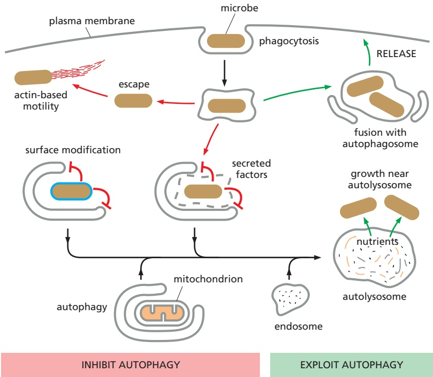

Figure 23–32 Microbial manipulation of autophagy. Microbial pathogens have various mechanisms for avoiding antimicrobial autophagy (red lines), which include modifying their surface to avoid autophagy initiation or secreting factors and initiating actin-based motility to avoid enclosure in autophagosomes. Microbes can also exploit autophagy (green arrows), for example by recruiting and fusing with autophagosomes to gain nutrients and lipids or by growing near autolysosomes for nutrient acquisition.

Many Microbes Manipulate Autophagy

Whether a microbe lives within the cytosol or inside a membrane-bound compartment, it must contend with the host cell’s defenses, which include the autophagy pathway (see Figure 13–67). Autophagy is the process through which organelles or other cytoplasmic cargoes become surrounded by a double-membrane autopha-MBoC7 n23.103/23.32 gosome that fuses with lysosomes to promote degradation (see Figure 13–71). It has recently become apparent that targeting of intracellular microbes for destruction by autophagy is an important pathway in the innate immune defense against infection (see Chapter 24). When this occurs, the process is called antimicrobial autophagy, or xenophagy. Not surprisingly, pathogens have evolved various strategies either to avoid antimicrobial autophagy or to manipulate autophagy pathways for their own benefit (**Figure 23–32**).

One strategy for avoiding antimicrobial autophagy is to deploy a protective shield that prevents detection of the microbe by the host cell. Francisella tularensis, which causes the zoonosis tularemia, or rabbit fever, uses this scheme. Once it escapes from the phagosome into the cytosol, it shields its surface by producing a variant of its outer membrane LPS that is not recognized by the host cell’s autophagy initiation machinery. Other strategies to subvert autophagy, employed by L. monocytogenes, are to secrete bacterial enzymes and harness actin-based movement, both of which enable bacteria to avoid enclosure by autophagosomes. On the other hand, some pathogens take the opposite strategy of activating and then exploiting autophagy. Coxiella burnetii, which causes the zoonosis Q fever, replicates in a membrane-bound compartment that recruits and fuses with autophagosomes to deliver nutrients as well as lipids for compartment expansion. Poliovirus makes use of autophagy for the alternative effect of promoting virus trafficking to the plasma membrane and release from the host cell.

<!-- END EN EN23-H021-H021 -->

## 跨章相关英文内容

- Rho家族连接信号与细胞骨架：[EN第15章 · RTK、Ras-MAPK、PI3K-Akt、JAK-STAT、TGFβ及其他通路](../../11_细胞信号转导/小节/03_第三节%20介导并调控细胞基因表达的受体及其信号通路.md#EN15-H031-H054)。
- 肌动蛋白-肌球蛋白收缩环：[EN第17章 · 有丝分裂、纺锤体、胞质分裂与减数分裂](../../12_细胞周期与细胞分裂/小节/02_第二节%20细胞分裂.md#EN17-H021-H061)。
