# 第8章 细胞骨架 · 第二节 微管及其功能

[返回本章](../README.md) · [中文本章原文](../中文原文.md)

<!-- BEGIN CN CN08-S02 -->
## 第二节 微管及其功能

微管的电镜图像呈中空的管状结构，其外径为24 nm，内径为15 nm。微管存在于所有真核细胞中，但大部分微管在细胞质内形成暂时性的结构，如间期细胞内的微管、分裂期细胞的纺锤体微管，这些微管对细胞内各种细胞器和生物大分子的非平衡态分布起重要的组织作用。另外一些微管形成相对稳定的“永久性”结构，如存在于纤毛或鞭毛内的轴丝微管、神经元突起内部的微管束结构等。

## 一、微管的结构组分与极性

对多种真核生物基因组进行分析的结果表明，微管蛋白是多基因编码的。根据各微管蛋白在一级结构上的相似性，大致可以分为 $\alpha$ 、 $\beta$ 、 $\gamma$ 、 $\delta$ 、 $\varepsilon$ 和 $\zeta 6$ 个不同的微管蛋白亚家族，它们在细胞内具有不同的定位和功能。在人体基因组中，有23个编码微管蛋白的基因和至少48个假基因。此外，在细菌和古菌中也找到了在序列和功能上与微管蛋白相似的蛋白质种类，如FtsZ和TubZ等。通常情况下，微管由 $\alpha-$ 微管蛋白和 $\beta-$ 微管蛋白亚基组装而成。不同基因编码的 $\alpha-$ 微管蛋白和 $\beta-$ 微管蛋白在序列和结构上都非常相似，并且在试管中能混合组装成微管，但在生物体内的表达却有一定的组织特异性，如在神经细胞内表达的β-微管蛋白是β3，而在一些人皮肤鳞癌细胞（如A431细胞）中表达的则是β2。

α-微管蛋白和β-微管蛋白翻译后即组装成α/β-微管蛋白二聚体，这种二聚体是细胞质内游离态微管蛋白的主要存在形式，也是微管组装的基本结构单位（图8-18）。α-微管蛋白含450个氨基酸残基，β-微管蛋白含455个氨基酸残基。两者的C端均富含酸性氨基酸，并有多个翻译后修饰位点，使组装后的微管表面带有较强的负电荷。大多数微管结合蛋白的微管结合结构域都带正电荷，它们靠分子间正负电荷的相互作用而结合在微管表面。γ-微管蛋白存在于中心体等具有微管组织功能的细胞结构上，在微管组装的成核过程中发挥主要作用。作为微管组装的起始位点，γ-微管蛋白与微管蛋白二聚体中的α-微管蛋白结合，从而确定了微管的极性。δ-和ε-微管蛋白主要定位于中心粒和纤毛的基体等部位，与三联体微管中B管和C管的组装相关。ζ-微管蛋白目前仅在动质体目的原生动物中发现。FtsZ在细菌细胞分裂时形成环状结构，类似于动物细胞分裂时由肌动蛋白/肌球蛋白形成的收缩环，促进细菌细胞的分裂。

从低等的单细胞真核生物到高等哺乳动物，微管蛋白可能是最保守的蛋白质分子之一。在 $\alpha-$ 微管蛋白和 $\beta-$ 微管蛋白上都有一个GTP结合位点。可能是由于构象上的原因，结合在 $\alpha-$ 微管蛋白上的GTP通常不会被水解，因而该结合位点被称为不可交换位点（nonexchangeable site, N 位点）。结合在 $\beta-$ 微管蛋白上的GTP在微管蛋白二聚体组装到微管的末端后即被水解成GDP。当微管解聚后， $\beta-$ 微管蛋白上的GDP可以被GTP所替换，然后再参与微管的组装。所以 $\beta-$ 微管蛋白上的GTP结合位点是可交换位点(exchangeable site, E 位点)。此外，每个微管蛋白上还有二价阳离子 $(\mathrm{Mg}^{2+})$ 结合位点，以及一些小分子化合物如秋水仙素和长春花碱的结合位点。

电镜图像显示微管横截面上有13个球形蛋白亚基，应用负染或原子力显微镜等方法观察到的图像也显示微管管壁是由 $\alpha/\beta-$ 微管蛋白纵向排列而成的原纤丝（protofilament）构成，13根原纤丝合拢后构成微管的管壁。由于相邻的原纤丝之间在排列上存在1 nm左右的交错，以致微管蛋白沿微管的圆周呈螺旋状排列，在微管合拢的位置微管蛋白构成的螺旋被终止，出现 $\alpha-$ 微管蛋白和β-微管蛋白之间的横向结合，并产生纵贯微管长轴的“接缝”。微管组装的基本结构单位是由α/β-微管蛋白组成的二聚体，每一根原纤丝都是由这些二聚体有规律地排列而成，所以每一根原纤丝的两端都是不对称的，它们的一端都是α-微管蛋白，而在另一端都是β-微管蛋白，从而使整根微管在结构上呈极性状态（图8-18，图8-19）。

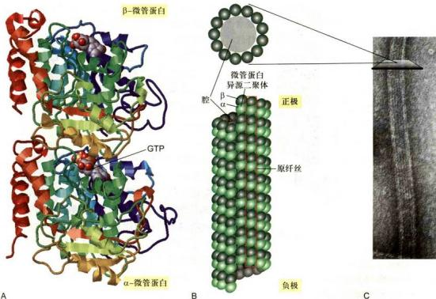

从结构上看，细胞内的微管有三种类型，它们分

## 图8-18 微管和微管蛋白

A. 微管蛋白二聚体的三维结构模型。α-微管蛋白和β-微管蛋白各结合1分子的GTP，它们在相互作用的界面上呈互补关系。B. 微管的结构模式图。上面为微管的横切面，显示由13个微管蛋白亚基组成的环状结构，下面为一段微管的侧观，显示13根原纤丝合成微管时的位置关系。C. 微神经负染后的电镜图像，显示微管蛋白亚基和原纤丝的排列方式。D. 免疫荧光染色显示HeLa细胞中的微管（绿色）网络结构，大部分微管源自中心体（黄色），也有一部分微管并不与中心体相连。（C 图由Ueli Aebi博士惠跑；D 图由黄宁博十提供）

别是单管（如细胞质微管或纺锤体微管）、二联管（纤毛或鞭毛中的轴丝微管）和三联管（中心体或基体的微管）。微管结合蛋白的微管结合结构域与微管表面结合，而其他的结构域突出于微管表面，与相邻的微管或其他细胞结构相连。马达蛋白利用水解ATP产生的能量携带所运输的“货物”沿微管运动。这些蛋白质与微管网络的空间分布及功能密切相关。

  
图8-19 微管组装的过程与踏车行为  
A. $\alpha / \beta$ - 微管蛋白首先组装成原纤丝。B. 原纤丝侧向相互作用形成片层。C. 由13根原纤丝合拢形成的微管， $\alpha / \beta$ - 微管蛋白从两端加入（或解聚）使微管延长（或缩短）。当体系中 $\alpha / \beta$ - 微管蛋白的浓度处于临界浓度时，微管蛋白在微管的正极端组装的速度与在负极端去组装的速度相等，微管的长度可保持不变。

## 二、微管的组装与解聚

## （一）微管的体外组装与踏车行为

由于细胞内部结构及蛋白组分相当复杂，因此有关微管组装方面的资料主要来源于体外试验的结果。首次在试管内成功进行微管组装试验的是 Temple 大学 R. Weisenberg 的研究室。他们以动物脑组织的匀浆物为材料，并加入适当浓度的 $Mg^{2+}$ 、GTP 和 EDTA，利用大部分微管具有在低温下解聚而在 37℃ 时可以重新组装的特点，成功地实现了微管的体外组装。通过调节实验系统的温度和缓冲液的组分，经过组装 / 解聚和差速离心等多轮循环，再结合层析技术可以得到较纯的微管蛋白或组装好的微管。然而，在用电子显微镜观察体外组装的微管时，发现它们的粗细并不均一。一些微管的横断面上并不是人们在细胞内所见到的有 13 个微管蛋白亚基，有的才 11 个或更少，也有些具有 15 个亚基。这些结果提示，微管在体外组装时，似乎缺乏某种机制来控制微管横断面上微管蛋白亚基的数目。

微管在体外的组装过程可以分为成核（nucleation）和延伸（elongation）两个阶段。在体外条件下由于缺乏 $\gamma-$ 微管蛋白环状复合物，微管的成核过程有别于体内。首先是微管蛋白纵向聚合形成一段短的原纤丝，即所谓的成核反应，然后是 $\alpha / \beta$ -微管蛋白在两端及侧面聚合而扩展成片状，当片状聚合物加宽到大致13根原纤丝时，即合拢成为一段微管。新的微管蛋白不断地组装到这段微管的两端，使之延长（图8-19）。由于微管的一端是 $\alpha$ -微管蛋白，而另一端是 $\beta$ -微管蛋白，这种结构上的差异导致 $\alpha / \beta$ -微管蛋白在两端进行装配时的平衡常数和组装速度都不相同。通常持有 $\alpha$ -微管蛋白的一端（负极）组装较慢，而持有 $\beta$ -微管蛋白的一端（正极）组装较快。

与其他所有的生化反应过程一样，微管的组装速度同样与其底物（携带GTP的α/β-微管蛋白）的浓度呈正相关。微管蛋白组装到微管的末端后，β-微管蛋白发挥GTP酶活性，将所结合的GTP水解为GDP，由于高能磷酸键断裂所释放的能量储存于微管结构中，这使得末端带有GDP帽（GDP-cap，D型）的微管解聚所产生的自由能的变化（ΔG）高于末端带有GTP帽（GTP-cap，T型）的微管。同样，前者解聚的平衡常数 $K_{\mathrm{D}}$ （ $K_{\mathrm{D}} / K_{\mathrm{eff}} / K_{\mathrm{ca}}$ ）大于后者，即微管末端带GDP帽的组装所需的临界浓度 $[C_{\mathrm{t}}(\mathrm{D})]$ 要大于带GTP帽的临界浓度 $[C_{\mathrm{t}}(\mathrm{T})]$ 。当体系中微管蛋白的浓度介于这两个临界浓度之间时，末端为GDP帽的微管解聚，而带GTP帽的微管因组装而延长。末端β-微管蛋白上GTP的水解导致自由能和微管蛋白构象发生变化，使微管原纤丝的末端发生弯曲，这种状态使微管蛋白二聚体之间的结合力下降，更容易发生解聚（图8-20）。用电镜观察正在解聚的微管，可以在末端观察到这种弯曲的原纤丝，而正在组装过程中的微管末端亚基带的核苷酸是GTP，其原纤丝是伸直的。当组装体系中结合GTP的微管蛋白的浓度较高，微管末端的组装速度大于GTP的水解速度时，可以在微管的末端形成一个结合GTP的帽子，从而使微管稳定地延伸。反之，底物的浓度随着微管的组装而下降时，微管的组装速度下降。当微管组装的速度小于β-微管蛋白上GTP水解的速度时，末端暴露出结合GDP的微管蛋白，导致微管结构上的不稳定，从而表现出动力学不稳定性。由于微管两端存在结构上的差异，微管组装时两端所需的临界浓度也不一样，当组装体系中底物的浓度接近微管正极组装所需的临界浓度时，负极端已在临界浓度之下。此时，可以检测到在同一根微管上其正极端因组装而延长，而负极端则因解聚而缩短。当一端组装的速度和另一端解聚的速度相同时，微管的长度保持稳定，即所谓的“踏车行为”。

细胞内游离态的微管蛋白的浓度远高于微管组装

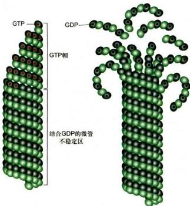  
图 8-20 微管的动态不稳定性依赖于微管末端 β-微管蛋白上 GTP 的水解与否

当体系中 $\alpha/\beta-$ 微管蛋白的浓度高于临界浓度时，微管组装的速度大于 GTP 水解的速度，在微管末端部位的 $\beta-$ 微管蛋白上带有 GTP（左侧）。而体系中游离微管蛋白的浓度等于或低于临界浓度时，微管末端的 $\beta-$ 微管蛋白上 GTP 水解的速度可能会高于微管组装的速度，GTP 的水解导致微管蛋白聚合物构象的变化，原纤丝发生弯曲，微管倾向于解聚（右侧）。

所需的临界浓度。而这些微管蛋白中的大部分都与存在于细胞内的一种分子质量为 $19\mathrm{kDa}$ 的磷蛋白——抑微管装配蛋白（stathmin）相结合（一个抑微管装配蛋白结合两个 $\alpha/\beta-$ 微管蛋白），从而阻碍了它们参与微管的组装。抑微管装配蛋白与微管蛋白的结合受其本身磷酸化状态的调控。磷酸化的抑微管装配蛋白释放出微管蛋白，使细胞内能用于组装的微管蛋白的有效浓度提高，从而加快了微管的组装速度，降低了微管的动态不稳定性；相反，抑微管装配蛋白的去磷酸化将降低微管蛋白的有效浓度，使微管组装速度降低。细胞可以通过调节局部抑微管装配蛋白的磷酸化状态来调控微管的组装及其分布。

在有丝分裂期，微管的组装受到一些因子的调控，使微管网络的组织结构发生显著变化。在有丝分裂前期，细胞质微管解聚，游离的微管蛋白被用于组装纺锤体微管；在末期，这一过程发生逆转。正如荧光显微镜观察体外培养的细胞时所见到的那样，细胞内的微管组装通常都起源于某些特殊位点，如细胞质微管（图8-18D）和纺锤体微管大多起源于中心体（centrosome），纤毛内部的微管起源于基体（basal body）。在间期细胞或终末分化细胞内，微管的组装通常从中心体部位开始，并随着微管蛋白的不断加入而得以延伸，但并非所有的微管都能持续不断地进行组装。在同一细胞内总能见到一些微管在延伸，而另一些微管在缩短甚至全部解聚。刚刚从一根微管解聚下来的微管蛋白将（β-微管蛋白上的）GDP换成GTP后又被组装到另一根微管的游离端。这种快速组装和解聚的行为对于微管的功能极为重要。有时微管的游离端会与某些蛋白或细胞结构结合而不再进行组装或解聚，使该微管处于相对稳定状态。

## （二）作用于微管的特异性药物

一些药物如秋水仙碱（colchicine）、诺考达唑(nocodazole）和紫杉醇（taxol）等可与游离的微管蛋白或组装好的微管结合，从而影响微管的组装或解聚。秋水仙素可以与游离的微管蛋白结合，当这种带有秋水仙素的微管蛋白组装到微管末端后，其他的微管蛋白就很难再装配上去，但这并不影响该微管的解聚，因此，用秋水仙素处理细胞可使微管网络解体。紫杉醇的作用与秋水仙素相反，当紫杉醇与微管结合后可以阻止微管的解聚，但不影响微管蛋白在微管的末端继续组装。结果是微管不停地组装，而不会解聚，这同样影响细胞周期的运行。临床上将一些影响微管组装/解聚的药物用于肿瘤的治疗就是基于这种机制。

微管组装和解聚还与温度有关。在其他条件合适情况下，当环境温度高于20℃时游离的微管蛋白可组装成微管，而当温度较低时微管会解聚。但也有一些微管在低温状态下仍然保持稳定，这些微管被称为冷稳定性微管。

## 三、微管组织中心

在动物细胞的细胞核附近都有一个中心体，大部分微管也都在中心体处成核并锚定于此，呈发散状向细胞的边缘延伸，因此，中心体通常被称作微管组织中心(microtubule organizing center, MTOC)。微管与中心体相连的一端为负极，另一端为正极。除中心体以外，细胞内起微管组织中心作用的类似结构还有位于纤毛和鞭毛基部的基体等细胞器，以及上皮细胞顶端面和高尔基体的反面网状结构等。

## （一）中心体

当用低温或秋水仙素、诺考达唑等药物处理体外培养的动物细胞时，可导致微管结构的解体，但当更换了不含药物的培养液，或将温度恢复到正常以后，微管就能从中心体上重新组装，并渐渐向细胞的边缘延伸（图8-21）。

中心体是由蛋白质组装而成的细胞器，包含一对中心粒，它们彼此呈近乎垂直状态分布，围绕在中心粒周围的蛋白质被称为中心粒外周物质。中心粒是一个直径大约 $0.25\mathrm{nm}$ 、长度为 $150 - 500\mathrm{nm}$ 的桶状结构。每个中心粒含有9组等间距的三联体微管。在每组三联体微管中，只有一根微管在结构上是完整的，管壁由13根原纤丝组装而成，称为A管，另外的两根微管为不完整微管，依次称为B管和C管。用电子显微镜观察中心粒外围的致密物质，发现微管并不是直接起源于中心粒，而是在中心粒的亚远端附属结构和外周物质区域（图8-22）。参与中心粒组装的微管蛋白除了 $\alpha / \beta$ 微管蛋白以外，还有6/6-微管蛋白。目前还不知道6/6-微管蛋白是如何组装到中心粒结构上，也不知道这两种微管蛋白发挥何种功能，但是 $\delta/\varepsilon-$ 微管蛋白的缺失将导致中心体结构的变化。

细胞内的微管并不都与中心体相连，如在神经细胞轴突内，尽管微管的正极都指向轴突的顶端，但大部分微管的另一端也在轴突内部。在树突内约有50%的微管的正极指向胞体，它们显然也不可能与中心体相连。另外一个特殊的例子是小鼠的卵母细胞，该细胞内似乎并没有中心体，但仍然能组织像减数分裂纺锤体那样复杂的微管结构。高等植物细胞内没有中心粒。在某些植物的间期细胞内，与微管组织中心相关的物质似乎存在于细胞核的周围，如在植物的胚乳细胞中，微管好像是起源于核膜的外表面。植物细胞有丝分裂纺锤体的微管从细胞的两极开始组装，然而，那里也没有中心体存在。

γ-微管蛋白是在酵母的温度敏感突变体内发现的。该蛋白在细胞内的含量极微，定位于细胞中心体的致密外周物质中。免疫电镜观察结果显示，γ-微管蛋白在中心体上形成直径为24 nm的环状结构。该环状结构在体外可以作为微管组装的起始点。据此，人们提出了微管在中心体部位的成核模型（图8-22D）。该模型认为13个γ-微管蛋白在中心体的周物质中呈螺旋状排列形成一个开放的环状复合物。微管组装时，游离的α/β-微管蛋白有序地加到 $\gamma-$ 微管蛋白构成的环上，而且 $\gamma-$ 微管蛋白只与二聚体中的 $\alpha-$ 微管蛋白结合。这样组装起来的微管在靠近中心体的一端为负极端，而位于正极端的一定是 $\beta-$ 微管蛋白。

  
图8-21 中心体的微管成核作用  
A. 中心体微管解聚与重新组装模式图。向细胞培养液中加入秋水仙素，或者放在冰上处理一段时间，使细胞内的微管解聚。当除去药物，并再回放37℃培养时可以诱导微管重新组装。B. 体外培养的成纤维细胞用0.5μg/mL乙酰甲基秋水仙素处理1h，使细胞内的微管解聚，然后在正常培养液内生长30s或更长时间；用特异性识别微管蛋白的抗体标记，显示从中心体重新组装的微管向各个方向生长。（B图由后启熹博士和何润生博士惠赠）

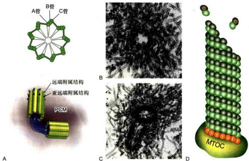  
图8-22 中心体的结构及微管的成核  
A. 中心体结构示意图，显示成对的中心粒以及外周物质（PCM）。B. 中心粒横切面的电镜照片，显示9组微管三联体结构呈风车状排列。C. 显示一对垂直分布的中心粒及其起源于外周物质的微管。D. 大部分中心体微管的组装起始于PCM上的γ-微管蛋白环状复合物。（B、C图由伍启熹博士和滕俊琳博士惠赠）。

## （二）基体和其他微管组织中心

鞭毛和纤毛内部的微管起源于其基部称为基体的结构。基体（参见图8-32）在结构上与中心粒（图8-22）基本一致，其外围由9组三联体微管构成，A管为完全微管，B管和C管为不完全微管。A管和B管跨过纤毛板与纤毛轴丝中相应的亚纤维相连，C管终止于纤毛板或基板附近。中心粒和基体是同源的，在某些时候可以相互转变。例如，当细胞进入 $G_{0}$ 期时，中心粒转变成纤毛的基体，当细胞重新进入有丝分裂周期时，纤毛解体，基体转变成中心粒。中心粒和基体都具有自我复制的性质，一般情况下，新的中心粒是在细胞周期的S期、在原来已经存在的中心粒的近端复制而来。在某些细胞中，中心粒能从无到有（de novo）进行组装。

最近的一些文献显示，高尔基体的反面膜囊区域和上皮细胞的顶端面也有组织微管组装的能力。在一些细胞中似乎存在一种机制，可以从微管的末端切下一小段，这种被切下来的小段微管的命运并不清楚，有可能作为新的微管的生长点。

## 四、微管的动力学性质

微管的稳定性与其所结合的细胞结构组分以及细胞的生理状态相关。对微管动力学特征的研究通常在体外培养细胞上进行。当细胞处于正常的生长状态时，微管的组装和解聚并不是同步进行的。在同一时刻，往往可以观察到一部分微管正在组装延伸，而另一部分正在解聚。有时整根微管解聚后又重新组装，甚至在同一根微管的末端，其组装和解聚也可以反复进行。微管所表现的这种动力学不稳定性通常都发生在正极端（图8-23）。当微管的末端与某些细胞结构结合后整根微管就会变得相对稳定。

不同状态的微管其稳定性差异很大。间期细胞中源于中心体的微管和有丝分裂期的纺锤体微管大多处于组装和解聚的动态平衡中，对各种理化因素如温度、流体压力、 $\mathrm{Ca^{2+}}$ 浓度等的变化，以及一些化学药物如秋水仙素、长春花碱等都相当敏感。中心粒微管、轴突微管以及纤毛或鞭毛内部的轴丝微管则相当稳定，推测可能与其 $\alpha-$ 微管蛋白的第 40 位赖氨酸残基往往发生了乙酰化有关。由于这种乙酰化修饰仅仅发生在已经组装好的微管上，而且 $\alpha-$ 微管蛋白的第 40 位氨基酸残基位于微管的管腔内，所以，微管乙酰化修饰的速度相对较慢，只有存在时间较长，或者说较稳定的微管才能被乙酰化，但乙酰化是否使微管更加稳定还不得而知。

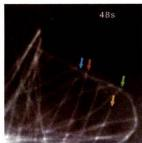  
图8-23 细胞内微管的动态不稳定性

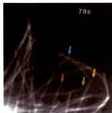

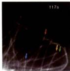

  
将 GFP-α-tubulin 转染 S2 细胞，该融合蛋白表达后可参与微管的组装。图像显示在细胞边缘的微管交替地缩短和伸长。从左到右示每张截图上的微管在不同时间的动态行为，不同颜色的箭号示所指微管随时间的变化而组装（伸长）或解聚（缩短）过程中的微管。（欧光朔博士惠赠）

## 五、微管结合蛋白对微管网络结构的调节

如前所述，利用微管结构对温度的敏感性，再结合差速离心技术可以将微管蛋白纯化。但即使是进行多次组装/解聚的循环，仍然有一些蛋白质始终伴随着微管的组装而存在于体系中，这类蛋白质被称为微管结合蛋白（microtubule-associated protein, MAP）。根据MAP在电泳时所显示分子量的不同，依次命名为MAP1、MAP2、MAP3、MAP4、tau蛋白等。由于类似的研究大多以神经组织为对象，因此在已经鉴定的MAP中，有相当部分仅在神经系统中表达。微管结合蛋白分子通常都具有数个带正电荷的微管结合结构域（microtubule binding domain），该结构域与带负电荷的微管表面相互作用。一个MAP分子上成线性排列的微管结合结构域可以将微管表面原纤丝上相邻的微管蛋白亚基交联起来，以增加微管的稳定性。微管结合蛋白其余的结构域突出于微管表面与相邻的微管或细胞结构相作用，调节微管网络的结构和功能。

在神经细胞中，MAP2、tau 和 MAP1B 是研究得较为清楚的组分。MAP2 存在于神经元的胞体和树突，而 tau 则存在于轴突。在 MAP2 和 tau 的 C 端均有 3\~4 个由 18 个氨基酸残基构成的微管结合结构域。与微管结合后，其 N 端突出于微管表面，并在相邻的微管之间形成横桥（图 8-24）。

为了探讨微管结合蛋白与微管网络结构的关系，J. Chen等（1992）用编码MAP2和tau的cDNA转染体外培养的Sf9细胞，这些基因在Sf9细胞内表达后，原本呈圆形的细胞长出了与神经元的树突（MAP2）和轴突（tau)类似的细胞突起。电镜图像显示，在MAP诱导产生的突起内部具有规则排列的微管束。由MAP2诱导产生的微管束内相邻微管间的距离与树突内部微管束的结构相似，而由tau诱导产生的微管束内相邻微管间的距离与轴突内部微管束的结构相似。MAP2和tau的分子结构基本相似，其C端都有3\~4个微管结合结构域，所不同的是N端突出区域，MAP2有1820个氨基酸残基，而tau只含有380个氨基酸残基。正是由于MAP2和tau蛋白的N端的差异分别决定了树突和轴突内微管束内相邻微管间的距离的不同（图8-24）。MAP2或tau基因剔除小鼠的树突或轴突内部相邻微管间的横桥明显减少，虽然对神经元突起生长的影响并不是很大，但MAP1B/MAP2或MAP1B/tau的双基因剔除小鼠的神经突起的生长明显受阻，表明在轴突和树突中都有定位的MAP1B与MAP2/tau蛋白之间在功能上存在互补作用。

## 六、微管对细胞结构的组织作用

真核细胞内部是高度区室化的结构，各种生物大分子和细胞器等都分布在特定的空间。用秋水仙素等药物处理体外培养细胞，导致微管解聚，细胞变圆。与此相应的变化是内质网缩回到细胞核周围，高尔基体分散成小泡，细胞内依赖于微管的物质运输系统全面瘫痪，那些处于分裂期的细胞停止分裂。一旦阻止微管组装的药物被除去，微管又从中心体等部位重新组装，并向细胞周缘的伸展，内质网也随之向外侧铺展，高尔基体重新组装。对于体外培养的神经元，微管的解体将导致正在延伸中的神经突起停止生长，甚至缩回胞体。显然微管与细胞器的分布以及细胞的形态发生与维持等有很大的关系。

  
图8-24 MAP2和tau蛋白诱导产生的微管束的结构  
A. B. 将 MAP2 和 tau 分别转染 Sf9 细胞，在诱导产生的微管束中相邻微管之间由 MAP2 和 tau 的 N 端突出结构域形成横桥。C. D. MAP2 和 tau 的 C 端微管结合结构域可与微管表面结合，其 N 端突出于微管表面。E. 由 MAP2 诱导产生的细胞突起内的微管束结构，相邻微管之间的距离为 60\~70 nm，与树突内微管束的结构相似。F. 由 tau 蛋白诱导产生的细胞突起内的微管束结构，相邻微管之间的距离为 20\~30 nm，与轴突内微管束的结构相似。(照片由陈建国博士提供)

在神经元这样的终末分化细胞中，有大量的MAP与微管表面结合，将相邻的微管交联在一起成束状排列。相对于处于分裂周期中的细胞来说，神经突起内的微管要稳定得多。在阿尔茨海默病患者的脑神经元内，tau蛋白的过度磷酸化使其很容易从微管上解离下来形成神经原纤维缠结，并导致微管的稳定性降低，结构紊乱，依赖于微管的物质运输系统受损，最终导致神经元的死亡。

神经元是一个高度极性化的细胞，一些蛋白质在轴突和树突部位的不对称分布导致这些神经突起在功能上的特化，从而保证了信号传递过程的正常进行。像这种极性化细胞结构的形成有赖于基于微管的物质运输，分子马达将胞体中合成的蛋白质定向转运到树突或者是轴突发挥功能。一些细胞器，如线粒体等也是沿着微管转运到轴突内。上皮细胞也是典型的极性化细胞的代表，在细胞的基底部和顶端，细胞器和蛋白质组分有着完全不同的分布方式。依赖微管的物质定向转运为细胞内各种细胞器和生物大分子的不对称分布提供了可能。

## 七、细胞内依赖于微管的物质运输

真核细胞内一些生物大分子的合成部位与行使功能部位往往是不同的，因此必然存在精细的物质转运和分选系统。应用快速冷冻-深度蚀刻技术观察轴突内部的结构时，在微管和一些膜性细胞器之间常常会看到一些横桥样结构（图8-25）。在光学显微镜下观察活细胞，可以看到许多细胞器或膜泡在细胞质（图8-26）或轴突内部沿微管作定向运动。甚至在同一根微管上可以观察到一些膜性细胞器向微管的一端运动，而另一些则向相反的方向移动。如果用破坏微管或抑制ATP酶活性的药物处理细胞，可以使这些膜泡停止转运。依赖微管的马达蛋白主要有驱动蛋白（kinesin）和细胞质动力蛋白（cytoplasmic dynein），它们能将储存于ATP中的化学能转化成机械能，沿微管运输货物。

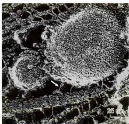  
图 8-25 快速冷冻－深度蚀刻电镜图像显示在轴突内部的微管和膜性细胞器之间有马达蛋白构成的横桥相连（箭号）（Hirokawa 博士惠赠）

## （一）驱动蛋白

## 1. 驱动蛋白的分子结构及其功能

驱动蛋白是 R. D. Vale 等从鱿鱼巨大的轴突内分离到的、能沿微管移动，但不同于肌球蛋白和动力蛋白的马达分子（即 kinesin-1）。该蛋白能运载膜性细胞器沿着微管向轴突的末梢移动。驱动蛋白在结构上与Ⅱ型肌球蛋白相似，由两条具有马达结构域的重链（kinesinheavy chain, KHC) 和两条与重链的尾部结合、具有货物结合功能的轻链（kinesin light chain, KLC）组成。用低角度旋转投影（low angle rotary shadowing）电子显微镜观察的结果显示，驱动蛋白分子是一条长 80 nm 的杆状结构，头部一端有两个呈球状的马达结构域，直径约 10 nm，另一端是重链和轻链组成的扇形尾部，中间是重链杆状区（图 8-27）。球状的头部具有 ATP 结合位点和微管结合位点。随后，在其他多种生物如酵母、曲霉、昆虫以及小鼠和人的细胞中也陆续发现了编码类似驱动蛋白的基因及其表达产物。人类基因组中共有 45 个不同的驱动蛋白基因，马达结构域是该家族成员中非常保守的一个共有元件。

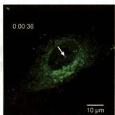

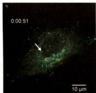

根据驱动蛋白马达结构域系统演化方面的信息和功能特征，驱动蛋白超家族（kinesin superfamily protein, KIF）的成员被分成14个蛋白家族和一个暂时未分组的“orphan kinesin”，用阿拉伯数字1—14标记各个蛋白家族，各个蛋白家族中的亚族则用附加的大写英文字母表示，如kinesin-14A（表8-1）。

驱动蛋白的行为与其马达结构域在多肽链中的位置有关，大部分驱动蛋白家族成员的马达结构域在肽链的N端（N-驱动蛋白），如kinesin-1至kinesin-12，它们能从微管的负极向正极移动。另外一些的马达结构域位于多肽链的中部（M-驱动蛋白），如kinesin-13的3个成员，他们结合在微管的正极端或负极端，使微管处于不稳定状态，如有丝分裂时动粒微管两端的解聚就与该蛋白相关。还有一些的马达结构域位于肽链的C端（C-驱动蛋白），如kinesin-14的3个成员，这类驱动蛋白的运动方向与N-驱动蛋白相反，它们从微管的正极向负极移动（图8-28）。kinesin-8和kinesin-14家族的成员既能向微管的正极端移动，还具有调节微管解聚的能力。大部分驱动蛋白可通过多肽链中部的一段卷曲螺旋相互作用而形成同源二聚体（如kinesin-4、6、7、8、10、12、13和14家族）。kinesin-1除了有两条重

  
图 8-26 膜泡在细胞质内运动  
将编码 EGFP 的 cDNA 插入到编码 calumenin 的信号肽序列之后，转染 HeLa 细胞。GFP-calumenin 在内质网上合成后经高尔基体形成分泌泡，再转运到细胞边缘分泌出去。也有一些会从高尔基体回到内质网。箭号示运动中的小泡。（王乔博士惠赠）

  
扫描观看动态影像

  
图8-27 驱动蛋白分子重链和轻链结构模式图

驱动蛋白是由两条重链和两条轻链构成的异源四聚体。球状的马达结构域位于左侧（重链的N端），从左向右分别是与微管相互作用的马达结构域、杆状区和与转运的“货物”相互作用的C端及轻链构成的扇形尾部。

链（KHC）以外，在C端还有两条轻链（KLC）共同构成货物结合结构域。kinesin-2家族的Kif3的两个成员可与一个结合蛋白一起构成异三聚体（Kif3A-Kif3B-Kap3）。kinesin-3家族的成员以单体或同源二聚体的形成存在。kinesin-5家族的成员可以通过其杆状区形成反向四聚体，在极性相反的两根相邻的微管（如纺锤体极微管）之间滑动介导中心体向两极移动。kinesin-1至kinesin-3家族的成员主要与膜性细胞器和大分子复合物

  
图 8-28 细胞内依赖于微管的物质运输系统

胞质动力蛋白介导内质网至高尔基体之间、细胞胞吞泡至细胞内部的膜泡运输，而驱动蛋白家族的成员介导从高尔基体反面膜囊出芽小泡的运输。

表 8-1 驱动蛋白家族成员的结构与功能

<table><tr><td>驱动蛋白家族</td><td>分子结构模式图</td><td>功能</td><td>亚基组成及主要成员</td></tr><tr><td>kinesin-1</td><td></td><td>膜泡、细胞器和mRNA运输</td><td>两条重链和两条轻链,如Kif5、KHC和Unc116、Bmkinesin-1</td></tr><tr><td>kinesin-2</td><td></td><td>膜泡、黑色素体和鞭毛内运输</td><td>异源三聚体,如Kif3、Klp64D、Klp68D、Krp85、Krp95和Fla10同源二聚体:Kif17、Osm3和Kin5</td></tr><tr><td>kinesin-3</td><td></td><td>膜泡运输</td><td>单体,如Kif1A、Kif1B、Kif13、Kif14 Kif16和Kif28</td></tr><tr><td>kinesin-4</td><td></td><td>染色体定位</td><td>同源二聚体,如Kif4、Chromokinesin和Klp3A</td></tr><tr><td>kinesin-5</td><td></td><td>纺锤体极的分离和双极性确立</td><td>Kif11、Eg5、Klp61F、BimC、Bmk1(Ce)、Cin8、Kip1和Cut7等</td></tr><tr><td>kinesin-13</td><td></td><td>纠正动粒微管错误,染色体分离</td><td>双链二聚体,如Kif2A、Kif2B、Kif2C、Klp10A、Klp59C、Klp59D、Klp7、Kif24和Bmkinesin-13</td></tr><tr><td>kinesin-14</td><td></td><td>纺锤体极的组织,货物运输</td><td>KifC1、KifC2、KifC3、Kip3、Bmkinesin-14A和许多植物细胞中特有的种类</td></tr></table>

的运输相关，而其它家族的成员主要作用在于调节微管的动态不稳定性以及微管网络的结构。

## 2. 驱动蛋白沿微管运动的分子机制

在驱动蛋白的马达结构域上有两个重要的功能位点：ATP结合位点和微管结合位点。与肌球蛋白的马达结构域（850个氨基酸残基）相比，驱动蛋白的马达结构域（350个氨基酸残基）显得很小巧。虽然两者在氨基酸序列上没有同源性，但它们的ATP结合位点的结构非常相似，两种马达结构域在大小和功能上的差异主要表现在细胞骨架结合部位和动力转换装置上。

驱动蛋白沿微管运动的分子模型有两种：一种是“步行”（hand over hand）模型，另一种是“尺蠖”（inchworm）爬行模型。步行模型认为：驱动蛋白的两个球状头部交替向前，每水解一个ATP分子，落在后面的那个将移动两倍的步距，即16 nm。而原来领先的那个头部则在下一个循环时再向前移动。尺蠖爬行模型认为：驱动蛋白两个头部中的一个始终在前，另一个永远在后，每步移动8 nm。在这个领域，尽管已经积累了大量的实验证据，特别是近年来发展起来的单分子行为分析，为研究驱动蛋白两个马达结构域是怎样协调向前运动的问题提供了有效的方法，但实验结果很不一致，有些结果支持步行模型，但也不乏与尺蠖爬行模型相吻合的结果。这里以传统的驱动蛋白为例，着重介绍被大多数学者承认的步行模型。

驱动蛋白的运动主要涉及发生在两个马达结构域上的 ATP 的结合、水解和 ADP 的释放，以及与自身构象变化相偶联等机械化学循环过程。在这一过程中，驱动蛋白的两个头部交替与微管相结合，以确保在移动过程中不会从微管上掉下来。每水解一个 ATP 分子，整个分子就向前移动一步（两个微管蛋白亚基的长度，约8 nm）。当驱动蛋白沿微管行走时，两个马达结构域中位于前面的那个（L）与ATP结合时导致驱动蛋白发生构象变化，该结构域与微管紧密结合，并使后面的马达结构域（T）向前移动，越过原来位于前面的那个马达结构域（L）至微管正极一侧的另一个新的结合位点（共移动了16 nm）。此时，处于前面的马达结构域（T）释放ADP，处于后面的那个（L）水解ATP，使得驱动蛋白处于开始时的状态，但两个头部互换了位置，整个分子则向微管的正极端移动了一步。在这一循环的运行过程中，驱动蛋白的两个马达结构域与微管之间交替结合，每个都有一半以上的时间与微管处于结合状态（图8-29）。相比之下，Ⅱ型肌球蛋白沿微丝移动时，同样是ATP的水解与马达结构域的构象变化相偶联，但在每个循环开始时，不带ATP的肌球蛋白的头部以僵直的构象与微丝紧密结合，当ATP与肌球蛋白头部结合时，马上引起肌球蛋白构象的变化，使头部与微丝的亲和力降低。但头部脱离微丝时，ATP水解，引发较大的构象变化，使肌球蛋白头部的构象几乎处于竖直状态。肌球蛋白头部和微丝上新的肌动蛋白亚基的微弱结合导致无机磷酸的释放，这一过程使头部恢复原来的构象，ADP被释放，头部与肌动蛋白紧密结合，从而回到初始状态。新的一轮ATP与肌球蛋白头部的结合导致下一个循环的开始。在这个循环中，肌球蛋白的头部与微丝结合的时间仅占循环所需总时间的5%。

引发驱动蛋白沿微管持续移动的原因有两个：第一，在每个驱动蛋白分子中，两个马达结构域的化学-机械循环是互相协调的，在一个马达结构域还没有与微管结合之前，另一个马达结构域不会从微管上掉下来，从而保证了步行的连续性，即马达分子和所运送的“货物”或细胞器不会脱离微管。第二，驱动蛋白的马达结构域在 ATP 循环的大部分时间里都与微管紧密结合。

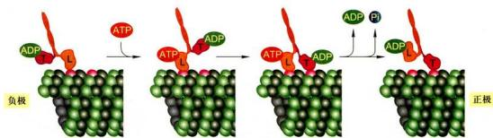  
图8-29 驱动蛋白沿微管运动的步行模型  
kinesin-1 有两条重链，其头部的马达结构域（用 L 和 T 表示它们开始时所处的位置）伴随着 ATP 的结合、水解以及 Pi 与 ADP 的释放而在微管表面行走。在整个过程中，两个头部结构域至少有一个与微管处于结合状态。

肌球蛋白不具备沿微丝持续向前运动的能力，但多个肌球蛋白组装而成的巨大复合物（如粗肌丝）的协同作用却能提高其整体移动的速度。如在骨骼肌细胞中，大量规则排列的肌球蛋白头部与同一根微丝相互作用，复合物中肌球蛋白头部的协同作用使得在单一循环时间内，它们能将微丝移动相当20步的总距离，而驱动蛋白只能沿微管移动2步。这样，即便是两者在水解ATP的速度和分子步距上相当，肌球蛋白却能以比驱动蛋白更快的速度沿细胞骨架移动。

## （二）胞质动力蛋白及其功能

动力蛋白超家族由两组蛋白质组成：细胞质动力蛋白和轴丝动力蛋白（axonemal dynein）。后者也称为纤毛或鞭毛动力蛋白。动力蛋白的重链同样含有ATP结合部位和微管结合部位，利用水解ATP产生的能量沿微管运动。动力蛋白是已知马达蛋白中最大、移动速度最快的成员。细胞质动力蛋白是一个分子质量接近1500 kDa的蛋白复合体，含多个亚基：2条具有ATP酶活性的、使其沿微管移动的重链，2条中间链，4条中间轻链和一些轻链（图8-30，图8-31）。细胞质动力蛋白与被称为动力蛋白激活蛋白（dynactin）的蛋白复合体（含p150 $^{Gheed}$ 、p62、dynamitin、Arpl、CapZa、CapZb、p27和p24）密切相关。动力蛋白激活蛋白调节动力蛋白的活性和动力蛋白与其货物的结合能力。与驱动蛋白和肌球蛋白超家族的多样性相比，细胞质动力蛋白的重链家族只有两个成员——Dynclh1和Dynclh2。Dynclh1主要担负向微管的负极端转运货物的功能，Dynclh2主要在鞭毛内的反向转运中起作用。Dynclh1可直接结合货物，或通过选择性组装的动力蛋白亚基（包括多条中间轻链、中间链和轻链）来与多种货物相连，而驱动蛋白和肌球蛋白则演化出大量的家族成员，并利用他们自身的尾部结构域（或少数轻链）识别并结合货物。

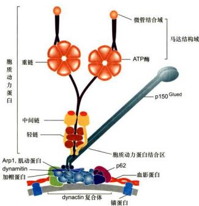  
图 8-30 细胞质动力蛋白结构示意图

轴丝动力蛋白的种类远多于细胞质动力蛋白，结构和组成成分也相当复杂。根据动力蛋白在轴丝上的位置，可以将其分为内侧动力蛋白臂（inner dynein arm）和外侧动力蛋白臂（outer dynein arm）。不同类型的轴丝动力蛋白所含的重链（马达结构域）数量也不同，构成外侧臂的动力蛋白具有2个或3个马达结构域（图8-31），而在7个已知的内侧臂动力蛋白成员中，有1个含有2个马达结构域，其他6个只有1个马达结构域。

细胞质动力蛋白被认为与内体/溶酶体、高尔基体及其他一些膜泡的运输，动粒和有丝分裂纺锤体的定位，以及细胞分裂后期染色体的分离等事件密切相关。将抗动力蛋白的抗体注入有丝分裂期的细胞，可诱导纺锤体结构的解体。敲除细胞质动力蛋白重链基因的小鼠（cDHC $^{-/-}$ ）在胚胎早期便死亡。因此，可以认为cDHC是高等真核生物生长和发育所必需的。cDHC $^{-/-}$ 胚泡细胞内高尔基体膜囊片段化，并均匀分散在整个细胞质中，而不像正常细胞内那样聚集在细胞核周围。在cDHC $^{-/-}$ 细胞中，dynactin复合体中的Arpl和p150 $^{Glued}$ 以及内体/溶酶体等细胞器都分散在整个细胞质中，表明cDHC是高尔基复合体的形成和正常定位所必需的。有趣的是在cDHC $^{-/-}$ 细胞中“片段化”的高尔基体膜囊以及溶酶体仍附着在微管上。显然除cDHC外，还存在其他的蛋白质分子参与高尔基体、溶酶体等细胞器与微管的相互作用。

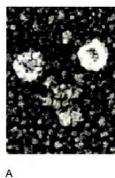

  
图8-31 胞质动力蛋白（2个头部）和轴丝动力蛋白（3个头部）分子的马达结构域（John Heuser博士惠赠）

## 八、纤毛和鞭毛的结构与功能

纤毛（cilia）和鞭毛（flagella）是突出于细胞表面的、高度特化的细胞结构。精子和原生动物通过鞭毛的波状摆动使细胞在液体介质中游动。纤毛与鞭毛的结构相似，但较鞭毛短。纤毛是一些原生动物（如草履虫）的运动装置。在一些高等动物体内，纤毛存在于多种组织（如输卵管、呼吸道上皮组织）的细胞表面。相邻的纤毛可以几乎同步运动，使组织表面的液体定向流动。在人体呼吸道，数目众多的纤毛可以清除进入气管的异物，输卵管中的纤毛可以使卵细胞向子宫方向移动。近年来，随着鞭毛内转运机制的发现以及一些纤毛相关蛋白缺失后引起的一系列在细胞水平、组织水平乃至个体水平上的表型变化，使人们认识到这种细胞结构还与细胞信号转导、细胞增殖与分化、组织与个体的发育等过程密切相关。

（一）纤毛的结构及组装

## 1. 纤毛的结构

纤毛的外部是由细胞质膜特化而成的纤毛膜，内部是由微管及其附属蛋白组装而成的轴丝。轴丝是由250多种不同的蛋白质组装而成的高度有序的结构，这一结构从位于细胞皮层的基体发出，直达纤毛顶端。轴丝微管排列方式主要有3种模式：(1)“9+2”型；轴丝的外围是9组二联体微管，中间是2根由中央鞘所包围的中央微管。(2)“9+0”型；外周与“9+2”型相同，但缺乏中央微管。(3)“9+4”型；极少数的纤毛属于这一类型，轴丝中央含有4根单体微管。“9+0”型纤毛一般是不动纤毛，而“9+2”型纤毛则大多为动纤毛(kinocilium)。但这种分类不是绝对的，如斑马鱼的脊髓中央管中就存在“9+0”型的运动性室管膜纤毛，而蛙嗅觉上皮细胞上“9+2”型纤毛却是不动纤毛。缺乏运动能力的“9+0”型纤毛是构成各种感受器的基础（如化学感受器和本体感受器）。这些存在于感受器细胞上的不动纤毛通常被称为原生纤毛(primary cilium)。

轴丝微管的正极端都指向纤毛或鞭毛的顶端。外围的二联体微管由A管和B管组成，其中A管为完全微管，由13个亚基环绕而成，B管为不完全微管，仅由10个亚基构成，另3个亚基与A管共用。中央微管均为完全微管（图8-32）。中央鞘和外周9组二联体微管的 A 管之间由放射辐（radial spoke）相连。相邻的二联体之间通过连接蛋白（nexin）相连，还有 2 个动力蛋白臂从 A 管伸出，它们分别位于轴丝的内侧和外侧，其马达结构域沿相邻二联体微管的 B 管滑动使纤毛产生局部弯曲（图 8-32）。

  
图8-32 基体及轴丝的结构和示意图  
A. 四膜虫纤毛横切面的电镜图像。B. 轴丝微管及其附属结构示意图。1. 轴丝的横切面，其外围是9组相互联系的微管二联体，中央是由中央鞘包围的两根微管。2. 基体横切面，其外围是9组相互联系的微管三联体。（A图由丁明孝提供）

  
图8-33 原生纤毛的形成过程

位于纤毛基部的基体在结构上与中心粒类似。基体外围含有9组三联体微管，没有中央微管，呈“9+0”排列。其中A管为完全微管，而B管和C管则是不完全微管。基体中的A管和B管向外延伸而成为纤毛或鞭毛中的二联体微管（图8-32）。

## 2. 纤毛的组装（发生）

纤毛起始于位于细胞膜内侧的基体。在细胞周期运行过程中，基体和中心粒的主体结构是可以通用的，变换过程中仅需要更换一些蛋白质组分。纤毛在细胞进入 $G_{1}$ 期或 $G_{0}$ 期时开始形成，进入S期前解体。利用电子显微镜观察培养的成纤维细胞，可见原生纤毛的形成分为4个阶段（图8-33）。①来自高尔基体的膜泡被母中心粒远端附属结构招募，包裹在母中心粒的顶端，形成中心粒膜泡（centriolar vesicle, CV），一些中心体蛋白如Cep97和CP110等从母中心粒的顶端移除。②母中心粒微管开始延伸并获取成为基体所需的附属结构，初生轴丝开始显现。随着新的膜泡的加入，CV慢慢变大，最终成为次级中心粒膜泡（secondary centriolar vesicle, SCV）。③母中心粒随同SCV向质膜迁移，当其锚定在质膜内侧的纤毛组装位点时，SCV与质膜融合形成一个杯状结构，称为纤毛项链。④在鞭毛内运输（intraflagellar transport, IFT）复合体的介导下，原生鞭毛进一步装配并延长。

纤毛的延伸和维持依赖于鞭毛内运输。IFT是位于二联体微管和纤毛膜之间的双向运输系统。kinesin-2将

IFT 复合体 B（含纤毛组装所需的轴丝前体组分）从纤毛基部运送到顶部，IFT 复合体 A（需要回收的物质）由 dynein-2 运回胞体。IFT 复合体 A 包含 6 种纤毛组分，而复合体 B 包含 10 种纤毛组分（图 8-34）。这些编码 IFT 组分的基因在真核生物中高度保守，几乎对于所有真核细胞的纤毛或鞭毛的组装都是必需的。

  
图8-34 膜泡运输和鞭毛内运输

kinesin-2 自鞭毛或纤毛的基部运送 IFT 复合体 B 至顶端，动力蛋白将 IFT 复合体 A 自鞭毛的顶端运向基部。

## （二）纤毛或鞭毛的运动机制

纤毛运动的本质是由轴丝动力蛋白所介导的相邻二联体微管之间的滑动。在实验过程中改变环境的pH可使细胞表面的鞭毛脱落。收集鞭毛，再用去垢剂除去其表面的膜结构，并用蛋白酶作轻微的处理以打断在微管二联体之间起连接作用的连接蛋白，使相邻的二联体微管仅靠动力蛋白彼此联系，而失去其他蛋白质的束缚。如果此时加入ATP，从一个外周二联体微管的A管伸出的动力蛋白的马达结构域会利用水解ATP产生的能量在相邻的二联体的B管上“行走”，从而导致二联体之间产生滑动（图8-35A）。然而，在完整的纤毛或鞭毛内部，组成轴丝的9组二联体微管之间，外周微管与中央鞘之间都有许多辅助蛋白将微管横向连成一个整体，相邻二联体微管之间的滑动受到“整体性”的阻碍，于是纤毛动力蛋白“行走”时所产生的力便会使纤毛的局部弯曲（图8-35B）。

纤毛或鞭毛的弯曲首先发生在其基部，因为这里的动力蛋白首先被活化。随着轴丝上的动力蛋白依次被特异地活化或者失活，这种弯曲有规律地沿着轴丝向顶端传播。动力蛋白的活化受中央微管和放射辐的调控，缺少这些结构的突变体纤毛没有运动能力。在纤毛或鞭毛的运动过程中，内侧的动力蛋白臂主要与纤毛弯曲有关，决定纤毛弯曲波形的大小和形态，外侧的动力蛋白臂则与拍打的力量和频率有关。

## （三）纤毛的功能

对于单细胞原生生物而言，纤毛或鞭毛是其主要的运动装置，可以推动细胞在液体介质中向一定方向运动，实现觅食或应答环境的变化。一些动物细胞也带有纤毛，纤毛的运动可以推动组织表面的液体做定向流动，从而传输某些信号分子，影响靶细胞的定向分化与发育。此外，纤毛也作为感受装置，接受和传递外界物理或化学信号刺激，参与一系列细胞或机体内信号调控过程，影响细胞的生理状态或组织器官的发育。

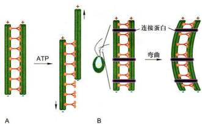  
图 8-35 纤毛或鞭毛的运动过程中相邻二联体微管的滑动模型  
A. 在分离的微管中：动力蛋白导致微管滑动。B. 在普通的鞭毛中：动力蛋白导致微管弯曲。

在动物胚胎发育过程中，细胞或器官表面纤毛的结构和运动对决定躯体各器官的正常分布发挥重要的作用，如驱动蛋白家族的成员Kif3与IFT相关。Kif3A和Kif3B的基因剔除小鼠表现为发育过程中左右体轴形成不全。究其原因，是由于小鼠胚胎发育过程中胚胎结细胞所具有的单纤毛（monocilia）结构发育不全。Kif3A和Kif3B的基因剔除小鼠胚胎结细胞的纤毛（nodal cilia）中微管的排列方式与野生型小鼠“9+2”排列模式不同，呈不能运动的“9+0”结构。野生型小鼠胚胎结细胞的纤毛呈涡旋运动，产生一个左旋的液流，从而打破了小鼠胚胎发育过程中的对称性，为左右体轴的形成提供了可能。而在Kif3A或Kif3B的基因剔除小鼠胚胎结细胞由于纤毛发育不全，致使胚胎结处的左旋液流的形成受阻，最终导致左右体轴形成障碍。在一些频发内脏易位的小鼠品系中，往往可见到胚胎结细胞的纤毛异常。

存在于肾上皮细胞的原生纤毛是突出于细胞表面的物理感受器（mechanosensor），它通过感受液体的流动来起始细胞内的钙信号通路。polycystin-1、polycystin-2和polyductin/fibrocystin这3个定位于纤毛膜上的蛋白质是构成物理感受器的重要组分，如果这些蛋白质缺失，那么就算纤毛结构完整，钙信号通路仍然无法启动，最终导致多囊肾的发生。

一些特化的纤毛还行使化学感受器的功能，它对于生物体的光感受和嗅觉是不可或缺的。例如，在哺乳动物的视网膜上视锥细胞和视杆细胞利用特化的纤毛来感受光信号，并将信息传递给下游的双极神经元和水平细胞。感光细胞包括由纤毛连接的外段和内段，外段是高度动态的结构，而动态的维持则依赖于IFT。如果IFT缺失，外段结构会解体，从而导致失明。

哺乳动物的嗅觉神经元利用球状树突末端的15\~20根纤毛来感受气味。纤毛缺陷的小鼠和患巴尔德-别德尔（Bardet-Biedl）综合征的患者，会出现嗅觉丧失症状。

此外纤毛参与了发育过程中的两类重要的信号通路——Hedgehog（Hh）信号通路和Wingless（Wnt）信号通路。如果纤毛缺失，通路就无法对外源信号做出应答，从而会造成神经管无法闭合、脑形态异常、多指、左右体轴异常和肾囊肿等发育缺陷。

## 九、纺锤体和染色体运动

当细胞从间期进入有丝分裂期，间期细胞的微管网络解聚为游离的微管蛋白，然后组装形纺锤体微管，介导染色体的运动；分裂末期，纺锤体微管解聚，又组装形成细胞质微管网络。

纺锤体微管包括动粒微管、极微管和星体微管。动粒微管连接染色体动粒与位于两极的中心体。极微管从两极发出，在纺锤体中部赤道区相互交错重叠。星体微管从中心体向周围呈辐射状分布。

有丝分裂过程中染色体的运动有赖于纺锤体微管的组装和解离。在这一过程中动粒微管与动粒之间的滑动主要是靠结合在动粒部位的kinesin-13家族的成员和细胞质动力蛋白沿微管的运动来完成。极微管在纺锤体的中部交错重叠，分布在该区域的kinesin-5家族的成员如Cik1和Cim1等为双极马达蛋白，其中一端的两个马达结构域沿一条微管运动，另一端的两个马达结构域沿来自另外一极的微管运动。由于重叠的两条微管的极性相反，故当双极驱动蛋白四聚体沿微管向正极运动时，纺锤体二极间的距离延长，这是有丝分裂后期发生的重要事件（详见第十二章）。

<!-- END CN CN08-S02 -->

---

## 对应英文内容

### 英文补充：微管、动态不稳定性、马达、纤毛与鞭毛

> 对应中文板块：微管、动态不稳定性、马达、纤毛与鞭毛。英文来源：Molecular Biology of the Cell，第7版，第16章；[本章完整原文](../../来源/英文教材/16_The_Cytoskeleton/chapter.md)。物理PDF页码范围：988–1065（整章范围）。

<!-- BEGIN EN EN16-H047-H062 -->
#### MICROTUBULES

Microtubules are structurally more complex than actin filaments, but they are also highly dynamic and play similarly diverse and important roles in the cell. Microtubules are polymers of the protein **tubulin**. The tubulin subunit is a heterodimer formed from two closely related globular proteins called a-tubulin and b-tubulin, each comprising 445–450 amino acids, which are tightly held together by noncovalent bonds (**Figure 16–37A**). These two tubulin proteins are found only in this heterodimer, and each α or β monomer has a binding site for one molecule of GTP. The GTP that is bound to α-tubulin is physically trapped at the dimer interface and is never hydrolyzed or exchanged; it can therefore be considered to be an integral part of the tubulin heterodimer structure. In contrast, β-tubulin may be bound to either GTP or GDP and—as we shall see—this difference is important for microtubule dynamics.

Tubulin is found in all eukaryotic cells, and it exists in multiple isoforms. Its amino acid sequence has been highly conserved during evolution: thus, yeast and human tubulins are 75% identical. In mammals, there are at least six forms of α-tubulin and a similar number of β-tubulins, each encoded by a different gene. Although the different forms of tubulin are very similar and can copolymerize into mixed microtubules in a test tube, they can have distinct locations in cells and tissues and perform subtly different functions.

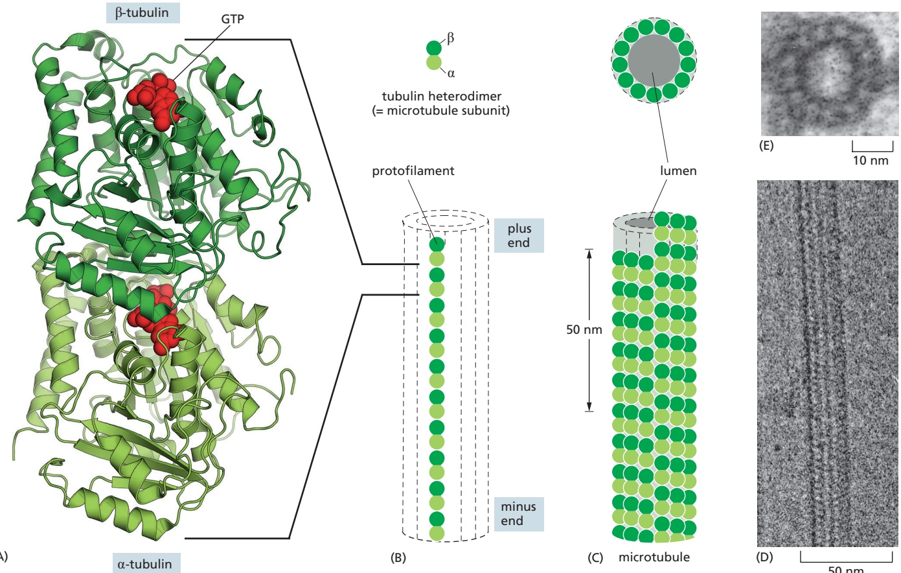

Figure 16–37 The structure of a microtubule and its subunit. (A) The subunit of each protofilament is a tubulin heterodimer, formed from a tightly linked pair of α- and β-tubulin monomers. The GTP molecule in the α-tubulin monomer is so tightly bound that it can be considered an integral part of the protein. The GTP molecule in the β-tubulin monomer, however, is less tightly bound and has an important role in filament dynamics. GTP is shown in red. (B) One tubulin subunit (αβ-heterodimer) and one protofilament are shown schematically. Each protofilament consists of many adjacent subunits with the same orientation. (C) The microtubule is a stiff hollow tube formed from 13 protofilaments aligned in parallel. (D) A short segment of a microtubule viewed in an electron microscope. (E) Electron micrograph of a cross section of a microtubule showing a MBoC7 m16.42/16.37ring of 13 protofilaments. (A, PDB code: 1JFF; D, courtesy of Richard Wade; E, courtesy of Richard Linck.)

f i t b l t th l d o m cro u u es a e p us en . Microtubules grow faster at one end than at the other. A stable bundle of microtubules obtained from the core of a cilium (called an axoneme) was incubated for a short time with tubulin subunits under polymerizing conditions. Microtubules grew fastest from the plus end of the microtubule bundle, the end on the right in this micrograph. (Courtesy of Gary Borisy.)

As a striking example, mutations in a particular human β-tubulin gene give rise to a paralytic eye-movement disorder because of loss of ocular nerve function. Some human neurological diseases have also been linked to mutations in a specific tubulin gene.

#### Microtubules Are Hollow Tubes Made of Protofilaments

A microtubule is a hollow cylindrical structure built from 13 parallel protofilaments, each composed of αβ-tubulin heterodimers stacked head to tail and then folded into a tube (**Figure 16–37B, C, and D**). The assembly of a microtubule generates two new types of protein–protein contacts. Along the longitudinal axis of a protofilament, the “top” of one β-tubulin molecule forms an interface with the “bottom” of the α-tubulin molecule in the adjacent heterodimer. This interface, which is very similar to the interface holding the α and β monomers together in the dimer subunit, has a high binding energy. Perpendicular to these interactions, neighboring protofilaments form lateral contacts, with the main lateral contacts occurring between monomers of the same type (α–α and β–β). A slight stagger in lateral contacts gives rise to the helical microtubule lattice, which holds most of the subunits tightly in place. As a result, the addition and loss of subunits occur almost exclusively at the microtubule ends (see Figure 16–5).

The multiple contacts among subunits make microtubules stiff and difficult to bend. The average length over which microtubules stay straight (persistence length) is more than 10 times that of actin filaments, making microtubules the stiffest and straightest structural elements found in most animal cells.

The subunits in each protofilament in a microtubule all point in the same direction, and the protofilaments themselves are aligned in parallel, with α-tubulins exposed at the minus end and β-tubulins exposed at the plus end. As for actin filaments, the regular, parallel orientation of their subunits gives microtubules both a structural and a dynamic polarity (**Figure 16–38**): the microtubule’s plus end grows and shrinks much more rapidly than its minus end.

#### Microtubules Undergo a Process Called Dynamic Instability

Microtubule dynamics, like those of actin filaments, are profoundly influenced by the binding and hydrolysis of a nucleoside triphosphate—GTP for microtubules, as opposed to ATP for actin. GTP hydrolysis, which occurs only within the β-tubulin subunit of the tubulin dimer, proceeds very slowly in free tubulin subunits and is greatly accelerated when they are incorporated into microtubules. After GTP hydrolysis, a free phosphate group is released, leaving the GDP bound to β-tubulin within the microtubule lattice. Thus, as in the case of actin filaments, two different types of microtubule structures can exist, one in the T form bound to GTP and one in the D form bound to GDP. Because some of the energy of phosphate bond hydrolysis is stored as elastic strain in the polymer lattice, the free-energy change for dissociation of a subunit from the D-form polymer is more favorable (negative) than the free-energy change for dissociation of a subunit from the T-form polymer. This makes the ratio of $k _ { \mathrm { o f f } } / k _ { \mathrm { o n } }$ for GDP-tubulin [which is equal to its critical concentration, Cc(D)] much higher than that of GTP-tubulin. As a result, under physiological conditions, the T form tends to polymerize and the D form tends to depolymerize.

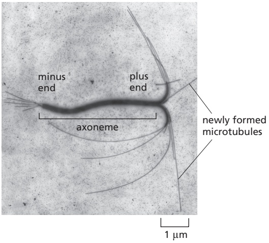

Figure 16–38 The preferential growth

Whether the tubulin subunits at the very end of a microtubule are in the T or the D form depends on the relative rates of tubulin addition and GTP hydrolysis. If the rate of subunit addition is low, hydrolysis is likely to occur before the next subunit is added, and the tip of the filament will then be in the D form. If the rate of subunit addition is high—and thus the filament is growing rapidly—then it is likely that a new subunit will be added to the end of the polymer before the GTP in the previously added subunit has been hydrolyzed. In this case, the tip of the polymer remains in the T form, forming a GTP cap. But this T form may not persist. Often GTP-tubulin subunits will assemble at the end of the microtubule at a rate similar to the rate of GTP hydrolysis, and in this case hydrolysis will sometimes “catch up” with the rate of subunit addition and transform the end to a D form. This transformation will be sudden and random, with a certain probability per unit time that depends on the concentration of free GTP-tubulin subunits, and it produces the microtubule’s dynamic instability.

Suppose that the concentration of free tubulin is intermediate between the critical concentration for a T-form end and the critical concentration for a D-form end (that is, above the concentration necessary for T-form assembly, but below that for the D form). Now, any end that happens to be in the T form will grow, whereas any end that happens to be in the D form will shrink. On a single microtubule, an end might grow for a certain length of time in a T form, but then suddenly change to the D form and begin to shrink rapidly. At some later time, it might regain a T-form end and begin to grow again. This rapid interconversion between a growing and shrinking state, at a uniform free tubulin concentration, is called **dynamic instability** (**Figure 16–39** and **Figure 16–40A**; see Panel 16–2). The change from growth to shrinkage is called a catastrophe, while the change from shrinkage to growth is called a rescue.

The structural basis for dynamic instability is uncertain. On the basis of observations of the ends of growing and shrinking microtubules in vitro, one model proposed that tubulin subunits in the T form, with GTP bound to the β monomer, produce straight protofilaments that make strong and regular lateral contacts with one another, and that the hydrolysis of GTP to GDP makes these protofilaments curve (**Figure 16–40B**). More recent studies indicate that free tubulin subunits possess a similar bent conformation in both the T form and the D form. Growing microtubules with curved protofilaments at their tips have now been observed both in vitro and in vivo, and a straightening of the T form–containing protofilaments may occur subsequent to subunit incorporation as favorable lateral interactions zip them into the microtubule lattice. Regardless of the mechanism of microtubule assembly, the loss of a GTP cap and subsequent catastrophe causes protofilaments containing D-form subunits to spring apart and depolymerize (**Figure 16–40C**).

time 0 sec

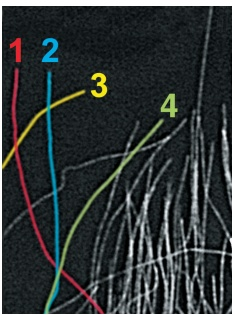

125 sec

307 sec

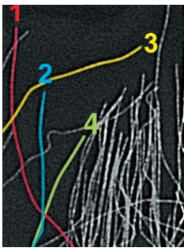

669 sec

10 µm

Figure 16–39 Direct observation of the dynamic instability of microtubules in a living cell. Microtubules in a newt lung epithelial cell were observed after the cell was injected with a small amount of fluorescently labeled tubulin. Notice the dynamic instability of microtubules at the edge of the cell. Four individual microtubules are highlighted for clarity; each of these shows alternating shrinkage and growth (Movie 16.9). (Courtesy of Wendy C. Salmon and Clare Waterman.)

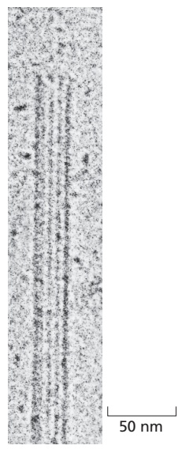

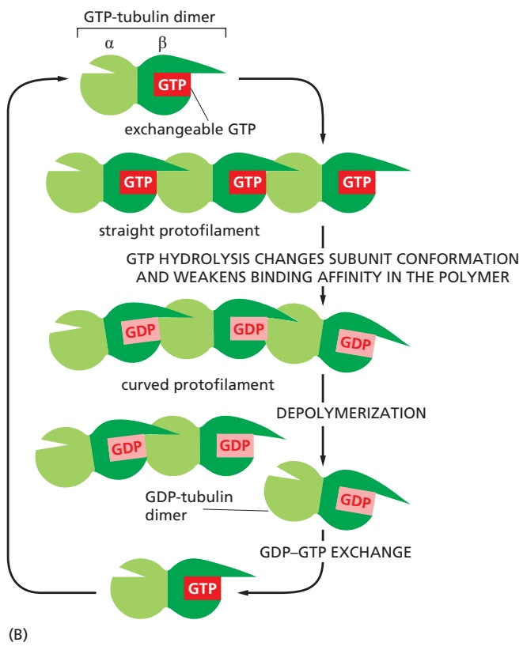

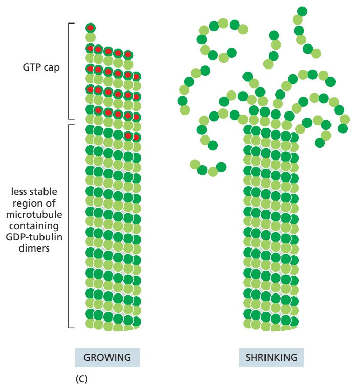

Figure 16–40 Dynamic instability due to the structural differences between a growing and a shrinking microtubule end. (A) If the free tubulin concentration in solution is near the critical concentration, a single microtubule end may undergo transitions between a growing state and a shrinking state. A growing microtubule has GTP-containing subunits at its end, forming a GTP cap. If GTP hydrolysis proceeds more rapidly than subunit addition, the cap is lost and the microtubule begins to shrink, an event called a catastrophe. But GTP-containing subunits may still add to the shrinking end, and if enough add to form a new cap, then microtubule growth resumes, an event called a rescue. (B) Model for the structural consequences of GTP hydrolysis in the microtubule lattice. The addition of GTP-containing tubulin subunits to the end of a protofilament MBoC7 m16.44/16.39causes the end to grow in a linear conformation that can readily pack into the cylindrical wall of the microtubule. Hydrolysis of GTP after assembly changes the conformation of the subunits and tends to force the protofilament into a curved shape that is less able to pack into the microtubule wall. (C) In an intact microtubule with a stable cap of GTP-tubulin, protofilaments made from GDP-containing subunits are forced into a linear conformation by the many lateral bonds within the microtubule wall. Loss of the GTP cap, however, allows the GDP-containing protofilaments to relax into their more curved conformation. This leads to a progressive disruption of the microtubule. Above the drawings of a growing and a shrinking microtubule, electron micrographs show actual microtubules in each of these two states. Note particularly the curling, disintegrating GDP-containing protofilaments at the end of the shrinking microtubule. (C, © 1991 E.M. Mandelkow, E. Mandelkow, and R.A. Milligan. Originally published in J. Cell Biol. https://doi.org/10.1083/jcb.114.5.977. With permission from Rockefeller University Press.)

Why does nucleoside triphosphate hydrolysis lead to treadmilling of actin filaments, while microtubules undergo dynamic instability? One explanation is that the tubulin subunits with GDP bound have a very low affinity for one another, with a very high $k _ { \mathrm { o f f } } / k _ { \mathrm { o n } }$ . Therefore, as soon as GTP hydrolysis occurs at the tip of a microtubule growing in vitro, it undergoes a catastrophe and depolymerizes completely. In contrast, ADP-actin has a lower $k _ { \mathrm { o f f } } / k _ { \mathrm { o n } }$ ratio and it depolymerizes more slowly. A second reason is thought to be differences in critical concentrations (Cc) for the two ends of the filaments. The minus end of an actin filament has a much higher $C _ { \mathrm { c } }$ than the plus end, whereas measurements of microtubules indicate that the plus and minus ends possess a similar $C _ { \mathrm { { c } } } .$ Therefore, although the basic principles of actin and microtubule dynamics are very similar, with nucleoside triphosphate binding and hydrolysis leading to dynamic behaviors, quantitative differences in affinities lead to dramatic differences in their intrinsic behavior.

#### Microtubule Functions Are Inhibited by Both Polymer-stabilizing and Polymer-destabilizing Drugs

Chemical compounds that impair polymerization or depolymerization of microtubules are powerful tools for investigating the roles of these polymers in cells. Whereas colchicine and nocodazole interact with tubulin subunits and lead to microtubule depolymerization, Taxol binds to and stabilizes microtubules, causing a net increase in tubulin polymerization (see Table 16–1). Drugs like these have a rapid and profound effect on the organization of the microtubules in living cells. Both microtubule-depolymerizing drugs (such as nocodazole) and microtubule-polymerizing drugs (such as Taxol) preferentially kill dividing cells, because microtubule dynamics are crucial for correct function of the mitotic spindle (discussed in Chapter 17). Some of these drugs kill certain types of tumor cells in a human patient, although not without toxicity to rapidly dividing normal cells, including those in the bone marrow, intestine, and hair follicles. Taxol in particular has been widely used to treat cancers of the breast and lung, and it is frequently successful in treatment of tumors that are resistant to other chemotherapeutic agents.

#### A Protein Complex Containing γ-Tubulin Nucleates Microtubules

Because formation of a microtubule requires the interaction of many tubulin heterodimers, the concentration of tubulin subunits required for spontaneous nucleation of microtubules is very high. Microtubule nucleation therefore requires help from other factors. While α- and β-tubulins are the regular building blocks of microtubules, another type of tubulin, called g-tubulin, is present in much smaller amounts than α- and β-tubulin and is involved in the nucleation of microtubule growth in organisms ranging from yeasts to humans. Microtubules are generally nucleated from a specific intracellular location known as a **microtubule-organizing center (MTOC)** where γ-tubulin is most enriched. Nucleation in many cases depends on the **g-tubulin ring complex (g-TuRC)**. Within this complex, two accessory proteins bind directly to the γ-tubulin, along with several other proteins that help create a spiral ring of γ-tubulin molecules, which serves as a template that creates a microtubule with 13 protofilaments (**Figure 16–41**).

#### The Centrosome Is a Prominent Microtubule Nucleation Site

Many animal cells possess a single, well-defined MTOC called the centrosome, which is located adjacent to the nucleus and from which microtubules are nucleated at their minus ends, so the plus ends point outward and continually grow and shrink, probing the entire three-dimensional volume of the cell. A centrosome typically recruits more than 50 copies of γ-TuRC. However, most animal cells contain many hundreds of microtubules, most of which could not be stably anchored at the centrosome simply because they would not fit. Thus, the majority of γ-TuRC is found in the cytoplasm, and centrosomes are not absolutely required for microtubule nucleation, as destroying them with a laser pulse does not prevent microtubule nucleation elsewhere in the cell. A variety of proteins have been identified that anchor γ-TuRC to the centrosome, but mechanisms that activate microtubule nucleation at MTOCs and at other sites in the cell are poorly understood.

Figure 16–41 Microtubule nucleation by the g-tubulin ring complex. (A) Two copies of γ-tubulin associate with a pair of accessory proteins to form the γ-tubulin small complex (γ-TuSC). This image was generated by high-resolution electron microscopy of individual purified complexes. (B) Seven copies of the γ-TuSC associate to form a spiral structure in which the last γ-tubulin lies beneath the first, resulting in 13 exposed γ-tubulin subunits in a circular orientation that matches the orientation of the 13 protofilaments in a microtubule. (C) In many cell types, the γ-TuSC spiral associates with additional accessory proteins to form the γ-tubulin ring complex (γ-TuRC), which is likely to nucleate the minus end of a microtubule as shown here. Note the longitudinal discontinuity between two protofilaments, which results from the spiral orientation of the γ-tubulin subunits. Microtubules often have one such “seam” breaking the otherwise uniform helical packing of the protofilaments. (A and B, from J.M. Kollman et al., Nature 466:879–883, published 2010 by Macmillan Publishers Ltd. Reproduced with permission of SNCSC.)

Embedded in the centrosome are the **centrioles**, a pair of cylindrical structures arranged at right angles to each other in an L-shaped configuration (**Figure 16–42**).

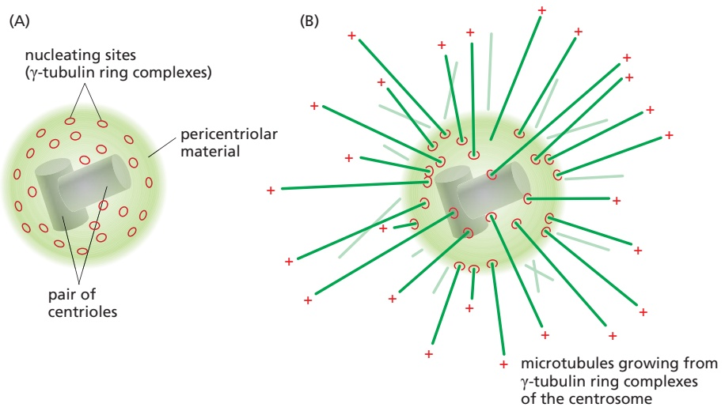

(C)

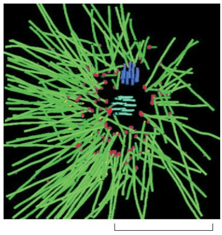

1 µm

Figure 16–42 The centrosome. (A) The centrosome is a major MTOC in animal cells. Located in the cytoplasm next to the nucleus, it consists of a pair of centrioles surrounded by an amorphous matrix of fibrous proteins, the pericentriolar material, in which the γ-tubulin ring complexes that nucleate microtubule growth are embedded. (B) A centrosome with attached microtubules. The minus end of each microtubule is embedded in the centrosome, having grown from a γ-tubulin ring complex, whereas the plus end of each microtubule is free in the cytoplasm. (C) In a reconstructed image of the MTOC from a C. elegans cell, a dense thicket of microtubules can be seen emanating from the centrosome. (C, from E.T. O’Toole et al., J. Cell Biol. 163:451–456, 2003. With permission from the authors.)

Figure 16–43 A pair of centrioles in the centrosome. (A) An electron micrograph of a thin section of an isolated centrosome from an interphase cell showing the mother centriole with its distal appendages and the adjacent daughter centriole, which formed through a duplication event during S phase (see Figure 17–29). In the centrosome, the centriole pair is surrounded by a dense matrix of pericentriolar material from which microtubules nucleate. Centrioles also function as basal bodies to nucleate the formation of ciliary axonemes (see Figure 16–58). (B) Electron micrograph of a cross section through a centriole in the cortex of a protozoan. Each centriole is composed of nine sets of microtubule triplets arranged to form a cylinder. (C) Each triplet contains one complete microtubule (the A microtubule) fused to two incomplete microtubules (the B and C microtubules). (D) The centriolar protein SAS-6 forms a coiled-coil dimer. Nine SAS-6 dimers can self-associate to form a ring. Located at the hub of the centriole cartwheel-like structure, the SAS-6 ring is thought to generate the ninefold symmetry of the centriole. (A, from M. Paintrand et al., J. Struct. Biol. 108:107, 1992. With permission from Elsevier; B, courtesy of Richard Linck; D, courtesy of Michel Steinmetz.)

A centriole consists of a cylindrical array of short, modified microtubules arranged into a barrel shape with striking ninefold symmetry (Figure 16–43). Together with a large number of accessory proteins, the centrioles recruit the pericentriolar material, where microtubule nucleation takes place. The pericentriolar material consists of a dense spherical matrix that is thought to form through a process of biomolecular condensation (see Figure 12–6). As described in Chapter 17 (see Figure 17–29), the centrosome duplicates before mitosis, forming a pair of centrosomes that each contain a centriole pair. When mitosis begins, the two centrosomes move apart to form the poles of the mitotic spindle (see Panel 17–1).MBoC7 m16.48/1

#### Microtubule Organization Varies Widely Among Cell Types

The arrangement of microtubules in the cytoplasm varies in different cell types (**Figure 16–44**). In budding yeast, microtubules are nucleated at an MTOC that is embedded in the nuclear envelope as a small, multilayered structure called the spindle pole body, also found in other fungi and diatoms. Higher-plant cells lack centrosomes and nucleate microtubules at sites distributed all around the nuclear envelope and at the cell cortex. Neither fungi nor most plant cells contain centrioles. Despite these differences, all these cells seem to use γ-TuRC to nucleate their microtubules.

Cultured fibroblasts contain an aster-like configuration of microtubules, with dynamic plus ends pointing outward toward the cell periphery and stable

Figure 16–44 Microtubule organization in different cell types. Microtubules (green) are organized by MTOCs (red), which nucleate, anchor, or stabilize the microtubule minus ends. A single focal MTOC in a fibroblast or yeast cell is the primary nucleation site and leads to microtubules organized with their plus ends extending out toward the cell periphery. A more complex distribution of microtubule plus and minus ends is observed in other cell types.

#### MICROTUBULES

Some of the major accessory proteins of the microtubule cytoskeleton. Except for two classes of motor proteins, an example of each major type is shown. Each of these is discussed in the text. However, most cells contain more than a hundred different microtubule-binding proteins, and—as for the actin-associated proteins—it is likely that there are important types of microtubule-associated proteins that are not yet recognized.

minus ends gathered near the nucleus. Most microtubule minus ends detach from the centrosome and can be organized by other cellular structures, such as the Golgi apparatus, which functions as an MTOC in mesenchymal cells. The organization of microtubules in the cell establishes a general coordinate system, which is then used to position many organelles within the cell. Highly differentiated cells with complex morphologies, such as neurons, muscles, and epithelial cells, use additional mechanisms to establish their more elaborate internal organization. Thus, for example, when an epithelial cell forms cell–cell junctions and becomes highly polarized, the microtubule minus ends relocalize to a region near the apical plasma membrane. From this asymmetrical location, a microtubule array extends along the long axis of the cell, with plus ends directed toward the basal surface (see Figure 16–4). In many cells, the minus ends of microtubules are stabilized by association with γ-TuRC or other capping proteins, or else they serve as microtubule-depolymerization sites. One class of capping proteins, called CAMSAPs in vertebrates, acts to protect minus ends from depolymerization and anchor them to cellular structures, such as the Golgi apparatus or the cell cortex.

Neurons contain complex cytoskeletal structures. As they differentiate, neurons send out specialized processes that will either receive electrical signals (dendrites) or transmit electrical signals (axons) (see Figure 16–45). Axons and dendrites (collectively called neurites) are filled with bundles of microtubules that are critical to their structure and their function. In axons, all the microtubules are oriented with their minus ends pointing back toward the cell body and their plus ends pointing toward the axon terminals (see Figure 16–44). Microtubules do not reach from the cell body all the way to the axon terminals; each is typically only a few micrometers in length, but large numbers are staggered in an overlapping array. These aligned microtubule tracks act as a highway to transport specific proteins, protein-containing vesicles, and mRNAs to the axon terminals, where synapses are constructed and maintained. The longest axon in the human body reaches from the base of the spinal cord to the foot and is up to a meter in length. Dendrites are generally much shorter. The microtubules in dendrites lie parallel to one another but their polarities are mixed, with some pointing their plus ends toward the dendrite tip, and others pointing in the opposite direction.

#### Microtubule-binding Proteins Modulate Filament Dynamics and Organization

Microtubule polymerization dynamics are very different in cells than in solutions of pure tubulin. Microtubules in cells exhibit a much higher polymerization rate (typically 10–15 μm/min, relative to about 1.5 μm/min with purified tubulin at similar concentrations), a greater catastrophe frequency, and extended pauses in microtubule growth, a dynamic behavior rarely observed in pure tubulin solutions. These and other differences arise because microtubule dynamics inside the cell are governed by a variety of proteins that bind tubulin dimers or microtubules, as summarized in **Panel 16–4**.

Proteins that bind to microtubules are collectively called **microtubuleassociated proteins**, or **MAPs**. Because the short (∼20 amino acid) C-terminal tails of both α- and β-tubulin that protrude from the microtubule are enriched in glutamic and aspartic acids, the surface of the microtubule possesses a net negative charge. Many MAPs are positively charged and bind to microtubules through electrostatic interactions. Some MAPs can stabilize microtubules against disassembly. A subset of MAPs can also mediate the interaction of microtubules with other cell components. This subset is prominent in neurons, where stabilized microtubule bundles form the core of the axons and dendrites that extend from the cell body (**Figure 16–45**). These MAPs have at least one domain that binds to the microtubule surface and another that projects outward. The length of the projecting domain can determine how closely MAP-coated microtubules pack together, as demonstrated in cells engineered to overproduce different MAPs.

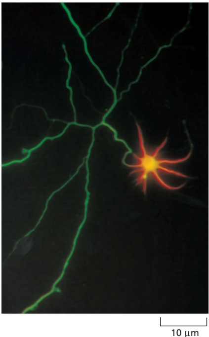

Figure 16–45 Localization of MAPs in the axon and dendrites of a neuron. This immunofluorescence micrograph shows the distribution of the proteins tau (green) and MAP2 (orange) in a hippocampal neuron in culture. Whereas tau staining is confined to the axon (long and branched in this neuron), MAP2 staining is confined to the cell body and its dendrites. The antibody used here to detect tau binds only to unphosphorylated tau; phosphorylated tau is also present in dendrites. (Courtesy of James W. Mandell and Gary A. Banker.)

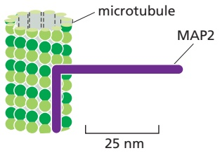

(A)

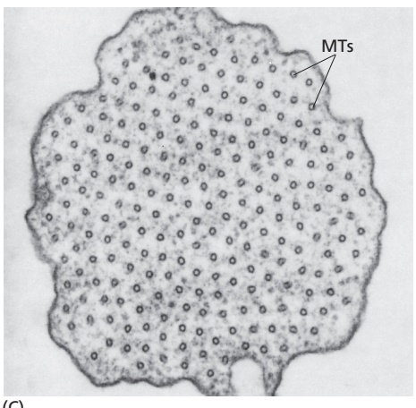

(B)

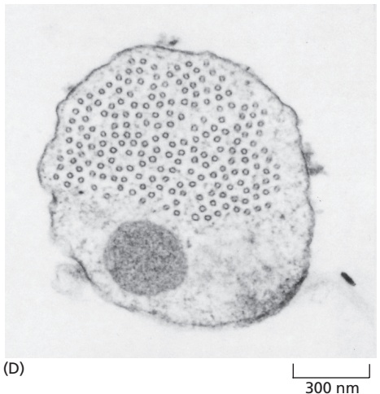

(C)

Figure 16–46 Organization of microtubule bundles by MAPs. (A) One end of MAP2 binds along the microtubule lattice and extends a long projecting arm. (B) Tau possesses a shorter projection arm. (C) Electron micrograph showing a cross section through a microtubule bundle in a cell overexpressing MAP2. The regular spacing of the microtubules (MTs) in this bundle results from the constant length of the projecting arms of MAP2. (D) Similar cross section through a microtubule MBoC7 m16.51/16.46bundle in a cell overexpressing tau. Here the microtubules are spaced more closely together than they are in C because of tau’s relatively short projecting arm. (C and D, from J. Chen et al., Nature 360:674–677, published 1992 by Nature Publishing Group. Reproduced with permission of SNCSC.)

Cells overexpressing MAP2, which has a long projecting domain, form bundles of stable microtubules that are kept widely spaced, while cells overexpressing tau, a MAP with a much shorter projecting domain, form bundles of more closely packed microtubules (**Figure 16–46**). MAPs are the targets of several protein kinases, and phosphorylation of a MAP can control both its activity and localization inside cells by disrupting its electrostatic interaction with microtubules.

MAPs can also recruit other proteins that organize the microtubule cytoskeleton. An important example is augmin, an 8-subunit protein complex that binds to sites along the microtubule and recruits γ-TuRC, which nucleates a new microtubule to form a microtubule branch (**Figure 16–47A**). Thus, similar to the activity of the Arp2/3 complex on actin filaments, augmin causes branching nucleation on preexisting microtubules (**Movie 16.10**). Augmin-induced branches help build the spindle during mitosis. Because they lack centrosomes, plant cells rely extensively on augmin-dependent microtubule branching nucleation to organize the microtubule cytoskeleton (**Figure 16–47B and C**).

#### Microtubule Plus End–binding Proteins Modulate Microtubule Dynamics and Attachments

While the minus ends of microtubules in many cells are usually stabilized and inert, plus ends, in contrast, efficiently explore and probe the entire volume of the cell. This process is facilitated by numerous proteins that bind to microtubule plus ends and thereby influence microtubule dynamics. These proteins can influence the rate at which a microtubule switches from a growing to a shrinking state (the frequency of catastrophes) or from a shrinking to a growing state

Figure 16–47 Microtubule branching by augmin. (A) Augmin binds along the side of an existing microtubule and recruits a γ-tubulin ring complex that nucleates a new microtubule with a low branching angle. (B) Fluorescence micrographs showing augmin (orange) nucleating a microtubule branch in the cortex of an epidermal cell in the plant Arabidopsis thaliana. (C) Depletion of augmin severely stunts plant growth. (B, from W. Liu et al., J. Integr. Plant Biol. 61:388–393, 2019; C, from T. Liu et al., Curr. Biol. 24:2708–2713, 2014. With permission from Elsevier.)

(the frequency of rescues). For example, members of a family of kinesin proteins known as catastrophe factors (or kinesin-13s) bind to microtubule ends and appear to pry protofilaments apart, lowering the normal activation-energy barrier that prevents a microtubule from springing apart into the curved protofilaments that are characteristic of the shrinking state (**Figure 16–48**). Other plus end–associated proteins act to promote rapid microtubule growth. A particularly ubiquitous example is XMAP215, which has close homologs in organisms that range from yeast to humans. Like formin proteins that concentrate actin subunits at the plus end of a growing actin filament, XMAP215 binds free tubulin subunits and delivers them to the plus end of a microtubule, dramatically accelerating polymerization (see Figure 16–48).

A large subset of MAPs is enriched at microtubule plus ends. Called plus-end tracking proteins (1TIPs), these MAPs bind an actively growing plus end and dissociate when the microtubule begins to shrink (**Figure 16–49**). The kinesin-13 catastrophe factors and XMAP215 mentioned above behave as +TIPs and act to modulate the growth and shrinkage of the microtubule end to which they are

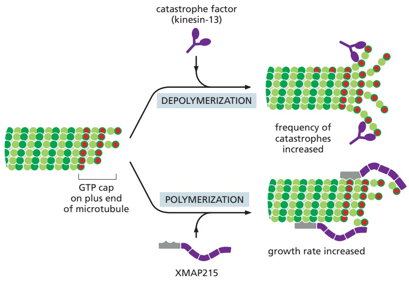

Figure 16–48 The effects of proteins that bind to microtubule ends. The transition between microtubule growth and shrinkage is controlled in cells by a variety of proteins. Catastrophe factors such as kinesin-13, a member of the kinesin motor protein superfamily, bind to microtubule ends and pry them apart, thereby promoting depolymerization. On the other hand, a MAP such as XMAP215 promotes rapid microtubule polymerization (XMAP stands for Xenopus microtubuleassociated protein, and the number refers to its molecular mass in kilodaltons). XMAP215 binds tubulin dimers and delivers them to the microtubule plus end, thereby increasing the microtubule growth rate.

5 μm

(A)

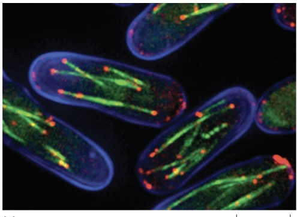

(B)

attached. Other +TIPs control microtubule positioning by helping to capture and stabilize the growing microtubule end at specific cellular targets, such as the cell cortex or the kinetochore of a mitotic chromosome. EB1 and its relatives, small dimeric proteins that are highly conserved in animals, plants, and fungi, are key players in this process. EB1 proteins do not actively move toward plus ends, but rather recognize a structural feature of the growing plus end (see Figure 16–49). Several +TIPs depend on EB1 proteins for their plus-end accumulation and also interact with each other and with the microtubule lattice. By attaching to the plus end, these factors control microtubule dynamics and also allow the cell to harness the energy of microtubule polymerization to generate pushing forces that can be used for positioning the spindle, chromosomes, or organelles.

#### Tubulin-sequestering and Microtubule-severing Proteins ModulateMBoC7 m16.53/16.49 Microtubule Dynamics

As it does with actin monomers, the cell sequesters unpolymerized tubulin subunits to maintain a pool of active subunits at a level near the critical concentration. One molecule of the small protein stathmin (also called Op18) binds two tubulin heterodimers and prevents their addition to the ends of microtubules (**Figure 16–50**). Stathmin thus decreases the effective concentration of tubulin subunits that are available for polymerization (an action analogous to that of the drug colchicine) and enhances the likelihood that a growing microtubule will switch to the shrinking state. Phosphorylation of stathmin inhibits its binding to tubulin, and signals that cause stathmin phosphorylation can increase the rate of microtubule elongation and suppress dynamic instability. Stathmin has been implicated in the regulation of both cell proliferation and cell death. Notably, mice lacking stathmin develop normally but are less fearful than wild-type mice, reflecting a role for stathmin in neurons of the amygdala, where it is normally expressed at high levels.

Severing is another mechanism employed by the cell to destabilize microtubules. To sever a microtubule, 13 longitudinal bonds must be broken, one for each protofilament. The protein katanin, named after the Japanese word for “sword,” accomplishes this demanding task (**Figure 16–51A and B**). Katanin belongs to a large family of proteins that use the energy of ATP hydrolysis to disassemble or remodel protein complexes. By extracting tubulin subunits from the wall of the microtubule, katanin weakens the structure and thereby promotes breakage. Katanin also releases microtubules from microtubule-organizing centers and is thought to contribute to the rapid microtubule depolymerization observed at the poles of spindles during mitosis.

Paradoxically, the loss of microtubule-severing protein activity in many cell types leads to a decrease rather than an increase in microtubules. Thus, microtubule-severing proteins play an unexpected role in stabilizing microtubules. How is this possible? During the intermediate steps of a microtubule-severing event, GDP-bound tubulin subunits are lost from the wall of the microtubule and are replaced with GTP-tubulin subunits from

Figure 16–49 1TIP proteins found at the growing plus ends of microtubules. (A) Frames from a fluorescence time-lapse movie of the edge of a cell expressing fluorescently labeled tubulin that incorporates into microtubules (green) as well as the +TIP protein EB1 tagged with a different color (red). The same microtubule is marked (asterisk) in successive movie frames. When the microtubule is growing (frames 1, 2), EB1 is associated with the tip. When the microtubule undergoes a catastrophe and begins shrinking, EB1 is lost (frames 3, 4). The labeled EB1 is regained when growth of the microtubule is rescued (frame 5). See Movie 16.11. (B) In the fission yeast Schizosaccharomyces pombe, microtubules (green) are bound at their plus ends by the homolog of EB1 (red) as they grow toward the two poles of the rod-shaped cells. (A, courtesy of Anna Akhmanova and Ilya Grigoriev; B, courtesy of Takeshi Toda.)

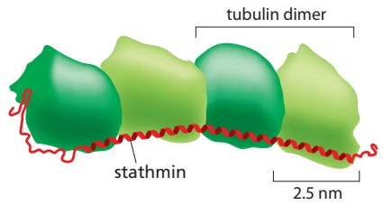

Figure 16–50 Sequestration of tubulin by stathmin. Structural studies with electron microscopy and crystallography suggest that the elongated stathmin protein binds along the side of two tubulin heterodimers. (Adapted from M.O. Steinmetz et al., EMBO J. 19:572–580, 2000.)

Figure 16–51 Microtubule severing by katanin can destabilize or amplify microtubules. (A) Taxol-stabilized, fluorescently labeled microtubules were adsorbed on the surface of a glass slide, to which purified katanin was added along with ATP. There are a few breaks in the microtubules 30 seconds after the addition of katanin. (B) Three minutes after the addition of katanin, the filaments have been severed in many places, leaving a series of small fragments at the previous locations of the long microtubules. (C) Incorporation of GTP-tubulin subunits from the soluble pool into sites of katanin-induced damage in the microtubule lattice stabilizes the severed end or generates an island of GTP-tubulin that promotes rescue. (A and B, from J.J. Hartman et al., Cell 93:277–287, 1998. With permission from Elsevier. C, adapted from A. Vemu et al., Science 361: eaau1504, 2018. With permission from AAAS.)

the soluble pool. If a sufficient number of GTP-tubulin subunits are incorporated before the severing is complete, the new plus end of the cut microtubule will possess a stabilizing GTP-tubulin cap and will therefore polymerize. Thus microtubule severing can generate plus ends that promote growth of more polymer. Alternatively, incomplete severing could lead to an island of GTP-tubulin in the microtubule lattice that could promote a future rescue event when this site is exposed after catastrophe (Figure 16–51C). Although insertion of GTP-tubulin into the lattice has been observed in vitro with pure microtubules, the importance of this activity in cells has not yet been fully established.

#### Two Types of Motor Proteins Move Along MicrotubulesMBoC7 m16.55/16.51

Like actin filaments, microtubules also work together with motor proteins in a variety of cellular processes. There are two major classes of microtubule-based motors, **kinesins** and **dyneins**, which perform three major functions. First, they move cargo such as organelles and macromolecules within the cell. Unlike actinbased transport, however, microtubule-based motors are used to transport cargo over long distances. Second, motors can slide microtubules relative to one another, thereby generating specific arrangements of microtubules, as in neurons and epithelial cells (see Figure 16–44), and in the mitotic spindle (see Chapter 17). Third, a subset of microtubule-based motors regulates microtubule dynamics, as illustrated by kinesin-13 (see Figure 16–48).

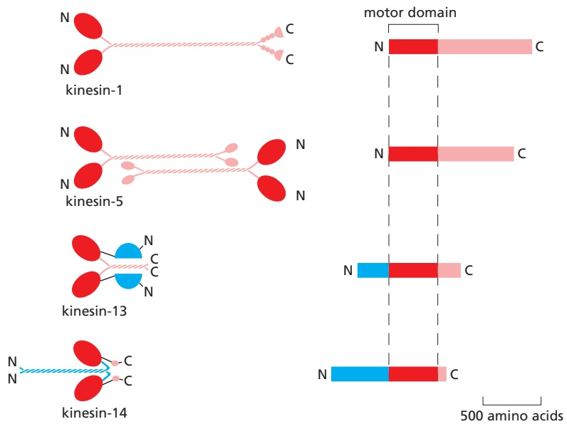

Figure 16–52 Kinesins. Structures of four kinesin superfamily members. As in the myosin superfamily, only the motor domains are conserved. Kinesin-1 has the motor domain at the N-terminus of the heavy chain and moves toward the microtubule plus end. The middle domain forms a long coiled-coil, mediating dimerization. The C-terminal domain forms a tail that attaches to cargo, such as a membrane-enclosed organelle. Kinesin-5 forms tetramers in which two dimers associate by their tails. The bipolar kinesin-5 tetramer is able to slide two microtubules past each other, analogous to the activity of the bipolar thick filaments formed by myosin II. Kinesin-13 has its motor domain located in the middle of the heavy chain. It is a member of a family of kinesins that have lost typical motor activity and instead bind to microtubule ends to promote depolymerization (see Figure 16–48). Kinesin-14 is a C-terminal kinesin. Unlike most kinesins, members of the kinesin-14 family travel toward the microtubule minus end.

Like myosins, kinesins are a large protein superfamily in which the motor domain of the heavy chain is the common element (**Figure 16–52**). The yeast Saccharomyces cerevisiae has six distinct kinesins. The nematode C. elegans has 20 kinesins, and humans have 45. **Kinesin-1** is similar to myosin II in having two heavy chains per active motor; these form two globular head motor domains that are held together by an elongated coiled-coil tail that mediates heavy-chain dimerization. Most kinesins have their motor domain at the N-terminus and walk toward the plus end of the microtubule. Kinesins with the motor domain at the C-terminus walk in the opposite direction, toward the minus end of the microtubule, while kinesin-13 has a central motor domain and does not walk at all, but uses the energy of ATP hydrolysis to depolymerize microtubule ends (see Figure 16–48). Some kinesins are monomers, and others are homodimers, heterodimers, or tetramers. The motor may be linked to a membrane-enclosed organelle via a light chain or an adaptor protein. Some kinesins possess a second microtubule-binding domain that increases its affinity for the microtubule or mediates cross-linking and sliding of two microtubules.

In kinesin-1, small movements at the ATP-binding site regulate the docking and undocking of the motor head domain to a long linker region. This acts to throw the second head forward along the protofilament to a binding site 8 nm closer to the microtubule plus end, which is the distance between tubulin dimers of a protofilament. The ATP-hydrolysis cycles in the two heads are closely coordinated, so that this cycle of linker docking and undocking allows the two-headed motor to move in a hand-over-hand (or head-over-head) stepwise manner (**Figure 16–53**).

The dyneins are a family of minus end–directed microtubule motors unrelated to the kinesins. They are composed of one, two, or three heavy chains (that include the motor domain) and a large and variable number of associated intermediate, light-intermediate, and light chains. The dynein family has two major branches. The first contains the cytoplasmic dyneins, which are homodimers of two heavy chains (**Figure 16–54**). Cytoplasmic dynein 1 is encoded by a single gene in almost all eukaryotic cells but is missing from flowering plants and some algae. It is used for organelle and mRNA trafficking, for positioning the centrosome and nucleus during cell migration, and for construction of the microtubule spindle in mitosis and meiosis. Cytoplasmic dynein 2 is found only in eukaryotic

Figure 16–53 The mechanochemical cycle of kinesin. Kinesin-1 is a dimer of two ATP-binding motor domains (heads) that are connected through a long coiled-coil tail (see Figure 16–52). The two kinesin motor domains work in a coordinated manner; during a kinesin “step,” the rear head detaches from its tubulin binding site on the microtubule, passes the partner motor domain, and then rebinds to the next available binding site. Using this “hand-over-hand” motion, the kinesin dimer can move for long distances on the microtubule without completely letting go of its track.

At the start of each step, one of the two kinesin motor domain heads, the rear or lagging head (dark red), is tightly bound to the microtubule and to ATP, while the front or leading head is loosely bound to the microtubule with ADP in its binding site. The forward displacement of the rear motor domain is driven by the dissociation of ADP and binding of ATP in the leading head (between panels 2 and 3 in this drawing). The binding of ATP to this motor domain causes a small peptide called the neck linker to shift from a rearward-pointing to a forward-pointing conformation (the neck linker is drawn here as a purple connecting line between the leading motor domain and the intertwined coiled-coil). This shift pulls the rear head forward, once it has detached from the microtubule with ADP bound [detachment requires ATP hydrolysis and phosphate (P) release]. The kinesin molecule is now poised for the next step, which proceeds by an exact repeat of the process shown (Movie 16.12).

organisms that have cilia and is used to transport material from the tip to the base of the cilia—a process called intraflagellar transport (IFT). Axonemal dyneins comprise the second branch and include monomers, heterodimers, and heterotrimers, with one, two, or three motor-containing heavy chains, respectively. They are highly specialized for the rapid and efficient microtubule sliding movements that drive the beating of cilia and flagella (discussed later).

Dyneins are the largest of the known molecular motors. Although structurally unrelated to myosins and kinesins, dyneins follow the general rule of coupling ATP hydrolysis to microtubule binding and unbinding as well as to a force-generating conformational change (**Figure 16–55**).

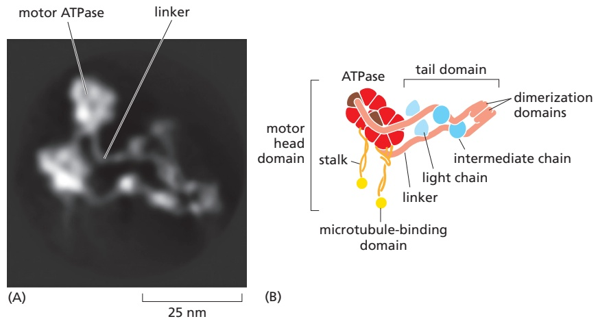

Figure 16–54 Cytoplasmic dynein. (A) Cryo-electron microscopy (cryoEM) reconstruction of a molecule of cytoplasmic dynein. Like myosin II and kinesin-1, cytoplasmic dynein is a two-headed molecule. The dynein head is very large compared with the head of either myosin or kinesin. (B) Schematic depiction of cytoplasmic dynein showing the two heavy chains that contain a motor head with domains for microtubule binding and ATP hydrolysis, connected by a long stalk. The tail domain consists of a linker that connects the motor heads to a dimerization domain. Bound to the linker domain are multiple intermediate chains and light chains (blue) that help to mediate many of dynein’s functions. (C) The organization of domains in a dynein heavy chain. This is a huge polypeptide, containing more than 4000 amino acids. The conserved dynein motor head domain contains six AAA domains, four of which retain ATP-binding sequences, but only one of which has the major ATPase activity (brown). The tail domain is not as highly conserved as the head domain and varies among different dynein subtypes. $( \mathsf { A } ,$ courtesy of Andrew Carter.)

#### Microtubules and Motors Move Organelles and Vesicles

A major function of cytoskeletal motors in interphase cells is the transport and positioning of membrane-enclosed organelles (**Movie 16.13**). Kinesin was originally identified as the protein responsible for fast anterograde axonal transport, the rapid movement of mitochondria, secretory vesicle precursors, and various synapse components down the microtubule highways of the axon to the distant nerve terminals. Cytoplasmic dynein 1 was identified as the motor responsible for transport in the opposite direction, retrograde axonal transport. Although organelles in most cells need not cover such long distances, their polarized transport is equally necessary. A typical microtubule array in an interphase cell is oriented with the minus ends near the center of the cell at the centrosome and the plus ends extending to the cell periphery. Thus, centripetal movements of organelles or vesicles toward the cell center require the action of minus end–directed cytoplasmic dynein motors, whereas centrifugal movements toward the periphery require plus end–directed kinesin motors. Notably, in animal cells, nearly all minus end–directed transport is driven by the single cytoplasmic dynein 1 motor, whereas at least 15 different kinesins are used for plus end–directed transport.

A clear example of the effect of microtubules and microtubule motors on the behavior of intracellular membranes is their role in organizing the endoplasmic reticulum (ER) and the Golgi apparatus. The network of ER membrane tubules aligns with microtubules and extends almost to the edge of the cell (**Movie 16.14**), whereas the Golgi apparatus is located near the centrosome. When cells are treated with a drug that depolymerizes microtubules, such as colchicine or nocodazole, the ER collapses to the center of the cell, while the Golgi apparatus fragments and disperses throughout the cytoplasm. In vitro, kinesins can tether ER-derived membranes to preformed microtubule tracks and walk toward the microtubule plus ends, dragging the ER membranes out into tubular protrusions and forming a membranous web that looks very much like the ER in cells. Conversely, dyneins are required for positioning the Golgi apparatus near the cell center of animal cells; they do this by moving Golgi vesicles along microtubule tracks toward the microtubules’ minus ends at the centrosome.

The different tails and their associated light chains on specific motor proteins allow the motors to attach to their appropriate organelle cargo. Membraneassociated motor receptors that are sorted to specific membrane-enclosed compartments interact directly or indirectly with the tails of the appropriate kinesin family members. Many viruses take advantage of microtubule motor–based transport during infection and use kinesin to move from their site of replication and assembly to the plasma membrane, from which they are poised to infect neighboring cells.

For dynein, a large macromolecular assembly mediates attachment to cargoes. To translocate organelles effectively, cytoplasmic dynein, itself a huge protein complex, requires association with a second large protein complex called dynactin as well as with an adaptor protein that mediates their interaction and

Figure 16–55 The power stroke of dynein. Illustration of the movement of a monomeric axonemal dynein found in the flagellum of the unicellular green alga Chlamydomonas reinhardtii. As in cytoplasmic dynein, the motor-containing head domain of axonemal dynein connects to a long, coiled-coil stalk with the microtubule-binding site at the tip. The tail attaches to an adjacent microtubule in the axoneme. Movement is thought to occur through a “linker-swing, dyneinwinch” mechanism. ATP binding and hydrolysis cause the linker to throw the head domain toward the microtubule minus end like a fishing hook. The microtubule-binding domain reattaches 8 nm along the microtubule. Release of ATP and phosphate then leads to a large conformational power stroke in the linker domain, pulling the tail and its attached microtubule toward the minus end. Each cycle generates a step of about 8 nm, thereby contributing to flagellar beating (see Figure 16–60). In the case of cytoplasmic dynein, the tail is attached to a cargo such as a vesicle, and a single power stroke transports the cargo about 8 nm along the microtubule toward its minus end (see Figure 16–56).

links to a cargo such as a vesicle. The dynactin complex includes a short, actinlike filament that forms from the actin-related protein Arp1 (distinct from Arp2 and Arp3, the components of the Arp2/3 complex involved in the nucleation of conventional actin filaments) (**Figure 16–56**). A number of other proteins also contribute to dynein cargo binding and motor regulation, and their function is especially important in neurons, where defects in microtubule-based transport have been linked to neurological diseases. A striking example is smooth brain, or lissencephaly, a human disorder in which cells fail to migrate to the cerebral cortex of the developing brain. One type of lissencephaly is caused by defects in Lis1, a dynein-binding protein required for nuclear migration in several species. In the normal brain, migration of the nucleus directs the developing neural cell body toward its correct position in the cortex. In the absence of Lis1, however, this process fails, and affected children suffer from developmental delays as well as a variety of neurological defects. Dynein is required continually for neuronal function, as mutations in a dynactin subunit or in the tail region of cytoplasmic dynein lead to neuronal degeneration in humans and mice. These effects are associated with decreased retrograde axonal transport and provide strong evidence for the importance of robust axonal transport in neuronal viability.

The cell can regulate the activity of motor proteins and thereby cause either a change in the positioning of its membrane-enclosed organelles or whole-cell movements. Fish melanophores provide one of the most dramatic examples. These giant cells, which are responsible for rapid changes in skin coloration in several species of fish, contain large pigment granules that can alter their location in response to neuronal or hormonal stimulation (**Figure 16–57**). The pigment granules aggregate or disperse by moving along an extensive network of microtubules that are anchored at the centrosome by their minus ends. The tracking of individual pigment granules reveals that the inward movement is rapid and smooth, while the outward movement is jerky, with frequent backward steps. Both dynein and kinesin microtubule motors are associated with the pigment granules. The jerky outward movements may result from a tug-of-war between the two opposing

DISPERSED

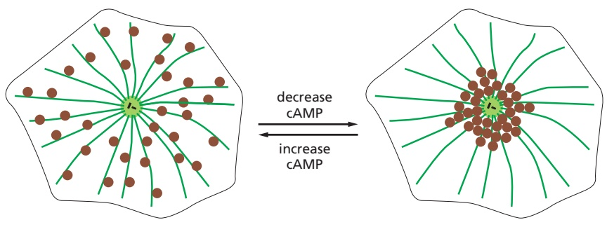

(A)

AGGREGATED

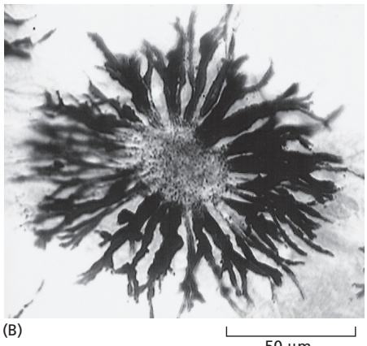

50 µm

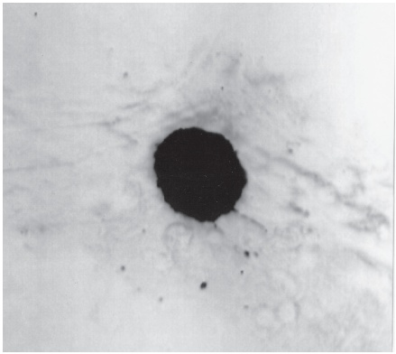

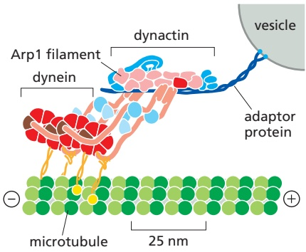

Figure 16–56 Dynactin and an adaptor protein mediate the attachment of dynein to a membrane-enclosed organelle. Dynein requires the presence of a large number of accessory proteins to associate with membrane-enclosed organelles. Dynactin is a large complex that includes components that bind weakly to microtubules, components that bind to dynein itself, and components that form a small, actin-like filament made of the actinrelated protein Arp1. Dynactin associates with two molecules of cytoplasmic dynein as well as with an adaptor protein that mediates the connection to a cargo.

Figure 16–57 Regulated melanosome movements in fish pigment cells.

These giant cells, which are responsible for changes in skin coloration in several species of fish, contain large pigment granules called melanosomes. The melanosomes can change their location in the cell in response to a hormonal or neuronal stimulus. (A) Schematic view of a pigment cell, showing the dispersal and aggregation of melanosomes (brown) in response to an increase or decrease in intracellular cyclic AMP (cAMP), respectively. Both redistributions of melanosomes occur along microtubules. (B) Bright-field images of a single cell in a scale of an African cichlid fish, showing its melanosomes either dispersed throughout the cytoplasm (left) or aggregated in the center of the cell (right). (B, courtesy of Leah Haimo.)

microtubule motor proteins, with the stronger kinesin winning out overall. When intracellular cyclic AMP levels decrease, kinesin is inactivated, leaving dynein free to drag the pigment granules rapidly toward the cell center, changing the fish’s color. In a similar way, the movement of other membrane organelles coated with particular motor proteins is controlled by a complex balance of competing signals that regulate both motor protein attachment and activity.

#### Motile Cilia and Flagella Are Built from Microtubules and Dyneins

Just as myofibrils are highly specialized and efficient motility machines built from actin and myosin filaments, cilia and flagella are highly specialized and efficient motility structures built from microtubules and dynein. Both cilia and flagella are hairlike cell appendages that have a bundle of microtubules at their core. **Flagella** are found on sperm and many protozoa. By their undulating motion, they enable the cells from which they emerge to swim through liquid media. **Cilia** are organized in a similar fashion, but they beat with a whiplike motion that resembles the breaststroke in swimming. Ciliary beating can either propel single cells through a fluid (as in the swimming of the protozoan Paramecium) or can move fluid over the surface of a group of cells in a tissue. In the human body, huge numbers of cilia $( 1 0 ^ { 9 } / \mathrm { c m } ^ { 2 }$ or more) line our respiratory tract, sweeping layers of mucus, trapped particles of dust, and bacteria up to the mouth where they are swallowed and ultimately eliminated. Likewise, cilia along the oviduct help to sweep eggs toward the uterus.

The movement of a cilium or a flagellum is produced by the bending of its core, which is called the **axoneme**. The axoneme is composed of microtubules and their associated proteins, arranged in a distinctive and regular pattern. Nine special microtubule doublets (comprising one complete and one partial microtubule fused together so that they share a common tubule wall) are arranged in a ring around a pair of single microtubules (**Figure 16–58**). Almost all forms of motile eukaryotic flagella and cilia (from protozoans to humans) have this characteristic arrangement. The microtubules extend continuously for the length of the axoneme, which can be 10–200 μm. At regular positions along the length of the microtubules, accessory proteins cross-link the microtubules together.

Molecules of axonemal dynein form bridges between adjacent microtubule doublets around the circumference of the axoneme (**Figure 16–59**). When the motor domain of this dynein is activated, the dynein molecules attached to one microtubule doublet (see Figure 16–60) attempt to walk along the adjacent microtubule doublet, tending to force the adjacent doublets to slide relative to one another, much as actin thin filaments slide during muscle contraction. However, the presence of other links between the microtubule doublets prevents this sliding, and the dynein force is instead converted into a bending motion (**Figure 16–60**). Not all dyneins in the axoneme are active at the same time, which results in the characteristic wave-like motion of the cilium or flagellum (**Movie 16.15**).

(A)

(B)

(C)microtubule inner proteins (MIPs)

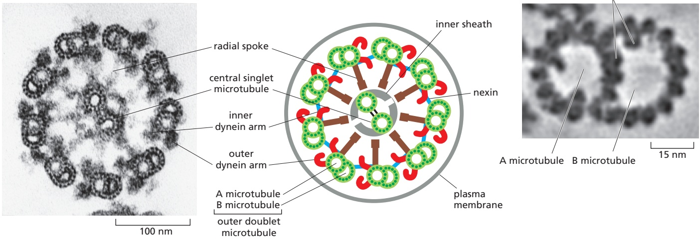

Figure 16–58 The arrangement of microtubules in a flagellum or cilium. (A) Electron micrograph of the flagellum of a green-alga cell (Chlamydomonas) shown in cross section, illustrating the distinctive $\text{" }9+2 "$ arrangement of microtubules. (B) Diagram of the parts of a flagellum or cilium. The various projections from the microtubules link the microtubules together and occur at regular intervals along the length of the axoneme. (C) High-resolution electron tomography image of an outer microtubule doublet showing structural details and features inside the microtubules called microtubule inner proteins (MIPs). $( \mathsf { A } ,$ courtesy of Lewis Tilney; C, courtesy of Daniela Nicastro.)

A microtubule

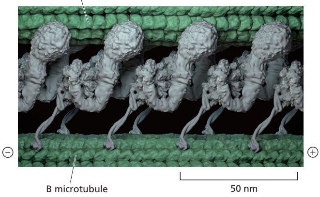

Figure 16–59 Axonemal dynein. CryoEM reconstruction of a sea urchin sperm flagellum showing dynein arms connecting the A microtubule of one doublet with the B microtubule of an adjacent doublet at regular intervals. Sperm axonemal dynein is dimeric. The tail of the molecule binds tightly to an A microtubule, while the two globular heads each have a stalk that connects to an ATP-dependent binding site on a B microtubule (see Figure 16–58). When the heads hydrolyze their bound ATP, they move toward the minus end of the B microtubule, thereby producing a sliding force between the adjacent microtubule doublets in a cilium or flagellum (see Figure 16–60). (Courtesy of Daniela Nicastro.)

In humans, hereditary defects in axonemal dynein cause a condition called primary ciliary dyskinesia, or Kartagener’s syndrome. This syndrome is characterized by inversion of the normal asymmetry of internal organs (situs inversus) due to disruption of fluid flow in the developing embryo, male sterility due to immotile sperm, and a high susceptibility to lung infections due to paralyzed cilia being unable to clear the respiratory tract of debris and bacteria.

Bacteria also swim using cell-surface structures called flagella, but these do not contain microtubules or dynein and do not wave or beat. Instead, bacterial flagella are long, rigid helical filaments, made up of repeating subunits of the protein flagellin. The flagella rotate like propellers, driven by a special rotary motor embedded in the bacterial cell wall. The use of the same name to denote these two very different types of swimming apparatus is an unfortunate historical accident.

#### Primary Cilia Perform Important Signaling Functions in Animal Cells

Many cells possess a shorter, nonmotile counterpart of cilia and flagella called the primary cilium. Primary cilia can be viewed as specialized compartments or organelles that perform a wide range of cellular functions but share many structural features with motile cilia. Both motile and nonmotile cilia are generated during interphase at plasma membrane–associated structures called basal bodies, which anchor them at the cell surface. At the core of each basal body is a single centriole, the same structure found in pairs embedded at the center of animal centrosomes, with nine groups of fused microtubule triplets arranged in a cartwheel (see Figure 16–43). Centrioles are multifunctional, contributing to assembly of the mitotic spindle in dividing cells but migrating to the plasma membrane of interphase cells to template the nucleation of the axoneme (**Figure 16–61**). Because no protein translation occurs in cilia, construction of the. / . axoneme requires intraflagellar transport (IFT), a transport system discovered in the green algae Chlamydomonas. Analogous to the axon, motors move cargoes in both anterograde and retrograde directions, in this case driven by kinesin-2 and cytoplasmic dynein 2, respectively.

(A)

(B)

Figure 16–60 The bending of an axoneme. (A) When axonemes are exposed to the proteolytic enzyme trypsin, the flexible protein links holding adjacent microtubule doublets together are broken. In this case, the addition of ATP allows the motor action of the dynein heads to slide one microtubule doublet against the adjacent doublet. (B) In an intact axoneme (such as in a spermatozoon), the flexible protein links prevent the sliding of the doublet. The motor action therefore causes a bending motion, creating waves or beating motions.

Primary cilia are found on the surface of almost all cell types, where they sense and respond to the exterior environment, functions best understood in the context of smell and sight. In the nasal epithelium, cilia protruding from dendrites of olfactory neurons are the site of both odorant reception and signal amplification. Similarly, the rod and cone cells of the vertebrate retina possess a specialized primary cilium called the outer segment, which is specialized for converting light into a neural signal (see Figure 15–40). Maintenance of the outer segment requires continual IFT-mediated transport of large quantities of lipids and proteins into the cilium, at rates of up to 1000 molecules per second. The links between cilia function and the senses of sight and smell are underscored by the ciliopathies, a set of disorders associated with defects in IFT, the cilium, or the basal body. In the ciliopathy Bardet–Biedl syndrome, patients cannot smell and suffer from retinal degeneration. Other characteristics of this multifaceted disorder include hearing loss, polycystic kidney disease, diabetes, obesity, and polydactyly, suggesting that primary cilia have functions in many aspects of human physiology.

Figure 16–61 Primary cilia. (A) Electron micrograph and diagram of the basal body of a mouse neuron primary cilium. The axoneme of the primary cilium (black arrow) is nucleated by the mother centriole at the basal body, which localizes at the plasma membrane near the cell surface. (B) Centrioles function alternately as basal bodies and as the core of centrosomes. Before a cell enters the cell-division cycle, the primary cilium is shed or resorbed. The centrioles recruit pericentriolar material and duplicate during S phase, generating two centrosomes, each of which contains a pair of centrioles. The centrosomes nucleate microtubules and localize to the poles of the mitotic spindle. Upon exit from mitosis, a primary cilium again grows from the mother centriole. (A, courtesy of Josef Spacek.)

#### Summary

Microtubules are stiff polymers of tubulin molecules. They assemble by addition of GTP-containing tubulin subunits to the free end of a microtubule, with one end (the plus end) growing faster than the other. Hydrolysis of the bound GTP takes place after assembly and weakens the bonds that hold the microtubule together. Microtubules are dynamically unstable and liable to catastrophic disassembly, but they can be stabilized in cells by association with other structures. Microtubule-organizing centers such as centrosomes protect the minus ends of microtubules and continu ally nucleate the formation of new microtubules. Microtubule-associated proteins (MAPs) stabilize microtubules, and those that localize to the plus end (1TIPs) can alter the dynamic properties of the microtubule or mediate their interaction with other structures. Counteracting the stabilizing activity of MAPs are catastrophe factors, such as kinesin-13 proteins, that act to peel apart microtubule ends. Other kinesin family members as well as dynein use the energy of ATP hydrolysis to move unidirectionally along a microtubule. The motor dynein moves toward the minus end of microtubules, and its sliding of axonemal microtubules underlies the beating of cilia and flagella. Primary cilia are nonmotile sensory organelles found on many cell types.

<!-- END EN EN16-H047-H062 -->

## 跨章相关英文内容

- 纺锤体与染色体运动：[EN第17章 · 有丝分裂、纺锤体、胞质分裂与减数分裂](../../12_细胞周期与细胞分裂/小节/02_第二节%20细胞分裂.md#EN17-H021-H061)。
- 病原体依赖微管的细胞内运输：[EN第23章 · 病原体借用宿主细胞骨架移动](01_第一节%20微丝与细胞运动.md#EN23-H021-H021)。
