# 第8章 细胞骨架 · 第三节 中间丝

[返回本章](../README.md) · [中文本章原文](../中文原文.md)

<!-- BEGIN CN CN08-S03 -->
## 第三节 中间丝

中间丝又称中间纤维（intermediate filament, IF），最初是在平滑肌细胞内发现的直径为 10 nm 的绳索状结构。因其粗细介于肌细胞的粗肌丝和细肌丝之间，故命名为中间丝（图 8-36）。中间丝存在于绝大多数动物细胞内。细胞质中间丝通常是围绕细胞核开始组装，并伸展到细胞边缘与细胞质膜上的细胞连接如桥粒、半桥粒等结构相连。通过细胞连接，中间丝将相邻的细胞连成一体。在核膜的内侧，由核纤层蛋白（lamin）组装而成的纤维以正交网状形式排列构成核纤层，并通过位于内层核膜上的核纤层蛋白 B 受体与核膜相连。中间丝结

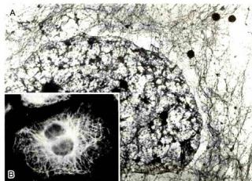  
图 8-36 HeLa 细胞内的中间丝

A. 经非离子去垢剂处理和高盐缓冲液抽提后的细胞质中间丝网络的电镜照片。B. 免疫荧光染色显示细胞质中间丝的分布。（翟中和和蔡树涛博士惠赠）

构较微管和微丝稳定得多，用高盐溶液和非离子去垢剂处理细胞时，构成细胞骨架的微管和微丝，以及其他细胞结构基本上都被除去，但中间丝因有很强的抗抽提能力而被保存下来。

与微管和微丝不同，中间丝并不是所有真核细胞所必需的结构组分。这类蛋白质在高等脊椎动物中最为复杂，而在植物基因组内尚未发现编码中间丝蛋白的基因，在酵母的核膜内侧也不存在核纤层结构。在线虫细胞中表达的某些中间丝蛋白与角蛋白有较高的相似性，但具有外骨骼的动物，如果蝇仅仅表达两种类型的核纤层蛋白，却没有细胞质中间丝。在人类基因组中共有70个编码中间丝蛋白的基因，其中大部分是在上皮细胞中表达的角蛋白基因（54种）。在人体中也有一些组织细胞，如神经系统的少突胶质细胞，它们的细胞质部分形成包绕神经轴突的髓鞘，也没有观察到细胞质内有中间丝结构。

## 一、中间丝的主要类型和组成成分

中间丝的组成成分比微丝和微管要复杂得多，不同组织来源的细胞表达不同类型的中间丝蛋白（表8-2）。根据中间丝蛋白的氨基酸序列、基因结构、组装特性以及在发育过程的组织特异性表达模式等，可将中间丝分为6种主要类型。I型（酸性）和Ⅱ型（中性和碱性）角蛋白（keratin）在上皮细胞内以异源二聚体的形式参与中间丝的组装；而Ⅲ型中间丝，如

波形蛋白（vimentin）、结蛋白（desmin）、微管成束蛋白（syncoilin）、胶质丝酸性蛋白（glial filament acidic protein, GFAP）与外周蛋白（peripherin），则通常组装成同源多聚体。波形蛋白在源于中胚层的细胞和发育早期的一些外胚层细胞中表达，且常在结蛋白、GFAP和神经丝蛋白等一些有分化特异性的中间丝蛋白表达之前形成网络。IV型中间丝蛋白包括3种神经丝蛋白亚基（NF-L、NF-M 和 NF-H），α-丝联蛋白（α-internexin），神经上皮干细胞蛋白（nestin），联丝蛋白α（synemin-α）和desmuslin等成员，他们大部分在神经系统中表达，其中神经上皮干细胞蛋白是神经干细胞的标志蛋白，而联丝蛋白α和desmuslin在肌细胞中表达。核纤层蛋白A/C与核纤层蛋白B1和B2间属于V型中间丝蛋白，其中核纤层蛋白B在人体所有细胞中均表达，而核纤层蛋白A只在原肠胚形成后分化的细胞中表达。CP49和晶状体丝蛋白（filensin）/CP115是在眼睛的晶状体中表达的两个中间丝蛋白，它们拥有中间丝蛋白所共有的一些结构特征，但由于螺旋终止序列等结构域上存在明显的差异，使这两个蛋白共组装成“念珠状纤维”，在电镜下呈波浪形的外观。由此，将这两个成员归AⅠ型中间丝蛋白家族（表8-2）。这种结构可能与晶状体必须具有足够的刚性和弹性，以及尽量地透明等特性有关。改变这两种蛋白的表达将损害晶状体的功能，CP49突变将导致家族性白内障。在人类基因组中至少包含70种不同的中间丝蛋白基因，组成了人类基因组中最大的基国家族之一。这种中间丝蛋白的多样性与人体内200多种细胞类型相关，这些细胞所表现的不同功能和机械性能又与其特殊的细胞骨架成分密切相关，因此，中间丝蛋白被认为是区分细胞类型的身份证。中间丝为多种细胞类型提供了独特的细胞骨架网络结构，在其N端和C端序列上的差异为不同的细胞类型提供了独特的细胞质环境，而核纤层蛋白质则在核膜内侧形成纤维网络。

不同种类的中间丝蛋白有非常相似的二级结构。作为中间丝蛋白的重要结构特征，细胞质中间丝蛋白的中部都有一段由约310个氨基酸残基组成的高度保守的杆状区，其两侧是变化很大的头部和尾部。中间丝蛋白杆状区长度约47 nm，该区域被插入了3个β片层结构，将4段卷曲螺旋（coiled-coil）结构域分隔开。其中L12将整个杆状区分成螺旋1和螺旋2。螺旋1和螺旋2的

表 8-2 中间丝蛋白的类型和组织分布

<table><tr><td>型别</td><td>中间丝种类</td><td>组装伴侣</td><td>组织分布</td></tr><tr><td>I 型</td><td>I 型角蛋白(酸性),28 种</td><td>特定的 II 型角蛋白</td><td>上皮细胞</td></tr><tr><td>II 型</td><td>II 型角蛋白(中性 - 碱性),26 种</td><td>特定的 I 型角蛋白</td><td>上皮细胞</td></tr><tr><td rowspan="5">III 型</td><td>波形蛋白</td><td>自身</td><td>多种中胚层来源的细胞</td></tr><tr><td>结蛋白</td><td>自身</td><td>所有肌肉细胞</td></tr><tr><td>胶质纤维酸性蛋白</td><td>自身或波形蛋白</td><td>星形胶质细胞</td></tr><tr><td>外周蛋白</td><td>自身或 NF-L</td><td>外周神经系统神经元、某些 CNS、受损轴突</td></tr><tr><td>微管成束蛋白</td><td>III 型或 IV 型中间丝蛋白</td><td>肌细胞</td></tr><tr><td rowspan="5">IV 型</td><td>神经丝蛋白三组分(NF-L, M, H)</td><td>NF-L</td><td>神经元</td></tr><tr><td> $\alpha$  - 丝联蛋白</td><td>自身或 NF-L</td><td>神经元</td></tr><tr><td>神经上皮干细胞蛋白</td><td>III 型中间丝蛋白</td><td>在神经上皮干细胞、胶质细胞和肌肉中广泛表达</td></tr><tr><td>联丝蛋白  $\alpha$ </td><td>III 型中间丝蛋白</td><td>肌细胞</td></tr><tr><td>联丝蛋白  $\beta$ </td><td>III 型中间丝蛋白</td><td></td></tr><tr><td rowspan="3">V 型</td><td>核纤层蛋白 A/C</td><td>核纤层蛋白 A/C</td><td>细胞核</td></tr><tr><td>核纤层蛋白 B1</td><td>核纤层蛋白 B</td><td>细胞核</td></tr><tr><td>核纤层蛋白 B2</td><td>核纤层蛋白 B</td><td>细胞核</td></tr><tr><td rowspan="2">VI 型</td><td>晶状体丝蛋白 /CP115</td><td>CP49</td><td>晶状体</td></tr><tr><td>CP49/ 晶状体蛋白</td><td>晶状体丝蛋白</td><td>晶状体</td></tr></table>

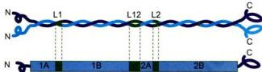  
图 8-37 中间丝蛋白分子结构模式图

中间丝蛋白的中部是由大约310个氨基酸残基组成的杆状区，两侧是呈球状的N端头部和C端尾部。杆状区是中间丝蛋白最保守的区域，该区域被一段β片层结构L12分隔成螺旋1和螺旋2，螺旋1和螺旋2又分别被两段β片层结构L1和L2分隔。两个中间丝蛋白分子的杆状区相互作用形成双股螺旋的二聚体结构。

长度各约 $22\mathrm{nm}$ ，螺旋1和螺旋2又分别被L1和L2隔为A、B两个亚区，4个卷曲螺旋区间分别被称为1A与1B和2A与2B（图8-37）。每段螺旋区的氨基酸序列严格按照每7个氨基酸（a-g）一组重复排列，其中a和d为亲水性氨基酸。这样形成的 $\alpha$ 螺旋结构的表面有一个疏水性的沟槽，供二聚体组装时发挥作用。V型中间丝蛋白在其1B区增加了6组（42个）氨基酸残基的重复，其杆状区的长度为352个氨基酸残基。

中间丝的核心部分直径为 10 nm 左右，主要由中间丝蛋白的杆状区构成。中间丝蛋白的头部和尾部结构域参与中间丝的组装，较长的尾部结构域大多突出于中间丝的核心纤维之外，中间丝 22 nm 或 48 nm 的纵向周期与末端区域形成的突出有关。由中间丝伸出的末端区域可能和中间丝与细胞结构的相互作用有关。不同类型的中间丝的末端结构域变化较大。在电镜下观察到的波形纤维是表面比较光滑的丝状结构，而神经丝在神经突起内部平行排列成束状结构，NF-M 和 NF-H 的 C 端突出于神经丝的表面，并在相邻的神经丝之间，神经丝和微管等其他细胞结构之间形成横桥，将神经突起内的微管和中间丝网络连成一体。

## 二、中间丝的组装与表达

与微管和微丝的组装过程不同，中间丝蛋白在合适的缓冲体系中能自组装成10 nm的丝状结构。中间丝的组装首先是两个单体的杆状区以平行排列的方式形成双股螺旋的二聚体。该二聚体可以是同型二聚体（homodimer），如波形蛋白、GFAP等，但如果是角蛋白，则肯定是一条I型角蛋白和另一条II型角蛋白构成异型二聚体（heterodimer）。二聚体的长度约50 nm。然后是两个二聚体以反向平行和半分子交错的形式组装成四聚体（tetramer）。四聚体可能是中间丝组装的最小结构单位。由于四聚体是由两个二聚体以反向平行的方式组装而成，因此没有极性。作为中间丝组装的基本结构单位，四聚体之间在纵向（首尾）和侧向相互作用，最终组装成横截面为32个中间丝蛋白分子、长度不等的中间丝。中间丝的主干主要是由中间丝蛋白的杆状区构成，其N端和C端结构域除了在中间丝的组装过程中发挥作用之外，还是与细胞的其他结构组分相互作用的主要位点（图8-38）。

中间丝的装配与解聚和微丝与微管的动态特征有所不同，并不表现为典型的踏车行为，也不需要 ATP 或 GTP 参与。

向细胞内注射荧光标记的中间丝蛋白，然后观察中间丝的组装过程，结果显示新加入的中间丝蛋白可以在已经存在的中间丝的多个位点加入，而不是像微管和微丝那样仅仅在末端加入。随着时间的延长，整个中间丝上都显示荧光标记。可见中间丝的组装模式与微管和微丝完全不同，在细胞内新的中间丝蛋白可以通过交换的方式掺入到原有的纤维中去。用胰蛋白酶处理体外培养的成纤维细胞，在细胞变圆的同时，细胞内的中间丝网络解聚。在除去胰蛋白酶以后，新的中间丝似乎从细胞核的周围开始组装，并向细胞边缘延伸，这时的中间丝好像是从头开始组装，新的中间丝蛋白会加到纤维的末端使纤维延长。

在细胞周期的运行过程中，细胞质中间丝网络在细胞分裂前解体，分裂结束后又重新组装。中间丝的解聚和重新组装过程与中间丝蛋白亚基的磷酸化和去磷酸化有关。有丝分裂前即将去组装的中间丝被磷酸化，然后中间丝上被磷酸化的蛋白亚基与14-3-3蛋白结合，导致中间丝网络解体。分裂结束后，中间丝蛋白的可溶性组分发生去磷酸化，14-3-3蛋白从中间丝蛋白亚基上脱落，中间丝蛋白重新参与中间丝网络的组装。

在细胞分化过程中，中间丝的类型随着细胞的分化过程而发生变化。如在小鼠胚胎发育过程中，最初胚胎细胞中表达的中间丝蛋白是角蛋白，待胚胎发育到第8\~9天，在将要发育为间叶组织的细胞中，角蛋白表达量下降直至停止表达，取而代之的是波形蛋白的表达。类似的表达谱变化还见于神经外胚层的发育中，首先表达的是角蛋白，第11天左右，角蛋白停止表达，波形蛋白出现，随后是神经上皮干细胞蛋白表达。当神经干细胞最终分化成神经元和神经胶质细胞时，神经前体细胞内波形蛋白和神经上皮干细胞蛋白停止表达，改为表达神经丝蛋白。作为中枢神经系统中数量众多的星形胶质细胞通常同时表达波形蛋白和胶质纤维酸性蛋白，它们可以共同组装成中间丝，而在一些有丝分裂失控的胶质细胞瘤细胞内可以重新检测到神经上皮干细胞蛋白的表达。由此可见，胚胎细胞能根据其发育方向调节中间丝蛋白基因的表达。在一种类型的中间丝蛋白向另一种类型的中间丝蛋白转变的过程中，新的蛋白似乎是通过交换的方式掺入到原来的中间丝网络中去。

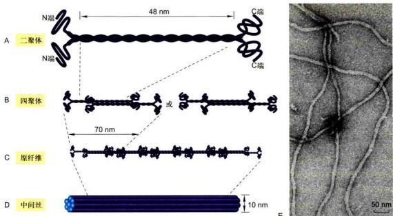  
图8-38 中间丝的组装模型  
A. 由两个中间丝蛋白亚基平行排列组装而成双股螺旋的二聚体。B. 两个二聚体按反向平行，半分子交叠的方式组装成中间丝组装的基本结构单位——四聚体。C. 四聚体首尾相连形成原纤维。D. 8根原纤维构成圆柱状的 $10\mathrm{nm}$ 中间丝。E. 中间丝负染色的电子显微镜图像。（E图由Ueli Aebi博士惠赠）

## 三、中间丝与其他细胞结构的联系

电镜观察所得到的图像信息显示，中间丝在胞质中组装成发达的网络结构，并与细胞质膜上特定的部位（如桥粒）连接，然后通过一些跨膜蛋白（如钙黏蛋白和整联蛋白）与细胞外基质，甚至是相邻细胞的中间丝间接相连。在细胞的内部，许多细胞质中间丝源自细胞核的周缘，并且与核膜有联系。由V型中间丝蛋白组装而成的核纤层在核膜的内侧呈正交网状结构（图8-39）。核纤层与内层核膜上的核纤层蛋白受体相连，从而成为核膜的重要支撑结构。此外，核纤层还是染色质的重要锚定位点。

在细胞分裂前期，核纤层结构解聚，核膜也随之解体，核纤层蛋白A以可溶性单体形式弥散在细胞中；而核纤层蛋白B则与核膜解体后形成的核膜小泡保持结合状态。分裂末期，结合有核纤层蛋白B的核膜小泡在染色质周围聚集，并渐渐融合形成新的核膜，而核纤层蛋白则在核膜的内侧组装成子细胞的核纤层。这一过程有赖于核纤层蛋白与染色质之间的相互作用。细胞分裂过程中核纤层的解体和重新组装与核纤层蛋白的磷酸化水平相关，提示有丝分裂促进因子（MPF）的p34 $^{Cdc2}$ 是核纤层蛋白B的激酶。在有丝分裂前期，MPF可以使核纤层蛋白B的Ser22和Ser392磷酸化，这两个丝氨酸残基分别位于其头部和尾部结构域，磷酸化导致这两个与中间丝组装直接相关的结构域的构象发生变化，从而导致核纤层解聚。采用点突变方法改变这些磷酸化位点可干扰核纤层及核膜结构的解体。在有丝分裂的末期，结合在核膜小泡上的核纤层蛋白B的磷酸基被磷酸酶去除，小泡在染色质周围聚集并融合，去磷酸化后的核纤层蛋白B的头部和尾部的构象回复到能发生自组装的状态。可见，核纤层蛋白的磷酸化与去磷酸化可能是有丝分裂过程中核纤层结构动态变化的调控因素。

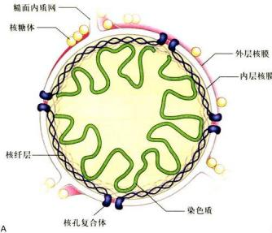

  
图8-39 核纤层的结构  
A. 核纤层结构示意图。B. 非洲爪蟾卵细胞核膜经 Triton X-100 处理去膜，电镜金属投影技术显示核纤层纤维网络。（B 图由 Ueli Aebi 博士惠赠）

核纤层蛋白的缺失或突变与多种人类遗传性疾病相关。A型核纤层蛋白的突变引起脂肪代谢障碍，外周神经退化，并出现早衰症状。在所有的哺乳动物细胞中都有B型核纤层蛋白的表达，尽管没有在人体细胞中发现该蛋白的突变体，但在小鼠体内表达核纤层蛋白B1的缺失突变体会引起胚胎发育异常，并且在出生后死亡。因此，B型核纤层蛋白基因的突变很可能是胚胎致死的。在体外培养的细胞中去除核纤层蛋白，会影响核膜的结构，使其很容易在机械力的作用下破裂。然而，由核纤层蛋白基因变异所导致的疾病似乎并不全与机械力的作用相关，还有许多未知的因素。

细胞质中间丝在那些受机械应力作用的组织细胞中特别丰富。处于不同分化阶段的上皮细胞表达不同类型 的I型及Ⅱ型角蛋白，不同种类的角蛋白具有不同的头部和尾部。可见不同的上皮细胞在表达的角蛋白种类上的差异与细胞所担负的使命相关。上皮细胞中的中间丝往往贯穿整个细胞，其末端与细胞质膜上特定的区域，特别是桥粒和半桥粒结构相连，而暴露在中间丝表面的角蛋白的头部和尾部结构域则与细胞质中的其他组分相结合。中间丝通过桥粒将上皮组织中的各个细胞连成一体，以分散皮肤所受外力的作用。有关基因的突变将干扰中间丝的组装，影响细胞之间的相互作用，如单纯大疱性表皮松懈症与编码角蛋白5和14的基因突变有关，患者的皮肤只要受到轻微的外力作用就会发生破裂，出现水泡。桥粒结构的受损或编码相关蛋白的基因突变同样会导致上皮组织结构的严重破坏。

中间丝除了与桥粒等细胞结构相互作用外，还有一些中间丝结合蛋白如网蛋白（plectin），能将相邻的中间丝组织成束，还能将中间丝与细胞内的微丝、微管以及其他的细胞结构相连接，从而发挥作用。网蛋白基因的变异同样引起上皮组织及神经系统等多种人类疾病。网蛋白基因敲除小鼠在出生后数天死亡。

在神经元内，NF-M和NF-H的尾部结构域突出于神经丝的表面，在与之相邻的神经丝、微管以及一些膜性结构之间形成横桥，将轴突内部的细胞骨架等结构连成一体，为这个细长的细胞突起提供必要的内部支撑。波形蛋白和胶质纤维酸性蛋白是星形胶质细胞中间丝的主要成分，敲除编码这两种蛋白的基因，将导致星形胶质细胞的一些功能如细胞的迁移能力和脑受伤后形成胶质疤痕的能力受损。可见中间丝与细胞其他结构组分的相互作用对于维持组织的整体功能是非常重要的。

## - 思考题

1. 通过这一章的学习，你对生命体的自组装原则有何认识？

2. 除支持作用和运动功能外，细胞骨架还有什么功能？怎样理解“骨架”的概念？

3. 细胞中同时存在几种骨架体系有什么意义？是否是物质和能量的一种浪费？

4. 为什么说细胞骨架是细胞结构和功能的组织者？细胞内一些细胞器和生物大分子的不对称分布有什么意义？

5. 如何理解细胞骨架的动态不稳定性？这一现象与细胞生命活动过程有什么关系？

## - 参考文献

1. 陈晔光，张传茂，陈佺. 分子细胞生物学. 3版. 北京：高等教育出版社，2019.

2. Bettencourt-Dias M, Glover DM. Centrosome biogenesis and function: centrosomics brings new understanding. Nature Reviews Molecular Cell Biology, 2007, 8: 451-463.

3. Chen J, Kanai Y, Cowan N J, et al. Projection domains of MAP2 and tau determine spacings between microtubules in dendrites and axons. Nature, 1992, 360(6405): 674-677.

4. Cooper J A, Schafer D A. Control of actin assembly and disassembly at filament ends. Current Opinion in Cell Biology, 2000, 12: 97-103.

5. Hirokawa N, Noda Y, Tanaka Y, et al. Kinesin superfamily motor proteins and intracellular transport. Nature Reviews Molecular Cell Biology, 2009, 10: 682-696.

6. Holmes K C, Popp D, Gebhard W, et al. Atomic model of the actin filament. Nature, 1990, 347(6288): 44-49.

7. Howard J. Molecular motors: structural adaptations to cellular functions. Nature, 1997, 389(6651): 561-567.

8. Hsu V W, Lee S Y, Yang J. The evolving understanding of COPI vesicle formation. Nature Reviews Molecular Cell Biology, 2009, 10: 360-364.

9. Janke C, Bulinski J C. Post-translational regulation of the microtubule cytoskeleton: mechanisms and functions. Nature Reviews Molecular Cell Biology, 2011, 12: 773-786.

10. Ning H, Xia Y, Zhang D, et al. Hierarchical assembly of centriole subdistalappendages via centrosome binding proteins CCDC120 and CCDC68. Nature Communications, 2017, 8: 15057.

11. Nonaka S, Tanaka Y, Okada Y, et al. Randomization of left-right asymmetry due to loss of nodal cilia generating leftward flow of extraembryonic fluid in mice lacking KIF3B motor protein. Cell, 1998, 95(6): 829-837.

12. Paavilainen V O, Bertling E, Falck S, et al. Regulation of cytoskeletal dynamics by actin-monomer-binding proteins. Trends in Cell Biology, 2004, 14(7): 386-394.

13. Vale R D. The molecular motor toolbox for intracellular transport. Cell, 2003, 112(4): 467-480.

<!-- END CN CN08-S03 -->

---

## 对应英文内容

### 英文补充：中间丝、骨架连接与其他骨架聚合物

> 对应中文板块：中间丝、骨架连接与其他骨架聚合物。英文来源：Molecular Biology of the Cell，第7版，第16章；[本章完整原文](../../来源/英文教材/16_The_Cytoskeleton/chapter.md)。物理PDF页码范围：988–1065（整章范围）。

<!-- BEGIN EN EN16-H063-H069 -->
#### INTERMEDIATE FILAMENTS AND OTHER CYTOSKELETAL POLYMERS

All eukaryotic cells contain actin and tubulin. But the third major type of cytoskeletal protein, the intermediate filament, forms a cytoplasmic filament only in some metazoans—including vertebrates, nematodes, and mollusks. Intermediate filaments are particularly prominent in the cytoplasm of cells that are subject to mechanical stress and are generally not found in animals that have rigid exoskeletons, such as arthropods and echinoderms. It seems that intermediate filaments impart mechanical strength to tissues for the squishier animals.

Cytoplasmic intermediate filaments are closely related to their ancestors, the much more prevalent nuclear lamins, which are found in many eukaryotes but missing from unicellular organisms. The nuclear lamins form a meshwork lining the inner membrane of the nuclear envelope, where they provide anchorage sites for chromosomes and nuclear pores. Several times during metazoan evolution, lamin genes have apparently duplicated, and the duplicates have evolved to produce rope-like, cytoplasmic intermediate filaments. In contrast to the highly conserved actins and tubulin isoforms that are encoded by a handful of genes, different families of intermediate filaments are much more diverse and are encoded by 70 different human genes with distinct, cell type–specific functions (**Table 16–2**).

#### Intermediate Filament Structure Depends on the Lateral Bundling and Twisting of Coiled-Coils

Although their amino- and carboxyl-terminal domains differ, all intermediate filament family members are elongated proteins with a conserved central α-helical domain containing 40 or so heptad repeat motifs that form an extended

TABLE 16–2 Major Types of Intermediate Filament Proteins in Vertebrate Cells

<table><tr><td>Types of intermediate filament</td><td>Component polypeptides</td><td>Location</td></tr><tr><td>Nuclear</td><td>Lamins A, B, and C</td><td>Nuclear lamina (inner lining of nuclear envelope)</td></tr><tr><td rowspan="4">Vimentin-like</td><td>Vimentin</td><td>Many cells of mesenchymal origin</td></tr><tr><td>Desmin</td><td>Muscle</td></tr><tr><td>Glial fibrillary acidic protein</td><td>Glial cells (astrocytes and some Schwann cells)</td></tr><tr><td>Peripherin</td><td>Some neurons</td></tr><tr><td>Epithelial</td><td>Type I keratins (acidic)</td><td rowspan="2">Epithelial cells and their derivatives (e.g., hair and nails)</td></tr><tr><td>Epithelial</td><td>Type II keratins (neutral/basic)</td></tr><tr><td>Axonal</td><td>Neurofilament proteins (NF-L, NF-M, and NF-H)</td><td>Neurons</td></tr></table>

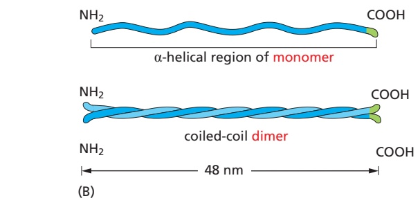

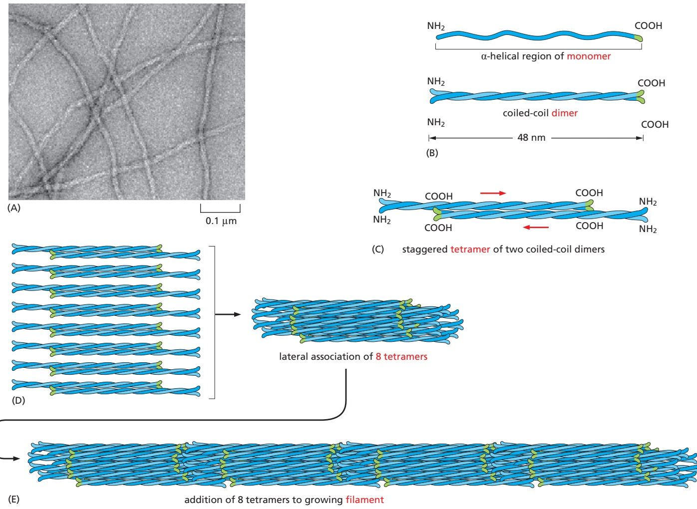

Figure 16–62 A model of intermediate filament construction. An electron micrograph of intermediate filaments is shown in (A). The monomer shown in (B) pairs with another monomer to form a dimer, in which the conserved central rod domains are aligned in parallel and wound together into a coiled-coil. (C) Two dimers then line up side by side to form an antiparallel tetramer of four polypeptide chains. Dimers and tetramers are the soluble subunits of intermediate filaments. (D) Within each tetramer, the two dimers are offset with respect to one another, thereby allowing it to associate with another tetramer. (E) In the final 10-nm-diameter filament, tetramers are packed together in a rope-like array, which has 16 dimers (32 coiled-coils) in cross section. Half of these dimers are pointing in each direction. An electron micrograph of intermediate filaments is shown on the upper left (Movie 16.16). (A, from L. Norlén et al., Exp. Cell Res. 313:2217–2227, 2007. With permission from Elsevier.)

coiled-coil structure with another monomer (see Figure 3–8). A pair of parallel dimers then associates in an antiparallel fashion to form a staggered tetramer (**Figure 16–62**). Unlike actin or tubulin subunits, intermediate filament subunits do not contain a binding site for ATP or GTP. Furthermore, because the tetrameric subunit is made up of two dimers pointing in opposite directions, its two ends are the same. The assembled intermediate filament therefore lacks theMBoC7 m16.67/16.67 overall structural polarity that is critical for actin filaments and microtubules. The tetramers pack together laterally to form the filament, which includes eight parallel protofilaments made up of tetramers. Each individual intermediate filament therefore has a cross section of 32 individual α-helical coils. This large number of polypeptides all lined up together, with the strong lateral hydrophobic interactions typical of coiled-coil proteins, gives intermediate filaments a ropelike character. They can be easily bent, with a persistence length of less than 1 μm (compared to several millimeters for microtubules and about 10 μm for actin), but they are extremely difficult to break and can be stretched to more than three times their length (see Figure 16–6).

Less is understood about the mechanisms of assembly and disassembly of intermediate filaments than of actin filaments and microtubules. In pure protein

solutions, intermediate filaments are extremely stable due to tight association of subunits, but some types of intermediate filaments, including vimentin, form highly dynamic structures in cells such as fibroblasts. Protein phosphorylation probably regulates their disassembly, in much the same way that phosphorylation regulates the disassembly of nuclear lamins in mitosis (see Figure 12–65). As evidence for rapid turnover, labeled subunits microinjected into tissue-culture cells incorporate into intermediate filaments within a few minutes. Remodeling of the intermediate filament network accompanies events requiring dynamic cellular reorganization, such as division, migration, and differentiation.

#### Intermediate Filaments Impart Mechanical Stability to Animal Cells

**Keratins** are the most diverse intermediate filament family: there are about 20 found in different types of human epithelial cells and about 10 more that are specific to hair and nails; analysis of the human genome sequence has revealed that there are 54 distinct keratins. Every keratin filament is made up of an equal mixture of type I (acidic) and type II (neutral/basic) keratin proteins; these form a heterodimer filament subunit (see Figure 16–62). Cross-linked keratin networks held together by disulfide bonds can survive even the death of their cells, forming tough coverings for animals, as in the outer layer of skin and in hair, nails, claws, and scales. The diversity in keratins is clinically useful in the diagnosis of epithelial cancers (carcinomas), as the particular set of keratins expressed gives an indication of the epithelial tissue in which the cancer originated and thus can help to guide the choice of treatment.

A single epithelial cell may produce multiple types of keratins, and these copolymerize into a single network (**Figure 16–63**). Keratin filaments impart mechanical strength to epithelial tissues in part by anchoring the intermediate filaments at sites of cell–cell contact, called desmosomes, or cell–matrix contact, called hemidesmosomes (see Figure 16–4). We discuss these important adhesive structures in Chapter 19. Accessory proteins, such as filaggrin, bundle keratin filaments in differentiating cells of the epidermis to give the outermost layers of the skin their special toughness. Individuals with mutations in the gene encoding filaggrin are strongly predisposed to dry skin diseases such as eczema.

Mutations in keratin genes cause several human genetic diseases. For example, when defective keratins are expressed in the basal cell layer of the epidermis, they produce a disorder called epidermolysis bullosa simplex, in which the skin blisters in response to even very slight mechanical stress, which ruptures the basal

10 µm

Figure 16–63 Keratin filaments in epithelial cells. Immunofluorescence micrograph of the network of keratin filaments (blue) in a sheet of epithelial cells in culture. The filaments in each cell are indirectly connected to those of its neighbors by desmosomes (discussed in Chapter 19). A second protein (red) has been stained to reveal the location of the cell boundaries. (From K.J. Green and C.A. Gaudry, Nat. Rev. Mol. Cell Biol. 1:208–216, published 2000 by Nature Publishing Group. Reproduced with permission of SNCSC.)

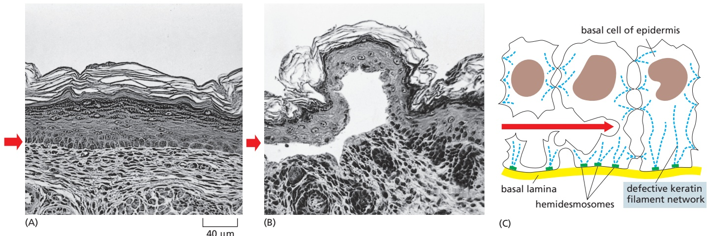

Figure 16–64 Blistering of the skin caused by a mutant keratin gene. A mutant gene encoding a truncated keratin protein (lacking both the N- and C-terminal domains) was expressed in a transgenic mouse. The defective protein assembles with the normal keratins and thereby disrupts the keratin filament network in the basal cells of the skin. Light micrographs of cross sections of (A) normal and (B) mutant skin show that the blistering results from the rupturing of cells in the basal layer of the mutant epidermis (short red arrows). (C) A sketch of three cells in the basal layer of the mutant epidermis, as observed by electron microscopy. As indicated by the red arrow, the cells rupture between the nucleus and the hemidesmosomes (discussed MBoC7 m16.69/16.64in Chapter 19), which connect the keratin filaments to the underlying basal lamina. (A and B, © 1991 P.A. Coulombe et al. Originally published in J. Cell Biol. https://doi.org/10.1083/jcb.115.6.1661. With permission from Rockefeller University Press.)

cells (**Figure 16–64**). Other types of blistering diseases, including disorders of the mouth, esophageal lining, and the cornea of the eye, are caused by mutations in the different keratins whose expression is specific to those tissues. All of these maladies are typified by cell rupture as a consequence of mechanical trauma and a disorganization or clumping of the keratin filament cytoskeleton. Many of the specific mutations that cause these diseases alter the ends of the central rod domain, demonstrating the importance of this particular part of the protein for correct filament assembly.

Members of another family of intermediate filaments, called **neurofilaments**, are found in high concentrations along the axons of vertebrate neurons (**Figure 16–65**). Three types of neurofilament proteins (NF-L, NF-M, and NF-H)

(A)

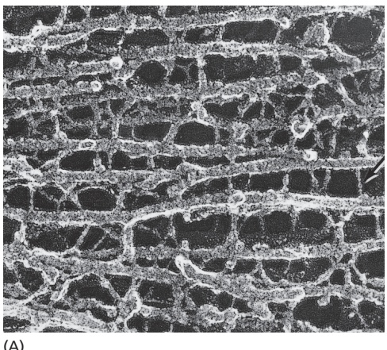

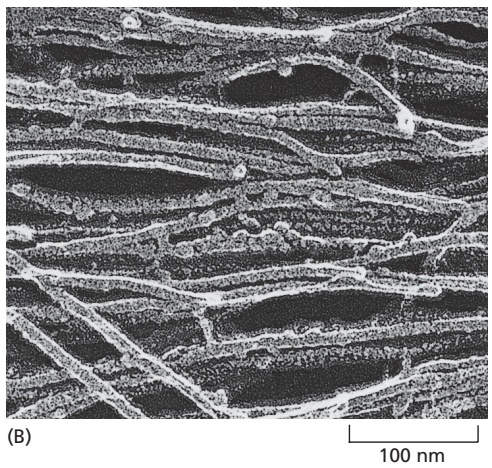

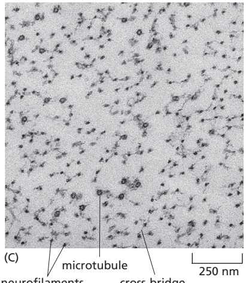

Figure 16–65 Two types of intermediate filaments in cells of the nervous system. (A) Freeze-etch electron microscopy image of neurofilaments in a nerve cell axon, showing the extensive cross-linking through protein cross-bridges—an arrangement believed to give this long cell process great tensile strength. The cross-bridges are formed by the long, nonhelical extensions at the C-terminus of the largest neurofilament protein (NF-H). (B) Freeze-etch image of glial filaments in glial cells, showing that these intermediate filaments are smooth and have few cross-bridges. (C) Conventional transmission electron micrograph of a cross section of an axon showing the regular side-to-side spacing of the neurofilaments, which greatly outnumber the microtubules. (A and B, courtesy of Nobutaka Hirokawa; $\mathbb { C } ,$ courtesy of Anthony Brown.)

coassemble in vivo, forming heteropolymers. The NF-H and NF-M proteins have lengthy C-terminal tail domains that bind to neighboring filaments, generating aligned arrays with a uniform interfilament spacing. During axonal growth, new neurofilament subunits are incorporated all along the axon in a dynamic process that involves the addition of subunits along the filament length and at the ends. After an axon has grown and connected with its target cell, the diameter of the axon may increase as much as fivefold. The level of neurofilament gene expression seems to directly control axonal diameter, which in turn influences how fast electrical signals travel down the axon. In addition, neurofilaments provide strength and stability to the long cell processes of neurons.

The neurodegenerative disease amyotrophic lateral sclerosis (ALS, or Lou Gehrig’s disease) is associated with an accumulation and abnormal assembly of neurofilaments in motor neuron cell bodies and in the axon, aberrations that may interfere with normal axonal transport. The degeneration of the axons leads to muscle weakness and atrophy, which is usually fatal. The overexpression of human NF-L or NF-H in mice results in mice that have an ALS-like disease. However, a causative link between neurofilament pathology and ALS has not been firmly established.

The vimentin-like filaments are a third family of intermediate filaments. Desmin, a member of this family, is expressed in skeletal, cardiac, and smooth muscle, where it forms a scaffold around the Z disc of the sarcomere (see Figure 16–29). Mice lacking desmin show normal initial muscle development, but adults have various muscle cell abnormalities, including misaligned muscle fibers. In humans, mutations in desmin are associated with various forms of muscular dystrophy and cardiac myopathy, illustrating the important role of desmin in stabilizing muscle fibers.

Inside the nucleus, nuclear lamins maintain the mechanical stability of the nucleus. In addition, it is becoming increasingly evident that one class of lamins, the A-type, together with many proteins of the nuclear envelope, are scaffolds for proteins that control myriad cellular processes including transcription, chromatin organization, and signal transduction. The majority of laminopathies is associated with mutant versions of lamin A and include tissue-specific diseases. Skeletal and cardiac abnormalities might be explained by a weakened nuclear envelope leading to cell damage and death, but laminopathies are also thought to arise from pathogenic and tissue-specific alterations in gene expression.

#### Linker Proteins Connect Cytoskeletal Filaments and Bridge the Nuclear Envelope

The intermediate filament network is linked to the rest of the cytoskeleton by members of a family of proteins called plakins. Plakins are large and modular, containing multiple domains that connect cytoskeletal filaments to each other and to junctional complexes. Plectin is a particularly interesting example. In addition to bundling intermediate filaments, it links the intermediate filaments to microtubules, actin filament bundles, and filaments of the motor protein myosin II; it also helps attach intermediate filament bundles to adhesive structures at the plasma membrane (**Figure 16–66**).

0.5 µm

Figure 16–66 Plectin cross-linking of diverse cytoskeletal elements. Plectin (green) is seen here making cross-links from intermediate filaments (blue) to microtubules (red). In this electron micrograph, the dots (yellow) are gold particles linked to anti-plectin antibodies. The entire actin filament network was removed to reveal these proteins. (© 1996 T.M. Svitkina et al. Originally published in J. Cell Biol. http://doi.org/10.1083/jcb.135.4.991. With permission from Rockefeller University Press.)

Figure 16–67 SUN–KASH protein complexes connect the nucleus and cytoplasm through the nuclear envelope. The cytoplasmic cytoskeleton is linked across the nuclear envelope to the nuclear lamina or chromosomes through SUN and KASH proteins (orange and purple, respectively). The SUN and KASH domains of these proteins bind within the lumen of the nuclear envelope. From the inner nuclear envelope, SUN proteins connect to the nuclear lamina or chromosomes. KASH proteins in the outer nuclear envelope connect to the cytoplasmic cytoskeleton by binding microtubule motor proteins, actin filaments, or plectin.

Mutations in the gene for plectin cause a devastating human disease that combines epidermolysis bullosa (caused by disruption of skin keratin filaments), muscular dystrophy (caused by disruption of desmin filaments), and neurodegeneration (caused by disruption of neurofilaments). Mice lacking a functionalMBoC7 m16.72/16.67 plectin gene die within a few days of birth, with blistered skin and abnormal skeletal and heart muscles. Thus, although plectin may not be necessary for the initial formation and assembly of intermediate filaments, its cross-linking action is required to provide cells with the strength they need to withstand the mechanical stresses inherent to vertebrate life.

Plectin and other plakins can interact with protein complexes that connect the cytoskeleton to the nuclear interior. These complexes consist of SUN proteins of the inner nuclear membrane and KASH proteins of the outer nuclear membrane (**Figure 16–67**). SUN and KASH proteins bind to each other within the lumen of the nuclear envelope, forming a bridge that connects the nuclear and cytoplasmic cytoskeletons. Inside the nucleus, the SUN proteins bind to the nuclear lamina or chromosomes, whereas in the cytoplasm, KASH proteins can bind directly to actin filaments and indirectly to microtubules and intermediate filaments through association with motor proteins and plakins, respectively. This linkage serves to mechanically couple the nucleus to the cytoskeleton and is involved in many cellular functions, including chromosome movements inside the nucleus during meiosis, nuclear and centrosome positioning, nuclear migration, and global cytoskeletal organization.

#### Septins Form Filaments That Contribute to Subcellular Organization

GTP-binding proteins called septins serve as an additional filament system in all eukaryotes except terrestrial plants. Septins assemble into nonpolar filaments that form rings and cage-like structures, which act as scaffolds to compartmentalize membranes into distinct domains or to recruit and organize the actin and microtubule cytoskeletons. First identified in budding yeast, septin filaments localize to the neck between a dividing yeast mother cell and its growing bud (**Figure 16–68A**). At this location, septins form a barrier that restricts lateral diffusion of proteins embedded in the plasma membrane, enabling cell growth to be concentrated preferentially within the bud. Septins also recruit the actin–myosin machinery that forms the contractile ring required for cytokinesis. In animal cells, septins function in cell division, migration, vesicle trafficking, and cell signaling. In primary cilia, for example, a ring of septin filaments assembles at the base of the cilium and serves as a diffusion barrier at the plasma membrane, restricting the movement of membrane proteins and establishing a specific composition in the ciliary membrane (**Figure 16–68B and C**). Reduction of septin levels impairs primary cilium formation and signaling.

100 nm

(A)

bud

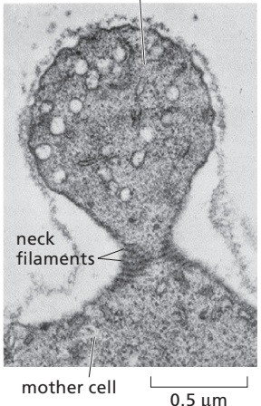

(B)

(C)

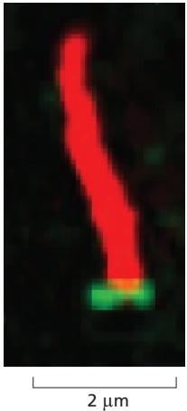

Figure 16–68 Cell compartmentalization by septins. (A) Septins form filaments in the neck region between a mother yeast cell and bud. (B) In this photomicrograph of human cultured cells, the DNA is stained blue and septins are labeled in green. The microtubules of primary cilia are labeled with an antibody that recognizes a modified (acetylated) form of tubulin (red) that is enriched in the axoneme. (C) A magnified image reveals a collar of septin at the base of the cilium. (A, © 1976 B. Byers and L. Goetsch. Originally published in J. Cell Biol. https://doi.org/10.1083/jcb.69.3.717. With permission from Rockefeller University Press; B and C, from Q. Hu et al., Science 329:436–439, 2010. With permission from AAAS.)

There are 7 septin genes in yeast and 13 in humans, and septin proteins fall into four groups on the basis of sequence relationships. In a test tube, purified septins assemble into symmetrical hetero-hexamers or hetero–octamers that form nonpolar paired filaments (Figure 16–69). GTP binding is required for the folding of septin polypeptides, but the role of GTP hydrolysis in septin function is not understood. Septin structures assemble and disassemble inside cells, butMBoC7 m16.73/16.68 they are not as dynamic as actin filaments and microtubules.

#### Bacterial Cell Shape and Division Depend on Homologs of Eukaryotic Cytoskeletal Proteins

Although they are much smaller than a typical eukaryotic cell, bacterial cells of different species assume a variety of shapes, from spheres or rods to more elaborate morphologies including stars, spirals, and branched filaments (see Figure 23–3).

(A)

(B)

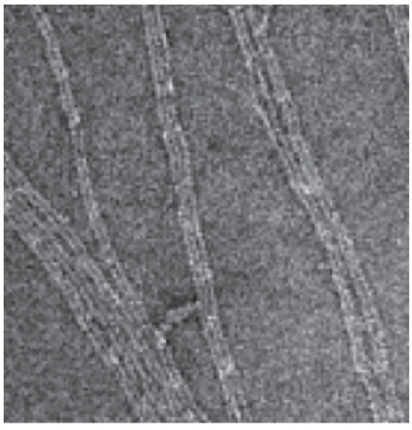

Figure 16–69 Septins polymerize to form paired filaments and sheets. (A) Electron micrograph of a septin rod assembled by combining two copies each of the four yeast septins illustrated at the right. The eight-subunit rod is nonpolar because the central pair of subunits (Cdc10) creates a symmetrical dimer. (B) Electron micrograph of paired septin filaments and sheets, assembled from purified septins in the presence of high salt concentrations. (C) Paired septin filaments may assemble by lateral association between filaments, mediated by coiled-coils formed between the paired C-terminal extensions of Cdc3 and Cdc12 that project from each filament. (From A. Bertin et al., Proc. Natl. Acad. Sci. USA 105:8274–8279, 2008. With permission from the National Academy of Sciences.)

(C)

WT

mreB

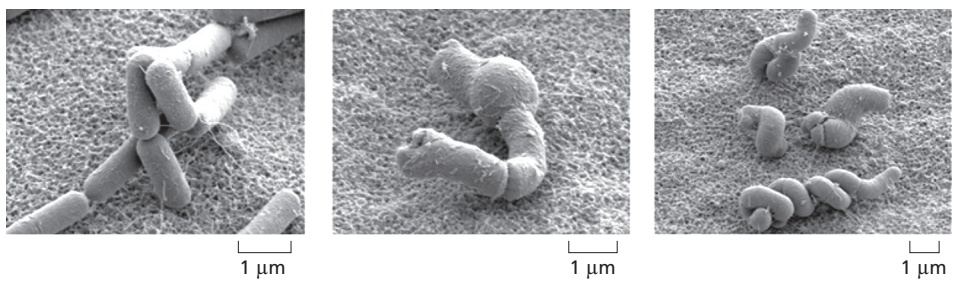

mbl

Figure 16–70 Actin homologs in bacteria determine cell shape. The common soil bacterium Bacillus subtilis normally forms cells with a regular rodlike shape when viewed by scanning electron microscopy (left). In contrast, B. subtilis cells lacking the actin homolog MreB or Mbl grow in distorted or twisted shapes and eventually die (center and right). WT = wild type. [From A. Chastanet and R. Carballido-Lopez, Front. Biosci. (Schol. Ed.) 4:1582–1606, 2012. With permission from Frontiers in Bioscience.]

Historically, biologists assumed that a cytoskeleton was not necessary in such simple cells that also lack extensive networks of intracellular membrane-enclosed organelles. We now know, however, that the outwardly simple morphology of bacterial cells is deceptive. Bacterial cells are highly organized and contain homologsMBoC7 m16.08/16.70 of actin, tubulin, and intermediate filaments. These filament systems are essential to regulate the synthesis and remodeling of the peptidoglycan cell wall to define cell shape and mediate cell division. Furthermore, the bacterial cytoskeleton can also play important roles in DNA segregation and intracellular organization.

Many bacteria contain homologs of actin. Two of these, MreB and Mbl, are found primarily in rod-shaped or spiral-shaped cells where they assemble to form dynamic patches that move circumferentially along the length of the cell. These proteins contribute to cell shape by serving as a scaffold to direct the synthesis of the peptidoglycan cell wall, in much the same way that microtubules help organize the synthesis of the cellulose cell wall in higher plant cells (see Figure 19–66). MreB and Mbl filaments are highly dynamic, with half-lives of a few minutes, and ATP hydrolysis accompanies the polymerization process. Mutations disrupting MreB or Mbl expression cause extreme abnormalities in cell shape (**Figure 16–70**).

Nearly all bacteria and many archaea also contain a homolog of tubulin called FtsZ, which can polymerize into filaments and assemble into a ring (called the Z-ring) at the site where the **septum** forms during cell division (**Figure 16–71**). Although the Z-ring persists for many minutes, the individual filaments within it are highly dynamic and have an average half-life of about 30 seconds, as they treadmill along the cell circumference and organize the cell-wall synthesis machinery. As the bacterium divides, the Z-ring becomes smaller until it has completely disassembled. However, because of high turgor pressure within bacterial cells, the energy derived from GTP hydrolysis within FtsZ filaments is unlikely to generate enough bending force to drive the membrane invagination necessary to complete cell division. Instead, FtsZ dynamics in the Z-ring are thought to spatially organize the cell-wall synthesis machinery to promote even, processive constriction. This hypothesis may explain why FtsZ GTPase mutants are viable, but yield deformed septa in Escherichia coli cells.

Figure 16–71 The bacterial FtsZ protein, a tubulin homolog in prokaryotes. (A) A band of FtsZ protein forms a ring in a dividing bacterial cell. This ring has been labeled by fusing the FtsZ protein to green fluorescent protein (GFP), which allows it to be observed in living E. coli cells with a fluorescence microscope. (B) FtsZ filaments and circles, formed in vitro, as visualized using electron microscopy. (C) Dividing chloroplasts (red) from a red alga also cleave using a protein ring made from FtsZ (yellow). (A, from X. Ma et al., Proc. Natl. Acad. Sci. USA 93:12998–13003, 1996; B, from H.P. Erickson et al., Proc. Natl. Acad. Sci. USA 93:519–523, 1996. Both with permission from National Academy of Sciences; C, from S. Miyagishima et al., Plant Cell 13:2257–2268, 2001, with permission from American Society of Plant Biologists.)

1 µm

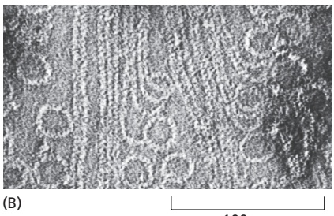

100 nm

(C)

1 µm

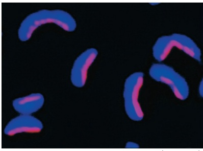

(A)

2 µm

(B)

2 µm

In addition to actin and tubulin homologs, at least one bacterial species, Caulobacter crescentus, also harbors a protein with significant structural similarity to intermediate filaments. A protein called crescentin forms a filamentous structure that influences the unusual crescent shape of this species; when the gene encoding crescentin is deleted, the Caulobacter cells grow as straight rods (**Figure 16–72**). Attached to the membrane along the side ofMBoC7 m16.10/16.72 inner curvature, crescentin is thought to exert a compressive force that locally decreases peptidoglycan insertion and therefore biases cell-wall synthesis to the opposite side.

Other bacterial cytoskeletal proteins function in DNA segregation during cell division. A particularly intriguing bacterial actin homolog is ParM, which is encoded by a gene on certain bacterial plasmids that also carry genes responsible for antibiotic resistance and cause the spread of multidrug resistance in epidemics. Bacterial plasmids typically encode all the gene products that are necessary for their own segregation, presumably as a strategy to ensure their inheritance and propagation in bacterial hosts after plasmid replication. ParM assembles into filaments that associate at each end with a copy of the plasmid, and growth of the ParM filament pushes the replicated plasmid copies apart (**Figure 16–73**). This spindle-like structure apparently arises from the selective stabilization of filaments that bind to specialized proteins recruited to the origins of replication on

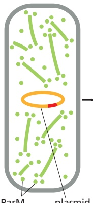

(A)

Figure 16–72 Caulobacter and crescentin. The sickle-shaped bacterium Caulobacter crescentus expresses a protein, crescentin, with a series of coiledcoil domains similar in size and organization to the domains of eukaryotic intermediate filaments. (A) The crescentin protein forms a fiber (labeled in red) that runs down the inner side of the curving bacterial cell wall. (B) When the gene is disrupted, the bacteria grow as straight rods (bottom). (From N. Ausmees et al., Cell 115:705–713, 2003. With permission from Elsevier.)

origin of replication

ParM filaments

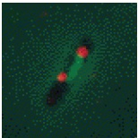

(B)

2 µm

Figure 16–73 Role of the actin homolog ParM in plasmid segregation in bacteria. (A) Some bacterial drug-resistance plasmids (orange) encode an actin homolog, ParM, that will spontaneously nucleate to form small, dynamic filaments (green) throughout the bacterial cytoplasm. A second plasmid-encoded protein called ParR (blue) binds to specific DNA sequences in the plasmid and also stabilizes the dynamic ends of the ParM filaments. When the plasmid duplicates, both ends of the ParM filaments become stabilized, and the growing ParM filaments push the duplicated plasmids to opposite ends of the cell. (B) In these bacterial cells harboring a drug-resistance plasmid, the plasmids are labeled in red and the ParM protein in green. Left,MBoC7 m16.09/16.73 a short ParM filament bundle connects the two daughter plasmids shortly after their duplication. Right, the fully assembled ParM filament has pushed the duplicated plasmids to the cell poles. (A, adapted from E.C. Garner et al., Science 306:1021–1025, 2004; B, from J. Møller-Jensen et al., Mol. Cell 12:1477–1487, 2003. With permission from Elsevier.)

the plasmids. A distant relative of both tubulin and FtsZ, called TubZ, has a similar function in other bacterial species.

Finally, the cytoskeleton plays a role in the internal organization of some bacterial cells. The best-known example applies to magnetotactic bacteria, which are capable of swimming along Earth’s magnetic field to seek the optimum aquatic environment. These bacteria contain magnetosomes, which are small vesicles invaginated from the plasma membrane that surround magnetite crystals. Arranged in a straight line along the length of the cell, magnetosomes produce a dipole, reminiscent of a compass needle. The organization of magnetosome chains requires their association with filaments of the actin-like protein MamK (**Figure 16–74**).

Thus, all cells contain cytoskeletal proteins that perform a wide variety of functions, and the actin and tubulin families are very ancient, predating the split between the eukaryotic and bacterial kingdoms.

#### Summary

Whereas tubulin and actin have been highly conserved in evolution, intermediate filament proteins are very diverse. There are many tissue-specific forms of intermediate filaments in the cytoplasm of animal cells, including keratin filaments in epithelial cells, neurofilaments in nerve cells, and desmin filaments in muscle cells. The primary function of these filaments is to provide mechanical strength. Septins comprise an additional system of filaments that organize compartments inside cells. Bacterial cells also contain homologs of actin, tubulin, and intermediate filaments that form dynamic structures essential for cell shape and division.

<!-- END EN EN16-H063-H069 -->
