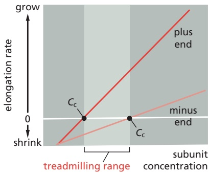

# 第8章 细胞骨架 · 英文习题与参考文献

### 英文补充：习题与参考文献

> 对应中文板块：习题与参考文献。英文来源：Molecular Biology of the Cell，第7版，第16章；[本章完整原文](../来源/英文教材/16_The_Cytoskeleton/chapter.md)。物理PDF页码范围：988–1065（整章范围）。

<!-- BEGIN EN EN16-EXERCISES -->
#### PROBLEMS

Which statements are true? Explain why or why not.

16–1 The role of ATP hydrolysis in actin polymerization is similar to the role of GTP hydrolysis in tubulin polymerization: both serve to weaken subunit bonds in the polymer and thereby promote depolymerization.

16–2 Motor neurons trigger action potentials in muscle cell membranes that open voltage-gated $\mathrm { C a ^ { 2 + } }$ channels in T tubules, allowing extracellular $\mathrm { \tilde { C a ^ { 2 + } } }$ to enter the cytosol, bind to troponin C, and initiate rapid muscle contraction.

16–3 In most animal cells, minus end–directed microtubule motors deliver their cargo to the periphery of the cell, whereas plus end–directed microtubule motors deliver their cargo to the interior of the cell.

16–4 Because bacteria are very small and lack the elaborate networks of intracellular membrane-enclosed organelles typical of eukaryotic cells, they do not require cytoskeletal filaments.

#### Discuss the following problems.

16–5 A scallop is a hinged bivalve that swims by slowly opening its two-part shell and then rapidly closing it, forcing a jet of water out the back and propelling itself forward. Imagine a bacterium constructed analogously. Could it swim in its low-Reynolds-number environment using the same mechanism as the scallop? Why or why not?

16–6 The plus and minus ends of actin filaments grow at different rates and have different critical concentrations (Cc). Between these critical concentrations, the filaments grow at their plus ends but shrink at their minus ends, a property termed treadmilling (**Figure Q16–1**). Is there any concentration of actin subunits at which the filament length does not change? If so, describe the concentration at which it occurs.

Figure Q16–1 Treadmilling at intermediate concentrations of free actin subunits (Problem 16–6).

16–7 Cofilin preferentially binds to older actin filaments and promotes their disassembly. How does cofilinFigure nQ16-101/Q16-1 distinguish old filaments from new ones?

16–8 How is the unidirectional motion of a lamellipodium maintained?

16–9 Detailed measurements of sarcomere length and tension during isometric contraction in striated muscle provided crucial early support for the sliding-filament model of muscle contraction. On the basis of your understanding of the sliding-filament model and the structure of a sarcomere, propose a molecular explanation for the relationship of tension to sarcomere length in the portions of **Figure Q16–2** marked I, II, III, and IV. (In this muscle, the length of the myosin filament is 1.6 μm, and the lengths of the actin thin filaments that project from the Z discs are 1.0 μm.)

Figure Q16–2 Tension as a function of sarcomere length during isometric contraction (Problem 16–9).

16–10 At 1.4 mg/mL pure tubulin, microtubules grow at a rate of about 2 μm/min. At this growth rate, how many αβ-tubulin dimers (8 nm in length) are added to the ends of a microtubule each second?

16–11 The movements of single motor-protein molecules can be analyzed directly. Using polarized laser light, it is possible to create interference patterns that exert a centrally directed force, ranging from zero at the center to a few piconewtons at the periphery (about 200 nm from the center). Individual molecules that enter the interference pattern are rapidly pushed to the center, allowing them to be captured and moved at the experimenter’s discretion.

These so-called optical tweezers can be used to position single kinesin molecules on a microtubule that is fixed to a coverslip. Although a single kinesin molecule cannot be seen optically, it can be tagged with a silica bead and tracked indirectly by following the bead (**Figure Q16–3A**). In the absence of ATP, the kinesin molecule remains at the center of the interference pattern, but with ATP it moves toward the plus end of the microtubule. As kinesin moves along the microtubule, it encounters the force of the interference pattern, which simulates the load kinesin carries during its actual function in the cell. Moreover, the pressure against the silica bead counters the effects of Brownian (thermal) motion, so that the position of the bead more accurately reflects the position of the kinesin molecule on the microtubule.

A trace of the movements of a kinesin molecule along a microtubule is shown in **Figure Q16–3B**.

(A) EXPERIMENTAL SETUP

(B) POSITION OF KINESIN

Figure Q16–3 Movement of kinesin along a microtubule (Problem 16–11). (A) Experimental setup, with kinesin linked to a silica bead, moving along a microtubule. (B) Position of kinesin (as visualized by the position of the silica bead) relative to the center of the interference pattern, as a function Fi 16-3/ 16-3of time of movement along the microtubule. The jagged nature of the trace results from Brownian motion of the bead.

A. As shown in Figure Q16–3B, all movement of kinesin is in one direction (toward the plus end of the microtubule). What supplies the free energy needed to ensure a unidirectional movement along the microtubule?

B. What is the average rate of movement of kinesin along the microtubule?

C. What is the length of each step that kinesin takes as it moves along the microtubule?

D. Kinesin has two globular domains that can each bind to β-tubulin, and it moves along a single protofilament in a microtubule. In each protofilament, the β-tubulin subunit repeats at 8-nm intervals. Given the step length and the interval between β-tubulin subunits, how do you suppose a kinesin molecule moves along a microtubule?

E. Is there anything in the data in Figure Q16–3 that tells you how many ATP molecules are hydrolyzed per step?

16–12 A mitochondrion 1 μm long can travel the 1-meter length of the axon from the spinal cord to the big toe in a day. The Olympic men’s freestyle swimming record for 200 meters is 1.72 minutes. In terms of body lengths per day, who is moving faster: the mitochondrion or the Olympic record holder? (Assume that the swimmer is 2 meters tall.)

16–13 Why is it that intermediate filaments have identical ends and lack polarity, whereas actin filaments and microtubules each have two distinct ends with a defined polarity?

16–14 Once cell polarity has been established in the fertilized egg of C. elegans (**Figure Q16–4**), the female pronucleus migrates along the microtubules emanating from the centrosomes adjacent to the paternal nucleus, which leads to fusion of the haploid genomes. What motor is likely involved in nuclear migration?

Figure Q16–4 Polarity establishment in a fertilized C. elegans egg prior to nuclear fusion (Problem 16–14).

#### REFERENCES

#### General

Pollard TD & Goldman RD (2017) The Cytoskeleton. Cold Spring Harbor, NY: Cold Spring Harbor Laboratory Press.

#### Function and Dynamics of the Cytoskeleton

Hill TL & Kirschner MW (1982) Bioenergetics and kinetics of microtubule and actin filament assembly-disassembly. Int. Rev. Cytol. 78, 1–125.

Luby-Phelps K (2000) Cytoarchitecture and physical properties of cytoplasm: volume, viscosity, diffusion, intracellular surface area. Int. Rev. Cytol. 192, 189–221.

Oosawa F & Asakura S (1975) Thermodynamics of the Polymerization of Protein, pp. 41–55, 90–108. New York: Academic Press.

Pauling L (1953) Aggregation of globular proteins. Discuss. Faraday Soc. 13, 170–176.

Purcell EM (1977) Life at low Reynolds number. Am. J. Phys. 45, 3–11.

#### Actin

Loisel TP, Boujemaa R, Pantaloni D & Carlier MF (1999) Reconstitution of actin-based motility of Listeria and Shigella using pure proteins. Nature 401, 613–616.

Mullins RD, Heuser JA & Pollard TD (1998) The interaction of Arp2/3 complex with actin: nucleation, high affinity pointed end capping, and formation of branching networks of filaments. Proc. Natl. Acad. Sci. USA 95, 6181–6186.

Pelaseyed T & Bretscher A (2018) Regulation of actin-based apical structures on epithelial cells. J. Cell Sci. 131, jcs221853.

Renkawitz J, Kopf A, Stopp J . . . Sixt M (2019) Nuclear positioning facilitates amoeboid migration along the path of least resistance. Nature 568, 546–550.

Rottner K & Schaks M (2019) Assembling actin filaments for protrusion. Curr. Opin. Cell Biol. 56, 53–63.

Skau CT & Waterman CW (2015) Specification of architecture and function of actin structures by actin nucleation factors. Annu. Rev. Biophys. 44, 285–310.

Svitkina T (2018) The actin cytoskeleton and actin-based motility. Cold Spring Harb. Perspect. Biol. 10(1), a018267.

Yamada KM & Sixt M (2019) Mechanisms of 3D cell migration. Nat. Rev. Mol. Cell Biol. 20, 738–752.

#### Myosin and Actin

Cooke R (2004) The sliding filament model: 1972–2004. J. Gen. Physiol. 123, 643–656.

Hammer JA III & Sellers JR (2011) Walking to work: roles for class V myosins as cargo transporters. Nat. Rev. Mol. Cell Biol. 13, 13–26.

Hartman MA, Finan D, Sivaramakrishnan S & Spudich JA (2011) Principles of unconventional myosin function and targeting. Annu. Rev. Cell Dev. Biol. 27, 133–155.

Hu S, Dasbiswas K, Guo Z . . . Bershadsky AD (2017) Long-range self-organization of cytoskeletal myosin II filament stacks. Nat. Cell Biol. 19, 133–141.

Walklate J, Ujfalusi Z & Greeves MA (2016) Myosin isoforms and the mechanochemical cross-bridge cycle. J. Exp. Biol. 219, 168–174.

Yildiz A, Forkey JN, McKinney SA . . . Selvin PR (2003) Myosin V walks hand-over-hand: single fluorophore imaging with 1.5-nm localization. Science 300, 2061–2065.

#### Microtubules

Brouhard GJ, Stear JH, Noetzel TL . . . Hyman AA (2008) XMAP215 is a processive microtubule polymerase. Cell 132, 79–88.

Dogterom M & Yurke B (1997) Measurement of the force-velocity relation for growing microtubules. Science 278, 856–860.

Goodson HV & Jonasson EM (2018) Microtubules and microtubuleassociated proteins. Cold Spring Harb. Perspect. Biol. 10(6), a022608.

Hotani H & Horio T (1988) Dynamics of microtubules visualized by darkfield microscopy: treadmilling and dynamic instability. Cell Motil. Cytoskeleton 10, 229–236.

Howard J, Hudspeth AJ & Vale RD (1989) Movement of microtubules by single kinesin molecules. Nature 342, 154–158.

Kuo Y-W & Howard J (2020) Cutting, amplifying, and aligning microtubules with severing enzymes. Trends Cell Biol. 31, 50–61.

Lin J & Nicastro D (2018) Asymmetric distribution and spatial switching of dynein activity generates ciliary motility. Science 360, eaar1968.

Mitchison T & Kirschner M (1984) Dynamic instability of microtubule growth. Nature 312, 237–242.

Reck-Peterson SL, Redwine WB, Vale RD & Carter AP (2018) The cytoplasmic dynein transport machinery and its many cargoes. Nat. Rev. Mol. Cell Biol. 19, 382–398.

Reiter JF & Leroux MR (2017) Genes and molecular pathways underpinning ciliopathies. Nat. Rev. Mol. Cell Biol. 18, 533–547.

Rice S, Lin AW, Safer D . . . Milligan RA & Vale RD (1999) A structural change in the kinesin motor protein that drives motility. Nature 402, 778–784.

Stearns T & Kirschner M (1994) In vitro reconstitution of centrosome assembly and function: the central role of gamma-tubulin. Cell 76, 623–637.

Svoboda K, Schmidt CF, Schnapp BJ & Block SM (1993) Direct observation of kinesin stepping by optical trapping interferometry. Nature 365, 721–727.

Théry M & Blanchoin L (2021) Microtubule self-repair. Curr. Opin. Cell Biol. 68, 144–154.

Woodruff JB, Ferreira Gomes B, Widlund PO . . . Hyman AA (2017) The centrosome is a selective condensate that nucleates microtubules by concentrating tubulin. Cell 169, 1066–1077.

Wu J & Akhmanova A (2017) Microtubule-organizing centers. Annu. Rev. Cell Dev. Biol. 33, 51–75.

#### Intermediate Filaments and Other Cytoskeletal Polymers

Garner EC, Bernard R, Wang W . . . Mitchison T (2011) Coupled, circumferential motions of the cell wall synthesis machinery and MreB filaments in B. subtilis. Science 333, 222–225.

Garner EC, Campbell CS & Mullins RD (2004) Dynamic instability in a DNA-segregating prokaryotic actin homolog. Science 306, 1021–1025.

Herrmann H & Aebi U (2016) Intermediate filaments: structure and assembly. Cold Spring Harb. Perspect. Biol. 8(11), a018242.

Isermann P & Lammerding J (2013) Nuclear mechanics and mechanotransduction in health and disease. Curr. Biol. 23, R1113–R1121.

Köster S, Weitz DA, Goldman RD, Aebi U & Herrmann H (2015) Intermediate filament networks in vitro and in vivo: from coiled-coils to filaments, fibers and networks. Curr. Opin. Cell Biol. 32, 82–91.

Wagstaff J & Lowe J (2018) Prokaryotic cytoskeletons: protein filaments organizing small cells. Nat. Rev. Microbiol. 16, 187–201.

Woods BL & Gladfelter AS (2021) The state of the septin cytoskeleton from assembly to function. Curr. Opin. Cell Biol. 68, 105–112.

#### Cell Polarity and Coordination of the Cytoskeleton

Bilder D, Li M & Perrimon N (2000) Cooperative regulation of cell polarity and growth by Drosophila tumour suppressors. Science 289, 113–116.

Devreotes P & Horwitz AR (2015) Signaling networks that regulate cell migration. Cold Spring Harb. Perspect. Biol. 7(8), a005959.

Dogterom M & Koenderink GH (2019) Actin-microtubule crosstalk in cell biology. Nat. Rev. Mol. Cell Biol. 20, 38–54.

Chiou J, Balasubramanian MK & Lew D (2017) Cell polarity in yeast. Annu. Rev. Cell Dev. Biol. 33, 77–101.

Lawson CD & Ridley AJ (2017) Rho GTPase signalling complexes in cell migration and invasion. J. Cell Biol. 217, 447–457.

Munro E, Nance J & Priess JR (2004) Cortical flows powered by asymmetrical contraction transport PAR proteins to establish and maintain anterior-posterior polarity in the early C. elegans embryo. Dev. Cell 7, 413–424.

Schaks M, Giannone G & Rottner K (2019) Actin dynamics in cell migration. Essays Biochem. 63, 483–495.

St. Johnston D (2018) Establishing and transducing cell polarity: common themes and variations. Curr. Opin. Cell Biol. 51, 33–41.
<!-- END EN EN16-EXERCISES -->
