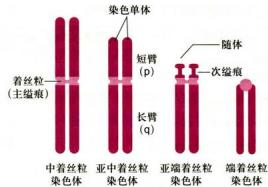
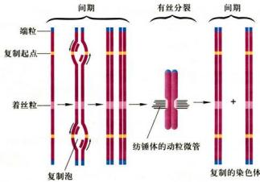
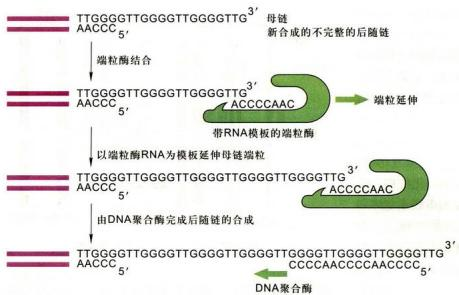
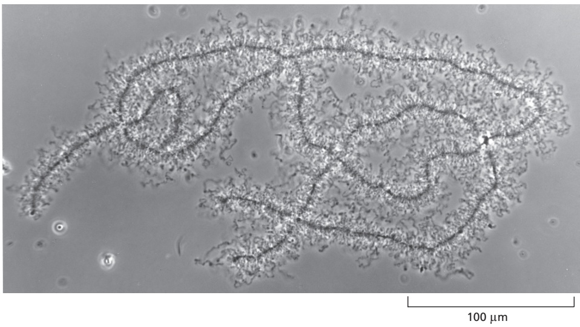
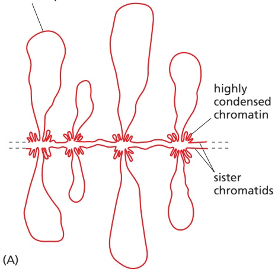
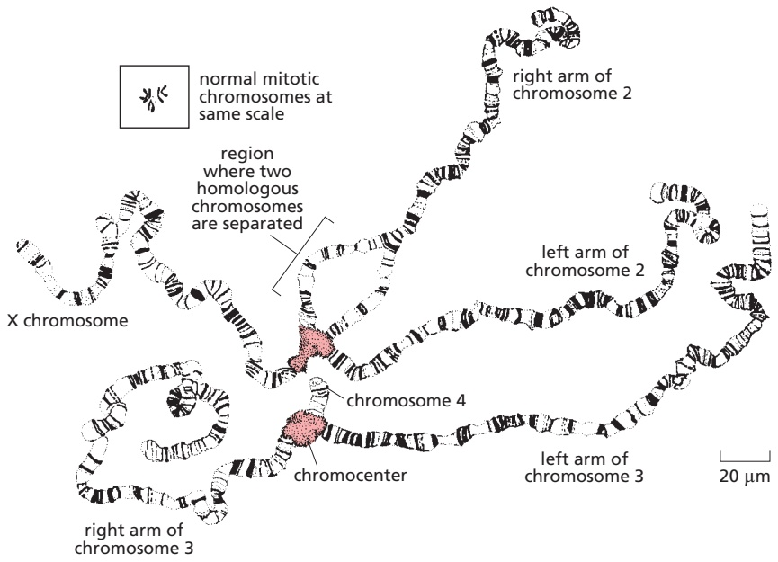
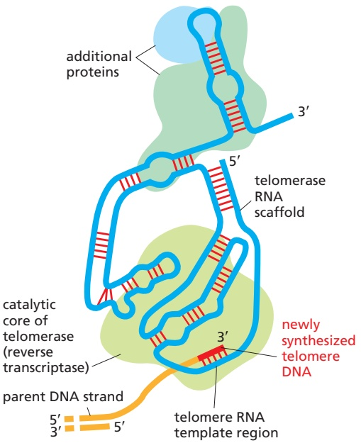
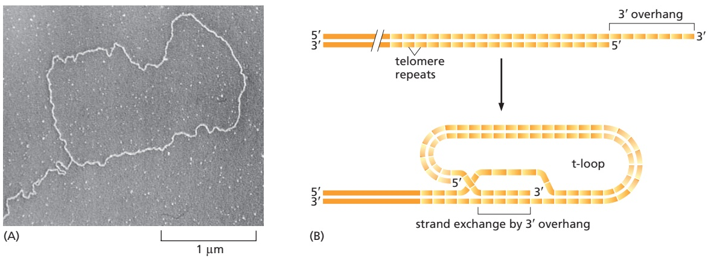

# 第9章 细胞核与染色质 · 第四节 染色体

[返回本章](../README.md) · [中文本章原文](../中文原文.md)

<!-- BEGIN CN CN09-S04 -->
## 第四节 染色体

染色体是细胞在有丝分裂（或减数分裂）时遗传物质存在的特定形式，是间期细胞染色质结构紧密组装的结果。不同生物的细胞中含有不同数目的染色体（表9-6）。所有单倍染色体组包含的DNA组成该生物基因组。

表 9-6 不同生物的基因组大小和染色体数目

<table><tr><td>物种</td><td>基因组大小 /Mb</td><td>染色体数目</td></tr><tr><td>芽殖酵母(Saccharomyces pastorianus)</td><td>12</td><td>16</td></tr><tr><td>黏葡萄(Dictyostelium)</td><td>70</td><td>7</td></tr><tr><td>拟南芥(Arabidopsis thaliana)</td><td>125</td><td>5</td></tr><tr><td>秀丽隐杆线虫(Caenorhabditis elegans)</td><td>97</td><td>6</td></tr><tr><td>果蝇(Drosophila melanogaster)</td><td>180</td><td>4</td></tr><tr><td>非洲爪蟾(Xenopus laevis)</td><td>3 000</td><td>18</td></tr><tr><td>玉米(Zea mays)</td><td>5 000</td><td>10</td></tr><tr><td>洋葱(Allium cepa)</td><td>15 000</td><td>8</td></tr><tr><td>百合(Lilium brownii)</td><td>50 000</td><td>12</td></tr><tr><td>肺鱼(Neoceratodus forsteri)</td><td>50 000</td><td>17</td></tr><tr><td>鸡(Gallus gallus)</td><td>1 200</td><td>39</td></tr><tr><td>小鼠(Mus musculus)</td><td>3 000</td><td>20</td></tr><tr><td>牛(Bos taurus)</td><td>3 000</td><td>30</td></tr><tr><td>狗(Canis lupus)</td><td>3 000</td><td>39</td></tr><tr><td>人(Homo sapiens)</td><td>3 000</td><td>23</td></tr></table>

基因组大小和染色体数目都源自单倍体。

## 一、染色体的形态结构

中期染色体具有比较稳定的形态，它由两条相同的姐妹染色单体（chromatid）构成，彼此以着丝粒（centromere）相连。根据着丝粒在染色体上所处的位置，可将中期染色体分为4种类型（图9-23，表9-7）：中着丝粒染色体（metacentric chromosome），两臂长度相等或大致相等；亚中着丝粒染色体（submetacentric chromosome）；亚端着丝粒染色体（subtelocentric chromosome），具有微小短臂；端着丝粒染色体（telocentric chromosome）。

染色体各部的主要结构如下：

## （一）着丝粒与动粒

着丝粒连接两条染色单体，并将染色单体分为两臂：短臂（p）和长臂（q）。由于着丝粒区浅染内缢，所以也叫主缢痕（primary constriction）。近年来的研究表明，着丝粒是一种高度有序的整合结构，在结构和组成上都是非均一的，至少包括三种不同的结构域：

(1) 沿着着丝粒外表面的动粒结构域（kinetochoredomain）哺乳类动粒（又称着丝点，kinetochore）超微结构可分为三个区域（图9-24）：一是与着丝粒中央结构域相联系的内板（inner plate）；二是中间间隙（middle space），电子密度低，呈半透明区；三是外板（outer plate）。在没有动粒微管结合时，覆盖在外板上的第4个区称为纤维冠（fibrouscorona），由微管蛋白构成。动粒微管与内外板相连，并沿纤维冠相互作用，与内板相联系的染色质是与微管相互作用的位点。已有证据表明，动粒结构域的化学组成包括与动粒结构与功能相关的两类蛋白质以及着丝粒DNA，但是目前关于动粒的结构模型尚无定论。

  
图9-23 根据着丝粒位置进行的染色体分类图示

表 9-7 根据着丝粒位置进行的染色体分类

<table><tr><td>着丝粒位置</td><td>染色体符号</td><td>着丝粒比*</td><td>着丝粒指数**</td></tr><tr><td>中着丝粒</td><td>m</td><td>1.00~1.67</td><td>0.500~0.375</td></tr><tr><td>亚中着丝粒</td><td>sm</td><td>1.68~3.00</td><td>0.373~0.250</td></tr><tr><td>亚端着丝粒</td><td>st</td><td>3.01~7.00</td><td>0.249~0.125</td></tr><tr><td>端着丝粒</td><td>t</td><td>7.01~∞</td><td>0.125~0.000</td></tr></table>

\*长臂长度 / 短臂长度; \*\*短臂长度 / 染色体总长度。(Levan et al., 1964; Green et al., 1980)

(2) 中央结构域 (central domain) 这是着丝粒区的主体，由串联重复的卫星 DNA 组成。这些重复序列大部分是物种专一的。人染色体的着丝粒 DNA 由 α 卫星 DNA 组成，重复单位 17 bp，每一着丝粒串联重复 2 000～30 000 次，可达 250 kb 至 400 kb，但不同染色体着丝粒的 α 卫星 DNA 序列存在差别。其中一个亚类含有 17 bp 的 DNA 模式（5'-CTTCGTTGGAAACGGGA-3'），能与动粒蛋白 CENP-B 结合，这一 DNA 模式被称为 CENP-B 框。通过免疫印迹分析，在哺乳类染色体着丝粒区已发现 CENP-A、B、C、E 和 F 五种动粒蛋白，这些动粒蛋白和细胞分裂及其调控有密切关系，因而也是极为保守的。

(3) 配对结构域（pairing domain）位于着丝粒内表面的配对结构域。代表中期姐妹染色单体相互作用的位点。已经发现有两类蛋白：一类是内部着丝粒蛋白 INCENP (inner centromere protein)，另一类是染色单体连接蛋白 CLIPS (chromatid linking protein)，两者与染色单体配对有关。

虽然三种结构域具有不同的功能，但它们并不能独自发挥作用。正是三种结构域的整合功能，才确保细胞在有丝分裂中染色体与纺锤体整合，发生有序的染色体分离。

## （二）次缢痕

除主缢痕外，染色体上其他的浅染缢缩部位称次缢痕（secondary constriction）。它的数目、位置和大小是某些染色体所特有的形态特征，因此也可以作为鉴定染色体的标记。

## （三）核仁组织区

核仁组织区（nucleolar organizing region, NOR）位于染色体的次缢痕部位，但并非所有次缢痕都是NOR。染色体NOR是rRNA基因所在部位（5S rRNA基因除外），与间期细胞核仁形成有关。

  
图9-24 着丝粒的结构域组织

## （四）随体

随体（satellite）指位于染色体末端的球形染色体节段，通过次缢痕区与染色体主体部分相连。它是识别染色体的重要形态特征之一，有随体的染色体称为 sat 染色体。

## （五）端粒

端粒（telomere）是染色体两个端部特化结构。端粒通常由富含鸟嘌呤核苷酸（G）的短的串联重复序列DNA组成（TEL DNA），伸展到染色体的3'端。一个基因组内的所有端粒都是由相同的重复序列组成，但不同物种的端粒的重复序列是不同的（表9-8）。哺乳类和其他脊椎动物端粒的重复序列中的保守序列是TTAGGG，串联重复500\~3000次，序列长度在2 kb到20 kb之间不等。端粒的长度与细胞及生物个体的寿命有关。端粒的生物学作用在于维持染色体的完整性和独立性，可能还与染色体在核内的空间排布等有关。

## 二、染色体的功能元件

在细胞世代中确保染色体的复制和稳定遗传，染色体起码应具备三种功能元件（functional element）（图9-25）：至少一个DNA复制起点，确保染色体在细胞周期中能够自我复制，维持染色体在细胞世代传递中的连续性；一个着丝粒，使细胞分裂时已完成复制的染色体能平均分配到子细胞中；最后，在染色体的两个末端必须有端粒，保持染色体的独立性和稳定性。构成染色体DNA的这三种关键序列（key sequence）称为染色体

表 9-8 不同生物中端粒 DNA 序列比较

<table><tr><td>物种</td><td>端粒 DNA 重复序列</td></tr><tr><td colspan="2">酵母</td></tr><tr><td>芽殖酵母</td><td> ${\mathrm{G}}_{1 - 3}\mathrm{\;T}$ </td></tr><tr><td>裂殖酵母</td><td> ${\mathrm{G}}_{2 - 8}\mathrm{{TTAC}}$ </td></tr><tr><td colspan="2">原生动物</td></tr><tr><td>四膜虫</td><td>GGGGTT</td></tr><tr><td>黏霉菌</td><td> ${\mathrm{G}}_{1 - 3}\mathrm{\;A}$ </td></tr><tr><td colspan="2">植物</td></tr><tr><td>拟南芥</td><td>AGGGTTT</td></tr><tr><td colspan="2">哺乳动物</td></tr><tr><td>人</td><td>TTAGGG</td></tr></table>

  
图9-25 真核细胞染色体的三种功能元件示意图

DNA 的功能元件。近年来采用分子克隆技术把真核细胞染色体的复制起点、着丝粒和端粒这三种 DNA 关键序列分别克隆成功，并把它们互相搭配或改造而构成所谓 “人造微小染色体”（artificial minichromosome）。

## （一）自主复制 DNA 序列

应用 DNA 重组技术，将带有正常酵母亮氨酸合成酶的 Leu 基因的 DNA 限制酶片段重组到大肠杆菌的质粒中。用这种重组质粒去转化亮氨酸合成代谢缺陷型酵母细胞，发现单纯质粒不能转化酵母细胞，而重组质粒能在酵母细胞中复制、表达和遗传。可见该酵母 DNA 插入片段除含有 Leu 的基因外，还含有一段酵母染色体自主复制 DNA 序列 (autonomously replicating DNA sequence, ARS)。该序列首先在酵母基因组 DNA 序列中发现，它能使含有这一序列的重组质粒高效转化酵母细胞，并能在酵母中独立于宿主染色体而存在。根据不同来源的 ARS 的 DNA 序列分析，发现它们都具有一段 11～14 bp 的同源性很高的富含 AT 的共有序列 (consensus sequence)，同时证明这段共有序列及其上下游各 200 bp 另右的区域是维持 ARS 功能所必需的。现在已利用双向电泳定位复制起点的技术，直接证明了 ARS 在质粒以及酵母染色体上与复制起点 (replication origin) 共定位的现象。绝大多数真核细胞的染色体含有多个复制起点，以确保全染色体快速复制。现在还没有确定真核生物的复制起点的 DNA 序列是否具有固定模式，但大多包含一个富含 AT 的序列。

## （二）着丝粒 DNA 序列

上述插入 ARS 的重组质粒，虽然能在酵母细胞中复制和表达，但由于它缺少着丝粒，因此不能在酵母细胞有丝分裂时平均分配到子细胞中去。当把酵母染色体上的着丝粒 DNA 序列（centromere DNA sequence, CEN）插入到这个含 ARS 的重组质粒中，这种新的插有酵母染色体的 ARS 和 CEN 序列的重组质粒，在有丝分裂中便表现出与正常染色体相似的复制与分离行为。根据不同来源的 CEN 序列分析，发现它们的共同特点是有两个彼此相邻的核心区，一个是 80\~90 bp 的 AT 辟，另一个是 11 bp 的保守区。通过 CEN 缺失损伤试验或插入突变试验，发现一旦伤及这两个核心区序列，CEN 即丧失其生物学功能。

  
图9-26 端粒酶的作用示意图

## （三）端粒 DNA 序列

将插入 ARS 和 CEN 序列的环状重组质粒 DNA 在单一位点切开，形成一个具有两个游离端的线性 DNA 分子。虽然这段线性 DNA 可以在酵母细胞中复制并附着到有丝分裂的纺锤体上，但最终将从子细胞中丢失，结果细胞无法生长。如果在切开的线性 DNA 两端加上端粒 DNA 序列（telomere DNA sequence, TEL），则转染细胞生长。这是因为环状 DNA 变成线性 DNA 分子以后无法解决“末端复制问题”，即新合成的 DNA 链 5' 末端 RNA 引物被切除后变短的问题。真核细胞染色体端粒的重复序列不是染色体 DNA 复制时连续合成的，而是由端粒酶（telomerase）合成后添加到染色体末端。端粒酶是一种核糖核蛋白复合物，具有反转录酶的性质，由物种特异的内在 RNA 作模板，把合成的端粒重复序列再加到染色体的3'端（图9-26）。人的生殖细胞染色体末端比体细胞染色体末端长几千个碱基对，这是因为迄今为止只发现在生殖细胞和部分干细胞里有端粒酶活性，而在所有体细胞里则尚未发现端粒酶的活性。端粒起到细胞分裂计时器的作用。不管是体内还是体外，体细胞每分裂一次，端粒重复序列就缩短一些。表明端粒重复序列的长度与细胞分裂次数和细胞的衰老有关。肿瘤细胞具有表达端粒酶活性的能力，使癌细胞得以无限制地增殖。

除了端粒酶能维持端粒的长度外，另外一个端粒变长的途径是ALT（alternative lengthening of telomere），这一途径不依赖于端粒酶的存在。3'端突出的端粒DNA最终与5\~10 kb之外的另一条链上的TTAGG同源序列配对形成一个D形环（或T形环），以稳定端粒末端结构。这一过程由TRF2催化完成。

## 三、染色体带型

核型（karyotype）一词首先由苏联学者G.A. Levitsky等人在20世纪20年代提出。核型分析的发展有三项技术起了很重要的促进作用：一是1952年美籍华人细胞学家徐道觉发现的低渗处理技术，使中期细胞的染色体分散良好，便于观察；二是秋水仙素的应用便于富集中期细胞分裂相；三是植物凝集素（PHA）刺激血淋巴细胞转化、分裂，使以血培养方法观察动物及人的染色体成为可能。

  
图9-27 人类细胞中期染色体显带及染色体大小示意图

核型是指染色体组在有丝分裂中期的表型，是染色体数目、大小、形态特征的总和。核型分析是在对染色体进行测量计算的基础上，进行分组、排队、配对并进行形态分析的过程。核型分析对于探讨人类遗传病的机制、物种亲缘关系、远缘杂种的鉴定等都有重要意义。将一个染色体组的全部染色体逐个按其特征绘制下来，再按长短、形态等特征排列起来的图像称为核型模式图(idiogram)，它代表该物种的核型模式（图9-27）。

在染色体显带技术发展之前，核型分析主要是根据染色体形态和着丝粒位置的差别来进行的，因此有时对染色体仍不易精确识别和区分。1968年由瑞典细胞学家Casperson首先建立的染色体Q带技术及其以后的发展，为核型研究提供了有力的工具。Q带技术即喹吖因(Quinacrine)荧光染色技术，显示中期染色体经氮芥喹吖因或双盐酸喹吖因染色以后，在紫外线照射下所呈现的荧光亮带和暗带。一般富含AT碱基的DNA区段表现为亮带，富含GC碱基的DNA区段表现为暗带。G带即吉姆萨(Giemsa）带，是将中期染色体制片经胰酶或碱、热、尿素、去垢剂等处理后再用吉姆萨染料染色后所呈现的染色体区带。一般来说，G带与Q带相符，但也有例外，如Q带显示的人Y染色体的特异荧光，在G带带型上并不出现。R带是指中期染色体经磷酸盐缓冲液保温处理，以吖啶橙或吉姆萨染色，结果所显示的带型和G带明暗相间带型正好相反，所以又称反带(reverse band)。C带主要显示着丝粒结构异染色质及其他染色体区段的异染色质部分。T带又称末端带(terminal band)，是染色体端粒部位经吖啶橙染色后所呈现的区带，在分析染色体末端结构畸变时有用。N带又称Ag-As染色带，主要用于染核仁组织者区的酸性蛋白质。1975年以来，美国细胞遗传学家J.J.Yunis等建立了染色体高分辨显带技术，用氨甲蝶呤使培养的细胞同步化后，再用秋水仙胺短暂处理，获得大量晚期前期和早中期分裂相，这些时期的染色体比典型中期染色体长，显带后可得到更多更细的带纹。如在人体细胞晚期染色体组中可以分辨出843～1256条带，而中期染色体只能观察到320～550条带，因而更有助于发现细微的染色体异常。

染色体显带技术最重要的应用就是明确鉴别一个核型中的任何一条染色体，乃至某一个易位片段。同时显带技术也用于染色体基因定位和染色体重构，如染色体着丝粒的罗伯逊式融合（Robertsonian fusion）与染色体着丝粒的罗伯逊式裂解（Robertsonian fission）。

从果蝇到人，有丝分裂的染色体普遍存在特殊的带型。一个物种某一条染色体上的标准带型是非常稳定的并是特征性的。这就提示，染色体带作为更大范围的结构域对细胞的功能可能是重要的。有人估计，即使最细的带纹也应含有30个或更多的环状结构域，并且已知富含AT的带和富含GC的带都含有基因。近年来发展的显带染色体显微切割和分子微克隆技术，已有可能研究染色体某几个带纹的DNA性质，这是联系细胞遗传学与分子遗传学之间的重要桥梁。

## 四、特殊染色体

在某些生物的细胞中，特别是在发育的某些阶段，可以观察到一些特殊的体积很大的染色体，包括多线染色体（polytene chromosome）和灯刷染色体（lampbrush chromosome），这两种染色体总称为巨大染色体（giant chromosome）。

## （一）多线染色体

多线染色体是1881年由意大利细胞学家E.G.Balbiani首先在双翅目摇蚊幼虫的唾腺细胞中发现的，它也存在于双翅目昆虫的幼虫组织细胞内，如唾腺、气管、肠和马氏管（Malpighian tube）。此外，在不同植物的不同类型的细胞中，如胚珠细胞（胚乳、胚柄和反足细胞）也发现多线染色体。

多线染色体来源于核内有丝分裂（endomitosis），即核内DNA多次复制而细胞不分裂。产生的子染色体并行排列，且体细胞内同源染色体配对，紧密结合在一起从而阻止染色质纤维进一步聚缩，形成体积很大的多线染色体。多线化的细胞处于永久间期，并且体积也相应增大。同种生物的不同组织以及不同生物的同种组织的多线化程度各不相同。在果蝇唾腺细胞中，染色体进行10次DNA复制，因而形成 $2^{10}=1024$ 条同源DNA拷贝，形成的多线染色体比同种有丝分裂染色体长200倍以上，4条配对的染色体全长可达2 mm。配对染色体的着丝粒部位结合在一起形成染色中心（图9-28）。

早期遗传学分析认为，果蝇多线染色体一条带代表一个基因，一个基因编码一种基本蛋白质。B. Bossy 等（1984）在果蝇基因组中克隆出一段 315 kb 的连续 DNA 序列，以该 DNA 为探针检测该区段 DNA 所转录的 mRNA，结果发现 mRNA 的种类是被鉴定带数目的 3 倍。所以把每条带看做一个特异的基因组区更为恰当。最近的研究表明，多线染色体的带和间带都含有基因，有可能 “持家” 基因（housekeeping gene）位于间带，而有细胞类型特异性的 “奢侈” 基因（luxury gene）位于带上。

## （二）灯刷染色体

灯刷染色体在 1882 年由 Flemming 在研究美西螈卵巢切片时首次报道，但由于其形态特殊而未能肯定。1892年，J. Rückert研究鲨鱼卵母细胞时，给灯刷染色体以正式命名。现已知道，灯刷染色体几乎普遍存在于动物界的卵母细胞中，其中两栖类卵母细胞的灯刷染色体最典型，也研究得最深入。在植物界，也有关于灯刷染色体的报道。如垂花葱（Allium cernuum）和玉米雄性配子减数分裂中出现不很典型的灯刷染色体，而大型的单细胞藻类地中海伞藻（Acetabularia mediterranea）却有典型的灯刷染色体。

  
图9-28 果蝇唾腺细胞全套多线染色体  
图中红色信号表示异染色质蛋白HP1在多线染色体上的分布，绿色是dCAF1-p180蛋白的分布。（黄海博士和焦仁杰博士提供）

灯刷染色体是卵母细胞进行减数分裂第一次分裂时停留在双线期的染色体。它是一个二价体，包含4条染色单体。此时同源染色体尚未完全解除联会，因此可见到几处交叉。这一状态在卵母细胞中可维持数月或数年之久。

灯刷染色体轴由染色粒轴丝构成，每条染色体轴长约 $400\mu \mathrm{m}$ （多数有丝分裂染色体小于 $10\mu \mathrm{m}$ ）。从染色粒向两侧伸出两个相类似的侧环，每个环相当于一个袢环结构域，一个平均大小的环约含 $100\mathrm{kb}$ DNA。两栖类一套灯刷染色体约含10000个这样的染色质侧环，不同的侧环有各自的特异DNA序列，每个环在细胞中有4个拷贝。

灯刷染色体的形态与卵子发生过程中营养物储备是密切相关的。大部分 DNA 以染色粒形式存在，没有转录活性，而侧环是 RNA 活跃转录的区域，一个侧环往往是一个大的转录单位或几个转录单位组合构成的。转录的 RNA 副本 3' 端借助 RNA 聚合酶固定在侧环染色质轴丝上，游离的 5' 端捕获大量蛋白质形成核糖核蛋白复合物，组成环周围的基质。环的粗细变化表示基质的厚薄和转录 RNA 的长短。转录起始点 RNA 短，随着 RNA 聚合酶读码而逐渐延长。用 RNase 和蛋白酶可将基质消化，侧环轴丝保留。改用 DNase 消化，侧环轴丝解体消失，说明基质由 RNP 组成，轴丝由 DNA 组成。灯刷染色体合成的 RNA 主要为前体 mRNA，有些类型的 mRNA 可翻译成蛋白质，有些 mRNA 与蛋白质结合，暂不翻译而储存在卵母细胞中。

<!-- END CN CN09-S04 -->

---

## 对应英文内容

### 英文补充：染色体环与特殊染色体

> 对应中文板块：染色体环与特殊染色体。英文来源：Molecular Biology of the Cell，第7版，第4章；[本章完整原文](../../来源/英文教材/04_DNA_Chromosomes_and_Genomes/chapter.md)。物理PDF页码范围：222–291（整章范围）。

<!-- BEGIN EN EN04-H034-H037 -->
#### THE GLOBAL STRUCTURE OF CHROMOSOMES

Having discussed the DNA and protein molecules from which the chromatin fiber is made, we now turn to the organization of the chromosome on a more global scale and the way in which its various domains are arranged in space. Packaged into nucleosomes, a typical human chromosome would be able to span the nucleus thousands of times. Thus, a higher level of folding is required, even in interphase chromosomes. As we shall see, this higher-order packaging involves the folding of each chromosome into a series of large loops through a process catalyzed by ring-shaped SMC (structural maintenance of chromosomes) protein complexes.

We begin this section by describing some unusual chromosomes that can be easily visualized. Exceptional though they are, these special cases reveal features that are relevant for all eukaryotic chromosomes. Next, we describe how the interphase chromosomes are arranged in the mammalian cell nucleus. Finally, we discuss the mechanisms that cause a special compaction of chromosomes during their passage from interphase to mitosis.

#### Chromosomes Are Folded into Large Loops of Chromatin

An early insight into the structure of the chromosomes in interphase cells came from studies of the stiff and enormously extended chromosomes in growing amphibian oocytes (immature eggs). These very unusual **lampbrush chromosomes** (the largest chromosomes known), paired in preparation for meiosis, are clearly visible in the light microscope, where they are seen to contain a series of large chromatin loops emanating from a linear chromosomal axis (**Figure 4–45**).

(B)

Figure 4–45 A light micrograph of lampbrush chromosomes in an amphibian oocyte. Early in oocyte differentiation, each chromosome replicates to begin meiosis, and the homologous replicated chromosomes pair to form this highly extended structure. Each lampbrush chromosome consists of two aligned sets of paired sister chromatids, with large chromatin loops as a prominent feature. The chromosome set contains thousands of loops, each containing a particular DNA sequence that remains extended in the same manner as the oocyte grows, producing huge amounts of RNA for storage in the oocyte. The lampbrush chromosome stage persists for months or years, while the oocyte builds up a supply of materials required for its ultimate development into a new individual. These chromosomes were first described in 1878. (Courtesy of Joseph G. Gall.)

**Figure 4–46** summarizes lampbrush chromosome structure. Each chromosome is formed by a very long DNA helix packed into chromatin, and it is joined to a sister DNA helix, called a sister chromatid. Most of the DNA is located near the junction of the two chromatids, and it is highly condensed and transcriptionally inert; this DNA serves to organize each chromatid along a linear chromosome axis. In contrast, the highly transcribed regions of the DNA extend from the axis. / . as large loops, which range in length from tens of thousands to hundreds of thousands of nucleotide pairs.

Meiotic chromosomes are found to adopt the lampbrush chromosome state in the growing oocytes of all vertebrates, except for mammals. However, if incubated in amphibian oocyte cytoplasm, human sperm chromosomes will form lampbrush chromosomes. This reveals that chromosomes are highly dynamic structures that can restructure in different environments.

#### Polytene Chromosomes Are Uniquely Useful for Visualizing Chromatin Structures

Further early insight into the structure of interphase chromosomes came from a second unusual type of cell—the polytene cells of flies, such as the fruit fly Drosophila. Some special cells, in many organisms, grow abnormally large through

extended chromatin in transcriptionally active looped domain

10 µm

Figure 4–46 The structure of lampbrush chromosomes. (A) Model for a small portion of one pair of sister chromatids. Two identical DNA double helices are aligned side by side, packaged into different types of chromatin (see Figure 4–45). (B) Merged light micrographs of the lampbrush chromosomes in an axolotl (a type of salamander), stained for transcriptionally active (RNA polymerase, red) and inactive (DNA containing 5-methyl C, green) chromatin regions. The loops are stiff and extended because they are being unusually highly transcribed, with RNA polymerases spaced only about 100 nucleotide pairs apart. Most of the rest of the DNA in each chromosome (the great majority) remains condensed and is located close to the chromatid axis. (B, from G.T. Morgan et al., Chromosome Res. 20:925–942, 2012. Reproduced with permission of SNCSC.)

multiple cycles of DNA synthesis without cell division. Such cells, containing increased numbers of standard chromosomes, are said to be polyploid. In the salivary glands of fly larvae, this process is taken to an extreme degree, creating huge cells that contain hundreds or thousands of copies of the genome.MBoC7 m4.50/4.47 Moreover, in this case, all the copies of each chromosome are aligned side by side in exact register, like drinking straws in a box, to create giant **polytene chromosomes**. These chromosomes allow features to be detected that are thought to be shared with ordinary interphase chromosomes but are normally hard to see.

Figure 4–47 The entire set of polytene chromosomes in one Drosophila salivary cell. In this drawing of a light micrograph, the giant chromosomes have been spread out for viewing by squashing them against a microscope slide. Drosophila has four chromosomes, and there are four different chromosome pairs present. But each chromosome is tightly paired with its homolog (so that each pair appears as a single structure), which is not true in most nuclei (except in meiosis). Each chromosome has undergone multiple rounds of replication, and the homologs and all their duplicates have remained in exact register with each other, resulting in huge chromatin cables many DNA strands thick.

When polytene chromosomes from a fly’s salivary glands are viewed in the light microscope, distinct alternating dark bands and light interbands are visible (**Figure 4–47**), each formed from a thousand identical DNA sequences arranged side by side in register. About 95% of the DNA in polytene chromosomes is in bands, and 5% is in interbands. A very thin band can contain 3000 nucleotide pairs, while a thick band may contain 200,000 nucleotide pairs in each of its chromatin strands. The chromatin in each band appears dark because the DNA is more condensed than the DNA in interbands; it may also contain a higher concentration of proteins (**Figure 4–48**).

The four polytene chromosomes are normally linked together by heterochromatic regions near their centromeres that aggregate to create a single large chromocenter (pink region). In this preparation, however, the chromocenter has been split into two halves by the squashing procedure used. (Adapted from T.S. Painter, J. Hered. 25:465–476, 1934. With permission from Oxford University Press.)

Figure 4–48 Micrographs of polytene chromosomes from Drosophila salivary glands. (A) Light micrograph of a portion of a chromosome. The DNA has been stained with a fluorescent dye, but a reverse image is presented here that renders the DNA black rather than white; the bands are clearly seen to be regions of increased DNA concentration. This chromosome has been processed by a high-pressure treatment so as to show its distinct pattern of bands and interbands more clearly. (B) An electron micrograph of a small section of a Drosophila polytene chromosome seen in thin section. Bands of very different thickness can be readily distinguished, separated by interbands, which contain less condensed chromatin. (A, adapted from D.V. Novikov et al., Nat. Methods 4:483–485, published 2007 by Nature Publishing Group. Reproduced with permission of SNCSC; B, courtesy of Veikko Sorsa.)

There are approximately 3700 bands and 3700 interbands in the complete set of Drosophila polytene chromosomes, a number that should be compared to the 14,000 genes in this fruit fly (see Table 1–2, p. 29). The bands can be recognized by their different thicknesses and spacings, and each one has been given a number to generate a chromosome “map” that has been indexed to the finished genome sequence of Drosophila.

The Drosophila polytene chromosomes provide a good starting point for examining how chromatin is organized on a large scale. In the previous section, we saw that there can be many forms of chromatin, each of which contains nucleosomes with a different combination of modified histones. Specific sets of non-histone proteins assemble on these nucleosomes to affect biological function in different ways. Recruitment of some of these non-histone proteins can spread for long distances along the DNA, imparting a similar chromatin structure to broad tracts of the genome (see Figure 4–39A). At low resolution, the interphase chromosome can therefore be considered as a mosaic of chromatin structures, each containing particular nucleosome modifications associated with a particular set of non-histone proteins.

Polytene chromosomes allow us to see details of this mosaic of domains in the light microscope and to observe some of the changes associated with gene expression. For example, by staining Drosophila polytene chromosomes with antibodies and using ChIP (chromatin immunoprecipitation) analysis (see Chapter 8), the locations of specific histone modifications and non-histone proteins in chromatin can be mapped across the entire Drosophila DNA sequence. These results suggest that three types of repressive chromatin predominate in this organism, along with two types of chromatin on actively transcribed genes, and that each type is associated with a different complex of non-histone proteins. In addition to these five major chromatin types, other more minor forms of chromatin appear to be present, each of which may be differently regulated and have distinct roles in the cell. Much remains to be learned about the molecular structures that underlie these findings.

#### Chromosome Loops Decondense When the Genes Within Them Are Expressed

When an organism containing polytene chromosomes progresses from one developmental stage to another, distinctive chromosome puffs arise and old puffs recede in its polytene chromosomes as new genes become expressed and old ones are turned off (**Figure 4–49**). From inspection of each puff when it is relatively small and the banding pattern is still discernible, it seems that most puffs arise from the decondensation of a single chromosome band.

The individual chromatin fibers that make up a puff can be visualized with an electron microscope. In favorable cases, loops are seen. When genes in the loop are not expressed, the loop assumes a thickened, condensed structure, but when gene expression is occurring, the loop becomes more extended—resembling the loops seen in lampbrush chromosomes. This again demonstrates that chromosome structures are dynamic, as we had concluded from lampbrush experiments.

<!-- END EN EN04-H034-H037 -->

### 英文补充：有丝分裂染色体的高度凝缩

> 对应中文板块：有丝分裂染色体的高度凝缩。英文来源：Molecular Biology of the Cell，第7版，第4章；[本章完整原文](../../来源/英文教材/04_DNA_Chromosomes_and_Genomes/chapter.md)。物理PDF页码范围：222–291（整章范围）。

<!-- BEGIN EN EN04-H042-H043 -->
#### Mitotic Chromosomes Are Highly Condensed

Having discussed the dynamic structure of interphase chromosomes, we now turn to **mitotic chromosomes**. The chromosomes from nearly all eukaryotic cells become readily visible by light microscopy during mitosis, when they coil up to form highly condensed structures. This condensation reduces the length of a typical interphase chromosome by about tenfold, and it produces a dramatic change in chromosome appearance.

A typical mitotic chromosome at the metaphase stage of mitosis was shown in Figure 4–18 (for the stages of mitosis, see Panel 17–1, pp. 1048–1049). The two DNA molecules produced by DNA replication during interphase of the celldivision cycle are separately folded to produce two sister chromatids held together at their centromeres. These chromosomes are normally covered with a variety of molecules, including large amounts of RNA–protein complexes. Once this covering has been stripped away, each chromatid can be seen in electron micrographs to be organized into loops of chromatin emanating from a central scaffolding (**Figure 4–60**).

Recent experiments have begun to decipher how interphase chromosomes condense to form mitotic chromosomes. The process is intimately connected with the progression of the cell cycle that will be the focus of Chapter 17. It begins in early M phase when gene expression shuts down, and specific modifications are made to histones that may help to reorganize the chromatin. Most of the ring-shaped cohesin proteins that organize the interphase chromosomes make way for their **condensin** relatives, whose ATP-driven movements—aided by the DNA cutting-and-rejoining enzyme topoisomerase II—drive the compaction and form a linear chromosome axis (**Figure 4–61**). This axis is highly enriched in both condensin II and topoisomerase II, and it is the combined action of these two enzymes that is believed to separate each chromosome into two sister chromatids.

Figure 4–60 A scanning electron micrograph of a region near one end of a typical mitotic chromosome. Each knoblike projection is believed to represent the tip of a separate looped domain. Note that the two identical paired chromatids MBoC7 m4.60/4.60can be clearly distinguished. (From M.P. Marsden and U.K. Laemmli, Cell 17:849–858, 1979. With permission from Elsevier.)

Figure 4–61 How chromosomes fold in M phase. There are two types of condensins in mammalian cells, designated as condensins I and II. As cells enter mitosis, the interphase organization of the chromatin loops that is created by cohesin (see Figure 4–57) is lost within minutes. A different SMC protein, condensin II, now begins to form very large new chromatin loops by a similar ATP-driven mechanism. These new loops are organized radially by a central chromosome axis, and as the condensin II loops grow ever larger in size, a second set of loops is formed by condensin I inside them. This “loops within loops” organization, when combined with an ever-tighter winding of the chromatin loops around the mitotic chromosome axis, creates the compact chromatin that is observed in the final metaphase chromosome. Not shown are the special cohesin molecules that hold the two sister chromatids together; as described in Chapter 17, these cohesins are released only at anaphase. (Adapted from J.H. Gibcus et al., Science 359:eaao6135, 2018.)

Figure 4–62 Chromosome organization. This model shows some of the levels of chromatin packaging that give rise to the highly condensed mitotic chromosome.

NET RESULT: EACH DNA MOLECULE HAS BEEN PACKAGED INTO A MITOTIC CHROMOSOME THAT IS 10,000-FOLD SHORTER THAN ITS FULLY EXTENDED LENGTH

Mitotic chromosome condensation can be thought of as the final level in a hierarchy of chromosome packaging (**Figure 4–62**). This final DNA folding serves at least two important purposes. First, when condensation is complete (in metaphase), sister chromatids have been disentangled from each other and lie side by side. Thus, the sister chromatids can easily separate when the mitotic apparatus begins pulling them apart. Second, the compaction of chromosomes protects the relatively fragile DNA molecules from being broken as they are pulled to separate daughter cells by the mitotic spindle. These and other critical details of mitosis will be fully discussed in Chapter 17.

#### Summary

Chromosomes are generally decondensed during interphase, so that the details of their structure are difficult to visualize. Notable exceptions are the specialized lampbrush chromosomes of vertebrate oocytes and the polytene chromosomes in the giant secretory cells of insects. Studies of these two types of interphase chromosomes reveal that each long DNA molecule in a chromosome is divided into a large number of discrete domains organized as long loops of chromatin that are compacted by further folding. When genes contained in a loop are expressed, the loop unfolds and allows the cell’s machinery access to the DNA. New studies using sensitive biochemical techniques show that the interphase chromosomes in a wide range of eukaryotes are also folded into a series of looped domains, and they reveal a central folding role for ring-shaped, cohesin protein complexes.

Interphase chromosomes occupy discrete territories in the cell nucleus; that is, they are not extensively intertwined. Much of the chromatin in interphase exists as loosely folded fibers of nucleosomes. However, this open chromatin is interrupted by stretches of heterochromatin, in which the nucleosomes are subjected to additional packing that renders the DNA resistant to gene expression. Heterochromatin has the important property that its type of nucleosome packing can be directly inherited during chromosome replication, thereby generating an epigenetic form of cell memory. Two major classes of heterochromatin contain different covalent histone marks propagated by distinct reader–writer enzyme complexes. Constitutive heterochromatin is formed on repeated DNA sequences; marked by H3K9me3, it is found in large blocks that remain unchanged in and around centromeres and near telomeres. This heterochromatin blocks both gene expression and genetic recombination. Facultative heterochromatin is present at many other positions on chromosomes, where its presence can be controlled so as to have a critical role in regulating genes. H3K27me3 heterochromatin is always facultative; in contrast, only some of the H3K9me3 heterochromatin is facultative, depending on its location.

The interior of the nucleus is highly dynamic, with heterochromatin often positioned near the nuclear envelope and loops of chromatin moving away from their chromosome territory when genes are very highly expressed. This reflects the existence of nuclear subcompartments, where different sets of biochemical reactions are facilitated by an increased concentration of selected proteins and RNAs.

During mitosis, gene expression shuts down and all chromosomes adopt a highly condensed, organized conformation in a process that begins early in M phase. This condensation packages the two DNA molecules of each replicated chromosome as two separately folded chromatids, and it is catalyzed by the ATP-driven movements of ring-shaped, condensin protein complexes.

<!-- END EN EN04-H042-H043 -->

### 英文补充：端粒、端粒酶与染色体末端保护

> 对应中文板块：端粒、端粒酶与染色体末端保护。英文来源：Molecular Biology of the Cell，第7版，第5章；[本章完整原文](../../来源/英文教材/05_DNA_Replication_Repair_and_Recombination/chapter.md)。物理PDF页码范围：292–359（整章范围）。

<!-- BEGIN EN EN05-H031-H033 -->
#### Telomerase Replicates the Ends of Chromosomes

We saw earlier in the chapter that synthesis of the lagging strand at a replication fork must occur discontinuously through a backstitching mechanism that produces short DNA fragments attached to RNA primers. The final RNA primer synthesized on the lagging-strand template cannot be replaced by DNA because there is no primer ahead of it to provide a 3′-OH end for the repair polymerase. Without a mechanism to deal with this problem, DNA would be lost from the ends of all chromosomes each time a cell divides.

Bacteria avoid this “end-replication” problem by having circular DNA molecules as chromosomes, as we have seen. Eukaryotes solve it in a different way: they have specialized nucleotide sequences at the ends of their chromosomes that are incorporated into structures called telomeres (discussed in Chapter 4). Telomeres contain many tandem repeats of a short sequence that is similar in organisms as diverse as protozoa, fungi, plants, and mammals. In humans, the sequence of the repeat unit is GGGTTA, and it is repeated roughly a thousand times at each telomere.

Telomere DNA sequences are recognized by sequence-specific DNA-binding proteins that attract an enzyme, called **telomerase**, that replenishes these sequences each time a cell divides. Telomerase recognizes the tip of an existing telomere DNA repeat sequence and elongates it in the 5′-to-3′ direction, using an RNA template that is a component of the enzyme itself to synthesize new DNA copies of the repeat (**Figure 5–33**). The enzymatic portion of telomerase resembles other reverse transcriptases, proteins that synthesize DNA using an RNA template, although, in this case, the telomerase RNA also contributes to the active site and is essential for efficient catalysis. After extension of the parent DNA strand by telomerase, replication of the lagging strand at the chromosome end can be completed by the conventional DNA polymerases, using these extensions as a template to synthesize the complementary strand (**Figure 5–34**).

Figure 5–33 Schematic structure of human telomerase. This large enzyme is composed of 10 protein subunits and an RNA of 451 nucleotides. The RNA forms the scaffold of the complex, provides the template for synthesizing new DNA telomere repeats, and helps form the active site. The synthesis reaction itself is carried out by the reverse transcriptase domain of the protein, shown in light green, in conjunction with the RNA. A reverse transcriptase is a special form of polymerase enzyme that uses an RNA template to make a DNA strand; telomerase is unique in carrying its own RNA template with it. Telomerase also contains several additional protein complexes (some of which are shown in dark green and blue) that are needed to assemble the enzyme and, for many organisms but not humans, to bring it to the ends of chromosomes. (Modified from T.H.D. Nguyen et al., Nature 557: 190–195, 2018.)

Figure 5–34 Telomere replication. Shown here is the reaction that synthesizes the repeating sequences that form the ends of the chromosomes (telomeres) of eukaryotes. The 3′ end of the parent lagging-strand template is extended by RNA-templated DNA synthesis; this allows the incomplete daughter DNA strand that is paired with it to be synthesized to the end of the chromosome. The synthesis of the final bit of lagging strand is carried out by DNA polymerase α, which carries a DNA primase as one of its subunits (Movie 5.6). DNA polymerase α is the same enzyme used to begin the synthesis of each Okazaki fragment on the lagging strand; it begins its synthesis with RNA (not shown) and continues with DNA (green). The telomere sequence illustrated is that of the ciliate Tetrahymena, in which these reactions were first discovered.

Figure 5–35 A t-loop at the end of a mammalian chromosome. (A) Electron micrograph of the DNA at the end of an interphase human chromosome. The chromosome was fixed, deproteinated, and artificially thickened before viewing. The loop seen here is approximately 15,000 nucleotide pairs in length. (B) Schematic diagram of t-loop formation. (A, from J.D. Griffith et al., Cell 97:503–514, 1999. With permission from Elsevier.)

#### Telomeres Are Packaged into Specialized Structures That Protect the Ends of Chromosomes

The ends of chromosomes present cells with an additional problem. As we will see in the next part of this chapter, when a chromosome is accidently broken into two pieces, the break is rapidly repaired. Telomeres must clearly be distinguished from these accidental breaks; otherwise, the cell will attempt to “repair”MBoC7 m5.35/5.35 telomeres, generating chromosome fusions and other genetic abnormalities. Telomeres have several features to prevent this from happening.

A specialized nuclease chews back the 5′ end of a telomere leaving a protruding, single-strand 3′ end. This protruding end—in combination with the GGGTTA repeats in telomeres—attracts a group of proteins that form a protective chromosome cap known as shelterin. In particular, shelterin protects telomeres from being treated as damaged DNA. Another feature of telomeres may offer additional protection. When human telomeres are artificially cross-linked and viewed by electron microscopy, structures known as “t-loops” can be observed in which the protruding single-strand end of the telomere loops back and tucks itself into the duplex DNA of the telomere repeat sequence (**Figure 5–35**). An attractive idea is that t-loops are orchestrated by shelterin to help “hide” the very ends of chromosomes.

#### Telomere Length Is Regulated by Cells and Organisms

Because the processes that grow and shrink each telomere sequence are only approximately balanced, chromosome ends contain variable numbers of telomeric repeats. Not surprisingly, many cells, including stem cells and germ cells, have homeostatic mechanisms that maintain the number of these repeats within a limited range (**Figure 5–36**).

In most of the dividing somatic cells of humans, however, telomeres gradually shorten, and it has been proposed that this provides a counting mechanism that helps prevent the unlimited proliferation of wayward cells in adult tissues. In its simplest form, this idea holds that our somatic cells start off in the embryo with a full complement of telomeric repeats. These are then eroded to different extents in different cell types. Some stem cells, notably those in tissues that must be replenished at a high rate throughout life—bone marrow or gut lining, for example—retain full telomerase activity. However, in many other types of cells, the level of telomerase is reduced so that the enzyme cannot quite keep up with chromosome duplication. Such cells lose 100–200 nucleotides from each telomere every time they divide. After many cell generations, the descendant cells will inherit chromosomes that lack functioning telomeres, and, as a result of this defect, activate a DNA-damage response causing them to withdraw permanently from the cell cycle and cease dividing—a process called replicative cell senescence (discussed in Chapters 17 and 20). In theory, such a mechanism could provide a

Figure 5–36 A demonstration that yeast cells control the length of their telomeres. In this experiment, the telomere at one end of a particular chromosome is artificially made either longer (left) or shorter (right) than average. After many cell divisions, the chromosome recovers, showing an average telomere length and a length distribution that is typical of the other chromosomes in the yeast cell. A similar feedback mechanism for controlling telomere length has been proposed for the germ-line cells and stem cells of mammals.

safeguard against the uncontrolled cell proliferation of abnormal cells in somatic tissues, thereby helping to protect us from cancer.

The idea that telomere length acts as a “measuring stick” to count cell divisions and thereby regulate the lifetime of the cell lineage has been tested in several ways. For certain types of human cells grown in tissue culture, theMBoC7 m5.36/5.36 experimental results support such a theory. Human fibroblasts normally proliferate for about 60 cell divisions in culture before undergoing replicative cell senescence. Like most other somatic cells in humans, fibroblasts produce only low levels of telomerase, and their telomeres gradually shorten each time they divide. When telomerase is provided to the fibroblasts by inserting a fully active telomerase gene, telomere length is maintained and many of the cells now continue to proliferate indefinitely. Also consistent with these ideas is the observation that, in approximately 90% of cancer cells, the telomerase gene has become reactivated, thereby circumventing the normal safety mechanism (see pp. 1073–1074).

It has been proposed that this type of control on cell proliferation may contribute to the aging of animals like ourselves. These ideas have been tested by producing transgenic mice that lack telomerase entirely. The telomeres in mouse chromosomes are about five times longer than human telomeres, and the mice must therefore be bred through three or more generations before their telomeres have shrunk to the normal human length. It is therefore perhaps not surprising that the first generations of mice develop normally. However, the mice in later generations develop progressively more defects in some of their highly proliferative tissues. In addition, these mice show signs of premature aging and have a pronounced tendency to develop tumors. In these and other respects, these mice resemble humans with the genetic disease dyskeratosis congenita. Individuals afflicted with this disease carry one functional and one nonfunctional copy of the telomerase RNA gene; they have prematurely shortened telomeres and typically die of progressive bone marrow failure. These individuals also develop lung scarring and liver cirrhosis and show abnormalities in various epidermal structures including skin, hair follicles, and nails.

The above observations demonstrate that controlling cell proliferation by telomere shortening poses a risk to an organism, because not all of the cells that begin losing the ends of their chromosomes will stop dividing. Some apparently become genetically unstable, but continue to divide, giving rise to variant cells that can lead to cancer. As discussed above, many of these variant cells ultimately produce high levels of telomerase, thereby ensuring their continued survival. Clearly, the use of telomere shortening as a regulating mechanism is not foolproof and, like many mechanisms in the cell, it must strike a balance between benefit and risk.

<!-- END EN EN05-H031-H033 -->

## 跨章相关英文内容

- 染色体的三个功能元件：[EN第4章 · DNA、染色质蛋白与核小体包装](02_第二节%20染色质.md#EN04-H000-H018)。
- 着丝粒染色质：[EN第4章 · 异染色质、组蛋白修饰与表观遗传](03_第三节%20染色质的复制与表达.md#EN04-H019-H033)。
