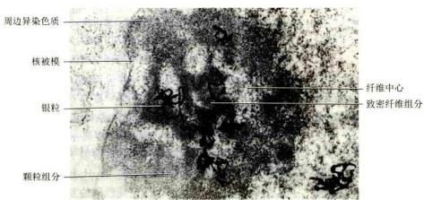
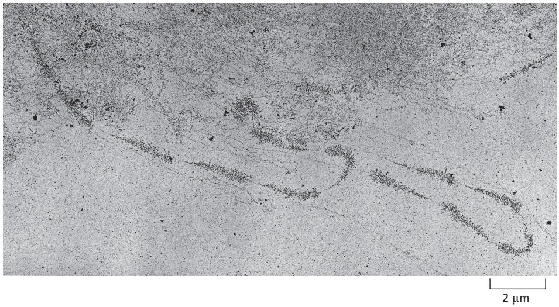
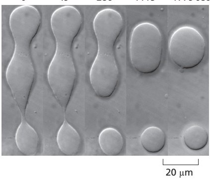
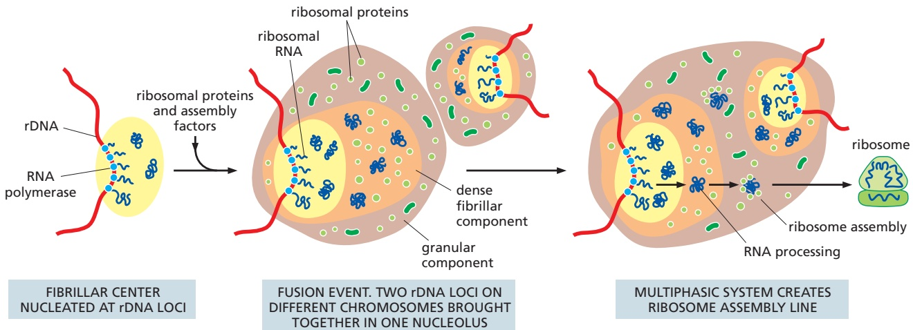
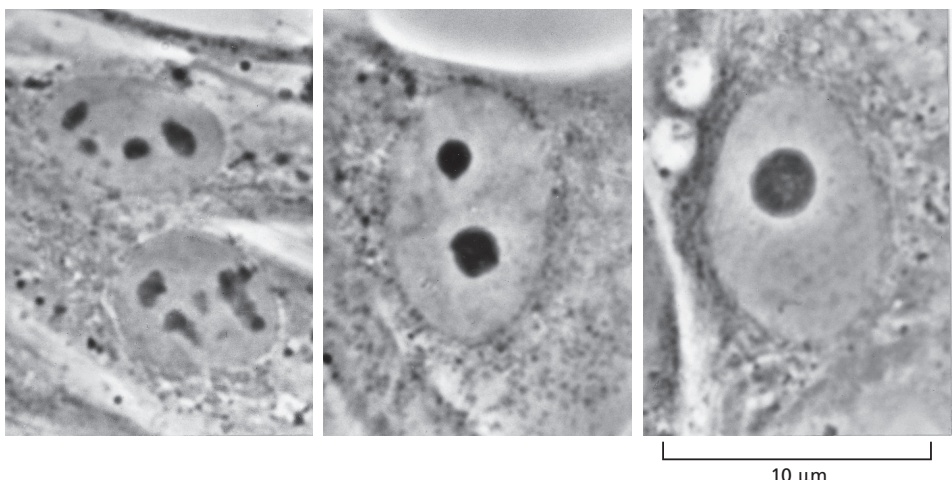
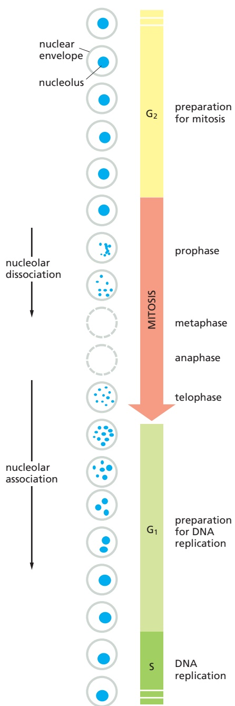
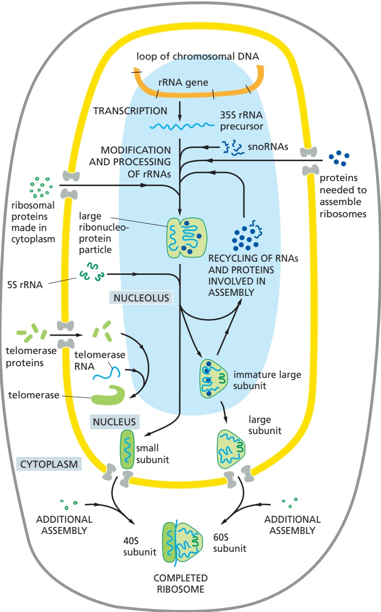
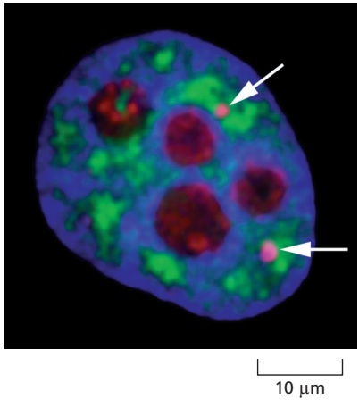

# 第9章 细胞核与染色质 · 第五节 核仁与核体

[返回本章](../README.md) · [中文本章原文](../中文原文.md)

<!-- BEGIN CN CN09-S05 -->
## 第五节 核仁与核体

核仁（nucleolus）是真核细胞间期核中最显著的结构。在光镜下被染色的细胞、相差显微镜下的活细胞或分离细胞的细胞核都容易看到核仁，它们通常表现为单一或多个匀质的球形小体。核仁的大小、形状和数目随生物的种类、细胞类型和细胞代谢状态不同而变化。蛋白质合成旺盛、活跃生长的细胞（如分泌细胞、卵母细胞）的核仁大，可占总核体积的25%；不具蛋白质合成能力的细胞如肌细胞、休眠的植物细胞，其核仁很小。在细胞周期过程中，核仁又是一个高度动态的结构，在有丝分裂期间表现出周期性的消失与重建。

真核细胞的核仁具有重要功能，它是 rRNA 合成、加工和核糖体亚基的组装场所。

## 一、核仁的结构

电镜下核仁的超微结构与胞质中的大多数细胞器不同，它没有被膜包裹。尽管核仁的大小、形态和超微结构明显地随所研究的细胞类型和细胞的代谢状态不同而变化，但三种基本的核仁结构组分仍可通过超薄切片的电镜观察加以识别（图9-29）。

## （一）纤维中心

在电镜下观察，纤维中心（fibrillar center, FC）是包埋在颗粒组分内部一个或几个浅染的低电子密度的圆形结构。电镜细胞化学和放射自显影研究已经确证，在纤维中心存在rDNA、RNA聚合酶I和结合的转录因子，并且光镜及电镜水平的原位分子杂交也证明了这种DNA具有rRNA基因（rDNA）的性质。根据形态相似性和嗜银蛋白的存在，通常认为FC代表染色体NOR在间期核的副本。然而由于核仁活性的变化，FC的数目可能超过染色体NOR的数目；并且有证据表明，FC中的染色质不形成核小体结构，也没有组蛋白存在，但在嗜银蛋白。其中磷蛋白C23的存在已得到免疫电镜的证明，并认为它是和 rDNA 结合在一起的，可能与核仁中染色质结构的调节有关。

## （二）致密纤维组分

在电镜下观察，致密纤维组分（dense fibrillar component, DFC）是核仁超微结构中电子密度最高的部分，呈环形或半月形包围FC，由致密的纤维构成，通常见不到颗粒。用 $^{1}$ H作为RNA前体物对细胞进行脉冲标记，根据电镜放射自显影观察，带放射性标记的第一个核仁结构就是DFC。电镜原位分子杂交也证明rRNA以很高的密度出现在DFC区域。此外，研究还发现DFC有特异性结合蛋白，其中比较清楚的是核仁纤维蛋白(fibrillarin)、核仁蛋白(nucleolin)和核仁组成区嗜银蛋白。

## （三）颗粒组分

在代谢活跃的细胞的核仁中，颗粒组分（granular component, GC）是核仁的主要结构。它由直径15\~20 nm 的 RNP 构成，可被蛋白酶和 RNase 消化。这些颗粒是正在加工、成熟的核糖体亚基前体颗粒。间期核中核仁的大小差异主要是由颗粒组分数量的差异造成的。

除上述三种基本核仁组分外，在观察电镜超薄切片时会发现，核仁虽然没有膜包裹，但被或多或少的染色质所包围，这层染色质称为核仁相随染色质（nucleolar associated chromatin）；有时还深入到核仁内，称为核仁内染色质（intranucleolar chromatin）；而包围核仁的染色质称为核仁周边染色质（perinucleolar chromatin）。此外，应用RNase和DNase处理核仁，在电镜下看到核仁的残余结构，称为核仁基质（nucleolar matrix）或核仁骨架。FC、DFC和GC三种组分都淹没在这种无定形的核仁基质中。

  
图 9-29 BHK-21 细胞核仁的电镜照片  
银粒示 rRNA 转录部位。(丁明孝提供)

现有研究资料普遍认为，上述三种基本核仁组分以某种方式和rRNA的转录与加工形成RNP的不同事件有关。比较一致的看法认为，FC是rRNA基因的储存位点，转录主要发生在FC与DFC的交界处。初始rRNA转录本首先出现在DFC并在那里加工，某些加工步骤也发生在GC区，并负责将rRNA与核糖体蛋白组装成核糖体亚基，所以GC代表核糖体亚基成熟和储存的位点。目前，关于rRNA基因转录的确切位点仍有不同见解。

## 二、核仁的功能

核仁的主要功能与核糖体的生物发生（ribosome biogenesis）相关。这是一个向量过程（vectorial process），从核仁纤维组分开始，再向颗粒组分延续。这一过程包括 rRNA 的合成、加工和核糖体亚基的组装。

除此之外，核仁的另一个功能涉及 mRNA 的输出与降解。最初的观察发现，哺乳类细胞通过紫外线照射灭活核仁，可阻止非核糖体 RNA 的输出。虽然在高等真核细胞大量 poly(A) RNA 并不定位于核仁，但是一些特殊的 mRNA（如 MyoD、N-Myc 的转录本）已在核仁中检测到。在酵母中也发现，Mtr1-1 和 Mtr2-1 基因突变或重度热休克（severe heat shock）会干扰 mRNA 的运输，导致 poly(A) RNA 在核仁中的积累。

## 三、核仁的动态周期变化

在细胞周期中，核仁是一种高度动态的结构，在形态和功能上都发生很大的变化。当细胞进入有丝分裂时，核仁首先变形和变小，然后随着染色质疑集，核仁消失，所有rRNA合成停止，致使在中期和后期细胞中没有核仁；在有丝分裂末期，rRNA合成重新开始，核仁的重建随着核仁物质聚集成为分散的前核仁体(prenucleolar body, PNB)而开始，然后在NOR周围融合成正在发育的核仁。

在细胞周期中核仁周期（nucleolar cycle）变化的分子过程还不十分清楚。但研究表明，核仁的动态变化是rDNA转录和细胞周期依赖性的。在细胞周期的间期，核仁结构完整性（structure integrity）的维持，以及有丝分裂后核仁结构的重新建成，都需要rRNA基因的活性。用带有荧光标记的RNA聚合酶I抗体显微注射到体外培养的PtK2细胞核中，rRNA基因的转录被选择性抑制。通过双标记免疫荧光显微术（double labeling immunofluorescence microscopy）和电镜观察发现，注射RNA聚合酶I抗体后，DFC很快开始去整合并导致核仁解体，核质内充满大量核仁外体（extra nucleolar body），用核仁纤维蛋白抗体染色证明，这些核仁外体具有DFC性质，残余的核仁失去DFC，主要由FC和GC组成。由此可见，DFC在核仁中的定位与整合，关键依赖于正在转录的rRNA基因。

采用上述相同的方法，将RNA聚合酶I抗体注射到有丝分裂中期的细胞内。被注射的细胞虽然能继续完成分裂并且子细胞按正常周期运转进入 $\mathrm{G}_1$ 期，但它们却不能重建核仁，而是在核中充满许多PNB。PNB含有核仁纤维蛋白及其他核仁蛋白，但没有RNA聚合酶I和拓扑异构酶I，也没有rDNA。结果表明，预先形成的PNB围绕染色体NOR重建核仁，同样需要RNA聚合酶I的活性形式，rRNA基因转录的抑制是阻止核仁重建的早期步骤。

## 四、核体

虽然核仁是细胞核里最显著的结构，但细胞核内也存在其他一些核体（nuclear body）结构。这些结构包括：卡哈尔体（Cajal body）、GEMS（Gemini of coiled body）以及染色质间颗粒（interchromatin granule cluster/nuclear speckle）。与核仁一样，这些亚核结构没有膜的包被，并且是高度动态变化的。它们的出现可能是蛋白质和RNA组分（或许也有DNA）相互作用的结果。这些组分与在基因表达过程中发挥作用的生物大分子的合成、组装和储存相关。卡哈尔体和GEMS非常相似，它们常常在核内成对出现，其实人们并不清楚它们的结构是否真正不同。它们可能是snRNA和snoRNA最后加工及与蛋白质组装的场所。组成snRNP的RNA和蛋白质都是首先在细胞质中部分组装，然后转运到细胞核中进行最后的加工。卡哈尔体/GEMS被认为也是snRNP循环利用的场所。相反，染色质间颗粒被认为是成熟的、可直接用于pre-mRNA剪接的snRNP的储存地点。

研究这些亚核结构的功能一直存在许多困难。然而，最新的研究表明：卡哈尔体与端粒酶复合物（telomerase holoenzyme）有着直接的关系。端粒酶是维持祖细胞和癌细胞端粒长度的关键因子。端粒的长短直接与细胞及机体的寿命相关。E. H. Blackburn、C. W. Greider 和 J. W. Szostak 因在端粒酶的发现及相关功能方面的研究获得了2009年的诺贝尔生理学或医学奖。TCAB1（telomerase Cajal body protein 1）被发现是端粒酶复合体的成分之一。它参与端粒的维持，同时它也是卡哈尔体的成分之一，参与RNA的剪切修饰过程。用RNA干扰的方法去除TCAB1的功能，卡哈尔体就不能与TERC（telomerase RNA component）相结合，端粒酶也就不能维持端粒的长度。

通过遗传学的手段（包括基因剔除鼠和人类自发突变），科学家发现GEMS包含SMN（survival of motor neuron）蛋白。该蛋白编码基因的突变导致可遗传的脊柱肌肉萎缩症（spinal muscular atrophy）。这一疾病的病因可能是由于snRNP组装的细微缺陷而引起的pre-mRNA剪接缺陷。

<!-- END CN CN09-S05 -->

---

## 对应英文内容

### 英文补充：非编码RNA、核仁与核内凝聚体

> 对应中文板块：非编码RNA、核仁与核内凝聚体。英文来源：Molecular Biology of the Cell，第7版，第6章；[本章完整原文](../../来源/英文教材/06_How_Cells_Read_the_Genome_From_DNA_to_Protein/chapter.md)。物理PDF页码范围：360–435（整章范围）。

<!-- BEGIN EN EN06-H024-H027 -->
#### Noncoding RNAs Are Also Synthesized and Processed in the Nucleus

Of all the RNAs in a typical cell, only a few percent are mRNA. The bulk of RNA performs structural and catalytic functions (see Table 6–1). The most abundant RNAs in cells are the ribosomal RNAs (rRNAs), constituting approximately 80% of the RNA in rapidly dividing cells. As discussed later in this chapter, these RNAs form the core of the ribosome. Unlike bacteria—in which a single RNA polymerase synthesizes all RNAs in the cell—eukaryotes have a separate, specialized polymerase, RNA polymerase I, that is dedicated to producing rRNAs. RNA polymerase I is similar structurally to the RNA polymerase II discussed previously; however, the absence of a C-terminal tail in polymerase I helps to explain why its transcripts are neither capped nor polyadenylated.

Because multiple rounds of translation of each mRNA molecule can provide an enormous amplification in the production of protein molecules, many of the proteins that are very abundant in a cell can be synthesized from genes that are present in a single copy per haploid genome (see Figure 6–3). In contrast, the RNA components of the ribosome are final gene products, and a growing mammalian cell must synthesize approximately 10 million copies of each type of ribosomal RNA in each cell generation to construct its 10 million ribosomes. The cell can produce adequate quantities of ribosomal RNAs only because it contains multiple copies of the **rRNA genes** that code for **ribosomal RNAs (rRNAs)**. Even E. coli needs seven copies of its rRNA genes to meet the cell’s need for ribosomes. Human cells contain about 200 rRNA gene copies per haploid genome, spread out in small clusters on five different chromosomes (see Figure 4–12), while cells of the frog Xenopus contain about 600 rRNA gene copies per haploid genome in a single cluster on one chromosome (**Figure 6–41**).

Figure 6–41 Transcription from tandemly arranged rRNA genes, as seen in the electron microscope. The pattern of alternating transcribed gene and nontranscribed spacer is readily seen. A higher-magnification view of rRNA genes is shown in Figure 6–10. (From V.E. Foe, Cold Spring Harb. Symp. Quant. Biol. 42:723–740, 1978. With permission from Cold Spring Harbor Laboratory Press.)

There are four types of eukaryotic rRNAs, each present in one copy per ribosome. Three of the four rRNAs (18S, 5.8S, and 28S) are made by chemicallyMBoC7 m6.39/6.41 modifying and cleaving a single large precursor rRNA (**Figure 6–42**); the fourth (5S RNA) is synthesized from a separate cluster of genes by a different polymerase, RNA polymerase III, and it does not require chemical modification.

Extensive chemical modifications occur in the 13,000-nucleotide-long precursor rRNA before the mature 18S, 5.8S, and 28S rRNAs are cleaved out of it. These include about 100 methylations of the 2′-OH positions on nucleotide sugars and 100 isomerizations of uridine nucleotides to pseudouridine (**Figure 6–43A**). The functions of these modifications are not understood in detail, but they probably aid in ribosome assembly, and they may also subtly affect the operation of completed ribosomes. Each modification is made at a specific position in the precursor rRNA, specified by “guide RNAs,” which position themselves on the precursor rRNA through base-pairing and thereby bring an RNA-modifying enzyme to the appropriate position (**Figure 6–43B**). Other guide RNAs promote cleavage of the precursor rRNAs into the mature rRNAs, probably by causing conformational changes in the precursor rRNA that expose these sites to nucleases. All of these guide RNAs are members of a large class of RNAs called **small nucleolar RNAs (snoRNAs)**, so named because these RNAs perform their functions in a subcompartment of the nucleus called the nucleolus. Many snoRNAs are encoded in the introns of other genes, especially those encoding ribosomal proteins. They are synthesized by RNA polymerase II and processed from excised intron sequences.

Figure 6–42 The chemical modification and nucleolytic processing of a eukaryotic precursor rRNA molecule into three separate ribosomal RNAs. Two types of chemical modifications (see Figure 6–43) are made to the precursor rRNA before it is cleaved. Nearly half of the nucleotide sequences in this precursor rRNA are discarded and degraded in the nucleus by the RNA exosome. The processing of the ribosomal RNAs begins while they are still being transcribed; the nascent transcripts also begin to be assembled with ribosomal proteins (see Figure 6–10). The rRNAs are named according to their “S” values, which refer to their rate of sedimentation in an ultracentrifuge. The larger the S value, the larger the rRNA.

Figure 6–43 Modifications of the precursor rRNA by guide RNAs. (A) Two prominent covalent modifications made to rRNA; the differences from the initially incorporated nucleotide are indicated by red atoms. Pseudouridine is an isomer of uridine; the base has been “rotated” and is attached to the red C rather than to the red N of the sugar (compare to Figure 6–5B). (B) As indicated, snoRNAs determine the sites of modification by base-pairing to complementary sequences on the precursor rRNA. The snoRNAs are bound to proteins, and the complexes are called snoRNPs (small nucleolar ribonucleoproteins). The snoRNPs contain both the guide sequences and the enzymes that modify the rRNA.

#### The Nucleolus Is a Ribosome-producing Factory

The nucleolus is the most obvious structure seen in the nucleus of a eukaryotic cell when viewed in the light microscope. It was so closely scrutinized by early cytologists that an 1898 review could list some 700 references. We now know that the **nucleolus** is the site for the synthesis and processing of rRNAs and the assembly of ribosomes. Unlike many of the major organelles in the cell, the nucleolus is not bound by a membrane (**Figure 6–44**); instead, it is a huge biomolecular condensate of macromolecules, including the rRNA genes themselves, precursorMBoC7 m6.41/6.43

Figure 6–44 Electron micrograph of a thin section of a nucleolus in a human fibroblast, showing its three distinct zones. (A) View of entire nucleus. (B) Higher-power view of the nucleolus. It is believed that processing of the rRNAs and their assembly into the two subunits of the ribosome proceeds outward from the dense fibrillar component to the surrounding granular components (see Figure 6–46). (Courtesy of E.G. Jordan and J. McGovern.)

Figure 6–45 Nucleoli exhibit fluidlike behavior when observed in vitro. A time course showing the fate of three nucleoli from frog oocytes that have begun to fuse with one another. The lower fusion joint eventually breaks while the other enlarges, completing the fusion event. This experiment was carried out in vitro under mineral oil, and the nucleoli were observed using differential-interference-contrast microscopy (see Chapter 9). (Courtesy of C.P. Brangwynne et al., Proc. Natl. Acad. Sci. USA 108:4334–4339, 2011).

rRNAs, mature rRNAs, rRNA-processing enzymes, snoRNPs, a large set of assembly factors (including ATPases, GTPases, protein kinases, and RNA helicases), ribosomal proteins, and partly assembled ribosomes. We discuss the formation of membraneless organelles in Chapter 12; here, we note that their assembly is likely driven by the type of phase transitions discussed in Chapter 3 (see Figure 3–77). The close, but loose, association of all these components, which allows the assembly of ribosomes to occur rapidly and smoothly, endows the nucleolus with liquid-like properties (**Figure 6–45**).

The rRNA genes themselves have an important role in forming the nucleolus (**Figure 6–46**). In a diploid human cell, the rRNA genes are distributed into 10 clusters, located near the tips of five different chromosome pairs (see Figure 4–12). During interphase, these 10 chromosomes contribute DNA loops (containing the rRNA genes) to the nucleolus; in M phase, when the chromosomes condense, the nucleolus fragments and then disappears. Then, in the telophase part of mitosis, as chromosomes return to their semi-dispersed state, the tips of the 10 chromosomes re-form small nucleoli, which progressively coalesce into a single nucleolus (**Figure 6–47** and **Figure 6–48**). As might be expected, the size of the nucleolus reflects the number of ribosomes that the cell is producing. Its size therefore varies greatly in different cells and can change in a single cell, occupying nearly 25% of the total nuclear volume in cells that are making unusually large amounts of protein.

Ribosome assembly is a complex process, requiring, in addition to the proteins and RNA molecules that compose the finished ribosome, more than 200 proteins that aid the assembly of the finished ribosome. These include chaperones (discussed later in this chapter), ATP-dependent RNA helicases, nucleases, and a wide variety of RNA-binding proteins. In addition, assembly requires a number of small RNA molecules, such as the two snoRNAs of Figure 6–43. In many respects, building a ribosome resembles the process by which a spliceosome is formed, as we discussed earlier in the chapter. In particular, many ATP-driven RNA structural rearrangements occur as assembly proceeds. However, a key difference is that a new spliceosome must be constructed and disassembled for each splicing event, while a ribosome, once formed, is stable and is used repeatedly to translate many mRNAs into protein. In human cells, it is estimated that each ribosome makes, on average, 3000 individual proteins in its lifetime. Ribosome assembly is understood in great detail, and only a few of the key features are summarized in **Figure 6–49**.

Figure 6–46 Schematic diagram of nucleolus formation after mitosis. According to this model, the nucleolus is formed from three distinct condensates, each with a different set of components. This arrangement is proposed to promote the orderly assembly of RNA–protein complexes, much like that observed on an assembly line. (Adapted from A.R. Strom and C.P. Brangwynne, J. Cell Sci. 132:jcs235093, 2019.)

10 µm

In addition to its central role in ribosome biogenesis, the nucleolus is the site where other noncoding RNAs are produced and other RNA–protein complexes are assembled. For example, the U6 snRNP, a key component in pre-mRNA splicing (see Figure 6–29), is composed of one RNA molecule and seven proteins. The U6 snRNA is chemically modified by snoRNAs and assembled with its proteins in the nucleolus. Other important RNA–protein complexes, including telomerase (encountered in Chapter 5) and the signal-recognition particle (which we discuss in Chapter 12), are also assembled in the nucleolus. Finally, the tRNAs (transfer RNAs) that carry the amino acids for protein synthesis are processed there as well; like the rRNA genes, the genes encoding tRNAs are clustered in the nucleolus. Thus, the nucleolus can be thought of as a large factory at which different noncoding RNAs are transcribed, processed, and assembled with proteins to form a large variety of ribonucleoprotein complexes.

#### The Nucleus Contains a Variety of Subnuclear Biomolecular Condensates

Although the nucleolus is the most prominent structure in the nucleus, several other membraneless compartments have been observed and studied (**Figure 6–50**). These include Cajal bodies (named for the scientist who first described them in 1906) and interchromatin granule clusters (also called “speckles”). Like the nucleolus, these other compartments are highly dynamic depending on the needs of the cell, and their assembly is likely the result of the association of protein and RNA components involved in the synthesis, assembly, and storage of macromolecules involved in gene expression. Cajal bodies are sites where the snRNPs and snoRNPs undergo their final maturation steps, and where the snRNPs are recycled and their RNAs are “reset” after the rearrangements that occur during splicing (see pp. 344–345). In contrast, the interchromatin granule clusters are stockpiles of fully mature snRNPs and other RNA-processing components that are ready to be used in the production of mRNA.

Scientists have had difficulties in working out the exact function of these small compartments, in part because their appearances can change dramatically as cells traverse the cell cycle or respond to changes in their environment. Moreover, disrupting a particular type of nuclear body often has little effect on cell viability.

Figure 6–48 Nucleolar fusion in vivo. These light micrographs of human fibroblasts grown in culture show various stages of nucleolar fusion. After mitosis, each of the 10 human chromosomes that carry a cluster of rRNA genes begins to form a tiny nucleolus, but these rapidly coalesce as they grow to form the single large nucleolus typical of many interphase cells. (Courtesy of E.G. Jordan and J. McGovern.)

Figure 6–47 Changes in the appearance of the nucleolus in a human cell during the cell cycle. Only the cell nucleus is represented in this diagram. In most eukaryotic cells, the nuclear envelope breaks down during mitosis, as indicated by the dashed circles.

It seems that the main function of these aggregates is to bring components together at high concentration in order to speed up their assembly. For example, it is estimated that assembly of the U4/U6 snRNP (see Figure 6–29) occurs 10 times more rapidly in Cajal bodies than would be the case if the same number of components were dispersed throughout the nucleus. Consequently, Cajal bodies appear dispensable in many types of cells but are absolutely required in situations where cells must proliferate rapidly, such as in early vertebrate development. Here, protein synthesis (which depends on RNA splicing) must occur especially rapidly, and delays can be lethal.

Given the prominence of nuclear compartments in RNA processing, it might be expected that pre-mRNA splicing would occur in a particular location in the

Figure 6–49 The function of the nucleolus in ribosome and other ribonucleoprotein synthesis. The 35S precursor rRNA is packaged in a large ribonucleoprotein particle containing many ribosomal proteins imported from the cytoplasm. While this particle remains at the nucleolus, selected components are added and others discarded as it is processed into immature large and small ribosomal subunits. The two ribosomal subunits attain their final functional form only after each is individually transported through the nuclear pores into the cytoplasm. Other ribonucleoprotein complexes, including telomerase shown here, are also assembled in the nucleolus. (Adapted from A.R. Strom and C.P. Brangwynne, J. Cell Sci. 132:jcs235093, 2019. With permission from the Company of Biologists.)

<small>Figure 6–50 Visualization of some prominent membraneless compartments in the nucleus. The protein fibrillarin (red), a component of several snoRNPs, is present in both nucleoli and Cajal bodies; the latter are indicated by the arrows. The Cajal bodies (but not the nucleoli) are also highlighted by staining one of their main components, the protein coilin; the superposition of the snoRNP and coilin stains appears pink. Interchromatin granule clusters (green) have been revealed by using antibodies against a protein involved in pre-mRNA splicing. DNA is stained blue by the dye DAPI. (From J.R. Swedlow and A.I. Lamond, Genome Biol. 2:1–7, 2001. Micrograph courtesy of Judith Sleeman.)</small>

Figure 6–51 A model for an mRNA production factory. mRNA production is made more efficient in the nucleus by an aggregation of the many components needed for transcription and pre-mRNA processing, thereby producing a specialized biochemical factory. In (A), various components in the proximity of a transcribing RNA polymerase are carried on the tail (see Figure 6–23). In (B), a large number of RNA polymerase tails have been brought together to form a condensate that is highly enriched in the many components needed for the synthesis and processing of pre-mRNAs. Such a model can account for the several thousand sites of active RNA transcription and processing typically observed in the nucleus of a mammalian cell, each of which has a diameter of roughly 100 nm and is estimated to contain, on average, about 10 RNA polymerase II molecules in addition to many other proteins. (C) Here, mRNA production factories and DNA replication factories have been visualized in a mammalian cell by briefly incorporating differently modified nucleotides into each nucleic acid and detecting the RNA and DNA produced using antibodies, one (green) detecting the newly synthesized DNA and the other (red) detecting the newly synthesized RNA. (C, from D.G. Wansink et al., J. Cell Sci. 107:1449–1456, 1994. With permission from the Company of Biologists.)

nucleus, as it requires numerous RNA and protein components. However, as we have seen, the assembly of splicing components on pre-mRNA is co-transcriptional; thus, splicing must occur at many locations along chromosomes. Although a typical mammalian cell may be expressing on the order of 15,000 genes, transcription and RNA splicing takes place in only several thousand sites in the nucleus. These sites are highly dynamic and probably result from the association of transcription and splicing components to create small factories, the name given to specific condensates containing a high local concentration of selected components that create biochemical assembly lines (**Figure 6–51**). Indeed, it is thought that initial rounds of transcription and RNA processing are very slow and perhaps error-prone due to limiting concentrations of key components; only when a factory becomes fully assembled does mRNA production become rapid and accurate. Interchromatin granule clusters—which contain stockpiles of RNA-processing components—are often observed next to these sites of transcription, as though poised to replenish supplies. We can thus view the nucleus as organized into dynamic condensates of different sizes, with snRNPs, snoRNPs, and other nuclear components diffusing rapidly among them, so as to maintain high concentrations of the many components needed for each step of RNA production.

#### Summary

Before the synthesis of a particular protein can begin, the corresponding mRNA molecule must be produced by transcription. Bacteria contain a single type of RNA polymerase (the enzyme that carries out the transcription of DNA into RNA). An mRNA molecule is produced after this enzyme initiates transcription at a promoter, synthesizes the RNA by chain elongation, stops transcription at a terminator, and releases both the DNA template and the completed mRNA molecule. In eukaryotic cells, the process of transcription is much more complex, and there are three RNA polymerases—polymerase I, II, and III—that are related evolutionarily to one another and to the bacterial polymerase.

RNA polymerase II synthesizes eukaryotic mRNA. This enzyme requires a set of additional proteins, the general transcription factors, to initiate transcription on a DNA template. It requires still more proteins (including transcription activator proteins, chromatin remodeling complexes, and histone-modifying enzymes) to initiate transcription on its chromatin templates inside the cell.

During the elongation phase of transcription, the nascent RNA undergoes three types of processing events: a special nucleotide is added to its 5′ end (capping), intron sequences are removed from the middle of the RNA molecule (splicing), and the 3′ end of the RNA is generated (cleavage and polyadenylation). Each of these processes is initiated by proteins that travel along with RNA polymerase II by binding to sites on its long, extended C-terminal tail. Splicing is unusual in that many assembly steps are required for each splicing event, and the catalytic site for the reaction is formed by RNA molecules rather than proteins. Only properly processed mRNAs are passed through nuclear pore complexes into the cytosol, where they are translated into protein.

For many genes, RNA, rather than protein, is the final product. In eukaryotes, the most abundant of these non-coding RNAs are transcribed by either RNA polymerase I or RNA polymerase III. RNA polymerase I makes the ribosomal RNAs, which are by far the most abundant RNAs in a cell. The rRNAs are chemically modified, cleaved, and assembled into the two ribosomal subunits in the nucleolus—a distinct membraneless organelle that also helps to process some smaller RNA– protein complexes in the cell. Additional biomolecular condensates in the nucleus (including Cajal bodies and interchromatin granule clusters) are sites where components involved in RNA processing are assembled, stored, and recycled. The high concentration of components in these and other biomolecular condensates ensures that the processes being catalyzed are rapid and efficient.

<!-- END EN EN06-H024-H027 -->
