# 第9章 细胞核与染色质 · 双教材整合

按中文节顺序保留正文，在每节末插入对应英文内容。

---

## 第9章 细胞核与染色质 · 章首导读

[返回本章](README.md) · [中文本章原文](中文原文.md)

<!-- BEGIN CN CN09-S00 -->
# 第9章 细胞核与染色质

<!-- 章节边界按正文内容恢复；原始 MinerU 内容保留如下。 -->

# 细胞核与染色质

本章介绍真核细胞中特有的核心细胞器——细胞核，及细胞核中的核心成分——染色质。细胞核是细胞内遗传信息储存与表达的场所，染色质是遗传信息储存与表达的载体。本章的知识点包括：核被膜的结构与功能、染色质的结构与功能、染色体、核仁的结构与功能、核基质。其中染色质的结构与功能、复制与表达是一切真核细胞生命活动的基础。这一部分的内容也会在分子生物学、遗传学（包括表观遗传）和生物化学中涉及。本章着重从细胞生物学的角度理解遗传信息如何在细胞中储存、传递与表达，以及这些过程与细胞中其他细胞结构和细胞中其他生命活动的关系。

细胞核是真核细胞内最大、最重要的细胞器，是细胞遗传与代谢的调控中心，是真核细胞区别于原核细胞最显著的标志之一。自1831年Brown发现并命名细胞核（nucleus，复数；nuclei）以来，对于细胞核的研究始终倍受重视。所有真核细胞，除高等植物韧皮部成熟的箴管和哺乳动物成熟的红细胞等极少数例外，都含有细胞核。一般说来，真核细胞失去细胞核会导致细胞的死亡。细胞核大多呈球形或卵圆形，但也随物种和细胞类型不同而有很大变化。细胞核与细胞质在体积之间通常存在一个大致的比例，即细胞核的体积约占细胞总体积的10%，这被认为是制约细胞最大体积的主要因素之一。核的大小依物种不同而变化，高等动物细胞核直径一般为5\~10 μm，高等植物细胞核直径一般为5\~20 μm，低等植物细胞核直径为1\~4 μm。细胞核主要由核被膜、核纤层、染色质、核仁及核体组成（图9-1）。细胞核是遗传信息的储存场所，与细胞遗传及代谢活动密切相关的基因复制、转录和转录初产物的加工过程均在此进行。

核被膜既是分割细胞核与其他细胞器的屏障，也是保证细胞核与细胞质交流的唯一通道。多数无机小分子可以自由通过核被膜上的核孔，但对多数生物大分子来说这一过程是要受到严格调控的。核被膜由与内质网相连的双层脂膜、核孔以及位于双层脂膜内侧的核纤层组成。核纤层除了支撑外层核被膜之外，还与细胞核内部的染色质、特别是异染色质有直接联系：包括结构与功能上的联系。染色质的基本组成成分是DNA和组蛋白。核心组蛋白H2A、H2B、H3和H4以及与之缠绕的DNA组成的核小体是组成染色质的基本单位。核小体盘聚成 $30\mathrm{nm}$ 螺线管结构，这是染色质发挥功能的基础。DNA复制、转录，重组都在染色质上进行。螺线管的进一步缠绕构成染色质的高级结构。染色质根据浓缩程度的不同通常可分为常染色质与异染色质。它们在细胞核中的分布与细胞类型以及细胞状态直接相关。染色质结构改变与基因活性直接相关，这一过程受表观遗传修饰调控；包括DNA修饰、组蛋白修饰、染色质重塑因子的参与等。染色体是染色质的特殊表现形式：在细胞分裂过程中染色质复制后先形成染色体，然后均匀分配到两个子细胞中。这对遗传物质的稳定遗传非常重要。染色质上负责编码rRNA的基因转录集中在细胞核的一个特殊区域——核仁内进行。核仁是 rRNA 合成与加工以及核糖体组装的场所。染色质与核仁以及一些核体在细胞核内依附的基地就是核基质。

## 图9-1 细胞核截面图

A. 细胞核结构组成示意图。B. 透射电镜图片显示胰腺细胞核：Nu，核仁；NPC，核孔复合体；Chr，染色质；NE，核被膜。（B图由梁凤霞博士惠赠）

<!-- END CN CN09-S00 -->

---

## 第9章 细胞核与染色质 · 第一节 核被膜

[返回本章](README.md) · [中文本章原文](中文原文.md)

<!-- BEGIN CN CN09-S01 -->
## 第一节 核被膜

核被膜 (nuclear envelope) 位于细胞核的最外层，是细胞核与细胞质之间的界膜。特殊的位置决定了它具有两方面的功能。一方面，核被膜构成了核、质之间的天然选择性屏障，将细胞分成核与质两大结构和功能区域，使得 DNA 复制。RNA 转录与加工在核内进行，而蛋白质翻译则局限在细胞质中。这样既避免了核质间彼此相互干扰，使细胞的生命活动秩序更加井然，同时还能保护核内的 DNA 分子免受损伤。另一方面，核被膜调控细胞核内外的物质交换和信息交流。核被膜并不是完全封闭的，核质之间进行着频繁的物质交换与信息交流。这些物质交换与信息交流主要是通过核被膜上的核孔复合体进行的。

核被膜在普通光学显微镜下难以分辨；在相差显微镜下，由于细胞核与细胞质的折光率不同，可以看出核被膜的界限；只有在电子显微镜下才能看清核被膜的细微结构。核被膜主要有三种结构组分：双层核膜、核孔复合体与核纤层（图9-1）。核纤层（nuclear lamina）紧贴内层核膜下，是一层由纤维蛋白构成的网络结构，它与胞质中间丝、核基质有密切联系。当真核细胞用非离子去垢剂、核酸酶及高盐溶液等分级抽提后，核纤层往往与核孔复合体、胞质中间丝、核基质一起被保存下来，成为贯穿于细胞核与细胞质的骨架结构体系。

## 一、核膜

## （一）核膜结构

核膜由内外两层平行但不连续的单位膜构成。面向核质的一层膜称作内（层）核膜（inner nuclear membrane），而面向胞质的另一层膜称为外（层）核膜（outer nuclear membrane）。两层膜厚度相同，约为7.5 nm。两层膜之间有20\~40 nm的透明空隙，称为核周间隙（perinuclear space）或核周池（perinuclear cisternae）。核周间隙宽度随细胞种类不同而异，并随细胞的功能状态而改变。内、外核膜各有特点：①外核膜表面常附有核糖体颗粒，且常常与糙面内质网相连，使核周间隙与内质网腔彼此相通。从这种结构上的联系出发，外核膜可以被看做是糙面内质网的一个特化区域。② 内核膜表面光滑，无核糖体颗粒附着，但紧贴其内表面有一层致密的纤维网络结构，即核纤层。内核膜上有一些特有的蛋白质成分，如核纤层蛋白 B 受体（lamin B receptor, LBR）。

双层核膜互相平行但并不连续，内外核膜常常在某些部位相互融合形成环状开口，称为核孔（nuclear pore）。在核孔上镶嵌着一种复杂的结构，叫做核孔复合体（nuclear pore complex, NPC）。核孔周围的核膜特称为孔膜区（pore membrane domain），它也有一些特有的蛋白质成分，如核孔复合体特有的跨膜糖蛋白gp210、Pom121等。

## （二）核膜的崩解与组装

在真核细胞中，核膜伴随着细胞周期的进行有规律地解体与重建。在分裂期，双层核膜崩解成单层膜泡，核孔复合体解体，核纤层解聚；到分裂末期，核被膜开始围绕染色体重新形成。那么，子细胞的核被膜是来源于旧核被膜碎片，还是来自其他膜结构？对此一直存在两种意见。通过对变形虫的研究，很多人支持第一种说法，即新核膜来自旧核膜。将变形虫培养在含有 $^{3}$ H-胆碱的培养基中， $^{3}$ H-胆碱掺入到膜脂的磷脂酰胆碱中，这样核膜便被 $^{3}$ H标记。将带有放射性标记的核取出，移植到正常的去核变形虫中，追踪观察一个细胞周期，结果发现子代细胞形成后，原有的放射性标记全部平均分配到子细胞的核被膜中，说明旧核膜参与了新核膜的构建。

对于核膜组装的机制及其与核孔复合体、核纤层的关系，目前尚无定论。一种以非洲爪蟾（Xenopus laevis）卵提取物为基础的非细胞核组装体系（cell-free nuclear assembly system）为研究该问题提供了很好的实验模型。非洲爪蟾的成熟卵母细胞处于第二次减数分裂中期。此时的卵母细胞体积很大，直径可达1 mm，其中储存了大量的营养物质，为受精后快速卵裂做准备。一个成熟的卵母细胞所储备的原料可供形成 $10^{3}\sim10^{4}$ 个细胞核。现已设法用这种卵提取物在体外成功地模拟出细胞核的构建及解体过程。目前越来越多的证据表明，一种直径200 nm左右的单层小膜泡直接参与了核膜的形成。它们首先附着到染色质表面，在染色质表面排列并相互融合形成双层核膜，同时在膜上的某些部位内外膜相互融合并形成核孔复合体结构。对HeLa细胞有丝分裂过程的研究发现，核被膜在细胞周期中发生有序的去组装与重组装。从处于分裂期的HeLa细胞中可以分离出两种膜泡组分：一组富含LBR，另一组富含gp210。这说明核被膜的去组装不是随机的，而是具有区域特异性（domain-specific）。在有丝分裂后期核被膜重新组装时，富含LBR的膜泡首先与染色质结合，而富含gp210的膜泡与染色质结合较晚。近期的研究工作发现，Ran GTP酶及其结合蛋白参与了核被膜的组装调控。这些蛋白质不仅调控膜泡在染色质表面的募集，也参与膜泡的融合和核孔复合体组装。此外，核被膜的去组装、重组装变化受细胞周期调控因子的调节，这种调节作用可能通过对核纤层蛋白、核孔复合体蛋白等进行磷酸化与去磷酸化修饰来实现。

## 二、核孔复合体

1949—1950年间，H.G.Callan与S.G.Tomlin在用透射电子显微镜观察两栖类卵母细胞的核被膜时发现了核孔。随后人们逐渐认识到核孔并不是一个简单的孔洞，而是一个相对独立的复杂结构。1959年M.L.Watson将这种结构命名为核孔复合体。迄今已知的所有真核细胞，从酵母到人，其间期细胞核普遍存在核孔复合体。核孔复合体在核被膜上的数量、分布密度与分布形式随细胞类型、细胞核的功能状态的不同而有很大的差异。一般来说，转录功能活跃的细胞，其核孔复合体数量较多。一个典型的哺乳动物细胞核被膜上的核孔复合体总数为3000\~4000个，相当于10\~20个/ $\mu m^{2}$ 。

## （一）结构模型

核孔复合体镶嵌在内外核膜融合形成的核孔上。核孔的直径为80～120 nm，而核孔复合体稍大一些，直径为120～150 nm，因为它有一部分结构嵌入核被膜内。有关核孔复合体的结构一直是一个令人感兴趣的问题。自从被发现以来，不断有新的结构模型提出，但至今并不完善，仍有一些关键性的问题有待阐明。这主要是因为分离纯化核孔复合体的方法还不够完善，并且还受到电镜制样技术与观察方法的限制。研究核孔复合体形态结构的经典方法主要有三种：树脂包埋超薄切片技术、负染色技术和冷冻蚀刻技术。20世纪80年代以来，计算机图像处理技术应用于电镜的图像分析，高分辨率场发射扫描电镜技术（HR-FESEM）和快速冷冻－冷冻干燥制样技术的发展，使人们对核孔复合体的形态结构有了更深入的了解（图9-2）。综合已有的资料人们提出了一个最新的核孔复合体结构模型（图9-3）。

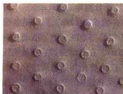

  
图9-2 用冷冻蚀刻电镜技术（A）和高分辨率扫描电镜（B）显示的核孔复合体  
（A图由Bechara Kachar博士惠赠；B图由任合博士和张传茂博士提供）

对于这个模型的结构组成目前有两种理解：①从横向上看，核孔复合体由周边向核孔中心依次可分为环、辐、栓三种结构亚基。②从纵向上看，核孔复合体由核外（胞质面）向核内（核质面）依次可分为胞质环、辐（+栓）、核质环三种结构亚基，形成“三明治”(sandwich)式的结构。综合起来，核孔复合体主要有以下4种结构组分：①胞质环（cytoplasmic ring）：位于核孔边缘的胞质面一侧，又称外环。环上有8条短纤维对称分布并伸向胞质。②核质环（nuclear ring）：位于核孔边缘的核质面一侧，又称内环。内环比外环结构复杂，环上也对称地连有8条细长的纤维，向核内伸入50\~70 nm。在纤维的末端形成一个直径为60 nm的小环，小环由8个颗粒构成。这样整个核质环就像一个“捕鱼笼”（fish-trap）样的结构，也有人称之为核篮（nuclear basket）结构。③辐（spoke）：由核孔边缘伸向中心，呈辐射状八重对称。它的结构也比较复杂，可进一步分为三个结构域：主要的区域位于核孔边缘，连接内、外环，起支撑作用，称作“柱状亚基”（column subunit）；在这个结构域之外，接触核膜部分的区域称为“腔内亚基”（luminal subunit），它穿过核膜伸入双层核膜的核周间隙；在“柱状亚基”之内，靠近核孔复合体中心的部分称作“环带亚基”（annular subunit），由8个颗粒状结构环绕形成核孔复合体核质交换的道路。④栓：或称中央栓（central plug），位于核孔的中心，呈颗粒状或棒状，所以又称为中央颗粒（central granule）。由于推测它在核质交换中起一定的作用，所以也把它叫做“transporter”。不过不是在所有的核孔复合体中都能观察到这种结构，因此有人认为它不是核孔复合体的结构组分，而只是正在通过核孔复合体的被转运的物质。由上述结构模型可见，核孔复合体相对于垂直于核膜通过核孔中心的轴呈辐射状八重对称结构，而相对于平行于核膜的平面则是不对称的，即核孔复合体在核质面与胞质面两侧的结构明显不对称，这与其在功能上的不对称性是一致的。

Ris 与 M. Malecki 运用 HR-FESEM 观察非洲瓜瓣卵母细胞核膜上的核孔复合体，发现 “捕鱼笼” 并非中断且游离在核质中，而是与一种称为 “cable” 的网络通道相连通。这种 cable 由与 “捕鱼笼” 类似的结构单位串联而成，看上去像是 “捕鱼笼” 上的纤维与小环在核质中的周期性重复与延续。从 “捕鱼笼” 末端小环的 8 个颗粒上又发出 8 条细长的纤维，在纤维上周期性地间隔有 8 个颗粒构成的环状结构。不同的 “捕鱼笼” 发出的 cable 相互交叉，使 cable 成为一个遍布核质、相互贯通的复杂的网络。这种与 “捕鱼笼” 相连、结构相似的 cable 有何功能尚不清楚，推测它很可能与核孔复合体的核质转运功能有关。

  
图9-3 核孔复合体结构模型

表 9-1 已知的脊椎动物核孔复合体的蛋白质成分简表

<table><tr><td>蛋白质名称</td><td>对应的 NPC 结构</td><td>功能与特性</td></tr><tr><td>gp210</td><td>孔膜区,跨膜蛋白</td><td>能与 ConA 结合;N 端位于膜周间隙,C 端将 NPC 锚定在核膜上</td></tr><tr><td>Pom121</td><td>孔膜区,跨膜蛋白</td><td>能与 WGA 结合;C 端有 FXFG 重复序列</td></tr><tr><td>Nup153</td><td>“捕鱼笼”</td><td>能与 WGA 结合;N 端有 FXFG 重复序列;具有锌指结构,能够结合 DNA (在体外)</td></tr><tr><td>Nup180</td><td>胞质环及其纤维</td><td>不能与 WGA 结合;其抗体对核质交换没有抑制作用;介导 NPC 与胞质骨架的联系</td></tr><tr><td>Nup155</td><td>核质面与胞质面</td><td>不能与 WGA 结合</td></tr><tr><td>p62</td><td>中央颗粒</td><td>能与 WGA 结合;具有 FXFG 重复序列;其抗体对核质交换有抑制作用;能与 p58,p54,p45 形成 p62 复合体;与酵母的 Nsp1p 同源</td></tr><tr><td>p58</td><td></td><td>具有 FG 重复序列;与酵母的 Nup49p 同源</td></tr><tr><td>p54</td><td></td><td>具有 FG 重复序列;与酵母的 Nup57p 同源</td></tr><tr><td>p45</td><td></td><td>具有 FG 重复序列</td></tr><tr><td>Nup84(大鼠)或 Nup88(人)</td><td>胞质环纤维</td><td>与 Nup214/CAN 结合,并将其连接到核孔复合体上</td></tr><tr><td>Nup214/CAN</td><td>胞质环纤维</td><td>能与 WGA 结合</td></tr><tr><td>Nup107</td><td></td><td>与酵母的 Nup84p 同源</td></tr><tr><td>Nup98</td><td></td><td>具有 GLFG 重复序列;与酵母的 Nup116p 同源</td></tr><tr><td>Nup155</td><td></td><td>与酵母的 Nup170 同源</td></tr><tr><td>p260/Tpr</td><td>胞质环纤维</td><td>不能与 WGA 结合</td></tr></table>

## （二）组成成分

核孔复合体主要由蛋白质构成，其总分子质量约为125 MDA，新近推测可能含有30余种不同的多肽，共1 000多个蛋白质分子。通过生化与遗传学技术相结合，在酵母中已鉴定出30余种与核孔复合体有关的蛋白质成分。迄今已鉴定的脊椎动物的核孔复合体蛋白质成分也已达到10多种（表9-1），其中gp210与p62是最具有代表性的两个成分，它们分别代表着核孔复合体蛋白的两种类型。实际上，核孔复合体的整个结构在演化上是高度保守的。gp210与p62这两类蛋白质成分在从酵母到人的多种生物中都已被发现证实，它们在不同的物种中有很强的同源性。目前人们倾向于把所有的核孔复合体蛋白统一命名为“核孔蛋白”（nucleoporin, Nup）。

gp210 代表一类结构性跨膜蛋白，是第一个被鉴定出来的核孔复合体蛋白，分子质量为 210 kDa，位于核膜的“孔膜区”，故认为它在锚定核孔复合体的结构上起重要作用。目前认为 gp210 主要有三方面的功能：① 介导核孔复合体与核膜的连接，将核孔复合体锚定在“孔膜区”，从而为核孔复合体组装提供一个起始位点。② 在内、外核膜融合形成核孔中起重要作用。

③ 在核孔复合体的核质交换功能活动中起一定作用，如 gp210 核周间隙内肽段的抗体能够降低蛋白质入核转运的速度。

p62 代表一类功能性的核孔复合体蛋白。脊椎动物的 p62 分子主要分为两个结构域：① 疏水性 N 端区：具有 FXFG（F；苯丙氨酸；X；任意氨基酸；G；甘氨酸）形式的重复序列，这个区域可能在核孔复合体功能活动中直接参与核质交换。② C 端区：具有疏水性的七肽重复序列，类似一些纤维蛋白（如中间丝蛋白、核纤层蛋白）的杆状区，适合形成 α 螺旋。这个区域可能通过卷曲螺旋与其他核孔复合体蛋白成分相互作用，从而将 p62 分子稳定到核孔复合体上，为其 N 端进行核质交换活动提供支持。p62 对核孔复合体行使正常的功能非常重要。目前，这一类核孔复合体蛋白成分已有很多被鉴定出来，其中有些像 p62 一样带有 O-连接 GlcNac 类型的糖基化修饰，并且含有一些重复序列，如 Nup153 中的 FXFG，Nup98 中的 GLFG（L：亮氨酸），也有些没有任何糖基化修饰或类似的重复序列。

## （三）功能

从功能上讲，核孔复合体可以看做是一种特殊的跨膜运输蛋白复合体，并且是一个双功能、双向性的亲水性核质交换通道。双功能表现在它有两种运输方式：被动扩散与主动运输。双向性表现在既介导蛋白质的入核转运，又介导RNA、核糖核蛋白颗粒（RNP）的出核转运（图9-4）。

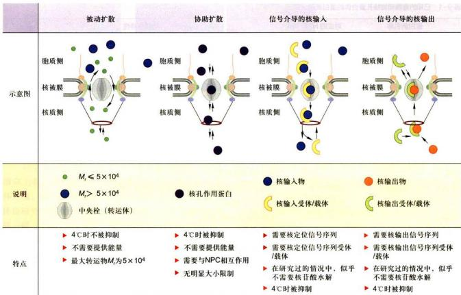  
图9-4 通过核孔复合体物质运输的功能示意图

## 1. 通过核孔复合体的被动扩散

核孔复合体作为被动扩散的亲水通道，其有效直径为9\~10 nm，有的可达12.5 nm，即离子、小分子以及直径在10 nm以下的物质原则上可以自由通过。对于球形蛋白质，这种有效直径相当于允许分子质量在40\~60 kDa的蛋白质分子自由穿过核孔。但实际上并不是所有符合这个条件的蛋白质都可以随意出入细胞核。有许多小分子的蛋白质，如组蛋白H1，其分子质量虽只有21 kDa，但由于它本身带有具信号功能的氨基酸序列，所以是通过主动运输进入细胞核的；有的小分子蛋白质本身虽然没有信号序列，但可以与其他有信号序列的成分结合，一起被主动运输到核内。因此，核孔复合体的这种被动扩散通道并不意味着所有10 nm以下的小分子在核被膜两侧就一定均匀分布。有些小分子蛋白质可能会因为与其他大分子相结合，或与一些不溶性结构成分（如中间丝、核基质）结合而被限制在细胞质或细胞核内。

## 2. 核孔复合体的主动运输

生物大分子的核质分配如亲核蛋白的核输入，RNA 分子及核糖核蛋白颗粒（RNP）的核输出，在细胞核功能活性的控制中起非常重要的作用。对于真核细胞来说，典型的哺乳类细胞的核被膜上有 3 000～4 000 个核孔（10～20 个/μm²）。如果细胞正在合成 DNA，为了确保染色质包装，则需要每 3 min 从细胞质向核内输入 $10^{6}$ 个组蛋白分子，这意味着每个核孔每分钟要运进 100 个组蛋白分子。如果细胞在迅速生长，则需要每个核孔每分钟从细胞核向细胞质输出 3 对核糖体大小亚基，以确保蛋白质合成的需要。现在已知，这种大分子的核质分配主要是通过核孔复合体的主动运输完成的，具有高度的选择性，并且是双向的。其主动运输的选择性表现在以下三个方面：① 对运输颗粒大小的限制。主动运输的功能直径比被动运输大，为 10～20 nm，甚至可达 26 nm。像核糖体亚基那样大的 RNP 也可以通过核孔复合体从核内运输到细胞质中，表明核孔复合体的有效直径的大小是可调节的。②通过核孔复合体的主动运输是一个信号识别与载体介导的过程，需要消耗ATP能量，并表现出饱和动力学特征。③通过核孔复合体的主动运输具有双向性，即核输入与核输出，它既能把复制、转录、染色体构建和核糖体亚基组装等所需要的各种因子如DNA聚合酶、RNA聚合酶、组蛋白、核糖体蛋白等运输到核内；同时又能将翻译所需的RNA、组装好的核糖体亚基从核内运送到细胞质。有些蛋白质或RNA分子甚至两次或多次穿越核孔复合体，如核糖体蛋白、snRNA。

近期对于亲核蛋白的入核转运机制的研究进展较快。亲核蛋白（karyophilic protein）是指在细胞质内合成后，需要或能够进入细胞核内发挥功能的一类蛋白质。大多数的亲核蛋白往往在一个细胞周期中一次性地被转运到核内，并一直停留在核内行使功能，典型的如组蛋白、核纤层蛋白；但也有一些亲核蛋白需要穿梭于核质之间进行功能活动，如核输入蛋白（importin）。通过研究核质蛋白（nucleoplasmmin）的入核转运，人们逐步发现了指导亲核蛋白入核的信号。亲核蛋白一般都含有特殊的氨基酸序列，这些内含的特殊短肽保证了整个蛋白质能够通过核孔复合体被转运到细胞核内。这段具有“定向”“定位”作用的序列被命名为核定位序列（nuclear localization sequence）或核定位信号（nuclear localization signal, NLS）。第一个被确定序列的NLS来自猴肾病毒（SV40）的T抗原（分子质量92 kDa）。这个NLS由7个氨基酸残基构成：Pro-Lys-Lys-Lys-Arg-Lys-Val。其中仅一个氨基酸残基的突变就会导致该蛋白在胞质内不正常积累。如果将这段NLS序列连接到非亲核蛋白上，则非亲核蛋白就会被转运到核内。此后，又陆续鉴定出一些其他亲核蛋白的NLS。目前认为NLS是存在于亲核蛋白内的一些短的氨基酸序列片段，富含碱性氨基酸残基，如Lys、Arg，此外还常常含有Pro。这些氨基酸残基片段可以是一段连续的序列，如上述SV40T抗原的NLS；也有分成两段存在于亲核蛋白的氨基酸序列中，两段之间往往间隔约10个氨基酸残基，如核质蛋白的NLS。在不同的NLS之间尚未发现共有的特征序列。与指导蛋白质跨膜运输的信号肽不同，NLS序列可存在于亲核蛋白的不同部位，并且在指导亲核蛋白完成核输入后并不被切除。

亲核蛋白通过核孔复合体的转运是分步进行的，根据整个过程对能量的需求可粗略分为两步：结合（binding）与转移(translocation）。亲核蛋白首先结合到核孔复合体的胞质面，这一步不需要能量，但依赖正常的NLS；随后的转移步骤则需要GTP水解供能。亲核蛋白除了本身具有NLS外，其入核转运还需要一些胞质蛋白因子的帮助。目前比较确定的因子有importin- $\alpha$ 、importin- $\beta$ 、Ran和NTF2等。在它们的参与下，亲核蛋白的入核转运可分为如下几个步骤（图9-5）：①亲核蛋白通过NLS识别importin- $\alpha$ ，与可溶性NLS受体importin- $\alpha$ /improtin- $\beta$ 异二聚体结合，形成转运复合物。②在importin- $\beta$ 的介导下，转运复合物与核孔复合体的胞质纤维结合。③转运复合物通过改变构象的核孔复合体从胞质面被转移到核质面。④转运复合物在核质面与Ran-GTP结合，并导致复合物解离，亲核蛋白释放。⑤受体的亚基与结合的Ran返回胞质，在胞质内Ran-GTP水解形成Ran-GDP并与importin- $\beta$ 解离，Ran-GDP返回核内再转换成Ran-GTP状态。

对于 RNA 及核糖体亚基的出核转运机制了解得较少。真核细胞中RNA一般要经过转录后加工、修饰成为成熟的RNA分子后才能被转运出核。①由RNA聚合酶I转录的rRNA分子，总是在核仁中与从胞质中转运进来的核糖体蛋白结合形成核糖体亚基，以RNP的形式离开细胞核，转运过程需要能量。②由RNA聚合酶Ⅲ转录的5S rRNA与tRNA的转运是一种由蛋白质介导的过程。③由RNA聚合酶Ⅱ转录的核内异质RNA(heterogeneous nuclear RNA, hnRNA)，首先需要在核内进行5'端加帽和3'端附加多腺苷酸序列(polyA)以及剪接等加工过程，然后形成成熟的mRNA出核，出核转运也是一个需要载体的主动运输过程。真核细胞的snRNA、mRNA与tRNA，无论在细胞质还是细胞核中，都是与相关的蛋白质结合在一起，即以各种RNP的形式存在的。所谓RNA的出核转运实际上是RNA-蛋白质复合体的转运，即RNA的核输出离不开特殊的蛋白质因子的参与，这些蛋白质因子本身含有出核信号。目前人们正致力于寻找在RNA分子与核孔复合体之间起桥梁作用的信号与载体。现已发现一些与RNA共同出核的蛋白因子，如HIV病毒的Rev蛋白、转录因子TFⅢA、蛋白激酶A抑制因子PKI等，含有对它们的出核转运起决定作用的氨基酸序列，命名为核输出信号(nuclear export signal, NES)。此外，有迹象表明入核转运与出核转运之间可能有某种联系，如它们可能需要某些共同的因子。

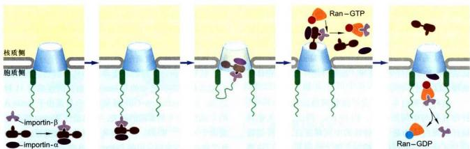  
图9-5 亲核蛋白从细胞质向细胞核输入的过程示意图

## 三、核纤层

哺乳动物体细胞的核纤层主要由三种核纤层蛋白构成，它们分别是lamin A、lamin B和lamin C。其中，lamin A和lamin C是同一个基因的不同拼接体（splicing variant），前566个氨基酸完全相同，但是C端的序列是不一样的。lamin A/C的表达具有组织与发育时期的特异性，但lamin B则在哺乳动物的所有细胞中表达。在早期小鼠胚胎中，lamin A核纤层蛋白不表达，所以它们被认为可能与细胞的分化有关。lamin B缺失的小鼠成纤维细胞的细胞核变形、细胞分化异常、染色体倍数增加以及过早地衰老。

核纤层蛋白本身形成纤维状网络结构（图9-6）。纤维直径与中间丝类似，约 $10\mathrm{nm}$ 。所以，有人也将核纤层蛋白认为是一类特殊的中间丝蛋白。核纤层蛋白与其他蛋白质存在结构与功能上的相互关系。这些蛋白质主要包括一些核被膜内膜蛋白（INM protein），如 SUN1（Sad1-Unc84）、LAP（lamin-associated polypeptide）；核孔复合体蛋白；细胞骨架结合蛋白，如 Nesprin；核基质与染色质结合蛋白，如 BAF（barrier-to-autointegration factor）。

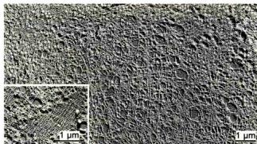  
图9-6 冷冻蚀刻电镜技术显示核纤层的纤维结构（UeliAebi博士惠赠）

核纤层的功能主要包括以下几个方面：①结构支撑功能。核纤层蛋白形成骨架结构支撑于核被膜的内侧，使得核被膜能起到细胞核与细胞质之间的隔离与信息交换功能。核纤层的骨架功能还得以使细胞核维持正常的形状与大小。②调节基因表达。果蝇细胞中基因组范围的研究结果表明，沉默基因更倾向于分布于核纤层附近，异染色质更易与核纤层结合，而且核纤层附近染色质的乙酰化水平较低。然而，在酵母细胞中活跃转录的基因也分布于核纤层附近，它们常与核孔复合体结合。所以，核纤层与基因表达的确切关系还不是非常清楚。很可能在不同物种的细胞中，甚至不同组织的细胞中情况不一样。③调节DNA修复。研究表明，lamin A核纤层蛋白是双链DNA断裂修复必需的。核纤层蛋白功能异常患者细胞中的基因组变得不稳定，DNA修复反应滞后，端粒变短。④与细胞周期的关系。细胞分裂过程中，核纤层蛋白解聚成可溶的单体或与崩解后的核被膜相结合。新核形成时，核被膜与染色质结合的同时，核纤层也最后重新形成。

核纤层蛋白基因的突变导致的核纤层功能丧失会引起多种疾病。已知的与lamin A相关的疾病有11种之多。如Hutchinson-Gilford早老综合征是由于lamin A的C端的50个氨基酸的缺失，非典型性Werner综合征是由于A57P、R133L和L140R的氨基酸改变等。lamin B受体功能改变则会引起Pelger-Huët综合征。

<!-- END CN CN09-S01 -->

---

## 对应英文内容

### 英文补充：核孔、核定位信号、Ran与核质运输

> 对应中文板块：核孔、核定位信号、Ran与核质运输。英文来源：Molecular Biology of the Cell，第7版，第12章；[本章完整原文](../来源/英文教材/12_Intracellular_Organization_and_Protein_Sorting/chapter.md)。物理PDF页码范围：722–787（整章范围）。

<!-- BEGIN EN EN12-H042-H050 -->
#### THE TRANSPORT OF MOLECULES BETWEEN THE NUCLEUS AND THE CYTOSOL

The **nuclear envelope** encloses the DNA and defines the nuclear compartment. This envelope consists of two concentric membranes, which are perforated by nuclear pore complexes (**Figure 12–54**). Although the inner and outer nuclear membranes are continuous, they maintain distinct protein compositions. The **inner nuclear membrane** contains proteins that act as binding sites for the **nuclear lamina**, a meshwork of polymerized protein subunits called **nuclear lamins**. The lamin proteins are members of the intermediate filament family of cytoskeletal proteins (see Chapter 16). The lamina provides structural support for

(A)

(B)

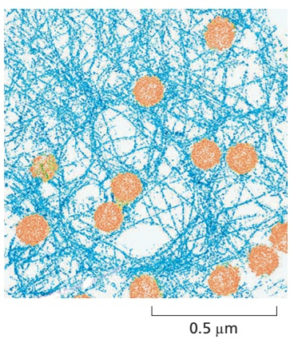

Figure 12–54 The nuclear envelope. (A) The double membrane of the nuclear envelope is penetrated by nuclear pore complexes. Transmembrane proteins in the inner and outer nuclear membranes link the nuclear lamina to the cytosolic cytoskeleton. The outer nuclear membrane is continuous with the endoplasmic reticulum (ER). The ribosomes that are normally bound to the cytosolic surface of the ER membrane and outer nuclear membrane are not shown. (B) The nuclear lamina is a fibrous protein meshwork underlying the inner membrane. Nuclear pores are seen in light brown. (B, from Y. Turgay et al., Nature 543:261–264, 2017.)

the nuclear envelope and acts as an anchoring site for chromosomes and nuclear pore complexes. The lamina is also connected to the cytoplasmic cytoskeleton via protein complexes that span the nuclear envelope, thereby providing structural links between the DNA, nuclear envelope, and cytoskeleton. The **outer nuclear membrane** is continuous with the membrane of the ER and is studded with ribosomes engaged in protein synthesis (see Figure 12–15). The proteins made on these ribosomes are transported into the space between the inner and outer nuclear membranes (the perinuclear space), which is continuous with the ER lumen.

Nuclear pores conduct extensive bidirectional traffic between the cytosol and the nucleus. The many proteins that function in the nucleus—including histones, DNA polymerases, RNA polymerases, transcriptional regulators, and RNA-processing proteins—are selectively imported into the nuclear compartment from the cytosol, where they are made. At the same time, all RNAs that function in the cytosol—including mRNAs, rRNAs, tRNAs, and miRNAs—are exported after they are synthesized and processed in the nucleus. Like the import process, the export process is selective; mRNAs, for example, are exported only after they have been properly modified by RNA-processing reactions in the nucleus. In some cases, multiple selective transport steps are needed to assemble a complex structure. Ribosomes, for instance, are made from proteins that are synthesized in the cytosol, imported into the nucleus, and exported back to the cytosol only after their assembly with newly made ribosomal RNA. These pre-ribosomal particles then complete their assembly into functional ribosomes in the cytosol, with certain assembly and transport factors returning to the nucleus to help assemble the next ribosome.

#### Nuclear Pore Complexes Perforate the Nuclear Envelope

Large and elaborate **nuclear pore complexes (NPCs)** perforate the nuclear envelope in all eukaryotes. Each NPC is composed of a set of approximately 30 different proteins, or **nucleoporins**. NPCs display eightfold rotational symmetry, with axial symmetry of the central core. Hence, each nucleoporin is present in multiple copies, resulting in 500–1000 protein molecules in the fully assembled NPC, with an estimated mass of 66 million daltons in yeast and 125 million daltons in vertebrates (**Figure 12–55**). Most nucleoporins are composed of repetitive protein domains of only a few different types, which have evolved through extensive gene duplication. Some of the scaffold nucleoporins that abut the membrane (see Figure 12–55) are evolutionarily and structurally related to vesicle coat protein complexes, such as clathrin and the COPII coat (discussed in Chapter 13), which shape transport vesicles. One protein is even used as a common building block in both NPCs and vesicle coats. It appears that an ancestral membrane-bending protein that helped shape the elaborate membrane systems of eukaryotic cells evolved into a family of proteins that stabilize the sharp membrane bends at nuclear pores and budding transport vesicles.

The nuclear envelope of a typical mammalian cell contains 3000–4000 NPCs, although that number varies widely, from a few hundred in glial cells to almost 20,000 in Purkinje neurons. Each NPC can transport a staggering 1000 macromolecules per second and can transport in both directions at the same time. The internal diameter of each NPC is ∼40 nm, large enough to accommodate ribosomal subunits and even viral particles. However, this enormous pore is not empty; instead, it is filled with unstructured protein regions contributed by the channel nucleoporins.

These unstructured domains contain numerous repeats of phenylalanine– glycine (FG) motifs whose weak affinity for each other creates a gel-like mesh inside the NPC. This mesh acts as a sieve that restricts the diffusion of large macromolecules while allowing smaller molecules to pass. Researchers have determined the effective size of the sieve by injecting labeled water-soluble molecules of different sizes into the cytosol and then measuring their rate of diffusion into the nucleus. Small molecules (5000 daltons or less) diffuse in so fast that we can consider the nuclear envelope freely permeable to them. The barrier is progressively restrictive to larger molecules such that proteins greater than ∼40,000 daltons or ∼5 nm in diameter cannot enter by passive diffusion.

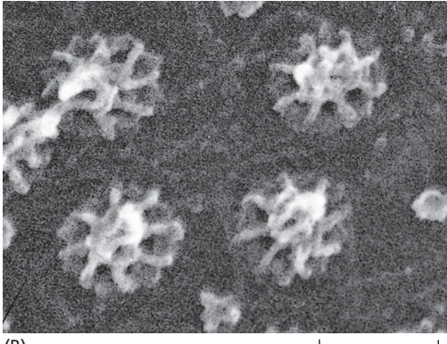

(B)

0.1 µm

(D)

Figure 12–55 The arrangement of NPCs in the nuclear envelope. (A) In a vertebrate NPC, nucleoporins are arranged with striking eightfold rotational symmetry. In addition, immunoelectron microscope studies show that the proteins that make up the central portion of the NPC are oriented symmetrically across the nuclear envelope, so that the nuclear and cytosolic sides look identical. The eightfold rotational and twofold transverse symmetry explains how such a huge structure can be formed from only about 30 different proteins: many of the nucleoporins are present in 8, 16, or 32 copies. On the basis of their approximate localization in the central portion of the NPC, nucleoporins can be classified into (1) transmembrane ring proteins that span the nuclear envelope and anchor the NPC to the envelope; (2) scaffold nucleoporins that form layered ring structures (some scaffold nucleoporins are membrane-bending proteins that stabilize the sharp membrane curvature where the nuclear envelope is penetrated); and (3) channel nucleoporins that line a central pore. In addition to folded domains that anchor the proteins in specific places, many channel nucleoporins contain extensive unstructured regions, where the polypeptide chains are intrinsically disordered. The central pore is filled with a high concentration of these disordered domains whose weak interactions with each other form a gel that blocks the passive diffusion of large macromolecules. The disordered regions contain a large number of phenylalanine–glycine (FG) repeats. Fibrils protrude from both the cytosolic and the nuclear sides of the NPC. By contrast to the twofold transverse symmetry of the NPC core, the fibrils facing the cytosol and nucleus are different: on the nuclear side, the fibrils converge at their distal end to form a basketlike structure. The precise arrangement of individual nucleoporins in the assembled NPC is still a matter of intense debate, because atomic resolution analyses have been hindered by the sheer size and flexible nature of the NPC and by difficulties in purifying sufficient amounts of homogeneous material. A combination of electron microscopy, computational analyses, and crystal structures of nucleoporin subcomplexes has been used to develop the current models of the NPC architecture. (B) A scanning electron micrograph of the nuclear side of the nuclear envelope of an oocyte, showing NPCs with their basketlike fibrils. (C) An electron micrograph showing a side view of two NPCs (brackets); note that the inner and outer nuclear membranes are continuous at the edges of the pore. (D) An electron micrograph showing face-on views of negatively stained NPCs. The membrane has been removed by detergent extraction. Note that some of the NPCs contain material in their center, which is thought to be trapped macromolecules in transit through these NPCs. (A, adapted from A. Hoelz et al., Annu. Rev. Biochem. 80:613–643, 2011. B, © 1992 M.W. Goldberg and T.D. Allen. Originally published in J. Cell Biol. https://doi.org/10.1083/jcb.119.6.1429. With permission from Rockefeller University Press. $\mathrm { C } ,$ courtesy of Werner Franke and Ulrich Scheer. D, courtesy of Ron Milligan.)

Because many cell proteins are too large to diffuse passively through the NPCs, the nuclear compartment and the cytosol can maintain different protein compositions. Mature cytosolic ribosomes, for example, are about 30 nm in diameter and thus cannot diffuse through the NPC, confining protein synthesis to the cytosol. But how does the nucleus export newly made ribosomal subunits or import large molecules, such as DNA polymerases and RNA polymerases, which have subunitMBoC7 m12.09/12.56 molecular masses of 100,000–200,000 daltons? As we discuss next, these and most other transported protein and RNA molecules bind to specific receptor proteins that ferry large molecules through NPCs. Even small proteins such as histones frequently use receptor-mediated mechanisms to cross the NPC, thereby increasing transport efficiency.

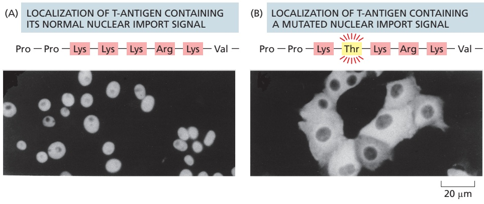

Figure 12–56 The function of a nuclear localization signal. Immunofluorescence micrographs showing the cell location of SV40 virus T-antigen containing or lacking a short sequence that serves as a nuclear localization signal. (A) The normal T-antigen protein contains the lysinerich sequence indicated and is imported to its site of action in the nucleus, as indicated by immunofluorescence staining with antibodies against the T-antigen. (B) T-antigen with an altered nuclear localization signal (a threonine replacing a lysine) remains in the cytosol. (From D. Kalderon et al., Cell 39:499–509, 1984. With permission from Elsevier.)

#### Nuclear Localization Signals Direct Proteins to the Nucleus

When proteins are experimentally extracted from the nucleus and reintroduced into the cytosol, even the very large ones reaccumulate efficiently in the nucleus. Sorting signals called **nuclear localization signals (NLSs)** are responsible for the selectivity of this active nuclear import process. The signals have been precisely defined by using recombinant DNA technology for numerous proteins that are imported into the nucleus (**Figure 12–56**). The most commonly used signal consists of one or two short sequences that are rich in the positively charged amino acids lysine and arginine (see Figure 12–13), with the precise sequence varying for different proteins. Some nuclear proteins contain different types of signals, some of which are not yet characterized.

NLSs can be located almost anywhere in the amino acid sequence and are thought to form loops or patches on the protein surface. Many NLSs function even when linked as short peptides to the surface of a cytosolic protein, suggesting that the precise location of the signal within the amino acid sequence of a nuclear protein is not important. Moreover, as long as one of the protein subunits of a multicomponent complex displays a nuclear localization signal, the entire complex will be imported into the nucleus.

Macromolecular transport across NPCs differs fundamentally from the transport of proteins across the membranes of other organelles: NPC transport occurs through a large, constitutively open, mesh-filled pore, rather than through a much smaller protein translocator whose aqueous pore is typically gated by the protein being transported. For this reason, fully folded proteins and large multiprotein complexes can be transported in either direction through the nuclear pore. By contrast, transport through organellar protein translocators of the ER, mitochondria, and chloroplasts is unidirectional and usually requires the protein to be extensively unfolded.

One can visualize the transport of nuclear proteins through NPCs by coating tiny colloidal gold particles with a nuclear localization signal, injecting the particles into the cytosol, and then following their fate by electron microscopy (**Figure 12–57**). The particles first arrive at the tentacle-like fibrils that extend from the scaffold nucleoporins at the rim of the NPC into the cytosol, and then proceed through the center of the NPC. This observation illustrates that NLSs impart the ability of large particles to navigate through the otherwise impermeable diffusion barrier posed by the disordered mesh inside the nuclear pore.

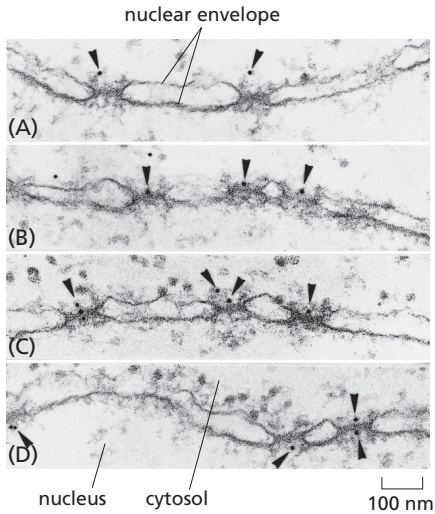

Figure 12–57 Visualizing active import through NPCs. This series of electron micrographs shows 5- to 10-nm-diameter colloidal gold spheres (arrowheads) coated with peptides containing nuclear localization signals entering the nucleus through NPCs. The gold particles were injected into the cytosol of living cells, which then were fixed and prepared for electron microscopy at various times after injection. (A) Gold particles are first seen in proximity to the cytosolic fibrils of the NPCs. (B, C) They are then seen at the center of the NPCs, exclusively on the cytosolic face. (D) They then appear on the nuclear face. These gold particles have much larger diameters than those of the diffusion channels in the NPC and are imported by active transport. (From N. Panté and U. Aebi, Science 273:1729–1732, 1996. With permission from AAAS.)

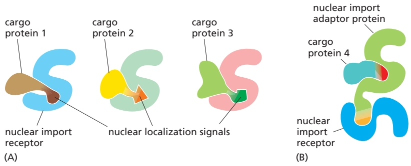

Figure 12–58 Nuclear import receptors. (A) Different nuclear import receptors bind different nuclear localization signals and thereby different cargo proteins. (B) Cargo protein 4 requires an adaptor protein to bind to its nuclear import receptor. The adaptors are structurally related to nuclear import receptors and recognize nuclear localization signals on cargo proteins. They also contain a nuclear localization signal that binds them to an import receptor, but this signal only becomes exposed when they are loaded with a cargo protein.

#### Nuclear Import Receptors Bind to Both Nuclear Localization Signals and NPC Proteins

To initiate nuclear import, nuclear localization signals must be recognized by **nuclear transport receptors**. Most of these receptors are part of a largeMBoC7 m12.11/12.58 family of proteins called karyopherins. In yeast, there are 14 genes encoding karyopherins; in animal cells, the number is significantly larger. Karyopherin family members that mediate nuclear import are called **nuclear import receptors**, while those for nuclear export (discussed later) are called **nuclear export receptors**. Each import receptor can bind and transport the subset of cargo proteins containing the appropriate nuclear localization signal (**Figure 12–58A**). Nuclear import receptors sometimes use adaptor proteins that form a bridge between the import receptors and the nuclear localization signals on the proteins to be transported (**Figure 12–58B**). Some adaptor proteins are structurally related to nuclear import receptors, suggesting a common evolutionary origin. By using a variety of import receptors and adaptors, cells are able to recognize the broad repertoire of nuclear localization signals that are displayed on nuclear proteins.

The import receptors are soluble cytosolic proteins that contain multiple low-affinity binding sites for the FG repeats found in the unstructured domains of several nucleoporins. The FG repeats in the fibrils of cytosol-facing nucleoporins serve to initially recruit import receptors and their bound cargo proteins to NPCs. The import receptors can then bind the FG repeats that form the mesh inside the nuclear pore to disrupt interactions between the repeats. In this way, the receptor–cargo complex locally dissolves the gel-like mesh and can diffuse into and within the NPC pore (**Figure 12–59**).

It is possible to re-create in a test tube a gel consisting of unstructured polypeptides containing FG repeats. This gel displays restricted diffusion of inert cargoes in a size-dependent manner similar to diffusion through NPCs. Diffusion into this artificial gel is more than 1000-fold faster for cargoes bound to an import receptor. At this rate, a cargo in complex with an import receptor could traverse the distance across an NPC in a few milliseconds, consistent with the rate

Figure 12–59 Interaction of nuclear import receptors with FG repeats. Left: Nuclear import receptors contain various low-affinity FG repeat–binding sites on their surface. This facilitates their initial recruitment to NPCs because of interactions with FG repeats found on the cytosolic fibrils of the NPCs. The interior of the NPC is filled with a mesh of FG repeat–containing proteins whose weak interactions with each other restrict nonspecific diffusion of proteins and other macromolecules through the pore. Right: Cargo receptors can rapidly partition into the FG repeat mesh by interacting with the FG repeats and locally melting the mesh. This partitioning into and out of the mesh substantially accelerates diffusion of the cargo receptor (and its bound cargo) through the NPC. Proteins without surface FG repeat–binding sites cannot melt the mesh, and their diffusion through the NPC is comparatively slow.

of transport observed in cells. It is important to realize that in this model, diffusion is not directional; instead, the import receptor simply accelerates diffusion to provide cargo access to the nuclear compartment. As we will see, it is the selective dissociation of cargo only on the nuclear side of the NPC that confers directionality to the import process. The import receptor then returns back to the cytosol for transport of the next cargo.

#### The Ran GTPase Imposes Directionality on Nuclear Import Through NPCs

The import of nuclear proteins through NPCs concentrates specific proteins in the nucleus and thereby increases order in the cell. The cell fuels this ordering process by harnessing the energy of GTP hydrolysis by the GTPase **Ran**, which is required for both nuclear import and export.

Like other GTPases, Ran is a molecular switch that can exist in two conformational states, depending on whether GDP or GTP is bound (Figure 3–63). Two Ran-specific regulatory proteins trigger the conversion between the two states: a cytosolic GTPase-activating protein (GAP) triggers GTP hydrolysis and thus converts Ran-GTP to Ran-GDP, and a nuclear guanine nucleotide exchange factor (GEF) promotes the exchange of GDP for GTP and thus converts Ran-GDP to Ran-GTP. Because Ran GAP is located in the cytosol and Ran GEF is located in the nucleus, the cytosol contains mainly Ran-GDP, and the nucleus contains mainly Ran-GTP (**Figure 12–60A**). The partitioning of the GAP and GEF between the cytosol and nucleus in a cell is due to their preferential association with the cytosolic cytoskeleton and nuclear chromatin, respectively.

The gradient of the two conformational forms of Ran drives nuclear transport in the appropriate direction. Import receptors, facilitated by FG-repeat binding, accelerate diffusion through the mesh inside the NPC channel. When an import receptor reaches the nuclear side of the pore complex, Ran-GTP binds to it and causes the receptor to release its cargo (**Figure 12–60B**). Because this occurs only on the nuclear side of the pore where the Ran-GTP concentration is high, the import process becomes rectified (that is, unidirectional), even though diffusion of the cargo–import receptor complex through the pore is governed by random back-and-forth diffusion.

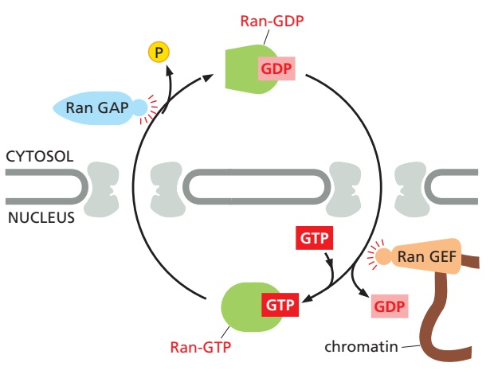

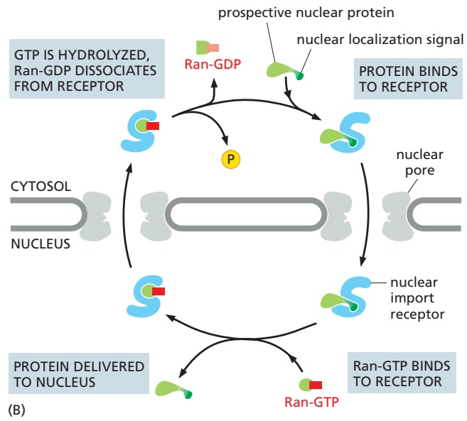

(A)

Figure 12–60 The compartmentalization of Ran-GDP and Ran-GTP provides directionality to nuclear transport. (A) Localization $\cot \mathsf { R a n - } \dot { \mathsf { G D P } }$ in the cytosol and Ran-GTP in the nucleus results from the localization of two Ran regulatory proteins: Ran GTPase-activating protein (Ran GAP) is located in the cytosol, and Ran guanine nucleotide exchange factor (Ran GEF) binds to chromatin and is therefore located in the nucleus. Ran-GDP is imported into the nucleus by its own import receptor (not shown), which is specific for the GDP-bound conformation of Ran. The Ran-GDP receptor is structurally unrelated to the main family of nuclear transport receptors. However, it also binds to FG repeats in NPC channel nucleoporins. (B) The interaction between a nuclear import receptor and its cargo is reversed by Ran-GTP. This means the receptor–cargo interaction is favored in the cytosol but disfavored in the nucleus. This results in net cargo transport from the cytosol to the nucleus.

Having discharged its cargo in the nucleus, the empty import receptor with Ran-GTP bound is transported back through the pore complex by the same mechanism of facilitated diffusion. When the complex of Ran-GTP and the import receptor reaches the cytosol, Ran GAP triggers Ran-GTP to hydrolyze its bound GTP. The resulting Ran-GDP lacks affinity for the import receptor, releasing it for another cycle of nuclear import. Thus, Ran-GDP permits cargo binding in the cytosol, while Ran-GTP stimulates cargo discharge in the nucleus, thereby imparting directionality to the import process.

#### Nuclear Export Works Like Nuclear Import, but in Reverse

The nuclear export of large molecules, such as new ribosomal subunits and RNA molecules, occurs through NPCs and also depends on a selective transport system. The transport system relies on **nuclear export signals** on the macromolecules to be exported. Export receptors bind to both the export signal, either directly or via an adaptor, and to NPC proteins to guide their cargo to the cytosol. As might be expected from the structural and evolutionary similarity of import receptors and export receptors, the import and export transport systems work in similar ways but in opposite directions: the import receptors bind their cargo molecules in the cytosol, release them in the nucleus, and are then exported to the cytosol for reuse, while the export receptors function in the opposite fashion (**Figure 12–61**).

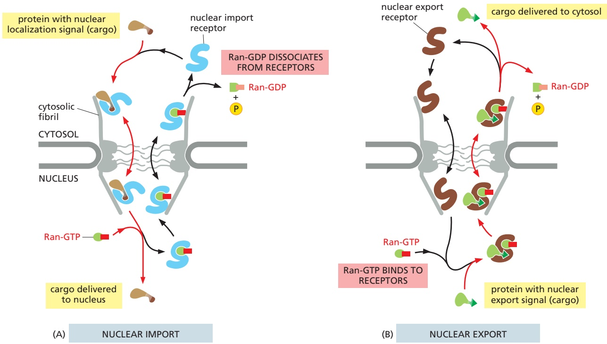

Figure 12–61 Nuclear import and nuclear export both use the Ran GTPase cycle. Movement through the NPC of loaded nuclear transport receptors occurs along the FG repeats displayed by certain NPC proteins. The differential localization of Ran-GTP in the nucleus and Ran-GDP in the cytosol provides directionality (red arrows) to both nuclear import (A) and nuclear export (B). Ran GAP stimulates the hydrolysis of GTP to produce Ran-GDP on the cytosolic side of the NPC (see Figure 12–60A). The critical difference between Ran-mediated nuclear import and nuclear export is the nature of cargoMBoC7 m12.13/12.61 binding by the cargo receptor. In nuclear import, cargo binding is mutually exclusive of Ran-GTP; in nuclear export, cargo binding requires Ran-GTP. Thus, the locations where cargo is picked up and released are exactly reversed in nuclear export compared to nuclear import.

The ability of export receptors to work in reverse derives from the way they interact with the Ran GTPase. Ran-GTP in the nucleus promotes cargo binding to the export receptor, rather than promoting cargo dissociation as in the case of import receptors. Once the export receptor moves through the pore to the cytosol, it encounters Ran GAP, which induces the receptor to hydrolyze its GTP to GDP. As a result, the export receptor flips its conformation and releases both its cargo and Ran-GDP in the cytosol. Free export receptors and free Ran-GDP use the nuclear import pathway to enter the nucleus and complete the cycle.

As we discuss in detail in Chapter 6, cells control the export of RNAs from the nucleus. snRNAs, miRNAs, and tRNAs bind to nuclear export receptors, and they use the Ran-GTP gradient to fuel the transport process. By contrast, the export of mRNAs out of the nucleus uses a different mechanism that does not use export receptors or the Ran GTPase system. Instead, the spliced and processed mRNA is assembled with several nuclear RNA-binding proteins, some of which can bind the nuclear side of NPCs and others that bind FG repeats (see Figure 6–40). This export-competent mRNA ribonucleoprotein (mRNP) complex can then navigate through the FG repeat mesh within the NPC. A helicase complex that resides on the cytosolic side of NPCs uses the energy of ATP hydrolysis to strip several proteins from the mRNP, including the FG repeat–binding protein. This prevents the exported mRNA from reentering the NPC, making the export process unidirectional. The stripped RNA-binding proteins are rapidly imported back to the nucleus (using the import receptor and Ran GTPase system) for another round of transport.

#### Transport Through NPCs Can Be Regulated by Controlling Access to the Transport Machinery

Some proteins continually shuttle back and forth between the nucleus and the cytosol. This can happen if a protein is small enough to diffuse through the nuclear pore but contains an import or export signal that constantly retrieves it to the nucleus or cytosol. Other proteins contain both nuclear localization signals and nuclear export signals. The relative rates of their import and export determine the steady-state localization of such shuttling proteins: if the rate of import exceeds the rate of export, a protein will be located mainly in the nucleus; conversely, if the rate of export exceeds the rate of import, a protein will be located mainly in the cytosol. Thus, changing the rate of import, export, or both, can change the location of a protein.

As discussed in Chapter 7, cells control the activity of some transcription regulators by keeping them out of the nucleus until they are needed there (**Figure 12–62**); similarly, cells can control the translation of certain mRNAs by retaining them in the nucleus until their protein products are needed. In many cases, cells control transport by regulating nuclear localization and export signals—turning them on or off, often by phosphorylation of amino acids close to the signal sequences (**Figure 12–63**). Other transcription regulators are bound to inhibitory cytosolic proteins that either anchor them in the cytosol (through interactions with the cytoskeleton or specific organelles) or mask their nuclear localization signals so that they cannot interact with nuclear import receptors. An appropriate stimulus releases the transcription regulatory protein from its cytosolic anchor or mask, and it is then transported into the nucleus.

One important example is the latent transcription regulatory protein that controls the transcription of genes involved in cholesterol metabolism. The protein is made and stored in an inactive form as a transmembrane protein in the ER. When a cell is deprived of cholesterol, the protein is transported from the ER to the Golgi apparatus where it encounters specific proteases that cleave off the cytosolic domain, releasing it into the cytosol. This domain is then imported into the nucleus, where it activates the transcription of genes required for both cholesterol uptake and synthesis (**Figure 12–64**). Earlier in this chapter, we discussed a similar mechanism that controls the activation of the ATF6 arm of the unfolded protein response (see Figure 12–36).

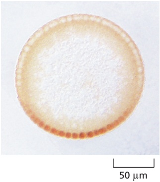

Figure 12–62 The control of nuclear transport in the early Drosophila embryo. The embryo at this stage is a syncytium, shown here in cross section, with many nuclei in a common cytoplasm, arranged around the periphery, just beneath the plasma membrane. The transcription regulatory protein Dorsal is produced uniformly throughout the peripheral cytoplasm, but it can act only when inside the nuclei. The Dorsal protein has been stained with an enzyme-coupled antibody that yields a brown product, MBoC7 m12.14/12.62revealing that Dorsal is excluded from the nuclei at the dorsal side (top) of the embryo but is concentrated in the nuclei toward the ventral side (bottom) of the embryo. The regulated traffic of Dorsal into the nuclei controls the differential development between the back and belly of the animal. (Courtesy of Siegfried Roth.)

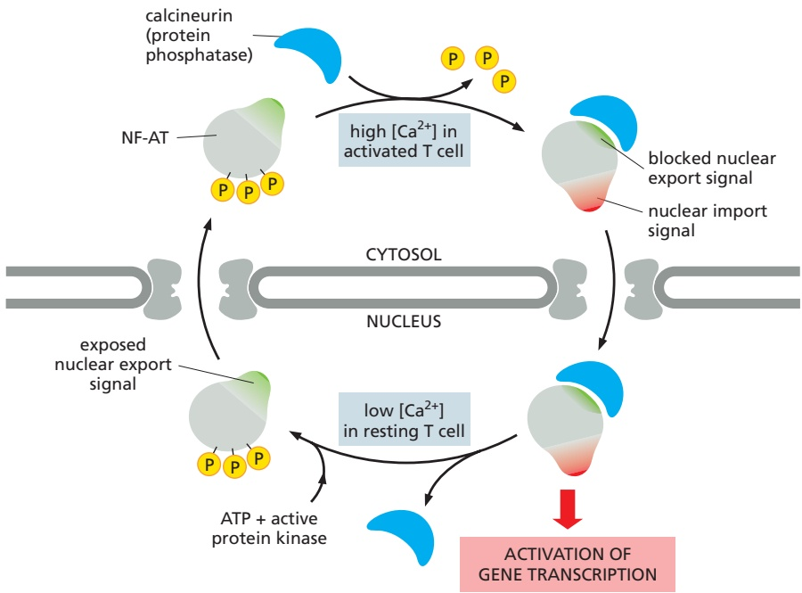

#### The Nuclear Envelope Disassembles and Reassembles During Mitosis

In animal cells, the nuclear envelope is dismantled during mitosis so that microtubules can access the replicated chromosomes for segregation between theMBoC7 m12.15/12.63 two daughter cells (discussed in Chapter 17). At the end of mitosis, the nuclear envelope reassembles, and the asymmetrical distribution of cellular contents between the cytosol and nucleus is reestablished. The major structures that must be reversibly disassembled are the nuclear lamina, the NPCs, and the membranes of the nuclear envelope.

The dismantling process is initiated by the cyclin-dependent kinase (Cdk) that is activated at the onset of mitosis (discussed in Chapter 17). Cdk

Figure 12–63 The control of nuclear import during T cell activation. The nuclear factor of activated T cells (NF-AT) is a transcription regulatory protein that, in the resting T cell, is found in the cytosol in a phosphorylated state. When T cells are activated by foreign antigen (discussed in Chapter 24), the intracellular $\mathrm { C a ^ { 2 + } }$ concentration increases. At high concentrations of $\mathrm { C a ^ { 2 + } }$ , the protein phosphatase calcineurin binds to NF-AT and dephosphorylates it. The dephosphorylation exposes nuclear import signals and blocks a nuclear export signal. The complex of NF-AT and calcineurin is therefore imported into the nucleus, where NF-AT activates the transcription of numerous genes required for T cell activation. The response shuts off when Ca2+ levels decrease, releasing NF-AT from calcineurin. Rephosphorylation of NF-AT inactivates the nuclear import signals and reexposes the nuclear export signal, causing NF-AT to relocate to the cytosol. Some of the most potent immunosuppressive drugs, including cyclosporin A and FK506, inhibit the ability of calcineurin to dephosphorylate NF-AT and thereby block the nuclear accumulation of NF-AT and T cell activation (Movie 12.6).

Figure 12–64 Feedback regulation of cholesterol biosynthesis. (A) SREBP (sterol response element binding protein), a latent transcription regulator that controls expression of cholesterol biosynthetic enzymes, is initially synthesized as an ER membrane protein. It is anchored in the ER if there is sufficient cholesterol in the membrane by interaction with a membrane protein complex composed of the proteins INSIG and SCAP (SREBP cleavage activation protein), which binds cholesterol. (B) If the cholesterolbinding site on SCAP is empty (at low cholesterol concentrations), SCAP changes conformation and dissociates from INSIG. Dissociation from INSIG frees the SCAP–SREBP complex so it can be packaged together into transport vesicles that are delivered to the Golgi apparatus. In the Golgi apparatus, two Golgi-resident proteases cleave SREBP to free its cytosolic domain from the membrane. The cytosolic domain, which is a transcription regulatory protein, then moves into the nucleus, where it binds to the promoters of genes that encode proteins involved in cholesterol biosynthesis and activates their transcription. In this way, more cholesterol is made when its concentration falls below a threshold.

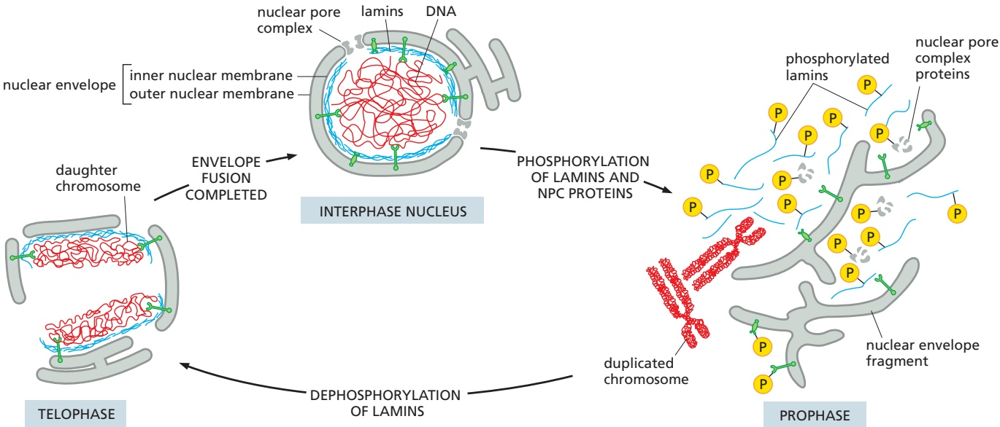

Figure 12–65 The breakdown and re-formation of the nuclear envelope and lamina during mitosis. Phosphorylation of the lamins triggers the disassembly of the nuclear lamina, which initiates the breakup of the nuclear envelope. Dephosphorylation of the lamins reverses the process. An analogous phosphorylation and dephosphorylation cycle occurs for some nucleoporins and proteins of the inner nuclear membrane, and some of these dephosphorylation events are also involved in the reassembly process. The lamin network beings to re-form around regions of individual decondensing daughter chromosomes. The lamins recruit membranes that contain interacting lamin receptors that were in the inner nuclear membrane. Eventually, as decondensation progresses, these membrane structures fuse to form a single complete nucleus. Mitotic breakdown of the nuclear envelope occurs in all metazoan cells. However, in many other species, such as yeasts, the nuclear envelope remains intact during mitosis, and the nucleus divides by fission.

phosphorylates nucleoporins, lamins, and inner nuclear membrane proteins to disrupt their interactions with each other and with chromatin. During this process, some NPC proteins become bound to nuclear import receptors, which play an important part in the reassembly of NPCs at the end of mitosis. Nuclear envelope membrane proteins—no longer tethered to the pore complexes, lamina, or chromatin—disperse throughout the ER membrane. The dynein motor protein, which moves along microtubules (discussed in Chapter 16), is recruited to the outer nuclear membrane early in mitosis and exerts a pulling force. Transmembrane proteins that tether the outer nuclear membrane to the inner nuclear membrane and lamina help transduce this force and pull the nuclear envelope off the chromatin. Together, these processes break down the barriers that normally separate the nucleus and cytosol, and the nuclear proteins that are not bound to membranes or chromosomes intermix completely with the proteins of the cytosol (**Figure 12–65**).

One protein that remains bound to chromatin even after the nuclear enve-MBoC7 m12.18/12.65lope breaks down is Ran GEF. This means Ran molecules close to chromatin are mainly in their GTP-bound conformation. By contrast, Ran molecules further away are in their GDP-bound conformation because of the action of cytosolic Ran GAP. As a result, the chromosomes in mitotic cells are surrounded by a cloud of Ran-GTP, which is important for assembling the mitotic spindle that segregates chromosome into the newly forming daughter cells (discussed in Chapter 17). After chromosome segregation, Cdk is inactivated, allowing dephosphorylation of nucleoporins, lamins, and nuclear membrane proteins. This triggers reassembly of the nuclear envelope on the surface of the complete set of chromosomes in each daughter cell. The positional marker for recruitment of nuclear envelope components to chromosomes is the surrounding cloud of Ran-GTP.

Ran-GTP releases the NPC proteins from nuclear import receptors in proximity to the chromosomes. The free NPC proteins attach to the chromosome surface, where they assemble into new NPCs. At the same time, dephosphorylated lamins bind again to chromatin and recruit ER membranes via the inner nuclear membrane proteins that reside within them. The ER progressively wraps around the entire group of chromosomes until the ER forms a sealed nuclear envelope, engulfing the chromosomes and proteins bound to them (**Movie 12.7**). The newly formed inner nuclear envelope is closely applied to the surface of the chromosomes, is enriched for inner nuclear membrane proteins, and excludes all proteins except those initially bound to the mitotic chromosomes, thus conferring a high level of selectivity to the engulfment process. Because Ran-GTP is inside the nucleus and Ran-GDP remains outside, unidirectional import of proteins that contain nuclear localization signals can occur through NPCs. In this way, the nuclear protein content is replenished, while all other large proteins, including ribosomes, are kept out of the newly assembled nucleus.

#### Summary

The nuclear envelope consists of an inner and an outer nuclear membrane that are connected with each other at perforations formed by nuclear pore complexes (NPCs). The outer nuclear membrane is continuous with the ER membrane, and the space between the inner and outer nuclear membranes is continuous with the ER lumen. RNA molecules, which are made in the nucleus, and ribosomal subunits, which are assembled there, are exported to the cytosol; in contrast, all the proteins that function in the nucleus are synthesized in the cytosol and are then imported. The extensive traffic of materials between the nucleus and cytosol occurs through NPCs, which provide a direct passageway across the nuclear envelope. The interior of NPCs contains a mesh of unstructured proteins that allows passage of small molecules but imposes a diffusion barrier that requires large macromolecules to be actively transported.

Nuclear localization signals and nuclear export signals on proteins to be transported through NPCs are recognized by corresponding nuclear transport receptors. These receptors function by binding their cargoes selectively on one side of the nuclear envelope, increasing the diffusion rate through NPCs, and releasing cargoes selectively on the other side. The free energy of GTP hydrolysis by the monomeric GTPase Ran is harnessed to provide the directionality for nuclear transport. Messenger RNAs are exported from the nucleus through NPCs as parts of large ribonucleoprotein complexes; they use a different transport route that uses ATP hydrolysis to remodel the complexes at the cytosolic side of NPCs. Cells regulate the transport of nuclear proteins and RNA molecules through the NPCs by controlling the access of these molecules to the transport machinery. Because nuclear localization signals are not removed, nuclear proteins can be imported repeatedly, as is required each time that the nucleus reassembles after mitosis.

<!-- END EN EN12-H042-H050 -->

## 跨章相关英文内容

- 连接核被膜和细胞骨架的结构：[EN第16章 · 中间丝、骨架连接与其他骨架聚合物](../08_细胞骨架/小节/03_第三节%20中间丝.md#EN16-H063-H069)。

---

## 第9章 细胞核与染色质 · 第二节 染色质

[返回本章](README.md) · [中文本章原文](中文原文.md)

<!-- BEGIN CN CN09-S02 -->
## 第二节 染色质

染色质（chromatin）是遗传物质的载体。1879年，Flemming提出了染色质这一术语，用以描述细胞核中能被碱性染料强烈着色的物质。1888年，W. von Waldeyer-Hartz正式提出染色体的命名。经过一个多世纪的研究，人们认识到，染色质和染色体是在细胞周期不同阶段可以互相转变的形态结构。

染色质是指间期细胞核内由DNA、组蛋白、非组蛋白及少量RNA组成的线性复合结构，是间期细胞遗传物质存在的形式。染色体是指细胞在有丝分裂或减数分裂的特定阶段，由染色质聚缩而成的棒状结构。实际上，二者之间的区别主要并不在于化学组成上的差异，而在于包装程度不同，反映了它们在细胞周期不同的功能阶段中所处的不同的结构状态（图9-7）。在真核细胞的细胞周期中，大部分时间是以染色质的形态而存在的。

如果说细胞核是细胞遗传与代谢的调控中心，那么这个中心最重要的成员便是染色质。几乎所有细胞生命活动都要从染色质开始。我们知道细胞的生长、分裂甚至衰老与死亡都是受基因控制的，而细胞内基因存在与发挥功能的结构基础是染色质。与基因组直接相关的细胞活动都是在染色质水平进行的，如 DNA 复制、基因转录、同源重组、DNA 修复，包括转录偶联的修复（transcription coupled repair）以及 DNA 和组蛋白的各种修饰（图 9-7）。这些修饰包括甲基化、乙酰化、磷酸化、亚硝基化和泛素化等。

  
图9-7 DNA复制、转录和重组都是在染色质水平进行

通过分离胸腺、肝或其他组织细胞的核，用去垢剂处理后再离心收集染色质进行生化分析，确定染色质的主要成分是DNA和组蛋白，还有非组蛋白及少量RNA。大鼠肝细胞染色质常被当做染色质成分分析模型，其中组蛋白与DNA含量之比近于1:1，非组蛋白与DNA之比是0.6:1，RNA/DNA比值为0.1:1。DNA与组蛋白是染色质的稳定成分，非组蛋白与RNA的含量则随细胞生理状态不同而变化。下面我们将对染色质DNA和染色质蛋白质进行详细叙述。

## 一、染色质 DNA

## （一）基因组大小比较

除部分病毒的遗传物质是 RNA 以外，凡是具有细胞形态的生物其遗传物质都是 DNA。在真核细胞中，每条未复制的染色体包含一条纵向贯穿的 DNA 分子。狭义而言，某一生物的细胞中储存于单倍染色体组中的总遗传信息，组成该生物的基因组（genome）。真核生物基因组 DNA 的含量比原核生物高得多。大肠杆菌的基因组含 $4.6 \times 10^{6}$ bp，基因平均长度为 1.2 kb，基因数目约 4288；而真核生物芽殖酵母基因组是大肠杆菌基因组的 3～4 倍，为 $1.2 \times 10^{7}$ bp，基因平均长度为 1.4 kb，约有 6000 个基因；果蝇高达 40 倍（ $1.8 \times 10^{8}$ bp），基因平均长度为 11.3 kb，约有 13600 个基因；人的单倍体基因组几乎高达 800 倍，为 $3.2 \times 10^{9}$ bp，基因平均长度为 16.3 kb，有 30000～40000 个基因（表 9-2）。然而，突变分析结果表明，并非所有基因都是细胞生存的必需基因（essential gene），如酵母基因组有 40% 的基因属于非必需基因（nonessential gene）；果蝇基因组只有 5000 个必需基因；最小最简单的细胞支原体（生殖支原体，Mycoplasma genitalium），有迄今发现的能独立生活的有机体的最小基因组（470 个基因），其中只有 256 个必需基因。

## （二）基因组 DNA 类型

生物基因组 DNA 可以分为以下几类（以人类基因组为例）：① 蛋白编码序列，以三联体密码（triplet）

<!-- END OFFICIAL API PART part_002 -->

<!-- BEGIN OFFICIAL API PART part_003 -->

表 9-2 已测序的基因组比较

<table><tr><td>物种</td><td>基因组 大小/Mb</td><td>基因数目/个</td><td>蛋白编 码序列</td></tr><tr><td colspan="4">细菌</td></tr><tr><td>生殖支原体</td><td>0.58</td><td>470</td><td>88%</td></tr><tr><td>流感嗜血杆菌</td><td>1.8</td><td>1 743</td><td>89%</td></tr><tr><td>大肠杆菌</td><td>4.6</td><td>4 288</td><td>88%</td></tr><tr><td colspan="4">酵母</td></tr><tr><td>芽殖酵母</td><td>12</td><td>6 000</td><td>70%</td></tr><tr><td>裂殖酵母</td><td>12</td><td>4 800</td><td>60%</td></tr><tr><td colspan="4">无脊椎动物</td></tr><tr><td>秀丽隐杆线虫</td><td>97</td><td>19 000</td><td>25%</td></tr><tr><td>果蝇</td><td>180</td><td>13 600</td><td>13%</td></tr><tr><td colspan="4">植物</td></tr><tr><td>拟南芥</td><td>125</td><td>26 000</td><td>25%</td></tr><tr><td>水稻</td><td>440</td><td>30 000-50 000</td><td>约10%</td></tr><tr><td colspan="4">哺乳动物</td></tr><tr><td>人</td><td>3 200</td><td>30 000-40 000</td><td>1%-1.5%</td></tr></table>

Mb: 百万碱基对。

方式进行编码。编码DNA在基因组中所占比例随物种而异（表9-2），在人类细胞基因组中，这一比例为 $1\% \sim 1.5\%$ 。这类编码序列主要是非重复的单一DNA序列，一般在基因组中只有一个拷贝（单一基因）。然而，也可能有两个或几个拷贝甚至多达上千个拷贝的情况，这些都来自于从基因家族里派生出来的重复基因(duplicated genes in gene families)或多基因(diverged genes in gene families)。②编码rRNA、tRNA、snRNA和组蛋白的串联重复序列。它们在基因组中一般有20\~300个拷贝，人类基因组中约含 $0.3\%$ 这样的DNA。③含有重复序列的DNA。这类DNA在基因组中占有很大一部分。它们又可分为两个亚类：简单序列DNA(simple sequence DNA)和散在重复(interspersed repeats)序列。DNA转座子、LTR反转座子、非LTR反转座子和假基因都属于散在重复序列。非LTR反转座子包括短散在元件(short interspersed element, SINE)和长散在元件(long interspersed element, LINE)。典型SINE长度少于500 bp，如人和灵长类基因组中大量分散存在的Alu家族。人基因组中有50万\~70万份Alu拷贝，相当于平均每隔4 kb就有一个Alu序列。典型LINE其长度为6\~8 kb，如人基因组中L1家族，有100 000个L1拷贝。④未分类的间隔DNA(unclassified spacer DNA)(表9-3)。

此外，真核细胞基因组中还含有高度重复 DNA 序列。每个基因组中至少含 $10^{5}$ 个拷贝，约占脊椎动物总

表 9-3 人类基因组 DNA 类型及在基因组中含量

<table><tr><td>种类</td><td>长度</td><td>人类基因组中的拷贝数</td><td>人类基因组中的含量/%</td></tr><tr><td colspan="4">蛋白编码序列</td></tr><tr><td>单一基因</td><td>可变</td><td>1</td><td>约 ${15}^{ * }\left( {{0.8} \uparrow }\right)$ </td></tr><tr><td>双重基因或基因家族里分出的基因</td><td>可变</td><td>2至约1000</td><td>约 ${15}^{ * }\left( {{0.8} \uparrow }\right)$ </td></tr><tr><td>编码rRNA、tRNA、snRNA和组蛋白的串联重复基因</td><td>可变</td><td>20~300</td><td>0.3</td></tr><tr><td colspan="4">重复序列DNA</td></tr><tr><td>简单序列DNA</td><td>1~500 bp</td><td>可变</td><td>3</td></tr><tr><td colspan="4">散在重复序列</td></tr><tr><td>DNA转座子</td><td>2~3 kb</td><td>300 000</td><td>3</td></tr><tr><td>LTR反转座子</td><td>6~11 kb</td><td>440 000</td><td>8</td></tr><tr><td colspan="4">非LTR反转座子</td></tr><tr><td>LINE</td><td>6~8 kb</td><td>860 000</td><td>21</td></tr><tr><td>SINE</td><td>100~300 bp</td><td>1 600 000</td><td>13</td></tr><tr><td>编译假基因</td><td>可变</td><td>1至约100</td><td>约0.4</td></tr><tr><td>未分类的间隔DNA</td><td>可变</td><td>n.a.</td><td>约25</td></tr></table>

- 表示包括内含子的完整转录单位；↑表示编码蛋白质的外显子；人类基因组编码蛋白质的基因有30 000\~35 000个，但这一数目可能被低估；n.a.表示不适用于此。来源于：Lander et al., Nature, 2001, 409: 860。

DNA 的 10%。高度重复 DNA 序列由一些短的 DNA 序列呈串联重复排列，可进一步分为几种不同类型：① 卫星 DNA (satellite DNA)。重复单位长 5～100 bp，不同物种重复单位碱基组成不同，一个物种也可能含有不同的卫星 DNA 序列。主要分布在染色体着丝粒部位，如人类染色体着丝粒区的 α-卫星 DNA 家族，其功能不明。② 小卫星 DNA (minisatellite DNA)。重复单位长 12～100 bp，重复 3 000 次之多，又称数量可变的串联重复序列。每个小卫星区重复序列的拷贝数是高度可变的，因此早前常用于 DNA 指纹技术 (DNA finger-printing) 做个体鉴定。研究发现小卫星序列的改变可以影响邻近基因的表达，基因的异常表达会导致一系列不良后果。③ 微卫星 DNA (microsatellite DNA)。重复单位序列最短，只有 1～5 bp，串联成簇长度 50～100 bp。人类基因组中至少有 30 000 个不同的微卫星位点，具高度多态性 (polymorphism)，在不同个体间有明显差别，但在遗传上却是高度保守的，因此可作为重要的遗传标记，用于构建遗传图谱 (genetic map) 及个体鉴定等。

生物的遗传信息储存在 DNA 的核苷酸序列中，生物界物种的多样性也寓于 DNA 分子 4 种核苷酸千变万化的排列之中。DNA 分子不仅一级结构具有多样性，而且二级结构也具有多态性。所谓二级结构是指两条多核苷酸链反向平行盘绕所生成的双螺旋结构。DNA 二级结构构型分三种：B 型 DNA（右手双螺旋 DNA）是经典的“沃森-克里克”结构，二级结构相对稳定，水溶液和细胞内天然 DNA 大多为 B 型 DNA；A 型 DNA 是 B 型 DNA 的重要变构形式，同样是右手双螺旋 DNA，其分子形状与 RNA 的双链区和 DNA/RNA 杂交分子很相近；第三种是 Z 型 DNA，呈左手螺旋，也是 B 型 DNA 的变构形式。

三种构型 DNA 中，大沟的特征在遗传信息表达过程中起关键作用。基因表达调控蛋白都是通过其分子上特定的氨基酸侧链与沟中碱基对两侧潜在的氢原子供体（=NH）或受体（O 和 N）形成氢键而识别 DNA 遗传信息的。由于大沟和小沟中这些氢原子供体和受体各异以及排列不同，所以大沟携带的信息要比小沟多。此外，沟的宽窄及深浅也直接影响碱基对的暴露程度，从而影响调控蛋白对 DNA 信息的识别。B 型 DNA 是活性最高的 DNA 构型，变构后的 A 型 DNA 仍有较高活性，变构后的 Z 型 DNA 活性明显降低。人们推测，在生理状态下，由于细胞内各种化学修饰的影响和结合蛋白的作用有可能使三种构型的 DNA 处于一种动态转变之中。此外，DNA 双螺旋能进一步扭曲盘绕形成特定的高级结构，正、负超螺旋是 DNA 高级结构的主要形式。DNA 二级结构的变化与高级结构的变化是相互关联的，这种变化在 DNA 复制、修复、重组与转录中具有重要的生物学意义。

## 二、染色质蛋白

与染色质 DNA 结合的蛋白质负责 DNA 分子遗传信息的组织、复制和阅读。这些 DNA 结合蛋白包括两类：一类是组蛋白（histone），与 DNA 结合但没有序列特异性；另一类是非组蛋白（nonhistone），与特定 DNA 序列或组蛋白相结合。

## （一）组蛋白

组蛋白是构成真核生物染色体的基本结构蛋白，富含带正电荷的Arg和Lys等碱性氨基酸，等电点一般在pH10.0以上，属碱性蛋白质，可以和酸性的DNA紧密结合，而且一般不要求特殊的核苷酸序列。用聚丙烯酰胺凝胶电泳可以区分5种不同的组蛋白：H1、H2A、H2B、H3和H4。几乎所有真核细胞都含有这5种组蛋白，而且含量丰富，每个细胞每种类型的组蛋白约有 $6\times10^{7}$ 个分子。表9-4列举了5种组蛋白的一些特性。

5种组蛋白在功能上分为两组：①核小体组蛋白(nucleosomal histone)，包括H2A、H2B、H3和H4。这4种组蛋白有相互作用形成复合体的趋势，它们通过C端的疏水氨基酸（如Val，Ile）互相结合，而N端带正电荷的氨基酸（Arg、Lys）则向四面伸出以便与DNA分子结合，从而帮助DNA卷曲形成核小体的稳定结构。这4种组蛋白没有种属及组织特异性，在演化上十分保守，特别是H3和H4是所有已知蛋白质中最为保守的。例如牛和豌豆的H4组蛋白的102个氨基酸残基中仅有2个不同，而它们的分歧时间已有3亿年的历史。从这种保守性可以看出，H3和H4的功能几乎涉及它们所有的氨基酸，任何位置上氨基酸残基的突变可能对细胞都是有害的。②H1组蛋白。其分子较大（215个氨基酸）。球形中心在演化上保守，而N端和C端两个“臂”的氨基酸变异较大，所以H1在演化上不如核小体组蛋白那么保守。在构成核小体时H1起连接作用，它赋予染色质以极性。H1有一定的种属和组织特异性。在哺乳类细胞中，组蛋白H1约有6种密切相关的亚型，氨基酸序列稍有不同。在鱼类和鸟类的成熟红细胞中，H1为H5取代。有的生物如芽殖酵母缺少H1。

表 9-4 5 种组蛋白的某些特性

<table><tr><td rowspan="2">种类</td><td rowspan="2">类型</td><td colspan="3">碱性氨基酸</td><td rowspan="2">酸性 氨基酸</td><td rowspan="2">碱性氨基酸/ 酸性氨基酸</td><td rowspan="2">氨基酸 残基数</td><td rowspan="2">分子量</td><td rowspan="2">核小体 上位置</td></tr><tr><td>Lys</td><td>Arg</td><td>Lys/Arg</td></tr><tr><td>H1</td><td>极度富含 Lys</td><td>29%</td><td>1%</td><td>29</td><td>5%</td><td>6.0</td><td>215</td><td>23 000</td><td>连接</td></tr><tr><td>H2A</td><td>同上</td><td>11%</td><td>9%</td><td>1.2</td><td>15%</td><td>1.3</td><td>129</td><td>14 500</td><td>核心</td></tr><tr><td>H2B</td><td>同上</td><td>16%</td><td>6%</td><td>2.7</td><td>13%</td><td>1.7</td><td>125</td><td>13 774</td><td>核心</td></tr><tr><td>H3</td><td>轻度富含 Lys</td><td>10%</td><td>13%</td><td>0.77</td><td>13%</td><td>1.8</td><td>135</td><td>15 324</td><td>核心</td></tr><tr><td>H4</td><td>富含 Arg</td><td>11%</td><td>14%</td><td>0.79</td><td>10%</td><td>2.5</td><td>102</td><td>11 822</td><td>核心</td></tr></table>

## （二）非组蛋白

与染色质组蛋白不同，非组蛋白主要是指与特异DNA序列相结合的蛋白质，所以又称序列特异性DNA结合蛋白（sequence specific DNA binding protein）。利用非组蛋白与特异DNA序列亲和的特点，通过凝胶延滞实验（gel retardation assay），可以在细胞抽提物中进行检测。首先制备一段带有放射性标记的已知特异序列的DNA，将要检测的细胞抽提物与标记DNA混合，进行凝胶电泳。未结合蛋白质的自由DNA在凝胶上迁移最快，而与蛋白质结合的DNA迁移慢，一般结合的蛋白质分子越大，DNA分子的延滞现象越明显，然后通过放射性自显影分析，即可发现一系列DNA带谱，每条带分别代表不同的DNA-蛋白质复合物。每条带相对应的结合蛋白随后再通过细胞抽提物组分分离方法被进一步分开。

## 非组蛋白具有以下特性：

（1）非组蛋白具有多样性 不同组织细胞中非组蛋白的种类和数量都不相同，代谢周转快。包括多种参与核酸代谢与修饰的酶类如 DNA 聚合酶和 RNA 聚合酶、高速泳动族蛋白（high mobility group, HMP）、染色体支架蛋白、肌动蛋白和基因表达调控蛋白等。

(2）识别DNA具有特异性能识别特异的DNA序列，识别信息来源于DNA核苷酸序列本身，识别位点存在于DNA双螺旋的大沟部分，识别与结合依靠氢键和离子键。在不同的基因组之间，这些非组蛋白所识别的DNA序列在演化上是保守的。这类序列特异性DNA结合蛋白具有一个共同特征，即形成与DNA结合的螺旋区并具有蛋白二聚化的能力。

(3) 具有功能多样性 虽然与 DNA 特异序列结合的蛋白质在每个真核细胞中只有10 000个分子左右，约占细胞总蛋白的1/50 000，但它们具有多方面的重要功能，包括基因表达的调控和染色质高级结构的形成。如帮助DNA分子折叠，以形成不同的结构域；协助启动DNA复制，控制基因转录，调节基因表达。

## 三、核小体

20世纪70年代以前，人们关于染色质结构的传统看法认为，染色质是组蛋白包裹在DNA外面形成的纤维状结构。直到1974年R.D.Kornberg等人根据染色质的酶切和电镜观察，发现核小体（nucleosome）是染色质组装的基本结构单位，提出染色质结构的“串珠”模型，从而更新了人们关于染色质结构的传统观念。

## （一）核小体的发现

（1）用温和的方法裂解细胞核，将染色质铺展在电镜铜网上，通过电镜观察，未经处理的染色质自然结构为30 nm的纤丝，经盐溶液处理后解聚的染色质呈现一系列核小体彼此连接的串珠状结构，串珠的直径为11 nm（图9-8）。

(2) 用非特异性微球菌核酸酶 (micrococcal nuclease) 消化染色质时, 经过蔗糖梯度离心及琼脂糖凝胶电泳分析, 发现绝大多数 DNA 被降解成大约 200 bp 的片段; 如果部分酶解, 则得到的片段是以 200 bp 为单位的单体以及二体 (400 bp)、三体 (600 bp) 等。蔗糖梯度离心得到的不同组分, 在波长 260 nm 的吸收峰的大小和电镜下所见到的单体、二体和三体的核小体组成完全一致。如果用同样方法处理裸露的 DNA, 则产生随机大小的片段群体。从而提示染色体 DNA 除某些周期性位点之外均受到某种结构的保护, 避免核酸酶的接近。

  
图9-8 透射电镜显示串珠状 $11\mathrm{nm}$ 的核小体结构（李国红博士惠赠）

（3）应用 X 射线衍射、中子散射和电镜三维重建技术，研究染色质结晶颗粒，发现核小体颗粒是直径为 11 nm、高 6.0 nm 的扁圆柱体，具有二分对称性（dyad symmetry）。核心组蛋白的构成是先形成 $(H3)_{2}-(H4)_{2}$ 四聚体，然后再与两个 H2A-H2B 异二聚体结合形成八聚体（图 9-9）。

(4) SV40 微小染色体 (minichromosome) 分析。用 SV40 病毒感染细胞，病毒 DNA 进入细胞后，与宿主的组蛋白结合，形成串珠状微小染色体，电镜观察 SV40 DNA 为环状，周长 1500 nm，约 5.0 kb。若 200 bp 相当于一个核小体，则可形成 25 个核小体，实际观察到 23 个，与推断基本一致。如用 0.25 mol/L 盐酸将 SV40 溶解，可在电镜下直接观察到组蛋白的聚合体。若除去组蛋白，则完全伸展的 DNA 长度恰好为 5.0 kb。

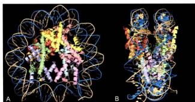  
图9-9 由X射线晶体衍射所揭示的人类细胞核小体三维结构  
A. 通过 DNA 超螺旋中心轴所显示的核小体核心颗粒 8 个组蛋白分子的位置。B. 垂直于中心轴的角度所见到的核小体核心颗粒的盘状结构。（基于 PDB 数据 3AFA 结构绘制）

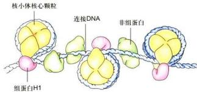  
图9-10 核小体的结构要点示意图

## （二）核小体的结构

（1）每个核小体单位包括200 bp左右的DNA超螺旋和一个组蛋白八聚体以及一分子的组蛋白H1（图9-10）。

(2) 组蛋白八聚体构成核小体的盘状核心颗粒, 分子质量为 $100 \mathrm{kDa}$ , 由 4 个异二聚体组成, 包括两个 H2A-H2B 和两个 H3-H4。

(3) 146 bp 的 DNA 分子超螺旋盘绕组蛋白八聚体 1.75 圈。组蛋白 H1 在核心颗粒外结合额外 20 bp DNA，锁住核小体 DNA 的进出端，起稳定核小体的作用。

（4）两个相邻核小体之间以连接 DNA（linker DNA）相连，典型长度为 60 bp，不同物种变化值为 0～80 bp 不等（图 9-10）。

(5) 组蛋白与 DNA 之间的相互作用主要是结构性的，基本不依赖于核苷酸的特异序列。正常情况下不与组蛋白结合的 DNA（如噬菌体 DNA 或人工合成的 DNA），当与从动植物中分离纯化的组蛋白共同孵育时，可以体外组装成核小体单位。

(6) 核小体沿 DNA 的定位受不同因素的影响。如非组蛋白与 DNA 特异性位点的结合，可影响邻近核小体的相位 (positioning)；DNA 盘绕组蛋白核心的弯曲也是核小体相位的影响因素，因为富含 AT 的 DNA 片段优先存在于 DNA 双螺旋的小沟，而富含 GC 的 DNA 片段优先存在于 DNA 双螺旋的大沟，结果核小体倾向于形成富含 AT 和富含 GC 区的理想分布，从而通过核小体相位改变影响基因表达。

## 四、染色质组装

人的每个体细胞所含 DNA 约 $6 \times 10^{9}$ bp，分布在 46 条染色体中，总长达 2 m，平均每条染色体 DNA 分子长约 5 cm。然而，细胞核直径只有 $5 \sim 8 \mu m$ ，这就意味着从染色质 DNA 组装成染色体要压缩近万倍，相当于一个网球内包含有 20 km 长的细线。

## （一）染色质组装的前期过程

图 9-11 是关于 DNA 组装成染色质的整个过程的描述。① 最开始是 H3-H4 四聚体（两个异二聚体）的结合，由 CAF1（chromatin assembly factor 1）介导与新合成的裸露的 DNA 结合。② 然后是两个 H2A-H2B 异

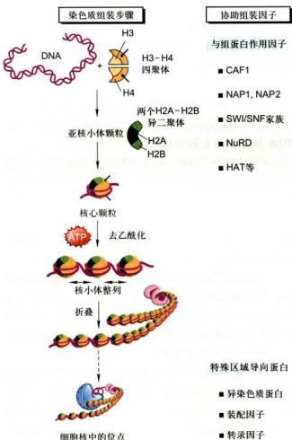  
图 9-11 DNA 组装成染色质的过程及各阶段的协助组装因子

细胞内基因组DNA在合适的时候（一般在DNA复制后或DNA修复后）与核小体（由两个H3-H4异二聚体和两个H2A-H2B异二聚体组成）结合形成核小体颗粒。这个过程中参与的因子包括组蛋白伴侣分子CAF1、NAP1和NAP2等：染色质重要因子NuRD（nucleosome remodeling and deacetylase）、SWI/SNF家族蛋白等；组蛋白修饰因子HAT（histone acetyltransferase）等。核小体形成排列成串后经过一个组蛋白的去乙酰化过程，然后折叠形成高级结构。这一过程需要一些特异的异染色质蛋白、染色质装配因子以及部分转录因子的参与。最后成熟的染色质会分布到细胞核中特定的部位。

二聚体由NAP1和NAP2（nucleosome assembly protein）介导加入。为了形成一个核心颗粒，新合成的组蛋白被特异地修饰。组蛋白H4的Lys5和Lys12两个位点被乙酰化。③核小体最后的成熟需要ATP来创建一个规则的间距以及组蛋白的去乙酰化。ISWI（imitation switch）和SWI/SNF（switch/sucrose nonfermentable）家族的蛋白质参与此过程的调节。连接组蛋白（H1）的结合伴随着核小体的折叠。④6个核小体组成一个螺旋或由其他的组装方式形成一个螺线管结构（下面将详细讨论）。⑤进一步的折叠事件将使染色质在细胞核中最终形成确定的结构。在图的右侧列出了各个环节中相应的参与因子，这些因子对于促进整个组装过程的顺利进行发挥了重要的作用。

这样一个高度压缩的结构极大地阻碍了像转录这样的细胞核活动的进行。为了解决这个问题，有两个家族的染色质修饰酶在染色质上作用，使染色质更接近于转录机器。第一个家族是通过在组蛋白尾部的共价修饰而发挥作用，这些修饰包括组蛋白的磷酸化、乙酰化和泛素化等，它们会影响以后与DNA或组蛋白相互作用因子的作用。第二个家族成员的主要特点是它们能够利用ATP水解时释放的能量来破坏核小体中的组蛋白-DNA接触（染色质结构与基因表达的关系将在下一节中详细叙述）。

染色质组装的前期过程，即从裸露 DNA 组装成直径 30 nm 的螺线管已有直接的实验证据，并被绝大多数科学家认可。然而，染色质如何进一步组装成更高级结构，直至最终成染色体的过程尚不是非常清楚，目前主要有两种模型。

## （二）染色质组装的多级螺旋模型

由 DNA 与组蛋白组装成核小体，在组蛋白 H1 的介导下核小体彼此连接形成直径约 10 nm 的核小体串珠结构，这是染色质组装的一级结构。不过在细胞中，染色质很少以这种伸展的串珠状形式存在。当细胞核经温和处理后，在电镜下往往会看到直径为 30 nm 的染色质纤维。在有组蛋白 H1 存在的情况下，由直径 10 nm 的核小体串珠结构螺旋盘绕，每圈 6 个核小体，形成外径 25～30 nm，螺距 12 nm 的螺线管（solenoid）。组蛋白 H1 对螺线管的稳定起着重要作用。螺线管是染色质组装的二级结构（图 9-12）。

A. L. Bak 等（1977）从人胎儿离体培养的分裂细胞中分离出染色体，经温和处理后，在电镜下看到直径 0.4 μm，长 11～60 μm 的染色线，称为单位线（unit fiber）。在电镜下观察，判明单位线是由螺线管进一步螺旋化形成直径为 0.4 μm 的圆筒状结构，称为超螺线管（supersolenoid），这是染色质组装的三级结构。这种超螺线管进一步螺旋折叠，形成长 2～10 μm 的染色单体，即染色质组装的四级结构。根据多级螺旋模型（multiple coiling model），从 DNA 到染色体经过四级组装：

  
图9-12 $30\mathrm{nm}$ 染色质纤维的三维结构  
A. 30 nm 染色质纤维（十二聚核小体在连接组蛋白 H1 作用下形成）的冷冻电镜三维重构结构。B. C. 四聚核小体（tetranucleosome，以不同颜色标示）是 30 nm 染色质纤维的基本结构单元。D. E. 30 nm 染色质纤维左手双螺旋结构的原子模型图（D）和结构模式图（E）。（改编自 Song et al., 2014）

$$
\begin{array}{l} \text { DNA } \xrightarrow {\text { 压缩7倍 }} \text { 核小体 } \xrightarrow {\text { 压缩6倍 }} \text { 螺线管 } \xrightarrow {\text { 压缩40倍 }} \text { 超 } \\ \text { 螺线管 } \xrightarrow {\text { 压缩5倍 }} \text { 染色单体 } \end{array}
$$

经过四级螺旋组装形成的染色体结构，共压缩了8400倍。

## （三）染色质组装的放射环结构模型

U. K. Laemmli 等人用 2 mol/L 的 NaCl 或硫酸葡聚糖加肝素处理 HeLa 细胞中期染色体，除去组蛋白和大部分非组蛋白后，在电镜下可观察到由非组蛋白构成的染色体骨架（chromosomal scaffold）和与骨架相连的无数的 DNA 侧环。此外，实验观察发现，一些特殊染色体，如两栖类卵母细胞的灯刷染色体或昆虫细胞的多线染色体，几乎都含有类似的袢环结构域（loop domain），从而提示袢环结构可能是染色体高级结构的普遍特征（表 9-5）。

关于染色体骨架和染色质袢环的研究，使染色体袢环结构模型近年来引起人们的重视。该模型认为，

30 nm 的染色线折叠成环，沿染色体纵轴，由中央向四周伸出，构成放射环，即染色体的骨架－放射环结构模型（scaffold radial loop structure model）。J. Painta 和 D. Coffey（1984）对该模型进行了较详细的描述：首先是直径 2 nm 的双螺旋 DNA 与组蛋白八聚体构建成连续重复的核小体串珠结构，其直径 10 nm。然后按每圈 6 个核小体为单位盘绕成直径 30 nm 的螺线管。由螺线管形成 DNA 复制环，每 18 个复制环呈放射状平面排列，结合在核基质上形成微带（miniband）。微带是染色体高级结构的单位，大约 $10^{6}$ 个微带沿纵轴构建成子染色体。

上述两种关于染色体高级结构的组织模型，前者强调螺旋化，后者强调环化与折叠。两者都有一些实验与观察的证据，也许在不同的组装阶段这些机制共同起作用。图9-13是融两种机制在内的染色质组装模型。

表 9-5 DNA 袢环的一般性质

<table><tr><td>DNA 祥环特征</td><td>平均数</td><td>数值范围</td></tr><tr><td>每个环的碱基数/bp</td><td>63 000</td><td>30 000 ~ 100 000</td></tr><tr><td>每个环占有 DNA 的长度/μm</td><td>21.1</td><td>10~34</td></tr><tr><td>每个环所含有的核小体数</td><td>315</td><td>150~500</td></tr><tr><td>环线的直径/nm</td><td>30</td><td>30</td></tr><tr><td>每个环所含螺线管的盘绕数</td><td>52</td><td>25~83</td></tr><tr><td>环的长度/μm</td><td>0.52</td><td>0.52~0.83</td></tr><tr><td>环的高度/μm</td><td>0.26</td><td>0.12~0.41</td></tr><tr><td>DNA 的压缩比</td><td>40</td><td>40</td></tr><tr><td>每个体细胞的总复制环数</td><td>95 000</td><td>60 000 ~ 400 000</td></tr></table>

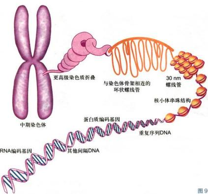  
图9-13 基因组结构和染色质组装一览图

## 五、染色质类型

间期染色质按其形态特征、活性状态和染色性能区分为两种类型：常染色质（euchromatin）和异染色质（heterochromatin）。

## （一）常染色质与异染色质

常染色质是指间期细胞核内染色质纤维折叠压缩程度低，相对处于伸展状态，用碱性染料染色时着色浅的那些染色质。在常染色质中，DNA组装比为1/2000～1/1000，即DNA实际长度为染色质纤维长度的1000～2000倍。构成常染色质的DNA主要是单一序列DNA和中度重复序列DNA（如组蛋白基因和rRNA基因）。常染色质并非所有基因都具有转录活性，处于常染色质状态只是基因转录的必要条件，而不是充分条件。

异染色质是指间期细胞核中染色质纤维折叠压缩程度高，处于聚缩状态，用碱性染料染色时着色深的那些染色质。异染色质又分结构异染色质或组成型异染色质（constitutive heterochromatin）和兼性异染色质(facultative heterochromatin)。结构异染色质指的是各种类型的细胞中，在整个细胞周期均处于聚缩状态，没有较大变化的异染色质。在间期核中，结构异染色质聚集形成多个染色中心（chromocenter）。在哺乳类细胞中，这些染色中心随细胞类型和发育阶段不同而变化。结构异染色质有如下特征：① 在中期染色体上多定位于着丝粒区、端粒、次缢痕及染色体臂的某些节段。② 由相对简单、高度重复的DNA序列构成，如卫星DNA。③ 具有显著的遗传惰性，不转录也不编码蛋白质。④ 在复制行为上与常染色质相比表现为晚复制、早聚缩。⑤ 占有较大部分核DNA，在功能上参与染色质高级结构的形成，导致染色质区间性，作为核DNA的转座元件，引起遗传变异。兼性异染色质是指在某些细胞类型或一定的发育阶段，原来的常染色质聚缩，并丧失基因转录活性，变为异染色质。这类兼性异染色质的总量随不同细胞类型而变化，一般胚胎细胞含量很少，而高度特化的细胞含量较多，说明随着细胞分化，较多的基因渐次以聚缩状态而关闭，从而再也不能接近基因活化蛋白。因此，染色质通过紧密折叠压缩可能是关闭基因活性的一种途径。例如雄性哺乳类细胞的单个X染色体呈常染色质状态；而雌性哺乳类体细胞的核内，两条

X 染色体之一在发育早期随机发生异染色质化而失活。在上皮细胞核内，这个异固缩的 X 染色体称性染色质或巴氏小体（Barr body）。因此，检查羊水中胚胎细胞的巴氏小体可以预报胎儿的性别。在多形核白细胞的核内，此 X 染色体形成特殊的“鼓槌”结构。

## （二）常染色质与异染色质间的转变

有些染色质并不是固有的异染色质或常染色质，而是在异染色质或常染色质之间随着发育时期或细胞周期的变化而相互转化。异染色质与常染色质之间的转变常常需要伴随着一些组蛋白与DNA修饰。如图9-14所示，由常染色质转变成异染色质时，H3S10（组蛋白H3第十位丝氨酸）位上首先要被JIL1磷酸酶去磷酸化，同时HDAC1负责H3K9的去乙酰化，这样使得H3K9（组蛋白H3第九位赖氨酸）位点的甲基化（由Su(Var)3-9负责）得以进行，而这是异染色质化的一个重要标志。除此之外，H3K4位点上的甲基则需要被LSD1去甲基化。H3K9甲基化使得异染色质蛋白HP1能够顺利与染色质结合，HP1的多聚化能够使得染色质进一步浓缩。在这一过程中，染色质组装因子CAF1也起着非常重要的调节作用。H3K9的甲基化也伴随着H3K27的甲基化和H4K20的甲基化。它们共同决定最终异染色质的形成。另一方面，由异染色质转变为常染色质的过程则伴随着基本上相反的组蛋白修饰过程。

DNA 甲基化在决定染色质的异染色质化 / 常染色质化过程中也起着重要的调节作用。

## （三）活性染色质与非活性染色质

按功能状态的不同可将染色质分为活性染色质(active chromatin)和非活性染色质(inactive chromatin)。对绝大多数细胞而言，在特定阶段具有转录活性的基因只占基因总数的10%以下，而90%以上的基因在转录上是不活跃的。所谓活性染色质是指具有转录活性的染色质，非活性染色质是指没有转录活性的染色质。

活性染色质由于核小体构型发生改变，往往具有疏松的染色质结构，从而便于转录调控因子与顺式调控元件结合和RNA聚合酶在转录模板上滑动。当染色质结构处于疏松状态时，利用核心组蛋白H3暴露出来的游离巯基与有机汞的亲和性，可采用有机汞亲和层析和二硫苏糖醇（DTT）洗脱的方法将活性染色质分离出来。

## 1. 活性染色质对 DNase I 超敏感

当染色质用 DNase I 消化时，可将染色质降解成酸溶性的 DNA 小片段。若从鸡红细胞中提取染色质进行上述处理，发现 $\beta-$ 珠蛋白基因很快就被降解，而卵清蛋白基因的降解程度则很低。相反，若从鸡输卵管细胞中提取染色质作同样处理，则优先降解的是卵清蛋白基因而不是 $\beta-$ 珠蛋白基因。结果表明，凡有基因表达活性的染色质DNA对DNaseI的降解作用比没有转录活性的染色质DNA要敏感得多。进一步发现，正在转录或具有潜在转录活性而未转录的基因对DNaseI同样敏感，说明活化染色质对DNaseI的优先敏感性（preferential sensitivity）不是由于转录过程中RNA聚合酶的作用，而是可转录染色质的一个基本特征。用DNaseI处理染色质时，优先释放出两种HMG非组蛋白，它们是HMG14和HMG17。当把这两种非组蛋白从鸡红细胞染色质中用低盐溶液抽提出来以后，珠蛋白基因就不再表现出对DNaseI的优先敏感性，而在盐抽提过的染色质中加入这两种非组蛋白后，敏感性又可恢复，说明活化染色质对DNaseI的优先敏感性与这两种非组蛋白有关。然而，把这两种蛋白质加入盐抽提过的鸡脑细胞染色质后，其中的珠蛋白基因并不表现出对DNaseI优先敏感性，说明这些HMG蛋白不是造成这种优先敏感性的唯一原因。红细胞和脑细胞中一定还存在其他因子的差异，这些因子决定了红细胞的珠蛋白基因在HMG14和HMG17存在时对DNaseI敏感。

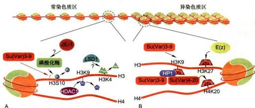  
图9-14 常染色质与异染色质转变过程中伴随的组蛋白修饰的变化

如用很低浓度的DNase I处理染色质，切割将首先发生在少数特异性位点上，这些特异性位点叫做DNase I超敏感位点（DNase I hypersensitive site）。超敏感位点的存在是活性染色质的特点，若用游离DNA作底物则无超敏感位点出现。通过对大量基因进行试验发现，每个活跃表达的基因都有一个或几个超敏感位点，大部分位于基因5'端启动子区域，少部分位于其他部位如转录单位的下游。并且发现，5'端超敏感位点只出现在基因正在活跃表达的细胞中，而该基因不表达的细胞中则不存在。例如，对于鸡β-珠蛋白基因族，胚胎阶段超敏感位点出现在胚胎型基因而不是成体型基因的5'端；而在成体阶段情况则恰好相反，超敏感位点出现在成体型而不是胚胎型β-珠蛋白基因的5'端。这说明超敏感位点和基因活性有一定的关系。现已知道，超敏感位点实际上是一段长100\~200 bp的DNA序列特异暴露的染色质区域。由超敏感位点所引起的染色质结构变化，可能是由于超敏感序列首先与其他蛋白质结合而阻止核小体的组装。这样，该序列不被组蛋白八聚体所保护，所以一个典型的超敏感位点区对核酸酶攻击的敏感性是其他染色质区域的100倍以上。活性基因的超敏感位点建立在启动子附近，并与启动子功能有关，很可能是为RNA聚合酶、转录因子或其他蛋白调控因子提供结合位点。现有证据表明5'端超敏感位点的建立发生在转录起始之前，但很可能是起始转录的必要条件而非充分条件。有人为说明超敏感位点的稳定性，用温度敏感的肿瘤病毒转化导致珠蛋白基因的激活，并建立超敏感位点；如果转化在非许可的较高温度下完成，则珠蛋白基因不被激活，也不出现超敏感位点；在低温下珠蛋白基因被转化激活后，若提高温度可使其失活而不表达，但已建立的超敏感位点却至少要保持到细胞复制20次以后。这一结果也证实了超敏感位点的建立只是起始转录所必要的特征之一，但建立超敏感位点的事件与保持该位点的事件可能是不同的。

## 2. 活性染色质的蛋白组成与修饰变化

根据对活性染色质蛋白组分的生化分析发现：① 活性染色质很少有组蛋白 H1 与其结合。② 活性染色质的 4 种核心组蛋白虽然以常量存在，但是与非活性染色质相比较，活性染色质上的组蛋白乙酰化程度高。③ 活性染色质的核小体组蛋白 H2B 与非活性染色质相比较，很少被磷酸化。④ 核小体组蛋白 H2A 在许多物种包括果蝇和人的活性染色质中很少有变异的形式存在。⑤ 最新研究表明，组蛋白 H3 的变种 H3.3 只在活跃转录的染色质中出现。⑥ HMG 蛋白是染色体非组蛋白中一组较丰富、不均一、富含电荷的蛋白质。其中 HMG14 和 HMG17 只存在于活性染色质中，与 DNA 结合。平均每 10 个核小体中有 1 个核小体是与 HMG14 和 HMG17 结合的，其氨基酸序列在演化中高度保守，表明其具有重要功能。

许多研究工作已经清楚地表明，一些组蛋白的修饰直接影响染色质的活性。这些修饰包括甲基化、乙酰化和磷酸化。乙酰化一般是活性染色质的标志（下面会详细叙述），而甲基化和磷酸化则在活性染色质与非活性染色质中都存在。不同组蛋白或同一组蛋白的不同氨基酸残基上的修饰决定染色质处于活性或非活性状态。

图 9-15 举例说明了 H3 组蛋白的修饰与染色质活性的关系。活性染色质的标志是：H3的N端第4个赖氨酸甲基化，第9和14个赖氨酸乙酰化以及第10个丝氨酸磷酸化。非活性染色质的标志是：H3的N端第9个赖氨酸甲基化而不是乙酰化。此外，其他蛋白修饰如泛素化修饰也可在组蛋白上发生，如H2A119位赖氨酸和H2B120位赖氨酸都可被泛素化修饰，然而这些修饰与染色质活性的关系目前还不是非常清楚。

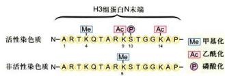  
图9-15 H3组蛋白修饰与染色质活性的关系

<!-- END CN CN09-S02 -->

---

## 对应英文内容

### 英文补充：DNA、染色质蛋白与核小体包装

> 对应中文板块：DNA、染色质蛋白与核小体包装。英文来源：Molecular Biology of the Cell，第7版，第4章；[本章完整原文](../来源/英文教材/04_DNA_Chromosomes_and_Genomes/chapter.md)。物理PDF页码范围：222–291（整章范围）。

<!-- BEGIN EN EN04-H000-H018 -->
#### BASIC GENETIC MECHANISMS

#### DNA, Chromosomes, and Genomes

Life depends on the ability of cells to store, retrieve, and translate the genetic instructions required to make and maintain a living organism. This hereditary information is passed on from a cell to its daughter cells at cell division and from one generation of an organism to the next through the organism’s reproductive cells. The instructions are stored in every living cell’s genes, the informationcontaining units in its genome that determine the characteristics of a species as a whole and of the individuals within it.

As soon as genetics emerged as a science at the beginning of the twentieth century, scientists became intrigued by the nature of the hereditary information. They knew that it was copied and transmitted from cell to daughter cell millions of times to produce the many generations of a multicellular organism, and that it survives the process essentially unchanged. What form of molecule could be capable of such accurate and almost unlimited replication and also be able to exert precise control, directing multicellular development as well as the daily life of every cell? What kind of instructions does the hereditary information contain? And how can the enormous amount of information required for the development and maintenance of an organism fit within the tiny space of a cell?

The answers to some of these questions began to emerge in the 1940s. At this time researchers discovered, from studies in simple fungi, that genes consist largely of instructions for making proteins. Proteins are phenomenally versatile macromolecules that perform most cell functions. As we saw in Chapter 3, they serve as building blocks for cell structures and form the enzymes that catalyze most of the cell’s chemical reactions. They also regulate gene expression (Chapter 7), and they enable cells to communicate with each other (Chapter 15) and to move (Chapter 16). The properties and functions of cells and organisms are determined to a great extent by the proteins that they are able to make, and these are determined by their genes.

Painstaking observations of cells and embryos in the late nineteenth century set the stage for experiments that led to the realization that the hereditary information is carried on chromosomes—threadlike structures in the nucleus of a eukaryotic cell that become visible by light microscopy as the cell begins to

C HAP T E R

#### IN THIS CHAPTER

The Structure and Function of DNA

Chromosomal DNA and Its Packaging in the Chromatin Fiber

The Effect of Chromatin Structure on DNA Function

The Global Structure of Chromosomes

How Genomes Evolve

Figure 4–1 Chromosomes in cells. (A) Two adjacent plant cells photographed through a light microscope. The DNA has been stained with a fluorescent dye (DAPI) that binds to it. The DNA is present in chromosomes, which become visible as distinct structures in the light microscope only when they become compact, sausage-shaped structures just before cell division. This can be easily seen in the cell on the left, where for clarity a single chromosome has been shaded dark brown. The cell on the right contains identical chromosomes, but they cannot be clearly distinguished at this phase in the cell’s life cycle, because they are in a more extended conformation. (B) Schematic diagram of the outlines of the two cells along with their chromosomes. (A, courtesy of Peter Shaw.)

divide (**Figure 4–1**). Later, when biochemical analysis became possible, chromosomes were found to consist of deoxyribonucleic acid (DNA) and protein, with both being present in roughly the same amounts. For many decades, the DNA was thought to be merely a structural element. However, the other crucial advance made in the 1940s was the identification of DNA as the likely carrier of hereditary information. This breakthrough in our understanding of cells came from studies of inheritance in bacteria (**Figure 4–2**). But still, as the 1950s began, both how proteins could be specified by instructions in the DNA and how this information could be copied for transmission from cell to cell seemed completely mysterious. The puzzle was suddenly solved in 1953, when James Watson and Francis Crick derived the answers from their model for the structure of a DNA molecule. As outlined in Chapter 1, the determination of the double-helical structure of DNA immediately solved the problem of how the information in this molecule might be copied, or replicated. It also provided the first clues as to how a molecule of DNA might use the sequence of its subunits to encode the instructions for making proteins. Today, the fact that DNA is the genetic material is so fundamental to biological thought that it is difficult to appreciate the enormous intellectual gap that was filled by this sudden breakthrough discovery.

We begin this chapter by describing the structure of DNA. We see how, despite its chemical simplicity, the structure and chemical properties of DNA make it ideally suited as the raw material of genes. We then consider how the chromosomal proteins arrange and package this DNA. The packaging has to be done in an orderly fashion so that the chromosomes can be replicated and apportioned correctly between the two daughter cells at each cell division. And it must also allow access to chromosomal DNA, both for the enzymes that constantly repair DNA damage and for the specialized proteins that direct the expression of its many genes.

single chromosome

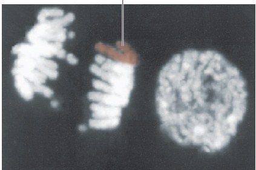

Figure 4–2 The first experimental demonstration that DNA is the genetic material. These experiments, carried out in the 1920s (A) and 1940s (B), eventually showed that adding purified DNA to a bacterium changed the bacterium’s properties and that this change was faithfully passed on to subsequent generations. Two closely related strains of the bacterium Streptococcus pneumoniae differ from each other in both the appearance of their colonies grown on an agar surface and their pathogenicity. One strain appears smooth (S) and causes death when injected into mice, and the other appears rough (R) and is nonlethal. (A) An initial experiment shows that some substance present in the S strain can change (or transform) the R strain into the S strain and that this change is inherited by subsequent generations of bacteria. (B) This later experiment, in which the R strain has been incubated with various types of biological molecules that were purified from the S strain, identifies the active substance as DNA.

In the past few decades, there has been a revolution in our ability to determine the exact order of subunits in a DNA molecule, as described in Chapter 8. As a result, we now know the sequence of the entire human genome—the 3.1 billion nucleotide pairs that provide the information for producing a human adult from a fertilized egg. We also have the DNA sequences for many thousands of other organisms. Detailed analyses of these sequences are providing exciting insights into the process of genome evolution, and it is with this subject that the chapter ends.

This is the first of four chapters that deal with basic genetic mechanisms—the ways in which the cell maintains, replicates, and expresses the hereditary information carried in its DNA. In the next chapter (Chapter 5), we shall discuss the mechanisms by which the cell accurately replicates and repairs DNA; we also describe how DNA sequences can be rearranged through the process of genetic recombination. Gene expression—the process through which the information encoded in DNA is interpreted by the cell to guide the synthesis of proteins—is the main topic of Chapter 6. In Chapter 7, we describe how this gene expression is controlled by the cell to ensure that each of the many thousands of proteins and RNA molecules encrypted in its DNA is manufactured at the proper time and place in the life of the cell.

#### THE STRUCTURE AND FUNCTION OF DNA

Biologists in the 1940s had difficulty in conceiving how DNA could be the genetic material. The molecule seemed too simple: a long polymer composed of only four types of nucleotide subunits, which resemble one another chemically. In the early 1950s, DNA was examined by x-ray diffraction analysis, a technique for determining the three-dimensional atomic structure of a molecule (discussed in Chapter 8). The x-ray diffraction results indicated that DNA was composed of two strands of the polymer wound into a helix. The observation that DNA was double-stranded provided one of the major clues that led to the Watson–Crick model for DNA structure that, as soon as it was proposed in 1953, made DNA’s potential for replication and information storage immediately apparent.

#### A DNA Molecule Consists of Two Complementary Chains of Nucleotides

A **deoxyribonucleic acid (DNA)** molecule consists of two long polynucleotide chains composed of four types of nucleotide subunits. Each of these chains is known as a DNA strand. The two strands run antiparallel to each other, and hydrogen bonds between the base portions of the nucleotides hold the two strands together (**Figure 4–3**). As we saw in Chapter 2 (Panel 2–6, pp. 104–105), a nucleotide is composed of a five-carbon sugar to which a phosphate group and a nitrogen-containing base are attached. In the case of the nucleotides in DNA, the sugar is deoxyribose attached to a phosphate group (hence the name deoxyribonucleic acid), and the base may be either adenine (A), cytosine (C), guanine (G), or thymine (T). The nucleotides are covalently linked together in a chain through the sugars and phosphates, which thus form a “backbone” of alternating sugar–phosphate–sugar–phosphate (**Figure 4–4**). Because only the base differs in each of the four types of nucleotide subunit, each polynucleotide chain in DNA is analogous to a sugar–phosphate necklace (the backbone), from which hang four types of beads (the bases A, C, G, and T). These same symbols (A, C, G, and T) are commonly used to denote either the four bases or the four entire nucleotides; that is, the bases with their attached sugar and phosphate groups.

The way in which the nucleotides are linked together gives a DNA strand a chemical polarity. If we think of each sugar as a block with a protruding knob (the 5′ phosphate) on one side and a hole (the 3′ hydroxyl) on the other (see Figure 4–3), each completed chain, formed by interlocking knobs with holes, will have all of its subunits lined up in the same orientation. Moreover, the two ends of the chain will be easily distinguishable, as one has a hole (the 3′ hydroxyl) and the other a knob (the $5 ^ { \prime }$ phosphate) at its terminus. This polarity of a DNA strand is indicated by referring to one end as the $3 ^ { \prime }$ end (pronounced $^ a 3$ prime end”) and the other as the $5 ^ { \prime }$ end (pronounced $^ a 5$ prime end”), names derived from the orientation of the deoxyribose sugar (see Figure 4–4). With respect to DNA’s information-carrying capacity, the chain of nucleotides in a DNA strand, being both directional and linear, can be read in much the same way as the letters on this page.

The three-dimensional structure of DNA—the DNA **double helix**—arises from the chemical and structural features of its two polynucleotide chains. Because the DNA strands are held together by hydrogen-bonding between the bases on the two different strands, all the bases are on the inside of the double helix, and the sugar–phosphate backbones are on the outside (see Figure 4–3). In each case, a bulkier two-ring base (a purine; see Panel 2–6, pp. 104–105) is paired with a single-ring base (a pyrimidine): A always pairs with T, and G with C (**Figure 4–5A**). This complementary base-pairing enables the **base pairs** to be packed in the energetically most favorable arrangement in the interior of the double helix. In this arrangement, each base pair is of similar width, thus holding the sugar–phosphate backbones a constant distance apart along the DNA molecule. To maximize the efficiency of base-pair packing, the two sugar–phosphate backbones wind around each other to form a right-handed double helix, with one complete turn every 10.4 base pairs (**Figure 4–5B** and **Figure 4–6**).

The members of each base pair can fit together within the double helix only if the two strands of the helix are **antiparallel**; that is, only if the polarity of one strand is oriented opposite to that of the other strand (see Figures 4–3 and 4–5). As a consequence of DNA’s structure and base-pairing requirements, each strand of a

Figure 4–3 DNA and its four nucleotide building blocks. (A) Each nucleotide is composed of a sugar–phosphate covalently linked to a base—guanine (G) in this figure. (B) The nucleotides are covalently linked together into polynucleotide chains, with a sugar–phosphate backbone from which the bases—adenine, cytosine, guanine, and thymine (A, C, G, and T)—extend. (C) A DNA molecule is composed of two polynucleotide chains (complementary DNA strands) held together by hydrogen bonds between the paired bases—denoted here by either two (A-T) or three (G-C) red lines. The arrows on the DNA strands indicate the polarities of the two strands, which run antiparallel to each other (with opposite chemical polarities) in the DNA molecule. (D) Although the DNA molecule is shown straightened out in panel C, in reality it is wound into a double helix, as shown here. For details, see the figures that follow.

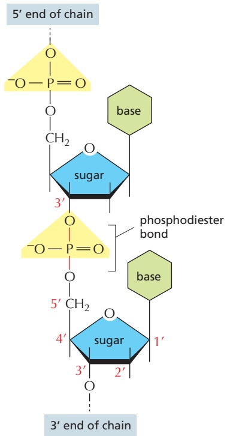

Figure 4–4 The nucleotide subunits within a DNA strand are held together by a phosphodiester bond. This bond 7 5.03/4.04connects one sugar to the next. The chemical differences in the ester linkages— between the $5 ^ { \prime }$ carbon of one sugar and the 3′ carbon of the other—give rise to the polarity of the resulting DNA strand, as indicated. For simplicity, only two nucleotides are shown here.

Figure 4–5 How the two strands of the DNA double helix are held together by hydrogen bonds between complementary base pairs. (A) Schematic illustration showing how the shapes and chemical structures of the bases allow hydrogen bonds to form efficiently only between A and T and between G and C. As shown, two hydrogen bonds form between A and T, whereas three form between G and C. The bases can pair in this way only if the two polynucleotide chains that contain them are antiparallel; that is, oriented in opposite directions. (B) A short section of the double helix viewed from its side. Four base pairs are illustrated; note that they lie perpendicular to the axis of the helix, unlike those shown in the schematic of panel A. As shown in Figure 4–4, the nucleotides are linked together covalently by a phosphodiester bond that connects the 3′-hydroxyl (–OH) group of one sugar and the 5′ phosphate $( \neg \mathsf { P O } _ { 3 } )$ attached to the next (see Figure 4–4 to review how the carbon atoms in the sugar ring are numbered). This linkage gives each polynucleotide strand a chemical polarity; that is, its two ends are chemically different. The $3 ^ { \prime }$ end carries an unlinked –OH group attached to the 3′ position on the sugar ring; the $5 ^ { \dot { \prime } }$ MBoC7 e5.04/4.05 end carries a free phosphate group attached to the 5′ position on the sugar ring.

DNA molecule contains a sequence of nucleotides that is exactly **complementary** to the nucleotide sequence of its partner strand.

#### The Structure of DNA Provides a Mechanism for Heredity

The discovery of the structure of DNA immediately suggested answers to the two most fundamental questions about heredity. First, how could the information to specify an organism be carried in a chemical form? And second, how could this information be duplicated and copied from generation to generation?

The answer to the first question came from the realization that DNA is a linear polymer formed from four different kinds of monomers, strung out in a very long, defined sequence like the letters of a document written in an alphabetic script.

The answer to the second question came from the double-stranded nature of the structure: because each strand of DNA contains a sequence of nucleotides that is exactly complementary to the nucleotide sequence of its partner strand, each strand can act as a **template**, or mold, for the synthesis of a new complementary strand. In other words, if we designate the two DNA strands as S and S′, strand S can serve as a template for making a new strand $\mathsf { S } ^ { \prime } ,$ while strand $\mathsf { S } ^ { \prime }$ can serve as a template for making a new strand S (**Figure 4–7**). Thus, the genetic information in DNA can be accurately copied by the beautifully simple process in which strand S separates from strand $S ^ { \prime } ,$ and each separated strand then serves as a template for the production of a new complementary partner strand that is identical to its former partner.

<small>Figure 4–6 A space-filling model of the DNA double helix. The two strands wind around each other to form a right-handed helix (see Figure 3–23). Each turn of this helix contains 10.4 nucleotide pairs, and the center-to-center distance between adjacent nucleotide pairs is 0.34 nm. The coiling of the two strands around each other creates two grooves in the double helix: the wider groove is called the major groove, and the narrower groove is called the minor groove, as indicated. The colors of the atoms are N, blue; O, red; P, yellow; H, white; and C, black. (See Movie 4.1.)</small>

Figure 4–7 DNA as a template for its own duplication. Because the nucleotide A successfully pairs only with T, and G pairs with C, each strand of DNA can act as a template to specify the sequence of nucleotides in its complementary strand. In this way, double-helical DNA can be copied precisely, with each parent DNA helix producing two identical daughter DNA helices.

The ability of each strand of a DNA molecule to act as a template for producing a complementary strand enables a cell to copy, or replicate, its genome before passing it on to its descendants. In Chapter $5 ,$ we shall describe the elegant machinery that the cell uses to perform this task.

Organisms differ from one another because their respective DNA molecules have different nucleotide sequences and, consequently, carry different biological messages. But how is the nucleotide alphabet used to make messages, and what do they spell out?

As discussed earlier, it was known well before the structure of DNA was determined that genes contain the instructions for producing proteins. If genes are made of DNA, the DNA must therefore somehow encode proteins. As discussed in Chapter 3, the properties of a protein, which are responsible for its biological function, are determined by its three-dimensional structure. This structure is determined in turn by the linear sequence of the amino acids of which it is composed. The linear sequence of nucleotides in a gene must therefore somehow spell out the linear sequence of amino acids in a protein. The exact correspondence between the four-letter nucleotide alphabet of DNA and the 20-letter amino acid alphabet of proteins—the genetic code—is not at all obvious from the DNA structure, and it took more than a decade after the discovery of the double helix before it was worked out. In Chapter 6, we will describe this code in detail in the course of elaborating the process of gene expression, through which a cell converts the nucleotide sequence of a gene first into the nucleotide sequence of an RNA molecule, and then into the amino acid sequence of a protein (**Figure 4–8**).

The complete store of information in an organism’s DNA is called its **genome**, and it specifies all the RNA molecules and proteins that the organism will ever

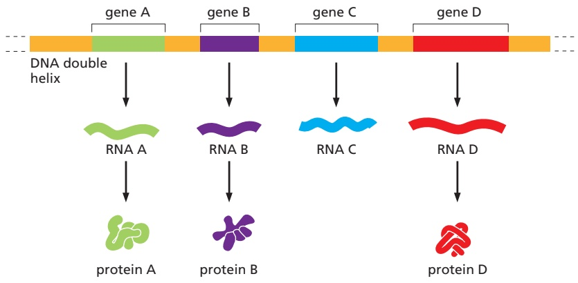

Figure 4–8 Most genes contain information to make proteins. As we discuss in Chapter 6, protein-coding genes each produce a set of RNA molecules (called mRNAs), which then direct the production of a specific protein molecule. Note that for a minority of genes, the final product is the RNA molecule itself, as shown here for gene C.

Figure 4–9 The nucleotide sequence of the human b-globin gene. By convention, a nucleotide sequence is written from its 5′ end to its 3′ end, and it should be read from left to right in successive lines down the page as though it were normal English text. This gene carries the information for the amino acid sequence of one of the two types of subunits of the hemoglobin molecule; a different gene, the α-globin gene, carries the information for the other. (Hemoglobin, the protein that carries oxygen in the blood, has four subunits, two of each type.) Only one of the two strands of the DNA double helix containing the β-globin gene is shown; the other strand has the exact complementary sequence.

The DNA sequences highlighted in yellow show the three regions of the gene that specify the amino acid sequence for the β-globin protein. We shall see in Chapter 6 how the cell splices these three sequences together at the RNA level to produce a messenger RNA molecule, and how this mRNA then guides the synthesis of a full-length β-globin protein.

synthesize. (The term “genome” is also used to describe the DNA that carries this information.) The amount of information contained in genomes is staggering. The nucleotide sequence of a very small human gene, written out in the four-letter nucleotide alphabet, occupies a quarter of a page of text (**Figure 4–9**), while the complete sequence of nucleotides in the human genome would fill more than a thousand books the size of this one. In addition to other critical information, the human genome contains roughly 20,000 protein-coding genes, which (through alternative splicing and other mechanisms described in Chapters 6 and 7) can give rise to a much greater number of distinct proteins.

#### In Eukaryotes, DNA Is Enclosed in a Cell Nucleus

As described in Chapter 1, nearly all the DNA in a eukaryotic cell is sequestered in a nucleus, which in many cells occupies about 10% of the total cell volume. This compartment is delimited by a nuclear envelope formed by two concentric lipid bilayer membranes (**Figure 4–10**). As illustrated, these two membranes are punctured at intervals by large nuclear pores, through which molecules move between the nucleus and the cytosol. The outer nuclear membrane is directly connected to the extensive system of intracellular membranes called the endoplasmic reticulum, which extend out from it into the cytoplasm. And the nuclear envelope is supported internally by a network of intermediate filaments called the nuclear lamina—a thin feltlike mesh just beneath the inner nuclear membrane (see Figure 4–10B).

The nuclear envelope allows the many proteins that act on DNA to be concentrated where they are needed in the cell, and, as we see in subsequent chapters, it also keeps nuclear and cytosolic proteins separate, a feature that is crucial for the proper functioning of eukaryotic cells.

#### Summary

Genetic information is carried in the linear sequence of nucleotides in DNA. Each molecule of DNA is a double helix formed from two complementary antiparallel strands of nucleotides held together by hydrogen bonds between G-C and A-T base pairs. Duplication of the genetic information occurs by the use of one DNA strand as a template for the formation of a complementary strand. The genetic information stored in an organism’s DNA sequence contains the instructions for all the RNA molecules and proteins that the organism will ever synthesize, and it is said to be that organism’s genome. In eukaryotes, DNA is contained in the cell nucleus, a large membrane-bound compartment.

#### CHROMOSOMAL DNA AND ITS PACKAGING IN THE CHROMATIN FIBER

The most important function of DNA is to form genes, which are the informationcarrying units that specify all the RNA molecules and proteins that make up an organism—including information about when, in what types of cells, and in what quantity each RNA molecule and protein is to be made. The nuclear DNA of eukaryotes is divided up into a set of chromosomes, each of which contains one

5′ CCCTGTGGAGCCACACCCTAGGGTTGGCCA ATCTACTCCCAGGAGCAGGGAGGGCAGGAG CCAGGGCTGGGCATAAAAGTCAGGGCAGAG CCATCTATTGCTTACATTTGCTTCTGACAC AACTGTGTTCACTAGCAACTCAAACAGACA CCATGGTGCACCTGACTCCTGAGGAGAAGT CTGCCGTTACTGCCCTGTGGGGCAAGGTGA ACGTGGATGAAGTTGGTGGTGAGGCCCTGG GCAGGTTGGTATCAAGGTTACAAGACAGGT TTAAGGAGACCAATAGAAACTGGGCATGTG GAGACAGAGAAGACTCTTGGGTTTCTGATA GGCACTGACTCTCTCTGCCTATTGGTCTAT TTTCCCACCCTTAGGCTGCTGGTGGTCTAC CCTTGGACCCAGAGGTTCTTTGAGTCCTTT GGGGATCTGTCCACTCCTGATGCTGTTATG GGCAACCCTAAGGTGAAGGCTCATGGCAAG AAAGTGCTCGGTGCCTTTAGTGATGGCCTG GCTCACCTGGACAACCTCAAGGGCACCTTT GCCACACTGAGTGAGCTGCACTGTGACAAG CTGCACGTGGATCCTGAGAACTTCAGGGTG AGTCTATGGGACCCTTGATGTTTTCTTTCC CCTTCTTTTCTATGGTTAAGTTCATGTCAT AGGAAGGGGAGAAGTAACAGGGTACAGTTT AGAATGGGAAACAGACGAATGATTGCATCA GTGTGGAAGTCTCAGGATCGTTTTAGTTTC TTTTATTTGCTGTTCATAACAATTGTTTTC TTTTGTTTAATTCTTGCTTTCTTTTTTTTT CTTCTCCGCAATTTTTACTATTATACTTAA TGCCTTAACATTGTGTATAACAAAAGGAAA TATCTCTGAGATACATTAAGTAACTTAAAA AAAAACTTTACACAGTCTGCCTAGTACATT ACTATTTGGAATATATGTGTGCTTATTTGC ATATTCATAATCTCCCTACTTTATTTTCTT TTATTTTTAATTGATACATAATCATTATAC ATATTTATGGGTTAAAGTGTAATGTTTTAA TATGTGTACACATATTGACCAAATCAGGGT AATTTTGCATTTGTAATTTTAAAAAATGCT TTCTTCTTTTAATATACTTTTTTGTTTATC TTATTTCTAATACTTTCCCTAATCTCTTTC TTTCAGGGCAATAATGATACAATGTATCAT GCCTCTTTGCACCATTCTAAAGAATAACAG TGATAATTTCTGGGTTAAGGCAATAGCAAT ATTTCTGCATATAAATATTTCTGCATATAA ATTGTAACTGATGTAAGAGGTTTCATATTG CTAATAGCAGCTACAATCCAGCTACCATTC TGCTTTTATTTTATGGTTGGGATAAGGCTG GATTATTCTGAGTCCAAGCTAGGCCCTTTT GCTAATCATGTTCATACCTCTTATCTTCCT CCCACAGCTCCTGGGCAACGTGCTGGTCTG TGTGCTGGCCCATCACTTTGGCAAAGAATT CACCCCACCAGTGCAGGCTGCCTATCAGAA AGTGGTGGCTGGTGTGGCTAATGCCCTGGC CCACAAGTATCACTAAGCTCGCTTTCTTGC TGTCCAATTTCTATTAAAGGTTCCTTTGTT CCCTAAGTCCAACTACTAAACTGGGGGATA TTATGAAGGGCCTTGAGCATCTGGATTCTG CCTAATAAAAAACATTTATTTTCATTGCAA TGATGTATTTAAATTATTTCTGAATATTTT ACTAAAAAGGGAATGTGGGAGGTCAGTGCA TTTAAAACATAAAGAAATGATGAGCTGTTC AAACCTTGGGAAAATACACTATATCTTAAA CTCCATGAAAGAAGGTGAGGCTGCAACCAG CTAATGCACATTGGCAACAGCCCCTGATGC CTATGCCTTATTCATCCCTCAGAAAAGGAT TCTTGTAGAGGCTTGATTTGCAGGTTAAAG TTTTGCTATGCTGTATTTTACATTACTTAT TGTTTTAGCTGTCCTCATGAATGTCTTTTC

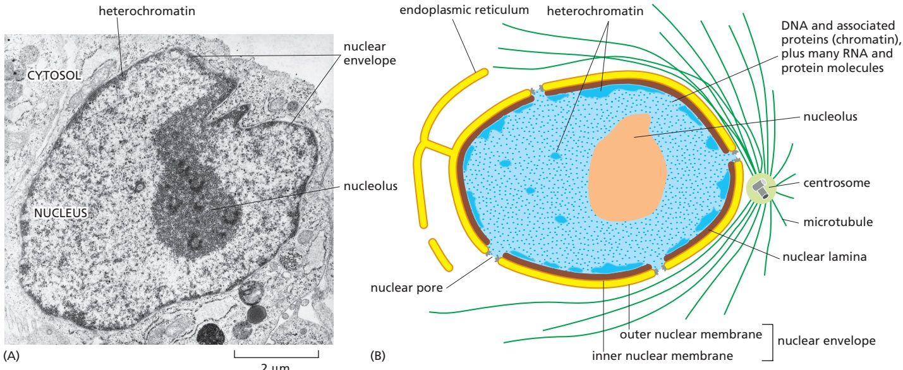

enormously long DNA molecule. In this section we see how genes are arranged on chromosomes. In addition, we describe three specialized DNA sequences that are required for a chromosome to be accurately duplicated as a separate entity and passed on from one generation to the next.

We also confront the serious challenge of DNA packaging. If the double helices of all 46 chromosomes in a human cell could be laid end to end, they would reach approximately 2 meters; yet the nucleus, which contains the DNA, is only about 6 μm in diameter. This is geometrically equivalent to packing 40 km (24 miles) of extremely fine thread into a tennis ball. The complex task of packagingMBoC7 m4.09/4.10 DNA is accomplished by specialized proteins that bind to the DNA and fold it, generating a series of organized coils and loops that prevent the DNA from becoming an unmanageable tangle. Amazingly, although the DNA is very tightly compacted, it nevertheless remains accessible to the many enzymes in the cell that replicate it, repair it, and use its genes to produce RNA molecules and proteins.

#### Eukaryotic DNA Is Packaged into a Set of Chromosomes

Each **chromosome** in a eukaryotic cell consists of a single, enormously long linear DNA molecule along with the proteins that fold the fine DNA thread into a more compact structure. In addition to proteins involved in packaging, chromosomes are also associated with many other proteins (as well as numerous RNA molecules). These are required for the processes of gene expression, DNA replication, and DNA repair. The complex of DNA and tightly bound protein is called chromatin (from the Greek chroma, “color,” because of its staining properties).

Bacteria lack a special nuclear compartment, and they generally carry their genes on a single DNA molecule, which is often circular (see Figure 1–38). This DNA is also associated with proteins that package and condense it, but they are different from the proteins that perform these functions in eukaryotes. Although the bacterial DNA with its attendant proteins is often called the bacterial “chromosome,” it does not have the same structure as the eukaryotic chromosomes that will be our main focus.

With the exception of the gametes (eggs and sperm) and a few highly specialized cell types that cannot multiply and either lack DNA altogether (for example, red blood cells) or have replicated their DNA without completing cell division (for example, megakaryocytes), each human cell nucleus contains two copies of each chromosome, one inherited from the mother and one from the father. The maternal and paternal chromosomes of a pair are called **homologous chromosomes (homologs)**. The only nonhomologous chromosome pairs are the sex chromosomes in males, where a Y chromosome is inherited from the father

Figure 4–10 A cross-sectional view of a typical cell nucleus. (A) Electron micrograph of a thin section through the nucleus of a human fibroblast. (B) Schematic drawing, showing that the nuclear envelope consists of two membranes, the outer one being continuous with the endoplasmic reticulum (ER) membrane (see also Figure 12–54). The space inside the endoplasmic reticulum (the ER lumen) is colored yellow; it is continuous with the space between the two nuclear membranes. The lipid bilayers of the inner and outer nuclear membranes are connected at each nuclear pore. A sheetlike network of filaments inside the nucleus forms the nuclear lamina (brown), providing mechanical support for the nuclear envelope (for details, see Chapter 12). Outside the nuclear envelope, a centrosome forms microtubules that help to organize the cytoplasm, as explained in Chapter 16. The dark-staining heterochromatin contains specially condensed regions of DNA that will be discussed later.

Prokaryotic cells (archaea and bacteria) have no nucleus. Lacking a nuclear envelope, their DNA is co-located with all other cell components in a single compartment, bounded by the cell’s plasma membrane. (A, courtesy of E.G. Jordan and J. McGovern.)

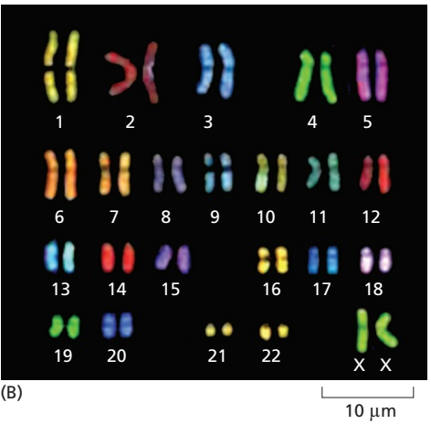

(A)

and an X chromosome from the mother. Thus, each human cell contains a total of 46 chromosomes—22 pairs common to both males and females, plus two so-called sex chromosomes (X and Y in males, two X’s in females). These human chromosomes can be readily distinguished by “painting” each one a different color using a technique that is based on DNA hybridization (**Figure 4–11**). In this method (see p. 505), short strands of nucleic acid tagged with fluorescent dyes serve as “probes” that pick out their complementaryMBoC7 m4.10/4.11 DNA sequence, lighting up the target chromosome at any site where they bind. Chromosome painting is most frequently done at the stage in the cell cycle called mitosis, when chromosomes are especially compacted and easy to visualize (discussed shortly).

Another more traditional way to distinguish one chromosome from another is to stain them with dyes that reveal a striking and reproducible pattern of bands along each mitotic chromosome (**Figure 4–12**). These banding patterns reflect variations in chromatin structure and/or base composition, although their basis is not well understood. Nevertheless, the pattern of these bands on each type of chromosome is unique, and it provided the initial means to identify and number each human chromosome reliably.

The display of the 46 human chromosomes at mitosis shown in Figure 4–11B is called the human **karyotype**. If parts of chromosomes are lost or are switched between chromosomes, these changes can be detected either by changes in the banding patterns or—with greater sensitivity—by changes in the pattern of chromosome painting (**Figure 4–13**). Cytogeneticists use these alterations to detect inherited chromosome abnormalities and to reveal the chromosome rearrangements that occur in cancer cells as they progress to malignancy (discussed in Chapter 20).

Figure 4–11 The complete set of human chromosomes. These chromosomes, from a female, were isolated from a cell undergoing nuclear division (mitosis) and are therefore highly compacted. Each chromosome has been “painted” a different color to permit its unambiguous identification under the fluorescence microscope, using a technique called “spectral karyotyping.” Chromosome painting can be performed by exposing the chromosomes to a large collection of DNA molecules (called DNA probes) whose sequences match known DNA sequences from the human genome. A set of sequences that matches a specific chromosome is coupled to a combination of fluorescent dyes. DNA molecules derived from chromosome 1 are labeled with one specific dye combination, those from chromosome 2 with another, and so on. Because the labeled DNA can form base pairs, or hybridize, only to the chromosome from which it was derived, each chromosome becomes labeled with a different combination of dyes. For such experiments, the chromosomes are subjected to treatments that separate the two strands of double-helical DNA in a way that permits base-pairing with the single-stranded, labeled DNA but keeps the overall chromosome structure relatively intact. (A) The chromosomes visualized as they originally spilled from the lysed cell. (B) The same chromosomes artificially lined up in their numerical order. This arrangement of the full chromosome set is called a karyotype. (Adapted from N. McNeil and T. Ried, Expert Rev. Mol. Med. 2:1–14, 2000. With permission from Cambridge University Press.)

#### Chromosomes Contain Long Strings of Genes

Chromosomes carry genes—the functional units of heredity. A gene is often defined as a segment of DNA that contains the instructions for making a particular protein (or a set of closely related proteins), but this definition is too narrow. Genes that code for protein are indeed the majority, and most of the genes with clear-cut mutant phenotypes fall under this heading. In addition, however, there are many “RNA genes”—segments of DNA that generate a functionally significant RNA molecule, instead of a protein, as their final product. We shall say more about these RNA genes and their products later.

As might be expected, there can be a correlation between the complexity of an organism and the number of genes in its genome (see Table 1–2, p. 29). For example, some simple bacteria have only 500 genes, compared to about 25,000 for humans. Bacteria, archaea, and some single-celled eukaryotes, such as yeast, have concise genomes, consisting of little more than strings of closely packed genes. However, the genomes of multicellular plants and animals, as well as many other eukaryotes, contain, in addition to genes, a large quantity of interspersed DNA whose function is poorly understood. Some of this additional DNA is crucial for the proper control of gene expression, but this only partly explains why there is so much of it in multicellular organisms, whose genes need to be switched on and off according to complicated rules during development (discussed in Chapters 7 and 21).

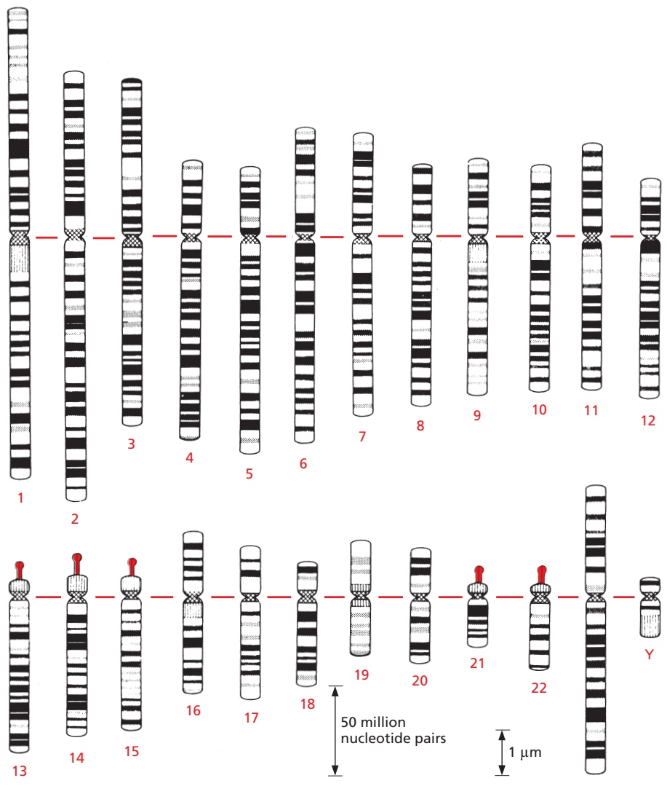

Figure 4–12 The banding patterns of human chromosomes. Chromosomes 1–22 are numbered in approximate order of size. A typical human cell contains two of each of these chromosomes, plus two sex chromosomes—two X chromosomes in a female, one X and one Y chromosome in a male. The chromosomes used to make these maps were stained at an early stage in mitosis, when the chromosomes are incompletely compacted. The horizontal red line represents the position of the centromere (see Figure 4–18), which appears as a constriction on mitotic chromosomes. The red knobs on chromosomes 13, 14, 15, 21, and 22 indicate the positions of genes that code for the large ribosomal RNAs and form the nucleolus (discussed in Chapter 6). These banding patterns are obtained by staining chromosomes with Giemsa stain, and they are observed under a light microscope. (Adapted from U. Francke, Cytogenet. Cell Genet. 31:24–32, 1981.)

Differences in the amount of noncoding DNA, most of it interspersed between genes—far more than differences in numbers of genes—account for the astonishing variations in genome size that we see when we compare one species with another (see Figure 1–30). For example, the human genome is 200 times larger than that of the yeast Saccharomyces cerevisiae, but 30 times smaller than thatMBoC7 m4.11/4.12 of some plants and amphibians and 200 times smaller than that of a species of amoeba. Moreover, because of differences in the amount of noncoding DNA, the genomes of closely related organisms (bony fish, for example) can vary several hundredfold in their DNA content, even though they contain roughly the same number of genes. Whatever the excess DNA may do, it seems clear that it is not a great handicap for a eukaryotic cell to carry a large amount of it.

Figure 4–13 Aberrant human chromosomes. (A) Two normal human chromosomes, 4 and 6. (B) In an individual carrying a reciprocal chromosomal translocation, the DNA double helix in one chromosome has crossed over with the DNA double helix in the other chromosome because of an abnormal recombination event. The chromosome painting technique used on the chromosomes in each of the sets allows the identification of short pieces of chromosomes that have become translocated, a frequent event in cancer cells. (Courtesy of Zhenya Tang and the NIGMS Human Genetic Cell Repository at the Coriell Institute for Medical Research.)

chromosome 6

chromosome 4

(B) reciprocal chromosomal translocation

Chinese muntjac

Indian muntjac

How the genome is divided into chromosomes also differs from one eukaryotic species to the next. For example, while the cells of humans have 46 chromosomes, those of some small deer have only 6, while those of the common carp contain more than 100. Even closely related species with similar genome sizes can have very different numbers and sizes of chromosomes (**Figure 4–14**). Thus, there is no simple relationship between chromosome number, complexity of the organism, and total genome size. Rather, the genomes and chromosomes of modern-day species have each been shaped by a unique history of seemingly random genetic events, acted on by poorly understood selection pressures over long evolutionary times.

#### The Nucleotide Sequence of the Human Genome Shows HowMBoC7 m4.14/4.14 Our Genes Are Arranged

With the determination of the full DNA sequence of the human genome, it became possible to see in detail how the genes are arranged along each of our chromosomes (**Figure 4–15**). Although many decades will pass before the information contained in the human genome sequence is fully analyzed, it has already stimulated an enormous number of new experiments that have had major effects on the content of every chapter in this book.

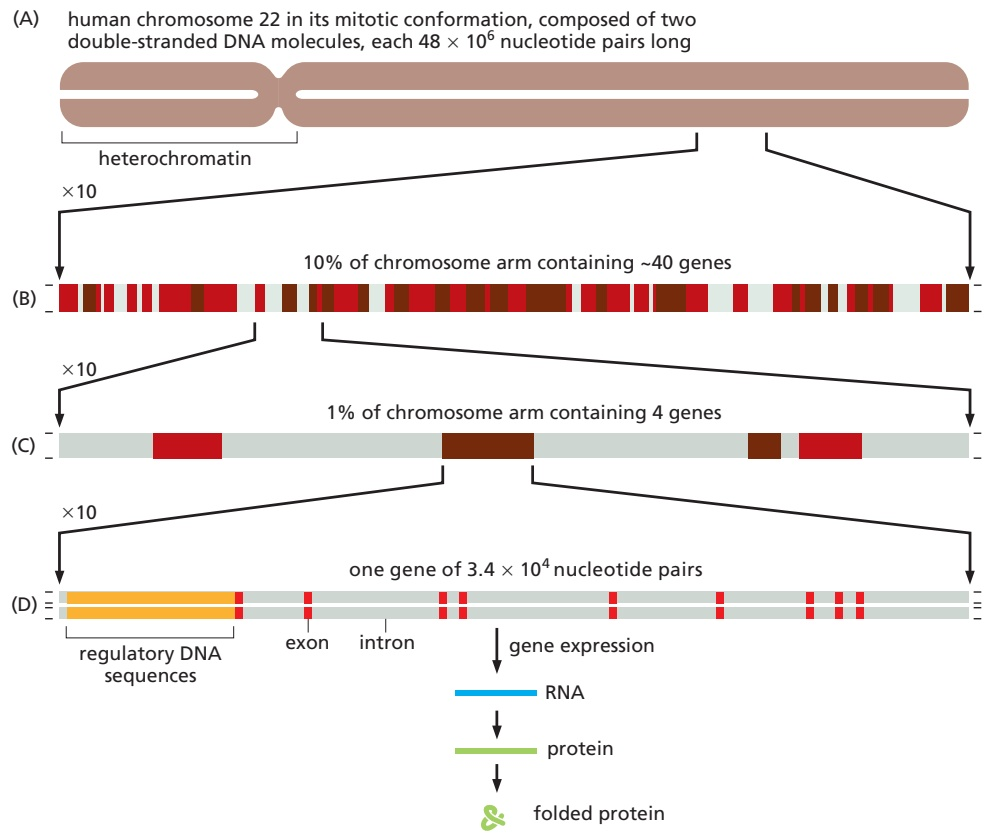

Figure 4–14 Two closely related species of deer with very different chromosome numbers. In the evolution of the Indian muntjac, initially separate chromosomes in an ancestor fused, without having a major effect on the animal. These two species contain a similar number of genes. (Chinese muntjac photo courtesy of Deborah Carreno, Natural Wonders Photography; Indian muntjac photo courtesy of Beatrice Bourgery.)

Figure 4–15 The organization of genes on a human chromosome, as determined from the initial sequencing of the human genome. (A) Chromosome 22, one of the smallest human chromosomes, contains 48 × 106 nucleotide pairs and makes up approximately 1.5% of the human genome. Most of the left arm of chromosome 22 consists of short repeated sequences of DNA that are packaged in a particularly compact form of chromatin (heterochromatin) discussed later in this chapter. (B) A tenfold expansion of a portion of chromosome 22, with about 40 genes indicated. Those in dark brown were known genes, and those in red were predicted genes. (C) An expanded portion of B showing four genes. (D) The intron–exon arrangement of a typical gene is shown after a further tenfold expansion. Each exon (red) codes for a portion of the protein, while the DNA sequence of the introns (gray) is relatively unimportant, as discussed in detail in Chapter 6. (Adapted from International Human Genome Sequencing Consortium, Nature 409:860–921, 2001.)

The human genome (3.1 × 109 nucleotide pairs) is the totality of genetic information belonging to our species. Almost all of this genome is distributed over the 22 different autosomes and 2 sex chromosomes (see Figures 4–11 and 4–12) found within the nucleus. A minute fraction of the human genome (16,569 nucleotide pairs—in multiple copies per cell) is found in the mitochondria (introduced in Chapter 1 and discussed in detail in Chapter 14). The term “human genome sequence” refers to the complete nucleotide sequence of DNA in the 24 nuclear chromosomes and the mitochondria. Being diploid, a human somatic cell nucleus contains twice the haploid amount of DNA, or 6.2 × 109 nucleotide pairs, before duplicating its chromosomes in preparation for division.

<table><tbody><tr><td colspan="2">TABLE 4-1 Some Vital Statistics for the Human Genome</td></tr><tr><td>Human genome DNA length</td><td>3.1 × 109 nucleotide pairs*</td></tr><tr><td>Number of genes coding for proteins</td><td>About 20,000 (19,116, plus hundreds of genes encoding proteins of 50 amino acids or less)**</td></tr><tr><td>Largest gene coding for protein</td><td>2.5 × 106 nucleotide pairs</td></tr><tr><td>Median size for protein-coding genes</td><td>26,000 nucleotide pairs</td></tr><tr><td>Median size for messenger RNAs (including 5' and 3' untranslated regions)</td><td>2938 nucleotides</td></tr><tr><td>Median size for amino-acid coding in messenger RNA sequences</td><td>1290 nucleotides</td></tr><tr><td colspan="2">Protein-coding gene features</td></tr><tr><td>Median size of protein produced</td><td>430 amino acids</td></tr><tr><td>Smallest number of exons per gene</td><td>1 (1068 of these unspliced genes)</td></tr><tr><td>Largest number of exons per gene</td><td>363</td></tr><tr><td>Median number of exons per gene</td><td>9.0</td></tr><tr><td>Median exon size</td><td>131 nucleotide pairs</td></tr><tr><td>Median intron size</td><td>1747 nucleotide pairs</td></tr><tr><td>Number of noncoding RNA genes</td><td>About 5000, with 4849 annotated***</td></tr><tr><td>Number of pseudogenes</td><td>More than 20,000****</td></tr><tr><td>Percentage of protein-coding DNA sequence (in exons)</td><td>1%</td></tr><tr><td>Percentage of DNA in other highly conserved sequences</td><td>3.5%</td></tr><tr><td>Percentage of DNA transcribed (in protein-coding plus annotated noncoding RNA genes)</td><td>45%</td></tr><tr><td>Percentage of DNA in high-copy-number repetitive elements</td><td>Approximately 50%</td></tr><tr><td colspan="2">*The sequence of 2.85 billion nucleotides is known precisely (error rate of only about 1 in 100,000 nucleotides). The remaining DNA primarily consists of short sequences that are tandemly repeated many times over, with repeat numbers differing from one individual to the next. These highly repetitive blocks are difficult to sequence accurately. **RefSeq genes, with at least one reviewed/validated mRNA (A. Piovesan et al., BMC Res. Notes 12:315-319, 2019). For genes encoding tiny proteins, see T.F. Martinez et al., Nat. Chem. Biol. 16:458-468, 2020). ***A considerable number of potential ncRNA genes are still uncharacterized and not annotated. ****A pseudogene is a DNA sequence closely resembling that of a functional gene but containing numerous mutations that prevent its proper expression or function; most are still uncharacterized and not annotated in databases. Courtesy of Allison Piovesan, University of Bologna, Bologna, Italy.</td></tr></tbody></table>

The first striking feature of the human genome is how little of the DNA sequence (only about 1%) codes for proteins (**Table 4–1** and **Figure 4–16**). It is also notable that nearly half of the chromosomal DNA is made up of mobile pieces of DNA that have gradually inserted themselves in the chromosomes over evolutionary time, multiplying like parasites in the genome and appearing as genome-wide repeat sequences (see Figure 4–63). We discuss these transposable elements in detail in later chapters.

A second notable feature of the human genome is the large average gene size—about 26,000 nucleotide pairs. As discussed earlier, a typical gene carries in

Figure 4–16 Scale of some human genome features. If drawn with a 1-mm space between each nucleotide pair (as in A), the human genome would extend 3100 km (nearly 2000 miles), far enough MBoC7 m4.16/4.16to stretch across the center of Africa, the site of our human origins (red line in B). At this scale, there would be, on average, a protein-coding gene every 160 meters. An average gene would extend for 26 meters, but the coding sequences in this gene would add up to only just over a meter.

its linear sequence of nucleotides the information for the linear sequence of the amino acids of a protein. Only about 1300 nucleotides are required to encode a protein of average size (about 430 amino acids in humans). Most of the remaining sequence in a gene consists of long stretches of noncoding DNA that interrupt the relatively short segments of DNA that code for protein. As will be discussed in detail in Chapter 6, the coding sequences are included in the **exons**; the intervening sequences in genes are noncoding and called **introns** (see Figure 4–15 and Table 4–1). The majority of human genes thus consist of a long string of alternating exons and introns, with most of the gene consisting of introns. In contrast, the majority of genes from organisms with concise genomes either lack introns (as in prokaryotes) or contain relatively short ones. This helps to account for the much smaller size of their genes, as well as for the much higher fraction of coding DNA in their chromosomes.

In addition to introns and exons, each gene is associated with regulatory DNA sequences, which are responsible for ensuring that the gene is turned on or off at the proper time, expressed at the appropriate level, and only in the proper type of cell. In humans, the regulatory sequences for a typical gene are spread out over hundreds of thousands of nucleotide pairs. As would be expected, these regulatory sequences are much more compact and less numerous in organisms with concise genomes. In Chapter 7 we discuss how regulatory DNA sequences work.

Detailed studies of genome sequences have surprised biologists with the discovery that, in addition to 20,000 protein-coding genes, the human genome contains thousands of genes that encode RNA molecules that do not produce proteins, but instead have a variety of other important functions. Although the roles of some of these non-coding RNA genes have been known for decades, many more remain mysterious, as will be discussed in Chapters 6 and 7.

Last, but not least, the nucleotide sequence of the human genome has revealed that the archive of information needed to produce a human seems to be in an alarming state of chaos. As one commentator described our genome, “In some ways it may resemble your garage/bedroom/refrigerator/life: highly individualistic, but unkempt; little evidence of organization; much accumulated clutter (referred to by the uninitiated as ‘junk’); virtually nothing ever discarded; and the few patently valuable items indiscriminately, apparently carelessly, scattered throughout.” We shall discuss how this is thought to have come about in the final section of this chapter, which is titled “How Genomes Evolve.”

#### Each DNA Molecule That Forms a Linear Chromosome Must Contain a Centromere, Two Telomeres, and Replication Origins

To form a functional chromosome, a DNA molecule must be able to do more than simply carry genes: it must be able to replicate, and the replicated copies must be separated and reliably partitioned into daughter cells at each cell division. This process occurs through an ordered series of stages, collectively known as the **cell cycle**, which provides for a temporal separation between the duplication of chromosomes and their segregation into two daughter cells. The eukaryotic cell cycle is briefly summarized in **Figure 4–17**, and it is discussed in detail in Chapter 17.

Figure 4–17 A simplified view of the eukaryotic cell cycle. During interphase, the cell is actively expressing its genes and is therefore synthesizing proteins. Also, during interphase and before cell division, the DNA is replicated, and each chromosome is duplicated to produce two closely paired sister DNA molecules (called sister chromatids). A cell with only one type of chromosome, present in maternal and paternal copies, is illustrated here.

Once DNA replication is complete, the cell can enter M phase, when mitosis occurs and the nucleus is divided into two daughter nuclei. During this stage, the chromosomes condense, the nuclear envelope breaks down, and the mitotic spindle forms from microtubules and other proteins. The condensed mitotic chromosomes are captured by the mitotic spindle, and one complete set of chromosomes is then pulled to each end of the cell by separating the members of each sister-chromatid pair. A nuclear envelope re-forms around each chromosome set, and in the final step of M phase, the cell divides to produce two daughter cells. Most of the time in the cell cycle is spent in interphase; M phase is brief in comparison, occupying only about an hour in many mammalian cells.

Briefly, during a long interphase, genes are expressed and chromosomes are replicated, with the two replicas remaining together as a pair of sister chromatids. Throughout this time the chromosomes are extended, and much of their chromatin exists as long threads in the nucleus so that individual chromosomes cannot be easily distinguished. It is only during a much briefer period of mitosis that each chromosome condenses so that its two sister chromatids can be separated and distributed to the two daughter nuclei. The highly condensed chromosomes in a dividing cell are known as mitotic chromosomes (**Figure 4–18**). This is the form in which chromosomes are most easily visualized; in fact, the images of chromosomes shown so far in the chapter are of chromosomes in mitosis.

Each chromosome operates as a distinct structural unit. For a faithful copy of a chromosome to be passed on to each daughter cell at division, it must have been completely replicated during interphase to produce two identical DNA molecules. In addition, these newly replicated, enormously long DNA copies must then be separated and partitioned correctly into the two daughter cells. These basic functions are controlled by three types of specialized sites on the DNA, each of which binds specific proteins that guide the machinery that replicates and segregates chromosomes (**Figure 4–19**).

Experiments in budding yeast, whose chromosomes are relatively small and easy to manipulate, have identified the minimal DNA sequence elements responsible for each of these functions. One type of nucleotide sequence acts as a DNA **replication origin**, the location at which duplication of the DNA begins. Eukaryotic chromosomes contain many origins of replication to ensure that the entire chromosome can be replicated rapidly, as discussed in detail in Chapter 5.

After DNA replication, the two sister chromatids that form each chromosome remain attached to one another and, as the cell cycle proceeds, they are condensed further to produce mitotic chromosomes. In budding yeasts, the presence of a second specialized DNA sequence, called a **centromere**, allows one copy of each duplicated and condensed chromosome to be pulled into each daughter cell when a cell divides. A protein complex called a kinetochore forms at the centromere and attaches the duplicated chromosomes to the mitotic spindle, in a manner that causes the two sister chromatids to be pulled apart (discussed in Chapter 17).

The third specialized DNA sequence forms **telomeres**, the ends of a chromosome. Telomeres contain repeated nucleotide sequences that enable the ends of chromosomes to be efficiently replicated. Telomeres also perform another function: the repeated telomere DNA sequences, together with the regions adjoining them, form structures that protect the end of the chromosome from being mistaken by the cell for a broken DNA molecule in need of repair. We discuss both this type of repair and the structure and function of telomeres in Chapter 5.

Figure 4–18 A mitotic chromosome. At the metaphase stage of M phase, each MBoC7 e5.15/4.18chromosome exists as a condensed duplicated chromosome, in which the two replicated chromosomes, called sister chromatids, are still linked together (see Figure 4–17). The constricted region indicates the position of the centromere. (A) Electron micrograph; (B) schematic drawing. (A, courtesy of Terry D. Allen.)

Figure 4–19 The three specialized sites on the DNA required to produce a eukaryotic chromosome that can be replicated and then segregated accurately at mitosis. Each chromosome has multiple origins of replication, one centromere, and two telomeres. Shown here is the sequence of events that a typical chromosome follows during the cell cycle. The DNA replicates during the portion of interphase known as S phase, beginning at the origins of replication and proceeding bidirectionally from the origins across the chromosome. In M phase, the centromere attaches the duplicated chromosomes to the mitotic spindle so that a copy of the entire genome is distributed to each daughter cell during mitosis; the special structure that attaches the centromere to the spindle is a protein complex called the kinetochore (dark green). The centromere also helps to hold the duplicated chromosomes together until they are ready to be moved apart. As explained in the text, the telomeres form special caps at each chromosome end.

In budding yeast cells, the three types of sequences required to propagate a chromosome are relatively short (typically fewer than 1000 base pairs each) and therefore use only a tiny fraction of the information-carrying capacity of a chromosome. Although telomere sequences are fairly simple and short in all eukaryotes, the DNA sequences that form centromeres and replication origins in more complex organisms are much longer than their yeast counterparts. For example, experiments suggest that a human centromere can contain up to a million nucleotide pairs and that it may not require a stretch of DNA with a defined nucleotide sequence. Instead, as we shall discuss later in this chapter, a human centromere is thought to consist of a large, regularly repeating protein–nucleic acid structure that can be inherited when a chromosome replicates.

#### DNA Molecules Are Highly Condensed in Chromosomes

All eukaryotic organisms have special ways of packaging DNA into chromosomes. Thus, if the 48 million nucleotide pairs of DNA in human chromosome 22 could be laid out as one long double helix stretched out end to end, the molecule would extend for about 1.5 cm. But chromosome 22 measures only about 2 μm in length in mitosis (see Figure 4–11), representing an end-to-end compaction ratio of more than 7000-fold. This remarkable feat of compression is performed by proteins that successively coil and fold the DNA into higher levels of organization.

Although much less condensed than mitotic chromosomes, the DNA of human interphase chromosomes is still tightly packed. But interphase chromosomes have a dynamic structure. Specific regions of interphase chromosomes decondense to allow access to specific DNA sequences for gene expression, DNA repair, and replication—and then recondense when these processes are completed. The packaging of DNA in chromosomes is therefore accomplished in a way that allows rapid localized, on-demand access to the DNA. In the next sections, we discuss the specialized proteins that make this type of packaging possible.

#### Nucleosomes Are a Basic Unit of Eukaryotic Chromosome Structure

The proteins that bind to the DNA to form eukaryotic chromosomes are traditionally divided into two classes: the **histones** and the non-histone chromosomal proteins, each contributing about the same mass to a chromosome. The complex of both classes of protein with the nuclear DNA of eukaryotic cells is known as **chromatin** (**Figure 4–20**; **Movie 4.2**).

Histones are responsible for the first and most basic level of chromosome packing, a protein–DNA complex called the **nucleosome**. When interphase nuclei are broken open very gently and their contents examined under the electron microscope, most of the chromatin appears to be in the form of a fiber (**Figure 4–21A**). If this chromatin is subjected to treatments that cause it to unfold partially, it can be seen under the electron microscope as a series of “beads on a string” (**Figure 4–21B**). The string is DNA, and each bead is a nucleosome core particle that consists of DNA wound around a histone core.

Figure 4–20 Chromatin. As illustrated, chromatin consists of DNA bound to both histone and non-histone proteins. The mass of histone protein present is about equal to the total mass of non-histone protein, but—as schematically indicated here—the latter class is composed of an enormous number of different species. In total, a chromosome is about one-third DNA and two-thirds protein by mass.

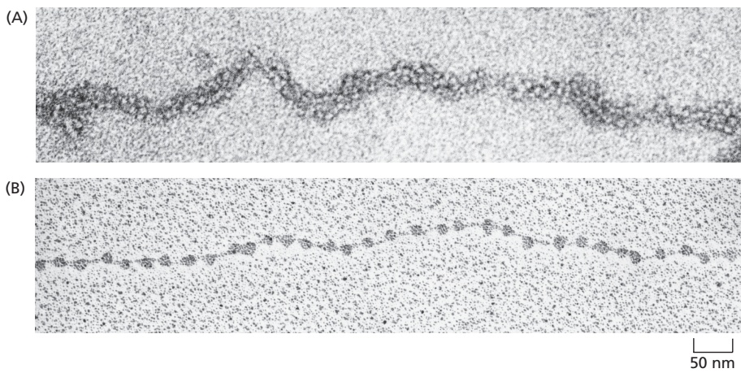

Figure 4–21 Nucleosomes as seen in the electron microscope. (A) Chromatin isolated directly from an interphase nucleus appears in the electron microscope as a thread of associated nucleosomes. (B) This electron micrograph shows a length of chromatin that has been experimentally decondensed after isolation to show the nucleosomes. (A, courtesy of Barbara Hamkalo; B, courtesy of Victoria Foe.)

The nucleosome core particles can be isolated by digesting chromatin with particular enzymes (called nucleases) that cut DNA. After digestion for a short period, the exposed DNA between the nucleosome core particles, the linker DNA, is degraded. Each individual nucleosome core particle is found to consist of a complex of eight histone proteins—two molecules each of histones H2A, H2B, H3, and H4—and double-stranded DNA that is 147 nucleotide pairs long. This histone octamer forms a protein core around which the double-stranded DNA is wound (**Figure 4–22**).

The region of linker DNA that separates each nucleosome core particle from the next can vary in length from a few nucleotide pairs up to about 80. (The term “nucleosome” technically refers to a nucleosome core particle plus one of its adjacent DNA linkers, but it is often used synonymously with “nucleosome core particle.”) On average, therefore, nucleosomes repeat at intervals of about 200 nucleotide pairs. For example, a diploid human cell with $6 . 2 \times 1 0 ^ { 9 }$ nucleotide pairs contains approximately 30 million nucleosomes. The formation of nucleosomes converts a DNA molecule into a chromatin thread that is about one-third of its initial length.

#### The Structure of the Nucleosome Core Particle Reveals How DNA Is Packaged

The high-resolution structure of a nucleosome core particle reveals a discshaped histone core around which the DNA is tightly wrapped in a left-handed coil of 1.7 turns (**Figure 4–23**). All four of the histones that make up the core of the nucleosome are relatively small proteins (102–135 amino acids), and they share a structural motif, known as the histone fold, formed from three α helices connected by two loops (**Figure 4–24**). In assembling a nucleosome, the histone folds first bind to each other to form H3–H4 and H2A–H2B dimers, and the H3–H4 dimers combine to form tetramers. An H3–H4 tetramer then further combines with two H2A–H2B dimers to form a compact histone octamer, the core around which the DNA is wound.

The interface between DNA and histone is extensive: 142 hydrogen bonds are formed between DNA and the histone core in each nucleosome. Nearly half of these bonds form between the amino acid backbone of the histones and the sugar–phosphate backbone of the DNA. Numerous hydrophobic interactions and salt linkages also hold DNA and protein together in the nucleosome. More than one-fifth of the amino acids in each of the core histones are either lysine or arginine (two amino acids with basic side chains), and their positive chargesMBoC7 e5.21/4.23 can effectively neutralize the negatively charged DNA backbone. These numerous interactions explain in part why DNA of virtually any sequence can be bound on a histone octamer core. The path of the DNA around the histone core is not smooth; rather, several kinks are seen in the DNA, as expected from the nonuniform surface of the core.

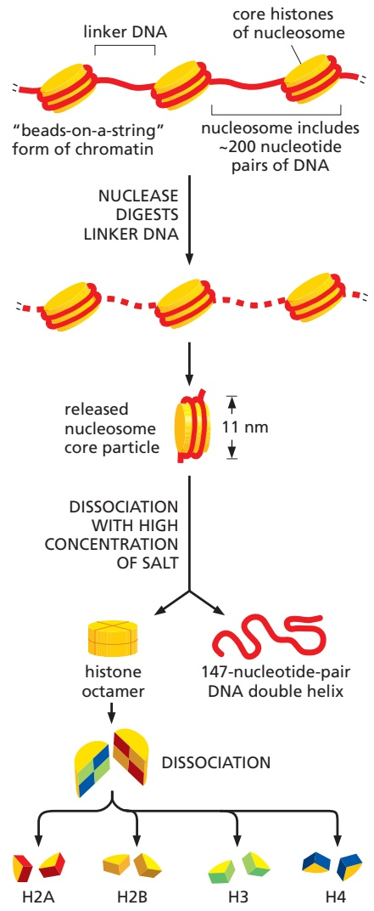

<small>Figure 4–22 Structural organization of the nucleosome. A nucleosome contains a protein core made of eight histone molecules. In biochemical experiments, the nucleosome core particle can be released from isolated chromatin by digestion of the linker DNA with a nuclease, an enzyme that hydrolyzes the phosphodiester bonds that connect the nucleotides in DNA. (The nuclease can degrade the exposed linker DNA but cannot attack the DNA wound tightly around the nucleosome core.) After dissociation of the isolated nucleosome into its protein core and DNA, the length of the DNA that was wound around the core can be determined. This length of 147 nucleotide pairs is sufficient to wrap 1.7 times around the histone core.</small>

Figure 4–23 The structure of a nucleosome core particle, as determined by x-ray diffraction analyses of crystals. Each histone is colored according to the scheme in Figure 4–22, with the DNA double helix in light gray. One H3 N-terminal tail (green) can be seen extending from the nucleosome core; the positions of the tails of the other histones could not be determined, due to their disorder. (Adapted from K. Luger et al., Nature 389:251–260, 1997.)

The bending of the DNA requires a substantial compression of the minor groove of the DNA helix. Certain dinucleotides in the minor groove are especially

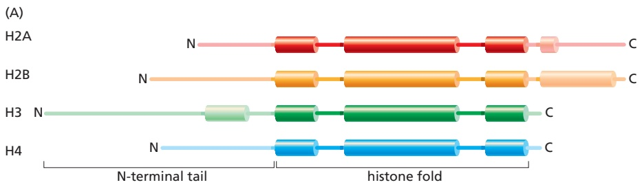

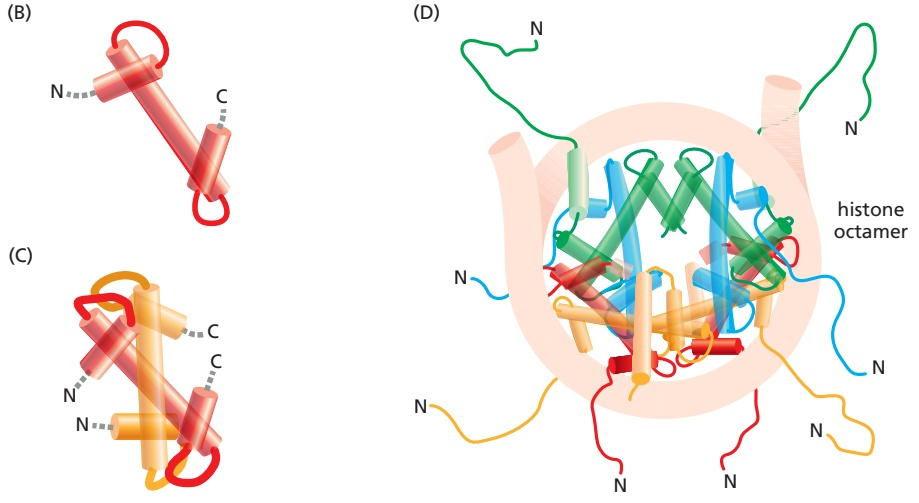

Figure 4–24 The overall structural organization of the core histones. (A) Each of the core histones contains an N-terminal tail, which is subject to several forms of covalent modification, and a histone fold region, as indicated. (B) The structure of the histone fold, which is formed by all four of the core histones. (C) Histones H2A and H2B form a dimer through an interaction known as the “handshake.” Histones H3 and H4 form a dimer through the same type of interaction. (D) The final histone octamer around which the DNA is wound. Note that all eight N-terminal tails of the histones protrude from the disc-shaped core structure. Their conformations are highly flexible, and they serve as binding sites for sets of other proteins.

easy to compress, and some nucleotide sequences bind the histone core more tightly than others (**Figure 4–25**). This probably explains some striking, but unusual, cases of very precise positioning of nucleosomes along a stretch of DNA. However, the sequence preference of nucleosomes must be weak enough to allow other factors to dominate, inasmuch as nucleosomes can occupy any one of a number of positions relative to the DNA sequence in most chromosomal regions.

In addition to its histone fold, each of the core histones has a largely unstructured N-terminal amino acid “tail,” which extends out from the DNA–histone core (see Figure 4–24D). These histone tails are “hot spots” for different types of covalent modifications that control critical aspects of chromatin structure and function, as we shall discuss shortly.

As a reflection of their fundamental role in DNA function through controlling chromatin structure, the histones are among the most highly conserved eukaryotic proteins. For example, the amino acid sequence of histone H4 from a pea differs from that of a human at only two of the 102 positions. Although histones H2A and H2B have been somewhat less constrained in their evolution than histones H3 and H4, such a strong evolutionary conservation suggests that the functions of histones involve nearly all of their amino acids, so that a change in any position is deleterious to the cell.

Figure 4–25 The bending of DNA in a nucleosome. The DNA helix makes 1.7 tight turns around the histone octamer. This diagram illustrates how the minor groove is compressed on the inside of the turn. Owing to structural features of the DNA molecule, the indicated dinucleotides are preferentially accommodated in such a narrow minor groove, which helps to explain why certain DNA sequences will bind more tightly than others to the nucleosome core.

In addition to this remarkable conservation, eukaryotic organisms also produce smaller amounts of specialized variant core histones that differ in amino acid sequence from the main ones. As discussed later, these variants, combined with the surprisingly large number of covalent modifications that can be added to the histones in nucleosomes, give rise to a variety of chromatin structures in cells.

#### Nucleosomes Have a Dynamic Structure and Are Frequently Subjected to Changes Catalyzed by ATP-dependent Chromatin-remodeling Complexes

For many years biologists thought that, once formed in a particular position on DNA, a nucleosome would remain fixed in place because of the very tight association between its core histones and DNA. If true, this would pose problems for genetic readout mechanisms, which require easy access to many specific DNA sequences. It would also hinder the rapid passage of the DNA transcription and replication machinery through chromatin. But kinetic experiments show that the DNA in an isolated nucleosome unwraps from each end at a rate of about four times per second, remaining exposed for 10–50 milliseconds before the partially unwrapped structure recloses. Thus, most of the DNA in an isolated nucleosome is in principle available for binding other proteins (see Figure 7–12).

Inside a cell, a further loosening of DNA–histone contacts is clearly required, because eukaryotic cells contain a variety of ATP-dependent chromatinremodeling complexes. These abundant proteins include a subunit that hydrolyzes ATP (an ATPase evolutionarily related to the DNA helicases discussed in Chapter 5). This “motor subunit” binds both to the protein core of the nucleosome and to the double-stranded DNA that winds around it. By using the energy of ATP hydrolysis to move this DNA relative to the core, the remodeling complex changes the structure of a nucleosome temporarily, making the DNA less tightly bound to the histone core. Through repeated cycles of ATP hydrolysis that pull the DNA helix along the nucleosome core, a remodeling complex can catalyze nucleosome sliding (**Figure 4–26**). Because nucleosomes are frequently repositioned in this way, all of the DNA sequences in chromatin are potentially available for binding to other proteins in the cell.

In addition, some types of remodeling complexes are able to remove either all or part of the nucleosome core from a nucleosome—catalyzing either an exchange of its H2A–H2B histones or the complete removal of the octameric core from the DNA (**Figure 4–27**). As a result, a typical nucleosome is replaced on the DNA every 1 or 2 hours inside the cell.

Cells contain dozens of different ATP-dependent chromatin-remodeling complexes that are specialized for different roles, with roughly one complex present per five nucleosomes. Most are large protein complexes that can contain 10 or more subunits, some of which bind to specific modifications on histones. The activity of these complexes is controlled by the cell. As genes are turned on and off, chromatin-remodeling complexes are brought to specific regions of DNA where they act locally to influence chromatin structure (discussed in Chapter 7).

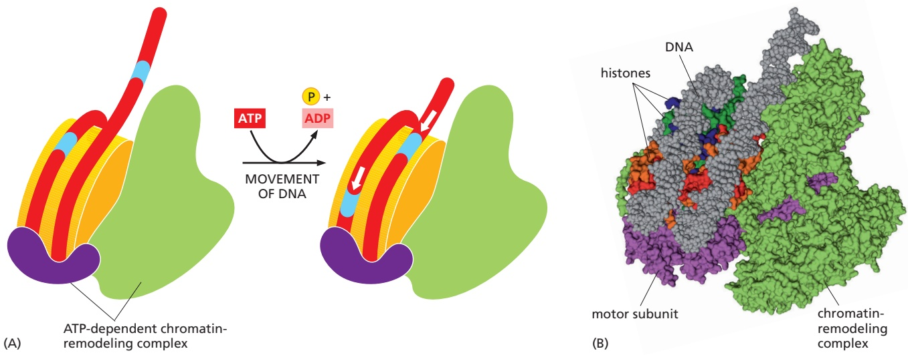

Figure 4–26 The nucleosome movements catalyzed by ATP-dependent chromatin-remodeling complexes. (A) Using the energy of ATP hydrolysis, a remodeling complex that catalyzes nucleosome sliding pulls on the DNA of its bound nucleosome and loosens its attachment to the histone octamer. Each cycle of ATP binding, ATP hydrolysis, and release of the ADP and phosphate products thereby moves the DNA in the direction of the arrows in this diagram. Because each cycle moves the DNA by one base pair, it requires many such cycles to produce the nucleosome sliding shown. (B) The structure of the yeast SWR1 chromatin-remodeling complex. This complex catalyzes an exchange of an H2A–H2B dimer for a dimer that contains an H2A histone variant. Its ATP-driven motor subunit is colored purple. (B, PDB code: 6GEJ.)

Although some DNA sequences bind more tightly than others to the nucleosome core (see Figure 4–25), the most important influence on nucleosome positioning appears to be the presence of other tightly bound proteins on the DNA. Some bound proteins favor the formation of a nucleosome adjacent to them. Others create obstacles that force the nucleosomes to move elsewhere. The exact positions of nucleosomes along a stretch of DNA therefore depend mainly on the presence and nature of other proteins bound to the DNA. And due to the presence of ATP-dependent chromatin-remodeling complexes, the arrangement of nucleosomes on DNA can be highly dynamic, changing rapidly according to the needs of the cell.

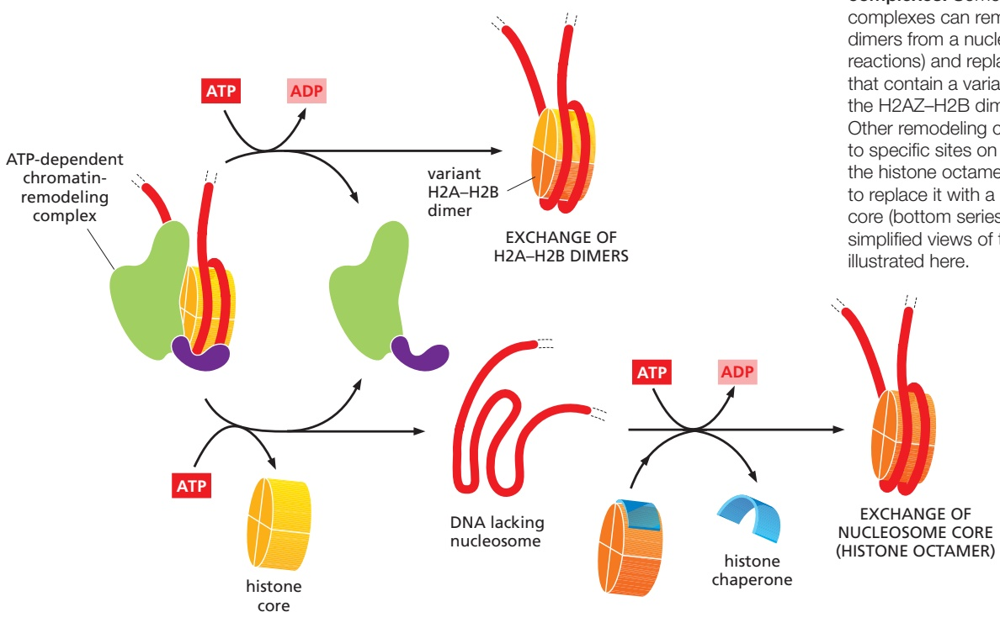

Figure 4–27 Nucleosome removal and histone exchange catalyzed by ATP-dependent chromatin-remodeling complexes. Some chromatin-remodeling complexes can remove the H2A–H2B dimers from a nucleosome (top series of reactions) and replace them with dimers that contain a variant histone, such as the H2AZ–H2B dimer (see Figure 4–36). Other remodeling complexes are attracted to specific sites on chromatin to remove the histone octamer completely and/or to replace it with a different nucleosome core (bottom series of reactions). Highly simplified views of the processes are illustrated here.

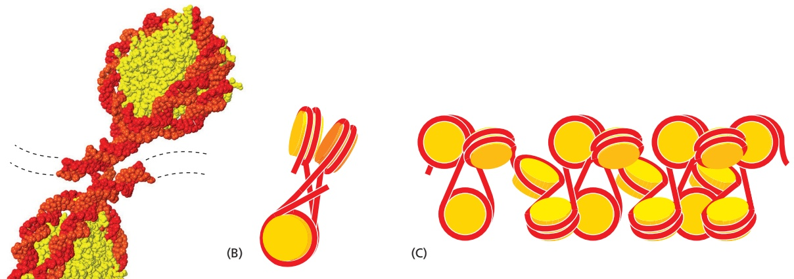

Figure 4–28 A zigzag model for the chromatin fiber. (A) The conformation of two of the four nucleosomes in a tetranucleosome, from a structure determined by x-ray crystallography. (B) Schematic of the entire tetranucleosome; the fourth nucleosome is not visible, being stacked on the bottom nucleosome and behind it in this diagram. (C) Diagrammatic illustration of a possible zigzag structure in the chromatin fiber. (A, PDB code: 1ZBB; C, adapted from C.L. Woodcock, Nat. Struct. Mol. Biol. 12:639–640, 2005.)

#### Attractions Between Nucleosomes Compact the Chromatin Fiber

Although enormously long strings of nucleosomes form on the chromosomal DNA, chromatin in a living cell probably rarely adopts the extended “beadson-a-string” form. Instead, the nucleosomes are packed on top of one another, generating arrays in which the DNA is more highly condensed. Thus, when nuclei are very gently lysed onto an electron microscope grid, much of the chromatin is seen to be in the form of a fiber that is considerably wider than an individual nucleosome (see Figure 4–21A).

How nucleosomes are organized into condensed arrays is unclear. The structure of a tetranucleosome (a complex of four nucleosomes) obtained by x-rayMB C7 4.28/4.28 crystallography and high-resolution electron microscopy of reconstituted chromatin has been used to support a zigzag model for the stacking of nucleosomes (**Figure 4–28**). But cryo-electron microscopy of carefully prepared nuclei suggests that most regions of chromatin are less regularly structured.

What causes nucleosomes to stack on each other? Nucleosome-to-nucleosome attractions that involve histone tails, most notably the H4 tail, constitute one important factor (**Figure 4–29**). In addition, an additional histone is often present in a 1-to-1 ratio with nucleosome cores, known as **histone H1**. This so-called linker histone is larger than the individual core histones, and it has been considerably less well conserved during evolution. A nucleosome can bind a single histone H1 molecule; this H1 molecule contacts both the DNA and the histone octamer and changes the path of the DNA as it exits from the nucleosome

Figure 4–29 A model for the role played by histone tails in the compaction of chromatin. (A) A schematic diagram shows the approximate exit points of the eight N-terminal histone tails, one from each histone protein, that extend from each nucleosome. The actual structure is shown to its right. In the high-resolution structure of the nucleosome, most of the histone tails are not visible, suggesting that they are relatively unstructured and highly flexible. (B) As indicated, the histone tails are thought to be involved in interactions between nucleosomes that help to hold them together. (A, PDB code: 1KX5.)

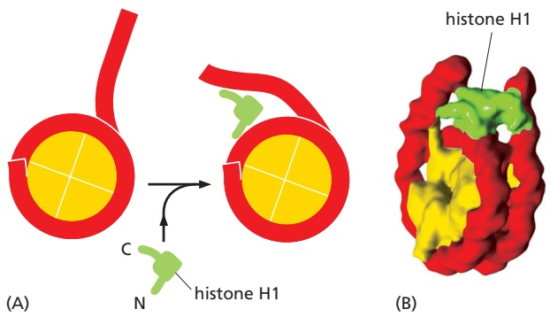

(Figure 4–30). The change in the exit path of DNA is thought to help compact nucleosomal DNA. The presence of many other DNA-binding proteins, as well as proteins that bind directly to histones, is certain to add important additional features to any array of nucleosomes.

Figure 4–30 How the linker histone binds to the nucleosome. The position and structure of histone H1 are shown. H1 constrains the DNA where it exits from the nucleosome and thereby compacts chromatin. (A) Schematic, and (B) structure inferred for a single nucleosome from a structure determined by high-resolution electron microscopy of a reconstituted chromatin fiber. (B, adapted from F. Song et al., Science 344:376–380, 2014.)

#### Summary

A gene is a nucleotide sequence in a DNA molecule that acts as a functional unit for the production of a protein, a structural RNA, or a catalytic or regulatory RNA molecule. In eukaryotes, protein-coding genes are usually composed of a string of alternating introns and exons associated with regulatory regions of DNA. A chromosome is formed from a single, enormously long DNA molecule that contains a linear array of many genes, bound to a large set of proteins. The human genome contains 3.1 3 109 DNA nucleotide pairs, divided between 22 different autosomes (present in two copies each) and 2 sex chromosomes. Only a small percentage of this DNA codes for proteins or functional RNA molecules. A chromosomal DNA molecule also contains three other types of important nucleotide sequences: replication origins and telomeres allow the DNA molecule to be efficiently replicated, while a centromere attaches the sister DNA molecules to the mitotic spindle, ensuring their accurate segregation to daughter cells during the M phase of the cell cycle.

The DNA in eukaryotes is tightly bound to an equal mass of histones, which form repeated arrays of DNA–protein particles called nucleosomes. The nucleosome is composed of an octameric core of histone proteins around which the DNA double helix is wrapped. Nucleosomes are spaced at intervals of about 200 nucleotide pairs, and they associate with neighboring nucleosomes to create a more compact chromatin fiber. Chromatin structure must be highly dynamic to allow access to the DNA. Some spontaneous DNA unwrapping and rewrapping occurs in the nucleosome itself; however, the general strategy for reversibly changing local chromatin structure in a cell features ATP-driven chromatin-remodeling complexes. Cells contain a large set of such complexes, which are targeted to specific regions of chromatin at appropriate times. The remodeling complexes allow nucleosome cores to be repositioned, reconstituted with different histones, or completely removed to expose the underlying DNA.

<!-- END EN EN04-H000-H018 -->

### 英文补充：基因组大小、重复序列与基因组演化

> 对应中文板块：基因组大小、重复序列与基因组演化。英文来源：Molecular Biology of the Cell，第7版，第4章；[本章完整原文](../来源/英文教材/04_DNA_Chromosomes_and_Genomes/chapter.md)。物理PDF页码范围：222–291（整章范围）。

<!-- BEGIN EN EN04-H044-H066 -->
#### HOW GENOMES EVOLVE

In this final section of the chapter, we provide an overview of some of the ways that genes and genomes have evolved over time to produce the vast diversity of modern-day life-forms on our planet. The complete sequencing of the genomes of thousands of organisms is revolutionizing our view of the process of evolution, uncovering an astonishing wealth of information about not only family relationships among organisms, but also the molecular mechanisms by which evolution has proceeded.

Much of life’s chemistry is shared between all organisms, from bacteria to humans, and it is thus not surprising that genes with similar functions can be found in a diverse range of living things. But the great revelation of the past 40 years has been the extent to which the actual nucleotide sequences of many genes have been conserved. Homologous genes—that is, genes that are similar in both their nucleotide sequence and function because of a common ancestry—can often be recognized across vast phylogenetic distances. Unmistakable homologs of many human genes are present in organisms as diverse as nematode worms, fruit flies, yeasts, plants, and even bacteria. In many cases, the resemblance is so close that, for example, the protein-coding portion of a yeast gene can be substituted with its human homolog—even though humans and yeast are separated by more than a billion years of evolutionary history.

Now that human genome sequencing is being carried out at the population level, with more than a million genomes thus far available for comparison, the extent to which natural selection constrains our own DNA sequence is being analyzed in intimate detail. The results are useful for revealing exactly which bits of our genome are functional. In addition, the data are advancing the field of pre-cision medicine, with health implications both for the individuals whose genomes are sequenced and for their future generations.

As emphasized in Chapter 3, the recognition of sequence similarity has become a major tool for inferring gene and protein function. Although a sequence match does not guarantee similarity in function, it has proved to be an excellent clue. Thus, it is often possible to predict the function of genes in humans for which no biochemical or genetic information is available simply by comparing their nucleotide sequences with the sequences of genes that have been characterized in other more readily studied organisms.

In general, the sequences of individual genes are much more tightly conserved than is overall genome structure. Features of genome organization such as genome size, number of chromosomes, order of genes along chromosomes, abundance and size of introns, and amount of repetitive DNA are found to differ greatly when comparing distant organisms, as does the number of genes that each organism contains.

#### Genome Comparisons Reveal Functional DNA Sequences by Their Conservation Throughout Evolution

A first obstacle in interpreting the sequence of the 3.1 billion nucleotide pairs in the human genome is the fact that the nucleotide sequence of most of it (about 90%) is probably functionally unimportant. The regions of the genome that code for the amino acid sequences of proteins (the exons) are typically found in short segments (median size about 130 nucleotide pairs), small islands in a sea of DNA whose exact nucleotide sequence is thought to be mostly of little consequence. This arrangement can make it difficult to identify all the exons in a stretch of DNA, and it is often hard also to determine exactly where a gene begins and ends.

One very important approach to deciphering our genome is to search for DNA sequences that are closely similar between different species, on the principle that DNA sequences that have a function are much more likely to be conserved than those without a function. For example, humans and mice are thought to have diverged from a common mammalian ancestor about $9 0 \times 1 0 ^ { 6 }$ years ago, which is long enough for the majority of nucleotides in their genomes to have been changed by random mutational events. Consequently, the only regions that will have remained closely similar in the two genomes are those in which mutations would have impaired function and put the animals carrying them at a disadvantage, resulting in their elimination from the population by natural selection. Such closely similar pieces of DNA sequence are known as conserved DNA regions. In addition to revealing those DNA sequences that encode functionally important exons and RNA molecules, these conserved regions will include regulatory DNA sequences as well as DNA sequences with functions that are not yet known but which are inferred to be somehow important. In contrast, most nonconserved DNA regions will reflect DNA whose sequence is much less likely to be critical for function.

The power of this method can be increased by including in such comparisons the genomes of large numbers of species whose genomes have been sequenced, such as rat, chicken, fish, dog, and chimpanzee, as well as mouse and human. By revealing in this way the results of a very long natural “experiment,” lasting for hundreds of millions of years, such comparative DNA sequencing studies have highlighted some of the most interesting regions in our genome. The comparisons reveal that about 4.5% of the human genome consists of multispecies conserved sequences. To our great surprise, only about one-fourth of these sequences code for proteins (see Table 4–1, p. 194). Most of the remaining conserved sequences consist of DNA that is thought to contain clusters of protein-binding sites involved in gene regulation, while others produce RNA molecules that are not translated into protein but are important for other reasons.

When the DNA sequences of hundreds of thousands of individual humans are compared, an additional 5% of our genome shows a reduced variation in the human population, which implies that the sequences in this 5% of the genome are also important. Taken together, these analyses suggest that only about 10% of the human genome contains nucleotide sequences that truly matter.

The important question of how much of the DNA sequence of the human genome is functionally relevant was briefly confused by a set of high-profile publications that appeared in 2012 from a large, federally funded US genome project named ENCODE. These publications, which reported the results of a massive survey using sensitive assays that can detect the presence of RNA molecules in cells at extremely low levels, reported that 76% of the total DNA sequence in human cells is transcribed to produce RNA molecules. Even though many of these transcripts were found at levels of less than a single RNA molecule per cell, the ENCODE scientists used such data to assert that most of human DNA is functional, with very little “junk.” This claim received widespread publicity, along with their belief that our genome contains tens of thousands of previously undetected genes that produce RNA molecules that do not code for protein.

As previously stated, there is a strong scientific consensus that most of the human genome consists of DNA whose nucleotide sequence is not relevant to biological function—being the so-called junk. This conclusion rests on the finding that natural selection fails to preserve these sequences in the face of the inevitable random changes to genomes that occur over time, as can be seen both when different species are compared and from detailed analyses of human variation. The fact that these DNA sequences nevertheless produce an occasional RNA molecule can be explained by the occurrence of background “noise” in gene expression. Although gene expression is very accurate, it is not perfect, and biochemical errors occasionally occur. Such errors are to be expected, and so long as they are kept at a low level, they are thought to have little or no consequence for the cell.

#### Genome Alterations Are Caused by Failures of the Normal Mechanisms for Copying and Maintaining DNA, as Well as by Transposable DNA Elements

Evolution depends on accidents and mistakes followed by nonrandom survival. Most of the genetic changes that occur result simply from failures in the normal mechanisms by which genomes are copied or repaired when damaged, although the movement of transposable DNA elements (discussed shortly) also plays an important part. As we will explain in Chapter 5, the mechanisms that maintain DNA sequences are remarkably precise—but errors will occur. DNA sequences are inherited with such extraordinary fidelity that typically, along a given line of descent, only about one nucleotide pair in a thousand is randomly changed in the human germ line every million years. Even so, in a population of 10,000 diploid individuals, every possible nucleotide substitution will have been “tried out” on about 20 occasions in the course of a million years—a short span of time in relation to the evolution of species.

Errors in DNA replication, DNA recombination, or DNA repair can lead either to simple local changes in DNA sequence—so-called point mutations such as the substitution of one base pair for another—or to large-scale genome rearrangements such as deletions, duplications, inversions, and translocations of DNA from one chromosome to another. In addition to these rare failures of the genetic machinery, genomes contain mobile DNA elements that are an important source of genomic change (see Table 5–3, p. 286). These transposable DNA elements (transposons) are parasitic DNA sequences that can spread within the genomes they colonize. In the process, they often disrupt the function or alter the regulation of existing genes. On occasion, they have created altogether novel genes through fusions between transposon sequences and segments of existing genes. Over long periods of evolutionary time, DNA transposition events have profoundly affected genomes, so much so that nearly half of the DNA in the human genome consists of recognizable relics of past transposition events (**Figure 4–63**). Even more of our genome is thought to have been derived from transpositions occurring so long ago (>108 years) that, due to the accumulation of mutations, the sequences can no longer be traced to transposons.

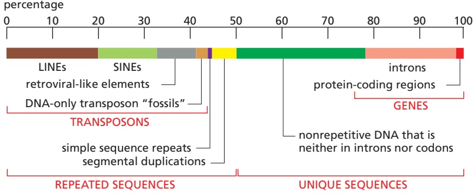

Figure 4–63 A representation of the nucleotide sequence content of the sequenced human genome. The LINEs (long interspersed nuclear elements), SINEs (short interspersed nuclear elements), retroviral-like elements, and DNA-only transposons are mobile genetic elements that have multiplied in our genome by replicating themselves and inserting the new copies in different positions. These mobile genetic elements are discussed in Chapter 5 (see Table 5–3, p. 286). Simple sequence repeats are short nucleotide sequences (fewer than 14 nucleotide pairs) that are repeated again and again for long stretches. Segmental duplications are large blocks of DNA sequence (1000–200,000 nucleotide pairs) that are present at two or more locations in the genome. Most of the highly repeated blocks of DNA in heterochromatin have not yet been completely sequenced; therefore, about 10% of human DNA sequences are not represented in this diagram. (Data courtesy of E. Margulies.)

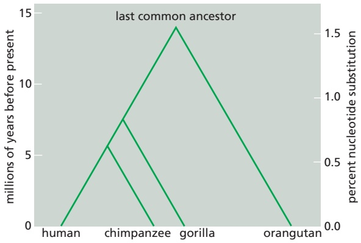

Figure 4–64 A phylogenetic tree showing the relationship between humans and the great apes based on nucleotide sequence data. As indicated, the sequences of homologous portions of the genomes of all four species are estimated to differ from the sequence of the genome of their last common ancestor by a little over 1.5%. Because changes occur independently on both diverging lineages, pairwise comparisons will reveal twice the sequence divergence from the last common ancestor. For example, human–chimpanzee comparisons show divergences of approximately 1.2%. (Modified from F.C. Chen and W.H. Li, Am. J. Hum. Genet. 68:444–456, 2001.)

#### The Genome Sequences of Two Species Differ in Proportion to the Length of Time Since They Have Separately Evolved

The differences between the genomes of all species alive today have accumulatedMBoC7 m4.63/4.64 over more than 3 billion years. Although we lack a direct record of changes over time, scientists can reconstruct the process of genome evolution from detailed comparisons of the genomes of contemporary organisms.

The basic organizing framework for comparative genomics is the phylogenetic tree. A simple example is the tree describing the divergence of humans from the great apes (**Figure 4–64**). The primary support for this tree comes from comparisons of genome sequences. For example, comparisons between the sequences of human genes or proteins and those of the great apes typically reveal the fewest differences between human and chimpanzee and the most between human and orangutan.

For closely related organisms such as humans and chimpanzees, it is relatively easy to reconstruct the gene sequences of the extinct, last common ancestor of the two species (**Figure 4–65**). The close similarity between human and chimpanzee

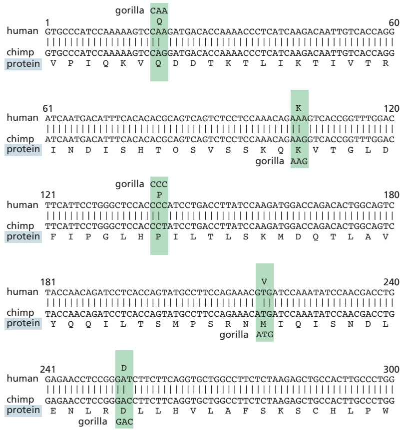

Figure 4–65 Tracing the ancestral sequence from a sequence comparison of the coding regions of human and chimpanzee leptin genes. Reading left to right and top to bottom, a continuous 300-nucleotide segment of a leptin-coding gene is illustrated. Leptin is a hormone that regulates food intake and energy utilization in response to the adequacy of fat reserves. As indicated by the codons boxed in green, only 5 nucleotides (of 441 total) differ between the two species. Moreover, in only one of the five positions does the difference in nucleotide lead to a difference in the encoded amino acid. For each of the five variant nucleotide positions, the corresponding sequence in the gorilla is also indicated. In two cases, the gorilla sequence agrees with the human sequence, while in three cases it agrees with the chimpanzee sequence.

What was the sequence of the leptin gene in the last common ancestor? The most economical assumption is that evolution has followed a pathway requiring the minimum number of mutations consistent with the data. Thus, it seems likely that the leptin sequence of the last common ancestor was the same as the human and chimpanzee sequences when they agree. When they disagree, the gorilla sequence can be used as a tiebreaker, a conclusion that should be tested by including the sequences from other great apes. For convenience, only the first 300 nucleotides of the leptincoding sequences are given. The remaining 141 are identical between humans and chimpanzees.

genes is mainly due to the short time that has been available for the accumulation of mutations in the two diverging lineages, rather than to functional constraints that have kept the sequences the same. Evidence for this view comes from the observation that the human and chimpanzee genomes are nearly identical even where there is no functional constraint on the nucleotide sequence—such as in the third position of “synonymous” codons (codons specifying the same amino acid but differing in their third nucleotide).

For much less closely related organisms, such as humans and chickens (which have evolved separately for about 300 million years), the sequence conservation found in genes is almost entirely due to **purifying selection** (that is, selection that eliminates individuals carrying mutations that interfere with important genetic functions), rather than to an inadequate time for mutations to occur.

#### Phylogenetic Trees Constructed from a Comparison of DNA Sequences Trace the Relationships of All Organisms

Phylogenetic trees based on molecular sequence data can be compared with the fossil record, and we get our best view of evolution by integrating the two approaches. The fossil record remains essential as a source of absolute dates, which are based on radioisotope decay in the rock formations in which each fossil is found. Because the fossil record has many gaps, however, precise divergence times between species are difficult to establish, even for species that leave good fossils with a distinctive morphology.

Phylogenetic trees whose timing has been calibrated according to the fossil record suggest that changes in the sequences of particular genes or proteins tend to occur at a nearly constant rate, although rates that differ from the norm by as much as twofold are observed in particular lineages. This provides us with a molecular clock for evolution—or rather a set of molecular clocks corresponding to different categories of DNA sequence. As in the example in **Figure 4–66**, the clock runs most rapidly and regularly in sequences that are not subject to purifying selection. These include portions of introns that lack splicing or regulatory signals, the third position in synonymous codons, and genes that have been irreversibly inactivated by mutation (the so-called pseudogenes). The clock runs most slowly for sequences that are subject to strong functional constraints; for example, the amino acid sequences of proteins such as histones that engage in specific interactions with large numbers of other proteins and whose structure is therefore highly constrained, or the nucleotide sequences that encode the RNA subunits of the ribosome, on which all protein synthesis depends.

Occasionally, rapid change is seen in a previously highly conserved sequence. As discussed later in this chapter, such episodes are especially interesting because they are thought to reflect periods of strong positive selection for mutations that have conferred a selective advantage in the particular lineage where the rapid change occurred.

The pace at which molecular clocks run during evolution is determined not only by the degree of purifying selection but also by the mutation rate. Notably, in animals, although not in plants, clocks based on functionally unconstrained mitochondrial DNA sequences run much faster than clocks based on functionally unconstrained nuclear sequences, because the mutation rate in animal mitochondria is exceptionally high.

Figure 4–66 The very different rates of evolution of exons and introns, as illustrated by comparing a portion of the mouse and human leptin genes. Starting at top left and ending at bottom right, the DNA sequences of one exon and its adjacent intron are compared for human and mouse leptin genes. Positions where the sequences differ by a single nucleotide substitution are boxed in green, and positions that differ by the addition or deletion of nucleotides are boxed in yellow. Note that, thanks to purifying selection, the coding sequence of the exon is much more conserved than is the adjacent intron sequence.

#### mouse

exon intron

GTGCCTATCCAGAAAGTCCAGGATGACACCAAAACCCTCATCAAGACCATTGTCACCAGGATCAATGACATTTCACACACGGTA-GGAGTCTCATGGGGGGACAAAGATGTAGGACTAGA GTGCCCATCCAAAAAGTCCAAGATGACACCAAAACCCTCATCAAGACAATTGTCACCAGGATCAATGACATTTCACACACGGTAAGGAGAGT-ATGCGGGGACAAA---GTAGAACTGCA human

#### mouse

ACCAGAGTCTGAGAAACATGTCATGCACCTCCTAGAAGCTGAGAGTTTAT-AAGCCTCGAGTGTACAT-TATTTCTGGTCATGGCTCTTGTCACTGCTGCCTGCTGAAATACAGGGCTGA GCCAG--CCC-AGCACTGGCTCCTAGTGGCACTGGACCCAGATAGTCCAAGAAACATTTATTGAACGCCTCCTGAATGCCAGGCACCTACTGGAAGCTGA--GAAGGATTTGAAAGCACA human

Figure 4–67 A phylogenetic tree showing the evolutionary relationships of some present-day mammals. The length of each line is proportional to the number of neutral substitutions; that is, nucleotide changes at sites where there is assumed to be no purifying selection. (Adapted from G.M. Cooper et al., Genome Res. 15:901–913, 2005. With permission from Cold Spring Harbor Laboratory Press.)

Categories of DNA for which the clock runs fast are most informative for recent evolutionary events; the mitochondrial DNA clock has been used, for example, to chronicle the divergence of the Neanderthal lineage from that of modern Homo sapiens. To study ancient evolutionary events, one must examine DNA for which the clock runs unusually slowly; thus, the divergence of the major branches of theMBoC7 m4.66/4.67 tree of life—bacteria, archaea, and eukaryotes—has been deduced from study of the sequences specifying ribosomal RNA.

In general, molecular clocks, appropriately chosen, have a finer time resolution than that of the fossil record, and they are a more reliable guide to the detailed structure of phylogenetic trees than are classical methods of tree construction, which are based on family resemblances in anatomy and embryonic development. For example, the precise family tree of great apes and humans was not settled until sufficient molecular sequence data accumulated in the 1980s to produce the pedigree shown previously in Figure 4–64. And with huge amounts of DNA sequence now determined from a wide variety of mammals, much better estimates of our relationship to them are being obtained (**Figure 4–67**).

#### A Comparison of Human and Mouse Chromosomes Shows How the Structures of Genomes Diverge

As would be expected, the human and chimpanzee genomes are much more alike than are the human and mouse genomes, even though all three genomes are roughly the same size and contain nearly identical sets of genes. Mouse and human lineages have had approximately 90 million years to diverge through accumulated mutations, versus 6 million years for humans and chimpanzees. In addition, rodent lineages (represented by the rat and the mouse in Figure 4–67) have unusually fast molecular clocks and have diverged from the human lineage more rapidly than otherwise expected.

While the way that the genome is organized into chromosomes is almost identical between humans and chimpanzees, this organization has diverged greatly between humans and mice. According to rough estimates, a total of about 180 chromosome breakage-and-rejoining events have moved large blocks of DNA sequence in the human and mouse lineages since they last shared a common ancestor. As a result, although the number of chromosomes is similar in the two species (23 per haploid genome in the human versus 20 in the mouse), their overall structures differ greatly. Even so, there are many large blocks of DNA in which the gene order is the same in the human and the mouse. These stretches of conserved gene order in chromosomes are referred to as regions of synteny. **Figure 4–68** illustrates the extent of this synteny by showing how segments of

Figure 4–68 Synteny between human and mouse chromosomes. In this diagram, the human chromosome set is shown, with each part of each chromosome colored according to the mouse chromosome with which it is syntenic. The color coding used for each mouse chromosome is shown at the bottom of the figure.

Heterochromatic highly repetitive regions (such as centromeres) that are difficult to sequence cannot be mapped in this way; these are colored black. (Adapted from E.E. Eichler and D. Sankoff, Science 301:793–797, 2003. With permission from AAAS.)

mouse chromosomes map onto the human chromosome set. For much more distantly related vertebrates, such as chicken and human, the number of breakage-and-rejoining events has been much greater, and the regions of synteny are much shorter; in addition, these regions are often hard to discern because of theMB C7 m4.67/4.68 divergence of the DNA sequences they contain.

An unexpected conclusion from a detailed comparison of the complete mouse and human genome sequences, confirmed by subsequent comparisons between the genomes of other vertebrates, is that small blocks of DNA sequence are being deleted from and added to genomes at a surprisingly rapid rate. Thus, if we assume that our common ancestor had a genome of human size (about 3.1 billion nucleotide pairs), mice would have lost a total of about 45% of that genome from accumulated deletions during the past 90 million years, while humans would have lost about 25%. However, substantial sequence gains from many small chromosome duplications and from the multiplication of transposons have compensated for these deletions. As a result of this series of gains and losses, the size of our genome is thought to be practically unchanged from that of the last common ancestor of humans and mice, while the mouse genome is smaller by only about 0.4 billion nucleotides.

Good evidence for the loss of DNA sequences in small blocks during evolution can be obtained from a detailed comparison of regions of synteny in the human and mouse genomes. The comparative shrinkage of the mouse genome can be clearly seen from such comparisons, with the net loss of sequences scattered throughout the long stretches of DNA that are otherwise homologous (**Figure 4–69**).

mouse chromosome 12

Figure 4–69 Comparison of a syntenic portion of mouse and human genomes. About 90% of the two genomes can be aligned in this way. Note that while there is an identical order of the matched index sequences (red marks), there has been a net loss of DNA in the mouse lineage that is interspersed throughout the entire region. This type of net loss is typical for all such regions, and it accounts for the fact that the mouse genome contains 14% less DNA than does the human genome. (Adapted from Mouse Genome Sequencing Consortium, Nature 420:520–562, published 2002 by Nature Publishing Group. Reproduced with permission of SNCSC.)

Figure 4–70 A comparison of the b-globin gene cluster in the human and mouse genomes, showing the locations of transposable elements. This stretch of the human genome contains five functional β-globin–like genes (orange); the comparable region from the mouse genome has only four. The positions of the human Alu sequences are indicated by green circles, and the positions of the human L1 sequences are indicated by red circles.

The mouse genome contains different but related transposable elements: the positions of B1 elements (which are related to the human Alu sequences) are indicated by blue triangles, and the positions of the mouse L1 elements (which are related to the human L1 sequences) are indicated by orange triangles. The absence of transposable elements from the globin structural genes can be attributed to purifying selection, which would have eliminated any insertion that compromised gene function. (Courtesy of Ross Hardison and Webb Miller.)

DNA is added to genomes both by the spontaneous duplication of chromosomal segments that are typically tens of thousands of nucleotide pairs long (as will be discussed shortly) and by insertion of new copies of active transposons. Most transposition events are duplicative, because the original copy of the transposon stays where it was when a copy inserts at the new site; see, for example, Figure 5–59. Comparison of the DNA sequences derived from transposons in the human and the mouse readily reveals some of the sequence additions (**Figure 4–70**). In contrast, the nucleotide sequences and positions of the transposons in human and chimpanzee are very similar, indicating that their movement occurred before the two species diverged.

It remains a mystery why all mammals have maintained genome sizes of roughly 3 billion nucleotide pairs that contain nearly identical sets of genes, even though 90% of this DNA appears not to be under sequence-specific functional constraints.

#### The Size of a Vertebrate Genome Reflects the Relative Rates of DNA Addition and DNA Loss in a Lineage

In more distantly related vertebrates, genome size can vary considerably, apparently without a drastic effect on the organism or its number of genes. Thus, the chicken genome, at 1 billion nucleotide pairs, is only about one-third the size of the mammalian genome, even though it contains nearly the same number of genes. An extreme example is the puffer fish, Fugu rubripes (**Figure 4–71A**), which has a tiny genome for a vertebrate (0.4 billion nucleotide pairs compared to 1 billion or more for most other fish). The small size of the Fugu genome is largely due to the small size of its introns and intergenic regions. Specifically, Fugu introns, as well as other noncoding segments of the Fugu genome, lack the repetitive DNA that makes up a large portion of the genomes of most well-studied vertebrates. Nevertheless, the positions of the Fugu introns between the exons of each gene are almost the same as in mammalian genomes (**Figure 4–72**).

While initially a mystery, we now have a simple explanation for such large differences in genome size between similar organisms: because all vertebrates experience a continual process of DNA loss and DNA addition, the size of a genome merely depends on the balance between these opposing processes acting over millions of years. Suppose, for example, that in the lineage leading to Fugu, the rate of DNA addition happened to slow greatly. Over long periods of time, this would result in a major “cleansing” from this fish genome of those DNA sequences whose loss could be tolerated. The result is an unusually compact genome, relatively free of junk and clutter, but retaining through purifying selection the vertebrate DNA sequences that are functionally important. This makes Fugu, with its 400 million nucleotide pairs of DNA, a valuable resource for genome research aimed at understanding humans.

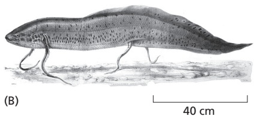

Figure 4–71 Two fish with very different genome sizes. The puffer fish, Fugu rubripes (A), has a genome size that is 300 times smaller than that of the West African lungfish, Protopterus annectens (B). (A, Courtesy of Byrappa Venkatesh; B, History and Art Collection/Alamy Stock Photo.)

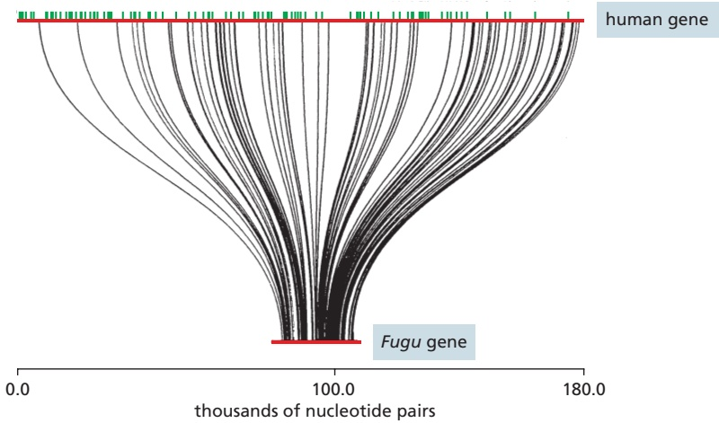

Figure 4–72 Comparison of the genomic sequences of the human and Fugu genes encoding the protein huntingtin. Both genes (indicated in red) contain 67 short exons that align in 1:1 correspondence to one another; these exons are connected by curved lines. The human gene is 7.5 times larger than the Fugu gene (180,000 versus 24,000 nucleotide pairs). The size difference is entirely due to larger introns in the human gene. The larger size of the human introns is due in part to the presence of retrotransposons (discussed in Chapter 5), whose positions are represented by MBoC7 m4.71/4.72green vertical lines; the Fugu introns lack retrotransposons. In humans, mutation of the huntingtin gene causes Huntington’s disease, an inherited neurodegenerative disorder. (Adapted from S. Baxendale et al., Nat. Genet. 10:67–76, published 1995 by Nature Publishing Group. Reproduced with permission of SNCSC.)

At the other end of the scale, some fish—such as the primitive-looking lungfish—have enormous genomes, more than 300 times the size of that of Fugu and 30 times the size of that of humans (**Figure 4–71B**). Most of the extra DNA consists of transposons and other repeated DNA sequences, suggesting that genome additions have greatly exceeded losses in this lineage.

#### Multispecies Sequence Comparisons Identify Many Conserved DNA Sequences of Unknown Function

The mass of DNA sequence now in freely accessible databases (hundreds of billions of nucleotide pairs) provides a rich resource that scientists can mine for many purposes. This information can be used not only to unscramble the evolutionary pathways that have led to modern organisms, but also to provide insights into how cells and organisms function. Perhaps the most remarkable discovery in this realm comes from the observation that a striking amount of DNA sequence that does not code for protein has been conserved during mammalian evolution (see Table 4–1, p. 194). This is most clearly revealed when we align and compare DNA synteny blocks from many different species, thereby identifying large numbers of so-called multispecies conserved sequences: some of these code for protein, but most of them do not.

Many of the conserved sequences that do not code for protein are now known to produce untranslated RNA molecules, such as the thousands of long noncoding RNAs (lncRNAs) that are thought to have important functions in regulating gene transcription. As we shall also see in Chapter 7, many others are regions of DNA scattered throughout the genome that directly bind proteins involved in gene regulation. But the function of much of the conserved noncoding DNA remains a mystery. This enigma highlights how much more we need to learn about the fundamental biological mechanisms that operate in animals and other complex organisms, and its solution is certain to have profound consequences for medicine.

How can cell biologists tackle the mystery of noncoding conserved DNA? Traditionally, attempts to determine the function of a puzzling DNA sequence begin by looking at the consequences of its experimental disruption. But many DNA sequences that are crucial for an organism in the wild can be expected to have no noticeable effect on its phenotype under laboratory conditions: what is required for a mouse to survive in a laboratory cage is very much less than what is required for it to succeed in nature. Moreover, calculations based on population genetics reveal that just a tiny selective advantage—less than a 0.1% difference in survival—can be enough to strongly favor retaining a particular DNA sequence over evolutionary time spans. One should therefore not be surprised to find that many conserved DNA sequences can be deleted from the mouse genome without any noticeable effect on that mouse in a laboratory.

#### Changes in Previously Conserved Sequences Can Help Decipher Critical Steps in Evolution

Given genome sequence information, we can tackle another intriguing question: What alterations in our DNA have made humans so different from other animals— or for that matter, what makes any individual species so different from its relatives? For example, as soon as both the human and the chimpanzee genome sequences became available, scientists began searching for DNA sequence changes that might account for the striking differences between us and chimpanzees. With 3.1 billion nucleotide pairs to compare in the two species, this might seem an impossible task. But the job was made much easier by confining the search to 35,000 clearly defined multispecies conserved sequences (a total of about 5 million nucleotide pairs), representing parts of the genome that are most likely to be functionally important. Though these sequences are conserved strongly, they are not conserved perfectly, and when the version in one species is compared with that in another they are generally found to have drifted apart by a small amount corresponding simply to the time elapsed since the last common ancestor. In a small proportion of cases, however, one sees signs of a sudden evolutionary spurt. For example, some DNA sequences that have been highly conserved in other mammalian species are found to have accumulated nucleotide changes exceptionally rapidly during the 6 million years of human evolution since we diverged from the chimpanzees. These human accelerated regions (HARs) are thought to reflect functions that have been especially important in making us different in some useful way.

About 50 such sites were identified in one study, one-fourth of which were located near genes associated with neural development. The sequence exhibiting the most rapid change (18 changes between human and chimpanzee, compared to only two changes between chimpanzee and chicken) was examined further and found to encode a 118-nucleotide noncoding RNA molecule, HAR1F (human accelerated region 1F), that is produced in the human cerebral cortex at a critical time during brain development. The function of this HAR1F RNA is not yet known, but findings of this type are stimulating research studies that may shed light on crucial features of the human brain.

A related approach in the search for the important mutations that contributed to human evolution likewise begins with DNA sequences that have been conserved during mammalian evolution, but rather than screening for accelerated changes in individual nucleotides, it focuses instead on chromosome sites that have experienced deletions in the 6 million years since our lineage diverged from that of chimpanzees. More than 500 such sequences—conserved among other species but deleted in humans—have been discovered. Each deletion removes an average of 95 nucleotides of DNA sequence. Only one of these deletions affects a protein-coding region: the rest are thought to alter regions that affect how nearby genes are expressed, an expectation that has been experimentally confirmed in a few cases. A large proportion of the presumed regulatory regions identified in this way lie near genes that affect neural function and/or near genes involved in steroid signaling, suggesting that changes in the nervous system and in immune or reproductive functions have played an especially important role in human evolution.

#### Mutations in the DNA Sequences That Control Gene Expression Have Driven Many of the Evolutionary Changes in Vertebrates

The vast hoard of genomic sequence data now being accumulated can be explored in many other ways to reveal events that happened even hundreds of millions of years ago. For example, one can attempt to trace the origins of the regulatory elements in DNA that have played critical parts in vertebrate evolution. One such study began with the identification of nearly 3 million noncoding sequences, averaging 28 base pairs in length, that have been conserved in recent vertebrate evolution while being absent in more ancient ancestors. Each of these special noncoding sequences is likely to represent a functional innovation peculiar to a particular branch of the vertebrate family tree, and most of them are thought to consist of regulatory DNA that governs the expression of a neighboring gene. Given full genome sequences, one can identify the genes that appear most likely to have fallen under the sway of these novel regulatory elements. By comparing many different species, with known divergence times, one can also estimate when each such regulatory element came into existence as a conserved feature.

The findings suggest remarkable evolutionary differences between the various functional classes of genes (**Figure 4–73**). Conserved regulatory elements that originated early in vertebrate evolution—that is, more than about 300 million years ago, which is when the mammalian lineage split from the lineage leading to birds and reptiles—seem to be mostly associated with genes that code for transcription regulatory proteins and for proteins with roles in organizing embryonic development. Then came an era when the regulatory DNA innovations arose next to genes coding for receptors for extracellular signals. Finally, over the course of the past 100 million years, the regulatory innovations seem to have been concentrated in the neighborhood of genes coding for proteins (such as protein kinases) that function to modify other proteins post-translationally.

Many questions remain to be answered about these phenomena and what they mean. One possible interpretation is that the logic—the circuit diagram—of the gene regulatory network in vertebrates was established early, and that more recent evolutionary change has mainly occurred through the tuning of quantitative parameters. This could help to explain why, among the mammals, for example, the basic body plan—the topology of the tissues and organs—has been largely conserved.

Figure 4–73 The types of changes in gene regulation inferred to have predominated during the evolution of our vertebrate ancestors. To produce the information summarized in this plot, wherever possible the type of gene regulated by each conserved noncoding sequence was inferred from the identity of its closest protein-coding gene. The time when each conserved sequence became fixed in the vertebrate lineage was then used to derive the conclusions shown. (Based on C.B. Lowe et al., Science 333:1019–1024, 2011.)

#### Gene Duplication Also Provides an Important Source of Genetic Novelty During Evolution

Evolution depends on the creation of new genes, as well as on the modification of those that already exist. How does this occur? When we compare organisms that seem very different—a primate with a rodent, for example, or a mouse with a fish—we rarely encounter genes in the one species that have no homolog in the other. Genes without homologous counterparts are relatively scarce even when we compare such divergent organisms as a mammal and a worm. On the other hand, we frequently find gene families that have different numbers of members in different species. To create such families, genes have been repeatedly duplicated, and the copies have then diverged to take on new functions that often vary from one species to another.

Gene duplication occurs at high rates in all evolutionary lineages, contributing to the vigorous process of DNA addition discussed previously. In a detailed study of spontaneous duplications in yeast, duplications of 50,000–250,000 nucleotide pairs were commonly observed, most of which were tandemly repeated. These appeared to result from DNA replication errors that led to the inexact repair of double-strand chromosome breaks. A comparison of the human and chimpanzee genomes reveals that, since the time that these two organisms diverged, such segmental duplications have added about 5 million nucleotide pairs to each genome every million years, with an average duplication size being about 50,000 nucleotide pairs (although there are some duplications five times larger). In fact, if one counts nucleotides, duplication events have created more differences between our two species than have single-nucleotide substitutions.

#### Duplicated Genes Diverge

What is the fate of newly duplicated genes? In most cases, there is presumed to be little or no selection—at least initially—to maintain the duplicated state because either copy can provide an equivalent function. Hence, many duplication events are likely to be followed by loss-of-function mutations in one or the other gene. This cycle would functionally restore the one-gene state that preceded the duplication. Indeed, there are many examples in contemporary genomes where one copy of a duplicated gene can be seen to have become irreversibly inactivated by multiple mutations. Over time, the sequence similarity between such a **pseudogene** and the functional gene whose duplication produced it would be expected to be eroded by the accumulation of many mutations in the pseudogene—the homologous relationship eventually becoming undetectable.

An alternative fate for gene duplications is for both copies to remain functional, while diverging in their sequence and pattern of expression, thus taking on different roles. This process of duplication and divergence almost certainly explains the presence of large families of genes with related functions in biologically complex organisms, and it is thought to play a critical role in the evolution of increased biological complexity. An examination of many different eukaryotic genomes suggests that the probability that any particular gene will undergo a duplication event that spreads to most or all individuals in a species is approximately 1% every million years.

Whole-genome duplications offer particularly dramatic examples of the duplication–divergence cycle. A whole-genome duplication can occur quite simply: all that is required is one round of genome replication in a germ-line cell lineage without a corresponding cell division. Initially, the chromosome number simply doubles. Such abrupt increases in the ploidy of an organism are common, particularly in fungi and plants. After a whole-genome duplication, all genes exist as duplicate copies. However, unless the duplication event occurred so recently that there has been little time for subsequent alterations in genome structure, the results of a series of segmental duplications—occurring at different times— are hard to distinguish from the end product of a whole-genome duplication. In mammals, for example, the role of whole-genome duplications versus a series of piecemeal duplications of DNA segments is quite uncertain. Nevertheless, it is clear that a great deal of gene duplication has occurred in the distant past.

Analysis of the genome of the zebrafish, in which at least one whole-genome duplication is thought to have occurred hundreds of millions of years ago, has cast some light on the process of gene duplication and divergence. Although many duplicates of zebrafish genes appear to have been lost by mutation, a significant fraction—perhaps as many as 30–50%—have diverged functionally while both copies have remained active. In many cases, the most obvious functional difference between the duplicated genes is that they are expressed in different tissues or at different stages of development. One attractive theory to explain such an end result imagines that different, mildly deleterious mutations occur quickly in both copies of a duplicated gene set. For example, one copy might lose expression in a particular tissue as a result of a regulatory mutation, while the other copy loses expression in a second tissue. After such an occurrence, both gene copies would be required to provide the full range of functions that were once supplied by a single gene; hence, both copies would now be protected from loss through inactivating mutations. Over a longer period, each copy could then undergo further changes through which it could acquire new, specialized features.

#### The Evolution of the Globin Gene Family Shows How DNA Duplications Contribute to the Evolution of Organisms

The globin gene family provides an especially good example of how DNA duplication generates new proteins, and its evolutionary history has been worked out particularly well. The unmistakable similarities in amino acid sequence and structure among the present-day globins indicate that they all must derive from a common ancestral gene, even though some are now encoded by widely separated genes in the mammalian genome.

We can reconstruct some of the past events that produced the various types of oxygen-carrying hemoglobin molecules by considering the different forms of the protein in organisms at different positions on the tree of life. A molecule like hemoglobin was necessary to allow multicellular animals to grow to a large size, because large animals cannot simply rely on the diffusion of oxygen through the body surface to oxygenate their tissues adequately. But oxygen plays a vital part in the life of nearly all living organisms, and oxygen-binding proteins homologous to hemoglobin can be recognized even in plants, fungi, and bacteria. In animals, the simplest oxygen-carrying molecule is a globin polypeptide chain of about 150 amino acids that is found in many marine worms, insects, and primitive fish. The hemoglobin molecule in more complex vertebrates, however, is composed of two kinds of globin chains. It appears that about 500 million years ago, just before fish and mammals diverged from their common ancestor, a series of gene mutations and duplications occurred. These events established two slightly different globin genes in the genome of each individual, coding for α-globin and β-globin chains that associate to form a hemoglobin molecule consisting of two α chains and two β chains (**Figure 4–74**). The four oxygen-binding sites in the α2β2 molecule interact, allowing a cooperative allosteric change in the molecule as it binds and releases oxygen, which enables hemoglobin to take up and release oxygen more efficiently than can the single-chain version.

Still later, during the evolution of mammals, the β-chain gene apparently underwent duplication and mutation to give rise to a second β-like chain that

single-chain globin binds one oxygen molecule

oxygenbinding site on heme

EVOLUTION OF A SECOND GLOBIN CHAIN BY GENE DUPLICATION FOLLOWED BY MUTATION

four-chain globin binds four oxygen molecules in a cooperative manner

<small>Figure 4–74 A comparison of the structure of one-chain and four-chain globins. The four-chain globin shown is hemoglobin, which is a complex of two α-globin and two β-globin chains. The onechain globin present in some primitive vertebrates represents an intermediate in the evolution of the four-chain globin. With oxygen bound it exists as a monomer; without oxygen it dimerizes. (PDB code: 2DHB.)</small>

is synthesized specifically in the fetus. The resulting hemoglobin molecule has a higher affinity for oxygen than that of adult hemoglobin and thus helps in the transfer of oxygen from the mother to the fetus. The gene for the new β-like chain subsequently duplicated and mutated again to produce two new genes, ε and $\gamma ,$ the ε chain being produced earlier in development (to form $\alpha _ { 2 } \varepsilon _ { 2 } )$ than the fetal γ chain, which forms α2γ2. A duplication of the adult β-chain gene occurred still later, during primate evolution, to give rise to a δ-globin gene and thus to a minor form of hemoglobin $\left( \alpha _ { 2 } \delta _ { 2 } \right)$ that is found only in adult primates (**Figure 4–75**).

Each of these duplicated genes has been modified by point mutations that affect the properties of the final hemoglobin molecule, as well as by changes in regulatory regions that determine the timing and level of expression of the gene. As a result, each globin is made in different amounts at different times of human development.

The history of these gene duplications is reflected in the arrangement of hemoglobin genes in the genome. In the human genome, the genes that arose from the original β gene are arranged as a series of homologous DNA sequences located within 50,000 nucleotide pairs of one another on a single chromosome. A similar cluster of human α-globin genes is located on a separate chromosome. Not only other mammals, but birds too have their α-globin and β-globin gene clusters on separate chromosomes. In the frog Xenopus, however, they are together, suggesting that a chromosome translocation event in the lineage of birds and mammals separated the two gene clusters about 300 million years ago, soon after our ancestors and those of amphibians diverged (see Figure 4–75).

There are several duplicated globin DNA sequences in the α-globin and β-globin gene clusters that are not functional genes but pseudogenes. These have a close sequence similarity to the functional genes but have been disabled by mutations that prevent their expression as functional proteins. The existence of such pseudogenes makes it clear that, as expected, not every DNA duplication leads to a new functional gene. Indeed, the human genome is thought to contain more pseudogenes than genes.

#### Genes Encoding New Proteins Can Be Created by the Recombination of Exons

The role of DNA duplication in evolution is not confined to the expansion of gene families. It can also act on a smaller scale to create single genes by stringing together short duplicated segments of DNA. The proteins encoded by genes generated in this way can be recognized by the presence of repeating similar protein domains, which are covalently linked to one another in series. The immunoglobulins (**Figure 4–76**), for example, as well as most fibrous proteins (such as collagens) are encoded by genes that have evolved by repeated duplications of a primordial DNA sequence.

In genes that have evolved in this way, as well as in many other genes, each separate exon often encodes an individual protein folding unit, or domain. It is believed that the organization of DNA coding sequences as a series of such exons separated by long introns has greatly facilitated the evolution of new proteins. The duplications necessary to form a single gene coding for a protein with repeating domains, for example, can easily occur by breaking and rejoining the DNA anywhere in the long introns on either side of an exon. Without introns there would be only a few sites in the original gene at which a recombinational exchange between DNA molecules could duplicate the domain and not disrupt it. Moreover, introns often contain sequences that are repeated many times in a genome, facilitating recombination between different introns. By enabling recombination at many potential sites rather than just a few, introns increase the probability that a duplication event will produce a new protein.

More generally, we know from genome sequences that the various parts of genes—both their individual exons and their regulatory elements—have served as modular elements that have been duplicated and moved about the genome to create the great diversity of living things. Thus, for example, many present-day

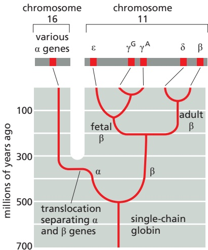

Figure 4–75 An evolutionary scheme for the globin chains that carry oxygen in the blood of animals. The scheme emphasizes the β-like globin gene family. A relatively recent gene duplication of the γ-chain gene produced γG and γA, which are fetal β-like chains of identical function. The location of the globin genes in the human genome is shown at the top of the figure.

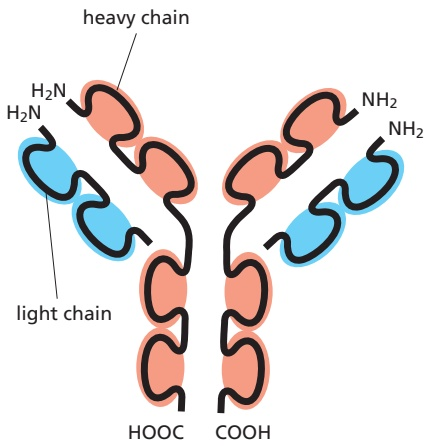

Figure 4–76 Schematic view of an antibody (immunoglobulin) molecule. This molecule is a complex of two identical heavy chains (orange) and two identical light chains (blue). Each heavy chain contains four similar, covalently linked domains, while each light chain contains two such domains. Each of these domains is encoded by a separate exon, and all of MBoC7 m4.77/4.76the exons are thought to have evolved by the serial duplication of a single ancestral exon.

proteins are formed as a patchwork of domains from different origins, reflecting their complex evolutionary history (see Figure 3–15).

#### Neutral Mutations Often Spread to Become Fixed in a Population, with a Probability That Depends on Population Size

In comparisons between two species that have diverged from one another by millions of years, it makes little difference which individuals from each species are compared. For example, typical human and chimpanzee DNA sequences differ from one another by about 1%. In contrast, when the same region of the genome is sampled from two randomly chosen humans, the differences are typically about 0.1%. For more distantly related organisms, the interspecies differences outshine intraspecies variation even more dramatically. However, each “fixed difference” between the human and the chimpanzee (in other words, each difference that is now characteristic of all or nearly all individuals of each species) started out as a new mutation in a single individual. If the size of the interbreeding population in which the mutation occurred is N, the initial allele frequency for a new mutation would be 1/(2N) for a diploid organism. How does such a rare mutation become fixed in the population, and hence become a characteristic of the species rather than of a few scattered individuals?

The answer to this question depends on the functional consequences of the mutation. If the mutation has a significantly deleterious effect, it will simply be eliminated by purifying selection and will not become fixed. (In the most extreme case, the individual carrying the mutation will die without producing progeny.) Conversely, the rare mutations that confer a major reproductive advantage on individuals who inherit them can spread rapidly in the population. Because humans reproduce sexually and genetic recombination occurs each time a gamete is formed (discussed in Chapter 5), the genome of each individual who has inherited the mutation will be a unique recombinational mosaic of segments inherited from a large number of ancestors. The selected mutation along with a modest amount of neighboring sequence—ultimately inherited from the individual in which the mutation occurred—will simply be one piece of this huge mosaic.

The great majority of mutations that are not harmful are not beneficial either. These selectively neutral mutations can also spread and become fixed in a population. In fact, neutral mutations make a large contribution to evolutionary change in genomes. For example, as we saw earlier, they account for most of the DNA sequence differences between apes and humans. The spread of neutral mutations is not as rapid as the spread of the rare strongly advantageous mutations. It depends on a random variation in the number of mutation-bearing progeny produced by each mutation-bearing individual: through a sort of “random walk” process, the mutant allele may eventually become extinct or it may become commonplace. This can be modeled mathematically for an idealized interbreeding population, on the assumption of constant population size and random mating. While neither of these assumptions matches human population history, this idealized case reveals the general principles.

When a new neutral mutation occurs in a population of constant size N that is undergoing random mating, the probability that it will ultimately become fixed is approximately 1/(2N). This is because there are 2N copies of the gene in the diploid population, and each of them has an equal chance of becoming the pre-dominant version in the long run. For those mutations that do become fixed, the mathematics shows that the average time to fixation is approximately 4N generations. Detailed analyses of data on human genetic variation have suggested an ancestral population size of approximately 10,000 at the time when the current pattern of genetic variation was largely established. With a population that has reached this size, the probability that a new, selectively neutral mutation would become fixed is small (1/20,000), while the average time to fixation would be on the order of 800,000 years (assuming a 20-year generation time). Thus, while we know that the human population has grown enormously since the development of agriculture approximately 15,000 years ago, most of the present-day set of common human genetic variants reflects a mixture of variants that was already present long before this time, when the human population was still small.MBoC7 m4.78/4.77

Figure 4–77 How founder effects can determine the set of genetic variants in a population of individuals belonging to the same species. In this diagram, each dot is used to represent an individual, with different colors used to denote the different variants of a particular gene. This example illustrates how, by a chance event that greatly reduces population size, an allele that is initially rare in a large population (red) can become established at high frequency in a new population, even though the mutation that produced it has no selective advantage—or is even mildly deleterious.

Similar arguments explain another phenomenon with important practical implications for genetic counseling. In an isolated community descended from a small group of founders, such as the people of Iceland or the Jews of Eastern Europe, a variant form of a gene that is rare in the human population as a whole can often be present at a high frequency, even if that variant is mildly deleterious (**Figure 4–77**).

#### We Can Trace Human History by Analyzing Genomes

The genomes of ancestral organisms can be inferred, but most can never be directly observed. DNA is very stable compared with most organic molecules, but it is not perfectly stable, and its progressive degradation, even under the best circumstances, means that it is extremely difficult to extract sequence information from fossils that are more than a million years old. Although a modern organism such as the horseshoe crab looks remarkably similar to fossil ancestors that lived 200 million years ago, there is every reason to believe that the horseshoe-crab genome has been changing during all that time in much the same way as in other evolutionary lineages, and at a similar rate. Selection must have maintained key functional properties of the horseshoe-crab genome to account for the morphological stability of the lineage. However, comparisons between different present-day organisms show that the fraction of the genome subject to purifying selection is small; hence, it is fair to assume that the sequence of the genome of the modern horseshoe crab, while preserving features critical for function, must differ greatly from that of its extinct ancestors, known to us only through the fossil record.

It is possible to get direct sequence information by examining DNA samples from ancient materials if these are not too old. In recent years, technical advances have allowed DNA sequencing from exceptionally well-preserved bone fragments that date from more than 100,000 years ago. Although any DNA this old will be imperfectly preserved, genome sequences can be reconstructed from many millions of short DNA sequences. In 2010, investigators completed their analysis of the first Neanderthal genome, obtained from DNA that was extracted from a fossilized bone fragment found in a cave in Croatia. The average difference in DNA sequence between humans and Neanderthals shows that our two lineages diverged somewhere between 270,000 and 440,000 years ago, well before the time that humans are believed to have migrated out of Africa. Neanderthals are one of our closest evolutionary relatives, and they lived side by side with the ancestors of modern humans in Europe and Western Asia. By comparing the Neanderthal genome sequence with those of people from different parts of the world, these studies revealed that many modern humans—particularly those from Europe and Asia—share about 2% of their genomes with Neanderthals. This genetic overlap indicates that our ancestors mated with Neanderthals—before outcompeting or actively exterminating them—on the way out of Africa. These and other ancient relationships still being discovered have thus left a permanent mark in the human genome (**Figure 4–78**).

But what about deciphering the genomes of much older ancestors, those for which no useful DNA samples can be isolated? For organisms that are as closely related as human and chimpanzee, we saw that this may not be difficult: reference to the gorilla sequence can be used to sort out which of the few sequence differences between human and chimpanzee are inherited from our common ancestor some 6 million years ago (see Figure 4–65). And for an ancestor that has generated a large number of different species alive today, the DNA sequences of the existing species can be compared simultaneously to unscramble much of the ancestral sequence, allowing scientists to derive DNA sequences much farther back in time. For example, from the genome sequences obtained for dozens of modern placental mammals, it should be possible to infer much of the genome sequence of their 100-million-year-old common ancestor—the precursor of species as diverse as dog, mouse, rabbit, armadillo, and human (see Figure 4–67).

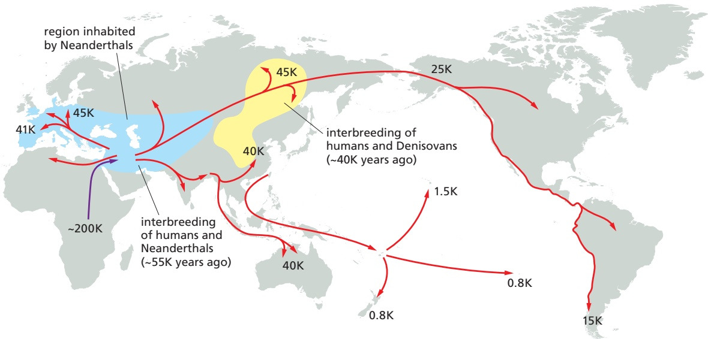

Figure 4–78 Tracing the course of human history by analyses of genome sequences. Modern humans arose in Africa approximately 200,000–300,000 years ago, where the earliest fossils of Homo sapiens are found. One small group—perhaps as few as 10,000 individuals—migrated northward, and their descendants spread across the globe. As these ancestral humans left Africa, around 60,000–80,000 years ago (purple arrow), they encountered Neanderthals who inhabited the region indicated in blue. As a result of interbreeding, the humans who subsequently spread throughout Europe and Asia (red arrows) carried with them traces of Neanderthal DNA. Many of those moving eastward would later also interbreed with Denisovans (yellow), a second type of ancient human. Later, ancestral humans continued their global spread to the New World, reaching North America approximately 25,000 years ago and the southern regions of South America 10,000 years later. This scenario is based on many types of data, including fossil records, anthropological studies, and the genome MBoC7 e9.37/4.78sequences of Neanderthals, Denisovans, and modern humans from around the world. (Adapted from M.A. Jobling et al., Human Evolutionary Genetics, 2nd ed. New York: Garland Science, 2014.)

Once the amino acid sequence of an ancestral protein has been inferred, that protein can be readily produced in pure form using the recombinant DNA methods described in Chapter 8. By thus “resurrecting” the extinct protein, its biochemical properties can be compared to those of its modern counterparts. These procedures can be repeated at several branch points in the protein’s evolutionary history, allowing that protein’s stepwise evolution over many millions of years to be directly measured. This approach provides scientists with a powerful way to visualize evolution in action. It can also help us to understand why modern proteins look and behave the way they do.

#### The Sequencing of Hundreds of Thousands of Human Genomes Reveals Much Variation

Even though the common variant alleles among modern humans originate from the variants present in a comparatively tiny group of ancestors, the total number of variants that exist among modern humans is huge. This is because unavoidable errors occur in the replication and maintenance of our DNA sequences, as will be explained in Chapter 5. As a result, every person is born with 50–100 new changes, termed de novo mutations, in the DNA sequences that they inherit from their parents. Thus, new mutations are constantly occurring and accumulating in human populations. But the vast majority of the variants they create are extremely rare in the human population as a whole, because they arose among a huge number of relatively recent births.

Modern DNA sequencing technologies have made it possible to determine the genome sequences for millions of humans, at costs that have now dropped below \$1000 per genome. Before introducing what these data show, it is important to define a few basic terms. A variant is typically defined as a genomic location at which two or more versions of a sequence exist in the human population, while an allele refers to the specific form that each such variant takes in a given person. Because humans are diploid organisms, harboring two haploid genomes in their cells (one from their mother and one from their father), if alleles A and B exist for a variant X, an individual’s genotype can be either “A/A,” “A/B,” or “B/B” at that site.

Each human genome sequence is compared to a “reference human genome assembly” that was produced by the public Human Genome Project on the basis of the initial sequences from several individuals. For this comparison, sequence “reads” for millions or billions of DNA fragments obtained from an individual are aligned by a computer to the reference assembly (which is a haploid representation and includes only one allele at each location). The locations at which the sequenced individual displays “alternative” alleles relative to the reference are then identified.

When this is done for many individuals, single-nucleotide variants (SNVs) are found to compose the vast majority of differences among humans. SNVs are points in the genome sequence where some haploid human genomes have one nucleotide, while some have another. They have been extensively characterized because of their abundance, their relative ease of detection, and their value for genetic studies. Historically, the term single-nucleotide polymorphism, or SNP, was reserved for SNVs present at a frequency above 1% in the human population. Today, however, no precise threshold is used to differentiate “rare” and “common” variations, which span frequencies ranging from a singleton “private” variation (present in only one haploid genome within one person) to as high as 50% (a variant with two alleles that exist at equal frequency among human genomes).

Importantly, SNVs are only one type of variation that exists among humans. Structural variants, such as deletions, duplications, inversions, or rearrangements of a variety of lengths, are also prevalent features in our genomes. Additional types of variation—including mobile-element insertions and low-complexity repeat expansions or contractions—are also important components of human genetic diversity.

Two haploid human genomes sampled from the modern world population will differ from one another at roughly 1 per 1,000 nucleotides. This number, however, varies considerably between human populations, and it is affected by historical factors such as population bottlenecks, breeding patterns, and ancestral population sizes. And the more closely related two individuals are to one another, the more similar their genomes will be. The above number does not include the considerable structural diversity present among human genomes. Indeed, because they often affect tens or even hundreds of thousands of nucleotides, structural variants are a large contributor to the total number of nucleotide-level differences between any two human genomes (**Table 4–3**).

#### Most of the Variants Observed in the Human Population Are Common Alleles, with at Most a Weak Effect on Phenotype

A comparison of any one human genome with the reference human genome will typically find 3–5 million locations at which the sequenced individual harbors at least one allele different from that seen in the reference assembly. Some of these variants are heterozygous within that person, which is to say the individual harbors two distinct alleles, typically one that matches the reference and one “alternative” allele. More than 95% of the variant alleles observed within any given person are relatively common, reflecting their ancient origin. A small fraction of variant alleles will be rare; some of these, as described earlier, represent de novo mutations and are extremely rare, potentially existing within only that individual.

TABLE 4–3 Typical Differences Between Any One Human Being’s Genome Sequence and the Reference Human Genome

| Type of difference | Size in nucleotide pairs | Differences per genome |
| --- | --- | --- |
| Single-nucleotide variation (SNV) | 1 | 3-4 million |
| Small deletion or insertion (indel) | 1-49 | 0.4-0.5 million |
| Low-complexity simple sequence repeats (microsatellite and satellite DNA repeats) | 1-200 | 100,000 |
| Mobile-element insertion (SINE, LINE) | 300-7000 | 2000 |
| Structural variation (deletions, duplications, and inversions) | 50 to >1,000,000 | Tens of thousands; length is inversely correlated with frequency |
| Karyotypically visible abnormalities (e.g., aneuploidies) | Chromosome scale | Very rare; most are lethal |

Courtesy of Greg Cooper and Rick Myers, HudsonAlpha Institute for Biotechnology, Huntsville, AL; based on H.J. Abel et al., Nature 583:83–88, 2020; gnomAD (https://www.nature.com/immersive/d42859-020-00002-x/index.html; and https://www.internationalgenome.org).

As will be described in Chapter 8, those SNVs that are frequent in the human genome have been extremely useful for genetic mapping analyses, known as genome-wide association studies (GWAS). Here, one attempts to associate specific human traits (phenotypes) with a large set of alleles that are relatively common in the human population (see p. 526). Most of these frequent SNVs have little or no effect on human fitness. This is as expected, as the deleterious SNVs will have been selected against during human evolution and should therefore be rare. Importantly, this property is generally true of all variation, including structural variation. Indeed, common structural variants also tend to not be deleterious because, if they were, they would not have arisen to appreciable frequencies. Across all forms of variation then, allele frequency is of crucial importance: common variant alleles tend to have at most weak effects on human phenotypes, and large-effect variants tend to be rare. On the other hand, it is important to note that just because a variant is rare does not mean it influences a phenotype; most rare variants, in fact, have little to no effect.

In recent years, GWAS research has identified many associations between common traits, including common diseases, and common alleles. This is a result of the fact that while common alleles tend to have at most weak effects, the combined effects of many common alleles can ultimately produce a large impact on phenotype.

#### Forensic Analyses Exploit Special DNA Sequences with Unusually High Mutation Rates

While mutation rates in humans are generally quite low, typically estimated to be on the order of 10–8 (that is, roughly one mutation every 100 million base pairs), certain sequences with exceptionally high mutation rates stand out. A dramatic example is provided by CACA repeats, which are abundant in the human genome and in the genomes of other eukaryotes. Segments of the genome with the motif (CA)n are replicated with relatively low fidelity because a slippage occurs between the template and the newly synthesized strands during DNA replication; hence, the precise value of n can vary over a considerable range from one genome to the next. These repeats make ideal DNA-based genetic markers because most humans are heterozygous at each of these loci, having inherited one repeat length (n) from their mother and a different repeat length from their father. While the value of n changes sufficiently rarely that most parent–child transmissions propagate CACA repeats faithfully, the changes are sufficiently frequent to maintain high levels of heterozygosity in the human population. Because of this, these and other simple repeats that display exceptionally high variability provide a DNA fingerprint that is widely used for identifying individuals by DNA analysis in crime investigations, paternity suits, and other forensic applications (see Figure 8–37).

#### An Understanding of Human Variation Is Critical for Improving Medicine

While most variations in the human genome are thought to have weak effects on phenotype, a subset of our genome sequence variations must be responsible for the heritable aspects of human individuality. Because it is now possible to sequence individual genomes cheaply and rapidly, we can link even rare alleles with specific phenotypes. We know that even a single nucleotide change that alters one amino acid in a protein can cause a serious disease, as for example in sickle-cell disease, which, although not rare, is caused by such a mutation in hemoglobin (**Movie 4.3**). We also know that gene dosage—a doubling or halving of the copy number of some genes—can have a profound effect on development by altering the level of gene product, as can a change in one of the many regulatory DNA sequences that are dispersed throughout the vast expanse of noncoding DNA in the human genome (see Chapter 7).

Some of the many differences between the genomes of any two human beings will have substantial effects on human health, physiology, behavior, and physique. A major challenge in modern human genetics is to discriminate those differences from the majority that are of little consequence. Significant progress is being made; for instance, we now know the nucleotide changes that give rise to thousands of rare inherited traits and diseases. These and many other results are greatly expanding our understanding of human biology. This understanding is critical for the new field of precision medicine, in which both disease prevention and disease treatments will be tailored to take account of individual genetic differences.

#### Summary

Comparisons of the nucleotide sequences of present-day genomes have revolutionized our understanding of gene and genome evolution. Because of the extremely high fidelity of DNA replication and DNA repair processes, random errors in maintaining the nucleotide sequences in genomes occur rarely (for example, only 50–100 new mutations for every person born). Not surprisingly, therefore, a comparison of human and chimpanzee chromosomes—which are separated by about 12 million years of evolution (double the ∼6 million years since humans and chimps shared a common ancestor)—reveals fixed changes at only ∼1% of base pairs. Not only are our protein-coding sequences highly similar, but also their order on each chromosome is almost identical. Although a substantial number of segmental duplications and segmental deletions have occurred, even the positions of the transposable elements that make up a major portion of our noncoding DNA are mostly unchanged.

When one compares the genomes of two more distantly related organisms— such as a human and a mouse, separated by about 90 million years—one finds many more changes. While selection leaves detectable signatures at all time scales, including for example through comparisons of human genomes to one another or through comparisons of the closely related human and chimp genomes, at greater distances the actions of selection are more pronounced. Comparison of human and mouse genomes, for example, reveal that most coding sequences (exons) and many regulatory regions have been highly conserved by the actions of selection, while huge fractions of our respective genomes have been altered to such an extent that one can detect no similarity at all among them.

Because of purifying selection, the comparison of the genome sequences of multiple related species is an especially powerful way to find DNA sequences with important functions. While it has been estimated that between 8 and 10% of the human genome has been conserved as a result of purifying selection, the function of the majority of this DNA (tens of thousands of sequence elements conserved across mammalian evolution) remains mysterious. Experiments that characterize their functions continue to teach us many new lessons about vertebrate biology.

Other sequence comparisons show that a great deal of the genetic complexity of present-day organisms is due to the expansion of ancient gene families. DNA duplication followed by sequence divergence has clearly been a major source of genetic novelty during evolution. On a more recent time scale, the diploid genomes of any two humans will differ from each other both because of nucleotide substitutions (single-nucleotide variations) and because of inherited DNA gains and DNA losses (structural variations). Deciphering the effects of these differences will improve both medicine and our understanding of human biology.

<!-- END EN EN04-H044-H066 -->

---

## 第9章 细胞核与染色质 · 第三节 染色质的复制与表达

[返回本章](README.md) · [中文本章原文](中文原文.md)

<!-- BEGIN CN CN09-S03 -->
## 第三节 染色质的复制与表达

## 一、染色质的复制与修复

细胞分裂对于生命的维持至关重要（见第十二章）。细胞分裂的第一步是遗传信息的复制。遗传信息的复制不仅仅是DNA的复制，同时包括DNA的载体——核小体的复制，两者正常复制是染色质复制的基础。DNA的复制已经研究得比较深入，但在此不予详述（请参考生物化学或分子遗传学的有关教科书）。核小体的复制是如何进行的至今并不清楚。比如，组蛋白及其修饰是否存在半保留复制机制？鉴于近年来表观遗传学研究的快速发展，相信核小体的复制机制也终将被解释。

## （一）染色质的复制

在真核生物细胞周期的S期，染色质的完全复制不仅需要基因组DNA的复制，也需要把复制好的DNA组装成染色质。普遍认为，在复制叉移动的同时，染色质短暂地解组装，然后在两条复制好的子代DNA链上重新进行组装。新复制的DNA主要通过以下两种途径组装成染色质：第一，在复制叉的移动期间，父代的核小体核心颗粒与DNA分离，到该段DNA复制完成，父代的核小体核心颗粒直接转移到两条子链DNA的一条上；第二，染色质组装因子利用刚刚合成的、乙酰化的组蛋白介导核小体在复制DNA上组装。图9-16显示的是异染色质区域染色质复制的模型以及相关的调节因子。

## （二）染色质的修复与基因组稳定性

染色质的形成，特别是高度浓缩的染色质结构对基因组 DNA（染色质 DNA）具有重要的保护作用。然而，即使如此，因为细胞中的染色质 DNA 随着细胞周期的变化会暴露或部分暴露于其周围环境中，所以，基因组 DNA 会受到细胞内外化学的与物理的因素的作用而产生突变。这种突变有些是致命的，首先导致相关基因功能的丧失，然后导致细胞的死亡或癌化。不过，细胞中存在一整套的 DNA 修复机器来应对各种各样的 DNA 突变（详见第十二章）。细胞一旦丧失了 DNA 修复的部分或全部能力，细胞的基因组就会变得不稳定。基因组的不稳定性是直接导致肿瘤发生的重要原因之一。

此外，修复好的 DNA 必须及时地与组蛋白结合，组装成染色质。否则，裸露的 DNA 很容易被重新突变或断裂。在修复后的 DNA 组装成染色质的过程中（这一过程称染色质修复，chromatin restoration），染色质组装因子 CAF1、组蛋白乙酰转移酶 Tip60、染色质重塑因子 SWI 等起着重要的调节作用。

## 二、染色质的激活与失活

随着20世纪70年代核小体结构的发现，科学家们提出了一个重要问题，那就是RNA聚合酶、转录因子等非组蛋白如何能与同组蛋白核心紧密结合的DNA相互作用？事实上，有证据表明，DNA与核小体组蛋白的结合会阻断DNA与转录因子及基础转录装置的接近，从而阻断了转录的进行。但同时，又有些证据表明，DNA在与组蛋白形成复合物的情况下仍可被转录。所以，这其中的关键问题是虽然DNA都被包装成染色质，但染色质存在不同的活性状态。当前染色质结构改变与基因活化的关系的研究主要集中在如下三个方面：一是如何形成活性染色质，以便RNA聚合酶能起始转录；二是具有转录活性的染色质结构域如何与周围的非活性区域隔离；三是RNA聚合酶如何通过与染色质模板结合进行转录。

## （一）染色质的激活

染色质的疏松状态源于核小体的结构改变或核小体的解聚。根据核小体结构与功能关系，可能有以下原因：

## 1. DNA 结构与核小体相位的变化

和细胞其他部分一样，染色质并不是一个静止的结构，而是一个动态、可塑的蛋白质与核酸组成的复合

  
图9-16 异染色质复制过程示意图  
复制后的 DNA 首先要与核小体结合组感染色质，此后需要进一步浓缩最终形成跟复制前一样的染色质，才能完成染色质的复制。复制后的异染色质标记（主要是 DNA 甲基化和组蛋白甲基化及异染色质蛋白 HP1 的结合）的恢复跟复制蛋白 PCNA（proliferating cell nuclear antigen）和染色质组装因子 CAF1 及密切相关。PCNA 招写 CAF1，CAF1 与 Su（Var）3-9H1（suppressor of variegation 3-9 homolog 1）、MBD1（methyl-CpG-binding domain protein 1）-SetDB1（SET domain bifurcated histone lysine methyltransferase 1）复合物都有相互作用，共同决定该蛋白的甲基化（H3K）。甲基化的组蛋白被 HP1 识别。与此同时，DNA 母链传递到子链的甲基化位点被 Np95（a 95 kDa nuclear protein）识别。Np95与 Dnmt1（DNA methyltransferase 1）结合，使得另一条链上的 DNA 基甲化得以进行。Dnmt1-PCNA 复合物招募 Set8（SET domain-containing protein 8，负责 H4K20 甲基化）、G9a（一种组蛋白赖氨酸甲基转移酶，负责 H3K9 甲基化）、Su（Var）3-9H1、HDAC1 等银蛋白修饰因子，一起最终决定异染色质的颜色与维持。

体。当一个调控蛋白结合到染色质DNA的一个特定的位点上时，不管是在核小体间还是在一个核小体内，染色质都很容易被引发二级结构的改变。这些改变使得其他的一些结合位点与调控蛋白的结合变得要么更加容易，要么更加困难。有证据表明，结合到DNA上的基因调控蛋白能对距离较远的区域产生影响。比如，某一特定的转录因子结合到一段离基因编码区较远的增强子序列上后，有利于在该基因较近的TATA盒序列上进行前起始复合体的组装。该复合体一旦组装后，就可以作为转录因子与其他调控因子结合的“靶点”，结果使染色质上某一特定区域从转录非活化状态转变成转录活化状态。细胞似乎具有某些“工具”能撬开被核小体阻断的DNA区域，从而允许转录因子与DNA接触。例如酵母和人类细胞具有一种多亚基复合物SWI/SNF，利用ATP水解释放的能量破坏组蛋白-DNA之间的相互作用，使转录因子得以同基因调控区结合（图9-17）。此外，不同的拓扑异构酶能调整DNA双螺旋的局部构象和高级结构的变化，使之超螺旋化或松化。实验发现，拓扑异构酶Ⅱ抑制果蝇hsp基因的转录；拓扑异构酶I分布于果蝇多线染色体中具转录活性的基因座上；B型DNA（右旋）变成Z型DNA（左旋），会导致核心组蛋白八聚体与DNA的亲和力降低。核小体并非沿

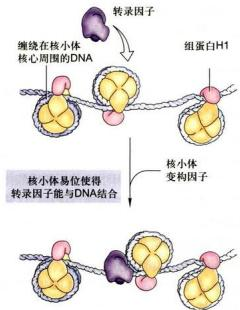  
图 9-17 核小体变构因子通过改变核小体的相位而调节染色质的活性

DNA 随机分布，而通常是定位在特殊位点。一种情况是基因关键调控元件（增强子和启动子）位于核小体颗粒之外，使之便于与转录因子结合；另一种情况是基因调控元件位于盘绕核心组蛋白的 DNA 上，则增强子和启动子两种调控元件通过转录因子被联系起来。

## 2. 组蛋白的修饰

组成核小体的组蛋白八聚体的N端都暴露在核小体之外，某些特殊的氨基酸残基会发生乙酰化、甲基化、磷酸化或 ADP 核糖基化等修饰。这些基团修饰的意义：一是改变染色质的结构，直接影响转录活性；二是核小体表面发生改变，使其他调控蛋白易于和染色质相互接触，间接影响转录活性。

(1) 核心组蛋白的赖氨酸残基乙酰化 (acetylation) 组蛋白的赖氨酸残基乙酰化是核小体变构的一种重要方式。乙酰化后的组蛋白赖氨酸侧链不再带有正电荷，这样就失去了与 DNA 紧密结合的能力，使相邻核小体的聚合受阻，同时影响泛素与组蛋白 H2A 的结合，导致蛋白质的选择性降解。H3 和 H4 是蛋白酶修饰的主要组蛋白，它们的乙酰化可能有类似促旋酶 (gyrase) 的活性，使核小体间的 DNA 因产生过多的负超螺旋而易于从核小体上脱离，致使对核酸酶敏感性增高，并有利于转录调控因子的结合。负责组蛋白乙酰化的酶已经被鉴定。此外，近年来还发现大量的辅激活子 (coactivator) 具有组蛋白乙酰转移酶 (histone acetyltransferase) 的功能，将乙酰基从乙酰 CoA 供体转移到组蛋白特异的赖氨酸残基上（图 9-18）。辅激活子作为一种接头蛋白，在 DNA 上游位点将转录因子同基础转录装置连接起来。通过具有组蛋白乙酰基转移酶活性的辅激活子的作用，特定的启动子可被看做是核小体解体的起始点。由许多激素受体所介导的基因转录可以说明这一途径。当激素受体与 DNA 上相应的激素应答元件 (hormone response element) 结合时，同时与 CBP 辅激活子相互作用，CBP 辅激活子使位于核心启动子区的核小体的组蛋白侧链乙酰化，进而打开启动子并促使转录装置的组装，最终导致相关基因的转录。另一个很好的例子是在酵母中激活因子指导的组蛋白N端的超乙酰化。激活因子GCN4（general control nonrepressed protein 4）的DNA结合域与其调控基因的上游激活序列UAS（upstream activating sequence）结合，然后它的激活结构域与一些组蛋白乙酰化酶复合物相互作用，GCN5的催化亚基就是这样的乙酰化酶之一。随后对GCN4结合的附近核小体组蛋白N端尾巴的大量乙酰化促使基础转录因子与DNA的结合（图9-19）。

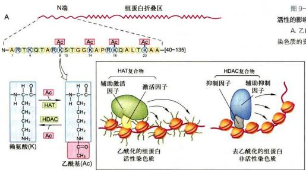  
图9-18 乙酰化和去乙酰化对染色质活性的影响  
A. 乙酰化和去乙酰化的位置。B. 导致染色质的变化。

染色质的乙酰化状态是一种动态过程。细胞内既存在使组蛋白乙酰化的酶即组蛋白乙酰化酶（histone acetylase），也存在使组蛋白去乙酰化的酶即组蛋白去乙酰化酶（histone deacetylase）。组蛋白去乙酰化伴随着对转录的抑制。实际上有许多转录辅助抑制因子(transcriptional co-repressor)作为组蛋白去乙酰化酶而发挥作用。在酵母中，抑制因子能够指导组蛋白N端尾巴的去乙酰化。图9-19显示的是抑制因子UME6的DNA结合域与它所调控的基因的特异的上游控制因子（URS1）相互作用，UME6的抑制结构域RD (repression domain)与SIN3结合，SIN3是一个去乙酰化酶复合物的成分之一，RPD3也是这个复合物的成员。对URS1附近的组蛋白N端尾巴的去乙酰化使得通用转录因子不能与TATA盒结合从而抑制基因转录。

(2) 组蛋白 H1 的磷酸化 (phosphorylation) 组蛋

  
激活因子指导的超乙酰化，组蛋白末端超乙酰化  
图9-19 酵母组蛋白乙酰化与去乙酰化控制转录的作用机制

URS: 上游抑制序列（upstream repression sequence）；UAS: 上游激活序列；RD: 抑制结构域；AD: 激活结构域。

白 H1 丝氨酸残基的磷酸化主要发生在有丝分裂期，细胞分裂后其磷酸化水平下降到峰值的 20%。H1 在染色质组装过程中发挥重要作用，它确定核小体的方向，并对 30 nm 的螺线管起维持稳定的作用。

(3) 不同组蛋白修饰之间的关系 如前所述，乙酰化一般是活性染色质的标志，而甲基化和磷酸化则在活性染色质与非活性染色质中都存在。组蛋白 H3K9 的甲基化在调节基因表达、染色质组装和异染色质的形成过程中发挥重要作用。然而，H3S10 的短暂磷酸化足以使 H3K9 甲基化引起的染色质浓缩变得疏松。这是一个两种组蛋白修饰同时调节染色质组装状态的典型例子：稳定的甲基化和动态的磷酸化标记。

## 3. HMG 蛋白的影响

高速泳动族非组蛋白HMG1和HMG2有A、B和C三个结构域：A、B结构相似，C含有酸性的羧基端尾部，与H1结合。RNA聚合酶I相关的转录因子UBF的DNA结合域是85个氨基酸残基的重复区，与HMG1和HMG2的A、B结构相似，所以这种特征性结构被命名为“HMG”结构域。与这一结构域相应的DNA序列称为“HMG box”，而具有一个或多个HMG结构域的蛋白质称为HMG结构域蛋白。HMG结构域蛋白有细胞特异性，根据结构域拷贝数、序列识别特性和演化关系等分为两个亚簇：一个亚簇广泛存在于各种细胞中，如HMG1和HMG2，UBF（RNA聚合酶I的转录因子）。该类蛋白一般有多个HMG结构域，没有DNA识别特异性，执行不同的功能。另一个亚簇只存在于特定的细胞中，能识别特异的DNA序列，只有一个HMG结构域，如淋巴细胞增强子结合因子LEF1（lymphoid enhancer binding factor 1）、TCF1（T-cell factor 1）和SRY（sex determining region of the Y chromosome）。

HMG结构域蛋白结合在DNA双螺旋的小沟中，以40倍的优势选择富含嘧啶的核苷酸元件。HMG结构域蛋白的功能之一是与DNA弯折和DNA-蛋白质复合体高级结构的形成有关。研究发现，HMG结构域可识别某些异型的DNA结构，使DNA链产生90°\~130°的弯折。一般来说，150 bp的DNA双链很难自发形成环状结构，但在非特异的HMG1存在时，可改变DNA双螺旋结构而形成66 bp的DNA环。具转录活性的核小体常缺乏H1，但有非组蛋白HMG14、HMG17存在。在爪蟾中发现HMG17会促进RNA聚合酶Ⅲ的转录，HMG14则直接参与RNA聚合酶Ⅱ对染色质中

基因的转录。

## （二）染色质的失活

## 1. X染色体失活

通过比较有活性的 X 染色体 ( $X_{i}$ ) 与失活的 X 染色体 ( $X_{i}$ )，我们可以发现：雌性哺乳动物中失活的 X 染色体上的 H4 组蛋白不发生乙酰化，而雄性中有活性的 X 染色体上的 H4 都是乙酰化的，前者不表达，后者表达。用乙酰化 H4 的抗体标记人和小鼠的中期染色体，除 $X_{i}$ 外，其他染色体都被标记，所以中期染色体上 H4 乙酰化程度的高低，可代表基因转录活性的高低。据推算 H2B、H3、H4 可能具有 30 多种不同的乙酰化方式，而每种乙酰化方式都可能使核小体结构发生改变，或使核小体上供给合蛋白识别的表面发生变化，从而对转录起始复合体的组装起不同的作用。

在小鼠胚胎发育的早期是来自父方的X染色体 $\left(\mathrm{X}_{\mathrm{p}}\right)$ 失活，这一过程似乎是印记（imprinting）而来。到囊胚期以后，原先失活的 $X_{p}$ 重新被激活。之后，来自父方的 $X_{p}$ 与来自母方的X染色体 $X_{m}$ 二者之一随机失活。这一过程依赖于一种独特的非翻译RNA $\left(\mathrm{X}_{\mathrm{int}}\right.$ 或X染色体失活特异性转录本）的活性（图9-20）。 $X_{int}$ RNA覆盖于某一X染色体的表面并使之失活，其机制至今仍不清楚。早期 $X_{p}$ 的失活也与 $X_{int}$ 的活性有关，同时伴随着组蛋白H3K4的大量甲基化和H3K9的乙酰化。当大量Polycomb类蛋白在 $X_{p}$ 染色体上聚集后，H3K27也发生甲基化。到目前为止，X染色体失活的调节过程仍然不清楚。

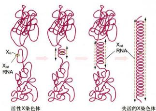  
图9-20 哺乳动物X染色体失活模型  
$X_{ic}$ : X 染色体失活中心; $X_{st}$ RNA: X 染色体失活特异性转录物 RNA (X-inactivation specific transcript RNA)。

## 2. 位置花斑效应

基因表达有位置效应，有的活性基因转位到异染色质区附近时会失活。这一现象称为位置花斑效应（position effect variegation）。位于抑制状态与活化状态的染色质结构域之间、能防止不同状态的染色质结构域的结构特征向两侧扩展的染色质 DNA 序列，称为隔离子（insulator）。研究表明，隔离子可能有以下作用：一是作为异染色质定向形成的起始位点；二是作为结构域两端的锚定点，提供拓扑隔离区，使结构域外的增强子成分不能进入；三是涉及追踪机制，远端增强子处组成的复合体沿染色质模板运动直到启动子，而隔离子可阻止这个复合体超越正常作用范围。虽然三种作用模式均不能满意地解释所有观察到的隔离子现象，但却提示隔离子是以不同方式行使功能的。果蝇中 SCS (specialized chromosome structure) 是一段 250～300 bp 的 DNA 序列，插入启动子与增强子之间可阻断来自增强子的转录激活作用。

## 三、染色质与基因表达调控

## （一）以染色质为模板的转录

真核细胞中基因转录的模板是染色质而不是裸露的DNA，因此染色质呈疏松或紧密结合，即是否处于活化状态是决定RNA聚合酶能否有效行使转录功能的关键。现在普遍认为，转录起始伴随着染色质上某一基因调节序列内部或者周围的结构改变。某些情况下，如在两栖类卵子发生过程中，rRNA基因进行活跃转录时，染色质DNA似乎没有核小体。不过，研究发现大多数转录基因仍然保留了它们的核小体，即使有RNA聚合酶沿着DNA模板移动也是如此。RNA聚合酶是一个大分子，差不多有两个核小体那么大。它和大约50bp DNA结合，而且还不能有损伤。因此DNA模板不太可能牢固地结合在未解开的核小体的核心结构上而被转录。RNA聚合酶被认为是用“核小体犁”（nucleosome plow）来克服这一障碍的，即用“核小体犁”来解除组蛋白和DNA间的相互作用。图9-21给出了一种模式，描绘了转录过程在有核小体存在时是如何进行的。目前，上述过程还有许多问题留待解决，比如SWI/SNF复合物何时停止工作？谁将转录过的染色质重新组装起来？等等。

## （二）转录因子介导的基因表达调控

DNA 序列对转录的调节，并不依靠 DNA 本身，

  
图9-21 酵母激活因子及辅激活子有顺序地相互作用于Ho基因在染色质水平调节其表达

1. 最初Ho是包装在浓缩染质色内的，当SWI5激活因子与位于基因上游1200\~1400bp处的增强子结合并与SWI/SNF染色质重构物相互作用，基因转录开始被激活。2. SWI/SNF复合物行使功能使染质色解凝聚，以暴露组蛋白尾巴；3. 含有GCN5的组蛋白乙酰酶复合物与SWI5结合并使Ho中组蛋白尾巴乙酰化，同时SWI/SNF复合物继续行使功能使染质色解凝聚；4. SWI5离开DNA，而SWI/SNF复合物和GCN5仍然与Ho的调控区结合，它们的作用使得SBF（SCB-binding factor）与近基因启动子段的位点结合；5. SBF与转录主导因子复合物结合；6. RNA聚合酶II（polymerase II，polII）的结合及基础转录因子共同组装成转录起始复合物，转录开始。

而是依靠特异识别这些DNA序列并与之结合的蛋白质，这些蛋白质叫做转录因子（transcription factor）。转录因子从功能上可分为两类：通用转录因子（general transcription factor），与结合RNA聚合酶的核心启动子位点结合；特异转录因子（specific transcription factor），与特异基因的各种调控位点结合，促进或阻遏这些基因的转录。

有了通用转录因子和RNA聚合酶，基因就可以开始转录了。但一般情况下，真核生物的基因转录还需要其他蛋白因子的参与，以帮助通用转录因子和RNA聚合酶在染色质上组装。这些辅助因子通常与DNA元件结合，这些DNA元件称为增强子（enhancer）。因为它们的存在能够显著加强目的基因的转录。增强子有的位于启动子附近，也有一些增强子距离启动子相当远，甚至可以相距几千碱基。增强子没有方向性，无论在启动子的上游或下游，都可以增强基因转录。

像大多数蛋白质一样，在转录水平上参与基因表达调控的转录因子也含有不同的结构域。典型的转录因子至少包括两个结构域：DNA结合域（DNA binding domain），结合特异的DNA序列；激活结构域(activation domain)，激活转录。此外，许多转录因子还含有一个促进该蛋白与其他蛋白形成二聚体的表面。二聚体的形成是许多不同类型转录因子的共同特征，在基因表达调控中起重要作用。

除了激活转录的转录因子之外，还有一些转录因子起抑制基因转录的作用。编码这些转录因子的基因发生突变，会导致某些基因的转录失控，由调节型表达变为组成型表达。果蝇和线虫中都曾经发现这类突变，造成胚胎中本来不应该表达的基因发生转录，导致胚胎发育异常。转录抑制因子（transcriptional repressor）在功能上与转录激活因子正好相反，它们结合于特定的DNA调节序列，抑制结合区附近的基因转录。在结构上，转录抑制因子也是由两部分组成，即DNA结合域和抑制结构域（repression domain）。它的活性也受到其他蛋白质的调控。激活与抑制转录因子的作用决定了某个基因在组织甚至细胞水平表达的特异性，即某个基因可能在同一组织的某些细胞中表达，而同时在另外一些细胞中不表达（图9-22）。

转录因子的 DNA 结合域之所以能够识别并结合特异的 DNA 序列，是因为这些蛋白质的表面与 DNA 双螺旋的特定区域有特异的亲和性，亲和性的大小决定于 DNA 序列。蛋白质与 DNA 结合的机制，在于蛋白质插入 DNA 分子的大沟，与某些碱基对以氢键、离子键或疏水力等相互作用。蛋白质和 DNA 之间的结合强度，取决于这类非共价键的数量。如果这些非共价键形成较多，蛋白质与 DNA 之间就可以形成很强的结合，这也决定了蛋白质识别 DNA 序列的特异性。

  
图9-22 基因表达的空间特异性  
图中红色显示的是在果蝇的翅膀成虫盘（wing disc）中，dpp-GAL4 介导的 Uif 的表达在前后分界处。绿色是在同一个盘中的背腹分界处的 Wg 的表达。dpp：decapentaplegic；Uif：uninflatable；Wg：wingless。（谢更强博士和焦仁杰博士提供）

虽然蛋白质与 DNA 的结合方式千差万别，但是它们都需要形成某些特殊的空间结构，以结合 DNA 双螺旋的大沟。这些结构称为 DNA 结合基序（DNA binding motif）。转录因子中最常见的几种基序（结构模式），包括“锌指”（zinc finger）、“螺旋－转角－螺旋”（helix-tum-helix）、“亮氨酸拉链”（leucine zipper）结构和同源异型结构域。同源异型结构域由三段 $\alpha$ 螺旋组成，属于“螺旋－转角－螺旋”家族。从真菌到各种动植物，在调节不同类型细胞活动的大量蛋白质中都发现了这些结构模式。值得注意的是，尽管转录因子是调节基因表达的重要因素，但它并不是唯一的调控机制。细胞还存在其他调控基因转录的机制，比如 DNA 的甲基化。

## （三）DNA 甲基化介导的基因表达调控

现有研究发现，DNA 甲基化（DNA methylation）与基因表达的阻遏有关。对哺乳动物及其他脊椎动物的 DNA 研究表明，每 100 个核苷酸就有一个含有甲基基团，并且通常是结合在胞嘧啶的 5'-C 位上。这种简单的化学修饰被认为是一种“标记”，使特定的 DNA区域与其他区域区别开来。几乎所有的甲基化胞嘧啶残基都出现在对称序列（symmetrical sequence）的5'-GC-3'二核苷酸上。这种序列在DNA上并不是随机分布，而是集中于富含GC的区域，这种区域称为“GC岛”(GC rich island)。GC岛常位于转录调控区或其附近，它的甲基化程度直接影响转录的活性。

一般而言，非活跃转录基因的 DNA 甲基化程度普遍高于活跃转录的基因；当含有甲基化 DNA 的非活性基因活化后，通常伴随失去许多甲基基团。在发育过程中，处于活化状态的基因调节区的甲基化水平会显著下降。例如，与其他组织相比，婴儿肝细胞 DNA 中位于 γ-球蛋白基因上游区域的甲基化水平显著降低。造成这种差异的原因是在婴儿发育期，这个基因处于高水平转录状态。许多研究证据表明，DNA 甲基化对维持基因长期处于非活化状态起重要作用。比如雌性哺乳动物失活的 X 染色体中，DNA 就是高度甲基化的。因此，甲基化是使 DNA 转入持久遏制状态的重要条件。

甲基化作用通过两种方式抑制转录：一是干扰转录因子对DNA结合位点的识别，二是将转录激活因子识别的DNA序列转换为转录抑制因子的结合位点。不过需要指出的是，DNA甲基化和去甲基化与基因活性的关系并不是绝对的。DNA甲基化也不是使基因表达失活的一种普遍机制。动物种属之间DNA甲基化的程度有很大差别。脊椎动物尤其是哺乳动物比无脊椎动物甲基化程度高得多。无脊椎动物，如果蝇和其他双翅目昆虫，细胞中DNA甲基化水平可能很低。这说明DNA甲基化是一种演化事件，并随演化程度的提高而逐步增强。因此，甲基化和去甲基化在基因表达活性调控中的意义依生物不同而有差异。

基因组印记（genomic imprinting）是哺乳动物所特有的现象，是说明甲基化作用在基因表达调控中具有重要意义的最好例证。直到20世纪80年代中期人们还认为，子代基因组中来自父亲的一套染色体和来自母亲的一套染色体在功能上是等价的。但事实并非如此。在哺乳动物发育早期，某些特定基因是活化还是失活仅仅依赖于它们是被精子还是被卵子带入受精卵。例如，在小鼠的早期发育中，编码类胰岛素生长因子2（insulin-like growth factor 2, IGF2）的基因只在由父亲传递下来的染色体上有活性。而编码这种蛋白质的受体（IGF2R）的基因，只在由母亲传递下来的染色体上有活性。这些类型的基因被认为是按照其亲本的来源带上印记。据估计，哺乳动物的基因组含有超过100个这类基因。

DNA 甲基化在基因组印记中具有重要作用。在某些情况下，甲基化不足的基因是有活性的；在另一些情况下，含有额外甲基的基因是有活性的，而甲基化不足的模板是无转录活性的。印记基因的这些差异，不受在早期胚胎中出现的去甲基化和复甲基化的影响。当个体产生配子（精子或卵）的时候，从亲本遗传来的印记才会消除。

## （四）组蛋白修饰介导的基因表达调控

真核生物转录因子调节基因转录的一种重要机制，就是调整染色质的结构，以影响通用转录因子对启动子的结合能力。我们都知道，真核生物的遗传物质是以染色质而不是裸露DNA的形式存在于细胞核中。染色质的基本组成单位是核小体，它是由约147bp长的DNA缠绕在组蛋白核心上形成的。如果基因的启动子位于核小体当中，则组蛋白核心会阻碍通用转录因子在启动子上的组装以及RNA聚合酶与启动子的结合，基因转录就无法进行。转录因子能够调节组蛋白核心的结构，从而改变核小体和染色质的紧密程度，影响通用转录因子和RNA聚合酶对启动子的结合，调控基因的表达。

转录激活因子的存在，通常有利于那些导致染色质或组蛋白结构松散的蛋白质复合物发挥作用，如组蛋白乙酰化酶。每种组蛋白的N端以及组蛋白H2A的C端，都从核小体表面向外伸出，称为组蛋白尾。这些组蛋白的尾部能够被某些酶可逆修饰，从而改变核小体的结构。其中组蛋白乙酰化酶对组蛋白H3和H4的修饰对核小体结构的调节起最重要的作用（详见本章前文）。转录抑制因子通常会加强那些促进染色质结构紧密的蛋白质的作用，如组蛋白去乙酰化酶。它的作用与乙酰化酶正好相反，使核小体结构更紧密，转录起始复合物越发难以结合到启动子上。因此，染色质结构紧密的地方，往往也是基因转录活性很低的地方，这可能就是为什么不活跃的基因常常和异染色质相联系的原因。然而，异染色质区的基因（这类基因虽然不多，但确实存在）的正常表达则依赖于异染色质结构的存在。

## （五）染色质与表观遗传

2003年6月15日，包括中国在内的6个国家（美国、英国、法国、德国、日本和中国）的领导人在美国华盛顿宣布人类基因组计划完成。至今，我们已经清楚地知道了从大肠杆菌到线虫、果蝇、小鼠等几种模式生物以及人类的基因组序列。但是了解基因的序列，并不代表了解了生命的奥秘，更不意味着我们可以这些基因去重构生命，尽管任何生物的DNA都编码了该生命体的细胞和机体构建以及生命活动的进行所需要的全部信息。生物之所以成为生物，除了它包含遗传信息外，更重要的是它要恰如其分地使用这些遗传信息，在正确的时间、正确的位置来正确地表达或关闭某些遗传信息。

表观遗传现象最早是摩尔根的学生H.J.Muller在1930年研究X射线诱导的染色体重组时发现的。当时他称自己得到的红白嵌合眼果蝇是“位置花斑效应”现象。20世纪40年代，C.Waddinton提出了表观遗传的概念：基因与环境相互作用产生的可遗传表型。随后科学家们发现了一系列类别的现象，如20世纪50年代麦克林托克（B.McClintock）第一次将染色体位置效应与玉米中染色体上不同系列的突变频率联系起来，20世纪60年代M.Lyon发现的哺乳动物雌性个体细胞中X染色体失活现象。后来，科学家们发现了DNA的甲基化与基因表达的关系，脊椎动物细胞中的染色体印记现象，酵母细胞中的端粒沉默(telomeric silencing）现象等。不过，从最初的表现遗传现象发展至现今的表观遗传学领域还得归功于十几年以前开始发现的一系列组蛋白修饰酶——乙酰化酶、去乙酰化酶、甲基化酶、去甲基化酶、磷酸化酶、磷酸酶、泛素化酶、去泛素化酶等，以及这些酶与一些染色质重塑因子之间的相互作用等。

中心法则，即遗传信息从DNA到RNA再到蛋白质，是遗传学的基础，也是孟德尔遗传规律的根本。这也就是我们通常所说的基因型（DNA序列）决定表型（性状）。然而，自然界的许多生命现象却很难用孟德尔规律去解释。如双胞胎、克隆猫、肿瘤组织等，虽然它们的DNA序列是一样的，却经常有很大的表型上的差异。现在已知，这些差异是由表观遗传的修饰不同造成的。如肿瘤细胞中DNA甲基化的变化使得抑癌基因失活。表观遗传现象在哺乳类、果蝇、酵母及植物中都广泛存在。值得指出的是，表观遗传修饰在干细胞的分化以及体细胞的去分化过程中发挥着举足轻重的作用。遗传学的变化是通过DNA序列的突变实现的，通过生殖细胞得以遗传。表观遗传的变化是通过组蛋白和DNA的不同修饰而实现的。表观遗传修饰可以遗传但富于变化，它是通过改变染色质的结构而改变基因组信息的表达。这些可改变染色质结构的途径主要包括：各种组蛋白修饰共同构成组蛋白密码子（histone code）、染色质重塑（chromatin remodeling）、组蛋白异型体（histone variant）、DNA 甲基化和非编码 RNA（noncoding RNA）的作用。这些染色质上的各种标记可以在细胞分裂过程中被遗传下去。它们共同构成特定细胞在特定时期的表观基因组（epigenome）。

## 四、染色质的三维动态分布与细胞 ID

染色质在细胞核内的分布并不是均匀的，也不是静止不变的，而是存在时间和空间上的特异性。这一特异分布的特性与细胞内的基因表达有关，更与细胞的状态直接相关。根据这一特性，如果能够实时地检测和显示细胞核内染色质的分布模式，我们就可以确定该细胞的身份（identity, ID）。知道了每个细胞的ID可以帮助我们确定该细胞的状态，从而可以知道它的下一步“前进”方向。如果发现“异常”细胞，我们就可以将它们及时地从机体内清除出去，以保证正常细胞行使功能和机体生命的正常进行。这对机体发育和人类健康的维持将会发挥至关重要的作用。

这一想法在2014年之前是不可想象的。基于CRISPR/Cas9的DNA序列标记技术（参见知识窗2-3 $^{②}$ ）的建立结合活体生物成像技术的应用为我们实现建立细胞ID的想法提供了可能。2013年底B. Chen等人用GFP标记的Cas9蛋白通过一段gRNA（guide RNA）在活体细胞中特异地显示一段基因组DNA相连的染色质在细胞核内的三维分布。他们发现这段DNA（或基因）相关的染色质的三维分布是动态变化的。这种变化跟细胞周期的变化直接相关。基于这些观察，我们设想有可能根据某些标志性DNA序列的三维分布建立各类细胞ID标准化信息库，为将来有可能利用这一信息库为人类健康服务打下基础。

<!-- END CN CN09-S03 -->

---

## 对应英文内容

### 英文补充：异染色质、组蛋白修饰与表观遗传

> 对应中文板块：异染色质、组蛋白修饰与表观遗传。英文来源：Molecular Biology of the Cell，第7版，第4章；[本章完整原文](../来源/英文教材/04_DNA_Chromosomes_and_Genomes/chapter.md)。物理PDF页码范围：222–291（整章范围）。

<!-- BEGIN EN EN04-H019-H033 -->
#### THE EFFECT OF CHROMATIN STRUCTURE ON DNA FUNCTION

Having described how DNA is packaged into nucleosomes to create a chromatin fiber, we next describe the mechanisms that create different chromatin structures in different regions of a cell’s genome and how this affects DNA function in cells. Most strikingly, we shall see that some types of chromatin structure can be inherited; that is, the structure can be directly passed down from a cell to its descendants. Because this creates a cell memory that is not based on an inherited change in DNA sequence, it creates a form of **epigenetic inheritance**. The prefix epi is Greek for “on”; this is appropriate, because epigenetics represents a form of inheritance that is superimposed on the DNA-based genetic inheritance.

Chapter 7 explains the many different ways in which the expression of genes is regulated; there we will discuss epigenetic inheritance in detail and present several different mechanisms that can produce it. Here, we are concerned only with those epigenetic mechanisms based on chromatin structure. We shall emphasize some of the chemistry that makes this possible—the covalent modification of histones in nucleosomes. These modifications serve as recognition sites for protein domains that bind different non-histone protein complexes to different regions of chromatin. In total, these complexes are so abundant that, roughly speaking, chromatin consists of one-third DNA, one-third histones, and one-third non-histone proteins by mass (see Figure 4–20). The varieties of chromatin structures produced have critical effects not only on gene expression but also on many other DNA-dependent processes—playing an important role in the development, growth, and maintenance of all eukaryotic organisms, including ourselves.

#### Different Regions of the Human Genome Are Packaged Very Differently in Chromatin

Light-microscope studies in the 1930s distinguished two types of chromatin in the interphase nuclei of higher eukaryotic cells: a highly condensed form, called **heterochromatin**, and all the rest, called **euchromatin**, which is less condensed. Powerful new types of molecular analyses have now allowed scientists to classify these two chromatin types more precisely. Chromatin is now considered to be either “open and active” or “closed and inactive.” As illustrated in **Figure 4–31**, roughly 80% of the human genome is in the closed form, half of which is compactly packaged in heterochromatin, with the other, less condensed half (part of the euchromatin) designated as “quiescent.” Only about 20% of the genome is packaged in that portion of the euchromatin associated with the actively expressed genes that will be the focus of Chapters 6 and 7.

#### Heterochromatin Is Highly Condensed and Restricts Gene Expression

Heterochromatin represents an especially compact form of chromatin (see Figure 4–10), and we are finally beginning to understand its molecular properties. Some heterochromatin is concentrated in specialized chromosomal regions, most notably at the centromeres and telomeres introduced previously (see Figure 4–19). But heterochromatin is also present at many other locations along chromosomes— locations that can vary according to the developmental state of the cell.

The packaging of DNA in heterochromatin typically prevents gene expression. However, we know now that the term heterochromatin encompasses a number of

Figure 4–31 Some distinct ways that DNA is packaged in chromatin in a mammalian cell. Although all of these types of chromatin are based on long strings of nucleosomes, the nucleosomes are differently organized through association with different non-histone proteins. As we discuss shortly, these associations can depend on the particular ways that the histones in each nucleosome have been covalently “marked.” For example, as indicated here, the histone H3 molecules in heterochromatin are marked either with trimethylated lysine 9 (H3K9me3) or with trimethylated lysine 27 (H3K27me3), depending on the particular structure that is formed (see Figure 4–40).

distinct modes of chromatin compaction that have different functions. There are two broad classes, distinguished as constitutive heterochromatin and facultative heterochromatin (see Figure 4–31). The constitutive class permanently condenses many regions of the genome (and hence its name), whereas the facultative class of heterochromatin can be regulated to control gene expression.

As described next, heterochromatin has the critical property of being able to self-propagate.

#### The Heterochromatic State Can Spread Along a Chromosome and Be Inherited from One Cell Generation to the Next

Through errors that can occur in chromosome rejoining when DNA double-strand breaks are repaired, a piece of chromosome that is normally euchromatic can be accidentally translocated into the neighborhood of heterochromatin. Remarkably, this often causes the silencing—inactivation—of normally active genes, a phenomenon referred to as a position effect. First recognized in the fruit fly Drosophila, such position effects have now been observed in many eukaryotes, including yeasts, plants, and humans. Position effects are caused by a spreading of the heterochromatic state into an originally euchromatic region, and detailed studies of this phenomenon have provided important clues to the mechanisms that create and maintain heterochromatin.

After the above type of chromosome breakage-and-rejoining event, the zone of silencing, where euchromatin is converted to a heterochromatic state, is found to spread for different distances in different cells of the early fly embryo. Remarkably, these differences then are perpetuated for the rest of the animal’s life: in each cell, once the heterochromatic condition is established on a piece of chromatin, it tends to be stably inherited by all of that cell’s progeny (**Figure 4–32**). This remarkable phenomenon, called position effect variegation, was first recognized as a mottled loss of red pigment in the fly eye (**Figure 4–33**).

These observations, taken together, point to a fundamental feature of heterochromatin formation: heterochromatin begets more heterochromatin. This

#### Figure 4–32 The cause of position effect variegation in Drosophila.

(A) Heterochromatin (green) is normally prevented from spreading into adjacent regions of euchromatin (red) by barrier DNA sequences, which we shall discuss shortly. In flies that inherit certain chromosomal rearrangements, however, this barrier is no longer present. (B) During the early development of such flies, heterochromatin can spread into neighboring chromosomal DNA, proceeding for different distances in different cells. This spreading soon stops, but the established pattern of heterochromatin is subsequently inherited, so that large clones of progeny cells are produced that have the same neighboring genes condensed into heterochromatin and thereby inactivated (hence the “variegated” appearance of some of these flies; see Figure 4–33).

Figure 4–33 The discovery of position effects on gene expression. The White gene in the fruit fly Drosophila controls eye pigment production and is named after the mutation that first identified it. Wild-type flies with a normal White gene (White1) have normal pigment production, which gives them red eyes, but if the White gene is mutated and inactivated, the mutant flies (White–) make no pigment and have white eyes. In flies in which a normal White gene has been moved near a region of heterochromatin, the eyes are mottled, with both red and white patches. The white patches represent cell lineages in which the White gene has been silenced by the effects of the heterochromatin. In contrast, the red patches represent cell lineages in which the White gene is expressed. Early in development, when the heterochromatin is first formed, it spreads into neighboring euchromatin to different extents in different embryonic cells (see Figure 4–32). The presence of large patches of red and white cells reveals that the state of transcriptional activity, as determined by the packaging of this gene into chromatin in those ancestor cells, is inherited by all daughter cells.

(A) LYSINE ACETYLATION AND METHYLATION ARE COMPETING REACTIONS

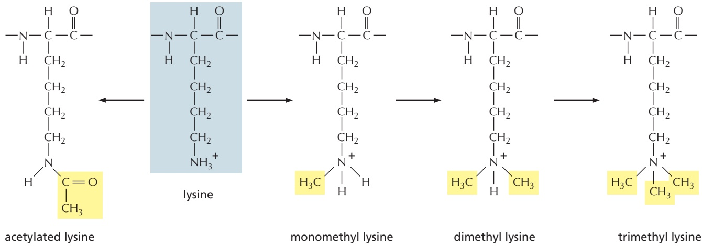

Figure 4–34 Some prominent types of covalent amino acid side-chain modifications found on nucleosomal histones. (A) Three different levels of lysine methylation are shown; each can be recognized by a different binding protein, and thus each can have a different significance for the cell. Note that acetylation removes the plus charge on lysine, and that, perhaps most important, an acetylated lysine cannot be methylated, and vice versa. (B) Serine phosphorylation adds a negative charge to a histone. Modifications of histones not shown here include the mono- or dimethylation of an arginine, the phosphorylation of a threonine, the addition of ADP-ribose to a glutamic acid, and the addition of a ubiquityl, sumoyl, or biotin group to a lysine.

positive feedback can operate both in space, causing the heterochromatic state to spread along the chromosome, and in time, across cell generations, propagating the heterochromatic state of the parent cell to its daughters. The challenge is to explain the molecular mechanisms that underlie this remarkable behavior.

(B) SERINE PHOSPHORYLATION

phosphoserine

As a first step, one can carry out a search for the molecules that are involved. This has been done by means of genetic screens, in which large numbers of mutants are generated, after which one picks out those that show an abnormality of the process in question. Extensive genetic screens in Drosophila, fungi, and mice have identified more than 100 genes whose products either enhance or suppress the spread of heterochromatin and its stable inheritance—in other words, genes that serve as either enhancers or suppressors of position effect variegation. Many of these genes turn out to code for non-histone chromosomal proteins that interact with histones and are involved in modifying or maintaining chromatin structure. These include genes that encode some of the enzymes that add or remove covalent modifications to histone side chains, as we discuss next.

#### The Core Histones Are Covalently Modified at Many Different Sites

All of the above types of modifications are reversible, with one enzyme serving to create a particular type of modification and a different enzyme serving to remove it. These enzymes are highly specific. Thus, for example, acetyl groups are added to specific lysines by a set of different histone acetyl transferases (HATs) and removed by a set of histone deacetylase complexes (HDACs). Likewise, methyl groups are added to lysine side chains by a set of different histone methyl transferases and removed by a set of histone demethylases. Each enzyme is recruited to specific sites on the chromatin at defined times in each cell’s life history. The initial recruitment can depend on transcription regulatory proteins (sometimes

The amino acid side chains of the four histones in the nucleosome core are subjected to a remarkable variety of covalent modifications, including the acetylation of lysines, the mono-, di-, and trimethylation of lysines, and the phosphorylation of serines (**Figure 4–34**). A large number of these side-chain modifications occur on the eight relatively unstructured N-terminal “histone tails” that protrude from the nucleosome (**Figure 4–35**). However, there are also more than 20 specific side-chain modifications on the nucleosome’s globular core.

Figure 4–35 The covalent modification of core histones. (A) The structure of the nucleosome highlighting the location of the first 30 or so amino acids in each of its eight N-terminal histone tails (green). These tails are unstructured and highly mobile, and thus will change their conformation depending on other bound proteins. (B) Some well-documented modifications of the four histone core proteins are indicated. Notably, although only a single symbol is used here for methylation (M), each lysine (K) or arginine (R) can be methylated in several different ways. Thus, for example, mono-, di-, or trimethyl lysine groups can have very different effects. Note also that some positions (for example, lysine 9 of H3) can be modified either by methylation or by acetylation, but not both. Most of the modifications shown add a relatively small molecule onto a histone; the exception is ubiquitin, a 76-amino-acid protein also used for other cell processes (see Figure 3–65). Note that while most of the modifications occur in unstructured regions, including on short tails at the C-terminus of histone H2A and histone H2B, there are also important modifications in structured histone folds. (A, PDB code: 1KX5; B, based on D. Allis et al., Epigenetics, 2nd ed., Overview and concepts. Cold Spring Harbor, NY: Cold Spring Harbor Laboratory Press, 2015.)

called “transcription factors”). As we shall explain in Chapter 7, these proteins recognize and bind to specific DNA sequences in the chromosomes. They areMBoC7 m4.34/4.35 produced at different times and places in the life of an organism, thereby determining where and when the chromatin-modifying enzymes will act. In this way, the DNA sequence ultimately determines how histones are modified. But as we shall discuss shortly, the covalent modifications on nucleosomes in heterochromatin can persist long after the transcription regulatory proteins that first induced them have disappeared, thereby providing the cell with a memory of its developmental history. Most remarkably, as in the related phenomenon of position effect variegation discussed earlier, this “heterochromatin memory” can be transmitted from one cell generation to the next.

Very different patterns of covalent modification are found on different groups of nucleosomes, depending both on their exact position in the genome and on the history of the cell. The modifications of the histones are carefully controlled, and they can have important consequences. The acetylation of lysines on the N-terminal tails loosens chromatin structure, in part because adding an acetyl group to lysine removes its positive charge. However, the most profound effects of the histone modifications lie in their ability to recruit specific other proteins to the modified stretch of chromatin. For example, as we discuss shortly, the trimethylation of one specific lysine on the histone H3 tail attracts the protein HP1 and promotes the establishment and spread of one type of heterochromatin,

Figure 4–36 The structure of some histone variants compared with the major histone that they replace in a histone octamer. The histone variants are inserted into nucleosomes at specific sites on chromosomes by ATP-dependent chromatin-remodeling complexes (see Figure 4–26). The CENP-A (centromere protein-A) variant of histone H3 is discussed later in this chapter (see Figure 4–42); other variants are discussed in Chapter 7. The sequences in each variant that are colored differently (compared to the major histone above it) denote regions with an amino acid sequence different from this major histone. (Adapted from K. Sarma and D. Reinberg, Nat. Rev. Mol. Cell Biol. 6:139–149, 2005.)

while the trimethylation of a different lysine attracts a different protein to form a second heterochromatin type (see Figure 4–40). In this way and many others, the recruited proteins act with the modified histones to determine how and when genes will be expressed, as well as other critical chromosome functions.

#### Chromatin Acquires Additional Variety Through the Site-specific Insertion of a Small Set of Histone Variants

In addition to the four highly conserved standard core histones, eukaryotes also contain a few variant histones that can also assemble into nucleosomes. These histones are present in much smaller amounts than the major histones, and they have been less well conserved over long evolutionary times. Variants are known for each of the core histones with the exception of H4; some examples are shown in **Figure 4–36**.

The major histones are synthesized primarily during the S phase of the cell cycle and assembled into nucleosomes on the daughter DNA helices just behind the replication fork (see Figure 5–32). In contrast, most histone variants are synthesized throughout interphase. They are often inserted into already-formed chromatin. This requires a histone-exchange process catalyzed by a special ATP-dependent chromatin-remodeling complex that binds both the variant histone and the nucleosome containing the histone to be exchanged (see Figure 4–27). These remodeling complexes contain subunits that cause them to bind to specific sites on chromatin. As a result, each histone variant is inserted into chromatin in a highly selective manner.

#### Covalent Modifications and Histone Variants Can Act in Concert to Control Chromosome Functions

The number of possible distinct markings on an individual nucleosome is in principle enormous, and this potential for diversity becomes still greater when one considers the nucleosomes that contain histone variants. The histone modifications are known to occur in coordinated sets, and more than 15 such sets can be identified in mammalian cells. However, it is not yet clear how many different types of chromatin are functionally important.

Some combinations are known to have a specific meaning for the cell in the sense that they determine how and when the DNA packaged in the nucleosomes is to be accessed or manipulated—a fact that led to the idea of a “histone code.” For example, one type of marking signals that a stretch of chromatin has been newly replicated, another signals that the DNA in that chromatin has been damaged and needs repair, while others signal when and how gene expression should take place. Various regulatory proteins contain small domains that bind to specific marks, recognizing, for example, a trimethylated lysine at a specific position in one of the histones (**Figure 4–37**; see also Figure 9–52). These domains are often linked together as modules in a large protein complex, such as in an ATP-dependent chromatin remodeler, allowing that complex to recognize a specific combination of histone modifications. These so-called reader protein complexes (**Figure 4–38**) allow particular combinations of markings on chromatin to attract a set of additional proteins, so as to execute an appropriate biological function at the right time.

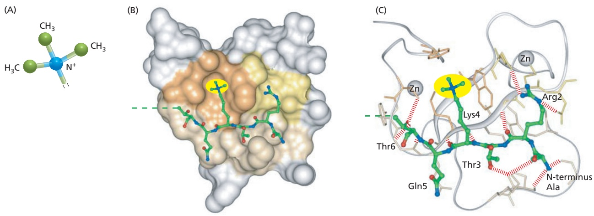

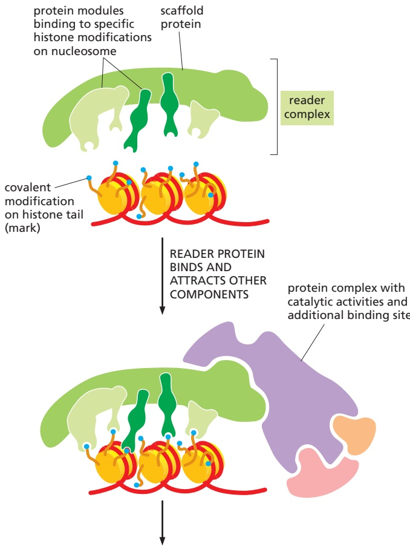

#### Figure 4–37 How a mark on a

nucleosome is read. The figure shows the structure of a protein module (called an ING PHD domain) that specifically recognizes histone H3 trimethylated on lysine 4. (A) A trimethyl group. (B) Space-filling model of an ING PHD domain bound to a histone tail (green, with the trimethyl group highlighted in yellow). (C) A ribbon model showing how the N-terminal six amino acids in the H3 tail are recognized. The hatched red lines represent hydrogen bonds. This is one of a family of PHD domains that recognize methylated lysines on histones; different members of the family bind tightly to lysines located at different positions, and they can discriminate between a mono-, di-, and trimethylated lysine. In a similar way, other small protein modules recognize specific histone side chains that have been marked with acetyl groups, phosphate groups, and so on. (Adapted from P.V. Peña et al., Nature 442:100–103, published 2006 by Nature Publishing Group. Reproduced with permission of SNCSC.)

Figure 4–38 Schematic diagram showing how a particular combination of histone modifications can be recognized by a reader protein complex. A large protein complex that contains a series of protein modules, each of which recognizes a specific histone mark, is schematically illustrated (green). This reader complex will bind tightly only to a region of chromatin that contains several of the different histone marks that it recognizes. Therefore, only a specific combination of marks will cause the complex to bind to chromatin and attract the additional protein complexes (purple) needed to catalyze a biological function.

TABLE 4–2 Some Effects of Histone Modifications

<table><tr><td>Histone modification</td><td>Association with chromatin type</td><td>Gene expression</td><td>Abundance (%)</td></tr><tr><td>H4K4me3</td><td>Highly accessible, open chromatin</td><td>ON</td><td>1</td></tr><tr><td>H3K9ac</td><td>Highly accessible, open chromatin</td><td>ON</td><td>1</td></tr><tr><td>H3K9me3</td><td>Heterochromatin (either constitutive or facultative)</td><td>OFF</td><td>25</td></tr><tr><td>H3K27me3</td><td>Facultative heterochromatin</td><td>OFF</td><td>13</td></tr><tr><td colspan="4">In general, sets of modifications act in combination, but only a small number of their meanings are clear. For how the two different kinds of heterochromatin listed here form, see Figure 4-40.</td></tr></table>

Each of the marks on nucleosomes is denoted as follows: listed first is an abbreviation for the particular histone involved, written as H3, H4, H2A, or H2B. The marked amino acid side chain then follows, using its one-letter abbreviation followed by its distance from that histone’s amino-terminus—thus, for example, H3K9 or H4K4 (see Figure 4–35). Listed last is the type of modification on that amino acid side chain, as in H3K9ac (acetylated), H3K9me2 (dimethylated), or H3K9me3 (trimethylated).

All of the covalent additions to histones are dynamic, being constantly removed and added at rates that depend both on their chromosomal locations and on specific states of the cell. Because the histone tails extend outward from the nucleosome core and are likely to be accessible even when chromatin is condensed, they would seem to provide an especially suitable format for creating marks that can be readily altered as a cell’s needs change. Although much remains to be learned about the meaning of the different histone modifications, a few well-studied examples of the information that can be encoded in histone modifications are listed in **Table 4–2**.

#### A Complex of Reader and Writer Proteins Can Spread Specific Chromatin Modifications Along a Chromosome

The phenomenon of position effect variegation described previously requires that some modified forms of chromatin have the ability to spread for substantial distances along a chromosomal DNA molecule (see Figure 4–32). How is this possible?

The enzymes that add or remove modifications to histones in nucleosomes are part of multisubunit complexes. They can initially be brought to a particular region of chromatin by one of the sequence-specific DNA-binding proteins (transcription regulators) discussed in Chapters 6 and 7 (for a specific example, see Figure 7–23). But after a modifying enzyme “writes” its mark on one or a few neighboring nucleosomes, events that resemble a chain reaction can ensue. In such a case, the writer enzyme works in concert with a reader protein located in the same protein complex. The reader protein contains a module that recognizes the mark and binds tightly to the newly modified nucleosome (see Figure 4–37), allosterically activating an attached writer enzyme and positioning it near an adjacent nucleosome. Through many such read–write cycles, the reader protein can carry the writer enzyme along the DNA—spreading the mark in a hand-overhand manner along the chromosome (**Figure 4–39A**; Movie 4.2).

As important examples, there are two major classes of heterochromatin in mammalian cells, one centered on the trimethylation of H3K9 and the other on the trimethylation of H3K27 (see Figure 4–31). The H3K27me3 class

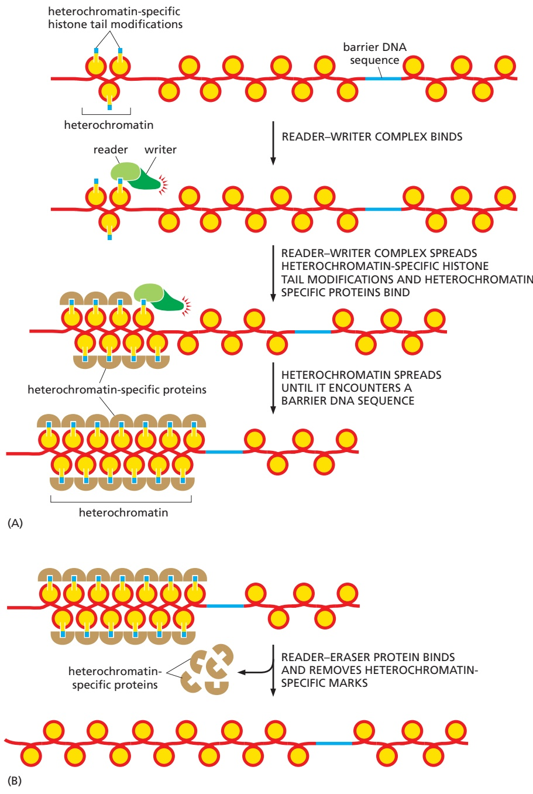

Figure 4–39 How the recruitment of reader–writer and reader–eraser complexes can spread chromatin changes along a chromosome. (A) The writer is an enzyme that creates a particular modification on one of the four nucleosomal histones. After a writer enzyme modifies a few nucleosomes following its recruitment to a specific site on a chromosome—for example, by a transcription regulatory protein—the writer collaborates with a reader protein to spread its mark from nucleosome to nucleosome by means of the indicated reader–writer complex. For this mechanism to work, the reader must recognize the same histone modification mark that the writer produces, and its binding to that mark should activate the writer. In this schematic example, a spreading wave of chromatin condensation is thereby induced, forming heterochromatin. (B) A reader–eraser complex (not shown) reverses the chromatin change illustrated in A. As described in the text, additional proteins are involved in these two types of spreading events, including ATP-dependent chromatin-remodeling complexes.

of heterochromatin is generated by the extensively studied polycomb repressive complex (PRC). Because this class is highly regulated, it is designated as facultative heterochromatin. The H3K9me3 class of heterochromatin plays an important structural role in forming the centromere (to be described shortly) and in silencing a variety of “selfish DNA” elements (see p. 465). It was once thought to remain unchanged in all cells of a multicellular organism (“constitutive heterochromatin”). However, recent data reveal that some of its forms are reversible, and that it can be used to regulate gene expression. For example, it is used to tightly repress genes that are active early in embryonic development, once they are no longer needed (see Chapter 7).

The H3K9me3 class of heterochromatin also serves to block the frequent genetic recombination that would otherwise occur between the highly repeated DNA sequences in genomes. Roughly speaking, 40% of the human genome is packaged into heterochromatin, with the ratio of the H3K9me3 class toMBoC7 e5.27/4.39 the H3K27me3 class of heterochromatin being about 2:1 (see Figure 4–31).

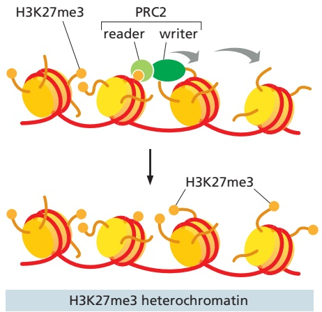

(A)

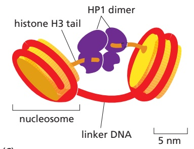

(C)

Figure 4–40 Some of the proteins required for the formation of two classes of heterochromatin in mammalian cells. (A) Schematic diagrams that compare the reader–writer complexes for two classes of heterochromatin: one that catalyzes the spread of H3K27me3 marks along chromatin and the other that catalyzes the spread of H3K9me3 marks.

(B) The H3K27me3 class of heterochromatin is produced by the polycomb repressive complex (PRC). This complex, first discovered in Drosophila, is composed of a PRC1 protein complex, which creates the initial mark, plus a PRC2 complex that spreads it. Shown here is the three-dimensional structure of a PRC2 reader–writer complex bridging two adjacent nucleosomes. (C) The reader for the H3K9me3 class of heterochromatin, the HP1 protein, is present in very large amounts compared to its writer enzyme. In addition to binding the writer it exists as a dimer whose two H3K9me3 binding sites enable it to bridge two adjacent nucleosomes as shown, thereby helping to package the marked nucleosomes (see also panel A, above). (B, based on S. Poepsel et al., Nat. Struct. Mol. Biol. 25:154–162, 2018; C, based on S. Machida et al., Mol. Cell 69:385–397, 2018.)

**Figure 4–40** outlines what is known about the two different processes that spread and maintain these abundant heterochromatin forms.

A related type of process is used to remove specific histone modificationsMBoC7 n4.105/4.40 from a region of the DNA. In this case, an eraser enzyme, such as a histone demethylase or a histone deacetylase, is recruited to the complex, producing a read–erase cycle that spreads along a chromosome (**Figure 4–39B**).

In reality, the process is more complicated than the schemes just described. Both readers and writers are part of a protein complex that may contain multiple readers and writers, as well as erasers, and require multiple marks on the nucleosome to spread. Moreover, many of these reader–writer complexes also contain an ATP-dependent chromatin-remodeling protein (see Figure 4–27), with the reader, writer, and remodeling proteins working in concert to alter long stretches of chromatin as the reader moves progressively along the nucleosome-packaged DNA. Some idea of the complexity can be derived from the results of genetic screens for genes that either enhance or suppress the spreading and stability of heterochromatin, as manifest for example in effects on position effect variegation in Drosophila (see Figure 4–33). As pointed out previously, more than 100 such genes are known, and many of them are likely to code for subunits in one or more reader–writer–remodeling protein complexes. However, nearly all of the details remain to be deciphered by future research.

#### Barrier DNA–Protein Complexes Block the Spread of Reader–Writer Complexes and Thereby Separate Neighboring Chromatin Domains

The above mechanisms for spreading chromatin structures raise a potential problem. Inasmuch as each chromosome contains one continuous, very long DNA molecule, what prevents a cacophony of confusing cross-talk between adjacent chromatin domains of different structure and function? Early studies of position effect variegation had suggested an answer: certain DNA sequences mark the boundaries of chromatin domains and separate one such domain from another (see Figure 4–32). Several such barrier DNA sequences have now been identified and characterized through the use of genetic engineering techniques that allow specific DNA segments to be deleted from or inserted into chromosomes.

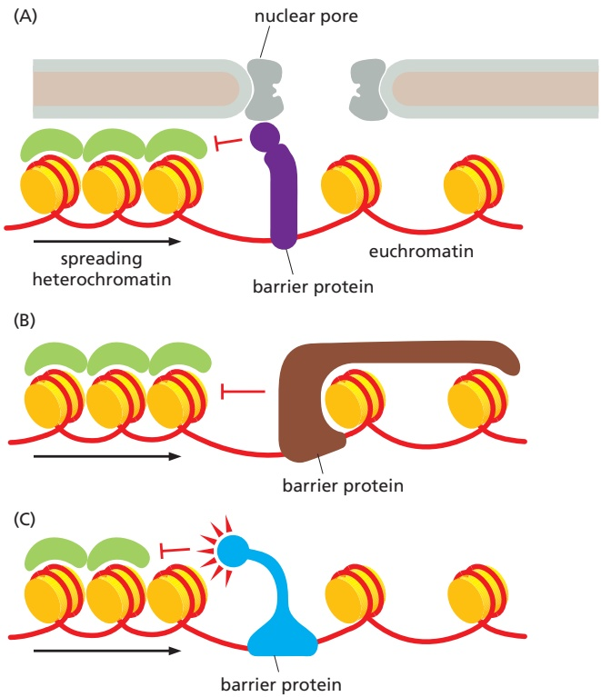

Figure 4–41 Some mechanisms of barrier action. These models are derived from experimental analyses of barrier action, and a combination of several of them may function at any one site. (A) The tethering of a region of chromatin to a large fixed site, such as the nuclear pore complex illustrated here, can form a barrier that stops the spread of heterochromatin. (B) The tight binding of barrier proteins to a group of nucleosomes can make this chromatin resistant to heterochromatin spreading. (C) By recruiting a group of highly active histone-modifying enzymes, barriers can erase the histone marks that are required for heterochromatin to spread. For example, a potent acetylation of lysine 9 on histone H3 will compete with lysine 9 methylation, thereby preventing the binding of the HP1 protein needed to form a major form of heterochromatin. (Based on A.G. West and P. Fraser, Hum. Mol. Genet. 14:R101–R111, 2005.)

Analysis of one type of barrier sequence reveals that it contains a cluster of binding sites for histone acetylase enzymes. The acetylation of a lysine side chain is incompatible with the methylation of the same side chain, and specific lysine methylations are required to spread heterochromatin (see Figure 4–40). Histone acetylases are therefore logical candidates for the formation of the barriers that stop heterochromatin spreading, as are the histone-demethylating enzymes that erase the marks on histones specific to heterochromatin. Other types of barrier mechanisms are also known (**Figure 4–41**).

#### Centromeres Have a Special, Inherited Chromatin Structure

There is a specialized chromatin structure at the centromere, the region of each chromosome required for its orderly attachment to the mitotic spindle. In many complex organisms, including humans, each centromere is embedded in a stretch of special centromeric chromatin that persists throughout interphase, even though the centromere-mediated attachment to the spindle and movement of DNA occur only during mitosis. This chromatin contains a centromere-specific variant H3 histone, known as CENP-A (centromere protein-A; see Figure 4–36), plus additional proteins that pack the nucleosomes into particularly dense arrangements and form the kinetochore, the structure required for mitotic spindle attachment (see Figure 4–19).

In the yeast Saccharomyces cerevisiae, a specific DNA sequence of approximately 125 nucleotide pairs is sufficient to serve as a centromere. Despite its small size, more than a dozen different proteins assemble on this DNA sequence; the proteins include the CENP-A histone H3 variant that, along with the three other core histones, forms a centromere-specific nucleosome. The additional proteins at the yeast centromere form a kinetochore, which links this nucleosome to a single microtubule from the yeast mitotic spindle (**Figure 4–42**).

The centromeres in more complex organisms are considerably larger than those in budding yeasts. For example, human centromeres extend over several million nucleotide pairs, and, while they contain multiple copies of CENP-A and bind about 20 microtubules, they do not seem to contain a centromere-specific DNA sequence. These centromeres largely consist of short, repeated DNA sequences, known as alpha satellite DNA. But the same repeat sequences are also found at other (non-centromeric) positions on chromosomes, indicating that they are not sufficient to direct centromere formation. And most striking, in some unusual cases, new human centromeres (called neocentromeres) have been observed to form spontaneously on fragmented chromosomes at positions that were originally euchromatic and lack alpha satellite DNA altogether (**Figure 4–43**).

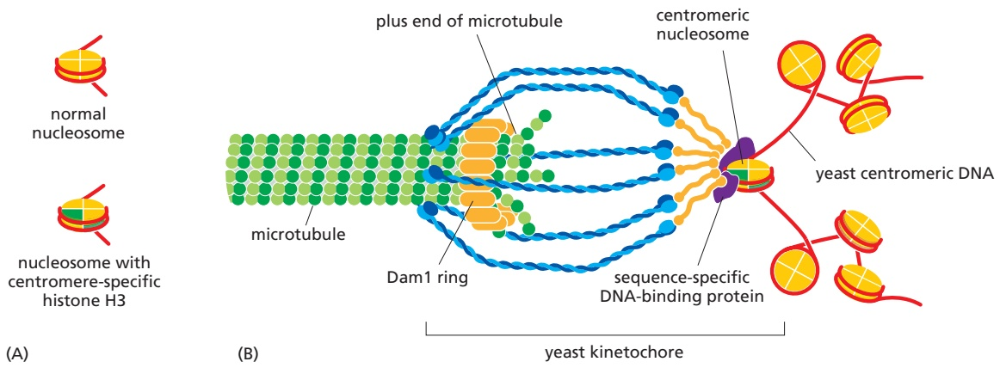

It seems that centromeres in complex organisms are defined by an assembly of proteins rather than by a specific DNA sequence. Essential for this assembly is a set of CENP-A nucleosomes. And once a special region of centromeric chromatin forms, this assembly is thereafter faithfully inherited when a chromosome replicates, despite the fact that no special DNA sequence need be involved.

The inactivation of some centromeres and the genesis of others de novo occur as organisms evolve. Different species, even when quite closely related, often have different numbers of chromosomes (see Figure 4–14 for an extreme example). And, as we discuss later, detailed genome comparisons show that many changes in chromosomes have arisen through chromosome breakage-and-rejoining events; these create novel chromosomes, some of which must initially have contained abnormal numbers of centromeres—either more than one or

Figure 4–42 The structure of a simple centromere. (A) In the yeast Saccharomyces cerevisiae, a special centromeric DNA sequence assembles a single nucleosome in which two copies of an H3 variant histone (called CENP-A in most organisms) replace the normal H3. (B) How amino acid sequences unique to this variant histone (see Figure 4–36) help to assemble additional proteins, some of which form a kinetochore. The yeast kinetochore is unusual in capturing only a single microtubule; humans have much larger centromeres and form kinetochores that can capture 20 or more microtubules. The kinetochore is discussed in detail in Chapter 17.

Figure 4–43 Evidence for the plasticity of human centromere formation. (A) A series of A-T–rich alpha satellite DNA sequences is repeated many thousands of times at each human centromere (red) and is surrounded by pericentric heterochromatin (brown). The pericentric heterochromatin contains H3K9me3, along with HP1 protein, and it is an example of “classical” constitutive heterochromatin (see Figure 4–31). As indicated, some human chromosomes contain two blocks of alpha satellite DNA, each of which presumably functioned as a centromere in its original chromosome. (B) In a small fraction (1/2000) of human births, extra chromosomes are observed in cells of the offspring. Some of these extra chromosomes, which have formed from a breakage event, contain alpha satellite DNA sequences that have been co-opted to form new centromeres (neocentromeres); other neocentromeres lack alpha satellite DNA altogether and have arisen from what was originally euchromatic DNA.

none at all. Yet stable inheritance requires that each chromosome should contain one centromere, and one only. It seems that surplus centromeres must have been inactivated and/or new centromeres created, so as to allow the rearranged chromosome sets to be stably maintained.

#### Some Forms of Chromatin Can Be Directly Inherited

The changes in centromere activity just discussed, once established, need to be perpetuated through subsequent cell generations. What could be the mechanism of this type of epigenetic inheritance?

It has been proposed that de novo centromere formation requires an initial seeding event, which is followed by the formation of a specialized DNA–protein structure that contains nucleosomes formed with the CENP-A variant of histone H3. In humans, this seeding event happens more readily on arrays of alpha satellite DNA than on other DNA sequences. The entire centromere then forms as an allor-none entity, suggesting that the creation of centromeric chromatin is a highly cooperative process, spreading out from an initial seed. And once established, this special form of chromatin is passed on to each daughter cell when a cell divides.

Both the spreading and the inheritance of centromeric chromatin mimic the phenomenon of position effect variegation that we discussed earlier (see Figure 4–32). The spreading of a particular chromatin structure can be explained by the action of reader–writer complexes (see Figure 4–39A). But how can we explain the inheritance of centromeric chromatin from one cell generation to the next?

Notably, experiments have revealed that the H3–H4 tetramers from each nucleosome on the parent DNA helix are directly inherited by both of the sister DNA helices at a replication fork, being equally partitioned between them. This is quickly followed by the addition of two H2A–H2B dimers to complete each “half-old” nucleosome, and by the deposition of the new histone octamers needed to restore the normal complement of nucleosomes (see Figure 5–32). Therefore, once a set of CENP-A–containing nucleosomes has been assembled on a stretch of DNA, it is easy to understand how a new centromere could be generated in the same place on both daughter chromosomes after each round of cell division. One need only assume that the presence of the CENP-A histone in an inherited nucleosome selectively recruits more CENP-A histone to its newly formed neighbors.

An analogous scheme is thought to explain the observation that both the H3K9me3 and H3K29me3 forms of heterochromatin, once formed, are directly inherited after each round of chromosome replication. In those cases, the H3–H4 tetramers that contain a particular modified histone will be passed to each daughter DNA helix, followed by the rapid addition of H2A–H2B to re-form specifically marked nucleosomes. The action of reader–writer complexes can then spread the identical marks to the new neighboring nucleosomes—either H3K9me3 or H3K27me3 (see Figure 4–40). Thus, the activities of reader–writer complexes can explain not only the spreading of specific forms of chromatin along a chromosome, but also the propagation of heterochromatin across cell generations—from parent cell to daughter cell (**Figure 4–44**).

In vertebrates, but not in flies, this inheritance of heterochromatin is often reinforced by a second process that silences the same genes. As described in Chapter 7, this process is based on a DNA methylation system that generates an inherited pattern of methylated C nucleotides (see Figures 7–47 and 7–48).

#### The Abnormal Perturbations of Heterochromatin That Arise During Tumor Progression Contribute to Many Cancers

As described in Chapter 20, cancer arises from a series of accidental changes in a cell’s control systems, each of which is inherited and accumulates progressively in a clone of daughter cells. Many of these sequential changes are the result of mutations that alter the sequence of the DNA encoding an important regulatory protein, such as a protein kinase involved in cell signaling. Other mutations that are known to drive tumor progression alter chromatin structure, for example by affecting the readers, writers, or erasers of histone marks—or by altering a chromatin-remodeling complex. Because changes in chromatin can alter gene expression, as we explore further in Chapter 7, this finding is not surprising.

Figure 4–44 The propagation of heterochromatin across generations. After DNA replication, all of the old H3–H4 molecules in the parent chromatin will be passed directly to the daughter DNA helices, half to each daughter (see Figure 5–32). This causes the specially marked nucleosomes in heterochromatin to be inherited, as indicated. Reader–writer complexes can then add the same pattern of histone modification to their new, unmarked nucleosome neighbors, as previously illustrated in Figure 4–40. As the original pattern of histone marks is reestablished, binding sites are created for the heterochromatinspecific non-histone proteins that assemble to reproduce the parent chromatin structure. This type of process is thought to occur for both H3K9me3 and H3K27me3 classes of heterochromatin, as well as for the chromatin at centromeres; it is MBoC7 m4.44/4.44thought not to occur for the open structure of chromatin at active genes.

Much more surprising is the discovery that a change in a single amino acid in a histone can cause cancer. As very abundant proteins, each histone is encoded by multiple copies of its histone gene. As a result, any mutation that changes a histone should alter less than 10% of the molecules, meaning that any effect observed must be dominant—overriding the presence of a large excess of the normal histone. Such oncohistone mutations appear to be present in about 4% of all tumors, and for a few special cancers they are a predominant cancer driver. In particular, a mutation that changes the lysine at position 27 of histone H3 to a methionine (denoted as H3K27M) is almost universally present in a lethal type of pediatric brain tumor (diffuse intrinsic pontine glioma; DIPG), while also being occasionally found in acute myeloid leukemias and melanomas in adults. This mutation has been shown to exert its dominant effect by binding abnormally tightly to the PCR2 protein complex, thereby altering the overall pattern and level of H3K27me3 modifications across the human genome (see Figure 4–40), a finding that illustrates the important role that heterochromatin plays in controlling genes.

#### Summary

In the chromosomes of eukaryotes, DNA is assembled into long strings of nucleosomes, but a variety of different chromatin structures is possible. This variety is based on a large set of reversible covalent modifications of the four histones in the nucleosome core. The modifications include the mono-, di-, and trimethylation of many different lysine side chains, an important reaction that is incompatible with the acetylation that can occur on the same lysines. Specific combinations of the modifications mark many nucleosomes, governing their interactions with other proteins. These marks are read when protein modules that are part of a larger protein complex bind to the modified nucleosomes in a region of chromatin. These reader proteins then attract additional proteins that perform various functions.

Some reader protein complexes contain a histone-modifying enzyme, such as a histone lysine methylase, that “writes” the same mark that the reader recognizes. A reader–writer–remodeling complex of this type can spread a specific form of chromatin along a chromosome. In particular, large regions of condensed heterochromatin are thought to be formed in this way. Heterochromatin is commonly found around centromeres and near telomeres, but it is also present at many other positions in chromosomes. The tight packaging of DNA into heterochromatin usually silences the genes within it.

The phenomenon of position effect variegation provides strong evidence for the inheritance of condensed states of chromatin from one cell generation to the next. A similar mechanism appears to be responsible for maintaining the specialized chromatin at centromeres. More generally, the ability to propagate specific chromatin structures across cell generations makes possible an epigenetic cell memory process that plays a role in maintaining the set of different cell states required by complex multicellular organisms.

<!-- END EN EN04-H019-H033 -->

### 英文补充：染色质三维组织、Hi-C与核内空间分布

> 对应中文板块：染色质三维组织、Hi-C与核内空间分布。英文来源：Molecular Biology of the Cell，第7版，第4章；[本章完整原文](../来源/英文教材/04_DNA_Chromosomes_and_Genomes/chapter.md)。物理PDF页码范围：222–291（整章范围）。

<!-- BEGIN EN EN04-H038-H041 -->
#### Mammalian Interphase Chromosomes Occupy Discrete Territories in the Nucleus, with Their Heterochromatin and Euchromatin Distributed Differently

Light microscopy after chromosome painting reveals that each of the 46 interphase chromosomes in a human cell occupies its own discrete territory within the nucleus; that is, the chromosomes are not extensively entangled with one another (**Figure 4–50**). However, pictures such as these present only an average view of the DNA in each chromosome. By staining a heterochromatic region of a chromosome, one finds that it is often closely associated with the nuclear envelope,

Figure 4–49 RNA synthesis in polytene chromosome puffs. An autoradiograph of a single puff in a polytene chromosome from the salivary glands of the freshwater midge Chironomus tentans, the fly in which polytene chromosomes were first discovered in 1881. As outlined in Chapter 1 and described in detail in Chapter 6, the first step in gene expression is the synthesis of an RNA molecule using the DNA as a template. The decondensed portion of the chromosome is undergoing RNA synthesis and has become labeled with 3H-uridine, an RNA precursor molecule that is incorporated into growing RNA chains. The black dots are produced where the radioactivity emitted interacts with an overlying photographic emulsion. (From J.J. Bonner and M.L. Pardue, Cell 12:227–234, 1977. With permission from Elsevier.)

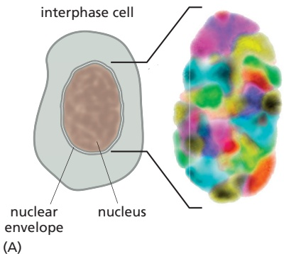

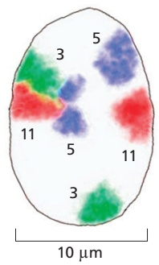

(B)

Figure 4–50 Simultaneous visualization of the chromosome territories for all of the human chromosomes in a single interphase nucleus. Here, the DNA probes for a specific chromosome are labeled so as to fluoresce at specific wavelengths, and a different combination of dyes is used to label the probes for each chromosome so that each chromosome fluoresces differently. This “chromosome painting” technique allows DNA–DNA hybridization to be used to detect each chromosome, as in Figure 4–11. Three-dimensional reconstructions were then produced. (A) Viewed in a fluorescence microscope, the nucleus is seen to be filled with a patchwork of discrete colors. (B) To highlight their distinct locations, three sets of chromosomes are singled out:MBoC7 e5.16/4.50 chromosomes 3, 5, and 11. Note that pairs of homologous chromosomes, such as the two copies of chromosome 3, are not generally located in the same position. (Adapted from M.R. Hübner and D.L. Spector, Annu. Rev. Biophys. 39:471–489, 2010. With permission from Annual Reviews.)

regardless of the chromosome examined. And probes that preferentially stain chromosomal regions containing a high density of active genes reveal that most of these regions extend out from the territory of each chromosome into the nucleoplasm and away from the nuclear envelope (**Figure 4–51**).

Studies of mammalian cells also show that highly folded loops of chromatin expand to occupy an increased volume when a gene within them is expressed. For example, **Figure 4–52** demonstrates how a large, highly transcribed gene in a human cell, which appears as a dot in an interphase cell when inactive, is extended just like a lampbrush loop by its extensive transcription.

As we shall discuss in Chapter 6, the interior of the nucleus is very heterogeneous, with functionally different regions that are produced by biomolecular condensates specialized to speed different biochemical processes—such as RNA synthesis, RNA splicing, and DNA replication. The fact that a section of a chromosome can move away from its chromosome territory, as we have just seen, helps cells to use nuclear condensates to accelerate various reactions. These condensates include the nucleolus specialized for producing ribosomes and the nuclear speckles involved in RNA production (see pp. 353–357).

Although much is known about DNA transcription and how genes are turned on and off at the molecular level, we defer that discussion to Chapters 6 and 7. Here we instead concentrate on the mechanism that packages the long linear DNA molecule in each mammalian chromosome into a series of loops in the cell nucleus.

#### A Biochemical Technique Called Hi-C Reveals Details of Chromosome Organization

As explained in Chapter 8, new automated technologies allow scientists to determine massive amounts of DNA sequence at low cost. A powerful chromosome conformation capture method that exploits this ability, Hi-C, has made it possible to assess the frequency with which any two genomic loci—whether along a single chromosome or between chromosomes—are held together (**Figure 4–53**).

Figure 4–51 The looping out of gene-rich regions of the genome from chromosome territories. In this light micrograph of a cell nucleus, DNA has been fluorescently labeled with a dye (blue). In addition, by using a chromosome painting technique, all of the DNA of one particular mouse chromosome has been stained green, and the gene-rich regions of that same chromosome have been stained red. (From W.A. Bickmore and B. van Steensel, Cell 152:1270–1284, 2013. With permission from Elsevier.)

5 µm

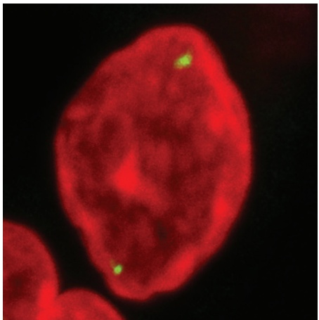

(A)

Figure 4–52 A large gene forms a highly extended chromosome loop when highly expressed in a human interphase cell. The thyroglobulin gene codes for the extracellular protein thyroglobulin, which is secreted by thyroid gland cells. This gene is both unusually large (270 kb) and unusually highly transcribed. DNA and RNA hybridization techniques reveal that it forms a large stiff loop that extends into the interior of the nucleus from each of the two homologous chromosomes that express it. (A) An image of a cell that does not make thyroglobulin reveals the thyroglobulin locus as a small dot. (B) An image of a thyroid gland cell expressing the gene. Experiments demonstrate that these loops retract back to a dot if RNA synthesis is blocked by drug treatment. (Courtesy of Irina Solovei, Ludwig-Maximilians University, Munich.)

Application of the Hi-C technique has revealed some fundamental features of chromosome organization. One is that each interphase chromosome occupies its own discrete territory within the nucleus. That is, the genomic loci within a. / . chromosome contact each other more often than they do the loci on different chromosomes, showing that the chromosomes are not extensively entangled. This was expected from the earlier findings of discrete chromosome territories by light microscopy, as just described. In addition, Hi-C and related chromosome capture methods have revealed that the interphase chromosome is folded into a long series of topologically associated domains, or TADs, in which any two

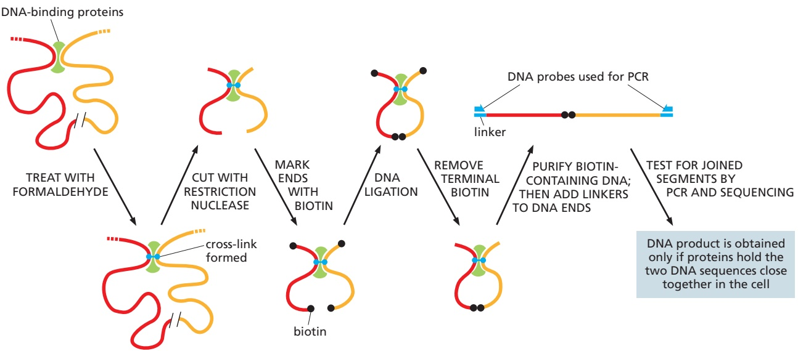

Figure 4–53 Use of Hi-C to determine the frequency with which any two DNA sequences are adjacent to each other in chromosomes. In the Hi-C technique, cells are treated with cross-linking agents such as formaldehyde to create covalent DNA–protein–DNA cross-links, as indicated. The DNA is then treated with an enzyme (called a restriction nuclease) that chops the DNA into many pieces, cutting at strictly defined nucleotide sequences and forming sets of identical “cohesive ends” (see Figure 8–23). These ends are then marked by the incorporation of biotinylated nucleotides, so as to enable their selective purification later. Any two DNA ends can become covalently joined if incubated with a DNA ligase enzyme. But importantly,MBoC7 m4.48/4.53 prior to the DNA ligation step shown, the DNA is diluted so that only the fragments that have been kept in close proximity to each other (through cross-linking) are likely to join. After the ligation step, the cross-links are reversed, and all the biotin at unligated DNA ends is removed. This allows the newly ligated fragments of DNA to be selectively purified through their binding to streptavidin beads, amplified by PCR (polymerase chain reaction), and then sequenced (by methods described in Chapter 8). The results, combined with knowledge of the complete DNA sequence of each chromosome, generate detailed models for the conformation of chromosomes.

(A)

position along chromosome

DNA sequences are much more likely to encounter each other than they are to encounter DNA sequences outside of that domain. Their locations along each chromosome can be derived from the series of squares observed in plots ofMBoC7 n4.210/4.54 results like those in **Figure 4–54**. These reveal that DNA segments in a contiguous set (those within a TAD) have a relatively high probability (dark color in the figure) of becoming ligated together. And because any one DNA segment in a TAD can become ligated to many others in that TAD, one concludes that the chromatin inside each TAD must be folded in a way that allows its DNA sequences to frequently encounter any other DNA sequence within it.

Extensive data of this type have led to the conclusion that all interphase chromosomes are organized as a long linear series of folded looped domains of chromatin, with the DNA in each loop being compacted, but highly mobile. Although a typical loop in a human chromosome might contain between 50,000 and 200,000 nucleotide pairs of DNA, loops of a million nucleotide pairs also exist, and there appear to be roughly 10,000 loops in the human genome. How these loops are formed is the subject that we discuss next.

#### Chromosomal DNA Is Organized into Loops by Large Protein Rings

The enormously long DNA molecules that form chromosomes must be organized if they are to be effective as the carriers of the genetic information that every cell requires to survive and multiply. A mechanism for creating this organization that appears to be universal involves the folding of the DNA into loops by an **SMC protein complex**, a large protein ring that both binds to and encircles the DNA double helix. These rings—which function similarly in archaea, bacteria, and eukaryotes—have the structure illustrated in **Figure 4–55A**. The subunits that give the complex its name are the pair of long, coiled-coil SMC (structural maintenance of chromosomes) proteins. Each long SMC protein chain folds upon itself to form a globular ATPase domain, and two of these chains join together to create a ring that is large enough for DNA that is packaged in chromatin to readily pass through it (compare ring size to nucleosomes in **Figure 4–55B**).

By associating with additional proteins, the two ATPase domains in an SMC protein complex allow the ring to motor rapidly along DNA. Why this type of activity is useful to the cell is perhaps most easily understood by considering the role of these rings in bacteria. The bacterial chromosome is a large circular DNA molecule that is duplicated from a single DNA replication origin to produce two identical DNA circles. Each of these two daughter chromosomes must be transferred to a different daughter cell when the parent cell divides. The required segregation process begins when a series of SMC protein complexes is loaded onto the DNA near the DNA replication origin; these protein rings then create a loop on each new DNA double helix and proceed to move continuously along the

Figure 4–54 Chromosome capture techniques reveal topologically associated, looped domains in interphase chromosomes. (A) A plot of results for a small portion of human chromosome 8 in human fibroblasts. The intensity of the orange color denotes the number of times that any DNA sequence from a 2-kilobase (kb) region whose chromosome position is indicated on the X axis was found to be ligated to any DNA sequence from a 2-kb region whose chromosome position is indicated on the Y axis (see Figure 4–53). The darker the color, the more often these two regions were located in close proximity to each other inside the cell. The strong stripe along the diagonal results from the fact that DNA sequences that are very close to each other along the linear chromosome have a high probability of interacting with each other.

The largest square reveals a topologically associated domain (TAD), with the dots in the diagram (highlighted here by black arrowheads) showing the unusually persistent contacts between the DNA sequences located at the base of a simple looped domain that contains about a million nucleotide pairs. The box at the upper left shows a more complex “nested” TAD structure. Here, the multiple dots are interpreted as a “bouquet” of smaller loop subdomains gathered together to form a larger folding domain, as indicated in (B), which schematically compares the structures inferred for the two different TADs. [A, Courtesy of Oliver Rando, University of Massachusetts Medical School. The data for human chromosome 8 (125,034,652 to 126,909,657) are from N. Krietenstein et al., Mol. Cell 78:554–565, 2020.]

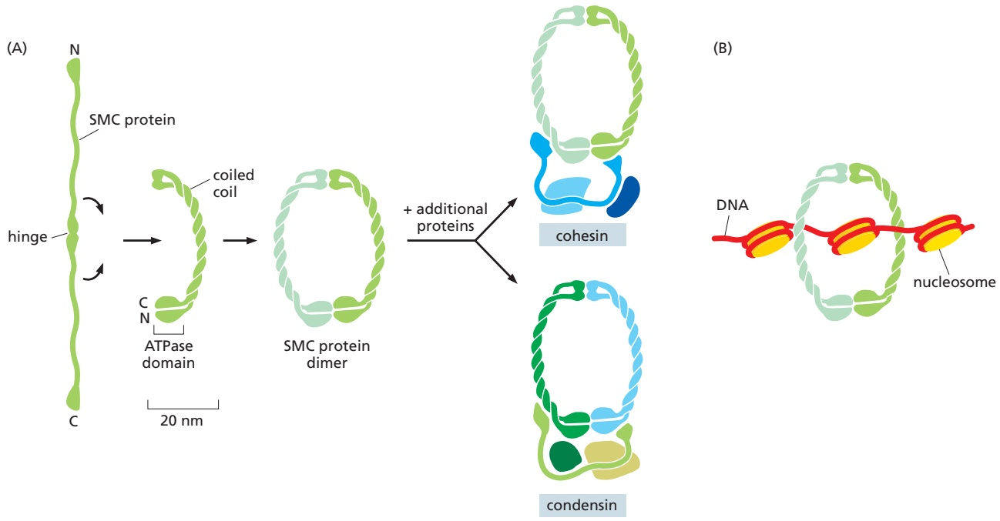

Figure 4–55 SMC protein complex formation. (A) These structures have important roles in bacteria, archaea, and eukaryotes. As indicated, their core forms from a large protein of 1000 to 1500 amino acids that folds on itself to form a antiparallel coiled-coil with a globular head; two of these molecules then pair to produce a ring structure with a flexible hinge at one end and an ATP-binding domain at the other end. Additional subunits are then added to form either cohesin or condensin, as indicated. (B) An SMC complex compared to the size of a nucleosome.

DNA, cleanly separating the two daughter chromosomes from each other in theMBoC7 n4.202/4.55 manner illustrated in **Figure 4–56A**. A model proposed to explain this movement is likewise shown (**Figure 4–56B**).

The DNA molecules that form eukaryotic chromosomes are generally much longer than those that form bacterial chromosomes, and many different DNA replication origins are therefore needed to copy each chromosome (see Chapter 5). Moreover, the accurate separation of two daughter chromosomes involves a process that is considerably more elaborate than the process in bacteria (described in Chapter 17). The SMC protein complexes have therefore diversified during the evolution of eukaryotes to play two different roles, each of which is critical for the function of chromosomes.

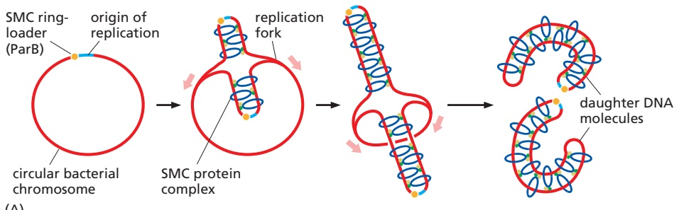

Figure 4–56 How moving SMC-containing protein rings function to separate bacterial chromosomes. (A) A DNA sequence adjacent to the origin of replication on the circular Bacillus subtilis chromosome binds a protein (ParB) that repeatedly loads bacterial SMC protein complexes. These complexes then use the energy released by repeated cycles of ATP hydrolysis to travel along the entire chromosome to the site where the two DNA replication forks that were formed at the origin meet, thereby partitioning the two very large daughter DNA molecules in a way that allows them to be easily segregated into two different daughter cells. (B) One model proposed to explain how SMC complexes move. These complexes function as sophisticated protein machines (see Figure 3–72), and it is still uncertain how they drive loop formation. In this “inchworm” model, the two ATPase domains separate and rejoin in sequence to motor along the DNA; for an alternative, see Figure 17–25B. (A, adapted from X. Wang et al., Science 355:524–527, 2017; B, adapted from M.H. Nichols and V.G. Corces, Nat. Struct. Mol. Biol. 25:906–910, 2018.)

Figure 4–57 Moving cohesin rings divide eukaryotic interphase chromosomes into a long series of looped domains. (A) The SMC protein complex cohesin, aided by accessory proteins that are not shown, is loaded onto chromatin to form a small DNA loop. Then, propelled by the energy of ATP hydrolysis (see Figure 4–56B), moving cohesin rings continually enlarge the loop, stopping when they encounter a DNA-bound CTCF complex on each side. A protein complex containing the CTCF dimer then becomes the loop base. (B) Schematic illustration of a portion of an interphase chromosome, organized as a series of looped domains.

During interphase, it is the SMC protein complex named **cohesin** that is critical (we shall see that its relative, condensin, functions in mitosis). Cohesin is thought to function in a manner similar to that of its bacterial counterpart, except that the cohesin rings are loaded at multiple sites along a chromosome. / . and serve to fold the linear chromosomal DNA molecule into a long series of loops. As illustrated in **Figure 4–57A**, because the traveling cohesin rings tend to stop at specific sites on the DNA, a loop is formed at a specific place on a chromosome. In vertebrates, these favored stop sites are usually marked by the sequence-specific DNA-binding protein CTCF, which forms a protein complex that not only stalls or stops the moving cohesin ring, but also holds the two ends of each DNA loop together.

As will be described in Chapter 7, CTCF is one of the insulator proteins that helps to maintain discrete domains of chromatin function (see Figure 7–28). It can also serve as part of a barrier that prevents the spreading of chromatin structures by reader–writer remodeling complexes (see Figure 4–39A). Because this protein commonly demarks the base of each looped domain in a chromosome, one can propose a general model for the structure of eukaryotic chromosomes that accounts for observations made in a diverse range of organisms. In this view, not only is the very long, linear DNA molecule that forms the core of each chromosome folded into a series of looped domains, but also the chromatin in each domain will often differ with respect to both its non-histone proteins and its covalent histone modifications—just as it does in the insect polytene chromosomes discussed earlier (**Figure 4–57B**). These differences are important because they help to control the selective expression of genes.

It is satisfying to find that a model recently derived for vertebrate interphase chromosomes is consistent with the observations made many decades ago on Drosophila polytene chromosomes and on the lampbrush chromosomes of amphibians. However, new methods that allow the organization of interphase chromosomes to be determined in single cells reveal that—unlike the situation in those special cases—most of the loops in a typical interphase chromosome are unstable: although those loops form in favored locations, their positions can rapidly fluctuate. In addition, loops can form within loops (see Figure 4–54). Thus, during interphase a typical eukaryotic chromosome has a structure that is highly dynamic.

#### Euchromatin and Heterochromatin Separate Spatially in the Nucleus

The same Hi-C experiments that reveal the boundaries of looped domains (see Figure 4–54) also detect a lower frequency of nearest neighbor contacts between DNA segments that can be either on different chromosomes or far away from each other with respect to DNA sequence on the same chromosome. Analysis of these segments reveals that every chromosome can be subdivided into two compartments, within which loci preferentially interact with each other but avoid interactions with the other compartment, regardless if from the same or another chromosome. It has been shown that these two compartments closely match euchromatin and heterochromatin with regard to their gene richness, gene expression, and replication timing.

H3K4me3

H3K27me3

H3K9me3

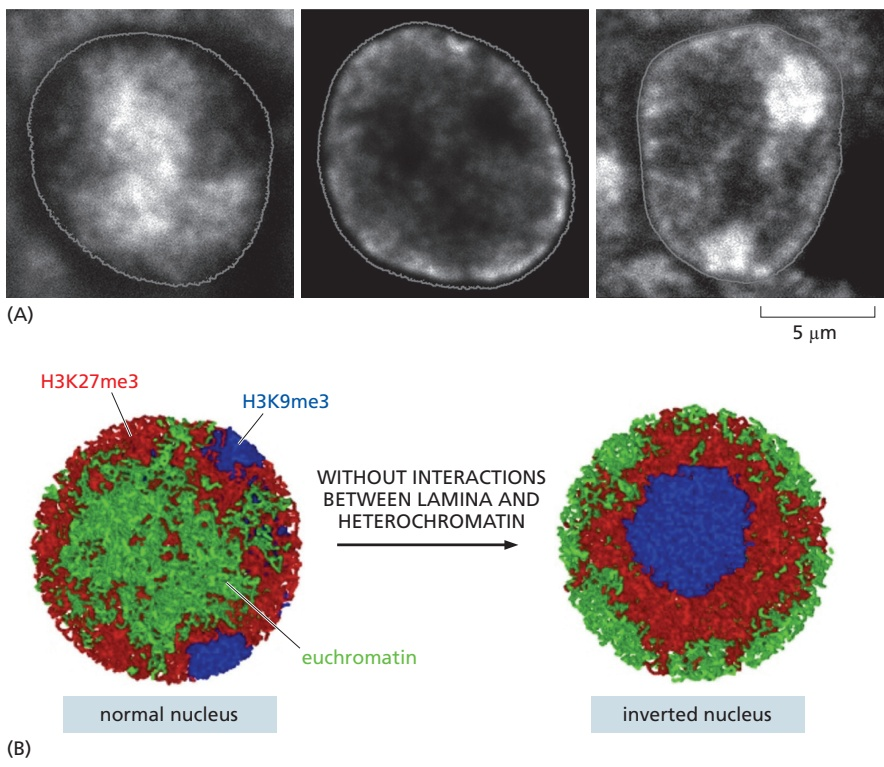

This finding is consistent with the images obtained by treating cells with antibody probes that preferentially stain these different types of chromatin; this staining produces a striking picture of the interphase nucleus, in which H3K9me3 heterochromatin is preferentially located near the nuclear periphery, H3K27me3 heterochromatin interior to that, and the open chromatin clustered in more interior regions (**Figure 4–58A**).

The tendency of heterochromatin to self-associate can be mimicked in experiments with reconstituted chromatin fragments that contain the abundant, heterochromatin-specific protein HP1 (see Figure 4–40). These experimentsMBoC7 n4.206/4.58 have led to a proposal that a phenomenon that resembles phase separation holds heterochromatin together, mediated by many fluctuating weak interactions (**Figure 4–59**). This self-associating heterochromatin is then tethered to the nuclear periphery through a set of proteins that link heterochromatic regions marked with specific histone modifications to the nuclear lamina. And the lamina is in turn anchored to the inner rim of the nuclear envelope by a set of transmembrane proteins embedded in the inner nuclear membrane (see Figure 16–67).

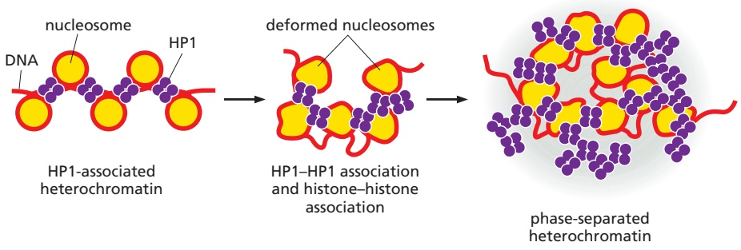

Figure 4–58 The distribution of heterochromatin and euchromatin in an interphase nucleus. (A) In this nucleus from a mouse fibroblast, the chromatin has been stained with antibodies to histones that contain three different covalent modifications: one recognizes the H3K4me3 mark in the active genes in euchromatin (see Table 4–2), and the others recognize either the H3K27me3 or the H3K9me3 silencing mark in heterochromatin (see Table 4–2). This segregation of heterochromatin toward the nuclear periphery is found in nearly all animal cells. (B) Polymer modeling of chromatin can explain the near-universal arrangement of the three types of chromatin in A, as well as the unusual arrangement that is observed in the special inverted nuclei of the photoreceptor cells of nocturnal animals, by assuming that the only difference in the latter nuclei is the absence of lamina–heterochromatin interactions. These models assume that chromatin–chromatin interactions are strongest between heterochromatin of the HK9me3 type, weaker between the heterochromatin of the H3K27me3 type, and nonexistent between euchromatin. (A, courtesy of Irina Solovei; B, adapted from M. Falk et al., Nature 570:395–399, 2019. Reproduced with permission of SNCSC.)

Figure 4–59 A model for the compaction and clustering of heterochromatin through fluctuating, weak associations that drive phase separation. According to this proposal, both associations between HP1 molecules and between transiently exposed histone amino acids in deformed nucleosomes contribute to the multiple weak interactions that condense heterochromatin. For a discussion of phase separation, see p. 173. (Adapted from S. Sanulli et al., Cold Spring Harb. Symp. Quant. Biol. 84:217–225, 2019.)

The functional relevance of heterochromatin positioning at the nuclear periphery remains unclear. However, this nuclear arrangement of chromatin pre-vails in eukaryotes with only one known exception—the so-called inverted nuclei of the rod cells of nocturnal mammals, in which euchromatin and heterochromatin have exchanged positions. The very center of the rod nucleus is occupied by highly condensed inert chromatin, whereas active euchromatin with ongoing gene expression is squeezed to the nuclear periphery (**Figure 4–58B**). Surprisingly, despite the inversion, the rod nuclei remain fully functional and are highly transcriptionally active.

<!-- END EN EN04-H038-H041 -->

### 英文补充：DNA复制、保真性、起始许可与核小体再装配

> 对应中文板块：DNA复制、保真性、起始许可与核小体再装配。英文来源：Molecular Biology of the Cell，第7版，第5章；[本章完整原文](../来源/英文教材/05_DNA_Replication_Repair_and_Recombination/chapter.md)。物理PDF页码范围：292–359（整章范围）。

<!-- BEGIN EN EN05-H000-H030 -->

#### DNA Replication, Repair, and Recombination

The ability of cells to maintain a high degree of order in a chaotic universe depends on the accurate duplication of vast quantities of genetic information carried in chemical form as DNA. This process, called DNA replication, must occur before a cell can produce two genetically identical daughter cells. Maintaining order also requires the continued surveillance and repair of this genetic information, because DNA inside cells is repeatedly damaged by chemicals and radiation from the environment, as well as by thermal accidents and reactive molecules generated inside the cell. In this chapter, we describe the protein machines that replicate and repair the cell’s DNA. These machines catalyze some of the most rapid and accurate processes that take place within cells, and their mechanisms provide clear illustrations of the elegance and efficiency of cell chemistry.

The short-term survival of a cell depends on preventing harmful changes in its DNA. But the long-term survival of a species requires that these same DNA sequences be changeable over many generations to permit evolutionary adaptation to changing circumstances. We shall see that, despite the great efforts that cells make to protect their DNA, occasional changes in DNA sequences are unavoidable. These changes produce the genetic variation that is required for natural selection to drive the evolution of organisms.

We begin this chapter with a brief discussion of the changes that occur in DNA as it is passed down from generation to generation. Next, we discuss the mechanisms—DNA replication and DNA repair—that are responsible for minimizing these changes. Finally, we consider some of the most intriguing pathways that alter DNA sequences—those of DNA recombination. These pathways include the movement within chromosomes of special DNA sequences called transposable elements.

#### THE MAINTENANCE OF DNA SEQUENCES

The survival of an individual organism demands a high degree of genetic stability. Only rarely do the cell’s DNA-maintenance processes fail, resulting in permanent change in the DNA. Such a change is called a mutation, and it can destroy an organism if it occurs in a vital position in the DNA sequence.

#### Mutation Rates Are Extremely Low

The **mutation rate**, the rate at which changes occur in DNA sequences, can be determined directly from experiments carried out with a bacterium such as Escherichia coli—a resident of our intestinal tract and a commonly used laboratory organism (see Figure 1–38). Under laboratory conditions, an E. coli cell divides about once every 30 minutes; as a result, a single cell can generate a very large population—several billion—in less than a day. In such a population, it is possible to detect the small fraction of bacteria that have suffered a damaging mutation in a particular gene. For example, the mutation rate of a gene specifically required for cells to use the sugar lactose as an energy source can be determined by growing the cells in the presence of a different sugar, such as

C HAP T E R

#### IN THIS CHAPTER

The Maintenance of DNA Sequences

DNA Replication Mechanisms

The Initiation and Completion of DNA Replication in Chromosomes

DNA Repair

Homologous Recombination

Transposition and Conservative Site-specific Recombination

glucose, and testing them subsequently to see how many have lost the ability to survive on a lactose diet. The fraction of damaged genes will underestimate the actual mutation rate because many mutations are silent (for example, those that change a codon but not the amino acid it specifies or those that change an amino acid without affecting the activity of the protein coded for by the gene). After correcting for these silent mutations, one finds that bacteria display a mutation rate of about three nucleotide changes per 1010 nucleotides copied.

It is also possible to measure the germ-line mutation rate in more complex, sexually reproducing organisms such as humans. In this case, the complete genomes from a family—parents and offspring—are directly sequenced, and a careful comparison reveals that approximately 70 new single-nucleotide mutations typically arise in the germ lines of each offspring. Normalized to the size of the human genome, the mutation rate is one nucleotide change per $1 0 ^ { 8 }$ nucleotides per human generation. (This is a slight underestimate because some germ-line mutations will be lethal and will therefore be absent from progeny; however, because relatively little of the human genome carries critical information, this consideration has a negligible effect on the true mutation rate.) It is estimated that approximately 100 cell divisions occur in the germ line from the time of conception to the time of production of the eggs and sperm that go on to make the next generation. Thus, the human mutation rate, expressed in terms of cell divisions (instead of human generations), is approximately one nucleotide change per $1 0 ^ { 1 0 }$ nucleotides copied.

Although E. coli and humans differ greatly in their modes of reproduction and in their generation times, when the mutation rates of each are normalized to a single round of DNA replication, they are both extremely low and within a factor of 3 of each other. We shall see later in the chapter that the basic mechanisms that ensure these low rates of mutation have been conserved since the very early history of cells on Earth.

#### Low Mutation Rates Are Necessary for Life as We Know It

Because many mutations are deleterious, no species can afford to allow them to accumulate at a high rate in its germ cells. Even though the observed mutation frequency is very low, it is thought to limit the number of essential genes that any organism can rely on to perhaps 30,000. More essential genes than this, and the probability that at least one critical component will suffer a damaging mutation becomes catastrophically high. By an extension of the same argument, a mutation frequency tenfold higher would limit an organism to about 3000 essential genes. In this case, evolution would have been limited to organisms considerably less complex than a fruit fly.

The cells of a sexually reproducing animal or plant are of two types: **germ cells** and **somatic cells**. The germ cells transmit genetic information from parent to offspring; the somatic cells form the body of the organism (Figure 5–1). We have seen that germ cells must be protected against high rates of mutation to maintain the species. However, the somatic cells of multicellular organisms must also be protected from genetic change to properly maintain the organized structure of the body. Nucleotide changes in somatic cells can give rise to variant cells, some of which, through “local” natural selection, proliferate rapidly at the expense of the rest of the organism. In an extreme case, the result is the uncontrolled cell proliferation that we know as cancer. This condition is due largely to an accumulation of changes in the DNA sequences of somatic cells, as discussed in Chapter 20. Any significant increase in the mutation frequency would presumably cause a disastrous increase in the incidence of cancer by accelerating the rate at which dangerous somatic-cell variants arise. Thus, both for the perpetuation of a species with a large number of genes (germ-cell stability) and for the prevention of cancer resulting from mutations in somatic cells (somaticcell stability), multicellular organisms like ourselves absolutely depend on the remarkably high fidelity with which their DNA sequences are replicated and maintained.

new S strand

Figure 5–1 Germ-line cells and somatic cells carry out fundamentally different functions. In sexually reproducing organisms, genetic information is propagated into the next generation exclusively by germ-line cells (red). This cell lineage includes the specialized reproductive cells—the gametes (eggs and sperm, half circles)—which contain only half the number of chromosomes as that contained in the other cells in the body (full circles). When two gametes come together during fertilization, they form a fertilized egg, or zygote (purple), which once again contains a full set of chromosomes. The zygote gives rise to both germ-line cells and somatic cells (blue). Somatic cells form the body of the organism but do not contribute their DNA to the next generation.

#### Summary

In all cells, DNA sequences are maintained and replicated with extremely high fidelity. The mutation rate, approximately one nucleotide change per $I O ^ { I O ^ { ' } }$ nucleotides each time the DNA is replicated, is very similar for organisms as different as bacteria and humans. Because of this remarkable accuracy, the sequence of the human genome (approximately $3 . \dot { I } \times I 0 ^ { 9 }$ nucleotide pairs) is unchanged or changed byMBoC7 m5.01/5.01 only a few nucleotides each time a typical human cell divides. This allows humans to pass accurate genetic instructions from one generation to the next and also—for most of us—to avoid the changes in somatic cells that lead to cancer.

#### DNA REPLICATION MECHANISMS

All organisms duplicate their DNA with extraordinary accuracy before each cell division. In this part of the chapter, we explore how an elaborate “replication machine” achieves this accuracy, while duplicating DNA at rates as high as 1000 nucleotides per second.

#### Base-pairing Underlies DNA Replication and DNA Repair

As introduced in Chapter 1, DNA templating is the mechanism the cell uses to copy the nucleotide sequence of one DNA strand into a complementary DNA sequence (**Figure 5–2**). This process requires the separation of the DNA helix into two template strands, and it entails the recognition of each nucleotide in the DNA template strands by a free (unpolymerized) complementary nucleotide. The separation of the DNA helix exposes the hydrogen-bond donor and acceptor groups on each DNA base to allow its base-pairing with the appropriate incoming free nucleotide, aligning it for its enzyme-catalyzed polymerization into a new DNA chain.

template S strand

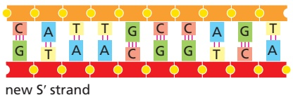

template S′ strand

Figure 5–2 DNA acts as a template for its own replication. Because the nucleotide A will successfully pair only with T, and G with C, each strand of a DNA double helix—labeled here as the S strand and its complement, the S′ strand—can serve as a template to specify the sequence of nucleotides in a complementary strand. In this way, both strands of a DNA double helix can be copied with precision, producing two exact copies of the original double helix. How complementary nucleotides base-pair is shown in Figure 4–5.

Figure 5–3 The chemistry of DNA synthesis. Nucleotides enter the reaction as deoxyribonucleoside triphosphates, and the addition of a deoxyribonucleotide to the 3′ end of a polynucleotide chain is the fundamental reaction by which DNA is synthesized. As shown, base-pairing between an incoming deoxyribonucleoside triphosphate and an existing strand of DNA (the template strand) guides the formation of the new strand of DNA and ensures that its nucleotide sequence is complementary to that of the template.

The first nucleotide-polymerizing enzyme, **DNA polymerase**, was discovered in 1957. The free nucleotides that serve as substrates for this enzyme were found to be deoxyribonucleoside triphosphates, and their polymerization into DNA required a single-strand DNA template. **Figure 5–3** and **Figure 5–4** illustrate the stepwise mechanism of this reaction.

#### The DNA Replication Fork Is Asymmetrical

During DNA replication inside a cell, each of the two original DNA strands serves as a template for the formation of an entire new strand. Because each of the two daughters of a dividing cell inherits a new DNA double helix containing one original and one new strand (**Figure 5–5**), the DNA double helix is said to be replicated semiconservatively. How is this feat actually accomplished?

Analyses carried out in the early 1960s on the whole replicating chromosome of an E. coli bacterium revealed a localized region of replication that moves progressively along the parent DNA double helix. Because of its Y-shaped structure, this active region is called a **replication fork** (**Figure 5–6**). At the replication fork, a multienzyme complex that contains the DNA polymerase synthesizes the DNA of both new daughter strands.

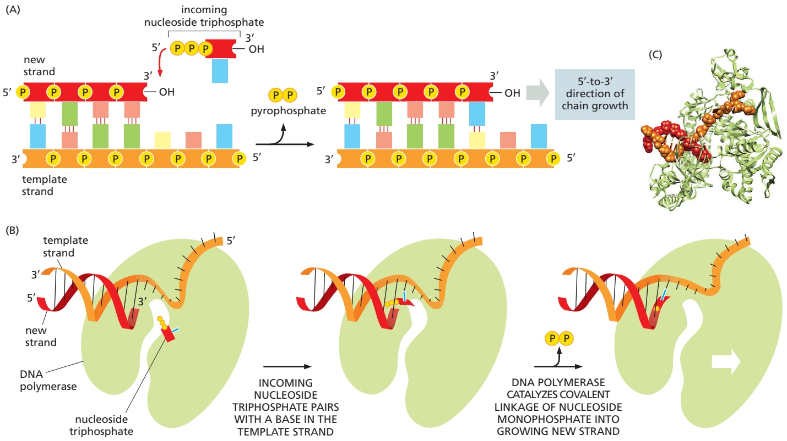

Figure 5–4 How DNA polymerase adds a deoxyribonucleotide to the end of a growing DNA strand. (A) An incoming deoxynucleoside triphosphate forms a base pair with its partner in the template strand. It is then covalently attached to the free 3′-hydroxyl (3′-OH) end of the growing DNA strand. The new DNA strand is therefore synthesized in the 5′-to-3′ direction. The energy for the polymerization reaction comes from the hydrolysis of a high-energy phosphate bond in the incoming nucleoside triphosphate and the release of pyrophosphate, which is subsequently hydrolyzed to yield two molecules of inorganic phosphate (not shown). (B) The reaction is catalyzed by the enzyme DNA polymerase (light green). The polymerase guides the incoming nucleoside triphosphate to the template strand and positions it such that its 5′ triphosphate will be able to react with the 3′-hydroxyl group on the newly synthesized strand. The white arrow indicates the direction of polymerase movement. (C) Structure of DNA polymerase, as determined by x-ray crystallography, also showing the replicating DNA. The template strand is the longer, orange strand, and the DNA strand being synthesized is colored red. See Movie 5.1. (C, PDB code: 1KRP.)

Initially, the simplest mechanism of DNA replication seemed to be the continuous growth of both new strands, nucleotide by nucleotide, at the replication fork as it moves from one end of a DNA molecule to the other. But because of the antiparallel orientation of the two DNA strands in the DNA double helix (see Figure 5–2), this mechanism would require one daughter strand to polymerize in the 5′-to-3′ direction and the other in the $3' - \mathrm{t}0 - 5'$ direction. Such a replication fork would require two distinct types of DNA polymerase enzymes. However, as attractive as this model might seem, the DNA polymerases at replication forks can synthesize only in the $5^{\prime}-\mathrm{t}0-3^{\prime}$ direction.

How, then, can a DNA strand grow in the $3 ^ { \prime } - \mathrm { t o } - 5 ^ { \prime }$ direction? The answer came from an experiment performed in the late 1960s. Researchers added highly radioactive 3H-thymidine to dividing bacteria for a few seconds, so that only the most recently replicated DNA—that just behind the replication fork—became radiolabeled. This experiment revealed the transient existence of pieces of

<small>Figure 5–5 In each round of DNA replication, each of the two strands of DNA is used as a template for the formation of a new, complementary strand. DNA replication is semiconservative because each daughter DNA double helix is composed of one conserved (old) strand and one newly synthesized strand.</small>

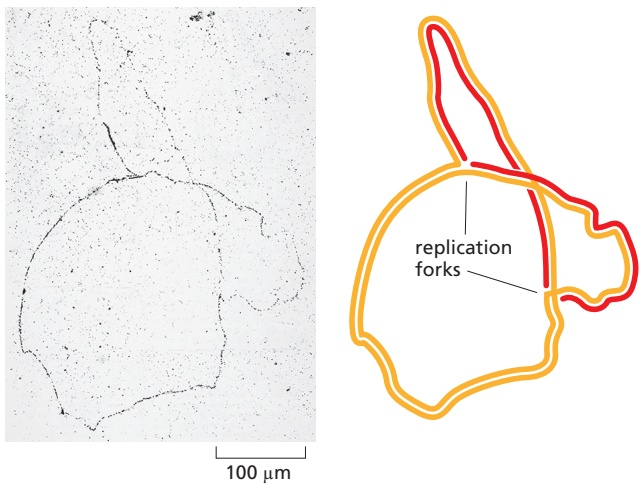

DNA that were 1000–2000 nucleotides long, now commonly known as Okazaki fragments (named for their discoverer), at the growing replication fork. Similar replication intermediates were later found in eukaryotes, where they are only 100–200 nucleotides long. The Okazaki fragments were shown to be synthesized only in the $5' - \mathrm{t}0 - 3'$ chain direction and to be joined together after their synthesis to create long DNA chains.

Each replication fork therefore has an asymmetric structure (**Figure 5–7**). The DNA daughter strand that is synthesized continuously is known as the **leading strand**. Its synthesis slightly precedes the synthesis of the daughter strand that is synthesized discontinuously, known as the **lagging strand**. For the lagging strand, the direction of nucleotide polymerization is opposite to the overall direction of DNA chain growth. The synthesis of this strand by a discontinuous “backstitching” mechanism means that DNA replication requires only the $5' - \mathrm{t}0 - 3'$ type of DNA polymerase.

#### The High Fidelity of DNA Replication Requires Several Proofreading Mechanisms

As discussed at the beginning of the chapter, the fidelity of copying DNA during replication is such that only about one mistake occurs for every $1 0 ^ { \check { 1 } 0 }$ nucleotides copied. This accuracy is much higher than one would expect solely from the

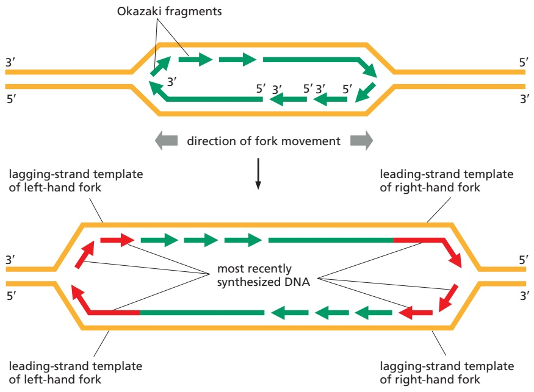

Figure 5–6 Two replication forks moving in opposite directions on the E. coli chromosome, a large circular DNA molecule. Each replication fork has a Y-shaped structure and moves progressively along the DNA, spinning out newly replicated DNA behind it. The stem of the Y is the parent DNA double helix, and the two arms of the Y contain the newly synthesized DNA. The image on the left was obtained by feeding E. coli radioactive thymine for several hours, gently isolating the DNA on filter paper, and placing a piece of photographic film next to the DNA. Because radioactivity exposes photographic film, an image of the DNA was captured when the film was developed and viewed under a light microscope. The diagram on the right is an interpretation of the result, with parent DNA strands in orange and newly synthesized DNA strands in red. During its isolation for this experiment, the E. coli DNA folded on itself, accounting for the crossing of the double helix. (From J. Cairns, Cold Spring Harb. Symp. Quant. Biol. 38:43–46, 1963. With permission from Cold Spring Harbor Laboratory Press.)

Figure 5–7 At each replication fork, the lagging DNA strand is synthesized in pieces. The upper diagram shows two replication forks moving in opposite directions on a double-helical DNA molecule, as in Figure 5–6; the lower diagram shows the same two forks a short time later. Because both of the new strands at a replication fork are synthesized in the $5 ^ { \prime } - \dot { 1 } 0 - \dot { 3 } ^ { \prime }$ direction, the lagging strand of DNA must be made initially as a series of short DNA strands, which are later joined together. To replicate the lagging strand, the DNA polymerase molecule on that side of the fork uses a backstitching mechanism: it synthesizes a short piece of DNA in the 5′-to-3′ direction, stops, and is then moved by its protein machine back toward the fork in order to synthesize the next fragment.

properties of complementary base-pairing. The standard complementary base pairs (see Figure 4–5) are not the only ones possible. For example, with small changes in helix geometry, two hydrogen bonds can form between G and T in DNA. In addition, rare configurations of the four DNA bases (known as tautomers) occur transiently in ratios of 1 part to 104 or 105. These forms mispair without a change in helix geometry: the rare tautomeric form of C pairs with A instead of G, for example.

If the DNA polymerase did nothing special when a mispairing occurred between an incoming deoxyribonucleoside triphosphate and the DNA template, the wrong nucleotide would often be incorporated into the new DNA chain, producing frequent mutations. The high fidelity of DNA replication, however, depends not only on the initial base-pairing, but also on several “proofreading” mechanisms that act sequentially to correct any initial mispairings that might have occurred.

DNA polymerase performs the first proofreading step just before a new nucleotide is covalently added to the growing chain. After complementary nucleotide binding, but before the nucleotide is covalently added to the growing chain, the enzyme must undergo a conformational change in which its “grip” tightens around the active site. Because this change occurs more readily with correct than incorrect base-pairing, it allows the polymerase to “double-check” the exact basepair geometry before it catalyzes the addition of the nucleotide. Incorrectly paired nucleotides are harder to add and therefore more likely to diffuse away before the polymerase can mistakenly add them.

The next error-correcting reaction, known as exonucleolytic proofreading, takes place immediately after those rare instances in which an incorrect nucleotide is covalently added to the growing chain. DNA polymerase enzymes are highly discriminating in the types of DNA chains they will elongate: they require a previously formed, base-paired 3′-OH end of a primer strand (see Figure 5–4). Those DNA molecules with a mismatched (improperly base-paired) nucleotide at the 3′-OH end of the primer strand are not effective as templates because the polymerase has difficulty extending such a strand. DNA polymerase molecules correct such a mismatched primer strand by means of a separate catalytic site (either in a separate subunit or in a separate protein domain of the polymerase molecule, depending on the polymerase). This 3-to-5 proofreading exonuclease clips off any unpaired or mispaired residues at the primer terminus, continuing until enough nucleotides have been removed to regenerate a correctly base-paired 3′-OH terminus that can prime DNA synthesis. In this way, DNA polymerase functions as a “self-correcting” enzyme that removes its own polymerization errors as it moves along the DNA (**Figure 5–8** and **Figure 5–9**).

Because the self-correcting properties of DNA polymerase depend on its requirement for a perfectly base-paired primer terminus, it is apparently not possible for such an enzyme to start DNA synthesis de novo without an existing primer. By contrast, the RNA polymerase enzymes involved in gene transcription do not need such an efficient exonucleolytic proofreading mechanism: errors in making RNA are not passed on to the next generation, and the occasional defective RNA molecule that is produced has no long-term significance. As a result,

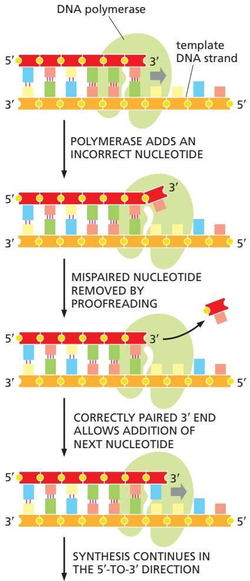

Figure 5–8 During DNA synthesis, DNA polymerase proofreads its own work. If an incorrect nucleotide is accidentally added to a growing strand, the DNA polymerase stops, cleaves it from the strand, and replaces it with the correct nucleotide before continuing.

Figure 5–9 DNA polymerase contains separate sites for DNA synthesis and proofreading. The DNA polymerase, which cradles the DNA molecule being replicated, is shown in the polymerizing mode (left) and in the proofreading, or editing, mode (right). The catalytic sites for the polymerization activity (P) and editing activity (E) are indicated. When the polymerase adds an incorrect nucleotide, the newly synthesized DNA strand (red) transiently unpairs from the template strand (orange), and its 3′ end moves into the editing site (E) to allow the incorrect nucleotide to be removed. These diagrams are based on the structure of an E. coli DNA polymerase molecule, as determined by x-ray crystallography.

<table><tr><td>Replication step</td><td>Errors per nucleotide added</td></tr><tr><td>5&#x27;→3&#x27; polymerization</td><td>1 in 10^5</td></tr><tr><td>3&#x27;→5&#x27; exonucleolytic proofreading</td><td>1 in 10^2</td></tr><tr><td>Strand-directed mismatch repair</td><td>1 in 10^3</td></tr><tr><td>Combined</td><td>1 in 10^10</td></tr><tr><td colspan="2">The third step, strand-directed mismatch repair, is described later in this chapter. For the polymerization step, “errors per nucleotide added” describes the probability that an incorrect nucleotide will be added to the growing chain. For the other two steps, “errors per nucleotide added” describes the probability that an error will not be corrected. Each step therefore reduces the chance of a final error by the factor shown.</td></tr></table>

RNA polymerases do not require a base-paired end $3 ^ { \prime } \mathrm { { - O H } }$ for nucleotide addition and are able to start new polynucleotide chains without a primer.

On average, about one mistake is made for every $1 0 ^ { 4 }$ polymerization events both in RNA synthesis and in the separate process of translating mRNA sequences into protein sequences. This error rate is over 100,000 times greater than that in DNA replication, where, as we have seen, a series of proofreading processes makes the process unusually accurate (**Table 5–1**).

#### DNA Replication in the 5′-to-3′ Direction Allows Efficient Error Correction

The need for accuracy probably explains why DNA replication occurs only in the $5' - \mathrm{t}0 - 3'$ direction. If there were a DNA polymerase that added deoxyribonucleoside triphosphates in the $3' - \mathrm{t}0 - 5'$ direction, the growing $5 ^ { \prime }$ end of the chain, rather than the incoming mononucleotide, would have to provide the activating triphosphate needed for the covalent linkage (see Figure 5–3). In this case, the mistakes in polymerization could not be simply hydrolyzed away, because the bare $5 ^ { \prime }$ end of the chain thus created would immediately terminate DNA synthesis. It is therefore possible to correct a mismatched base only if it has been added to the $3 ^ { \prime }$ end of a DNA chain. Although the backstitching mechanism for DNA replication seems complex, it preserves the $5' - \mathrm{t}0 - 3'$ direction of polymerization that is required for exonucleolytic proofreading.

Despite these safeguards against DNA replication errors, DNA polymerases occasionally leave mistakes behind in the DNA that they produce. However, as we shall see later in this chapter, cells have yet another chance to correct these errors by a process called strand-directed mismatch repair. Before discussing this mechanism, however, we describe the other types of proteins that function at the replication fork as part of a large protein machine that replicates DNA.

#### A Special Nucleotide-polymerizing Enzyme Synthesizes Short RNA Primer Molecules

For the leading strand, a primer is needed only at the start of replication: once a replication fork is established, the DNA polymerase is continuously presented with a base-paired chain end on which to add new nucleotides. On the lagging side of the fork, however, each time the DNA polymerase completes a short DNA Okazaki fragment (which takes a few seconds), it must start synthesizing a completely new fragment at a site further along the template strand (see Figure 5–7). Each time this occurs, a special mechanism is required to produce a base-paired primer strand for the DNA polymerase to elongate. This requires an enzyme called **DNA primase** that uses ribonucleoside triphosphates to synthesize short **RNA primers** on the lagging strand (**Figure 5–10**). In eukaryotes, these primers are about 10 nucleotides long and are made at intervals of 100–200 nucleotides

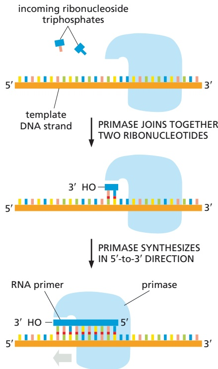

Figure 5–10 RNA primers are synthesized by an RNA polymerase called DNA primase, which uses a DNA strand as a template. Like DNA polymerase, primase synthesizes MBoC7 e6.17/5.10in the 5′-to-3′ direction. Unlike DNA polymerase, however, primase can start a new polynucleotide chain by joining together two nucleoside triphosphates without the need for a base-paired 3′ end as a starting point. A DNA primase uses ribonucleoside triphosphates rather than deoxyribonucleoside triphosphates, and it is much less accurate than a DNA polymerase.

Figure 5–11 Different enzymes act in series to synthesize DNA on the lagging strand. In eukaryotes, RNA primers are made at intervals of about 200 nucleotides on the lagging strand, and each RNA primer is approximately 10 nucleotides long. These primers are extended by DNA polymerases at the replication fork to produce Okazaki fragments. The primers are subsequently removed by nucleases that recognize the RNA strand in an RNA–DNA hybrid helix and destroy it; this leaves gaps that are filled in by an accurate “repair” DNA polymerase that proofreads as it fills in the gaps. The completed DNA fragments are finally joined together by an enzyme called DNA ligase, which catalyzes the formation of a phosphodiester bond between the 3′-hydroxyl end of one fragment and the 5′-phosphate end of the next, thus linking up the sugar–phosphate backbones. This nick-sealing reaction requires an input of energy in the form of ATP (see Figure 5–12).

on the lagging strand. The synthesis of the leading strand also requires an RNA primer, but only at its very beginning.

RNA was introduced in Chapter 1 and is described in detail in Chapter 6. Here, we note only that RNA is very similar in structure to DNA. A strand of RNA can form base pairs with a strand of DNA, generating a DNA–RNA hybrid double helix if the two nucleotide sequences are complementary. Thus, the same templating principle used for DNA synthesis guides the synthesis of RNA primers. Because an RNA primer contains a properly base-paired nucleotide with a 3′-OH group at one end, it can be elongated by the DNA polymerase at this end to begin an Okazaki fragment.

The synthesis of each Okazaki fragment ends when this DNA polymerase runs into the RNA primer attached to the 5′ end of the previous fragment. To produce a continuous DNA chain from the many DNA fragments made on the lagging strand, a special DNA repair system acts quickly to remove the RNA primers and replace them with DNA. An enzyme called **DNA ligase** then joins the 3′ end of the new DNA fragment to the 5′ end of the previous one to complete the process (**Figure 5–11** and **Figure 5–12**).

Why might an erasable RNA primer be used instead of a DNA primer? The argument that a self-correcting polymerase cannot start chains de novo also implies the converse: an enzyme that starts chains anew cannot be efficient at self-correction. Thus, any enzyme that primes the synthesis of Okazaki fragments will of necessity make a relatively inaccurate copy. If these inaccurate copies were allowed to remain, the resulting increase in the overall mutation rate would be enormous. It therefore seems likely that the use of RNA rather than DNA for priming brings a powerful advantage to the cell: the ribonucleotides in the primer automatically mark these sequences as “suspect copy” to be efficiently removed and replaced by DNA produced by a highly accurate DNA polymerase.

#### Special Proteins Help to Open Up the DNA Double Helix in Front of the Replication Fork

For DNA synthesis to proceed, the DNA double helix must be opened up ahead of the replication fork so that the incoming deoxyribonucleoside triphosphates can form base pairs with the template strand. The DNA double helix is very stable under physiological conditions: the base pairs are locked in place so strongly that it requires temperatures approaching that of boiling water to separate the two strands in a test tube. For this reason, two additional types of replication proteins—DNA helicases and single-strand DNA-binding proteins—are needed

Figure 5–12 DNA ligase joins together Okazaki fragments on the lagging strand during DNA synthesis. The ligase enzyme uses a molecule of ATP to activate the 5′ phosphate of one fragment (step 1) before forming a new bond with the 3′ hydroxyl of the other fragment (step 2).

(A)

Figure 5–13 How DNA helicase enzymes can separate strands as they move along a DNA single strand. An experiment is diagrammed, in which a short, complementary DNA fragment is base-paired to a longer DNA strand to form a region of DNA double helix. Because the purified DNA helicase added acts as a “moving wedge,” the double helix is pulled apart as the helicase runs unidirectionally along the DNA single strand, releasing the short DNA strand in a reaction that requires the presence of both the helicase protein and ATP. The rapid stepwise movement of the helicase is powered by its ATP hydrolysis (shown schematically in Figure 3–71A). As indicated, many DNA helicases are composed of a ring of six subunits.

to open the double helix and present an appropriate single-stranded DNA template for the DNA polymerase to copy.

**DNA helicases** were first isolated as proteins that hydrolyze ATP when they are bound to single strands of DNA. As described in Chapter 3, the binding and hydrolysis of ATP can change the shape of a protein molecule in a cyclical manner that allows the protein to perform mechanical work. DNA helicases use this principle to propel themselves rapidly along a single DNA strand. When they encounter a region of double helix, they continue to move along their strand, thereby prying apart the helix ahead of them. This unidirectional movement can occur at rates of up to 1000 nucleotides per second (**Figure 5–13** and **Figure 5–14**).

The two strands of DNA have opposite polarities, and, in principle, a helicase could unwind the DNA double helix in front of a replication fork by moving either in the $5' - \mathrm{t}0 - 3'$ direction along one strand or in the 3′-to-5′ direction along the other strand. In fact, both types of DNA helicase exist. In the best-understood replication systems in bacteria, a helicase moving 5′-to-3′ along the lagging-strand template has the predominant role.

**Single-strand DNA-binding (SSB) proteins** bind tightly and cooperatively to the single-stranded DNA that is produced by helicases. Through cooperative binding, SSB proteins coat and straighten out all regions of single-stranded DNA, thereby preventing the formation of the short hairpin helices that otherwise form in these single strands (**Figure 5–15** and **Figure 5–16**). These regions occur routinely on the lagging-strand template, and if not removed, they can impede the DNA synthesis catalyzed by DNA polymerase.

#### A Sliding Ring Holds a Moving DNA Polymerase onto the DNA

On their own, most DNA polymerase molecules will synthesize only a short string of nucleotides before falling off the DNA template. However, an accessory protein (called PCNA in eukaryotes) forms a **sliding clamp** that keeps the polymerase firmly on the DNA when it is moving but releases the polymerase as soon as it runs into a double-strand region of DNA.

How can a sliding clamp prevent the polymerase from dissociating without impeding the polymerase’s rapid movement along DNA? The three-dimensional structure of the clamp protein revealed that it forms a large ring around the DNA double helix. One face of the ring binds to the back of the DNA polymerase, and the whole ring slides freely along the DNA as the polymerase moves. The assembly of the clamp around the DNA requires a special protein complex, the **clamp loader**, that can open and close the ring in a regulated manner.

The moving DNA polymerase is tightly bound to the clamp, and, on the leading strand, the two remain associated for a very long time. The DNA polymerase on the lagging-strand template also makes use of the clamp, but each time the polymerase reaches the 5′ end of the preceding Okazaki fragment, the polymerase releases itself from the clamp and dissociates from the template. With the help of the clamp loader, which hydrolyzes ATP as it loads a new clamp onto a primer– template junction (**Figure 5–17**), this lagging-strand polymerase molecule then associates with the new clamp that is assembled on the RNA primer of the next Okazaki fragment.

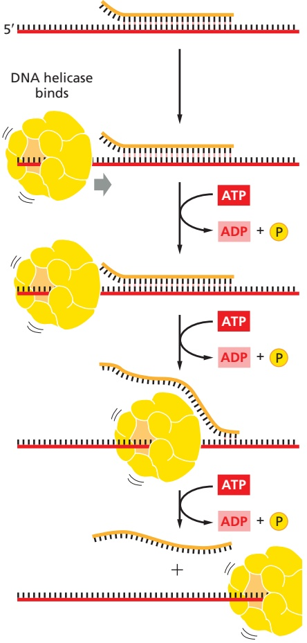

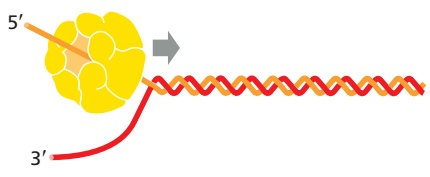

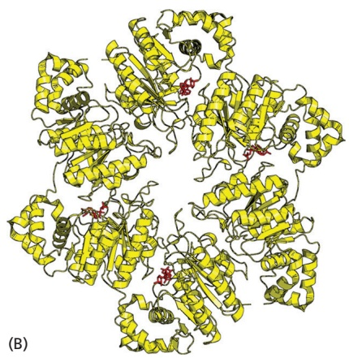

<small>Figure 5–14 The structure of a DNA helicase. (A) Diagram of the protein, a hexameric ring, drawn to scale with a replication fork. (B) Detailed structure of the bacteriophage T7 replicative helicase, as determined by x-ray diffraction. Six identical subunits bind and hydrolyze ATP in an ordered fashion to propel this molecule, like a rotary engine, along a DNA single strand that passes through the central hole. Bound ATP molecules in the structure are indicated in red (Movie 5.2). (PDB code: 1E0J.)</small>

Figure 5–15 The effect of single-strand DNA-binding proteins (SSB proteins) on the structure of single-stranded DNA. Because each protein molecule prefers to bind next to a previously bound molecule, long rows of this protein form on a DNA single strand. This cooperative binding straightens out the DNA template and facilitates the DNA polymerization process. The “hairpin helices” shown in the bare, single-stranded DNA result from a chance matching of short regions of MBoC7 complementary nucleotide sequence.

#### The Proteins at a Replication Fork Cooperate to Form a Replication Machine

Although we have discussed DNA replication as though it were performed by a set of proteins all acting independently, in reality most of these proteins are held together in a large and orderly multienzyme complex that rapidly synthesizes DNA. This complex can be likened to a tiny sewing machine composed of protein

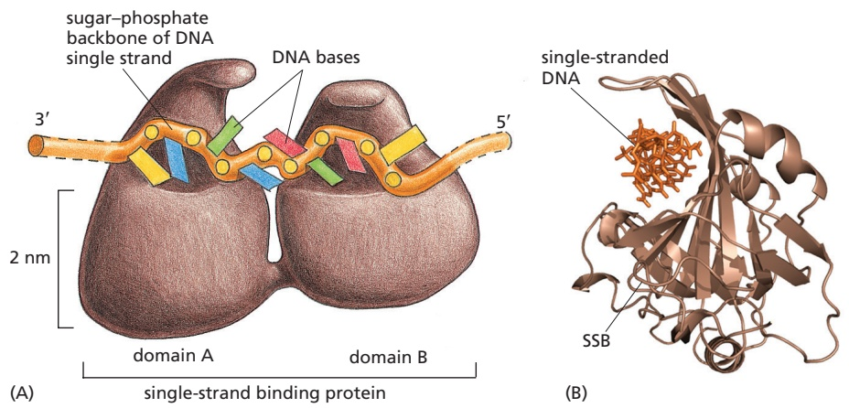

Figure 5–16 Human single-strand binding protein bound to DNA. (A) Front view of the two DNA-binding domains of the protein (called RPA), which cover a total of eight nucleotides. Note that the DNA bases remain exposed in this protein–DNA complex. (B) Diagram showing the three-dimensional structure, with the DNA strand (orange) viewed end on. (PDB code: 1JMC.)

Figure 5–17 The sliding clamp that holds DNA polymerase on the DNA. (A) The structure of the clamp protein from E. coli, as determined by x-ray crystallography, with a DNA helix added to indicate how the protein fits around DNA (Movie 5.3). (B) Schematic illustration showing how the clamp is loaded onto DNA. The structure of the clamp loader (green) resembles a screw nut, with its threads matching the grooves of double-stranded DNA. The loader binds to a free clamp molecule, forcing a gap in its ring of subunits, which enables it to slip around DNA. The loader then “screws” the open clamp onto double-stranded DNA until it encounters the 3′ end of a primer, at which point the loader hydrolyzes ATP and releases the clamp, allowing it to close around the DNA. In the simplified reaction shown here, the clamp loader dissociates once the clamp has been assembled. At bacterial replication forks, the clamp loader remains bound to the polymerase so that, on the lagging strand, it is ready to assemble a new clamp at the start of each new Okazaki fragment. (A, from X.P. Kong et al., Cell 69:425–437, 1992; PDB code: 3BEP; B, adapted from B.A. Kelch et al., Science 334:1675–1680, 2011.)

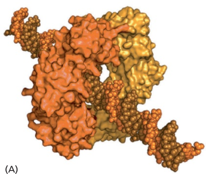

parts and powered by nucleoside triphosphate hydrolysis. Like a sewing machine, the replication complex probably remains stationary with respect to its immediate surroundings; the DNA can be thought of as a long strip of cloth being rapidly threaded through it. Although the replication complex has been most intensively studied in E. coli and several of its viruses, a very similar complex also operates in eukaryotes, as we shall see below.

How the different proteins at the replication fork work together in bacteria is shown in **Figure 5–18**. At the front of the replication fork, DNA helicase opens the DNA helix. Several identical DNA polymerase molecules work at the fork, one on the leading strand and two on the lagging strand. Whereas the DNA polymerase molecule on the leading strand can operate in a continuous fashion, the DNA polymerase molecules on the lagging-strand alternate at short intervals, using the short RNA primers made by DNA primase to begin each Okazaki fragment. The close association of all these protein components increases the efficiency of replication, and it is made possible by a folding back of the lagging strand as shown in the figure. This arrangement facilitates the loading of the polymerase clamp each time that an Okazaki fragment is synthesized: the clamp loader and the lagging-strand DNA polymerase molecule are kept in place at the replication fork even when they detach from their DNA template. The replication proteins are thus linked together into a single large unit (total molecular mass >106 daltons), enabling DNA to be synthesized on both sides of the replication fork in a coordinated and efficient manner.

On the lagging strand, the DNA replication machine leaves behind a series of unsealed Okazaki fragments, which still contain the RNA that primed their synthesis at their 5′ ends. As discussed earlier, this RNA is removed, and the resulting

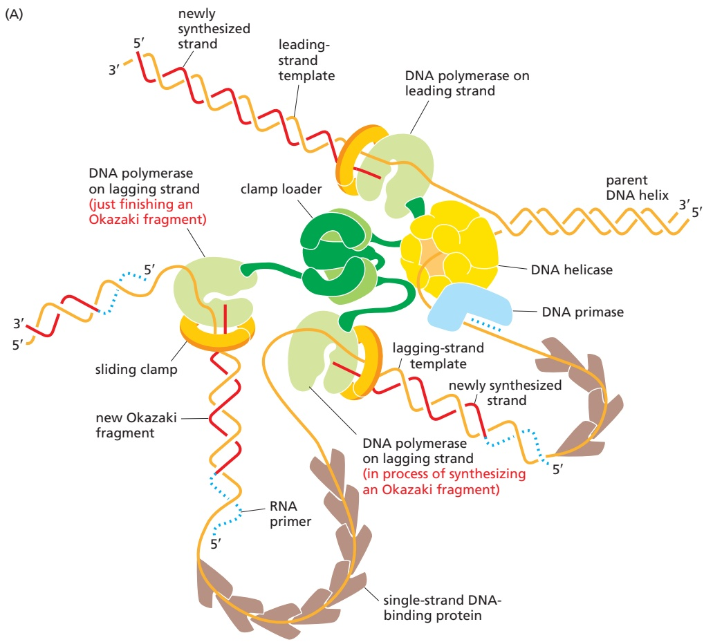

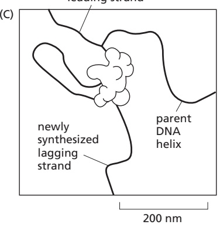

Figure 5–18 A bacterial replication fork. (A) In this case, a single DNA polymerase molecule synthesizes the leading strand while two DNA polymerases are used—in alternating fashion—for lagging-strand DNA synthesis. All of these polymerase molecules, which are identical, are held in place at the fork by flexible “arms” that extend from the clamp loader. Additional interactions (for example, between the DNA helicase and primase) ensure that all the individual components function together as a well-coordinated protein machine (Movie 5.4). (B) An electron micrograph showing the replication machine from the bacteriophage T4 as it moves along a template synthesizing DNA behind it. (C) An interpretation of the micrograph is given in the sketch: note especially the DNA loop on the lagging strand. Apparently, during the preparation of this sample for electron microscopy, the replication proteins became partly detached from the very front of the replication fork. (B, from P.D. Chastain et al., J. Biol. Chem. 278:21276–21825, 2003. With permission from American Society for Biochemistry and Molecular Biology.)

gap is filled in by DNA repair enzymes that operate behind the replication fork (see Figure 5–11).

#### DNA Replication Is Fundamentally Similar in Eukaryotes and Bacteria

Much of what we know about DNA replication was first derived from studies of purified bacterial and bacteriophage multienzyme systems capable of DNA replication in vitro. The development of these systems in the 1970s was greatly facilitated by the prior isolation of mutants in a variety of replication genes; these mutants were exploited to identify and purify the corresponding replication proteins. The first eukaryotic replication system that accurately replicated DNA in vitro was described in the mid-1980s, and mutations in genes encoding nearly all of the replication components have now been isolated and analyzed in the yeast Saccharomyces cerevisiae. As a result, much is known about the detailed enzymology of DNA replication in eukaryotes, and it is clear that the fundamental features of DNA replication—including replication-fork geometry and the use of $5 ^ { \prime } { \rightarrow } 3 ^ { \prime }$ DNA polymerases, helicases, clamps, clamp loaders, and single-strand binding proteins—are similar.

Figure 5–19 Schematic diagram of a eukaryotic replication fork. Unlike the bacterial replication proteins, those from eukaryotes are thought to function largely independently, perhaps accounting for the slower speed of the eukaryotic replication fork (Movie 5.5). Note that the eukaryotic CMG helicase moves unidirectionally along the leading-strand template, whereas the bacterial helicase discussed earlier moves in one direction along the lagging-strand template (see Figure 5–18). In both cases, the DNA duplex is rapidly pried apart at the front of the moving replication fork by harnessing the energy of ATP hydrolysis.

However, there are some important differences in how bacteria and eukaryotes replicate their DNA. Perhaps most important, eukaryotes use three different kinds of DNA polymerase at each replication fork (**Figure 5–19**). Polymerase ε (Polε) synthesizes the leading strand, whereas Polα and Polδ synthesize the lagging-strand Okazaki fragments. Each type of polymerase has special properties that make it well suited for its job. Polε binds to both the sliding clamp and the replicative helicase, allowing it to synthesize very long stretches of leading-strand DNA without dissociating. Polα includes DNA primase as one of its subunits, which begins all new chains by synthesizing a short length of RNA. This RNA is extended by a different subunit of Polα, which adds only about 20 nucleotides of DNA before dissociating. Finally, Polδ, which is loaded in conjunction with a sliding clamp, takes over and completes synthesis of each Okazaki fragment to produce a total length of about 200 nucleotides.

The use of three different kinds of DNA polymerase at the replication fork is part of a trend toward higher complexity observed for eukaryotic DNA replication compared to that of bacteria. As another example, the eukaryotic single-strand binding protein is formed from three different subunits, while only a single subunit is found in bacteria. Likewise, the eukaryotic replicative helicase (known as the CMG helicase) is composed of 11 different protein subunits, while the bacterial enzyme is a hexamer of 6 identical subunits. We do not know why the eukaryotic replication machinery is so much more complex than that of bacteria; however, there are several possibilities. In eukaryotes, DNA replication must be coordinated with the elaborate process of mitosis; it must also deal with DNA packaged into nucleosomes, topics we discuss in the next part of the chapter. It is also possible that the difference in complexity between bacteria and eukaryotes largely reflects evolutionary pressure for bacteria to make do with fewer genes.

Another important distinction between eukaryotic and bacterial replication protein complexes lies in the detailed structures of their individual protein components. With the exception of the sliding clamp, the replication proteins in bacteria have completely different structures and amino acid sequences than those of their eukaryotic counterparts. The simplest interpretation of this surprising fact is that, over hundreds of millions of years, the DNA replication machinery in eukaryotes and bacteria evolved independently, yet converged on the same basic mechanisms. This situation is in contrast to other fundamental processes in the cell, such as transcription and translation, where the fundamental components (RNA polymerase and the ribosome) are very similar between bacteria and eukaryotes—and where the structures are conserved from an ancient, common ancestor.

#### A Strand-directed Mismatch Repair System Removes Replication Errors That Remain in the Wake of the Replication Machine

Because bacteria such as E. coli are capable of dividing once every 30 minutes, it is relatively easy to screen large populations to find a rare mutant cell that is altered in a specific process. One interesting class of mutants consists of those with alterations in so-called mutator genes, which greatly increase the rate of spontaneous mutation. Not surprisingly, one such mutant makes a defective form of the 3′-to-5 proofreading exonuclease that is a part of the DNA polymerase enzyme (see Figures 5–8 and 5–9). The mutant DNA polymerase no longer proofreads effectively, and many replication errors that would otherwise have been removed accumulate in the DNA.

The study of other E. coli mutants exhibiting abnormally high mutation rates uncovered an additional proofreading system, common to all cells on Earth, that removes those rare replication errors that were made by the polymerase and missed by its proofreading exonuclease. These errors leave mismatched base pairs behind the replication fork, which are subsequently recognized and corrected by a **strand-directed mismatch repair** system. This system picks out mismatches from normal DNA by monitoring their potential to distort the DNA double helix, which is greatly increased by the misfit between noncomplementary base pairs. However, if the repair system simply recognized a mismatch in newly replicated DNA and randomly corrected one of the two mismatched nucleotides, it would mistakenly “correct” the original template strand to match the error exactly half the time, thereby failing to lower the overall error rate. To be effective, such a proofreading system must be able to remove only the nucleotide on the newly synthesized strand, where the error occurred.

The strand-distinction mechanism used by the mismatch proofreading system in E. coli depends on the methylation of selected A residues in the DNA. Methyl groups are added to all A residues in the sequence GATC, but not until some time after the GATC has been synthesized. As a result, the only unmethylated GATC sequences lie in the newly synthesized strands just behind a replication fork. The recognition of these unmethylated GATCs (which are base-paired to methylated GATCs) allows the new DNA strands to be transiently distinguished from old ones, as required if their mismatches are to be selectively removed. The five-step error-correction process involves recognition of a mismatch, identification of the newly synthesized strand, excision of the portion containing the misincorporated nucleotide, resynthesis of the excised segment using the old strand as a template, and ligation to seal the DNA backbone. This strand-directed mismatch repair system reduces the number of errors made during DNA replication by an additional factor of 100–1000 (see Table 5–1, p. 260).

A similar mismatch proofreading system functions in eukaryotic cells, but it uses a different way to distinguish the newly synthesized DNA strands from the parent strands. On the lagging strand, the newly synthesized DNA will contain transient single-strand gaps before the series of Okazaki fragments are processed and ligated together. Each gap will usually carry a sliding clamp, which remains on the DNA after the DNA polymerase has dissociated from it to begin the next fragment. Together, the clamp and the single-strand break signal to the mismatch repair proteins to correct the mismatch using the parent DNA strand as the template (**Figure 5–20**).

Figure 5–20 Strand-directed mismatch repair in eukaryotes. (A) The MutS protein binds to a mismatched base pair, recruits the MutL protein, and the complex scans the nearby DNA for a gap and a sliding clamp whose orientation determines which strand is to be cut and its nucleotides replaced. When these are encountered, MutL is activated and begins to cleave the DNA. In most organisms, MutL is joined by another nuclease and, together, they remove the newly synthesized DNA starting at the gap and extending past the mismatch. The gap is then filled in by DNA polymerase δ and sealed by DNA ligase. (B) The structure of the MutS protein bound to a DNA MBoC7 m5.19/5.20mismatch. This protein is a dimer, which grips the DNA double helix as shown, kinking the DNA at the mismatched base pair. It seems that the MutS protein scans the DNA for mismatches by testing for sites that can be readily kinked, which are those with an abnormal base pair. (PDB code: 1EWQ.)

The two faces of the clamp differ, and the clamp loader always loads the clamp in the same orientation with respect to the 3′ end of the previously synthesized Okazaki fragment. Because all the clamps on the DNA “face” in the same direction relative to the replication process, the oriented clamps can be used by the mismatch repair machinery to distinguish newly synthesized DNA from parent DNA. It is not known for certain how strand discrimination occurs on the leading strand (where gaps in newly synthesized DNA should be rare), but because oriented sliding clamps are also left behind by the leading-strand polymerase, they can signal old from new DNA in the same way that they do on the lagging strand. The recent discovery of a correction system that removes misincorporated ribonucleotides suggests a further possibility for distinguishing newly synthesized DNA from parent DNA, as we discuss in the next section.

Mismatch correction is crucial for all cells; its importance for humans is seen in individuals who inherit one defective copy of a mismatch repair gene (along with a functional gene on the other copy of the chromosome). These individuals have a marked predisposition for certain types of cancers. For example, in a type of colon cancer called hereditary nonpolyposis colorectal cancer (HNPCC), a spontaneous deleterious mutation of the one functional gene will produce a clone of somatic cells that, because they are deficient in mismatch proofreading, accumulate mutations unusually rapidly. Because most cancers arise in cells that have accumulated many mutations (as discussed in Chapter 20), cells deficient in mismatch proofreading have a greatly enhanced chance of becoming cancerous. Fortunately, most of us inherit two good copies of each gene that encodes a mismatch proofreading protein; this protects us, because it is highly unlikely that both copies will become mutated in the same cell.

#### The Accidental Incorporation of Ribonucleotides During DNA Replication Is Corrected

We have seen that cells have several ways to correct mistakes where the wrong deoxynucleotide has been incorporated in newly replicated DNA. Occasionally, however, DNA polymerases make a different kind of mistake, one that is not caused by improper base-pairing: in this case, they accidently incorporate a ribonucleotide instead of a deoxyribonucleotide. These molecules differ by a single –OH group in the sugar portion of the nucleotide. Yet, when incorporated into DNA, they weaken the DNA chain at that point, rendering it highly susceptible to breakage. If left unrepaired, these “weak links” would cause high mutation rates and genome rearrangements. Even if it does not cause a break, an incorporated ribonucleotide distorts the DNA double helix and can stall some polymerases during the next cycle of DNA replication.

Although DNA polymerases much prefer deoxyribonucleotides over ribonucleotides (by a factor of about a million), the concentration of ribonucleotides in the cell is much higher than that of their deoxy counterparts, as much as 500-fold for ATP, which has many different uses in the cell. This concentration imbalance means that a ribonucleotide is accidentally incorporated approximately once per several thousand nucleotides of DNA synthesized. These mistakes are corrected by specific nucleases that cleave the DNA chain when they encounter a ribonucleotide, leading to the excision of the ribonucleotide and its replacement by DNA, much in the same way that RNA primers are replaced by DNA to complete lagging-strand synthesis (see Figure 5–11). Because this repair process produces gaps only in newly synthesized DNA, it has been proposed that these transient lesions help the mismatch repair system “know” which strand to repair; in particular, these cues may be especially important on the leading strand.

#### DNA Topoisomerases Prevent DNA Tangling During Replication

As a replication fork moves along double-stranded DNA, it creates what has been called the “winding problem.” The two parent strands that are wound around each other must be unwound and separated for replication to occur. For every 10 nucleotide pairs replicated at the fork, one complete turn of the parent double helix must be unwound. In principle, this unwinding can be achieved by rapidly rotating the entire chromosome ahead of a moving fork; however, this is energetically highly unfavorable (particularly for long chromosomes). Instead, the DNA in front of a replication fork becomes overwound (**Figure 5–21**). This overwinding is continually relieved by enzymes known as DNA topoisomerases.

A **DNA topoisomerase** can be viewed as a reversible nuclease that adds itself covalently to a DNA backbone phosphate, thereby breaking a phosphodiester bond in a DNA strand. This reaction is reversible, and the phosphodiester bond re-forms as the protein leaves.

One type of topoisomerase, called topoisomerase I, produces a transient single-strand break; this break in the phosphodiester backbone allows the two sections of DNA helix on either side of the nick to rotate freely relative to each other, using the phosphodiester bond in the strand opposite the nick as a swivel point (**Figure 5–22**). Any tension in the DNA helix will drive this rotation in the direction that relieves the tension. As a result, DNA replication can occur withMBoC7 e6.21/5.21 the rotation of only a short length of helix—the part just ahead of the fork. Because the covalent linkage that joins the DNA topoisomerase protein to a DNA phosphate retains the energy of the cleaved phosphodiester bond, resealing is rapid and does not require additional energy input. In this respect, the rejoining mechanism differs from that catalyzed by the enzyme DNA ligase, discussed previously (see Figure 5–12).

(A) in the absence of topoisomerase, the DNA cannot rapidly rotate, and torsional stress builds up

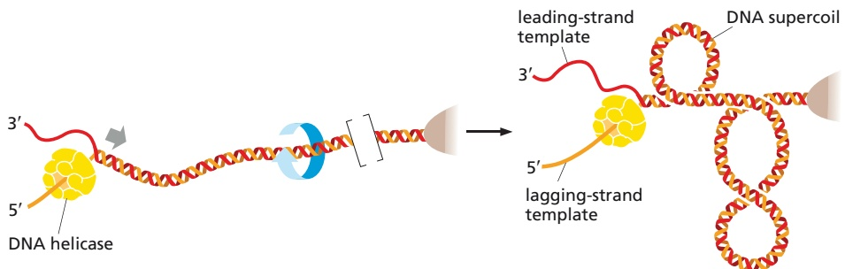

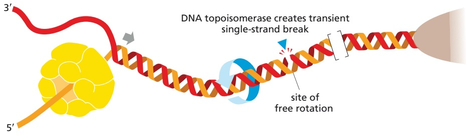

Figure 5–21 The “winding problem” that arises during DNA replication. (A) For a bacterial replication fork moving at 500 nucleotides per second, the parent DNA helix ahead of the fork must rotate at about 50 revolutions per second. The brackets represent about 20 turns of DNA. (B) If the ends of the DNA double helix remain fixed (or difficult to rotate), tension builds up in front of the replication fork as it becomes overwound. Some of this tension can be taken up by supercoiling, whereby the DNA double helix twists around itself. However, if the tension continues to build up, the replication fork will eventually stop because further unwinding requires more energy than the DNA helicase at the fork can provide. (C) DNA topoisomerases relieve this stress by generating temporary singlestrand breaks in the DNA, which allow rapid rotation around the single strands opposite the break.

(C) torsional stress ahead of the helicase is relieved by free rotation of DNA around the phosphodiester bond opposite the single-strand break; the same DNA topoisomerase molecule that produced the break reseals it

A second type of DNA topoisomerase, topoisomerase II, forms a covalent linkage to both strands of the DNA helix at the same time, making a transient double-strand break in the helix. These enzymes are activated by sites on chromosomes where two double helices cross over each other, such as those generated by supercoiling in front of a replication fork (see Figure 5–21B). As illustrated in **Figure 5–23**, once a topoisomerase II molecule binds to such a crossing site, the protein uses ATP hydrolysis to perform the following set of reactions: (1) it breaks one double helix reversibly to create a DNA “gate”; (2) it causes the second, nearby double helix to pass through this opening; and (3) it then reseals the break and dissociates from the DNA. At crossover points generated by supercoiling, passage of the double helix through the gate occurs in the direction that will reduce supercoiling. In this way, type II topoisomerases—like type I topoisomerases—can relieve the overwinding tension generated in front of a replication fork.

Their reaction mechanism also allows type II DNA topoisomerases to efficiently separate any intertwined DNA molecules. This ability of topoisomerase II is especially important for preventing the severe DNA tangling problems that would otherwise arise from DNA replication. This role is nicely illustrated by mutant yeast cells that produce, in place of the normal topoisomerase II, a version that is inactive above 37°C. When the mutant cells are warmed to this temperature, their daughter chromosomes remain intertwined after DNA replication and are unable to separate. The enormous usefulness of topoisomerase II for untangling

topoisomerase II

type I DNA topoisomerase with tyrosine at the active site

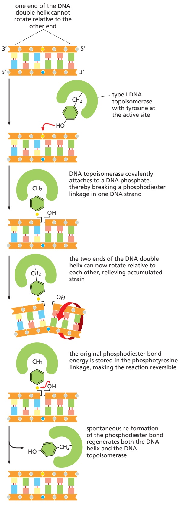

DNA topoisomerase covalently attaches to a DNA phosphate, thereby breaking a phosphodiester linkage in one DNA strand

spontaneous re-formation of the phosphodiester bond regenerates both the DNA helix and the DNA topoisomerase

two DNA double helices that are interlocked

Figure 5–22 The reversible DNA nicking reaction catalyzed by a DNA topoisomerase I enzyme. As indicated, these enzymes transiently form a single covalent bond with DNA; this allows free rotation of the DNA around the covalent backbone bonds linked to the blue phosphate. On reversal of the reaction, the enzyme and the DNA are restored, the only MBoC7 m5.21/5.22difference being the relaxation of tension in the DNA.

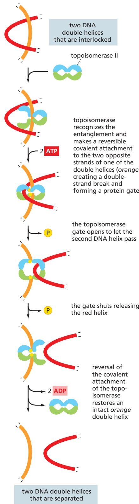

topoisomerase recognizes the entanglement and makes a reversible covalent attachment to the two opposite strands of one of the double helices (orange) creating a doublestrand break and forming a protein gate

the topoisomerase gate opens to let the second DNA helix pass

the gate shuts releasing the red helix

reversal of the covalent attachment of the topoisomerase restores an intact orange double helix

Figure 5–23 The DNA-helix-passing reaction catalyzed by DNA topoisomerase II. Unlike type I topoisomerases, type II enzymes hydrolyze ATP, which is needed to release and reset the enzyme after each cycle. The small yellow circles represent the 5′ phosphates in the DNA backbone that become covalently bonded to the topoisomerase. Type II topoisomerases are especially important for rapidly dividing cells; partly for that reason, they are effective targets for a large class of antibiotics, the fluoroquinolones, used to treat many different kinds of bacterial infections. These drugs inhibit bacterial topoisomerase II at the third step in the figure and thereby produce high levels of double-strand breaks that are lethal to rapidly dividing cells.

chromosomes before mitosis begins can readily be appreciated by anyone who has struggled to remove a severe tangle from a fishing line—or from a large ball of thread—without the aid of scissors.

#### Summary

DNA replication takes place at a Y-shaped structure called a replication fork. Self-correcting DNA polymerase enzymes catalyze nucleotide polymerization in a 5-to-3 direction, copying a DNA template strand with remarkable fidelity. Because the two strands of a DNA double helix are antiparallel, this 5-to-3 DNA synthesis can take place continuously on only one of the strands at a replication fork (the leading strand). On the lagging strand, short DNA fragments must be made by a “backstitching” process. Because the self-correcting DNA polymerases cannot start a new chain, these lagging-strand DNA fragments are primed by short RNA primer molecules that are subsequently erased and replaced with DNA.

DNA replication requires the cooperation of many proteins. These include (1) DNA polymerases and DNA primases to catalyze nucleoside triphosphate polymerization; (2) DNA helicases and single-strand DNA-binding (SSB) proteins to help in opening up the DNA helix so that it can be copied; (3) clamps and clamp loaders to enable DNA polymerases to copy longer stretches of DNA; (4) DNA ligases and enzymes that degrade RNA primers to seal together the discontinuously synthesized lagging-strand DNA fragments; and (5) DNA topoisomerases to help to relieve helical winding and DNA tangling problems. Many of these proteins associate with each other at a replication fork to form a highly efficient “replication machine,” through which the activities and spatial movements of the individual components are coordinated.

The self-correcting DNA polymerases make mistakes only rarely when copying DNA; when they do, a variety of enzymes inspect the DNA shortly after it is made and correct any mishaps. Given the number of proteins dedicated to the task, copying DNA with extreme accuracy is clearly of great importance to all cells on Earth.

#### THE INITIATION AND COMPLETION OF DNA REPLICATION IN CHROMOSOMES

We have seen how a set of replication proteins rapidly and accurately generates two daughter DNA double helices behind a replication fork. But how is this replication machinery assembled in the first place, and how are replication forks created on an intact, double-strand DNA molecule? In this part of the chapter, we discuss how cells initiate DNA replication and how they carefully regulate this process to ensure that it takes place only at the proper time and chromosomal sites. We also discuss special problems that the replication machinery in eukaryotic cells must overcome including the need to replicate the enormously long DNA molecules found in eukaryotic chromosomes, as well as the need to copy DNA molecules that are tightly complexed with nucleosomes.

#### DNA Synthesis Begins at Replication Origins

As discussed previously, the DNA double helix is normally very stable: the two DNA strands are locked together firmly by the hydrogen bonds formed between the bases on each strand. To begin DNA replication, the double helix must first be opened up and the two strands separated to expose unpaired bases. As we shall see, the process of DNA replication is begun by special initiator proteins that bind to double-stranded DNA and pry the two strands apart, breaking the hydrogen bonds between the bases.

The positions at which the DNA helix is first opened are called **replication origins** (**Figure 5–24**). In simple cells like those of bacteria or budding yeast, origins are specified by DNA sequences several hundred nucleotide pairs in length. This DNA contains both short sequences that attract initiator proteins and stretches of DNA that are especially easy to open. We saw in Figure 4–5A that an A-T base pair is held together by fewer hydrogen bonds than is a G-C base pair. Therefore, DNA rich in A-T base pairs is relatively easy to pull apart, and regions of DNA enriched in A-T base pairs are typically found at replication origins.

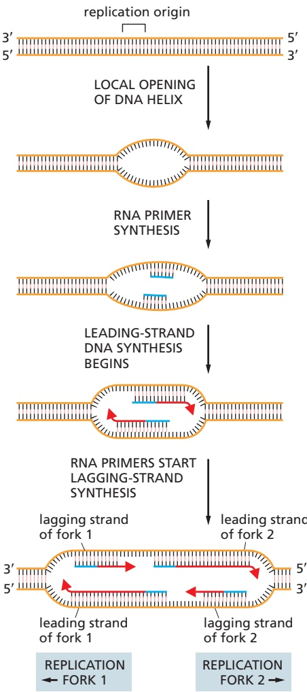

Figure 5–24 A replication bubble formed by replication-fork initiation. This diagram outlines the major steps in the initiation of replication forks at replication origins. In the last step, two replication forks move away from each other, separated by an expanding replication bubble.

Although the basic process of replication-fork initiation depicted in Figure 5–24 is fundamentally the same for bacteria and eukaryotes, the detailed way in which this process is performed and regulated differs considerably between these two groups of organisms. We first consider the case in bacteria and then turn to the more complex situation found in yeasts, mammals, and other eukaryotes.

#### Bacterial Chromosomes Typically Have a Single Origin of DNA Replication

The genome of E. coli is contained in a single circular DNA molecule of 4.6 × 106 nucleotide pairs. DNA replication begins at a single origin of replication, and the two replication forks assembled there proceed (at approximately 1000 nucleotides per second) in opposite directions until they meet up roughly halfway around the chromosome (**Figure 5–25**). The only point at which E. coli can control DNA replication is initiation: once the forks have been assembled at the origin, they synthesize DNA at a relatively constant speed until replication is finished. Therefore, it is not surprising that the initiation step of DNA replication is tightly regulated. The process begins when specialized initiator proteins (in their ATP-bound state) bind in multiple copies to specific DNA sites located at the replication origin, wrapping the DNA around the proteins to form a large protein–DNA filament that introduces torsional stress on the DNA double helix (**Figure 5–26**). This stress is partially relieved by melting of the adjacent AT-rich sequences. The protein–DNA complex then attracts two DNA helicases, each bound to a helicase loader, and these are placed—facing in opposite directions— around adjacent DNA single strands whose bases have been exposed by the assembly of the initiator protein–DNA complex. The helicase loader is analogous to the clamp loader we encountered earlier; it has the additional job of keeping the helicase in an inactive form until it is properly loaded. Once the helicases are properly positioned on DNA, the loaders dissociate and the helicases begin to unwind DNA, exposing enough single-stranded DNA for DNA primases to synthesize the first RNA primers. This quickly leads to the assembly of the remaining replication proteins to create two replication forks that move in opposite directions away from the replication origin, each synthesizing new DNA as they travel.

In E. coli, the interaction of the initiator proteins with the replication origin is carefully regulated, with initiation occurring only when sufficient nutrients are available for the bacterium to complete an entire round of replication. Initiation is also controlled to ensure that only one round of DNA replication occurs for each cell division. After replication is initiated, the initiator protein is inactivated by hydrolysis of its bound ATP molecule, and the origin of replication experiences a refractory period. The refractory period is caused by a delay in the methylation of newly incorporated A nucleotides in the origin (**Figure 5–27**). Initiation cannot occur again until the A’s are methylated and the initiator protein is restored to its ATP-bound state, conditions that are met only when the cell is capable of carrying out a new round of DNA replication.

#### Eukaryotic Chromosomes Contain Multiple Origins of Replication

We have seen how two replication forks begin at a single replication origin in bacteria and proceed in opposite directions, moving away from the origin until all of the DNA in the single circular chromosome is replicated. The bacterial genome is sufficiently small for these two replication forks to duplicate the genome in about

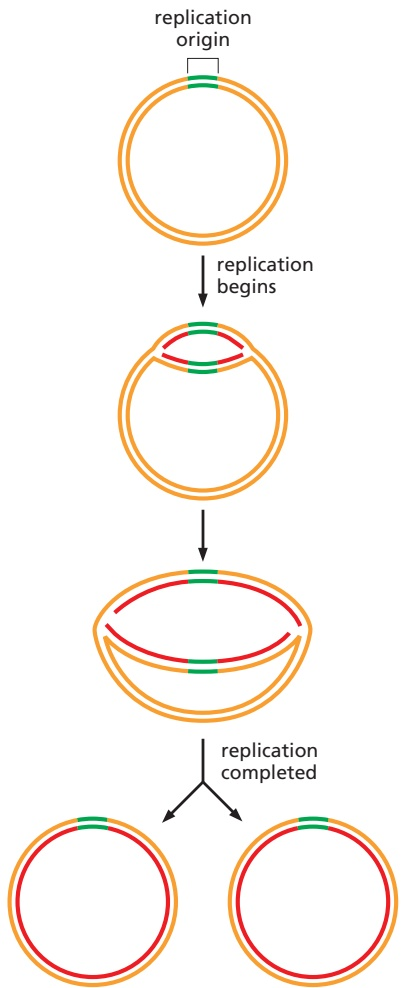

2 circular daughter DNA molecules

Figure 5–25 DNA replication of a bacterial genome. It takes E. coli about 30 minutes to duplicate its genome of 4.6 × 106 nucleotide pairs. For simplicity, Okazaki fragments are not shown on the lagging strand.

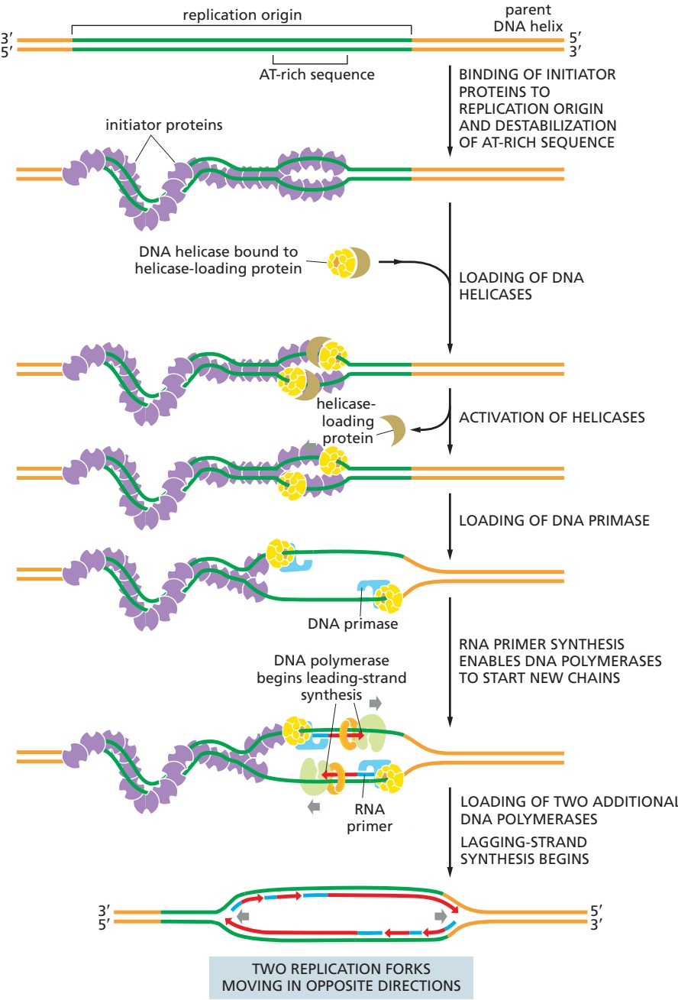

30 minutes. Because of the much greater size of most eukaryotic chromosomes, a different strategy is required to allow their replication in a timely manner.

A method for determining the general pattern of eukaryotic chromosome replication was developed in the early 1960s that is similar to the strategy we saw earlier for visualizing bacterial replication (see Figure 5–6). Human cells growing

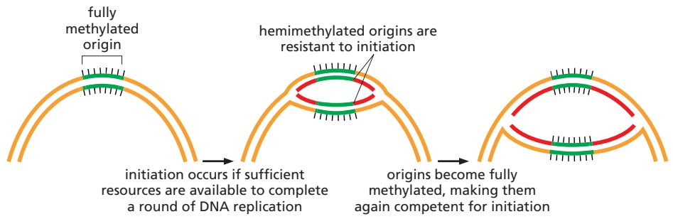

Figure 5–26 The proteins that initiate DNA replication in bacteria. The mechanism shown was established by studies in vitro with mixtures of highly purified proteins. For E. coli DNA replication, the major initiator protein (purple), the helicase (yellow), and the primase (blue) are the dnaA, dnaB, and dnaG proteins, respectively. In the first step, many molecules of the initiator protein bind to specific DNA sequences at the replication origin and destabilize the double helix by forming a filamentous structure in which the DNA is wrapped around the protein. Next, two helicases are brought in by helicase-loading proteins (the dnaC proteins; brown), which inhibit the helicases until they are properly loaded at the replication origin. (The helicase-loading proteins prevent the replicative DNA helices from inappropriately entering other singlestrand stretches of DNA in the bacterial genome.) Aided by single-strand binding protein (not shown), the loaded helicases further separate the DNA strands, thereby enabling primases to enter and synthesize initial primers. In subsequent steps, two complete replication forks are assembled at the origin and move in opposite directions away from the replication origin. The initiator proteins are displaced as the lefthand fork moves through them.

#### Figure 5–27 Methylation of the E. coli replication origin creates a refractory period for DNA initiation. DNA

methylation occurs at GATC sequences, 11 of which are found in the origin of replication (spanning approximately 250 nucleotide pairs). In its hemimethylated state (that is, one strand of the DNA methylated, the other unmethylated), the origin of replication is bound by an inhibitor protein (Seq A, not shown), which blocks the ability of the initiator proteins to unwind the origin DNA. About 15 minutes after replication is initiated, the hemimethylated origins become fully methylated by a DNA methylase enzyme; Seq A then dissociates allowing the origin of replication to become active.

A single enzyme, the Dam methylase, is responsible for methylating all E. coli GATC sequences. As discussed earlier in the chapter, a lag in methylation after the replication of GATC sequences is also used by the E. coli mismatch proofreading system to distinguish the newly synthesized DNA strand from the parent DNA strand; in that case, the relevant GATC sequences are scattered throughout the chromosome, and they are not bound by Seq A.

in culture are labeled for a short time with 3H-thymidine so that the DNA synthesized during this period becomes highly radioactive. The cells are then gently lysed, and the DNA is stretched on the surface of a glass slide coated with a photographic emulsion. Development of the emulsion in the dark reveals the pattern of labeled DNA through a technique known as autoradiography. The time allotted for radioactive labeling is chosen to allow each replication fork to move several micrometers along the DNA, so that the replicated DNA can be detected in the light microscope as lines of silver grains (radioactivity exposes photographic emulsion much as light does), even though the DNA molecule itself is too thin to be visible. In this way, both the rate and the direction of replication-fork movement can be determined (**Figure 5–28**). From the rate at which tracks of replicated DNA increase in length with increasing labeling time, the eukaryotic replication forks are estimated to travel at about 50 nucleotides per second. This is approximately twentyfold slower than the rate at which bacterial replication forks move, possibly reflecting the increased difficulty of replicating DNA that is packaged in chromatin.

An average-size human chromosome contains a single linear DNA molecule of about 150 million nucleotide pairs. It would take 0.02 seconds/nucleotide × $1 5 0 \times 1 0 ^ { 6 }$ nucleotides $= 3 . 0 \times 1 0 ^ { 6 }$ seconds (about 35 days) to replicate such a DNA molecule from end to end with a single replication fork moving at a rate of 50 nucleotides per second. As expected, therefore, the autoradiographic experiments just described reveal that many forks, belonging to separate replication bubbles, are moving simultaneously on each eukaryotic chromosome.

Much more sophisticated methods now exist for monitoring DNA replication initiation and tracking the movement of DNA replication forks across whole genomes. If a population of cells can be synchronized so they all begin DNA replication at the same time, the amount of each segment of DNA in the genome can be determined at specific time points using one of the DNA sequencing methods described in Chapter 8. Because a segment of a genome that has been replicated will contain twice as much DNA as an unreplicated segment, replication-fork initiation and fork movement can be accurately monitored across an entire genome.

Experiments of this type have shown the following: (1) Approximately 30,000–50,000 origins of replication are used each time a human cell divides. (2) The human genome has many more (perhaps tenfold more) potential origins than this, and different cell types use different sets of origins. This excess of origins may allow a cell to coordinate its active origins with other features of its chromosomes such as which genes are being expressed. The excess origins also provide “backups” in case a primary origin fails. (3) Origins of replication do not all “fire” simultaneously; rather, they often are activated in a prescribed order in a given cell type. (4) Regardless of when a given origin fires or where on the chromosome it is located, the replication forks all move at approximately the same speed. (5) As in bacteria, replication forks are formed in pairs and create an expanding

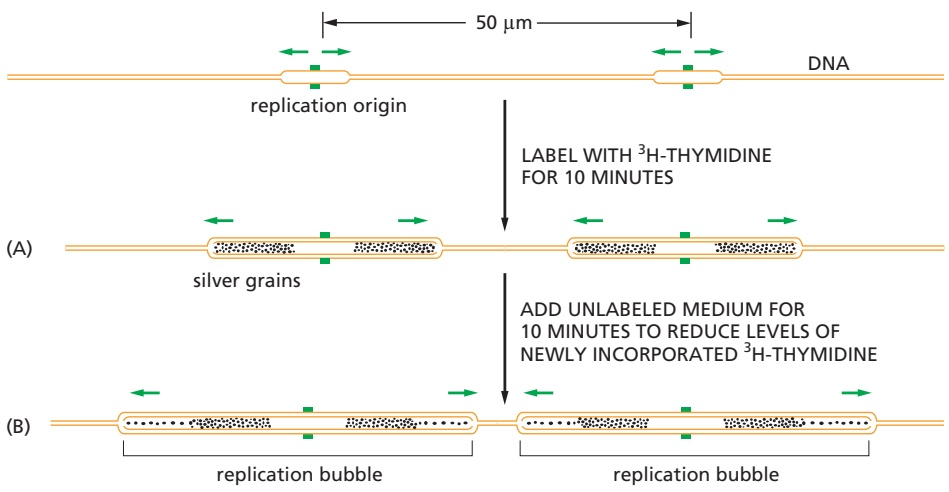

Figure 5–28 The experiments that first demonstrated the pattern in which replication forks are formed and move on eukaryotic chromosomes. The new DNA made in human cells in culture was labeled briefly with a pulse of highly radioactive thymidine (3H-thymidine). (A) In this experiment, the cells were lysed, and the DNA was stretched out on a glass slide that was subsequently covered with a photographic emulsion. After several months, the emulsion was developed, revealing a line of silver grains over the radioactive DNA. The brown DNA in this figure is shown only to help with the interpretation of the autoradiograph; the unlabeled DNA is invisible in such experiments. (B) This experiment was the same except that a further incubation in unlabeled medium allowed additional DNA, with a lower level of radioactivity, to be replicated. The pairs of dark tracks in B were found to have silver grains tapering off in opposite directions, demonstrating bidirectional fork movement from a central replication origin where a replication bubble forms (see Figure 5–24). A replication fork is thought to stop only when it encounters a replication fork moving in the opposite direction or when it reaches the end of the chromosome; in this way, all the DNA is eventually replicated.

replication bubble as they move in opposite directions away from a common point of origin, stopping only when they meet a replication fork moving in the opposite direction or when they reach a chromosome end. In this way, many replication forks operate independently on each chromosome and yet form two complete daughter DNA helices.

#### In Eukaryotes, DNA Replication Takes Place During Only One Part of the Cell Cycle

When growing rapidly, bacteria replicate their DNA nearly continually. In contrast, DNA replication in most eukaryotic cells occurs only during a specific part of the cell-division cycle, called the DNA synthesis phase, or **S phase** (**Figure 5–29**). In a mammalian cell, the S phase typically lasts for about 8 hours; in simpler eukaryotic cells such as yeasts, the S phase can be as short as 40 minutes. By its end, each chromosome has been replicated to produce two complete copies, which remain joined together at their centromeres until the M phase (M for mitosis), which soon follows. Although different origins of replication fire at different times, all DNA replication is begun and completed during S phase. In Chapter 17, we describe the control system that runs the cell cycle, and we explain how entry into each phase of the cycle requires the cell to have successfully completed the previous phase.

In the following sections, we explore how DNA replication begins on eukary otic chromosomes and how this event is coordinated with the cell cycle.

#### Eukaryotic Origins of Replication Are “Licensed” for Replication by the Assembly of an Origin Recognition Complex

Having seen that a eukaryotic chromosome is replicated using many origins of replication, each of which fires at a characteristic time in S phase of the cell cycle, we turn to the nature of these origins of replication. We saw earlier in this chapter that replication origins have been precisely defined in bacteria as specific DNA sequences that attract initiator proteins, which then assemble the DNA replication machinery. We shall see that this is also the case for the singlecell budding yeast S. cerevisiae, but it appears not to be strictly true for many other eukaryotes.

For budding yeast, the location of every origin of replication on each chromosome has been determined. The particular chromosome shown in **Figure 5–30**—chromosome III from S. cerevisiae—is one of the smallest chromosomes known, with a length less than 1/100 that of a typical human chromosome. Its major origins are spaced an average of 30,000 nucleotide pairs apart, but only a subset of these origins is used by a given cell. Nonetheless, this chromosome can be replicated in about 15 minutes.

The minimal DNA sequence required for directing DNA replication initiation in S. cerevisiae has been determined by taking a segment of DNA that spans an origin of replication and testing smaller and smaller DNA fragments for their ability to function as origins. These DNA sequences that can serve as an origin of replication are found to contain (1) a binding site for a large, multisubunit initiator protein called ORC, for origin recognition complex; (2) a stretch of DNA that is rich in A’s and T’s and therefore easy to pull apart; and (3) at least one binding site for proteins that facilitate ORC binding, probably by adjusting the local chromatin structure.

nucleotide pairs (thousands)

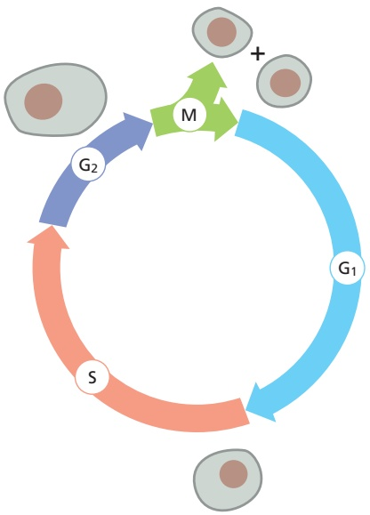

Figure 5–29 The four successive phases of a standard eukaryotic cell cycle. During the G1, S, and G2 phases, the cell grows continually. During M phase growth stops, the nucleus divides, and the cell divides in two. DNA replication is confined to the part of the cell cycle known as S phase. G1 is the gap between M phase and S phase; G2 is the gap between S phase and M phase. Many eukaryotic cells spend only a small fraction of their time in S phase.

Figure 5–30 The origins of DNA replication on chromosome III of the yeast S. cerevisiae. This chromosome, one of the smallest eukaryotic chromosomes known, carries a total of 180 genes. As indicated, it contains 18 replication origins, although they are used with different frequencies. Those in red are typically used in less than 10% of cell divisions, while those in green are used about 90% of the time.

#### Features of the Human Genome That Specify Origins of Replication Remain to Be Fully Understood

Compared with the situation in budding yeast, the determinants of replication origins in humans have been difficult to discover. It has been possible to identify specific human DNA sequences, each several thousand nucleotide pairs in length, that are sufficient to serve as replication origins. These origins continue to function when moved to a different chromosomal region by recombinant DNA methods, as long as they are placed in a region where the chromatin is relatively uncondensed. However, comparisons of such DNA sequences have not revealed DNA sequences in common as in the origins of bacteria and yeasts.

Despite this, a human ORC that is very similar to the yeast ORC binds to origins of replication and initiates DNA replication in humans. Many of the other proteins that function in the initiation process in yeast likewise have central roles in humans. The yeast and human initiation mechanisms are thus similar, although some property of the genome other than a specific DNA sequence has the central role in attracting an ORC to a mammalian origin of replication. Origins of replication are often nucleosome-free, and it has been proposed that DNA that is difficult to fold onto a histone core may help define origins of replication. Nearby transcriptional activity on the genome may also play a role in activating certain origins, by altering the local chromatin structures, as we discuss in Chapter 7. This idea helps to explain why different cell types—which express different sets of genes—often use different origins. Consistent with this idea, origins that fire the earliest in S phase tend to be located near highly transcribed regions of the genome.

Finally, origins located in proximity to each other tend to fire together, and it seems likely that the three-dimensional structure of chromosomes organizes origins of replication into domains, such that all the origins in a given domain fire simultaneously. All of these influences probably work together to determine how mammalian origins of replication are selected by the cell, thereby explaining the difficulty scientists have had in precisely defining their salient features.

#### Properties of the ORC Ensure That Each Region of the DNA Is Replicated Once and Only Once in Each S Phase

In bacteria, once the initiator protein is properly bound to the single origin of replication, the assembly of the replication forks seems to follow more or less automatically. In eukaryotes, the situation is significantly different because of a profound problem eukaryotes have in replicating chromosomes: with so many places to begin replication, how is the process regulated to ensure that all the DNA is copied once and only once?

The answer lies in how the assembly of the replication-fork protein at the origins of replication is regulated. We discuss this process in more detail in Chapter $1 7 ,$ where we consider the machinery that underlies the cell-division cycle. In brief, during $\mathrm { G _ { 1 } }$ phase, a symmetrical complex of two incomplete helicases is loaded onto DNA by the bound ORC. Then, upon passage from $\mathrm { G _ { 1 } }$ phase to S phase, specialized protein kinases come into play and direct the final assembly of the two replicative helicases, positioning one on each of the two complementary DNA single strands, where they move in opposite directions to begin opening the DNA double helix. At this point, the additional replication proteins are brought to the DNA, and two complete replication forks move in opposite directions away from the origin of replication (**Figure 5–31**).

The same protein kinases that trigger the final assembly of the helicases pre-vent the binding of new helicases to that origin until the next M phase resets the entire cycle (for details, see pp. 1043–1045). They do this, in part, by phosphorylating ORC, rendering it unable to accept new helicases. Thus, the kinases specify a single window of opportunity for precursor helicases to be loaded at origins of replication $( \mathrm { G _ { 1 } }$ phase, when kinase activity is low) and a second window for

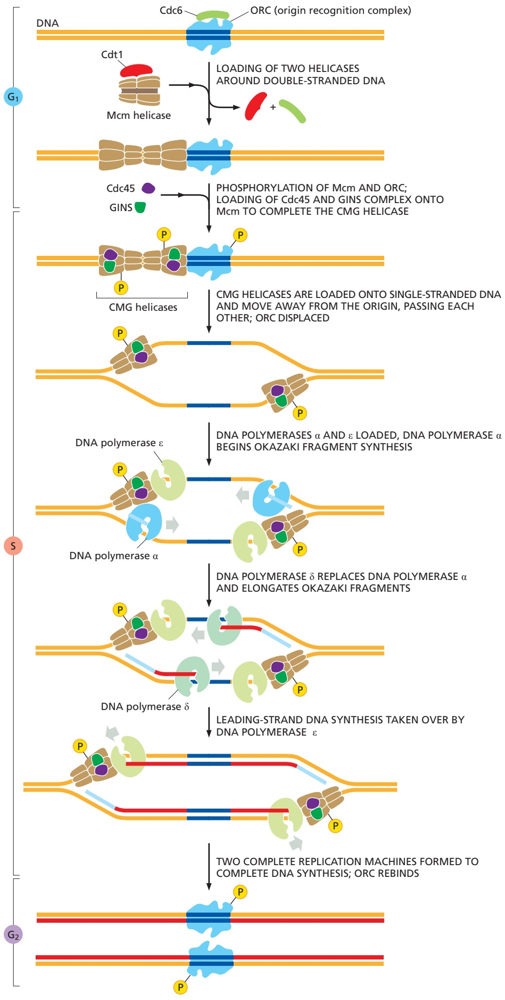

Figure 5–31 DNA replication initiation in eukaryotes. This mechanism ensures that each origin of replication is activated only once per cell cycle. An origin of replication can be used only if two Mcm helicases (which form the enzymatic cores of the replicative helicases) are loaded in G1 phase. At the beginning of S phase, specialized kinases phosphorylate both the Mcm helicases and ORC, activating the former and inactivating the latter. These kinases also guide the assembly of additional proteins that complete the helicases to form the fully active replicative helicases, known as the CMG helicases. New Mcm helicases cannot be loaded at the origin until the cell progresses through mitosis to the next G1 phase, when ORC is dephosphorylated. The name CMG derives from Cdc45, Mcm, and GINS, the components of the active helicase (see Figure 5–19).

them to be assembled into their active form (S phase, when kinase activity is high). Because these two phases of the cell cycle are mutually exclusive and occur in a prescribed order, each origin of replication can fire only once during each cell cycle.

Because there are many more potential replication origins on a eukaryotic chromosome than are actually used in any one cell cycle (see Figure 5-30), the DNA at many ORC-bound replication origins will be replicated by forks formed at a neighboring region of the chromosome. Thus, preventing any single origin from firing more than once during an S phase is not enough to avoid the re-replication of DNA in eukaryotes. In addition, any ORC–DNA complex that is passed by a replication fork must be inactivated, and it is the combination of the two mechanisms that guarantees that each region of the DNA is replicated once and only once in each S phase.

#### New Nucleosomes Are Assembled Behind the Replication Fork

Several additional aspects of DNA replication are specific to eukaryotes compared with bacteria. As discussed in Chapter 4, eukaryotic chromosomes are composed of roughly equal mixtures of DNA and protein. Chromosome duplication therefore requires not only the replication of DNA but also the synthesis of new chromosomal proteins and their assembly onto the DNA behind each replication fork. Although we are far from understanding this process in detail, we are beginning to learn how the fundamental unit of chromatin packaging, the nucleosome, is duplicated. The cell requires a large amount of new histone protein, approximately equal in mass to the newly synthesized DNA, each time it divides. For this reason, most eukaryotic organisms possess multiple copies of the gene for each histone. Vertebrate cells, for example, have about 20 repeated gene sets, most containing the genes that encode all five histones (H1, H2A, H2B, H3, and H4).

Unlike most proteins, which are made continually, histones are synthesized mainly in S phase, when the level of histone mRNA increases about fiftyfold as a result of both increased transcription and decreased mRNA degradation. The major histone mRNAs are degraded within minutes when DNA synthesis stops at the end of S phase. The mechanism depends on special properties of the 3′ ends of these mRNAs, as discussed in Chapter 7. In contrast to their mRNAs, the histone proteins themselves are remarkably stable and may survive for many generations. The tight linkage between DNA synthesis and histone synthesis appears to reflect a feedback mechanism that monitors the level of free histone to ensure that the amount of histone made exactly matches the amount of new DNA synthesized.

As a replication fork advances it must pass through the parent nucleosomes. In the cell, efficient replication requires chromatin remodeling complexes (discussed in Chapter 4) and histone chaperone proteins (discussed below) to destabilize the DNA–histone interfaces. Aided by such specialized proteins, replication forks can transit even highly condensed chromatin. As a replication fork passes through chromatin, the histones are transiently displaced leaving about 600 nucleotide pairs of “free” DNA in its wake. The reestablishment of nucleosomes behind a moving fork occurs in an intriguing way. When a nucleosome is traversed by a replication fork, the histone octamer is broken into an H3–H4 tetramer and two H2A–H2B dimers (discussed in Chapter 4), all of which are released from DNA. The H3–H4 tetramers remain in the vicinity of the fork by loosely binding to several of the proteins at the replication fork (primarily the CMG helicase) and are distributed at random to one or the other daughter duplexes as the fork moves forward. In contrast, the H2A–H2B dimers are released completely from the fork and may diffuse to entirely different chromosomes. Freshly made H3–H4 tetramers are added to the newly synthesized DNA to fill in the “spaces,” and H2A–H2B dimers—half of which are old and half new—are then added at random to complete the nucleosomes behind the fork (**Figure 5–32**). The formation of new nucleosomes behind a replication fork has an important consequence for the process of DNA replication itself. As DNA polymerase δ discontinuously synthesizes the lagging strand (see Figure 5–19), the length of each Okazaki fragment is determined by the point at which DNA polymerase δ is blocked by a newly formed nucleosome. This tight coupling between nucleosome duplication and DNA repli-MBoC7 m5.32/5.32 cation probably explains why the length of Okazaki fragments in eukaryotes (∼200 nucleotides) is approximately the same as the nucleosome repeat length.

The orderly and rapid addition of new H3–H4 tetramers and H2A–H2B dimers behind a replication fork requires **histone chaperones** (also called chromatin assembly factors). These multisubunit complexes bind the highly basic histones and release them on DNA only in the appropriate context. For example, some of the histone chaperones, along with their histone cargoes, are directed to newly replicated DNA through a specific interaction with the sliding clamp (see Figure 5–32). As we have seen, these clamps remain on the DNA behind replication forks, and some appear to linger just long enough for the histone chaperones to complete their tasks. Because they bind so well to histones, some histone chaperones also help to disassemble nucleosomes. Of particular importance to DNA replication is the FACT chaperone, which moves at the front of the replication machinery, disassembling nucleosomes as it moves forward (see Figure 5–32).

Figure 5–32 Formation of nucleosomes behind a replication fork. Parent H3–H4 tetramers remain associated with the fork and are distributed at random to the daughter DNA molecules, with roughly equal numbers inherited by each daughter. In contrast, H2A–H2B dimers are released completely from the fork as it passes. This release begins just in front of the replication fork and is facilitated by the histone chaperone FACT, which moves with the fork. FACT has several globular protein domains connected by flexible linkers and can make multiple contacts with a nucleosome to aid in its disassembly. Additional histone chaperones (NAP1 and CAF1) restore the full complement of histones to daughter molecules using both parent and newly synthesized histones. Although not shown in the figure, it has been proposed that FACT directly hands off parent H3–H4 tetramers to components of the replication machinery, which in turn hand them off to CAF1 chaperones, which deposit them evenly on the two daughter molecules. The way in which histones are distributed behind a replication fork means that some daughter nucleosomes contain only parent histones or only newly synthesized histones, but most are hybrids of old and new. For simplicity, the DNA double helix is shown as a single red line.

#### Termination of DNA Replication Occurs Through the Ordered Disassembly of the Replication Fork

We saw earlier in this chapter that E. coli DNA replication begins at a single origin, and two replication forks proceed bidirectionally around the circular genome, meeting at a spot opposite to the origin of replication. Here, the two forks do not simply collide with each other running at full speed; rather, this spot on the E. coli genome has a special DNA sequence that slows down and stalls the movement of each fork, causing them to disassemble. The remaining gaps in the daughter DNA molecules are filled in and sealed by repair DNA polymerases and DNA ligase (see Figures 5–11 and 5–12), and the two completed bacterial genomes are separated using topoisomerases (see Figure 5–23).

As might be expected, the situation in eukaryotes is more complicated. First, each round of replication requires many termination events, roughly as many as there are initiation events at origins of replication. Thus, in mammalian cells, approximately 30,000–50,000 termination events occur in every S phase. Second, the termination of replication forks in eukaryotes is largely independent of any underlying DNA sequence in the genome. Rather, the principal termination signal is a head-on encounter with a fork moving in the opposite direction. When two forks meet, the CMG helicase at each fork is covalently modified by addition of ubiquitin (see Figure 3–65), which causes its disassembly and removal from DNA. Without the helicase, the other replication proteins rapidly dissociate from the fork. Repair DNA polymerase and DNA ligase subsequently fill in and seal any remaining gaps. Eukaryotic replication forks must also contend with the ends of chromosomes. Here, it is believed that the CMG helicase simply slides off the end of the DNA molecule, leading to the dissociation of the other fork proteins. However, replicating DNA to the very end of a chromosome presents a special challenge to the eukaryotic cell, as we describe next.

<!-- END EN EN05-H000-H030 -->

### 英文补充：DNA修复、双链断裂修复与同源重组

> 对应中文板块：DNA修复、双链断裂修复与同源重组。英文来源：Molecular Biology of the Cell，第7版，第5章；[本章完整原文](../来源/英文教材/05_DNA_Replication_Repair_and_Recombination/chapter.md)。物理PDF页码范围：292–359（整章范围）。

<!-- BEGIN EN EN05-H034-H050 -->
#### Summary

The proteins that initiate DNA replication bind to DNA sequences at a replication origin to catalyze the formation of a replication bubble with two outward-moving replication forks. The process begins when an initiator protein–DNA complex is formed that subsequently loads a DNA helicase onto the DNA template. Other proteins are then added to form the multienzyme “replication machine” that catalyzes DNA synthesis at each replication fork.

In bacteria and some simple eukaryotes, replication origins are defined by specific DNA sequences that are several hundred nucleotide pairs long. In other eukaryotes, such as humans, features that specify an origin of DNA replication are less well defined, and probably depend more on structural features of chromosomes than on specific DNA sequences.

Bacteria typically have a single origin of replication in a circular chromosome. With fork speeds of up to 1000 nucleotides per second, they can replicate their genome in less than an hour. Eukaryotic DNA replication takes place in only one part of the cell cycle, the S phase. The replication fork in eukaryotes moves about 20 times more slowly than the bacterial replication fork, and the much longer eukaryotic chromosomes each require many replication origins to complete their replication in an S phase, which typically lasts for 8 hours in human cells. The different replication origins in these eukaryotic chromosomes are activated in a sequence, determined in part by which genes are currently being transcribed and the structure of chromatin across each chromosome. After the replication fork has passed, chromatin structure is re-formed by the addition of new histones to the old histones that are directly inherited by each daughter DNA molecule.

Eukaryotes solve the problem of replicating the ends of their linear chromosomes with a specialized end structure, the telomere, maintained by a special nucleotidepolymerizing enzyme called telomerase. Telomerase extends one of the DNA strands at the end of a chromosome by using an RNA template that is an integral part of the enzyme itself, producing a highly repeated DNA sequence that typically extends for thousands of nucleotide pairs at each chromosome end. Telomeres have specialized structures that distinguish them from broken ends of chromosomes, ensuring that they are not treated as damaged DNA.

#### DNA REPAIR

Maintaining the genetic stability that an organism needs for its survival requires not only an extremely accurate mechanism for replicating DNA but also mechanisms for repairing the many accidental lesions that DNA continually suffers. Most such spontaneous changes in DNA are temporary because they are immediately corrected by a set of processes that are collectively called **DNA repair**. Of the tens of thousands of random changes created every day in the DNA of a human cell by heat, metabolic accidents, radiation of various sorts, and exposure to substances in the environment, only a few (less than 0.02%) accumulate as permanent mutations in the DNA sequence. The rest are eliminated with remarkable efficiency by DNA repair.

The importance of DNA repair is evident from the large investment that cells make in the enzymes that carry it out: several percent of the coding capacity of most genomes is devoted solely to DNA repair functions. The importance of DNA repair is also demonstrated by the increased rate of mutation that follows the inactivation of a DNA repair gene. Many DNA repair proteins and the genes that encode them—which we now know operate in a wide range of organisms, including humans—were originally identified in bacteria by the isolation and characterization of mutants that displayed an increased mutation rate or an increased sensitivity to DNA-damaging agents.

<table><tbody><tr><td rowspan="2">TABLE 5-2 Some Inherited Hum Name of syndrome or</td><td rowspan="2">an Syndromes with Defects in DNA Repair</td><td></td></tr><tr><td></td></tr><tr><td>responsible genes</td><td>Phenotype</td><td>Enzyme or process affected</td></tr><tr><td>Msh2, Msh3, Msh6, Mlh1, Pms2</td><td>Colon cancer</td><td>Mismatch repair</td></tr><tr><td>Polymerase proofreading-</td><td>Colon cancer</td><td>Proofreading by DNA polymerase ε</td></tr><tr><td>associated polyposis</td><td></td><td></td></tr><tr><td>Aicardi-Goutières syndrome</td><td>Encephalopathy, neurological dysfunction, genome instability</td><td>Removal of misincorporated ribonucleotides in DNA</td></tr><tr><td>Xeroderma pigmentosum (XP)</td><td>Skin cancer, UV sensitivity, neurological</td><td>Nucleotide excision repair</td></tr><tr><td>groups A-G</td><td>abnormalities</td><td></td></tr><tr><td>Cockayne syndrome</td><td>UV sensitivity, developmental abnormalities</td><td>Coupling of nucleotide excision repair to transcription</td></tr><tr><td>XP variant</td><td>UV sensitivity, skin cancer</td><td>Translesion synthesis by DNA polymerase η</td></tr><tr><td>Ataxia telangiectasia (AT)</td><td>Leukemia, lymphoma, γ-ray sensitivity, genome instability</td><td>ATM protein, a protein kinase activated by double-strand DNA breaks</td></tr><tr><td>Seckel syndrome</td><td>Dwarfism, microcephaly</td><td>ATR protein, a protein kinase activated by single-strand DNA breaks</td></tr><tr><td>Brca1</td><td>Breast and ovarian cancer</td><td>Repair by homologous recombination</td></tr><tr><td>Brca2</td><td>Breast, ovarian, prostate, and pancreatic cancer</td><td>Repair by homologous recombination</td></tr><tr><td>Ataxia-telangiectasia-like</td><td>Leukemia, lymphoma, γ-ray sensitivity,</td><td>Mre11 protein, required for processing</td></tr><tr><td>disorder (ATLD)</td><td>genome instability</td><td>double-strand DNA breaks</td></tr><tr><td>Werner syndrome</td><td>Premature aging, cancer at several sites, genome instability</td><td>Accessory 3'-exonuclease and DNA helicase used in repair</td></tr><tr><td>Bloom syndrome</td><td>Cancer at several sites, stunted growth, genome instability</td><td>DNA helicase needed for recombination</td></tr><tr><td>Fanconi anemia groups A-W</td><td>Congenital abnormalities, leukemia, genome instability</td><td>DNA interstrand cross-link repair</td></tr><tr><td>46BR patient</td><td>Hypersensitivity to DNA-damaging agents, genome instability</td><td>DNA ligase I</td></tr></tbody></table>

Studies of the consequences of a diminished capacity for DNA repair in humans have linked many human diseases with decreased repair (**Table 5–2**). Thus, we saw previously that defects in a human gene whose product normally functions to repair the mismatched base pairs resulting from DNA replication errors can lead to an inherited predisposition to cancers of the colon and some other organs, caused by an increased mutation rate. In another human disease, xeroderma pigmentosum (XP), the afflicted individuals have an extreme sensitivity to ultraviolet radiation because they are unable to repair the damage to DNA caused by this component of sunlight. This repair defect results in an increased mutation rate that leads to serious skin lesions and a greatly increased susceptibility to skin cancers. Finally, mutations in the Brca1 and Brca2 genes compromise a type of DNA repair known as homologous recombination and are a major cause of hereditary breast and ovarian cancers.

Without DNA Repair, Spontaneous DNA Damage Would Rapidly Change DNA Sequences

Although DNA is a highly stable material—as required for the storage of geneticMBoC7 m5.37/5.37 information—it is a complex organic molecule that is susceptible, even under normal cell conditions, to spontaneous changes that would lead to mutations if left unrepaired (**Figure 5–37** and see **Table 5–3**). For example, the DNA of each human cell loses about 18,000 purine bases (adenine and guanine) every day because their N-glycosyl linkages to deoxyribose break, a spontaneous hydrolysis reaction called depurination. Similarly, a spontaneous deamination of cytosine to uracil in

Figure 5–37 A summary of spontaneous alterations that require DNA repair. The sites on each nucleotide modified by spontaneous oxidative damage (red arrows), hydrolytic attack (blue arrows), and methylation (green arrows) are shown, with the width of each arrow indicating the relative frequency of each event (see Table 5–3). (After T. Lindahl, Nature 362:709–715, 1993.)

TABLE 5–3 Endogenous DNA Lesions Arising and Repaired in a Diploid Mammalian Cell in 24 Hours

<table><tbody><tr><td>DNA lesion</td><td>Number repaired in 24 hr</td></tr><tr><td colspan="2">Hydrolysis</td></tr><tr><td>Depurination</td><td>18,000</td></tr><tr><td>Depyrimidination</td><td>600</td></tr><tr><td>Cytosine deamination</td><td>100</td></tr><tr><td>5-Methylcytosine deamination</td><td>10</td></tr><tr><td colspan="2">Oxidation</td></tr><tr><td>8-oxoguanine</td><td>1500</td></tr><tr><td>Ring-saturated pyrimidines (thymine glycol, cytosine hydrates)</td><td>2000</td></tr><tr><td>Lipid peroxidation products (M1G, etheno-A, etheno-C)</td><td>1000</td></tr><tr><td colspan="2">Nonenzymatic methylation by S-adenosylmethionine</td></tr><tr><td>7-Methylguanine</td><td>6000</td></tr><tr><td>3-Methyladenine</td><td>1200</td></tr><tr><td colspan="2">Nonenzymatic methylation by nitrosated polyamines and peptides</td></tr><tr><td>O6-Methylguanine</td><td>20-100</td></tr><tr><td colspan="2">The DNA lesions listed in the table are the result of the normal chemical reactions that take place in cells. Cells that are exposed to external chemicals and radiation suffer greater and more diverse forms of DNA damage. (From T. Lindahl and D.E. Barnes, Cold Spring Harb. Symp. Quant. Biol. 65:127-133, 2000.)</td></tr></tbody></table>

Figure 5–38 Depurination and deamination are the most frequent spontaneous chemical reactions known to create serious DNA damage in cells. (A) Depurination can remove guanine (or adenine) from DNA. (B) The major type of deamination reaction converts cytosine to uracil, which, as we have seen, is not normally found in DNA. However, deamination can occur on other bases as well. Both depurination and deamination take place on double-helical DNA, and neither reaction breaks the phosphodiester backbone.

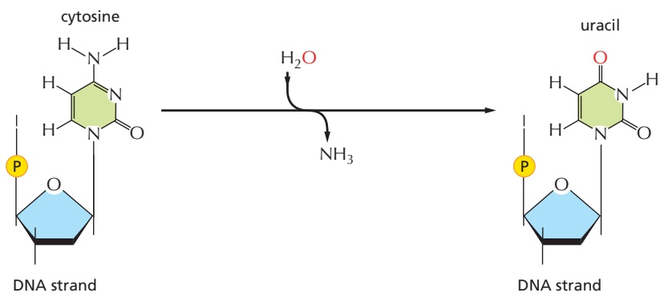

DNA occurs at a rate of about 100 bases per cell per day (Figure 5–38). DNA bases are also occasionally damaged by encounters with reactive metabolites produced in the cell (for example, the high-energy methyl donor, S-adenosylmethionine) or by exposure to toxic chemicals in the environment. Likewise, ultraviolet radiation from the Sun can produce a covalent linkage between two adjacent pyrimidine bases in DNA to form, for example, thymine dimers (Figure 5–39). If left uncor-MBoC6 e6.24/5.38rected, most of these changes would lead either to the deletion of one or more base pairs or to a base-pair substitution in the daughter DNA chain when the DNA is replicated (**Figure 5–40**). These mutations would then be propagated throughout all subsequent cell generations. Such a high rate of unrepaired random changes in the DNA sequence would have disastrous consequences, both in the germ line and in somatic tissues.

Figure 5–39 The ultraviolet radiation in sunlight can cause the formation of thymine dimers. Two adjacent thymine bases have become covalently attached to each other to form a thymine dimer. Skin cells that are exposed to sunlight are especially susceptible to this type of DNA damage. Dimers can also form between an adjacent thymine and cytosine.

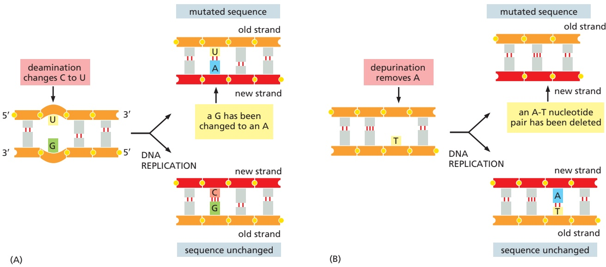

The DNA Double Helix Is Readily Repaired

The double-helical structure of DNA is ideally suited for repair because it carries two separate copies of all the genetic information—one in each of its two strands. Thus, when one strand is damaged, the complementary strand retains an intact copy of the same information, and this copy is generally used as the template to restore the correct nucleotide sequences to the damaged strand.

An indication of the importance of a double-strand helix to the safe storage of genetic information is that all cells use it; only a few small viruses use singlestranded DNA or RNA as their genetic material. The types of repair processes described in this part of the chapter cannot operate on such nucleic acids, and once damaged, the chance of a permanent nucleotide change occurring in these single-strand genomes of viruses is thus very high. It seems that only tiny genomes (and therefore tiny targets for DNA damage) can have their genetic information successfully carried in any molecule other than a DNA double helix.

#### DNA Damage Can Be Removed by More Than One Pathway

Cells have multiple pathways to repair their DNA using different enzymes that act upon different kinds of lesions. **Figure 5–41** shows two of the most common pathways. In both, the damage is excised, the original DNA sequence is restored by a high-fidelity DNA polymerase using the undamaged strand as its template, and the remaining break in the double helix is sealed by DNA ligase (see Figure 5–12).

The two pathways differ in the way in which they remove the damage from DNA. The first pathway, called **base excision repair**, involves a battery of enzymes called DNA glycosylases, each of which can recognize a specific type of altered base in DNA and catalyze its hydrolytic removal from the DNA backbone. There are many types of these enzymes, including those that remove deaminated C’s, deaminated A’s, different types of alkylated or oxidized bases, bases with opened rings, and bases in which a carbon–carbon double bond has been accidentally converted to a carbon–carbon single bond. How are altered bases detected in the double helix? A key step is an enzyme-mediated “flipping-out” of the altered nucleotide from the helix, which allows the DNA glycosylase to probe all faces of the base for damage (**Figure 5–42**). It is thought that these enzymes travel along DNA using base-flipping to evaluate the status of each base. Once an enzyme finds the damaged base that it recognizes, it removes that base from its sugar.

Figure 5–40 Chemical modifications of nucleotides, if left unrepaired, produce mutations. (A) Deamination of cytosine, if uncorrected, results in the substitution of one base for another when the DNA is replicated. As shown in Figure 5–43, deamination of cytosine produces uracil. Uracil differs from cytosine in its basepairing properties and preferentially basepairs with adenine. The DNA replication machinery therefore inserts an adenine when it encounters a uracil on the template strand. (B) Depurination, if uncorrected, can lead to the loss of a nucleotide pair. When the replication machinery encounters a missing purine on the template strand, it can skip to the next complete nucleotide, as shown, thus producing a daughter DNA molecule that is missing one nucleotide pair. In other cases, the replication machinery places an incorrect nucleotide across from the missing base, again resulting in a mutation (not shown).

The “missing tooth” created by DNA glycosylase action is recognized by an enzyme called AP endonuclease (AP for apurinic or apyrimidinic, and endo to signify that the nuclease cleaves within the polynucleotide chain), which cuts the phosphodiester backbone, after which the resulting gap is repaired (see

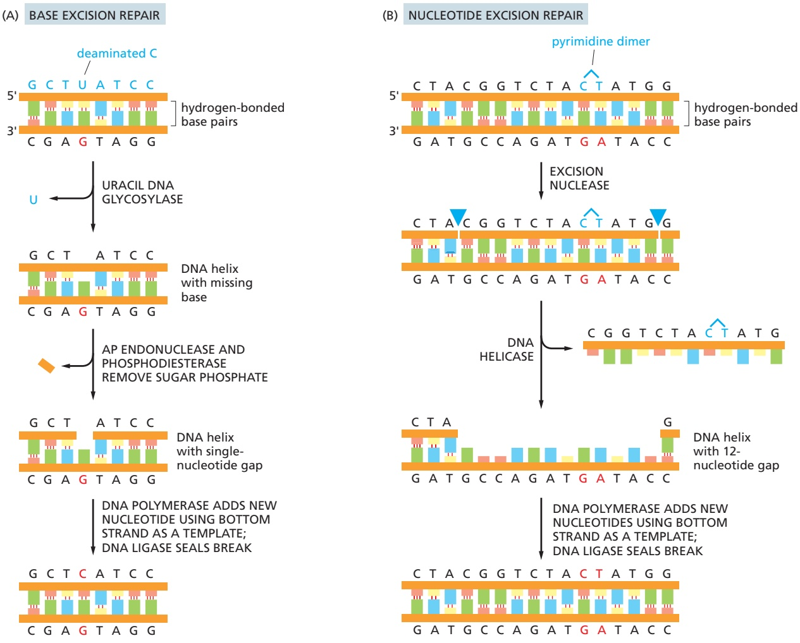

Figure 5–41 A comparison of two major DNA repair pathways. (A) Base excision repair. This pathway starts with a DNA glycosylase. In the example shown here, the enzyme uracil DNA glycosylase removes an accidentally deaminated cytosine in DNA. After the action of this glycosylase (or another DNA glycosylase that recognizes a different kind of damage), the sugar phosphate with the missing base is cut out by the sequential action of AP endonuclease and a phosphodiesterase. The gap of a single nucleotide is then filled by DNA polymerase and DNA ligase. The net result is that the U that was created by accidental deamination is restored to a C. The loss of a base can occur either from the actions of DNA glycosylases that recognize damaged bases or from spontaneous chemical reactions (see Figure 5–37). AP endonuclease is so named because it recognizes any site in the DNA helix that contains a deoxyribose sugar with a missing base; such sites can arise either by the loss of a purine (apurinic sites) or by the loss of a pyrimidine (apyrimidinic sites). (B) Nucleotide excision repair. In bacteria, after a multienzyme complex has recognized a lesion such as a pyrimidine dimer (see Figure 5–39), one cut is made on each side of the lesion, and an associated DNA helicase then removes the entire portion of the damaged strand. The excision repair machinery in bacteria operates as shown. In humans, once the damaged DNA is recognized, a helicase is recruited to locally unwind the DNA duplex. Next, the excision nuclease enters and cleaves on either side of the damage, leaving a gap of about 30 nucleotides that is subsequently filled in. The nucleotide excision repair machinery in both bacteria and humans can recognize and repair many different types of DNA damage.

Figure 5–41A). Depurination, which is by far the most frequent type of damage suffered by DNA, also leaves a deoxyribose sugar with a missing base. Depurinations are directly repaired beginning with AP endonuclease, following the bottom half of the pathway in Figure 5–41A.

The second major repair pathway is called **nucleotide excision repair**. This mechanism can repair the damage caused by almost any large change in the structure of the DNA double helix. Such “bulky lesions” include those created by the covalent reaction of DNA bases with large hydrocarbons (such as the carcinogen benzopyrene, found in tobacco smoke, coal tar, and diesel exhaust), as well as the various pyrimidine dimers (T-T, T-C, and C-C) caused by sunlight. In this pathway, a large multienzyme complex scans the DNA for a distortion in the double helix, rather than for a specific base change. Once it finds a lesion, it cleaves the phosphodiester backbone of the abnormal strand on both sides of

Figure 5–42 The recognition of an unusual nucleotide in DNA by baseflipping. The DNA glycosylase family of enzymes recognizes inappropriate bases in DNA in the conformation shown. Each of these enzymes cleaves the glycosyl bond that connects a particular recognized base (yellow) to the backbone sugar, removing it from the DNA. (A) Stick model of the DNA; (B) space-filling model.

(A)

(B)

the distortion, and a DNA helicase peels away the single-strand oligonucleotide containing the lesion. The large gap produced in the DNA helix is then repaired by DNA polymerase and DNA ligase (see Figure 5–41B).

An alternative to these base and nucleotide excision repair processes is the direct chemical reversal of DNA damage, and this strategy is selectively employed for the rapid removal of certain highly mutagenic or cytotoxic lesions. For exam-MBoC7 m5.42/5.42 ple, the lesion $O ^ { 6 } .$ -methylguanine has its methyl group removed by direct transfer to a cysteine residue in the repair protein itself. Because the repair protein is destroyed in the process, each molecule of it can only be used once. In another example, methyl groups in the lesions 1-methyladenine and 3-methylcytosine are “burned $\dot { \mathrm { o f f } } ^ { \nu }$ by an iron-dependent demethylase, with release of formaldehyde from the methylated DNA and regeneration of the native base.

#### Coupling Nucleotide Excision Repair to Transcription Ensures That the Cell’s Most Important DNA Is Efficiently Repaired

All of a cell’s DNA is under constant surveillance for damage, and the repair mechanisms we have described act on all parts of the genome. However, cells have a way of directing DNA repair to the DNA sequences that are most needed. They do this by linking RNA polymerase, the enzyme that transcribes DNA into RNA as the first step in gene expression, to the nucleotide excision repair pathway. As discussed above, this repair system can correct many different types of DNA damage. RNA polymerase stalls at DNA lesions and, through the use of coupling proteins, directs the excision repair machinery to those sites, thereby selectively repairing genes that are in current use by the cell. In bacteria, where genes are relatively short, the stalled RNA polymerase can be dissociated from the DNA; the DNA is repaired, and the gene is transcribed again from the beginning. In eukaryotes, where genes can be enormously long, a more complex reaction is used to “back up” the RNA polymerase, repair the damage, and then restart the polymerase.

The importance of transcription-coupled excision repair is seen in people with Cockayne syndrome, which is caused by a defect in this coupling. These individuals suffer from growth retardation, skeletal abnormalities, progressive neural retardation, and severe sensitivity to sunlight. Most of these problems are thought to arise from RNA polymerase molecules that become permanently stalled at sites of DNA damage that lie in important genes.

#### The Chemistry of the DNA Bases Facilitates Damage Detection

The DNA double helix is well suited for repair. As noted earlier, it contains a backup copy of all genetic information. Equally importantly, the nature of the four bases in DNA makes the distinction between undamaged and damaged (A)

NATURAL DNA BASES

Figure 5–43 The deamination of DNA nucleotides. In each case, the oxygen atom that is added in this reaction with water is colored red. (A) The spontaneous deamination products of A and G are recognizable as unnatural when they occur in DNA and thus are readily found and repaired, as is the deamination of C to U; T has no amino group to remove. (B) About 3% of the C nucleotides in vertebrate DNAs are methylated to help in controlling gene expression (discussed in Chapter 7). When these 5-methyl C nucleotides are accidentally deaminated, they form the natural nucleotide T. This T will be paired with a G on the opposite strand, forming a mismatched base pair.

(B)

bases very clear. For example, every possible deamination event in DNA yields an “unnatural” base, which can be directly recognized and removed by a specific DNA glycosylase. Hypoxanthine, for example, is the simplest purine base capable of pairing specifically with C. But hypoxanthine is not used in DNA, presumably because it is the direct deamination product of A. Instead G, with a second amino group, pairs with C: G cannot form from A by spontaneous deamination, and its own deamination product (xanthine) is likewise unique (**Figure 5–43**).

As discussed in Chapter 6, RNA is thought, on an evolutionary time scale, to have served as the genetic material before DNA, and it seems likely that the genetic code was initially carried in the four nucleotides A, C, G, and U. This raises the question of why the U in RNA was replaced in DNA by T (which is 5-methyl U). We have seen that the spontaneous deamination of C converts it to U, but that this event is rendered relatively harmless by uracil DNA glycosylase. However, if DNA contained U as a natural base, the repair system would not be able to distinguish a deaminated C from a naturally occurring U.

A special situation occurs in vertebrate DNA, in which selected C nucleotides are methylated at specific CG sequences that are associated with inactive genes (discussed in Chapter 7). The accidental deamination of these methylated C nucleotides produces the natural nucleotide T (see Figure 5–43B) in a mismatched base pair with a G on the opposite DNA strand. To help in repairing deaminated methylated C nucleotides, a special DNA glycosylase recognizes a mismatched base pair involving T in the sequence T-G and removes the T. This DNA repair mechanism must be relatively ineffective, however, because methylated C nucleotides are exceptionally common sites for mutations in vertebrate DNA. It is striking that, even though only about 3% of the C nucleotides in human DNA are methylated, mutations in these methylated nucleotides account for about one-third of the single-base mutations that have been observed in inherited human diseases.

#### Special Translesion DNA Polymerases Are Used in Emergencies

If a cell’s DNA suffers heavy damage, the repair mechanisms that we have discussed are often insufficient to cope with it. In these cases, a different strategy is called into play, one that entails some risk to the cell. The highly accurate replicative DNA polymerases stall when they encounter damaged DNA, and in emergencies cells employ versatile, but less accurate, backup polymerases, known as translesion polymerases, to replicate through the DNA damage.

Human cells contain seven different translesion polymerases, some of which can recognize a specific type of DNA damage and add the nucleotides required to restore the correct sequence. For example, one such polymerase adds two A’s opposite a thymine dimer (see Figure 5–39). Others make only “good guesses,” especially when the template base has been extensively damaged. These enzymes are not as accurate as the normal replicative polymerases even when they copy an undamaged DNA sequence. For one thing, they lack exonucleolytic proofreading activity; in addition, many are much less discriminating than the replicative polymerase in choosing which nucleotide to incorporate initially. Each such translesion polymerase is therefore given a chance to add only one or a few nucleotides before a high-fidelity replicative polymerase resumes DNA synthesis.

Despite their usefulness in allowing heavily damaged DNA to be replicated, these translesion polymerases do, as noted above, pose risks to the cell. They are probably responsible for most of the base-substitution and single-nucleotide deletion mutations that accumulate in genomes. Not only do they frequently produce mutations when copying damaged DNA, they probably also generate mutations— at a low level—on undamaged DNA. Clearly, it is important for the cell to tightly regulate these polymerases, activating them only at sites of DNA damage. Exactly how this happens for each translesion polymerase remains to be discovered, but a conceptual model is presented in **Figure 5–44**. The same principle applies to many of the DNA repair processes discussed in this chapter: because the enzymes that carry out these reactions are potentially dangerous to the genome, they must be brought into play only at the appropriate damaged sites.

#### Double-Strand Breaks Are Efficiently Repaired

An especially dangerous type of DNA damage occurs when both strands of the double helix are broken, leaving no intact template strand to enable accurate repair. Ionizing radiation, replication errors, oxidizing agents, and other metabolites produced in the cell cause breaks of this type. If these lesions were left unrepaired, they would quickly lead to the breakdown of chromosomes into smaller fragments and to loss of genes when the cell divides. However, two distinct mechanisms have evolved to deal with this type of damage by restoring an intact double helix: nonhomologous end joining and homologous recombination (**Figure 5–45**).

Figure 5–44 How translesion DNA polymerases are recruited to damaged templates. According to this model, a replicative polymerase stalled at a site of DNA damage is recognized by the cell as needing rescue. Specialized enzymes covalently modify the sliding clamp (typically, it is ubiquitylated—see Figure 3–65), which releases the replicative DNA polymerase and, together with the damaged DNA, attracts a translesion polymerase specific to that type of damage. Once the damaged DNA is bypassed, the covalent modification of the clamp is removed, the translesion polymerase dissociates, and the highfidelity replicative polymerase is brought back into play.

removal of covalent modifications from clamp, reloading of replicative DNA polymerase, continuation of accurate DNA synthesis

The simplest to understand is **nonhomologous end joining**, in which the broken ends are processed to remove any damaged nucleotides and simply brought together and rejoined by DNA ligation, generally with the loss of nucleotides at the site of joining (**Figure 5–46**). This end-joining mechanism, which can be seen as a “quick and dirty” solution to the repair of double-strand breaks, is the predominant way of repairing these lesions in mammalian somatic cells. Although a change in the DNA sequence (a mutation) usually results at the site of breakage, so little of the mammalian genome is essential for life that this mechanism is apparently an acceptable solution to the problem of rejoining broken chromosomes. By the time a human reaches the age of 70, the typical somatic cell contains more than 2000 such “scars,” distributed throughout its genome, representing places where DNA has been inaccurately repaired by nonhomologous end joining.

But nonhomologous end joining presents another danger: nonhomologous end joining can occasionally generate rearrangements in which one broken chromosome becomes covalently attached to another. This can result in chromosomes with two centromeres and chromosomes lacking centromeres altogether; both types of aberrant chromosomes are missegregated during cell division. As previously discussed, the specialized structure of telomeres pre-MBoC7 e6.30/5.45 vents the natural ends of chromosomes from being mistaken for broken DNA and “repaired” in this way.

A much more accurate type of double-strand break repair is also possible (see Figure 5–45B). Here, a damaged DNA molecule is repaired using a second DNA double helix as a template, one with an identical (or nearly identical) DNA sequence. This reaction utilizes homologous recombination, a mechanism to be

Figure 5–45 Cells can repair doublestrand breaks in one of two ways. (A) In nonhomologous end joining, the break is first “cleaned” by a nuclease that chews back the broken ends to produce flush ends. The flush ends are then stitched together by a DNA ligase. Some nucleotides are usually lost in the repair process, as indicated by the black lines in the repaired DNA. (B) If a double-strand break occurs in one of two duplicated DNA double helices after DNA replication has occurred, but before the chromosome copies have been separated, the undamaged double helix can be used as a template to repair the damaged double helix through homologous recombination. Although more complicated than nonhomologous end joining, this process accurately restores the original DNA sequence at the site of the break. Homologous recombination is described in detail in the next part of this chapter. Although nonhomologous end joining and homologous recombination are the two principal ways that cells repair double-strand breaks, additional mechanisms exist.

repaired DNA has generally suffered a deletion of nucleotides

(B)

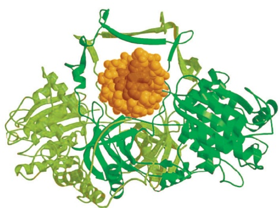

Figure 5–46 Nonhomologous end joining. (A) A central role is played by the Ku protein, a heterodimer that quickly grasps the broken chromosome ends. The additional proteins (shown in blue) are recruited to hold the broken ends together and remove any damaged nucleotides before the two DNA molecules are joined covalently by a specialized ligase that is dedicated to nonhomologous end joining. During this process, any single-strand gaps that arise are “filled in” by specialized repair polymerases. When DNA suffers double-strand breaks through ionizing radiation or chemical attack, the broken ends are often chemically damaged. Nonhomologous end joining is unusually versatile in being able to “clean up” just about any type of damaged end. (B) Three-dimensional structure of a Ku heterodimer bound to the end of a duplex DNA fragment. This Ku protein is also essential for V(D)J joining, a specific process through which antibody and T-cell receptor diversity is generated in developing B and T cells (discussed in Chapter 24). V(D)J joining and nonhomologous end joining share many mechanistic similarities, but the former relies on specific double-strand breaks that are produced deliberately by the cell. (From J. Walker, R. Corpina, and J. Goldberg, Nature 412:607–614, 2001. With permission from Springer Nature; PDB codes: 1JEQ, 1JEY.)

described later in this chapter. Most organisms employ both nonhomologous end joining and homologous recombination to repair double-strand breaks in DNA. Nonhomologous end joining predominates in humans; homologous recombination is used only in the S and $\mathrm { G } _ { 2 }$ cell-cycle phases, when one newly replicated daughter molecule can act as a template to repair damage to the other daughter that remains nearby.

#### DNA Damage Delays Progression of the Cell Cycle

We have just seen that cells contain multiple enzyme systems that can recognize and repair many types of DNA damage (**Movie 5.7**). Because of the importance of maintaining intact, undamaged DNA from generation to generation, eukaryotic cells delay the progression of their cell cycle until DNA repair is complete. As discussed in detail in Chapter 17, the orderly progression of the cell cycle is stopped when damaged DNA is detected, and it restarts only when the damage has been repaired. In mammalian cells, the presence of DNA damage can block entry from $\mathrm { G _ { 1 } }$ phase into S phase, it can slow S phase once it has begun, and it can block the transition from $\mathrm { G _ { 2 } }$ phase to M phase. These delays facilitate DNA repair by providing the time needed for the repair to reach completion.

DNA damage also results in an increased synthesis of many DNA repair enzymes. This response depends on special signaling proteins that sense DNA damage and synthesize more of the DNA repair enzymes appropriate for the damage. The importance of this mechanism is revealed by the phenotype of humans who are born with defects in the gene that encodes the ATM protein. These individuals have the disease ataxia telangiectasia (AT), the symptoms of which include neurodegeneration, a predisposition to cancer, and genome instability. The ATM protein is a large protein kinase that generates the intracellular signals needed to halt the cell cycle in response to many types of spontaneous DNA damage (see Figure 17–60), and individuals with defects in this protein suffer from the effects of unrepaired DNA lesions.

#### Summary

Genetic information can be stored stably in DNA sequences only because a large set of DNA repair enzymes continually scans the DNA double helix and replaces any damaged nucleotides. Most types of DNA repair depend on the fact that a DNA molecule carries two copies of its genetic information—one copy on each of its two complementary strands. This allows an accidental lesion on one strand to be removed by a repair enzyme and a corrected strand then resynthesized by reference to the information in the undamaged strand.

Most of the damage to DNA bases is excised by one of two major DNA repair pathways. In base excision repair, the altered base is removed by a DNA glycosylase enzyme, followed by excision of the resulting sugar phosphate. In nucleotide excision repair, a small section of the DNA strand surrounding the damage is removed from the DNA double helix. In both cases, the gap left in the DNA helix is filled in by the sequential action of DNA polymerase and DNA ligase, using the undamaged DNA strand as the template. Some types of DNA damage can be repaired by a different strategy—the direct chemical reversal of the damage— which is carried out by specialized repair proteins. Usually, all such corrections are completed prior to DNA replication. But if not, a special class of inaccurate DNA polymerases, called translesion polymerases, is used to bypass the damage, allowing the cell to survive but sometimes creating permanent mutations at the sites of damage.

Other critical repair systems—based on either nonhomologous end joining or homologous recombination—are needed to reseal the accidental double-strand breaks that occasionally occur in the DNA helix. In most cells, an elevated level of DNA damage causes a delay in the cell cycle, which helps to ensure that the damage is repaired before the cell divides.

#### HOMOLOGOUS RECOMBINATION

In the preceding parts of this chapter, we discussed the mechanisms that allow the DNA sequences in cells to be maintained from generation to generation with very little change. In this part, we further explore a group of repair mechanisms that depend on a process called homologous recombination. The key feature of **homologous recombination** (also known as general recombination) is an exchange of DNA strands between a pair of homologous duplex DNA sequences. Such a strand exchange between two regions of double helix that are very similar or identical in nucleotide sequence allows one stretch of duplex DNA to restore lost or damaged information on a second stretch of duplex DNA. Because the DNA sequence information that is used to correct the damage can come from a separate DNA molecule, homologous recombination can repair many types of DNA damage. It makes possible, for example, the accurate repair of double-strand breaks, as mentioned previously (see Figure 5–45B). As pointed out earlier, these double-strand breaks can result from reactive chemicals or radiation (for example, that from radon gas that accumulates in some old basements). But more frequently they arise from DNA replication accidents—when forks become stalled or broken independently of any such external cause. Homologous recombination accurately corrects these accidents, and, because they occur during nearly every round of DNA replication, this repair pathway is essential for every proliferating cell. Homologous recombination can also repair other types of DNA damage (for example, covalent cross-links between the two strands of a DNA double helix), being perhaps the most versatile DNA repair mechanism available to the cell; this probably explains why its mechanism and the proteins that carry it out have been conserved in virtually all cells on Earth.

We shall also see that homologous recombination plays an additional role in sexually reproducing organisms. During meiosis, a key step in gamete (sperm and egg) production, it catalyzes the orderly exchange of blocks of genetic information between corresponding (homologous) maternal and paternal chromosomes. This creates new combinations of DNA sequences in the chromosomes that are passed to offspring, giving the next generation unique characteristics upon which natural selection can act.

#### Homologous Recombination Has Common Features in All Cells

The current view of homologous recombination as a critical DNA repair mechanism in all cells developed slowly from its original discovery as a key component in the specialized process of meiosis in plants and animals. The subsequent recognition that homologous recombination also occurs in unicellular organisms made it readily amenable to molecular analyses. Thus, much of what we know about the biochemistry of genetic recombination was derived from studies of bacteria, especially of E. coli and its viruses, as well as from experiments with simple eukaryotes such as yeasts. For these organisms with short generation times and relatively small genomes, it was possible to isolate a large set of mutants with defects in their recombination processes. The protein altered in each mutant was then identified and, ultimately, studied biochemically. Very close relatives of these proteins were subsequently found in more complex eukaryotes including flies, mice, and humans, and it is now possible to directly analyze homologous recombination in these species as well. As a result, we now know that the fundamental processes that catalyze homologous recombination are common to all cells.

#### DNA Base-pairing Guides Homologous Recombination

The hallmark of homologous recombination is that it takes place only between DNA duplexes that have extensive regions of sequence similarity (homology). Not surprisingly, base-pairing underlies this requirement: before undergoing homologous recombination, two DNA helices will “sample” each other’s DNA sequence by testing the potential base-pairing between a single strand from one

DNA duplex and a complementary single strand from the other. Recombination is initiated when a match is found; this match need not be perfect, but it must be very close for homologous recombination to succeed. As we shall see, the process is carefully controlled and guided by a group of specialized proteins.

#### Homologous Recombination Can Flawlessly Repair Double-Strand Breaks in DNA

Unlike the nonhomologous end joining discussed earlier, homologous recombination repairs double-strand breaks accurately, without any loss or alteration of nucleotides at the site of repair. For homologous recombination to do this repair job, the damaged DNA must first be brought into proximity with a homologous but undamaged DNA double helix, which can then serve as a template for repair. For this reason, homologous recombination often occurs after DNA replication, when the two daughter DNA molecules lie close together and one can serve as a template for repair of the other.

One of the simplest pathways through which homologous recombination can repair double-strand breaks is shown in **Figure 5–47**. In essence, the broken DNA duplex and the template duplex carry out a “strand dance” so that one of the damaged strands can use the complementary strand of the intact DNA duplex

Figure 5–47 A mechanism that repairs double-strand breaks by homologous recombination. Homologous recombination can be regarded as a flexible series of reactions, with the exact pathway differing from one case to the next. The pathway shown here represents one of the major forms of recombinational double-strand break repair; however other, closely related pathways also exist. All share the first two steps—resection and strand invasion— but they diverge afterward. For example, recombinational repair of some doublestrand breaks proceeds through a double Holliday junction, a structure we discuss later in this chapter.

as a template for repair. Once the damaged and template DNA double helices are in proximity (as occurs, for example, after DNA replication), the ends of the broken DNA are chewed back, or “resected,” by specialized nucleases to produce overhanging, single-strand $3 ^ { \prime }$ ends. The next step is **strand exchange** (also called strand invasion), during which one of the single-strand $3 ^ { \prime }$ ends from the damaged DNA molecule searches the template duplex for homologous sequences through base-pairing. Once stable base-pairing is established (which completes the strand-exchange step), an accurate DNA polymerase extends the invading strand using the information provided by the undamaged template molecule, thus restoring one of the damaged DNA strands. The last steps—strand displacement, further repair synthesis, and ligation—restore the two original DNA double helices and complete the repair process, as illustrated.

Homologous recombination resembles other DNA repair reactions in that a DNA polymerase utilizes a pristine template to restore damaged DNA. However, instead of using the partner strand as a template, as occurs in most DNA repair pathways, homologous recombination makes use of a complementary strand from a separate DNA duplex. In the following sections, we discuss the steps of homologous recombination in more detail with an emphasis on the proteins that guide this remarkable process.

#### Specialized Processing of Double-Strand Breaks Commits Repair to Homologous Recombination

Once a double-strand break occurs, nonhomologous end joining and homologous recombination compete to repair the damage. But the specialized nuclease that resects DNA ends to begin homologous recombination becomes highly active during S and $\mathrm { G } _ { 2 }$ (through its phosphorylation by cell-cycle-controlled kinases), and homologous recombination usually wins out at these times, allowing use of a newly replicated daughter DNA molecule as a template. The initiating nuclease (called the Mre11 complex in eukaryotes) chews back in the $5 ^ { \prime } { \rightarrow } 3 ^ { \prime }$ direction leaving protruding $3 ^ { \prime }$ ends on either side of the break that can be as long as several thousand nucleotides. Single-strand binding protein (the same one used at replication forks) then coats the exposed single strands, protecting them from other nucleases in the cell and ensuring that they remain free of intramolecular base-pairing. The formation of these protruding ends prevents nonhomologous end joining from occurring, and it commits the repair pathway to homologous recombination.

#### Strand Exchange Is Directed by the RecA/Rad51 Protein

Of all the steps of homologous recombination, strand invasion is the most difficult to imagine. How does the invading single strand rapidly sample a DNA duplex for a complementary sequence? Once the homology is found, how is the structure stabilized? And how is the inherent stability of the template double helix overcome to allow tests for base-pairing during this process?

The answers to these questions came from biochemical and structural studies of the main protein that carries out this feat, called **RecA** in E. coli and **Rad51** in virtually all eukaryotic organisms. A special group of accessory proteins loads a set of RecA/Rad51 monomers onto a protruding DNA single strand (such as that in Figure 5-47), forming a cooperatively bound filament that displaces the single-strand binding protein originally present. This orderly loading process produces a protein–DNA filament in which the DNA is held by RecA/Rad51 in an unusual conformation: groups of three consecutive nucleotides are positioned as though they were in a conventional DNA double helix, but, between adjacent triplets, the DNA backbone is untwisted and stretched out (**Figure 5–48**). This unusual protein–DNA structure then grasps a nearby duplex DNA molecule in a way that stretches it, destabilizing it and making it easy to pull the strands apart. The invading single strand then can sample the sequence of the duplex by conventional base-pairing to one of its strands. This sampling occurs in triplet nucleotide blocks, each of which is already in a “base-pair ready” conformation in the invading strand; when a good triplet match occurs, only then is the adjacent triplet sampled, and so on. In this way, mismatches very quickly cause dissociation, so that millions of possible pairings can be tested. Only an extended stretch of base-pairing (at least 15 nucleotides) can stabilize the invading strand, leading to the next steps in homologous recombination.

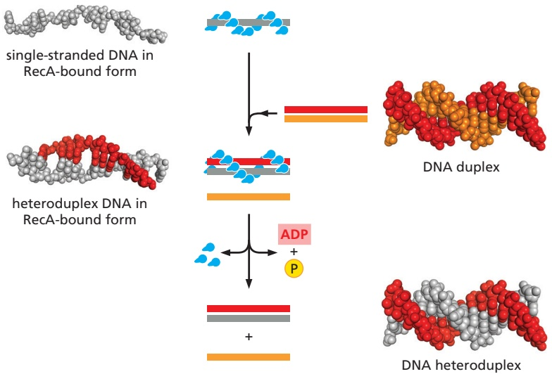

Figure 5–48 Strand invasion catalyzed by the RecA protein. Our understanding of this reaction is based in part on structures determined by x-ray diffraction studies of the bacterial RecA protein bound to single-stranded and double-stranded DNA. These DNA structures (illustrated with the RecA protein removed) are shown on the left side of the diagram. The reaction begins when ATP-bound RecA protein (blue) associates with a DNA single strand (typically a protruding 3′ end as shown in Figure 5–47), holding it in an elongated form where groups of three bases are separated from each other by a stretched and twisted backbone. The RecA-bound single strand then binds to duplex DNA, destabilizing it to allow the single strand to sample its sequence through base-MBoC7 m5.49/5.48 pairing, three bases at a time. If an extensive match is found, the structure is disassembled through ATP hydrolysis, resulting in protein dissociation and the exchange of one single strand of DNA for another, thereby forming a new heteroduplex from the complementary strands of two different DNA molecules. In the vast majority of cases, no match will be found in any one binding event, in which case the RecA-bound DNA single strand rapidly dissociates to begin a new search. (PDB code: 3CMX.)

RecA/Rad51 is an ATPase, and the steps described above require that each monomer along the filament be in the ATP-bound state. However, the searching itself does not require ATP hydrolysis; instead, the process occurs by simple molecular collisions, allowing an enormous number of potential sequences to be rapidly sampled. Once stable base-pairing occurs and a strand-exchange reaction is completed, ATP hydrolysis is necessary to disassemble RecA from the complex of DNA molecules. At this point, repair DNA polymerases and DNA ligase, which we encountered earlier in this chapter, complete the repair process, as shown previously in Figure 5–47.

#### Homologous Recombination Can Rescue Broken and Stalled DNA Replication Forks

Although accurately repairing double-strand breaks is a crucial function of homologous recombination, it can also repair other types of damage. For example, some chemicals cross-link the two strands of DNA together by covalently joining nucleotides on opposite strands. A special set of enzymes unlinks the strands and cuts out the damaged bits on both strands. At this point, the damaged DNA has been converted to a double-strand break, which can be accurately repaired by homologous recombination, as discussed earlier. Similarly, proteins can become accidently covalently linked to DNA, and these sites can also be converted by nucleases into double-strand breaks, allowing repair by homologous

Figure 5–49 Repair of a broken replication fork by homologous recombination. When a moving replication fork encounters a single-strand break, it will collapse but can be repaired by homologous recombination. The process uses many of the same reactions shown in Figure 5–47 and proceeds through the same basic steps. Green strands represent the new DNA synthesis that takes place after the replication fork has broken. This pathway allows the fork to move past the break on the damaged template using the undamaged duplex as a template to synthesize DNA. (Adapted from M.M. Cox, Proc. Natl. Acad. Sci. USA 98:8173–8180, 2001. Copyright 2001 National Academy of Sciences, USA. With permission from National Academy of Sciences.)

recombination. But perhaps the most important role of homologous recombination is in rescuing broken or stalled DNA replication forks. Many types of events can cause a replication fork to stop, and here we consider two examples. The first arises from an accidental single-strand gap in the parent DNA helix that lies just ahead of a replication fork. When the fork reaches this lesion, it falls apart—resulting in one broken and one intact daughter chromosome. Because this is a “one-sided” double-strand break, it cannot be repaired by nonhomologous end joining, and homologous recombination becomes crucial. The broken fork can be accurately repaired using the same basic reactions we discussed earlier for the repair of double-strand breaks (**Figure 5–49**). With slight modifications, the set of reactions just depicted can accurately repair many different types of DNA damage, providing that an undamaged duplex DNA template is available.

A different type of problem arises when a replication fork attempts to move through certain types of DNA damage that clogs up the replication machinery, stalling the fork. Because such damaged DNA often ends up deeply buried in the core of the replication fork, it cannot be easily repaired. To resolve this problem, the replication machine “backs up” through a series of strand-exchange reactions similar to those we have discussed (**Figure 5–50**). This maneuver allows one newly synthesized DNA strand to act as a template for synthesis of the other new strand, thereby bypassing the damaged template and allowing replication to proceed.

#### DNA Repair by Homologous Recombination Entails Risks to the Cell

Although homologous recombination neatly solves the problem of accurately repairing double-strand breaks and other types of DNA damage, it sometimes “repairs” damage using the wrong bit of the genome as the template. For example, sometimes a broken human chromosome is repaired using the homolog from the other parent instead of the sister chromatid as the template. Because maternal and paternal chromosomes differ in DNA sequence at many positions along their lengths, this type of repair can convert the sequence of the repaired DNA from the maternal to the paternal sequence or vice versa. The result of this type of errant recombination is a **loss of heterozygosity**. It can have severe consequences if the homolog used for repair contains a deleterious mutation, because the recombination event destroys the “good” copy. Loss of heterozygosity, although it happens rarely, is nonetheless a critical step in the formation of many cancers (discussed in Chapter 20).

Cells go to great lengths to minimize the risk of mishaps of these types; indeed, as we have seen, nearly every step of homologous recombination is carefully regulated. Recall that the first step (resection of the broken ends) is coordinated with the cell cycle: it occurs primarily in the S and $\mathrm { G } _ { 2 }$ phases of the cell cycle, favoring the use of a daughter duplex (either as a partially replicated chromosome or a fully replicated sister chromatid) as a template for repair (see Figure 5–47). The close proximity of the two daughter chromosomes disfavors the use of other genome sequences in the repair process.

The loading of RecA/Rad51 onto the processed DNA ends and the subsequent strand-exchange reaction are also tightly controlled by the cell, and a host of accessory proteins is needed to regulate these steps. There are many such proteins, and exactly how all of them coordinate and control homologous recombination remains a mystery, although we do understand how a few of them work, as described below. We also know that the enzymes that catalyze

Figure 5–50 Repair of a stalled replication fork by “fork reversal.” This mechanism is brought into play when a replication fork stalls when it encounters certain types of damaged nucleotides. A specialized helicase (not shown) peels the newly synthesized DNA strands away from their parent templates, allowing them to form complementary base pairs with each other and backing up the replication fork. At this point two outcomes are possible. In the first, because the damaged DNA has been exposed, it can be repaired by conventional repair mechanisms, and the fork can be restarted. In the second, as shown, DNA synthesis can bypass the damage using newly synthesized daughter DNA (rather than the damaged parent strand) as the template. This scheme allows the replication fork to move through the DNA damage, which can be repaired at a later time. Although the initial steps of replication fork reversal are well understood, exactly how the fork restarts afterward remains a mystery.

recombinational repair are made at relatively high levels in eukaryotes and are dispersed throughout the nucleus in an inactive form. In response to DNA damage, they rapidly converge on the sites of DNA damage, become activated, and form “repair factories” where many lesions are apparently brought together and repaired (**Figure 5–51**). Formation of these factories probably results from many weak interactions between different repair proteins and between repair proteins and damaged DNA, producing the type of biomolecular condensates discussed in Chapter 3 (see Figure 3–77). The high local concentration of the appropriate proteins and their substrates within these condensates is thought to increase the speed and efficiency of the repair process.

In Chapter 20, we shall see that both too much and too little homologous recombination can lead to cancer in humans, the former through repair using the “wrong” template (as described above) and the latter through an increased mutation rate caused by inefficient DNA repair. Clearly, a delicate balance has evolved that keeps this process in check on undamaged DNA, while still allowing it to act efficiently and rapidly on DNA lesions as soon as they arise.

Not surprisingly, mutations in the components that carry out and regulate homologous recombination are responsible for several inherited forms of cancer. Two of these, the Brca1 and Brca2 proteins, were first discovered because mutations in their genes lead to a greatly increased frequency of breast cancer. Because these mutations cause inefficient repair by homologous recombination, accumulation of DNA damage can, in a small proportion of cells, give rise to a cancer. Brca1 regulates an early step in broken-end processing; without it, such ends are not processed correctly for homologous recombination and instead damaged molecules are shunted to the error-prone nonhomologous end-joining pathway (see Figure 5–45). After resection, Brca2 is needed to correctly load the Rad51 protein onto the protruding single-strand DNA ends in preparation for strand exchange.

<!-- END EN EN05-H034-H050 -->

### 英文补充：转座与位点特异性重组：基因组变化的机制补充

> 对应中文板块：转座与位点特异性重组：基因组变化的机制补充。英文来源：Molecular Biology of the Cell，第7版，第5章；[本章完整原文](../来源/英文教材/05_DNA_Replication_Repair_and_Recombination/chapter.md)。物理PDF页码范围：292–359（整章范围）。

<!-- BEGIN EN EN05-H057-H071 -->
#### TRANSPOSITION AND CONSERVATIVE SITE-SPECIFIC RECOMBINATION

We have seen that homologous recombination can result in the exchange of DNA sequences between chromosomes. However, the order of genes on the interacting chromosomes typically remains the same after homologous recombination, inasmuch as the recombining sequences must be very similar for the process to occur. In this part of the chapter, we describe two very different types of recombination—**transposition** and **conservative site-specific recombination**— that do not require substantial regions of DNA homology. These two types of recombination reactions can alter the gene order along a chromosome and introduce whole blocks of DNA sequence into the genome.

Transposition and conservative site-specific recombination are largely dedicated to moving a wide variety of specialized segments of DNA—collectively termed mobile genetic elements—from one position in a genome to another. We will see that mobile genetic elements can range in size from a few hundred to tens of thousands of nucleotide pairs, and each typically carries a unique set of genes. Often, one of these genes encodes a specialized enzyme that catalyzes the movement of only that element and its close relatives, thereby making this type of recombination possible.

Virtually all cells contain mobile genetic elements, known informally as “jumping genes.” As explained in Chapter 4, over evolutionary time scales, they have had a profound effect on the shaping of modern genomes. For example, nearly half of the DNA in the human genome can be traced to these elements (see Figure 4–63). Over time, random mutation has altered their nucleotide sequences, and, as a result, only a few of the many copies of these elements in our DNA are still active and capable of movement. The remainder are molecular fossils whose existence provides striking clues to our evolutionary history.

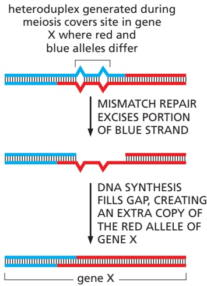

Figure 5–57 Gene conversion caused by mismatch correction. As shown in the preceding figure, heteroduplex DNA is formed at the sites of homologous recombination between maternal and paternal chromosomes. If the maternal and paternal DNA sequences are slightly different, the heteroduplex region will include some mismatched base pairs, which may then be corrected by theMB C7 m5.59/5.57 DNA mismatch repair machinery (see Figure 5–20). Because neither strand of DNA is newly synthesized, such repair can “erase” nucleotide sequences on either the paternal or the maternal strand. The consequence of this mismatch repair is gene conversion, detected as a deviation from the segregation of equal copies of maternal and paternal alleles that normally occurs in meiosis.

Mobile genetic elements are often considered to be molecular parasites (they are also termed “selfish DNA”) that persist because cells cannot get rid of them; they certainly have come close to overrunning our own genome. However, mobile DNA elements can provide benefits to the cell. For example, the genes they carry are sometimes advantageous to the host, as in the case of anti-biotic resistance in bacterial cells, discussed later. The movement of mobile genetic elements also produces many of the genetic variants upon which evolution depends, because, in addition to moving themselves, mobile genetic elements occasionally rearrange neighboring sequences of the host genome. Thus, spontaneous mutations observed in bacteria, Drosophila, humans, and other organisms are often due to the random movement of mobile genetic elements. While many of these mutations will be deleterious to the organism, some will be advantageous and may spread throughout the population. It is almost certain that much of the variety of life we see around us originally arose from the movement of mobile genetic elements.

In this part of the chapter, we introduce mobile genetic elements and describe the mechanisms that enable them to move from place to place in a genome. As mentioned above, these elements move through a variety of different mechanisms that can be grouped into two broad categories, transposition and conservative site-specific recombination. We begin with transposition, by far the most predominant of these two processes.

#### Through Transposition, Mobile Genetic Elements Can Insert into Any DNA Sequence

Mobile elements that move by way of transposition are called **transposons**, or **transposable elements**. In transposition, a specific enzyme, usually encoded by the transposon itself and typically called a transposase, acts on specific DNA sequences at each end of the transposon, causing it to insert into a new DNA site. Most transposons are only modestly selective in choosing their target site, and they can therefore insert themselves into many different locations in a genome; in particular, there is no general requirement for sequence similarity between the ends of the element and the target sequence. Most transposons move only rarely. In bacteria, the rate is typically one transposition event once every 105 cell divisions, and significantly more frequent movement would probably destroy the host cell’s genome. In plants and animals, the situation is different: it is common for progeny to carry tens to hundreds of new insertions relative to their parents. These high rates are tolerated, in part, because these genomes typically carry vast amounts of nonessential DNA sequences where most of the insertions are likely to occur.

On the basis of their structure and transposition mechanism, transposons can be grouped into three large classes: DNA-only transposons, retroviral-like retrotransposons, and nonretroviral retrotransposons. The differences among them are briefly outlined in **Table 5–4**, and each class will be discussed in turn.

#### DNA-only Transposons Can Move by a Cut-and-Paste Mechanism

**DNA-only transposons**, so named because they exist exclusively as DNA during their movement, predominate in bacteria, and they are largely responsible for the spread of antibiotic resistance in bacterial strains. When antibiotics such as penicillin and streptomycin first became widely available in the 1950s, most bacteria that caused human disease were susceptible to them. Now, the situation is different—antibiotics such as penicillin (and its modern derivatives) are no longer effective against many modern bacterial strains, including those causing gonorrhea and bacterial pneumonia. The spread of antibiotic resistance is due largely to genes that encode antibiotic-inactivating enzymes that are carried on transposons (**Figure 5–58**). Although these mobile elements can transpose only within cells that already carry them, they can be moved from one cell to another through other mechanisms known collectively as horizontal gene transfer (see Figure 1–18). Once introduced into a new cell, a transposon can insert itself into the genome and be faithfully passed on to all progeny cells through the normal processes of DNA replication and cell division.

<table><tr><td colspan="4">TABLE 5-4 Three Major Classes of Transposable Elements</td></tr><tr><td>Class description and structure</td><td>Specialized enzymes required for movement</td><td>Mode of movement</td><td>Examples</td></tr><tr><td colspan="4">DNA-only transposons</td></tr><tr><td>Short inverted repeats at each end</td><td>Transposase</td><td>Moves as DNA, either by cut-and-paste or replicative pathways</td><td>P element (Drosophila), Ac-Ds (maize), Tn3 (E. coli), Tam3 (snapdragon), Helraiser (bat)</td></tr><tr><td colspan="4">Retroviral-like retrotransposons</td></tr><tr><td>Directly repeated long terminal repeats (LTRs) at each end</td><td>Reverse transcriptase and integrase</td><td>Moves via an RNA intermediate whose production is driven by a promoter in the LTR</td><td>Copia and Gypsy (Drosophila), Ty1 (yeast), HERVK (human), Bs1 (maize), EVADE (Arabidopsis)</td></tr><tr><td colspan="4">Nonretroviral retrotransposons</td></tr><tr><td>Poly A at 3&#x27; end of RNA transcript; 5&#x27; end is often truncated</td><td>Reverse transcriptase and endonuclease</td><td>Moves via an RNA intermediate that is often synthesized from a neighboring promoter</td><td>I element (Drosophila), L1 (human), Cin4 (maize), Karma (rice)</td></tr><tr><td colspan="4">These elements range in length from 1000 to about 12,000 nucleotide pairs. Each family contains many members, only a few of which are listed here. Some viruses can also move in and out of host-cell chromosomes by transpositional mechanisms. These viruses are related to the first two classes of transposons.</td></tr></table>

DNA-only transposons can relocate from a donor site to a target site by cutand-paste transposition (**Figure 5–59**). Here, the transposon is literally excised from one spot on a genome and inserted into another. This reaction produces a short duplication of the target DNA sequence at the insertion site; these direct repeat sequences that flank the transposon serve as convenient records of a prior transposition event. Such “signatures” often provide valuable clues in identifying transposons in genome sequences.

When a cut-and-paste DNA-only transposon is excised from its original location, it leaves behind a “hole” in the chromosome. This lesion can be perfectly healed by recombinational double-strand break repair, provided that the chromosome has recently been replicated so that an identical copy of the damaged host sequence is available. Alternatively, a nonhomologous end-joining reaction can reseal the break; in this case, the DNA sequence that originally flanked the transposon is often altered, producing a mutation at the chromosomal site from which the transposon was excised (see Figure 5–45).

Figure 5–58 Transposons often code for the components they need for transposition. Shown here are two types of bacterial DNA-only transposons. Each carries a gene that encodes a transposase (dark blue and red)—the enzyme that MBoC7 e9.25/5.58catalyzes the element’s movement—as well as short DNA sequences (light blue and pink) that are recognized by the matching transposase. The short sequences (two in each transposon) are usually arranged so that one is an inverted repeat of the other.

Some transposons carry additional genes (yellow) that encode enzymes that inactivate antibiotics such as ampicillin (AmpR). The spread of these transposons is a serious problem in medicine, as it has allowed many disease-causing bacteria to become resistant to the antibiotics developed in the twentieth century.

transposition. DNA-only transposons can be recognized in chromosomes by the inverted repeat DNA sequences (red) present at their ends. These sequences, which can be as short as 20 nucleotides, are all that is necessary for the DNA between them to be transposed by the particular transposase enzyme associated with the element. The cut-and-paste movement of a DNA-only transposable element from one chromosomal site to another begins when the transposase enzyme brings the two inverted DNA sequences together, forming a DNA loop. Insertion into the target chromosome, also catalyzed by the transposase, occurs at a random site through the creation of staggered breaks in the target chromosome (purple arrowheads). After the transposition reaction, the single-strand gaps created by the staggered breaks are repaired by DNA polymerase and ligase (black). As a result, the insertion site is marked by a short direct repeat of the target DNA sequence, as shown. Although the break in the donor chromosome (green) is repaired, this process often alters the DNA sequence, causing a mutation at the original site of the excised transposable element (not shown).

Remarkably, the same mechanism used to excise cut-and-paste transposons from DNA has been found to operate in the developing immune system of vertebrates, catalyzing the DNA rearrangements that produce antibody and T-cell receptor diversity. Known as V(D)J recombination, this process will be discussed in Chapter 24. Found only in vertebrates, V(D)J recombination is a relatively recent evolutionary novelty, but its mechanism was probably derived from the much more ancient cut-and-paste transposons.

#### Some DNA-only Transposons Move by Replicating Themselves

Although cut-and-paste transposition is common, especially in bacteria, there are other ways that DNA-only transposons can move. These involve replicating the transposon and moving the copy to a new position on the genome, leaving the original transposon intact and in its original position. There are several different ways this can occur and we discuss only one here, which is characteristic of a large class of DNA-only transposons known as helitrons. Found in all branches of life, these transposons are especially common in plants and animals where they can compose several percent of genomes. They carry a gene for an unusual type of transposase, one that functions as both a sequence-specific nuclease and as a helicase, thereby directing the movement of the transposon (**Figure 5–60**).

Because of the mechanism behind their movement, helitrons often transfer bits of the genome, along with themselves, to new positions. For this reason, they are thought to be especially important in reshuffling genomic information to produce variant organisms subject to natural selection over evolutionary time scales.

#### Some Viruses Use a Transposition Mechanism to Move Themselves into Host-Cell Chromosomes

Certain viruses are considered mobile genetic elements because they use transposition mechanisms to integrate their genomes into that of their host cell. However, unlike transposons, the nucleotide sequences that form these viruses encode proteins that package their genetic information into virus particles that can leave the original host cell to infect other cells. As discussed in Chapter 1, most viruses probably evolved from transposable elements through the capture of genes from their host cells. Although originally serving some other purpose in the cell, such captured genes, after a long process of mutation and selection, now code for the structural proteins of viruses, allowing them to escape the cell. Viruses are among the most numerous biological entities on Earth, and we discuss them in more detail in Chapter 23. The viruses that insert themselves into host chromosomes generally do so by employing one of the first two mechanisms

Figure 5–60 Mechanism of transposition by helitrons, a type of DNA-only transposon. Several models have been proposed for the movement of these recently discovered transposons, and one is shown here. This model is based on studies of a helitron found in bats, called Helraiser. The process begins when the transposase (green) makes a single-strand break at one end of the transposon (blue) and, with the aid of a helicase, “peels back” the single strand. A second transposasemediated reaction releases the transposon in the form of single-stranded DNA, which can move to new positions in the host genome. The transposase (which travels with the single-stranded DNA) can then catalyze the covalent insertion of the transposon into a new location in the host DNA. Transposition by helitrons often moves adjacent host genome sequences along with them. This occurs when, in the third step, the transposase skips over its own CTAGT sequence and cleaves its host DNA downstream at a similar DNA sequence. According to the model, this skipping produces a single-strand DNA circle that includes both helitron and host DNA, and both are inserted into target DNA.

listed in Table 5–4; namely, by behaving like DNA-only transposons or like retroviral-like retrotransposons. Indeed, much of our knowledge of these mechanisms has come from studies of particular viruses that employ them.

Transposition has a key role in the life cycle of many viruses. Most notable are the **retroviruses**, which include the human AIDS virus, HIV. Outside the cell,MBoC7 m5.62/5.61 a retrovirus exists as a single-strand RNA genome packed into a protein shell, or capsid, along with a virus-encoded **reverse transcriptase** enzyme. During the infection process, the viral RNA enters a cell and is converted to a double-strand DNA molecule by the action of this crucial enzyme, which is able to polymerize DNA on either an RNA or a DNA template (**Figure 5–61**). The term retrovirus refers to the virus’s ability to reverse the usual flow of genetic information, which normally is from DNA to RNA (see Figure 1–4).

Once the reverse transcriptase has produced a double-strand DNA molecule, specific sequences near its two ends are recognized by a virus-encoded transposase called integrase. Integrase then inserts the viral DNA into the chromosome by a mechanism similar to that used by the cut-and-paste DNA-only transposons (see Figure 5–59).

#### Some RNA Viruses Replicate and Express Their Genomes Without Using DNA as an Intermediate

Retroviruses are not the only viruses that carry their genomes in the form of RNA. Other viruses also have single-strand RNA genomes, but, unlike retroviruses, many replicate and express their genomes without ever using DNA; that is, they are RNA-only viruses. For example, SARS-CoV-2, the coronavirus underlying the COVID-19 pandemic, replicates its single-strand RNA genome using a special, viral-encoded RNA-dependent RNA polymerase. Upon entering a cell, the viral genome is directly translated by ribosomes as though it were an mRNA molecule, producing many different viral-encoded proteins, including the RNA-dependent RNA polymerase. (We discuss mRNA and the process of translation in detail in Chapter 6.) The polymerase assembles with several other viral proteins and a few host proteins to form the complete replicase complex. This specialized replicase, which does not require a primer to begin synthesis, starts at the 3′ end of the viral genome and makes a complementary RNA copy of the entire genome

Figure 5–61 The life cycle of a retrovirus. The retrovirus genome consists of an RNA molecule (blue) that is typically between 7000 and 12,000 nucleotides in length. It is packaged inside a virus-encoded protein capsid, which is surrounded by a lipid-based envelope that contains virus-encoded envelope proteins (green). Inside an infected cell, the enzyme reverse transcriptase (red circle) first makes a DNA copy of the viral RNA molecule and then a second DNA strand, generating a doublestrand DNA copy of the RNA genome. The integration of this DNA double helix into the host chromosome is then catalyzed by a virus-encoded integrase enzyme. This integration is required for the synthesis of new viral RNA molecules by the hostcell RNA polymerase, the enzyme that transcribes DNA into RNA (discussed in Chapter 6). As indicated, this viral RNA is then used by host-cell machinery to produce the capsid, envelope, and reverse transcriptase proteins needed to form new virus particles.

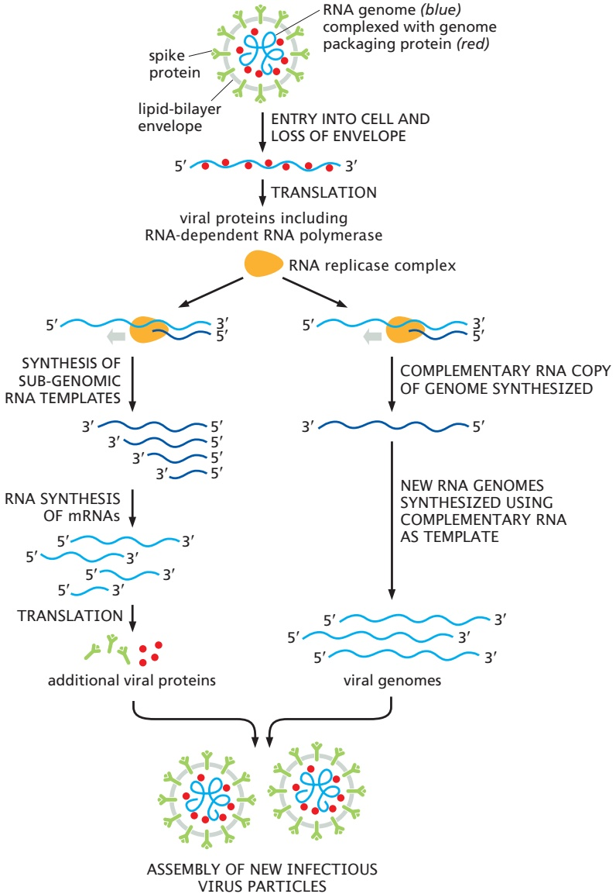

(Figure 5–62). Using this complementary copy as a template, the replicase then synthesizes new genomes, which are then packaged with newly synthesized viral proteins into complete virus particles. The whole process of viral replication takes about 10 hours, and a single infected cell can produce as many as 1000 new virus particles, which can spread to other cells within the same host or move in aerosolsMBoC7 n5.445/5.62 to new hosts. Because coronaviruses do not use DNA, all steps of viral replication can take place outside the nucleus. In the case of SARS-CoV-2, viral replication occurs in the cytoplasm inside double-membrane compartments that are commandeered by the virus from the endoplasmic reticulum, an organelle described in detail in Chapter 12. These virus-induced compartments are believed to protect the virus from the cell’s many antiviral defenses (see pp. 1337–1338) during viral replication and assembly.

Several features of coronaviruses distinguish them from other RNA-only viruses such as those that cause influenza or polio. Perhaps the most unusual is the ability of coronavirus replicase complexes to proofread as they copy their RNA genomes. This proofreading occurs in much the same way that we saw for DNA polymerases earlier in the chapter: An incorrectly added nucleotide is excised by a 3′-to-5′ exonuclease carried in the replicase complex, giving the replicase another chance to add the correct nucleotide. This feature means that coronaviruses do not mutate as rapidly as most other RNA viruses, which lack proofreading ability. As discussed in Chapter 23, the relatively high mutation rate of influenza

Figure 5–62 Simplified view of the coronavirus life cycle as exemplified by SARS-CoV-2. The viral genome, a singlestrand RNA molecule of approximately 30,000 nucleotides, is packaged throughout its length with an RNA-binding protein (red) and enclosed by a lipid bilayer containing the viral spike protein. (The appearance of spike proteins, emanating from the lipid envelope, is responsible for the “corona” moniker.) As described in Chapter 23, the spike proteins bind to a receptor on the surface of susceptible cells and direct the fusion of the viral envelope with the outer cell membrane, releasing the viral genome into the cytoplasm. The genome is then directly translated into protein. Single-strand RNA viruses of this type are called [+] strand viruses, denoting the ability of their genomes to be immediately translated by the host-cell machinery. In contrast, the genomes of [–] strand viruses must first be used as templates to make complementary RNA strands that are then translated (see Table 23–1).

Among the first proteins made by coronaviruses are those that form the RNA-dependent RNA polymerase, which is responsible for producing new viral genomes by synthesizing RNA using RNA as a template. The replicase complex (which includes the polymerase and several other loosely associated proteins) first synthesizes complete noncoding copies of the viral genome. These complementary copies in turn serve as templates for the replicase complex to synthesize new genomes. The replicase also makes a series of shorter coding RNAs, which are needed to produce additional viral proteins including the spike. Once new viral genomes and proteins have been synthesized, new virus particles are assembled and exit the cell. Although only a few viral proteins are shown in the diagram, the virus codes for at least 27 different proteins; some of these organize the double-membrane structures in which the virus replicates, while others inhibit various immune system responses to the infection.

virus helps explain why new vaccines are needed every year, and this may not always be the case for coronaviruses.

The proofreading also has other important implications. As discussed earlier in this chapter, the lower the mutation rate, the greater the number of essential proteins that a genome can maintain. Proofreading allows coronaviruses to have a larger genome than is typical for RNA viruses; for example, compare the 30,000 nucleotides of the SARS-CoV-2 genome (coding for at least 27 proteins) to the 13,500 nucleotides of the influenza virus (coding for about 10 proteins). Proofreading also affects the development of antiviral drugs. Viral replicases are attractive targets for such drugs, in part because similar enzymes do not exist in uninfected host cells, reducing the chance of side effects. Drugs of this type (for example, remdesivir) are typically nucleoside triphosphate analogs that “fool” the RNA replicase into adding them to growing RNA chains. Once incorporated, the analogs—which have improper 3′ ends—poison further chain elongation (see Figure 8–42). Coronavirus proofreading can excise many of these analogs and thereby reduce their potency. A related strategy (exemplified by molnupiravir) employs nucleoside triphosphate analogs that are incorporated into RNA by the viral replicase, escape proofreading, but base pair incorrectly in the next round of replication, thereby introducing a lethal number of mutations.

Another striking feature of coronaviruses is the way in which they make many different proteins from a genome carried on a single RNA molecule. As described earlier, the viral genome, once it enters a cell, is treated like an mRNA molecule and translated into protein. We shall see in the next chapter, however, that most eukaryotic mRNAs can code for only a single protein. Coronavirus production of many different proteins from a single RNA genome requires a series of unusual steps, some of which appear unique to coronaviruses. We shall discuss the general topics of mRNA translation and its regulation in Chapters 6 and 7. But first, we return to our discussion of transposons, some of which closely resemble viruses in the way they move from place to place in their host genomes.

#### Retroviral-like Retrotransposons Resemble Retroviruses, but Cannot Move from Cell to Cell

A large family of transposons called **retroviral-like retrotransposons** (see Table 5–4) move themselves in and out of chromosomes by a mechanism similar to that used by retroviruses. These elements are present in organisms as diverse as yeasts, flies, and mammals; unlike viruses, they have no intrinsic ability to leave their resident cell but are passed along to all descendants of that cell through the normal processes of DNA replication and cell division. The first step in their transposition is the transcription of the entire transposon, producing an RNA copy of the element that is typically several thousand nucleotides long. This transcript, which is translated as a messenger RNA by the host cell, encodes a reverse transcriptase enzyme. This enzyme makes a double-strand DNA copy of the RNA molecule via an RNA–DNA hybrid intermediate, precisely mirroring the early stages of infection by a retrovirus (see Figure 5–61). Like a retrovirus, the linear, double-strand DNA molecule then integrates into a site on the chromosome using an integrase enzyme that is also encoded by the element. The structure and mechanisms of these integrases closely resemble those of the transposases of DNA-only transposons.

#### A Large Fraction of the Human Genome Is Composed of Nonretroviral Retrotransposons

A significant fraction of many vertebrate chromosomes is made up of repeated DNA sequences. In human chromosomes, these repeats are mostly mutated and truncated versions of **nonretroviral retrotransposons**, the third major type of transposon (see Table 5–4). Although most of these transposons in the human genome are immobile, a few retain the ability to move. Movements of the L1 element (sometimes referred to as a LINE, or long interspersed nuclear element)

have been identified, some of which result in human disease; for example, a particular type of hemophilia results from an L1 insertion into the gene encoding the blood-clotting protein Factor VIII (see Figure 6–25).

Nonretroviral retrotransposons are found in many organisms and move via a distinct mechanism that requires a complex of an endonuclease and a reverse transcriptase. As illustrated in **Figure 5–63**, the RNA and reverse transcriptase have a much more direct role in the recombination event than they do in the retroviral-like retrotransposons described above.

Inspection of the human genome sequence reveals that the bulk of nonretroviral retrotransposons—for example, the many copies of the Alu element, a member of the SINE (short interspersed nuclear element) family—do not carry their own endonuclease or reverse transcriptase genes. Nonetheless, they have successfully amplified themselves to become major constituents of our genome, presumably by pirating enzymes encoded by active L1 elements. Together the LINEs and SINEs make up more than 30% of the human genome (see Figure 4–62); there are 500,000 copies of the former and more than a million of the latter.

#### Different Transposable Elements Predominate in Different Organisms

We have described several types of transposable elements: (1) DNA-only transposons, the movement of which is based on DNA breaking and joining reactions; (2) retroviral-like retrotransposons, which also move via DNA breakage and joining, but where RNA has a key role as a template to generate the DNA recombination substrate; and (3) nonretroviral retrotransposons, in which an RNA copy of the element is central to the incorporation of the element into the target DNA, acting as a direct template for a DNA target–primed reverse transcription event.

Intriguingly, different types of transposons predominate in different organisms. For example, the vast majority of bacterial transposons are DNA-only types, with a few related to the nonretroviral retrotransposons also present. In yeasts, the main mobile elements are retroviral-like retrotransposons. In Drosophila, DNA-only, retroviral, and nonretroviral transposons are all found. Finally, the human genome contains all three types of transposon, but as discussed below, their evolutionary histories are strikingly different.

#### Genome Sequences Reveal the Approximate Times at Which Transposable Elements Have Moved

The nucleotide sequence of the human genome provides a rich fossil record of the activity of transposons over evolutionary time spans. By carefully comparing the nucleotide sequences of the approximately 3 million transposable element remnants in the human genome, it has been possible to broadly reconstruct the movements of transposons in our ancestors’ genomes over the past several hundred million years. For example, the cut-and-paste DNA-only transposons appear to have been very active well before the divergence of humans and Old World monkeys (25–35 million years ago), but because they gradually accumulated inactivating mutations, they have been dormant in the human lineage since that time. Likewise, although our genome is littered with relics of retroviral-like retrotransposons, none appear to be active today. Only a single family of retroviral-like retrotransposons is believed to have transposed in the human genome since the divergence of human and chimpanzee approximately 6 million years ago. The nonretroviral retrotransposons are also ancient, but in contrast to other types, some are still moving in our genome, as mentioned pre-viously. For example, it is estimated that de novo movement of an Alu element occurs once in every 100–200 human births. This movement of nonretroviral retrotransposons is responsible for a small but significant fraction of new human mutations—perhaps two mutations out of every thousand.

The situation in mice is significantly different. Although the mouse and human genomes contain roughly the same density of the three types of transposons, both

#### Figure 5–63 Transposition by a nonretroviral retrotransposon.

Transposition of the L1 element (red) begins when an endonuclease that is part of a complex with the L1 reverse transcriptase (green) bound to the 3′ end of L1 RNA (blue) nicks the target DNA at the point at which. / . insertion will occur. This cleavage produces a 3′-OH DNA end in the target DNA, which is then used as a primer for the reverse transcription step shown. This generates a single-strand DNA copy of the element that is directly linked to the target DNA. In subsequent reactions, further processing of the single-strand DNA copy results in the generation of a new double-strand DNA copy of the L1 element that is inserted at the site of the initial nick.

types of retrotransposons are still actively transposing in the mouse genome, being responsible for approximately 10% of new mutations.

Although we are only beginning to understand how the movements of transposons have shaped the genomes of present-day mammals, it has been proposed that bursts in transposition activity could have been responsible for critical speciation events during the radiation of the mammalian lineages from a common ancestor, a process that began approximately 170 million years ago. At present, we can only wonder how many of our uniquely human qualities have been derived from the past activity of the mobile genetic elements whose remnants are found scattered throughout our chromosomes.

#### Conservative Site-specific Recombination Can Reversibly Rearrange DNA

A different kind of recombination mechanism, known as conservative site-specific recombination, rearranges other types of mobile DNA elements. In this pathway, breakage and joining occur at two special sites, one on each participating DNA molecule, with the recombination event being carried out by a specialized enzyme that breaks and rejoins the two DNA double helices at these specific sequences. The same enzyme system that joins two DNA molecules can often take them apart again, precisely restoring the sequence of the two original DNA molecules (**Figure 5–64A**). Alternatively, with a different orientation of these two sequences in a chromosome, conservative site-specific recombination produces a DNA inversion (**Figure 5–64B**).

The conservative site-specific recombination pathway illustrated in Figure 5–64A is often used by bacterial DNA viruses to move their genomes in and out of the genomes of their host cells. When integrated into its host genome, the viral DNA is replicated along with the host DNA and is faithfully passed on to all descendant cells. If the host cell suffers damage (for example, by UV irradiation), the virus can reverse the site-specific recombination reaction, excise its genome, and package it into a virus particle. In this way, many viruses can replicate themselves passively as a component of the host genome, but can also “leave the sinking ship” by excising their genomes and packaging them in a protective coat until a new, healthy host cell is encountered.

Several features distinguish conservative site-specific recombination from transposition. First, conservative site-specific recombination requires specialized

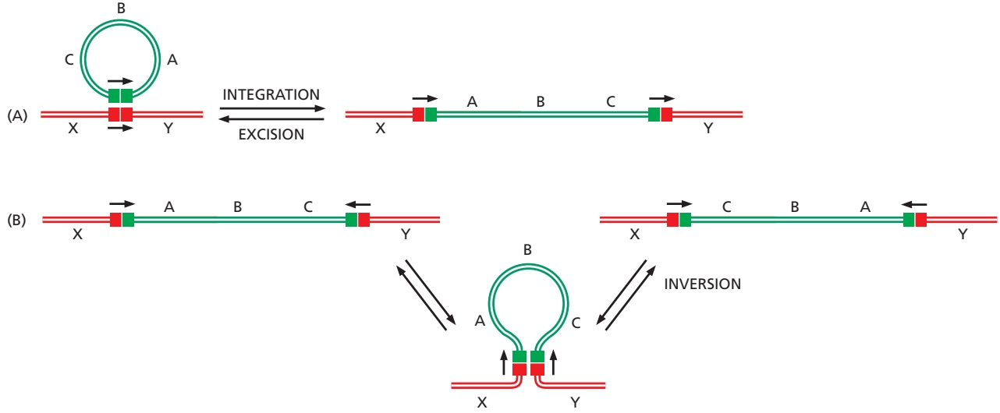

Figure 5–64 Two types of DNA rearrangement produced by conservative site-specific recombination. The only difference between the reactions in A and B is the relative orientation of the two short DNA sites (indicated by arrows) at which a site-specific recombination event occurs. (A) Through an integration reaction, a circular DNA molecule can become incorporated into a second DNA molecule; by the reverse reaction (excision), it can exit to re-form the original DNA circle. Many bacterial viruses move in and out of their host chromosomes in this way. (B) Conservative site-specific recombination can also invert a specific segment of DNA in a chromosome. A well-studied example of DNA inversion through site-specific recombination occurs in the bacterium Salmonella enterica serovar Typhimurium, as we discuss in the next section.

DNA sequences on both the donor and recipient DNA (hence the term “sitespecific”). These sequences contain recognition sites for the particular recombinase that will catalyze the rearrangement. In contrast, transposition requires only that the transposon bears a specialized sequence; for most transposons, the recipient DNA can be of nearly any sequence. Second, the reaction mechanisms are fundamentally different. The recombinases that catalyze conservative site-specific recombination resemble topoisomerases in the sense that they form transient high-energy covalent bonds with the DNA and use this energy to complete all the DNA rearrangements without the need for new DNA synthesis (see Figure 5–22). Thus, all the phosphate bonds that are broken during a recombination event are restored upon its completion (hence the term “conservative”). Transposition, in contrast, typically leaves gaps in the DNA that must be repaired by DNA polymerases.

#### Conservative Site-specific Recombination Can Be Used to Turn Genes On or Off

Many bacteria use conservative site-specific recombination to control the expression of particular genes. A well-studied example occurs in Salmonella bacteria, an organism that is a major cause of food poisoning in humans. Known as **phase variation**, the switch in gene expression results from the occasional inversion of a specific 1000-nucleotide-pair piece of DNA, brought about by a conservative site-specific recombinase encoded in the Salmonella genome. This change alters the expression of the cell-surface protein flagellin, for which the bacterium has two different genes. The DNA inversion changes the orientation of a promoter (a DNA sequence that directs transcription of a gene) that is located within the inverted DNA segment. With the promoter in one orientation, the bacteria synthesize one type of flagellin; with the promoter in the other orientation, they synthesize the other type (**Figure 5–65**).

The recombination reaction is reversible, allowing bacterial populations to switch back and forth between the two types of flagellin. Inversions occur only rarely, and because such changes in the genome will be copied faithfully during all subsequent replication cycles, entire clones of bacteria will have one type of flagellin or the other.

Phase variation helps protect the bacterial population against the immune response of its vertebrate host. If the host makes antibodies against one type of flagellin, a few bacteria whose flagellin has been altered by gene inversion will still be able to survive and multiply.

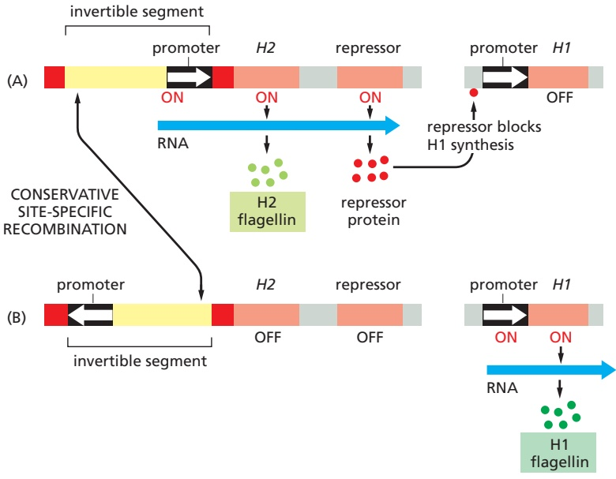

Figure 5–65 Switching gene expression by DNA inversion in bacteria. Which one of the two flagellin genes in a Salmonella bacterium is used to produce its flagellum is controlled by a conservative site-specific recombination event that inverts a small DNA segment containing a promoter. (A) In one orientation, the promoter activates transcription of the H2 flagellin gene along with the transcription of a repressor protein that blocks the expression of the H1 flagellin gene. Promoters and repressors are described in detail in Chapter 7; here we note simply that a promoter is needed to express a gene and that a repressor blocks this from happening. (B) When the promoter is inverted, it no longer turns on H2 or the repressor, and the H1 gene, which is thereby released from repression, is expressed instead. The inversion reaction requires specific DNA sequences (red) and a recombinase enzyme that is encoded in the invertible DNA segment. Because this conservative site-specific recombination mechanism is activated only rarely (about once in every 105 cell divisions), the production of one or the other type of flagellin tends to be faithfully inherited in each clone of cells.

gene of interest deleted from chromosome and lost as liver cells divide

Figure 5–66 How a conservative sitespecific recombination enzyme from bacteria is used to delete a specific gene from a particular mouse tissue. This approach requires the insertion of two specially engineered DNA molecules into the animal’s germ line. The first contains the gene for a recombinase (in this case, the Cre recombinase from the bacteriophage P1) under the control of a tissue-specific promoter that ensures the recombinase is expressed only in that tissue. The second DNA molecule contains the gene of interest, flanked by the DNA sequences of the recognition sites for the recombinase (in this case, LoxP sites). The mouse has been engineered to contain only this copy of the gene of interest. Therefore, if the recombinase is expressed only in the liver, the gene of interest will be deleted there, and only there. As described in Chapter 7, many tissue-specific promoters are known; moreover, many of these promoters are active only at specific times in development. Thus, this method makes it possible to study the effects of deleting any gene of interest at specific times during the development of each tissue. For this reason, it is a powerful tool for scientists investigating the role of individual genes in animal and plant development.

#### Bacterial Conservative Site-specific Recombinases Have Become Powerful Tools for Cell and Developmental Biologists

Like many of the mechanisms used by cells and viruses, site-specific recombination has been put to work by scientists to aid in the study of a wide variety of problems. To decipher the roles of specific genes in complex multicellular organisms, genetic engineering techniques are used to produce worms, flies, and mice carrying both a gene encoding a site-specific recombination enzyme and a carefully designed target DNA that includes a gene of interest flanked by DNA sites recognized by the recombination enzyme. At an appropriate time, the gene encoding the enzyme can be activated to rearrange the target DNA sequence. Such a rearrangement is widely used to delete a specific gene in a particular tissue of a multicellular organism (**Figure 5–66**). This strategy is particularly useful when the gene of interest plays a key role in the early development of many tissues, and a complete deletion of the gene from the germ line would cause death very early in development. The same strategy can also be used to artificially express any specific gene in a tissue of interest; here, the triggered deletion joins a strong transcriptional promoter to the gene of interest. With this tool one can in principle determine the influence of any protein in any desired tissue of an intact animal.

#### Summary

The genomes of nearly all organisms contain mobile genetic elements that can move from one position in the genome to another by either transposition or conservative site-specific recombination. In most cases, this movement is random and happens at a very low frequency. There are three classes of transposons: the DNA-only transposons, the retroviral-like retrotransposons, and the nonretroviral retrotransposons. The first two classes have close relatives among the viruses, including the human retrovirus that causes AIDS, HIV. Although mobile genetic elements can be viewed as parasites, many of the new arrangements of DNA sequences that their recombination events produce have been important for creating the genetic variation required for the evolution of cells and organisms.

<!-- END EN EN05-H057-H071 -->

### 英文补充：转录、RNA加工、剪接与核输出

> 对应中文板块：转录、RNA加工、剪接与核输出。英文来源：Molecular Biology of the Cell，第7版，第6章；[本章完整原文](../来源/英文教材/06_How_Cells_Read_the_Genome_From_DNA_to_Protein/chapter.md)。物理PDF页码范围：360–435（整章范围）。

<!-- BEGIN EN EN06-H000-H023 -->
#### How Cells Read the Genome: From DNA to Protein

Since the structure of DNA was discovered in the early 1950s, progress in cell and molecular biology has been astounding. We now know the complete genome sequences for thousands of different organisms, revealing fascinating details of their biochemistry as well as important clues as to how these organisms evolved. Complete genome sequences have also been obtained for hundreds of thousands of individual humans, as well as for a few of our now-extinct relatives, such as the Neanderthals. Knowing the maximum amount of information that is required to produce a complex organism like ourselves puts constraints on the biochemical and structural features of cells and makes it clear that biology is not infinitely complex.

As discussed in Chapter 1, most of the genetic information carried by DNA specifies the sequence of amino acids in proteins. But this DNA does not direct the synthesis of proteins directly, instead producing RNA as an intermediary. When the cell needs a particular protein, the nucleotide sequence of the appropriate portion of the DNA molecule in a chromosome is first copied into RNA (a process called transcription). These RNA copies of segments of the DNA sequence are then used to direct the synthesis of the protein (a process called translation). The genetic information in cells thereby flows from DNA to RNA to protein. All cells, from bacteria to humans, express their genetic information in this way—a principle so fundamental that it is termed the central dogma of molecular biology (**Figure 6–1**).

Despite this universality, there are important variations between organisms in the way information flows from DNA to protein. Most notable, the RNA transcripts in eukaryotic cells are subject to a series of processing steps in the nucleus, including RNA splicing, before they are permitted to exit from the nucleus and be translated into protein. As we discuss in this chapter, these processing steps can critically change the “meaning” of an RNA molecule, and they are therefore crucial for understanding how eukaryotic cells read their genome.

Although we shall focus in this chapter on the production of the proteins encoded by the genome, for some genes RNA is the final product. Like proteins, some of these RNAs fold into precise three-dimensional structures that have structural and catalytic roles in the cell. Although the functions of many non-coding RNAs are not yet known, some have been studied in great detail and are discussed in this and the following chapter.

One might have expected that the information present in genomes would be arranged in an orderly fashion, resembling a dictionary or a telephone directory. But it turns out that the genomes of most multicellular organisms are surprisingly disorderly, reflecting their chaotic evolutionary histories. The genes in these organisms largely consist of a long string of alternating short exons and long introns, as discussed in Chapter 4 (see Figure 4–15D). Moreover, small bits of DNA sequence that code for protein are interspersed with large blocks of seemingly meaningless DNA. Some sections of the genome contain many genes and others lack genes altogether. Proteins that work closely with one another in the cell usually have their genes located on different chromosomes, and adjacent genes typically encode proteins that have little to do with each other in the cell. Decoding genomes is therefore no simple matter. Even with the aid of powerful

C HAP T E R

IN THIS CHAPTER

From DNA to RNA

From RNA to Protein

The RNA World and the Origins of Life

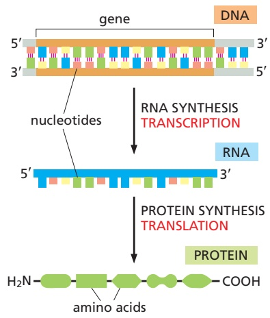

Figure 6–1 Genetic information directs the synthesis of proteins. The flow of genetic information from DNA to RNA (transcription) and from RNA to protein (translation) occurs in all living cells. As we saw in Chapter 5, DNA can also be copied—or replicated—to produce new DNA molecules.

human X chromosome: 155 million nucleotide base pairs (\~5% of genome)

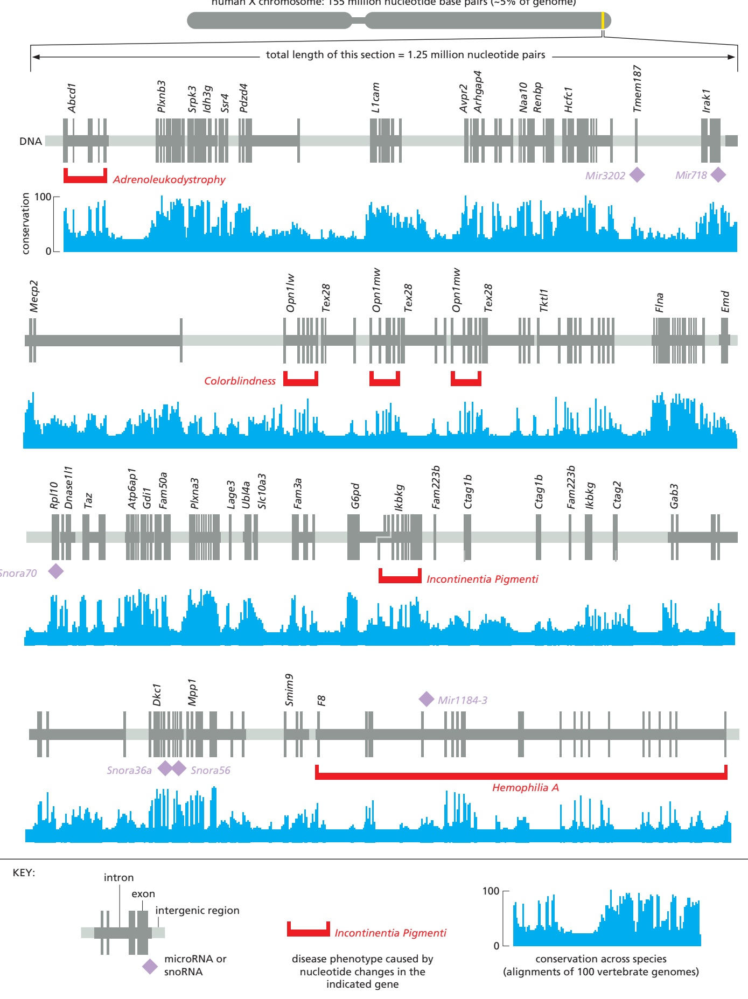

Figure 6–2 Schematic depiction of a small portion of the human X chromosome. As summarized in the key, the known protein-coding genes (starting with Abcd1 and ending with F8) are marked by a dark gray central line, with their coding regions (exons) indicated by dark gray bars that extend above and below this line. Noncoding RNAs with known functions are indicated by purple diamonds. The blue histogram indicates the extent to which portions of the human genome are conserved with other vertebrate species. It is likely that additional genes, currently unrecognized, also lie within this portion of the human genome.

Genes whose mutation causes an inherited human condition are indicated by red brackets. The Abcd1 gene codes for a protein that imports fatty acids into the peroxisome; mutations in the gene cause demyelination of nerves, which can result in cognition and movement disorders. Incontinentia pigmenti is a disease of the skin, hair, nails, teeth, and eyes. Hemophilia A is a bleeding disorder caused by mutations in the Factor VIII gene, which codes for a blood-clotting protein (see Figure 6–25B). Because males have only a single copy of the X chromosome, most of the conditions shown here affect only males; females that inherit one of these defective genes are often asymptomatic because a functional protein is made from their other X chromosome. (Courtesy of Alex Williams, data obtained from the University of California, Genome Browser, http://genome.ucsc.edu.)

computers, it is difficult for researchers, in the absence of direct experimental evidence, to locate definitively the beginning and end of genes, much less to decipher when and where each gene is expressed in the life of the organism. Yet the cells in our body do this automatically, thousands of times a second.

The problems that cells face in decoding genomes can be appreciated by considering a tiny portion of the human genome (**Figure 6–2**). The region illustrated represents less than 1/2000 of our genome and includes at least 48 genes that encode proteins plus 6 genes for noncoding RNAs. When we consider the entire human genome, we can only marvel at the capacity of our cells to rapidly and accurately handle such large amounts of information.

In this chapter, we explain how cells decode and use the information in their genomes. Much has been learned about how the genetic instructions written in an alphabet of just four “letters”—the four different nucleotides in DNA—direct the formation of a bacterium, a fruit fly, or a human. Nevertheless, we still have a great deal to discover about how the information stored in an organism’s genome produces even the simplest unicellular bacterium with about 500 genes, let alone how it directs the development of a human with approximately 25,000 genes. An enormous amount of ignorance remains; many fascinating challenges therefore await the next generation of cell biologists.

#### FROM DNA TO RNA

Transcription and translation are the means by which cells read out, or express, the genetic instructions in their genes. Because many identical RNA copies can be made from the same gene, and each RNA molecule can direct the synthesis of many identical protein molecules, cells can synthesize a large amount of protein from a single gene when necessary. Importantly, genes can be transcribed and translated with different efficiencies, allowing the cell to make vast quantities of some proteins and tiny amounts of others (**Figure 6–3**). Moreover, as we see in the next chapter, a cell can change (or regulate) the expression of each of its genes according to its needs—commonly by controlling the production of its RNA—and many genes will not be expressed at all in some cells.

Figure 6–3 Genes can be expressed with different efficiencies. In this example, gene A is transcribed much more efficiently than gene B, and each RNA molecule that it produces is also translated more frequently. This causes the amount of protein A in the cell to be much greater than that of protein B. In this and later figures, the portions of DNA that are transcribed are shown in orange.

One of the central problems in producing proteins from the information carried in genomes is that most steps depend on conventional nucleic acid base-pairing, which on its own has only modest specificity. In many contexts, a correct base pair is only 10–100 times more thermodynamically stable than an incorrect base pair, so that most steps of gene expression rely on mechanisms that both improve the specificity of the base-pairing and correct the many mistakes that arise. A central theme of this chapter, therefore, is the way cells deal with the fundamentally inaccurate base-pairing process that lies at the heart of the mechanisms that they use to read their genome.

#### RNA Molecules Are Single-Stranded

The first step a cell takes in reading out its genetic instructions is to copy a particular portion of its DNA nucleotide sequence—a gene—into an RNA nucleotide sequence (**Figure 6–4**). The information in RNA, although copied into another chemical form, is still written in essentially the same language as it is in DNA— the language of a nucleotide sequence. Hence the name given to producing RNA molecules on DNA is transcription.

Like DNA, RNA is a linear polymer made of four different types of nucleotide subunits linked together by phosphodiester bonds (see Figure 6–4). It differs from DNA chemically in two respects: (1) the nucleotides in RNA are ribonucleotides—that is, they contain the sugar ribose (hence the name ribonucleic acid) rather than deoxyribose; (2) although, like DNA, RNA contains the bases adenine (A), guanine (G), and cytosine (C), it contains the base uracil (U) instead of the thymine (T) in DNA (**Figure 6–5**). Because U, like T, can base-pair by hydrogen-bonding with A (**Figure 6–6**), the complementary base-pairing properties described for DNA in Chapters 4 and 5 apply also to RNA (in RNA, G pairs with C, and A pairs with U).

Although these chemical differences are slight, DNA and RNA differ quite dramatically in overall structure. Whereas DNA always occurs in cells as a double-strand helix, RNA is single-stranded. An RNA chain can therefore fold up into a particular shape, just as a polypeptide chain folds up to form the final shape of a protein (**Figure 6–7**). As we see later in this chapter, the ability to fold into complex three-dimensional shapes allows some RNA molecules to have precise structural and catalytic functions.

Figure 6–5 The chemical structure of RNA. (A) RNA contains the sugar ribose, which differs from deoxyribose, the sugar used in DNA, by the presence of an additional –OH group. (B) RNA contains the base uracil, which differs from thymine, the equivalent base in DNA, by the absence of a –CH3 group.

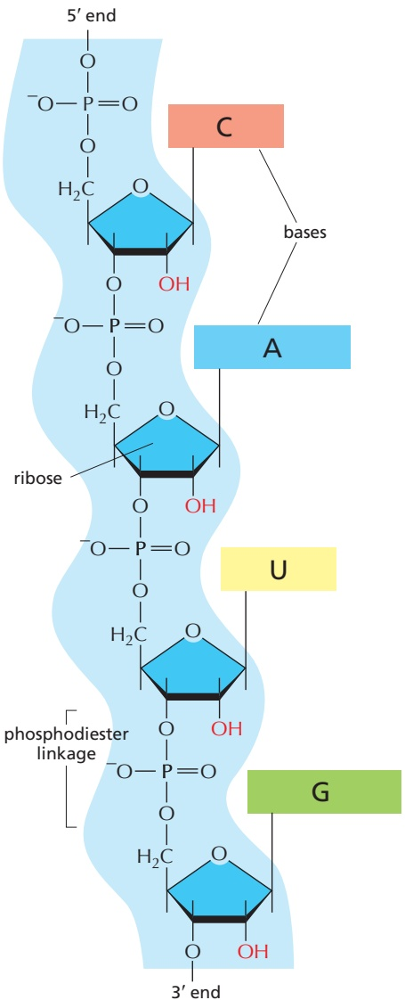

Figure 6–4 A short length of RNA. The phosphodiester chemical linkage between nucleotides in RNA is the same as that in DNA.

#### Transcription Produces RNA Complementary to One Strand of DNA

The RNA in a cell is made by **DNA transcription**, a process that has certain similarities to the process of DNA replication discussed in Chapter 5. Transcription begins with the opening and unwinding of a small portion of the DNA double helix to expose the bases on each DNA strand. One of the two strands of the DNA double helix then acts as a template for the synthesis of an RNA molecule. As in DNA replication, the nucleotide sequence of the RNA chain is determined by the complementary base-pairing between incoming nucleotides and the DNA template. When a good match is made (A with T, U with A, G with C, and C with G), the incoming ribonucleotide is covalently linked to the growing RNA chain in an enzymatically catalyzed reaction. The RNA chain produced by transcription—the transcript—is therefore elongated one nucleotide at a time, and it has a nucleotide sequence that is exactly complementary to the strand of DNA used as the template (**Figure 6–8**).

Transcription, however, differs from DNA replication in several crucial ways. Unlike a newly formed DNA strand, the RNA strand does not remain hydrogenbonded to the DNA template strand. Instead, just behind the region where the ribonucleotides are being added, the RNA chain is displaced and the DNA helix re-forms. Thus, the RNA molecules produced by transcription are released from the DNA template as single strands. In addition, because they are copied from only a limited region of the DNA, RNA molecules are much shorter than DNA molecules. A DNA molecule in a human chromosome can be up to 250 million nucleotide-pairs long; in contrast, most RNAs are no more than a few thousand nucleotides long, and many are considerably shorter.

Figure 6–6 Uracil base pairs with adenine. The absence of a methyl group in U has no effect on base-pairing; thus, U-A base pairs closely resemble T-A base pairs (see Figure 4–5).

#### RNA Polymerases Carry Out DNA Transcription

The enzymes that perform transcription are called **RNA polymerases**. Like the DNA polymerase that catalyzes DNA replication (discussed in Chapter 5), RNA polymerases catalyze the formation of the phosphodiester bonds that link the nucleotides together to form a linear chain. The RNA polymerase moves stepwise along the DNA, unwinding the DNA helix just ahead of its active site for polymerization to expose a new region of the template strand for complementary base-pairing. In this way, the growing RNA chain is extended by one nucleotide at a time in the 5′-to-3′ direction (**Figure 6–9**). The substrates are ribonucleoside triphosphates (ATP, CTP, UTP, and GTP); as in DNA replication, the hydrolysis of high-energy bonds provides the energy needed to drive the reaction forward (see Figure 5–4 and **Movie 6.2**).

Figure 6–7 RNA can fold into specific structures. RNA is largely single-stranded, but it often contains short stretches of nucleotides that can form conventional base pairs with complementary sequences found elsewhere on the same molecule. These interactions, along with additional “nonconventional” base-pair interactions (for example, A-G), allow an RNA molecule to fold into a three-dimensional structure that is determined by its sequence of nucleotides (Movie 6.1). (A) Diagram of a folded RNA structure showing only conventional (G-C and A-U) base-pair interactions (red). (B) Formation of nonconventional (green) base-pair interactions folds the hypothetical structure shown in A even further. (C) Structure of an actual RNA molecule, in this case one that catalyzes its own splicing (see pp. 347–348). Each conventional base-pair interaction is indicated by a “rung” in the double helix. Bases in other configurations are indicated by broken rungs.

The almost immediate separation of the RNA strand from the DNA as it is synthesized means that many RNA copies can be made from the same gene in a relatively short time, with the synthesis of additional RNA molecules being started before the previous RNA molecules are completed (**Figure 6–10**). When RNA polymerase molecules follow hard on each other’s heels in this way, each moving at speeds up to 50 nucleotides per second, more than a thousand transcripts can be synthesized in an hour from a single gene.

Although RNA polymerase catalyzes essentially the same chemical reaction as DNA polymerase, there are some important differences between the activities of the two enzymes. First, and most obviously, RNA polymerase catalyzes the linkage of ribonucleotides, not deoxyribonucleotides. Second, unlike the DNA polymerases involved in DNA replication (see pp. 259–260), RNA polymerases can start an RNA chain without a primer. This difference is thought possible because transcription need not be as accurate as DNA replication (see Table 5–1, p. 260). RNA polymerases make about one mistake for every $1 0 ^ { 4 }$ nucleotides copied into RNA (compared with an error rate for direct copying and proofreading by DNA polymerase of about one in $1 0 ^ { 7 }$ nucleotides), and the consequences of an error in RNA transcription are much less significant as RNA does not permanently store genetic information in cells. Finally, unlike DNA polymerases, which make their products in segments that are later stitched together, RNA polymerases are processive; that is, the same RNA polymerase that begins an RNA molecule must finish it without dissociating from the DNA template.

Although not nearly as accurate as the DNA polymerases that replicate DNA, RNA polymerases nonetheless have a modest proofreading mechanism. If an incorrect ribonucleotide is added to the growing RNA chain, the polymerase can back up, and the active site of the enzyme can perform an excision reaction that resembles the reverse of the polymerization reaction, except that a water molecule replaces the pyrophosphate and a nucleoside monophosphate is released.

Given that DNA and RNA polymerases both carry out template-dependent nucleotide polymerization, it might be expected that the two types of enzymes would be structurally related. However, x-ray crystallographic studies reveal that, other than containing a critical $\mathrm { M g ^ { 2 + } }$ ion at the catalytic site, the two enzymes are quite different. Template-dependent nucleotide-polymerizing enzymes seem to have arisen at least twice during the early evolution of cells. One lineage led to the

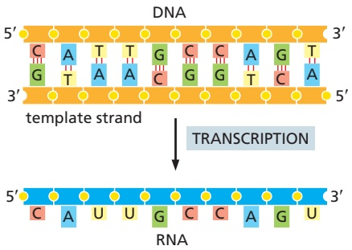

Figure 6–8 DNA transcription produces a single-strand RNA molecule that is complementary to one strand of the DNA double helix. Note that the sequence of bases in the RNA molecule produced is the same as the sequence of bases in the non-template DNA strand, except that a MB C7 6.08/6.08U replaces every T base in the DNA.

Figure 6–9 DNA is transcribed by the enzyme RNA polymerase. The RNA polymerase (pale blue) moves stepwise along the DNA, unwinding the DNA helix at its active site indicated by the Mg2+ (red), which is required for catalysis. As it progresses, the polymerase adds nucleotides one by one to the RNA chain at the polymerization site, using an exposed DNA strand as a template. The RNA transcript is thus a complementary copy of one of the two DNA strands. A short region of DNA–RNA helix (approximately nine nucleotide pairs in length) is formed only transiently, and a “window” of DNA–RNA helix therefore moves along the DNA with the polymerase as the DNA double helix re-forms behind it. The incoming nucleotides are in the form of ribonucleoside triphosphates (ATP, UTP, CTP, and GTP), and the energy stored in their phosphate–phosphate bonds provides the driving force for the polymerization reaction. The figure, based on an x-ray crystallographic structure, shows a cutaway view of the polymerase: the part facing the viewer has been sliced away to reveal the interior (Movie 6.3). (Adapted from P. Cramer et al., Science 288:640–649, 2000. PDB code: 1HQM.)

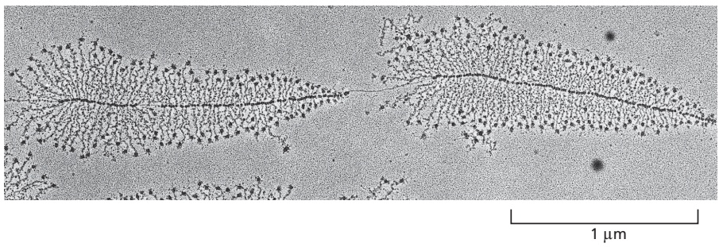

modern DNA polymerases and reverse transcriptases discussed in Chapter 5, as well as to a few RNA polymerases from viruses. The other lineage formed all of the RNA polymerases that we discuss in this chapter.

Figure 6–10 Transcription of two genes as observed under the electron microscope. The micrograph shows many molecules of RNA polymerase simultaneously transcribing each of two adjacent genes. Molecules of RNA polymerase are visible as a series of dots along the DNA with the newly synthesized transcripts (fine threads) attached to them. The RNA molecules (ribosomal RNAs; rRNAs) shown in this example are not translated into protein but are instead used directly as components of ribosomes, the machines on which translation takes place. The particles at the 5′ end (the free end) of each rRNA transcript are believed to reflect the beginnings of ribosome assembly. From the relative lengths of the newly synthesized transcripts, it can be deduced that the RNA polymerase molecules are transcribing from right to left. (Courtesy of Ulrich Scheer.)

#### Cells Produce Different Categories of RNA Molecules

The majority of genes carried in a cell’s DNA specify the amino acid sequence of proteins, and the RNAs that are copied from these genes (which ultimately direct the synthesis of proteins) are called **messenger RNA (mRNA)** molecules. The final product of other genes is the RNA molecule itself. These RNAs are known as **non-coding RNAs**, because they do not code for protein. In a well-studied, single-celled eukaryote, the yeast Saccharomyces cerevisiae, more than 1200 genes (about 15% of the total) produce RNA as their final product. Humans produce about 5000 different noncoding RNAs. These RNAs, like proteins, serve as enzymatic, structural, and regulatory components for a wide variety of processes in the cell. In Chapter 5, weMBoC7 m6.10/6.10 encountered one of them as the template RNA carried by the enzyme telomerase. We shall see in this chapter that ribosomal RNA (rRNA) molecules form the core of ribosomes, that transfer RNA (tRNA) molecules serve as the adaptors that select amino acids and hold them in place on a ribosome for incorporation into protein, and that small nuclear RNA (snRNA) molecules direct the splicing of pre-mRNA to form mRNA. In Chapter 7, we shall see that microRNA (miRNA) molecules and small interfering RNA (siRNA) molecules serve as key regulators of eukaryotic gene expression, and that piwi-interacting RNAs (piRNAs) protect animal germ lines from transposons; we also discuss the long noncoding RNAs (lncRNAs), a diverse set of RNAs, many of whose functions are just being discovered (**Table 6–1**).

<table><tbody><tr><td colspan="2">TABLE 6-1 Principal Types of RNAs Produced in Cells</td></tr><tr><td>Type of RNA</td><td>Function</td></tr><tr><td>mRNAs</td><td>Messenger RNAs, code for proteins</td></tr><tr><td>rRNAs</td><td>Ribosomal RNAs, form the basic structure of the ribosome and catalyze protein synthesis</td></tr><tr><td>tRNAs</td><td>Transfer RNAs, central to protein synthesis as the adaptors between mRNA and amino acids</td></tr><tr><td>Telomerase RNA</td><td>Serves as the template for the telomerase enzyme that extends the ends of chromosomes</td></tr><tr><td>snRNAs</td><td>Small nuclear RNAs, function in a variety of nuclear processes, including the splicing of pre-mRNA</td></tr><tr><td>snoRNAs</td><td>Small nucleolar RNAs, help to process and chemically modify rRNAs</td></tr><tr><td>lncRNAs</td><td>Long noncoding RNAs, not all of which appear to have a function; some serve as scaffolds and regulate diverse cell processes, including X-chromosome inactivation</td></tr><tr><td>miRNAs</td><td>MicroRNAs, regulate gene expression by blocking translation of specific mRNAs and causing their degradation</td></tr><tr><td>siRNAs</td><td>Small interfering RNAs, turn off gene expression by directing the degradation of selective mRNAs and helping to establish repressive chromatin structures</td></tr><tr><td>piRNAs</td><td>Piwi-interacting RNAs, bind to piwi proteins and protect the germ line from transposable elements</td></tr></tbody></table>

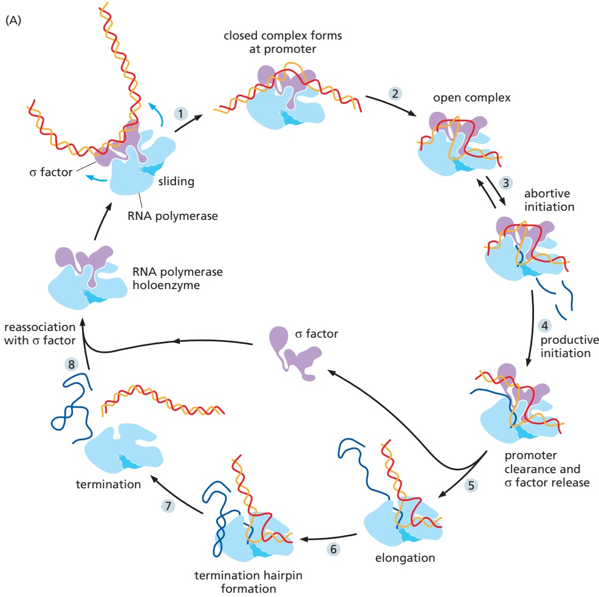

Each transcribed segment of DNA is called a transcription unit. In eukaryotes, a transcription unit typically carries the information of just one gene, and therefore codes for either a single RNA molecule or a single protein (or group of related proteins if the initial RNA transcript is spliced in more than one way to produce different mRNAs). In bacteria, a set of adjacent genes is often transcribed as a unit; the resulting mRNA molecule therefore carries the information for producing several distinct proteins.

Overall, RNA makes up a few percent of a cell’s dry weight, whereas proteins compose about 50%. Most of the RNA in cells is rRNA; mRNA composes only 3–5% of the total RNA in a typical mammalian cell. The mRNA population is made up of tens of thousands of different species, and there are on average only 10–15 molecules of each species of mRNA present in each cell.

#### Signals Encoded in DNA Tell RNA Polymerase Where to Start and Stop

To transcribe a gene accurately, RNA polymerase must recognize where on the genome to start and where to finish. The way in which RNA polymerases perform these tasks differs somewhat between bacteria and eukaryotes. Because the processes in bacteria are simpler, we discuss them first.

The initiation of transcription is an especially important step in gene expression because it is the main point at which the cell regulates which proteins are to be produced and at what rate. The bacterial RNA polymerase core enzyme is a multisubunit complex that synthesizes RNA using the DNA template as a guide. An additional subunit called sigma (σ) factor associates with the core enzyme and assists it in reading the signals in the DNA that tell it where to begin transcribing (**Figure 6–11**). Together, σ factor and the core enzyme are known as the

(B)

(C)

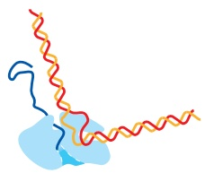

Figure 6–11 The transcription cycle of bacterial RNA polymerase. (A) In step 1, the RNA polymerase holoenzyme (polymerase core enzyme plus σ factor) assembles and then, by sliding, locates a promoter DNA sequence (see Figure 6–12). The polymerase opens (unwinds) the DNA at the position at which transcription is to begin (step 2) and begins transcribing (step 3). This initial RNA synthesis (abortive initiation) is relatively inefficient as short, unproductive transcripts are often released. However, once RNA polymerase has managed to synthesize about 10 nucleotides of RNA, it breaks its interactions with the promoter DNA (step 4) and eventually releases σ factor—as the polymerase tightens around the DNA and shifts to the elongation mode of RNA synthesis, moving along the DNA (step 5). During the elongation mode, transcription is highly processive, with the polymerase leaving the DNA template and releasing the newly transcribed RNA only when it encounters a termination signal (steps 6 and 7). Termination signals are typically encoded in DNA, and many function by forming an RNA hairpin–like structure that destabilizes the polymerase’s hold on the RNA.

In bacteria, all RNA molecules are synthesized by a single type of RNA polymerase, and the cycle depicted in the figure therefore applies to the production of mRNAs as well as structural and catalytic RNAs. (B) Two-dimensional image of an elongating bacterial RNA polymerase, as determined by atomic force microscopy. (C) Interpretation of the image in B. (Adapted from K.M. Herbert et al., Annu. Rev. Biochem. 77:149–176, 2008. With permission from Annual Reviews.)

RNA polymerase holoenzyme; this complex adheres only weakly to DNA when the two collide, and a holoenzyme typically slides rapidly along the long bacterial DNA molecule and then dissociates. However, when the polymerase holoenzyme slides into a special sequence of nucleotides indicating the starting point for RNA synthesis called a **promoter**, the polymerase binds tightly because its σ factor makes specific contacts with the edges of bases exposed on the outside of the DNA double helix (step 1 in Figure 6–11A).

The tightly bound RNA polymerase holoenzyme at a promoter opens up the double helix to expose a short stretch of nucleotides on each strand (step 2 in Figure 6–11A). The region of unpaired DNA (about 10 nucleotides) is called the transcription bubble, and it is stabilized by the binding of σ factor to the unpaired bases on one of the exposed strands. The other exposed DNA strand then acts as a template for complementary base-pairing with incoming ribonucleotides, two of which are joined together by the polymerase to begin an RNA chain (step 3 in Figure 6–11A).

The first 10 or so nucleotides of RNA are synthesized using a “scrunching” mechanism, in which RNA polymerase remains bound to the promoter and pulls the upstream DNA into its active site, thereby expanding the transcription bubble. This process creates considerable stress, and the short RNAs are often released, thereby relieving the stress and forcing the polymerase, which remains in place, to begin synthesis over again. Eventually this process of abortive initiation is overcome, and the stress generated by scrunching helps the core enzyme to break free of its interactions with the promoter DNA (step 4 in Figure 6–11A) and discard the σ factor (step 5 in Figure 6–11A).

At this point, the polymerase begins to move down the DNA, synthesizing RNA in a stepwise fashion: the polymerase moves forward one base pair for every nucleotide added. During this process, the transcription bubble continually expands at the front of the polymerase and contracts at its rear. Chain elongation continues (at a speed of approximately 50 nucleotides per second for bacterial RNA polymerases) until the enzyme encounters a second signal, the terminator (step 6 in Figure 6–11A), where the polymerase halts and releases both the newly made RNA molecule and the DNA template (step 7 in Figure 6–11A). The free polymerase core enzyme then reassociates with a free σ factor to form a holoenzyme that can begin the process of transcription again (step 8 in Figure 6–11A).

The process of transcription initiation is complicated and requires that the RNA polymerase holoenzyme and the DNA undergo a series of conformational changes, first opening the DNA double helix at promoters and subsequently tightening the enzyme around the DNA and RNA so that it does not dissociate before it has finished transcribing a gene. If an RNA polymerase does dissociate prematurely, it must start over again at the promoter.

How do the termination signals in the DNA stop the elongating polymerase? For most bacterial genes, a termination signal consists of a string of A-T nucleotide pairs preceded by a twofold symmetric DNA sequence, which, when transcribed into RNA, folds into a “hairpin” structure through Watson–Crick base-pairing (see Figure 6–92). As the polymerase transcribes across a terminator, the formation of the hairpin helps release the RNA transcript, which is held in place by relatively weak A-T and U-A base pairs (step 7 in Figure 6–11A). As we shall see, the folding of RNA into specific structures affects many steps in decoding the genome.

#### Bacterial Transcription Start and Stop Signals Are Heterogeneous in Nucleotide Sequence

As we have just seen, the processes of transcription initiation and termination involve a complicated series of structural transitions in protein, DNA, and RNA molecules. The signals encoded in DNA that specify these transitions are often difficult for researchers to recognize. Indeed, a comparison of many different bacterial promoters reveals a surprising degree of variation. Nevertheless, they all contain related sequences, reflecting aspects of the DNA that are recognized directly by the σ factor. These common features are often summarized in the form of a consensus sequence (**Figure 6–12**). A **consensus nucleotide sequence** is derived by comparing many sequences with the same basic function and tallying up the most common nucleotides found at each position. It therefore serves as a summary or “average” of a large number of individual nucleotide sequences. A more accurate way of displaying the range of DNA sequences recognized by a protein is through the use of a sequence logo, which reveals the relative frequencies of each nucleotide at each position (Figure 6–12C).

(C)

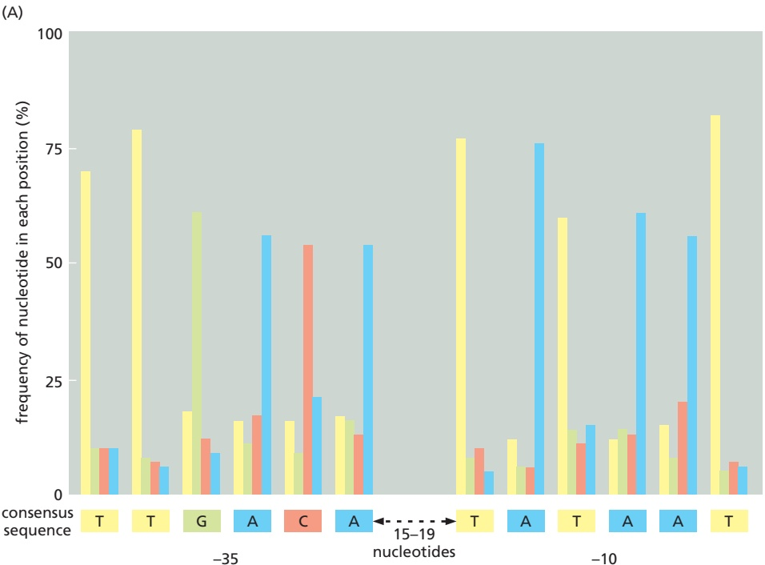

The DNA sequences of individual bacterial promoters differ in ways that determine their strength, that is, the number of initiation events per unit time. Evolutionary processes have fine-tuned each to initiate as often as necessary and have thereby created a wide spectrum of promoter strengths. Promoters for genes that code for abundant proteins are much stronger than those associated withMB C7 6.12/6.12 genes that encode rare proteins, and the nucleotide sequences of their promoters are responsible for these differences.

Like bacterial promoters, transcription terminators also have a wide range of sequences, with the potential to form a simple hairpin RNA structure being the most important common feature. Because an almost unlimited number of nucleotide sequences have this potential, terminator sequences are even more heterogeneous than promoter sequences.

We have discussed bacterial promoters and terminators in some detail to illustrate an important point regarding the analysis of genome sequences. Although we know a great deal about bacterial promoters and terminators and can construct “average” sequences that summarize their most salient features, their variation in nucleotide sequence makes it difficult to definitively locate them simply by analysis of the nucleotide sequence of a genome. It is even more difficult to locate analogous sequences in eukaryotic genomes, due in part to the excess DNA carried in these genomes. Often we need additional information, some of it from direct experimentation, to locate and accurately interpret the short DNA signals in genomes.

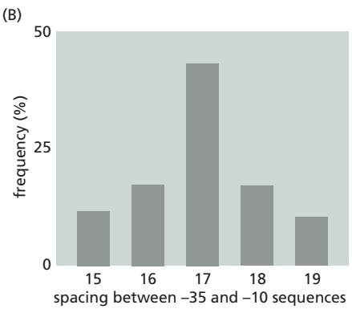

Figure 6–12 Consensus nucleotide sequence and sequence logo for the major class of Escherichia coli promoters. (A) On the basis of a comparison of 300 promoters, the frequencies of each of the four nucleotides at each position in the promoter are given. The consensus sequence, shown directly below the histogram, reflects the most common nucleotide found at each position in the collection of promoters. These promoters are characterized by two hexameric DNA sequences—the –35 sequence and the –10 sequence, named for their approximate location relative to the start point of transcription (designated +1). The sequence of nucleotides between the –35 and –10 hexamers shows little similarity among promoters but the spacing matters. For convenience, the nucleotide sequence of a single strand of DNA is shown; in reality, promoters are double-stranded DNA. The nucleotides shown in the figure are recognized by σ factor, a subunit of the RNA polymerase holoenzyme. (B) The distribution of spacing between the –35 and –10 hexamers found in E. coli promoters. (C) A sequence logo displaying the same information as in panel A. Here, the height of each letter is proportional to the frequency at which that base occurs at that position across a wide variety of promoter sequences. The total height of all the letters at each position is proportional to the information content (expressed in bits) at that position. For example, the total information content of a position that can tolerate several different bases is small (see the last three bases of the –35 sequences) but statistically greater than random.

Figure 6–13 Directions of transcription along a short portion of a bacterial chromosome. Some genes are transcribed using one DNA strand as a template, while others are transcribed using the other DNA strand. The direction of transcription is determined by the orientation of the promoter at the beginning of each gene (green arrowheads). This diagram shows approximately 0.2% (9000 base pairs) of the E. coli chromosome. The genes transcribed from left to right use the bottom DNA strand as the template; those transcribed from right to left use the top strand as the template. DNA that is not transcribed is indicated in gray.

As shown in Figure 6–12, promoter sequences are asymmetric, ensuring that RNA polymerase can bind in only one orientation. Because the polymerase can synthesize RNA only in the 5′-to-3′ direction, the promoter orientation specifies the strand to be used as a template. Genome sequences reveal that the DNA strand that is used as the template for RNA synthesis varies from gene to gene, depending on the orientation of the promoter (**Figure 6–13**).

Having considered transcription in bacteria, we now turn to the situa-. / . tion in eukaryotes, where the synthesis of RNA molecules is a much more elaborate affair.

#### Transcription Initiation in Eukaryotes Requires Many Proteins

In contrast to bacteria, which contain a single type of RNA polymerase, eukaryotic nuclei have three: RNA polymerase I, RNA polymerase II, and RNA polymerase III. The three polymerases are structurally similar to one another and share some common subunits, but they transcribe different categories of genes (**Table 6–2**). RNA polymerases I and III transcribe the genes encoding transfer RNA, ribosomal RNA, and various small RNAs. RNA polymerase II transcribes most genes, including all those that encode proteins, and our subsequent discussion therefore focuses on this enzyme.

Eukaryotic RNA polymerase II has many structural similarities to bacterial RNA polymerase (**Figure 6–14**). But there are several important differences in the way in which the bacterial and eukaryotic enzymes function, two of which concern us immediately.

1. While bacterial RNA polymerase requires only a single transcriptioninitiation factor (σ) to begin transcription, eukaryotic RNA polymerases require many such factors, collectively called the general transcription factors.

2. Eukaryotic transcription initiation must take place on DNA that is packaged into nucleosomes and higher-order forms of chromatin structure (described in Chapter 4), features that are absent from bacterial chromosomes.

<table><tbody><tr><td colspan="2">TABLE 6-2 The Three RNA Polymerases in Eukaryotic Cells</td></tr><tr><td>Type of polymerase</td><td>Genes transcribed</td></tr><tr><td>RNA polymerase I</td><td>5.8S, 18S, and 28S rRNA genes</td></tr><tr><td>RNA polymerase II</td><td>All protein-coding genes, plus snoRNA genes, miRNA genes, siRNA genes, lncRNA genes, and most snRNA genes</td></tr><tr><td>RNA polymerase III</td><td>tRNA genes, 5S rRNA genes, some snRNA genes, and genes for other small RNAs</td></tr><tr><td colspan="2">The rRNAs were named according to their "S" values, which refer to their rate of sedimentation in an ultracentrifuge. The larger the S value, the larger the rRNA.</td></tr></tbody></table>

(B)

Figure 6–14 Structural similarity between a bacterial RNA polymerase and a eukaryotic RNA polymerase II. Regions of the two RNA polymerases that have similar structures are indicated in green. The eukaryotic polymerase is larger than the bacterial enzyme (12 subunits instead of 5), and some of the additional regions are shown in gray. The red sphere represents the Mg atom present at the active site, where polymerization takes place, while the blue spheres denote Zn atoms that serve as structural components. The RNA polymerases in all modern-day cells (bacteria, archaea, and eukaryotes) are closely related, indicating that the basic features of the enzyme were in place before the divergence of the three major branches of life. (Courtesy of P. Cramer and R. Kornberg.)

(A)

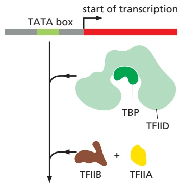

#### To Initiate Transcription, RNA Polymerase II Requires a Set of General Transcription Factors

The **general transcription factors** help to position eukaryotic RNA polymerase correctly at the promoter, aid in pulling apart the two strands of DNA to allow transcription to begin, and release RNA polymerase from the promoter to start its elongation mode. The proteins are “general” because they are needed at nearly all promoters used by RNA polymerase II. They consist of a set of interacting proteins denoted arbitrarily as TFIIA, TFIIB, and so on (TFII standing for transcription factor for polymerase II). In a broad sense, the eukaryotic general transcription factors carry out functions that are equivalent to those of the σ factor in bacteria.

**Figure 6–15** illustrates how the general transcription factors assemble at promoters used by RNA polymerase II, and **Table 6–3** summarizes their activities. The assembly process begins when TFIID binds to a short double-helical DNA sequence primarily composed of T and A nucleotides. For this reason, this sequence is known as the TATA sequence, or **TATA box**, and the subunit of TFIID that recognizes it is called TBP (for TATA-binding protein). The TATA box is typically located about 30 nucleotides upstream from the transcription start site. It is not the only DNA sequence that signals the start of transcription (**Figure 6–16**), but for many polymerase II promoters it is the most important. The binding of

<small>Figure 6–15 Initiation of transcription of a eukaryotic gene by RNA polymerase II. To begin transcription, RNA polymerase requires several general transcription factors. (A) Many promoters contain a DNA sequence called the TATA box, which, in humans, is located about 30 nucleotides away from the site at which transcription is initiated. (B) Through its subunit TBP, TFIID recognizes and binds the TATA box, which then enables the adjacent binding of TFIIB and TFIIA. (C) The RNA polymerase and the rest of the general transcription factors assemble at the promoter. (D) TFIIH then uses energy from ATP hydrolysis to pry apart the DNA double helix at the transcription start point, locally exposing the template strand. TFIIH also phosphorylates the long C-terminal polypeptide tail of RNA polymerase II, also called the C-terminal domain (CTD). This causes the polymerase to be released from the general factors and begin the elongation phase of transcription. For most genes, TFIID remains bound at the promoter whereas most of the other general transcription factors are released when the polymerase begins transcribing.</small>

<table><tbody><tr><td colspan="3">TABLE 6-3 The General Transcription Factors Needed for Transcription Initiation by Eukaryotic RNA Polymerase II</td></tr><tr><td>Name</td><td>Number of subunits</td><td>Roles in transition initiation</td></tr><tr><td>TFIID</td><td>12</td><td>Recognizes TATA box and other DNA sequences near the transcription start point</td></tr><tr><td>TFIIB</td><td>1</td><td>Recognizes BRE element in promoters; accurately positions RNA polymerase at the start site of transcription</td></tr><tr><td>TFIIA</td><td>2</td><td>Not required in all promoters; stabilizes binding of TFIID</td></tr><tr><td>TFIIF</td><td>3</td><td>Stabilizes RNA polymerase interaction with TFIIB; helps attract TFIIE and TFIIH</td></tr><tr><td>TFIIE</td><td>2</td><td>Attracts and regulates TFIIH</td></tr><tr><td>TFIIH</td><td>10</td><td>Unwinds DNA at the transcription start point, phosphorylates Ser5 of the RNA polymerase C-terminal domain (CTD); releases RNA polymerase from the promoter</td></tr><tr><td colspan="3">TFIID is composed of TBP and 11 additional subunits called TAFs (TBP-associated factors).</td></tr></tbody></table>

TFIID causes a large distortion in the DNA of the TATA box (**Figure 6–17**). This distortion is thought to serve as a physical landmark for the location of an active promoter in the midst of a very large genome, and it brings DNA sequences on both sides of the distortion closer together to allow for subsequent protein assembly steps. The additional general transcription factors then assemble, along with RNA polymerase II, to form a complete transcription initiation complex (see Figure 6–15). The most complicated of the general transcription factors is TFIIH (shown in pink). Consisting of 10 subunits, it is nearly as large as RNA polymerase II itself and, as we shall see shortly, performs several enzymatic steps needed for the initiation of transcription.

After forming a transcription initiation complex on the promoter DNA, RNA polymerase II must gain access to the template strand at the transcription start point. TFIIH makes this step possible by hydrolyzing ATP and pulling apart the DNA strands at the start site, thereby exposing the template strand. Next, RNA polymerase II, like the bacterial polymerase, remains at the promoter synthesizing short lengths of RNA until it undergoes a series of conformational changes that allow it to move away from the promoter and enter the elongation phase of transcription. A key step in this transition is the addition of phosphate groups to the “tail” of the RNA polymerase (known as the CTD, or C-terminal domain). In

| element | consensus sequence | general transcription factor |
| --- | --- | --- |
| BRE | G/C G/C G/A C G C C | TFIIB |
| TATA | T A T A A/T A A/T | TBP subunit of TFIID |
| INR | C/T C/T A N T/A C/T C/T | TFIID |
| DPE | A/G G A/T C G T G | TFIID |

Figure 6–16 Consensus sequences found in the vicinity of eukaryotic RNA polymerase II start points. The name given to each consensus sequence (first column) and the general transcription factor that recognizes it (last column) are indicated. N indicates any nucleotide, and two nucleotides separated by a slash indicate an equal probability of either nucleotide at the indicated position. In reality, each consensus sequence is a shorthand representation of a histogram similar to that of Figure 6–12.

For most RNA polymerase II transcription start points, only two or three of the four sequences are present. For example, many polymerase II promoters have a TATA box sequence, but those that do not typically have a “strong” INR sequence. Although most of the DNA sequences that influence transcription initiation are located upstream of the transcription start point, a few, such as the DPE shown in the figure, are located within the transcribed region.

humans, the CTD consists of 52 tandem repeats of a seven-amino-acid sequence, which extend from the RNA polymerase core structure. During transcription initiation, the serines located at the fifth position in each repeat sequence (Ser5) are phosphorylated by TFIIH, which contains a protein kinase in one of its subunits. Triggered by these phosphorylations, the polymerase disengages from the cluster of general transcription factors (see Figure 6–15D). During this process, it undergoes a series of conformational changes that tighten its interaction with DNA, and it acquires new proteins that allow it to transcribe for long distances, in some cases for many hours, without dissociating from DNA.

Once the polymerase II has begun elongating the RNA transcript, most of the general transcription factors are released from the DNA so that they are available to initiate another round of transcription with a new RNA polymerase molecule. As we see shortly, the phosphorylation of the tail of RNA polymerase II has an additional function: it causes components of the RNA-processing machinery to load onto the polymerase and thereby be positioned to modify the newly transcribed RNA as it emerges from the polymerase.

#### In Eukaryotes, Transcription Initiation Also Requires Activator, Mediator, and Chromatin-modifying Proteins

The model for transcription initiation just described is based on experiments performed in vitro using purified proteins and DNA. However, as discussed in Chapter 4, DNA in eukaryotic cells is packaged into nucleosomes, which are further arranged in higher-order chromatin structures. As a result, transcription initiation in a eukaryotic cell is more complex and requires more proteins than it does on purified DNA. First, regulatory proteins known as transcriptional activators must bind to specific sequences in DNA (called enhancers) to help attract the general transcription factors and RNA polymerase II to the start point of transcription (**Figure 6–18**). We discuss the role of these activators in Chapter 7, because they are one of the main ways in which cells regulate expression of their genes. Here we simply note that their presence on DNA is required for transcription initiation in a eukaryotic cell. Second, eukaryotic transcription initiation in vivo requires the presence of a large protein complex known as Mediator, which

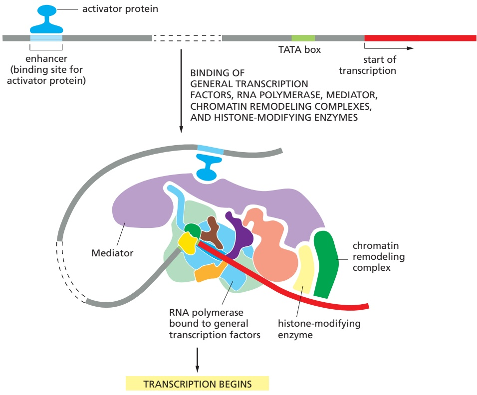

Figure 6–17 Three-dimensional structure of TBP (TATA-binding protein) bound to DNA. The TBP is the subunit of the general transcription factor TFIID that is responsible for recognizing and binding the TATA box sequence in the DNA. The unique DNA bending caused by TBP—kinks in the double helix separated by partly unwound DNA—is thought to serve as a landmark that helps to attract the other general transcription factors (Movie 6.4). TBP is a single polypeptide chain that is folded into two very similar domains (blue and green). (Adapted from J.L. Kim et al., Nature 365:520–527, 1993.)

Figure 6–18 Transcription initiation by RNA polymerase II in a eukaryotic cell. Transcription initiation in vivo requires the presence of transcription activator proteins. As described in Chapter 7, these proteins bind to short, specific sequences in DNA that are located in regulatory regions called enhancers. Although only one activator is shown here (in blue), a typical eukaryotic gene utilizes many DNA-bound transcription activator proteins, which act together to determine that gene’s rate and pattern of transcription across different cell types. Often acting from a distance of many thousand nucleotide pairs along DNA (indicated by the dashes), these proteins help RNA polymerase, the general transcription factors, and Mediator all to assemble at the promoter. In addition, ATP-dependent chromatin remodeling complexes and histone-modifying enzymes are needed at most genes. One of the main roles of Mediator is to coordinate the assembly of all these proteins at the promoter so that transcription can begin. As discussed in Chapter 4, the “default” state of eukaryotic DNA is to be packaged into nucleosomes and higher-order chromatin structures; for simplicity, these are not shown in this figure.

allows the activator proteins to communicate properly with the polymerase II and with the general transcription factors. Mediator also correctly positions TFIIH near the tail of RNA polymerase, facilitating phosphorylation of the tail and the consequent release of the polymerase from the promoter to begin synthesizing RNA. Finally, transcription initiation in a eukaryotic cell typically requires the recruitment of chromatin-modifying enzymes, including chromatin remodeling complexes and histone-modifying enzymes. As discussed in Chapter 4, both types of enzymes can increase access to the DNA in chromatin, and by doing so they facilitate the assembly of the transcription initiation machinery onto DNA.

To summarize, as illustrated schematically in Figure 6–18, many proteins (well over 100 individual subunits) must assemble at the start point of transcription to initiate transcription in a eukaryotic cell. We shall return to some of these proteins—especially transcription activator proteins, chromatin remodeling complexes, and histone-modifying enzymes—in the following chapter, where we discuss how eukaryotic cells regulate the process of transcription initiation.

#### Transcription Elongation in Eukaryotes Requires Accessory Proteins

Once RNA polymerase has initiated transcription, it moves jerkily, pausing at some DNA sequences and rapidly transcribing through others. Elongating RNA polymerases, both bacterial and eukaryotic, are associated with a series of elongation factors, proteins that decrease the likelihood that RNA polymerase will dissociate before it reaches the end of a gene. These factors typically associate with RNA polymerase shortly after initiation, and they help the polymerase move both through nucleosomes (**Figure 6–19**) and through the wide variety of different DNA sequences that are found in genes.

We will see in the next chapter that, like the process of transcription initiation, transcription elongation can be regulated by the cell; more specifically, we will see that at many human genes, RNA polymerase pauses shortly after it initiates transcription. This pause can last from several seconds to many hours, and the cell controls the duration of this pause as part of gene regulatory processes.

As RNA polymerase II moves along a gene, some of the enzymes bound to it modify the histones, leaving behind a record of where the polymerase has been. Although it is not clear exactly how the cell uses this information, it may aid in transcribing a gene over and over again once it has become active for the first time.

#### Transcription Creates Superhelical Tension

Nucleosomes are not the only impediment to elongating RNA polymerases, and in this section, we describe an entirely different type of barrier, one that applies to both bacterial and eukaryotic polymerases. To introduce this issue, we need first to consider a subtle property inherent in the DNA double helix called DNA supercoiling. **DNA supercoiling** is the name given to a conformation that DNA can adopt in response to superhelical tension. Alternatively, the creation of loops or coils in a double-helical DNA molecule will produce such tension.

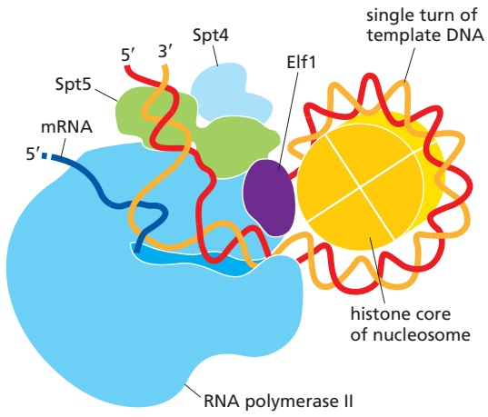

Figure 6–19 Structure of an RNA polymerase II transcribing through a nucleosome. In the structure diagrammed here, which was determined by cryoelectron microscopy, the polymerase has moved about halfway through the DNA of the nucleosome, leaving only one of the two loops of duplex DNA still bound to the histone core. The polymerase is shown in blue, associated with three elongation factors (Spt4, Spt5, and Elf1) that help the polymerase transcribe through nucleosomes. These factors act in several ways: they form a wedge to pry the DNA away from the histone core as the polymerase moves forward; they directly destabilize histone–DNA interactions by pushing a positively charged surface ahead of the RNA polymerase; and they reduce the intrinsic “stickiness” of RNA polymerase for nucleosomes. In addition to these factors, eukaryotic transcription is typically aided by ATP-dependent chromatin remodeling complexes that seek out and rescue the occasional stalled polymerase, as well as by histone chaperones that can partially disassemble nucleosomes in front of a moving RNA polymerase and reassemble them behind. (Based on PDB code 6IR9.)

**Figure 6–20** illustrates why. There are approximately 10 nucleotide pairs for every helical turn in a DNA double helix. Imagine a helix whose two ends are fixed with respect to each other (as they are in a DNA circle, such as a bacterial chromosome, or in a tightly clamped loop, as can exist in eukaryotic chromosomes). In this case, one large DNA supercoil will form to compensate for each 10 nucleotide pairs that are opened (unwound). The formation of this supercoil is energetically favorable because it restores a normal helical twist to the base-paired regions that remain, which would otherwise become overwound because of the fixed ends.

RNA polymerase creates superhelical tension as it moves along a stretch of DNA that is anchored at its ends. As illustrated in Figure 6–20C, if the polymerase is not free to rotate rapidly (and such rotation is unlikely given the size of RNA polymerases and their attached transcripts), a moving polymerase will generate positive superhelical tension in the DNA in front of it and negative helical tension

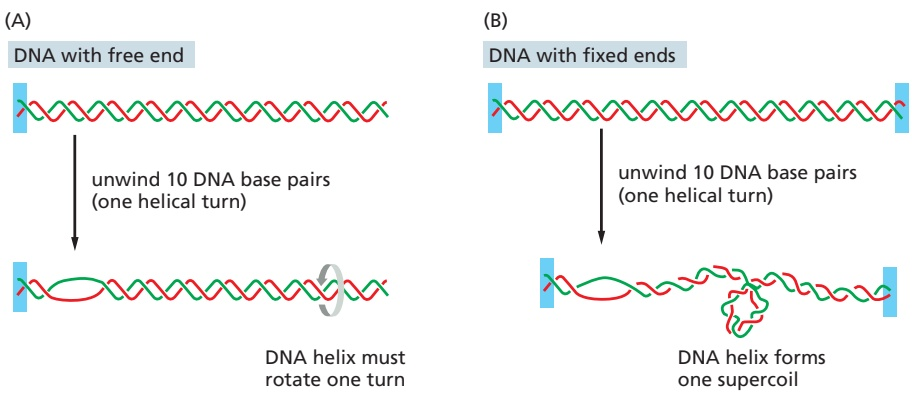

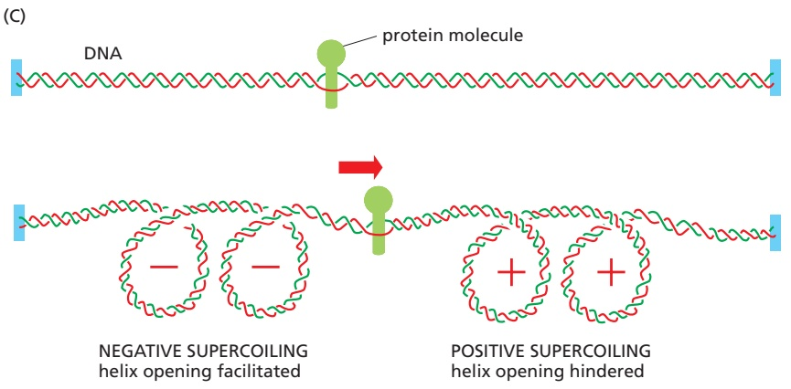

Figure 6–20 Superhelical tension in DNA causes DNA supercoiling. (A) For a DNA molecule with one free end (or a break in one strand that serves as a swivel), the DNA double helix rotates by one turn for every 10 nucleotide pairs opened. (B) If rotation is prevented, superhelical tension is introduced into the DNA by helix opening. In the example shown, the DNA helix contains 10 helical turns, one of which is opened. One way of accommodating the tension created would be to increase the helical twist from 10 to 11 nucleotide pairs per turn in the double helix that remains. The DNA helix, however, resists such a deformation in a springlike fashion, preferring to relieve the MBoC7 m6.19/6.20superhelical tension by bending into supercoiled loops. As a result, one DNA supercoil forms in the DNA double helix for every 10 nucleotide pairs opened. The supercoil formed in this case is a positive supercoil. (C) Supercoiling of DNA is induced by a protein tracking through the DNA double helix. The two ends of the DNA shown here are unable to rotate freely relative to each other, and the protein molecule is assumed also to be prevented from rotating freely as it moves. Under these conditions, the movement of the protein causes an excess of helical turns to accumulate in the DNA helix ahead of the protein (inducing positive supercoils) and a deficit of helical turns to arise in the DNA behind the protein (inducing negative supercoils), as shown. Because locally pulling apart the two strands of the double helix relieves the tension from negative supercoils, it is easier to do behind the moving protein than ahead of it.

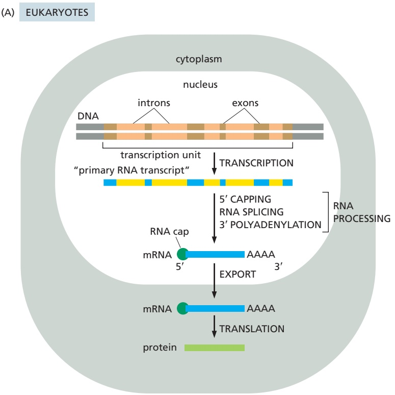

behind it. If this tension is not relieved, the polymerase will grind to a halt because further unwinding requires more energy than the transcription process can provide. For eukaryotes, the mild buildup of tension is thought to provide a bonus: the positive superhelical tension ahead of the polymerase facilitates the partial unwrapping of the DNA in nucleosomes, inasmuch as the release of DNA from the histone core helps to relax this tension. The tension can also be relieved by DNA topoisomerase enzymes, as we saw in the previous chapter for the similar kind of tension generated by DNA polymerases during DNA replication (see Figure 5–21).

In bacteria (but not eukaryotes), a specialized topoisomerase called DNA gyrase uses the energy of ATP hydrolysis to pump supercoils continually into theMB C7 6.20/6.21 DNA, thereby maintaining the DNA under constant tension. These are negative supercoils, having the opposite handedness from the positive supercoils that form when a region of DNA helix opens (see Figure 6–20B). Whenever a region of helix opens, it removes these negative supercoils from bacterial DNA, reducing the superhelical tension. DNA gyrase therefore makes the opening of the DNA helix in bacteria energetically favorable compared with helix opening in DNA that is not supercoiled. For this reason, it facilitates those genetic processes in bacteria, such as the initiation of transcription by bacterial RNA polymerase, that require helix opening (see Figure 6–11).

#### Transcription Elongation in Eukaryotes Is Tightly Coupled to RNA Processing

We saw earlier that bacterial mRNAs are synthesized by the RNA polymerase starting and stopping at specific spots on the genome. The situation in eukaryotes is substantially different. In particular, transcription is only the first of several steps needed to produce a mature mRNA molecule. Other critical steps are the covalent modification of the ends of the RNA and the removal of intron sequences that are discarded from the middle of the RNA transcript by the process of RNA splicing (**Figure 6–21**). As we shall see, RNA splicing not only joins together different portions of an RNA transcript to eliminate the intron sequences; it also provides eukaryotes with the ability to synthesize several related but different proteins from the same gene.

Figure 6–21 Comparison of the steps leading from gene to protein in eukaryotes and bacteria. The final amount of a protein in the cell depends on the efficiency of each step and on the rates of degradation of the RNA and protein molecules. (A) In eukaryotic cells, the mRNA molecule resulting from transcription contains both coding (exon) and noncoding (intron) sequences. Before it can be translated into protein, the two ends of the RNA are modified, the introns are removed by an enzymatically catalyzed RNA splicing reaction, and the resulting mRNA is transported from the nucleus to the cytoplasm. For convenience, the steps in this figure are depicted as occurring one at a time; in reality, many occur concurrently. For example, the RNA cap is added and splicing begins before transcription has been completed. Because of the coupling between transcription and RNA processing, intact primary transcripts—the full-length RNAs that would, in theory, be produced if no processing had occurred—are found only rarely. (B) In bacteria, the production of mRNA is much simpler. The 5′ end of an mRNA molecule is produced by the initiation of transcription, and the 3 end is produced by the termination of transcription. Because bacteria lack a nucleus, transcription and translation take place in a common compartment, and the translation of a bacterial mRNA often begins before its synthesis has been completed. As indicated, a single bacterial mRNA typically produces several different proteins, another feature that distinguishes eukaryotes from bacteria.

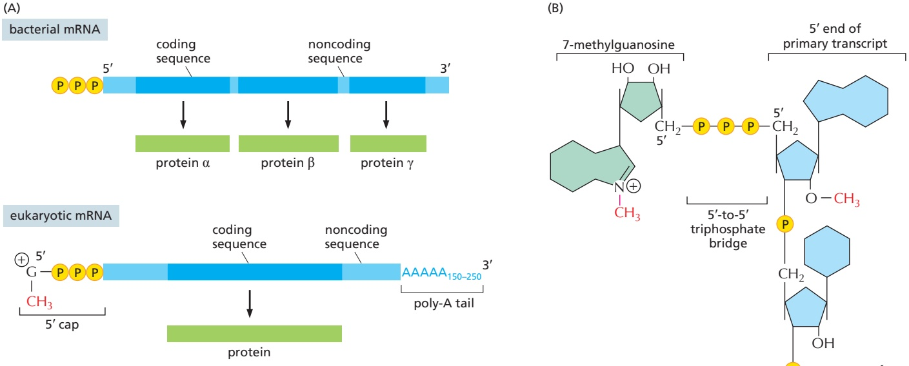

Figure 6–22 A comparison of the structures of bacterial and eukaryotic mRNA molecules. (A) The $5 ^ { \prime }$ and $3 ^ { \prime }$ ends of a bacterial mRNA are the unmodified ends of the chain synthesized by the RNA polymerase, which initiates and terminates transcription at those points, respectively. The corresponding ends of a eukaryotic mRNA are formed by adding a 5′ cap and by cleavage of the pre-mRNA transcript near the 3′ end and the addition of a poly-A tail, respectively. The figure also illustrates another difference between the prokaryotic and eukaryotic mRNAs: bacterial mRNAs can contain the instructions for several different proteins, whereas eukaryotic mRNAs nearly always contain the information for only a single protein. (B) The structure of the cap at the $5 ^ { \prime }$ end of eukaryotic mRNA molecules. Note the unusual $5 ^ { \prime } - 1 0 - 5 ^ { \prime }$ linkage of the 7-methylguanosine to the remainder of the RNA. Most eukaryotic mRNAs carry an additional modification: methylation of the 2′-hydroxyl group of the ribose sugar at the 5′ end of the primary transcript. Although the precise role of this modification remained mysterious for many years, recent work indicates that it aids cells in distinguishing their own mRNAs from those of invading viruses, which typically lack this modification. On the basis of this difference, cells can block translation of viral RNAs, thereby defending themselves from viral attack.

Both ends of eukaryotic mRNAs are modified: by capping on the $5 ^ { \prime }$ end and by polyadenylation of the $3 ^ { \prime }$ end (**Figure 6–22**). These special ends allow the cell to assess whether both ends of an mRNA molecule are present (and if the message is therefore intact) before it exports the RNA from the nucleus and translates it into protein.

A simple mechanism has evolved to couple all of the above RNA-processingMBoC7 m6.21/6.22 steps to transcription elongation. As discussed previously, a key step in transcription initiation by RNA polymerase II is the phosphorylation of the RNA polymerase II tail, also called the CTD (C-terminal domain). This phosphorylation, which proceeds gradually as the RNA polymerase initiates transcription and moves along the DNA, not only helps to dissociate the RNA polymerase II from other proteins present at the start point of transcription but also allows a new set of proteins to associate with the RNA polymerase tail, which function in transcription elongation and RNA processing, as we discuss in the following sections. Some of the processing proteins are thought to “hop” from the polymerase tail onto the nascent RNA molecule to begin their processing reactions as soon as this RNA emerges from the RNA polymerase. Thus, we can view RNA polymerase II in its elongation mode as an RNA factory that not only moves along the DNA synthesizing an RNA molecule but also processes the RNA that it produces (**Figure 6–23**). Fully extended, the CTD is nearly 10 times longer than the remainder of the RNA polymerase. As a flexible protein domain, it serves as a scaffold or tether, holding a variety of proteins close by so that they can rapidly act when needed. This scaffolding strategy, which greatly speeds up the overall rate of a series of consecutive reactions, is one that is commonly utilized in the cell (see Figure 3–76).

#### RNA Capping Is the First Modification of Eukaryotic Pre-mRNAs

As soon as RNA polymerase II has produced about 20 nucleotides of RNA, the $5 ^ { \prime }$ end of the new RNA molecule is modified by addition of a cap that consists of a modified guanine nucleotide (see Figure 6–22B). Three enzymes, acting in

5′ end of nascent RNA transcript

Figure 6–23 Eukaryotic RNA polymerase II as an RNA synthesis and processing machine. As the polymerase transcribes DNA into RNA, it carries RNA-processing proteins on its tail that are transferred to the nascent RNA at the appropriate time. The tail contains 52 tandem repeats of a seven-amino-acid sequence, and there are two serines in each repeat. The capping proteins first bind to the RNA polymerase tail when it is phosphorylated on Ser5 of the heptad repeats late in the process of transcription initiation (see Figure 6–15). This strategy ensures that the RNA molecule is efficiently capped as soon as its 5′ end emerges from the RNA polymerase. As the polymerase continues transcribing, its tail is extensively phosphorylated on the Ser2 positions by a kinase associated with the elongating polymerase and is eventually dephosphorylated at Ser5 positions. These further modifications attract splicing and 3′-end processing proteins to the moving polymerase, positioning them to act on the newly synthesized RNA as it emerges from the RNA polymerase. There are many RNA-processing enzymes, and not all travel with the polymerase. In RNA splicing, for example, the tail carries only a few critical components; once bound to an emerging RNA molecule, they serve as a nucleation site for the remaining components.

When RNA polymerase II finishes transcribing a gene, it is released from DNA, and protein phosphatases remove the phosphates on its tail so that it can reinitiate transcription. Only the fully dephosphorylated form of RNA polymerase II is competent to begin RNA synthesis at a promoter.

succession, perform the capping reaction: a phosphatase removes a phosphate from the triphosphate left at the 5′ end of the nascent RNA molecule, a guanyl transferase adds a GMP in a reverse linkage (5′-to-5′ instead of 5′-to-3′) to the 5′ diphosphate just produced, and a methyl transferase adds a methyl group to the guanosine (**Figure 6–24**). Because all three enzymes bind to the RNA polymerase tail phosphorylated at the Ser5 position—the modification added by TFIIH during transcription initiation—they are poised to modify the 5′ end of the nascent transcript as soon as it emerges from the polymerase.

The 7-methylguanosine cap signifies the 5′ end of eukaryotic mRNAs, and this landmark helps the cell to distinguish mRNAs from the other types of RNA molecules present in the cell. For example, RNA polymerases I and III produce uncapped RNAs during transcription, in part because these polymerases lack a CTD. In the nucleus, the cap binds a protein complex called CBC (cap-binding complex), which, as we discuss in subsequent sections, helps a future mRNA to be further processed and exported. The $\bar { 5 ^ { \prime } }$ cap also has an important role in the translation of mRNAs in the cytosol, as we discuss later in the chapter.

Although the vast majority of eukaryotic mRNAs possess a 7-methylguanosine cap at their $5 ^ { \prime }$ ends, an alternative type of cap is found on some mRNAs, specifically a nicotinamide adenine dinucleotide phosphate $\left( \mathrm { N A D P ^ { + } } \right)$ . We saw earlier in Chapter 2 that NADP+ is an important cofactor for many biochemical reactions, and it is added to certain mRNAs by RNA polymerase itself as the first nucleotide when a new mRNA molecule chain is begun. The role of this particular type of mRNA cap is not known with certainty, but one hypothesis holds that it provides a way for the cell to link the expression of some of its genes to its overall metabolic “health.”

#### RNA Splicing Removes Intron Sequences from Newly Transcribed Pre-mRNAs

As discussed in Chapter 4, the protein-coding sequences of eukaryotic genes are typically interrupted by noncoding intervening sequences (introns). Discovered in 1977, this feature of eukaryotic genes came as a surprise to scientists, who had been, until that time, familiar only with bacterial genes, which consist of a continuous stretch of coding DNA that is directly transcribed into mRNA. In marked contrast, eukaryotic genes were found to be broken up into small pieces of coding sequence (expressed sequences, or **exons**) interspersed with much longer intervening sequences, or **introns**; thus, the coding portion of a eukaryotic gene is often only a small fraction of the length of the gene (**Figure 6–25**).

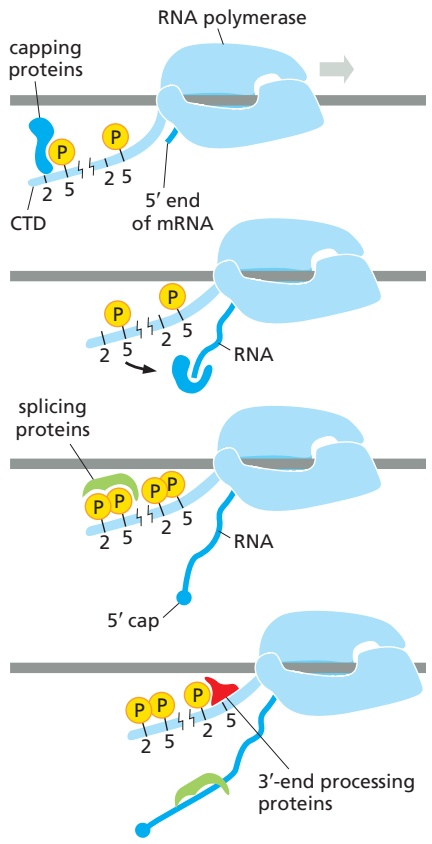

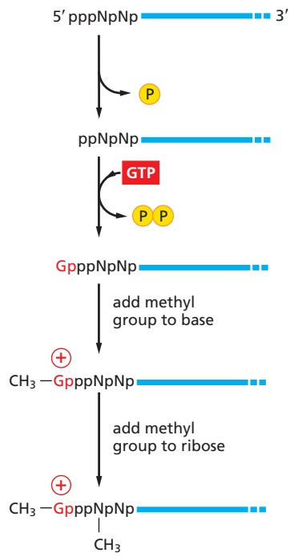

<small>Figure 6–24 The reactions that cap the 5′ end of each RNA molecule synthesized by RNA polymerase II. The final cap contains a novel 5′-to-5′ linkage between the positively charged 7-methylguanosine residue and the 5′ end of the RNA transcript (see Figure 6–22B). The letter N represents any one of the four ribonucleotides, although the nucleotide that starts an RNA chain is usually a purine (an A or a G). (After A.J. Shatkin, Bioessays 7:275–277, 1987. With permission from John Wiley & Sons.)</small>

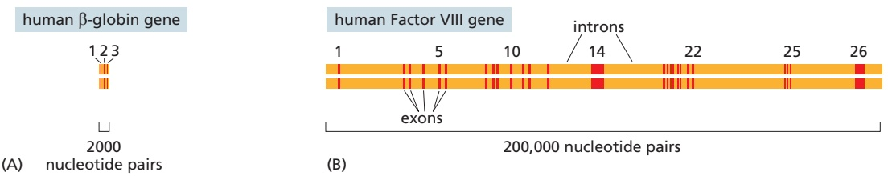

Both intron and exon sequences are transcribed into RNA. The intron sequences are removed from the newly synthesized RNA through the process of **RNA splicing**. The vast majority of RNA splicing that takes place in cells functions in the production of mRNA, and our discussion of splicing focuses on this so-called precursor-mRNA (or pre-mRNA) splicing. Only after 5′- and 3′-end processing and splicing have taken place is an RNA transcript called an mRNA molecule.

Each splicing event removes one intron, proceeding through two sequential. / . phosphoryl-transfer reactions known as transesterifications; these join two exons together while removing the intron between them as a “lariat” (**Figure 6–26**). The machinery that catalyzes pre-mRNA splicing is complex, consisting of five additional RNA molecules and several hundred proteins, and it hydrolyzes many ATP molecules per splicing event. This complexity ensures that splicing is accurate, while at the same time being flexible enough to deal with the enormous variety of introns found in a typical eukaryotic cell. On average, there are 11 introns in each of the approximately 20,000 human protein-coding genes, so the cell devotes considerable resources to this step in gene expression.

Figure 6–25 Structure of two human genes showing the arrangement of exons and introns. (A) The relatively small β-globin gene, which encodes a subunit of the oxygen-carrying protein hemoglobin, contains 3 exons (see also Figure 4–9). (B) The much larger Factor VIII gene contains 26 exons; it codes for a protein (Factor VIII) that functions in the bloodclotting pathway. The most prevalent form of hemophilia results from mutations in this gene.

Although it seems wasteful to first produce and then remove large numbers of introns from an RNA transcript, this process provides an advantage to the cell. In many organisms, the transcript of a given gene can be spliced in more than one way, and this allows the same gene to produce a set of different but related proteins (**Figure 6–27**). It has been proposed that 95% of human gene transcripts are spliced in more than one way, but this is almost certainly an overestimate: many of the splicing products that can be detected are the results of splicing errors and do not produce functional proteins. Nonetheless, alternative splicing is a key feature of gene expression in many organisms, and we shall return to this subject later, after we describe the cellular machinery that performs the basic reaction.

(A)

(B)

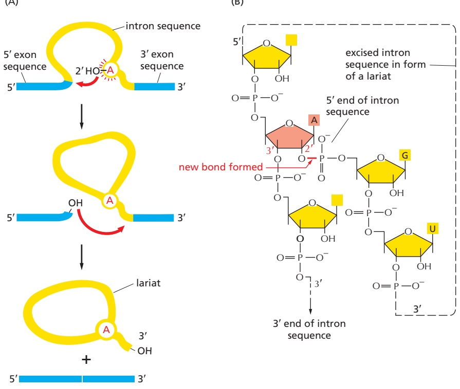

Figure 6–26 The pre-mRNA splicing reaction. (A) In the first step, a specific adenine nucleotide in the intron sequence (indicated in red) attacks the 5′ splice site and cuts the sugar–phosphate backbone of the RNA at this point. The cut 5′ end of the intron becomes covalently linked to the adenine nucleotide, as shown in detail in (B), thereby creating a loop in the RNA molecule. The released free 3′-OH end of the exon sequence then reacts with the start of the next exon sequence, joining the two exons together and releasing the intron sequence in the shape of a lariat. The two exon sequences thereby become joined into a continuous coding sequence. The released intron sequence is discarded, eventually being broken down into single nucleotides, which are recycled.

Figure 6–27 Alternative splicing of the a-tropomyosin gene from rat. α-Tropomyosin is a coiled-coil protein (see Figure 3–8) involved in the regulation of contraction in muscle cells. Its initial RNA transcript can be spliced in different ways, as indicated in the figure, to produce distinct mRNAs, which then give rise to variant proteins. Some of the splicing patterns are specific for certain types of cells. For example, the α-tropomyosin made in striated muscle is different from that made from the same gene in smooth muscle. The arrowheads in the top part of the figure mark the sites where cleavage and poly-A addition form the 3′ ends of the mature mRNAs.

#### Nucleotide Sequences Signal Where Splicing Occurs

The mechanism of pre-mRNA splicing shown in Figure 6–26 requires that the splicing machinery recognize three portions of the precursor RNA molecule: the 5′ splice site, the 3′ splice site, and the branch point in the intron sequence that forms the base of the excised lariat. Not surprisingly, each site has a consensus nucleotide sequence that is similar from intron to intron and provides the cell with cues for where splicing is to take place (**Figure 6–28**). These consensus sequences are relatively short and can accommodate extensive sequence variability, and as we shall see shortly, the cell uses additional types of information toMBoC7 m6.26/6.27 ultimately choose exactly where, on each RNA molecule, splicing is to take place.

#### RNA Splicing Is Performed by the Spliceosome

Unlike the other steps in mRNA production we have discussed, key steps in RNA splicing are performed by RNA molecules rather than proteins. Specialized RNA molecules recognize the nucleotide sequences that specify where splicing is to occur and also form the active site that catalyzes the chemistry of splicing. These RNA molecules are relatively short (less than 200 nucleotides each), and there are five of them, U1, U2, U4, U5, and U6. Known as **snRNAs (small nuclear RNAs)**, each is complexed with at least seven protein subunits to form an snRNP (small nuclear ribonucleoprotein). These snRNPs form the core of the **spliceosome**, the large assembly of RNA and protein molecules that performs pre-mRNA splicing in the cell. Recognition of the 5′ splice junction, the branch-point site, and the 3 splice junction is performed through base-pairing between the snRNAs and RNA sequences in the pre-mRNA substrate.

Figure 6–28 The consensus nucleotide sequences in an RNA molecule that signal the beginning and the end of most introns in humans. The three blocks of nucleotide sequences shown are required to remove an intron sequence. Here A, G, U, and C are the standard RNA nucleotides; R stands for a purine (A or G); and Y stands for a pyrimidine (C or U). The A highlighted in red forms the branch point of the lariat produced by splicing (see Figure 6–26). Only the GU at the start of the intron and the AG at its end are invariant nucleotides in the splicing consensus sequences. Several different nucleotides can occupy the remaining positions, although the indicated nucleotides are preferred. Although the distances along the RNA between the three splicing consensus sequences are highly variable, the distance between the branch point and 3′ splice junction is typically much shorter than the distance between the 5′ splice junction and the branch point.

The U1 snRNP forms base pairs with the 5′ splice junction. BBP (branch-point binding protein) recognizes the branch-point site and binds cooperatively with U2AF, which recognizes the polypyrimidine tract and the 3′ splice junction (see Figure 6–28).

The U2 snRNP displaces BBP and U2AF and forms base pairs with the branch-point site consensus sequence.

The U4/U6+U5 “triple” snRNP enters the reaction. In this triple snRNP, the U4 and U6 snRNAs are held firmly together by base-pair interactions. Subsequent rearrangements break apart the U4/U6 base pairs, allowing U6 to displace U1 at the 5′ splice junction and ejecting the U4 snRNP and some of the proteins of the U6 snRNP.

Addition of the NTC/NTR protein complex positions the snRNPs to form the active site of the spliceosome and brings the branch point in proximity to the 5′ splice site.

Lariat formed. Additional rearrangements bring the two exon segments together and place them in the active site.

Spliced RNA is released. Spliceosome components recycled using ATP hydrolysis to “reset” them.

Figure 6–29 The pre-mRNA splicing mechanism. RNA splicing is catalyzed by an assembly of snRNPs (shown as colored shapes) plus other proteins (most of which are not shown), which together constitute the spliceosome. The spliceosome recognizes the splicing signals on a pre-mRNA molecule, brings the two ends of the intron together, and forms the active site that catalyzes the two covalent bond-making and -breaking steps required (see Figure 6–26A and Movie 6.5). As shown, nearly every step is accompanied by hydrolysis of a molecule of ATP, which prevents the reaction from stalling or moving backwards and, as discussed below, increases the accuracy of splicing. Although only six molecules of ATP are shown in this simplified diagram, some steps require more than one, and a total of eight ATPs are consumed in each splicing reaction. As indicated in the last step, a set of proteins called the exon junction complex (EJC) is retained on the spliced mRNA molecule; its subsequent role will be discussed shortly.

The spliceosome is a complex and dynamic machine. When studied in vitro, a few components of the spliceosome assemble on pre-mRNA and, as the splicing reaction proceeds, new components enter and those that have already performed their tasks are jettisoned (**Figure 6–29**). However, many scientists believe that, inside the cell, the spliceosome is a preexisting, loose assembly of all the components—capturing, splicing, and releasing RNA as a coordinated unit, and undergoing extensive rearrangements each time a splice is made.

#### The Spliceosome Uses ATP Hydrolysis to Produce a Complex Series of RNA–RNA Rearrangements

There are many unusual features of the splicing reaction compared to the typical catalytic processes in the cell introduced in Chapter 2. First, splicing seems grossly inefficient, requiring more than a hundred proteins, five RNA molecules, and the hydrolysis of eight molecules of ATP to produce a single splice. Many genes require multiple splicing events to produce a single functional mRNA molecule (more than 20 in the example in Figure 6–25B), and the process seems inordinately complex. Second, each splicing reaction requires that the catalytic site for the reaction be assembled de novo on each pre-mRNA molecule through a complex, multistep process. Third, as mentioned earlier, the catalytic site of the spliceosome (which catalyzes both steps of the splicing reaction) is formed by RNA molecules (the snRNAs) rather than by proteins (**Figure 6–30**), with the proteins required to correctly position these RNAs. In the final section of this chapter, we describe the structure and chemical properties of RNA molecules that allow them to act as catalysts, as well as the proposal that the RNA-based reaction mechanisms that exist today are “leftovers” from ancient, RNA-only biological systems.

How might we rationalize the unusual biochemical complexity of splicing compared to other steps in gene expression? As we discuss shortly, pre-mRNA splicing has evolved from a much simpler, purely RNA-based process, and its complexity may in part be an example of what some evolutionary biologists term “runaway bureaucracies,” accruing more and more parts over time that are now required for the process without necessarily making it any better. We do know, however, that some of the complexity of pre-mRNA splicing provides advantages. Even though ATP hydrolysis is not required for the splicing reaction per se, the numerous ATP hydrolysis steps keep the reaction from stalling or running backwards and, as we will see shortly, they also increase the accuracy of pre-mRNA splicing.

Most of the spliceosome proteins that hydrolyze ATP use the released energy to break existing RNA–RNA interactions to allow the formation of new ones. These RNA–RNA rearrangements allow the splicing signals on the pre-mRNA to be examined several times during the course of splicing. For example, the U1 snRNP initially recognizes the 5′ splice site through conventional base-pairing; as splicing proceeds, these base pairs are broken (using the energy of ATP hydrolysis) and U1 is replaced by U6 (see Figure 6–30A and B). Likewise, the branch point is “examined” twice, the first time by the branch-point binding protein and the second time by the U2 snRNP (see Figure 6-29). In this way, the spliceosome checks and rechecks the splicing signals before the active site for the two transesterification reactions forms (see Figure 6–30C), thereby increasing overall accuracy.

Note that both catalytic steps of the splicing reaction occur in the same active site (the second reaction is almost the reverse of the first). ATP-mediated rearrangements are required between the two reactions to properly reposition the pre-mRNA for the second reaction, helping to ensure that splicing accidents occur only rarely.

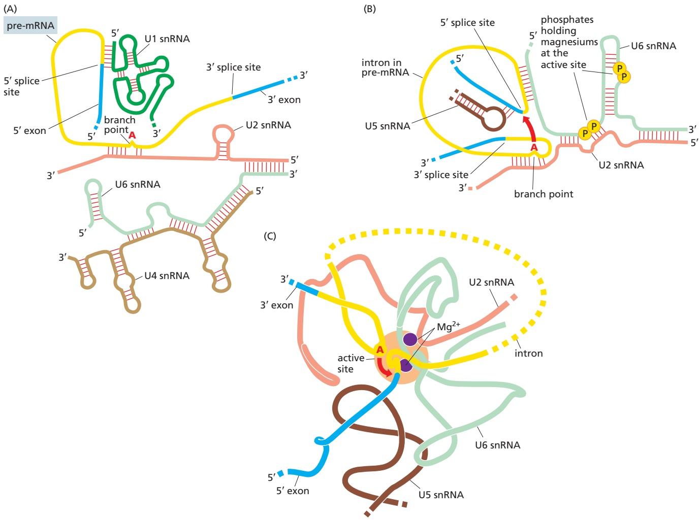

Figure 6–30 An example of an ATP hydrolysis–driven RNA–RNA rearrangement that occurs during splicing. Schematic diagram of the arrangement of RNA molecules before (A) and after (B) the active site has been formed for the two phosphoryltransfer reactions. This rearrangement also brings the branch point and the 5′ splice site together in preparation for the first reaction. The active site (which grasps the two magnesium ions needed for the chemistry of the reactions) is formed by U2 and U6. Several sequential ATP-dependent rearrangement steps are needed to convert the configuration in A to that in B. (C) The actual structure, determined by cryo-electron microscopy, of the RNA-based catalytic core of the spliceosome that was schematically illustrated in B. For simplicity, the proteins that surround the RNAs are not shown, even though MBoC7 6.600/6.30their conformations are known. High-resolution structures have also been determined for most of the other spliceosome intermediates. (B, adapted from M.E. Wilkinson, C. Charenton, and K. Nagai, Annu. Rev. Biochem. 89:359–398, 2020. With permission from Annual Reviews.)

A general process associated with ATP hydrolysis, called kinetic proofreading, further increases spliceosome accuracy. Because an incorrect, “off-target” basepairing interaction will be weaker than the correct one, incorrect interactions will dissociate more rapidly than correct ones. Each ATP-mediated rearrangement of the spliceosome takes a finite amount of time, and this time delay will favor the correct choice, because off-target interactions will often dissociate during this time window, giving the correct interaction multiple chances to form. Such kinetic proofreading is used throughout biology. For example, we saw in Chapter 5 that the initial selection of the correct nucleotides by DNA polymerase during DNA replication takes advantage of this principle. We will discuss it in more detail later in the chapter when we describe translation by the ribosome.

Once the splicing chemistry is completed, the snRNPs remain bound to the excised lariat. The disassembly of these snRNPs from the lariat (and from

(B)

Figure 6–31 Variation in intron and exon lengths in the human, worm, and fly genomes. (A) Size distribution of exons. (B) Size distribution of introns. Note that exon length is much more uniform than intron length. (Adapted from International Human Genome Sequencing Consortium, Nature 409:860–921, published 2001 by Macmillan Magazines Ltd. Reproduced with permission of SNCSC.)

each other) requires another series of ATP-driven RNA–RNA rearrangements, thereby returning the snRNAs to their original configuration to be used again in a new reaction.

As splicing is completed, the spliceosome directs a set of proteins to bind to the mRNA near the position formerly occupied by the intron. Called the exon junction complex (EJC), these proteins mark the site of a successful splicing event, and, as we shall see later in this chapter, they influence the subsequent fate of the mRNA.

#### Other Properties of Pre-mRNA and Its Synthesis Help to Explain the Choice of Proper Splice Sites

As shown in **Figure 6–31**, intron sequences vary enormously in size; some are more than 100,000 nucleotides long. One might therefore expect frequent splicing mistakes—including exon skipping and the mistaken use of “cryptic” splice sites (**Figure 6–32**). To minimize these problems the fidelity mechanisms built into the spliceosome are supplemented by two additional strategies that further increase the accuracy of splicing. The first is a simple consequence of splicing being coupled to transcription (**Figure 6–33**). As transcription proceeds, the phosphorylated tail of RNA polymerase carries several components that stimulate formation of the spliceosome (see Figure 6–23), and these components are transferred directly from the polymerase to the RNA as the RNA emerges from the polymerase. This strategy helps the cell to keep track of introns and exons; for example, the snRNPs that assemble at a $5 ^ { \prime }$ splice site are initially presented only with the single 3′ splice site that emerges next from the polymerase, inasmuch as the potential sites further downstream have not yet been synthesized. The coordination of transcription with splicing is thus important for preventing inappropriate exon skipping.

Another mechanism, called exon definition, also helps cells choose the appropriate splice sites. Exon size tends to be much more uniform than intron size, averaging about 150 nucleotide pairs across a wide variety of eukaryotic organisms (see Figure 6–31). Through exon definition, the splicing machinery seeks out the relatively homogeneously sized exon sequences rather than the intron sequences.MBoC7 n6.556/6.33 It does this in the following way: as RNA synthesis proceeds, a group of additional components (most notably SR proteins, so-named because each contains a domain rich in serines and arginines) assemble on exon sequences and help to mark off each 3′ and 5′ splice site, starting at the 5′ end of the RNA (**Figure 6–34**). These proteins, in turn, recruit the U1 snRNP, which marks the one exon boundary, and U2AF, which, along with BBP, specifies the other. By marking out the exons in this way and thereby taking advantage of the relatively uniform size of exons, the cell increases the accuracy with which it deposits the initial splicing components on the nascent RNA and thereby avoids “near miss” splice sites. To further aid the cell in marking off exons and distinguishing them from introns, some SR proteins bind tightly to specific RNA sequences, often termed splicing enhancers, that are preferentially found in exons. Because several different codons specify most amino acids, it is possible for a splicing enhancer to evolve without a change in the amino acid sequence coded by the exon.

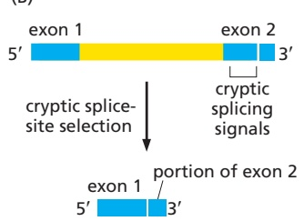

Figure 6–32 Two types of potential splicing errors. (A) Exon skipping. (B) Cryptic splice-site selection. Cryptic splicing signals are nucleotide sequences of RNA that closely resemble true splicing signals and are sometimes mistakenly used by the spliceosome.

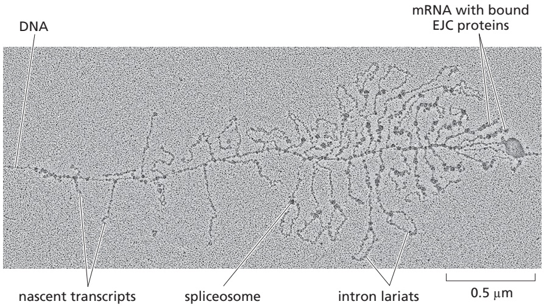

Figure 6–33 Electron micrograph of a heavily transcribed gene containing multiple introns in an early Drosophila embryo, illustrating the co-transcriptional splicing of its RNA transcripts. (Courtesy of Victoria Foe. Friday Harbor Laboratories, Friday Harbor WA.)

Both the marking of exon and intron boundaries and the assembly of the spliceosome begin on an RNA molecule while it is still being elongated by RNA polymerase (see Figure 6–33). However, because the actual chemistry of splicing can be delayed, intron sequences are not necessarily removed from a pre-mRNA molecule in the order in which they occur along the RNA chain.

#### RNA Splicing Has Remarkable Plasticity

We have seen that the choice of splice sites depends on such features of the pre-mRNA transcript as the strength of the three signals on the RNA recognized by

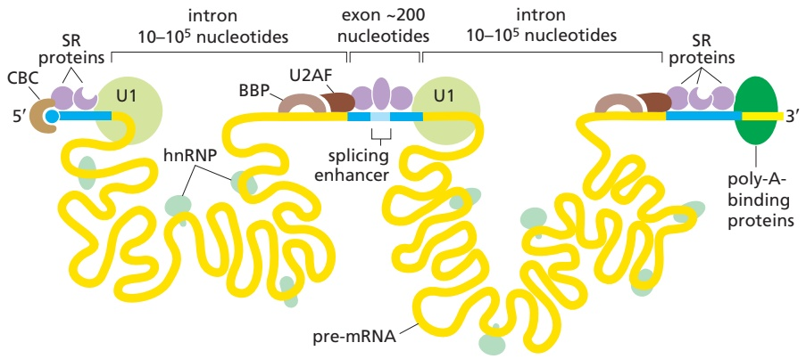

Figure 6–34 The exon definition hypothesis. SR proteins bind to each exon sequence in the pre-mRNA and thereby help to guide the snRNPs to the proper intron–exon boundaries. This demarcation of exons by the SR proteins occurs co-transcriptionally, beginning at the CBC (cap-binding complex) at the 5′ end. It has also been proposed that a group of proteins known as the heterogeneous nuclear ribonucleoproteins (hnRNPs) preferentially associates with intron sequences, further helping the spliceosome distinguish introns from exons. (Adapted from R. Reed, Curr. Opin. Cell Biol. 12:340–345, 2000. With permission from Elsevier.)

(D) A SINGLE-NUCLEOTIDE CHANGE THAT CREATES A NEW SPLICE SITE, THEREBY CAUSING A NEW EXON TO BE INCORPORATED

the splicing machinery (the 5′ and 3′ splice junctions and the branch point), the co-transcriptional assembly of the spliceosome, and the “bookkeeping” that underlies exon definition. We do not know exactly how accurate splicing normally is because, as we see later, there are several quality-control systems that rapidly destroy mRNAs whose splicing goes awry. However, we do know that, compared with other steps in gene expression, splicing is unusually flexible.

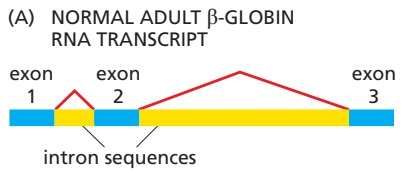

normal mRNA is formed from three exons

Thus, for example, a mutation in a nucleotide sequence critical for splicing of a particular intron does not necessarily prevent splicing of that intron altogether. Instead, the mutation typically creates a new pattern of splicing (**Figure 6–35**). Most common, an exon is simply skipped (Figure 6–35B). In other cases, the mutation causes a cryptic splice junction to become the default choice (Figure 6–35C). Apparently, the splicing machinery has evolved to pick out the best possible pattern of splice junctions, and if the optimal one is damaged by mutation, it will seek out the next best pattern, and so on. This inherent plasticity in the process of RNA splicing suggests that changes in splicing patterns caused by random mutations have been important in the evolution of genes and organisms. It also means that mutations that affect splicing can be severely detrimental to the organism: in addition to the β-thalassemia example presented in Figure 6–35, aberrant splicing plays important roles in the development of cystic fibrosis, frontotemporal dementia, Parkinson’s disease, retinitis pigmentosa, spinal muscular atrophy, myotonic dystrophy, premature aging, and cancer. It has been estimated that of the many point mutations that cause inherited human diseases, 10% produce aberrant splicing of the gene containing the mutation.

The plasticity of RNA splicing also means that the cell can easily regulate the pattern of RNA splicing. Earlier in this section we saw that alternative splicing can give rise to different proteins from the same gene and that this is a common strategy to enhance the coding potential of genomes. Some examples of alternative splicing are constitutive; that is, the alternatively spliced mRNAs are produced continually by cells of an organism. However, in many cases, the cell regulates the splicing patterns so that different forms of the protein are produced at different times and in different tissues (see Figure 6–27). In Chapter 7, we return to this issue to discuss some specific examples of regulated RNA splicing.

#### Spliceosome-catalyzed RNA Splicing Evolved from RNA Self-splicing Mechanisms

As discussed in the final section of this chapter, it is likely that early cells used RNA molecules rather than proteins as their major catalysts and that they stored their genetic information in RNA rather than in DNA sequences. RNA-catalyzed splicing reactions presumably had critical roles in these early cells. As evidence, some self-splicing RNA introns (that is, intron sequences in RNA whose splicing out can occur in the absence of proteins or any other RNA molecules) remain today, for example, in the nuclear rRNA genes of the ciliate Tetrahymena, in a few bacteriophage T4 genes, and in some mitochondrial and chloroplast genes. In these cases, the RNA molecule folds into a specific three-dimensional structure that brings the intron–exon junctions together and directly catalyzes the two transesterification reactions. A self-splicing intron sequence can be identified in a test tube by incubating a pure RNA molecule that contains the intron sequence and observing the splicing reaction. Because the basic chemistry as well as the structure of the active site of some self-splicing RNAs is so similar to those of the pre-mRNA spliceosome, the much more involved

When the spliceosome was first discovered, it puzzled molecular biologists. Why do RNA molecules instead of proteins perform important roles in splicesite recognition and in the chemistry of splicing? Why is a lariat intermediate used rather than the apparently simpler alternative of bringing the 5′ and 3′ splice sites together in a single step, followed by their direct cleavage and rejoining? The answers to these questions reflect the way in which the spliceosome has evolved.

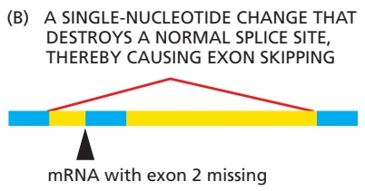

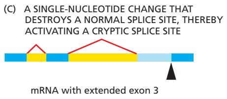

mRNA with extra exon inserted between exon 2 and exon 3

Figure 6–35 Abnormal processing of the b-globin primary RNA transcript in humans with the disease b-thalassemia. In the examples shown, the disease (a severe anemia due to aberrant hemoglobin synthesis) is caused by splice-site mutations found in the genomes of affected individuals. The dark blue boxes represent the three normal exon sequences; the red lines connect the 5′ and 3′ splice sites that are used. The light blue boxes depict new nucleotide sequences included in the final mRNA molecule as a result of the mutation denoted by the black arrowhead. Note that when a mutation leaves a normal splice site without a partner, an exon is skipped as in panel B or one or more abnormal cryptic splice sites nearby is used as the partner site as in panel C.

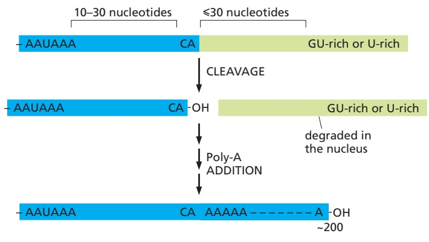

process of pre-mRNA splicing described earlier very likely evolved from a simpler, ancestral form of RNA self-splicing.

#### RNA-processing Enzymes Generate the 3′ End of Eukaryotic mRNAs

We have seen that the 5′ end of the pre-mRNA produced by RNA polymerase II is capped almost as soon as it emerges from the RNA polymerase. Then, as the polymerase continues its movement along a gene, spliceosomes assemble on the RNA and delineate the intron and exon boundaries. The long C-terminal tail of the RNA polymerase coordinates these processes by transferring cappingMBoC7 m6.34/6.36 and splicing components directly to the RNA as it emerges from the enzyme. In this section, we describe how a similar mechanism ensures that the 3′ end of the pre-mRNA is properly processed as RNA polymerase II reaches the end of a gene.

The position of the 3′ end of each mRNA molecule is specified by signals encoded in the DNA nucleotide sequence (**Figure 6–36**). These signals are transcribed into RNA as the RNA polymerase II moves through them, and they are then recognized (as RNA) by a series of RNA-binding proteins and RNA-processing enzymes (**Figure 6–37**). Two multisubunit proteins (called CstF, cleavage stimulation factor; and CPSF, cleavage and polyadenylation specificity factor) are of special importance. Both of these proteins travel with the RNA polymerase tail and are transferred to the 3′-end processing sequence on an RNA molecule as it emerges from the RNA polymerase.

Once the two proteins bind to their recognition sequences on the emerging RNA molecule, additional proteins assemble with them to cleave the RNA (releasing it from the RNA polymerase) and complete the 3′ end of the mRNA. Once the RNA is cleaved, an enzyme called poly-A polymerase (PAP) adds approximately 200 A nucleotides, one at a time, to the 3′ end produced by the cleavage (see Figure 6–37). The precursor for these additions is ATP, and the same type of 5′-to-3′ bonds are formed as in conventional RNA synthesis. But unlike other RNA polymerases, poly-A polymerase does not require a template; hence, the poly-A tail of eukaryotic mRNAs is not directly encoded in the genome. As the poly-A tail is synthesized, proteins called poly-A-binding proteins assemble onto it and, by a poorly understood mechanism, they help determine the final length of the tail.

The RNA polymerase II continues to transcribe after the 3′ end of a eukaryotic pre-mRNA molecule has been cleaved, in some cases for hundreds of nucleotides. However, two factors increase the likelihood that an RNA polymerase will terminate transcription shortly after it has synthesized the RNA signal for 3′-end

Figure 6–36 The consensus nucleotide sequences in RNA that direct cleavage and polyadenylation to form the 3′ end of a eukaryotic mRNA. These sequences are encoded in the genome, and specific proteins recognize them—as RNA— after they are transcribed. As shown in Figure 6–37, the hexamer AAUAAA is bound by CPSF, and the GU-rich element beyond the cleavage site is bound by CstF; the CA sequence is bound by a third protein factor required for the cleavage step. Like other consensus nucleotide sequences discussed in this chapter (see Figure 6–12), the sequences shown in the figure represent optimal sequences; in reality, a variety of related cleavage and polyadenylation signals occur in nature.

<small>Figure 6–37 Some of the major steps in generating the 3′ end of a eukaryotic mRNA. This process is much more complicated than the analogous process in bacteria, where the RNA polymerase simply stops at a termination signal and releases both the 3′ end of its transcript and the DNA template (see Figure 6–11).</small>

cleavage and polyadenylation. First, the recruitment of the many proteins needed for 3′-end processing (which occurs while some of them are still bound to the RNA polymerase tail) causes a conformational change in the polymerase, slowing it down and decreasing its processivity. Second, once $3 ^ { \prime } .$ -end cleavage has occurred, the newly synthesized RNA emerging from the polymerase lacks a $5 ^ { \prime }$ cap; this unprotected RNA is rapidly degraded by a $5 ^ { \prime } { \rightarrow } 3 ^ { \prime }$ exonuclease, and, when it catches up to the polymerase, it causes the RNA polymerase to release its grip on the template and terminate transcription.

In the simplest case, a gene carries a single site for 3′ RNA cleavage and polyadenylation. However, many genes have several such sites and can therefore produce a variety of mRNAs that differ in their $3 ^ { \prime }$ ends. As will be discussed in the next chapter, cells can regulate $3 ^ { \prime } .$ end processing to produce different proteins from the same gene in a manner analogous to alternative splicing.

#### Mature Eukaryotic mRNAs Are Selectively Exported from the Nucleus

Eukaryotic pre-mRNA synthesis and processing take place in an orderly fashion within the cell nucleus. But of the pre-mRNA that is synthesized, only a small fraction—the mature mRNA—is of further use to the cell. Most of the rest—excised introns, broken RNAs, aberrantly processed pre-mRNAs, and accidently transcribed portions of the genome—is not only useless but potentially dangerous. How does the cell distinguish between the relatively rare mature mRNA molecules it wishes to keep and the overwhelming amount of useless debris?

The answer is that the RNAs are distinguished by the proteins bound to them. For example, we have seen that acquisition of cap-binding complexes, exon junction complexes, and poly-A-binding proteins marks the completion of capping, splicing, and poly-A addition, respectively. A properly completed mRNA molecule is also distinguished by the proteins it lacks. For example, the long-term presence of an snRNP protein would signify incomplete or aberrant splicing. Only when the proteins present on an mRNA molecule collectively signify that processing was successfully completed is the mRNA exported from the nucleus into the cytosol, where it can be translated into protein. Improperly processed mRNAs and other RNA debris are retained in the nucleus, where they are eventually degraded by the nuclear **RNA exosome**, a large protein complex whose interior is rich in $3' - \mathrm{t}0 - 5'$ RNA exonucleases (**Figure 6–38**). Indeed, the default fate of RNAs in the nucleus is degradation; only those bearing the proper constellation of proteins are spared.

Of all the proteins that assemble on pre-mRNA molecules as they emerge from transcribing RNA polymerases, the most abundant are the hnRNPs (heterogeneous nuclear ribonucleoproteins). Some of these proteins (there are approximately 30 different ones in humans) unwind the hairpin helices in the RNA so that splicing and other signals on the RNA can be read more easily. Others preferentially package the RNA contained in the very long intron sequences found in complex organisms (see Figure 6–31); these may also help to distinguish theMBoC7 m6.37/6.39 debris left over from RNA processing from fully mature mRNAs.

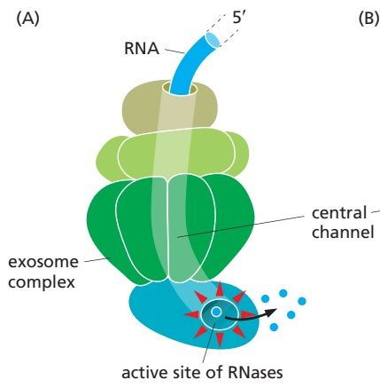

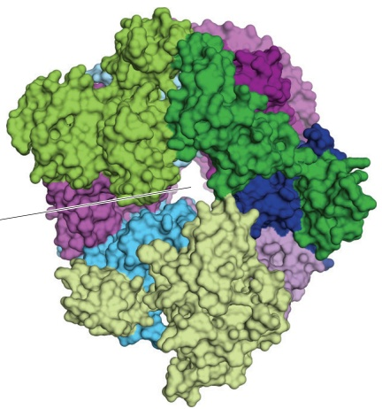

Figure 6–38 Structure of the nuclear RNA exosome. (A) RNA is fed into one end, passes through the central channel, and is degraded by RNases at the other end. (B) Structure of the central channel of the human RNA exosome viewed endon. Nine different protein subunits (each represented by a different color) make up this large ring structure. Eukaryotic cells have both a nuclear exosome and a cytoplasmic exosome; both forms include the central channel but differ in their additional subunits. The nuclear RNA exosome degrades aberrant RNAs (including excised intron sequences and incorrectly spliced RNAs) before they are exported to the cytosol. It also processes certain types of RNA (for example, the ribosomal RNAs) to produce their final form. The cytoplasmic form of the RNA exosome is responsible for degrading mRNAs in the cytosol and is thus crucial in determining the lifetime of each mRNA molecule. $( \mathsf { A } ,$ adapted from C. Kilchert et al., Nat. Rev. Mol. Cell Biol. 17:227, 2016. With permission from Springer Nature; B, PDB code: 2NN6.)

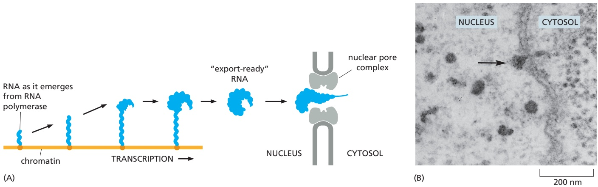

Figure 6–39 Transport of a large mRNA molecule through the nuclear pore complex. (A) The maturation of an mRNA molecule as it is synthesized by RNA polymerase and packaged by a variety of nuclear proteins. This drawing of an unusually large and abundant insect RNA, called the Balbiani Ring mRNA, is based on electron microscope micrographs such as that shown in (B). (A, adapted from B. Daneholt, Cell 88:585–588, 1997; B, © 1966 B.J. Stevens and H. Swift. Originally published in J. Cell Biol. https:doi.org/10.1083/jcb.31.1.55. With permission from Rockefeller University Press.)

Successfully processed mRNAs are guided through the **nuclear pore complexes (NPCs)**—aqueous channels in the nuclear membrane that directly connect the nucleoplasm and cytosol (**Figure 6–39**). Small molecules (less than 40,000 daltons or about 5 nm in diameter) can diffuse freely through these channels. However, most of the macromolecules in cells, including mRNAs complexed with proteins, are far too large to pass through the channels without a special process. The cell uses energy to actively transport such macromolecules in both directions through the nuclear pore complexes.

As explained in detail in Chapter 12, macromolecules are moved through nuclear pore complexes by nuclear transport receptors, which, depending on the identity of the macromolecule, escort it from the nucleus to the cytoplasm or vice versa. For mRNA export to occur, a specific nuclear transport receptor must be loaded onto the mRNA, a step that, in many organisms, takes place in concert with 3′ cleavage and polyadenylation.

The export of mRNA–protein complexes from the nucleus can be readily observed with the electron microscope for the unusually abundant mRNA of the insect Balbiani Ring genes. As these genes are transcribed, the newly formed pre-mRNA is seen to be packaged by proteins, including hnRNPs, SR proteins, and components of the spliceosome. This protein–pre-mRNA complex undergoes a series of structural transitions, probably reflecting RNA-processing events, culminating in a curved fiber. This curved fiber diffuses through the nucleoplasm, enters the nuclear pore complex (with its 5′ cap proceeding first), and then undergoes additional structural transitions as it moves through the pore (see Figure 6–39). Such observations reveal that the pre-mRNA–protein and mRNA–protein complexes are dynamic structures that gain and lose specific proteins during RNA synthesis, processing, and export (**Figure 6–40**).

The journey of an individual mRNA molecule from the nucleus to the cytosol can also be tracked by fluorescently labeling it and observing it over time. A typical mRNA molecule that is released from its site of transcription spends several minutes randomly diffusing in the nucleus until it encounters a nuclear pore complex. During this time, RNA-processing events presumably continue, with the mRNA shedding previously bound proteins and acquiring new ones. Once it arrives at the entrance to the pore, the “export-ready” mRNA molecule hovers for several seconds, during which time the completion of RNA processing likely occurs, and it then is transported through the pore very rapidly. Some mRNA–protein complexes are very large, and how they are moved through the nuclear pore complexes so rapidly (in about 10 milliseconds) remains a mystery.

Figure 6–40 Schematic illustration of an export-ready mRNA molecule and its transport through the nuclear pore. As indicated, some proteins travel with the mRNA as it moves through the pore, whereas others remain in the nucleus. Some of the nuclear proteins that are lost are eventually replaced by cytosolic versions, such as those that bind the 5′ cap. In some species (humans, for example), there are different poly-A-binding proteins in the nucleus and the cytosol; other species have only a single poly-A-binding protein. The nuclear export receptor for mRNAs is a complex of proteins that binds to an mRNA molecule once it has been correctly spliced and polyadenylated. After the mRNA has been exported to the cytosol, this export receptor dissociates from the mRNA and is re-imported into the nucleus, where it can be used again.

Some of the proteins deposited on the mRNA while it is still in the nucleus can affect the fate of the mRNA after it is transported to the cytosol. Thus, the stabilityMBoC7 m6.38/6.40 of an mRNA in the cytosol, the efficiency with which it is translated into protein, and its ultimate destination in the cell can all be determined by proteins acquired in the nucleus that remain bound to the mRNA in the cytosol.

Before discussing what next happens to the exported mRNAs, we briefly consider how the synthesis and processing of noncoding RNA molecules occur. There are many types of noncoding RNAs produced by cells (see Table 6–1, p. 327), but here we focus on the rRNAs, which are critically important for the translation of mRNAs into protein.

<!-- END EN EN06-H000-H023 -->

### 英文补充：转录因子、顺式调控序列与染色质调控

> 对应中文板块：转录因子、顺式调控序列与染色质调控。英文来源：Molecular Biology of the Cell，第7版，第7章；[本章完整原文](../来源/英文教材/07_Control_of_Gene_Expression/chapter.md)。物理PDF页码范围：436–513（整章范围）。

<!-- BEGIN EN EN07-H009-H035 -->
#### CONTROL OF TRANSCRIPTION BY SEQUENCE-SPECIFIC DNA-BINDING PROTEINS

How does a cell determine which of its thousands of genes to transcribe? Perhaps the most important concept, one that applies to all species on Earth, is based on a group of proteins known as **transcription regulators**. These proteins recognize specific sequences of DNA (typically 5–12 nucleotide pairs in length) that are often called **cis-regulatory sequences**, because they must be on the same chromosome (that is, in cis) to the genes they control. Transcription regulators bind to these sequences, which are dispersed throughout genomes, and this binding puts into motion a series of reactions that ultimately specify which genes are to be transcribed and at what rate. Approximately 10% of the protein-coding genes of most organisms are devoted to transcription regulators, making them one of the largest classes of proteins in the cell. A given transcription regulator typically recognizes a specific cis-regulatory sequence that is different from those recognized by the other transcription regulators in the cell.

The transcription of each gene is, in turn, controlled by its unique collection of cis-regulatory DNA sequences, which thus constitute a crucial part of the information coded in genomes. These sequences typically lie near the gene, often in the intergenic region directly upstream from the transcription start point of the gene. Although a few genes are controlled by a single cis-regulatory sequence that is recognized by a single transcription regulator, the majority have complex arrangements of cis-regulatory sequences, each of which is recognized by a different transcription regulator. It is therefore the positions, identity, and arrangement of cis-regulatory sequences that ultimately determine the time and place that each gene is transcribed. We begin our discussion by describing how transcription regulators “read” the information present in cis-regulatory sequences; later in the chapter, we shall discuss how they carry out their functions.

#### The Sequence of Nucleotides in the DNA Double Helix Can Be Read by Proteins

As discussed in Chapter 4, the DNA in a chromosome consists of a very long double helix that has both a major and a minor groove (**Figure 7–7**). Transcription regulators must recognize short, specific cis-regulatory sequences within this structure. When first discovered in the 1960s, it was thought that these proteins might require direct access to the interior of the double helix to distinguish between one DNA sequence and another, analogous to complementary basepairing. It is now clear, however, that the outside of the double helix is studded with DNA sequence information that transcription regulators can recognize directly: the outside edges of each base pair display distinctive patterns of hydrogen-bond donors, hydrogen-bond acceptors, and hydrophobic patches in both the major and minor grooves, allowing each base to be distinguished from the other three (**Figure 7–8**). Because the major groove is wider and displays more molecular features than does the minor groove, nearly all transcription regulators make the majority of their contacts with the major groove—as we shall see.

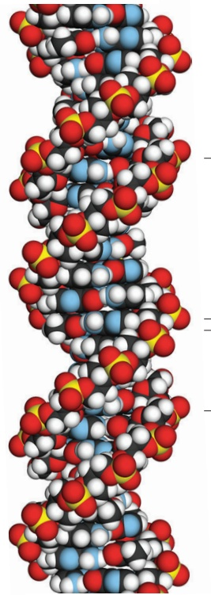

Figure 7–7 Double-helical structure of DNA. A space-filling model of DNA showing the major and minor grooves on the outside of the double helix (see Movie 4.1). The atoms are colored conventionally as follows: carbon, black; nitrogen, blue; hydrogen, white; oxygen, red; phosphorus, yellow.

#### Transcription Regulators Contain Structural Motifs That Can Read DNA Sequences

Molecular recognition in biology generally relies on an exact fit between the surfaces of two molecules, and the study of transcription regulators provides some of the clearest examples of this principle. Thus, a transcription regulator recognizes its specific cis-regulatory sequence because the surface of the protein is complementary to surface features of the double helix that displays that sequence. Each transcription regulator makes a series of contacts with the DNA, involving hydrogen bonds, ionic bonds, and hydrophobic interactions. Although each individual contact is weak, the 20 or so contacts that are typically formed at the protein–DNA interface add together to ensure that the interaction is both highly specific and very strong (**Figure 7–9**). In fact, DNA–protein interactions include some of the tightest and most specific molecular interactions known in biology.

Although each example of protein–DNA recognition is unique in detail, x-ray crystallographic and nuclear magnetic resonance (NMR) spectroscopic studies of hundreds of transcription regulators reveal that many contain one or another of a small set of DNA-binding structural motifs (**Panel 7–1**). These motifs generally

Figure 7–8 How the different base pairs in DNA can be recognized from their edges without the need to open the double helix. The four possible configurations of base pairs are shown, with potential hydrogen-bond donors indicated in blue, potential hydrogen-bond acceptors in red, and hydrogen bonds of the base pairs themselves as a series of short, parallel red lines. Methyl groups, which form hydrophobic protuberances, are shown in yellow, and hydrogen atoms that are attached to carbons, and are therefore unavailable for hydrogen-bonding, are white. From the major groove, each of the four base-pair configurations projects a unique pattern of features. (From C. Branden and J. Tooze, Introduction to Protein Structure, 2nd ed. New York: Garland Publishing, 1999. With permission from Taylor & Francis.)

tryptophan repressor

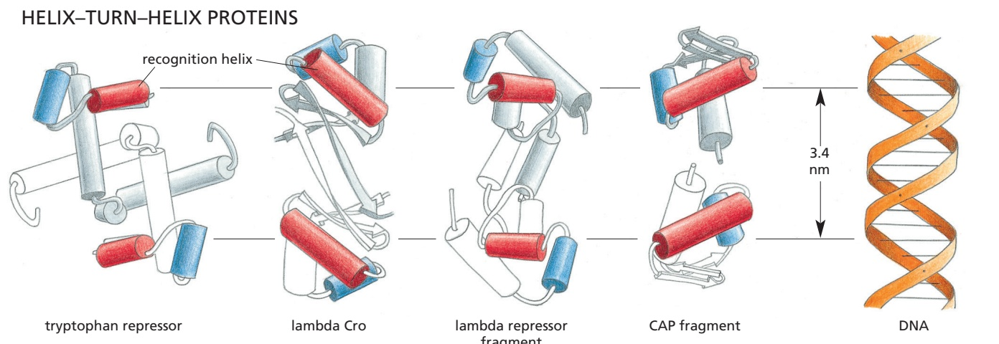

lambda Cro

lambda repressor fragment

CAP fragment

Originally identified in bacterial transcription regulators, this motif has since been found in many hundreds of DNA-binding proteins from eukaryotes, bacteria, and archaea. It is constructed from two α helices (blue and red) connected by a short extended chain of amino acids, which constitutes the “turn.” The two helices are held at a fixed angle, primarily through interactions between the two helices. The more C-terminal helix (in red) is called the recognition helix because it fits into the major groove of DNA; its amino acid side chains, which differ from protein to protein, play an important part in recognizing the specific DNA sequence to which the protein binds. All of the proteins shown here bind DNA as dimers in which the two copies of the recognition helix (in red) are separated by exactly one turn of the DNA helix (3.4 nm); thus both recognition helices of the dimer can fit into the major groove of DNA.

HOMEODOMAIN PROTEINS

LEUCINE ZIPPER PROTEINS

dimerization interface

Not long after the first transcription regulators were discovered in bacteria, genetic analyses of the fruit fly Drosophila led to the characterization of an important class of genes, the homeotic selector genes, that play a critical part in orchestrating fly development (discussed in Chapter 21). It was later shown that these genes coded for transcription regulators that bound DNA through a structural motif named the homeodomain. Two different views of the same structure are shown. (A) The homeodomain is folded into three α helices, which are packed tightly together by hydrophobic interactions. The part containing helices 2 and 3 closely resembles the bacterial helix–turn–helix motif. (B) The recognition helix (helix 3, red) forms important contacts with the major groove of DNA. The asparagine (Asn) of helix 3, for example, contacts an adenine, as shown in Figure 7–9. A flexible arm attached to helix 1 forms contacts with nucleotide pairs in the minor groove (**Movie 7.1**).

The leucine zipper motif is named because of the way the two α helices, one from each monomer, are joined together to form a short coiled-coil. These proteins bind DNA as dimers where the two long α helices are held together by interactions between hydrophobic amino acid side chains (often on leucines) that extend from one side of each helix. Just beyond the dimerization interface, the two α helices separate from each other to form a Y-shaped structure, which allows their side chains to contact the major groove of DNA. The dimer thus grips the double helix like a clothespin on a clothesline (**Movie 7.2**).

#### β-SHEET DNA RECOGNITION PROTEINS

In the other DNA-binding motifs displayed in this panel, α helices are the primary mechanism used to recognize specific DNA sequences. In one group of transcription regulators, however, a two-stranded β sheet, with amino acid side chains extending from the sheet toward the DNA, reads the information on the surface of the major groove. As in the case of a recognition α helix, this β-sheet motif can be used to recognize many different DNA sequences; the exact DNA sequence recognized depends on the sequence of amino acids that make up the β sheet. Shown is a transcription regulator that binds two molecules of S-adenosyl methionine (red). On the left is a dimer of the protein; on the right is a simplified diagram showing just the two-stranded β sheet bound to the major groove of DNA. S-adenosyl methionine is needed for this protein to bind DNA. Thus, the small molecule regulates the activity of the DNA-binding protein.

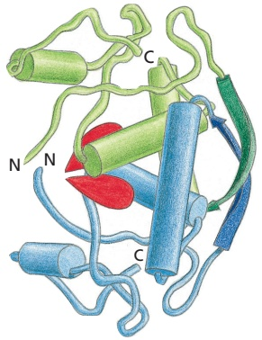

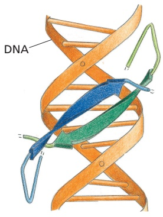

#### ZINC FINGER PROTEINS

This group of DNA-binding motifs includes one or more zinc atoms as structural components. All such zinc-coordinated DNA-binding motifs are called zinc fingers, referring to their appearance in early schematic drawings (left). They fall into several distinct structural groups, only one of which we consider here. It has a simple structure, in which the zinc atom holds an α helix and a β sheet together (middle). This type of zinc finger is often found in clusters with the α helix of each finger contacting the major groove of the DNA, forming a nearly continuous stretch of α helices along that groove (**Movie 7.3**). In this way, a strong and specific DNA–protein interaction is built up through a repeating basic structural unit. Three such fingers are shown on the right.

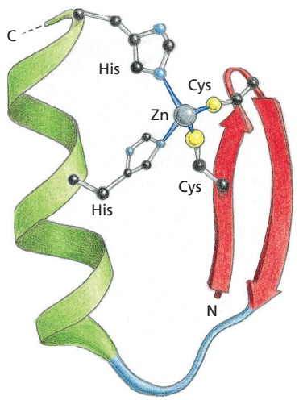

#### HELIX–LOOP–HELIX PROTEINS

Related to the leucine zipper, the helix–loop–helix motif consists of a short α helix connected by a loop (red) to a second, longer α helix. The flexibility of the loop allows one helix to fold back and park against the other thereby forming the dimerization surface. As shown, this two-helix structure binds both to DNA and to the two-helix structure of a second protein to create either a homodimer or a heterodimer. Two α helices that extend from the dimerization interface make specific contacts with the major groove of DNA.

use either α helices or β sheets to bind to the major groove of DNA, with amino acid side chains that extend from these motifs making their specific DNA contacts. Thus, a given structural motif can be used to recognize many different cisregulatory sequences depending on the specific side chains that extend from it.

#### Dimerization of Transcription Regulators Increases Their Affinity and Specificity for DNA

A monomer of a typical transcription regulator recognizes about 4–8 nucleotide pairs of DNA. These proteins do not bind tightly to a single DNA sequence and reject all others; rather, each regulator recognizes a range of closely related sequences, with the affinity of the protein for the DNA varying according to how closely the DNA matches its optimal sequence. For this reason, the cis-regulatory sequence for a regulator is often depicted by a “logo” that displays the range of sequences recognized by that transcription regulator (**Figure 7–10**). In Chapter 6, this same type of representation was used to depict the DNA sequences recognized by bacterial RNA polymerase (see Figure 6–12).

The DNA sequence recognized by a monomer does not usually contain sufficient information to be picked out from the background of such sequences that would occur at random across the genome. For example, an exact six-nucleotide DNA sequence would be expected to occur by chance approximately once every

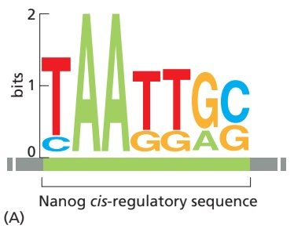

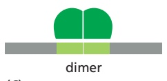

(C)

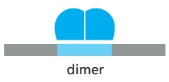

Figure 7–9 The binding of a transcription regulator to a specific DNA sequence. On the left, a single contact is shown between a transcription regulator and DNA; such contacts allow the protein to “read” the DNA sequence from the outside of the DNA double helix. On the right, the complete set of contacts between a transcription regulator (a member of the homeodomain family—see Panel 7–1) and its cis-regulatory sequence is shown. The DNA-binding portion of the protein is 60 amino acids long, and the amino acids that directly contact DNA are numbered beginning with the amino terminus. Although the interactions in the major groove are the most important, the protein also contacts both the minor groove and phosphates in the sugar–phosphate DNA backbone, as shown. (See C. Wolberger et al., Cell 67:517–528, 1991.)

Figure 7–10 Transcription regulators and cis-regulatory sequences. (A) Depiction of the cis-regulatory sequence for Nanog, a homeodomain family member that is a key transcription regulator in embryonic stem cells. This “logo” form (see Figure 6–12) shows that the protein can recognize a collection of closely related DNA sequences and gives the preferred nucleotide pair at each position. Cis-regulatory sequences are almost always “read” as doublestranded DNA, but only one strand typically is shown in a logo. (B) Representation of the cis-regulatory sequence as a green box embedded in a longer DNA molecule (gray). (C) Many transcription regulators form dimers (homodimers and heterodimers). In the example shown, three different DNA-binding specificities are formed from two transcription regulators.

4096 nucleotides $( 4 ^ { 6 } )$ , and the range of six-nucleotide sequences described by a typical logo would be expected to occur by chance much more often, perhaps every 1000 nucleotides. Clearly, for a bacterial genome of $4 . 6   \times   1 0 ^ { 6 }$ nucleotide pairs, not to mention a mammalian genome of ${ \mathbf { \tilde { 3 } } } \times 1 0 ^ { 9 }$ nucleotide pairs, this is insufficient information to accurately control the transcription of individual genes. Additional contributions to DNA-binding specificity must therefore be present.

Many transcription regulators form dimers, with both monomers making nearly identical contacts with DNA (see Figure 7–10C). This arrangement doubles the length of the cis-regulatory sequence recognized and greatly increases both the affinity and the specificity of transcription regulator binding. Because the DNA sequence recognized by the protein has increased from approximately 6 nucleotide pairs to 12 nucleotide pairs, there are many fewer random occurrences of matching sequences. In many cases, heterodimers can form between two different transcription regulators, and this configuration also increases both affinity and specificity by expanding the DNA sequence recognized. Some transcription regulators can form heterodimers with more than one partner protein; in this way, the same transcription regulator can be “reused” to create several distinct DNA-binding specificities (see Figure 7–10C).

#### Many Transcription Regulators Bind Cooperatively to DNA

In the simplest case, the collection of noncovalent bonds that holds dimers or heterodimers together is so extensive that these structures form obligatorily and virtually never fall apart. In this case, the unit of binding is the dimer or heterodimer, and the binding curve for the transcription regulator (the fraction of DNA bound as a function of protein concentration) has a standard exponential shape (**Figure 7–11A**).

In many cases, however, the dimers and heterodimers are held together very weakly; they exist predominantly as monomers in solution, and yet dimers are observed on the appropriate DNA sequence. In this case, the proteins are said to bind to DNA cooperatively, and the curve describing their binding is S-shaped (**Figure 7–11B**). Cooperative binding means that, over a range of concentrations of the transcription regulator, binding is more of an all-or-none phenomenon than for noncooperative binding; that is, at most protein concentrations, the cis-regulatory sequence is either nearly empty or nearly fully occupied and is rarely somewhere in between. A discussion of the mathematics behind cooperative binding is given in Chapter 8 (see Figure 8–81).

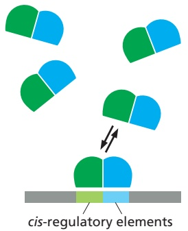

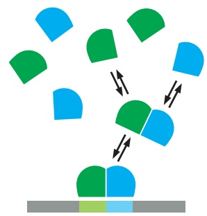

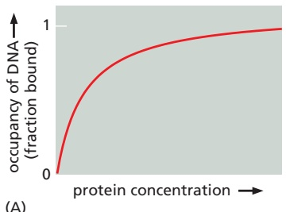

(A)

(B)

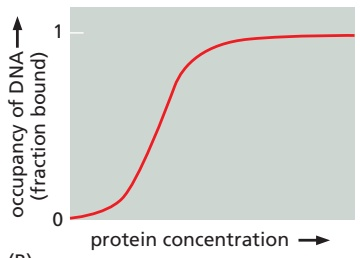

Figure 7–11 Occupancy of a cisregulatory sequence by a transcription regulator. (A) Noncooperative binding by a stable heterodimer. (B) Cooperative binding by components of a heterodimer that are predominantly monomers in solution. The shape of the curve differs from that of panel A because the fraction of protein in a form competent to bind DNA (the heterodimer) increases with increasing protein concentration.

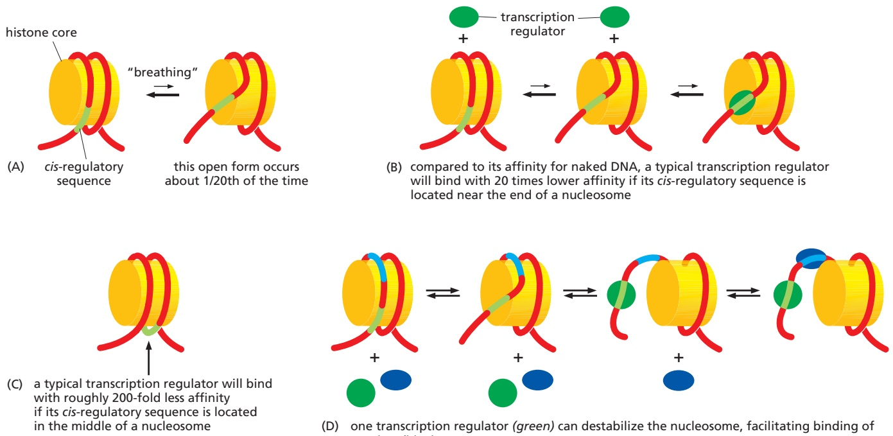

(B) compared to its affinity for naked DNA, a typical transcription regulator will bind with 20 times lower affinity if its cis-regulatory sequence is located near the end of a nucleosome

a typical transcription regulator will bind(C) with roughly 200-fold less affinity if its cis-regulatory sequence is located in the middle of a nucleosome

(D)one transcription regulator (green) can destabilize the nucleosome, facilitating binding of another (blue)

#### Nucleosome Structure Promotes Cooperative Binding of Transcription Regulators

Figure 7–12 How nucleosomes affect the binding of transcription regulators.

As we have just seen, cooperative binding of transcription regulators to DNA often occurs because the proteins involved have only a weak affinity for each other. However, there is a second, indirect mechanism for cooperative binding in eukaryotes, one that arises from the nucleosome structure of their chromosomes.

In general, transcription regulators bind to DNA in nucleosomes with lower affinity than they do to naked DNA. There are two reasons for this difference. First, the surface of the cis-regulatory sequence recognized by the transcription regulator may be facing inward on the nucleosome, toward the histone core, and therefore not be readily available to the regulatory protein. Second, even if the face of the cis-regulatory sequence is exposed on the outside of the nucleosome,. / . many transcription regulators subtly alter the conformation of the DNA when they bind, and these changes are generally opposed by the tight wrapping of the DNA around the histone core. For example, many transcription regulators induce a bend or kink in the DNA when they bind.

We saw in Chapter 4 that nucleosome remodeling can alter the structure of the nucleosome, allowing transcription regulators access to the DNA. Even without remodeling, however, transcription regulators can still gain limited access to DNA in a nucleosome. The DNA at the end of a nucleosome “breathes,” transiently exposing the DNA and allowing regulators to bind. This breathing occurs at a much lower rate in the middle of the nucleosome; therefore, the positions where the DNA exits the nucleosome are much easier to occupy than those in the middle of the nucleosome (**Figure 7–12**).

These properties of the nucleosome promote cooperative DNA binding by transcription regulators. If a transcription regulator seizes a “window of opportunity” provided by nucleosome breathing, it can enter the nucleosome by binding to the exposed DNA and prevent the DNA from tightly rewrapping around the nucleosome core. When this happens, the affinity of a second transcription regulator for a nearby cis-regulatory sequence can be increased simply by this loosening of the DNA from the histone core. If the two transcription regulators also interact with each other (as described earlier), the cooperative effect can be even greater. In some cases, the combined action of the regulatory proteins can eventually displace the histone core of the nucleosome altogether. Many transcription regulators, when their affinities for DNA and their concentrations are sufficiently high, can take advantage of nucleosome breathing and thereby

“invade” nucleosomes. Moreover, as we saw in Chapter 5, passing replication forks, which transiently displace histones, offer additional windows of opportunity for transcription regulators to bind to DNA.

Although nucleosomes generally inhibit the DNA binding of transcription regulators, some regulators—if their cis-regulatory sequences are exposed on the nucleosome surface—can bind with nearly the same affinity as they do on naked DNA, occupying their binding sites while the DNA is still tightly wrapped around the histone core (**Figure 7–13**). Transcription regulators with this property are sometimes called pioneer factors, because they are often the first proteins to bind DNA when a previously silent gene becomes transcriptionally active. Although their binding typically destabilizes the nucleosome, pioneer factors probably exert their major effects by attracting additional proteins that alter chromatin structure, such as nucleosome remodeling complexes. If one transcription regulator binds its cis-regulatory sequence on a nucleosome and attracts a chromatin remodeling complex, the localized action of the remodeling complex can allow a second transcription regulator to efficiently bind nearby.

Our discussion has emphasized how transcription regulators can work together in pairs. But in reality, larger numbers often cooperate by repeated use of the same principles. It is the cooperative formation of clusters of transcription regulators on DNA that probably explains why many key regulatory sequences in eukaryotic genomes are found to be “nucleosome free.”

#### DNA-Binding by Transcription Regulators Is Dynamic

Thus far, we have treated transcription regulators as static—we have considered them as either bound to DNA or free in solution. But in reality, the situation is highly dynamic, with transcription regulator molecules in constant motion, rapidly binding and dissociating from DNA. In most cases a given transcription regulator molecule stays on its cis-regulatory sequence for only a short time, but it is rapidly replaced by other molecules of the same regulator. Thus, when we consider a cis-regulatory sequence being fully bound by its matching transcription regulator, this state is an average, over time, of many individual association and dissociation events.

By attaching a transcription regulator to a bright fluorescent tag, it is possible to follow single regulator molecules in live cells, as they diffuse randomly within the nucleus, bind to their cis-regulatory sequences, and then dissociate from them. In these single-molecule tracking experiments, different states for the regulator can be distinguished on the basis of the tagged protein’s mobility over short time periods. A high-mobility regulator state is observed for the free protein diffusing in the nucleoplasm. At the other extreme, a very low-mobility state is attributed to the regulator bound to DNA, inasmuch as its restrained motions are similar to that of a histone molecule that has been labeled in the same way (**Figure 7–14**).

Whereas a histone remains stably bound in a nucleosome, transcription regulators remain in a low-mobility, DNA-bound state only transiently. Individual regulator molecules are observed to leave their DNA-bound state at a wide variety of rates—some molecules persist for only a fraction of a second, while others remain for minutes. How can we explain these differences? We saw earlier in the chapter (see Figure 7-10) that each transcription regulator has a preferred cisregulatory sequence, but that it can also bind—albeit with lower affinity—to related

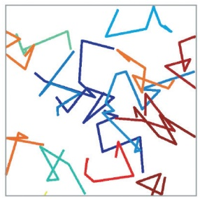

(A)

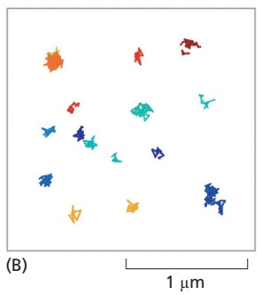

Figure 7–13 Two cooperating transcription regulators, Oct4 (green) and Sox2 (blue), bound to a. / . nucleosome. These two transcription regulators work together and play key roles in maintaining embryonic stem cells (see Figures 7–36 and 7–37). Only the DNA-binding portion of each regulator protein is shown. (Courtesy of Nicolas H. Thomä and Alicia K. Michael. PDB code: 6T90.)

Figure 7–14 Tracking single molecules of a transcription regulator in the nucleus of a living cell. By conjugating a fluorescent tag to the glucocorticoid receptor (see pp. 573–575), the behavior of this transcription regulator can be followed in living cells, using a microscope that follows its fluorescence. Computational methods then allow the observed behavior of such molecules to be classified into sets of distinct mobility groups, two of which are shown here. (A) Sample tracks observed for individual molecules of the glucocorticoid receptor in the freely diffusing mobility group. The positions illustrated were determined for a total of 10 seconds. (B) Tracks of individual molecules bound to DNA, with positions determined over a 120-second interval. (A and B, courtesy of D.A. Garcia and G.L. Hager.)

DNA sequences. Because the forward rates at which regulatory proteins “find” their cis-regulatory sequences are largely independent of the exact nucleotide sequence of that DNA, affinity differences are reflected in how long a protein remains bound on the DNA—the higher the affinity, the longer the protein stays bound.

Any protein, such as a transcription regulator, that binds tightly to a specific set of DNA sequences will also bind, albeit much more weakly, to any DNA sequence. This weak binding is useful because it allows a regulator to search for its target by “scanning” the DNA in the vicinity of the initial chromosomal site that it binds. Most such regulators will fail to find a matching cis-regulatory DNA sequence, and it is these that are thought to dissociate within seconds. The minority that persist for minutes are likely to have engaged with a matching cis-regulatory sequence. But because even these regulators do not remain on DNA for long periods, they need to be constantly replaced by another such molecule. Thus, as always, the static pictures in this textbook fail to do justice to the frantic state of motion that exists inside a cell (see pp. 65–66).

#### Summary

Transcription regulators recognize short stretches of double-helical DNA of defined sequence called cis-regulatory sequences, and they thereby determine which of the thousands of genes in a cell will be transcribed. Transcription regulators determine many cell properties, and their importance is reflected by the fact that approximately 10% of the protein-coding genes in most organisms produce them. Although each transcription regulator has unique features, most bind to DNA as homodimers or heterodimers and recognize DNA through one of a small number of structural motifs. Transcription regulators typically work in groups and bind to DNA cooperatively, a feature that is explained by several underlying mechanisms, some of which exploit the packaging of DNA in nucleosomes.

#### TRANSCRIPTION REGULATORS SWITCH GENES ON AND OFF

Having seen how transcription regulators bind to cis-regulatory sequences embedded in the genome, we can now discuss how, once bound, these proteins influence the transcription of genes. The situation in bacteria is simpler than in eukaryotes (for one thing, chromatin structure is not an issue), and we therefore discuss bacterial mechanisms before proceeding to the more complex situation in eukaryotes.

#### The Tryptophan Repressor Switches Genes Off

The genome of the bacterium Escherichia coli consists of a single, circular DNA molecule of about $4 . 6   \times   1 0 ^ { 6 }$ nucleotide pairs that encodes approximately 4300 proteins. Only a fraction of these proteins are made at any one time. For example, all bacteria regulate the expression of many of their genes according to the food sources that are available in the environment. Thus in E. coli, five genes code for enzymes that manufacture the amino acid tryptophan. These genes are arranged in a cluster on the chromosome and are transcribed from a single promoter as one long mRNA molecule; such coordinately transcribed clusters are called operons (**Figure 7–15**). Such operons are common in bacteria but rare in eukaryotes, where genes are typically transcribed and regulated individually (see Figures 6–75 and 6–90).

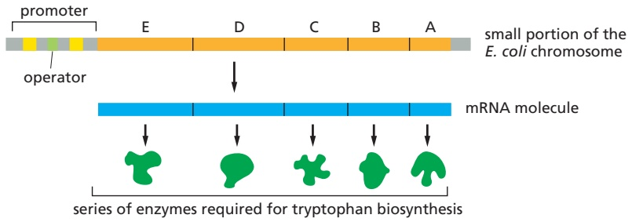

Figure 7–15 A cluster of bacterial genes can be transcribed from a single promoter. Each of these five genes encodes a different enzyme, and all of these enzymes are needed to synthesize the amino acid tryptophan from simpler molecules. The genes are transcribed as a single mRNA molecule, a feature that allows their expression to be coordinated. Clusters of genes transcribed as a single mRNA molecule are common in bacteria. Each of these clusters is called an operon because its expression is controlled by a cis-regulatory sequence called the operator (green), situated within the promoter. (In this and subsequent figures, the yellow blocks in the promoter represent DNA sequences that bind RNA polymerase; see Figure 6–12).

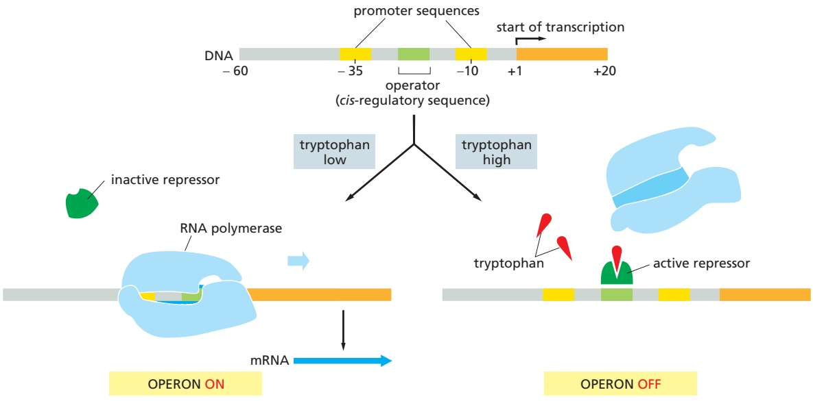

When tryptophan concentrations are low, the operon is transcribed; the resulting mRNA is translated to produce a full set of biosynthetic enzymes, which work in tandem to synthesize tryptophan from much simpler molecules. When tryptophan is abundant, however—for example, when the bacterium is in the gut of a mammal that has just eaten a protein-rich meal—the amino acid is imported into the cell and shuts down production of the enzymes, which are no longer needed.

We now understand exactly how this repression of the tryptophan operon comes about. Within the operon’s promoter is a cis-regulatory sequence that is recognized by a transcription regulator. When this regulator binds to this sequence, it blocks access of RNA polymerase to the promoter, thereby preventing transcription of the operon (and thus production of the tryptophan-producing enzymes). The transcription regulator is known as the tryptophan repressor, andMBoC7 m7.13/7.16 its cis-regulatory sequence is called the tryptophan operator. These components are controlled in a simple way: the repressor can bind to DNA only if it has also bound several molecules of tryptophan (**Figure 7–16**).

Figure 7–16 Genes can be switched off by repressor proteins. If the concentration of tryptophan inside a bacterium is low (left), RNA polymerase (blue) binds to the promoter and transcribes the five genes of the tryptophan operon. However, if the concentration of tryptophan is high (right), the tryptophan repressor protein (dark green) becomes active and binds to the operator (light green), where it blocks the binding of RNA polymerase to the promoter. Whenever the concentration of intracellular tryptophan drops, this transcription regulator falls off the DNA, allowing the polymerase to again transcribe the operon. Although not shown in the figure, the tryptophan repressor exists as a stable protein dimer.

The tryptophan repressor is an allosteric protein, and the binding of tryptophan causes a subtle change in its three-dimensional structure so that the protein can bind tightly to the operator sequence. Whenever the concentration of free tryptophan in the bacterium drops, tryptophan dissociates from the repressor, the repressor no longer binds to DNA, and the tryptophan operon is transcribed. The repressor is thus a simple device that switches production of a set of biosynthetic enzymes on and off according to the availability of the end product of the pathway that the enzymes catalyze.

The tryptophan repressor protein itself is always present in the cell. The gene that encodes it is continually transcribed at a low level, so that a small amount of the repressor protein is always being made. Thus the bacterium can respond very rapidly to a rise or fall in tryptophan concentration.

#### Repressors Turn Genes Off and Activators Turn Them On

The tryptophan repressor, as its name suggests, is a transcription repressor protein: in its active form, it switches genes off, or represses them. Some bacterial transcription regulators do the opposite: they switch genes on, or activate them. These transcription activator proteins work on promoters that—in contrast to the promoter for the tryptophan operon—are only marginally able to bind and position RNA polymerase on their own. However, these poorly functioning promoters can be made fully functional by activator proteins that bind to nearby cis-regulatory sequences and contact the RNA polymerase to help it initiate transcription (**Figure 7–17**).

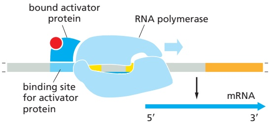

Figure 7–17 Genes can be switched on by activator proteins. An activator protein binds to its cis-regulatory sequence on the DNA and interacts with the RNA polymerase to help it initiate transcription. Without the activator, the promoter fails to initiate transcription efficiently. In bacteria, the binding of the activator to DNA is often controlled by the interaction of a metabolite or other small molecule (red circle) with the activator protein.

DNA-bound activator proteins can increase the rate of transcription initiation as much as 1000-fold, a value consistent with a relatively weak and nonspecific interaction between the transcription regulator and RNA polymerase. For example, a 1000-fold change in the affinity of RNA polymerase for its promoter corresponds to a change in ∆G of ∼18 kJ/mole, which could be accounted for by just a few. / . weak, noncovalent bonds. Thus, many activator proteins work simply by providing a few favorable interactions that help to attract RNA polymerase to the promoter. To provide this assistance, however, the activator protein must be bound to its cisregulatory sequence, and this sequence must be positioned precisely so that these favorable interactions can occur with an RNA polymerase molecule at its promoter.

Like the tryptophan repressor, activator proteins often have to interact with a second molecule to be able to bind DNA. For example, the bacterial activator protein CAP has to bind cyclic AMP (cAMP) before it can bind to DNA. Genes activated by CAP are switched on in response to an increase in intracellular cAMP concentration, which rises when glucose, the bacterium’s preferred carbon source, is no longer available. CAP then drives the production of enzymes that allow the bacterium to digest other sugars.

#### Both an Activator and a Repressor Control the Lac Operon

The activity of a single bacterial promoter is often controlled by several different transcription regulators. The Lac operon in E. coli, for example, is controlled by both the Lac repressor and the CAP activator just discussed. The Lac operon encodes proteins required to import and digest the disaccharide lactose, a key nutrient in milk. In the absence of glucose (the cell’s favorite energy source), the bacterium makes cAMP, which activates CAP to switch-on genes that allow the cell to utilize alternative sources of carbon—including lactose. It would be wasteful, however, for CAP to induce expression of the Lac operon if lactose itself were not present. Thus the Lac repressor shuts off the operon in the absence of lactose. This arrangement enables the control region of the Lac operon to integrate two different signals, so that the operon is highly expressed only when two conditions are met: glucose must be absent and lactose must be present (**Figure 7–18**). This genetic circuit thus behaves much like a switch that carries out a logic operation in a computer. When lactose is present AND glucose is absent, the cell executes the appropriate program—in this case, transcription of the genes that permit the uptake and utilization of lactose.

All transcription regulators, whether they are repressors or activators, must be bound to DNA to exert their effects. In this way, each regulatory protein acts selectively, controlling only those genes that bear a cis-regulatory sequence recognized by it. The logic of the Lac operon first attracted the attention of biologists more than 60 years ago. The way it works was uncovered by a combination of genetics and biochemistry, providing some of the first insights into how transcription is controlled in any organism.

#### DNA Looping Can Occur During Bacterial Gene Regulation

We have seen that transcription activators help RNA polymerase to initiate transcription and repressors hinder it. Otherwise the two types of transcription regulators are similar: both the tryptophan repressor and the CAP activator protein must bind a small molecule to occupy their cis-regulatory sequences, and both recognize these DNA sequences using the same structural motif (the helix– turn–helix shown in Panel 7–1). Some proteins (for example, the CAP protein) can act either as a repressor or an activator, depending on the exact placement of a binding site relative to the promoter: if this site overlaps the promoter, CAP binding can prevent the assembly of RNA polymerase at the promoter, thus serving as a repressor.

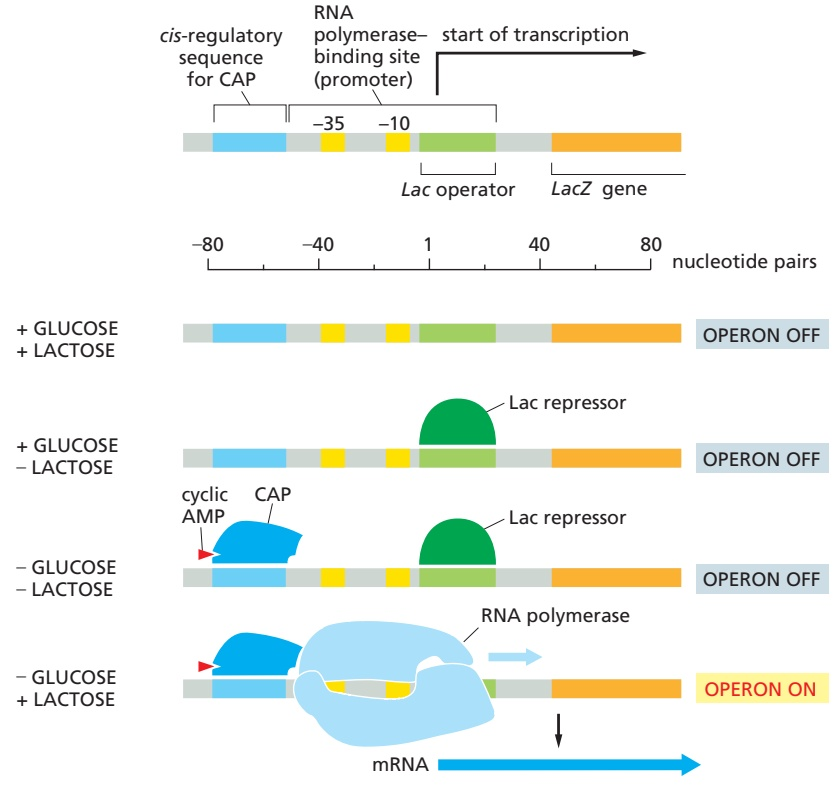

Figure 7–18 How the Lac operon is controlled by two transcription regulators, causing it to be expressed only when needed. LacZ, the first gene of the operon, encodes the enzyme β-galactosidase, which breaks down lactose to galactose and glucose. When lactose is absent, the Lac repressor binds to a cis-regulatory sequence, called the Lac operator, and shuts off expression of the operon (Movie 7.4). Addition of lactose increases the intracellular concentration of a related compound, allolactose; allolactose binds to the Lac repressor, causing it to undergo a conformational change that releases its grip on the operator DNA (not shown). This removes a block to expression of the Lac operon, but the operon can turn on only if the sugar glucose, a preferred carbon source, is absent. This is because cyclic AMP (red triangle) is produced by the cell in the absence of glucose, and this small molecule is required for CAP to bind to DNA and activate transcription.

Most bacteria have small, compact genomes, and the cis-regulatory sequencesMBoC7 m7.15/7.18 that control the transcription of a gene are typically located very near to the start point of transcription. But there are some exceptions to this generalization— cis-regulatory sequences can be located hundreds and even thousands of nucleotide pairs from the bacterial genes they control. In these cases, the intervening DNA loops out, allowing a transcription regulator bound at a distant site along the DNA to contact RNA polymerase (**Figure 7–19**). Here, the DNA is serving as a tether, enormously increasing the probability that the regulator will collide with a promoter-bound polymerase, compared with the situation where the regulator is free in solution. We will see shortly that, although the exception in bacteria, DNA looping is thought to occur in the regulation of nearly every eukaryotic gene. It has been proposed that the compact, simple genetic switches found in bacteria evolved in response to a severe competition for growth that put strong selective pressure on bacteria to maintain small genome sizes. In contrast, there appears to have been little selective pressure to “streamline” the genomes of multicellular organisms.

Figure 7–19 Transcriptional activation by DNA looping in bacteria. (A) The NtrC protein is a bacterial transcription regulator that activates transcription by directly contacting RNA polymerase. (B) The interaction of NtrC and RNA polymerase, with the intervening DNA looped out, can be seen in the electron microscope. (B, courtesy of Harrison Echols and Sydney Kustu.)

#### Complex Switches Control Gene Transcription in Eukaryotes

When compared to the situation in bacteria, transcription regulation in eukaryotes involves many more proteins and much longer stretches of DNA—and it often seems bewilderingly complex. Yet many of the same principles apply. As in bacteria, the time and place that each gene is to be transcribed are specified by its cis-regulatory sequences, which are “read” by the transcription regulators that bind to them. Once bound to DNA, positive transcription regulators (activators) help RNA polymerase to begin transcribing genes, and negative regulators (repressors) block this from happening. But in bacteria, most of the interactions between DNA-bound transcription regulators and RNA polymerases (whether they activate or repress transcription) are direct; that is, they contact each other. In contrast, these interactions are almost always indirect in eukaryotes: many intermediate proteins, including the histones and a large protein complex known as Mediator, act between DNA-bound transcription regulators and RNA polymerase. Moreover, in multicellular organisms, it is common for dozens of transcription regulators to control a single gene and for cis-regulatory sequences to be spread over tens of thousands of nucleotide pairs. DNA looping allows the DNA-bound regulatory proteins to interact with each other and ultimately to control RNA polymerase at the promoter. Many of the protein–protein interactions involved are of low affinity and are thought to trigger the formation of biomolecular condensates, which can facilitate reactions requiring such a large number of different components (see pp. 171–173). Finally, because nearly all of the DNA in eukaryotic organisms is organized in nucleosomes and higher-order chromatin structures, transcription initiation in eukaryotes must overcome this inherent block. In the next sections, we discuss each of these features of transcription initiation in eukaryotes, emphasizing how they provide extra levels of control not found in bacteria.

#### A Eukaryotic Gene Control Region Includes Many cis-Regulatory Sequences

In eukaryotes, RNA polymerase II transcribes all the protein-coding genes and many noncoding RNA genes. This polymerase requires five general transcription factors (with 27 subunits in toto; see Table 6–3, p. 333, and Figure 6–15), in contrast to bacterial RNA polymerase, which needs only a single general transcription factor (the σ subunit). As we saw in Chapter 6, the stepwise assembly of the general transcription factors at a eukaryotic promoter provides, in principle, multiple steps at which the cell can speed up or slow down the rate of transcription initiation in response to transcription regulators.

Because the many cis-regulatory sequences that control the expression of a typical gene are often spread over long stretches of DNA, we use the term **gene control region** to describe the whole expanse of DNA involved in regulating and initiating transcription of a eukaryotic gene. This includes the **promoter**, where the general transcription factors and the polymerase assemble, plus all of the cisregulatory sequences to which transcription regulators bind to control the rate of the gene activation processes at the promoter (**Figure 7–20**). In animals and plants, it is not unusual to find the regulatory sequences of a gene dotted over stretches of DNA as large as 100,000 nucleotide pairs. For now, we can regard much of this DNA as “spacer” sequences that transcription regulators do not directly recognize. We will see later in this chapter that some of this DNA is transcribed (but not translated) into long noncoding RNAs (lncRNAs), which have diverse functions in the cell.

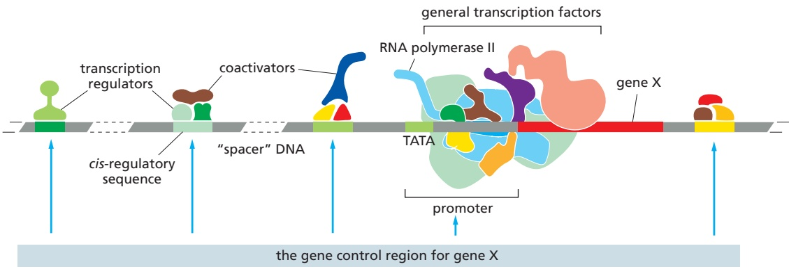

In this chapter, we shall loosely use the term **gene** to refer to a segment of DNA that is transcribed into a functional RNA molecule, one that either codes for a protein or has a different role in the cell (see Table 6–1, p. 327). However, the classical view of a gene includes the gene control region as well, because mutations in it can produce an altered phenotype. Alternative RNA splicing further complicates the definition of a gene—a point we shall return to later.

In contrast to the small number of general transcription factors, which are abundant proteins that assemble on the promoters of all genes transcribed by RNA polymerase II, there are thousands of different transcription regulatorsMBoC7 m7.17/7.20 devoted to turning individual genes on and off. As we have seen, each eukaryotic gene is usually transcribed individually. Not surprisingly, the regulation of each eukaryotic gene is different in detail from that of every other gene, and it is difficult to formulate simple rules for gene regulation that apply in every case. We can, however, make some generalizations about how transcription regulators, once bound to gene control regions on DNA, set in motion the series of events that lead to gene activation or repression.

#### Eukaryotic Transcription Regulators Work in Groups

In bacteria, we saw that proteins such as the tryptophan repressor, the Lac repressor, and the CAP protein bind to DNA on their own and directly affect RNA polymerase at the promoter. Eukaryotic transcription regulators, in contrast, usually assemble together in groups at their cis-regulatory sequences. Often two

Figure 7–20 Transcription is controlled by gene control regions. (A) The gene control region of a typical eukaryotic gene depicted with the DNA arranged in a straight line. The promoter is the DNA sequence where the general transcription factors and the polymerase assemble (see Figure 6–15). The cis-regulatory sequences are binding sites for transcription regulators, whose presence on the DNA ultimately affects the rate of transcription initiation. These sequences can be located adjacent to the promoter, far upstream of it, or even within introns or entirely downstream of the gene. The broken stretches of DNA signify that the length of DNA between the cis-regulatory sequences and the start of transcription varies, sometimes reaching tens of thousands of nucleotide pairs in length. The TATA box is a DNA recognition sequence for the general transcription factor TFIID (see Figures 6–15 and 6–17). (B) DNA looping allows transcription regulators bound at many positions to “communicate” with the proteins that assemble at the promoter. As shown in this schematic diagram, many transcription regulators act through Mediator (described in Chapter 6), while some interact with the general transcription factors and RNA polymerase directly. Transcription regulators also act by recruiting proteins that alter the chromatin structure of the promoter (not shown here but discussed later in the chapter). Whereas Mediator and the general transcription factors are the same for all RNA polymerase II–transcribed genes, the transcription regulators and the locations of their binding sites relative to the promoter differ for each gene. At especially complex gene control regions, the many proteins that assemble can, by virtue of large numbers of low-specificity interactions, undergo phase transitions that further coalesce the protein and DNA components needed to initiate transcription—presumably accelerating the process.

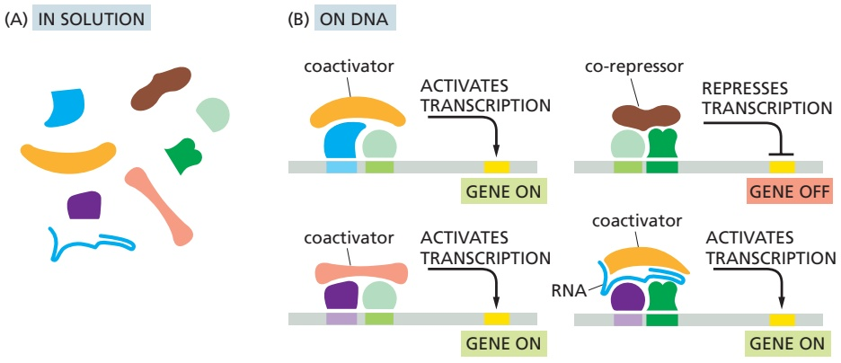

or more regulators bind cooperatively, as discussed earlier in the chapter (see Figure 7–10). In some especially complex gene control regions, tens and even hundreds of such proteins may coassemble on DNA. In addition, a broad class of multisubunit proteins termed coactivators and co-repressors join with them. Typically, these coactivators and co-repressors do not recognize specific DNA sequences themselves; they are brought to those sequences by specific interactions with the DNA-bound transcription regulators. As their names imply, coactivators are typically involved in activating transcription and co-repressors in repressing it. In the following sections, we will see that coactivators and co-repressors can act in a variety of different ways to influence transcription once they have been localized on the genome by transcription regulators.MBoC7 m7.18/7.21

Figure 7–21 Eukaryotic transcription regulators assemble into complexes on DNA. (A) Seven different proteins and an RNA molecule are shown. The nature and function of the complex they form depend on the specific cis-regulatory sequences that seed their assembly. (B) Some assembled complexes activate gene transcription, while another represses transcription. Note that the light green and dark green proteins are shared by both activating and repressing complexes. Proteins that do not themselves bind DNA but assemble on other DNA-bound transcription regulators are termed coactivators or co-repressors. In some cases (lower right), long, noncoding RNA molecules are also found in these assemblies. As described later in this chapter, these RNAs often act as scaffolds to hold groups of proteins together.

As shown in **Figure 7–21**, an individual transcription regulator can often participate in more than one type of regulatory complex. A protein might function, for example, in one case as part of a complex that activates transcription and in another case as part of a complex that represses transcription. Thus, individual eukaryotic transcription regulators function as regulatory parts that are used to build complexes whose function depends on the final assembly of all of the individual components. Each eukaryotic gene is therefore regulated by a “committee” of proteins, all of which must be present to express the gene at its proper level. Often the protein–protein interactions between transcription regulators and between regulators and coactivators are too weak for them to assemble in solution; however, the appropriate combination of cis-regulatory sequences can “crystallize” the assembly of these complexes on DNA. In very large and complex gene control regions, this assembly may be accompanied by a phase transition to form a biomolecular condensate, whereby all the components are held together even more efficiently by keeping them in rough proximity even when individual proteins disassociate from DNA.

#### Activator Proteins Promote the Assembly of RNA Polymerase at the Start Point of Transcription

The cis-regulatory sequences to which eukaryotic transcription activator proteins bind were originally called enhancers because their presence “enhanced” the rate of transcription initiation. It initially came as a surprise when it was discovered that these sequences could be found tens of thousands of nucleotide pairs away from the promoter; as we have seen, DNA looping, which was not widely appreciated at the time, can now explain this initially puzzling observation.

Once bound to DNA, how do assemblies of activator proteins increase the rate of transcription initiation? At most genes, several mechanisms work in concert. Their ultimate function is to attract and position RNA polymerase II at the promoter and to release it so that transcription can begin.

Some activator proteins bind directly to one or more of the general transcription factors, accelerating their assembly on a promoter that has been brought in proximity—through DNA looping—to that activator. Most transcription activators, however, attract coactivators that then perform the biochemical tasks needed to initiate transcription. As we have seen, one of the most prevalent coactivators is the large Mediator protein complex, composed of more than 30 subunits. About the same size as RNA polymerase itself, Mediator serves as a bridge between DNA-bound transcription activators, RNA polymerase, and the general transcription factors, facilitating their assembly at the promoter (see Figure 7–20).

#### Eukaryotic Transcription Activators Direct the Modification of Local Chromatin Structure

The eukaryotic general transcription factors and RNA polymerase are unable, on their own, to assemble on a promoter that is packaged in nucleosomes. Thus, in addition to directing the assembly of the transcription machinery at the promoter, eukaryotic transcription activators—once bound to their cis-regulatory sequences—promote transcription by triggering changes to the chromatin structure of the promoters, rendering the underlying DNA more accessible. The enzymes that alter chromatin structure are usually carried as subunits of coactivators, which are typically multiprotein complexes, with different subunits carrying out different functions. For example, such a coactivator might carry one subunit that associates with specific DNA-bound transcription regulators, another that associates with one of the general transcription factors, and several more that alter chromatin structure in different ways.

The most important ways of locally altering chromatin are through covalent histone modifications, nucleosome remodeling, nucleosome removal, and histone replacement (all discussed in Chapter 4). Eukaryotic transcription activators use all four of these mechanisms: thus they attract coactivators that include histone modification enzymes, ATP-dependent chromatin remodeling complexes, and histone chaperones. These proteins often act cooperatively to alter the chromatin structure of promoters, providing greater access to the DNA (**Figure 7–22**).

Often a series of individual events, ultimately directed by transcription regulators, must occur before RNA polymerase can be assembled onto a promoter,

Figure 7–22 Eukaryotic transcription activator proteins direct local alterations in chromatin structure. Nucleosome remodeling, nucleosome removal, histone replacement, and certain types of histone modifications favor transcription initiation (see Table 4–2, p. 210). As illustrated, some of these changes are driven by different types of ATP-dependent chromatin remodeling complexes (see Figures 4–26 and 4–27); most also involve histone chaperones (not shown). Such alterations increase the accessibility of DNA and facilitate the binding of RNA polymerase and the general transcription factors.

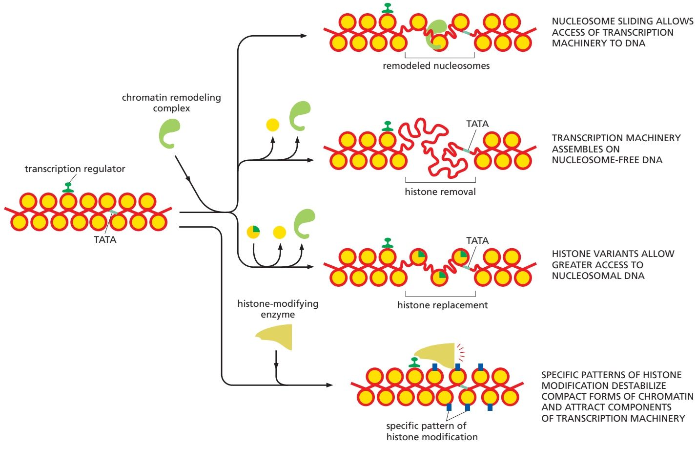

Figure 7–23 Successive histone modifications during transcription initiation. In this example, taken from the human interferon-β gene promoter, a transcription activator binds to DNA packaged into chromatin and attracts a histone acetyl transferase that acetylates lysine 9 of histone H3 and lysine 8 of histone H4 (see Figure 4–35). Next, a histone kinase, part of a different coactivator attracted by the same transcription activator, phosphorylates serine 10 of histone H3, but it can only do so after lysine 9 has been acetylated. This serine modification signals the original histone acetyl transferase to acetylate position K14 of histone H3. Next, the general transcription factor TFIID and a chromatin remodeling complex come into play to promote the subsequent steps of transcription initiation. TFIID and the remodeling complex both recognize acetylated histone tails through a bromodomain, a protein domain specialized to read this particular mark on histones; a bromodomain is carried in a subunit of each protein complex. Binding of TFIID causes a sharp bend in the DNA (not shown but see Figure 6–17), which facilitates sliding of the nucleosome to a new position, thereby freeing the start site of transcription for binding by RNA polymerase II.

The histone acetyl transferase, the histone kinase, and the chromatin remodeling complex are all subunits of coactivators. The order of events shown applies to a specific promoter; at other genes, the steps may occur in a different order or individual steps may be omitted altogether. (Adapted from T. Agalioti et al., Cell 111:381–392, 2002.)

with details that depend on the gene being regulated. In the example illustrated in **Figure 7–23**, a series of specific histone tail modifications is triggered by a transcription activator; these modifications then attract additional proteins to the promoter, including both a chromatin remodeling complex and a general transcription factor. Those proteins can in turn recruit additional proteins to the promoter, while also destabilizing adjacent nucleosomes.

Because the local chromatin changes directed by one transcription regulator often allow the binding of additional proteins—both directly (see Figure 7–12) and indirectly as just described—a cascade of events typically takes place on the control regions of eukaryotic genes to regulate their transcription.

As RNA polymerase II transcribes through a gene a different type of chromatin modification occurs. The histones just ahead of the polymerase are acetylated by enzymes carried by the polymerase, removed by histone chaperones, and deposited behind the moving polymerase. These histones are then rapidly deacetylated and methylated, also by complexes that are carried by the polymerase, leaving behind nucleosomes that are especially resistant to transcription. This remarkable process seems to prevent spurious transcription reinitiation behind a moving polymerase, which, in essence, must clear a path through chromatin as it transcribes. Later in this chapter, when we discuss RNA interference, the potential dangers to the cell of such inappropriate transcription will become especially obvious.

#### Some Transcription Activators Work by Releasing Paused RNA Polymerase

Thus far, we have emphasized how transcription regulators—once bound to DNA—can assemble multiple components and stimulate transcription initiation. But for some genes, a key regulatory step occurs after this point (**Figure 7–24**). In the most common of these cases, the RNA polymerase halts after transcribing about 50 nucleotides of RNA, and further elongation requires a new transcription activator to bind to the gene’s control region (see Figure 7–24C).

The release of a paused RNA polymerase can occur in several ways. In some cases, the new activator brings in a chromatin remodeling complex that removes a nucleosome block to the elongating RNA polymerase. In other cases, the activator communicates with RNA polymerase (typically through a coactivator), signaling it to forge ahead. Finally, as we saw in Chapter 6, RNA polymerase requires elongation factors to effectively transcribe through chromatin (Figure 6–19). In some cases, the key step in gene activation is the delayed loading of these factors onto RNA polymerase, directed by DNA-bound transcription activators. Once loaded, these factors allow the polymerase to move through blocks imposed by chromatin structure to begin transcribing the gene effectively.

Paused polymerases are common in humans, where a significant fraction of genes that are not being transcribed have a paused polymerase located just downstream from the promoter. Having RNA polymerase already poised on a promoter in the beginning stages of transcription bypasses the step of assembling many components at the promoter, which is often slow. This mechanism is therefore thought to allow cells to begin transcribing a gene in rapid response to an extracellular signal.

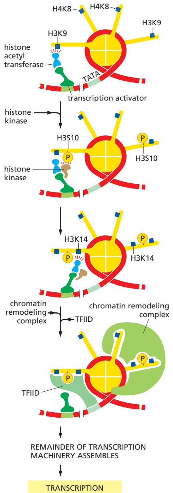

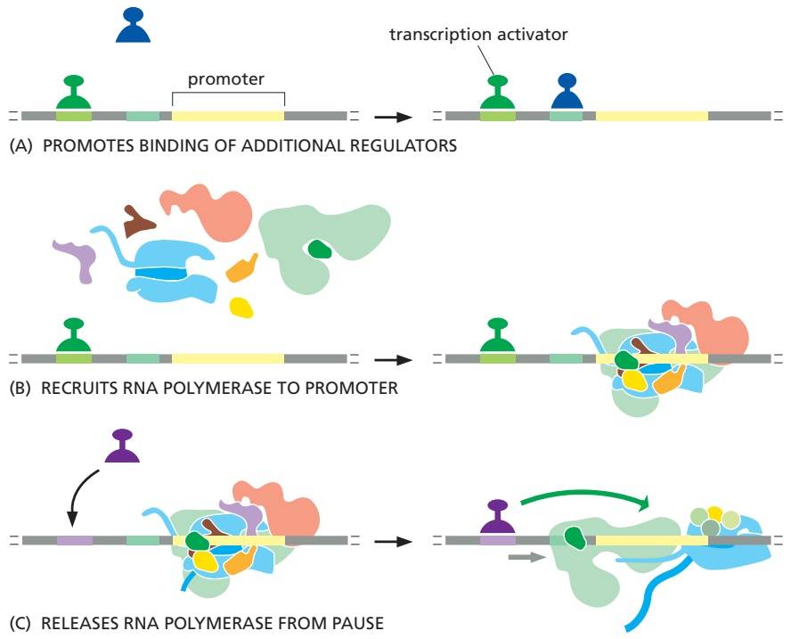

Figure 7–24 Different transcription regulators can act at different steps. (A) As described earlier in this chapter (see Figure 7–12), a DNA-bound transcription activator can promote DNA binding by additional transcription regulators. (B) As shown in more detail in Figures 7–20 and 7–22, most transcription activators direct assembly of RNA polymerase at promoters; this can occur by a variety of mechanisms. (C) Some other transcription activators, once bound to DNA, release RNA polymerase molecules that are paused after transcribing about 50 nucleotides of RNA. For simplicity, many of the additional proteins required for transcription initiation are not shown.

#### Transcription Activators Work Synergistically

We have seen that complexes of transcription activators and coactivators assemble cooperatively on DNA. We have also seen that these assemblies can promote different steps in transcription initiation. In general, where several factors work together to enhance a reaction rate, the joint effect is not merely the sum of the enhancements that each factor alone contributes, but the product of them. If, for example, factor A lowers the free-energy barrier for a reaction by a certain amount and thereby speeds up the reaction 100-fold, and factor B, by acting on that reaction, does likewise, then A and B acting in parallel can lower the energy barrier by a double amount and speed up the reaction 10,000-fold. Even if A and B work simply by attracting the same protein, the affinity of that protein for the reaction site increases multiplicatively. Thus, transcription activators often exhibit transcriptional synergy, where several DNA-bound activator proteins working together produce a transcription rate that is much higher than the sum of their transcription rates working alone (**Figure 7–25**).

Figure 7–25 Transcriptional synergy. This experiment compares the rate of transcription produced by three experimentally constructed regulatory regions in a eukaryotic cell and reveals transcriptional synergy, a greater than additive effect of multiple activators working together. Such transcriptional synergy is not only observed between different transcription activators from the same organism; it is also seen between activator proteins from different eukaryotic species when they are experimentally introduced into the same cell. This last observation reflects the high degree of conservation of the machinery responsible for eukaryotic transcription initiation.

As a result, the rate of transcription of a gene ultimately depends on the spectrum of regulatory proteins that are bound upstream and downstream of its transcription start site, along with the coactivator proteins they bring to the DNA.

#### Condensate Formation Likely Increases the Efficiency of Transcription Initiation

We have discussed in broad, conceptual terms the many different types of proteins that must assemble for transcription of a typical gene to begin. For. / . especially complex gene control regions, such as those of key human genes that orchestrate development, several hundred individual subunits are involved and, as they begin to assemble on DNA, they become involved in networks that create phase transitions, forming small biomolecular condensates. As described in Chapter 3, such condensates hold their proteins in loose proximity, such that, when one disassociates from the assembly, it can be retained nearby by a network of fluctuating weak interactions (see pp. 171–173). Consistent with this idea, many transcription regulators, coactivators, and co-repressors contain the type of low-complexity, unstructured regions that help to drive condensate formation.

How might this aid transcription? At least some of these transcription condensates contain additional copies of key proteins, including the Mediator complex (**Figure 7–26**). The presence of these extra copies in the same condensate is proposed to make transcription initiation an efficient but highly dynamic process, with proteins within the condensate rapidly exchanging on and off DNA. According to this view, Figure 7–20B represents only a frozen moment in transcription initiation. Whether such condensates form on most eukaryotic genes that are being transcribed—or on just those whose regulation is especially complex— remains to be determined.

Figure 7–26 Condensate formation at the transcription control region of the Nanog gene in a mouse embryonic stem cell. The cell was fixed, and in (A) the Nanog gene was identified by hybridizing a complementary nucleotide sequence attached to a red fluorophore, according to a procedure known as FISH (see Figure 8–32). Nanog is a key transcription regulator in embryonic stem cells (see Figure 7–10), and its own regulatory region is one of the most complex in the mouse genome. The nucleus is indicated by the blue oval. (B) A subunit of Mediator fused to a green fluorescent protein (see Figure 9–16) was visualized. (C) The two preceding images have been merged, and in (D) the portion of the image in the white square is magnified tenfold. The size and diffuse nature of the “blob” suggest a condensate containing a large number of proteins. Note that additional condensates of Mediator are visible throughout the nucleus and may represent condensates at other enhancers. These condensates are much smaller than those of the nuclear “organelles,” such as the nucleolus, discussed in Chapter 6. (From B.R. Sabari et al., Science 361:eaar3958, 2018. With permission from AAAS.)

#### Eukaryotic Transcription Repressors Can Inhibit Transcription in Several Ways

Although the “default” state of eukaryotic DNA packaged into nucleosomes is resistant to transcription, eukaryotes nonetheless use transcription regulators to repress the transcription of individual genes. These transcription repressors can rapidly turn off a gene that is being actively transcribed, and they can depress the rate of transcription even below that of the very low default value. Like the transcription activators discussed earlier, transcription repressors often work on a gene-by-gene basis. But unlike the bacterial repressors discussed earlier in this chapter, eukaryotic repressors do not directly compete with the RNA polymerase for access to the DNA. Instead, they use a variety of other mechanisms, some of which are illustrated in **Figure 7–27**. Like transcription activation, transcription repression can act through more than one mechanism at a given target gene, thereby ensuring especially efficient repression.

The different mechanisms of repression depicted in Figure 7–27 have different consequences for the ease with which a repressed gene can be reactivated. For most of the strategies, the repressed state is relatively easy to rapidly reverse, for

Figure 7–27 Six of the ways in which eukaryotic repressor proteins can operate. (A) A repressor protein outcompetes activator proteins for binding to the same regulatory DNA sequence. (B) Both activator and repressor proteins bind close to each other on DNA, and the repressor “quenches” the activator, preventing it from functioning (for example, by blocking the recruitment of its coactivators). (C) The repressor “poisons” assembly of the general transcription factors by binding to and stabilizing an intermediate. (D) The repressor recruits a chromatin remodeling complex that restores the nucleosomal state of the promoter region to its pre-transcriptional, default form. (E) The repressor attracts a histone deacetylase to the promoter, removing the histone acetylation needed for transcription initiation (see Figure 7–23). (F) Heterochromatin formation is triggered when a repressor attracts a specific histone methyl transferase that trimethylates either lysine 9 or lysine 27 on histone H3, thereby creating either H3K9me3- or H3K27me3-marked nucleosomes. “Read–write” mechanisms then spread each type of methylated nucleosome for thousands of nucleotide pairs along the DNA; they also help the methylation pattern to be inherited across cell divisions (see Figures 4–40 and 4–44). The final step in heterochromatin formation occurs when each type of modified nucleosome attracts additional proteins that condense the DNA and maintain it in a transcriptionally silent form.

example, by simply inactivating the repressor. But, the last mechanism—a directed methylation of specific histone amino acids that creates an unusually highly condensed form of chromatin, known as heterochromatin—is self-reinforcing and can propagate even when the initiating signal is no longer present (see Figure 4–44). As discussed in Chapter 4, chromatin that is marked by H3K9me3 (trimethylation of the lysine at position 9 of histone H3) appears to be the most difficult to transcribe. Typically located around centromeres and repeated DNA sequences such as inactive transposons, this type of heterochromatin strongly suppresses both genetic recombination and transcription. A different histone H3 modification (H3K27me3) is associated with a second form of heterochromatin that is also resistant to transcription. Although apparently easier to activate than the H3K9me3 form, this form of chromatin is also self-propagating and can persist across cell divisions, after the initiating signal has disappeared.

These two types of heterochromatin are used to tightly repress genes active in early development, presumably to make sure that these genes are not expressed in the mature organism. Tight, heritable gene repression is especially important to animals and plants whose growth depends on elaborate and complex developmental programs. Misexpression of a single gene at a critical time can have

disastrous consequences for the individual. For this reason, many of the genes encoding the most important developmental regulatory proteins are kept tightly repressed, often by multiple mechanisms.

Figure 7–28 Schematic diagram summarizing the properties of insulators and barrier sequences. (A) Insulators directionally block the action of enhancers, whereas barrier sequences prevent the spread of heterochromatin. How barrier sequences likely function is depicted in Figure 4–41. (B) Insulator-binding proteins (purple) hold chromatin in loops that favor “correct” enhancer–promoter associations. Thus, gene B is properly regulated, and gene B’s cis-regulatory sequences can be prevented from influencing the transcription of gene A. The major insulator-binding protein in mammals is denoted CTCF.

#### Insulator DNA Sequences Prevent Eukaryotic Transcription Regulators from Influencing Distant Genes

We have seen that all genes have control regions, which dictate at which times, under what conditions, and in what tissues the gene will be expressed. We have also seen that eukaryotic transcription regulators can act across very long stretches of DNA, with the intervening DNA looped out. How, then, are control regions of different genes kept from interfering with one another? For example, what keeps. / . a transcription regulator bound on the control region of one gene from looping in the wrong direction and inappropriately influencing the transcription of an adjacent gene? And, if complex regulatory regions form biomolecular condensates, what keeps all of the control regions from forming a giant condensate where the regulatory information would become scrambled?

To avoid such cross-talk between control regions, several types of DNA elements compartmentalize the genome into discrete regulatory domains. In Chapter 4, we discussed barrier sequences that prevent the spread of heterochromatin into genes that need to be expressed (see Figure 4–41). A second type of DNA element, called an insulator, prevents cis-regulatory sequences from running amok and activating inappropriate genes (**Figure 7–28**). As we saw in Chapter 4, insulator sequences function by forming loops of chromatin, an effect mediated by specialized proteins that recognize them (see Figures 4–57 and 7–28B). The loops are thought to keep a gene and its control region in rough proximity and help to prevent the control region from “spilling over” to adjacent genes. More generally, the distribution of insulators and barrier sequences in a genome helps to divide it into independent domains of gene regulation and chromatin structure (see pp. 223–225).

The distribution of the more than 10,000 loops on the collection of mammalian chromosomes can change as cells differentiate or as they respond to changes in their environment. In addition, these loops formed by insulators are not static; rather, they undergo a continual process of loop extrusion and release that is driven by cohesion protein rings (see Figure 4–57). It has been proposed that the extrusion process itself helps to juxtapose enhancers with their matching promoters by sliding them past one another, while helping to break up inappropriate enhancer–promoter connections by physically separating them.

Although chromosomes are dynamically organized into domains that discourage control regions from acting indiscriminately, there are special circumstances where a control region located on one chromosome has been found to deliberately activate a gene located on a different chromosome. Although there is much we do not understand about this mechanism, it reflects the extreme versatility of transcription regulation strategies.

#### Summary

Transcription regulators switch the transcription of individual genes on and off in cells. In prokaryotes, these proteins typically bind to specific DNA sequences close to the RNA polymerase start site and, depending on the nature of the regulatory protein and the precise location of its binding site relative to the start site, either activate or repress transcription of the gene. The flexibility of the DNA helix, however, also allows transcription regulators bound at distant sites to affect the RNA polymerase at the promoter by the looping out of the intervening DNA. The regulation of higher eukaryotic genes is much more complex, commensurate with a larger genome size and the large variety of cell types that are formed. A single eukaryotic gene is typically controlled by many transcription regulators bound to sequences that can be tens or even hundreds of thousands of nucleotide pairs from the promoter that directs transcription of the gene. Eukaryotic activators and repressors act by a wide variety of mechanisms—generally both altering chromatin structure and controlling the assembly of the general transcription factors and RNA polymerase at the promoter. They do this by attracting coactivators and co-repressors, protein complexes that perform the necessary biochemical reactions. The time and place that each gene is transcribed, as well as its rates of transcription under different conditions, are determined by the particular spectrum of transcription regulators present in the cell that bind to the control region of the gene.

<!-- END EN EN07-H009-H035 -->

### 英文补充：DNA甲基化、基因组印记与X染色体失活

> 对应中文板块：DNA甲基化、基因组印记与X染色体失活。英文来源：Molecular Biology of the Cell，第7版，第7章；[本章完整原文](../来源/英文教材/07_Control_of_Gene_Expression/chapter.md)。物理PDF页码范围：436–513（整章范围）。

<!-- BEGIN EN EN07-H048-H055 -->
#### MECHANISMS THAT REINFORCE CELL MEMORY IN PLANTS AND ANIMALS

Thus far in this chapter, we have emphasized the regulation of gene transcription by proteins that associate either directly or indirectly with DNA. However, DNA itself can be covalently modified, and, as we saw in Chapter 4, certain types of chromatin states can be inherited. In this section, we shall see how these phenomena provide additional opportunities for the regulation of gene expression, particularly in mammals. Near the end of this section, we discuss how a whole chromosome can be transcriptionally shut down using such mechanisms, and how this state can be maintained through many cell divisions.

Figure 7–46 Formation of 5-methylcytosine occurs by methylation of a cytosine base in the DNA double helix. In vertebrates, this event is largely confined to MBoC7 m7.43/7.46selected cytosine (C) nucleotides located in the sequence CG. CG sequences are sometimes denoted as CpG sequences, where the p indicates a phosphate linkage to distinguish it from a CG base pair. In this chapter, we will continue to use the simpler nomenclature CG to indicate this dinucleotide.

#### Patterns of DNA Methylation Can Be Inherited When Vertebrate Cells Divide

In vertebrate cells, the methylation of cytosine provides one mechanism through which gene expression patterns can be passed on to progeny cells. The methylated form of cytosine, 5-methylcytosine (5-methyl C), has the same relation to cytosine that thymine has to uracil, and the modification likewise has no effect on base-pairing (**Figure 7–46**). **DNA methylation** in vertebrate DNA occurs on cytosine (C) nucleotides largely in the sequence CG, which is base-paired to exactly the same sequence (in opposite orientation) on the other strand of the DNA helix. Consequently, a simple mechanism permits the existing pattern of DNA methylation to be inherited directly by the daughter DNA strands. An enzyme called maintenance methyl transferase acts preferentially on those CG sequences that are base-paired with a CG sequence that is already methylated. As a result, the pattern of DNA methylation on the parent DNA strand serves as a template for the methylation of the daughter DNA strand, causing this pattern to be inherited directly after DNA replication (**Figure 7–47**).

Although DNA methylation patterns can be maintained in differentiated cells by the mechanism shown in Figure 7–47, methylation patterns are dynamic during mammalian development. Shortly after fertilization, there is a genome-wide wave of demethylation, when the vast majority of methyl groups are lost from the

Figure 7–47 How DNA methylation patterns are faithfully inherited. In vertebrate DNA, a large fraction of the cytosine nucleotides in the sequence CG is methylated (see Figure 7–46). Because of the existence of a methyldirected methylating enzyme (the maintenance methyl transferase), once a pattern of DNA methylation is established, that pattern of methylation is inherited in the progeny DNA, as shown.

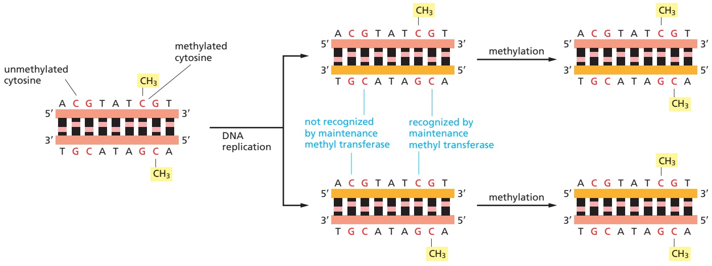

DNA. This demethylation may occur either by suppression of maintenance DNA methyl transferase activity, resulting in the passive loss of methyl groups during each round of DNA replication, or by DNA demethylases that actively remove methyl groups from DNA. Later in development, several de novo DNA methyl transferases come into play and methylate about 70% of the CG sequences in the genome. This extensive methylation occurs largely indiscriminately, although proteins that are bound to specific sequences on the genome can block the methylation of those sequences. In addition, some sequence-specific DNA-binding proteins direct DNA methylases to specific locations in genomes, resulting in very high local densities of methylation in the neighborhoods of those DNA-bound proteins. Conversely, DNA demethylases can also be directed to certain regions of the genome, resulting in loss of methyl groups in those regions. Despite these selective mechanisms, the patterns of overall methylation across differentiated cell types are broadly similar, and many methylated positions—on their own— appear to have little or no impact on gene expression.

DNA methylation has several uses in the vertebrate cell. A very important role of dense methylation is to work in conjunction with other gene expression control mechanisms to establish a particularly efficient form of gene repression. This combination of mechanisms enables unneeded eukaryotic genes to be repressed to a very high degree. The rate at which a vertebrate gene is transcribed can vary 106-fold between one tissue and another, and unexpressed vertebrate genes are much less “leaky” in terms of transcription than bacterial genes, in which the largest known differences in transcription rates between expressed and unexpressed gene states are only about 1000-fold.

Dense DNA methylation helps to repress transcription in several ways. The methyl groups on methylated cytosines lie in the major groove of DNA and interfere directly with the binding of some proteins (transcription regulators as well as the general transcription factors) required for transcription initiation. In addition, the cell contains a repertoire of proteins that bind specifically to methylated DNA. The best characterized of these also associate with histone-modifying enzymes, leading to a repressive, heterochromatin state where chromatin structure and DNA methylation act synergistically (**Figure 7–48**).

Many genes that are needed only in differentiated cells are tightly repressed in this way in embryonic cells. As differentiation proceeds, they become activated, although this process typically requires many steps, often involving “pioneer factors” (see Figure 7–13), histone demethylases, and DNA demethylases. The latter enzymes convert 5-methyl C to 5-hydroxymethyl C, which is later replaced by C either through DNA repair (see Figure 5–41A) or, passively, through multiple rounds of DNA replication. In addition, many genes active in embryonic tissues become repressed during differentiation by the mechanisms shown in Figure 7-48. The reactivation of these genes is one of the key steps in converting differentiated cells back into stem cells, as explained in Chapter 22.

#### CG-Rich Islands Are Associated with Many Genes in Mammals

Because of the way in which DNA repair enzymes work, methylated C nucleotides in the vertebrate genome tend to be eliminated in the course of evolution. Accidental deamination of an unmethylated C gives rise to U (see Figure 5–38B), which is not normally present in DNA and thus is recognized easily by the DNA repair enzyme uracil DNA glycosylase. The deamination product is thereby excised and replaced with a C, as discussed in Chapter 5. But accidental deamination of a 5-methyl C cannot be repaired in this way, for the deamination product is a T and so is indistinguishable from the other, nonmutant T nucleotides in the DNA. Although a special repair system exists to remove some of these incorrect T nucleotides, many of the deaminations escape detection, so that those C nucleotides in the genome that are methylated tend to mutate to T over evolutionary time.

During the course of evolution, more than three out of every four CGs have been lost in this way, leaving vertebrates with a remarkable deficiency of this dinucleotide. This ratio probably reflects a balance between methylated CG loss by DNA repair and CG gain by random mutation. The CG sequences that remain are very unevenly distributed in the genome; they are present at 10 times their average density in selected regions, called **CG islands**, which average 1000 nucleotide pairs in length. The human genome contains roughly 20,000 CG islands, and they usually include promoters of genes. For example, 60% of human proteincoding genes have promoters embedded in CG islands, and these include virtually all the promoters of the so-called housekeeping genes—those genes that code for the many proteins that are essential for cell viability and are thereforeMBoC7 m7.45/7.48 expressed in nearly all cells (**Figure 7–49**). Over evolutionary time scales, the CG

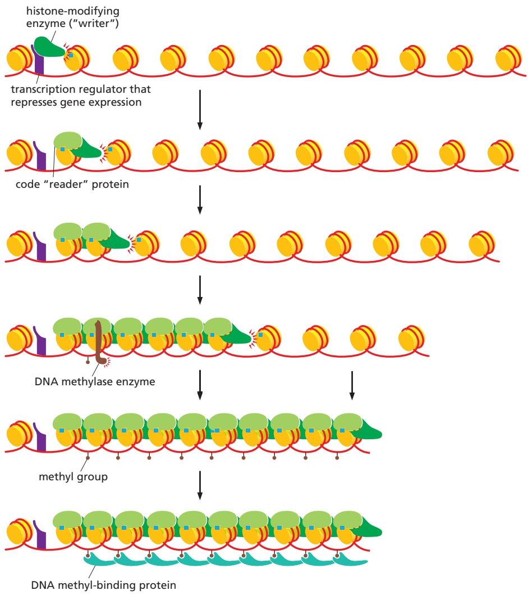

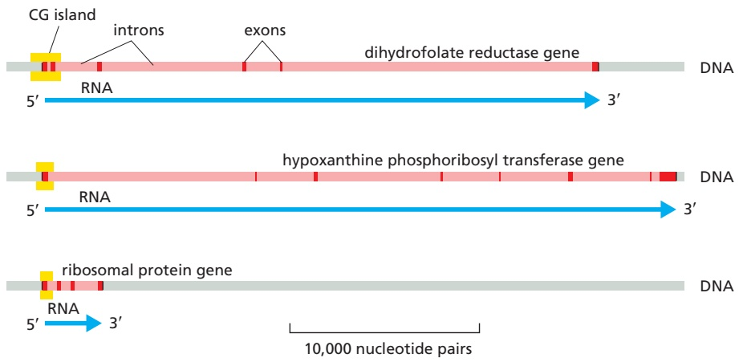

Figure 7–48 Multiple mechanisms can produce especially stable gene repression. In this schematic example, histone reader and writer proteins (discussed in Chapter 4), triggered by transcription regulators, establish a repressive form of chromatin whose nucleosomes are marked by the trimethylation of specific lysine amino acids in histones (see Figure 4–35, as well as Figure 7–27F). An additional layer of repression can occur when a de novo DNA methylase is attracted by the modified histones and methylates nearby cytosines in DNA; and these are, in turn, bound by DNA methyl-binding proteins. During DNA replication, some of the modified (blue dot) histones will be inherited by one daughter chromosome, some by the other, and in each daughter they can induce reconstruction of the same pattern of chromatin modifications (see Figure 4–44). At the same time, the mechanism shown in Figure 7–47 will cause both daughter chromosomes to inherit the same methylation pattern. This makes the two mechanisms for inheriting a repressed gene mutually reinforcing, accounting for the inheritance by daughter cells of both the histone and the DNA modifications. It can also explain the tendency of some chromatin modifications to spread along a chromosome (see Figure 4–39). This type of heterochromatin is assembled and disassembled on different genes as mammalian development proceeds, depending on whether the gene product is needed. For example, when endoderm precursor cells differentiate into the hepatocytes of the liver, an estimated 6000 genes are unpackaged from this repressive form of chromatin and become actively transcribed. At roughly the same time, about 1600 genes active in endoderm cells become packaged into this type of chromatin and are thereby tightly repressed in hepatocytes.

Figure 7–49 The CG islands surrounding the promoter in three mammalian housekeeping genes. The yellow boxes show the extent of each island. As for most genes in mammals, the exons (dark red) are very short relative to the introns (light red). (Adapted from A.P. Bird, Trends Genet. 3:342–347, 1987.)

Figure 7–50 A mechanism to explain both the marked overall deficiency of CG sequences and their clustering into CG islands in vertebrate genomes. The vertical white lines mark the location of CG dinucleotides in the DNA sequences, while red circles indicate the presence of a methyl group on the CG dinucleotide. CG sequences that lie in regulatory sequences of genes that are transcribed in germ cells are unmethylated and therefore tend to be retained in evolution. Methylated CG sequences, on the other hand, tend to be lost through deamination of 5-methyl C to T, unless the CG sequence is critical for survival.

islands were spared the accelerated mutation rate of bulk CG sequences because they remained unmethylated in the germ line (**Figure 7–50**).

CG islands remain unmethylated in most somatic tissues whether or not the associated gene is expressed. The unmethylated state is maintained by a group of proteins that bind specifically to unmethylated CG sequences in the genome and modify the neighboring nucleosomes by methylating histone H3 (on the lysine at position 4; see Figure 4–35). These modified nucleosomes somehow repel the de novo methylases, and the unmethylated state is thereby continually maintained. Unmethylated CG islands have several properties that make them particularly suitable for promoters. For example, some of the same proteins that protect them from methylation recruit additional histone-modifying enzymes that decompress the chromatin, making the islands particularly “promoter friendly.” As a result, RNA polymerase is often found bound to promoters within CG islands, even when the associated gene is not being actively transcribed. At unmethylated CG islands, the competition between polymerase binding and nucleosome assembly at promoters is thus always tipped toward the former. However, additional steps are needed for the final “push” to transcribe the adjacent gene; these are directed by transcription regulators that bind to cis-regulatory sequences of DNA, often well upstream from the CG islands.

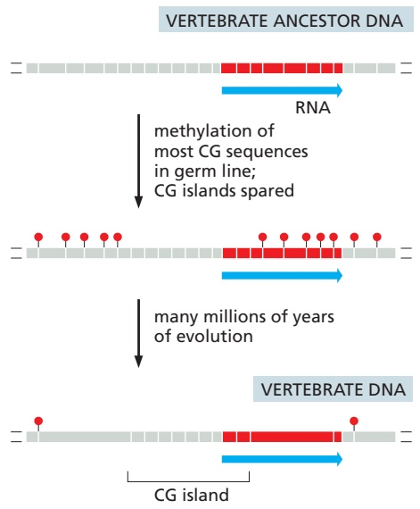

#### Genomic Imprinting Is Based on DNA Methylation

Mammalian cells are diploid, containing one set of genes inherited from the father and one set from the mother. The expression of a small minority of genes depends on which parent they came from: when the paternally inherited gene copy is active, the maternally inherited gene copy is silent, or vice versa. This phenomenon is called **genomic imprinting**.

Roughly 300 genes are imprinted in humans. Because only one copy of an imprinted gene is expressed, imprinting can “unmask” harmful mutations that would normally be covered by the other, functional copy. For example, Angelman syndrome, a disorder of the nervous system in humans that causes reduced mental ability and severe speech impairment, results from a gene deletion on one chromosomal homolog and the silencing, by imprinting, of the intact gene on the other homolog.

The insulin-like growth factor-2 (Igf2) gene in the mouse provides a wellstudied example of imprinting. Mice that do not express Igf2 at all are born half the size of normal mice. However, only the paternal copy of Igf2 is transcribed, and only this gene copy matters for the phenotype. As a result, mice with a mutated paternally derived Igf2 gene are stunted, while mice with a mutated maternally derived Igf2 gene are normal.

In the early embryo, genes subject to imprinting are marked by methylation according to whether they were derived from a sperm or an egg chromosome. In this way, DNA methylation is used as a mark to distinguish two copies of a gene that can be otherwise identical (**Figure 7–51**). Such imprinted genes are somehow protected from the wave of DNA demethylation that takes place shortly after fertilization (see pp. 435–436), enabling the somatic cells produced during embryonic development to “remember” the parental origin of each of the two copies of the gene and to regulate their expression accordingly. In most cases, the methyl imprint silences nearby gene expression. In some cases, however, it can activate expression of a gene. In the case of Igf2, for example, methylation of an insulator element on the paternally derived chromosome blocks its function and allows distant cis-regulatory sequences to activate transcription of the Igf2 gene.

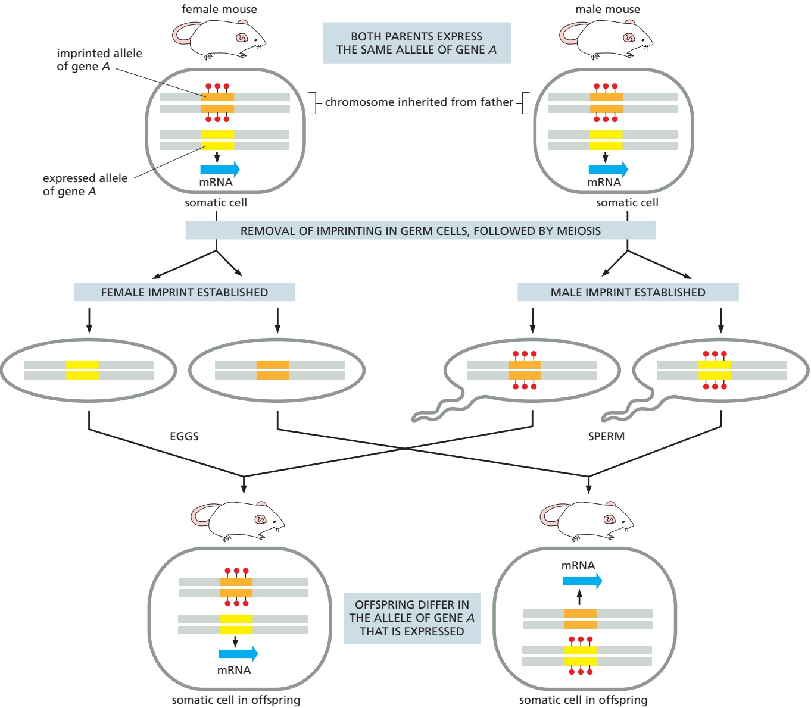

Figure 7–51 How imprinting can cause a non-Mendelian pattern of inheritance. The top portion of the figure shows a pair of homologous chromosomes in the somatic cells of two adult mice, one male and one female. In this example, both mice have inherited the top homolog from their father and the bottom homolog from their mother, and the paternal copy of a gene subject to imprinting (indicated in orange) is methylated, preventing its expression. The maternally derived copy of the same gene (yellow) is expressed. The remainder of the figure shows the outcome of a cross between these two mice. During germ-cell formation, but before meiosis, the imprints are erased and then, much later in germ-cell development, they are reimposed in a sex-specific pattern (middle portion of figure). In eggs produced from the female, neither allele of the A gene is methylated. In sperm from the male, both alleles of gene A are methylated. Shown at the bottom of the figure are two of the possible imprinting patterns inherited by the progeny mice; the mouse on the left has the same imprinting pattern as each of the parents, whereas the mouse on the right has the opposite pattern. If the two alleles of gene A are distinct (for example, if MBoC7 m7.48/7.51one codes for a mutant protein), the different imprinting patterns can cause phenotypic differences in the progeny mice, even though they carry exactly the same DNA sequences of the two A gene alleles.

Imprinting provides an important exception to classical “Mendelian” genetic behavior, and several hundred mouse genes are thought to be affected in this way. However, the majority of mouse genes are not imprinted, and therefore the rules of Mendelian inheritance apply to most of the mouse genome.

On the maternally derived chromosome, the insulator is not methylated, and the Igf2 gene is therefore not transcribed (**Figure 7–52A**).

Other cases of imprinting are also based on DNA methylation, but they employ different “downstream” mechanisms. Some involve long noncoding RNAs (lncRNAs), which are defined as RNA molecules more than 200 nucleotides in length that do not code for proteins. We discuss lncRNAs broadly at the end of this chapter; here, we focus on the role of a specific lncRNA in imprinting. In the case of the Kcnq1 gene, which codes for a voltage-gated calcium channel needed for proper heart function, the lncRNA is made only from the paternal allele (which is unmethylated), and it is not released by the RNA polymerase, remaining instead at its site of synthesis on the DNA template. This RNA in turn recruits the histone-modifying and DNA-methylating enzymes that direct the formation of repressive chromatin, which silences the protein-coding gene associated on the paternally derived chromosome (**Figure 7–52B**). The maternally derived gene, on the other hand, is immune to these effects because its imprinted methylation blocks the synthesis of the lncRNA but allows transcription of the adjacent protein-coding gene. Thus, like Igf2, the specificity of Kcnq1 imprinting arises from an inherited methylation pattern; the difference lies in the way these patterns cause the differential gene expression.

(A)

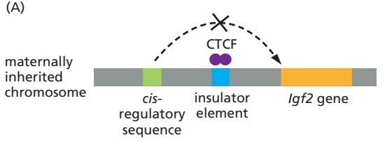

(B)

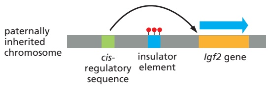

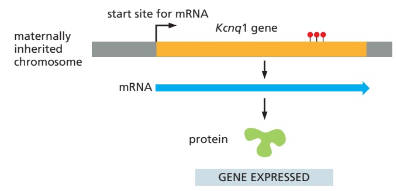

Why imprinting should exist at all is a mystery. In vertebrates, it is restricted to mammals that develop within the mother, and many of the imprinted genes are involved in fetal development. One idea is that imprinting reflects a middle ground in the evolutionary struggle between males to produce larger offspring and females to limit offspring size by “halving” the dosage of certain gene products that might accelerate growth. Whatever its purpose might be, imprinting provides startling evidence that features of DNA other than its sequence of nucleotides can be inherited.

#### A Chromosome-wide Alteration in Chromatin Structure Can Be Inherited

We have seen that DNA methylation and certain types of chromatin structure can be heritable, preserving patterns of gene expression across cell generations. Perhaps the most striking example of this effect occurs in mammals, in which an alteration in the chromatin structure of an entire chromosome can modulate the levels of expression of most genes on that chromosome.

Males and females differ in their sex chromosomes. Females have two X chromosomes, whereas males have one X and one Y chromosome. In humans, the X and Y sex chromosomes differ radically in gene content: the X chromosome is three times larger and contains about 900 protein-coding genes compared to the Y chromosome’s 55 protein-coding genes. Mammals have evolved a dosage compensation mechanism to ensure that the same amount of most of the

Figure 7–52 Some mechanisms of imprinting. (A) On chromosomes inherited from the female, the CTCF protein binds to an insulator (see Figure 7–28), blocking communication between cis-regulatory sequences (green) and the Igf2 gene (orange). Igf2 is therefore not expressed from the maternally inherited chromosome. Because of imprinting, the insulator on the male-derived chromosome is methylated (red circles); this inactivates the insulator by blocking the binding of the CTCF protein and allows the cis-regulatory sequences to activate transcription of the Igf2 gene. In other examples of imprinting, methylation simply blocks gene expression by interfering with the binding of proteins required for a gene’s transcription. (B) Imprinting of the mouse Kcnq1 gene. On the maternally derived chromosome, synthesis of the lncRNA is blocked by methylation of the DNA (red circles), and the Kcnq1 gene is expressed. On the paternally derived chromosome, the lncRNA is synthesized, remains in place, and by directing alterations in chromatin structure blocks expression of the Kcnq1 gene. Although shown as directly binding to lncRNA, the histone-modifying enzymes are likely to be recruited indirectly, through additional proteins.

(A)

(B)

Figure 7–53 X-inactivation. (A) The clonal inheritance in female mammals of a condensed, inactive X chromosome. (B) A calico cat, whose patches of color reflect the random nature of the X-inactivation process. (B, bluecaterpillar/ Deposit photos.)

X-chromosome gene products is made in both male and female cells, despite the fact that females contain twice as many X-chromosome genes. Mutations that interfere with this dosage compensation are generally lethal.

Mammals achieve dosage compensation by the transcriptional inactivation of one of the two X chromosomes in female somatic cells, a process known as **X-inactivation**. As a result of X-inactivation, two X chromosomes can coexist within the same nucleus, be exposed to the same diffusible transcription regulators, and yet differ entirely in their expression.

Early in the development of a female embryo, when it consists of a few hun-MBoC7 m7.50/7.53 dred cells, one of the two X chromosomes in each cell becomes highly condensed into a type of heterochromatin. In placental mammals, the initial choice of which X chromosome to inactivate—the maternally inherited one $\left( \mathrm { X } _ { \mathrm { m } } \right)$ or the paternally inherited one $\mathrm { ( X _ { p } ) }$ —appears to be random. And once either $\mathrm { X _ { p } }$ or $\mathrm { X _ { m } }$ has been inactivated, it remains silent throughout all subsequent cell divisions of that cell and its progeny, indicating that the inactive state is faithfully maintained through many cycles of DNA replication and mitosis. Because X-inactivation is random and takes place after several hundred cells have already formed in the embryo, every female is a mosaic of clonal groups of cells in which either $\mathrm { X _ { p } }$ or $\mathrm { X _ { m } }$ is silenced (**Figure 7–53**), distributed in small clusters in the adult animal because sister cells tend to remain close together during later stages of development (**Figure 7–54**).

X-inactivation creates the orange and black coat coloration of some female cats (see Figure 7–53B). In these “calico” cats, one X chromosome carries a gene that produces orange hair color, and the other X chromosome carries an allele

Figure 7–54 Photoreceptor cells in the retina of a female mouse showing patterns of X-inactivation. Using genetic engineering techniques (described in Chapter 8), the germ line of a mouse was modified so that one copy of the X chromosome (if active) makes a green fluorescent protein and the other (if active) a red fluorescent protein. Both proteins concentrate in the nucleus, and, in the field of cells shown here, it is clear that only one of the two X chromosomes is active in each cell. If both chromosomes were active, the nuclei would fluoresce both red and green, and therefore appear yellow. (From H. Wu et al., Neuron 81:103–119, 2014. With permission from Elsevier.)

of the same gene that results in black hair color; it is the random X-inactivation that produces patches of cells of two distinctive colors. In contrast, male cats of this genetic stock are either solid orange or solid black, depending on which X chromosome they have inherited from their mothers. Although X-inactivation is maintained over thousands of cell divisions, it is reversed during germ-cell formation, so that all the haploid oocytes contain an active X chromosome and can express X-linked gene products.

#### The Mammalian X-Inactivation in Females Is Triggered by the Synthesis of a Long Noncoding RNA

How is an entire chromosome transcriptionally inactivated? In humans, the chromosome-wide inactivation process begins with the synthesis of a long non-coding RNA, called **Xist**, whose gene lies on the X chromosome. This transcript (about 20,000 nucleotides in length) is synthesized by only one of the two X chromosomes in females, and exactly how this seemingly random choice is made remains to discovered. Once an Xist RNA molecule is synthesized, it does not leave the X chromosome from which it was made; rather, it diffuses along only that chromosome. Ultimately, about 2000 molecules of Xist are synthesized per X chromosome, and they eventually coat the chromosome that produces it. The spread of Xist across the chromosome does not itself cause transcriptional silencing; this long RNA contains binding sites for many different proteins that carry out the actual gene silencing. These include DNA methylases, histone-modifying enzymes, and structural components specific to the inactive X chromatin. As a result, extensive methylation of the inactive X occurs (including at CG islands), and the chromosome is folded into compact structures that are generally resistant to transcription (**Figure 7–55**). These multiple layers, each of which can be self-propagating (see Figure 7–48), ensure that the randomly chosen X chromosome remains inactive through multiple cell divisions.

Not every gene on the inactive X chromosome is transcriptionally silenced. Of the approximately 900 protein-coding genes on the human X chromosome, 15–20% remain actively expressed after the chromosome-wide inactivation process has been completed. And for many of these genes, both copies—one from the active X and one from the inactive X—must be expressed to obtain sufficient levels of their gene products for proper development to occur.

How do select genes escape silencing after the majority of the X chromosome is rendered transcriptionally inactive? As we saw in Chapter 4 and earlier in this chapter, transcriptionally active genes generally occur in DNA loops that are held in place by insulator proteins such as CTCF (see Figure 7–28), and this is the case for the “escapees” of the inactive X chromosome. These loops are believed to extend from the bulk of the tightly packaged chromosome. In contrast, most of the inactive genes lie in the interior of the inactive X chromosome, which is depleted for CTCF. It has been proposed that X-inactivation is accompanied by the formation of a specialized biomolecular condensate, where the proteins and RNAs needed for gene repression are kept at high local concentrations; according to this model, the loops of active genes would extend outward, beyond the boundary of the condensate.

We have described the way that placental mammals deal with dosage compensation on the X chromosome, but the details of this process differ from those in most other animals in important ways. For example, in marsupials, the choice of which X chromosome to inactivate is not random; instead, the X chromosome inherited from the father is automatically silenced. And in flies, dosage compensation takes place in the male, where the single X chromosome is upregulated approximately twofold to match the female dose. Finally, in nematode worms, the hermaphrodites reduce gene expression by roughly half on both X chromosomes to match the single X-chromosome dosage in males.

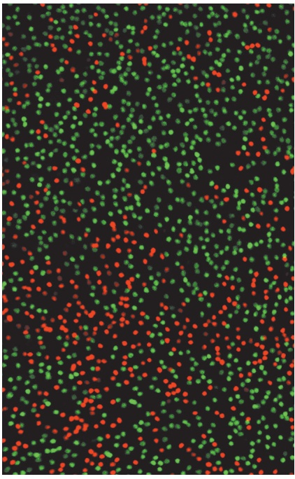

50 µm

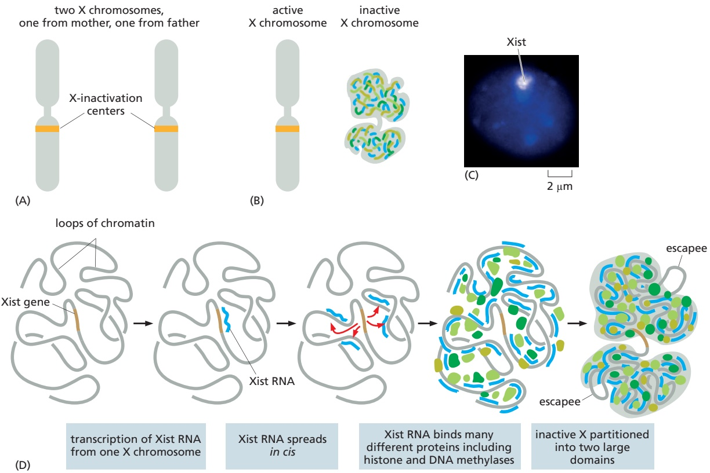

The fundamentally different mechanisms of dosage compensation among MBoC7 m7.52/7.55 animals suggest that it has been a relatively recent evolutionary innovation. We have some clues for its origin in humans. Some of the key components in X-inactivation also function to repress the many transposons in the human genome, a process we discuss later in the chapter. It has been proposed that Xist evolved from multiple transposons that inserted into our X chromosome, eventually “tricking” the cell into inactivating the whole chromosome.

#### Stable Patterns of Gene Expression Can Be Transmitted to Daughter Cells

Imprinting and X-inactivation are examples of **monoallelic gene expression**, where only one of the two copies of a gene is expressed in a diploid genome. In addition to the silenced genes on the X chromosome and the 300 or so genes that are imprinted, there are another 1000–2000 human genes that exhibit monoallelic expression. Like X-inactivation (but unlike imprinting), the choice of which copy of the gene is expressed and which is silenced appears random. Yet once the choice is made, it can persist for many cell divisions. Because the choice is often made relatively late in development, cells of the same tissue in the same individual can express different copies of a given gene. In other words, somatic tissues are often mosaics, where different clones of cells have subtly different patterns of gene expression. The mechanisms responsible for this type of monoallelic expression and its memory through cell divisions are not known in detail, and its general purpose—if any—is poorly understood. However, several different mechanisms are known that may contribute to such inheritance, as we now discuss.

In considering the general question of cell memory, it is useful to return to our discussion of the different cell types in an organism. As we have seen, once a cell in an organism differentiates into a particular cell type, it generally remains

Figure 7–55 Mammalian X-inactivation. The two X chromosomes in a female mammal (A) before and (B) after X-inactivation. (C) At an early stage of X-chromosome inactivation, mouse chromosomes have been hybridized with a fluorescent probe that is complementary to the Xist RNA, which coats only the inactive X chromosome; the remaining DNA has been stained blue with a dye. (D) A schematic illustration of how the continuing synthesis of Xist RNA at the Xist locus moves Xist molecules outward, across the chromosome. As Xist molecules coat the chromosome, they begin to associate with a variety of structural proteins and enzymes that modify histones and DNA. [Although some of these proteins are bound to the chromosome prior to Xist spreading (not shown), most are brought in by direct association with Xist.] The two major chromosome domains that are created at the completion of the inactivation process have been proposed to be biomolecular condensates. Genes that escape the inactivation process are shown as loops, extending from the compact domains. (B and D, based on a figure supplied by Agnese Loda and Edith Heard; C, from L. Giorgetti et al., Nature 535:575–579, 2016. Reproduced with permission from SNCSC.)

specialized in that way; if it divides, its daughters inherit the same specialized character. Perhaps the simplest way for a cell to remember its identity is through a positive feedback loop in which a key transcription regulator activates, either directly or indirectly, the transcription of its own gene (see Figure 7–42). As we discussed earlier in this chapter, interlocking positive feedback loops of the type shown in Figure 7–40B provide greater stability by buffering the circuit against fluctuations in the level of any one transcription regulator. Because transcription regulators are synthesized in the cytosol and diffuse throughout the nucleus, feedback loops based on this mechanism will affect both copies of a gene in a diploid cell. However, as discussed earlier, the expression pattern of a gene on one chromosome can differ from that of the copy of the same gene on the other chromosome (as in X-inactivation or in imprinting). Such differences can also be inherited through many cell divisions, and they cannot be explained by this type of transcription feedback loop.

The ability of a daughter cell to retain a memory of the gene expression patterns that were present in the parent cell is an example of **epigenetic inheritance**, which we define as a heritable alteration in a cell or organism’s phenotype that does not result from changes in the nucleotide sequence of DNA. In **Figure 7–56**, we illustrate four mechanisms that can produce epigenetic inheritance, contrasting those self-propagating mechanisms that work in cis, affecting only one chromosomal copy, with self-propagating mechanisms that work in trans, affecting both chromosomal copies of a gene.

It is important to note that many of the changes in gene expression that occur in cells are transient and depend on the continued presence of a signal that is

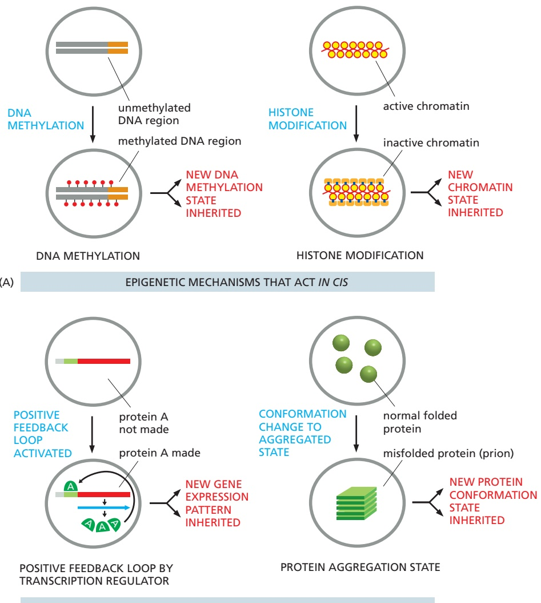

Figure 7–56 Four distinct mechanisms that can produce an epigenetic form of inheritance in an organism. (A) Two epigenetic mechanisms that act in cis. As discussed in this chapter, a maintenance methylase can propagate specific patterns of cytosine methylation (see Figure 7–47). Alternatively, as discussed in Chapter 4, a histone-modifying enzyme that replicates the same covalent modification that attracts it to chromatin can result in a chromatin structure being self-propagating (see Figure 4–44). Note that the term epigenetic is sometimes misused to refer to all covalent modifications of histones, whether or not they are self-propagating. But many histone modifications are erased each time a cell divides, and they therefore do not fit our definition. (B) Two epigenetic mechanisms that act in trans. Positive feedback loops formed by transcription regulators are found in all species and are probably the most common form of cell memory. As discussed in Chapter 3, some proteins can form self-propagating prions (see Figure 3–33). When these proteins are involved in gene expression, prions can transmit a particular pattern of gene expression to daughter cells.

external to the cell. When the signal disappears, so does the new gene expression pattern; in other words, the pattern is not directly heritable (see Chapter 15). Gene expression changes of both types—both heritable and non-heritable—are crucial for the function of all cells on earth. And the discovery more than 60 years ago that gene expression can be regulated by cells ranks as one of the fundamental principles of biology.

#### Summary

In addition to the positive feedback loops created by transcription regulators, eukaryotic cells can use both inherited forms of DNA methylation and inherited states of chromatin condensation as mechanisms for generating a cell memory of gene expression patterns. An especially dramatic case that involves chromatin condensation is the inactivation of an entire X chromosome in female mammals. DNA methylation underlies the phenomenon in mammals of genomic imprinting, in which the expression of a gene depends on whether that gene was inherited from the mother or the father. All of these mechanisms allow cells to pass on gene expression patterns to their progeny cells, contributing to the epigenetic inheritance that makes complex multicellular life possible.

<!-- END EN EN07-H048-H055 -->

### 英文补充：转录后调控：剪接、RNA编辑与定位

> 对应中文板块：转录后调控：剪接、RNA编辑与定位。英文来源：Molecular Biology of the Cell，第7版，第7章；[本章完整原文](../来源/英文教材/07_Control_of_Gene_Expression/chapter.md)。物理PDF页码范围：436–513（整章范围）。

<!-- BEGIN EN EN07-H056-H066 -->
#### POST-TRANSCRIPTIONAL CONTROLS

In principle, every step required for the process of gene expression can be controlled. Indeed, one can find examples of each type of regulation, and many genes are known to be regulated by multiple mechanisms. As we have seen, controls on the initiation of gene transcription are one critical form of regulation for all genes. But other, equally important controls often act later in the pathway from DNA to protein to change the amount of gene product that is made—and in some cases, even to alter the amino acid sequence of a protein product. These **post-transcriptional controls**, which operate after RNA polymerase has bound to the gene’s promoter and has begun its RNA synthesis, are crucial for the regulation of many genes.

In the following sections, we consider the varieties of post-transcriptional regulation in a temporal order, following the sequence of events that an RNA molecule might experience after its transcription has begun (**Figure 7–57**).

#### Transcription Attenuation Causes the Premature Termination of Some RNA Molecules

Figure 7–57 Post-transcriptional controls of gene expression. The final synthesis rate of a protein can, in principle, be controlled at any of the steps listed in capital letters, although only a few of the steps depicted here are likely to be critical for the regulation of any one particular protein. As we shall discuss, the 3′ end cleavage, splicing, editing, and translation recoding steps also make it possible for MBoC7 m7.54/7.57the cell to produce more than one protein variant from the same gene.

It has long been known that the expression of some genes is inhibited by premature termination of transcription, a phenomenon called transcription attenuation. In some of these cases, the nascent RNA chain adopts a structure that causes it to interact with the RNA polymerase in such a way as to abort its transcription. When the gene product is required, regulatory proteins bind to the nascent RNA chain to remove the attenuation, allowing the transcription of a complete RNA molecule.

A well-studied example of transcription attenuation occurs during the life cycle of HIV, the human immunodeficiency virus that is the causative agent of acquired immune deficiency syndrome, or AIDS. Once the HIV genome has been integrated into the host genome, the viral DNA is transcribed by the cell’s RNA polymerase II (see Figure 5–61). However, this polymerase usually terminates transcription after synthesizing transcripts of several hundred nucleotides and thus fails to efficiently transcribe the entire viral genome. But when conditions for viral growth are optimal, a virus-encoded protein called Tat, which binds to a specific stem–loop structure in the nascent RNA that contains a “bulged base,” prevents this premature termination (see Figure 6–92). Once bound to this specific RNA structure (called TAR), Tat assembles several host-cell proteins that allow the RNA polymerase to continue transcribing. The normal role of at least some of these proteins is to prevent pausing and premature termination by RNA polymerase when it transcribes normal cell genes. A normal cell mechanism has apparently been highjacked by HIV to permit transcription of its genome to be controlled by a single viral protein.

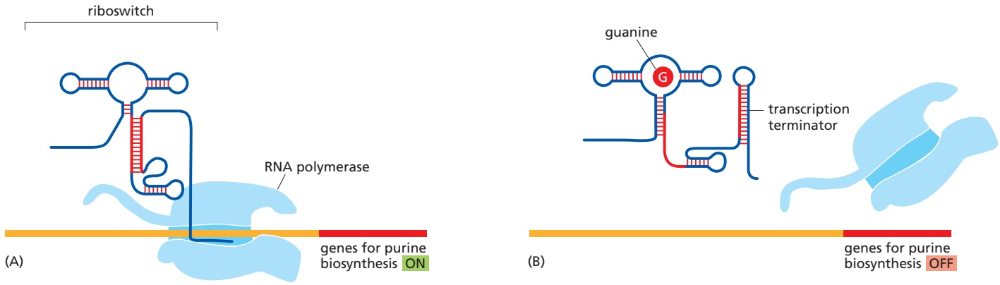

Figure 7–58 A riboswitch that responds to guanine. In this example from bacteria, the riboswitch controls expression of the purine biosynthetic genes. (A) When guanine levels in cells are low, an elongating RNA polymerase transcribes the purine biosynthetic genes, and the enzymes needed for guanine synthesis are therefore expressed. (B) When guanine is abundant, it binds the riboswitch, causing it to undergo a conformational change that forces the RNA polymerase to terminate transcription (see Figure 6–11). (C) Guanine (red) bound to the riboswitch. Only those nucleotides that form the guanine-binding pocket are shown. Many other riboswitches exist, including those that recognize S-adenosylmethionine, coenzyme B12, flavin mononucleotide, adenine, lysine, and glycine. (A and B, adapted from M. Mandal and R.R. Breaker, Nat. Rev. Mol. Cell Biol. 5:451–463, 2004; and C.K. Vanderpool and S. Gottesman, Mol. Microbiol. 54:1076–1089, 2004; C, adapted from A. Serganov et al., Chem. Biol. 11:1729–1741, 2004. PDB code: 1Y27.)

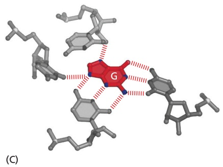

#### Riboswitches Probably Represent Ancient Forms of Gene Control

In Chapter 6, we discussed the idea that, before modern cells arose on Earth, RNA played the role of both DNA and proteins, storing hereditary information and catalyzing chemical reactions (see pp. 389–393). The discovery of riboswitches shows that RNA can also form control devices. Riboswitches are short sequences of RNA that change their conformation when they bind a specific small molecule,MBoC7 m7.55/7.58 such as a metabolite. Riboswitches are often located near the 5′ end of mRNAs, and they fold while the mRNA is being synthesized, blocking or permitting progress of the RNA polymerase according to whether the regulatory small molecule is bound (**Figure 7–58**).

Riboswitches are particularly common in bacteria, where they sense key small metabolites in the cell and adjust gene expression accordingly. Each recognizes only the appropriate small molecule with high specificity. In many cases, every chemical feature of the small molecule is read by the RNA, and the binding affinities observed are as tight as those typically observed between small molecules and proteins (see Figure 7–58C).

Riboswitches are perhaps the most economical examples of gene control devices, inasmuch as they completely bypass the need for regulatory proteins. In the example illustrated (see Figure 7–58), the riboswitch controls transcription elongation, but riboswitches can also regulate other steps in gene expression, as we shall see later in this chapter. The fact that highly sophisticated gene control devices can be made from short sequences of RNA provides important support for the early “RNA world” hypothesis.

#### Alternative RNA Splicing Can Produce Different Forms of a Protein from the Same Gene

As discussed in Chapter 6, RNA splicing shortens the transcripts of many eukaryotic genes by removing the intron sequences from mRNA precursors. A cell can splice an RNA transcript differently and thereby make different

Figure 7–59 Patterns of alternative RNA splicing. Dark blue boxes mark exon sequences that are retained in spliced mRNAs. Light blue boxes mark possible exon sequences that are included only in the indicated mRNAs. The boxes are joined by red lines to indicate where intron sequences (yellow) are removed. In back splicing (discussed later in the chapter), a single exon is removed as a circular RNA molecule. (Adapted from H. Keren et al., Nat. Rev. Genet. 11:345–355, 2010.)

polypeptide chains from the same gene—a process called **alternative RNA splicing** (**Figure 7–59**; see also Figure 6–27). Many animal genes produce multiple proteins in this way.

When different splicing possibilities exist at several positions in the transcript, a single gene can produce dozens of different proteins. In one extreme case, a single Drosophila gene can, in principle, produce as many as 38,000 different proteins through alternative splicing (**Figure 7–60**), although only a fraction of these forms have thus far been experimentally observed. Considering that the Drosophila genome has approximately 14,000 protein-coding genes, it is clear that the protein complexity of an organism can greatly exceed the number of its genes. This example also illustrates the perils in equating gene number with an organism’s complexity. For example, alternative splicing is rare in single-celled budding yeasts but very common in flies. Budding yeast has about 6200 genes, only about 300 of which are subject to splicing, and nearly all of these have only a single intron. The fact that flies have only 2–3 times as many genes as yeasts greatly underestimates the difference in complexity of these two genomes.

In some cases, alternative RNA splicing occurs because there is an intron sequence ambiguity: the standard spliceosome mechanism for removing intron sequences (discussed in Chapter 6) is unable to distinguish clearly between two or more alternative pairings of 5′ and 3′ splice sites, so that different choices are made by chance on different individual transcripts. Where such constitutive alternative splicing occurs, several versions of the protein encoded by the gene are made in all cells in which the gene is expressed.

In many cases, however, alternative RNA splicing is regulated. In the simplest examples, regulated splicing is used to switch from the production of a

Figure 7–60 Alternative splicing of RNA transcripts of the Drosophila Dscam gene. Dscam proteins have several different functions. In cells of the fly immune system, they mediate the phagocytosis of bacterial pathogens. In cells of the nervous system, they are needed for proper wiring of neurons. Each mature mRNA contains 24 exons, four of which (denoted A, B, C, and D) are present in the Dscam gene as arrays of alternative exons. Each RNA contains 1 of 12 alternatives for exon A (red), 1 of 48 alternatives for exon B (green), 1 of 33 alternatives for exon C (blue), and 1 of 2 alternatives for exon D (yellow). This figure shows only one of the many possible splicing patterns (indicated by the red line and by the mature mRNA below it). Each variant Dscam protein folds into roughly the same structure (predominantly a series of extracellular immunoglobulin-like domains linked to a membrane-spanning region; see Figure 24–48), but the amino acid sequences of the domains vary according to the splicing pattern. The diversity of Dscam variants contributes to the plasticity of the immuneMBoC7 m7.57/7.60 system, as well as to the formation of complex neural circuits. (Adapted from D.L. Black, Cell 103:367–370, 2000. With permission from Elsevier.)

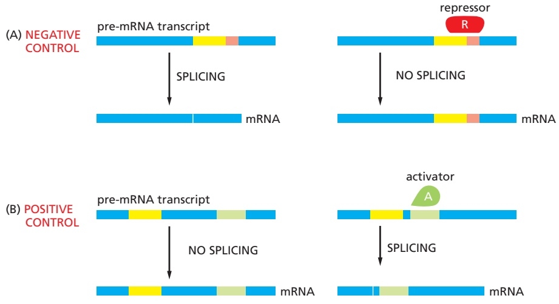

Figure 7–61 Negative and positive control of alternative RNA splicing. (A) In negative control, a repressor protein binds to a specific sequence in the pre-mRNA transcript and blocks access of the splicing machinery to a splice junction. This often results in the use of a secondary splice site, thereby producing an altered pattern of splicing (see Figure 7–59). (B) In positive control, the splicing machinery is unable to remove a particular intron sequence efficiently without assistance from an activator protein. Because an RNA molecule is flexible, the nucleotide sequences that bind these activators can be located many nucleotide pairs from the splice junctions they control, and they are often called splicing enhancers, by analogy with the transcription enhancers mentioned earlier in this chapter.

nonfunctional protein to the production of a functional one (or the other way around). The transposase that catalyzes the transposition of the Drosophila P element, for example, is produced in a functional form in germ cells and a nonfunctional form in somatic cells of the fly, allowing the P element to spread throughout the genome of the fly without causing damage in somatic cells (see Figure 5–59 and Table 5–4, p. 308). This difference in transposon activity has been traced to the presence of an intron sequence in the transposase RNA that is removed only in germ cells.

In addition to enabling switching from the production of a functional protein to the production of a nonfunctional one (or vice versa), the regulation of RNA splicing can generate different versions of a protein in different cell types, according to the needs of the cell. Tropomyosin, for example, is produced in specialized forms in different types of cells (see Figure 6–27). Cell-type-specific forms of many other proteins are produced in the same way.

RNA splicing can be regulated either negatively, by a regulatory molecule that prevents the splicing machinery from gaining access to a particular splice site on the RNA, or positively, by a regulatory molecule that helps direct the splicingMBoC7 m7.58/7.61 machinery to an otherwise overlooked splice site (**Figure 7–61**).

Because of the plasticity of RNA splicing, the blocking of a “strong” splicing site will often expose a “weak” site and result in a different pattern of splicing. Thus, the splicing of a pre-mRNA molecule can be thought of as a delicate balance between competing splice sites—a balance that can easily be tipped by the effects on splicing of RNA-bound regulatory proteins.

#### The Definition of a Gene Has Been Modified Since the Discovery of Alternative RNA Splicing

The discovery that eukaryotic genes usually contain introns and that their coding sequences can be assembled in more than one way raised new questions about the definition of a gene. A gene was first clearly defined in molecular terms in the early 1940s from work on the biochemical genetics of the fungus Neurospora. Until then, a gene had been defined as a region of the genome that segregates as a single unit during meiosis and gives rise to a definable phenotypic trait—such as a red or a white eye in Drosophila or a round or wrinkled seed in peas. The Neurospora findings revealed that most genes correspond to a region of the genome that directs the synthesis of a single enzyme, leading to the view that each gene encodes one polypeptide chain. As more was learned about the mechanism of gene expression in the 1960s, a gene became identified as that stretch of DNA that was transcribed into the RNA coding for either a single polypeptide chain or a single structural RNA such as a tRNA or an rRNA molecule. The discovery of introns in the late 1970s could be readily accommodated by the original definition of a gene, provided that a single polypeptide chain was specified by the RNA transcribed from any one DNA sequence. But now that it is clear that many DNA sequences in eukaryotic cells can produce a set of distinct (but related) proteins by means of alternative RNA splicing, how should a gene be defined?

It is relatively rare that a single transcription unit produces two very different eukaryotic proteins, and in those cases, the two proteins are considered to be produced by distinct genes that overlap on the chromosome. It seems unnecessarily complex, however, to consider most of the protein variants produced by alternative RNA splicing as being derived from overlapping genes. A more sensible alternative is to modify the original definition to consider any DNA sequence that is transcribed as a single unit and encodes a set of closely related polypeptide chains (protein isoforms) as a single protein-coding gene. This definition of a **gene** also accommodates those DNA sequences that encode protein variants produced by post-transcriptional processes other than RNA splicing, such as the transcript cleavage and RNA editing discussed shortly.

#### Back Splicing Can Produce Circular RNA Molecules

We have seen that pre-mRNA splicing is remarkably plastic, and recent discoveries have revealed a new surprise. Some pre-mRNAs undergo what is termed “back splicing” where a 3′ splice site is joined to a downstream 5′ splice site, thereby reversing the normal joining order (see Figure 7–59). This process typically releases a single exon sequence as a covalently closed, circular RNA molecule. These unusual RNAs are exported from the nucleus but are rarely translated into protein. Instead, they have been proposed to “soak up” complementary RNAs as well as RNA-binding proteins and to provide scaffolds for multisubunit RNA–protein complexes. Because they lack free ends, which are the normal substrates for RNA-degrading enzymes, these circular RNAs are much more stable than typical mRNAs. Although usually made in small amounts, their stability can allow them to accumulate to high concentrations in cells, and several specific circular RNAs are especially prominent in cells of the mammalian brain and immune systems. Although we still have much to learn about these peculiar RNAs, they attest to the many surprises that RNA biology has in store for us. We shall revisit this general issue at the end of the chapter, when we discuss the diversity of noncoding RNAs.

#### A Change in the Site of RNA Transcript Cleavage and Poly-A Addition Can Change the C-terminus of a Protein

We saw in Chapter 6 that the 3′ end of a eukaryotic mRNA molecule is not formed by the termination of RNA synthesis by the RNA polymerase, as it is in bacteria. Instead, it results from an RNA cleavage reaction that is catalyzed by additional proteins while the transcript is elongating (see Figure 6–36). A cell can control the site of this cleavage so as to change the C-terminus of the resultant protein. In the simplest cases of alternate cleavage and polyadenylation, one protein variant is simply a truncated version of the other; in many other cases, however, the alternative cleavage and polyadenylation sites lie within intron sequences, and the pattern of splicing is thereby altered. This process can produce two closely related proteins that differ only in the amino acid sequences at their C-terminal ends. An analysis of RNAs produced from the human genome in a variety of cell types indicates that as many as half of all human protein-coding genes produce mRNA species with more than one site of polyadenylation.

A well-studied example of regulated polyadenylation is the switch from the synthesis of membrane-bound to secreted antibody molecules that occurs during the development of B lymphocytes (see Figure 24–22). Early in the life history of a B lymphocyte, the antibody it produces is anchored in the plasma membrane, where it serves as a receptor for antigen. Antigen stimulation causes B lymphocytes to multiply and to begin secreting their antibody. The secreted form of the antibody is identical to the membrane-bound form except at the extreme Cterminus. In this part of the protein, the membrane-bound form has a long string of hydrophobic amino acids that traverses the lipid bilayer of the membrane, whereas the secreted form has a much shorter string of hydrophilic amino acids. The switch from membrane-bound to secreted antibody is generated through a change in the site of RNA cleavage and polyadenylation, as shown in **Figure 7–62**.

(A) resting B cell, low levels of CstF

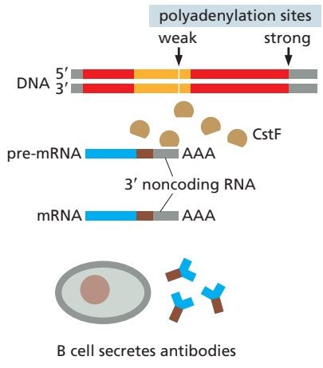

(B) activated B cell, high levels of CstF

Figure 7–62 Regulation of the site of RNA cleavage and poly-A addition determines whether an antibody molecule is secreted or remains membrane-bound. (A) In unstimulated B lymphocytes, a long RNA transcript is produced, and the intron sequence (yellow) near its 3′ end is removed by RNA splicing to provide an mRNA molecule that codes for a membrane-bound antibody molecule. Only a portion of the antibody gene is shown in the figure; the actual gene and its mRNA would extend further to the left of the diagram. (B) After antigen stimulation, the RNA transcript is cleaved and polyadenylated upstream from the intron’s 3′ splice site. As a result, some of the intron sequence remains as a coding sequence in the short transcript, specifying the hydrophilic C-terminal portion of the secreted antibody molecule (brown). (Adapted from D. Di Giammartino et al., Mol. Cell 43:853–866, 2011.)

The change is caused by an increased concentration of a subunit of a protein (CstF) that promotes RNA cleavage (see Figure 6–36). The first cleavage/poly-A addition site that a transcribing RNA polymerase encounters is suboptimal and is usually skipped in unstimulated B lymphocytes, leading to production of the longer RNA transcript. But when activated to produce antibodies, the B lymphocyte produces more CstF; as a result, cleavage now occurs at the suboptimal site, and the shorter transcript is produced. In this way, a change in concentration of a general RNA-processing factor can have a dramatic effect on the expression of a specific gene.

#### Nucleotides in mRNA Can Be Covalently Modified

In the previous chapter, we saw how specialized proteins modify the 5′ and 3′ ends of eukaryotic mRNAs and how a complex assembly of proteins and RNA molecules removes intron sequences. However, mRNA molecules are subject to more than 100 additional kinds of covalent changes, predominantly chemical modifications of individual bases, a few of which are shown in **Figure 7–63**. The reasons for most of these modifications of individual mRNAs remain a mystery. We do not know what they might do or even if they are biologically meaningful, inasmuch as many of them may simply represent “spillover” from the processes that modify the highly abundant tRNA and rRNA molecules (see Figures 6–43 and 6–57).

One of the most prominent and best understood mRNA modifications is the methylation of the amino group on adenine to produce N6-methyladenosine (see Figure 7–63). This addition is constantly being removed by protein complexes that contain demethylases, or “erasers,” making the modification temporary. The methylases responsible for this modification typically act as the RNA is being transcribed; they recognize short sequences in the emerging RNA (often with the help of other proteins) and methylate the adenosines adjacent to these sequences.

Figure 7–63 Four of the most prominent of the many types of covalent base modifications found in mRNA. Differences from the normal nucleosides are indicated in red. Each base is joined to a ribose sugar (not shown) by the indicated bond to form the nucleoside.

In humans an average of 1–3 N6-methyladenosine modifications occur on each mRNA molecule. What are their consequences? One effect is the destabilization of the hairpin helices that are formed by intramolecular base-pairing. This modification can thereby change the secondary structure of mRNA, which in some cases alters the splicing pattern of transcripts. In other cases, the modification promotes destruction of mRNAs through “reader” proteins that attract the RNA degradation machinery. A rapid destruction of certain mRNAs is especially important during cell differentiation, when the mRNAs produced earlier need to be cleared out. Finally, other specific N6-methyladenosine modifications are known to promote translation of the modified mRNA. In this case, reader proteins that attract the translation machinery come into play. The many other mRNA modifications, some of which are shown in Figure 7–63, are more poorly understood, but some may likewise help to determine exactly how each mRNA is to be handled by the cell.

#### RNA Editing Can Change the Meaning of the RNA Message

The molecular mechanisms used by cells are providing scientists with a continual source of surprises. An example is a covalent modification of mRNA that alters its nucleotide sequence and thereby changes the coded message it carries—a process known as **RNA editing**.

In animals, two principal types of such RNA editing occur: the deamination of adenine to produce inosine (A-to-I editing) and, less frequently, the deamination of cytosine to produce uracil (C-to-U editing; see Figure 5–43). Because these chemical modifications alter the pairing properties of the bases (I pairs with C, and U pairs with A), they can have profound effects on the meaning of the RNA. If the edit occurs in a coding region, it can either change the amino acid sequence of the protein or produce a truncated protein by creating a premature stop codon. Edits that occur outside coding sequences can affect the pattern of pre-mRNA splicing, the transport of mRNA from the nucleus to the cytosol, the efficiency with which the RNA is translated, or the base-pairing between microRNAs (miRNAs) and their mRNA targets, a form of gene regulation that will be discussed later in the chapter.

The process of A-to-I editing is particularly prevalent in humans, where it occurs for approximately 1000 genes. Enzymes called ADARs (adenosine deaminases acting on RNA) perform this type of editing; these enzymes recognize a double-strand RNA structure that is formed through base-pairing between the site to be edited and a complementary sequence located elsewhere on the same RNA molecule, typically in an intron (**Figure 7–64**). The structure of the double-stranded RNA specifies whether the mRNA is to be edited, and if so, where the edit should be made. An especially important example of A-to-I editing takes place in the mRNA that codes for a transmitter-gated ion channel in the brain. A single edit changes a glutamine to an arginine; the affected amino acid lies on the inner wall of the channel, and the editing change alters the $\mathrm { C a ^ { 2 + } }$ permeability of the channel. Mutant mice that cannot make this edit are prone to epileptic seizures and die during or shortly after weaning, showing that editing of the ion channel RNA is normally crucial for proper brain development.

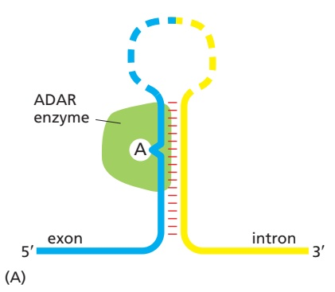

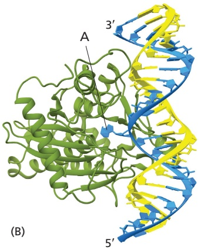

Figure 7–64 Mechanism of A-to-I RNA editing in mammals. (A) Typically, a sequence complementary to the position of the edit is present in an intron, and the resulting double-strand RNA structure attracts an A-to-I editing enzyme (ADAR). In the case illustrated, the edit is made in an exon; in most cases, however, it occurs in noncoding portions of the mRNA. Editing by ADAR takes place in the nucleus, before the pre-mRNA has been fully processed. Mice and humans have two ADAR genes: ADR1 is expressed in many tissues and is required in the liver for proper red blood cell development; ADR2 is expressed only in the brain, where it is required for proper brain development. (B) The human ADR2 enzyme bound to double-stranded RNA. The adenine to be edited is seen to be flipped out of the RNA double helix and buried deep in the catalytic pocket of the enzyme. Base flipping, which allows the enzyme access to the entire base, is also observed in enzymes that repair DNA (see Figure 5–42). (PDB code: 5ED1.)

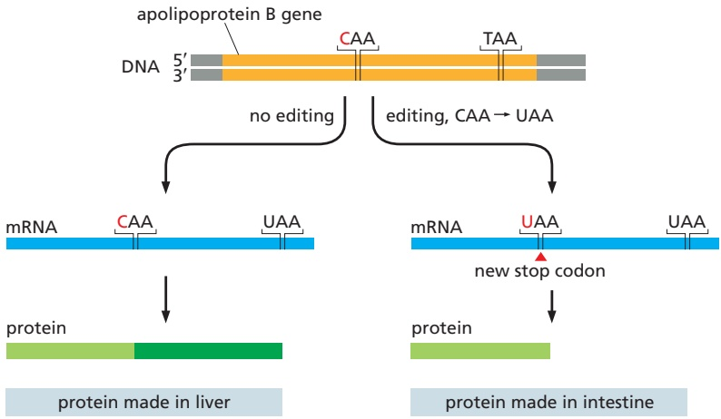

Figure 7–65 C-to-U RNA editing produces a truncated form of apolipoprotein B. As indicated, a tissue-specific edit in the middle of a coding sequence creates a truncated version of this protein in the intestine.

C-to-U editing, which is carried out by a different set of enzymes, is also important in mammals. For example, in certain cells of the gut, the mRNA for apolipoprotein B undergoes a C-to-U edit that creates a premature stop codon and therefore produces a shorter form of the protein. In cells of the liver, the editing enzyme is not expressed, and the full-length apolipoprotein B is produced. The two protein isoforms have different properties, and each plays a role in lipid metabolism that is specific to the organ that produces it (**Figure 7–65**).

Why RNA editing exists at all is a mystery. One idea is that it arose in evolution to correct “mistakes” in the genome. Another is that it arose as a somewhat slapdash way for the cell to produce subtly different proteins from the same gene. A third possibility is that RNA editing originally evolved as a defense mechanism against retroviruses and retrotransposons and was only later adapted by the cell to change the meanings of certain mRNAs. The last explanation receives support from the fact that RNA editing plays important roles in cell defense. The RNA genomes of some retroviruses, including HIV, are extensively edited after they infect cells. This hyperediting creates many harmful mutations in the viral RNA genome and also causes viral mRNAs to be retained in the nucleus, where they are eventually degraded. Although some modern retroviruses can protect themselves against this defense mechanism, RNA editing presumably helps to hold many viruses in check.

#### The Human AIDS Virus Illustrates How RNA Transport from the Nucleus Can Be Regulated

It has been estimated that in mammals only about one-twentieth of the total mass of RNA that is synthesized ever leaves the nucleus. We saw in Chapter 6 that most mammalian RNA molecules undergo extensive processing and that the “leftover” RNA fragments (excised introns and RNA sequences 3′ to the cleavage/poly-A site) are degraded in the nucleus. Incompletely processed and otherwise damaged RNAs are also eventually degraded as part of the quality-control system that acts on RNA production.

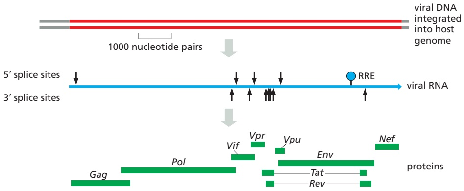

As described in Chapter 6, the export of RNA molecules from the nucleus is delayed until processing has been completed. However, mechanisms that deliberately override this control point can be used to regulate gene expression. This strategy forms the basis for one of the best-understood examples of regulated nuclear transport of mRNA, which occurs in the human AIDS virus, HIV.MBoC7 m7.62/7.66

As we saw in Chapter 5, HIV, once inside the cell, directs the formation of a double-strand DNA copy of its single-strand RNA genome, which is then inserted into the genome of the host (see Figure 5–61). Once inserted, the viral DNA can be transcribed as one long RNA molecule by the host cell’s RNA polymerase II. This transcript is then spliced in many different ways to produce more than 30 different species of mRNA, which in turn are translated into a variety of different proteins (**Figure 7–66**). In order to make progeny virus, entire unspliced viral transcripts must be exported from the nucleus to the cytosol, where they are packaged into viral capsids and serve as the viral genome. This large transcript, as well as certain alternatively spliced HIV mRNAs that are needed to produce viral proteins, still carry complete introns. The host cell’s normal block to the nuclear export of unspliced RNAs therefore presents a special problem for HIV.

The block is overcome by a viral-coded protein (called Rev) that binds to a specific RNA sequence (called the Rev response element; RRE) located within a viral intron. The Rev protein interacts with a nuclear export receptor (Crm1), which directs the movement of viral RNAs through nuclear pores into the cytosol despite the presence of intron sequences. (How export receptors function is discussed in detail in Chapter 12.) The regulation of nuclear export by Rev has several important consequences for HIV growth and pathogenesis. In addition to ensuring the nuclear export of specific unspliced RNAs, it divides the viral infection into an early phase (in which Rev is translated from a fully spliced RNA, and all of the intron-containing viral RNAs are retained in the nucleus and degraded) and a late phase (in which unspliced RNAs are exported because of Rev function). This timing helps the virus replicate by providing the gene products in roughly the order in which they are needed (**Figure 7–67**).

Regulation by Rev and by Tat, the HIV protein that counteracts premature transcription termination (see pp. 445–446), allows the virus to achieve latency, a condition in which the HIV genome has become integrated into the host-cell genome, but the production of viral proteins has temporarily ceased. If, after the virus’s initial entry into a host cell, conditions are unfavorable for viral replication, Rev and Tat are made at levels too low to promote transcription and export of unspliced RNA. This stalls the viral growth cycle until conditions improve, whereupon Rev and Tat levels increase and the virus enters the replication cycle.

#### mRNAs Can Be Localized to Specific Regions of the Cytosol

Once a newly made eukaryotic mRNA molecule has passed through a nuclear pore and entered the cytosol, it is typically met by ribosomes, which translate it into a polypeptide chain. Once the first round of translation “passes” the

Figure 7–66 The compact genome of HIV, the human AIDS virus. The positions of the nine HIV genes are shown in green. The red double line indicates a DNA copy of the viral genome that has become integrated into the host DNA (gray). Note that the coding regions of many HIV genes overlap, and that those for Tat and Rev are split by introns. The blue line in the middle of the figure represents the pre-mRNA transcript of the viral DNA and shows the locations of all the possible splice sites (arrows). There are many alternative ways of splicing the viral transcript; for example, the Env mRNAs retain the intron that has been spliced out of the Tat and Rev mRNAs. The Rev response element (RRE) is indicated by a blue ball and stick. It is a 234-nucleotide-long stretch of RNA that folds into a defined structure; Rev recognizes a particular hairpin within this larger structure.

The Gag gene codes for a protein that is cleaved into several smaller proteins that form the viral capsid. The Pol gene codes for a protein that is cleaved to produce reverse transcriptase (which transcribes RNA into DNA), as well as the integrase involved in integrating the viral genome (as double-stranded DNA) into the host genome. The Env gene codes for the envelope proteins (see Figure 5–61). Tat, Rev, Vif, Vpr, Vpu, and Nef are small proteins with a variety of functions. As discussed in the text, Rev regulates nuclear export (see Figure 7–67), and Tat regulates the elongation of transcription across the integrated viral genome (see pp. 445–446).

(A) early HIV synthesis

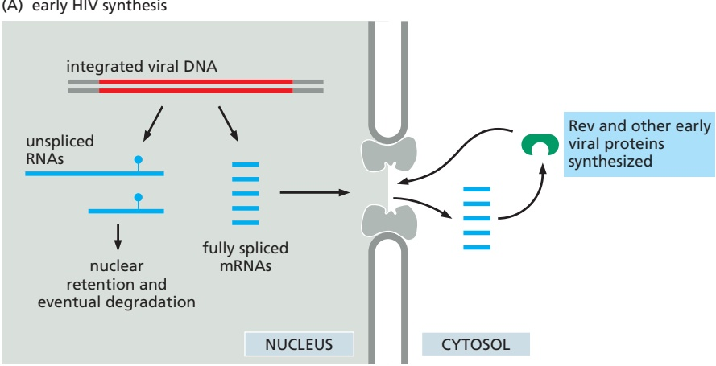

Figure 7–67 Regulation of nuclear export by the HIV Rev protein. (A) Early in HIV infection, only the fully spliced RNAs (which contain the coding sequences for Rev, Tat, and Nef) are exported from the nucleus and translated. (B) Once sufficient Rev protein has accumulated and been transported into the nucleus, unspliced viral RNAs can be exported from the nucleus. Many of these RNAs are translated into protein, and the full-length transcripts are packaged into new viral particles.

(B) late HIV synthesis

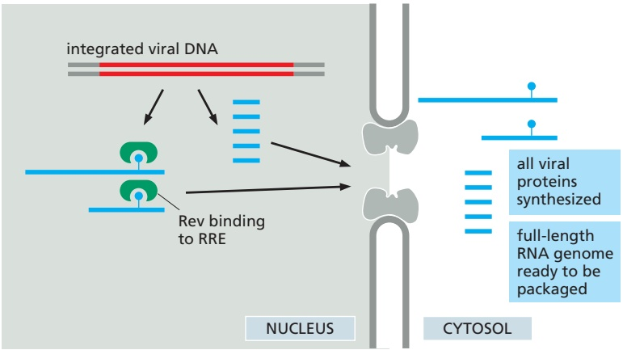

nonsense-mediated decay test (see Figure 6–80), the mRNA is usually translated in earnest. If the mRNA encodes a protein that is destined to be secreted or expressed on the cell surface, a signal sequence at the protein’s N-terminus will direct it to the endoplasmic reticulum (ER). In this case, as discussed in Chapter 12, components of the cell’s protein-sorting apparatus recognize the signal sequence as soon as it emerges from the ribosome and direct the entire complex of ribosome, mRNA, and nascent protein to the membrane of the ER, where the remainder of the polypeptide chain is synthesized. In other cases, free ribosomesMBoC7 m7.63/7.67 in the cytosol synthesize the entire protein, and signals in the completed polypeptide chain may then direct the protein to other sites in the cell.

Many mRNAs are themselves directed to specific intracellular locations before their efficient translation begins, allowing the cell to position its mRNAs close to the sites where the encoded protein is needed. RNA localization has been observed in many organisms, including unicellular fungi, plants, and animals, and it appears to be a common mechanism that cells use to concentrate highlevel production of proteins at specific sites. This strategy also provides the cell with other advantages. For example, it allows the establishment of asymmetries in the cytosol of the cell, a key step in many stages of development.

The localization of mRNA, coupled with translational control, also allows the cell to regulate gene expression independently in different regions. This feature is particularly important in large, highly polarized cells such as neurons; in those cells, specific mRNAs are transported for long distances along axons and dendrites to synapses, and the translation of the mRNAs that become localized there is often controlled by synaptic activity.

The mechanisms for mRNA localization that have been discovered all require specific signals in the mRNA itself (**Figure 7–68**). These signals are usually

directed transport on cytoskeleton generalized degradation in combination with local protection by trapping

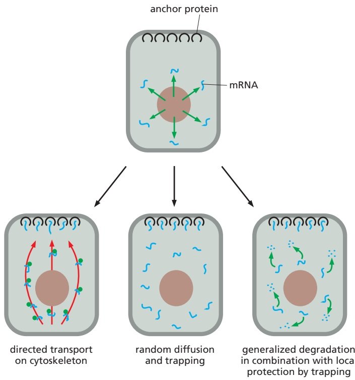

Figure 7–68 Mechanisms for the localization of mRNAs. The mRNA to be localized leaves the nucleus through nuclear pores (top). Some localized mRNAs (left diagram) travel to their destination by associating with cytoskeletal motors, which use the energy of ATP hydrolysis to move the mRNAs unidirectionally along filaments in the cytoskeleton (red) (see Chapter 16). At their destination, the mRNAs are held in place by anchor proteins (black). Other mRNAs randomly diffuse through the cytosol and are simply trapped by anchor proteins at their sites of localization (center diagram). As an additional feature, many mRNAs (right diagram) are degraded in the cytosol unless they have bound, through random diffusion, a localized anchor protein complex that protects the mRNA from degradation (black). These mechanisms require specific signals on the mRNA, which are typically located in the 3′ UTR. In all cases, other RNA-bound components block the translation of the mRNA until it is properly localized. Even then, additional signals are often needed to begin translation. (Adapted from H.D. Lipshitz and C.A. Smibert, Curr. Opin. Genet. Dev. 10:476–488, 2000.)

concentrated in the 3′ untranslated region (UTR), the region of RNA that extends from the stop codon that terminates protein synthesis to the start of the poly-A tail (**Figure 7–69**). As in neurons, mRNA localization is usually coupled with translational controls to ensure that the localized mRNA remains quiescent until it is needed.

The Drosophila egg provides an especially striking example of mRNA localization. The mRNA encoding the Bicoid transcription regulator is localized by attachment to the cytoskeleton at the anterior tip of the developing egg. When fertilization triggers the translation of this mRNA, it generates a gradient of the Bicoid protein that plays a crucial part in directing the development of the anterior part of the embryo (see Figures 7–29 and 21–19). Many mRNAs in somaticMBoC7 m7.64/7.68 cells are also localized in a similar way. The mRNA that encodes actin, for example, is localized to the actin-filament-rich cell cortex in mammalian fibroblasts by means of a 3′ UTR signal.

We saw in Chapter 6 that mRNA molecules exit from the nucleus bearing numerous markings in the form of RNA modifications (the 5′ cap and the 3′ poly-A tail) and bound proteins (exon junction complexes, for example) that signify the successful completion of the different pre-mRNA processing steps. As just described, the 3′ UTR of an mRNA can be thought of as a “ZIP code” that directs mRNAs to different places in the cell. Shortly, we will see that mRNAs also carry information specifying their average lifetime in the cytosol and the efficiency with which they are translated into protein. In a broad sense, the untranslated regions of eukaryotic mRNAs resemble the transcriptional control regions of genes: their nucleotide sequences contain information specifying the way the RNA is to be used, and proteins interpret this information by binding specifically to these sequences. Thus, in addition to the specification of amino acid sequences, mRNA molecules are rich with other types of information.

<small>Figure 7–69 An experiment demonstrating the importance of the 3′ UTR in localizing mRNAs to specific regions of the cytoplasm. For this experiment, two different fluorescently labeled RNAs were prepared by transcribing DNA in vitro in the presence of fluorescently labeled derivatives of ribonucleoside triphosphates. One RNA (labeled with a red fluorochrome) contains the coding region for the Drosophila Hairy protein and includes the adjacent 3′ UTR. The other RNA (labeled green) contains the Hairy coding region with the 3′ UTR deleted. The two RNAs were mixed and injected into a Drosophila embryo at a stage of development when multiple nuclei reside in a common cytoplasm (see Figure 7–29). When the fluorescent RNAs were visualized 10 minutes later, the full-length hairy RNA (red) was localized to the apical side of nuclei (blue), whereas the transcript missing the 3′ UTR (green) failed to localize and is seen as a diffuse cloud. Hairy is one of many transcription regulators that specify positional information in the developing Drosophila embryo, and the localization of its mRNA (shown in this experiment to depend on its 3 UTR) is critical for proper fly development. (Courtesy of Simon Bullock and David Ish-Horowicz.)</small>

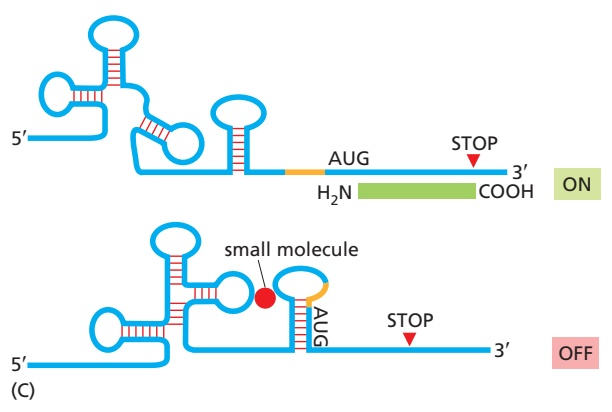

<!-- END EN EN07-H056-H066 -->

### 英文补充：非编码RNA、RNA干扰与染色质调控

> 对应中文板块：非编码RNA、RNA干扰与染色质调控。英文来源：Molecular Biology of the Cell，第7版，第7章；[本章完整原文](../来源/英文教材/07_Control_of_Gene_Expression/chapter.md)。物理PDF页码范围：436–513（整章范围）。

<!-- BEGIN EN EN07-H074-H084 -->
#### REGULATION OF GENE EXPRESSION BY NONCODING RNAs

In the previous chapter, we introduced the central dogma, according to which the flow of genetic information proceeds from DNA through RNA to protein (see Figure 6–1). But we have seen throughout this book that RNA molecules perform many critical tasks in the cell besides serving as intermediate carriers of genetic information. Among these noncoding RNAs are the rRNA and tRNA molecules, which are responsible for reading the genetic code and synthesizing proteins. The RNA molecule in telomerase serves as a template for the replication of chromosome ends, snoRNAs modify ribosomal RNA, and snRNAs direct RNA splicing. And earlier in this chapter we saw that Xist RNA has an important role in inactivating one copy of the X chromosome in female mammals. In this section, we introduce several additional classes of noncoding RNAs that have important roles in regulating gene expression and in protecting the genome from viruses and transposable elements. These RNAs also make possible powerful new experimental techniques in genome editing.

#### Small Noncoding RNA Transcripts Regulate Many Animal and Plant Genes Through RNA Interference

We begin our discussion with a group of short RNAs that carry out **RNA interference**, or **RNAi**. Here, short single-stranded RNAs (20–30 nucleotides) serve as guide RNAs that selectively bind—through complementary base-pairing—other RNAs in the cell. When the target is a mature mRNA, the small noncoding RNAs can inhibit its translation or catalyze its rapid destruction. If the target RNA molecule is in the process of being transcribed, the small noncoding RNA can bind to it and direct the formation of repressive chromatin on its attached DNA template to block further transcription (**Figure 7–77**).

Figure 7–77 RNA interference in eukaryotes. Single-strand interfering RNAs locate target RNAs through complementary base-pairing, and, at this point, several fates are possible, as shown. As described in the text, there are several types of RNA interference; the way that interfering RNA is produced and the ultimate fate of the target RNA depend on the particular system.

Figure 7–78 miRNA processing and mechanism of action. The precursor miRNA, through complementary basepairing between one part of its sequence and another, forms a double-strand structure. This RNA is “cropped” while still in the nucleus and then exported to the cytosol, where it is further cleaved (“diced”) by the Dicer enzyme to form the miRNA proper. Argonaute, in conjunction with other components of RISC, initially associates with both strands of the miRNA and then cleaves and discards one of them. The other strand guides RISC to specific mRNAs through base-pairing. If the RNA–RNA match is extensive, as is commonly seen in plants, Argonaute cleaves the target mRNA (“slicing”), causing its rapid degradation. In mammals, the miRNA–mRNA match often does not extend beyond a short seven-nucleotide “seed” region near the 5′ end of the miRNA. This less extensive base-pairing leads to a rapid inhibition of translation and, in most cases, eventual destruction of the mRNA.

Three classes of small noncoding RNAs work in this way—microRNAs (miRNAs), small interfering RNAs (siRNAs), and piwi-interacting RNAs (piRNAs)— and we discuss them in turn in the next sections. Although they differ in both the way the short pieces of single-stranded RNA are generated and in their ultimate functions, all three types of RNAs locate their targets through RNA–RNA basepairing, and they generally cause reductions in gene expression.

#### miRNAs Regulate mRNA Translation and Stability

More than 1000 different **microRNAs (miRNAs)** are produced from the human genome, and these appear to regulate at least one-half of all human proteincoding genes. Once made, miRNAs base-pair with specific mRNAs and fine-tune their translation and stability. The miRNA precursors are synthesized by RNA polymerase II and are capped and polyadenylated. They then undergo a special type of processing, after which the miRNA (typically 23 nucleotides in length) is assembled with a set of proteins to form an RNA-induced silencing complex, or RISC. Once formed, the RISC seeks out its target mRNAs by searching for complementary nucleotide sequences (**Figure 7–78**). This search is greatly facilitated by the Argonaute protein, a component of RISC, which holds the 5′ region of the miRNA so that it is optimally positioned for base-pairing to another RNA molecule (**Figure 7–79**). In animals, the extent of base-pairing is typically at least seven nucleotide pairs, and this pairing most often occurs in the 3′ UTR of the target mRNA.

Once an mRNA has been bound by an miRNA, several outcomes are possible. If the base-pairing is extensive (which is unusual in humans but common in many plants), the mRNA is cleaved (sliced) by the Argonaute protein, effectively removing the mRNA’s poly-A tail and exposing it to exonucleases (see Figure 7–73). After cleavage of the mRNA, the RISC with its associated miRNA is released, and it can seek out additional mRNAs (see Figure 7–78). Thus, a single miRNA can act catalytically to destroy many complementary mRNAs. These miRNAs can thus be thought of as guide sequences that repeatedly bring destructive nucleases into contact with specific mRNAs.

Figure 7–79 Human Argonaute protein carrying an miRNA. The protein is folded into four structural domains, each indicated by a different color. The miRNA is held in an extended form that is optimal for forming RNA–RNA base pairs. The active site of Argonaute that slices a target RNA, when it is extensively base-paired with the miRNA, is indicated in red. Many Argonaute proteins (three out of the four human proteins, for example) lack the catalytic site and therefore bind target RNAs without slicing them. (Adapted from C.D. Kuhn and L. Joshua-Tor, Trends Biochem. Sci. 38:263–271, 2013.)

If the base-pairing between the miRNA and the mRNA is less extensiveMB C7 7.76/7.79 (as observed for most human miRNAs), Argonaute does not slice the mRNA; rather, translation of the mRNA is repressed by the recruitment of deadenylase enzymes—which shorten the poly-A tail—and other proteins that directly block access of the mRNA to the proteins needed to translate it. In many cases, the “blocked” mRNAs are shuttled to P-bodies (see Figure 7–76) where, sequestered from ribosomes, they are either degraded or, at a later time, released to the cytosol to be translated again.

Several features make miRNAs especially useful regulators of gene expression. First, a single miRNA can regulate a whole set of different mRNAs, so long as the mRNAs carry a short complementary sequence in their UTRs. This situation is common in humans, where a single miRNA can control hundreds of different mRNAs. Second, regulation by miRNAs can be combinatorial. As discussed earlier for transcription regulators, combinatorial control greatly expands the possibilities available to the cell by linking gene expression to a combination of different regulators rather than a single regulator. Like many transcription regulators, different miRNAs can bind cooperatively to their target mRNAs if their recognition sites are spaced appropriately. The basis for the cooperative binding is a scaffold protein that weakly holds two different RISCs together at a fixed spacing, thereby coupling their individual miRNA–mRNA binding energies. Third, an miRNA occupies relatively little space in the genome when compared with a protein. Indeed, their small size is one reason that miRNAs were discovered only recently. Although we are only beginning to appreciate the full impact of miRNAs, it is clear that they represent an important part of the cell’s repertoire for regulating the expression of genes. We shall discuss specific examples of miRNAs with key roles in development in Chapter 21.

#### RNA Interference Also Serves as a Cell Defense Mechanism

Many of the proteins that participate in the miRNA regulatory mechanisms just described also serve a second function as a defense mechanism: they orchestrate the degradation of foreign RNA molecules, specifically those that occur in doublestrand form. Many transposable elements and viruses produce double-stranded RNA at least transiently in their life cycles, and RNA interference helps to keep these potentially dangerous invaders in check. As we shall see, this form of RNAi also provides scientists with a powerful experimental technique to turn off the expression of individual genes.

The presence of double-stranded RNA in the cell triggers RNAi by attracting a protein complex containing Dicer, the same nuclease that processes miRNAs (see Figure 7–78). This protein cleaves the double-stranded RNA into small fragments (of approximately 23 nucleotide pairs) called **small interfering RNAs (siRNAs)**.

These double-stranded siRNAs are then bound by Argonaute and other components of RISC. As we saw earlier for miRNAs, one strand of the duplex RNA is then cleaved by Argonaute and discarded. The single-strand siRNA molecule that remains directs RISC back to complementary RNA molecules produced by the virus or transposable element. Because the match is usually exact, Argonaute also cleaves these molecules, leading to their rapid destruction.

Each time RISC cleaves a new RNA molecule, the RISC is released; thus, as we saw for miRNAs, a single RNA molecule can act catalytically to destroy many complementary RNAs. Some organisms employ an additional mechanism that amplifies the RNAi response even further. In these organisms, RNA-dependent RNA polymerases use siRNAs as primers to produce additional copies of doublestranded RNAs that are then cleaved into siRNAs. This amplification ensures that, once initiated, RNA interference can continue even after all the initiating doublestranded RNA has been degraded or diluted out. For example, it permits progeny cells to continue carrying out the specific RNA interference that was provoked in the parent cells.

In some organisms, the RNA interference activity can be spread by the transfer of RNA fragments from cell to cell. This is particularly important in plants (whose cells are linked by fine connecting channels, as discussed in Chapter 19), because it allows an entire plant to become resistant to an RNA virus after only a few of its cells have been infected. In a broad sense, the RNAi response resembles certain aspects of the animal immune system; in both, an invading organism elicits a customized response, and—through amplification of the “attack” molecules—the host becomes systemically protected.

We have seen that although miRNAs and siRNAs are generated in different ways, they rely on some of the same proteins and seek out their targets in a fundamentally similar manner. Because siRNAs are found in widespread species, they are believed to be the most ancient form of RNA interference, with miRNAs being a later evolutionary refinement. The siRNA-mediated defense mechanisms are especially crucial for plants, worms, and insects. In mammals, a protein-based immune system (described in Chapter 24) has largely taken over the task of fighting off viruses.

#### RNA Interference Can Direct Heterochromatin Formation

The siRNA interference pathway just described does not necessarily stop with the inactivation of target RNA molecules. In some cases, the RNA interference machinery can also selectively shut off the synthesis of the target RNAs. For this to occur, the short siRNAs produced by the Dicer protein are assembled with a group of proteins (including Argonaute) to form an RITS (RNA-induced transcriptional silencing) complex. Using single-stranded siRNA as a guide sequence, this complex binds complementary RNA transcripts as they emerge from a transcribing RNA polymerase II (**Figure 7–80**). Positioned on the genome in this way, the RITS complex then attracts enzymes that covalently modify nearby histones and DNA causing the formation of a “constitutive” form of heterochromatin. As described in Chapter 4, this form of heterochromatin is distinguished by the H3K9me3 mark, and, in many cases, it also includes DNA methylation (see Figure 7–48). Although low levels of transcription probably persist (and may be important to continually signal where the heterochromatin should be formed), this form of heterochromatin, as we have seen, is generally resistant to transcription and effectively shuts off the genes that lie within it. In some cases, an RNA-dependent RNA polymerase and a Dicer enzyme are also recruited by the RITS complex to continually generate additional siRNAs in situ. This positive feedback loop ensures continued repression of the target gene even after the original, initiating siRNA molecules have disappeared.

RNAi-directed heterochromatin formation is an especially important cell defense mechanism; it limits the spread of transposable elements in genomes by maintaining their DNA sequences in a transcriptionally silent form. However, this same mechanism is also used in some normal processes in the cell. For example,

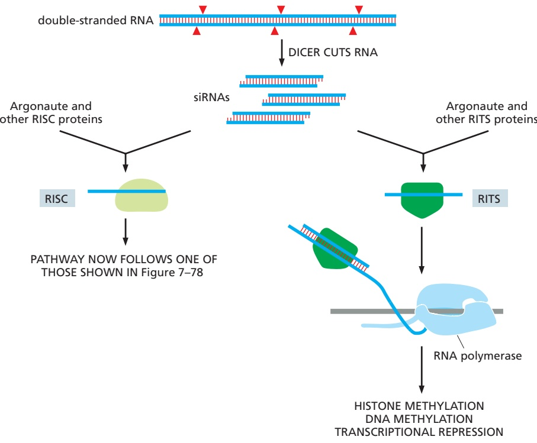

Figure 7–80 RNA interference directed by siRNAs. In many organisms, doublestranded RNA can trigger both the destruction of complementary mRNAs (left) and transcriptional silencing (right). The change in chromatin structure induced by the bound RITS (RNA-induced transcriptional silencing) complex resembles that of Figure 7–48.

in many organisms, the RNA interference machinery maintains the heterochromatin formed around centromeres. Centromeric DNA sequences are transcribed in both directions, producing complementary RNA transcripts that can base-pairMBoC7 m7.77/7.80 to form double-stranded RNA. This double-stranded RNA triggers the RNA interference pathway and stimulates formation of the heterochromatin that surrounds centromeres, which is necessary for the centromeres to segregate chromosomes accurately during mitosis.

#### piRNAs Protect the Germ Line from Transposable Elements

A third system of RNA interference relies on **piRNAs** (**piwi-interacting RNAs**, named for Piwi, a class of proteins related to Argonaute). piRNAs are found in many organisms, and they carry out a diverse set of functions. Here, we describe one of their most important roles, which is to hold transposable elements (transposons) in check in the germ line of animals. The germ line is especially susceptible to transposon movement because many of the histone modifications and methylated DNA sites are “erased” during gametogenesis, temporarily releasing transposons from their normal constraints. piRNAs cover this vulnerability. Unlike miRNAs and siRNAs, they are synthesized from specialized piRNA “clusters” in the genome as long, single-strand RNA molecules that are then broken up and trimmed by specialized processing enzymes (different from the Dicer enzymes discussed earlier) into fragments that are slightly longer than miRNAs and siRNAs. These RNAs are covalently modified at their 3′ ends by a 2′-O-methyl group (see Figure 6–43A) and assembled with Piwi proteins. Once complexed with their proteins, piRNAs seek out RNA targets by complementary base-pairing and, much like siRNAs, they both cleave the complementary RNAs and package the DNA on which they are being transcribed into repressive forms of chromatin. The piRNA clusters in the genome are rich with sequence fragments from transposons, and the piRNAs attack any transposon whose sequence is represented in the piRNA cluster. In this way, the genome contains a “hit list” of transposons that need to be inactivated during the vulnerable period of gametogenesis. It has been proposed that piRNA clusters are unusually attractive landing sites for transposons and, for this reason, they carry a record of all past bursts of transposon activity.

Although the genome carries a linear record of transposons to be inactivated, piRNAs have an additional way to attack those transposons that are most active during gametogenesis. In brief, once a piRNA and its associated proteins cleave a complementary, transposon-coded mRNA, additional piRNAs can be created from nearby sequences in the transposon mRNA. This mechanism not only amplifies the original response but extends its breadth by incorporating additional sequence information from active transposons, information that might not be carried in the piRNA clusters themselves.

Many mysteries surround piRNAs. More than a million piRNA species are coded in the genomes of many mammals and expressed in the testes, yet only a fraction seem to be directed against the transposons present in those genomes. Are the other piRNAs remnants of past invaders? Do they cover so much “sequence space” that they are broadly protective for any foreign DNA? Another curious feature of piRNAs is that many of them (particularly if base-pairing does not have to be perfect) should, in principle, attack the normal mRNAs made by the organism, yet they do not. It has been proposed that these large numbers of piRNAs may form a system to distinguish “self” RNAs from “foreign” RNAs and attack only the latter. If this is the case, there must be a special way for the cell to spare its own RNAs. One idea is that RNAs produced in the previous generation of an organism are somehow registered and set aside from piRNA attack in subsequent generations. Another idea holds that all legitimate mRNAs carry specialized sequences that spare them from attack. Whether or not this mechanism truly exists, and, if so, how it might work, are questions that demonstrate our incomplete understanding of the full range of RNA interference.

#### RNA Interference Has Become a Powerful Experimental Tool

Although it likely first arose in evolution as a defense mechanism against viruses and transposable elements, RNA interference, as we have seen, has become thoroughly integrated into many aspects of normal cell biology, ranging from the control of gene expression to a fine tuning of chromosome structure. RNA interference has also been developed by scientists into a powerful experimental tool that allows almost any gene to be inactivated by evoking an RNAi response to it. This technique, which can be readily carried out in cultured cells and, in many cases, whole animals and plants, has made possible new genetic approaches in cell and molecular biology. We shall discuss it in detail in the following chapter when we cover the modern genetic methods used to study cells (see pp. 533–534). RNAi also has potential in treating human disease. Because many human disorders result from the misexpression of genes, the ability to turn these genes off by experimentally introducing complementary siRNA molecules into cells holds great medical promise. Although delivery of RNA molecules to the appropriate tissue has been a persistent problem in using RNAi as a human therapy, the strategy is currently used to treat a rare disease called transthyretin amyloidosis. This inherited disease, which affects heart and nerve function, is caused by the accumulation of a mutated protein, and siRNAs directed by complementary base-pairing to the mutated mRNA relieve its symptoms. In this case, the siRNAs are delivered to the liver (the key site of synthesis of the mutated protein) by a special combination of lipids that forms tiny vesicles to encase the siRNA.

#### Cells Have Additional Mechanisms to Hold Transposons and Integrated Viral Genomes in Check

From the preceding sections, it should be clear that cells are locked in an eternal “arms race” with parasitic DNA elements, such as transposons and viruses. Indeed, it seems that our own genome came close to being overrun with such elements; even with our many defense mechanisms, they still make up nearly half our DNA (see Figure 4–63). Most of these elements have accumulated mutations that prevent them from being active, but this process likely occurred after hostcell mechanisms came into play to hold them in check.

We have seen how siRNAs and piRNAs constitute surveillance systems to monitor transcription from transposable elements, to destroy their transcripts, and to package their DNA into repressive forms of chromatin. Although these overlapping defense mechanisms may seem highly effective, cells have at least one additional strategy for recognizing transposons and integrated viruses and silencing them. In contrast to the RNA-based strategies, which utilize complementary base-pairing to recognize these genome invaders, this additional system employs a special set of sequence-specific DNA-binding proteins to monitor the genome. When these proteins recognize a DNA sequence present in a transposon or integrated viral genome, they bind directly to that sequence and recruit both histone “writers” that place H3K9me3 marks on nearby histones and DNA methylases that heavily methylate the surrounding DNA. As discussed earlier in the chapter, this repressive form of chromatin can then spread and render the underlying DNA resistant to transcription and recombination (see Figure 7–48). Our genome codes for hundreds of different sequence-specific DNA proteins that carry out this surveillance (called KRAB-ZPF proteins), and they cover a wide variety of transposable element DNA and viral sequences. Most recognize a DNA sequence that is crucial for that element to transpose (or in the case of integrated viral genomes, for the virus to multiply), making it difficult for the element to escape through a mutation. However, such escape does apparently occur, because KRAB-ZPF proteins are evolving rapidly (compared with other human genes), and they appear to be “keeping up” with mutated versions of resident transposable elements. Their rapid evolution also suggests that the KRAB-ZPF proteins can easily adapt through mutation to attack new parasitic elements that might enter the genome.

Transposable elements, if left unchecked, present many challenges to the cell: their sequences can serve as recombination sites leading to crossovers between nonhomologous chromosomes, double-strand DNA breaks are produced in the host genome when they move, and they can disrupt coding or regulatory sequences when they insert into a new position. On the other hand, their movement has provided a source of variation that is necessary for natural selection to occur. But the many different strategies host cells have evolved to neutralize these invaders suggest that the short-term dangers must far outweigh any long-term advantages.

#### Bacteria Use Small Noncoding RNAs to Protect Themselves from Viruses

In the previous sections, we emphasized the defense systems of animals and plants, but it is important to keep in mind that bacteria and archaea make up the vast majority of Earth’s diversity. Not surprisingly, the viruses that infect these single-cell organisms greatly outnumber plant and animal viruses. Many species of bacteria (and almost all species of archaea) use a repository of small noncoding RNA molecules to seek out and destroy invading viruses. Many features of this defense mechanism, known as CRISPR, resemble those of miRNAs, siRNAs, and piRNAs that we saw earlier. When bacteria and archaea are first infected by a virus, short fragments of that viral DNA become integrated into their genomes by a process that is only beginning to be understood. These serve as “vaccinations,” in the sense that they become the templates for producing small noncoding RNAs known as crRNAs (CRISPR RNAs) that will thereafter destroy the virus should it reinfect the descendants of the original cell. This aspect of the CRISPR system resembles both human adaptive immunity and piRNA-based surveillance, insofar as the cell carries a record of past exposures that is used to protect against future exposures.

In most cases, crRNAs associate with special proteins that allow them to seek out and destroy invading viral genomes, which are typically composed of doublestranded DNA. Many distinct CRISPR systems exist across different species of

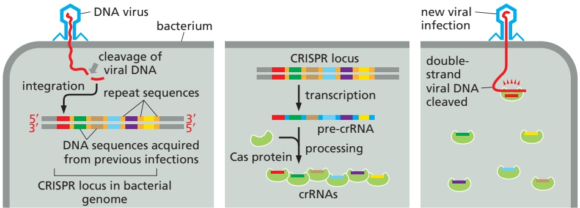

STEP 1: short viral DNA sequence is integrated into CRISPR locus

STEP 2: RNA is transcribed from CRISPR locus, processed, and bound to Cas protein

STEP 3: small crRNA in complex with Cas seeks out and destroys viral sequences

Figure 7–81 CRISPR-mediated immunity in bacteria and archaea. After infection by a virus (left panel), a small bit of DNA from the viral genome is inserted into the CRISPR locus. For this to happen, a small fraction of infected cells must survive the initial viral infection. The surviving cells, or more generally their descendants, transcribe the CRISPR locus and process the transcript into crRNAs (middle panel). Upon reinfection with a virus that the population has already been “vaccinated” against, the incoming viral DNA is destroyed by a complementary crRNA (right panel).

bacteria and archaea. Here we merely outline one of the most common and best understood, describing its three steps (**Figure 7–81**). In the first step, viral DNA sequences are integrated into special regions of the bacterial genome known asMBoC7 m7.78/7.81 CRISPR (clustered regularly interspersed short palindromic repeat) loci, named for the peculiar DNA sequences that first drew the attention of scientists. In its simplest form, a CRISPR locus consists of several hundred repeats of a host DNA sequence interspersed with a large collection of DNA sequences (typically 25–70 nucleotide pairs each) derived from prior exposures to viruses and other foreign DNA. The newest viral sequence is always integrated at the 5′ end of the CRISPR locus, the end that is transcribed first. Each locus, therefore, carries a temporal, ordered record of prior infections. Many bacterial and archaeal species carry several large CRISPR loci in their genomes and are thus immune to a wide range of viruses.

For a CRISPR system to be effective, the crRNAs must not destroy the CRISPR locus itself, even though the crRNAs are complementary in sequence to it. How is this possible? In many species, there must be additional short nucleotide sequences carried by the target molecule in order for crRNAs to attack it. Because these sequences, known as PAMs (protospacer adjacent motifs), lie outside the crRNA sequences, the host CRISPR locus is spared (see Figure 8–57).

In the second step, the CRISPR locus is transcribed to produce a long RNA molecule, which is then processed into the much shorter (approximately 30 nucleotides) crRNAs. These crRNAs become complexed with Cas (CRISPR-associated) proteins, and, in the final step, they seek out complementary viral DNA sequences and direct their destruction by nucleases. Although structurally dissimilar, Cas proteins are analogous to the Argonaute and Piwi proteins discussed earlier: they hold small single-stranded RNAs in an extended configuration that is optimized, in this case, for seeking and forming complementary base pairs with double-stranded DNA.

We still have much to learn about CRISPR-based immunity in bacteria and archaea. For example, the mechanism through which viral sequences are first identified and integrated into the host genome is poorly understood. Moreover, in different species of bacteria and archaea, crRNAs are processed in different ways, and in some cases, the crRNAs can attack viral RNAs as well as DNAs. As might be predicted, many viruses have evolved anti-CRISPR systems to counteract the defense systems of their hosts. These anti-CRISPRs range from viral proteins that bind to and inactivate the Cas proteins to special coats that form around the viral DNA and protect it from CRISPR attack during replication, gene expression, and virus assembly.

In Chapter 8, we describe how bacterial CRISPR systems have been artificially “moved” into plants and animals, where they have revolutionized our ability to manipulate genomes.

#### Long Noncoding RNAs Have Diverse Functions in the Cell

In this and the preceding chapters, we have seen that noncoding RNA molecules have many functions in the cell. Yet there remain many noncoding RNAs whose functions are still unknown. Many of these RNAs belong to a group known as **long noncoding RNA (lncRNA)**, arbitrarily defined as RNAs longer than 200 nucleotides that do not code for protein. The sheer number of lncRNAs (an estimated 5000 for the human genome, for example) came as a surprise to scientists. Most of these lncRNAs are transcribed by RNA polymerase II and have 5′ caps and poly-A tails, and, in many cases, they are spliced. It has been difficult to accurately annotate lncRNAs, in part because low levels of RNA are now known to be made from about 75% of the human genome. Most of these RNAs are thought to result from a background “noise” of leaky transcription, and they are rapidly degraded.MBoC7 m7.79/7.82 According to this idea, such nonfunctional RNAs provide no fitness advantage or disadvantage to the organism and are a tolerated by-product of the complex patterns of gene expression that need to be produced in multicellular organisms. For these reasons, it is difficult to estimate the number of lncRNAs that are likely to have a function in the cell and to distinguish them from the background of transcription noise.

In terms of biological function, lncRNA should be considered a catch-all phrase encompassing a great diversity of functions. We have already encountered a few notable lncRNAs, including the RNA in telomerase (see Figure 5–33), Xist RNA (see Figure 7–55), and an RNA involved in imprinting (see Figure 7–52). Other lncRNAs have been implicated in controlling the enzymatic activity of proteins, inactivating transcription regulators, affecting splicing patterns, and blocking translation of certain mRNAs through complementary base-pairing. However, there are three unifying features of lncRNAs that can account for their many roles in the cell. The first is that they can function as scaffold RNA molecules, holding together groups of proteins to coordinate their functions (**Figure 7–82A**; see also Figure 7–21). We have already seen examples in telomerase, the ribosome, and X-inactivation, where an RNA molecule holds together and organizes protein components. These RNA-based scaffolds are analogous to protein scaffolds we discussed in Chapter 3 (see Figure 3–76). RNA molecules are well suited to act as scaffolds: small bits of RNA sequence, often those portions that form stem–loop structures, can serve as binding sites for proteins, and these can be strung together with random sequences of RNA in between. This property may be one reason that many lncRNAs show relatively little primary-sequence conservation across species.

A second key feature of lncRNAs is their ability to serve as guide sequences, binding to specific RNA or DNA target molecules through base-pairing. By doing so, they bring proteins that are bound to them into close proximity with the DNA and RNA sequences (**Figure 7–82B**). This behavior is similar to that of snoRNAs (see Figure 6–43), miRNAs (see Figure 7–78), siRNAs (see Figure 7–80), and crRNAs (see Figure 7–81), all of which act in this way to guide protein enzymes to specific nucleic acid sequences. A third characteristic of RNA in general is its ability to organize biomolecular condensates, the non-membrane-bound assemblies of proteins and nucleic acids discussed in this and previous chapters. For example, rRNA is crucial for formation of the nucleolus, and untranslated mRNA provides the framework for P-bodies and stress granules. The propensity of RNA to form

Figure 7–82 Roles of long noncoding RNA (lncRNA). (A) As described in Chapter 6, RNAs can fold into short, specific three-dimensional structures whose specific features can be recognized by proteins. Thus, lncRNAs can serve as scaffolds, bringing together proteins that function together in the same process and thereby facilitating their interactions and speeding the reactions that they catalyze. (B) lncRNAs can also, through formation of complementary base pairs, localize the proteins that they bind near specific nucleotide sequences on RNA or DNA molecules. (C) In some cases, lncRNAs act only in cis at their sites of synthesis—as, for example, when the RNA is held in place by the RNA polymerase that produced them (top). But as shown, other lncRNAs diffuse from their sites of synthesis and are said to act in trans.

condensates derives in part from its ability to bind multiple proteins, as discussed above, but also because many RNAs can form multiple weak intramolecular interactions that, on their own, can lead to condensation. Some lncRNAs are thought to function solely by organizing and driving formation of such condensates.

In some of the simplest cases, lncRNAs work simply by base-pairing, without bringing in enzymes or other proteins. For example, a number of lncRNA genes are embedded in protein-coding genes, but they are transcribed in the “wrong direction.” These antisense RNAs can form complementary base pairs with the mRNA (transcribed in the “correct” direction) and block its translation into protein (see Figure 7–70D). Other antisense lncRNAs base-pair with pre-mRNAs as they are synthesized and change the pattern of RNA splicing by masking the preferred splice-site sequences. Still others act as “sponges,” base-pairing with miRNAs and thereby reducing their effects.

Finally, we note that some lncRNAs act only in cis; that is, they affect only the chromosome from which they are transcribed. This readily occurs when the transcribed RNA has not yet been released from RNA polymerases (**Figure 7–82C**) or when the completed RNA molecule does not diffuse away from the chromosome as for the case of Xist (see Figure 7–55). Many lncRNAs, however, leave their site of synthesis and act in trans. Although the best-understood lncRNAs work in the nucleus, many are found in the cytosol. The functions—if any—of the great majority of these cytosolic lncRNAs remain undiscovered.

#### Summary

RNA molecules have many uses in the cell besides carrying the information needed to specify the order of amino acids during protein synthesis. Although we have encountered noncoding RNAs in other chapters (tRNAs, rRNAs, snoRNAs, for example), the sheer number of noncoding RNAs produced by cells has surprised scientists. One well-understood use of noncoding RNAs occurs in RNA interference, where guide RNAs (miRNAs, siRNAs, piRNAs) base-pair with mRNAs. RNA interference can cause mRNAs to be either destroyed or translationally repressed. It can also cause specific genes to become packaged into heterochromatin suppressing their transcription. In bacteria and archaea, RNA interference is used as an adaptive immune response to destroy viruses that infect them. A large family of large noncoding RNAs (lncRNAs) has recently been discovered through detailed genomic analyses. Although the function (if any) of most of these RNAs is unknown, some serve as RNA scaffolds to bring specific proteins and RNA molecules together to speed up needed reactions.

<!-- END EN EN07-H074-H084 -->

## 跨章相关英文内容

- 免疫球蛋白基因重排与体细胞突变：[EN第24章 · 适应性免疫、B细胞、抗体、T细胞与MHC](../补充专题/免疫系统.md#EN24-H010-H032)。

---

## 第9章 细胞核与染色质 · 第四节 染色体

[返回本章](README.md) · [中文本章原文](中文原文.md)

<!-- BEGIN CN CN09-S04 -->
## 第四节 染色体

染色体是细胞在有丝分裂（或减数分裂）时遗传物质存在的特定形式，是间期细胞染色质结构紧密组装的结果。不同生物的细胞中含有不同数目的染色体（表9-6）。所有单倍染色体组包含的DNA组成该生物基因组。

表 9-6 不同生物的基因组大小和染色体数目

<table><tr><td>物种</td><td>基因组大小 /Mb</td><td>染色体数目</td></tr><tr><td>芽殖酵母(Saccharomyces pastorianus)</td><td>12</td><td>16</td></tr><tr><td>黏葡萄(Dictyostelium)</td><td>70</td><td>7</td></tr><tr><td>拟南芥(Arabidopsis thaliana)</td><td>125</td><td>5</td></tr><tr><td>秀丽隐杆线虫(Caenorhabditis elegans)</td><td>97</td><td>6</td></tr><tr><td>果蝇(Drosophila melanogaster)</td><td>180</td><td>4</td></tr><tr><td>非洲爪蟾(Xenopus laevis)</td><td>3 000</td><td>18</td></tr><tr><td>玉米(Zea mays)</td><td>5 000</td><td>10</td></tr><tr><td>洋葱(Allium cepa)</td><td>15 000</td><td>8</td></tr><tr><td>百合(Lilium brownii)</td><td>50 000</td><td>12</td></tr><tr><td>肺鱼(Neoceratodus forsteri)</td><td>50 000</td><td>17</td></tr><tr><td>鸡(Gallus gallus)</td><td>1 200</td><td>39</td></tr><tr><td>小鼠(Mus musculus)</td><td>3 000</td><td>20</td></tr><tr><td>牛(Bos taurus)</td><td>3 000</td><td>30</td></tr><tr><td>狗(Canis lupus)</td><td>3 000</td><td>39</td></tr><tr><td>人(Homo sapiens)</td><td>3 000</td><td>23</td></tr></table>

基因组大小和染色体数目都源自单倍体。

## 一、染色体的形态结构

中期染色体具有比较稳定的形态，它由两条相同的姐妹染色单体（chromatid）构成，彼此以着丝粒（centromere）相连。根据着丝粒在染色体上所处的位置，可将中期染色体分为4种类型（图9-23，表9-7）：中着丝粒染色体（metacentric chromosome），两臂长度相等或大致相等；亚中着丝粒染色体（submetacentric chromosome）；亚端着丝粒染色体（subtelocentric chromosome），具有微小短臂；端着丝粒染色体（telocentric chromosome）。

染色体各部的主要结构如下：

## （一）着丝粒与动粒

着丝粒连接两条染色单体，并将染色单体分为两臂：短臂（p）和长臂（q）。由于着丝粒区浅染内缢，所以也叫主缢痕（primary constriction）。近年来的研究表明，着丝粒是一种高度有序的整合结构，在结构和组成上都是非均一的，至少包括三种不同的结构域：

(1) 沿着着丝粒外表面的动粒结构域（kinetochoredomain）哺乳类动粒（又称着丝点，kinetochore）超微结构可分为三个区域（图9-24）：一是与着丝粒中央结构域相联系的内板（inner plate）；二是中间间隙（middle space），电子密度低，呈半透明区；三是外板（outer plate）。在没有动粒微管结合时，覆盖在外板上的第4个区称为纤维冠（fibrouscorona），由微管蛋白构成。动粒微管与内外板相连，并沿纤维冠相互作用，与内板相联系的染色质是与微管相互作用的位点。已有证据表明，动粒结构域的化学组成包括与动粒结构与功能相关的两类蛋白质以及着丝粒DNA，但是目前关于动粒的结构模型尚无定论。

  
图9-23 根据着丝粒位置进行的染色体分类图示

表 9-7 根据着丝粒位置进行的染色体分类

<table><tr><td>着丝粒位置</td><td>染色体符号</td><td>着丝粒比*</td><td>着丝粒指数**</td></tr><tr><td>中着丝粒</td><td>m</td><td>1.00~1.67</td><td>0.500~0.375</td></tr><tr><td>亚中着丝粒</td><td>sm</td><td>1.68~3.00</td><td>0.373~0.250</td></tr><tr><td>亚端着丝粒</td><td>st</td><td>3.01~7.00</td><td>0.249~0.125</td></tr><tr><td>端着丝粒</td><td>t</td><td>7.01~∞</td><td>0.125~0.000</td></tr></table>

\*长臂长度 / 短臂长度; \*\*短臂长度 / 染色体总长度。(Levan et al., 1964; Green et al., 1980)

(2) 中央结构域 (central domain) 这是着丝粒区的主体，由串联重复的卫星 DNA 组成。这些重复序列大部分是物种专一的。人染色体的着丝粒 DNA 由 α 卫星 DNA 组成，重复单位 17 bp，每一着丝粒串联重复 2 000～30 000 次，可达 250 kb 至 400 kb，但不同染色体着丝粒的 α 卫星 DNA 序列存在差别。其中一个亚类含有 17 bp 的 DNA 模式（5'-CTTCGTTGGAAACGGGA-3'），能与动粒蛋白 CENP-B 结合，这一 DNA 模式被称为 CENP-B 框。通过免疫印迹分析，在哺乳类染色体着丝粒区已发现 CENP-A、B、C、E 和 F 五种动粒蛋白，这些动粒蛋白和细胞分裂及其调控有密切关系，因而也是极为保守的。

(3) 配对结构域（pairing domain）位于着丝粒内表面的配对结构域。代表中期姐妹染色单体相互作用的位点。已经发现有两类蛋白：一类是内部着丝粒蛋白 INCENP (inner centromere protein)，另一类是染色单体连接蛋白 CLIPS (chromatid linking protein)，两者与染色单体配对有关。

虽然三种结构域具有不同的功能，但它们并不能独自发挥作用。正是三种结构域的整合功能，才确保细胞在有丝分裂中染色体与纺锤体整合，发生有序的染色体分离。

## （二）次缢痕

除主缢痕外，染色体上其他的浅染缢缩部位称次缢痕（secondary constriction）。它的数目、位置和大小是某些染色体所特有的形态特征，因此也可以作为鉴定染色体的标记。

## （三）核仁组织区

核仁组织区（nucleolar organizing region, NOR）位于染色体的次缢痕部位，但并非所有次缢痕都是NOR。染色体NOR是rRNA基因所在部位（5S rRNA基因除外），与间期细胞核仁形成有关。

  
图9-24 着丝粒的结构域组织

## （四）随体

随体（satellite）指位于染色体末端的球形染色体节段，通过次缢痕区与染色体主体部分相连。它是识别染色体的重要形态特征之一，有随体的染色体称为 sat 染色体。

## （五）端粒

端粒（telomere）是染色体两个端部特化结构。端粒通常由富含鸟嘌呤核苷酸（G）的短的串联重复序列DNA组成（TEL DNA），伸展到染色体的3'端。一个基因组内的所有端粒都是由相同的重复序列组成，但不同物种的端粒的重复序列是不同的（表9-8）。哺乳类和其他脊椎动物端粒的重复序列中的保守序列是TTAGGG，串联重复500\~3000次，序列长度在2 kb到20 kb之间不等。端粒的长度与细胞及生物个体的寿命有关。端粒的生物学作用在于维持染色体的完整性和独立性，可能还与染色体在核内的空间排布等有关。

## 二、染色体的功能元件

在细胞世代中确保染色体的复制和稳定遗传，染色体起码应具备三种功能元件（functional element）（图9-25）：至少一个DNA复制起点，确保染色体在细胞周期中能够自我复制，维持染色体在细胞世代传递中的连续性；一个着丝粒，使细胞分裂时已完成复制的染色体能平均分配到子细胞中；最后，在染色体的两个末端必须有端粒，保持染色体的独立性和稳定性。构成染色体DNA的这三种关键序列（key sequence）称为染色体

表 9-8 不同生物中端粒 DNA 序列比较

<table><tr><td>物种</td><td>端粒 DNA 重复序列</td></tr><tr><td colspan="2">酵母</td></tr><tr><td>芽殖酵母</td><td> ${\mathrm{G}}_{1 - 3}\mathrm{\;T}$ </td></tr><tr><td>裂殖酵母</td><td> ${\mathrm{G}}_{2 - 8}\mathrm{{TTAC}}$ </td></tr><tr><td colspan="2">原生动物</td></tr><tr><td>四膜虫</td><td>GGGGTT</td></tr><tr><td>黏霉菌</td><td> ${\mathrm{G}}_{1 - 3}\mathrm{\;A}$ </td></tr><tr><td colspan="2">植物</td></tr><tr><td>拟南芥</td><td>AGGGTTT</td></tr><tr><td colspan="2">哺乳动物</td></tr><tr><td>人</td><td>TTAGGG</td></tr></table>

  
图9-25 真核细胞染色体的三种功能元件示意图

DNA 的功能元件。近年来采用分子克隆技术把真核细胞染色体的复制起点、着丝粒和端粒这三种 DNA 关键序列分别克隆成功，并把它们互相搭配或改造而构成所谓 “人造微小染色体”（artificial minichromosome）。

## （一）自主复制 DNA 序列

应用 DNA 重组技术，将带有正常酵母亮氨酸合成酶的 Leu 基因的 DNA 限制酶片段重组到大肠杆菌的质粒中。用这种重组质粒去转化亮氨酸合成代谢缺陷型酵母细胞，发现单纯质粒不能转化酵母细胞，而重组质粒能在酵母细胞中复制、表达和遗传。可见该酵母 DNA 插入片段除含有 Leu 的基因外，还含有一段酵母染色体自主复制 DNA 序列 (autonomously replicating DNA sequence, ARS)。该序列首先在酵母基因组 DNA 序列中发现，它能使含有这一序列的重组质粒高效转化酵母细胞，并能在酵母中独立于宿主染色体而存在。根据不同来源的 ARS 的 DNA 序列分析，发现它们都具有一段 11～14 bp 的同源性很高的富含 AT 的共有序列 (consensus sequence)，同时证明这段共有序列及其上下游各 200 bp 另右的区域是维持 ARS 功能所必需的。现在已利用双向电泳定位复制起点的技术，直接证明了 ARS 在质粒以及酵母染色体上与复制起点 (replication origin) 共定位的现象。绝大多数真核细胞的染色体含有多个复制起点，以确保全染色体快速复制。现在还没有确定真核生物的复制起点的 DNA 序列是否具有固定模式，但大多包含一个富含 AT 的序列。

## （二）着丝粒 DNA 序列

上述插入 ARS 的重组质粒，虽然能在酵母细胞中复制和表达，但由于它缺少着丝粒，因此不能在酵母细胞有丝分裂时平均分配到子细胞中去。当把酵母染色体上的着丝粒 DNA 序列（centromere DNA sequence, CEN）插入到这个含 ARS 的重组质粒中，这种新的插有酵母染色体的 ARS 和 CEN 序列的重组质粒，在有丝分裂中便表现出与正常染色体相似的复制与分离行为。根据不同来源的 CEN 序列分析，发现它们的共同特点是有两个彼此相邻的核心区，一个是 80\~90 bp 的 AT 辟，另一个是 11 bp 的保守区。通过 CEN 缺失损伤试验或插入突变试验，发现一旦伤及这两个核心区序列，CEN 即丧失其生物学功能。

  
图9-26 端粒酶的作用示意图

## （三）端粒 DNA 序列

将插入 ARS 和 CEN 序列的环状重组质粒 DNA 在单一位点切开，形成一个具有两个游离端的线性 DNA 分子。虽然这段线性 DNA 可以在酵母细胞中复制并附着到有丝分裂的纺锤体上，但最终将从子细胞中丢失，结果细胞无法生长。如果在切开的线性 DNA 两端加上端粒 DNA 序列（telomere DNA sequence, TEL），则转染细胞生长。这是因为环状 DNA 变成线性 DNA 分子以后无法解决“末端复制问题”，即新合成的 DNA 链 5' 末端 RNA 引物被切除后变短的问题。真核细胞染色体端粒的重复序列不是染色体 DNA 复制时连续合成的，而是由端粒酶（telomerase）合成后添加到染色体末端。端粒酶是一种核糖核蛋白复合物，具有反转录酶的性质，由物种特异的内在 RNA 作模板，把合成的端粒重复序列再加到染色体的3'端（图9-26）。人的生殖细胞染色体末端比体细胞染色体末端长几千个碱基对，这是因为迄今为止只发现在生殖细胞和部分干细胞里有端粒酶活性，而在所有体细胞里则尚未发现端粒酶的活性。端粒起到细胞分裂计时器的作用。不管是体内还是体外，体细胞每分裂一次，端粒重复序列就缩短一些。表明端粒重复序列的长度与细胞分裂次数和细胞的衰老有关。肿瘤细胞具有表达端粒酶活性的能力，使癌细胞得以无限制地增殖。

除了端粒酶能维持端粒的长度外，另外一个端粒变长的途径是ALT（alternative lengthening of telomere），这一途径不依赖于端粒酶的存在。3'端突出的端粒DNA最终与5\~10 kb之外的另一条链上的TTAGG同源序列配对形成一个D形环（或T形环），以稳定端粒末端结构。这一过程由TRF2催化完成。

## 三、染色体带型

核型（karyotype）一词首先由苏联学者G.A. Levitsky等人在20世纪20年代提出。核型分析的发展有三项技术起了很重要的促进作用：一是1952年美籍华人细胞学家徐道觉发现的低渗处理技术，使中期细胞的染色体分散良好，便于观察；二是秋水仙素的应用便于富集中期细胞分裂相；三是植物凝集素（PHA）刺激血淋巴细胞转化、分裂，使以血培养方法观察动物及人的染色体成为可能。

  
图9-27 人类细胞中期染色体显带及染色体大小示意图

核型是指染色体组在有丝分裂中期的表型，是染色体数目、大小、形态特征的总和。核型分析是在对染色体进行测量计算的基础上，进行分组、排队、配对并进行形态分析的过程。核型分析对于探讨人类遗传病的机制、物种亲缘关系、远缘杂种的鉴定等都有重要意义。将一个染色体组的全部染色体逐个按其特征绘制下来，再按长短、形态等特征排列起来的图像称为核型模式图(idiogram)，它代表该物种的核型模式（图9-27）。

在染色体显带技术发展之前，核型分析主要是根据染色体形态和着丝粒位置的差别来进行的，因此有时对染色体仍不易精确识别和区分。1968年由瑞典细胞学家Casperson首先建立的染色体Q带技术及其以后的发展，为核型研究提供了有力的工具。Q带技术即喹吖因(Quinacrine)荧光染色技术，显示中期染色体经氮芥喹吖因或双盐酸喹吖因染色以后，在紫外线照射下所呈现的荧光亮带和暗带。一般富含AT碱基的DNA区段表现为亮带，富含GC碱基的DNA区段表现为暗带。G带即吉姆萨(Giemsa）带，是将中期染色体制片经胰酶或碱、热、尿素、去垢剂等处理后再用吉姆萨染料染色后所呈现的染色体区带。一般来说，G带与Q带相符，但也有例外，如Q带显示的人Y染色体的特异荧光，在G带带型上并不出现。R带是指中期染色体经磷酸盐缓冲液保温处理，以吖啶橙或吉姆萨染色，结果所显示的带型和G带明暗相间带型正好相反，所以又称反带(reverse band)。C带主要显示着丝粒结构异染色质及其他染色体区段的异染色质部分。T带又称末端带(terminal band)，是染色体端粒部位经吖啶橙染色后所呈现的区带，在分析染色体末端结构畸变时有用。N带又称Ag-As染色带，主要用于染核仁组织者区的酸性蛋白质。1975年以来，美国细胞遗传学家J.J.Yunis等建立了染色体高分辨显带技术，用氨甲蝶呤使培养的细胞同步化后，再用秋水仙胺短暂处理，获得大量晚期前期和早中期分裂相，这些时期的染色体比典型中期染色体长，显带后可得到更多更细的带纹。如在人体细胞晚期染色体组中可以分辨出843～1256条带，而中期染色体只能观察到320～550条带，因而更有助于发现细微的染色体异常。

染色体显带技术最重要的应用就是明确鉴别一个核型中的任何一条染色体，乃至某一个易位片段。同时显带技术也用于染色体基因定位和染色体重构，如染色体着丝粒的罗伯逊式融合（Robertsonian fusion）与染色体着丝粒的罗伯逊式裂解（Robertsonian fission）。

从果蝇到人，有丝分裂的染色体普遍存在特殊的带型。一个物种某一条染色体上的标准带型是非常稳定的并是特征性的。这就提示，染色体带作为更大范围的结构域对细胞的功能可能是重要的。有人估计，即使最细的带纹也应含有30个或更多的环状结构域，并且已知富含AT的带和富含GC的带都含有基因。近年来发展的显带染色体显微切割和分子微克隆技术，已有可能研究染色体某几个带纹的DNA性质，这是联系细胞遗传学与分子遗传学之间的重要桥梁。

## 四、特殊染色体

在某些生物的细胞中，特别是在发育的某些阶段，可以观察到一些特殊的体积很大的染色体，包括多线染色体（polytene chromosome）和灯刷染色体（lampbrush chromosome），这两种染色体总称为巨大染色体（giant chromosome）。

## （一）多线染色体

多线染色体是1881年由意大利细胞学家E.G.Balbiani首先在双翅目摇蚊幼虫的唾腺细胞中发现的，它也存在于双翅目昆虫的幼虫组织细胞内，如唾腺、气管、肠和马氏管（Malpighian tube）。此外，在不同植物的不同类型的细胞中，如胚珠细胞（胚乳、胚柄和反足细胞）也发现多线染色体。

多线染色体来源于核内有丝分裂（endomitosis），即核内DNA多次复制而细胞不分裂。产生的子染色体并行排列，且体细胞内同源染色体配对，紧密结合在一起从而阻止染色质纤维进一步聚缩，形成体积很大的多线染色体。多线化的细胞处于永久间期，并且体积也相应增大。同种生物的不同组织以及不同生物的同种组织的多线化程度各不相同。在果蝇唾腺细胞中，染色体进行10次DNA复制，因而形成 $2^{10}=1024$ 条同源DNA拷贝，形成的多线染色体比同种有丝分裂染色体长200倍以上，4条配对的染色体全长可达2 mm。配对染色体的着丝粒部位结合在一起形成染色中心（图9-28）。

早期遗传学分析认为，果蝇多线染色体一条带代表一个基因，一个基因编码一种基本蛋白质。B. Bossy 等（1984）在果蝇基因组中克隆出一段 315 kb 的连续 DNA 序列，以该 DNA 为探针检测该区段 DNA 所转录的 mRNA，结果发现 mRNA 的种类是被鉴定带数目的 3 倍。所以把每条带看做一个特异的基因组区更为恰当。最近的研究表明，多线染色体的带和间带都含有基因，有可能 “持家” 基因（housekeeping gene）位于间带，而有细胞类型特异性的 “奢侈” 基因（luxury gene）位于带上。

## （二）灯刷染色体

灯刷染色体在 1882 年由 Flemming 在研究美西螈卵巢切片时首次报道，但由于其形态特殊而未能肯定。1892年，J. Rückert研究鲨鱼卵母细胞时，给灯刷染色体以正式命名。现已知道，灯刷染色体几乎普遍存在于动物界的卵母细胞中，其中两栖类卵母细胞的灯刷染色体最典型，也研究得最深入。在植物界，也有关于灯刷染色体的报道。如垂花葱（Allium cernuum）和玉米雄性配子减数分裂中出现不很典型的灯刷染色体，而大型的单细胞藻类地中海伞藻（Acetabularia mediterranea）却有典型的灯刷染色体。

  
图9-28 果蝇唾腺细胞全套多线染色体  
图中红色信号表示异染色质蛋白HP1在多线染色体上的分布，绿色是dCAF1-p180蛋白的分布。（黄海博士和焦仁杰博士提供）

灯刷染色体是卵母细胞进行减数分裂第一次分裂时停留在双线期的染色体。它是一个二价体，包含4条染色单体。此时同源染色体尚未完全解除联会，因此可见到几处交叉。这一状态在卵母细胞中可维持数月或数年之久。

灯刷染色体轴由染色粒轴丝构成，每条染色体轴长约 $400\mu \mathrm{m}$ （多数有丝分裂染色体小于 $10\mu \mathrm{m}$ ）。从染色粒向两侧伸出两个相类似的侧环，每个环相当于一个袢环结构域，一个平均大小的环约含 $100\mathrm{kb}$ DNA。两栖类一套灯刷染色体约含10000个这样的染色质侧环，不同的侧环有各自的特异DNA序列，每个环在细胞中有4个拷贝。

灯刷染色体的形态与卵子发生过程中营养物储备是密切相关的。大部分 DNA 以染色粒形式存在，没有转录活性，而侧环是 RNA 活跃转录的区域，一个侧环往往是一个大的转录单位或几个转录单位组合构成的。转录的 RNA 副本 3' 端借助 RNA 聚合酶固定在侧环染色质轴丝上，游离的 5' 端捕获大量蛋白质形成核糖核蛋白复合物，组成环周围的基质。环的粗细变化表示基质的厚薄和转录 RNA 的长短。转录起始点 RNA 短，随着 RNA 聚合酶读码而逐渐延长。用 RNase 和蛋白酶可将基质消化，侧环轴丝保留。改用 DNase 消化，侧环轴丝解体消失，说明基质由 RNP 组成，轴丝由 DNA 组成。灯刷染色体合成的 RNA 主要为前体 mRNA，有些类型的 mRNA 可翻译成蛋白质，有些 mRNA 与蛋白质结合，暂不翻译而储存在卵母细胞中。

<!-- END CN CN09-S04 -->

---

## 对应英文内容

### 英文补充：染色体环与特殊染色体

> 对应中文板块：染色体环与特殊染色体。英文来源：Molecular Biology of the Cell，第7版，第4章；[本章完整原文](../来源/英文教材/04_DNA_Chromosomes_and_Genomes/chapter.md)。物理PDF页码范围：222–291（整章范围）。

<!-- BEGIN EN EN04-H034-H037 -->
#### THE GLOBAL STRUCTURE OF CHROMOSOMES

Having discussed the DNA and protein molecules from which the chromatin fiber is made, we now turn to the organization of the chromosome on a more global scale and the way in which its various domains are arranged in space. Packaged into nucleosomes, a typical human chromosome would be able to span the nucleus thousands of times. Thus, a higher level of folding is required, even in interphase chromosomes. As we shall see, this higher-order packaging involves the folding of each chromosome into a series of large loops through a process catalyzed by ring-shaped SMC (structural maintenance of chromosomes) protein complexes.

We begin this section by describing some unusual chromosomes that can be easily visualized. Exceptional though they are, these special cases reveal features that are relevant for all eukaryotic chromosomes. Next, we describe how the interphase chromosomes are arranged in the mammalian cell nucleus. Finally, we discuss the mechanisms that cause a special compaction of chromosomes during their passage from interphase to mitosis.

#### Chromosomes Are Folded into Large Loops of Chromatin

An early insight into the structure of the chromosomes in interphase cells came from studies of the stiff and enormously extended chromosomes in growing amphibian oocytes (immature eggs). These very unusual **lampbrush chromosomes** (the largest chromosomes known), paired in preparation for meiosis, are clearly visible in the light microscope, where they are seen to contain a series of large chromatin loops emanating from a linear chromosomal axis (**Figure 4–45**).

(B)

Figure 4–45 A light micrograph of lampbrush chromosomes in an amphibian oocyte. Early in oocyte differentiation, each chromosome replicates to begin meiosis, and the homologous replicated chromosomes pair to form this highly extended structure. Each lampbrush chromosome consists of two aligned sets of paired sister chromatids, with large chromatin loops as a prominent feature. The chromosome set contains thousands of loops, each containing a particular DNA sequence that remains extended in the same manner as the oocyte grows, producing huge amounts of RNA for storage in the oocyte. The lampbrush chromosome stage persists for months or years, while the oocyte builds up a supply of materials required for its ultimate development into a new individual. These chromosomes were first described in 1878. (Courtesy of Joseph G. Gall.)

**Figure 4–46** summarizes lampbrush chromosome structure. Each chromosome is formed by a very long DNA helix packed into chromatin, and it is joined to a sister DNA helix, called a sister chromatid. Most of the DNA is located near the junction of the two chromatids, and it is highly condensed and transcriptionally inert; this DNA serves to organize each chromatid along a linear chromosome axis. In contrast, the highly transcribed regions of the DNA extend from the axis. / . as large loops, which range in length from tens of thousands to hundreds of thousands of nucleotide pairs.

Meiotic chromosomes are found to adopt the lampbrush chromosome state in the growing oocytes of all vertebrates, except for mammals. However, if incubated in amphibian oocyte cytoplasm, human sperm chromosomes will form lampbrush chromosomes. This reveals that chromosomes are highly dynamic structures that can restructure in different environments.

#### Polytene Chromosomes Are Uniquely Useful for Visualizing Chromatin Structures

Further early insight into the structure of interphase chromosomes came from a second unusual type of cell—the polytene cells of flies, such as the fruit fly Drosophila. Some special cells, in many organisms, grow abnormally large through

extended chromatin in transcriptionally active looped domain

10 µm

Figure 4–46 The structure of lampbrush chromosomes. (A) Model for a small portion of one pair of sister chromatids. Two identical DNA double helices are aligned side by side, packaged into different types of chromatin (see Figure 4–45). (B) Merged light micrographs of the lampbrush chromosomes in an axolotl (a type of salamander), stained for transcriptionally active (RNA polymerase, red) and inactive (DNA containing 5-methyl C, green) chromatin regions. The loops are stiff and extended because they are being unusually highly transcribed, with RNA polymerases spaced only about 100 nucleotide pairs apart. Most of the rest of the DNA in each chromosome (the great majority) remains condensed and is located close to the chromatid axis. (B, from G.T. Morgan et al., Chromosome Res. 20:925–942, 2012. Reproduced with permission of SNCSC.)

multiple cycles of DNA synthesis without cell division. Such cells, containing increased numbers of standard chromosomes, are said to be polyploid. In the salivary glands of fly larvae, this process is taken to an extreme degree, creating huge cells that contain hundreds or thousands of copies of the genome.MBoC7 m4.50/4.47 Moreover, in this case, all the copies of each chromosome are aligned side by side in exact register, like drinking straws in a box, to create giant **polytene chromosomes**. These chromosomes allow features to be detected that are thought to be shared with ordinary interphase chromosomes but are normally hard to see.

Figure 4–47 The entire set of polytene chromosomes in one Drosophila salivary cell. In this drawing of a light micrograph, the giant chromosomes have been spread out for viewing by squashing them against a microscope slide. Drosophila has four chromosomes, and there are four different chromosome pairs present. But each chromosome is tightly paired with its homolog (so that each pair appears as a single structure), which is not true in most nuclei (except in meiosis). Each chromosome has undergone multiple rounds of replication, and the homologs and all their duplicates have remained in exact register with each other, resulting in huge chromatin cables many DNA strands thick.

When polytene chromosomes from a fly’s salivary glands are viewed in the light microscope, distinct alternating dark bands and light interbands are visible (**Figure 4–47**), each formed from a thousand identical DNA sequences arranged side by side in register. About 95% of the DNA in polytene chromosomes is in bands, and 5% is in interbands. A very thin band can contain 3000 nucleotide pairs, while a thick band may contain 200,000 nucleotide pairs in each of its chromatin strands. The chromatin in each band appears dark because the DNA is more condensed than the DNA in interbands; it may also contain a higher concentration of proteins (**Figure 4–48**).

The four polytene chromosomes are normally linked together by heterochromatic regions near their centromeres that aggregate to create a single large chromocenter (pink region). In this preparation, however, the chromocenter has been split into two halves by the squashing procedure used. (Adapted from T.S. Painter, J. Hered. 25:465–476, 1934. With permission from Oxford University Press.)

Figure 4–48 Micrographs of polytene chromosomes from Drosophila salivary glands. (A) Light micrograph of a portion of a chromosome. The DNA has been stained with a fluorescent dye, but a reverse image is presented here that renders the DNA black rather than white; the bands are clearly seen to be regions of increased DNA concentration. This chromosome has been processed by a high-pressure treatment so as to show its distinct pattern of bands and interbands more clearly. (B) An electron micrograph of a small section of a Drosophila polytene chromosome seen in thin section. Bands of very different thickness can be readily distinguished, separated by interbands, which contain less condensed chromatin. (A, adapted from D.V. Novikov et al., Nat. Methods 4:483–485, published 2007 by Nature Publishing Group. Reproduced with permission of SNCSC; B, courtesy of Veikko Sorsa.)

There are approximately 3700 bands and 3700 interbands in the complete set of Drosophila polytene chromosomes, a number that should be compared to the 14,000 genes in this fruit fly (see Table 1–2, p. 29). The bands can be recognized by their different thicknesses and spacings, and each one has been given a number to generate a chromosome “map” that has been indexed to the finished genome sequence of Drosophila.

The Drosophila polytene chromosomes provide a good starting point for examining how chromatin is organized on a large scale. In the previous section, we saw that there can be many forms of chromatin, each of which contains nucleosomes with a different combination of modified histones. Specific sets of non-histone proteins assemble on these nucleosomes to affect biological function in different ways. Recruitment of some of these non-histone proteins can spread for long distances along the DNA, imparting a similar chromatin structure to broad tracts of the genome (see Figure 4–39A). At low resolution, the interphase chromosome can therefore be considered as a mosaic of chromatin structures, each containing particular nucleosome modifications associated with a particular set of non-histone proteins.

Polytene chromosomes allow us to see details of this mosaic of domains in the light microscope and to observe some of the changes associated with gene expression. For example, by staining Drosophila polytene chromosomes with antibodies and using ChIP (chromatin immunoprecipitation) analysis (see Chapter 8), the locations of specific histone modifications and non-histone proteins in chromatin can be mapped across the entire Drosophila DNA sequence. These results suggest that three types of repressive chromatin predominate in this organism, along with two types of chromatin on actively transcribed genes, and that each type is associated with a different complex of non-histone proteins. In addition to these five major chromatin types, other more minor forms of chromatin appear to be present, each of which may be differently regulated and have distinct roles in the cell. Much remains to be learned about the molecular structures that underlie these findings.

#### Chromosome Loops Decondense When the Genes Within Them Are Expressed

When an organism containing polytene chromosomes progresses from one developmental stage to another, distinctive chromosome puffs arise and old puffs recede in its polytene chromosomes as new genes become expressed and old ones are turned off (**Figure 4–49**). From inspection of each puff when it is relatively small and the banding pattern is still discernible, it seems that most puffs arise from the decondensation of a single chromosome band.

The individual chromatin fibers that make up a puff can be visualized with an electron microscope. In favorable cases, loops are seen. When genes in the loop are not expressed, the loop assumes a thickened, condensed structure, but when gene expression is occurring, the loop becomes more extended—resembling the loops seen in lampbrush chromosomes. This again demonstrates that chromosome structures are dynamic, as we had concluded from lampbrush experiments.

<!-- END EN EN04-H034-H037 -->

### 英文补充：有丝分裂染色体的高度凝缩

> 对应中文板块：有丝分裂染色体的高度凝缩。英文来源：Molecular Biology of the Cell，第7版，第4章；[本章完整原文](../来源/英文教材/04_DNA_Chromosomes_and_Genomes/chapter.md)。物理PDF页码范围：222–291（整章范围）。

<!-- BEGIN EN EN04-H042-H043 -->
#### Mitotic Chromosomes Are Highly Condensed

Having discussed the dynamic structure of interphase chromosomes, we now turn to **mitotic chromosomes**. The chromosomes from nearly all eukaryotic cells become readily visible by light microscopy during mitosis, when they coil up to form highly condensed structures. This condensation reduces the length of a typical interphase chromosome by about tenfold, and it produces a dramatic change in chromosome appearance.

A typical mitotic chromosome at the metaphase stage of mitosis was shown in Figure 4–18 (for the stages of mitosis, see Panel 17–1, pp. 1048–1049). The two DNA molecules produced by DNA replication during interphase of the celldivision cycle are separately folded to produce two sister chromatids held together at their centromeres. These chromosomes are normally covered with a variety of molecules, including large amounts of RNA–protein complexes. Once this covering has been stripped away, each chromatid can be seen in electron micrographs to be organized into loops of chromatin emanating from a central scaffolding (**Figure 4–60**).

Recent experiments have begun to decipher how interphase chromosomes condense to form mitotic chromosomes. The process is intimately connected with the progression of the cell cycle that will be the focus of Chapter 17. It begins in early M phase when gene expression shuts down, and specific modifications are made to histones that may help to reorganize the chromatin. Most of the ring-shaped cohesin proteins that organize the interphase chromosomes make way for their **condensin** relatives, whose ATP-driven movements—aided by the DNA cutting-and-rejoining enzyme topoisomerase II—drive the compaction and form a linear chromosome axis (**Figure 4–61**). This axis is highly enriched in both condensin II and topoisomerase II, and it is the combined action of these two enzymes that is believed to separate each chromosome into two sister chromatids.

Figure 4–60 A scanning electron micrograph of a region near one end of a typical mitotic chromosome. Each knoblike projection is believed to represent the tip of a separate looped domain. Note that the two identical paired chromatids MBoC7 m4.60/4.60can be clearly distinguished. (From M.P. Marsden and U.K. Laemmli, Cell 17:849–858, 1979. With permission from Elsevier.)

Figure 4–61 How chromosomes fold in M phase. There are two types of condensins in mammalian cells, designated as condensins I and II. As cells enter mitosis, the interphase organization of the chromatin loops that is created by cohesin (see Figure 4–57) is lost within minutes. A different SMC protein, condensin II, now begins to form very large new chromatin loops by a similar ATP-driven mechanism. These new loops are organized radially by a central chromosome axis, and as the condensin II loops grow ever larger in size, a second set of loops is formed by condensin I inside them. This “loops within loops” organization, when combined with an ever-tighter winding of the chromatin loops around the mitotic chromosome axis, creates the compact chromatin that is observed in the final metaphase chromosome. Not shown are the special cohesin molecules that hold the two sister chromatids together; as described in Chapter 17, these cohesins are released only at anaphase. (Adapted from J.H. Gibcus et al., Science 359:eaao6135, 2018.)

Figure 4–62 Chromosome organization. This model shows some of the levels of chromatin packaging that give rise to the highly condensed mitotic chromosome.

NET RESULT: EACH DNA MOLECULE HAS BEEN PACKAGED INTO A MITOTIC CHROMOSOME THAT IS 10,000-FOLD SHORTER THAN ITS FULLY EXTENDED LENGTH

Mitotic chromosome condensation can be thought of as the final level in a hierarchy of chromosome packaging (**Figure 4–62**). This final DNA folding serves at least two important purposes. First, when condensation is complete (in metaphase), sister chromatids have been disentangled from each other and lie side by side. Thus, the sister chromatids can easily separate when the mitotic apparatus begins pulling them apart. Second, the compaction of chromosomes protects the relatively fragile DNA molecules from being broken as they are pulled to separate daughter cells by the mitotic spindle. These and other critical details of mitosis will be fully discussed in Chapter 17.

#### Summary

Chromosomes are generally decondensed during interphase, so that the details of their structure are difficult to visualize. Notable exceptions are the specialized lampbrush chromosomes of vertebrate oocytes and the polytene chromosomes in the giant secretory cells of insects. Studies of these two types of interphase chromosomes reveal that each long DNA molecule in a chromosome is divided into a large number of discrete domains organized as long loops of chromatin that are compacted by further folding. When genes contained in a loop are expressed, the loop unfolds and allows the cell’s machinery access to the DNA. New studies using sensitive biochemical techniques show that the interphase chromosomes in a wide range of eukaryotes are also folded into a series of looped domains, and they reveal a central folding role for ring-shaped, cohesin protein complexes.

Interphase chromosomes occupy discrete territories in the cell nucleus; that is, they are not extensively intertwined. Much of the chromatin in interphase exists as loosely folded fibers of nucleosomes. However, this open chromatin is interrupted by stretches of heterochromatin, in which the nucleosomes are subjected to additional packing that renders the DNA resistant to gene expression. Heterochromatin has the important property that its type of nucleosome packing can be directly inherited during chromosome replication, thereby generating an epigenetic form of cell memory. Two major classes of heterochromatin contain different covalent histone marks propagated by distinct reader–writer enzyme complexes. Constitutive heterochromatin is formed on repeated DNA sequences; marked by H3K9me3, it is found in large blocks that remain unchanged in and around centromeres and near telomeres. This heterochromatin blocks both gene expression and genetic recombination. Facultative heterochromatin is present at many other positions on chromosomes, where its presence can be controlled so as to have a critical role in regulating genes. H3K27me3 heterochromatin is always facultative; in contrast, only some of the H3K9me3 heterochromatin is facultative, depending on its location.

The interior of the nucleus is highly dynamic, with heterochromatin often positioned near the nuclear envelope and loops of chromatin moving away from their chromosome territory when genes are very highly expressed. This reflects the existence of nuclear subcompartments, where different sets of biochemical reactions are facilitated by an increased concentration of selected proteins and RNAs.

During mitosis, gene expression shuts down and all chromosomes adopt a highly condensed, organized conformation in a process that begins early in M phase. This condensation packages the two DNA molecules of each replicated chromosome as two separately folded chromatids, and it is catalyzed by the ATP-driven movements of ring-shaped, condensin protein complexes.

<!-- END EN EN04-H042-H043 -->

### 英文补充：端粒、端粒酶与染色体末端保护

> 对应中文板块：端粒、端粒酶与染色体末端保护。英文来源：Molecular Biology of the Cell，第7版，第5章；[本章完整原文](../来源/英文教材/05_DNA_Replication_Repair_and_Recombination/chapter.md)。物理PDF页码范围：292–359（整章范围）。

<!-- BEGIN EN EN05-H031-H033 -->
#### Telomerase Replicates the Ends of Chromosomes

We saw earlier in the chapter that synthesis of the lagging strand at a replication fork must occur discontinuously through a backstitching mechanism that produces short DNA fragments attached to RNA primers. The final RNA primer synthesized on the lagging-strand template cannot be replaced by DNA because there is no primer ahead of it to provide a 3′-OH end for the repair polymerase. Without a mechanism to deal with this problem, DNA would be lost from the ends of all chromosomes each time a cell divides.

Bacteria avoid this “end-replication” problem by having circular DNA molecules as chromosomes, as we have seen. Eukaryotes solve it in a different way: they have specialized nucleotide sequences at the ends of their chromosomes that are incorporated into structures called telomeres (discussed in Chapter 4). Telomeres contain many tandem repeats of a short sequence that is similar in organisms as diverse as protozoa, fungi, plants, and mammals. In humans, the sequence of the repeat unit is GGGTTA, and it is repeated roughly a thousand times at each telomere.

Telomere DNA sequences are recognized by sequence-specific DNA-binding proteins that attract an enzyme, called **telomerase**, that replenishes these sequences each time a cell divides. Telomerase recognizes the tip of an existing telomere DNA repeat sequence and elongates it in the 5′-to-3′ direction, using an RNA template that is a component of the enzyme itself to synthesize new DNA copies of the repeat (**Figure 5–33**). The enzymatic portion of telomerase resembles other reverse transcriptases, proteins that synthesize DNA using an RNA template, although, in this case, the telomerase RNA also contributes to the active site and is essential for efficient catalysis. After extension of the parent DNA strand by telomerase, replication of the lagging strand at the chromosome end can be completed by the conventional DNA polymerases, using these extensions as a template to synthesize the complementary strand (**Figure 5–34**).

Figure 5–33 Schematic structure of human telomerase. This large enzyme is composed of 10 protein subunits and an RNA of 451 nucleotides. The RNA forms the scaffold of the complex, provides the template for synthesizing new DNA telomere repeats, and helps form the active site. The synthesis reaction itself is carried out by the reverse transcriptase domain of the protein, shown in light green, in conjunction with the RNA. A reverse transcriptase is a special form of polymerase enzyme that uses an RNA template to make a DNA strand; telomerase is unique in carrying its own RNA template with it. Telomerase also contains several additional protein complexes (some of which are shown in dark green and blue) that are needed to assemble the enzyme and, for many organisms but not humans, to bring it to the ends of chromosomes. (Modified from T.H.D. Nguyen et al., Nature 557: 190–195, 2018.)

Figure 5–34 Telomere replication. Shown here is the reaction that synthesizes the repeating sequences that form the ends of the chromosomes (telomeres) of eukaryotes. The 3′ end of the parent lagging-strand template is extended by RNA-templated DNA synthesis; this allows the incomplete daughter DNA strand that is paired with it to be synthesized to the end of the chromosome. The synthesis of the final bit of lagging strand is carried out by DNA polymerase α, which carries a DNA primase as one of its subunits (Movie 5.6). DNA polymerase α is the same enzyme used to begin the synthesis of each Okazaki fragment on the lagging strand; it begins its synthesis with RNA (not shown) and continues with DNA (green). The telomere sequence illustrated is that of the ciliate Tetrahymena, in which these reactions were first discovered.

Figure 5–35 A t-loop at the end of a mammalian chromosome. (A) Electron micrograph of the DNA at the end of an interphase human chromosome. The chromosome was fixed, deproteinated, and artificially thickened before viewing. The loop seen here is approximately 15,000 nucleotide pairs in length. (B) Schematic diagram of t-loop formation. (A, from J.D. Griffith et al., Cell 97:503–514, 1999. With permission from Elsevier.)

#### Telomeres Are Packaged into Specialized Structures That Protect the Ends of Chromosomes

The ends of chromosomes present cells with an additional problem. As we will see in the next part of this chapter, when a chromosome is accidently broken into two pieces, the break is rapidly repaired. Telomeres must clearly be distinguished from these accidental breaks; otherwise, the cell will attempt to “repair”MBoC7 m5.35/5.35 telomeres, generating chromosome fusions and other genetic abnormalities. Telomeres have several features to prevent this from happening.

A specialized nuclease chews back the 5′ end of a telomere leaving a protruding, single-strand 3′ end. This protruding end—in combination with the GGGTTA repeats in telomeres—attracts a group of proteins that form a protective chromosome cap known as shelterin. In particular, shelterin protects telomeres from being treated as damaged DNA. Another feature of telomeres may offer additional protection. When human telomeres are artificially cross-linked and viewed by electron microscopy, structures known as “t-loops” can be observed in which the protruding single-strand end of the telomere loops back and tucks itself into the duplex DNA of the telomere repeat sequence (**Figure 5–35**). An attractive idea is that t-loops are orchestrated by shelterin to help “hide” the very ends of chromosomes.

#### Telomere Length Is Regulated by Cells and Organisms

Because the processes that grow and shrink each telomere sequence are only approximately balanced, chromosome ends contain variable numbers of telomeric repeats. Not surprisingly, many cells, including stem cells and germ cells, have homeostatic mechanisms that maintain the number of these repeats within a limited range (**Figure 5–36**).

In most of the dividing somatic cells of humans, however, telomeres gradually shorten, and it has been proposed that this provides a counting mechanism that helps prevent the unlimited proliferation of wayward cells in adult tissues. In its simplest form, this idea holds that our somatic cells start off in the embryo with a full complement of telomeric repeats. These are then eroded to different extents in different cell types. Some stem cells, notably those in tissues that must be replenished at a high rate throughout life—bone marrow or gut lining, for example—retain full telomerase activity. However, in many other types of cells, the level of telomerase is reduced so that the enzyme cannot quite keep up with chromosome duplication. Such cells lose 100–200 nucleotides from each telomere every time they divide. After many cell generations, the descendant cells will inherit chromosomes that lack functioning telomeres, and, as a result of this defect, activate a DNA-damage response causing them to withdraw permanently from the cell cycle and cease dividing—a process called replicative cell senescence (discussed in Chapters 17 and 20). In theory, such a mechanism could provide a

Figure 5–36 A demonstration that yeast cells control the length of their telomeres. In this experiment, the telomere at one end of a particular chromosome is artificially made either longer (left) or shorter (right) than average. After many cell divisions, the chromosome recovers, showing an average telomere length and a length distribution that is typical of the other chromosomes in the yeast cell. A similar feedback mechanism for controlling telomere length has been proposed for the germ-line cells and stem cells of mammals.

safeguard against the uncontrolled cell proliferation of abnormal cells in somatic tissues, thereby helping to protect us from cancer.

The idea that telomere length acts as a “measuring stick” to count cell divisions and thereby regulate the lifetime of the cell lineage has been tested in several ways. For certain types of human cells grown in tissue culture, theMBoC7 m5.36/5.36 experimental results support such a theory. Human fibroblasts normally proliferate for about 60 cell divisions in culture before undergoing replicative cell senescence. Like most other somatic cells in humans, fibroblasts produce only low levels of telomerase, and their telomeres gradually shorten each time they divide. When telomerase is provided to the fibroblasts by inserting a fully active telomerase gene, telomere length is maintained and many of the cells now continue to proliferate indefinitely. Also consistent with these ideas is the observation that, in approximately 90% of cancer cells, the telomerase gene has become reactivated, thereby circumventing the normal safety mechanism (see pp. 1073–1074).

It has been proposed that this type of control on cell proliferation may contribute to the aging of animals like ourselves. These ideas have been tested by producing transgenic mice that lack telomerase entirely. The telomeres in mouse chromosomes are about five times longer than human telomeres, and the mice must therefore be bred through three or more generations before their telomeres have shrunk to the normal human length. It is therefore perhaps not surprising that the first generations of mice develop normally. However, the mice in later generations develop progressively more defects in some of their highly proliferative tissues. In addition, these mice show signs of premature aging and have a pronounced tendency to develop tumors. In these and other respects, these mice resemble humans with the genetic disease dyskeratosis congenita. Individuals afflicted with this disease carry one functional and one nonfunctional copy of the telomerase RNA gene; they have prematurely shortened telomeres and typically die of progressive bone marrow failure. These individuals also develop lung scarring and liver cirrhosis and show abnormalities in various epidermal structures including skin, hair follicles, and nails.

The above observations demonstrate that controlling cell proliferation by telomere shortening poses a risk to an organism, because not all of the cells that begin losing the ends of their chromosomes will stop dividing. Some apparently become genetically unstable, but continue to divide, giving rise to variant cells that can lead to cancer. As discussed above, many of these variant cells ultimately produce high levels of telomerase, thereby ensuring their continued survival. Clearly, the use of telomere shortening as a regulating mechanism is not foolproof and, like many mechanisms in the cell, it must strike a balance between benefit and risk.

<!-- END EN EN05-H031-H033 -->

## 跨章相关英文内容

- 染色体的三个功能元件：[EN第4章 · DNA、染色质蛋白与核小体包装](小节/02_第二节%20染色质.md#EN04-H000-H018)。
- 着丝粒染色质：[EN第4章 · 异染色质、组蛋白修饰与表观遗传](小节/03_第三节%20染色质的复制与表达.md#EN04-H019-H033)。

---

## 第9章 细胞核与染色质 · 第五节 核仁与核体

[返回本章](README.md) · [中文本章原文](中文原文.md)

<!-- BEGIN CN CN09-S05 -->
## 第五节 核仁与核体

核仁（nucleolus）是真核细胞间期核中最显著的结构。在光镜下被染色的细胞、相差显微镜下的活细胞或分离细胞的细胞核都容易看到核仁，它们通常表现为单一或多个匀质的球形小体。核仁的大小、形状和数目随生物的种类、细胞类型和细胞代谢状态不同而变化。蛋白质合成旺盛、活跃生长的细胞（如分泌细胞、卵母细胞）的核仁大，可占总核体积的25%；不具蛋白质合成能力的细胞如肌细胞、休眠的植物细胞，其核仁很小。在细胞周期过程中，核仁又是一个高度动态的结构，在有丝分裂期间表现出周期性的消失与重建。

真核细胞的核仁具有重要功能，它是 rRNA 合成、加工和核糖体亚基的组装场所。

## 一、核仁的结构

电镜下核仁的超微结构与胞质中的大多数细胞器不同，它没有被膜包裹。尽管核仁的大小、形态和超微结构明显地随所研究的细胞类型和细胞的代谢状态不同而变化，但三种基本的核仁结构组分仍可通过超薄切片的电镜观察加以识别（图9-29）。

## （一）纤维中心

在电镜下观察，纤维中心（fibrillar center, FC）是包埋在颗粒组分内部一个或几个浅染的低电子密度的圆形结构。电镜细胞化学和放射自显影研究已经确证，在纤维中心存在rDNA、RNA聚合酶I和结合的转录因子，并且光镜及电镜水平的原位分子杂交也证明了这种DNA具有rRNA基因（rDNA）的性质。根据形态相似性和嗜银蛋白的存在，通常认为FC代表染色体NOR在间期核的副本。然而由于核仁活性的变化，FC的数目可能超过染色体NOR的数目；并且有证据表明，FC中的染色质不形成核小体结构，也没有组蛋白存在，但在嗜银蛋白。其中磷蛋白C23的存在已得到免疫电镜的证明，并认为它是和 rDNA 结合在一起的，可能与核仁中染色质结构的调节有关。

## （二）致密纤维组分

在电镜下观察，致密纤维组分（dense fibrillar component, DFC）是核仁超微结构中电子密度最高的部分，呈环形或半月形包围FC，由致密的纤维构成，通常见不到颗粒。用 $^{1}$ H作为RNA前体物对细胞进行脉冲标记，根据电镜放射自显影观察，带放射性标记的第一个核仁结构就是DFC。电镜原位分子杂交也证明rRNA以很高的密度出现在DFC区域。此外，研究还发现DFC有特异性结合蛋白，其中比较清楚的是核仁纤维蛋白(fibrillarin)、核仁蛋白(nucleolin)和核仁组成区嗜银蛋白。

## （三）颗粒组分

在代谢活跃的细胞的核仁中，颗粒组分（granular component, GC）是核仁的主要结构。它由直径15\~20 nm 的 RNP 构成，可被蛋白酶和 RNase 消化。这些颗粒是正在加工、成熟的核糖体亚基前体颗粒。间期核中核仁的大小差异主要是由颗粒组分数量的差异造成的。

除上述三种基本核仁组分外，在观察电镜超薄切片时会发现，核仁虽然没有膜包裹，但被或多或少的染色质所包围，这层染色质称为核仁相随染色质（nucleolar associated chromatin）；有时还深入到核仁内，称为核仁内染色质（intranucleolar chromatin）；而包围核仁的染色质称为核仁周边染色质（perinucleolar chromatin）。此外，应用RNase和DNase处理核仁，在电镜下看到核仁的残余结构，称为核仁基质（nucleolar matrix）或核仁骨架。FC、DFC和GC三种组分都淹没在这种无定形的核仁基质中。

  
图 9-29 BHK-21 细胞核仁的电镜照片  
银粒示 rRNA 转录部位。(丁明孝提供)

现有研究资料普遍认为，上述三种基本核仁组分以某种方式和rRNA的转录与加工形成RNP的不同事件有关。比较一致的看法认为，FC是rRNA基因的储存位点，转录主要发生在FC与DFC的交界处。初始rRNA转录本首先出现在DFC并在那里加工，某些加工步骤也发生在GC区，并负责将rRNA与核糖体蛋白组装成核糖体亚基，所以GC代表核糖体亚基成熟和储存的位点。目前，关于rRNA基因转录的确切位点仍有不同见解。

## 二、核仁的功能

核仁的主要功能与核糖体的生物发生（ribosome biogenesis）相关。这是一个向量过程（vectorial process），从核仁纤维组分开始，再向颗粒组分延续。这一过程包括 rRNA 的合成、加工和核糖体亚基的组装。

除此之外，核仁的另一个功能涉及 mRNA 的输出与降解。最初的观察发现，哺乳类细胞通过紫外线照射灭活核仁，可阻止非核糖体 RNA 的输出。虽然在高等真核细胞大量 poly(A) RNA 并不定位于核仁，但是一些特殊的 mRNA（如 MyoD、N-Myc 的转录本）已在核仁中检测到。在酵母中也发现，Mtr1-1 和 Mtr2-1 基因突变或重度热休克（severe heat shock）会干扰 mRNA 的运输，导致 poly(A) RNA 在核仁中的积累。

## 三、核仁的动态周期变化

在细胞周期中，核仁是一种高度动态的结构，在形态和功能上都发生很大的变化。当细胞进入有丝分裂时，核仁首先变形和变小，然后随着染色质疑集，核仁消失，所有rRNA合成停止，致使在中期和后期细胞中没有核仁；在有丝分裂末期，rRNA合成重新开始，核仁的重建随着核仁物质聚集成为分散的前核仁体(prenucleolar body, PNB)而开始，然后在NOR周围融合成正在发育的核仁。

在细胞周期中核仁周期（nucleolar cycle）变化的分子过程还不十分清楚。但研究表明，核仁的动态变化是rDNA转录和细胞周期依赖性的。在细胞周期的间期，核仁结构完整性（structure integrity）的维持，以及有丝分裂后核仁结构的重新建成，都需要rRNA基因的活性。用带有荧光标记的RNA聚合酶I抗体显微注射到体外培养的PtK2细胞核中，rRNA基因的转录被选择性抑制。通过双标记免疫荧光显微术（double labeling immunofluorescence microscopy）和电镜观察发现，注射RNA聚合酶I抗体后，DFC很快开始去整合并导致核仁解体，核质内充满大量核仁外体（extra nucleolar body），用核仁纤维蛋白抗体染色证明，这些核仁外体具有DFC性质，残余的核仁失去DFC，主要由FC和GC组成。由此可见，DFC在核仁中的定位与整合，关键依赖于正在转录的rRNA基因。

采用上述相同的方法，将RNA聚合酶I抗体注射到有丝分裂中期的细胞内。被注射的细胞虽然能继续完成分裂并且子细胞按正常周期运转进入 $\mathrm{G}_1$ 期，但它们却不能重建核仁，而是在核中充满许多PNB。PNB含有核仁纤维蛋白及其他核仁蛋白，但没有RNA聚合酶I和拓扑异构酶I，也没有rDNA。结果表明，预先形成的PNB围绕染色体NOR重建核仁，同样需要RNA聚合酶I的活性形式，rRNA基因转录的抑制是阻止核仁重建的早期步骤。

## 四、核体

虽然核仁是细胞核里最显著的结构，但细胞核内也存在其他一些核体（nuclear body）结构。这些结构包括：卡哈尔体（Cajal body）、GEMS（Gemini of coiled body）以及染色质间颗粒（interchromatin granule cluster/nuclear speckle）。与核仁一样，这些亚核结构没有膜的包被，并且是高度动态变化的。它们的出现可能是蛋白质和RNA组分（或许也有DNA）相互作用的结果。这些组分与在基因表达过程中发挥作用的生物大分子的合成、组装和储存相关。卡哈尔体和GEMS非常相似，它们常常在核内成对出现，其实人们并不清楚它们的结构是否真正不同。它们可能是snRNA和snoRNA最后加工及与蛋白质组装的场所。组成snRNP的RNA和蛋白质都是首先在细胞质中部分组装，然后转运到细胞核中进行最后的加工。卡哈尔体/GEMS被认为也是snRNP循环利用的场所。相反，染色质间颗粒被认为是成熟的、可直接用于pre-mRNA剪接的snRNP的储存地点。

研究这些亚核结构的功能一直存在许多困难。然而，最新的研究表明：卡哈尔体与端粒酶复合物（telomerase holoenzyme）有着直接的关系。端粒酶是维持祖细胞和癌细胞端粒长度的关键因子。端粒的长短直接与细胞及机体的寿命相关。E. H. Blackburn、C. W. Greider 和 J. W. Szostak 因在端粒酶的发现及相关功能方面的研究获得了2009年的诺贝尔生理学或医学奖。TCAB1（telomerase Cajal body protein 1）被发现是端粒酶复合体的成分之一。它参与端粒的维持，同时它也是卡哈尔体的成分之一，参与RNA的剪切修饰过程。用RNA干扰的方法去除TCAB1的功能，卡哈尔体就不能与TERC（telomerase RNA component）相结合，端粒酶也就不能维持端粒的长度。

通过遗传学的手段（包括基因剔除鼠和人类自发突变），科学家发现GEMS包含SMN（survival of motor neuron）蛋白。该蛋白编码基因的突变导致可遗传的脊柱肌肉萎缩症（spinal muscular atrophy）。这一疾病的病因可能是由于snRNP组装的细微缺陷而引起的pre-mRNA剪接缺陷。

<!-- END CN CN09-S05 -->

---

## 对应英文内容

### 英文补充：非编码RNA、核仁与核内凝聚体

> 对应中文板块：非编码RNA、核仁与核内凝聚体。英文来源：Molecular Biology of the Cell，第7版，第6章；[本章完整原文](../来源/英文教材/06_How_Cells_Read_the_Genome_From_DNA_to_Protein/chapter.md)。物理PDF页码范围：360–435（整章范围）。

<!-- BEGIN EN EN06-H024-H027 -->
#### Noncoding RNAs Are Also Synthesized and Processed in the Nucleus

Of all the RNAs in a typical cell, only a few percent are mRNA. The bulk of RNA performs structural and catalytic functions (see Table 6–1). The most abundant RNAs in cells are the ribosomal RNAs (rRNAs), constituting approximately 80% of the RNA in rapidly dividing cells. As discussed later in this chapter, these RNAs form the core of the ribosome. Unlike bacteria—in which a single RNA polymerase synthesizes all RNAs in the cell—eukaryotes have a separate, specialized polymerase, RNA polymerase I, that is dedicated to producing rRNAs. RNA polymerase I is similar structurally to the RNA polymerase II discussed previously; however, the absence of a C-terminal tail in polymerase I helps to explain why its transcripts are neither capped nor polyadenylated.

Because multiple rounds of translation of each mRNA molecule can provide an enormous amplification in the production of protein molecules, many of the proteins that are very abundant in a cell can be synthesized from genes that are present in a single copy per haploid genome (see Figure 6–3). In contrast, the RNA components of the ribosome are final gene products, and a growing mammalian cell must synthesize approximately 10 million copies of each type of ribosomal RNA in each cell generation to construct its 10 million ribosomes. The cell can produce adequate quantities of ribosomal RNAs only because it contains multiple copies of the **rRNA genes** that code for **ribosomal RNAs (rRNAs)**. Even E. coli needs seven copies of its rRNA genes to meet the cell’s need for ribosomes. Human cells contain about 200 rRNA gene copies per haploid genome, spread out in small clusters on five different chromosomes (see Figure 4–12), while cells of the frog Xenopus contain about 600 rRNA gene copies per haploid genome in a single cluster on one chromosome (**Figure 6–41**).

Figure 6–41 Transcription from tandemly arranged rRNA genes, as seen in the electron microscope. The pattern of alternating transcribed gene and nontranscribed spacer is readily seen. A higher-magnification view of rRNA genes is shown in Figure 6–10. (From V.E. Foe, Cold Spring Harb. Symp. Quant. Biol. 42:723–740, 1978. With permission from Cold Spring Harbor Laboratory Press.)

There are four types of eukaryotic rRNAs, each present in one copy per ribosome. Three of the four rRNAs (18S, 5.8S, and 28S) are made by chemicallyMBoC7 m6.39/6.41 modifying and cleaving a single large precursor rRNA (**Figure 6–42**); the fourth (5S RNA) is synthesized from a separate cluster of genes by a different polymerase, RNA polymerase III, and it does not require chemical modification.

Extensive chemical modifications occur in the 13,000-nucleotide-long precursor rRNA before the mature 18S, 5.8S, and 28S rRNAs are cleaved out of it. These include about 100 methylations of the 2′-OH positions on nucleotide sugars and 100 isomerizations of uridine nucleotides to pseudouridine (**Figure 6–43A**). The functions of these modifications are not understood in detail, but they probably aid in ribosome assembly, and they may also subtly affect the operation of completed ribosomes. Each modification is made at a specific position in the precursor rRNA, specified by “guide RNAs,” which position themselves on the precursor rRNA through base-pairing and thereby bring an RNA-modifying enzyme to the appropriate position (**Figure 6–43B**). Other guide RNAs promote cleavage of the precursor rRNAs into the mature rRNAs, probably by causing conformational changes in the precursor rRNA that expose these sites to nucleases. All of these guide RNAs are members of a large class of RNAs called **small nucleolar RNAs (snoRNAs)**, so named because these RNAs perform their functions in a subcompartment of the nucleus called the nucleolus. Many snoRNAs are encoded in the introns of other genes, especially those encoding ribosomal proteins. They are synthesized by RNA polymerase II and processed from excised intron sequences.

Figure 6–42 The chemical modification and nucleolytic processing of a eukaryotic precursor rRNA molecule into three separate ribosomal RNAs. Two types of chemical modifications (see Figure 6–43) are made to the precursor rRNA before it is cleaved. Nearly half of the nucleotide sequences in this precursor rRNA are discarded and degraded in the nucleus by the RNA exosome. The processing of the ribosomal RNAs begins while they are still being transcribed; the nascent transcripts also begin to be assembled with ribosomal proteins (see Figure 6–10). The rRNAs are named according to their “S” values, which refer to their rate of sedimentation in an ultracentrifuge. The larger the S value, the larger the rRNA.

Figure 6–43 Modifications of the precursor rRNA by guide RNAs. (A) Two prominent covalent modifications made to rRNA; the differences from the initially incorporated nucleotide are indicated by red atoms. Pseudouridine is an isomer of uridine; the base has been “rotated” and is attached to the red C rather than to the red N of the sugar (compare to Figure 6–5B). (B) As indicated, snoRNAs determine the sites of modification by base-pairing to complementary sequences on the precursor rRNA. The snoRNAs are bound to proteins, and the complexes are called snoRNPs (small nucleolar ribonucleoproteins). The snoRNPs contain both the guide sequences and the enzymes that modify the rRNA.

#### The Nucleolus Is a Ribosome-producing Factory

The nucleolus is the most obvious structure seen in the nucleus of a eukaryotic cell when viewed in the light microscope. It was so closely scrutinized by early cytologists that an 1898 review could list some 700 references. We now know that the **nucleolus** is the site for the synthesis and processing of rRNAs and the assembly of ribosomes. Unlike many of the major organelles in the cell, the nucleolus is not bound by a membrane (**Figure 6–44**); instead, it is a huge biomolecular condensate of macromolecules, including the rRNA genes themselves, precursorMBoC7 m6.41/6.43

Figure 6–44 Electron micrograph of a thin section of a nucleolus in a human fibroblast, showing its three distinct zones. (A) View of entire nucleus. (B) Higher-power view of the nucleolus. It is believed that processing of the rRNAs and their assembly into the two subunits of the ribosome proceeds outward from the dense fibrillar component to the surrounding granular components (see Figure 6–46). (Courtesy of E.G. Jordan and J. McGovern.)

Figure 6–45 Nucleoli exhibit fluidlike behavior when observed in vitro. A time course showing the fate of three nucleoli from frog oocytes that have begun to fuse with one another. The lower fusion joint eventually breaks while the other enlarges, completing the fusion event. This experiment was carried out in vitro under mineral oil, and the nucleoli were observed using differential-interference-contrast microscopy (see Chapter 9). (Courtesy of C.P. Brangwynne et al., Proc. Natl. Acad. Sci. USA 108:4334–4339, 2011).

rRNAs, mature rRNAs, rRNA-processing enzymes, snoRNPs, a large set of assembly factors (including ATPases, GTPases, protein kinases, and RNA helicases), ribosomal proteins, and partly assembled ribosomes. We discuss the formation of membraneless organelles in Chapter 12; here, we note that their assembly is likely driven by the type of phase transitions discussed in Chapter 3 (see Figure 3–77). The close, but loose, association of all these components, which allows the assembly of ribosomes to occur rapidly and smoothly, endows the nucleolus with liquid-like properties (**Figure 6–45**).

The rRNA genes themselves have an important role in forming the nucleolus (**Figure 6–46**). In a diploid human cell, the rRNA genes are distributed into 10 clusters, located near the tips of five different chromosome pairs (see Figure 4–12). During interphase, these 10 chromosomes contribute DNA loops (containing the rRNA genes) to the nucleolus; in M phase, when the chromosomes condense, the nucleolus fragments and then disappears. Then, in the telophase part of mitosis, as chromosomes return to their semi-dispersed state, the tips of the 10 chromosomes re-form small nucleoli, which progressively coalesce into a single nucleolus (**Figure 6–47** and **Figure 6–48**). As might be expected, the size of the nucleolus reflects the number of ribosomes that the cell is producing. Its size therefore varies greatly in different cells and can change in a single cell, occupying nearly 25% of the total nuclear volume in cells that are making unusually large amounts of protein.

Ribosome assembly is a complex process, requiring, in addition to the proteins and RNA molecules that compose the finished ribosome, more than 200 proteins that aid the assembly of the finished ribosome. These include chaperones (discussed later in this chapter), ATP-dependent RNA helicases, nucleases, and a wide variety of RNA-binding proteins. In addition, assembly requires a number of small RNA molecules, such as the two snoRNAs of Figure 6–43. In many respects, building a ribosome resembles the process by which a spliceosome is formed, as we discussed earlier in the chapter. In particular, many ATP-driven RNA structural rearrangements occur as assembly proceeds. However, a key difference is that a new spliceosome must be constructed and disassembled for each splicing event, while a ribosome, once formed, is stable and is used repeatedly to translate many mRNAs into protein. In human cells, it is estimated that each ribosome makes, on average, 3000 individual proteins in its lifetime. Ribosome assembly is understood in great detail, and only a few of the key features are summarized in **Figure 6–49**.

Figure 6–46 Schematic diagram of nucleolus formation after mitosis. According to this model, the nucleolus is formed from three distinct condensates, each with a different set of components. This arrangement is proposed to promote the orderly assembly of RNA–protein complexes, much like that observed on an assembly line. (Adapted from A.R. Strom and C.P. Brangwynne, J. Cell Sci. 132:jcs235093, 2019.)

10 µm

In addition to its central role in ribosome biogenesis, the nucleolus is the site where other noncoding RNAs are produced and other RNA–protein complexes are assembled. For example, the U6 snRNP, a key component in pre-mRNA splicing (see Figure 6–29), is composed of one RNA molecule and seven proteins. The U6 snRNA is chemically modified by snoRNAs and assembled with its proteins in the nucleolus. Other important RNA–protein complexes, including telomerase (encountered in Chapter 5) and the signal-recognition particle (which we discuss in Chapter 12), are also assembled in the nucleolus. Finally, the tRNAs (transfer RNAs) that carry the amino acids for protein synthesis are processed there as well; like the rRNA genes, the genes encoding tRNAs are clustered in the nucleolus. Thus, the nucleolus can be thought of as a large factory at which different noncoding RNAs are transcribed, processed, and assembled with proteins to form a large variety of ribonucleoprotein complexes.

#### The Nucleus Contains a Variety of Subnuclear Biomolecular Condensates

Although the nucleolus is the most prominent structure in the nucleus, several other membraneless compartments have been observed and studied (**Figure 6–50**). These include Cajal bodies (named for the scientist who first described them in 1906) and interchromatin granule clusters (also called “speckles”). Like the nucleolus, these other compartments are highly dynamic depending on the needs of the cell, and their assembly is likely the result of the association of protein and RNA components involved in the synthesis, assembly, and storage of macromolecules involved in gene expression. Cajal bodies are sites where the snRNPs and snoRNPs undergo their final maturation steps, and where the snRNPs are recycled and their RNAs are “reset” after the rearrangements that occur during splicing (see pp. 344–345). In contrast, the interchromatin granule clusters are stockpiles of fully mature snRNPs and other RNA-processing components that are ready to be used in the production of mRNA.

Scientists have had difficulties in working out the exact function of these small compartments, in part because their appearances can change dramatically as cells traverse the cell cycle or respond to changes in their environment. Moreover, disrupting a particular type of nuclear body often has little effect on cell viability.

Figure 6–48 Nucleolar fusion in vivo. These light micrographs of human fibroblasts grown in culture show various stages of nucleolar fusion. After mitosis, each of the 10 human chromosomes that carry a cluster of rRNA genes begins to form a tiny nucleolus, but these rapidly coalesce as they grow to form the single large nucleolus typical of many interphase cells. (Courtesy of E.G. Jordan and J. McGovern.)

Figure 6–47 Changes in the appearance of the nucleolus in a human cell during the cell cycle. Only the cell nucleus is represented in this diagram. In most eukaryotic cells, the nuclear envelope breaks down during mitosis, as indicated by the dashed circles.

It seems that the main function of these aggregates is to bring components together at high concentration in order to speed up their assembly. For example, it is estimated that assembly of the U4/U6 snRNP (see Figure 6–29) occurs 10 times more rapidly in Cajal bodies than would be the case if the same number of components were dispersed throughout the nucleus. Consequently, Cajal bodies appear dispensable in many types of cells but are absolutely required in situations where cells must proliferate rapidly, such as in early vertebrate development. Here, protein synthesis (which depends on RNA splicing) must occur especially rapidly, and delays can be lethal.

Given the prominence of nuclear compartments in RNA processing, it might be expected that pre-mRNA splicing would occur in a particular location in the

Figure 6–49 The function of the nucleolus in ribosome and other ribonucleoprotein synthesis. The 35S precursor rRNA is packaged in a large ribonucleoprotein particle containing many ribosomal proteins imported from the cytoplasm. While this particle remains at the nucleolus, selected components are added and others discarded as it is processed into immature large and small ribosomal subunits. The two ribosomal subunits attain their final functional form only after each is individually transported through the nuclear pores into the cytoplasm. Other ribonucleoprotein complexes, including telomerase shown here, are also assembled in the nucleolus. (Adapted from A.R. Strom and C.P. Brangwynne, J. Cell Sci. 132:jcs235093, 2019. With permission from the Company of Biologists.)

<small>Figure 6–50 Visualization of some prominent membraneless compartments in the nucleus. The protein fibrillarin (red), a component of several snoRNPs, is present in both nucleoli and Cajal bodies; the latter are indicated by the arrows. The Cajal bodies (but not the nucleoli) are also highlighted by staining one of their main components, the protein coilin; the superposition of the snoRNP and coilin stains appears pink. Interchromatin granule clusters (green) have been revealed by using antibodies against a protein involved in pre-mRNA splicing. DNA is stained blue by the dye DAPI. (From J.R. Swedlow and A.I. Lamond, Genome Biol. 2:1–7, 2001. Micrograph courtesy of Judith Sleeman.)</small>

Figure 6–51 A model for an mRNA production factory. mRNA production is made more efficient in the nucleus by an aggregation of the many components needed for transcription and pre-mRNA processing, thereby producing a specialized biochemical factory. In (A), various components in the proximity of a transcribing RNA polymerase are carried on the tail (see Figure 6–23). In (B), a large number of RNA polymerase tails have been brought together to form a condensate that is highly enriched in the many components needed for the synthesis and processing of pre-mRNAs. Such a model can account for the several thousand sites of active RNA transcription and processing typically observed in the nucleus of a mammalian cell, each of which has a diameter of roughly 100 nm and is estimated to contain, on average, about 10 RNA polymerase II molecules in addition to many other proteins. (C) Here, mRNA production factories and DNA replication factories have been visualized in a mammalian cell by briefly incorporating differently modified nucleotides into each nucleic acid and detecting the RNA and DNA produced using antibodies, one (green) detecting the newly synthesized DNA and the other (red) detecting the newly synthesized RNA. (C, from D.G. Wansink et al., J. Cell Sci. 107:1449–1456, 1994. With permission from the Company of Biologists.)

nucleus, as it requires numerous RNA and protein components. However, as we have seen, the assembly of splicing components on pre-mRNA is co-transcriptional; thus, splicing must occur at many locations along chromosomes. Although a typical mammalian cell may be expressing on the order of 15,000 genes, transcription and RNA splicing takes place in only several thousand sites in the nucleus. These sites are highly dynamic and probably result from the association of transcription and splicing components to create small factories, the name given to specific condensates containing a high local concentration of selected components that create biochemical assembly lines (**Figure 6–51**). Indeed, it is thought that initial rounds of transcription and RNA processing are very slow and perhaps error-prone due to limiting concentrations of key components; only when a factory becomes fully assembled does mRNA production become rapid and accurate. Interchromatin granule clusters—which contain stockpiles of RNA-processing components—are often observed next to these sites of transcription, as though poised to replenish supplies. We can thus view the nucleus as organized into dynamic condensates of different sizes, with snRNPs, snoRNPs, and other nuclear components diffusing rapidly among them, so as to maintain high concentrations of the many components needed for each step of RNA production.

#### Summary

Before the synthesis of a particular protein can begin, the corresponding mRNA molecule must be produced by transcription. Bacteria contain a single type of RNA polymerase (the enzyme that carries out the transcription of DNA into RNA). An mRNA molecule is produced after this enzyme initiates transcription at a promoter, synthesizes the RNA by chain elongation, stops transcription at a terminator, and releases both the DNA template and the completed mRNA molecule. In eukaryotic cells, the process of transcription is much more complex, and there are three RNA polymerases—polymerase I, II, and III—that are related evolutionarily to one another and to the bacterial polymerase.

RNA polymerase II synthesizes eukaryotic mRNA. This enzyme requires a set of additional proteins, the general transcription factors, to initiate transcription on a DNA template. It requires still more proteins (including transcription activator proteins, chromatin remodeling complexes, and histone-modifying enzymes) to initiate transcription on its chromatin templates inside the cell.

During the elongation phase of transcription, the nascent RNA undergoes three types of processing events: a special nucleotide is added to its 5′ end (capping), intron sequences are removed from the middle of the RNA molecule (splicing), and the 3′ end of the RNA is generated (cleavage and polyadenylation). Each of these processes is initiated by proteins that travel along with RNA polymerase II by binding to sites on its long, extended C-terminal tail. Splicing is unusual in that many assembly steps are required for each splicing event, and the catalytic site for the reaction is formed by RNA molecules rather than proteins. Only properly processed mRNAs are passed through nuclear pore complexes into the cytosol, where they are translated into protein.

For many genes, RNA, rather than protein, is the final product. In eukaryotes, the most abundant of these non-coding RNAs are transcribed by either RNA polymerase I or RNA polymerase III. RNA polymerase I makes the ribosomal RNAs, which are by far the most abundant RNAs in a cell. The rRNAs are chemically modified, cleaved, and assembled into the two ribosomal subunits in the nucleolus—a distinct membraneless organelle that also helps to process some smaller RNA– protein complexes in the cell. Additional biomolecular condensates in the nucleus (including Cajal bodies and interchromatin granule clusters) are sites where components involved in RNA processing are assembled, stored, and recycled. The high concentration of components in these and other biomolecular condensates ensures that the processes being catalyzed are rapid and efficient.

<!-- END EN EN06-H024-H027 -->

---

## 第9章 细胞核与染色质 · 第六节 核基质

[返回本章](README.md) · [中文本章原文](中文原文.md)

<!-- BEGIN CN CN09-S06 -->
## 第六节 核基质

在真核细胞的核内除染色质、核膜与核仁外，还有一个以蛋白质成分为主的网架结构体系，这一网架结构体系最初由Coffey和R.Berezney等人（1974）从大鼠肝细胞核中分离出来。他们用核酸酶（DNase和

RNase）与高盐溶液对细胞核进行处理，将DNA、组蛋白和RNA抽提后发现核内仍残留有纤维蛋白的网架结构，并将其称之为核基质（nuclear matrix）。因为它的基本形态与胞质骨架很相似，又与胞质骨架体系有一定的联系，因此有人称之为核骨架（nuclear skeleton）。近年来，核骨架的研究取得很大进展，已成为细胞生物学研究的一个前沿领域。目前，对核骨架可以有两种理解：广义的概念，核骨架应包括核基质、核纤层（或核纤层－核孔复合体结构体系），以及染色体骨架(chromosome scaffold)；另一种狭义的概念仅把核骨架具体理解为核基质。这里明确提出的核基质就是指在细胞核内，除了核被膜、核纤层、染色质与核仁以外的网架结构体系。从这一理解出发，核骨架与核基质具有等同含义。

迄今为止，对核骨架的研究认识大致可归纳为：

(1) 核骨架是存在于真核细胞核内的结构体系。

(2) 核骨架与核纤层、中间丝相互连接形成的网络体系, 是贯穿于核与质的一个相对独立的结构系统。

(3) 核骨架的主要成分是由非组蛋白的纤维蛋白构成的, 含有多种蛋白质成分。少量 RNA 的存在可能对维持核骨架结构的完整性是必要的。

（4）核骨架与 DNA 复制、基因表达及染色体的组装与构建有密切关系。

## 思考题

1. 概述细胞核的基本结构及其主要功能。

2. 试述核孔复合体的结构及其功能。

3. 染色质按功能分为几类？它们的特点是什么？

4. 组蛋白与非组蛋白如何参与表观遗传的调控？

5. 试述从 DNA 到染色体的包装过程。DNA 为什么要包装成染色质？

6. 分析中期染色体的 3 种功能元件及其作用。

7. 概述核仁的结构及其功能。

8. 如何保证大量的细胞生命活动在很小的细胞核内有序进行？从染色质组装的角度分析。

## - 参考文献

1. Chen B, Gilbert L A, Cimini B A, et al. Dynamic imaging of genomic loci in living cells by an optimized CRISPR/Cas System. Cell, 2013, 155: 1479-1491.

2. Cooper G M, Hausman R E. The Cell: a molecular approach. 3rd ed. Washington: ASM Press, 2004.

3. Dorigo B, Schalch T, Kulangara A, et al. Nucleosome arrays reveal the two start organization of the chromatin fiber. Science, 2004, 306(5701): 1571-1573.

4. Fischle W, Tseng B S, Dormann H L, et al. Regulation of HP1-chromatin binding by histone H3 methylation and phosphorylation. Nature, 2005, 438(7071): 1116-1122.

5. Hsu P D, Lander E S, Zhang F. Development and applications of CRISPR-Cas9 for genome engineering. Cell, 2014, 157 (6): 1262-1278.

6. Huang H, Yu Z, Zhang S, et al. Drosophila CAF-1 regulated HP1-mediated epigenetic silencing and pericentric heterochromatin stability. Journal of Cell Science, 2010, 123(16): 2853-2861.

7. Lewin B. Genes XI. New York: Oxford University Press, 2014.

8. Luger K, Mäder A W, Richmond R R, et al. Crystal structure of the nucleosome core particle at 2.8 Å resolution. Nature, 1997, 389(6648): 251-259.

9. Okamoto I, Otte A P, David Allis C, et al. Epigenetic dynamics of imprinted X inactivation during early mouse development. Science, 2004, 303(5658): 644-649.

10. Ou H D, Phan S, Deerinck T J, et al. ChromEMT: Visualizing 3D chromatin structure and compaction in interphase and mitotic cells. Science, 2017, 357(6349): 1-13.

11. Song F, Chen P, Sun D, et al. Cryo-EM Study of the chromatin fibre reveals a double helix twisted by tetranudeosomal units. Science, 2014, 344(6182): 376-380.

12. Tachiwana H, Kagawa W, Osakabe A, et al. Structural basis of instability of the nucleosome containing a testis-specific histone variant, human H3T. Proceedings of the National Academy of Sciences of the United States of America, 2010, 107: 10454-10459.

13. Towbin B D, Meister P, Gasser S M. The nuclear envelope – a scaffold for silencing? Current Opinion in Genetics & Development, 2009, 18: 180-186.

14. Tran E J, Wente S R. Dynamic nuclear pore complexes: life on the edge. Cell, 2006, 125: 1041-1053.

15. Venteicher A S, Abreu E B, Meng Z, et al. A human telomerase holoenzyme protein required for Cajal body localization and telomerase synthesis. Science, 2009, 323(5914): 644-648.

16. Zhang C, Clarke P R. Chromatin independent nuclear envelope assembly induced by Ran GTPase in Xenopus egg extracts. Science, 2000, 288(5470): 1429-1432.

<!-- END CN CN09-S06 -->

> 本节中文内容完整保留；英文教材未设置同主题的独立小节。
> 核基质与核纤层、染色质三维组织及生物分子凝聚体分别保留其概念边界，未作同义合并。
