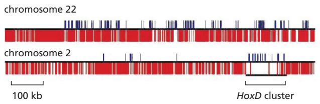
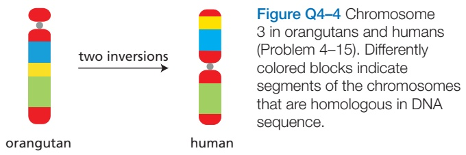
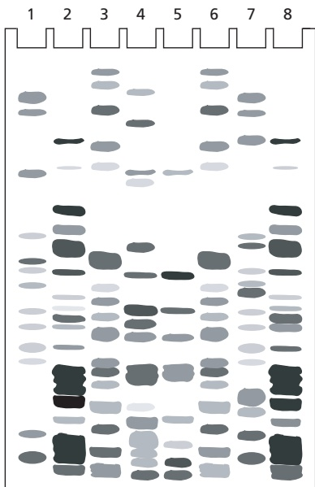
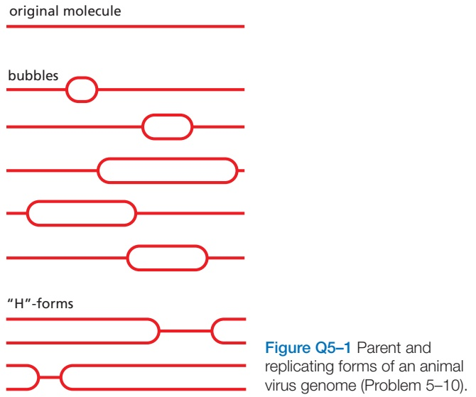
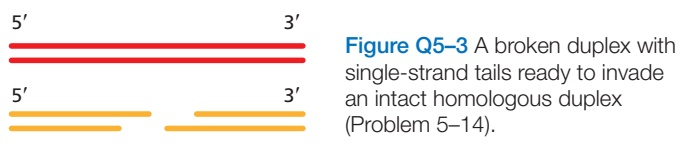
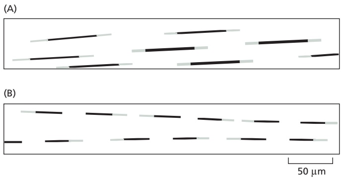
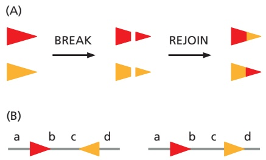
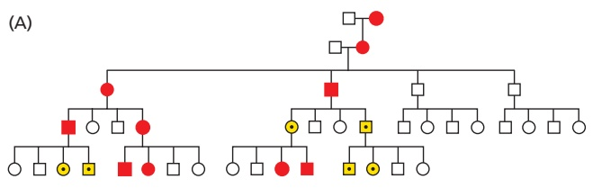
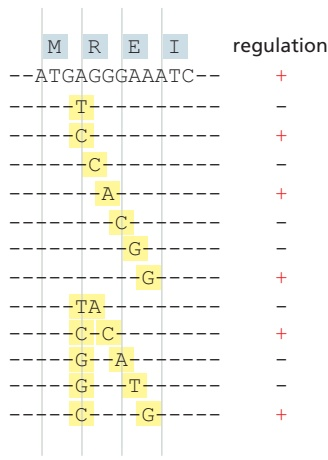

# 第9章 细胞核与染色质 · 英文习题与参考文献

### 英文补充：习题与参考文献

> 对应中文板块：习题与参考文献。英文来源：Molecular Biology of the Cell，第7版，第4章；[本章完整原文](../来源/英文教材/04_DNA_Chromosomes_and_Genomes/chapter.md)。物理PDF页码范围：222–291（整章范围）。

<!-- BEGIN EN EN04-EXERCISES -->
#### PROBLEMS

Which statements are true? Explain why or why not.

4–1 Human females have 23 different chromosomes, whereas human males have 24.

4–2 The four core histones are relatively small proteins with a very high proportion of positively charged amino acids; the positive charge helps the histones bind tightly to DNA, regardless of its nucleotide sequence.

4–3 Nucleosomes bind DNA so tightly that they cannot move from the positions where they are first assembled.

4–4 The long linear DNA molecule in an interphase chromosome is organized into loops of chromatin that appear to emanate from a central axis.

4–5 In a comparison between the DNAs of related organisms such as humans and mice, identifying the conserved DNA sequences facilitates the search for functionally important regions.

4–6 Gene duplication and divergence are thought to have played a critical role in the evolution of increased biological complexity.

Discuss the following problems.

4–7 DNA isolated from the bacterial virus M13 contains 25% A, 33% T, 22% C, and 20% G. Do these results strike you as peculiar? Why or why not? How might you explain these values?

4–8 A segment of DNA from the interior of a single strand is shown in **Figure Q4–1**. Should this sequence be written as ACT or TCA? Why?

Figure Q4–1 Three nucleotides from the interior of a single strand of DNA (Problem 4–8). Arrows at the ends of the DNA strand indicate that the structure continues in both directions.

4–9 Human DNA contains 20% C on a molar basis. What are the mole percents of A, G, and T?

4–10 In contrast to histone acetylation, which always correlates with gene activation, histone methylation can lead to either transcriptional activation or repression. How do you suppose that the same modification—methylation— can mediate different biological outcomes?

4–11 Why is a chromosome with two centromeres (a dicentric chromosome) unstable? Would a backup centromere not be a good thing for a chromosome, giving it two chances to form a kinetochore and attach to microtubules during mitosis? Surely, a backup centromere would ensure that the chromosome did not get left behind at mitosis.

4–12 Look at the two yeast colonies in **Figure Q4–2**. Each of these colonies contains about 100,000 cells descended from a single yeast cell, originally somewhere in the middle of the clump. A white colony arises when the Ade2 gene is expressed from its normal chromosomal location. When the Ade2 gene is moved near a telomere, however, it is packed into heterochromatin and inactivated in most cells, giving rise to colonies that are mostly red. In these largely red colonies, white sectors fan out from the middle of the colony. In both the red portions and the white sectors, the Ade2 gene is still located near telomeres. Explain why white sectors have formed near the rim of the red colony. On the basis of the patterns observed, what can you conclude about the propagation of the transcriptional state of the Ade2 gene from mother to daughter cells in this experiment?

Figure Q4–2 Position effect on expression of the yeast Ade2 gene (Problem 4–12). The Ade2 gene codes for one of the enzymes for adenosine biosynthesis, and the absence of the Ade2 gene product leads to the accumulation of a red pigment. Therefore, a colony of cells that express Ade2 is white, and one composed of cells in which the Ade2 gene is not expressed is red.

4–13 Chromosomes from different amphibians form typical lampbrush chromosomes when injected into oocytes as demembranated sperm heads. When the sperm heads from Rana pipiens (northern leopard frog), which forms large loops in its own oocyte chromosomes, were injected into Xenopus laevis oocytes, the resulting lampbrush chromosomes had the small loops typical of those found in X. laevis oocytes. Similarly, when the sperm heads from X. laevis were injected into Notophthalmus viridescens (red-spotted newt) oocytes, the resulting lampbrush chromosomes had the very large loop structure typical of N. viridescens.

Do these heterologous injection experiments support the idea that loop structure is a fixed property of a chromosome? Why or why not?

4–14 Mobile pieces of DNA—transposable elements— that insert themselves into chromosomes and accumulate during evolution make up more than 40% of the human genome. Transposable elements of four types—long interspersed nuclear elements (LINEs), short interspersed nuclear elements (SINEs), long terminal repeat (LTR) retrotransposons, and DNA transposons—are inserted more or less randomly throughout the human genome. These elements are conspicuously rare at the four homeobox gene clusters, HoxA, HoxB, HoxC, and HoxD, as illustrated for HoxD in **Figure Q4–3**, along with an equivalent region of chromosome 22, which lacks a Hox cluster. Each Hox cluster is about 100 kilobases (kb) in length and contains 9–11 genes, whose differential expression along the anteroposterior axis of the developing embryo establishes the basic body plan for humans (and for other animals). Why do you suppose that transposable elements are so rare in the Hox clusters?

Figure Q4–3 Transposable elements and genes in 1-megabase regions of chromosomes 2 and 22 (Problem 4–14). Blue lines that project upward indicate exons of known genes. Red lines that project downward indicate transposable elements; they are so numerous (constituting more than 40% of the human genome) that they merge into nearly a solid block outside the Hox clusters. (Adapted from E. Lander et al., Nature 409:860–921, 2001. With permission from Springer Nature.)

4–15 Chromosome 3 in orangutans differs from chromosome 3 in humans by two inversion events that occurred in the human lineage (**Figure Q4–4**). Draw the intermediate chromosome that resulted from the first inversion and explicitly indicate the segments included in each inversion.

4–16 There has been a colossal snafu in the maternity ward at your local hospital. Four sets of male twins, born within an hour of each other, were inadvertently shuffled in the excitement occasioned by that unlikely event. You have been called in to set things right. As a first step, you want to get the twins matched up. To that end, you analyze a small blood sample from each infant using a hybridization probe that detects differences in the numbers of simple sequence repeats such as $( \mathrm { C A } ) _ { n }$ located in widely scattered regions of the genome. The results are shown in **Figure Q4–5**.

A. Which infants are brothers? Are they all identical twins?

B. How will you match brothers to the correct parents?

infants

Figure Q4–5 DNA fingerprint analysis of shuffled twins (Problem 4–16).

#### REFERENCES

#### General

Hartwell L, Goldberg ML, Fischer JA & Hood L (2017) Genetics: From Genes to Genomes, 6th ed. Boston: McGraw-Hill.

Jobling M, Hollox E, Hurles M, et al. (2014) Human Evolutionary Genetics, 2nd ed. New York: Garland Science.

Strachan T & Read AP (2019) Human Molecular Genetics, 5th ed. New York: Garland Science.

#### The Structure and Function of DNA

Avery OT, MacLeod CM & McCarty M (1944) Studies on the chemical nature of the substance inducing transformation of pneumococcal types. J. Exp. Med. 79, 137–158.

Meselson M & Stahl FW (1958) The replication of DNA in E. coli. Proc. Natl. Acad. Sci. USA 44, 671–682.

Perutz MF (1993) Co-chairman’s remarks: Before the double helix. Gene 135, 9–13.

Watson JD & Crick FHC (1953) Molecular structure of nucleic acids; a structure for deoxyribose nucleic acid. Nature 171, 737–738.

#### Chromosomal DNA and Its Packaging in the Chromatin Fiber

Bowman GD & McKnight JN (2017) Sequence-specific targeting of chromatin remodelers organizes precisely positioned nucleosomes throughout the genome. Bioessays 39, 1–8.

Clapier CR, Iwasa J, Cairns BR & Peterson CL (2017) Mechanisms of action and regulation of ATP-dependent chromatin-remodelling complexes. Nat. Rev. Mol. Cell Biol. 18, 407–422.

Luger K, Mäder AW, Richmond RK . . . Richmond TJ (1997) Crystal structure of the nucleosome core particle at 2.8 Å resolution. Nature 389, 251–260.

Maeshima K, Ide S & Babokhov M (2019) Dynamic chromatin organization without the 30-nm fiber. Curr. Opin. Cell Biol. 58, 95–104.

Miga KH, Koren S, Rhie A . . . Eichler EE & Phillippy AM (2020) Telomere-to-telomere assembly of a complete human X chromosome. Nature 585, 79–84.

Talbert PB & Henikoff S (2021) Histone variants at a glance. J. Cell Sci. 134, jcs244749.

Zhao Y & Garcia BA (2015) Comprehensive catalog of currently bl B k Fi 4–32documented histone modifications. Cold Spring Harb. Perspect. Biol. 7, a025064.

Zhou CY, Johnson SL, Gamarra NI & Narlikar GJ (2016) Mechanisms of ATP-dependent chromatin remodeling motors. Annu. Rev. Biophys. 45, 153–181.

Zhou K, Gaullier G & Luger K (2019) Nucleosome structure and dynamics are coming of age. Nat. Struct. Mol. Biol. 26, 3–13.

#### The Effect of Chromatin Structure on DNA Function

Allis CD & Jenuwein T (2016) The molecular hallmarks of epigenetic control. Nat. Rev. Genet. 17, 487–500.

Black BE, Jansen LET, Foltz DR & Cleveland DW (2011) Centromere identity, function, and epigenetic propagation across cell divisions. Cold Spring Harb. Symp. Quant. Biol. 75, 403–418.

Elgin SCR & Reuter G (2013) Position-effect variegation, heterochromatin formation, and gene silencing in Drosophila. Cold Spring Harb. Perspect. Biol. 5, a017780.

Filion GJ, van Bemmel JG, Braunschweig U . . . van Steensel B (2010) Systematic protein location mapping reveals five principal chromatin types in Drosophila cells. Cell 143, 212–224.

Fodor BD, Shukeir N, Reuter G & Jenuwein T (2010) Mammalian su(var) genes in chromatin control. Annu. Rev. Cell Dev. Biol. 26, 471–501.

Giles KE, Gowher H, Ghirlando R . . . Felsenfeld G (2011) Chromatin boundaries, insulators, and long-range interactions in the nucleus. Cold Spring Harb. Symp. Quant. Biol. 75, 79–85.

Kasinath V, Poepsel S & Nogales E (2019) Recent structural insights into polycomb repressive complex 2 regulation and substrate binding. Biochemistry 58, 346–354.

Nicetto D & Zaret KS (2019) Role of H3K9me3 heterochromatin in cell identity establishment and maintenance. Curr. Opin. Genet. Dev. 55, 1–10.

Sanulli S, Gross JD & Narlikar GJ (2019) Biophysical properties of HP1-mediated heterochromatin. Cold Spring Harb. Symp. Quant. Biol. 84, 217–225.

Sullivan LL & Sullivan BA (2020) Genomic and functional variation of human centromeres. Exp. Cell Res. 389, 111896.

Xu M, Long C, Chen X . . . Zhu B (2010) Partitioning of histone H3-H4 tetramers during DNA replication-dependent chromatin assembly. Science 328, 94–98.

#### The Global Structure of Chromosomes

Callan HG (1982) Lampbrush chromosomes. Proc. R. Soc. Lond. Biol. Sci. 214, 417–448.

Cremer T & Cremer M (2010) Chromosome territories. Cold Spring Harb. Perspect. Biol. 2, a003889.

Feodorova Y, Falk M, Mirny LA & Solovei I (2020) Viewing nuclear architecture through the eyes of nocturnal mammals. Trends Cell Biol. 30, 276–289.

Ghirlando R & Felsenfeld G (2016) CTCF: making the right connections. Genes Dev. 30, 881–891.

Gibcus JH, Samejima K, Goloborodko A . . . Mirny LA & Dekker J (2018) A pathway for mitotic chromosome formation. Science 359, eaao6135.

Hildebrand EM & Dekker J (2020) Mechanisms and functions of chromosome compartmentalization. Trends Biochem. Sci. 45, 385–396.

Kharchenko PV, Alekseyenko AA, Schwartz YB . . . Karpen GH & Park PJ (2011) Comprehensive analysis of the chromatin landscape in Drosophila melanogaster. Nature 471, 480–485.

Kinoshita K & Hirano T (2017) Dynamic organization of mitotic chromosomes. Curr. Opin. Cell Biol. 46, 46–53.

Krietenstein N, Abraham S, Venev SV . . . Dekker J & Rando OJ (2020) Ultrastructural details of mammalian chromosome architecture. Mol. Cell. 78, 554–565.e7.

Kumar Y, Sengupta D & Bickmore W (2020) Recent advances in the spatial organization of the mammalian genome. J. Biosci. 45, 18.

Maeshima K & Laemmli UK (2003) A two-step scaffolding model for mitotic chromosome assembly. Dev. Cell 4, 467–480.

Terakawa T, Bisht S, Eeftens JM . . . Greene EC (2017) The condensin complex is a mechanochemical motor that translocates along DNA. Science 358, 672–676.

#### How Genomes Evolve

Doolittle WF & Brunet TDP (2017) On causal roles and selected effects: our genome is mostly junk. BMC Biol. 15, 116.

Friedli M & Trono D (2015) The developmental control of transposable elements and the evolution of higher species. Annu. Rev. Cell Dev. Biol. 31, 429–451.

Green RE, Krause J, Briggs A . . . Reich D & Pääbo S (2010) A draft sequence of the Neanderthal genome. Science 328, 710–722.

Harmston N, Baresic A & Lenhard B (2013) The mystery of extreme non-coding conservation. Philos. Trans. R. Soc. Lond. B Biol. Sci. 368, 20130021.

International Human Genome Sequencing Consortium (2001) Initial sequencing and analysis of the human genome. Nature 409, 860–921.

International Human Genome Sequencing Consortium (2004) Finishing the euchromatic sequence of the human genome. Nature 431, 931–945.

Kellis M, Wold B, Snyder MB . . . Hardison RC (2014) Defining functional DNA elements in the human genome. Proc. Natl. Acad. Sci. USA 111, 6131–6138.

Kostka D, Holloway AK & Pollard KS (2018) Developmental loci harbor clusters of accelerated regions that evolved independently in ape lineages. Mol. Biol. Evol. 35, 2034–2045.

Lander ES (2011) Initial impact of the sequencing of the human genome. Nature 470, 187–197.

Lappalainen T, Scott AJ, Brandt M & Hall IM (2019) Genomic analysis in the age of human genome sequencing. Cell 177, 70–84.

Mouse Genome Sequencing Consortium (2002) Initial sequencing and comparative analysis of the mouse genome. Nature 420, 520–562.

Ponting CP (2017) Biological function in the twilight zone of sequence conservation. BMC Biol. 15, 71.
<!-- END EN EN04-EXERCISES -->

### 英文补充：习题与参考文献

> 对应中文板块：习题与参考文献。英文来源：Molecular Biology of the Cell，第7版，第5章；[本章完整原文](../来源/英文教材/05_DNA_Replication_Repair_and_Recombination/chapter.md)。物理PDF页码范围：292–359（整章范围）。

<!-- BEGIN EN EN05-EXERCISES -->
#### PROBLEMS

Which statements are true? Explain why or why not.

5–1 The majority of cells in your body have exactly the same nucleotide sequence in their genomes.

5–2 In a replication bubble, the same parent DNA strand serves as the template strand for leading-strand synthesis at one replication fork and as the template for lagging-strand synthesis at the other fork.

5–3 In E. coli, where the replication fork travels at 500 nucleotide pairs per second, the DNA ahead of the fork—in the absence of topoisomerase—would have to rotate at nearly 3000 revolutions per minute.

5–4 When bidirectional replication forks from adjacent origins meet, a leading strand always runs into a lagging strand.

5–5 DNA repair mechanisms all depend on the cell having two homologous chromosomes.

Discuss the following problems.

5–6 To determine the reproducibility of mutation frequency measurements, you do the following experiment. You inoculate each of 10 cultures with a single E. coli bacterium, allow the cultures to grow until each contains 106 cells, and then measure the number of cells in each culture that carry a mutation in your gene of interest. You were so surprised by the initial results that you repeated the experiment to confirm them. Both sets of results display the same extreme variability, as shown in **Table Q5–1**. Assuming that the rate of mutation is constant, why do you suppose there is so much variation in the frequencies of mutant cells in different cultures?

<table><tbody><tr><td colspan="11">TABLE Q5-1 Frequencies of mutant cells in multiple cultures (Problem 5-6)</td></tr><tr><td rowspan="2">Experiment</td><td colspan="10">Culture (mutant cells/106 cells)</td></tr><tr><td>1</td><td>2</td><td>3</td><td>4</td><td>5</td><td>6</td><td>7</td><td>8</td><td>9</td><td>10</td></tr><tr><td>1</td><td>4</td><td>0</td><td>257</td><td>1</td><td>2</td><td>32</td><td>0</td><td>0</td><td>2</td><td>1</td></tr><tr><td>2</td><td>128</td><td>0</td><td>1</td><td>4</td><td>0</td><td>0</td><td>66</td><td>5</td><td>0</td><td>2</td></tr></tbody></table>

5–7 Discuss the following statement: “Primase is a sloppy enzyme that makes many mistakes. Eventually, the RNA primers it makes are replaced with DNA made by a polymerase with higher fidelity. This is wasteful. It would be more energy-efficient if a DNA polymerase made an accurate copy in the first place.”

5–8 If DNA polymerase requires a perfectly paired primer in order to add the next nucleotide, how is it that any mismatched nucleotides “escape” this requirement and become substrates for mismatch repair enzymes?

5–9 DNA repair enzymes preferentially repair mismatched bases on the newly synthesized DNA strand, using the old DNA strand as a template. If mismatches were instead repaired without regard for which strand served as template, would mismatch repair reduce replication errors? Would such a mismatch repair system result in fewer mutations, more mutations, or the same number of mutations as there would have been without any repair at all? Explain your answers.

5–10 The laboratory you joined is studying the life cycle of an animal virus that uses circular, double-stranded DNA as its genome. Your project is to define the location of the origin(s) of replication and to determine whether replication proceeds in one or both directions away from an origin (unidirectional or bidirectional replication). To accomplish your goal, you broke open cells infected with the virus, isolated replicating viral genomes, cleaved them with a restriction nuclease that cuts the genome at only one site to produce a linear molecule from the circle, and examined the resulting molecules in the electron microscope. Some of the molecules you observed are illustrated schematically in **Figure Q5–1**. (Note that it is impossible to distinguish the orientation of one DNA molecule relative to another in the electron microscope because they land on the electron microscope grid in random orientations.)

You must present your conclusions to the rest of the lab tomorrow. How will you answer the two questions your advisor posed for you? Is there a single, unique origin of replication or several origins? Is replication unidirectional or bidirectional?

5–11 You are investigating DNA synthesis in tissueculture cells, using 3H-thymidine to radioactively label the replication forks. By breaking open the cells in a way that allows some of the DNA strands to be stretched out, very long DNA strands can be isolated intact and examined. You overlay the DNA with a photographic emulsion,MB C7 5.01 and expose it for 3–6 months, a procedure known as autoradiography. Because the emulsion is sensitive to radioactive emissions, the 3H-labeled DNA shows up as tracks of silver grains. Because the stretching collapses replication bubbles, the daughter duplexes lie side by side and cannot be distinguished from each other.

Figure Q5–2 Autoradiographic investigation of DNA replication in cultured cells (Problem 5–11). (A) Addition of 3H-labeled thymidine immediately after release from the arrest. (B) Addition of 3H-labeled thymidine 30 minutes after release from the arrest.

You treat the cells to arrest them at the beginning of S phase. In the first experiment, you release the arrest MBoC7 Q5.02 and add 3H-thymidine immediately. After 30 minutes, you wash the cells and change the medium so that the total concentration of thymidine is the same as it was, but only one-third of it is radioactive. After an additional 15 minutes, you prepare DNA for autoradiography. The results of this experiment are shown in **Figure Q5–2A**. In the second experiment, you release the arrest and wait 30 minutes before adding 3H-thymidine. After 30 minutes in the presence of 3H-thymidine, you once again change the medium to reduce the concentration of radioactive thymidine and incubate the cells for an additional 15 minutes. The results of the second experiment are shown in **Figure Q5–2B**.

A. Explain why, in both experiments, some regions of the tracks are dense with silver grains (dark), whereas others are less dense (light).

B. In the first experiment, each track has a central dark section with light sections at each end. In the second experiment, the dark section of each track has a light section at only one end. Explain the reason for this difference.

C. Estimate the rate of fork movement (μm/min) in these experiments. Do the estimates from the two experiments agree? Can you use this information to gauge how long it would take to replicate the entire genome?

5–12 If you compare the frequency of the 16 possible dinucleotide sequences in the E. coli and human genomes, there are no striking differences except for one dinucleotide, 5′-CG-3′. The frequency of CG dinucleotides in the human genome is significantly lower than in E. coli and significantly lower than expected by chance. Why do you suppose that CG dinucleotides are underrepresented in the human genome?

5–13 With age, somatic cells are thought to accumulate genomic “scars” as a result of the inaccurate repair of double-strand breaks by nonhomologous end joining (NHEJ). Estimates based on the frequency of breaks in primary human fibroblasts suggest that by age 70, each human somatic cell may carry some 2000 NHEJ-induced mutations due to inaccurate repair. If these mutations were distributed randomly around the genome, how many protein-coding genes would you expect to be affected? Would you expect cell function to be compromised? Why or why not? (Assume that 2% of the genome—1.5% proteincoding and 0.5% regulatory—is crucial information.)

5–14 Draw a schematic diagram of the double Holliday junction that would result from strand invasion by both ends of the broken duplex into the intact homologous duplex shown in **Figure Q5–3**. Label the left end of each strand in the Holliday junction 5′ or 3′ so that the relationship to the parent and recombinant duplexes is clear. Indicate how DNA synthesis would be used to fill in any single-strand gaps in your double Holliday junction.

5–15 In addition to correcting DNA mismatches, the mismatch repair system acts to discourage homologous recombination between DNA duplexes that are only moderately similar in sequence. Why would recombination MBoC7 Q5.03between moderately similar sequences pose a problem for human cells?

5–16 Cre recombinase is a site-specific enzyme that catalyzes recombination between two LoxP DNA sites. Cre recombinase pairs two LoxP sites in the same orientation, breaks both duplexes at the same point in each LoxP site, and joins the ends with new partners so that each LoxP site is regenerated, as shown schematically in **Figure Q5–4A**. On the basis of this mechanism, predict the arrangement of sequences that will be generated by Cre-mediated site-specific recombination for each of the two DNAs shown in **Figure Q5–4B**.

Figure Q5–4 Cre recombinase–mediated site-specific recombination (Problem 5–16). (A) Schematic representation of Cre/LoxP site–specific recombination. The LoxP sequences in the DNA are represented by triangles that are colored differently so that the site-specific recombination event can be followed more readily. In reality their DNA sequences are identical. (B) DNA substrates containing two arrangements of LoxP sites.

5–17 It is thought that a self-correcting polymerase MBoC7 Q5.04cannot start chains de novo because the initial nucleotides will be weakly paired, thus subject to removal by an efficient proofreading exonuclease. This argument implies the converse: an enzyme that starts chains anew cannot be efficient at self-correction. Remarkably, SARS-CoV-2 encodes an RNA replicase complex that is able to do both: using RNA as a template, it starts strands de novo and removes errors with an efficient 3′-to-5′ proofreading exonuclease. How might this be possible?

#### REFERENCES

#### General

Brown TA (2017) Genomes 4. New York: Garland Science.

Friedberg EC, Walker GC, Siede W et al. (2005) DNA Repair and Mutagenesis. Washington, DC: ASM Press.

Haber JE (2013) Genome Stability: DNA Repair and Recombination. New York: Garland Science.

Stent GS (1971) Molecular Genetics: An Introductory Narrative. San Francisco: WH Freeman.

Watson J, Baker T, Bell S et al. (2013) Molecular Biology of the Gene, 7th ed. Menlo Park, CA: Benjamin Cummings.

#### The Maintenance of DNA Sequences

Catarina D & Eichler EE (2013) Properties and rates of germline mutations in humans. Trends Genet. 29, 575–584.

Conrad DF, Keebler J, DePristo M . . . 1000 Genomes Project (2011) Variation in genome-wide mutation rates within and between human families. Nat. Genet. 43, 712–714.

Hedges SB (2002) The origin and evolution of model organisms. Nat. Rev. Genet. 3, 838–849.

King MC & Wilson AC (1965) Evolution at two levels in humans and chimpanzees. Science 188, 107–116.

#### DNA Replication Mechanisms

Kornberg A (1960) Biological synthesis of DNA. Science 131, 1503–1508.

Li JJ & Kelly TJ (1984) SV40 DNA replication in vitro. Proc. Natl. Acad. Sci. USA 81, 6973–6977.

Meselson M & Stahl FW (1958) The replication of DNA in E. coli. Proc. Natl. Acad. Sci. USA 44, 671–682.

Modrich P (2016) Mechanisms in E. coli and human mismatch repair (Nobel Lecture). Angew. Chem. Int. Ed. Engl. 55(30), 8490–8501.

Okazaki R, Okazaki T, Sakabe K, Sugimoto K & Sugino A (1968) Mechanism of DNA chain growth. I. Possible discontinuity and unusual secondary structure of newly synthesized chains. Proc. Natl. Acad. Sci. USA 59, 598–605.

Yao NY & O’Donnell ME (2021) The DNA replication machine: structure and dynamic function. In Macromolecular Protein Complexes III: Structure and Function (Harris JR & Marles-Wright J, eds.), pp. 233–258. Subcellular Biochemistry, Vol. 96. Cham, Switzerland: Springer.

#### The Initiation and Completion of DNA Replication in Chromosomes

Bell SP & Labib K (2016) Chromosome duplication in Saccharomyces cerevisiae. Genetics 203(3), 1027–1067.

Chan SR & Blackburn EH (2004) Telomeres and telomerase. Philos. Trans. R. Soc. Lond. B Biol. Sci. 359, 109–121.

Dewar JM & Walter JC (2017) Mechanisms of DNA replication termination. Nat. Rev. Mol. Cell Biol. 18, 507–516.

On KF, Jaremko M, Stillman B & Leemor JT (2018) A structural view of the initiators for chromosome replication. Curr. Opin. Struct. Biol. 53, 131–139.

Roake CM & Artandi SE (2020) Regulation of human telomerase in homeostasis and disease. Nat. Rev. Mol. Cell Biol. 21, 384–397.

Schvartzman JB, Hernandez P, Krimer DB, Dorier J & Stasiak A (2019) Closing the DNA replication cycle: from simple circular molecules to supercoiled and knotted DNA catenanes. Nucleic Acids Res. 47(14), 7182–7198.

Wang Y, Su ˘sac L & Feigon J (2019) Structural biology of telomerase. Cold Spring Harb. Perspect. Biol. 11(12), a032383.

#### DNA Repair

Her J & Bunting SF (2018) How cells ensure correct repair of DNA double-strand breaks. J. Biol. Chem. 293(27), 10502–10511.

Lindahl T (1993) Instability and decay of the primary structure of DNA. Nature 362, 709–715.

Sancar A (2016) Mechanisms of DNA repair by photolyase and excision nuclease (Nobel Lecture). Angew. Chem. Int. Ed. Engl. 55(30), 8502–8527.

Van den Heuvel D, Van der Weegen Y, Boer DEC, Ogi T & Luijsterburg MS (2021) Transcription-coupled DNA repair: from mechanism to human disorder. Trends Cell Biol. 31(5), 359–371.

Yang W & Gao Y (2018) Translesion and repair DNA polymerases: diverse structure and mechanism. Annu. Rev. Biochem. 87, 239–261.

Zhao B, Rothenberg E, Ramsden DA & Lieber MR (2020) The molecular basis and disease relevance of non-homologous DNA end joining. Nat. Rev. Mol. Cell Biol. 21, 765–781.

#### Homologous Recombination

Cox MM (2001) Historical overview: searching for replication help in all of the rec places. Proc. Natl. Acad. Sci. USA 98, 8173–8180.

Haber JE (2016) A life investigating pathways that repair broken chromosomes. Annu. Rev. Genet. 50, 1–28.

Holliday R (1990) The history of the DNA heteroduplex. BioEssays 12, 133–142.

Kreuzer KN & Brister JR (2010) Initiation of bacteriophage T4 DNA replication and replication fork dynamics: a review in the Virology Journal series on bacteriophage T4 and its relatives. Virol. J. 7, 358.

Szostak JW, Orr-Weaver TK, Rothstein RJ & Stahl FW (1983) The double-strand break repair model for recombination. Cell 33, 25–35.

Wyatt HDM & West SC (2014) Holliday junction resolvases. Cold Spring Harb. Perspect. Biol. 6(9), a023192.

Zickler D & Kleckner N (2015) Recombination, pairing, and synapsis of homologs during meiosis. Cold Spring Harb. Perspect. Biol. 7(6), a016626.

#### Transposition and Conservative Site-specific Recombination

Comfort NC (2001) From controlling elements to transposons: Barbara McClintock and the Nobel Prize. Trends Biochem. Sci. 26, 454–457.

Huang, CR, Burns KH & Boeke JD (2012) Active transposition in genomes. Annu. Rev. Genet. 46, 651–675.

Payer LM & Burns KH (2019) Transposable elements in human genetic disease. Nat. Rev. Genet. 20(12), 760–772.

Varmus H (1988) Retroviruses. Science 240, 1427–1435.
<!-- END EN EN05-EXERCISES -->

### 英文补充：习题与参考文献

> 对应中文板块：习题与参考文献。英文来源：Molecular Biology of the Cell，第7版，第7章；[本章完整原文](../来源/英文教材/07_Control_of_Gene_Expression/chapter.md)。物理PDF页码范围：436–513（整章范围）。

<!-- BEGIN EN EN07-EXERCISES -->
#### PROBLEMS

Which statements are true? Explain why or why not.

7–1 When the nucleus of a fully differentiated carrot cell is injected into a frog egg whose nucleus has been removed, the injected donor nucleus is capable of programming the recipient egg to produce a normal carrot.

7–2 In terms of the way it interacts with DNA, the helix–loop–helix motif is more closely related to the leucine zipper motif than it is to the helix–turn–helix motif.

7–3 Many transcription regulators in eukaryotes can act even when they are bound to DNA thousands of nucleotide pairs away from the promoter they influence.

7–4 Once cells have differentiated to their final specialized forms, they never again alter expression of their genes.

7–5 CG islands are thought to have arisen during evolution because they were associated with portions of the genome that remained unmethylated in the germ line.

7–6 In one extreme case, a single gene in Drosophila— the Dscam gene—has the potential to produce more than 38,000 different proteins by alternative splicing; thus, the complexity of this one gene rivals the complexity of the whole human genome.

7–7 crRNAs in bacteria and piRNAs in animals serve analogous functions; they defend against foreign invaders.

Discuss the following problems.

7–8 Comparisons of the patterns of mRNA abundance across different human cell types show that the level of expression of almost every active gene is different. The patterns of mRNA abundance are so characteristic of cell type that they can be used to determine the tissue of origin of cancer cells, even though the cells may have metastasized to different parts of the body. By definition, however, cancer cells are different from their noncancerous precursor cells. How do you suppose then that patterns of mRNA expression might be used to determine the tissue source of a human cancer?

7–9 What are the two fundamental components of a genetic switch?

7–10 The nucleus of a eukaryotic cell is much larger than a bacterium, and it contains much more DNA. As a consequence, a transcription regulator in a eukaryotic cell must be able to select its specific binding site from among many more unrelated sequences than does a transcription regulator in a bacterium. Does this present any special problems for eukaryotic gene regulation?

Consider the following situation. Assume that the eukaryotic nucleus and the bacterial cell each have a single copy of the same DNA binding site. In addition, assume that the nucleus is 500 times the volume of the bacterium and has 500 times as much DNA. If the concentration of the transcription regulator that binds the site were the same in the nucleus and in the bacterium, would the regulator occupy its binding site equally as well in the eukaryotic nucleus as it does in the bacterium? Explain your answer.

7–11 The genes encoding the enzymes for arginine biosynthesis are located at several positions around the genome of E. coli. The ArgR transcription regulator coordinates their expression. The activity of ArgR is modulated by arginine. Upon binding arginine, ArgR dramatically changes its affinity for the cis-regulatory sequences in the promoters of the genes for the arginine biosynthetic enzymes. Given that ArgR is a transcription repressor, would you expect that ArgR would bind more tightly or less tightly to the regulatory sequences when arginine is abundant? If ArgR functioned instead as a transcription activator, would you expect the binding of arginine to increase or to decrease its affinity for its regulatory sequences? Explain your answers.

7–12 Some transcription regulators bind to DNA and cause the double helix to bend at a sharp angle. Such “bending proteins” can affect the initiation of transcription without directly contacting any other protein. Can you devise a plausible explanation for how such proteins might work to modulate transcription? Draw a diagram that illustrates your explanation.

7–13 How is it that protein–protein interactions that are too weak to cause proteins to assemble in solution can nevertheless allow the same proteins to assemble into complexes on DNA?

7–14 Imagine the two situations shown in **Figure Q7–1**. In cell 1, a transient signal induces the synthesis of protein A, which is a transcription activator that turns on many genes including its own. In cell 2, a transient signal induces the synthesis of protein R, which is a transcription repressor that turns off many genes including its own. In which, if either, of these situations will the descendants of the original cell “remember” that the progenitor cell had experienced the transient signal? Explain your reasoning.

Figure Q7–1 Gene regulatory circuits and cell memory (Problem 7–14). (A) Induction of synthesis of transcription activator A by a transient signal. (B) Induction of synthesis of transcription repressor R by a transient signal.

7–15 Examine the two pedigrees shown in **Figure Q7–2**. One results from deletion of a maternally imprinted autosomal gene. The other pedigree results from deletion of a paternally imprinted autosomal gene. In both pedigrees, affected individuals (red symbols) are heterozygous for the deletion. These individuals are affected because one copy of the chromosome carries an imprinted, inactive gene, while the other carries a deletion of the gene. Dotted yellow symbols indicate individuals that carry the deleted locus but do not display the mutant phenotype. Which pedigree is based on paternal imprinting and which on maternal imprinting? Explain your answer.

Figure Q7–2 Pedigrees reflecting maternal and paternal imprinting (Problem 7–15). In one pedigree, the gene is paternally imprinted; in the other, it is maternally imprinted. In generations 3 and 4, only one of the two parents in the indicated matings is shown; the other parent is a normal individual from outside this pedigree. Affected individuals are represented by red circles for females and red squares for males. Dotted yellow symbols indicate individuals that carry the deletion but do not display the phenotype.

7–16 To determine the role of the Xist gene in Xinactivation, scientists generated embryonic stem cells that carried one normal X chromosome and one mutant X chromosome with a nonfunctional Xist gene. Sequence differences allowed them to distinguish the two X chromosomes. What pattern of X-inactivation do you predict was observed in mice derived from these embryonic stem cells? Explain your reasoning.

A. Only the normal X chromosomes were inactivated.

B. Only the mutant X chromosomes were inactivated.

C. None of the X chromosomes were inactivated.

D. The X chromosomes were randomly inactivated.

7–17 The level of β-tubulin gene expression in cells is controlled by an unusual regulatory pathway, in which the intracellular concentration of free tubulin dimers (composed of one α-tubulin and one β-tubulin subunit) regulates the rate of new β-tubulin synthesis at the level of β-tubulin mRNA stability. The first 12 nucleotides of the coding portion of the mRNA were found to contain the site responsible for this autoregulatory control. Because the critical segment of the mRNA involves a coding region, it was not clear whether the regulation of mRNA stability resulted from the interaction of tubulin dimers with the RNA or with the nascent protein. Either interaction might plausibly trigger a nuclease that would destroy the mRNA.

These two possibilities were tested by mutagenizing the regulatory region on a cloned version of the gene. The mutant genes were then expressed in cells, and the stability of their mRNAs was assayed in the presence of excess free tubulin dimers. The results from a dozen mutants that affect the regulatory region of the mRNA are shown in **Figure Q7–3**. Does the regulation of β-tubulin mRNA stability result from an interaction with the RNA or from an interaction with the encoded protein? Explain your reasoning. (The genetic code is inside the back cover of this book.)

Figure Q7–3 Effects of mutations on the regulation of β-tubulin mRNA stability (Problem 7–17). The wild-type sequence for the first 12 nucleotides of the coding portion of the gene is shown at the top, and the first four amino acids beginning with methionine (M) are indicated above the codons. The nucleotide changes in the 12 mutants are shown below; only the altered nucleotides are indicated. Regulation of mRNA stability is shown on the right: + indicates wild-type response to changes in intracellular tubulin concentration, and – indicates no response to changes. Vertical lines mark the position of the first nucleotide in each codon.

7–18 If you insert a b-galactosidase gene lacking its own transcription control region into a cluster of piRNA genes in Drosophila, you find that β-galactosidase expression from a normal copy elsewhere in the genome is strongly inhibited in the fly’s germ cells. If the inactive b-galactosidase gene is inserted outside the piRNA gene cluster, the normal gene is properly expressed. What do you suppose is the basis for this observation? How would you test your hypothesis?

#### REFERENCES

#### General

Barressi MJF & Gilbert SF (2020) Developmental Biology, 12th ed. Sunderland, MA: Sinauer Associates.

Brown TA (2017) Genomes 4. New York: Garland Science.

Craig N, Green R, Greider C, Storz G, Wolberger C & Cohen-Fix O (2021) Molecular Biology: Principles of Genome Function, 2nd ed. Oxford: Oxford University Press.

Goldberg ML, Fischer J, Hood L & Hartwell L (2021) Genetics: From Genes to Genomes, 7th ed. Boston: McGraw-Hill.

Watson J, Baker T, Bell S et al. (2013) Molecular Biology of the Gene, 7th ed. Menlo Park, CA: Benjamin Cummings.

#### An Overview of Gene Control

Davidson EH (2006) The Regulatory Genome: Gene Regulatory Networks in Development and Evolution. Burlington, MA: Elsevier.

Gurdon JB (1992) The generation of diversity and pattern in animal development. Cell 68, 185–199.

Ptashne M & Gann A (2002) Genes and Signals. Cold Spring Harbor, NY: Cold Spring Harbor Laboratory Press.

#### Control of Transcription by Sequence-specific DNA-binding Proteins

Gilbert W & Müller-Hill B (1967) The lac operator is DNA. Proc. Natl. Acad. Sci. USA 58, 2415.

McKnight SL (1991) Molecular zippers in gene regulation. Sci. Am. 264, 54–64.

Weirauch MT & Hughes TR (2011) A catalogue of eukaryotic transcription factor types, their evolutionary origin, and species distribution. In A Handbook of Transcription Factors (Hughes TR, ed.), pp. 25–74. New York: Springer.

#### Transcription Regulators Switch Genes On and Off

Beckwith J (1987) The operon: an historical account. In Escherichia coli and Salmonella typhimurium: Cellular and Molecular Biology (Neidhart FC, Ingraham JL, Low KB et al., eds.), Vol. 2, pp. 1439–1443. Washington, DC: ASM Press.

Goldstein I & Hager GL (2018) Dynamic enhancer function in the chromatin context. Wiley Interdiscip. Rev. Syst. Biol. Med. 10(1), 10.1002/wsbm.1390.

Hahn S (2018) Phase separation, protein disorder, and enhancer function. Cell 175(7), 1723–1725.

Hnisz D, Shrinivas K, Young RA . . . Sharp PA (2017) A phase separation model for transcriptional control. Cell 169(1), 13–23.

Jacob F & Monod J (1961) Genetic regulatory mechanisms in the synthesis of proteins. J. Mol. Biol. 3, 318–356.

McSwiggen DT, Mir M, Darzacq X & Tjian R (2019) Evaluating phase separation in live cells: diagnosis, caveats, and functional consequences. Genes Dev. 33(23-24), 1619–1634.

Patel AB, Greber BJ & Nogales E (2020) Recent insights into the structure of TFIID, its assembly, and its binding to core promoter. Curr. Opin. Struct. Biol. 61, 17–24.

Ptashne M (2004) A Genetic Switch: Phage Lambda Revisited, 3rd ed. Cold Spring Harbor, NY: Cold Spring Harbor Laboratory Press.

Soutourina J (2018) Transcription regulation by the Mediator complex. Nat. Rev. Mol. Cell Biol. 19(4), 262–274.

#### Molecular Genetic Mechanisms That Create and Maintain Specialized Cell Types

Alon U (2007) Network motifs: theory and experimental approaches. Nature 8, 450–461.

Hobert O (2011) Regulation of terminal differentiation programs in the nervous system. Annu. Rev. Cell Dev. Biol. 27, 681–696.

Lawrence PA (1992) The Making of a Fly: The Genetics of Animal Design. New York: Blackwell Scientific.

Rickels R & Shilatifard A (2018) Enhancer logic and mechanics in development and disease. Trends Cell Biol. 28(8), 608–630.

#### Mechanisms That Reinforce Cell Memory in Plants and Animals

Brahma S & Henikoff S (2020) Epigenome regulation by dynamic nucleosome unwrapping. Trends Biochem. Sci. 45(1), 13–26.

Deaton AM & Bird A (2011) CpG islands and the regulation of transcription. Genes Dev. 25(10), 1010–1022.

Galupa R & Heard E (2018) X-chromosome inactivation: a crossroads between chromosome architecture and gene regulation. Annu. Rev. Genet. 52, 535–566.

Klemm SL, Shipony Z & Greenleaf WJ (2019) Chromatin accessibility and the regulatory epigenome. Nat. Rev. Genet. 20(4), 207–220.

Ondi ˘cová M, Oakey RJ & Walsh CP (2020) Is imprinting the result of “friendly fire” by the host defense system? PLoS Genet. 16(4), e1008599.

Schmitz RJ, Lewis ZA & Goll MG (2019) DNA methylation: shared and divergent features across eukaryotes. Trends Genet. 35(11), 818–827.

#### Post-transcriptional Controls

Breaker RR (2018) Riboswitches and translation control. Cold Spring Harb. Perspect. Biol. 10(11), a032797.

Chen LL (2020) The expanding regulatory mechanisms and cellular functions of circular RNAs. Nat. Rev. Mol. Cell Biol. 21(8), 475–490.

Das S, Vera M, Gandin V . . . Tutucci E (2021) Intracellular mRNA transport and localized translation. Nat. Rev. Mol. Cell Biol. 22, 483–504.

Gottesman S & Storz G (2011) Bacterial small RNA regulators: versatile roles and rapidly evolving variations. Cold Spring Harb. Perspect. Biol. 3, a003798.

Hershey JWB, Sonenberg N & Mathews MB (2012) Principles of translational control: an overview. Cold Spring Harb. Perspect. Biol. 4, a011528.

Kortmann J & Narberhaus F (2012) Bacterial RNA thermometers: molecular zippers and switches. Nat. Rev. Microbiol. 10, 255–265.

Schwartz S (2016) Cracking the epitranscriptome. RNA 22(2), 169–174.

Tauber D, Tauber G & Parker R (2020) Mechanisms and regulation of RNA condensation in RNP granule formation. Trends Biochem. Sci. 45(9), 764–778.

Thompson SR (2012) Tricks an IRES uses to enslave ribosomes. Trends Microbiol. 20, 558–566.

Tian B & Manley JL (2017) Alternative polyadenylation of mRNA precursors. Nat. Rev. Mol. Cell Biol. 18(1), 18–30.

Yablonovitch AL, Deng P, Jacobson D & Li JB (2017) The evolution and adaptation of A-to-I RNA editing. PLoS Genet. 13(11), e1007064.

#### Regulation of Gene Expression by Noncoding RNAs

Bartel DP (2018) Metazoan microRNAs. Cell 173(1), 20–51.

Czech B, Munafò M, Ciabrelli F . . . Hannon GJ (2018) piRNA-guided genome defense: from biogenesis to silencing. Annu. Rev. Genet. 52, 131–157.

Fire A, Xu S, Montgomery MK . . . Mello CC (1998) Potent and specific genetic interference by double-stranded RNA in Caenorhabditis elegans. Nature 391, 806–811.

Geis FK & Goff SP (2020) Silencing and transcriptional regulation of endogenous retroviruses: an overview. Viruses 12(8), 884.

Ozata DM, Gainetdinov I, Zoch A . . . Zamore PD (2019) PIWI-interacting RNAs: small RNAs with big functions. Nat. Rev. Genet. 20(2), 89–108.

Statello L, Guo CJ, Chen LL & Huarte M (2021) Gene regulation by long non-coding RNAs and its biological functions. Nat. Rev. Mol. Cell Biol. 22(2), 96–118.

Wiedenheft B, Sternberg SH & Doudna JA (2012) RNA-guided genetic silencing systems in bacteria and archaea. Nature 482, 331–338.
<!-- END EN EN07-EXERCISES -->
