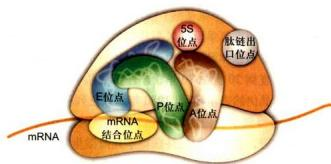
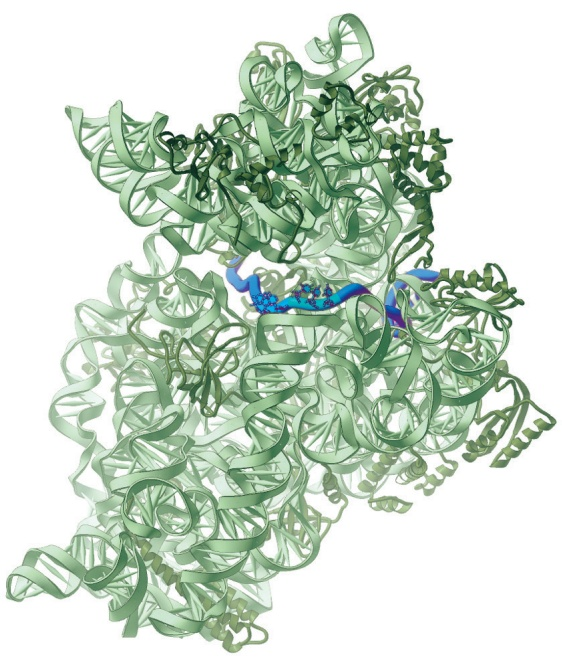
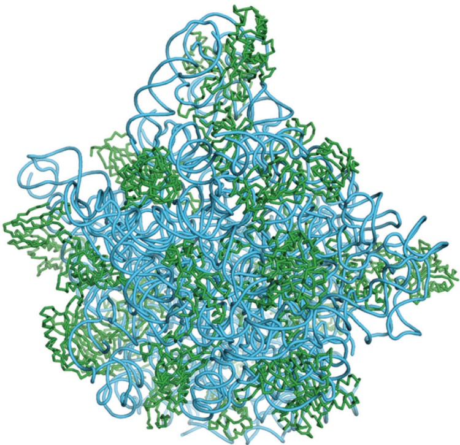
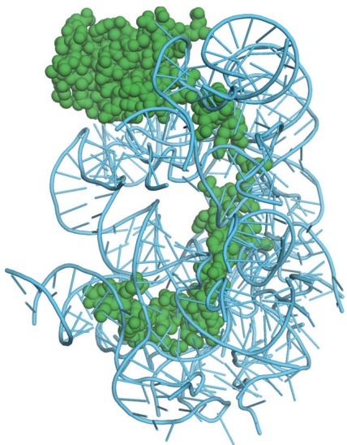

# 第10章 核糖体 · 第一节 核糖体的类型与结构

[返回本章](../README.md) · [中文本章原文](../中文原文.md)

<!-- BEGIN CN CN10-S01 -->
## 第一节 核糖体的类型与结构

## 一、核糖体的基本类型与化学组成

核糖体有两种基本类型：一种是原核细胞核糖体，另一种是真核细胞核糖体。两种核糖体都由两个大小不同的亚基（subunit）组成，每个亚基都含有大量的rRNA和蛋白质。原核细胞核糖体沉降系数为70S（S为Svedberg沉降系数单位），分子质量约为2 500 kDa；真核细胞核糖体沉降系数为80S，分子质量约为4 200 kDa。体外实验表明，70S核糖体在 $Mg^{2+}$ 浓度小于1 mmol/L的溶液中，易解离为50S与30S的大小亚基（图10-1）。当溶液中 $Mg^{2+}$ 浓度大于10 mmol/L时，两个核糖体常常形成100S的二聚体。真核细胞线粒粒体与叶绿体内有自身的核糖体，叶绿体中核糖体沉降系数近似于70S，而线粒体中核糖体的沉降系数在不同物种间有所差异，酿酒酵母线粒体核糖体沉降系数近似于70S，而哺乳动物线粒体中核糖体沉降系数为55S。

用EDTA、尿素和一价盐可逐级去掉核糖体上的核糖体蛋白，最后得到纯的rRNA。对核糖体的成分分析结果如表10-1所示。在原核细胞大肠杆菌中，50S与30S的大小亚基的分子质量分别为 $1600\mathrm{kDa}$ 和 $900\mathrm{kDa}$ 。小亚基中含有一个16S的rRNA分子，分子质量为 $600\mathrm{kDa}$ ，由1542个核苷酸组成。大亚基含有一个23S的rRNA分子，分子质量为1200 kDa，由2904个核苷酸组成。大亚基还含有一个5S的rRNA，分子质量为30 kDa，仅由120个核苷酸组成。从30S小亚基中已发现有21种不同的蛋白质分子（称为S蛋白），50S的大亚基约含34种蛋白质（称为L蛋白）。在大肠杆菌核糖体中除了L7/L12有4个拷贝，其余的核糖体蛋白仅有一个拷贝。

  
图 10-1 原核细胞核糖体结构模式图（不同侧面观）

80S 核糖体普遍存在于真核细胞内，对分离的核糖体进行理化性质测定，发现与原核细胞核糖体具有类似的特征。随着溶液中 $Mg^{2+}$ 浓度的降低，80S 核糖体可解离为 60S 与 40S 的大小亚基；当 $Mg^{2+}$ 浓度增高时，80S 核糖体又可形成 120S 的二聚体。对 80S 核糖体的成分分析结果如表 10-1 所示，60S 与 40S 亚基的分子质量分别为 2 800 kDa 与 1 400 kDa。小亚基中含有一个 18S 的 rRNA 分子，分子质量为 900 kDa。大亚基中含有一个 28S 的 rRNA 分子，分子质量为 1 600 kDa，还含有一个 5S 的 rRNA 分子和一个 5.8S 的 rRNA 分子。

表 10-1 原核细胞与真核细胞核糖体成分比较

<table><tr><td rowspan="2">类型</td><td colspan="2">核糖体大小</td><td rowspan="2">亚基种类</td><td colspan="2">亚基大小</td><td rowspan="2">亚基蛋白数</td><td colspan="2">亚基RNA</td></tr><tr><td>S值</td><td>分子质量/kDa</td><td>S值</td><td>分子质量/kDa</td><td>S值</td><td>碱基数/bp</td></tr><tr><td rowspan="3">原核细胞的核糖体(大肠杆菌)</td><td>70</td><td>2300</td><td>大亚基</td><td>50</td><td>1600</td><td>34</td><td>23</td><td>2904</td></tr><tr><td></td><td></td><td></td><td></td><td></td><td></td><td>5</td><td>120</td></tr><tr><td></td><td></td><td>小亚基</td><td>30</td><td>900</td><td>21</td><td>16</td><td>1542</td></tr><tr><td rowspan="4">真核细胞质的核糖体</td><td>80</td><td>4200</td><td>大亚基</td><td>60</td><td>2800</td><td>46~47</td><td>25~28</td><td>约4700</td></tr><tr><td></td><td></td><td></td><td></td><td></td><td></td><td>5.8</td><td>160</td></tr><tr><td></td><td></td><td></td><td></td><td></td><td></td><td>5</td><td>120</td></tr><tr><td></td><td></td><td>小亚基</td><td>40</td><td>1400</td><td>33</td><td>18</td><td>1900</td></tr><tr><td rowspan="2">哺乳动物线粒体的核糖体</td><td>55</td><td>2700</td><td>大亚基</td><td>39</td><td></td><td>52</td><td>16</td><td>1569</td></tr><tr><td></td><td></td><td>小亚基</td><td>28</td><td></td><td>30</td><td>12</td><td>962</td></tr><tr><td rowspan="4">植物叶绿体的核糖体</td><td>70</td><td>2500</td><td>大亚基</td><td>50</td><td></td><td>33</td><td>23</td><td>3033</td></tr><tr><td></td><td></td><td></td><td></td><td></td><td></td><td>5</td><td>120</td></tr><tr><td></td><td></td><td></td><td></td><td></td><td></td><td>4.5~4.8</td><td>103</td></tr><tr><td></td><td></td><td>小亚基</td><td>30</td><td></td><td>25</td><td>16</td><td>1491</td></tr></table>

在不同的真核细胞中，核糖体也存在着差异，如动物细胞核糖体的大亚基内有28S rRNA，而植物细胞、真菌细胞与原生动物细胞核糖体的大亚基中却不是28S rRNA，而是25S～26S rRNA；在低等真核生物细胞中，构成核糖体的rRNA类型比较复杂，可能不仅限于以上几种。真核细胞核糖体的小亚基约含33种蛋白质，大亚基约含49种蛋白质（表10-1）。

rRNA中的某些核苷酸残基在修饰酶的作用下会发生化学修饰。这些修饰主要包括核糖2'-OH甲基化(2'-O-Me)、假尿嘧啶化。此外，核苷酸碱基上不同位置的氨基也可能发生不同的化学修饰，如： $\mathrm{N}^6$ ， $\mathrm{N}^6$ —双甲基腺苷酸（ $\mathrm{m}^6$ -A）、 $\mathrm{N}^5$ —甲基腺苷酸（ $\mathrm{m}^1$ -A）、 $\mathrm{N}^4$ —乙酰胞嘧啶（ $\mathrm{ac}^4$ -C）等。这些化学修饰的核苷酸残基通常位于核糖体保守的功能区域。如E. coli 16S rRNA上有10个核苷酸残基含有甲基化修饰，1个核苷酸残基含有假尿嘧啶化修饰，3'端高度保守序列中2个相邻的腺嘌呤核苷酸中的4个甲基化位点 $\mathrm{m}^6$ -A1518、 $\mathrm{m}^6$ -A1519，可能参与30S和50S亚基的结合过程。E. coli 23S rRNA上包含了25个有化学修饰的核苷酸残基。在酿酒酵母中，约有55个核苷酸残基发生2'-O-Me修饰，约有45个核苷酸残基发生假尿嘧啶化修饰。真核细胞rRNA修饰的种类和数量均比原核细胞rRNA高。

核糖体大小亚基也可以游离于细胞质基质中，通常当小亚基与mRNA结合后大亚基才与小亚基结合形成完整的核糖体。肽链合成终止后，大小亚基解离，又游离于细胞质基质中。

## 二、核糖体的结构

作为蛋白质的合成机器，核糖体是细胞中最为复杂的结构之一，它很像一个流动的小工厂，在其他辅助因子的帮助下，以极快的速度合成肽链（真核细胞每个核糖体每秒能将2个氨基酸添加到肽链上，而细菌核糖体合成速度可达20个氨基酸/秒）。对核糖体结构进行精细分析的一项重要手段是X射线衍射分析，其前提是获得高质量的核糖体晶体。由于核糖体分子量太大，结构太复杂，直到20世纪70年代，许多结晶学家对于核糖体能否结晶仍然表示怀疑。1980年，以色列科学家A.E.Yonath等得到了核糖体的第一个晶体。随后20年，通过不断改进，科学家们最终获得了死海微生物嗜盐古菌(Haloarcula marismortui)核糖体50S大亚基2.4Å分辨率三维结构以及嗜热栖热菌（Thermus thermophilus）

  
图 10-2 大肠杆菌 70S 核糖体（PDB：5H5U）结构图

核糖体大亚基蛋白使用绿色表示；核糖体大亚基 rRNA 使用橙黄色表示；小亚基蛋白用蓝绿色表示；小亚基 rRNA 使用粉色表示；E tRNA 表示结合在 E 位点的 tRNA，用红色标示；P tRNA 表示结合在 P 位点的 tRNA，用洋红色标示；A tRNA 表示结合在 A 位点的 tRNA，用蓝色标示。L1 代表核糖体大亚基蛋白 L1 的位置。（高宁博士惠赠）

3.3 Å 和 3 Å 分辨率的 30S 小亚基三维结构。2005 年又成功获得 E. coli 3.5 Å 分辨率的 70S 完整核糖体结构（图 10-2）。美国科学家 V. Ramakrishnan、T. A. Steitz 以及以色列科学家 Yonath 因为对核糖体三维结构研究做出了突出贡献而获得 2009 年诺贝尔化学奖。在核糖体结构研究中，电子显微镜也发挥了关键作用。20 世纪 50 年代，Palade 发现了核糖体，20 年后，电镜下观察到了大肠杆菌完整核糖体及其大小亚基的形态。20 世纪 90 年代中期，因为低温电子显微镜技术（cryo-EM）的应用，科学家们获得了核糖体与延伸因子（EF-Tu）以及 tRNA 等分子相互作用的一系列动态结构。结合 X 射线晶体衍射和低温电子显微镜两种技术获得的数据，人们对核糖体结构和功能的认识更加深入。这些研究结果揭示了核糖体蛋白质与 rRNA 的三维关系以及核糖体与翻译因子、mRNA、tRNA 相互作用的详细信息，对核糖体生物学活性部位有了更加准确的认识，也为基于核糖体结构的抗生素药物设计提供了基础。

从图 10-2 可见，rRNA 折叠成高度压缩的三维结构，不但构成了核糖体的核心，还决定了核糖体的整体形态。这些 rRNA 像三维拼图开具的部件一样在核糖体中相互连锁，从而构成一个统一整体。与 rRNA 的核心地位不同的是，核糖体蛋白通常定位在核糖体的表面，或填充于 rRNA 之间的缝隙。核糖体蛋白质大多有一个球形结构域和伸展的尾部。最出人意料的是，核糖体蛋白的球形结构域分布于核糖体表面，而其伸展的多肽链尾部则伸入核糖体内折叠的 rRNA 分子中。分析表明这些肽链由约 26% 的精氨酸、赖氨酸以及丰富的甘氨酸和脯氨酸组成。但核糖体上的活性部位——催化蛋白肽键形成的地方——只包括 rRNA。

对核糖体高分辨率的 X 射线衍射图谱分析表明：

（1）每个核糖体含有4个RNA分子的结合位点，其中1个位点供mRNA结合，3个位点供tRNA分子结合，分别为A位点（aminoacyl site）、P位点（peptidyl site）和E位点（exit site）。这些位点横跨核糖体大小亚基结合面。

(2) 在核糖体大小亚基结合面, 特别是 mRNA 和 tRNA 结合处, 无蛋白质分布。这也意味着在核糖体起源之初可能仅由 RNA 组成。

(3) 催化肽键形成的活性位点由 RNA 组成。

(4) 大多数核糖体蛋白有一个球形结构域和伸展的尾部，球形结构域分布于核糖体表面，而其伸展的多肽链尾部则伸入核糖体内折叠的 rRNA 分子中。也有些核糖体蛋白完全没有球形结构域，如小亚基的 S14 及大亚基的 L39e 蛋白。许多核糖体蛋白与 RNA 具有多个结合位点，发挥稳定 rRNA 三级结构的作用。

对于rRNA，特别是16S rRNA结构的研究已积累了丰富的资料。大肠杆菌16S rRNA有1542个碱基。通过对500多种不同生物的rRNA序列的分析，发现其一级结构在演化上非常保守，某些区域的序列完全一致。16S rRNA的二级结构具有更高的保守性，尽管不同种的rRNA的一级结构可能有所不同，但它们都折叠成相似的二级结构——即由多个茎环（stem-loop）所组成的结构。其中不到半数的碱基配对，且配对区一般小于8 bp，而未配对的碱基形成环（loop）。整个16S rRNA可分成4个结构域，即中心结构域（central domain）、5'端结构域（5' domain）、3'端主结构域（3' major domain）及3'端次结构域（3' minor domain）。23S rRNA结构比16S rRNA复杂，其二级结构有6个结构域，分别为结构域I\~VI。

rRNA 三级结构的稳定涉及多种作用力，如 rRNA 螺旋间的相互作用以及腺嘌呤插入螺旋小沟的作用力等。在形成三级结构后，16S rRNA 每一个大的结构域都对应小亚基的一个形态部位。如 5' 端结构域形成了小亚基的主体（body），中心结构域形成了平台（platform），3' 端主结构域形成了头部（head），3' 端次结构域横跨了界面。而 23S rRNA 的 6 个结构域在 50S 大亚基中却是相互交织在一起，形成一个“集成”结构。这种差异可能体现了韧性是小亚基发挥功能所需要的。

## 三、核糖体蛋白质与 rRNA 的功能

核糖体上具有一系列与蛋白质合成有关的结合位点与催化位点（图 10-3）：

(1) 与 mRNA 结合的位点 蛋白质的起始合成首先需要 mRNA 与小亚基结合。原核生物中，核糖体与 mRNA 的结合位点位于 16S rRNA 的 3' 端，其准确识别的基础是细菌 mRNA 有一段特殊的 Shine-Dalgarno 序列 (SD 序列)，位于起始密码子上游 5\~10 个核苷酸处。SD 序列能与核糖体小亚基 16S rRNA 的 3' 端序列互补结合。真核生物核糖体没有 SD 序列，其小亚基准确识别 mRNA 主要依赖于能够特异识别 mRNA 5' 端的甲基化帽子的翻译起始因子。

(2) A 位点 与新进入的氨酰 tRNA 结合的位点——氨酰基位点。

(3) P 位点 与延伸中的肽酰 tRNA 结合的位点——肽酰基位点。

(4) E 位点 tRNA 离开核糖体前的结合位点。

(5) 与肽酰 tRNA 从 A 位点转移到 P 位点有关的转移酶（即延伸因子 EF-G）的结合位点。

(6) 肽酰转移酶的催化位点。

此外还有与蛋白质合成有关的其他起始因子、延伸因子和终止因子的结合位点。这些结合位点位于核糖体的哪个亚基及其确切位点，已有比较多的了解。

  
图 10-3 核糖体中主要活性部位示意图

已知与 tRNA 结合的 P 位点、A 位点或 E 位点各自都涉及一套 rRNA 上不同的区域。16S RNA 与 tRNA 同 P 位点和 A 位点的结合有关，23S rRNA 与 tRNA 同 P 位点、A 位点和 E 位点的结合有关。例如，与 tRNA 结合的 A 位点，在 16S rRNA 中主要位于 530 和 1400/1500 区域两部分（数字指 rRNA 的核苷酸序号），这也是 16S rRNA 两个最保守的区域，与 tRNA 结合最强的区域是 G530、A1492 和 A1493（英文字母代表碱基种类），其次是 A1408 和 G1494。在 16S rRNA 和 23S rRNA 中与 A 位点、P 位点或 E 位点有关的碱基序列几乎都是共同的保守序列，而且与各结合位点有关的一套碱基又各自不同。某些核糖体蛋白，如小亚基上的 S2、S3 和 S14 参与氨酰 tRNA 与 A 位点的结合，L13 和 L27 则是大亚基上 P 位点的组成成分。延伸因子 EF-G 和 EF-Tu 结合到大亚基的一套相同位点上，位于 23S rRNA 2660 区域的共同保守序列，特别是与 G2655、A2660 和 G2661 结合更为紧密，这些区域也涉及核糖体蛋白 L11 和 L7/L12，它们位于大亚基突起的底部，均与 EF-G 的功能有关。在研究这些结合位点时，人们也注意到处于不同的结合条件下，核糖体的构象发生了相应的变化，而这些变化对核糖体行使其功能可能是十分必要的。

核糖体中最主要的活性部位是肽酰转移酶的催化位点。早些时候人们普遍认为既然酶的本质是蛋白质，那么核糖体中一定有某种蛋白质与蛋白质合成中的催化作用有关。虽然RNA占核糖体的 $60\%$ 以上，但长期以来它仅仅被看做是核糖体蛋白的组织者，即形成核糖体的内部结构框架或是与蛋白质合成过程中所涉及的RNA碱基配对有关。在对核糖体蛋白和rRNA进行大量研究特别是利用化学方法和遗传突变株来研究核糖体蛋白的功能以后，人们对核糖体蛋白是否具有催化蛋白质合成的活性提出了疑问：

（1）很难确定哪一种蛋白质具有催化功能，在大肠杆菌中很多核糖体蛋白突变甚至缺失对蛋白质合成并没有表现出“全”或“无”的影响，即并不引起蛋白质合成的完全抑制。

(2) 多数抗蛋白质合成抑制剂的突变株，并非由于核糖体蛋白的基因突变而往往是 rRNA 基因发生了突变。

(3) 在整个演化过程中，rRNA 的结构比核糖体蛋白的结构具有更高的保守性。越来越多的事实使人们推测，rRNA 在蛋白质合成过程中可能具有重要作用。

H. F. Noller 用高浓度的蛋白酶 K，强离子型去垢剂 SDS 以及苯酚等试剂处理大肠杆菌 50S 的大亚基，去掉与 23S rRNA 结合的各种核糖体蛋白。结果发现，得到的 23S rRNA 仍具有肽酰转移酶的活性。用对肽酰转移酶敏感的抗生素处理或用核酸酶处理均可抑制其合成多肽的活性，但用阻断蛋白质合成其他步骤的抗生素处理，则肽酰转移酶活性不受影响。这些结果初步揭示了在 50S 核糖体大亚基中，23S rRNA 参与催化肽酰转移酶的功能。当然抽提后的 23S rRNA 中，还残存不到 5% 的核糖体蛋白，这些蛋白质很可能是维持 rRNA 构象所必需的。1985 年，T. R. Cech 发现 RNA 具有催化 RNA 拼接过程的活性；1992 年又证明，RNA 具有催化蛋白质合成的活性，这些重要发现不仅有力推动了对核糖体结构与功能的研究，而且对生命的起源与演化过程的探索也提供了重要的依据。2000 年，耶鲁大学研究小组在核糖体晶体图谱中定位了肽酰转移酶位点（peptidyl transferase site），发现在该位点的成分全是 rRNA，这些成分属于 23S rRNA 结构域 V 的中央环。因此，人们相信 rRNA 才具有催化功能，核糖体实际上是核酶（ribozyme）。

目前认为，在核糖体中，rRNA 是起主要作用的结构成分，其主要功能是：

(1) 具有肽酰转移酶的活性。

(2) 为 tRNA 提供结合位点（A 位点、P 位点和 E 位点）。

(3) 为多种蛋白质合成因子提供结合位点。

(4) 在蛋白质合成起始时参与同 mRNA 选择性结合以及在肽链的延伸中与 mRNA 结合。此外，核糖体大小亚基的结合、校正阅读（proofreading）、模板链或读码框移位的校正，以及抗生素的作用等都与 rRNA 有关。

核糖体蛋白在翻译过程中也起着重要的作用，如果缺失某一种核糖体蛋白或对它进行化学修饰，或核糖体蛋白的基因发生突变，都将会影响核糖体的功能，降低多肽合成的活性。目前关于核糖体蛋白的功能有多种推测，主要有：①对rRNA折叠成有功能的三维结构是十分重要的；②在蛋白质合成中，核糖体的空间构象发生一系列的变化，某些核糖体蛋白可能对核糖体的构象起“微调”作用。

<!-- END CN CN10-S01 -->

---

## 对应英文内容

### 英文补充：核糖体结构与RNA信息解码

> 对应中文板块：核糖体结构与RNA信息解码。英文来源：Molecular Biology of the Cell，第7版，第6章；[本章完整原文](../../来源/英文教材/06_How_Cells_Read_the_Genome_From_DNA_to_Protein/chapter.md)。物理PDF页码范围：360–435（整章范围）。

<!-- BEGIN EN EN06-H035-H035 -->
#### The RNA Message Is Decoded in Ribosomes

The synthesis of proteins is guided by information carried by mRNA molecules. To maintain the correct reading frame and to ensure accuracy (about 1 mistake every 10,000 amino acids), protein synthesis is performed by the **ribosome**, a complex catalytic machine made from more than 50 different proteins (the ribosomal proteins) and several RNA molecules, the ribosomal RNAs (rRNAs). A typical eukaryotic cell contains millions of ribosomes in its cytoplasm (**Figure 6–64**), and it takes approximately 1 minute to synthesize an average-sized protein. As we saw earlier in the chapter, the large and small ribosome subunits of eukaryotes are assembled in the nucleolus, where newly transcribed and modified rRNAs are brought into association with the ribosomal proteins that have been transported into the nucleus after their synthesis in the cytoplasm. These two ribosomal subunits are then exported to the cytoplasm, where they each undergo further assembly and join together as fully mature ribosomes toMBoC7 m6.61/6.65 synthesize proteins (see Figure 6-49).

Figure 6–64 Ribosomes in the cytoplasm of a eukaryotic cell. This electron micrograph shows a thin section of a small region of cytoplasm. The ribosomes appear as black dots (red arrows). Some are free in the cytosol; others are attached to membranes of the endoplasmic reticulum. (Courtesy of Daniel S. Friend, by permission of E.L. Bearer.)

Eukaryotic and bacterial ribosomes have similar structures and functions, being composed of one large and one small subunit that fit together to form a complete ribosome with a mass of several million daltons (**Figure 6–65**). The small subunit provides the framework on which the tRNAs are accurately matched to the codons of the mRNA, while the large subunit catalyzes the formation of the peptide bonds that link the amino acids together into a polypeptide chain.

When not actively synthesizing proteins, the two subunits of the ribosome are separate. They join together on an mRNA molecule, usually near its 5′ end, to initiate the synthesis of a protein. The mRNA is then pulled through the ribosome, three nucleotides at a time. As its codons enter the core of the ribosome, the mRNA nucleotide sequence is translated into an amino acid sequence using the tRNAs as adaptors to add each amino acid in the correct sequence to the growing end of the polypeptide chain. When a stop codon is encountered, the ribosome releases the finished protein, and its two subunits separate again. These subunits can then be used to start the synthesis of another protein on the same or another mRNA molecule. On average, a eukaryotic ribosome adds about four amino acids to a polypeptide chain every second; the ribosomes of bacterial cells operate even faster, at a rate of about 20 amino acids per second.

Figure 6–65 A comparison of bacterial and eukaryotic ribosomes. Despite differences in the number and size of their rRNA and protein components, both bacterial and eukaryotic ribosomes have nearly the same structure and they function similarly. Although the 18S and 28S rRNAs of the eukaryotic ribosome contain many nucleotides not present in their bacterial counterparts, these extra nucleotides are present as multiple insertions that form extra domains and leave the basic structure of the rRNA largely unchanged.

To choreograph the many coordinated movements required for efficient translation, a ribosome contains four binding sites for RNA molecules: one is for the mRNA and three (called the A site, the P site, and the E site) are for tRNAs (**Figure 6–66**). A tRNA molecule is held tightly at the A and P sites only if its anti-codon forms base pairs with a complementary codon (allowing for wobble) on the mRNA molecule that is threaded through the ribosome (**Figure 6–67**). The A

Figure 6–66 The RNA-binding sites in the ribosome. Each ribosome has one binding site for mRNA and three binding sites for tRNA: the A, P, and E sites (short for aminoacyl-tRNA, peptidyl-tRNA, and exit, respectively). (A) A bacterial ribosome viewed with the small subunit in the front (dark green) and the large subunit in the back (light green). Both the rRNAs and the ribosomal proteins are illustrated. tRNAs are shown bound in the E site (red), the P site (orange), and the A site (yellow). Although all three tRNA sites are shown occupied here, during the process of protein synthesis not more than two of these sites are thought to contain tRNA molecules at any one time (see Figure 6–68). (B) Large and small ribosomal subunits shown separately, and arranged as though the ribosome in panel A were opened like a book. (C) The entire ribosome in panel A rotated through 90° and viewed with the large subunit on top and small subunit on the bottom. (D) Schematic representation of the ribosome in the same orientation as that in panel C, which is how the ribosome will be depicted in subsequent figures. (A, B, and C, adapted from M.M. Yusupov et al., Science 292:883–896, 2001. With permission from AAAS.)

Figure 6–67 The path of mRNA (blue) through the small ribosomal subunit. The orientation is the same as that for the small subunit in the right-hand panel of Figure 6–66B, allowing the position of the three tRNA-binding sites to be compared to that of the mRNA shown here. (Courtesy of Harry F. Noller, based on data in G.Z. Yusupova et al., Cell 106:233–241, 2001.)

Figure 6–68 Translating an mRNA molecule. Each amino acid added to the growing end of a polypeptide chain is selected by complementary base-pairing between the anticodon on its attached tRNA molecule and the next codon on the mRNA chain. Because only one of the many types of tRNA molecules in a cell can base-pair with each codon, the codon determines the specific amino acid to be added to the growing polypeptide chain. The four-step cycle shown is repeated over and over during the synthesis of a protein. In step 1, an aminoacyl-tRNA molecule binds to a vacant A site on the ribosome. In step 2, a new peptide bond is formed. In step 3, the large subunit translocates relative to the small subunit, leaving the two tRNAs in hybrid sites: P on the large subunit and A on the small, for one tRNA; E on the large subunit and P on the small, for the other tRNA. In step 4, the small subunit translocates carrying its mRNA a distance of three nucleotides through the ribosome. This “resets” the ribosome with a fully empty A site, ready for the next aminoacyl-tRNA molecule to bind. As indicated, the mRNA is translated in the 5′-to-3′ direction, and the N-terminal end of a protein is made first, with each cycle adding one amino acid to the C-terminus of the polypeptide chain (Movie 6.7 and Movie 6.8).

and P sites are close enough together for their two tRNA molecules to be forced to form base pairs with adjacent codons on the mRNA molecule. This feature of the ribosome maintains the correct reading frame on the mRNA.

Once protein synthesis has been initiated, each new amino acid is added to the elongating chain in a cycle of reactions containing four major steps: tRNA binding (step 1), peptide bond formation (step 2), large subunit translocation (step 3), and small subunit translocation (step 4). As a result of the two translocation steps, the entire ribosome moves three nucleotides along the mRNA and is positioned to start the next cycle. **Figure 6–68** illustrates this four-step process, beginning at a point at which three amino acids have already been linked together, and there is a tRNA molecule in the P site on the ribosome, covalently joined to the C-terminal end of the short polypeptide. In step 1, a tRNA carrying the next amino acid in the chain binds to the ribosomal A site by forming base pairs with the mRNA codon positioned there, so that the P site and the A site contain adjacent bound tRNAs. In step 2, the carboxyl end of the polypeptide chain is released from the tRNA at the P site (by breakage of the high-energy bond between the tRNA and its amino acid) and joined to the free amino group of the amino acid linked to the tRNA at the A site, forming a new peptide bond. This central reaction of protein synthesis is catalyzed by a peptidyl transferase contained in the large ribosomal subunit. In step 3, the large subunit moves relative to the mRNA held by the small subunit, thereby shifting the acceptor stems of the two tRNAs to the E and P sites of the large subunit. In step 4, another series of conformational changes moves the small subunit and its bound mRNA exactly three nucleotides, ejecting the spent tRNA from the E site and resetting the ribosome so it is ready to receive the next aminoacyl-tRNA. Step 1 is then repeated with a new incoming aminoacyl-tRNA, and so on.

This four-step cycle is repeated each time an amino acid is added to the poly peptide chain, as the chain grows from its amino to its carboxyl end.

<!-- END EN EN06-H035-H035 -->

### 英文补充：核糖体的核酶本质

> 对应中文板块：核糖体的核酶本质。英文来源：Molecular Biology of the Cell，第7版，第6章；[本章完整原文](../../来源/英文教材/06_How_Cells_Read_the_Genome_From_DNA_to_Protein/chapter.md)。物理PDF页码范围：360–435（整章范围）。

<!-- BEGIN EN EN06-H039-H039 -->
#### The Ribosome Is a Ribozyme

The ribosome is a large complex composed, by mass, of two-thirds RNA and one-third protein. The determination, in 2000, of the entire three-dimensional conformation of its large and small subunits was a major triumph of modern structural biology. The ribosomal RNAs are folded into highly compact, precise three-dimensional structures that form the compact core of the ribosome and determine its overall shape (**Figure 6–71**). These observations confirmed earlier evidence that rRNAs—and not proteins—are responsible for the ribosome’s overall structure, its ability to position tRNAs on the mRNA, and its catalytic activity in forming covalent peptide bonds.

In marked contrast to the central positions of the rRNAs, the ribosomal proteins are generally located on the surface and fill in the gaps and crevices of the folded RNA (**Figure 6–72**). Some of these proteins send out extended regions of polypeptide chain that penetrate short distances into holes in the RNA core (**Figure 6–73**). The main role of the ribosomal proteins seems to be to stabilize the RNA core, while permitting the changes in rRNA conformation that are necessary for this RNA to catalyze efficient protein synthesis. As discussed earlier, eukaryotic ribosome assembly takes place primarily in the nucleolus; ribosomal proteins are synthesized in the cytoplasm and brought to the nucleolus largely in unfolded form, escorted by specific chaperones. Only as ribosomes are assembled do their proteins assume their final, folded state, which is highly dependent on the rRNA structural framework.

Figure 6–71 Structure of the rRNAs in the large subunit of a bacterial ribosome, as determined by x-ray crystallography. (A) Three-dimensional conformations of the large-subunit rRNAs (5S and 23S) as they appear in the ribosome. One of the protein subunits of the ribosome (L1) is also shown as a reference point, because it forms a characteristic protrusion on the ribosome. (B) Schematic diagram of the secondary structure of the 23S rRNA, showing the extensive network of base-pairing. The structure has been divided into six “domains” whose colors correspond to those in A. The secondary-structure diagram is highly schematized to represent as much of the structure as possible in two dimensions. To do this, several discontinuities in the RNA chain have been introduced, although in reality the 23S rRNA is a single RNA molecule. For example, the base of domain MBoC7 m6.67/6.71III is continuous with the base of domain IV even though a gap appears in the diagram. (Adapted from N. Ban et al., Science 289:905–920, 2000. With permission from AAAS.)

Figure 6–72 Location of the protein components of the bacterial large ribosomal subunit. The rRNAs (5S and 23S) are shown in blue and the proteins of the large subunit in green. This view is toward the backside of the ribosome relative to Figure 6–66A; the interface with the small subunit is facing into the page. (PDB code: 1FFK.)

Not only are the A, P, and E binding sites for tRNAs formed primarily by ribosomal RNAs, but the catalytic site for peptide bond formation is also formed by RNA, as the nearest amino acid is located more than 1.8 nm away. This discovery came as a surprise to biologists because, unlike proteins, RNA does not contain easily ionizable functional groups that can be used to catalyze sophisticated reactions such as peptide bond formation. Moreover, metal ions, which are often used by RNA molecules to catalyze chemical reactions (as is the case for RNA splicing, discussed earlier), were not observed at the active site of the ribosome. Instead, it is believed that the 23S rRNA forms a highly structured pocket that, through a network of hydrogen bonds, precisely orients the two reactants (the growing peptide chain and an aminoacyl-tRNA) and thereby greatly accelerates their covalent joining. An additional surprise came from the discovery that the tRNA in the P site contributes an important –OH group to the active site and participates directly in the catalysis. This mechanism may ensure that catalysis occurs only when the P-site tRNA is properly positioned in the ribosome.

RNA molecules that possess catalytic activity are known as **ribozymes**. We saw earlier in this chapter that the spliceosome is also a ribozyme, although its catalytic site is formed from several different RNA molecules rather than a single RNA, as is the case in the ribosome. In the final section of this chapter, we consider what the ability of RNA molecules to function as catalysts might mean for the early evolution of living cells. For now, we merely note that there is good reason to suspect that RNA rather than protein molecules served as the first catalysts for living cells. Thus the ribosome, with its RNA core, is suspected to be a relic of an earlier time in life’s history—when protein synthesis evolved in cells that were run almost entirely by ribozymes.

Figure 6–73 How proteins help shape ribosomal RNA. Shown here is the L15 protein in the large subunit of the bacterial ribosome. The globular domain of the protein lies on the surface of the ribosome, and an extended region penetrates deeply into the RNA core of the ribosome. The MBoC7 m6.69/6.73protein is shown in green and a portion of the ribosomal RNA core is shown in blue. (From D. Klein et al., J. Mol. Biol. 340:141–177, 2004. PDB code: 1S72.)

<!-- END EN EN06-H039-H039 -->

## 跨章相关英文内容

- 核仁与核糖体发生：[EN第6章 · 非编码RNA、核仁与核内凝聚体](../../09_细胞核与染色质/小节/05_第五节%20核仁与核体.md#EN06-H024-H027)。
