# 第10章 核糖体 · 第二节 多核糖体与蛋白质的合成

[返回本章](../README.md) · [中文本章原文](../中文原文.md)

<!-- BEGIN CN CN10-S02 -->
## 第二节 多核糖体与蛋白质的合成

## 一、多核糖体

核糖体是蛋白质合成的机器。核糖体在细胞内不仅能够单个独立地执行功能，而且通常还由多个核糖体串联在一条mRNA分子上高效地进行肽链的合成。这种具有特殊功能与形态结构的核糖体与mRNA的聚合体称为多核糖体（polyribosome或polysome）（图10-4）。每种多核糖体所包含的核糖体数量是由mRNA的长度决定的，也就是说，mRNA越长，合成的多肽分子量越大，核糖体的数目也越多。J.R.Waner和A.Rich等发现网织红细胞内合成血红蛋白分子的多核糖体常常含有5个核糖体。根据血红蛋白的一条多肽链的大小（约150个氨基酸）可推算出其mRNA分子的长度约为 $150\mathrm{nm}$ 。他们将密度梯度离心技术与电镜负染色技术相结合，观察到网织红细胞内，多核糖体是由一条直径 $1\sim 1.5\mathrm{nm}$ 的mRNA串联5个（有时6个或4个）核糖体组成，相邻核糖体的中心间距为 $30\sim 35\mathrm{nm}$ ，多核糖体的总长约 $150~\mathrm{nm}$ ，这与前面的推论相符。细菌的 $\beta-$ 半乳糖苷酶由1100个氨基酸残基组成，它的多核糖体中含有约50个核糖体，如将 $\beta-$ 半乳糖苷酶的基因截短，mRNA的长度随之缩短，多核糖体的大小及核糖体的数目也成比例地减少。

在真核细胞中每个核糖体每秒能将两个氨基酸残基加到多肽链上，而在细菌细胞中可将20个氨基酸加到多肽链上，因此合成一条完整的多肽链平均需要20秒至几分钟。即使在这样短的时间里，当第一个核糖体结合到mRNA上起始蛋白质合成后，不久第二个核糖体便结合到 mRNA 上，相邻的核糖体间距约 80 个核苷酸的距离。由于蛋白质的合成是以多核糖体的形式进行，这样细胞内各种多肽的合成，无论其分子量的大小或是 mRNA 的长短如何，单位时间内所合成的多肽分子数目都大体相等，即在相同数量的 mRNA 的情况下，可大大提高多肽合成速度，特别是对于分子量较大的多肽。多肽合成速度提高的倍数与结合在 mRNA 上的核糖体数目成正比。在细胞周期的不同阶段，细胞中数以万种的 mRNA 有些在合成，有些在降解，其种类与浓度不断发生变化，以多核糖体的形式进行多肽合成，这对 mRNA 的利用及对其数量的调控更为经济和有效。

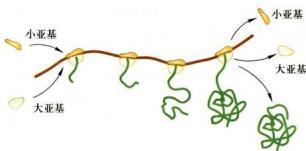  
图10-4 多核糖体模式图

原核细胞中，在 mRNA 合成的同时，核糖体就结合到 mRNA 上，即 DNA 转录成 mRNA 和 mRNA 翻译成蛋白质这两个生命活动是同时并几乎在同一部位进行的，所分离的多核糖体常常与 DNA 结合在一起。真核细胞中，多核糖体或附着在内质网上，或游离在细胞质基质中。

## 二、蛋白质的合成

蛋白质合成，或称蛋白质翻译是细胞中最复杂、最精确的生命活动之一。蛋白质的合成需要各种携带氨基酸的 tRNA、核糖体、mRNA、多种蛋白质因子及能量分子 GTP 等的参与。在蛋白质合成过程中，有三个关键问题，即如何催化肽键的形成？如何识别正确的 tRNA？tRNA 和 mRNA 如何通过核糖体的活性位点？目前这些问题都有了答案。

蛋白质合成主要包括三个主要阶段：肽链的起始（initiation）、肽链的延伸（elongation）和肽链的终止（termination）（图10-5）。原核细胞蛋白质合成最为清楚，下面以原核细胞为例，简单介绍蛋白质翻译的过程。

## （一）肽链的起始

蛋白质合成起始涉及 mRNA、起始 tRNA 和核糖体小亚基间相互作用和装配。

## 1. 30S 小亚基与 mRNA 的结合

蛋白质合成起始阶段，mRNA 只能够与细胞质基质中游离的核糖体 30S 小亚基结合，此时，mRNA 的起始密码子（initiation codon）AUG 必须精确地定位在 30S 小亚基的 P 位点上。由于 mRNA 内部仍然可能有密码子 AUG，那么 30S 小亚基是如何准确识别起始密码子 AUG 的呢？研究发现，在细菌 mRNA 起始密码子 AUG 上游 5～10 个碱基处有一段特殊的序列，即 SD 序列。SD 序列能与核糖体小亚基 16S rRNA 3' 端的碱基序列互补结合，从而保证 30S 小亚基能准确识别起始密码子 AUG，并结合到 mRNA 上。SD 序列为：5'-AGGAGG-3'，16S rRNA 3' 端与此互补的序列为：3'-UCCUCC-5'。

  
图10-5 蛋白质合成的三个阶段

30S 小亚基与 mRNA 的结合需要起始因子 (initiation factor, IF) 的帮助。这些起始因子仅位于 30S 亚基上，而且一旦 30S 亚基与 50S 亚基结合形成 70S 核糖体后便释放。显然，起始因子的主要作用是帮助形成起始复合物。原核细胞有三种起始因子，即 IF1、IF2和IF3。其中，30S-IF1复合体晶体结构显示，IF1与30S亚基A位点结合，协助30S亚基与mRNA的结合，并防止氨酰tRNA错误进入核糖体的A位点；IF2是一种GTP结合蛋白，协助第一个氨酰tRNA进入核糖体；IF3能防止核糖体50S大亚基提前与小亚基结合，并有助于第一个氨酰tRNA进入核糖体，在调节核糖体动态平衡以及30S亚基与mRNA结合能力方面发挥了重要作用（图10-6）。结合生化与结构数据，发现在蛋白质翻译起始阶段，30S亚基所有的tRNA结合位点都被占据，如A位点被IF1占据，P位点被起始tRNA占据，而E位点被IF3占据。其生物学意义可能与蛋白质合成的正确起始有关。

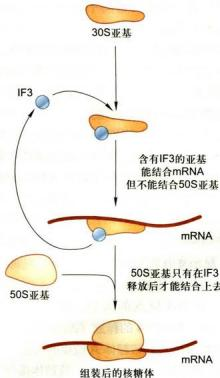  
图 10-6 30S 亚基与 IF3

真核细胞蛋白质翻译的起始与原核细胞类似，但有一定的差异。如真核细胞40S小亚基需要十多种起始因子帮助形成起始复合物。起始复合物识别mRNA结合位点的机制不同，小亚基在起始因子的帮助下首先识别mRNA5'端甲基化帽子，然后沿着mRNA移动扫描(scanning)。通常情况下，起始复合物将扫描到的第一个AUG作为起始密码子。

## 2. 第一个氨酰 tRNA 进入核糖体

当 mRNA 与小亚基结合后，在 IF2 的帮助下，携带有甲酰甲硫氨酸的起始 tRNA（fMet-tRNA $_{i}^{fMet}$ ）进入核糖体 P 位点，通过反密码子与 mRNA 中的 AUG 识别，之后释放 IF3。

原核生物中的第一个氨酰 tRNA 是甲酰化的甲硫氨酰 tRNA，而真核生物中第一个氨酰 tRNA 的甲硫氨酸不会被甲酰化。

## 3. 完整起始复合物的装配

一旦起始 tRNA 与 AUG 密码子结合，核糖体大亚基便与起始复合物结合，形成完整的 70S 核糖体——mRNA 起始复合物。该过程伴随与 IF2 结合的 GTP 水解，IF1、IF2 和 IF3 释放。

## （二）肽链的延伸

一旦起始复合物形成，蛋白质合成随即开始，这一过程称为肽链的延伸。主要包括4个步骤：氨酰tRNA在核糖体A位点的入位、肽键的形成、转位(translocation）和tRNA的释放（图10-7）。

## 1. 氨酰 tRNA 在核糖体 A 位点的入位

起始的 $\mathrm{tRNA}^{\mathrm{Met}}$ 占据P位点，核糖体接受第二个氨酰tRNA进入A位点，这就是肽链延伸的第一步。为了有效地结合A位点，第二个氨酰tRNA必须与有GTP的延伸因子（elongation factor, EF）EF-Tu结合形成三元复合体（氨酰tRNA-EF-Tu-GTP）。尽管任何形成复合体的氨酰tRNA都能够进入A位点，但只有其反密码子能与A位点的mRNA密码子匹配的氨酰tRNA才能被核糖体牢牢捕捉并定位在A位点，从而保证正确识别tRNA。氨酰tRNA到位后，结合在EF-Tu上的GTP水解，EF-Tu连同结合在一起的GDP离开核糖体，被另一个因子EF-Ts介导重新生成EF-Tu-GTP。

在真核细胞中，延伸因子 eEF1A 的功能与原核细胞中 EF-Tu 功能类似。

## 2. 肽键的形成

当核糖体的P位点与A位点都有tRNA时，通过肽键的生成将两个氨基酸结合起来。具体来讲，是A位点氨酰tRNA上氨基酸的氨基与P位点tRNA上氨基酸的羧基形成肽键。这一反应由肽酰转移酶催化，该酶是核糖体大亚基rRNA，活性位点位于23S rRNA结构域V的中央环。

## 3. 转位

形成第一个肽键时，A位点的tRNA分子一端仍然与mRNA的密码子结合，另一端与一个二肽结合。此时，P位点的tRNA分子已经如释重负，没有携带任何氨基酸。接下来便是延伸反应的第三步：转位，即核糖

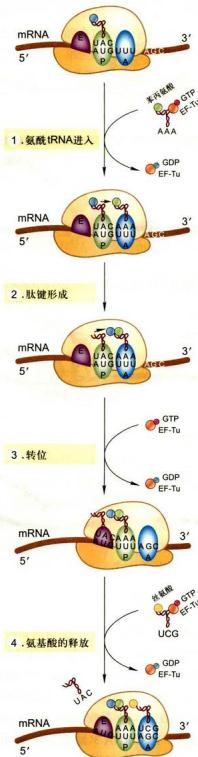  
图10-7 多肽链延伸过程示意图

主要通过4个步骤完成：1. 氨酰tRNA分子结合到核糖体A位点；2. 肽酰转移酶催化形成新的肽键；3. 核糖体沿mRNA由 $5^{\prime} \rightarrow 3^{\prime}$ 准确移动3个核苷酸的距离；4. E位点上tRNA从核糖体释放，另一氨酰tRNA可以结合到A位点。如此循环完成整个多肽链的延伸。

体沿着 mRNA 分子的 $5'\rightarrow3'$ 方向移动 3 个核苷酸（一个密码子）。在转位过程中，携带二肽的 tRNA 从 A 位点移位到 P 位点，而没有携带任何氨基酸的 tRNA 从 P 位点移位到 E 位点。原核细胞 GTP 结合的延伸因子 EF-G 能促进移位过程的发生。在真核细胞中，结合 GTP 的延伸因子 eEF2 促进转位过程的发生。

## 4. tRNA 的释放

延伸反应的最后一步是 tRNA 离开核糖体 E 位点。一旦肽酰 tRNA 通过转位从 A 位点移位到 P 位点后，A 位点再次接受下一个能与 mRNA 第三个密码子匹配的氨酰 tRNA，又开始新的肽链延伸循环。

## （三）肽链的终止

如果 A 位点处 mRNA 上的三核苷酸是 UAA、UGA 或 UAG，即终止密码子 (termination codon 或 stop codon)，由于没有与之对应的 tRNA，于是蛋白质合成终止。释放因子 (release factor, RF) RF1 可识别 UAA 或 UAG，RF2 识别 UAA 或 UGA，催化蛋白质合成的终止。RF1 或 RF2 识别 A 位点的终止密码子并促使肽酰转移酶催化水分子添加到肽酰 tRNA 上。这一过程实际上与肽键形成类似，只不过是水分子代替了氨基成为活化肽酰基的受体。这一反应使得多肽链末端的羧基游离出来，肽链延伸终止形成完整的蛋白链。蛋白链随即脱离核糖体进入细胞质基质，而核糖体也在核糖体回收因子 (ribosome recycling factor) 的帮助下从 mRNA 上释放下来，同时解离成 30S 和 50S 亚基。

在真核细胞中，释放因子eRF1可以识别所有的终止密码子。释放因子eRF1正确识别终止密码子需要GTP酶eRF3的帮助，而eRF1介导肽酰tRNA的水解需要ATP酶Rli1的帮助。

在某些情况下，由于 mRNA 在转录或拼接过程中发生了错误，而缺少终止密码子，它们在蛋白质翻译过程中会导致核糖体无法从 mRNA 上释放下来。这不仅影响多肽链的合成，还会影响核糖体的再利用。然而，人们发现细胞中存在解决这一问题的“挽救”机制，如在细菌中的 ArfA-RF2 挽救系统，它能使缺少终止密码子的 mRNA 的肽链合成正常终止，将核糖体从 mRNA 上释放下来以循环使用。最近，人们应用低温电镜单颗粒技术阐释了这一复杂过程的分子机理。

研究发现，新生肽链通过核糖体大亚基的一个特定通道进入细胞质基质，该通道称为肽通道。肽通道长约10 nm，宽1\~2 nm，是一个亲水性通道，内壁主要由23S rRNA组成，仿佛不粘锅表面的聚四氟乙烯(teflon)一样，由于没有与肽链互补的结构存在，因此，新生肽链能顺利地通过肽通道。肽通道大小也提示，新生肽链通过肽通道时，往往不会以高级结构形式通过。从核糖体肽通道出来时，一些新生肽链将在共翻译分子伴侣的帮助下，形成正确的三维构象。另外一些肽链在翻译完成后，先从核糖体上释放出来，在细胞质分子伴侣的帮助下形成正确的三维构象。

核糖体结构的解析使我们对蛋白质合成的认识发生了很大变化。随着对结合了延伸因子与释放因子的70S核糖体结构的解析，特别是在整个翻译周期中核糖体结构状态的解析，汇合结构、生化及功能研究数据，一部核糖体如何合成蛋白质的分子“电影”逐渐清晰地呈现在我们面前。

## 三、核糖体与 RNA 世界

## （一）核糖体的本质是核酶

核酶是指一类具有催化活性的RNA分子。1981年，Cech和他的同事在研究四膜虫的26S前体rRNA(precursor rRNA)加工去除内含子时惊奇地发现，内含子的切除是由26S前体rRNA自身催化的，而不是蛋白质，这一现象称为RNA自剪接（self-splicing）。这说明RNA分子具有催化活性，因此被命名为核酶。Cech因为首次发现了核酶而获得1989年诺贝尔化学奖。从前面的介绍可以看到，核糖体是一种分子量大、结构复杂的细胞器，RNA组分占了核糖体整体质量 $50\%$ 以上。早先证据表明，在蛋白质合成过程中催化肽键形成的肽酰转移酶是23S rRNA，随后在核糖体的结构研究中获得直接证据。2000年，核糖体大小亚基的高分辨三维结构研究证实，rRNA负责维持核糖体的整体结构、tRNA在mRNA上的定位等功能；最有意义的发现是肽键形成位点，即肽酰转移酶中心仅由23S rRNA组成。显然，肽键形成的催化反应是由rRNA执行的。另外，核糖体的三个结合位点，即A位点、P位点和E位点也主要是由rRNA组成。因此，核糖体的本质是核酶。

## （二）RNA 世界与生命起源

遗传信息的表达需要一套复杂的机器，这套机器将 DNA 中储存的遗传信息表达为生命活动的主要执行者蛋白质。显然，在遗传信息表达过程中，蛋白质的合成依赖于DNA和RNA，而DNA和RNA的合成又离不开蛋白质。这就提出了一个有关生命起源最有趣的问题：在生命起源之初，究竟先有核酸，还是先有蛋白质。20世纪80年代，W.Gilbert等人大胆提出，最早出现的生物大分子很可能是RNA，它兼具了DNA与蛋白质的功能，不但可以像DNA一样储存遗传信息，而且还像蛋白质一样进行催化反应，DNA和蛋白质则是演化的产物。这就是著名的“RNA世界”(RNA world)假说。根据这一假说，原始的具有自我复制和催化能力的RNA在以后的亿万年演化过程中，逐渐将其携带遗传信息的功能让位于性质上更加稳定的DNA分子，将其催化功能让位给了催化能力更强的蛋白质。

核糖体23S rRNA具有肽酰转移酶的活性，在蛋白质合成中催化肽键形成。核糖体是核酶这一发现，对RNA世界假说起到了很大的支撑作用。除了RNA可催化RNA和DNA水解、连接、mRNA的拼接(splicing)等现存“活化石”证据外，在体外已证明人工合成的RNA还可催化RNA聚合反应以及RNA、DNA的磷酸化，RNA氨酰基化、烷基化，能催化糖苷键形成、氧化还原反应等多种反应。

那么，RNA是如何实现向DNA的转变的呢？通过体外加速演化手段，研究人员成功地在试管中将具有核酶活性的RNA转变成了DNA。这些发现有助于理解生命起源过程中RNA是如何实现向DNA转变的。遗传信息的储存让位于DNA，从演化来讲，更为有利，因为双链DNA比单链RNA稳定，且DNA链中胸腺嘧啶代替了RNA链中的尿嘧啶，使之易于修复，作为遗传物质载体可储存大量的信息并能更稳定地遗传。

此外，蛋白质的合成又是如何演化的呢？在今天的细胞中，蛋白质的合成是在一个结构非常复杂、由蛋白质和RNA组成的核糖体中完成的，显然，在演化中蛋白质合成必须是在有了一个原始的蛋白质合成机器后才可能发生。在今天的细胞中，有些短肽的合成就是通过肽合成酶的催化完成的，它不需要复杂的蛋白质翻译机器核糖体，也不需要mRNA的指令。这不禁让人推测，在RNA世界中，原始蛋白质的合成不需要mRNA，很可能就是直接通过RNA分子催化完成的。这种由RNA分子催化肽键形成的功能在今天的细胞中仍然被遗留下来了，只不过起催化作用的RNA与蛋白质一道形成核糖体，而且，实验室中的核酶也能执行氨酰化反应。因此，很可能在RNA世界，类似tRNA一样的接头分子能和特异的氨基酸结合。随后，一种特异性不高的肽酰转移酶随着时间的推移，逐渐获得了将氨酰 tRNA 精确定位到模板 RNA 分子上的功能，最终出现了今天的核糖体，蛋白质合成得以演化。而蛋白质因为自身的多样性，最终接管了 RNA 分子的绝大多数催化与结构功能，成为结构和功能复杂的细胞演化的基础。

如果生命起源于RNA的假说是对的，我们就不难勾画出生命起源的大致轮廓。生命的最早形式可能是由膜包裹的一套具有自我复制能力的分子体系和简单的物质与能量供应体系组成，其遗传物质的载体是RNA（原始RNA）而不是DNA。构成核酸的基本成分是核糖，而脱氧核糖是由核糖还原而成的事实也说明了这点。在最早的细胞中，可能还存在一个前RNA世界(pre-RNA world)，集遗传、结构与催化功能于一身，尔后RNA分子逐渐接管了这些功能。RNA的催化效率远远低于蛋白质，在漫长的演化过程中，由RNA催化产生了蛋白质，进而DNA代替了RNA的遗传信息功能，蛋白质则取代了绝大部分RNA作为酶的功能，逐渐演化成今天遗传信息流的模式——中心法则（图10-8）。

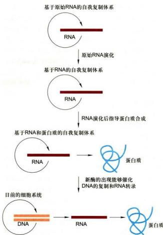  
图10-8 RNA在生命起源中的地位及演化过程的假说

很有趣的是，生命演化到现在，仍然存在一个RNA世界。至今在遗传信息表达过程中，不仅还要通过RNA完成遗传信息的传递和密码的翻译，而且一些重要的反应过程如mRNA的拼接和蛋白质的合成仍需要RNA的催化作用。同时，RNA（包括microRNA）还可通过RNA干扰等方式决定mRNA的命运、对

DNA 进行修饰以调控基因的表达甚至使整条染色体失活（如哺乳动物 X 染色体失活）等。因此，无论在生命起源之初，还是在今天的细胞中，RNA 对生命演化的影响、对基因表达的调控都发挥着很重要的作用，也许我们对其认识才刚刚开始。

## 思考题

1. 核糖体上有哪些活性部位？它们在多肽合成中各起什么作用？

2. 何谓多核糖体？以多核糖体的形式行使功能的生物学意义是什么？

3. 试比较原核细胞与真核细胞的核糖体在结构、组分及蛋白质合成上的异同点。

4. 有哪些实验证据表明肽酰转移酶是 rRNA，而不是蛋白质？rRNA 催化功能的发现有什么意义？

## - 参考文献

1. Archer S K. Shirokikh N E, Beilharz T H, et al. Dynamics of ribosome scanning and recycling revealed by translation complex profiling. Nature, 2016, 535 (7613): 570-574.

2. Ban N, Nissen P, Hansen J, et al. Placement of protein and RNA structures into a 5 Å-resolution map of the 50S ribosomal subunit. Nature, 1999, 400 (6747): 841-847.

3. Ban N, Nissen P, Hansen J, et al. The complete atomic structure of the large ribosomal subunit at 2.4 Å resolution. Science, 2000, 289 (5481): 905-920.

4. Desai N, Brown A, Amunts A, et al. The structure of the yeast mitochondrial ribosome. Science, 2017, 355 (6324): 528-531.

5. Kornprobst M, Turk M, Kellner N, et al. Architecture of the 90S pre-ribosome: a structural view on the birth of the eukaryotic ribosome. Cell, 2016, 166 (2): 380-393.

6. Ma C, Kurita D, Li N, et al. Mechanistic insights into the alternative translation termination by ArfA and RF2. Nature, 2017, 541 (7638): 550-553.

7. Merrick W C, Pavitt G D. Protein synthesis initiation in eukaryotic cells. Cold Spring Harbor Perspectives in Biology, 2018, 10: a033092.

8. Nissen P, Hansen J, Ban N, et al. The structural basis of ribosome activity in peptide bond synthesis. Science, 2000, 289(5481): 920-930.

9. Orgel L. A simpler nucleic acid. Science, 2000, 290 (5495): 1306-1307.

10. Sanghai, Z A, Miller L, Molloy KR, et al. Modular assembly of the nucleolar pre-60S ribosomal subunit. Nature, 2018, 556(7699): 126-129.

11. Schuwirth B S, Borovinskaya M A, Hau C W, et al. Structures of the bacterial ribosome at 3.5 Å resolution. Science, 2005, 310 (5749): 827-834.

12. Steitz T A, Moore P B. RNA, the first macromolecular catalyst: the ribosome is a ribozyme. Trends in Biochemical Sciences, 2003, 28(8): 411-418.

13. Wimberly B T, Brodersen D E, Clemons W M Jr, et al. Structure of the 30S ribosomal subunit. Nature, 2000, 407 (6802): 327-339.

<!-- END CN CN10-S02 -->

---

## 对应英文内容

### 英文补充：遗传密码、tRNA、氨酰化与肽链延伸基础

> 对应中文板块：遗传密码、tRNA、氨酰化与肽链延伸基础。英文来源：Molecular Biology of the Cell，第7版，第6章；[本章完整原文](../../来源/英文教材/06_How_Cells_Read_the_Genome_From_DNA_to_Protein/chapter.md)。物理PDF页码范围：360–435（整章范围）。

<!-- BEGIN EN EN06-H028-H034 -->
#### FROM RNA TO PROTEIN

In the preceding section, we saw that the final product of some genes is an RNA molecule itself, such as the RNAs present in the snRNPs and in ribosomes. However, most genes in a cell produce mRNA molecules that serve as intermediaries on the pathway to proteins. In this section, we examine how the cell converts the information carried in an mRNA molecule into a protein molecule. This feat of translation was a strong focus of attention for biologists in the late 1950s, when it was posed as the “coding problem”: How is the information in a linear sequence of nucleotides in RNA translated into the linear sequence of a chemically quite different set of units—the amino acids in proteins? This fascinating question stimulated great excitement. Here was a cryptogram set up by nature that, after more than 3 billion years of evolution, could finally be solved by one of the products of evolution—human beings. And indeed, not only was the code cracked step by step, but in the year 2000 the structure of the elaborate machinery by which cells read this code—the ribosome—was finally revealed in atomic detail.

#### An mRNA Sequence Is Decoded in Sets of Three Nucleotides

Once an mRNA has been produced by transcription and processing, the information present in its nucleotide sequence is used to synthesize a protein. Transcription is simple to understand as a means of information transfer: because DNA and RNA are chemically and structurally similar, the DNA can act as a direct template for the synthesis of RNA by complementary base-pairing. As the term “transcription” signifies, it is as if a message written out by hand is being converted, say, into a typewritten text. The language itself and the form of the message do not change, and the symbols used are closely related.

In contrast, the conversion of the information in RNA into protein represents a **translation** of the information into another language that uses quite different symbols. Moreover, because there are only 4 different nucleotides in mRNA and 20 different types of amino acids in a protein, this translation cannot be accounted for by a direct one-to-one correspondence between a nucleotide in RNA and an amino acid in protein. The nucleotide sequence of a gene, through the intermediary of mRNA, is instead translated into the amino acid sequence of a protein by rules that are known as the **genetic code**. This code was deciphered in the early 1960s.

| AGA | UUA | AGC |
| --- | --- | --- |
| AGG | UUG | AGU |
| GCA CGA | GGA CUA | CCA UCA ACA GUA |
| GCC CGC | GGC AUA CUC | CCC UCC ACC GUC UAA |
| GCG CGG GAC AAC UGC GAA | CAA GGG CAC AUC CUG AAA | UUC CCG UCG ACG UAC GUG UAG |
| GCU CGU GAU AAU UGU GAG | CAG GGU CAU AUU CUU AAG AUG | UUU CCU UCU ACU UGG UAU GUU UGA |
| Ala Arg Asp Asn Cys Glu | Gln Gly His Ile Leu Lys Met | Phe Pro Ser Thr Trp Tyr Val stop |
| A R D N C E | Q G H I L K M | F P S T W Y V |

Figure 6–52 The genetic code. The standard one-letter abbreviation for each amino acid is presented below its three-letter abbreviation (see Panel 3–1, pp. 118–119, for the full name of each amino acid and its structure). By convention, codons are always written with the 5′-terminal nucleotide to the left. Note that most amino acids are represented by more than one codon, and that there are some regularities in the set of codons that specifies each amino acid: codons for the same amino acid tend to contain the same nucleotides at the first and second positions, and vary at the third position. Three codons do not specify any amino acid but act as termination sites (stop codons), signaling the end of the protein-coding sequence. One codon—AUG—acts both as an initiation codon, signaling the start of a protein-coding message, and also as the codon that specifies methionine.

The sequence of nucleotides in the mRNA molecule is read in consecutive groups of three. RNA is a linear polymer of four different nucleotides, so there are 4 × $4 \times 4 = 6 4$ possible combinations of three nucleotides: the triplets AAA, AUA, AUG, and so on. However, only 20 different amino acids are commonly found in proteins. Either some nucleotide triplets are never used or the code is redundant and some amino acids are specified by more than one triplet. The second possibility is, in fact, the correct one, as shown by the completely deciphered genetic code in **Figure 6–52**. Each group of three consecutive nucleotides in mRNA is called a **codon**, and each codon specifies either one amino acid or a stop to the translation process.

In principle, an RNA sequence can be translated in any one of three different **reading frames**, depending on where the decoding process begins (**Figure 6–53**). However, only one of the three possible reading frames in an mRNA encodes the required protein. We see later how a special punctuation signal at the beginning of each RNA message sets the correct reading frame at the start of protein synthesis.

#### tRNA Molecules Match Amino Acids to Codons in mRNA

The codons in an mRNA molecule do not directly recognize the amino acids they specify: the group of three nucleotides does not, for example, bind directly to the amino acid. Rather, the translation of mRNA into protein depends on adaptor molecules that can recognize and bind both to the codon and, at another site on their surface, to the amino acid. These adaptors consist of a set of small RNA molecules known as **transfer RNAs (tRNAs)**, each about 80 nucleotides in length.

We saw earlier in this chapter that RNA molecules can fold into precise threedimensional structures, and the tRNA molecules provide striking examples. Four short segments of each folded tRNA are double-helical, producing a molecule that looks like a cloverleaf when drawn schematically (**Figure 6–54**). For example, a $5' - GCUC - 3'$ sequence in one part of a polynucleotide chain can form a relatively strong base-pairing association with a $5' -  GACC - 3'$ sequence in another region of the same molecule. The cloverleaf undergoes further folding to form a compact L-shaped structure that is held together by additional hydrogen bonds between different regions of the molecule (see Figure 6–54B and C).

Two regions of unpaired nucleotides situated at either end of the L-shaped molecule are crucial to the function of tRNA in protein synthesis. One of these regions forms the **anticodon**, a set of three consecutive nucleotides that pairs with the complementary codon in an mRNA molecule. The other is a short singlestrand region at the 3′ end of the molecule; this is the site where the amino acid that matches the codon is attached to the tRNA.

We saw above that the genetic code is redundant; that is, several different codons can specify a single amino acid. This redundancy implies either that there is more than one tRNA for many of the amino acids or that some tRNA molecules can base-pair with more than one codon. In fact, both situations occur. Some amino acids have more than one tRNA, and some tRNAs are constructed so that they require accurate base-pairing only at the first two positions of the codon and can tolerate a mismatch (or wobble) at the third position (**Figure 6–55**). This wobble base-pairing explains why so many of the alternative codons for an amino acid differ only in their third nucleotide (see Figure 6–52). In bacteria, wobble base-pairings make it possible to fit the 20 amino acids to their 61 codons with as

Figure 6–53 The three possible reading frames in protein synthesis. In the process of translating a nucleotide sequence (blue) into an amino acid sequence (red), the sequence of nucleotides in an mRNA molecule is read from the 5′ end to the 3′ end in consecutive sets of three nucleotides. In principle, therefore, the same RNA sequence can specify three completely different amino acid sequences, depending on the reading frame. In reality, however, only one of these reading frames contains the actual message.

Figure 6–54 A tRNA molecule. A tRNA specific for the amino acid phenylalanine (Phe) is depicted in various ways. (A) The cloverleaf structure showing the complementary base-pairing (red lines) that creates the double-helical regions of the molecule. The anticodon is the sequence of three nucleotides that base-pairs with a codon in mRNA. The amino acid matching the codon–anticodon pair is attached at the 3′ end of the tRNA. tRNAs contain some unusual bases, which are produced by chemical modification after the tRNA has been synthesized. For example, the bases denoted Ψ (pseudouridine—see Figure 6–43) and D (dihydrouridine—see Figure 6–57) are derived from uracil. (B and C) Views of the L-shaped molecule that are based on x-ray diffraction analysis. Although this diagram shows the tRNA for the amino acid phenylalanine, all other tRNAs have similar structures. (D) The tRNA icon we use in this book. (E) The linear nucleotide sequence of the molecule, color-coded to match the illustrations in A, B, and C.

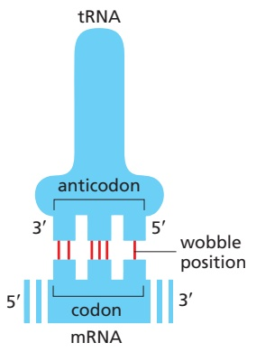

| bacteria |  |
| --- | --- |
| wobble codon | possible |
| base | anticodon bases |
| U | A, G, or I |
| C | G or I |
| A | U or I |
| G | C or U |

| eukaryotes |  |
| --- | --- |
| wobble codon | possible |
| base | anticodon bases |
| U | A, G, or I |
| C | G or I |
| A | U |
| G | C |

Figure 6–55 Wobble base-pairing between codons and anticodons. If the nucleotide listed in the first column is present at the third, or wobble, position of the codon, it can base-pair with any of the nucleotides listed in the second column. Thus, for example, when inosine (I) is present in the wobble position of the tRNA anticodon, the tRNA can recognize any one of three different codons in bacteria and either of two codons in eukaryotes. The inosine in tRNAs is formed from the deamination of adenosine (see Figure 6–57), a chemical modification that takes place after the tRNA has been synthesized. The nonstandard base pairs, including those made with inosine, are generally weaker than conventional base pairs. Codon–anticodon basepairing is more stringent at positions 1 and 2 of the codon, where only conventional base pairs are permitted. The differences in wobble base-pairing interactions between bacteria and eukaryotes presumably result from subtle structural differences between bacterial and eukaryotic ribosomes, the molecular machines that perform protein synthesis. (Adapted from C. Guthrie and J. Abelson, in The Molecular Biology of the Yeast Saccharomyces: Metabolism and Gene Expression, pp. 487–528. Cold Spring Harbor, NY: Cold Spring Harbor Laboratory Press, 1982.)

Figure 6–56 Structure of a tRNA-splicing endonuclease docked to a precursor tRNA. The endonuclease (a four-subunit enzyme) removes the tRNA intron (dark blue, bottom). A second enzyme, a multifunctional tRNA ligase (not shown), then joins the two tRNA halves together. (Courtesy of H. Li, C. Trotta, and J. Abelson. PDB code: 2A9L.)

few as 31 kinds of tRNA molecules. The exact number of different kinds of tRNAs, however, differs from one species to the next. For example, humans have nearly 500 tRNA genes that encode tRNAs with 48 different anticodons.

#### tRNAs Are Covalently Modified Before They Exit from the Nucleus

Like most other eukaryotic RNAs, tRNAs are covalently modified before they are allowed to exit from the nucleus. Eukaryotic tRNAs are synthesized by RNA polymerase III. Both bacterial and eukaryotic tRNAs are typically synthesized as larger precursor tRNAs, which are then trimmed to produce the mature tRNA. In addition, some tRNA precursors (from both bacteria and eukaryotes) contain introns that must be spliced out. This splicing reaction differs chemically from that of pre-mRNA splicing discussed earlier in the chapter; rather than generating a lariat intermediate, tRNA splicing uses a cut-and-paste mechanism that is catalyzed by proteins (**Figure 6–56**). Trimming and splicing both require the precursor tRNA to be correctly folded in its cloverleaf configuration. Because misfolded tRNA pre-cursors will not be processed properly, the trimming and splicing reactions serve as quality-control steps in the generation of tRNAs. Those that do not pass the tests are degraded by the nuclear exosome (see Figure 6–38).

All tRNAs are modified chemically—nearly 1 in 10 nucleotides in each mature tRNA molecule is an altered version of a standard G, U, C, or A ribonucleotide. More than 50 different types of tRNA modifications are known; a few are shown in **Figure 6–57**. Some of the modified nucleotides lie within the anticodon—most notably inosine, produced by the deamination of adenosine—and affect the base-pairing of the anticodon, thereby facilitating the recognition of the appropriate mRNA codon by the tRNA molecule (see Figure 6–55). Other modifications affect the accuracy with which the tRNA is attached to the correct amino acid.

#### Specific Enzymes Couple Each Amino Acid to Its Appropriate tRNA Molecule

We have seen that, to read the genetic code in DNA, cells make a series of different tRNAs. We now consider how each tRNA molecule becomes linked to the one amino acid in 20 that is its appropriate partner. Recognition and attachment of

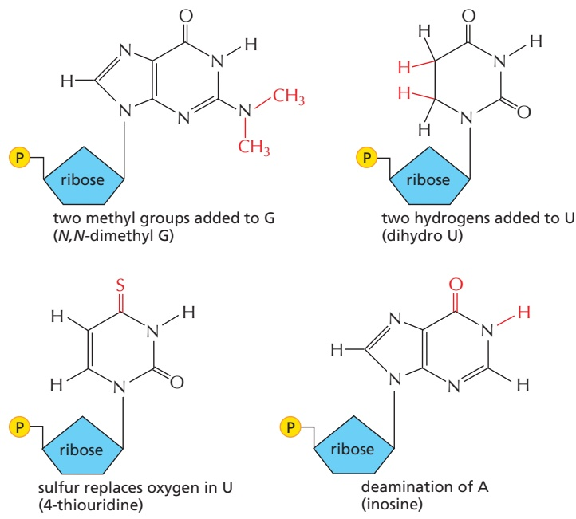

Figure 6–57 A few of the unusual nucleotides found in tRNA molecules. These nucleotides are produced by covalent modification of a normal nucleotide after it has been incorporated into an RNA chain. Two other types of modified nucleotides are shown in Figure 6–43. In most tRNA molecules, about 10% of the nucleotides are modified (see Figure 6–54). As shown in Figure 6–55, inosine is sometimes present at the wobble position in the tRNA anticodon.

Figure 6–58 Amino acid activation by synthetase enzymes. An amino acid is attached to its corresponding tRNA in two steps by an aminoacyl-tRNA synthetase enzyme. As indicated, the energy of $\mathsf { A T P }$ hydrolysis is used in the reaction to produce a high-energy linkage. The amino acid is first activated through attachment of its carboxyl group directly to AMP, forming an adenylated amino acid; the linkage of the AMP, normally an unfavorable reaction, is driven by the hydrolysis of the ATP molecule that donates the AMP. Without leaving the synthetase enzyme, the AMP-linked carboxyl group on the amino acid is then transferred to a hydroxyl group on the sugar at the 3′ end of the tRNA molecule. This transfer joins the amino acid by an activated ester linkage to the tRNA and forms the final aminoacyl-tRNA molecule. The synthetase enzyme is not shown in this diagram.

the correct amino acid depends on enzymes called **aminoacyl-tRNA synthetases**, which covalently couple each amino acid to its appropriate set of tRNA molecules (**Figure 6–58** and **Figure 6–59**). Most cells have a different synthetase enzyme for each amino acid (that is, 20 synthetases in all); one attaches glycine to all tRNAsMBoC7 m6.54/6.58 that recognize codons for glycine, another attaches alanine to all tRNAs that recognize codons for alanine, and so on. Many bacteria, however, have fewer than 20 synthetases, and the same synthetase enzyme is responsible for coupling more than one amino acid to the appropriate tRNAs. In these cases, a single synthetase places the identical amino acid on two different types of tRNAs, only one of which has an anticodon that matches the amino acid. A second enzyme then chemically modifies each “incorrectly” attached amino acid so that it now corresponds to the anticodon displayed by its covalently linked tRNA.

(A)

(B)

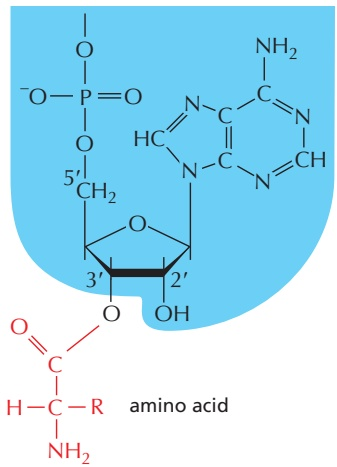

Figure 6–59 The structure of the aminoacyl-tRNA linkage. The carboxyl end of the amino acid forms an ester bond to ribose. Because the hydrolysis of this ester bond is associated with a large favorable change in free energy, an amino acid held in this way is said to be activated. (A) Schematic drawing of the structure. The amino acid is linked to the nucleotide at the 3′ end of the tRNA (see Figure $6 { - } 5 4 )$ . (B) Actual structure corresponding to the boxed region in A. There are two major classes of synthetase enzymes: one links the amino acid directly to the 3′-OH group of the ribose, and the other links it initially to the $2 ^ { \prime } - O H$ group. In the latter case, a subsequent transesterification reaction shifts the amino acid to the $\bar { 3 ^ { \prime } }$ position. The $\mathrm { ^ { \circ } R ^ { \prime } }$ is a standard symbol used to represent the side chain of an amino acid.

Figure 6–60 The genetic code is translated by means of two adaptors that act one after another. The first adaptor is the aminoacyl-tRNA synthetase, which couples a particular amino acid to its corresponding tRNA; the second adaptor is the tRNA molecule itself, whose anticodon forms base pairs with the appropriate codon on the mRNA. An error in either step would cause the wrong amino acid to be incorporated into a protein chain (Movie 6.6). In the sequence of events shown, the amino acid tryptophan (Trp) is selected by the codon UGG on the mRNA.

The synthetase-catalyzed reaction that attaches the amino acid to the 3′ end of the tRNA is one of many reactions coupled to the energy-releasing hydrolysis of MBoC7 m6.56/6.60 ATP (see pp. 70–72), and it produces a high-energy bond between the tRNA and the amino acid. The energy of this bond is used at a later stage in protein synthesis to link the amino acid covalently to the growing polypeptide chain.

The aminoacyl-tRNA synthetase enzymes and the tRNAs are equally important in the decoding process (**Figure 6–60**). This was established by an experiment in which one amino acid (cysteine) was chemically converted into a different amino acid (alanine) after it already had been attached to its specific tRNA. When such “hybrid” aminoacyl-tRNA molecules were used for protein synthesis in a cell-free system, the wrong amino acid was inserted at every point in the protein chain where that tRNA was used. Although, as we shall see, cells have several quality-control mechanisms to avoid this type of mishap, the experiment did establish that the genetic code is translated by two sets of adaptors that act sequentially. Each matches one molecular surface to another with great specificity, and it is their combined action that associates each sequence of three nucleotides in the mRNA molecule—that is, each codon—with its particular amino acid.

#### Editing by tRNA Synthetases Ensures Accuracy

Several mechanisms working together ensure that an aminoacyl-tRNA synthetase links the correct amino acid to each tRNA. Most synthetase enzymes select the correct amino acid by a two-step mechanism. The correct amino acid has the highest affinity for the active-site pocket of its synthetase and is therefore favored over the other 19; in particular, amino acids larger than the correct one are excluded from the active site. However, accurate discrimination between two similar amino acids, such as isoleucine and valine (which differ by only a methyl group), is very difficult to achieve in a single step. A second discrimination step occurs after the amino acid has been covalently linked to AMP (see Figure 6–58): when tRNA binds, the synthetase tries to force the adenylated amino acid into a second editing pocket in the enzyme. The preciseMBoC7 m6.57/6.61 dimensions of this pocket exclude the correct amino acid, while allowing access by closely related amino acids. In the editing pocket, an amino acid is removed from the AMP (or from the tRNA itself if the aminoacyl-tRNA bond has already formed) by hydrolysis. This hydrolytic editing, which is analogous to the exonucleolytic proofreading by DNA polymerases, increases the overall accuracy of tRNA charging so that only about one mistake is made in 40,000 couplings (**Figure 6–61**).

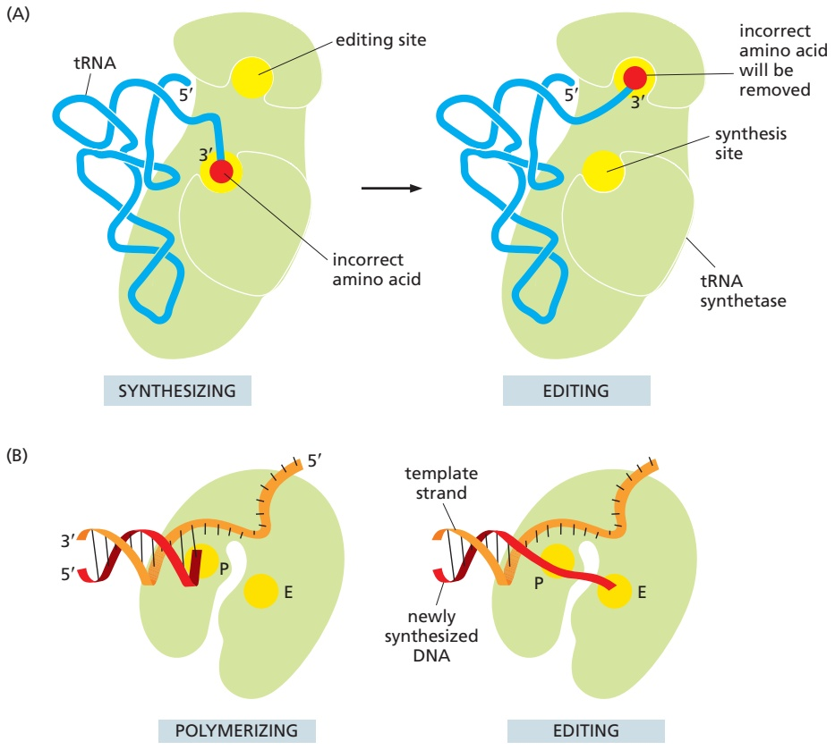

The tRNA synthetase must also recognize the correct set of tRNAs, and extensive structural and chemical complementarity between the synthetase and the tRNA allows the synthetase to probe various features of the tRNA (**Figure 6–62**). Most tRNA synthetases directly recognize the matching tRNA anticodon; these synthetases contain three adjacent nucleotide-binding pockets, each of which is complementary in shape and charge to a nucleotide in the anticodon. For other synthetases, the nucleotide sequence of the amino acid–accepting arm (acceptor stem) is the key recognition determinant. In most cases, however, the synthetase “reads” the nucleotides at several different positions on the tRNA, thereby increasing the accurate linking of amino acids to their appropriate tRNAs.

#### Amino Acids Are Added to the C-terminal End of a Growing Polypeptide Chain

Having seen that amino acids are first coupled to specific tRNA molecules that serve as adaptors, we now turn to the mechanism that joins these amino acids together to form proteins. The fundamental reaction of protein synthesis is the formation of a peptide bond between the carboxyl group at the end of a growing polypeptide chain and a free amino group on an incoming amino acid.

Figure 6–61 Hydrolytic editing in biology. (A) Aminoacyl-tRNA synthetases correct their own coupling errors through the hydrolytic editing of incorrectly attached amino acids. As described in the text, errors are selectively removed because the correct amino acid is rejected by the editing site on the synthetase. (B) The error-correction process performed by DNA polymerase, as described in the previous chapter. Here error removal depends on the wrong nucleotide mispairing with the DNA template (see Figure 5–9). (P, polymerization site; E, editing site.)

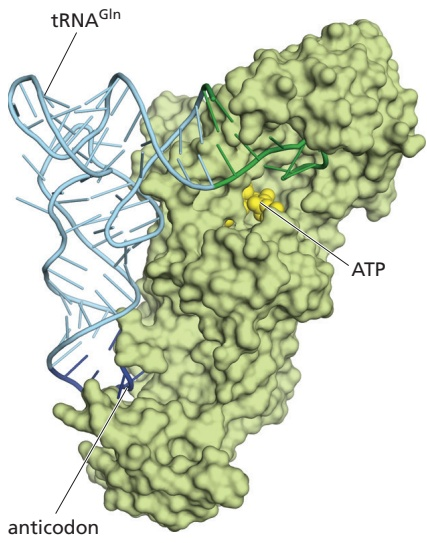

Figure 6–62 The recognition of a tRNA molecule by its aminoacyl-tRNA synthetase. For this tRNA (tRNAGln), specific nucleotides in both the anticodon (dark blue) and the amino acid–accepting arm (green) allow the correct tRNA to be recognized by the synthetase enzyme (yellow-green). The ATP molecule used in the coupling reaction is yellow. (Courtesy of Tom Steitz. PDB code: 1QRS.)

Figure 6–63 The incorporation of an amino acid into a protein. A polypeptide chain grows by the stepwise addition of amino acids to its C-terminal end. The formation of each peptide bond is energetically favorable because the growing C-terminus has been activated by the covalent attachment of a tRNA molecule. Note that the peptidyl-tRNA linkage that activates the growing end is regenerated during each addition. The amino acid side chains have been abbreviated as R1, R2, R3, and R4; as a reference point, all of the atoms in the second amino acid in the polypeptide chain are shaded gray. The figure shows the addition of the fourth amino acid (red) to the growing chain.

Consequently, a protein is synthesized from its N-terminal end to its C-terminal end, one amino acid at a time. Throughout the entire process, the growing carboxyl end of the polypeptide chain remains activated by its covalent attachment to a tRNA molecule (forming a peptidyl-tRNA). Each addition disrupts this high-energy covalent linkage but immediately replaces it with an identical linkage on the most recently added amino acid (**Figure 6–63**). In this way, each amino acid added carries with it the activation energy for the addition of the next amino acid rather than the energy for its own addition—an example of the polymer-end activation mechanism for polymer synthesis described in Figure 2–44.

<!-- END EN EN06-H028-H034 -->

### 英文补充：翻译延伸、校对与准确性

> 对应中文板块：翻译延伸、校对与准确性。英文来源：Molecular Biology of the Cell，第7版，第6章；[本章完整原文](../../来源/英文教材/06_How_Cells_Read_the_Genome_From_DNA_to_Protein/chapter.md)。物理PDF页码范围：360–435（整章范围）。

<!-- BEGIN EN EN06-H036-H038 -->
#### Elongation Factors Drive Translation Forward and Improve Its Accuracy

The basic cycle of polypeptide elongation shown in outline in Figure 6–68 has an additional feature that makes translation especially efficient and accurate. Two elongation factors enter and leave the ribosome during each cycle, each hydrolyzing GTP to GDP and undergoing conformational changes in the process. These factors are called EF-Tu and EF-G in bacteria, and EF1 and EF2 in eukaryotes. **Figure 6–69** illustrates how their cycles of ribosome association, GTP hydrolysis, and ribosome dissociation contribute to the process of protein synthesis that was just outlined in Figure 6–68.

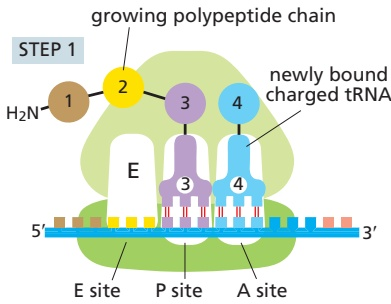

Under some conditions in vitro, ribosomes can be forced to synthesize proteins without the aid of these elongation factors and their GTP hydrolysis; but this synthesis is very slow, inefficient, and inaccurate. The coupling of GTP hydrolysis–driven changes in these elongation factors to transitions between

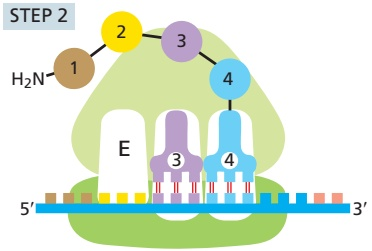

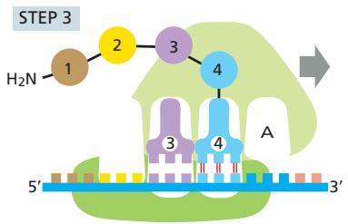

Figure 6–69 Detailed view of the translation cycle. The outline of translation presented in Figure 6–68 has been expanded to show the roles of the two elongation factors EF-Tu and EF-G, which drive translation in the forward direction. As explained in the text, EF-Tu provides two opportunities for proofreading of the codon–anticodon match. In this way, incorrectly paired tRNAs are preferentially rejected, and the accuracy of translation is improved. The binding of a molecule of EF-G to the ribosome and that elongation factor’s subsequent hydrolysis of GTP lead to a rearrangement of the ribosome structure, moving the mRNA being decoded exactly three nucleotides through it (Movie 6.9).

different states of the ribosome speeds up protein synthesis enormously, ensuring that the many changes required occur only in the “forward” direction.

In addition to driving translation forward, EF-Tu increases its accuracy. As we discussed in Chapter 3, EF-Tu can simultaneously bind GTP and aminoacyl-tRNAs (see Figures 3–68 and 3–69), and it is in this form that the initial codon–anticodon interaction occurs in the A site of the ribosome. Because of the free-energy change associated with base-pair formation, a correct codon–anticodon match will bind more tightly than an incorrect interaction. However, this difference in affinity is relatively modest, and it cannot by itself account for the high accuracy of translation.

To increase the accuracy of aminoacyl-tRNA binding in the first step of protein synthesis, the ribosome and EF-Tu work together in the following ways. First, the 16S rRNA in the small subunit of the ribosome assesses the “correctness” of the codon–anticodon match by folding around it and probing its molecular details (**Figure 6–70**). When a correct match is found, the rRNA closes tightly around the codon–anticodon pair, causing a conformational change in the ribosome that triggers GTP hydrolysis by EF-Tu. Only when GTP is hydrolyzed does EF-Tu release its grip on the aminoacyl-tRNA and allow it to be used in protein synthesis. Because incorrect codon–anticodon matches do not readily trigger this conformational change, most of these errant tRNAs fall off the ribosome before they can be used in protein synthesis (see the first proofreading step in Figure 6–69).

After GTP is hydrolyzed and EF-Tu dissociates from the ribosome, there is a second opportunity for the ribosome to prevent an incorrect amino acid from being added to the growing chain. This arises due to a time delay before the amino acid carried by the tRNA moves into its correct position on the ribosome. Not only is this time delay shorter for correct than incorrect codon–anticodon pairs, but incorrectly matched tRNAs dissociate more rapidly than those that are correctly bound. Thus, most of the incorrectly bound tRNA molecules that remain (as well as a significant number of correctly bound molecules) will leave the ribosome without being used for protein synthesis (see the second proofreading step in Figure 6–69). The two proofreading steps, acting in series, are largely responsible for the 99.99% accuracy of the ribosome in translating RNA into protein.

#### Induced Fit and Kinetic Proofreading Help Biological Processes Overcome the Inherent Limitations of Complementary Base-Pairing

We have seen in this and the previous chapter that DNA replication, repair, transcription, RNA splicing, and translation all rely on complementary basepairing—G with C, and A with T (or U). However, if only the difference in hydrogen bonding is considered, a correct versus incorrect match should differ in affinity only by a factor of 10- to 100-fold. These processes have an accuracy much higher than can be accounted for by this difference. Although the mechanisms used to “squeeze out” additional specificity from complementary base-pairing differ from one process to the next, two principles exemplified by the ribosome appear to be general.

The first is **induced fit**. We have seen that, before an amino acid is added to a growing polypeptide chain, the ribosome folds around the codon–anticodon interaction, and only when the match is correct is this folding completed and the reaction allowed to proceed. Thus, the codon–anticodon interaction is thereby checked twice—once by the initial complementary base-pairing and a second time by the folding of the ribosome, which depends on the correctness of the match. This same principle of induced fit is seen in transcription by RNA polymerase; here, an incoming nucleoside triphosphate initially forms a base pair with the template; at this point the enzyme folds around the base pair (thereby assessing its correctness) and, in doing so, creates the active site of the enzyme. The enzyme then covalently adds the nucleotide to the growing chain. Because their geometry is “wrong,” incorrect base pairs impair this induced fit, and they are therefore likely to dissociate before being incorporated into the growing chain.

Figure 6–70 Recognition of correct codon–anticodon matches by the small-subunit rRNA of the ribosome. Shown here is the interaction between a nucleotide of the small-subunit rRNA and the first nucleotide pair of a correctly paired codon–anticodon. Similar interactions form between other nucleotides of the rRNA and the second and third positions of the codon–anticodon pair. The small-subunit rRNA can form this network of hydrogen bonds only when an anticodon is correctly matched to a codon. As explained in the text, this codon–anticodon monitoring by the small-subunit rRNA increases the accuracy of protein synthesis. (From J.M. Ogle et al., Science 292:897–902, 2001. With permission from AAAS.)

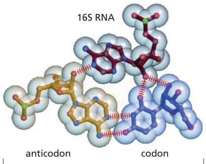

A second principle used to increase the specificity of complementary basepairing is called **kinetic proofreading**. We have seen that after the initial codon–anticodon pairing and conformational change of the ribosome, GTP is hydrolyzed. This creates an irreversible step and starts the clock on a time delay during which the aminoacyl-tRNA moves into the proper position for catalysis. During this delay, those incorrect codon–anticodon pairs that have somehow slipped through the induced-fit scrutiny have a higher likelihood of dissociating than correct pairs. There are two reasons for this: (1) the interaction of the wrong tRNA with the codon is weaker, and (2) the delay is longer for incorrect matches than for correct matches.

In its most general form, kinetic proofreading refers to a time delay that begins with an irreversible step such as ATP or GTP hydrolysis, during which an incorrect substrate is more likely to dissociate than a correct one. In this case, kinetic proofreading thus increases the specificity of complementary base-pairing far above what is possible from simple thermodynamic associations alone. In fact, kinetic proofreading can increase the fidelity of a reaction from one error in 10x to as little as one error in 102x, assuming that dissociation rate differences underlie the specificity of the molecular interactions involved.

The increase in specificity produced by kinetic proofreading comes at an energetic cost in the form of ATP or GTP hydrolysis. Kinetic proofreading operates in biological processes that range from DNA replication and DNA repair to RNA splicing and protein translation, helping to make life possible by greatly increasing the specificity of biochemical reactions.

#### Accuracy in Translation Requires a Large Expenditure of Free Energy

Translation by the ribosome is a compromise between the opposing constraints of accuracy and speed. We have seen, for example, that the accuracy of translation (one mistake per 104 amino acids joined) requires time delays each time a new amino acid is added to a growing polypeptide chain, producing an overall speed of translation of 20 amino acids incorporated per second in bacteria. Mutant bacteria with a specific alteration in the small ribosomal subunit have longer delays and translate mRNA into protein with an accuracy considerably higher than this; however, protein synthesis is so slow in these mutants that the bacteria are barely able to survive.

We have also seen that attaining the observed accuracy of protein synthesis requires the expenditure of a great deal of free energy; this is expected, because, as discussed in Chapter 2, there is a price to be paid for any increase in order in the cell. In most cells, protein synthesis consumes more energy than any other biosynthetic process. At least four high-energy phosphate bonds are split to make each new peptide bond: two are consumed in charging a tRNA molecule with an amino acid (see Figure 6–58), and two more drive steps in the cycle of reactions occurring on the ribosome during protein synthesis itself (see Figure 6–69). In addition, extra energy is consumed each time that an incorrect amino acid linkage is hydrolyzed by a tRNA synthetase (see Figure 6–61) and whenever an incorrect tRNA enters the ribosome, triggers GTP hydrolysis, and is rejected (see Figure 6–69). To be effective, any proofreading mechanism must also allow an appreciable fraction of correct interactions to be removed, and this adds an even greater energy cost to proofreading.

<!-- END EN EN06-H036-H038 -->

### 英文补充：翻译起始、终止、多核糖体与质量控制

> 对应中文板块：翻译起始、终止、多核糖体与质量控制。英文来源：Molecular Biology of the Cell，第7版，第6章；[本章完整原文](../../来源/英文教材/06_How_Cells_Read_the_Genome_From_DNA_to_Protein/chapter.md)。物理PDF页码范围：360–435（整章范围）。

<!-- BEGIN EN EN06-H040-H046 -->
#### Nucleotide Sequences in mRNA Signal Where to Start Protein Synthesis

The initiation and termination of translation share properties of the translation elongation cycle described earlier but have additional features. The site at which protein synthesis begins on the mRNA is especially crucial, because it sets the reading frame for the whole length of the message. An error of one nucleotide either way at this stage would cause every subsequent codon in the message to be misread, resulting in a nonfunctional protein with a garbled sequence of amino acids. The initiation step is also important because, for most genes, it is the last point at which the cell can decide whether the mRNA is to be translated to produce a protein. The efficiency of this step is thus one determinant of the rate at which any particular protein will be synthesized. We shall see in Chapter 7 how regulation of this step occurs.

The translation of an mRNA usually begins with the codon AUG, and a special tRNA is required to start translation. This **initiator tRNA** always carries the amino acid methionine (in bacteria, a modified form of methionine— formylmethionine—is used), with the result that all newly made proteins have methionine as the first amino acid at their N-terminus, the end of a protein that is synthesized first. (This methionine is usually removed later by a specific protease.) The initiator tRNA is specially recognized by initiation factors because it has a nucleotide sequence distinct from that of the tRNA that normally carries methionine.

In eukaryotes, the initiator tRNA–methionine complex (Met–tRNAi) is first loaded into the small ribosomal subunit along with additional proteins called **eukaryotic initiation factors**, or **eIFs**. Of all the aminoacyl-tRNAs in the cell, only the methionine-charged initiator tRNA is capable of tightly binding the small ribosomal subunit without the complete ribosome being present, and unlike other tRNAs, it binds directly to the P site (**Figure 6–74**). Next, the small ribosomal subunit binds to the 5′ end of an mRNA molecule, which is recognized by virtue of its 5′ cap that has previously bound two initiation factors, eIF4E and eIF4G (see Figure 6–40). The small ribosomal subunit then moves forward (5′ to 3′) along the mRNA, searching for the first AUG; additional initiation factors that act as ATP-powered helicases facilitate this movement. In about 90% of mRNAs, translation begins at the first AUG encountered by the small subunit. At this point, the initiation factors dissociate, allowing the large ribosomal subunit to assemble with the complex and complete the ribosome. The initiator tRNA remains at the P site, leaving the A site vacant. Protein synthesis is therefore ready to begin (see Figure 6–69).

The nucleotides immediately surrounding the start site in eukaryotic mRNAs influence the efficiency of AUG recognition during the above scanning process. If this recognition site differs substantially from the consensus recognition sequence (5′-ACC<u>AUG</u>G-3′, known as the Kozak sequence after its discoverer), scanning ribosomal subunits will sometimes ignore the first AUG codon in the mRNA and move to the second or third AUG codon instead. Cells frequently use this phenomenon, known as “leaky scanning,” to produce two or more proteins, differing in their N-termini, from the same mRNA molecule. This mechanism allows some genes to produce the same protein with and without a signal sequence attached at its N-terminus, for example, so that the protein is directed to two different compartments in the cell.

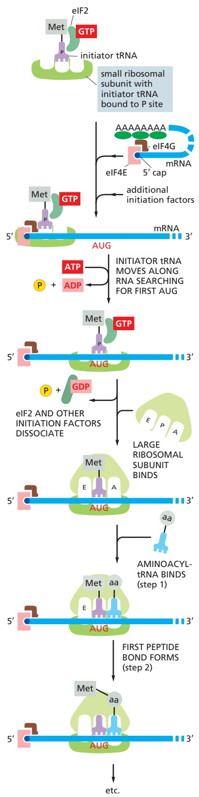

<small>Figure 6–74 The initiation of protein synthesis in eukaryotes. Only three of the many translation initiation factors required for this process are shown. In addition to an initiating AUG codon, efficient translation initiation requires the poly-A tail of the mRNA bound by poly-A-binding proteins. In this way, the translation apparatus ascertains that both ends of the mRNA are intact before initiating protein synthesis. The communication between the 5′ and 3′ ends of the mRNA is mediated, at least in part, by interactions between the poly-A-binding proteins and eIF4G, as shown. This interaction appears to be transient; once translation begins, the 5′ and 3′ ends of the mRNA dissociate. Although only one GTP-hydrolysis event is shown in the figure, a second is known to occur just before the large and small ribosomal subunits join. In the last two steps shown in the figure, the ribosome has begun the standard elongation cycle, depicted in Figure 6–68.</small>

Figure 6–75 Structure of a typical bacterial mRNA molecule. Unlike eukaryotic ribosomes, which typically require a capped 5′ end on the mRNA, prokaryotic ribosomes initiate translation at ribosome-binding sites (Shine–Dalgarno sequences), which can be located anywhere along an mRNA molecule. This property of their ribosomes permits bacteria to synthesize more than one type of protein from a single mRNA molecule.

Although protein synthesis in eukaryotes usually begins at an AUG codon, there are exceptions. For some proteins, translation begins at a codon that differs from AUG by a single base, particularly in the third position. In these cases, the normal initiator tRNA (carrying methionine) is used, but because the codon– anticodon match is not perfect, translation of these proteins is typically less efficient than translation of those that begin with an AUG. This deviation from the norm allows the cell to make very low amounts of some proteins compared with others. In a few rare cases, however, translation can begin with an entirely different tRNA. For example, a few proteins begin with a CUG codon, and a leucine tRNA (the perfect codon–anticodon match) begins translation with leucine as the first amino acid. In the next chapter, we will discuss how these and other deviations from the standard translation initiation process can be used to regulate protein synthesis in response to signals from the environment.

The mechanism for selecting a start codon in bacteria is fundamentally different from that in eukaryotes. Bacterial mRNAs have no 5′ caps to signal the ribosome where to begin searching for the start of translation. Instead, each bacterial mRNA contains a specific ribosome-binding site (called the Shine– Dalgarno sequence, named after its discoverers) that is located a few nucleotides upstream of the AUG at which translation is to begin. This nucleotide sequence, with the consensus $5' -AGGAGGU - 3'$ , forms base pairs with the 16S rRNA of the small ribosomal subunit to position the initiating AUG codon in the ribosome. A set of translation initiation factors orchestrates this interaction, as well as the subsequent assembly of the large ribosomal subunit to complete the ribosome.

A bacterial ribosome can readily assemble directly on a start codon that lies in the interior of an mRNA molecule, so long as a ribosome-binding site precedes it by several nucleotides. As a result, bacterial mRNAs are often polycistronic; that is, they encode several entirely different proteins, each of which is translated from the same mRNA molecule (**Figure 6–75**). In contrast, a eukaryotic mRNA generally encodes only a single protein, or more accurately, a single set of closely related proteins. We will see in the next chapter that there are some exceptions to this generalization, where a eukaryotic mRNA can carry information for two or more distinct proteins.

#### Stop Codons Mark the End of Translation

The end of the protein-coding message is signaled by the presence of one of three stop codons (UAA, UAG, or UGA) (see Figure 6–52). These are not recognized by a tRNA and do not specify an amino acid, but instead signal to the ribosome to stop translation. Proteins known as release factors bind to any ribosome with a stop codon positioned in the A site, forcing the peptidyl transferase in the ribosome to catalyze the addition of a water molecule instead of an amino acid to the peptidyl-tRNA (**Figure 6–76**). This reaction frees the carboxyl end of the growing polypeptide chain from its attachment to a tRNA molecule, and as only this attachment normally holds the growing polypeptide to the ribosome, the completed protein chain is released into the cytoplasm. The ribosome then releases its bound mRNA molecule and separates into the large and small subunits. These subunits can then assemble on this or another mRNA molecule to begin a new round of protein synthesis.

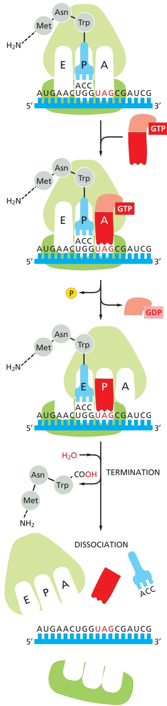

Figure 6–76 The final phase of eukaryotic protein synthesis. The binding of a two-subunit release factor to an A site bearing a stop codon terminates translation. Release factors are proteins that resemble tRNAs in their overall shape and charge distribution.

During translation, the nascent polypeptide moves through a large, waterfilled exit tunnel (approximately 10 nm × 1.5 nm) in the large subunit of the ribosome. The walls of this tunnel, made primarily of 23S rRNA, are a patchwork of tiny hydrophobic surfaces embedded in a more extensive hydrophilic surface. This structure is not complementary to any peptide and thus provides a “Teflon” coating through which a polypeptide chain can easily slide. We will see later in the chapter that, although some protein folding can occur in the exit tunnel, most of it takes place as the newly synthesized protein emerges from the ribosome.

#### Proteins Are Made on Polyribosomes

The synthesis of most protein molecules takes between 20 seconds and several minutes. During this short period, multiple initiations generally take place on each mRNA molecule being translated. As soon as the preceding ribosome has translated enough of the nucleotide sequence to move out of the way, the 5′ end of the mRNA is threaded into a new ribosome. For this reason, most mRNA molecules, and particularly those being translated at high rates, are found in the form of polyribosomes (or polysomes): large cytoplasmic assemblies made up of several ribosomes spaced as close as 80 nucleotides apart along a single mRNA molecule (**Figure 6–77**). The multiple initiations allow the cell to make many more protein molecules in a given time than would be possible if each protein had to be completed before the next could start. It is estimated that, in a typical human cell, about one-third of the mRNAs lack ribosomes altogether, and the remainder have 10–20 ribosomes per mRNA.

#### There Are Minor Variations in the Standard Genetic Code

As discussed in Chapter 1, the genetic code (shown in Figure 6–52) applies to all three major branches of life, providing important evidence for the common ancestry of all life on Earth. Although rare, there are exceptions to this code. For example, Candida albicans, the most prevalent fungal pathogen of humans, translates the codon CUG as serine, whereas nearly all other organisms translate it as leucine. And in some ciliates (unicellular eukaryotes that propel themselves using cilia), the three conventional stop codons specify particular amino acids, and the end of translation is instead signaled by the 3′ end of the mRNA. Mitochondria of many species (which have their own genomes and encode much of their translational apparatus) routinely deviate from the standard code. For example, in mammalian mitochondria AUA is translated as methionine, whereas in the cytosol of the cell it is translated as isoleucine (see Table 14–4, p. 864).

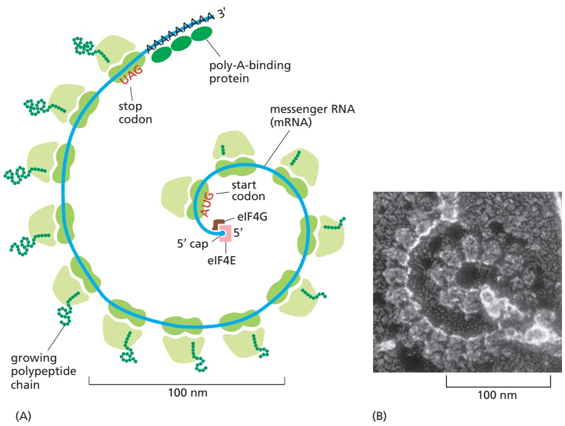

Figure 6–77 A polyribosome. (A) Schematic drawing showing how a series of ribosomes can simultaneously translate the same eukaryotic mRNA molecule. (B) Electron micrograph of a polyribosome from a eukaryotic cell (Movie 6.10). (B, courtesy of John Heuser.)

Figure 6–78 Incorporation of selenocysteine into a growing polypeptide chain. A specialized tRNA is charged with serine by the normal seryl-tRNA synthetase, and the serine is subsequently converted enzymatically to selenocysteine. A specific RNA structure in the mRNA (a stem-and-loop structure with a particular nucleotide sequence) signals that selenocysteine is to be inserted at the neighboring UGA codon. As indicated, this event requires the participation of a selenocysteine-specific translation factor. After the addition of selenocysteine, translation continues until a conventional stop codon is encountered.

A common type of variation, sometimes called translation recoding, is used7 6.74/6.78 to incorporate selenocysteine into proteins. In this case, neighboring nucleotide sequence information present in an mRNA changes the meaning of the genetic code at a particular site in the mRNA molecule. The standard code allows cells to manufacture proteins using only 20 amino acids. However, bacteria, archaea, and eukaryotes have selenocysteine available as a twenty-first amino acid that can be incorporated directly into a growing polypeptide chain. Selenocysteine, which contains a selenium atom in place of the sulfur atom of cysteine, is essential for the efficient function of a variety of enzymes. It is enzymatically produced from a serine attached to a special tRNA molecule that base-pairs with the UGA codon, a codon normally used to signal a translation stop. The mRNAs for those proteins in which selenocysteine is to be inserted at a UGA codon carry an additional nearby nucleotide sequence in the mRNA that triggers this recoding event (**Figure 6–78**).

#### Inhibitors of Prokaryotic Protein Synthesis Are Useful as Antibiotics

Many of the most effective antibiotics used in modern medicine are compounds that inhibit bacterial protein synthesis. Although chemists have improved these compounds, most were originally isolated from bacteria and fungi, where they are thought to have arisen over evolutionary time because of the warfare between competing microbes. Because many of these drugs are selective for bacterial ribosomes, humans can take high dosages without undue toxicity. Many of these antibiotics lodge in pockets in the ribosomal RNAs and simply “gum up” the smooth operation of the ribosome; others block specific parts of the ribosome such as the exit tunnel (**Figure 6–79**). **Table 6–4** lists some common antibiotics of this kind, along with several other inhibitors of protein synthesis, some of which act on eukaryotic cells and therefore cannot be used as antibiotics.

Because they block specific steps in the processes that lead from DNA to protein, many of the compounds listed in Table 6–4 are useful for cell biological studies. Among the most commonly used drugs in such investigations are chloramphenicol, cycloheximide, and puromycin, all of which specifically inhibit protein synthesis. In a eukaryotic cell, for example, chloramphenicol inhibits protein synthesis on ribosomes only in mitochondria (and in chloroplasts in plants), presumably reflecting the bacterial origins of these organelles (discussed in Chapter 14). Cycloheximide, in contrast, affects only ribosomes in the cytoplasm. Puromycin is especially interesting because it is a structural analog of a tRNA molecule linked to an amino acid and is therefore a fascinating example of molecular mimicry. The ribosome mistakes it for an authentic charged tRNA and covalently incorporates it at the C-terminus of the growing peptide chain, causing premature termination and release of the polypeptide. As might be expected,MBoC7 m6.75/6.79 puromycin inhibits protein synthesis in both bacteria and eukaryotes.

Figure 6–79 Binding sites for antibiotics on the bacterial ribosome. The small (left) and large (right) subunits of the ribosome are arranged as though the ribosome has been opened like a book. Antibiotic-binding sites are marked with colored spheres, and the bound tRNA molecules are shown in purple (see Figure 6–66). Most of the antibiotics shown bind directly to pockets formed by the ribosomal RNA molecules. Hygromycin B induces errors in translation, spectinomycin blocks the translocation of the peptidyl-tRNA from the A site to the P site, and streptogramin B prevents elongation of nascent peptides. Table 6–4 lists the inhibitory mechanisms of additional commonly used antibiotics. (Adapted from J. Poehlsgaard and S. Douthwaite, Nat. Rev. Microbiol. 3:870–881, 2005.)

<table><tbody><tr><td colspan="2">TABLE 6-4 Inhibitors of Protein or RNA Synthesis</td></tr><tr><td>Inhibitor</td><td>Specific effect</td></tr><tr><td colspan="2">Acting only on bacteria</td></tr><tr><td>Tetracycline</td><td>Blocks binding of aminoacyl-tRNA to the A site of the ribosome</td></tr><tr><td>Streptomycin</td><td>Prevents the transition from translation initiation to chain elongation and also causes miscoding</td></tr><tr><td>Chloramphenicol</td><td>Blocks the peptidyl transferase reaction on ribosomes (step 2 in Figure 6-68)</td></tr><tr><td>Erythromycin</td><td>Binds in the exit tunnel of the ribosome and thereby inhibits elongation of the peptide chain</td></tr><tr><td>Rifamycin</td><td>Blocks initiation of RNA chains by binding to RNA polymerase (prevents RNA synthesis)</td></tr><tr><td colspan="2">Acting on bacteria and eukaryotes</td></tr><tr><td>Puromycin</td><td>Causes the premature release of nascent polypeptide chains by its addition to the growing chain end</td></tr><tr><td>Actinomycin D</td><td>Binds to DNA and blocks the movement of RNA polymerase (prevents RNA synthesis)</td></tr><tr><td colspan="2">Acting on eukaryotes but not bacteria</td></tr><tr><td>Harringtonine</td><td>Blocks the A site of the 60S ribosome subunit after translation initiation, but before elongation (see Figure 6-74)</td></tr><tr><td>Anisomycin</td><td>Blocks the peptidyl transferase reaction on ribosomes (step 2 in Figure 6-68)</td></tr><tr><td>α-Amanitin</td><td>Blocks mRNA synthesis by binding preferentially to RNA polymerase II</td></tr><tr><td colspan="2">The ribosomes of eukaryotic mitochondria (and chloroplasts) often resemble those of bacteria in their sensitivity to inhibitors. Therefore, some of these antibiotics can have a deleterious effect on human mitochondria.</td></tr></tbody></table>

#### Quality-Control Mechanisms Act to Prevent Translation of Damaged mRNAs

In eukaryotes, mRNA production involves both transcription and a series of elaborate RNA-processing steps; as we have seen, these take place in the nucleus, segregated from ribosomes, and only when the processing is complete and the mRNAs deemed “export-ready” are they transported to the cytosol to be translated (see Figure 6–40). However, this scheme is not foolproof, and some incorrectly processed mRNAs are inadvertently sent to the cytosol. In addition, mRNAs that were flawless when they left the nucleus can become broken or otherwise damaged in the cytosol. The danger of translating damaged or incompletely processed mRNAs (which would produce truncated or otherwise aberrant proteins) is apparently so great that the cell has several backup measures to prevent this from happening. To avoid translating broken mRNAs, for example, the 5′ cap and the poly-A tail are both recognized by the translation initiation machinery before translation begins (see Figure 6–74).

One of the most powerful mRNA surveillance systems, called **nonsensemediated mRNA decay**, prevents defective mRNAs from escaping from the nuclear envelope. This mechanism is brought into play when the cell determines that an mRNA molecule has a nonsense (stop) codon (UAA, UAG, or UGA) in the “wrong” place. This situation is likely to arise in an mRNA molecule that has been improperly spliced, because aberrant splicing will usually result in the random introduction of a nonsense codon into the reading frame of the mRNA— especially in organisms, such as humans, that have large introns.

The nonsense-mediated mRNA decay mechanism begins as an mRNA molecule is being transported from the nucleus to the cytosol. As soon as its 5′ end emerges from a nuclear pore, the mRNA is met by a ribosome, which begins to translate it. As translation proceeds, the exon junction complexes (EJCs) that are bound to the mRNA at each completed splice site (see Figure 6–29) are displaced by the moving ribosome. The normal stop codon should lie within the last exon, so by the time the ribosome reaches it, the mRNA should be free of EJCs. In this case, the mRNA “passes inspection” and is released to the cytosol where it can be translated in earnest (**Figure 6–80**). However, if the ribosome reaches a stop codon earlier, when EJCs remain bound, the mRNA molecule is rapidly degraded. In this way, the first round of translation allows the cell to test the fitness of each mRNA molecule as it exits the nucleus.

Figure 6–80 Nonsense-mediated mRNA decay. As shown on the right, the failure to correctly splice a pre-mRNA often introduces a premature stop codon into the reading frame for the protein. These abnormal mRNAs are destroyed by the nonsense-mediated decay mechanism. To activate this mechanism, an mRNA molecule, bearing the exon junction complexes (EJCs) that mark successfully completed splices, is quickly met by a ribosome that performs a “test” round of translation. As the mRNA passes through the ribosome, the EJCs are stripped off, and successful mRNAs are released to undergo multiple rounds of translation (left side). However, if an in-frame stop codon is encountered before the final EJC is reached (right side), the mRNA undergoes nonsense-mediated decay, which is triggered by the Upf proteins (green that bind to each EJC. This mechanism ensures that nonsensemediated decay is triggered only when the premature stop codon is in the same reading frame as that of the normal protein. (Adapted from J. Lykke-Andersen et al., Cell 103:1121–1131, 2000.)

Nonsense-mediated decay may have been especially important in evolution, allowing eukaryotic cells to more easily explore new genes formed by DNA rearrangements, mutations, or alternative patterns of splicing—by selecting only those mRNAs for translation that can produce a full-length protein. Nonsensemediated decay is also important in cells of the developing immune system, where the extensive DNA rearrangements that occur (see Figure 24–28) often generate premature termination codons. The surveillance system degrades the mRNAs produced from these faulty rearranged genes, thereby avoiding the potential toxic effects of truncated proteins.

The nonsense-mediated surveillance pathway also plays an important role in mitigating the symptoms of many inherited human diseases. As we have seen, inherited diseases are usually caused by mutations that spoil the function of a key protein, such as hemoglobin or one of the blood-clotting factors. Approximately one-third of all genetic disorders in humans result from mutations that change a normal codon into a stop (nonsense) codon or mutations (such as frameshift mutations or splice-site mutations) that place nonsense mutations into the gene’s reading frame. In individuals that carry one mutant and one functional gene, nonsense-mediated decay eliminates the aberrant mRNA, and thereby prevents a potentially toxic protein from being made. Without this safeguard, individuals with one functional and one mutant “disease gene” would likely suffer much more severe symptoms.

#### Stalled Ribosomes Can Be Rescued

Even when an mRNA molecule passes all the initial inspections, additional problems can arise as it is being translated in the cytosol, and the cell has several ways to deal with them. In a sense, translating ribosomes constantly act as sensors for mRNA “health,” and when one stalls, those upstream of it collide with it (and each other), generating a string of nonfunctioning ribosomes. For example, if an mRNA becomes broken and thereby lacks an in-frame stop codon, the ribosome will translate to the 3′ end of the RNA but will not be released. Damaged RNA bases (which cannot form stable codon–anticodon interactions), stable mRNA secondary structures, and stretches of rare codons (that is, codons that have very low concentrations of their matching tRNAs) can also stall ribosomes. Although some of these problems can be overcome simply by allowing the ribosome sufficient time, many are dealt with more aggressively by a set of mechanisms known collectively as ribosome-associated quality control (**Figure 6–81**). Although the detailed pathways differ for the different types of barriers that stall ribosomes, three steps are common: the mRNA is degraded, the nascent protein is degraded, and the stalled ribosome is disengaged so it can be used again.

All of these steps make conceptual sense: the first removes a damaged mRNA so it will cause no further problems, the second prevents an aberrant protein from

Figure 6–81 Eukaryotic ribosomeassociated quality control. A ribosome can stall at damaged bases, rare codons, or other barriers (top left); here, the signal to correct the problem is generated by a collision between the stalled ribosome and the one immediately upstream of it. Ribosomes also stall at the ends of broken mRNAs (bottom left); in this case the empty A site is the cue for rescue. Although the mechanisms differ somewhat depending on the nature of the stall, in general a stalled ribosome is split (immediately releasing the 40S subunit for reuse), the mRNA is degraded, and the 60S subunit, which contains a tRNA lodged in its P site attached to a partially synthesized protein, is rescued by the ribosome quality control (RQC) complex (indicated in blue). The nascent protein is ubiquitylated and the tRNA cleaved from it, freeing the protein from the ribosome. As will be described shortly, this ubiquitylation serves as a signal for the protein to be destroyed. (Adapted from C.A.P. Joazeiro, Nat. Rev. Mol. Cell Biol. 20:368–383, 2019. With permission from Springer Nature.)

being released into the cell, and the third rescues a valuable RNA–protein machine complex that requires many resources to assemble. It is estimated that each ribosome in a human cell synthesizes approximately 3000 protein molecules, and the ability to rescue stalled ribosomes (as opposed to degrading them) makes a major contribution to their longevity.

<!-- END EN EN06-H040-H046 -->

### 英文补充：从DNA到蛋白质及RNA世界

> 对应中文板块：从DNA到蛋白质及RNA世界。英文来源：Molecular Biology of the Cell，第7版，第6章；[本章完整原文](../../来源/英文教材/06_How_Cells_Read_the_Genome_From_DNA_to_Protein/chapter.md)。物理PDF页码范围：360–435（整章范围）。

<!-- BEGIN EN EN06-H053-H061 -->
#### There Are Many Steps from DNA to Protein

We have seen in this chapter that many different types of chemical reactions are required to produce a properly folded protein from the information contained in a gene (**Figure 6–90**). The final level of a useful protein in a cell therefore depends on the efficiency with which each of the many steps is performed. We also now know that the cell devotes enormous resources to selectively degrading proteins, particularly those that fail to fold properly or accumulate damage as they age. It is the balance between the rates of synthesis and degradation that determines the final amount of every protein in the cell.

Figure 6–90 The production of a protein by a eukaryotic cell: a summary. The final level of each protein in a eukaryotic cell depends on the efficiency of each step depicted.

In the following chapter, we shall see that cells have the ability to change the levels of their proteins according to their needs. In principle, any or all of the steps in Figure 6–90 could be regulated for each individual pro-MBoC7 m6.87/6.90 tein. As we shall see, there are examples of regulation at each step from gene to protein.

#### Summary

The translation of the nucleotide sequence of an mRNA molecule into protein takes place in the cytosol on a large ribonucleoprotein assembly called a ribosome. Each amino acid used for protein synthesis is first attached to a tRNA molecule that recognizes, by complementary base-pair interactions, a particular set of three nucleotides (codons) in the mRNA. As an mRNA is threaded through a ribosome, its sequence of nucleotides is then read from one end to the other in sets of three according to the genetic code.

To initiate translation, a small ribosomal subunit binds to the mRNA molecule at a start codon (AUG) that is recognized by a unique initiator tRNA molecule.

A large ribosomal subunit then binds to complete the ribosome and begin protein synthesis. During this phase, aminoacyl-tRNAs—each bearing a specific amino acid—bind sequentially to the appropriate codons in mRNA through complementary base-pairing between tRNA anticodons and mRNA codons. Each amino acid is added to the C-terminal end of the growing polypeptide in four sequential steps: aminoacyl-tRNA binding, followed by peptide bond formation, followed by two ribosome translocation steps. Elongation factors use GTP hydrolysis both to drive these reactions forward and to improve the accuracy of amino acid selection. The mRNA molecule progresses codon by codon through the ribosome in the 5′-to-3′ direction until it reaches one of three stop codons. A release factor then binds to the ribosome, terminating translation and releasing the completed polypeptide.

Eukaryotic and bacterial ribosomes are closely related, despite differences in the number and size of their rRNA and protein components. The rRNA has the dominant role in translation, determining the overall structure of the ribosome, forming the binding sites for the tRNAs, matching the tRNAs to codons in the mRNA, and creating the active site of the peptidyl transferase enzyme that links amino acids together during translation.

Several distinct types of molecular chaperones, including hsp60 and hsp70, illustrate how the energy of ATP hydrolysis is used to help newly synthesized proteins assume their correct three-dimensional conformations. This protein-folding process competes with a control mechanism that destroys proteins that are abnormally folded by recognizing exposed hydrophobic patches and other unstructured regions. In this case, ubiquitin is covalently added to a misfolded protein by a ubiquitin ligase, and the resulting polyubiquitin chain is recognized by the cap on a proteasome that unfolds the protein as it is threaded into the interior of the proteasome for proteolytic degradation. A closely related proteolytic mechanism, based on special degradation signals recognized by ubiquitin ligases, is used to determine the lifetimes of many normally folded proteins, as well as to remove selected proteins from the cell in response to specific signals.

#### THE RNA WORLD AND THE ORIGINS OF LIFE

We have seen that the expression of hereditary information requires extraordinarily complex machinery and proceeds from DNA to protein through an RNA intermediate. This machinery presents a central paradox: if nucleic acids are required to synthesize proteins and proteins are required, in turn, to synthesize nucleic acids, how did such a system of interdependent components ever arise? A widely held view is that an **RNA world** existed on Earth before modern cells arose (**Figure 6–91**). According to this hypothesis, RNA not only stored genetic information but also directly catalyzed the chemical reactions in primitive cells— thus serving as enzymes (“ribozymes”). Only later in evolutionary time did DNA take over as the genetic material and proteins become the major catalysts and structural components of cells. But the transition out of the RNA world was never complete; as we have seen in this chapter, RNA still catalyzes several fundamental reactions in modern-day cells, which can be viewed as molecular holdovers from an earlier world.

Figure 6–91 Timeline for the universe, highlighting the possible early existence of an “RNA world” in the evolution of Earth’s living systems.

The RNA world hypothesis relies on the fact that, among present-day biological molecules, RNA is unique in being able to act as both a carrier of genetic information and as a catalyst for chemical reactions. In this section, we discuss these properties of RNA and how they may have been especially important in early cells.

#### Single-Strand RNA Molecules Can Fold into Highly Elaborate Structures

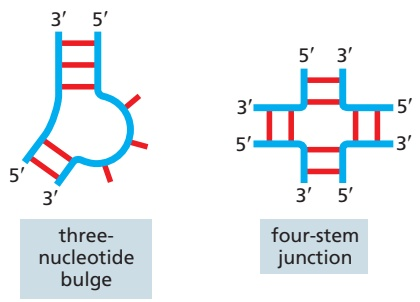

We have seen in this chapter that RNA can carry genetic information in mRNAs, and we saw in Chapter 5 that the genomes of some viruses are composed solely of RNA. We have also seen that complementary base-pairing and other types of hydrogen bonds can occur between nucleotides in the same chain of RNA, causing an RNA molecule to fold up in a unique way that is determined by its nucleotide sequence (see, for example, Figures 6–54 and 6–71). Comparisons of many RNA structures have revealed conserved structural motifs, short elements that often appear as parts of larger structures (**Figure 6–92**).

Protein catalysts require a surface with unique contours and chemical properties on which a given set of substrates can react (discussed in Chapter 3). In exactly the same way, an RNA molecule with an appropriately folded shape can serve as a catalyst (**Figure 6–93**). Like some proteins, many of these ribozymes work by positioning metal ions at their active sites. This feature gives them a wider range of catalytic activities than can be provided by the limited chemical groups of a polynucleotide chain.

Figure 6–92 Some common elements of RNA structure. Conventional, complementary base-pairing interactions are indicated by red “rungs” in doublehelical portions of the RNA.

#### Ribozymes Can Be Produced in the Laboratory

Much of our inference about the RNA world has come from experiments in which large pools of RNA molecules of random nucleotide sequences are generated in the laboratory. Those rare RNA molecules with a property specified by the experimenter are then selected out and studied (**Figure 6–94**). Experiments of this type have created RNAs that can catalyze a wide variety of biochemical reactions (**Table 6–5**), with reaction rate enhancements only a few orders of magnitude lower than those of the “fastest” protein enzymes. Given these findings, it is not clear why protein catalysts greatly outnumber ribozymes in modern cells. Experiments have shown, however, that RNA molecules may have more difficulty than proteins in binding to flexible, hydrophobic substrates and in forming pockets specific for different small molecules. The availability of 20 types of amino acids

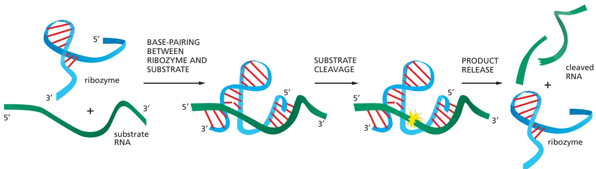

Figure 6–93 The activity of a well-studied ribozyme. This simple RNA molecule catalyzes the cleavage of a second RNA at a specific site. This ribozyme is found embedded in larger RNA genomes called viroids, which infect plants. The cleavage, which occurs in nature at a distant location on the same RNA molecule that contains the ribozyme, is a step in the replication of the viroid genome. Although not shown in the figure, the reaction requires a magnesium ion positioned at the active site. (Adapted from T.R. Cech and O.C. Uhlenbeck, Nature 372:39–40, 1994.)

Figure 6–94 In vitro selection of a synthetic ribozyme. Beginning with a large pool of different nucleic acid molecules synthesized in the laboratory, those rare RNA molecules that possess a specified catalytic activity can be isolated and studied. Although only one specific example (that of an autophosphorylating ribozyme) is shown, variations of this procedure have been used to generate many of the ribozymes listed in Table 6–5. For the strategy shown here, the RNA molecules are kept sufficiently dilute during the phosphorylation step to prevent the “cross-phosphorylation” of other RNA molecules. In reality, several repetitions of this procedure are necessary to select the very rare RNA molecules with this catalytic activity. Thus, the material initially eluted from the column is converted back into DNA, amplified many-fold (using reverse transcriptase and PCR, as explained in Chapter 8), transcribed back into RNA, and subjected to repeated rounds of selection. (Adapted from J.R. Lorsch and J.W. Szostak, Nature 371:31–36, 1994.)

large pool of double-strand DNA molecules, each with a different, randomly generated nucleotide sequence

presumably provides proteins with a much greater number of binding and catalytic strategies.

#### RNA Can Both Store Information and Catalyze Chemical Reactions

RNA molecules have one property that contrasts with those of proteins: they can directly guide the formation of copies of their own sequence. This capacity depends on complementary base-pairing of their nucleotide subunits, which enables one RNA to act as a template for the formation of another. As we have seen in this and the preceding chapter, these complementary templating mechanisms lie at the heart of DNA replication and transcription in modern-day cells. But the efficient synthesis of RNA by such complementary templating mechanisms requires catalysts to promote the polymerization reaction: without catalysts, polymer formation would be slow, error-prone, and inefficient.

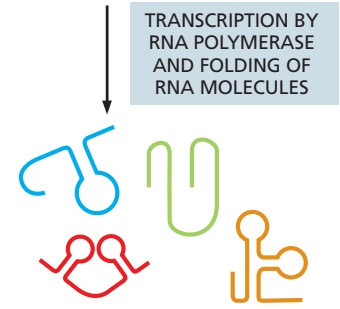

<table><tbody><tr><td colspan="2">TABLE 6-5 Some Biochemical Reactions That Can Be Catalyzed by Ribozymes</td></tr><tr><td>Activity</td><td>Ribozymes</td></tr><tr><td>Peptide bond formation in protein synthesis</td><td>Ribosomal RNA</td></tr><tr><td>RNA cleavage, RNA ligation</td><td>Self-splicing RNAs; RNase P; also in vitro selected RNA</td></tr><tr><td>DNA cleavage</td><td>Self-splicing RNAs</td></tr><tr><td>RNA splicing</td><td>Self-splicing RNAs; RNAs of the spliceosome</td></tr><tr><td>RNA polymerization</td><td>In vitro selected RNA</td></tr><tr><td>RNA and DNA phosphorylation</td><td>In vitro selected RNA</td></tr><tr><td>RNA aminoacylation</td><td>In vitro selected RNA</td></tr><tr><td>RNA alkylation</td><td>In vitro selected RNA</td></tr><tr><td>Amide bond formation</td><td>In vitro selected RNA</td></tr><tr><td>Glycosidic bond formation</td><td>In vitro selected RNA</td></tr><tr><td>Oxidation-reduction reactions</td><td>In vitro selected RNA</td></tr><tr><td>Carbon-carbon bond formation</td><td>In vitro selected RNA</td></tr><tr><td>Phosphoamide bond formation</td><td>In vitro selected RNA</td></tr><tr><td>Disulfide exchange</td><td>In vitro selected RNA</td></tr></tbody></table>

large pool of single-strand RNA molecules, each with a different, randomly generated nucleotide sequence

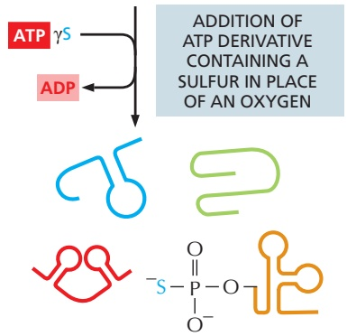

only the rare RNA molecules able to phosphorylate themselves incorporate sulfur

discard RNA molecules that fail to bind to the column

CAPTURE OF PHOSPHORYLATED MATERIAL ON COLUMN MATERIAL THAT BINDS TIGHTLY TO THE SULFUR GROUP

ELUTION OF BOUND MOLECULES

rare RNA molecules that can catalyze their own phosphorylation using ATP as a substrate

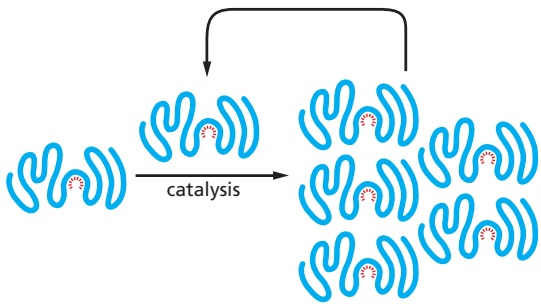

Figure 6–95 An RNA molecule that can catalyze its own synthesis. This hypothetical process would require synthesis of a second RNA strand complementary to the original strand (not shown) and the use of this second RNA molecule as a template to synthesize many molecules of RNA possessing the original sequence. The red rays represent the active site of this hypothetical RNA enzyme (ribozyme).

Because RNA has all the properties required of a molecule that could catalyze a variety of chemical reactions, including those that lead to its own synthesis (**Figure 6–95**), it has been proposed that RNAs served long ago as the catalysts for their own template-dependent RNA synthesis. Although self-replicating systems of RNA molecules have not been found in nature, scientists have made progress toward constructing such systems in the laboratory. Experiments of this type cannot prove that self-replicating RNA molecules were central to the origin of life on Earth, but they can help establish whether such a scenario is plausible.

Today, there is a widespread interest in investigating the exciting possibility that a primitive form of life once existed, or may even still exist, in some water-containing regions below the surface of Mars. Vehicles are being sent to promising sites on that planet to collect subterranean samples for eventual return to Earth, with the hope that their analysis will allow scientists to refine scenarios like that just described.

#### How Did Protein Synthesis Evolve?

The molecular processes underlying protein synthesis in present-day cells seem inextricably complex. Although we understand most of them, they do not make conceptual sense in the way that DNA transcription, DNA repair, and DNA replication do. It is especially difficult to imagine how protein synthesis evolved because it is now performed by a complex interlocking system of protein and RNA molecules; obviously, the proteins could not have existed until an early version of the translation apparatus was already in place. As attractive as the RNA world idea is for envisioning early life, it does not explain how the modern-day system of protein synthesis arose.

In modern cells, some short peptides (such as antibiotics) are synthesized without the ribosome; peptide synthetase enzymes assemble these peptides, with their proper sequence of amino acids, without mRNAs to guide their synthesis. It is plausible that this noncoded, primitive version of protein synthesis first developed in the RNA world, where it would have been catalyzed by RNA molecules. This idea presents no conceptual difficulties because, as we have seen, rRNA catalyzes peptide bond formation in present-day cells. Moreover, short simple peptides (for example, polylysine) have been shown to enhance the function of ribozymes created in the laboratory, raising the possibility that the first peptides were “selected” for their ability to help RNA molecules fold, assemble with each other, and catalyze reactions. These ideas, however, leave unexplained how the genetic code—which lies at the core of protein synthesis in today’s cells—might have arisen. We know that ribozymes created in the laboratory can perform specific aminoacylation reactions; that is, they can match specific amino acids to specific tRNAs. It is therefore possible that tRNA-like adaptors, each matched to a specific amino acid, could have arisen in the RNA world, marking the beginnings

Figure 6–96 The hypothesis that RNA preceded DNA and proteins in evolution. In the earliest cells, RNA molecules (or their close analogs) would have had combined genetic, structural, and catalytic functions. In present-day cells, DNA is the repository of genetic information, and proteins perform the vast majority of catalytic functions in cells. RNA primarily functions today as a go-between in protein synthesis, although it remains a catalyst for a small number of crucial reactions.

of a genetic code. And, although we can only speculate on the code’s evolution, scientists have provided plausible scenarios, in which the first codons specified only 10 or so of today’s 20 amino acids.

Once coded protein synthesis evolved, the transition to a protein-dominated world could proceed, with proteins eventually taking over the majority of catalytic and structural tasks because of their greater versatility, with 20 rather than 4 different subunits. Although these ideas are highly speculative, they are consistent with the known properties of RNA and protein molecules.

#### All Present-Day Cells Use DNA as Their Hereditary Material

If the evolutionary speculations embodied in the RNA world hypothesis are correct, early cells would have differed fundamentally from the cells we know today in having their hereditary information stored in RNA rather than in DNA (**Figure 6–96**).

Evidence that RNA arose before DNA in evolution can be found in the chemical differences between them. Ribose, like glucose and other simple carbohydrates, can be formed from formaldehyde (HCHO), a simple chemical that is readily produced in laboratory experiments that attempt to simulate conditions on the primitive Earth. The sugar deoxyribose is harder to make, and in present-day cells it is produced from ribose in a reaction catalyzed by a protein enzyme, suggesting that ribose predates deoxyribose in cells. Presumably, DNA appeared on the scene later, but then proved more suitable than RNA as a permanent repository of genetic information. In particular, the deoxyribose in its sugar–phosphate backbone makes chains of DNA chemically more stable than chains of RNA, so that much greater lengths of DNA can be maintained without breakage. Because DNA and RNA use similar base-pairing rules for their template-dependent synthesis, the transition between the two is not difficult to envision. Consistent with this idea, a ribozyme has been created in the laboratory that can synthesize both RNA using a DNA template and DNA using an RNA template.

The other differences between RNA and DNA—the double-helical structure of DNA and the use of thymine rather than uracil—further enhance DNA stability by making the many unavoidable accidents that occur to the molecule much easier to repair, as discussed in detail in Chapter 5 (p. 288).

#### Summary

From our knowledge of present-day organisms and the molecules they contain, it seems likely that the development of the distinctive autocatalytic mechanisms fundamental to living systems began with the evolution of families of RNA molecules that could catalyze their own replication. DNA is thought to have been a later addition: as the accumulation of protein catalysts allowed more efficient and complex cells to evolve, the DNA double helix replaced RNA as a much more stable molecule for storing the increased amounts of genetic information required by such cells.

EVOLUTION OF RNAs THAT CAN DIRECT PROTEIN SYNTHESIS

RNA and protein-based systems

EVOLUTION OF NEW ENZYMES THAT REPLICATE DNA AND MAKE RNA COPIES FROM IT

(B) FOUR DIFFERENT SPLICE VARIANTS

<!-- END EN EN06-H053-H061 -->

### 英文补充：翻译调控、mRNA稳定性与应激颗粒

> 对应中文板块：翻译调控、mRNA稳定性与应激颗粒。英文来源：Molecular Biology of the Cell，第7版，第7章；[本章完整原文](../../来源/英文教材/07_Control_of_Gene_Expression/chapter.md)。物理PDF页码范围：436–513（整章范围）。

<!-- BEGIN EN EN07-H067-H073 -->
#### Untranslated Regions of mRNAs Control Their Translation

Once an mRNA has been synthesized, one of the most common ways of regulating the levels of its protein product is to control the step that initiates translation. Even though the details of translation initiation differ between eukaryotes and bacteria (as we saw in Chapter 6), they each use some of the same basic regulatory strategies.

In bacterial mRNAs, a conserved stretch of nucleotides—the Shine–Dalgarno sequence—is always found a few nucleotides upstream of the initiating AUG codon, and it is required to start protein synthesis (see Figure 6–75). The control of bacterial translation generally involves either exposing or blocking this critical sequence (**Figure 7–70**).

Eukaryotic mRNAs do not contain such a sequence. Instead, as discussed in Chapter 6, the selection of an AUG codon as a translation start site is largely determined by its proximity to the cap at the 5′ end of the mRNA molecule, which is the site at which the small ribosomal subunit binds to the mRNA and begins

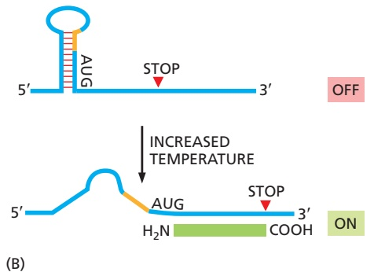

(A)

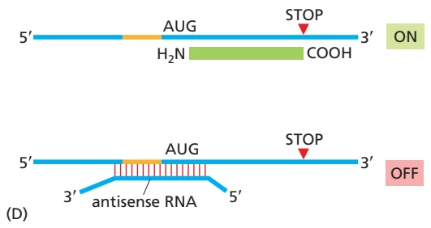

Figure 7–70 Mechanisms of translational control. Although these examples are from bacteria, many of the same principles operate in eukaryotes. (A) Sequence-specific RNA-binding proteins repress translation of specific mRNAs by blocking access of the ribosome to the Shine–Dalgarno sequence (orange). For example, some ribosomal proteins repress translation of their own mRNA. This negative feedback mechanism allows the cell to maintain balanced quantities of the various components needed to form ribosomes. (B) An RNA “thermosensor” permits efficient translation initiation only at elevated temperatures at which the stem–loop structure has been melted. An example occurs in the human pathogen Listeria monocytogenes, in which the translation of its virulence genes increases at $3 7 ^ { \circ } \dot { \mathrm { C } } _ { i }$ the temperature of the host. (C) Binding of a small molecule. / . to a riboswitch causes a major rearrangement of RNA structure, creating a different set of stem–loop structures. In the bound structure, the Shine–Dalgarno sequence (orange) is sequestered, and translation initiation is thereby blocked. In many bacteria, S-adenosylmethionine acts in this manner to block production of the enzymes that synthesize it. (D) An “antisense” RNA produced from elsewhere in the genome base-pairs with a specific mRNA and blocks its translation. Many bacteria regulate expression of iron-storage proteins in this way.

scanning for an initiating AUG codon. In eukaryotes, translational repressors can bind to the 5′ end of the mRNA and thereby inhibit translation initiation (see Figure 7–74). A particularly important type of translational control in eukaryotes relies on small RNAs (termed microRNAs, or miRNAs) that bind to mRNAs and reduce protein output, as described later in this chapter.

#### The Phosphorylation of an Initiation Factor Regulates Protein Synthesis Globally

Eukaryotic cells decrease their overall rate of protein synthesis in response to a variety of situations, including deprivation of growth factors or nutrients, infection by viruses, and sudden increases in temperature. (This response is coordinated by the TOR signaling pathway, which is described in Chapter 17; see Figure 17–61.) Much of the decrease in translation is caused by the phosphorylation of the translation initiation factor eIF2 by specific protein kinases that respond to the changes in conditions.

The normal function of eIF2 was outlined in Chapter 6 (see Figure 6–74). It forms a complex with GTP and mediates the binding of the methionyl initiator tRNA to the small ribosomal subunit, which then binds to the 5′ end of the mRNA and begins scanning along the mRNA. When an AUG codon is recognized, the eIF2 protein hydrolyzes the bound GTP to GDP, causing a conformational change in the protein and releasing it from the small ribosomal subunit. The large ribosomal subunit then joins the small one to form a complete ribosome that begins protein synthesis.

Because eIF2 binds very tightly to GDP, a guanine nucleotide exchange factor (see p. 880) designated eIF2B is required to release the GDP from eIF2 so that a new GTP molecule can bind—as required for eIF2 reuse (**Figure 7–71A**). When eIF2 is phosphorylated, it binds to eIF2B unusually tightly, inactivating this exchange factor. Because there is more eIF2 than eIF2B in cells, even a fraction of phosphorylated eIF2 can trap nearly all of the eIF2B. Without this exchange factor, GDP remains bound to nearly all of the nonphosphorylated eIF2, greatly slowing protein synthesis (**Figure 7–71B**).

Regulation of the level of active eIF2 is especially important in mammalian cells. As described in Chapter 17, eIF2 down-regulation is part of the mechanism that allows these cells to enter a nonproliferating, resting state (called G0) in which the rate of total protein synthesis is reduced to about one-fifth the rate in proliferating cells.

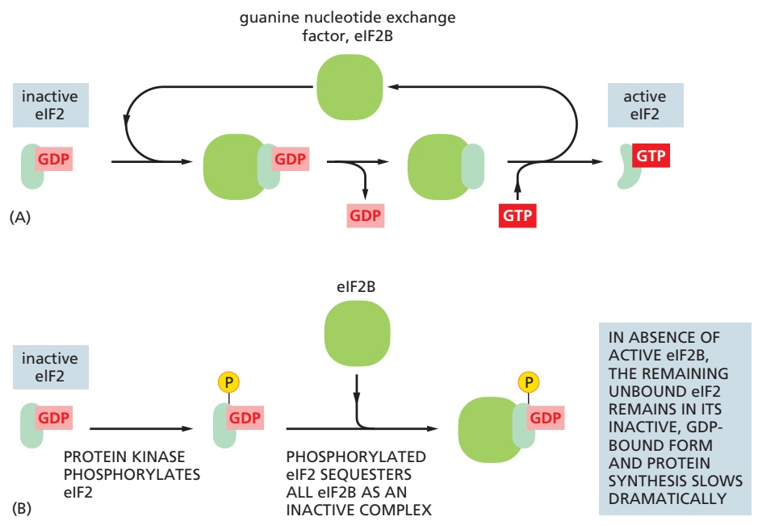

Figure 7–71 The eIF2 cycle. (A) The recycling of used eIF2 by a guanine nucleotide exchange factor (eIF2B). (B) How eIF2 phosphorylation controls protein synthesis rates by sequestering eIF2B.

#### Initiation at AUG Codons Upstream of the Translation Start Can Regulate Eukaryotic Translation Initiation

We saw in Chapter 6 that eukaryotic translation typically begins at the first AUG downstream of the $5 ^ { \prime }$ end of the mRNA, which is the first AUG encountered by a scanning small ribosomal subunit. But, as we have seen, the nucleotides immediately surrounding the AUG also influence the efficiency of translation initiation. If the recognition site is poor enough, scanning ribosomal subunits will sometimes ignore the first AUG codon in the mRNA and skip to the second or third AUG codon instead. This phenomenon, known as “leaky scanning,” is a strategy frequently used to produce two or more closely related proteins, differing only in their N-termini, from the same mRNA. A particularly important use of this mechanism is the production of the same protein with and without a signal sequence attached at its N-terminus. This allows the protein to be directed to two different locations in the cell (for example, to both mitochondria and the cytosol). Cells can regulate the relative abundance of the protein isoforms produced by leaky scanning; for example, a cell-type-specific increase in the abundance of the initiation factor eIF4F favors the use of the AUG closest to the 5′ end of the mRNA, even if it is surrounded by nonoptimal nucleotides.

Another type of control found in eukaryotes uses one or more short open reading frames—short stretches of DNA that begin with a start codon (ATG) and end with a stop codon, with no stop codons in between—that lie between the 5′ end of the mRNA and the beginning of a gene. Often, the amino acid sequences coded by these upstream open reading frames (uORFs) are not important; instead, the uORFs serve a purely regulatory function. A uORF present on an mRNA molecule will generally decrease translation of the downstream gene by trapping a scanning ribosome initiation complex and causing the ribosome to translate the uORF and dissociate from the mRNA before it reaches the bona fide proteincoding sequence.

When the activity of a general translation factor (such as eIF2 discussed earlier) is reduced, one might expect that the translation of all mRNAs would be reduced equally. Contrary to this expectation, however, the phosphorylation of eIF2 can have selective effects, even enhancing the translation of specific mRNAs that contain uORFs. This can enable cells, for example, to adapt to starvation for specific nutrients by shutting down the synthesis of all proteins except those that are required for synthesis of the missing nutrients. The details of this mechanism have been worked out for the yeast mRNA that encodes a protein called Gcn4, a transcription regulator that activates many genes that encode proteins that are important for amino acid synthesis.

The Gcn4 mRNA encodes several short uORFs, and when amino acids are abundant, ribosomes translate the uORFs and generally dissociate before they reach the Gcn4 coding region. But a global decrease in eIF2 activity brought about by amino acid starvation makes it more likely that a scanning small ribosomal subunit will move across the uORFs (without translating them) before it acquires a molecule of eIF2. This ribosomal subunit is then free to initiate translation on the actual Gcn4 sequences, and the increased level of this transcription regulator increases the production of amino acid biosynthetic enzymes. Thus, when cells encounter “hard times,” phosphorylation of eIF2 globally decreases translation while increasing synthesis of those proteins most needed by the cell to cope with the new conditions.

#### Internal Ribosome Entry Sites Also Provide Opportunities for Translational Control

Although most eukaryotic mRNAs are translated beginning with the first AUG downstream from the $5 ^ { \prime }$ cap, certain AUGs, as we just saw, can be skipped over during the scanning process. There is a second way that cells can initiate translation at positions distant from the $5 ^ { \prime }$ end of the mRNA, using a specialized type of RNA sequence called an **internal ribosome entry site (IRES)**. In some cases, two distinct protein-coding sequences are carried in tandem on the same eukaryotic mRNA; translation of the first occurs by the usual scanning mechanism utilizing the first AUG encountered, and translation of the second occurs by means of an IRES located much further into the mRNA. IRESs are typically several hundred nucleotides in length, and they fold into specific structures that bypass the need for a $5 ^ { \prime }$ cap and the translation factor that recognizes it, eIF4E (**Figure 7–72**).

Figure 7–72 Internal ribosome entry sites (IRESs) can promote translation initiation by a variety of mechanisms. (A) The normal cap-dependent mechanism requires eIF4G binding to the cap to begin assembly of the other translation components (see Figure 6–74). (B) The cap and eIF4E are bypassed by direct binding of eIF4G to a specific RNA structure formed by the IRES. (C) The small ribosome subunit binds directly to the IRES through base-pairing between sequences in the IRES and the l8S rRNA, positioning it to begin translation. (D) Specialized proteins bind to an IRES and then attract the small ribosome subunit.

It is estimated that 10% of all mammalian mRNAs contain an IRES. Some ofMBoC7 m7.68/7.72 these protein synthesis start sites are specifically activated by external signals such as stress. But the best-understood examples occur with viruses, which use IRESs as part of a strategy to get their own mRNA molecules translated while blocking the normal $5 ^ { \prime }$ cap–dependent translation of host mRNAs. On infection, these viruses produce a protease (encoded in the viral genome) that cleaves the hostcell translation factor eIF4G, rendering it unable to bind to eIF4E, the cap-binding complex (see Figure 6–74). This shuts down most of the host cell’s translation and effectively diverts the translation machinery to the IRES sequences present on the viral mRNAs. (The truncated eIF4G remains competent to initiate translation at these internal sites.)

The many ways in which viruses manipulate their host’s protein-synthesis machinery for their own advantage continue to surprise cell biologists. Studying the many results of this evolutionary “arms race” between humans and pathogens has led to many fundamental insights into the workings of the cell, and we revisit this topic in Chapter 23.

#### Changes in mRNA Stability Can Control Gene Expression

Most mRNAs in a bacterial cell are very unstable, having half-lives of less than a couple of minutes. Exonucleases, which degrade in the $3' - \mathrm{t}0 - 5'$ direction, are usually responsible for the rapid destruction of these mRNAs. Because its mRNAs are both rapidly synthesized and rapidly degraded, a bacterium can adapt quickly to environmental changes.

As a general rule, the mRNAs in eukaryotic cells are more stable. Some, such as that encoding β-globin, have half-lives of more than 10 hours. But most are considerably less stable, with half-lives of less than 30 minutes. The mRNAs that code for proteins such as growth factors and transcription regulators, whose production rates need to change rapidly in cells, are especially short-lived.

We saw in Chapter 6 that the cell has several mechanisms that rapidly destroy incorrectly processed RNAs. But now we focus on the ultimate fate of a typical “normal” eukaryotic mRNA molecule. Two general mechanisms exist for eventually destroying it, both of which begin with a gradual shortening of the poly-A tail by an exonuclease, a process that starts as soon as the mRNA reaches the cytosol. In a broad sense, this poly-A shortening acts as a timer that counts down the lifetime of each mRNA. Once the poly-A tail is reduced to a critical length (about 25 nucleotides in humans), the two destruction pathways converge. In one, the $5 ^ { \prime }$ cap is removed (a process called decapping), and the “exposed” mRNA is rapidly degraded from its $5 ^ { \prime }$ end. In the other, the mRNA continues to be degraded from the 3′ end, through the poly-A tail into the coding sequences (**Figure 7–73**).

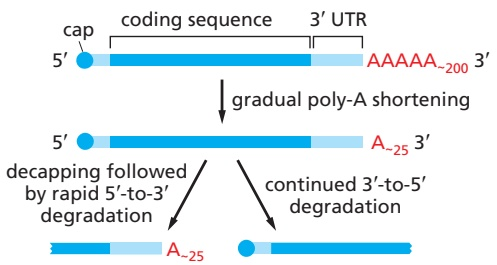

Nearly all mRNAs are subject to both types of decay, which can occur simultaneously on the same mRNA molecule. Specific nucleotide sequences determine how fast each step occurs and therefore how long each mRNA will persist in the cell and be able to produce protein. The 3′ UTR sequences are especially important in controlling mRNA lifetimes, and they often carry binding sites for specificMB C7 7.69/7.73 proteins that increase or decrease the rates of poly-A shortening, decapping, or 3′-to-5′ degradation. The half-life of an mRNA is also affected by how efficiently it is translated. Poly-A shortening and decapping compete directly with the machinery that translates the mRNA; therefore, any factors that increase the translation efficiency for an mRNA will tend to reduce its degradation.

Although poly-A shortening controls the half-life of most eukaryotic mRNAs, some mRNAs can be degraded by a specialized mechanism that bypasses this step altogether. In these cases, specific endonucleases cleave the mRNA internally, effectively decapping one end and removing the poly-A tail from the other, so that both halves are rapidly degraded. The mRNAs that are destroyed in this way carry specific nucleotide sequences—often in their 3′ UTRs—that serve as recognition sequences for these endonucleases. This strategy makes it simple to tightly regulate the stability of these mRNAs by blocking or exposing the endonuclease site in response to extracellular signals. For example, the addition of iron to cells decreases the stability of the mRNA that encodes the receptor protein that binds the iron-transporting protein transferrin, causing less of this receptor to be made. This effect is mediated by the iron-sensitive RNA-binding protein aconitase. During iron starvation, aconitase binds the 3′ UTR of the transferrin receptor mRNA and increases receptor production by blocking endonucleolytic cleavage of the mRNA (**Figure 7–74A**). On the addition of iron, aconitase is released from the mRNA, exposing the cleavage site and thereby decreasing mRNA stability (**Figure 7–74B**).

Figure 7–73 Two mechanisms of eukaryotic mRNA decay. Once a mature mRNA is exported to the cytosol, enzymes known as deadenylases gradually shorten its poly-A tail. When a critical threshold of poly-A tail length occurs, the two degradation mechanisms shown are triggered, probably by loss of the poly-A–binding proteins. Although 5′-to-3 and 3′-to-5′ degradation are shown here on separate RNA molecules, these two processes can occur together on the same molecule. (Adapted from C.A. Beelman and R. Parker, Cell 81:179–183, 1995.)

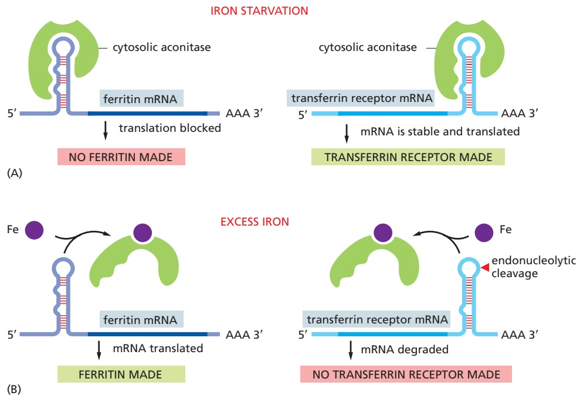

Figure 7–74 Two post-translational controls mediated by iron. (A) During iron starvation, the binding of aconitase to the 5′ UTR of the ferritin mRNA blocks translation initiation; its binding to the 3′ UTR of the transferrin receptor mRNA blocks an endonuclease cleavage site and thereby stabilizes the mRNA. (B) In response to an increase in iron concentration in the cytosol, a cell increases its synthesis of ferritin in order to bind the extra iron and decreases its synthesis of transferrin receptors in order to import less iron across the plasma membrane. Both responses are mediated by the same iron-responsive regulatory protein, aconitase, which recognizes common features in a stem–loop structure in the mRNAs encoding ferritin and the transferrin receptor. Aconitase dissociates from the mRNA when it binds iron. But because the transferrin receptor and ferritin are regulated by different types of mechanisms, their levels respond oppositely to iron concentrations even though they are regulated by the same iron-responsive regulatory protein. (Adapted from M.W. Hentze et al., Science 238:1570–1573, 1987; and J.L. Casey et al., Science 240:924–928, 1988.)

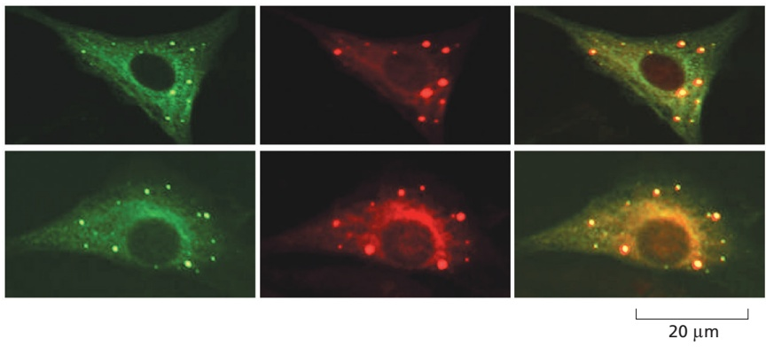

Figure 7–75 Visualization of P-bodies. Human cells were stained with antibodies to a component of the mRNA decapping enzyme Dcp1a (left panels) and to the Argonaute protein (middle panels). As described later in this chapter, Argonaute is a key component of RNA interference pathways and both it and the decapping enzyme destabilize mRNAs. The merged images (right panels) show that the two proteins co-localize to P-bodies in the cytoplasm. (Adapted from J. Liu et al., Nat. Cell Biol. 7:719–723, 2005. Reproduced with permission from SNCSC.)

#### Regulation of mRNA Stability Involves P-bodies and Stress Granules

We saw in Chapter 6 that large aggregates of RNA and protein can form membraneless compartments in the nucleus, such as nucleoli and Cajal bodies. The cytosol also contains such biomolecular condensates, and here we discuss two of them, Processing or P-bodies and stress granules, each of which has a role in handling mRNAs (**Figure 7–75**). When an mRNA in the cytosol is no longer. / . actively translated, it often moves to P-bodies where several fates are possible. P-bodies are rich in mRNA-degrading enzymes, and mRNAs that have already undergone significant poly-A shortening can continue to be degraded within P-bodies. Alternatively, some intact mRNAs can be stored in P-bodies in a translationally repressed form. According to the needs of the cell, these mRNAs can then be moved back to the cytosol and “reactivated” to begin translation again (**Figure 7–76**). mRNAs stored in this way often code for proteins that the cell needs quickly, and this strategy bypasses the time-consuming steps of de novo mRNA production.

Stress granules are dynamic membraneless organelles that form when the cell undergoes a sudden block to translation, whether by starvation, smallmolecule inhibitors, or genetic manipulation. These treatments allow ongoing translation to be completed but block new translation initiation. The resulting ribosome-free mRNAs accumulate in stress granules that grow in size as more and more mRNAs enter them. As the stressful conditions are relieved, the stress granules shrink along with the release of the stored mRNAs to the cytosol where they resume being translated. Clearly, once a cell has made the large investment in producing a properly processed mRNA molecule, it carefully controls its subsequent fate.

Figure 7–76 Possible fates of an intact mRNA molecule. An mRNA molecule released from the nucleus can be actively translated (center), stored in P-bodies (left), or, if the cell is stressed, moved into stress granules (right). As the needs of the cell change, stored mRNAs can be reactivated and returned to the cytosol to be translated into protein. Although not shown, all mRNA molecules are eventually degraded, and some of the final steps take place in P-bodies.

#### Summary

Many steps in the pathway from RNA to protein are regulated by cells in order to control gene expression. Most genes are regulated at multiple levels, in addition to being controlled at the initiation stage of transcription. The regulatory mechanisms include (1) attenuation of the RNA transcript by its premature termination, (2) alternative RNA splice-site selection, (3) control of 3′-end formation by cleavage and poly-A addition, (4) RNA covalent modifications including editing, (5) control of transport from the nucleus to the cytosol, (6) localization of mRNAs to particular parts of the cytoplasm, (7) control of translation initiation, and (8) regulated mRNA degradation. Most of these control processes require the recognition of specific sequences or structures in the RNA molecule being regulated, a task performed by either regulatory proteins or regulatory RNA molecules.

<!-- END EN EN07-H067-H073 -->

## 跨章相关英文内容

- 核糖体与RNA世界：[EN第6章 · 核糖体的核酶本质](01_第一节%20核糖体的类型与结构.md#EN06-H039-H039)。
