# 第11章 细胞信号转导 · 第一节 细胞通信与信号转导

[返回本章](../README.md) · [中文本章原文](../中文原文.md)

<!-- BEGIN CN CN11-S01 -->
## 第一节 细胞通信与信号转导

细胞通信（cell communication）是指细胞产生的胞外信号与靶细胞表面相应的受体结合，引发受体构象改变而激活，进而导致细胞内信号转导通路的建立，最终调解靶细胞的代谢、结构功能或基因表达，并表现为靶细胞整体的生物学效应。细胞信号转导（signal transduction）是实现细胞间通信的关键过程，它是协调细胞功能，控制细胞生长和分裂、组织发生与形态建成所必需的，也是细胞感知并应对外界环境刺激而进行生理学反应的基础。细胞内信号通路在演化上是高度保守的。

## 一、细胞通信

细胞通信可概括为三种类型：①信号细胞通过分泌胞外化学信号进行细胞间通信，这是多细胞生物普遍采用的通信方式；②细胞间接触依赖性通信（contact-dependent signaling），细胞直接接触，通过信号细胞跨膜信号分子（配体）与相邻靶细胞表面受体相互作用；③动物相邻细胞间形成间隙连接（gap junction）、植物细胞间通过胞间连丝（plasmodesma）使细胞间相互沟通，通过交换小分子来实现代谢偶联或电偶联，从而实现功能调控。

信号细胞分泌胞外信号，按其对靶细胞发挥效应的空间距离和作用方式，又可分为：①内分泌(endocrine)，在动物中由内分泌细胞分泌胞外信号分子（如激素），通过血液或其他细胞外液运送到体内各相应组织，作用于靶细胞而发挥作用（图11-1A）。②旁分泌(paracrine)，细胞通过分泌局部化学介质到细胞外液中，经过局部扩散作用于邻近靶细胞而发挥作用（图11-1B），在多细胞生物中调节发育的许多生长因子往往是通过短距离而起作用的；旁分泌方式对创伤或感染组织刺激细胞增殖以恢复功能也具有重要意义。③自分泌(autocrine)，释放信号分子的细胞也是发挥效应的靶细胞，即对自身分泌的信号产生反应（图11-1C）。自分泌信号常存在于病理条件下，如肿瘤细胞合成并释放生长因子刺激细胞自身，导致肿瘤细胞的增殖；此外，通过分泌信息素（pheromone）传递信息也属于通过化学信号进行细胞间通信，作用于同类的其他个体。④突触信号传递（synaptic signaling），通过化学突触传递神经信号（图11-1D），从作用范围来讲，也当属短距离局部作用，当神经细胞接受刺激后，神经信号以动作电位的形式沿轴突快速（100 m/s）传递至神经末梢，电压门控的 $Ca^{2+}$ 通道将电信号转换为化学信号，即刺激突触前化学信号（神经递质或神经肽）小泡的分泌，在不到 1 ms 的时间内化学信号通过扩散经过相距不足 100 nm 的突触间隙到达突触后膜，再通过后膜上配体门控通道将化学信号转换回电信号，实现电信号—化学信号—电信号的快速转导。

细胞间另一种通信方式是接触依赖性通信，细胞直接接触而无需信号分子的释放，通过信号细胞质膜上的信号分子与靶细胞质膜上的受体分子相互作用来介导细胞间的通信（图11-1E）。这种通信方式包括细胞-细胞黏着、细胞-基质黏着等，这种接触依赖性通信在胚胎发育过程中对组织内相邻细胞的分化命运具有决定性影响。在胚胎发育过程中，部分胚胎上皮细胞层将发育成神经组织。最初相邻的上皮细胞是彼此相同的，但在发育过程中，某些单个上皮细胞通过独立分化成为神经细胞，而与其相邻的周边细胞则受到抑制保持非神经细胞状态。这是因为预分化形成神经细胞的细胞通过膜结合的抑制性信号分子（称为Delta）与其相接触的周边细胞的膜受体（Notch，见Notch信号通路）相互作用，

## 图 11-1 不同类型的细胞间通信方式

阻止它们也分化为神经细胞。控制这一过程的信号是通过细胞间接触而传递的。这类膜表面的信号分子与受体基本类似，它们所介导的信号转导机制也基本相同。在接触依赖性通信缺陷的突变体中，有些细胞类型（如神经细胞）会过量发生。

动物细胞间的间隙连接或植物细胞间的胞间连丝同属通信连接，详见第十六章。

## 二、细胞的信号分子与受体

## （一）细胞的信号分子

信号分子（signal molecule）是细胞的信息载体，种类繁多，包括化学信号诸如各类激素、局部介质(local mediator)和神经递质（neurotransmitter）等，以及物理信号诸如声、光、电和温度变化等。各种化学信号根据其性质通常可分为四类：①气体性信号分子(gaseous signal molecule)，包括NO、CO，可以自由扩散，进入细胞直接激活效应酶（鸟苷酸环化酶）产生第二信使（cGMP），参与体内众多的生理过程，影响细胞行为。②疏水性信号分子，主要是甾类激素和甲状腺素，是血液中长效信号(long lasting signal)，这类亲脂性分子小、疏水性强，可穿过细胞质膜进入细胞，与细胞内核受体（nuclear receptor）结合形成激素-受体复合体，调节基因表达。③亲水性信号分子，包括神经递质、局部介质和大多数蛋白质类激素，它们不能透过靶细胞质膜，只能通过与靶细胞表面受体结合，经信号转换机制，在细胞内产生第二信使或激活蛋白激酶或蛋白磷酸酶的活性，引起细胞的应答反应。④膜结合信号分子，表达在细胞质膜上的信号分子，通过与靶细胞质膜上的受体分子相互作用，引起细胞应答。表11-1列出了一些激素、局部介质、神经递质和接触依赖性信号分子（膜结合信号分子）。

## （二）受体

受体（receptor）是一类能够识别和选择性结合某种配体（信号分子）的分子，已经鉴定的绝大多数受体都是蛋白质且多为糖蛋白，少数受体是糖脂（如霍乱毒素受体和百日咳毒素受体），有的受体是糖蛋白和糖脂组成的复合物（如促甲状腺素受体）。根据靶细胞上受体存在的部位，可将受体区分为细胞内受体（intracellular receptor）和细胞表面受体（cell-surface receptor）。细胞内受体位于细胞质基质或核基质中，主要识别和结合小的脂溶性信号分子，如甾类激素、甲状腺素、维生素D和视黄酸(retinoic acid)，以及细胞或病原微生物的代谢产物、结构分子或者核酸物质；细胞表面受体主要识别和结合亲水性信号分子，包括分泌型信号分子（如神经递质、多肽类激素、生长因子）或膜结合型信号分子（细胞表面抗原、细胞表面黏着分子等）。根据信号转导机制和受体蛋白类型的不同，细胞表面受体又分属三大家族（图11-2）：

表 11-1 信号分子举例

<table><tr><td>信号分子</td><td>合成/分泌位点</td><td>化学性质</td><td>生理功能</td></tr><tr><td colspan="4">激素:</td></tr><tr><td>肾上腺素</td><td>肾上腺</td><td>酪氨酸的衍生物</td><td>升高血压、加快心律和增加代谢</td></tr><tr><td>皮质醇</td><td>肾上腺</td><td>类固醇(胆固醇衍生物)</td><td>影响多数组织中蛋白质、糖类和脂质代谢</td></tr><tr><td>雌二醇</td><td>卵巢</td><td>类固醇(胆固醇衍生物)</td><td>诱导和维持雌性第二性征</td></tr><tr><td>胰高血糖素</td><td>胰岛α细胞</td><td>肽</td><td>刺激葡萄糖合成、糖原降解和脂肪分解(如肝细胞和脂肪细胞)</td></tr><tr><td>胰岛素</td><td>胰岛β细胞</td><td>蛋白质</td><td>刺激肝细胞葡萄糖摄取、蛋白质合成和脂质合成</td></tr><tr><td>睾丸酮</td><td>睾丸</td><td>类固醇(胆固醇衍生物)</td><td>诱导和维持雄性第二性征</td></tr><tr><td>甲状腺素</td><td>甲状腺</td><td>酪氨酸的衍生物</td><td>刺激多种细胞的代谢</td></tr><tr><td colspan="4">局部介质:</td></tr><tr><td>表皮生长因子(EGF)</td><td>多种细胞</td><td>蛋白质</td><td>刺激上皮细胞等多种细胞的增殖</td></tr><tr><td>血小板衍生生长因子(PDEF)</td><td>多种细胞(包括血小板)</td><td>蛋白质</td><td>刺激多种细胞的增殖</td></tr><tr><td>神经生长因子(NGF)</td><td>各种神经支配的组织</td><td>蛋白质</td><td>促进某类神经细胞的存活;促进神经细胞轴突的生长</td></tr><tr><td>组胺</td><td>肥大细胞</td><td>组氨酸衍生物</td><td>扩张血管、增加渗透,有助发炎</td></tr><tr><td>一氧化氮(NO)</td><td>神经细胞、血管内皮细胞</td><td>可溶性气体</td><td>引起平滑肌细胞松弛;调节神经细胞活性</td></tr><tr><td colspan="4">神经递质:</td></tr><tr><td>乙酰胆碱</td><td>神经末梢</td><td>胆碱衍生物</td><td>在许多神经-肌肉突触和中枢神经系统中存在的兴奋性神经递质</td></tr><tr><td>γ-氨基丁酸(GABA)</td><td>神经末梢</td><td>谷氨酸衍生物</td><td>中枢神经系统中存在的抑制性神经递质</td></tr><tr><td colspan="4">接触依赖性信号:</td></tr><tr><td>Delta</td><td>预定神经细胞、其他胚胎细胞</td><td>跨膜蛋白</td><td>抑制相邻细胞以与信号细胞相同的方式分化</td></tr></table>

(1) 离子通道偶联受体 (ion channel-coupled receptor)，是指受体本身既有信号（配体）结合位点，又是离子通道，其跨膜信号转导无需中间步骤，又称配体门控通道 (ligand-gated channel) 或递质门控通道 (transmitter-gated channel)。

(2) G 蛋白偶联受体（G-protein-coupled receptor, GPCR），是细胞表面受体中最大的家族，普遍存在于各类真核细胞表面，根据其偶联效应蛋白的不同，介导不同的信号通路。

(3) 酶联受体 (enzyme-linked receptor), 一类是受体胞内结构域具有潜在酶活性, 另一类是受体本身不具酶活性, 而是受体胞内段与酶相联系。

不管哪种类型的受体，一般至少有两个功能域，结合配体的功能域及产生效应的功能域，分别具有结合特异性和效应特异性。细胞信号转导始于胞外信号分子与靶细胞表面受体的结合，受体结合特异性配体后而被激活，通过信号转导途径将胞外信号转换为胞内信号。结果诱发两类基本的细胞应答反应：一是改变细胞内特殊的酶类和其他蛋白质的活性或功能，进而影响细胞代谢功能或细胞运动等；二是通过修饰细胞内转录因子刺激或阻遏特异靶基因的表达，从而改变细胞特异性蛋白的表达量。一般而言，前一类应答反应比后一类反应发生得更快些。故前者称为快反应（短期反应），后者称为慢反应（长期反应）（图11-3）。

对多细胞生物而言，一个细胞经常暴露于以不同状态存在的上百种不同信号分子的环境中，靶细胞对外界特殊信号分子的特异反应取决于细胞具有的相应受体。细胞对外界信号分子的敏感性既取决于细胞表面受体的数量，也取决于受体对配体的亲和性（affinity）。通常，用受体与配体的结合试验来检测和决定其亲性和特异性。对于完整细胞或细胞片段，受体的检测和估量通常根据它与放射性或荧光标记的配体的结合来进行。受体与配体是通过非共价键结合的，因此受体与配体的结合可以描述为可逆性的双分子相互作用的热动力学平衡反应，以R和[R]分别表示自由受体及其浓度，以L和[L]分别表示自由配体及其浓度，以RL和[RL]分别表示受体-配体复合物及其浓度，则解离常数 $K_{d}$ 值表示受体与配体的结合亲和性高低，以下列公式表述：

$$
K _ {\mathrm{d}} = [ \mathrm{R} ] [ \mathrm{L} ] / [ \mathrm{RL} ]
$$

$K_{d}$ 值代表细胞表面受体达到50%被占据时所需的配体

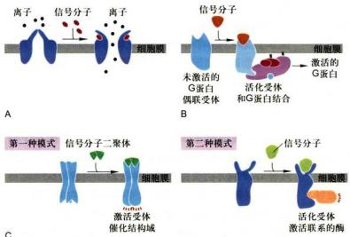  
图 11-2 三种类型的细胞表面受体

A. 离子通道偶联受体。B. G 蛋白偶联受体。C. 酶联受体。

  
图 11-3 通过细胞表面受体转导胞外信号诱发两类基本细胞应答反应——快反应和慢反应

分子浓度。 $K_{d}$ 值低代表受体与配体的结合亲和性高， $K_{d}$ 值高代表受体与配体的结合亲和性低。例如有两个受体：对受体1而言， $K_{d}=10^{-7}\ mol/L$ ，对受体2而言， $K_{d}=10^{-9}\ mol/L$ ；则同样配体对受体2比受体1具有较高的亲和性。

受体与信号分子空间结构的互补性是二者特异性结合的主要因素，但并不意味受体与配体之间是简单的一对一关系。不同细胞对同一种化学信号分子可能具有不同的受体，因此，不同的靶细胞以不同的方式应答于相同的化学信号；例如同为乙酰胆碱，作用于骨骼肌细胞引起收缩，作用于心肌细胞却降低收缩频率，作用于唾腺细胞则引起分泌。另外也有不同的细胞具有相同的受体，当与同一种信号分子结合时，不同细胞对同一信号产生不同的反应，或同一细胞不同的受体应答于不同的胞外信号产生相同的效应；如肝细胞肾上腺素或胰高血糖素受体在结合各自配体被激活后，都能促进糖原降解而升高血糖。绝大多数细胞同时具有多种类型的受体，应答多种不同的胞外信号从而启动不同的生物学效应，如存活、分裂、分化或死亡。由此可见，靶细胞一是通过受体对信号结合的特异性，二是通过细胞本身固有的特征对外界信号产生反应。

## （三）第二信使与分子开关

20世纪50年代，Sutherland通过体外实验证明，向肝组织切片加入肾上腺素时，可明显导致糖原磷酸化酶活性增加，并促进糖原分解为葡萄糖，从而导致cAMP的发现。70年代初提出激素作用的第二信使学说（second messenger theory），即胞外化学信号（第一信使）不能进入细胞，它作用于细胞表面受体，导致产生胞内信号（第二信使），从而引发靶细胞内一系列生化反应，最后产生一定的生理效应。第二信使的降解使其信号作用终止。Sutherland正是通过阐明cAMP的功能并提出第二信使学说而获得1971年诺贝尔生理学或医学奖。他的研究结果一直作为基本模式指导着细胞信号系统的研究，并不断发展完善。第二信使（second messenger）是指在胞内产生的非蛋白类小分子，其浓度变化（增加或减少）应答胞外信号与细胞表面受体的结合，调节细胞内酶和非酶蛋白质的活性，从而在细胞信号转导途径中行使携带和放大信号的功能。目前公认的第二信使包括cAMP、cGMP、 $\mathrm{Ca^{2+}}$ 、二酰甘油（1,2-diacylglycerol,DAG）和1,4,5-三磷酸肌醇（1,4,5-inositol trisphosphate, $\mathrm{IP}_3$ ）等（图11-4）。1987年，以色列科学家M.Benziman发现细菌可将两分子的GTP通过 $3^{\prime},5^{\prime}$ -磷酸二酯键连接而成第二信使c-di-GMP，在细菌纤维素的合成中起重要调节作用。此后，c-di-GMP和c-di-AMP也被发现在细菌中起重要的第二信使作用。2012年，在霍乱弧菌中发现环化GMP-AMP（cGAMP，此为 $3^{\prime},3^{\prime}$ -cGAMP）对于调节细菌的趋化性及毒性有重要作用。2013年，我国科学家陈志坚发现哺乳动物细胞也能够生成cGAMP（此为 $2^{\prime},3^{\prime}$ -cGAMP），并作为第二信使激活天然免疫反应。

在细胞信号转导过程中，除细胞表面受体和第二信使分子以外，还有两类在演化上保守的胞内蛋白，其功能作用依赖于细胞外信号的刺激，这两类蛋白在引发信号转导级联反应中起分子开关（molecular switch）的作用。

(1) GTP酶分子开关调控蛋白 GTP酶分子开关调控蛋白构成细胞内GTP酶超家族，包括三聚体GTP结合蛋白和如Ras和类Ras蛋白的单体GTP结合蛋白。所有GTP酶开关蛋白都有两种状态：一是与GTP结合呈活化（开启）状态，进而改变特殊靶蛋白的活性；二是与GDP结合，处于失活（关闭）状态。GTP酶开关蛋白通过两种状态的转换控制下游靶蛋白的活性。信号诱导的开关调控蛋白从失活态向活化态的转换，由鸟苷酸交换因子（guanine nucleotide-exchange factor, GEF）所介导，GEF引起GDP从开关蛋白释放，继而结合GTP并引发开关调控蛋白（G蛋白）构象改变使其活化；随着结合的GTP的水解形成GDP和Pi，开关调控蛋白又恢复成失活的关闭状态；GTP的水解速率又被GTP酶促进蛋白（GTPase-accelerating protein, GAP）和G蛋白信号调节子（regulator of G protein-signaling, RGS）所促进，被鸟苷酸解离抑制物（guanine nucleotide dissociation inhibitor, GDI）所抑制（图11-5）。

(2) 蛋白激酶 / 蛋白磷酸酶 另一类最普遍存在的分子开关机制是通过蛋白激酶（protein kinase）使靶蛋白磷酸化，通过蛋白磷酸酶（protein phosphatase）使靶蛋白去磷酸化，从而调节靶蛋白的活性，E. G. Krebs and E. H. Fischer 因为发现蛋白质磷酸化与去磷酸化作为一种生物学调节机制而获得1992年诺贝尔生理学或医学奖。虽然这两种反应基本上是不可逆的，但综合蛋白激酶和蛋白磷酸酶的活性，蛋白质磷酸化和去磷酸化可为细胞提供一种“开关”机制，使各种靶蛋白处于“开启”或“关闭”的状态（图11-6）。蛋白质磷酸化和去磷酸化可以改变蛋白质的电荷并改变蛋白质构象，从而导致该蛋白质活性的增强或降低，是细胞内普遍存在的一种调节机制，蛋白激酶和蛋白磷酸酶在几乎所有的信号通路中被普遍使用。在代谢调节、基因表达、周期调

  
图11-5 GTP酶开关调控蛋白活化（开）与失活（关）的转换  
通过结合的 GTP 的水解，GTP 酶开关蛋白由活化态转换为失活态，该过程受 GAP 和 RGS 的促进，受 GDI 的抑制；GTP 酶开关蛋白的再活化被 GEF 的促进。

控中具有重要作用。据最近统计，人类基因组大约编码蛋白激酶560种，编码不同的蛋白磷酸酶有100种。在不同的细胞类型中，每种蛋白激酶在一套靶蛋白中磷酸化特殊的氨基酸残基，在动物细胞中有两种类型的蛋白激酶——一类是将磷酸基团加在酪氨酸残基的羟基上，称为酪氨酸激酶，另一类是将磷酸基团加在靶蛋白丝氨酸或/和苏氨酸残基的羟基上，称为丝/苏氨酸激酶；并且所有蛋白激酶还结合磷酸化残基周围的特异性氨基酸序列。这两种酶的靶蛋白的活性变化都是通过蛋白激酶 / 蛋白磷酸酶开关调节的，并且具有靶蛋白特异性。

  
图 11-6 靶蛋白磷酸化和去磷酸化是细胞调节靶蛋白活性的一个普遍机制  
在该图例中，当靶蛋白被磷酸化时活化，去磷酸化时失活，有些靶蛋白具有相反的变化模式。

(3) 钙调蛋白 $Ca^{2+}$ 作为胞内第二信使，在调控细胞对多种信号的应答反应中发挥基本作用，许多 GPCR 和其他类型的受体是通过影响细胞质 $Ca^{2+}$ 浓度而发挥作用的。在细胞处于静息状态下，细胞质中游离 $Ca^{2+}$ 浓度维持在亚微摩尔每升水平（约 0.2 $\mu$ mol/L），这是靠 ATP 驱动的钙泵持续工作的结果，即将游离 $Ca^{2+}$ 不断运出胞外和运进内质网和其他膜胞腔内；若细胞质中游离 $Ca^{2+}$ 浓度的小量升高，便会诱发各类细胞反应，包括内分泌细胞激素的分泌、胰腺外分泌细胞消化酶的分泌和肌肉的收缩等。钙调蛋白（calmodulin, CaM）是细胞质中普遍存在的小分子蛋白，有 148 个氨基酸残基，每个 CaM 分子具有 4 个 $Ca^{2+}$ 结合位点，它作为行使多种功能的分子开关蛋白介导多种 $Ca^{2+}$ 的细胞效应，CaM 可通过与 $Ca^{2+}$ 的结合或解离而分别处于活化或失活的“开启”或“关闭”状态。形成的 $Ca^{2+}-CaM$ 复合物可结合多种酶及其他靶蛋白，并修饰其活性。

## 三、信号转导系统及其特性

## （一）信号转导系统的基本组成及信号蛋白的相互作用

通过细胞表面受体介导的信号通路通常由下列5个步骤组成（图11-7）：①细胞表面受体特异性识别并结合胞外信号分子（配体），形成受体-配体复合物，导致受体激活。②由于激活受体构象改变，导致信号初级跨膜转导，靶细胞内产生第二信使或活化的信号蛋白。③通过胞内第二信使或细胞内信号蛋白复合物的装配，起始胞内信号放大的级联反应（signaling cascade）。④细胞应答反应。这种级联反应如果是通过酶的逐级激活，其结果可能改变细胞代谢活性；如果是通过表达基因调控蛋白，其结果可能影响发育；如果是通过细胞骨架蛋白的修饰，其结果则改变细胞形状或运动。⑤由于受体的脱敏（desensitization）或受体下调(down-regulation)，终止或降低细胞反应。

细胞信号转导系统是由细胞内多种行使不同功能的信号蛋白所组成的信号传递链。受体通过细胞内信号蛋白的相互作用而传播信号，这必然涉及信号蛋白之间靠何种机制保障彼此的精确联系。细胞内信号蛋白的相互作用是靠蛋白质模式结合域（modular binding domain）

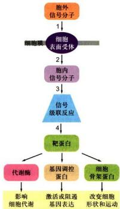  
图11-7 细胞表面受体介导的细胞信号转导系统的组成

1. 受体特异性识别并结合胞外信号分子被激活；2. 信号初级跨膜转导；3. 通过胞内信号级联反应实现信号传播与放大；4. 产生细胞应答反应；5. 细胞反应终止或下调（未表示）。

所特异性介导的，多种模式结合域经多重相互作用极大地拓展了细胞内信号网络的多样性。这些模式结合域通常由40～120个氨基酸残基组成，一侧有较浅凹陷的球形结构域、不具酶活性，但能识别特定基序或蛋白质上特定修饰位点、它们与识别对象的亲和性较弱，因而有利于快速和反复进行精细的组合式网络调控。SH2（Src homology 2 domain）是研究蛋白质互作的原型模式结构域，由约100个氨基酸残基组成，其定义源于逆转录病毒癌蛋白（oncoprotein）v-Eps。具有SH2结构域的蛋白质家族，具有相似的三维结构，但每一成员可特异性结合围绕磷酸酪氨酸残基的氨基酸序列（图11-8）。

1991年，进一步阐明了SH2结构域的基本功能，人类基因组大约编码115种SH2结构域，该蛋白质家族包括多种功能性成员：①酶，含有一或两个与催化序列相联系的SH2结构域，如蛋白激酶或蛋白磷酸酶结构域，磷脂酶C、RasGAP结构域，Rho家族GEF结构域；②癌蛋白和致病性互作（oncogenic protein and pathogenic interaction），如人慢性粒细胞白血病Bcr-Abl癌蛋白；③锚定蛋白（docking protein），如哺乳类

ShcA（C端具SH2结构域，N端具PTB结构域）、胰岛素受体底物（IR5）等；④接头蛋白（adaptor），含单个SH2和多个SH3结构域，如哺乳类的生长素受体结合蛋白2（Grb2）等；⑤调节蛋白（regulator），许多SH2蛋白家族成员具有调节功能，如STAT介导的细胞因子信号通路；⑥转录因子。此外，人类基因组还大约编码253个SH3结构，结合富含脯氨酸序列(PXXP)。由于技术的进步和方法的完善，现在已有多种手段研究细胞内蛋白质-蛋白质之间的互作，为研究细胞内大分子互作及其复合物的组成提供了有力的工具，特别是包括人类在内的动物基因组序列的发现为研究细胞内分子间相互作用提供了条件。现在需要解决的问题是要利用计算学和统计学的原理来归纳已知的分子间相互作用信息，并且利用他们来推测未知分子间的相互作用，从而更深入地研究细胞的生命活动。此外还陆续发现许多其他蛋白质模式结构域及其结合基序的特异性（表11-2，图11-8）。

## （二）细胞内信号蛋白复合物的装配

细胞内信号蛋白复合物的形成是信号蛋白间相互作用的结果，是实现细胞表面受体所介导的各种细胞内信号通路的重要结构基础。从细胞接受信号刺激到产生应答反应的过程中，信号蛋白复合物的形成有其重要生物学意义，即在时空上增强细胞应答反应的速度、效率和反应的特异性。概括起来，细胞内信号蛋白复合物的装配可能有三种不同策略：

  
图11-8 细胞内信号蛋白之间的相互作用是靠蛋白质模式结合域所特异性介导的示意图  
图中具有SH2结构域的蛋白质具有相似的三维结构，每一成员可特异性结合围绕磷酸酪氨酸残基的氨基酸序列。IRS为胰岛素受体底物。

表 11-2 蛋白质模式结构域及其结合基序特异性

<table><tr><td>结构域</td><td>结合基序特征</td><td>举例</td></tr><tr><td>SH2 结构域</td><td>特异性结合磷酸酪氨酸残基(p-Tyr)</td><td>Src、Grb2、Shc、STAT</td></tr><tr><td>SH3 结构域</td><td>结合富含脯氨酸序列(PXXP)和 RXXK</td><td>Src、Nck</td></tr><tr><td>PTB 结构域</td><td>结合 NPXY 基序</td><td>Shc、IRS1</td></tr><tr><td>PDZ 结构域</td><td>识别膜蛋白 C 端 4~5 个氨基酸残基组成的短肽基序(通常最末端为 Val-COOH)</td><td>Dishevelled、FAP</td></tr><tr><td>WW 结构域</td><td>结合富含脯氨酸基序(XPPXY)</td><td>Nedd4 (E3 泛素连接酶)、Smurf、Dystrophin</td></tr><tr><td>PH 结构域</td><td>与肌醇磷脂结合,将蛋白质靶向质膜(PI(3,4)  ${\mathrm{P}}_{2}$  、PI(4,5)  ${\mathrm{P}}_{2}$  、PI(3,4,5)  ${\mathrm{P}}_{3}$  )</td><td>Akt、Sos</td></tr><tr><td>FYVE 结构域</td><td>与肌醇磷脂结合,将蛋白质靶向内体</td><td>EEA1、SARA (PI3P)</td></tr><tr><td>LIM 结构域</td><td>识别基于转角的蛋白质基序</td><td></td></tr><tr><td>死亡结构域</td><td></td><td>Fas</td></tr></table>

（1）细胞表面受体和某些细胞内信号蛋白通过与大的支架蛋白结合预先形成细胞内信号复合物，当受体结合胞外信号被激活后，再依次激活细胞内信号蛋白并向下游传递（图 11-9A）。

（2）依赖激活的细胞表面受体装配细胞内信号蛋白复合物，即表面受体结合胞外信号被激活后，受体胞内段多个氨基酸残基位点发生自磷酸化（autophosphorylation）作用，从而为细胞内不同的信号蛋白提供锚定位点，形成短暂的信号转导复合物分别介导下游事件（图11-9B）。

（3）受体结合胞外信号被激活后，在邻近质膜上形成修饰的肌醇磷脂分子，从而募集具有PH结构域的信号蛋白，装配形成信号复合物（图11-9C）。

## （三）信号转导系统的主要特性

(1) 特异性 (specificity) 细胞受体与胞外配体通过结构互补以非共价键结合，形成受体-配体复合物，简称具有“结合”特异性 (binding specificity)，受体因结合配体而改变构象被激活，介导特定的细胞反应，从而又表现出“效应器”特异性 (effector specificity)。此外，受体与配体的结合具有饱和性和可逆性的特征。

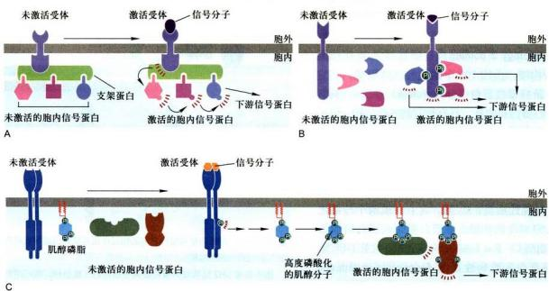  
图 11-9 细胞内信号蛋白复合物装配的三种类型

(2) 放大效应 (amplification) 胞外信号分子（通常称为第一信使）与细胞表面受体结合，导致细胞内某些低分子量细胞内信号分子（称为第二信使）浓度的增加或减少（如 $Ca^{2+}$ 、cAMP），例如肾上腺素在血液的浓度约 $10^{-10}$ mol/L，当与细胞表面受体（GPCR）结合，激活胞内效应酶（腺苷酸环化酶）产生第二信使 cAMP，其浓度可以快速升高 10 000 倍达到 $10^{-6}$ mol/L 转而与下游酶或其他蛋白质结合，修饰它们的活性，引发细胞内信号放大的级联反应，如果级联反应主要是通过酶的逐级激活，结果将改变细胞代谢活性。最常见的级联放大作用是通过蛋白质磷酸化实现的。

(3) 网络化与反馈 (feedback) 调节机制 每一个细胞都处于错综复杂的信号环境之中, 包括各种激素、生长因子、相邻细胞的表面蛋白, 甚至危险信号等。这些信号分子相互作用, 构成细胞信号的网络, 激活不同的转录因子并调节不同的蛋白质表达, 最终使细胞产生一种有条理的生物学反应。细胞信号网络中的不同信号通路之间的相互作用, 主要通过一系列正反馈 (positive feedback) 和负反馈 (negative feedback) 来校正反应的速率和强度, 把外界纷繁复杂的, 甚至相互矛盾的信号进行归纳整理。细胞信号系统网络化及反馈调节是细胞生命活动的重要特征。

(4) 整合作用（integration）多细胞生物的每个细胞都处于细胞“社会”环境之中，大量的信息以不同组合的方式调节细胞的行为。因此，细胞必须整合不同的信息，对细胞外信号分子的特异性组合作出程序性反应，甚至作出生死抉择，这样才能维持生命活动的有序性。

<!-- END CN CN11-S01 -->

---

## 对应英文内容

### 英文补充：细胞通信、受体、分子开关与信号复合物

> 对应中文板块：细胞通信、受体、分子开关与信号复合物。英文来源：Molecular Biology of the Cell，第7版，第15章；[本章完整原文](../../来源/英文教材/15_Cell_Signaling/chapter.md)。物理PDF页码范围：912–987（整章范围）。

<!-- BEGIN EN EN15-H000-H009 -->
#### Cell Signaling

C HAP T E R

When things change, cells respond. Every cell, from the humble bacterium to the most sophisticated eukaryotic cell, monitors its intracellular and extracellular environment, processes the information it gathers, and responds accordingly. Unicellular organisms, for example, modify their behavior in response to changes in environmental nutrients or toxins. The cells of multicellular organisms detect and respond to countless internal and extracellular signals that control their growth, division, and differentiation during development, as well as their behavior in adult tissues. At the heart of all these communication systems are regulatory proteins that produce chemical signals, which are sent from one place to another in the body or within a cell, and other proteins that recognize the signals and respond to them, often integrating the signals and passing them on to produce an appropriate cell response.

#### PRINCIPLES OF CELL SIGNALING

The study of cell signaling has traditionally focused on the mechanisms by which eukaryotic cells communicate with one another using extracellular signal molecules such as hormones and growth factors. In this chapter, we describe the features of some of these cell–cell communication systems, and we use them to illustrate the general principles by which any regulatory system, inside or outside the cell, is able to generate, process, and respond to signals. Our main focus is on animal cells, but we end by considering the special features of cell signaling in plants.

Long before multicellular creatures roamed the Earth, unicellular organisms had developed mechanisms for responding to physical and chemical changes in their environment. These almost certainly included mechanisms for responding to the presence of other cells. Evidence comes from studies of present-day unicellular organisms such as bacteria and yeasts. Although these cells lead mostly independent lives, they can communicate and influence one another’s behavior. Many bacteria, for example, respond to chemical signals that are secreted by their neighbors and accumulate at higher population density. This process, called quorum sensing, allows bacteria to coordinate their behavior, including their motility, antibiotic production, spore formation, and sexual conjugation. Similarly, yeast cells communicate with one another in preparation for mating. The budding yeast Saccharomyces cerevisiae provides a well-studied example: when a haploid individual is ready to mate, it secretes a peptide mating factor that signals cells of the opposite mating type to stop proliferating and prepare to mate. The subsequent fusion of two haploid cells of opposite mating type produces a diploid zygote.

15

Intercellular communication achieved an astonishing level of complexity during the evolution of multicellular organisms. These organisms are tightly knit societies of cells, in which the well-being of the individual cell is often set aside for the benefit of the organism as a whole. Complex systems of intercellular communication have evolved to allow the collaboration and coordination of different tissues and cell types. Bewildering arrays of signaling systems govern every conceivable feature of cell and tissue function during development and in the adult.

IN THIS CHAPTER

Principles of Cell Signaling

Signaling Through G-Proteincoupled Receptors

Signaling Through Enzymecoupled Receptors

Alternative Signaling Routes in Gene Regulation

Signaling in Plants

Figure 15–1 A simple intracellular signaling pathway activated by an extracellular signal molecule. The signal molecule usually binds to a receptor protein that is embedded in the plasma membrane of the target cell. The receptor activates one or more intracellular signaling pathways, involving a series of signaling proteins and small chemical messengers. Finally, one or more of the intracellular signaling molecules alters the activity of effector proteins and thereby the behavior of the cell.

Communication between cells in multicellular organisms is mediated mainly by **extracellular signal molecules**. Some of these operate over long distances, signaling to cells far away; others signal only to immediate neighbors. Most cells in multicellular organisms both emit and receive signals. Reception of the signals depends on receptor proteins, usually (but not always) at the cell surface, which bind the signal molecule. The binding activates the receptor, which in turn activates one or more intracellular signaling pathways or systems. These systems depend on intracellular signaling proteins, which process the signal inside the receiving cell and distribute it to the appropriate intracellular targets. Some of these proteins produce small chemical messengers called second messengers, which carry the signal to other signaling proteins. The targets that lie at the end of signaling pathways are generally called effector proteins, which are altered in some way by the incoming signal and implement the appropriate change in cell behavior. Depending on the signal and the type and state of the receiving cell, these effectors can be transcription regulators, ion channels, components of a metabolic pathway, or parts of the cytoskeleton (**Figure 15–1**).

The fundamental features of cell signaling have been conserved throughout the evolution of the eukaryotes. In budding yeast, for example, the response to mating factor depends on cell-surface receptor proteins, intracellular GTP-binding proteins, and protein kinases that are clearly related to functionally similar proteins in animal cells. Through gene duplication and divergence, however, the signaling systems in animals have become much more elaborate than those in yeasts; the human genome, for example, contains more than 1500 genes that encode receptor proteins, and the number of different receptor proteins is further increased by alternative RNA splicing and post-translational modifications.

#### Extracellular Signals Can Act Over Short or Long Distances

Many extracellular signal molecules remain bound to the surface of the signaling cell and influence only cells that contact it (**Figure 15–2A**). Such **contact-dependent signaling** is especially important during development and in immune responses.

Figure 15–2 Four forms of intercellular signaling. (A) Contact-dependent signaling requires cells to be in direct membrane– membrane contact. (B) Paracrine signaling depends on local mediators that are released into the extracellular space and act on neighboring cells. (C) Synaptic signaling is performed by neurons that transmit signals electrically along their axons and release neurotransmitters at chemical synapses, which are often located far away from the neuronal cell body. (D) Endocrine signaling depends on endocrine cells, which secrete hormones into the bloodstream for distribution throughout the body. Many of the same types of signaling molecules are used in paracrine, synaptic, and endocrine signaling; the crucial differences lie in the speed and selectivity with which the signals are delivered to their targets.

Contact-dependent signaling during development can sometimes operate over relatively large distances if the communicating cells extend long, thin processes to make contact with one another.

In most cases, however, signaling cells secrete signal molecules into the extracellular fluid. Often, the secreted molecules are **local mediators**, which act only on cells in the local environment of the signaling cell. This is called **paracrine signaling** (**Figure 15–2B**). Usually, the signaling and target cells in paracrine signaling are of different cell types, but cells may also produce signals that they themselves respond to: this is referred to as autocrine signaling. Cancer cells, for example, often produce extracellular signals that stimulate their own survival and proliferation.

Large multicellular organisms like us also need long-range signaling mechanisms to coordinate the behavior of cells in remote parts of the body. Thus, they have evolved cell types specialized for intercellular communication over large distances. The most sophisticated of these are nerve cells, or neurons, which typically extend long, branching processes (axons) that enable them to contact target cells far away, where the processes terminate at the specialized sites of signal transmission known as chemical synapses. When a neuron is activated by stimuli from other nerve cells, it sends electrical impulses (action potentials) rapidly along its axon; when the impulse reaches the synapse at the end of the axon, it triggers secretion of a chemical signal that acts as a **neurotransmitter**. The tightly organized structure of the synapse ensures that the neurotransmitter is delivered specifically to receptors on the postsynaptic target cell (**Figure 15–2C**). The details of this **synaptic signaling** process are discussed in Chapter 11.

A quite different strategy for signaling over long distances makes use of **endocrine cells**, which secrete their signal molecules, called **hormones**, into the bloodstream. The blood carries the molecules far and wide, allowing them to act on target cells that may lie almost anywhere in the body (**Figure 15–2D**).

#### Extracellular Signal Molecules Bind to Specific Receptors

Cells in multicellular animals communicate by means of hundreds of kinds of extracellular signal molecules. These include proteins, small peptides, amino acids, nucleotides, steroids, retinoids, fatty acid derivatives, and even dissolved

Figure 15–3 The binding of extracellular signal molecules to either cell-surface or intracellular receptors. (A) Most signal molecules are hydrophilic and are therefore unable to cross the target cell’s plasma membrane directly; instead, they bind to cell-surface receptors, which in turn generate signals inside the target cell (see Figure 15–1). (B) Some small signal molecules, by contrast, diffuse across the plasma membrane and bind to receptor proteins inside the target cell—either in the cytosol or in the nucleus (as shown here). Many of these small signal molecules are hydrophobic and poorly soluble in aqueous solutions; they are therefore transported in the bloodstream and other extracellular fluids bound to carrier proteins, from which they dissociate before entering the target cell.

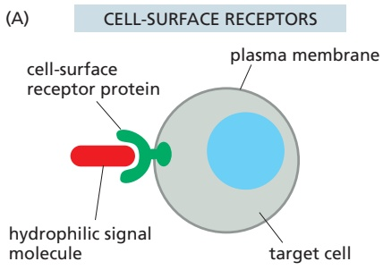

gases such as nitric oxide and carbon monoxide. Most of these signal molecules are released into the extracellular space by exocytosis from the signaling cell, as discussed in Chapter 13. Some, however, are emitted by diffusion through the signaling cell’s plasma membrane, whereas others are displayed on the external surface of the cell and remain attached to it, signaling to target cells only upon contact. Transmembrane signal proteins may operate in this way, although in some cases their extracellular domains are released from the signaling cell’s surface by proteolytic cleavage and then act at a distance.

Regardless of the nature of the signal, the target cell responds by means of a **receptor**, which binds the signal molecule and then initiates a response in the target cell. The binding site of the receptor has a complex structure that is shaped to recognize the signal molecule with high specificity, helping to ensure that the receptor responds only to the appropriate signal and not to the many other signaling molecules the cell is exposed to. Many signal molecules act at very low concentrations $\mathrm { ( t y p i c a l l y \leq 1 0 ^ { - 8 }   M ) }$ , and their receptors usually bind them with high affinity (dissociation constant $K _ { \mathrm { d } } \leq 1 0 ^ { - 8 }   \mathrm { M } ;$ see Figure 3–42).

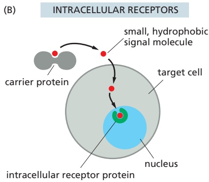

In most cases, receptors are transmembrane proteins on the target-cell surface. When these proteins bind an extracellular signal molecule (a ligand), they become activated and generate various intracellular signals that alter the behavior of the cell. In other cases, the receptor proteins are inside the target cell, and the signal molecule has to enter the cell to bind to them: this requires that the signal molecule be sufficiently small and hydrophobic to diffuse across the target cell’s plasma membrane (**Figure 15–3**). This chapter focuses primarily on signaling through cell-surface receptors, but we will briefly describe signaling through intracellular receptors later in the chapter.

#### Each Cell Is Programmed to Respond to Specific Combinations of Extracellular Signals

A typical cell in a multicellular organism is exposed to hundreds of different signal molecules in its environment. The molecules can be soluble, bound to the extracellular matrix, or bound to the surface of a neighboring cell; they can be stimulatory or inhibitory; they can act in innumerable different combinations; and they can influence almost any aspect of cell behavior. The cell responds to this blizzard of signals selectively, in large part by expressing only those receptors and intracellular signaling systems that respond to the signals that are required for the regulation of that cell.

Most cells respond to many different signals in the environment, and some of these signals may influence the response to other signals. One of the key challenges in cell biology is to determine how a cell integrates all of this signaling information in order to make decisions—to divide, to move, to differentiate, and so on. Many cells, for example, require a specific combination of extracellular survival factors to allow the cell to continue living; when deprived of these signals, the cell activates a suicide program and kills itself—usually by apoptosis, as discussed in Chapter 18. Cell proliferation often depends on a combination of signals that promote both cell division and survival, as well as signals that stimulate cell growth (**Figure 15–4**). On the other hand, differentiation into a nondividing state (called terminal differentiation) frequently requires a different combination of survival and differentiation signals that must override any signal to divide.

Figure 15–4 An animal cell’s dependence on multiple extracellular signal molecules. Each cell type displays a set of receptors that enables it to respond to a corresponding set of signal molecules produced by other cells. These signal molecules work in various combinations to regulate the behavior of the cell. As shown here, an individual cell often requires multiple signals to survive (blue arrows) and additional signals to grow and divide (red arrows) or differentiate (green arrows). If deprived of appropriate survival signals, a cell will undergo a form of cell suicide known as apoptosis. The actual situation is even more complex. Although not shown, some extracellular signal molecules act to inhibit these and other cell behaviors or even to induce apoptosis.

A signal molecule often has different effects on different types of target cells. The neurotransmitter acetylcholine (**Figure 15–5A**), for example, decreases the rate of action potential firing in heart pacemaker cells (**Figure 15–5B**) and stimulates the production of saliva by salivary gland cells (**Figure 15–5C**), even though the acetylcholine receptors are the same on both cell types. In skeletal muscle, acetylcholine causes the cells to contract by binding to a different type of acetylcholine receptor (**Figure 15–5D**). The different effects of acetylcholine in these cell types result from differences in the intracellular signaling proteins, effector proteins, and genes that are activated. Thus, an extracellular signal itself has little information content; it simply induces the cell to respond according to its pre-determined state, which depends on the cell’s developmental history and the specific genes it expresses.

(A) acetylcholine

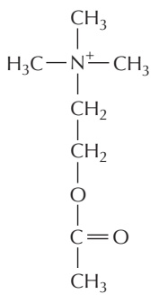

(B) heart pacemaker cell

Figure 15–5 Various responses induced by the neurotransmitter acetylcholine. (A) The chemical structure of acetylcholine. (B–D) Different cell types are specialized to respond to acetylcholine in different ways. In some cases (B and C), acetylcholine binds to the same type of acetylcholine receptor (a G-protein-coupled receptor; see Figure 15–6), but the intracellular signals produced are interpreted differently in cells specialized for different functions. In other cases (D), the acetylcholine receptor protein is different (an ion-channel-coupled receptor; see Figure 15–6).

#### There Are Three Major Classes of Cell-Surface Receptor Proteins

Most extracellular signal molecules bind to specific receptor proteins on the surface of the target cells they influence and do not enter the cytosol or nucleus. These cell-surface receptors act as signal transducers by converting an extracellular ligand-binding event into intracellular signals that alter the behavior of the target cell.

Most cell-surface receptor proteins belong to one of three classes, defined by their transduction mechanism. Ion-channel-coupled receptors, also known as transmitter-gated ion channels or ionotropic receptors, are involved in rapid synaptic signaling between nerve cells and other electrically excitable target cells such as muscle cells (**Figure 15–6A**). This type of signaling is mediated by a small number of neurotransmitters that transiently open or close an ion channel formed by the protein to which they bind, briefly changing the ion permeability of the plasma membrane and thereby changing the excitability of the postsynaptic target cell. Most ion-channel-coupled receptors belong to a large family of homologous, multipass transmembrane proteins. Because they are discussed in detail in Chapter 11, we will not consider them further here.

G-protein-coupled receptors act by indirectly regulating the activity of a separate plasma-membrane-bound target protein, which is generally either an enzyme or an ion channel. A heterotrimeric GTP-binding protein (G protein) mediates the interaction between the activated receptor and this target protein (**Figure 15–6B**). The activation of the target protein can change the concentration of one or more small intracellular signaling molecules (if the target protein is an enzyme) or it can change the ion permeability of the plasma membrane (if the target protein is an ion channel). The small intracellular signaling molecules act in turn to alter the behavior of yet other signaling proteins in the cell.

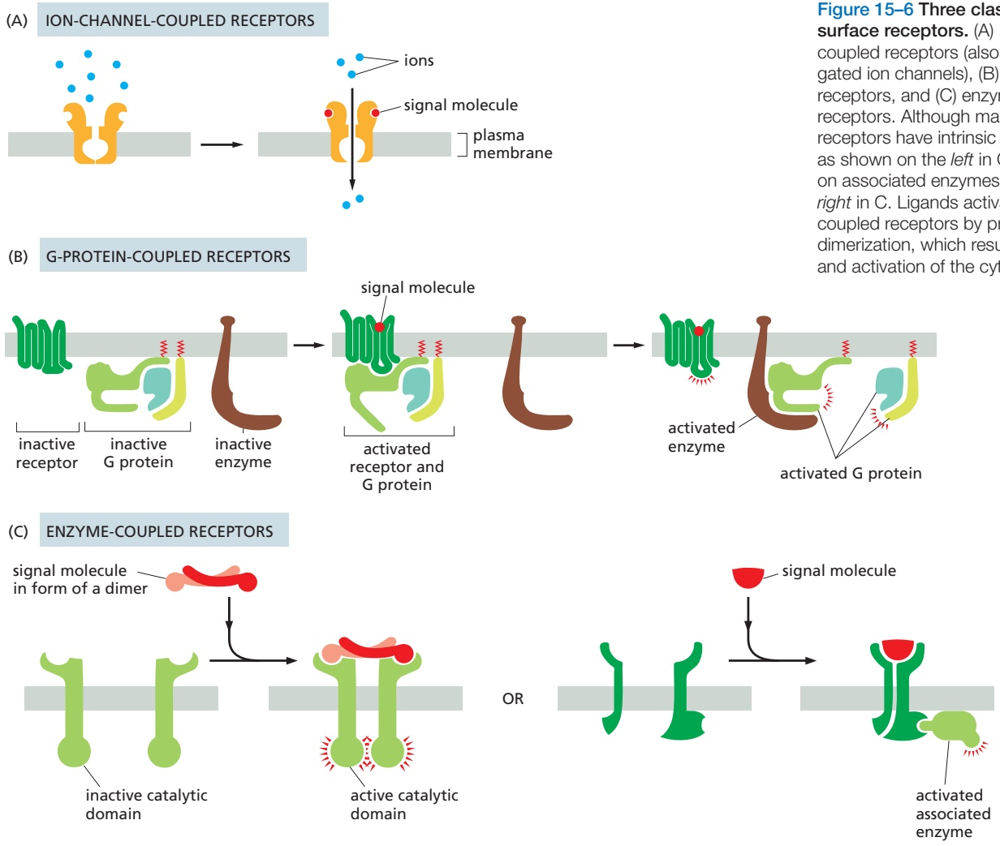

Figure 15–6 Three classes of cellsurface receptors. (A) Ion-channelcoupled receptors (also called transmittergated ion channels), (B) G-protein-coupled receptors, and (C) enzyme-coupled receptors. Although many enzyme-coupled receptors have intrinsic enzymatic activity, as shown on the left in C, many others rely on associated enzymes, as shown on the right in C. Ligands activate many enzymecoupled receptors by promoting their dimerization, which results in the interaction and activation of the cytoplasmic domains.

Enzyme-coupled receptors either function as enzymes or associate directly with enzymes that they activate (**Figure 15–6C**). They are usually single-pass transmembrane proteins that have their ligand-binding site outside the cell and their catalytic or enzyme-binding site inside. Enzyme-coupled receptors are heterogeneous in structure compared with the other two classes; the great majority, however, are either protein kinases or associate with protein kinases, which phosphorylate specific sets of proteins in the target cell when activated.

There are also some types of cell-surface receptors that do not fit easily into any of these classes but have important functions in controlling the specialization of different cell types during development and in tissue renewal and repair in adults. We discuss these in a later section, after we explain how G-proteincoupled receptors and enzyme-coupled receptors operate. First, we continue our general discussion of the principles of signaling via cell-surface receptors.

#### Cell-Surface Receptors Relay Signals Via Intracellular Signaling Molecules

Numerous intracellular signaling molecules relay signals received by cell-surface receptors into the cell interior. The resulting chain of intracellular signaling events ultimately alters effector proteins that are responsible for modifying the behavior of the cell (see Figure 15–1).

Some intracellular signaling molecules are small chemicals, which are often called **second messengers** (the “first messengers” being the extracellular signals). They are generated in large amounts in response to receptor activation and diffuse away from their source, spreading the signal to other parts of the cell. Some, such as cyclic AMP and $C a ^ { 2 + }$ , are water soluble and diffuse in the cytosol, while others, such as diacylglycerol, are lipid soluble and diffuse in the plane of the plasma membrane. In either case, they pass the signal on by binding to and altering the behavior of selected signaling or effector proteins.

Most intracellular signaling molecules are proteins, which help relay the signal into the cell by either generating second messengers or activating the next signaling or effector protein in the pathway. Many of these proteins behave like molecular switches. When they receive a signal, they switch from an inactive to an active state, until another process switches them off, returning them to their inactive state. The switching off can be just as important as the switching on. If a signaling pathway is to recover after transmitting a signal so that it can be ready to transmit another, every activated molecule in the pathway must return to its original, unactivated state.

The largest class of molecular switches consists of proteins that are activated or inactivated by **phosphorylation** (discussed in Chapter 3). For these proteins, the switch is thrown in one direction by a **protein kinase**, which covalently adds one or more phosphate groups to specific amino acids on the signaling protein, and in the other direction by a **protein phosphatase**, which removes the phosphate groups (**Figure 15–7A**). The activity of any protein regulated by phosphorylation depends on the balance between the activities of the kinases that phosphorylate it and of the phosphatases that dephosphorylate it. About 30–50% of human proteins contain covalently attached phosphate, and the human genome encodes about 520 protein kinases and about 150 protein phosphatases. A typical mammalian cell makes use of hundreds of distinct types of protein kinases at any moment.

Protein kinases attach phosphate to the hydroxyl group of specific amino acids on the target protein. There are two main types of protein kinase in eukaryotic cells. The great majority are **serine/threonine kinases**, which phosphorylate the hydroxyl groups of serines and threonines in their targets. Others are **tyrosine kinases**, which phosphorylate proteins on tyrosines. Tyrosine kinases are found primarily in multicellular animals; these kinases are not present, for example, in yeast.

Figure 15–7 Two types of intracellular signaling proteins that act as molecular switches. (A) A protein kinase covalently adds a phosphate from ATP to the signaling protein, and a protein phosphatase removes the phosphate. Although not shown, many signaling proteins are activated by dephosphorylation rather than by phosphorylation. (B) A GTP-binding protein is induced to exchange its bound GDP for GTP, which activates the protein; the protein then inactivates itself by hydrolyzing its bound GTP to GDP.

Many intracellular signaling proteins controlled by phosphorylation are themselves protein kinases, and these are often organized into **kinase cascades**. In such a cascade, one protein kinase, activated by phosphorylation, phosphorylates the next protein kinase in the sequence, and so on, relaying the signal onward and, in. / . some cases, amplifying it or spreading it to other signaling pathways.

Like the protein kinases, the protein phosphatases are categorized by their specificity for serine/threonine phosphate or tyrosine phosphate. There are about 100 **protein tyrosine phosphatases** encoded in the human genome, including some dual-specificity phosphatases that also dephosphorylate serines and threonines.

The other important class of molecular switches consists of **GTP-binding proteins** (discussed in Chapter 3). These proteins switch between two distinct structural conformations: an “on” state when GTP is bound and an “off” state when GDP is bound. In the “on” state, they bind and thereby activate specific signaling proteins. GTP-binding proteins usually have intrinsic GTPase activity and shut themselves off by hydrolyzing their bound GTP to GDP (**Figure 15–7B**). The inactive protein then returns to the “on” state when GDP dissociates, allowing a new GTP to bind. There are two major types of GTP-binding proteins. Large, heterotrimeric GTP-binding proteins (also called G proteins) help relay signals from G-protein-coupled receptors that activate them (see Figure 15–6B). Small **monomeric GTPases** (also called monomeric GTP-binding proteins) help relay signals from many classes of cell-surface receptors.

For most GTP-binding proteins, the inactivation process (GTP hydrolysis to GDP) and the activation process (GDP dissociation) are slow in the absence of other proteins. Inside the cell, regulatory proteins are used to accelerate one or the other process, thereby governing the activation state of the GTP-binding protein. **GTPase-activating proteins (GAPs)** drive the proteins into an “off” state by increasing the rate of hydrolysis of bound GTP. Conversely, **guanine nucleotide exchange factors (GEFs)** activate GTP-binding proteins by promoting the release of bound GDP, which allows a new GTP to bind. In the case of heterotrimeric G proteins, the activated receptor serves as the GEF. **Figure 15–8** illustrates the regulation of monomeric GTPases.

Not all molecular switches in signaling systems depend on phosphorylation or GTP binding. We see later that some signaling proteins are switched on or off by the binding of another signaling protein or a second messenger, such as cyclic AMP or Ca2+, or by covalent modifications other than phosphorylation or dephosphorylation, such as ubiquitylation (discussed in Chapter 3).

For simplicity, we often portray a signaling pathway as a series of activation steps (see Figure 15–1). It is important to note, however, that most signaling pathways contain inhibitory steps, and a sequence of two inhibitory steps can

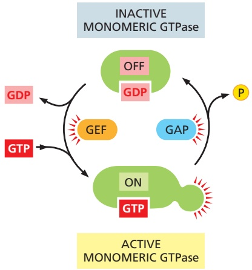

Figure 15–8 The regulation of a monomeric GTPase. GTPase-activating proteins (GAPs) inactivate the protein by stimulating it to hydrolyze its bound GTP to GDP, which remains tightly bound to the inactivated GTPase. Guanine nucleotide exchange factors (GEFs) activate the inactive protein by stimulating it to release. / . its GDP; because the concentration of GTP in the cytosol is 10 times greater than the concentration of GDP, the protein rapidly binds GTP and is thereby activated.

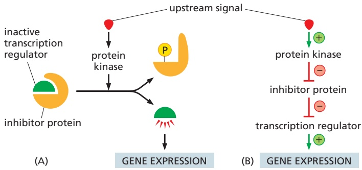

Figure 15–9 A sequence of two inhibitory signals produces a positive signal. (A) In this simple signaling system, a transcription regulator is kept in an inactive state by a bound inhibitor protein. In response to some upstream signal, a protein kinase is activated and phosphorylates the inhibitor, causing its dissociation from the transcription regulator, which can now activate gene expression. (B) The signaling pathway consists of a sequence of four steps, including two sequential inhibitory steps that are equivalent to a single activating step.

have the same effect as one activating step (Figure 15–9). This activation scheme is very common in signaling systems, as we will see when we describe specific pathways later in this chapter.

#### Intracellular Signals Must Be Specific and Robust in a Noisy Cytoplasm

In an idealized signaling pathway like that shown in Figure 15–1, each intracellular signaling molecule interacts only with the appropriate downstream target. Similarly, the target is activated only by the appropriate upstream signal. In reality, however, the cell is crowded with closely related signaling molecules that control a diverse array of cellular processes. It is inevitable that a signaling molecule will sometimes interact with molecules in other signaling pathways, potentially creating unwanted cross-talk and interference between signaling systems. How does a signal remain strong and specific under these noisy conditions?

A key to signaling specificity is the high affinity and specificity of the interactions between intracellular signaling molecules and their correct partners. The binding of a signaling molecule to its target is determined by precise and complex interactions between complementary surfaces on the two molecules. Some protein kinases, for example, contain active sites that recognize a specific amino acid sequence around the phosphorylation site on the correct target protein, and many signaling enzymes employ additional docking sites, outside their active site, that promote a specific, high-affinity interaction with a complementary site on the target. These and related mechanisms provide a strong and persistent interaction between the correct partners, thereby enhancing the likelihood that a signal is passed to the appropriate target.

The specificity of signaling systems also depends on noise filters that reduce or remove undesirable background signals. Consider a signaling pathway, for example, in which a response is triggered by phosphorylation of several sites on a target protein. Inside the cell, we can generally assume that a constant low level of phosphatase activity is present to remove these phosphorylations. As a result, a strong response is possible only if the appropriate protein kinase reaches a high and persistent level of activity that is sufficient to overcome the opposing phosphatase activity. If by some random accident another protein kinase interacts briefly with the target protein and catalyzes phosphorylation on one or two sites, these will be removed by the opposing phosphatase and no response will occur. The weak background signal is thereby ignored.

Cells in a population often exhibit random variations in the concentration or activity of their intracellular signaling molecules. Similarly, individual molecules in a large population of molecules vary in their activity or interactions with other molecules. This signal variability introduces another form of noise that can interfere with the precision and efficiency of signaling. Most signaling systems, however, generate remarkably robust and precise responses even when upstream signals are variable or some components of the system are disabled. In some cases, this robustness depends on the presence of parallel mechanisms; for example, a signal might employ two parallel pathways to activate a single common downstream target protein, allowing the response to occur even if one pathway is crippled.

#### Intracellular Signaling Complexes Form at Activated Cell-Surface Receptors

One simple and effective strategy for enhancing the specificity of interactions between intracellular signaling molecules and reducing background noise is to localize the molecules in the same part of the cell, often within large protein complexes, thereby promoting their interaction with one another and not with inappropriate partners. Such mechanisms often involve **scaffold proteins**, which bring together groups of interacting signaling proteins into signaling complexes, often before a signal has been received (**Figure 15–10A**). Because the scaffold holds the proteins in close proximity, they can interact at high local concentrations and be activated rapidly, efficiently, and selectively in response to an appropriate extracellular signal, avoiding unwanted cross-talk with other signaling pathways.

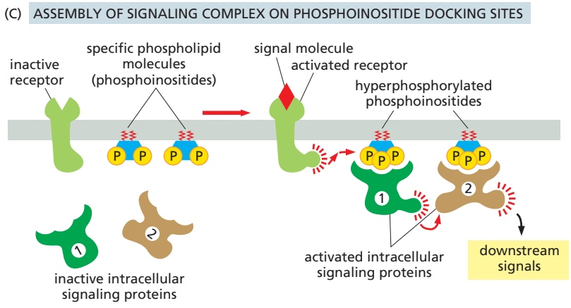

Figure 15–10 Three types of intracellular signaling complexes. (A) A receptor and some of the intracellular signaling proteins it activates in sequence are preassembled into a signaling complex on the inactive receptor by a large scaffold protein. (B) A signaling complex assembles transiently on a receptor only after the binding of an extracellular signal molecule has activated the receptor; here, the activated receptor phosphorylates itself at multiple sites, which then act as docking sites for intracellular signaling proteins. (C) Activation of a receptor leads to the increased phosphorylation of specific phospholipids (phosphoinositides) in the adjacent plasma membrane; these then serve as docking sites for specific intracellular signaling proteins, which can now interact with each other.

In other cases, such signaling complexes form transiently in response to an extracellular signal and rapidly disassemble when the signal is gone. They often assemble around a cell-surface receptor after an extracellular signal molecule has activated it. In many of these cases, the cytoplasmic tail of an activated enzyme-coupled receptor is phosphorylated during the activation process, and the phosphorylated amino acids then serve as docking sites for the assembly of other signaling proteins (**Figure 15–10B**). In yet other cases, receptor activation leads to the production of modified phospholipid molecules (called phosphoinositides) in the adjacent plasma membrane, which then recruit specific intracellular signaling proteins to this region of membrane, where they are activated (**Figure 15–10C**).

#### Modular Interaction Domains Mediate Interactions Between Intracellular Signaling Proteins

Simply bringing intracellular signaling proteins together into close proximity is sometimes sufficient to activate them. Thus, induced proximity, where a signal triggers assembly of a signaling complex, is commonly used to relay signals from protein to protein along a signaling pathway. The assembly of such signaling complexes depends on various highly conserved, small **interaction domains**, which are found in many intracellular signaling proteins. Each of these compact protein modules binds to a particular structural motif in another protein or lipid. The recognized motif in the interacting protein can be a short peptide sequence, a covalent modification (such as a phosphorylated amino acid), or another protein domain. The use of modular interaction domains pre-sumably facilitated the evolution of new signaling pathways. Because it can be inserted at many locations in a protein without disturbing the protein’s folding or function, a new interaction domain can connect the protein to additional signaling pathways.

There are many types of interaction domains in signaling proteins. Src homology 2 (SH2) domains and phosphotyrosine-binding (PTB) domains, for example, bind to phosphorylated tyrosines in a particular peptide sequence on activated receptors or intracellular signaling proteins. Src homology 3 (SH3) domains bind to short, proline-rich amino acid sequences. Some pleckstrin homology (PH) domains bind to the charged head groups of specific phosphoinositides that are produced in the plasma membrane in response to an extracellular signal; they enable the protein they are part of to dock on the membrane and interact with other similarly recruited signaling proteins (see Figure 15–10C). Some signaling proteins consist solely of two or more interaction domains and function only as **adaptors** to link two other proteins together in a signaling pathway. Some adaptor proteins have multiple interaction domains as well as their own signal-propagation activity (see Figure 15–12).

Interaction domains enable signaling proteins to bind to one another in multiple specific combinations. Like Lego bricks, the proteins can form linear or branching chains or three-dimensional networks, which determine the route followed by the signaling pathway. As an example, **Figure 15–11** illustrates how some interaction domains mediate the formation of a large signaling complex around the receptor for the hormone insulin.

Modular interaction domains are generally located in flexible, unstructured regions of signaling proteins, arrayed along the polypeptide-like beads on a string. Proteins with multiple interaction domains can therefore nucleate the formation of large, cross-linked protein matrices around clusters of activated receptors (**Figure 15–12**). These protein matrices behave like gels or biomolecular condensates, thereby creating a local microenvironment that is distinct in composition from the surrounding cytosol (discussed in Chapter 3).

Concentration of activated receptors and specific signaling proteins in these matrices is thought to enhance the strength and specificity of the receptor signal while reducing interference from other pathways.

Another way of bringing receptors and intracellular signaling proteins togetherMBoC7 n15.100/15.11 is to locate them in a specific region of the cell. An important example is the primary cilium that projects like an antenna from the surface of most vertebrate cells (discussed in Chapter 16). A number of surface receptors and signaling proteins are concentrated there—particularly the components of the Hedgehog signaling system, as we discuss later. Light and smell receptors are also concentrated in specialized cilia.

Figure 15–11 A specific signaling complex formed using modular interaction domains. This example is based on the insulin receptor, which is a dimeric enzyme-coupled receptor (a receptor tyrosine kinase, discussed later). First, the activated receptor phosphorylates itself on tyrosines, and one of the phosphotyrosines then recruits an adaptor protein called insulin receptor substrate-1 (IRS1) via a PTB domain of IRS1; the PH domain of IRS1 also binds to specific phosphoinositides on the inner surface of the plasma membrane. Then, the activated receptor phosphorylates IRS1 on tyrosines, and one of these phosphotyrosines binds the SH2 domain of the adaptor protein Grb2. Next, Grb2 uses one of its two SH3 domains to bind to a proline-rich region of a protein called Sos, which is thereby brought to the membrane to relay the signal downstream by acting as a GEF (see Figure 15–8) to activate a monomeric GTPase called Ras (not shown). Sos also binds to phosphoinositides in the plasma membrane via its PH domain. Grb2 uses its other SH3 domain to bind to a proline-rich sequence in a scaffold protein, which binds several other signaling proteins (not shown). The other phosphorylated tyrosines on IRS1 recruit additional signaling proteins that have SH2 domains (not shown).

Figure 15–12 Formation of large receptor clusters by multivalent interactions among signaling proteins. The system pictured here contains activated receptor tyrosine kinases that are extensively phosphorylated on disordered regions in the receptor tails. The system also includes two adaptor proteins. One adaptor protein (pink) contains one SH2 domain, which binds phosphorylated tyrosines on the receptors, and two SH3 domains. The other adaptor protein (blue) contains three proline-rich regions that can bind to SH3 domains, plus a protein kinase domain. Numerous multivalent binding interactions can occur among the three components in this system, generating a cross-linked protein matrix or condensate in which the protein kinases of the receptor and adaptor protein are concentrated, potentially providing a more effective signal output. The cross-linking of the matrix can be enhanced further by including adaptor proteins with domains that interact with modified phospholipids in the membrane (see Figure 15–11).

<!-- END EN EN15-H000-H009 -->

### 英文补充：扩展：植物细胞的信号通信

> 对应中文板块：扩展：植物细胞的信号通信。英文来源：Molecular Biology of the Cell，第7版，第15章；[本章完整原文](../../来源/英文教材/15_Cell_Signaling/chapter.md)。物理PDF页码范围：912–987（整章范围）。

<!-- BEGIN EN EN15-H055-H061 -->
#### SIGNALING IN PLANTS

In plants, as in animals, cells are in constant communication with one another. Plant cells communicate to coordinate their activities in response to the changing conditions of light, dark, and temperature, which guide the plant’s cycle of growth, flowering, and fruiting. Plant cells also communicate to coordinate activities in their roots, stems, and leaves. In this final section, we consider how plant cells signal to one another and how they respond to light. Less is known about the receptors and intracellular signaling mechanisms involved in cell communication in plants than is known about that in animals, and we will concentrate mainly on how the receptors and intracellular signaling mechanisms differ from those used by animals.

#### Multicellularity and Cell Communication Evolved Independently in Plants and Animals

Although plants and animals are both eukaryotes, they have evolved separately for more than a billion years. Their last common ancestor is thought to have been a unicellular eukaryote that had mitochondria but no chloroplasts; the plant lineage acquired chloroplasts after plants and animals diverged. The earliest fossils of multicellular animals and plants date from almost 600 million years ago. Thus, it seems that plants and animals evolved multicellularity independently, each starting from a different unicellular eukaryote, sometime between 1.6 and 0.6 billion years ago (**Figure 15–69**).

If multicellularity evolved independently in plants and animals, some of the molecules and mechanisms used for cell communication will have evolved separately and would be expected to be different. Indeed, whereas both plants and animals use nitric oxide, cyclic GMP, Ca2+, protein kinases, and small GTPases for signaling, modern flowering plants do not appear to contain homologs of the nuclear receptor family, JAK, STAT, TGFβ, Notch, Wnt, or Hedgehog signaling pathways. Similarly, plants do not seem to use cyclic AMP for intracellular signaling. Nevertheless, the general strategies underlying signaling are similar in plants and animals. Both, for example, use enzyme-coupled cell-surface receptors, as we now discuss.

#### Receptor Serine/Threonine Kinases Are the Largest Class of Cell-Surface Receptors in Plants

Most cell-surface receptors in plants are enzyme-coupled. However, whereas the largest class of enzyme-coupled receptors in animals is the receptor tyrosine kinase (RTK) class, this type of receptor is extremely rare in plants. Instead, plants rely largely on a great diversity of transmembrane receptor serine/threonineMBoC7 m15.68/15.69 kinases, which have a typical serine/threonine kinase cytoplasmic domain and an extracellular ligand-binding domain. The most abundant types of these receptors have a tandem array of extracellular leucine-rich repeat structures and are therefore called **leucine-rich repeat (LRR) receptor kinases**.

Figure 15–69 The proposed divergence of plant and animal lineages from a common unicellular eukaryotic ancestor. The plant lineage acquired chloroplasts after the two lineages diverged. Both lineages independently gave rise to multicellular organisms—plants and animals. (Paintings courtesy of John Innes Foundation.)

There are about 175 LRR receptor kinases encoded in the genome of the small flowering plant Arabidopsis thaliana. These include a protein called Bri1, which forms part of a cell-surface steroid hormone receptor. Plants synthesize a class of steroids that are called **brassinosteroids** because they were originally identified in the mustard family Brassicaceae, which includes Arabidopsis. These signal molecules regulate the growth and differentiation of plants throughout their life cycle. Binding of a brassinosteroid to a Bri1 cell-surface receptor kinase initiates an intracellular signaling cascade that uses a GSK3 protein kinase and a protein phosphatase to regulate the phosphorylation and degradation of specific transcription regulatory proteins in the nucleus, and thereby specific gene transcription. Mutant plants that are deficient in the Bri1 receptor kinase are insensitive to brassinosteroids and are therefore dwarfs.

The LRR receptor kinases are only one of many classes of transmembrane receptor serine/threonine kinases in plants. There are at least six additional families, each with its own characteristic set of extracellular domains. The lectin receptor kinases, for example, have extracellular domains that bind carbohydrate signal molecules. The Arabidopsis genome encodes more than 300 receptor serine/threonine kinases, which makes them the largest family of receptors known in plants. Many are involved in defense responses against pathogens.

#### Ethylene Blocks the Degradation of Specific Transcription Regulatory Proteins in the Nucleus

Various **plant growth regulators** (also called **plant hormones**) help to coordinate plant development. They include ethylene, auxin, cytokinins, gibberellins, and abscisic acid, as well as brassinosteroids. Growth regulators are all small molecules made by most plant cells. They diffuse readily through cell walls and can either act locally or be transported to influence cells further away. Each growth

(A)

(B) PRESENCE OF ETHYLENE

regulator can have multiple effects. The specific effect depends on environmental conditions, the nutritional state of the plant, the responsiveness of the target cells, and which other growth regulators are acting.

**Ethylene** is an important example. This small gas molecule (**Figure 15–70A**) can influence plant development in various ways; it can, for example, promote fruit ripening, leaf abscission, and plant senescence. It also functions as a stress signal in response to wounding, infection, flooding, and so on. When the shoot of a germinating seedling, for instance, encounters an obstacle, ethylene promotes a complex response that allows the seedling to safely bypass the obstacle (**Figure 15–70B and C**).

Plants have various ethylene receptors, which are located in the endoplasmic reticulum and are all structurally related. They are dimeric, multipass transmembrane proteins, with a copper-containing ethylene-binding domain and a domain that interacts with a cytoplasmic protein called CTR1, which is closely related in amino acid sequence to the Raf MAP kinase kinase kinase discussed earlier (see Figure 15–50). Surprisingly, it is the empty receptors that are active and keep CTR1 active. By an unknown signaling mechanism, active CTR1 stimulates the ubiquitylation and degradation in proteasomes of a nuclear transcription regulator called EIN3, which is required for the transcription of ethylene-responsive genes. In this way, the empty but active receptors keep ethylene-response genes off. Ethylene binding inactivates the receptors, altering their conformation so that they no longer activate CTR1. The EIN3 protein is no longer ubiquitylated and degraded and can now activate the transcription of the large number of ethyleneresponsive genes (**Figure 15–71**).

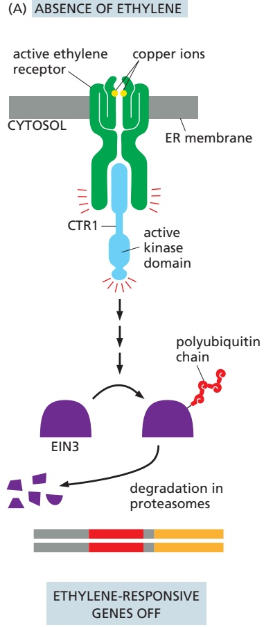

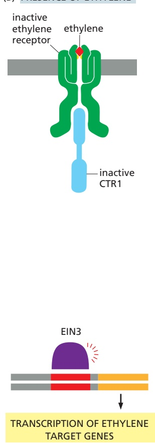

Figure 15–71 The ethylene signaling pathway. (A) In the absence of ethylene, the receptors and CTR1 are active, causing the ubiquitylation and destruction of EIN3, the transcription regulatory protein in the nucleus that is responsible for the transcription of ethylene-responsive genes. (B) The binding of ethylene inactivates the receptors and disrupts the activation of CTR1. The EIN3 protein is not degraded and can therefore activate the transcription of ethylene-responsive genes.

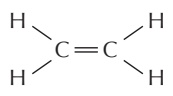

Figure 15–70 The ethylene-mediated triple response that occurs when the growing shoot of a germinating seedling encounters an obstacle underground. (A) The structure of ethylene. (B) In the absence of obstacles, the shoot grows upward and is long and thin. (C) If the shoot encounters an obstacle, such as a piece of gravel in the soil, the seedling responds to the encounter in three ways. First, it thickens its stem, which can then exert more force on the obstacle. Second, it shields the tip of the shoot (at top) by increasing the curvature of a specialized hook structure. Third, it reduces the shoot’s tendency to grow away from the direction of gravity, so as to avoid the obstacle. (Courtesy of Melanie Webb.)

#### Regulated Positioning of Auxin Transporters Patterns Plant Growth

The plant hormone **auxin** (**Figure 15–72A**) binds to receptor proteins in the nucleus. It helps plants grow toward light, grow upward rather than branch out, and grow their roots downward. It also regulates organ initiation and positioning and helps plants flower and bear fruit. Like ethylene (and some of the animal signal molecules we have described in this chapter), auxin influences gene expression by controlling the degradation of transcription regulators. It works by stimulating the ubiquitylation and degradation of repressor proteins that block the transcription of auxin target genes in unstimulated cells (**Figure 15–72B and C**).

Auxin is unique in the way that it is transported. Unlike animal hormones, which are usually secreted by a specific endocrine gland and transported to target cells via the circulatory system, auxin has its own transport system. Specific plasmamembrane-bound influx transporter proteins and efflux transporter proteins move auxin into and out of plant cells, respectively. The efflux transporters can be distributed asymmetrically in the plasma membrane to make the efflux of auxin directional. A row of cells with their auxin efflux transporters confined to the basal plasma membrane, for example, will transport auxin from the top of the plant to the bottom.

In some regions of the plant, the localization of the auxin transporters, and therefore the direction of auxin flow, is highly dynamic and regulated. A cell can rapidly redistribute transporters by controlling the traffic of vesicles containing them. The auxin efflux transporters, for example, normally recycle between intracellular vesicles and the plasma membrane. A cell can redistribute these transporters on its surface by inhibiting their endocytosis in one domain of the plasma membrane, causing the transporters to accumulate there. One example occurs in the root, where gravity influences the direction of growth. The auxin efflux transporters are normally distributed symmetrically in the cap cells of the root. Within minutes of a change in the direction of the gravity vector, however, the efflux transporters redistribute to one side of the cells, so that auxin is pumped

Figure 15–72 The auxin signaling pathway. (A) The structure of auxin (indole-3-acetic acid). (B) In the absence of auxin, a transcription repressor protein (called Aux/IAA) binds and suppresses a transcription regulator (called auxinresponse factor; ARF), which is required for the transcription of auxin-responsive genes. (C) The auxin receptor proteins are located mainly in the nucleus. When activated by auxin binding, the receptor– auxin complex recruits a ubiquitin ligase, which ubiquitylates the Aux/IAA protein, marking it for degradation in proteasomes. ARF is now free to activate the transcription of auxin-responsive genes. There are many ARFs, Aux/IAA proteins, and auxin receptors that work as illustrated.

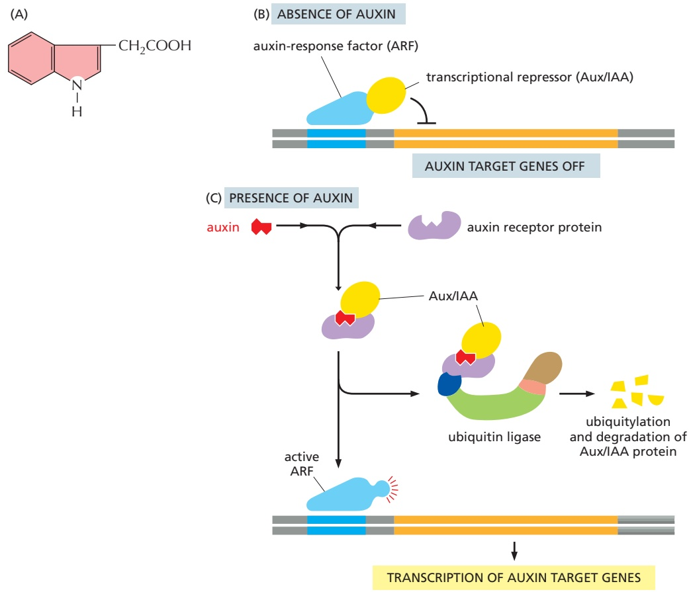

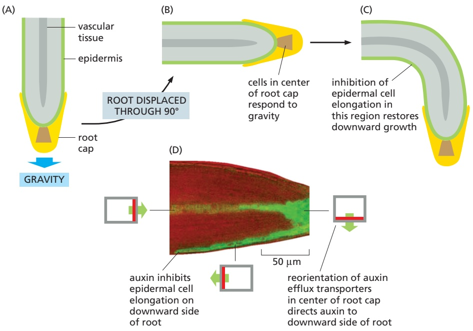

Figure 15–73 Auxin transport and root gravitropism. (A–C) Roots respond to a 90° change in the gravity vector and adjust their direction of growth so that they grow downward again. The cells that respond to gravity are in the center of the root cap, while it is the epidermal cells further back (on the lower side) that decrease their rate of elongation to restore downward growth. (D) The gravity-responsive cells in the root cap redistribute their auxin efflux transporters in response to the displacement of the root. This redirects the auxin flux mainly to the lower part of the displaced root, where it inhibits the elongation of the epidermal cells. The resulting asymmetrical distribution of auxin in the Arabidopsis root tip shown here is assessed indirectly, using an auxin-responsive reporter gene that encodes a protein fused to green fluorescent protein (GFP); the epidermal cells on the downward side of the root are green, whereas those on the upper side are not, reflecting the asymmetrical distribution of auxin. The distribution of auxin efflux transporters in the plasma membrane of cells in different regions of the root (shown as gray rectangles) is indicated in red, MBoC7 m15.72/15.73and the direction of auxin efflux is indicated by a green arrow. (D, photograph from T. Paciorek et al., Nature 435:1251–1256, published 2005 by Nature Publishing Group. Reproduced with permission of SNCSC.)

out toward the side of the root pointing downward. Because auxin inhibits rootcell elongation, this redirection of auxin transport causes the root tip to re-orient, so that it grows downward again (**Figure 15–73**).

#### Phytochromes Detect Red Light, and Cryptochromes Detect Blue Light

Plant development is greatly influenced by environmental conditions. Unlike animals, plants cannot move when conditions become unfavorable; they have to adapt or they die. The most important environmental influence on plants is light, which is their energy source and has a major role throughout their life cycle—from germination, through seedling development, to flowering and senescence. Plants have thus evolved a large set of light-sensitive proteins to monitor the quantity, quality, direction, and duration of light. These are usually referred to as photoreceptors. However, because the term photoreceptor is also used for light-sensitive cells in the animal retina (see Figure 15–39), we will use the term photoprotein instead.

All photoproteins sense light by means of a covalently attached light-absorbing chromophore, which changes its shape in response to light and then induces a change in the protein’s conformation. The best-known plant photoproteins are the **phytochromes**, which are present in all plants and in some algae but are absent in animals. These are dimeric, cytoplasmic serine/threonine kinases, which respond differentially and reversibly to red and far-red light: whereas red light usually activates the kinase activity of the phytochrome, far-red light inactivates it. When activated by red light, the phytochrome is thought to phosphorylate itself

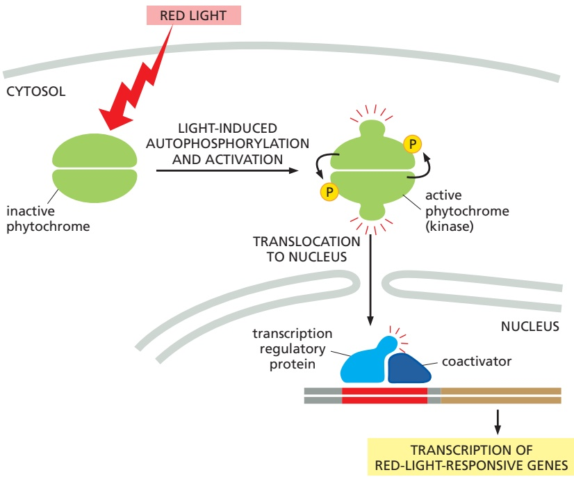

Figure 15–74 One way in which phytochromes mediate a light response in plant cells. When activated by red light, the phytochrome, which is a dimeric protein kinase, phosphorylates itself and then moves into the nucleus, where it activates transcription regulatory proteins to stimulate the transcription of red-lightresponsive genes.

and then to phosphorylate one or more other proteins in the cell. In some light responses, the activated phytochrome translocates into the nucleus, where it activates transcription regulators to alter gene transcription (**Figure 15–74**). In other cases, the activated phytochrome activates a latent transcription regulator in the cytoplasm, which then translocates into the nucleus to regulate gene transcription. In still other cases, the activated phytochrome triggers signaling pathways in the cytosol that alter the cell’s behavior without involving the nucleus.

Plants sense blue light using photoproteins of two other sorts, phototropin and cryptochromes. **Phototropin** is associated with the plasma membrane and is partly responsible for phototropism, the tendency of plants to grow toward light.MBoC7 m15.73/15.74 Phototropism occurs by directional cell elongation, which is stimulated by auxin, but the links between phototropin and auxin are unknown.

**Cryptochromes** are flavoproteins that are sensitive to blue light. They are structurally related to blue-light-sensitive enzymes called photolyases, which are involved in the repair of ultraviolet-induced DNA damage in all organisms, except most mammals. Unlike phytochromes, cryptochromes are also found in animals, where they have an important role in circadian clocks (see Figure 15–67). Although cryptochromes are thought to have evolved from the photolyases, they do not have a role in DNA repair.

#### Summary

The mechanisms used to signal between cells in animals and in plants have both similarities and differences. Whereas animals rely heavily on GPCRs and RTKs, plants rely mainly on enzyme-coupled receptors of the receptor serine/threonine kinase type, especially those with extracellular leucine-rich repeats. Various plant hormones, or growth regulators, including ethylene and auxin, help coordinate plant development. Ethylene acts through intracellular receptors to stop the degradation of specific nuclear transcription regulators, which can then activate the transcription of ethylene-responsive genes. The receptors for some other plant hormones, including auxin, also regulate the degradation of specific transcription regulators, although the details vary. Auxin signaling is unusual in that it has its own highly regulated transport system, in which the dynamic positioning of plasmamembrane-bound auxin transporters controls the direction of auxin flow and thereby the direction of plant growth. Light has an important role in regulating plant development. These light responses are mediated by a variety of light-sensitive photoproteins, including phytochromes, which are responsive to red light, and cryptochromes and phototropin, which are sensitive to blue light.

<!-- END EN EN15-H055-H061 -->

### 英文补充：免疫细胞活化中的多重信号

> 对应中文板块：免疫细胞活化中的多重信号。英文来源：Molecular Biology of the Cell，第7版，第24章；[本章完整原文](../../来源/英文教材/24_The_Innate_and_Adaptive_Immune_Systems/chapter.md)。物理PDF页码范围：1392–1443（整章范围）。

<!-- BEGIN EN EN24-H034-H036 -->
#### Effector Helper T Cells Help Activate Other Cells of the Innate and Adaptive Immune Systems

In contrast to $\mathrm { T _ { C } }$ cells, **helper T cells** $( \mathbf { T _ { H } }$ **cells)** are crucial for defense against both extracellular and intracellular pathogens, and they express CD4 rather than CD8 co-receptors and recognize foreign peptides bound to class II rather than class I MHC proteins. Once naïve $\mathrm { T _ { H } }$ cells are induced on activated dendritic cells to become effector cells, they can help activate other immune cells: they help activate B cells to become antibody-secreting cells and later to undergo Ig class switching and somatic hypermutation; they help activate macrophages to destroy any intracellular pathogens multiplying within the macrophage’s phagosomes; and they further stimulate the activated dendritic cells that activated either naïve

Figure 24–43 The main way that an effector TC cell (or NK cell) kills an infected target cell. This simplified drawing shows how the killer cell releases perforin and granzymes onto the surface of an infected target cell by localized exocytosis at an immunological synapse. The high concentration of $\mathrm { C a ^ { 2 + } }$ in the extracellular fluid causes the perforin to assemble into transmembrane channels that disrupt the target-cell plasma membrane, allowing the granzymes to enter the target-cell cytosol. One of the granzymes, granzyme B, cleaves and thereby activates executioner caspases (caspase-3 and caspase-7) to initiate a caspase cascade, leading to apoptosis (see Figure 18–6). A single cytotoxic cell can kill multiple target cells in sequence. It remains a mystery why the released perforins do not disrupt the plasma membrane of the killer cell itself (Movie 24.12 and Movie 24.13).

$\mathrm { T _ { C } }$ cells or naïve $\mathrm { T _ { H } }$ cells—to maintain or increase the dendritic cells’ activated state. In each case, the effector $\mathrm { T _ { H } }$ cell recognizes the same complex of foreign peptide and class II MHC protein on the target-cell surface that it initially recognized on the activated dendritic cell. As discussed later, the $\mathrm { T _ { H } }$ cell stimulates the target cell both by secreting a variety of cytokines (mainly interleukins) and by displaying co-stimulatory proteins on the $\mathrm { T _ { H } }$ cell surface. As we discuss now, different subtypes of $\mathrm { T _ { H } }$ effector cells have different functions.

#### Naïve Helper T Cells Can Differentiate into Different Types of Effector T Cells

In response to infection, a naïve $\mathrm { T _ { H } }$ cell can differentiate into several distinct types of effector T cells, depending on the nature of the pathogen and on the cytokines the TH cell encounters while being activated, which mainly depends on the activating dendritic cell. These different effector T cell types include four subtypes of helper T cells— $\cdot T _ { F H } ,$ TH1, $T _ { H } 2 ,$ and $T _ { H } I 7$ cells—and regulatory T cells $( T _ { r e g }$ cells). Initially, the naïve $\mathrm { T _ { H } }$ cells differentiate into two subpopulations of helper T cells: follicular helper T cells (TFH cells), which support B cell antibody production in lymphoid follicles (see Figure 24–20) in peripheral lymphoid organs, and non-TFH helper T cells that will develop into $\mathrm { T _ { H } } 1 ,   \mathrm { T _ { H } } 2 ,   \mathrm { o r } \; \mathrm { T _ { H } } 1 7$ effector $\mathrm { T _ { H } }$ cells; most of the latter three cell types migrate from the peripheral lymphoid organ where they differentiated to the site of infection, where they help innate immune cells fight the pathogen.

**Figure 24–44** summarizes both the cytokines that help induce these different effector T cells and some of the cytokines the effector cells then secrete, as well as the main transcription regulators that control the development of the effector cells. Naïve $\mathrm { T _ { H } }$ cells activated in the presence of interleukin-6 (IL6) develop into effector $\mathrm { T } _ { \mathrm { F H } }$ **cells**, which are located in lymphoid follicles, where they secrete a variety of cytokines, including IL21, to help specific B cells to proliferate and differentiate into antibody-secreting effector cells and undergo somatic hypermutation and Ig class switching within germinal centers (see Figure 24–20). Naïve $\mathrm { T _ { H } }$ cells activated by dendritic cells secreting IL12 develop into effector $\mathbf { T _ { H } 1 }$ cells, which

Figure 24–44 Differentiation of naïve helper T cells into different types of effector helper cells or regulatory T cells in a peripheral lymphoid organ. The nature of the pathogen and the cytokines produced by the activating dendritic cell (and by other innate immune cells in the environment) mainly determine which type of effector T cell develops, as indicated. Some of the main cytokines produced by each type of effector cell are also shown, and the master transcription regulator for each subset is indicated in the nucleus. Some of the differentiated effector cells are “plastic,” in that they are able to change the cytokines they produce in response to changes in their environment (not shown).

produce interferon-g (IFNg) to help activate macrophages to destroy pathogens that either invaded the macrophage or were ingested by it; the IFNγ can also help activate naïve cytotoxic T cells in a peripheral lymphoid organ to become effector $\mathrm { T _ { C } }$ cells. Naïve $\mathrm { T _ { H } }$ cells activated in the presence of IL4 develop into effector $\mathrm { T } _ { \mathrm { H } } 2$ **cells**, which secrete $\mathit { I L 4 , 1 L 5 , }$ and IL13 to help fight extracellular pathogens, including parasites; they stimulate B cells to switch from making IgM and IgD to making IgE antibodies, which can bind to mast cells and basophils, as discussed earlier. Naïve $\mathrm { T _ { H } }$ cells activated in the presence of IL6, IL23, and TGFb develop into effector $\mathbf { T _ { H } } \mathbf { 1 7 }$ **cells**; these cells secrete IL17 and IL22 to promote production and recruitment of neutrophils and to stimulate barrier epithelial cells to secrete cytokines and antimicrobial peptides.

In some cases, naïve $\mathrm { T _ { H } }$ cells that encounter their antigen in a peripheral lymphoid organ in the presence of TGFβ and in the absence of IL6 develop into **regulatory T cells** $( \mathbf { T _ { r e g } } )$ , which suppress rather than help immune cells. They are called **induced** $\mathbf { T _ { r e g } } ^ { - }$ **cells** to distinguish them from **natural** $\mathbf { T _ { r e g } }$ **cells**, which develop in the thymus by positive selection during thymocyte development (see Figure 24–41). Both types of $\mathrm { T _ { r e g } }$ cells suppress the activation or function of various other kinds of innate and adaptive immune cells, by means of both secreted suppressive cytokines such as IL10 and TGFβ and inhibitory proteins on the $\mathrm { T _ { r e g } }$ cell surface. Induced $\mathrm { T _ { r e g } }$ cells are mainly concerned with suppressing immune responses to foreign antigens (preventing responses to harmless ingested or inhaled antigens and commensal microbes, as well as limiting responses against pathogens to avoid excessive reactions that cause unwanted tissue injury); natural $\mathrm { T _ { r e g } }$ cells are concerned with preventing immune responses to self molecules (see Figure 24–21). Both induced and natural $\mathrm { T _ { r e g } }$ cells express the transcription regulator FoxP3, which serves as both a marker of these cells and a master controller of their development: if the gene encoding this protein is inactivated in mice or humans, the individuals fail to produce any $\mathrm { T _ { r e g } }$ cells and develop a fatal autoimmune disease involving multiple organs—findings that establish the crucial importance of $\mathrm { T _ { r e g } }$ cells in self-tolerance.

#### Both T and B Cells Require Multiple Extracellular Signals for Activation

Foreign antigen binding to BCRs or TCRs initiates the process whereby the B or T cells are stimulated to proliferate and differentiate into effector and memory cells. As mentioned earlier, these antigen receptors do not act on their own: they are stably associated with invariant transmembrane polypeptide chains that are required to relay the signal into the cell. In B cells, these are called Iga and Igb (**Figure 24–45A**), while in T cells they exist in a complex called CD3, composed of four types of polypeptide chains (**Figure 24–45B**). In both cases, the associated proteins help convert extracellular antigen binding to the BCR or TCR into intracellular signals, and they do so in similar ways.

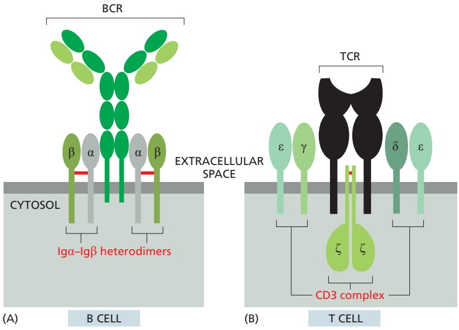

Figure 24–45 The invariant chains associated with BCRs and TCRs. (A) Each BCR is associated with two invariant heterodimers, each composed of an Igα and an Igβ polypeptide chain linked by a disulfide bond (red). (B) Each TCR is associated with an invariant CD3 complex composed of two disulfidebonded ζ chains, two ε chains, and one δ and one γ chain; these chains form homodimers or heterodimers, as shown.

Figure 24–46 Early signaling events in a B cell activated by the binding of specific foreign antigen to its BCRs. If the antigen is on the surface of a pathogen or is a soluble macromolecule with two or more identical antigenic determinants (as shown), it cross-links adjacent BCRs, causing them and their associated invariant chains to cluster, as shown. A Src-like cytoplasmic tyrosine kinase (which can be either Fyn or Lyn) is associated with the cytosolic tail of Igβ; it joins the cluster and phosphorylates both the Igα and Igβ invariant chains (for simplicity, only the phosphorylation on Igβ is shown). An important transmembrane protein tyrosine phosphatase called CD45 is also required to remove inactivating phosphates from these Srclike kinases for the signaling process to occur (not shown). The resulting phosphotyrosines on Igα and Igβ serve as docking sites for another Src-like tyrosine kinase called Syk, which becomes phosphorylated and thereby activated to relay the signal onward.

MBoC7 m24.46/24.46The pathway from TCRs is similar (including a requirement for CD45), except that the first Src-like kinase is Lck (instead of Fyn or Lyn), and it is associated with a CD4 or CD8 co-receptor and phosphorylates tyrosines on all the CD3 polypeptide chains shown in Figure 24–45B; the second Src-like kinase is ZAP70, which is homologous to the Syk kinase in B cells (Movie 24.14).

Antigen binding to BCRs or TCRs clusters these receptors and their associated invariant chains (and CD4 or CD8 co-receptors in the case of TCRs). This clustering activates a Src family cytoplasmic tyrosine kinase (discussed in Chapter 15) to phosphorylate tyrosines on the cytoplasmic tails of some of the invariant chains. The phosphotyrosines then serve as docking sites for a second cytoplasmic tyrosine kinase, which becomes phosphorylated and activated by the first kinase; the second kinase then relays the signal downstream by phosphorylating other intracellular signaling proteins on tyrosines. Some of these early events in the signaling pathway activated by BCRs are shown in **Figure 24–46**.

Signaling through BCRs or TCRs and their associated proteins alone is not sufficient to activate a lymphocyte to proliferate and differentiate. Extracellular **co-stimulatory signals** produced by another cell are also required, and they are provided by both membrane-bound proteins (see Figure 24–34) and secreted cytokines. Indeed, signaling through the BCR or TCR with insufficient co-stimulation can either eliminate the lymphocyte (clonal deletion) or inactivate it, with both of these mechanisms contributing to peripheral self-tolerance (see Figure 24–21). For a naïve T cell, an activated dendritic cell provides the co-stimulatory signals; these include the transmembrane B7 proteins, which are recognized by the co-receptor protein CD28 on the surface of the T cell (**Figure 24–47A**). For a B cell, an effector TFH cell provides the co-stimulatory signals; these include the transmembrane CD40 ligand, which binds to CD40 receptors on the B cell (**Figure 24–47B**). The CD40 ligand on effector TH cells acts in two other situations: (1) it acts back on CD40 receptors on the dendritic cell surface to increase and sustain the activation of the dendritic cell, creating a positive feedback loop; and (2) it acts as a co-stimulatory signal on the surface of an effector $\mathrm { T _ { H } 1 }$ cell, allowing the T cell to help activate an infected macrophage to destroy the pathogens it harbors.

In addition to receptors for co-stimulatory proteins, both B and T cells have inhibitory proteins on their surface that negatively regulate the cell’s activity, preventing excessive or inappropriate responses. Two such proteins, CTLA4 and PD1, expressed by T cells have attracted great attention because of their roles in suppressing the ability of T cells to inhibit cancer progression. They inhibit T cell activity in different ways: CTLA4 inhibits T cell activation by competing with the transmembrane co-receptor protein CD28 (see Figure 24–47A), whereas PD1 is expressed on activated T cells, and its prolonged binding to its cell-surface ligand (PDL1 or PDL2) on various cell types, including cancer cells, inhibits the activity of the T cells. Monoclonal antibodies against either CTLA4 or PD1 (or PDL1), or especially against both of these inhibitory pathways, can relieve the inhibition and allow TC cells to destroy the tumor cells in many patients with metastatic cancerMBoC7 m24.47/24.47 (see Figure 20–46).

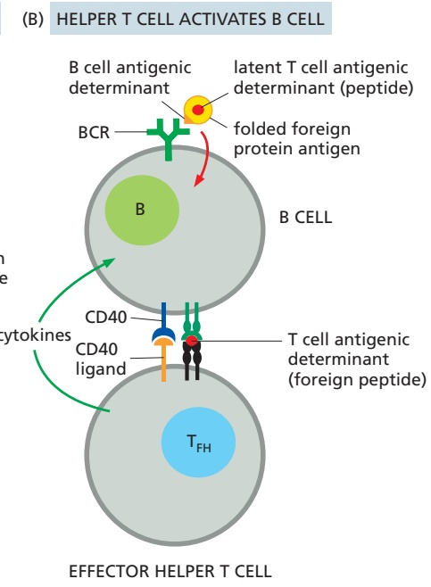

<!-- END EN EN24-H034-H036 -->
