# 第11章 细胞信号转导 · 第二节 G蛋白偶联受体及其介导的信号转导

[返回本章](../README.md) · [中文本章原文](../中文原文.md)

<!-- BEGIN CN CN11-S02 -->
## 第二节 G蛋白偶联受体及其介导的信号转导

G蛋白偶联受体（GPCR）是细胞表面受体中最大的家族。统计表明，在人类基因组中有总数大约900个成员，其中有一半的基因被认为主要是编码嗅觉受体，尽管许多天然相关配体尚未被鉴定。现有超过 $30\%$ 的临床处方药物是针对GPCR所介导信号通路为靶点研制和开发的，可见它与人类的健康密切相关。

## 一、G蛋白偶联受体的结构与作用机制

G 蛋白是三聚体 GTP 结合调节蛋白（trimeric GTP-binding regulatory protein）的简称，位于质膜内胞浆一侧，由 $\alpha$ 、 $\beta$ 、 $\gamma$ 三个亚基组成， $\beta$ 和 $\gamma$ 亚基以异二聚体形式存在， $\alpha$ 和 $\beta\gamma$ 亚基分别通过共价结合的脂分子锚定在质膜上。

GPCR 所介导的信号转导通路均具有如下共同元件：

(1) 所有 GPCR 均具有 7 次跨膜的 $\alpha$ 螺旋结构，即都含有 7 个疏水肽段形成的跨膜 $\alpha$ 螺旋区和相似的三维结构，N 端在细胞外侧，C 端在细胞胞质侧。每个跨膜 $\alpha$ 螺旋由 22～24 个氨基酸残基组成疏水核心区，其中螺旋 5 和 6 之间的胞内环状结构域 C3 和 C4（C 末端），对于受体与 G 蛋白之间的相互作用具有重要作用（图 11-10）。推测配体与受体的结合会引起 H5 和 H6 螺旋的彼此相对移动，结果导致 C3 环构象改变使之容许结合并激活 G 蛋白 $\alpha$ 亚基。

GPCR 介导很多胞外信号的细胞应答，GPCR 家族包括多种对蛋白或肽类激素、局部介质、神经递质和氨基酸或脂肪酸衍生物等配体识别与结合的受体，以及哺乳类嗅觉、味觉受体和视觉的光激活受体（视紫红质）。在线虫基因组 19 000 个基因中大约编码 1 000 种不同的 GPCR。尽管与这类受体相互作用的信号分子多种多样，受体的氨基酸序列也千差万别，但从已分析过的 GPCR 的结果表明，所有真核生物从单细胞酵母到人类都具有相似的七次跨膜结构。许多 GPCR 的亚族的这种结构特征，在演化上是高度保守的；同时，不同的 GPCR 亚型也可以结合相同的激素，产生不同的的细胞效应。

(2) 均偶联一个三聚体 G 蛋白，其功能是作为分子开关，以促成该蛋白在“活化”与“失活”两种状态之间转换。三聚体 G 蛋白 α 亚基本身具有 GTP 酶活性，是分子开关蛋白。当配体与受体结合，三聚体 G 蛋白解离，并发生 GDP 与 GTP 交换，游离的 Gα-GTP 处于活化的开启状态，导致结合并激活效应器蛋白，从而传递信号；当 Gα-GTP 水解形成 Gα-GDP 时，则处于失活的关闭状态，终止信号传递并导致三聚体 G 蛋白的重新装配，恢复系统进入静息状态（图 11-11）。有些信号途径，效应器蛋白是离子通道，其活性受游离的 Gβγ 亚基调节并激活。由于阐明了胞外信号如何转换为胞内信号的机制，对 G 蛋白发现作出重要贡献的 A. G.

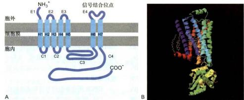  
图11-10 G蛋白偶联受体的结构图  
A. GPCR 的结构模式图。所有这类受体在膜上都具有相同的取向，并含有 7 次跨膜 α 螺旋区（左至右依次为 H1—H7），4 个细胞外肽段（左至右依次为 E1—E4）；4 个细胞内肽段（左至右依次为 C1—C4），E4 环结合胞外信号（配体），C3 环结构域和有些受体的 C2 环，是与 G 蛋白相互作用的位点，配体的结合引起受体胞内域活化 G 蛋白。B. 人 β 肾上腺素 GPCR 晶体结构（基于 PDB 数据库 2RH1 结构绘制）。

Gilman 和 M. Rodbell，因此荣获 1994 年诺贝尔生理学或医学奖。

表 11-3 列出了哺乳类三聚体 G 蛋白的主要种类及其效应器。

(3) 均具有与质膜结合的效应器蛋白 (effector protein), 细胞表面通过 G 蛋白偶联的受体有多种效应器蛋白, 包括离子通道蛋白、腺苷酸环化酶 (adenylylcyclase）和磷脂酶C（phospholipase C, PLC）等。不同的G蛋白被不同的GPCR激活，继而调控不同的效应器蛋白，分别产生不同的细胞效应。包括Gβγ激活K+通道效应器，改变膜电位；激活或抑制腺苷酸环化酶，改变cAMP第二信使的浓度；激活磷脂酶C，产生由膜脂（磷脂酰肌醇）衍生而来的1,4,5-三磷酸肌醇（inositol 1,4,5-trisphosphate, IP₃）和二酰甘油（1,

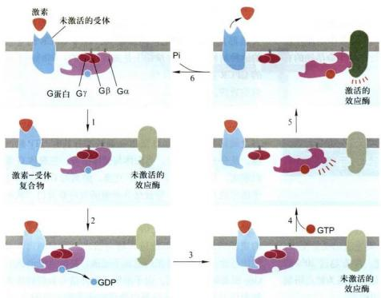  
图 11-11 与 G 蛋白偶联受体相联系的效应蛋白的激活普遍机制  
三聚体 G 蛋白解离活化的步骤如下：1. 配体（激素）结合诱发受体构象改变；2. 活化受体与 Gα 结合；3. 活化的受体引发 Gα 构象改变，致使 GDP 与 G 蛋白解离；4. GTP 与 Gα 结合，引发 Gα 与受体和 Gβγ 解离；5. 配体－受体复合物解离，Gα 结合并激活效应蛋白；6. GTP 水解成 GDP，引发 Gα 与效应蛋白解离并重新与 Gβγ 结合，恢复到三聚体 G 蛋白的静息状态。

表 11-3 哺乳类三聚体 G 蛋白的主要种类及其效应器

<table><tr><td>Gα类型</td><td>结合的效应器</td><td>第二信使</td><td>受体举例</td></tr><tr><td> ${\mathrm{G}}_{3}\alpha$ </td><td>腺苷酸环化酶</td><td>cAMP(升高)</td><td>β肾上腺受体,高血糖素受体,血中复合胺受体,后叶加压素受体</td></tr><tr><td> ${\mathrm{G}}_{3}\alpha$ </td><td>腺苷酸环化酶</td><td>cAMP(降低)</td><td> ${\alpha }_{1}$  肾上腺受体</td></tr><tr><td></td><td>K&#x27;通道(Gβγ激活效应器)</td><td>膜电位改变</td><td>M型乙酰胆碱受体</td></tr><tr><td> ${\mathrm{G}}_{3\alpha }\alpha$ </td><td>腺苷酸环化酶</td><td>cAMP(升高)</td><td>嗅觉受体(鼻腔)</td></tr><tr><td> ${\mathrm{G}}_{3}\alpha$ </td><td>磷脂酶C</td><td> ${\mathrm{{IP}}}_{3},\mathrm{{DAG}}\left( {升高}\right)$ </td><td> ${\alpha }_{2}$  肾上腺受体</td></tr><tr><td> ${\mathrm{G}}_{3}\alpha$ </td><td>磷脂酶C</td><td> ${\mathrm{{IP}}}_{3},\mathrm{{DAG}}\left( {升高}\right)$ </td><td>乙酰胆碱受体(内皮细胞)</td></tr><tr><td> ${\mathrm{G}}_{3}\alpha$ </td><td>cGMP 磷酸二酯酶</td><td>cGMP(降低)</td><td>视杆细胞中视紫红质(光受体)</td></tr></table>

2-diacylglycerol, DAG) 两种关键第二信使。

(4) 在信号通路中均具有参与反馈调节或导致受体脱敏的蛋白。细胞对外界信号作出适度的反应既涉及信号的有效刺激和信号转导的启动，也依赖于信号的解除与细胞反应的终止，特别值得注意的是信号的解除与终止和信号的刺激与启动对于确保靶细胞对信号的适度反应来说同等重要。解除与终止信号的重要方式是在信号浓度过高或细胞长时间暴露某一种信号刺激的情况下，细胞会以不同的机制使受体脱敏，这种现象又称之为适应（adaptation），这是一种负反馈调控机制。

## 二、G 蛋白偶联受体所介导的细胞信号通路

由 GPCR 所介导的细胞信号通路按其效应器蛋白的不同，可区分为三类：① 激活离子通道的 GPCR；② 激活或抑制腺苷酸环化酶，以 cAMP 为第二信使的 GPCR；③ 激活磷脂酶 C，以 1,4,5-三磷酸肌醇和二酰基甘油作为双信使的 GPCR。该类信号通路由于配体的多样性，效应蛋白及其第二信使的不同，所介导细胞反应也是多方面的，既包括调控离子通道开启而影响膜电位的变化，又包括改变酶类或其他蛋白质活性而调控细胞代谢，还参与对某些基因表达的调控。

## （一）激活离子通道的 G 蛋白偶联受体所介导的信号通路

当受体与配体结合被激活后，通过偶联G蛋白的分子开关作用，调控跨膜离子通道的开启与关闭，进而调节靶细胞的活性，这是最简单的细胞对信号做出的应答反应，也是神经冲动传导最基本的反应。如心肌细胞的M型乙酰胆碱受体和视杆细胞的光敏感受体，都属于这类调节离子通道的 GPCR。

## 1. 心肌细胞上 M 型乙酰胆碱受体激活 G 蛋白开启 K+通道

M型乙酰胆碱受体（muscarinic acetylcholine receptor）在心肌细胞膜上与 $G_{1}$ 蛋白偶联，乙酰胆碱配体与受体结合使受体活化，导致 $G_{\alpha}$ 结合的GDP被GTP取代，引发三聚体 $G_{1}$ 蛋白解离，使 $\beta \gamma$ 亚基得以释放，进而直接诱发心肌细胞质膜上相关的效应器K+通道开启，随即引发细胞内K+外流，从而导致细胞膜超极化（hyperpolarization），减缓心肌细胞的收缩频率（图11-12）。该结果已被体外膜片钳（patch-clamping）实验所证实。许多神经递质受体是GPCR，有些效应器蛋白是Na+或K+通道。神经递质与受体结合引发G蛋白偶联的离子通道的开放或关闭，进而导致膜电位的改变。

## 2. 激活 $G_{t}$ 蛋白偶联的光敏感受体诱发 cGMP-门控阳离子通道的关闭

人类视网膜含有两类光受体（photoreceptor），负责视觉刺激的初级感受。视锥细胞的光受体与色彩感受相关，视杆细胞的光受体接受弱光刺激。视紫红质（rhodopsin）是视杆细胞 $G_{i}$ 蛋白偶联的光受体，定位在视杆细胞外段上千个扁平膜盘上，三聚体 $G_{i}$ 蛋白与视紫红质偶联，通常称之为传导素(transducin，简称 $G_{i}$ )。人类视杆细胞含有大约 $4\times10^{7}$ 个视紫红质分子。视紫红质分子即光敏感的GPCR，具有7次跨膜的典型结构，视紫红质组成视蛋白（opsin），并与光吸收色素(11-顺式视黄醛）共价连接。吸收光子后，转换为全反式视黄醛，从而引发视蛋白构象改变。

如图11-13所示，在暗适应状态下的视杆细胞，高水平的第二信使cGMP保持cGMP门控非选择性阳离子通道的开放，光的吸收产生激活的视蛋白 $\mathrm{O}^*$ （步骤1）；活化的视蛋白与无活性的 $\mathrm{GDP - G_t}$ 三聚体蛋白结合并引发GDP被GTP置换（步骤2）； $\mathrm{G_i}$ 三聚体蛋白解离形成游离的 $\mathrm{G_i}\alpha$ ，通过与cGMP磷酸二酯酶（PDE）抑制性 $\gamma$ 亚基结合导致PDE活化（步骤3）；同时引起 $\gamma$ 亚基与催化性 $\alpha$ 和 $\beta$ 亚基解离，由于抑制的解除，催化

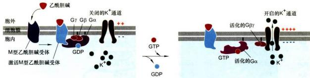  
图11-12 心肌细胞上M型乙酰胆碱受体的活化与效应器 $\mathsf{K}^+$ 通道的开启的工作模型  
这类受体通过三聚体 $G_{i}$ 蛋白与 $\mathsf{K}^*$ 通道相联系，乙酰胆碱的结合以常见的方式引发Gα亚基活化并与Gβγ解离。在本例中，释放的Gβγ亚基（而不是Gα-GTP）结合并打开K°通道，K°通透性增加，使膜超极化，降低心肌细胞收缩频率。当与Gα结合的GTP水解形成GDP时，Gα-GDP重新与Gβγ结合（图中未表示）。

A

性 $\alpha$ 和 $\beta$ 亚基使 cGMP 转换成 GMP（步骤 4）；由于胞质中 cGMP 水平降低导致 cGMP 从质膜 cGMP 门控阳离子通道上解离下来并致使阳离子通道关闭（步骤 5），然后，膜瞬间超极化。

  
图 11-13 视杆细胞中 ${\mathrm{G}}_{\mathrm{t}}$ 蛋白偶联的光受体(视紫红质)诱导的阳离子通道的关闭  
A. 视杆细胞结构模式图。B. $G_{1}$ 蛋白偶联的光受体介导的信号反应：在盘膜上活化的单分子视蛋白可以活化500个 $G_{1}\alpha$ 分子，每个 $G_{1}\alpha$ 分子又活化 cGMP 磷酸二脂酶（PDE），这是视觉系统中信号放大的初级阶段；然后光诱导的 cGMP 的减少导致非选择性阳离子通道的关闭，当光刺激停止，cGMP 又逐渐恢复到原来水平。

## （二）激活或抑制腺苷酸环化酶的 G 蛋白偶联受体

在绝大多数哺乳类细胞，GPCR 介导的信号通路遵循如图 11-12 所示的普遍机制。在该信号通路中，Gα 的首要效应酶是腺苷酸环化酶，通过腺苷酸环化酶活性的变化调节靶细胞内第二信使 cAMP 的水平，进而影响信号通路的下游事件。这是真核细胞应答激素反应的主要机制之一。

不同的受体-配体复合物或者刺激或者抑制腺苷酸环化酶活性，这类调控系统主要涉及5种蛋白质组分（图11-14）：①刺激型激素的受体（receptor for sitimulatory hormone, $R_{s}$ ），②抑制型激素的受体（receptor for inhibitory hormone, $R_{i}$ ），③刺激型G蛋白（sitimulatory G-protein, $G_{a}$ ），④抑制型G蛋白（inhibitory G-protein, $G_{i}$ ），⑤腺苷酸环化酶。

$R_{s}$ 和 $R_{1}$ 均为 7 次跨膜的 GPCR，但与之结合的胞外配体不同。已知 $R_{1}$ 有几十种，包括肾上腺素 $\beta$ 型受体、胰高血糖素受体、后叶加压素受体、促黄体生成素受体、促卵泡激素受体、促甲状腺素受体、促肾上腺皮质激素受体和肠促胰酶激素受体等； $R_{1}$ 有肾上腺素 $\alpha_{2}$ 型受体、阿片肽受体、乙酰胆碱 M 型受体和生长素释放抑制因子受体等。

刺激型激素与相应受体 $R_{s}$ 结合，偶联 $G_{s}$ （具刺激型 $\alpha$ 亚基，即 $G_{s}\alpha$ ），刺激腺苷酸环化酶活性，提高靶细胞 cAMP 水平；抑制型激素与相应受体 $R_{i}$ 结合，偶联 $G_{i}$ （具抑制型 $\alpha$ 亚基，即 $G_{i}\alpha$ ，但和 $G_{s}$ 含相同的 $\beta\gamma$ 亚基），结果抑制腺苷酸环化酶活性，降低靶细胞 cAMP 水平。

腺苷酸环化酶是分子质量为150 kDa的12次跨膜蛋白，胞质侧具有两个大而相似的催化结构域，跨膜区有两个整合结构域，每个含6个跨膜α螺旋；人工制备包含Gα、腺苷酸环化酶催化结构域的两个蛋白质片段的X射线晶体学分析，已获得三维结构证明（图11-15）。腺苷酸环化酶在Mg²⁺或Mn²⁺存在条件下，催化ATP生成cAMP。在正常情况下细胞内cAMP的浓度小于10⁻⁶ mol/L，当腺苷酸环化酶被激活后，cAMP水平急剧增加，使靶细胞产生快速应答；在细胞内还有另一种酶即cAMP磷酸二酯酶，可降解cAMP生成5'-AMP，导致细胞内cAMP水平下降，而终止信号反应。cAMP浓度在细胞内的迅速调节是细胞快速应答胞外信号的重要基础。

在多细胞动物各种以cAMP为第二信使的信号通路，主要是通过cAMP激活的蛋白激酶A（protein kinase A, PKA）所介导的。无活性的PKA是2个调节亚基（regulatory subunit, R）和2个催化亚基（catalytic subunit, C）组成的四聚体，在每个R亚基上有2个cAMP的结合位点，cAMP与R亚基结合是以协同方式（cooperative fashion）发生的，即第一个cAMP的结合会降低第二个cAMP结合的解离常数 $K_{d}$ ，因此胞内cAMP水平的很小变化就能导致PKA释放C亚基并快速使激酶活化（图11-16）。通过激素引发的某些抑制物的解离导致酶的迅速活化是各种信号通路的普遍特征。绝大多数哺乳类细胞表达GPCR。虽然许多激素刺激这些受体导致PKA的激活，但是细胞应答反应可能只依赖于细胞表达的特殊PKA异构体和PKA底物。例如，肾上腺素对糖原代谢的细胞效应是通过cAMP和

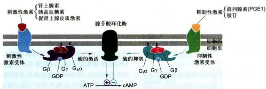  
图11-14 在脂肪细胞受激素诱导的腺苷酸环化酶的激活与抑制  
不同的激素－受体复合体，偶联不同的G蛋白 $\left[G_{s}\text{和}G_{i}\right.$ ，含相同的βγ亚基但不同的α亚基 $\left(G_{s}\alpha\text{和}G_{i}\alpha\right)$ ，导致 $G_{s}\alpha-GTP$ 激活腺苷酸环化酶，而 $G_{i}\alpha-GTP$ 抑制腺苷酸环化酶的活性。

A  
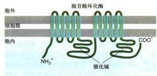  
图11-15 基乳类腺苷酸环化酶的结构与该酶同 $\mathrm{G}_8\alpha -\mathrm{GTP}$ 的相互作用

A. 哺乳类腺苷酸环化酶的结构示意图：12次跨膜蛋白，含2个胞质侧催化结构域，2个膜整合结构域（每个含6个跨膜α螺旋）。B. 包含牛G₃α、狗的V型腺苷酸环化酶和鼠的Ⅱ型腺苷酸环化酶催化结构域的重组三维结构（基于PDB数据库1CJT结构绘制）。  
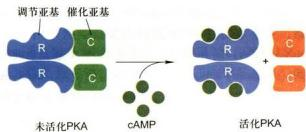  
图11-16 cAMP特异性地活化cAMP依赖的PKA，释放其催化亚基

PKA 所介导的，但主要限于肝细胞和肌细胞，它们表达与糖原合成和降解有关的酶。在脂肪细胞，肾上腺素诱导的 PKA 的激活促进磷脂酶的磷酸化和活性。磷脂酶的作用是催化三酰甘油水解生成脂肪酸和甘油。释放的脂肪酸进入血液并被其他组织（如肾、心和肌肉）细胞用作能源。然而，卵巢细胞（ovarian cell）GPCR 在某些垂体激素刺激下导致 PKA 活化，转而促进两种类固醇激素（雌激素和孕酮）的合成，这对雌性性征发育至关重要。虽然 PKA 在不同类型的细胞作用于不同底物，但 PKA 总是磷酸化相同序列的基序 X-Arg-(Arg/Lys)-X-(Ser/Thr)-φ 中（X 代表任意氨基酸，φ 代表疏水氨基酸）的丝氨酸（Ser）和苏氨酸（Thr）残基，其他的 Ser/Thr 激酶磷酸化不同序列基序中的靶残基。

## 1. cAMP-PKA 信号通路对肝细胞和肌细胞糖原代谢的调节

糖原代谢是由激素诱导的 PKA 的活化所调节的。正常人体维持血糖水平的稳态，需要神经系统、激素及组织器官的协同调节。肝和肌肉是调节血糖浓度的主要组织。脑组织活动对葡萄糖是高度依赖的，因而在应答胞外信号的反应中，cAMP水平会发生快速变化，几乎在20 s内cAMP水平会从 $5 \times 10^{-8}$ mol/L上升到 $10^{-6}$ mol/L水平。细胞表面GPCR应答多种激素信号对血糖浓度进行调节。以肝细胞和骨骼肌细胞为例，cAMP-PKA信号对细胞内糖原代谢起关键调控作用，这是一种短期的快速应答反应。当细胞内cAMP水平增加时，cAMP依赖的PKA被活化，活化的PKA首先磷酸化糖原磷酸化酶激酶（GPK），使其激活，继而使糖原磷酸化酶（GP）被磷酸化而激活，活化的GP刺激糖原的降解，生成1-磷酸葡糖；另一方面活化的PKA使糖原合酶（GS）磷酸化，抑制糖原的合成。此外，活化的PKA还可以使磷蛋白磷酸酶抑制蛋白（IP）磷酸化而被激活，活化的IP与磷蛋白磷酸酶（PP）结合并使其磷酸化而失活（图11-17A）；当细胞内cAMP水平降低时，cAMP依赖的PKA活性下降，致使IP磷酸化过程逆转，导致PP被活化。活化PP使糖原代谢中GPK和GP去磷酸化，从而降低其活性，导致糖原降解的抑制，活化PP还促使GS去磷酸化，结果GS活性增高，从而促进糖原的合成（图11-17B）。

在激活 GPCR—腺苷酸环化酶—cAMP-PKA 的信号通路中，信号依赖第二信使和激酶级联反应被逐级放大。在 GPCR 介导的信号转导系统中，又有多种机制使受体功能被下调：一是当 G,α 伴随释放 GTP 而结合 GDP 时，受体对相应配体的亲和性下降；二是当 G,α 与腺苷酸环化酶结合时，G,α 潜在的 GTP 酶活性被激活，使 GTP 水解为 GDP；三是 cAMP 在磷酸二酯酶作用下使 cAMP 水解形成 5'-AMP，终止细胞反应。

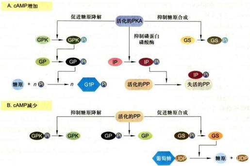  
图 11-17 cAMP-PKA 信号通路对肝细胞和肌细胞糖原代谢的调节  
PKA：蛋白激酶A；PP：磷蛋白磷酸酶；GPK：糖原磷酸化酶激酶；GP：糖原磷酸化酶；GS：糖原合酶；IP：磷蛋白磷酸酶抑制蛋白；G1P：1-磷酸葡糖。

## 2. cAMP-PKA 信号通路对真核细胞基因表达的调控

cAMP-PKA信号通路对细胞基因表达的调节是一类细胞应答胞外信号缓慢的反应过程，因为这一过程涉及细胞核机制，所以需要几分钟乃至几小时。这一信号通路控制多种细胞内的许多过程，从内分泌细胞的激素合成到脑细胞有关长期记忆所需蛋白质的产生。该信号途径涉及的反应可表示为：激素 $\rightarrow$ GPCR $\rightarrow$ G蛋白 $\rightarrow$ 脓苷酸环化酶 $\rightarrow$ cAMP $\rightarrow$ cAMP依赖的PKA $\rightarrow$ 基因调控蛋白（CREB） $\rightarrow$ 基因转录。

信号分子与受体结合通过Gα激活腺苷酸环化酶，导致细胞内cAMP浓度增高，cAMP与PKA调节亚基结合，导致催化剂基释放，被活化的PKA的催化亚基转位进入细胞核，使基因调控蛋白（cAMP应答元件结合蛋白，CREB）磷酸化，磷酸化的CREB与核内CREB结合蛋白（CBP）特异结合形成复合物，复合物与靶基因调控序列（cAMP-response element，CRE)结合，激活靶基因的转录（图11-18）。

在讨论 GPCR 介导的信号通路时，我们不禁要问：为什么不同的信号（配体）通过类似的机制会引发多种不同的细胞反应？这主要取决于 GPCR 的特异性。首先，对某一特定的配体其受体可以几种不同的异构体形式存在，并对该配体和特定G蛋白有不同的亲和性。现已知肾上腺素受体有9种不同的异构体，5-羟色胺的受体有15种不同的异构体；其次，现已知人类基因组由 16 个基因至少编码 21 种不同的 Gα，6 种不同的 Gβ 和 12 种不同的 Gγ。还有 9 种不同的腺苷酸环化酶。不同的受体，G 蛋白不同的亚基组合的多样性以及不同的效应酶，决定了众多不同的细胞反应。

  
图11-18 cAMP-PKA信号通路对基因转录的激活活化的PKA磷酸化基因调控蛋白，进而激活靶基因转录。

有些细菌毒素(toxin)含有一个跨细胞质膜的亚基，能催化 $\mathrm{G}_3\alpha$ -GTP的化学修饰，从而防止结合的GTP水解成GDP，结果 $\mathrm{G}_3\alpha$ 持续维持在活化状态，在缺乏激素刺激的情况下也会不断地激活酰苷酸环化酶，产生第二信使，向下游传递信号。霍乱毒素（cholera toxin）具有ADP-核糖转移酶活性，进入细胞催化胞内的NAD'的ADP核糖基共价结合 $\mathrm{G}_3\alpha$ 上，致使 $\mathrm{G}_3\alpha$ 丧失GTP酶活性，与 $\mathrm{G}_3\alpha$ 结合的GTP不能水解成GDP，结果GTP永入结合在 $\mathrm{G}_3\alpha$ 上，处于持续活化状态并不断地激活腺苷酸环化酶，使腺苷酸环化酶被“锁定”在活化状态。霍乱病患者的症状是严重腹泻，其主要原因就是霍乱毒素催化 $G_{\alpha}$ ADP-核糖基化，致使小肠上皮细胞中 cAMP 水平增加 100 倍以上，导致细胞大量 $Na^{+}$ 和水分子持续外流，产生严重腹泻而脱水。百日咳博德特菌（Bordetella pertussis）产生百日咳毒素（pertussis toxin）催化 $G_{\alpha}$ ADP-核糖基化，阻止了 $G_{\alpha}$ 上 GDP 的释放，使 $G_{\alpha}$ 被 “锁定” 在非活化状态， $G_{\alpha}$ 的失活导致气管上皮细胞内 cAMP 水平增高，促使液体、电解质和黏液分泌减少。

## （三）激活磷脂酶 C 和以 $IP_{3}$ 和 DAG 作为双信使的 GPCR 介导的信号通路

通过 GPCR 介导的另一条信号通路是磷脂酰肌醇信号通路，其信号转导是通过效应酶磷脂酶 C 完成的。

细胞肌醇磷脂代谢途径如图 11-19 所示，双信使 IP₃ 和 DAG 的合成来自膜结合的磷脂酰肌醇（PI）。细胞膜结合的 PI 激酶将肌醇环上特定的羟基磷酸化，形成 4-磷酸磷脂酰肌醇（PIP）和 4,5-二磷酸磷脂酰肌醇（ $\mathrm{PIP}_2$ ），胞外信号分子与 $\mathrm{G}_6$ 或 $\mathrm{G}_8$ 蛋白偶联的受体结合，通过如前所述的 G 蛋白开关机制引起质膜上磷脂酶 C 的 $\beta$ 异构体（PLCβ）的活化，致使质膜上 $\mathrm{PIP}_2$ 被水解生成 $\mathrm{IP}_3$ 和 DAG 两个第二信使。 $\mathrm{IP}_3$ 在细胞质中扩散，DAG 是亲脂性分子联系在膜上。

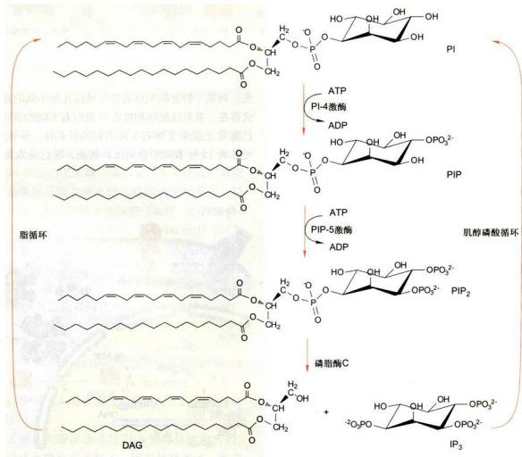  
图 11-19 肌醇磷脂代谢途径：1,4,5-三磷酸肌醇（IP₃）和二酰甘油（DAG）的合成来自膜结合的磷脂酰肌醇（PI）

$\mathrm{IP}_3$ 刺激细胞内质网释放 $\mathrm{Ca^{2+}}$ 进入细胞质基质，使胞内 $\mathrm{Ca^{2+}}$ 浓度升高，DAG激活蛋白激酶C（PKC），活化的PKC进一步使底物蛋白磷酸化，并可活化 $\mathrm{Na}^+$ /H+交换引起细胞内pH升高。以磷脂酰肌醇代谢为基础的信号通路的最大特点是胞外信号被膜受体接受后，同时产生两个胞内信使，分别激活两种不同的信号通路，即 $\mathrm{IP}_3 / \mathrm{Ca}^{2+}$ 和DAG/PKC途径（图11-20），实现细胞对外界信号的应答，因此把这种信号系统又称之为“双信使系统”（double messenger system）。

## 1. IP $_{3}$ -Ca $^{2+}$ 信号通路

胞外信号分子与GPCR结合，活化G蛋白（ $\mathrm{G}_2\alpha$ 或 $\mathrm{G}_3\alpha)$ ，进而激活磷脂酶C，催化 $\mathrm{PIP}_2$ 水解生成 $\mathrm{IP}_3$ 和DAG两个第二信使。IP₃通过细胞内扩散，结合并开启内质网膜上 $\mathrm{IP}_3$ 敏感的 $\mathrm{Ca^{2+}}$ 通道，引起 $\mathrm{Ca^{2+}}$ 顺电化学梯度从内质网钙库释放进入细胞质基质。所以，IP₃的主要功能是引发贮存在内质网中的 $\mathrm{Ca^{2+}}$ 转移到细胞质基质中，使胞质中游离 $\mathrm{Ca^{2+}}$ 浓度提高。依靠内质网膜上的 $\mathrm{IP}_3$ 门控 $\mathrm{Ca^{2+}}$ 通道（ $\mathrm{IP}_3$ -gated $\mathrm{Ca^{2+}}$ channel），将储存的 $\mathrm{Ca^{2+}}$ 释放到细胞质基质中是几乎所有真核细胞内 $\mathrm{Ca^{2+}}$ 动员的主要途径。IP₃门控 $\mathrm{Ca^{2+}}$ 通道由4个亚基组成，每个亚基在N端胞质结构域有一个IP₃结合位点，IP₃的结合导致通道开放， $Ca^{2+}$ 从内质网腔释放到细胞质基质中（图 11-21）。

在细胞中发现的各种磷酸肌醇加到内质网膜泡的制备物中，只有 $\mathrm{IP}_3$ 能引起 $\mathrm{Ca^{2+}}$ 的释放，表明 $\mathrm{IP}_3$ 具有效应特异性。 $\mathrm{IP}_3$ 介导的 $\mathrm{Ca^{2+}}$ 水平升高只是瞬时的，不仅是因为质膜和内质网膜上 $\mathrm{Ca^{2+}}$ 泵的启动会分别将 $\mathrm{Ca^{2+}}$ 泵出细胞和泵进内质网腔，而且是由于细胞质基质中的 $\mathrm{Ca^{2+}}$ 对 $\mathrm{IP}_3$ 门控 $\mathrm{Ca^{2+}}$ 通道进行双向调控。一方面， $\mathrm{Ca^{2+}}$ 会增加通道的开启，结果引发储存 $\mathrm{Ca^{2+}}$ 的更多释放。另一方面，细胞质基质中 $\mathrm{Ca^{2+}}$ 浓度的进一步升高，又会导致通道失活，中止 $\mathrm{IP}_3$ 诱导的胞内储存 $\mathrm{Ca^{2+}}$ 的释放。当细胞中 $\mathrm{IP}_3$ 通路受到刺激时，这种由细胞质基质中 $\mathrm{Ca^{2+}}$ 对内质网膜上 $\mathrm{IP}_3$ 门控 $\mathrm{Ca^{2+}}$ 通道的复杂调控会导致细胞质基质中 $\mathrm{Ca^{2+}}$ 水平的快速振荡（oscillation）。例如垂体中激素分泌细胞受到黄体生成素释放激素（LHRH）的刺激，引发细胞质基质中 $\mathrm{Ca^{2+}}$ 水平产生快速而重复的脉冲，每个脉冲又都与LH分泌的高潮相吻合。

在细胞信号转导过程的研究中，人们对信号分子与受体的相互作用及其最终的生物学效应已经有了比较多的了解。但是信息是如何在细胞中传递的细节却知之甚少。借助于能与 $\mathrm{Ca^{2+}}$ 特异结合的荧光试剂如Fura-2和Fluo-3的发明和激光共聚焦显微镜的使用，人们得以在活细胞中实时观察和记录细胞中 $\mathrm{Ca^{2+}}$ 浓度的微弱变化（图11-22A），从而揭示了作为第二信使的钙信号在细胞中传递的机制。

1993 年以来，钙火花（Ca $^{2+}$ spark）等一系列微区钙信号传导单元的发现，显示出钙信号转导过程中，在时间、空间和幅度上形成多尺度、多层次的精细结构。

  
图11-20 $\mathrm{IP}_3 / \mathrm{Ca}^{2+}$ 和DAG/ PKC双信使信号途径

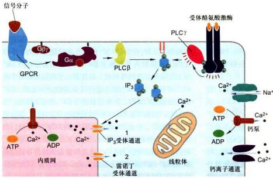

A  
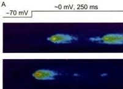

  
图 11-21 细胞内 $Ca^{2+}$ 水平调控示意图  
图 11-22 钙火花

钙火花的直径约 $2\mu \mathrm{m}$ ，体积8L。在短短的10ms内，细胞中某一微区 $\mathrm{Ca^{2+}}$ 探针Fluo-3的荧光强度骤升一倍，随后又在20ms内消失，故称钙火花（图11-22B）。钙火花的发生是一个“扩散—反应”的过程，即 $\mathrm{Ca^{2+}}$ 从一簇雷诺丁受体（ryanodine receptor）构成的发放源放出，向周围扩散，并通过不同的分子机制回收或清除，以恢复细胞质中正常的静息 $\mathrm{Ca^{2+}}$ 浓度。在单个心肌细胞中，每次收缩可形成大约 $10^{4}$ 个钙火花，它们在时间和空间上的叠加形成了细胞水平的钙振荡，驱动心肌细胞收缩。此外，细胞微区钙信号的存在，也大大丰富了 $\mathrm{Ca^{2+}}$ 编码生物信息的能力。在平滑肌细胞膜周的钙火花，却可选择性地影响膜上离子通道，导致细胞膜超极化和细胞外钙内流下降，最终引发平滑肌舒张。

钙信号基本单元钙火花的研究，将钙信号作用原理的单一性与其调控和功能的复杂性统一起来。快速变化的钙信号与肌肉收缩、神经递质传递、激素分泌等生理过程直接相关，而不同的钙信号的组合在长时程的生物

在内质网膜上有两类 $Ca^{2+}$ 通道：1. $IP_{3}$ 受体，即 $IP_{3}$ 门控 $Ca^{2+}$ 通道；2. 雷诺丁受体（RyR），主要存在于可兴奋细胞（如心肌细胞）中，咖啡因的作用之一就是增强雷诺丁受体对 $Ca^{2+}$ 的敏感性，因而增加这些离子通道被 CICR 开通的可能性，使细胞更容易兴奋。PLCβ：磷脂酶 β 亚基；PLCγ：磷脂酶 γ 亚基。

A. Fluo-3 染色心肌细胞的共聚焦线扫描显微图像，示钙火花的时间－空间特征。B. 钙火花的立体图，高度代表 Fluo-3 荧光强度。钙星由细胞质膜上钙通道的钙内流形成，通过 CICR 触发钙火花。（程和平博士惠赠）

学过程，如基因表达、细胞凋亡以及受精作用中都发挥重要的作用。因此，对钙火花等微区钙信号激活机制、协同机制和终止机制等方面的研究具有非常重要的生理与病理意义。

一般情况 $Ca^{2+}$ 不直接作用于靶蛋白，而是通过 $Ca^{2+}$ 应答蛋白间接发挥作用。钙调蛋白（calmodulin, CaM）是真核细胞中普遍存在的 $Ca^{2+}$ 应答蛋白，分子质量为 16.7 kDa，由 148 个氨基酸残基组成，含 4 个结构域，每个结构域可结合一个 $Ca^{2+}$ 。首先 $Ca^{2+}$ 与 CaM 结合形成活化态的 $Ca^{2+}-CaM$ 复合体，然后再与靶酶结合将其活化（表 11-4），这是一个受 $Ca^{2+}$ 浓度控制的可逆反应。钙调蛋白本身无活性，但由于 $Ca^{2+}$ 与 CaM 结合的协调作用，细胞质中微小的 $Ca^{2+}$ 浓度变化即可导致活化 CaM 水平的很大变化。钙调蛋白激酶（CaM kinase）是特别重要的一类靶酶，在动物细胞许多功能活动中是由钙调蛋白激酶所介导的。如细胞内 $Ca^{2+}-CaM$ 复合物水平的升高有利于启动受精后胚胎发育，兴奋肌肉细胞的收缩，刺激内分泌细胞和神经细胞的分泌。在哺乳类脑神经元突触处一种特殊的钙调蛋白激酶十分丰富，是构成记忆通路的组分，失去这种钙调蛋白激酶的突变小鼠表现出明显的记忆无能。依细胞类型不同， $\mathrm{Ca}^{2+}$ 可激活或抑制各种靶酶和运输系统，改变膜的离子通透性，诱导膜的融合或者改变细胞骨架的结构与功能。

表 11-4 受钙调蛋白调节的酶

<table><tr><td>酶</td><td>细胞功能</td><td>酶</td><td>细胞功能</td></tr><tr><td>腺苷酸环化酶</td><td>合成 cAMP</td><td>磷酸化酶</td><td>糖原降解</td></tr><tr><td>鸟苷酸环化酶</td><td>合成 cGMP</td><td>肌球蛋白轻链激酶</td><td>平滑肌收缩运动</td></tr><tr><td>钙依赖性磷酸二酯酶</td><td>水解 cAMP 和 cGMP</td><td>钙调蛋白激酶</td><td>神经递质分泌和再合成,分子记忆</td></tr><tr><td> $Ca^{2+}$ -ATP 酶</td><td> $Ca^{2+}$  泵</td><td>钙依赖性蛋白磷酸酶</td><td>各种蛋白质的去磷酸化</td></tr><tr><td>NAD 激酶</td><td>合成 NADP</td><td>转谷氨酸胺酶</td><td>蛋白质交联</td></tr></table>

## 2. ${\mathrm{{Ca}}}^{2 + } - \mathrm{{NO}} - \mathrm{{cGMP}} -$ 活化的蛋白激酶 $\mathrm{G}$ 信号途径

血管平滑肌细胞的舒张是由该信号通路所诱导的。早在认识NO作为气体信号分子之前，科学家有两个重要发现：20世纪80年代发现在培养条件下巨噬细胞的杀菌活性依赖于培养基中精氨酸的存在，而精氨酸是NO合酶（nitric oxide synthase, NOS）的底物，提示NO是一种重要的生物功能分子；此外，多年前人们就知道乙酰胆碱（acetylcholine）通过引起平滑肌松弛而舒张血管。1980年R. Furchgott提出血管舒张是因为血管内皮细胞产生一种信号分子引起血管平滑肌松弛所致。随后在1986年Furchgott和L. Ignarro的研究证实，NO作为气体信号分子引起血管平滑肌舒张。正是这些研究贡献使Furchgott等三位美国科学家获得1998年诺贝尔生理学或医学奖。NO是一种具有自由基性质的脂溶性气体分子，可透过细胞膜快速扩散，作用邻近靶细胞发挥作用。由于体内存在氧及其他与NO发生反应的化合物（如超氧离子、血红蛋白等），因而NO在细胞外极不稳定，其半衰期只有2\~30s，只能在组织中局部扩散，被氧化后以硝酸根 $\left(\mathrm{NO}_{3}^{-}\right)$ 或亚硝酸根 $\left(\mathrm{NO}_{2}^{-}\right)$ 的形式存在于细胞内外液中。血管内皮细胞和神经细胞是NO的生成细胞，NO的生成需要NOS的催化，以L-精氨酸为底物，以还原型辅酶II(NADPH)作为电子供体，等当量地生成NO和L-瓜氨酸。NO没有专门的储存及释放调节机制，作用于靶细胞的NO的多少直接与NO的合成有关。NO这种可溶性气体，作为局部介质在许多组织中发挥作用，NO发挥作用的主要机制是激活靶细胞内具有鸟苷酸环化酶(guanylate cyclase, GC) 活性的 NO 受体。内源性 NO 由 NOS 催化合成后，扩散到邻近细胞，与鸟苷酸环化酶活性中心的 Fe $^{2+}$ 结合，改变酶的构象，导致酶活性增强和 cGMP 水平增高。cGMP 的作用是通过 cGMP 依赖的蛋白激酶 G（PKG）活化，抑制肌动－肌球蛋白复合物信号通路，导致血管平滑肌舒张（图 11-23）。此外，心房钠尿肽（atrial natriuretic peptide, ANP）和某些多肽类激素与血管平滑肌细胞表面受体的结合，也会引发血管平滑肌舒张，这些细胞表面受体的胞质结构域也具有内源性鸟苷酸环化酶活性，通过类似的机制调节心肌的活动。NO 对血管的影响可以解释为什么硝酸甘油（nitroglycerin）能用于治疗心绞痛病人，硝酸甘油在体内转化为 NO，可舒张血管，从而减轻心脏负荷和心肌的需氧量。

## 3. DAG-PKC 信号途径

作为双信使之一的二酰甘油（DAG）结合在质膜上，可活化与质膜结合的蛋白激酶 C（PKC）。PKC 有两个功能区，一个是亲水的催化活性中心，另一个是疏水的膜结合区。在静息的细胞中，PKC 以非活性形式分布于细胞质中，当细胞接受外界信号刺激时， $\mathrm{PIP}_2$ 水解，质膜上 DAG 瞬间积累，由于细胞质中 $\mathrm{Ca}^{2+}$ 浓度升高，导致细胞质基质中 PKC 与 $\mathrm{Ca}^{2+}$ 结合并转位到质膜内表面，被 DAG 活化，进而使不同类型细胞中不同底物蛋白的丝氨酸和苏氨酸残基磷酸化。PKC 是 $\mathrm{Ca}^{2+}$ 和磷脂酰丝氨酸依赖性的丝氨酸 / 苏氨酸蛋白激酶，具有广泛的作用底物，参与众多生理过程，既涉及许多细胞“短期生理效应”如细胞分泌、肌肉收缩等，又涉及细胞增殖、分化等“长期生理效应”。DAG 只是 $\mathrm{PIP}_2$ 水解形成的暂时性产物，DAG 通过两种途径终止其信使作用：一是被 DAG 激酶磷酸化形成磷脂酸，进入肌醇磷脂代谢途径（图 11-19）；二是被 DAG 脂水解成单脂酰甘油。由于 DAG 代谢周期很短，不可能长期维持

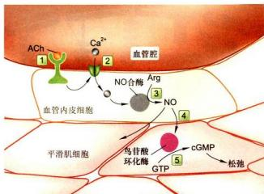  
图 11-23 Ca $^{2+}$ -NO-cGMP- 活化的蛋白激酶 G 信号途径  
作为血管内皮细胞应答乙酰胆碱 GPCR 的激活，激活磷脂酶 C，通过 IP₃-Ca²⁺/CaM 激活 NO 合酶，在血管内皮细胞生成 NO，扩散至血管平滑肌细胞激活鸟苷酸环化酶，生成 cGMP 并作用于 PKG，导致血管平滑肌舒张。

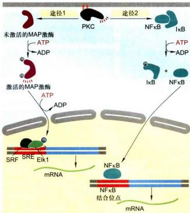  
图 11-24 活化的 PKC 激活基因转录的两条细胞内途径

一条是 PKC 激活一系列磷酸化级联反应，导致 MAP 激酶的磷酸化并使之活化，MAP 激酶磷酸化并活化基因调控蛋白 Elk1。Elk1 与另一种 DNA 结合蛋白血清应答因子（SRF）共同结合在基因上短的 DNA 调控序列（血清应答元件，SRE）上。Elk1 的磷酸化和活化，即可调节基因转录。另一条途径是 PKC 的活化导致 IκB 磷酸化，使基因调控蛋白 NFκB 与 IκB 解离并进入细胞核，与相应的基因调控序列结合激活基因转录。

PKC活性，而细胞增殖或分化行为的变化又要求PKC长期所产生的效应。现发现另一种DAG生成途径，即由磷脂酶催化质膜上的磷脂酰胆碱断裂产生的DAG，用来维持PKC的长期效应。在许多细胞中，PKC的活化可增强特殊基因的转录。已知至少有两条途径：一是PKC激活一条蛋白激酶的级联反应，导致与DNA特异序列结合的基因调控蛋白的磷酸化和激活，进而增强特殊基因的转录；二是PKC的活化，导致一种抑制蛋白的磷酸化，从而使细胞质中基因调控蛋白摆脱抑制状态释放出来，进入细胞核，刺激特殊基因的转录（图11-24）。

<!-- END CN CN11-S02 -->

---

## 对应英文内容

### 英文补充：GPCR、cAMP、钙、NO与第二信使

> 对应中文板块：GPCR、cAMP、钙、NO与第二信使。英文来源：Molecular Biology of the Cell，第7版，第15章；[本章完整原文](../../来源/英文教材/15_Cell_Signaling/chapter.md)。物理PDF页码范围：912–987（整章范围）。

<!-- BEGIN EN EN15-H017-H028 -->
#### SIGNALING THROUGH G-PROTEIN-COUPLED RECEPTORS

**G-protein-coupled receptors (GPCRs)** form the largest family of cell-surface receptors, and they mediate most responses to signals from the external world, as well as signals from other cells, including hormones, neurotransmitters, and local mediators. Our senses of sight, smell, and taste also depend on them. There are more than 800 GPCRs in humans, and in mice there are about 1000 concerned with the sense of smell alone. The signal molecules that act on GPCRs are as varied in structure as they are in function and include proteins and small peptides, derivatives of amino acids and fatty acids, photons of light, and all the molecules that we can smell or taste. The same signal molecule can activate many different GPCR family members; for example, epinephrine activates at least 9 distinct GPCRs, acetylcholine another 5, and the neurotransmitter serotonin at least 14. The different receptors for the same signal are usually expressed in different cell types and elicit different responses.

Despite the chemical and functional diversity of the signal molecules that activate them, all GPCRs have a similar structure. They consist of a single polypeptide chain that threads back and forth across the lipid bilayer seven times, forming a cylindrical structure, often with a deep ligand-binding site in its core

Figure 15-22 A G-protein-coupled receptor (GPCR). (A) GPCRs that bind small ligands such as epinephrine have small extracellular domains, and the ligand usually binds deep within the plane of the plasma membrane to a site that is formed by amino acids from several transmembrane segments. GPCRs that bind protein ligands have a large extracellular domain (not shown here) that contributes to ligand binding. (B) The structure of the β2-adrenergic receptor, a receptor for the neurotransmitter epinephrine, illustrates the typical cylindrical arrangement of the seven transmembrane helices in a GPCR. The ligand (orange) binds in a pocket between the helices, resulting in conformational changes on the cytoplasmic surface of the receptor that promote G-protein activation (not shown). (PDB code: 3P0G.)

(**Figure 15–22**). In addition to their characteristic orientation in the plasma membrane, they all use G proteins to relay the signal into the cell interior.

The GPCR superfamily includes rhodopsin, the light-activated protein in the vertebrate eye, as well as the large number of olfactory receptors in the vertebrate nose. Other family members are found in unicellular organisms: the receptors in yeasts that recognize secreted mating factors are an example. It is likely that the GPCRs that mediate cell–cell signaling in multicellular organisms evolved from the sensory receptors in their unicellular eukaryotic ancestors.

It is remarkable that almost half of all known drugs work through GPCRs or GPCR-coupled signaling pathways. Of the many hundreds of genes in the human genome that encode GPCRs, about 150 encode orphan receptors, for which the ligand is unknown. Many of them are likely targets for new drugs that remain to be discovered.

#### Heterotrimeric G Proteins Relay Signals from GPCRs

When an extracellular signal molecule binds to a GPCR, the receptor undergoes a conformational change that enables it to activate a **heterotrimeric GTP-binding protein (G protein)**, which couples the receptor to enzymes or ion channels in the plasma membrane. In some cases the G protein is physically associated with the receptor before the receptor is activated, whereas in others it binds only after receptor activation. There are various types of G proteins, each specific for a particular set of GPCRs and for a particular set of target proteins in the plasma membrane. They all have a similar structure, however, and operate similarly.

(A)

G proteins are composed of three protein subunits: α, β, and γ. In the unstimulated state, the α subunit has GDP bound and the G protein is inactive (**Figure 15–23**). When a GPCR is activated, it acts like a guanine nucleotide

Figure 15–23 The structure of an inactive G protein. (A) Note that both the α and γ subunits have covalently attached lipid molecules (red tails) that help them bind to the plasma membrane, and the α subunit has GDP bound. (B) The three-dimensional structure of the inactive, GDP-bound form of a G protein called Gi, which interacts with numerous GPCRs, including the β2-adrenergic receptor shown in Figure 15–22. The α subunit contains the GTPase domain and binds to one side of the β subunit. The γ subunit binds to the opposite side of the β subunit, and the β and γ subunits together form a single functional unit. The GTPase domain of the α subunit contains two major subdomains: the Ras domain, which is related to other GTPases and provides one face of MBoC7 m15.22/15.23the GTP-binding pocket; and the α-helical or AH domain, which clamps the GTP in place (see Figure 15–24). (PDB code: 1GG2.)

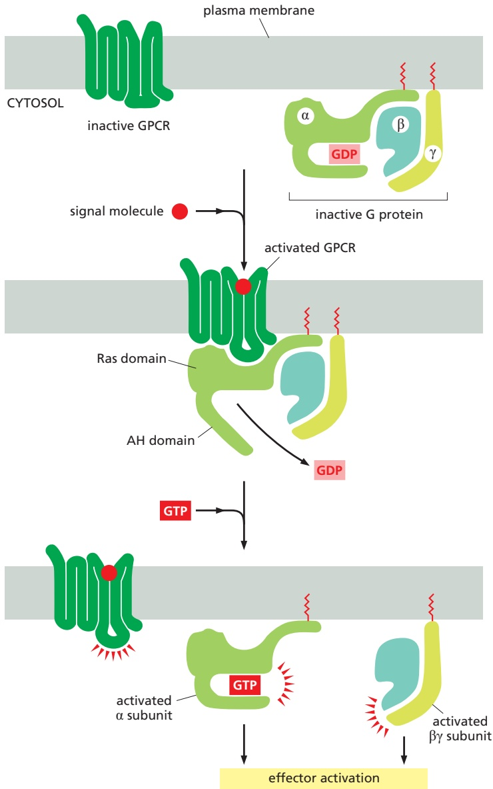

Figure 15–24 Activation of a G protein by an activated GPCR. Binding of an extracellular signal molecule to a GPCR changes the conformation of the receptor, which allows the receptor to bind and alter the conformation of a heterotrimeric G protein. The AH domain of the G protein α subunit moves outward to open the GTP-binding site, thereby promoting dissociation of GDP. GTP binding then promotes closure of the binding site, triggering conformational changes that cause dissociation of the α subunit from the receptor and from the βγ complex. The GTP-bound α subunit and the βγ complex each regulate the activities of downstream signaling molecules (not shown). The receptor stays active while the extracellular signal molecule is bound to it, and it can MB C7 15.23/15.24therefore catalyze the activation of many G-protein molecules (Movie 15.1).

exchange factor (GEF) and induces the α subunit to release its bound GDP, allowing GTP to bind in its place. GTP binding then causes an activating conformational change in the Gα subunit, releasing the G protein from the receptor and triggering dissociation of the GTP-bound Gα subunit from the Gβγ pair—both of which then interact with various targets, such as enzymes and ion channels in the plasma membrane, which relay the signal onward (**Figure 15–24**).

The α subunit is a GTPase and becomes inactive when it hydrolyzes its bound GTP to GDP. The time required for GTP hydrolysis is usually short because the GTPase activity is greatly enhanced by the binding of the α subunit to a second protein, which can be either the target protein or a specific **regulator of G protein signaling (RGS)**. RGS proteins act as α-subunit–specific GTPase-activating proteins (GAPs) (see Figure 15–8), and they help shut off G-protein-mediated

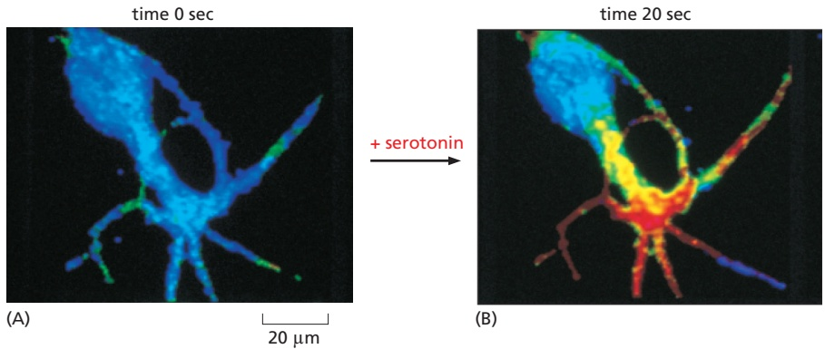

Figure 15–25 An increase in cyclic AMP in response to an extracellular signal. This Aplysia sensory nerve cell in culture is responding to the neurotransmitter serotonin, which acts through a GPCR to cause a rapid rise in the intracellular concentration of cAMP. To monitor the cAMP level, the cell has been loaded with a fluorescent protein that changes its fluorescence when it binds cAMP. Blue indicates a low level of cAMP, yellow an intermediate level, and red a high level. (A) In the resting cell, the cAMP level is about $5 \times 1 0 ^ { - 8 } \mathrm { M } .$ (B) Twenty seconds after the addition of serotonin to the culture medium, the intracellular level of cAMP has increased to more than 10–6 M in the relevant parts of the cell, an increase of more than twentyfold. (From B.J. Bacskai et al., Science 260:222–226, 1993. With permission from AAAS.)

responses in all eukaryotes. There are about 25 RGS proteins encoded in the human genome, each of which interacts with a particular set of G proteins.

#### Some G Proteins Regulate the Production of Cyclic AMPMBoC7 m15.24/15.25

**Cyclic AMP (cAMP)** acts as a second messenger in some signaling pathways. An extracellular signal can increase cAMP concentration more than twentyfold in seconds (**Figure 15–25**). As explained earlier (see Figure 15–15), such a rapid response requires balancing a rapid synthesis of the molecule with its rapid breakdown or removal. Cyclic AMP is synthesized from ATP by an enzyme called **adenylyl cyclase**, and it is rapidly and continually destroyed by **cyclic AMP phosphodiesterases** (**Figure 15–26**). Adenylyl cyclase is a large, multipass transmembrane protein with its catalytic domain on the cytosolic side of the plasma membrane. There are at least eight isoforms in mammals, most of which are regulated by both G proteins and $\mathrm { C a ^ { 2 + } }$

Many extracellular signals work by increasing cAMP concentrations inside the cell. These signals activate GPCRs that are coupled to a **stimulatory G protein** $( \mathbf { G _ { s } } )$ . The activated α subunit of $\mathbf { G _ { s } }$ binds and thereby activates adenylyl cyclase. Other extracellular signals, acting through different GPCRs, reduce cAMP levels by activating an **inhibitory G protein (G**<strong>i</strong>**)**, which then inhibits adenylyl cyclase.

Both $\mathbf { G _ { s } }$ and $\mathrm { G _ { i } }$ are targets for medically important bacterial toxins. Cholera toxin, which is produced by the bacterium that causes cholera, is an enzyme that catalyzes the transfer of ADP ribose from intracellular NAD+ to the α subunit of $\mathbf { G _ { s } } .$ This ADP ribosylation alters the α subunit so that it can no longer hydrolyze its bound GTP, causing it to remain in an active state that stimulates adenylyl cyclase indefinitely. The resulting prolonged elevation in cAMP concentration within intestinal epithelial cells causes a large efflux of $\mathrm { C l ^ { - } }$ and water into the gut, thereby causing the severe diarrhea that characterizes cholera. Pertussis toxin, which is made by the bacterium that causes pertussis (whooping cough), catalyzes the ADP ribosylation of the α subunit of $\mathbf { G } _ { \mathbf { i } \mathbf { r } }$ preventing the protein from interacting with receptors; as a result, the G protein remains in the inactive GDP-bound state and is unable to regulate its target proteins. These two toxins are widely used in experiments to determine whether a cell’s GPCR-dependent response to a signal is mediated by $\mathbf { G _ { s } }$ or by $\mathbf { G _ { i } } .$

Some of the responses mediated by a $\mathrm { G _ { s } }$ -stimulated increase in cAMP concentration are listed in **Table 15–1**. As the table shows, different cell types respond differently to an increase in cAMP concentration. Some cell types, such as fat cells, activate adenylyl cyclase in response to multiple hormones, all of which thereby stimulate the breakdown of triglyceride (the storage form of fat) to fatty acids. Individuals with genetic defects in the $\mathbf { G } _ { \mathrm { s } }   \alpha$ subunit show decreased responses to certain hormones, resulting in metabolic abnormalities, abnormal bone development, and mental retardation.

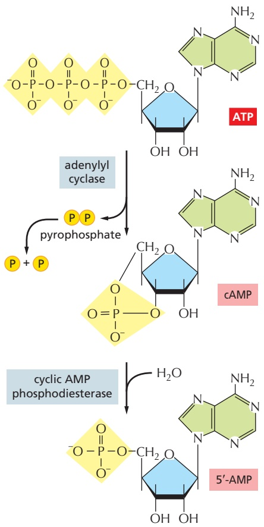

<small>( );</small>

<small>Figure 15–26 The synthesis and degradation of cyclic AMP. In a reaction catalyzed by the enzyme adenylyl cyclase, cyclic AMP (cAMP) is synthesized from ATP through a cyclization reaction that removes two phosphate groups as pyrophosphate PP a pyrophosphatase drives this synthesis by hydrolyzing the released pyrophosphate to phosphate. Cyclic AMP is short-lived (unstable) in the cell because it is hydrolyzed by specific phosphodiesterases to form 5′-AMP, as indicated.</small>

<table><tbody><tr><td colspan="3">TABLE 15-1 Some Hormone-induced Cell Responses Mediated by Cyclic AMP</td></tr><tr><td>Target tissue</td><td>Hormone</td><td>Major response</td></tr><tr><td>Thyroid gland</td><td>Thyroid-stimulating hormone (TSH)</td><td>Thyroid hormone synthesis and secretion</td></tr><tr><td>Adrenal cortex</td><td>Adrenocorticotrophic hormone (ACTH)</td><td>Cortisol secretion</td></tr><tr><td>Ovary</td><td>Luteinizing hormone (LH)</td><td>Progesterone secretion</td></tr><tr><td>Muscle</td><td>Epinephrine</td><td>Glycogen breakdown</td></tr><tr><td>Bone</td><td>Parathyroid hormone</td><td>Bone resorption</td></tr><tr><td>Heart</td><td>Epinephrine</td><td>Increase in heart rate and force of contraction</td></tr><tr><td>Liver</td><td>Glucagon</td><td>Glycogen breakdown</td></tr><tr><td>Kidney</td><td>Vasopressin</td><td>Water resorption</td></tr><tr><td>Fat</td><td>Epinephrine, ACTH, glucagon, TSH</td><td>Triglyceride breakdown</td></tr></tbody></table>

#### Cyclic-AMP-dependent Protein Kinase (PKA) Mediates Most of the Effects of Cyclic AMP

In most animal cells, cAMP exerts its effects mainly by activating **cyclic-AMP-dependent protein kinase (protein kinase A; PKA)**. This kinase phosphorylates specific serines or threonines on selected target proteins, including intracellular signaling proteins and effector proteins, thereby regulating their activity. The target proteins differ from one cell type to another, which explains why the effects of cAMP vary so markedly depending on the cell type (see Table 15–1).

In the inactive state, PKA consists of a complex of two catalytic subunits and two regulatory subunits. The binding of cAMP to the regulatory subunits alters their conformation, causing them to dissociate from the complex. The released catalytic subunits are thereby activated to phosphorylate specific target proteins (**Figure 15–27**). The regulatory subunits of PKA are important for localizing the kinase inside the cell: special A-kinase anchoring proteins (AKAPs) bind both to the regulatory subunits and to a component of the cytoskeleton or a membrane of an organelle, thereby tethering the enzyme complex to a particular subcellular compartment. Some AKAPs also bind other signaling proteins, forming a signaling complex. An AKAP located around the nucleus of heart muscle cells,

Figure 15–27 The activation of cyclic-AMP-dependent protein kinase (PKA). The binding of cAMP to the regulatory subunits of the PKA tetramer induces a conformational change, causing these subunits to dissociate from the catalytic subunits, thereby activating the kinase activity of the catalytic subunits. The release of the catalytic subunits requires the binding of more than two cAMP molecules to the regulatory subunits in the tetramer. This requirement greatly sharpens the response of the kinase to changes in cAMP concentration, as discussed earlier (see Figure 15–17).

for example, binds both PKA and a phosphodiesterase that hydrolyzes cAMP. In unstimulated cells, the phosphodiesterase keeps the local cAMP concentration low, so that the bound PKA is inactive; in stimulated cells, cAMP concentration rapidly rises, overwhelming the phosphodiesterase and activating the PKA. Among the target proteins that PKA phosphorylates and activates in these cells is the adjacent phosphodiesterase, which rapidly lowers the cAMP concentration again. This negative feedback arrangement converts what might otherwise be a prolonged PKA response into a brief, local pulse of PKA activity.

Whereas some responses mediated by cAMP occur within seconds (see Figure 15–25), others depend on changes in the transcription of specific genes and take hours to develop fully. In cells that secrete the peptide hormone somatostatin, for example, cAMP activates the gene that encodes this hormone. The regulatory region of the somatostatin gene contains a short cis-regulatory sequence, called the cyclic AMP response element (CRE), which is also found in the regulatory region of many other genes activated by cAMP. A specific transcription regulator called **CRE-binding (CREB) protein** recognizes this sequence. When PKA is activated by cAMP, it phosphorylates CREB on a single serine; phosphorylated CREB then recruits a transcription coactivator called CREB-binding protein (CBP), which stimulates the transcription of the target genes (**Figure 15–28**). Thus, CREB can transform a short cAMP signal into a long-term change in a cell, a process that, in the brain, is thought to play an important part in some forms of learning and memory.

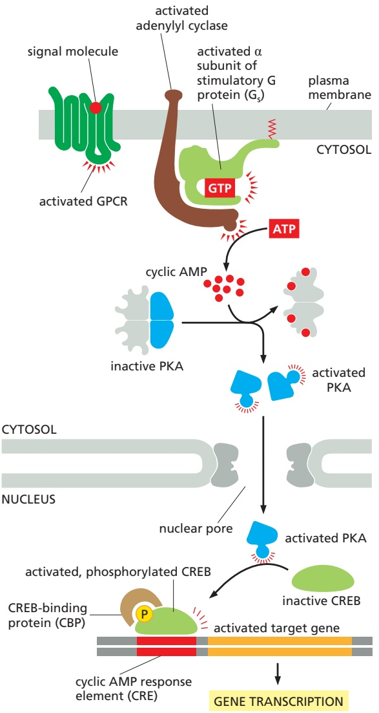

Figure 15–28 How a rise in intracellular cyclic AMP concentration can alter gene transcription. The binding of an extracellular signal molecule to its GPCR activates adenylyl cyclase via $\mathbb { G } _ { \mathrm { S } }$ and thereby increases cAMP concentration in the cytosol. This rise activates PKA, and the released catalytic subunits of PKA can then enter the nucleus, where they phosphorylate the transcription regulatory protein CREB. Once phosphorylated, CREB recruits the coactivator CBP, which stimulates gene transcription. In some cases, the inactive CREB protein is bound to the cyclic AMP response element (CRE) in DNA before it is phosphorylated (not shown). See Movie 15.2.

<table><tbody><tr><td colspan="3">TABLE 15-2 Some Cell Responses in Which GPCRs Activate PLCβ</td></tr><tr><td>Target tissue</td><td>Signal molecule</td><td>Major response</td></tr><tr><td>Liver</td><td>Vasopressin</td><td>Glycogen breakdown</td></tr><tr><td>Pancreas</td><td>Acetylcholine</td><td>Amylase secretion</td></tr><tr><td>Smooth muscle</td><td>Acetylcholine</td><td>Muscle contraction</td></tr><tr><td>Blood platelets</td><td>Thrombin</td><td>Platelet aggregation</td></tr></tbody></table>

#### Some G Proteins Signal Via Phospholipids

Many GPCRs exert their effects through G proteins that activate the plasmamembrane-bound enzyme **phospholipase C-b (PLCb)**. **Table** $1 5 { - } 2$ lists some examples of responses activated in this way. The phospholipase acts on a phosphorylated inositol phospholipid (a phosphoinositide) called **phosphatidylinositol 4,5-bisphosphate [PI(4,5)P**<strong>2</strong>**]**, which is present in small amounts in the inner half of the plasma membrane lipid bilayer (**Figure 15–29**). Receptors that activate this **inositol phospholipid signaling pathway** do so primarily through a G protein called $\mathbf { G } _ { \mathbf { q } } ,$ which activates phospholipase $C - \beta$ in much the same way that $\mathbf { G } _ { \mathrm { s } }$ activates adenylyl cyclase. The activated phospholipase then cleaves the $\mathrm { P I ( 4 , } 5 \mathrm { ) P _ { 2 } }$ to generate two products: **inositol** 1,4,5-trisphosphate $( \mathbf { I P _ { 3 } } )$ and **diacylglycerol**. At this step, the signaling pathway splits into two branches.

$\mathrm { I P _ { 3 } }$ is a water-soluble molecule that leaves the plasma membrane and diffuses through the cytosol to the endoplasmic reticulum (ER), where it binds $\mathbf { I P _ { 3 } }$ receptors in the ER membrane. The $\mathrm { I P } _ { 3 }$ receptor is a large transmembrane $\mathrm { C a ^ { 2 + } }$ channel that is closed in the absence of $\mathrm { I P _ { 3 } , I P _ { 3 } }$ binding triggers a conformational change that exposes a high-affinity $\mathrm { C a ^ { 2 + } }$ **-**binding site. Although the cytosolic $\mathrm { C a ^ { 2 + } }$ concentration in the unstimulated cell is low $( { \sim } 1 0 ^ { - 7 } \mathrm { ~ M } ) _ { , }$ , it is sufficient to promote $\mathrm { C a ^ { 2 + } }$ binding to some $\mathrm { I P _ { 3 } }$ receptors. The simultaneous binding of $\mathrm { I P _ { 3 } }$ and $\mathrm { C a ^ { 2 + } }$ to an $\mathrm { I P _ { 3 } }$ receptor opens the recep**tor** $\mathrm { C a ^ { 2 + } }$ channel. $\mathrm { C a ^ { 2 + } }$ stored in the ER is released and binds to other $\mathrm { I P _ { 3 } }$ -bound receptors to cause widespread channel opening. As

inositol 1,4,5-trisphosphate (IP3)

Figure 15–29 The hydrolysis of PI(4,5)P2 by phospholipase C-b. Two second messengers are produced directly from the hydrolysis of PI(4,5)P2: inositol $^ { 1 , 4 }$ ,5-trisphosphate (IP3), which diffuses through the cytosol and releases $\mathrm { C a ^ { 2 + } }$ from the endoplasmic reticulum, and diacylglycerol, which remains in the membrane and helps to activate protein kinase C (PKC; see Figure 15–30). There are several classes of phospholipase C: these include the β class, which is activated by GPCRs; as we see later, the γ class is activated by a class of enzymecoupled receptors called receptor tyrosine kinases (RTKs).

a result, the concentration of cytosolic $\mathrm { C a ^ { 2 + } }$ rises 10- to 20-fold (**Figure 15–30**). The increase in cytosolic $\mathrm { C a ^ { 2 + } }$ propagates the signal by influencing the activity of $\mathrm { C a ^ { 2 + } }$ -sensitive intracellular proteins, as we describe shortly.

At the same time that the $\mathrm { I P _ { 3 } }$ produced by the hydrolysis of $\mathrm { P I ( 4 , } 5 \mathrm { ) P _ { 2 } }$ is increasing the concentration of $\mathrm { C a ^ { 2 + } }$ in the cytosol, the other cleavage product of the $\mathrm { P I } ( 4 , 5 ) \mathrm { P _ { 2 } } ,$ diacylglycerol, is exerting different effects. It also acts as a second messenger, but it remains embedded in the plasma membrane, where it has several potential signaling roles. One of its major functions is to activate a proteinMBoC7 m15.29/15.30 kinase called protein kinase C (PKC), so named because it is $\mathrm { C a ^ { 2 + } }$ -dependent. The initial rise in cytosolic $\mathrm { C a ^ { 2 + } }$ induced by $\mathrm { I P _ { 3 } }$ alters the PKC so that it translocates from the cytosol to the cytoplasmic face of the plasma membrane. There it is activated by the combination of $\mathbf { \bar { C } } \mathbf { a } ^ { 2 + }$ , diacylglycerol, and the negatively charged membrane phospholipid phosphatidylserine (see Figure 15–30). Once activated, PKC phosphorylates target proteins that vary depending on the cell type. The principles are the same as discussed earlier for PKA, although most of the target proteins are different.

Diacylglycerol can be further cleaved to release arachidonic acid, which can either act as a signal in its own right or be used in the synthesis of other small lipid signal molecules called eicosanoids. Most vertebrate cell types make eicosanoids, including prostaglandins, which have many biological activities. They participate in pain and inflammatory responses, for example, and many anti-inflammatory drugs (such as aspirin, ibuprofen, and cortisone) act in part by inhibiting their synthesis.

#### $\mathbb { C } \mathbb { a } ^ { 2 + }$ Functions as a Ubiquitous Intracellular Mediator

Many extracellular signals, and not just those that work via $\mathrm { G }$ proteins, trigger an increase in cytosolic $\mathbf { \tilde { C } } \mathbf { a } ^ { 2 + }$ concentration. In muscle cells, $\mathrm { C a ^ { \hat { 2 + } } }$ triggers contraction, and in many secretory cells, including nerve cells, it triggers secretion. $\mathrm { C a ^ { 2 + } }$ has numerous other functions in a variety of cell types. $\mathrm { C a ^ { 2 ^ { + } } }$ is such an effective signaling mediator because its concentration in the cytosol is normally very low $( \bar { \sim } 1 0 ^ { - 7 }   \mathrm { \bar { M } } )$ , whereas its concentration in the extracellular fluid $( { \sim } 1 0 ^ { - 3 }   \mathrm { M } )$ and in the lumen of the ER [and sarcoplasmic reticulum (SR) in muscle] is high. Thus, there is a large gradient tending to drive $\mathrm { C a ^ { 2 + } }$ into the cytosol across both the plasma membrane and the ER or SR membrane. When a signal transiently opens $\bar { \mathrm { C a } } ^ { 2 + }$ channels in these membranes, $\mathrm { C a ^ { 2 + } }$ rushes into the cytosol, and the resulting increase in the local $\mathrm { C a ^ { 2 + } }$ concentration activates $\mathrm { C a ^ { 2 + } }$ -responsive proteins in the cell.

Some stimuli, including membrane depolarization, membrane stretch, and certain extracellular signals, activate $\mathrm { C a ^ { 2 + } }$ channels in the plasma membrane, resulting in $\mathrm { C a ^ { 2 + } }$ influx from outside the cell. Other signals, including the GPCR-mediated

Figure 15–30 How GPCRs increase cytosolic $\mathbf { C a } ^ { 2 + }$ and activate protein kinase C. The activated GPCR stimulates the plasma-membrane-bound phospholipase C-β (PLCβ) via a G protein called $\mathbb { G } _ { \mathbb { Q } } .$ The α subunit and βγ complex of $\mathsf { G } _ { \mathsf { Q } }$ are both involved in this activation. Two second messengers are produced when $\mathsf { P } | ( 4 { , } 5 ) \mathsf { P } _ { 2 }$ is hydrolyzed by activated PLC. Inositol 1,4,5-trisphosphate (IP3) diffuses through the cytosol and releases $\mathrm { C a ^ { 2 + } }$ from the ER by binding to and opening IP3-gated $\dot { \mathrm { C a } } ^ { 2 - }$ -release channels $\mathbb { ( P _ { 3 } }$ receptors) in the ER membrane (opening of these channels also requires binding of $\mathrm { C a ^ { 2 + } }$ , not shown). The large electrochemical gradient for $\mathrm { C a ^ { 2 + } }$ across this membrane causes $\mathrm { C a ^ { 2 + } }$ to escape into the cytosol when the release channels are opened. Diacylglycerol remains in the plasma membrane and, together with phosphatidylserine (not shown) and $\mathsf { C a } ^ { 2 + }$ helps to activate protein kinase $$\textsf { C } ( \mathsf { P K C } ) ,$$ which is recruited from the cytosol to the cytosolic face of the plasma membrane. Of the 10 or more distinct isoforms of PKC in humans, at least 4 are activated by diacylglycerol (Movie 15.3).

signals described earlier, act primarily through $\mathrm { I P _ { 3 } }$ receptors to stimulate $\mathrm { C a ^ { 2 + } }$ release from intracellular stores in the ER (see Figure 15–30). The ER membrane also contains a second type of regulated $\mathrm { C a ^ { \vec { 2 + } } }$ channel called the ryanodine recep**tor** (so called because it is sensitive to the plant alkaloid ryanodine), which opens in response to rising $\mathrm { C a ^ { 2 + } }$ levels and thereby amplifies the $\mathrm { C a ^ { 2 + } }$ signal.

Several mechanisms rapidly terminate the $\bar { \mathrm { C a } } ^ { 2 + }$ signal and are also responsible for keeping the concentration of $\mathrm { C a ^ { 2 + } }$ in the cytosol low in resting cells. Most important, there are $\mathrm { C a ^ { 2 + } }$ -pumps in the plasma membrane and the ER membrane that use the energy of ATP hydrolysis to pump $\mathrm { C a ^ { 2 + } }$ out of the cytosol. Cells such as muscle and nerve cells, which make extensive use of $\mathrm { C a ^ { 2 + } }$ signaling, have an additional $\mathrm { C a ^ { 2 + } }$ transporter (an $\mathrm { N a } ^ { + }$ -driven $\mathrm { C a ^ { 2 + } }$ exchanger) in their plasma membrane that couples the efflux of $\mathrm { C a ^ { 2 + } }$ to the influx of $\mathrm { { N a } ^ { + } }$

#### Feedback Generates $\mathbb { C } \mathbb { a } ^ { 2 + }$ Waves and Oscillations

The $\mathrm { I P _ { 3 } }$ receptors and ryanodine receptors of the ER membrane have an important feature: they are both stimulated by low to moderate cytoplasmic $\mathrm { C a ^ { 2 + } }$ concentrations. This $C a ^ { 2 + }$ -induced calcium release (CICR) results in positive feedback, which has a major impact on the properties of the $\mathrm { C a ^ { 2 + } }$ signal. The importance of this feedback is seen clearly in studies with $\mathrm { C a ^ { 2 + } }$ -sensitive fluorescent indicators, such as aequorin or fura-2, which allow researchers to monitor cytosolic $\mathrm { C a ^ { 2 + } }$ in individual cells under a microscope (**Figure 15–31** and **Movie 15.4**).

When cells carrying a $\mathrm { C a ^ { 2 + } }$ indicator are treated with a small amount of an extracellular signal molecule that stimulates a small increase in the concentration of cytosolic $\mathrm { I P _ { 3 } } ,$ tiny bursts of $\mathrm { C a ^ { 2 + } }$ are seen in one or more discrete regions of the cell. These $\mathrm { C a ^ { 2 + } }$ puffs or sparks reflect the local opening of small numbers of $\mathrm { I P _ { 3 } }$ receptors in the ER membrane that have bound both $\mathrm { I P _ { 3 } }$ and $\mathrm { C a ^ { 2 + } }$ , the concentrations of which are too low to bind to all of these receptors. Because various $\mathrm { C a ^ { 2 + } }$ -binding proteins and $\mathrm { C a ^ { 2 + } }$ -pumps restrict the diffusion of $\mathrm { C a ^ { 2 + } }$ , the $\mathrm { C a ^ { 2 + } }$ signal often remains localized to the site where the $\mathrm { C a ^ { 2 + } }$ entered the cytosol. If the extracellular signal is stronger, however, $\mathrm { I P _ { 3 } }$ rises to a higher concentration and binds many of its receptors, although the low $\mathrm { C a ^ { 2 + } }$ concentration still limits the activation of these receptors to some extent. Nevertheless, a local burst of $\mathrm { C a ^ { 2 + } }$ release can now spread more easily to neighboring $\mathrm { I P _ { 3 1 } }$ -bound receptors and activate them, resulting in a regenerative wave of $\mathrm { C a ^ { 2 + } }$ release that moves through the cytosol (**Figure 15–32**), much like the spreading of an action potential along the membrane of an axon (see Figure 11–33). The presence of $\bar { \mathrm { C a } ^ { 2 + } }$ -stimulated ryanodine receptors in the ER membrane further enhances the positive feedback.

In addition to being regulated by positive feedback, $\mathrm { I P _ { 3 } }$ receptors and ryanodine receptors are also regulated by negative feedback, in that they are inhibited by high $\hat { \mathrm { C a } } ^ { 2 + }$ concentrations. Thus, the rise in $\mathrm { C a ^ { 2 + } }$ in a stimulated cell leads eventually to inhibition of $\mathrm { C a ^ { 2 + } }$ release. Because $\mathrm { C a ^ { 2 + } }$ -pumps remove the $\mathrm { C a ^ { 2 + } }$ the $\mathrm { C a ^ { 2 + } }$ concentration in the cytosol falls (see Figure $^ { 1 5 - 3 2 ) }$ . The decline in $\mathrm { C a ^ { 2 + } }$ eventually relieves the negative feedback, allowing cytosolic $\mathrm { C a ^ { 2 + } }$ to rise again. As in other cases of delayed negative feedback (see Figure 15–19), this sequence of events leads to oscillations in the $\mathrm { C a ^ { 2 + } }$ concentration, which persist as long as cell-surface receptors are activated. The frequency of the oscillations reflects the

10 sec

time 0 sec

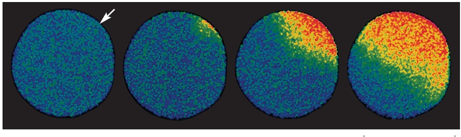

Figure 15–31 The fertilization of an egg by a sperm triggers a wave of cytosolic $\dot { \mathsf { C a } ^ { 2 + } }$ . This sea star egg was injected with o $\mathsf { a }   \mathsf { C a } ^ { 2 + }$ -sensitive fluorescent dye before it was fertilized. A wave of cytosolic $\mathrm { C a ^ { 2 + } }$ (red and yellow), caused by $\mathrm { { \tilde { C } } a ^ { 2 + } }$ release from the ER, sweeps across the egg from the site of sperm entry (arrow). This $\mathrm { C a ^ { 2 + } }$ wave changes the egg cell surface, preventing the entry of other sperm, and it also initiates embryonic development (Movie 15.5). The initial increase in $\mathrm { C a ^ { 2 + } }$ is thought to be caused by a sperm-specific form of PLC (PLCζ) that the sperm brings into the egg cytoplasm when it fuses with the egg; the PL $\textcircled { C } \zeta$ cleaves PI(4,5)P2 to produce $\mathbb { P } _ { 3 } ,$ which releases $\dot { \mathrm { C a } ^ { 2 - } }$ from the egg ER. The released $\mathrm { C a ^ { 2 + } }$ stimulates further $\mathrm { C a ^ { 2 + } }$ release from the ER, producing the spreading wave, as we explain in Figure 15–32. (Courtesy of Stephen Stricker.)

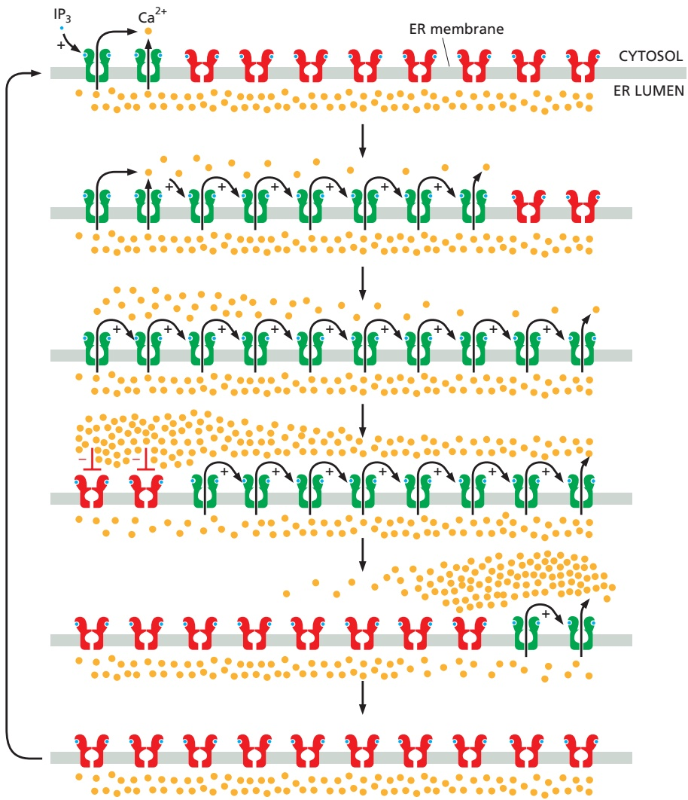

strength of the extracellular stimulus (**Figure 15–33**). The frequency and amplitude of oscillations can also be modulated by other signaling mechanisms, such as phosphorylation, which influence the $\dot { \mathrm { C a } ^ { 2 + } }$ sensitivity of $\mathrm { C a ^ { 2 + } }$ channels or affect other components in the signaling system.MBoC7 m15.31/15.32

The frequency of $\mathrm { C a ^ { 2 + } }$ oscillations can be translated into a frequencydependent cell response. In some cases, the frequency-dependent response itself is also oscillatory: in hormone-secreting pituitary cells, for example, stimulation by an extracellular signal induces repeated $\dot { \mathrm { C a } ^ { 2 + } }$ spikes, each of which

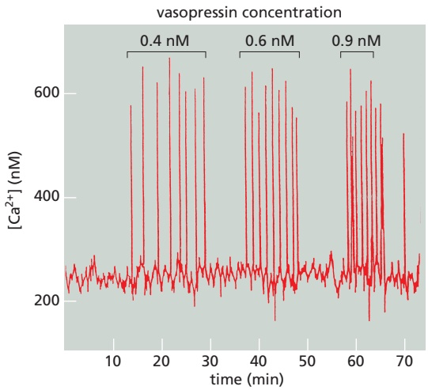

Figure 15–32 Positive and negative feedback produce cytosolic $\mathbf { \bar { C } } \mathbf { a } ^ { 2 + }$ waves and oscillations. This diagram shows $\mathbb { P } _ { 3 }$ receptors on a portion of the ER membrane: active receptors are shown in green, inactive receptors in red, $\mathrm { C a ^ { 2 + } }$ in orange, and $\mathbb { P } _ { 3 }$ in blue. When cytosolic $\mathbb { P } _ { 3 }$ rises to high levels in response to a strong extracellular signal, it occupies most $\mathbb { P } _ { 3 }$ receptors on the ER membrane. A few $\mathbb { P } _ { 3 ^ { - } }$ bound receptors are then activated by the low amount of cytosolic $\mathrm { C a ^ { 2 + } }$ that is present in the unstimulated cell. The local release of $\mathrm { C a ^ { 2 + } }$ by an activated receptor cluster (top) promotes the opening of nearby $\overline { { \mathbb { P } _ { 3 } ^ { \prime } } }$ receptors (and ryanodine receptors, not shown), resulting in more $\mathrm { C a ^ { 2 + } }$ release. This positive feedback (indicated by positive signs) produces a regenerative wave of $\tilde { \mathrm { C a } ^ { 2 + } }$ release that spreads across the cell (see Figure 15–31). These waves of $\mathrm { C a ^ { 2 + } }$ release move more quickly across the cell than would be possible by simple diffusion. Also, unlike a diffusing burst of $\mathrm { C a ^ { 2 + } }$ ions, which will become more dilute as it spreads, the regenerative wave produces a high $\mathrm { C a ^ { 2 + } }$ concentration across the entire cell. When it reaches high concentrations, $\mathrm { C a ^ { 2 + } }$ inactivates $\dot { \mathrm { { | \bar { P } _ { 3 } } } }$ receptors and ryanodine receptors (middle; indicated by red negative signs), shutting down the $\mathrm { C a ^ { 2 + } }$ release. $\mathrm { C a ^ { 2 - } }$ +-pumps reduce the local cytosolic $\mathrm { C a ^ { 2 + } }$ concentration to its low resting levels. The result is a cytosolic $\mathrm { C a ^ { 2 + } }$ pulse: positive feedback drives a rapid rise in cytosolic $\mathrm { C a ^ { 2 + } }$ , and negative feedback sends it back down again. The $\mathrm { C a ^ { 2 + } }$ channels remain refractory to further stimulation for some period of time, delaying the generation of another $\mathrm { C a ^ { 2 + } }$ spike (bottom). Eventually, however, the negative feedback wears off, allowing $\mathbb { P } _ { 3 }$ to trigger another $\mathrm { C a ^ { 2 + } }$ wave. The end result is repeated $\mathsf { C a } ^ { 2 + }$ oscillations (see Figure 15–33). Under some conditions, these oscillations can be seen as repeating narrow waves of $\mathrm { C a ^ { 2 + } }$ moving across the cell.

Figure 15–33 Vasopressin-induced cytosolic $\mathbf { C a } ^ { 2 + }$ oscillations in a liver cell. The cell was loaded with the $\mathsf { C a } ^ { 2 + } \cdot$ sensitive protein aequorin and then exposed to increasing concentrations of the peptide signal molecule vasopressin, which activates a GPCR and thereby PLCβ (see Table 15–2). Note that the frequency of the $\mathrm { C a ^ { 2 + } }$ spikes increases with an increasing concentration of vasopressin but that the amplitude of the spikes is not affected. Each spike lasts about 7 seconds. (Adapted from N.M. Woods et al., Nature 319:600–602, published 1986 by Nature Publishing Group. Reproduced with permission of SNCSC.)

is associated with a burst of hormone secretion. In other cases, the frequency-dependent response is non-oscillatory: in some types of cells, for instance, one frequency of $\mathrm { C a ^ { 2 + } }$ spikes activates the transcription of one set of genes, while a higher frequency activates the transcription of a different set. How do cells sense the frequency of $\mathrm { C a ^ { 2 + } }$ spikes and change their response accordingly? The mechanism presumably depends on $\mathrm { C a ^ { 2 + } }$ -sensitive proteins that change their activity as a function of $\dot { \mathrm { C a } ^ { 2 - } }$ +-spike frequency. A protein kinase that acts as a molecular memory device seems to have this remarkable property, as we discuss next.

#### Ca2+/Calmodulin-dependent Protein Kinases Mediate Many Responses to $\mathbb { C } \mathbb { a } ^ { 2 + }$ Signals

Various $\mathrm { C a ^ { 2 + } }$ -binding proteins help to relay the cytosolic $\mathrm { C a ^ { 2 + } }$ signal. The most important is **calmodulin**, which is found in all eukaryotic cells and can constitute as much as 1% of a cell’s total protein mass. Calmodulin functions as a multi-purpose intracellular $\mathrm { C a ^ { 2 + } }$ receptor, governing many $\mathrm { C a ^ { 2 + } }$ -regulated processes. It consists of a highly conserved, single polypeptide chain with four high-affinity $\mathrm { C a ^ { 2 + } }$ -binding sites (Figure 15–34A). When it binds to $\mathrm { C a ^ { 2 + } }$ , it undergoes an activating conformational change. Because two or more $\mathrm { C a ^ { 2 + } }$ ions must bind before calmodulin adopts its active conformation, the protein displays a sigmoidal response to increasing concentrations of $\mathrm { C a ^ { 2 + } }$ (see Figure 15–17).

The allosteric activation of calmodulin by $\mathrm { C a ^ { 2 + } }$ is analogous to the activation of PKA by cyclic AMP, except that the active $\mathrm { C a ^ { 2 + } }$ /calmodulin complex has no enzymatic activity itself but instead acts by binding to and activating other proteins. In some cases, calmodulin serves as a permanent regulatory subunit of an enzyme complex, but usually the binding of $\mathbf { \bar { C } } \mathbf { a } ^ { 2 + }$ instead enables calmodulin to bind to various target proteins in the cell to alter their activity.

When $\mathrm { C a ^ { 2 + } }$ /calmodulin binds to its target protein, the calmodulin further changes its conformation, the nature of which depends on the specific target protein (Figure 15–34B). Among the many targets calmodulin regulates are enzymes and membrane transport proteins. As one example, $\mathrm { C a ^ { 2 + } }$ /calmodulin binds to and activates the plasma membrane $\mathrm { C a ^ { 2 + } }$ -pump that uses ATP hydrolysis to pump $\mathrm { C a ^ { 2 + } }$ out of cells. Thus, whenever the concentration of $\mathrm { C a ^ { 2 + } }$ in the cytosol rises, the pump is activated, which helps to return the cytosolic $\mathrm { C a ^ { 2 + } }$ level to resting levels.

Many effects of $\mathrm { C a ^ { 2 + } }$ , however, are more indirect and are mediated by protein phosphorylations catalyzed by a family of protein kinases called $\mathbf { C a } ^ { 2 + }$ /calmodulin**dependent kinases (CaM-kinases)**. Some CaM-kinases phosphorylate transcription regulators, such as the CREB protein (see Figure 15–28), and in this way activate or inhibit the transcription of specific genes.

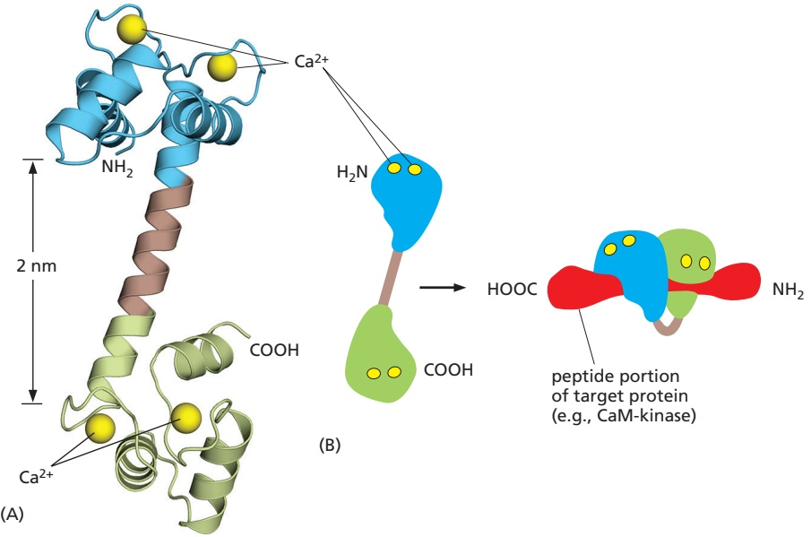

Figure 15–34 The structure of $\mathbf { C a } ^ { 2 + } /$ calmodulin. (A) The molecule has a dumbbell shape, with two globular ends, which can bind to many different target proteins. The globular ends are connected by a long, exposed α helix, which allows the protein to adopt a number of different conformations, depending on the target protein it interacts with. Each globular head has two $\mathrm { C a ^ { 2 + } }$ -binding sites (Movie 15.6). (B) Shown is the major structural change that occurs in $\mathrm { C a ^ { 2 + } }$ /calmodulin when it binds to a target protein (in this example, a peptide that consists of the $\mathsf { C a } ^ { 2 + } /$ calmodulin-binding domain of a $\mathsf { C a ^ { 2 + } } /$ calmodulin-dependent protein kinase). Note that the $\dot { \mathrm { C } } \mathrm { a } ^ { 2 + } /$ calmodulin has folded to surround the peptide. When it binds to other targets, it can adopt different conformations. (A, PDB code: 1CLL; B, PDB codes: 1CDL and 2BBM.)

One of the best-studied CaM-kinases is **CaM-kinase II**, which is found in most animal cells but is especially enriched in the nervous system. It constitutes up to 2% of the total protein mass in some regions of the brain, and it is highly concentrated in synapses. CaM-kinase II has several remarkable properties. To begin with, it has a spectacular quaternary structure: twelve copies of the enzyme are assembled into a stacked pair of rings, with kinase domains on the outside linked to a central hub (**Figure 15–35**). This structure helps the enzyme function as a

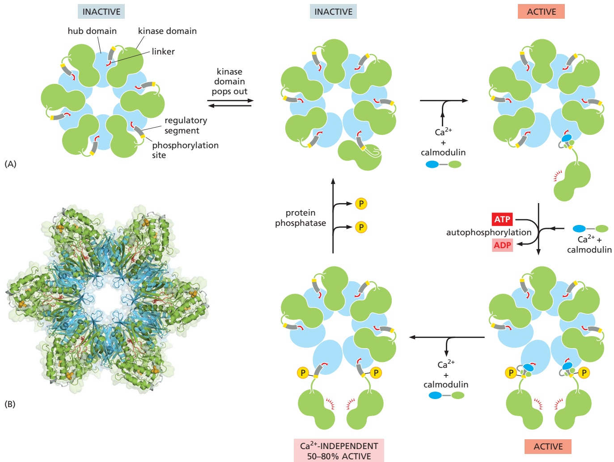

Figure 15–35 The stepwise activation of CaM-kinase II. (A) Each CaM-kinase II protein has two major domains: an amino-terminal kinase domain (green) and a carboxyl-terminal hub domain (blue), linked by a regulatory segment. Six CaM-kinase II proteins are assembled into a giant ring in which the hub domains interact tightly to produce a central structure that is surrounded by kinase domains. The complete enzyme contains two stacked rings, for a total of 12 kinase proteins, but only one ring is shown here for clarity. When the enzyme is inactive, the ring exists in a dynamic equilibrium between two states. The first (upper left) is a compact state, in which the kinase domains interact with the hub domains, so that the regulatory segments are buried in the kinase active sites and thereby block catalytic activity. In the second inactive state (upper middle), a MBoC7 m15.34/1kinase domain has popped out and is linked to its hub domain by its $r _ { \mathrm { { } } } { } _ { \mathrm { { } } } \mathrm { { } } _ { \mathrm { { } } } \mathrm { { } } _ { \mathrm { { } } }$ ulatory segment, which continues to inhibit the kinase domain but is now accessible to $\mathrm { C a ^ { 2 + } }$ /calmodulin. If present, $\mathrm { C a ^ { 2 + } }$ /calmodulin will bind the regulatory segment and prevent it from inhibiting the kinase, thereby locking the kinase in an active state (upper right). If the adjacent kinase domain also pops out from the hub, it will also be activated by $\mathrm { C a ^ { 2 + } }$ /calmodulin, and the two kinase domains will then phosphorylate each other on their regulatory segments (lower right). This autophosphorylation further activates the enzyme. It also prolongs the activity of the enzyme in two ways. First, it traps the bound $\dot { \mathrm { C a } } ^ { 2 + }$ /calmodulin so that it does not dissociate from the enzyme until cytosolic $\mathrm { C a } ^ { \tilde { 2 } + }$ levels return to basal values for at least 10 seconds (not shown). Second, it converts the enzyme to a $\mathrm { C a ^ { 2 + } }$ -independent form, so that the kinase remains active even after the $\mathrm { C a ^ { 2 + } }$ /calmodulin dissociates from it (lower left). This activity continues until the action of a protein phosphatase overrides the autophosphorylation activity of CaM-kinase II. (B) This model of the enzyme is based on x-ray crystallography analysis of the CaM-kinase II dodecamer.

The remarkable dodecameric structure of the enzyme allows it to achieve a broad range of intermediate activity states in response to different $\mathrm { C a ^ { 2 + } }$ oscillation frequencies: higher frequencies tend to cause more subunits in the enzyme to reach the phosphorylated active state (see Figure 15–36). The behavior of CaM-kinase II is also controlled by the length of the linker segment between the kinase and hub domains. The linker is longer in some isoforms of the enzyme; in these isoforms, the kinase domains tend to pop out of the ring more frequently, making it more sensitive to $\mathrm { C a ^ { 2 + } }$ . These and other mechanisms allow the cell to tailor the responsiveness of the enzyme to the needs of different types of neurons. $( \mathsf { A } ,$ adapted from L.H. Chao et al., Cell 146:732–745, 2011; B, PDB code: 3SOA.)

molecular memory device, switching to an active state when exposed to $\mathrm { C a ^ { 2 + } / }$ calmodulin and then remaining active even after the $\mathrm { C a ^ { 2 + } }$ signal has decayed. This is because adjacent kinase subunits can phosphorylate each other (a process called autophosphorylation) when $\mathrm { C a ^ { 2 + } }$ /calmodulin activates them (Figure 15–35). Once a kinase subunit is autophosphorylated, it remains activeMBoC7 m15.35/15.36 even in the absence of $\mathrm { C a ^ { 2 + } }$ , thereby prolonging the duration of the kinase activity beyond that of the initial activating $\hat { \mathrm { C a } } ^ { 2 + }$ signal. The enzyme maintains this activity until a protein phosphatase removes the autophosphorylation and shuts the kinase off. CaM-kinase II activation can thereby serve as a memory trace of a prior $\mathrm { C a ^ { 2 + } }$ pulse, and it seems to have a role in some types of memory and learning in the vertebrate brain. Mutant mice that lack a brain-specific form of the enzyme have specific defects in their ability to remember where things are.

#### Some G Proteins Directly Regulate Ion Channels

Another remarkable property of CaM-kinase II is that the enzyme can use its intrinsic memory mechanism to decode the frequency of $\mathrm { C a ^ { 2 + } }$ oscillations. When CaM-kinase II is exposed to both a protein phosphatase and repetitive pulses of $\mathrm { C a ^ { 2 + } }$ /calmodulin at different frequencies that mimic those observed in stimulated cells, the enzyme’s activity increases steeply as a function of pulse frequency (**Figure 15–36**). This property is thought to be especially important at a nerve cell synapse, where changes in intracellular $\mathrm { C a ^ { 2 + } }$ levels in a postsynaptic cell as a result of neural activity can lead to long-term changes in the subsequent effectiveness of that synapse (discussed in Chapter 11).

G proteins do not act exclusively by regulating the activity of membrane-bound enzymes that alter the concentration of cyclic AMP or $\dot { \mathrm { C a } ^ { 2 + } }$ in the cytosol. The α subunit of one type of G protein (called $G _ { I 2 } )$ , for example, activates a guanine nucleotide exchange factor that activates a monomeric GTPase of the Rho family (discussed later and in Chapter 16), which regulates the actin cytoskeleton.

In some other cases, G proteins directly activate or inactivate ion channels in the plasma membrane of the target cell, thereby altering the membrane’s ion permeability, and hence its electrical excitability. As an example, acetylcholine released by the vagus nerve reduces the heart rate (see Figure 15–5B). This effect is mediated by a special class of acetylcholine receptors that activate the $\mathrm { G _ { i } }$ protein discussed earlier. Once activated, the α subunit of $\mathrm { G _ { i } }$ inhibits adenylyl cyclase (as described previously), while the $\beta \gamma$ subunits bind to $\mathrm { K } ^ { + }$ channels in the plasma membrane of the heart muscle cell and open them. The opening of these $\mathrm { K } ^ { + }$ channels makes it harder to depolarize the cell and thereby contributes to the inhibitory effect of acetylcholine on the heart. (These acetylcholine receptors, which can be activated by the fungal alkaloid muscarine, are called

Figure 15–36 CaM-kinase II as a frequency decoder of $\mathbf { C } \mathbf { a } ^ { 2 + }$ oscillations. (A) At low frequencies of $^ { \ast } \mathsf { C a } ^ { 2 + }$ spikes, the enzyme becomes inactive after each spike, as the autophosphorylation induced by $\mathrm { C a ^ { 2 + } }$ /calmodulin binding does not maintain the enzyme’s activity long enough for the enzyme to remain active until the next $\mathrm { C a ^ { 2 + } }$ spike arrives. (B) At higher spike frequencies, however, the enzyme fails to inactivate completely between $\mathrm { C a ^ { 2 + } }$ spikes, so its activity ratchets up with each spike. If the spike frequency is high enough, this progressive increase in enzyme activity will continue until the enzyme is autophosphorylated on all subunits and is therefore maximally activated. Although not shown, once enough of its subunits are autophosphorylated, the enzyme can be maintained in a highly active state even with a relatively low frequency of $\mathrm { C a ^ { 2 + } }$ spikes—a form of cell memory. The binding of $\mathsf { C a } ^ { 2 + } ,$ /calmodulin to the enzyme is enhanced by the CaM-kinase II autophosphorylation (an additional form of positive feedback), helping to generate a more switchlike response to repeated $\mathrm { C a ^ { 2 + } }$ spikes. (From P.I. Hanson et al., Neuron 12:943–956, 1994. With permission from Elsevier.)

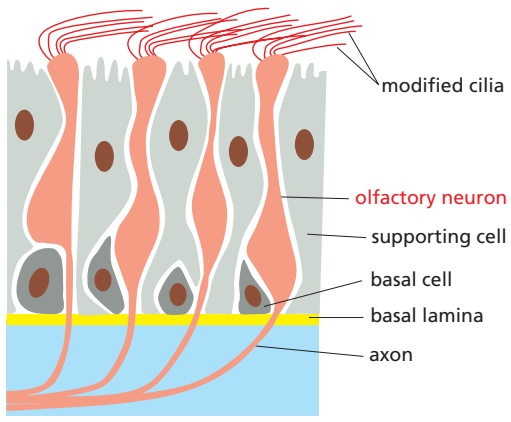

(A)

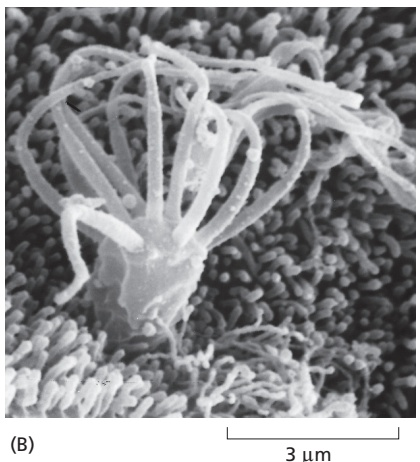

3 µm

Figure 15–37 Olfactory receptor neurons. (A) A simplified drawing of a section of olfactory epithelium in the nose. Olfactory receptor neurons possess modified cilia, which project from the surface of the epithelium and contain the olfactory receptors, as well as the signal transduction machinery. The axon, which extends from the opposite end of the receptor neuron, conveys electrical signals to the brain when an odorant activates the cell to produce an action potential. In rodents, at least, the basal cells act as stem cells, producing new receptor neurons throughout life, to replace the neurons that die. (B) A scanning electron micrograph of the cilia on the surface of a human olfactory neuron. (B, from E.E. Morrison and R.M. Costanzo, J. Comp. Neurol. 297:1–13, 1990. With permission from Wiley-Liss.)

muscarinic acetylcholine receptors to distinguish them from the very different nicotinic acetylcholine receptors, which are ion-channel-coupled receptors on skeletal muscle and nerve cells that can be activated by the binding of nicotine, as well as by acetylcholine.)

Other G proteins regulate the activity of ion channels less directly, either by stimulating channel phosphorylation (by PKA, PKC, or CaM-kinase, for example)MBoC5 m15.36/15.37 or by causing the production or destruction of cyclic nucleotides that directly activate or inactivate ion channels. These cyclic-nucleotide-gated ion channels have a crucial role in both smell (olfaction) and vision, as we now discuss.

#### Smell and Vision Depend on GPCRs That Regulate Ion Channels

Humans can distinguish more than 10,000 distinct smells, which they detect using specialized olfactory receptor neurons in the lining of the nose. These cells use specific GPCRs called **olfactory receptors** to recognize odors; the receptors are displayed on the surface of the modified cilia that extend from each olfactory neuron (**Figure 15–37**). The receptors act by increasing cAMP; when stimulated by odorant binding, they activate an olfactory-specific G protein (known as Golf), which in turn activates adenylyl cyclase. The resulting increase in cAMP opens cyclic-AMP-gated cation channels, thereby allowing an influx of Na+, which depolarizes the plasma membrane of the olfactory receptor neuron and initiates a nerve impulse that travels along its axon to the brain.

There are about 1000 different olfactory receptors in a mouse and about 350 in a human, each encoded by a different gene and each recognizing a different set of odorants. Each olfactory receptor neuron produces only one of these receptors; the neuron responds to a specific set of odorants by means of the specific receptor it displays, and each odorant activates its own characteristic set of olfactory receptor neurons. The same receptor also helps direct the elongating axon of each developing olfactory neuron to the specific target neurons that it will connect to in the brain. A different set of GPCRs acts in a similar way in some vertebrates to mediate responses to pheromones, chemical signals detected in a different part of the nose that are used in communication between members of the same species. Humans, however, are thought to lack functional pheromone receptors.

Vertebrate vision employs a similarly elaborate, highly sensitive, signaldetection mechanism that uses cyclic-nucleotide-gated cation channels, but the crucial cyclic nucleotide is **cyclic GMP** (**Figure 15–38**) rather than cAMP. As with cAMP, continual rapid synthesis (by guanylyl cyclase) and rapid degradation (by cyclic GMP phosphodiesterase) control the concentration of cyclic GMP. However, the light-activated GPCR in this system does not stimulate guanylyl cyclase and raise cyclic GMP levels; instead, it stimulates cyclic GMP phosphodiesterase, resulting in decreased cyclic GMP levels and thus decreased cation channel opening.

The visual signaling system has been especially well studied in **rod photoreceptors (rods)** in the vertebrate retina. Rods are responsible for noncolor vision in dim light, whereas **cone photoreceptors (cones)** are responsible for color vision in bright light. Both types of photoreceptors are highly specialized cells with outer and inner segments, a cell body, and a synaptic region where the photoreceptor passes a chemical signal to a retinal neuron (**Figure 15–39**). After a network of retinal neurons processes the signals, the axons of a subset of the neurons transmit the signals to the brain.

Figure 15-38 Cyclic GMP.

The phototransduction apparatus is in the outer segment of the rod, which contains a stack of discs, each formed by a closed sac of membrane that is densely packed with a photosensitive GPCR called **rhodopsin**. The plasma membrane surrounding the outer segment contains cyclic-GMP-gated cation channels. Cyclic GMP bound to these channels keeps them open in the dark. Lightinduced activation of rhodopsin molecules in the disc membrane decreases the cytosolic cyclic GMP concentration and closes the cation channels in the plasma membrane (**Figure 15–40**). Thus, light causes hyperpolarization (a more negative membrane potential—discussed in Chapter 11), which inhibits synaptic signaling.

Rhodopsin is a member of the GPCR family, but the extracellular signal that activates it is not a molecule but a photon of light. Each rhodopsin molecule contains a covalently attached chromophore, 11-cis retinal, which isomerizes almost instantaneously to all-trans retinal when it absorbs a single photon. The isomerization alters the shape of the retinal, forcing a conformational change in the rhodopsin protein. The activated rhodopsin molecule then alters the conformation of the G protein transducin $( G _ { t } )$ , causing the transducin α subunit to activate **cyclic GMP phosphodiesterase**. The phosphodiesterase then hydrolyzes cytosolic cyclic GMP, causing its concentration to fall. As a result, the amount of cyclic GMP bound to the plasma membrane cation channels declines, allowing more of these channels to close. In this way, the signal passes quickly from the disc membrane to the plasma membrane, and a light signal is converted into an electrical one, through a hyperpolarization of the plasma membrane.

Rods use several negative feedback loops to allow the cells to revert quickly to a resting, dark state in the aftermath of a flash of light—a requirement for perceiving the shortness of the flash. A rhodopsin-specific protein kinase called rhodopsin kinase (RK) phosphorylates the cytosolic tail of activated rhodopsin on multiple serines, partially inhibiting the ability of the rhodopsin to activate transducin. An inhibitory protein called arrestin (discussed later) then binds to the phosphorylated rhodopsin, further inhibiting rhodopsin’s activity. Mice or humans with a mutation that inactivates the gene encoding RK have a prolonged light response.

At the same time as arrestin shuts off rhodopsin, an RGS protein (discussed earlier) binds to activated transducin, stimulating the transducin to hydrolyze its bound GTP to GDP, which returns transducin to its inactive state. In addition, the cation channels that close in response to light are permeable to $\mathrm { C a ^ { 2 + } }$ , as well as to $\mathrm { N a } ^ { + }$ , so that when they close, the normal influx of $\mathrm { C a ^ { 2 + } }$ is inhibited, causing the $\mathrm { C a ^ { 2 + } }$ concentration in the cytosol to fall. The decrease in $\mathrm { C a ^ { 2 + } }$ concentration stimulates guanylyl cyclase to replenish the cyclic GMP, rapidly returning its level to where it was before the light was switched on. A specific $\mathbf { \dot { C a ^ { 2 + } } }$ -sensitive protein mediates the activation of guanylyl cyclase in response to the fall in $\mathrm { C a ^ { 2 + } }$ levels. In contrast to calmodulin, this protein is inactive when $\mathrm { C a ^ { 2 + } }$ is bound to it and active when it is $\mathrm { C a ^ { 2 + } }$ -free. It therefore stimulates the cyclase when $\mathrm { C a ^ { 2 + } }$ levels fall after a light response.

Negative feedback mechanisms do more than just return the rod to its resting state after a transient light flash; they also help the rod adapt, by stepping down the response when the rod is exposed to light continually. Adaptation, as we discussed earlier, allows the receptor cell to function as a sensitive detector of changes in stimulus intensity over an enormously wide range of baseline levels of stimulation. It is why we can see faint stars in a dark sky or a camera flash in bright sunlight.

The various heterotrimeric G proteins we have discussed in this chapter fall into four major families, as summarized in **Table 15–3**.

Figure 15–39 A rod photoreceptor cell. There are about 1000 discs in the outer segment. The disc membranes are not connected to the plasma membrane. The inner and outer segments are specialized parts of a primary cilium (discussed in Chapter 16). A primary cilium extends from the surface of most vertebrate cells, where it serves as a signaling compartment.

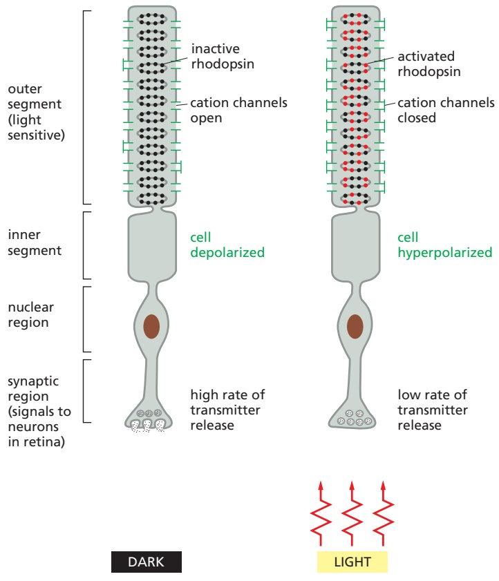

Figure 15–40 The response of a rod photoreceptor cell to light. Rhodopsin molecules in the outer-segment discs absorb photons. Photon absorption closes cation channels in the plasma membrane, which hyperpolarizes the membrane and reduces the rate of neurotransmitter release from the synaptic region. Because the neurotransmitter inhibits many of the postsynaptic retinal neurons in the absence of light, illumination serves to free the neurons from inhibition and thus, in effect, excites them. The neural connections of the retina lie between the light source and the outer segment, and so light must pass through the synapses and rod cell nucleus to reach the light sensors.

<table><tbody><tr><td colspan="4">TABLE 15-3 Four Major Families of Heterotrimeric G Proteins*</td></tr><tr><td>Family</td><td>Some family members</td><td>SubunMiBtsoC th7at m15.3 mediate action</td><td>9/15.40Some functions</td></tr><tr><td rowspan="2">I</td><td>Gs</td><td>α</td><td>Activates adenylyl cyclase; activates Ca2+ channels</td></tr><tr><td>Golf</td><td>α</td><td>Activates adenylyl cyclase in olfactory sensory neurons</td></tr><tr><td rowspan="5">II</td><td rowspan="2">Gi</td><td>α</td><td>Inhibits adenylyl cyclase</td></tr><tr><td>βγ</td><td>Activates K+ channels</td></tr><tr><td rowspan="2">Go</td><td>βγ</td><td>Activates K+ channels; inactivates Ca2+ channels</td></tr><tr><td>α and βγ</td><td>Activates phospholipase C-β</td></tr><tr><td>Gt (transducin)</td><td>α</td><td>Activates cyclic GMP phosphodiesterase in vertebrate rod photoreceptors</td></tr><tr><td>III</td><td>Gq</td><td>α</td><td>Activates phospholipase C-β</td></tr><tr><td>IV</td><td>G12/13</td><td>α</td><td>Activates Rho family monomeric GTPases (via Rho GEF) to regulate the actin cytoskeleton</td></tr><tr><td colspan="4">*Families are determined by amino acid sequence relatedness of the α subunits. Only selected examples are included. About 20 α subunits and at least 6 β subunits and 11 γ subunits have been described in humans.</td></tr></tbody></table>

#### Nitric Oxide Gas Can Mediate Signaling Between Cells

Small signaling molecules like cyclic nucleotides and $\mathrm { C a ^ { 2 + } }$ are hydrophilic small molecules that act within the cell where they are produced. Some small signaling molecules, however, are hydrophobic enough to cross the plasma membrane and thereby affect nearby cells. An important and remarkable example is the gas **nitric oxide (NO)**, which acts as a signaling molecule in many tissues of both animals and plants.

In mammals, one of NO’s many functions is to relax smooth muscle in the walls of blood vessels. The neurotransmitter acetylcholine stimulates NO synthesis by activating a GPCR on the membranes of the endothelial cells that line the interior of the vessel. The activated receptor triggers $\mathrm { I P _ { 3 } }$ synthesis and $\mathrm { C a ^ { 2 + } }$ release (see Figure 15–30), leading to stimulation of an enzyme that synthesizes NO. Because dissolved NO passes readily across membranes, it diffuses out of the cell where it is produced and into neighboring smooth muscle cells, where it causes muscle relaxation and thereby vessel dilation (**Figure 15–41**). It acts only locally because it has a short half-life—about 5–10 seconds—in the extracellular space before oxygen and water convert it to nitrates and nitrites.

The effect of NO on blood vessels provides an explanation for the mechanism of action of nitroglycerine, which has been used for about 100 years to treat people with angina (pain resulting from inadequate blood flow to the heart muscle). The nitroglycerine is converted to NO, which relaxes blood vessels. This reduces the workload on the heart and, as a consequence, reduces the oxygen requirement of the heart muscle.

NO is made by the deamination of the amino acid arginine, catalyzed by enzymes called **NO synthases (NOS**; see Figure 15–41). The NOS in endothelial cells is called eNOS, while that in nerve and muscle cells is called nNOS. Both eNOS and nNOS are stimulated by an increase in cytosolic $\mathrm { C a ^ { 2 + } }$ . Macrophages, by contrast, make yet another NOS, called inducible NOS (iNOS), that is constitutively active but synthesized only when the cells are activated, usually in response to an infection.

In some target cells, including smooth muscle cells, NO binds reversibly to iron in the active site of guanylyl cyclase, stimulating synthesis of cyclic GMP. NO

(A)

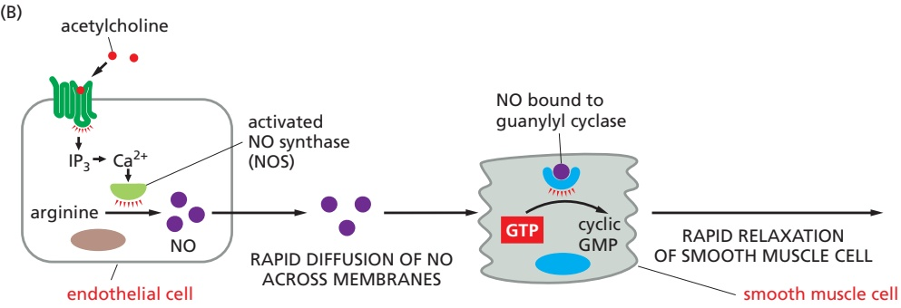

Figure 15–41 The role of nitric oxide (NO) in smooth muscle relaxation in a blood vessel wall. (A) Drawing of a cross section of a small blood vessel, showing the endothelial cells lining the lumen, the smooth muscle cells around them, and the basal lamina separating the two. (B) The neurotransmitter acetylcholine stimulates blood vessel dilation by activating a GPCR—the muscarinic acetylcholine receptor—on the surface of endothelial cells. This receptor activates a G protein, $\mathbb { G } _ { \mathbb { Q } } ,$ thereby stimulating IP3 synthesis and Ca2+ release from the ER by the mechanisms illustrated in Figure 15–30. Increased $\mathrm { C a ^ { 2 + } }$ activates nitric oxide synthase, causing the endothelial cells to produce NO from arginine. The NO diffuses out of the endothelial cells and into the neighboring smooth muscle cells, where it activates guanylyl cyclase to produce cyclic GMP. The cyclic GMP triggers a response that causes the smooth muscle cells to relax, increasing blood flow through the vessel.

can increase cyclic GMP in the cytosol within seconds, because the normal rate of turnover of cyclic GMP is high: rapid degradation to GMP by a phosphodiesterase constantly balances the production of cyclic GMP by guanylyl cyclase. The drug Viagra and its relatives inhibit the cyclic GMP phosphodiesterase in the penis, thereby increasing the amount of time that cyclic GMP levels remain elevated in the smooth muscle cells of penile blood vessels after NO production is induced by local nerve terminals. The cyclic GMP, in turn, keeps the blood vessels relaxed and thereby the penis erect. NO can also signal cells independently of cyclic GMP. It can, for example, alter the activity of an intracellular protein by covalently nitrosylating thiol (–SH) groups on specific cysteines in the protein.

#### Second Messengers and Enzymatic Cascades Amplify Signals

Despite the differences in molecular details, the different intracellular signaling pathways that GPCRs trigger share certain features and general principles. They depend on relay chains of intracellular signaling proteins and second messengers. These relay chains provide numerous opportunities for amplifying the responses to extracellular signals. In the rod visual transduction cascade, for example, a single activated rhodopsin molecule catalyzes the activation of about 500 transducin molecules per second. Each activated transducin molecule activates a molecule of cyclic GMP phosphodiesterase, resulting in the hydrolysis of more than $1 0 ^ { 5 }$ cyclic GMP molecules. The resulting drop in the concentration of cyclic GMP in turn transiently closes hundreds of cation channels in the plasma membrane (**Figure 15–42**). Thus, a rod cell can respond to even a single photon of light in a way that is highly reproducible in its timing and magnitude.

Likewise, when an extracellular signal molecule binds to a receptor that indirectly activates adenylyl cyclase via $\mathbf { G } _ { \mathrm { s } } ,$ each receptor protein may activate many molecules of $\mathbf { G } _ { \mathrm { s } }$ protein, each of which can activate a cyclase molecule. Each cyclase molecule, in turn, can catalyze the conversion of a large number of ATP molecules to cAMP molecules. A similar amplification operates in the $\mathrm { I P _ { 3 } }$ signaling pathway. In these ways, a nanomolar $( 1 0 ^ { \stackrel { \star } { - } 9 } \mathrm { M } )$ change in the concentration of an extracellular signal can induce micromolar $( 1 0 ^ { - 6 }$ M) changes in the concentration of a second messenger such as cAMP or $\mathrm { C a ^ { 2 + } }$ . Because these messengers function as allosteric effectors to activate specific enzymes or ion channels, a single extracellular signal molecule can alter many thousands of protein molecules within the target cell.

Figure 15–42 Amplification in the lightinduced catalytic cascade in vertebrate rods. The red arrows indicate the steps where amplification occurs, with the thickness of the arrow roughly indicating the magnitude of the amplification.

In signaling systems like those involved in smell and vision, any amplifying cascade of stimulatory signals requires counterbalancing mechanisms at every step of the cascade to restore the system to its resting state when stimulation ceases. As emphasized earlier, the response to stimulation in these systems can be rapid only if the inactivating mechanisms are also rapid. Cells therefore have efficient mechanisms for rapidly degrading (and resynthesizing) cyclic nucleotides and for buffering and removing cytosolic $\mathrm { C a ^ { 2 + } }$ , as well as for inactivating the responding enzymes and ion channels once they have been activated. This is not only essential for turning a response off but is also important for establishing the resting state from which a response begins.

Each protein in the signaling relay chain can be a separate target for regulation, including the receptor itself, as we discuss next.

<!-- END EN EN15-H017-H028 -->
