# 第11章 细胞信号转导 · 第四节 细胞信号转导的整合与控制

[返回本章](../README.md) · [中文本章原文](../中文原文.md)

<!-- BEGIN CN CN11-S04 -->
## 第四节 细胞信号转导的整合与控制

细胞的信号转导是多通路、多环节、多层次和高度复杂的可控过程。在许多情况下，细胞的适当反应依赖于接收信号的靶细胞对多种信号的整合以及对信号有效性的控制。

## 一、细胞对信号的应答反应具有发散性或收敛性特征

对特定胞外信号产生多样性细胞反应的机制通常有三种情况：

（1）细胞外信号的强度或持续时间的不同控制反应的性质。例如，在体外培养条件下，神经生长因子（NGF）诱导PCI2细胞分化为神经细胞；而上皮生长因子（EGF）则诱导PCI2细胞分化为脂肪细胞。通过延长生长因子刺激时间来强化EGF信号强度，则又转而引起神经细胞分化。虽然两种生长因子NGF和EGF都是RTK的配体，但与EGF相比，NGF是Ras-MAPK信号转导通路更强的激活子（activator），而EGF受体只有延长刺激时间才可能激活这条信号通路。

(2) 在不同细胞中，具有同样受体，但因不同的胞内信号蛋白，可引发不同的下游通路。在线虫（C. elegans）研究中已经证明，RTK受体介导的下游通路具有细胞类型特异性。EGF信号在不同的细胞类型中至少可诱发5种不同的反应，其中4种反应是由共同的Ras-MAPK信号通路介导的，而第5种反应涉及雌雄同体的排卵作用，则是利用一种不同的下游途径，该途径产生第二信使 $\mathrm{IP}_3$ ，与内质网膜上 $\mathrm{IP}_3$ 受体（ $\mathrm{IP}_3\mathrm{R}$ ）结合，动员 $\mathrm{Ca^{2+}}$ 释放，细胞质中 $\mathrm{Ca^{2+}}$ 水平升高，引发排卵。

(3) 细胞通过整合不同通路的输入信号调节细胞对信号的反应。不同类型的受体特异性识别并结合各自配体，这些信号通过两条或多条信号途径，在向下游传递时经整联蛋白（integrator protein）在细胞内汇聚、收敛（convergence）去激活一个共同的效应器（如 Ras 或 Raf 蛋白），从而引起细胞生理、生化反应和细胞行为的改变（图 11-39）；来自细胞表面同一类受体（如 Epo 受体）激活 Jak 也可引发多种信号途径，导致信号传播的发散（divergence），调节不同的基因表达，产生不同生理效应（见图 11-32）。

  
图11-39 细胞应答信号反应的收敛性特征  
来自细胞表面 GPCR、整联蛋白和受体酪氨酸激酶所转导的信号都收敛到 Ras 蛋白，然后沿 MAPK 级联反应途径向下传递。

## 二、蛋白激酶的网络整合信息

细胞各种不同的信号通路，主要提供了信号途径本身的线性特征，然而细胞需要对多种信号进行整合和精确控制，最后作出适宜的应答。细胞信号转导最重要的特征之一是构成复杂的信号网络系统（signal network system），它具有高度的非线性特点。人们对信号网络系统中各种信号通路之间的交互关系，形象地称之为“交叉对话”（cross talk）。或许可以把细胞信号转导比喻为电脑的工作，细胞接受的外界信号如同键盘输入的不同的字母或符号，细胞内各种信号通路及其组分如同电脑线路中的各种集成块，信号在这些集成块中流动，经分析、整合，最后将结果显示在荧光屏上。在细胞中，这些经信号网络系统分析、整合后的信号最终表现为特定的生理学功能。但是最复杂的电脑恐怕也无法和最简单的细胞相比，电脑作为无生命的机械装置，简单的操作失误或线路故障，都可导致整个系统的瘫痪；而细胞则有一定的自我修复和补偿能力。

虽然我们对细胞信号系统的研究有了长足进展，但对其复杂关系的了解仍然是初步的。细胞信号系统的网络化相互作用是细胞生命活动的重大特征，也是细胞生命活动的基本保障之一。今后对以调节基因表达为主线的信号网络研究，将会愈来愈受到重视。根据已有事实发现，通过蛋白激酶的网络整合信息调控复杂的细胞行为是不同信号通路之间实现“交叉对话”的一种重要方式（图11-40）。

图 11-40 概括了从细胞表面到细胞内的主要信号通路，从 5 条平行信号途径的比较不难发现：磷脂酶 C 既是 GPCR 信号途径的效应酶，又是 RTK 信号途径的效应酶，在两条信号通路中都起中介作用；尽管 4 条信号通路彼此不同，但在信号转导机制上又具有相似性，最终都是激活蛋白激酶，由蛋白激酶形成的整合信息网络原则上可调节细胞任何特定的过程。据最近统计，人类基因组编码蛋白激酶多达 560 种。因此不难理解蛋白激酶的网络整合信息是不同信号通路之间实现“交叉对话”的一种重要方式。

事实上，细胞信号网络的复杂性远比我们所了解的多。首先，还有许多信号途径不为人们所了解；其次，对主要途径的相互作用，我们只涉及了蛋白激酶，其他的正负调控及“交叉对话”却没有述及。对细胞信号转导过程中这些内容的研究和对信号传递过程非线性内涵的认识，将对我们深入了解多基因表达调控机制、发育机理、病理过程及疾病控制等方面产生

重要的影响。

## 三、信号的控制：受体的脱敏与下调

典型哺乳类细胞针对某种特殊配体的细胞表面受体，只占质膜总蛋白的0.1%\~5.0%，但是靶细胞对信号分子的最大细胞反应通常并不需要所有受体都被激活，细胞对胞外信号的敏感性既取决于表面受体的数量，又取决于受体与它们配体的亲和性（affinity）。受体与配体的亲和性常常用受体－配体复合物的解离常数 $(K_{\mathrm{d}})$ 来估量， $K_{d}$ 值代表细胞表面受体达到50%被占据时所需的配体分子浓度。因此 $K_{d}$ 值越大，表明亲和性越小；相反， $K_{d}$ 值越小，则表明亲和性越大。

细胞对外界信号作出适度的反应既涉及到信号的有效刺激和启动，也依赖于信号的解除与细胞的反应终止，特别值得注意的是信号的解除与终止和信号的刺激与启动对于确保靶细胞对信号的适度反应来说同等重要。解除与终止信号的重要方式是在信号浓度过高或细胞长时间暴露某一种信号刺激的情况下，细胞会以不同的方式致使受体脱敏（desensitization），这种现象又称之为适应（adaptation），这是一种负反馈调控机制。以视杆细胞对周围光强度变化的适应为例，由光激活的视蛋白（opsin，O'）是视紫红质激酶（rhodopsin kinase）的底物，活化的视蛋白其胞质面三个丝氨酸残基恰是视紫红质激酶的磷酸化位点，视蛋白的磷酸化一方面显著降低 $O^{\prime}$ 分子激活 $\mathrm{G}_1\alpha$ 的能力，另一方面视蛋白胞质面磷酸丝氨酸位点又为胞质抑制蛋白 $\beta$ -arrestin的结合提供了锚定位点， $\beta$ -arrestin的结合完全阻断 $\mathrm{G}_1\alpha$ 与磷酸化 $O^{\prime}$ 的相互作用，由于阻断 $\mathrm{G}_1\alpha$ -GTP复合物的形成，从而关闭所有视杆细胞的活性。这种引发靶细胞对信号刺激的脱敏（适应）机制也是其他GPCR在高配体水平条件下引发脱敏反应的普遍机制，导致受体磷酸化的激酶包括PKA、PKC或G蛋白偶联受体激酶（GRK）家族（包括视紫红质激酶）。GRK只是结合已被激活的受体，使其C端胞质域特定氨基酸（丝氨酸/苏氨酸）残基磷酸化，从而为结合 $\beta$ -arrestin提供锚定位点，这是GPCR脱敏的重要方式之一（图11-41）。随后的研究发现， $\beta$ -arrestin不仅与磷酸化的受体结合，而且作为接头蛋白与两种包被蛋白组分——网格蛋白和AP2蛋白结合，介导细胞内吞作用；另外还通过结合并激活几种胞质蛋白激酶参与信号转导功能。

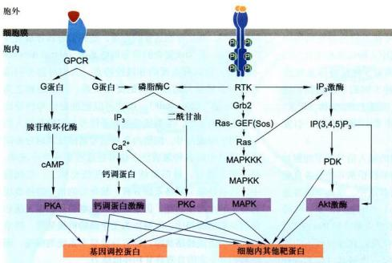  
图11-40 由两类受体介导的细胞内平行的信号通路与它们之间的网络关系

细胞可以适应刺激强度或刺激时间的变化，正是因为细胞可以校正对信号的敏感性。概括起来，靶细胞对信号分子的脱敏机制有如下5种方式：

(1) 受体没收 (receptor sequestration) 细胞通过配体依赖性的受体介导的内吞作用 (receptor-mediated endocytosis) 减少细胞表面可利用受体的数目，以网格蛋白/AP 包被小泡形式摄入细胞，内吞泡脱包被形成无包被的早期内体，受体被暂时扣留，受 pH 降低的影响 (pH 5.0)，受体－配体复合物在晚期内体解离，扣留的受体可返回质膜再利用（如 LDL 受体），配体进入溶酶体被消化。这是细胞对多种肽类或其他激素受体发生脱敏反应的一种基本途径。有时即使缺乏配体结合的情况下，细胞通过批量膜流（bulk membrane flow）也会使细胞表面受体以相对较低的速率被内化（internalization），然后再循环利用，从而减少细胞表面可利用受体的数目。

(2) 受体下调 (receptor down-regulation) 通过受体介导的内吞作用，受体-配体复合物转移至胞内溶酶体被消化降解而不能重新利用，因此细胞通过表面自由受体数目减少和配体的清除导致细胞对信号敏感性下调。受体-激素复合物的内吞作用和它们在溶酶体内被消化，是细胞表面减少RTK和细胞因子受体一种最基本的方式，从而降低细胞对胞外多肽类激素的敏感性。

(3) 受体失活 (receptor inactivation) 如前所述, GRK 使结合配体的受体丝氨酸 / 苏氨酸残基磷酸化, 再通过与胞质抑制蛋白 β-arrestin 结合而阻断与 G 蛋白的偶联作用, 这是一种快速使受体脱敏的机制。

(4) 信号蛋白失活 (inactivation of signaling protein) 致使细胞对信号反应脱敏的原因不在于受体本身, 而在于细胞内信号蛋白发生改变, 如去磷酸化或者泛素化并降解, 从而使信号级联反应受阻, 不能诱导正常的细胞反应。

(5) 抑制型蛋白质产生（production of inhibitory protein）受体结合配体而被激活后，在下游反应中（如对基因表达的调控）产生抑制型蛋白质并形成负反馈环从而降低或阻断信号转导途径。

  
图11-41 $\beta$ -arrestin在GPCR脱敏和信号转导中的作用

GPCR 在 GRK 作用下发生丝氨酸/苏氨酸残基磷酸化，为 β-arrestin 抑制蛋白的结合提供锚定位点，β-arrestin 与受体结合，导致 GPCR 脱敏。β-arrestin 作为接头蛋白两种包被蛋白组分网格蛋白和 AP2 蛋白结合，介导和促进受体的细胞内吞作用，从而降低表面受体的数量。此外，β-arrestin 在信号传导中通过结合并激活几种胞质蛋白激酶而传递来自活化受体信号，如 c-Src 激活 MAPK 途径，导致某些关键转录因子的磷酸化，或与三种其他蛋白相互作用，包括 c-Jun N 端激酶（JNK3），结果磷酸化并激活其他转录因子。

## - 思考题

1. 何谓信号转导中的分子开关机制？请举例说明。

2. 如何理解细胞信号系统及其功能？

3. 试比较 G 蛋白偶联受体介导的信号通路（效应蛋白、第二信使、生物学功能）。

4. 概述受体酪氨酸激酶介导的信号通路的组成、特点及其主要功能。

5. 概述细胞表面受体的分类（配体、受体、信号转导机制）。

6. 图解细胞表面受体调节基因表达的信号通路。

7. 概述细胞信号的整合方式与控制机制。

## - 参考文献

1. Cantley L C. The phosphoinositide 3-kinase pathway. Science, 2002, 296(5573): 1655-1657.

2. Cheng H, Lederer W J, Calcium sparks. Physiological Reviews, 2008, 88(4): 1491-1545.

3. Cheng H, Lederer W J, Cannell M B. Calcium sparks: elementary events underlying excitation-contraction coupling in heart muscle, Science, 1993, 262(5134): 740-744.

4. Gordon M D, Nusse R. Wnt signaling: multiple pathways, multiple receptors, and multiple transcription factors. Journal of Biological Chemistry, 2006, 281: 22429-22433.

5. Hamm H E. How activated receptors couple to G-proteins. Proceedings of the National Academy of Sciences of the United States of America, 2001, 98(9): 4819-4821.

6. Heldin C, Landström M, Moustakas A. Mechanism of TGFβ signaling to growth arrest, apoptosis, and epithelial-mesenchymal transition. Current Opinion in Cell Biology, 2009, 21(2): 166-176.

7. Hubbard S R, Miller W T. Receptor tyrosine kinases: mechanisms of activation and signaling. Current Opinion in Cell Biology, 2007, 19(2): 117-123.

8. Itoh S, ten Dijke P. Negative regulation of TGFβ receptor/Smad signal transduction. Current Opinion in Cell Biology, 2007, 19(2): 176-184.

9. Leonard W. Role of Jak kinases and STATs in cytokine signal transduction. International Journal of Hematology, 2001, 73(3): 271-277.

10. Pierce K L, Premont R T, Lefkowitz R J. Seven-transmembrane receptors. Nature Reviews Molecular Cell Biology, 2002, 3(9): 639-652.

11. Soulard A, Cohen A, Hall M N. TOR signaling in invertebrates. Current Opinion in Cell Biology, 2009, 21(6): 825-836.

12. Taylor S S, Kim C, Vigil D, et al. Dynamics of signaling by PKA. Biochimica et Biophysica Acta (BBA) - Proteins and Proteomics, 2005, 1754(1-2): 25-37.

13. Yamamoto Y, Gaynor R B. IκB kinases: key regulators of the NFκB pathway. Trends in Biochemical Sciences, 2004, 29(2): 72-79.

<!-- END CN CN11-S04 -->

---

## 对应英文内容

### 英文补充：信号响应、正负反馈、噪声与适应

> 对应中文板块：信号响应、正负反馈、噪声与适应。英文来源：Molecular Biology of the Cell，第7版，第15章；[本章完整原文](../../来源/英文教材/15_Cell_Signaling/chapter.md)。物理PDF页码范围：912–987（整章范围）。

<!-- BEGIN EN EN15-H010-H016 -->
#### The Relationship Between Signal and Response Varies in Different Signaling Pathways

The function of an intracellular signaling system is to detect and measure a specific stimulus in one location of a cell and then generate an appropriately timed and measured response, often at another location. The system accomplishes this task by sending information in the form of molecular “signals” from the receptor to the final effector proteins, often through a series of intermediaries that do not simply pass the signal along but also process it along the way. Signaling systems work in various ways: each has evolved to produce a response that is appropriate for the cell function the system controls. In the following paragraphs, we list some basic signaling properties and how they vary in different systems, as a foundation for more detailed discussions later.

1. Response timing varies dramatically in different signaling systems, according to the speed required for the response. In some cases, such as synaptic signaling (see Figure 15–2C), the response can occur within milliseconds. In other cases, as in the control of cell fate by morphogens during development, a full response can require hours or days.

2. Sensitivity to extracellular signals can vary greatly. Hormones tend to act at very low concentrations on their distant target cells, which are therefore highly sensitive to low concentrations of signal. Neurotransmitters, on the other hand, operate at much higher concentrations at a synapse, reducing the need for high sensitivity in postsynaptic receptors. Sensitivity is often controlled by changes in the number or affinity of the receptors on the target cell. A particularly important mechanism for increasing sensitivity is signal amplification, whereby a small number of activated cell-surface receptors evokes a large intracellular response by either producing large amounts of a second messenger or by activating many copies of a downstream signaling protein.

3. Dynamic range of a signaling system is related to its sensitivity. Some systems, like those involved in simple developmental decisions, are responsive over a narrow range of extracellular signal concentrations. Others, like those controlling vision or some metabolic responses to hormones, are highly responsive over a much broader range of signal strengths. We will see that a broad dynamic range is often achieved by adaptation mechanisms that adjust responsiveness according to the pre-vailing amount of signal.

4. Persistence of a response can vary greatly. A transient response of less than a second is appropriate in some synaptic responses, for example, while a prolonged or even permanent response is required in cell-fate decisions during development. Numerous mechanisms, including positive and negative feedback, can be used to alter the duration and reversibility of a response.

5. Signal processing can convert a simple signal into a complex response. In many systems, for example, a gradual increase in an extracellular signal is converted into an abrupt, switchlike response. In other cases, a simple input signal is converted into an oscillatory response, produced by a repeating series of transient intracellular signals. Feedback usually lies at the heart of biochemical switches and oscillators, as we describe later.

6. Integration allows a response to be governed by multiple inputs. As discussed earlier, for example, specific combinations of extracellular signals are generally required to stimulate complex cell behaviors such as cell growth, proliferation, and differentiation (see Figure 15–4). The cell therefore has to integrate information coming from multiple signals, which often depends on intracellular coincidence detectors; these proteins are equivalent to AND gates in the microprocessor of a computer, in that they are only activated if they receive multiple converging signals (**Figure 15–13**).

Figure 15–13 An example of signal integration. Extracellular signals A and B activate different intracellular signaling pathways, each of which leads to the phosphorylation of protein Y but at different sites on the protein. Protein Y is activated only when both of these sites are MBoC7 m15.12/15.13phosphorylated, and therefore it becomes active only when signals A and B are simultaneously present.

7. Coordination of multiple responses in one cell can be achieved by a single extracellular signal. Some extracellular signal molecules, for example, stimulate a cell to both grow and divide. This coordination generally depends on mechanisms for distributing a signal to multiple effectors, by creating branches in the signaling pathway. In some cases, the branching of signaling pathways can allow one extracellular signal to modulate the strength of a response to other extracellular signals.

Given the complexity that arises from behaviors like signal integration, coordination, and feedback, it is clear that signaling systems rarely depend on a simple linear sequence of steps but more often operate like a signaling network, in which information flows in multiple directions, including backwards. A major research challenge is to understand the nature of these networks and how they control complex cell behaviors.

#### The Speed of a Response Depends on the Turnover of Signaling Molecules

The speed of any signaling response depends on the nature of the intracellular signaling molecules that carry out the target cell’s response. When the response requires only changes in proteins already present in the cell, it can occur very rapidly: an allosteric change in a neurotransmitter-gated ion channel (discussed in Chapter 11), for example, can alter the plasma membrane electrical potential in milliseconds, and responses that depend solely on protein phosphorylation can occur within seconds or minutes. When the response involves changes in gene expression and the synthesis of new proteins, however, it usually requires many minutes or hours, regardless of the mode of signal delivery (**Figure 15–14**).

When thinking about the speed of a response, it is natural to think of signaling systems in terms of the changes produced when the signal is delivered. But it can be just as important to consider what happens when the signal is withdrawn. In many signaling pathways, the response fades when the signal ceases. Often the effect is transient because the signal exerts its effects by increasing the concentrations of intracellular molecules that are short-lived (unstable), undergoing continual turnover. Thus, when the extracellular signal is removed, degradation of the molecules quickly wipes out all traces of the signal’s action. The same principle applies to signals that induce protein phosphorylation by activating a protein kinase: because most phosphorylation is continually removed by phosphatases, the effects of the increased protein kinase activity are quickly reversed when kinase activity declines. It follows that the speed with which a cell responds to removal of a signal depends on the rate of destruction, or turnover, of the molecules or modifications that the signal affects.

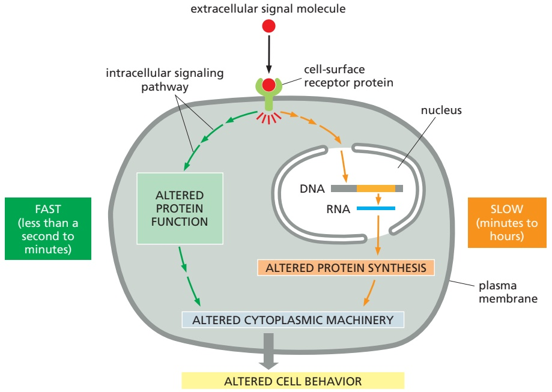

Figure 15–14 Slow and rapid responses to an extracellular signal. Certain types of signal-induced cellular responses, such as increased cell growth and division, involve changes in gene expression and the synthesis of new proteins; they therefore occur slowly, often starting an hour or more after the signal is received. Other responses—such as changes in cell movement, secretion, or metabolism— need not involve changes in gene transcription and therefore occur much more quickly, often starting in seconds or minutes; they may involve the rapid phosphorylation of effector proteins in the cytoplasm, for example. Synaptic responses mediated by changes in membrane potential are even quicker and can occur in milliseconds (not shown). Some signaling systems generate both rapid and slow responses as shown here, allowing the cell to respond quickly to a signal while simultaneously initiating a more long-term, persistent response.

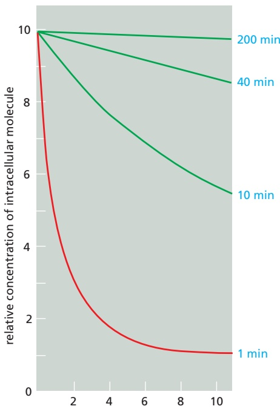

(A) minutes after the synthesis rate has been decreased by a factor of 10

(B) minutes after the synthesis rate has been increased by a factor of 10

Figure 15–15 The importance of rapid turnover. The graphs show the predicted relative rates of change in the intracellular concentrations of molecules with differing turnover times when their synthesis rates are either (A) decreased or (B) increased suddenly by a factor of 10. In both cases, the concentrations of those molecules that are normally degraded rapidly in the cell (red lines) change quickly, whereas the concentrations of those that are normally degraded slowly (green lines) change proportionally more slowly. The numbers (in blue) on the right are the half-lives assumed for each of the different molecules.

It is also true, although much less obvious, that this turnover rate can determine the promptness of the response when an extracellular signal arrives. Consider, for example, two intracellular signaling molecules, X and Y, both of which are normally maintained at a steady-state concentration of 1000 molecules per cell. The cell synthesizes and degrades molecule Y at a rate of 100 molecules per second, with each molecule having an average lifetime of 10 seconds. Molecule X has a turnover rate that is 10 times slower than that of Y: it is both synthesized and degraded at a rate of 10 molecules per second, so that each molecule has an average lifetime in the cell of 100 seconds. If a signal acting on the cell causes a tenfold increase in the synthesis rates of both X and Y with no change in the molecular lifetimes, at the end of 1 second the concentration of Y will have increased by nearly 900 molecules per cell (10 × 100 – 100), while the concentration of X will have increased by only 90 molecules per cell. In fact, after a molecule’s synthesis rate has been either increased or decreased abruptly, the time required for the molecule to shift halfway from its old to its new equilibrium concentration is equal to its half-life; that is, equal to the time that would be required for its concentration to fall by half if all synthesis were stopped (**Figure 15–15**).

#### Cells Can Respond Abruptly to a Gradually Increasing Signal

Some signaling systems are capable of generating a smoothly graded response over a wide range of extracellular signal concentrations (**Figure 15–16**, blue line); such systems are useful, for example, in the fine-tuning of metabolic processes

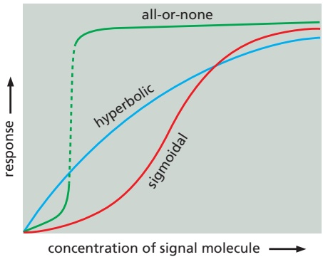

Figure 15–16 Signal processing can produce smoothly graded or switchlike responses. Some cell responses MBoC7 m15.15/15.16increase gradually as the concentration of extracellular signal molecule increases, eventually reaching a plateau as the signaling pathway is saturated, resulting in a hyperbolic response curve (blue line). In other cases, the signaling system reduces the response at low signal concentrations and then produces a steeper response at some intermediate signal concentration— resulting in a sigmoidal response curve (red line). In still other cases, the response is more abrupt and switchlike; the cell switches completely between a low and high response, without any stable intermediate response (green line).

by some hormones. Other signaling systems generate significant responses only when the signal concentration rises beyond some threshold value. These abrupt responses are of two types. One is a sigmoidal response, in which low concentrations of stimulus do not have much effect, but then the response rises steeply and continuously at intermediate stimulus levels (**Figure 15–16**, red line). Such systems provide a filter to reduce inappropriate responses to lowlevel background signals but respond with high sensitivity when the stimulus rises to physiological signal concentrations. A second type of abrupt response is the discontinuous or all-or-none response, in which the response switches on completely (and often irreversibly) when the signal reaches some threshold concentration (**Figure 15–16**, green line). Such responses are particularly useful for controlling the choice between two alternative cell states, and they generally involve positive feedback, as we describe in more detail shortly.

Cells use a variety of molecular mechanisms to produce a sigmoidal response to increasing signal concentrations. In one mechanism, more than one intracellular signaling molecule must bind to its downstream target protein to induce a response. As we discuss later, for example, four molecules of the second messenger cyclic AMP must bind simultaneously to each molecule of cyclic-AMP-dependent protein kinase (PKA) to activate the kinase. A similar sharpening of response is seen when the activation of an intracellular signaling protein requires phosphorylation at more than one site. Such responses become sharper as the number of required molecules or phosphate groups increases, and if the number is large enough, responses become almost all-or-none (**Figure 15–17**).

Figure 15–17 Activation curves for an allosteric protein as a function of effector molecule concentration. The curves show how the sharpness of the activation response increases with an increase in the number of effector molecules that must be bound simultaneously to activate the target protein. The curves shown are those expected, under certain conditions, if the activation requires the simultaneous binding MBoC7 m15.16/15.17of 1, 2, 8, or 16 effector molecules.

Responses are also sharpened when an intracellular signaling molecule activates one enzyme and also inhibits another enzyme that catalyzes the opposite reaction. A well-studied example of this common type of regulation is the stimulation of glycogen breakdown in skeletal muscle cells induced by the hormone epinephrine. Epinephrine’s binding to a G-protein-coupled cell-surface receptor increases the intracellular concentration of cyclic AMP, which both activates an enzyme that promotes glycogen breakdown and inhibits an enzyme that promotes glycogen synthesis.

#### Positive Feedback Can Generate an All-or-None Response

Like intracellular metabolic pathways (discussed in Chapter 2) and the systems controlling gene activity (discussed in Chapter 7), most intracellular signaling systems incorporate feedback loops, in which the output of a process acts back to regulate that same process. We discussed the mathematical analysis of feedback loops in Chapter 8. In positive feedback, the output stimulates its own production; in negative feedback, the output inhibits its own production (**Figure 15–18**). Feedback loops are of great general importance in biology, and they regulate many chemical and physical processes in cells. Even the simplest of these loops can produce complex and interesting effects.

Positive feedback in a signaling pathway can transform the behavior of the responding cell. If the positive feedback is of only moderate strength, its effect will be simply to steepen the response to the signal, generating a sigmoidal response like those described earlier; but if the feedback is strong enough, it can produce an all-or-none response (see Figure 15–16). This response goes hand in hand with a further property: once the responding system has switched to the high level of activation, this condition is often self-sustaining and can persist even after the signal strength drops back below its critical value. In such a case, the system is said to be bistable: it can exist in either a “switched-off” or a “switched-on” state, and a transient stimulus can flip it from one state to the other (**Figure 15–19A and B**).

Through positive feedback, a transient extracellular signal can induce longterm changes in cells and their progeny that can persist for the lifetime of the organism. The signals that trigger muscle-cell specification, for example, turn on the transcription of a series of genes that encode muscle-specific transcription regulatory proteins, which stimulate the transcription of their own genes, as well as genes encoding various other muscle-cell proteins; in this way, the decision to become a muscle cell is made permanent. This type of cell memory, which depends on positive feedback, is one of the basic ways in which a cell can undergo a lasting change of character without any alteration in its DNA sequence.

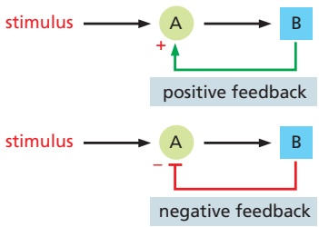

Figure 15–18 Positive and negative feedback. In these simple examples, a stimulus activates protein A, which, in turn, activates protein B. Protein B then acts back to either increase or decrease the activity of A.

Studies of signaling responses in large populations of cells can give the false impression that a response is smoothly graded, even when strong positive feedback is causing an abrupt, discontinuous switch in the response in individual cells. Only by studying the response in single cells is it possible to see its all-or-none

(A)

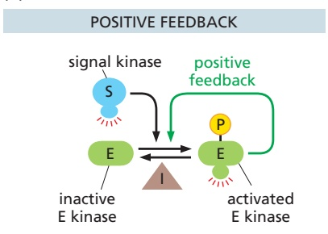

(C)

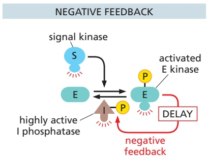

(B)

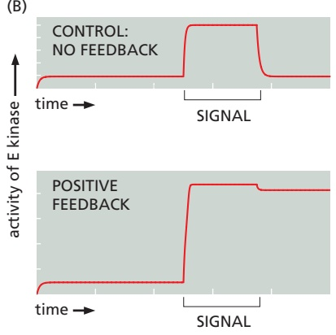

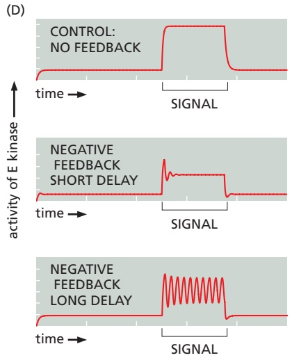

Figure 15–19 Some effects of simple feedback. The graphs show the computed effects of simple positive and negative feedback loops (discussed in Chapter 8). In each case, the input signal is an activated protein kinase (S) that phosphorylates and thereby activates another protein kinase (E); a protein phosphatase (I) dephosphorylates and inactivates the activated E kinase. In the graphs, the red line indicates the activity of the E kinase over time; the underlying black bracket indicates the time during which the input signal (activated S kinase) is present. (A) Diagram of a positive feedback loop, in which the activated E kinase acts back to promote its own phosphorylation and activation; the basal activity of the I phosphatase dephosphorylates activated E at a steady, low rate. (B) The top graph shows that, without feedback, the activity of the E kinase is simply proportional to the level of stimulation by the S kinase. The bottom graph shows that, with the positive feedback loop, the transient stimulation by S kinase switches the system from an $\text{" } O 件"$ state to an “on” state, which then persists after the stimulus has been removed. (C) Diagram of a negative feedback loop, in which the activated E kinase phosphorylates. / . and activates the I phosphatase, thereby increasing the rate at which the phosphatase dephosphorylates and inactivates the phosphorylated E kinase. (D) The top graph shows, again, the response in E kinase activity without feedback. The other graphs show the effects on E kinase activity of negative feedback operating after a short or long delay. With a short delay, the system shows a response when the signal is first increased, but the feedback quickly dampens the response—which then declines to some intermediate level at which the input signal and feedback are balanced. With a long delay, the response rises unopposed at first, allowing kinase activity to reach maximum levels before it feeds back to shut itself off. Then the sudden drop in activity removes the negative feedback, unleashing another pulse of kinase activity. If conditions are right, the result is sustained oscillations for as long as the stimulus is present.

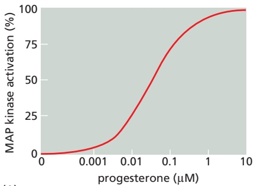

(A)

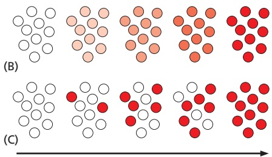

Figure 15–20 The importance of examining individual cells to detect all-or-none responses to increasing concentrations of an extracellular signal. In these experiments, immature frog eggs (oocytes) were stimulated with increasing concentrations of the hormone progesterone. The response was assessed by analyzing the activation of $M A P$ kinase (discussed later), which is one of the protein kinases activated by phosphorylation in the response. The amount of phosphorylated (activated) MAP kinase in extracts of the oocytes was assessed biochemically. In (A), extracts of populations of stimulated oocytes were analyzed, and the activation of $\mathsf { M A P }$ kinase appeared to increase progressively with increasing progesterone concentration. There are two possible ways of explaining this result: (B) MAP kinase could have increased gradually in each individual cell with increasing progesterone concentration; or (C) individual cells could have responded in an all-ornone way, with the gradual increase in total MAP kinase activation reflecting the increasing number of cells responding with increasing progesterone concentration. When extracts of individual oocytes were analyzed, it was found that cells had either very low amounts or very high amounts, but not intermediate amounts, of the activated kinase, indicating that the response was essentially all-or-MBoC7 m15.19/15.20none at the level of individual cells, as diagrammed in C. Subsequent studies revealed that this all-or-none response is due in part to strong positive feedback in the progesterone signaling system. (Adapted from J.E. Ferrell and E.M. Machleder, Science 280:895–898, 1998. With permission from AAAS.)

character (**Figure 15–20**). The misleading smooth response in a cell population is due to the random, intrinsic variability in signaling systems that we described earlier: all cells in a population do not respond identically to the same concentration of extracellular signal, especially at intermediate signal concentrations where the receptors are only partially occupied.

#### Negative Feedback Is a Common Feature of Intracellular Signaling Systems

By contrast with positive feedback, negative feedback counteracts the effect of a stimulus and thereby abbreviates and limits the level of the response, making the system less sensitive to perturbations (discussed in Chapter 8). As with positive feedback, however, qualitatively different responses can be obtained when the feedback operates in different ways. Negative feedback with a long delay can produce responses that oscillate. The oscillations may persist for as long as the stimulus is present (**Figure 15–19C and D**) or they may even be generated spontaneously, without need of an external signal to drive them. Many such oscillators also contain positive feedback loops that generate sharper oscillations. Later in this chapter, we will encounter specific examples of oscillatory behavior in the intracellular responses to extracellular signals; all of them depend on negative feedback, generally accompanied by positive feedback.

If negative feedback operates with a short delay, the system generates a brief response to a stimulus, but the response decays rapidly even while the stimulus persists. If the stimulus is increased further, the system responds strongly again, but, again, the response soon decays. This is the phenomenon of adaptation, which we now discuss.

#### Cells Can Adjust Their Sensitivity to a Signal

We have seen that most signaling systems generate an output response that is proportional to the strength of the input signal. In many cases, the response remains constant as long as the input signal remains, and the response declines when the input signal stops. In other systems, like those involving positive feedback, an input signal can generate a strong output signal that persists even after the input signal is removed. Finally, we have just discussed negative feedback systems in which an input signal triggers a response that rises and then falls even if the stimulus persists. A second, stronger input signal can then generate another transient response like the first one, and so on.

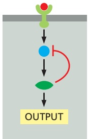

NEGATIVE(A) FEEDBACK

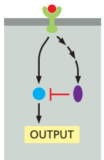

DELAYED(B) FEED-FORWARD

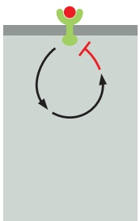

RECEPTOR(C) INACTIVATION

RECEPTOR(D) SEQUESTRATION

RECEPTOR(E) DESTRUCTION

Figure 15–21 Some ways in which target cells can become adapted (desensitized) to an extracellular signal molecule. (A) Negative feedback with a short delay can dampen the initial response to receptor activation. (B) In some cases, the activated receptor rapidly activates a stimulatory pathway while also initiating a slower inhibitory pathway—resulting in a transient output response. This is called a delayed feed-forward loop. (C, D, E) Various mechanisms can inactivate a cell-surface receptor after a signal molecule binds, including mechanisms that depend on internalization of the receptor into endosomes, from which the receptor can be returned to the cell surface or destroyed in lysosomes.

This phenomenon is called **adaptation**, or **desensitization**, and it allows cells to respond to changes in the strength of an input signal (rather than to the absolute amount of the signal) over a very wide range of signal levels. The visual system, discussed later in this chapter, provides the ideal illustration of this concept: it uses adaptation at varying signal strengths to allow us to see clearly over an astonishing range of light intensities, from starlight to bright sunshine.

Adaptation requires that some component of the signaling system generates a delayed inhibitory signal that reduces the strength of the output. There are several variations on this theme. One common mechanism, as just discussed, is negative feedback that operates with a short delay (**Figure 15–21A**). Many signaling pathways that begin with enzyme-coupled receptors, for example, include protein kinases that phosphorylate and thereby inhibit an upstream signaling protein in the pathway. A second mechanism of adaptation occurs when an extracellular signal rapidly activates a signaling response through one pathway while also triggering a parallel, slower signaling pathway that inhibits the response (**Figure 15–21B**). In some enzyme-coupled signaling pathways, for example, an activated receptor promotes recruitment to the membrane of a GEF called Sos, which stimulates the activity of a small GTP-binding protein called Ras (see Figure 15–11). Activation of the receptor also leads more slowly to recruitment of a GAP that inactivates Ras after a delay, thereby leading to a reduced output signal.

A particularly effective mechanism of adaptation, discussed in more detail later in the chapter, depends on receptor inactivation, whereby some activated receptors shut themselves off after some short period of activity. Ligand binding to some G-protein-coupled receptors, for example, leads to a change in the receptor that promotes its association with heterotrimeric G proteins and the resulting downstream response. Ligand binding also results in phosphorylation of the receptor and association with inhibitory molecules called arrestins, which interfere with G-protein activation and thereby reduce the response. The response is dampened further by endocytosis of the ligand-bound receptors, which can be sequestered inside the cell or simply destroyed (**Figure 15–21C, D, and E**).

Though bewildering in their complexity, the multiple cross-regulatory signaling pathways and feedback loops that we describe in this chapter are not just a haphazard tangle, but a highly evolved system for processing and interpreting the vast number of extracellular signals that impinge upon animal cells. The entire signaling network can be viewed as a computing device; like that other biological computing device, the brain, it presents one of the most difficult problems in biology. We can identify the components and discover how they work individually. We can understand how small subsets of components work together as regulatory modules, noise filters, or adaptation mechanisms, as we have seen. However, it is a much more daunting task to understand how the system works as a whole. This is not only because the system is complex; it is also because the way it behaves is strongly dependent on the quantitative details of the molecular interactions, and, for most animal cells, we have only rough qualitative information. A major challenge for the future of signaling research is to develop more sophisticated quantitative and computational methods for the analysis of signaling systems, as described in Chapter 8.

#### Summary

Each cell in a multicellular animal is programmed to respond to a specific set of extracellular signal molecules produced by other cells. The signal molecules act by binding to a complementary set of receptor proteins expressed by the target cells. Most extracellular signal molecules activate cell-surface receptor proteins, which act as signal transducers, converting the extracellular signal into intracellular ones that alter the behavior of the target cell. Activated receptors relay the signal into the cell interior by activating intracellular signaling proteins. Collectively, some of these signaling proteins help transduce, amplify, and spread the signal as they relay it, while others integrate signals from different signaling pathways. Some function as switches that are transiently activated by phosphorylation or GTP binding. Large signaling complexes form by means of modular interaction domains in the signaling proteins, which allow the proteins to form complex signaling networks.

Target cells use various mechanisms, including feedback loops, to adjust the ways in which they respond to extracellular signals. Positive feedback loops can help cells respond in an all-or-none fashion to a gradually increasing concentration of an extracellular signal or convert a short-lasting signal into a long-lasting or even irreversible response. Negative feedback is one way that allows cells to adapt to a signal molecule, which enables them to respond to small changes in the concentration of the signal molecule over a large concentration range.

<!-- END EN EN15-H010-H016 -->

### 英文补充：GPCR脱敏与受体磷酸化

> 对应中文板块：GPCR脱敏与受体磷酸化。英文来源：Molecular Biology of the Cell，第7版，第15章；[本章完整原文](../../来源/英文教材/15_Cell_Signaling/chapter.md)。物理PDF页码范围：912–987（整章范围）。

<!-- BEGIN EN EN15-H029-H030 -->
#### GPCR Desensitization Depends on Receptor Phosphorylation

As discussed earlier, when target cells are exposed to an extracellular signal for a prolonged period, they can become desensitized, or adapted, in several different ways. An important class of adaptation mechanisms depends on alteration of the quantity or condition of the receptor molecules themselves.

For GPCRs, there are three general modes of adaptation, all centered on inactivation of the receptor (see Figure 15–21C, D, and E): (1) In receptor inactivation, they become altered so that they can no longer interact with G proteins. (2) In receptor sequestration, they are temporarily moved to the interior of the cell (internalized) so that they no longer have access to their ligand. (3) In receptor destruction, they are destroyed in lysosomes after internalization. In each case, the desensitization of the GPCRs depends on their phosphorylation by PKA, PKC, or a member of the family of **GPCR kinases (GRKs)**, which includes the rhodopsin kinase involved in rod photoreceptor desensitization discussed earlier. The GRKs phosphorylate multiple serines and threonines on a GPCR, but they do soMBoC7 m15.42/15.43 only after ligand binding has activated the receptor, because it is the activated receptor that allosterically activates the GRK. As with rhodopsin, once a receptor has been phosphorylated by a GRK, it binds with high affinity to a member of the **arrestin** family of proteins (**Figure 15–43**).

Figure 15–43 The roles of GPCR kinases (GRKs) and arrestins in GPCR desensitization. A GRK phosphorylates only activated receptors because it is the activated GPCR that turns on the GRK. The binding of an arrestin to the phosphorylated receptor prevents the receptor from binding to its G protein and also directs its endocytosis (not shown). Mice deficient in one form of arrestin fail to desensitize in response to morphine, for example, attesting to the importance of arrestins for desensitization.

The bound arrestin can contribute to the desensitization process in at least two ways. First, it prevents the activated receptor from interacting with G proteins. Second, it serves as an adaptor protein to help couple the receptor to the clathrin-dependent endocytosis machinery (discussed in Chapter 13), inducing receptor-mediated endocytosis. The fate of the internalized GPCR–arrestin complex depends on other proteins in the complex. In some cases, the internalized receptor is dephosphorylated and recycled back to the plasma membrane for reuse; in others, it is degraded in lysosomes.

Receptor endocytosis does not necessarily stop the receptor from signaling. In some cases, the bound arrestin recruits other signaling proteins to relay the signal onward from the internalized GPCRs along new pathways.

#### Summary

GPCRs can indirectly activate or inactivate either plasma-membrane-bound enzymes or ion channels via G proteins. When an activated receptor stimulates a G protein, the G protein undergoes a conformational change that activates its a subunit, thereby triggering release of a bg complex. Either component can then directly regulate the activity of target proteins in the plasma membrane. Some GPCRs either activate or inactivate adenylyl cyclase, thereby altering the intracellular concentration of the second messenger cyclic AMP. Others activate a phosphoinositide-specific phospholipase C (PLCb), which generates two second messengers. One is inositol 1,4,5-trisphosphate $( I   P _ { 3 } ) ,$ which releases $C a ^ { 2 + }$ from the ER and thereby increases the concentration of $[ C a ^ { 2 + }$ in the cytosol. The other is diacylglycerol, which remains in the plasma membrane and helps activate protein kinase C (PKC). An increase in cytosolic cyclic AMP or $C a ^ { 2 + }$ levels affects cells mainly by stimulating cAMP-dependent protein kinase (PKA) and $C a ^ { 2 \hat { + } }$ /calmodulin-dependent kinases (CaM-kinases), respectively.

PKC, PKA, and CaM-kinases phosphorylate specific target proteins and thereby alter the activity of the proteins. Each type of cell has its own characteristic set of target proteins that is regulated in these ways, enabling the cell to make its own distinctive response to the second messengers. The intracellular signaling cascades activated by GPCRs greatly amplify the responses, so that many thousands of target protein molecules are changed for each molecule of extracellular signaling ligand bound to its receptor. The responses mediated by GPCRs are rapidly turned off when the extracellular signal is removed, and activated GPCRs are inactivated by phosphorylation and association with arrestins.

<!-- END EN EN15-H029-H030 -->

## 跨章相关英文内容

- 信号放大与通路调控：[EN第15章 · GPCR、cAMP、钙、NO与第二信使](02_第二节%20G蛋白偶联受体及其介导的信号转导.md#EN15-H017-H028)。
- 黏着介导的信号整合：[EN第19章 · 整联蛋白、细胞-基质黏着与机械信号](../../16_细胞的社会联系/小节/02_第二节%20细胞黏着及其分子基础.md#EN19-H038-H046)。
