# 第11章 细胞信号转导 · 双教材整合

按中文节顺序保留正文，在每节末插入对应英文内容。

---

## 第11章 细胞信号转导 · 章首导读

[返回本章](README.md) · [中文本章原文](中文原文.md)

<!-- BEGIN CN CN11-S00 -->
# 第11章 细胞信号转导

<!-- 章节边界按正文内容恢复；原始 MinerU 内容保留如下。 -->

# 细胞信号转导

多细胞生物是一个有序而可控的细胞社会，这种社会性的维持不仅依赖于细胞的物质代谢与能量代谢，更依赖于细胞间通信与信号调控，从而协调细胞的代谢与行为，诸如细胞的各种生理功能和细胞的存活、生长、分裂、分化与凋亡等。

<!-- END CN CN11-S00 -->

---

## 第11章 细胞信号转导 · 第一节 细胞通信与信号转导

[返回本章](README.md) · [中文本章原文](中文原文.md)

<!-- BEGIN CN CN11-S01 -->
## 第一节 细胞通信与信号转导

细胞通信（cell communication）是指细胞产生的胞外信号与靶细胞表面相应的受体结合，引发受体构象改变而激活，进而导致细胞内信号转导通路的建立，最终调解靶细胞的代谢、结构功能或基因表达，并表现为靶细胞整体的生物学效应。细胞信号转导（signal transduction）是实现细胞间通信的关键过程，它是协调细胞功能，控制细胞生长和分裂、组织发生与形态建成所必需的，也是细胞感知并应对外界环境刺激而进行生理学反应的基础。细胞内信号通路在演化上是高度保守的。

## 一、细胞通信

细胞通信可概括为三种类型：①信号细胞通过分泌胞外化学信号进行细胞间通信，这是多细胞生物普遍采用的通信方式；②细胞间接触依赖性通信（contact-dependent signaling），细胞直接接触，通过信号细胞跨膜信号分子（配体）与相邻靶细胞表面受体相互作用；③动物相邻细胞间形成间隙连接（gap junction）、植物细胞间通过胞间连丝（plasmodesma）使细胞间相互沟通，通过交换小分子来实现代谢偶联或电偶联，从而实现功能调控。

信号细胞分泌胞外信号，按其对靶细胞发挥效应的空间距离和作用方式，又可分为：①内分泌(endocrine)，在动物中由内分泌细胞分泌胞外信号分子（如激素），通过血液或其他细胞外液运送到体内各相应组织，作用于靶细胞而发挥作用（图11-1A）。②旁分泌(paracrine)，细胞通过分泌局部化学介质到细胞外液中，经过局部扩散作用于邻近靶细胞而发挥作用（图11-1B），在多细胞生物中调节发育的许多生长因子往往是通过短距离而起作用的；旁分泌方式对创伤或感染组织刺激细胞增殖以恢复功能也具有重要意义。③自分泌(autocrine)，释放信号分子的细胞也是发挥效应的靶细胞，即对自身分泌的信号产生反应（图11-1C）。自分泌信号常存在于病理条件下，如肿瘤细胞合成并释放生长因子刺激细胞自身，导致肿瘤细胞的增殖；此外，通过分泌信息素（pheromone）传递信息也属于通过化学信号进行细胞间通信，作用于同类的其他个体。④突触信号传递（synaptic signaling），通过化学突触传递神经信号（图11-1D），从作用范围来讲，也当属短距离局部作用，当神经细胞接受刺激后，神经信号以动作电位的形式沿轴突快速（100 m/s）传递至神经末梢，电压门控的 $Ca^{2+}$ 通道将电信号转换为化学信号，即刺激突触前化学信号（神经递质或神经肽）小泡的分泌，在不到 1 ms 的时间内化学信号通过扩散经过相距不足 100 nm 的突触间隙到达突触后膜，再通过后膜上配体门控通道将化学信号转换回电信号，实现电信号—化学信号—电信号的快速转导。

细胞间另一种通信方式是接触依赖性通信，细胞直接接触而无需信号分子的释放，通过信号细胞质膜上的信号分子与靶细胞质膜上的受体分子相互作用来介导细胞间的通信（图11-1E）。这种通信方式包括细胞-细胞黏着、细胞-基质黏着等，这种接触依赖性通信在胚胎发育过程中对组织内相邻细胞的分化命运具有决定性影响。在胚胎发育过程中，部分胚胎上皮细胞层将发育成神经组织。最初相邻的上皮细胞是彼此相同的，但在发育过程中，某些单个上皮细胞通过独立分化成为神经细胞，而与其相邻的周边细胞则受到抑制保持非神经细胞状态。这是因为预分化形成神经细胞的细胞通过膜结合的抑制性信号分子（称为Delta）与其相接触的周边细胞的膜受体（Notch，见Notch信号通路）相互作用，

## 图 11-1 不同类型的细胞间通信方式

阻止它们也分化为神经细胞。控制这一过程的信号是通过细胞间接触而传递的。这类膜表面的信号分子与受体基本类似，它们所介导的信号转导机制也基本相同。在接触依赖性通信缺陷的突变体中，有些细胞类型（如神经细胞）会过量发生。

动物细胞间的间隙连接或植物细胞间的胞间连丝同属通信连接，详见第十六章。

## 二、细胞的信号分子与受体

## （一）细胞的信号分子

信号分子（signal molecule）是细胞的信息载体，种类繁多，包括化学信号诸如各类激素、局部介质(local mediator)和神经递质（neurotransmitter）等，以及物理信号诸如声、光、电和温度变化等。各种化学信号根据其性质通常可分为四类：①气体性信号分子(gaseous signal molecule)，包括NO、CO，可以自由扩散，进入细胞直接激活效应酶（鸟苷酸环化酶）产生第二信使（cGMP），参与体内众多的生理过程，影响细胞行为。②疏水性信号分子，主要是甾类激素和甲状腺素，是血液中长效信号(long lasting signal)，这类亲脂性分子小、疏水性强，可穿过细胞质膜进入细胞，与细胞内核受体（nuclear receptor）结合形成激素-受体复合体，调节基因表达。③亲水性信号分子，包括神经递质、局部介质和大多数蛋白质类激素，它们不能透过靶细胞质膜，只能通过与靶细胞表面受体结合，经信号转换机制，在细胞内产生第二信使或激活蛋白激酶或蛋白磷酸酶的活性，引起细胞的应答反应。④膜结合信号分子，表达在细胞质膜上的信号分子，通过与靶细胞质膜上的受体分子相互作用，引起细胞应答。表11-1列出了一些激素、局部介质、神经递质和接触依赖性信号分子（膜结合信号分子）。

## （二）受体

受体（receptor）是一类能够识别和选择性结合某种配体（信号分子）的分子，已经鉴定的绝大多数受体都是蛋白质且多为糖蛋白，少数受体是糖脂（如霍乱毒素受体和百日咳毒素受体），有的受体是糖蛋白和糖脂组成的复合物（如促甲状腺素受体）。根据靶细胞上受体存在的部位，可将受体区分为细胞内受体（intracellular receptor）和细胞表面受体（cell-surface receptor）。细胞内受体位于细胞质基质或核基质中，主要识别和结合小的脂溶性信号分子，如甾类激素、甲状腺素、维生素D和视黄酸(retinoic acid)，以及细胞或病原微生物的代谢产物、结构分子或者核酸物质；细胞表面受体主要识别和结合亲水性信号分子，包括分泌型信号分子（如神经递质、多肽类激素、生长因子）或膜结合型信号分子（细胞表面抗原、细胞表面黏着分子等）。根据信号转导机制和受体蛋白类型的不同，细胞表面受体又分属三大家族（图11-2）：

表 11-1 信号分子举例

<table><tr><td>信号分子</td><td>合成/分泌位点</td><td>化学性质</td><td>生理功能</td></tr><tr><td colspan="4">激素:</td></tr><tr><td>肾上腺素</td><td>肾上腺</td><td>酪氨酸的衍生物</td><td>升高血压、加快心律和增加代谢</td></tr><tr><td>皮质醇</td><td>肾上腺</td><td>类固醇(胆固醇衍生物)</td><td>影响多数组织中蛋白质、糖类和脂质代谢</td></tr><tr><td>雌二醇</td><td>卵巢</td><td>类固醇(胆固醇衍生物)</td><td>诱导和维持雌性第二性征</td></tr><tr><td>胰高血糖素</td><td>胰岛α细胞</td><td>肽</td><td>刺激葡萄糖合成、糖原降解和脂肪分解(如肝细胞和脂肪细胞)</td></tr><tr><td>胰岛素</td><td>胰岛β细胞</td><td>蛋白质</td><td>刺激肝细胞葡萄糖摄取、蛋白质合成和脂质合成</td></tr><tr><td>睾丸酮</td><td>睾丸</td><td>类固醇(胆固醇衍生物)</td><td>诱导和维持雄性第二性征</td></tr><tr><td>甲状腺素</td><td>甲状腺</td><td>酪氨酸的衍生物</td><td>刺激多种细胞的代谢</td></tr><tr><td colspan="4">局部介质:</td></tr><tr><td>表皮生长因子(EGF)</td><td>多种细胞</td><td>蛋白质</td><td>刺激上皮细胞等多种细胞的增殖</td></tr><tr><td>血小板衍生生长因子(PDEF)</td><td>多种细胞(包括血小板)</td><td>蛋白质</td><td>刺激多种细胞的增殖</td></tr><tr><td>神经生长因子(NGF)</td><td>各种神经支配的组织</td><td>蛋白质</td><td>促进某类神经细胞的存活;促进神经细胞轴突的生长</td></tr><tr><td>组胺</td><td>肥大细胞</td><td>组氨酸衍生物</td><td>扩张血管、增加渗透,有助发炎</td></tr><tr><td>一氧化氮(NO)</td><td>神经细胞、血管内皮细胞</td><td>可溶性气体</td><td>引起平滑肌细胞松弛;调节神经细胞活性</td></tr><tr><td colspan="4">神经递质:</td></tr><tr><td>乙酰胆碱</td><td>神经末梢</td><td>胆碱衍生物</td><td>在许多神经-肌肉突触和中枢神经系统中存在的兴奋性神经递质</td></tr><tr><td>γ-氨基丁酸(GABA)</td><td>神经末梢</td><td>谷氨酸衍生物</td><td>中枢神经系统中存在的抑制性神经递质</td></tr><tr><td colspan="4">接触依赖性信号:</td></tr><tr><td>Delta</td><td>预定神经细胞、其他胚胎细胞</td><td>跨膜蛋白</td><td>抑制相邻细胞以与信号细胞相同的方式分化</td></tr></table>

(1) 离子通道偶联受体 (ion channel-coupled receptor)，是指受体本身既有信号（配体）结合位点，又是离子通道，其跨膜信号转导无需中间步骤，又称配体门控通道 (ligand-gated channel) 或递质门控通道 (transmitter-gated channel)。

(2) G 蛋白偶联受体（G-protein-coupled receptor, GPCR），是细胞表面受体中最大的家族，普遍存在于各类真核细胞表面，根据其偶联效应蛋白的不同，介导不同的信号通路。

(3) 酶联受体 (enzyme-linked receptor), 一类是受体胞内结构域具有潜在酶活性, 另一类是受体本身不具酶活性, 而是受体胞内段与酶相联系。

不管哪种类型的受体，一般至少有两个功能域，结合配体的功能域及产生效应的功能域，分别具有结合特异性和效应特异性。细胞信号转导始于胞外信号分子与靶细胞表面受体的结合，受体结合特异性配体后而被激活，通过信号转导途径将胞外信号转换为胞内信号。结果诱发两类基本的细胞应答反应：一是改变细胞内特殊的酶类和其他蛋白质的活性或功能，进而影响细胞代谢功能或细胞运动等；二是通过修饰细胞内转录因子刺激或阻遏特异靶基因的表达，从而改变细胞特异性蛋白的表达量。一般而言，前一类应答反应比后一类反应发生得更快些。故前者称为快反应（短期反应），后者称为慢反应（长期反应）（图11-3）。

对多细胞生物而言，一个细胞经常暴露于以不同状态存在的上百种不同信号分子的环境中，靶细胞对外界特殊信号分子的特异反应取决于细胞具有的相应受体。细胞对外界信号分子的敏感性既取决于细胞表面受体的数量，也取决于受体对配体的亲和性（affinity）。通常，用受体与配体的结合试验来检测和决定其亲性和特异性。对于完整细胞或细胞片段，受体的检测和估量通常根据它与放射性或荧光标记的配体的结合来进行。受体与配体是通过非共价键结合的，因此受体与配体的结合可以描述为可逆性的双分子相互作用的热动力学平衡反应，以R和[R]分别表示自由受体及其浓度，以L和[L]分别表示自由配体及其浓度，以RL和[RL]分别表示受体-配体复合物及其浓度，则解离常数 $K_{d}$ 值表示受体与配体的结合亲和性高低，以下列公式表述：

$$
K _ {\mathrm{d}} = [ \mathrm{R} ] [ \mathrm{L} ] / [ \mathrm{RL} ]
$$

$K_{d}$ 值代表细胞表面受体达到50%被占据时所需的配体

  
图 11-2 三种类型的细胞表面受体

A. 离子通道偶联受体。B. G 蛋白偶联受体。C. 酶联受体。

  
图 11-3 通过细胞表面受体转导胞外信号诱发两类基本细胞应答反应——快反应和慢反应

分子浓度。 $K_{d}$ 值低代表受体与配体的结合亲和性高， $K_{d}$ 值高代表受体与配体的结合亲和性低。例如有两个受体：对受体1而言， $K_{d}=10^{-7}\ mol/L$ ，对受体2而言， $K_{d}=10^{-9}\ mol/L$ ；则同样配体对受体2比受体1具有较高的亲和性。

受体与信号分子空间结构的互补性是二者特异性结合的主要因素，但并不意味受体与配体之间是简单的一对一关系。不同细胞对同一种化学信号分子可能具有不同的受体，因此，不同的靶细胞以不同的方式应答于相同的化学信号；例如同为乙酰胆碱，作用于骨骼肌细胞引起收缩，作用于心肌细胞却降低收缩频率，作用于唾腺细胞则引起分泌。另外也有不同的细胞具有相同的受体，当与同一种信号分子结合时，不同细胞对同一信号产生不同的反应，或同一细胞不同的受体应答于不同的胞外信号产生相同的效应；如肝细胞肾上腺素或胰高血糖素受体在结合各自配体被激活后，都能促进糖原降解而升高血糖。绝大多数细胞同时具有多种类型的受体，应答多种不同的胞外信号从而启动不同的生物学效应，如存活、分裂、分化或死亡。由此可见，靶细胞一是通过受体对信号结合的特异性，二是通过细胞本身固有的特征对外界信号产生反应。

## （三）第二信使与分子开关

20世纪50年代，Sutherland通过体外实验证明，向肝组织切片加入肾上腺素时，可明显导致糖原磷酸化酶活性增加，并促进糖原分解为葡萄糖，从而导致cAMP的发现。70年代初提出激素作用的第二信使学说（second messenger theory），即胞外化学信号（第一信使）不能进入细胞，它作用于细胞表面受体，导致产生胞内信号（第二信使），从而引发靶细胞内一系列生化反应，最后产生一定的生理效应。第二信使的降解使其信号作用终止。Sutherland正是通过阐明cAMP的功能并提出第二信使学说而获得1971年诺贝尔生理学或医学奖。他的研究结果一直作为基本模式指导着细胞信号系统的研究，并不断发展完善。第二信使（second messenger）是指在胞内产生的非蛋白类小分子，其浓度变化（增加或减少）应答胞外信号与细胞表面受体的结合，调节细胞内酶和非酶蛋白质的活性，从而在细胞信号转导途径中行使携带和放大信号的功能。目前公认的第二信使包括cAMP、cGMP、 $\mathrm{Ca^{2+}}$ 、二酰甘油（1,2-diacylglycerol,DAG）和1,4,5-三磷酸肌醇（1,4,5-inositol trisphosphate, $\mathrm{IP}_3$ ）等（图11-4）。1987年，以色列科学家M.Benziman发现细菌可将两分子的GTP通过 $3^{\prime},5^{\prime}$ -磷酸二酯键连接而成第二信使c-di-GMP，在细菌纤维素的合成中起重要调节作用。此后，c-di-GMP和c-di-AMP也被发现在细菌中起重要的第二信使作用。2012年，在霍乱弧菌中发现环化GMP-AMP（cGAMP，此为 $3^{\prime},3^{\prime}$ -cGAMP）对于调节细菌的趋化性及毒性有重要作用。2013年，我国科学家陈志坚发现哺乳动物细胞也能够生成cGAMP（此为 $2^{\prime},3^{\prime}$ -cGAMP），并作为第二信使激活天然免疫反应。

在细胞信号转导过程中，除细胞表面受体和第二信使分子以外，还有两类在演化上保守的胞内蛋白，其功能作用依赖于细胞外信号的刺激，这两类蛋白在引发信号转导级联反应中起分子开关（molecular switch）的作用。

(1) GTP酶分子开关调控蛋白 GTP酶分子开关调控蛋白构成细胞内GTP酶超家族，包括三聚体GTP结合蛋白和如Ras和类Ras蛋白的单体GTP结合蛋白。所有GTP酶开关蛋白都有两种状态：一是与GTP结合呈活化（开启）状态，进而改变特殊靶蛋白的活性；二是与GDP结合，处于失活（关闭）状态。GTP酶开关蛋白通过两种状态的转换控制下游靶蛋白的活性。信号诱导的开关调控蛋白从失活态向活化态的转换，由鸟苷酸交换因子（guanine nucleotide-exchange factor, GEF）所介导，GEF引起GDP从开关蛋白释放，继而结合GTP并引发开关调控蛋白（G蛋白）构象改变使其活化；随着结合的GTP的水解形成GDP和Pi，开关调控蛋白又恢复成失活的关闭状态；GTP的水解速率又被GTP酶促进蛋白（GTPase-accelerating protein, GAP）和G蛋白信号调节子（regulator of G protein-signaling, RGS）所促进，被鸟苷酸解离抑制物（guanine nucleotide dissociation inhibitor, GDI）所抑制（图11-5）。

(2) 蛋白激酶 / 蛋白磷酸酶 另一类最普遍存在的分子开关机制是通过蛋白激酶（protein kinase）使靶蛋白磷酸化，通过蛋白磷酸酶（protein phosphatase）使靶蛋白去磷酸化，从而调节靶蛋白的活性，E. G. Krebs and E. H. Fischer 因为发现蛋白质磷酸化与去磷酸化作为一种生物学调节机制而获得1992年诺贝尔生理学或医学奖。虽然这两种反应基本上是不可逆的，但综合蛋白激酶和蛋白磷酸酶的活性，蛋白质磷酸化和去磷酸化可为细胞提供一种“开关”机制，使各种靶蛋白处于“开启”或“关闭”的状态（图11-6）。蛋白质磷酸化和去磷酸化可以改变蛋白质的电荷并改变蛋白质构象，从而导致该蛋白质活性的增强或降低，是细胞内普遍存在的一种调节机制，蛋白激酶和蛋白磷酸酶在几乎所有的信号通路中被普遍使用。在代谢调节、基因表达、周期调

  
图11-5 GTP酶开关调控蛋白活化（开）与失活（关）的转换  
通过结合的 GTP 的水解，GTP 酶开关蛋白由活化态转换为失活态，该过程受 GAP 和 RGS 的促进，受 GDI 的抑制；GTP 酶开关蛋白的再活化被 GEF 的促进。

控中具有重要作用。据最近统计，人类基因组大约编码蛋白激酶560种，编码不同的蛋白磷酸酶有100种。在不同的细胞类型中，每种蛋白激酶在一套靶蛋白中磷酸化特殊的氨基酸残基，在动物细胞中有两种类型的蛋白激酶——一类是将磷酸基团加在酪氨酸残基的羟基上，称为酪氨酸激酶，另一类是将磷酸基团加在靶蛋白丝氨酸或/和苏氨酸残基的羟基上，称为丝/苏氨酸激酶；并且所有蛋白激酶还结合磷酸化残基周围的特异性氨基酸序列。这两种酶的靶蛋白的活性变化都是通过蛋白激酶 / 蛋白磷酸酶开关调节的，并且具有靶蛋白特异性。

  
图 11-6 靶蛋白磷酸化和去磷酸化是细胞调节靶蛋白活性的一个普遍机制  
在该图例中，当靶蛋白被磷酸化时活化，去磷酸化时失活，有些靶蛋白具有相反的变化模式。

(3) 钙调蛋白 $Ca^{2+}$ 作为胞内第二信使，在调控细胞对多种信号的应答反应中发挥基本作用，许多 GPCR 和其他类型的受体是通过影响细胞质 $Ca^{2+}$ 浓度而发挥作用的。在细胞处于静息状态下，细胞质中游离 $Ca^{2+}$ 浓度维持在亚微摩尔每升水平（约 0.2 $\mu$ mol/L），这是靠 ATP 驱动的钙泵持续工作的结果，即将游离 $Ca^{2+}$ 不断运出胞外和运进内质网和其他膜胞腔内；若细胞质中游离 $Ca^{2+}$ 浓度的小量升高，便会诱发各类细胞反应，包括内分泌细胞激素的分泌、胰腺外分泌细胞消化酶的分泌和肌肉的收缩等。钙调蛋白（calmodulin, CaM）是细胞质中普遍存在的小分子蛋白，有 148 个氨基酸残基，每个 CaM 分子具有 4 个 $Ca^{2+}$ 结合位点，它作为行使多种功能的分子开关蛋白介导多种 $Ca^{2+}$ 的细胞效应，CaM 可通过与 $Ca^{2+}$ 的结合或解离而分别处于活化或失活的“开启”或“关闭”状态。形成的 $Ca^{2+}-CaM$ 复合物可结合多种酶及其他靶蛋白，并修饰其活性。

## 三、信号转导系统及其特性

## （一）信号转导系统的基本组成及信号蛋白的相互作用

通过细胞表面受体介导的信号通路通常由下列5个步骤组成（图11-7）：①细胞表面受体特异性识别并结合胞外信号分子（配体），形成受体-配体复合物，导致受体激活。②由于激活受体构象改变，导致信号初级跨膜转导，靶细胞内产生第二信使或活化的信号蛋白。③通过胞内第二信使或细胞内信号蛋白复合物的装配，起始胞内信号放大的级联反应（signaling cascade）。④细胞应答反应。这种级联反应如果是通过酶的逐级激活，其结果可能改变细胞代谢活性；如果是通过表达基因调控蛋白，其结果可能影响发育；如果是通过细胞骨架蛋白的修饰，其结果则改变细胞形状或运动。⑤由于受体的脱敏（desensitization）或受体下调(down-regulation)，终止或降低细胞反应。

细胞信号转导系统是由细胞内多种行使不同功能的信号蛋白所组成的信号传递链。受体通过细胞内信号蛋白的相互作用而传播信号，这必然涉及信号蛋白之间靠何种机制保障彼此的精确联系。细胞内信号蛋白的相互作用是靠蛋白质模式结合域（modular binding domain）

  
图11-7 细胞表面受体介导的细胞信号转导系统的组成

1. 受体特异性识别并结合胞外信号分子被激活；2. 信号初级跨膜转导；3. 通过胞内信号级联反应实现信号传播与放大；4. 产生细胞应答反应；5. 细胞反应终止或下调（未表示）。

所特异性介导的，多种模式结合域经多重相互作用极大地拓展了细胞内信号网络的多样性。这些模式结合域通常由40～120个氨基酸残基组成，一侧有较浅凹陷的球形结构域、不具酶活性，但能识别特定基序或蛋白质上特定修饰位点、它们与识别对象的亲和性较弱，因而有利于快速和反复进行精细的组合式网络调控。SH2（Src homology 2 domain）是研究蛋白质互作的原型模式结构域，由约100个氨基酸残基组成，其定义源于逆转录病毒癌蛋白（oncoprotein）v-Eps。具有SH2结构域的蛋白质家族，具有相似的三维结构，但每一成员可特异性结合围绕磷酸酪氨酸残基的氨基酸序列（图11-8）。

1991年，进一步阐明了SH2结构域的基本功能，人类基因组大约编码115种SH2结构域，该蛋白质家族包括多种功能性成员：①酶，含有一或两个与催化序列相联系的SH2结构域，如蛋白激酶或蛋白磷酸酶结构域，磷脂酶C、RasGAP结构域，Rho家族GEF结构域；②癌蛋白和致病性互作（oncogenic protein and pathogenic interaction），如人慢性粒细胞白血病Bcr-Abl癌蛋白；③锚定蛋白（docking protein），如哺乳类

ShcA（C端具SH2结构域，N端具PTB结构域）、胰岛素受体底物（IR5）等；④接头蛋白（adaptor），含单个SH2和多个SH3结构域，如哺乳类的生长素受体结合蛋白2（Grb2）等；⑤调节蛋白（regulator），许多SH2蛋白家族成员具有调节功能，如STAT介导的细胞因子信号通路；⑥转录因子。此外，人类基因组还大约编码253个SH3结构，结合富含脯氨酸序列(PXXP)。由于技术的进步和方法的完善，现在已有多种手段研究细胞内蛋白质-蛋白质之间的互作，为研究细胞内大分子互作及其复合物的组成提供了有力的工具，特别是包括人类在内的动物基因组序列的发现为研究细胞内分子间相互作用提供了条件。现在需要解决的问题是要利用计算学和统计学的原理来归纳已知的分子间相互作用信息，并且利用他们来推测未知分子间的相互作用，从而更深入地研究细胞的生命活动。此外还陆续发现许多其他蛋白质模式结构域及其结合基序的特异性（表11-2，图11-8）。

## （二）细胞内信号蛋白复合物的装配

细胞内信号蛋白复合物的形成是信号蛋白间相互作用的结果，是实现细胞表面受体所介导的各种细胞内信号通路的重要结构基础。从细胞接受信号刺激到产生应答反应的过程中，信号蛋白复合物的形成有其重要生物学意义，即在时空上增强细胞应答反应的速度、效率和反应的特异性。概括起来，细胞内信号蛋白复合物的装配可能有三种不同策略：

  
图11-8 细胞内信号蛋白之间的相互作用是靠蛋白质模式结合域所特异性介导的示意图  
图中具有SH2结构域的蛋白质具有相似的三维结构，每一成员可特异性结合围绕磷酸酪氨酸残基的氨基酸序列。IRS为胰岛素受体底物。

表 11-2 蛋白质模式结构域及其结合基序特异性

<table><tr><td>结构域</td><td>结合基序特征</td><td>举例</td></tr><tr><td>SH2 结构域</td><td>特异性结合磷酸酪氨酸残基(p-Tyr)</td><td>Src、Grb2、Shc、STAT</td></tr><tr><td>SH3 结构域</td><td>结合富含脯氨酸序列(PXXP)和 RXXK</td><td>Src、Nck</td></tr><tr><td>PTB 结构域</td><td>结合 NPXY 基序</td><td>Shc、IRS1</td></tr><tr><td>PDZ 结构域</td><td>识别膜蛋白 C 端 4~5 个氨基酸残基组成的短肽基序(通常最末端为 Val-COOH)</td><td>Dishevelled、FAP</td></tr><tr><td>WW 结构域</td><td>结合富含脯氨酸基序(XPPXY)</td><td>Nedd4 (E3 泛素连接酶)、Smurf、Dystrophin</td></tr><tr><td>PH 结构域</td><td>与肌醇磷脂结合,将蛋白质靶向质膜(PI(3,4)  ${\mathrm{P}}_{2}$  、PI(4,5)  ${\mathrm{P}}_{2}$  、PI(3,4,5)  ${\mathrm{P}}_{3}$  )</td><td>Akt、Sos</td></tr><tr><td>FYVE 结构域</td><td>与肌醇磷脂结合,将蛋白质靶向内体</td><td>EEA1、SARA (PI3P)</td></tr><tr><td>LIM 结构域</td><td>识别基于转角的蛋白质基序</td><td></td></tr><tr><td>死亡结构域</td><td></td><td>Fas</td></tr></table>

（1）细胞表面受体和某些细胞内信号蛋白通过与大的支架蛋白结合预先形成细胞内信号复合物，当受体结合胞外信号被激活后，再依次激活细胞内信号蛋白并向下游传递（图 11-9A）。

（2）依赖激活的细胞表面受体装配细胞内信号蛋白复合物，即表面受体结合胞外信号被激活后，受体胞内段多个氨基酸残基位点发生自磷酸化（autophosphorylation）作用，从而为细胞内不同的信号蛋白提供锚定位点，形成短暂的信号转导复合物分别介导下游事件（图11-9B）。

（3）受体结合胞外信号被激活后，在邻近质膜上形成修饰的肌醇磷脂分子，从而募集具有PH结构域的信号蛋白，装配形成信号复合物（图11-9C）。

## （三）信号转导系统的主要特性

(1) 特异性 (specificity) 细胞受体与胞外配体通过结构互补以非共价键结合，形成受体-配体复合物，简称具有“结合”特异性 (binding specificity)，受体因结合配体而改变构象被激活，介导特定的细胞反应，从而又表现出“效应器”特异性 (effector specificity)。此外，受体与配体的结合具有饱和性和可逆性的特征。

  
图 11-9 细胞内信号蛋白复合物装配的三种类型

(2) 放大效应 (amplification) 胞外信号分子（通常称为第一信使）与细胞表面受体结合，导致细胞内某些低分子量细胞内信号分子（称为第二信使）浓度的增加或减少（如 $Ca^{2+}$ 、cAMP），例如肾上腺素在血液的浓度约 $10^{-10}$ mol/L，当与细胞表面受体（GPCR）结合，激活胞内效应酶（腺苷酸环化酶）产生第二信使 cAMP，其浓度可以快速升高 10 000 倍达到 $10^{-6}$ mol/L 转而与下游酶或其他蛋白质结合，修饰它们的活性，引发细胞内信号放大的级联反应，如果级联反应主要是通过酶的逐级激活，结果将改变细胞代谢活性。最常见的级联放大作用是通过蛋白质磷酸化实现的。

(3) 网络化与反馈 (feedback) 调节机制 每一个细胞都处于错综复杂的信号环境之中, 包括各种激素、生长因子、相邻细胞的表面蛋白, 甚至危险信号等。这些信号分子相互作用, 构成细胞信号的网络, 激活不同的转录因子并调节不同的蛋白质表达, 最终使细胞产生一种有条理的生物学反应。细胞信号网络中的不同信号通路之间的相互作用, 主要通过一系列正反馈 (positive feedback) 和负反馈 (negative feedback) 来校正反应的速率和强度, 把外界纷繁复杂的, 甚至相互矛盾的信号进行归纳整理。细胞信号系统网络化及反馈调节是细胞生命活动的重要特征。

(4) 整合作用（integration）多细胞生物的每个细胞都处于细胞“社会”环境之中，大量的信息以不同组合的方式调节细胞的行为。因此，细胞必须整合不同的信息，对细胞外信号分子的特异性组合作出程序性反应，甚至作出生死抉择，这样才能维持生命活动的有序性。

<!-- END CN CN11-S01 -->

---

## 对应英文内容

### 英文补充：细胞通信、受体、分子开关与信号复合物

> 对应中文板块：细胞通信、受体、分子开关与信号复合物。英文来源：Molecular Biology of the Cell，第7版，第15章；[本章完整原文](../来源/英文教材/15_Cell_Signaling/chapter.md)。物理PDF页码范围：912–987（整章范围）。

<!-- BEGIN EN EN15-H000-H009 -->
#### Cell Signaling

C HAP T E R

When things change, cells respond. Every cell, from the humble bacterium to the most sophisticated eukaryotic cell, monitors its intracellular and extracellular environment, processes the information it gathers, and responds accordingly. Unicellular organisms, for example, modify their behavior in response to changes in environmental nutrients or toxins. The cells of multicellular organisms detect and respond to countless internal and extracellular signals that control their growth, division, and differentiation during development, as well as their behavior in adult tissues. At the heart of all these communication systems are regulatory proteins that produce chemical signals, which are sent from one place to another in the body or within a cell, and other proteins that recognize the signals and respond to them, often integrating the signals and passing them on to produce an appropriate cell response.

#### PRINCIPLES OF CELL SIGNALING

The study of cell signaling has traditionally focused on the mechanisms by which eukaryotic cells communicate with one another using extracellular signal molecules such as hormones and growth factors. In this chapter, we describe the features of some of these cell–cell communication systems, and we use them to illustrate the general principles by which any regulatory system, inside or outside the cell, is able to generate, process, and respond to signals. Our main focus is on animal cells, but we end by considering the special features of cell signaling in plants.

Long before multicellular creatures roamed the Earth, unicellular organisms had developed mechanisms for responding to physical and chemical changes in their environment. These almost certainly included mechanisms for responding to the presence of other cells. Evidence comes from studies of present-day unicellular organisms such as bacteria and yeasts. Although these cells lead mostly independent lives, they can communicate and influence one another’s behavior. Many bacteria, for example, respond to chemical signals that are secreted by their neighbors and accumulate at higher population density. This process, called quorum sensing, allows bacteria to coordinate their behavior, including their motility, antibiotic production, spore formation, and sexual conjugation. Similarly, yeast cells communicate with one another in preparation for mating. The budding yeast Saccharomyces cerevisiae provides a well-studied example: when a haploid individual is ready to mate, it secretes a peptide mating factor that signals cells of the opposite mating type to stop proliferating and prepare to mate. The subsequent fusion of two haploid cells of opposite mating type produces a diploid zygote.

15

Intercellular communication achieved an astonishing level of complexity during the evolution of multicellular organisms. These organisms are tightly knit societies of cells, in which the well-being of the individual cell is often set aside for the benefit of the organism as a whole. Complex systems of intercellular communication have evolved to allow the collaboration and coordination of different tissues and cell types. Bewildering arrays of signaling systems govern every conceivable feature of cell and tissue function during development and in the adult.

IN THIS CHAPTER

Principles of Cell Signaling

Signaling Through G-Proteincoupled Receptors

Signaling Through Enzymecoupled Receptors

Alternative Signaling Routes in Gene Regulation

Signaling in Plants

Figure 15–1 A simple intracellular signaling pathway activated by an extracellular signal molecule. The signal molecule usually binds to a receptor protein that is embedded in the plasma membrane of the target cell. The receptor activates one or more intracellular signaling pathways, involving a series of signaling proteins and small chemical messengers. Finally, one or more of the intracellular signaling molecules alters the activity of effector proteins and thereby the behavior of the cell.

Communication between cells in multicellular organisms is mediated mainly by **extracellular signal molecules**. Some of these operate over long distances, signaling to cells far away; others signal only to immediate neighbors. Most cells in multicellular organisms both emit and receive signals. Reception of the signals depends on receptor proteins, usually (but not always) at the cell surface, which bind the signal molecule. The binding activates the receptor, which in turn activates one or more intracellular signaling pathways or systems. These systems depend on intracellular signaling proteins, which process the signal inside the receiving cell and distribute it to the appropriate intracellular targets. Some of these proteins produce small chemical messengers called second messengers, which carry the signal to other signaling proteins. The targets that lie at the end of signaling pathways are generally called effector proteins, which are altered in some way by the incoming signal and implement the appropriate change in cell behavior. Depending on the signal and the type and state of the receiving cell, these effectors can be transcription regulators, ion channels, components of a metabolic pathway, or parts of the cytoskeleton (**Figure 15–1**).

The fundamental features of cell signaling have been conserved throughout the evolution of the eukaryotes. In budding yeast, for example, the response to mating factor depends on cell-surface receptor proteins, intracellular GTP-binding proteins, and protein kinases that are clearly related to functionally similar proteins in animal cells. Through gene duplication and divergence, however, the signaling systems in animals have become much more elaborate than those in yeasts; the human genome, for example, contains more than 1500 genes that encode receptor proteins, and the number of different receptor proteins is further increased by alternative RNA splicing and post-translational modifications.

#### Extracellular Signals Can Act Over Short or Long Distances

Many extracellular signal molecules remain bound to the surface of the signaling cell and influence only cells that contact it (**Figure 15–2A**). Such **contact-dependent signaling** is especially important during development and in immune responses.

Figure 15–2 Four forms of intercellular signaling. (A) Contact-dependent signaling requires cells to be in direct membrane– membrane contact. (B) Paracrine signaling depends on local mediators that are released into the extracellular space and act on neighboring cells. (C) Synaptic signaling is performed by neurons that transmit signals electrically along their axons and release neurotransmitters at chemical synapses, which are often located far away from the neuronal cell body. (D) Endocrine signaling depends on endocrine cells, which secrete hormones into the bloodstream for distribution throughout the body. Many of the same types of signaling molecules are used in paracrine, synaptic, and endocrine signaling; the crucial differences lie in the speed and selectivity with which the signals are delivered to their targets.

Contact-dependent signaling during development can sometimes operate over relatively large distances if the communicating cells extend long, thin processes to make contact with one another.

In most cases, however, signaling cells secrete signal molecules into the extracellular fluid. Often, the secreted molecules are **local mediators**, which act only on cells in the local environment of the signaling cell. This is called **paracrine signaling** (**Figure 15–2B**). Usually, the signaling and target cells in paracrine signaling are of different cell types, but cells may also produce signals that they themselves respond to: this is referred to as autocrine signaling. Cancer cells, for example, often produce extracellular signals that stimulate their own survival and proliferation.

Large multicellular organisms like us also need long-range signaling mechanisms to coordinate the behavior of cells in remote parts of the body. Thus, they have evolved cell types specialized for intercellular communication over large distances. The most sophisticated of these are nerve cells, or neurons, which typically extend long, branching processes (axons) that enable them to contact target cells far away, where the processes terminate at the specialized sites of signal transmission known as chemical synapses. When a neuron is activated by stimuli from other nerve cells, it sends electrical impulses (action potentials) rapidly along its axon; when the impulse reaches the synapse at the end of the axon, it triggers secretion of a chemical signal that acts as a **neurotransmitter**. The tightly organized structure of the synapse ensures that the neurotransmitter is delivered specifically to receptors on the postsynaptic target cell (**Figure 15–2C**). The details of this **synaptic signaling** process are discussed in Chapter 11.

A quite different strategy for signaling over long distances makes use of **endocrine cells**, which secrete their signal molecules, called **hormones**, into the bloodstream. The blood carries the molecules far and wide, allowing them to act on target cells that may lie almost anywhere in the body (**Figure 15–2D**).

#### Extracellular Signal Molecules Bind to Specific Receptors

Cells in multicellular animals communicate by means of hundreds of kinds of extracellular signal molecules. These include proteins, small peptides, amino acids, nucleotides, steroids, retinoids, fatty acid derivatives, and even dissolved

Figure 15–3 The binding of extracellular signal molecules to either cell-surface or intracellular receptors. (A) Most signal molecules are hydrophilic and are therefore unable to cross the target cell’s plasma membrane directly; instead, they bind to cell-surface receptors, which in turn generate signals inside the target cell (see Figure 15–1). (B) Some small signal molecules, by contrast, diffuse across the plasma membrane and bind to receptor proteins inside the target cell—either in the cytosol or in the nucleus (as shown here). Many of these small signal molecules are hydrophobic and poorly soluble in aqueous solutions; they are therefore transported in the bloodstream and other extracellular fluids bound to carrier proteins, from which they dissociate before entering the target cell.

gases such as nitric oxide and carbon monoxide. Most of these signal molecules are released into the extracellular space by exocytosis from the signaling cell, as discussed in Chapter 13. Some, however, are emitted by diffusion through the signaling cell’s plasma membrane, whereas others are displayed on the external surface of the cell and remain attached to it, signaling to target cells only upon contact. Transmembrane signal proteins may operate in this way, although in some cases their extracellular domains are released from the signaling cell’s surface by proteolytic cleavage and then act at a distance.

Regardless of the nature of the signal, the target cell responds by means of a **receptor**, which binds the signal molecule and then initiates a response in the target cell. The binding site of the receptor has a complex structure that is shaped to recognize the signal molecule with high specificity, helping to ensure that the receptor responds only to the appropriate signal and not to the many other signaling molecules the cell is exposed to. Many signal molecules act at very low concentrations $\mathrm { ( t y p i c a l l y \leq 1 0 ^ { - 8 }   M ) }$ , and their receptors usually bind them with high affinity (dissociation constant $K _ { \mathrm { d } } \leq 1 0 ^ { - 8 }   \mathrm { M } ;$ see Figure 3–42).

In most cases, receptors are transmembrane proteins on the target-cell surface. When these proteins bind an extracellular signal molecule (a ligand), they become activated and generate various intracellular signals that alter the behavior of the cell. In other cases, the receptor proteins are inside the target cell, and the signal molecule has to enter the cell to bind to them: this requires that the signal molecule be sufficiently small and hydrophobic to diffuse across the target cell’s plasma membrane (**Figure 15–3**). This chapter focuses primarily on signaling through cell-surface receptors, but we will briefly describe signaling through intracellular receptors later in the chapter.

#### Each Cell Is Programmed to Respond to Specific Combinations of Extracellular Signals

A typical cell in a multicellular organism is exposed to hundreds of different signal molecules in its environment. The molecules can be soluble, bound to the extracellular matrix, or bound to the surface of a neighboring cell; they can be stimulatory or inhibitory; they can act in innumerable different combinations; and they can influence almost any aspect of cell behavior. The cell responds to this blizzard of signals selectively, in large part by expressing only those receptors and intracellular signaling systems that respond to the signals that are required for the regulation of that cell.

Most cells respond to many different signals in the environment, and some of these signals may influence the response to other signals. One of the key challenges in cell biology is to determine how a cell integrates all of this signaling information in order to make decisions—to divide, to move, to differentiate, and so on. Many cells, for example, require a specific combination of extracellular survival factors to allow the cell to continue living; when deprived of these signals, the cell activates a suicide program and kills itself—usually by apoptosis, as discussed in Chapter 18. Cell proliferation often depends on a combination of signals that promote both cell division and survival, as well as signals that stimulate cell growth (**Figure 15–4**). On the other hand, differentiation into a nondividing state (called terminal differentiation) frequently requires a different combination of survival and differentiation signals that must override any signal to divide.

Figure 15–4 An animal cell’s dependence on multiple extracellular signal molecules. Each cell type displays a set of receptors that enables it to respond to a corresponding set of signal molecules produced by other cells. These signal molecules work in various combinations to regulate the behavior of the cell. As shown here, an individual cell often requires multiple signals to survive (blue arrows) and additional signals to grow and divide (red arrows) or differentiate (green arrows). If deprived of appropriate survival signals, a cell will undergo a form of cell suicide known as apoptosis. The actual situation is even more complex. Although not shown, some extracellular signal molecules act to inhibit these and other cell behaviors or even to induce apoptosis.

A signal molecule often has different effects on different types of target cells. The neurotransmitter acetylcholine (**Figure 15–5A**), for example, decreases the rate of action potential firing in heart pacemaker cells (**Figure 15–5B**) and stimulates the production of saliva by salivary gland cells (**Figure 15–5C**), even though the acetylcholine receptors are the same on both cell types. In skeletal muscle, acetylcholine causes the cells to contract by binding to a different type of acetylcholine receptor (**Figure 15–5D**). The different effects of acetylcholine in these cell types result from differences in the intracellular signaling proteins, effector proteins, and genes that are activated. Thus, an extracellular signal itself has little information content; it simply induces the cell to respond according to its pre-determined state, which depends on the cell’s developmental history and the specific genes it expresses.

(A) acetylcholine

(B) heart pacemaker cell

Figure 15–5 Various responses induced by the neurotransmitter acetylcholine. (A) The chemical structure of acetylcholine. (B–D) Different cell types are specialized to respond to acetylcholine in different ways. In some cases (B and C), acetylcholine binds to the same type of acetylcholine receptor (a G-protein-coupled receptor; see Figure 15–6), but the intracellular signals produced are interpreted differently in cells specialized for different functions. In other cases (D), the acetylcholine receptor protein is different (an ion-channel-coupled receptor; see Figure 15–6).

#### There Are Three Major Classes of Cell-Surface Receptor Proteins

Most extracellular signal molecules bind to specific receptor proteins on the surface of the target cells they influence and do not enter the cytosol or nucleus. These cell-surface receptors act as signal transducers by converting an extracellular ligand-binding event into intracellular signals that alter the behavior of the target cell.

Most cell-surface receptor proteins belong to one of three classes, defined by their transduction mechanism. Ion-channel-coupled receptors, also known as transmitter-gated ion channels or ionotropic receptors, are involved in rapid synaptic signaling between nerve cells and other electrically excitable target cells such as muscle cells (**Figure 15–6A**). This type of signaling is mediated by a small number of neurotransmitters that transiently open or close an ion channel formed by the protein to which they bind, briefly changing the ion permeability of the plasma membrane and thereby changing the excitability of the postsynaptic target cell. Most ion-channel-coupled receptors belong to a large family of homologous, multipass transmembrane proteins. Because they are discussed in detail in Chapter 11, we will not consider them further here.

G-protein-coupled receptors act by indirectly regulating the activity of a separate plasma-membrane-bound target protein, which is generally either an enzyme or an ion channel. A heterotrimeric GTP-binding protein (G protein) mediates the interaction between the activated receptor and this target protein (**Figure 15–6B**). The activation of the target protein can change the concentration of one or more small intracellular signaling molecules (if the target protein is an enzyme) or it can change the ion permeability of the plasma membrane (if the target protein is an ion channel). The small intracellular signaling molecules act in turn to alter the behavior of yet other signaling proteins in the cell.

Figure 15–6 Three classes of cellsurface receptors. (A) Ion-channelcoupled receptors (also called transmittergated ion channels), (B) G-protein-coupled receptors, and (C) enzyme-coupled receptors. Although many enzyme-coupled receptors have intrinsic enzymatic activity, as shown on the left in C, many others rely on associated enzymes, as shown on the right in C. Ligands activate many enzymecoupled receptors by promoting their dimerization, which results in the interaction and activation of the cytoplasmic domains.

Enzyme-coupled receptors either function as enzymes or associate directly with enzymes that they activate (**Figure 15–6C**). They are usually single-pass transmembrane proteins that have their ligand-binding site outside the cell and their catalytic or enzyme-binding site inside. Enzyme-coupled receptors are heterogeneous in structure compared with the other two classes; the great majority, however, are either protein kinases or associate with protein kinases, which phosphorylate specific sets of proteins in the target cell when activated.

There are also some types of cell-surface receptors that do not fit easily into any of these classes but have important functions in controlling the specialization of different cell types during development and in tissue renewal and repair in adults. We discuss these in a later section, after we explain how G-proteincoupled receptors and enzyme-coupled receptors operate. First, we continue our general discussion of the principles of signaling via cell-surface receptors.

#### Cell-Surface Receptors Relay Signals Via Intracellular Signaling Molecules

Numerous intracellular signaling molecules relay signals received by cell-surface receptors into the cell interior. The resulting chain of intracellular signaling events ultimately alters effector proteins that are responsible for modifying the behavior of the cell (see Figure 15–1).

Some intracellular signaling molecules are small chemicals, which are often called **second messengers** (the “first messengers” being the extracellular signals). They are generated in large amounts in response to receptor activation and diffuse away from their source, spreading the signal to other parts of the cell. Some, such as cyclic AMP and $C a ^ { 2 + }$ , are water soluble and diffuse in the cytosol, while others, such as diacylglycerol, are lipid soluble and diffuse in the plane of the plasma membrane. In either case, they pass the signal on by binding to and altering the behavior of selected signaling or effector proteins.

Most intracellular signaling molecules are proteins, which help relay the signal into the cell by either generating second messengers or activating the next signaling or effector protein in the pathway. Many of these proteins behave like molecular switches. When they receive a signal, they switch from an inactive to an active state, until another process switches them off, returning them to their inactive state. The switching off can be just as important as the switching on. If a signaling pathway is to recover after transmitting a signal so that it can be ready to transmit another, every activated molecule in the pathway must return to its original, unactivated state.

The largest class of molecular switches consists of proteins that are activated or inactivated by **phosphorylation** (discussed in Chapter 3). For these proteins, the switch is thrown in one direction by a **protein kinase**, which covalently adds one or more phosphate groups to specific amino acids on the signaling protein, and in the other direction by a **protein phosphatase**, which removes the phosphate groups (**Figure 15–7A**). The activity of any protein regulated by phosphorylation depends on the balance between the activities of the kinases that phosphorylate it and of the phosphatases that dephosphorylate it. About 30–50% of human proteins contain covalently attached phosphate, and the human genome encodes about 520 protein kinases and about 150 protein phosphatases. A typical mammalian cell makes use of hundreds of distinct types of protein kinases at any moment.

Protein kinases attach phosphate to the hydroxyl group of specific amino acids on the target protein. There are two main types of protein kinase in eukaryotic cells. The great majority are **serine/threonine kinases**, which phosphorylate the hydroxyl groups of serines and threonines in their targets. Others are **tyrosine kinases**, which phosphorylate proteins on tyrosines. Tyrosine kinases are found primarily in multicellular animals; these kinases are not present, for example, in yeast.

Figure 15–7 Two types of intracellular signaling proteins that act as molecular switches. (A) A protein kinase covalently adds a phosphate from ATP to the signaling protein, and a protein phosphatase removes the phosphate. Although not shown, many signaling proteins are activated by dephosphorylation rather than by phosphorylation. (B) A GTP-binding protein is induced to exchange its bound GDP for GTP, which activates the protein; the protein then inactivates itself by hydrolyzing its bound GTP to GDP.

Many intracellular signaling proteins controlled by phosphorylation are themselves protein kinases, and these are often organized into **kinase cascades**. In such a cascade, one protein kinase, activated by phosphorylation, phosphorylates the next protein kinase in the sequence, and so on, relaying the signal onward and, in. / . some cases, amplifying it or spreading it to other signaling pathways.

Like the protein kinases, the protein phosphatases are categorized by their specificity for serine/threonine phosphate or tyrosine phosphate. There are about 100 **protein tyrosine phosphatases** encoded in the human genome, including some dual-specificity phosphatases that also dephosphorylate serines and threonines.

The other important class of molecular switches consists of **GTP-binding proteins** (discussed in Chapter 3). These proteins switch between two distinct structural conformations: an “on” state when GTP is bound and an “off” state when GDP is bound. In the “on” state, they bind and thereby activate specific signaling proteins. GTP-binding proteins usually have intrinsic GTPase activity and shut themselves off by hydrolyzing their bound GTP to GDP (**Figure 15–7B**). The inactive protein then returns to the “on” state when GDP dissociates, allowing a new GTP to bind. There are two major types of GTP-binding proteins. Large, heterotrimeric GTP-binding proteins (also called G proteins) help relay signals from G-protein-coupled receptors that activate them (see Figure 15–6B). Small **monomeric GTPases** (also called monomeric GTP-binding proteins) help relay signals from many classes of cell-surface receptors.

For most GTP-binding proteins, the inactivation process (GTP hydrolysis to GDP) and the activation process (GDP dissociation) are slow in the absence of other proteins. Inside the cell, regulatory proteins are used to accelerate one or the other process, thereby governing the activation state of the GTP-binding protein. **GTPase-activating proteins (GAPs)** drive the proteins into an “off” state by increasing the rate of hydrolysis of bound GTP. Conversely, **guanine nucleotide exchange factors (GEFs)** activate GTP-binding proteins by promoting the release of bound GDP, which allows a new GTP to bind. In the case of heterotrimeric G proteins, the activated receptor serves as the GEF. **Figure 15–8** illustrates the regulation of monomeric GTPases.

Not all molecular switches in signaling systems depend on phosphorylation or GTP binding. We see later that some signaling proteins are switched on or off by the binding of another signaling protein or a second messenger, such as cyclic AMP or Ca2+, or by covalent modifications other than phosphorylation or dephosphorylation, such as ubiquitylation (discussed in Chapter 3).

For simplicity, we often portray a signaling pathway as a series of activation steps (see Figure 15–1). It is important to note, however, that most signaling pathways contain inhibitory steps, and a sequence of two inhibitory steps can

Figure 15–8 The regulation of a monomeric GTPase. GTPase-activating proteins (GAPs) inactivate the protein by stimulating it to hydrolyze its bound GTP to GDP, which remains tightly bound to the inactivated GTPase. Guanine nucleotide exchange factors (GEFs) activate the inactive protein by stimulating it to release. / . its GDP; because the concentration of GTP in the cytosol is 10 times greater than the concentration of GDP, the protein rapidly binds GTP and is thereby activated.

Figure 15–9 A sequence of two inhibitory signals produces a positive signal. (A) In this simple signaling system, a transcription regulator is kept in an inactive state by a bound inhibitor protein. In response to some upstream signal, a protein kinase is activated and phosphorylates the inhibitor, causing its dissociation from the transcription regulator, which can now activate gene expression. (B) The signaling pathway consists of a sequence of four steps, including two sequential inhibitory steps that are equivalent to a single activating step.

have the same effect as one activating step (Figure 15–9). This activation scheme is very common in signaling systems, as we will see when we describe specific pathways later in this chapter.

#### Intracellular Signals Must Be Specific and Robust in a Noisy Cytoplasm

In an idealized signaling pathway like that shown in Figure 15–1, each intracellular signaling molecule interacts only with the appropriate downstream target. Similarly, the target is activated only by the appropriate upstream signal. In reality, however, the cell is crowded with closely related signaling molecules that control a diverse array of cellular processes. It is inevitable that a signaling molecule will sometimes interact with molecules in other signaling pathways, potentially creating unwanted cross-talk and interference between signaling systems. How does a signal remain strong and specific under these noisy conditions?

A key to signaling specificity is the high affinity and specificity of the interactions between intracellular signaling molecules and their correct partners. The binding of a signaling molecule to its target is determined by precise and complex interactions between complementary surfaces on the two molecules. Some protein kinases, for example, contain active sites that recognize a specific amino acid sequence around the phosphorylation site on the correct target protein, and many signaling enzymes employ additional docking sites, outside their active site, that promote a specific, high-affinity interaction with a complementary site on the target. These and related mechanisms provide a strong and persistent interaction between the correct partners, thereby enhancing the likelihood that a signal is passed to the appropriate target.

The specificity of signaling systems also depends on noise filters that reduce or remove undesirable background signals. Consider a signaling pathway, for example, in which a response is triggered by phosphorylation of several sites on a target protein. Inside the cell, we can generally assume that a constant low level of phosphatase activity is present to remove these phosphorylations. As a result, a strong response is possible only if the appropriate protein kinase reaches a high and persistent level of activity that is sufficient to overcome the opposing phosphatase activity. If by some random accident another protein kinase interacts briefly with the target protein and catalyzes phosphorylation on one or two sites, these will be removed by the opposing phosphatase and no response will occur. The weak background signal is thereby ignored.

Cells in a population often exhibit random variations in the concentration or activity of their intracellular signaling molecules. Similarly, individual molecules in a large population of molecules vary in their activity or interactions with other molecules. This signal variability introduces another form of noise that can interfere with the precision and efficiency of signaling. Most signaling systems, however, generate remarkably robust and precise responses even when upstream signals are variable or some components of the system are disabled. In some cases, this robustness depends on the presence of parallel mechanisms; for example, a signal might employ two parallel pathways to activate a single common downstream target protein, allowing the response to occur even if one pathway is crippled.

#### Intracellular Signaling Complexes Form at Activated Cell-Surface Receptors

One simple and effective strategy for enhancing the specificity of interactions between intracellular signaling molecules and reducing background noise is to localize the molecules in the same part of the cell, often within large protein complexes, thereby promoting their interaction with one another and not with inappropriate partners. Such mechanisms often involve **scaffold proteins**, which bring together groups of interacting signaling proteins into signaling complexes, often before a signal has been received (**Figure 15–10A**). Because the scaffold holds the proteins in close proximity, they can interact at high local concentrations and be activated rapidly, efficiently, and selectively in response to an appropriate extracellular signal, avoiding unwanted cross-talk with other signaling pathways.

Figure 15–10 Three types of intracellular signaling complexes. (A) A receptor and some of the intracellular signaling proteins it activates in sequence are preassembled into a signaling complex on the inactive receptor by a large scaffold protein. (B) A signaling complex assembles transiently on a receptor only after the binding of an extracellular signal molecule has activated the receptor; here, the activated receptor phosphorylates itself at multiple sites, which then act as docking sites for intracellular signaling proteins. (C) Activation of a receptor leads to the increased phosphorylation of specific phospholipids (phosphoinositides) in the adjacent plasma membrane; these then serve as docking sites for specific intracellular signaling proteins, which can now interact with each other.

In other cases, such signaling complexes form transiently in response to an extracellular signal and rapidly disassemble when the signal is gone. They often assemble around a cell-surface receptor after an extracellular signal molecule has activated it. In many of these cases, the cytoplasmic tail of an activated enzyme-coupled receptor is phosphorylated during the activation process, and the phosphorylated amino acids then serve as docking sites for the assembly of other signaling proteins (**Figure 15–10B**). In yet other cases, receptor activation leads to the production of modified phospholipid molecules (called phosphoinositides) in the adjacent plasma membrane, which then recruit specific intracellular signaling proteins to this region of membrane, where they are activated (**Figure 15–10C**).

#### Modular Interaction Domains Mediate Interactions Between Intracellular Signaling Proteins

Simply bringing intracellular signaling proteins together into close proximity is sometimes sufficient to activate them. Thus, induced proximity, where a signal triggers assembly of a signaling complex, is commonly used to relay signals from protein to protein along a signaling pathway. The assembly of such signaling complexes depends on various highly conserved, small **interaction domains**, which are found in many intracellular signaling proteins. Each of these compact protein modules binds to a particular structural motif in another protein or lipid. The recognized motif in the interacting protein can be a short peptide sequence, a covalent modification (such as a phosphorylated amino acid), or another protein domain. The use of modular interaction domains pre-sumably facilitated the evolution of new signaling pathways. Because it can be inserted at many locations in a protein without disturbing the protein’s folding or function, a new interaction domain can connect the protein to additional signaling pathways.

There are many types of interaction domains in signaling proteins. Src homology 2 (SH2) domains and phosphotyrosine-binding (PTB) domains, for example, bind to phosphorylated tyrosines in a particular peptide sequence on activated receptors or intracellular signaling proteins. Src homology 3 (SH3) domains bind to short, proline-rich amino acid sequences. Some pleckstrin homology (PH) domains bind to the charged head groups of specific phosphoinositides that are produced in the plasma membrane in response to an extracellular signal; they enable the protein they are part of to dock on the membrane and interact with other similarly recruited signaling proteins (see Figure 15–10C). Some signaling proteins consist solely of two or more interaction domains and function only as **adaptors** to link two other proteins together in a signaling pathway. Some adaptor proteins have multiple interaction domains as well as their own signal-propagation activity (see Figure 15–12).

Interaction domains enable signaling proteins to bind to one another in multiple specific combinations. Like Lego bricks, the proteins can form linear or branching chains or three-dimensional networks, which determine the route followed by the signaling pathway. As an example, **Figure 15–11** illustrates how some interaction domains mediate the formation of a large signaling complex around the receptor for the hormone insulin.

Modular interaction domains are generally located in flexible, unstructured regions of signaling proteins, arrayed along the polypeptide-like beads on a string. Proteins with multiple interaction domains can therefore nucleate the formation of large, cross-linked protein matrices around clusters of activated receptors (**Figure 15–12**). These protein matrices behave like gels or biomolecular condensates, thereby creating a local microenvironment that is distinct in composition from the surrounding cytosol (discussed in Chapter 3).

Concentration of activated receptors and specific signaling proteins in these matrices is thought to enhance the strength and specificity of the receptor signal while reducing interference from other pathways.

Another way of bringing receptors and intracellular signaling proteins togetherMBoC7 n15.100/15.11 is to locate them in a specific region of the cell. An important example is the primary cilium that projects like an antenna from the surface of most vertebrate cells (discussed in Chapter 16). A number of surface receptors and signaling proteins are concentrated there—particularly the components of the Hedgehog signaling system, as we discuss later. Light and smell receptors are also concentrated in specialized cilia.

Figure 15–11 A specific signaling complex formed using modular interaction domains. This example is based on the insulin receptor, which is a dimeric enzyme-coupled receptor (a receptor tyrosine kinase, discussed later). First, the activated receptor phosphorylates itself on tyrosines, and one of the phosphotyrosines then recruits an adaptor protein called insulin receptor substrate-1 (IRS1) via a PTB domain of IRS1; the PH domain of IRS1 also binds to specific phosphoinositides on the inner surface of the plasma membrane. Then, the activated receptor phosphorylates IRS1 on tyrosines, and one of these phosphotyrosines binds the SH2 domain of the adaptor protein Grb2. Next, Grb2 uses one of its two SH3 domains to bind to a proline-rich region of a protein called Sos, which is thereby brought to the membrane to relay the signal downstream by acting as a GEF (see Figure 15–8) to activate a monomeric GTPase called Ras (not shown). Sos also binds to phosphoinositides in the plasma membrane via its PH domain. Grb2 uses its other SH3 domain to bind to a proline-rich sequence in a scaffold protein, which binds several other signaling proteins (not shown). The other phosphorylated tyrosines on IRS1 recruit additional signaling proteins that have SH2 domains (not shown).

Figure 15–12 Formation of large receptor clusters by multivalent interactions among signaling proteins. The system pictured here contains activated receptor tyrosine kinases that are extensively phosphorylated on disordered regions in the receptor tails. The system also includes two adaptor proteins. One adaptor protein (pink) contains one SH2 domain, which binds phosphorylated tyrosines on the receptors, and two SH3 domains. The other adaptor protein (blue) contains three proline-rich regions that can bind to SH3 domains, plus a protein kinase domain. Numerous multivalent binding interactions can occur among the three components in this system, generating a cross-linked protein matrix or condensate in which the protein kinases of the receptor and adaptor protein are concentrated, potentially providing a more effective signal output. The cross-linking of the matrix can be enhanced further by including adaptor proteins with domains that interact with modified phospholipids in the membrane (see Figure 15–11).

<!-- END EN EN15-H000-H009 -->

### 英文补充：扩展：植物细胞的信号通信

> 对应中文板块：扩展：植物细胞的信号通信。英文来源：Molecular Biology of the Cell，第7版，第15章；[本章完整原文](../来源/英文教材/15_Cell_Signaling/chapter.md)。物理PDF页码范围：912–987（整章范围）。

<!-- BEGIN EN EN15-H055-H061 -->
#### SIGNALING IN PLANTS

In plants, as in animals, cells are in constant communication with one another. Plant cells communicate to coordinate their activities in response to the changing conditions of light, dark, and temperature, which guide the plant’s cycle of growth, flowering, and fruiting. Plant cells also communicate to coordinate activities in their roots, stems, and leaves. In this final section, we consider how plant cells signal to one another and how they respond to light. Less is known about the receptors and intracellular signaling mechanisms involved in cell communication in plants than is known about that in animals, and we will concentrate mainly on how the receptors and intracellular signaling mechanisms differ from those used by animals.

#### Multicellularity and Cell Communication Evolved Independently in Plants and Animals

Although plants and animals are both eukaryotes, they have evolved separately for more than a billion years. Their last common ancestor is thought to have been a unicellular eukaryote that had mitochondria but no chloroplasts; the plant lineage acquired chloroplasts after plants and animals diverged. The earliest fossils of multicellular animals and plants date from almost 600 million years ago. Thus, it seems that plants and animals evolved multicellularity independently, each starting from a different unicellular eukaryote, sometime between 1.6 and 0.6 billion years ago (**Figure 15–69**).

If multicellularity evolved independently in plants and animals, some of the molecules and mechanisms used for cell communication will have evolved separately and would be expected to be different. Indeed, whereas both plants and animals use nitric oxide, cyclic GMP, Ca2+, protein kinases, and small GTPases for signaling, modern flowering plants do not appear to contain homologs of the nuclear receptor family, JAK, STAT, TGFβ, Notch, Wnt, or Hedgehog signaling pathways. Similarly, plants do not seem to use cyclic AMP for intracellular signaling. Nevertheless, the general strategies underlying signaling are similar in plants and animals. Both, for example, use enzyme-coupled cell-surface receptors, as we now discuss.

#### Receptor Serine/Threonine Kinases Are the Largest Class of Cell-Surface Receptors in Plants

Most cell-surface receptors in plants are enzyme-coupled. However, whereas the largest class of enzyme-coupled receptors in animals is the receptor tyrosine kinase (RTK) class, this type of receptor is extremely rare in plants. Instead, plants rely largely on a great diversity of transmembrane receptor serine/threonineMBoC7 m15.68/15.69 kinases, which have a typical serine/threonine kinase cytoplasmic domain and an extracellular ligand-binding domain. The most abundant types of these receptors have a tandem array of extracellular leucine-rich repeat structures and are therefore called **leucine-rich repeat (LRR) receptor kinases**.

Figure 15–69 The proposed divergence of plant and animal lineages from a common unicellular eukaryotic ancestor. The plant lineage acquired chloroplasts after the two lineages diverged. Both lineages independently gave rise to multicellular organisms—plants and animals. (Paintings courtesy of John Innes Foundation.)

There are about 175 LRR receptor kinases encoded in the genome of the small flowering plant Arabidopsis thaliana. These include a protein called Bri1, which forms part of a cell-surface steroid hormone receptor. Plants synthesize a class of steroids that are called **brassinosteroids** because they were originally identified in the mustard family Brassicaceae, which includes Arabidopsis. These signal molecules regulate the growth and differentiation of plants throughout their life cycle. Binding of a brassinosteroid to a Bri1 cell-surface receptor kinase initiates an intracellular signaling cascade that uses a GSK3 protein kinase and a protein phosphatase to regulate the phosphorylation and degradation of specific transcription regulatory proteins in the nucleus, and thereby specific gene transcription. Mutant plants that are deficient in the Bri1 receptor kinase are insensitive to brassinosteroids and are therefore dwarfs.

The LRR receptor kinases are only one of many classes of transmembrane receptor serine/threonine kinases in plants. There are at least six additional families, each with its own characteristic set of extracellular domains. The lectin receptor kinases, for example, have extracellular domains that bind carbohydrate signal molecules. The Arabidopsis genome encodes more than 300 receptor serine/threonine kinases, which makes them the largest family of receptors known in plants. Many are involved in defense responses against pathogens.

#### Ethylene Blocks the Degradation of Specific Transcription Regulatory Proteins in the Nucleus

Various **plant growth regulators** (also called **plant hormones**) help to coordinate plant development. They include ethylene, auxin, cytokinins, gibberellins, and abscisic acid, as well as brassinosteroids. Growth regulators are all small molecules made by most plant cells. They diffuse readily through cell walls and can either act locally or be transported to influence cells further away. Each growth

(A)

(B) PRESENCE OF ETHYLENE

regulator can have multiple effects. The specific effect depends on environmental conditions, the nutritional state of the plant, the responsiveness of the target cells, and which other growth regulators are acting.

**Ethylene** is an important example. This small gas molecule (**Figure 15–70A**) can influence plant development in various ways; it can, for example, promote fruit ripening, leaf abscission, and plant senescence. It also functions as a stress signal in response to wounding, infection, flooding, and so on. When the shoot of a germinating seedling, for instance, encounters an obstacle, ethylene promotes a complex response that allows the seedling to safely bypass the obstacle (**Figure 15–70B and C**).

Plants have various ethylene receptors, which are located in the endoplasmic reticulum and are all structurally related. They are dimeric, multipass transmembrane proteins, with a copper-containing ethylene-binding domain and a domain that interacts with a cytoplasmic protein called CTR1, which is closely related in amino acid sequence to the Raf MAP kinase kinase kinase discussed earlier (see Figure 15–50). Surprisingly, it is the empty receptors that are active and keep CTR1 active. By an unknown signaling mechanism, active CTR1 stimulates the ubiquitylation and degradation in proteasomes of a nuclear transcription regulator called EIN3, which is required for the transcription of ethylene-responsive genes. In this way, the empty but active receptors keep ethylene-response genes off. Ethylene binding inactivates the receptors, altering their conformation so that they no longer activate CTR1. The EIN3 protein is no longer ubiquitylated and degraded and can now activate the transcription of the large number of ethyleneresponsive genes (**Figure 15–71**).

Figure 15–71 The ethylene signaling pathway. (A) In the absence of ethylene, the receptors and CTR1 are active, causing the ubiquitylation and destruction of EIN3, the transcription regulatory protein in the nucleus that is responsible for the transcription of ethylene-responsive genes. (B) The binding of ethylene inactivates the receptors and disrupts the activation of CTR1. The EIN3 protein is not degraded and can therefore activate the transcription of ethylene-responsive genes.

Figure 15–70 The ethylene-mediated triple response that occurs when the growing shoot of a germinating seedling encounters an obstacle underground. (A) The structure of ethylene. (B) In the absence of obstacles, the shoot grows upward and is long and thin. (C) If the shoot encounters an obstacle, such as a piece of gravel in the soil, the seedling responds to the encounter in three ways. First, it thickens its stem, which can then exert more force on the obstacle. Second, it shields the tip of the shoot (at top) by increasing the curvature of a specialized hook structure. Third, it reduces the shoot’s tendency to grow away from the direction of gravity, so as to avoid the obstacle. (Courtesy of Melanie Webb.)

#### Regulated Positioning of Auxin Transporters Patterns Plant Growth

The plant hormone **auxin** (**Figure 15–72A**) binds to receptor proteins in the nucleus. It helps plants grow toward light, grow upward rather than branch out, and grow their roots downward. It also regulates organ initiation and positioning and helps plants flower and bear fruit. Like ethylene (and some of the animal signal molecules we have described in this chapter), auxin influences gene expression by controlling the degradation of transcription regulators. It works by stimulating the ubiquitylation and degradation of repressor proteins that block the transcription of auxin target genes in unstimulated cells (**Figure 15–72B and C**).

Auxin is unique in the way that it is transported. Unlike animal hormones, which are usually secreted by a specific endocrine gland and transported to target cells via the circulatory system, auxin has its own transport system. Specific plasmamembrane-bound influx transporter proteins and efflux transporter proteins move auxin into and out of plant cells, respectively. The efflux transporters can be distributed asymmetrically in the plasma membrane to make the efflux of auxin directional. A row of cells with their auxin efflux transporters confined to the basal plasma membrane, for example, will transport auxin from the top of the plant to the bottom.

In some regions of the plant, the localization of the auxin transporters, and therefore the direction of auxin flow, is highly dynamic and regulated. A cell can rapidly redistribute transporters by controlling the traffic of vesicles containing them. The auxin efflux transporters, for example, normally recycle between intracellular vesicles and the plasma membrane. A cell can redistribute these transporters on its surface by inhibiting their endocytosis in one domain of the plasma membrane, causing the transporters to accumulate there. One example occurs in the root, where gravity influences the direction of growth. The auxin efflux transporters are normally distributed symmetrically in the cap cells of the root. Within minutes of a change in the direction of the gravity vector, however, the efflux transporters redistribute to one side of the cells, so that auxin is pumped

Figure 15–72 The auxin signaling pathway. (A) The structure of auxin (indole-3-acetic acid). (B) In the absence of auxin, a transcription repressor protein (called Aux/IAA) binds and suppresses a transcription regulator (called auxinresponse factor; ARF), which is required for the transcription of auxin-responsive genes. (C) The auxin receptor proteins are located mainly in the nucleus. When activated by auxin binding, the receptor– auxin complex recruits a ubiquitin ligase, which ubiquitylates the Aux/IAA protein, marking it for degradation in proteasomes. ARF is now free to activate the transcription of auxin-responsive genes. There are many ARFs, Aux/IAA proteins, and auxin receptors that work as illustrated.

Figure 15–73 Auxin transport and root gravitropism. (A–C) Roots respond to a 90° change in the gravity vector and adjust their direction of growth so that they grow downward again. The cells that respond to gravity are in the center of the root cap, while it is the epidermal cells further back (on the lower side) that decrease their rate of elongation to restore downward growth. (D) The gravity-responsive cells in the root cap redistribute their auxin efflux transporters in response to the displacement of the root. This redirects the auxin flux mainly to the lower part of the displaced root, where it inhibits the elongation of the epidermal cells. The resulting asymmetrical distribution of auxin in the Arabidopsis root tip shown here is assessed indirectly, using an auxin-responsive reporter gene that encodes a protein fused to green fluorescent protein (GFP); the epidermal cells on the downward side of the root are green, whereas those on the upper side are not, reflecting the asymmetrical distribution of auxin. The distribution of auxin efflux transporters in the plasma membrane of cells in different regions of the root (shown as gray rectangles) is indicated in red, MBoC7 m15.72/15.73and the direction of auxin efflux is indicated by a green arrow. (D, photograph from T. Paciorek et al., Nature 435:1251–1256, published 2005 by Nature Publishing Group. Reproduced with permission of SNCSC.)

out toward the side of the root pointing downward. Because auxin inhibits rootcell elongation, this redirection of auxin transport causes the root tip to re-orient, so that it grows downward again (**Figure 15–73**).

#### Phytochromes Detect Red Light, and Cryptochromes Detect Blue Light

Plant development is greatly influenced by environmental conditions. Unlike animals, plants cannot move when conditions become unfavorable; they have to adapt or they die. The most important environmental influence on plants is light, which is their energy source and has a major role throughout their life cycle—from germination, through seedling development, to flowering and senescence. Plants have thus evolved a large set of light-sensitive proteins to monitor the quantity, quality, direction, and duration of light. These are usually referred to as photoreceptors. However, because the term photoreceptor is also used for light-sensitive cells in the animal retina (see Figure 15–39), we will use the term photoprotein instead.

All photoproteins sense light by means of a covalently attached light-absorbing chromophore, which changes its shape in response to light and then induces a change in the protein’s conformation. The best-known plant photoproteins are the **phytochromes**, which are present in all plants and in some algae but are absent in animals. These are dimeric, cytoplasmic serine/threonine kinases, which respond differentially and reversibly to red and far-red light: whereas red light usually activates the kinase activity of the phytochrome, far-red light inactivates it. When activated by red light, the phytochrome is thought to phosphorylate itself

Figure 15–74 One way in which phytochromes mediate a light response in plant cells. When activated by red light, the phytochrome, which is a dimeric protein kinase, phosphorylates itself and then moves into the nucleus, where it activates transcription regulatory proteins to stimulate the transcription of red-lightresponsive genes.

and then to phosphorylate one or more other proteins in the cell. In some light responses, the activated phytochrome translocates into the nucleus, where it activates transcription regulators to alter gene transcription (**Figure 15–74**). In other cases, the activated phytochrome activates a latent transcription regulator in the cytoplasm, which then translocates into the nucleus to regulate gene transcription. In still other cases, the activated phytochrome triggers signaling pathways in the cytosol that alter the cell’s behavior without involving the nucleus.

Plants sense blue light using photoproteins of two other sorts, phototropin and cryptochromes. **Phototropin** is associated with the plasma membrane and is partly responsible for phototropism, the tendency of plants to grow toward light.MBoC7 m15.73/15.74 Phototropism occurs by directional cell elongation, which is stimulated by auxin, but the links between phototropin and auxin are unknown.

**Cryptochromes** are flavoproteins that are sensitive to blue light. They are structurally related to blue-light-sensitive enzymes called photolyases, which are involved in the repair of ultraviolet-induced DNA damage in all organisms, except most mammals. Unlike phytochromes, cryptochromes are also found in animals, where they have an important role in circadian clocks (see Figure 15–67). Although cryptochromes are thought to have evolved from the photolyases, they do not have a role in DNA repair.

#### Summary

The mechanisms used to signal between cells in animals and in plants have both similarities and differences. Whereas animals rely heavily on GPCRs and RTKs, plants rely mainly on enzyme-coupled receptors of the receptor serine/threonine kinase type, especially those with extracellular leucine-rich repeats. Various plant hormones, or growth regulators, including ethylene and auxin, help coordinate plant development. Ethylene acts through intracellular receptors to stop the degradation of specific nuclear transcription regulators, which can then activate the transcription of ethylene-responsive genes. The receptors for some other plant hormones, including auxin, also regulate the degradation of specific transcription regulators, although the details vary. Auxin signaling is unusual in that it has its own highly regulated transport system, in which the dynamic positioning of plasmamembrane-bound auxin transporters controls the direction of auxin flow and thereby the direction of plant growth. Light has an important role in regulating plant development. These light responses are mediated by a variety of light-sensitive photoproteins, including phytochromes, which are responsive to red light, and cryptochromes and phototropin, which are sensitive to blue light.

<!-- END EN EN15-H055-H061 -->

### 英文补充：免疫细胞活化中的多重信号

> 对应中文板块：免疫细胞活化中的多重信号。英文来源：Molecular Biology of the Cell，第7版，第24章；[本章完整原文](../来源/英文教材/24_The_Innate_and_Adaptive_Immune_Systems/chapter.md)。物理PDF页码范围：1392–1443（整章范围）。

<!-- BEGIN EN EN24-H034-H036 -->
#### Effector Helper T Cells Help Activate Other Cells of the Innate and Adaptive Immune Systems

In contrast to $\mathrm { T _ { C } }$ cells, **helper T cells** $( \mathbf { T _ { H } }$ **cells)** are crucial for defense against both extracellular and intracellular pathogens, and they express CD4 rather than CD8 co-receptors and recognize foreign peptides bound to class II rather than class I MHC proteins. Once naïve $\mathrm { T _ { H } }$ cells are induced on activated dendritic cells to become effector cells, they can help activate other immune cells: they help activate B cells to become antibody-secreting cells and later to undergo Ig class switching and somatic hypermutation; they help activate macrophages to destroy any intracellular pathogens multiplying within the macrophage’s phagosomes; and they further stimulate the activated dendritic cells that activated either naïve

Figure 24–43 The main way that an effector TC cell (or NK cell) kills an infected target cell. This simplified drawing shows how the killer cell releases perforin and granzymes onto the surface of an infected target cell by localized exocytosis at an immunological synapse. The high concentration of $\mathrm { C a ^ { 2 + } }$ in the extracellular fluid causes the perforin to assemble into transmembrane channels that disrupt the target-cell plasma membrane, allowing the granzymes to enter the target-cell cytosol. One of the granzymes, granzyme B, cleaves and thereby activates executioner caspases (caspase-3 and caspase-7) to initiate a caspase cascade, leading to apoptosis (see Figure 18–6). A single cytotoxic cell can kill multiple target cells in sequence. It remains a mystery why the released perforins do not disrupt the plasma membrane of the killer cell itself (Movie 24.12 and Movie 24.13).

$\mathrm { T _ { C } }$ cells or naïve $\mathrm { T _ { H } }$ cells—to maintain or increase the dendritic cells’ activated state. In each case, the effector $\mathrm { T _ { H } }$ cell recognizes the same complex of foreign peptide and class II MHC protein on the target-cell surface that it initially recognized on the activated dendritic cell. As discussed later, the $\mathrm { T _ { H } }$ cell stimulates the target cell both by secreting a variety of cytokines (mainly interleukins) and by displaying co-stimulatory proteins on the $\mathrm { T _ { H } }$ cell surface. As we discuss now, different subtypes of $\mathrm { T _ { H } }$ effector cells have different functions.

#### Naïve Helper T Cells Can Differentiate into Different Types of Effector T Cells

In response to infection, a naïve $\mathrm { T _ { H } }$ cell can differentiate into several distinct types of effector T cells, depending on the nature of the pathogen and on the cytokines the TH cell encounters while being activated, which mainly depends on the activating dendritic cell. These different effector T cell types include four subtypes of helper T cells— $\cdot T _ { F H } ,$ TH1, $T _ { H } 2 ,$ and $T _ { H } I 7$ cells—and regulatory T cells $( T _ { r e g }$ cells). Initially, the naïve $\mathrm { T _ { H } }$ cells differentiate into two subpopulations of helper T cells: follicular helper T cells (TFH cells), which support B cell antibody production in lymphoid follicles (see Figure 24–20) in peripheral lymphoid organs, and non-TFH helper T cells that will develop into $\mathrm { T _ { H } } 1 ,   \mathrm { T _ { H } } 2 ,   \mathrm { o r } \; \mathrm { T _ { H } } 1 7$ effector $\mathrm { T _ { H } }$ cells; most of the latter three cell types migrate from the peripheral lymphoid organ where they differentiated to the site of infection, where they help innate immune cells fight the pathogen.

**Figure 24–44** summarizes both the cytokines that help induce these different effector T cells and some of the cytokines the effector cells then secrete, as well as the main transcription regulators that control the development of the effector cells. Naïve $\mathrm { T _ { H } }$ cells activated in the presence of interleukin-6 (IL6) develop into effector $\mathrm { T } _ { \mathrm { F H } }$ **cells**, which are located in lymphoid follicles, where they secrete a variety of cytokines, including IL21, to help specific B cells to proliferate and differentiate into antibody-secreting effector cells and undergo somatic hypermutation and Ig class switching within germinal centers (see Figure 24–20). Naïve $\mathrm { T _ { H } }$ cells activated by dendritic cells secreting IL12 develop into effector $\mathbf { T _ { H } 1 }$ cells, which

Figure 24–44 Differentiation of naïve helper T cells into different types of effector helper cells or regulatory T cells in a peripheral lymphoid organ. The nature of the pathogen and the cytokines produced by the activating dendritic cell (and by other innate immune cells in the environment) mainly determine which type of effector T cell develops, as indicated. Some of the main cytokines produced by each type of effector cell are also shown, and the master transcription regulator for each subset is indicated in the nucleus. Some of the differentiated effector cells are “plastic,” in that they are able to change the cytokines they produce in response to changes in their environment (not shown).

produce interferon-g (IFNg) to help activate macrophages to destroy pathogens that either invaded the macrophage or were ingested by it; the IFNγ can also help activate naïve cytotoxic T cells in a peripheral lymphoid organ to become effector $\mathrm { T _ { C } }$ cells. Naïve $\mathrm { T _ { H } }$ cells activated in the presence of IL4 develop into effector $\mathrm { T } _ { \mathrm { H } } 2$ **cells**, which secrete $\mathit { I L 4 , 1 L 5 , }$ and IL13 to help fight extracellular pathogens, including parasites; they stimulate B cells to switch from making IgM and IgD to making IgE antibodies, which can bind to mast cells and basophils, as discussed earlier. Naïve $\mathrm { T _ { H } }$ cells activated in the presence of IL6, IL23, and TGFb develop into effector $\mathbf { T _ { H } } \mathbf { 1 7 }$ **cells**; these cells secrete IL17 and IL22 to promote production and recruitment of neutrophils and to stimulate barrier epithelial cells to secrete cytokines and antimicrobial peptides.

In some cases, naïve $\mathrm { T _ { H } }$ cells that encounter their antigen in a peripheral lymphoid organ in the presence of TGFβ and in the absence of IL6 develop into **regulatory T cells** $( \mathbf { T _ { r e g } } )$ , which suppress rather than help immune cells. They are called **induced** $\mathbf { T _ { r e g } } ^ { - }$ **cells** to distinguish them from **natural** $\mathbf { T _ { r e g } }$ **cells**, which develop in the thymus by positive selection during thymocyte development (see Figure 24–41). Both types of $\mathrm { T _ { r e g } }$ cells suppress the activation or function of various other kinds of innate and adaptive immune cells, by means of both secreted suppressive cytokines such as IL10 and TGFβ and inhibitory proteins on the $\mathrm { T _ { r e g } }$ cell surface. Induced $\mathrm { T _ { r e g } }$ cells are mainly concerned with suppressing immune responses to foreign antigens (preventing responses to harmless ingested or inhaled antigens and commensal microbes, as well as limiting responses against pathogens to avoid excessive reactions that cause unwanted tissue injury); natural $\mathrm { T _ { r e g } }$ cells are concerned with preventing immune responses to self molecules (see Figure 24–21). Both induced and natural $\mathrm { T _ { r e g } }$ cells express the transcription regulator FoxP3, which serves as both a marker of these cells and a master controller of their development: if the gene encoding this protein is inactivated in mice or humans, the individuals fail to produce any $\mathrm { T _ { r e g } }$ cells and develop a fatal autoimmune disease involving multiple organs—findings that establish the crucial importance of $\mathrm { T _ { r e g } }$ cells in self-tolerance.

#### Both T and B Cells Require Multiple Extracellular Signals for Activation

Foreign antigen binding to BCRs or TCRs initiates the process whereby the B or T cells are stimulated to proliferate and differentiate into effector and memory cells. As mentioned earlier, these antigen receptors do not act on their own: they are stably associated with invariant transmembrane polypeptide chains that are required to relay the signal into the cell. In B cells, these are called Iga and Igb (**Figure 24–45A**), while in T cells they exist in a complex called CD3, composed of four types of polypeptide chains (**Figure 24–45B**). In both cases, the associated proteins help convert extracellular antigen binding to the BCR or TCR into intracellular signals, and they do so in similar ways.

Figure 24–45 The invariant chains associated with BCRs and TCRs. (A) Each BCR is associated with two invariant heterodimers, each composed of an Igα and an Igβ polypeptide chain linked by a disulfide bond (red). (B) Each TCR is associated with an invariant CD3 complex composed of two disulfidebonded ζ chains, two ε chains, and one δ and one γ chain; these chains form homodimers or heterodimers, as shown.

Figure 24–46 Early signaling events in a B cell activated by the binding of specific foreign antigen to its BCRs. If the antigen is on the surface of a pathogen or is a soluble macromolecule with two or more identical antigenic determinants (as shown), it cross-links adjacent BCRs, causing them and their associated invariant chains to cluster, as shown. A Src-like cytoplasmic tyrosine kinase (which can be either Fyn or Lyn) is associated with the cytosolic tail of Igβ; it joins the cluster and phosphorylates both the Igα and Igβ invariant chains (for simplicity, only the phosphorylation on Igβ is shown). An important transmembrane protein tyrosine phosphatase called CD45 is also required to remove inactivating phosphates from these Srclike kinases for the signaling process to occur (not shown). The resulting phosphotyrosines on Igα and Igβ serve as docking sites for another Src-like tyrosine kinase called Syk, which becomes phosphorylated and thereby activated to relay the signal onward.

MBoC7 m24.46/24.46The pathway from TCRs is similar (including a requirement for CD45), except that the first Src-like kinase is Lck (instead of Fyn or Lyn), and it is associated with a CD4 or CD8 co-receptor and phosphorylates tyrosines on all the CD3 polypeptide chains shown in Figure 24–45B; the second Src-like kinase is ZAP70, which is homologous to the Syk kinase in B cells (Movie 24.14).

Antigen binding to BCRs or TCRs clusters these receptors and their associated invariant chains (and CD4 or CD8 co-receptors in the case of TCRs). This clustering activates a Src family cytoplasmic tyrosine kinase (discussed in Chapter 15) to phosphorylate tyrosines on the cytoplasmic tails of some of the invariant chains. The phosphotyrosines then serve as docking sites for a second cytoplasmic tyrosine kinase, which becomes phosphorylated and activated by the first kinase; the second kinase then relays the signal downstream by phosphorylating other intracellular signaling proteins on tyrosines. Some of these early events in the signaling pathway activated by BCRs are shown in **Figure 24–46**.

Signaling through BCRs or TCRs and their associated proteins alone is not sufficient to activate a lymphocyte to proliferate and differentiate. Extracellular **co-stimulatory signals** produced by another cell are also required, and they are provided by both membrane-bound proteins (see Figure 24–34) and secreted cytokines. Indeed, signaling through the BCR or TCR with insufficient co-stimulation can either eliminate the lymphocyte (clonal deletion) or inactivate it, with both of these mechanisms contributing to peripheral self-tolerance (see Figure 24–21). For a naïve T cell, an activated dendritic cell provides the co-stimulatory signals; these include the transmembrane B7 proteins, which are recognized by the co-receptor protein CD28 on the surface of the T cell (**Figure 24–47A**). For a B cell, an effector TFH cell provides the co-stimulatory signals; these include the transmembrane CD40 ligand, which binds to CD40 receptors on the B cell (**Figure 24–47B**). The CD40 ligand on effector TH cells acts in two other situations: (1) it acts back on CD40 receptors on the dendritic cell surface to increase and sustain the activation of the dendritic cell, creating a positive feedback loop; and (2) it acts as a co-stimulatory signal on the surface of an effector $\mathrm { T _ { H } 1 }$ cell, allowing the T cell to help activate an infected macrophage to destroy the pathogens it harbors.

In addition to receptors for co-stimulatory proteins, both B and T cells have inhibitory proteins on their surface that negatively regulate the cell’s activity, preventing excessive or inappropriate responses. Two such proteins, CTLA4 and PD1, expressed by T cells have attracted great attention because of their roles in suppressing the ability of T cells to inhibit cancer progression. They inhibit T cell activity in different ways: CTLA4 inhibits T cell activation by competing with the transmembrane co-receptor protein CD28 (see Figure 24–47A), whereas PD1 is expressed on activated T cells, and its prolonged binding to its cell-surface ligand (PDL1 or PDL2) on various cell types, including cancer cells, inhibits the activity of the T cells. Monoclonal antibodies against either CTLA4 or PD1 (or PDL1), or especially against both of these inhibitory pathways, can relieve the inhibition and allow TC cells to destroy the tumor cells in many patients with metastatic cancerMBoC7 m24.47/24.47 (see Figure 20–46).

<!-- END EN EN24-H034-H036 -->

---

## 第11章 细胞信号转导 · 第二节 G蛋白偶联受体及其介导的信号转导

[返回本章](README.md) · [中文本章原文](中文原文.md)

<!-- BEGIN CN CN11-S02 -->
## 第二节 G蛋白偶联受体及其介导的信号转导

G蛋白偶联受体（GPCR）是细胞表面受体中最大的家族。统计表明，在人类基因组中有总数大约900个成员，其中有一半的基因被认为主要是编码嗅觉受体，尽管许多天然相关配体尚未被鉴定。现有超过 $30\%$ 的临床处方药物是针对GPCR所介导信号通路为靶点研制和开发的，可见它与人类的健康密切相关。

## 一、G蛋白偶联受体的结构与作用机制

G 蛋白是三聚体 GTP 结合调节蛋白（trimeric GTP-binding regulatory protein）的简称，位于质膜内胞浆一侧，由 $\alpha$ 、 $\beta$ 、 $\gamma$ 三个亚基组成， $\beta$ 和 $\gamma$ 亚基以异二聚体形式存在， $\alpha$ 和 $\beta\gamma$ 亚基分别通过共价结合的脂分子锚定在质膜上。

GPCR 所介导的信号转导通路均具有如下共同元件：

(1) 所有 GPCR 均具有 7 次跨膜的 $\alpha$ 螺旋结构，即都含有 7 个疏水肽段形成的跨膜 $\alpha$ 螺旋区和相似的三维结构，N 端在细胞外侧，C 端在细胞胞质侧。每个跨膜 $\alpha$ 螺旋由 22～24 个氨基酸残基组成疏水核心区，其中螺旋 5 和 6 之间的胞内环状结构域 C3 和 C4（C 末端），对于受体与 G 蛋白之间的相互作用具有重要作用（图 11-10）。推测配体与受体的结合会引起 H5 和 H6 螺旋的彼此相对移动，结果导致 C3 环构象改变使之容许结合并激活 G 蛋白 $\alpha$ 亚基。

GPCR 介导很多胞外信号的细胞应答，GPCR 家族包括多种对蛋白或肽类激素、局部介质、神经递质和氨基酸或脂肪酸衍生物等配体识别与结合的受体，以及哺乳类嗅觉、味觉受体和视觉的光激活受体（视紫红质）。在线虫基因组 19 000 个基因中大约编码 1 000 种不同的 GPCR。尽管与这类受体相互作用的信号分子多种多样，受体的氨基酸序列也千差万别，但从已分析过的 GPCR 的结果表明，所有真核生物从单细胞酵母到人类都具有相似的七次跨膜结构。许多 GPCR 的亚族的这种结构特征，在演化上是高度保守的；同时，不同的 GPCR 亚型也可以结合相同的激素，产生不同的的细胞效应。

(2) 均偶联一个三聚体 G 蛋白，其功能是作为分子开关，以促成该蛋白在“活化”与“失活”两种状态之间转换。三聚体 G 蛋白 α 亚基本身具有 GTP 酶活性，是分子开关蛋白。当配体与受体结合，三聚体 G 蛋白解离，并发生 GDP 与 GTP 交换，游离的 Gα-GTP 处于活化的开启状态，导致结合并激活效应器蛋白，从而传递信号；当 Gα-GTP 水解形成 Gα-GDP 时，则处于失活的关闭状态，终止信号传递并导致三聚体 G 蛋白的重新装配，恢复系统进入静息状态（图 11-11）。有些信号途径，效应器蛋白是离子通道，其活性受游离的 Gβγ 亚基调节并激活。由于阐明了胞外信号如何转换为胞内信号的机制，对 G 蛋白发现作出重要贡献的 A. G.

  
图11-10 G蛋白偶联受体的结构图  
A. GPCR 的结构模式图。所有这类受体在膜上都具有相同的取向，并含有 7 次跨膜 α 螺旋区（左至右依次为 H1—H7），4 个细胞外肽段（左至右依次为 E1—E4）；4 个细胞内肽段（左至右依次为 C1—C4），E4 环结合胞外信号（配体），C3 环结构域和有些受体的 C2 环，是与 G 蛋白相互作用的位点，配体的结合引起受体胞内域活化 G 蛋白。B. 人 β 肾上腺素 GPCR 晶体结构（基于 PDB 数据库 2RH1 结构绘制）。

Gilman 和 M. Rodbell，因此荣获 1994 年诺贝尔生理学或医学奖。

表 11-3 列出了哺乳类三聚体 G 蛋白的主要种类及其效应器。

(3) 均具有与质膜结合的效应器蛋白 (effector protein), 细胞表面通过 G 蛋白偶联的受体有多种效应器蛋白, 包括离子通道蛋白、腺苷酸环化酶 (adenylylcyclase）和磷脂酶C（phospholipase C, PLC）等。不同的G蛋白被不同的GPCR激活，继而调控不同的效应器蛋白，分别产生不同的细胞效应。包括Gβγ激活K+通道效应器，改变膜电位；激活或抑制腺苷酸环化酶，改变cAMP第二信使的浓度；激活磷脂酶C，产生由膜脂（磷脂酰肌醇）衍生而来的1,4,5-三磷酸肌醇（inositol 1,4,5-trisphosphate, IP₃）和二酰甘油（1,

  
图 11-11 与 G 蛋白偶联受体相联系的效应蛋白的激活普遍机制  
三聚体 G 蛋白解离活化的步骤如下：1. 配体（激素）结合诱发受体构象改变；2. 活化受体与 Gα 结合；3. 活化的受体引发 Gα 构象改变，致使 GDP 与 G 蛋白解离；4. GTP 与 Gα 结合，引发 Gα 与受体和 Gβγ 解离；5. 配体－受体复合物解离，Gα 结合并激活效应蛋白；6. GTP 水解成 GDP，引发 Gα 与效应蛋白解离并重新与 Gβγ 结合，恢复到三聚体 G 蛋白的静息状态。

表 11-3 哺乳类三聚体 G 蛋白的主要种类及其效应器

<table><tr><td>Gα类型</td><td>结合的效应器</td><td>第二信使</td><td>受体举例</td></tr><tr><td> ${\mathrm{G}}_{3}\alpha$ </td><td>腺苷酸环化酶</td><td>cAMP(升高)</td><td>β肾上腺受体,高血糖素受体,血中复合胺受体,后叶加压素受体</td></tr><tr><td> ${\mathrm{G}}_{3}\alpha$ </td><td>腺苷酸环化酶</td><td>cAMP(降低)</td><td> ${\alpha }_{1}$  肾上腺受体</td></tr><tr><td></td><td>K&#x27;通道(Gβγ激活效应器)</td><td>膜电位改变</td><td>M型乙酰胆碱受体</td></tr><tr><td> ${\mathrm{G}}_{3\alpha }\alpha$ </td><td>腺苷酸环化酶</td><td>cAMP(升高)</td><td>嗅觉受体(鼻腔)</td></tr><tr><td> ${\mathrm{G}}_{3}\alpha$ </td><td>磷脂酶C</td><td> ${\mathrm{{IP}}}_{3},\mathrm{{DAG}}\left( {升高}\right)$ </td><td> ${\alpha }_{2}$  肾上腺受体</td></tr><tr><td> ${\mathrm{G}}_{3}\alpha$ </td><td>磷脂酶C</td><td> ${\mathrm{{IP}}}_{3},\mathrm{{DAG}}\left( {升高}\right)$ </td><td>乙酰胆碱受体(内皮细胞)</td></tr><tr><td> ${\mathrm{G}}_{3}\alpha$ </td><td>cGMP 磷酸二酯酶</td><td>cGMP(降低)</td><td>视杆细胞中视紫红质(光受体)</td></tr></table>

2-diacylglycerol, DAG) 两种关键第二信使。

(4) 在信号通路中均具有参与反馈调节或导致受体脱敏的蛋白。细胞对外界信号作出适度的反应既涉及信号的有效刺激和信号转导的启动，也依赖于信号的解除与细胞反应的终止，特别值得注意的是信号的解除与终止和信号的刺激与启动对于确保靶细胞对信号的适度反应来说同等重要。解除与终止信号的重要方式是在信号浓度过高或细胞长时间暴露某一种信号刺激的情况下，细胞会以不同的机制使受体脱敏，这种现象又称之为适应（adaptation），这是一种负反馈调控机制。

## 二、G 蛋白偶联受体所介导的细胞信号通路

由 GPCR 所介导的细胞信号通路按其效应器蛋白的不同，可区分为三类：① 激活离子通道的 GPCR；② 激活或抑制腺苷酸环化酶，以 cAMP 为第二信使的 GPCR；③ 激活磷脂酶 C，以 1,4,5-三磷酸肌醇和二酰基甘油作为双信使的 GPCR。该类信号通路由于配体的多样性，效应蛋白及其第二信使的不同，所介导细胞反应也是多方面的，既包括调控离子通道开启而影响膜电位的变化，又包括改变酶类或其他蛋白质活性而调控细胞代谢，还参与对某些基因表达的调控。

## （一）激活离子通道的 G 蛋白偶联受体所介导的信号通路

当受体与配体结合被激活后，通过偶联G蛋白的分子开关作用，调控跨膜离子通道的开启与关闭，进而调节靶细胞的活性，这是最简单的细胞对信号做出的应答反应，也是神经冲动传导最基本的反应。如心肌细胞的M型乙酰胆碱受体和视杆细胞的光敏感受体，都属于这类调节离子通道的 GPCR。

## 1. 心肌细胞上 M 型乙酰胆碱受体激活 G 蛋白开启 K+通道

M型乙酰胆碱受体（muscarinic acetylcholine receptor）在心肌细胞膜上与 $G_{1}$ 蛋白偶联，乙酰胆碱配体与受体结合使受体活化，导致 $G_{\alpha}$ 结合的GDP被GTP取代，引发三聚体 $G_{1}$ 蛋白解离，使 $\beta \gamma$ 亚基得以释放，进而直接诱发心肌细胞质膜上相关的效应器K+通道开启，随即引发细胞内K+外流，从而导致细胞膜超极化（hyperpolarization），减缓心肌细胞的收缩频率（图11-12）。该结果已被体外膜片钳（patch-clamping）实验所证实。许多神经递质受体是GPCR，有些效应器蛋白是Na+或K+通道。神经递质与受体结合引发G蛋白偶联的离子通道的开放或关闭，进而导致膜电位的改变。

## 2. 激活 $G_{t}$ 蛋白偶联的光敏感受体诱发 cGMP-门控阳离子通道的关闭

人类视网膜含有两类光受体（photoreceptor），负责视觉刺激的初级感受。视锥细胞的光受体与色彩感受相关，视杆细胞的光受体接受弱光刺激。视紫红质（rhodopsin）是视杆细胞 $G_{i}$ 蛋白偶联的光受体，定位在视杆细胞外段上千个扁平膜盘上，三聚体 $G_{i}$ 蛋白与视紫红质偶联，通常称之为传导素(transducin，简称 $G_{i}$ )。人类视杆细胞含有大约 $4\times10^{7}$ 个视紫红质分子。视紫红质分子即光敏感的GPCR，具有7次跨膜的典型结构，视紫红质组成视蛋白（opsin），并与光吸收色素(11-顺式视黄醛）共价连接。吸收光子后，转换为全反式视黄醛，从而引发视蛋白构象改变。

如图11-13所示，在暗适应状态下的视杆细胞，高水平的第二信使cGMP保持cGMP门控非选择性阳离子通道的开放，光的吸收产生激活的视蛋白 $\mathrm{O}^*$ （步骤1）；活化的视蛋白与无活性的 $\mathrm{GDP - G_t}$ 三聚体蛋白结合并引发GDP被GTP置换（步骤2）； $\mathrm{G_i}$ 三聚体蛋白解离形成游离的 $\mathrm{G_i}\alpha$ ，通过与cGMP磷酸二酯酶（PDE）抑制性 $\gamma$ 亚基结合导致PDE活化（步骤3）；同时引起 $\gamma$ 亚基与催化性 $\alpha$ 和 $\beta$ 亚基解离，由于抑制的解除，催化

  
图11-12 心肌细胞上M型乙酰胆碱受体的活化与效应器 $\mathsf{K}^+$ 通道的开启的工作模型  
这类受体通过三聚体 $G_{i}$ 蛋白与 $\mathsf{K}^*$ 通道相联系，乙酰胆碱的结合以常见的方式引发Gα亚基活化并与Gβγ解离。在本例中，释放的Gβγ亚基（而不是Gα-GTP）结合并打开K°通道，K°通透性增加，使膜超极化，降低心肌细胞收缩频率。当与Gα结合的GTP水解形成GDP时，Gα-GDP重新与Gβγ结合（图中未表示）。

A

性 $\alpha$ 和 $\beta$ 亚基使 cGMP 转换成 GMP（步骤 4）；由于胞质中 cGMP 水平降低导致 cGMP 从质膜 cGMP 门控阳离子通道上解离下来并致使阳离子通道关闭（步骤 5），然后，膜瞬间超极化。

  
图 11-13 视杆细胞中 ${\mathrm{G}}_{\mathrm{t}}$ 蛋白偶联的光受体(视紫红质)诱导的阳离子通道的关闭  
A. 视杆细胞结构模式图。B. $G_{1}$ 蛋白偶联的光受体介导的信号反应：在盘膜上活化的单分子视蛋白可以活化500个 $G_{1}\alpha$ 分子，每个 $G_{1}\alpha$ 分子又活化 cGMP 磷酸二脂酶（PDE），这是视觉系统中信号放大的初级阶段；然后光诱导的 cGMP 的减少导致非选择性阳离子通道的关闭，当光刺激停止，cGMP 又逐渐恢复到原来水平。

## （二）激活或抑制腺苷酸环化酶的 G 蛋白偶联受体

在绝大多数哺乳类细胞，GPCR 介导的信号通路遵循如图 11-12 所示的普遍机制。在该信号通路中，Gα 的首要效应酶是腺苷酸环化酶，通过腺苷酸环化酶活性的变化调节靶细胞内第二信使 cAMP 的水平，进而影响信号通路的下游事件。这是真核细胞应答激素反应的主要机制之一。

不同的受体-配体复合物或者刺激或者抑制腺苷酸环化酶活性，这类调控系统主要涉及5种蛋白质组分（图11-14）：①刺激型激素的受体（receptor for sitimulatory hormone, $R_{s}$ ），②抑制型激素的受体（receptor for inhibitory hormone, $R_{i}$ ），③刺激型G蛋白（sitimulatory G-protein, $G_{a}$ ），④抑制型G蛋白（inhibitory G-protein, $G_{i}$ ），⑤腺苷酸环化酶。

$R_{s}$ 和 $R_{1}$ 均为 7 次跨膜的 GPCR，但与之结合的胞外配体不同。已知 $R_{1}$ 有几十种，包括肾上腺素 $\beta$ 型受体、胰高血糖素受体、后叶加压素受体、促黄体生成素受体、促卵泡激素受体、促甲状腺素受体、促肾上腺皮质激素受体和肠促胰酶激素受体等； $R_{1}$ 有肾上腺素 $\alpha_{2}$ 型受体、阿片肽受体、乙酰胆碱 M 型受体和生长素释放抑制因子受体等。

刺激型激素与相应受体 $R_{s}$ 结合，偶联 $G_{s}$ （具刺激型 $\alpha$ 亚基，即 $G_{s}\alpha$ ），刺激腺苷酸环化酶活性，提高靶细胞 cAMP 水平；抑制型激素与相应受体 $R_{i}$ 结合，偶联 $G_{i}$ （具抑制型 $\alpha$ 亚基，即 $G_{i}\alpha$ ，但和 $G_{s}$ 含相同的 $\beta\gamma$ 亚基），结果抑制腺苷酸环化酶活性，降低靶细胞 cAMP 水平。

腺苷酸环化酶是分子质量为150 kDa的12次跨膜蛋白，胞质侧具有两个大而相似的催化结构域，跨膜区有两个整合结构域，每个含6个跨膜α螺旋；人工制备包含Gα、腺苷酸环化酶催化结构域的两个蛋白质片段的X射线晶体学分析，已获得三维结构证明（图11-15）。腺苷酸环化酶在Mg²⁺或Mn²⁺存在条件下，催化ATP生成cAMP。在正常情况下细胞内cAMP的浓度小于10⁻⁶ mol/L，当腺苷酸环化酶被激活后，cAMP水平急剧增加，使靶细胞产生快速应答；在细胞内还有另一种酶即cAMP磷酸二酯酶，可降解cAMP生成5'-AMP，导致细胞内cAMP水平下降，而终止信号反应。cAMP浓度在细胞内的迅速调节是细胞快速应答胞外信号的重要基础。

在多细胞动物各种以cAMP为第二信使的信号通路，主要是通过cAMP激活的蛋白激酶A（protein kinase A, PKA）所介导的。无活性的PKA是2个调节亚基（regulatory subunit, R）和2个催化亚基（catalytic subunit, C）组成的四聚体，在每个R亚基上有2个cAMP的结合位点，cAMP与R亚基结合是以协同方式（cooperative fashion）发生的，即第一个cAMP的结合会降低第二个cAMP结合的解离常数 $K_{d}$ ，因此胞内cAMP水平的很小变化就能导致PKA释放C亚基并快速使激酶活化（图11-16）。通过激素引发的某些抑制物的解离导致酶的迅速活化是各种信号通路的普遍特征。绝大多数哺乳类细胞表达GPCR。虽然许多激素刺激这些受体导致PKA的激活，但是细胞应答反应可能只依赖于细胞表达的特殊PKA异构体和PKA底物。例如，肾上腺素对糖原代谢的细胞效应是通过cAMP和

  
图11-14 在脂肪细胞受激素诱导的腺苷酸环化酶的激活与抑制  
不同的激素－受体复合体，偶联不同的G蛋白 $\left[G_{s}\text{和}G_{i}\right.$ ，含相同的βγ亚基但不同的α亚基 $\left(G_{s}\alpha\text{和}G_{i}\alpha\right)$ ，导致 $G_{s}\alpha-GTP$ 激活腺苷酸环化酶，而 $G_{i}\alpha-GTP$ 抑制腺苷酸环化酶的活性。

A  
  
图11-15 基乳类腺苷酸环化酶的结构与该酶同 $\mathrm{G}_8\alpha -\mathrm{GTP}$ 的相互作用

A. 哺乳类腺苷酸环化酶的结构示意图：12次跨膜蛋白，含2个胞质侧催化结构域，2个膜整合结构域（每个含6个跨膜α螺旋）。B. 包含牛G₃α、狗的V型腺苷酸环化酶和鼠的Ⅱ型腺苷酸环化酶催化结构域的重组三维结构（基于PDB数据库1CJT结构绘制）。  
  
图11-16 cAMP特异性地活化cAMP依赖的PKA，释放其催化亚基

PKA 所介导的，但主要限于肝细胞和肌细胞，它们表达与糖原合成和降解有关的酶。在脂肪细胞，肾上腺素诱导的 PKA 的激活促进磷脂酶的磷酸化和活性。磷脂酶的作用是催化三酰甘油水解生成脂肪酸和甘油。释放的脂肪酸进入血液并被其他组织（如肾、心和肌肉）细胞用作能源。然而，卵巢细胞（ovarian cell）GPCR 在某些垂体激素刺激下导致 PKA 活化，转而促进两种类固醇激素（雌激素和孕酮）的合成，这对雌性性征发育至关重要。虽然 PKA 在不同类型的细胞作用于不同底物，但 PKA 总是磷酸化相同序列的基序 X-Arg-(Arg/Lys)-X-(Ser/Thr)-φ 中（X 代表任意氨基酸，φ 代表疏水氨基酸）的丝氨酸（Ser）和苏氨酸（Thr）残基，其他的 Ser/Thr 激酶磷酸化不同序列基序中的靶残基。

## 1. cAMP-PKA 信号通路对肝细胞和肌细胞糖原代谢的调节

糖原代谢是由激素诱导的 PKA 的活化所调节的。正常人体维持血糖水平的稳态，需要神经系统、激素及组织器官的协同调节。肝和肌肉是调节血糖浓度的主要组织。脑组织活动对葡萄糖是高度依赖的，因而在应答胞外信号的反应中，cAMP水平会发生快速变化，几乎在20 s内cAMP水平会从 $5 \times 10^{-8}$ mol/L上升到 $10^{-6}$ mol/L水平。细胞表面GPCR应答多种激素信号对血糖浓度进行调节。以肝细胞和骨骼肌细胞为例，cAMP-PKA信号对细胞内糖原代谢起关键调控作用，这是一种短期的快速应答反应。当细胞内cAMP水平增加时，cAMP依赖的PKA被活化，活化的PKA首先磷酸化糖原磷酸化酶激酶（GPK），使其激活，继而使糖原磷酸化酶（GP）被磷酸化而激活，活化的GP刺激糖原的降解，生成1-磷酸葡糖；另一方面活化的PKA使糖原合酶（GS）磷酸化，抑制糖原的合成。此外，活化的PKA还可以使磷蛋白磷酸酶抑制蛋白（IP）磷酸化而被激活，活化的IP与磷蛋白磷酸酶（PP）结合并使其磷酸化而失活（图11-17A）；当细胞内cAMP水平降低时，cAMP依赖的PKA活性下降，致使IP磷酸化过程逆转，导致PP被活化。活化PP使糖原代谢中GPK和GP去磷酸化，从而降低其活性，导致糖原降解的抑制，活化PP还促使GS去磷酸化，结果GS活性增高，从而促进糖原的合成（图11-17B）。

在激活 GPCR—腺苷酸环化酶—cAMP-PKA 的信号通路中，信号依赖第二信使和激酶级联反应被逐级放大。在 GPCR 介导的信号转导系统中，又有多种机制使受体功能被下调：一是当 G,α 伴随释放 GTP 而结合 GDP 时，受体对相应配体的亲和性下降；二是当 G,α 与腺苷酸环化酶结合时，G,α 潜在的 GTP 酶活性被激活，使 GTP 水解为 GDP；三是 cAMP 在磷酸二酯酶作用下使 cAMP 水解形成 5'-AMP，终止细胞反应。

  
图 11-17 cAMP-PKA 信号通路对肝细胞和肌细胞糖原代谢的调节  
PKA：蛋白激酶A；PP：磷蛋白磷酸酶；GPK：糖原磷酸化酶激酶；GP：糖原磷酸化酶；GS：糖原合酶；IP：磷蛋白磷酸酶抑制蛋白；G1P：1-磷酸葡糖。

## 2. cAMP-PKA 信号通路对真核细胞基因表达的调控

cAMP-PKA信号通路对细胞基因表达的调节是一类细胞应答胞外信号缓慢的反应过程，因为这一过程涉及细胞核机制，所以需要几分钟乃至几小时。这一信号通路控制多种细胞内的许多过程，从内分泌细胞的激素合成到脑细胞有关长期记忆所需蛋白质的产生。该信号途径涉及的反应可表示为：激素 $\rightarrow$ GPCR $\rightarrow$ G蛋白 $\rightarrow$ 脓苷酸环化酶 $\rightarrow$ cAMP $\rightarrow$ cAMP依赖的PKA $\rightarrow$ 基因调控蛋白（CREB） $\rightarrow$ 基因转录。

信号分子与受体结合通过Gα激活腺苷酸环化酶，导致细胞内cAMP浓度增高，cAMP与PKA调节亚基结合，导致催化剂基释放，被活化的PKA的催化亚基转位进入细胞核，使基因调控蛋白（cAMP应答元件结合蛋白，CREB）磷酸化，磷酸化的CREB与核内CREB结合蛋白（CBP）特异结合形成复合物，复合物与靶基因调控序列（cAMP-response element，CRE)结合，激活靶基因的转录（图11-18）。

在讨论 GPCR 介导的信号通路时，我们不禁要问：为什么不同的信号（配体）通过类似的机制会引发多种不同的细胞反应？这主要取决于 GPCR 的特异性。首先，对某一特定的配体其受体可以几种不同的异构体形式存在，并对该配体和特定G蛋白有不同的亲和性。现已知肾上腺素受体有9种不同的异构体，5-羟色胺的受体有15种不同的异构体；其次，现已知人类基因组由 16 个基因至少编码 21 种不同的 Gα，6 种不同的 Gβ 和 12 种不同的 Gγ。还有 9 种不同的腺苷酸环化酶。不同的受体，G 蛋白不同的亚基组合的多样性以及不同的效应酶，决定了众多不同的细胞反应。

  
图11-18 cAMP-PKA信号通路对基因转录的激活活化的PKA磷酸化基因调控蛋白，进而激活靶基因转录。

有些细菌毒素(toxin)含有一个跨细胞质膜的亚基，能催化 $\mathrm{G}_3\alpha$ -GTP的化学修饰，从而防止结合的GTP水解成GDP，结果 $\mathrm{G}_3\alpha$ 持续维持在活化状态，在缺乏激素刺激的情况下也会不断地激活酰苷酸环化酶，产生第二信使，向下游传递信号。霍乱毒素（cholera toxin）具有ADP-核糖转移酶活性，进入细胞催化胞内的NAD'的ADP核糖基共价结合 $\mathrm{G}_3\alpha$ 上，致使 $\mathrm{G}_3\alpha$ 丧失GTP酶活性，与 $\mathrm{G}_3\alpha$ 结合的GTP不能水解成GDP，结果GTP永入结合在 $\mathrm{G}_3\alpha$ 上，处于持续活化状态并不断地激活腺苷酸环化酶，使腺苷酸环化酶被“锁定”在活化状态。霍乱病患者的症状是严重腹泻，其主要原因就是霍乱毒素催化 $G_{\alpha}$ ADP-核糖基化，致使小肠上皮细胞中 cAMP 水平增加 100 倍以上，导致细胞大量 $Na^{+}$ 和水分子持续外流，产生严重腹泻而脱水。百日咳博德特菌（Bordetella pertussis）产生百日咳毒素（pertussis toxin）催化 $G_{\alpha}$ ADP-核糖基化，阻止了 $G_{\alpha}$ 上 GDP 的释放，使 $G_{\alpha}$ 被 “锁定” 在非活化状态， $G_{\alpha}$ 的失活导致气管上皮细胞内 cAMP 水平增高，促使液体、电解质和黏液分泌减少。

## （三）激活磷脂酶 C 和以 $IP_{3}$ 和 DAG 作为双信使的 GPCR 介导的信号通路

通过 GPCR 介导的另一条信号通路是磷脂酰肌醇信号通路，其信号转导是通过效应酶磷脂酶 C 完成的。

细胞肌醇磷脂代谢途径如图 11-19 所示，双信使 IP₃ 和 DAG 的合成来自膜结合的磷脂酰肌醇（PI）。细胞膜结合的 PI 激酶将肌醇环上特定的羟基磷酸化，形成 4-磷酸磷脂酰肌醇（PIP）和 4,5-二磷酸磷脂酰肌醇（ $\mathrm{PIP}_2$ ），胞外信号分子与 $\mathrm{G}_6$ 或 $\mathrm{G}_8$ 蛋白偶联的受体结合，通过如前所述的 G 蛋白开关机制引起质膜上磷脂酶 C 的 $\beta$ 异构体（PLCβ）的活化，致使质膜上 $\mathrm{PIP}_2$ 被水解生成 $\mathrm{IP}_3$ 和 DAG 两个第二信使。 $\mathrm{IP}_3$ 在细胞质中扩散，DAG 是亲脂性分子联系在膜上。

  
图 11-19 肌醇磷脂代谢途径：1,4,5-三磷酸肌醇（IP₃）和二酰甘油（DAG）的合成来自膜结合的磷脂酰肌醇（PI）

$\mathrm{IP}_3$ 刺激细胞内质网释放 $\mathrm{Ca^{2+}}$ 进入细胞质基质，使胞内 $\mathrm{Ca^{2+}}$ 浓度升高，DAG激活蛋白激酶C（PKC），活化的PKC进一步使底物蛋白磷酸化，并可活化 $\mathrm{Na}^+$ /H+交换引起细胞内pH升高。以磷脂酰肌醇代谢为基础的信号通路的最大特点是胞外信号被膜受体接受后，同时产生两个胞内信使，分别激活两种不同的信号通路，即 $\mathrm{IP}_3 / \mathrm{Ca}^{2+}$ 和DAG/PKC途径（图11-20），实现细胞对外界信号的应答，因此把这种信号系统又称之为“双信使系统”（double messenger system）。

## 1. IP $_{3}$ -Ca $^{2+}$ 信号通路

胞外信号分子与GPCR结合，活化G蛋白（ $\mathrm{G}_2\alpha$ 或 $\mathrm{G}_3\alpha)$ ，进而激活磷脂酶C，催化 $\mathrm{PIP}_2$ 水解生成 $\mathrm{IP}_3$ 和DAG两个第二信使。IP₃通过细胞内扩散，结合并开启内质网膜上 $\mathrm{IP}_3$ 敏感的 $\mathrm{Ca^{2+}}$ 通道，引起 $\mathrm{Ca^{2+}}$ 顺电化学梯度从内质网钙库释放进入细胞质基质。所以，IP₃的主要功能是引发贮存在内质网中的 $\mathrm{Ca^{2+}}$ 转移到细胞质基质中，使胞质中游离 $\mathrm{Ca^{2+}}$ 浓度提高。依靠内质网膜上的 $\mathrm{IP}_3$ 门控 $\mathrm{Ca^{2+}}$ 通道（ $\mathrm{IP}_3$ -gated $\mathrm{Ca^{2+}}$ channel），将储存的 $\mathrm{Ca^{2+}}$ 释放到细胞质基质中是几乎所有真核细胞内 $\mathrm{Ca^{2+}}$ 动员的主要途径。IP₃门控 $\mathrm{Ca^{2+}}$ 通道由4个亚基组成，每个亚基在N端胞质结构域有一个IP₃结合位点，IP₃的结合导致通道开放， $Ca^{2+}$ 从内质网腔释放到细胞质基质中（图 11-21）。

在细胞中发现的各种磷酸肌醇加到内质网膜泡的制备物中，只有 $\mathrm{IP}_3$ 能引起 $\mathrm{Ca^{2+}}$ 的释放，表明 $\mathrm{IP}_3$ 具有效应特异性。 $\mathrm{IP}_3$ 介导的 $\mathrm{Ca^{2+}}$ 水平升高只是瞬时的，不仅是因为质膜和内质网膜上 $\mathrm{Ca^{2+}}$ 泵的启动会分别将 $\mathrm{Ca^{2+}}$ 泵出细胞和泵进内质网腔，而且是由于细胞质基质中的 $\mathrm{Ca^{2+}}$ 对 $\mathrm{IP}_3$ 门控 $\mathrm{Ca^{2+}}$ 通道进行双向调控。一方面， $\mathrm{Ca^{2+}}$ 会增加通道的开启，结果引发储存 $\mathrm{Ca^{2+}}$ 的更多释放。另一方面，细胞质基质中 $\mathrm{Ca^{2+}}$ 浓度的进一步升高，又会导致通道失活，中止 $\mathrm{IP}_3$ 诱导的胞内储存 $\mathrm{Ca^{2+}}$ 的释放。当细胞中 $\mathrm{IP}_3$ 通路受到刺激时，这种由细胞质基质中 $\mathrm{Ca^{2+}}$ 对内质网膜上 $\mathrm{IP}_3$ 门控 $\mathrm{Ca^{2+}}$ 通道的复杂调控会导致细胞质基质中 $\mathrm{Ca^{2+}}$ 水平的快速振荡（oscillation）。例如垂体中激素分泌细胞受到黄体生成素释放激素（LHRH）的刺激，引发细胞质基质中 $\mathrm{Ca^{2+}}$ 水平产生快速而重复的脉冲，每个脉冲又都与LH分泌的高潮相吻合。

在细胞信号转导过程的研究中，人们对信号分子与受体的相互作用及其最终的生物学效应已经有了比较多的了解。但是信息是如何在细胞中传递的细节却知之甚少。借助于能与 $\mathrm{Ca^{2+}}$ 特异结合的荧光试剂如Fura-2和Fluo-3的发明和激光共聚焦显微镜的使用，人们得以在活细胞中实时观察和记录细胞中 $\mathrm{Ca^{2+}}$ 浓度的微弱变化（图11-22A），从而揭示了作为第二信使的钙信号在细胞中传递的机制。

1993 年以来，钙火花（Ca $^{2+}$ spark）等一系列微区钙信号传导单元的发现，显示出钙信号转导过程中，在时间、空间和幅度上形成多尺度、多层次的精细结构。

  
图11-20 $\mathrm{IP}_3 / \mathrm{Ca}^{2+}$ 和DAG/ PKC双信使信号途径

A  

  
图 11-21 细胞内 $Ca^{2+}$ 水平调控示意图  
图 11-22 钙火花

钙火花的直径约 $2\mu \mathrm{m}$ ，体积8L。在短短的10ms内，细胞中某一微区 $\mathrm{Ca^{2+}}$ 探针Fluo-3的荧光强度骤升一倍，随后又在20ms内消失，故称钙火花（图11-22B）。钙火花的发生是一个“扩散—反应”的过程，即 $\mathrm{Ca^{2+}}$ 从一簇雷诺丁受体（ryanodine receptor）构成的发放源放出，向周围扩散，并通过不同的分子机制回收或清除，以恢复细胞质中正常的静息 $\mathrm{Ca^{2+}}$ 浓度。在单个心肌细胞中，每次收缩可形成大约 $10^{4}$ 个钙火花，它们在时间和空间上的叠加形成了细胞水平的钙振荡，驱动心肌细胞收缩。此外，细胞微区钙信号的存在，也大大丰富了 $\mathrm{Ca^{2+}}$ 编码生物信息的能力。在平滑肌细胞膜周的钙火花，却可选择性地影响膜上离子通道，导致细胞膜超极化和细胞外钙内流下降，最终引发平滑肌舒张。

钙信号基本单元钙火花的研究，将钙信号作用原理的单一性与其调控和功能的复杂性统一起来。快速变化的钙信号与肌肉收缩、神经递质传递、激素分泌等生理过程直接相关，而不同的钙信号的组合在长时程的生物

在内质网膜上有两类 $Ca^{2+}$ 通道：1. $IP_{3}$ 受体，即 $IP_{3}$ 门控 $Ca^{2+}$ 通道；2. 雷诺丁受体（RyR），主要存在于可兴奋细胞（如心肌细胞）中，咖啡因的作用之一就是增强雷诺丁受体对 $Ca^{2+}$ 的敏感性，因而增加这些离子通道被 CICR 开通的可能性，使细胞更容易兴奋。PLCβ：磷脂酶 β 亚基；PLCγ：磷脂酶 γ 亚基。

A. Fluo-3 染色心肌细胞的共聚焦线扫描显微图像，示钙火花的时间－空间特征。B. 钙火花的立体图，高度代表 Fluo-3 荧光强度。钙星由细胞质膜上钙通道的钙内流形成，通过 CICR 触发钙火花。（程和平博士惠赠）

学过程，如基因表达、细胞凋亡以及受精作用中都发挥重要的作用。因此，对钙火花等微区钙信号激活机制、协同机制和终止机制等方面的研究具有非常重要的生理与病理意义。

一般情况 $Ca^{2+}$ 不直接作用于靶蛋白，而是通过 $Ca^{2+}$ 应答蛋白间接发挥作用。钙调蛋白（calmodulin, CaM）是真核细胞中普遍存在的 $Ca^{2+}$ 应答蛋白，分子质量为 16.7 kDa，由 148 个氨基酸残基组成，含 4 个结构域，每个结构域可结合一个 $Ca^{2+}$ 。首先 $Ca^{2+}$ 与 CaM 结合形成活化态的 $Ca^{2+}-CaM$ 复合体，然后再与靶酶结合将其活化（表 11-4），这是一个受 $Ca^{2+}$ 浓度控制的可逆反应。钙调蛋白本身无活性，但由于 $Ca^{2+}$ 与 CaM 结合的协调作用，细胞质中微小的 $Ca^{2+}$ 浓度变化即可导致活化 CaM 水平的很大变化。钙调蛋白激酶（CaM kinase）是特别重要的一类靶酶，在动物细胞许多功能活动中是由钙调蛋白激酶所介导的。如细胞内 $Ca^{2+}-CaM$ 复合物水平的升高有利于启动受精后胚胎发育，兴奋肌肉细胞的收缩，刺激内分泌细胞和神经细胞的分泌。在哺乳类脑神经元突触处一种特殊的钙调蛋白激酶十分丰富，是构成记忆通路的组分，失去这种钙调蛋白激酶的突变小鼠表现出明显的记忆无能。依细胞类型不同， $\mathrm{Ca}^{2+}$ 可激活或抑制各种靶酶和运输系统，改变膜的离子通透性，诱导膜的融合或者改变细胞骨架的结构与功能。

表 11-4 受钙调蛋白调节的酶

<table><tr><td>酶</td><td>细胞功能</td><td>酶</td><td>细胞功能</td></tr><tr><td>腺苷酸环化酶</td><td>合成 cAMP</td><td>磷酸化酶</td><td>糖原降解</td></tr><tr><td>鸟苷酸环化酶</td><td>合成 cGMP</td><td>肌球蛋白轻链激酶</td><td>平滑肌收缩运动</td></tr><tr><td>钙依赖性磷酸二酯酶</td><td>水解 cAMP 和 cGMP</td><td>钙调蛋白激酶</td><td>神经递质分泌和再合成,分子记忆</td></tr><tr><td> $Ca^{2+}$ -ATP 酶</td><td> $Ca^{2+}$  泵</td><td>钙依赖性蛋白磷酸酶</td><td>各种蛋白质的去磷酸化</td></tr><tr><td>NAD 激酶</td><td>合成 NADP</td><td>转谷氨酸胺酶</td><td>蛋白质交联</td></tr></table>

## 2. ${\mathrm{{Ca}}}^{2 + } - \mathrm{{NO}} - \mathrm{{cGMP}} -$ 活化的蛋白激酶 $\mathrm{G}$ 信号途径

血管平滑肌细胞的舒张是由该信号通路所诱导的。早在认识NO作为气体信号分子之前，科学家有两个重要发现：20世纪80年代发现在培养条件下巨噬细胞的杀菌活性依赖于培养基中精氨酸的存在，而精氨酸是NO合酶（nitric oxide synthase, NOS）的底物，提示NO是一种重要的生物功能分子；此外，多年前人们就知道乙酰胆碱（acetylcholine）通过引起平滑肌松弛而舒张血管。1980年R. Furchgott提出血管舒张是因为血管内皮细胞产生一种信号分子引起血管平滑肌松弛所致。随后在1986年Furchgott和L. Ignarro的研究证实，NO作为气体信号分子引起血管平滑肌舒张。正是这些研究贡献使Furchgott等三位美国科学家获得1998年诺贝尔生理学或医学奖。NO是一种具有自由基性质的脂溶性气体分子，可透过细胞膜快速扩散，作用邻近靶细胞发挥作用。由于体内存在氧及其他与NO发生反应的化合物（如超氧离子、血红蛋白等），因而NO在细胞外极不稳定，其半衰期只有2\~30s，只能在组织中局部扩散，被氧化后以硝酸根 $\left(\mathrm{NO}_{3}^{-}\right)$ 或亚硝酸根 $\left(\mathrm{NO}_{2}^{-}\right)$ 的形式存在于细胞内外液中。血管内皮细胞和神经细胞是NO的生成细胞，NO的生成需要NOS的催化，以L-精氨酸为底物，以还原型辅酶II(NADPH)作为电子供体，等当量地生成NO和L-瓜氨酸。NO没有专门的储存及释放调节机制，作用于靶细胞的NO的多少直接与NO的合成有关。NO这种可溶性气体，作为局部介质在许多组织中发挥作用，NO发挥作用的主要机制是激活靶细胞内具有鸟苷酸环化酶(guanylate cyclase, GC) 活性的 NO 受体。内源性 NO 由 NOS 催化合成后，扩散到邻近细胞，与鸟苷酸环化酶活性中心的 Fe $^{2+}$ 结合，改变酶的构象，导致酶活性增强和 cGMP 水平增高。cGMP 的作用是通过 cGMP 依赖的蛋白激酶 G（PKG）活化，抑制肌动－肌球蛋白复合物信号通路，导致血管平滑肌舒张（图 11-23）。此外，心房钠尿肽（atrial natriuretic peptide, ANP）和某些多肽类激素与血管平滑肌细胞表面受体的结合，也会引发血管平滑肌舒张，这些细胞表面受体的胞质结构域也具有内源性鸟苷酸环化酶活性，通过类似的机制调节心肌的活动。NO 对血管的影响可以解释为什么硝酸甘油（nitroglycerin）能用于治疗心绞痛病人，硝酸甘油在体内转化为 NO，可舒张血管，从而减轻心脏负荷和心肌的需氧量。

## 3. DAG-PKC 信号途径

作为双信使之一的二酰甘油（DAG）结合在质膜上，可活化与质膜结合的蛋白激酶 C（PKC）。PKC 有两个功能区，一个是亲水的催化活性中心，另一个是疏水的膜结合区。在静息的细胞中，PKC 以非活性形式分布于细胞质中，当细胞接受外界信号刺激时， $\mathrm{PIP}_2$ 水解，质膜上 DAG 瞬间积累，由于细胞质中 $\mathrm{Ca}^{2+}$ 浓度升高，导致细胞质基质中 PKC 与 $\mathrm{Ca}^{2+}$ 结合并转位到质膜内表面，被 DAG 活化，进而使不同类型细胞中不同底物蛋白的丝氨酸和苏氨酸残基磷酸化。PKC 是 $\mathrm{Ca}^{2+}$ 和磷脂酰丝氨酸依赖性的丝氨酸 / 苏氨酸蛋白激酶，具有广泛的作用底物，参与众多生理过程，既涉及许多细胞“短期生理效应”如细胞分泌、肌肉收缩等，又涉及细胞增殖、分化等“长期生理效应”。DAG 只是 $\mathrm{PIP}_2$ 水解形成的暂时性产物，DAG 通过两种途径终止其信使作用：一是被 DAG 激酶磷酸化形成磷脂酸，进入肌醇磷脂代谢途径（图 11-19）；二是被 DAG 脂水解成单脂酰甘油。由于 DAG 代谢周期很短，不可能长期维持

  
图 11-23 Ca $^{2+}$ -NO-cGMP- 活化的蛋白激酶 G 信号途径  
作为血管内皮细胞应答乙酰胆碱 GPCR 的激活，激活磷脂酶 C，通过 IP₃-Ca²⁺/CaM 激活 NO 合酶，在血管内皮细胞生成 NO，扩散至血管平滑肌细胞激活鸟苷酸环化酶，生成 cGMP 并作用于 PKG，导致血管平滑肌舒张。

  
图 11-24 活化的 PKC 激活基因转录的两条细胞内途径

一条是 PKC 激活一系列磷酸化级联反应，导致 MAP 激酶的磷酸化并使之活化，MAP 激酶磷酸化并活化基因调控蛋白 Elk1。Elk1 与另一种 DNA 结合蛋白血清应答因子（SRF）共同结合在基因上短的 DNA 调控序列（血清应答元件，SRE）上。Elk1 的磷酸化和活化，即可调节基因转录。另一条途径是 PKC 的活化导致 IκB 磷酸化，使基因调控蛋白 NFκB 与 IκB 解离并进入细胞核，与相应的基因调控序列结合激活基因转录。

PKC活性，而细胞增殖或分化行为的变化又要求PKC长期所产生的效应。现发现另一种DAG生成途径，即由磷脂酶催化质膜上的磷脂酰胆碱断裂产生的DAG，用来维持PKC的长期效应。在许多细胞中，PKC的活化可增强特殊基因的转录。已知至少有两条途径：一是PKC激活一条蛋白激酶的级联反应，导致与DNA特异序列结合的基因调控蛋白的磷酸化和激活，进而增强特殊基因的转录；二是PKC的活化，导致一种抑制蛋白的磷酸化，从而使细胞质中基因调控蛋白摆脱抑制状态释放出来，进入细胞核，刺激特殊基因的转录（图11-24）。

<!-- END CN CN11-S02 -->

---

## 对应英文内容

### 英文补充：GPCR、cAMP、钙、NO与第二信使

> 对应中文板块：GPCR、cAMP、钙、NO与第二信使。英文来源：Molecular Biology of the Cell，第7版，第15章；[本章完整原文](../来源/英文教材/15_Cell_Signaling/chapter.md)。物理PDF页码范围：912–987（整章范围）。

<!-- BEGIN EN EN15-H017-H028 -->
#### SIGNALING THROUGH G-PROTEIN-COUPLED RECEPTORS

**G-protein-coupled receptors (GPCRs)** form the largest family of cell-surface receptors, and they mediate most responses to signals from the external world, as well as signals from other cells, including hormones, neurotransmitters, and local mediators. Our senses of sight, smell, and taste also depend on them. There are more than 800 GPCRs in humans, and in mice there are about 1000 concerned with the sense of smell alone. The signal molecules that act on GPCRs are as varied in structure as they are in function and include proteins and small peptides, derivatives of amino acids and fatty acids, photons of light, and all the molecules that we can smell or taste. The same signal molecule can activate many different GPCR family members; for example, epinephrine activates at least 9 distinct GPCRs, acetylcholine another 5, and the neurotransmitter serotonin at least 14. The different receptors for the same signal are usually expressed in different cell types and elicit different responses.

Despite the chemical and functional diversity of the signal molecules that activate them, all GPCRs have a similar structure. They consist of a single polypeptide chain that threads back and forth across the lipid bilayer seven times, forming a cylindrical structure, often with a deep ligand-binding site in its core

Figure 15-22 A G-protein-coupled receptor (GPCR). (A) GPCRs that bind small ligands such as epinephrine have small extracellular domains, and the ligand usually binds deep within the plane of the plasma membrane to a site that is formed by amino acids from several transmembrane segments. GPCRs that bind protein ligands have a large extracellular domain (not shown here) that contributes to ligand binding. (B) The structure of the β2-adrenergic receptor, a receptor for the neurotransmitter epinephrine, illustrates the typical cylindrical arrangement of the seven transmembrane helices in a GPCR. The ligand (orange) binds in a pocket between the helices, resulting in conformational changes on the cytoplasmic surface of the receptor that promote G-protein activation (not shown). (PDB code: 3P0G.)

(**Figure 15–22**). In addition to their characteristic orientation in the plasma membrane, they all use G proteins to relay the signal into the cell interior.

The GPCR superfamily includes rhodopsin, the light-activated protein in the vertebrate eye, as well as the large number of olfactory receptors in the vertebrate nose. Other family members are found in unicellular organisms: the receptors in yeasts that recognize secreted mating factors are an example. It is likely that the GPCRs that mediate cell–cell signaling in multicellular organisms evolved from the sensory receptors in their unicellular eukaryotic ancestors.

It is remarkable that almost half of all known drugs work through GPCRs or GPCR-coupled signaling pathways. Of the many hundreds of genes in the human genome that encode GPCRs, about 150 encode orphan receptors, for which the ligand is unknown. Many of them are likely targets for new drugs that remain to be discovered.

#### Heterotrimeric G Proteins Relay Signals from GPCRs

When an extracellular signal molecule binds to a GPCR, the receptor undergoes a conformational change that enables it to activate a **heterotrimeric GTP-binding protein (G protein)**, which couples the receptor to enzymes or ion channels in the plasma membrane. In some cases the G protein is physically associated with the receptor before the receptor is activated, whereas in others it binds only after receptor activation. There are various types of G proteins, each specific for a particular set of GPCRs and for a particular set of target proteins in the plasma membrane. They all have a similar structure, however, and operate similarly.

(A)

G proteins are composed of three protein subunits: α, β, and γ. In the unstimulated state, the α subunit has GDP bound and the G protein is inactive (**Figure 15–23**). When a GPCR is activated, it acts like a guanine nucleotide

Figure 15–23 The structure of an inactive G protein. (A) Note that both the α and γ subunits have covalently attached lipid molecules (red tails) that help them bind to the plasma membrane, and the α subunit has GDP bound. (B) The three-dimensional structure of the inactive, GDP-bound form of a G protein called Gi, which interacts with numerous GPCRs, including the β2-adrenergic receptor shown in Figure 15–22. The α subunit contains the GTPase domain and binds to one side of the β subunit. The γ subunit binds to the opposite side of the β subunit, and the β and γ subunits together form a single functional unit. The GTPase domain of the α subunit contains two major subdomains: the Ras domain, which is related to other GTPases and provides one face of MBoC7 m15.22/15.23the GTP-binding pocket; and the α-helical or AH domain, which clamps the GTP in place (see Figure 15–24). (PDB code: 1GG2.)

Figure 15–24 Activation of a G protein by an activated GPCR. Binding of an extracellular signal molecule to a GPCR changes the conformation of the receptor, which allows the receptor to bind and alter the conformation of a heterotrimeric G protein. The AH domain of the G protein α subunit moves outward to open the GTP-binding site, thereby promoting dissociation of GDP. GTP binding then promotes closure of the binding site, triggering conformational changes that cause dissociation of the α subunit from the receptor and from the βγ complex. The GTP-bound α subunit and the βγ complex each regulate the activities of downstream signaling molecules (not shown). The receptor stays active while the extracellular signal molecule is bound to it, and it can MB C7 15.23/15.24therefore catalyze the activation of many G-protein molecules (Movie 15.1).

exchange factor (GEF) and induces the α subunit to release its bound GDP, allowing GTP to bind in its place. GTP binding then causes an activating conformational change in the Gα subunit, releasing the G protein from the receptor and triggering dissociation of the GTP-bound Gα subunit from the Gβγ pair—both of which then interact with various targets, such as enzymes and ion channels in the plasma membrane, which relay the signal onward (**Figure 15–24**).

The α subunit is a GTPase and becomes inactive when it hydrolyzes its bound GTP to GDP. The time required for GTP hydrolysis is usually short because the GTPase activity is greatly enhanced by the binding of the α subunit to a second protein, which can be either the target protein or a specific **regulator of G protein signaling (RGS)**. RGS proteins act as α-subunit–specific GTPase-activating proteins (GAPs) (see Figure 15–8), and they help shut off G-protein-mediated

Figure 15–25 An increase in cyclic AMP in response to an extracellular signal. This Aplysia sensory nerve cell in culture is responding to the neurotransmitter serotonin, which acts through a GPCR to cause a rapid rise in the intracellular concentration of cAMP. To monitor the cAMP level, the cell has been loaded with a fluorescent protein that changes its fluorescence when it binds cAMP. Blue indicates a low level of cAMP, yellow an intermediate level, and red a high level. (A) In the resting cell, the cAMP level is about $5 \times 1 0 ^ { - 8 } \mathrm { M } .$ (B) Twenty seconds after the addition of serotonin to the culture medium, the intracellular level of cAMP has increased to more than 10–6 M in the relevant parts of the cell, an increase of more than twentyfold. (From B.J. Bacskai et al., Science 260:222–226, 1993. With permission from AAAS.)

responses in all eukaryotes. There are about 25 RGS proteins encoded in the human genome, each of which interacts with a particular set of G proteins.

#### Some G Proteins Regulate the Production of Cyclic AMPMBoC7 m15.24/15.25

**Cyclic AMP (cAMP)** acts as a second messenger in some signaling pathways. An extracellular signal can increase cAMP concentration more than twentyfold in seconds (**Figure 15–25**). As explained earlier (see Figure 15–15), such a rapid response requires balancing a rapid synthesis of the molecule with its rapid breakdown or removal. Cyclic AMP is synthesized from ATP by an enzyme called **adenylyl cyclase**, and it is rapidly and continually destroyed by **cyclic AMP phosphodiesterases** (**Figure 15–26**). Adenylyl cyclase is a large, multipass transmembrane protein with its catalytic domain on the cytosolic side of the plasma membrane. There are at least eight isoforms in mammals, most of which are regulated by both G proteins and $\mathrm { C a ^ { 2 + } }$

Many extracellular signals work by increasing cAMP concentrations inside the cell. These signals activate GPCRs that are coupled to a **stimulatory G protein** $( \mathbf { G _ { s } } )$ . The activated α subunit of $\mathbf { G _ { s } }$ binds and thereby activates adenylyl cyclase. Other extracellular signals, acting through different GPCRs, reduce cAMP levels by activating an **inhibitory G protein (G**<strong>i</strong>**)**, which then inhibits adenylyl cyclase.

Both $\mathbf { G _ { s } }$ and $\mathrm { G _ { i } }$ are targets for medically important bacterial toxins. Cholera toxin, which is produced by the bacterium that causes cholera, is an enzyme that catalyzes the transfer of ADP ribose from intracellular NAD+ to the α subunit of $\mathbf { G _ { s } } .$ This ADP ribosylation alters the α subunit so that it can no longer hydrolyze its bound GTP, causing it to remain in an active state that stimulates adenylyl cyclase indefinitely. The resulting prolonged elevation in cAMP concentration within intestinal epithelial cells causes a large efflux of $\mathrm { C l ^ { - } }$ and water into the gut, thereby causing the severe diarrhea that characterizes cholera. Pertussis toxin, which is made by the bacterium that causes pertussis (whooping cough), catalyzes the ADP ribosylation of the α subunit of $\mathbf { G } _ { \mathbf { i } \mathbf { r } }$ preventing the protein from interacting with receptors; as a result, the G protein remains in the inactive GDP-bound state and is unable to regulate its target proteins. These two toxins are widely used in experiments to determine whether a cell’s GPCR-dependent response to a signal is mediated by $\mathbf { G _ { s } }$ or by $\mathbf { G _ { i } } .$

Some of the responses mediated by a $\mathrm { G _ { s } }$ -stimulated increase in cAMP concentration are listed in **Table 15–1**. As the table shows, different cell types respond differently to an increase in cAMP concentration. Some cell types, such as fat cells, activate adenylyl cyclase in response to multiple hormones, all of which thereby stimulate the breakdown of triglyceride (the storage form of fat) to fatty acids. Individuals with genetic defects in the $\mathbf { G } _ { \mathrm { s } }   \alpha$ subunit show decreased responses to certain hormones, resulting in metabolic abnormalities, abnormal bone development, and mental retardation.

<small>( );</small>

<small>Figure 15–26 The synthesis and degradation of cyclic AMP. In a reaction catalyzed by the enzyme adenylyl cyclase, cyclic AMP (cAMP) is synthesized from ATP through a cyclization reaction that removes two phosphate groups as pyrophosphate PP a pyrophosphatase drives this synthesis by hydrolyzing the released pyrophosphate to phosphate. Cyclic AMP is short-lived (unstable) in the cell because it is hydrolyzed by specific phosphodiesterases to form 5′-AMP, as indicated.</small>

<table><tbody><tr><td colspan="3">TABLE 15-1 Some Hormone-induced Cell Responses Mediated by Cyclic AMP</td></tr><tr><td>Target tissue</td><td>Hormone</td><td>Major response</td></tr><tr><td>Thyroid gland</td><td>Thyroid-stimulating hormone (TSH)</td><td>Thyroid hormone synthesis and secretion</td></tr><tr><td>Adrenal cortex</td><td>Adrenocorticotrophic hormone (ACTH)</td><td>Cortisol secretion</td></tr><tr><td>Ovary</td><td>Luteinizing hormone (LH)</td><td>Progesterone secretion</td></tr><tr><td>Muscle</td><td>Epinephrine</td><td>Glycogen breakdown</td></tr><tr><td>Bone</td><td>Parathyroid hormone</td><td>Bone resorption</td></tr><tr><td>Heart</td><td>Epinephrine</td><td>Increase in heart rate and force of contraction</td></tr><tr><td>Liver</td><td>Glucagon</td><td>Glycogen breakdown</td></tr><tr><td>Kidney</td><td>Vasopressin</td><td>Water resorption</td></tr><tr><td>Fat</td><td>Epinephrine, ACTH, glucagon, TSH</td><td>Triglyceride breakdown</td></tr></tbody></table>

#### Cyclic-AMP-dependent Protein Kinase (PKA) Mediates Most of the Effects of Cyclic AMP

In most animal cells, cAMP exerts its effects mainly by activating **cyclic-AMP-dependent protein kinase (protein kinase A; PKA)**. This kinase phosphorylates specific serines or threonines on selected target proteins, including intracellular signaling proteins and effector proteins, thereby regulating their activity. The target proteins differ from one cell type to another, which explains why the effects of cAMP vary so markedly depending on the cell type (see Table 15–1).

In the inactive state, PKA consists of a complex of two catalytic subunits and two regulatory subunits. The binding of cAMP to the regulatory subunits alters their conformation, causing them to dissociate from the complex. The released catalytic subunits are thereby activated to phosphorylate specific target proteins (**Figure 15–27**). The regulatory subunits of PKA are important for localizing the kinase inside the cell: special A-kinase anchoring proteins (AKAPs) bind both to the regulatory subunits and to a component of the cytoskeleton or a membrane of an organelle, thereby tethering the enzyme complex to a particular subcellular compartment. Some AKAPs also bind other signaling proteins, forming a signaling complex. An AKAP located around the nucleus of heart muscle cells,

Figure 15–27 The activation of cyclic-AMP-dependent protein kinase (PKA). The binding of cAMP to the regulatory subunits of the PKA tetramer induces a conformational change, causing these subunits to dissociate from the catalytic subunits, thereby activating the kinase activity of the catalytic subunits. The release of the catalytic subunits requires the binding of more than two cAMP molecules to the regulatory subunits in the tetramer. This requirement greatly sharpens the response of the kinase to changes in cAMP concentration, as discussed earlier (see Figure 15–17).

for example, binds both PKA and a phosphodiesterase that hydrolyzes cAMP. In unstimulated cells, the phosphodiesterase keeps the local cAMP concentration low, so that the bound PKA is inactive; in stimulated cells, cAMP concentration rapidly rises, overwhelming the phosphodiesterase and activating the PKA. Among the target proteins that PKA phosphorylates and activates in these cells is the adjacent phosphodiesterase, which rapidly lowers the cAMP concentration again. This negative feedback arrangement converts what might otherwise be a prolonged PKA response into a brief, local pulse of PKA activity.

Whereas some responses mediated by cAMP occur within seconds (see Figure 15–25), others depend on changes in the transcription of specific genes and take hours to develop fully. In cells that secrete the peptide hormone somatostatin, for example, cAMP activates the gene that encodes this hormone. The regulatory region of the somatostatin gene contains a short cis-regulatory sequence, called the cyclic AMP response element (CRE), which is also found in the regulatory region of many other genes activated by cAMP. A specific transcription regulator called **CRE-binding (CREB) protein** recognizes this sequence. When PKA is activated by cAMP, it phosphorylates CREB on a single serine; phosphorylated CREB then recruits a transcription coactivator called CREB-binding protein (CBP), which stimulates the transcription of the target genes (**Figure 15–28**). Thus, CREB can transform a short cAMP signal into a long-term change in a cell, a process that, in the brain, is thought to play an important part in some forms of learning and memory.

Figure 15–28 How a rise in intracellular cyclic AMP concentration can alter gene transcription. The binding of an extracellular signal molecule to its GPCR activates adenylyl cyclase via $\mathbb { G } _ { \mathrm { S } }$ and thereby increases cAMP concentration in the cytosol. This rise activates PKA, and the released catalytic subunits of PKA can then enter the nucleus, where they phosphorylate the transcription regulatory protein CREB. Once phosphorylated, CREB recruits the coactivator CBP, which stimulates gene transcription. In some cases, the inactive CREB protein is bound to the cyclic AMP response element (CRE) in DNA before it is phosphorylated (not shown). See Movie 15.2.

<table><tbody><tr><td colspan="3">TABLE 15-2 Some Cell Responses in Which GPCRs Activate PLCβ</td></tr><tr><td>Target tissue</td><td>Signal molecule</td><td>Major response</td></tr><tr><td>Liver</td><td>Vasopressin</td><td>Glycogen breakdown</td></tr><tr><td>Pancreas</td><td>Acetylcholine</td><td>Amylase secretion</td></tr><tr><td>Smooth muscle</td><td>Acetylcholine</td><td>Muscle contraction</td></tr><tr><td>Blood platelets</td><td>Thrombin</td><td>Platelet aggregation</td></tr></tbody></table>

#### Some G Proteins Signal Via Phospholipids

Many GPCRs exert their effects through G proteins that activate the plasmamembrane-bound enzyme **phospholipase C-b (PLCb)**. **Table** $1 5 { - } 2$ lists some examples of responses activated in this way. The phospholipase acts on a phosphorylated inositol phospholipid (a phosphoinositide) called **phosphatidylinositol 4,5-bisphosphate [PI(4,5)P**<strong>2</strong>**]**, which is present in small amounts in the inner half of the plasma membrane lipid bilayer (**Figure 15–29**). Receptors that activate this **inositol phospholipid signaling pathway** do so primarily through a G protein called $\mathbf { G } _ { \mathbf { q } } ,$ which activates phospholipase $C - \beta$ in much the same way that $\mathbf { G } _ { \mathrm { s } }$ activates adenylyl cyclase. The activated phospholipase then cleaves the $\mathrm { P I ( 4 , } 5 \mathrm { ) P _ { 2 } }$ to generate two products: **inositol** 1,4,5-trisphosphate $( \mathbf { I P _ { 3 } } )$ and **diacylglycerol**. At this step, the signaling pathway splits into two branches.

$\mathrm { I P _ { 3 } }$ is a water-soluble molecule that leaves the plasma membrane and diffuses through the cytosol to the endoplasmic reticulum (ER), where it binds $\mathbf { I P _ { 3 } }$ receptors in the ER membrane. The $\mathrm { I P } _ { 3 }$ receptor is a large transmembrane $\mathrm { C a ^ { 2 + } }$ channel that is closed in the absence of $\mathrm { I P _ { 3 } , I P _ { 3 } }$ binding triggers a conformational change that exposes a high-affinity $\mathrm { C a ^ { 2 + } }$ **-**binding site. Although the cytosolic $\mathrm { C a ^ { 2 + } }$ concentration in the unstimulated cell is low $( { \sim } 1 0 ^ { - 7 } \mathrm { ~ M } ) _ { , }$ , it is sufficient to promote $\mathrm { C a ^ { 2 + } }$ binding to some $\mathrm { I P _ { 3 } }$ receptors. The simultaneous binding of $\mathrm { I P _ { 3 } }$ and $\mathrm { C a ^ { 2 + } }$ to an $\mathrm { I P _ { 3 } }$ receptor opens the recep**tor** $\mathrm { C a ^ { 2 + } }$ channel. $\mathrm { C a ^ { 2 + } }$ stored in the ER is released and binds to other $\mathrm { I P _ { 3 } }$ -bound receptors to cause widespread channel opening. As

inositol 1,4,5-trisphosphate (IP3)

Figure 15–29 The hydrolysis of PI(4,5)P2 by phospholipase C-b. Two second messengers are produced directly from the hydrolysis of PI(4,5)P2: inositol $^ { 1 , 4 }$ ,5-trisphosphate (IP3), which diffuses through the cytosol and releases $\mathrm { C a ^ { 2 + } }$ from the endoplasmic reticulum, and diacylglycerol, which remains in the membrane and helps to activate protein kinase C (PKC; see Figure 15–30). There are several classes of phospholipase C: these include the β class, which is activated by GPCRs; as we see later, the γ class is activated by a class of enzymecoupled receptors called receptor tyrosine kinases (RTKs).

a result, the concentration of cytosolic $\mathrm { C a ^ { 2 + } }$ rises 10- to 20-fold (**Figure 15–30**). The increase in cytosolic $\mathrm { C a ^ { 2 + } }$ propagates the signal by influencing the activity of $\mathrm { C a ^ { 2 + } }$ -sensitive intracellular proteins, as we describe shortly.

At the same time that the $\mathrm { I P _ { 3 } }$ produced by the hydrolysis of $\mathrm { P I ( 4 , } 5 \mathrm { ) P _ { 2 } }$ is increasing the concentration of $\mathrm { C a ^ { 2 + } }$ in the cytosol, the other cleavage product of the $\mathrm { P I } ( 4 , 5 ) \mathrm { P _ { 2 } } ,$ diacylglycerol, is exerting different effects. It also acts as a second messenger, but it remains embedded in the plasma membrane, where it has several potential signaling roles. One of its major functions is to activate a proteinMBoC7 m15.29/15.30 kinase called protein kinase C (PKC), so named because it is $\mathrm { C a ^ { 2 + } }$ -dependent. The initial rise in cytosolic $\mathrm { C a ^ { 2 + } }$ induced by $\mathrm { I P _ { 3 } }$ alters the PKC so that it translocates from the cytosol to the cytoplasmic face of the plasma membrane. There it is activated by the combination of $\mathbf { \bar { C } } \mathbf { a } ^ { 2 + }$ , diacylglycerol, and the negatively charged membrane phospholipid phosphatidylserine (see Figure 15–30). Once activated, PKC phosphorylates target proteins that vary depending on the cell type. The principles are the same as discussed earlier for PKA, although most of the target proteins are different.

Diacylglycerol can be further cleaved to release arachidonic acid, which can either act as a signal in its own right or be used in the synthesis of other small lipid signal molecules called eicosanoids. Most vertebrate cell types make eicosanoids, including prostaglandins, which have many biological activities. They participate in pain and inflammatory responses, for example, and many anti-inflammatory drugs (such as aspirin, ibuprofen, and cortisone) act in part by inhibiting their synthesis.

#### $\mathbb { C } \mathbb { a } ^ { 2 + }$ Functions as a Ubiquitous Intracellular Mediator

Many extracellular signals, and not just those that work via $\mathrm { G }$ proteins, trigger an increase in cytosolic $\mathbf { \tilde { C } } \mathbf { a } ^ { 2 + }$ concentration. In muscle cells, $\mathrm { C a ^ { \hat { 2 + } } }$ triggers contraction, and in many secretory cells, including nerve cells, it triggers secretion. $\mathrm { C a ^ { 2 + } }$ has numerous other functions in a variety of cell types. $\mathrm { C a ^ { 2 ^ { + } } }$ is such an effective signaling mediator because its concentration in the cytosol is normally very low $( \bar { \sim } 1 0 ^ { - 7 }   \mathrm { \bar { M } } )$ , whereas its concentration in the extracellular fluid $( { \sim } 1 0 ^ { - 3 }   \mathrm { M } )$ and in the lumen of the ER [and sarcoplasmic reticulum (SR) in muscle] is high. Thus, there is a large gradient tending to drive $\mathrm { C a ^ { 2 + } }$ into the cytosol across both the plasma membrane and the ER or SR membrane. When a signal transiently opens $\bar { \mathrm { C a } } ^ { 2 + }$ channels in these membranes, $\mathrm { C a ^ { 2 + } }$ rushes into the cytosol, and the resulting increase in the local $\mathrm { C a ^ { 2 + } }$ concentration activates $\mathrm { C a ^ { 2 + } }$ -responsive proteins in the cell.

Some stimuli, including membrane depolarization, membrane stretch, and certain extracellular signals, activate $\mathrm { C a ^ { 2 + } }$ channels in the plasma membrane, resulting in $\mathrm { C a ^ { 2 + } }$ influx from outside the cell. Other signals, including the GPCR-mediated

Figure 15–30 How GPCRs increase cytosolic $\mathbf { C a } ^ { 2 + }$ and activate protein kinase C. The activated GPCR stimulates the plasma-membrane-bound phospholipase C-β (PLCβ) via a G protein called $\mathbb { G } _ { \mathbb { Q } } .$ The α subunit and βγ complex of $\mathsf { G } _ { \mathsf { Q } }$ are both involved in this activation. Two second messengers are produced when $\mathsf { P } | ( 4 { , } 5 ) \mathsf { P } _ { 2 }$ is hydrolyzed by activated PLC. Inositol 1,4,5-trisphosphate (IP3) diffuses through the cytosol and releases $\mathrm { C a ^ { 2 + } }$ from the ER by binding to and opening IP3-gated $\dot { \mathrm { C a } } ^ { 2 - }$ -release channels $\mathbb { ( P _ { 3 } }$ receptors) in the ER membrane (opening of these channels also requires binding of $\mathrm { C a ^ { 2 + } }$ , not shown). The large electrochemical gradient for $\mathrm { C a ^ { 2 + } }$ across this membrane causes $\mathrm { C a ^ { 2 + } }$ to escape into the cytosol when the release channels are opened. Diacylglycerol remains in the plasma membrane and, together with phosphatidylserine (not shown) and $\mathsf { C a } ^ { 2 + }$ helps to activate protein kinase $$\textsf { C } ( \mathsf { P K C } ) ,$$ which is recruited from the cytosol to the cytosolic face of the plasma membrane. Of the 10 or more distinct isoforms of PKC in humans, at least 4 are activated by diacylglycerol (Movie 15.3).

signals described earlier, act primarily through $\mathrm { I P _ { 3 } }$ receptors to stimulate $\mathrm { C a ^ { 2 + } }$ release from intracellular stores in the ER (see Figure 15–30). The ER membrane also contains a second type of regulated $\mathrm { C a ^ { \vec { 2 + } } }$ channel called the ryanodine recep**tor** (so called because it is sensitive to the plant alkaloid ryanodine), which opens in response to rising $\mathrm { C a ^ { 2 + } }$ levels and thereby amplifies the $\mathrm { C a ^ { 2 + } }$ signal.

Several mechanisms rapidly terminate the $\bar { \mathrm { C a } } ^ { 2 + }$ signal and are also responsible for keeping the concentration of $\mathrm { C a ^ { 2 + } }$ in the cytosol low in resting cells. Most important, there are $\mathrm { C a ^ { 2 + } }$ -pumps in the plasma membrane and the ER membrane that use the energy of ATP hydrolysis to pump $\mathrm { C a ^ { 2 + } }$ out of the cytosol. Cells such as muscle and nerve cells, which make extensive use of $\mathrm { C a ^ { 2 + } }$ signaling, have an additional $\mathrm { C a ^ { 2 + } }$ transporter (an $\mathrm { N a } ^ { + }$ -driven $\mathrm { C a ^ { 2 + } }$ exchanger) in their plasma membrane that couples the efflux of $\mathrm { C a ^ { 2 + } }$ to the influx of $\mathrm { { N a } ^ { + } }$

#### Feedback Generates $\mathbb { C } \mathbb { a } ^ { 2 + }$ Waves and Oscillations

The $\mathrm { I P _ { 3 } }$ receptors and ryanodine receptors of the ER membrane have an important feature: they are both stimulated by low to moderate cytoplasmic $\mathrm { C a ^ { 2 + } }$ concentrations. This $C a ^ { 2 + }$ -induced calcium release (CICR) results in positive feedback, which has a major impact on the properties of the $\mathrm { C a ^ { 2 + } }$ signal. The importance of this feedback is seen clearly in studies with $\mathrm { C a ^ { 2 + } }$ -sensitive fluorescent indicators, such as aequorin or fura-2, which allow researchers to monitor cytosolic $\mathrm { C a ^ { 2 + } }$ in individual cells under a microscope (**Figure 15–31** and **Movie 15.4**).

When cells carrying a $\mathrm { C a ^ { 2 + } }$ indicator are treated with a small amount of an extracellular signal molecule that stimulates a small increase in the concentration of cytosolic $\mathrm { I P _ { 3 } } ,$ tiny bursts of $\mathrm { C a ^ { 2 + } }$ are seen in one or more discrete regions of the cell. These $\mathrm { C a ^ { 2 + } }$ puffs or sparks reflect the local opening of small numbers of $\mathrm { I P _ { 3 } }$ receptors in the ER membrane that have bound both $\mathrm { I P _ { 3 } }$ and $\mathrm { C a ^ { 2 + } }$ , the concentrations of which are too low to bind to all of these receptors. Because various $\mathrm { C a ^ { 2 + } }$ -binding proteins and $\mathrm { C a ^ { 2 + } }$ -pumps restrict the diffusion of $\mathrm { C a ^ { 2 + } }$ , the $\mathrm { C a ^ { 2 + } }$ signal often remains localized to the site where the $\mathrm { C a ^ { 2 + } }$ entered the cytosol. If the extracellular signal is stronger, however, $\mathrm { I P _ { 3 } }$ rises to a higher concentration and binds many of its receptors, although the low $\mathrm { C a ^ { 2 + } }$ concentration still limits the activation of these receptors to some extent. Nevertheless, a local burst of $\mathrm { C a ^ { 2 + } }$ release can now spread more easily to neighboring $\mathrm { I P _ { 3 1 } }$ -bound receptors and activate them, resulting in a regenerative wave of $\mathrm { C a ^ { 2 + } }$ release that moves through the cytosol (**Figure 15–32**), much like the spreading of an action potential along the membrane of an axon (see Figure 11–33). The presence of $\bar { \mathrm { C a } ^ { 2 + } }$ -stimulated ryanodine receptors in the ER membrane further enhances the positive feedback.

In addition to being regulated by positive feedback, $\mathrm { I P _ { 3 } }$ receptors and ryanodine receptors are also regulated by negative feedback, in that they are inhibited by high $\hat { \mathrm { C a } } ^ { 2 + }$ concentrations. Thus, the rise in $\mathrm { C a ^ { 2 + } }$ in a stimulated cell leads eventually to inhibition of $\mathrm { C a ^ { 2 + } }$ release. Because $\mathrm { C a ^ { 2 + } }$ -pumps remove the $\mathrm { C a ^ { 2 + } }$ the $\mathrm { C a ^ { 2 + } }$ concentration in the cytosol falls (see Figure $^ { 1 5 - 3 2 ) }$ . The decline in $\mathrm { C a ^ { 2 + } }$ eventually relieves the negative feedback, allowing cytosolic $\mathrm { C a ^ { 2 + } }$ to rise again. As in other cases of delayed negative feedback (see Figure 15–19), this sequence of events leads to oscillations in the $\mathrm { C a ^ { 2 + } }$ concentration, which persist as long as cell-surface receptors are activated. The frequency of the oscillations reflects the

10 sec

time 0 sec

Figure 15–31 The fertilization of an egg by a sperm triggers a wave of cytosolic $\dot { \mathsf { C a } ^ { 2 + } }$ . This sea star egg was injected with o $\mathsf { a }   \mathsf { C a } ^ { 2 + }$ -sensitive fluorescent dye before it was fertilized. A wave of cytosolic $\mathrm { C a ^ { 2 + } }$ (red and yellow), caused by $\mathrm { { \tilde { C } } a ^ { 2 + } }$ release from the ER, sweeps across the egg from the site of sperm entry (arrow). This $\mathrm { C a ^ { 2 + } }$ wave changes the egg cell surface, preventing the entry of other sperm, and it also initiates embryonic development (Movie 15.5). The initial increase in $\mathrm { C a ^ { 2 + } }$ is thought to be caused by a sperm-specific form of PLC (PLCζ) that the sperm brings into the egg cytoplasm when it fuses with the egg; the PL $\textcircled { C } \zeta$ cleaves PI(4,5)P2 to produce $\mathbb { P } _ { 3 } ,$ which releases $\dot { \mathrm { C a } ^ { 2 - } }$ from the egg ER. The released $\mathrm { C a ^ { 2 + } }$ stimulates further $\mathrm { C a ^ { 2 + } }$ release from the ER, producing the spreading wave, as we explain in Figure 15–32. (Courtesy of Stephen Stricker.)

strength of the extracellular stimulus (**Figure 15–33**). The frequency and amplitude of oscillations can also be modulated by other signaling mechanisms, such as phosphorylation, which influence the $\dot { \mathrm { C a } ^ { 2 + } }$ sensitivity of $\mathrm { C a ^ { 2 + } }$ channels or affect other components in the signaling system.MBoC7 m15.31/15.32

The frequency of $\mathrm { C a ^ { 2 + } }$ oscillations can be translated into a frequencydependent cell response. In some cases, the frequency-dependent response itself is also oscillatory: in hormone-secreting pituitary cells, for example, stimulation by an extracellular signal induces repeated $\dot { \mathrm { C a } ^ { 2 + } }$ spikes, each of which

Figure 15–32 Positive and negative feedback produce cytosolic $\mathbf { \bar { C } } \mathbf { a } ^ { 2 + }$ waves and oscillations. This diagram shows $\mathbb { P } _ { 3 }$ receptors on a portion of the ER membrane: active receptors are shown in green, inactive receptors in red, $\mathrm { C a ^ { 2 + } }$ in orange, and $\mathbb { P } _ { 3 }$ in blue. When cytosolic $\mathbb { P } _ { 3 }$ rises to high levels in response to a strong extracellular signal, it occupies most $\mathbb { P } _ { 3 }$ receptors on the ER membrane. A few $\mathbb { P } _ { 3 ^ { - } }$ bound receptors are then activated by the low amount of cytosolic $\mathrm { C a ^ { 2 + } }$ that is present in the unstimulated cell. The local release of $\mathrm { C a ^ { 2 + } }$ by an activated receptor cluster (top) promotes the opening of nearby $\overline { { \mathbb { P } _ { 3 } ^ { \prime } } }$ receptors (and ryanodine receptors, not shown), resulting in more $\mathrm { C a ^ { 2 + } }$ release. This positive feedback (indicated by positive signs) produces a regenerative wave of $\tilde { \mathrm { C a } ^ { 2 + } }$ release that spreads across the cell (see Figure 15–31). These waves of $\mathrm { C a ^ { 2 + } }$ release move more quickly across the cell than would be possible by simple diffusion. Also, unlike a diffusing burst of $\mathrm { C a ^ { 2 + } }$ ions, which will become more dilute as it spreads, the regenerative wave produces a high $\mathrm { C a ^ { 2 + } }$ concentration across the entire cell. When it reaches high concentrations, $\mathrm { C a ^ { 2 + } }$ inactivates $\dot { \mathrm { { | \bar { P } _ { 3 } } } }$ receptors and ryanodine receptors (middle; indicated by red negative signs), shutting down the $\mathrm { C a ^ { 2 + } }$ release. $\mathrm { C a ^ { 2 - } }$ +-pumps reduce the local cytosolic $\mathrm { C a ^ { 2 + } }$ concentration to its low resting levels. The result is a cytosolic $\mathrm { C a ^ { 2 + } }$ pulse: positive feedback drives a rapid rise in cytosolic $\mathrm { C a ^ { 2 + } }$ , and negative feedback sends it back down again. The $\mathrm { C a ^ { 2 + } }$ channels remain refractory to further stimulation for some period of time, delaying the generation of another $\mathrm { C a ^ { 2 + } }$ spike (bottom). Eventually, however, the negative feedback wears off, allowing $\mathbb { P } _ { 3 }$ to trigger another $\mathrm { C a ^ { 2 + } }$ wave. The end result is repeated $\mathsf { C a } ^ { 2 + }$ oscillations (see Figure 15–33). Under some conditions, these oscillations can be seen as repeating narrow waves of $\mathrm { C a ^ { 2 + } }$ moving across the cell.

Figure 15–33 Vasopressin-induced cytosolic $\mathbf { C a } ^ { 2 + }$ oscillations in a liver cell. The cell was loaded with the $\mathsf { C a } ^ { 2 + } \cdot$ sensitive protein aequorin and then exposed to increasing concentrations of the peptide signal molecule vasopressin, which activates a GPCR and thereby PLCβ (see Table 15–2). Note that the frequency of the $\mathrm { C a ^ { 2 + } }$ spikes increases with an increasing concentration of vasopressin but that the amplitude of the spikes is not affected. Each spike lasts about 7 seconds. (Adapted from N.M. Woods et al., Nature 319:600–602, published 1986 by Nature Publishing Group. Reproduced with permission of SNCSC.)

is associated with a burst of hormone secretion. In other cases, the frequency-dependent response is non-oscillatory: in some types of cells, for instance, one frequency of $\mathrm { C a ^ { 2 + } }$ spikes activates the transcription of one set of genes, while a higher frequency activates the transcription of a different set. How do cells sense the frequency of $\mathrm { C a ^ { 2 + } }$ spikes and change their response accordingly? The mechanism presumably depends on $\mathrm { C a ^ { 2 + } }$ -sensitive proteins that change their activity as a function of $\dot { \mathrm { C a } ^ { 2 - } }$ +-spike frequency. A protein kinase that acts as a molecular memory device seems to have this remarkable property, as we discuss next.

#### Ca2+/Calmodulin-dependent Protein Kinases Mediate Many Responses to $\mathbb { C } \mathbb { a } ^ { 2 + }$ Signals

Various $\mathrm { C a ^ { 2 + } }$ -binding proteins help to relay the cytosolic $\mathrm { C a ^ { 2 + } }$ signal. The most important is **calmodulin**, which is found in all eukaryotic cells and can constitute as much as 1% of a cell’s total protein mass. Calmodulin functions as a multi-purpose intracellular $\mathrm { C a ^ { 2 + } }$ receptor, governing many $\mathrm { C a ^ { 2 + } }$ -regulated processes. It consists of a highly conserved, single polypeptide chain with four high-affinity $\mathrm { C a ^ { 2 + } }$ -binding sites (Figure 15–34A). When it binds to $\mathrm { C a ^ { 2 + } }$ , it undergoes an activating conformational change. Because two or more $\mathrm { C a ^ { 2 + } }$ ions must bind before calmodulin adopts its active conformation, the protein displays a sigmoidal response to increasing concentrations of $\mathrm { C a ^ { 2 + } }$ (see Figure 15–17).

The allosteric activation of calmodulin by $\mathrm { C a ^ { 2 + } }$ is analogous to the activation of PKA by cyclic AMP, except that the active $\mathrm { C a ^ { 2 + } }$ /calmodulin complex has no enzymatic activity itself but instead acts by binding to and activating other proteins. In some cases, calmodulin serves as a permanent regulatory subunit of an enzyme complex, but usually the binding of $\mathbf { \bar { C } } \mathbf { a } ^ { 2 + }$ instead enables calmodulin to bind to various target proteins in the cell to alter their activity.

When $\mathrm { C a ^ { 2 + } }$ /calmodulin binds to its target protein, the calmodulin further changes its conformation, the nature of which depends on the specific target protein (Figure 15–34B). Among the many targets calmodulin regulates are enzymes and membrane transport proteins. As one example, $\mathrm { C a ^ { 2 + } }$ /calmodulin binds to and activates the plasma membrane $\mathrm { C a ^ { 2 + } }$ -pump that uses ATP hydrolysis to pump $\mathrm { C a ^ { 2 + } }$ out of cells. Thus, whenever the concentration of $\mathrm { C a ^ { 2 + } }$ in the cytosol rises, the pump is activated, which helps to return the cytosolic $\mathrm { C a ^ { 2 + } }$ level to resting levels.

Many effects of $\mathrm { C a ^ { 2 + } }$ , however, are more indirect and are mediated by protein phosphorylations catalyzed by a family of protein kinases called $\mathbf { C a } ^ { 2 + }$ /calmodulin**dependent kinases (CaM-kinases)**. Some CaM-kinases phosphorylate transcription regulators, such as the CREB protein (see Figure 15–28), and in this way activate or inhibit the transcription of specific genes.

Figure 15–34 The structure of $\mathbf { C a } ^ { 2 + } /$ calmodulin. (A) The molecule has a dumbbell shape, with two globular ends, which can bind to many different target proteins. The globular ends are connected by a long, exposed α helix, which allows the protein to adopt a number of different conformations, depending on the target protein it interacts with. Each globular head has two $\mathrm { C a ^ { 2 + } }$ -binding sites (Movie 15.6). (B) Shown is the major structural change that occurs in $\mathrm { C a ^ { 2 + } }$ /calmodulin when it binds to a target protein (in this example, a peptide that consists of the $\mathsf { C a } ^ { 2 + } /$ calmodulin-binding domain of a $\mathsf { C a ^ { 2 + } } /$ calmodulin-dependent protein kinase). Note that the $\dot { \mathrm { C } } \mathrm { a } ^ { 2 + } /$ calmodulin has folded to surround the peptide. When it binds to other targets, it can adopt different conformations. (A, PDB code: 1CLL; B, PDB codes: 1CDL and 2BBM.)

One of the best-studied CaM-kinases is **CaM-kinase II**, which is found in most animal cells but is especially enriched in the nervous system. It constitutes up to 2% of the total protein mass in some regions of the brain, and it is highly concentrated in synapses. CaM-kinase II has several remarkable properties. To begin with, it has a spectacular quaternary structure: twelve copies of the enzyme are assembled into a stacked pair of rings, with kinase domains on the outside linked to a central hub (**Figure 15–35**). This structure helps the enzyme function as a

Figure 15–35 The stepwise activation of CaM-kinase II. (A) Each CaM-kinase II protein has two major domains: an amino-terminal kinase domain (green) and a carboxyl-terminal hub domain (blue), linked by a regulatory segment. Six CaM-kinase II proteins are assembled into a giant ring in which the hub domains interact tightly to produce a central structure that is surrounded by kinase domains. The complete enzyme contains two stacked rings, for a total of 12 kinase proteins, but only one ring is shown here for clarity. When the enzyme is inactive, the ring exists in a dynamic equilibrium between two states. The first (upper left) is a compact state, in which the kinase domains interact with the hub domains, so that the regulatory segments are buried in the kinase active sites and thereby block catalytic activity. In the second inactive state (upper middle), a MBoC7 m15.34/1kinase domain has popped out and is linked to its hub domain by its $r _ { \mathrm { { } } } { } _ { \mathrm { { } } } \mathrm { { } } _ { \mathrm { { } } } \mathrm { { } } _ { \mathrm { { } } }$ ulatory segment, which continues to inhibit the kinase domain but is now accessible to $\mathrm { C a ^ { 2 + } }$ /calmodulin. If present, $\mathrm { C a ^ { 2 + } }$ /calmodulin will bind the regulatory segment and prevent it from inhibiting the kinase, thereby locking the kinase in an active state (upper right). If the adjacent kinase domain also pops out from the hub, it will also be activated by $\mathrm { C a ^ { 2 + } }$ /calmodulin, and the two kinase domains will then phosphorylate each other on their regulatory segments (lower right). This autophosphorylation further activates the enzyme. It also prolongs the activity of the enzyme in two ways. First, it traps the bound $\dot { \mathrm { C a } } ^ { 2 + }$ /calmodulin so that it does not dissociate from the enzyme until cytosolic $\mathrm { C a } ^ { \tilde { 2 } + }$ levels return to basal values for at least 10 seconds (not shown). Second, it converts the enzyme to a $\mathrm { C a ^ { 2 + } }$ -independent form, so that the kinase remains active even after the $\mathrm { C a ^ { 2 + } }$ /calmodulin dissociates from it (lower left). This activity continues until the action of a protein phosphatase overrides the autophosphorylation activity of CaM-kinase II. (B) This model of the enzyme is based on x-ray crystallography analysis of the CaM-kinase II dodecamer.

The remarkable dodecameric structure of the enzyme allows it to achieve a broad range of intermediate activity states in response to different $\mathrm { C a ^ { 2 + } }$ oscillation frequencies: higher frequencies tend to cause more subunits in the enzyme to reach the phosphorylated active state (see Figure 15–36). The behavior of CaM-kinase II is also controlled by the length of the linker segment between the kinase and hub domains. The linker is longer in some isoforms of the enzyme; in these isoforms, the kinase domains tend to pop out of the ring more frequently, making it more sensitive to $\mathrm { C a ^ { 2 + } }$ . These and other mechanisms allow the cell to tailor the responsiveness of the enzyme to the needs of different types of neurons. $( \mathsf { A } ,$ adapted from L.H. Chao et al., Cell 146:732–745, 2011; B, PDB code: 3SOA.)

molecular memory device, switching to an active state when exposed to $\mathrm { C a ^ { 2 + } / }$ calmodulin and then remaining active even after the $\mathrm { C a ^ { 2 + } }$ signal has decayed. This is because adjacent kinase subunits can phosphorylate each other (a process called autophosphorylation) when $\mathrm { C a ^ { 2 + } }$ /calmodulin activates them (Figure 15–35). Once a kinase subunit is autophosphorylated, it remains activeMBoC7 m15.35/15.36 even in the absence of $\mathrm { C a ^ { 2 + } }$ , thereby prolonging the duration of the kinase activity beyond that of the initial activating $\hat { \mathrm { C a } } ^ { 2 + }$ signal. The enzyme maintains this activity until a protein phosphatase removes the autophosphorylation and shuts the kinase off. CaM-kinase II activation can thereby serve as a memory trace of a prior $\mathrm { C a ^ { 2 + } }$ pulse, and it seems to have a role in some types of memory and learning in the vertebrate brain. Mutant mice that lack a brain-specific form of the enzyme have specific defects in their ability to remember where things are.

#### Some G Proteins Directly Regulate Ion Channels

Another remarkable property of CaM-kinase II is that the enzyme can use its intrinsic memory mechanism to decode the frequency of $\mathrm { C a ^ { 2 + } }$ oscillations. When CaM-kinase II is exposed to both a protein phosphatase and repetitive pulses of $\mathrm { C a ^ { 2 + } }$ /calmodulin at different frequencies that mimic those observed in stimulated cells, the enzyme’s activity increases steeply as a function of pulse frequency (**Figure 15–36**). This property is thought to be especially important at a nerve cell synapse, where changes in intracellular $\mathrm { C a ^ { 2 + } }$ levels in a postsynaptic cell as a result of neural activity can lead to long-term changes in the subsequent effectiveness of that synapse (discussed in Chapter 11).

G proteins do not act exclusively by regulating the activity of membrane-bound enzymes that alter the concentration of cyclic AMP or $\dot { \mathrm { C a } ^ { 2 + } }$ in the cytosol. The α subunit of one type of G protein (called $G _ { I 2 } )$ , for example, activates a guanine nucleotide exchange factor that activates a monomeric GTPase of the Rho family (discussed later and in Chapter 16), which regulates the actin cytoskeleton.

In some other cases, G proteins directly activate or inactivate ion channels in the plasma membrane of the target cell, thereby altering the membrane’s ion permeability, and hence its electrical excitability. As an example, acetylcholine released by the vagus nerve reduces the heart rate (see Figure 15–5B). This effect is mediated by a special class of acetylcholine receptors that activate the $\mathrm { G _ { i } }$ protein discussed earlier. Once activated, the α subunit of $\mathrm { G _ { i } }$ inhibits adenylyl cyclase (as described previously), while the $\beta \gamma$ subunits bind to $\mathrm { K } ^ { + }$ channels in the plasma membrane of the heart muscle cell and open them. The opening of these $\mathrm { K } ^ { + }$ channels makes it harder to depolarize the cell and thereby contributes to the inhibitory effect of acetylcholine on the heart. (These acetylcholine receptors, which can be activated by the fungal alkaloid muscarine, are called

Figure 15–36 CaM-kinase II as a frequency decoder of $\mathbf { C } \mathbf { a } ^ { 2 + }$ oscillations. (A) At low frequencies of $^ { \ast } \mathsf { C a } ^ { 2 + }$ spikes, the enzyme becomes inactive after each spike, as the autophosphorylation induced by $\mathrm { C a ^ { 2 + } }$ /calmodulin binding does not maintain the enzyme’s activity long enough for the enzyme to remain active until the next $\mathrm { C a ^ { 2 + } }$ spike arrives. (B) At higher spike frequencies, however, the enzyme fails to inactivate completely between $\mathrm { C a ^ { 2 + } }$ spikes, so its activity ratchets up with each spike. If the spike frequency is high enough, this progressive increase in enzyme activity will continue until the enzyme is autophosphorylated on all subunits and is therefore maximally activated. Although not shown, once enough of its subunits are autophosphorylated, the enzyme can be maintained in a highly active state even with a relatively low frequency of $\mathrm { C a ^ { 2 + } }$ spikes—a form of cell memory. The binding of $\mathsf { C a } ^ { 2 + } ,$ /calmodulin to the enzyme is enhanced by the CaM-kinase II autophosphorylation (an additional form of positive feedback), helping to generate a more switchlike response to repeated $\mathrm { C a ^ { 2 + } }$ spikes. (From P.I. Hanson et al., Neuron 12:943–956, 1994. With permission from Elsevier.)

(A)

3 µm

Figure 15–37 Olfactory receptor neurons. (A) A simplified drawing of a section of olfactory epithelium in the nose. Olfactory receptor neurons possess modified cilia, which project from the surface of the epithelium and contain the olfactory receptors, as well as the signal transduction machinery. The axon, which extends from the opposite end of the receptor neuron, conveys electrical signals to the brain when an odorant activates the cell to produce an action potential. In rodents, at least, the basal cells act as stem cells, producing new receptor neurons throughout life, to replace the neurons that die. (B) A scanning electron micrograph of the cilia on the surface of a human olfactory neuron. (B, from E.E. Morrison and R.M. Costanzo, J. Comp. Neurol. 297:1–13, 1990. With permission from Wiley-Liss.)

muscarinic acetylcholine receptors to distinguish them from the very different nicotinic acetylcholine receptors, which are ion-channel-coupled receptors on skeletal muscle and nerve cells that can be activated by the binding of nicotine, as well as by acetylcholine.)

Other G proteins regulate the activity of ion channels less directly, either by stimulating channel phosphorylation (by PKA, PKC, or CaM-kinase, for example)MBoC5 m15.36/15.37 or by causing the production or destruction of cyclic nucleotides that directly activate or inactivate ion channels. These cyclic-nucleotide-gated ion channels have a crucial role in both smell (olfaction) and vision, as we now discuss.

#### Smell and Vision Depend on GPCRs That Regulate Ion Channels

Humans can distinguish more than 10,000 distinct smells, which they detect using specialized olfactory receptor neurons in the lining of the nose. These cells use specific GPCRs called **olfactory receptors** to recognize odors; the receptors are displayed on the surface of the modified cilia that extend from each olfactory neuron (**Figure 15–37**). The receptors act by increasing cAMP; when stimulated by odorant binding, they activate an olfactory-specific G protein (known as Golf), which in turn activates adenylyl cyclase. The resulting increase in cAMP opens cyclic-AMP-gated cation channels, thereby allowing an influx of Na+, which depolarizes the plasma membrane of the olfactory receptor neuron and initiates a nerve impulse that travels along its axon to the brain.

There are about 1000 different olfactory receptors in a mouse and about 350 in a human, each encoded by a different gene and each recognizing a different set of odorants. Each olfactory receptor neuron produces only one of these receptors; the neuron responds to a specific set of odorants by means of the specific receptor it displays, and each odorant activates its own characteristic set of olfactory receptor neurons. The same receptor also helps direct the elongating axon of each developing olfactory neuron to the specific target neurons that it will connect to in the brain. A different set of GPCRs acts in a similar way in some vertebrates to mediate responses to pheromones, chemical signals detected in a different part of the nose that are used in communication between members of the same species. Humans, however, are thought to lack functional pheromone receptors.

Vertebrate vision employs a similarly elaborate, highly sensitive, signaldetection mechanism that uses cyclic-nucleotide-gated cation channels, but the crucial cyclic nucleotide is **cyclic GMP** (**Figure 15–38**) rather than cAMP. As with cAMP, continual rapid synthesis (by guanylyl cyclase) and rapid degradation (by cyclic GMP phosphodiesterase) control the concentration of cyclic GMP. However, the light-activated GPCR in this system does not stimulate guanylyl cyclase and raise cyclic GMP levels; instead, it stimulates cyclic GMP phosphodiesterase, resulting in decreased cyclic GMP levels and thus decreased cation channel opening.

The visual signaling system has been especially well studied in **rod photoreceptors (rods)** in the vertebrate retina. Rods are responsible for noncolor vision in dim light, whereas **cone photoreceptors (cones)** are responsible for color vision in bright light. Both types of photoreceptors are highly specialized cells with outer and inner segments, a cell body, and a synaptic region where the photoreceptor passes a chemical signal to a retinal neuron (**Figure 15–39**). After a network of retinal neurons processes the signals, the axons of a subset of the neurons transmit the signals to the brain.

Figure 15-38 Cyclic GMP.

The phototransduction apparatus is in the outer segment of the rod, which contains a stack of discs, each formed by a closed sac of membrane that is densely packed with a photosensitive GPCR called **rhodopsin**. The plasma membrane surrounding the outer segment contains cyclic-GMP-gated cation channels. Cyclic GMP bound to these channels keeps them open in the dark. Lightinduced activation of rhodopsin molecules in the disc membrane decreases the cytosolic cyclic GMP concentration and closes the cation channels in the plasma membrane (**Figure 15–40**). Thus, light causes hyperpolarization (a more negative membrane potential—discussed in Chapter 11), which inhibits synaptic signaling.

Rhodopsin is a member of the GPCR family, but the extracellular signal that activates it is not a molecule but a photon of light. Each rhodopsin molecule contains a covalently attached chromophore, 11-cis retinal, which isomerizes almost instantaneously to all-trans retinal when it absorbs a single photon. The isomerization alters the shape of the retinal, forcing a conformational change in the rhodopsin protein. The activated rhodopsin molecule then alters the conformation of the G protein transducin $( G _ { t } )$ , causing the transducin α subunit to activate **cyclic GMP phosphodiesterase**. The phosphodiesterase then hydrolyzes cytosolic cyclic GMP, causing its concentration to fall. As a result, the amount of cyclic GMP bound to the plasma membrane cation channels declines, allowing more of these channels to close. In this way, the signal passes quickly from the disc membrane to the plasma membrane, and a light signal is converted into an electrical one, through a hyperpolarization of the plasma membrane.

Rods use several negative feedback loops to allow the cells to revert quickly to a resting, dark state in the aftermath of a flash of light—a requirement for perceiving the shortness of the flash. A rhodopsin-specific protein kinase called rhodopsin kinase (RK) phosphorylates the cytosolic tail of activated rhodopsin on multiple serines, partially inhibiting the ability of the rhodopsin to activate transducin. An inhibitory protein called arrestin (discussed later) then binds to the phosphorylated rhodopsin, further inhibiting rhodopsin’s activity. Mice or humans with a mutation that inactivates the gene encoding RK have a prolonged light response.

At the same time as arrestin shuts off rhodopsin, an RGS protein (discussed earlier) binds to activated transducin, stimulating the transducin to hydrolyze its bound GTP to GDP, which returns transducin to its inactive state. In addition, the cation channels that close in response to light are permeable to $\mathrm { C a ^ { 2 + } }$ , as well as to $\mathrm { N a } ^ { + }$ , so that when they close, the normal influx of $\mathrm { C a ^ { 2 + } }$ is inhibited, causing the $\mathrm { C a ^ { 2 + } }$ concentration in the cytosol to fall. The decrease in $\mathrm { C a ^ { 2 + } }$ concentration stimulates guanylyl cyclase to replenish the cyclic GMP, rapidly returning its level to where it was before the light was switched on. A specific $\mathbf { \dot { C a ^ { 2 + } } }$ -sensitive protein mediates the activation of guanylyl cyclase in response to the fall in $\mathrm { C a ^ { 2 + } }$ levels. In contrast to calmodulin, this protein is inactive when $\mathrm { C a ^ { 2 + } }$ is bound to it and active when it is $\mathrm { C a ^ { 2 + } }$ -free. It therefore stimulates the cyclase when $\mathrm { C a ^ { 2 + } }$ levels fall after a light response.

Negative feedback mechanisms do more than just return the rod to its resting state after a transient light flash; they also help the rod adapt, by stepping down the response when the rod is exposed to light continually. Adaptation, as we discussed earlier, allows the receptor cell to function as a sensitive detector of changes in stimulus intensity over an enormously wide range of baseline levels of stimulation. It is why we can see faint stars in a dark sky or a camera flash in bright sunlight.

The various heterotrimeric G proteins we have discussed in this chapter fall into four major families, as summarized in **Table 15–3**.

Figure 15–39 A rod photoreceptor cell. There are about 1000 discs in the outer segment. The disc membranes are not connected to the plasma membrane. The inner and outer segments are specialized parts of a primary cilium (discussed in Chapter 16). A primary cilium extends from the surface of most vertebrate cells, where it serves as a signaling compartment.

Figure 15–40 The response of a rod photoreceptor cell to light. Rhodopsin molecules in the outer-segment discs absorb photons. Photon absorption closes cation channels in the plasma membrane, which hyperpolarizes the membrane and reduces the rate of neurotransmitter release from the synaptic region. Because the neurotransmitter inhibits many of the postsynaptic retinal neurons in the absence of light, illumination serves to free the neurons from inhibition and thus, in effect, excites them. The neural connections of the retina lie between the light source and the outer segment, and so light must pass through the synapses and rod cell nucleus to reach the light sensors.

<table><tbody><tr><td colspan="4">TABLE 15-3 Four Major Families of Heterotrimeric G Proteins*</td></tr><tr><td>Family</td><td>Some family members</td><td>SubunMiBtsoC th7at m15.3 mediate action</td><td>9/15.40Some functions</td></tr><tr><td rowspan="2">I</td><td>Gs</td><td>α</td><td>Activates adenylyl cyclase; activates Ca2+ channels</td></tr><tr><td>Golf</td><td>α</td><td>Activates adenylyl cyclase in olfactory sensory neurons</td></tr><tr><td rowspan="5">II</td><td rowspan="2">Gi</td><td>α</td><td>Inhibits adenylyl cyclase</td></tr><tr><td>βγ</td><td>Activates K+ channels</td></tr><tr><td rowspan="2">Go</td><td>βγ</td><td>Activates K+ channels; inactivates Ca2+ channels</td></tr><tr><td>α and βγ</td><td>Activates phospholipase C-β</td></tr><tr><td>Gt (transducin)</td><td>α</td><td>Activates cyclic GMP phosphodiesterase in vertebrate rod photoreceptors</td></tr><tr><td>III</td><td>Gq</td><td>α</td><td>Activates phospholipase C-β</td></tr><tr><td>IV</td><td>G12/13</td><td>α</td><td>Activates Rho family monomeric GTPases (via Rho GEF) to regulate the actin cytoskeleton</td></tr><tr><td colspan="4">*Families are determined by amino acid sequence relatedness of the α subunits. Only selected examples are included. About 20 α subunits and at least 6 β subunits and 11 γ subunits have been described in humans.</td></tr></tbody></table>

#### Nitric Oxide Gas Can Mediate Signaling Between Cells

Small signaling molecules like cyclic nucleotides and $\mathrm { C a ^ { 2 + } }$ are hydrophilic small molecules that act within the cell where they are produced. Some small signaling molecules, however, are hydrophobic enough to cross the plasma membrane and thereby affect nearby cells. An important and remarkable example is the gas **nitric oxide (NO)**, which acts as a signaling molecule in many tissues of both animals and plants.

In mammals, one of NO’s many functions is to relax smooth muscle in the walls of blood vessels. The neurotransmitter acetylcholine stimulates NO synthesis by activating a GPCR on the membranes of the endothelial cells that line the interior of the vessel. The activated receptor triggers $\mathrm { I P _ { 3 } }$ synthesis and $\mathrm { C a ^ { 2 + } }$ release (see Figure 15–30), leading to stimulation of an enzyme that synthesizes NO. Because dissolved NO passes readily across membranes, it diffuses out of the cell where it is produced and into neighboring smooth muscle cells, where it causes muscle relaxation and thereby vessel dilation (**Figure 15–41**). It acts only locally because it has a short half-life—about 5–10 seconds—in the extracellular space before oxygen and water convert it to nitrates and nitrites.

The effect of NO on blood vessels provides an explanation for the mechanism of action of nitroglycerine, which has been used for about 100 years to treat people with angina (pain resulting from inadequate blood flow to the heart muscle). The nitroglycerine is converted to NO, which relaxes blood vessels. This reduces the workload on the heart and, as a consequence, reduces the oxygen requirement of the heart muscle.

NO is made by the deamination of the amino acid arginine, catalyzed by enzymes called **NO synthases (NOS**; see Figure 15–41). The NOS in endothelial cells is called eNOS, while that in nerve and muscle cells is called nNOS. Both eNOS and nNOS are stimulated by an increase in cytosolic $\mathrm { C a ^ { 2 + } }$ . Macrophages, by contrast, make yet another NOS, called inducible NOS (iNOS), that is constitutively active but synthesized only when the cells are activated, usually in response to an infection.

In some target cells, including smooth muscle cells, NO binds reversibly to iron in the active site of guanylyl cyclase, stimulating synthesis of cyclic GMP. NO

(A)

Figure 15–41 The role of nitric oxide (NO) in smooth muscle relaxation in a blood vessel wall. (A) Drawing of a cross section of a small blood vessel, showing the endothelial cells lining the lumen, the smooth muscle cells around them, and the basal lamina separating the two. (B) The neurotransmitter acetylcholine stimulates blood vessel dilation by activating a GPCR—the muscarinic acetylcholine receptor—on the surface of endothelial cells. This receptor activates a G protein, $\mathbb { G } _ { \mathbb { Q } } ,$ thereby stimulating IP3 synthesis and Ca2+ release from the ER by the mechanisms illustrated in Figure 15–30. Increased $\mathrm { C a ^ { 2 + } }$ activates nitric oxide synthase, causing the endothelial cells to produce NO from arginine. The NO diffuses out of the endothelial cells and into the neighboring smooth muscle cells, where it activates guanylyl cyclase to produce cyclic GMP. The cyclic GMP triggers a response that causes the smooth muscle cells to relax, increasing blood flow through the vessel.

can increase cyclic GMP in the cytosol within seconds, because the normal rate of turnover of cyclic GMP is high: rapid degradation to GMP by a phosphodiesterase constantly balances the production of cyclic GMP by guanylyl cyclase. The drug Viagra and its relatives inhibit the cyclic GMP phosphodiesterase in the penis, thereby increasing the amount of time that cyclic GMP levels remain elevated in the smooth muscle cells of penile blood vessels after NO production is induced by local nerve terminals. The cyclic GMP, in turn, keeps the blood vessels relaxed and thereby the penis erect. NO can also signal cells independently of cyclic GMP. It can, for example, alter the activity of an intracellular protein by covalently nitrosylating thiol (–SH) groups on specific cysteines in the protein.

#### Second Messengers and Enzymatic Cascades Amplify Signals

Despite the differences in molecular details, the different intracellular signaling pathways that GPCRs trigger share certain features and general principles. They depend on relay chains of intracellular signaling proteins and second messengers. These relay chains provide numerous opportunities for amplifying the responses to extracellular signals. In the rod visual transduction cascade, for example, a single activated rhodopsin molecule catalyzes the activation of about 500 transducin molecules per second. Each activated transducin molecule activates a molecule of cyclic GMP phosphodiesterase, resulting in the hydrolysis of more than $1 0 ^ { 5 }$ cyclic GMP molecules. The resulting drop in the concentration of cyclic GMP in turn transiently closes hundreds of cation channels in the plasma membrane (**Figure 15–42**). Thus, a rod cell can respond to even a single photon of light in a way that is highly reproducible in its timing and magnitude.

Likewise, when an extracellular signal molecule binds to a receptor that indirectly activates adenylyl cyclase via $\mathbf { G } _ { \mathrm { s } } ,$ each receptor protein may activate many molecules of $\mathbf { G } _ { \mathrm { s } }$ protein, each of which can activate a cyclase molecule. Each cyclase molecule, in turn, can catalyze the conversion of a large number of ATP molecules to cAMP molecules. A similar amplification operates in the $\mathrm { I P _ { 3 } }$ signaling pathway. In these ways, a nanomolar $( 1 0 ^ { \stackrel { \star } { - } 9 } \mathrm { M } )$ change in the concentration of an extracellular signal can induce micromolar $( 1 0 ^ { - 6 }$ M) changes in the concentration of a second messenger such as cAMP or $\mathrm { C a ^ { 2 + } }$ . Because these messengers function as allosteric effectors to activate specific enzymes or ion channels, a single extracellular signal molecule can alter many thousands of protein molecules within the target cell.

Figure 15–42 Amplification in the lightinduced catalytic cascade in vertebrate rods. The red arrows indicate the steps where amplification occurs, with the thickness of the arrow roughly indicating the magnitude of the amplification.

In signaling systems like those involved in smell and vision, any amplifying cascade of stimulatory signals requires counterbalancing mechanisms at every step of the cascade to restore the system to its resting state when stimulation ceases. As emphasized earlier, the response to stimulation in these systems can be rapid only if the inactivating mechanisms are also rapid. Cells therefore have efficient mechanisms for rapidly degrading (and resynthesizing) cyclic nucleotides and for buffering and removing cytosolic $\mathrm { C a ^ { 2 + } }$ , as well as for inactivating the responding enzymes and ion channels once they have been activated. This is not only essential for turning a response off but is also important for establishing the resting state from which a response begins.

Each protein in the signaling relay chain can be a separate target for regulation, including the receptor itself, as we discuss next.

<!-- END EN EN15-H017-H028 -->

---

## 第11章 细胞信号转导 · 第三节 介导并调控细胞基因表达的受体及其信号通路

[返回本章](README.md) · [中文本章原文](中文原文.md)

<!-- BEGIN CN CN11-S03 -->
## 第三节 介导并调控细胞基因表达的受体及其信号通路

在细胞表面受体中，G蛋白偶联受体作为最大的多样性家族，其主要生物学效应是通过修饰细胞内酶类和其它蛋白质的活性来调控细胞的代谢反应（短期效应），这一节重点介绍以调控细胞基因表达（长期效应）为主要生物学效应的酶联受体（受体酪氨酸激酶、细胞因子受体等）所介导信号通路及其他调控基因表达的重要信号通路。在真核细胞中，大约有12类高度保守的细胞表面受体，激活几类高度保守的细胞内信号转导途径，调控多种细胞基因的表达。某些哺乳类细胞表达上百种不同类型的细胞表面受体，每种受体又可结合不同的配体。任何一个基因的表达既受多种转录因子的调节，也受多种细胞外信号的调控，这是一种多级可控的复杂过程。

## 一、酶联受体及其介导的细胞信号转导通路

## （一）受体酪氨酸激酶和细胞因子受体的结构特征与作用机制

在人类基因组中，大约有90种蛋白质磷酸激酶受体，分属两大类催化型酶联受体（enzyme-linked receptor），即受体酪氨酸激酶（receptor tyrosine kinase, RTK）和细胞因子受体（cytokine receptor）。再进一步细分至少包括5类：①受体酪氨酸激酶；②受体丝氨酸/苏氨酸激酶；③受体酪氨酸磷酸酯酶；④受体鸟苷酸环化酶；⑤酪氨酸蛋白激酶偶联的受体。

目前已知受体酪氨酸激酶（RTK）和细胞因子受体这两类受体家族具有类似的结构特征和作用机制：

（1）具有类似的结构，绝大多数是单次跨膜蛋白，其N端位于细胞外，是配体结合域，C端位于胞内，中间是疏水的跨膜α螺旋。不同的是RTK胞内段自身含酪氨酸蛋白激酶结构域，具有酪氨酸激酶活性，并具有不同的酪氨酸残基自磷酸化位点，迄今已鉴定该家族类受体有50余种，包括7个亚族（图11-25）。细胞因子受体其胞内段结构域本身不具有激酶活性，但具有与胞质酪氨酸激酶（Jak kinase）的结合位点，是细胞表面一类与酪氨酸激酶偶联的受体（tyrosine kinase-linked receptor）。这两类催化性受体被激活后，均磷酸化靶蛋白特异的酪氨酸残基。磷酸化的靶蛋白可以激活一个或多个信号通路，而这些信号通路主要是调节细胞增殖、分化、存活以及代谢诸多方面。

（2）这两类受体具有基本相同的活化机制，二聚化是单次跨膜的酶联受体被激活的普遍机制。当胞外信号（配体）与受体结合时，引起受体构象变化，但单次跨膜 $\alpha$ 螺旋无法传递这种构象变化，因此配体的结合导致受体二聚化（dimerization）形成同源或异源功能性二聚体（图11-26），功能二聚体的形成几乎是所有酶联

受体被激活的必须步骤。

(3) 受体胞内段的激酶活性或胞内段结合激酶的活性被激活后，在二聚体内特定的酪氨酸残基位点发生彼此交叉磷酸化（cross-phosphorylation），又称之为受体的自磷酸化（autophosphorylation）（图11-26）。受体酪氨酸残基磷酸化，进一步引发构象改变，或者有利于ATP的结合（如胰岛素受体），或者有利于结合其他蛋白质底物（如FGF）。在激活的RTK内，许多磷酸酪氨酸残基可被含有SH2结构域的胞内信号蛋白所识别，作为多种下游信号蛋白的锚定位点（docking site），启动细胞内信号传导。许多情况下，这两类受体所介导的信号通路是类似或重叠的。图11-27是两类酶联受体所介导的信号转导通路的示意性概括。

## （二）受体酪氨酸激酶介导的 Ras-MAK 激酶信号通路

几乎所有 RTK 和细胞因子受体都能介导 Ras-MAK 激酶信号通路。

## 1. 胞外信号分子与接头蛋白

激活 RTK 的胞外信号分子是可溶性或膜结合的多肽或蛋白类激素，包括多种生长因子、胰岛素（insulin）和胰岛素样生长因子等。许多 RTK 和它们的配体，在研究人类癌症过程中已被鉴定，因为一些癌症的发生与生长因子受体的突变相关，受体突变即使在缺乏生长因子的情况下也会刺激细胞增殖，或者说这类受体始终处

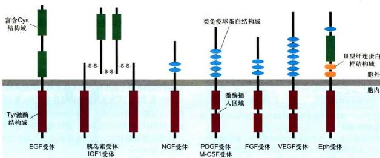  
图11-25 受体酪氨酸激酶的7个亚族

  
图11-26 配体结合所诱导的受体酪氨酸激酶的二聚化与自磷酸化图解  
1. 当细胞处于“静息”状态（没有结合配体），RTK固有的激酶活性很低，激酶结构域柔韧的活化唇（activation lip）未被磷酸化而呈现阻断激酶活性的构象；2. 配体结合，引发构象改变，促进受体二聚化，活化唇部位特定的酪氨酸残基被交叉磷酸化，解除激酶活性的阻断状态；3. 受体胞内段其他酪氨酸残基被进一步交叉磷酸化，结果促进蛋白激酶被激活，并提供下游信号蛋白的锚定位点。

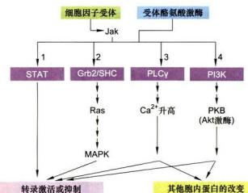  
图11-27 两类酶联受体通过活化酪氨酸蛋白激酶所介导的信号转导通路示意图

RTK和细胞因子受体激活多种信号转导途径，最终调控基因转录。1. 主要由细胞因子受体介导的最直接的信号通路：一种STAT转录因子与活化受体结合并被磷酸化，进入核内直接激活转录。2. 一类接头蛋白（Grb2或Shc）与活化受体结合，导致激活Ras-MAP激酶信号途径。3. 4. 通过募集磷脂酶 $\mathsf{C}\gamma$ （PLCγ）和磷脂酰肌醇3激酶（PI3K）到质膜上引发两种脱醇磷脂途径：通过升高 $\mathrm{Ca^{2+}}$ 激 active蛋白激酶B（PKB）调解转录因子以及胞质蛋白活性，从而致使转录激活或阻遏以及修饰其他蛋白影响细胞代谢或细胞运动或细胞形状。

于组成型活化状态。其他一些 RTK 在分析线虫、果蝇和小鼠的发育突变中也被发现，因为这类突变导致阻断某些细胞类型的分化。

如前所述，活化的RTK通过磷酸化受体胞内段特定的酪氨酸残基，作为锚定位点可以结合多种细胞质中带有SH2结构域的蛋白。其中一类是接头蛋白（adapter protein），如生长因子受体结合蛋白2（Grb2），其作用是偶联活化的RTK受体与其他胞内信号蛋白，参与构成细胞内信号转导复合物，但它本身不具酶活性，也没有传递信号的性质；另一类是在信号通路中有关的酶，如GTP酶活化蛋白（GTPase activating protein, GAP）、肌醇磷脂代谢有关的酶（磷脂酶Cγ，3-磷脂酰肌醇激酶）、蛋白磷酸酯酶（SyP）以及Src类的非受体酪氨酸蛋白激酶等。这两类RTK结合蛋白的结构和功能不同，但它们都具有两个高度保守而无催化活性的模式结合域即SH2和SH3。因为这两种结构域首先在Src蛋白中发现，所以称作Src同源区（Src homolog region 2 and 3, SH2 和 SH3）。这两种结构域，SH2选择性结合不同位点的磷酸酪氨酸残基，SH3选择性结合不同的富含脯氨酸的序列。

## 2. Ras 蛋白

在许多真核细胞中，Ras蛋白在RTK介导的信号通路中也是一种关键组分。Ras蛋白（分子质量 $21\mathrm{kDa}$ ）是Ras基因表达产物，是由190个氨基酸残基组成的小分子单体GTP结合蛋白，具有GTP酶活性，分布于质膜胞质一侧，结合GTP时呈活化态，而结合GDP时呈失活态，所以Ras蛋白也是GTP酶开关蛋白。在细胞中，Ras蛋白的活性受GAP的调节，它能刺激Ras蛋白GTP酶活性增高10万倍；此外Ras蛋白从失活态到活化态的转变，先要GDP释放才有GTP的结合，GDP的释放需要GEF参与；Ras蛋白从活化态到失活态的转变，则要GAP的促进；所以GEF和GAP都与Ras蛋白GTP-GDP转换相关（图11-28）。

  
图 11-28 Ras 蛋白 GTP—GDP 转换与机制

具有鸟苷酸交换因子活性的Sos蛋白（Ras-GEF，来自son-of-sevenless缩写，Sos）与Ras结合引发导致Ras活化的构变改变，使非活性的Ras-GDP转换成有活性的Ras-GTP。对线虫和果蝇发育的特定分化阶段的突变遗传分析发现，也证实上述两种胞质蛋白在联系RTK与Ras蛋白的活化之间具有关键作用。

在酶联受体介导的信号通路中，Ras 蛋白是活化受体 RTK 下游的重要功能蛋白。二者之间通过接头蛋白和 Ras 蛋白－鸟苷酸交换因子（Ras-GEF）起重要联系作用。实验证明，用 PDGF 和 EGF 混合物处理培养的成纤维细胞诱导细胞增殖，如果这些细胞显微注射 Ras 抗体则阻断细胞增殖；反之，如果注射 $Ras^{D}$ （一种组成型活化的突变 Ras 蛋白），它不能有效地水解 GTP 并维持细胞持续的活化状态，结果诱发细胞在缺少生长因子的情况下进行增殖。如图 11–29 所示，两种胞质蛋白提供了关键性联系：一个是生长因子受体结合蛋白 Grb2，具有 SH2 结构域可直接与活化受体特异性磷酸酪氨酸残基结合，Grb2 还具有两个 SH3 结构域能结合并激活另一种胞质蛋白 Sos，即 Grb2 作为一种接头蛋白既与活化受体上特异磷酸酪氨酸残基结合又与胞质蛋白鸟苷酸交换因子 Sos 结合，促进在膜上形成胞内信号转导复合物，复合物的形成又有利于在 Sos 作用下促进 Ras 蛋白结合的 GDP/GTP 交换而被激活。

Ras蛋白的活化是通过配体与RTK的结合而诱导的，而Ras蛋白的活化对诱导不同类型细胞的分化或增殖又是必要而充分的，然而在有些突变细胞中组成型地活化Ras蛋白，即使在缺少信号刺激情况下，细胞也会发生应答反应。已有大量研究表明，约 $30\%$ 的人类恶性肿瘤与Ras基因突变有关，因为突变的Ras蛋白能够与GTP结合，但不能将其水解成GDP，所以这种突变的Ras蛋白被“锁定”在开启状态，结果引起赞生性细胞增生。由RTK介导的信号通路具有广泛的功能，包括调节细胞的增殖与分化，促进细胞存活，以及细胞代谢的调节与校正作用（adjustment）。各种不同的生长因子与RTK结合，有时往往引起细胞内产生多向性的效应（pleiotropic effect），包括早期和晚期基因表达。这种多向性效应是在配体作用下，产生多种信号调节的结果。

  
图 11-29 伴随配体与 RTK（或细胞因子受体）结合，Ras 蛋白的活化

## 3. Ras-MAPK 磷酸化级联反应

Ras-MAPK 磷酸化级联反应，是细胞如何克服 Ras 活化所能维持的时间较短、不足以保障细胞增殖与分化所需持续性信号刺激的重要机制。Ras-MAPK 磷酸化级联反应始于质膜下活化的 Ras 蛋白 (Ras-GTP)，终止于促分裂原活化的蛋白激酶 (MAPK)。在酵母、线虫、果蝇和哺乳类的生化及遗传研究中，已经揭示 Ras 的下游通路是高度保守的三种激酶的级联反应，在 MAPK 终结（图 11-30）。这一保守信号通路参与调控细胞生长、发育、分化、凋亡等多种生理过程。

多种信号蛋白如Ras、酪氨酸激酶Src、蛋白激酶C、蛋白激酶B等都可通过激活不同的Raf激活下游通路，Raf是已知处在丝氨酸/苏氨酸（Ser/Thr）蛋白激酶最上一级的激酶（促分裂原活化的蛋白激酶激酶激酶，MAPKKK），其中Ras蛋白激活Raf是最具代表性的。Ras-MAPK磷酸化级联反应的基本步骤如下：

  
图 11-30 活化的 Ras 蛋白激活的 MAPK 磷酸化级联反应

活化的、结合GTP的Ras蛋白，募集、结合并激活Raf蛋白（丝氨酸/苏氨酸蛋白激酶），起始三种蛋白激酶的磷酸化级联反应，增强和放大信号，级联反应的最后，才能磷酸化修饰一些基因调控蛋白，改变基因表达模式。这是最终导致细胞行为改变的关键。MAP：促分裂原活化蛋白质；Erk=MAPK：促分裂原活化的蛋白激酶；Mek=MAPKK：促分裂原活化的蛋白激酶激酶；Raf=MAPKKK：促分裂原活化的蛋白激酶激酶激酶。

（1）活化的Ras蛋白与Raf的N端调控结构域结合并使其激活，它使靶蛋白上的丝氨酸/苏氨酸残基磷酸化；丝氨酸/苏氨酸残基磷酸化的蛋白质代谢周转比酪氨酸残基磷酸化的蛋白质慢，这有利于使短寿命的Ras-GTP信号事件转变为长寿命的信号事件。

(2) 活化的 Raf 结合并磷酸化另一种蛋白激酶 Mek (促分裂原活化的蛋白激酶激酶, MAPKK), 使其丝氨酸 / 苏氨酸残基磷酸化导致 MAPKK 的活化。

(3) MAPKK 是一种双重特异的蛋白激酶，它能磷酸化其唯一底物 MAPK 的苏氨酸和酪氨酸残基使之激活。

(4) MAPK 在该信号通路的蛋白激酶磷酸化级联反应中是一种特别重要的组分，中文译名为促分裂原活化的蛋白激酶（mitogen-activated protein kinase, MAPK），活化的 MAPK 进入细胞核，可使许多底物蛋白质的丝氨酸/苏氨酸残基磷酸化，包括调节细胞周期和细胞分化的特异性蛋白表达的转录因子，从而修饰它们的活性。

## （三）细胞质因子受体与 JAK/STAT 信号通路

细胞因子（cytokine）是由细胞分泌的影响和调控多种类型细胞增殖、分化与成熟的活性因子，包括白细胞介素（interleukin, IL）、干扰素（interferon, IFN）、集落刺激因子（colony-stimulating factor, CSF）、促红细胞生成素（erythropoietin, Epo）和某些激素（如生长激素和催乳素）等，它们组成一个信号分子家族，其成员分子量相对较小，通常由约160个氨基酸组成。细胞因子对多种细胞类型的发育，特别是在造血细胞和免疫细胞的生长、分化与成熟中起重要调控作用。

细胞因子受体是细胞表面一类与酪氨酸激酶偶联的受体。这类受体的结构与活化机制和RTK非常相似，受体所介导的胞内信号通路也多与RTK介导的胞内信号通路相似或重叠。细胞因子受体本身不具有酶活性，但它的胞内段具有与胞质酪氨酸激酶（Janus激酶）的结合位点，也就是说受体活性依赖于非受体酪氨酸激酶（nonreceptor tyrosine kinase）。

细胞因子与受体结合激活一类Janus激酶（Janus kinase, Jak）家族，其成员包括Jak1、Jak2、Jak3和Tyk2。Jak的N端结构域与受体结合，C端为酪氨酸激酶结构域。每种激酶成员与特异的细胞因子受体结合。研究Epo受体所介导的信号转导通路时，在激酶的直接底物中发现一类新的衔接子蛋白是基因转录调节因子，称为信号转导子和转录激活子（signal transducerand activator of transcription, STAT), STAT 蛋白 N 端具有 SH2 结构域和核定位信号 (NLS), 中间为 DNA 结合域, C 端有一个保守的酪氨酸残基, 对其活化至关重要。目前已发现的 STAT 家族成员有 7 个, 分别命名为 STAT1 至 STAT6, 其中 STAT5 又分为 STAT5A 和 STAT5B 两个成员, 具有信号转导和转录激活的双重功能, 因此细胞因子受体介导的信号通路又称为 Jak-STAT 信号通路 (图 11-31)。

该信号通路是人们在研究干扰素诱导培养细胞特定基因转录的调控作用时发现的，继后发现该通路对细胞增殖、分化、迁移和凋亡等生物学过程都具有重要的调节作用。目前已在人类肿瘤中发现了STAT3信号的异常持续活化，同时在对基因敲除小鼠表型的研究中，也显示Jak-STAT信号通路与某些疾病的发生，如心血管疾病、肥胖症、糖尿病以及支气管哮喘等可能起关键的调控作用。

Jak-STAT 信号通路的基本步骤：

（1）细胞因子与细胞因子受体特异性结合，引发受体构象及紧密结合的 Jak 构象改变并形成同源二聚体。受体二聚化有助于各自结合的 Jak 相互靠近，使彼此酪氨酸残基发生交叉磷酸化，从而完全激活 Jak 的活性。

(2) 活化的 Jak 继而磷酸化受体胞内段特异性酪氨酸残基，使活化受体上磷酸酪氨酸残基成为具有 SH2 结构域的 STAT 或具有 PTB 结构域的其他胞质蛋白的锚定位点。

(3) STAT 通过 SH2 结构域与受体磷酸化的酪氨酸残基结合，继而 STAT 的 C 端酪氨酸残基被 Jak 磷酸化。磷酸化的 STAT 分子即从受体上解离下来。

（4）两个磷酸化的 STAT 分子依靠各自的 SH2 结构域结合形成同源或异源二聚体，从而暴露其核定位信号 NLS。二聚化的 STAT 转位到细胞核内与特异基因的调控序列结合，调节相关基因的表达。

细胞因子受体与 STAT 的结合具有特异选择性，这基于受体胞内段不同位点的磷酸酪氨酸残基结合不同的 STAT 分子，例如，干扰素 $\alpha$ 受体识别 STAT1 和 STAT2，而干扰素 $\beta$ 受体只识别 STAT1，Epo 受体却识别 STAT5。不同的 STAT 在不同的细胞内调节不同的基因转录。在红细胞分化与成熟过程中，Epo 激活 STAT5 继而诱导 Bcl-xL 活化，从而防止前体细胞的凋亡，这对红细胞分化与成熟至关重要。EpoR 基因敲除实验表明，在小鼠胚胎发育至 13 天时会因为缺少编码 Epo 受体的功能基因导致小鼠因为不能产生正常红细胞而死亡。

细胞因子（Epo）除通过 Jak-STAT 通路调控基因转录外，还有其他信号转导途径调控基因的转录（图 11-32）

## （四）PI3K-PKB（Akt）信号通路

## 1. PI3K-PKB（Akt）信号通路及其组成

PI3K-PKB（Akt）信号通路始于RTK和细胞因子受体的活化，产生磷酸化的酪氨酸残基，从而为募集PI3K向膜上转位提供锚定位点。

磷脂酰肌醇3激酶（PI3K）最初是在多瘤病毒(polyoma，一种DNA病毒）研究中被鉴定的。迄今发现在人类基因组中PI3K家族有9种同源基因编码，

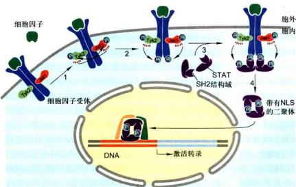  
图11-31 Jak-STAT信号通路

在没有结合配体时，细胞因子受体的胞质结构域与一类Jak紧密而不可逆地结合。虽然受体已二聚化形成同源二聚体，但Jak只有很低的活性。特异性细胞因子与受体结合后，引发Jak构象改变和酪氨酸残基被交叉磷酸化，继而受体的酪氨酸残基也被活化酪酶交叉磷酸化，产生具有SH2结构域的STAT的锚定位点。两个磷酸化的STAT分子从受体上解离下来，靠各自的SH2结构域结合形成同源二聚体，并借助其核定位信号NLS转位至核内，调起基因表达。

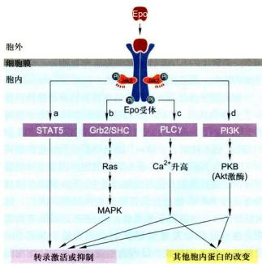  
图11-32 促红细胞生成素（Epo）及其受体所介导的信号转导途径概观

PI3K既具有Ser/Thr激酶活性，又具有磷脂酰肌醇激酶的活性。PI3K由两个亚基组成：一个p110催化亚基；一个p85调节亚基，具有SH2结构域，可结合活化的RTK和多种细胞因子受体胞内段磷酸酪氨酸残基，从而被募集到质膜，使其催化亚基靠近质膜内的磷脂酰肌醇。在膜脂代谢中，具有磷脂酰肌醇激酶活性的PI3K催化PI4P生成 $\mathrm{PI}(3,4)\mathrm{P}_2$ ，进一步催化 $\mathrm{PI}(4,5)\mathrm{P}_2$ 生成 $\mathrm{PI}(3,4,5)\mathrm{P}_3$ 。这些与膜结合的PI3P为多种信号转导蛋白提供了锚定位点，进而介导多种下游信号通路。因此，PI3K-PKB信号途径可视为细胞内另一条与磷脂酰肌醇有关的信号通路，也是RTK介导的衍生信号通路。

许多蛋白激酶都是通过与质膜上 PI3P 锚定位点的结合而被激活的，这些激酶再影响细胞内许多靶蛋白的活性。蛋白激酶 B（PKB）是一种分子质量约 60 kDa 的 Ser/Thr 蛋白激酶，与 PKA 和 PKC 均有很高的相似性，故又称为 PKA 与 PKC 的相关激酶（related to the A and C kinase, RAC-PK），该激酶被证明是反转录病毒癌基因 v-Akt 的编码产物，故又称 Akt。PKB/Akt 由 480 个氨基酸基组成，除中间激酶结构域外，其 N 端还含有一个 PH 结构域，能紧密结合 PI(3,4)P₂ 和 PI(3,4,5)P₃ 分子的 3 位磷酸基团。在静息状态下，两种磷脂酰肌醇组分均处于低于水平，PKB 以非活性状态存在于细胞质基质中，在生长因子等激素刺激下，PI3P 水平升高，PKB 凭信 PH 结构域与 3 位磷酸基因结合而转位到质膜上，同时 PKB 被 PH 结构域掩盖而抑制的催化位点的活性得以释放。PKB 转位到细胞膜上对其部分活化是必需的，是其活化的第一步；而 PKB 的完全活化还需要另外两种 Ser/Thr 蛋白激酶，一个是 PDK1（3-phosphoinositide dependent kinase 1）借助其 PH 结构域转位到膜上并使 PKB 活性位点上的关键苏氨酸残基磷酸化，另一个是 PDK2（通常是 mTOR）则磷酸化 PKB 上丝氨酸残基，上述两个位点被磷酸化后，PKB 才完全活化（图 11-33）。完全活化的 PKB 从质膜上解离下来，进入细胞质基质和细胞核，进而磷酸化多种相应的靶蛋白，产生影响细胞行为的广泛效应，诸如促进细胞存活、改变细胞代谢、致使细胞骨架重组等。

## 2. PI3K-PKB 信号通路的生物学作用

PI3K-PKB 信号通路参与多种生长因子、细胞因子和细胞外基质等的信号转导，具有广泛的生物学效应，特别在防止细胞凋亡，促进细胞存活以及影响细胞糖代谢等方面具有重要作用。

(1) PI3K-PKB 信号通路对细胞生存的促进作用是活化的 PKB 所诱发的诸多细胞反应中最值得关注的事件。虽然活化 PKB 仅需 5～10 min，但它的效应却可持续至少几个小时。在很多细胞中，活化的 PKB 可以直接使促凋亡蛋白（如 Bad）磷酸化并产生短期效应，以防止细胞凋亡。对许多培养细胞，活化的 PKB 也可以产生长期效应，即通过磷酸化 FOXO 转录因子家族成员 FOXO3A 多个 Ser/Thr 残基，使其与细胞质中磷酸丝氨酸结合蛋白 14-3-3 结合而滞留在细胞质中，因而不能进入核内使凋亡基因转录，减低细胞凋亡效应而促进细胞存活。在哺乳动物和人体中，FOXO 家族有 4 种不同的转录因子，其作用既可激活基因表达，也可抑制基因表达，受不同成员调控的基因参与诸如细胞凋亡、肝糖异生、细胞周期和细胞应激反应等多种生理过程。

(2) PI3K-PKB 信号通路的另一个重要生物学作用是促进胰岛素刺激的葡萄糖摄取与储存。在没有胰岛素存在的情况下，细胞内糖原合酶激酶 3（GSK3）是活化的，可将糖原合酶（GS）磷酸化致使失去活性；在有胰岛素刺激的情况下，也可启动 PI3K-PKB 信号途径，结果活化的 PKB 使 GSK3 的 N 端一个 Ser 残基磷酸化而变成无活性形式，从而解除对 GS 的抑制，促进糖原的合成。此外，在肌细胞和脂肪细胞，活化的 PKB 还能诱发胰岛素依赖性葡糖转运蛋白4（glucose transporter 4，Glut4）从细胞内膜转移到细胞表面，促进细胞对葡萄糖的摄取。通过增强糖原合成和促进葡萄糖摄取而使血糖降低。

此外，越来越多的证据表明，在细胞内蛋白质分选或内吞/内化过程中，PI3K是重要的调节因子。活化的PI3K可导致高尔基体TGN或质膜局部区域产生高水平的PI(3,4,5)P3，从而接头蛋白（AP1或AP2）能在这里与膜蛋白中的内吞信号（YXXΦ基序）发生相互作用，进而结合网格蛋白形成包被膜泡，然后发生特定的蛋白质分选或内吞作用。

## （五）TGFβ 受体及其 TGFβ-Smad 信号通路

转化生长因子 $\beta$ (transforming growth factor $\beta$ , TGFβ) 是由多种动物细胞合成与分泌, 以非活性形式储存在细胞胞外基质中的信号分子超家族, 编码基因于1985年克隆。无活性的分泌前体需经蛋白酶水解作用形成以二硫键连接的同源或异源二聚体, 即成熟的活化形式。人类TGFβ超家族由TGFβ1、TGFβ2、TGFβ3三种异构体组成, 已发现近40种。TGFβ超家族是一类作用广泛、具有多种功能的生长因子, 不同的细胞类型或同一细胞处于不同状态也会引起不同的细胞反应。TGFβ不仅会影响细胞的增殖、分化, 而且在创伤愈合、细胞外基质的形成、胚胎发育、组织分化、骨的重建、免疫调节以及神经系统的发育中都有重要作用。

作为RTK介导的衍生信号通路，第一步是具有SH2结构域的PI3K被募集到质膜，催化膜脂代谢；第二步是PKB凭借PH结构域与3位磷酸基团结合而转位到质膜上，使PKB被自身PH结构域抑制的催化位点的活性得以释放；第三步是在两种Ser/Thr蛋白激酶（PDK1和PDK2通常是mTOR）进一步磷酸化PKB活性位点上的关键苏氨酸残基和丝氨酶残基，致使PKB完全活化；并在细胞质内或转位到核内通过修饰下游靶蛋白影响，产生影响细胞行为的广泛效应。

TGFβ超家族成员都是通过细胞表面酶联受体而发挥作用的。根据 $^{125}$ I标记的TGFβ与细胞表面受体结合复合物的电泳检测分析，发现三种分子质量分别为55、85和280 kDa的多肽，分别称之RI、RII和RIII受体。其中最为丰富RIII受体是质膜上的蛋白聚糖(proteoglycan，也称β-glycan)，负责结合并富集成熟的TGFβ，对信号传递起促进作用；RI和RII受体是二聚体跨膜蛋白，直接参与信号传递，其胞质侧结构域具有丝氨酸/苏氨酸蛋白激酶活性，所以TGFβ受体在本质上是受体Ser/Thr激酶。RII是组成型活化激酶，在没有TGFβ结合情况下也可催化自身磷酸化Ser/Thr残基。当细胞外TGFβ与RIII受体结合后（图11-34，1a），RIII将TGFβ递交给RII受体；在另些细胞，TGFβ可以与RII受体直接结合（图11-34，1b）。与TGFβ结合的RII受体募集并磷酸化RII受体胞内段Ser/Thr残基，从而解除其激酶活性的抑制状态，使RII受体被激活。

尽管 TGFβ 可以诱发复杂而多样的细胞反应，但 TGFβ 受体所介导的信号转导通路却又相对简单而且基本相同，即一旦受体与配体结合形成复合物后便被激活，那么受体的激酶活性就能在细胞质内直接磷酸化并激活特殊类型的转录因子 Smad，进入核内调节基因表达，故称 “TGFβ-Smad 信号通路”（图 11-34）。

在 TGFβ-Smad 信号通路中，Smad 蛋白最初在线虫和果蝇发现，分别是 Sma 和 Mad，而后在爪蟾、小鼠和人类中又发现其相关蛋白质，故以Sma和Mad的缩写Smad家族命名这类基因转录调控蛋白。现已知有三种Smad转录因子起调控作用，包括受体调节的R-Smad（Smad2、Smad3）、辅助性Smad（co-Smad, Smad4）和抑制性或拮抗性I-Smad（importin-β），三种Smad在信号通路中分别发挥不同作用。R-Smad是RI受体激酶的直接作用底物，含有MH1和MH2两个结构域，中间为可弯曲的连接区，位于N端的MH1结构域含有特异性DNA结合区，同时也包含核定位信号(NLS)序列，MH2结构域与活化受体结合、R-Smad蛋白磷酸化以及R-Smad蛋白分子的寡聚化有关，并具有潜在转录激活功能。当R-Smad未被磷酸化而处于非活化状态时，NLS被掩盖，此时MH1和MH2结构域便不能与DNA或co-Smad（Smad4）相结合。当RI受体被激活后，将R-Smad近C端的丝氨酸残基磷酸化并导致构象改变使NLS暴露，两个磷酸化的R-Smad与co-Smad和importin-β结合形成大的细胞质复合物（其中importin-β与NLS结合），并引导进入细胞核。在核内Ran-GTP作用下importin-β与NLS解离，Smad2/Smad4或Smad3/Smad4复合物再与其他核内转录因子（TFE3）结合，激活特定靶基因的转录。例如，经TGFβ-Smad信号通路激活的p15蛋白的表达，可在G₁期阻断细胞周期，从而抑制细胞增殖。又如Smad2/Smad4或Smad3/Smad4复合物也可阻遏c-Myc基因的转录，从而减少许多受Myc转录因子调控的促进细图 11-34 TGFβ-Smad 信号通路

1a. 某些细胞中，TGFβ与RII受体结合，并由RIII将信号传递给RII受体（具有组成型激酶活性）。1b. 有些细胞中，信号分子直接与RII受体结合。2. 结合配体的RII受体募集并磷酸化RII受体（RII受体不直接结合配体），RII受体激酶活性的抑制被释放。3. 活化的RII受体磷酸化Smad或另外R-Smad，引起构象改变，解除NLS的掩蔽。4. 两个分磷酸化的R-Smad（Smad3）与未磷酸化的co-Smad（Smad4）以及importin-β相结合，形成大的细胞质复合物。5、6. 复合物转位到核内，Ran-GTP使importin-β与NLS解离。7. 核内转录因子（TEF3）与Smad3/Smad4复合物结合，形成活性型复合物，调节特定靶基因的转录。

胞增殖基因的表达，对细胞增殖起负调控作用。因而TGFβ信号的缺失会导致细胞的异常增殖和癌变。现已发现，许多人类肿瘤或者含有TGFβ受体的失活突变，或者Smad蛋白的突变，因而对TGFβ引起的生长抑制是拮抗的。

在核内 R-Smad 发生去磷酸化，结果 R-Smad/co-Smad 复合物解离，又从核内输出进入细胞质。由于 Smad 持续的核-质穿梭，所以细胞核中活化的 Smad 浓度可以很好地反映细胞表面活化的 TGFβ 受体的水平。

## 二、其他调控基因表达的细胞表面受体及其介导的信号转导通路

按其信号通路的组成和调控机制不同，可将这类受体分作两类：一类是 Wnt 受体和 Hedgehog 受体介导的信号通路；另一类是 NF $\kappa$ B 和 Notch 两种信号通路涉及到抑制物或受体本身的蛋白切割作用，从而释放活化的转录因子，再转位到核内调控基因表达。

## （一）Wnt 受体和 Hedgehog 受体介导的信号通路

Wnt受体和Hedgehog受体具有与7次跨膜与GPCR相似的结构，但并不激活G蛋白；两种受体在细胞处于“静息”状态下，两条相关的信号通路中其关键转录因子被泛素化修饰，进而被蛋白酶体识别和切割降解，表现为失活状态；信号通路的激活涉及大的胞质蛋白复合物的解体（去装配）、泛素化的抑制和活性转录因子的释放，再转位到核内调控基因表达。

## 1. Wnt- $\beta$ -catenin ( $\beta$ -联蛋白) 信号通路

Wnt 是一组富含半胱氨酸的分泌性糖蛋白，作为局域性信号分子，广泛存在于各种动物多种组织中。小鼠 Wnt 基因是最先发现的脊椎动物 Wnt 基因，由于某些乳腺癌的发生与它的过度表达有关，所以 Wnt 基因倍受关注，仅在人类中所发现的 Wnt 蛋白家族成员已多达 19 个。Wnt 来源于 wingless 和 int 的融合词，wingless 是果蝇中与蝇翅发育缺陷相关的基因，int 是小鼠中反转录病毒的整合位点。β-catenin 是哺乳类中与果蝇 Arm 蛋白同源的转录调控蛋白，它在胞质中的稳定及其在核内的累积是 Wnt 信号通路中的关键事件，起中心作用。由于 Wnt 信号可以引发转录因子 β-catenin 从胞质蛋白复合物中释放出来，调控基因表达，所以 Wnt 信号通路又称 Wnt-β-catenin 信号通路，该信号转导通路十分保守，从低等生物线虫到高等生物哺乳类，其组成具有同源性。

该信号通路的膜受体，Frzzled（Fz）是与GPCR相似的7次跨膜细胞表面受体，直接与Wnt结合；另一个辅助性受体（co-receptor）LRP5/6（LDL-receptor-related protein, LRP），一次跨膜，以Wnt信号依赖的方式与Frzzled结合。编码Wnt、Fz或LRP的基因的突变都会影响胚胎的发育。

在细胞内 Wnt 信号转导中，多功能的 β-catenin 起核心作用，它既是转录激活蛋白，又是膜骨架连接蛋白。此外，还有其他胞质调节蛋白参与其中，包括：糖原合酶激酶3（GSK3）、Dishevelled（Dsh）、APC（adenomatous polyposis coli，人类重要的抑癌基因产物）、支架蛋白（Axin）、T细胞因子（T cell factor, TCF）等。

Wnt- $\beta$ -catenin信号通路如图11-35所示；在细胞缺乏Wnt信号时， $\beta$ -catenin结合在由Axin介导形成的胞质复合物上，并被复合物中GSK3磷酸化，磷酸化的 $\beta$ -catenin发生泛素化后被蛋白酶体识别和降解，因而细胞质中 $\beta$ -catenin的水平很低，核内受Wnt信号调控的靶基因处于转录的抑制状态。在细胞外存在较高水平的Wnt信号时，支架蛋白Axin与辅助受体LRP的胞质结构域结合，导致含有GSK3和 $\beta$ -catenin的胞质蛋白复合物解离，从而防止 $\beta$ -catenin被GSK3磷酸化，使 $\beta$ -catenin在细胞质中维持稳定。在细胞质中维持由Wnt诱导的 $\beta$ -catenin的稳定还需要与受体Fz胞质结构域结合的Dsh蛋白。自由的 $\beta$ -catenin转位到核内，与核内转录因子TCF结合，调控特殊靶基因的表达。

Wnt- $\beta$ -catenin 信号通路是胚胎发育中最重要的调控途径之一，对多细胞生物体轴的形成和分化、组织器官建成、组织干细胞的更新与分化等至关重要。Wnt 信号通路的异常活化导致或参与多种人类疾病的发生发展，如肿瘤发生、神经系统退行性疾病（如阿尔茨海默病）等。

## 2. Hedgehog 受体介导的信号通路

Hedgehog（Hh）是一种由信号细胞所分泌的局域性蛋白质信号分子，作用范围很小，一般不超过20个

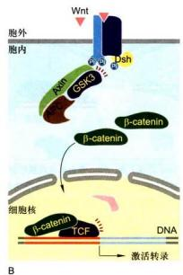  
图11-35 Wnt- $\beta$ -catenin信号通路

A. 缺乏 Wnt 信号， $\beta$ -catenin 与 Axin 介导的胞质蛋白复合物结合，利于 $\beta$ -catenin 被 GSK3 磷酸化，磷酸化的 $\beta$ -catenin 泛素化后被蛋白酶体识别和降解，转录因子 TCF 与抑制因子结合在核内作为阻遏物抑制靶基因转换。B. Wnt 信号与受体 Fz 结合，引发 LRP 被 GSK3 和其他激酶磷酸化，从而使 Axin 与 LRP 结合，致使 Axin/APC/GSK3/ $\beta$ -catenin 复合物解离，防止 $\beta$ -catenin 被 GSK3 磷酸化而免于降解并在细胞中富集，转位到核内与 TCF 结合，激活靶基因转录。

细胞。Hedgehog信号通路，在脊椎和无脊椎动物的诸多发育过程中，控制细胞命运、增殖与分化，该信号通路被异常激活时，会引起肿瘤的发生与发展。该信号蛋白诱导不同的细胞命运依赖于Hh信号分子的浓度。和其他形态生成素（morphogen）一样，它的产生在时间与空间上受到严格控制。Hedgehog在细胞内是以前体（precursor）形式合成与分泌的，在细胞外发生自我催化性降解，然后在N端不同氨基酸残基位点发生胆固醇化和软脂酰化（palmitoylation）修饰，从而制约其扩散并增加其与质膜的亲和性。

Hedgehog受体有三种跨膜蛋白：Patched（Ptc）、Smoothened（Smo）和iHog，介绍细胞对Hh信号的应答反应。Ptc和Smo具有接受和转导Hh信号的功能，膜蛋白iHog可能作为辅助性受体参与Ptc与Hh信号的结合。在缺乏Hh信号情况下，Ptc主要存在于质膜上，以尚未明确的机制，保持Smo处于失活状态并使之隔离在细胞内膜泡上。在有Hh信号存在的情况下，iHog蛋白辅助Hh信号与Ptc结合，抑制Ptc的活性并诱发其内吞作用被溶酶体消化，同时Smo受体蛋白被磷酸化并转位到细胞表面，向下游传递信号。和 Wnt 信号一样，Hedgehog 信号通路也涉及在胞质中多种调节蛋白复合物的装配及复合物的解离，从而释放转录因子。这些调节蛋白包括：丝氨酸/苏氨酸激酶 Fused (Fu)、驱动蛋白相关的马达蛋白 Costal-2 (Cos2)、转录因子 Ci (Cubitis interruptus, 锌指蛋白）以及有关激酶——蛋白激酶 A (PKA)、糖原合酶激酶 3 (GSK3)、酪蛋白激酶 1 (casein kinase 1, CK1)。

基于在果蝇中大量的研究，Hedgehog信号通路的基本模型如图11-36所示：在缺乏Hh信号情况下（图11-36A），受体Ptc蛋白抑制胞内膜泡上的Smo蛋白，胞质调节蛋白形成复合物并与微管结合，在复合物中关键的转录因子Ci被各种激酶磷酸化，磷酸化的Ci在泛素/蛋白酶体相关的F-box蛋白Slimb的作用下水解形成Ci75片段，作为Hh应答基因的阻遏物发挥作用，进入核内抑制靶基因表达。在有Hh存在情况下（图11-36B)，Hh与Ptc结合抑制Ptc活性，引发Ptc内化并被消化，从而解除对Smo的抑制，然后Smo通过膜泡融合移位到质膜，并被CK1和PKA两种激酶磷酸化，与

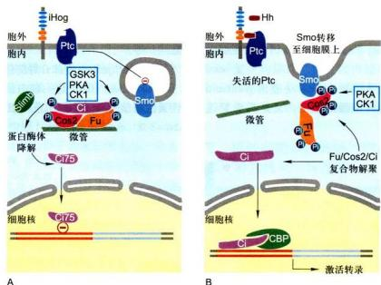  
图11-36 Hedgehog信号通路示意图  
Hedgehog 受体有三种跨膜蛋白: Ptc 跨膜 12 次, Smo 跨膜 7 次, iHog 蛋白单次跨膜但胞外段具有类免疫球蛋白 (Ig) 和类 III 肉纤连蛋白 (FN) 结构域。A. 缺乏 Hh 信号情况下, 受体 Ptc 蛋白抑制胞内膜泡上的 Smo 蛋白, 蛋白内形成胞质调节蛋白复合物并与微管结合, 在复合物中关键的转录因子 Ci 被各种激酶磷酸化, 磷酸化的 Ci 作为靶标由泛素/蛋白酶体相关蛋白 (Slimb) 的作用下水解形成 C775 片段, 此片段作为 Hh 应答基因的阻遏物发挥作用, 进入核内抑制靶基因表达。B. 在有 Hh 存在情况下, Hh 与 Ptc 结合抑制 Ptc 活性, 引发 Ptc 被内吞、消化, 从而解除对 Smo 的抑制, 然后 Smo 通过膜泡融合移位到质膜, 并被 CK1 和 PKA 配种激酶磷酸化, 与 Smo 结合的 Cos2 和 Fu 蛋白超磷酸化, 致使 Fu/Cos2/CI 复合物从微管上解离下来并去装配, 从而形成稳定形式的 Ci, 进入核内并与 CREB 结合蛋白 (CBP) 结合, 作为靶基因的转录激活子而发挥作用。

Smo 结合的 Cos2 和 Fu 蛋白超磷酸化，致使 Fu/Cos2/Ci 复合物从微管上解离下来，从而形成稳定形式的 Ci，进入核内并与 CREB 结合蛋白（CBP）结合，作为靶基因的转录激活子而发挥作用。

## （二）NF $\kappa B$ 和Notch信号通路

按其信号通路的组成和调控机制，NFκB 和 Notch 两种信号通路虽然在生物学功能上也是以调控基因表达，影响细胞长时程（慢反应）活动诸如细胞命运、增殖与分化等方面；但在信号转导体制上涉及到 NFκB 的抑制物（IκB）或受体本身（Notch 受体）的蛋白质切割降解作用，从而释放活化的转录因子，再转位到核内调控基因表达，因此信号调节通路是不可逆的过程。

## 1. NFκB 信号通路

NFκB最初是R.Sen和D.Baltimore于1986年在B细胞中发现的一种核转录因子，能特异性结合免疫球蛋白κ轻链基因的上游增强子序列并激活基因转录。此后发现它广泛存在于几乎所有真核细胞，故而命名。NFκB信号通路可调控多种参与炎症反应的细胞因子（如IL1、IL6、TNFα）、黏附因子和蛋白酶类基因的转录过程，以应答细胞对多种胞外信号刺激，包括病毒侵染、细菌和真菌感染、肿瘤坏死因子、白细胞介素等细胞因子，甚至离子辐射，产生的免疫、炎症和应激反应，并影响细胞增殖、分化及发育。

NFκB 蛋白家族包括五个含有 Rel homology domain (RHD) 的蛋白，即 RelA、RelB、c-Rel、p50 和 p52，它们之间分别形成同源或异源二聚体，在“静息”状态下存在于细胞质中，在 N 端共享一个同源区，以确保其二聚化并与 DNA 结合，核定位信号 (NLS) 也位于此同源区。

如图 11-37 所示，在细胞处于“静息”状态下，NFκB 在细胞质中与一种抑制物 IκBα 结合，处于非活化状态，同源区的 NLS 也因抑制物的结合被掩盖。当细胞受到外界信号刺激时，胞质中 IκB 激酶复合物 (IκB kinase α/β/γ) 被激活并磷酸化 IκB 抑制物 N 端两个丝氨酸残基（步骤 1、2）。E3 泛素连接酶快速识别 IκB 的磷酸化丝氨酸残基并使 IκB 发生多聚泛素化，进而导致 IκB 被泛素依赖性蛋白酶体降解（步骤 3、4）。IκB 的降解使 NFκB 解除束缚并暴露 NLS，然后 NFκB 转位进入核内激活靶基因的转录（步骤 5、6）。

在多种免疫系统细胞中，受NF $\kappa$ B激活转录的基因有150多种，包括编码细胞因子和趋化因子(chemokine) 的基因，在炎症反应中 NFκB 能促进中性粒细胞受体蛋白的表达以利细胞迁移，以及在应对细菌感染时刺激可诱导的一氧化氮合酶（NOS）的表达。NFκB 信号通路除了在免疫和炎症反应中的作用之外，在哺乳动物的发育中也起关键作用，NFκB 对发育中的肝细胞的存活是必须的。实验表明，如果小鼠胚胎不能表达 IκB 激酶的一种亚基，那么在妊娠中期即发生夭折，原因是发育中的肝细胞过度凋亡。

  
图11-37 NF $\times$ B信号通路图解（步骤见正文）

NFκB信号的终止是负向调节的关键，其中活化的NFκB除激活靶基因转录外，还能激活IκB基因的表达，新合成的IκB与核中NFκB结合，然后NFκB/IκB复合物返回细胞质，抑制NFκB的活性。

## 2. Notch 信号通路

Notch 信号通路是一种细胞间接触依赖性的通信方式。信号分子及其受体均是膜整合蛋白。信号转导的启动依赖于信号细胞的信号蛋白与相邻应答细胞的受体蛋白的相互作用，信号激活的受体发生两次切割，释放转录因子，调节应答细胞的分化方向，决定细胞的发育命运。

Notch 受体蛋白是由 Notch 基因编码的膜蛋白受体家族，从无脊椎动物到人类广泛表达，在结构上具有高度保守性。Notch受体蛋白的胞外区包含多个EGF样的重复序列及其与配体的结合位点；胞内区含多种功能序列，是Notch受体蛋白完成信号转导的关键区域。Notch的配体又称DSL（其名源于果蝇Notch配体Delta、Serrate和线虫Lag2的首字母缩写）。

如图 11-38 所示，Notch 蛋白首先以单体膜蛋白形式在内质网合成，然后转运至高尔基体，在反面网状区被蛋白酶切割，产生一个胞外亚基和一个跨膜－胞质亚基；在没有与其他细胞的配体相互作用时，两个亚基彼此以非共价键结合（步骤 1）。随着与相邻信号细胞的配体（Delta）的结合，应答细胞的 Notch 蛋白便发生两次蛋白切割过程：Notch 蛋白首先被结合在膜上的基质金属蛋白酶（matrix metalloprotease）ADAM（源于 a disintegrin and metalloprotese 首字母缩写）切割，然后释放出 Notch 的胞外片段（步骤 2）；第二次切割发生在 Notch 蛋白疏水的跨膜区，由 4 个蛋白亚基组成的跨膜复合物 γ 分泌酶（γ-secretase）负责催化完成，切割后释放 Notch 蛋白的胞质片段（步骤 3）；该胞质片段是 Notch 的活性形式，它立即转位到核内与其他转录因子协同作用，调节靶基因的表达，从而影响发育过程中细胞命运的决定（步骤 4）。

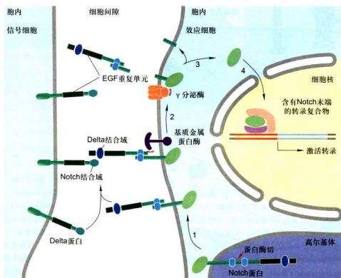  
图11-38 Notch/Delta信号通路图解（步骤见正文）

<!-- END CN CN11-S03 -->

---

## 对应英文内容

### 英文补充：RTK、Ras-MAPK、PI3K-Akt、JAK-STAT、TGFβ及其他通路

> 对应中文板块：RTK、Ras-MAPK、PI3K-Akt、JAK-STAT、TGFβ及其他通路。英文来源：Molecular Biology of the Cell，第7版，第15章；[本章完整原文](../来源/英文教材/15_Cell_Signaling/chapter.md)。物理PDF页码范围：912–987（整章范围）。

<!-- BEGIN EN EN15-H031-H054 -->
#### SIGNALING THROUGH ENZYME-COUPLED RECEPTORS

Like GPCRs, **enzyme-coupled receptors** are transmembrane proteins with their ligand-binding domain on the outer surface of the plasma membrane. Instead of having a cytosolic domain that associates with a heterotrimeric G protein, however, their cytosolic domain either has intrinsic enzyme activity or associates directly with an enzyme. Whereas a GPCR has seven transmembrane segments, each subunit of an enzyme-coupled receptor typically has only one. GPCRs and enzyme-coupled receptors often activate some of the same signaling pathways. In this section, we describe some of the important features of signaling by enzymecoupled receptors, with an emphasis on the most common class of these proteins, the receptor tyrosine kinases.

#### Activated Receptor Tyrosine Kinases (RTKs) Phosphorylate Themselves

Many extracellular signal proteins act through **receptor tyrosine kinases (RTKs)**. These include many secreted and cell-surface-bound proteins that control cell behavior in developing and adult animals. Some of these signal proteins and their RTKs are listed in **Table 15–4**.

There are about 60 human RTKs, which can be classified into about 20 structural subfamilies, each dedicated to its complementary family of protein ligands. **Figure 15–44** shows the basic structural features of a number of the families that operate in mammals. In all cases, the binding of the signal protein to the ligandbinding domain on the extracellular side of the receptor activates the tyrosine kinase domain on the cytosolic side. This leads to phosphorylation of tyrosine side chains on the cytosolic part of the receptor, creating phosphotyrosine docking sites for various intracellular signaling proteins that relay the signal.

<table><tbody><tr><td colspan="3">TABLE 15-4 Some Extracellular Signal Proteins That Act Via RTKs</td></tr><tr><td>Signal protein family</td><td>Receptor family</td><td>Some representative responses</td></tr><tr><td>Epidermal growth factor (EGF)</td><td>EGF receptors</td><td>Stimulates cell survival, growth, proliferation, or differentiation of various cell types; acts as inductive signal in development</td></tr><tr><td>Insulin</td><td>Insulin receptor</td><td>Stimulates carbohydrate utilization and protein synthesis</td></tr><tr><td>Insulin-like growth factor (IGF1)</td><td>IGF receptor-1</td><td>Stimulates cell growth and survival in many cell types</td></tr><tr><td>Nerve growth factor (NGF)</td><td>Trk receptors</td><td>Stimulates survival and growth of some neurons</td></tr><tr><td>Platelet-derived growth factor (PDGF)</td><td>PDGF receptors</td><td>Stimulates survival, growth, proliferation, and migration of various cell types</td></tr><tr><td>Macrophage-colony-stimulating factor (MCSF)</td><td>MCSF receptor</td><td>Stimulates monocyte/macrophage proliferation and differentiation</td></tr><tr><td>Fibroblast growth factor (FGF)</td><td>FGF receptors</td><td>Stimulates proliferation of various cell types; inhibits differentiation of some precursor cells; acts as inductive signal in development</td></tr><tr><td>Vascular endothelial growth factor (VEGF)</td><td>VEGF receptors</td><td>Stimulates angiogenesis</td></tr><tr><td>Ephrin</td><td>Eph receptors</td><td>Stimulates angiogenesis; guides cell and axon migration</td></tr></tbody></table>

Fi ure 15–44 Some subfamili f Figur es o

RTKs. Only one or two members of each subfamily are indicated. Note that in some cases, the tyrosine kinase domain is interrupted by a kinase insert region that is an extra segment emerging from the folded kinase domain. The functions of most of the cysteine-rich, immunoglobulin-like, and fibronectin-type-III-like domains are not known. Some of the ligands for the receptors shown are listed in Table 15–4, along with some representative responses that they mediate.

How does the binding of an extracellular ligand activate the kinase domain on the other side of the plasma membrane? For a GPCR, ligand binding is thought to change the relative orientation of several of the transmembrane α helices, thereby shifting the position of the cytoplasmic loops relative to one another. It is unlikely, however, that a conformational change could propagate across the lipid bilayer through a single transmembrane α helix. Instead, the mechanism of RTK activation depends on ligand-stimulated changes in the interaction of two receptors, bringing the two cytoplasmic kinase domains together and thereby promoting their activation (**Figure 15–45**).

The cytoplasmic kinase domains of RTKs are dimerized and activated by a variety of mechanisms. In many cases, such as the receptor for platelet-derived growth

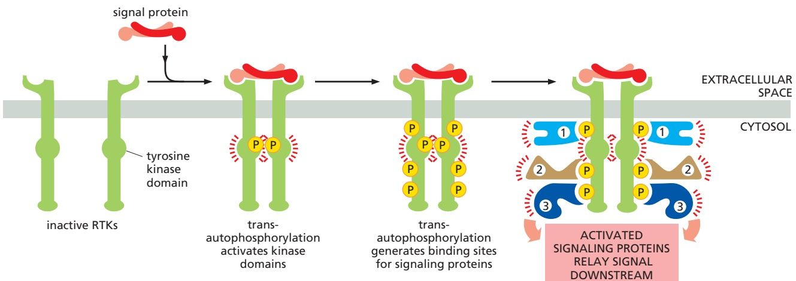

Figure 15–45 Activation of RTKs by dimerization. In the absence of extracellular signals, many RTKs exist as monomers in which the internal kinase domain is inactive. Binding of ligand brings two monomers together to form a dimer. The close proximity in the dimer leads the two kinase domains to phosphorylate each other, which has two effects. First, phosphorylation at some tyrosines in the kinase domains promotes the complete activation of the domains. Second, phosphorylation at tyrosines in other parts of the receptors generates docking sites for intracellular signaling proteins, resulting in the formation of large signaling complexes that can then broadcast signals along multiple signaling pathways.

Mechanisms of activation vary widely among different RTK family members. In some cases (as shown here), the ligand itself is a dimer and brings two receptors together by binding them simultaneously. In other cases, two ligands can bind independently on two receptors to promote receptor dimerization. Some RTKs exist normally as a dimer (see Figure 15–44), and ligand binding causes a conformational change that brings the two internal kinase domains closer together. Although many RTKs are activated by transautophosphorylation as shown here, there are some important exceptions, including the EGF receptor illustrated in Figure 15–46.

Figure 15–46 Activation of the EGF receptor kinase. In the absence of ligand, the EGF receptor exists primarily as an inactive monomer. EGF binding results in a conformational change that promotes dimerization of the external domains. The receptor kinase domain, unlike that of many RTKs, is not activated by transautophosphorylation. Instead, dimerization orients the internal kinase domains into an asymmetrical dimer, in which one kinase domain (the activator) pushes against the other kinase domain (the receiver), thereby causing an activating conformational change in the receiver. The active receiver domain then phosphorylates multiple tyrosines in the C-terminal tails of both receptors, generating docking sites for intracellular signaling proteins (see Figure 15–45).

factor (PDGF), dimerization of the external receptor domain simply brings two kinase domains close to each other in a stable orientation that allows them to phosphorylate each other on specific tyrosines in the kinase active sites, thereby promoting conformational changes that fully activate both kinase domains. Some RTKs, including the insulin receptor, exist as dimers in the absence of ligand (see Figure 15–44), and ligand binding re-orients the extracellular domains to bring the internal kinase domains into a closer position to promote kinase activation. In other cases, such as the receptor for epidermal growth factor (EGF), the kinase is not activated by phosphorylation but by conformational changes brought about by interactions between the two kinase domains outside their active sites (**Figure 15–46**).

Note that protein kinase activity is generated only in the receiver kinase domain; the activator kinase domain remains in an inactive conformation. In fact, some members of the EGF receptor family contain kinase domains that are missing key residues in their active site and are therefore inactive. These pseudokinase receptors can still dimerize with and activate EGF receptors containing an active kinase receiver domain.

#### Phosphorylated Tyrosines on RTKs Serve as Docking Sites for Intracellular Signaling Proteins

Once the kinase domains of an RTK dimer are activated, they phosphorylate multiple additional sites in the cytosolic parts of the receptors, typically in disordered regions outside the kinase domain (see Figure 15–45). This phosphorylation creates high-affinity docking sites for specific intracellular signaling proteins. Each signaling protein binds to a particular phosphorylated site on the activated receptors because it contains a specific phosphotyrosine-binding domain that recognizes surrounding features of the polypeptide chain in addition to the phosphotyrosine.

Once bound to the activated RTK, a signaling protein may become phosphorylated on tyrosines and thereby activated. In many cases, however, the binding alone may be sufficient to activate the docked signaling protein, by either inducing a conformational change in the protein or simply bringing it near the protein that is next in the signaling pathway. Thus, receptor phosphorylation serves as a switch to trigger the assembly of an intracellular signaling complex, which can then relay the signal onward, often along multiple routes, to various destinations in the cell. Because different RTKs bind different combinations of these signaling proteins, they activate different responses.

Some RTKs use additional docking proteins to enlarge the signaling complex at activated receptors. Insulin receptor signaling, for example, depends on a specialized adaptor protein called insulin receptor substrate-1 (IRS1). IRS1 binds to specific phosphorylated tyrosines on the activated receptor and is then phosphorylated at multiple sites, thereby creating many more docking sites than could be accommodated on the receptor alone (see Figure 15–11).

#### Proteins with SH2 Domains Bind to Phosphorylated Tyrosines

A whole menagerie of intracellular signaling proteins can bind to the phosphotyrosines on activated RTKs (or on docking proteins such as IRS1). They help to relay the signal onward, mainly through chains of protein–protein interactions mediated by modular interaction domains, as discussed earlier (see Figure 15–11). Some of the docked proteins are enzymes, such as **phospholipase C-g (PLCg)**, which functions in the same way as phospholipase C-β—activating the inositol phospholipid signaling pathway discussed earlier in connection with GPCRs (see Figures 15–29 and 15–30). Through this pathway, RTKs can increase cytosolic $\tilde { \mathrm { C a } ^ { 2 + } }$ levels and activate PKC. Another enzyme that docks on these receptors is the cytoplasmic tyrosine kinase Src, which phosphorylates other signaling proteins on tyrosines (discussed in Chapter 3). Yet another is phosphoinositide 3-kinase (PI 3-kinase), which phosphorylates lipids rather than proteins; as we discuss later, the phosphorylated lipids then serve as docking sites to attract various signaling proteins to the plasma membrane.

The intracellular signaling proteins that bind to phosphotyrosines have varied structures and functions. However, they usually share highly conserved phosphotyrosine-binding domains, which can be either **SH2 domains** (for Src homology 2) or, less commonly, PTB domains (for phosphotyrosine-binding). By recognizing specific phosphorylated tyrosines, these small interaction domains enable the proteins that contain them to bind to activated RTKs, as well as to many other intracellular signaling proteins that have been transiently phosphorylated on tyrosines (**Figure 15–47**). Many signaling proteins also contain other interaction domains that allow them to interact specifically with other proteins as part of the signaling process. These domains include the SH3 domain, which binds to proline-rich motifs in intracellular proteins (see Figures 15–11 and 15–12).

Not all proteins that bind to activated RTKs via SH2 domains help to relay the signal onward. Some act to decrease the signaling process, providing negative feedback. One example is the c-Cbl protein, which can dock on some activated receptors and catalyze their ubiquitylation, covalently adding one or more ubiquitin molecules to specific sites on the receptor. This promotes the endocytosis and degradation of the receptors in lysosomes—an example of receptor destruction (see Figure 15–21E). Endocytic proteins that contain ubiquitin-interaction motifs

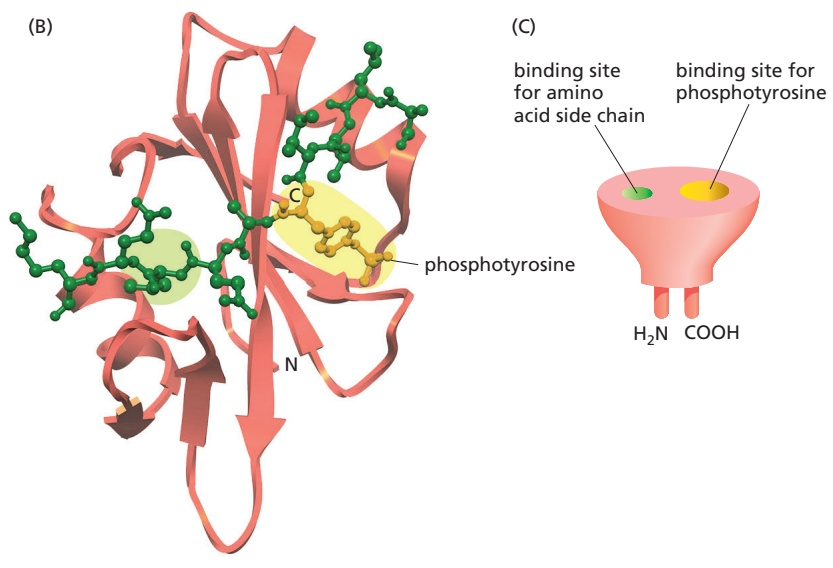

#### Figure 15–47 The binding of SH2- containing intracellular signaling proteins to an activated RTK.

(A) Drawing based on an activated receptor for platelet-derived growth factor (PDGF); for simplicity, only one monomer of the dimer is shown, and the PDGF ligand is omitted. Five phosphotyrosines are shown, three in the kinase insert region and two on the C-terminal tail; these form three docking sites, each of which binds a different signaling protein as indicated. The numbers on the right indicate the positions of the tyrosines in the polypeptide chain. The functions of these phosphotyrosines were determined by mutation of specific tyrosines. Mutation of tyrosines 1009 and 1021, for example, prevents the binding and activation of PLCγ, so that receptor activation no longer stimulates the inositol phospholipid signaling pathway. The locations of the SH2 (red) and SH3 (blue) domains in the primary structures of the three signaling proteins are indicated. Additional phosphotyrosine docking sites on this receptor are not shown, including those that bind the cytoplasmic tyrosine kinase Src and two adaptor proteins. It is unclear how many signaling proteins can bind simultaneously to a single RTK. (B) The three-dimensional structure of an SH2 domain, as determined by x-ray crystallography. The binding pocket for phosphotyrosine is shaded in yellow on the right, and a pocket for binding a specific amino acid side chain (valine, in this case) is shaded in green on the left. The RTK polypeptide segment that binds the SH2 domain is shown in green. (C) The SH2 domain is a compact, “plug-in” module, which can be inserted in disordered regions of a protein without disturbing the protein’s folding or function (discussed in Chapter 3). Because each domain has distinct sites for recognizing phosphotyrosine and for recognizing a particular amino acid side chain, different SH2 domains recognize phosphotyrosine in the context of different flanking amino acid sequences. (B, PDB code: 2SRC.)

(UIMs) recognize the ubiquitylated RTKs and direct them into clathrin-coated vesicles and, ultimately, into lysosomes (discussed in Chapter 13). Mutations that inactivate c-Cbl-dependent RTK down-regulation cause prolonged RTK signaling and thereby promote the development of cancer.

As is the case for GPCRs, ligand-induced endocytosis of RTKs does not always decrease signaling. In some cases, activated RTKs are endocytosed with their bound signaling proteins and continue to signal from endosomes or other intracellular compartments. This mechanism, for example, allows nerve growth factor (NGF) to bind to its specific RTK (called TrkA) at the end of a long nerve cell axon and signal to the cell body of the same cell a long distance away. The signaling endocytic vesicles containing activated TrkA, with NGF bound on the lumenal side and signaling proteins docked on the cytosolic side, are transported along the axon to the cell body, where they signal the cell to survive.

Some signaling proteins are composed almost entirely of SH2 and SH3 domains and function as adaptors to couple tyrosine-phosphorylated proteins to other proteins that do not have their own SH2 domains (see Figures 15–11 and 15–12). Adaptor proteins of this type help to couple activated RTKs to the important signaling protein Ras, a monomeric GTPase that, in turn, can activate various downstream signaling pathways, as we now discuss.

#### The Monomeric GTPase Ras Mediates Signaling by Most RTKs

The **Ras superfamily** consists of various families of monomeric GTPases, but only the Ras and Rho families relay signals from cell-surface receptors (**Table 15–5**). By interacting with different intracellular signaling proteins, a single Ras or Rho family member can coordinately spread the signal along several distinct downstream signaling pathways.

There are three major, closely related Ras proteins in humans: H-, K-, and N-Ras (see Table 15–5). Although they have subtly different functions, they are thought to work in the same way, and we will refer to them simply as **Ras**. Like many monomeric GTPases, Ras contains one or more covalently attached lipid groups that help anchor the protein to the cytoplasmic face of the plasma membrane, from where it relays signals to other parts of the cell. Ras is often required, for example, when RTKs signal to the nucleus to stimulate cell proliferation or differentiation, both of which require changes in gene expression. If Ras function is inhibited by various experimental approaches, the cell proliferation or differentiation responses normally induced by the activated RTKs do not occur. Conversely,

<table><tbody><tr><td colspan="3">TABLE 15-5 The Ras Superfamily of Monomeric GTPases</td></tr><tr><td>Family</td><td>Some family members</td><td>Some functions</td></tr><tr><td>Ras</td><td>H-Ras, K-Ras, N-Ras</td><td>Relay signals from RTKs</td></tr><tr><td></td><td>Rheb</td><td>Activates mTOR to stimulate cell growth</td></tr><tr><td></td><td>Rap1</td><td>Activated by a cyclic-AMP-dependent GEF; influences cell adhesion by activating integrins</td></tr><tr><td>Rho*</td><td>Rho, Rac, Cdc42</td><td>Relay signals from surface receptors to the cytoskeleton and elsewhere</td></tr><tr><td>ARF*</td><td>ARF1-ARF6</td><td>Regulate assembly of protein coats on intracellular vesicles</td></tr><tr><td>Rab*</td><td>Rab1-60</td><td>Regulate intracellular vesicle traffic</td></tr><tr><td>Ran*</td><td>Ran</td><td>Regulates mitotic spindle assembly and nuclear transport of RNAs and proteins</td></tr></tbody></table>

\*The Rho family is discussed in Chapter 16, the ARF and Rab proteins in Chapter 13, and Ran in Chapters 12 and 17. The three-dimensional structure of Ras is shown in Figure 3–64.

Figure 15–48 How an RTK activates Ras. The Grb2 adaptor protein recognizes a specific phosphorylated tyrosine on the activated receptor by means of an SH2 domain and recruits the Ras GEF Sos by means of an interaction between its SH3 domains and proline-rich regions in Sos. Sos also contains a PH domain that recognizes specific phospholipids but is not used here (see Figure 15–11). The Ras GEF domain of Sos stimulates the inactive Ras protein to replace its bound GDP by GTP, which activates Ras to relay the signal downstream.

30% of human tumors express hyperactive mutant forms of Ras, which contribute to the uncontrolled proliferation of the cancer cells.

Like other GTP-binding proteins, Ras functions as a molecular switch, cycling between two distinct conformational states—active when GTP is bound and inactive when GDP is bound (**Movie 15.7**). As discussed earlier for monomeric GTPases in general, two classes of signaling proteins regulate Ras activity by influencing its transition between active and inactive states (see Figure 15–8). Ras guanine nucleotide exchange factors (**Ras GEFs**) stimulate the dissociation of GDP and the subsequent binding of GTP from the cytosol, thereby activating Ras. Ras GTPase-activating proteins (**Ras GAPs**) increase the rate of hydrolysis of bound GTP by Ras, thereby inactivating Ras. Hyperactive mutant forms of Ras are resis-MBoC7 m15.47/15.48 tant to Ras GAPs and are therefore locked in the GTP-bound active state, which is why they promote the development of cancer.

How do RTKs normally activate Ras? In principle, they could either activate a Ras GEF or inhibit a Ras GAP. Even though some GAPs bind directly (via their SH2 domains) to activated RTKs (see Figure 15–47A), it is the indirect coupling of the activated receptor to a Ras GEF that drives Ras into its active state. The loss of function of a Ras GEF has a similar effect to the loss of function of Ras itself. Activation of the other Ras superfamily proteins, including those of the Rho family, also occurs through the activation of GEFs. The particular GEF determines in which membrane the GTPase is activated, and, by acting as a scaffold, it can also determine which downstream proteins the GTPase activates.

The GEF that mediates Ras activation by RTKs was discovered by genetic studies of eye development in Drosophila, where an RTK called Sevenless (Sev) is required for the formation of a photoreceptor cell called R7. Genetic screens for components of this signaling pathway led to the discovery of a Ras GEF called Son-of-sevenless (Sos). Further genetic screens uncovered another protein, now called Grb2, which is an adaptor protein that links the Sev receptor to the Sos protein; the SH2 domain of the Grb2 adaptor binds to the activated receptor, while one or both of its SH3 domains bind to Sos. Sos then promotes Ras activation. Biochemical and cell biological studies have shown that Grb2 and Sos also link activated RTKs to Ras in mammalian cells, revealing that this mechanism in RTK signaling has been highly conserved in evolution (**Figure 15–48**). Once activated, Ras activates various other signaling proteins to relay the signal downstream.

#### Ras Activates a MAP Kinase Signaling Module

Both the tyrosine phosphorylations and the activation of Ras triggered by activated RTKs are usually short-lived (**Figure 15–49**). Tyrosine-specific protein phosphatases reverse the phosphorylations, and Ras GAPs induce activated Ras to inactivate itself by hydrolyzing its bound GTP to GDP. To stimulate cells to proliferate or differentiate, these short-lived signaling events must be converted into longer-lasting ones that can sustain the signal and relay it downstream to the nucleus to alter the pattern of gene expression. One of the key mechanisms used for this purpose is a system of proteins called the mitogen-activated protein kinase module (**MAP kinase module**) (**Figure 15–50**). The three components of this system form a functional signaling module that has been remarkably well conserved during evolution and is used, with variations, in many different signaling contexts.

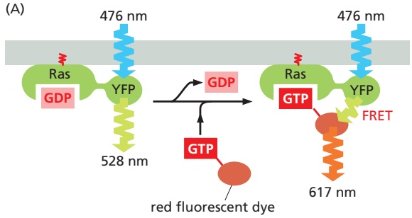

The three components are all protein kinases, which mainly phosphorylate serines and threonines. The final kinase in the series is called simply MAP kinase (MAPK). The next one upstream from this is MAP kinase kinase (MAPKK): it phosphorylates and thereby activates MAP kinase. Next above that, receiving an activating signal directly from Ras, is MAP kinase kinase kinase (MAPKKK): it phosphorylates and thereby activates MAPKK. In the mammalian **Ras–MAP-kinase signaling pathway**, these three kinases are known by shorter names: Raf (= MAPKKK), Mek (= MAPKK), and Erk (= MAPK).

Once activated, the MAP kinase relays the signal downstream by phosphorylating various proteins in the cell, including transcription regulators and otherMBoC7 m15.48/15.49 protein kinases (see Figure 15–50). Erk, for example, enters the nucleus and phosphorylates one or more components of a transcription regulatory complex. This activates the transcription of a set of immediate early genes, so named because they turn on within minutes after an RTK receives an extracellular signal, even if protein synthesis is experimentally blocked with drugs. Some of these genes encode other transcription regulators that turn on other genes, a process that requires both protein synthesis and more time. In this way, the Ras–MAP-kinase signaling pathway conveys signals from the cell surface to the nucleus and alters the pattern of gene expression. Among the genes activated by this pathway are some that stimulate cell proliferation, such as the genes encoding G1 cyclins (discussed in Chapter 17).

MAP kinase activation lasts for different amounts of time, depending on the extracellular signal. When EGF activates its receptors in a neural precursor cell line, for example, Erk MAP kinase activity peaks at 5 minutes and rapidly declines,

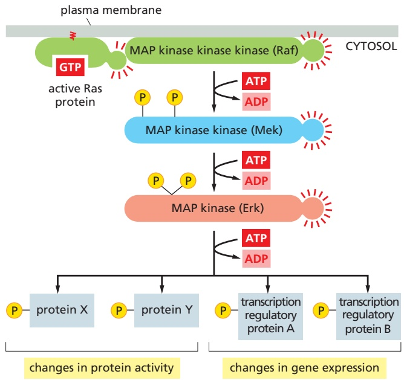

Figure 15–49 Transient activation of Ras revealed by single-molecule fluorescence resonance energy transfer (FRET). (A) Schematic drawing of the experimental strategy. Cells of a human cancer cell line were genetically engineered to express a Ras protein that was covalently linked to yellow fluorescent protein (YFP). GTP that was labeled with a red fluorescent dye was microinjected into some of the cells. The cells were then stimulated with the extracellular signal protein EGF, and single fluorescent molecules of Ras-YFP at the inner surface of the plasma membrane were measured by video fluorescence microscopy in individual cells. When a fluorescent Ras-YFP molecule becomes activated, it exchanges unlabeled GDP for fluorescently labeled GTP; the energy emitted by the YFP now activates the fluorescent GTP to emit red light (called fluorescence resonance energy transfer, or FRET; see Figure 9–22). Thus, the activation of single Ras molecules can be followed by the emission of red fluorescence from a previously yellow-green fluorescent spot at the plasma membrane. As shown in (B), activated Ras molecules could be detected after about 30 seconds of EGF stimulation. The red signal peaked at about 3 minutes and then decreased to baseline by 6 minutes. As Ras GAP was found to be recruited to the same spots at the plasma membrane as Ras, it presumably plays a major part in rapidly shutting off the Ras signal. (Modified from H. Murakoshi et al., Proc. Natl. Acad. Sci. USA 101:7317–7322, 2004. Copyright 2004 National Academy of Sciences, USA. With permission from National Academy of Sciences.)

Figure 15–50 The MAP kinase module activated by Ras. The three-component module begins with a MAP kinase kinase kinase called Raf. Ras recruits Raf to the plasma membrane and helps activate it. Raf then activates the MAP kinase kinase Mek, which then activates the MAP kinase Erk. Erk in turn phosphorylates a variety of downstream proteins, including other protein kinases, as well as transcription regulators in the nucleus. The resulting changes in protein activities and gene expression cause complex changes in cell behavior (Movie 15.8).

and the cells later go on to divide. By contrast, when NGF activates its receptors on the same cells, Erk activity remains high for many hours, and the cells stop proliferating and differentiate into neurons.

Many intracellular mechanisms influence the duration and other features of the signaling response, including positive and negative feedback loops, which can combine to give responses that are either graded or switchlike and either brief or long lasting. In an example illustrated earlier, in Figure 15–20, MAP kinase activates a complex positive feedback loop to produce an all-or-none, irreversible response when frog oocytes are stimulated to mature by a brief exposure to the hormone progesterone. In many cells, MAP kinases activate a negative feedback loop by increasing the concentration of a protein phosphatase that removes the phosphates from MAP kinase. The increase in the phosphatase results from both an increase in the transcription of the phosphatase gene and the stabilization of the phosphatase protein against degradation. In the Ras–MAP-kinase pathway shown in Figure 15–50, Erk also phosphorylates and inactivates Raf, providing another negative feedback loop that helps shut off the MAP kinase module.

#### Scaffold Proteins Reduce Cross-Talk Between Different MAP Kinase Modules

Three-component MAP kinase signaling modules operate in all eukaryotic cells, with different modules mediating different responses in the same cell. In budding yeast, for example, one MAP kinase module mediates the response to mating pheromone, another the response to starvation, and yet another the response to osmotic shock. Some of these MAP kinase modules use one or more of the same kinases and yet manage to activate different downstream proteins and hence different responses. As discussed earlier, one way in which cells avoid cross-talk between the different parallel signaling pathways and ensure that each response is specific is to use scaffold proteins (see Figure 15–10A). In budding yeast cells, such scaffolds bind all or some of the kinases in each MAP kinase module to form a complex and thereby help to ensure response specificity (**Figure 15–51**).

Mammalian cells also use this scaffold strategy to prevent cross-talk between different MAP kinase modules. At least five parallel MAP kinase modules can operate in a mammalian cell. These modules make use of at least 12 MAP kinases, 7 MAPKKs, and 7 MAPKKKs. Two of these modules (terminating in MAP kinases called JNK and p38) are activated by different kinds of cell stresses, such as ultraviolet (UV) irradiation, heat shock, and osmotic stress; others mediate responses to signals from other cells.

Although the scaffold strategy provides precision and avoids cross-talk, it reduces the opportunities for amplification and spreading of the signal to different parts of the cell, which require at least some of the components to be diffusible. It

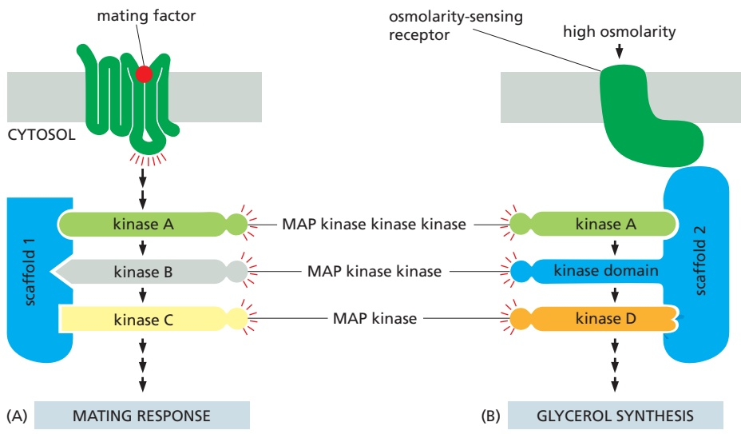

Figure 15–51 The organization of two MAP kinase modules by scaffold proteins in budding yeast. Budding yeast have at least six three-component MAP kinase modules involved in a variety of biological processes, including the two responses illustrated here—a mating response and the response to high osmolarity. (A) The mating response is triggered when a mating factor secreted by a yeast of opposite mating type binds to a GPCR. This activates a G protein, the βγ complex of which indirectly activates the MAPKKK (kinase A), which then relays the response onward. Once activated, the MAP kinase (kinase C) phosphorylates and thereby activates several downstream proteins that mediate the mating response, in which the yeast cell stops dividing and prepares for fusion. The three kinases in this module are bound to scaffold protein 1. (B) In a second response, a yeast cell exposed to a high-osmolarity environment is induced to synthesize glycerol to increase its internal osmolarity. This response is mediated by an osmolarity-sensing receptor protein and a different MAP kinase module bound to a second scaffold protein. (Note that the kinase domain of scaffold 2 provides the MAPKK activity of this module.) Although both pathways use the same MAPKKK (kinase A, green), there is no cross-talk between them because the kinases in each module are bound to different scaffold proteins, and the osmolarity-sensing receptor is bound to the same scaffold protein as the particular kinase it activates.

is unclear to what extent the individual components of MAP kinase modules can dissociate from the scaffold during the activation process to permit amplification.

#### Rho Family GTPases Functionally Couple Cell-Surface Receptors to the Cytoskeleton

Besides the Ras proteins, the other class of Ras superfamily GTPases that relays signals from cell-surface receptors is the large **Rho family** (see Table 15–5). Rho family monomeric GTPases regulate both the actin and microtubule cytoskeletons, controlling cell shape, polarity, motility, and adhesion (discussed in Chapter 16); they also regulate cell-cycle progression, gene transcription, and membrane transport. They play a key part in the guidance of cell migration and nerve axon outgrowth, mediating cytoskeletal responses to the activation of a special class of guidance receptors. We focus on this aspect of Rho family function here.

The three best-characterized family members are **Rho** itself, **Rac**, and **Cdc42**, each of which affects multiple downstream target proteins. In the same way as for Ras, GEFs activate and GAPs inactivate the Rho family GTPases; there are more than 80 Rho GEFs and more than 70 Rho GAPs in humans. Some of the GEFs and GAPs are specific for one particular family member, whereas others are less specific. Unlike Ras, which is membrane-associated even when inactive (with GDP bound), inactive Rho family GTPases are often bound to guanine nucleotide dissociation inhibitors (GDIs) in the cytosol, which prevent the GTPases from interacting with their Rho GEFs at the plasma membrane.

Signaling by extracellular signaling proteins of the **ephrin** family provides an example of how RTKs can activate a Rho GTPase. Ephrins bind and thereby activate members of the Eph family of RTKs (see Figure 15–44). One member of the Eph family is found on the surface of motor neurons and helps guide the migrating tip of the axon (called a growth cone) to its muscle target. The binding of a cell-surface ephrin protein activates the Eph receptor, causing the growth cones to collapse, thereby repelling them from inappropriate paths and keeping them on track. The response depends on a Rho GEF called ephexin, which is stably associated with the cytosolic tail of the Eph receptor. When ephrin binding activates the Eph receptor, the receptor activates a cytoplasmic tyrosine kinase that phosphorylates ephexin on a tyrosine, enhancing the ability of ephexin to activate the Rho protein RhoA. The activated RhoA (RhoA-GTP) then regulates various downstream target proteins, including some effector proteins that control the actin cytoskeleton, causing the growth cone to collapse (**Figure 15–52**).

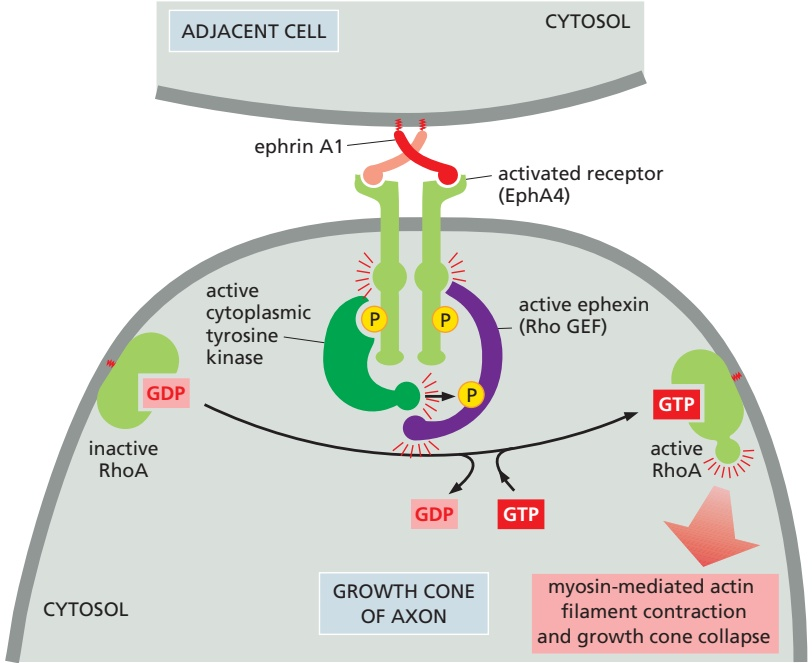

Figure 15–52 Growth cone collapse mediated by the Rho family GTPase RhoA. The binding of ephrin A1 proteins on an adjacent cell activates EphA4 RTKs on the growth cone. The resulting phosphotyrosines on the activated Eph receptors recruit and activate a cytoplasmic tyrosine kinase to phosphorylate the receptor-associated Rho GEF ephexin on a tyrosine. This enhances the ability of the ephexin to activate membranebound RhoA, which stimulates the myosin-dependent contraction of the actin cytoskeleton, thereby causing the growth cone to collapse.

Having considered how RTKs use GEFs and monomeric GTPases to relay signals into the cell, we now consider a second major RTK signaling strategy that depends on a different intracellular relay mechanism.

#### PI 3-Kinase Produces Lipid Docking Sites in the Plasma Membrane

As mentioned earlier (see Figure 15–47A), one of the proteins that binds to the intracellular tail of RTK molecules is the plasma-membrane-bound enzyme **phosphoinositide 3-kinase (PI 3-kinase)**. This kinase principally phosphorylates inositol phospholipids rather than proteins, and both RTKs and GPCRs can activate it. It plays a central part in promoting cell survival and growth.

Phosphatidylinositol (PI) is unusual among membrane lipids because it can undergo reversible phosphorylation at multiple sites on its inositol head group to generate a variety of phosphorylated PI lipids called **phosphoinositides**. When activated, PI 3-kinase catalyzes phosphorylation at the 3 position of the inositol ring to generate several phosphoinositides (**Figure 15–53**). The production of $\mathrm { P I ( 3 , } 4 , 5 \mathrm { ) P _ { 3 } }$ matters most because it can serve as a docking site for various intracellular signaling proteins, which assemble into signaling complexes that relay the signal into the cell from the cytosolic face of the plasma membrane (see Figure 15–10C).

Notice the difference between this use of phosphoinositides and their use described earlier, in which $\mathrm { P I ( 4 , } 5 \mathrm { ) P _ { 2 } }$ is cleaved by PLCβ (in the case of GPCRs) or PLCγ (in the case of RTKs) to generate soluble $\mathrm { I P _ { 3 } }$ and membrane-bound diacylglycerol (see Figures 15–29 and 15–30). By contrast, $\mathrm { P I ( 3 , } 4 \mathrm { , } 5 \mathrm { ) P _ { 3 } }$ is not cleaved by either PLC. It is made from $\mathrm { P I ( 4 , } 5 \mathrm { ) P _ { 2 } }$ and then remains in the plasma membrane until specific phosphoinositide phosphatases dephosphorylate it. Prominent among these is the PTEN phosphatase, which dephosphorylates the 3 position of the inositol ring. Mutations in PTEN are found in many cancers: by prolonging signaling by PI 3-kinase, they promote uncontrolled cell growth.

There are various types of PI 3-kinases. Those activated by RTKs and GPCRs belong to class I. These are heterodimers composed of a common catalytic subunit and different regulatory subunits. RTKs activate class Ia PI 3-kinases, in which the regulatory subunit is an adaptor protein that binds to two phosphotyrosines

Figure 15–53 The generation of phosphoinositide docking sites by PI 3-kinase. PI 3-kinase phosphorylates the inositol ring on carbon atom 3 to generate the phosphoinositides shown at the bottom of the figure (diverting them away from the pathway leading to $\mathbb { P } _ { 3 }$ and diacylglycerol; see Figure 15–29). The most important phosphorylation (indicated by the red arrow) is of $\mathsf { P } | ( 4 \mathrm { , } 5 ) \mathsf { P } _ { 2 }$ to PI(3,4,5)P3, which can serve as a docking site for signaling proteins with PI(3,4,5)P3-binding PH domains. Other inositol phospholipid kinases (not shown) catalyze the phosphorylations indicated by the green arrows.

on activated RTKs through its two SH2 domains (see Figure 15–47A). GPCRs activate class Ib PI 3-kinases, which have a regulatory subunit that binds to the βγ complex of an activated heterotrimeric G protein $( \mathrm { G } _ { \mathrm { q } } )$ when GPCRs are activated by their extracellular ligand. The direct binding of activated Ras can also activate the common class I catalytic subunit.

Intracellular signaling proteins bind to $\mathrm { P I ( 3 , } 4 \mathrm { , } 5 \mathrm { ) P _ { 3 } }$ produced by activated PI 3-kinase via a specific interaction domain, such as a **pleckstrin homology (PH) domain**, first identified in the platelet protein pleckstrin. PH domains function mainly as protein–protein interaction domains, and it is only a small subset of them that bind to $\mathrm { P I } ( 3 , 4 , 5 ) \mathrm { P } _ { 3 } ;$ at least some of these also recognize a specific membrane-bound protein as well as the $\mathrm { P I } ( 3 ,   4 ,   5 ) \mathrm { P } _ { 3 } ,$ which greatly increases the specificity of the binding and helps explain why the signaling proteins with $\mathrm { P I ( 3 , } 4 \mathrm { , } 5 \mathrm { ) P _ { 3 } }$ -binding PH domains do not all dock at all $\mathrm { P I ( 3 , } 4 \mathrm { , } 5 \mathrm { ) P _ { 3 } }$ sites. PH domains occur in about 200 human proteins, including the Ras GEF Sos discussed earlier (see Figure 15–48).

One especially important PH-domain-containing protein is the serine/ threonine protein kinase Akt. The PI-3-kinase–Akt signaling pathway is the major pathway activated by the hormone insulin. It also plays a key part in promoting the survival and growth of many cell types in both invertebrates and vertebrates, as we now discuss.

#### The PI-3-Kinase–Akt Signaling Pathway Stimulates Animal Cells to Survive and Grow

As discussed earlier, extracellular signals are usually required for animal cells to grow and divide, as well as to survive (see Figure 15–4). Members of the insulin-like growth factor (IGF) family of signal proteins, for example, stimulate many types of animal cells to survive and grow. Like insulin, they bind to specific RTKs (see Figure 15–44), which activate PI 3-kinase to produce $\mathrm { P I } ( 3 ,   4 ,   5 ) \mathrm { P } _ { 3 } .$ The $\mathrm { P I ( 3 , } 4 \mathrm { , } 5 \mathrm { ) P _ { 3 } }$ recruits two protein kinases to the plasma membrane via their PH domains—**Akt** (also called protein kinase B, or PKB) and phosphoinositide-dependent protein kinase 1 (PDK1)—and this leads to the activation of Akt (**Figure 15–54**). Once activated, Akt phosphorylates various target proteins at the plasma membrane, as well as in the cytosol and nucleus. The effect on most of the known targets is to inactivate them, but the targets are such that these actions of Akt all conspire

Figure 15–54 One way in which signaling through PI 3-kinase can promote cell survival. An extracellular survival signal activates an RTK, which recruits and activates PI 3-kinase. The PI 3-kinase produces $\mathsf { P } | ( 3 { , } 4 { , } 5 ) \mathsf { P } _ { 3 } ,$ which serves as a docking site for two serine/threonine kinases with PH domains—Akt and the phosphoinositide-dependent kinase PDK1—and brings them into proximity at the plasma membrane. The Akt is phosphorylated on a serine by a third membrane-associated kinase (mTOR in complex 2, or mTORC2), which alters the conformation of the Akt so that it can be phosphorylated on a threonine by PDK1, which activates the Akt. The activated Akt now dissociates from the plasma membrane and phosphorylates various target proteins, including the Bad protein. When unphosphorylated, Bad holds the apoptosis-inhibitory Bcl2 in an inactive state (Bad and Bcl2 are both members of a family of proteins that regulates apoptosis, as discussed in Chapter 18). Once phosphorylated, Bad releases Bcl2, which now can block apoptosis and thereby promote cell survival. The phosphorylated Bad binds to a ubiquitous cytosolic protein called 14-3-3, which keeps the protein out of action, as shown.

to enhance cell survival and growth, as illustrated for one cell survival pathway in Figure 15–54.

The control of cell growth by the **PI-3-kinase–Akt pathway** depends in part on a protein kinase called **TOR**, named as the target of rapamycin, a bacterial toxin that inactivates some forms of the kinase and is used clinically as both an immunosuppressant and anticancer drug. In mammalian cells, it is called **mTOR** and exists in cells in two functionally distinct multiprotein complexes. mTOR complex 1 (mTORC1) contains the protein raptor; this complex is sensitive to rapamycin, and it stimulates cell growth. mTOR complex 2 (mTORC2) contains the protein rictor and is insensitive to rapamycin; it helps to promote cell survival by activating Akt (see Figure 15–54) and also regulates the actin cytoskeleton via Rho family GTPases.

mTORC1 is a key regulator of cell physiology, which integrates inputs from multiple sources. The two best understood activators of mTORC1 are extracellular signal proteins referred to as growth factors and nutrients such as amino acids, both of which activate mTORC1 and thereby promote cell growth. The complex signaling network that governs mTORC1 activity includes examples of many of the classes of signaling molecules we have discussed in this chapter (**Figure 15–55**). We discuss in Chapter 17 how activated mTORC1 stimulates cell growth (see Figure 17–61).

Figure 15–55 Activation of mTOR complex 1 (mTORC1) by growth factors and amino acids. mTORC1 activity depends on binding to the GTP-bound forms of two Ras-related GTPases, Rag and Rheb. In the presence of abundant cytosolic amino acids, Rag-GTP recruits mTORC1 to the surface of lysosomes. Full activation of mTORC1 then requires interaction with Rheb-GTP, which is activated in response to growth factor signaling. In both cases, enhanced GTP binding is driven primarily by inhibition of specific GTPase-activating proteins (GAPs). In the case of Rag, the GAP is a protein complex called Gator1, which is anchored on the lysosome and is regulated by a series of inhibitory interactions: cytosolic amino acids bind receptor proteins, MBoC7 n15.121/15.55thereby removing their inhibitory effect on Gator2, which is then free to inhibit the GAP activity of Gator1—resulting in Rag activation and binding to mTORC1. The interaction of Rag with the lysosome depends on a large protein complex, the Ragulator, that serves as an activating GEF for Rag; this GEF activity is stimulated by amino acids in the lysosome, further promoting mTORC1 activation. On the left side of the diagram are the mechanisms leading to activation of the Rheb GTPase by growth factors. As described earlier in the chapter, activation of RTKs by growth factor binding initiates various signaling pathways, including activation of PI 3-kinase (see Figure 15–54) and the GTPase Ras (see Figure 15–48), resulting in activation of the protein kinases Akt and Erk, respectively. One target of these kinases is a trimeric protein complex called TSC, which is a GAP for Rheb. Its phosphorylation inhibits TSC, allowing Rheb-GTP to accumulate and stimulate mTORC1.

TSC is short for tuberous sclerosis complex. Mutations in the genes that encode two of its three subunits, Tsc1 and Tsc2, cause the genetic disease tuberous sclerosis, which is associated with benign tumors that contain abnormally large cells.

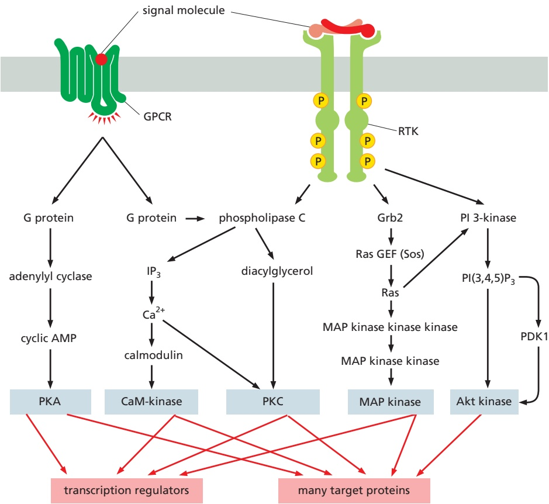

Figure 15–56 Five parallel intracellular signaling pathways activated by GPCRs, RTKs, or both. In this simplified example, the five kinases (shaded gray) at the end of each signaling pathway phosphorylate target proteins (shaded red), many of which are phosphorylated by more than one of the kinases. The phospholipase C activated by the two types of receptors is different: GPCRs activate PLCβ, whereas RTKs activate PLCγ (not shown). Although not shown, some GPCRs can also activate Ras, but they do so independently of Grb2, via a Ras GEF that is activated by Ca2+ and diacylglycerol.

#### RTKs and GPCRs Activate Overlapping Signaling Pathways

As mentioned earlier, RTKs and GPCRs activate some of the same intracellular signaling pathways. Both, for example, can activate the inositol phospholipid pathway triggered by phospholipase C. Moreover, even whenMBoC7 m15.55/15.56 they activate different pathways, the different pathways can converge on the same target proteins. **Figure 15–56** illustrates both of these types of signaling overlaps: it summarizes five parallel intracellular signaling pathways that we have discussed so far—one triggered by GPCRs, two triggered by RTKs, and two triggered by both kinds of receptors. Interactions among these pathways allow different extracellular signal molecules to modulate and coordinate each other’s effects.

#### Some Enzyme-coupled Receptors Associate with Cytoplasmic Tyrosine Kinases

Many cell-surface receptors depend on tyrosine phosphorylation for their activity and yet lack a tyrosine kinase domain. These receptors act through **cytoplasmic tyrosine kinases**, which are associated with the receptors and phosphorylate various target proteins, often including the receptors themselves, when the receptors bind their ligand. These **tyrosine-kinase-associated receptors** thus function in much the same way as RTKs, except that their kinase domain is encoded by a separate gene and is noncovalently associated with the receptor polypeptide chain. A variety of receptor classes belong in this category, including the receptors for antigen and interleukins on lymphocytes (discussed in Chapter 24), integrins (discussed in Chapter 19), and receptors for various cytokines and some hormones. As with RTKs, many of these receptors depend on dimerization for their activation.

Some of these receptors work with members of the largest family of mammalian cytoplasmic tyrosine kinases, the **Src family**, which includes Src, Yes, Fgr, Fyn,

Lck, Lyn, Hck, and Blk. These protein kinases all contain SH2 and SH3 domains and are located on the cytoplasmic side of the plasma membrane, held there partly by their interaction with transmembrane receptor proteins and partly by covalently attached lipid chains (discussed in Chapter 3). Different family members are associated with different receptors and phosphorylate overlapping but distinct sets of intracellular signaling proteins. Lyn, Fyn, and Lck, for example, are each associated with different sets of receptors on lymphocytes. In each case, the kinase is activated when an extracellular ligand binds to the appropriate receptor protein. Src itself, as well as several other family members, can also bind to activated RTKs; in these cases, the receptor and cytoplasmic kinases mutually stimulate each other’s catalytic activity, thereby strengthening and prolonging the signal (see Figure 15–52). There are even some G proteins $( \mathrm { G } _ { \mathrm { s } }$ and Gi) that can activate Src, which is one way that the activation of GPCRs can lead to tyrosine phosphorylation of intracellular signaling proteins and effector proteins.

Another type of cytoplasmic tyrosine kinase associates with integrins, the main receptors that cells use to bind to the extracellular matrix (discussed in Chapter 19). The binding of matrix components to integrins activates intracellular signaling pathways that influence the behavior of the cell. When integrins cluster at sites of contact with the extracellular matrix, they help trigger the assembly of cell–matrix junctions called focal adhesions. Among the many proteins recruited into these junctions is the cytoplasmic tyrosine kinase called **focal adhesion kinase (FAK)**, which binds to the cytosolic tail of one of the integrin subunits with the assistance of other proteins. The clustered FAK molecules phosphorylate each other, creating phosphotyrosine docking sites where the Src kinase can bind. Src and FAK then phosphorylate each other and other proteins that assemble in the junction, including many of the signaling proteins used by RTKs. In this way, the two tyrosine kinases signal to the cell that it has adhered to a suitable substratum, where the cell can now survive, grow, divide, migrate, and so on.

The largest and most diverse class of receptors that rely on cytoplasmic tyrosine kinases is the cytokine receptors, which we consider next.

#### Cytokine Receptors Activate the JAK–STAT Signaling Pathway

The large family of **cytokine receptors** includes receptors for many kinds of local mediators (collectively called cytokines), as well as receptors for some hormones, such as growth hormone and prolactin (**Movie 15.9**). These receptors are stably associated with cytoplasmic tyrosine kinases called **Janus kinases** (**JAKs**; after the two-faced Roman god), which phosphorylate and activate transcription regulators called STATs (signal transducers and activators of transcription). STAT proteins are located in the cytosol and are referred to as latent transcription regulators because they migrate into the nucleus and regulate gene transcription only after they are activated.

Although many intracellular signaling pathways lead from cell-surface receptors to the nucleus, where they alter gene transcription (see Figure 15–56), the **JAK–STAT signaling pathway** provides one of the more direct routes. Cytokine receptors are dimers or trimers and are stably associated with one or two of the four known JAKs (JAK1, JAK2, JAK3, and Tyk2). Cytokine binding alters the arrangement so as to bring two JAKs into close proximity so that they phosphorylate each other, thereby increasing the activity of their tyrosine kinase domains. The JAKs then phosphorylate tyrosines on the cytoplasmic tails of cytokine receptors, creating phosphotyrosine docking sites for STATs (**Figure 15–57**). Some adaptor proteins can also bind to some of these sites and couple cytokine receptors to the Ras–MAP-kinase signaling pathway discussed earlier, but these will not be discussed here.

There are at least six STATs in mammals. Each has an SH2 domain that performs two functions. First, it mediates the binding of the STAT protein to a phosphotyrosine docking site on an activated cytokine receptor. Once bound, the JAKs phosphorylate the STAT on tyrosines, causing the STAT to dissociate from the receptor. Second, the SH2 domain on the released STAT now mediates its binding to a phosphotyrosine on another STAT molecule, forming either a STAT homodimer or a heterodimer. The STAT dimer then translocates to the nucleus, where, in combination with other transcription regulators, it binds to a specific cis-regulatory sequence in various genes and stimulates their transcription (see Figure 15–57). In response to the hormone prolactin, for example, which stimulates breast cells to produce milk, activated STAT5 stimulates the transcription of genes that encode milk proteins. **Table 15–6** lists some of the more than 30 cytokines and hormones that activate the JAK–STAT pathway by binding to cytokine receptors.

Figure 15–57 The JAK–STAT signaling pathway activated by cytokines. The binding of the cytokine either causes two separate receptor polypeptide chains to dimerize (as shown) or re-orients the receptor chains in a preformed dimer. In either case, the associated JAKs are brought together so that they can phosphorylate each other on tyrosines to become fully activated, after which they phosphorylate the receptors to generate binding sites for the SH2 domains of STAT proteins. The JAKs also phosphorylate the STAT proteins, which dissociate from the receptor to form dimers that enter the nucleus to control gene expression.

Negative feedback regulates the responses mediated by the JAK–STAT pathway. In addition to activating genes that encode proteins mediating the cytokine-induced response, the STAT dimers can also activate genes that encode inhibitory proteins that help shut off the response. Some of these proteins bindMBoC7 m15.56/15.57 to and inactivate phosphorylated JAKs and their associated phosphorylated receptors; others bind to phosphorylated STAT dimers and prevent them from binding to their DNA targets. Such negative feedback mechanisms, however, are not enough on their own to turn off the response. Inactivation of the activated JAKs and STATs requires dephosphorylation of their phosphotyrosines.

TABLE 15–6 Some Extracellular Signal Proteins That Act Through Cytokine Receptors and the JAK–STAT Signaling Pathway

| Signal protein | Receptor-associated JAKs | STATs activated | Some responses |
| --- | --- | --- | --- |
| Interferon-γ (IFNγ) | JAK1 and JAK2 | STAT1 | Activates macrophages |
| Interferon-α (IFNα) | Tyk2 and JAK2 | STAT1 and STAT2 | Increases cell resistance to viral infection |
| Erythropoietin | JAK2 | STAT5 | Stimulates production of erythrocytes |
| Prolactin | JAK1 and JAK2 | STAT5 | Stimulates milk production |
| Growth hormone | JAK2 | STAT1 and STAT5 | Stimulates growth by inducing IGF1 production |
| Granulocyte-macrophage- | JAK2 | STAT5 | Stimulates production of granulocytes and |
| colony-stimulating factor |  |  | macrophages |
| (GMCSF) |  |  |  |

#### Extracellular Signal Proteins of the TGFβ Superfamily Act Through Receptor Serine/Threonine Kinases and Smads

The **transforming growth factor-b (TGFb) superfamily** consists of a large number (33 in humans) of structurally related, secreted, dimeric proteins. They act either as hormones or, more commonly, as local mediators to regulate a wide range of biological functions in all animals. During development, they regulate pattern formation and influence various cell behaviors, including proliferation, specification and differentiation, extracellular matrix production, and cell death. In adults, they are involved in tissue repair and in immune regulation, as well as in many other processes. The superfamily consists of the TGFβ/activin family and the larger bone morphogenetic protein (BMP) family.

All of these proteins act through receptors that are single-pass transmembrane proteins with a serine/threonine kinase domain on the cytosolic side of the plasma membrane. There are two classes of these receptor serine/threonine kinases—type I and type II. Signaling begins when a TGFβ dimer interacts with the extracellular domains of two type-I receptors and two type-II receptors, bringing the kinase domains together so that the type-II receptors can phosphorylate and activate the type-I receptors, forming an active tetrameric receptor complex.

Once activated, the receptor complex uses a strategy for rapidly relaying the signal to the nucleus that is very similar to the JAK–STAT strategy used by cytokine receptors. The activated type-I receptor directly binds and phosphorylates a latent transcription regulator of the **Smad family** (named after the first two proteins identified, Sma in Caenorhabditis elegans and Mad in Drosophila). Activated TGFβ/activin receptors phosphorylate Smad2 or Smad3, while activated BMP receptors phosphorylate Smad1, Smad5, or Smad8. Once one of these receptor-activated Smads (R-Smads) has been phosphorylated, it binds to Smad4 (called a co-Smad), which can form a complex with any of the five R-Smads. The Smad complex then translocates into the nucleus, where it associates with other transcription regulators and controls the transcription of specific target genes (**Figure 15–58**). Because the partner proteins in the nucleus vary depending on the cell type and state of the cell, the genes affected vary.

Activated TGFβ receptors and their bound ligand are endocytosed by two distinct routes, one leading to further activation and the other leading to inactivation. The activation route depends on clathrin-coated vesicles and leads to early endosomes (discussed in Chapter 13), where most of the Smad activation occurs. An anchoring protein called SARA (for Smad anchor for receptor activation) has an important role in this pathway; it is concentrated in early endosomes and binds to both activated TGFβ receptors and Smads, increasing the efficiency of receptor-mediated Smad phosphorylation. The inactivation route depends on caveolae (discussed in Chapter 13) and leads to receptor ubiquitylation and degradation in proteasomes.

During the signaling response, the Smads shuttle continually between the cytoplasm and the nucleus: they are dephosphorylated in the nucleus and exported to the cytoplasm, where they can be rephosphorylated by activated receptors. In this way, the effect exerted on the target genes reflects both the concentration of the extracellular signal and the time the signal continues to act on the cell-surface receptors (often several hours). Cells exposed to a morphogen at high concentration, or for a long time, or both, will switch on one set of genes, whereas cells receiving a lower or more transient exposure will switch on another set.

As in other signaling systems, negative feedback regulates the Smad pathway. Among the target genes activated by Smad complexes are those that encode inhibitory Smads, either Smad6 or Smad7. Smad7 (and possibly Smad6) binds to the cytosolic tail of the activated receptor and inhibits its signaling ability in at least three ways: (1) it competes with R-Smads for binding sites on the receptor,

Figure 15–58 The Smad-dependent signaling pathway activated by TGFb. The TGFβ dimer promotes the assembly of a tetrameric receptor complex containing two copies each of the type-I and type-II receptors. The type-II receptors phosphorylate specific sites on the type-I receptors, thereby activating their kinase domains and leading to phosphorylation of R-Smads such as Smad2 and Smad3. Smads open up to expose a binding surface when they are phosphorylated, leading to the formation of a trimeric Smad complex containing two R-Smads and the co-Smad, Smad4. The phosphorylated Smad complex enters the nucleus and collaborates with other transcription regulators to control the transcription of specific target genes.

decreasing R-Smad phosphorylation; (2) it recruits a ubiquitin ligase called Smurf, which ubiquitylates the receptor, leading to receptor internalization and degradation (it is because Smurfs also ubiquitylate and promote the degradation of Smads that they are called Smad ubiquitylation regulatory factors, or Smurfs); and (3) itMBoC7 m15.57/15.58 recruits a protein phosphatase that dephosphorylates and inactivates the receptor. In addition, the inhibitory Smads bind to the co-Smad, Smad4, and inhibit it, either by preventing its binding to R-Smads or by promoting its ubiquitylation and degradation.

#### Summary

There are various classes of enzyme-coupled receptors, the most common of which are receptor tyrosine kinases (RTKs), tyrosine-kinase-associated receptors, and receptor serine/threonine kinases.

Ligand binding to RTKs causes their dimerization, which leads to activation of their kinase domains. These activated kinase domains phosphorylate multiple tyrosines on the receptors, producing a set of phosphotyrosines that serve as docking sites for a set of intracellular signaling proteins, which bind via their SH2 (or PTB) domains. One such signaling protein serves as an adaptor to couple some activated receptors to a Ras GEF (Sos), which activates the monomeric GTPase Ras; Ras, in turn, activates a three-component MAP kinase signaling module, which relays the signal to the nucleus by phosphorylating transcription regulators. Another important signaling protein that can dock on activated RTKs is PI 3-kinase, which phosphorylates specific phosphoinositides to produce lipid docking sites in the plasma membrane for signaling proteins with phosphoinositide-binding PH domains, including the serine/ threonine protein kinase Akt, which plays a key part in the control of cell survival and cell growth. Many receptor classes, including some RTKs, activate Rho family monomeric GTPases, which functionally couple the receptors to the cytoskeleton.

Tyrosine-kinase-associated receptors depend on various cytoplasmic tyrosine kinases for their action. These kinases include members of the Src family, which associate with many kinds of receptors, and the focal adhesion kinase (FAK), which associates with integrins at focal adhesions. The cytoplasmic tyrosine kinases then phosphorylate a variety of signaling proteins to relay the signal onward. The largest family of tyrosine-kinase-associated receptors is the cytokine receptor family. When stimulated by ligand binding, these receptors activate JAK cytoplasmic tyrosine kinases, which phosphorylate STATs. The STATs then dimerize, translocate to the nucleus, and activate the transcription of specific genes. Receptor serine/threonine kinases, which are activated by signal proteins of the TGFb superfamily, act similarly: they directly phosphorylate and activate Smads, which then oligomerize with another Smad, translocate to the nucleus, and regulate gene transcription.

#### ALTERNATIVE SIGNALING ROUTES IN GENE REGULATION

Major changes in the behavior of a cell tend to depend on changes in the expression of numerous genes. Thus, many extracellular signaling molecules carry out their effects, in whole or in part, by initiating signaling pathways that change the activities of transcription regulators. There are numerous examples of gene regulation in both GPCR and enzyme-coupled receptor pathways (see Figures 15–28 and 15–50). In this section, we describe some of the less common signaling mechanisms by which gene expression can be controlled by extracellular signals. We begin with several pathways that depend on regulated proteolysis to control the activity and location of latent transcription regulators. We then turn to a class of extracellular signal molecules that do not employ cell-surface receptors but enter the cell and interact directly with transcription regulators to perform their functions. Finally, we briefly discuss some of the mechanisms by which gene expression is controlled by the circadian rhythm: the daily cycle of light and dark.

#### The Receptor Notch Is a Latent Transcription Regulator

Signaling through the **Notch** protein is used widely in animal development. As discussed in Chapter 21, it has a general role in controlling cell-fate choices and regulating pattern formation during the development of most tissues, as well as in the continual cell renewal in tissues such as the lining of the gut. It is best known, however, for its role in the production of Drosophila neural cells, which usually arise as isolated single cells within an epithelial sheet of precursor cells. During this process, when a precursor cell commits to becoming a neural cell, it signals to its immediate neighbors not to do the same; the inhibited cells develop into epidermal cells instead. This process, called lateral inhibition, depends on a contact-dependent signaling mechanism that is activated by a single-pass transmembrane signal protein called **Delta**, displayed on the surface of the future neural cell. By binding to its receptor, the Notch protein, on a neighboring cell, Delta signals to the neighbor not to become neural (**Figure 15–59**). When this signaling process is defective, a huge excess of neural cells is produced at the expense of epidermal cells, which is lethal.

Notch is a single-pass transmembrane protein that requires proteolytic processing to function. It acts as a latent transcription regulator and provides the simplest and most direct signaling pathway known from a cell-surface receptor to the nucleus. When activated by the binding of Delta on another cell, a plasma-membrane-bound protease cleaves off the cytoplasmic tail of Notch, and the released tail translocates into the nucleus to activate the transcription of a set of Notch-response genes. The Notch tail fragment acts by binding to a DNA-binding protein, converting it from a transcription repressor into a transcription activator.

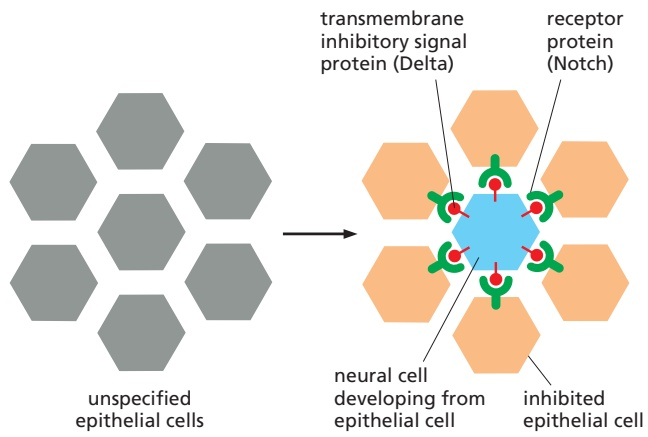

Figure 15–59 Lateral inhibition mediated by Notch and Delta during neural cell development in Drosophila. When individual cells in the epithelium begin to develop as neural cells, they signal to their neighbors not to do the same. This inhibitory, contact-dependent signaling is mediated by the ligand Delta, which appears on the surface of the future neural cell and binds to Notch protein on the neighboring cells. In many tissues, all the cells in a cluster initially express both Delta and Notch, and a competition occurs, with one cell emerging as winner, expressing Delta strongly and inhibiting its neighbors from doing likewise. In other cases, additional factors interact with Delta or Notch to make some cells susceptible to the lateral inhibition signal and others unresponsive to it.

Notch undergoes three successive proteolytic cleavage steps, but only the last two depend on Delta binding. As part of its normal biosynthesis, it is cleaved in the Golgi apparatus to form a heterodimer, which is then transported to the cell surface as the mature receptor. The binding of Delta to Notch induces a second cleavage in the extracellular domain, mediated by an extracellular protease. A final cleavage quickly follows, cutting free the cytoplasmic tail of the activated Notch (**Figure 15–60**). Note that, unlike most receptors, the activation of Notch is irreversible; once activated by ligand binding, the protein cannot be used again.

This final cleavage of the Notch tail occurs just within the transmembrane segment, and it is mediated by a protease complex called g-secretase, which is also responsible for the intramembrane cleavage of various other single-pass transmembrane proteins. One of its essential subunits is Presenilin, so called because mutations in the gene encoding it are a frequent cause of early-onset familial Alzheimer’s disease, a form of presenile dementia. The protease complex is thought to contribute to this and other forms of Alzheimer’s disease by generating extracellular peptide fragments from a transmembrane neuronal protein; the fragments accumulate in excessive amounts and form aggregates of misfolded protein called amyloid plaques, which may injure nerve cells and contribute to their degeneration and loss.

Figure 15–60 The processing and activation of Notch by proteolytic cleavage. The numbered red arrowheads indicate the sites of proteolytic cleavage. The first proteolytic processing step occurs within the trans Golgi network to generate mature heterodimeric Notch, which is then displayed on the cell surface. The binding to Delta on a neighboring cell triggers the next two proteolytic steps: the complex of Delta and the Notch fragment to which it is bound is endocytosed by the Delta-expressing cell, exposing the extracellular cleavage site in the transmembrane Notch subunit. Note that Notch and Delta interact through their repeated EGF-like domains. The released Notch tail migrates into the nucleus, where it binds to the Rbpsuh protein, which it converts from a transcription repressor to a transcription activator.

#### Wnt Proteins Activate Frizzled and Thereby Inhibit β-Catenin Degradation

**Wnt proteins** are secreted signal molecules that control various aspects of animal development. They were discovered independently in flies and in mice: in Drosophila, the Wingless (Wg) gene originally came to light because of its role in wing development, while in mice, the Int1 gene was found because it promoted the formation of breast tumors when activated by the integration of a virus next to it. Both of these genes encode Wnt proteins. There are 19 Wnts in humans, each having distinct, but often overlapping, functions.

Wnts are unusual extracellular signaling proteins in that they are covalently attached to a fatty acid chain after their synthesis in the endoplasmic reticulum. Wnts are therefore hydrophobic molecules that tend to associate with cell membranes and do not diffuse rapidly in the extracellular environment. They are thought to act primarily as local (paracrine) signaling molecules (see Figure 15–2B).

Wnts have been implicated in several signaling pathways. The best understood, and our primary focus here, is the Wnt/b-catenin pathway (also known as the canonical Wnt pathway), which centers on a protein called **b-catenin**. β-catenin is an intriguing example of a signaling protein with two seemingly unconnected functions in the same cell. A portion of the cell’s β-catenin is located at cell–cell junctions and thereby contributes to the control of cell–cell adhesion; this function is discussed in Chapter 19 and does not concern us here. Wnt signaling acts primarily on cytoplasmic β-catenin, a latent transcription regulator that is degraded rapidly in unstimulated cells but stabilized by Wnt signaling.

In the absence of Wnt signaling, cytoplasmic β-catenin is degraded by a process that depends on a large protein degradation complex, which binds β-catenin, keeps it out of the nucleus, and promotes its destruction. The complex contains at least four other proteins, including a protein kinase called casein kinase 1 (CK1), which phosphorylates the β-catenin on a serine, priming it for further phosphorylation by another protein kinase called glycogen synthase kinase 3 (GSK3). This final phosphorylation marks the protein for ubiquitylation and rapid degradation in proteasomes. Two scaffold proteins called axin and Adenomatous polyposis coli (APC) hold the protein complex together (Figure 15–61A). APC gets its name from the finding that the gene encoding it is often mutated in a type of benign tumor (an adenoma) of the colon; the tumor projects into the lumen as a polyp and can eventually become malignant. (This APC should not be confused with the anaphase-promoting complex, or APC/C, that plays a central part in selective protein degradation during the cell cycle—discussed in Chapter 17.)

Wnt proteins regulate β-catenin proteolysis by interacting with two cell-surface co-receptors, **Frizzled** and **LDL-receptor-related protein (LRP)**. Frizzled is a seven-pass transmembrane protein that resembles GPCRs in structure but does not generally work through the activation of G proteins. LRP is a relatively simple singlepass transmembrane protein. Frizzled contains an extracellular domain that binds with high affinity to Wnt, due in part to a hydrophobic pocket on the receptor domain that interacts with the lipid modification on Wnt; this lipid is therefore required for Wnt signaling. LRP interacts with a different site on Wnt. Thus, as in so many other signaling pathways, the Wnt ligand drives formation of a co-receptor dimer.

Formation of the activated receptor complex promotes phosphorylation of the LRP receptor by the two protein kinases, CK1 and GSK3. Receptor activation also leads to recruitment of the scaffold protein **Dishevelled**. Axin is brought to the

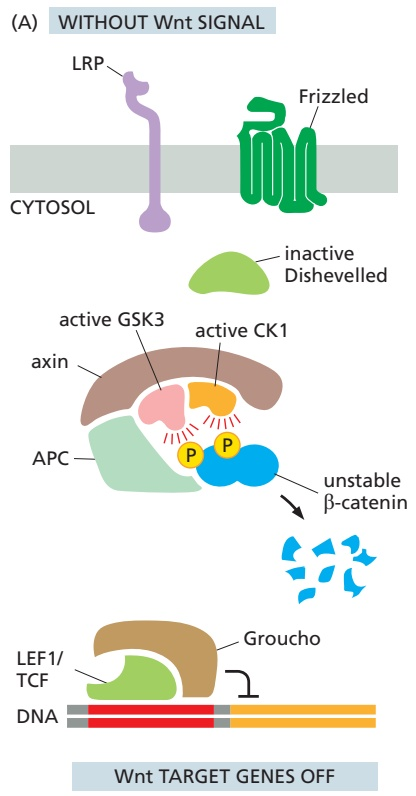

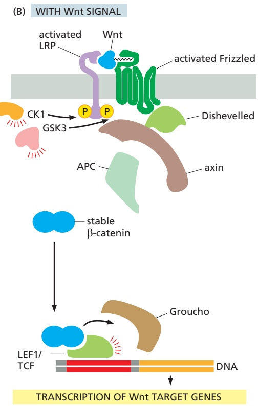

Figure 15– Wnt/b-catenin signaling pathway. (A) In the absence of a Wnt signal, β-catenin that is not bound to cell–cell adherens junctions (not shown— discussed in Chapter 19) interacts with a degradation complex containing APC, axin, GSK3, and CK1. In this complex, β-catenin is phosphorylated by CK1 and then by GSK3, triggering its ubiquitylation and degradation in proteasomes. Wntresponsive genes are kept inactive by the Groucho co-repressor protein bound to the transcription regulator LEF1/TCF. (B) Wnt binding to Frizzled and LRP brings the two co-receptors together, and the cytosolic tail of LRP is phosphorylated by CK1 and GSK3. The scaffold protein Dishevelled is recruited to the activated Frizzled protein. Axin binds to Dishevelled and the phosphorylated LRP and is inactivated, resulting in disassembly of the degradation complex. The phosphorylation of β-catenin is thereby prevented, and unphosphorylated β-catenin accumulates and translocates to the nucleus, where it binds to LEF1/TCF, displaces the co-repressor Groucho, and acts as a coactivator to stimulate the transcription of Wnt target genes. The scaffold protein Dishevelled is required for the signaling pathway to operate; it binds to Frizzled and becomes phosphorylated (not shown), but its precise role is unknown.

receptor complex and inactivated, thereby disrupting the β-catenin degradation complex in the cytoplasm. In this way, the phosphorylation and degradation of β-catenin are prevented, enabling β-catenin to accumulate and translocate to the nucleus, where it alters the pattern of gene transcription (**Figure 15–61B**).

In the absence of Wnt signaling, Wnt-responsive genes are kept silent by an inhibitory complex of transcription regulators. The complex includes proteins of the LEF1/TCF family bound to a co-repressor protein of the Groucho family (see Figure 15–61A). In response to a Wnt signal, β-catenin enters the nucleus and binds to the LEF1/TCF proteins, displacing Groucho. The β-catenin now functions as a coactivator, inducing the transcription of the Wnt target genes (see Figure 15–61B). Thus, as in the case of Notch signaling, Wnt/β-catenin signaling triggers a switch from transcriptional repression to transcriptional activation.

Among the genes activated by β-catenin is Myc, which encodes a proteinMB C7 15.60/15.61 (Myc) that is an important regulator of cell growth and proliferation (discussed in Chapter 17). Mutations of the Apc gene occur in 80% of human colon cancers (discussed in Chapter 20). These mutations inhibit the protein’s ability to bind β-catenin, so that β-catenin accumulates in the nucleus and stimulates the transcription of c-Myc and other Wnt target genes, even in the absence of Wnt signaling. The resulting uncontrolled cell growth and proliferation promote the development of cancer.

The Wnt signaling pathway shown in Figure 15–61 is supplemented with additional regulatory inputs that fine-tune the strength of the Wnt signal. Some Wnt-stimulated genes, for example, suppress the Wnt signal, resulting in negative feedback. One of these genes encodes a secreted enzyme called Notum, which removes the fatty acid modification from Wnt, thereby inactivating it. Another Wnt-stimulated gene encodes a cell-surface transmembrane protein, Rnf43, which is a ubiquitin ligase that targets the Frizzled protein for degradation. This negative feedback mechanism can be suppressed by extracellular signaling molecules from other cells: a signaling protein called R-spondin, for example, binds to a GPCR called Lgr, which inactivates Rnf43, thereby enhancing the Wnt signal. Through these and a variety of other mechanisms, the localization and strength of the Wnt signal can be fine-tuned in different tissues.

Hedgehog Proteins Initiate a Complex Signaling Pathway in the Primary Cilium

Hedgehog proteins and Wnt proteins act in similar ways. Both are secreted signal molecules, which act as local mediators in many developing invertebrate and vertebrate tissues. Both proteins are modified by covalently attached lipids, and both trigger a switch from transcriptional repression to transcriptional activation. Excessive signaling along either pathway in adult cells can lead to cancer.

The first **Hedgehog protein** was discovered in Drosophila, where mutation of the Hedgehog gene produces a larva covered with spiky processes (denticles), like a hedgehog. At least three genes encode Hedgehog proteins in vertebrates— Sonic, Desert, and Indian hedgehog. The active forms of all Hedgehog proteins are covalently coupled to cholesterol, as well as to a fatty acid chain. The cholesterol is added during an unusual processing step in which a precursor protein cleaves itself to produce a smaller, cholesterol-containing signal protein.

The signaling proteins activated by Hedgehog were also first identified in Drosophila and are conserved in vertebrates and other animals. The vertebrate pathway, which we focus on here, provides a striking example of an important concept: the sensitivity and efficiency of a signaling system can be enhanced by concentrating its components in a small volume or compartment. Most of the signaling proteins of the vertebrate Hedgehog pathway are located within the **primary cilium**, a small membrane protrusion that is present in one copy on the surface of most vertebrate cell types. As we discuss in Chapter 16, the primary cilium contains a microtubule array along its central axis, but it is not motile like other microtubule-based cilia or flagella; instead, its microtubules are used as tracks for the transport of various signaling proteins to and from the tip. All the early signaling steps in the Hedgehog pathway occur in the cilium, and signaling is lost in cells with defects in primary cilium formation or function. Thus, the primary cilium serves as an antenna for the extracellular Hedgehog signal.

Hedgehog signaling begins at a cell-surface receptor called **Patched**, which employs a convoluted mechanism to activate a group of transcription regulators called Gli proteins, thereby increasing the expression of genes that drive changes in the target cell’s proliferation or developmental fate. In the absence of Hedgehog ligand, the unoccupied Patched protein resides in the ciliary membrane and inhibits the activity of another transmembrane protein called Smoothened, which is located outside the cilium (Figure 15–62A). Smoothened is a GPCR-like protein that resembles the Wnt receptor Frizzled; like Frizzled, it has an external domain that serves as a lipid-binding activation domain, and its activation requires binding of this domain to cholesterol in the cell membrane. Patched, in contrast, is a large transmembrane protein that transports cholesterol out of the membrane. It has been proposed that Patched inhibits **Smoothened** by reducing the amount of cholesterol in the ciliary membrane, and Hedgehog inhibits Patched by blocking its cholesterol transport channel.

In cells lacking the Hedgehog signal, expression of Hedgehog-responsive genes is blocked by two mechanisms. First, an inhibitory protein called SuFu holds the Gli transcription regulators in an inactive state within the cilium. Second, one member of the family, Gli3, is proteolytically processed to form a smaller fragment that acts as a transcription repressor, helping to keep Hedgehog-responsive genes silent. This processing of the Gli3 protein depends on a signaling pathway that begins with a GPCR called Gpr161, which is found in the cilium membrane and stimulates adenylyl cyclase to produce cyclic AMP; cyclic AMP then stimulates PKA, which phosphorylates Gli3 to promote its partial processing into a transcription repressor (see Figure 15–62A).

The binding of Hedgehog to the Patched protein promotes the transport of Patched out of the cilium and removes its inhibitory effects on Smoothened, which moves into the cilium. Gpr161 is removed from the cilium, thereby reducing formation of the Gli3 transcription repressor. Inactive complexes of Gli proteins and SuFu are transported to the tip of the cilium, where the activated Smoothened

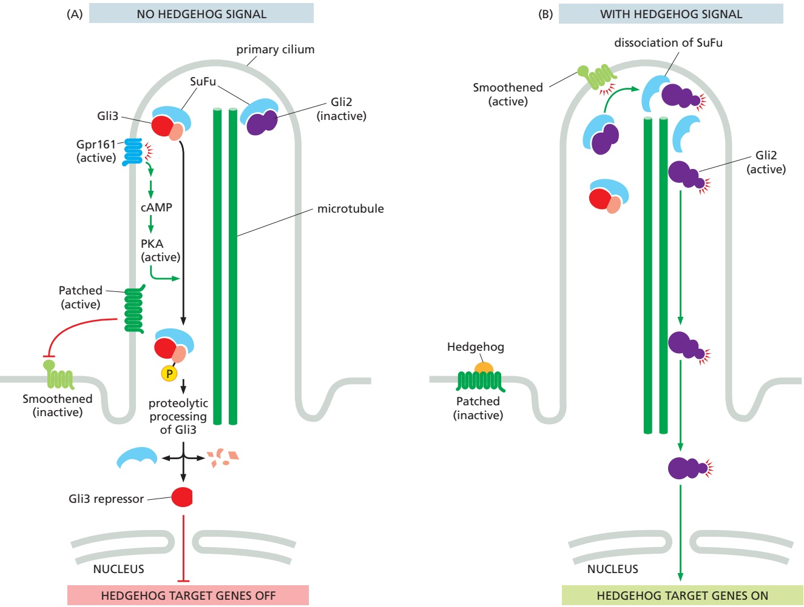

Figure 15–62 Vertebrate Hedgehog signaling in the primary cilium. (A) In the absence of Hedgehog, its receptor, Patched, is active in the cilium membrane and inhibits Smoothened, which is in the membrane adjacent to the cilium. Gli transcription regulators (primarily Gli2 and Gli3) are held in an inactive state by SuFu. In addition, an active GPCR (Gpr161) stimulates adenylyl cyclase, generating cyclic AMP that leads to PKA-dependent phosphorylation of the Gli3 protein. Phosphorylated Gli3 is processed to a transcription repressor, which accumulates in the nucleus to help keep Hedgehog target genes inactive. (B) Hedgehog binding to Patched removes the inhibition of Smoothened. Smoothened translocates to the cilium, where it triggers the dissociation of SuFu–Gli2 complexes and the conversion of Gli2 to an active transcription regulator; activated Gli2 is then transported to the cytoplasm, from where it moves to the nucleus to stimulate expression of Hedgehogresponsive genes. Hedgehog also promotes removal of Gpr161 from the cilium (not shown), thereby reducing the processing of Gli3 to a transcription repressor.

promotes their dissociation and triggers modifications of Gli2 proteins, thereby converting them into active transcription regulators. Activated Gli2 proteins areMBoC7 n15.201/15.62 transported out of the cilium along microtubule tracks to the cytoplasm, from where they diffuse to the nucleus to promote gene expression (**Figure 15–62B**). The result is a rise in the expression of numerous Hedgehog target genes.

Hedgehog signaling can promote cell proliferation, and excessive Hedgehog signaling can lead to cancer. Inactivating mutations in one of the two human Patched genes, for example, which lead to excessive Hedgehog signaling, occur frequently in basal cell carcinoma of the skin, the most common form of cancer in Caucasians. A small molecule called cyclopamine, made by a meadow lily, is being used to treat cancers associated with excessive Hedgehog signaling. It blocks Hedgehog signaling by binding tightly to Smoothened and inhibiting its activity. It was originally identified because it causes severe developmental defects in the progeny of sheep grazing on such lilies; these include the presence of a single central eye (a condition called cyclopia), which is also seen in mice that are deficient in Hedgehog signaling.

#### Many Inflammatory and Stress Signals Act Through an NFκB-dependent Signaling Pathway

The **NFkB proteins** are latent transcription regulators that are present in most animal cells and are central to many inflammatory and innate immune responses. These responses occur as a reaction to infection or injury and help protect stressed multicellular organisms and their cells (discussed in Chapter 24). An excessive or inappropriate inflammatory response in animals can also damage tissue and cause severe pain, and chronic inflammation can lead to cancer. NFκB proteins also have important roles during normal animal development: the Drosophila NFκB family member Dorsal, for example, has a crucial role in specifying the dorsal–ventral axis of the developing fly embryo (discussed in Chapter 22).

Various cell-surface receptors activate the NFκB signaling pathway in animal cells. Toll receptors in Drosophila and Toll-like receptors in vertebrates, for example, recognize pathogens and activate this pathway to trigger innate immune responses (discussed in Chapter 24). The receptors for tumor necrosis factor α (TNFα) and interleukin-1 (IL1), which are vertebrate cytokines especially important in inducing inflammatory responses, also activate this signaling pathway. The Toll, Toll-like, and IL1 receptors belong to the same family of proteins, whereas TNF receptors belong to a different family; all of them, however, act in similar ways to activate NFκB. When activated, they trigger a multiprotein ubiquitylation and phosphorylation cascade that releases NFκB from an inhibitory protein complex, so that it can translocate to the nucleus and turn on the transcription of hundreds of genes that participate in inflammatory and innate immune responses.

There are several NFκB proteins in mammals, and they form a variety of homodimers and heterodimers, each of which activates its own characteristic set of genes. Inhibitory proteins called IκB bind tightly to the dimers and hold them in an inactive state within the cytoplasm of unstimulated cells. The signals that release NFκB dimers do so by triggering a signaling pathway that leads to the phosphorylation, ubiquitylation, and consequent degradation of the IκB proteins (**Figure 15–63**).

Among the genes activated by the released NFκB is the gene that encodes IκBα. This activation leads to increased synthesis of IκBα protein, which binds to NFκB

Figure 15–63 The activation of the NFkB pathway by TNFa. Both TNFα and its receptors are trimers. The binding of TNFα causes a rearrangement of the clustered cytosolic tails of the receptors, which now recruit various signaling proteins, resulting in the activation of a protein kinase that phosphorylates and activates IκB kinase kinase (IKK). IKK is a heterotrimer composed of two kinase subunits (IKKα and IKKβ) and a regulatory subunit called NEMO. IKKβ then phosphorylates IκB on two serines, which marks the protein for ubiquitylation and degradation in proteasomes. The released NFκB translocates into the nucleus, where, in collaboration with a coactivator protein, it stimulates the transcription of its target genes.

(C)

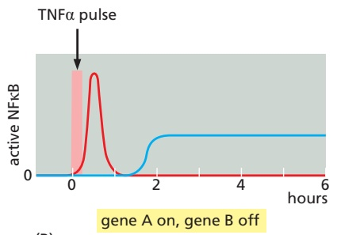

(B)

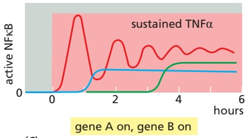

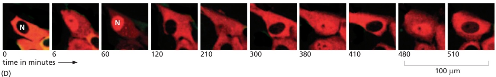

Figure 15–64 Negative feedback in the NFkB signaling pathway induces oscillations in NFkB activation. (A) Diagram showing how activated NFκB stimulates the transcription of the IkBa gene, the protein product of which acts back in the cytoplasm to sequester and inhibit NFκB there. If the stimulus is persistent, the newly made IκBα protein will then be ubiquitylated and degraded, liberating active NFκB again so that it can return to the nucleus and activate transcription (see Figure 15–63). (B) A short exposure to TNFα produces a single, short pulse of NFκB activation, beginning within minutes and ending by 1 hour. This response turns on the transcription of gene A but not gene B. (C) A sustained exposure to TNFα for the entire 6 hours of the experiment produces oscillations in NFκB activation that damp down over time. This response turns on the transcription of both genes A and B; gene B turns on only after several hours, indicating that gene B transcription requires prolonged activation of NFκB, for reasons that are not understood. (D) These time-lapse confocal fluorescence micrographs from a different study of TNFα stimulation show the oscillations of NFκB in a cultured cell, as indicated by the periodic movement into the nucleus (N) of a fusion protein composed of NFκB fused to a red fluorescent protein. In the cell at the center of the micrographs, NFκB is active and in the nucleus at 6, 60, 210, 380, and 480 minutes, but it is exclusively in the cytoplasm at 0, 120, 300, 410, and 510 minutes. (A–C, based on data from A. Hoffmann et al., Science 298:1241–1245, 2002, and adapted from A.Y. Ting and D. Endy, Science 298:1189–1190, 2002; D, from D.E. Nelson et al., Science 306: 704–708, 2004. All with permission from AAAS.)

and inactivates it, creating a negative feedback loop (**Figure 15–64A**). Experiments on TNFα-induced responses, as well as computer modeling studies of the responses, indicate that the negative feedback produces two types of NFκB responses, depending on the duration of the TNFα stimulus. Importantly, the two types of responses induce different patterns of gene expression (**Figure 15–64B, C, and D**).

Thus far, we have focused on the mechanisms by which extracellular signal molecules use cell-surface receptors to initiate changes in gene expression. We now turn to a class of extracellular signals that bypasses the plasma membrane entirely and controls, in the most direct way possible, transcription regulators inside the cell.

#### Nuclear Receptors Are Ligand-modulated Transcription Regulators

Various small, hydrophobic signal molecules diffuse directly across the plasma membrane of target cells and bind to intracellular receptors that are transcription regulators. These signal molecules include steroid hormones, thyroid hormones, retinoids, and vitamin D. Although they differ greatly from one another in both chemical structure (**Figure 15–65**) and function, they all act by a similar mechanism. They bind to their respective intracellular receptor proteins and alter the ability of these proteins to control the transcription of specific genes. Thus, these proteins serve both as intracellular receptors and as intracellular effectors for the signal.

The receptors are all structurally related, being part of the very large **nuclear receptor superfamily**. Many family members have been identified by DNA sequencing only, and their ligands are not yet known; they are therefore referred to as orphan nuclear receptors, and they make up large fractions of the nuclear receptors encoded in the genomes of humans, Drosophila, and the nematode C. elegans. Some mammalian nuclear receptors are regulated by intracellular metabolites rather than by secreted signal molecules; the peroxisome proliferationactivated receptors (PPARs), for example, bind intracellular lipid metabolites and regulate the transcription of genes involved in lipid metabolism and fat-cellMBoC7 m15.64/15.65 differentiation. It seems likely that the nuclear receptors for hormones evolved from such receptors for intracellular metabolites, which might help explain their intracellular location.

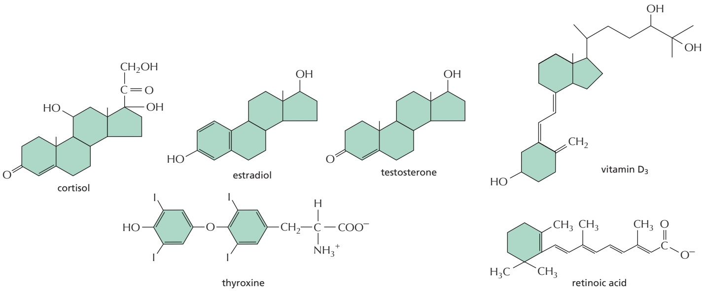

**Steroid hormones**—which include cortisol, the steroid sex hormones, vitamin D (in vertebrates), and the molting hormone ecdysone (in insects)—are all made from cholesterol. Cortisol is produced in the cortex of the adrenal glands and influences the metabolism of many types of cells. The steroid sex hormones are made in the testes and ovaries and are responsible for the secondary sex characteristics that distinguish males from females. Vitamin D is synthesized in the skin in response to sunlight; after it has been converted to its active form in the liver or kidneys, it regulates $\mathrm { C a ^ { 2 + } }$ metabolism, promoting $\mathrm { C a ^ { 2 + } }$ uptake in the gut and reducing its excretion in the kidneys. The thyroid hormones, which are made from the amino acid tyrosine, act to increase the metabolic rate of many cell types, while the retinoids, such as retinoic acid, are made from vitamin A and have important roles as local mediators in vertebrate development. Although all of these signal molecules are relatively insoluble in water, they are made soluble for transport in the bloodstream and other extracellular fluids by binding to specific carrier proteins, from which they dissociate before entering a target cell (see Figure 15–3B).

The nuclear receptors bind to specific DNA sequences adjacent to the genes that the ligand regulates. Some of the receptors, such as those for cortisol, are located primarily in the cytosol and enter the nucleus only after ligand binding; others, such as the thyroid and retinoid receptors, are bound to DNA in the nucleus even in the absence of ligand. In either case, the inactive receptors are usually bound to inhibitory protein complexes. Ligand binding alters the conformation of the receptor protein, causing the inhibitory complex to dissociate and the receptor to bind coactivator proteins that stimulate gene transcription (**Figure 15–66**). In other cases, however, ligand binding to a nuclear receptor inhibits transcription: some thyroid hormone receptors, for example, act as transcription activators in the absence of their hormone and become transcription repressors when hormone binds.

Thus far, we have focused on the control of gene expression by extracellular signal molecules produced by other cells. We now turn to gene regulation by a more global environmental signal: the cycle of light and dark that results from Earth’s rotation.

Figure 15–65 Some extracellular signal molecules that bind to intracellular receptors. Note that all of them are small and hydrophobic. The active, hydroxylated form of vitamin $\mathsf { D } _ { 3 }$ is shown. Estradiol and testosterone are steroid sex hormones.

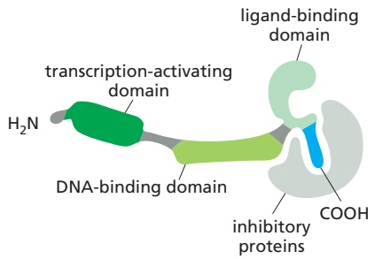

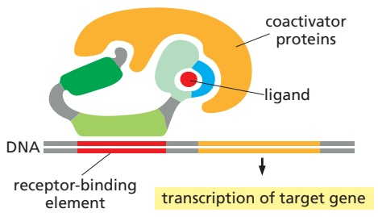

(A) INACTIVE RECEPTOR

(B) ACTIVE RECEPTOR

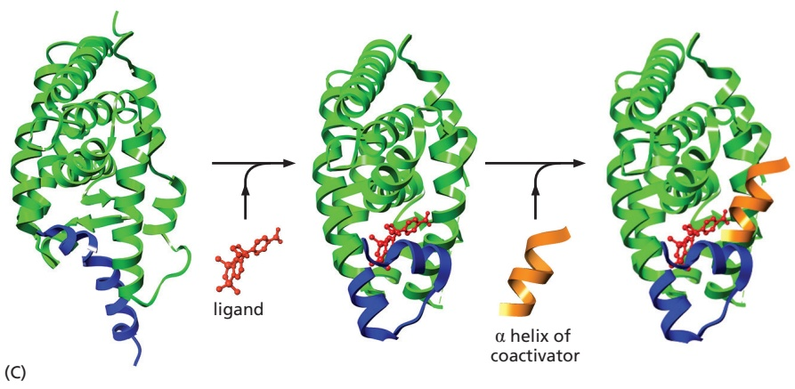

Figure 15–66 The activation of nuclear receptors. All nuclear receptors bind to DNA as either homodimers or heterodimers, but for simplicity we show them as monomers. (A) The receptors all have a related structure, which includes three major domains. An inactive receptor is bound to inhibitory proteins. (B) Typically, the binding of ligand to the receptor causes the ligand-binding domain of the receptor to clamp shut around the ligand, the inhibitory proteins to dissociate, and coactivator proteins to bind to the receptor’s transcription-activating domain, thereby increasing gene transcription. In other cases, ligand binding has the opposite effect, causing co-repressor proteins to bind to the receptor, thereby decreasing transcription (not shown). (C) The structure of the ligand-binding domain of the retinoic acid receptor is shown in the absence (left) and presence (middle) of ligand (shown in red). When ligand binds, the blue α helix acts as a lid that snaps shut, trapping the ligand in place. The shift in the conformation of the receptor upon ligand binding also creates a binding site for a small α helix (orange) on the surface of coactivator proteins. (PDB codes: 6HN6, 2ZY0, and 2ZXZ.)

#### Circadian Clocks Use Negative Feedback Loops to Control Gene Expression

Life on Earth evolved in the presence of a daily cycle of day and night, and many present-day organisms possess an internal rhythm that regulates different behaviors at different times of day and night. These behaviors range from the cyclical change in metabolic enzyme activities of a bacterium to the elaborate sleep–wake cycles of humans. The intracellular oscillators that control such diurnal rhythms are called **circadian clocks**.

Having a circadian clock enables an organism to anticipate the regular daily changes in its environment and take appropriate action in advance. Of course, the internal clock cannot be perfectly accurate, and so it must be capable of being reset by external cues such as the light of day. Nonetheless, circadian clocks keep running even when the environmental cues (changes in light and dark) are removed, but the period of this free-running rhythm is generally a little less or more than 24 hours. External signals indicating the time of day cause small adjustments in the running of the clock, so as to keep the organism in synchrony with its environment. After more drastic shifts, circadian cycles become gradually reset (entrained) by the new cycle of light and dark, as anyone who has experienced jet lag can attest.

We might expect that the circadian clock would be a complex multicellular device, with different groups of cells responsible for different parts of the oscillation mechanism. Remarkably, however, in almost all multicellular organisms, including humans, the timekeepers are individual cells. Thus, our diurnal cycles of sleeping and waking, body temperature, and hormone release are controlled by a clock that operates in each member of a specialized group of brain cells in the suprachiasmatic nucleus (SCN) of the hypothalamus. Even if these cells are removed from the brain and dispersed in a culture dish, they will continue to oscillate individually, showing a cyclic pattern of gene expression with a period of approximately 24 hours. In the intact body, the SCN cells receive neural cues from the retina, entraining the SCN cells to the daily cycle of light and dark. SCN cells send information about the time of day to other brain areas, as well as the pineal gland, which relays the time signal to the rest of the body by releasing the hormone melatonin in time with the clock.

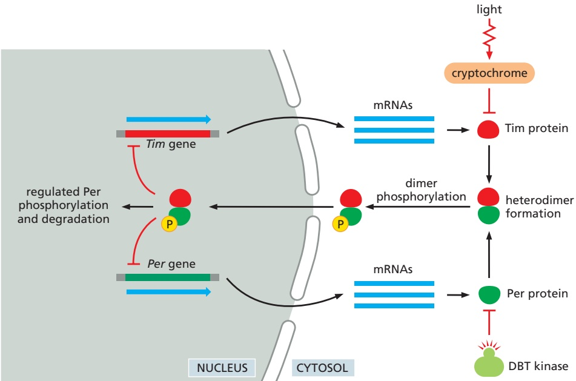

Although the SCN is the central regulator of the circadian rhythm in mammals, most of the other cells in the mammalian body also have circadian clocks, which have the ability to reset in response to light. Similarly, in Drosophila, many different types of cells have a similar circadian clock, which continues to cycle when isolated from the rest of the fly and can be reset by externally imposed lightMBoC7 m7.66/15.67 and dark cycles.

Circadian clocks are therefore a fundamental feature of many cells. Although we do not yet understand how these clocks work in detail, studies in a wide variety of organisms have revealed the basic principles and molecular components of some of them. A key principle is that circadian clocks generally depend on negative feedback loops. As discussed earlier, oscillations in the activity of an intracellular signaling protein can occur if that protein inhibits its own activity with a long delay (see Figure 15–19C and D). In Drosophila and many other animals, including humans, the heart of the circadian clock is a delayed negative feedback loop based on transcription regulators: accumulation of certain gene products switches off the transcription of their own genes, but with a delay, so that the cell oscillates between a state in which the products are present and transcription is switched off, and one in which the products are absent and transcription is switched on (**Figure 15–67**). The negative feedback underlying circadian rhythms is not always based on transcription regulators, however. In some cell types, the circadian clock is constructed of proteins that govern their own activities through post-translational mechanisms, as we discuss next.

#### Three Purified Proteins Can Reconstitute a Cyanobacterial Circadian Clock in a Test Tube

The best understood circadian clock is found in the photosynthetic cyanobacterium Synechococcus elongatus. The core oscillator in this organism is remarkably simple, being composed of just three proteins—KaiA, KaiB, and KaiC. The central player is KaiC, a multifunctional enzyme that catalyzes its own phosphorylation and dephosphorylation in a 24-hour cycle: it gradually phosphorylates itself sequentially at two sites during the day and dephosphorylates itself during the night. This timing depends on interactions with the two other Kai proteins: KaiA binds to unphosphorylated KaiC in the morning and stimulates KaiC autophosphorylation, first at one site and then, with a lengthy delay, at the other. At nightfall, the second phosphorylation promotes the gradual binding of the third

Figure 15–67 Simplified outline of the mechanism of the circadian clock in Drosophila cells. A central feature of the clock is the periodic accumulation and decay of two transcription regulatory proteins, Tim (short for timeless, based on the phenotype when its gene is inactivated) and Per (short for period). The levels of mRNAs encoding these proteins increase gradually during the day and are translated in the cytoplasm, where the two proteins slowly associate to form a Tim–Per heterodimer. The heterodimer is transported into the nucleus, where it represses the Tim and Per genes, resulting in negative feedback that causes the levels of Tim and Per proteins to fall during the night. Decreased Per and Tim levels remove the negative feedback, allowing renewed expression of Tim and Per genes the following day. In addition to this transcriptional feedback, the clock depends on numerous other proteins that influence the period of the circadian oscillator through post-translational modifications. For example, a protein kinase called Doubletime (DBT) promotes the degradation of Per in the cytoplasm, thereby delaying the formation of the Tim–Per dimer. Once formed, the nuclear import of the dimer depends on phosphorylation and glycosylation of one or both proteins, introducing additional delays that further influence the timing of the clock.

Entrainment (or resetting) of the clock occurs in response to new light–dark cycles. Although most Drosophila cells do not have true photoreceptors, light is sensed by intracellular flavoproteins called cryptochromes, which, in the presence of light, associate with the Tim protein and cause its degradation, thereby resetting the clock. (Adapted from J.C. Dunlap, Science 311:184–186, 2006.)

(A)

(B)

(C)

protein, KaiB, which blocks the stimulatory effect of KaiA and thereby allows KaiC to dephosphorylate itself, slowly bringing KaiC back to its dephosphorylated state during the night. This clock depends on a negative feedback loop: KaiC drives its own phosphorylation until, after a delay, it recruits an inhibitor, KaiB, that stimulates KaiC to dephosphorylate itself. Amazingly, when the three Kai proteins are purified and incubated in a test tube with ATP, the KaiC phosphorylation cycle occurs with roughly 24-hour timing for several days (**Figure 15–68**).. / .

Circadian oscillations in KaiC phosphorylation lead to parallel rhythms in the expression of a large number of genes involved in controlling metabolic activities and cell division (see Figure 15–68). Many aspects of cell behavior are thereby synchronized with the circadian cycle.

Even in continual darkness, cyanobacterial cells generate free-running oscillations of KaiC phosphorylation with roughly 24-hour periods. Like other circadian clocks, the cyanobacterial clock is entrained by the environmental light–dark cycle. Light is thought to affect the clock indirectly: the activities of Kai proteins are influenced by changes in intracellular redox potential, which occur as a result of increased photosynthetic activity during the day.

#### Summary

Some signaling pathways that are especially important in animal development depend on proteolysis to control the activity and location of latent transcription regulators. Notch proteins are latent transcription regulators that are activated by cleavage when Delta proteins on another cell binds to them; the cleaved cytosolic tail of Notch migrates into the nucleus, where it stimulates the transcription of Notch-responsive genes. In the Wnt/b-catenin signaling pathway, by contrast, the proteolysis of the latent transcription regulatory protein b-catenin is inhibited when a secreted Wnt protein binds to both a Frizzled and an LRP receptor protein;

Figure 15–68 The core circadian oscillator of cyanobacteria. (A) KaiC protein (C, blue) is a combined kinase and phosphatase that phosphorylates and dephosphorylates itself on two adjacent sites. In the absence of other proteins, the phosphatase activity is dominant, and the protein is mostly unphosphorylated. During the day, the binding of KaiA (A, green) to KaiC suppresses the phosphatase activity and promotes the kinase activity, leading to KaiC phosphorylation, first at site 1 and then, slowly, at site 2, resulting in diphosphorylated KaiC. This form of KaiC interacts with KaiB (B, orange), which blocks the stimulatory effects of KaiA, thereby reducing the rate of KaiC phosphorylation and allowing dephosphorylation at both sites to occur by the end of the night. KaiB then dissociates, allowing KaiA to promote KaiC phosphorylation again. Diphosphorylated KaiC increases in abundance during the day and peaks around dusk. It activates other proteins that phosphorylate a transcription regulator called RpaA (dark green), which then stimulates expression of certain genes that peak in early evening (the dusk genes) and inhibits expression of other genes that peak in the morning (the dawn genes). When KaiC dephosphorylation gradually occurs during the night, these effects are reversed: dusk genes are turned off and dawn genes are turned on. (B) In this experiment, the three Kai proteins were purified and mixed in a test tube with ATP (which is required for KaiC kinase activity). Every 2 hours over the next 3 days, the KaiC protein was analyzed by polyacrylamide-gel electrophoresis, in which the phosphorylated form of KaiC migrates more slowly (upper band, P-KaiC) than the nonphosphorylated form (lower band, NP-KaiC). The three different phosphorylated forms of KaiC are not distinguished by this method. The phosphorylation of KaiC oscillates with a roughly 24-hour period. (C) The amount of phosphorylated and unphosphorylated KaiC in the experiment in B is plotted on this graph, along with the amount of total protein. (B and C, from M. Nakajima et al., Science 308:414–415, 2005. With permission from AAAS.)

as a result, b-catenin accumulates in the nucleus and activates the transcription of Wnt target genes.

Hedgehog signaling also depends on activation of latent transcription regulators—members of the Gli protein family. In the absence of a signal, Gli3 is proteolytically cleaved to form a transcription repressor that keeps Hedgehog target genes silenced. The unoccupied Hedgehog receptor, Patched, also blocks activation of another Gli family member, Gli2. The binding of Hedgehog to Patched has two effects: it inhibits the proteolytic processing of Gli3, thereby removing its inhibitory effect on gene expression, and it also triggers activation of Gli2, further promoting target gene expression. Thus, in Notch, Wnt, and Hedgehog signaling, the extracellular signal triggers a switch from transcriptional repression to transcriptional activation.

Signaling through the latent transcription regulator NFkB also depends on proteolysis. NFkB proteins are normally held in an inactive state in the cytoplasm by inhibitory IkB proteins. A variety of extracellular stimuli, including proinflammatory cytokines, trigger the degradation of IkB, allowing NFkB to translocate to the nucleus and activate the transcription of its target genes.

Some small, hydrophobic signal molecules, including steroid and thyroid hormones, diffuse across the plasma membrane of the target cell and activate intracellular receptor proteins that directly regulate the transcription of specific genes.

In many cell types, gene expression is governed by circadian clocks, in which delayed negative feedback produces 24-hour oscillations in the activities of transcription regulators, anticipating the cell’s changing needs during the day and night.

<!-- END EN EN15-H031-H054 -->

### 英文补充：模式识别受体与炎症信号

> 对应中文板块：模式识别受体与炎症信号。英文来源：Molecular Biology of the Cell，第7版，第24章；[本章完整原文](../来源/英文教材/24_The_Innate_and_Adaptive_Immune_Systems/chapter.md)。物理PDF页码范围：1392–1443（整章范围）。

<!-- BEGIN EN EN24-H003-H005 -->
#### Pattern Recognition Receptors (PRRs) Recognize Conserved Features of Pathogens

Pathogens do occasionally breach the epithelial barricades, in which case underlying nonepithelial cells of the innate immune system provide the next line of defense. These cells sense the presence of pathogens largely through the use of receptor proteins that recognize microbe-associated molecules that are either not present or are sequestered in the host organism. Because these microbial molecules often occur in repeating patterns, they are called **pathogen-associated molecular patterns**, or **PAMPs** (because the molecular patterns are shared with commensal microbes, they are also called microbe-associated molecular patterns, or MAMPs). PAMPs are present in various microbial macromolecules, including nucleic acids, lipids, polysaccharides, and proteins.

The diverse receptor proteins that recognize PAMPs are collectively called **pattern recognition receptors (PRRs)**, which not only bind to PAMPs but can also activate intracellular signaling pathways that lead to the production and secretion of various signal molecules that help fight the pathogen, as we discuss shortly. Some PRRs are transmembrane proteins on the surface of many types of host cells, where they recognize extracellular pathogens. On specialized phagocytic cells (phagocytes) such as macrophages and neutrophils, for example, they

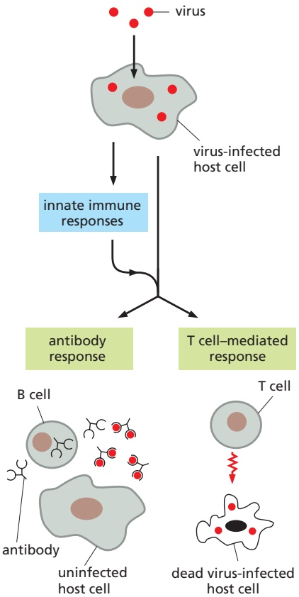

Figure 24–2 Two classes of vertebrate adaptive immune responses.

Lymphocytes carry out both classes, shown here as responses to a viral infection. In one class, B cells secrete antibodies that specifically bind to and. / . neutralize an extracellular virus, thereby preventing the virus from infecting host cells. In the other, T cells mediate the response; in this example, they kill the virus-infected host cells. In both cases, innate immune responses help activate the adaptive immune responses through pathways that we discuss later.

0.2 mm

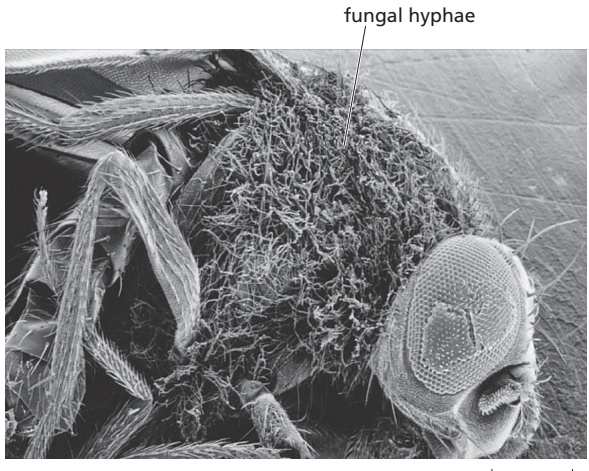

Figure 24–3 A scanning electron micrograph of a mutant fruit fly that died from a fungal infection. The fly is covered with fungal hyphae, as it lacked Toll receptors, which help protect Drosophila from fungal infections. (From B. Lemaitre et al., Cell 86:973–983, 1996. With permission from Elsevier.)

can help mediate the uptake of the pathogens into phagosomes, which then fuse with lysosomes to form phagolysosomes, where the pathogens are destroyed.MBoC7 m24.03/24.03 Other PRRs are located intracellularly, where they can detect intracellular pathogens such as viruses; these PRRs are either free in the cytosol or associated with the membranes of the endolysosomal system (discussed in Chapter 13). Still other PRRs are secreted and bind to the surface of extracellular pathogens, marking them for destruction by either phagocytes or blood proteins that are part of the complement system (discussed later).

#### There Are Multiple Families of PRRs

The first PRR identified was the Toll receptor in Drosophila, which was already well known for its role in fly development (see Figure 21–16). It was later discovered to be required also for the production of antimicrobial peptides that protect the fly against fungal infections (**Figure 24–3**). Toll is a transmembrane glycoprotein with a large extracellular domain that contains a series of leucine-rich repeats. Soon it was discovered that both plants and animals have a variety of **Toll-like receptors (TLRs)** that function as PRRs in innate immune responses against various pathogens. A human makes at least 10 different TLRs, each recognizing distinct ligands: TLR3, for example, recognizes double-stranded viral RNA in the endosomal lumen (**Figure 24–4**); TLR4 recognizes lipopolysaccharide (LPS) on the outer membrane of Gram-negative bacteria; TLR5 recognizes the protein that forms the bacterial flagellum; TLR7 and TLR8 recognize singlestranded viral RNA; and TLR9 recognizes short, unmethylated sequences of bacterial, viral, or protozoan DNA, called CpG motifs, which are uncommon in vertebrate DNA.

In addition to TLRs, humans use several other families of PRRs to detect pathogens. One is the large family of **NOD-like receptors (NLRs)**. Like TLRs, NLRs have leucine-rich repeat motifs, but they are exclusively cytoplasmic and recognize a distinct set of bacterial molecules. Individuals who are homozygous for an inactivating mutation in the NLR gene NOD2 have a greatly increased risk of developing Crohn’s disease, a chronic inflammatory disease of the small intestine, thought to involve chronic immune responses against harmless commensal gut microbes. Another family of PRRs consists of RIG-like receptors (RLRs), which are members of the RNA helicase family of proteins. They are also exclusively cytoplasmic and detect viral pathogens. A fourth family of PRRs consists of C-type lectin receptors (CLRs), which are transmembrane cell-surface proteins that recognize carbohydrates (which is why they are called lectins) on various microbes; they are called C-type because the binding to carbohydrate is dependent on $\mathrm { C a ^ { \vec { 2 } + } }$ . Table 24–1 summarizes some PRRs and their ligands and locations in cells. Collectively, these and other PRRs act as an alarm system to alert the innate and adaptive immune systems that an infection is brewing (**Movie 24.1**).

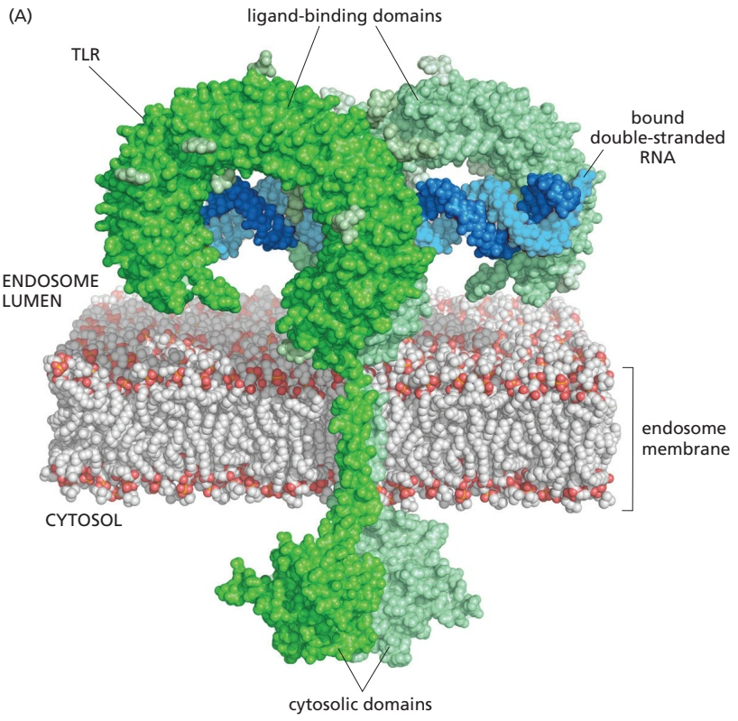

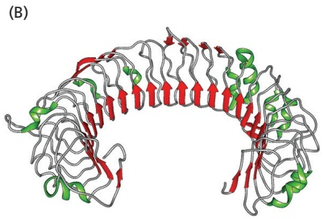

When a cell-surface or intracellular PRR binds a PAMP, it stimulates the cell to secrete a variety of cytokines and other extracellular signal molecules. Some of these inhibit viral replication, but most induce a local inflammatory response that helps eliminate the pathogen, as we now discuss.

Figure 24–4 A Toll-like receptor. (A) The structure of human TLR3 is shown (green), bound to a double-stranded RNA molecule (dsRNA; blue). The receptor is a transmembrane homodimer in the membrane of endosomes. The binding of dsRNA to the two horseshoe-shaped domains on the lumenal side of the endosome brings the two cytosolic domains together, allowing adaptor proteins in the cytosol to assemble into a large signaling complex, leading to the production of antivirus cytokines (not shown, but discussed later). (B) The crystal structure of a lumenal domain of the transmembrane receptor, which contains 23 conventional leucine-rich repeats, each of which contributes a β strand to the continuous β sheet (red) that lines the concave surface of the structure. (A, adapted from L. Liu et al., Science 320:379–381, 2008; B, adapted from J. Choe et al., Science 309:581–585, 2005. Both with permission from AAAS. PDB code: 1ZIW.)

#### Activated PRRs Trigger an Inflammatory Response at SitesMBoC7 m24.04/24.04 of Infection

When a pathogen invades a tissue, it activates PRRs on or in various cells of the innate immune system, resulting in an **inflammatory response** at the site of infection. Resident macrophages are usually the first cells to respond, and they orchestrate the subsequent responses by secreting short-range signal molecules that recruit other cells of the innate immune system. The inflammatory response involves changes in local blood vessels and is characterized clinically by local pain, redness, heat, and swelling. The blood vessels dilate and become permeable to fluid and proteins, leading to local swelling and an accumulation of blood proteins, including some that aid in defense against pathogens. At the same time, the endothelial cells lining the local blood vessels are stimulated to express cell adhesion proteins, which promote the attachment and escape of white blood cells, or leukocytes (see Figure 19–28), adding to the local swelling; initially neutrophils escape, followed later by lymphocytes and monocytes (the blood-borne precursors of macrophages— see Figure 22–12).

<table><tbody><tr><td colspan="4">TABLE 24-1 Some Pattern Recognition Receptors (PRRs)</td></tr><tr><td>Receptor</td><td>Location</td><td>Ligand</td><td>Origin of ligand</td></tr><tr><td colspan="4">Toll-like receptors (TLRs)</td></tr><tr><td>TLR3</td><td>Endolysosomal system</td><td>Double-stranded RNA</td><td>Viruses</td></tr><tr><td>TLR4</td><td>Plasma membrane</td><td>Bacterial lipopolysaccharide (LPS); viral coat proteins</td><td>Bacteria, viruses</td></tr><tr><td>TLR5</td><td>Plasma membrane</td><td>Flagellin</td><td>Bacteria</td></tr><tr><td>TLR9</td><td>Endolysosomal system</td><td>Unmethylated CpG dinucleotides in DNA</td><td>Bacteria, viruses, protozoa</td></tr><tr><td colspan="4">NOD-like receptors (NLRs)</td></tr><tr><td>NOD2</td><td>Cytoplasm</td><td>Degradation products of peptidoglycans</td><td>Bacteria</td></tr><tr><td colspan="4">Retinoic acid-inducible gene 1 (RIG)-like receptors (RLRs)</td></tr><tr><td>RIG1</td><td>Cytoplasm</td><td>Double-stranded RNA</td><td>Viruses</td></tr><tr><td colspan="4">C-type lectin receptors (CLRs)</td></tr><tr><td>Dectin1</td><td>Plasma membrane</td><td>β-Glucan</td><td>Fungi</td></tr></tbody></table>

The activation of PRRs results in the production of a large variety of extracellular signal molecules that mediate the inflammatory response at the site of an infection. These include both lipid signal molecules, such as prostaglandins, and protein (or peptide) signal molecules called **cytokines**, which mainly influence nearby cells. Some of the most important **pro-inflammatory cytokines** are tumor necrosis factor-a (TNFa), interferon-g (IFNg), a variety of chemokines that recruit leukocytes, and various interleukins (ILs) that we discuss later, including IL1β, IL6, IL12, IL17, and IL18. In addition, a secreted PRR (mannose-binding lectin) activates the complement system when the PRR binds to a pathogen; fragments of complement proteins released during complement activation stimulate an inflammatory response (discussed shortly; see Figure 24–7).

When activated by PAMPs, most cell-surface and intracellular PRRs stimulate the production of multiple pro-inflammatory cytokines by activating intracellular signaling pathways that switch on transcription regulators, including NFκB, to induce the transcription of the relevant cytokine genes (see Figure 15–63). Some PRRs, however, can also stimulate pro-inflammatory cytokine production by a different mechanism: when activated, several cytoplasmic NLRs assemble with adaptor proteins and specific proteases of the caspase family (discussed in Chapter 18) to form **inflammasomes**, in which the pro-inflammatory cytokines such as IL1β and IL18 are cleaved from their inactive precursor proteins by caspase-1. These cytokines are then released from the cell by unconventional secretion pathways. Inflammasomes closely resemble apoptosomes in their assembly and structure, but, in apoptosomes, caspases are activated to initiate an intracellular, proteolytic, caspase cascade that leads to apoptotic cell death (see Figure 18–8).

NLR-dependent inflammasome assembly can also be triggered in the absence of infection if cells are damaged or stressed. Such cells produce damageassociated molecular patterns (DAMPs), including those on altered or misplaced self molecules, which can activate the relevant NLRs: the arthritis caused by uric acid crystals formed in the joints of individuals with gout, who have abnormally high uric acid levels in their blood, is a painful example.

The inflammatory response is amplified by various positive feedback loops. Activated macrophages, for example, secrete IL1β, which acts back on macrophages to increase their production of more precursor of IL1β; at the same time, other cytokines increase the assembly of inflammasomes that produce yet more IL1β by cleaving its precursor. As another example, activated macrophages secrete chemokines that recruit leukocytes that also secrete chemokines that recruit more leukocytes, some of which are monocytes that mature into macrophages, which can be become activated to drive more rounds of this positive feedback cycle.

Besides their local effects, pro-inflammatory cytokines can produce widespread changes in the body. IL1β, IL6, and TNFα, for example, can act on the brain hypothalamus, muscle cells, and fat cells to increase body temperature, producing a fever that helps some immune cells fight infection. These cytokines can also stimulate the liver to secrete acute-phase proteins, such as C-reactive protein, which binds to the surface of various pathogens, where it recruits complement components that stimulate phagocytosis of the pathogen (discussed shortly). Because it increases several hundredfold, the increase in C-reactive protein is widely used clinically as a test for infection, inflammation, and tissue damage.

<!-- END EN EN24-H003-H005 -->

---

## 第11章 细胞信号转导 · 第四节 细胞信号转导的整合与控制

[返回本章](README.md) · [中文本章原文](中文原文.md)

<!-- BEGIN CN CN11-S04 -->
## 第四节 细胞信号转导的整合与控制

细胞的信号转导是多通路、多环节、多层次和高度复杂的可控过程。在许多情况下，细胞的适当反应依赖于接收信号的靶细胞对多种信号的整合以及对信号有效性的控制。

## 一、细胞对信号的应答反应具有发散性或收敛性特征

对特定胞外信号产生多样性细胞反应的机制通常有三种情况：

（1）细胞外信号的强度或持续时间的不同控制反应的性质。例如，在体外培养条件下，神经生长因子（NGF）诱导PCI2细胞分化为神经细胞；而上皮生长因子（EGF）则诱导PCI2细胞分化为脂肪细胞。通过延长生长因子刺激时间来强化EGF信号强度，则又转而引起神经细胞分化。虽然两种生长因子NGF和EGF都是RTK的配体，但与EGF相比，NGF是Ras-MAPK信号转导通路更强的激活子（activator），而EGF受体只有延长刺激时间才可能激活这条信号通路。

(2) 在不同细胞中，具有同样受体，但因不同的胞内信号蛋白，可引发不同的下游通路。在线虫（C. elegans）研究中已经证明，RTK受体介导的下游通路具有细胞类型特异性。EGF信号在不同的细胞类型中至少可诱发5种不同的反应，其中4种反应是由共同的Ras-MAPK信号通路介导的，而第5种反应涉及雌雄同体的排卵作用，则是利用一种不同的下游途径，该途径产生第二信使 $\mathrm{IP}_3$ ，与内质网膜上 $\mathrm{IP}_3$ 受体（ $\mathrm{IP}_3\mathrm{R}$ ）结合，动员 $\mathrm{Ca^{2+}}$ 释放，细胞质中 $\mathrm{Ca^{2+}}$ 水平升高，引发排卵。

(3) 细胞通过整合不同通路的输入信号调节细胞对信号的反应。不同类型的受体特异性识别并结合各自配体，这些信号通过两条或多条信号途径，在向下游传递时经整联蛋白（integrator protein）在细胞内汇聚、收敛（convergence）去激活一个共同的效应器（如 Ras 或 Raf 蛋白），从而引起细胞生理、生化反应和细胞行为的改变（图 11-39）；来自细胞表面同一类受体（如 Epo 受体）激活 Jak 也可引发多种信号途径，导致信号传播的发散（divergence），调节不同的基因表达，产生不同生理效应（见图 11-32）。

  
图11-39 细胞应答信号反应的收敛性特征  
来自细胞表面 GPCR、整联蛋白和受体酪氨酸激酶所转导的信号都收敛到 Ras 蛋白，然后沿 MAPK 级联反应途径向下传递。

## 二、蛋白激酶的网络整合信息

细胞各种不同的信号通路，主要提供了信号途径本身的线性特征，然而细胞需要对多种信号进行整合和精确控制，最后作出适宜的应答。细胞信号转导最重要的特征之一是构成复杂的信号网络系统（signal network system），它具有高度的非线性特点。人们对信号网络系统中各种信号通路之间的交互关系，形象地称之为“交叉对话”（cross talk）。或许可以把细胞信号转导比喻为电脑的工作，细胞接受的外界信号如同键盘输入的不同的字母或符号，细胞内各种信号通路及其组分如同电脑线路中的各种集成块，信号在这些集成块中流动，经分析、整合，最后将结果显示在荧光屏上。在细胞中，这些经信号网络系统分析、整合后的信号最终表现为特定的生理学功能。但是最复杂的电脑恐怕也无法和最简单的细胞相比，电脑作为无生命的机械装置，简单的操作失误或线路故障，都可导致整个系统的瘫痪；而细胞则有一定的自我修复和补偿能力。

虽然我们对细胞信号系统的研究有了长足进展，但对其复杂关系的了解仍然是初步的。细胞信号系统的网络化相互作用是细胞生命活动的重大特征，也是细胞生命活动的基本保障之一。今后对以调节基因表达为主线的信号网络研究，将会愈来愈受到重视。根据已有事实发现，通过蛋白激酶的网络整合信息调控复杂的细胞行为是不同信号通路之间实现“交叉对话”的一种重要方式（图11-40）。

图 11-40 概括了从细胞表面到细胞内的主要信号通路，从 5 条平行信号途径的比较不难发现：磷脂酶 C 既是 GPCR 信号途径的效应酶，又是 RTK 信号途径的效应酶，在两条信号通路中都起中介作用；尽管 4 条信号通路彼此不同，但在信号转导机制上又具有相似性，最终都是激活蛋白激酶，由蛋白激酶形成的整合信息网络原则上可调节细胞任何特定的过程。据最近统计，人类基因组编码蛋白激酶多达 560 种。因此不难理解蛋白激酶的网络整合信息是不同信号通路之间实现“交叉对话”的一种重要方式。

事实上，细胞信号网络的复杂性远比我们所了解的多。首先，还有许多信号途径不为人们所了解；其次，对主要途径的相互作用，我们只涉及了蛋白激酶，其他的正负调控及“交叉对话”却没有述及。对细胞信号转导过程中这些内容的研究和对信号传递过程非线性内涵的认识，将对我们深入了解多基因表达调控机制、发育机理、病理过程及疾病控制等方面产生

重要的影响。

## 三、信号的控制：受体的脱敏与下调

典型哺乳类细胞针对某种特殊配体的细胞表面受体，只占质膜总蛋白的0.1%\~5.0%，但是靶细胞对信号分子的最大细胞反应通常并不需要所有受体都被激活，细胞对胞外信号的敏感性既取决于表面受体的数量，又取决于受体与它们配体的亲和性（affinity）。受体与配体的亲和性常常用受体－配体复合物的解离常数 $(K_{\mathrm{d}})$ 来估量， $K_{d}$ 值代表细胞表面受体达到50%被占据时所需的配体分子浓度。因此 $K_{d}$ 值越大，表明亲和性越小；相反， $K_{d}$ 值越小，则表明亲和性越大。

细胞对外界信号作出适度的反应既涉及到信号的有效刺激和启动，也依赖于信号的解除与细胞的反应终止，特别值得注意的是信号的解除与终止和信号的刺激与启动对于确保靶细胞对信号的适度反应来说同等重要。解除与终止信号的重要方式是在信号浓度过高或细胞长时间暴露某一种信号刺激的情况下，细胞会以不同的方式致使受体脱敏（desensitization），这种现象又称之为适应（adaptation），这是一种负反馈调控机制。以视杆细胞对周围光强度变化的适应为例，由光激活的视蛋白（opsin，O'）是视紫红质激酶（rhodopsin kinase）的底物，活化的视蛋白其胞质面三个丝氨酸残基恰是视紫红质激酶的磷酸化位点，视蛋白的磷酸化一方面显著降低 $O^{\prime}$ 分子激活 $\mathrm{G}_1\alpha$ 的能力，另一方面视蛋白胞质面磷酸丝氨酸位点又为胞质抑制蛋白 $\beta$ -arrestin的结合提供了锚定位点， $\beta$ -arrestin的结合完全阻断 $\mathrm{G}_1\alpha$ 与磷酸化 $O^{\prime}$ 的相互作用，由于阻断 $\mathrm{G}_1\alpha$ -GTP复合物的形成，从而关闭所有视杆细胞的活性。这种引发靶细胞对信号刺激的脱敏（适应）机制也是其他GPCR在高配体水平条件下引发脱敏反应的普遍机制，导致受体磷酸化的激酶包括PKA、PKC或G蛋白偶联受体激酶（GRK）家族（包括视紫红质激酶）。GRK只是结合已被激活的受体，使其C端胞质域特定氨基酸（丝氨酸/苏氨酸）残基磷酸化，从而为结合 $\beta$ -arrestin提供锚定位点，这是GPCR脱敏的重要方式之一（图11-41）。随后的研究发现， $\beta$ -arrestin不仅与磷酸化的受体结合，而且作为接头蛋白与两种包被蛋白组分——网格蛋白和AP2蛋白结合，介导细胞内吞作用；另外还通过结合并激活几种胞质蛋白激酶参与信号转导功能。

  
图11-40 由两类受体介导的细胞内平行的信号通路与它们之间的网络关系

细胞可以适应刺激强度或刺激时间的变化，正是因为细胞可以校正对信号的敏感性。概括起来，靶细胞对信号分子的脱敏机制有如下5种方式：

(1) 受体没收 (receptor sequestration) 细胞通过配体依赖性的受体介导的内吞作用 (receptor-mediated endocytosis) 减少细胞表面可利用受体的数目，以网格蛋白/AP 包被小泡形式摄入细胞，内吞泡脱包被形成无包被的早期内体，受体被暂时扣留，受 pH 降低的影响 (pH 5.0)，受体－配体复合物在晚期内体解离，扣留的受体可返回质膜再利用（如 LDL 受体），配体进入溶酶体被消化。这是细胞对多种肽类或其他激素受体发生脱敏反应的一种基本途径。有时即使缺乏配体结合的情况下，细胞通过批量膜流（bulk membrane flow）也会使细胞表面受体以相对较低的速率被内化（internalization），然后再循环利用，从而减少细胞表面可利用受体的数目。

(2) 受体下调 (receptor down-regulation) 通过受体介导的内吞作用，受体-配体复合物转移至胞内溶酶体被消化降解而不能重新利用，因此细胞通过表面自由受体数目减少和配体的清除导致细胞对信号敏感性下调。受体-激素复合物的内吞作用和它们在溶酶体内被消化，是细胞表面减少RTK和细胞因子受体一种最基本的方式，从而降低细胞对胞外多肽类激素的敏感性。

(3) 受体失活 (receptor inactivation) 如前所述, GRK 使结合配体的受体丝氨酸 / 苏氨酸残基磷酸化, 再通过与胞质抑制蛋白 β-arrestin 结合而阻断与 G 蛋白的偶联作用, 这是一种快速使受体脱敏的机制。

(4) 信号蛋白失活 (inactivation of signaling protein) 致使细胞对信号反应脱敏的原因不在于受体本身, 而在于细胞内信号蛋白发生改变, 如去磷酸化或者泛素化并降解, 从而使信号级联反应受阻, 不能诱导正常的细胞反应。

(5) 抑制型蛋白质产生（production of inhibitory protein）受体结合配体而被激活后，在下游反应中（如对基因表达的调控）产生抑制型蛋白质并形成负反馈环从而降低或阻断信号转导途径。

  
图11-41 $\beta$ -arrestin在GPCR脱敏和信号转导中的作用

GPCR 在 GRK 作用下发生丝氨酸/苏氨酸残基磷酸化，为 β-arrestin 抑制蛋白的结合提供锚定位点，β-arrestin 与受体结合，导致 GPCR 脱敏。β-arrestin 作为接头蛋白两种包被蛋白组分网格蛋白和 AP2 蛋白结合，介导和促进受体的细胞内吞作用，从而降低表面受体的数量。此外，β-arrestin 在信号传导中通过结合并激活几种胞质蛋白激酶而传递来自活化受体信号，如 c-Src 激活 MAPK 途径，导致某些关键转录因子的磷酸化，或与三种其他蛋白相互作用，包括 c-Jun N 端激酶（JNK3），结果磷酸化并激活其他转录因子。

## - 思考题

1. 何谓信号转导中的分子开关机制？请举例说明。

2. 如何理解细胞信号系统及其功能？

3. 试比较 G 蛋白偶联受体介导的信号通路（效应蛋白、第二信使、生物学功能）。

4. 概述受体酪氨酸激酶介导的信号通路的组成、特点及其主要功能。

5. 概述细胞表面受体的分类（配体、受体、信号转导机制）。

6. 图解细胞表面受体调节基因表达的信号通路。

7. 概述细胞信号的整合方式与控制机制。

## - 参考文献

1. Cantley L C. The phosphoinositide 3-kinase pathway. Science, 2002, 296(5573): 1655-1657.

2. Cheng H, Lederer W J, Calcium sparks. Physiological Reviews, 2008, 88(4): 1491-1545.

3. Cheng H, Lederer W J, Cannell M B. Calcium sparks: elementary events underlying excitation-contraction coupling in heart muscle, Science, 1993, 262(5134): 740-744.

4. Gordon M D, Nusse R. Wnt signaling: multiple pathways, multiple receptors, and multiple transcription factors. Journal of Biological Chemistry, 2006, 281: 22429-22433.

5. Hamm H E. How activated receptors couple to G-proteins. Proceedings of the National Academy of Sciences of the United States of America, 2001, 98(9): 4819-4821.

6. Heldin C, Landström M, Moustakas A. Mechanism of TGFβ signaling to growth arrest, apoptosis, and epithelial-mesenchymal transition. Current Opinion in Cell Biology, 2009, 21(2): 166-176.

7. Hubbard S R, Miller W T. Receptor tyrosine kinases: mechanisms of activation and signaling. Current Opinion in Cell Biology, 2007, 19(2): 117-123.

8. Itoh S, ten Dijke P. Negative regulation of TGFβ receptor/Smad signal transduction. Current Opinion in Cell Biology, 2007, 19(2): 176-184.

9. Leonard W. Role of Jak kinases and STATs in cytokine signal transduction. International Journal of Hematology, 2001, 73(3): 271-277.

10. Pierce K L, Premont R T, Lefkowitz R J. Seven-transmembrane receptors. Nature Reviews Molecular Cell Biology, 2002, 3(9): 639-652.

11. Soulard A, Cohen A, Hall M N. TOR signaling in invertebrates. Current Opinion in Cell Biology, 2009, 21(6): 825-836.

12. Taylor S S, Kim C, Vigil D, et al. Dynamics of signaling by PKA. Biochimica et Biophysica Acta (BBA) - Proteins and Proteomics, 2005, 1754(1-2): 25-37.

13. Yamamoto Y, Gaynor R B. IκB kinases: key regulators of the NFκB pathway. Trends in Biochemical Sciences, 2004, 29(2): 72-79.

<!-- END CN CN11-S04 -->

---

## 对应英文内容

### 英文补充：信号响应、正负反馈、噪声与适应

> 对应中文板块：信号响应、正负反馈、噪声与适应。英文来源：Molecular Biology of the Cell，第7版，第15章；[本章完整原文](../来源/英文教材/15_Cell_Signaling/chapter.md)。物理PDF页码范围：912–987（整章范围）。

<!-- BEGIN EN EN15-H010-H016 -->
#### The Relationship Between Signal and Response Varies in Different Signaling Pathways

The function of an intracellular signaling system is to detect and measure a specific stimulus in one location of a cell and then generate an appropriately timed and measured response, often at another location. The system accomplishes this task by sending information in the form of molecular “signals” from the receptor to the final effector proteins, often through a series of intermediaries that do not simply pass the signal along but also process it along the way. Signaling systems work in various ways: each has evolved to produce a response that is appropriate for the cell function the system controls. In the following paragraphs, we list some basic signaling properties and how they vary in different systems, as a foundation for more detailed discussions later.

1. Response timing varies dramatically in different signaling systems, according to the speed required for the response. In some cases, such as synaptic signaling (see Figure 15–2C), the response can occur within milliseconds. In other cases, as in the control of cell fate by morphogens during development, a full response can require hours or days.

2. Sensitivity to extracellular signals can vary greatly. Hormones tend to act at very low concentrations on their distant target cells, which are therefore highly sensitive to low concentrations of signal. Neurotransmitters, on the other hand, operate at much higher concentrations at a synapse, reducing the need for high sensitivity in postsynaptic receptors. Sensitivity is often controlled by changes in the number or affinity of the receptors on the target cell. A particularly important mechanism for increasing sensitivity is signal amplification, whereby a small number of activated cell-surface receptors evokes a large intracellular response by either producing large amounts of a second messenger or by activating many copies of a downstream signaling protein.

3. Dynamic range of a signaling system is related to its sensitivity. Some systems, like those involved in simple developmental decisions, are responsive over a narrow range of extracellular signal concentrations. Others, like those controlling vision or some metabolic responses to hormones, are highly responsive over a much broader range of signal strengths. We will see that a broad dynamic range is often achieved by adaptation mechanisms that adjust responsiveness according to the pre-vailing amount of signal.

4. Persistence of a response can vary greatly. A transient response of less than a second is appropriate in some synaptic responses, for example, while a prolonged or even permanent response is required in cell-fate decisions during development. Numerous mechanisms, including positive and negative feedback, can be used to alter the duration and reversibility of a response.

5. Signal processing can convert a simple signal into a complex response. In many systems, for example, a gradual increase in an extracellular signal is converted into an abrupt, switchlike response. In other cases, a simple input signal is converted into an oscillatory response, produced by a repeating series of transient intracellular signals. Feedback usually lies at the heart of biochemical switches and oscillators, as we describe later.

6. Integration allows a response to be governed by multiple inputs. As discussed earlier, for example, specific combinations of extracellular signals are generally required to stimulate complex cell behaviors such as cell growth, proliferation, and differentiation (see Figure 15–4). The cell therefore has to integrate information coming from multiple signals, which often depends on intracellular coincidence detectors; these proteins are equivalent to AND gates in the microprocessor of a computer, in that they are only activated if they receive multiple converging signals (**Figure 15–13**).

Figure 15–13 An example of signal integration. Extracellular signals A and B activate different intracellular signaling pathways, each of which leads to the phosphorylation of protein Y but at different sites on the protein. Protein Y is activated only when both of these sites are MBoC7 m15.12/15.13phosphorylated, and therefore it becomes active only when signals A and B are simultaneously present.

7. Coordination of multiple responses in one cell can be achieved by a single extracellular signal. Some extracellular signal molecules, for example, stimulate a cell to both grow and divide. This coordination generally depends on mechanisms for distributing a signal to multiple effectors, by creating branches in the signaling pathway. In some cases, the branching of signaling pathways can allow one extracellular signal to modulate the strength of a response to other extracellular signals.

Given the complexity that arises from behaviors like signal integration, coordination, and feedback, it is clear that signaling systems rarely depend on a simple linear sequence of steps but more often operate like a signaling network, in which information flows in multiple directions, including backwards. A major research challenge is to understand the nature of these networks and how they control complex cell behaviors.

#### The Speed of a Response Depends on the Turnover of Signaling Molecules

The speed of any signaling response depends on the nature of the intracellular signaling molecules that carry out the target cell’s response. When the response requires only changes in proteins already present in the cell, it can occur very rapidly: an allosteric change in a neurotransmitter-gated ion channel (discussed in Chapter 11), for example, can alter the plasma membrane electrical potential in milliseconds, and responses that depend solely on protein phosphorylation can occur within seconds or minutes. When the response involves changes in gene expression and the synthesis of new proteins, however, it usually requires many minutes or hours, regardless of the mode of signal delivery (**Figure 15–14**).

When thinking about the speed of a response, it is natural to think of signaling systems in terms of the changes produced when the signal is delivered. But it can be just as important to consider what happens when the signal is withdrawn. In many signaling pathways, the response fades when the signal ceases. Often the effect is transient because the signal exerts its effects by increasing the concentrations of intracellular molecules that are short-lived (unstable), undergoing continual turnover. Thus, when the extracellular signal is removed, degradation of the molecules quickly wipes out all traces of the signal’s action. The same principle applies to signals that induce protein phosphorylation by activating a protein kinase: because most phosphorylation is continually removed by phosphatases, the effects of the increased protein kinase activity are quickly reversed when kinase activity declines. It follows that the speed with which a cell responds to removal of a signal depends on the rate of destruction, or turnover, of the molecules or modifications that the signal affects.

Figure 15–14 Slow and rapid responses to an extracellular signal. Certain types of signal-induced cellular responses, such as increased cell growth and division, involve changes in gene expression and the synthesis of new proteins; they therefore occur slowly, often starting an hour or more after the signal is received. Other responses—such as changes in cell movement, secretion, or metabolism— need not involve changes in gene transcription and therefore occur much more quickly, often starting in seconds or minutes; they may involve the rapid phosphorylation of effector proteins in the cytoplasm, for example. Synaptic responses mediated by changes in membrane potential are even quicker and can occur in milliseconds (not shown). Some signaling systems generate both rapid and slow responses as shown here, allowing the cell to respond quickly to a signal while simultaneously initiating a more long-term, persistent response.

(A) minutes after the synthesis rate has been decreased by a factor of 10

(B) minutes after the synthesis rate has been increased by a factor of 10

Figure 15–15 The importance of rapid turnover. The graphs show the predicted relative rates of change in the intracellular concentrations of molecules with differing turnover times when their synthesis rates are either (A) decreased or (B) increased suddenly by a factor of 10. In both cases, the concentrations of those molecules that are normally degraded rapidly in the cell (red lines) change quickly, whereas the concentrations of those that are normally degraded slowly (green lines) change proportionally more slowly. The numbers (in blue) on the right are the half-lives assumed for each of the different molecules.

It is also true, although much less obvious, that this turnover rate can determine the promptness of the response when an extracellular signal arrives. Consider, for example, two intracellular signaling molecules, X and Y, both of which are normally maintained at a steady-state concentration of 1000 molecules per cell. The cell synthesizes and degrades molecule Y at a rate of 100 molecules per second, with each molecule having an average lifetime of 10 seconds. Molecule X has a turnover rate that is 10 times slower than that of Y: it is both synthesized and degraded at a rate of 10 molecules per second, so that each molecule has an average lifetime in the cell of 100 seconds. If a signal acting on the cell causes a tenfold increase in the synthesis rates of both X and Y with no change in the molecular lifetimes, at the end of 1 second the concentration of Y will have increased by nearly 900 molecules per cell (10 × 100 – 100), while the concentration of X will have increased by only 90 molecules per cell. In fact, after a molecule’s synthesis rate has been either increased or decreased abruptly, the time required for the molecule to shift halfway from its old to its new equilibrium concentration is equal to its half-life; that is, equal to the time that would be required for its concentration to fall by half if all synthesis were stopped (**Figure 15–15**).

#### Cells Can Respond Abruptly to a Gradually Increasing Signal

Some signaling systems are capable of generating a smoothly graded response over a wide range of extracellular signal concentrations (**Figure 15–16**, blue line); such systems are useful, for example, in the fine-tuning of metabolic processes

Figure 15–16 Signal processing can produce smoothly graded or switchlike responses. Some cell responses MBoC7 m15.15/15.16increase gradually as the concentration of extracellular signal molecule increases, eventually reaching a plateau as the signaling pathway is saturated, resulting in a hyperbolic response curve (blue line). In other cases, the signaling system reduces the response at low signal concentrations and then produces a steeper response at some intermediate signal concentration— resulting in a sigmoidal response curve (red line). In still other cases, the response is more abrupt and switchlike; the cell switches completely between a low and high response, without any stable intermediate response (green line).

by some hormones. Other signaling systems generate significant responses only when the signal concentration rises beyond some threshold value. These abrupt responses are of two types. One is a sigmoidal response, in which low concentrations of stimulus do not have much effect, but then the response rises steeply and continuously at intermediate stimulus levels (**Figure 15–16**, red line). Such systems provide a filter to reduce inappropriate responses to lowlevel background signals but respond with high sensitivity when the stimulus rises to physiological signal concentrations. A second type of abrupt response is the discontinuous or all-or-none response, in which the response switches on completely (and often irreversibly) when the signal reaches some threshold concentration (**Figure 15–16**, green line). Such responses are particularly useful for controlling the choice between two alternative cell states, and they generally involve positive feedback, as we describe in more detail shortly.

Cells use a variety of molecular mechanisms to produce a sigmoidal response to increasing signal concentrations. In one mechanism, more than one intracellular signaling molecule must bind to its downstream target protein to induce a response. As we discuss later, for example, four molecules of the second messenger cyclic AMP must bind simultaneously to each molecule of cyclic-AMP-dependent protein kinase (PKA) to activate the kinase. A similar sharpening of response is seen when the activation of an intracellular signaling protein requires phosphorylation at more than one site. Such responses become sharper as the number of required molecules or phosphate groups increases, and if the number is large enough, responses become almost all-or-none (**Figure 15–17**).

Figure 15–17 Activation curves for an allosteric protein as a function of effector molecule concentration. The curves show how the sharpness of the activation response increases with an increase in the number of effector molecules that must be bound simultaneously to activate the target protein. The curves shown are those expected, under certain conditions, if the activation requires the simultaneous binding MBoC7 m15.16/15.17of 1, 2, 8, or 16 effector molecules.

Responses are also sharpened when an intracellular signaling molecule activates one enzyme and also inhibits another enzyme that catalyzes the opposite reaction. A well-studied example of this common type of regulation is the stimulation of glycogen breakdown in skeletal muscle cells induced by the hormone epinephrine. Epinephrine’s binding to a G-protein-coupled cell-surface receptor increases the intracellular concentration of cyclic AMP, which both activates an enzyme that promotes glycogen breakdown and inhibits an enzyme that promotes glycogen synthesis.

#### Positive Feedback Can Generate an All-or-None Response

Like intracellular metabolic pathways (discussed in Chapter 2) and the systems controlling gene activity (discussed in Chapter 7), most intracellular signaling systems incorporate feedback loops, in which the output of a process acts back to regulate that same process. We discussed the mathematical analysis of feedback loops in Chapter 8. In positive feedback, the output stimulates its own production; in negative feedback, the output inhibits its own production (**Figure 15–18**). Feedback loops are of great general importance in biology, and they regulate many chemical and physical processes in cells. Even the simplest of these loops can produce complex and interesting effects.

Positive feedback in a signaling pathway can transform the behavior of the responding cell. If the positive feedback is of only moderate strength, its effect will be simply to steepen the response to the signal, generating a sigmoidal response like those described earlier; but if the feedback is strong enough, it can produce an all-or-none response (see Figure 15–16). This response goes hand in hand with a further property: once the responding system has switched to the high level of activation, this condition is often self-sustaining and can persist even after the signal strength drops back below its critical value. In such a case, the system is said to be bistable: it can exist in either a “switched-off” or a “switched-on” state, and a transient stimulus can flip it from one state to the other (**Figure 15–19A and B**).

Through positive feedback, a transient extracellular signal can induce longterm changes in cells and their progeny that can persist for the lifetime of the organism. The signals that trigger muscle-cell specification, for example, turn on the transcription of a series of genes that encode muscle-specific transcription regulatory proteins, which stimulate the transcription of their own genes, as well as genes encoding various other muscle-cell proteins; in this way, the decision to become a muscle cell is made permanent. This type of cell memory, which depends on positive feedback, is one of the basic ways in which a cell can undergo a lasting change of character without any alteration in its DNA sequence.

Figure 15–18 Positive and negative feedback. In these simple examples, a stimulus activates protein A, which, in turn, activates protein B. Protein B then acts back to either increase or decrease the activity of A.

Studies of signaling responses in large populations of cells can give the false impression that a response is smoothly graded, even when strong positive feedback is causing an abrupt, discontinuous switch in the response in individual cells. Only by studying the response in single cells is it possible to see its all-or-none

(A)

(C)

(B)

Figure 15–19 Some effects of simple feedback. The graphs show the computed effects of simple positive and negative feedback loops (discussed in Chapter 8). In each case, the input signal is an activated protein kinase (S) that phosphorylates and thereby activates another protein kinase (E); a protein phosphatase (I) dephosphorylates and inactivates the activated E kinase. In the graphs, the red line indicates the activity of the E kinase over time; the underlying black bracket indicates the time during which the input signal (activated S kinase) is present. (A) Diagram of a positive feedback loop, in which the activated E kinase acts back to promote its own phosphorylation and activation; the basal activity of the I phosphatase dephosphorylates activated E at a steady, low rate. (B) The top graph shows that, without feedback, the activity of the E kinase is simply proportional to the level of stimulation by the S kinase. The bottom graph shows that, with the positive feedback loop, the transient stimulation by S kinase switches the system from an $\text{" } O 件"$ state to an “on” state, which then persists after the stimulus has been removed. (C) Diagram of a negative feedback loop, in which the activated E kinase phosphorylates. / . and activates the I phosphatase, thereby increasing the rate at which the phosphatase dephosphorylates and inactivates the phosphorylated E kinase. (D) The top graph shows, again, the response in E kinase activity without feedback. The other graphs show the effects on E kinase activity of negative feedback operating after a short or long delay. With a short delay, the system shows a response when the signal is first increased, but the feedback quickly dampens the response—which then declines to some intermediate level at which the input signal and feedback are balanced. With a long delay, the response rises unopposed at first, allowing kinase activity to reach maximum levels before it feeds back to shut itself off. Then the sudden drop in activity removes the negative feedback, unleashing another pulse of kinase activity. If conditions are right, the result is sustained oscillations for as long as the stimulus is present.

(A)

Figure 15–20 The importance of examining individual cells to detect all-or-none responses to increasing concentrations of an extracellular signal. In these experiments, immature frog eggs (oocytes) were stimulated with increasing concentrations of the hormone progesterone. The response was assessed by analyzing the activation of $M A P$ kinase (discussed later), which is one of the protein kinases activated by phosphorylation in the response. The amount of phosphorylated (activated) MAP kinase in extracts of the oocytes was assessed biochemically. In (A), extracts of populations of stimulated oocytes were analyzed, and the activation of $\mathsf { M A P }$ kinase appeared to increase progressively with increasing progesterone concentration. There are two possible ways of explaining this result: (B) MAP kinase could have increased gradually in each individual cell with increasing progesterone concentration; or (C) individual cells could have responded in an all-ornone way, with the gradual increase in total MAP kinase activation reflecting the increasing number of cells responding with increasing progesterone concentration. When extracts of individual oocytes were analyzed, it was found that cells had either very low amounts or very high amounts, but not intermediate amounts, of the activated kinase, indicating that the response was essentially all-or-MBoC7 m15.19/15.20none at the level of individual cells, as diagrammed in C. Subsequent studies revealed that this all-or-none response is due in part to strong positive feedback in the progesterone signaling system. (Adapted from J.E. Ferrell and E.M. Machleder, Science 280:895–898, 1998. With permission from AAAS.)

character (**Figure 15–20**). The misleading smooth response in a cell population is due to the random, intrinsic variability in signaling systems that we described earlier: all cells in a population do not respond identically to the same concentration of extracellular signal, especially at intermediate signal concentrations where the receptors are only partially occupied.

#### Negative Feedback Is a Common Feature of Intracellular Signaling Systems

By contrast with positive feedback, negative feedback counteracts the effect of a stimulus and thereby abbreviates and limits the level of the response, making the system less sensitive to perturbations (discussed in Chapter 8). As with positive feedback, however, qualitatively different responses can be obtained when the feedback operates in different ways. Negative feedback with a long delay can produce responses that oscillate. The oscillations may persist for as long as the stimulus is present (**Figure 15–19C and D**) or they may even be generated spontaneously, without need of an external signal to drive them. Many such oscillators also contain positive feedback loops that generate sharper oscillations. Later in this chapter, we will encounter specific examples of oscillatory behavior in the intracellular responses to extracellular signals; all of them depend on negative feedback, generally accompanied by positive feedback.

If negative feedback operates with a short delay, the system generates a brief response to a stimulus, but the response decays rapidly even while the stimulus persists. If the stimulus is increased further, the system responds strongly again, but, again, the response soon decays. This is the phenomenon of adaptation, which we now discuss.

#### Cells Can Adjust Their Sensitivity to a Signal

We have seen that most signaling systems generate an output response that is proportional to the strength of the input signal. In many cases, the response remains constant as long as the input signal remains, and the response declines when the input signal stops. In other systems, like those involving positive feedback, an input signal can generate a strong output signal that persists even after the input signal is removed. Finally, we have just discussed negative feedback systems in which an input signal triggers a response that rises and then falls even if the stimulus persists. A second, stronger input signal can then generate another transient response like the first one, and so on.

NEGATIVE(A) FEEDBACK

DELAYED(B) FEED-FORWARD

RECEPTOR(C) INACTIVATION

RECEPTOR(D) SEQUESTRATION

RECEPTOR(E) DESTRUCTION

Figure 15–21 Some ways in which target cells can become adapted (desensitized) to an extracellular signal molecule. (A) Negative feedback with a short delay can dampen the initial response to receptor activation. (B) In some cases, the activated receptor rapidly activates a stimulatory pathway while also initiating a slower inhibitory pathway—resulting in a transient output response. This is called a delayed feed-forward loop. (C, D, E) Various mechanisms can inactivate a cell-surface receptor after a signal molecule binds, including mechanisms that depend on internalization of the receptor into endosomes, from which the receptor can be returned to the cell surface or destroyed in lysosomes.

This phenomenon is called **adaptation**, or **desensitization**, and it allows cells to respond to changes in the strength of an input signal (rather than to the absolute amount of the signal) over a very wide range of signal levels. The visual system, discussed later in this chapter, provides the ideal illustration of this concept: it uses adaptation at varying signal strengths to allow us to see clearly over an astonishing range of light intensities, from starlight to bright sunshine.

Adaptation requires that some component of the signaling system generates a delayed inhibitory signal that reduces the strength of the output. There are several variations on this theme. One common mechanism, as just discussed, is negative feedback that operates with a short delay (**Figure 15–21A**). Many signaling pathways that begin with enzyme-coupled receptors, for example, include protein kinases that phosphorylate and thereby inhibit an upstream signaling protein in the pathway. A second mechanism of adaptation occurs when an extracellular signal rapidly activates a signaling response through one pathway while also triggering a parallel, slower signaling pathway that inhibits the response (**Figure 15–21B**). In some enzyme-coupled signaling pathways, for example, an activated receptor promotes recruitment to the membrane of a GEF called Sos, which stimulates the activity of a small GTP-binding protein called Ras (see Figure 15–11). Activation of the receptor also leads more slowly to recruitment of a GAP that inactivates Ras after a delay, thereby leading to a reduced output signal.

A particularly effective mechanism of adaptation, discussed in more detail later in the chapter, depends on receptor inactivation, whereby some activated receptors shut themselves off after some short period of activity. Ligand binding to some G-protein-coupled receptors, for example, leads to a change in the receptor that promotes its association with heterotrimeric G proteins and the resulting downstream response. Ligand binding also results in phosphorylation of the receptor and association with inhibitory molecules called arrestins, which interfere with G-protein activation and thereby reduce the response. The response is dampened further by endocytosis of the ligand-bound receptors, which can be sequestered inside the cell or simply destroyed (**Figure 15–21C, D, and E**).

Though bewildering in their complexity, the multiple cross-regulatory signaling pathways and feedback loops that we describe in this chapter are not just a haphazard tangle, but a highly evolved system for processing and interpreting the vast number of extracellular signals that impinge upon animal cells. The entire signaling network can be viewed as a computing device; like that other biological computing device, the brain, it presents one of the most difficult problems in biology. We can identify the components and discover how they work individually. We can understand how small subsets of components work together as regulatory modules, noise filters, or adaptation mechanisms, as we have seen. However, it is a much more daunting task to understand how the system works as a whole. This is not only because the system is complex; it is also because the way it behaves is strongly dependent on the quantitative details of the molecular interactions, and, for most animal cells, we have only rough qualitative information. A major challenge for the future of signaling research is to develop more sophisticated quantitative and computational methods for the analysis of signaling systems, as described in Chapter 8.

#### Summary

Each cell in a multicellular animal is programmed to respond to a specific set of extracellular signal molecules produced by other cells. The signal molecules act by binding to a complementary set of receptor proteins expressed by the target cells. Most extracellular signal molecules activate cell-surface receptor proteins, which act as signal transducers, converting the extracellular signal into intracellular ones that alter the behavior of the target cell. Activated receptors relay the signal into the cell interior by activating intracellular signaling proteins. Collectively, some of these signaling proteins help transduce, amplify, and spread the signal as they relay it, while others integrate signals from different signaling pathways. Some function as switches that are transiently activated by phosphorylation or GTP binding. Large signaling complexes form by means of modular interaction domains in the signaling proteins, which allow the proteins to form complex signaling networks.

Target cells use various mechanisms, including feedback loops, to adjust the ways in which they respond to extracellular signals. Positive feedback loops can help cells respond in an all-or-none fashion to a gradually increasing concentration of an extracellular signal or convert a short-lasting signal into a long-lasting or even irreversible response. Negative feedback is one way that allows cells to adapt to a signal molecule, which enables them to respond to small changes in the concentration of the signal molecule over a large concentration range.

<!-- END EN EN15-H010-H016 -->

### 英文补充：GPCR脱敏与受体磷酸化

> 对应中文板块：GPCR脱敏与受体磷酸化。英文来源：Molecular Biology of the Cell，第7版，第15章；[本章完整原文](../来源/英文教材/15_Cell_Signaling/chapter.md)。物理PDF页码范围：912–987（整章范围）。

<!-- BEGIN EN EN15-H029-H030 -->
#### GPCR Desensitization Depends on Receptor Phosphorylation

As discussed earlier, when target cells are exposed to an extracellular signal for a prolonged period, they can become desensitized, or adapted, in several different ways. An important class of adaptation mechanisms depends on alteration of the quantity or condition of the receptor molecules themselves.

For GPCRs, there are three general modes of adaptation, all centered on inactivation of the receptor (see Figure 15–21C, D, and E): (1) In receptor inactivation, they become altered so that they can no longer interact with G proteins. (2) In receptor sequestration, they are temporarily moved to the interior of the cell (internalized) so that they no longer have access to their ligand. (3) In receptor destruction, they are destroyed in lysosomes after internalization. In each case, the desensitization of the GPCRs depends on their phosphorylation by PKA, PKC, or a member of the family of **GPCR kinases (GRKs)**, which includes the rhodopsin kinase involved in rod photoreceptor desensitization discussed earlier. The GRKs phosphorylate multiple serines and threonines on a GPCR, but they do soMBoC7 m15.42/15.43 only after ligand binding has activated the receptor, because it is the activated receptor that allosterically activates the GRK. As with rhodopsin, once a receptor has been phosphorylated by a GRK, it binds with high affinity to a member of the **arrestin** family of proteins (**Figure 15–43**).

Figure 15–43 The roles of GPCR kinases (GRKs) and arrestins in GPCR desensitization. A GRK phosphorylates only activated receptors because it is the activated GPCR that turns on the GRK. The binding of an arrestin to the phosphorylated receptor prevents the receptor from binding to its G protein and also directs its endocytosis (not shown). Mice deficient in one form of arrestin fail to desensitize in response to morphine, for example, attesting to the importance of arrestins for desensitization.

The bound arrestin can contribute to the desensitization process in at least two ways. First, it prevents the activated receptor from interacting with G proteins. Second, it serves as an adaptor protein to help couple the receptor to the clathrin-dependent endocytosis machinery (discussed in Chapter 13), inducing receptor-mediated endocytosis. The fate of the internalized GPCR–arrestin complex depends on other proteins in the complex. In some cases, the internalized receptor is dephosphorylated and recycled back to the plasma membrane for reuse; in others, it is degraded in lysosomes.

Receptor endocytosis does not necessarily stop the receptor from signaling. In some cases, the bound arrestin recruits other signaling proteins to relay the signal onward from the internalized GPCRs along new pathways.

#### Summary

GPCRs can indirectly activate or inactivate either plasma-membrane-bound enzymes or ion channels via G proteins. When an activated receptor stimulates a G protein, the G protein undergoes a conformational change that activates its a subunit, thereby triggering release of a bg complex. Either component can then directly regulate the activity of target proteins in the plasma membrane. Some GPCRs either activate or inactivate adenylyl cyclase, thereby altering the intracellular concentration of the second messenger cyclic AMP. Others activate a phosphoinositide-specific phospholipase C (PLCb), which generates two second messengers. One is inositol 1,4,5-trisphosphate $( I   P _ { 3 } ) ,$ which releases $C a ^ { 2 + }$ from the ER and thereby increases the concentration of $[ C a ^ { 2 + }$ in the cytosol. The other is diacylglycerol, which remains in the plasma membrane and helps activate protein kinase C (PKC). An increase in cytosolic cyclic AMP or $C a ^ { 2 + }$ levels affects cells mainly by stimulating cAMP-dependent protein kinase (PKA) and $C a ^ { 2 \hat { + } }$ /calmodulin-dependent kinases (CaM-kinases), respectively.

PKC, PKA, and CaM-kinases phosphorylate specific target proteins and thereby alter the activity of the proteins. Each type of cell has its own characteristic set of target proteins that is regulated in these ways, enabling the cell to make its own distinctive response to the second messengers. The intracellular signaling cascades activated by GPCRs greatly amplify the responses, so that many thousands of target protein molecules are changed for each molecule of extracellular signaling ligand bound to its receptor. The responses mediated by GPCRs are rapidly turned off when the extracellular signal is removed, and activated GPCRs are inactivated by phosphorylation and association with arrestins.

<!-- END EN EN15-H029-H030 -->

## 跨章相关英文内容

- 信号放大与通路调控：[EN第15章 · GPCR、cAMP、钙、NO与第二信使](小节/02_第二节%20G蛋白偶联受体及其介导的信号转导.md#EN15-H017-H028)。
- 黏着介导的信号整合：[EN第19章 · 整联蛋白、细胞-基质黏着与机械信号](../16_细胞的社会联系/小节/02_第二节%20细胞黏着及其分子基础.md#EN19-H038-H046)。
