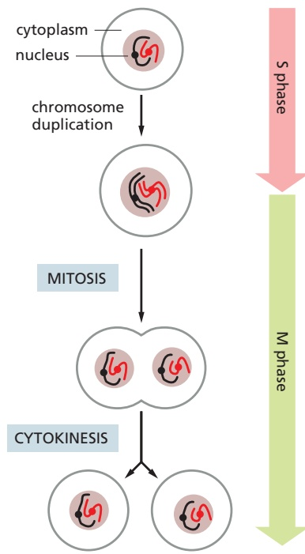
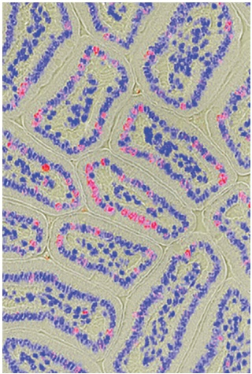
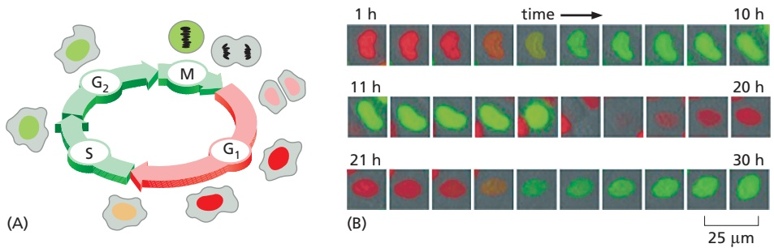
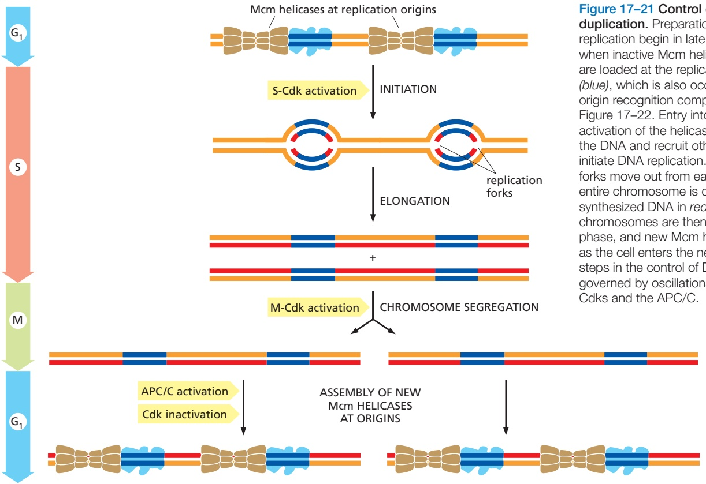
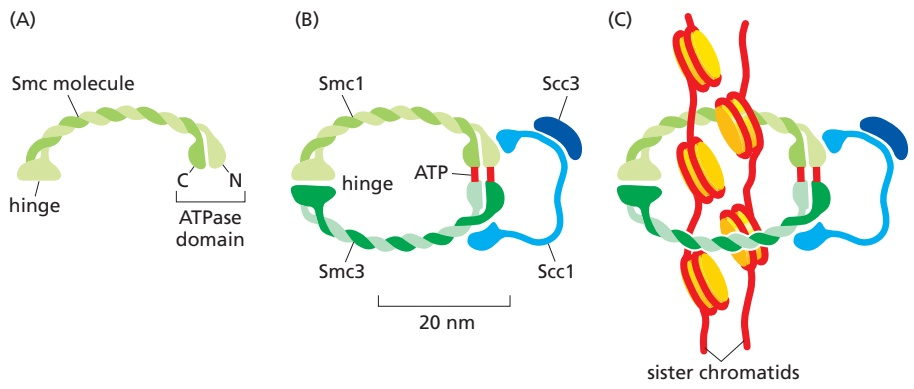

# 第12章 细胞周期与细胞分裂 · 第一节 细胞周期

[返回本章](../README.md) · [中文本章原文](../中文原文.md)

<!-- BEGIN CN CN12-S01 -->
## 第一节 细胞周期

## 一、细胞周期概述

如前所述，细胞周期是一个由物质准备到细胞分裂高度受控、周而复始的连续过程。细胞只有经过各种必要的物质准备，才能进行细胞分裂。经过分裂产生的子代细胞，只有再经过物质准备，才能进行下一轮的细胞分裂。细胞经过物质准备与细胞分裂，完成一个循环过程，即完成一个细胞周期。通常，我们将从一次细胞分裂结束开始，经过物质准备，直到下一次细胞分裂结束为止，称为一个细胞周期。细胞周期是一个十分复杂而又必须精确的生命活动过程，在细胞周期中至少涉及三个需要解决的根本问题：一是细胞分裂前遗传物质DNA精确的复制；二是完整复制的DNA如何在细胞分裂过程中确保准确分配到两个子细胞；三是物质准备与细胞分裂是如何调控的。这三个问题的任何环节的错误都可能影响细胞的生死存亡，或导致细胞周期调控紊乱，诸如细胞恶性增殖和肿瘤发生。

人们最初从细胞形态变化考虑，将一个细胞周期简单地划分为两个相互延续的时期，即细胞有丝分裂期（mitosis，简称M期）和居于两次分裂期之间的分裂间期（interphase）。分裂间期是细胞增殖的物质准备和积累阶段，分裂期则是细胞增殖的实施过程。细胞经过细胞分裂间期和细胞分裂期，完成一个细胞周期，细胞数量也相应地增加一倍。后来的工作发现，在细胞分裂期，也有一些物质准备，主要用于调控细胞分裂进程。

20世纪50年代初，人们用 $^{32}\mathrm{P}$ 标记蚕豆根尖细胞并作放射自显影实验，发现DNA合成是在分裂间期中的某个特定时期进行的。这一特定时期称为DNA合成期（DNA synthesis phase，简称S期）。进一步研究发现，S期不在分裂间期的开始，也不在分裂间期的末尾，而是在其中间某个时期。因而，从上次细胞分裂结束至S期DNA复制之前必然存在一个时间间隔（gap）。人们称这一时间间隔为第一间隔期，简称为 $\mathbf{G}_1$ 期；在S期DNA复制完成至细胞分裂之前，也必然存在一个时间间隔。人们将这一时间间隔期称为第二间隔期，简称为 $\mathbf{G}_2$ 期。由此可见，一个细胞周期可以人为地划分为先后连续的4个时相，即 $\mathbf{G}_1$ 期、S期、 $\mathbf{G}_2$ 期和M期。绝大多数真核细胞的细胞周期都包含这4个时相，只是时间长短有所不同。因而，通常将含有这4个不同时相的细胞周期称为标准的细胞周期（standard cell cycle）（图12-1）。

同种细胞之间，细胞周期时间长短相似或相同；不同细胞种类之间，细胞周期时间长短差别很大。自然界细胞种类繁多，有的细胞每增殖一次仅需几十分钟（如细菌和蛙胚细胞），有的需要十几小时或几十小时（如小肠上皮细胞），有的长达一年至数年（如高等动物体内的某些组织细胞）。就高等生物体的细胞而言，细胞周期时间长短主要差别取决于 $G_{1}$ 期，而S期、 $G_{2}$ 期和M期的总时间相对恒定。尤其是M期持续的时间更为恒定，常常仅持续半小时左右。

多细胞生物，尤其是高等生物，可以看做是由一个受精卵经过许多次分裂、分化所形成的细胞社会。在这个细胞社会中，可将细胞群体分为三类：①周期中细胞（cycling cell），这类细胞可能会持续分裂，即细胞周期持续运转。如上皮组织的基底层细胞，通过持续不断的分裂，增加细胞数量，弥补上皮组织表层细胞死亡脱落所造成的细胞数量损失。② $G_{0}$ 期细胞，也称静止期细胞（quiescent cell），这类细胞会暂时脱离细胞周期，停止细胞分裂，但仍然活跃地进行代谢活动，执行特定的生物学功能（图12-2）。周期中细胞转化为 $G_{0}$ 期细胞多发生在 $G_{1}$ 期。 $G_{0}$ 期细胞只是暂时脱离细胞周期，一旦得到信号指使，会快速返回细胞周期，分裂增殖，如结缔组织中的成纤维细胞，平时并不分裂，一旦所在的组织部位受到伤害，它们会马上返回细胞周期，分裂产生大量的成纤维细胞，分布于伤口部位，促使伤口愈合。体外培养的细胞，在某些营养物质缺乏时，也可以进入 $G_{0}$ 期。此时的细胞仅可以生存，但不能进行分裂。一旦得到营养物质补充， $G_{0}$ 期细胞很快会重返细胞周期，开始细胞分裂。对 $G_{0}$ 期细胞的产生和它们重返细胞周期机理的研究，已越来越受到人们的重视，这不仅涉及对细胞分化和细胞增殖调控过程的探讨，而且对生物医学如肿瘤发生和治疗、药物设计和药物筛选等，都具有重要的指导意义。③终末分化细胞（terminally differentiated cell），在机体内另有一类细胞，由于分化程度很高，一旦特化定型后，执行特定功能，则终生不再分裂。如大量的横纹肌细胞，血液多形核白细胞，某些生物的有核红细胞等。 $G_{0}$ 期细胞和终末分化细胞的界限有时难以划分，有的细胞过去认为属于终末分化细胞，目前可能又被认为是 $G_{0}$ 期细胞。

  
图 12-1 标准的细胞周期  
一个标准的细胞周期一般包括4个时相：DNA合成期（S）、细胞分裂期（M）以及介于二者之间的 $G_{1}$ 期和 $G_{2}$ 期。细胞周期从 $G_{1}$ 期开始，经S期和 $G_{2}$ 期，到M期结束。

  
图 12-2 细胞周期检查点及其主要事件

## 二、细胞周期中各不同时相及其主要事件

在组成细胞周期的 4 个不同时相里，要发生许多不同的事件。人们对这些事件已有不同程度的认识，有的已有所了解，有的已比较深入，有的可能还不为人知。在这里我们仅对其中的一些主要事件做一概括介绍（图 12-2）。

$G_{1}$ 期是一个细胞周期的第一阶段。上一次细胞分裂之后，产生两个子代细胞，标志着 $G_{1}$ 期的开始。新生成的子代细胞立即进入一个细胞生长期，开始合成细胞生长所需要的各种蛋白质、糖类、脂质等，但不合成细胞核DNA。在 $G_{1}$ 期的晚期阶段有一个特定时期。如果细胞继续走向分裂，则可以通过这个特定时期，进入S期，开始细胞核DNA合成，并继续运行，直到完成细胞分裂。在芽殖酵母中，这个特定时期被称为起始点(start)。起始点过后，细胞开始出芽，DNA也开始复制。起始点最初的概念是指细胞出芽的开始，但事实上控制着新一轮细胞周期的运转。在其他真核细胞中，这一特定时期称为限制点（restriction point, R 点），或检查点 (checkpoint)。

起始点被认为是 $G_{1}$ 期晚期的一个基本事件。细胞只有在内、外因素共同作用下才能完成这一基本事件，顺利通过 $G_{1}$ 期，进入 S 期并合成 DNA。任何因素影响到这一基本事件的完成，都将严重影响细胞从 $G_{1}$ 期向 S 期转换。影响这一事件的外在因素主要包括营养供给和相关的激素刺激等，而内在因素则主要是一些与细胞分裂周期相关基因（cell division cycle gene, CDC 基因）调控过程相关的因素。CDC 基因的产物是一些蛋白激酶、蛋白磷酸水解酶等。这些酶活性的变化将直接影响到细胞周期的变化。而这些酶活性变化本身在时间和空间上又受到内在和外在因素的调节。

限制点的概念多用于高等真核细胞，尤其是哺乳动物细胞。其实质尚不完全清楚，已发现与酵母中的起始点在形式上有许多共同之处，但也有明显不同，可能比后者更为复杂。实验发现，绝大多数细胞若在限制点前进行无生长因子培养(growth factor starvation)，细胞会很快进入休眠期，不能复制DNA，也不能进行细胞分裂。倘若在限制点之后进行无生长因子培养，细胞则可以进入S期，复制DNA。

检查点是目前细胞周期研究领域中用得较多的一个术语。这一术语的出现可能源于早期对大肠杆菌DNA复制调控的研究。当大肠杆菌DNA受到损伤，或DNA复制受到抑制时，会激活RecA蛋白，酶解LexA抑制子，诱导Sos基因的大量表达。有些Sos基因产物参与受损DNA的修复，有些则参与阻止细胞分裂。这种细胞周期进程被抑制的原因并不是由于DNA损伤或DNA复制尚未完成本身所引起的，而是由于细胞内存在一系列监控机制（surveillance mechanism）。这些特异的监控机制可以鉴别细胞周期进程中的错误，并诱导产生特异的抑制因子，阻止细胞周期进一步运行。在真核细胞中也发现多种监控机制，即指细胞周期的某些关键时刻，存在一套监控机制，以调控周期各时相有序而适时地进行更迭，并使周期序列过程中后一个事件的开始依赖于前一个事件的完成，从而保证周期事件高度有序地完成。进一步研究发现，检查点不仅存在于 $\mathrm{G}_1$ 期，也存在于其他时相，如S期检查点、 $\mathrm{G}_2$ 期检查点、纺锤体组装检查点等。从分子水平看，检查点是作用于细胞周期转换时序的调控信号通路，其监控作用在于保证基因和基因组的稳定性，而不是细胞分裂的基本条件。

S 期即 DNA 合成期。细胞经过 $G_{1}$ 期，为 DNA 复制的起始做好了各方面的准备。进入 S 期后，细胞立即开始合成 DNA。DNA 复制的起始和复制过程受到多种细胞周期调节因子的严密调控。同时，DNA 复制与细胞核结构如核骨架、核纤层、核膜等密切相关。目前已经知道，真核细胞 DNA 的复制和原核生物一样，是严格按照半保留复制的方式进行的。真核细胞新合成的 DNA 立即与组蛋白结合，共同组成核小体串珠结构。新的组蛋白也是在 S 期合成的。关于真核细胞 DNA 复制的起始、复制过程及其调控机制等，目前已取得了许多突破性进展；DNA 复制与细胞核结构的关系等，也在积极研究之中。

DNA复制完成以后，细胞即进入 $\mathrm{G}_2$ 期。此时细胞核内DNA的含量已经增加一倍，即每条染色体含有2个拷贝的DNA，由 $\mathrm{G}_1$ 期细胞的染色体倍性（ $2n$ ）变成了 $\mathrm{G}_2$ 期的染色体倍性（ $4n$ ）。其他结构物质和相关的亚细胞结构也已完成进入M期的必要准备。通过 $\mathrm{G}_2$ 期后，细胞即进入M期。但细胞能否顺利地进入M期，要受到 $\mathrm{G}_2$ 期检查点的控制。 $\mathrm{G}_2$ 期检查点要检查DNA是否完成复制，细胞是否已生长到合适大小，环境因素是否利于细胞分裂等。只有当所有利于细胞分裂的因素得到满足以后，细胞才能顺利实现从 $\mathrm{G}_2$ 期向M期的转化。

M期即细胞分裂期。真核细胞的细胞分裂主要包括两种方式，即有丝分裂（mitosis）和减数分裂（meiosis）。体细胞一般进行有丝分裂；成熟过程中的生殖细胞进行减数分裂，也称为成熟分裂。减数分裂是有丝分裂的特殊形式。细胞经过分裂，将其经过S期复制的染色体（DNA）平均分配到两个子细胞中。关于细胞分裂过程，下面将详细介绍。

细胞周期中各个时相的有序更迭和整个细胞周期的运行，需要“引擎”分子的驱动，即是在周期蛋白依赖性激酶复合物（cyclin-dependent kinase complex, CDK）统一调控下进行的。CDK通过调节靶蛋白磷酸化而调控细胞周期的运转。与CDK相对应的是蛋白磷酸水解酶，促进己磷酸化的靶蛋白去磷酸化。已知的CDK已有十来种，在不同的时期有不同的CDK起调控作用。参与调控细胞周期的蛋白磷酸水解酶也有多种。此外，还有不少其他因素，通过调控CDK和蛋白磷酸水解酶的活性或其他相关反应，从而参与调控细胞周期。下文还将进一步介绍细胞周期调控的机制。

细胞种类众多，繁殖速度有快有慢，细胞周期长短差别很大。单细胞生物如此，多细胞生物也是如此。就人体细胞而言，如神经细胞、肌细胞、血细胞、肝细胞、小肠上皮细胞等，其生长繁殖速度差异很大。体外培养的细胞也是如此，细胞来源不同，其细胞周期时间长短各异。细胞周期长短与细胞所处的外界环境也有密切关系。就环境温度而言，在一定范围之内，温度高，细胞分裂繁殖速度加快，温度低，则分裂繁殖速度减慢。

在某些工作中，常常会涉及细胞周期时间长短的测定。测定方法也多种多样，如脉冲标记 DNA 复制和细胞分裂指数观察测定法、流式细胞仪测定法等。若仅需要测定细胞周期总时间，只要通过在不同时间里对细胞群体进行计数，就可以推算出细胞群体的倍增时间，即细胞周期总时间。或者应用缩时摄像技术，不仅可以测定准确的细胞周期时间，还可以测定分裂间期和分裂期的准确时间。

## 三、细胞周期同步化

在同种细胞组成的细胞群体中，不同的细胞可能处于细胞周期的不同时相，为了某种目的，人们常常需要整个细胞群体处于细胞周期的同一个时相。事实上，在自然界中已经存在一些细胞群体处于细胞周期的同一时相的例子。例如有一种黏菌（Physarum polycephalum）的变形体 plasmodia，只进行核分裂而不进行细胞质分裂，结果形成多核原生质体结构。所有细胞核在同一细胞质中进行同步分裂，细胞核数目可多达 $10^{8}$ 个，多核原生质体（细胞）直径可达 5～6 cm。又如，大多数无脊椎动物和个别脊椎动物的早期胚胎细胞，可同步化卵裂数次甚至十多次，形成数量可观的同步化细胞群体。这种自然界存在的细胞周期同步化过程，称为天然同步化 (natural synchronization)。

细胞周期同步化也可以进行人工选择或人工诱导，统称为人工同步化(artificial synchronization)。人工选择同步化是指人为地将处于周期不同时相的细胞分离开来，从而获得不同时相的细胞群体。例如，处于对数生长期的单层培养细胞，细胞分裂活跃，大量处于分裂期的细胞变圆，从培养瓶（皿）壁上隆起，与培养瓶（皿）壁的附着力减弱。若轻轻振荡培养瓶（皿），处于分裂期的细胞即会从瓶（皿）壁上脱落，悬浮到培养液中。收集培养液，通过离心，即可获得一定数量的分裂期细胞（图12-3）。将这些分裂期细胞重新悬浮于一定体积的培养液中培养，细胞即开始分裂，进行细胞周期同步运转，由此可以获得不同时相的细胞。这种人工选择同步化方法目前仍被广泛采用。其优点是，细胞未经任何药物处理和伤害，能够真实反映细胞周期状况，且细胞同步化效率较高。但此方法也有不理想之处，即分离的细胞数量少。要获得足够数量的细胞，其成本大大高于采用其他方法。人工选择同步化的另一个方法是密度梯度离心法。有些种类的细胞，如裂殖酵母，不同时期的细胞在体积和质量上差别显著，可以采用密度梯度离心方法分离出处于不同时相的细胞。这种方法简单省时、效率高、成本低，但缺点是，对大多数种类的细胞并不适用。

  
图12-4 应用过量的TdR阻断法进行细胞周期同步化

  
图 12-3 从培养细胞中收集 M 期细胞的同步化方法

细胞同步化可以通过人工诱导而获得，即通过药物诱导，使细胞同步化在细胞周期的某个特定时相。目前应用较广泛的诱导同步化方法主要有两种，即 DNA 合成阻断法和分裂中期阻断法。

## 1. DNA 合成阻断法

DNA 合成阻断法是一种采用低毒或无毒的 DNA 合成抑制剂特异地抑制 DNA 合成，而不影响处于其他时相的细胞进行细胞周期运转，从而将被抑制的细胞抑制在 DNA 合成期的实验方法。目前采用最多的 DNA 合成抑制剂为胸腺嘧啶脱氧核苷（TdR）或羟基脲 (hydroxyurea, HU)。将一定剂量的抑制剂加入培养液并继续培养一定时间 $\left(\mathrm{G}_{2}+\mathrm{M}+\mathrm{G}_{1}\right)$ ，所有细胞即被抑制在 S 期。注意，此时的 S 期细胞可能处于 S 期中的任何时期，其时间区段仍然较宽。若将抑制剂去除，细胞仍然不能有效地进行同步化运转。要解决这一问题，通常的做法是，采用两次 DNA 合成抑制剂处理，将细胞最终抑制在 G/S 期交界处狭窄的时间区段。抑制剂去除后，细胞即可以进行同步细胞周期运转（图 12-4）。将过量的 TdR 加入细胞培养液，凡处于 S 期的细胞立刻被抑制，而其他各期的细胞则照常运转，培养一定时间 $\left(\mathrm{G}_{2}+\mathrm{M}+\mathrm{G}_{1}\right)$ 后，所有这些细胞则被抑制在 G，期和 S 期的交界处；将 TdR 洗脱，更换新鲜培养液后，阻断于 S 期的细胞，开始复制 DNA 并沿细胞周期运转。再向培养液中第二次加入 TdR，经过一定时间的培养，所有细胞则会被抑制在 G/S 期交界处。将 TdR 洗脱，更换新鲜培养液并继续培养一定时间，即可以获得 S 期和 G3 期不同时间点的同步化细胞。此方法的优点是同步化效率高，几乎适合于所有体外培养的细胞体系。这种方法目前被广泛采用。

## 2. 分裂中期阻断法

某些药物，如秋水仙碱，秋水仙酰胺和诺考达唑(nocodazole)等，可以抑制微管聚合，因而能有效地抑制细胞纺锤体的形成，将细胞阻断在细胞分裂中期。处于间期的细胞，受药物的影响相对较弱，常可以继续运转到M期。因而，在药物持续存在的情况下，处于M期的细胞数量会逐渐累加。通过轻微振荡，将变圆的M期细胞摇脱，经过离心，可以得到大量的分裂中期细胞。将分裂中期细胞悬浮于新鲜培养液中继续培养，它们可以继续分裂并沿细胞周期同步运转，从而获得 $G_{1}$ 期不同阶段的细胞。此方法的优点是操作简便，效率高；缺点是这些药物的毒性相对较大，若处理的时间过长，所得到的细胞常常不能恢复正常的细胞周期运转。

在实际工作中，人们常将几种方法并用，以获得数量多、同步化效率高的细胞。我们曾用低温、TdR和诺考达唑综合处理法获取大量的分裂中期细胞，将这些中期细胞匀浆用来进行非细胞体系细胞核重建实验，获得了体外重建的细胞核，不仅实现了细胞同步化，而且证明这些同步化的M期细胞仍可以进行正常的细胞周期运转。

目前，人们已经分离了许多与细胞周期调控有关的条件依赖性突变株。将这些突变株转移到限定条件下培养，所有细胞便被同步化在细胞周期中某一特定时相。

## 四、特殊的细胞周期

特殊的细胞周期是指那些特殊的细胞所具有的与标准的细胞周期相比有着鲜明特点的细胞周期。应用这些细胞所进行的细胞周期研究，不仅大大简化了实验条件，获得了许多重要结果，加深了人们对细胞周期的认识，而且这些研究仍在向深入发展。

## （一）早期胚胎细胞的细胞周期

早期胚胎细胞的细胞周期主要指受精卵在卵裂过程中的细胞周期。它与一般体细胞的细胞周期明显不同，尤其是两栖类、海洋无脊椎类以及昆虫类的早期胚胎细胞等。最显著的特点是，卵细胞在成熟过程中已经积累了大量的物质基础，基本可以满足早期胚胎发育的物质需要，其细胞体积也显著增加；当受精以后，受精卵便开始迅速卵裂，卵裂球数量增加，但其总体积并不增加，因而，卵裂球体积将越分越小。每次卵裂所持续的时间，即一个细胞周期所持续的时间，与体细胞周期相比，周期时间大大缩短。早期胚胎细胞周期的 $G_{1}$ 期和 $G_{2}$ 期非常短，以至于被误认为早期胚胎细胞周期仅含有S期和M期，即一次卵裂后，新的卵裂球迅速开始DNA合成，然后立即开始下一轮卵裂。以非洲爪蟾早期胚胎为例，当卵细胞受精以后，第1个细胞周期，即第1次卵裂，持续时间约75 min。从第2个细胞周期到第12个细胞周期，即从第2次卵裂到第12次卵裂，每个细胞周期持续30 min左右。12个细胞周期共需要8个多小时。而一个非洲爪蟾体细胞的细胞周期持续时间约 24 h。虽然早期胚胎细胞周期有其鲜明的特点，但细胞周期的基本调控因子和监控机制与一般体细胞标准的细胞周期基本是一致的。在过去的几十年中，人们选用早期胚胎细胞作为材料所进行的细胞周期调控研究，多次取得突破性进展，大大推动了学科发展。

## （二）酵母细胞的细胞周期

利用酵母细胞所从事的细胞周期研究，在整个细胞周期研究领域中占有重要位置。几十年来，用酵母细胞进行细胞周期调控研究取得了大量突破性的成果，如许多与细胞周期调控直接相关的基因的成功分离等。用于进行细胞周期调控研究的酵母主要有两种，即芽殖酵母和裂殖酵母。

酵母细胞的细胞周期与标准的细胞周期相比有许多相同之处。首先，酵母细胞周期运转过程也包括 $G_{1}$ 期、S期、 $G_{2}$ 期和M期4个时相。更基本的是酵母细胞周期调控过程与标准的细胞周期非常相似，许多参与调控细胞周期的基因与高等生物的也基本相同。

酵母细胞周期也有其明显的特点。首先，酵母细胞周期持续时间较短，大约为90 min。和许多其他单细胞生物一样，细胞分裂过程属于封闭式，即在细胞分裂时，细胞核核膜不解聚。与细胞核分裂直接相关的纺锤体不是在细胞质中，而是位于细胞核内。此外，还有其他一些特点。例如，和其他真菌相似，酵母在一定环境因素作用下，也进行有性繁殖。

芽殖酵母和裂殖酵母虽同称为酵母，但二者之间的亲缘关系甚远，分属于两个属，据 rRNA 序列分析，二者在两亿年前即已开始分歧演化。芽殖酵母和裂殖酵母在细胞结构和生命过程方面也有明显差别。

芽殖酵母以出芽方式进行分裂，因而很容易在生活状态下观察细胞周期进程。如图12-5所示，芽殖酵母细胞在 $G_{1}$ 期呈卵圆形，含有一个细胞核，基因组为单倍体。细胞周期起始点位于 $G_{1}$ 期的后期阶段。起始点过后，细胞马上开始出芽。根据芽体的大小比例可以粗略估计细胞所处的时期。细胞出芽后，很快便进入S期，开始DNA复制，同时，纺锤体开始组装。纺锤体的两端为纺锤体极体（spindle polar body）。另一个与标准的细胞周期显著不同的是，酵母的纺锤体组装与S期DNA复制同时进行，而不是在DNA复制之后。S期过后，经过短暂的 $G_{2}$ 期，染色质开始凝集，纺锤体逐渐延长，细胞逐步向M期推进。随着时间延长，芽体也不断增长，细胞核一分为二，分别分配到母体细胞和子细胞芽体中。再经过胞质分裂，形成相互独立的两个细胞。芽殖酵母细胞分裂为不等分裂，即生成的两个细胞体积大小不等，以芽体逐渐形成的子细胞体积较小。

  
图 12-5 芽殖酵母的细胞周期

芽殖酵母子细胞形成后，如果环境因素适宜，它们可以继续进行下一轮细胞周期。如果环境因素不适宜，如营养物质缺乏等，它们或者直接进入 $G_{0}$ 期状态，或者改变生活周期，由通过有丝分裂方式转化为减数分裂方式进行有性生殖。两个雌雄单倍体细胞会发生接合，细胞质相互融合，细胞核也随之融合，形成一个二倍体细胞。该二倍体细胞再经过起始点、一轮DNA复制、减数分裂等，最终形成4个单倍体孢子。一旦环境因素适应，单倍体孢子又可以萌发，回到无性生殖状态。

裂殖酵母形态呈棒状。其细胞周期与芽殖酵母有不少相似之处，也有显著不同（图12-6）。 $G_{1}$ 期裂殖酵母细胞为短棒状。经过一段时间的生长，细胞增加到一定长度，到达起始点。和芽殖酵母相似，经过起始点后，细胞很快进入S期，开始复制DNA，同时继续生长。S期过后，细胞进入 $G_{2}$ 期，并将继续生长一定时间，待细胞达到一定体积后，方能启动M期。经染色体凝集、纺锤体极体复制、纺锤体在细胞核内组装并逐渐延长、细胞核拉长等一系列变化，分裂成两个细胞核。再经胞质分裂，形成两个大小相同的子细胞。裂殖酵母在环境因素不利时，也会由有丝分裂生殖转化为减数分裂生殖。但与芽殖酵母细胞不同，两个不同性别的单倍体裂殖酵母细胞可以直接接合，通过减数分裂，形成4个单倍体孢子。此外，裂殖酵母的起始点无明显的形态学标志。因而难以像芽殖酵母那样，可以通过观察芽体的大小来估计细胞所在的细胞周期位置。但裂殖酵母有两个鲜明的特点：一是细胞分裂为均等分裂，即分裂后生成的两个子细胞大小相等；二是细胞生长仅是细胞长度的增加，细胞直径保持不变。根据这两个特点，可以通过测定细胞长度，比较容易地确定细胞周期变化。

  
图 12-6 裂殖酵母的细胞周期

## （三）植物细胞的细胞周期

植物细胞的细胞周期与动物细胞的标准细胞周期非常相似，也含有 $G_{1}$ 期、S期、 $G_{2}$ 期和M期4个时相。但植物细胞的细胞周期至少含有两个突出特点（图12-7）：第一，高等植物细胞不含中心体，但在细胞分裂时可以正常组装纺锤体。在动物细胞，中心体被认为是微管组织中心，是纺锤体组装所必需的。在缺乏中心体的情况下，是什么因素控制纺锤体组装，长期以来一直是植物细胞周期研究领域中的重要课题之一。第二，植物细胞分裂是在成膜体指导下，以形成细胞板（中间板）的形式完成胞质分裂。研究植物细胞胞质分裂的调控过程，也是探讨细胞周期调控中的重要课题之一。

## （四）细菌的细胞周期

近些年来，研究细菌细胞周期也成为细胞周期调控

间期  
前期  
  
中期  
后期  
末期和细胞板形成  
上排各图用两种荧光染色，绿色荧光显示胞质微管（纺锤体），红色荧光显示细胞核（染色体）。下排各图用福尔根染色法显示有丝分裂及胞质分裂过程。（苏都莫日根博士提供）

图 12-7 植物细胞的有丝分裂

研究中重要课题之一。但细菌种类繁多，细胞周期变化很大。在这里仅以大肠杆菌为例，简单介绍其细胞周期过程，以获得对细菌细胞周期的一般认识。

与所有其他细胞相似，DNA复制是细菌细胞周期中的重要事件之一（图12-8）。细菌DNA为一环形分子，含有一个复制起始点（origin）。细菌生长缓慢的情况下，在DNA复制之前，一般要经过一个临界时间(threshold)，调节DNA复制的起始。在DNA复制之后和细胞分裂之前，也有一个临界时间。只有通过这个临界时间，细胞才能开始分裂。从这种慢生长情况来看，细菌细胞周期过程与真核细胞周期过程有一定相似之处。其DNA复制之前的准备时间与 $\mathrm{G}_1$ 期类似。分裂之前的准备时间与 $\mathrm{G}_2$ 期类似。再加上S期和M期，细菌的细胞周期也基本具备4个时相（图12-8A）。但是，细菌在快生长情况下，细胞周期过程发生较大变化。最主要的变化在于细胞如何协调快速分裂和最基本的DNA复制速度之间的矛盾。在快生长情况下，细菌细胞每分裂一次（即一个细胞周期时间）仅需要 $35\mathrm{min}$ 而完成一次DNA复制却需要 $40\mathrm{min}$ 。而且，在DNA复制之前，需要 $10\mathrm{min}$ 的复制起始准备，在DNA复制之后还需要 $20\mathrm{min}$ 的染色体分离和细胞分裂。由此可见，真正完成一轮DNA复制实际需要 $70\mathrm{min}$ 。细菌细胞是如何来协调快速分裂和慢速的DNA复制之间的矛盾呢？原来，如图12-8B所示，在上一次细胞分裂结束时，细胞内的DNA已经复制到一半路程。细胞分裂后，立即开始新一轮的DNA复制。 $10\mathrm{min}$ 后，DNA复制起始，复制的起点不是在一个 DNA 分子上，而是在两个正在形成中的 DNA 分子上同时开始。随着上次 DNA 复制的结束，染色体开始分裂，细胞也随之分裂。到两个细胞完全形成时，刚才开始的 DNA 复制又已经走过一半路程。前后时间持续 35 min。新的细胞又开始下一轮的 DNA 复制准备。可以看出，快生长时，在一个细胞周期中每个 DNA 分子复制仅能完成一半，但 DNA 复制是在两个正在形成中的 DNA 分子上同时进行的。结果，经过 70 min，两个 DNA 分子完成复制，得到 4 个 DNA 拷贝，细胞完成两轮细胞周期，产生 4 个细胞。

细菌在一定环境条件下，其慢生长和快生长可以相互转化。若慢生长转化为快生长，在第一次DNA复制起始之后立即开始新一轮的DNA复制起始，使两个DNA分子同时复制，细胞分裂后，形成两个各含DNA复制完成一半路程的子细胞。若快生长转化为慢生长，在细胞分裂之后仅开始新一轮的细胞周期，而不起始新的DNA复制，结果生成两个各含一个DNA分子的子细胞。

关于细菌细胞 DNA 复制起始调控和染色体分离及细胞分裂调控等方面的研究，已经获得了许多成果，目前仍在深入进行中。

  
A  
图12-8 细菌的细胞周期A.慢生长。B.快生长。

<!-- END CN CN12-S01 -->

---

## 对应英文内容

### 英文补充：细胞周期时相、共同机制与研究方法

> 对应中文板块：细胞周期时相、共同机制与研究方法。英文来源：Molecular Biology of the Cell，第7版，第17章；[本章完整原文](../../来源/英文教材/17_The_Cell_Cycle/chapter.md)。物理PDF页码范围：1066–1127（整章范围）。

<!-- BEGIN EN EN17-H000-H005 -->
#### The Cell Cycle

The only way to make a new cell is to duplicate a cell that already exists. This simple fact, first established in the middle of the nineteenth century, carries with it a profound message for the continuity of life. All living organisms, from the unicellular bacterium to the multicellular mammal, are products of repeated rounds of cell growth and division extending back in time to the beginnings of life on Earth more than 3 billion years ago.

A cell reproduces by performing an orderly sequence of events in which it duplicates its contents and then divides in two. This cycle of duplication and division, known as the **cell cycle**, is the essential mechanism by which all living things reproduce. In unicellular species, such as bacteria and yeasts, each cell division produces a complete new organism. In multicellular species, long and complex sequences of cell divisions are required to produce a functioning organism. Even in the adult body, cell division is usually needed to replace cells that die. In fact, each of us must manufacture many millions of cells every second simply to survive: if all cell division were stopped—by exposure to a very large dose of x-rays, for example—we would die within a few days.

The details of the cell cycle vary from organism to organism and at different times in an organism’s life. Certain characteristics, however, are universal. At a minimum, the cell must accomplish its most fundamental task: the passing on of its genetic information to the next generation of cells. To produce two genetically identical daughter cells, the DNA in each chromosome is replicated faithfully to produce two complete copies. The replicated chromosomes are then distributed (segregated) to the two daughter cells, so that each receives a copy of the entire genome (**Figure 17–1**). In addition to duplicating their genome, most cells also duplicate their other organelles and macromolecules; otherwise, daughter cells would get smaller with each division. To maintain their size, dividing cells coordinate their growth (that is, their increase in cell mass) with their division.

This chapter describes the events of the eukaryotic cell cycle and how they are controlled and coordinated. We begin with a brief overview of the cell cycle. We then describe the cell-cycle control system, a complex network of regulatory proteins that triggers the different events of the cycle. We next consider in detail the major stages of the cell cycle, in which the chromosomes are duplicated and then segregated into the two daughter cells. Finally, we consider how extracellular signals govern the rates of cell growth and division and how these two processes are coordinated.

#### OVERVIEW OF THE CELL CYCLE

The most basic function of the cell cycle is to duplicate the vast amount of DNA in the chromosomes and then segregate the copies into two genetically identical daughter cells. These processes define the two major phases of the cell cycle. Chromosome duplication occurs during S phase (S for DNA synthesis), which requires 10–12 hours and occupies about half of the cell-cycle time in a typical mammalian cell. After S phase, chromosome segregation and cell division occur

C HAP T E R

17

IN THIS CHAPTER

Overview of the Cell Cycle

The Cell-Cycle Control System

S Phase

Mitosis

Cytokinesis

Meiosis

Control of Cell Division and Cell Growth

Figure 17–1 The cell cycle. The division of a hypothetical eukaryotic cell with two chromosomes (one red, and one black) is shown to illustrate how two genetically identical daughter cells are produced in each cycle. Each of the daughter cells will often continue to divide by going through additional cell cycles.

in M phase (M for mitosis), which requires much less time (less than an hour in a mammalian cell). M phase comprises two major events: nuclear division, or mitosis, during which the copied chromosomes are distributed into a pair of daughter nuclei; and cytoplasmic division, or cytokinesis, when the cell itself divides in two (**Figure 17–2**).

At the end of S phase, the DNA molecules in each pair of duplicated chromosomes remain intertwined and held tightly together by specialized protein linkages. Early in mitosis, at a stage called prophase, the two DNA molecules are disentangled and condensed into pairs of rigid, compact rods called **sister chromatids**, which remain linked by sister-chromatid cohesion. When the nuclear envelope then disassembles, the sister-chromatid pairs become attached to the mitotic spindle, a giant bipolar array of microtubules (discussed in Chapter 16). Sister chromatids are attached to opposite poles of the spindle and, eventually, align at the spindle equator in a stage called metaphase. The destruction of sister-chromatid cohesion at the start of anaphase separates the sister chromatids, which are pulled to opposite poles of the spindle. The spindle is then disassembled, and the segregated chromosomes are packaged into separate nuclei at telophase. Cytokinesis then cleaves the cell in two, so that each daughter cell inherits one of the two nuclei (**Figure 17–3**).

#### The Eukaryotic Cell Cycle Usually Consists of Four Phases

Most cells require much more time to grow and double their mass of proteins and organelles than they require to duplicate their chromosomes and divide. Partly to allow time for growth, most cell cycles have gap phases—a $\mathbf { G _ { 1 } }$ **phase** between M phase and S phase and a $\mathbf { G _ { 2 } }$ **phase** between S phase and mitosis. Thus, the eukaryotic cell cycle is traditionally divided into four sequential phases: $\mathbf { G } _ { 1 } ,$ S, G2, and M. G1, S, and $\mathrm { G } _ { 2 }$ together are called **interphase** (**Figure 17–4**, and see Figure 17–3). In a typical human cell proliferating in culture, interphase might occupy 23 hours of a 24-hour cycle, with 1 hour for M phase. Cell growth occurs throughout the cell cycle.

<small>Figure 17–2 The major events of the cell cycle. The major chromosomal events of the cell cycle occur in S phase, when the chromosomes are duplicated, and M phase, when the duplicated chromosomes are segregated into a pair of daughter nuclei (in mitosis), after which the cell itself divides into two (cytokinesis).</small>

Figure 17–3 The events of eukaryotic cell division as seen under a microscope. The easily visible processes of nuclear division (mitosis) and cell division (cytokinesis), collectively called M phase, typically occupy only a small fraction of the cell cycle. The other, much longer, part of the cycle is known as interphase, which includes S phase and the gap phases.

The two gap phases are more than simple time delays to allow cell growth. They also provide time for the cell to monitor the internal and external environment to ensure that conditions are suitable and preparations are complete before the cell commits itself to the complex events of S phase and mitosis. The $\mathrm { G _ { 1 } }$ phase is especially important in this respect. Its length can vary greatly depending on external conditions and extracellular signals from other cells. If extracellular conditions are unfavorable, for example, cells delay progress through $\mathrm { G _ { 1 } }$ and may even enter a specialized resting state known as $G _ { 0 }$ (G zero), in which they can remain for days, weeks, or even years. Indeed, many cells remain permanently in $\mathsf { G } _ { 0 }$ until the organism dies. If extracellular conditions become favorable or signals to grow and divide are introduced, cells in $\mathrm { G _ { 0 } }$ progress through a commitment point in $\mathrm { G _ { 1 } }$ known as **Start** (in yeasts) or the **restriction point** (in mammalian cells). We will use the term “Start” for both yeast and animal cells. After passing this point, cells are committed to DNA replication, even if the extracellular signals that stimulate cell growth and division are removed.

Not all cells undergo the conventional four-phase cell cycle. The early cleavage divisions of vertebrate embryos, for example, are not accompanied by cell growth, and these rapid divisions simply include alternating $\mathrm { S }$ and M phases without intervening gaps. Another important and common variation is the **endocycle**, also known as endoreduplication, in which multiple rounds of S phase occur without intervening M phases, resulting in cells with many copies of the genome—thereby enabling rapid increases in the production of numerous gene products. Finally, as we describe later, some cell types undergo mitosis without cytokinesis, resulting in large cells with multiple nuclei.

Figure 17–4 The four phases of the cell cycle. In most cells, gap phases separate the major events of S phase and M phase. $\mathbb { G } _ { 1 }$ is the gap between M phase and S phase, while G2 is the gap between S phase and M phase.

#### Cell-Cycle Control Is Similar in All Eukaryotes

Some features of the cell cycle, including the time required to complete certain events, vary greatly from one cell type to another, even in the same organism. The basic organization of the cycle, however, is essentially the same in all eukaryotic cells, and all eukaryotes appear to use similar machinery and control mechanisms to drive and regulate cell-cycle events. The proteins of the cell-cycle control system, for example, first appeared more than a billion years ago. Remarkably, they have been so well conserved over the course of evolution that many of them function perfectly when transferred from a human cell to a yeast cell. We can therefore study the cell cycle and its regulation in a variety of organisms and use the findings from all of them to assemble a unified picture of how eukaryotic cells divide.

Several model organisms are used in the analysis of the eukaryotic cell cycle. The budding yeast Saccharomyces cerevisiae and the fission yeast Schizosaccharomyces pombe are simple eukaryotes in which powerful molecular and genetic approaches can be used to identify and characterize the genes and proteins that govern the fundamental features of cell division. The early embryos of certain animals, particularly those of the frog Xenopus laevis, are excellent tools for biochemical dissection of cell-cycle control mechanisms, while the fruit fly Drosophila melanogaster is useful for the genetic analysis of mechanisms underlying the control and coordination of cell growth and division in multi-cellular organisms. Cultured human cells provide an excellent system for the molecular and microscopic exploration of the complex processes by which our own cells divide.

#### Cell-Cycle Progression Can Be Studied in Various Ways

How can we tell what stage a cell has reached in the cell cycle? One way is simply to look at living cells with a microscope. A glance at a population of mammalian cells proliferating in culture reveals that a fraction of the cells have rounded up and are in mitosis (cell rounding allows the mitotic spindle to function more effectively). Other cells can be observed in the process of cytokinesis. We can gain additional clues about cell-cycle position by staining cells with DNA-binding fluorescent dyes (which reveal the condensation of chromosomes in mitosis) or with antibodies that recognize specific cell components such as the microtubules (revealing the mitotic spindle). S-phase cells can be identified in the microscope by supplying them with visualizable molecules that are incorporated into newly synthesized DNA, such as the artificial thymidine analog 5-ethynyl-2′-deoxyuridine (EdU); cell nuclei that have incorporated EdU are then revealed by treatment with a fluorescent dye that attaches covalently to EdU (**Figure 17–5**).

Typically, in a population of cultured mammalian cells that are all proliferating rapidly but asynchronously, about 30–40% will be in S phase at any instant and become labeled by a brief pulse of EdU. From the proportion of cells in such a population that are labeled, we can estimate the duration of S phase as a fraction of the whole cell-cycle duration. Similarly, from the proportion of cells in mitosis (the mitotic index), we can estimate the duration of M phase. The timing of cell-cycle phases can also be measured in living cells using fluorescently labeled proteins that appear and disappear at specific stages (**Figure 17–6**).

100 µm

<small>Figure 17–5 Labeling S-phase cells. A fluorescence micrograph of EdU-labeled cells of the mouse small intestine, showing intestinal villi in transverse section. The mouse was injected with a single brief dose of EdU, which then became incorporated into the newly synthesized DNA of any cell that was progressing through S phase at the time of injection. Ninety-six hours later, the tissue was fixed and labeled with a fluorescent dye that attaches to EdU (red), thereby labeling cells that were in S phase 96 hours earlier. All the cell nuclei are stained with a blue fluorescent dye. (From A. Salic and T.J. Mitchison, Proc. Natl. Acad. Sci. USA 105:2415–2420, 2008. With permission from National Academy of Sciences.)</small>

Figure 17–6 Measuring cell-cycle timing in live cells. (A) The method shown here depends on fluorescent proteins that are present only at specific cell-cycle stages, as illustrated in the diagram. First, a protein called geminin is labeled with a green fluorescent protein. This protein is targeted for degradation by the APC/C, a ubiquitin ligase that is active from metaphase to the end of G1 (as discussed later). Thus, the green fluorescence of this protein is seen from early S phase to mid-mitosis. A second protein, called Cdt1, is tagged with a red fluorescent protein. This protein is targeted for ubiquitylation and destruction from late $\mathbb { G } _ { 1 }$ to telophase of mitosis. Cells therefore glow red from the end of mitosis to the end of G1. (B) Fluorescence microscopy of a single mammalian cell expressing these two proteins reveals alternating red and green fluorescence as the cell progresses through the cell cycle. These images were obtained every hour over a 30-hour period. The cell was in late mitosis and cytokinesis at the 16- and 17-hour time points, and only one of the daughter cells is shown in subsequent images. This method is called Fucci (fluorescent ubiquitylation-based cell-cycle indicator). (From A. Sakaue-Sawano et al., Cell 132:487–498, 2008. With permission from Elsevier.)

Another way to assess the stage that a cell has reached in the cell cycle is by measuring its DNA content, which doubles during S phase. This approach is greatly facilitated by the use of fluorescent DNA-binding dyes and a flow cytometer, which allows the rapid and automatic analysis of large numbers of cellsMBoC7 n17.101/17.06 (**Figure 17–7**). We can use flow cytometry to determine the fraction of cells in $\mathrm { G _ { 1 } }$ $\mathsf { S } _ { r }$ and $\mathbf { G } _ { 2 } + \mathbf { M }$ phases by measuring DNA content in a cell population.

#### Summary

Cell division usually begins with duplication of the cell’s contents, followed by distribution of those contents into two daughter cells. Chromosome duplication occurs during S phase of the cell cycle, whereas most other cell components are duplicated continually throughout the cycle. During M phase, the replicated chromosomes are segregated into individual nuclei (mitosis), and the cell then splits in two (cytokinesis). S phase and M phase are usually separated by gap phases called $G _ { I }$ and $G _ { 2 } ,$ when various intracellular and extracellular signals regulate cell-cycle progression. Cell-cycle organization and control have been highly conserved during evolution, and studies in a wide range of organisms have led to a unified view of eukaryotic cell-cycle control.

<!-- END EN EN17-H000-H005 -->

### 英文补充：S期、一次复制与姐妹染色单体黏连

> 对应中文板块：S期、一次复制与姐妹染色单体黏连。英文来源：Molecular Biology of the Cell，第7版，第17章；[本章完整原文](../../来源/英文教材/17_The_Cell_Cycle/chapter.md)。物理PDF页码范围：1066–1127（整章范围）。

<!-- BEGIN EN EN17-H016-H020 -->
#### S PHASE

The linear chromosomes of eukaryotic cells are vast and dynamic assemblies of DNA and protein, and their duplication is a complex process that takes up a major fraction of the cell cycle. Not only must the long DNA molecule of each chromosome be duplicated accurately—a remarkable feat in itself—but the chromatin proteins in each region of that DNA must also be reproduced, ensuring that the daughter cells inherit all features of chromosome structure.

The central event of chromosome duplication—DNA replication—poses two problems for the cell. First, replication must occur with extreme accuracy to minimize the risk of mutations in the next cell generation. Second, every nucleotide in the genome must be copied once, but only once, to prevent the damaging effects of gene amplification. In Chapter 5, we discuss the sophisticated protein machinery that performs DNA replication with astonishing speed and accuracy. In this section, we consider the elegant mechanisms by which the cell-cycle control system initiates the replication process and, at the same time, prevents it from happening more than once per cycle.

#### S-Cdk Initiates DNA Replication Once Per Cell Cycle

As we discussed in Chapter 5, DNA replication in eukaryotic cells begins at origins of replication, which are scattered at numerous locations in every chromosome. During S phase, DNA replication is initiated at these origins when a DNA helicase unwinds the double helix and DNA replication enzymes are loaded onto the two single-stranded templates. This leads to the elongation phase of replication, when the replication machinery moves outward from the origin at two replication forks.

To ensure that chromosome duplication occurs only once per cell cycle, the initiation of DNA replication is divided into two distinct steps that occur at different times in the cell cycle (**Figure 17–21**). The first step occurs only in late mitosis or early G1, when two inactive DNA helicases, called **Mcm helicases**, are loaded onto the DNA at the replication origin. This step is sometimes called licensing of replication origins because initiation of DNA synthesis is permitted only at origins that are preloaded with Mcm helicases. The second step occurs in S phase, when the Mcm helicases are activated, primarily by S-Cdks, resulting in DNA unwinding and the initiation of DNA synthesis. Once a replication origin has been activated in this way, it cannot be reused until new Mcm helicases are loaded at that origin, which can occur only when the cell reaches late mitosis or G1. As a result, origins can be activated only once per cell cycle, ensuring that the DNA is replicated once and only once.

Figure 17–21 Control of chromosome duplication. Preparations for DNA replication begin in late mitosis and G1, when inactive Mcm helicases (brown) are loaded at the replication origin (blue), which is also occupied by the origin recognition complex described in Figure 17–22. Entry into S phase leads to activation of the helicases, which unwind the DNA and recruit other proteins to initiate DNA replication. Two replication forks move out from each origin until the entire chromosome is duplicated (newly synthesized DNA in red). Duplicated chromosomes are then segregated in M phase, and new Mcm helicases are loaded as the cell enters the next G1. The key steps in the control of DNA synthesis are governed by oscillations in the activities of Cdks and the APC/C.

Figure 17–22 Control of the initiation of DNA replication. The replication origin is bound by the origin recognition complex (ORC) throughout the cell cycle, but ORC functions only in late mitosis and early G1 when it associates with Cdc6. ORC–Cdc6 binds the Mcm helicase, which contains six closely related subunits arranged in a barrel shape. The helicase also associates with a protein called Cdt1. Using energy provided by ATP hydrolysis, the ORC and Cdc6 proteins load two copies of the Mcm helicase around the DNA next to the origin. At the onset of S phase, S-Cdk stimulates the assembly of several accessory proteins, including Cdc45 and GINS, on each Mcm helicase. Another protein kinase, DDK, phosphorylates subunits of the Mcm helicase. The result is a large protein complex called the CMG helicase (for Cdc45–Mcm–GINS), which unwinds the DNA at the origin. DNA polymerase and other replication proteins arrive at the origin, and DNA replication begins. For clarity, this diagram does not show synthesis of the lagging strand (discussed in Chapter 5). The ORC is displaced by the replication machinery, but new ORCs bind to both replication origins after their replication. S-Cdk and other mechanisms also inactivate the loading factors ORC, Cdc6, and Cdt1, thereby preventing loading of new Mcm helicases at the origins until the end of mitosis.

**Figure 17–22** illustrates some of the molecular details underlying the control of the two steps in the initiation of DNA replication. A key player is a large multiprotein complex called the **origin recognition complex (ORC)**, which binds to replication origins. In late mitosis and early. $\mathbf { G } _ { 1 } ,$ the proteins **Cdc6** and **Cdt1** collaborate with the ORC to load the Mcm helicases around the DNA next to the origin. The origin is now licensed for replication.

At the onset of S phase, S-Cdk triggers origin activation by phosphorylating specific accessory proteins, which bind and thereby activate the Mcm helicases at the origin. The two DNA strands are separated, and an active helicase is loaded around each strand. The DNA synthesis machinery is recruited to the origin and DNA synthesis begins. Another protein kinase called DDK is also activated in S phase and helps drive origin activation by phosphorylating specific subunits of the Mcm helicase.

At the same time as S-Cdk initiates DNA replication, it employs several mechanisms to prevent the loading of new Mcm helicases at origins. S-Cdk phosphorylates and thereby inhibits the ORC and Cdc6 proteins. Inactivation of

APC/C–Cdh1 in late $\mathrm { G _ { 1 } }$ also helps prevent Mcm helicase loading, as follows. In late mitosis and early $\mathrm { G } _ { 1 } ,$ APC/C–Cdh1 triggers the destruction of a Cdt1 inhibitor called **geminin**, thereby allowing Cdt1 to be active. When APC/C–Cdh1 is turned off in late $\mathbf { G _ { l } } ,$ geminin accumulates and inhibits the Cdt1 that is not associated with DNA. Also, the association of Cdt1 with a protein at active replication forks stimulates Cdt1 ubiquitylation by a ubiquitin ligase called CRL4–Cdt2, leading to Cdt1 degradation. In these various ways, Mcm complex loading is blocked from S phase to mid-mitosis. Thus, once an origin is used, it cannot be reloaded with a new Mcm complex in the same cell cycle.

How, then, is the cell-cycle control system reset to allow replication in the next cell cycle? In late mitosis, APC/C activation leads to the inactivation of Cdks and the destruction of geminin. ORC and Cdc6 are dephosphorylated and Cdt1 is activated, allowing Mcm helicase loading to prepare the cell for the next S phase.

#### Chromosome Duplication Requires Duplication of Chromatin Structure

The DNA of the chromosomes is complexed with a variety of protein components, including histones and various regulatory proteins involved in the control of gene expression (discussed in Chapter 4). Thus, duplication of a chromosome is not simply a matter of replicating the DNA at its core but also requires the duplication of these chromatin proteins and their proper assembly on the DNA.

The production of chromatin proteins increases during S phase to provide the raw materials needed to package the newly synthesized DNA. Most important, S-Cdks stimulate a large increase in the synthesis of the four histone subunits that form the histone octamers at the core of each nucleosome. These subunits are assembled into nucleosomes on the DNA by nucleosome assembly factors, which typically associate with the replication fork and distribute nucleosomes on both strands of the DNA as they emerge from the DNA synthesis machinery.

Chromatin packaging helps to control gene expression. In some parts of the chromosome, the chromatin is highly condensed and is called heterochromatin, whereas in other regions it has a more open structure called euchromatin (discussed in Chapter 4). These differences in chromatin structure depend on a variety of mechanisms, including modification of histone tails and the presence of non-histone proteins. Because these differences are important in gene regulation, it is crucial that chromatin structure, like the DNA within, is reproduced accurately during S phase. How chromatin structure is reproduced is not well understood, however. During DNA synthesis, histone-modifying enzymes and various non-histone proteins are probably deposited onto the two new DNA strands as they emerge from the replication fork, and these proteins are thought to reproduce the local chromatin structure of the parent chromosome (see Figure 4–44).

#### Cohesins Hold Sister Chromatids Together

At the end of S phase, each replicated chromosome consists of a pair of identical sister chromatids glued together along their length. This sister-chromatid cohesion sets the stage for a successful mitosis because it greatly facilitates the attachment of the two sister chromatids to opposite poles of the mitotic spindle. Imagine how difficult it would be to achieve bipolar spindle attachment if sister chromatids were allowed to drift apart after S phase. Indeed, defects in sister-chromatid cohesion—in yeast mutants, for example—lead inevitably to major errors in chromosome segregation.

Sister-chromatid cohesion depends on a large protein complex called **cohesin**, which forms a ring structure that surrounds the two chromatids (**Figure 17–23**). Cohesin is first loaded around unduplicated chromosomes before S phase, with assistance from a specialized loading complex. During S phase, by mechanisms that remain obscure, the cohesin ring is held in place during passage of the replication fork, such that the cohesin ring encircles the pair of new sister chromatids as they are being synthesized. Also during S phase, an acetyltransferase modifies a subpopulation of cohesins, locking them around the sisters to provide the stable sister-chromatid cohesion that is required to hold the sisters together until mitosis.

Sister-chromatid cohesion also results, at least in part, from the intertwining of sister DNA molecules that occurs when two replication forks meet during DNA synthesis. The enzyme topoisomerase II gradually disentangles the sister DNAs between S phase and early mitosis by cutting one DNA molecule, passing the other through the break, and then resealing the cut DNA (see Figure 5–23). Once the intertwining has been removed, sister-chromatid cohesion depends on cohesin. The loss of sister cohesion at the metaphase-to-anaphase transition therefore depends primarily on disruption of these complexes, as we describe later.

#### Summary

Duplication of the chromosomes in S phase involves the accurate replication of the entire DNA molecule in each chromosome, as well as the duplication of the chromatin proteins that associate with the DNA and govern various aspects of chromosome function. Chromosome duplication is triggered by the activation of S-Cdk, which activates proteins that unwind the DNA and initiate its replication at replication origins. Once a replication origin is activated, S-Cdk also inhibits proteins that are required to allow that origin to initiate DNA replication again. Thus, each origin is fired once and only once in each S phase and cannot be reused until the next cell cycle. During S phase, the duplicated chromosomes are linked together by cohesin, which provides the sister-chromatid cohesion that is required for alignment of the sister-chromatid pairs on the bipolar spindle in mitosis.

<!-- END EN EN17-H016-H020 -->

## 跨章相关英文内容

- 细胞周期的调控基础：[EN第17章 · 周期蛋白-CDK、磷酸酶、APC/C与生化开关](../../13_细胞增殖调控与癌细胞/小节/01_第一节%20细胞增殖调控.md#EN17-H006-H015)。
