# 第12章 细胞周期与细胞分裂 · 第二节 细胞分裂

[返回本章](../README.md) · [中文本章原文](../中文原文.md)

<!-- BEGIN CN CN12-S02 -->
## 第二节 细胞分裂

## 一、有丝分裂

在细胞周期的 M 期时相包括核分裂与胞质分裂两个相互联系的过程。细胞有丝分裂即指核分裂，根据细胞分裂期核膜、染色体、纺锤体装配及核仁等形态结构的规律性变化，传统上人们将有丝分裂过程又人为地划分为前期、前中期、中期、后期和末期。胞质分裂（cytokinesis）相对独立，一般开始于细胞有丝分裂后期，完成于细胞有丝分裂末期。通过核分裂与胞质分裂，使已经复制好的染色体 DNA 平均分配到两个子细胞中。在整个细胞分裂过程中，细胞骨架系统是核分裂与胞质分裂的主要执行者。图 12-9 中的照片摄自经抗微管抗体和 DNA 染料双重荧光染色的动物细胞。在细胞间期，细胞核结构清晰，微管以一个中心体为核心向四周辐射装配。随着细胞进入分裂期，细胞核结构和微管排列方式等将发生一系列有序的变化。基于光镜下所见有丝分裂基本过程，在中学及大学其他先行课程中已多有描述，故此不再赘述。

## （一）有丝分裂各期的重要事件及其结构装置

## 1. 前期

前期（prophase）是有丝分裂过程的开始阶段。在前期主要发生两个事件：

(1) 染色体凝缩（chromatin condensation）染色体凝缩是指由间期细长、弥漫样分布的线型染色质，经过进一步螺旋化、折叠和包装（packing）等过程，逐渐变短变粗，形成光镜下可辨的早期染色体结构。已复制的染色体的两个姐妹染色单体间彼此黏着和凝缩是有丝分裂和减数分裂期间基因组准确分离的先决条件。不同水平染色体高级结构的组织是依赖于不同的SMC（structural maintenance of chromosome）蛋白复合物来维持的。两类结构上相关的蛋白复合物分别是黏连蛋白（cohesin）和凝缩蛋白（condensin），二者均是由多个亚基构成的。黏连蛋白介导姐妹染色单体的黏着，凝缩蛋白介导染色体凝缩。它们的核心组分为具有ATP酶活性的Smc家族成员，从细菌到高等生物，在演化上高度保守，在染色体高级结构组织、包装和配对等方面行使关键作用。典型真核生物的SMC复合物由两个SMC蛋白异二聚体和两个或多个非SMC蛋白亚基组成。黏连蛋白由Smc1/3异二聚体以及非Smc蛋白如Mcd1（Scc1或Rad21）和Scc3亚基组成；凝缩蛋白最初在爪蟾卵细胞抽提物中被纯化，除Smc2/4异二聚体外，还有其他三种非SMC蛋白（CAP-H，-G和-D2）参与复合物的组成。每个异二聚体被中间铰链区分为两个卷曲螺旋臂，每个臂的末端是球形类ATP结合盒（ATP-binding cassette, ABC），这种结构特点使得SMC复合物可以利用水解ATP释放的能量保持高度动态性和可塑性，以确保分子间或分子内的相互作用。在其他非SMC蛋白亚基参与下，黏连蛋白通过臂端类ABC结构域与DNA结合，将两条姐妹染色单体黏着在一起（分子间交联），直至有丝分裂中－后期转换时染色单体彻底分离。染色单体间除通过黏连蛋白而交联外，在主缢痕（着丝粒）区两侧还组装形成一种蛋白质复合物结构，称为动粒（详见第九章第四节）；凝缩蛋白介导染色体DNA分子内交联，利用水解ATP释放的能量，促进染

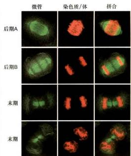  
图12-9 高等动物细胞有丝分裂过程（罗佳博士和张传茂博士提供）

  
图 12-10 SMC 蛋白（A）及其黏连蛋白（Smc1/3）（B）、凝缩蛋白（Smc2/4）（C）异二聚体的作用

色体凝缩（图12-10）。

(2) 细胞分裂极的确立和纺锤体的装配 不管是细胞常规的有丝分裂, 还是像酵母那样的核内有丝分裂, 在起始阶段, 分裂极的确立至关重要。动物细胞分裂极的确立, 与中心体的复制、分离和有星纺锤体的装配密切相关。中心体建立两极纺锤体, 确保细胞分裂过程的对称性和双极性, 而这一功能对染色体的精确分离是必需的。高等植物细胞没有中心体, 但有丝分裂时也要装配形成无星纺锤体, 其分裂极的确立机制尚不清楚。动物细胞中心体被称为微管组织中心 (MTOC), 中心体内含有一对桶状的中心粒, 它们彼此垂直分布, 外面被无定形的中心粒外周物质所包围 (参见图 8-22)。在细胞周期过程中中心体的周期变化如图 12-11 所示。

  
图 12-11 动物细胞中心体的复制与细胞周期的关系  
在每个细胞周期中，中心体进行一次半保留复制。在有丝分裂末期，每个子代细胞继承一个中心体，而在下次有丝分裂开始之前，它又包含两个中心体。

在分裂间期，中心体精确的复制周期为有丝分裂做前期准备，这一过程被称之为中心体复制。在 $G_{1}$ 期晚期垂直分布的母中心粒和子中心粒分离，这是中心体复制开始的征兆，现普遍认为，中心体在 $G_{1}$ 期末开始复制，在S期完成复制，随着中心体复制完成，在 $G_{2}$ 期分离，半保留复制的中心粒进入子代中心体。细胞进入有丝分裂前期，复制并分离后的两个子中心体作为微管组织中心，开始放射状微管装配，中心体及其周围微管形成两个星体（aster），这便是分裂极的确立和纺锤体装配的起始。根据中心体生化分析，中心体长驻蛋白包括 $\alpha/\beta/\gamma/\delta/\varepsilon$ 微管蛋白、中心体蛋白（centrin）、中心粒周蛋白（pericentrin）等。许多研究结果表明， $\gamma$ 微管蛋白是微管组织中心的组成成分，最初发现于一种真菌中，后来证实它普遍存在于其他真核生物中，是一种非常保守的蛋白质，而且可能也由多基因编码， $\gamma$ 微管蛋白连接微管和中心体。尽管它在细胞中含量很少，但对微管的装配、微管的取向等起着很重要的调节作用。中心体蛋白是分子质量为20 kDa的一个钙结合蛋白家族，主要定位于中心体及其同源结构中。目前已鉴别出4种中心体蛋白（centrin-1p, 2p, 3p, 4p）。centrin-2p和centrin-3p普遍表达于哺乳动物细胞中，两种蛋白质主要位于中心粒的远端。研究表明在HeLa细胞中，如果centrin-2p的表达被干扰RNA灭活，中心粒的复制将被抑制并导致细胞周期连续性的缺损。研究发现，中心体蛋白在中心体的复制和分离中发挥重要作用，在哺乳动物细胞中，中心体蛋白的定位具有细胞周期依赖性的特点，推测中心体蛋白参与了有丝分裂过程。中心粒周蛋白是中心粒周围物质的组成成分，它参与组织中心体的结构。现已有实验证据表明，中心体复制的起始需要多种调节因子介入，在G $_{1}$ /S期限制点，需要cyclin E-Cdk2（参见本章第一节）参与，为中心体复制签发通行证；中心体复制由钙调蛋白依赖激酶II(CaMK II)触发，细胞内自由钙离子浓度增加使CaMK II激活，CaMK II激活触发中心体复制的开始，在S期中心体复制依靠cyclin A-CDK2复合物。

动物细胞有丝分裂前期纺锤体的装配起始于两个星体的形成，它们并排于核膜附近。典型的有星纺锤体由星体微管、极间微管和染色体动粒微管排列组成。有丝分裂前期，星体微管和极间微管通过向其远离中心体的一端（正极端）加入 $\alpha / \beta$ 微管蛋白二聚体而不断延长，在基于微管的马达蛋白的介导下推动中心体向细胞两极移动。

如果中心体复制异常，或细胞未能协调好中心体复制和DNA复制的关系，将不可避免地导致形成单极或多极纺锤体，而单极或多极纺锤体将驱使染色体异常分离，最终导致染色体倍性的改变。早在20世纪初期，Boveri就提出恶性肿瘤细胞极性的改变和染色体分裂异常（非整倍体）可能是由于中心体功能缺陷引起的。事实上，染色体组型的改变在癌细胞中非常普遍，现在已经有越来越多的研究结果证实了这一观点。如今人们已经认识到，中心体复制功能障碍可能是引起染色体分裂异常的重要原因，并且最终导致癌的形成。

## 2. 前中期

前中期（prometaphase）的标志性事件之一是核膜崩解。核纤层蛋白形成骨架结构支撑于核被膜的内侧，得以使细胞核维持正常的形状与大小。在细胞有丝分裂中核被膜经历有规律地解体与重建过程（图12-12）。

核膜的崩解与核纤层的解体是相互偶联的事件。细胞分裂过程中核纤层的解体和重新组装与核纤层蛋白的磷酸化水平相关。核纤层蛋白的磷酸化与去磷酸化可能是有丝分裂过程中核纤层结构动态变化的调控因素。一些研究结果表明，核纤层蛋白是有丝分裂促进因子（MPF）的直接作用底物。MPF具蛋白激酶活性，有丝分裂前期，MPF可以使核纤层蛋白22位和392位丝氨酸磷酸化，结果导致这两个与核纤层组装直接相关的结构域发生构象变化，从而导致核纤层蛋白四聚体解聚和核纤层解聚。解聚的核纤层蛋白A以可溶性单体形式弥散在细胞中，而核纤层蛋白B则与核膜解体后形成的核膜小泡保持结合状态。在分裂末期，结合有核纤层蛋白B的核膜小泡在染色质周围聚集，并渐渐融合形成新的核膜，而核纤层蛋白则在核膜的内侧组装成子细胞的核纤层。

前中期标志性事件之二是完成纺锤体装配，形成有丝分裂器（mitotic apparatus）。在前期，两个星体的形成和向两极的运动，事实上标志着纺锤体组装的开始。有丝分裂进入前中期，随着核膜的解体，由纺锤体两极发出的一些星体微管可进入“核”内，通过其正极端迅速捕获染色体，并分别与染色体两侧的动粒结合，形成动粒微管（kinetochore microtubule）。至此，由微管及其结合蛋白组成的纺锤体基本完成组装，由星体微管、染色体动粒微管和极间微管及其结合蛋白构成有星纺锤体，即动物细胞的有丝分裂器（图12-13）。此时的纺锤体赤道直径相对较大，两极直径的距离也相对较短。与同一条染色体的两个动粒相连接的两极动粒微管并不

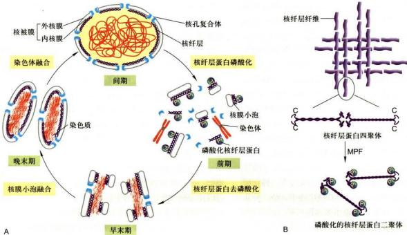  
图12-12 细胞分裂过程中核被膜和核纤层的动态变化  
A.核被膜在细胞有丝分裂中有规律地解体与重建。B.核纤层解聚。

A  
  
图 12-13 高等动物细胞纺锤体结构

A. DNA 荧光染料染色（红色）和抗微管蛋白抗体免疫荧光染色（绿色）。B. 染色体和纺锤体结构模式图。（A 图由罗佳博士和张传茂博士提供）

等长。因而染色体并不完全分布于赤道板，相互排列貌似杂乱无章。

纺锤体（spindle）是细胞分裂过程中的一种与染色体分离直接相关的细胞器。植物细胞不含中心体，但能形成无星纺锤体介导植物细胞的核分裂。

纺锤体组装是一个十分复杂的过程。首先要涉及微管在中心体周围组装和已经完成复制的中心体的分离。如前所述，中心体的复制和周围微管的组装需要许多调节因素的参与，如γ微管蛋白、中心体蛋白、中心粒周蛋白等。中心体的分离需要驱动蛋白相关蛋白（kinesin-related protein, KRP；参见表8-1驱动蛋白家族成员介绍）和细胞质动力蛋白等的作用（图12-14）。KRP主要为一些向微管正极运动（正向运动）的蛋白质，而细胞质动力蛋白主要是向微管负极运动（负向运动）的蛋白质。中心体分离时，负向运动的马达蛋白在来自姐妹中心体的微管之间搭桥，通过向负极运动，将被结合的微管牵拉在一起，组成纺锤体微管，中心体也自然形成了纺锤体的两极。这一过程称为中心体列队（centrosome alignment），即分裂极的确立（图12-14A、B）。然后，正向运动的马达蛋白在纺锤体微管之间搭桥，借助向微管正极运动，将纺锤体拉长，中心体之间的距离逐渐加大（图12-14C）。当纺锤体拉长到一定程度后，负向运

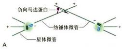

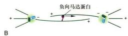

  
图 12-14 纺锤体组装过程

A. 中心体分离，负向运动马达蛋白与来自姐妹中心体的纺锤体微管结合。B. 借助马达蛋白向微管负极运动，将纺锤体微管牵拉在一起，形成早期纺锤体。C. 正向运动马达蛋白在纺锤体微管之间搭桥，借助正向运动，将纺锤体拉长。D. 负向运动的马达蛋白在细胞膜和星体微管之间搭桥，借助负向运动，将中心体进一步拉近两极的细胞膜，纺锤体进一步被拉长。

动的马达蛋白在细胞膜和星体微管之间搭桥，借助负向运动，将星体向两极细胞膜拉近，纺锤体也进一步被拉

长（图 12-14D）。

前中期标志性事件之三是染色体整列（chromosome alignment）。由纺锤体极体发出的微管捕捉染色体动粒，形成染色体动粒微管，这是染色体整列的必要前提。没有动粒的染色体不能与纺锤体微管结合并向两极运动，同样，染色体动粒如果未被纺锤体微管捕获，也不能和其他染色体一起向两极运动。着丝粒和动粒是染色体结构的重要组分，由于着丝粒和动粒联系紧密，结构成分相互穿插，在功能方面又密切相关，因此二者常被合称为着丝粒-动粒复合体（centromere-kinetochore complex），这是一种高度有序的整合结构。在电镜下，动粒为一个圆盘状结构，分内、中、外三层。动粒的外侧主要用于纺锤体微管附着，内侧与着丝粒相互交织（图12-15）。每条中期染色体上含有两个动粒，分别位于着丝粒的两侧。细胞分裂后，两个动粒分别被分配到两个子细胞中。当细胞再次进入S期后，动粒又会重新复制。用抗动粒蛋白的抗体作免疫荧光染色，可以清楚地识别动粒所在位置。

着丝粒DNA主要由 $\alpha$ 卫星DNA构成。着丝粒DNA片段大小由芽殖酵母的一百多kb、裂殖酵母的 $100\mathrm{kb}$ 到人类的几千kb不等。大的着丝粒DNA片段则主要由一些特殊序列重复排列构成。着丝粒DNA也伸入到动粒的内层，成为动粒内层的组成成分。目前已经分离了几种着丝粒动粒蛋白质成分，如哺乳类的CENP-A、CENP-B、CENP-C、CENP-E、CENP-F、INCENP、Hec1等。CENP-A的分子质量约为 $1.7\mathrm{kDa}$ ，是一种组蛋白H3类的蛋白质，与组蛋白H3在C端有 $62\%$ 的同源序列。

  
图 12-15 应用免疫荧光技术和电镜技术显示动粒位置和结构  
A.双重荧光染料染色，显示染色体DNA（蓝色）和动粒蛋白Hec1（红色）。B.透射电镜技术显示染色单体上的动粒结构及其与动粒微管的连接。C.动粒结构及动粒-微管相互连接示意图。（A、B图由付文祥博士、吕全龙博士和张传茂博士提供）

免疫标记技术证实 CENP-A 定位于动粒的内层。CENP-B 分子质量约为 80 kDa，主要定位于动粒内层内侧的着丝粒上。CENP-C 的分子质量约为 140 kDa，定位于动粒的内层。CENP-E 分子质量约 312 kDa，是一种驱动蛋白，定位于动粒外层表面的冠上，被认为在促使染色体与来自两极的微管相联结过程中起重要作用。CENP-E 在前中期与微管结合，以后逐渐转移到动粒上；到分裂后期，CENP-E 离开动粒，转移到纺锤体的中间区。CENP-F 分子质量约为 330 kDa。CENP-F 在间期是一种核骨架蛋白；在分裂前期，转移到动粒上；到分裂后期，再转移到纺锤体的中间区域；到末期，再度转移到中体（midbody）上。在酵母细胞中也已分离到了在结构和功能上与此类同的蛋白质。Hec1 是定位于动粒外板的结构蛋白，分子质量约为 76 kDa。至于着丝粒染色质是如何组装的，着丝粒形成后又是如何引导动粒在其附近装配的，以及动粒的分子结构至今并不十分清楚。

长期以来染色体整列问题一直困扰着有关生物学家。直到最近，这一研究领域才终于取得了突破性进展。近期的研究发现，至少有数种蛋白质参与染色体整列事件，其中首要的两组蛋白质称为Mad和Bub蛋白。Mad和Bub可以使动粒敏化，促使微管与动粒接触。免疫荧光染色发现，Mad2和Bub1位于前期和前中期染色体的动粒上。如果染色体被纺锤体微管捕获，Mad2和Bub1很快会从动粒上消失。一侧的动粒被微管捕捉，一侧的Mad2和Bub1消失；两侧的动粒被微管捕捉，两侧的Mad2和Bub1消失；如果染色体不被微管捕捉，则Mad2和Bub1不从动粒上消失。因而认为Mad2和Bub1与染色体组装入纺锤体有关。进一步研究发现，由于某些染色体不能被微管及时捕捉而滞后，Mad2和Bub1不能从这些染色体的动粒上消失，后期则不能启动，染色体单位相互分离。只有等到这些染色体也被微管捕捉并排列到赤道板上，Mad2和Bub1从动粒上消失，后期才能开始启动（图12-16）。

## 3. 中期

细胞有丝分裂进入中期（metaphase）的主要标志是染色体整列完成并且所有染色体排列到赤道面上，纺锤体结构呈现典型的纺锤样。当染色体上的两个动粒被微管捕获后，细胞通过什么机制将染色体排列到赤道面上呢？目前对此解释流行两种学说，即牵拉（pull）假说和外推（push）假说（图12-17）。牵拉假说认为，染色体向赤道面方向运动，是由于动粒微管牵拉的结果。动粒微管越长，拉力越大，当来自两极的动粒微管的拉力相等时，染色体即被稳定在赤道面上。外推假说认为，染色体向赤道方向移动，是由于星体的排斥力将染色体外推的结果。染色体距离中心体越近，星体对染色体的外推力越强，当来自于两极的推力达到平衡时，染色体即被稳定在赤道面上。这两种假说也许并不相互排斥，有可能同时发挥作用，或有其他机制共同参与。

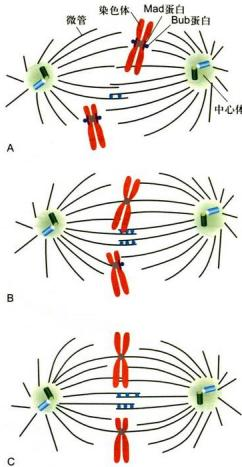  
图12-16 染色体整列  
A. 细胞分裂前期和前中期，Mad 和 Bub 蛋白在染色体的动粒上聚集。B. 微管与动粒联结后，Mad 和 Bub 蛋白消失，某些染色体滞后，未与微管联结的动粒依然含有 Mad 和 Bub 蛋白。C. 所有染色体的动粒均与微管联结，Mad 和 Bub 蛋白消失，染色体列队到赤道板。

染色体向赤道面运动的过程称为染色体整列或染色体中板聚合（congression）。当染色体完成在赤道面整列之后，两侧的动粒微管长度相等，作用力均衡。除动粒微管外，许多极微管在赤道区域也相互搭桥，形成貌似连续微管结构。整个纺锤体微管数量，在不同物种之间变化很大，少则十来根，多的数千根甚至上万根。如真菌Phycomycetes仅有10根纺锤体微管，产于澳大利亚的一种小袋鼠(rat kangaroo)，其纺锤体微管约有1500根，而网球花属植物（Haemanthus）的纺锤体微管约有10 000根。染色体整列的运动速度非常快，一般为0.05\~1 μm/s。染色体排列到赤道面上以后，其两个动粒分别面向纺锤体的两极，在每一个动粒上结合的动粒微管可以多达几十根。

  
图 12-17 解释染色体在赤道面整列的两种假说

## 4. 后期

后期（anaphase）发生的标志性事件是中期整列的染色体的两条姐妹染色单体分离，分别向两极运动。当染色体在赤道面上完成整列后，在各种调节因素的共同作用下，细胞有丝分裂由中期向后期转换，姐妹染色单体分离并逐渐向两极移动。后期大致可以划分为连续的两个阶段，即后期A和后期B。在后期A，动粒微管变短，牵动染色体向两极运动；在后期B，极微管长度增加，两极之间的距离逐渐拉长。整个后期阶段约持续数分钟。染色体运动的速度为1\~2μm/min。

染色体向两极的运动依靠纺锤体微管的作用。用破坏微管的药物如秋水酰胺、秋水仙素或诺考达唑等处理，染色体的运动会立即停止。去除这些药物，染色体并不能立即恢复运动，而是要等到纺锤体重新装配后才能恢复。可见染色单体与纺锤体微管的联系也是染色体向极部运动所必需的。用实验方法破坏这种联系，染色单体运动停止，直到这种联系恢复，染色体的运动才能恢复。

曾有多种假说解释后期染色单体分离和向两极移动的运动机制。目前比较广泛支持的假说是后期A和后期B两个阶段假说。在后期A，动粒微管变短，将染色体逐渐拉向两极。一般认为，动粒微管变短是由于其动粒端解聚所造成的；而这种解聚又是由于动力蛋白沿动粒微管向极部运动的结果。如图12-18所示，微管马达蛋白首先结合到动粒上，在ATP分解提供能量的情况下，沿动粒微管向极部运动，并带动动粒和染色体向极部运动。动粒微管的末端随之解聚成微管蛋白二聚体，动粒微管变短，动粒和染色单体与两极之间的距离逐渐拉近。当染色单体接近两极，后期A结束，转向后期B。在后期B，极微管游离端（正极）在ATP提供能量的情况下与微管蛋白聚合，使极微管加长，形成较宽的极微管重叠区。KRP与极微管重叠区的微管结合并在来自两极的极微管之间搭桥。KRP向微管正极行走，促使来自两极的极微管在重叠区相互滑动（如双极四聚体

  
图 12-18 细胞有丝分裂后期由 ATP 驱动的马达蛋白沿微管向极部运动使染色体分开  
A. ATP 驱动的染色体运动促使微管解聚。B. 微管解聚促使染色体运动。

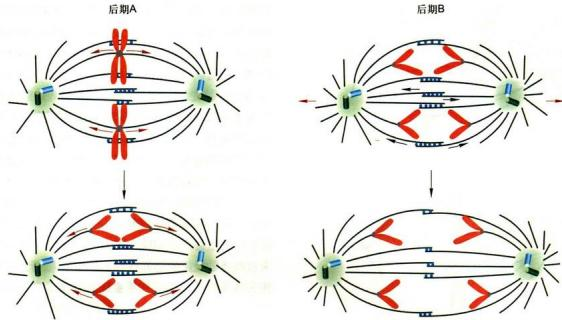  
图12-19 细胞分裂后期A和后期B产生染色体向极部运动的示意图  
后期 A：动粒微管在两端解聚缩短，致使姐妹染色单体向两极运动。后期 B：通过星体微管牵拉和极微管重叠区滑动，使纺锤体两极和染色体进一步分开。

kinesin-5)，使重叠区逐渐变得狭窄，两极之间的距离逐渐变长。同时，胞质动力蛋白在星体微管和细胞膜之间搭桥，并向星体微管负极运动，进一步将两极之间的距离拉长（图12-19）。

研究发现，在姐妹染色单体分离之前，彼此间通过黏连蛋白相互黏着在一起（图12-10）。黏连蛋白至少含有4种亚基，即Smc1、Smc3、Scc1/Mcd1和Scc3。只有该复合体解聚的情况下，姐妹染色单体才能分离。进一步研究发现，在姐妹染色单体分离过程中，黏连蛋白是被一种称为分离酶(separase)的蛋白酶所降解的。分离酶主要剪切黏连蛋白的Scc1亚基，结果导致姐妹染色单体的分离。分离酶剪切Scc1的过程是在严格的调控下进行的。通常情况下，分离酶与一种抑制性蛋白securin结合而不表现出蛋白酶活性。Cdk1也通过磷酸化分离酶而抑制其活性。当后期开始时，后期促进复合物(anaphase-promoting complex, APC)介导securin的降解，解除其对分离酶的抑制作用；APC也通过介导cyclinB降解，使Cdk1活性丧失，失去对分离酶的磷酸化作用，促进分离酶活化。活化的分离酶剪切Scc1，导致姐妹染色单体分离（图12-20）。

在所有染色体排列到赤道板上之前，为什么后期不能启动呢？有人认为，动粒在与微管联结之前，会发出抑制信号，抑制细胞周期向下一个阶段运转。另一些科学家为了验证这一观点，用激光特异地破坏染色体尚未与微管联结的动粒，发现尽管染色体依然滞后，细胞周期却可以随之向下一阶段转化，提示未与微管联结的动粒确实可以发出抑制信号，抑制细胞周期向下一阶段运转。更为直接的证据显示，Mad2可以与APC及其他相关物质结合，抑制APC的活性，阻止细胞周期向下一个阶段发展。

微管与动粒联结后，抑制后期启动的信号又是如何解除的呢？有人认为 CENP-E 和 Bub 蛋白在这一过程中起了重要作用。当微管与动粒联结后，CENP-E 分子的结构和位置将发生变化，这些变化进一步影响到 Bub1 的活性。Bub1 活性变化，又进一步影响到 Mad2 的稳定性和与其他有关物质的结合，最终导致 Mad2 对 APC 抑制的解除。

## 5. 末期

姐妹染色单体分离到达两极，有丝分裂即进入末期(telophase)。动粒微管消失，极微管继续加长，较多地分布于两组染色单体之间。到达两极的染色单体开始去浓缩，在每一个染色单体的周围，伴随核纤层蛋白去磷酸化，核纤层与核膜重新组装，分别形成两个子代细胞核。在核膜形成的过程中，核孔复合体同时在核膜上装配。随着染色单体的去浓缩，核仁也开始重新组装，RNA 合成功能逐渐恢复。

  
图12-20 有丝分裂中后期转换  
有丝分裂中－后期转换是由活化 APC 启动的，抑制物 securin 的降解导致分离酶活化，进而黏连蛋白被切割，致使姐妹染色单体分离。

## 6. 胞质分裂

胞质分裂与核分裂（有丝分裂）是相关的事件。胞质分裂一般开始于细胞分裂后期，完成于细胞分裂末期；而有丝分裂即使在没有胞质分裂的情况下也要发生。胞质分裂开始时，在赤道板周围细胞表面下陷，形成环形缢缩，称为分裂沟（furrow）。随着细胞由后期向末期转化，分裂沟逐渐加深，直至两个子代细胞完全分开。分裂沟的形成靠多种因素的相互作用。实验证明，肌动蛋白和肌球蛋白Ⅱ参与了分裂沟的形成和整个胞质分裂过程。在分裂沟的下方，除肌动蛋白之外，还有微管、核膜小泡等物质聚集，共同构成一个环形致密层，称为中体（midbody）。随着胞质分裂，中体将一直持续到两个子细胞完全分离。胞质分裂开始时，大量的肌动蛋白和肌球蛋白Ⅱ在中体处组装成反向排列的微丝束，环绕细胞，称为收缩环（contractile ring）。收缩环收缩，分裂沟逐渐加深，细胞形状也由原来的圆形逐渐变为椭圆形、哑铃形，直到两个子细胞相互分离。用抗肌动蛋白和抗肌球蛋白的抗体作免疫荧光染色，可见随分裂沟的形成，其下面的荧光亮度逐渐增强，并明显高于其他部位。在电镜下，可见大量的微丝结构分布于分裂沟下。用抗肌动蛋白、抗肌球蛋白或特异性破坏微丝的药物如细胞松弛素B处理处于分裂期的活细胞，收缩环的收缩活动停止，分裂沟逐渐消失。胞质分裂整个过程可以简单地归纳为4个步骤，即分裂沟位置的确立、肌动蛋白聚集和收缩环形成、收缩环收缩、收缩环处细胞膜融合并形成两个子细胞（图12-21）。

分裂沟的定位与纺锤体的位置明显相关。人为地改变纺锤体的位置可以使分裂沟的位置改变。对分裂沟定位的分子作用机制目前尚不清楚，但在动物细胞分裂时，越来越多的证据显示，中央纺锤体和星体微管共同决定了分裂沟形成的位置，星体微管参与了分裂沟的形成（图12-22）。有实验显示，在培养细胞分裂中期，人为干扰中央纺锤体发出的信号（图12-22A），将会阻止分裂沟的形成。在末期开始时，星体微管加长直到与细胞膜下的皮层接触。微管末端对细胞皮层刺激，促使分裂沟形成（图12-22B）。也有实验显示，在

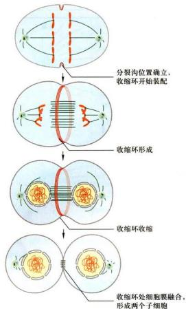  
图12-21 动物细胞胞质分裂示意图

远离分裂沟的端部，星体微管可能发出抑制细胞皮层收缩的信号，促使该处细胞膜松弛，加速分裂沟的形成（图12-22C）。目前，对肌动蛋白与肌球蛋白Ⅱ的聚集和收缩环的形成也不完全了解。对于收缩环收缩和收缩环处细胞膜融合两个步骤的研究，已取得较大进展。1996—1997年，M.R.Larochelle等在网柄菌属(Dictyostelium)中发现Ras基因家族中的RacE基因产物在收缩环收缩和细胞膜融合过程中起重要作用。RacE基因产物是一个小分子量的GTP酶。另外两组科学家则发现，两种参与调节小分子GTP酶活性的蛋白GapA和RgaA/DPAP1也参与收缩环收缩和细胞膜融合过程。目前已知有二十多种调节因子参与了分裂沟的定位、收缩环的形成和胞质分裂。这些调节因子主要包括：微管结合蛋白PRC1、Kif4、Aurora-B激酶及其结合蛋白、RhoA信号通络的各成员以及与膜融合相关的调节因子等。

也有实验证明，钙离子浓度的变化也会影响分裂沟的形成。将荧光标记的钙离子指示剂注入细胞，发现在分裂沟下钙离子浓度上升。将钙离子直接注射到蛙卵细胞膜下，可以刺激分裂沟形成。

## 二、减数分裂

减数分裂是一种特殊的有丝分裂形式，仅发生于有性生殖细胞形成过程中的某个阶段。按照真核生物减数分裂所发生的阶段不同，可将减数分裂区分为三种类型（图12-23）：①配子减数分裂，又称终末减数分裂（gametic/terminal meiosis），发生在所有多细胞动物和许多原生生物配子形成阶段；②孢子减数分裂，又称居间型减数分裂（sporic/intermediate meiosis），所有高等植物和某些藻类减数分裂发生阶段既与配子形成无关，又与受精作用无关，发生在孢子体某一阶段；③合子减数分裂，又称起始减数分裂（zygotic/initial meiosis），某些原生生物、真菌和少数藻类，在有性生活史起始，即受精后便发生减数分裂，形成单倍体孢子。

减数分裂与有丝分裂相比，其主要不同列于表

  
图12-22 中央纺锤体和星体微管作用于细胞皮层并诱导分裂沟形成  
A. 中央纺锤体发出的信号决定分裂沟的定位。B. 接近分裂沟位置的纺锤体微管发出信号，促进分裂沟的形成。C. 远离分裂沟位置的星体微管发出抑制性信号（T形箭头），抑制远离分裂沟端部的细胞皮层收缩，间接促进分裂沟的形成。

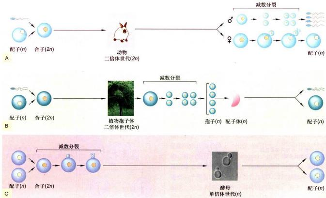  
图 12-23 真核生物减数分裂的三种类型  
A. 配子减数分裂。B. 孢子减数分裂。C. 合子减数分裂。

12-1 中。减数分裂最主要特征是，细胞仅进行一次 DNA 复制，随后细胞连续两次分裂。两次分裂分别称为减数分裂 I 和减数分裂 II。在两次分裂之间，还有一个短暂的分裂间期。减数分裂的结果，子细胞各自的染色体数目减半。再经过受精，形成合子，染色体数恢复到体细胞的染色体数目。减数分裂的意义在于，既有效地获得双亲的遗传物质，保持后代的遗传稳定性，又可以增加更多的变异，确保生物的多样性，增强生物适应环境变化的能力。相反，假如在有性生殖过程中没有减数分裂，生殖细胞染色体数不能减半，经过受精，其染色体数必将倍增。细胞体积也会相应增加，生物个体体积也会增大。代代相传，其生命活动将无法适应环境变化，终将会被自然淘汰。因而，减数分裂是生物有性生殖的基础，是生物遗传、演化和生物多样性的重要保证。

与有丝分裂相似，在减数分裂之前的间期阶段，也可以人为地划分为 $G_{1}$ 期、S 期、 $G_{2}$ 期三个时相。但此间期阶段也有其鲜明的特殊性。为区别于一般的细胞间期，常把减数分裂前的细胞间期称为减数分裂前间期（premeiotic interphase）。

## （一）减数分裂前间期

减数分裂前间期的最大特点在于其S期持续时间较长，同时也发生一系列与减数分裂相关的特殊事件。例如，蝾螈（Triturus）体细胞有丝分裂前S期约为12 h，而减数分裂前S期则可持续10天。小鼠有丝分裂前S期为5\~6 h，而其减数分裂前S期约为14 h。另一个重要特点是，在网球花属植物中发现，其减数分裂前间期的S期仅复制其DNA总量的99.7%\~99.9%，而剩下的0.1%\~0.3%要等到减数分裂前期阶段才进行复制。科学家发现，这些推迟复制的DNA被分割为5 000\~10 000个小片段，分布于整个基因组中，每个小片段长1 000\~5 000个碱基对。另外还发现，有一种蛋白质，称为L蛋白，在减数分裂前间期与上述DNA小片段结合，阻止其复制。这些DNA小片段被认为与减数分裂前期I染色体配对和基因重组有关。

大多数生物，减数分裂前间期的细胞核大于其体细胞核。染色质也多凝集成异染色质。这种变化的意义虽不明了，但一般认为与染色体配对和基因重组有关。另外，根据生物种类不同，减数分裂前间期的 $G_{2}$ 期的长短变化较大。有的 $G_{2}$ 期短，有的则和有丝分裂前间期的 $G_{2}$ 期长短相当，也有的可以在 $G_{2}$ 期停滞较长一段时间，直到受到新的刺激来打破这种停滞。

表12-1 有丝分裂与减数分裂比较

<table><tr><td>有丝分裂特征</td><td>有丝分裂</td><td>减数分裂</td><td>减数分裂特征</td></tr><tr><td>有丝分裂发生在体细胞,在时空上无严格限定</td><td></td><td></td><td>减数分裂只发生在有性生殖的特定时空</td></tr><tr><td>在有丝分裂间期,每个体细胞核DNA复制1次,细胞分裂1次</td><td></td><td></td><td>减数分裂前间期DNA复制1次,细胞连续分裂2次</td></tr><tr><td>有丝分裂前期一般不发生同源染色体配对,也不发生交换和重组</td><td></td><td></td><td>减数分裂前期I发生同源染色体配对(联会),并伴随发生同源染色体非姐妹染色单体之间交换和重组</td></tr><tr><td>有丝分裂中-后期同源染色体姐妹染色单体分离</td><td></td><td></td><td>减数分裂中-后期I同源染色体分离,姐妹染色单体不分离</td></tr><tr><td>子细胞染色体数目与母细胞染色体数目相同(2n~2n)有丝分裂产生2个子细胞,保持遗传稳定</td><td></td><td></td><td>减数分裂中-后期II姐妹染色单体分离子细胞染色体数目减半(2n~n)减数分裂产生4个子细胞,增加遗传变异</td></tr></table>

## （二）减数分裂过程

由减数分裂前 $G_{2}$ 期细胞进入两次有序的细胞分裂，即减数第一次分裂和减数第二次分裂。两次减数分裂之间的间期或长或短，但无 DNA 合成。减数分裂过程见图 12-24。

## 1. 减数分裂 I

减数分裂 I（meiosis I）与体细胞有丝分裂有许多相似之处，其过程也可以人为地划分为前期 I、前中期 I、中期 I、后期 I、末期 I 和胞质分裂 I 6 个阶段。但减数分裂 I 又有其鲜明的特点，其主要表现是分裂前期 I 的同源染色体配对和基因重组以及其后的染色体分离方式等。

(1) 前期Ⅰ 前期Ⅰ（prophase I）持续时间较长。在高等生物，其时间可持续数周、数月、数年，甚至数十年。在低等生物，其时间虽相对较短，但也比有丝分裂前期持续的时间长得多。在这漫长的时间过程中，要进行同源染色体配对和基因重组。此外，也要合成一定量的RNA和蛋白质。根据细胞染色体形态变化，又可以将前期Ⅰ人为地划分为细线期、偶线期、粗线期、双线期和终变期5个阶段。

细线期（leptotene, leptonema）：为前期Ⅰ的开始阶段。首先发生染色质凝缩，染色质纤维逐渐螺旋化、折叠，包装成在显微镜下可以看到的细维样染色体结构。因而，有人将细线期也称为凝缩期（condensation stage）。细线期与有丝分裂前期起始阶段既有相似特点，如减数分裂前期I每个同源染色体的两条姐妹染色单体在黏连蛋白介导下被紧密约束在一起而不分离，待同源染色体配对时，黏连蛋白则参与联会复合体的装配；与有丝分裂前期也有明显不同，在细线期染色质在凝集前已复制，但仍呈单条细线状，看不到成双的染色体。但在电子显微镜下，可观察到此期的染色体是由两条染色单体构成的。不过，由于DNA复制在减数分裂前间期（S期）尚未全部完成，因而未被复制的DNA片段可能是将两条姐妹染色单体紧密联系在一起的可能因素之一（图12-25）。此期另外一个明显不同点是，在细维样染色体上，出现一系列大小不同的颗粒状结构，称为染色粒（chromomere）。虽然已经知道染色粒是由染色质紧密包装而成，但其功能并不清楚。细线期还有一个明显的特点，即染色体端粒通过接触斑与核膜相连。对玉米细胞减数分裂的研究发现，玉米细线染色体的端粒开始是分布在整个细胞核中，在邻近细线期结束时，端粒定位到核膜的内侧。由于很多细线染色体的端粒与核膜结合，使染色体装配成花束状，所以细线期又称花束期。

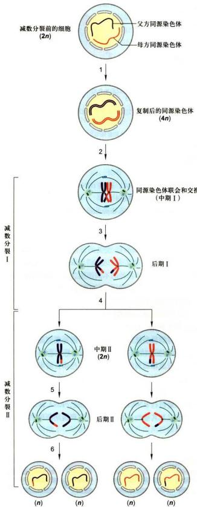  
图 12-24 减数分裂过程图解

偶线期（zygotene, zygonema）：主要发生同源染色体配对（pairing），即来自父母双方的同源染色体逐渐靠近，沿其长轴相互紧密结合在一起。因而，偶线期又称为配对期（pairing stage）。配对过程是专一性的，仅发生于同源染色体之间，非同源染色体之间不进行配对。关于同源染色体之间相互识别的机制，目前尚不清楚。配对以后，两条同源染色体紧密结合在一起所形成的复合结构，称为二价体（bivalent）。由于每个二价体由两条同源染色体构成，共含有4条染色单体，因而又称为四分体（tetrad）。但此时的四分体结构并不清晰可见。同源染色体配对的过程称为联会（synapsis）。联会

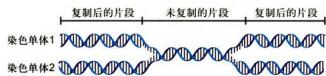

图 12-25 偶线期 DNA 在减数分裂前期 I 才进行复制示意图  
可能是由于此种未复制的 DNA 片段的存在，导致两条姐妹染色单体紧密联系在一起。

初期，同源染色体端粒与核膜相连的接触斑相互靠近并结合。从端粒处开始，这种结合不断向其他部位伸延，直到整对同源染色体的侧面紧密联会。联会也可以同时发生在同源染色体的其他位点上。在联会的部位形成一种特殊的复合结构，称为联会复合体（synaptonemal complex）。联会复合体沿同源染色体长轴分布，在电镜下可以清楚地显示其细微结构（图12-26）。联会复合体被认为与同源染色体联会和基因重组有关。在偶线期发生的另一个重要事件是合成在S期未合成的约0.3%的DNA（偶线期DNA，即zygDNA）。若用DNA合成抑制剂抑制zygDNA合成，联会复合体的形成将受到抑制。zygDNA在偶线期转录活跃。转录的RNA被称为zygRNA。zygDNA转录也被认为与同源染色体配对有关。

粗线期（pachytene, pachynema）：开始于同源染色体配对完成之后。这一过程可以持续几天至几个星期。在此过程中，染色体进一步凝缩，变粗变短，并与核膜继续保持接触。同源染色体仍紧密结合，并发生等位基因之间部分DNA片段的交换和重组，产生新的等位基因的组合。此时在联会复合体部位的中间，出现一个新的结构即重组节（combination nodule）。重组节是同源染色体配对联会复合体中的球形、椭圆形或棒状的结节，直径约为90 nm，是由蛋白质装配成的小体，结构不清楚（图12-26）。重组节中含有催化遗传重组的酶类，因此推测某些重组节与染色体重组有关。交叉与重组节在总的数量上是相等的，而在联会染色体上的分布方式两者也极为相似，果蝇的某些突变引起了交叉分布的异常，重组频率因此降低，此时，可发现重组节不仅数量减少，分布也发生了变化，这也从另一个角度证明重组节与染色体交换的发生有关。在粗线期，也合成一小部分尚未合成的DNA，称为P-DNA。P-DNA大小为100\~1 000 bp，编码一些与DNA剪切（nicking）和修复（repairing）有关的酶类。

粗线期另一个重要的生化活动是，合成减数分裂期专有的组蛋白，并将体细胞类型的组蛋白部分或全部地置换下来。这种置换也许在一定程度上参与了基因重组过程，或反映出减数分裂前期染色体结构的变化。

在许多动物的卵母细胞发育过程中，粗线期还要发生 rDNA 扩增。即编码 rRNA 的 DNA 片段从染色体上释放出来，形成环形的染色体外 DNA，游离于核质中，并进行大量复制，形成数千个拷贝的 rDNA。如在非洲爪蟾卵母细胞中，经过 rDNA 扩增，可以产生大约

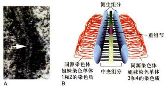  
图 12-26 电镜下见到的联会复合体和重组节结构（A）及其图解（B）

A. 照片显示联会复合体和重组节（箭头所指）。B. 图解显示侧生组分、中央组分、重组节和同源染色体的姐妹染色单体。（A图由马红博士惠赠）

2 500 个拷贝的 rDNA。这些 rDNA 将参与形成附加的核仁，进行 rRNA 转录。

双线期 (diplotene. diplonema): 重组阶段结束, 同源染色体相互分离, 仅留几处相互联系。同源染色体的四分体结构变得清晰可见。同源染色体仍然相联系的部位称为交叉 (chiasma)。交叉的数量变化不定, 但一般认为 “交叉” 是遗传学 “交换” (crossover) 的细胞学基础。即使在同种物种的不同细胞之间, 交叉的数量也不相同 (图 12-27)。在电镜下可见交叉部位含有残留的联会复合体结构。

许多动物在双线期阶段，同源染色体或多或少地要发生去凝集，RNA转录活跃。关于染色体去凝集的程度，有的种类低到不易觉察，有的种类则高到几乎与一般间期细胞相似。在许多动物，尤其是鱼类、两栖类、爬行类和鸟类的雌性动物，染色体去凝集形成一种特殊的巨大染色体结构，形似灯刷，故称灯刷染色体(lampbrush chromosome)。在灯刷染色体上有许多侧环结构，是进行RNA活跃转录的部位。RNA转录、蛋白质翻译以及其他物质的合成等，是双线期卵母细胞体积增长所必需的（见本书第九章）。

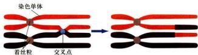  
图 12-27 双线期二价染色体图解  
可见 4 条染色单体，1 个交叉，两个同源染色体各自的两个姐妹着丝粒并排存在。

目前比较清楚的是，在灯刷染色体侧环上合成的RNA主要为前体mRNA。前体mRNA合成以后，很快被剪辑为mRNA。有些种类的mRNA，如编码组蛋白、核糖体蛋白和卵黄蛋白的mRNA很快会在细胞质中翻译为蛋白质。许多其他种类的mRNA则和蛋白质结合，以非活跃形式储备在卵母细胞质中。直到卵细胞成熟并受精以后，这些储备的mRNA才能转变为活跃状态，进行蛋白质翻译。在灯刷染色体一定的侧环上，也可以检测到tRNA和5S rRNA的转录。

双线期持续时间一般较长，其长短变化很大。两栖类卵母细胞的双线期可持续将近一年；而人类的卵母细胞双线期从胚胎期的第五个月开始，短者可持续十几年，到性成熟期开始，长者可达四五十年，到生育期结束。

终变期（diakinesis）：染色体重新开始凝集，形成短棒状结构。如果有灯刷染色体存在，其侧环回缩，RNA转录停止，核仁消失，四分体较均匀地分布在细胞核中。同时，交叉向染色体臂的端部移行。此移行过程称为端化（terminalization）。到达终变期末，同源染色体之间仅在其端部和着丝粒处相互联结。终变期的结束标志着前期I的完成。

(2) 中期Ⅰ 前期Ⅰ结束，细胞逐渐转入减数分裂中期Ⅰ（metaphase I）。在此过程中，要进行纺锤体组装。纺锤体结构和形成过程与一般有丝分裂过程中的相类似。核膜破裂标志着中期Ⅰ的开始。纺锤体微管侵入核区，捕获分散于核中的四分体。四分体逐渐向赤道方向移动，最终排列在赤道面上。和有丝分裂不同的是，每个四分体含有四个动粒。其中一条同源染色体的两个动粒位于一侧，另一条同源染色体的两个动粒位于另一侧。从纺锤体一极发出的微管只与一个同源染色体的两个动粒相连，从另一极发出的微管也只与另一个同源染色体的两个动粒相连（图 12-28）。

(3) 后期Ⅰ 同源染色体对分离并向两极移动，标志着后期Ⅰ（anaphase Ⅰ）的开始。移向两极的每个同源染色体均含有两条姐妹染色单体。其结果，到达每一极的染色体 DNA 含量由 4n 变为 2n。以减数分裂前间期细胞复制后的染色体数目为基数，减数分裂的第一次分裂后的染色体数减半。另外，两套同源染色体在功能上是等价的，解除配对的同源染色体向两极移动是一个随机分配、自由组合的过程，因而到达两极的染色体会出现众多的组合方式。如人类细胞有 23 对染色体，从

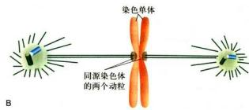  
图 12-28 减数分裂中期Ⅰ（A）与减数分裂中期Ⅱ（B）动粒与纺锤体的联系示意图

在减数分裂中期Ⅰ，四分体中同源染色体的两个动粒位于同侧，只与从同一极发出的纺锤体微管相联结；减数分裂中期Ⅱ与一般有丝分裂中期相似，每个染色体的两个动粒分别位于染色体的两侧，分别与从两极发出的纺锤体微管相联结。

理论上讲将会产生 $2^{23}$ 种不同的排列方式。如此庞大的排列方式，即使不发生基因重组，得到遗传上完全相同的配子概率也只有八百四十万分之一。再加上基因重组和精子与卵子的随机结合，要获得遗传上完全相同的子代个体几乎是不可能的，除非是同卵双生个体，其遗传性状可能相同。

(4) 末期 I、胞质分裂 I 和减数分裂间期 经过后期 I 后，细胞进一步的变化主要有两种类型：第一种类型，染色体到达两极，并逐渐进行去凝集。在染色体的周围，核被膜重新组装，形成两个子细胞核。同时，随着染色体分离并向两极移动，细胞质也开始分裂，形成两个间期子细胞。此时的间期细胞虽具有一般间期细胞的基本结构特征，但又有着重要区别，即它们不再进行 DNA 复制，也没有 $G_{1}$ 期、S 期和 $G_{2}$ 期时相之分。间期持续时间一般较短，有的仅作短暂停留。为区别于一般细胞间期，特将其称为减数分裂间期（interkinesis）。第二种类型，即细胞进入末期后，不是完全回复到间期阶段，而是立即准备进行减数第二次分裂，即减数分裂 II。

## 2. 减数分裂Ⅱ

减数分裂Ⅱ过程与有丝分裂过程非常相似，即经过分裂前期Ⅱ、中期Ⅱ、后期Ⅱ、末期Ⅱ和胞质分裂Ⅱ等几个过程。每个过程中细胞形态变化也与有丝分裂过程相似。对于上述第二种类型，染色体到达两极后，减数分裂I的纺锤体去组装，两极的中心粒和星体此时一分为二，重新组装成两个纺锤体。染色体在原来两极的位置重新排列，形成新的赤道板。此时即为中期Ⅱ。此后的发展则与一般有丝分裂相似。

经过减数分裂Ⅱ，共形成4个子细胞。但它们以后的命运随生物种类不同而不同。在雄性动物中，4个细胞大小相似，称为精细胞，经变态进一步发育成4个精子。在雌性动物中，减数分裂Ⅰ为不等分裂，即第一次分裂后产生一个大的卵母细胞和一个小的极体，称为第一极体。第一极体将很快死亡解体，有时也会进一步分裂为两个小细胞，但没有功能。卵母细胞将继续进行减数分裂Ⅱ，也为不等分裂。其结果是产生一个卵细胞和一个第二极体。第二极体也没有功能，很快解体。因此，雌性动物减数分裂仅形成一个有功能的卵细胞。高等植物减数分裂与动物减数分裂类似，即雄性产生4个有功能活性的精子，而雌性仅产生一个有功能活性的卵细胞。

## （三）减数分裂过程的特殊结构及其变化

## 1. 性染色体的分离

在染色体组型中与性别决定有关的染色体称性染色体。XY型性别决定是所有哺乳类动物、多数雌雄异株植物、部分昆虫、某些鱼类和两栖类动物的性别决定方式。不同性别之间，其性染色体构成不同。性染色体组成为XX的个体是雌性，性染色体组成为XY或XO（即无Y染色体）的个体是雄性。另一种为ZW型性别决定，刚好与XY型相反，雌性个体的性染色体组成为ZW，雄性个体的性染色体组成为ZZ。ZW型性别决定方式普遍存在干鸟类、鳞翅目昆虫、某些两栖类和爬行类之中。对于含有XX性染色体的细胞，两条X染色体像常染色体一样进行正常配对、交换和分离。而含有XY性染色体的细胞，两条性染色体的形态结构不同，基因含量也不同。在前期I，二者是如何配对和分离的呢？一般讲，有些物种的XY染色体间可能会含有一些同源区段，有的可能不含任何同源区段。对于含有同源区段的XY染色体，如人类的XY染色体，在前期I可以进行配对。不管XY染色体配对与否，二者都将和常染色体一样，在分裂中期I排列到赤道面上。其后，随常染色体分离而相互分离，并各自移向两极。到减数分裂II，XY染色体和常染色体一样，其两条染色单体再进行分离。偶尔也可出现 XY 染色体的染色单体在减数分裂 I 时就相互分离的现象，致使产生的两个细胞各含有一个 X 染色单体和一个 Y 染色单体。到第二次减数分裂时，每个细胞的 X 和 Y 染色单体再分配到两个细胞中。

对于 XO 物种（主要是昆虫），在第一次减数分裂时，X 染色体移向一极。结果将产生一个含 X 染色体的细胞和一个不含性染色体的细胞。到第二次减数分裂，含 X 染色体的细胞分裂为两个含 X 染色单体的细胞；不含性染色体的细胞也一分为二，形成两个不含性染色体的细胞。偶尔也可以看到 X 染色体的两个染色单体在第一次减数分裂时即相互分离，产生两个各含一个 X 染色单体的细胞。到第二次减数分裂时，X 染色单体仅分配到一个细胞中。最终结果是，一个 XO 细胞经过减数分裂，产生两个含 X 染色体的细胞和两个无性染色体的细胞。

## 2. 联会复合体和基因重组

联会复合体是减数分裂期间（前期I）在两个同源染色体之间形成的一种临时性蛋白质梯状结构。这种结构是M.J.Moses于1956年用电镜观察蝌蚪卵母细胞时发现的。随后证实，联会复合体在动物和植物减数分裂过程中广泛存在，主要功能是介导同源染色体之间配对（联会）和遗传重组（交换）。现在也有证据表明，联会复合体对于遗传重组不是必需的，因为不仅发现重组可以发生在联会复合体装配之前，而且发现突变的酵母细胞即使不能形成联会复合体，也能实现遗传信息的交换。所以近来又认为联会复合体的主要功能是为相互作用的染色单体之间完成交换提供一种结构框架。联会复合体在同源染色体联会处沿同源染色体长轴分布，由位于中间的中央组分和位于两侧的侧生组分共同构成。侧生组分的外侧则为配对的同源染色体（图12-29）。联会复合体中央组分宽约 $100\mathrm{nm}$ ，侧生组分宽 $20\sim 40\mathrm{nm}$ 。从两侧的侧生组分向中央组分方向发出横向纤维(transverse fiber)，交会于中央组分的中间部位。

蛋白质是联会复合体的主要组成成分之一。用胰蛋白酶、链霉蛋白酶等处理联会复合体，其中央组分、侧生组分以及横向纤维等结构消失。现已鉴定出联会复合体3种特异性蛋白：SC protein-1 (SYCP1)、SC protein-2 (SYCP2) 和 SC protein-3 (SYCP3)，并已在人类中确定其编码基因的染色体定位。SYCP3 和 SYCP2 参与侧生组分组成，SYCP1 参与中央组分组成，也是横向纤维的

A  
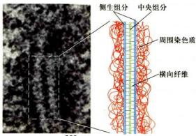  
250 nm  
图12-29 粗线期的联会复合体  
B 联会复合体  
A. 联会复合体电镜照片。B. 联会复合体图解。（A 图由马红博士惠赠）

主要成分。

P. B. Moens 实验室等曾经分离出几种联会复合体结构蛋白，并用其制备了特异抗体。用免疫电镜方法证实，其中有两种小分子蛋白质位于侧生组分，两者的分子质量分别为30和33 kDa。第三种蛋白质分子质量为125 kDa，位于中央组分。第四种蛋白质的分子质量约为190 kDa，既分布于侧生组分，也分布于中央组分。这些蛋白质分子的功能尚不清楚。另外，用同样方法也证明，DNA拓扑酶Ⅱ存在于侧生组分和其周围的染色质中。

DNA 片段也是联会复合体的组成成分之一。这些 DNA 片段长度多在 50～550 bp 时间。它们很可能是挂在或包含于侧生组分的染色体纤维的部分 DNA 片段。Moens 等用 DNA 酶消化分离多线染色体，发现这些 DNA 片段被联会复合体保护而免遭 DNA 酶消化。序列分析显示，这些 DNA 片段中并无特殊的 DNA 序列。不同细胞之间，这些 DNA 片段的大小和碱基的序列会有明显差别。这些结果提示，DNA 与联会复合体结合不需要特殊的 DNA 序列；染色体的任何部分都可能与联会复合体的侧生组分结合。这些 DNA 片段很可能完全穿越侧生组分而进入中央组分，在此处参与同源染色体的基因重组。

在中央组分和侧生组分中还发现有 RNA。因此，联会复合体可能含有核糖核蛋白复合物。

联会复合体被认为从细线期开始组装，经过偶线期至粗线期形成典型的联会复合体结构，同时在粗线期重组节开始组装。双线期联会复合体开始去装配，终变期时完全消失。

## - 思考题

1. 什么是细胞周期？细胞周期各时相的主要变化是什么？

2. 不同物种之间的细胞周期有何异同？

3. 试比较有丝分裂与减数分裂的异同点。

4. 细胞通过什么机制将染色体排列到赤道板上？有何生物学意义？

5. 说明细胞分裂后期染色单体分离和向两极移动的运动机制。

6. 试述动粒的结构及功能。

7. 说明细胞分裂过程中核膜破裂和重装配的调节机制。

## - 参考文献

1. Archambault V, Glover D M. Polo-like kinases: conservation and divergence in their functions and regulation. Nature Reviews Molecular Cell Biology, 2009, 10(4): 265-275.

2. Beck M, Hurt E. The nuclear pore complex: understanding its function through structural insight. Nature Reviews Molecular Cell Biology, 2017, 18(2): 73-89.

3. Clarke P R, Zhang C. Spatial and temporal coordination of mitosis by Ran GTPase. Nature Reviews Molecular Cell Biology, 2008, 9(6): 464-477.

4. Güttinger S, Laurell E, Kutay U. Orchestrating nuclear envelope disassembly and reassembly during mitosis. Nature Reviews Molecular Cell Biology, 2009, 10(3): 178-191.

<!-- END OFFICIAL API PART part_003 -->

<!-- BEGIN OFFICIAL API PART part_004 -->

5. Hara M, Fukagawa T. Kinetochore assembly and disassembly during mitotic entry and exit. Current Opinion in Cell Biology, 2018, 52: 73-81.

6. LaJoie D, Ullman K S. Coordinated events of nuclear assembly. Current Opinion in Cell Biology, 2017, 46: 39-45.

7. Nigg E A, Raff J W. Centrioles, centrosomes, and cilia in health and disease. Cell, 2009, 139(4): 663-678.

8. Lara-Gonzalez P, Westhorpe, F G, Taylor S S. The spindle assembly checkpoint. Current Biology, 2012, 22(22): R966-R980.

9. Walczak C E, Cai S, Khodjakov A. Mechanisms of chromosome behavior during mitosis. Nature Reviews Molecular Cell Biology, 2010, 11(2): 91-102.

10. Wang G, Jiang Q, Zhang C. The role of mitotic kinases in coupling the centrosome cycle with the assembly of the mitotic spindle. Journal of Cell Science, 2014, 127(19): 4111-4122.

<!-- END CN CN12-S02 -->

---

## 对应英文内容

### 英文补充：减数分裂重组、交叉互换与基因转换

> 对应中文板块：减数分裂重组、交叉互换与基因转换。英文来源：Molecular Biology of the Cell，第7版，第5章；[本章完整原文](../../来源/英文教材/05_DNA_Replication_Repair_and_Recombination/chapter.md)。物理PDF页码范围：292–359（整章范围）。

<!-- BEGIN EN EN05-H051-H056 -->
#### Homologous Recombination Is Crucial for Meiosis

We have seen that homologous recombination can use a set of reactions— including broken-end resection, strand invasion, limited DNA synthesis, and ligation—to exchange DNA sequences between two double helices with the same nucleotide sequence and thereby repair damaged DNA. We now describe how homologous recombination is used to deliberately exchange material between two different chromosomes in order to generate DNA molecules that carry novel combinations of genes. This is a frequent and necessary part of meiosis, which occurs in sexually reproducing organisms such as fungi, plants, and animals.

Figure 5–51 Experiment demonstrating the rapid localization of repair proteins to DNA double-strand breaks. Human fibroblasts were x-irradiated to produce DNA double-strand breaks. Before the x-rays struck the cells, they were passed through a microscopic grid with x-rayabsorbing “bars” spaced 1 μm apart. This produced a striped pattern of DNA damage, allowing a comparison of damaged and undamaged DNA in the same nucleus. (A) Total DNA in a fibroblast nucleus stained with the dye DAPI. (B) Sites of new DNA synthesis due to repair of DNA damage, indicated by incorporation of BrdU (a thymidine analog) and subsequent staining with fluorescently labeled antibodies to BrdU (green). (C) Localization of the Mre11 complex to damaged DNA as visualized by antibodies against the Mre11 subunit (red). Mre11 is the 5′→3′ nuclease that produces the protruding single-strand DNA ends needed for strand invasion (see Figure 5–47). A, B, and C were processed 30 minutes after x-irradiation. (From B.E. Nelms et al., Science 280:590–592, 1998. With permission from AAAS.)

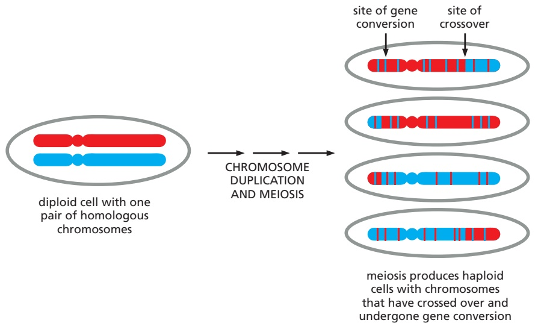

Figure 5–52 Chromosome crossing-over occurs in meiosis. Meiosis is the process by which a diploid cell gives rise to four haploid germ cells, as described in detail in Chapter 17. Meiosis produces germ cells in which the paternal and maternal genetic information (red and blue) has been reassorted through chromosome crossovers. In addition, many short regions of gene conversion occur, as indicated.

In meiosis, homologous recombination is an integral part of the process that allows chromosomes to be parceled out to germ cells (sperm and eggs in animals). We discuss the process of meiosis in detail in Chapter 17; here we discuss how homologous recombination during meiosis produces chromosome crossing-over and geneMBoC7 m5.53/5.52 conversion, resulting in hybrid chromosomes that contain genetic information from both the maternal and paternal homologs (**Figure 5–52**). These mechanisms, at their core, closely resemble those used to repair double-strand breaks.

#### Meiotic Recombination Begins with a Programmed Double-Strand Break

Homologous recombination in meiosis starts with a bold stroke: a specialized Spo11 protein complex breaks both strands of the DNA double helix in one of the recombining chromosomes (**Figure 5–53**). After catalyzing this reaction, the protein complex remains covalently bound to the broken DNA, much like the DNA topoisomerase we encountered earlier in this chapter (see Figure 5–22). Many of the subsequent recombination reactions closely resemble those already described for the repair of double-strand breaks; indeed, some of the same proteins are used for both processes. For example, the Mre11 complex, which we encountered earlier, chews back the DNA ends, removing the proteins along with the DNA and leaving the protruding 3′ single-strand ends needed for strand invasion.

However, several meiosis-specific proteins come into play and guide the reactions somewhat differently, resulting in the distinctive outcomes observed for meiosis. A key difference is that, in meiosis, recombination occurs preferentially between maternal and paternal chromosomal homologs (which are held closely together during meiosis), rather than between newly replicated, identical DNA duplexes as in double-strand break repair. In the sections that follow, we describe in more detail those aspects of homologous recombination that are especially important for meiosis.

#### Holliday Junctions Are Recognized by Enzymes That Drive Branch Migration

Of special importance in meiosis is an intermediate structure known as a **Holliday junction**, or cross-strand exchange, in which two homologous DNA helices that have paired are held together by the reciprocal exchange of two of the four strands

chromosome crossovers. Once the Spo11 complex breaks the duplex DNA and the Mre11 complex processes the ends, homologous recombination in meiosis can proceed along alternative pathways (Movie 5.8). One (right side of figure) closely resembles the double-strand break repair reaction shown in Figure 5–47 and results in chromosomes that have been “repaired” without crossing over. The other (left side of figure) proceeds through a double Holliday junction and produces two chromosomes that have crossed over. During meiosis, the maternal and paternal chromosome homologs are held tightly together (see Figure 17–54), and both types of recombination occur between them.

present, one strand originating from each of the helices. This junction can be considered to contain two pairs of strands: one pair of crossing strands and one pair of noncrossing strands (Figure 5-54A). But by undergoing a series of rotational movements, it can isomerize to form an open, symmetrical structure in which both pairs of strands occupy equivalent positions (Figure 5–54B and D). A special set of recombination proteins that binds to this open isomer uses the energy of ATP hydrolysis to catalyze a reaction known as branch migrationMBoC7 m5.55/5.54 (Figure 5–55), which greatly expands the region of heteroduplex DNA that was initially created by a strand-exchange reaction (Figure 5–54B and C). In meiosis, heteroduplex regions often “migrate” thousands of nucleotides from the original site of the double-strand break. The step where this migration occurs is indicated in Figure 5–53. As shown in the figure, Holliday junctions are often produced in pairs, known as double Holliday junctions.

Figure 5–54 A Holliday junction. The initially formed structure (A) is usually drawn with two strands crossing, as in Figure 5–53. An isomerization of the Holliday junction (B) produces an open, symmetrical structure that is bound by specialized proteins. (C) These proteins “move” the Holliday junctions by a coordinated set of branch-migration reactions that involve the breaking and formation of base pairs (see Figure 5–55 and Movie 5.8). (D) Three-dimensional structure of the Holliday junction in the open form depicted in B. The Holliday junction is named for the scientist who first proposed its formation. (PDB code: 1DCW.)

#### Homologous Recombination Produces Crossovers Between Maternal and Paternal Chromosomes During Meiosis

There are two basic outcomes of homologous recombination during meiosis, as shown previously in Figure 5–53 (Movie 5.8). In humans, approximately 90% of the double-strand breaks produced during meiosis are resolved as non-crossovers (right side of Figure 5–53). Here, the two original DNA duplexes separate from each other in a form unaltered except for a region of heteroduplex that formed near the site of the original double-strand break. As already noted, this set of reactions resembles that described earlier for the repair of double-strand breaks.

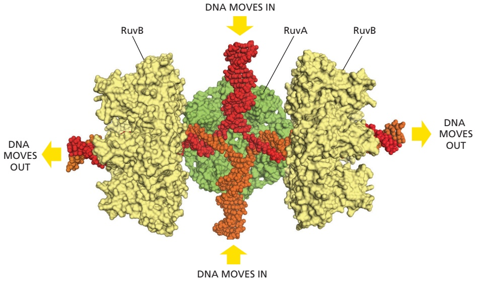

Figure 5–55 Enzyme-catalyzed branch movement at a Holliday junction by branch migration. A tetramer of the RuvA protein (green) and two hexamers of the RuvB protein (yellow) bind to the open form of the junction. The RuvB protein, which resembles the hexameric helicases used in DNA replication (see Figure 5–14), uses the energy of ATP hydrolysis to spool DNA rapidly through the Holliday junction, extending the heteroduplex region as shown. The RuvA protein coordinates this movement, threading the DNA strands to avoid tangling. This example is from E. coli, but similar proteins function in meiosis in sexually reproducing organisms. (PDB codes: 1IXR, 1C7Y.)

Figure 5–56 Heteroduplexes formed during meiosis. Heteroduplex DNA is present at sites of recombination that are resolved either as crossovers or non-crossovers. Because the DNA sequences of maternal and paternal chromosomes differ at many positions along their lengths, heteroduplexes often contain a small number of base-pair mismatches, and they are therefore potential sites of gene conversion (see Figure 5–57).

The other outcome is much more profound: a double Holliday junction is formed and is cleaved by specialized enzymes (blue arrows on the left side of Figure 5–53) to create a crossover. The two original portions of each chromosome upstream and downstream from the two Holliday junctions are thereby swapped, creating two chromosomes that are said to have “crossed over”—each containing a large number of both maternally inherited and paternally inherited genes.

How does the cell decide which double-strand breaks to resolve as cross-overs? The answer is not yet known, but we know the decision is not random. The relatively few crossovers that do form are distributed along chromosomes in such a way that a crossover in one position inhibits crossing-over in neighboring regions. Termed crossover control, this fascinating but poorly understood regulatory mechanism ensures the roughly even distribution of crossover points alongMBoC7 m5.58/5.56 chromosomes. It also ensures that each chromosome—no matter how small— undergoes at least one crossover event every meiosis. For many organisms, roughly two crossovers per chromosome occur during each meiosis, one on each arm. As discussed in detail in Chapter 17, these crossovers, in addition to producing novel DNA molecules, play an important mechanical role in the proper segregation of chromosomes during meiosis.

Whether a meiotic recombination event is resolved as a crossover or a non-crossover, the recombination machinery leaves behind a heteroduplex region where a strand with the DNA sequence of the paternal homolog is base-paired with a strand from the maternal homolog (**Figure 5–56**). These heteroduplex regions can tolerate a small percentage of mismatched base pairs, and because of branch migration, they often extend for thousands of nucleotide pairs. The many non-crossover events that occur in meiosis thereby produce scattered sites in the germ cells where short DNA sequences from one homolog have been pasted into the other homolog. Heteroduplex regions mark sites of potential gene conversion— where the four haploid chromosomes produced by meiosis contain three copies of a DNA sequence from one homolog and only one copy of this sequence from the other homolog, as explained next.

#### Homologous Recombination Often Results in Gene Conversion

In sexually reproducing organisms, it is a fundamental law of genetics that—aside from mitochondrial DNA, which is inherited only through the mother—each parent makes an equal genetic contribution to an offspring. One complete set of nuclear genes is inherited from the father and one complete set is inherited from the mother. Underlying this law is the accurate parceling out of chromosomes to the germ cells (eggs and sperm) that takes place during meiosis. Thus, when a diploid cell in a parent undergoes meiosis to produce four haploid germ cells, exactly half of the genes distributed among these four cells should be maternal (genes inherited from the mother of this parent) and the other half paternal (genes inherited from the father of this parent). In some organisms (fungi, for example), it is possible to recover and analyze all four of the haploid gametes produced from a single cell by meiosis. Studies in such organisms have revealed rare cases in which the parceling out of genes violates the standard genetic rules. Occasionally, for example, meiosis yields three copies of the maternal version of a gene and only one copy of the paternal version. Alternative versions of the same gene are called **alleles**, and it is the divergence from their expected distribution during meiosis that is known as **gene conversion** (Movie 5.8). Genetic studies show that only small sections of DNA typically undergo gene conversion, and in many cases only a part of a gene is changed. How is this possible?

We have seen that both crossovers and non-crossovers produce heteroduplex regions of DNA. If the two strands that make up a heteroduplex region do not have identical nucleotide sequences, mismatched base pairs are formed, and these are often repaired by the cell’s mismatch repair system (see Figure 5–20). However, unlike what happens after DNA replication, in meiosis the mismatch repair system randomly selects the strand to be used as a template, causing one allele to be lost and the other duplicated (**Figure 5–57**). Thus, gene conversion (the “conversion” of one allele to the other)—originally regarded as a mysterious deviation from the rules of genetics—can be seen as a straightforward consequence of the mechanisms of homologous recombination during meiosis.

#### Summary

Homologous recombination describes a flexible set of reactions resulting in the exchange of DNA sequences between a pair of identical or nearly identical duplex DNA molecules. Of special importance is a strand-exchange step whereby a single strand from one DNA duplex invades a second duplex and base-pairs with one strand while displacing the other. This reaction, catalyzed by the RecA/Rad51 family of proteins, can only occur if the invading strand can form a short stretch of consecutive nucleotide pairs with one of the strands of the duplex. This requirement ensures that homologous recombination occurs only between identical or very similar DNA sequences.

When used as a DNA repair mechanism, homologous recombination usually occurs between a damaged DNA molecule and its recently duplicated sister molecule, with the undamaged duplex acting as a template to repair the damaged copy flawlessly. In meiosis, homologous recombination is initiated by deliberate, carefully regulated double-strand breaks and occurs preferentially between the homologous chromosomes rather than the newly replicated sister chromatids. The outcome can be either two chromosomes that have crossed over (that is, chromosomes in which the DNA on either side of the site of DNA pairing originates from two different homologs) or two non-crossover chromosomes. In the latter case, the two chromosomes that result are identical to the original two homologs, except for relatively minor DNA sequence changes at the site of recombination.

<!-- END EN EN05-H051-H056 -->

### 英文补充：有丝分裂、纺锤体、胞质分裂与减数分裂

> 对应中文板块：有丝分裂、纺锤体、胞质分裂与减数分裂。英文来源：Molecular Biology of the Cell，第7版，第17章；[本章完整原文](../../来源/英文教材/17_The_Cell_Cycle/chapter.md)。物理PDF页码范围：1066–1127（整章范围）。

<!-- BEGIN EN EN17-H021-H061 -->
#### MITOSIS

Following the completion of S phase and transition through $\mathrm { G } _ { 2 } ,$ the cell undergoes the dramatic changes of M phase. This begins with mitosis, during which the sister chromatids are separated and distributed (segregated) to a pair of identical daughter nuclei, each with its own copy of the genome. Mitosis is traditionally divided into five stages—prophase, prometaphase, metaphase, anaphase, and telophase—defined primarily on the basis of chromosome behavior as seen in a microscope. As mitosis is completed, the second major event of M phase—cytokinesis—divides the cell into two halves, each with an identical nucleus. **Panel 17–1** summarizes the major events of M phase (**Movie 17.2**, **Movie 17.3**, **Movie 17.4**, and **Movie 17.5**).

From a regulatory point of view, mitosis can be divided into two major parts, each governed by distinct components of the cell-cycle control system. First, an increase in M-Cdk activity at the $\mathrm { G _ { 2 } / M }$ transition triggers the events of early

Figure 17–23 Cohesin. Cohesin is a protein complex with four subunits. (A) Two subunits of cohesin are members of a large family of proteins called SMC proteins (for structural maintenance of chromosomes). These subunits, Smc1 and Smc3, are coiled-coil proteins whose N- and C-terminal regions fold together to form a globular ATPase domain. (B) The Scc1 subunit contains two globular domains separated by a long disordered region that binds an additional subunit called Scc3. Binding of the globular domains of Scc1 to the Smc1 and Smc3 subunits results in a ring structure that encircles the sister chromatids as shown in (C). ATP binding promotes the interaction of the ATPase domains as shown here, while ATP hydrolysis dissociates the ATPase domains. Loading and unloading of cohesin on DNA requires ATP hydrolysis and is expected to involve the opening of one of the three intersubunit gates, but this process remains poorly understood. During S phase, acetylation of the ATPase domain of Smc3 (not shown) prevents the opening of the ring, thereby locking the cohesin ring around the sister chromatids. In metaphase, proteolytic cleavage of sites in the disordered region of Scc1 triggers sister-chromatid separation, as discussed later.

mitosis (prophase, prometaphase, and metaphase). M-Cdk and other mitotic protein kinases phosphorylate a variety of proteins, leading to the assembly of the mitotic spindle and its attachment to the sister-chromatid pairs. The second major part of mitosis begins at the metaphase-to-anaphase transition, when the APC/C triggers the destruction of securin, liberating a protease that cleaves cohesin and thereby initiates separation of the sister chromatids. The APC/C also promotes the destruction of cyclins, which leads to Cdk inactivation and the dephosphorylation of Cdk targets, which is required for the events of late M phase, including the completion of anaphase, the disassembly of the mitotic spindle, and the division of the cell by cytokinesis.

#### M-Cdk and Other Protein Kinases Drive Entry into Mitosis

One of the most remarkable features of cell-cycle control is that a single protein kinase, M-Cdk, brings about so many of the diverse and complex cell rearrangements that occur in the early stages of mitosis. At a minimum, M-Cdk must induce the assembly of the mitotic spindle and ensure that each sister chromatid in a pair is attached to the opposite pole of the spindle. It also triggers chromosome condensation, the large-scale reorganization of the intertwined sister chromatids into compact, rodlike structures. In animal cells, M-Cdk also promotes the breakdown of the nuclear envelope and rearrangements of the actin cytoskeleton and the Golgi apparatus. Each of these processes is initiated when M-Cdk phosphorylates specific proteins involved in the process. Many of these Cdk substrates have been identified, and in many cases we understand in considerable detail how their phosphorylation alters their function.

M-Cdk directly phosphorylates many of the proteins involved in mitotic processes, but it also acts indirectly by phosphorylating and thereby activating other protein kinases that carry out some mitotic functions. Two families of protein kinases, the Polo-like kinases and the Aurora kinases, make particularly important contributions to the control of early mitotic events. The Polo-like kinase Plk1, for example, is required for the normal assembly of a bipolar mitotic spindle, in part because it phosphorylates proteins involved in separation of the spindle poles early in mitosis. The Aurora kinase Aurora-A also helps control proteins that govern the assembly and stability of the spindle, whereas Aurora-B controls attachment of sister chromatids to the spindle, as we discuss later.

#### Condensin Helps Configure Duplicated Chromosomes for Separation

At the end of S phase, the immensely long DNA molecules of the sister chromatids are tangled in a mass of partially intertwined DNA and proteins. Any attempt to pull the sisters apart in this state would undoubtedly lead to breaks in the chromosomes. To avoid this disaster, the cell devotes a great deal of time and energy in early mitosis to reorganizing the sister chromatids into relatively short, distinct structures that can be pulled apart more easily in anaphase. These chromosomal changes involve two overlapping processes: chromosome condensation, in which the chromatids are dramatically compacted; and sister-chromatid resolution, whereby the two sisters are resolved into distinct, separable units (**Figure 17–24A**). Resolution results from the disentangling of the sister DNAs, accompanied by the partial removal of cohesin molecules along the chromosome arms. As a result, when the cell reaches metaphase, the sister chromatids appear in the microscope as compact, rodlike structures that are joined tightly at their centromeric regions and only loosely along their arms.

The condensation and resolution of sister chromatids depend, at least in part, on a five-subunit protein complex called **condensin**, which is concentrated along the central axes of mitotic chromosomes (**Figure 17–24B**). Condensin structure is related to that of the cohesin complex that holds sister chromatids together (see Figure 17–23). It contains two SMC subunits like those of cohesin, plus

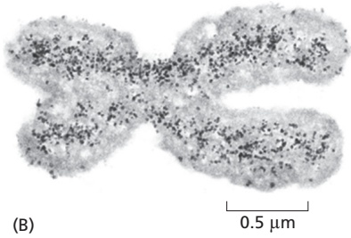

Figure 17–24 The mitotic chromosome. (A) Scanning electron micrograph of a human mitotic chromosome, consisting of two sister chromatids joined along their length. The constricted regions are the centromeres. (B) An electron micrograph of a duplicated mitotic chromosome in which condensin is labeled with antibodies attached to tiny gold particles (dark dots), showing that condensin is found mainly in the central core of the chromosome. (A, courtesy of Terry D. Allen; B, from N. Kireeva et al., J. Cell Biol. 166:775–785, 2004. With permission from Rockefeller MBoC7 e1University Press.)

#### 1 PROPHASE

condensing replicated chromosome, consisting of two sister chromatids held together along their length

At prophase, the replicated chromosomes, each consisting of two closely associated sister chromatids, condense. Outside the nucleus, the mitotic spindle assembles between the two centrosomes, which have replicated and moved apart. For simplicity, only three chromosomes are shown. In diploid cells, there would be two copies of each chromosome present. In the fluorescence micrograph, chromosomes are stained orange and microtubules are green.

10 µm

#### 2 PROMETAPHASE

Prometaphase starts abruptly with the breakdown of the nuclear envelope. Chromosomes can now attach to spindle microtubules via their kinetochores and undergo active movement.

chromosome in active motion

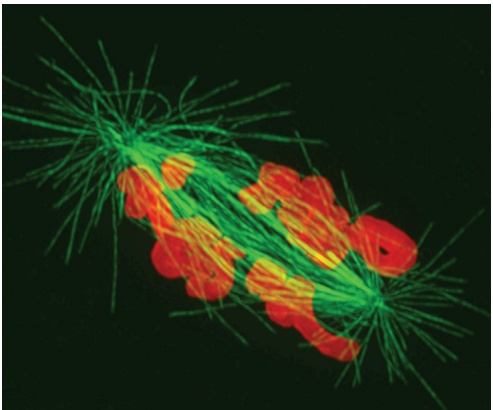

#### 3 METAPHASE

centrosome at spindle pole

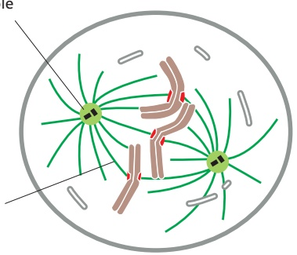

kinetochore microtubule

At metaphase, the chromosomes are aligned at the equator of the spindle, midway between the spindle poles. The kinetochore microtubules attach sister chromatids to opposite poles of the spindle.

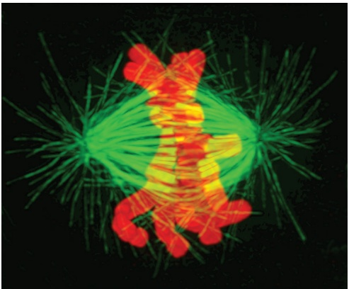

centrosome

#### ANAPHASE

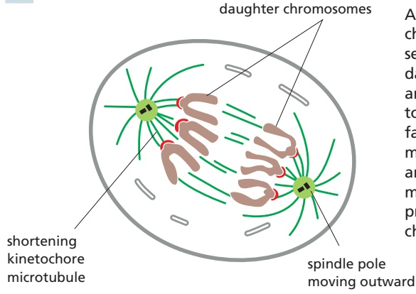

shortening kinetochore microtubule

spindle pole moving outward

At anaphase , the sister chromatids synchronously separate to form two daughter chromosomes, and each is pulled slowly toward the spindle pole it faces. The kinetochore microtubules get shorter, and the spindle poles also move apart; both processes contribute to chromosome segregation.

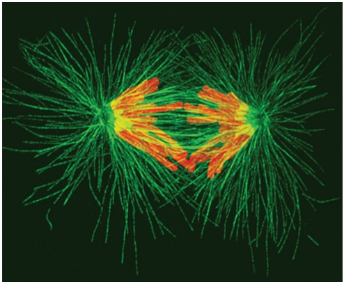

#### TELOPHASE

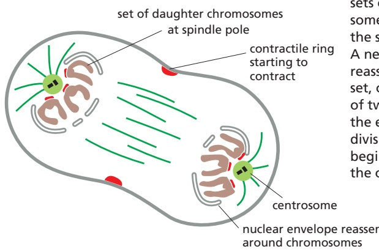

During telophase, the two sets of daughter chromosomes arrive at the poles of the spindle and decondense. A new nuclear envelope reassembles around each set, completing the formation of two nuclei and marking the end of mitosis. The division of the cytoplasm begins with contraction of the contractile ring.

nuclear envelope reassembling around chromosomes

#### CYTOKINESIS

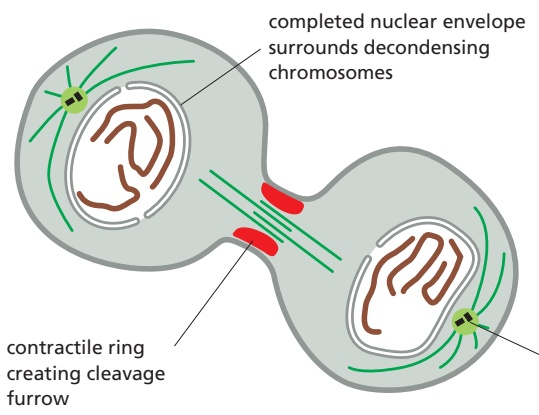

contractile ring creating cleavage furrow

During cytokinesis, the cytoplasm is divided in two by a contractile ring of actin and myosin filaments, which pinches the cell in two to create two daughters, each with one nucleus.

re-formation of interphase array of microtubules nucleated by the centrosome

condensin non-SMC subunits bind DNA tightly

Figure 17–25 Condensin. (A) Condensin is a five-subunit protein complex that resembles cohesin (see Figure 17–23). The ATPase head domains of its two major subunits, Smc2 and Smc4, are held together by a linker protein called Brn1, which is associated with two additional proteins called Ycs4 and Ycg1. (B) These diagrams illustrate a mechanism by which condensin might generate DNA loops, thereby promoting the compaction of a chromosome. For an alternative model, see Figure 4–56. In the model shown here, the process begins when the Ycg1 subunit interacts tightly with a strand of chromosome DNA, anchoring the condensin firmly in place on the DNA. The nearby DNA curls around to interact with the hinge domain. By mechanisms that remain unclear, the hinge and ATPase domains work together, using energy from ATP hydrolysis, to move leftward along the top DNA strand (red arrow), thereby generating a chromosome loop. Such loops are common structural elements in chromosome packaging (discussed in Chapter 4).

three non-SMC subunits (**Figure 17–25A**). Like cohesin, condensin forms a ring that encircles DNA. In addition, condensin has the ability to use energy provided by ATP hydrolysis to promote the compaction of sister chromatids. There is evidence that the ATPase domains of condensin act as a motor that moves DNA through the ring, thereby allowing it to create chromosome loops (**Figure 17–25B**). Much remains to be learned, however, before we understand how the local coordination of condensin, cohesin, and histone proteins is choreographed by M-Cdk to generate the efficient packaging and resolution of the sister chromatids.

#### The Mitotic Spindle Is a Dynamic Microtubule-based Machine

The central event of mitosis—chromosome segregation—depends in all eukaryotes on a complex and beautiful machine called the **mitotic spindle** (see Panel 17–1). The spindle is a bipolar array of microtubules, which pulls sister chromatids apart in anaphase, thereby segregating the two sets of chromosomes to opposite ends of the cell, where they are packaged into daughter nuclei (**Movie 17.6**). M-Cdk triggers the assembly of the spindle early in mitosis, in parallel with the chromosome restructuring just described. Before we consider how the spindle assembles and how its microtubules attach to sister chromatids, we briefly review the key features of metaphase spindle structure.

As we discussed in Chapter 16, microtubules are dynamic polar polymers with plus and minus ends that display distinct behaviors. The metaphase spindle of an animal cell contains many thousands of microtubules radiating from two spindle poles, with minus ends oriented toward the pole and plus ends directed outward (**Figure 17–26**). The **kinetochore microtubules** are the central players in chromosome segregation: their plus ends are attached to sister-chromatid pairs at large protein structures called kinetochores, which are located at the centromere of each sister chromatid. Each kinetochore binds large numbers of microtubules that are cross-linked to form thick microtubule bundles called K-fibers. These fibers are responsible for moving separated sister chromatids toward the poles in anaphase.

The second major type of spindle microtubule, and by far the most numerous, are the **non-kinetochore microtubules** (also known as interpolar microtubules). These relatively short and unstable microtubules are densely packed between the poles, cross-linked by various proteins to form a dynamic and adaptable scaffolding network that provides structural stability to the spindle. Some of these microtubules are embedded in the spindle poles, but many are found away from the poles, sometimes with minus ends attached to the sides of other microtubules. Near the spindle equator, they are often cross-linked with antiparallel microtubules oriented with minus ends directed toward the opposite spindle pole.

In most animal cells, spindles also contain **astral microtubules** that radiate outward from the poles and contact the cell cortex, helping to position the spindle in the cell. Each of the two poles in these spindles is focused at a large protein organelle called the **centrosome**. As described in Chapter 16 (see Figures 16–42 and 16–43), the centrosome consists of a cloud of amorphous material (called the pericentriolar material) that surrounds a pair of centrioles (**Figure 17–27**). The pericentriolar material nucleates a radial array of microtubules, with their dynamic plus ends projecting outward and their minus ends associated with

nearby DNA interacts with hinge

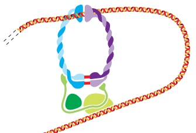

ATP-dependent motor activity extends DNA loop 2000000000

1 µm

(B)

the centrosome. Some cells—notably the cells of higher plants and the oocytes of many vertebrates—do not have centrosomes and therefore do not have astral microtubules. Thus, as we discuss later, centrosomes are not essential for spindle assembly.

Figure 17–26 The metaphase mitotic spindle in an animal cell. Bundles of parallel kinetochore microtubules (K-fibers) connect the spindle poles with the kinetochores of sister chromatids. Non-kinetochore microtubules are scattered throughout the spindle with their minus ends directed toward the nearest pole; these microtubules are cross-linked by various microtubule-associated proteins to form a dynamic, interconnected meshwork. Near the spindle equator, antiparallel microtubules are cross-linked by specific motor and other proteins (light purple dots). In other regions of the spindle, parallel microtubules are cross-linked (red dots). Some microtubules grow from nucleating factors in the centrosome, while others originate in nucleating factors on the sides of other microtubules (green dots), as we discuss later. Astral microtubules radiate out from the poles into the cytoplasm and are not present in spindles lacking centrosomes.

The assembly and function of a bipolar spindle depend on hundreds of dif-MBoC7 m17.23/17.26 ferent microtubule-associated proteins that can be placed in three general categories: nucleating factors that govern the formation of new microtubules, regulatory proteins that control rates of polymerization and depolymerization at both ends of the microtubules, and motor proteins that cross-link and move microtubules relative to each other. We briefly describe each of these important microtubule regulators in the following sections, after which we discuss how these components collaborate in the assembly of the spindle.

#### Microtubules Are Nucleated in Multiple Regions of the Spindle

Microtubules are the building blocks of the spindle, and spindle assembly requires the synthesis of enormous numbers of new microtubules. Mature metaphase spindles contain tens or hundreds of thousands of microtubules, most of which are turning over rapidly, resulting in the need for a constant supply of new microtubules. To meet this need, the spindle contains large numbers of microtubule nucleating factors. By far the most important of these is the g-tubulin ring complex (g-TuRC; see Figure 16–41), which nucleates microtubule assembly from the minus end, leaving the plus end to grow rapidly.

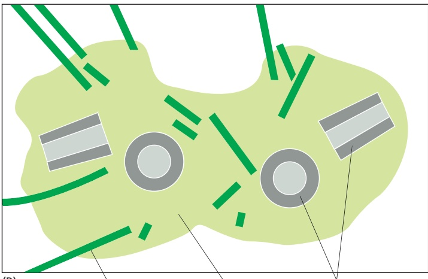

Figure 17–27 The centrosome. (A) Electron micrograph of an S-phase mammalian cell in culture, showing a duplicated centrosome. Each centrosome contains a pair of centrioles; although the centrioles have duplicated, they remain together in a single complex, as shown in the drawing of the micrograph in (B). One centriole of each centriole pair has been cut in cross section, while the other is cut in longitudinal section, indicating that the two members of each pair are aligned at right angles to each other. The two halves of the replicated centrosome, each consisting of a centriole pair surrounded by pericentriolar material, will split and migrate apart to initiate the formation of the two poles of the mitotic spindle when the cell enters M phase (see Figures 16–42 and 16–43). (A, from M. McGill et al., J. Ultrastruct. Res. 57:43–53, 1976. With permission from Academic Press.)

In the many animal cell types that contain centrosomes, large numbers of γ-TuRCs are anchored and activated in the pericentriolar material and drive the formation of microtubules that radiate outward from the centrosome (see Figure 16-42). The number of γ-TuRCs in each centrosome increases greatly at the beginning of mitosis, in a process called centrosome maturation.

Microtubule formation also occurs within the metaphase spindle between the poles. A large protein complex called augmin anchors active γ-TuRC to the side of a microtubule, resulting in the nucleation of a new microtubule that branches off the other (see Figure 16-47). Augmin binds to the microtubule in such a way that it orients the new microtubule with its plus end pointing in the same direction as the microtubule to which it binds; as a result, the new microtubule has the correct orientation when it is released and repositioned in the spindle microtubule network.

Spindle assembly also depends on increased microtubule synthesis in the vicinity of the chromosomes. Mitotic chromosomes generate local signals that activate γ-TuRC and thereby promote microtubule formation. As we describe later, this mechanism, together with microtubule sorting by various motor proteins, allows chromosomes to make a major contribution to the formation of a bipolar spindle—particularly in the absence of centrosomes.

#### Microtubule Instability Increases Greatly in Mitosis

As discussed in Chapter 16, microtubules are in a state of dynamic instability, in which individual microtubules are either growing or shrinking and stochastically switch between the two states. New microtubules are continually being created to balance the loss of those that disappear completely by depolymerization.

Entry into mitosis signals an abrupt change in the cell’s microtubules. During prophase, and particularly in prometaphase and metaphase (see Panel 17–1), the average lifetime of a microtubule decreases dramatically—particularly the lifetime of non-kinetochore microtubules, which exist for only 15–30 seconds. This increase in microtubule instability, coupled with the increased ability of the spindle to nucleate microtubules as mentioned above, results in a remarkably dense and dynamic array of spindle microtubules.

Microtubule dynamics are controlled in the cell by a variety of regulatory proteins, including microtubule-associated proteins (MAPs) that promote stability and depolymerization factors that destabilize microtubule plus ends. Changes in the activities of these proteins are responsible for the changes in microtubule dynamics that occur during mitosis. Many of these changes result from phosphorylation of specific proteins by M-Cdk and other mitotic protein kinases.

#### Microtubule-based Motor Proteins Govern Spindle Assembly and Function

The assembly and function of the mitotic spindle depend on numerous microtubule-dependent motor proteins. As discussed in Chapter 16, these proteins belong to two families—the large family of kinesin-related proteins, which usually move toward the plus end of microtubules, and dyneins, which move toward the minus end. Two motor proteins—kinesin-5 and cytoplasmic dynein—are particularly important in spindle assembly and function, and many others, including kinesin-14 and kinesins-4/10, are also involved (**Figure 17–28**).

Kinesin-5 is a large tetramer containing two dimeric motor domains at each end. The motor domains both move toward the plus end of a microtubule but can be oriented in opposite directions; as a result, they can associate with two antiparallel microtubules and slide them in opposite directions. When this occurs near the center of the spindle, the result is that the minus ends of the microtubule are pushed toward the poles. This process is fundamentally important in generating bipolarity in the spindle.

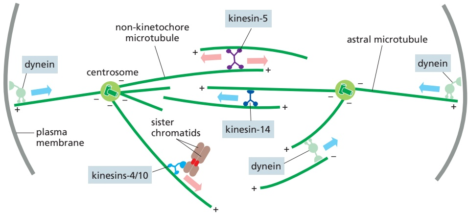

Figure 17–28 Major motor proteins of the spindle. Microtubule-dependent motor proteins contribute to spindle assembly and function (see text). The colored arrows indicate the direction of motor protein movement along a microtubule—blue toward the minus end and light red toward the plus end. Because non-kinetochore microtubules are extensively cross-linked to each other in the spindle and at the poles, it is thought that microtubule sliding like that shown here can alter spindle length. (From D.O. Morgan, The Cell Cycle: Principles of Control, p. 117. London: New Science Press, 2007. With permission from Oxford University Press.)

Cytoplasmic dynein is a minus end–directed motor that, together with associ-MBoC7 m17.25/17.28 ated proteins, organizes microtubules at various locations in the cell. By attaching to the minus end of one microtubule and transporting it toward the minus end of a second microtubule, dynein functions to connect new microtubules formed in the body of the spindle to microtubules nucleated at a centrosome, and to focus the spindle poles. Dynein is also present on the plus ends of astral microtubules at the cell cortex. By moving toward the minus end of astral microtubules, dynein motors pull the spindle poles toward the cell cortex and away from each other.

Kinesin-14, unlike most kinesins, is a minus end–directed motor. It contains a dimeric motor domain and a second domain that can bind to a neighboring microtubule in a specific orientation, enabling it to cross-link antiparallel microtubules at the center of the spindle and pull the poles together. Kinesin-4 and kinesin-10 proteins, also called chromokinesins, are plus end–directed motors that associate with chromosome arms and push the attached chromosome away from the pole (or the pole away from the chromosome).

#### Bipolar Spindle Assembly in Most Animal Cells Begins with Centrosome Duplication

The mitotic spindle must have two poles if it is to pull the two sets of sister chromatids to opposite ends of the cell in anaphase. In most animal cells, several mechanisms ensure the bipolarity of the spindle. One depends on centrosomes. A typical animal cell enters mitosis with a pair of centrosomes, each of which nucleates a radial array of microtubules. The two centrosomes provide prefabricated spindle poles that greatly facilitate bipolar spindle assembly. The other mechanisms depend on the ability of mitotic chromosomes to nucleate and stabilize microtubules and on the ability of motor proteins to organize microtubules into a bipolar array. We will discuss these “self-organization” mechanisms later in this section.

In interphase, most animal cells contain a single centrosome that nucleates most of the cell’s cytoplasmic microtubules. The centrosome duplicates when the cell enters the cell cycle, so that by the time the cell reaches mitosis there are two centrosomes. Centrosome duplication begins at about the same time as the cell enters S phase. The $G _{1}/ S-Cdk$ (a complex of cyclin E and Cdk2 in animal cells; see Table 17–1) that triggers cell-cycle entry also helps initiate centrosome duplication, together with another protein kinase called Plk4. Each of the two centrioles in the centrosome nucleates the formation of a new centriole, which is gradually constructed in S phase to generate a closely linked pair of centrosomes (**Figure 17–29**). This centrosome pair remains together on one side of the nucleus until the cell enters mitosis, when the two centrosomes undergo numerous changes to form the poles of the spindle.

There are interesting parallels between centrosome duplication and chromosome duplication. Both use a semiconservative mechanism of duplication, in which the two halves separate and serve as templates for construction of a new half. Centrosomes, like chromosomes, must replicate once and only once per cell cycle, to ensure that the cell enters mitosis with precisely two copies: an incorrect number of centrosomes can lead to defects in spindle assembly and thus errors in chromosome segregation.

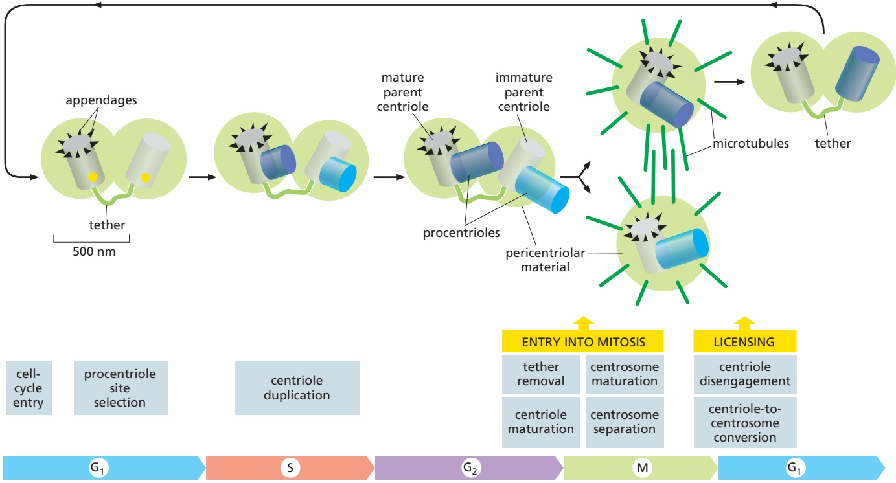

We are beginning to unravel the complex mechanisms that limit centrosome duplication to once and only once per cell cycle. These mechanisms are reminiscent of those that restrict DNA replication to once per cell cycle: after duplication has occurred in S phase, passage through mitosis is required for the “licensing” of centrosome duplication in the next cell cycle (see Figure 17–29).

#### Spindle Assembly in Animal Cells Requires Nuclear-Envelope Breakdown

In cells that contain centrosomes, spindle assembly begins when the two centrosomes move apart along the nuclear envelope in prophase, pulled by dynein motor proteins that link astral microtubules to the cell cortex (see Figure 17–28). The plus ends of the microtubules between the centrosomes interdigitate to form an array of antiparallel microtubules, and kinesin-5 motor proteins cross-link these microtubules and push the centrosomes apart.

Centrosomes and microtubules are located in the cytoplasm, where they have no access to the sister-chromatid pairs inside the nucleus. Thus, the attachment of the nascent spindle to sister-chromatid pairs requires the removal of the nuclear envelope. In addition, many of the motor proteins and microtubule regulators that promote spindle assembly are associated with the chromosomes inside the nucleus, and they require nuclear-envelope breakdown to carry out their functions.

Nuclear-envelope breakdown is a complex, multistep process, which is thought to begin when M-Cdk phosphorylates several subunits of the nuclear pore complexes in the nuclear envelope. This phosphorylation initiates the disassembly of nuclear pore complexes and their dissociation from the envelope. M-Cdk also phosphorylates components of the nuclear lamina, the structural framework beneath the envelope, resulting in nuclear lamina disassembly. In parallel, phosphorylation of several inner-nuclear-envelope proteins leads to detachment of

Figure 17–29 The centrosome cycle. In early $\mathbb { G } _ { 1 } ,$ the centrosome consists of two centrioles linked by a protein tether, as well as associated pericentriolar material for nucleation of microtubules (light green). One centriole, the mature parent, carries protein appendages required for certain centrosome functions. Upon entry into the cell cycle, G1/S-Cdk and Plk4 initiate centriole duplication, whereby a new centriole (procentriole) is assembled at a single site on the side of each parent centriole (yellow dots). The elongation of the procentrioles is usually completed in G2. The two centriole pairs remain close together in a single centrosomal complex until entry into mitosis, when the protein kinases M-Cdk, Plk1, and other regulators trigger numerous changes: the tether between centrosomes is removed, the immature parent centriole acquires appendages (centriole maturation), the pericentriolar material expands to enable more microtubule nucleation (centrosome maturation), and the centrosomes separate, forming a new spindle between them. After the completion of mitosis, the two centrioles in each centrosome detach (centriole disengagement), and the new centriole acquires pericentriolar material (centriole-to-centrosome conversion). These two processes are required for centriole duplication in the subsequent cell cycle; thus, progression through mitosis is required for duplication, helping to ensure that centrioles (and centrosomes) duplicate only once per cell cycle.

Figure 17–30 Activation of the GTPase Ran around mitotic chromosomes. The Ran protein, like other members of the small GTPase family (discussed in Chapter 15), can exist in two conformations depending on whether it is bound to GDP (inactive state) or GTP (active state). The localization of active Ran in mitosis was determined using a protein that emits fluorescence at a specific wavelength when it is activated by Ran-GTP. In the metaphase human cell shown here, Ran activity (yellow and red) is highest around the chromosomes, between the poles of the mitotic spindle (indicated by asterisks). (From P. Kaláb et al., Nature 440:697–701, published 2006 by Nature Publishing Group. Reproduced with permission from SNCSC.)

lamin proteins and chromosomes from the nuclear envelope, which is then incorporated into the membranes of the endoplasmic reticulum.

10 µm

#### Mitotic Chromosomes Promote Bipolar Spindle Assembly

When they are present, centrosomes drive spindle assembly. Centrosomes are very efficient microtubule nucleators that also act to organize the spindle poles, rapidly generating a bipolar microtubule array that rains down on the chromosomes when the nuclear envelope is removed. However, chromosomes are not just passive passengers in the process of spindle assembly. By creating a local environment that favors both microtubule nucleation and microtubule stabilization, they play an active part in spindle formation. The influence of the chromosomes can be demonstrated by using a fine glass needle to reposition them after the spindle has formed. For some cells in metaphase, if a single chromosome is tugged out of alignment, a mass of new spindle microtubules rapidly appears around the newly positioned chromosome, while the spindle microtubules at the chromosome’s former position depolymerize. This property of the chromosomes seems to depend, at least in part, on a guanine nucleotide exchange factor (GEF) that is bound to chromatin; the GEF stimulates a small GTPase in the cytosol called Ran to bind GTP in place of GDP. The activated Ran-GTP, which is also involved in nuclear transport (discussed in Chapter 12), releases microtubuleregulatory proteins from protein complexes in the cytosol, thereby stimulating the local nucleation and stabilization of microtubules around chromosomes (**Figure 17–30**). The best-understood mechanism depends on the release of a protein called TPX2, which then binds and activates the protein kinase Aurora-A. Aurora-A phosphorylates regulatory proteins that activate γ-TuRCs, leading to an increase in local formation of new microtubules. TPX2 might also activate augmin to promote the formation of new microtubule branches on the sides of existing microtubules. Local microtubule stabilization is also promoted by the protein kinase Aurora-B, which associates with mitotic chromosomes.

In the absence of centrosomes, spindle assembly is thought to begin with the formation of microtubules around the chromosomes. Various microtubuleassociated proteins then organize the microtubules into a bipolar spindle (**Figure 17–31**). Two motor proteins that we discussed earlier are particularly important. Kinesin-5, by cross-linking antiparallel microtubules and pushing their minus ends outward, is essential for the bipolar character of the spindle. Dynein, by transporting one microtubule minus end toward the minus end of another, is required for the focusing of minus ends in a discrete pole at each end of the bipolar array. Many other microtubule regulators, including other motor proteins and augmin, also contribute to spindle assembly.

Figure 17–31 Spindle self-organization by motor proteins. Mitotic chromosomes stimulate the local activation of proteins that promote the formation of microtubules in the vicinity of the chromosomes. Kinesin-5 motor proteins (see Figure 17–28) organize these microtubules into antiparallel bundles, while plus end–directed kinesin-4 and kinesin-10 link the microtubules to chromosome arms and push minus ends away from the chromosomes. Dynein, together with numerous other proteins, focuses these minus ends into a pair of spindle poles.

Cells that normally lack centrosomes, such as those of higher plants and many animal oocytes, use chromosome-based self-organization mechanisms to form spindles. These mechanisms also assemble spindles in experimental systems where centrosomes are removed—such as in certain animal embryos that have been induced to develop from eggs without fertilization (called parthenogenesis). As the sperm normally provides the centrosome when it fertilizes an egg, the mitotic spindles in these parthenogenetic embryos develop without centrosomes (**Figure 17–32**). Although the resulting acentrosomal spindle can segregate chromosomes normally, it lacks astral microtubules, which are responsible for positioning the spindle in animal cells; as a result, the spindle can be mispositioned in the cell.

#### Kinetochores Attach Sister Chromatids to the Spindle

After the assembly of a bipolar microtubule array, the second major step in spindle formation is the attachment of the array to the sister-chromatid pairs. Spindle microtubules become attached to each chromatid at its **kinetochore**, a giant, multilayered protein structure that is built at the centromeric region of the chromatid (**Figure 17–33**; also see Chapter 4). In metaphase, the plus ends of kinetochore microtubules are embedded head-on in specialized microtubuleattachment sites within the outer region of the kinetochore, furthest from the DNA. The kinetochore of an animal cell can bind 10–40 microtubules, whereas a budding yeast kinetochore can bind only one. Attachment of each microtubule depends on multiple copies of a rod-shaped protein complex called the Ndc80 complex, which is anchored in the kinetochore at one end and interacts with the sides of the microtubule at the other, thereby linking the microtubule to the kinetochore while still allowing the addition or removal of tubulin subunits at this end (**Figure 17–34**). Regulation of plus-end polymerization and depolymerization at the kinetochore is critical for the control of chromosome movement on the spindle, as we discuss later.

Figure 17–32 Bipolar spindle assembly without centrosomes in parthenogenetic embryos of the insect Sciara (or fungus gnat). The microtubules are stained green, the chromosomes red. The top fluorescence micrograph shows a normal MBoC7 m17.29/17.32spindle formed with centrosomes in a normally fertilized Sciara embryo. The bottom micrograph shows a spindle formed without centrosomes in an embryo that initiated development without fertilization. Note that the spindle with centrosomes has an aster at each pole of the spindle, whereas the spindle formed without centrosomes does not. Both types of spindles are able to segregate the replicated chromosomes. (© 1998 B. de Saint Phalle and W. Sullivan. Originally published in J. Cell Biol. https://doi.org/10.1083/jcb.141.6.1383.With permission from Rockefeller University Press.)

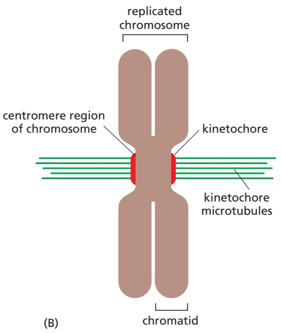

(C)

Figure 17–33 The kinetochore. (A) A fluorescence micrograph of a metaphase chromosome stained with a DNA-binding fluorescent dye and with human autoantibodies that react with specific kinetochore proteins. The two kinetochores, one associated with each sister chromatid, are stained red. (B) A drawing of a metaphase chromosome showing its two sister chromatids attached to the plus ends of kinetochore microtubules. Each kinetochore forms a plaque on the surface of the centromere. (C) Electron micrograph of an anaphase chromatid with microtubules attached to its kinetochore. While most kinetochores have a trilaminar structure, the one shown here (from a green alga) has an unusually complex structure with additional layers. (A, © 1991 R.P. Zinkowski et al. Originally published in J. Cell Biol. https://doi.org/10.1083/jcb.113.5.1091.With permission from Rockefeller University Press. C, from J.D. Pickett-Heaps and L.C. Fowke, Aust. J. Biol. Sci. 23:71–92, 1970. With permission from CSIRO Publishing.)

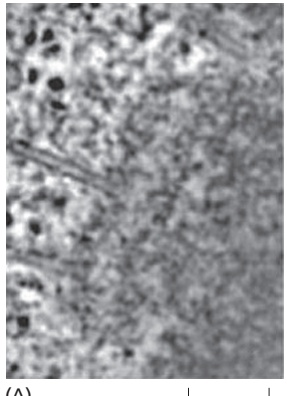

(A)

100 nm

(B)

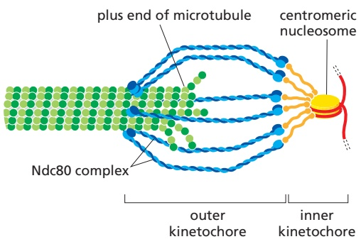

(C)

Figure 17–34 Microtubule attachment sites in the kinetochore. (A) In this electron micrograph of a mammalian kinetochore, the chromosome is on the right, and the plus ends of multiple microtubules are embedded in the outer kinetochore on the left. (B) Electron tomography (discussed in Chapter 9) was used to construct a low-resolution threedimensional image of the outer kinetochore in A. Several microtubules (in multiple colors) are embedded in fibrous material of the kinetochore, which is thought to be composed of the Ndc80 complex and other proteins. (C) Each microtubule is attached to the kinetochore by interactions with multiple copies of the Ndc80 complex (blue). This complex binds to theMBoC7 m17.31/17.34 sides of the microtubule near its plus end, allowing polymerization and depolymerization to occur while the microtubule remains attached to the kinetochore. The opposite end of the Ndc80 complex is attached through intermediary proteins to centromeric nucleosomes containing a specialized version of histone H3 called CENP-A (see Chapter 4). Budding yeast kinetochores contain a single centromeric nucleosome and thus a single microtubule-binding site like that shown here, while animal kinetochores (like those in B) contain large arrays of these binding sites distributed over large numbers of centromeric nucleosomes. (A and B, from Y. Dong et al., Nat. Cell Biol. 9:516–522, published 2007 by Nature Publishing Group. Reproduced with permission of SNCSC.)

Kinetochore attachment to the spindle occurs by a complex sequence of events. At the end of prophase in animal cells, the centrosomes of the growing spindle generally lie on opposite sides of the nuclear envelope. Thus, when the envelope breaks down, the sister-chromatid pairs are bombarded by dynamic microtubule plus ends coming from two directions. However, the kinetochores do not instantly achieve the correct “end-on” microtubule attachment to both spindle poles. Instead, detailed studies with light and electron microscopy show that most initial attachments are unstable lateral attachments, in which a kinetochore attaches to the side of a passing microtubule, with assistance from dynein motor proteins in the outer kinetochore. Eventually, microtubule plus ends are captured by one and then the other kinetochore in the correct end-on orientation.

Another attachment mechanism also plays a part, particularly in the absence of centrosomes. Short microtubules in the vicinity of the chromosomes become embedded in the plus end–binding sites of the kinetochore. Polymerization at these plus ends then results in growth of the microtubules away from the kinetochore. The minus ends of these kinetochore microtubules are eventually cross-linked to other minus ends and focused by dynein motor proteins at the spindle pole (see Figure 17–31).

#### Bi-orientation Is Achieved by Trial and Error

The success of mitosis demands that sister chromatids in a pair attach to opposite poles of the mitotic spindle, so that they move to opposite ends of the cell when they separate in anaphase. How is this mode of attachment, called **bi-orientation**, achieved? What prevents the attachment of both kinetochores to the same spindle pole or the attachment of one kinetochore to both spindle poles? Part of the answer is that sister kinetochores are constructed in a back-to-back orientation that reduces the likelihood that both kinetochores can face the same spindle pole. Nevertheless, incorrect attachments do occur, and elegant regulatory mechanisms have evolved to correct them.

Figure 17–35 Alternative forms of kinetochore attachment to the spindle poles. (A) Initially, a single microtubule from a spindle pole binds to one kinetochore in a sister-chromatid pair. Additional microtubules can then bind to the chromosome in various ways. (B) A microtubule from the same spindle pole can attach to the other sister kinetochore, or (C) microtubules from both spindle poles can attach to the same kinetochore. These incorrect attachments are unstable, however, so that one of the two microtubules tends to dissociate. (D) When a microtubule from the opposite pole MBOC7 m17.33/17.35binds to the second kinetochore, the sister kinetochores are thought to sense tension across their microtubule-binding sites. This triggers an increase in microtubule binding affinity, thereby locking the correct attachment in place. Occasionally (not shown), attachments can form that are a combination of C and D; that is, the two sister kinetochores are attached to opposite poles and are under tension, but there is also an inappropriate microtubule link between one kinetochore and both spindle poles. This combination is stable, and cells that progress to anaphase with such an attachment risk moving both sister chromatids to the same daughter, which is usually lethal for the cell.

Incorrect attachments are corrected by a system of trial and error that is based on a simple principle: most incorrect attachments are highly unstable and do not last, whereas correct attachments are held in place. How does the kinetochore sense a correct attachment? The answer appears to be tension (**Figure 17–35**). When a sister-chromatid pair is properly bi-oriented on the spindle, the two kinetochores are pulled in opposite directions by strong poleward forces. Sister-chromatid cohesion resists these poleward forces, creating high levels of tension within the kinetochores. When chromosomes are incorrectly attached—when both sister chromatids are attached to the same spindle pole, for example—tension is low and the kinetochore generates an inhibitory signal that loosens the grip of its microtubule attachment site, allowing detachment to occur. When bi-orientation occurs, the high tension at the kinetochore shuts off the inhibitory signal, strengthening microtubule attachment. In animal cells, tension not only increases the affinity of the attachment site but also leads to the attachment of additional microtubules to the kinetochore. This results in the formation of a thick kinetochore fiber composed of multiple microtubules.

The tension-sensing mechanism depends on the protein kinase Aurora-B, which is associated with the kinetochore and is thought to generate the inhibitory signal that reduces the strength of microtubule attachment in the absence of tension. It phosphorylates several components of the microtubule attachment site, including the Ndc80 complex, decreasing the site’s affinity for a microtubule plus end. When bi-orientation occurs, the resulting tension reduces phosphorylation by Aurora-B, thereby increasing the affinity of the attachment site (**Figure 17–36**).

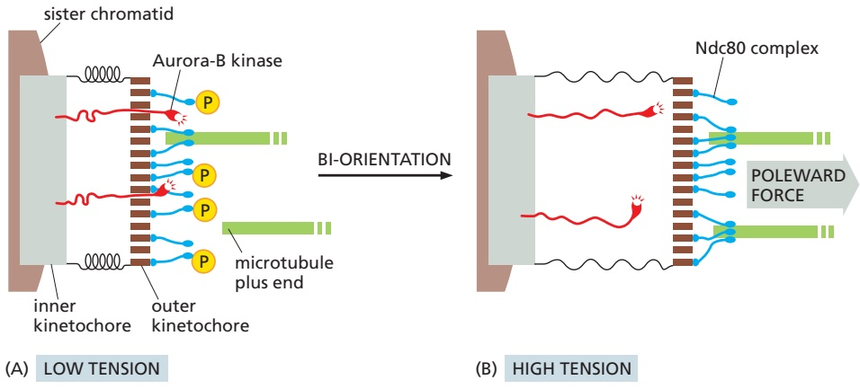

After their attachment to the two spindle poles, the chromosomes are tugged back and forth, eventually assuming a position equidistant between the two poles, a position called the **metaphase plate**. In vertebrate cells, the chromosomes then oscillate gently at the metaphase plate, awaiting the signal for the sister chromatids to separate. The signal is produced, with a predictable lag time, after the bi-oriented attachment of the last sister-chromatid pair.

#### Multiple Forces Act on Chromosomes in the Spindle

The metaphase spindle, with the sister chromatids aligned at the metaphase plate, appears as a stable bipolar structure of a fixed length, but appearances can be deceiving. The spindle is a highly dynamic assembly that exists at a steady state that depends on the precise balance of numerous forces generated by various motor proteins and by microtubule polymerization and depolymerization. These forces move chromosomes once they are attached to the spindle and produce the tension that is so important for the stabilization of correct attachments. In anaphase, similar forces pull the separated chromatids to opposite ends of the spindle. Three major spindle forces are particularly critical, although their strength and importance vary at different stages of mitosis.

The first major force pulls the kinetochore and its associated chromatid along the kinetochore microtubule toward the spindle pole. This force is generated by depolymerization at the plus end of the microtubule. It pulls on chromosomes during prometaphase and metaphase but is particularly important for moving sister chromatids toward the poles after they separate in anaphase. Notably, this kinetochore-generated poleward force does not require ATP or motor proteins. This might seem implausible at first, but it has been shown that purified kinetochores in a test tube, with no ATP present, can remain attached to depolymerizing microtubules and thereby move. The energy that drives the movement is stored in the microtubule and is released when the microtubule depolymerizes; it ultimately comes from the hydrolysis of GTP that occurs after a tubulin subunit adds to the end of a microtubule (discussed in Chapter 16).

How does plus-end depolymerization drive the kinetochore toward the pole? As we discussed earlier (see Figure 17–34C), Ndc80 complexes in the kinetochore make multiple low-affinity attachments along the side of the microtubule. Because the attachments are constantly breaking and re-forming at new sites, the kinetochore remains attached to a microtubule even as the microtubule depolymerizes. In principle, this could move the kinetochore toward the spindle pole.

A second poleward force is provided in some cell types by **microtubule flux**, whereby the microtubules themselves are pulled toward the spindle poles and dismantled at their minus ends. The mechanism underlying this poleward movement is not clear, although it is likely to depend on forces generated by motor proteins and minus-end depolymerization at the spindle pole. In metaphase, the addition

Figure 17–36 How tension might increase microtubule attachment to the kinetochore. These diagrams illustrate one speculative mechanism by which bi-orientation might increase microtubule attachment to the kinetochore. A single kinetochore is shown for clarity; the spindle pole is on the right. (A) When a sisterchromatid pair is unattached to the spindle or attached to just one spindle pole, there is little tension between the outer and inner kinetochores. The protein kinase Aurora-B is tethered to the inner kinetochore and phosphorylates the microtubule attachment sites, including the Ndc80 complex (blue), in the outer kinetochore as shown, thereby reducing the affinity of microtubule binding. Microtubules therefore associate and dissociate rapidly, and attachment is unstable. (B) When bi-orientation is achieved, the forces pulling the kinetochore toward the spindle pole are resisted by forces pulling the other sister kinetochore toward the opposite pole, and the resulting tension pulls the outer kinetochore away from the inner kinetochore. As a result, Aurora-B is unable to reach the outer kinetochore, and microtubule attachment sites are not phosphorylated. Microtubule binding affinity is therefore increased, resulting in the stable attachment of multiple microtubules to both kinetochores. The dephosphorylation of outer kinetochore proteins depends on a phosphatase that is not shown here.

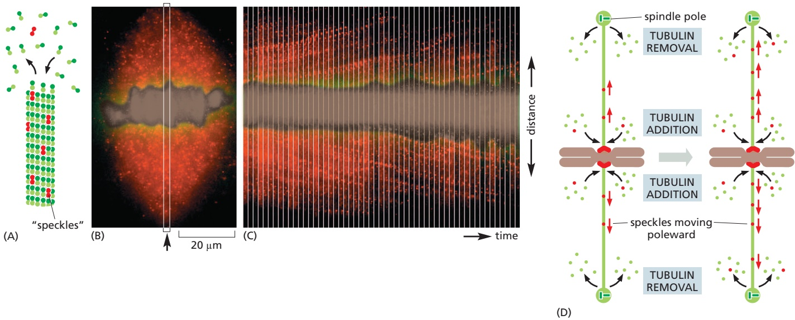

Figure 17–37 Microtubule flux in the metaphase spindle. (A) To observe microtubule flux, a small amount of fluorescent tubulin is injected into living cells or cell extracts so that individual microtubules form with a small proportion of fluorescent tubulin. Such microtubules have a speckled appearance when viewed by fluorescence microscopy. (B) Much of what we know about mitotic spindle behavior comes from studies in extracts of the eggs of the frog X. laevis. These extracts carry out many cell-cycle processes in a test tube, including mitotic spindle assembly. This image shows a fluorescence micrograph of a mitotic spindle in an extract mixed with a small amount of fluorescent tubulin. Because there are no centrosomes in these extracts, the spindle does not have astral microtubules. The chromosomes are colored brown, and the tubulin speckles are red. (C) The movement of individual speckles can be followed by time-lapse video microscopy. Images of the thin vertical boxed region (arrow) in B, taken every 10 seconds, are aligned here to show that individual speckles move toward the poles at a rate of about 0.75 μm/min, indicating that the microtubules are moving poleward. (D) The length of a kinetochore microtubule does not change significantly during this experiment because new tubulin subunits are added at the microtubule plus end at the same rate as tubulin subunits are removed from the minus end. (B and C, from T.J. Mitchison and E.D. Salmon, Nat. Cell Biol. 3:E17–21, published 2001 by Nature Publishing Group. Reproduced with permission of SNCSC.)

of new tubulin at the plus end of a microtubule compensates for the loss of tubulin at the minus end, so that microtubule length remains constant despite the movement of microtubules toward the spindle pole (**Figure 17–37**). Any kinetochore that is attached to a microtubule undergoing such flux experiences a poleward force, which contributes to the generation of tension at the kinetochore in metaphase. Together with the kinetochore-based forces discussed above, flux also contributes to the poleward forces that move sister chromatids after they separate in anaphase.

A third force acting on chromosomes is the polar ejection force, or polar wind. Plus end–directed kinesin-4 and kinesin-10 motors on chromosome arms interact with microtubules and transport the chromosomes away from the spindle poles (see Figure 17–28). This force is particularly important in prometaphase and metaphase, when it helps push chromosome arms out from the spindle. This force might also help align the sister-chromatid pairs at the metaphase plate.

#### The APC/C Triggers Sister-Chromatid Separation and the Completion of Mitosis

The cell cycle reaches its most dramatic moment with the separation of the sister chromatids at the metaphase-to-anaphase transition (**Figure 17–38**). Although M-Cdk activity sets the stage for this event, the anaphase-promoting complex, or cyclosome (APC/C), discussed earlier throws the switch that initiates sister-chromatid separation by ubiquitylating several mitotic regulatory proteins and thereby triggering their destruction (see Figure 17–18).

As we discussed earlier, cohesins hold sister-chromatid pairs together after S phase. In early mitosis, the resolution of the sister chromatids is accompanied by the removal of most cohesin from the chromosome arms via a mechanism that depends on a protein that pulls open the cohesin ring at the junction of its Smc3 and Scc1 subunits (see Figure 17–23). When the cell reaches metaphase, cohesins remain primarily at the centromeric regions of the chromosomes, adjacent to the kinetochores, where they serve to resist the poleward forces that pull the sister chromatids apart. Anaphase begins with the abrupt removal of the remaining cohesin, which allows the sisters to separate and move to opposite poles of the spindle. The APC/C initiates the process by targeting the inhibitory protein **securin** for destruction. Before anaphase, securin binds to and inhibits the activity of a protease called **separase**. The destruction of securin in metaphase releasesMBoC7 m17.37/17.38 separase, which is then free to cleave the Scc1 subunit of cohesin (see Figure 17–23). The cohesins fall away, and the sister chromatids separate (**Figure 17–39**).

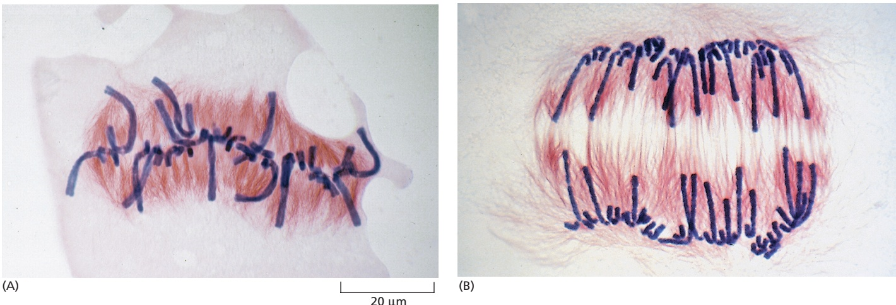

Figure 17–38 Sister-chromatid separation at anaphase. In the transition from metaphase (A) to anaphase (B), sister chromatids suddenly and synchronously separate and move toward opposite poles of the mitotic spindle—as shown in these light micrographs of Haemanthus (lily) endosperm cells that were stained with gold-labeled antibodies against tubulin (pink). (Courtesy of Andrew Bajer.)

We saw earlier that phosphorylation of various proteins by M-Cdk promotes spindle assembly, chromosome condensation, and nuclear-envelope breakdown in early mitosis. It is thus not surprising that the dephosphorylation of these same proteins is required for spindle disassembly and the re-formation of daughter nuclei in telophase. Dephosphorylation of Cdk targets depends in part on the inactivation of most Cdks in the cell, which results when the APC/C targets S- and M-cyclins for destruction. Protein dephosphorylation also results

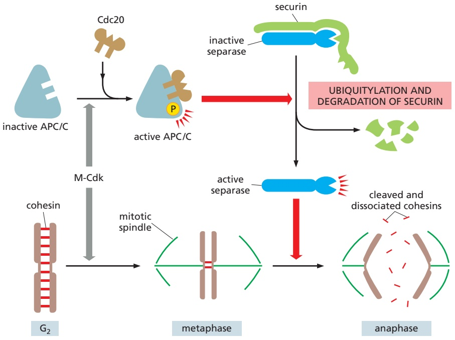

Figure 17–39 The initiation of sisterchromatid separation by the APC/C. The activation of APC/C by Cdc20 leads to the ubiquitylation and destruction of securin, which normally holds separase in an inactive state. The destruction of securin allows separase to cleave Scc1, a subunit of the cohesin complex holding the sister chromatids together (see Figure 17–23). The forces of the mitotic spindle then pull the sister chromatids apart. In animal cells, phosphorylation by Cdks also inhibits separase (not shown). Thus, Cdk inactivation in anaphase (resulting from cyclin destruction) also promotes separase activation by allowing its dephosphorylation.

Figure 17–40 Mad2 protein on unattached kinetochores. This fluorescence micrograph shows a mammalian cell in prometaphase, with the mitotic spindle in green and the sister chromatids in blue. One sister-chromatid pair is attached to only one pole of the spindle. Staining with anti-Mad2 antibodies indicates that Mad2 is bound to the kinetochore of the unattached sister chromatid (red dot, indicated by red arrow). A small amount of Mad2 is associated with the kinetochore of the sister chromatid that is attached to the spindle pole (pale dot, indicated by white arrow). (© 1998 J. Waters et al. Originally published in J. Cell Biol. https://doi.org/10.1083/jcb.141.5.1181. With permission from Rockefeller University Press.)

from activation of phosphatases. Recall from our earlier discussions, for example, that the phosphatase PP2A-B55 is inactivated by M-Cdk (see Figures 17–15 and 17–17). When Cdk activity declines after cyclin destruction, PP2A and other phosphatases are activated, further driving protein dephosphorylation and the completion of mitosis.

#### Unattached Chromosomes Block Sister-Chromatid Separation: The Spindle Assembly Checkpoint

Drugs that destabilize microtubules, such as colchicine or vinblastine (discussed in Chapter 16), arrest cells in mitosis for hours or even days. This observation led to the identification of a **spindle assembly checkpoint** mechanism that is activated by the drug treatment and blocks progression through the metaphase-to-anaphase transition. The checkpoint mechanism ensures that cells do not enter anaphase until all chromosomes are correctly bi-oriented on the mitotic spindle.

The spindle assembly checkpoint depends on a sensor mechanism that monitors microtubule attachment at the kinetochore. Any kinetochore that is not properly attached to microtubules sends out a diffusible negative signal that blocks APC/C–Cdc20 activation throughout the cell and thus blocks the metaphase-to-anaphase transition. When the last sister-chromatid pair is properly attached and bi-oriented, this block is removed, allowing sister-chromatid separation to occur.

The negative checkpoint signal depends on several proteins, including Mad2, which are recruited to unattached kinetochores (**Figure 17–40**). The unattached kinetochore acts as an enzyme that catalyzes a change in the conformation of Mad2, so that Mad2 then interacts with other proteins to form a large multiprotein complex that binds and thereby inhibits APC/C–Cdc20. When proper microtubule attachment is achieved, these inhibitory complexes are disassembled, and APC/C–Cdc20 inhibition is thereby relieved.

20 µm

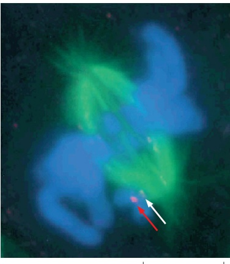

In mammalian cells, the spindle assembly checkpoint determines the normal timing of anaphase. The destruction of securin in these cells begins moments after the last sister-chromatid pair becomes bi-oriented on the spindle, and anaphase begins about 20 minutes later. Experimental inhibition of the checkpoint mechanism causes premature sister-chromatid separation and anaphase.

#### Chromosomes Segregate in Anaphase A and B

The sudden loss of sister-chromatid cohesion at the onset of anaphase leads to sister-chromatid separation, which allows the forces of the mitotic spindle to pull the sisters to opposite poles of the cell—called chromosome segregation. The chromosomes move by two independent and overlapping processes. The first, **anaphase A**, is the initial poleward movement of the chromosomes, which is accompanied by shortening of the kinetochore microtubules. The second, **anaphase B**, is the separation of the spindle poles themselves, which begins after the sister chromatids have separated and the daughter chromosomes have moved some distance apart (**Figure 17–41**).

Chromosome movement in anaphase A depends on a combination of the two major poleward forces described earlier. The first is the force generated by microtubule depolymerization at the kinetochore, which results in the loss of tubulin subunits at the plus end as the kinetochore moves toward the pole. The second is

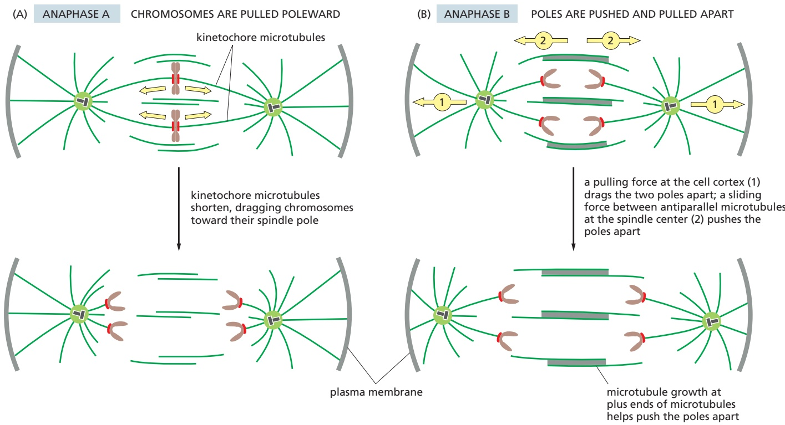

Figure 17–41 The two processes of anaphase in mammalian cells. (A) Separated sister chromatids move toward the poles in anaphase A. (B) In anaphase B, the two spindle poles move apart.

provided by microtubule flux, which is the poleward movement of the microtubules toward the spindle pole (see Figure 17–37). The relative importance of these two forces during anaphase varies in different cell types: in embryonic cells, chromosome movement depends mainly on microtubule flux, for example, whereas movement in yeast and vertebrate somatic cells results primarily from forces generated at the kinetochore.

Spindle-pole separation during anaphase B depends on motor-driven mecha-MBoC7 m17.40/17.41 nisms similar to those that separate the two centrosomes in early mitosis. Dynein motor proteins that anchor astral microtubule plus ends to the cell cortex pull the poles apart. Kinesin-5, which cross-links antiparallel microtubules at the center of the spindle, pushes the poles apart (see Figure 17–28).

Although sister-chromatid separation initiates the chromosome movements of anaphase A, other mechanisms also ensure correct chromosome movements in anaphase A and spindle elongation in anaphase B. Most important, the completion of a normal anaphase depends on the dephosphorylation of Cdk substrates, which in most cells results from the APC/C-dependent destruction of cyclins. If M-cyclin destruction is prevented—by the production of a mutant form that is not recognized by the APC/C, for example—sister-chromatid separation generally occurs, but the chromosome movements and microtubule behavior of anaphase are abnormal.

The relative contributions of anaphase A and anaphase B to chromosome segregation vary greatly, depending on the cell type. In mammalian cells, anaphase B begins shortly after anaphase A and stops when the spindle is about twice its metaphase length; in contrast, the spindles of yeasts and certain protozoa primarily use anaphase B to separate the chromosomes at anaphase, and their spindles elongate to up to 15 times their metaphase length.

#### Segregated Chromosomes Are Packaged in Daughter Nuclei at Telophase

By the end of anaphase, the daughter chromosomes have segregated into two equal groups at opposite ends of the cell. In **telophase**, the final stage of mitosis, the two sets of chromosomes are packaged into a pair of daughter nuclei. The first major event of telophase is the disassembly of the mitotic spindle, followed by the re-formation of the nuclear envelope. This process occurs in multiple stages. First, proteins on the surface of the chromosomes promote their interaction with each other, resulting in a compact cluster of all the chromosomes. Next, fragments of endoplasmic reticulum membrane containing inner nuclear-envelope proteins associate with the surface of the chromosome cluster, eventually fusing to re-form the complete nuclear envelope. Nuclear pore complexes are incorporated into the envelope, and the nuclear lamina re-forms. The pore complexes pump in nuclear proteins, the nucleus expands, and the mitotic chromosomes are reorganized into their less-condensed interphase state. A new nucleus has been created, and mitosis is complete. All that remains is for the cell to complete its division into two.

#### Summary

M-Cdk triggers the events of early mitosis, including chromosome condensation, assembly of the mitotic spindle, and bipolar attachment of the sister-chromatid pairs to microtubules of the spindle. Spindle assembly in animal cells depends on the nucleation of microtubules at multiple locations. Centrosomes, which are duplicated before mitosis and then separated in early mitosis, nucleate microtubules to help form the poles of the spindle. Spindle formation also depends on the ability of mitotic chromosomes to stimulate local microtubule formation and the ability of motor proteins to organize microtubules into a bipolar array. Anaphase is triggered by the APC/C, which stimulates the destruction of the proteins that hold the sister chromatids together. The APC/C also promotes cyclin destruction and thus the inactivation of M-Cdk. The resulting dephosphorylation of Cdk targets is required for the events that complete mitosis, including the disassembly of the spindle and the re-formation of the nuclear envelope.

#### CYTOKINESIS

The final step in the cell cycle is **cytokinesis**, the division of the cytoplasm in two. In most cells, cytokinesis follows every mitosis, although some cells, such as early Drosophila embryos and some mammalian hepatocytes and heart muscle cells, undergo mitosis without cytokinesis and thereby acquire multiple nuclei. In most animal cells, cytokinesis begins in anaphase and ends shortly after the completion of mitosis in telophase.

Cytokinesis begins in an animal cell with the appearance of a cleavage furrow on the cell surface. The furrow rapidly deepens and spreads around the cell until it completely divides the cell in two. The structure underlying this process is the contractile ring—a dynamic assembly composed of actin filaments, myosin II filaments, and many structural and regulatory proteins. During anaphase, the ring assembles just beneath the plasma membrane (**Figure 17–42**; see also Panel 17–1). The ring gradually contracts, and, at the same time, fusion of intracellular vesicles

Figure 17–42 Cytokinesis. (A) The actin– myosin bundles of the contractile ring are oriented as shown, so that their contraction pulls the membrane inward. (B) In this low-magnification scanning electron micrograph of a cleaving frog egg, the cleavage furrow is especially prominent, as the cell is unusually large. The furrowing of the cell membrane is caused by the activity of the contractile ring underneath it. (C) The surface of a furrow at higher magnification. (B and C, from H.W. Beams and R.G. Kessel, Am. Sci. 64:279–290, 1976. With permission from Sigma Xi.)

(A)

actin and myosin filaments of the contractile ring

(B)

(C)

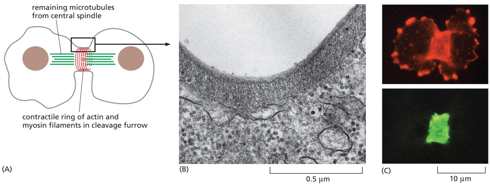

with the plasma membrane inserts new membrane. This addition of membrane compensates for the increase in surface area that accompanies cytoplasmic division. When ring contraction is completed, the contractile ring is disassembled, and the narrow membrane bridge between the daughter cells is severed.

Figure 17–43 The contractile ring. (A) A drawing of the cleavage furrow in a dividing cell. (B) An electron micrograph of the ingrowing edge of a cleavage furrow of a dividing animal cell. (C) Fluorescence micrographs of a dividing slime mold amoeba stained for actin (red) and myosin II (green). Whereas all of the visible myosin II has redistributed to the contractile ring, only some of the actin has done so; the rest remains in the cortex of the nascent daughter cells. (B, from H.W. Beams and R.G. Kessel, Am. Sci. 64:279–290, 1976. With permission from Sigma Xi. C, courtesy of Yoshio Fukui.)

#### Actin and Myosin II in the Contractile Ring Guide the Process of Cytokinesis

In interphase cells, actin and myosin II filaments form a cortical network underlying the plasma membrane. In some cells, they also form large cytoplasmic bundles called stress fibers (discussed in Chapter 16). As cells enter mitosis, these arrays of actin and myosin disassemble; much of the actin reorganizes, andMBoC7 m17.42/17.43 myosin II filaments are released. As the sister chromatids separate in anaphase, actin and myosin II begin to accumulate in the rapidly assembling **contractile ring** (**Figure 17–43**), which also contains numerous other proteins that provide structural support or assist in ring assembly. Assembly of the contractile ring results in part from the local formation of new actin filaments, which depends on formin proteins that nucleate the assembly of parallel arrays of linear, unbranched actin filaments (discussed in Chapter 16). After anaphase, the overlapping arrays of actin and myosin II filaments contract to generate the force that divides the cytoplasm in two. Once contraction begins, the ring exerts a force large enough to bend a fine glass needle that is inserted in its path. As the ring constricts, it maintains the same thickness, suggesting that its total volume and the number of filaments it contains decrease steadily. Moreover, unlike actin in muscle, the actin filaments in the ring are highly dynamic, and their arrangement changes continually during cytokinesis.

The contractile ring is finally dispensed with altogether when cleavage ends and the plasma membrane of the cleavage furrow narrows to form the **midbody**. The midbody persists as a tether between the two daughter cells and contains the remains of the central spindle, a large protein structure derived from the antiparallel microtubules of the spindle midzone, packed tightly together within a dense matrix material (**Figure 17–44**). Cytokinesis is completed by a process called abscission: the membranes on both sides of the midbody are constricted and severed by filaments formed from a polymeric protein called ESCRT-III.

#### Local Activation of RhoA Triggers Assembly and Contraction of the Contractile Ring

RhoA, a small GTPase of the Ras superfamily (see Table 15–5), controls the assembly and function of the contractile ring at the site of cleavage. RhoA is attached to the inner surface of the cell membrane at the future division site, where it promotes actin filament formation, myosin II assembly, and ring contraction. It stimulates actin filament formation by activating formins, and it promotes myosin II assembly and contractions by activating multiple protein kinases, including the Rho-associated kinase (ROCK) (**Figure 17–45**). These kinases phosphorylate the regulatory myosin light chain, a subunit of myosin II, thereby stimulating bipolar myosin II filament formation and motor activity.

RhoA is activated by a guanine nucleotide exchange factor (GEF) called Ect2, which stimulates the release of GDP and binding of GTP to RhoA (see Figure 17–45). Ect2 is localized to the division site and activated by complex mechanisms involving spindle microtubules, as we discuss next.

#### The Microtubules of the Mitotic Spindle Determine the Plane of Animal Cell Division

The central problem in cytokinesis is how to ensure that division occurs at the right time and in the right place. Cytokinesis must occur only after the two sets of chromosomes are fully segregated from each other, and the site of division must

Figure 17–45 Regulation of the contractile ring by the GTPase RhoA. Like other Rho family GTPases, RhoA is activated by a Rho GEF protein (called Ect2) and inactivated by a Rho GTPaseactivating protein (Rho GAP). By binding formins, activated RhoA promotes the assembly of actin filaments in the contractile ring. By activating Rho-associated protein kinases, such as ROCK, it stimulates myosin II filament formation and activity, thereby promoting contraction of the ring. Activation of RhoA at the future cleavage site depends on Ect2 activation by another protein complex called centralspindlin, discussed in the next section.

Figure 17–44 The midbody. (A) A scanning electron micrograph of a cultured animal cell dividing; the midbody still joins the two daughter cells. (B) A conventional electron micrograph of the midbody of a dividing animal cell. Cleavage is almost complete, but the daughter cells remain attached by this thin strand of cytoplasm containing the remains of the central spindle. Abscission results when the membranes on both sides of the dense midbody are constricted and severed. (A, courtesy of Guenter Albrecht-Buehler; B, courtesy of J.M. Mullins.)

(A)

Figure 17–46 Localization of cytokinesis regulators at the central spindle of the human cell. (A) At center is a cultured human cell at the beginning of cytokinesis, showing the locations of the GTPase RhoA (red) and a protein called Cyk4 (green), which is one of two subunits of centralspindlin, a protein complex that is concentrated at the overlapping plus ends of antiparallel microtubules. (B) When the same three-dimensional image is viewed in the plane of the contractile ring, as shown here, RhoA (red) is seen as a ring beneath the cell surface, while the centralspindlin subunit Cyk4 (green) is associated with microtubule bundles scattered throughout the equatorial plane of the cell. Note that the small population of centralspindlin at the cell cortex is not readily detected in these images. (Courtesy of Alisa Piekny and Michael Glotzer.)

10 µm

(B)

be placed between the two sets of daughter chromosomes, thereby ensuring that each daughter cell receives a complete set. The correct timing and positioning of cytokinesis in animal cells are achieved by mechanisms that depend on the mitotic spindle. During anaphase, the spindle generates signals that initiate furrow formation at a position midway between the spindle poles, thereby ensuring that division occurs between the two sets of separated chromosomes. Because these signals originate in the anaphase spindle, this mechanism also contributesMBoC7 m17.47/17.46 to the correct timing of cytokinesis in late mitosis.

Studies of the fertilized eggs of marine invertebrates first revealed the importance of spindle microtubules in determining the placement of the contractile ring. After fertilization, these embryos cleave rapidly without intervening periods of growth. In this way, the original egg is progressively divided into smaller and smaller cells. Because the cytoplasm is clear, the spindle can be observed in real time with a microscope. If the spindle is tugged into a new position with a fine glass needle in early anaphase, the incipient cleavage furrow disappears, and a new one develops in accord with the new spindle site—supporting the idea that signals generated by the spindle induce local furrow formation.

How does the mitotic spindle specify the site of division? The key mechanism appears to be that the midzone of the anaphase spindle generates a signal that promotes furrow formation at the cell cortex. The central component of this regulatory system is a two-subunit protein complex called centralspindlin, which forms oligomeric assemblies that are concentrated primarily on the antiparallel microtubules at the spindle midzone (**Figure 17–46**). Centralspindlin assembly at the midzone is stimulated by the protein kinase Aurora-B, which also localizes to the spindle midzone in anaphase (see Figure 17–45). Aurora-B localization to the central spindle depends on dephosphorylation of Cdk substrates, providing one mechanism that delays cytokinesis until anaphase.

Centralspindlin interacts with the RhoA GEF, Ect2, to activate RhoA at the equatorial cell cortex, halfway between the spindle poles (**Figure 17–47**). In some cell types, small subpopulations of centralspindlin and Ect2 can be seen to migrate from the spindle midzone to the cell cortex, where Ect2 then interacts with RhoA to trigger furrow formation (see Figure 17–45). The focusing of centralspindlin and Ect2 at the equator depends in part on the ability of astral microtubules to somehow inhibit centralspindlin localization outside the equatorial region.

In some cell types, the site of ring assembly is chosen before mitosis. In budding yeasts, for example, a ring of proteins called septins assembles in late $\mathrm { G _ { 1 } }$ at the future division site. The septins are thought to form a scaffold onto which other components of the contractile ring, including myosin II, assemble. In plant cells, an organized band of microtubules and actin filaments, called the **preprophase band**, assembles just before mitosis and marks the site where the cell wall will assemble and divide the cell in two, as we now discuss.

Figure 17–47 Activation of RhoA at the site of cleavage furrow formation. Centralspindlin multimers (blue) associate with the RhoA GEF, Ect2 (orange), at the spindle midzone. By uncertain mechanisms (dashed lines), some of these proteins move to the cortex at the equator of the cell, where they activate RhoA (purple) to trigger furrow formation. To focus the signal at the equator, the plus ends of astral microtubules use unknown mechanisms to inhibit the centralspindlin–Ect2 complex at other regions of the cortex.

#### The Phragmoplast Guides Cytokinesis in Higher Plants

In most animal cells, the inward movement of the cleavage furrow depends on anMBoC7 n17.106/17.47 increase in the surface area of the plasma membrane. New membrane is added primarily at the cleavage furrow and is generally provided by small membrane vesicles that are transported on microtubules from the Golgi apparatus to the furrow.

Membrane deposition is particularly important for cytokinesis in higher-plant cells. These cells are enclosed by a semirigid cell wall. Rather than a contractile ring dividing the cytoplasm from the outside in, the cytoplasm of the plant cell is partitioned from the inside out by the construction of a new cell wall, called the **cell plate**, between the two daughter nuclei (**Figure 17–48**; **Figure 17–49**). The assembly of the cell plate begins in late anaphase and is guided by a structure called the **phragmoplast**, which contains microtubules derived from the mitotic

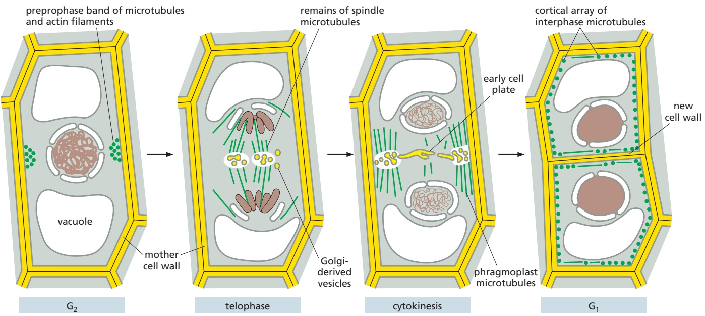

Figure 17–48 The special features of cytokinesis in a higher-plant cell. The division plane is established before M phase by a band of microtubules and actin filaments (the preprophase band) at the cell cortex. At the beginning of telophase, after the chromosomes have segregated, a new cell wall starts to assemble inside the cell at the equator of the old spindle. The microtubules of the mitotic spindle remaining at telophase form the phragmoplast. The plus ends of these microtubules no longer overlap but end at the cell equator. Golgi-derived vesicles, filled with cell-wall material, are transported along these microtubules and fuse to form the new cell wall, which grows outward to reach the plasma membrane and original cell wall. The plasma membrane and the membrane surrounding the new cell wall fuse, separating the two daughter cells.. / .

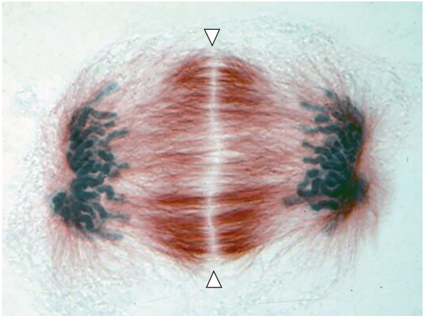

(A)

50 µm

(B)

5 µm

Figure 17–49 Cytokinesis in plant cells during telophase. (A) In this light micrograph, the early cell plate (between the two arrowheads) has formed in a plane perpendicular to the plane of the page. The microtubules of the spindle are stained with gold-labeled antibodies against tubulin, and the DNA in the two sets of daughter chromosomes is stained with a dark blue dye. Note that there are no astral microtubules, because there are no centrosomes in higher-plant cells. (B) In this fluorescence micrograph of a plant cell, DNA is stained blue and microtubules are red. A protein called Syntaxin (green) lies along the cell plate at the cell equator, where it is responsible for stimulating the fusion of Golgi vesicles delivering cell-wall materials. (A, courtesy of Andrew Bajer; B, from C.-M.K. Ho et al., Plant Cell 23:2909–2923, 2011. Republished with permission of American Society of Plant Biologists.)

spindle. Motor proteins transport small vesicles along these microtubules from the Golgi apparatus to the cell center. These vesicles, filled with polysaccharide and glycoproteins required for the synthesis of the new cell wall, fuse to form a disc-like, membrane-enclosed structure called the early cell plate. The plate expands outward by further vesicle fusion until it reaches the plasma membraneMBoC7 m17.48/17.49 and the original cell wall and divides the cell in two. Later, cellulose microfibrils are laid down within the matrix of the cell plate to complete the construction of the new cell wall.

#### Membrane-enclosed Organelles Must Be Distributed to Daughter Cells During Cytokinesis

The process of mitosis ensures that each daughter cell receives a full complement of chromosomes. When a eukaryotic cell divides, however, each daughter cell must also inherit all of the other essential cell components, including the membrane-enclosed organelles. As discussed in Chapter 12, organelles such as mitochondria and chloroplasts cannot be assembled de novo from their individual components; they can arise only by the growth and division of the preexisting organelles. Similarly, cells cannot make a new endoplasmic reticulum (ER) unless some part of it is already present.

How, then, do the various membrane-enclosed organelles segregate when a cell divides? Organelles such as mitochondria and chloroplasts are usually present in large enough numbers to be safely inherited if, on average, their numbers roughly double once each cycle. The ER in interphase cells is continuous with the nuclear membrane and is organized by the microtubule cytoskeleton. Upon entry into M phase, the reorganization of the microtubules and breakdown of the nuclear envelope releases the ER. In most cells, the ER remains largely intact and is cut in two during cytokinesis. The Golgi apparatus is reorganized and fragmented during mitosis. Golgi fragments associate with the spindle poles and are thereby distributed to opposite ends of the spindle, ensuring that each daughter cell inherits the materials needed to reconstruct the Golgi in telophase.

#### Some Cells Reposition Their Spindle to Divide Asymmetrically

Most animal cells divide symmetrically: the contractile ring forms around the equator of the parent cell, producing two daughter cells of equal size and with the same components. This symmetry results from the placement of the mitotic spindle, which in most cases tends to center itself in the cytoplasm. Astral microtubules and motor proteins that either push or pull on these microtubules contribute to the centering process.

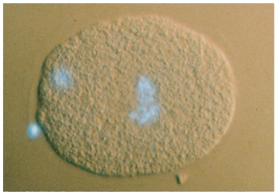

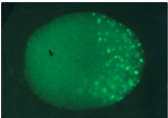

anterior

posterior

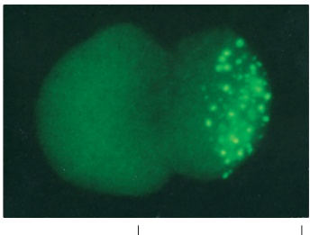

40 µm

Figure 17–50 An asymmetric cell division segregating cytoplasmic t t l d ht componen s o on y one aug er

There are many instances in development, however, when cells divide asymmetrically to produce two cells that differ in size, in the cytoplasmic contents they inherit, or in both. Usually, the two different daughter cells are destined to develop along different pathways. To create daughter cells with different fates in this way, the mother cell must first segregate certain components (called cell-fate determinants) to one side of the cell and then position the plane of division so that the appropriate daughter cell inherits these components (**Figure 17–50**). To position the plane of division asymmetrically, the spindle has to be moved in a controlled manner within the dividing cell. It seems likely that changes in local regions of the cell cortex direct such spindle movements and that motor proteins localized there pull one of the spindle poles, via its astral microtubules, to the appropriate region. Genetic analyses in Caenorhabditis elegans and Drosophila have identified some of the proteins required for such asymmetric divisions, and some of these proteins seem to have a similar role in vertebrates.

#### Mitosis Can Occur Without Cytokinesis

Although nuclear division is usually followed by cytoplasmic division, there are exceptions. Some cells undergo multiple rounds of nuclear division without intervening cytoplasmic division. In the early Drosophila embryo, for example, the first 13 rounds of nuclear division occur without cytoplasmic division, resulting in the formation of a single large cell containing several thousand nuclei that are arranged in a monolayer near the surface. A cell in which multiple nuclei share the same cytoplasm is called a **syncytium**. This arrangement greatly speeds up early development, as the cells do not have to take the time to go through all the steps of cytokinesis for each division. After these rapid nuclear divisions, membranes are created around each nucleus in one round of coordinated cytokinesis called cellularization. The plasma membrane extends inward and, with the help of an actin–myosin ring, pinches off to enclose each nucleus (**Figure 17–51**).

Nuclear division without cytokinesis also occurs in some types of mammalian cells. Megakaryocytes, which produce blood platelets, and some hepatocytes and muscle cells, for example, become multinucleated in this way.

#### Summary

After mitosis completes the formation of a pair of daughter nuclei, cytokinesis finishes the cell cycle by dividing the cell itself. Cytokinesis depends on a ring of actin and myosin filaments that contracts in late mitosis at a site midway between the segregated chromosomes. In animal cells, the positioning of the

cell. These light micrographs illustrate the controlled asymmetric segregation of specific cytoplasmic components to one daughter cell during the first division of a fertilized egg of the nematode C. elegans. The fertilized egg is shown in the left micrographs and the two daughter cells in the right micrographs. The cells above have been stained with a blue, DNA-binding, fluorescent dye to show the nucleus (and polar bodies); they are viewed by both differential-interference-contrast microscopy and fluorescence microscopy. The cells below are the same cells stained with an antibody against P-granules and viewed by fluorescence microscopy. These small granules are made of RNA and proteins and determine which cells become germ cells. They are distributed randomly throughout the cytoplasm of the unfertilized egg (not shown) but become segregated to the posterior pole of the fertilized egg. The cleavage plane is oriented to ensure that only the posterior daughter cell receives the P-granules when the egg divides. The same segregation process is repeated in several subsequent cell divisions, so that the P-granules end up only in cells that give rise to eggs and sperm. (Courtesy of Susan Strome.)

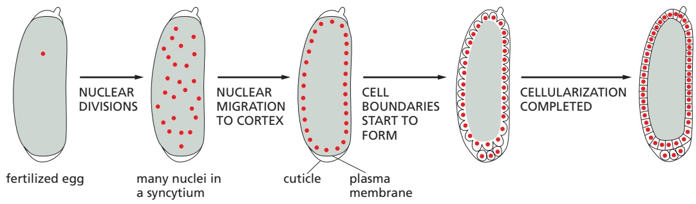

(A)

Figure 17–51 Mitosis without cytokinesis in the early Drosophila embryo. (A) The first 13 nuclear divisions occur synchronously and without cytoplasmic division to create a large syncytium. Most of the nuclei migrate to the cortex, and the plasma membrane extends inward and pinches off to surround each nucleus to form individual cells in a process called cellularization. (B) Fluorescence micrograph of multiple mitotic spindles in a Drosophila embryo before cellularization. The microtubules are stained green and the centrosomes red. Note that all the nuclei go through the cycle synchronously; here, they are all in metaphase, with the unlabeled chromosomes seen as a dark band at the spindle equator. (B, courtesy of Kristina Yu and William Sullivan.)

contractile ring is determined by proteins associated with the midzone microtubules of the anaphase spindle. Dephosphorylation of Cdk targets, which results from Cdk inactivation in anaphase, triggers cytokinesis at the correct time after anaphase.

#### MEIOSIS

Most eukaryotic organisms reproduce sexually: the genomes of two parents mix to generate offspring that are genetically distinct from either parent. The cells of these organisms are generally diploid; that is, they contain two slightly different copies, or homologs, of each chromosome, one from each parent. Sexual reproduction depends on a specialized nuclear division process called meiosis, which produces haploid cells carrying only a single copy of each chromosome. In many organisms, the haploid cells differentiate into specialized reproductive cells called gametes—eggs and sperm in most species. In these species, the reproductive cycle ends when a sperm and egg fuse to form a diploid zygote, which has the MBoC6 m17.51/17.51potential to form a new individual. In this section, we consider the basic mechanisms and regulation of meiosis, with an emphasis on how they compare with those of mitosis.

(B)

#### Meiosis Includes Two Rounds of Chromosome Segregation

Meiosis reduces the chromosome number by half using many of the same molecular machines and control systems that operate in mitosis. As in the mitotic cell cycle, the cell begins the meiotic program by duplicating its chromosomes in meiotic S phase, resulting in pairs of sister chromatids that are tightly linked along their entire lengths by cohesin complexes. Unlike mitosis, however, two successive rounds of chromosome segregation then occur (**Figure 17–52**). The first of these divisions (**meiosis I**) solves the problem, unique to meiosis, of segregating the homologs. The duplicated paternal and maternal homologs pair up alongside each other and become physically linked by the process of genetic recombination. These pairs of homologs, each containing a pair of sister chromatids, then line up on the first meiotic spindle. In the first meiotic anaphase, duplicated homologs rather than sister chromatids are pulled apart and segregated into the two daughter nuclei. Only in the second division (**meiosis II**), which occurs without further DNA replication, are the sister chromatids pulled apart and segregated (as in mitosis) to produce haploid daughter nuclei. In this way, each diploid nucleus that enters meiosis produces four haploid nuclei, each of which contains either the maternal or paternal copy of each chromosome, but not both (**Movie 17.7**).

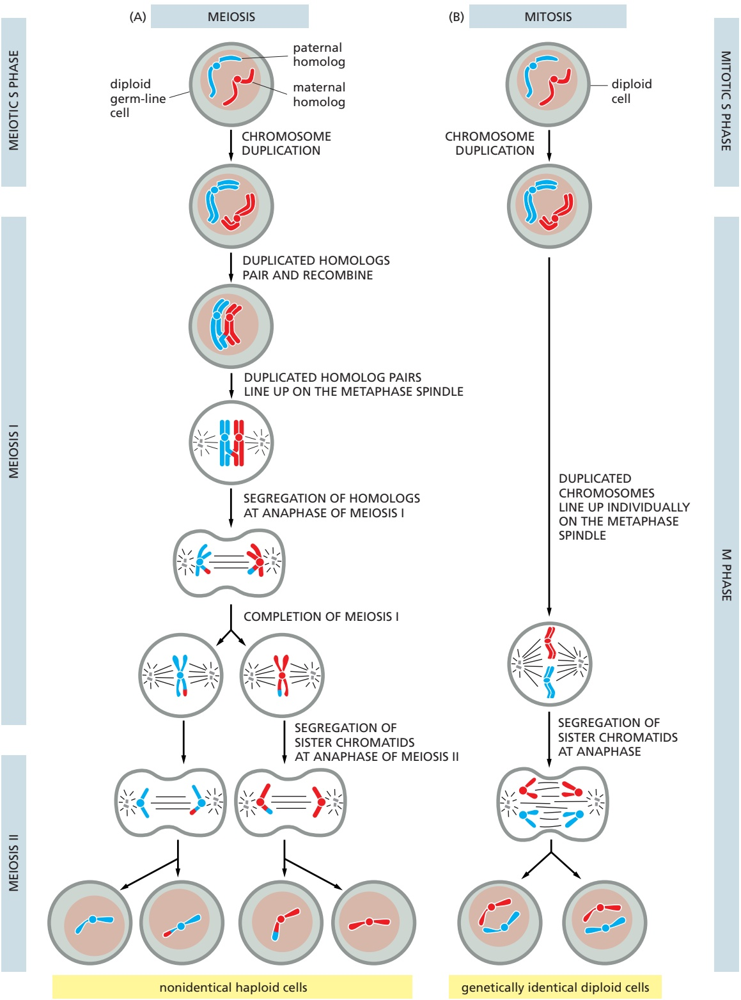

Figure 17–52 Comparison of meiosis and mitosis. For clarity, only one pair of homologous chromosomes (homologs) is shown. (A) Meiosis is a form of nuclear division in which a single round of chromosome duplication (meiotic S phase) is followed by two rounds of chromosome segregation. The duplicated homologs, each consisting of tightly bound sister chromatids, pair up and are segregated into different daughter nuclei in meiosis I; the sister chromatids are segregated in meiosis II. As indicated by the formation of chromosomes that are partly red and partly blue, homolog pairing in meiosis leads to genetic recombination (crossing-over) during meiosis I. Each diploid cell that enters meiosis therefore produces four genetically different haploid nuclei, which are distributed by cytokinesis into haploid cells that differentiate into gametes. (B) In mitosis, by contrast, homologs do not pair up, and the sister chromatids are segregated during the single division. Thus, each diploid cell that divides by mitosis produces two genetically identical diploid daughter nuclei, which are distributed by cytokinesis into a pair of daughter cells.

#### Duplicated Homologs Pair During Meiotic Prophase

During mitosis in most organisms, homologous chromosomes behave independently of each other. During meiosis I, however, it is crucial that homologs recognize each other and associate physically in order for the maternal and paternal homologs to be bi-oriented on the first meiotic spindle. Special mechanisms mediate these interactions.

The gradual juxtaposition of homologs occurs during a prolonged period called meiotic prophase (or prophase I), which can take hours in yeasts, days in mice, and weeks in higher plants. Like their mitotic counterparts, duplicated meiotic prophase chromosomes first appear as long threadlike structures, in which the sister chromatids are so tightly glued together that they appear as one. It is during early prophase I that the homologs begin to associate along their length in a process called **pairing**, which, in some organisms at least, begins with interactions between complementary DNA sequences (called pairing sites) in the two homologs. As prophase progresses, the homologs become more closely juxtaposed, forming a four-chromatid structure called a **bivalent** (**Figure 17–53A**). In most species, homolog pairs are then locked together by homologous recombination: DNA double-strand breaks are formed at several locations in each sister chromatid, resulting in large numbers of DNA recombination events between the homologs (as described in Chapter 5). Some of these events lead to reciprocal DNA exchanges called crossovers, where the DNA of a chromatid crosses over to become continuous with the DNA of a homologous chromatid (**Figure 17–53B**; also see Figure 5–53).

#### Homolog Pairing Culminates in the Formation of a Synaptonemal Complex

The paired homologs are brought into close juxtaposition, with their structural axes (axial cores) about 400 nm apart, by a mechanism that depends in most species on the double-strand DNA breaks that occur in sister chromatids. What pulls the axes together? One possibility is that the large protein machine, called a recombination complex, which assembles on a double-strand break in a chromatid, binds the matching DNA sequence in the nearby homolog and helps reel in this partner. This so-called presynaptic alignment of the homologs is followed by synapsis, in which the axial core of a homolog becomes tightly linked to the axial core of its partner by a closely packed array of transverse filaments to create a **synaptonemal complex**, which bridges the gap, now only 100 nm, between the homologs (**Figure 17–54**). Although crossing-over begins before the synaptonemal complex assembles, the final steps occur while the DNA is held in the complex.

Figure 17–53 Homolog pairing and crossing-over. (A) The structure formed by two closely aligned duplicated homologs is called a bivalent. As in mitosis, the sister chromatids in each homolog are tightly connected along their entire lengths and at their centromeres. At this stage, the homologs are usually joined by a protein complex called the synaptonemal complex (not shown; see Figure 17–54).MBoC7 m17.54/17.53 (B) A later-stage bivalent in which a single crossover has occurred between nonsister chromatids. It is only when the synaptonemal complex disassembles and the paired homologs separate a little at the end of prophase I, as shown, that the crossover is seen microscopically as a thin connection between the homologs called a chiasma.

Figure 17–54 Simplified schematic drawing of a synaptonemal complex. Each homolog is organized around a protein axial core, and the synaptonemal complex forms when these homolog axes are linked by rod-shaped transverse filaments. The axial core of each homolog also interacts with the cohesin complexes that hold the sister chromatids together (see Figure 9–28). (Modified from K. Nasmyth, Annu. Rev. Genet. 35:673–745, 2001.)

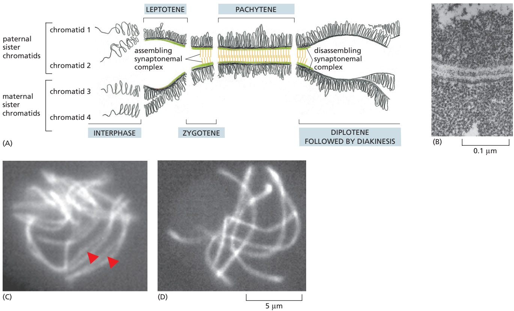

Figure 17–55 Homolog synapsis and desynapsis during the different stages of prophase I. (A) A single bivalent is shown schematically. At leptotene, the two sister chromatids coalesce, and their chromatid loops extend out from a common axial core. Assembly of the synaptonemal complex begins in early zygotene and is complete in pachytene. The complex disassembles in diplotene. (B) An electron micrograph of a synaptonemal complex from a meiotic cell at pachytene in a lily flower. (C and D) Immunofluorescence micrographs of prophase I cells of the fungus Sordaria. Partially synapsed bivalents at zygotene are shown in C and fully synapsed bivalents are shown in D. Red arrowheads in C point to regions where synapsis is still incomplete. (B, courtesy of Brian Wells; C and D, from A. Storlazzi et al., Genes Dev. 17:2675–2687, MBoC7 m2003. With permission from Cold Spring Harbor Laboratory Press.)

The morphological changes that occur during homolog pairing are the basis for dividing meiotic prophase into five sequential stages—leptotene, zygotene, pachytene, diplotene, and diakinesis (**Figure 17–55**). Prophase starts with leptotene, when homologs condense and pair and genetic recombination begins. At zygotene, the synaptonemal complex begins to assemble at sites where the homologs are closely associated and recombination events are occurring. At pachytene, the assembly process is complete, and the homologs are synapsed along their entire lengths (see Figure 9–28). The pachytene stage can persist for days or longer, until desynapsis begins at diplotene with the disassembly of the synaptonemal complex and the concomitant condensation and shortening of the chromosomes. It is only at this stage, after the complex has disassembled, that the individual crossover events between nonsister chromatids can be seen as inter-homolog connections called **chiasmata** (singular, **chiasma**), which now play a crucial part in holding the compact homologs together (**Figure 17–56**). The homologs are now ready to begin the process of segregation.

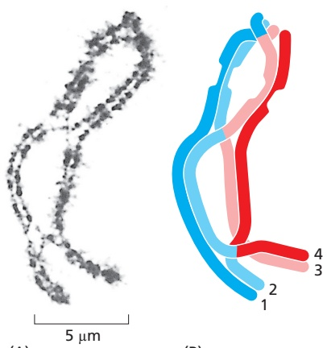

(A)

(B)

<small>Figure 17–56 A bivalent with three chiasmata resulting from three crossover events. (A) Light micrograph of a grasshopper bivalent. (B) Schematic of the three crossovers shown in A. Each sister chromatid is numbered. Note how the combination of the chiasmata and the tight attachment of the sister chromatid arms to each other (mediated by cohesin complexes) holds the two homologs together after the synaptonemal complex has disassembled; if either the chiasmata or the sister-chromatid cohesion failed to form, the homologs would come apart at this stage and not be segregated properly in meiosis I. (A, courtesy of Bernard John.)</small>

#### Homolog Segregation Depends on Several Unique Features of Meiosis I

A fundamental difference between meiosis I and mitosis (and meiosis II) is that in meiosis I, homologs rather than sister chromatids separate and then segregate (see Figure 17–52). This difference depends on three features of meiosis I that distinguish it from mitosis (**Figure 17–57**).

First, both sister kinetochores in a homolog must attach stably to the same spindle pole. This type of attachment is normally avoided during mitosis (see Figure 17–35). In meiosis I, however, the two sister kinetochores are fused into a single microtubule-binding unit that attaches to just one pole (see Figure 17–57A). The fusion of sister kinetochores is achieved by a complex of proteins that is localized at the kinetochores in meiosis I, but we do not know in any detail how these proteins work. They are removed from kinetochores after meiosis I, so that in meiosis II the sister-chromatid pairs can be bi-oriented on the spindle as they are in mitosis.

Second, crossovers generate a strong physical linkage between homologs, allowing their bi-orientation at the equator of the spindle—much like cohesion between sister chromatids is important for their bi-orientation in mitosis (and meiosis II). Crossovers hold homolog pairs together only because the arms of the sister chromatids are connected by sister-chromatid cohesion (see Figure 17–57A).

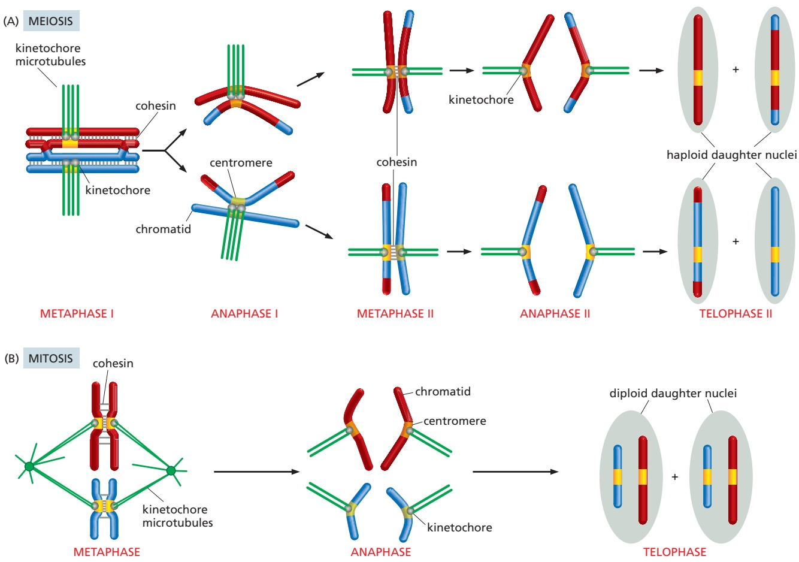

Figure 17–57 Comparison of chromosome behavior in meiosis I, meiosis II, and mitosis. Chromosomes behave similarly in mitosis and meiosis II, but they behave very differently in meiosis I. (A) In meiosis I, the two sister kinetochores are located side-by-side on each homolog and attach to microtubules from the same spindle pole. The proteolytic cleavage of cohesin along the sister-chromatid arms unglues the arms and resolves the crossovers, allowing the duplicated homologs to separate at anaphase I, while the residual cohesin at the centromeres keeps the sisters together. Cleavage of centromeric cohesin allows the sister chromatids to separate at anaphase II. (B) In mitosis, by contrast, the two sister kinetochores attach to microtubules from different spindle poles, and the two sister chromatids come apart at the start of anaphase and segregate into separate daughter nuclei.

Third, cohesin is removed in anaphase I only from chromosome arms and not from the regions near the centromeres, where the kinetochores are located. The loss of arm cohesion triggers homolog separation at the onset of anaphase I. This process depends on APC/C activation, which leads to securin destruction, separase activation, and cohesin cleavage along the arms (see Figure 17–39).

Cohesins near the centromeres are protected from separase in meiosis I by a kinetochore-associated protein called shugoshin (from the Japanese word for “guardian spirit”). Shugoshin acts by recruiting a protein phosphatase that removes phosphates from centromeric cohesins. Cohesin phosphorylation is normally required for separase to cleave cohesin; thus, removal of this phosphorylation near the centromere prevents cohesin cleavage. Sister-chromatid pairs therefore remain linked through meiosis I, allowing their correct bi-orientation on the spindle in meiosis II. Shugoshin is inactivated after meiosis I. At the onset of anaphase II, APC/C activation triggers centromeric cohesin cleavage and sister-chromatid separation—much as it does in mitosis. After anaphase II, nuclear envelopes form around the chromosomes to produce four haploid nuclei, after which cytokinesis and other differentiation processes lead to the production of haploid gametes.

#### Crossing-Over Is Highly Regulated

Crossing-over has two distinct functions in meiosis: it helps hold homologs together so that they are properly segregated to the two daughter nuclei produced by meiosis I, and it contributes to the genetic diversification of the gametes that are eventually produced. As might be expected, therefore, crossing-over is highly regulated: the number and location of double-strand breaks along each chromosome are controlled, as is the likelihood that a break will be converted into a crossover. On average, the result of this regulation is that each pair of human homologs is linked by about two or three crossovers (**Figure 17–58**).

Although the double-strand breaks that occur in meiosis I can be located almost anywhere along the chromosome, they are not distributed uniformly: they cluster at “hot spots,” where the DNA is accessible, and occur only rarely in “cold spots,” such as the heterochromatin regions around centromeres and telomeres.

At least two kinds of regulation influence the location and number of cross-overs that form, neither of which is well understood. Both operate before the synaptonemal complex assembles. One ensures that at least one crossover forms between the members of each homolog pair, as is necessary for normal homolog segregation in meiosis I. In the other, called crossover interference, the presence of one crossover event inhibits another from forming close by, perhaps by locally depleting proteins required for converting a double-strand DNA break into a stable crossover.

10 µm

Figure 17–58 Crossovers between homologs in the human testis. In these immunofluorescence micrographs, antibodies were used to stain the synaptonemal complexes (red), the centromeres (blue), and the sites of crossing-over (green). Note that all of the bivalents have at least one crossover and none have more than four. (Modified from A. Lynn et al., Science 296:2222–2225, 2002. With permission from AAAS.)

#### Meiosis Frequently Goes Wrong

The sorting of chromosomes that takes place during meiosis is a remarkable feat of intracellular bookkeeping. In humans, each meiosis requires that the starting cell keep track of 92 chromatids (46 chromosomes, each of which has duplicated), distributing one complete set of each type of autosome to each of the four haploid progeny. Not surprisingly, mistakes can occur in allocating the chromosomes during this elaborate process. Mistakes are especially common in human female meiosis, which arrests for years after diplotene: meiosis I is completed only at ovulation, and meiosis II only after the egg is fertilized. Indeed, such chromosome segregation errors during egg development are the most common cause of spontaneous abortion (miscarriage) and intellectual disability in humans.

When homologs fail to separate properly—a phenomenon called **nondisjunction**—the result is that some of the resulting haploid gametes lack a particular chromosome, while others have more than one copy of it. Upon fertilization, these gametes form abnormal embryos, most of which die. Some survive, however. Down syndrome in humans, for example, which is the leading cause of intellectual disability, is caused by an extra copy of chromosome 21, usually resulting from nondisjunction during meiosis I in the female ovary. Segregation errors during meiosis I increase greatly with advancing maternal age.

#### Summary

Haploid gametes are produced by meiosis, in which a diploid nucleus undergoes two successive cell divisions after one round of DNA replication. Meiosis is dominated by a prolonged prophase. At the start of prophase, the chromosomes have replicated and consist of two tightly joined sister chromatids. Homologous chromosomes then pair up and become progressively more closely juxtaposed as prophase proceeds. The tightly aligned homologs undergo genetic recombination, forming crossovers that help hold each pair of homologs together during metaphase I. Meiosis-specific, kinetochore-associated proteins help ensure that both sister chromatids in a homolog attach to the same spindle pole; other kinetochore-associated proteins ensure that the homologs remain connected at their centromeres during anaphase I, so that homologs rather than sister chromatids are segregated in meiosis I. After meiosis I, meiosis II follows rapidly, without DNA replication, in a process that resembles mitosis, in that sister chromatids are pulled apart at anaphase.

<!-- END EN EN17-H021-H061 -->
