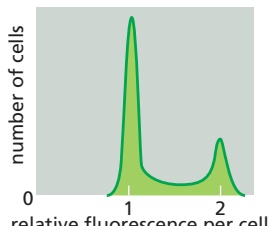
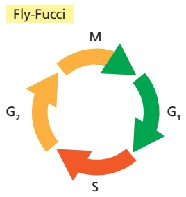
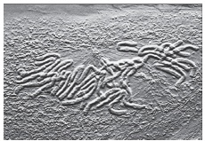

# 第12章 细胞周期与细胞分裂 · 英文习题与参考文献

### 英文补充：习题与参考文献

> 对应中文板块：习题与参考文献。英文来源：Molecular Biology of the Cell，第7版，第17章；[本章完整原文](../来源/英文教材/17_The_Cell_Cycle/chapter.md)。物理PDF页码范围：1066–1127（整章范围）。

<!-- BEGIN EN EN17-EXERCISES -->
#### PROBLEMS

Which statements are true? Explain why or why not.

17–1 As there are about $1 0 ^ { 1 3 }$ cells in an adult human, and about $1 0 ^ { 1 0 }$ cells die and are replaced each day, we become new people every 3 years.

17–2 All three of the major cell-cycle transitions—Start, $\mathrm { G _ { 2 } / M , }$ and metaphase-to-anaphase—depend on the activity of Cdks.

17–3 Initiation of DNA synthesis is permitted only at origins of replication that are licensed by being loaded with Mcm complexes.

17–4 Chromosomes are positioned on the metaphase plate by equal and opposite forces that pull them toward the two poles of the spindle.

17–5 Meiosis segregates the paternal homologs into sperm and the maternal homologs into eggs.

17–6 If we could turn on telomerase activity in all our cells, we could prevent aging.

Discuss the following problems.

17–7 Some cell-cycle genes from human cells function perfectly well when expressed in yeast cells. Why do you suppose that is considered remarkable? After all, many human genes encoding enzymes for metabolic reactions also function in yeast, and no one thinks that is remarkable.

17–8 Hoechst 33342 is a membrane-permeant dye that fluoresces when it binds to DNA. When a population of cells is incubated briefly with the Hoechst dye and then sorted in a flow cytometer, which measures the fluorescence of each cell, the cells display various levels of fluorescence as shown in **Figure Q17–1**.

Figure Q17–1 Analysis of Hoechst 33342 fluorescence in a population of cells sorted in a flow cytometer (Problem 17–8).

A. Which cells in Figure Q17–1 are in the $\mathrm { G _ { 1 } ,   S ,   G _ { 2 } } ,$ and M phases of the cell cycle? Explain the basis for your answer.

B. Sketch the sorting distributions you would expect for cells that were treated with inhibitors that block the cell cycle in the $\mathbf { G } _ { 1 } , \mathbf { S } ,$ or M phase. Explain your reasoning.

17–9 A two-component Fucci (fluorescent ubiquitylation-based cell-cycle indicator) used in fruit flies gives different-colored cells at different points in the cell cycle, as shown in **Figure Q17–2**. If this result was obtained by tagging protein A with GFP (green) and protein B with RFP (red), when during the cell cycle are these proteins expressed?

Figure Q17–2 A two-component Fucci system in fruit flies (Problem 17–9). (From Figure 5a of N. Zielke and B.A. Edgar, Wiley Interdiscip. Rev. Dev. Biol. 4:469–487, 2015. With permission from Wiley.)

A. Protein A in $\mathbf { G } _ { 1 } , \mathbf { S } ,$ and $\mathrm { G } _ { 2 } ;$ protein B in $\mathbf { G } _ { 1 } , \mathbf { S } ,$ and $\mathrm { G } _ { 2 }$ B. Protein A in $\mathbf { G } _ { 2 } , \mathbf { M } ,$ and $\mathrm { G } _ { 1 } ;$ protein B in $\mathrm { S } , \mathrm { G _ { 2 } } ,$ and early M

C. Protein A in late M and $\mathbf { G } _ { 1 } ;$ protein B in S

D. Protein A in late $\begin{array} { r } { \mathrm { M } , \mathrm { G } _ { 1 } , } \end{array}$ and S; protein B in $\mathrm { G } _ { 2 }$ and early M

17–10 What specific event does the cell-cycle control system stimulate at the metaphase-to-anaphase transition?

17–11 Which one of the following combinations of activities of a protein kinase and a protein phosphatase would give the highest activity for a target protein that is most active when phosphorylated?

A. Kinase OFF; phosphatase OFF

B. Kinase OFF; phosphatase ON

C. Kinase ON; phosphatase OFF

D. Kinase ON; phosphatase ON

17–12 The yeast cohesin subunit Scc1, which is essential for sister-chromatid cohesion, can be artificially regulated for expression at any point in the cell cycle. If expression is turned on at the beginning of S phase, all the cells divide satisfactorily and survive. By contrast, if Scc1 expression is turned on only after S phase is completed, the cells fail to divide and they die, even though Scc1 accumulates in the nucleus and interacts efficiently with chromosomes. Why do you suppose that cohesin must be present during S phase for cells to divide normally?

17–13 A living cell from the lung epithelium of a newt is shown at different stages in M phase in **Figure Q17–3**. Order these light micrographs into the correct sequence and identify the stage in M phase that each represents.

(A)

(B)

(C)

(D)

(E)

(F)

Figure Q17–3 Light micrographs of a single cell at different stages of M phase (Problem 17–13). (Courtesy of Conly L. Rieder.)

17–14 How many kinetochores are there in a human cell at mitosis?

17–15 If a cell just entering mitosis is treated with nocodazole, which destabilizes microtubules, the nuclear envelope breaks down and chromosomes condense, but no spindle forms and the cell cycle arrests in mitosis. In contrast, if such a cell is treated with cytochalasin D, which destabilizes actin filaments, mitosis proceeds normally but generates a binucleate cell that proceeds into $\mathrm { G _ { 1 } }$ phase. Explain the basis for the different outcomes of these treatments with cytoskeleton inhibitors. What do these results tell you about cell-cycle checkpoints in M phase?

17–16 Early on in the study of recombination during meiosis, geneticists concluded that there was about one crossover per chromosome arm. Using fluorescent tags that stain the synaptonemal complex red, the centromeres blue, and the crossovers green, it is now possible to observe directly the distribution of crossovers in chromosomes.7 17.101/ 17.04 For the 13 complete bivalents shown in **Figure Q17–4**, how many have more than one crossover in the arm of a chromosome?

Figure Q17–4 Crossovers between homologs in human cells (Problem 17–16). (Modified from A. Lynn et al., Science 296:2222–2225, 2002. With permission from AAAS.)

17–17 Down syndrome (trisomy 21) and Edwards syndrome (trisomy 18) are the most common autosomal trisomies seen in human infants. Does this fact mean that these chromosomes are the most difficult to segregate properly during meiosis?

17–18 The human genome consists of 23 pairs of chromosomes (22 pairs of autosomes and one pair of sex chromosomes). During meiosis, the maternal and paternal sets of homologs pair, and then are separated into gametes, so that each contains 23 chromosomes. If you assume that the chromosomes in the paired homologs are randomly assorted to daughter cells, how many potential combinations of paternal and maternal homologs can be generated during meiosis? (For the purposes of this calculation, assume that no recombination occurs.)

17–19 High doses of caffeine interfere with the DNA damage response in mammalian cells. Why then do you suppose the Surgeon General has not yet issued an appropriate warning to heavy coffee and cola drinkers? A typical cup of coffee (150 mL) contains 100 mg of caffeine (196 g/mole). Assuming that the caffeine is not metabolized or excreted (but that all the liquid is), approximately how many cups of coffee would you have to drink to reach the dose (10 mM) required to interfere with the DNA damage response? (A typical adult contains about 40 liters of water.)

#### REFERENCES

#### General

Morgan DO (2007) The Cell Cycle: Principles of Control. London: New Science Press.

#### The Cell-Cycle Control System

Alfieri C, Zhang S & Barford D (2017) Visualizing the complex functions and mechanisms of the anaphase promoting complex/cyclosome (APC/C). Open Biol. 7, 170204.

Echalier A, Endicott JA & Noble ME (2010) Recent developments in cyclin-dependent kinase biochemical and structural studies. Biochim. Biophys. Acta 1804, 511–519.

Evans T, Rosenthal ET, Youngblom J, Distel D & Hunt T (1983) Cyclin: a protein specified by maternal mRNA in sea urchin eggs that is destroyed at each cleavage division. Cell 33, 389–396.

Hartwell LH, Culotti J, Pringle JR & Reid BJ (1974) Genetic control of the cell division cycle in yeast. Science 183, 46–51.

Holder J, Poser E & Barr FA (2019) Getting out of mitosis: spatial and temporal control of mitotic exit and cytokinesis by PP1 and PP2A. FEBS Lett. 593, 2908–2924.

Holt LJ, Tuch BB, Villen J, Johnson AD, Gygi SP & Morgan DO (2009) Global analysis of Cdk1 substrate phosphorylation sites provides insights into evolution. Science 325, 1682–1686.

Kamenz J, Gelens L & Ferrell JE, Jr. (2021) Bistable, biphasic regulation of PP2A-B55 accounts for the dynamics of mitotic substrate phosphorylation. Curr. Biol. 31, 794–808.

Novak B & Tyson JJ (2021) Mechanisms of signalling-memory governing progression through the eukaryotic cell cycle. Curr. Opin. Cell Biol. 69, 7–16.

Nurse P, Thuriaux P & Nasmyth K (1976) Genetic control of the cell division cycle in the fission yeast Schizosaccharomyces pombe. Mol. Gen. Genet. 146, 167–178.

Örd M & Loog M (2019) How the cell cycle clock ticks. Mol. Biol. Cell 30, 169-172.

#### S Phase

Arias EE & Walter JC (2007) Strength in numbers: preventing rereplication via multiple mechanisms in eukaryotic cells. Genes Dev. 21, 497–518.

Bell SP & Labib K (2016) Chromosome duplication in Saccharomyces cerevisiae. Genetics 203, 1027–1067.

Li H & O’Donnell ME (2018) The eukaryotic CMG helicase at the replication fork: emerging architecture reveals an unexpected mechanism. Bioessays 40(3).

Siddiqui K, On KF & Diffley JF (2013) Regulating DNA replication in eukarya. Cold Spring Harb. Perspect. Biol. 5, a012930.

Tanaka S & Araki H (2013) Helicase activation and establishment of replication forks at chromosomal origins of replication. Cold Spring Harb. Perspect. Biol. 5, a010371.

#### Mitosis

Banterle N & Gonczy P (2017) Centriole biogenesis: from identifying the characters to understanding the plot. Annu. Rev. Cell Dev. Biol. 33, 23–49.

Champion L, Linder MI & Kutay U (2017) Cellular reorganization during mitotic entry. Trends Cell Biol. 27, 26–41.

Davidson IF & Peters JM (2021) Genome folding through loop extrusion by SMC complexes. Nat. Rev. Mol. Cell Biol. 22, 445–464.

Dey G & Baum B (2021) Nuclear envelope remodelling during mitosis. Curr. Opin. Cell Biol. 70, 67–74.

Hinshaw SM & Harrison SC (2018) Kinetochore function from the bottom up. Trends Cell Biol. 28, 22–33.

Lampson MA & Grishchuk EL (2017) Mechanisms to avoid and correct erroneous kinetochore-microtubule attachments. Biology (Basel) 6, 1.

McIntosh JR (2016) Mitosis. Cold Spring Harb. Perspect. Biol. 8, a023218.

Musacchio A (2015) The molecular biology of spindle assembly checkpoint signaling dynamics. Curr. Biol. 25, R1002–R1018.

Musacchio A & Desai A (2017) A molecular view of kinetochore assembly and function. Biology (Basel) 6, 5.

Nigg EA & Holland AJ (2018) Once and only once: mechanisms of centriole duplication and their deregulation in disease. Nat. Rev. Mol. Cell Biol. 19, 297–312.

Oriola D, Needleman DJ & Brugues J (2018) The physics of the metaphase spindle. Annu. Rev. Biophys. 47, 655–673.

Paulson JR, Hudson DF, Cisneros-Soberanis F & Earnshaw WC (2021) Mitotic chromosomes. Semin. Cell Dev. Biol. 117, 7–29.

Petry S (2016) Mechanisms of mitotic spindle assembly. Annu. Rev. Biochem. 85, 659–683.

Prosser SL & Pelletier L (2017) Mitotic spindle assembly in animal cells: a fine balancing act. Nat. Rev. Mol. Cell Biol. 18, 187–201.

Yatskevich S, Rhodes J & Nasmyth K (2019) Organization of chromosomal DNA by SMC complexes. Annu. Rev. Genet. 53, 445–482.

Yi P & Goshima G (2018) Microtubule nucleation and organization without centrosomes. Curr. Opin. Plant Biol. 46, 1–7.

#### Cytokinesis

Basant A & Glotzer M (2018) Spatiotemporal regulation of RhoA during cytokinesis. Curr. Biol. 28, R570–R580.

Fremont S & Echard A (2018) Membrane traffic in the late steps of cytokinesis. Curr. Biol. 28, R458–R470.

Glotzer M (2017) Cytokinesis in metazoa and fungi. Cold Spring Harb. Perspect. Biol. 9, a022343.

Livanos P & Muller S (2019) Division plane establishment and cytokinesis. Annu. Rev. Plant Biol. 70, 239–267.

Pollard TD & O’Shaughnessy B (2019) Molecular mechanism of cytokinesis. Annu. Rev. Biochem. 88, 661–689.

Rappaport R (1986) Establishment of the mechanism of cytokinesis in animal cells. Int. Rev. Cytol. 105, 245–281.

#### Meiosis

Gray S & Cohen PE (2016) Control of meiotic crossovers: from doublestrand break formation to designation. Annu. Rev. Genet. 50, 175–210.

Hughes SE & Hawley RS (2020) Alternative synaptonemal complex structures: too much of a good thing? Trends Genet. 36, 833–844.

Hunter N (2015) Meiotic recombination: the essence of heredity. Cold Spring Harb. Perspect. Biol. 7, a016618.

Petronczki M, Siomos MF & Nasmyth K (2003) Un ménage à quatre: the molecular biology of chromosome segregation in meiosis. Cell 112, 423–440.

Subramanian VV & Hochwagen A (2014) The meiotic checkpoint network: step-by-step through meiotic prophase. Cold Spring Harb. Perspect. Biol. 6, a016675.

Webster A & Schuh M (2017) Mechanisms of aneuploidy in human eggs. Trends Cell Biol. 27, 55–68.

Zickler D & Kleckner N (2015) Recombination, pairing, and synapsis of homologs during meiosis. Cold Spring Harb. Perspect. Biol. 7, a016626.

Zickler D & Kleckner N (2016) A few of our favorite things: pairing, the bouquet, crossover interference and evolution of meiosis. Semin. Cell Dev. Biol. 54, 135–148.

#### Control of Cell Division and Cell Growth

Bertoli C, Skotheim JM & de Bruin RA (2013) Control of cell cycle transcription during G1 and S phases. Nat. Rev. Mol. Cell Biol. 14, 518–528.

Blackford AN & Jackson SP (2017) ATM, ATR, and DNA-PK: the trinity at the heart of the DNA damage response. Mol. Cell 66, 801–817.

Boutelle AM & Attardi LD (2021) p53 and tumor suppression: it takes a network. Trends Cell Biol. 31, 298–310.

Dick FA & Rubin SM (2013) Molecular mechanisms underlying RB protein function. Nat. Rev. Mol. Cell Biol. 14, 297–306.

Rubin SM, Sage J & Skotheim JM (2020) Integrating old and new paradigms of G1/S control. Mol. Cell 80, 183–192.

Saxton RA & Sabatini DM (2017) mTOR signaling in growth, metabolism, and disease. Cell 168, 960–976.

Sharpless NE & Sherr CJ (2015) Forging a signature of in vivo senescence. Nat. Rev. Cancer 15, 397–408.

Shimobayashi M & Hall MN (2014) Making new contacts: the mTOR network in metabolism and signalling crosstalk. Nat. Rev. Mol. Cell Biol. 15, 155–162.

Vollmer J, Casares F & Iber D (2017) Growth and size control during development. Open Biol. 7, 170190.

Zatulovskiy E & Skotheim JM (2020) On the molecular mechanisms regulating animal cell size homeostasis. Trends Genet. 36, 360–372.
<!-- END EN EN17-EXERCISES -->
