# 第13章 细胞增殖调控与癌细胞 · 双教材整合

按中文节顺序保留正文，在每节末插入对应英文内容。

---

## 第13章 细胞增殖调控与癌细胞 · 章首导读

[返回本章](README.md) · [中文本章原文](中文原文.md)

<!-- BEGIN CN CN13-S00 -->
# 第13章 细胞增殖调控与癌细胞

<!-- 章节边界按正文内容恢复；原始 MinerU 内容保留如下。 -->

# 细胞增殖调控与癌细胞

细胞增殖是生物繁殖和生长发育的基础，是细胞重大生命活动之一。细胞增殖是通过细胞周期来实现的，这是一个高度严格受控的细胞生命活动过程。为确保细胞增殖这一生命过程严格有序地进行，细胞内发展了一系列调控机制，在细胞周期不同阶段有一系列检查点对该过程进行严密监控。任何细胞，不管是简单的单细胞，还是高等生物体内的细胞，其增殖过程都必须遵循一定的规律。例如，遗传物质DNA在没有完全复制之前，细胞不能分裂；在DNA复制准备阶段尚未完成之前，DNA不能起始复制等。在细胞增殖过程中，任何一个关键步骤的错误，都有可能引起严重后果，或者引发细胞癌变，或者导致细胞死亡。在高等生物中，细胞增殖调控更为复杂。它不仅要遵循细胞自身的增殖调控规律，同时还要服从生物体整体的调控。不然，不受约束而生成的细胞将被机体免疫系统所清除，或者癌变，转化为癌细胞。癌细胞不仅表现出增殖失控，同时还具有浸润和转移的特征，最终导致个体的死亡。

在本章我们将重点介绍细胞增殖调控的机制以及癌细胞的发生。

<!-- END CN CN13-S00 -->

---

## 第13章 细胞增殖调控与癌细胞 · 第一节 细胞增殖调控

[返回本章](README.md) · [中文本章原文](中文原文.md)

<!-- BEGIN CN CN13-S01 -->
## 第一节 细胞增殖调控

人们开展细胞周期调控研究已有几十年历史。在

20 世纪五六十年代，S 期的发现和细胞周期中 4 个时相的划分，使细胞周期调控研究辉煌多时。最近 30 多年，细胞周期调控研究再现辉煌，并取得了突飞猛进的发展，获得了许多突破性成果。

## 一、MPF 的发现及其作用

MPF，即卵细胞成熟促进因子（maturation-promoting factor），或细胞有丝分裂促进因子（mitosis-promoting factor），也称M期促进因子（M-phase-promoting factor）。MPF最早发现并被命名于20世纪70年代初期。随后的工作不仅逐步鉴定了MPF的构成，同时也逐步证明了其在细胞周期调控中的重要作用。

1970年，R. T. Johnson和P. N. Rao将HeLa细胞同步化在细胞周期中的不同时相，然后将M期细胞与其他间期细胞在仙台病毒介导下融合，并继续培养一定时间。他们发现，与M期细胞融合的间期细胞发生了形态各异的染色体凝缩，并称之为早熟染色体凝缩(premature chromosome condensation, PCC)。此种染色体则称为早熟凝缩染色体。不同时期的间期细胞与M期细胞融合，产生的PCC的形态各不相同。G期PCC为细单线状，S期PCC为粉末状，G期PCC为双线染色体状（图13-1）。PCC的这种形态变化可能与DNA复制状态有关。早熟染色体凝缩在其他细胞中也被证明。M期细胞可以诱导PCC，提示在M期细胞中可能存在一种诱导染色体凝缩的因子，称为细胞有丝分裂促进因子。

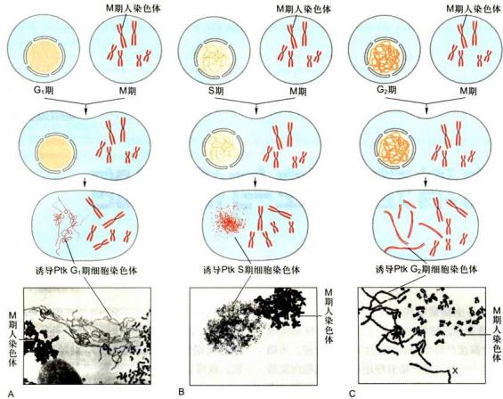  
图13-1 M期细胞与 $\mathsf{G}_1$ 、S和 $\mathsf{G}_2$ 期细胞融合诱导早熟染色体凝缩  
A. M 期细胞与 G₁ 期细胞融合。B. M 期细胞与 S 期细胞融合。C. M 期细胞与 G₂ 期细胞融合。(Rao 博士惠赠)

1971年，Y. Masui和C.L. Markert用非洲爪蟾卵做实验，明确提出了MPF这一概念。非洲爪蟾卵细胞发育过程可以划分为6个阶段，即第I、II、III、IV、V和VI期。第I至IV期为卵母细胞生成和生长阶段。第IV期卵母细胞达到一定体积，停止生长，等待成熟。此时的卵母细胞处于减数第一次分裂期前期阶段，有一个体积较大的细胞核，称为生发泡（germinal vesicle, GV）。卵母细胞成熟需要孕酮的刺激。在孕酮作用下，卵母细胞向V和VI期转化，生发泡破裂（GV broken down），染色体凝缩，进行减数分裂I；然后立即进行减数分裂II，并停留在分裂中期，即成熟的卵细胞（第VI期卵细胞）。卵细胞受精后，形成受精卵，很快便开始卵裂（图13-2）。

Masui 和 Markert 用解剖方法分离第Ⅳ期卵母细胞，并用孕酮进行体外刺激，诱导卵母细胞成熟，然后进行细胞质移植实验。他们发现，将孕酮诱导成熟的卵细胞的细胞质注射到卵母细胞中，可以诱导后者成熟；再将后者的细胞质少量注射到一些新的卵母细胞中，这些新的卵母细胞仍被诱导成熟；再将刚被诱导成熟的卵细胞的细胞质少量注射到另一些新的卵母细胞中，仍然可以

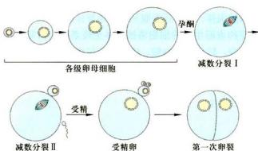  
图 13-2 非洲爪蟾卵细胞成熟过程、受精和第一次卵裂示意图

非洲爪蟾卵母细胞成熟过程可人为地划分为6个时期。第I至IV期为各级生长卵母细胞。第IV期卵母细胞在孕酮作用下向第V和第VI期转化，随即开始减数分裂I和II。成熟卵细胞受精后，便开始第一次卵裂。

  
图 13-3 成熟卵细胞细胞质移植发现 MPF 的存在

诱导卵母细胞成熟（图 13-3）。因而他们认为，在成熟的卵细胞的细胞质中，必然有一种物质，可以诱导卵母细胞成熟。他们将这种物质称作成熟促进因子，即 MPF。

进一步研究发现，用孕酮诱导卵母细胞成熟，卵母细胞需要进行一定程度的蛋白质合成。在有蛋白质合成抑制剂存在的情况下，孕酮不能诱导卵母细胞成熟。成熟卵细胞的细胞质诱导卵母细胞成熟，则不需要蛋白质合成；在蛋白质合成抑制剂存在的情况下，也可以诱导卵母细胞成熟。这些实验结果提示，在成熟卵细胞中，MPF已经存在，只是处于非活性状态，被称为前体MPF（pre-MPF）。非活性态的前体MPF通过翻译后修饰，可以转化为活性态的MPF。

MPF 被发现以后，不少学者便着手 MPF 的纯化工作，但一直进展缓慢，直到 1988 年，J. L. Maller 实验室的 M. J. Lohka 等人以非洲爪蟾卵为材料，分离获得了微克级的纯化 MPF，并证明其主要含有 p32 和 p45 两种蛋白。p32 和 p45 结合后，表现出蛋白激酶活性，可以使多种蛋白质底物磷酸化。因而证明，MPF 是一种蛋白激酶。

## 二、p34 $^{Cdc2}$ 激酶的发现及其与 MPF 的关系

在研究 MPF 工作的同时，另一批生物学家则以酵母为材料，从另一个侧面对细胞周期调控进行着深入研究。以 L. H. Hartwell 为代表的酵母遗传学家在不同温度条件下培养芽殖酵母，分离获得了数十个温度敏感型突变株（temperature-sensitive mutant, ts）。对芽殖酵母来说，允许温度（permissive temperature）常为20～23℃，限定温度（restrictive temperature）通常为35～37℃。突变株最基本的特点是，在允许温度条件下，可以正常分裂繁殖，而在限定温度条件下，则不能正常分裂繁殖。这种在限定温度下失去正常分裂繁殖能力的现象，是由于某个基因发生突变而引起的。不同的突变株，发生突变的基因不同；在限定温度下，细胞在细胞周期中所停留的时相以及细胞所表现出的形态结构也常常是不同的，因而可以对不同突变株的基因变化和基因表达进行综合分析。以P.M.Nurse为代表的另一批酵母生物学家在不同温度下培养裂殖酵母细胞，也分离出了数十个温度敏感型突变株。和芽殖酵母类似，在限定温度下，不同突变株的某个基因也发生了突变，其细胞停留在细胞周期中的某个特定时相。CDC基因调控酵母细胞分裂和细胞周期，根据CDC基因被发现的先后顺序等，对这些基因进行了命名，如Cdc2、Cdc25、Cdc28等，尽管当时CDC基因尚未被分离出来。

Cdc2基因是裂殖酵母细胞中最重要的基因之一。Cdc2基因突变导致细胞停留在 $\mathrm{G}_2 / \mathrm{M}$ 期交界处。Cdc2基因也是第一个被分离出来的CDC基因。它的表达产物为一种分子质量为 $34\mathrm{kDa}$ 的蛋白质，被称为p34Cdc2。进一步研究发现， $\mathsf{p34^{Cdc2}}$ 具有蛋白激酶活性，可以使多种蛋白底物磷酸化，因而又被称为 $\mathsf{p34^{Cdc2}}$ 激酶。 $\mathsf{p34^{Cdc2}}$ 激酶在裂殖酵母细胞周期调控过程中，起着关键性作用。在芽殖酵母中也有一个关键性的CDC基因，称为Cdc28。Cdc28基因突变，芽殖酵母细胞或者停留在 $\mathrm{G}_1/$ S期交界处，或者停留在 $\mathrm{G}_2 / \mathrm{M}$ 期交界处。Cdc28基因是继Cdc2基因之后，第二个被分离出来的CDC基因。Cdc28基因产物也是一种分子质量为 $34\mathrm{kDa}$ 的蛋白质，称为 $\mathsf{p34^{Cdc28}}$ 。 $\mathsf{p34^{Cdc28}}$ 也是一种蛋白激酶，在 $\mathrm{G}_2 / \mathrm{M}$ 期转换过程中起着中心调节作用，因而是 $\mathsf{p34^{Cdc2}}$ 的同源物。同时， $\mathsf{p34^{Cdc28}}$ 对 $\mathrm{G}_1 / \mathrm{S}$ 期转换也是必需的。更进一步的研究发现，不管是 $\mathsf{p34^{Cdc2}}$ 还是 $\mathsf{p34^{Cdc28}}$ ，其本身并不具有激酶活性，只有其与有关蛋白质结合后，其激酶活性才能够表现出来。例如， $\mathsf{p34^{Cdc2}}$ 必须和另一种蛋白质 $\mathsf{p56^{Cdc11}}$ 结合，才具有激酶活性。

知道 $p34^{Cdc2}$ 与 MPF 都具有激酶活性并能够促进 $G_{s}/M$ 期转换以后，人们不禁要问， $p34^{Cdc2}$ 和 MPF 有何关系呢？当 MPF 的基本构成被确认以后，Maller 实验室和 Nurse 实验室立即开始合作，很快便证明 MPF 中的 p32 可以被 $p34^{Cdc2}$ 特异抗体所识别，并且 $p34^{Cdc2}$ 多肽片段可以增强 MPF 活性，表明二者为同源物。其同源性又被后来的序列分析进一步证明。了解 p32 与 p34 $^{Cdc2}$ 以后，人们进一步提出，蛙 MPF 的 p45 和酵母的 p56 $^{Cdc13}$ 是否也有一定关系呢？

在开展上述工作的同时，以R.T.Hunt为代表的另一些科学家以海胆卵为材料，对细胞周期调控进行了深入的研究。J.R.Evans等人于1983年报道，在海胆卵细胞中存在有两种特殊蛋白质。这两种蛋白质的含量随细胞周期进程变化而变化，一般在细胞间期内积累，在细胞分裂期内消失，在下一个细胞周期中又重复这一消长现象，因而他们将这两种蛋白质命名为周期蛋白（cyclin）。随后，这些周期蛋白很快便被分离和克隆出来，并被证明广泛存在于从酵母到人类等各种真核生物中。进一步研究证明，周期蛋白为诱导细胞进入M期所必需。而且，各种生物之间的周期蛋白在功能上有着广泛的互补性。将海胆cyclinB的mRNA引入到非洲爪蟾卵非细胞体系中，其翻译产物可以诱导该非细胞体系进行多次细胞周期循环。将一种基因工程表达的抗降解的cyclin $\Delta 90$ 引入非洲爪蟾卵非细胞体系或直接显微注射到非洲爪蟾卵细胞中，可以稳定MPF活性。所有这些实验结果均提示周期蛋白可能参与MPF的功能调节。当MPF被提纯以后，Maller实验室和Hunt实验室立即开始合作，并很快证明MPF的另一种主要成分为cyclinB。序列分析证明，cyclinB与酵母的p56Cdc13为同源物。至此，MPF的生化成分便被确定下来，它含有两个亚基，即Cdc2为其催化亚基，周期蛋白为其调节亚基。当两者结合后，表现出蛋白激酶活性。

## 三、周期蛋白

自1983年首次发现周期蛋白后，许多科学家纷纷开展周期蛋白研究。在短短的十年间，人们便从各种生物体中克隆分离了数十种周期蛋白，如酵母的Cln1、Cln2、Cln3、Clb1—Clb6，高等动物的周期蛋白A1、A2、B1、B2、B3、C、D1、D2、D3、E1、E2、F、G、H、L1、L2、T1、T2等。目前在人体中已经发现25种周期蛋白。这些周期蛋白在细胞周期内表达的时相有所不同，所执行的功能也多种多样。这些周期蛋白有的只在 $G_{1}$ 期表达并只在 $G_{1}$ 期和S期转化过程中执行调节功能，所以常被称为 $G_{1}$ 期周期蛋白，如cyclin C、D、E、Cln1、Cln2、Cln3等；有的虽然在间期表达和积累，但到M期时才表现出调节功能，所以常被称为M期周期蛋白，如cyclin A、B等。 $\mathrm{G}_{1}$ 期周期蛋白在细胞周期中存在的时间相对较短。M期周期蛋白在细胞周期中则相对稳定。

各种周期蛋白之间有着共同的分子结构特点，但也各有特性。首先，它们均含有一段相当保守的氨基酸序列，称为周期蛋白框（cyclin box）（图13-4）。周期蛋白框含约100个氨基酸残基，其功能是介导周期蛋白与CDK结合。不同的周期蛋白框识别不同的CDK，组成不同的cyclin-CDK复合体，表现出不同的CDK活性。M期周期蛋白的分子结构还有另一个特点，在这些蛋白质分子的近N端含有一段由9个氨基酸残基组成的特殊序列（RXXLGXIXN，其中X代表任意氨基酸），称为破坏框（destruction box）。在破坏框之后，为一段约40个氨基酸残基组成的赖氨酸富集区。破坏框主要参与泛素依赖性的cyclin A和B的降解。 $G_{1}$ 期周期蛋白分子中不含破坏框，但其C端含有一段特殊的PEST序列。研究认为，PEST序列与 $G_{1}$ 期周期蛋白的更新有关。

不同的周期蛋白在细胞周期中表达的时期不同，并与不同的CDK结合，调节不同的CDK活性。图13-5显示了几种周期蛋白在哺乳动物细胞和酵母细胞中的表达和积累状态。在哺乳动物细胞中，cyclin A在 $\mathrm{G}_1$ 期的早期即开始表达并逐渐积累，到达 $\mathrm{G}_1 / \mathrm{S}$ 期交界处，其含量达到最大值并一直维持到 $\mathrm{G}_2 / \mathrm{M}$ 期；cyclin B则从 $\mathrm{G}_3$ 期晚期开始表达并逐渐积累，到 $\mathrm{G}_2$ 期后期阶段达到最大值并一直维持到M期的中期阶段，然后迅速降解；作为 $\mathrm{G}_1$ 期周期蛋白的cyclin D在细胞周期中持续表达；而cyclin E则在M期的晚期和 $\mathrm{G}_1$ 期早期开始表达并逐渐积累，到达 $\mathrm{G}_1$ 期的晚期，其含量达到最大值，然后

  
图13-4 部分周期蛋白分子结构特征

图中显示的，除Cln3外，均为人类的周期蛋白分子。所有这些分子均含有一个周期蛋白框。M期周期蛋白（A2、B1）分子的N端含有一个破坏框。G₁期周期蛋白的C端含有一个PEST序列。

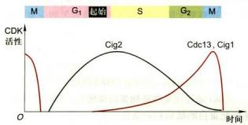  
图 13-5 部分哺乳动物和酵母细胞周期蛋白在细胞周期中的积累及其与 CDK 活性的关系

A.哺乳动物细胞周期。B.芽殖酵母细胞周期。C.裂殖酵母细胞周期。

逐渐下降，到达 $G_{2}$ 期的晚期，其含量降到最低值。在裂殖酵母和芽殖酵母中，周期蛋白含量的消长情况与哺乳动物细胞中的有许多相似之处。作为 M 期周期蛋白，芽殖酵母中的 Clb1、Clb2 和裂殖酵母中的 Cdc13、Cig1 均在 $G_{1}$ 期的后期开始表达，到 $G_{2}$ 期达到最大值，到达 M 期中期后则迅速消失。作为 $G_{1}$ 期周期蛋白，芽殖酵母中的 Cln1、Cln2 和裂殖酵母中的 Cig2 则在 M 期的后期开始表达，到达 $G_{1}$ 期后期的“起始点”前，其含量达到最大值，然后逐渐降低，到达 $G_{2}$ 期时降到最低值。另外，在裂殖酵母中还发现其他两种 B 类周期蛋白 Clb3、Clb4。二者的表达早于 Clb1 和 Clb2。但对其功能尚了解不多。有人推测它们可能在 $G_{1}/S$ 期转化和 S

期中起调节作用。

对于其他种类的周期蛋白的功能研究，有的已经取得重要进展，有的尚在积极研究之中。

## 四、CDK 和 CDK 抑制因子

当酵母 Cdc2 和 Cdc28 基因被分离出来后，几个实验室便立即着手 Cdc2 或 Cdc28 类同基因的分离工作。他们首先通过 PCR 技术构建了人类、非洲爪蟾和果蝇的 cDNA 文库，然后对 cDNA 文库进行筛选。结果成功分离到了十多个 Cdc2 相关基因。通过基因序列和蛋白质功能分析，证明有的确实是 Cdc2 类同基因，与酵母 Cdc2 基因相比较，不仅同源性强，在蛋白质功能方面也有很强的互补性。也有的不仅在序列方面与 Cdc2 有一定差异，在蛋白质功能方面也表现出一定的特殊性。但是，它们又含有两个共同的特点：一个是它们含有一段类似的氨基酸序列，另一个是它们都可以与周期蛋白结合，并以周期蛋白作为调节亚基，进而表现出蛋白激酶活性。因而，它们被统称为周期蛋白依赖性蛋白激酶（cyclin-dependent kinase, CDK）。目前在人体中已发现并被命名的 CDK 包括 Cdc2、Cdk2—Cdk13 等。由于 Cdc2 第一个被发现，而其他几个 CDK 则是通过与其相比较而得来，因而 Cdc2 激酶被命名为 Cdk1。不同的 CDK 所结合的周期蛋白不同，在细胞周期中执行的调节功能也不相同。对不同的 CDK 的功能认识，有的比较清楚，有的正在深入。某些 CDK 与周期蛋白的配对关系，见表 13-1。

各种 CDK 分子均含有一段类似的 CDK 激酶结构域 (CDK kinase domain)。与 Cdk1 激酶结构域相比，其他几种 CDK 激酶结构域的保守程度有所不同（图 13-6）。但是，在 CDK 激酶结构域中，有一小段序列则相当保守，即 PSTAIRE 序列。据认为，此序列与周期蛋白结合有关。此外，在 CDK 分子中也发现一些重要位点。对这些位点进行磷酸化修饰，将对 CDK 活性起重要调节作用。细胞内存在多种因子，对 CDK 分子结构进行修饰，参与 CDK 活性的调节。

除周期蛋白和上述修饰性调控因子对 CDK 活性进行调控之外，细胞内还存在一些对 CDK 活性起负调控的蛋白质，称为 CDK 抑制因子（cyclin-dependent kinase inhibitor, CKI）。到目前为止，已经发现多种对 CDK 起负调控作用的 CKI，分别归为 Cip/Kip 家族和 INK4 家族。Cip/Kip 家族成员主要包括 p21 $^{Cip/Waft}$ 、p27 $^{Kip}$ 和p57Kp2，其中 p21 $^{CipWai1}$ 为此家族的典型代表。p21 主要对 G $_{1}$ 期 CDK（Cdk2、Cdk3、Cdk4 和 Cdk6）起抑制作用。p21 还可以与 PCNA（proliferating cell nuclear antigen）直接结合。PCNA 是 DNA 聚合酶 δ 的辅助因子，为 DNA 复制所必需。p21 与 PCNA 结合，可以直接抑制 DNA 复制。INK4 家族成员主要包括 p16、p15、p18 和 p19 等，p16 为此家族的典型代表。p16 主要抑制 Cdk4 和 Cdk6 活性。

表 13-1 某些 CDK 与周期蛋白的配对关系及执行功能的时期

<table><tr><td>CDK 种类</td><td>可能结合的周期蛋白</td><td>执行功能的可能时期</td></tr><tr><td>Cdk1(p34 $^{Cok2}$ )</td><td>A, B1, B2, B3</td><td> ${\mathrm{G}}_{\mathrm{i}}/\mathrm{M}$ </td></tr><tr><td>Cdk2</td><td>A, D1, D2, D3, E</td><td> ${\mathrm{G}}_{\mathrm{i}}/\mathrm{S},\mathrm{S}$ </td></tr><tr><td>Cdk3</td><td></td><td> ${\mathrm{G}}_{\mathrm{i}}/\mathrm{S}$ </td></tr><tr><td>Cdk4</td><td>D1, D2, D3</td><td> ${\mathrm{G}}_{\mathrm{i}}/\mathrm{S}$ </td></tr><tr><td>Cdk5</td><td>D1, D3</td><td></td></tr><tr><td>Cdk6</td><td>D1, D2, D3</td><td> ${\mathrm{G}}_{\mathrm{i}}/\mathrm{S}$ </td></tr><tr><td>Cdk7</td><td>H</td><td></td></tr><tr><td>Cdk8</td><td>C</td><td></td></tr><tr><td>Cdk9</td><td>T1, T2a, T2b, K</td><td></td></tr><tr><td>Cdk10</td><td></td><td> ${\mathrm{G}}_{\mathrm{i}}/\mathrm{M}$ </td></tr><tr><td>Cdk11p58</td><td></td><td> ${\mathrm{G}}_{\mathrm{i}}/\mathrm{M}$ </td></tr><tr><td>Cdk11p110</td><td></td><td></td></tr><tr><td>Cdk12L</td><td>L1, L2</td><td></td></tr><tr><td>Cdk12S</td><td>L1, L2</td><td></td></tr></table>

## 五、细胞周期运转调控

目前已经公认，CDK对细胞周期运行起着核心性调控作用，因此将其称为周期引擎分子（engine molecule）。不同种类的周期蛋白与不同种类的CDK结合，构成不同的 $\mathrm{CDK}$ 。不同的CDK在细胞周期的不同时期表现活性，因而对细胞周期的不同时期进行调节。例如，与 $\mathrm{G}_1$ 期周期蛋白结合的CDK在 $\mathrm{G}_1$ 期起调节作用，与M期周期蛋白结合的CDK在M期起调节作用。

## (一) $G_{2} / M$ 期转化与Cdk1的关键性调控作用

如上所述，Cdk1即MPF，或p34 $^{Cdc2}$ 激酶，由p34 $^{Cdc2}$ （或p34 $^{Cdc28}$ ）蛋白和cyclin B结合而成。p34 $^{Cdc2}$ 蛋白在细胞周期中的含量相对稳定，而cyclin B的含量则呈现周期性变化。 $p34^{cdc2}$ 蛋白只有与cyclin B结合后才有可能表现出激酶活性。因而，Cdk1活性首先依赖于cyclin B含量的积累。cyclin B一般在 $G_{1}$ 期的晚期开始合成，通过S期，其含量不断增加，到达 $G_{2}$ 期，其含量达到最大值。随cyclin B含量积累到一定程度，Cdk1活性开始出现。到 $G_{2}$ 期晚期阶段，Cdk1活性达到最大值并一直维持到M期的中期阶段。Cdk1活性和cyclin B含量的关系（图13-7）。cyclin A也可以与Cdk1结合成复合体，表现出CDK1活性。

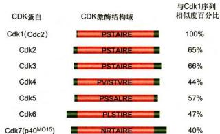  
图 13-6 通过 PCR 技术测定与 Cdk1 类似的 CDK 蛋白分子图解  
图中以 Cdk1（Cdc2）氨基酸序列为标准（100%），将其他 CDK 激酶结构域的氨基酸序列与其比较，得到序列相似度百分比。

Cdk1 通过使某些底物蛋白磷酸化，改变其下游的某些靶蛋白的结构和启动其功能，实现其调控细胞周期的作用。Cdk1 催化底物磷酸化有一定的位点特异性，即选择底物中某个特定序列中的某个丝氨酸或苏氨酸残基。Cdk1 可以使多种底物蛋白磷酸化，其中包括组蛋白 H1，核纤层蛋白 A、B、C，核仁蛋白 (nucleolin)，No38, p60 $^{5csc}$ ，c-Abl 等（表 13-2）。组蛋白 H1 磷酸化，促进染色质凝结；核纤层蛋白磷酸化，促使核纤层解

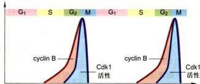  
图 13-7 cyclin B 在 Cdk1 活性调节过程中的作用

Cdk1 活性首先依赖于 cyclin B 含量的积累。cyclin B 的含量达到一定值并与 CDK 蛋白结合，同时在其他一些因素的调节下，逐渐表现出最高激酶活性。

聚；核仁蛋白磷酸化，促使核仁解体； $p60^{c-Src}$ 蛋白磷酸化，促使细胞骨架重排；c-Abl蛋白磷酸化，促使细胞形态调整等。

CDK 活性受到多种因素的综合调节。周期蛋白与 CDK 结合是激活 CDK 活性的先决条件。但是，仅周期蛋白与 CDK 结合，并不能使 CDK 激活。还需要其他几个步骤的修饰，才能表现出激酶活性。首先，当周期蛋白与 CDK 结合形成复合物后，Weel/Mik1 激酶和 CDK 活化激酶（Cdk1-activiting kinase）催化 CDK 第 14 位的苏氨酸（Thr14）、第 15 位的酪氨酸（Tyr15）和第 161 位的苏氨酸（Thr161）磷酸化。但此时的 CDK 仍不表现激酶活性（称为前体 MPF）。然后，CDK 在蛋白磷酸水解酶 Cdc25C 的催化下，使其 Thr14 和 Tyr15 去磷酸化，才能表现出激酶活性。Cdk1 活性

调控见图 13-8。

在体外培养的细胞和单细胞生物中，CDK活性是细胞生命活动所需要的。解除CDK活性，往往导致细胞生命活动停滞和死亡。但在小鼠中，敲除一些被认为是细胞生命活动所必需的CDK活性，如Cdk2、Cdk4、Cdk6、cyclin A、cyclin E、cyclin D等，动物可以存活，因而推测CDK之间可以代偿一些功能。CDK活性敲除实验也揭示了CDK在个体发育等方面的功能。例如，Cdk4敲除小鼠个体矮小，内分泌器官发育不良，导致糖尿病和不育等。Cdk6敲除小鼠个体不正常，脾和胸腺发育不全，某些T淋巴细胞类群对抗原的应答滞后等。Cdk2敲除小鼠不育。由此可见，细胞周期调控因子对生物体个体和器官的发育也起着重要调节作用。

表 13-2 某些 Cdk1 底物及其磷酸化后可能产生的生理效应

<table><tr><td>Cdk1 底物</td><td>序 列</td><td>M 期的可能作用</td></tr><tr><td>核纤层蛋白 B</td><td>PLSPTR</td><td>核纤层解聚,核膜崩解</td></tr><tr><td>核纤层蛋白 A</td><td>TLSPTR</td><td>核纤层解聚,核膜崩解</td></tr><tr><td>核纤层蛋白 C</td><td>-</td><td>核纤层解聚,核膜崩解</td></tr><tr><td>核纤层 L67(clam)</td><td>SPTR</td><td>核纤层解聚,核膜崩解</td></tr><tr><td>波形蛋白</td><td>-</td><td>分裂期中间纤维体系再调整</td></tr><tr><td>微管结合蛋白 MAP-220</td><td>SSPGG</td><td>使其失去刺激微管组装作用</td></tr><tr><td>组蛋白 H1</td><td>-</td><td>染色体凝缩</td></tr><tr><td>p60  ${}^{\text{cDisc }}$ </td><td>K/RS/TPXK</td><td>进一步磷酸化其他物质(细胞骨架重排)</td></tr><tr><td>No38</td><td>QTPNK</td><td>核仁分解;抑制核糖体合成?</td></tr><tr><td>核仁蛋白</td><td>TPXKK</td><td>核仁分解,抑制核糖体合成?</td></tr><tr><td>cyclin B</td><td>TPXKK</td><td>调节 Cdk1 活性</td></tr><tr><td>EF-1b, EF-1r</td><td>-</td><td>翻译抑制</td></tr><tr><td>SV40T</td><td>-</td><td>-</td></tr><tr><td>p53</td><td>HSTPPKKKRKV</td><td>影响其亚细胞定位</td></tr><tr><td>c-Abl</td><td>SSSPOK</td><td>调节细胞形态</td></tr><tr><td>c-Myb</td><td>APDTPEL</td><td>降低与 DNA 结合能力</td></tr><tr><td>钙调蛋白结合蛋白 ( caldesmon )</td><td>PAVSPLL</td><td>降低与肌动蛋白结合能力,从微丝上游离下来</td></tr><tr><td>肌球蛋白</td><td>S/TPXK/R</td><td>抑制胞质分裂</td></tr><tr><td>GTP 结合蛋白</td><td>SP/TP</td><td>抑制细胞内物质运输</td></tr><tr><td>HMG1</td><td>Ser1, 2; Thr9 KIQSTPVK; RSPR ZPSZPTPK</td><td>降低与 DNA 结合能力</td></tr></table>

催化位点通式：S/TPXZ。S/T：Ser/Thr；X：一种极性氨基酸残基；Z：一般为一种碱性氨基酸残基。斜体字母表示磷酸化氨基酸残基位点。

  
图 13-8 Cdk1 激酶活性综合调控示意图

## （二）M期周期蛋白与细胞分裂中期向后期转换

细胞周期运转到分裂中期后，M期cyclin A和B将迅速降解，Cdk1活性丧失，上述被Cdk1磷酸化的靶蛋白去磷酸化，细胞周期便从M期中期向后期转化。目前已经知道，cyclin A和B的降解是通过泛素化依赖途径实现的。

如前所述，伴随cyclin-CDK复合物形成，CDK亚基Thr14、Tyr15和Thr161残基磷酸化，以及Thr14和Tyr15去磷酸化，cyclin-CDK复合物激酶活性表现出来，Thr161位点保持磷酸化状态是Cdk1活性表现所必需的（图13-8）。有丝分裂中期过后，周期蛋白与CDK分离，在APC的作用下，M期cyclinA和B通过泛素化依赖途径被蛋白酶体降解（参见图5-2由泛素和蛋白酶体所介导的蛋白质降解途径）。M期周期蛋白在泛素化途径降解过程中，其分子中的破坏框起着重要的调节作用。用基因突变方法将破坏框去除，所得到的突变分子将不能被泛素化途经所降解，因而可以较长时间地保持活性。

1995年，两个实验室率先分离并部分纯化了具有E3活性的蛋白质复合物。首先，V. Sudakin等人在青蛙卵中分离到了一个分子质量为 $1500\mathrm{kDa}$ 的蛋白质复合物，称为cyclosome。在E1、E2、泛素和ATP再生体系存在的情况下，cyclosome可以在体外将cyclinA和B通过泛素化途径降解。几乎与此同时，R.W.King等人在非洲瓜蛾卵中分离到了一个20S的蛋白质复合物，即后期促进复合物（anaphase-promoting complex,

APC),也支持cyclin B通过泛素化途径体外降解。此后证明，cyclosome和APC为同源物，而APC这一名词则更广为应用。APC的发现是细胞周期研究领域中又一大进展，表明细胞分裂中期向后期转换也受到精密调控。进一步研究证明，APC至少有15种成分组成，分别为Apc1—Apc15。这些蛋白质成分在不同物种中大部分已鉴定出来，如在人体中已鉴定了Apc1—Apc8，Apc10—Apc13，以及Cdc26等13种，在芽殖酵母和裂殖酵母中也已分别鉴定出了13种APC成分。在不同物种中鉴定的15种成分中，有的为过去已知的成分，如Cdc16、Cdc23、Cdc27和BimE等，有的为未知成分。S. Tugendreich等人（1995）克隆了人类的Cdc16和Cdc27基因，并证明Cdc16Hs和Cdc27Hs蛋白位于哺乳动物细胞的中心体和纺锤体上。用抗Cdc27Hs的抗体进行显微注射，可以将细胞抑制在分裂中期。在非洲爪蟾体系中，用抗Cdc27Hs的抗体处理上述20S的APC，可以使APC的泛素化活性丧失。在Kim Nasmyth实验室工作的另一些科学家则在芽殖酵母细胞中证明，Cdc16和Cdc23也为cyclin B的降解所必需。BimE基因最早发现于构巢曲霉（Aspergillus nidulans）温度敏感突变株bimE7。bimE7细胞在正常温度下可以正常生活，若放到限定温度下培养，BimE7基因会发生突变，引起细胞早熟性地进入分裂期。即使用药物处理，将细胞先抑制在S期，然后再放到限定温度下培养，也会引起细胞早熟性地进入分裂期，说明BimE是一种细胞分裂负调控因子。对BimE的确切作用机制，目前尚不甚清楚。APC除了调节M期周期蛋白泛素化依赖降解途径外，还调节其他一些与细胞周期调控有关的非周期蛋白类蛋白质的降解，如裂殖酵母中的Cut2和芽殖酵母中的Pds1p等。已知Cut2和Pds1p均为细胞分裂由中期向后期转换的负调控因子。

了解APC活性变化是认识细胞周期由分裂中期向后期转换的关键问题之一。APC活性受到多种因素的综合调节。目前已知，细胞中存在正、负两类APC活性调节因子。激活APC的正调控因子有Cdc20/Fizzy和Cdh1/Fzy等，负调控因子有Emi1、Emi2、Mad2、BubR1等。首先，已知各类APC在分裂间期中表达，但只有到达M期后才表现出活性，提示M期CDK激酶活性可能对APC的活性起着调节作用。体外实验显示，APC可以被活化的M期CDK所激活，且多种APC作为底物被M期CDK磷酸化；而活化的APC则可以被蛋白磷酸水解酶作用而失活。其次发现，Cdc20为APC有效的正调控因子。Cdc20主要位于染色体动粒上，为姐妹染色单体分离所必需。APC活性亦受到纺锤体组装检查点（spindle assembly checkpoint）的调控。纺锤体组装不完全，或所有动粒不能被动粒微管全部捕捉，APC则不能被激活。目前已经知道，在纺锤体组装调控过程中，Mad2（mitosis arrest deficient 2）蛋白起着重要作用。正常情况下，Mad2定位在早中期和错误排列的中期染色体的动粒上，纺锤体组装不完全，动粒不能被动粒微管捕捉，Mad2则不能从动粒上解离下来。因此，Mad2蛋白为细胞延迟进入后期提供了一种“等待”信号。Mad2与Cdc20结合，有效地抑制Cdc20的活性。当纺锤体组装完成以后，动粒全部被动粒微管捕捉，Mad2从动粒上消失，从而解除对Cdc20的抑制作用，促使APC活化，导致M期周期蛋白降解，M-CDK活性丧失；在酵母细胞中，促使Cut2/Pds1p降解，解除其对姐妹染色单体分离的抑制，细胞则由中期向后期转化。

## （三） $G_{1}/S$ 期转化与 $G_{1}$ 期周期蛋白依赖性 CDK

细胞由 $\mathrm{G}_1$ 期向S期转化是细胞增殖过程中的关键事件之一。细胞能否成功地实现由 $\mathrm{G}_1$ 期向S期转化，标志着该细胞能否完成其DNA复制和其他相关生物大分子的合成，进而完成细胞分裂。目前一般认为，细胞由 $\mathrm{G}_1$ 期向S期转化主要受 $\mathrm{G}_1$ 期周期蛋白依赖性CDK所控制。在哺乳动物细胞中， $\mathrm{G}_1$ 期周期蛋白主要包括cyclinD、E，或许还有cyclinA。与 $\mathrm{G}_1$ 期周期蛋白结合的CDK主要包括Cdk2、Cdk4和Cdk6等。cyclinD主要与Cdk4和Cdk6结合并调节后者的活性，而cyclinE则与Cdk2结合。cyclinA常被认为属M期周期蛋白，但cyclinA也可与Cdk2结合使后者表现激酶活性，提示cyclinA可能参与调控 $\mathrm{G}_1 / \mathrm{S}$ 转化过程。

目前已知哺乳动物细胞中表达三种cyclin D，即D1、D2和D3，但三者的表达有细胞和组织特异性。据推测，在快速增殖的细胞中至少表达一种cyclin D。一般情况下，一种细胞仅表达两种cyclin D，即D3和D1或D2。在细胞水平上所做的实验，包括特异的抗cyclin D的抗体显微注射和反义RNA显微注射等，显示cyclin D为细胞 $G_{1}/S$ 期转化所必需。cyclin D-Cdk4和cyclin D-Cdk6不能使组蛋白H1磷酸化。对cyclin D-CDK的底物仍已知甚少，目前仅知道Rb蛋白(retinoblastoma protein，成视网膜细胞瘤蛋白）为其底物。Rb蛋白是E2F的抑制因子，在哺乳类 $G_{1}$ 期细胞中起“刹车”作用，因此Rb蛋白是 $G_{1}/S$ 期转化的负调控因子，在 $G_{1}$ 期的晚期阶段通过磷酸化而失活。

cyclin E 是哺乳类细胞中表达的另一种 $G_{1}$ 期周期蛋白。它在 $G_{1}$ 期的晚期开始合成，并一直持续到细胞进入 S 期。当细胞进入 S 期后，cyclin E 很快即被降解。cyclin E 与 Cdk2 结合形成复合物，呈现 Cdk2 活性。因而，cyclin E-Cdk2 活性峰值时间为 $G_{1}$ 期晚期到 S 期的早期阶段。大量实验显示，cyclin E-Cdk2 活性为 S 期启动所必需。在果蝇胚胎发育过程中，如果将 cyclin E 进行基因突变，该胚胎的细胞则被阻止在 $G_{1}$ 期。将抗 cyclin E 的特异抗体做细胞显微注射，被注射的细胞便停留在 $G_{1}$ 期。用非洲爪蟾卵提取物进行细胞核重建和 DNA 复制实验，如果事先将 cyclin E 从卵提取物中用免疫沉淀方法去除，重建的细胞核不能复制 DNA。在哺乳动物细胞中，TGFβ 是一种生长抑制因子。有实验表明，cyclin E-Cdk2 是 TGFβ 作用的主要靶酶。TGFβ 可以有效地抑制 cyclin E-Cdk2 活性，进而将细胞阻止在 $G_{1}$ 期。也有一些证据显示，cyclin E 在肿瘤细胞中的含量比正常细胞中要高得多。在细胞中提高 cyclin E 的表达，该细胞则快速进入 S 期，而且对生长因子的依赖性降低。

实验表明，cyclin E-Cdk2 可以与类 Rb 蛋白 p107 和转录因子 E2F 结合形成复合物。与 Rb 蛋白相似，p107 可以将 SAOS 细胞抑制在 $G_{1}$ 期。而 E2F 则可以促进与 $G_{1}/S$ 期转化和 DNA 复制有关的基因转录。一般认为，当 cyclin E-Cdk2 激酶与 p107 和 E2F 结合形成复合物之后，Cdk2 催化 p107 磷酸化，使 p107 失去抑制作用，则 E2F 的作用被显现出来，促进有关基因的转录，从而促使细胞周期由 $G_{1}$ 期向 S 期转化。此外，最近有几个实验室相继证明，cyclin E-Cdk2 直接参与了中心体复制的起始调控。

cyclin A 也可以与 Cdk2 结合，形成 cyclin A-Cdk2。cyclin A 的合成开始于 G₁/S 期转化时期。进入 S 期后，cyclin A-Cdk2 激酶成为该时期主要的 CDK。目前有实验显示 cyclin A-Cdk2 与 DNA 复制有关。在 S 期，cyclin A-Cdk2 复合物位于 DNA 复制中心。将抗 cyclin A 的抗体注射到细胞中将抑制细胞 DNA 的合成。在体外，cyclin A-Cdk2 可以使 DNA 复制因子 RF-A 磷酸化并使其活性增强。此外，cyclin A-Cdk2 也可以与 p107 和 E2F 结合形成复合物，进而影响 E2F 促进基

因转录的功能。

到达S期的一定阶段， $\mathrm{G}_1$ 期周期蛋白也是通过泛素化依赖途径降解的，但与M期周期蛋白的降解有所不同。 $\mathrm{G}_1$ 期周期蛋白的降解是通过SCF(Skp-cullin-F-box protein)泛素化途径降解的，同时需要 $\mathrm{G}_1$ 期CDK活性的参与。 $\mathrm{G}_1$ 期周期蛋白分子中不含有破坏框序列，而是含有PEST序列。PEST序列对 $\mathrm{G}_1$ 期周期蛋白降解起促进作用。此外，一些参与DNA复制的调控因子如Cdt1和Orc1，以及CDK抑制因子如p21、p27和p57等，也是通过SCF泛素化依赖途径降解的。SCF通过降解细胞周期的不同时期的不同的底物从而在整个细胞周期中都发挥作用（图13-9）。SCF是一种由多亚基构成的蛋白复合物，具有E3泛素连接酶的功能。SCF主要由Skp1、Cul1和Rbx1三种亚基构成，可以被Skp2、Fbw7和β-TrCP三种F-box蛋白分别活化，催化底物蛋白的泛素化。SCF的底物特异性的识别是由F-box蛋白来决定的（图13-10）。

除 $\mathrm{G}_{1}$ 期周期蛋白依赖性CDK活性之外，细胞内还存在其他多种因素对DNA复制起始活动进行综合调控。首先，DNA复制起始点的识别，是DNA复制调

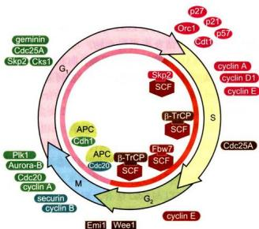  
图 13-9 APC 和 SCF 在细胞周期中的活性及其底物

图中显示细胞周期不同时相 SCF 和 APC 泛素化连接酶的底物蛋白。SCF 主要在细胞间期 $G_{1}$ 、S 和 $G_{2}$ 期发挥功能。SCF 的 3 种 F-box 蛋白 Skp2、Fbw7 和 $\beta$ -TrCP 分别用 3 种不同的颜色表示，其相应的底物也用相应的颜色表示。APC 主要在细胞有丝分裂期 M 期以及 $G_{1}$ 期早期发挥功能。APC 的两个负责底物识别的因子 Cdc20 和 Cdh1 分别用两种不同的颜色表示，其相应的底物也用相应的颜色表示。

控中的重要事件之一。已经发现，从酵母细胞到高等哺乳类细胞，均存在一种多亚基蛋白复合物，称为复制起始点识别复合物（origin recognition complex, ORC）。ORC 含有 6 个亚基，分别称为 Orc1—Orc6。ORC 识别 DNA 复制起始位点并与之结合，是 DNA 复制起始所必需的。其次，Cdc6 和 Cdc45 也是 DNA 复制所必需的调控因子。如果将 Cdc6 和 Cdc45 去除，DNA 便不能起始复制。Cdc6 在 G₁ 期早期与染色质结合，到 S 期早期从染色质上解离下来。Cdc45 约在 G₁ 期晚期才与染色质结合，Cdc6 对 Cdc45 与染色质结合起促进作用，但尚不知道是起直接作用还是间接作用。另外，在 20 世纪 80 年代末，人们还提出了一种 “DNA 复制执照因子学说”（DNA replication-licensing factor theory），并在此后的研究中取得突破性进展。人们早已知道，在整个细胞周期中 DNA 复制一次，而且只能一次。是什么因素控制细胞在一个细胞周期中 DNA 只能复制一次呢？为此，J. Blow 和 R. Laskey 通过实验提出，在细胞的胞质内存在一种执照因子，对细胞核染色质 DNA 复制发行 “执照”（licensing）。在 M 期，细胞核膜破裂，胞质中的执照因子与染色质接触并与之结合，使后者获得 DNA 复制所必需的 “执照”。细胞通过 G₁ 期后进入 S 期，DNA 开始复制。随 DNA 复制过程的进行，“执照”信号不断减弱直到消失。到达 G₂ 期，细胞核不再含有“执照”信号，DNA复制结束并不再起始。只有等到下一个M期，染色质再次与胞质中的执照因子接触，重新获得“执照”，细胞核才能开始新一轮的DNA复制。DNA复制执照因子是一种什么物质呢？提纯工作发现，Mcm蛋白（minichromosome maintenance protein）是其主要成分。Mcm蛋白共有6种，分别称为Mcm2、Mcm3、Mcm4、Mcm5、Mcm6和Mcm7。在细胞中去除任何一种Mcm蛋白，都将使细胞失去DNA复制起始功能。除Mcm蛋白之外，执照因子中还包括其他某些成分，但目前还不清楚。关于ORC、Cdc6、Cdc45和Mcm蛋白在与染色质结合过程中的相互关系，见图13-11。

  
图 13-10 SCF 泛素化依赖蛋白质降解途径

## （四） $S/G_{2}/M$ 期转换与 DNA 复制检查点

DNA复制结束，细胞周期由S期自动转换到 $\mathrm{G}_2$ 期，并准备进行细胞分裂。然而，为什么在DNA复制尚未完成之前，细胞不能开始 $\mathrm{S} / \mathrm{G}_2 / \mathrm{M}$ 期转化呢？原来，细胞中存在一系列检查DNA复制进程的监控机制。DNA复制还未完成或者DNA复制出现问题，细胞周期便不能向下一个阶段转换。DNA复制检查点主要包括两种：S期内部检查点（intra-S phase checkpoint）以及DNA复制检查点（replication checkpoint）（图13-12）。

S 期内部检查点是指在 S 期内发生 DNA 损伤如 DNA 双链发生断裂时，S 期内部检查点被激活，从而抑制复制起始点的启动，使 DNA 复制速度减慢，S 期延长，同时激活 DNA 修复和复制叉的恢复等机制。S 期内部检查点是通过两条信号通路来实现的。一条通路是通过染色体结构维持蛋白 Smc1 的磷酸化，从而实现 S 期的延长。而 Smc1 的磷酸化则依赖于 ATM-Mdc1-MRNC（Mre11-Rad50-Nbs1 complex）等中介物的系列催化过程。然而，磷酸化的 Smc1 是如何促使 DNA 复制停滞的，目前仍然不太清楚。另一条通路是通过 ATM/ATR 介导的 Cdc25A 磷酸酶过磷酸化而降解，从而抑制 cyclin E/A-Cdk2 活性。cyclin E/A-Cdk2 受到抑制后，阻止 Cdc45 在仍未起始复制的复制起始点上的募集。Cdc45 是 DNA 解旋酶 Mcm2—7 的关键的激活因子，因而这种方式能够抑制未起始复制的复制起始点。

另外一种是由于停滞的复制叉导致的S期的延长，被称为DNA复制检查点。DNA复制检查点主要是由 ATR/Chk1 激活来介导的。尽管对该机制中 ATR/Chk1 的底物还了解得很少，而 ATR/Chk1 介导的 Cdc25A 降解进而抑制 cyclin E/A-Cdk2 的通路在减缓整体 DNA 复制的效率中应该起到一定作用（图 13-12）。许多处于复制义上的复制蛋白都是 ATR 的底物并且被 ATR 磷酸化，它们包括 RFC 复合体 (replication factor C complex)、Rpa1 和 Rpa2、Mcm2—7 复合体、Mcm10，以及一些 DNA 聚合酶。然而，这些磷酸化事件的功能大部分都不清楚。

  
图 13-11 ORC、Cdc6、Cdc45、CDK 和 Mcm 与染色质的结合及其在 DNA 复制起始调控中的作用

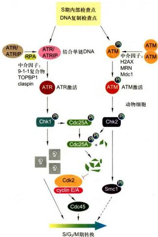  
图 13-12 S/G₂/M 期转化与 DNA 复制检查点

S 期内部检查点和 DNA 复制检查点能够将细胞停滞在 S 期和 G/M 期。当 DNA 复制叉且阻尺引发单链 DNA 时，ATR-Chk1 通路被激活。当 DNA 双链断裂时，ATM-Chk2 通路被激活。S 期内部检查点由 Smc1 磷酸化通路和 Cdc25A-Cdk2/cyclin E/A-Cdc45 通路介导。DNA 复制检查点主要是由 ATR/Chk1 介导的 Cdc25A 降解从而抑制 cyclin E/A-Cdk2。ATM/ATR 是与 PI3K 同源的激酶，也是 DNA 损伤信号感受因子，进而激活下游信号通路。Chk2/Chk1：哺乳类细胞中 DNA 损伤信号感受因子的底物，又是下游效应器分子 Ser/Thr 激酶。

## 六、其他因素在细胞周期调控中的作用

除上述各种因素参与细胞周期调控之外，还有不少其他因素参与细胞周期调控，其中最为重要的一类因素为癌基因和抑癌基因。癌基因和抑癌基因均是细胞生命活动所必需的基因，其表达产物对细胞增殖和分化起着重要的调控作用。癌基因异常表达可导致细胞转化、增殖失控，甚至细胞癌变。目前已经分离了一百多种癌基因，其表达产物大致可归纳为蛋白激酶、多肽类生长因子、膜表面生长因子受体和激素受体、信号转导器、转录因子、类固醇和甲状腺激素受体、核蛋白等几个类型。它们在细胞周期信号调控过程中各自起着不同的作用。例如，生长因子与细胞表面的生长因子受体结合，可以促使 $\mathrm{G}_0$ 期的细胞返回细胞周期，开始细胞增殖。抑癌基因表达产物对细胞增殖起负调节作用，如p53、Rb等。p53是近年来研究较多的人类抑癌蛋白之一。p53基因突变，使细胞癌变的机会大大增加，已经证实，有许多肿瘤同时伴随p53基因突变。

除细胞内在因素外，细胞和机体的外在因素对细胞周期也有重要影响，如离子辐射、化学物质作用、病毒感染、温度变化、pH变化等。离子辐射对细胞最直接的影响之一是DNA损伤。DNA损伤后，细胞会很快启动其DNA损伤修复调控体系，抑制细胞周期运转，直到DNA损伤得以完全修复；或者最终不能完成修复，致使细胞走向死亡。在人类细胞DNA损伤修复过程中， $p53$ 表达水平大大提高，通过一些下游调控因子，抑制Cdk1、Cdk2、Cdk4等激酶活性，从而影响细胞周期运转。化学物质种类繁多，有的可直接参与调控DNA代谢，影响细胞周期变化；有的可以通过其他途径，影响酶类和其他调节因素的变化，改变细胞周期进程。病毒感染也是影响细胞周期进程的主要因素之一。有的病毒感染能快速抑制细胞周期，有的则可以诱导细胞转化和癌变，使整个细胞周期进程发生改变。

<!-- END CN CN13-S01 -->

---

## 对应英文内容

### 英文补充：周期蛋白-CDK、磷酸酶、APC/C与生化开关

> 对应中文板块：周期蛋白-CDK、磷酸酶、APC/C与生化开关。英文来源：Molecular Biology of the Cell，第7版，第17章；[本章完整原文](../来源/英文教材/17_The_Cell_Cycle/chapter.md)。物理PDF页码范围：1066–1127（整章范围）。

<!-- BEGIN EN EN17-H006-H015 -->
#### THE CELL-CYCLE CONTROL SYSTEM

For many years, cell biologists watched the puppet show of DNA synthesis, mitosis, and cytokinesis but had no idea of what lay behind the curtain controlling these events. It was not even clear whether there was a separate control system or whether the processes of DNA synthesis, mitosis, and cytokinesis somehow controlled themselves. A major breakthrough came in the late 1980s with the identification of the key proteins of the control system, along with the realization that they are distinct from the proteins that perform the processes of DNA replication, chromosome segregation, and so on.

In this section, we first consider the basic principles upon which the cell-cycle control system operates. We then discuss the protein components of the system and how they work together to time and coordinate the events of the cell cycle.

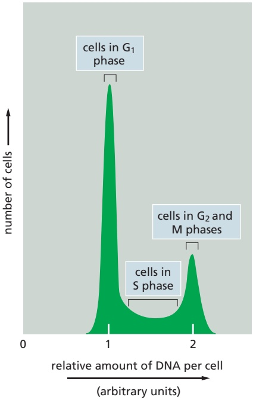

Figure 17–7 Analysis of DNA content with a flow cytometer. This graph shows typical results obtained for a proliferating cell population when the DNA content of its individual cells is determined in a flow cytometer. (A flow cytometer, also called a fluorescence-activated cell sorter,MBoC7 m17.08/17.07 or FACS, can also be used to sort cells according to their fluorescence.) The cells analyzed here were stained with a dye that becomes fluorescent when it binds to DNA, so that the amount of fluorescence is directly proportional to the amount of DNA in each cell. The cells fall into three categories: those that have an unreplicated complement of DNA and are therefore in $\mathbb { G } _ { 1 }$ , those that have a fully replicated complement of DNA (twice the $\mathbb { G } _ { 1 }$ DNA content) and are in G2 or M phase, and those that have an intermediate amount of DNA and are in S phase. The distribution of cells indicates that there are greater numbers of cells in $\mathbb { G } _ { 1 }$ than in $\mathsf { G } _ { 2 } + \mathsf { M }$ phase, showing that $\mathbb { G } _ { 1 }$ is longer than $\mathsf { G } _ { 2 } +$ M in this population.

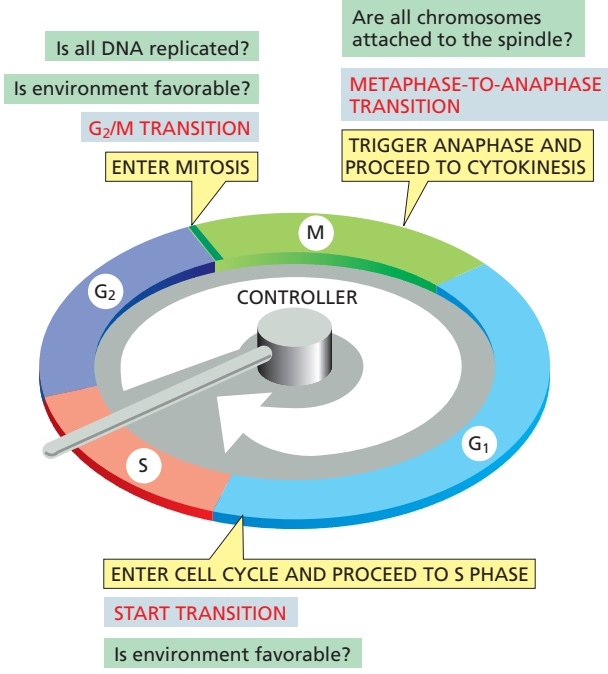

Figure 17–8 The control of the cell cycle. A cell-cycle control system triggers the essential processes of the cycle—such as DNA replication, mitosis, and cytokinesis. The control system is represented here as a central arm—the controller—that rotates clockwise, triggering essential processes when it reaches specific transitions on the outer dial (yellow boxes). Information about the completion of cell-cycle events, as well as signals from the environment, can cause the control system to arrest the cycle at these transitions.

#### The Cell-Cycle Control System Triggers the Major Events of the Cell Cycle

The **cell-cycle control system** operates much like a timer that triggers the events of the cell cycle in a set sequence (**Figure 17–8**). In its simplest form—as seen inMBoC7 m17.09/17.08 the stripped-down cell cycles of early animal embryos, for example—the control system is rigidly programmed to provide a fixed amount of time for the completion of each cell-cycle event. The control system in these early embryonic divisions is independent of the events it controls, so that its timing mechanisms continue to operate even if those events fail. In most cells, however, the control system does respond to information received back from the processes it controls. If some malfunction prevents the successful completion of DNA synthesis, for example, signals are sent to the control system to delay progression to M phase. Such delays provide time for the machinery to be repaired and also prevent the disaster that might result if the cycle progressed prematurely to the next stage—and segregated incompletely replicated chromosomes, for example.

The cell-cycle control system is based on a connected series of biochemical switches, each of which initiates a specific cell-cycle event. This system of switches possesses many important features that increase the accuracy and reliability of cell-cycle progression. First, the switches are generally binary (on/off ) and launch events in a complete, irreversible fashion. It would clearly be disastrous, for example, if events such as chromosome condensation or nuclear-envelope breakdown were only partially begun but not completed. Second, the cell-cycle control system is remarkably robust and reliable, allowing the system to operate effectively under a variety of conditions and even if some components fail. Finally, the control system is highly adaptable and can be modified to suit specific cell types or to respond to specific intracellular or extracellular signals.

In most eukaryotic cells, the cell-cycle control system governs cell-cycle progression at three major regulatory transitions (see Figure 17–8). The first is Start (or the restriction point) in late $\mathbf { G } _ { 1 } ,$ when the cell commits to cell-cycle entry and chromosome duplication. The second is the $\mathbf { G } _ { 2 } / \mathbf { M }$ **transition**, when the control system triggers the early mitotic events that lead to chromosome alignment on the mitotic spindle in metaphase. The third is the **metaphase-to-anaphase transition**, when the control system stimulates sister-chromatid separation, leading to the completion of mitosis and cytokinesis. The control system blocks progression through each of these transitions if it detects problems inside or outside the cell. If the control system senses problems in the completion of DNA replication, for example, it will hold the cell at the $\mathrm { G _ { 2 } / M }$ transition until those problems are solved. Similarly, if extracellular conditions are not appropriate for cell proliferation, the control system blocks progression through Start, thereby preventing cell division until conditions become favorable.

#### The Cell-Cycle Control System Depends on Cyclically Activated Cyclin-dependent Protein Kinases

Central components of the cell-cycle control system are members of a family of protein kinases known as **cyclin-dependent kinases (Cdks)**. The activities of these kinases rise and fall as the cell progresses through the cycle, leading to cyclical changes in the phosphorylation of intracellular proteins that initiate or regulate the major events of the cell cycle. An increase in Cdk activity at the $\mathrm { G _ { 2 } / M }$ transition, for example, increases the phosphorylation of proteins that control chromosome condensation, nuclear-envelope breakdown, spindle assembly, and other events that occur in early mitosis.

Figure 17–9 Two key components of the cell-cycle control system. When cyclin forms a complex with Cdk, the protein kinase is activated to trigger specific cell-cycle events. Without cyclin, Cdk is inactive.

Cyclical changes in Cdk activity are controlled by a complex array of other proteins. The most important of these Cdk regulators are proteins known as **cyclins**. Cdks, as their name implies, depend on cyclins for their activity: unless they are bound tightly to a cyclin, they have no protein kinase activity (**Figure 17–9**). Cyclins were originally named because they undergo a cycle of synthesis and degradation in each cell cycle. The levels of the Cdk proteins, by contrast, are constant. Cyclical changes in cyclin protein levels result in the cyclic assembly and activation of **cyclin–Cdk complexes** at specific stages of the cell cycle.

There are three major classes of cyclins, each defined by the stage of the cell cycle at which they bind Cdks and carry out their functions (**Figure 17–10**):

1. **G**<strong>1</strong>**/S-cyclins** activate Cdks in late $\mathrm { G _ { 1 } }$ and thereby help trigger progression through Start, resulting in a commitment to cell-cycle entry. Their levels fall in S phase.

2. **S-cyclins** bind Cdks soon after progression through Start and help stimulate chromosome duplication. S-cyclin levels remain elevated until mitosis, and these cyclins also contribute to the control of some early mitotic events.

3. **M-cyclins** activate Cdks that stimulate entry into mitosis at the $\mathrm { G _ { 2 } / M }$ transition. M-cyclin levels fall in mid-mitosis.

Figure 17–10 Cyclin–Cdk complexes of the cell-cycle control system. The concentrations of the three major cyclin types oscillate during the cell cycle, while the concentrations of Cdks (not shown) exceed cyclin amounts and do not change. In late $\mathbb { G } _ { 1 } ,$ rising G1/S-cyclin levels lead to the formation of $G _ { 1 } / S \text { - } C d 1$ k complexes that trigger progression through the Start transition. S-Cdk complexes form later in $\mathbb { G } _ { 1 }$ and trigger DNA replication, as well as some early mitotic events. M-Cdk complexes form during $\mathbb { G } _ { 2 }$ but are held in an inactive state; they are activated at the end of $\mathbb { G } _ { 2 }$ and trigger entry into mitosis at the $\mathrm { G } _ { 2 } / \mathrm { M }$ transition. A separate regulatory protein complex, the $\mathsf { A P C / C } ,$ initiates the metaphase-to-anaphase transition, as we discuss later.

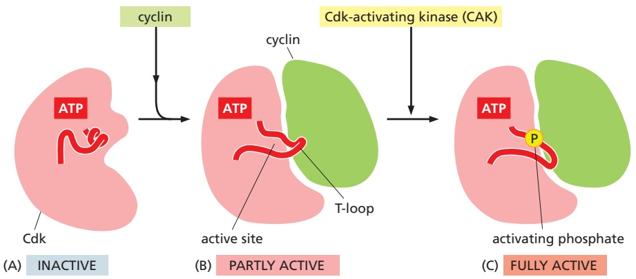

Figure 17–11 The structural basis of Cdk activation. These drawings are based on threedimensional structures of human Cdk2 and cyclin A, as determined by x-ray crystallography. The location of the bound ATP is indicated. The enzyme is shown in three states. (A) In the inactive state, without cyclin bound, the active site is blocked by a region of the protein called the T-loop (red). (B) The binding of cyclin causes the T-loop to move out of the active site, resulting in partial activation of Cdk2. (C) Phosphorylation of Cdk2 (by CAK) at a threonine residue in the T-loop further activates the enzyme by changing the shape of the T-loop, improving the ability of the enzyme to bind its protein substrates (Movie 17.1).

In most cells, a fourth class of cyclins, the G1-cyclins, helps govern the activities of the $\mathbf { G } _ { 1 } / \mathbf { S }$ -cyclins, thereby controlling progression through Start in late. / . $\mathbf { G } _ { 1 } .$ Extracellular signals that stimulate cell proliferation act in part by increasing the production of $\mathrm { G _ { 1 } }$ -cyclins, as we discuss later in the chapter.

In yeast cells, a single Cdk protein binds all classes of cyclins and triggers different cell-cycle events by changing cyclin partners at different stages of the cycle. In vertebrate cells, by contrast, there are four Cdks. Two interact with G1-cyclins, one with $\mathbf { G } _ { 1 } / \mathbf { S } \cdot$ and S-cyclins, and one with S- and M-cyclins. In this chapter, we simply refer to the different cyclin–Cdk complexes as $\mathbf { G _ { l } } \mathbf { - C d k }$ , $\mathbf { G _ { 1 } } / \mathbf { S } \cdot$ Cdk, S-Cdk, and **M-Cdk**. **Table 17–1** lists the names of the individual Cdks and cyclins.

Cyclin binding alone does not fully activate the associated Cdk. Complete activation requires a separate kinase, the Cdk-activating kinase (CAK), which phosphorylates an amino acid near the entrance of the Cdk active site. This causes a conformational change that greatly increases the activity of the Cdk subunit (**Figure 17–11**). CAK activity is constant through the cell cycle, and this modification therefore occurs constitutively throughout the cycle.

At certain cell-cycle stages, phosphorylation at a pair of amino acids near the kinase active site, by a protein kinase known as **Wee1**, inhibits Cdk activity. Dephosphorylation of these sites by a phosphatase known as **Cdc25** increases Cdk activity (**Figure 17–12**). This regulatory mechanism is particularly important for generating the rapid activation of M-Cdk activity at the onset of mitosis, as we discuss later.

TABLE 17–1 The Major Cyclins and Cdks of Vertebrates and Budding Yeast

|  |  | Vertebrates | Buddi | ng yeast |
| --- | --- | --- | --- | --- |
| Cyclin-Cdk |  |  |  |  |
| complex | Cyclin | Cdk partner | Cyclin | Cdk partner |
| G1-Cdk | Cyclin D* | Cdk4, Cdk6 | Cln3 | Cdk1** |
| G1/S-Cdk | Cyclin E | Cdk2 | Cln1, 2 | Cdk1 |
| S-Cdk | Cyclin A | Cdk2, Cdk1** | Clb5, 6 | Cdk1 |
| M-Cdk | Cyclin B | Cdk1 | Clb1, 2, 3, 4 | Cdk1 |

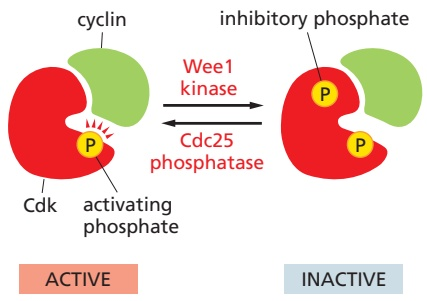

Figure 17–12 The regulation of Cdk activity by inhibitory phosphorylation. The active cyclin–Cdk complex is turned off when the kinase Wee1 phosphorylates two closely spaced sites above the active site. Removal of these phosphates by the phosphatase Cdc25 activates the cyclin– Cdk complex. For simplicity, only one inhibitory phosphate is shown. CAK adds the activating phosphate, as shownMBoC7 m17.13/17.12 in Figure 17–11.

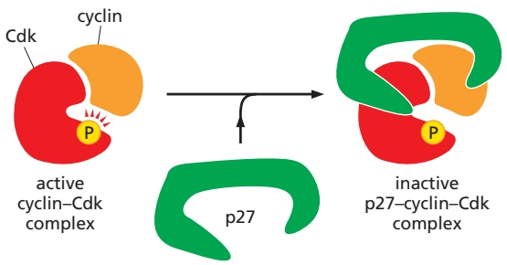

Figure 17–13 The inhibition of a cyclin– Cdk complex by a CKI. This drawing is based on the three-dimensional structure of the human cyclin A–Cdk2 complex bound to the CKI p27, as determined by x-ray crystallography. The p27 binds to both the cyclin and Cdk in the complex, distorting the active site of the Cdk. It also inserts into the ATP-binding site, further inhibiting the enzyme activity.

The activities of $[ \mathrm { G _ { 1 } } / \mathrm { S } ]$ and S-Cdks early in the cell cycle are governed in part by **Cdk inhibitor proteins (CKIs)**. These small proteins wrap around the cyclin–Cdk complex, promoting a rearrangement in the Cdk active site that renders it inactive (**Figure 17–13**).

#### Protein Phosphatases Reverse the Effects of Cdks

As we learned in Chapters 3 and 15, protein phosphorylation is not controlled simply by the protein kinases that attach phosphate but also by the protein phosphatases that remove it. Phosphatases that reverse the effects of Cdks and other kinases are therefore key players in the cell-cycle control system.

We can think about the level of protein phosphorylation like the level of water in a sink, which depends on the rate of water flow in through the tap (protein kinase activity) and the rate of flow out of the drain (phosphatase activity). The fastest way to raise the water level is to plug the drain at the same time as you increase the flow through the tap. Indeed, we will see that the activity of phosphatases tends to decline when Cdk activity increases, resulting in a more robust increase in the protein phosphorylation state.

**Protein phosphatase 2A (PP2A)** is a particularly critical regulator of Cdk substrates during the cell cycle. This three-subunit enzyme comes in multiple forms, depending on the identity of a subunit called the regulatory subunit, or B subunit (**Figure 17–14**). The B subunit influences the substrate selectivity, localization, and regulation of the enzyme. Two B subunits, B55 and B56, are the most important.

The cell-cycle regulation of PP2A associated with the B55 subunit is particularly well understood and illustrates how opposing Cdk and phosphatase activities are coordinated during the cell cycle. PP2A-B55 activity is high during interphase but inhibited during early mitosis when M-Cdk activity rises. The underlying mechanism is conceptually simple: M-Cdk turns off PP2A-B55 via the phosphorylation of an intermediary protein kinase called Greatwall (**Figure 17–15**). As a result, the kinase activity of M-Cdk goes relatively unopposed in early mitosis, contributing to the rapid phosphorylation of M-Cdk substrates. When anaphase is initiated and M-Cdk activity declines after cyclin destruction, the system works in reverse: PP2A-B55 is reactivated to promote rapid dephosphorylation of Cdk substrates during anaphase and telophase.

#### Hundreds of Cdk Substrates Are Phosphorylated in a Defined Order

Cdks catalyze the phosphorylation of hundreds of different proteins in the cell. Clearly, however, these proteins are not all phosphorylated at the same time: proteins that trigger DNA replication in early S phase, for example, are phosphorylated much earlier than proteins that promote spindle assembly in early mitosis. How is the correct ordering of substrate phosphorylation achieved?

The answer is only partly understood. First, it is clear that cyclins do not simply activate the Cdk partner but also direct it to specific target proteins. The surface of each cyclin contains a binding site for short amino acid sequences that are found on certain Cdk substrates. As a result, each cyclin–Cdk complex interacts more tightly with specific targets: S-Cdk, for example, has a high affinity for DNA replication proteins and therefore phosphorylates those proteins at a high rate while essentially ignoring low-affinity mitotic targets. It is likely, therefore, that the ordering of substrate phosphorylation depends in part on the activation timing of each cyclin–Cdk complex.

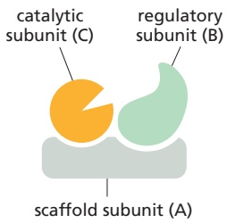

Figure 17–14 Structure of the phosphatase PP2A. PP2A is composed of three subunits. The two core subunits include the small catalytic subunit and a large structural subunit called the scaffold. This dimer associates with one of several different regulatory subunits, which are positioned next to the active site of the. / . catalytic subunit and can influence its interaction with substrates.

Figure 17–15 Control of PP2A-B55 activity in mitosis. Prior to mitosis, PP2A-B55 is active, helping to reduce the phosphorylation of M-Cdk targets. When M-Cdk activity begins to rise at the beginning of mitosis, it phosphorylates and thereby activates another protein kinase called Greatwall. This kinase in turn phosphorylates a small protein called Ensa, which binds tightly to PP2A-B55 and inhibits phosphatase activity. M-Cdk thereby inactivates its opponent. As an added twist, PP2A-B55 can dephosphorylate Greatwall (dashed line), thereby inhibiting its own inhibitor—a form of positive feedback. We discuss the implications of this feedback in a later section.

Cyclin specificity is not the whole story, however. Even the same cyclin–Cdk complex can induce different effects at different times in the cycle, indicating that a single enzyme phosphorylates different targets in a specific order. This ordering is likely to result from differences in the affinities of the interactions between the Cdk active site and the substrate: high-affinity substrates are phosphorylated earlier. The total amount of enzyme activity is also important: M-Cdk activity, for example, continues to rise as the cell progresses through mitosis, and higher activity might be required for the phosphorylation of certain low-affinity targets that are phosphorylated later in mitosis.

Finally, we must not forget that the timing of protein phosphorylation also depends on the opposing phosphatases, each of which will have differing activation times, localization, and affinities for specific targets. With all these factors at play, it is easy to see that a combination of mechanisms is likely to generate the perfectly timed choreography of protein phosphorylation during the cell cycle. Disentangling these mechanisms is a major goal of current research.

#### Positive Feedback Generates the Switchlike Behavior of Cell-Cycle Transitions

As mentioned earlier, a key feature of the cell-cycle control system is its ability to generate switchlike, binary decisions: progression through each major cell-cycle transition is a complete, irreversible commitment. The cell-cycle control system achieves this behavior through the use of positive feedback. As we discussed in Chapters 8 and $1 5 ,$ positive feedback is used frequently in cell regulation to generate robust, all-or-none regulatory effects, and this mechanism is well suited for generating the switchlike behavior that is so critical in cell-cycle progression.

The activation of M-Cdk at the $\mathrm { G _ { 2 } / M }$ transition provides the best-understood example of positive feedback in cell-cycle control. M-Cdk activation begins with the accumulation of M-cyclin during $\mathrm { G } _ { 2 } ,$ which leads to a corresponding accumulation of M-Cdk complexes as the cell approaches mitosis. Although the Cdk subunit in these complexes is phosphorylated at an activating site by the Cdk-activating kinase (CAK), as discussed earlier, the protein kinase Wee1 holds it in an inactive state by inhibitory phosphorylation at two neighboring sites (see Figure 17–12). Thus, by the time the cell reaches the end of $\mathbf { G } _ { 2 } ,$ it contains an abundant stockpile of M-Cdk that is primed and ready to act but is suppressed by phosphates that block the kinase active site.

What, then, causes the activation of the M-Cdk stockpile? The crucial event is activation of the protein phosphatase Cdc25, which removes the inhibitory phosphates that restrain M-Cdk (**Figure 17–16**). At the same time, the inhibitory activity of the kinase Wee1 is suppressed, further ensuring that M-Cdk activity increases. Notably, Cdc25 is activated, at least in part, by its target, M-Cdk. M-Cdk also inhibits the inhibitory kinase Wee1. The ability of M-Cdk to activate its own activator (Cdc25) and inhibit its own inhibitor (Wee1) results in positive feedback (see Figure 17–16). The result is that all M-Cdk complexes in the cell are rapidly and irreversibly activated, leading to rapid phosphorylation of the many proteins that drive the early events of mitosis.

Figure 17–16 Positive feedback in the activation of M-Cdk. Cdk1 associates with M-cyclin as the levels of M-cyclin gradually rise. The resulting M-Cdk complex is phosphorylated on an activating site by Cdk-activating kinase (CAK) and on a pair of inhibitory sites by Wee1 kinase (for simplicity, only one inhibitory phosphate is shown). The resulting inactive M-Cdk complex is then activated at the end of G2 by the phosphatase Cdc25. Cdc25 is further stimulated by active M-Cdk, resulting in positive feedback. This feedback is enhanced by the ability of M-Cdk to inhibit Wee1. The phosphorylation of both Cdc25 and Wee1 is reversed by the phosphatase PP2A-B55. As described earlier, this phosphatase is inactivated by M-Cdk (see Figure 17–15), providingMB 7 17.20/17.16 another mechanism by which M-Cdk activates itself.

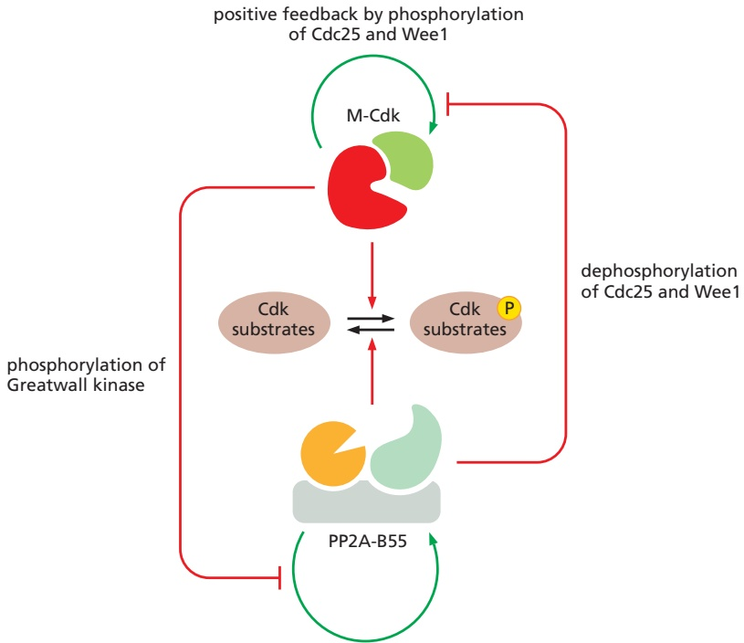

Figure 17–17 The mitotic regulatory circuit. This diagram summarizes the interactions described in Figures 17–15 and 17–16. M-Cdk and PP2A-B55 are each activated by positive feedback (green). They also inhibit each other (red). The result is an integrated system of multiple positive feedback loops. Much remains to be learned about other mechanisms and molecules that feed into this system in early and late mitosis.

positive feedback by dephosphorylation of Greatwall kinase

As in all positive feedback systems, there must be some external trigger mechanism that first unleashes the feedback loop, in this case by causing a small increase in Cdc25 activity. The mitotic trigger is not well understood, but a likely possibility is that the S-Cdks that are active in $\mathrm { G _ { 2 } }$ and early prophase help initiate Cdc25 activation.

As we discussed earlier, increased protein phosphorylation in early mitosis also depends on the ability of M-Cdk to inhibit the phosphatase PP2A-B55 through the protein kinase Greatwall (see Figure 17–15). Notably, PP2A-B55 can fight back by dephosphorylating and thereby inhibiting its inhibitor, Greatwall. This mutual antagonism is essentially a form of positive feedback: when a small amount of Greatwall activation is triggered by increasing M-Cdk, the resulting inhibition of PP2A-B55 increases Greatwall phosphorylation and activation, and the system switches abruptly to a state of low PP2A-B55 activity.

A fascinating feature of this system is that PP2A-B55 is also an inhibitor of M-Cdk activation, because it dephosphorylates Cdc25 (causing its inactivation) and Wee1 (causing its activation) (see Figure 17–16). M-Cdk and PP2A-B55 are thus mutual antagonists, producing yet another layer of positive feedback. The overall result is a remarkable regulatory circuit in which two positive feedback loops are themselves linked by positive feedback (**Figure 17–17**). Highly integrated feedback systems of this sort generate a robust biochemical switch that can operate even when some components fail.

Dephosphorylation of M-Cdk substrates is crucial for the completion of mitosis and cytokinesis. The positive feedback loops that promote phosphorylation in early mitosis can be flipped to the alternate dephosphorylation state in anaphase, when M-Cdk is abruptly inactivated by destruction of cyclins. We discuss the mechanisms of cyclin destruction next.

#### The Anaphase-promoting Complex/Cyclosome (APC/C) Triggers the Metaphase-to-Anaphase Transition

Whereas activation of specific cyclin–Cdk complexes drives progression through the Start and $\mathrm { G _ { 2 } / M }$ transitions (see Figure 17–10), progression through the metaphase-to-anaphase transition is triggered not by protein phosphorylation but by protein destruction, leading to the final stages of cell division.

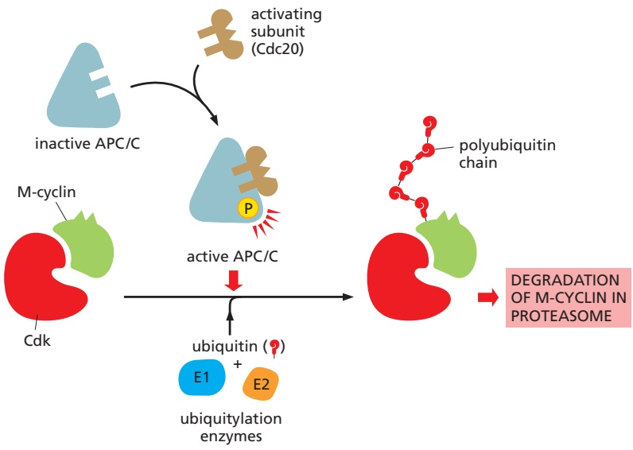

Figure 17–18 The control of proteolysis by the APC/C. The APC/C is activated in metaphase by association with Cdc20, which recognizes specific amino acid sequences on M-cyclin and other target proteins. With the help of two additional proteins called E1 and E2 (see Chapter 3), the APC/C assembles polyubiquitin chains on the target protein. The polyubiquitylated target is then recognized and degraded in a proteasome.

The key regulator of the metaphase-to-anaphase transition is the **anaphasepromoting complex, or cyclosome (APC/C)**, a member of the ubiquitin ligase family of enzymes. As discussed in Chapter 3, ubiquitin ligases are used in numerous cell processes to stimulate the proteolytic destruction of specific regulatory proteins. They polyubiquitylate specific target proteins, resulting in their destruction in proteasomes. Other ubiquitin ligases mark proteins for purposes other than destruction (discussed in Chapter 3).

The APC/C catalyzes the ubiquitylation and destruction of two major proteins.MB C7 17.15 /17.18 The first is securin; its destruction in metaphase activates a protease that separates the sister-chromatid pairs and unleashes anaphase, as described later. The S- and M-cyclins are the second major targets of the APC/C. Destroying these cyclins inactivates most Cdks in the cell (see Figure 17–10). As a result, the many proteins phosphorylated by Cdks from S phase to early mitosis are dephosphorylated by PP2A and other phosphatases in the anaphase cell. This dephosphorylation of Cdk targets is required for the completion of M phase, including the final steps in mitosis and then cytokinesis.

APC/C activity increases in mid-mitosis and remains high through $\mathrm { G _ { 1 } }$ . Activation depends primarily on association with one of two activating subunits, **Cdc20** or **Cdh1**. These subunits are essential for APC/C activity for two reasons. First, their binding causes a conformational change that enhances enzyme activity. Second, they provide the main binding site for the enzyme’s protein substrates. Activators interact with short amino acid sequences on APC/C substrates, holding them in place while the APC/C builds polyubiquitin chains on the target (**Figure 17–18**).

The two APC/C activator subunits interact sequentially with the APC/C. Cdc20 acts first, in metaphase, to trigger the destruction of securin and cyclins, resulting in chromosome segregation in anaphase. Cdc20 is then replaced by Cdh1, which maintains APC/C activity through late mitosis and $\mathbf { G _ { 1 , i } }$ , ensuring that cyclins and other proteins are kept at low levels until the following cell cycle.

Sequential activation of the APC/C by Cdc20 and Cdh1 is based on the opposing effects of M-Cdk: phosphorylation activates APC/C–Cdc20 and inhibits APC/C–Cdh1. As a result, APC/C–Cdc20 is turned on when M-Cdk levels rise in early mitosis, whereas APC/C–Cdh1 activation occurs only after M-Cdk activity declines due to cyclin destruction in anaphase (**Figure 17–19**).

The cell-cycle control system also employs another ubiquitin ligase called **SCF** (see Figure 3–67). Its major role in the cell cycle is to ubiquitylate certain CKI proteins in late $\mathrm { G } _ { 1 } ,$ thereby helping to control the activation of S-Cdks and DNA replication. SCF is also responsible for the destruction of $\mathbf { G } _ { 1 } / \mathbf { S } _ { 1 }$ -cyclins in early S phase. SCF activity depends on substrate-binding subunits called F-box proteins. Unlike APC/C activity, however, SCF activity is constant during the cell

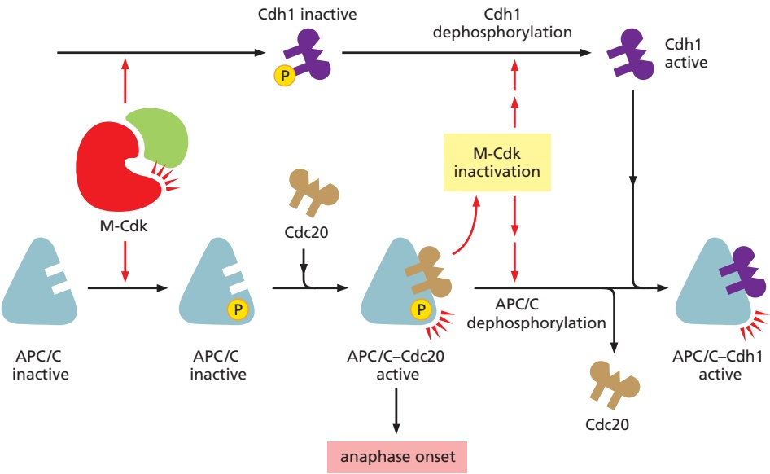

cycle. Ubiquitylation by SCF is controlled instead by changes in the phosphorylation state of its target proteins, as F-box subunits recognize only specifically phosphorylated proteins.

#### The $\mathbb { G } _ { 1 }$ Phase Is a Stable State of Cdk InactivityMBoC7 n17.105/17.19

A key regulatory event in late M phase is the inactivation of Cdks, which resets the cell-cycle control system as the cell prepares to enter a new cell cycle. In most cells, this state of Cdk inactivity generates a stable $\mathbf { G } _ { 1 }$ gap phase, during which the cell grows and monitors its environment before committing to a new cell cycle.

Cells employ several mechanisms to suppress Cdk activity after mitosis. One mechanism, as we have just seen, depends on the late mitotic activation of APC/C–Cdh1, which ensures that cyclin destruction continues throughout $\mathrm { G _ { 1 } , A }$ second mechanism for Cdk suppression depends on the increased production of CKIs, the Cdk inhibitor proteins discussed earlier. Budding yeast cells, in which this mechanism is best understood, contain a CKI protein called Sic1, which binds to and inactivates M-Cdk in late mitosis and $\mathrm { G _ { 1 } } .$ Like Cdh1, Sic1 is inhibited by M-Cdk, which phosphorylates Sic1 during mitosis and thereby promotes its ubiquitylation by SCF. Thus, Sic1 and M-Cdk, like Cdh1 and M-Cdk, inhibit each other, resulting in more examples of positive feedback. As a result, the decline in M-Cdk activity that occurs in late mitosis causes the Sic1 protein to accumulate, and this CKI helps keep M-Cdk activity low after mitosis. A CKI protein called p27 may serve similar functions in animal cells.

In many cells, decreased transcription of M-cyclin genes helps reduce M-Cdk activity in late mitosis. In budding yeast, for example, M-Cdk promotes the expression of these genes, resulting in another positive feedback loop. This loop is turned off as cells exit from mitosis: the inactivation of M-Cdk by Cdh1 and Sic1 leads to decreased M-cyclin gene transcription and thus decreased M-cyclin synthesis. Gene regulatory proteins that promote the expression of $\mathbf { G } _ { 1 } / \mathbf { S } \cdot$ and S-cyclins are also inhibited during $\mathrm { G _ { 1 } }$

Thus, APC/C–Cdh1 activity, CKI accumulation, and decreased cyclin gene expression act together to ensure that $\mathrm { G _ { 1 } }$ phase is a time when most Cdk activity is suppressed. As in many other aspects of cell-cycle control, the use of multiple regulatory mechanisms allows the system to operate with reasonable efficiency even if one mechanism is defective. So how does the cell escape from this stable $\mathrm { G _ { 1 } }$ state to initiate a new cell cycle? The answer is that $\mathbf { G } _ { 1 } / \mathbf { S } \cdot$ Cdk activity, which rises in late $\mathrm { G _ { L } }$ releases all of the braking mechanisms that suppress Cdk activity, as we describe later in this chapter when we discuss the control of cell proliferation.

Figure 17–19 Sequential activation of APC/C by Cdc20 and Cdh1. M-Cdk phosphorylates the APC/C, thereby enhancing its association with Cdc20. Thus, M-Cdk not only triggers the early mitotic events leading up to metaphase, but it also sets the stage for progression into anaphase and the destruction of cyclins. This creates a negative feedback loop: M-Cdk sets in motion a regulatory process that leads to its own inactivation. More negative feedback then follows: APC/C–Cdc20 also turns itself off by inactivating Cdks, which allows APC/C dephosphorylation. APC/C–Cdc20 is thereby inactivated in anaphase. The APC/C remains active through mitosis and beyond because the second activator, Cdh1, is regulated in a completely different fashion: Cdh1 phosphorylation by Cdks inhibits its binding to the APC/C, keeping it inactive from late G1 to anaphase. When cyclins are destroyed in anaphase, Cdk inactivation allows Cdh1 dephosphorylation, which activates Cdh1 and thereby stimulates formation of APC/C–Cdh1. APC/C–Cdh1 remains active until Cdh1 is phosphorylated and thereby inactivated by G1/S- and S-Cdks at the beginning of the next cell cycle.

#### The Cell-Cycle Control System Functions as a Linked Series of Biochemical Switches

**Table 17–2** summarizes some of the major components of the cell-cycle control system. These proteins are functionally linked to form a robust network, which operates essentially autonomously to activate a series of biochemical switches, each of which triggers specific cell-cycle events.

When conditions for cell proliferation are right, various external and internal signals stimulate the activation of $\mathbf { \dot { G } } _ { 1 } \mathbf { - } \mathbf { C } \mathbf { d } \mathbf { k } ,$ which in turn stimulates the expression of genes encoding $\mathbf { G } _ { 1 } / \mathbf { S } \cdot$ and S-cyclins (**Figure 17–20**). The resulting activation of $\tilde { \mathrm { G _ { 1 } / S } }$ -Cdk then drives progression through the Start transition, in part by releasing many of the inhibitory mechanisms, discussed above, that restrain Cdk activity in $\mathrm { G _ { 1 } } .$ By mechanisms we discuss later, $\mathrm { G _ { 1 } / S } \cdot$ Cdks also unleash a wave of S-Cdk

<table><tbody><tr><td colspan="2">TABLE 17-2 Summary of the Major Cell-Cycle Regulatory Proteins</td></tr><tr><td>General name</td><td>Functions and comments</td></tr><tr><td colspan="2">Protein kinases and protein phosphatases that modify Cdks</td></tr><tr><td>Cdk-activating kinase (CAK)</td><td>Phosphorylates an activating site in Cdks</td></tr><tr><td>Wee1 kinase</td><td>Phosphorylates inhibitory sites in Cdks; primarily involved in suppressing Cdk1 activity before mitosis; animals also contain a related kinase, Myt1, with similar functions</td></tr><tr><td>Cdc25 phosphatase</td><td>Removes inhibitory phosphates from Cdks; three family members (Cdc25A, B, C) in mammals; primarily involved in controlling Cdk1 activation at the onset of mitosis</td></tr><tr><td colspan="2">Protein phosphatases that dephosphorylate substrates of Cdks and other cell-cycle kinases</td></tr><tr><td>PP2A-B55</td><td>One of two major forms of PP2A involved in Cdk substrate regulation</td></tr><tr><td>PP2A-B56</td><td>Second of two major forms of PP2A involved in Cdk substrate regulation</td></tr><tr><td>PP1</td><td>Second major class of phosphatase involved in Cdk substrate regulation</td></tr><tr><td colspan="2">Cdk inhibitor proteins (CKIs)</td></tr><tr><td>Sic1 (budding yeast)</td><td>Suppresses Cdk1 activity in G1; phosphorylation by Cdk1 at the end of G1 triggers its destruction</td></tr><tr><td>p27 (mammals)</td><td>Suppresses G1/S-Cdk and S-Cdk activities in G1; helps cells withdraw from cell cycle when they terminally differentiate; phosphorylation by Cdk2 triggers its ubiquitylation by SCF</td></tr><tr><td>p21 (mammals)</td><td>Suppresses G1/S-Cdk and S-Cdk activities after DNA damage</td></tr><tr><td>p16 (mammals)</td><td>Suppresses G1-Cdk activity in G1; frequently inactivated in cancer</td></tr><tr><td colspan="2">Ubiquitin ligases and their activators</td></tr><tr><td>APC/C</td><td>Catalyzes ubiquitylation of regulatory proteins involved primarily in exit from mitosis, including securin and S-cyclins and M-cyclins; regulated by association with activating subunits Cdc20 or Cdh1</td></tr><tr><td>Cdc20</td><td>APC/C-activating subunit in all cells; triggers initial activation of APC/C at metaphase-to-anaphase transition; stimulated by M-Cdk activity</td></tr><tr><td>Cdh1</td><td>APC/C-activating subunit that maintains APC/C activity after anaphase and throughout G1; inhibited by Cdk activity</td></tr><tr><td>SCF</td><td>Employs various substrate-binding (F-box) subunits to catalyze ubiquitylation of regulatory proteins involved in G1 control, including some CKIs (Sic1 in budding yeast, p27 in mammals); phosphorylation of target protein usually required for this activity</td></tr><tr><td>CRL4-Cdt2</td><td>Related to SCF: catalyzes ubiquitylation of the replication regulator Cdt1 during S phase, thereby suppressing further loading of Mcm helicase at origin; target recognition depends on association with proteins at the replication fork</td></tr></tbody></table>

Figure 17–20 Sequential activation of Cdks during the cell cycle. The core of the cellcycle control system consists of a series of cyclin–Cdk complexes (yellow). The activity of each complex is also influenced by various inhibitory mechanisms, which provide information about the extracellular environment, DNA damage, and spindle assembly (top). We will discuss the mechanisms underlying these inhibitory effects later in this chapter.

activity, which initiates chromosome duplication in S phase and also contributes to M-Cdk activation and some early events of mitosis. M-Cdk then triggers progression through the G2/M transition and the events of early mitosis, leading to the alignment of sister-chromatid pairs on the mitotic spindle. Finally, M-Cdk also activates APC/C–Cdc20, thereby triggering the destruction of securin and cyclins—leading to sister-chromatid segregation and late mitotic events. Cdk inactivation also leads to activation of APC/C–Cdh1 and other mechanisms that suppress Cdk activity, resulting in a stable G1 phase. We are now ready to discuss these cell-cycle stages in more detail, starting with S phase.

#### Summary

The cell-cycle control system triggers the events of the cell cycle and ensures that they are properly timed and coordinated with each other. Central components of the control system are the cyclin-dependent protein kinases (Cdks), which depend on cyclin subunits for their activity. Oscillations in the activities of different cyclin–Cdk complexes control various cell-cycle events. Thus, activation of S-phase cyclin–Cdk complexes (S-Cdk) initiates S phase, whereas activation of M-phase cyclin–Cdk complexes (M-Cdk) triggers mitosis. The mechanisms that control the activities of cyclin–Cdk complexes include phosphorylation of the Cdk subunit and binding of Cdk inhibitor proteins (CKIs). Protein phosphatases, including PP2A, oppose the actions of Cdks and thereby help control Cdk substrate phosphorylation and thus cell-cycle progression. The cell-cycle control system also depends crucially on a ubiquitin ligase called the APC/C, which catalyzes the ubiquitylation and consequent destruction of cyclins and other regulatory proteins that control progression through late mitosis. Together, the many components of the cell-cycle control system are assembled into a complex regulatory system containing a linked series of biochemical switches that drive stepwise progression through the phases of the cell cycle.

<!-- END EN EN17-H006-H015 -->

### 英文补充：有丝分裂原、静止状态与DNA损伤检查点

> 对应中文板块：有丝分裂原、静止状态与DNA损伤检查点。英文来源：Molecular Biology of the Cell，第7版，第17章；[本章完整原文](../来源/英文教材/17_The_Cell_Cycle/chapter.md)。物理PDF页码范围：1066–1127（整章范围）。

<!-- BEGIN EN EN17-H062-H066 -->
#### CONTROL OF CELL DIVISION AND CELL GROWTH

A fertilized mouse egg and a fertilized human egg are similar in size, yet they produce animals of very different sizes. What factors in the control of cell behavior in humans and mice are responsible for these size differences? The same fundamental question can be asked for each organ and tissue in an animal’s body. What factors determine the length of an elephant’s trunk or the size of its brain or its liver? These questions are largely unanswered, but it is nevertheless possible to say what the ingredients of an answer must be.

The size of an organ or organism depends on its total cell mass, which depends on both the total number of cells and their size. Cell number, in turn, depends on the rates of cell division and cell death. Organ and body size are therefore determined by three fundamental processes: cell growth, cell division, and cell survival. Each is tightly regulated—both by intracellular programs and by extracellular signal molecules that control these programs.

The extracellular signal molecules that regulate cell growth, division, and survival are generally soluble secreted proteins, proteins bound to the surface of cells, or components of the extracellular matrix. They can be divided operationally into three major classes:

1. Mitogens, which stimulate cell division, primarily by triggering a wave of $\mathbf { G } _ { 1 } / \mathbf { S } \cdot$ Cdk activity that relieves intracellular negative controls that otherwise block progress through the cell cycle.

2. Growth factors, which stimulate cell growth (an increase in cell mass) by promoting the synthesis of proteins and other macromolecules and by inhibiting their degradation.

3. Survival factors, which promote cell survival by suppressing the form of programmed cell death known as apoptosis.

Many extracellular signal molecules promote all of these processes, while others promote one or two of them. Indeed, the term “growth factor” is often used inappropriately to describe a factor that has any of these activities. Even worse, the term “cell growth” is often used to mean an increase in cell number, or cell proliferation.

In addition to these three classes of stimulating signals, there are extracellular signal molecules that suppress cell proliferation, cell growth, or both. There are also extracellular signal molecules that activate apoptosis.

In this section, we focus primarily on how mitogens and other factors, such as DNA damage, control the rate of cell division. We then turn to the important but poorly understood problem of how a proliferating cell coordinates its growth with cell division so as to maintain its appropriate size. We discuss the control of cell survival and cell death by apoptosis in Chapter 18.

#### Mitogens Stimulate Cell Division

Unicellular organisms tend to grow and divide as fast as they can, and their rate of proliferation depends largely on the availability of nutrients in the environment. The cells of a multicellular organism, however, divide only when the organism needs more cells. Thus, for an animal cell to proliferate, it must receive stimulatory extracellular signals, in the form of **mitogens**, from other cells, usually its neighbors. Mitogens overcome intracellular braking mechanisms that block progress through the cell cycle.

More than 50 animal proteins are known to act as mitogens. Most of these proteins have a broad specificity. Platelet-derived growth factor (PDGF), for example, can stimulate many types of cells to divide, including fibroblasts, smooth muscle cells, and neuroglial cells. Similarly, epidermal growth factor (EGF) acts not only on epidermal cells but also on many other cell types, including both epithelial and nonepithelial cells. Some mitogens, however, have a narrow specificity: erythropoietin, for example, only induces the proliferation of red blood cell precursors. Many mitogens, including PDGF, also have actions other than the stimulation of cell division: they can stimulate cell growth, survival, differentiation, or migration, depending on the circumstances and the cell type.

In some tissues, inhibitory extracellular signal proteins oppose the positive regulators and thereby inhibit organ growth. The best-understood inhibitory signal proteins are transforming growth factor-β (TGFβ) and its relatives. TGFβ inhibits the proliferation of several cell types, mainly by blocking cell-cycle progression in $\mathrm { G _ { 1 } }$

#### Cells Can Enter a Specialized Nondividing State

In the absence of a mitogenic signal to proliferate, Cdk inhibition in $\mathrm { G _ { 1 } }$ is maintained by the multiple mechanisms discussed earlier, and progression into a new cell cycle is blocked. In some cases, cells partly disassemble their cell-cycle control system and withdraw from the cycle to a specialized nondividing state called $\mathbf { G _ { 0 } } .$

Most cells in our body are in $\mathbf { G } _ { 0 } ,$ but the molecular basis and reversibility of this state vary in different cell types. Most of our neurons and skeletal muscle cells, for example, are in a terminally differentiated $\mathsf { G } _ { 0 }$ state, in which their cellcycle control system is completely dismantled: the expression of the genes encoding various Cdks and cyclins is permanently turned off, and cell division rarely occurs. Some cell types withdraw from the cell cycle only transiently and retain the ability to reassemble the cell-cycle control system quickly and reenter the cycle. Most liver cells, for example, are in $\mathbf { G } _ { 0 } ,$ but they can be stimulated to divide if the liver is damaged. Still other types of cells, including fibroblasts and some lymphocytes, withdraw from and reenter the cell cycle repeatedly throughout their lifetime.

Almost all the variation in cell-cycle length in the adult body occurs during the time the cell spends in $\mathrm { G _ { 1 } }$ or $\mathbf { G } _ { 0 } .$ By contrast, the time a cell takes to progress from the beginning of S phase through mitosis is usually brief (typically 12–24 hours in mammals) and relatively constant, regardless of the interval from one division to the next.

#### Mitogens Stimulate $G _ { 1 } - C \Delta K$ and $\mathbb { G } _ { 1 } / \mathbb { S }$ -Cdk Activities

For the vast majority of animal cells, mitogens control the rate of cell division by acting in the $\mathrm { G _ { 1 } }$ phase of the cell cycle. As discussed earlier, multiple mechanisms act during $\mathrm { G _ { 1 } }$ to suppress Cdk activity. Mitogens release these brakes on Cdk activity, thereby allowing entry into a new cell cycle.

As we discuss in Chapter 15, mitogens interact with cell-surface receptors to trigger multiple intracellular signaling pathways. One major pathway acts through the monomeric GTPase **Ras**, which leads to the activation of a mitogenactivated protein kinase (MAP kinase) cascade (see Figure 15–50). This leads to an increase in the production of transcription regulatory proteins, including **Myc**. Myc is thought to promote cell-cycle entry by several mechanisms, one of which is to increase the expression of genes encoding $\mathrm { G _ { 1 } \mathrm { - } c y c l i n s }$ (D cyclins), thereby increasing $\mathrm{G_{1}} - \mathrm{Cdk}$ (cyclin D–Cdk4) activity. Myc also has a major role in stimulating the transcription of genes that increase cell growth.

The key function of $\mathrm{G_{1}} - \mathrm{Cd}\mathrm{k}$ complexes in animal cells is to activate a group of gene regulatory factors called the **E2F proteins**, which bind to specific DNA sequences in the promoters of a wide variety of genes that encode proteins required for S-phase entry, including $\mathbf { G } _ { 1 } / \mathbf { S } _ { 1 }$ -cyclins, S-cyclins, and proteins involved in DNA synthesis and chromosome duplication. In the absence of mitogenic stimulation, E2F-dependent gene expression is inhibited by an interaction between E2F and members of the **retinoblastoma protein (Rb)** family. When cells are stimulated to divide by mitogens, active $G _{1} -Cdk$ accumulates and phosphorylates Rb family members, reducing their binding to E2F. The liberated E2F proteins then activate expression of their target genes (**Figure 17–59**).

This transcriptional control system, like so many other control systems that regulate the cell cycle, includes feedback loops that ensure that entry into the cell cycle is complete and irreversible. The liberated E2F proteins, for example, increase the transcription of their own genes. In addition, E2F-dependent transcription of $\mathbf { G } _ { 1 } / \mathbf { S } _ { 1 }$ -cyclin (cyclin E) and S-cyclin (cyclin A) genes leads to increased $G _{1}/ S-Cdk$ and S-Cdk activities, which in turn increase Rb protein phosphorylation and promote further E2F release (see Figure 17–59).

The central member of the Rb family, the Rb protein itself, was identified originally through studies of an inherited form of eye cancer in children, known as retinoblastoma (discussed in Chapter 20). The loss of both copies of the Rb gene leads to excessive proliferation of some cells in the developing retina, suggesting that the Rb protein is particularly important for restraining cell division in this tissue. The complete loss of Rb does not immediately cause increased proliferation of retinal or other types of cells, in part because Cdh1 and CKIs also help inhibit progression through $\mathbf { G } _ { 1 }$ and in part because other cell types contain Rb-related proteins that provide backup support in the absence of Rb. It is also likely that other proteins, unrelated to Rb, help to regulate the activity of E2F.

Additional layers of control promote an overwhelming increase in S-Cdk activity at the beginning of S phase. We mentioned earlier that the APC/C

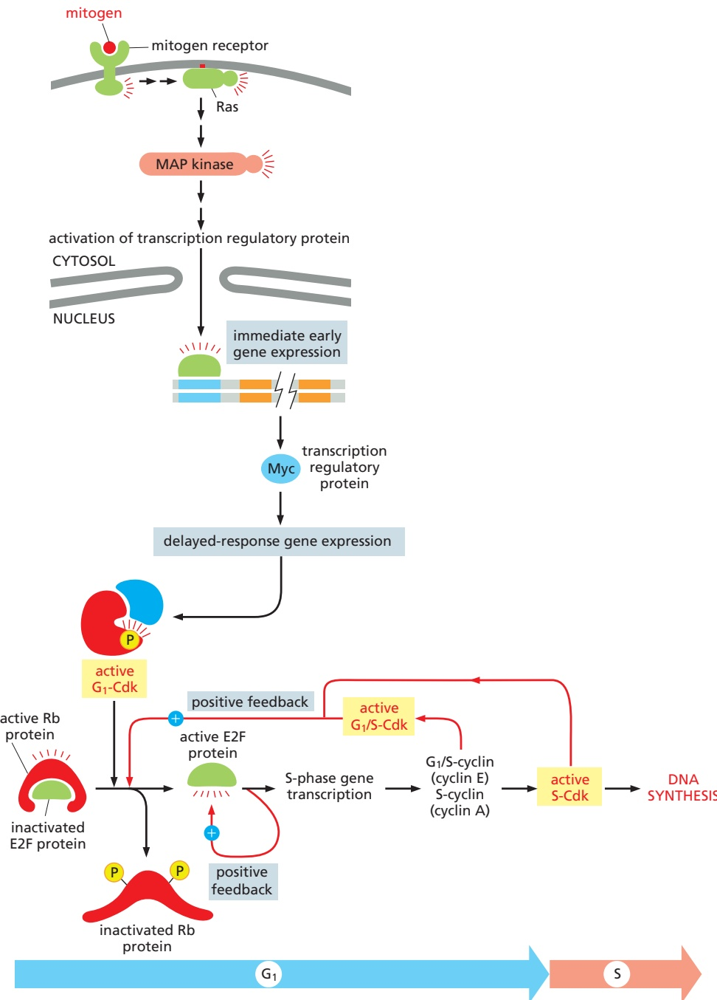

activator Cdh1 suppresses cyclin levels after mitosis. In animal cells, however, $\mathrm { G _ { 1 ^ { - } } }$ and $\mathbf { G } _ { 1 } / \mathbf { S } \cdot$ cyclins are resistant to APC/C–Cdh1 and can therefore act unopposed by the $\mathrm { A P C / C }$ to promote Rb protein phosphorylation and E2F-dependent gene expression. S-cyclin, by contrast, is not resistant, and its level is initially restrained by APC/C–Cdh1 activity. However,MBoC7 m17.61/17 $\mathrm { G _ { 1 } / S }$ -Cdk also phosphorylates and inactivates APC/C–Cdh1, thereby allowing the accumulation of S-cyclin, further promoting S-Cdk activation. $\dot { \bf G } _ { 1 } / \dot { \bf S } .$ -Cdk also inactivates CKI proteins that suppress S-Cdk activity. The overall effect of all these interactions is the rapid and complete activation of the S-Cdk complexes required for S-phase initiation.

#### DNA Damage Blocks Cell Division

Progression through the cell cycle, and thus the rate of cell proliferation, is controlled not only by extracellular mitogens but also by other extracellular and intracellular signals. One of the most important influences is DNA damage,

Figure 17–59 Mitogen stimulation of cellcycle entry. As discussed in Chapter 15, mitogens bind to cell-surface receptors to initiate intracellular signaling pathways. One of the major pathways involves activation of the small GTPase Ras, which activates a MAP kinase cascade, leading to increased expression of numerous immediate early genes, including the gene encoding the transcription regulatory protein Myc. Myc increases the expression of many delayedresponse genes, including some that lead to increased $\mathbb { G } _ { 1 1 }$ Cdk activity (cyclin D– Cdk4), which triggers the phosphorylation of members of the Rb family of proteins. This inactivates the Rb proteins, freeing the gene regulatory protein E2F to activate the transcription of $\mathsf { G } _ { 1 } / \mathsf { S }$ genes, including the genes for a G1/S-cyclin (cyclin E) and S-cyclin (cyclin A). The resulting G1/S-Cdk and S-Cdk activities further enhance Rb protein phosphorylation, forming a positive feedback loop. E2F proteins also stimulate the transcription of their own genes, forming another positive feedback loop.

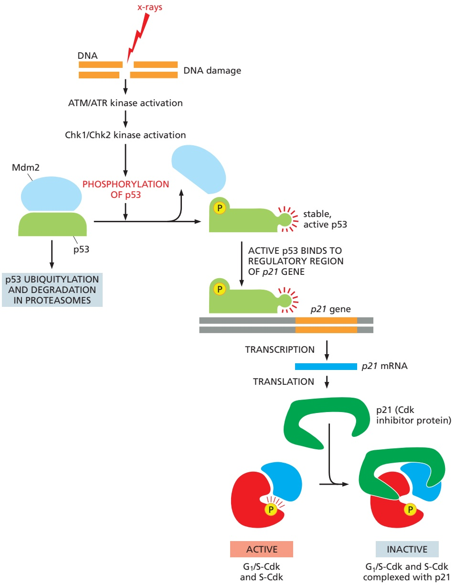

Figure 17–60 How DNA damage arrests the cell cycle in G1. When DNA is damaged, various protein kinases are recruited to the site of damage and initiate a signaling pathway that causes cell-cycle arrest. The first kinase at the damage site is either ATM or ATR, depending on the type of damage. Additional protein kinases, called Chk1 and Chk2, are then recruited and activated, resulting in the phosphorylation of the transcription regulatory protein p53. Mdm2 normally binds to p53 and promotes its ubiquitylation and destruction in proteasomes. Phosphorylation of p53 blocks its binding to Mdm2; as a result, p53 accumulates to high levels and stimulates transcription of numerous genes, including the gene that encodes the CKI protein p21. The p21 binds and inactivates G1/S-Cdk and S-Cdk complexes, arresting the cell in G1. In some cases, DNA damage also induces either the phosphorylation of Mdm2 or a decrease in Mdm2 production, which causes a further increase in p53 (not shown).

which can occur as a result of spontaneous chemical reactions in DNA, errors in DNA replication, or exposure to radiation or certain chemicals (discussed in Chapter 5). It is essential that damaged chromosomes are repaired before attempting to duplicate or segregate them. The cell-cycle control system can readily detect DNA damage and arrest the cycle at either of two transitions—one at Start, which prevents entry into the cell cycle and into S phase, and one at the $\mathrm { G _ { 2 } / M }$ transition, which prevents entry into mitosis (see Figure 17–20).

DNA damage initiates a signaling pathway by activating one of a pair of relatedMBoC7 m17.62/17.60 protein kinases called **ATM** and **ATR**, which associate with the site of damage and phosphorylate various target proteins, including two other protein kinases called Chk1 and Chk2. These various kinases phosphorylate other target proteins that lead to cell-cycle arrest. A major target is the gene regulatory protein **p53**, which stimulates transcription of the gene encoding p21, a CKI protein; p21 binds to $\mathbf { G } _ { 1 } / \mathbf { S } .$ -Cdk and S-Cdk complexes and inhibits their activities, thereby helping to block entry into the cell cycle (**Figure 17–60** and **Movie 17.8**).

DNA damage activates p53 by an indirect mechanism. In undamaged cells, p53 is highly unstable and is present at very low concentrations. This is largely because it interacts with another protein, Mdm2, which acts as a ubiquitin ligase that targets p53 for destruction by proteasomes. Phosphorylation of p53 after

DNA damage reduces its binding to Mdm2. This decreases p53 degradation, which results in a marked increase in p53 concentration in the cell. In addition, the decreased binding to Mdm2 enhances the ability of p53 to stimulate gene transcription (see Figure 17–60).

The protein kinases Chk1 and Chk2 also block cell-cycle progression by phosphorylating members of the Cdc25 family of protein phosphatases, thereby inhibiting their function. As described earlier, these phosphatases are particularly important in the activation of M-Cdk at the beginning of mitosis (see Figure 17–16). Chk1 and Chk2 phosphorylate Cdc25 at inhibitory sites that are distinct from the phosphorylation sites that stimulate Cdc25 activity. The inhibition of Cdc25 activity by DNA damage helps block entry into mitosis (see Figure 17–20).

The DNA damage response can also be activated by problems that arise when a replication fork fails during DNA replication. When nucleotides are depleted, for example, replication forks stall during the elongation phase of DNA synthesis. To prevent the cell from attempting to segregate partially replicated chromosomes, the same mechanisms that respond to DNA damage detect the stalled replication forks and block entry into mitosis until the problems are resolved.

A low level of DNA damage occurs in the normal life of any cell, and this damage accumulates in the cell’s progeny if the DNA damage response is not functioning. Over the long term, the accumulation of genetic damage in cells lacking the DNA damage response leads to an increased frequency of cancerpromoting mutations. Indeed, mutations in the p53 gene occur in at least half of all human cancers (discussed in Chapter 20). This loss of p53 function allows the cancer cell to accumulate mutations more readily. Similarly, a rare genetic disease known as ataxia telangiectasia is caused by a defect in ATM, one of the protein kinases that are activated in response to x-ray–induced DNA damage; people with this disease are very sensitive to x-rays and suffer from increased rates of cancer.

What happens if DNA damage is so severe that repair is not possible? The answer differs in different organisms. Unicellular organisms such as budding yeast arrest their cell cycle to try to repair the damage, but the cycle resumes even if the repair cannot be completed. For a single-celled organism, life with mutations is apparently better than no life at all. In multicellular organisms, however, the health of the organism takes precedence over the life of an individual cell. Cells that divide with severe DNA damage threaten the life of the organism, as genetic damage can often lead to cancer and other diseases. Thus, animal cells with severe DNA damage do not attempt to continue division, but instead commit suicide by undergoing apoptosis. Thus, unless the DNA damage is repaired, the DNA damage response can lead to either cell-cycle arrest or cell death. DNA damage–induced apoptosis often depends on the activation of p53.

<!-- END EN EN17-H062-H066 -->

### 英文补充：细胞生长与增殖的协调

> 对应中文板块：细胞生长与增殖的协调。英文来源：Molecular Biology of the Cell，第7版，第17章；[本章完整原文](../来源/英文教材/17_The_Cell_Cycle/chapter.md)。物理PDF页码范围：1066–1127（整章范围）。

<!-- BEGIN EN EN17-H068-H070 -->
#### Cell Proliferation Is Accompanied by Cell Growth

If cells proliferated without growing, they would get progressively smaller and there would be no net increase in total cell mass. In most proliferating cell populations, therefore, cell growth accompanies cell division. In single-celled organisms such as yeasts, both cell growth and cell division require only nutrients. In animals, by contrast, both cell growth and cell proliferation depend on extracellular signal molecules, produced by other cells, which we call **growth factors** and mitogens, respectively.

Like mitogens, the extracellular growth factors that stimulate animal cell growth bind to receptors on the cell surface and activate intracellular signaling pathways. These pathways stimulate the accumulation of proteins and other macromolecules, and they do so by both increasing their rate of synthesis and decreasing their rate of degradation. They also trigger increased uptake of nutrients and production of the ATP required to fuel the increased protein synthesis. One of the most important intracellular signaling pathways activated by growth factor receptors involves the enzyme phosphoinositide 3-kinase (PI 3-kinase), which adds a phosphate from ATP to the 3′ position of inositol phospholipids in the plasma membrane (discussed in Chapter 15). The activation of PI 3-kinase leads to the activation of a protein kinase called mTORC1, which lies at the heart of cell growth regulatory pathways in all eukaryotes (see Figure 15–55). mTORC1 activates many targets in the cell that stimulate metabolic processes, including protein and lipid synthesis, or reduce protein turnover (**Figure 17–61**).

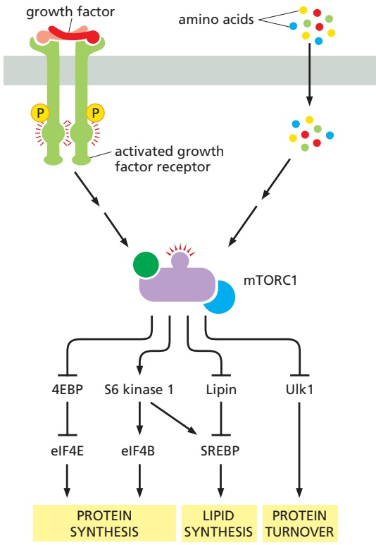

Figure 17–61 Stimulation of cell growth by extracellular growth factors and nutrients. The occupation of cell-surface receptors by growth factors leads to the activation of a complex signaling pathway that results in the activation of the multisubunit protein kinase mTORC1 (see Figure 15–55). Cytosolic amino acids also help activate mTORC1. mTORC1 phosphorylates multiple proteins, including 4EBP and the protein kinase S6 kinase 1 (S6K1), to stimulate the activity of the translation initiation factors eIF4E and eIF4B, thereby stimulating protein synthesis. mTORC1 also acts through S6K1, as well as another protein called Lipin, to activate a transcription regulator called SREBP, which increases the expression of genes involved in lipid synthesis. Finally, mTORC1 phosphorylates another protein kinase, Ulk1, reducing its ability to promote protein turnover.

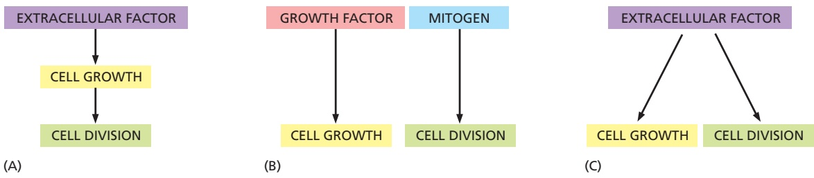

Figure 17–62 Potential mechanisms for coordinating cell growth and division. In proliferating cells, cell size is maintained by mechanisms that coordinate rates of cell division and cell growth. Numerous alternative coupling mechanisms are thought to exist, and different cell types appear to employ different combinations of these mechanisms. (A) In many cell types—particularly yeast—the rate of cell division is governed by the rate of cell growth, so that division occurs only when growth rate achieves some minimal threshold; in yeasts, it is mainly the levels of extracellular nutrients that regulate the rate of cell growth and thereby the rate of cell division. (B) In some animal cell types, growth and division can each be controlled by separate extracellular factors (growth factors and mitogens, respectively), and cell size depends on the relative levels of the two types of factors. (C) Some extracellular factors can stimulate both cell growth and cell division by simultaneously activating signaling pathways that promote growth and other pathways that promote cell-cycle progression.

#### Proliferating Cells Usually Coordinate Their Growth and Division

For proliferating cells to maintain a constant size, they must coordinate their growth with cell division to ensure that cell size doubles with each division: if cells grow too slowly, they will get smaller with each division, and if they grow too fast, they will get larger with each division. It is not clear how cells achieve this coordination, but it is likely to involve multiple mechanisms that vary in different organisms and even in different cell types of the same organism (**Figure 17–62**).

Animal cell growth and division are not always coordinated, however. In many cases, they are completely uncoupled to allow growth without division or division without growth. Muscle cells and nerve cells, for example, can grow dramatically after they have permanently withdrawn from the cell cycle. Similarly, the eggs of many animals grow to an extremely large size without dividing; after fertilization, however, this relationship is reversed, and many rounds of division occur without growth.

Compared to cell division, there has been surprisingly little study of how cell size is controlled in animals. As a result, it remains a mystery how cell size is determined and why different cell types in the same animal grow to be so different in size. One of the best-understood cases in mammals is the adult sympathetic neuron, which has permanently withdrawn from the cell cycle. Its size depends on the amount of nerve growth factor (NGF) secreted by the target cells it innervates; the greater the amount of NGF the neuron has access to, the larger it becomes. It seems likely that the genes a cell expresses set limits on the size it can be, while extracellular signal molecules and nutrients regulate the size within these limits. The challenge is to identify the relevant genes and signal molecules for each cell type.

#### Summary

In multicellular animals, cell size, cell division, and cell survival are carefully controlled to ensure that the organism and its organs achieve and maintain an appropriate size. Mitogens stimulate the rate of cell division by removing intracellular molecular brakes that restrain cell-cycle progression in $G _ { I } .$ Growth factors promote cell growth (an increase in cell mass) by stimulating the synthesis and inhibiting the degradation of macromolecules. To maintain a constant cell size, proliferating cells employ multiple mechanisms to ensure that cell growth is coordinated with cell division.

<!-- END EN EN17-H068-H070 -->

### 英文补充：扩展：组织生长、Hippo与器官大小控制

> 对应中文板块：扩展：组织生长、Hippo与器官大小控制。英文来源：Molecular Biology of the Cell，第7版，第21章；[本章完整原文](../来源/英文教材/21_Development_of_Multicellular_Organisms/chapter.md)。物理PDF页码范围：1256–1317（整章范围）。

<!-- BEGIN EN EN21-H060-H068 -->
#### GROWTH

One of the most fundamental aspects of development is one we know surprisingly little about—how the size of an animal or an organ is determined. Why, for example, do we grow to be so much larger than a mouse? All mammals develop from eggs of a similar size, but there is a 100-million-fold difference in adult weight between the smallest (a shrew) and the largest (a blue whale). Even within a species, size can vary greatly; a Great Dane, for instance, can weigh over 40 times more than a Chihuahua (**Figure 21–60**). In addition to hereditary factors, the environment also plays a role—a goldfish released into the wild may grow 10 times the size of one kept in a home aquarium.

Three variables define the size of an organ or organism: the number of cells, the size of the cells, and the quantity of extracellular material per cell. Size differences can arise from changes in any of these factors (**Figure 21–61**). If we compare a mouse with a human, for example, we find that the difference lies chiefly in the number of cells, there being roughly 3000 times more cells in a human, corresponding to a body that is roughly 3000 times more massive. Wild and cultivated species of food plants, on the other hand, often differ in body size chiefly because of differences in cell size.

Figure 21–61 Determinants of organ size. A tissue may tune cell growth, proliferation, death, or a combination of these to regulate size. Extracellular matrix deposition also contributes, especially in animal tissues such as bone and cartilage, and in plants.

The challenge, therefore, is to understand how cell numbers, cell size, and extracellular matrix production are regulated. First, we need to identify the signals that drive or inhibit growth. Then we need to discover how the signals themselves are regulated. In some cases, organ growth is dictated by developmental programs that do not monitor the size the structure has attained. In other cases, the growth of an organ or of the body as a whole is controlled homeostatically, so that a “target size” is reached even in the face of drastic disturbances. This suggests the developing structure somehow senses its own size, through local or systemic signals, and uses this information to regulate its growth or shrinkage.

The variation in control strategies is nicely illustrated by some classic transplantation experiments. If several fetal thymus glands are transplanted into a developing mouse, each grows to its characteristic adult size. In contrast, if multiple fetal spleens are transplanted, each ends up smaller than normal, but collectively they grow to the size of one adult spleen. Thus, thymus growth is regulated by local mechanisms intrinsic to the individual organ, whereas spleen growth is controlled by a systemic feedback mechanism that senses the quantity of spleen tissue in the body as a whole; in neither case is the mechanism known. Very often, the sizes and proportions of body parts depend on combinations of size-measuring feedback controls and intracellular programs, as well as on environmental influences such as nutrition and habitat.

#### The Proliferation, Death, and Size of Cells Determine Organ and Organism Size

The worm C. elegans demonstrates the ways in which size differences can arise. As we discussed earlier, each individual of a given sex is generated by almost exactly the same sequences of cell divisions and cell deaths, and consequently has pre-cisely the same number of somatic cells—959 in the adult hermaphrodite (see Figure 21–42). More than 1000 cell divisions generate 1090 somatic cells during hermaphrodite development, but 131 of these cells undergo apoptotic cell death. Thus, precise regulation of both cell division and cell death determines the final numbers of somatic cells in the worm.

It takes only 3 days for C. elegans to generate all of its adult somatic cells, after which cell divisions occur only in the germ line. Yet the worm continues to grow, doubling in size between sexual maturity and death 2–3 weeks later. This doubling results from somatic-cell growth: although the cells no longer divide, they continue to go through rounds of DNA synthesis; this endoreplication of the genome makes the cells polyploid. As in all organisms, the size of a cell is proportional to its ploidy (that is, the number of genome copies that it contains): a doubling of ploidy roughly doubles cell volume. Thus the worm’s final size is set by a combination of programmed cell divisions and cell deaths, along with regulation of the sizes of individual cells through changes in ploidy.

Endoreplication of the genome as a means to increase cell size is not peculiar to C. elegans and occurs in a developmentally regulated manner in specific tissues of many animals. In one extreme case, neurons that innervate large areas of the mollusk Aplysia may contain hundreds of thousands more copies of the genome than does a diploid cell and grow up to 1 mm in diameter (**Figure 21–62**).

(A)

2 cm

(B)

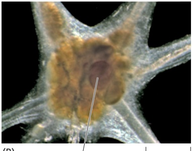

R2 cell body

2 mm

Figure 21–62 Giant neurons of the sea slug are highly polyploid. (A) The mollusk species Aplysia californica, commonly called a sea hare because its chemosensory tentacles stick up like ears, can weigh more than 2 kg. The Aplysia central nervous system contains groups of neural cell bodies called ganglia. (B) A dissected abdominal ganglion contains massive neurons such as R2, which has undergone endoreplication to produce ∼300,000 copies of the diploid genome and is thought to be the largest somatic cell found in nature. Aplysia and its giant neurons enable physiological, biochemical, and genomic studies at the level of single cells, providing an accessible model for studies of how neural circuits control behavior. (A and B, courtesy of Lynne Fieber and Michael Schmale.)

55 chromosomes

Figure 21–63 Two species of the frog genus Xenopus. X. tropicalis (top) has an ordinary diploid genome. X. laevis (bottom) has roughly twice as much DNA per cell and evolved through hybridization of two X. tropicalis–like species followed by a whole-genome duplication event roughly 30 million years ago. (From E. Amaya, M. Offield, and R. Grainger, Trends Genet.14:253–255, 1998. With permission from Elsevier.)

Changes in ploidy can also arise during the evolution of new species, where they can drive size changes of the entire animal. The frog Xenopus laevis possesses a tetraploid genome and has a mass of about twice that of diploid relatives such as Xenopus tropicalis (**Figure 21–63**). These two species show robust size-scaling relationships at the organism, cellular, and subcellular levels, with the smaller frog possessing smaller cells, and the smaller cells, in turn, containing smaller nuclei. In plants, as in animals, cell size increases as ploidy increases (**Figure 21–64**). This effect has been exploited in the agricultural breeding of plants for large size: most of the major fruits and vegetables that we consume are polyploids.

#### Changes in Cell Size Usually Result from Modified Cell Cycles

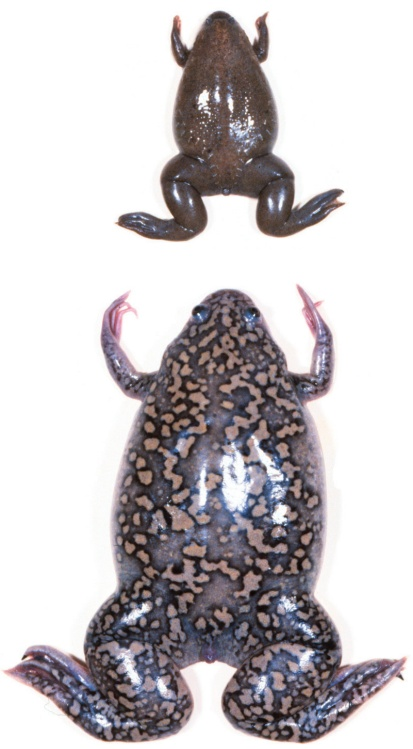

Although fundamental to understanding how organ and organism size are determined, how cell size itself is set and maintained remains an open question. As discussed in Chapter 17, increases in cell size (growth) are usually coordinated with progression through the cell cycle (division) to maintain cell-size homeostasis. However, cells can uncouple the two processes, for example during growth of an egg, which enlarges dramatically without replicating its genome or dividing. After fertilization, this phenomenon is reversed when rounds of DNA replication and cell division occur in the absence of growth to form many small cells.

Endoreplication, which reduplicates the genome to enlarge a somatic cell, results from another variation on the cell cycle. Although S phase proceeds, mitotic cyclin levels are too low to induce M phase, and the polyploid cells usually cease dividing completely, entering a post-mitotic state. Additional rounds of DNA replication in the absence of cell division lead to an increase in cell size. In some tissues, such as the liver and cardiac muscle, DNA replication is followed by nuclear division, but not cytokinesis, resulting in polyploid cells with multi-ple nuclei, through a process called endomitosis. Whether or not nuclear division occurs, ploidy increases are accompanied by cell growth and contribute to tissue function. For example, the trophoblast cells of the mammalian placenta undergo eight rounds of endoreplication, producing giant cells crucial for formation of the tissue barrier between mother and fetus.

(C)

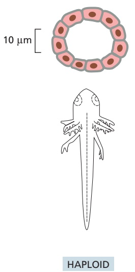

(E) 11 chromosomes

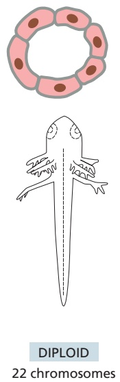

Figure 21–64 Effects of ploidy on cell size and organ size. In all organisms, from bacteria to humans, cell size is proportional to ploidy—the number of copies of the genome per cell. This is illustrated for (A–D) Arabidopsis flowers and (E) for salamanders. In each case, the upper panels show cells in a specific tissue [a petal for Arabidopsis, a pronephric (kidney) tubule for the salamander]; the lower panels show the gross anatomy—flowers for Arabidopsis, the whole body for the salamander. In the case of Arabidopsis flowers, increase in cell size increases organ size. By contrast, the salamander and its individual organs attain their normal standard size regardless of ploidy, because large cell size is compensated for by fewer cells. This indicates that the size of an organism or organ in this species is not controlled simply by counting cell divisions or cell numbers; size must somehow be regulated at the level of total cell mass. [A–D, from C. Breuer et al., Plant Cell 19:3655–3668, 2007. With permission from the American Society of Plant Biologists; E, adapted from G. Fankhauser, in Analysis of Development (B.H. Willier et al., eds.), pp. 126–150. Philadelphia: Saunders, 1955.]

How do increases in ploidy increase the size of cells? One idea is that elevated gene-copy numbers increase the biosynthetic capacity by allowing production of more gene products. However, a strong positive correlation between genome size and cell size is observed across all species, independent of the fraction of the genome that codes for proteins. For example, although all vertebrates have a similar number of coding genes, axolotl salamanders possess a diploid genome that is 10 times the size of the human genome (containing 10 times more noncoding DNA). Remarkably, axolotl cells are also 10 times larger than human cells. The molecular basis of the scaling relationship between genome size and cell size is one of the many outstanding mysteries in biology.

#### Animals and Organs Can Assess and Regulate Total Cell Mass

The size of an animal or organ depends on both cell size and cell number; that is, on total cell mass. Remarkably, many animals and organs can somehow assess their total cell mass and regulate it, providing evidence for feedback controls of the sort highlighted earlier in our introductory account of the general principles of growth control. In contrast with C. elegans, if cell size is artificially increased or decreased in these cases, cell numbers adjust to maintain the same total cell mass. This has been beautifully illustrated by experiments done long ago in salamanders, where cell size can be manipulated by altering the animal’s ploidy. As shown in Figure 21–64E, salamanders of different ploidies end up being the same size with very different numbers of cells. The individual cells in a pentaploid salamander, for example, are about five times the size of those in a haploid salamander, but there are only one-fifth as many cells. This scaling operates not only in the body as a whole, but also in its individual organs. Pentaploid salamanders possess the same size brain as their diploid counterparts, but with many fewer neurons and a simplified structure.

The **imaginal discs** of Drosophila provide another striking example of homeostatic size control. The discs are epithelial pouches that grow by cell proliferation during the larval period and, during the pupal stage, form the organs and extremities of the adult fly (**Figure 21–65**). Experiments have been chiefly done on the wing imaginal disc. Mutations in components of the cell-cycle control machinery can be used to speed up or slow down the rate of cell division in the disc. Remarkably, such mutations result in an excessive number of abnormally small cells or a reduced number of abnormally large cells, respectively, leaving the size (area) and patterning of the adult wing practically unchanged. Thus, the size of

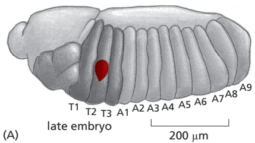

(B)

(D)

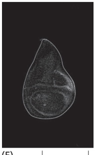

<small>Figure 21–65 Growth of the Drosophila wing imaginal disc. Drawings in panels A–C show the locations of cells that give rise to the adult wing and dorsal thorax after metamorphosis. (A) Initially, ∼30 cells are specified in the second thoracic segment of the embryo as precursors to the wing and dorsal thorax. These cells divide rapidly during the 4 days of larval life. (B) In the larva before metamorphosis, these cells are organized into a simple pouch-like epithelial organ called the wing imaginal disc, which contains ∼30,000 cells and is ∼400 μm in diameter. Other imaginal discs (not shown) give rise to most of the other external structures of the fly. (C) The final adult wing is ∼2.25 mm long. (D, E) The morphogen Dpp is expressed in a stripe down the center of the wing imaginal disc (green), diffusing out toward the edges and influencing disc growth as well as cell fates. When Dpp expression is removed from the disc late during larval development, the wing disc and resultant wing is proportionally smaller. (D and E, from S. Matsuda and M. Affolter, eLife 6:e22319, 2017, doi 10.7554/eLife.22319.)</small>

(E)

200 µm

the disc is not determined by counting the number of cell divisions so as to produce a set number of cells. Instead, there must be a regulatory mechanism that halts growth when the disc’s total cell mass reaches the appropriate value, so that the adult wing that subsequently develops is normal. Moreover, if young discs or even disc fragments are taken out of their normal context and transplanted into the growth-permissive abdominal cavity of an adult female, they will grow until they reach their normal size and then stop. Clearly, the mechanisms that regulate organ size are intrinsic to the disc.

We know little about how organisms or organs assess total cell mass or monitor their own growth. Nevertheless, we are beginning to understand some of the signal molecules that drive or halt growth in response to the mysterious cues that convey information about the size attained.

#### Various Extracellular Signals Stimulate or Inhibit Growth

To produce an organ with the correct morphology and proportions, cell proliferation and cell growth must be coordinated within a tissue. While some control occurs systemically through growth-regulatory hormones, discussed later, there are also interesting examples in which tissues regulate their own growth. One example of how this may be achieved has been investigated in the Drosophila wing imaginal disc (see Figure 21–65), where the TGFβ family member Dpp plays a role. We encountered Dpp before as a morphogen involved in patterning the dorsoventral axis of the fly embryo; in the disc, it works analogously, diffusing from a narrow stripe down the middle of the disc to dictate different cell fates at different distances. Some experiments indicate that the gradient of Dpp emanating from this central source also influences tissue size, perhaps because growth of the disc leads cells farther from the source to experience lower levels of Dpp signaling (see Figure 21–65D and E). Linking tissue growth to pattern formation would ensure that changes in organ size are accompanied by appropriate changes in cell differentiation and distribution.

Not all growth-regulating extracellular signals stimulate growth; some inhibit it by promoting cell death or inhibiting cell growth, cell division, or both. Myostatin is another TGFβ family member that specifically inhibits the growth and proliferation of myoblasts—the precursor cells that fuse to form the huge, multinucleated cells of skeletal muscle. In this case, the tissue itself produces the signal, so as more muscle forms, myostatin levels increase and eventually turn off muscle growth. The importance of this simple organ-size feedback mechanism can be seen when the Myostatin gene is deleted: the muscles of mutant mice grow to be several times larger than normal. Remarkably, two breeds of cattle that were bred long ago for large muscles both have mutations in the Myostatin gene, as does a breed of dogs (**Figure 21–66**).

#### The Hippo Pathway Relays Mechanical Signals Regulating Growth

Organ growth is governed in many tissues by an intracellular signaling system called the Hippo pathway. It was discovered in Drosophila, but it operates in vertebrates as well. Named after the overgrown, buckled tissues that result when the pathway is inactive, Hippo signaling in wild-type animals inhibits growth both by promoting cell death (by blocking an apoptosis inhibitor) and by inhibiting cell-cycle progression (by inhibiting the expression of the cell-cycle gene Cyclin E). Some components of the pathway in Drosophila are shown in **Figure 21–67**. The organs of animals that are abnormally resistant to Hippo repression can grow to a monstrous size (**Figure 21–68**).

(A) wild type

(B) myostatin mutant

Figure 21–66 Myostatin limits muscle growth. (A) A standard whippet and (B) a bully whippet that lacks myostatin. (A, Bianca Grueneberg/Getty Images; B, ©2020 Stuart Isett. All rights reserved.)

Figure 21–67 The Hippo pathway in Drosophila. Hippo, a protein kinase, limits growth by phosphorylation and activation of the kinase Warts, which in turn phosphorylates and inactivates the transcriptional coactivator Yorkie (Yap and Taz in vertebrates). When unphosphorylated, Yorkie/ Yap drives tissue growth: it activates the transcription of the growth-promoting gene Myc, the cell-cycle progression gene Cyclin E, the anti-apoptotic gene Diap, and the microRNA Bantam. Hippo-induced phosphorylation of Yorkie/Yap blocks this effect.

Figure 21–68 Overcoming Hippo repression increases organ size. (A) When Yap is overexpressed in the mouse liver, Hippo signaling cannot repress its activity and excess growth results. (B) Similar overgrowth is seen when fly eyes express a form of Yorkie/Yap that cannot be phosphorylated and inhibited by Hippo signaling. (A, from J. Dong et al., Cell 130:1120–1133, MBoC7 m21.65/21.682007. With permission from Elsevier; B, courtesy of Jung Kim.)

Unlike many signaling pathways that involve binding of a signal molecule to a dedicated receptor, the Hippo pathway instead appears to be controlled primarily by mechanical forces and cell architecture. Cell–cell and cell–matrix contact, cytoskeletal tension, and the apical–basal polarity of the cell can each influence Hippo activation. Through this mechanism, tissues can sense physical as well as chemical cues in their environment and regulate their growth accordingly.

#### Hormones Coordinate Growth Throughout the Body

We have already seen how some signals act systemically as hormones to regulate the development of the animal as a whole. Some of these serve to regulate growth. In mammals, for instance, growth hormone (GH) is secreted by the pituitary gland into the bloodstream and stimulates growth throughout the body: excessive production of GH leads to pituitary gigantism, and too little leads to dwarfism (**Figure 21–69**). Pituitary dwarfs with lower GH levels have bodies and organs that are proportionately small, and stand in contrast to achondroplastic dwarfs, whose limbs are disproportionately short usually because of a mutation in a gene encoding an FGF receptor that disrupts normal cartilage and bone development (**Figure 21–70**).

Growth hormone stimulates growth primarily by inducing the liver and other organs to produce insulin-like growth factor 1 (IGF1), which acts mainly as a local signal within many tissues. IGF1 and related factors are potent growth promoters that increase cell survival, cell growth, cell proliferation, or some combination of these, depending on the cell type. Large breeds of dogs such as Great Danes owe their great size to high levels of IGF1, while miniature breeds such as Chihuahuas have low levels (see Figure 21–60).

It is important to note that in all species, nutritional conditions also play a fundamental part in regulating the pace and extent of growth, and in animals they do so through hormonal signal networks that are highly conserved between

1 meter

Figure 21–69 Pituitary dwarf and pituitary giant. The “giant” on the right is Robert Wadlow (1914–1940), the tallest recorded man at 8 feet 11 inches (2.72 m), together with his father, who was almost 6 feet tall (1.82 m). The dwarf on the left is General Tom Thumb, which was the stage name of Charles Sherwood Stratton (1838–1883). On his 18th birthday, he was measured at 2 feet 8.5 inches (82.6 cm) tall, and at his death, he was 3 feet 4 inches (102 cm). (Left, Bettman/Getty; right, History and Art Collection/Alamy Stock Photo.)

vertebrates and invertebrates. Genetic experiments, especially in Drosophila, have begun to unravel the logic of these controls and to indicate how they may operate alongside other machinery, such as the Hippo pathway, to determine final size.

#### The Duration of Growth Influences Organism Size

In addition to rate of growth, the final size of an organism will be determined by the time over which growth occurs. Some animals have a defined period of the life span during which growth is permitted; these species are said to show determinate growth. In humans, the growth period terminates at the end of puberty, while in many insects it terminates with the onset of metamorphosis. In both cases the change is triggered by the release of hormones that transition the organism into sexual maturity. Thereafter, cell proliferation is restricted to supporting tissue homeostasis via the action of adult stem cells (see Chapter 22), although significant cell growth can continue in cells such as fat cells. The timing of hormone release is set by many influences, among which both nutritional status and juvenile body size provide important inputs to set final body size.

Other species show indeterminate growth and are capable of size increases throughout their life as long as environmental conditions are amenable. Lobsters and many fish are familiar examples, but indeterminate growth is found along numerous branches of the tree of life. Plants, in which cell proliferation takes place in specialized regions called meristems (see Chapter 19), also show both determinate and indeterminate growth patterns. Giant sequoias and other redwood trees are an example of the latter, whereas the former include agricultural crops selected for maximal and synchronous fruit production. Some species, including tomatoes, exist in both determinate and indeterminate varieties. The mechanisms that assign a terminal growth point to one organism while enabling a closely related species to continue growth throughout life remain unknown.

#### Summary

The sizes of animal species and their organs vary widely and depend mainly on the size and number of cells, which are increased through cell growth and cell division, respectively. Cell numbers are reduced by cell death—mainly by apoptosis. The mystery is how decisions about growth, division, and death within individual cells are regulated and coordinated to produce the characteristic final size of the adult animal.

Some signals such as growth factors, mitogens, and survival factors act in organs to stimulate growth, while other signal molecules do the opposite. These signals are deployed under the control of developmental patterning programs and influence the cell cycle or apoptotic machinery to produce tissue-specific growth outcomes. Many animals and organs can assess their own total cell mass and regulate it, reaching a consistent target size in the face of artificial changes to cell growth or cell numbers. The compensatory mechanisms are not known, but signaling pathways that ensure that organs do not grow beyond a certain size have been identified.

Although most of these signals operate locally to help sculpt the size of organs and appendages, others act as hormones to regulate the growth of the animal as a whole. Nutrients can regulate growth through stimulating the release of hormonal signals throughout the body. The period of life during which growth is permitted can also be controlled by hormones. Final organism size reflects the integrated output of all the above mechanisms.

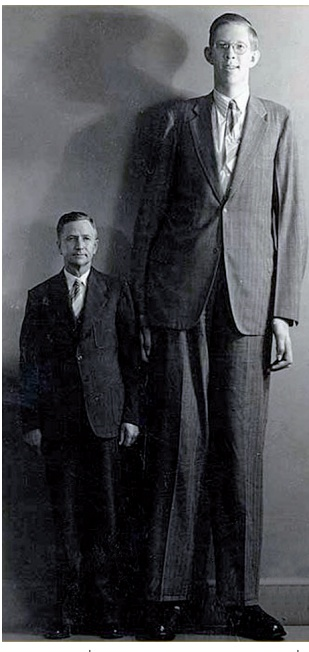

Figure 21–70 Achondroplasia. This type of dwarfism, shown in Velázquez’s painting, occurs in one of 10,000–100,000 births; in more than 99% of cases it results from a mutation at an identical site in the genome, corresponding to amino acid 380 in the FGF receptor FGFR3 (a glycine in the transmembrane domain). The mutation is dominant, and almost all cases are due to new, independently occurring mutations, implying an extraordinarily high mutation rate at this particular site in the genome. The defect in FGF signaling causes dwarfism by interfering with the growth of cartilage in developing long bones. (The Picture Art Collection/Alamy Stock Photo.)

<!-- END EN EN21-H060-H068 -->

## 跨章相关英文内容

- 复制许可、S期检查点与一次复制：[EN第5章 · DNA复制、保真性、起始许可与核小体再装配](../09_细胞核与染色质/小节/03_第三节%20染色质的复制与表达.md#EN05-H000-H030)。
- 细胞增殖的内在限制：[EN第17章 · 细胞复制次数的内在限制](../15_细胞衰老与细胞程序性死亡/小节/01_第一节%20细胞衰老.md#EN17-H067-H067)。

---

## 第13章 细胞增殖调控与癌细胞 · 第二节 癌细胞

[返回本章](README.md) · [中文本章原文](中文原文.md)

<!-- BEGIN CN CN13-S02 -->
## 第二节 癌细胞

多细胞生物是由不同类型细胞受控于严格的调控机制而形成的细胞社会。癌细胞（cancer cell）脱离了细胞社会赖以构建和维持的规则的制约，表现出细胞增殖失控和侵袭并转移到机体的其他部位生长这两个基本特征，其结果破坏了组织和器官的正常生理功能。全世界每年死于癌症的人数达人口总数的0.01%\~0.035%。基因突变的结果有可能招致某些分化细胞的生长与分裂失控，脱离了衰老和死亡的正常途径而成为癌细胞。癌细胞与正常分化细胞明显不同的一点是，分化细胞的细胞类型各异，但都具有相同的基因组；而癌细胞的细胞类型相近，但基因组却发生不同形式的改变。随着环境因素的影响，基因突变率提高，细胞癌变的概率也随之增加。此外少数癌细胞其基因组DNA序列并未改变，但由于其DNA或组蛋白的修饰发生了变化，即表观遗传改变(epigenetic change)，导致基因表达模式的改变，从而引起癌症的发生。因此，对癌细胞形成与特征的了解不仅有助于了解细胞增殖、分化与凋亡的调节及其分子机制，而且也是人类健康所面临的十分严峻的问题。

## 一、癌细胞的基本特征

动物体内因细胞分裂调节失控而无限增殖的细胞称为肿瘤细胞（tumor cell）。具有转移能力的肿瘤称为恶性肿瘤（malignancy），源于上皮组织的恶性肿瘤称为癌。目前癌细胞已作为恶性肿瘤细胞的通用名称。其主要特征是：

## （一）细胞生长与分裂失去控制

在正常机体中细胞或生长与分裂，或处于静息状态，执行其特定的生理功能（如肝细胞和神经细胞）。在成体一些组织中，会有新生细胞的增殖、衰老细胞的死亡，在动态平衡中维持组织与器官的稳定，这是一种严格受控的过程。而癌细胞失去控制，成为“不死”的永生细胞，核质比例增大，分裂速度加快，结果破坏了正常组织的结构与功能。

## （二）具有浸润性和扩散性

动物体内特别是衰老的动物体内常常出现肿瘤，这些肿瘤细胞仅位于某些组织特定部位，称之为良性肿瘤，如疣和息肉。如果肿瘤细胞具有浸润性和扩散性，则称之为恶性肿瘤，即癌症发生。

良性肿瘤与恶性肿瘤细胞的最主要区别是：恶性肿瘤细胞（癌细胞）的细胞间黏着性下降，具有浸润性和扩散性，易于浸润周围健康组织，或通过血液循环和淋巴途径转移并在其他部位黏着和增殖。由转移并在身体其他部位增殖产生的次级肿瘤称为转移灶（metastasis），这是癌细胞的基本特征（图13-13）。此外，癌细胞在分化程度上低于正常细胞和良性肿瘤细胞，失去了原组织细胞的某些结构和功能。

## （三）细胞间相互作用改变

正常细胞之间的识别主要通过细胞表面特异性蛋白的相互作用实现的，进而形成特定的组织与器官。癌细胞冲破了细胞识别作用的束缚，在转移过程中，除了会产生水解酶类（如用于水解基底膜成分的酶类），而且要异常表达某些膜蛋白，以便与别处细胞黏着和继续增殖。并借此逃避免疫系统的监视，防止天然杀伤细胞等的识别和攻击。

## （四）表达谱改变或蛋白质活性改变

癌细胞的种种生物学特征主要归结于基因表达及调控方式的改变。人们曾用基因表达谱分析技术（serial analysis of gene expression, SAGE）对乳腺癌和直肠癌细胞与正常细胞中基因表达谱进行了比较。在检测的30万个转录片段（transcript），至少相当于4.5万个所表达的基因中只有500个转录片段（相当于75个基因）有明显不同，仅占整个基因表达谱中很少一部分。

癌细胞的蛋白质表达谱系中，往往出现一些在胚胎细胞中所表达的蛋白质，如在肝癌细胞中表达胚肝细胞中的多种蛋白质。多数癌细胞中具有较高的端粒酶活性。此外癌细胞还异常表达与其恶性增殖、扩散等过程相关的蛋白质组分，如纤连蛋白表达减少，某些蛋白如蛋白激酶Src、转录因子Myc等过量表达。

此外，由于癌细胞基因突变位点不同，同一种癌甚至同一癌灶中的不同癌细胞之间也可能具有不同的表型，而且其表型不稳定，特别是具有高转移潜能的癌细胞其表型更不稳定，这就决定了癌细胞异质性的特征。生物芯片技术可用于检测细胞 mRNA 或蛋白质的表达谱，目前已用于肿瘤的研究、诊断，并有望用于优化对肿瘤患者的个体化治疗。

## （五）体外培养的恶性转化细胞的特征

应用人工诱导技术可培养出恶性转化（malignant transformation）的细胞及恶性程度不同的转化细胞。恶性转化细胞同癌细胞一样具有无限增殖的潜能，在体外培养时贴壁性下降，可不依附在培养器皿壁上生长，有些还可进行悬浮式培养；正常细胞生长到彼此相互接触时，其运动和分裂活动将会停止，即所谓接触抑制。癌细胞失去运动和分裂的接触抑制，在软琼脂培养基中可形成细胞克隆，这也是细胞恶性程度的标志之一。当将恶性转化细胞注入易感染动物体内，往往会形成肿瘤。

  
图13-13 癌细胞的扩散  
癌细胞在上皮中恶性增殖（A）后，突破基膜的障碍，通过管壁进入血管或淋巴管（B）。进入淋巴管的癌细胞，首先滞留于淋巴结，形成淋巴结转移。只有不到1/1000的细胞能够转移到其他组织并形成新的肿瘤。这里显示的是癌细胞从肺向肝转移的情况，癌细胞黏附于肝的血管壁，穿过血管壁（C）后，在肝中增殖形成转移灶（D）。

对体外培养的恶性转化细胞及癌细胞的比较研究有助于了解癌细胞的特征及发生机制。

## （六）抵御死亡

抵御死亡是癌细胞的另一个基本特征。在过去的二十年间人们逐步认识到，成为“不死”的永生细胞的内在原因还应包括细胞自身对死亡的抵御。在生物机体内，细胞增殖即受到其内在的正反双向调控因子的严格监控，也受到外在正反因素的调节。在个体发育特定阶段完成时效任务的正常细胞往往通过程序化死亡而清除，而一些受到不良因素影响而发生变化的非正常细胞也往往会启动自行死亡机制。也有一些细胞，虽然不合时宜的产生，却逃脱不了有机体内的监控机制而难免被及时清除。因而，促使细胞死亡是生物机体免受癌症发生的重要机制之一。但是，癌症之所以发生，原因之一恰恰是癌细胞发展了抵御死亡的机制。

癌细胞能够抵御死亡，原因之一是获取了抗细胞凋亡的能力，既可能是其促凋亡基因突变而失活，也可能是抑制细胞凋亡基因突变而活性加强，最终表现为细胞凋亡调控通路的抑制（见第十五章第一节）。另一个原因是逃脱了生物机体对它的监控，这可能是由于自身基因突变而不能对细胞外来信号产生应答，也可能是外界信号的变化导致不能被有效监控所造成。另外一个原因是促使细胞增殖的细胞外信号过强，导致细胞增殖超越及时分化或细胞死亡。癌细胞正是这样的一类细胞，由于其逃离了凋亡调控径路或生物机体监控径路，对外界促增殖信号的应答尤显敏感，增殖愈加迅速。

## 二、癌基因与抑癌基因

癌症主要是由携带遗传信息的 DNA 的病理变化而引起的疾病。与遗传病不同，癌症主要是体细胞 DNA 突变，而不是生殖细胞 DNA 突变。然而由于癌症涉及多个基因位点的突变，因此生殖细胞某些基因位点的突变无疑也会加大癌变的可能性。

癌基因（oncogene）是控制细胞生长和分裂的一类正常基因，其突变能引起正常细胞发生癌变。癌基因最早发现于诱发鸡肿瘤的劳氏肉瘤病毒（Rous sarcoma virus，属于反转录病毒），称之为Src基因。该基因对病毒繁殖不是必需的，但当病毒感染鸡后，可以引起细胞癌变，导致肉瘤。20世纪70年代中后期和80年代，J.M.Bishop和H.E.Varmus证实癌基因起源于细胞，并普遍存在于许多生物基因组中，二人因此获得1989年诺贝尔生理学或医学奖。癌基因可以分成两大类：一类是病毒癌基因，指反转录病毒的基因组里带有可使受病毒感染的宿主细胞发生癌变的基因，简写成v-onc(v是virus的缩写)；另一类癌基因是细胞癌基因，简写成c-onc（c是cell的缩写），又称原癌基因（proto-oncogene）。在后来的研究中，大多数c-onc基因是依靠病毒的v-onc基因探针找到的。近年来研究表明，许多致癌病毒中的癌基因不仅与致癌密切相关，而且与正常细胞中的某些DNA序列高度同源，从而推测病毒癌基因起源于细胞的原癌基因。反转录病毒所携带的癌基因，可能是由于这类病毒特殊的增殖方式而从宿主细胞中获得的。病毒中的癌基因由于碱基序列的突变，引起所编码的蛋白质产物超活化或失去控制，最终导致

肿瘤的发生。

c-onc是在正常细胞基因组中对细胞正常生命活动起主要调控作用的基因，这些基因一旦发生突变或被异常激活，可使细胞发生恶性转化。换言之，在每一个正常细胞基因组里都带有原癌基因，但它不出现致癌活性，只是在发生突变或被异常激活后才变成具有致癌能力的癌基因。因为已活化的癌基因或是从癌细胞里分离出来的癌基因，可将体外培养的哺乳类细胞，转化成为具有癌变特征的癌细胞，所以癌基因有时又被称为转化基因(transforming gene)。因此，c-onc基因是一类具有正常的生理功能的基因，而只有在发生突变或异常表达的情况下才会引起细胞癌变。实际上，c-onc基因向癌基因的转化是一种功能获得性突变，即细胞的c-onc基因被不适当地激活后，会造成蛋白质产物的结构改变，c-onc基因出现组成型激活，以及过量表达或不能在适当的时刻关闭基因的表达等。

目前已识别的 c-onc 基因有 100 多个，其编码的蛋白质主要包括生长因子、生长因子受体、信号转导通路中的分子、基因转录调节因子、细胞凋亡蛋白、DNA 修复相关蛋白和细胞周期调控蛋白等几大类型（图 13-

  
图13-14 控制细胞生长和增殖，并与肿瘤发生相关的7类蛋白  
有7类蛋白调控细胞的增殖，它们的突变都可能致癌。很多胞外信号分子（1）、信号受体（2）、胞内信号转导蛋白（3）和转录因子（4）能够刺激细胞增殖，它们的致癌突变是显性的。而抑制细胞周期的调控蛋白（5）和负责修复DNA的蛋白（6）由抑癌基因编码，它们的致癌突变是隐性的。凋亡蛋白（7）也是抑癌蛋白，通过诱导细胞凋亡而抑制细胞的增殖。

14)。当然，因突变而诱发癌症的基因还不止这些。细胞信号转导是细胞增殖与分化过程的基本调控方式，而信号转导通路中蛋白因子的突变是细胞癌变的主要原因。如人类各种癌症中约 $30\%$ 的癌症是信号转导通路中的Ras基因突变达表达引起的。此外，很多癌基因在演化上是相当保守的，如 $c - Ras$ 基因在酵母、果蝇、小鼠和人的正常基因组均有存在。

人们还注意到，视网膜母细胞瘤（retinoblastoma）是由于 $Rb$ 基因突变失活而导致的。随后又发现 $p53$ 等基因均有类似的现象。这类基因称为抑癌基因或肿瘤抑制基因 (tumor-suppressor gene)，又称抗癌基因 (antioncogene)，或者更为确切地说是这类基因编码的蛋白质，其功能是正常细胞增殖过程中的负调控因子，在细胞周期的检查点上起阻止周期进程的作用（图13-15），或者是促进细胞凋亡，或者既抑制细胞周期调节，又促进细胞凋亡。如果抑癌基因突变，丧失其细胞增殖的负调控作用，则导致细胞周期失控而过度增殖。抑癌基因是基因的功能丢失性突变。抑癌基因原先有对细胞分裂周期或细胞生长设置限制的功能，当抑癌基因的一对等位基因都缺失或都失去活性时，

  
图13-15 p53与细胞DNA损伤

p53 是一种转录因子，DNA 的损伤会导致 p53 的水平上升，激活 DNA 的修复系统，同时启动很多下游基因的转录，其中包括 p21 $^{Cp}$ 。p21 能够与各种 cyclin-CDK 复合物结合，抑制它们的活性，使细胞周期阻滞，等待 DNA 完成修复。在 DNA 严重损伤的情况下，p53 将诱导凋亡因子的表达，使细胞进入程序化死亡。

这种限制功能也就随之丢失，于是出现了细胞癌变。抑癌基因与癌基因之间的区别在于癌基因的突变性质是显性的，抑癌基因的突变性质是隐性的。目前已发现的抑癌基因有10多种。例如，p53基因是于1979年发现的第一个抑癌基因，开始时被认为是一种癌基因，因为它能加快细胞分裂的周期，以后的研究发现只有在p53的失活或突变时才会导致细胞改变，才认识到它是一个抑癌基因。抑癌基因或其编码的蛋白质的主要功能可概括为3类：①偶联细胞周期与DNA损伤，即只要细胞有DNA损伤，那么细胞将会分裂。如果DNA损伤被修复，那么细胞周期可以继续运行。②如果DNA损伤未被修复，那么细胞将起始调亡程序，以解除这类细胞可能对机体造成的危险。③与细胞黏着有关的某些蛋白质可以防止肿瘤细胞的扩散，阻止接触抑制的丧失并抑制转移，这类蛋白质起转移抑制者作用。

细胞癌变的基本特征之一是细胞增殖失控，而细胞的增殖是通过细胞信号调控网络中细胞增殖相关基因和抑制细胞增殖相关基因的协同作用而调控的。细胞的癌变归根结底也恰恰是这两大类基因的突变或异常表达，破坏了正常的细胞增殖的调控机制，形成了具有无限分裂潜能的肿瘤细胞（图13-16）。

## 三、肿瘤的发生是基因突变逐渐积累的结果

根据 DNA 复制过程中的基因突变率 $(10^{-6})$ 及人的一生中细胞分裂次数 $(10^{16})$ 推测，人类基因组中每个基因都可能发生 $10^{10}$ 次的突变。如果再考虑生活环境中的致癌因素（如辐射等物理因素、化学诱变剂等化学因素和肿瘤病毒感染等生物因素），令人们感到惊奇的并不是细胞为什么会癌变，而是肿瘤的发生频率为什么

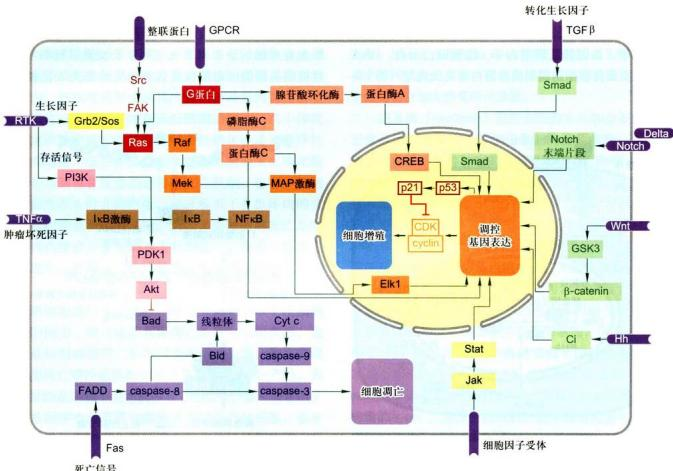  
图 13-16 细胞信号调控网络及肿瘤发生相关的主要调控因子

如此之低。

根据大量的病例分析，癌症的发生一般并不是单一基因的突变，而至少在一个细胞中发生5\~6个基因突变，才能赋予癌细胞所有的特征，即癌细胞不仅增殖速度快，而且其子代细胞能够逃脱细胞衰老的命运，取代相邻正常细胞的位置，不断从血液中获取营养，进而穿越基膜与血管壁在新的组织部位安置、存活与生长。因此，细胞基因组中产生与肿瘤发生相关的某一原癌基因的突变，并非马上形成癌，而是继续生长直至细胞群体中新的偶发突变的产生。某些在自然选择中具有竞争优势的细胞，再经过类似的过程，逐渐形成具有癌细胞一切特征的恶性肿瘤。如结肠癌发生的病程中开始的突变仅在肠壁形成多个良性的肿瘤（息肉），进一步突变才发展为恶性肿瘤（癌），全部过程至少需要10年或更长时间（图13-17）。从这一点上看，癌症是一种典型的老年性疾病，它涉及一系列的原癌基因与抑癌基因的致癌突变的积累。

在人的二倍体细胞中抑癌基因有两个拷贝，只要其中一个拷贝正常，便可保证正常的调控作用。如两个拷贝都丢失或失活，才能引起细胞增殖的失控，而原癌基因的两个拷贝中只需要一个基因发生突变，便可能起到与癌基因类似的作用。

在某些癌症病例中，其生殖细胞中原癌基因或肿瘤抑制因子发生致癌突变，结果个体所有的体细胞的相应基因都已变异。在这种情况下，癌变发生所需要的基因突变数的积累时间就会减少，携带这种基因突变的家族成员更易患癌症（图 13-18）。

同样白血病等血细胞的恶性增生，并不涉及浸润这一环节，而直接随血流遍布全身。因此，只有少数基因突变，便可导致癌症发生，患病年龄也相应提早。

## 四、肿瘤干细胞

在长期的肿瘤研究与临床治疗中人们注意到两个值得关注的现象：（1）在恶性肿瘤组织中，并非将每一个癌细胞移植到免疫缺陷的裸鼠体内，都能形成肿瘤，肿瘤的形成往往需要 $10^{6}$ 个癌组织的细胞。（2）化学药物是治疗恶性肿瘤的有效方法，但总有少量癌细胞依然存活，因而常常引起肿瘤的复发。

显然，癌组织中各细胞的致癌能力及对化学药物的抗性是有很大差别的。近年来，随着干细胞研究的进展，人们自然会联想到肿瘤组织中是否也存在着类似于成体干细胞的肿瘤干细胞（cancer stem cell）。这也是涉及肿瘤发生机制及肿瘤治疗策略的重要问题。

肿瘤干细胞是一群存在于某些肿瘤组织中的干细胞样细胞。自1997年首次报导分离出白血病肿瘤干细胞后，陆续报道分离与鉴定了乳腺癌干细胞、脑瘤干细胞和黑色素瘤干细胞，并建立了脑瘤干细胞和乳腺癌干细胞的体外培养。2004年，S.K.Singh等人在人脑肿瘤细胞中成功分离到含CD133标志的肿瘤干细胞，并将其注射到小鼠脑中，结果发现小鼠脑中长出了含有该标志的肿瘤，并可通过再注射而实现鼠-鼠传递。一般情况下，注射成千上万的不表达CD133标志的肿瘤细胞都不会致瘤，而注射不足百个含CD133标志的肿瘤细胞即可成功致瘤，说明致瘤干细胞只是致瘤中一个很小的类群，含有特殊的标志。随着肿瘤干细胞在更多的不同肿瘤组织中分离成功，更有力地证明了肿瘤干细胞的存在，同时为深入探讨肿瘤的发生、发展及评价预后等提供了新的理论依据，同时也为肿瘤的治疗带来了新的思路。

  
图 13-17 一系列相关基因突变导致结肠癌发生  
Apc: adenomatosis polyposis coli; Dcc: deleted in colorectal cancer.

  
图13-18 造成杂合性缺失的两种机制  
细胞如果含有一个正常的抑癌基因和一个突变的等位基因，一般是正常的。细胞分裂过程中，如果出现纺锤体结构的缺陷，导致染色体的错误分离（A），或者带有野生型和突变型的染色体之间发生重组（B），就可能形成抑癌基因的一对等位基因都突变的细胞。

干细胞具有自我更新和几乎无限增殖的能力，具有迁移至某些特定组织和排除有毒化学因子的能力。而肿瘤干细胞也具有无限增殖、转移和抗化学毒物损伤的能力。而且，二者使用一些共同的信号转导通路，如Wnt、Notch和Shh信号通路及相关的信号分子。然而肿瘤干细胞和正常干细胞在细胞增殖、分化潜能和细胞迁移等行为上有明显差异。正常干细胞的增殖（又称为自我更新）是严格受控的过程，具有迁移到特定组织分化成多种功能细胞的潜能，以构建正常的组织器官。而肿瘤干细胞增殖失控，失去正常分化的能力，转移到多种组织后形成异质性的肿瘤，破坏正常组织与器官的功能。与一般肿瘤细胞相比，肿瘤干细胞具有高致癌性。很少量的肿瘤干细胞在体外培养，就能生成集落。将很少量的肿瘤干细胞注入实验动物体内，即可以形成肿瘤。肿瘤干细胞耐药性强。多数肿瘤干细胞的细胞膜上表达ATP结合盒（ABC）家族膜转运蛋白。这类蛋白质大多可运输并外排包括代谢产物、药物、毒性物质、内源性脂质、多肽、核苷酸及固醇类等多种物质，使之对许多化疗药物产生耐药性。目前认为肿瘤干细胞的存在是导致肿瘤化疗失败的主要原因。

通过上面的比较，人们很容易想到肿瘤干细胞起源于成体干细胞的可能性。而且，与终末分化细胞相比较，成体干细胞的寿命要长得多（图13-19），细胞基因组发生多个位点突变的可能性更大。当然这也并不排除肿瘤干细胞来源于已分化细胞的可能性。因此，研究肿瘤干细胞存在的普遍性及探索其发生的机制，是目前肿瘤生物学研究的一个非常重要的课题。

## 五、肿瘤的治疗

肿瘤治疗的根本是移除肿瘤细胞，采取的方法手段当然离不开这一根本。手术移除、化学疗法和放射疗法是目前最常用的肿瘤治疗手段。但是，手术、化疗和放疗都有相当多的局限性和不确定性，如部位限制而不能有效移除，化疗和放疗的剂量与移除效果直接相关，对正常细胞同样具有杀伤力，从而产生副作用。生物学治疗近年来备受推崇，即有的放矢地对癌细胞采取相应措施，如通过寻找癌细胞特异靶点进行有目的攻击，或者通过分子细胞生物学方法如基因治疗、调节性微小核糖核酸（microRNA）导入、基因改造的肿瘤细胞免疫治疗等，干预发生变化的某个调控通路，达到杀死癌细胞、或者促其转化为不具恶性的正常细胞之目的。

  
图13-19 肿瘤干细胞与肿瘤的发生机制模型  
在正常情况下，干细胞、周期中细胞和终末分化细胞不具致癌性。在致癌因子的诱导下，这些细胞可能转化为肿瘤干细胞，最终能够增生为肿瘤。在肿瘤干细胞增生过程中，部分细胞也会发生异质化，失去致癌性，不能再增生为肿瘤。

肿瘤细胞免疫治疗是重要的生物学治疗模式之一。虽然这一模式包涵多种方法手段，但其基本原理则是基于细胞增殖、分化、代谢及机体免疫等方面的调控机制来设计的。例如，先从生物机体内分离出T淋巴细胞，通过基因改造的方法增加其对癌细胞的识别能力并进行扩增，获得能够特异识别含有某个特异标志的癌细胞的能力，然后将这些经过基因改造的T细胞回注到生物体内，让其自动寻找和杀伤具特异标志的癌细胞。

生物学治疗之所以受推崇，理论上说它可以精确清剿癌细胞，既适合早期恶性肿瘤患者，也适合较晚期的恶性肿瘤患者。若与其他疗法联合应用，还可以减少其他疗法所用剂量，减轻副作用，提高治愈率。更重要的是，生物学治疗将会实现对患者肿瘤发生特点的个体化分析，通过采取个体针对性强的方式，真正实现个体化治疗。因此，生物学肿瘤治疗将为有效移除癌细胞提供切实可行的手段。

## 思考题

1. 简述 p34 $^{Cdc2}$ /cyclin B 蛋白激酶的发现过程。

2. 细胞周期中有哪些主要检查点，各起何作用？

3. 举例说明 CDK 在细胞周期中是如何执行调节功能的？

4. 癌细胞的基本特征是什么？说明癌症的发生与癌基因和抑癌基因的关系。

5. 为什么说肿瘤的发生是基因突变逐渐积累的结果？

6. 什么是肿瘤干细胞？

1. Bassermann F, Eichner R, Pagano M. The ubiquitin proteasome system—Implications for cell cycle control and the targeted treatment of cancer. Biochimica et Biophysica Acta (BBA) - Molecular Cell Research, 2014, 1843(1): 150-162.

2. Batlle E, Clevers H. Cancer stem cells revisited. Nature Medicine, 2017, 23(10): 1124-1134.

3. Bloom J, Cross F R. Multiple levels of cyclin specificity in cell-cycle control. Nature Reviews Molecular Cell Biology, 2007, 8(2): 149-160.

4. Hanahan D, Weinberg R A. Hallmarks of cancer: the next Generation. Cell, 2011, 144(5): 646-674.

5. Hochegger H, Takeda S, Hunt T. Cyclin-dependent kinases and cell-cycle transitions: does one fit all? Nature Reviews Molecular Cell Biology, 2008, 9(11): 910-916.

6. Izawa D, Pines J. How APC/C-cdc20 changes its substrate specificity in mitosis. Nature Cell Biology, 2011, 13(3): 223-233.

7. Parker M W, Botchan M R, Berger J M. Mechanisms and regulation of DNA replication initiation in eukaryotes. Critical Reviews in Biochemistry and Molecular Biology, 2017, 52(2): 107-144.

8. Peters J. The anaphase promoting complex/cyclosome: a machine designed to destroy. Nature Reviews Molecular Cell Biology, 2006, 7(9): 644-656.

9. Salazar-RoaM, Malumbres M. Fueling the cell division cycle. Trends in Cell Biology, 2017, 27(1): 69-81.

10. Zachariae W, Tyson J J. Cell division: flipping the mitotic switches. Current Biology, 2016, 26(24): R1272-R1274.

<!-- END CN CN13-S02 -->

---

## 对应英文内容

### 英文补充：癌细胞特征、克隆演化与肿瘤干细胞

> 对应中文板块：癌细胞特征、克隆演化与肿瘤干细胞。英文来源：Molecular Biology of the Cell，第7版，第20章；[本章完整原文](../来源/英文教材/20_Cancer/chapter.md)。物理PDF页码范围：1202–1255（整章范围）。

<!-- BEGIN EN EN20-H000-H009 -->
C HAP T E R

20

About one in five of us will die of cancer, but that is not why we devote a chapter to this disease. Cancer cells break the most basic rules of cell behavior by which multicellular organisms are built and maintained, and they exploit every kind of opportunity to do so. These transgressions, while often tragic, help to reveal what the normal rules are and how they are enforced. As a result, cancer research helps to illuminate the fundamentals of cell biology—especially cell signaling (Chapter 15), the cell cycle and cell growth (Chapter 17), apoptosis (Chapter 18), and the control of tissue architecture (Chapters 19 and 22). Of course, with a deeper understanding of these normal processes, we also gain a deeper understanding of the disease and better tools to treat it.

In this chapter, we first consider what cancer is and describe the natural history of the disease from a cellular standpoint. We then discuss the molecular changes that make a cell cancerous. And we end the chapter by considering how our enhanced understanding of the molecular basis of cancer is leading to improved methods for its prevention and treatment.

Molecular disturbances that upset this harmony mean trouble for a multi-cellular society. In a human body with more than 1013 cells, billions of cells experience mutations every day, potentially disrupting the social controls. Most dangerously, a mutation may give one cell a selective advantage, allowing it to grow and divide slightly more vigorously and survive more readily than its neighbors. In this way, a mutated cell can become a founder of a growing mutant clone. Over time, repeated rounds of mutation, competition, and natural selection operating within the population of somatic cells can cause matters to go from bad to worse, jeopardizing the future of the multicellular organism. These are the basic ingredients of cancer: it is a disease in which an individual mutant clone of cells begins by prospering at the expense of its neighbors. In the end—as the

Unlike free-living cells such as bacteria or yeast, which compete to survive, the cells of a multicellular organism must be committed to collaboration. To coordinate their behavior, the cells send, receive, and interpret an elaborate set of extracellular signals that serve as social controls, directing cells how to act (discussed in Chapter 15). As a result, each cell normally behaves in a socially responsible manner—resting, growing, dividing, differentiating, or dying—as needed for the good of the organism.

#### CANCER AS A MICROEVOLUTIONARY PROCESS

The body of an animal operates as a society or ecosystem, whose individual members are cells that reproduce by cell division and organize themselves into collaborative assemblies called tissues. This ecosystem is very peculiar, however, because self-sacrifice—as opposed to survival of the fittest—is the rule. Ultimately, all of the somatic cell lineages in animals dedicate their existence to the support of the germ cells, which alone have a chance of continued survival (discussed in Chapter 21). Because the genome of the somatic cells is the same as that of the germ-cell lineage that gives rise to sperm or eggs, through their self-sacrifice the somatic cells help to propagate copies of their own genes.

IN THIS CHAPTER

Cancer-critical Genes: How They Are Found and What They Do

Cancer as a Microevolutionary Process

Cancer Prevention and Treatment: Present and Future

Figure 20–1 Metastasis. Malignant tumors typically give rise to metastases, making the cancer hard to eradicate. Shown in this fusion image is a whole-body scan of a patient with metastatic non-Hodgkin’s lymphoma (NHL). The background image of the body’s tissues was obtained by CT (computed x-ray tomography) scanning. Overlaid on this image, a PET (positron emission tomography) scan reveals the tumor tissue (yellow), detected by its unusually high uptake of radioactively labeled fluorodeoxyglucose (FDG). High FDG uptake occurs in cells with unusually active glucose uptake and metabolism, a characteristic of cancer cells (see Figure 20–18). The yellow spots in the abdominal region reveal multiple metastases. (Courtesy of S.S. Gambhir.)

clone evolves over time and spreads—it can destroy the entire cellular society (**Movie 20.1**).

In this section, we discuss the development of cancer as a microevolutionary process that takes place within the course of a human life span in a subpopulation of cells in the body. As we shall see, the process depends on the same principles of mutation and natural selection that have driven the evolution of living organisms on Earth for billions of years.

#### Cancer Cells Bypass Normal Proliferation Controls and Colonize Other Tissues

Cancer cells are defined by two heritable properties: (1) they reproduce in defiance of the normal restraints on cell growth and division, and (2) they invade and colonize territories normally reserved for other cells. It is the combination of these properties that makes cancers particularly dangerous. An abnormal cell that goes through successive and inappropriate rounds of growth and division to proliferate out of control will give rise to a tumor, or neoplasm—literally, a new growth. As long as the neoplastic cells have not yet become invasive, however, the tumor is said to be **benign**. For most types of such neoplasms, removing or destroying the mass locally usually achieves a complete cure.

A tumor is considered a true cancer only if it is **malignant**; that is, when its cells have acquired the ability to invade surrounding tissue. Invasiveness is an essential characteristic of cancer cells. It allows them to break loose, enter blood or lymphatic vessels, and form secondary tumors called **metastases** at other sites in the body (**Figure 20–1**). In general, the more widely a cancer spreads, the harder it becomes to eradicate. It is metastases that usually kill the cancer patient by causing failure of a vital organ.

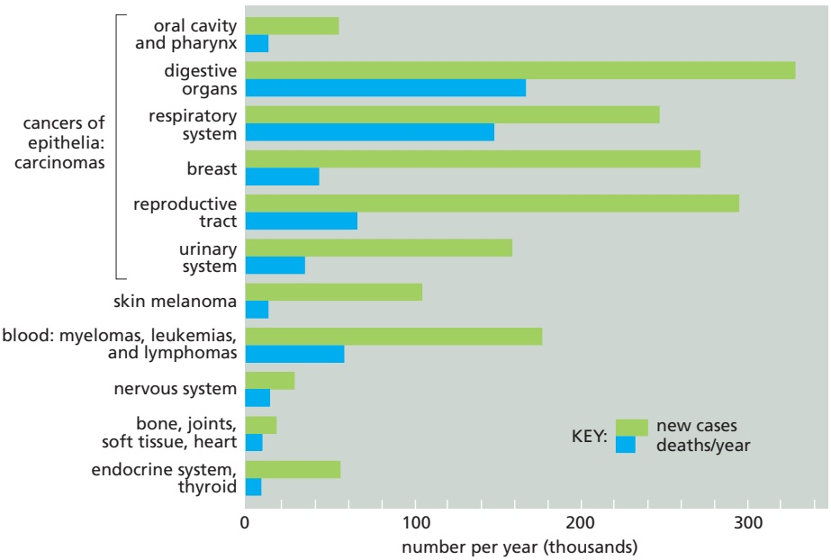

Figure 20–2 Cancer incidence and mortality in the United States. The estimated total number of new cases diagnosed in 2018 in the United States was 1,762,450, and total cancer deaths were 606,880. Note that deaths reflect cases diagnosed at many different stages and that well under half of the people who develop cancer die of it. The most common cancers are those of the digestive organs (including colon, pancreas, and liver), respiratory system (primarily lung and bronchus), reproductive tract (prostate and uterine), and breast. Skin cancers other than melanomas are not included in these figures, as almost all are cured easily and many are unrecorded. Each broad category has many subdivisions according to the specific cell type, the location in the body, and the microscopic appearance of the tumor. The data for the United Kingdom are similar. However, incidences are different in some other parts of the world, reflecting widespread exposures to different infectious agents and environmental toxins. (Data from American Cancer Society, Cancer Facts & Figures 2019.)

Figure 20–3 Benign versus malignant tumors. A benign glandular tumor (pink cells; an adenoma) remains inside the basal lamina (yellow) that marks the boundary of the normal structure (a duct, in this example). In contrast, a malignant glandular tumor (red cells; an adenocarcinoma) can develop from a benign tumor cell, and it destroys the integrity of the tissue, as shown. There are many different forms that such tumors may take.

Cancers are traditionally classified according to the tissue and cell type from which they arise. **Carcinoma** is the name given to cancers arising from epithelial cells, and they are by far the most common cancers in humans, accounting for about 85% of cancers. Most of the normal cell turnover by proliferation and death in adults occurs in epithelia, and the cell types that undergo the most cell division cycles have the greatest probability of accumulating the multiple mutations needed to become cancerous. In addition, epithelial tissues are the most likely to be exposed to the various forms of physical and chemical damage thatMBoC7 m20.03/20.03 favor the development of cancer. **Figure 20–2** shows the types of cancers diagnosed in the United States, together with their incidence and death rates. After carcinomas, the next most common cancer types include the various **myelomas**, **leukemias**, and **lymphomas**, derived from white blood cells and their precursors (hemopoietic cells). **Sarcomas** that arise from connective tissue or muscle cells and cancers derived from cells of the nervous system are much less common.

In parallel with the set of names for malignant tumors, there is a related set of names for benign tumors: an adenoma, for example, is a benign epithelial tumor with a glandular organization; the corresponding type of malignant tumor is an adenocarcinoma (**Figure 20–3**).

Most cancers have characteristics that reflect their origin. Thus, for example, the cells of a basal-cell carcinoma, derived from a keratinocyte stem cell in the skin, generally continue to synthesize cytokeratin intermediate filaments, whereas the cells of a melanoma, derived from a pigment cell in the skin, will often (but not always) continue to make pigment granules. Cancers originating from different cell types are, in general, very different diseases. Basal-cell carcinomas of the skin, for example, are only locally invasive and rarely metastasize, whereas melanomas can become much more malignant and often form metastases. Basal-cell carcinomas are readily cured by surgery or local irradiation, whereas malignant melanomas, once they have metastasized widely, are frequently fatal.

Later, we shall see that there is also a different, newer way to classify cancers, one that cuts across the traditional classification by site of origin: we can now classify many of them in terms of the mutations that make the particular tumor cells cancerous. The final section of the chapter will show how this information can be crucial to the design and choice of treatments.

#### Most Cancers Derive from a Single Abnormal Cell

Even after a cancer has metastasized, we can usually trace its origins to a single **primary tumor**, arising in a specific organ. The primary tumor is thought to arise by cell division from a single cell that initially experienced some heritable change. Subsequently, additional changes have accumulated in some of the descendants of this cell, allowing them to outgrow, out-divide, and often outlive their neighbors.

By the time it is first detected, a typical human cancer will have been developing for many years and will already contain a billion cancer cells or more (**Figure 20–4**). Tumors will usually also contain a variety of other cell types and associated extracellular matrix, termed the tumor stroma. For example, fibroblasts will be present in the supporting connective tissue associated with a carcinoma, in addition to immune cells and vascular endothelial cells. How can we be sure that the cancer cells are the clonal descendants of a single abnormal cell?

Figure 20–4 The growth of a typical human tumor, such as a tumor of the breast. The diameter of the tumor. / . is plotted on a logarithmic scale. Years may elapse before the tumor becomes noticeable. The doubling time for a typical breast tumor, for example, is about 100 days. However, particularly aggressive tumors may grow much more rapidly.

One way of proving clonal origin is through molecular analysis of the chromosomes in tumor cells. In almost all individuals with chronic myelogenous leukemia (CML), for example, we can distinguish the leukemic white blood cells from the individual’s normal cells by a specific chromosomal abnormality: the so-called Philadelphia chromosome, created by a translocation between the long arms of chromosomes 9 and 22 (**Figure 20–5**). When the DNA at the site of translocation is cloned and sequenced, it is found that the site of breakage and rejoining of the translocated fragments is identical in all the leukemic cells in any given individual, but that this site differs slightly (by a few hundred or thousand base pairs) from one individual to another. This is the expected result if, and only if, the cancer in each individual arises from a unique accident occurring in a single cell. (We will see later how this particular translocation promotes the development of CML by creating a novel hybrid gene encoding a protein that promotes cell proliferation.)

Many other lines of evidence, from a variety of different cancers, point to the same conclusion: most cancers originate from a single aberrant cell.

#### Cancer Cells Contain Somatic Mutations

If a single abnormal cell is to give rise to a tumor, it must pass on its abnormality to its progeny: the aberration has to be heritable. Thus, the development of a clone of cancer cells depends on genetic changes. The tumor cells contain **somatic mutations**: they have one or more shared detectable abnormalities in their DNA sequence that distinguish them from the normal cells surrounding the tumor, as in the example of CML just described. (The mutations are called somatic because they occur in the soma, or body cells, not in the germ line.) Cancers are also driven by epigenetic changes—persistent, heritable changes in gene expression that result from modifications of chromatin structure without alteration of the cell’s DNA sequence. But somatic mutations that alter a DNA sequence appear to be a fundamental and universal feature, and cancer is in this sense a genetic disease.

Factors that cause genetic changes tend to provoke the development of cancer. Thus, **carcinogenesis** (the generation of cancer) can be linked to mutagenesis (the production of a change in the DNA sequence). This correlation is particularly clear for two classes of external agents: (1) chemical carcinogens (which typically cause simple changes in the nucleotide sequence), and (2) radiation, such as x-rays (which typically cause chromosome breaks and translocations) or ultraviolet (UV) light (which causes specific DNA base alterations).

As would be expected, people who have inherited a genetic defect in one of several DNA repair mechanisms, causing their cells to accumulate mutations at an elevated rate, run a heightened risk of cancer. Those with the disease xeroderma pigmentosum, for example, have defects in the system that repairs DNA damage induced by UV light, and they have a greatly increased incidence of skin cancers. Overall, inherited mutations are thought to play a role in 5–10% of all cancers, whereas somatic mutations and epigenetic changes are much more prevalent.

#### A Single Mutation Is Not Enough to Change a Normal Cell into a Cancer Cell

It is estimated that there are $3 . 7   \times   1 0 ^ { 1 3 }$ cells in an average-sized human (not counting bacteria), and that $1 0 ^ { 1 6 }$ cell divisions occur within the body over the course of a typical lifetime. This cell proliferation occurs primarily in epithelia and the hemopoietic system and is balanced by cell death to maintain normal tissue homeostasis. Even in an environment that is free of mutagens, mutations would occur spontaneously at an estimated rate of three per cell division, corresponding to about $1 0 ^ { - 6 }$ mutations per gene per cell division. This unavoidable error rate is set by fundamental limitations on the accuracy of DNA replication and repair (see pp. 253–254). This means that, over the course of a typical lifetime, every single human gene will have undergone mutation somewhere in the body on roughly $1 0 ^ { 1 0 }$ separate occasions. Among the resulting mutant cells, there will be many that have sustained deleterious mutations in genes that regulate cell growth and division, causing the cells to disobey the normal rules controlling cell turnover. Given the huge number of unavoidable mutations in a large organism like ourselves, the problem of cancer might seem to be not why it occurs, but why it occurs so infrequently.

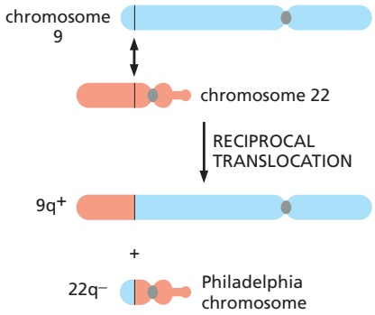

Figure 20–5 The translocation between chromosomes 9 and 22 responsible for chronic myelogenous leukemia. The normal structures of chromosomes 9 and 22 are shown at the top. When a reciprocal translocation occurs between them at the indicated site, the result is the MBoC7 m20.05/20.05abnormal pair at the bottom. The smaller of the two resulting abnormal chromosomes (22q–) is called the Philadelphia chromosome, after the city where the abnormality was first recorded.

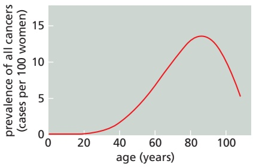

Figure 20–6 Cancer prevalence as a function of age. Age versus malignant cancer prevalence is plotted for women in the Surveillance, Epidemiology, and End Results (SEER) 9 cancer registries for the year 2000. The prevalence of cancer rises steeply as a function of age. If only a single mutation were required to trigger a cancern20.212/20.06 and the mutation had an equal chance of occurring at any time, the prevalence of cancer would be the same at all ages. (Data from C. Harding et al., Cancer 118:1371–1386, 2012, doi 10.1002 /cncr.26376.)

If a mutation in a single gene were enough to convert a typical healthy cell into a cancer cell, we would not be viable organisms. Many lines of evidence indicate that the development of a cancer typically requires that a substantial number of independent, rare genetic and epigenetic accidents occur in the lineage that emanates from a single cell. One such indication comes from epidemiological studies of the incidence of cancer as a function of age (**Figure 20–6**). If a single mutation were responsible for cancer, occurring with a fixed probability per year, the chance of developing cancer in any given year of life should be independent of age. In fact, for most types of cancer, the incidence rises steeply with age—as would be expected if cancer is caused by a progressive, random accumulation of a set of mutations in a single lineage of cells. Notably, however, cancer incidence declines markedly among the very elderly. One interpretation of this phenomenon is that decreased cell proliferation, which is characteristic of declining stem cell function in octogenarians, provides fewer opportunities for mutation.

As discussed later, these indirect arguments linking the number of accumulated mutations to cancer development have now been confirmed by systematically sequencing the genomes of the tumor cells from individual cancer patients and cataloging the mutations that they contain.

#### Many Cancers Develop Gradually Through Successive Rounds of Random Inherited Change Followed by Natural Selection

For those cancers known to have a specific external cause, the disease does not usually become apparent until long after exposure to the causal agent. The incidence of lung cancer, for example, does not begin to rise steeply until after decades of heavy smoking (**Figure 20–7**). Similarly, the incidence of leukemias in those exposed to intense radiation in Hiroshima and Nagasaki did not show a marked rise until about 5 years after the explosion of the atomic bombs. And industrial workers exposed for a limited period to chemical carcinogens do not usually develop the cancers characteristic of their occupation until 10, 20, or even more years after the exposure. During this long incubation period, the prospective cancer cells undergo a succession of changes, and the same presumably applies to cancers where the initial genetic lesion has no such obvious external cause.

The fact that the development of a cancer requires a gradual accumulation of mutations in a number of different genes within a cell helps to explain the wellknown phenomenon of **tumor progression**, whereby an initial mild disorder of cell behavior evolves gradually into a full-blown cancer (**Figure 20–8**).

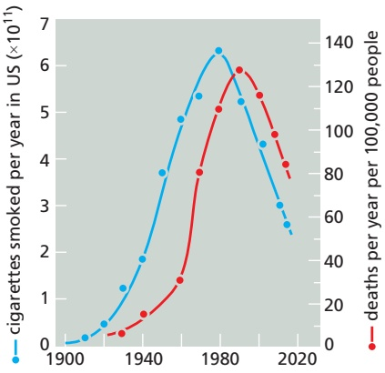

At each stage of progression, some individual cell acquires an additional mutation or epigenetic change that gives it a selective advantage over its neighbors, making it better able to thrive in its environment—an environment that, inside a tumor, may be harsh, with low levels of oxygen, scarce nutrients, and the natural barriers to growth presented by the surrounding normal tissues. The larger the number of tumor cells, the higher the chance that at least one of them will undergo a change that favors it over its neighbors. Thus, as the tumor grows, progression accelerates. The offspring of the best-adapted cells continue to divide, eventually producing the dominant clones in a developing lesion

Figure 20–7 Smoking and lung cancer. A major increase in cigarette smoking that started in the early 1900s (blue line) caused a dramatic rise in lung cancer deaths (red line) after a lag time of about 20 years. Because cigarette smoking peaked in. / . 1980, lung cancer deaths are now declining after a similar lag. (Data from National Center for Health Statistics, Centers for Disease Control and Prevention, 2017.)

Figure 20–8 Stages of progression in the development of cancer of the epithelium of the uterine cervix. Pathologists use standardized terminology to classify the types of disorders they see in tissue slices like those shown here. (A) In a stratified squamous epithelium, dividing cells are confined to the basal layer. (B) In this low-grade intraepithelial neoplasia (right half of image), dividing cells can be found throughout the lower third of the epithelium; the superficial cells are still flattened and show signs of differentiation. (C) In highgrade intraepithelial neoplasia, cells in all the epithelial layers are proliferating and exhibit defective differentiation. (D) True malignancy begins when the cells move through or destroy the basal lamina that underlies the epithelium and invade the underlying connective tissue. (Courtesy of Andrew J. Connolly.)

(**Figure 20–9**). Thus, tumor progression involves a large element of chance and usually takes many years, which may be why the majority of us will die of causes other than cancer.

Just as in the evolution of plants and animals, a kind of speciation often occurs: the original cancer cell lineage can diversify to give many genetically different subclones of cells. These may coexist in the same mass of tumor tissue; or they may migrate and colonize separate environments suited to their individual quirks, where they settle, thrive, and progress as independently evolving metastases. As new mutations arise within each tumor mass, different subclones may gain an advantage and come to predominate, only to be overtaken by others or outgrown by their own sub-subclones. The large amount of genetic diversity in most tumors is one of the chief factors that make cancer cures difficult; it also increases the importance of detecting a tumor as early as possible.

#### Cancers Can Evolve Abruptly Due to Genetic InstabilityMBoC7 m20.08/20.08

If cancer cells evolved exclusively through the gradual accumulation of single deleterious mutations, then the time scale of transformation from premalignant disease to metastatic cancer should be predictable for a particular cancer type. However, this is not the case. As in the evolution of species, cancer evolution may proceed through long periods with no discernible change punctuated by the sudden generation of new phenotypes. The “Big Bang” theory of cancer evolution posits that in addition to gradual mutagenesis and selection for the fittest cells, periodic, cataclysmic genome disruption can promote rapid steps in the evolution of a cancer cell toward malignancy.

Unlike normal dividing cells, most human cancer cells accumulate genetic changes at an abnormally rapid rate and are said to be **genetically unstable**. This instability provides a selective advantage by speeding the process of tumor progression—allowing the subsequent accumulation of many additional mutations

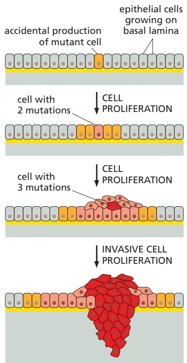

<small>Figure 20–9 Clonal evolution during tumor progression. In this schematic diagram, a tumor develops through repeated rounds of mutation and proliferation, giving rise to a clone of fully malignant cancer cells. At each step, a single cell undergoes a mutation that either enhances cell proliferation or decreases cell death, so that its progeny become the dominant clone in the tumor. Proliferation of each clone hastens the occurrence of the next step of tumor progression by increasing the size of the cell population that is at risk of undergoing an additional mutation. The final step depicted here is invasion through the basal lamina, an initial step in metastasis. In reality, there may be more than the three steps shown here, depending on the tumor type, and a combination of genetic and epigenetic changes is involved. Not shown here is the fact that, over time, a variety of competing subclones will often arise in a tumor. As we will discuss later, this heterogeneity complicates cancer therapies.</small>

Figure 20–10 Chromosome complements (karyotypes) of colon cancers showing different kinds of genetic instability. (A) The karyotype of a typical cancer shows many gross abnormalities in chromosome number and structure. Considerable variation can also exist from cell to cell (not shown). (B) The karyotype of a tumor that has a stable chromosome complement with few chromosomal anomalies; the genetic abnormalities in these tumors are mostly invisible, having been created by defects in DNA repair. All of the chromosomes in this figure were stained as in Figure 4–11, the DNA of each human chromosome being marked with a different combination of fluorescent dyes. (Courtesy of Wael Abdel-Rahman and Paul Edwards.)

required to produce a cancer. But the extent of the instability and its molecular origins differ from cancer to cancer and from individual to individual, both in severity and in character. In some cases, the karyotype—the set of chromosomes as they appear at mitosis—is normal or nearly so, but many point mutations are detected in individual genes, suggesting a failure of the repair mechanisms that normally correct errors in the replication or maintenance of DNA sequences. Often, however, the cancer cell karyotype is severely disordered, with many chromosomal breaks and rearrangements, resulting in many deletions, duplications, and amplifications of parts of the genome (Figure 20–10). Such highly disrupted genomes indicate that catastrophic events have occurred, likely due to defects in chromosome duplication or segregation during mitosis. For example, a common feature of many cancer cells is a failure to correctly attach all of the chromosomes to the mitotic spindle, which can result in chromosome breakage or aneuploidy,. / . the gain or loss of individual chromosomes. More dramatically, mitotic defects can also lead to the isolation of a single chromosome in one of the daughter cells within a “micronucleus,” where it is prone to massive DNA damage and chromosomal rearrangement, termed “chromothripsis” (Figure 20–11).

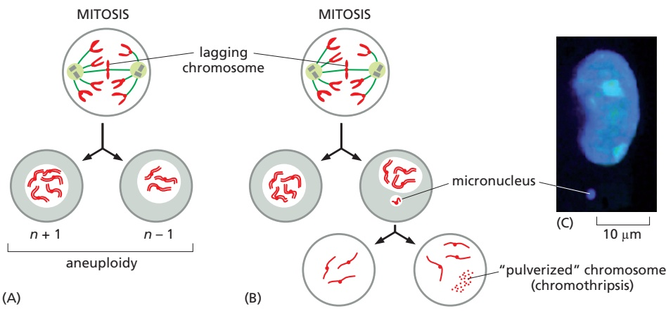

Figure 20–11 Chromosome segregation defects can give rise to aneuploidy and/or chromothripsis. Correct chromosome segregation requires that replicated copies of each chromosome, termed sister chromatids, are attached to opposite spindle poles. A mistake in this process is depicted in which one sister of a chromatid pair is attached to both spindle poles and is therefore pulled in opposite directions during anaphase, causing it to lag behind in the center of the cell, resulting in a lagging chromosome. (A) A lagging chromosome may end up in the same daughter cell as its sister, resulting in aneuploidy with n + 1 and n – 1 karyotypes (n = chromosome number). MBoC7 n20.202/20.11(B) Another possible outcome is that the lagging chromosome remains separated from the rest of the chromosomes in the daughter cell, forming its own “micronucleus” in the following interphase. DNA replication in micronuclei is frequently incomplete, and DNA damage accumulates, but this does not delay the cell cycle. In the next mitosis, the isolated chromosome is prone to undergo fragmentation during chromosome condensation, in a process called chromothripsis. (C) Micronuclei can persist over several generations of cell division, undergoing rounds of chromosome fragmentation and reassembly, or they can be reincorporated into a daughter cell nucleus (Movie 20.2). The fluorescence micrograph shows a primary nucleus and a micronucleus present in the same cell. Nuclear DNA staining (blue) appears uneven due to normal nuclear substructures. (C, from M.L. Leibowitz et al., Annu. Rev. Genet. 49:183–211, 2015. With permission from Annual Reviews.)

From an evolutionary perspective, none of this should be a surprise: anything that increases the probability of random changes in gene function that are heritable from one cell generation to the next—and that are not too deleterious— will likely speed the evolution of a clone of cells toward malignancy, thereby causing this property to be selected for during tumor progression. Genome instability likely also contributes to the heterogeneity of cancer cells frequently observed within an individual tumor. By leading to multiple aberrant karyotypes, chromosome mis-segregation, aneuploidy—and more rarely chromothripsis— all act to shuffle the genetic cards, allowing cancer cells to sample a variety of different phenotypes and for different clones to coexist within a population.

#### Some Cancers May Harbor a Small Population of Stem Cells

Self-renewing tissues, where cell division continues throughout life, are the breeding ground for the great majority of human cancers. They include the epidermis (the outer epithelial layer of the skin), the epithelial lining of the digestive and reproductive tracts, and the bone marrow, where blood cells are generated (see Chapter 22). With each cell division cycle comes the chance of mutation, which can be amplified dramatically by environmental factors. As a result, there is a strong correlation between the frequency of cell division and the incidence of cancer in a particular tissue (**Figure 20–12**).

In almost all proliferating tissues, renewal depends on the presence of stem cells, which divide to give rise to terminally differentiated cells, which do not divide. This creates a mixture of cells that are genetically identical and closely related by lineage but are in different states of differentiation. Many tumors similarly appear to consist of populations of cells in various states of differentiation. A comparison of tumor development to the normal homeostasis of stem cell– derived tissues may help us better understand the origin of some cancers and also why some tumors are so resistant to treatment.

To consider the implications, it is helpful to consider how normal stem-cell systems operate. When a normal stem cell divides, each daughter cell has a choice—it can remain a stem cell or it can commit to a pathway leading to differentiation. A stem-cell daughter remains in place to generate more cells in the future. A committed daughter typically undergoes some rounds of cell proliferation (as a so-called transit amplifying cell), but it then stops dividing, terminally differentiates, and eventually is discarded and replaced (it may die by apoptosis, with recycling of its materials, or be shed from the body). Therefore, stem cells tend to be vastly outnumbered by the cells that are committed to terminal differentiation. However, though few and far between and often relatively slowly dividing, stem cells carry the entire responsibility for maintenance of the tissue over the long term. In a healthy body, feedback controls regulate the process, adjusting the balance of cell-fate choices, cell proliferation, and cell death in a way that corrects for any departure from proper cell population numbers.

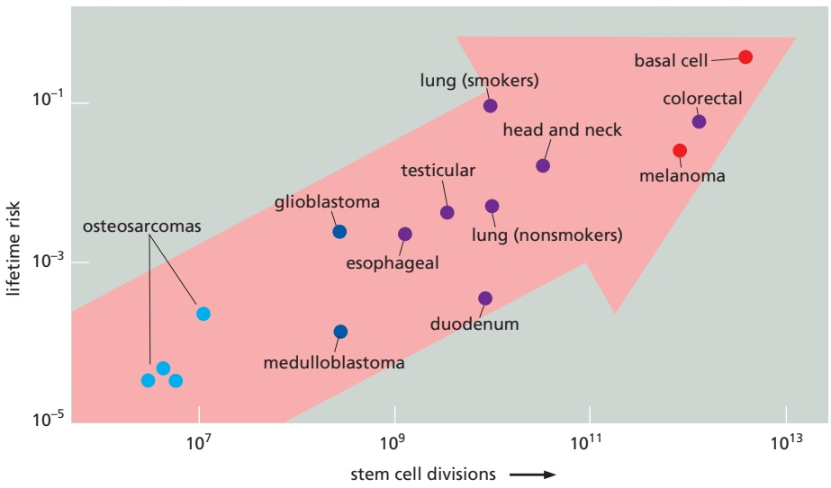

Figure 20–12 The lifetime cancer risk is correlated with the division rate of the cell of origin of the cancer. This plot shows the relationship between the number of stem cell divisions in a given tissue and the lifetime risk of cancer in that tissue. At the lower extreme are osteosarcomas (cancers that originate in bone), which are derived from mesenchymal cells that divide infrequently and rarely give rise to cancer. In contrast, epithelial cells of the skin and digestive tract are highly proliferative and give rise to malignancies much more frequently. Dots represent specific cancer types and are colored to indicate their classification: sarcoma (light blue); neuronal (dark blue); carcinoma (purple); and skin (red). Note that environmental factors strongly amplify the risk of many cancers, such as for lung cancer between smokers and nonsmokers. (Data from C. Tomasetti and B. Vogelstein, Science 347:78–81, 2015, doi 10.1126/science.1260825.)

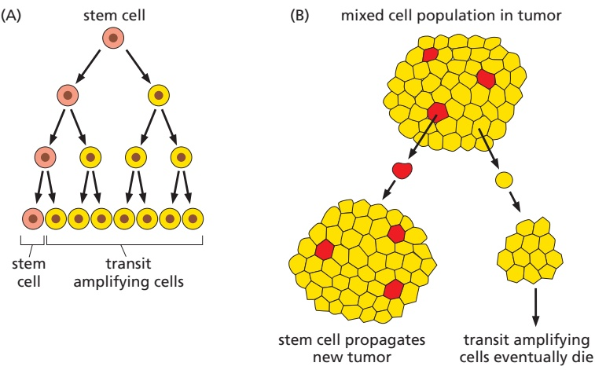

Figure 20–13 Cancer stem cells can be responsible for a tumor’s growth and yet remain only a small part of the tumorcell population. (A) Lineage of stem cells producing transit amplifying cells. (B) How a small proportion of cancer stem cells can maintain a tumor. Although the much more abundant transit amplifying cells will eventually die, the number of cancer stem cells will increase slowly but steadily to produce a growing tumor.

During the development of cancer, mutations have the potential to subvert the normal cellular differentiation program in multiple ways; for example, by leading to an overproliferation of transit amplifying cells or to an inhibition of their terminal differentiation or death. More insidious, however, are mutations that lead to the generation of cancer stem cells. Some tumors appear to exhibit this etiology: they consist of rare **cancer stem cells** capable of self-renewal, together with much larger numbers of dividing transit amplifying cells that are derived from the cancer stem cells but have a limited capacity for self-renewal (**Figure 20–13**).

Evidence for the existence of cancer stem cells comes from experiments in which individual cells from a cancer are tested for their ability to give rise to fresh tumors when implanted into a mouse. It has been known for more than half a century that there is usually only a small chance—typically much less than 1%— that a tumor cell chosen at random and tested in this way will generate a new tumor. This by itself does not prove that the tumor cells are heterogeneous: like seeds scattered on difficult ground, each of them may have only a small chance of finding a spot where it can survive and grow. Modern technologies for sorting cells have shown, however, that subpopulations of cancer cells expressing markers typically found on the surface of stem cells have a greatly enhanced ability to found new tumors. Moreover, the new tumors consist of mixtures of cells that express the stem cell markers and cells that do not, all generated from the same founder cell that expressed the markers. The cancer stem-cell phenomenon, whatever its basis, implies that even when the tumor cells are genetically similar, they may be phenotypically diverse. A treatment that wipes out tumor cells in one state will often allow survival of others that remain a danger. Radiotherapy or a cytotoxic drug, for example, may selectively kill off the rapidly dividing cells, reducing the tumor volume to almost nothing, and yet spare a few slowly dividing cells that go on to resurrect the disease. This greatly adds to the difficulty of cancer therapy, and it is part of the reason why treatments that seem at first to succeed often end in relapse and disappointment.

#### A Common Set of Hallmarks Typically Characterizes Cancerous Growth

Clearly, to produce a cancer, a cell must acquire a range of aberrant properties—a collection of subversive new skills—as it evolves. Different cancers require different combinations of these properties. Nevertheless, cancers all share some common hallmarks. These defining properties are commonly combined with other features, such as genetic instability, that help the miscreants to arise and thrive. A list of the key attributes of cancer cells in general would include the following:

1. Altered homeostasis that results in cells growing and dividing at a faster rate than they die

2. Bypass of normal limits to cell proliferation

3. Evasion of cell-death signals

4. Altered cellular metabolism

5. Manipulation of the tissue environment to support cell survival and to evade a deleterious immune response

6. Escape of cells from their home tissues and proliferation in foreign sites (metastasis)

Below we discuss these key features in more detail. In the next section of the chapter, we examine the mutations and molecular mechanisms that underlie these and other properties of cancer cells.

#### Cancer Cells Display an Altered Control of Growth and Homeostasis

Mutability and large cell population numbers create opportunities for mutations to occur, but the driving force for development of a cancer has to come from some sort of selective advantage possessed by the mutant cells. Most obviously, a mutation or epigenetic change can confer such an advantage by increasing the rate at which a clone of cells proliferates or by enabling it to continue proliferating when normal cells would stop or die. One of the most important properties of many types of cancer cells is that they fail to undergo apoptosis when a normal cell would do so (**Figure 20–14**).

Cancer cells that can be grown in culture or cultured cells artificially engineered to contain the types of mutations encountered in cancers typically show a **transformed** phenotype. They are abnormal in their shape, their motility, their responses to growth factors in the culture medium, and, most characteristically, in the way they react to contact with the culture dish and with one another. Whereas most normal cells will not divide unless they are attached to the surface, transformed cells will often divide even if held in suspension. More generally, transformed cells no longer require all of the positive signals from their surroundings that normal cells require. In addition, transformed cells fail to recognize some negative influences. Thus, for example, normal cells become inhibited from moving and dividing when the culture reaches confluence (where the cells are touching one another), while transformed cells continue moving and dividing even after confluence, and so pile up in layer upon layer in the culture dish (**Figure 20–15**).

Figure 20–14 Both increased cell division and decreased apoptosis can contribute to tumorigenesis. In normal tissues, apoptosis balances cell division to maintain homeostasis (see Movie 18.1). During the development of cancer, either an increase in cell division or an inhibition of apoptosis can lead to the increased cell numbers important for tumorigenesis. The cells fated to undergo apoptosis are gray in this diagram. Both an increase in cell division and a decrease in apoptosis commonly contribute to tumor growth.

basal extrusion of tumor cell

20 µm

Figure 20–15 Loss of contact inhibition by cancer cells in cell culture. Most normal cells stop proliferating once they have carpeted the dish with a single layer of cells: proliferation seems to depend on contact with the dish and to be inhibited by contacts with other cells—a phenomenon known as contact inhibition. Cancer cells, in contrast, usually disregard these restraints and continue to grow, so that they pile on top of one another (Movie 20.3). (A) Schematic drawing. (B and C) Light micrographs of normal (B) and transformed (C) fibroblasts. (B and C, courtesy of Lan Bo Chen.)

Cancer cells also misbehave in their natural environment, embedded in a tissue. For example, normal cells of the gut epithelium are constantly turning over through rounds of cell division and death, but maintain their barrier function by seamlessly extruding old or damaged cells into the gut lumen. Once detached from the matrix and matrix-associated survival signals, these cells die through a form of apoptosis. By overriding normal death signals, transformed cells may be able to survive after their ejection from the epithelium. However, because the normal direction of cell extrusion is into the lumen of the gut, they would nevertheless be swept away through the waste canal. However, some of the mutations selected for during cancer progression can change the direction of extrusion, thereby enabling the tumor cells to cross the basement membrane and invade the surrounding tissue, potentially leading to metastasis (**Figure 20–16**).

In conclusion, by disobeying the normal etiquette of where to live and when to die, cancer cells both evade growth suppression and explore new opportunities to prosper and multiply.

<!-- END EN EN20-H000-H009 -->

### 英文补充：癌基因、抑癌基因、肿瘤演进与防治

> 对应中文板块：癌基因、抑癌基因、肿瘤演进与防治。英文来源：Molecular Biology of the Cell，第7版，第20章；[本章完整原文](../来源/英文教材/20_Cancer/chapter.md)。物理PDF页码范围：1202–1255（整章范围）。

<!-- BEGIN EN EN20-H011-H053 -->
#### Cancer Cells Have an Abnormal Ability to Bypass Death Signals

A large multicellular organism requires powerful safety mechanisms that guard against the trouble caused by damaged and deranged cells. These mechanisms are essential because, as previously explained, a large number of mutated cells will inevitably be produced. Normally, internal disorder gives rise to danger signals in the faulty cell, activating protective measures to reverse and cure this disorder or, failing that, activating decisions that lead to cell death by apoptosis (see Chapter 18). To survive, cancer cells require mutations to elude or break through these defenses designed to eliminate defective cells.

Cancer cells generally contain mutations that drive the cell into an abnormal state, where metabolic processes may be unbalanced and essential cell components may be produced in ill-matched proportions. States of this type, where the cell’s homeostatic mechanisms are inadequate to cope with an imposed disturbance, are loosely referred to as states of cell stress. As one example, chromosome breakage and other forms of DNA damage are commonly observed during the development of cancer, reflecting the genetic instability that cancer cells display. Thus, to survive and divide without limit, a prospective cancer cell must accumulate changes that disable the normal safety mechanisms that would otherwise cause a cell that is stressed to commit suicide by apoptosis.

While cancer cells tend to avoid apoptosis, this does not mean that they rarely die. On the contrary, in the interior of a large solid tumor, cell death often occurs on a massive scale: living conditions are difficult, with severe competition among the cancer cells for oxygen and nutrients. Most of these cells die by an alternative cell-death mechanism termed necrosis (**Figure 20–17**).

Figure 20–17 The interior of a large tumor is deprived of oxygen and nutrients. This cross section of a colon adenocarcinoma that has metastasized to the lung shows colorectal cancer cells that have formed a cohesive nodule (darkstaining region). The metastasis has central pink areas of necrosis where dying cancer cells have outgrown their blood supply and burst open, releasing their contents. Such anoxic regions are common in the interior of tumors. (Courtesy of Andrew J. Connolly.)

(A)

(B)

Figure 20–18 The Warburg effect in tumor cells reflects a dramatic change in glucose uptake and sugar metabolism. (A) Cells that are not proliferating will normally oxidize nearly all of the glucose that they import from the blood to produce ATP through oxidative phosphorylation that takes place in their mitochondria. Only when deprived of oxygen will these cells generate most of their ATP from glycolysis, converting the pyruvate produced to lactate in order to regenerate the NAD+ that they need to keep glycolysis going (see Figure 2–50). (B) Tumor cells, by contrast, will generally produce abundant lactate even in the presence of oxygen. This results from a greatly increased rate of glycolysis that is fed by a very large increase in the rate of glucose import. In this way, tumor cells resemble the rapidly proliferating cells in embryos, which likewise require for biosynthesis a large supply of the smallmolecule building blocks that can be produced from imported glucose (see also Figure 2–60).

The tumor grows because the cell birthrate outpaces the cell death rate, but often by only a small margin. For this reason, the time that a tumor takes to double in size can be far longer than the cell-cycle time of the tumor cells.

#### Cancer Cells Have Altered Sugar Metabolism

Given sufficient oxygen, differentiated cells in most adult tissues will fully oxidize almost all the carbon in the glucose they take up to $\mathrm { C O _ { 2 } } ,$ which is eventually exhaled by the lungs as a waste product. A growing tumor needs nutrients in abundance to provide the building blocks to make new macromolecules. Correspondingly, most tumors are metabolically more similar to a growing embryo than to normal adult tissue. Tumor cells consume glucose avidly, importing it from the blood at a rate that can be as much as 100 times higher than that for neighboring normal cells. Moreover, only a fraction of this imported glucose is fully oxidized to $\mathrm { C O _ { 2 } }$ by mitochondrial oxidative phosphorylation, which normally enables highly efficient production of ATP. Instead, the metabolism of carbon atoms from glucose is rewired to support the production of raw materials for the synthesis of the proteins, nucleic acids, and lipids that enable cellular proliferation (**Figure 20–18**). In other words, even though glycolysis is a much less efficient mode of ATP production than oxidative phosphorylation, it can continue unabated in cancer cells that find themselves in an oxygen-poor environment, and it has the critical added benefit of producing abundant cellular building blocks.

This tendency of tumor cells to de-emphasize oxidative phosphorylation even when oxygen is plentiful, while at the same time taking up large quantities of glucose, is necessary for the rapid proliferation of many cancer cells and is called the Warburg effect—so named because Otto Warburg first noticed the phenomenon in the early twentieth century. It is this abnormally high glucose uptake that allows tumors to be selectively imaged in whole-body scans (see Figure 20–1), thereby providing one way to monitor cancer progression and responses to treatment.

#### The Tumor Microenvironment Influences Cancer Development

While the cancer cells in a tumor are the bearers of dangerous mutations and are often grossly abnormal, the other cells in the tumor—especially those of the supporting connective tissue, or **stroma**—are far from passive bystanders. The development of a tumor relies on a two-way communication between the cancer cells and tumor stroma, just as the normal development of epithelial organs relies on communication between epithelial cells and mesenchymal cells (discussed in Chapter 22).

Figure 20–19 The tumor microenvironment plays a role in tumorigenesis. Tumors consist of many cell types, including cancer cells, endothelial cells, pericytes (vascular smooth muscle cells), fibroblasts, and inflammatory white blood cells. Communication among these and other cell types plays an important part in tumor development. Note, however, that only the cancer cells in a tumor are thought to contain mutations that make them genetically abnormal.

The stroma provides a framework for the tumor. As for normal connective tissue, the stroma is composed of fibroblasts and inflammatory white bloodMBoC7 n20.214/20.19 cells and of the endothelial cells that form blood and lymphatic vessels with their attendant smooth muscle cells (**Figure 20–19**). As a carcinoma progresses, the cancer cells induce changes in this stroma by secreting signal proteins that alter the behavior of the stromal cells and proteolytic enzymes that modify the extracellular matrix. The stromal cells in turn act back on the tumor cells by secreting signal proteins that stimulate cancer cell growth and division and proteases that further remodel the extracellular matrix. In these ways, the tumor and its stroma evolve together, like weeds and the ecosystem that they invade, and the tumor can become dependent on its particular stromal cells. Experiments using mice indicate that the growth of some transplanted carcinomas depends on the tumor-associated fibroblasts and that normal fibroblasts will not suffice.

Cancer cells have a complex interaction with the cells of the immune system that are present in the stroma, which have the potential to destroy the tumor if it is recognized as aberrant tissue but can also promote tumor growth by providing signals that stimulate cancer cell proliferation. The tumor can manipulate the immune system to its advantage in at least two ways. First, tumors may invoke an inflammatory reaction similar to what occurs when normal tissue is damaged, which helps them acquire the stroma they need for survival and growth. Tumors have therefore been likened to unhealed wounds, eliciting some of the same responses, including an increase in the permeability of nearby blood vessels, which allows the flow of signaling molecules in and out of the vessels, and the deposition of extracellular matrix. Tumors also stimulate the formation of new blood vessels, a process termed angiogenesis, which promotes survival of a tumor as it grows larger and becomes hypoxic in its interior. Second, and of equal importance, the tumor establishes an immunosuppressive microenvironment by blocking the activation of white blood cells that could lead to its destruction. Strategies that override this ability of a tumor to suppress an immune response have recently emerged as powerful tools in cancer therapy, and they are described in the last section of this chapter.

#### Cancer Cells Must Survive and Proliferate in a Foreign Environment

In order to kill us, cancer cells generally need to spread and multiply at new sites in the body through a process called metastasis. This is the most deadly—and least understood—aspect of cancer, being responsible for 90% of cancer-associated deaths. By spreading through the body, a cancer becomes almost impossible to eradicate by either surgery or local irradiation. **Metastasis** is itself a multistep process: the cancer cells first have to invade local tissues and vessels, move through the circulation, leave the vessels, and then establish new cellular colonies at distant sites (**Figure 20–20**). Each of these events is complex, and most of the molecular mechanisms involved are not yet clear, but the last step—colonization of distant sites—is rate limiting.

Figure 20–20 Steps in the process of metastasis. This example illustrates the spread of a tumor from its site of origin (such as the bladder) to another organ (such as the liver). Tumor cells may enter the bloodstream directly by crossing the wall of a blood vessel, as diagrammed here, or, more commonly perhaps, by crossing the wall of a lymphatic vessel that ultimately discharges its contents (lymph) into the bloodstream. Tumor cells that have entered a lymphatic vessel often become trapped in lymph nodes along the way, giving rise to lymph-node metastases. Studies in animals show that typically fewer than one in every thousand malignant tumor cells introduced into the bloodstream is viable after 24 hours, and that less than 0.1% of these surviving circulating tumor cells (CTCs) will colonize a new tissue so as to produce a detectable tumor at a new site.

For a cancer cell to become malignant, it must break free of constraints that keep normal cells in their proper places and prevent them from invading neighboring tissues. Invasiveness is thus one of the defining properties of malignant tumors, which show a disorganized pattern of growth and ragged borders, with extensions into the surrounding tissue (see, for example, Figure 20–8). Although the underlying molecular changes are not well understood, invasiveness almost certainly requires a disruption of the adhesive mechanisms that normally keep cells tethered to their proper neighbors and to the extracellular matrix.

The next step in metastasis—the establishment of colonies in distant organs— begins with entry into the circulatory system: the invasive cancer cells must penetrate the wall of a blood or lymphatic vessel. Lymphatic vessels, being larger and having more flimsy walls than blood vessels, allow cancer cells to enter in small clumps; such clumps may then become trapped in lymph nodes, giving rise to lymph-node metastases. The cancer cells that enter blood vessels, in contrast, do so singly or, more rarely, in small clusters. With modern techniques for sorting cells according to their surface properties, it has become possible to detect these circulating tumor cells (CTCs) in samples of blood from cancer patients, even though they are only a minute fraction of the total blood-cell population. Notably, in a mouse model, CTC clusters gave rise to metastases at a significantly higher rate than single CTCs did. Presumably the adhesion of epithelial-derived cancer cells to one another helps to override death signals and suppress apoptosis.

Of the cancer cells that enter the lymphatics or bloodstream, only a tiny proportion succeed in making their exit, settling in new sites, and surviving and proliferating there as founders of metastases. To discover which of the later steps in metastasis present cancer cells with the greatest difficulties, one can label the cells with a fluorescent dye or green fluorescent protein (GFP), inject them into the bloodstream of a mouse, and then monitor their fate (**Movie 20.4**). In such experiments, one observes that many cells survive in the circulation, lodge in small vessels, and exit into the surrounding tissue, regardless of whether they come from a tumor that metastasizes or one that does not. Some cells die immediately after they enter foreign tissue; others survive entry into the foreign tissue but fail to proliferate. Still others divide a few times and then stop, forming micrometastases containing ten to several thousand cells. Very few establish full-blown metastases. Experiments show that fewer than one in thousands, perhaps one in millions, manages this feat. The final step of colonization seems to be the most difficult: like the Vikings who landed on the inhospitable shores of Greenland, the migrant cells may fail to survive in the alien environment or they may only thrive there for a short while to found a little colony—a micrometastasis—that then dies out (**Movie 20.5**).

Many cancers are discovered before they have managed to found metastatic colonies, and these can be cured by destruction of the primary tumor. But on occasion, an undetected, distant micrometastasis will remain dormant for many years, only to reveal its presence by erupting into growth to form a large secondary tumor long after the primary tumor has been removed.

#### Summary

Cancer cells, by definition, grow and proliferate in defiance of normal controls (that is, they are neoplastic) and gain the ability to invade surrounding tissues and colonize distant organs (that is, they are malignant). By giving rise to secondary tumors, or metastases, they become difficult to eradicate by surgery or local irradiation. Cancers are thought to originate from a single cell that has experienced an initial mutation, but the progeny of this cell must undergo many further changes to become cancerous. Tumor progression usually takes many years and reflects the operation of a Darwinian-like process of evolution, in which somatic cells undergo mutation and epigenetic changes accompanied by natural selection and occasional bursts of genomic chaos that give rise to heterogeneity.

Cancer cells acquire a variety of special properties as they evolve, multiply, and spread. Their mutant genomes enable them to grow and divide in defiance of the signals that normally keep cell proliferation under tight control. As part of the evolutionary process of tumor progression, cancer cells acquire a collection of additional abnormalities, including defects in the controls that permanently stop cell division or induce apoptosis in response to cell stress or DNA damage and defects in the mechanisms that normally keep cells from straying from their proper place. All of these changes increase the ability of cancer cells to survive, grow, and divide in their original tissue and then to metastasize, founding new colonies in foreign environments. The evolution of a tumor also depends on other cells present in the tumor microenvironment, collectively called stromal cells, that the cancer attracts and manipulates.

Because many changes are needed to confer this collection of asocial behaviors, it is not surprising that most cancer cells are genetically and/or epigenetically unstable. This instability is thought to be selected for in the clones of aberrant cells that are able to produce tumors, because it greatly accelerates the accumulation of the further genetic and epigenetic changes that are required for tumor progression.

#### CANCER-CRITICAL GENES: HOW THEY ARE FOUND AND WHAT THEY DO

As we have seen, cancer depends on the accumulation of heritable changes in somatic cells; that is, changes that are transmitted by a cell to its progeny. To understand it at a molecular level we need to identify the mutations and epigenetic alterations involved and to discover how they give rise to cancerous cell behavior. Finding the relevant cells is often easy; they are favored by natural selection and call attention to themselves by giving rise to tumors. But how do we identify those genes that have undergone cancer-promoting changes among all the other genes in the cancerous cells? A typical cancer depends on a whole set of mutations and epigenetic changes that are never exactly the same in two different patients, although there are commonalities among certain tumor types. In addition, a given cancer cell will also contain a large number of somatic mutations that are accidental by-products—so-called passengers rather than drivers—of its genetic instability, and it can be difficult to distinguish these incidental changes from those changes that have a causative role in the disease. Despite these difficulties, many of the genes that are repeatedly altered in human cancers have been identified over the past 40 years. We will call such genes, for want of a better term, cancer-critical genes, meaning all genes whose alteration can contribute to the causation or evolution of cancer.

In this section, we shall first discuss how cancer-critical genes are identified. We shall then examine their functions and the parts they play in conferring on cancer cells the properties outlined in the first part of the chapter. We shall end the section by discussing colon cancer as an extended example, showing how a succession of changes in cancer-critical genes enables a tumor to evolve from one pattern of bad behavior to another that is worse.

#### The Identification of Gain-of-Function and Loss-of-Function Cancer Mutations Has Traditionally Required Different Methods

Cancer-critical genes are grouped into two broad classes, according to whether the cancer risk arises from too much activity of the gene product or too little. Genes of the first class, in which a gain-of-function mutation can drive a cell toward cancer, are called **proto-oncogenes**; their mutant, overactive or overexpressed forms are called **oncogenes**. Genes of the second class, in which a loss-of-function mutation can contribute to cancer, are called **tumor suppressor genes**. In either case, the mutation may lead toward cancer directly (by causing cells to proliferate when they should not) or indirectly; for example, by causing genetic or epigenetic instability and so hastening the occurrence of other inherited changes that directly stimulate tumor growth. Those genes whose alteration results in genomic instability represent a subclass of cancer-critical genes that are sometimes called genome maintenance genes.

As we shall see, mutations in oncogenes and tumor suppressor genes can have similar effects in promoting the development of cancer; overproduction of a signal for cell proliferation, for example, can result from either kind of mutation. Thus, from the point of view of a cancer cell, oncogenes and tumor suppressor genes—and the mutations that affect them—are flip sides of the same coin. The techniques that led to the discovery of these two categories of genes, however, are quite different.

The mutation of a single copy of a proto-oncogene that converts it to an oncogene has a dominant, growth-promoting effect on a cell (**Figure 20–21A**). Thus, we can identify the oncogene by its effect when it is added—by DNA transfection, for example, or through transduction with a viral vector—to the genome of a suitable type of tester cell or experimental animal. In the case of the tumor suppressor gene, on the other hand, the cancer-causing alleles produced by the change are generally recessive: often (but not always) both copies of the normal gene must be removed or inactivated in the diploid somatic cell before an effect is seen (**Figure 20–21B**). This calls for a different experimental approach, one focusing on discovering what is missing in the cancer cell.

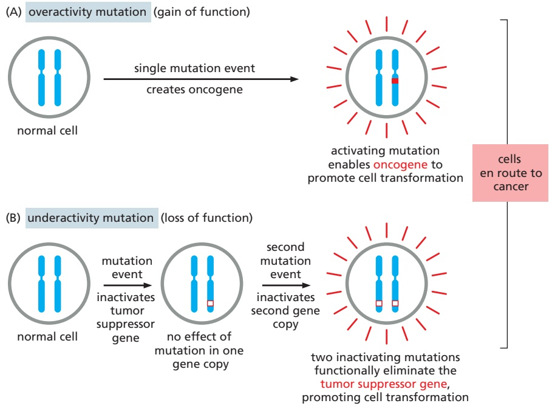

Figure 20–21 Cancer-critical mutations fall into two readily distinguishable categories, dominant and recessive. In this diagram, activating mutations are represented by solid red boxes, inactivating mutations by hollow red boxes. (A) Oncogenes act in a dominant manner: a gain-of-function mutation in a single copy of the cancer-critical gene can drive a cell toward cancer. (B) Mutations in tumor suppressor genes, on the other hand, generally act in a recessive manner: the function of both alleles of the cancercritical gene must be lost to drive a cell toward cancer. Although in this diagram the second allele of the tumor suppressor gene is inactivated by mutation, it is often inactivated instead by loss of the second chromosome. Not shown is the fact that mutation of some tumor suppressor genes can have an effect even when only one of the two gene copies is damaged.

We begin by discussing a few examples of each class of cancer-critical genes to illustrate basic principles. These examples are chosen also for their historical importance: the experiments that led to their discovery—at different times and by different methods—marked turning points in the understanding of cancer.

#### Retroviruses Led to the Identification of Oncogenes

The search for the genetic causes of human cancer took a circuitous route, beginning with clues that came from the study of **tumor viruses**. Although viruses are involved only in a minority of human cancers, a set of viruses that infect animals provided critical early tools for studying cancer.

One of the first animal viruses to be implicated in cancer was discovered in chickens more than 100 years ago, when an infectious agent that causes connective-tissue tumors, or sarcomas, was identified as a virus—the Rous sarcoma virus. Like all the other RNA tumor viruses discovered since, it is a **retrovirus**. When it infects a cell, its RNA genome is copied into DNA by reverse transcription, and the DNA is inserted into the host genome, where it can persist and be inherited by subsequent generations of cells. Something in the DNA inserted by the Rous sarcoma virus made the host cells cancerous, but what was it? The answer was a surprise. It turned out to be a piece of DNA that was unnecessary for the virus’s own survival or reproduction; instead, it was a passenger, a gene called v-Src, that the virus had picked up on its travels. v-Src was unmistakably similar, but not identical, to a gene—c-Src—that is found in all vertebrate genomes and encodes a protein tyrosine kinase. c-Src had evidently been taken up accidentally by the retrovirus from the genome of a previously infected host cell, and it had undergone mutation in the process to become an oncogene (v-Src).

This Nobel Prize–winning finding was followed by a flood of discoveries of other viral oncogenes carried by retroviruses that cause cancer in nonhuman animals. Each such oncogene turned out to have a counterpart proto-oncogene in the normal vertebrate genome. As was the case for Src, these other oncogenes generally differed from their normal counterparts, either in structure or in level of expression.

But how did this relate to typical human cancers, in which retroviruses were not known to play a role? In an assay to identify human oncogenes, DNA was extracted from human tumor cells, broken into fragments, and introduced into cultured mouse cells. Occasional colonies of abnormally proliferating cells began to appear in the culture dish that showed a transformed phenotype, outgrowing the untransformed cells in the culture and piling up in layer upon layer (see Figure 20–15). Each colony was a clone originating from a single cell that had incorporated a DNA fragment that drove cancerous behavior. Once isolated and sequenced, the DNA fragments were found to contain a human version of a gene already known from study of a retrovirus that caused tumors in rats—an oncogene called v-Ras. The newly discovered oncogene was clearly derived by mutation from a normal human gene, one of a small family of proto-oncogenes called **Ras**. This discovery in the early 1980s of the same oncogene in human tumor cells and in an animal tumor virus was electrifying. The implication that cancers are caused by mutations in a limited number of cancer-critical genes transformed our understanding of the molecular biology of cancer.

As discussed in Chapter 15, normal Ras proteins are monomeric GTPases that help transmit signals from cell-surface receptors to the cell interior (see Movie 15.7). The Ras oncogenes isolated from human tumors contain point mutations that create a hyperactive Ras protein that cannot shut itself off by hydrolyzing its bound GTP to GDP. Because this makes the protein hyperactive, its effect is dominant; that is, only one of the cell’s two gene copies needs to change to have an effect. One or another of the three human Ras family members is mutated in about 30% of all human cancers. Ras genes are thus among the most important of all cancer-critical genes.

Figure 20–22 The types of accidents that can convert a proto-oncogene into an oncogene.

#### Genes Mutated in Cancer Can Be Made Overactive in Many Ways

**Figure 20–22** summarizes the types of accidents that can convert a protooncogene into an oncogene. (1) A small change in DNA sequence such as a point mutation or deletion may produce a hyperactive protein when it occurs within a protein-coding sequence or lead to protein overproduction when it occurs within a regulatory region for that gene. (2) Gene amplification events, such as those that can be caused by errors in DNA replication, may produce extra gene copies; this can lead to overproduction of the protein. (3) A chromosomal rearrangement— involving the breakage and rejoining of the DNA helix—may either change the protein-coding region, resulting in a hyperactive fusion protein, or alter the control regions for a gene so that a normal protein is overproduced.

As one example, the receptor for the extracellular signal protein epidermal growth factor (EGF) can be activated by a deletion that removes part of its extracellular domain, causing it to be active even in the absence of EGF (**Figure 20–23**). The mutant EGF receptor thus produces an inappropriate stimulatory signal, like a faulty doorbell that rings even when nobody is pressing the button. Mutations

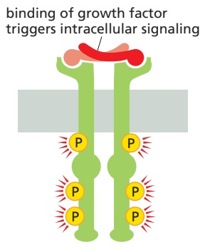

truncated receptor triggers intracellular signaling in absence of growth factor

Figure 20–23 Mutation of the epidermal growth factor (EGF) receptor can make it active even in the absence of EGF, and consequently oncogenic. Normally, binding of EGF to the receptor’s extracellular domain leads to phosphorylation of the intracellular domain, which activates signaling. Truncation of the extracellular domain leads to hyperphosphorylation and inappropriate activation. Other types of activating mutations are observed in different cancers.

of this type are frequently found in the most common type of human brain tumor, called glioblastoma.

As another example, the Myc protein, which acts in the nucleus to stimulate cell growth and division (see Chapter 17), generally contributes to cancer by being overproduced in its normal form. In some cases, the gene is amplified; that is, errors of DNA replication lead to the creation of large numbers of gene copies in a single cell. Or a point mutation can stabilize the protein, which normally turns over very rapidly. More commonly, the overproduction appears to be due to a change in a regulatory element that acts on the gene. For example, a chromosomal translocation can inappropriately bring powerful gene regulatory sequences next to the Myc protein-coding sequence, so as to produce unusually large amounts of Myc mRNA. Thus, in Burkitt’s lymphoma, a translocation brings the Myc gene under the control of sequences that normally drive the expression of antibody genes in B lymphocytes. As a result, the mutant B cells tend to proliferate excessively and form a tumor. Different specific chromosome translocations are common in other cancers.

#### Studies of Rare Hereditary Cancer Syndromes First Identified Tumor Suppressor Genes

Identifying a gene that has been inactivated in the genome of a cancer cell requires a different strategy from finding a gene that has become hyperactive: one cannot, for example, use a cell transformation assay to identify something that simply is not there. The key insight that led to the discovery of the first tumor suppressor gene came from studies of a rare type of human cancer, **retinoblastoma**, which arises from cells in the retina of the eye that are converted to a cancerous state by an unusually small number of mutations. As often happens in biology, the discovery arose from examination of a special case, but it turned out to reveal a gene of widespread importance.

Retinoblastoma occurs in childhood, and tumors develop from neural pre-cursor cells in the immature retina. About one child in 20,000 is afflicted. One form of the disease is hereditary, and the other is not. In the hereditary form, multiple tumors usually arise independently, affecting both eyes; in the nonhereditary form, only one eye is affected, and by only one tumor. A few individuals with retinoblastoma have a visibly abnormal karyotype, with a deletion of a specific band on chromosome 13 that, if inherited, predisposes an individual to the disease. Deletions of this same region are also encountered in tumor cells from some patients with the nonhereditary disease, which suggested that the cancer was caused by loss of a critical gene in that location.

By mapping the location of this chromosomal deletion, it was possible to identify the Rb gene. It was then discovered that those who suffer from the hereditary form of the disease have a deletion or loss-of-function mutation present in one copy of the Rb gene in every somatic cell. These cells are predisposed to becoming cancerous but do not do so if they retain one good copy of the gene. The retinal cells that are cancerous are defective in both copies of Rb because of a somatic event that has eliminated the function of the previously good copy.

In individuals with the nonhereditary form of the disease, by contrast, the noncancerous cells show no defect in either copy of Rb, while the cancerous cells have become defective in both copies. These nonhereditary retinoblastomas are very rare because they require two independent events that inactivate the same gene on two chromosomes in a single retinal cell lineage (**Figure 20–24**).

The Rb gene is also missing in several common types of sporadic cancer, including carcinomas of lung, breast, and bladder. These more common cancers arise by a more complex series of genetic changes than does retinoblastoma, and they make their appearance much later in life. But in all of them, it seems, loss of Rb function is frequently a major step in the progression toward malignancy.

The Rb gene encodes the **Rb** protein, which is a universal regulator of the cell cycle in almost all cells of the body (see Figure 17–59). It acts as one of the main brakes on progress through the cell-division cycle, and its loss can allow cells to enter the cell cycle inappropriately, as we discuss later.

POSSIBLE WAYS OF ELIMINATING NORMAL Rb GENE

#### Both Genetic and Epigenetic Mechanisms Can Inactivate Tumor Suppressor Genes

For tumor suppressor genes, it is their inactivation that is dangerous. This inactivation can occur in many ways, with different combinations of mishaps serving to eliminate or cripple both gene copies. The first copy may, for example, be lostMBoC7 m20.20/20.24 by a small chromosomal deletion or inactivated by a point mutation due to a random error in DNA replication. The second copy is more commonly eliminated by a less specific mechanism that is likely to occur in cells progressing toward cancer that have become genetically unstable. For example, the chromosome carrying the remaining normal copy may be lost from the cell or damaged due to errors in chromosome segregation (see Figure 20–11) or the normal gene, along with neighboring genetic material, may be replaced by a mutant version through either a mitotic recombination event or a gene conversion that accompanies it (see pp. 305–306). Epigenetic changes provide another important way to permanently inactivate a tumor suppressor gene. Most commonly, the C nucleotides in CG sequences in its promoter may become methylated in a heritable manner, which can irreversibly silence the gene in a cell and in all of its progeny (see pp. 435–436). **Figure 20–25**

HEALTHY CELL WITH ONLY ONE NORMAL Rb GENE COPY

Figure 20–24 The genetic mechanisms that cause retinoblastoma. In the hereditary form, all cells in the body lack one of the normal two functional copies of the Rb tumor suppressor gene, and tumors arise from a clone of cells where the remaining copy is lost or inactivated by a somatic event (either mutation or epigenetic silencing). In the nonhereditary form, all cells initially contain two functional copies of the gene, and the tumor arises because both copies are lost or inactivated through the coincidence of two somatic events in a single line of cells.

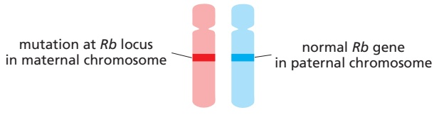

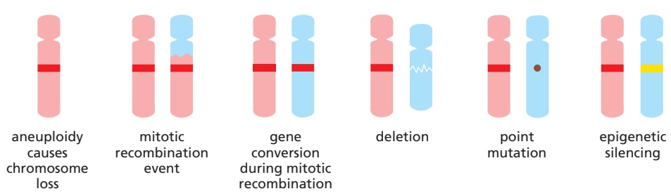

Figure 20–25 Six ways of inactivating the remaining good copy of a tumor suppressor gene through changes in DNA sequence or an epigenetic mechanism. A cell that is defective in only one of its two copies of a tumor suppressor gene—for example, the Rb gene—usually behaves as a normal, healthy cell; the diagrams show how this cell may lose the function of the other gene copy as well and thereby progress toward cancer.

summarizes the range of ways in which the remaining good copy of a tumor suppressor gene can be lost through a DNA sequence or epigenetic change, using the Rb gene as an example.

#### Systematic Sequencing of Cancer Cell Genomes Has Transformed Our Understanding of the Disease

Methods such as those we have described above shone a spotlight on a set of cancer-critical genes that were identified in a piecemeal fashion. Meanwhile, the rest of the cancer cell genome remained in darkness: it was a mystery how many other mutations might lurk there, of what types, in which varieties of cancer, at what frequencies, with what variations from individual to individual, and with what consequences. With the sequencing of the human genome and the dramatic advances in DNA sequencing technology (see Figure 8–44), it has become possible to see the whole picture—to view cancer cell genomes in their entirety. This transforms our understanding of the disease.

Cancer cell genomes can be scanned systematically in several different ways. At one extreme—the most costly, but no longer prohibitively so—one can determine a tumor’s complete genome sequence. More cheaply, one can focus just on the 21,000 or so genes in the human genome that code for protein (the so-called exome), looking for mutations in the cancer cell DNA that alter the amino acid sequence of the product or prevent its synthesis (**Figure 20–26**). In addition, DNA sequencing enables a survey of the genome for regions that have undergone deletion or duplication to reveal copy number variations and the loss or gain of chromosomes (aneuploidy). The genome can also be scanned for epigenetic changes to reveal changes in methylation patterns of DNA or other changes that accompany transcriptional silencing or activation without affecting DNA sequence. Systematic sequencing of RNAs can reveal alterations in levels of gene expression by analysis of mRNAs (see Figure 7–5), as well as levels of regulatory noncoding RNAs. Finally, to measure the expression of known **cancercritical genes** directly by detecting their protein products, tumor cell lysates can be surveyed quantitatively using mass spectrometry. These approaches involve comparing cancer cells with normal controls—ideally, noncancerous cells originating in the same tissue and from the same individual.

A combination of the high-throughput methods described above has been applied to more than 10,000 tumors spanning 33 cancer types through a consortium called The Cancer Genome Atlas, which is coordinated by the National Institutes of Health. Other international and freely available resources, including COSMIC, the Catalog of Somatic Mutations in Cancer, are continually compiling new cancer data. As we discuss below, these large-scale projects have shed important new light on what types of alterations are present in a cancer genome, what kinds of genes or pathways are altered across and within cancer types, how heterogeneous the cancer cells within a tumor are, and how the patterns of alterations evolve over time during disease progression and treatment.

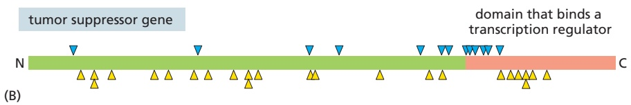

Figure 20–26 The distinct types of DNA sequence changes found in oncogenes compared to those in tumor suppressor genes. In this diagram, mutations that change an amino acid are denoted by blue arrowheads, whereas mutations that truncate the polypeptide chain are marked by yellow arrowheads. (A) As in this example (the PIK3CA gene, which produces a phosphoinositide 3-kinase subunit), oncogene mutations can be detected by the fact that the same nucleotide change is repeatedly found among the missense mutations in a gene. (B) As in this example (the Rb gene), for tumor suppressor genes missense mutations that abort protein synthesis by creating stop codons predominate. Note that only a few of the possible mutations in a protein-coding sequence are likely to be activating, while inactivation can be a consequence of missense, nonsense, and frameshift mutations. (Adapted from B. Vogelstein et al., Science 339:1546–1558, 2013.)

#### Many Cancers Have an Extraordinarily Disrupted Genome

Cancer genome analysis reveals, first of all, the scale of gross genetic disruption in cancer cells. This varies greatly among cancer types and from one cancer patient to another, both in severity and in character. As discussed previously (see p. 1169) the chromosomal karyotype may appear normal, yet is riddled with numerous point mutations in individual genes due to a failure of the repair mechanisms that normally correct errors in the replication or maintenance of DNA sequences. Frequently, however, the karyotype is extremely disrupted, with many chromosomal breaks and rearrangements and chromosome sequences that are completely scrambled, indicating that extensive fragmentation of the DNA occurred followed by random re-assembly (as in chromothripsis; see Figure 20–11). From the pattern of changes, one can infer that disruptive events have occurred repeatedly during the evolution of the tumor, with a progressive increase in genetic disorder.

A common feature of many human cancers is aneuploidy—a change in chromosome karyotype from the normal number (46). A study of chromosome-level gain or loss across a panel of more than 10,000 cancer genomes revealed that most cancer types harbor a characteristic pattern of chromosomal abnormalities, with different arms or whole chromosomes altered at different frequencies. In many cases, the entire set of chromosomes was doubled or quadrupled because of complete failures in cell division, generating polyploid cells that subsequently experience additional chromosome gain and loss. Almost 90% of all the cancers surveyed showed some level of aneuploidy. **Figure 20–27** depicts a subset of the data showing selected tumor types, each of which displays a unique pattern of aneuploidy. Thus, for example, whereas 74% of thyroid carcinomas displayed a normal karyotype, less than 5% of glioblastoma and cervical carcinoma tumors possessed the normal chromosome number. Although the degree of aneuploidy is often characteristic of a cancer class, heterogeneity is also apparent. For example, one subset of glioblastomas is characterized by gain of chromosome 7 and loss of chromosome 10, but this combination of defects is not present in all cases, indicating that there are multiple pathways of genome disorder that can lead to different cancer subtypes.

Cancer genome studies also illuminate the underlying defects that bring about genome disruption. In ovarian cancers, for example, chromosome breaks, translocations, and deletions are very common, and these aberrations correlate with a high frequency of mutations and epigenetic silencing in the genes needed for repair of DNA double-strand breaks by homologous recombination, especially Brca1 and Brca2 (see pp. 300–301). In a subset of endometrial cancers, on the other hand, one instead finds many point mutations scattered throughout the genome, which could for example be caused by mutation of enzymes required for proofreading during DNA replication (see pp. 267–269). Thus, different cancers and cancer subtypes possess highly variable mutation rates, ranging from one base substitution per exome in some pediatric cancers to thousands of mutations per exome in mutagen-induced malignancies such as lung cancer and melanoma.

#### Epigenetic and Chromatin Changes Contribute to Most Cancers

So far we have focused primarily on the mutations in cancer-critical genes that contribute directly to the hallmarks of cancer. Equally important to the genesis of cancer, however, are changes that modify gene expression epigenetically, without altering the DNA sequence. As discussed previously, increased methylation of DNA in the promoter region of a gene such as Rb can permanently silence it. In addition, reversible covalent modifications such as methylation and acetylation also occur on the histone proteins that package DNA into chromatin. These

number of chromosome arms

Figure 20–27 The prevalence of aneuploidy among different tumor types. For each tumor type, the total number of chromosome arms detected is plotted on the X axis. The number of MBoC7 n20.208/20.27chromosome arms in a normal karyotype is indicated. Genome doubling status is also shown (black, not double; blue, one genome doubling; red, two or more genome doublings). The number of tumor samples possessing the respective arm numbers is represented by the length of the bar on the Y axis for each tumor type. Note that samples from some tumor types predominantly possess a normal karyotype, while samples from other tumor types display extreme heterogeneity with a dramatic increase in chromosome arm numbers because of extensive aneuploidy. (Adapted from A.M. Taylor et al., Cancer Cell 33:676–689, 2018.)

histone marks modulate gene expression by altering the conformation and accessibility of chromatin to regulatory factors such as transcription factors and chromatin remodeling complexes (see Chapter 7). An important finding of largescale genome sequencing projects is that roughly 50% of human cancers harbor mutations in chromatin proteins, which includes mutations in enzymes that add, remove, or recognize covalent marks on histones and DNA. Many of the resulting defects have the potential to cause heritable, epigenetic changes that modulate gene expression and contribute to tumorigenesis.

Frequently, genetic and epigenetic changes cooperate to cause cancer (**Figure 20–28**). In some cases, epigenetic changes precede characteristic oncogenic mutations and can even lead to them, such as when epigenetic silencing of genes required for the repair of DNA damage acts to increase mutation rates. In other cases, an accidental change in DNA sequence can disrupt chromatin and epigenetic regulation. One example is a gain-of-function mutation in the gene encoding isocitrate dehydrogenase (IDH), which is known to be a frequent initiating event in several cancers including glioma, leukemia, and other tumors. The mutant IDH produces elevated levels of a metabolite, 2-hydroxyglutarate, which acts to inhibit enzymes that demethylate DNA. Therefore, DNA in IDH-mutant cells becomes hypermethylated at random sites in the genome. Just as for DNA mutations, those epigenetic changes that provide a selective advantage in growth or survival will allow the affected cell and its descendants to persist and accumulate further changes, thereby contributing to cancer progression.

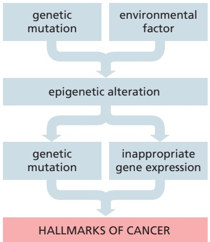

Figure 20–28 Epigenetic and genetic mechanisms can cooperate to promote the evolution of cancer. Both genetic mutations and environmental factors (such as metabolic state) can lead to epigenetic changes. As indicated, these epigenetic changes can in turn increase the rate at MBoC7 n20.218/20.28which genetic as well as further epigenetic changes accumulate—thereby speeding the process of cancer progression by altering gene expression in ways that promote cancer cell proliferation and are inherited in clones of cells.

The indirect effect of mutant IDH on DNA hypermethylation illustrates another important point: metabolic conditions affect the status of chromatin, which in turn can influence gene expression. Notably, only a minority of cancers with aberrant DNA methylation can be explained by an underlying genetic event. These observations suggest that environmental conditions, which may not themselves be mutagenic, can provide a source of epigenetic changes. Many DNA- and histone-modifying enzymes require metabolites as cofactors, providing a potential link between known risk factors for human cancer, such as diet and inflammation, and cancer development.

In addition to modulating the expression of individual genes, epigenetic changes can also have more global effects on the chromatin state, thereby influencing gene networks that underlie programs of cellular behavior. For example, different patterns of gene expression determined by epigenetic marks could restrict the ability of a cell to activate apoptosis or prevent it from exiting the cell cycle and undergoing differentiation. Evidence for such changes in cancer comes from characterization of rare pediatric brain tumors that lack somatic mutations and instead display aberrant DNA methylation profiles.

It is crucial to remember that altered patterns of gene activation and silencing due to epigenetic regulation are a normal feature of cellular differentiation, enabling the same genome to produce and maintain a multitude of different cell types through precise developmental programs (see Chapter 21). Thus, as for other properties of cancer cells, epigenetic changes do not represent new biology, but rather the subversion of existing cellular mechanisms.

#### Hundreds of Human Genes Contribute to Cancer

Among the billions of somatic mutations now identified in cancer cells, how can we discover which of them are **drivers** of cancer; that is, causal factors in the development of the disease? Clearly, most will be merely **passengers**—mutations that happen to have occurred in the same cell as the driver mutations, thanks to genetic instability, but are irrelevant to the development of the cancer. One criterion is frequency of occurrence. Driver mutations affecting a gene that play a part in the disease will be seen repeatedly, in many different individuals with a particular type of cancer. In contrast, a passenger mutation that confers no selective advantage on the cancer cell is likely to be encountered only rarely.

By compiling the genome sequence data for different types of cancer, each with its own set of identified driver mutations, we can develop a comprehensive

catalog of those genes that are strongly suspected to be cancer-critical for at least one type of tumor. Current estimates put the total number of such genes at around 300, about 1% of the genes in the human genome. These cancer-critical genes are amazingly diverse, revealing an unexpected breadth of mechanisms. Whereas some of the new cancer genes encode classical signaling and cell-cycle proteins that might be anticipated to become mutated in cancer cells, others populate new and sometimes surprising categories. These include functions as diverse as metabolism, chromatin biology, RNA splicing, protein homeostasis, and cell differentiation. It is clear that alterations in any of these processes can contribute, in one tissue or another, to the evolution of cells with the cancerous properties that were listed on page 1172.

Clearly, the molecular changes that cause cancer are complex. As we now explain, however, the complexity is not quite as daunting as it might initially seem.

#### Disruptions in a Handful of Key Pathways Are Common to Many Cancers

Some genes, like Rb and Ras, are mutated in many cases of cancer and in cancers of many different types. The involvement of genes such as Rb and Ras in cancer is no surprise, now that we understand their normal functions: they control fundamental processes of cell division and growth. But even these common culprits feature in considerably less than half of individual cases. What is happening to the control of these processes in the many cases of cancer where, for example, Rb is intact or Ras is not mutated? What part do mutations in the hundreds of other cancer-critical genes play in the development of the disease? With our increasing knowledge of the normal functions of the genes in the human genome, it is becoming easier to detect patterns in the cataloged driver mutations and to give some simplifying answers to these questions.

In order to clarify the type of patterns revealed, consider the deadly disease glioblastoma—the most common type of human brain cancer. Analysis of the genomes of tumor cells from 91 individuals identified a total of at least 79 genes that were mutated in more than one individual. The normal functions of most of these genes were known or could be guessed, allowing them to be assigned to specific biochemical or regulatory pathways. Three functional groupings stood out, accounting for 21 of the recurrently mutated genes. One group consists of genes in the Rb pathway (that is, Rb itself, along with genes that directly regulate Rb); this pathway governs initiation of the cell-division cycle. Another consists of genes in the same regulatory subnetwork as Ras—referred to as the RTK/Ras/PI 3-kinase pathway, after three of its core components; this pathway serves to transmit signals for cell growth and cell division from outside the cell to the cell interior. A third grouping consists of genes in a pathway regulating responses to stress and DNA damage—the p53 pathway. We shall have more to say about these pathways below.

For the 91 glioblastomas, 74% had identifiable mutations in all three pathways. If one were to trace these three pathways further upstream and include all the components, known and unknown, on which they depend, this percentage would almost certainly be even higher. In other words, in almost every case of glioblastoma, there are mutations that disrupt each of three fundamental controls: the control of cell growth, the control of cell division, and the control of responses to stress and DNA damage.

Strikingly, in any given tumor-cell clone, there is a strong tendency for no more than one gene to be mutated in each pathway. Evidently, what matters for tumor evolution is the disruption of the control mechanism, and not the genetic means by which that is achieved. Thus, for example, in an individual whose tumor cells have no mutation in Rb itself, there is generally a mutation in some other component of the Rb pathway, producing a similar biological effect. This indicates that there is no further selection for a mutant in a pathway if the pathway has been disabled by a mutation elsewhere.

Similar patterns are seen in other types of cancers. A survey of many specimens of the major variety of ovarian cancer, for example, identified 67% of individuals as having mutations in the Rb pathway, 45% in the Ras/PI 3-kinase pathway (defined more narrowly than in the glioblastoma study), and more than 96% in the p53 pathway. Allowing for additional pathway components not included in the analysis, it seems that most cases of this type of cancer, too, have mutations disrupting the same three controls, leading to misregulated cell growth, misregulated cell proliferation, and an abnormal disregard of stress and DNA damage.

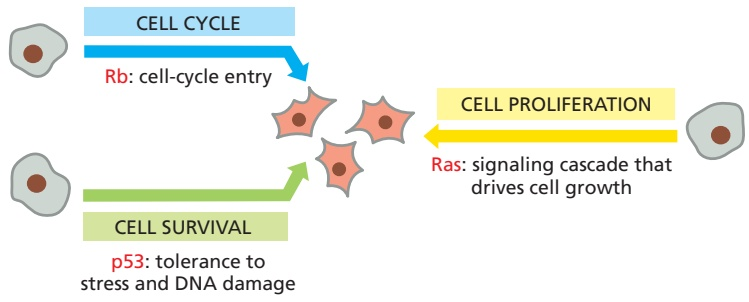

Figure 20–29 The three major cellular pathways that contribute to tumorigenesis. The specific examples listed here are described in this chapter. Cell-cycle events controlled by Rb are described in detail in Chapter 17.

It seems that these three fundamental controls are subverted in one way or another in virtually every type of cancer. However, because specialized tissues can depend on different mechanisms to relay environmental signals to the core control machinery, these controls are open to subversion in a different set of ways in different types of cancers. In fact, one can find examples of driver mutations in practically all the major signaling pathways through which cells communicate during development and tissue maintenance (discussed in Chapters 15, 21, and 22).

**Figure 20–29** outlines the three central pathways just described, abbreviating them as cell cycle, cell proliferation, and cell survival. We have previously discussed Rb (see pp. 1182–1183) and devoted an entire chapter to cell-cycle controls (Chapter 17). Some important details of the other two control pathways in Figure 20–29 are reviewed next.

#### Mutations in the PI 3-kinase/Akt/mTOR Pathway Drive Cancer Cells to Grow

Cell proliferation is not simply a matter of progression through the cell cycle; it also requires coordinated cell growth, which involves complex anabolic processes through which the cell synthesizes all the necessary macromolecules from small-molecule precursors (**Figure 20–30**). Cancer depends, therefore, not only on a loss of restraints on cell-cycle progression but also on a disrupted control of cell growth.

Downstream of RTK/Ras activation, the PI 3-kinase/Akt/mTOR intracellular signaling pathway is critical for cell growth control. As described in Chapter 15, various extracellular signal proteins, including insulin and insulin-like growth factors, normally activate this pathway. In cancer cells, however, the pathway is activated by mutation so that the cell can grow in the absence of such signals. The resulting abnormal activation of the protein kinases Akt and mTOR not only stimulates protein synthesis but also greatly increases both glucose uptake and the production of the acetyl CoA in the cytosol required for cell lipid synthesis, as outlined in Figure 20–30B.

The abnormal activation of the PI 3-kinase/Akt/mTOR pathway, which normally occurs early in the process of tumor progression, helps to explain the excessive rate of glycolysis that is observed in tumor cells, known as the Warburg effect, as discussed earlier (see Figure 20–18). As expected from our previous discussion, cancers can activate this pathway in many different ways. Thus, for example, a growth factor receptor can become abnormally activated, as in Figure 20–23. Also very common in cancers is the loss of the phosphatase and tensin homolog (PTEN) phosphatase that normally functions to counteract this pathway. PTEN suppresses the PI 3-kinase/Akt/mTOR pathway by dephosphorylating the phosphatidylinositol 3,4,5-trisphosphate [PI(3,4,5)P3] molecules that the PI 3-kinase generates (see p. 920). PTEN is commonly mutated in tumors.

(A)

(B)

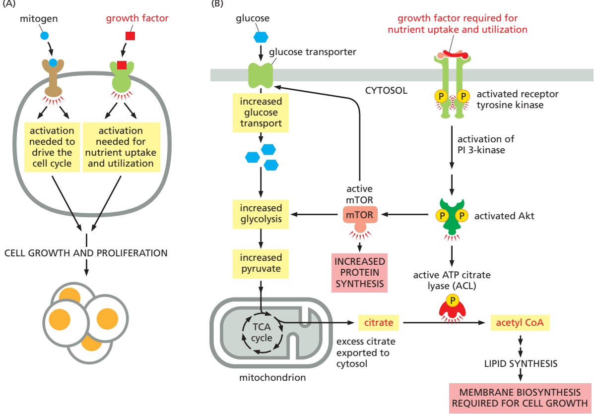

Figure 20–30 Cells seem to require two types of signals to proliferate. (A) In order to multiply successfully, most normal cells require both extracellular signals that drive cell-cycle progression (shown here as blue mitogen) and extracellular signals that drive cell growth (shown here as red growth factor). How mitogens activate signaling through the Rb pathway to drive entry into the cell cycle is described in Figure 17–59. (B) Diagram of the signaling system involving activation of Akt and mTOR that drives cell growth through greatly stimulating glucose uptake and utilization, including a conversion of the excess citric acid produced from sugar intermediates in mitochondria into the acetyl CoA that is needed in the cytosol for lipid synthesis and new membrane production. As indicated, protein synthesis is also increased. This system becomes abnormally activated early in tumor progression. TCA cycle indicates the tricarboxylic acid cycle (citric acid cycle).

#### Mutations in the p53 Pathway Enable Cancer Cells to Survive and Proliferate Despite Stress and DNA Damage

That cancer cells must break the normal rules governing cell growth and cell division is obvious: that is part of the definition of cancer. It is not so obvious why cancer cells should also be abnormal in their response to stress and DNA damage, and yet this too is an almost universal feature. The gene that lies at theMBoC7 m20.26/20.30 center of this response, the p53 gene, is mutated in about 50% of all cases of cancer—a higher proportion than for any other known cancer-critical gene. When we include with p53 the other genes that are closely involved in its function, we find that most cases of cancer harbor mutations in the p53 pathway. Why should this be? To answer, we must first consider the normal function of this pathway.

In contrast to Rb, most cells in the body contain very little **p53** protein under normal conditions: although the protein is synthesized, it is rapidly degraded. Mice in which both copies of the gene have been deleted or inactivated typically appear normal in all respects except one—they universally develop cancer before 10 months of age. These observations suggest that p53 has a function that is required only in special circumstances. In fact, cells raise their concentration of p53 protein in response to a whole range of conditions that have only one obvious thing in common: they are, from the cell’s point of view, pathological, putting the cell in danger of death or serious injury. These conditions include DNA damage, which puts the cell at risk from a faulty genome; telomere loss or shortening, also dangerous to the integrity of the genome; hypoxia, which deprives the cell of the oxygen it needs to maintain mitochondrial respiration; osmotic stress, which causes the cell to swell or shrivel; and oxidative stress, which generates dangerous levels of highly reactive free radicals.

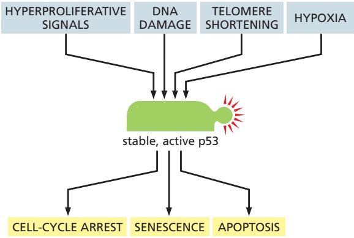

Figure 20–31 Modes of action of the p53 tumor suppressor. The p53 protein is a cellular stress sensor. In response to hyperproliferative signals, DNA damage, hypoxia, telomere shortening, and various other stresses, the p53 levels in the cell rise. As indicated, this may either arrest cell cycling in a way that allows the cell to adjust and survive, trigger cell suicide by apoptosis, or cause cell senescence—an irreversible cell-cycle arrest that stops damaged cells from dividing.

Yet another form of stress that can activate the p53 pathway arises, it seems,MBoC7 m20.27/20.31 when regulatory signals are so intense or uncoordinated as to drive the cell beyond its normal limits and into a danger zone where its mechanisms of control and coordination break down, as in an engine driven too fast. The p53 concentration rises, for example, when Myc is overexpressed to oncogenic levels.

All these circumstances call for desperate action, which may take either of two forms: the cell can block any further progress through the division cycle in order to take time out to repair or recover from the pathological condition or it can accept that it must die, and do so in a way that minimizes damage to the organism. A good death, from this point of view, is a death by apoptosis. In apoptosis, the cell is phagocytosed by its neighbors and its contents are efficiently recycled. A bad death is a death by necrosis. In necrosis, the cell bursts or disintegrates and its contents are spilled into the extracellular space, inducing inflammation.

The p53 pathway, therefore, behaves as a sort of antenna, sensing the presence of a wide range of dangerous conditions and, when any are detected, triggering appropriate action—either a temporary or permanent arrest of cell cycling or suicide by apoptosis (**Figure 20–31**). These responses serve to prevent deranged cells from proliferating. Cancer cells are indeed generally deranged, and their survival and proliferation thus depend on inactivation of the p53 pathway. If the p53 pathway were active in them, they would be halted in their tracks or die (**Movie 20.6**). For example, if the p53 pathway is functional, a cell with unrepaired DNA damage will stop dividing or die; it cannot proliferate.

The p53 protein performs its job mainly by acting as a transcription regulator (see Movie 17.8). Indeed, the most common mutations observed in p53 in human tumors are in its DNA-binding domain, where they cripple the ability of p53 to bind to its DNA target sequences. As discussed in Chapter 17, the p53 protein exerts its inhibitory effects on the cell cycle, in part at least, by inducing the transcription of p21, which encodes a protein that binds to and inhibits the cyclin-dependent kinase (Cdk) complexes required for progression through the cell cycle. By blocking the kinase activity of these Cdk complexes, the p21 protein prevents the cell from progressing through S phase and replicating its DNA.

The mechanism by which p53 induces apoptosis includes stimulation of the expression of many pro-apoptotic genes, as described in Chapter 18.

#### Studies Using Mice Help to Define the Functions of Cancer-critical Genes

The ultimate test of a gene’s role in cancer has to come from investigations in the intact, mature organism. The most favored organism for experimental studies is the mouse. To explore the function of a candidate oncogene or tumor suppressor gene, one can make a transgenic mouse that overexpresses it or a knockout mouse that lacks it. Using the techniques described in Chapter 8, one can engineer mice in which the misexpression or deletion of the gene is restricted to a specific set of cells, or in which expression of the gene can be switched on at will at a chosen point in time, or both, to see whether and how tumors develop. Moreover, to follow the growth of tumors from day to day in the living mouse, the cells of interest can be genetically marked and made visible by expression of a fluorescent or luminescent reporter (**Figure 20–32**). In these ways, one can begin to clarify the part that each cancer-critical gene plays in cancer initiation or progression.

144

67

103

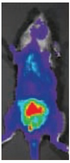

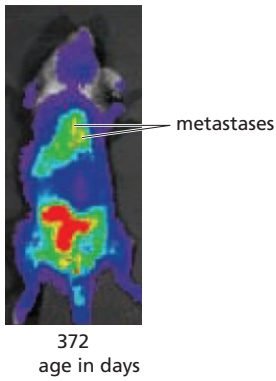

Figure 20–32 Monitoring tumor growth and metastasis in a mouse with a luminescent reporter. A mouse was genetically engineered in a way that allows both copies of its PTEN tumor suppressor gene to be inactivated in the prostate gland, simultaneously with the prostate-specific MBoC7 m20.28/20.32activation of a gene engineered to produce the enzyme luciferase (derived from fireflies). After an injection of luciferin (the substrate molecule for luciferase) into the mouse’s bloodstream, the cells in the prostate emit light and can be detected by their bioluminescence in a live mouse, as seen in the 67-day-old animal at the left. Cells lacking the PTEN phosphatase enzyme contain elevated amounts of the Akt activator, $\mathsf { P } | ( 3 { , } 4 { , } 5 ) \mathsf { P } _ { 3 } ,$ and this causes the prostate cells to proliferate abnormally, progressing over time to form a cancer. In this way, the process of metastasis could be followed in the same animal over the course of a year. The light intensity in these experiments is proportional to the number of prostate-cell descendants, increasing from light blue to green, to yellow, to red in this representation. (Adapted from C.-P. Liao et al., Cancer Res. 67:7525–7533, 2007. With permission from the American Association for Cancer Research.)

Transgenic mouse studies confirm, for example, that a single oncogene is generally not enough to turn a normal cell into a cancer cell. Thus, in mice engineered to express a Myc or Ras oncogenic transgene, some of the tissues that express the oncogene may show enhanced cell proliferation, and, over time, occasional cells will undergo further changes to give rise to cancers. Most cells expressing the oncogene, however, do not give rise to cancers. Nevertheless, from the point of view of the whole animal, the inherited oncogene is a serious menace because it creates a high risk that a cancer will arise somewhere in the body. Mice that express both Myc and Ras oncogenes develop cancers earlier and at a much higher rate than mice that express either gene alone (**Figure 20–33**); but, again, the cancers originate as scattered, isolated tumors among noncancerous cells. Thus, even cells expressing these two oncogenes must undergo further, randomly generated changes to become cancerous. This strongly suggests that multiple mutations are required for tumorigenesis, as supported by a great deal of other evidence discussed earlier. Experiments using mice with deletions of tumor suppressor genes lead to similar conclusions.

Figure 20–33 Oncogene collaboration in transgenic mice. The graphs show the incidence of tumors in three types of transgenic mouse strains, one carrying a Myc oncogene, one carrying a Ras oncogene, and one carrying both oncogenes. For these experiments, two lines of transgenic mice were first generated. One carries an inserted copy of an oncogene created by fusing the proto-oncogene Myc with the mouse mammary tumor virus regulatory DNA (which then drives Myc overexpression in the mammary gland). The other line carries an inserted copy of the Ras oncogene under the control of the same regulatory element. Both strains of mice develop tumors much more frequently than normal, most often in the mammary or salivary glands. Mice that carry both oncogenes together are obtained by crossing the two strains. These hybrids develop tumors at a far higher rate still, much greater than the sum of the rates for the two oncogenes separately. Nevertheless, the tumors arise only after a delay and only from a small proportion of the cells in the tissues where the two genes are expressed. Further accidental changes, in addition to the two oncogenes, are apparently required for the development of cancer. (After E. Sinn et al., Cell 49:465–475, 1987.)

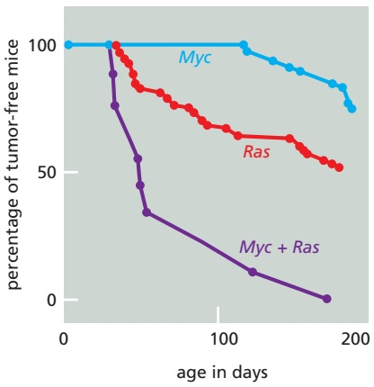

#### Cancers Become More and More Heterogeneous as They Progress

Although useful to study the function and interaction of cancer driver genes in vivo, there are important limitations to mouse models of human cancer. Whereas a mouse tumor is small and arises over a period of months or even days, a human tumor may be the size of a mouse or larger and will often have been growing for decades. From simple histology looking at stained tissue sections, it is clear that some tumors contain distinct sectors, all clearly cancerous, but differing in appearance because they differ genetically or epigenetically: the cancer cell population is heterogeneous. Evidently, within the initial clone of cancerous cells, additional mutations have arisen and conferred selective advantages, such as increased growth rates, creating diverse subclones. Today, the ability to analyze cancer genomes lets us look much deeper into the process. Comparison of samples from different regions of a tumor and the metastases it has spawned reveal a classic picture of Darwinian evolution, occurring on a time scale of months or years rather than millions of years, but governed by the same rules of natural selection.

One approach to examine the development of tumor heterogeneity takes advantage of human cells grown outside the body, termed “organoids” (described in Chapter 22). Unlike the immortalized cancer cell lines described previously that have adapted to an artificial, two-dimensional lifestyle (see Figure 20–15), organoids are grown from adult stem cells under more physiological conditions within a three-dimensional matrix. In this environment, a single stem cell can proliferate and differentiate into a self-organizing structure that resembles a miniature, simplified version of the organ from which it was taken, with realistic microanatomy. One study applied this organoid system to examine the genetic heterogeneity within individual colorectal tumors (**Figure 20–34A**). Organoids were grown from single cells isolated from different regions of a tumor as well as from neighboring, normal tissue. Genome analysis revealed detailed patterns of mutations in each organoid that indicated how closely it was related to the others, and from these data one could draw up a family tree. Those organoids derived from the same tumor site bore the most similarities, and all possessed the same set of cancer-driving mutations that arose in their common ancestor within the trunk of the tree, corresponding to the early stages of tumor growth.

Clearly, cancer cells are constantly mutating, multiplying, competing, evolving, and diversifying as they exploit new ecological niches and react to the treatments that are used against them (**Figure 20–34B**). Diversification accelerates as they metastasize and colonize new territories, where they encounter new selection pressures. The longer the evolutionary process continues, the harder it becomes to catch them all in the same net and kill them.

#### Colorectal Cancers Evolve Slowly Via a Succession of Visible Changes

At the beginning of this chapter, we saw that most cancers develop gradually from a single aberrant cell, progressing from benign to malignant tumors by the accumulation of a number of independent genetic and epigenetic changes. We have discussed what some of these changes are in molecular terms and have seen how they contribute to cancerous behavior. We now examine one of the common human cancers more closely, using it to illustrate and enlarge upon some of the general principles and molecular mechanisms we have introduced. We take **colorectal cancer** as our example.

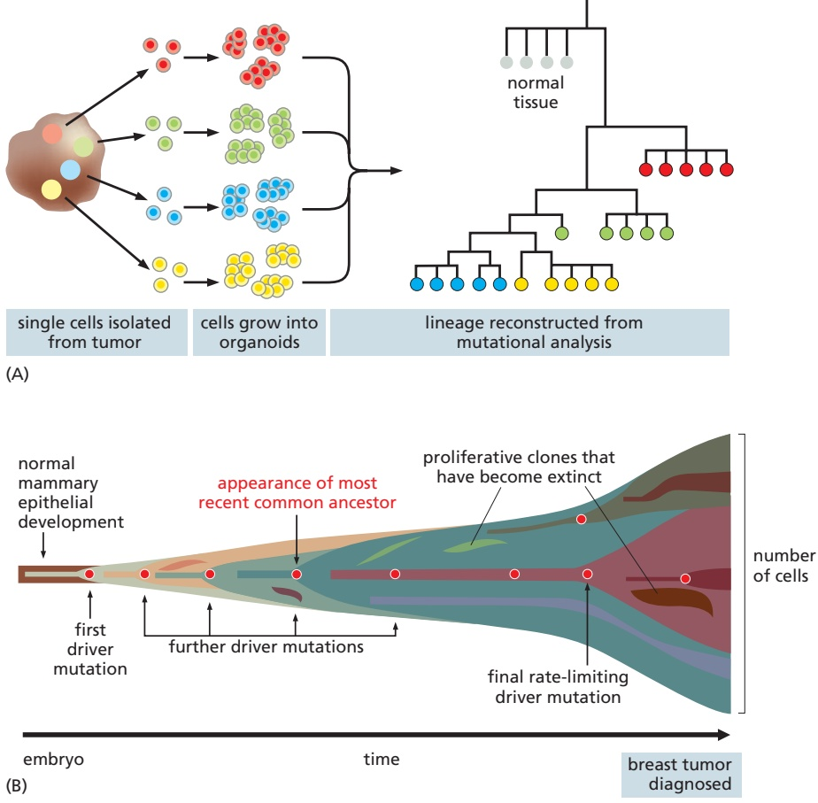

Figure 20–34 How cancers progress as a series of subclones. (A) Cancer analysis using organoids. Single cells were isolated from four different regions of a human colorectal tumor (color coded) as well as from nearby healthy tissue (not shown). These cells were then used to produce organoids, allowing large amounts of material to be obtained for analysis. DNA sequencing was used to determine the mutations in each organoid. These data then enabled construction of a MBoC7 20.30/20.34phylogenetic tree that reveals the order in which the mutations emerged in the original tumor. (B) A depiction of how driver mutations are thought to cause cancer progression over long periods of time, before producing a large enough clone of proliferating cells to be detected as a tumor. The data indicate that driver mutations occur only rarely in a background of long-lived subclones of cells that continually accumulate passenger mutations without gaining a growth advantage. (A, adapted from C.J. Kuo and C. Curtis, Nature 556:441–442, 2016. With permission from Springer Nature. B, adapted from S. Nik-Zainal et al., Cell 149:994–1007, 2012. This article is distributed under the terms of the Creative Commons Attribution License.)

Colorectal cancers arise from the epithelium lining the colon (the large intestine) and rectum (the terminal segment of the gut). The organization of this tissue is broadly similar to that of the small intestine, discussed in Chapter 22 (pp. 1281–1282). For both the small and large intestine, the epithelium is renewed at an extraordinarily rapid rate, taking about a week to completely replace most of the epithelial sheet. In both regions, the renewal depends on stem cells that lie in deep pockets of the epithelium, called intestinal crypts. The signals that maintain the stem cells and control the normal organization and renewal of the epithelium are beginning to be quite well understood, as explained in Chapter 22. Mutations that disrupt these signals begin the process of tumor progression for most colorectal cancers (**Movie 20.7**).

Colorectal cancers are common, currently causing nearly 60,000 deaths a year in the United States, or about 10% of total deaths from cancer. Like most cancers, they are not usually diagnosed until late in life (90% occur after the age of 55). However, routine examination of normal adults with a colonoscope (a fiberoptic device for viewing the interior of the colon and rectum) often reveals a small benign tumor, or adenoma, of the gut epithelium in the form of a protruding mass of tissue called a polyp. These adenomatous polyps are believed to be the precursors of a large proportion of colorectal cancers. Because the progression of the disease is usually very slow, there is typically a period of about 10 years in which the slowly growing tumor is detectable but has not yet turned malignant. Thus, when people are screened by colonoscopy in their fifties and the polyps are removed through the colonoscope—a quick and easy procedure—the subsequent incidence of colorectal cancer is much lower: according to some studies, less than a quarter of what it would be otherwise.

<table><tbody><tr><td colspan="4">TABLE 20-1 Some Genetic Abnormalities Detected in Colorectal Cancer Cells</td></tr><tr><td>Gene</td><td>Class</td><td>Pathway affected</td><td>Human colon cancers (%)</td></tr><tr><td>K-Ras</td><td>Oncogene</td><td>Receptor tyrosine kinase signaling</td><td>40</td></tr><tr><td>b-Catenin1</td><td>Oncogene</td><td>Wnt signaling</td><td>5-10</td></tr><tr><td>Apc1</td><td>Tumor suppressor</td><td>Wnt signaling</td><td>&gt;80</td></tr><tr><td>p53</td><td>Tumor suppressor</td><td>Response to stress and DNA damage</td><td>60</td></tr><tr><td>TGFb receptor II2</td><td>Tumor suppressor</td><td>TGFβ signaling</td><td>10</td></tr><tr><td>Smad42</td><td>Tumor suppressor</td><td>TGFβ signaling</td><td>30</td></tr><tr><td>MLH1 and other DNA mismatch repair genes (often silenced by DNA methylation)</td><td>Tumor suppressor (genetic stability)</td><td>DNA mismatch repair</td><td>15</td></tr></tbody></table>

1,2The genes with the same superscript numeral act in the same pathway, and therefore only one of the components is mutated in an individual cancer.

In microscopic sections of polyps smaller than 1 cm in diameter, the cells and their arrangement in the epithelium usually appear almost normal. The larger the polyp, the more likely it is to contain cells that look aberrant and are abnormally organized. Sometimes, two or more distinct areas can be distinguished within a single polyp, with the cells in one area appearing relatively normal and those in the other appearing clearly cancerous, as though they have arisen as a mutant subclone within the original clone of adenomatous cells. At later stages in the disease, some tumor cells become invasive in a small fraction of the polyps, first breaking through the epithelial basal lamina, then spreading through the layer of muscle that surrounds the gut, and finally metastasizing to lymph nodes via lymphatic vessels and to liver, lung, and other organs via blood vessels.

#### A Few Key Genetic Lesions Are Common to a Large Fraction of Colorectal Cancers

What are the mutations that accumulate with time to produce this chain of events? Of those genes so far discovered to be involved in colorectal cancer, three stand out as most frequently mutated: the proto-oncogene K-Ras (a member of the Ras gene family), in about 40% of cases; p53, in about 60% of cases; and the tumor suppressor gene Apc (discussed below), in more than 80% of cases. Others are involved in smaller numbers of colon cancers, and some of these are listed in **Table 20–1**.

The role of Apc first came to light through study of certain families showing a rare type of hereditary predisposition to colorectal cancer, called familial adenomatous polyposis coli (FAP). In this syndrome, hundreds or thousands of polyps develop along the length of the colon (**Figure 20–35**). These polyps start to appear in early adult life, and if they are not removed, one or more will almost always progress to become malignant; the average time from the first detection of polyps to the diagnosis of cancer is 12 years. The disease can be traced to a deletion or inactivation of the tumor suppressor gene Apc, named after the syndrome. Individuals with FAP have inactivating mutations or deletions of one copy of the Apc gene in all their cells and show loss of heterozygosity in tumors, meaning that both copies have been lost or inactivated, even in the benign polyps. Most individuals with colorectal cancer do not have the hereditary condition. Nevertheless, in more than 80% of the cases, their cancer cells (but not their normal cells) have inactivated both copies of the Apc gene through mutations acquired during the individual’s lifetime. Thus, by a route similar to what we discussed for retinoblastoma, mutation of the Apc gene was identified as one of the central ingredients of colorectal cancer.

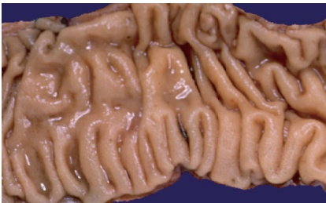

(A)

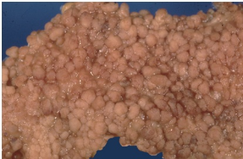

(B)

Figure 20–35 Colon of individual with familial adenomatous polyposis coli compared to normal colon. (A) The normal colon wall is a gently undulating but smooth surface. (B) The polyposis colon is completely covered by hundreds of projecting polyps, each resembling a tiny cauliflower when viewed with the naked eye. (Courtesy of Mark Arends.)

The APC protein is an inhibitory component of the Wnt signaling pathway (discussed in Chapter 15). It binds to the b-catenin protein, another component of the Wnt pathway, and helps to induce the protein’s degradation. By inhibiting β-catenin in this way, APC prevents it from localizing to the nucleus, where it would act as a transcriptional regulator to drive cell proliferation and maintain the stem-cell state (see Figure 15–61). Loss of APC results in an excess of free β-catenin and thus leads to an uncontrolled expansion of the stem-cell population. This causes massive increase in the number and size of the intestinal crypts (see Figure 22–4).

When the b-catenin gene was sequenced in a collection of colorectal tumors, it was discovered that many of the tumors that did not have Apc mutations had activating mutations in the β-catenin protein instead. Thus, it is excessive activity in the Wnt signaling pathway that is critical for the initiation of this cancer, rather than any single oncogene or tumor suppressor gene that the pathway contains.

This being so, why is the Apc gene in particular so often the most common culprit in colorectal cancer? The APC protein is large and it interacts not only with β-catenin but also with various other cell components, including microtubules. Loss of APC appears to increase the frequency of mitotic spindle defects, leading to chromosome abnormalities when cells divide. This additional, independent cancer-promoting effect could explain why Apc mutations feature so prominently in the causation of colorectal cancer.

#### Some Colorectal Cancers Have Defects in DNA Mismatch Repair

In addition to the hereditary disease (FAP) associated with Apc mutations, there is a second, more common kind of hereditary predisposition to colon carcinoma in which the course of events differs from the one we have described for FAP. In this more common condition, called hereditary nonpolyposis colorectal cancer (HNPCC), or Lynch syndrome, the probability of colon cancer is increased without any increase in the number of colorectal polyps (adenomas). Moreover, the cancer cells are unusual, in that they have a normal (or almost normal) karyotype. The majority of colorectal tumors in non-HNPCC individuals, in contrast, have gross chromosomal abnormalities, with multiple translocations, deletions, and other aberrations, and have many more chromosomes than normal (see Figure 20–10).

The mutations that predispose HNPCC individuals to colorectal cancer occur in one of several genes that code for central components of the DNA mismatch repair system. These genes are homologous in structure and function to the MutL and MutS genes in bacteria and yeast (see Figure 5–20). Only one of the two copies of the involved gene is defective, so the repair system is still able to remove the inevitable DNA replication errors that occur in the individual’s cells. However, as discussed previously, these individuals are at risk because the accidental loss or inactivation of the remaining good gene copy will immediately elevate the spontaneous mutation rate by a hundredfold or more (discussed in

Chapter 5). These genetically unstable cells can then speed through the standard processes of mutation and natural selection that allow clones of cells to progress to malignancy.

This particular type of genetic instability produces invisible changes in the chromosomes—most notably changes in individual nucleotides and short expansions and contractions of mononucleotide and dinucleotide repeats such as AAAA... or CACACA.... Once the defect in HNPCC individuals was recognized, the epigenetic silencing or mutation of mismatch repair genes was found in about 15% of the colorectal cancers occurring in people with no inherited predisposing mutation.

Thus, the genetic instability found in many colorectal cancers can be acquired in at least two ways. The majority of the cancers display a form of chromosomal instability that leads to visibly altered chromosomes, whereas in the others the instability occurs on a much smaller scale and reflects a defect in DNA mismatch repair. Indeed, many carcinomas show either chromosomal instability or defective mismatch repair—but rarely both. These findings clearly demonstrate that genetic instability is not an accidental by-product of malignant behavior but a contributory cause—and that cancer cells can acquire this instability in multiple ways.

#### The Steps of Tumor Progression Can Often Be Correlated with Specific Mutations

In what order do K-Ras, p53, Apc, and the other identified colorectal cancercritical genes mutate, and what contribution does each of them make to the asocial behavior of the cancer cell? There is no single answer because colorectal cancer can arise by more than one route: thus, we know that in some cases, the first mutation can be in a DNA mismatch repair gene; in others, it can be in a gene regulating cell proliferation. Moreover, as previously discussed, a general feature such as genetic instability or a tendency to proliferate abnormally can arise in a variety of ways, through mutations in different genes.

Nevertheless, certain sets of mutations are particularly common in colorectal cancer, and they occur in a characteristic order. Thus, in most cases, mutations inactivating the Apc gene appear to be the first or, at least, a very early step, as they are detected at the same high frequency in small benign polyps as in large malignant tumors. Changes that lead to genetic and epigenetic instability are likely also to arise early in tumor progression, as they are needed to drive the later steps.

Activating mutations in the K-Ras gene occur later, as they are rare in small polyps but common in larger ones that show disturbances in cell differentiation and histological pattern.

Inactivating mutations in p53 are thought to come later still, as they are rare in polyps but common in carcinomas (**Figure 20–36**). We have seen that loss of p53 function allows cancer cells to endure stress and to avoid apoptosis and cell-cycle arrest. Additionally, loss of p53 is related to the heightened activation of oncogenes such as Ras. Experiments in mice show that an initial low level of oncogene activation can give rise to a slowly growing tumor even while p53 is functional: genes such as Ras are, after all, part of the normal machinery of growth control, and moderate activation is not stressful for a cell and does not call the p53 protein into play. Progression of a tumor from slow to rapid, malignant growth, however, involves activation of oncogenes beyond normal physiological limits to a higher, stressful level. If the p53 protein is present and functional, this should lead to cell-cycle arrest or death. Only by losing p53 function can the cancer cells with hyperactive oncogenes survive and progress.

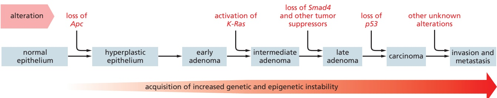

Figure 20–36 Suggested typical sequence of genetic changes underlying the development of a colorectal carcinoma. This oversimplified diagram provides a general idea of the way mutation and tumor development are related. But many other mutations are generally involved, and different colon cancers can progress through different sequences of mutations (and/or epigenetic changes).

The steps we have just described are only part of the picture. It is important to emphasize that each case of colorectal cancer is different, with its own detailed combination of mutations, and that even for the mutations that are commonly shared, the sequence of occurrence may vary.

#### The Changes in Tumor Cells That Lead to Metastasis Are Still Largely a Mystery

Perhaps the most significant gap in our understanding of cancer concerns invasiveness and metastasis (see Figure 20–20). More than 25 years after the multistep progression of colorectal cancer was first described, no genetic mutations have been identified that are characteristically associated with metastatic disease. To date, even large-scale genomic sequencing efforts have yet to uncover recurrent mutations that adequately explain the escape of cancer cells from a primary tumor and their dissemination and colonization of a distant tissue. One possibility is that metastasis can be initiated by epigenetic changes that alter patterns of gene expression. These changes could allow cancer cells to take on new traits in the absence of further genetic changes, thereby reprogramming their behavior to promote invasiveness and motility or to generate cancer stem cells. Importantly, changes in cellular programming and behavior operate normally in a variety of contexts during cellular differentiation. The example most relevant to metastasis is the epithelial-to-mesenchymal transition (EMT), a highly regulated and poorly understood process that allows epithelial cells to lose their characteristic polarity and adhesiveness and take on a mesenchymal phenotype, which includes enhanced migratory behavior. An EMT program operates at several stages of embryogenesis as well as during wound healing, and its activation in cancer cells could explain how they escape from a primary tumor and invade a new tissue. However, EMT is unlikely to explain the major puzzle of how disseminated cells acquire the ability to survive in the microenvironment of that new tissue, with its unfamiliar mix of growth factors and extracellular matrix components. Because the EMT program (like almost all cellular differentiation programs) involves changes in gene expression, it does not alter DNA sequences and would not be detected by sequencing the genomes of metastasized cancer cells.

Observations of the many stages and varied features of tumorigenesis highlight that cancer cells do not invent new biological phenomena, but instead deploy existing mechanisms and pathways at inappropriate times and places. A better understanding of the normal, underlying cell biology, and of the molecular changes that act to subvert it in cancer, will provide promising leads for cancer treatment, as we discuss in the final section of this chapter.

#### Summary

The molecular analysis of cancer cells reveals two classes of cancer-critical genes: oncogenes and tumor suppressor genes. A set of these genes becomes altered by a combination of genetic and epigenetic accidents to drive tumor progression. Many cancer-critical genes code for components of the social control pathways that regulate when cells grow, divide, differentiate, or die. In addition, a subclass of tumor suppressors can be categorized as genome maintenance genes, because their normal role is to help maintain genome integrity.

The inactivation of the p53 pathway, which occurs in nearly all human cancers, allows genetically damaged cells to escape apoptosis and continue to proliferate.

Inactivation of the Rb pathway also occurs in most human cancers, illustrating how fundamental each of these pathways is for protecting us against cancer. More generally, the extensive sequencing of cancer cell genomes reveals that the development of a cancer requires the acquisition of heritable disturbances in each of three types of normal controls—those in the cell cycle, cell proliferation, and cell survival pathways.

The sequencing of cancer cell genomes indicates that—except for the cancers of childhood—many cancers acquire multiple driver mutations over the long course of tumor progression, along with a considerably larger number of passenger mutations of no consequence. The same methods reveal how subclones of cells arise and die out as a tumor ages. Tumors thus contain a heterogeneous mixture of cells, some—the so-called cancer stem cells—being much more dangerous than others.

We can often correlate the steps of tumor progression with mutations that activate specific oncogenes and inactivate specific tumor suppressor genes, and colon cancer provides a good example. But different combinations of mutations and epigenetic changes are found in different types of cancer, and even in different individuals with the same type of cancer, reflecting the random way in which these inherited changes arise. Nevertheless, many of the same changes are encountered repeatedly, suggesting that there are a limited number of ways to breach our defenses against cancer. However, the molecular basis of the final and most deadly step in cancer, metastasis, remains poorly understood.

#### CANCER PREVENTION AND TREATMENT: PRESENT AND FUTURE

We can apply the growing understanding of the molecular biology of cancer to sharpen our attack on the disease at three levels: prevention, diagnosis, and treatment. Prevention is always better than cure, and indeed many cancers can be prevented, especially by avoiding smoking. Highly sensitive molecular assays promise new opportunities for earlier and more precise diagnosis, with the aim of detecting primary tumors while they are still small and have not yet metastasized. Cancers caught at these early stages can often be nipped in the bud by surgery or radiotherapy, as we saw for colorectal polyps. Nevertheless, full-blown malignant disease will continue to be common for many years to come, and cancer treatments will continue to be needed.

In this section, we first examine the preventable causes of cancer and then consider how advances in our understanding at a molecular level are beginning to transform the treatment of the disease.

#### Epidemiology Reveals That Many Cases of Cancer Are Preventable

A certain irreducible background incidence of cancer is to be expected regardless of circumstances. As discussed in Chapter 5, mutations can never be absolutely avoided because they are an inescapable consequence of fundamental limitations on the accuracy of DNA replication and repair. If a person could live long enough, it is inevitable that at least one of his or her cells would eventually accumulate a set of mutations sufficient for cancer to develop.

Nevertheless, environmental factors seem to play a large part in determining the risk for cancer. This is demonstrated most clearly by a comparison of cancer incidence in different countries: for almost every cancer that is common in one country, there is another country where the incidence is much lower. Because migrant populations tend to adopt the pattern of cancer incidence typical of their new host country, the differences are thought to be due mostly to environmental, not genetic, factors (**Figure 20–37A**). From epidemiologic studies compiled by the American Cancer Society, it is estimated that at least 45% of cancer deaths can be attributed to modifiable risk factors, indicating that more than half of all cancers should be avoidable (**Figure 20–37B**).

(A)

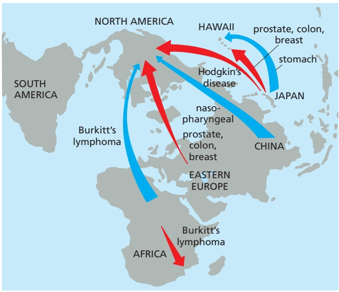

(B)

| cause | deaths (percent of total) | number of deaths in US(2018) | estimated reduction possible (percent) |
| --- | --- | --- | --- |
| all risk factors | 45% | 265,150 | 50% |
| cigarette smoke | 29% | 169,180 | 75% |
| excess body weight | 6.6% | 38,230 | 50% |
| diet | 4.9% | 28,630 | 50% |
| alcohol | 4.0% | 23,510 | 50% |
| viruses | 2.7% | 16,100 | 100% |
| physical inactivity | 2.2% | 12,800 | 85% |
| UV radiation | 1.5% | 8,750 | 50% |

Figure 20–37 Cancer incidence is related to environmental influences. (A) This map of the world shows the rates of cancer increasing (red arrows) or decreasing (blue arrows) when specific populations move from one location to another. Such observations suggest the importance of environmental factors, including diet, in dictating cancer risk. (B) Some estimated effects of environment and lifestyle on cancer in the United States (US). The table shows both the yearly deaths in the United States attributable to each factor and the estimated percentage of deaths that could be eliminated through prevention. (B, data from F. Islami et al., CA Cancer J. Clin. 68:31–54, 2018; and G.A. Colditz et al., Sci. Transl. Med. 4:127rv4, 2012.)

Unfortunately, different cancers have different environmental risk factors, and a population that escapes one such danger is usually exposed to another. This is not, however, inevitable. There are some human subgroups whose way of life substantially reduces the total cancer death rate among individuals of a given age. Under the current conditions in the United States and Europe, approximately one in five people will die of cancer. But the incidence of cancer among strict Mormons in Utah—who avoid alcohol, coffee, cigarettes, drugs, and unsafe sex— is only about half the incidence for nonpracticing members of the same family or for Americans in general.

Although such observations on human populations indicate that cancer can often be avoided, it has been difficult in most cases—with cigarette smoking as a striking exception—to pinpoint the specific environmental factors responsible for these large population differences or to establish how they act. Nevertheless, several important classes of environmental cancer risk factors have been identified (Figure 20–37B). But there are also many other influences—including the chemicals in our environment, the hormones that circulate in our bodies, and the irritations, infections, and damage to which we expose our tissues—that are no less important and favor development of the disease in other ways.

#### Sensitive Assays Can Detect Those Cancer-causing Agents That Damage DNA

Many quite disparate chemicals are carcinogenic when they are fed to experimental animals or painted repeatedly on their skin. Examples include a range of aromatic hydrocarbons and derivatives of them such as aromatic amines, nitrosamines, and alkylating agents such as mustard gas. Although these **chemical carcinogens** are diverse in structure, a large proportion of them have at least one shared property—they cause mutations. In one common test for mutagenicity (the Ames test), the carcinogen is mixed with an activating extract prepared from rat liver cells (to mimic the biochemical processing that occurs in an intact animal). The mixture is then added to a culture of specially designed test bacteria and the bacterial mutation rate measured. Most of the compounds scored as mutagenic by this rapid and convenient assay in bacteria also cause mutations or chromosome aberrations when tested on mammalian cells.

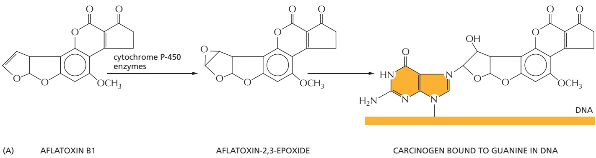

Figure 20–38 Some known carcinogens. (A) Carcinogen activation. A metabolic transformation that occurs in the liver must activate many chemical carcinogens before they will cause mutations by reacting with DNA (labeled orange). The compound illustrated here is aflatoxin B1, a toxin from a mold (Aspergillus flavus) that grows on grain and peanuts when they are stored under humid tropical conditions. Aflatoxin is an important cause of liver cancer in the tropics. (B) Different carcinogens cause different types of cancer. (B, data from Institute of Medicine, Cancer and the Environment: Gene-Environment Interactions. Washington, DC: National Academies Press, 2002.)

A few of these carcinogens act directly on DNA. But generally the more potent ones are relatively inert chemically; these chemicals become damaging only after they have been converted to a more reactive molecule by metabolic processes in the liver, catalyzed by a set of intracellular enzymes known as the cytochrome P-450 oxidases. These enzymes normally help to convert ingested toxins into harmless and easily excreted compounds. Unhappily, their activity on certain chemicals generates products that are highly mutagenic. Examples of carcinogens activated in this way include benzo[a]pyrene, a cancer-causing polycyclic aromatic hydrocarbon present in coal tar, tobacco smoke, and the fungal toxin aflatoxin B1 (**Figure 20–38**).

#### Fifty Percent of Cancers Could Be Prevented by Changes in Lifestyle

Tobacco smoke is the most important carcinogen in the world today. Even though many other risk factors have been identified, none of these appear to be respon-MBoC7 m20.38/20.38 sible for anything like the same numbers of human cancer deaths attributable to tobacco smoke. It is sometimes thought that the main environmental causes of cancer are the products of a highly industrialized way of life—the rise in pollution, the enhanced use of food additives, and so on—but there is little evidence to support this view. The idea may have come in part from the identification of some highly carcinogenic materials used in industry, such as 2-naphthylamine and asbestos. Except for the increase in cancers caused by smoking, however, age-adjusted death rates for most common human cancers have stayed much the same over the past half-century or, in some cases, have declined significantly (**Figure 20–39**).

Most of the carcinogenic factors that are known to be significant are by no means specific to the modern world. The most potent known carcinogen, by certain assays at least, is aflatoxin B1 (see Figure 20–38). It is produced by fungi that naturally contaminate foods such as tropical peanuts and is an important cause of liver cancer in Africa and Asia.

Except for tobacco, chemical toxins and mutagens are of lesser importance as contributory causes of cancer than other factors that are a matter of human behavior. For example, currently nearly three-fourths of adults and one-third of children and adolescents in the United States are overweight or obese. The combination of four risk factors—excess body weight, alcohol intake, poor diet, and physical inactivity—now accounts for the highest proportion of all cancer cases in women and is second only to smoking in men. Thus, it is estimated that as many

VINYL CHLORIDE: liver angiosarcoma

BENZENE: acute leukemias

ARSENIC: skin carcinomas, bladder cancer

ASBESTOS: mesothelioma

RADIUM: osteosarcoma (B)

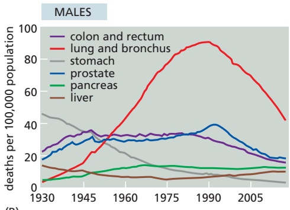

(A)

(B)

Figure 20–39 Age-adjusted cancer death rates, United States, 1930–2018. Selected death rates, adjusted to the age distribution of the US population, are plotted for (A) females and (B) males. Note the dramatic rise in lung cancer for both sexes, following the pattern of tobacco smoking, and the fall in deaths from stomach cancer, thought to be related to a fall in rates of MBoC7 m20.39/20.39infection with Helicobacter pylori. Recent reductions in other cancer death rates may correspond to improvements in detection and treatment. Adjustment of the data for the age of individuals is needed to compensate for the inevitable increase in cancer as people live longer, on average. (Adapted from American Cancer Society. Cancer Facts and Figures, 2021. Atlanta: American Cancer Society, Inc. Data from US Mortality Volumes 1930 to 1959, US Mortality Data 1960 to 2016, National Center for Health Statistics, Centers for Disease Control and Prevention. Note that uterus includes uterine cervix and uterine corpus combined due to limitations in coding prior to 1970. With permission from American Cancer Society.)

as 50% of all cancers could be avoided by identifiable changes in lifestyle (see Figure 20–37B).

#### Viruses and Other Infections Contribute to a Significant Proportion of Human Cancers

Human cancers are not contagious, but a significant minority of cancers are related directly or indirectly to infections with viruses and, less frequently, bacteria or parasites. Such infections account for approximately 15% of cancers worldwide and are more common in developing countries. Evidence for their involvement comes partly from the detection of viruses in individuals with cancer and partly from epidemiology. Thus, cancer of the uterine cervix is associated with infection with a papillomavirus, while liver cancer is very common in parts of the world (Africa and Southeast Asia) where hepatitis-B viral infections are common. Chronic infection with hepatitis-C virus, which has infected 170 million people worldwide, is also clearly associated with the development of liver cancer.

The main culprits, as shown in **Table 20–2**, are the DNA viruses. The **DNA tumor viruses** cause cancer by the most direct route—by interfering with controls of the cell cycle and apoptosis. To understand this type of viral carcinogenesis, it is important to review the life history of viruses. Many DNA viruses use the host cell’s DNA replication machinery to replicate their own genomes. However, to produce a large number of infectious virus particles within a single host cell, the DNA virus has to commandeer this machinery and drive it hard, breaking through the normal constraints on DNA replication and usually killing the host cell in the process. Many DNA viruses reproduce only in this way. But some have a second option: they can propagate their genome as a quiet, well-behaved passenger in the host cell, replicating in parallel with the host cell’s DNA (either integrated into the host genome or as an extrachromosomal plasmid) in the course of ordinary cell-division cycles. These viruses will switch between two modes of existence according to circumstances, remaining latent and harmless for a long time, but then proliferating in occasional cells in a process that kills the host cell and generates large numbers of infectious particles.

Neither of these conditions converts the host cell to a cancerous character, nor is it in the interest of the virus to do so. But for viruses with a latent phase, accidents can occur that prematurely activate some of the viral proteins that the virus would normally use in its replicative phase to allow the viral DNA to replicate independently of the cell cycle. As in the case of papillomavirus described below, this type of accident can switch on the persistent proliferation of the host cell itself, leading to cancer.

<table><tr><td colspan="3">TABLE 20-2 Viruses Associated with Human Cancers</td></tr><tr><td>Virus</td><td>Associated cancer</td><td>Areas of high incidence</td></tr><tr><td colspan="3">DNA viruses</td></tr><tr><td colspan="3">Papovavirus family</td></tr><tr><td>Papillomavirus (many distinct strains)</td><td>Warts (benign)</td><td>Worldwide</td></tr><tr><td>Papillomavirus (many distinct strains)</td><td>Carcinoma of the uterine cervix</td><td>Worldwide</td></tr><tr><td colspan="3">Hepadnavirus family</td></tr><tr><td>Hepatitis-B virus</td><td>Liver cancer (hepatocellular carcinoma)</td><td>Southeast Asia, tropical Africa</td></tr><tr><td colspan="3">Herpesvirus family</td></tr><tr><td>Epstein-Barr virus</td><td>Burkitt&#x27;s lymphoma (cancer of B lymphocytes)</td><td>West Africa, Papua New Guinea</td></tr><tr><td>Epstein-Barr virus</td><td>Nasopharyngeal carcinoma</td><td>Southern China, Greenland</td></tr><tr><td>Human herpesvirus 8</td><td>Kaposi&#x27;s sarcoma</td><td>Central and southern Africa</td></tr><tr><td colspan="3">RNA viruses</td></tr><tr><td colspan="3">Retrovirus family</td></tr><tr><td>Human T-cell leukemia virus type I (HTLV-1)</td><td>Adult T-cell leukemia/ lymphoma</td><td>Japan, West Indies</td></tr><tr><td>Human immunodeficiency virus (HIV, the AIDS virus)</td><td>Kaposi&#x27;s sarcoma (via human herpesvirus 8)</td><td>Central and southern Africa</td></tr><tr><td colspan="3">Flavivirus family</td></tr><tr><td>Hepatitis-C virus</td><td>Liver cancer (hepatocellular carcinoma)</td><td>Worldwide</td></tr><tr><td colspan="3">For all these viruses, the number of people infected is much larger than the number who develop cancer: the viruses must act in conjunction with other factors. As described in the text, different viruses contribute to cancer in different ways.</td></tr></table>

#### Cancers of the Uterine Cervix Can Be Prevented by Vaccination Against Human Papillomavirus

The **papillomaviruses** are a prime example of DNA tumor viruses. They are responsible for human warts and are especially important as a cause of carcinoma of the uterine cervix: this is the second most common cancer of women in the world as a whole, representing about 6% of all human cancers. Human papillomaviruses (**HPVs**) infect the cervical epithelium and maintain themselves in a latent phase in the basal layer of cells as extrachromosomal plasmids, which replicate in step with the chromosomes. Infectious virus particles are generated through a switch to a replicative phase in the outer epithelial layers, as progeny of these cells begin to differentiate before being sloughed from the surface. Here, cell division should normally stop, but the virus interferes with this cell-cycle arrest so

Figure 20–40 How certain papillomaviruses are thought to give rise to cancer of the uterine cervix. Papillomaviruses have double-stranded circular DNA chromosomes of about 8000 nucleotide pairs. These chromosomes are normally stably maintained in the basal cells of the epithelium as plasmids (red circles), whose replication is regulated so as to keep step with the chromosomes of the host. (A) Normally, the virus perturbs the host cell cycle only when the virus is programmed to produce infectious progeny, in the outer layers of an epithelium. This is relatively harmless. (B) Rare accidents can cause the integration of a fragment of such a plasmid into a chromosome of the host, altering the environment of the viral genes in the basal cells of an epithelium. This can disrupt the normal control of viral gene expression. The unregulated production of certain viral proteins (named E6 and E7) interferes with the control of cell division in the basal cells, thereby helping to generate a cancer (bottom).

as to allow replication of its own genome. Usually, the effect is restricted to the outer layers of cells and is relatively harmless, as in a wart. Occasionally, however, a genetic accident causes the viral genes that encode the proteins that prevent cell-cycle arrest to integrate into the host chromosome and become active in the basal layer, where the stem cells of the epithelium reside (see Figure 22–6). This can lead to cancer, with the viral genes acting as oncogenes (**Figure 20–40**).

Better still, a vaccine has now been developed that protects against infection with the relevant strains of human papillomavirus. This vaccine, if given to girls before puberty and thus before they become sexually active, has been shown to greatly reduce their risk of ever developing cervical cancer. Because the virus spreads through sexual activity, it is now recommended that both young males and young females be routinely vaccinated. Mass immunization programs have begun in several countries.

The whole process, from initial infection to invasive cancer, is slow, taking many years. It involves a long intermediate stage when the affected patch of cervical epithelium is visibly disordered but the cells have not yet begun to invade the underlying connective tissue—a phenomenon called intraepithelial neoplasia. Many such lesions regress spontaneously. Moreover, at this stage, it is still easy to cure the condition by destroying or surgically removing the abnormal tissue. Fortunately, the presence of such lesions can be detected by scraping off a sample of cells from the surface of the cervix and viewing it under the microscope (the Pap smear technique).

#### Infectious Agents Can Cause Cancer in a Variety of Ways

In papillomaviruses, the viral genes that are mainly to blame are called E6 and E7. The protein products of these viral oncogenes interact with many host-cell proteins, but, in particular, they bind to two key tumor suppressor proteins of the host cell, putting them both out of action and so permitting the cell to replicate its DNA and divide in an uncontrolled way. One of these host proteins is Rb; the other is p53. Other DNA tumor viruses use similar mechanisms to inhibit Rb and p53, underlining the central importance of altering both the cell-cycle control pathway and the cell survival pathway if a cell is to escape the normal constraints on proliferation, as we have previously discussed.

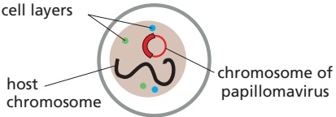

viral proteins mediate the controlled replication of the virus in outer cell layers

In other cancers, viruses have indirect tumor-promoting actions. The hepatitis-B and hepatitis-C viruses, for example, favor the development of liver cancer by causing chronic inflammation (hepatitis), which stimulates extensive cell division in the liver that promotes the eventual evolution of tumor cells. In AIDS, the human immunodeficiency virus (HIV) promotes development of an otherwise rare cancer called Kaposi’s sarcoma by destroying the immune system, thereby permitting a secondary infection with a human herpesvirus (HHV-8) that has a direct carcinogenic action. By causing severe inflammation, chronic infection with parasites and bacteria can also promote the development of some cancers. For example, chronic infection of the stomach with the bacterium Helicobacter pylori, which causes ulcers, appears to be a major cause of stomach cancer; dramatic falls in the incidence of stomach cancer over the past half-century (see Figure 20–39) correlate with a decline in the incidence of Helicobacter infections.

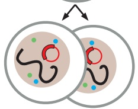

(A) BENIGN GROWTH OR WART

unregulated production of viral proteins drives cell proliferation in basal cell layer

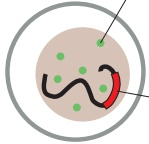

integrated gene encoding viral proteins

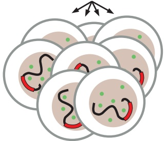

(B) EVOLUTION OF MALIGNANT TUMOR

#### The Search for Cancer Cures Is Difficult but Not Hopeless

The difficulty of curing a cancer is similar to the difficulty of getting rid of weeds. Cancer cells can be removed surgically or destroyed with toxic chemicals or radiation, but it is hard to eradicate every single one of them. Surgery can rarely ferret out every metastasis, and treatments that kill cancer cells are generally toxic to normal cells as well. Moreover, unlike normal cells, cancer cells can mutate rapidly and will often evolve resistance to the poisons and irradiation used against them.

In spite of these difficulties, effective cures using anticancer drugs (alone or in combination with other treatments) have already been found for some formerly highly lethal cancers, including Hodgkin’s lymphoma, testicular cancer, choriocarcinoma, and some leukemias and other cancers of childhood. Even for types of cancer where a cure at present seems beyond our reach, there are treatments that will prolong life or at least relieve distress. But what prospect is there of doing better and finding cures for the most common forms of cancer, which still cause great suffering and so many deaths?

#### Traditional Therapies Exploit the Genetic Instability and Loss of Cell-Cycle Checkpoint Responses in Cancer Cells

Anticancer therapies need to take advantage of some molecular peculiarity of cancer cells that distinguishes them from normal cells. One such property is genetic instability, reflecting deficiencies in chromosome maintenance, cellcycle checkpoints, and/or DNA repair. Remarkably, the most widely used cancer therapies seem to work by exploiting these abnormalities, although this was not known by the scientists who first developed the treatments. Ionizing radiation and most anticancer drugs damage DNA or interfere with chromosome segregation at mitosis, and they preferentially kill cancer cells because cancer cells have a diminished ability to survive the damage. Normal cells treated with radiation, for example, arrest their cell cycle until they have repaired the damage to their DNA, thanks to the cell-cycle checkpoint responses discussed in Chapter 17. Because cancer cells generally have defects in their checkpoint responses, they may continue to divide after irradiation, only to die after a few days because the genetic damage remains unrepaired. More generally, most cancer cells are physiologically deranged to a stressful degree: they live dangerously. Even though the cells in a tumor have evolved to be unusually tolerant of minor DNA damage, they are hypersensitive to the much greater amount of damage that can be created by radiation and by DNA-damaging drugs. A small increase of genetic damage can be enough to tip the balance between proliferation and death. Unfortunately, however, DNA-damaging therapies typically cause terrible side effects on normal, rapidly dividing cells in the digestive system, bone marrow, and mucous membranes. Furthermore, these treatments are themselves carcinogenic and can lead to second cancers.

Furthermore, while the molecular abnormalities present in cancer cells often enhance their sensitivity to cytotoxic agents, they can also increase their resistance. For example, where a normal cell might die by apoptosis in response to DNA damage, thanks to the stress response mediated by p53, a cancer cell may escape apoptosis because it lacks p53. Cancers vary widely in their sensitivity to cytotoxic treatments, some responding to one drug, some to another, probably reflecting the particular kinds of defects that a particular cancer has in its DNA repair processes, cell-cycle checkpoints, and control of apoptosis.

#### New Drugs Can Kill Cancer Cells Selectively by Targeting Specific Mutations

Radiotherapy and traditional cytotoxic drugs are rather weakly selective: they hurt normal cells as well as the cancer cells, and the safety margin is narrow. The dose often cannot be raised high enough to kill all the cancer cells, because this would kill the patient, and curative treatments, where achievable, generally require a combination of several cytotoxic agents. The side effects can be harsh and hard to endure. How can we do better?

An ideal treatment is one that is cell-lethal in combination with some lesion that is present in the cancer cells, but harmless to cells where this lesion is absent. Such a treatment is said to be synthetic-lethal (from the original sense of the word synthesis, meaning “putting together”): it kills only in partnership with the cancer-specific mutation. As we become increasingly able to pinpoint the specific molecular alterations in cancer cells that make them different from their normal neighbors, new opportunities for such precisely targeted treatments are coming into view. We end this chapter with some examples of new treatments that are already being put into practice.

#### PARP Inhibitors Kill Cancer Cells That Have Defects in Brca1 or Brca2 Genes

As we have emphasized, the genetic instability of cancer cells makes the cells both dangerous and vulnerable—dangerous because of their enhanced ability to evolve and proliferate, and vulnerable because treatment that leads to still more extreme genetic disruption can take them over the brink and kill them. In some cancers, genetic instability results from an identified fault in one of the many devices on which normal cells depend for DNA repair and maintenance. In this case, a drug tailored to block a complementary part of the DNA repair machinery can lead to such severe genetic damage that the cancer cells die.

Detailed studies of the mechanisms for DNA maintenance discussed in Chapter 5 reveal a surprising amount of apparent redundancy. Thus, knocking out a particular pathway for DNA repair is generally less disastrous than one might expect, because alternate repair pathways exist. For example, stalled DNA replication forks can arise when the fork encounters a single-strand break in a template strand, but cells can avoid the disaster that would otherwise result either by directly repairing these single-strand breaks or, if that fails, by using homologous recombination to repair the broken fork (see Figure 5–49). Suppose that the cells in a particular cancer have become genetically unstable by acquiring a mutation that reduces their ability to repair broken replication forks by homologous recombination. Might it be possible to eradicate that cancer by treating it with a drug that inhibits the repair of single-strand breaks, thereby greatly increasing the number of forks that break? The consequences of such drug treatment might be expected to be relatively harmless for normal cells, but lethal for the cancer.

This strategy appears to work to kill the cells in at least one class of cancers— those that have inactivated both copies of either their Brca1 or their Brca2 tumor suppressor genes. As described in Chapter 5, Brca2 is an accessory protein that interacts with the Rad51 protein (the RecA analog in humans) in the repair of DNA double-strand breaks by homologous recombination. Brca1 is another protein that is also required for this repair process. Like Rb, the Brca1 and Brca2 genes were discovered as mutations that predispose humans to cancer—in this case, chiefly cancers of the breast and ovaries (though unlike Rb, they seem to be involved in only a small proportion of such cancers). Individuals who inherit one mutant copy of Brca1 or Brca2 develop tumors that have inactivated the second copy of the same gene, presumably because this change makes the cells genetically unstable and speeds tumor progression.

While Brca1 and Brca2 are needed for the repair of DNA double-strand breaks, single-strand breaks are repaired by other machinery, involving an enzyme called PARP (polyADP-ribose polymerase). This understanding of the basic mechanisms of DNA repair led to a striking discovery: drugs that block PARP activity kill Brca-deficient cells with extraordinary selectivity. At the same time, PARP inhibition has very little effect on normal cells; in fact, mice that have been engineered to lack PARP1—the major PARP family member involved in DNA repair—remain healthy under laboratory conditions. This result suggests that, while the repair pathway requiring PARP provides a first line of defense against persistent breaks in a DNA strand, these breaks can be repaired efficiently by a genetic recombination pathway in normal cells. In contrast, tumor cells that have acquired their genetic instability by the loss of Brca1 or Brca2 have lost this second line of defense, and they are therefore uniquely sensitive to PARP inhibitors (**Figure 20–41**).

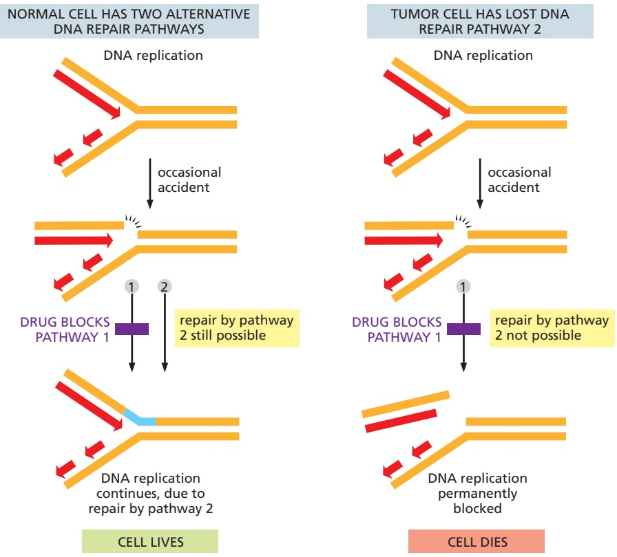

Figure 20–41 How a tumor’s genetic instability can be exploited for cancer therapy. As explained in Chapter 5, the maintenance of DNA sequences is so critical for life that cells have evolved multiple pathways for repairing DNA damage and reducing DNA replication errors. As MBoC7 m20.41/20.41illustrated, a DNA replication fork will stall whenever it encounters a break in a DNA template strand. In this example, normal cells have two different repair pathways that help them to avoid the problem, pathways 1 and 2. They are therefore not harmed by treatment with a drug that blocks repair pathway 1. But, because the inactivation of repair pathway 2 was selected for during the evolution of the tumor cell, the tumor cells are killed by the same drug treatment.

In the actual case that underlies this example, the function of repair pathway 1 (requiring the PARP protein discussed in the text) is to remove persistent, accidental breaks in a DNA single strand before they are encountered by a moving replication fork. Pathway 2 is the recombinationdependent process (requiring the Brca2 and Brca1 proteins) for repairing stalled replication forks illustrated in Figure 5–49. PARP inhibitors are often used for treating cancers with defective Brca2 or Brca1 tumor suppressor genes.

PARP inhibitors have produced some striking results, causing tumors to regress in many Brca-deficient patients and delaying progression of their disease, with relatively few disagreeable side effects. These drugs also appear to be applicable to cancers with other mutations that cause defects in the cell’s homologous recombination machinery—a small, though significant, proportion of cancer cases.

PARP inhibition provides an example of the type of rational, highly selective approach to cancer therapy that is beginning to be possible. Along with other new treatments to be discussed below, it raises high hopes for treating many other cancers.

#### Small Molecules Can Be Designed to Inhibit Specific Oncogenic Proteins

An obvious tactic for treating cancer is to attack a tumor expressing an oncogene with a drug designed to specifically block the function of the protein that the oncogene produces. But how can such a treatment avoid hurting the normal cells that depend on the function of the proto-oncogene from which the oncogene has evolved, and why should the drug kill the cancer cells, rather than simply calm them down? One answer may lie in the phenomenon of oncogene dependence. Once a cancer cell has undergone an oncogenic mutation, it will often undergo further mutations, epigenetic changes, or physiological adaptations that make it reliant on the hyperactivity of the initial oncogene, just as drug addicts become reliant on high doses of their drug. Blocking the activity of the oncogenic protein may then kill the cancer cell without significantly harming its normal neighbors. Some remarkable successes have been achieved in this way.

As we saw earlier, chronic myelogenous leukemia (CML) is usually associated with a particular chromosomal translocation, visible as the Philadelphia chromosome (see Figure 20–5). This results from chromosome breakage and rejoining at the sites of two specific genes, Abl and Bcr. The fusion of these genes creates a hybrid gene, called Bcr-Abl, that codes for a chimeric protein consisting of the N-terminal fragment of Bcr fused to the C-terminal portion of Abl (**Figure 20–42**). Abl is a tyrosine kinase involved in cell signaling. The substitution of the Bcr fragment for the normal N-terminus of Abl makes it hyperactive, so that it stimulates inappropriate proliferation of the hemopoietic precursor cells that contain it and prevents these cells from dying by apoptosis—which many of them would normally do. As a result, excessive numbers of white blood cells accumulate in the bloodstream, producing CML.

The chimeric Bcr-Abl protein is an obvious target for therapeutic attack. Searches for synthetic drug molecules that can inhibit the activity of tyrosine kinases discovered one, called imatinib (trade name Gleevec), that blocks Bcr-Abl (**Figure 20–43**). When the drug was first given to patients with CML, nearly

Figure 20–42 The conversion of the Abl proto-oncogene into an oncogene in individuals with chronic myelogenous leukemia. The chromosome translocation responsible joins the Bcr gene on chromosome 22 to the Abl gene from chromosome 9, thereby generating a Philadelphia chromosome (see Figure 20–5). The resulting fusion protein has the N-terminus of the Bcr protein joined to the C-terminus of the Abl tyrosine protein kinase; in consequence, the Abl kinase domain becomes inappropriately active, driving excessive proliferation of a clone of hemopoietic cells in the bone marrow.

Figure 20–43 How imatinib (Gleevec) blocks the activity of Bcr-Abl protein and halts chronic myelogenous leukemia. (A) Imatinib sits in the ATP-binding pocket of the tyrosine kinase domain of Bcr-Abl and thereby prevents Bcr-Abl from transferring a phosphate group from ATP onto a tyrosine residue in a substrate protein. This blocks transmission of a signal for cell proliferation and survival. (B) The structure of the complex of imatinib (solid blue object) with the tyrosine kinase domain of the Abl protein (ribbon diagram), as determined by x-ray crystallography. (C) The chemical structure of the drug. It can be administered orally; it has side effects, but they are usually quite tolerable. (B, from T. Schindler et al., Science 289:1938–1942, 2000. With permission from AAAS. PDB code: 3K5V.)

all of them showed a dramatic response, with an apparent disappearance of the cells carrying the Philadelphia chromosome in more than 80% of patients. The response appears relatively durable: after years of continual treatment, many patients have not progressed to later stages of the disease—although imatinibresistant cancers emerge with a probability of about 5% per year during the early years.

Results are not so good for those patients who have already progressed to the more acute phase of myeloid leukemia, known as blast crisis, where genetic instability has set in and the march of the disease is far more rapid. These patients show a response at first and then relapse because the cancer cells develop a resistance to imatinib. This resistance is usually associated with secondary mutations in the part of the Bcr-Abl gene that encodes the kinase domain, disrupting the ability of imatinib to bind to Bcr-Abl kinase. Second-generation inhibitors that function effectively against a whole range of imatinib-resistant mutants have now been developed. By combining one or more of these new inhibitors with imatinib as the initial therapy, it seems that CML—at least in the chronic (early) stage— may be on its way to becoming a curable disease.

Despite the complications with resistance, the extraordinary success of imatinib is enough to drive home an important principle: once we understand precisely what genetic lesions have occurred in a cancer, we can begin to design effective rational methods to treat it. This success story has fueled efforts to identify small-molecule inhibitors for other oncogenic protein kinases and to use them to attack the appropriate cancer cells. Increasing numbers are being developed. These include molecules that target the EGF receptor and are currently approved for the treatment of some lung cancers, as well as drugs that specifically target the B-Raf oncoprotein in melanomas.

Figure 20–44 Some anticancer drugs and drug targets in the Ras–MAP-kinase signaling pathway. This Ras– MAP-kinase signaling pathway is triggered by a variety of receptor tyrosine kinases (RTKs), including the EGF receptor (see Figures 15–48 and 15–50. Raf kinase inhibitors include several that specifically target the oncoprotein B-Raf. By convention, those drugs that are antibodies end in “mab,” while those that are small molecules end in “nib.” (Adapted from B. Vogelstein et al., Science 339:1546–1558, 2013.)

Protein kinases have been relatively easy to inhibit with small molecules suchMBoC7 m20.44/20.44 as imatinib, and many kinase inhibitors are being produced by pharmaceutical companies in the hope that they can be effective as drugs for some forms of cancer. Many cancers lack an oncogenic mutation in a protein kinase. But most tumors contain inappropriately activated signaling pathways, for which a target somewhere in the pathway can hopefully be found (**Movie 20.8**). As an example, **Figure 20–44** displays some of the anticancer drugs and drug targets that are currently being tested for a pathway frequently activated in cancers.

#### Many Cancers May Be Treatable by Enhancing Immune Responses

Cancers have complex interactions with the immune system, and its various components may sometimes help as well as hinder tumor progression. But for more than a century it has been a dream of cancer researchers to somehow harness our immune systems in a controlled and efficient way to exterminate cancer cells, just as it exterminates pathogenic microorganisms. There are finally signs that this dream may one day be realized, at least for some forms of cancer.

The simplest type of immunological therapy, conceptually at least, is to inject the patient with antibodies that target the cancer cells. This approach has had some successes. About 25% of breast cancers, for example, express unusually high levels of the Her2 (human epidermal growth factor receptor 2) protein, a receptor tyrosine kinase related to the EGF receptor that plays a part in the normal development of mammary epithelium. A monoclonal antibody called trastuzumab (trade name Herceptin), which binds to Her2 and inhibits its function, slows the growth of human breast cancers that overexpress Her2, and it is now a standard therapy for these cancers (see Figure 20–44). A related approach uses antibodies to deliver poisons to the cancer cells. Antibodies against proteins that are abundant on the surface of a particular type of cancer cell but rare on normal cells can be coupled to a toxin that kills the cells that the antibody binds to.

A great deal of current excitement centers around a different type of immunological approach, which is based on a class of lymphocytes called T cells. As described in detail in Chapter 24, cytotoxic T cells can kill a host cell that displays foreign peptide antigens on its surface. Because the peptide is usually derived from an invading pathogen, the response helps terminate the infection. The challenge is to find ways of recruiting cytotoxic T cells to attack cancers with similar efficiency and specificity, presuming that the cancer cells express tumorspecific antigens. Recall that, from the thousands of tumor genome sequences thus far determined, we know that a typical cancer cell contains approximatelyMBoC7 n20.215/20.45 50 proteins with a mutation that alters an amino acid sequence, most of these being passenger mutations, as previously explained (see p. 1186). The amino acid changes resulting from either passenger or driver mutations have the potential to produce cell-surface neoantigens that can be recognized as foreign by T cells, resulting in cancer cell death (**Figure 20–45**). However, because cytotoxic T cells kill infected host cells, they are under tight control to keep their activity within safe bounds. Furthermore, cancer cells typically lack some of the components present in pathogen-infected cells that are necessary to initiate a robust T cell response. Thus, very few tumor-reactive T cells exist, and therapies to boost their numbers are at the forefront of immunotherapy.

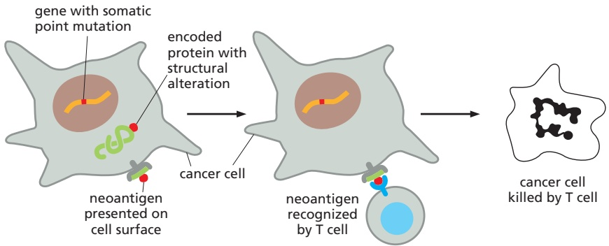

Figure 20–45 Tumor-specific antigens are recognized by the immune system. Due to somatic mutation, cells in tumors will produce many different mutant proteins. As described in Chapter 24, peptides from these proteins will be displayed as neoantigens on the tumor cell surface and have the potential to activate a T cell response that kills the cell (see Figure 24–42).

One approach to augment the T cell response to cancer cells is to collect a patient’s own T cells from his or her blood, expand the cancer-reactive population, and then re-infuse them into the patient. This method of introducing a large number of T cells that already recognize the tumor cells bearing cancer-specific antigens has been very effective in metastatic melanoma patients, achieving complete remission rates as high as 20%. In an even more elaborate variation of this strategy, the patient’s T cells can be genetically engineered before their numbers are increased, in a procedure called chimeric antigen receptor T cell (CAR T) therapy (**Movie 20.9**). The engineered CAR T cells not only recognize the patient’s tumor-specific antigen but also possess co-stimulatory activities that boost the response of the T cells. This therapy is extremely effective against certain blood cancers, but, unfortunately, it also has severe side effects due to immune system hyperactivation.

#### Immunosuppression Is a Major Hurdle for Cancer Immunotherapy

If cancer cell neoantigens are recognized as foreign, why doesn’t the immune system work better to eliminate the cancer in the first place? As discussed pre-viously (see pp. 1175–1176), cancer cells manipulate their surrounding stroma, including immune cells, to create a microenvironment that simultaneously promotes tumor growth and suppresses immune responses. Investigation of how tumors escape immune destruction led to the discovery of crucial immunosuppressive mechanisms—the expression on the cancer cell surface of one or more proteins that bind to inhibitory receptors on various immune cells, including activated T cells. As a result, even if cytotoxic T cells recognize tumor antigens, they are prevented from killing the tumor cells. The inhibitory receptors expressed on the surface of T cells are part of the immune checkpoint that plays an important normal function in preventing excessive, tissue-damaging immune responses during infections. But, in the context of cancer, immune

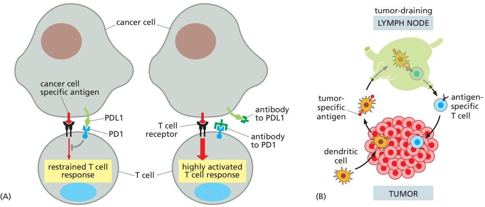

Figure 20–46 How the immune system interacts with cancer. (A) An antibody therapy for overcoming the immunosuppressive microenvironment in tumors. Cancer cells often protect themselves from immune attack by expressing proteins on their surface that bind to inhibitory receptors on T cells. In the example shown, the cancer cell expresses PDL1, which binds the PD1 receptor on a T cell and interferes with T cell activation. This makes the tumor susceptible to antibodies that unleash T cell attack. (B) Dendritic cells play a key role in activating T cells by acquiring tumor cell antigens from tumors and presenting them in lymph nodes, as illustrated, and some cancers have evolved mechanisms that interfere with this process (not shown).

checkpoint mechanisms can prevent an individual from killing the cancer cells that are threatening his or her survival.

To overcome the immunosuppressive environment and provide a strong T cell activating signal, a promising new type of anticancer therapy focuses on developing immune checkpoint inhibitors such as antibodies that prevent the tumor cells from engaging with the inhibitory receptors on T cells. As illustrated in **Figure 20–46A**, targeting inhibitory receptors or their ligands with antibodies can unleash an immune attack on the cancer cells. Importantly, multiple neoan-MBoC7 n20.200/20.46 tigens are recognized as foreign, so that cancer cells cannot escape an immune attack through the mutational loss of a single neoantigen, making it difficult for the tumor to become resistant to the antibody treatment. A substantial fraction of metastatic melanoma patients injected repeatedly with monoclonal antibodies that bind to either one such receptor, PD1 (programmed cell death 1), or its ligand on the surface of cancer cells, PDL1, respond in a dramatic way, with their cancer being driven into remission for years. Unfortunately, the treatment fails to help others with the same type of cancer.

An important clue as to why immunotherapies are effective in some patients but not others comes from the extensive analysis of cancer genomes described in the second part of this chapter. A fortuitous property of tumor samples is that they contain not only the cancer cells but also the cells of the associated stroma, including fibroblasts and endothelial and various immune cells. Because each cell type expresses a signature set of RNAs, the presence and proportion of each cell type in the tumor can be assessed, including the T cells. A comparison of the immune cell profiles of thousands of different tumors has revealed interesting correlations. For example, as one might predict, cancers with genomes that contain large numbers of point mutations are frequently found to possess a higher proportion of T cells compared to cancers with genomes that contain fewer mutations, presumably due to an increase in neoantigens. In turn, this tumor profile correlates with better treatment outcomes after treatment with immune checkpoint inhibitors.

Some cancers appear to avoid immune destruction by preventing T cells from infiltrating the tumor in the first place. The cellular basis of this phenomenon is poorly understood and is an important ongoing area of investigation. It is known that T cell activation requires that T cells physically interact with antigenpresenting cells called dendritic cells. Dendritic cells are highly migratory and pick up pathogens or their products at sites of infection and deliver them to lymph nodes or other lymphoid organs, where they present them to T cells. In the case of cancer, dendritic cells present neoantigens to T cells, so that they can track down the cells expressing the antigens and destroy them (**Figure 20–46B**). Some cancer cells inhibit this process by preventing the dendritic cells from interacting with them and acquiring their neoantigens.

These observations illustrate how the immune system is subject to many levels of control and how cancer cells have been selected to take advantage of them. Importantly, research into the cell biological mechanisms behind these phenomena not only helps to develop new cancer treatments but will also teach us basic principles of how the system operates in the first place, as described in Chapter 24.

#### Cancers Evolve Resistance to Therapies

High hopes have to be tempered with sobering realities. We have seen that genetic instability can provide an Achilles’ heel that cancer therapies can exploit, but at the same time it can make eradicating the disease more difficult by allowing the cancer cells to evolve resistance to therapeutic drugs, often at an alarming rate. This applies even to the drugs that target genetic instability itself. Thus, PARP inhibitors give valuable remission of illness, but in the long term the disease generally comes back. For example, Brca-deficient cancers can sometimes develop resistance to PARP inhibitors by undergoing a second mutation in an affected Brca gene that restores its function. By then, the cancer is already out of control and it may be too late to affect the course of the disease with additional treatments.

There are many different strategies by which cancers can evolve resistance to anticancer drugs. Often, a cancer will be dramatically reduced in size by an initial drug treatment, with all of the detectable tumor cells seeming to disappear. But months or years later the cancer will reappear in an altered form that is resistant to the drug that was at first so successful. In such cases, the initial drug treatment has evidently failed to destroy some tiny fraction of cells in the original tumor-cell population. These cells may have escaped death because they carry a protective mutation or epigenetic change or perhaps simply because they were lurking in a protected environment. Alternatively, and most insidiously, a phenotypically distinct subpopulation of tumor cells may function as cancer stem cells. The surviving cells eventually regenerate the cancer by continuing to proliferate, mutating and evolving still further as they do so. Combination therapies, in which the right two agents are used simultaneously to target the same cancer cells, should in principle help greatly with such problems.

However, in some cases, cells that are exposed to one anticancer drug evolve a resistance not only to that drug but also to other drugs to which they have never been exposed. This phenomenon of **multidrug resistance** frequently correlates with amplification of a part of the genome that contains a gene called Mdr1 or Abcb1. This gene encodes a plasma membrane–bound transport ATPase of the ABC transporter superfamily (discussed in Chapter 11), which pumps lipophilic drugs out of the cell (see Movie 11.5). The overproduction of this protein (or some of its other family members) by a cancer cell can prevent the intracellular accumulation of many cytotoxic drugs, making the cell insensitive to them.

In the to-and-fro struggle between advanced metastatic cancer and the therapist, as current practice stands, the cancer usually wins in the end. Does it have to be so? As we discuss below, there is reason to think that by attacking a cancer with many weapons at once—instead of using them one after another, each until it fails—it may be possible to do much better.

#### We Now Have the Tools to Devise Combination Therapies Tailored to the Individual

Nowadays, cancers caught at an early stage can often be cured by surgery, radiation, or drugs. For most cancers that have progressed and metastasized widely, however, cure is still frequently beyond us. Treatments such as those described earlier can give valuable remissions, but sooner or later these are typically followed by relapse.

Nevertheless, for some forms of advanced cancer, curative therapies are being developed that utilize multiple strategies; for example, combining chemotherapy and radiation therapy with immunotherapy. Ideally, the choice of drugs to be given in combination should be tailored to the individual patient. Cancers evolve by a fundamentally random process, and each individual is different, but modern methods of genome analysis now let us characterize the cells from a tumor biopsy in exhaustive detail so as to discover which cancer-critical genes are affected in a particular case. Admittedly, this is not straightforward: the tumor cells in an individual are heterogeneous and do not all contain the same genetic lesions. With increased understanding of the pathways of cancer evolution, however, and with the experience gained from many different cases, it should become possible to make informed decisions about the optimal therapies to use.

Improvements in tissue sampling, genomics, and biostatistics have enabled the direct characterization of primary human tumors. However, these analyses do not take into account the contributions of the entire body. Advances in cancer therapy are also coming from the development of more sophisticated models of the disease, which can be used to investigate the factors involved in tumor growth and metastasis, as well as to examine response to therapy. In one approach, mice can be genetically engineered to introduce particular combinations of human mutations (see Figure 20–33). A second approach is the human tumor xenograft. In this model, human cancer cells are transplanted—either under the skin or into the organ type in which the cancer originated—into immunocompromised mice that do not reject human cells. In an approach that bypasses the use of mice, organoids can be grown in 3D culture from patient-derived healthy and tumor tissues (see Figure 20–34A). These systems facilitate patient-specific drug testing and the development of individualized treatment regimens.

From the perspective of the patient, the pace of advance in cancer research can seem frustratingly slow. Each new drug has to be tested in the clinic, first for safety and then for efficacy, before it can be released for general use. And if the drug is to be used in combination with others, the combination therapy must then go through the same long process. Strict ethical rules constrain the conduct of trials, which means that they take time—typically several years. But slow and cautious steps, taken systematically in the right direction, can lead to great advances. There is still far to go, but the examples that we have discussed provide proof of principle and grounds for optimism.

From the cancer research effort, we have learned a great deal of what we know about the molecular biology of the normal cell. Now, more and more, we are discovering how to put that knowledge to use in the battle with cancer itself.

#### Summary

Our growing understanding of the cell biology of cancers has already begun to lead to better ways of preventing, diagnosing, and treating these diseases. Anticancer therapies can be designed to destroy cancer cells preferentially by exploiting the properties that distinguish cancer cells from normal cells, including the cancer cells’ dependence on oncogenic proteins and the defects they harbor in their DNA repair mechanisms. We now have good evidence that, by increasing our understanding of normal cell control mechanisms and exactly how they are subverted in specific cancers, we can eventually devise drugs to kill cancers precisely by attacking specific molecules critical for the proliferation and survival of the cancer cells. In addition, great progress has recently been made through sophisticated immunological approaches to cancer therapy. And, as we become better able to determine which genes are altered in the cells of any given tumor, we can begin to tailor treatments more accurately to each individual.

<!-- END EN EN20-H011-H053 -->

## 跨章相关英文内容

- 癌细胞的复制限制逃逸：[EN第20章 · 癌细胞如何绕过复制衰老](../15_细胞衰老与细胞程序性死亡/小节/01_第一节%20细胞衰老.md#EN20-H010-H010)。
