# 第14章 细胞分化与干细胞 · 双教材整合

按中文节顺序保留正文，在每节末插入对应英文内容。

---

## 第14章 细胞分化与干细胞 · 章首导读

[返回本章](README.md) · [中文本章原文](中文原文.md)

<!-- BEGIN CN CN14-S00 -->
# 第14章 细胞分化与干细胞

<!-- 章节边界按正文内容恢复；原始 MinerU 内容保留如下。 -->

# 细胞分化与干细胞

多细胞有机体是由各种不同类型的细胞组成的（表14-1），而这些细胞通常是由一个受精卵细胞经分裂、增殖和分化衍生而来的后代。在个体发育中，由一种细胞类型经细胞分裂后逐渐在形态、结构和功能上形成稳定性差异，产生不同的细胞类群的过程称为细胞分化（cell differentiation）。细胞分化的关键在于不同类型细胞中决定细胞命运和功能的特异性转录因子网络的建立，其实质是这些特异性基因在发育的特定时间和空间中选择性表达的结果。细胞分化是多细胞有机体发育的基础，也是目前干细胞（stem cell）研究中所面临的核心问题。

在个体发育过程中，通过有控制的细胞分裂增加细胞数目，通过有序的细胞分化增加细胞类型，进而由不同类型的细胞构成生物体的组织与器官，执行不同的功能。显然，细胞分化为各种细胞类型，这一过程为细胞通过相互作用完成各种生物学功能，并构建精密而复杂的多细胞生命体奠定了基础，为生命向更高层次的发展与演化创造了必要条件。

表 14-1 几种生物的细胞数目与类型

<table><tr><td>物种</td><td>细胞数/个</td><td>细胞类型/种</td></tr><tr><td>团藻</td><td> ${10}^{2}$ </td><td>2</td></tr><tr><td>海绵</td><td> ${10}^{3}$ </td><td>5~10</td></tr><tr><td>水螅</td><td> ${10}^{9}$ </td><td>10~20</td></tr><tr><td>涡虫</td><td> ${10}^{9}$ </td><td>100</td></tr><tr><td>人</td><td> ${10}^{14}$ </td><td>大于 200</td></tr></table>

有限基因的选择性表达如何分化出形态功能各异的细胞，精确地构建成各种组织、器官以及多姿多彩的生命体，一直是生命科学面临的最具有挑战性的问题之一。通过对各种不同的模式生物的研究，人们逐渐加深了对上述问题的了解，尤其是干细胞体外分化研究的进展，使我们对于细胞分化和个体发育过程认识，达到了前所未有的高度。

干细胞是一群具有自我更新能力和分化潜能的细胞。多细胞生命体源于受精卵，受精卵即是一个全能性的干细胞。在胚胎发育早期以及成体的不同组织中也都存在分化潜能不同的干细胞。干细胞在胚胎发育、成体组织再生等方面起着至关重要的作用。通过在体外建立不同种类的干细胞系，以及诱导分化产生各种功能细胞的研究，特别是诱导性多潜能干细胞（induced pluripotent stem cell, iPS细胞）的建系及其相关研究，使人们对细胞命运的决定有了全新的认识，并将开启一条个体化疾病治疗的新途径。

<!-- END CN CN14-S00 -->

---

## 第14章 细胞分化与干细胞 · 第一节 细胞分化

[返回本章](README.md) · [中文本章原文](中文原文.md)

<!-- BEGIN CN CN14-S01 -->
## 第一节 细胞分化

## 一、细胞分化的基本概念

## （一）细胞分化是基因选择性表达的结果

在早期发育研究中，人们推测细胞分化是由于细胞在发育过程中遗传物质的选择性丢失所致。现代分子生物学的证据表明，绝大多数的细胞分化不是因为遗传物质的丢失，而是由于细胞选择性地表达组织特异性基因，从而导致细胞形态、结构与功能的差异。如鸡的输卵管细胞合成卵清蛋白，成红细胞合成β-珠蛋白，胰岛β细胞合成胰岛素，这些细胞都是在个体发育中逐渐产生的。分别用上述3种蛋白质的基因作探针，对3种细胞中提取的总DNA进行Southern杂交实验，结果显示，上述3种细胞的基因组DNA中都含有卵清蛋白基因、β-珠蛋白基因和胰岛素基因（表14-2）；然而用同样的3种探针，对上述3种细胞中提取的总RNA进行Northern杂交实验，结果表明，卵清蛋白mRNA仅在输卵管细胞中表达，成红细胞中仅表达β-珠蛋白mRNA，胰岛β细胞中仅表达胰岛素mRNA。

这一经典的实验表明，不同类型的细胞各自表达一套特异的基因，其产物不仅决定细胞的形态结构，而且执行特定的生理功能。随着生物信息学技术的发展，人们认识到细胞分化过程伴随着细胞特异性的转录因子调控网络的形成，从而决定了细胞的命运和功能。目前，人们可用RNA测序（RNA sequence, RNA-seq）等技术检测特定类型细胞中的基因表达谱，包括所表达的几乎所有种类的mRNA及其丰度，用质谱技术等分析蛋白质表达谱，从而为深入了解细胞分化的机制提供了重要的研究途径。

## （二）管家基因与组织特异性基因

细胞分化是通过严格而精准地调控基因表达实现的。分化细胞基因组所表达的基因大致可分为两种基本类型：一类是管家基因（house-keeping gene），另一类称为组织特异性基因（tissue-specific gene）。管家基因是指几乎所有细胞中均表达的一类基因，其产物是维持细胞基本生命活动所必需的，如糖酵解酶系基因等。组织特异性基因是指不同类型细胞中特异性表达的基因，其产物赋予各种类型细胞特异的形态结构特征与特定的功能，如卵清蛋白基因、胰岛素基因等。

与细胞分化相关的基因在时间与空间上的差异表达，不仅涉及基因转录水平和转录后加工水平上的调控，而且涉及染色体和DNA水平（如DNA与组蛋白的修饰）以及蛋白质翻译和翻译后加工与修饰等复杂而严格的调控过程。

早期实验结果提示，在哺乳动物基因组中，多数基因为管家基因。然而，随着高通量测序技术的发展以及检测细胞类型的增多，人们发现真正意义上的管家基因可能仅占基因总数很少一部分（有人估计不超过3%）。管家基因编码的产物多为细胞基础代谢活动所需的酶类、核糖体蛋白、膜转运蛋白，以及细胞周期调控的主要蛋白质等细胞生命活动必需的蛋白质。与之相比较，组织特异性基因占基因总数的绝大多数，它们调控并参与了细胞分化和组织与器官的构建。

## （三）组合调控引发组织特异性基因的表达

人体有 200 多种不同类型（有的学者认为有 500 种以上）的细胞。如果每种类型的细胞分化都需要一种调控蛋白的话，那么需要 200 种以上的调控蛋白。然而，实际上细胞分化是有限的少量调控蛋白启动了为数众多的特异细胞类型基因表达的过程。其机制就是组合调控（combinational control）的方式，即每种类型的细胞分化是由多种调控蛋白共同参与完成的。这样，如果调控蛋白的数目是 n，则其调控的组合在理论上可以启动分化的细胞类型为 $2^{n}$ 。这样，3 种调控蛋白（调控蛋白 1、2、3）可以调控产生 8 种不同类型的细胞（图 14-1）。

表 14-2 分子杂交技术检测基因及其 mRNA 的表达

<table><tr><td rowspan="2"></td><td colspan="3">细胞总DNA</td><td colspan="3">细胞总RNA</td></tr><tr><td>输卵管细胞</td><td>成红细胞</td><td>胰岛β细胞</td><td>输卵管细胞</td><td>成红细胞</td><td>胰岛β细胞</td></tr><tr><td>卵清蛋白基因探针</td><td>+</td><td>+</td><td>+</td><td>+</td><td>-</td><td>-</td></tr><tr><td> $\beta$ -珠蛋白基因探针</td><td>+</td><td>+</td><td>+</td><td>-</td><td>+</td><td>-</td></tr><tr><td>胰岛素基因探针</td><td>+</td><td>+</td><td>+</td><td>-</td><td>-</td><td>+</td></tr><tr><td>实验方法</td><td colspan="3">Southern杂交</td><td colspan="3">Northern杂交</td></tr></table>

在启动细胞分化的各类调控蛋白中，往往存在一两种起决定作用的调控蛋白，编码这种蛋白的基因称为主导基因（master gene）。有时，仅单一主导基因的表达就有可能启动整个细胞的分化过程。例如，MyoD是一种在成肌细胞分化为骨骼肌细胞过程中的关键性调控蛋白。如果将其转入体外培养的成纤维细胞中进行过表达，将使来自皮肤结缔组织的成纤维细胞表现出骨骼肌细胞的特征，例如合成大量的肌动蛋白和肌球蛋白，在质膜上产生对神经信号敏感的受体蛋白和离子通道蛋白，并融合成肌细胞样的多核细胞等。

借助于组合调控，一旦某种关键性基因调控蛋白与其他调控蛋白形成适当的组合，不仅可以将一种类型的细胞转化成另一种类型的细胞，而且遵循类似的机制，甚至可以诱发整个器官的形成，这一点已在研究果蝇、小鼠和人类的眼睛发育中得到证实。例如在眼的发育中，有一种关键性调控蛋白称Ey（果蝇）或Pax6（脊椎动物)，如果在发育的早期，把果蝇 $Ey$ 基因转入到将发育成腿的幼虫细胞中表达，结果诱导产生构成眼的不同类型细胞的有序三维组合，最终在腿的中部形成眼。显然 $Ey$ 蛋白除了能启动细胞某些特异基因的表达、诱导某种类型细胞分化外，其启动的某些基因本身可能又调控另一些基因，它们进一步启动其他特异基因表达，形成由多种不同类型细胞组成的有序三维群体，即组织器官的形成。

  
图14-1 组合调控的作用机制示意图  
3 种调控蛋白（分别以 1、2、3 表示）理论上可以调控产生 8 种不同类型的细胞。

通过少数关键性调节蛋白对其他调节蛋白的级联启动，是一种生命体内高效而经济的细胞分化调控机制。正是通过这一机制的高效运行，复杂有机体不同组织的细胞逐渐获得了最终形态及功能。

## （四）单细胞有机体的细胞分化

细胞分化并非多细胞有机体独有的特征，单细胞生物甚至原核生物也存在细胞分化，如原核生物枯草杆菌芽孢的形成，鱼腥藻（一种蓝藻）形成正常增殖的营养体细胞和起固氮作用的异形胞（见图1-6）等。

真核生物芽殖酵母有3种不同类型的细胞；二倍体细胞 $(\alpha/\alpha)$ 和由单倍体孢子萌发形成的 $\alpha$ 和a两种交配型。目前人们对上述细胞分化的机制已经有较深入的了解，这也为多细胞有机体细胞分化的研究提供了有意义的资料。黏菌（如盘形网柱黏菌Dictyostelium discoideum）的营养体直径约1 mm，是研究低等生物体细胞分化的一种很好的材料。在孢子形成过程中，由单细胞变形体形成多细胞的蛞蝓形假原质团(pseudoplasmodium)，并进一步分化成为菌柄和孢子囊(图14-2)。在每一个过程中，均涉及一系列特异基因的表达。然而单细胞生物与多细胞有机体细胞分化的不同之处是：前者多为直接应对外界环境的改变，而后者则通过遗传程序控制的细胞分化构建执行不同功能的组织与器官，从而间接地适应环境的改变。因此，多细胞有机体在其分化程序与调节机制方面显得更为复杂。

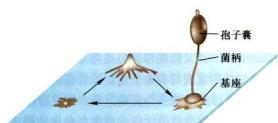  
图14-2 黏菌繁殖过程示意图

## （五）细胞谱系

细胞谱系（cell lineage）是指受精卵从第一次卵裂时起，到分化为各组织和器官的终末细胞时为止的发育史；因其母代细胞和子代细胞之间世代相承的关系类似于人类族谱，故又被称为“细胞世系”。许多生物的卵裂过程按照严格的图式进行，且各类细胞产生的时间、顺序、位置和类型，在发育的早期就已确定。

细胞谱系的研究对于了解各类细胞和器官发育机制、比较不同种类生物早期发育之间的演化关系以及分离并获取具有生理功能的各种细胞等都有重要价值。人们通常利用细胞谱系示踪（cell lineage tracing）技术来标记细胞并追踪观察其所有后代的增殖、分化以及迁移等活动，进而获得细胞分化和发育的相关知识。最早的示踪技术源于20世纪初，E.G.Conklin等人利用海鞘早期卵裂球本身着色差异的特性，对卵裂球的分裂过程进行了连续观察；此后，人们尝试通过物理方式将各种染料注入细胞内，以此对其进行标记和追踪。由于染料标记不够准确，且随细胞分裂染料逐渐稀释并最终消失，因而不是一种理想的细胞示踪技术。

近年来基因编辑技术的快速发展，实现了对细胞精准和永久性的标记。例如，通过基因打靶将噬菌体P1的Cre/Loxp重组酶系统整合到待标记的细胞基因组中，对标记细胞进行示踪。由于发育过程中表达Cre的细胞及其子代细胞将被永久标记，细胞谱系得以准确地绘制和研究。近年来，更高效的CRISPR/Cas9基因编辑技术又为细胞谱系示踪增添了新的活力。目前，细胞示踪技术与影像学技术相结合，可以对活体细胞进行示踪。细胞谱系示踪技术的发展正迅速改变和加深人们对于细胞分化和发育的认知，也将极大促进生物医学的发展。

## （六）转分化与再生

一种类型的分化细胞转变成另一种类型的分化细胞的现象称转分化（transdifferentiation），如水母横纹肌细胞经转分化可形成神经细胞、平滑肌细胞和上皮细胞，甚至可形成刺细胞。

转分化往往经历去分化和再分化的过程。去分化（dedifferentiation）又称脱分化，是指分化细胞失去其特有的结构与功能变成具有未分化细胞特征的过程。高等动物的克隆也涉及细胞去分化的过程，但已分化细胞的细胞核需要在卵细胞质中才能完成其去分化的程序。这一过程又称为重编程（reprogramming），其中涉及DNA与组蛋白修饰的改变。但最新研究证明，如果在一种类型的细胞中表达另一种类型细胞的关键转录因子的调控蛋白，能够激活另一种类型细胞的基因调控网络，从而使得细胞命运和功能发生转变；例如通过导入基因或通过化学小分子直接激活关键转录因子的方法，人皮肤成纤维细胞能够成功转分化为神经、肝、心肌等多种类型的细胞。

大部分已分化的植物细胞都具有经去分化和再分化形成完整植株的潜能。植物细胞的这种特点，可能主要有两个原因：一是植物是以细胞为生命单位的光合自养方式获得能量，细胞之间不需要如动物那么复杂的分化与分工；二是植物适应光合自养获能方式的固着生长使得植物无法逃离环境的胁迫与机械损伤，维持高效的去分化与再分化能力，有助于植物体在受到伤害后，增加存活的机会。植物细胞相对易于去分化和再分化的特点，可能是演化过程中，光合自养及其派生出来的固着生长这两个选择压下的选择结果。

生物界普遍存在再生现象（regeneration）。广义的再生可包括细胞水平、组织与器官水平及个体水平的再生。但一般再生是指生物体缺失部分后重建的过程，如幼体蟾蜍附肢切除后，伤口处部分细胞凋亡，多数细胞（包括皮肤、肌肉、软骨和其他结缔组织的细胞）经去分化形成间充质或成纤维细胞样的细胞团——再生芽基(regeneration blastema)。芽基细胞再分化形成以有序方式排列的从肱骨直至指骨的完整附肢。

另一典型的例子是晶状体的再生。若将发育中的蝾螈晶状体摘除，其背面的虹膜上含黑色素的平滑肌细胞就会去分化，失去黑色素和肌纤维，然后再转变成为产生晶状体蛋白的晶状体细胞。

不同的有机体，其再生能力有明显的差异。一般来说，植物比动物再生能力强，低等动物比高等动物再生能力强。从只有二胚层的腔肠动物水螅中部，切下仅占体长5%的部分，便可长成完整的水螅；具有三胚层的扁形动物涡虫同样具有极强的再生能力，目前已成为研究机体再生与干细胞的增殖和分化的一种模式生物。而两栖类却只能再生形成附肢，人和其他高等动物通常只具有组织水平的再生能力。再生能力常常随个体年龄增大而下降。再生现象从另一个侧面反映了细胞命运的可塑性。

## 二、影响细胞分化的因素

基因的选择性表达主要是由调节转录因子蛋白所启动。转录因子蛋白的组合是影响细胞分化的主要的直接因素。一般来说，这种影响主要是胞外信号及细胞微环境，同细胞内的信号转导调控网络相互作用，转录因子蛋白的表达受细胞内外信号的精确调控。而胞外信号及细胞微环境又是通过细胞的信号转导调控网络来起作用。在很多物种中影响细胞分化的胞内因素可以追溯到单细胞受精卵中细胞质的作用。此外，外部的环境对某些物种的细胞分化，乃至个体发育也会产生很大的影响。

## （一）受精卵细胞质的不均一性对细胞分化的影响

在卵母细胞的细胞质中除了储存有营养物质和各种蛋白质外，还含有多种mRNA。如在果蝇的受精卵中含有许多由母体提供的mRNA和蛋白质，这些都是母体基因产物。母体基因产物在受精卵中的分布具有明显的区域性，受精后，区域性分布的母体基因产物通过级联反应，激活或抑制合子相应的基因表达，进一步造成裂隙基因（gap gene）、成对规则基因（pair-rule gene）和体节极性基因（segment polarity gene）等合子基因表达的区域化，从而决定了果蝇胚胎的前后轴、背腹轴和体节的形成。因此，果蝇胚胎的发育命运，早在卵子成熟时就决定了。受精后，胚胎就按照既定的途径完成发育过程[图14-3]。在很多物种中，决定细胞向某一方向分化的初始信息储存于卵细胞中，卵裂后的细胞所携带的信息已开始有所不同，这种区别又通过信号分子影响其他细胞产生级联效应。这样，最初储存的信息不断被修饰并逐渐形成更为精细、更为复杂的指令，最终产生分化各异的细胞类型。

## （二）信号分子及细胞的位置信息决定细胞分化的命运

多细胞个体在发育过程中，某个细胞在某一时刻是否分化及其分化的方向是由内因和外因共同决定的。内因是指细胞本身的状态，特别是基因组的整体表达情况（如特异受体蛋白的表达），以及该细胞所经历的发育过程或所处的发育阶段。细胞的状态可以通过转录组、蛋白质组、代谢组、甲基化组学等进行分析。细胞分化的外因则是指该细胞所处的周边环境，包括与之相邻的细胞，所接收到的信号分子、激素等。

人们很早就注意到，在胚胎发育过程中，一部分细胞会影响周围的细胞，使其向一定的方向分化，这种作用称为近端组织相互作用（proximate tissue interaction），也称近端诱导或胚胎诱导（embryonic induction）。其中

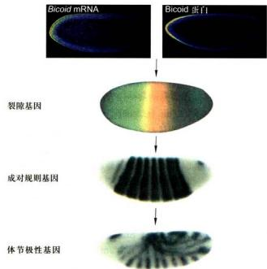  
图14-3 果蝇体节形成中的基因调控

Bicoid等母体基因的mRNA和产物蛋白在受精卵中形成浓度梯度，调控裂隙基因的表达，形成各自特异的表达区域；裂隙基因再调控成对规则基因，各形成7条横纹状分布的表达区；成对规则基因调控其下游的体节极性基因，形成14条表达横纹，相当于14个副体节的位置。体节的不同特征则是由同源异型基因决定的。（Markus Noll博士惠赠）

一个典型的例证就是在眼原基中发生的逐级诱导过程。正常情况下，早期的视泡诱导与之接触的外胚层上皮细胞发育成晶状体，随后，在视泡和晶状体的共同诱导下，外侧的表皮细胞形成角膜。如果把早期的视泡移植在头部的其他部位，则可诱导与之接触的外胚层异位发育成晶状体。近端组织相互作用主要是通过信号细胞分泌产生的信号分子改变周围细胞（靶细胞）的分化方向来实现的。

信号分子是由信号细胞直接合成并分泌到胞外，依靠扩散作用围绕信号细胞形成浓度梯度，因此主要作用于邻近的细胞。在第九章我们已经讨论过多种信号分子及其受体家族的属性，其中也提到了TGFβ、Wnt、Hedgehog（Hh）等信号分子及信号通路在细胞分化和个体发育中的作用。然而，细胞能够接收到哪些类型的信号分子、信号强度或持续的时间，则取决于细胞在胚胎或成体中所处的空间位置（也称位置信息）。

根据信号细胞和靶细胞的距离，或信号分子的作用范围，通常人为地将之分为短程和长程的诱导作用。一般相距5～10个细胞以内，称为短程诱导作用，超过这个距离，则称为长程诱导作用。上皮生长因子（EGF）和成纤维细胞生长因子（FGF）等家族成员属于前者，TGFβ 和 Wnt 等家族成员通常属于后者。有些信号分子兼有短程和长程诱导作用，例如，Hedgehog 通常被认为是短程信号分子，然而在某些情况下却起着长程信号分子的作用。如在脊椎动物神经管的发育中，在由脊索细胞分泌的 Shh（Sonic Hedgehog）信号蛋白的作用下，靠近脊索的细胞分化成底板（floor plate），而远离脊索的细胞分化成运动神经元。如果将另一个脊索植入鸡胚中线一侧，则会以同样的方式诱导底板和运动神经元的发生。如果 Shh 基因发生突变，则会导致中枢神经系统发育异常，甚至可出现面部仅有一个眼睛和一个鼻孔的畸胎。Shh 蛋白还可以调节肢体的发育。肢体的长度、形态和内部结构，均取决于 Shh 蛋白的浓度或某些由它调控的其他信号分子的浓度。

有些信号细胞还可以产生非分泌型的膜蛋白配体，它们通常仅作用于相邻的细胞，因此称为极短程诱导作用。如膜蛋白 DSL 作为 Notch 信号通路的配体，仅作用于相邻的靶细胞的膜受体 Notch（详见第十一章第三节）。

当然，长程和短程的诱导作用只是相对而言，信号分子的扩散程度也是一个受控的过程，细胞的应答并最终决定其分化方向，更是多种信息整合的复杂而精准的调控的结果（详见第十一章第四节）。

激素对细胞分化的调节总体属于一种远程作用，它一般由内分泌细胞分泌，然后借助于血液循环抵达靶细胞。细胞对激素的反应完全取决于其所表达的受体及其他内在因素，而与其在个体中的位置无直接关系。如无尾两栖类的蝌蚪在变态过程中，尾部的退化及前后肢的形成是由甲状腺分泌的甲状腺素和三碘甲状腺原氨酸的分泌增加所致。昆虫的变态过程则主要是由蜕皮素和保幼素共同调控的。在很多情况下，激素的远程调控常常与近端诱导的信号分子协同作用，完成细胞分化。如哺乳动物乳腺的发育受控于激素的远程调控，然而乳腺的导管和腺泡的发育、泌乳细胞的分化，则通过组织间的近端诱导作用得以完成。

近年来，对胚胎干细胞（包括人胚胎干细胞在内）的细胞定向分化的研究显示，细胞分化与三个胚层发生这一复杂的过程，不仅依赖于各种信号分子的组合和浓度，而且也与细胞相互间的位置密切相关（图14-4）。人们越来越关注细胞所处的位置即细胞的微环境对细胞状态的维持以及分化的命运所起到的关键作用。

  
图14-4 细胞分化与三个胚层发生的分子机制的示意图

## （三）细胞记忆与决定

信号分子的有效作用时间是短暂的，然而细胞可以将这种短暂的作用储存起来并形成长时间的记忆，逐渐向特定方向分化。果蝇幼虫的成虫盘（imaginal disc）是一些未分化的细胞群，在幼虫变态过程中，不同的成虫盘发育为成虫不同的器官，如腿、翅和触角等。人们曾把果蝇幼虫的成虫盘细胞植入成虫体内，连续移植9年，细胞增殖多达1800代，然后将这种成虫盘细胞再移植回幼虫体内，依然发育成为相应的器官。

早期的研究提出“决定早于分化”这一概念，所谓决定（determination）是指一个细胞接受了某种指令，在发育中这一细胞及其子代细胞将区别于其他细胞而分化成某种特定的细胞类型，或者说在形态、结构与功能等分化特征尚未显现之前就已确定了细胞的分化命运。

细胞的决定与细胞的记忆有关，而细胞记忆可能通过两种方式实现：一是正反馈途径（positive feedback loop），即细胞接受信号刺激后，激活转录调节因子，该因子不仅诱导自身基因的表达，还诱导其他组织特异性基因的表达；二是染色体结构变化（DNA与蛋白质相互作用及其修饰）的信息传到子代细胞，如两条X染色体中，其中一条始终保持凝集失活状态并可在细胞世代间稳定遗传一样。上述细胞记忆的机制也可以用来解释某些能够继续增殖的终末分化细胞，如平滑肌细胞和肝细胞分裂后只能产生与亲代相同的细胞类型。近年来表观遗传学的研究结果，表明了染色质构象的改变及DNA与组蛋白的化学修饰在基因表达中的重要作用，显然，这与细胞的记忆与决定有密切的关系。

## （四）染色质变化与基因重排对细胞分化的影响

一百多年前人们就发现马蛔虫在卵裂过程中，染色体出现消减现象，追踪至32个细胞的分裂球阶段，发现除一个细胞（将分化成生殖细胞）保留正常的染色体外，其余将分化成体细胞的细胞中，全部出现了染色体丢失。显然这是细胞分化的一个特例，但在当时成为种质学说的重要依据。

原生动物纤毛虫的营养核中，染色体 DNA 也存在大量缺失的现象。纤毛虫类（如草履虫、四膜虫）的细胞内存在两个细胞核，小核称为生殖核，包含完整的二倍体基因组，但基因基本不表达；大核称为营养核，丢失 10%\~90% 的 DNA，剩余的 DNA 经重排与扩增后形成多倍体，其基因活跃地转录并决定其一切表型特征。大核是在有性生殖过程中，由小核发育而来，细胞虽未分化但细胞核 “分化” 成两种不同的类型。

基因重排（gene rearrangement）是细胞分化的另一种特殊方式。抗体是由浆细胞分泌的，而浆细胞是由B淋巴细胞分化而来。在这一过程中，B淋巴细胞中的DNA经过断裂丢失与重排的复杂变化从而利用有限的免疫球蛋白基因，在理论上可表达出数百亿种抗体。T淋巴细胞在分化过程中也存在类似的基因重排现象。

从单细胞的受精卵到多细胞的成体，实际上是一个受到精密调控的细胞分裂、迁移和分化、凋亡的过程，而细胞分化是整个发育的基础与核心（详见知识窗14-1）。细胞分化的奥妙不仅在于其过程与结果的复杂性，而且还在于分化的细胞在组织和机体构建中难以置信的经济性。如同仅88个键的钢琴能够演奏出无限多美妙的乐曲，生命体凭借相对有限的基因通过组合调控，形成各种形态功能迥异的细胞，精确地构成各类组织、器官以及多姿多彩的生命体。

<!-- END CN CN14-S01 -->

---

## 对应英文内容

### 英文补充：同一基因组产生不同细胞类型

> 对应中文板块：同一基因组产生不同细胞类型。英文来源：Molecular Biology of the Cell，第7版，第7章；[本章完整原文](../来源/英文教材/07_Control_of_Gene_Expression/chapter.md)。物理PDF页码范围：436–513（整章范围）。

<!-- BEGIN EN EN07-H000-H008 -->

C HAP T E R

#### Control of Gene Expression

An organism’s DNA encodes all of the RNA and protein molecules required to construct its cells. Yet a complete description of the DNA sequence of an organism—be it the few million nucleotides of a bacterium or the few billion nucleotides of a human—no more enables us to reconstruct the organism than a list of English words enables us to reconstruct a play by Shakespeare. In both cases, the problem is to know how the elements in the DNA sequence or the words on the list are used. Under what conditions is each gene product made, and, once made, what does it do?

In this chapter, we focus on the first half of this problem—the rules and mechanisms that enable a subset of genes to be selectively expressed in each cell and also determine the amount of each gene product. These mechanisms operate at many levels, and we shall discuss each level in turn. But first we present some of the basic principles involved.

#### AN OVERVIEW OF GENE CONTROL

The different cell types in a multicellular organism differ dramatically in both structure and function. If we compare a mammalian neuron with a liver cell, for example, the differences are so extreme that it is difficult to imagine that the two cells contain the same genome (**Figure 7–1**). For this reason, and because cell differentiation often seemed irreversible, biologists originally suspected that genes might be selectively lost when a cell differentiates. We now know, however, that cell differentiation generally occurs without changes in the nucleotide sequence of a cell’s genome.

#### The Different Cell Types of a Multicellular Organism Contain the Same DNA

The cell types in a multicellular organism become different from one another because they synthesize and accumulate different sets of RNA and protein molecules. The initial evidence that they do this without altering the sequence of their DNA came from a classic set of experiments in frogs. When the nucleus of a fully differentiated frog cell is injected into a frog egg whose nucleus has been

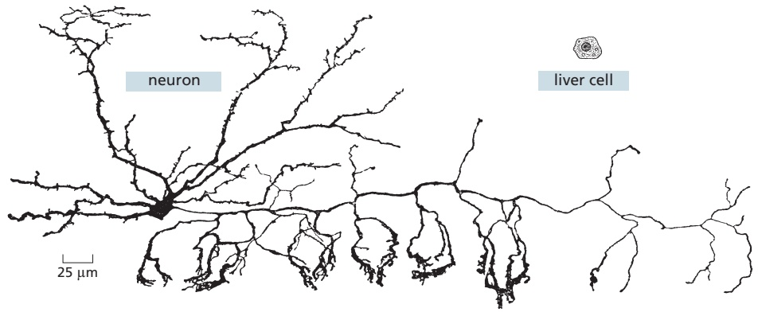

#### IN THIS CHAPTER

An Overview of Gene Control

Control of Transcription by Sequence-specific DNA-binding Proteins

Transcription Regulators Switch Genes On and Off

Molecular Genetic Mechanisms That Create and Maintain Specialized Cell Types

Mechanisms That Reinforce Cell Memory in Plants and Animals

Post-transcriptional Controls

Regulation of Gene Expression by Noncoding RNAs

Figure 7–1 A neuron and a liver cell share the same genome. The long branches of this neuron from the retina enable it to receive electrical signals from many other neurons and convey them to neighboring neurons. The liver cell, which is drawn to the same scale, is involved in many metabolic processes, including digestion and the detoxification of alcohol and other drugs. Both of these mammalian cells contain the same genome, but they express different sets of RNAs and proteins. (Neuron adapted from S. Ramón y Cajal, Histologie du Système Nerveux de l’Homme et de Vertébrés, 1909–1911. Paris: A. Maloine Éditeur; reprinted, Madrid: C.S.I.C., 1972.)

removed, the injected donor nucleus is capable of directing the recipient egg to produce a normal tadpole (**Figure 7–2A**). Because this tadpole contains a full range of differentiated cells, each of which derived their DNA sequences from the nucleus of the original donor skin cell, that differentiated cell cannot have lost any important DNA sequences. Experiments performed with plants produced a similar conclusion. When differentiated pieces of plant tissue are placed in culture and then dissociated into single cells, often one of these individual cells can regenerate an entire adult plant (**Figure 7–2B**). More recently, the same principle has been demonstrated for mammals that include sheep, mice, pigs, goats, dogs, and cattle (**Figure 7–2C**).

Detailed DNA sequencing of genomes present in different tissues also shows that the changes in gene expression that underlie the normal development of multicellular organisms do not generally involve changes in the DNA sequenceMBoC7 m7.02/7.02 of the genome.

#### Different Cell Types Synthesize Different Sets of RNAs and Proteins

Figure 7–2 Differentiated cells contain all the genetic instructions necessary to direct the formation of a complete organism. (A) The nucleus of a skin cell from an adult frog transplanted into an enucleated egg can give rise to an entire tadpole. The broken arrow indicates that, to give the transplanted genome time to adjust to an embryonic environment, a further transfer step is required in which one of the nuclei is taken from an early embryo that begins to develop and is put back into a second enucleated egg. (B) In many types of plants, differentiated cells retain the ability to “de-differentiate,” so that a single cell can form a clone of progeny cells that later give rise to an entire plant. (C) A nucleus removed from a differentiated cell from an adult cow and introduced into an enucleated egg from a different cow can give rise to a calf. Different calves produced from the same differentiated cell donor are all clones of the donor and are therefore genetically identical. (A, modified from J.B. Gurdon, Sci. Am. 219:24–35, 1968.)

As a first step in understanding cell differentiation, we would like to know how many differences there are between any one cell type and another.

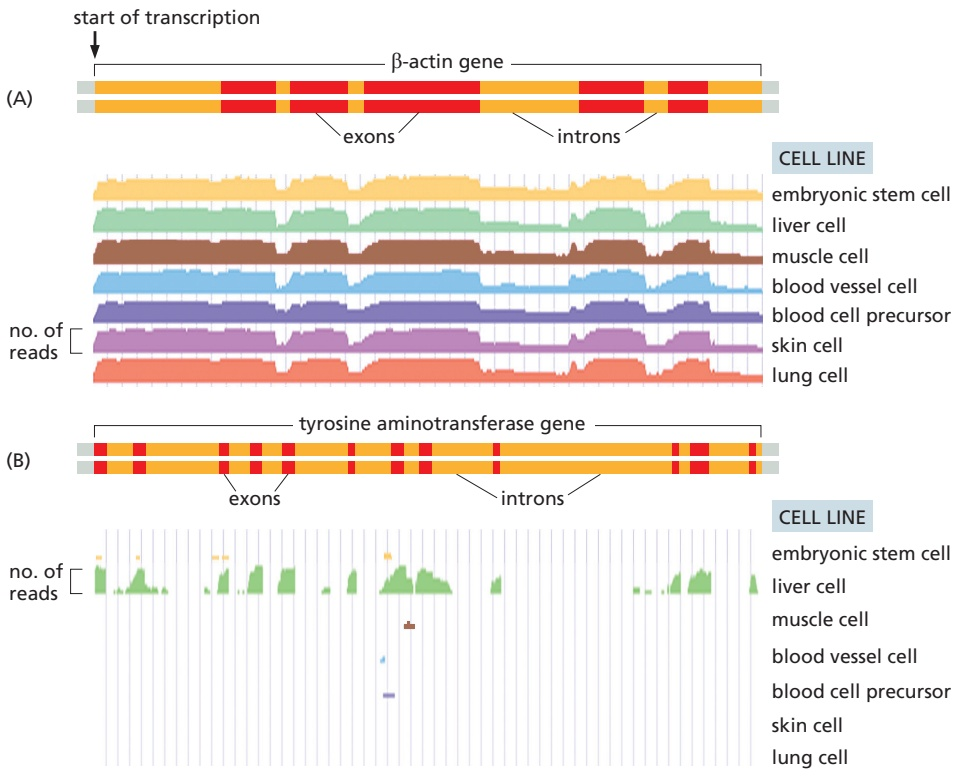

Although we still do not have an exact answer for each cell type, we can make several general statements.

Figure 7–3 Differences in RNA levels for two human genes in seven different tissues. To obtain RNA data by the technique known as RNA-seq (see pp. 514–516), RNA was collected from seven different human cell lines grown in culture, each derived from a different tissue. Millions of “sequence reads” were obtained for each RNA sample and mapped by matching RNA sequences to the DNA sequence of the human genome. At each position along the genome, the height of the colored trace is proportional to the number of sequence reads that match the genome sequence at that point. As seen in the figure, the exon sequences in transcribed genes are present at high levels, reflecting their presence in mature mRNAs. Intron sequences are present at much lower levels and reflect pre-mRNA molecules that have not yet been spliced, plus intron sequences that have been spliced out but not yet degraded. (A) The data for one of the genes coding for actin, a major component of the cytoskeleton in all cells. Note that the left-hand end of the mature β-actin mRNA is not translated into protein. As explained later in this chapter, many mRNAs have 5′ untranslated regions that regulate their translation into protein. (B) The same type of data displayed for the enzyme tyrosine aminotransferase, which is highly expressed in liver cells but not in the other cell types tested. [Information for both panels from the University of California, Santa Cruz, Genome Browser (https://genome.ucsc.edu), which provides this type of information for every human gene. See also S. Djebali et al., Nature 489:101–108, 2012.]

1. Many processes are common to all cells, and any two cells in a single organism therefore have many gene products in common. These include the structural proteins of chromosomes, RNA and DNA polymerases, DNA repair enzymes, ribosomal proteins and RNAs, the enzymes that catalyze the central reactions of metabolism, and many of the proteins that form the cytoskeleton such as actin (**Figure 7–3A**).

2. Some RNAs and proteins are abundant in the specialized cells in which they function and cannot be detected elsewhere, even by sensitive tests. Hemoglobin, for example, is expressed specifically in red blood cells, where it carries oxygen, whereas the enzyme tyrosine aminotransferaseMBoC7 m7.03/7.03 (which breaks down tyrosine in food) is expressed in liver but not in most other tissues (**Figure 7–3B**).

3. Analyses of RNAs reveal that, at any one time, a typical human cell expresses 30–60% of its approximately 25,000 genes at some meaningful level. There are about 20,000 protein-coding genes and an estimated 5000 noncoding RNA genes in humans. When the patterns of RNA expression in different human cell lines are compared, the level of expression of almost every gene is found to vary from one cell type to another. A few of these differences are striking, like those of hemoglobin and tyrosine aminotransferase noted above, but most are much more subtle. But even those genes that are expressed in all cell types usually vary in their level of expression from one cell type to the next.

4. Although there are striking differences in the protein-coding RNAs (mRNAs) in specialized cell types, they underestimate the full range of differences in the final pattern of protein production. As we shall discuss later in this chapter, there are many steps after RNA production at which gene expression can be regulated. And, as we saw in Chapter 3, proteins are often covalently modified after they are synthesized. The differences in gene expression between cell types are therefore most fully revealed through methods that directly display the levels of proteins, along with their post-translational modifications (**Figure 7–4**).

Figure 7–4 Differences in the proteins expressed by two human tissues, (A) brain and (B) liver. The proteins have been separated by size (top to bottom) and isoelectric point, the pH at which the protein has no net charge (right to left). The protein spots artificially colored red are common to both samples; those in blue are specific to that tissue. The differences between the two tissue samples vastly outweigh their similarities: even for proteins that are shared between the two tissues, their relative abundances are usually different. Note that this technique separates proteins by both size and charge; therefore, a protein that has several different phosphorylation states will appear as a series of horizontal spots (see upper right-hand portion of right panel). Only a small MBoC7 m7.04/7.04portion of the complete protein spectrum is shown for each sample.

The method used to display proteins in these panels is known as two-dimensional gel electrophoresis (see Figure 8–16). Although it is useful for easily visualizing the extent of protein differences between the two cell types, newer methods based on mass spectrometry (see pp. 491–492) provide much more detailed information, including the identity of each protein, the position of each modification, and the nature of the modification. (Courtesy of Tim Myers and Leigh Anderson, Large Scale Biology Corporation.)

#### The Spectrum of mRNAs Present in a Cell Can Be Used to Accurately Identify the Cell Type

We have seen that each cell type produces a characteristic set of mRNAs. Therefore, if all the mRNAs present in a cell are known, the cell type can be unambiguously identified, using prior knowledge from cell lines or analyses of tissues. This approach is made possible by the ability to determine the nucleotide sequence of all the mRNAs produced by a single cell (see pp. 537–538). Thus, for example, because human cells have approximately 20,000 mRNA-producing genes, this strategy provides very fine resolution of the differences among our different individual cells.

In general, the mRNA approach agrees well with the traditional categorization of cell types that is based on staining and microscopy, but the mRNA strategy has also revealed that many cells that “look” the same can differ significantly in their mRNA content and therefore in their function. This strategy has thereby identified many new cell types, most of which are subdivisions of cell types that had been classically defined (**Figure 7–5**). The ability to determine the mRNA content of individual cells also provides a new appreciation for how cells present in a tissue (liver, for example) differ according to their positions in the tissue.

#### External Signals Can Cause a Cell to Change the Expression of Its Genes

Although the specialized cells in a multicellular organism have characteristic patterns of gene expression, each cell is capable of altering its pattern of gene expression in response to extracellular cues. If a liver cell is exposed to a glucocorticoid hormone, for example, the production of a set of proteins is dramatically increased, and once the hormone is no longer present, the production of these proteins drops back to its normal, unstimulated level. Glucocorticoids are released in the body during periods of starvation or intense exercise, and they signal the liver to increase the production of energy from amino acids and other (A)

small molecules. The set of induced proteins includes the enzyme tyrosine aminotransferase, mentioned earlier.

Other cell types respond to glucocorticoids differently. Fat cells, for example, reduce the production of tyrosine aminotransferase, while some other cell types do not respond to glucocorticoids at all. These examples illustrate a general feature of cell specialization: different cell types can respond very differently to the same extracellular signal. Other features of the gene expression pattern do not change and give each cell type its permanently distinctive character.

#### Gene Expression Can Be Regulated at Many of the Steps in the Pathway from DNA to RNA to Protein

We have seen that differences among the various cell types of an organism depend on the particular genes that the cells express. But at what level does this control of gene expression occur? As we saw in the previous chapter, there are many steps in the pathway leading from DNA to protein, and all of them can in principle be regulated. Thus, as illustrated in **Figure 7–6**, a cell can control the proteins it makes by (1) controlling when and how often a given gene is transcribed (**transcriptional control**), (2) controlling the splicing and processing of RNA transcripts (**RNA-processing control**), (3) selecting which completed mRNAs are exported from the nucleus to the cytosol and determining where in the cytosol they are localized (**RNA transport and localization control**), (4) selecting which mRNAs in the cytoplasm are translated by ribosomes (**translational control**), (5) selectively destabilizing certain mRNA molecules in the cytoplasm (**mRNA degradation control**), (6) selectively degrading specific protein molecules (**protein degradation control**), and (7) activating, inactivating, or localizing specific protein molecules (**protein activity control**).

Figure 7–5 Classification of a group of neurons in the mouse brain into seven different subtypes by single-cell mRNA sequencing. For this experiment, approximately 4000 individual neurons (which were activated in response to a particular stimulus) were dissected from the brain and separated from each other. The mRNAs produced by each cell were isolated and their sequences determined by the methods described in Chapter 8. On the basis of the spectrum of the mRNAs produced by each cell, the 4000 different cells could be grouped into seven distinctive subtypes. Within each subtype, the mRNAs were similar from cell to cell, but between subtypes they differed significantly. (A) Here, the level of the mRNAs detected for approximately 200 different genes is plotted for each cell as a tiny rectangle, whose color intensity is proportional to the amount of that mRNA in that cell, with red indicating increased expression and green decreased expression, relative to all the samples. These data are plotted for each of the 4000 cells along the X axis. The cells have been arranged so that similar cells are located next to each other. In this way it is possible, using mRNA sequence data alone, to recognize seven distinctive types of neurons, as indicated. To highlight similarities, the data for the 25 mRNAs specifically enriched in each of the seven subtypes is indicated by red blocks. (B) By analyzing the mRNA data using a mathematical method known as unsupervised clustering (see Figure 8–66), the seven different subtypes can readily be distinguished on a two-dimensional “cluster diagram,” with each dot representing a single cell. In addition, information regarding the extent of differences among the subgroups can also be ascertained. For example, subtypes 1 and 4 are more closely related to each other in the mRNAs they make than are subtypes 1 and 7. This type of analysis helps us to understand how the brain processes sensory information and indicates that, even though neurons may look the same under the microscope, they can differ significantly in gene expression patterns and therefore in their functions. (A and B, from M.B. Chen et al., Nature 587:437–442, 2020, doi 10.1038/s41586-020-2905-5. With permission from Springer Nature.)

Figure 7–6 Seven steps at which eukaryotic gene expression can be controlled. Controls that operate at steps 1 through 5 are discussed in this chapter. Step 7, the regulation of protein activity, occurs largely through covalent post-translational modifications including phosphorylation, acetylation, and ubiquitylation (see Table 3–4, p. 175). Steps 6 and 7 were introduced in Chapters 3 and 6 and will be subsequently discussed in other chapters throughout the book.

For many genes, transcriptional controls are paramount. This makes sense because, of all the possible control points illustrated in Figure 7–6, only transcriptional control ensures that the cell will not synthesize superfluous intermediates. In the following sections, we discuss the DNA and protein components that regulate the initiation of gene transcription, before moving on to discuss other types of controls.

#### Summary

The genome of a cell contains in its entire DNA sequence the information to make many thousands of different protein and RNA molecules. But a cell typically expresses only a fraction of its genes, and the different types of cells in multicellular organisms arise because different sets of genes are expressed. All cells can change the pattern of genes they express in response to changes in their environment, such as signals from other cells. The regulation of gene expression is thus crucial for life. Although all of the many steps involved in expressing a gene can in principle be regulated, for most genes it is the initiation of RNA transcription that provides the most important point of control.

<!-- END EN EN07-H000-H008 -->

### 英文补充：组合调控与细胞命运决定

> 对应中文板块：组合调控与细胞命运决定。英文来源：Molecular Biology of the Cell，第7版，第7章；[本章完整原文](../来源/英文教材/07_Control_of_Gene_Expression/chapter.md)。物理PDF页码范围：436–513（整章范围）。

<!-- BEGIN EN EN07-H036-H041 -->
#### MOLECULAR GENETIC MECHANISMS THAT CREATE AND MAINTAIN SPECIALIZED CELL TYPES

Although all cells must be able to switch genes on and off in response to changes in their environments, the cells of multicellular organisms have evolved this capacity to an extreme degree. In particular, once a cell in a multicellular organism becomes committed to differentiate into a specific cell type, the cell maintains this choice through many subsequent cell generations, which means that it remembers the changes in gene expression involved in the choice. This phenomenon of cell memory is a prerequisite for the creation of organized tissues and for the maintenance of stably differentiated cell types. In contrast, other changes in gene expression in eukaryotes, as well as most such changes in bacteria, are only transient. The tryptophan repressor, for example, switches off the tryptophan genes in bacteria only in the presence of tryptophan; as soon as tryptophan is removed from the medium, the genes are switched back on, and the descendants of the cell will have no memory that their ancestors had been exposed to tryptophan.

In this section, we shall examine some specific examples that illustrate how cell types are specified and maintained and how simple gene regulatory devices can be combined to create the “logic circuits” through which cells integrate signals and remember events in their past. We begin by considering one such complex gene control region that has been studied in great detail.

#### Complex Genetic Switches That Regulate Drosophila Development Are Built Up from Smaller Modules

We have seen that transcription regulators can be positioned at multiple sites along long stretches of DNA and that these proteins can bring into play coactivators and co-repressors that ultimately position and activate RNA polymerase to begin transcription. Here, we discuss how the numerous transcription regulators that bind to the control region of a gene can integrate external information, so as to cause the gene to be transcribed at the proper place and time.

The expression of the Drosophila Even-skipped (Eve) gene plays an important part in the development of the Drosophila embryo. If this gene is inactivated by mutation, many parts of the embryo fail to form, and the embryo dies early in development. At the stage of development when Eve begins to be expressed, the embryo is a single giant cell containing multiple nuclei in a common cytoplasm. This cytoplasm contains a mixture of transcription regulators that are distributed unevenly along the length of the embryo, thus providing positional information that distinguishes one part of the embryo from another (**Figure 7–29**). Although the nuclei are initially identical, they rapidly begin to express different genes because they are exposed to different transcription regulators: the nuclei near the anterior end of the developing embryo are exposed to a set of transcription regulators that is different from the set present at the middle and that present at the posterior end of the embryo.

Figure 7–29 The nonuniform distribution of transcription regulators in an early Drosophila embryo. At this stage, the embryo is a syncytium; that is, multiple nuclei are contained in a common cytoplasm. Although the nuclei are shown in only a slice of the embryo, in reality, they are arranged in three dimensions around the inner surface of the giant cell.

The regulatory DNA sequences that control the Eve gene have evolved to “read” the concentrations of transcription regulators at each position along the. / . length of the embryo, so as to cause the Eve gene to be expressed in seven precisely positioned stripes, each initially five to six nuclei wide. How is this remarkable feat of information processing carried out? Although there is still much to learn, several general principles have emerged from studies of Eve and other genes that are similarly regulated.

The control region of the Eve gene is very large (approximately 20,000 nucleotide pairs). It is formed from a series of relatively simple regulatory modules, each of which contains multiple cis-regulatory sequences and is responsible for specifying a particular stripe of Eve expression along the embryo. This modular organization of the Eve gene control region was revealed by experiments in which a particular regulatory module (say, that specifying stripe 2) is removed from its normal setting upstream of the Eve gene, placed in front of a reporter gene, and reintroduced into the Drosophila genome. When developing embryos derived from flies carrying this genetic construct are examined, the reporter gene is found to be expressed in precisely the position of stripe 2 but not in the other normal stripe positions (**Figure 7–30**). Similar experiments reveal the existence of other regulatory modules, which specify other stripes.

#### The Drosophila Eve Gene Is Regulated by Combinatorial Controls

A detailed study of the stripe 2 regulatory module has provided insights into how it reads and interprets positional information. The module contains recognition sequences for two transcription regulators that activate Eve transcription (Bicoid and Hunchback) and for two that repress it (Krüppel and Giant) (**Figure 7–31**).

Figure 7–30 Experiment demonstrating the modular construction of the Eve gene regulatory region. (A) A 480- nucleotide-pair section of the Eve regulatory region was removed and (B) inserted upstream of a test promoter that directs the synthesis of the enzyme β-galactosidase (the product of the E. coli LacZ gene—see Figure 7–18). (C, D) When this artificial construct was reintroduced into the genome of Drosophila embryos, the embryos (D) expressed β-galactosidase (detectable by histochemical staining) precisely in the position of the second of the seven Eve stripes. (C) The complete set of Eve stripes was detected using antibodies directed against the Eve protein. β-Galactosidase is simple to detect and thus provides a convenient way to monitor the expression specified by a gene control region. As used here, β-galactosidase is said to serve as a reporter, because it “reports” the activity of a gene control region. (C and D, courtesy of Stephen Small and Michael Levine.)

The relative concentrations of these four proteins determine whether the protein complexes that form at the stripe 2 module activate transcription of the Eve gene. **Figure 7–32** shows the distributions of the four transcription regulators across the region of a Drosophila embryo where stripe 2 forms. It is thought that either of the two repressor proteins, when bound to the DNA, will turn off the stripe 2 module, whereas both Bicoid and Hunchback must bind for this module’s maximal activation. This simple regulatory scheme suffices to turn on the stripe 2 module (andMBoC7 m7.29/7.31 therefore the expression of the Eve gene) only in those nuclei located where the levels of both Bicoid and Hunchback are high and both Krüppel and Giant are absent—a combination that occurs in only one region of the early embryo. It is not known exactly how these four transcription regulators interact with coactivators and co-repressors to specify the final level of transcription across the stripe, but the outcome very likely relies on competition between activators and repressors that act by the mechanisms outlined in Figures 7–21, 7–22, and 7–27.

Figure 7–31 The Eve stripe 2 unit. The segment of the Eve gene control region identified in Figure 7–30 contains cisregulatory sequences for four transcription regulators. It is known from genetic experiments that these four regulatory proteins are responsible for the proper expression of Eve in stripe 2. Flies that are deficient in the two gene activators Bicoid and Hunchback, for example, fail to efficiently express Eve in stripe 2. In flies deficient in either of the two gene repressors, Giant and Krüppel, stripe 2 expands and covers an abnormally broad region of the embryo. As indicated, in some cases the binding sites for the transcription regulators overlap, and the proteins can compete for binding to the DNA. For example, binding of Krüppel and binding of Bicoid to the site at the far right is mutually exclusive.

The stripe 2 element is autonomous, inasmuch as it specifies stripe 2 when isolated from its normal context (see Figure 7–30). The other stripe regulatory modules are thought to be constructed similarly, reading positional information provided by other combinations of transcription regulators. The entire Eve gene control region binds more than 20 different transcription regulators. Seven combinations of regulators—one combination for each stripe—specify Eve expression, while many other combinations (all those found in the interstripe regions of the embryo) keep all the stripe elements silent. A large and complex control region is thereby built from a series of smaller modules, each of which consists of a unique arrangement of short cis-regulatory sequences recognized by specific transcription regulators.

The Eve gene itself encodes a transcription regulator, which, after its pattern of expression is set up in seven stripes, controls the expression of other Drosophila genes. As development proceeds, the embryo is thus subdivided into finer and finer regions that eventually give rise to the different body parts of the adult fly, as discussed in Chapter 21.

Eve exemplifies the complexity of transcription control regions in plants and ani mals. As this example shows, control regions can respond to many different inputs, integrate this information, and produce a complex spatial and temporal output as

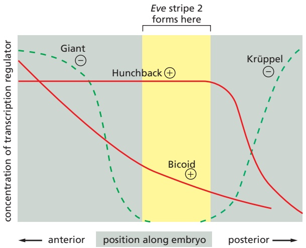

Figure 7–32 Distribution of the transcription regulators responsible for ensuring that Eve is expressed in stripe 2. The distributions of these proteins were visualized by staining a developing Drosophila embryo with antibodies directed against each of the four proteins, and a graph of the staining intensities is shown. The expression of Eve in stripe 2 occurs only at the position where the two activators (Bicoid and Hunchback) are present and the two repressors (Giant and Krüppel) are absent. In fly embryos that lack Krüppel, for example, stripe 2 expands posteriorly. Likewise, stripe 2 expands posteriorly if the DNA-binding sites for Krüppel in the stripe 2 module are inactivated by mutation (see also Figure 7–31).

development proceeds. However, exactly how all these mechanisms work together to produce the final output is understood only in broad outline (Figure 7–33).

Figure 7–33 The integration of multiple inputs at a promoter. Multiple sets of transcription regulators, coactivators, and co-repressors can work together to influence transcription initiation at a promoter, as they do in the Eve stripe 2 module illustrated in Figure 7–31. It is not yet understood in detail how the cell achieves integration of multiple inputs, but it is likely that the final transcriptional activity of the gene results from competitions between activators and repressors that act by the mechanisms summarized in Figures 7–21, 7–22, and 7–27. As we saw earlier, for especially complex gene control regions, it has been proposed that these competitions take place and are “summed up” in localized biomolecular condensates formed by networks of weak interactions.

#### Transcription Regulators Are Brought into Play by Extracellular Signals

The above example from Drosophila clearly illustrates the power of combinatorial control, but this case is unusual in that the nuclei are exposed directly to positional cues in the form of concentrations of transcription regulators. In embryos of most other organisms and in all adults, individual nuclei are in separate cells, and extracellular information (including positional cues) must be passed across the plasma membrane so as to generate signals in the cytosol that cause different transcription regulators to become active in different cell types. Some of the different mechanisms that are known to be used to activate transcription regulators are diagrammed in **Figure 7–34**; in Chapter 15, we discuss how extracellular signals trigger these changes.

Like the fly example discussed earlier, mammalian enhancers are also modular. An example is the control region responsible for regulating the α-globin gene, which codes for one of the subunits of hemoglobin (see Figure 3–20). Here, five

Figure 7–34 Some ways in which the activity of transcription regulators is controlled inside eukaryotic cells. (A) The protein is synthesized only when needed. (B) Activation by ligand binding. (C) Activation by covalent modification; phosphorylation is shown here, but many other modifications are possible (see Table 3–4, p. 175). (D) Formation of a complex between a DNA-binding protein and a separate protein with a transcriptionactivating domain. (E) Unmasking of an activation domain by the phosphorylation of an inhibitor protein. (F) Stimulation of nuclear entry by removal of an inhibitory protein that otherwise keeps the regulatory protein from entering the nucleus. (G) Release of a transcription regulator from a membrane bilayer by regulated proteolysis.

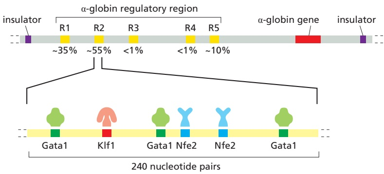

different modules are spread out over about 25,000 nucleotide pairs (Figure 7–35). Each of the five modules, when experimentally separated from the other four, can act as an independent enhancer to specify production of α-globin; but they do so only in erythroid cells, the precursors to red blood cells, because only erythroid cells express the appropriate transcription regulators. Red blood cells, which con-. / . tain high concentrations of hemoglobin, are unusual in that they lack DNA and rely on their precursor cells to synthesize this protein.

#### Combinatorial Gene Control Creates Many Different Cell Types

We have seen that transcription regulators usually act in combination to control the expression of an individual gene. It is also generally true that each transcription regulator in an organism contributes to the control of many genes. This point is illustrated schematically in **Figure 7–36**, which shows how combinatorial gene

Figure 7–35 Modular structure of the control region for the mouse a-globin gene. Each of the five modules (R1–R5) can independently act as an enhancer, that is, they can each activate transcription of a reporter construct (see Figure 7–30B). However, the patterns of expression in a developing embryo are somewhat different for different modules. As indicated by the percentage designations, each module differs in the quantitative contributions it makes to the overall transcription rate in erythroid cells, with the total amount of mRNA being roughly equal to that of the sum of that produced by the individual modules. The additive properties of this control region suggest that the modules all affect the same step in transcription.

The combination of transcription regulators that recognize the R2 module, the most active of the five, is shown in the expanded view. These three transcription regulators are made in erythroid cells and are absent in most other cell types, explaining why expression of the globin gene occurs only in erythroid cells. Most of these same proteins also bind to the other α-globin regulatory modules, consistent with the modules working additively. As shown, insulator sequences flank the gene (including its control region), allowing the α-globin gene to be regulated independently of other genes on the same chromosome (see Figure 7–28). It is thought that modules R3 and R4 make no significant contribution to the overall transcription of the α-globin gene, but are once-functional modules that are in the slow evolutionary process of disappearing due to a gradual accumulation of mutations. (Courtesy of Helena Francis and Douglas Higgs.)

#### Figure 7–36 The importance of combinatorial gene control for

development. Combinations of a few transcription regulators can generate many cell types during development. In this simple, idealized scheme, a “decision” to make one of a pair of different transcription regulators (shown as numbered circles) is made after each cell division. Sensing its relative position in the embryo, the daughter cell toward the left side of the embryo is always induced to synthesize the even-numbered protein of each pair, while the daughter cell toward the right side of the embryo is induced to synthesize the odd-numbered protein. The production of each transcription regulator is assumed to be self-perpetuating once it has become initiated (see Figure 7–42). In this way, through cell memory, the final combinatorial specification is built up step by step. In this purely hypothetical example, five different transcription regulators have created eight final cell types (G–N).

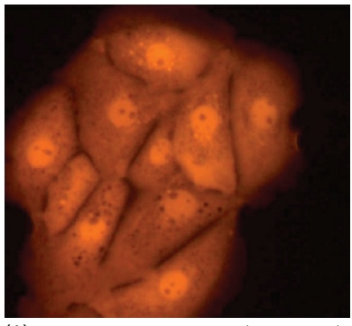

(A)

50 µm

(B)

50 µm

Figure 7–37 A small set of transcription regulators can convert one differentiated cell type into another. In this experiment, liver cells grown in culture (A) were converted into neuronal cells (B) by the artificial expression of three neuron-specific transcription regulators. (Both types of cells express a red fluorescent protein, which helps to visualize them.) This conversion involves the activation of many neuronspecific genes as well as the repression of many liver-specific genes. (From S. Marro et al., Cell Stem Cell 9:374–382, 2011. With permission from Elsevier.)

control makes it possible to generate a great deal of biological complexity even with relatively few transcription regulators.

Because of such combinatorial control, a given transcription regulator needMBoC7 m7.34/7.37 not have a single, simply definable function as commander of a particular battery of genes or specifier of a particular cell type. Rather, transcription regulators can be likened to the words of a language: they are used with different meanings in a variety of contexts and rarely alone; it is the well-chosen combination that conveys the information that specifies a gene regulatory event.

Because of combinatorial gene control, the effect of adding a new transcription regulator to a cell will depend on that cell’s past history, inasmuch as this history determines the transcription regulators already present. Thus, during embryonic development, a cell can accumulate a series of transcription regulators that may not initially alter gene expression. Only the addition of the final members of a requisite combination of transcription regulators will complete the regulatory message, leading to large changes in gene expression.

The importance of a combination of transcription regulators for the specification of cell types is most easily demonstrated by their ability—when expressed artificially in a specific combination—to convert one type of cell to another. For example, the artificial expression of three neuron-specific transcription regulators in liver cells can convert the liver cells into functional nerve cells (**Figure 7–37**). In some cases, expression of even a single transcription regulator is sufficient to convert one cell type to another: when the gene encoding the transcription regulator MyoD is artificially introduced into fibroblasts cultured from skin connective tissue, the fibroblasts form muscle-like cells. As discussed in Chapter 22, fibroblasts, which are derived from the same broad class of embryonic cells as muscle cells, have already accumulated many of the other necessary transcription regulators required for the combinatorial control of the muscle-specific genes, and the addition of MyoD completes the unique combination required to direct the cells to become muscle.

An even more striking example is seen by artificially expressing, early in development, a single Drosophila transcription regulator (Eyeless) in groups of cells that would normally go on to form leg parts. Here, this abnormal gene expression change causes eye-like structures to develop in the legs (**Figure 7–38**).

<!-- END EN EN07-H036-H041 -->

### 英文补充：主调控因子与分化细胞身份的维持

> 对应中文板块：主调控因子与分化细胞身份的维持。英文来源：Molecular Biology of the Cell，第7版，第7章；[本章完整原文](../来源/英文教材/07_Control_of_Gene_Expression/chapter.md)。物理PDF页码范围：436–513（整章范围）。

<!-- BEGIN EN EN07-H043-H047 -->
#### Combinations of Master Transcription Regulators Specify Cell Types by Controlling the Expression of Many Genes

As we saw in the introduction to this chapter, different cell types of multicellular organisms differ enormously in the proteins and RNAs they express. For example, only muscle cells express special types of actin and myosin that form the contractile apparatus, while nerve cells must make and assemble all the proteins needed to form dendrites and synapses. We have seen that these patterns of cell-type-specific expression are orchestrated by a combination of so-called **master transcription regulators**. In many cases, these proteins bind directly to cis-regulatory sequences of the genes particular to that cell type. Thus, MyoD binds directly to cis-regulatory sequences located in the control regions of the muscle-specific genes. In other cases, the master regulators control the

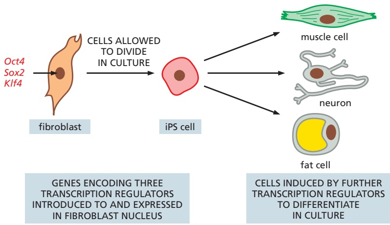

Figure 7–38 Expression of the Drosophila Eyeless gene in precursor cells of the fly leg triggers the development of an eye on the leg. (A) Simplified diagrams showing the result when a fruit fly larva contains either the normally expressed Eyeless gene (left) or an Eyeless gene that is additionally expressed artificially in cells that normally give rise to leg tissue (right). (B) Photograph of an abnormal leg that contains a misplaced eye (see also Figure 21–2). The transcription regulator was named Eyeless because its inactivation in otherwise normal flies causes the loss of eyes (see Figure 21–32). (B, courtesy of Walter Gehring.)

Figure 7–39 A combination of transcription regulators can induce a differentiated cell to de-differentiate into a pluripotent cell. The artificially induced expression of a set of three genes, each of which encodes a transcription regulator, can reprogram a fibroblast into a pluripotent cell with embryonic stem (ES) cell–like properties. Like ES cells, such induced pluripotent stem (iPS) cells can proliferate indefinitely in culture and can be stimulated by appropriate extracellular signal molecules to differentiate into almost any cell type found in the body. Transcription regulators such as Oct4, Sox2, and Klf4 are often called master transcription regulators because their expression is sufficient to trigger a change in cell identity. How two of these transcription regulators interact with DNA in a nucleosome is shown in Figure 7–13.

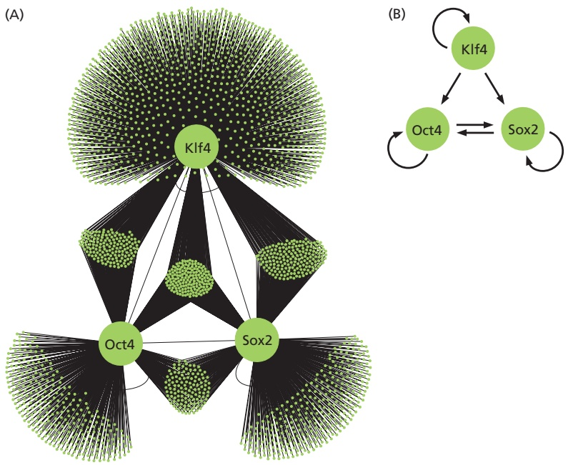

Figure 7–40 A portion of the transcription network specifying embryonic stem cells. (A) The three master transcription regulators in Figure 7–39 are shown as large circles. Genes whose cis-regulatory sequences are bound by each regulator in embryonic stem cells are indicated by a small green dot (representing the gene) connected by a thin line (representing the binding interaction). Note that many of the target genes are bound by more than one of the regulators. (B) The master regulators control their own expression. As shown here, the three transcription regulators bind to their own control regions (indicated by feedback loops), as well as those of the other master regulators (indicated by straight arrows). (Courtesy of Trevor Sorrells, based on data from J. Kim et al., Cell 132:1049–1061, 2008.)

expression of “downstream” transcription regulators that, in turn, bind to the control regions of other cell-type-specific genes and control their synthesis.

The specification of a particular cell type typically involves changes inMBoC7 m7.37/7.40 the expression of several thousand genes. Genes whose protein products are required in the cell type are expressed at high levels, while those not needed are typically down-regulated. As might be imagined, the pattern of binding between the master regulators and all of the regulated genes can be extremely elaborate (**Figure 7–40**). When we consider that many of these regulated genes have control regions that span tens of thousands of nucleotide pairs, commensurate with the Eve example discussed earlier, we can begin to appreciate the enormous complexity of cell-type specification.

An outstanding question in biology is how the information in a genome is used to specify a multicellular organism. Although we have the general outline of the answer, we are far from understanding how a single cell type is completely specified, let alone a whole organism.

#### Specialized Cells Must Rapidly Turn Some Genes On and Off

Although they generally maintain their identities, specialized cells must constantly respond to changes in their environment. Among the most important changes are signals from other cells that coordinate the behavior of the whole organism. Many of these signals induce transient changes in gene transcription, and we discuss the nature of these signals in detail in Chapter 15. Here, we consider how specialized cell types rapidly and decisively switch groups of genes on and off in response to their environment. Even though control of gene expression is combinatorial, the effect of a single transcription regulator can still be decisive in switching any particular gene on or off, simply by completing the combination needed to maximally activate or repress that gene. This situation is analogous to dialing in the final number of a combination lock: the lock will spring open with only this simple addition if all of the other numbers have been previously entered. And just as the same number can complete the combination for many different locks, the addition of a particular protein can turn on many different genes.

An example is the rapid control of gene expression by the human glucocorticoid receptor protein. To bind to its cis-regulatory sequences in the genome, this transcription regulator must first form a complex with a molecule of a glucocorticoid steroid hormone, such as cortisol (see Figures 15–65 and 15–66). The body releases this hormone during times of starvation and intense physical activity, and among its other activities, it stimulates liver cells to increase the production of glucose from amino acids and other small molecules. To respond in this way, liver cells increase the expression of many different genes that code for metabolic enzymes, such as tyrosine aminotransferase, as we discussed earlier in this chapter (see Figure 7–3). Although these genes all have different and complex control regions, their maximal expression depends on the binding of the hormone–glucocorticoid receptor complex to its cis-regulatory sequence, which is present in the control region of each gene. When the body has recovered and the hormone is no longer present, the expression of each of these genes drops to its normal level in the liver. In this way, a single transcription regulator can rapidly control the expression of many different genes (**Figure 7–41**).

Figure 7–41 A single transcription regulator can coordinate the expression of many different genes. The action of the glucocorticoid receptor is illustrated schematically. On the left is a series of genes, each of which has various transcription regulators bound to its regulatory region. However, these bound proteins are not sufficient on their own to fully activate transcription. On the right is shown the effect of adding an additional transcription regulator—the glucocorticoid receptor in a complex with glucocorticoid hormone—that has a cisregulatory sequence in the control region of each gene. The glucocorticoid receptor completes the combination of transcription regulators required for maximal initiation of transcription, and the genes are now maximally switched on as a set. When the hormone is no longer present, the glucocorticoid receptor dissociates from DNA, and the genes return to their prestimulated levels.

The effects of the glucocorticoid receptor are not confined to cells of the liver. In other cell types, activation of this transcription regulator by hormone also causes changes in the expression levels of many genes; the genes affected, however, are usually different from those affected in liver cells. As we have seen, each cell type has an individualized set of transcription regulators, and because of combinatorial control, these critically influence the action of the glucocorticoid receptor. Because the receptor is able to assemble with different sets of cell-type-specific transcription regulators, switching it on with hormone produces a different spectrum of effects in each cell type.

#### Differentiated Cells Maintain Their Identity

Once a cell has become differentiated into a particular cell type, it will generally remain differentiated, and all its progeny cells will remain that same cell type. Some highly specialized cells, including skeletal muscle cells and neurons, never divide again once they have differentiated; that is, they are terminally differentiated (as discussed in Chapter 17). But many other differentiated cells—such as fibroblasts, smooth muscle cells, and liver cells—will divide many times in the life of an individual. When they do, these specialized cell types give rise only to cells like themselves: smooth muscle cells do not give rise to liver cells, nor liver cells to fibroblasts.

For a proliferating cell to maintain its identity—a property called **cell memory**—the patterns of gene expression responsible for that identity must be remembered and passed on to its daughter cells through subsequent cell divisions. Thus, in the model we discussed in Figure 7–36, the production of each transcription regulator, once begun, has to be continued in the daughter cells of each cell division. How is such perpetuation accomplished?

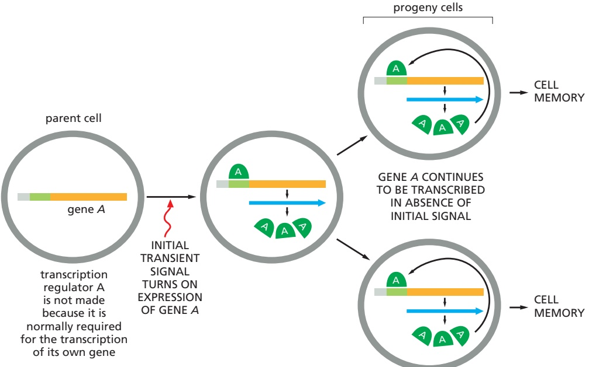

Figure 7–42 A positive feedback loop can create cell memory. Protein A is a master transcription regulator that activates the transcription of its own gene—as well as other cell-typespecific genes (not shown). All of the descendants of the original cell will therefore “remember” that the progenitor cell had experienced a transient signal that initiated the production of protein A.

Cells have several ways of ensuring that their daughters “remember” what kind of cells they are. One of the simplest and most important is through a positive feedback loop, where a master cell-type transcription regulator activates transcription of its own gene, in addition to that of the other cell-type-specific genes needed to maintain the cell type. Each time a cell divides, the regulator is distributed to both daughter cells, where it continues to stimulate the positive feedback loop, making more of itself and the cell-type proteins it controls each division. Positive feedback is crucial for establishing “self-sustaining” circuits of gene expression that allow a cell to commit to a particular fate—and then to transmit that information to its progeny (**Figure 7–42**).

As was previously indicated in Figure 7–40B, the master regulators needed to maintain the pluripotency of iPS cells bind to cis-regulatory sequences in their own control regions, providing examples of this type of positive feedback loop. In addition, most of these pluripotent stem cell regulators also activate transcription of other master regulators, resulting in a complex series of indirect feedback loops. For example, if A activates B, and B activates A, this forms a positive feedback loop where A activates its own expression, albeit indirectly. The series of direct and indirect feedback loops observed in the iPS circuit is typical of other specialized cell circuits. Such a network structure strengthens cell memory, increasing the probability that a particular pattern of gene expression is transmitted through successive generations. For example, if the level of A drops below the critical threshold to stimulate its own synthesis, regulator B can rescue it. By successive application of this mechanism, a complex series of positive feedback loops among multiple transcription regulators can stably maintain a differentiated state through many cell divisions.

Positive feedback loops formed by transcription regulators are probably the most prevalent way of ensuring that daughter cells remember what kind of cells they are meant to be, and they are found in all species on Earth. For example, many bacteria and single-cell eukaryotes form different types of cells, and positive feedback loops lie at the heart of mechanisms that maintain their cell types through many rounds of cell division. Plants and animals also make extensive use of transcription feedback loops; but as we saw in Chapter 4 and shall discuss again later in the chapter, they have additional, more specialized mechanisms for making cell memory even stronger (see, for example, Figure 4–44). We will return

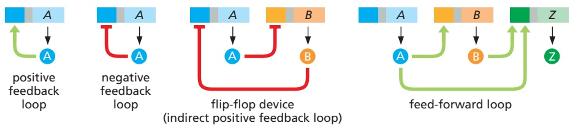

Figure 7–43 Common types of network motifs in transcription circuits. A and B represent transcription regulators, green arrows indicate positive transcription control, while red lines with bars depict negative transcription control. In the feed-forward loop, A and B represent transcription regulators that both activate the transcription of target gene Z (see also Figure 8–88).

to these additional mechanisms later in the chapter, but first, we consider how combinations of transcription regulators and cis-regulatory sequences can be combined to create other useful logic devices for the cell.

#### Transcription Circuits Allow the Cell to Carry Out Logic Operations

Simple gene regulatory switches can be combined to create all sorts of control devices, just as simple electronic switching elements in a computer can be linked to perform different types of operations. An analysis of gene regulatory circuits reveals that certain simple types of arrangements (called network motifs) are found over and over again in cells from widely different species. For example, positive and negative feedback loops are common in all cells (**Figure 7–43**). Whereas the former provides a simple memory device (see Figure 7–42), the latter is often used to keep the expression of a gene close to a standard level despite the variations in biochemical conditions inside a cell. Suppose, for example, that a transcription repressor protein binds to the regulatory region of its own gene and exerts a strong negative feedback, such that transcription falls to a very low rate when the concentration of the repressor protein is above some critical value (determined by its affinity for its DNA-binding site). The concentration of the protein can then be held close to the critical value, because any circumstance that causes a fall below that value can lead to a steep increase in synthesis, and any that causes a rise above that value will lead to synthesis being switched off. Such adjustments will, however, take time, so that an abrupt change of conditions will cause a disturbance of gene expression that is strong but transient. If there is a delay in the feedback loop, the result may be spontaneous oscillations in the expression of the gene (see Figure 15–18). The different types of behavior produced by a feedback loop will depend on the details of the system; for example, how tightly the transcription regulator binds to its cis-regulatory sequence, its rate of synthesis, and its rate of decay. We discuss these issues in quantitative terms and in more detail in Chapter 8.

With two or more transcription regulators, the possible range of circuit behaviors becomes more complex. Some bacterial viruses contain a common type of two-gene circuit that can flip-flop between expression of one gene and expression of the other (see Figure 7–43). Another common circuit arrangement is called a feed-forward loop; such a loop can serve as a filter, responding to input signals that are prolonged but disregarding those that are brief (**Figure 7–44**). Although

(A)

(B)

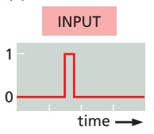

(C)

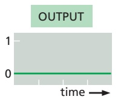

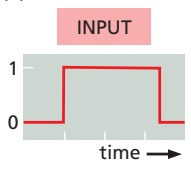

Figure 7–44 How a feed-forward loop can measure the duration of a signal. (A) In this theoretical example, transcription regulators A and B must both be present on the DNA for transcription of gene Z, and gene A becomes active only when an input signal is present. (B) If the input signal to gene A is brief, it does not stay active long enough for transcription regulator B to accumulate, and gene Z is not transcribed. (C) If the signal to gene A persists, transcription regulators A and B both accumulate, and gene Z is transcribed. This arrangement allows the cell to ignore rapid fluctuations of the input signal and respond only to persistent levels. This strategy could be used, for example, to distinguish between random noise and a true signal.

The behavior shown here was computed for one particular set of parameter values describing the quantitative properties of transcription regulators A and B, as well as the product of gene Z, along with their syntheses. With different values of these parameters, feed-forward loops can in principle perform other types of “calculations.” Many feed-forward loops have been discovered in cells. As explained in Chapter 8, theoretical analyses are needed to help researchers to discern— and subsequently test—the different ways in which these circuits function (see Figures 8–87 and 8–88). (Adapted from S.S. Shen-Orr et al., Nat. Genet. 31:64–68, 2002.)

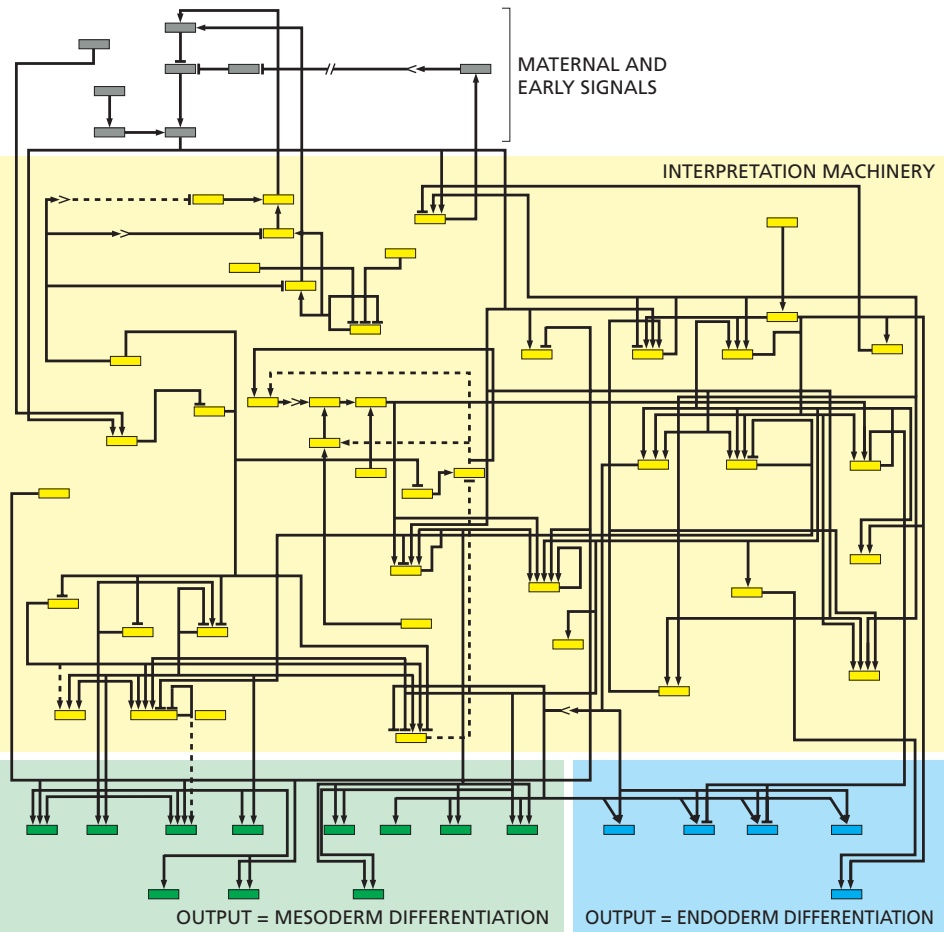

Figure 7–45 The exceedingly complex gene circuit that specifies a portion of the developing sea urchin embryo. Each colored small box represents a different gene. Those in yellow code for transcription regulators, and those in green and blue code for proteins that give cells of the mesoderm and endoderm, respectively, their specialized characteristics. Genes depicted in gray are largely active in the mother and provide the egg with cues needed for proper development. As in Figure 7–43, arrows depict instances in which a transcription regulator activates the transcription of another gene, and lines ending in bars indicate examples of gene repression. (From I.S. Peter and E.H. Davidson, Nature 474:635–639, 2011. With permission from Springer Nature.)

they arose as products of evolution, without advance planning or design, these various network motifs resemble some of the miniature logic devices found in electronic circuits. And, like circuits designed by humans, they can process information in surprisingly sophisticated ways.

The simple types of devices just illustrated are often found joined together, creating exceedingly complex circuits (**Figure 7–45**). Each cell in a developing multicellular organism is equipped with similarly complex control machinery, and it must, in effect, use its intricate system of interlocking transcription switches to “compute” how it should behave at each time point in response to the many different past and present inputs received. We are only beginning to understand how to study such complex intracellular control networks. Indeed, without new approaches, coupled with quantitative information that is far more precise and complete than we now possess, it will be impossible to predict the behavior of a system such as that shown in Figure 7–45. As explained in Chapter 8, a circuit diagram by itself is insufficient to deeply understand biological mechanisms.

#### Summary

The many types of cells in animals and plants are created largely through mechanisms that cause different sets of genes to be transcribed in different cells. The transcription of any particular gene is generally controlled by a combination of transcription regulator proteins. Each type of cell in a higher eukaryotic organism contains a specific set of transcription regulators that ensures the expression of only those genes appropriate to that type of cell. A given transcription regulator may be active in a variety of circumstances, and it is typically involved in the regulation of many different genes.

Because specialized animal cells can maintain their unique character through many cell-division cycles, and even when grown in culture, there must exist mechanisms to ensure this cell memory. Direct or indirect positive feedback loops, which enable transcription regulators to perpetuate their own synthesis, provide one of the simplest mechanisms for producing a cell memory. Transcription circuits also provide the cell with the means to carry out many other types of logic operations. Simple transcription circuits combined into large regulatory networks drive highly sophisticated programs of embryonic development that will require new approaches to fully decipher.

<!-- END EN EN07-H043-H047 -->

### 英文补充：分化、命运决定、形态发生信号、细胞记忆与发育时序

> 对应中文板块：分化、命运决定、形态发生信号、细胞记忆与发育时序。英文来源：Molecular Biology of the Cell，第7版，第21章；[本章完整原文](../来源/英文教材/21_Development_of_Multicellular_Organisms/chapter.md)。物理PDF页码范围：1256–1317（整章范围）。

<!-- BEGIN EN EN21-H000-H043 -->
#### Development of Multicellular Organisms

Every multicellular organism, be it animal or plant, starts its life as a single cell— a fertilized egg, or **zygote**. During development, this cell divides repeatedly to produce many different kinds of cells, arranged in a final pattern of spectacular complexity and precision. The goal of developmental cell biology is to understand the cellular and molecular mechanisms that direct this amazing transformation (**Movie 21.1**).

Plants and animals have very different ways of life, and they use different developmental strategies. In this chapter, we focus mainly on animals. Three processes are fundamental to animal development: (1) cell proliferation, which produces many cells from one; (2) cell specialization, or **differentiation**, by which cells take on different characteristics and functions; and (3) morphogenesis, in which cells rearrange themselves to form structured tissues and organs (**Figure 21–1**).

Development of the zygote begins with multiple rounds of cell division, generating a large population of cells that can then be specialized for different functions. At each subsequent stage in its development, a cell is presented with a limited set of options, so that its developmental pathway branches repeatedly, reflecting a large set of sequential choices. Like the decisions we make in our own lives, the choices made by the cell are based on its internal state—which largely reflects its history—and on current influences from other cells, especially its close neighbors. To understand development, we need to know how each choice is controlled and how it depends on previous choices. Beyond that, we need to understand how the choices, once made, influence the cell’s chemistry and behavior, and how cell behaviors act synergistically to determine the structure and function of the body.

As cells become specialized, they change not only their biochemistry but also their shape and their attachments to other cells and to the extracellular matrix. They move and rearrange themselves to create the complex architecture of the body, with all its tissues and organs, each structured precisely and defined in size. To understand this process of form generation, or **morphogenesis**, we will need to take account of the mechanical, as well as the biochemical, interactions between the cells.

At first glance, one would no more expect the worm, the flea, the eagle, and the giant squid to be generated by the same developmental mechanisms than one would suppose that the same methods were used to make a shoe and an airplane. Remarkably, however, research has revealed that much of the basic machinery of development is essentially the same in all animals—not just in all vertebrates, but in all invertebrates too. Recognizably similar, evolutionarily related molecules

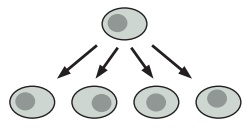

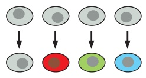

CELL PROLIFERATION

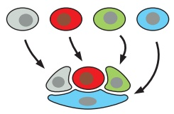

CELL DIFFERENTIATION

CELL MORPHOGENESIS

Figure 21–1 The three essential cell processes that allow a multicellular organism to develop.

C HAP T E R

21

IN THIS CHAPTER

Overview of Development

Mechanisms of Pattern Formation

Developmental Timing

Morphogenesis

Growth

wild type(A)

100 µm

misexpression of Drosophila(B) Eyeless/Pax6 in leg precursors

0.5 mm

(C)

50 µm

50 µm

misexpression of (D) squid Pax6 in wing precursor

Figure 21–2 Homologous proteins often have conserved functions.

define the specialized animal cell types, mark the differences between body regions, and help create the animal body pattern. Homologous proteins often perform the same role in different species and are functionally interchangeable. Thus, a mouse or squid protein produced artificially in a fly, for example, can performMBoC7 n21.204/21.02 the same function as the fly’s own version of that protein (**Figure 21–2**). Thanks to an underlying unity of mechanisms, developmental biologists have been making great strides toward a coherent understanding of animal development.

We begin this chapter with an overview of some of the basic mechanisms that operate in animal development, focusing on those that are best understood and generate differences between cells. We then discuss, in sequence, how cells in the embryo diversify to form patterns in space, how the timing of developmental events is controlled, how changing cell behaviors drive morphogenesis, and how the size of an animal is regulated.

#### OVERVIEW OF DEVELOPMENT

Animals live by eating other organisms. Thus, despite their remarkable diversity, animals as different as worms, mollusks, insects, and vertebrates share anatomical features that are fundamental to this way of life. Epidermal cells form a protective outer layer; gut cells absorb nutrients from ingested food; muscle cells allow movement toward food sources; and neurons and sensory cells control behavior. These various cell types are organized into tissues and organs, forming a sheet of skin covering the exterior, a mouth for feeding, and an internal gut tube for digestion—with muscles, nerves, and other tissues arranged in the space between the skin and the gut. Many animals have clearly defined axes—an anteroposterior axis, with mouth and brain anterior and anus posterior; a dorsoventral axis, with back dorsal and belly ventral; and a left–right axis. In this section, we discuss some fundamental mechanisms underlying how the basic animal body plan is established and how this diversity of cell types is created.

#### Conserved Mechanisms Establish the Core Tissues of Animals

The shared anatomical features of animals develop through conserved mechanisms. After fertilization, the zygote usually divides rapidly, or **cleaves**, to form many smaller cells called **blastomeres**. During this cleavage phase, the embryo, which cannot yet feed, does not grow. This step of development is initially driven

(A) The Eyeless protein (also called Pax6) controls eye development in Drosophila. In a wild-type fly (top row), the Eyeless/ Pax6 gene is expressed in the developing eye and directs formation of the eye structure shown in the scanning electron micrograph at right. Misexpression of Eyeless/Pax6 in the legs (bottom row) results in the formation of eye tissue on leg precursor (B) (see Figure 7–38) or wing precursor (C). The homologous Pax6 from a squid, when misexpressed in developing Drosophila legs, has the same effect (D). (Fly images courtesy of Katy Ong and Justin Kumar; electron micrographs from S.I. Tomarev et al., Proc. Natl. Acad. Sci. USA 94:2421–2426. Copyright 1997 National Academy of Sciences, USA. With permission from National Academy of Sciences.)

and controlled entirely by the material deposited in the egg by the mother. The embryonic genome remains largely inactive until a point is reached when maternal mRNAs and proteins are used up or abruptly degraded. The embryo’s genome is then activated—the maternal–zygotic transition that we will discuss later—and the cells cohere to form a **blastula**, typically a solid or a hollow fluid-filled ball of cells.

Even in these early stages of embryogenesis, genetic programs are under way that give rise to the basic tissue types. Complex cell rearrangements called **gastrulation** (from the Greek gaster, meaning “belly”) soon transform the blastula into a multilayered structure containing a rudimentary internal gut (**Figure 21–3**). Some cells of the blastula remain external, constituting the **ectoderm**, which will give rise to the epidermis and the nervous system; other cells invaginate, forming the **endoderm**, which will give rise to the gut tube and its appendages, such as lung, pancreas, and liver. In most animals, another group of cells moves into the space between ectoderm and endoderm and forms the **mesoderm**, which will give rise to muscles, connective tissues, blood, kidneys, and various other components. Further cell movements and accompanying cell differentiation create and refine the embryo’s architecture.

The ectoderm, mesoderm, and endoderm formed during gastrulation constitute the three **germ layers** of the early embryo. This initial subdivision is the first step in defining the multitude of cell fates that will emerge in development. Many later developmental transformations will produce the elaborately structured organs. But the basic body plan and axes set up in miniature during gastrulation are preserved into adult life, when the organism may be billions of times larger (**Movie 21.2**).

#### The Developmental Potential of Cells Becomes Progressively Restricted

Concomitant with the refinement of the body plan, the individual cells within a lineage—that is, the progeny of a particular proliferating mother cell—become more and more restricted in their developmental potential. During the blastula stages, cells are often **totipotent** or **pluripotent**—they have the potential to give rise to all or almost all of the cell types of the adult body. The pluripotency is lost as gastrulation proceeds: a cell located in the endodermal germ layer, for

Figure 21–3 The early stages of development, as exemplified by a frog. (A) A fertilized egg divides to produce many blastomere cells that form an epithelial sheet often surrounding a cavity. During gastrulation, some of the cells tuck into the interior to form the mesoderm (green) and endoderm (yellow). Ectodermal cells (blue) remain on the outside. (B) A cross section through the trunk of an amphibian embryo shows the basic animal body plan, with a sheet of ectoderm on the outside, a tube of endoderm on the inside, and mesoderm sandwiched between them. The endoderm forms the epithelial lining of the gut, from the mouth to the anus. It gives rise not only to the pharynx, esophagus, stomach, and intestines, but also to many associated structures. The salivary glands, liver, pancreas, trachea, and lungs, for example, all develop from the wall of the digestive tract and grow to become systems of branching tubes that open into the gut or pharynx. The endoderm forms only the epithelial components of these structures— the lining of the gut and the secretory cells of the pancreas, for example. The supporting muscular and fibrous elements arise from the mesoderm.

The mesoderm gives rise to the connective tissues—at first, to the loose mesh of cells in the embryo known as mesenchyme, and ultimately to cartilage, bone, and fibrous tissue, including the dermis (the inner layer of the skin). The mesoderm also forms the muscles, the entire vascular system—including the heart, blood vessels, and blood cells—and the tubules, ducts, and supporting tissues of the kidneys and gonads. The notochord forms from the mesoderm and serves as the core of the future backbone and the source of signals that coordinate the development of surrounding tissues.

The ectoderm will form the epidermis (the outer, epithelial layer of the skin) and epidermal appendages such as hair, sweat glands, and mammary glands. It will also give rise to the whole of the nervous system, central and peripheral, including not only neurons and glia but also the sensory cells of the nose, the ear, the eye, and other sense organs. (B, after T. Mohun et al., Cell 22:9–15, 1980.)

example, can give rise to the cell types that will line the gut or form gut-derived organs such as the liver or pancreas, but it no longer has the potential to form mesoderm-derived structures such as skeleton, heart, or kidney. Such a cell is said to be determined for an endodermal fate. Thus, **cell determination** starts early and progressively narrows the options as the cell steps through a programmed series of intermediate states—guided at each step by its genome, its history, and its interactions with neighbors. The process reaches its limit when a cell undergoes **terminal differentiation** to form one of the highly specialized cell types of the adult body (**Figure 21–4**). Some cell types in the adult, which maintain the ability to divide, also retain a degree of pluripotency, albeit with a generally narrow range of options. These adult stem cells are discussed in Chapter 22.

#### Cell Memory Underlies Cell Decision-Making

Underlying the richness and astonishingly complex outcomes of development is **cell memory** (see p. 435). Both the genes a cell expresses and the way it behaves depend on the cell’s past, as well as on its present circumstances. The cells of our body—the muscle cells, the neurons, the skin cells, the gut cells, and so on—maintain their specialized characters largely because they retain a record of the extracellular signals their ancestors received during development, rather than because they continually receive such instructions from their surroundings. Despite their radically different phenotypes, almost all cells retain the same complete genome that was present in the zygote. Their differences arise instead from differential gene expression, which can lead to the stable inheritance of a particular cellular program. We have discussed the molecular mechanisms of gene regulation, cell memory, cell division, cell signaling, and cell movement in previous chapters. In this chapter, we shall see how these basic processes are collectively deployed as the developing animal self-assembles.

#### Several Model Organisms Have Been Crucial for Understanding Development

The anatomical features that animals share have undergone many extreme modifications in the course of evolution. As a result, the differences between species are usually more striking to our human eye than the similarities. But at the level of the underlying molecular mechanisms and the particular macromolecules involved, the reverse is true: the similarities among all animals are profound and extensive. Through more than half a billion years of evolutionary divergence, all animals have retained unmistakably similar sets of genes and proteins that are responsible for generating their body plans and for forming their specialized cells and organs.

This astonishing degree of evolutionary conservation was discovered not by broad surveys of animal diversity, but through intensive study of a small number of experimentally convenient species—the model organisms discussed in Chapter 1. For animal developmental biology, the most important have been the fly Drosophila melanogaster, the frog Xenopus laevis, the roundworm Caenorhabditis elegans, the mouse Mus musculus, and the zebrafish Danio rerio. In discussing the mechanisms of development, we shall draw our examples mainly from these few species, keeping in mind that they represent only a portion of the tree of animal life.

#### Regulatory DNA Seems Largely Responsible for the Differences Between Animal Species

Although many developmental mechanisms are conserved, they nevertheless produce animals that can be quite different. These differences arise primarily from variation in the activity of key development-controlling genes. As discussed in Chapter 7, each gene in a multicellular organism is associated with many thousands of nucleotides of noncoding DNA that contains regulatory elements. These regulatory elements determine when, where, and how strongly the gene product is expressed, according to the transcription regulators and chromatin structures that are present in the particular cell (**Figure 21–5**). Consequently, a change in sequence of the regulatory DNA that arises in evolution, even without any changeMBoC7 m21.05/21.05 in the coding DNA, can alter the logic of the gene regulatory network and change the outcome of development.

Figure 21–4 The lineage from blastomere to a terminally differentiated cell type. As development proceeds, cells become more and more specialized. Blastomeres MBoC7 m21.04/21.04have the potential to give rise to most or all cell types. Under the influence of signaling molecules and gene regulatory factors, cells acquire more restricted fates until they differentiate into highly specialized cell types, such as the pancreatic β cells that secrete the hormone insulin.

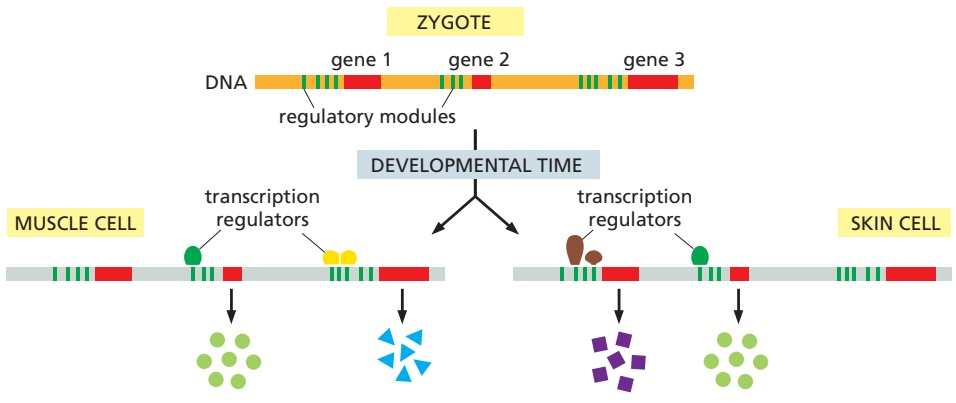

Figure 21–5 Regulatory DNA defines the gene expression patterns in development. The genome is the same in a muscle cell as in a skin cell, but different genes are active because these cells express different transcription regulators that bind to gene regulatory elements. For example, transcription regulators in skin cells recognize a regulatory element in gene 1, leading to its activation, whereas a different set of regulators is present in muscle cells, binding to and activating gene 3. Transcriptional regulators that activate the expression of gene 2 are present in both cell types.

As discussed in Chapter 4, when we compare the genomes of different animal species, we find that evolution has altered the coding and regulatory DNA to different extents. The coding DNA can be quite conserved, but the noncoding regulatory DNA is usually much less so. It seems that changes in regulatory DNA are largely responsible for the dramatic differences between one class of animals and another (see p. 239). We can view the protein products of the conserved coding sequences as a kit of common molecular parts and the regulatory DNA as instructions for assembly: with different instructions, the same kit of parts can be used to make a whole variety of different body structures. We will return to this important concept later.

#### Small Numbers of Conserved Cell–Cell Signaling Pathways Coordinate Spatial Patterning

Spatial patterning of a developing animal requires that cells become different according to their positions in the embryo, which means that cells must respond to extracellular signals produced by other cells, especially their neighbors. In the most common mode of spatial patterning, a group of cells starts out with the same developmental potential, and a signal from cells outside the group then induces one or more members of the group to change their character. This process is called inductive signaling. Generally, the inductive signal is limited in time and space so that only a subset of the cells capable of responding—the cells close to the source of the signal—take on the induced character (**Figure 21–6**). Some inductive signals depend on cell–cell contact; others act over a longer range and are mediated by molecules that diffuse through the extracellular medium or are transported in the bloodstream (see Figure 15–2).

Most of the known inductive events in animal development are governed by a small number of highly conserved signaling pathways, including transforming growth factor-β (TGFβ), Wnt, Hedgehog, Notch, and receptor tyrosine kinase (RTK) pathways (discussed in Chapter 15). The discovery of the limited vocabulary that developing cells use for intercellular communication has emerged as one of the great simplifying features of developmental biology.

#### Through Combinatorial Control and Cell Memory, Simple Signals Can Generate Complex Patterns

How can a small number of signaling pathways generate the huge diversity of cells and patterns? Several kinds of mechanisms are responsible. First, the effect of activating a signaling pathway depends on the previous experiences of the

Figure 21–6 Inductive signaling. Cells (gray) expressing an extracellular signaling molecule direct a new cell fate in nearby neighbors (blue).

Figure 21–7 Two mechanisms for generating different responses to the same inductive signal. (A) Through cell memory, previous signals (or other events) can leave a lasting trace that alters the response to the current signal (see Figure 7–56). The memory trace is represented here in the coloring of the cell nucleus. (B) In combinatorial signaling, the effect of a signal depends on the presence of other signals received at the same time.

responding cell: past influences leave a lasting mark, registered in the state of the cell’s chromatin and the selection of transcription regulators and RNA molecules that the cell contains. This cell memory enables cells with different histories to respond to the same signals differently (**Figure 21–7A**). Second, the response of a cell to a given signal depends on the other signals that the cell is receiving concurrently (**Figure 21–7B**). As a result, different combinations of signals can generate a large variety of different responses.

Alongside these two mechanisms, some components of a signaling pathway, such as ligands or receptors, are encoded by genes that have undergone duplication followed by functional divergence during evolution. These closely homologous genes can then be expressed in distinct cell types, where they can direct different signaling outcomes. Notch signaling, for example, may be mediated by Notch1 in one tissue, but by Notch4 in another, with each homolog inducing transcription of different target genes. Thus, the same few signaling pathways can be used repeatedly at different times and places with different outcomes, so as to generate patterns of unlimited complexity.

#### Morphogens Are Diffusible Inductive Signals That Exert Graded Effects

Signal molecules often govern simple yes–no choices—one outcome when their concentration is high, another when it is low or absent. In other cases, however, the responses are more finely graded: a high concentration of a signal molecule may, for example, direct cells into one developmental pathway, an intermediate concentration into another, and a low concentration into yet another.

One common way to generate such different concentrations of a signal molecule is for the molecule to diffuse out from a localized signaling source, creating a concentration gradient. Cells at different distances from the source are driven to behave in a variety of different ways, according to the signal concentration that they experience (**Figure 21–8**). A signal molecule that imposes a pattern on a whole field of cells in this way is called a **morphogen**. In the simplest case, a specialized group of cells produces a morphogen at a steady rate, and the morphogen is then degraded as it diffuses away from this source. The speed of diffusion and the half-life of the morphogen will together determine the range and steepness of its resulting gradient (**Figure 21–9**).

(C)

(B) INCREASED SIGNAL DIFFUSION

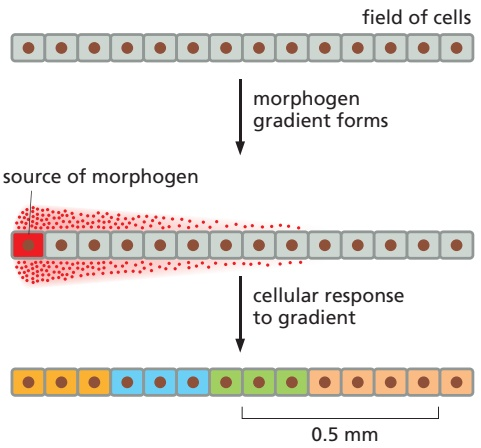

Figure 21–8 Gradient formation and interpretation. A gradient forms by the localized production of an inducer—a morphogen—that diffuses away from its source. Different concentrations of morphogen (or different durations of exposure) induce different gene expression patterns and cell fates in responding cells. Diffusive transport can generate steep gradients only over short distances, and morphogens generally act over distances of 1 mm or less.

Nearby cells then interpret their distance from the morphogen source according to how much signal they are exposed to, detected by binding to cell-surfaceMBoC7 m21.08/21.08 receptors. After signal transduction from these receptors, target genes will become transcribed only if the morphogen concentration exceeds a specific threshold; low concentrations that fall beneath this threshold will not activate the target. In this manner, a graded signal can be converted into multiple discrete, on-or-off changes in gene activity. Thus, a single secreted protein, in combination with the physical properties of diffusion and the ability of cells to interpret the information, can generate several distinct fates within a field of cells.

This simple mechanism can be modified in various ways. For example, cellsurface receptors may trap the diffusing morphogen and cause it to be endocytosed and degraded, shortening its effective half-life. Alternatively, the morphogen may bind to molecules in the extracellular matrix such as heparan sulfate proteoglycan (discussed in Chapter 19), thereby greatly reducing its diffusion rate.

#### Lateral Inhibition Can Generate Patterns of Different Cell Types

Morphogen gradients, and other types of inductive signals, exploit an existing asymmetry in the embryo to create further asymmetries and differences between cells: already, at the outset, some cells are specialized to produce the morphogen and thereby impose a pattern on another class of cells that are sensitive to it. But what if there is no clear initial asymmetry? Can a regular pattern arise spontaneously within a set of cells that are initially all alike?

The answer is yes. The fundamental principle underlying such de novo pattern formation is positive feedback: cells can exchange signals in such a way that any small initial discrepancy between cells at different sites becomes self-amplifying, driving the cells toward different fates. This is most clearly illustrated in the phenomenon of lateral inhibition, a form of cell–cell interaction that forces close neighbors to become different and thereby generates fine-grained patterns of different cell types.

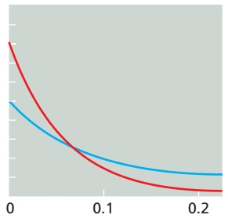

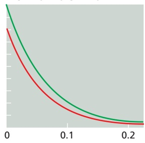

Figure 21–9 Setting up a signal gradient by diffusion. Each graph shows the concentration of a morphogen signal molecule that is produced at a steady rate at the origin. In all cases, the molecule undergoes degradation as it diffuses away from the source, and the graphs are calculated on the assumption that diffusion is occurring along two axes in space (for example, radially from a source in an epithelial sheet). (A) The pattern of the morphogen assuming that production starts at time 0, the molecule has a half-life of 170 minutes, and that it diffuses with an effective diffusion constant of D = 1 μm2 sec–1, typical of a small protein molecule in extracellular tissues. Red lines show six successive stages in the buildup of the morphogen, which falls off exponentially with distance from the source. Panels B and C show how simple changes in the properties of the system alter the gradient at the 160-minute time point. (B) A threefold increase in the diffusion constant of the morphogen extends its range (blue line) but lowers its concentration next to the source. (C) A threefold increase in morphogen half-life (green line) increases its concentration throughout the tissue. Effects of the morphogen will depend not just on its concentration at some critical moment, but also on how each target cell integrates its response over time. (Courtesy of Patrick Müller.)

Consider a pair of adjacent cells that start off in a similar state. Each of these cells can both produce and respond to a certain signal molecule X, with the added rule that the stronger the signal a cell receives, the weaker the signal it generates itself (**Figure 21–10**). If one cell produces more X, the other is thus forced to produce less, for instance by reducing transcription of the X-encoding gene. This gives rise to a positive feedback loop that tends to amplify any initial difference between the two adjacent cells. Such a difference may arise from a bias imposed by some present or past external factor or it may simply originate from spontaneous random fluctuations, or “noise”—an inevitable feature of the genetic control circuitry in cells (discussed in Chapter 7). In either case, lateral inhibition means that if cell 1 makes a little more of X, it will thereby cause cell 2 to make less; and because cell 2 makes less X, it delivers less inhibition to cell 1 and so allows the production of X in cell 1 to rise higher still; and so on, until a stable state is reached where cell 1 produces a lot of X and cell 2 produces very little. The result is that the two cells are driven along different pathways of differentiation.

In almost all tissues, a balanced mixture and distribution of different cell types are required. Lateral inhibition provides a common way to generate the mixture. As we shall see, lateral inhibition is very often mediated by exchange of signals at cell–cell contacts via the Notch signaling pathway, driving cell diversification by enabling individual cells that express one set of genes to direct their immediate neighbors to express a different set, in exactly the way we have described (see also Figure 15–60).

#### Asymmetric Cell Division Can Also Generate Diversity

Cell diversification does not always depend on extracellular signals: in some cases, cells are born different as a result of an asymmetric cell division, in which some important molecule or molecules present in the mother cell are distributed unequally between the two daughters. This asymmetric inheritance during mitosis ensures that the two daughter cells develop differently (**Figure 21–11**). The mechanism here is intrinsic to the dividing cell, although daughter cells can also become asymmetric after division as a result of the extrinsic, inductive signals discussed earlier. Intrinsically asymmetric division is a common feature of early development. The fertilized egg may already possess an internal pattern, and cleavage of this large cell segregates different fate determinants into separate blastomeres. We shall see later that asymmetric division also plays a part in later developmental processes, as well as in stem cells (see Chapter 22).

asymmetric division: daughter cells born different

symmetric division: daughter cells become different as a result of influences acting on them after their birth

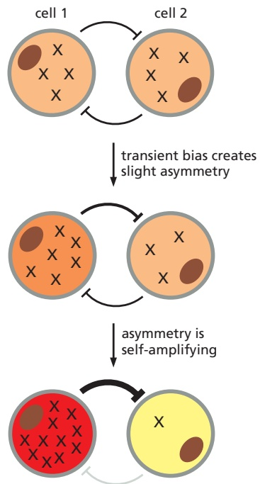

Figure 21–10 Genesis of asymmetry through lateral inhibition and positive feedback. In this example, two cells interact, each producing a substance X that acts on the other cell to inhibit its production of X, an effect known as lateral inhibition. An increase of X in one of the MBoC7 m21.10/21.10cells leads to a positive feedback that tends to increase X in that cell still further, while decreasing X in its neighbor. This can create an accelerating instability, making the two cells become radically different. Ultimately, the system comes to rest in one or the other of two opposite stable states. The final choice of state represents a form of memory: the small influence that initially directed the choice is no longer required to maintain it.

Figure 21–11 Two ways of making daughter cells different. Daughters can assume different fates either through (A) an intrinsically asymmetric division in which there is differential inheritance of cytoplasmic molecules or through (B) a symmetric division followed by signaling to only one daughter.

Figure 21–12 Patterning by sequential induction. A series of inductive interactions can generate many types of cells, starting from only a few.

Initial Patterns Are Established in Small Fields of Cells and Refined by Sequential Induction as the Embryo Grows

The signals that organize the spatial pattern of cells in an embryo generally act over short distances and govern relatively simple choices. A morphogen, for example, typically acts over a distance of less than 1 mm—an effective range for diffusion—and directs choices between several developmental options for the cells on which it acts. Yet the organs that eventually develop are much larger and more complex than this.

As the organ grows via cell proliferation, the refinement of its initial pattern isMBoC7 m21.13/21.12 explained by a series of successive interactions that add increasing levels of detail to an initially simple sketch. For example, as soon as two types of cells are present in a developing tissue, one of them can produce a signal that induces a subset of neighboring cells to specialize in a third way. The third cell type can in turn signal back to the other two cell types nearby, generating a fourth and a fifth cell type, and so on (**Figure 21–12**).

This strategy for generating a progressively more complicated pattern is called **sequential induction**. It is chiefly through sequential inductions that the body plan of a developing animal, after being first roughed out in miniature, becomes elaborated with finer and finer details as development proceeds.

#### Developmental Biology Provides Insights into Disease and Tissue Maintenance

The rapid progress in understanding animal development has been one of the great success stories in biology, and it has important practical implications. Some 2–5% of all human babies are born with anatomical abnormalities, such as heart malformations, truncated limbs, cleft palate, or spina bifida. Advances in developmental biology help us understand how these defects arise, even if we cannot yet prevent or cure most of them.

Less obvious, but even more important from a practical point of view, is that developmental biology also provides insights into the workings of cells and tissues in the adult body. Developmental processes do not halt at birth; they continue throughout life, as tissues are maintained and repaired. The fundamental mechanisms of cell growth and division, cell–cell signaling, cell memory, cell adhesion, and cell movement are all involved in adult tissue maintenance and repair—just as they are in embryo development. These are also the main mechanisms perturbed in tumor cells, as we saw in Chapter 20.

Embryos are simpler than adults, and they allow us to analyze such basic processes more easily. Studies of the early Drosophila embryo, for example, were crucial to the discovery of several conserved signaling pathways, including the Wnt, Hedgehog, and Notch pathways. They also provided the key to understanding the central role of these pathways in the maintenance of normal adult human tissues and laid the foundation for manipulating the pathways in the cause of regenerative medicine. Finally, they have identified both targets and rational mechanisms for therapies to fight cancer and other diseases.

In Chapter 22, we shall consider how these and other core developmental mechanisms operate in the normal adult body, especially in tissues that are continually renewed by means of stem cells—including the gut, skin, and the hematopoietic system. But now, we must look more closely at the way in which an early embryo generates its spatial pattern of specialized cells, beginning with the transformations that create the adult body plan.

#### Summary

Animal development is an amazing self-assembly process, in which the initially similar cells of the embryo become different from one another and organize themselves into increasingly complex structures. The process begins with a single large cell, the fertilized egg, which cleaves to produce a blastula that undergoes gastrulation to generate the three germ layers of the embryo—ectoderm, mesoderm, and endoderm. As development continues, the cells become more and more narrowly specialized according to their locations and their interactions with one another, eventually forming one of the differentiated cell types of the adult body.

Differences between developing cells arise in various ways and have to be properly coordinated in space. In one common strategy, initially similar cells within a group become different by exposure to different levels of an inductive signal or morphogen emanating from a source outside the group. Neighboring cells can also become different by lateral inhibition, in which a cell signals to its neighbors not to follow the same fate. These cell–cell interactions are mediated by a small number of highly conserved signaling pathways, which are used repeatedly in different organisms and at different times during development. Not all cell diversification arises by cell–cell interactions, however: daughter cells can be born different as a result of asymmetric cell division.

Regulators of transcription and chromatin structure bind to regulatory DNA and determine the fate of each cell. Differences of body plan seem to arise to a large extent from differences in the regulatory DNA associated with each gene. This DNA has a central role in defining the sequential program of development, calling genes into action at specific times and places according to the pattern of gene expression that was present in each cell at the previous developmental stage.

Development has been most thoroughly studied in a handful of model organisms. But most of the genes and mechanisms thereby identified are used in all animals and repeatedly at different stages of development. Thus, insights from worms, flies, fish, frogs, and mice deeply inform our understanding of embryology and adult tissue maintenance in humans, as well as how aberrations in these processes cause birth defects and cancer.

#### MECHANISMS OF PATTERN FORMATION

A developing multicellular organism has to create different cell fates in fields of cells that were nearly indistinguishable and accomplish this task in a spatially ordered manner so that functional tissues are formed. Some of the early microscopists imagined the entire shape and structure of the human body to be already present in the sperm as a “homunculus,” a miniature human; after fertilization, the homunculus would simply grow and generate a full-sized person. We now know that this view is incorrect, and that development is a progression from simple to complex, through a gradual refinement of an animal’s anatomy. To see how the whole sequence of events of spatial patterning and cell determination is set in motion, we must return to the egg and the early embryo.

#### Different Animals Use Different Mechanisms to Establish Their Primary Axes of Polarization

Surprisingly, the earliest steps of animal development are among the most variable, even within a phylum. A frog, a chicken, and a mammal, for example, even though they develop in similar ways later, make eggs that differ radically in size and structure, and they begin their development with different sequences of cell divisions and cell specializations. Likewise, there is great variation in the time and manner in which the primary axes of the body become marked out. However, this polarization of the embryo usually becomes discernible very early, before gastrulation begins—it is the first step of spatial patterning.

Two axes have to be established. The anteroposterior (A-P) axis specifies the locations of future head and tail. The dorsoventral (D-V) axis specifies the future back and belly. For species that show bilateral asymmetry, creation of an additional left–right (L-R) axis is also important. Finally, the eggs of many animals have an animal–vegetal (A-V) axis that is not evident in the adult, but defines which parts are to become internal (through the movements of gastrulation) and which are to remain external. (The bizarre name dates from a century ago and has nothing to do with vegetables.)

At one extreme within animal diversity, the egg is spherically symmetrical, and the axes only become defined during embryogenesis. The mouse is one example, with little obvious sign of polarity in the egg. Correspondingly, the blastomeres produced by the first few cell divisions all seem to be alike and are remarkably adaptable. If the early mouse embryo is split in two, a pair of identical twins can be produced—two complete, normal individuals from a single cell. Similarly, if one of the cells in a two-cell mouse embryo is destroyed by pricking it with a needle and the resulting “half-embryo” is placed in the uterus of a foster mother to develop, in many cases a perfectly normal mouse will emerge.

At the opposite extreme, an egg is built with an asymmetric structure that itself defines the future axes of the body. This is the case for most species, including insects such as Drosophila, as we shall see shortly. Other organisms lie somewhere in between. The egg of the frog Xenopus, for example, has a clearly defined A-V axis before fertilization: the pronucleus near the top defines the animal pole, while the mass of yolk (the embryo’s food supply, destined to be incorporated in the gut) toward the bottom defines the vegetal pole. Several types of mRNA molecules are already localized in the vegetal cytoplasm of the egg, where they produce their protein products. After fertilization, these mRNAs and proteins act in and on the cells in the lower and middle part of the embryo, giving the cells their specialized characters.

Formation of the D-V axis of the Xenopus embryo is triggered by fertilization. At the site where the sperm enters, which is only permitted in the region of the animal pole, the sperm centrosome nucleates a microtubule aster. This reorganization of the microtubule cytoskeleton causes the outer cortex of the egg to rotate relative to the central core of the egg cytoplasm, so that the animal pole of the cortex becomes slightly shifted to one side (**Figure 21–13**). Cortical rotation relocalizes signaling molecules and initiates a cascade of events that will organize the dorsoventral axis of the body. (The A-P axis of the embryo will only become clear later, in the process of gastrulation.) This general process, by which a cue creates a new axis in the embryo, is known as symmetry breaking.

0.5 mm

(B)

Figure 21–13 The frog egg and its asymmetries. (A) Side view of a Xenopus egg photographed just before fertilization. (B) The asymmetric distribution of molecules inside the egg along the animal–vegetal axis, and how fertilization activates dorsoventral asymmetry. Vegetally localized VegT in the unfertilized egg defines the vegetal source of signals that will induce endoderm and mesoderm. Sperm entry initiates a reorganization of the microtubule cytoskeleton that triggers a rotation of the egg cortex (a layer a few micrometers deep) through about 30° relative to the core of the egg. Cortical rotation relocalizes Wnt signaling components including Wnt11 mRNA to the future dorsal side, which sets up the dorsoventral axis of the embryo. (A, courtesy of Tony Mills.)

Although different animal species use a variety of different mechanisms to specify their overall organization, the outcome has been relatively well conserved in evolution: head is distinguished from tail, back from belly, and gut from skin. It seems that it does not much matter what tricks the embryo uses, it always manages to break the initial symmetry and set up its basic body plan.

#### Studies in Drosophila Have Revealed Many Genetic Control Mechanisms Underlying Development

It is the fly Drosophila, more than any other organism, that has provided the key to our present understanding of how genes govern early development. Decades of study culminated in a large-scale genetic screen, focusing on the early embryo and searching for mutations that disrupt its pattern. This revealed a group of key developmental genes that act in a relatively small set of regulatory pathways. The discovery of these genes and the subsequent analysis of their functions is a famous tour de force that has had a revolutionary impact on all of biology, earning its discoverers a Nobel Prize. Some parts of the machinery revealed in this way are conserved between flies and vertebrates, some parts not. But the logic of the experimental approach and the general strategies of genetic control that it revealed have transformed our understanding of multicellular development in general.

To understand how the early developmental machinery operates in Drosophila, it is important to note a peculiarity of fly development. Like the eggs of other insects, but unlike most vertebrates, the Drosophila egg—shaped like a cucumber—begins its development with an extraordinarily rapid series of nuclear divisions without cell division, producing multiple nuclei in a common cytoplasm—a **syncytium**. The nuclei then migrate to the cell cortex, forming a structure called the syncytial blastoderm. After about 6000 nuclei have been produced, the plasma membrane folds inward between them and partitions them into separate cells, converting the syncytial blastoderm into the cellular blastoderm (**Figure 21–14**).

We shall see that the initial patterning of the Drosophila embryo depends on molecules that diffuse through the cytoplasm at the syncytial stage and exert their actions on genes in the rapidly dividing nuclei, before the partitioning of the egg into separate cells. Here, there is no need for the usual forms of cell–cell signaling; neighboring regions of the syncytial blastoderm can communicate by means of transcription regulators that move through the cytoplasm of the giant multinuclear cell.

#### Gene Products Deposited in the Egg Organize the Axes of the Early Drosophila Embryo

As in most insects, the main axes of the future body of Drosophila are defined before fertilization by a complex exchange of signals between the developing egg, or oocyte, and the mother’s somatic cells that surround it in the ovary.

Figure 21–14 Development of the Drosophila egg from fertilization to the cellular blastoderm stage.

(C)

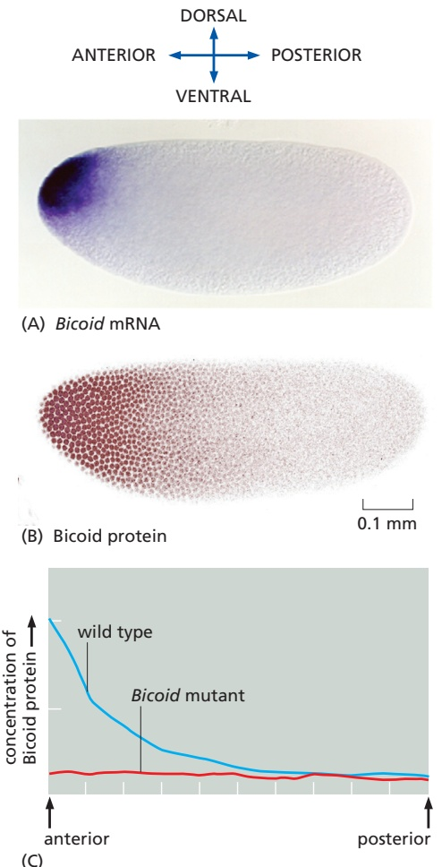

Figure 21–15 The Bicoid protein gradient. (A) Bicoid mRNA is deposited at the anterior pole during oogenesis. (B) Local translation followed by diffusion generates the Bicoid protein gradient. (C) Absence of the Bicoid protein gradient in embryos from Bicoid homozygous mutant mothers. (A and B, courtesy of Stephen Small.)

These signals can be described as **maternal effect**, because it is the genome of the mother rather than the zygote that produces them. Before fertilization, the anteroposterior and dorsoventral axes of the future embryo become defined by systems of **egg-polarity genes** that create landmarks—either mRNA or protein— in the oocyte. After fertilization, each landmark serves as a beacon, providing a signal that organizes the developmental process in its neighborhood.

The nature of the egg-polarity genes emerged from studies of mutants in which the patterning of the embryo was altered. Some of these mutations gave embryos with disrupted polarity; for example, one caused tail-end structures at both ends of the body, with no head-end structures. This particular mutation allowed the identification of the landmark that organizes the anterior end of the embryo, called Bicoid. A deposit of Bicoid mRNA molecules is localized, before fertilization, at the anterior end of the egg. Upon fertilization, the mRNA is translated to produce Bicoid protein. This protein is an intracellular morphogen and transcription regulator that diffuses away from its source to form a concentration gradient within the syncytial cytoplasm, with its maximum at the head end of the embryo (**Figure 21–15**). The different concentrations of Bicoid along the A-P axis help determine different cell fates by directly regulating the transcription of genes in the nuclei of the syncytial blastoderm (discussed in Chapter 7).

There are three other egg-polarity gene systems that pattern the syncytial nuclei; two act along the A-P axis and one acts along the D-V axis. Together with the Bicoid group of genes, and acting in a broadly similar way, their gene products mark out three fundamental partitions of body regions—head versus rear, dorsal versus ventral, and endoderm versus mesoderm and ectoderm—as well as a fourth partition, no less fundamental to the body plan of animals: the distinction between germ cells and somatic cells (**Figure 21–16**).

Figure 21–16 The organization of the four egg-polarity gradient systems in Drosophila. Bicoid mRNA encodes a transcriptional activator that determines the head and thoracic regions. Nanos is a translational repressor that governs the formation of the abdomen. Localized Nanos mRNA is also incorporated into the germ cells as they form at the posterior of the embryo, and Nanos protein is necessary for germ-line development. Toll and Torso are receptor proteins that are distributed all over the membrane but are activated only at the sites indicated by the coloring, through localized exposure to the extracellular ligands Spaetzle (the ligand for Toll) and Trunk (the ligand for Torso). Toll activity determines the mesoderm and Torso activity determines the formation of terminal structures at the head and tail.

The egg-polarity genes act first in a hierarchy of gene systems that define a progressively more detailed pattern of body parts. In the next few pages, we begin with the molecular mechanisms that pattern the developing Drosophila embryo and larva along the A-P axis, before considering the patterning along the D-V axis.

#### Three Groups of Genes Control Drosophila Segmentation Along the A-P Axis

The body of an insect is divided along its A-P axis into a series of **segments**. The segments are repetitions of a theme with variations: each segment forms highly specialized structures, all built according to a similar fundamental plan (**Figure 21–17**). The gradients of transcription regulators set up along the A-P axis in the early embryo by the egg-polarity genes are the prelude to the creation of the segments. These regulators initiate the orderly transcription of segmentation genes, which refine the pattern of gene expression to define the boundaries and ground plan of the individual segments. Segmentation genes are expressed by subsets of cells in the embryo, and their products are among the first components that the embryo’s own genome contributes to embryonic development; they are therefore called zygotic-effect genes, to distinguish them from the earlier-acting maternal-effect genes. Mutations in segmentation genes can alter either the number of segments or their basic internal organization.

The **segmentation genes** fall into three groups according to their mutant phenotypes (**Figure 21–18**). It is convenient to think of the three groups as acting in sequence, although in reality their functions overlap in time. First to be expressed is a set of at least six **gap genes**, whose products mark out coarse A-P subdivisions of the embryo. Mutations in a gap gene eliminate one or more groups of adjacent segments: in the mutant Krüppel, for example, the larva lacks eight segments. Next comes a set of eight **pair-rule genes**. Mutations in these genes cause a series of deletions affecting alternate segments, leaving the embryo with only half as many segments as usual; although all the mutants display this two-segment periodicity, they differ in the precise pattern. Finally, there are at least 10 **segment-polarity genes**, in which mutations produce a normal number of segments but with a part of each segment deleted and replaced by a mirrorimage duplicate of all or part of the rest of the segment.

<small>Figure 21–17 The origins of the Drosophila body segments. (A) At 3 hours, the embryo (shown in side view) is at the blastoderm stage and no segmentation is visible, although a fate map can be drawn showing the future segmented regions (color). (B) At 10 hours, all the segments are clearly defined (T1: first thoracic segment; A1: first abdominal segment). See Movie 21.3. (C) The segments of the Drosophila larva and their correspondence with regions in the embryo. (D) The segments of the Drosophila adult and their correspondence with regions in the embryo.</small>

Figure 21–18 Examples of the phenotypes of mutations affecting egg-polarity genes and the three types of segmentation genes. In each case, the areas shaded in green on the normal larva (left) are deleted in the mutant (right) or are replaced by mirror-image duplicates of the unaffected regions. (Modified from C. Nüsslein-Volhard and E. Wieschaus, Nature 287:795–801, 1980.)

The phenotypes of the various segmentation mutants suggest that the segmentation genes form a coordinated system that subdivides the embryo progressively into smaller and smaller domains along the A-P axis, each distinguished by a different pattern of gene expression. Molecular genetics has helped to reveal how this system works.

#### A Hierarchy of Gene Regulatory Interactions Subdivides the Drosophila Embryo

Like Bicoid, most of the segmentation genes encode transcription regulators. Their control by the egg-polarity genes and their actions on one another and on still other genes can be deciphered by comparing gene expression in normal and mutant embryos. By using appropriate probes to detect RNA transcripts or their protein products, one can observe genes switch on and off in changing patterns. These patterns reveal the wealth of spatial information created within the morphologically uniform embryo by the egg-polarity gene network. By comparing these patterns in different mutants, one can begin to discern the logic of the entire gene control system.

The products of the egg-polarity genes provide the global positional signals in the early embryo (see Figure 21–16). The Bicoid protein, as we have seen, acts as a morphogen and activates different sets of genes at different positions along the A-P axis: some gap genes are only activated in regions with high levels of Bicoid, others only where levels of Bicoid are lower. There are only six gap genes, but a combination of overlapping expression as well as different levels within their domains provides each cell along the A-P axis with a rich variety of positional identities. After the gap-gene products refine their positions by repressing each other’s expression, they provide a second tier of positional signals that act more locally to regulate finer details of patterning. They control the expression of the pair-rule genes, through combinatorial effects as discussed in Chapter 7 for the pair-rule gene Even-skipped (see pp. 423–424). The pair-rule genes demarcate the repeated groups of cells that will later become segments and, in turn, collaborate with one another and with the gap genes to set up a regular, periodic pattern of expression of the segment-polarity genes, which define the internal pattern of each individual segment (**Figure 21–19**).

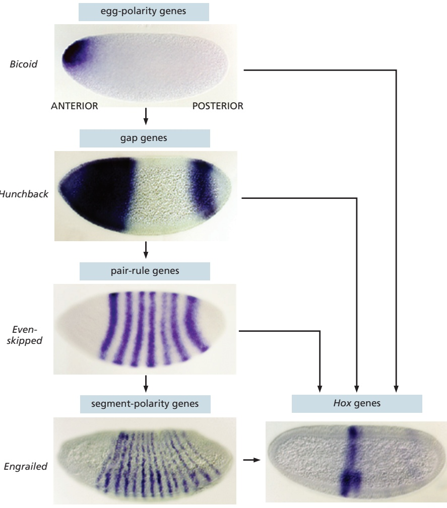

Figure 21–19 The regulatory hierarchy of A-P patterning in the Drosophila embryo. Egg-polarity genes define the A-P axis and also initiate expression of three groups of genes (gap, pair-rule, and segment polarity) that create segments. The identity of each segment is specified by Hox genes (discussed shortly), whose expression is controlled by input from both egg-polarity and segmentation genes. The photographs show mRNA expression patterns of representative examples of genes of each type. (Courtesy of Stephen Small.)

A large subset of the segment-polarity genes codes for components of two signaling pathways—the Wnt pathway and the Hedgehog pathway, including the secreted signal proteins Wingless (the first-named member of the Wnt family) and Hedgehog. (The Hedgehog pathway was first discovered through study of Drosophila segmentation, and it takes its name from the prickly appearance of theMBoC7 m21.20/21.19 surface of the Hedgehog mutant embryo.) Wingless and Hedgehog are synthesized in different bands of cells that serve as signaling centers within each segment. The two proteins mutually maintain each other’s expression while regulating the expression of genes such as Engrailed in neighboring cells (**Figure 21–20**). In such a manner, a series of sequential inductions creates a fine-grained pattern of gene expression within each segment.

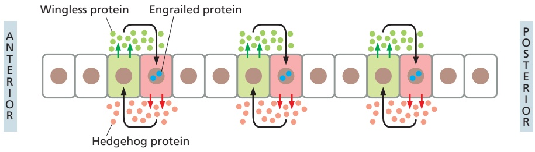

Figure 21–20 Mutual maintenance of Hedgehog and Wingless expression. Engrailed is a transcription regulator (blue) that drives the expression of Hedgehog. Hedgehog encodes a secreted protein (red) that activates a signaling pathway in neighboring cells and thereby drives them to express the Wingless gene. In turn, Wingless encodes a secreted protein (green) that acts back on neighbors of the Wingless-expressing cell to maintain their expression of Engrailed. Engrailed then maintains Hedgehog expression to complete the loop. As indicated, the same network repeats along the A-P axis of the fly. (Based on S. DiNardo et al., Curr. Opin. Genet. Dev. 4:529–534, 1994.)

500 µm

#### Egg-Polarity, Gap, and Pair-Rule Genes Create a Transient Pattern That Is Remembered by Segment-Polarity and Hox Genes

The gap genes and pair-rule genes are activated within the first few hours after fertilization. Their mRNA products initially appear in patterns that only approximate the final picture; then, within a short time, this fuzzy initial pattern resolves itself into a regular, crisply defined system of stripes. But this pattern itself is unstable and transient: as the embryo proceeds through gastrulation and beyond, the pattern disintegrates. The genes’ actions, however, have passed on an enduring memory of their patterns of expression by inducing the expression of certain segment-polarity genes along with another class of genes called Hox genes (discussed shortly). After a period of pattern refinement mediated by cell–cell interactions, the expression patterns of these new groups of patterning genes are stabilized to provide positional labels that serve to maintain the segmental organization of the larva and adult fly.

The segment-polarity gene Engrailed provides a good example. Its RNA transcripts form a series of 14 bands in the cellular blastoderm, each approximately one cell wide. These stripes lie immediately anterior to similar stripes of expression of another segment-polarity gene, Wingless. As the cells in the developing embryo continue to divide and move, signaling between the Wingless-expressing cells and the Engrailed-expressing cells maintains narrow stripes of their expression (see Figure 21–20). This interaction triggers a stable Engrailed expression pattern that will last throughout the life of the fly, long after the signals that induced and refined it have disappeared. The segment borders in embryo, larva, and adult will all form at the posterior edge of each such Engrailed stripe (**Figure 21–21**).

In addition to regulating the segment-polarity genes, the products of pair-rule genes collaborate with those of gap genes to induce the precisely localized activation of a further set of genes—the Hox genes (see Figure 21–19). It is the Hox genes that first define and then permanently distinguish one segment from another. In the next section, we examine these important genes in detail; we shall see that this role is critical in a wide range of animals, including ourselves.

#### Hox Genes Permanently Pattern the A-P Axis

As animal development proceeds, the body becomes more and more complex. But again and again, in every species and at every level of organization, we find that complex structures are made by repeating a few elementary themes, with variations. Thus, a subset of basic differentiated cell types, such as muscle cells or fibroblasts, recur at different sites and are organized into tissues such as muscle or tendon. Subtle variations in how and where patterning mechanisms are deployed determines how structures such as teeth or digits are built, giving rise to molars and incisors, fingers and thumbs and toes.

Wherever we find this phenomenon of modulated repetition, we can break down the developmental biologist’s problem into two kinds of questions: What is the basic construction mechanism common to all the objects of the given class, and how is this mechanism modified to give the observed variations in different animals? The segments of the insect body provide a good example. We have thus far sketched the way in which the rudiment of a single body segment is constructed and how cells within each segment become different from one another. We now consider how one segment becomes determined, or specified, to be different from another.

The first glimpse of the answer to this problem came more than 80 years ago, with the discovery of a set of mutations in Drosophila that cause bizarre disturbances in the organization of the adult fly. In the Antennapedia mutant, for example, legs sprout from the head in place of antennae, whereas in the Bithorax mutant, portions of an extra pair of wings appear where normally there should be the much smaller appendages called halteres (**Figure 21–22**). These mutations transform parts of the body into structures appropriate to other positions, and they are called homeotic mutations (from the Greek homoios, meaning “similar”) because the transformation is between structures of a recognizably similar general type, changing one kind of limb or one kind of segment into another. It was eventually discovered that a whole set of genes, the **homeotic selector genes**MBoC7 m21.23/21.22 or **Hox genes**, serve to permanently specify the A-P characters of the whole set of animal segments. These genes are all related to one another as members of a multigene family.

10-hour embryo

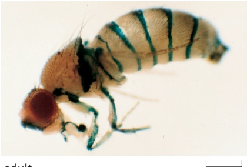

Figure 21–21 The pattern of expression of Engrailed, a segment-polarity gene. The Engrailed pattern is shown in a 10-hour embryo and an adult (whose wings have been removed in this preparation). The pattern is revealed by constructing a strain of Drosophila containing the control sequences of the Engrailed gene coupled to the coding sequence of the reporter LacZ, whose product is detected histochemically through the brown product generated by immunohistochemistry against LacZ itself (10-hour embryo) or through the blue product generated by a reaction that LacZ MBoC7 m21.22/21.21catalyzes (adult). Note that the Engrailed pattern marks segment boundaries and, once established, is preserved throughout the animal’s life. (Courtesy of Tom Kornberg.)

wild type

gain of Ubx

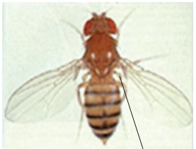

(A)

haltere

loss of Ubx

(B)

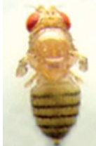

(C)

There are eight Hox genes in the fly, and they all lie in one or the other of two gene clusters known as the **Bithorax complex** and the **Antennapedia complex**. The genes in the Bithorax complex control the differences among the abdominal and thoracic segments of the body, while those in the Antennapedia complex control the differences among thoracic and head segments. Comparisons with other species show that the same genes are present in essentially all animals, including humans. These comparisons also reveal that the Antennapedia and Bithorax complexes are two halves of a single entity, called the **Hox complex**, that has become split in the course of the fly’s evolution, and whose members operate in a coordinated way to exert their control over the head-to-tail pattern of the body.

The products of the Hox genes, the **Hox proteins**, are transcription regulators, all of which possess a highly conserved, 60-amino-acid-long DNA-binding homeodomain (see p. 404). The homeodomain-encoding DNA sequence is called a “homeobox,” from which, by abbreviation, the Hox complex takes its name. There are many homeobox-containing genes, but only those located in a Hox complex are Hox genes.

#### Hox Proteins Give Each Segment Its Individuality

The Hox proteins can be viewed as molecular address labels possessed by the cells of each segment: these labels give the cells in each region a **positional value**; that is, an intrinsic character that differs according to a cell’s location. If the address labels in a developing Drosophila segment are changed, the segment behaves as though it were located somewhere else; if all the Hox genes in an embryo are deleted, the body segments in the larva will all be alike.

To a first approximation, each Hox gene is normally expressed in those regions that develop abnormally when that gene is mutated or absent. How does each Hox protein give a segment its permanent identity? Recall that the Hox proteins are transcription regulators, which can bind to gene regulatory DNA; each Hox protein targets a different set of genes for activation or repression. Hundreds of genes are under this type of Hox-modulated control, including genes that control cell–cell signaling, transcriptional regulation, cell polarity, cell adhesion, cytoskeletal function, cell growth, and cell death, all conspiring to give each segment its distinctive Hox-dependent character.

#### Hox Genes Are Expressed According to Their Order in the Hox Complex

How, then, is the expression of the Hox genes themselves regulated? The coding sequences of the eight Hox genes in Drosophila are interspersed amid a much larger quantity of regulatory DNA. This DNA includes binding sites for the

Figure 21–22 Homeotic mutations. Ultrabithorax, or Ubx, is one of three genes in the Bithorax gene complex (a Hox gene cluster). Ubx is responsible for all of the differences between the second (wing-bearing) and third (haltere-bearing) thoracic segments. (A and B) Ubx loss-of-function mutations transform the halterebearing segment (A) into a wing-bearing segment, resulting in four-winged flies (B). (C) Ubx gain-of-function in the second thoracic segment transforms this wingbearing segment into a haltere-bearing segment, resulting in wingless flies. (A, courtesy of the Archives, California Institute of Technology; C, courtesy of L.S. Shashidhara.)

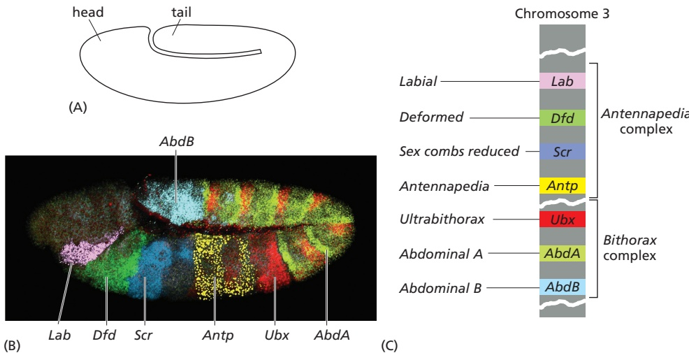

Figure 21–23 The patterns of expression compared to the chromosomal locations of the genes of the Hox complex. (A) Diagram of a Drosophila embryo at the so-called germ band retraction stage, about 10 hours after fertilization when the developing body axis is folded over on itself. (B) An embryo at this stage has been stained by in situ hybridization using differently labeled probes to detect the mRNA products of different Hox genes in different colors. (C) The spatial pattern in the photograph corresponds, with minor deviations, to the sequence of genes in each of the two subdivisions of the chromosomal complex. (B, courtesy of William McGinnis, adapted from D. Kosman et al., Science 305:846, 2004. With permission from AAAS.)

products of the egg-polarity and segmentation genes, thereby serving as an interpreter of the detailed spatial information supplied to it by all of these transcription regulators. The net result is that a particular set of Hox genes is transcribed in a specific region along the A-P body axis.

The pattern of Hox gene expression exhibits a remarkable regularity that suggests an additional form of control. The sequence in which the genes are ordered along the chromosome, in both the Antennapedia and the Bithorax complexes, corresponds almost exactly to the order in which they are expressed along the7 21.24/21.23 A-P axis of the body (**Figure 21–23**). This hints at some process of gene activation, perhaps dependent on chromatin structures that propagate along the Hox complexes, switching on one Hox gene after another according to their order along the chromosome. The most “posterior” of the Hox genes that are expressed in a cell generally dominates, driving down expression and activity of the “anterior” genes and dictating the character of the segment. The gene regulatory mechanisms underlying these phenomena are still not well understood, but their consequences are profound. We shall see that the serial organization of gene expression in the Hox complex is a fundamental feature that has been highly conserved in the course of animal evolution.

#### Trithorax and Polycomb Group Proteins Regulate Hox Expression to Maintain a Permanent Record of Positional Information

The spatial pattern of expression of the genes in the Hox complex is set up by signals acting early in development, but the effects are long lasting. Although the pattern of expression undergoes complex adjustments as development proceeds, the Hox pattern stamps each cell and all of its progeny with a permanent record of the A-P position that the cell occupied in the early embryo. In this way, the cells of each segment maintain a memory of their location along the A-P axis of the body, which governs the segment-specific identity not only of the larval segments but also of the structures of the adult fly.

Two molecular mechanisms ensure that a cell remembers its positional information. One is from the Hox genes themselves: many of the Hox proteins autoactivate the transcription of their own genes, thereby helping to keep the genes on indefinitely. Another crucial input is from two large, complementary sets of proteins, called the **Trithorax group** and the **Polycomb group**, which imprint the chromatin of the Hox complex with a heritable record of its embryonic state of activation or repression. These are key general regulators of chromatin structure that are critical for cell memory: if genes of the Trithorax or Polycomb group are defective, the pattern of expression of the Hox genes is set up correctly at first, but it is not correctly maintained as cells divide and the embryo grows older.

The two sets of regulators act in opposite ways. Trithorax group proteins are needed to maintain the transcription of Hox genes in cells where their

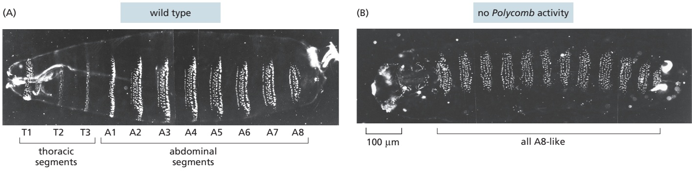

transcription has already been switched on. In contrast, Polycomb group proteins form stable complexes that bind to the chromatin of the Hox complex and maintain the repressed state in cells where Hox genes have not yet been activated (Figure 21–24). Although first discovered because of their influence on Hox genes in flies, Polycomb and Trithorax group proteins are general regulators of chromatin structure that control many genes in plants as well as animals. How such changes in chromatin can store developmental cell memory is discussed in Chapters 4 and 7.

#### The D-V Signaling Genes Create a Gradient of the Transcription Regulator Dorsal

We now turn to patterning of the second major axis of the Drosophila embryo. As with the patterning along the A-P axis just discussed, the patterning along the dorsoventral (D-V) axis begins with maternal gene products that define this axis in the egg (see Figure 21–16) and then progresses through zygotic gene products that further subdivide the D-V axis in the embryo.

Initially, a protein that is produced by the mother’s somatic cells underneath the future ventral region of the embryo leads to the localized activation of a transmembrane receptor called **Toll** on the ventral side of the egg membrane. (Curiously, Drosophila Toll and vertebrate Toll-like proteins also operate in innate immune responses, as discussed in Chapter 24.) The localized activation of Toll controls the distribution of **Dorsal**, a transcription regulator of the NFκB family discussed in Chapter 15. The Toll-regulated activity of Dorsal, like that of NFκB, depends on the translocation of Dorsal protein from the cytosol, where it is held in an inactive form, to the nucleus, where it regulates gene expression (see Figure 15–63). In the newly laid egg, both Dorsal mRNA and protein are distributed uniformly in the cytosol. After the nuclei in the syncytial blastoderm have migrated to the surface of the embryo, but before cellularization (see Figure 21–14), Toll receptor activation on the ventral side induces a remarkable redistribution of the Dorsal protein. On the dorsal side, the protein remains in the cytosol, but ventrally it becomes concentrated in the nuclei, with a smooth gradient of nuclear localization between these two extremes (**Figure 21–25**).

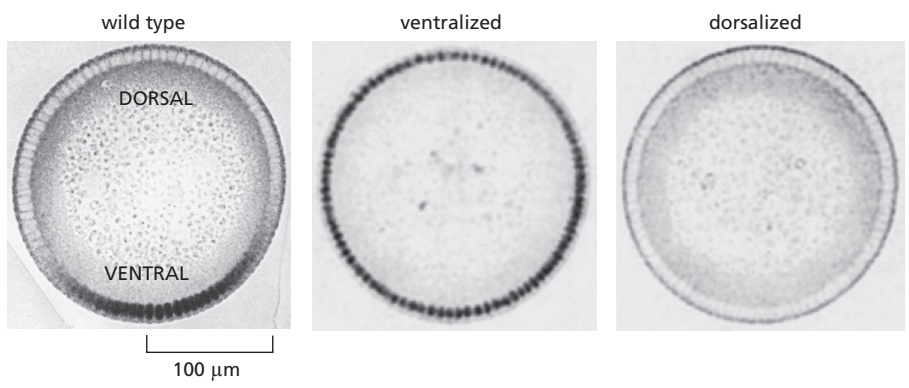

Figure 21–24 The role of genes of the Polycomb group. (A) Photograph of a wild-type Drosophila embryo, imaged by dark-field microscopy. (B) Photograph of a mutant embryo defective for the gene Extra sex combs (Esc) and derived from a mother also lacking this gene. The gene belongs to the Polycomb group. Essentially all segments have been transformed to resemble the most posterior abdominal segment, A8. In the mutant, the pattern of expression of the homeotic selector genes, which is roughly normal initially, is unstable in such a way that all these genes soon become switched on all along the body axis. (From G. Struhl, Nature 293:36–41, published 1981 by Nature Publishing Group. Reproduced with permission of SNCSC.)

Figure 21–25 The concentration gradient of Dorsal protein in the nuclei of the blastoderm. In wild-type Drosophila embryos, the protein is present in the dorsal cytoplasm and absent from the dorsal nuclei; ventrally, it is depleted in the cytoplasm and concentrated in the nuclei. In a mutant in which the Toll pathway is activated everywhere and not just ventrally, Dorsal protein is everywhere concentrated in the nuclei; the result is a ventralized embryo. Conversely, in a mutant in which the Toll signaling pathway is inactivated, Dorsal protein everywhere remains in the cytoplasm and is absent from the nuclei; the result is a dorsalized embryo. (From S. Roth et al., Cell 59:1189–1202, 1989. With permission from Elsevier.)

Similar to Bicoid along the A-P axis, Dorsal acts as a morphogen along the D-V axis. Once inside the nucleus, the Dorsal protein turns on or off the expression of different sets of genes depending on Dorsal’s concentration. The expression of each responding gene depends on its regulatory DNA—specifically, on the number and affinity of the binding sites that this DNA contains for Dorsal and other transcription regulators. In this way, the regulatory DNA interprets the positional signal provided by the nuclear Dorsal protein gradient, so as to define a distinct D-V series of territories—complementary bands of cells that run the length of the embryo. Most ventrally—where the nuclear concentration of Dorsal protein is highest—it switches on, for example, the expression of a gene called Twist, which directs mesodermal fate. Most dorsally, where the nuclear concentration of Dorsal protein is lowest, the cells switch on a gene called Decapentaplegic (Dpp). And in an intermediate region, where the nuclear concentration of Dorsal protein is high enough to repress Dpp but too low to activate Twist, the cells switch on another set of genes, including one called Short gastrulation (Sog) (**Figure 21–26A**).

Products of the genes directly regulated by the Dorsal protein generate in turn more local signals, which define finer subdivisions along the D-V axis. These signals act after cellularization and take the form of conventional extracellular diffusible proteins. In particular, Dpp codes for a secreted TGFβ family protein, which forms a local morphogen gradient in the dorsal part of the embryo. Sog, produced ventrally to Dpp, encodes another secreted protein that acts as an antagonist of Dpp protein, by binding to it and preventing Dpp from activating its receptor. The opposing diffusion gradients of these two signal proteins create a steep gradient of Dpp activity: the highest Dpp activity levels, in combination with certain other factors, cause development of the most dorsal tissue of all—an extraembryonic membrane. Intermediate levels cause development of dorsal epidermis; and the absence of Dpp activity in cells expressing Sog allows the development of neurogenic ectoderm, which will give rise to the nervous system (**Figure 21–26B**).

Figure 21–26 How morphogen gradients guide a patterning process along the dorsoventral axis of the Drosophila embryo. (A) Initially, a gradient of Dorsal protein defines three broad territories of gene expression, marked here by the expression of three representative genes: Dpp, Sog, and Twist. (B) Slightly later, the cells expressing Dpp and Sog secrete, respectively, the signal proteins Dpp (a TGFβ family member) and Sog (an antagonist of Dpp). These two proteins then diffuse and interact with one another (and with certain other factors) to create the dorsoventral (D-V) territories shown.

#### A Hierarchy of Inductive Interactions Subdivides the Vertebrate Embryo

The molecular genetic analysis of Drosophila development has uncovered how a cascade of transcription regulators and signaling pathways sequentially subdivides the embryo. The same principle of progressive pattern refinement is used during the development of all animal embryos, including vertebrates. Remarkably, conservation is not restricted to the general strategy of pattern formation, but also extends to many of the molecules involved.

As mentioned previously, the earliest phases of vertebrate development are surprisingly variable, even between closely related species, and it is even hard to say precisely how the A-P and D-V axes of an early fly embryo correspond to those of an early frog or mouse embryo. Nevertheless, we shall see that amid this display of evolutionary plasticity, some features of early development turn out to be highly conserved. The same is true of later developmental stages also, often to an astonishing degree. From our own anatomy, it is obvious that we are cousins to birds and fish. But looking at molecular mechanisms, we see that we are related to flies and worms too.

In the following pages, we discuss how vertebrate embryos are patterned by the interplay of signaling molecules and transcription regulators. We begin by discussing the formation and patterning of the embryonic axes in amphibians, taking the frog Xenopus as our example. We have already broached this topic earlier in the chapter. Here, we pick up the thread and draw comparisons with the fly.

As noted earlier, the origins of the embryonic axes and the three germ layers in the frog can be traced back to the blastula (see Figure 21–3A). By labeling individual blastomeres, we can track cells through all their divisions, transformations, and migrations and see what they become and where they come from. The precursors of ectoderm, mesoderm, and endoderm are arranged in order along the animal–vegetal axis of the blastula: the endoderm derives from the most vegetal blastomeres, the ectoderm from the most animal, and the mesoderm from a middle set. Within each of these territories, the cells have diverse fates according to their positions along the D-V axis of the later embryo. For ectoderm, epidermal precursors are located ventrally, and future neurons are found dorsally; for mesoderm, precursors for notochord, muscle, kidney, and blood are arranged from dorsal to ventral. All this can be represented by a **fate map** that shows which later cell types derive from which regions of the early embryo (**Figure 21–27**). The fate map confronts us with the central question: How are the cells in different positions driven toward their different fates? We have already explained how maternal factors deposited in the developing frog egg define its animal–vegetal axis, and how cortical rotation triggered by fertilization defines the orientation of the dorsoventral axis (see Figure 21–13). But how does the establishment of axes lead on to the subdivision of the embryo into the future body parts?

The answer is that the maternal gene products lead to the formation of signaling centers on the vegetal and dorsal sides of the embryo. The dorsal signaling center in particular has a special place in the history of developmental biology. Experiments in the early twentieth century identified it as a small cluster of cells with an extraordinary property: when the cells were transplanted to an opposite site, they could trigger a radical reorganization of the neighboring tissue, causing it to form a second whole-body axis (**Figure 21–28**). The discovery of this signaling center, called the **Organizer**, led the way to a pioneering analysis of the chain of inductive interactions that establish the framework of the vertebrate body.

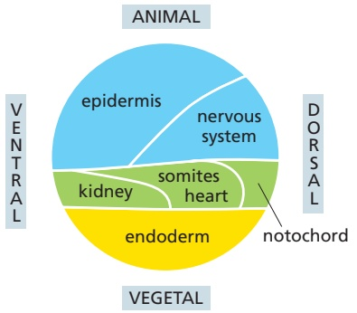

Figure 21–27 Blastula fate map in a frog embryo. The endoderm derives from the most vegetal blastomeres (yellow), the MBoC7 m21.28/21.27ectoderm from the most animal (blue), and the mesoderm from a middle set (green) that contributes also to endoderm and ectoderm. Different cell types derive from different positions along the dorsoventral axis.

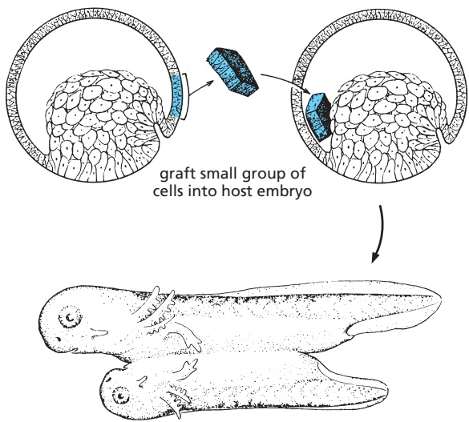

Figure 21–28 Induction of a secondary axis by the Organizer. An amphibian embryo receives a graft of a small cluster of cells taken from a specific site, called the Organizer region, on the dorsal side of another embryo at the same stage. Signals from the graft organize the behavior of neighboring cells of the host embryo, causing development of a pair of conjoined (Siamese) twins. See Movie 21.4. [After J. Holtfreter and V. Hamburger, in Analysis of Development (B.H. Willier, P.A. Weiss, and V. Hamburger, eds.), pp. 230–296. Philadelphia: Saunders, 1955.]

In contrast to the Drosophila syncytial embryo, the fertilized frog egg undergoes conventional cleavage divisions that result in an embryo consisting of thousands of cells. Patterning must therefore be mediated by extracellular signal molecules that diffuse through the embryo from cell to cell, not by transcription regulators that move through the cytoplasm of a syncytium. Not surprisingly,MBoC7 m21.29/21.28 the Organizer is now known to be a major source of secreted signals. As we shall see, this includes not only ligands that bind and activate transmembrane receptors (see Chapter 15), but also secreted proteins that inhibit the activity of these ligands.

#### A Competition Between Secreted Signaling Proteins Patterns the Vertebrate Embryonic Axes

The signal molecules that pattern the frog embryo along the animal–vegetal (A-V) axis belong to the TGFβ family: they are secreted by a signaling center at the vegetal pole and form concentration gradients along the A-V axis. These Nodal proteins act over a relatively short range: cells closest to the vegetal pole are exposed to high levels and respond by switching on genes that promote the development of endoderm; cells farther away are exposed to lower levels and activate genes that promote the formation of mesoderm. The cells at the vegetal pole that produce Nodal also produce a second, more rapidly diffusing protein called Lefty, which antagonizes Nodal. The high ratio of Lefty to Nodal at the animal pole allows Lefty to block Nodal signaling; this causes the cells there to develop as ectoderm (**Figure 21–29A**). Thus, a mid-range activation by Nodal, combined with a long-range inhibition by Lefty, sets up the pattern of progenitors along the A-V axis for the three germ layers—endoderm, mesoderm, and ectoderm.

The frog uses a somewhat related strategy to subdivide the germ-layer territories along the D-V axis of the embryo. It relies on patterned inhibition of otherwise uniform signaling by the bone morphogenetic proteins (BMPs; members of yet another subclass of the TGFβ family), which are secreted throughout the embryo. The dorsal signaling system exerts its influence by secreting several proteins, including Chordin and Noggin, that block BMP signaling when their own concentrations are high. In this way, Chordin and Noggin create a dorsal-to-ventral gradient of BMP, with low activity on the dorsal side and high activity on the ventral side (**Figure 21–29B**). Ectodermal cells that experience high levels of BMP signaling are driven to epidermal fates, whereas cells that experience little or no BMP signaling remain neural. We can note that this strategy for patterning the D-V axis by opposing gradients of BMP family signals and diffusible inhibitors is similar to that used in Drosophila, and indeed the particular molecules used are homologous.

Figure 21–29 How Nodal and bone morphogenic protein (BMP) signaling pattern the embryonic axes. Nodal and its antagonist Lefty pattern the animal–vegetal axis, while BMP and its antagonists Chordin and Noggin pattern the dorsoventral axis. (A) In the animal-pole region, where Nodal levels are low relative to Lefty, Lefty blocks Nodal from binding to its receptors. In the vegetal region, there is an excess of Nodal, resulting in Nodal pathway activation. (B) Along the dorsoventral axis, BMP is widely present, but Chordin and Noggin are concentrated at the dorsal side: there, they bind to BMP and block its binding to receptors. The resulting patterns of Nodal and BMP activity are illustrated at the bottom of the figure.

Knowing the signals that specify the three germ layers and various tissue types of the vertebrate body, one can reproduce this specification in a culture dish. Frog cells taken from the animal-pole region of the embryo, for example, will differentiate into blood (a ventral mesodermal tissue) when diverted from their original fate by exposure to intermediate concentrations of Nodal and high concentra-. / . tions of BMP. Similarly, mouse or human embryonic stem cells can be coaxed into generating specific cell types by exposing them in culture to appropriate combinations of signal molecules. In this way, the insights gained through studies of animal development can be used to generate the cell types needed for regenerative medicine, as we discuss in the next chapter.

#### Hox Genes Control the Vertebrate A-P Axis

The conservation of developmental mechanisms between Drosophila and vertebrates extends far beyond the D-V signaling system. Hox genes are found in almost every animal species studied, where they are often grouped in complexes similar to the insect Hox complex. In mice and humans, for example, there are four such complexes—called the HoxA, HoxB, HoxC, and HoxD complexes—each on a different chromosome. Individual genes in each complex can be recognized by their sequences as counterparts of specific members of the Drosophila set. Indeed, mammalian Hox genes can function in Drosophila as partial replacements for the corresponding Drosophila Hox genes. It appears that each of the four mammalian Hox complexes is, roughly speaking, the equivalent of one complete insect Hox complex (that is, an Antennapedia complex plus a Bithorax complex) (**Figure 21–30**).

The ordering of the genes within each vertebrate Hox complex is essentially the same as in the insect Hox complex, suggesting that all four vertebrate complexes originated by duplications of a single primordial complex present in the common ancestor of vertebrates and insects, and have preserved its basic organization. Most tellingly, the members of each vertebrate Hox complex are expressed in a head-to-tail series along the axis of the embryo, just as they are in Drosophila. As in Drosophila, vertebrate Hox gene expression patterns are often aligned with vertebrate segments. This alignment is especially clear in the hindbrain (see Figure 21–30), where the segments are called rhombomeres.

The products of the vertebrate Hox genes, the Hox proteins, specify positional values that control the A-P pattern of parts in the hindbrain, neck, and trunk (as well as some other parts of the body). As in Drosophila, when a posterior Hox

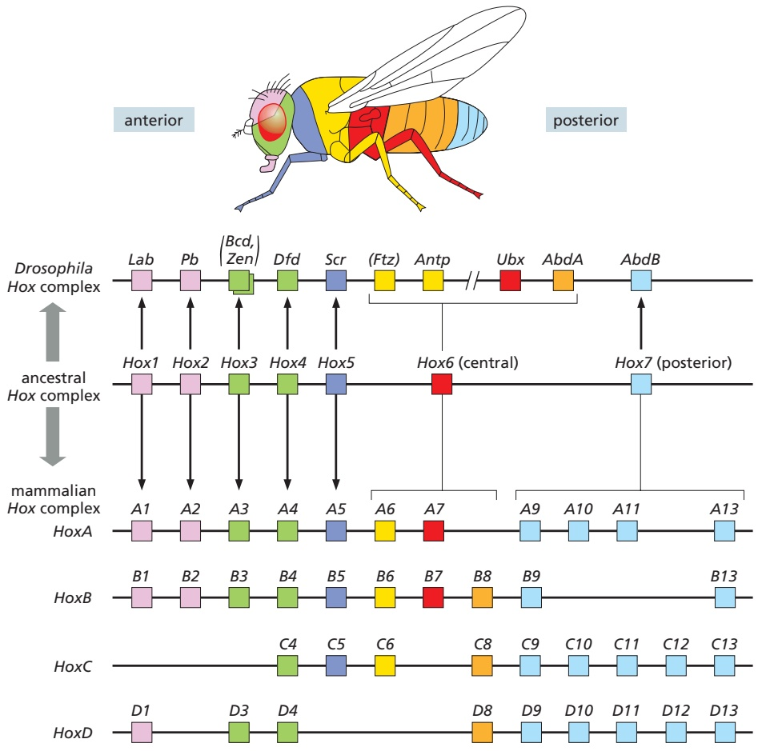

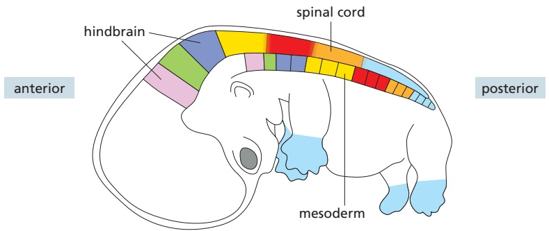

gene is artificially expressed in an anterior region, it can convert the anterior tissue to a posterior character. Conversely, loss of posterior Hox genes allows the posterior tissue where they are normally expressed to adopt an anterior character (Figure 21–31). Because of overlapping functions between genes in the four Hox gene clusters, the transformations observed in mouse Hox mutants are not always so straightforward as those in the fly, and they are often incomplete. Nonetheless, it seems clear that the fly and the mouse use essentially the same molecular machinery to impart individual characteristics to successive regions along at least a part of the A-P axis.

Figure 21–30 The Hox complexes of an insect and a mammal, compared and related to body regions. The genes of the Antennapedia and Bithorax complexes of Drosophila are shown in their chromosomal order in the top line (see Figure 21–23). The corresponding genes of the four mammalian Hox complexes are shown below, also in chromosomal order. The gene expression domains in fly and mammal are indicated in a simplified form by color in the diagrams of animals above and below. There is a remarkable parallelism. However, the details of the patterns depend on developmental stage and vary somewhat from one mammalian Hox complex to another. Also, in many cases, genes shown here as expressed in an anterior domain are also expressed more posteriorly, overlapping the domains of more posterior Hox genes.

The complexes are thought to have evolved as follows: first, in some common ancestor of worms, flies, and vertebrates, a single primordial homeotic selector gene underwent repeated duplication to form a series of such genes in tandem—the ancestral Hox complex. In the Drosophila sublineage, this single complex became split into separate Antennapedia and Bithorax complexes. Meanwhile, in the lineage leading to the mammals, the whole complex was repeatedly duplicated to give four Hox complexes. The parallelism is not perfect because apparently some individual genes have been duplicated and others lost. Still others have been co-opted for different purposes (genes in parentheses in the top line) over the time that has elapsed since the complexes diverged. (Based on a diagram courtesy of William McGinnis.)

#### Some Transcription Regulators Can Activate a Program That Defines a Cell Type or Creates an Entire Organ

Just as there are single genes that specify the identity of a particular region of the body, there are also genes whose products act as triggers for the development of a specific cell type or even a specific organ, initiating and coordinating the whole complex program of gene expression that is required. An example is the MyoD

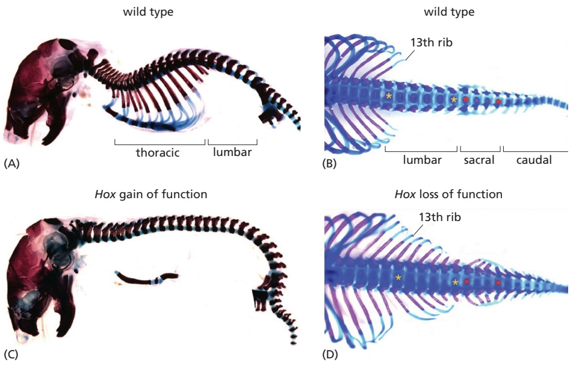

Figure 21–31 Control of anteroposterior pattern by Hox genes in the mouse. (A and B) A normal mouse (wild type) has about 65 vertebrae, differing in structure according to their position along the body axis: 7 cervical (neck), 13 thoracic (with ribs), 6 lumbar (bracketed by yellow asterisks in panel B), 4 sacral (bracketed by red asterisks in panel B), and about 35 caudal (tail). Panel A shows a side view, and panel B shows a dorsal view; for clarity, the limbs have been removed in each picture. (C) The HoxA10 gene is normally expressed in the lumbar region (together with its paralogs HoxC10 and HoxD10); here it has been artificially expressed in the developing vertebral tissue all along the body axis. As a result, the cervical and thoracic vertebrae are all converted to a ribless, lumbar character. (D) Conversely, when HoxA10 is removed along with HoxC10 and HoxD10, vertebrae that should normally have a lumbar or sacral character take on a thoracic, ribbearing character instead. (A and C, from M. Carapuço et al., Genes Dev. 19:2116–2121, 2005. With permission from Cold Spring Harbor Laboratory Press; B and D, from D.M. Wellik and M.R. Capecchi, Science 301:363–367, 2003. With permission of AAAS.)

family of transcription regulators that we encountered in Chapter 7. These proteins drive cells to differentiate into muscle, expressing muscle-specific actins and myosins and all the other specialized cytoskeletal, metabolic, and membrane proteins that a muscle cell needs. Analogously, members of the Achaete/Scute family of transcription regulators drive cells to become neural progenitors. In both these examples, the proteins belong to the helix–loop–helix (HLH) class of transcription regulators (see p. 405), and the same is true for several other proteins that induce the differentiation of particular cell types. These master transcription regulators exert their powerful differentiation-inducing activity by binding to many different regulatory sites in the genome and thereby controlling the expression of large numbers of downstream target genes. In one well-studied case, that of an Achaete/Scute family member called Atonal homolog 1 (Atoh1), the number of direct target genes in the mouse genome is more than 600. It is important to note, however, that even such powerful drivers of cell differentiation can have radicallyMBoC7 m21.33/21.31 different effects according to the context and history of the cells in which they act: Atoh1, for example, drives differentiation of certain classes of neurons in the brain, of sensory hair cells in the inner ear, and of secretory cells in the lining of the gut.

Other genes encoding transcription regulators can drive the formation and assembly of the multiple cell types that constitute an entire organ. A famous example is the transcription regulator Eyeless (see Figure 21–2). When it is artificially expressed in a patch of cells in the leg precursors of Drosophila, a well-organized eye-like organ develops on the leg, with the various eye cell types correctly arranged; conversely, loss of the Eyeless gene results in flies that lack eyes. Moreover, loss of the Eyeless homolog Pax6 in vertebrates likewise leads to loss of eye structures; humans with Pax6 mutations display a condition called congenital aniridia (**Figure 21–32**). Similar organ-selector proteins are known for foregut, heart, pancreas, and other organs. They are all master transcription regulators that directly regulate hundreds of target genes, the products of which then specify and construct the different elements of the appropriate organ. However, as in the example of Atoh1, they usually exert their specific effect only in combination with the right partners, which are only expressed in cells that were appropriately primed during their earlier development.

#### Notch-mediated Lateral Inhibition Refines Cellular Spacing Patterns

After the establishment of the basic body plan and the generation of organ pre-cursors, many further steps of pattern refinement are required to achieve the adult pattern of terminally differentiated cells in tissues and organs. Lateral inhibition (see Figure 21–10) mediated by Notch signaling is crucial for both cell diversification and fine-grained patterning in an enormous variety of tissues in all animals.

Figure 21–32 The Pax6 protein (also called Eyeless in Drosophila) controls development of light-sensing organs in many animal species. Flies or humans carrying mutations in the Pax6 gene lack certain eye structures present in normal animals. [Fly pictures courtesy of Katy Ong; human pictures from N.L. Washington et al., PLoS Biol. 7(11):e1000247, 2009.]

Certain tissues require the evenly spaced distribution of a specialized cell type, such as sensory cells, secretory cells, or stem cells, across their expanse. A good example is the development of **sensory bristles** in Drosophila, mostMBoC7 n21.100/21.32 easily seen on the fly’s back, but also present on most of its other exposed surfaces. Each of these is a miniature sense organ, consisting of a sensory neuron and a small set of supporting cells. Some bristles respond to chemical stimuli and others to mechanical stimuli, but they are all constructed in a similar way (**Figure 21–33**).

The proneural genes Achaete and Scute mentioned earlier mark the clusters of epidermal cells within which bristles will form, but exactly which cells form a bristle depends on competitive interactions among them. Signaling within each cluster selects a single cell—called the sensory organ precursor cell—to serve as the bristle progenitor. The progenitor becomes distinct from surrounding cells through lateral inhibition (see Figure 21–10), which is mediated by the Notch signaling pathway. Binding of the transmembrane receptor Notch on the surface of a cell in the cluster by its transmembrane ligand Delta on a neighboring cell generates signals that inhibit differentiation to form a sensory organ precursor and also inhibit production of Delta in that same cell. At first, all cells in the cluster express both Notch and Delta and inhibit one another from differentiating.

#### Figure 21–33 Drosophila

mechanosensory bristles. (A) The lineage of the four cells of the bristle—all descendants of a single sensory organ precursor cell—is shown on the left. The sensory organ precursor, once it is specified, generates this set of cells through a short program of division cycles. In each generation of the progeny, lateral inhibition operates again to drive the newborn cells toward different fates: one of the ultimate progeny cells will become the neuron; another, the shaft of the bristle; others, supporting cells of various sorts. (B) The distribution of sensory organ precursors in the pupal epidermis, seen using a fluorescent reporter for the senseless gene (pink). (C) The pattern of bristles on the thorax of an adult fly. (B and C, courtesy of François Schweisguth.)

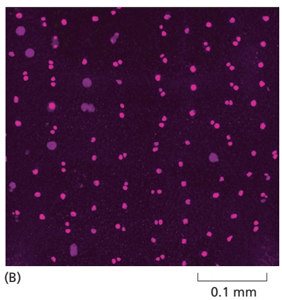

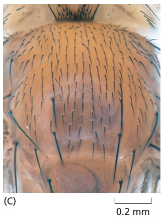

Figure 21–34 Lateral inhibition. (A) The basic mechanism of Notch-mediated competitive lateral inhibition, illustrated for just two interacting cells. Proteins or effector lines shown in gray indicate inactivity. (B) The outcome of the same process operating in a larger patch of cells. Initially, all cells in the patch are equivalent and signal through Delta–Notch interactions to discourage their neighbors from specializing as a sensory organ precursor. This balanced inhibition is disrupted when an individual cell generates a slightly stronger Delta signal than that of its neighbors: it then inhibits its neighbors more strongly while itself becoming more committed to the sensory organ precursor fate. As neighboring cells lose their capacity to differentiate, they also lose their capacity to inhibit other cells from doing so. Lateral inhibition thus makes adjacent cells follow different fates. Although the interaction is thought to be dependent primarily on cell–cell contacts, the sensory organ precursor can also deliver an inhibitory signal to cells that are more than one cell diameter away; for example, by sending out long protrusions to touch them.

Gradually, however, small signaling differences lead to a positive feedback loop in which a cell producing a slightly stronger Delta signal both discourages its neighbors from differentiating and reduces their production of Delta. The result is a competition, from which a single sensory organ precursor cell eventuallyMBoC7 m21.35/21.34 emerges as winner, sending a strong inhibitory signal to its immediate neighbors but receiving no such signal in return (**Figure 21–34**).

The sensory organ precursor goes through a short program of further divisions to generate the set of cells that form the final bristle (see Figure 21–33). Notch signaling acts repeatedly at successive stages in this program to drive the descendants of the sensory organ precursor along different pathways and assign them to their various specialized fates. However, it does so in conjunction with additional mechanisms that bias the outcome of the competition mediated by lateral inhibition. Determinants that are asymmetrically localized inside the dividing cells have this role in sensory bristle development, as we now discuss.

#### Cell-fate Determinants Can Be Asymmetrically Inherited

Cell diversification does not always depend on extracellular signals: in some cases, daughter cells are born different as a result of an intrinsically asymmetric cell division, during which some significant set of molecules is divided unequally between them. This asymmetrically segregated molecule (or set of molecules) then acts as a determinant for one of the cell fates by directly or indirectly altering the pattern of gene expression within the daughter cell that receives it (see Figure 21–11). A good example of the asymmetric segregation of molecules occurs in the early frog embryo: VegT RNA is localized specifically in the vegetal region of the fertilized egg. After the cleavage divisions, only vegetal cells will inherit VegT RNA.

Asymmetric divisions often occur at the beginning of development, but they are also encountered at some later stages. To return to our example of the adult Drosophila bristle (see Figure 21–33), the sensory organ precursor undergoes an

(A)

interphase

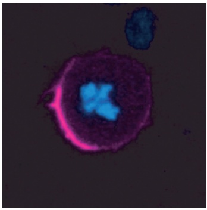

mitosis

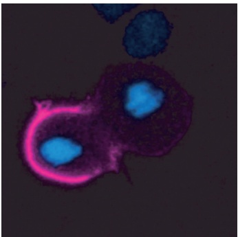

cytokinesis

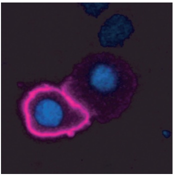

daughter cells

10 µm

asymmetric cell division to generate one daughter that will produce the outer shaft and socket cells and one daughter that will produce the inner neuron and sheath cell. Each fate is dictated by the differential inheritance of a protein called Numb, which influences a Notch-mediated lateral inhibition decision between the daughter cells. Numb is a cytosolic protein that inhibits Notch signaling, and its presence in a sensory organ precursor cell specifies the “inner” precursor fate. Prior to the division of this cell, Numb is associated uniformly with the cell cortex. As the mitotic spindle forms, Numb is displaced from the cortical region close to one spindle pole, restricting its localization to the cortex adjacent to the other pole (Figure 21–35). This restriction depends on the polarizing activity of the Par protein complex described in Chapter 16 (and see Figure 16–76). When cytokinesis is completed, Numb is present in only one of the two daughters, where it inhibits Notch signaling within that cell—thereby acting as an asymmetrically segregated fate determinant.

Numb operates in an analogous manner during asymmetric divisions of the Drosophila neural stem cell lineage to generate the large numbers and balanced proportions of neurons and glia. Asymmetric division of neural progenitors also drives neurogenesis in the cortex of the vertebrate brain. In both cases, Notch signaling determines the difference between a more progenitor-like and a more differentiated fate.

#### Evolution of Regulatory DNA Explains Many Morphological Differences

In the preceding sections, we have seen that animals contain the same essential cell types, have a similar collection of genes, and share many of the molecular mechanisms of pattern formation. But how can we reconcile these ideas with the radical differences that we see in the body structures of animals as diverse as a worm, a fly, a frog, and a mouse? We asserted earlier, in a general way, that these differences usually seem to reflect differences in the regulatory DNA that controls the conserved basic set of developmental regulatory proteins. We now examine the evidence more closely.

When we compare animal species with similar basic body plans—different vertebrates, for example, such as fish, birds, and mammals—we find that corresponding genes can have similar sets of regulatory elements that are conserved and recognizably homologous in the different animals. The same is true if we compare different species of nematode worms or insects. But, when we compare vertebrate regulatory regions with those of worms or flies, it is hard to see any such resemblance. The protein-coding sequences are unmistakably similar, but the corresponding regulatory DNA sequences appear very different, suggesting that the differences in body plans mainly reflect differences in regulatory DNA. Although variations in the proteins themselves also contribute, differences in regulatory DNA would be enough to generate extremely different tissues and body structures even if the proteins were the same.

It is not yet possible to trace all of the genetic steps that have led to the spectacular diversity of animals. Their lineages have diverged over hundreds of millions

(B)

10 µm

Figure 21–35 Asymmetric cell division creates different daughter-cell fates in the Drosophila bristle lineage. (A) Images of a dividing sensory organ precursor cell in the Drosophila pupa. Initially, the Numb protein (pink) is distributed uniformly around the cell cortex, but it partitions to one side of the cell during metaphase. Nuclear DNA is stained blue. Division results in the segregation of Numb into only one of the two daughter cells. (B) In this pair of daughter cells, asymmetrically inherited Numb (not shown) prevents Notch signaling in the daughter cell on the left; Notch activity is restricted to the daughter cell on the right, as shown by a reporter of the Notch target gene Enhancer of Split m8 (green), which appears as speckles in the cell nucleus (stained blue). (A, from J.A. Knoblich, Nat. Rev. Mol. Cell Biol. 11:849–860, 2010; B, courtesy of François Schweisguth.)

pelvic spine

of years, and in most cases too many changes have occurred for us to be able to say that this or that feature results from this or that mutation. The picture is clearer, however, for more recent evolutionary events. Studies of closely related animal populations and plant populations whose members have different morphologies have revealed that dramatic developmental effects can result from specific changes in regulatory DNA.

A well-studied example is the morphological diversity found in stickleback fish. Marine sticklebacks extend sharp spines from their pelvic skeleton. These spines are thought to help protect the fish from soft-mouthed fish predators that live in the ocean. After the last ice age ended about 10,000 years ago, some marine sticklebacks colonized newly formed freshwater streams and lakes, which often lacked such predators. Many of these populations of freshwater sticklebacks evolved to lose their pelvic spines. The development of this different morphology reflects differences in control of the expression of a transcription regulator called Pitx1. Whereas marine sticklebacks express the Pitx1 gene in the hindlimb bud cells that will give rise to pelvic spikes, freshwater sticklebacks have lost this expression as a result of a change at the Pitx1 locus. These changes do not lie in the coding sequence. Instead, each is a small deletion of a block of regulatory DNA that controls Pitx1 expression specifically in the pelvic cells (**Figure 21–36**).

The Pitx1 protein has important functions elsewhere in the fish body, for example in the jaw and pituitary gland, and these functions must be retained. The DNA sequences that encode the Pitx1 protein, as well as the regulatory DNA responsible for tissue-specific Pitx1 expression at these other body sites, is pre-served in both marine and freshwater fish. The evolution of pelvic development in sticklebacks shows how the modular nature of regulatory DNA elements that we encountered in Chapter 7 (see Figure 7–31) allows independent modification of the different parts of the body, even when formation of multiple body partsMBoC7 e9.14/21.37 depends on the same proteins.

(A) marine stickleback

Pitx1 expression

(B)

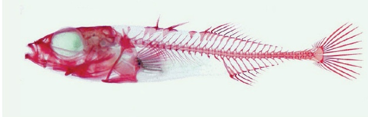

(C) freshwater stickleback

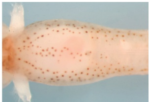

(D)

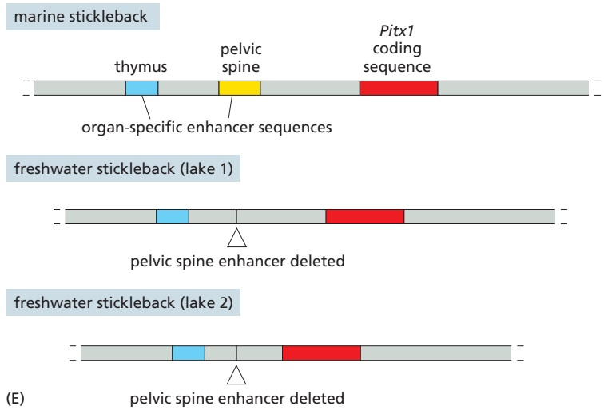

Figure 21–36 Morphological diversity in stickleback fish is caused by changes in regulatory elements. (A–D) Pelvic spines are present in marine (A) but missing in some freshwater (C) populations. Correspondingly, Pitx1 is expressed in the pelvic area in marine (B) but not in freshwater (D) fish. (E) The lack of expression in the pelvic area of freshwater populations is caused by regulatory deletions that removed pelvic-specific enhancer sequences; these deletions occurred independently in different populations and are of different sizes. The coding sequence and other enhancers and sites of expression for Pitx1 are conserved in marine and freshwater sticklebacks. (A–D, courtesy of Michael D. Shapiro.)

Figure 21–37 The insertion of a mobile genetic element helped produce modern corn. Today’s corn plants were originally bred from a wild plant called teosinte (A). This wild ancestor produced numerous ears that contained small, hard seeds. (B) Modern corn, by contrast, produces fewer ears—but they contain numerous, plump, sweet seeds (kernels). The insertion of a mobile genetic element in the regulatory region of a gene involved in seed development helped drive the change. Here, the two plants are drawn to the same scale; for simplicity, the leaves are not shown.

In the recent evolution of plants, changes in their structure can be traced in a similar way to changes in regulatory DNA. In an important example for agriculture, such changes account for a large part of the dramatic difference between the wild teosinte plant and its modern descendant, maize, through some 10,000 years of selection upon natural genetic variation by Native Americans (**Figure 21–37**).

#### Summary

Drosophila has been the foremost model organism for the study of the genetics of animal development. Its embryonic pattern is initiated by the products of maternaleffect genes called egg-polarity genes, which operate by setting up graded distributions of transcription regulators in the egg and early embryo. The gradient of Bicoid protein along the anteroposterior (A-P) axis, for example, helps initiate the orderly expression of gap genes, pair-rule genes, and segment-polarity genes. These three classes of segmentation genes, through a hierarchy of interactions, become expressed in some regions of the embryo and not others, progressively subdividing an initially uniform field of cells along the A-P axis into a regular series of repeating modular units called segments.

Superimposed on the pattern of gene expression that repeats itself in every segment, there is a serial pattern of expression of Hox genes that confers on each segment a different identity. These genes are grouped in complexes and are arranged in a sequence that matches their sequence of expression along the A-P axis of the body.

Although Hox gene expression is initiated in the embryo, it is subsequently maintained by the action of chromatin-binding proteins of the Polycomb and Trithorax group, which stamp the chromatin of the Hox complex with a heritable record of its embryonic state of repression or activation, respectively. Hox complexes homologous to that of Drosophila are found in virtually every type of animal, where they help pattern the A-P axis of the body.

Signaling gradients are also set up along the dorsoventral (D-V) axis. Initially, Toll signaling generates a nuclear gradient of Dorsal protein, which induces an extracellular signaling gradient of the TGFb family protein Dpp and its antagonist, Sog. This creates a gradient of Dpp activity that helps refine the assignment of different characters to cells at different positions along the D-V axis.

In Xenopus, the polarity of the egg and the site of sperm entry set up the embryonic axes. A gradient generated by the TGFb family protein Nodal induces different fates along the animal–vegetal axis, whereas BMP and Chordin—proteins homologous to Drosophila Dpp and Sog, respectively—control the patterning of the D-V axis.

Transcription regulators control the formation of specific cell types. Members of the MyoD family drive the process of muscle-cell determination, coordinating the many components required, whereas Achaete/Scute transcription regulators control neural fate. Other genes encoding such master transcriptional regulators can regulate the formation of entire organs. Eyeless, for example, is both necessary and sufficient to generate eye structures in Drosophila.

To refine the anatomical pattern within such an organ, the cells interact locally, both by diffusible inductive signals and by short-range mechanisms. Often, the cells compete with one another by lateral inhibition. This process results in activation of the Notch signaling pathway in one cell and inhibition in its neighbors, generating two different cell types. Asymmetric cell divisions, in which daughter cells inherit different molecular determinants from the mother cell, provide an additional way to organize a fine-grained diversity of cell types.

Evidence from recent evolutionary events indicates that anatomical changes are mostly driven by changes in regulatory DNA sequences that determine when and where developmental genes are expressed. How the striking diversity in body structures has evolved over longer times remains largely unknown, although it seems likely that similar principles apply.

#### DEVELOPMENTAL TIMING

Developmental events unfold over minutes, hours, days, weeks, months, or even years, with each organism following its own strict timetable. The cascades of inductive interactions and transcriptional regulatory events described earlier take time, as signals are transmitted and transcription regulators are synthesized and then bind to DNA to activate or repress their target genes. So too do the changes in cell size, shape, and organization that result from changes in gene expression. All of these events require correct parameters of timing, including order (the sequence of events), interval (the time between events), and, in some cases, rhythm (repeated cycles of an event). Each developmental process must thus occur at an appropriate rate, tuned by evolution to fit with the timing of other processes in the embryo or in the environment. The control of timing is a compelling problem in developmental biology, but one of the least understood.

#### Molecular Lifetimes Play a Critical Part in Developmental Timing

Developmental processes are complex, but they are built up from simple steps. A first challenge is to understand the timing of these steps. How long does it take, for example, to switch the expression of a gene on or off? This is not like throwing a light switch: it involves delays. First, it takes time to make an mRNA molecule: the RNA polymerase must travel the length of the gene, the primary RNA transcript must be spliced and otherwise processed, and the resulting mRNA must be exported from the nucleus and delivered to the site where it will be translated. This adds up to what one might call the gestation time of the individual molecule. Second, it takes time for the individual mRNA molecules to accumulate to their fully effective concentration; as explained in Chapter 15, this accumulation time is dictated by the average lifetime of the molecules— the longer they last, the higher their ultimate concentration, and the longer the time taken to attain it. Similar delays occur at the next step, where the mRNA is translated into protein: synthesis of each individual protein molecule involves a gestation delay, and attainment of an effective concentration of protein molecules involves an accumulation delay that depends on the time it takes for each protein to fold into its three-dimensional structure and its lifetime once produced. The time for the whole gene switching process is the sum of the gestation delays and the accumulation delays (basically, the molecular lifetimes) for both the mRNA and the protein molecules. Somewhat counterintuitively, it is the combined length of these delays, rather than the rate of molecular synthesis (the number of molecules synthesized per second), that chiefly determines the switching time.

The same additive principle applies to long cascades of gene switching, where gene A activates gene B, and gene B activates gene C, and so on. It also applies in other circumstances, such as in signaling pathways where one protein directly regulates the activation of the next. In all these cases, molecular lifetimes, along with gestation delays, play a key part in determining the pace of development. The lifetimes of mRNA and protein molecules are enormously variable, from a few minutes or hours to days or more, explaining much of the tempo of developmental events.

Gene switching delays, however, are not the be-all and end-all of developmental timing. Development involves many other kinds of delay that contribute to timing. Chromatin structure takes time to remodel. Inductive signals take time to diffuse across a field of cells (see Figure 21–9). Cells take time to move and rearrange themselves in space. Nevertheless, the timing of gene switching plays a fundamental part in developmental timing, as illustrated in an especially clear and striking way by a gene expression oscillator that controls the segmentation of the vertebrate body axis, as we now explain.

#### A Gene Expression Oscillator Acts as a Clock to Control Vertebrate Segmentation

The main body axis of all vertebrates has a repetitive, periodic structure, seen in the series of vertebrae, ribs, and segmental muscles of the neck, trunk, and tail. These segmental structures originate from the mesoderm that lies as a long slab on either side of the embryonic midline. This slab becomes broken up into a regular repetitive series of separate blocks, or **somites**—cohesive groups of cells, separated by clefts (**Figure 21–38A**). In contrast to the segments of a Drosophila embryo that appear simultaneously, as we discussed previously, somites in the vertebrate are formed sequentially. The somites form (as bilateral pairs) one after another, in a regular rhythm, starting in the region of the head and ending in the tail. Depending on the species, the final number of somites ranges from fewer than 40 (in a frog or a zebrafish) to more than 300 (in a snake).

The cells that will form somites are generated in the posterior, most immature part of the mesodermal slab, called the presomitic mesoderm. This is a proliferative zone, and as new cells are generated, the zone is pushed tailward, extending the embryo (**Figure 21–38B**). As the presomitic mesoderm moves tailward, it deposits a trail of somites formed from cells that group together into blocks as they emerge from the anterior end of the presomitic region. The special character of the presomitic mesoderm is maintained by a combination of fibroblast growth factor (FGF) and Wnt signals, produced by a signaling center at the tail end of the embryo, and the range of these signals seems to define the region from which somites can be formed. The somites emerge with clocklike timing, but what determines the rhythm of the process?

Figure 21–38 Somite formation in the chick embryo. (A) Brightfield image of a chick embryo at 40 hours of incubation. (B) How the temporal oscillation of gene expression in the presomitic mesoderm becomes converted into a spatial alternating pattern of gene expression in the formed somites. In the posterior part of the presomitic mesoderm, each cell oscillates with a cycle time of 90 minutes. As cells mature and emerge from the presomitic region, their oscillation is gradually slowed down and finally brought to a halt, leaving them in a state that depends on the phase of the cycle they happen to be in at the critical moment. In this way, a temporal oscillation of gene expression traces out an alternating spatial pattern. (Movie 21.5.) (A, from Y.J. Jiang et al., Curr. Biol. 8:R868–R871, 1998. With permission from Elsevier.)

In the posterior part of the presomitic mesoderm that is destined to be segmented, the expression of certain genes oscillates in time. Such oscillations can be observed in time-lapse movies of embryos containing fluorescent reporters of individual genes. One new somite pair is formed in each oscillation cycle, and, in mutants where the oscillations fail to occur, somite segmentation is disrupted: the cells may still break up, belatedly, into separate clusters, but they do so in a haphazard, irregular way. The gene expression oscillator controlling regular segmentation is called the **segmentation clock**. The length of one complete oscillation cycle depends on the species: it is 30 minutes in a zebrafish, 90 minutes in a chick, 120 minutes in a mouse, and 300 minutes in a human.

As cells emerge from the presomitic mesoderm to form somites—in other words, as they escape from the influence of the FGF and Wnt signals—their oscillating gene expression stops. Some become arrested in one state, some in another, according to the phase of the oscillation cycle at the time they leave the presomitic region. In this way, the temporal oscillation of gene expression in the presomitic mesoderm leaves its trace in a spatially periodic pattern of gene expression in the maturing mesoderm. This in turn dictates how the tissue will break up into physically separate blocks, through effects on the pattern of cell–cell adhesion.

How does the segmentation clock work? The first somite oscillator genes to be discovered were Hes genes, which code for inhibitory transcription regulators. As well as regulating other genes, the products of Hes genes can directly regulate their own expression, creating a simple negative feedback loop. Autoregulation of Hes genes is thought to be the basic generator of the oscillations of the somite clock. Although the machinery has been modified in various ways in different species, the underlying principle seems to be conserved. When the key Hes gene is transcribed, the amount of Hes protein builds up until it is sufficient to block Hes gene transcription. Synthesis of the protein then ceases, and as the protein decays, transcription is permitted to begin again; and so on, cyclically (**Figure 21–39**). The period of oscillation, which determines the size of each somite, depends on the delay in the feedback loop. This delay equals the sum of the gestation delays and accumulation delays (that is, the molecular lifetimes) of the Hes mRNA and protein molecules, according to the principle discussed earlier. Mathematical modeling (see Chapter 8) allows us to relate these basic molecular parameters to the cycle time of the segmentation clock: to a first approximation, the cycle period is simply equal to twice the total delay in the negative feedback loop, and thus twice the sum of the delays occurring

Figure 21–39 Delayed negative feedback giving rise to oscillating gene expression. (A) A single gene, coding for a transcription regulator that inhibits its own expression, can behave as an oscillator. For oscillation to occur, there must be a delay (or several delays) in the feedback circuit, and the lifetimes of the mRNA and protein (which contribute to the delay) must be short compared with the total delay. The total delay determines the period of oscillation. It is thought that a feedback circuit like this, based on a pair of redundantly acting genes called Her1 and Her7 in the zebrafish—or their counterpart, Hes7, in the mouse—is the pacemaker of the segmentation clock governing somite formation. (B) The predicted oscillation of Her1 and Her7 mRNA and protein, computed using rough estimates of the feedback circuit parameters appropriate to this gene in the zebrafish. Concentrations are measured as numbers of molecules per cell. The predicted period is close to the observed period, which is 30 minutes per somite in the zebrafish.

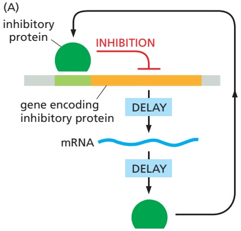

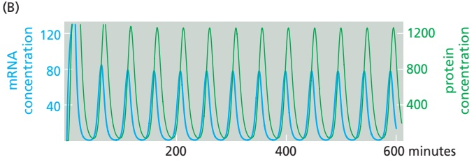

at each step of the loop. Moreover, an experimental manipulation that changes one of these parameters (for example, altering the size of a Hes intron to perturb mRNA-processing time) results in the predicted effect on the period of somite formation.

The feedback loop just described is intracellular, and each cell in the presomitic mesoderm can generate oscillations on its own, even when cultured in a dish. But these oscillations at the single-cell level are somewhat erratic and imprecise, reflecting the fundamentally noisy, stochastic nature of the control of gene expression, as discussed in Chapter 7. A mechanism is needed to keep all the cells in the presomitic mesoderm that will form a particular somite oscillating in synchrony. This is achieved in part through cell–cell communication via the Notch signaling pathway. In this context, Notch signaling does not drive neighboring cells to be different, as in lateral inhibition, but does just the opposite: it keeps them in unison. In mutants where Notch signaling fails, including mutants defective in Delta or Notch itself, the cells drift out of synchrony, and somite segmentation is again disrupted. This leads to gross deformity of the vertebral column—an extraordinary display of the consequences of the noisy temporal control of gene expression at the single-cell level, writ large in the structure of the vertebrate body as a whole.

#### Cell-intrinsic Timing Mechanisms Can Lead to Different Cell Fates

Although signaling between cells plays an essential part in driving the progress of development, this does not mean that cells always require signals from other cells to prod them into changing their character as development proceeds. Some of these changes are intrinsic to the cell (like the ticking of a circadian clock, discussed in Chapter 15) and depend on intracellular developmental programs that can operate even when the cell is removed from its normal environment.

The best-understood example is the development of neuroblasts, the stem cells of the Drosophila central nervous system. These cells go through a succession of asymmetric cell divisions to generate distinct types of neurons and glial cells, always in the same sequence and with the same timing. Each neuroblast produces this wide range of daughter-cell fates using a time-dependent developmental program. As the neuroblast goes through its set schedule of divisions, it successively changes its internal state by expressing a series of different transcription regulators. For example, most embryonic neuroblasts sequentially express the transcription regulators Hunchback, Krüppel, Pdm, and Castor in a fixed order (**Figure 21–40**). When a neuroblast divides, the transcription regulators expressed at that moment are inherited by and maintained in its progeny; thus, the differentiated neural cells are endowed with different characters according to their time of birth.

When neuroblasts are taken from an embryo and maintained in culture, isolated from their normal surroundings, they step through much the same stereotyped developmental program as if they had been left in the embryo. Moreover, many of the neuroblast transitions occur even when cell division is blocked. The neuroblasts seem to have a built-in timer that determines when each of the transcription regulators is expressed, and this timer can continue to run in the absence of cell-cycle progression. The molecular basis of the timing is not well understood. Because cross-regulatory transcriptional cascades are involved, it likely depends on the time taken for gene switching, as described earlier, but it might also depend on slow progressive changes in chromatin structure and genome organization, which also can serve to measure the passage of time in the embryo.

Timing mechanisms can coordinate cell fates with the spatial organization of tissues. For example, during development of the mammalian cerebral cortex, the ordered expression of different transcription factors in the progenitor cells that divide to produce neurons and glial cells leads to sequential production of specific neural cell types. The newborn neurons migrate to their appropriate position

Figure 21–40 Temporal patterning of neural fate in Drosophila embryos. Each neuroblast undergoes an asymmetric cell division to renew itself and to produce a daughter called a ganglion mother cell. The ganglion mother cell subsequently divides to produce a pair of terminally differentiated neurons or glia. The types MBoC7 m21.40/21.40of neurons and glia are determined by the expression of a transcription regulator in the parent neuroblast that is then inherited by its ganglion-mother-cell daughter. Each neuroblast will sequentially express the transcription regulators Hunchback, Krüppel, Pdm, and Castor as it progresses through its lineage. After dividing several times while expressing one of these regulators, the neuroblast switches its pattern of gene expression, expressing an updated set of genes that will be passed along to its daughter cells, which differentiate into specific cell types accordingly. (After B.J. Pearson and C.Q. Doe, Nature 425:624–628, 2003.)

(A)

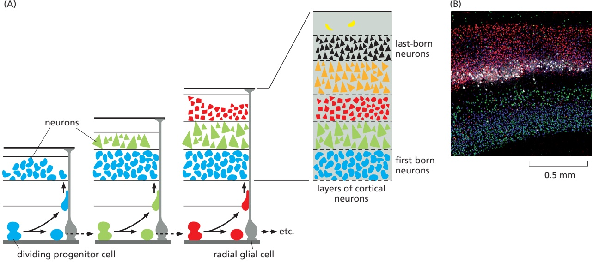

Figure 21–41 Timed expression of neural genes drives laminar organization of the brain. (A) Many neurons and glial cells in the mammalian cerebral cortex develop from a common progenitor, which proliferates on the inner surface of the cortical neuroepithelium to produce successive generations of neurons (colored here blue, green, red, orange, and black). The developing neurons migrate outward, crawling along processes that extend from radial glial cells, which also develop from the same progenitor cells. The first-born neurons settle closest to their birthplace, while neurons born later crawl past them to settle farther out. Successive generations of neurons thus occupy different layers in the cortex and have different intrinsic characters according to their birth dates. (B) Fluorescence micrograph showing the laminar organization of excitatory neurons labeled with antibodies to different transcription factors (blue, green, white, and red) in the mammalian cerebral cortex. Neural cell types are specified by the temporal sequence of transcription factor expression in their progenitors, so that birth order specifies both the fate and location of differentiated neurons. (From I. Holguera and C. Desplan, Science 362: 176–180, 2018.)

in the developing cortex, ultimately occupying different layers of the adult brain. Thus, all neurons that populate a layer form in the same time window and have common fates (**Figure 21–41**).

#### Cells Rarely Count Cell Divisions to Time Their Development

Many specialized cells develop from proliferating progenitor cells that stop dividing and terminally differentiate after a limited number of cell divisions. In these cases, it is tempting to speculate that the cell-division cycle serves as an intracellular timer to control the timing of cell differentiation. The cell cycle would be the ticking clock that sets the tempo of other developmental processes, with maturational changes in gene expression being dependent on cell-cycle progression. Most of the evidence, however, indicates that this appealing idea is wrong. Although there are examples where cells change their maturation state with each division and the change depends on cell division, this is not the general rule. As we just saw for neuroblasts in the Drosophila embryo, cells in developing animals often carry on with their normal timetable of maturation and differentiation even when cell division is artificially blocked; necessarily, some abnormalities occur, if only because a single undivided cell cannot differentiate in two ways at once. But it seems that most developing cells can change their developmental state without a requirement for cell division. Developmental control genes can switch the cell-division-cycle machinery on or off, and it is the dynamics of these genes, rather than the cell cycle, that sets the tempo of development.

#### MicroRNAs Can Regulate Developmental Transitions

Because genetic screens are useful for tracking down the genes involved in almost any biological process, they have been used to search for mutations that alter developmental timing. Such screens were performed in the nematode worm

Caenorhabditis elegans (**Figure 21–42**). This small creature follows an astonishingly precise and predictable developmental program that has been described in extraordinary detail, so that one can map out the exact lineage of every cell in the body. The time and place of each cell division, as well as the fate of each of its daughters, are invariant from one individual to the next.

A great advantage of the lineage diagram describing the normal development of C. elegans is that one can see exactly how the developmental program is altered in a mutant. Genetic screens in C. elegans revealed mutations that disrupt devel-MBoC7 n21.110/21.42 opmental timing in a particularly striking way: in these so-called **heterochronic** mutants, certain cells in a larva at one stage of development behave as though they were in a larva at a different stage of development or cells in the adult carry on dividing as though they belonged to a larva (**Figure 21–43**).

Figure 21–42 Cell lineage in Caenorhabditis elegans. (A) Some of the major tissues in the adult worm (see Figure 1–42). (B) The complete cell lineage of the worm was determined by meticulous analysis of the fate of every daughter cell after each cell division, beginning with the single-celled zygote and ending in the 959 cells of the adult. Each vertical line represents a single cell, with branch points reflecting a cell division. Labels indicate the cells in the lineage that make up the tissues shown in panel A. (A and B, courtesy of D.H. Hall, Worm Atlas from https://www.wormatlas.org/celllineages.html.)

Genetic analyses showed that the products of the heterochronic genes act in series, forming regulatory cascades. Unexpectedly, two genes at the top of their respective cascades, called Lin4 and Let7, were found to code not for protein but instead for **microRNAs (miRNAs)**—short, untranslated, regulatory RNA molecules, 21 or 22 nucleotides long. These act by binding to complementary sequences in the noncoding regions of mRNA molecules transcribed from other heterochronic genes, thereby repressing their translation and promoting their degradation, as discussed in Chapter 7. The Lin4 miRNA binds to the 3′ untranslated region of mRNA produced by the heterochronic gene $L i n I 4 ,$ which itself promotes early-stage larva-cell behaviors. A developmentally regulated increase of Lin4 levels thus governs the progression from early to late-stage larva-cell behaviors, by gradually reducing levels of Lin14 protein. Increasing levels of Let7 miRNA govern the progression from late larva to adult in an analogous way by regulating a different target gene called Lin41. In fact, Lin4 and Let7 were the first miRNAs to be described in any animal: it was through developmental genetic studies in C. elegans that the importance of this whole class of molecules for gene regulation in animals was discovered.

Figure 21–43 Heterochronic mutations in the Lin14 gene of C. elegans. Only the effects on one of the many altered lineages are shown. A loss-of-function (recessive) mutation in Lin14 causes premature occurrence of the pattern of cell division and differentiation characteristic of a late larva, so that the animal reaches its final state prematurely and with an abnormally small number of cells. The gainof-function (dominant) mutation has the opposite effect, causing cells to reiterate patterns of cell divisions characteristic of the first larval stage, continuing through as many as five or six molt cycles. The Lin14 gain-of-function mutations can result from altering the binding site for the Lin4 miRNA, rendering Lin14 protein immune from down-regulation. The black X denotes a programmed cell death. Green lines represent cells that contain Lin14 (which binds to DNA), red lines those that do not. (Adapted from V. Ambros and H.R. Horvitz, Science 226:409–416, 1984; and P. Arasu et al., Genes Dev. 5:1825–1833, 1991.)

Cell and Nuclear Size Relationships Schedule the Onset of Zygotic Gene Expression

As we discussed earlier, many gene products are deposited in the egg by the mother, allowing the first steps of development to begin immediately upon fertilization. Maternal supplies eventually run out, however, and the zygote begins to produce its own gene products. This **maternal–zygotic transition (MZT)** occurs in most organisms after a substantial delay and marks the temporal window dur-MB 7 21.42/21.43 ing which the embryo’s own genome largely takes over control of development from maternal macromolecules (**Figure 21–44**).

The MZT occurs in most species shortly before gastrulation, when rapid and synchronous cleavage divisions give way to slower and more conventional cell cycles. During this transition, thousands of genes initiate transcription from the previously silent zygotic genome, and many maternal gene products are cleared from the embryo. In several species, including frogs, fish, and flies, some of the earliest zygotic genes to be transcribed include specific miRNAs that target maternal mRNAs for translational repression and degradation. Here again, miRNAs function to sharpen developmental transitions by blocking and removing mRNAs that define an earlier developmental stage.

How is the timing of the MZT controlled? One trigger appears to be the nuclearto-cytoplasmic ratio. Many animal embryos do not grow or change volume during the earliest stages of development. Rather, rapid rounds of DNA replication and mitosis transform the fertilized egg into thousands of smaller cells. During these cleavage divisions, the total amount of cytoplasm in the embryo remains constant, but the number of cell nuclei in the embryo increases exponentially, thereby increasing the ratio of DNA to cytoplasm. Strikingly, haploid embryos containing half the amount of DNA per cell undergo the MZT one cell cycle later than normal diploid embryos. According to one model, the nuclear-to-cytoplasmic ratio might be measured through the titration of a maternally provided transcription repressor against the increasing amount of nuclear DNA. The total amount of repressor would stay constant during cleavage divisions, but the amount of repressor per genome would decrease by half with each round of DNA synthesis until a threshold is reached that allows the zygotic genome to become transcriptionally active. One candidate for the repressor is maternal histone proteins, whose concentration regulates MZT timing in several organisms. Other evidence suggests that certain maternally provided transcription regulators trigger the MZT after they accumulate to some threshold sufficient to activate their gene targets. Different species may rely on either or both mechanisms to time activation of the zygotic genome appropriately.

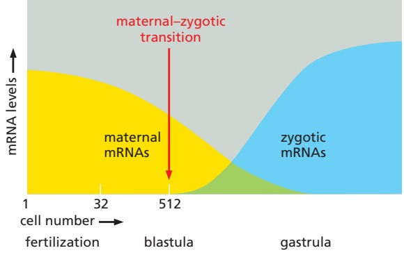

Figure 21–44 The maternal–zygotic transition in a zebrafish embryo. Maternal mRNAs are deposited by the mother into the egg and drive early development. These mRNAs are degraded during different stages of embryogenesis, including blastula and gastrula stages, but a relatively abrupt change occurs at the maternal–zygotic transition (MZT). Before this, the embryonic (zygotic) genome is transcriptionally inactive; afterward, zygotic genes start to be transcribed. In zebrafish embryos, the zygotic genome begins to be activated at the 512-cell stage.

#### Hormonal Signals Coordinate the Timing of Developmental Transitions

We have so far emphasized timing mechanisms that operate locally and separately in the different parts of the embryo or in specific subsystems of the molecular control machinery. Evolution has tuned each of these largely independent processes to run at an appropriate rate, matched to the needs of the organism as a whole. For some purposes, however, this is not enough: a global coordinating signal is required. This is especially true where changes have to occur throughout the body in response to a cue that depends on the environment. For example, when an insect or amphibian undergoes metamorphosis—the transition from larva to adult—almost every part of the body is transformed. The timing of metamorphosis depends on external factors such as the supply of food, which determines when the animal reaches an appropriate size. All the bodily changes have to be triggered together at the right time, even though they are occurring in widely separated sites. The coordination in such cases is provided by **hormones**—signal molecules that spread throughout the body.

The metamorphosis of amphibians provides a spectacular example. During this developmental transition, amphibians switch from an aquatic to a terrestrial life. Larva-specific organs such as gills and tail disappear, and adult-specific organs such as legs form. This dramatic transformation is triggered by thyroid hormone, produced in the thyroid gland. If the gland is removed or if thyroid hormone action is blocked, metamorphosis does not occur, although growth continues, producing a giant tadpole. Conversely, a dose of thyroid hormone given to a tadpole by an experimenter can trigger metamorphosis prematurely.

Thyroid hormone is distributed throughout the body by the vascular system and induces changes in receiving cells by binding to intracellular nuclear hormone receptors, which regulate hundreds of genes. This does not mean, however, that target tissues all respond in the same way to the hormone: organs differ not only in their levels of thyroid hormone receptors and levels of extracellular proteins that locally regulate the amount of active hormone, but also in the sets of genes that respond. Thyroid hormone induces muscle in the limbs to grow and muscle in the tail to die. The timing of the responses also differs; for example, the legs form early in response to a very low concentration of circulating hormone, but it requires a high level of the hormone to induce resorption of the tail.

A surge of thyroid hormone triggers metamorphosis, but how is the timing of the surge controlled? One mechanism depends on coupling hormone synthesis to the size of the thyroid gland, which reflects the size of the tadpole. Only when the gland attains a certain size does it produce enough thyroid hormone to initiate metamorphosis. However, environmental cues other than nutrition also play a part: conditions such as temperature and light are sensed by the nervous system, which regulates the secretion of another tier of hormones (neurohormones) that stimulate the secretion of thyroid hormone. Thus, tadpole-intrinsic factors such as size combine with environmental factors to determine when metamorphosis begins.

#### Environmental Cues Determine the Time of Flowering

Another striking example of environmentally controlled developmental timing is the flowering of plants. Flowering involves a transformation of the behavior of the cells at the growing apex of the plant shoot—the apical meristem. During ordinary vegetative growth, these cells behave as stem cells, generating a steady succession of new leaves and new segments of stalk. In flowering, the meristem cells switch to making the components of a flower, with its sepals and petals, its stamens carrying pollen, and its ovary containing the female gametes.

To time the switch correctly, the plant has to take account of both past and present conditions. One important cue, for many plants, is day length. To sense this, the plant uses its circadian clock—an endogenous 24-hour rhythm of gene expression—to generate a signal for flowering only when there is light for the appropriate part of the day. The clock itself is influenced by light, and the plant in effect uses the clock to compare past to present lighting conditions. Important parts of the genetic circuitry underlying these phenomena have been identified, including the phytochromes and cryptochromes that act as light receptors (discussed in Chapter 15). The flowering signal that is carried from the leaves to the stem cells via the vasculature depends on the product of a gene called Flowering locus T (Ft).

But this signal will trigger flowering only if the plant is in a receptive condition from prior long-term cold exposure. Many plants need winter before they will flower—a process called vernalization. Cold over a period of weeks or months progressively reduces the level of expression of a remarkable gene called Flowering locus C (Flc). Flc encodes a transcriptional repressor that suppresses expression of the Ft flowering promoter.

How does vernalization shut down Flc so as to lift the block to flowering? The effect involves at least three long noncoding RNAs, including an antisense transcript called Coolair that overlaps with the Flc gene and is produced when the temperature is low (**Figure 21–45**). Together with cold-induced chromatin modifiers, including Polycomb-group proteins, Coolair coordinates the switching of Flc chromatin to a silent state (discussed in Chapters 4 and 7). The degree of silencing depends on the length of cold exposure, enabling the plants to distinguish the odd chilly night from the whole of winter.

The effect on the chromatin is long lasting, persisting through many rounds of cell division even as the weather grows warmer. Thus vernalization creates a persistent block in production of Flc, enabling the Ft signal to be generated when day length is sufficiently long.

Figure 21–45 Temporal control of flowering in Arabidopsis. The Flc gene is active and blocks flowering when plants have been grown without exposure to winterlike temperatures. Exposure to a prolonged period of cold leads to the production of the noncoding RNA Coolair, which overlaps with the Flc gene. Coolair induces long-term chromatin changes that turn off Flc. These changes persist after the end of the cold period and allow the plant to flower when longer days promote flowering.

Mutations affecting the regulation of Flc expression alter the time of flowering and thus the ability of a plant to flourish in a given climate. The whole control system governing the switch to flowering is thus of vital importance for agriculture, especially in an era of rapid climate change.

The example of vernalization suggests a general point about the role of chromatin modification in developmental timing. The plant uses changes in chromatin to record its experience of prolonged cold. It may be that in other organisms— animals as well as plants—slow, progressive changes in chromatin structure provide long-term timers for those mysterious developmental processes that unfold slowly, over a period of days, weeks, months, or years. Such chromatin timers may be among the most important clocks in the embryo, but as yet we understand very little about them.

#### Summary

Developmental timing is controlled at many levels. It takes time to switch a gene on or off, and this time delay depends on the lifetimes of the molecules involved, which can vary widely. Cascades of gene regulation involve cascades of delays. Feedback loops can give rise to temporal oscillations in gene expression, and these may serve to generate spatially periodic structures. During vertebrate segmentation, for example, expression of the Hes genes oscillates, and one new pair of somites is formed during each oscillation cycle. Hes genes encode transcription repressor proteins that can act back on expression of the Hes genes themselves. This negative feedback generates oscillations with a period that reflects the delay in the autoregulatory gene switching loop. The period of oscillation of this “segmentation clock” controls the sizes of the somites. Notch signaling between neighboring cells synchronizes their oscillations: when Notch signaling fails, the cells drift out of synchrony because of genetic noise in their individual clocks, and the segmental organization of the vertebral column is disrupted.

Timing does not always depend on cell–cell interactions; many developing animal cells have intrinsic developmental programs that play out even in isolated cells in culture. Neuroblasts in Drosophila embryos, for example, go through set programs of asymmetric divisions, generating different neural-cell types at each division with a predictable sequence and timing and through a cascade of gene switching events. Studies in both vertebrates and invertebrates show that such programs are rarely governed by the timing of cell division and can unfold even when cell division is blocked. MicroRNAs produced at critical moments sharpen developmental transitions by blocking the translation and promoting the degradation of specific sets of mRNAs. One such event is the maternal–zygotic transition, when transcription from the embryonic genome initiates. The onset of this event involves both titration of a maternal repressor by multiplying zygotic nuclei and the time-dependent accumulation of maternal transcriptional activators. Global coordination of developmental timing is achieved by hormones that disseminate and act on cells throughout the organism: as a tadpole grows, for example, thyroid hormone levels surge and trigger its metamorphosis into a frog. Environmental control of developmental timing is especially striking in plants and reveals the presence of molecular timers that act over the long term. In vernalization, for example, prolonged cold induces changes in chromatin that chart the passage through winter so as to allow flowering only in the spring. Slow, progressive changes in chromatin structure are likely to be important timers in the long-term programming of development in animals too.

<!-- END EN EN21-H000-H043 -->

## 跨章相关英文内容

- 细胞记忆、DNA甲基化与染色质状态：[EN第7章 · DNA甲基化、基因组印记与X染色体失活](../09_细胞核与染色质/小节/03_第三节%20染色质的复制与表达.md#EN07-H048-H055)。
- Notch和Wnt的细胞命运调控：[EN第15章 · RTK、Ras-MAPK、PI3K-Akt、JAK-STAT、TGFβ及其他通路](../11_细胞信号转导/小节/03_第三节%20介导并调控细胞基因表达的受体及其信号通路.md#EN15-H031-H054)。
- 细胞命运决定后的组织形态发生：[EN第21章 · 扩展：黏着、机械力与组织形态发生](../16_细胞的社会联系/小节/02_第二节%20细胞黏着及其分子基础.md#EN21-H044-H059)。
- 淋巴细胞的分化与记忆：[EN第24章 · 适应性免疫、B细胞、抗体、T细胞与MHC](../补充专题/免疫系统.md#EN24-H010-H032)。

---

## 第14章 细胞分化与干细胞 · 第二节 干细胞

[返回本章](README.md) · [中文本章原文](中文原文.md)

<!-- BEGIN CN CN14-S02 -->
## 第二节 干细胞

## 一、干细胞概念及其分类

干细胞是机体中能进行自我更新（产生与自身相同的子代细胞）并具有多向分化潜能（分化形成不同细胞类型）的一类细胞（图 14-5）。它们在个体发育和成体维持等生命过程中，起着关键和决定性的作用。

根据分化潜能的不同，干细胞可分为全能干细胞 (totipotent stem cell)、多潜能干细胞 (pluripotent stem cell)、多能干细胞 (multipotent stem cell) 和单能干细胞 (unipotent stem cell)。干细胞最终形成特化细胞类型的过程称为终末分化 (terminal differentiation)。

全能干细胞具有分化形成完整生命体的潜能或特性。实际上，真正含义上的哺乳动物全能干细胞只有受精卵和卵早期的细胞（目前认为一般不超过16个细胞的卵裂球）。它们不仅可以分化形成三个胚层中的各种类型的细胞，最终产生子代个体，而且还能分化成为胚胎提供营养的包括胎盘组织（胎儿部分）在内的胚外组织。多潜能干细胞通常是指在一定条件下，能分化产生三个胚层中各种类型的细胞并形成器官的一类干细胞，如胚胎干细胞和生殖嵴（genital ridge）干细胞。例如，小鼠的胚胎干细胞在体内和体外都可以分化产生三

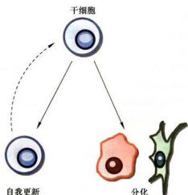  
图14-5 干细胞基本特征示意图

干细胞通过细胞分裂产生与自身相同的子代细胞，即自我更新能力，同时也具有分化成不同细胞类型的潜能。

个胚层的各种细胞类型，当移植到囊胚中后，还可以形成嵌合体（chimera）。更重要的是，通过四倍体互补（tetraploid complementation）技术，小鼠胚胎干细胞可以形成完整的胚胎个体。多能干细胞仅具有分化形成多种细胞类型的能力。单能干细胞则只能向一种或密切相关的几种终末细胞类型分化。

根据来源不同，干细胞又可分为胚胎干细胞（embryonic stem cell, ESC）和成体干细胞（adult stem cell）。胚胎干细胞是来自胚胎发育早期囊胚内细胞团的一种高度未分化的细胞，其具有在体外培养无限增殖、自我更新和多向分化的特性。根据干细胞的组织来源的不同，成体干细胞还可以分为造血干细胞、间充质干细胞、神经干细胞、肌肉干细胞、肠干细胞等。因此，成体干细胞又称组织干细胞。

干细胞的增殖表现为两种方式：对称性分裂和不对称性分裂。前者常见于干细胞自身数目的扩增，而后者除了自我更新外，还产生了分化的细胞。这些复杂的过程是在特定的体内环境中精确调控完成的，因此在体外培养条件下，如何在干细胞传代培养过程中，维持其自身的干细胞特性不变，以及如何在体外诱导干细胞通过定向分化获得某种类型的细胞，一直是干细胞研究领域中要解决的核心问题。

在整个发育过程中，细胞的分化潜能逐渐受到限制，即由发育早期的全能性细胞逐渐过渡为发育后期和成体中的多能和单能干细胞，最终形成特定细胞谱系中的某一终末分化细胞类型。但是在特殊的情况下，这一过程可以被逆转。动物克隆技术的基本理论问题或主要难题之一是体细胞核的重编程（reprogramming）问题，即已分化细胞的染色质如何通过重新“编程”回到初始未分化的细胞状态，然后才有可能沿正常的发育程序分化成各种类型的细胞。在早期的研究中，J. Gurdon 利用两栖类动物进行核移植试验证明，将蝌蚪的肠上皮细胞的细胞核植入去核的卵子中，能发育成蝌蚪甚至发育成蛙。1997 年英国科学家 I. Wilmut 等将羊的乳腺细胞的细胞核植入去核的羊卵细胞中，成功地克隆了名为“多莉”的克隆羊，人们称之为生殖性克隆。随后关于小鼠、大鼠、狗、牛、猪和猴等一系列动物克隆成功的报道，进一步证明了即使是哺乳动物终末分化的细胞，也可以通过细胞重编程逆转成为具有全能性的干细胞。

## 二、胚胎干细胞

胚胎干细胞是一种广为人知的多潜能干细胞，而它的建立与胚胎发育的研究息息相关。个体发育的起点是精子与卵子结合形成受精卵，随后受精卵进一步发生细胞分裂会形成一个内部存在空腔的球状结构，被称为囊胚（blastocyst）。在囊胚阶段，胚胎细胞第一次出现了细胞类型的分化：囊胚的外层细胞形成了滋养层细胞（trophoblast），将发育成为胚胎提供营养的组织——胎盘的一部分；囊胚腔内侧的一群细胞被称为内细胞团（inner cell mass, ICM），细胞数为140\~150个（小鼠），它们将进一步形成胚胎（embryo）和卵黄囊（yolk sac），最终发育成个体。胚胎干细胞就来源于囊胚的内细胞团。

胚胎干细胞的建立要追溯到20世纪80年代小鼠胚胎干细胞的建立。1981年，首株小鼠胚胎干细胞由剑桥大学的M.J.Evans和M.H.Kaufman从小鼠的内细胞团分离建立。他们发现，通过将受精后3.5天的小鼠囊胚的内细胞团培养在增殖停滞的小鼠成纤维细胞饲养层上，可以维持内细胞团的未分化状态，并且可以在体外持续传代。这项研究为基因打靶技术的建立打下了基础，开创了哺乳动物功能基因组学研究的新途径，并于2007年获诺贝尔生理学或医学奖。1998年，美国威斯康星大学J.A.Thomson等成功地建立了人胚胎干细胞系（图14-6）。

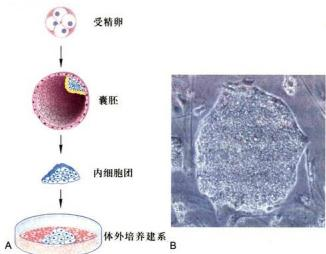  
图 14-6 人胚胎干细胞建系的示意图

A. 人胚胎发育5\~6天至囊胚期时，取出内细胞团。分散后培养在体外的饲养层细胞（一般为经处理后，不能继续分裂的小鼠成纤维细胞）上，随后传代培养，建立细胞系。B. 体外培养的人胚胎干细胞（邓宏魁博士提供）。

此后，在Thomson等工作的基础上，包括我国在内的很多国家的实验室相继建立了多株人胚胎干细胞系。这一成果极大地推进了细胞分化与胚胎发育，特别是人类胚胎早期细胞分化机制的研究。同时，也为在体外获得各种人体功能细胞提供了新的干细胞来源，开辟了生物医学一个崭新的领域。

基于人胚胎干细胞系的建立和克隆羊的成功，2001年B. Haseltine提出了再生医学（regenerative medicine）的概念，这一旨在将治疗性克隆（有别于上述生殖性克隆）技术与人胚胎干细胞的制备相结合，利用体外构建的患者自身来源的干细胞，分化产生无免疫排斥的组织与器官，用于疾病治疗的全新的理念，开启了生物医学的新纪元（图14-7）。

干细胞生物学特性的维持及其定向分化，主要受控于不同类型信号分子和信号通路网络，以调控干细胞的自我更新或干细胞的定向分化（图14-8）。例如，信号分子FGF、Wnt和TGFβ等通过调控关键多潜能性基因（pluripotency gene）Oct4、Sox2、Nanog的活性，从而使人胚胎干细胞完成自我更新；而骨形成蛋白（bone morphogenetic protein, BMP）通过激活通路下游的

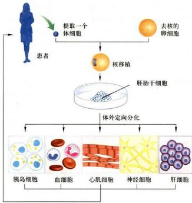  
图 14-7 人类的治疗性克隆与再生医学的设想

利用治疗性克隆技术获得患者自身的多潜能干细胞。在合适的条件下，诱导分化成患者所需的特定细胞类型，用于疾病的治疗。

  
图14-8 人胚胎干细胞的自我更新与细胞分化相关的主要信号分子及信号通路  
在 FGF、低浓度 Wnt 和 TGFβ 等信号分子的作用下（高浓度 Wnt 和 TGFβ 信号促进分化），转录因子 Oct4、Sox2 和 Nanog 等的基因得以表达，进而使相关的基因转录维持干细胞的状态。而 TGFβ 超家族的另一成员——骨形成蛋白，具有抑制人胚胎干细胞的自我更新和诱导细胞分化的双重功能。

Smad1/5/8靶点，则可启动人胚胎干细胞的分化。不同类型的干细胞所受到调控的信号分子和通路有所不同。而同一信号通路，对不同类型的干细胞的调控作用也可能有所不同。例如，BMP信号通路能够促进小鼠胚胎干细胞的自我更新，却会导致人胚胎干细胞的分化。另一方面，信号分子和通路的调控效果与其作用浓度是密切相关的。例如，低浓度的activin/Nodal信号分子能够促进人胚胎干细胞的自我更新，而高浓度的activin/Nodal信号分子却会促使其分化。总之，正是通过不同类型、不同剂量的信号分子和通路的组合，实现了对机体不同类型的干细胞在自我更新和分化方面的复杂调控（图14-8）。

## 三、成体干细胞

生物成体中，多数细胞都是有一定寿命的，它们的存活时间远远短于生物体的寿命。而且疾病和物理或化学损伤，还会加速成体细胞的细胞衰老和死亡。因此生物体需要产生足够的各种不同类型的细胞，以维持机体的代谢平衡。这一工作主要是由存在于各种组织和器官中的干细胞完成的，我们称之为成体干细胞或组织干细胞，它们的基本功能是分化产生某些类型的终末分化细胞。目前已经知道，成体干细胞广泛地存在于多种组织，如造血系统、皮肤、肠、卵巢、睾丸和肌肉中，甚至成年脑的某些部位也都存在这样的一群干细胞。然而，在某些组织例如肝脏和胰岛中，已分化的细胞仍具有很强的再生能力。例如小鼠等哺乳动物部分肝脏被切除后，几周内肝脏就会恢复到原来的大小。所以，这类组织中是否也存在成体干细胞，目前仍未有定论。

成体干细胞有不同的分裂模式，它们可以对称分裂成两个和自身一样的子代干细胞，具有自我更新（self-renewal）的能力，使干细胞在个体的一生中都可以保持一定的数量。同时，它们也可以通过不对称分裂形成一个干细胞和一个祖细胞（progenitor）。祖细胞可以快速地分裂，形成各种分化细胞。与干细胞不同，祖细胞只有有限的分裂次数。

成体干细胞需要特定的微环境来维持它们的生物学特性。除了内在的调控信息外，周边的细胞，胞外基质及其外源的信号，对干细胞状态的维持也是必需的。这种提供特定胞外信号的微环境称为干细胞巢（stem-cell niche）。成体干细胞另一个特征是通常细胞分裂很慢，有些是受到外界信号刺激才会分裂，例如皮肤损伤会激活皮肤干细胞的分裂。而另一些成体干细胞，如肠干细胞则持续不断地进行缓慢的分裂，以补充肠上皮细胞的脱落。

存在于人体骨髓中的造血干细胞可以分化成多种髓系细胞、红细胞和淋巴细胞等十种以上的血液细胞（图14-9）；骨髓间充质干细胞也具有分化为成骨细胞、软骨细胞等多种细胞的分化潜能；小肠上皮中的干细胞，能够分化为小肠上皮细胞等类型；神经干细胞可分化产生神经元、寡突胶质细胞和星形胶质细胞等细胞，通常称这类干细胞为多能干细胞。多能干细胞属于成体干细胞的范畴，其分化的潜能是有限的，一般局限于分化产生同一胚层的细胞类型。单能干细胞仅能分化产生一种或几种类型的细胞，如生殖嵴干细胞只能产生生殖细胞。显然这与各种干细胞所存在的部位，自身的特征以

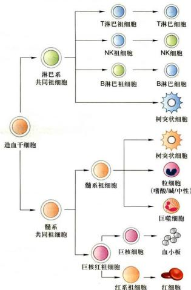  
图 14-9 造血干细胞逐级分化为各种类型的血细胞

造血干细胞在自我更新的同时，分化为髓系共同祖细胞（CMP）或淋巴系共同祖细胞（CLP）。CMP通过持续分化形成红细胞、血小板、巨噬细胞及各粒细胞。CLP最终分化为T淋巴细胞、B淋巴细胞、NK细胞等。树突状细胞则有髓系与淋巴系两种来源。

及它们所承担的功能相关。目前，各种干细胞，特别是多数组织干细胞，其确切的表面标志分子还知之不多，这对成体干细胞的分离纯化及其生理功能和分化机制的研究带来很大的困难。因此，对干细胞的分类及生物学特征，还需进一步研究。

## （一）造血干细胞

造血干细胞是干细胞研究与应用领域中开展最早，也是迄今为止了解最深入的一种成体干细胞，自上世纪60年代开展骨髓移植治疗血液疾病以来，已得到广泛的临床应用。成体哺乳动物的造血干细胞大部分存在于骨髓中，所以，骨髓移植实质上是造血干细胞的移植。多数造血干细胞处于静息态，即 $G_{0}$ 期，只有小部分造血干细胞处于比较活跃的细胞分裂状态。多种生理因素的变化，如缺氧等，都会刺激造血干细胞增殖。在成体骨髓特定的微环境中存在有数量较少的长期造血干细胞（long-term hematopoietic stem cell, LT-HSC），它们具有极强的自我更新能力，因而在维持机体终生造血的过程中起着主要的作用。长期造血干细胞在骨髓中可以分化成短期造血干细胞（short-term hematopoietic stem cell, ST-HSC），短期造血干细胞只具备有限的自我更新的能力，因而只能在一定时期内维持机体的造血机能。短期造血干细胞可以继续分化成多能前体祖细胞(multipotent progenitor, MPP)，进一步分化成共同淋巴系前体祖细胞(common lymphoid progenitor, CLP)或共同髓系前体祖细胞(common myeloid progenitor, CMP)等。图14-9扼要图示造血干细胞分化成各种血细胞的基本途径，其分化与调控的很多细节还有待于深入研究。在骨髓移植的临床实践中，可以看出造血干细胞和祖细胞之间的明显差异：只有造血干细胞具有重建整个造血系统的能力，而祖细胞尽管数量很多，却没有这种能力，这也作为目前鉴定造血干细胞的金标准。

造血干细胞的维持，自我更新以及谱系分化受到诸如 SCF、TPO、Flt3 配体、GM-CSF、EPO 等细胞因子和 IL3、IL6 等白介素以及 Notch、Wnt、BMP4 等多条信号通路的调控。

## （二）神经干细胞

神经干细胞是一类被广泛研究的组织干细胞，其研究为预防和治疗神经退行性疾病提供新的思路。在胚胎发育早期，神经管由一单层细胞组成。而这单层细胞就是胚胎神经干细胞（embryonic neural stem cell），它将发育成整个中枢神经系统。这些神经干细胞可以通过对称分裂的方式形成两个子代干细胞，也可以不对称分裂形成一个干细胞和另一个向外迁移的细胞，称之为短暂增殖细胞（transient amplifying cell）。短暂增殖细胞可以形成神经祖细胞，向外迁移形成连续的神经层。示踪实验证明神经祖细胞可以产生一个神经细胞和一个胶质细胞。相反，神经干细胞会一直留在原来的干细胞巢中，即室管膜下区（subventricular zone, SVZ），以维持其干细胞特性。干细胞巢中有特定的信号分子来维持神经干细胞的特性，例如FGF、BMP、IGF、VEGF、TGFα和BDNF等信号分子，但是这些信号分子究竟如何组合精细调控干细胞的维持和分化，目前仍然不完全清楚。

多年以来，人们认为成年哺乳动物的脑中没有新的神经元的生成。确实在大多数哺乳动物成年脑中神经细胞停止分裂，但在室管膜下区和海马附近的区域有一部分细胞作为干细胞可以分裂产生新的神经元。与其他的干细胞类似，这些神经干细胞可以自我更新和分化产生神经元、星形胶质细胞和寡突胶质细胞。为了分离和鉴定这些神经细胞的特性，将室管膜下区的细胞分离出来并在FGF2或EGF生长因子存在的条件下培养，一些细胞可以增殖并维持未分化的状态。而在另一些因子的刺激下，这些未分化细胞可以分化成胶质细胞和神经元。一系列相关的实验证明了成年脑中神经干细胞的存在。

## （三）肠干细胞

肠上皮细胞更新很快，平均每五天就会全部更新一次。在肠壁深处的隐窝（crypt）中存在一群肠干细胞，可以连续不断地分化产生肠上皮细胞。肠干细胞的附近存在一些已分化的潘氏细胞（Paneth cell），但是由于肠干细胞缺乏特殊的形态学特征，很难区分干细胞和其周围专门形成干细胞巢的支持细胞。脉冲示踪实验表明肠干细胞可以产生前体细胞，前体细胞增殖并向外迁移分化，逐渐形成突起的小肠绒毛（villi）（图14-10）。分化细胞从隐窝中产生到在绒毛尖端死亡脱落，仅仅只有3\~4天。因此，需要干细胞持续产生大量细胞，来维持肠上皮的完整。新细胞的产生是受到精确调控的，过少的分裂会导致小肠绒毛的减少和小肠上皮的瓦解，而过多的分裂可能会导致肿瘤的发生。

早期的遗传学实验证明 Wnt 信号对肠干细胞的维持有重要作用。如过表达 β-联蛋白（Wnt 下游效应蛋白）会引起肠上皮的过度增殖；相反，干涉 Wnt 激活的

  
图14-10 肠干细胞示意图

图中显示了一个肠隐窝中的肠干细胞（绿色）与它分裂产生的增殖区（蓝色）和终端分化区（粉色）。潘氏细胞（黄色）存在于隐窝的底部，作为干细胞巢的主要组分并可分泌抗菌蛋白。

TCF 转录因子，则会抑制肠干细胞的分裂。事实上，过度激活 Wnt 通路的基因突变是结肠癌的主要原因。

通过分析一系列 Wnt 信号所诱导的基因表达产物，H. Clevers 团队找到一个只在隐窝中少数细胞才表达的 G 蛋白偶联受体 Lgr5。研究发现将单个表达 Lgr5 的细胞从肠隐窝中分离出来，并在含有 IV 型胶原和层粘连蛋白 (laminin) 的细胞外基质中进行三维培养，这些细胞可以在体外形成小肠隐窝－绒毛样结构，其中包含了所有成熟肠上皮中的四种细胞。实验表明 Lgr5 是肠干细胞特有的一个标志。

潘氏细胞能产生几种抗菌蛋白来保护肠上皮免受感染，最新的证据表明潘氏细胞是形成干细胞巢的主要部分。体外培养的潘氏细胞能产生 Wnt 和其他因子例如 EGF 和 Delta 蛋白，这些对肠干细胞维持是必需的。将潘氏细胞和小肠干细胞体外共培养，可以显著地促进隐窝－绒毛样结构的形成。转基因小鼠实验证明，潘氏细胞数量的减少会引起小肠干细胞的减少。显然，作为小肠干细胞分化而来的潘氏细胞，它们分布在肠干细胞周围并参与形成干细胞巢。

## 四、细胞命运重编程与诱导性多潜能干细胞

随着发育的进行，细胞的分化潜能不断丧失，由全能性到多能性、单能性、直到形成特定终末分化的细胞类型。长期以来，人们认为这是一个不可逆的过程，细胞命运一旦最终决定就无法更改。然而，1962年Gurdon利用体细胞核移植（somatic cell nuclear transfer, SCNT）技术，将爪蟾的体细胞核移植到去核的卵细胞中，发育成正常的个体。证明了动物的细胞核可以通过重编程到全能性的状态，揭开了细胞命运重编程的序幕。此后，核移植技术被成功应用到羊和小鼠等其他物种中，进一步证实了体细胞命运可逆的现象。1983年，H. Blau等发现将羊膜细胞与肌细胞融合后，本来已经在羊膜细胞中沉默的肌肉相关的基因又重新被激活，提示了不同命运的终末分化细胞之间存在相互转变的可能。2001年，M. Tada等研究发现通过将体细胞与胚胎干细胞融合，也可以使体细胞回到多能性的状态。上述研究结果从不同角度证明了终末分化细胞的命运是可以通过细胞重编程改变的，改变了长期以来人们认为终末分化的细胞命运不可逆转的观点。

上述研究表明，卵母细胞和胚胎干细胞中存在的某些因子，能够诱导细胞重编程过程的发生。但是究竟是哪些因子决定了重编程的发生，是一个长期未能解决的问题。由于卵母细胞和胚胎干细胞中的活性因子非常丰富，细胞重编程又是一个非常复杂的生物学过程，所以，人们普遍认为使用少量已知的因子来诱导细胞重编程是不可能实现的。然而，日本京都大学山中伸弥（Shinya Yamanaka）实验室选取了24个对胚胎干细胞维持重要的基因，在小鼠的成纤维细胞中分组表达，结果发现，利用逆转录病毒，同时转入4种基因（Oct4、Sox2、c-Myc和Klf4)就可以诱导成纤维细胞变成多潜能干细胞，称“诱导性多潜能干细胞”（iPS细胞）（图14-11）。由于这一开创性的工作，山中伸弥获2012年诺贝尔生理学或医学奖。iPS细胞与胚胎干细胞均属多潜能干细胞，二者有着极大的相似性。如特异基因的表达、DNA甲基化模式、增殖时间、体内畸胎瘤（teratoma）的形成、可发育成嵌合体，以及体外定向分化能力等，iPS细胞都与胚胎干细胞类似。近年来，人们发现Wnt、TGFβ，p53等越来越多的信号通路及表观遗

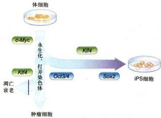  
图 14-11 iPS 细胞建系过程的示意图

山中伸弥利用逆转录病毒将4种转录因子基因Oct4、Sox2、c-Myc和Klf4转入小鼠或人的体细胞中表达，体细胞可以转变成多潜能干细胞。其中c-Myc是原癌基因，可能使细胞转变成肿瘤细胞。

传靶点参与调控 iPS 细胞形成，同时也提出了一些与之相关的重要的理论模型。

在山中伸弥最初使用的四种诱导产生iPS细胞的基因中，作为原癌基因的c-Myc一方面促进了细胞的自我更新能力，另一方面也增加了iPS细胞的成瘤性，给其临床应用带来了一定风险。随后的研究结果表明，在没有c-Myc的条件下也能将鼠和人的体细胞诱导成iPS细胞。与此同时，研究者们应用多种技术，如以腺病毒、质粒为载体，替代逆转录病毒，以及向细胞中转入有关的蛋白质、RNA等，均可诱导iPS细胞的产生，从而降低了iPS细胞的成瘤风险。但这些技术因其操作复杂，在临床应用中仍受到很大的限制。近些年来，利用具有生物活性的化学小分子提高重编程效率以至完全替代转录因子，成为新一代细胞重编程技术研发的热点。化学小分子具有操作简单、容易通过细胞膜、其作用具有可逆性等特点，人们可以利用不同化学小分子的组合以及合适的处理时间和浓度，实现对某些特异蛋白的激活或抑制，以实现对细胞重编程的精确调控。2013年我国邓宏魁实验室首次实现通过小分子化合物的组合，成功地诱导小鼠体细胞转变成为多潜能干细胞，称为“化学诱导的多潜能干细胞”（chemically induced pluripotent stem cell, CiPS细胞）（图14-12）。在这项研究中，研究者们使用小分子化合物的组合，调整了Wnt、TGFβ信号通路的活性，改变了表观遗传修饰，快速激活Sall4、Sox2等干性基因，最终将小鼠体细胞诱导成多潜能性干细胞。在CiPS细胞诱导过程中，细胞经历了一个类似胚外内胚层的中间状态，表明CiPS细胞形成的分子机制有别于以往的体细胞重编程途径，这有助于我们更好地理解细胞命运决定和细胞命运转变的机制。

近年来，科学家发现多潜能干细胞（包括胚胎干细胞和iPS细胞）的细胞性质都是不均一的。对应于体内的不同发育阶段，处于早期的多潜能干细胞称为原始态(naive)多潜能干细胞，处于晚期的多潜能干细胞称为始发态(primed)多潜能干细胞。例如，1981年Evans建立的小鼠胚胎干细胞属于原始态多潜能干细胞，具有增殖速度快、细胞异质性小等特征，有利于通过基因打靶技术制备各种小鼠突变体，用于功能基因组研究；而1998年Thomson建立的人胚胎干细胞则属于始发态干细胞，具有细胞克隆形态扁平、细胞异质性大等特点。目前，人们通过优化细胞培养条件，已建立了具有原始

  
图 14-12 化学小分子诱导多潜能干细胞形成的过程

首先，制备表达Oct4-GFP（Oct4是多潜能干细胞关键的干性基因之一，绿色荧光蛋白基因Gfp作为报告基因）的小鼠成纤维细胞，此时检测不到绿色荧光。在化学小分子组合的作用下，逐步成为GFP阳性的克隆（表明干性基因Oct4表达），最终获得化学诱导多潜能干细胞，在2倍培养基（小鼠胚胎干细胞专用的培养基）中进行培养。培养基中的VC6TF和VC6TFZ，每个字母或数字均为特定的化学小分子名称或代码的缩写。

态的人多潜能干细胞。

然而，胚胎干细胞和多潜能干细胞只具备分化形成胚胎，而不具备分化形成胚外组织（胎盘等）的能力。经过不懈的努力，2017年，我国科学家利用化学小分子组合，建立了具有高发育潜能的小鼠和人的多潜能干细胞，单个干细胞就可以分化形成胚内组织和胚外组织，为实现在体外获得具有全能性特征的干细胞的目标，迈进了一大步。

## 五、谱系重编程

除了将人胚胎干细胞或iPS细胞等多潜能性干细胞分化为特定的体细胞，用于再生医学研究外，谱系间的重编程（lineage reprogramming）也受到人们极大的关注。转分化是谱系间重编程的一种方式，即一种类型已分化的细胞转变成为另一谱系的分化细胞。这样就不需要通过重编程，先把体细胞转化成iPS细胞等原始状态的多潜能干细胞，再诱导分化为特定的细胞类型。最早的例子是在成纤维细胞中过表达MyoD基因，使其转分化为成肌细胞。随后的一些实验多利用单一的组织特异性的转录因子，实现了相近的谱系间细胞的转分化。iPS技术的成功也给转分化带来了新的思路。2010年，M.Wernig的研究团队利用3个转录因子（Asc11、Brn2和Myt11）将小鼠成纤维细胞转分化为神经细胞，首次证明了利用转录因子组合，实现不同胚层间转分化的可能性。随后的几年，人们通过转分化途径，制备了心肌细胞、肝细胞和造血干细胞。例如在人的成纤维细胞中过表达向肝细胞转变和成熟的6个转录因子HNF1A等，可以将成纤维细胞直接转分化为具有生理功能的肝细胞（图 14-13）。

如前所述，细胞分化、细胞重编程，以及细胞谱系重编程等细胞命运之间的转变，都包含细胞类型之间表观遗传修饰的改变。该过程主要包含了DNA甲基化及去甲基化、组蛋白修饰（如组蛋白甲基化、乙酰化等）的添加和擦除，这些修饰能够通过影响基因转录来调控细胞类型特异性表达的基因的转录开启或关闭。因此，细胞命运转变的实质是细胞原有表观遗传修饰的擦除和新的细胞命运表观遗传修饰的重新建立。例如，在重编程过程中，首先发生的是分化细胞特异表达基因的转录抑制，伴随着对促进分化基因转录活性的表观遗传修饰的擦除，以及添加抑制这些分化基因转录活性的表观遗传修饰；然后是擦除干性相关基因上抑制性的表观遗传修饰，以及添加促进干性相关基因转录活性的表观遗传修饰。这些表观遗传修饰的改变是细胞重编程的必要条件。

## 六、干细胞应用

干细胞的研究方兴未艾，干细胞的应用也十分广泛。目前，基于成体干细胞（如造血干细胞、间充质干细胞）的某些干细胞技术已经在临床治疗上得到应用，其范围不断拓宽。例如骨髓移植即造血干细胞移植，最早用于治疗再生障碍性贫血，20世纪50年代发现其对白血病有较好疗效，这一具有里程碑意义的临床实践，使E.D.Thomas医师获得了1990年的诺贝尔生理学或医学奖。随后，造血干细胞移植逐步用于血液系统其它肿瘤甚至恶性实体瘤的治疗。最近，造血干细胞移植被应用于艾滋病治疗中，通过向艾滋病患者移植具有

A  
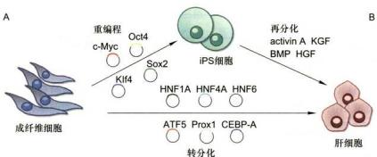  
图14-13 重编程/再分化或转分化途径获得成熟肝细胞示意图

  
A. 用4种转录因子，通过细胞重编程，可将成纤维细胞转化为为iPS细胞，再经过特定的信号分子的作用，再分化成肝细胞。此外，也可以直接用6种转录因子，将成纤维细胞转分化为肝细胞。B. 通过转分化得到的人肝细胞的显微图片（邓宏魁博士提供）。

A  

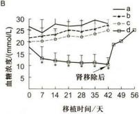  
图14-14 人的胚胎干细胞体外诱导分化成胰岛 $\beta$ 细胞  
A. 体外诱导产生的胰岛 $\beta$ 细胞表达胰岛素（绿色）及 $\beta$ 细胞关键转录因子NKX6.1和PDX1（红色）。B. 将体外诱导产生的胰岛 $\beta$ 细胞移植到糖尿病模型小鼠体内，一周后小鼠血糖趋于正常。移植后42天取出移植物，结果血糖明显升高。a、b、c：对照组；d：实验组。

Ccr5 基因（该基因产物为 HIV 病毒侵染 T 细胞所必需的辅助受体）缺陷的造血干细胞，实现了首例治愈艾滋病的病例。

细胞治疗则是人多潜能干细胞技术中最引人瞩目的应用领域。近年来，通过体外对人胚胎干细胞的定向诱导分化，已成功获得了血细胞、神经细胞、心肌细胞、肝实质细胞、胰岛β细胞等多种人的体细胞，从而为细胞治疗和再生医学的临床应用打下基础。同时，也为药物筛选和毒性评估提供了新的平台。如胰岛移植是治疗I型糖尿病的有效方法，但是胰岛细胞的来源问题，极大地限制了其临床应用。人们将人多潜能干细胞，在体外定向分化胰岛β细胞，当移植到糖尿病模型小鼠体内后，血糖明显地恢复到正常值（图14-14）。这为I型糖尿病的治疗提供了一条可行的途径，相关的临床试验已开始启动。

相对于人胚胎干细胞，诱导性多潜能干细胞在临床应用中规避了伦理问题，因此有着更为广泛的应用前景。从理论上讲，可以从病人身上获取体细胞，诱导形成iPS细胞，进而遵循再生医学的思路，设计出有针对性的、个体化的治疗方案。2014年，日本笹井芳树（Yoshiki Sasai）等取患者的皮肤细胞，经细胞重编程处理后获得iPS细胞，再将其诱导分化成视网膜色素上皮细胞（retinal pigment epithelium）用于治疗老年性黄斑变性。

如何获得功能成熟的细胞类型，是干细胞研究和应用领域中的一大难题。基于三维培养体系形成的类器官（organoid），具有更成熟的功能，成为了近年来干细胞领域的重要研究手段。类器官是一种由干细胞发育而来的具有器官特性的细胞集合体，这种细胞集合体能够模拟体内的细胞分化和器官空间构成。最近十年，类器官的定义逐渐演变成在三维培养体系中，具有器官特性和空间结构的细胞群体，其主要来源于多潜能性干细胞和成体干细胞。目前，通过这种途径已经能获得多种类器官，包括肠、胃、肝、肺、肾和脑等。其中，利用人多潜能干细胞分化产生脑类器官已初步具备不同人脑区域，为研究神经相关疾病提供很好的模型。另外，小鼠多潜能干细胞来源的肾脏类器官，形成了肾脏三维结构，为今后获得完整生理功能以及器官移植奠定基础。类器官不仅为干细胞研究提供了新手段，更为干细胞研究向临床转化研究向前迈进了一大步。

近20年来干细胞研究中所取得的令人瞩目的成果，不仅展示出诱人的应用前景，同时也极大推进了细胞分化和胚胎发育机制的研究。特别是对已建立起来的有关细胞分化潜能、细胞分化和终末分化细胞等传统的概念提出了挑战，以至人们需要重新审视什么是干细胞，什么是分化细胞。随着新的研究模式系统和实验手段（如iPS技术和单细胞测序技术等）的建立和应用，人们对细胞分化领域的相关概念，将赋予新的涵义。

干细胞领域目前面临的关键问题主要包括，如何建立全能性干细胞？如何维持多潜能干细胞体外扩增培养的稳定性？如何实现干细胞分化过程中精细的时间和空间调控？如何产生功能成熟的各种细胞或者组织来应用于治疗各种疾病？目前，结合单细胞测序技术，已广泛开展各谱系细胞体内发育及体外细胞图谱的绘制工作，相信随着这些工作的不断完善，有望实现干细胞分化过程的精细调控以及获得功能成熟的细胞或组织。

## 思考题

1. 何谓细胞分化？为什么说细胞分化是基因选择性表达的结果？

2. 组织特异性基因的表达是以何种方式调控的？

3. 影响细胞分化的因素有哪些？请予以说明。

4. 什么是干细胞？它有哪几种基本类型和各自的基本特征？

5. 什么是诱导性多潜能干细胞？试论述其在理论与医学实践中的重要意义。

6. 改变细胞命运有哪几种方式？

7. 什么是类器官？为什么类器官能在细胞功能成熟方面能起到重要作用？

## - 参考文献

1. 张红卫，王子仁，张士璀. 发育生物学. 2版. 北京：高等教育出版社，2006.

2. Alvarado A S, Yamanaka S. Rethinking differentiation: stem cell, regeneration, and plasticity. Cell, 2014, 157(1): 110-119.

3. Hou P, Li Y, Zhang X, et al. Pluripotent stem cells induced from mouse somatic cells by small-molecule compounds. Science. 2013; 341(6146): 651-654.

4. Takahashi K, Yamanaka S. Induction of pluripotent stem cells from mouse embryonic and adult fibroblast cultures by defined factors. Cell, 2006, 126(4): 663-667.

5. Xu J, Du Y, Deng H. Direct lineage reprogramming: strategies, mechanisms, and applications. Cell Stem Cell, 2015; 16(2): 119-134.

<!-- END CN CN14-S02 -->

---

## 对应英文内容

### 英文补充：将特化细胞重编程为多潜能干细胞

> 对应中文板块：将特化细胞重编程为多潜能干细胞。英文来源：Molecular Biology of the Cell，第7版，第7章；[本章完整原文](../来源/英文教材/07_Control_of_Gene_Expression/chapter.md)。物理PDF页码范围：436–513（整章范围）。

<!-- BEGIN EN EN07-H042-H042 -->
#### Specialized Cell Types Can Be Experimentally Reprogrammed to Become Pluripotent Stem Cells

Artificial manipulation of transcription regulators can also coax various differentiated cells to de-differentiate into pluripotent stem cells that are capable of giving rise to the different cell types in the body, as discussed in Chapter 22. Thus, when three specific transcription regulators are artificially expressed in cultured mouse fibroblasts, a number of cells become **induced pluripotent stem cells (iPS cells)**—cells that look and behave like the pluripotent embryonic stem (ES) cells that are derived from embryos (**Figure 7–39**). This approach has been adapted to produce iPS cells from a variety of specialized cell types, including cells taken from humans. Such human iPS cells can then be directed to generate a population of differentiated cells for use in the study or treatment of disease, a topic discussed in detail in Chapter 22.

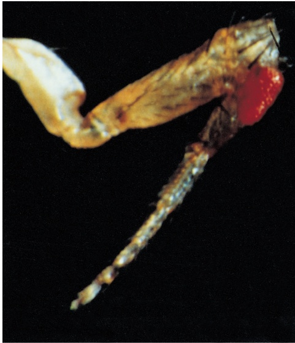

Although it was once thought that cell differentiation was irreversible, it is nowMBoC7 m7.35/7.38 clear that by manipulating combinations of transcription regulators, cell types and differentiation pathways can be readily reversed and otherwise altered.

<!-- END EN EN07-H042-H042 -->

### 英文补充：干细胞、谱系示踪、龛与自我更新

> 对应中文板块：干细胞、谱系示踪、龛与自我更新。英文来源：Molecular Biology of the Cell，第7版，第22章；[本章完整原文](../来源/英文教材/22_Stem_Cells_in_Tissue_Homeostasis_and_Regeneration/chapter.md)。物理PDF页码范围：1318–1351（整章范围）。

<!-- BEGIN EN EN22-H000-H016 -->
#### Stem Cells in Tissue Homeostasis and Regeneration

Cells evolved originally as free-living individuals, and such cells still dominate Earth and its oceans. But the cells that matter most to us, as humans, are specialized members of a multicellular community. These cells have lost features needed for independent survival and acquired peculiarities that serve the needs of the body as a whole. Although they share the same genome, they are spectacularly diverse in structure, chemistry, and behavior. There are more than 200 different named cell types in the human body that collaborate with one another to form many different tissues, which are arranged into organs performing widely varied functions. To understand them, it is not enough to analyze cells in a culture dish: we need also to know how they live, work, and die in their natural habitat, the intact body.

In Chapters 7 and 21, we saw how the various cell types become different in the embryo and how cell memory and signals from their neighbors enable them to remain different thereafter. In Chapter 19, we discussed the mechanisms that cells use to self-assemble into multicellular tissues, including the use of molecular devices that bind cells together and the extracellular materials that give tissues and organs support. But the adult body is not static: it is a structure in dynamic equilibrium, where new cells are continually being born, differentiating, and dying. Homeostatic mechanisms maintain a proper balance, so that tissue architecture is preserved despite the constant replacement of old cells by new.

In this chapter, we focus on these homeostatic processes that continue throughout life. In doing so, we illustrate some of the diversity of differentiated cell types, examining in particular the part played in many adult tissues by **stem cells**—undifferentiated cells that are specialized to provide a fresh supply of differentiated cells where these need to be continually replaced or when they are required in large number for tissue repair and regeneration. We will see that many adult tissues constantly renew and repair themselves, but others do not, in which case, lost cells are lost forever, causing deafness, blindness, dementia, and other disorders. We discuss how stem cells are maintained within a self-renewing tissue and how the fate of their daughter cells is determined. We then describe the remarkable ability of some animal species to regenerate entire limbs or organs, in one extreme example, reproducing all of the tissues of the organism from a single stem cell. In the final section of the chapter, we discuss how stem cells can be generated and manipulated artificially, raising the practical question that underlies a current storm of interest in stem-cell technology: How can we use our understanding of the processes of cell differentiation and tissue renewal to improve upon nature and make good those injuries and degenerations associated with disease and aging of the human body that have hitherto seemed beyond repair?

#### STEM CELLS AND TISSUE HOMEOSTASIS

In self-renewing adult tissues, cells are continually being born, differentiating, and dying. This “flow” of cells can be compared with the flow of water in a river: the river may look the same from day to day, but, as it flows downstream, the water

C HAP T E R

22

IN THIS CHAPTER

Stem Cells and Tissue Homeostasis

Control of Stem-cell Fate and Self-Renewal

Regeneration and Repair

Cell Reprogramming and Pluripotent Stem Cells

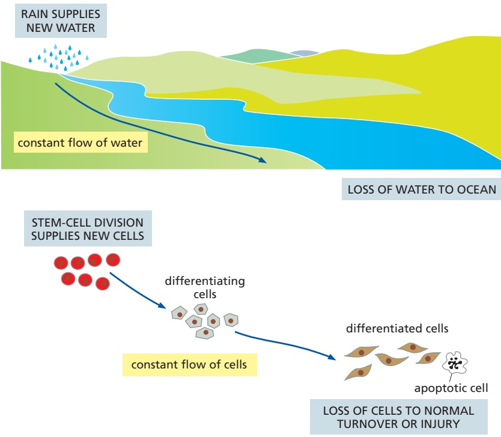

Figure 22–1 Tissue homeostasis compared to a river. In a self-renewing adult tissue, a constant flow of new cells produced by cell division “upstream” and a constant loss of differentiated cells “downstream” maintain the tissue in a dynamic equilibrium.

in the river is never the same (**Figure 22–1**). Similarly, the characteristic architecture of a self-renewing tissue is maintained even though the cell population is always changing, with differentiated cells lost “downstream” and stem cells producing new cells “upstream.” Thus, the stem cells in such tissues must be able to both replicate themselves and produce differentiated cells for the life span of the organism. Without stem cells, these tissues and organs would fail rapidly, being unable to keep up with the natural turnover of cells. Indeed, defects in stem-cell functions can contribute to disease and aging for this reason.

In this first section, we define the essential characteristics of stem cells, using two epithelial tissues as examples, the lining of the gut and the outer surface of the skin. We then consider how we can identify stem cells in tissues—by cell lineage tracing or, in the case of blood cells, by cell transplantation studies. We finally discuss tissues that can maintain themselves in the absence of stem cells.

#### Stem Cells Are Defined by Their Ability to Self-renew and Produce Differentiated Cells

Many adult tissues, especially those with high cell turnover rates, contain **tissuespecific stem cells** (also called **adult stem cells**). Each of these tissues contains its own unique stem-cell population, capable of producing the differentiated cells characteristic of that tissue and not those of other tissues. The stem cells of each tissue possess their own distinct developmental history, without necessarily sharing molecular characteristics with the stem cells of other tissues.

All stem cells, however, share two fundamental properties that define them: (1) they are able to replenish themselves as stem cells, generally throughout the lifetime of the organism—a process called self-renewal; and (2) they can also produce differentiated cells. Thus, when a stem cell divides, each daughter has a choice: it can either remain a stem cell or it can embark on a course that commits it to differentiation (**Figure 22–2**).

Stem cells usually do not produce differentiated cells directly; instead, they make an intermediate cell type that is committed to a differentiation pathway but continues to proliferate, thereby generating greater numbers of differentiated cells. These cells are called progenitor cells; they are also called transit-amplifying cells because their divisions serve to amplify the number of differentiated cells that ultimately result from each stem-cell division (**Figure 22–3**). Unlike stem cells, these intermediate cells only go through a limited number of divisions before they differentiate. When a cell reaches the end of its differentiation pathway and does not divide again, it is terminally differentiated. When an adult stem cell or progenitor cell generates multiple differentiated cell types, it is multipotent; when it generates only one differentiated cell type, it is unipotent (see Figure 22–3).MBoC7 n22.101/22.03

Figure 22–2 The defining characteristics of a stem cell. Each daughter cell produced when a stem cell divides can either remain a stem cell, in the process of self-renewal, or commit to differentiation, usually after a number of cell divisions. The self-renewal process maintains the pool of stem cells in the tissue.

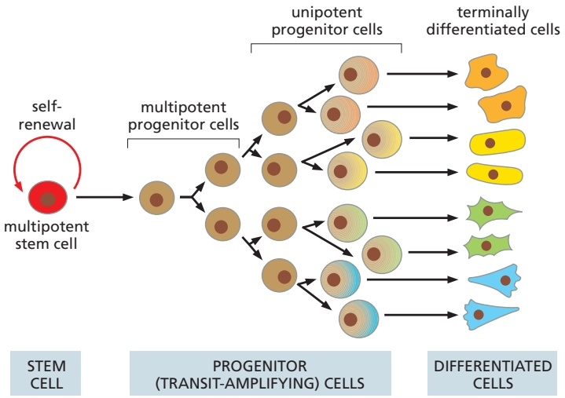

Figure 22–3 A hierarchy of stem cells, progenitor cells, and differentiated cells. In addition to self-renewal, tissue-specific stem cells generally produce progenitor (transit-amplifying) cells that divide a limited number of times before they terminally differentiate. Stem cells and progenitor cells can be unipotent or multipotent, depending on whether they produce only one type or multiple types of differentiated cells.

We now consider two epithelial tissues to illustrate how these different categories of cells are organized in a self-renewing adult tissue—the lining of the gut and the outer layer of the skin. In both cases, the stem cells continually produce transit-amplifying progenitor cells at one surface of the tissue, while terminally differentiated cells are lost from the opposite surface—upstream and downstream, respectively, in our river analogy.

#### The Epithelial Lining of the Small Intestine Is Continually Renewed Through Cell Proliferation in Crypts

The lining of the small intestine (and of most other regions of the gut) is a single-layered epithelium, only one cell thick. The **intestinal epithelium** covers the surfaces of the villi that project into the gut lumen, and it lines the crypts that descend into the underlying connective tissue (**Figure 22–4**). Dividing cells, including the stem cells and progenitor cells, are restricted to the crypts, and terminally differentiated cells pour out of the crypts in a steady stream onto the villi. There are four main types of differentiated cells—one absorptive and three secretory (**Figure 22–5**):

1. Absorptive cells (also called brush-border cells or enterocytes) are the majority cell type in the epithelium and have densely packed microvilli on their exposed surfaces. Their job is to take up nutrients from the gut lumen. To this end, they also produce hydrolytic enzymes that perform some of the final steps of extracellular digestion of food.

2. Goblet cells secrete mucus into the gut lumen; this mucus covers the epithelium with a protective coat.

3. Paneth cells form part of the innate immune defense system (discussed in Chapter 24) and secrete proteins that kill bacteria; they also secrete Wnt signal proteins (discussed in Chapter 15) required to maintain the stem-cell population.

4. Enteroendocrine cells, of more than 15 different subtypes, secrete serotonin and peptide hormones that act on neurons and other cell types in the gut wall and regulate the growth, proliferation, and digestive activities of cells of the gut and other tissues.

Figure 22–4 Renewal of the gut epithelial lining. (A) The pattern of cell turnover and proliferation in the epithelium that forms the lining of the small intestine. Stem cells (red) lie at the crypt base, interspersed among nondividing differentiated cells (Paneth cells). Progeny of the stem cells move mainly upward from the crypts onto the villi; after a few quick divisions, they cease dividing and differentiate—some of them while still in the crypt, most of them as they emerge from the crypt. The Paneth cells, like the other nondividing differentiated cells, are continually replaced by the progeny of the stem cells, but they migrate downward to the crypt base and survive there for many weeks. (B) Micrograph of a section of part of the lining of the small intestine, showing the crypts and villi. Note the mixture of differentiated cell types, all generated from the stem cells; these are primarily absorptive cells, with mucus-secreting goblet cells (stained red) interspersed among them.

As if on a conveyor belt, the absorptive, goblet, and enteroendocrine cells travel upward from their site of birth in the crypt, by a sliding movement in the plane of the epithelial sheet, to cover the surfaces of the villi. Within 3–4 days (in the mouse) after emerging from the crypts, the differentiated cells reach the tips of the villi, where they are discarded into the gut lumen (see Movie 20.7). The Paneth cells in the crypts are produced in much smaller numbers and have a different migration pattern. They live at the bottom of the crypts, where they too are continually replaced, although not so rapidly, persisting for several weeks before undergoing apoptosis and being phagocytosed by their neighbors.

The stem cells that give rise to the intestinal epithelium are located just above the base of the crypt, interspersed among the Paneth cells. The stem cells can be identified because only they express a particular G-protein-coupled receptor called $L g r 5 ,$ which serves as a specific marker for the stem cellMBoC7 m22.01/22.04 population. When the stem cells divide, which they do every 24 hours or so in the mouse intestine, some of the progeny commit to differentiation, becoming transit-amplifying progenitor cells that migrate upward, while others remain stem cells in the process of self-renewal. The stem cells are multipotent, producing all the differentiated cell types in the epithelium.

#### Epidermal Stem Cells Maintain a Self-renewing, Waterproof, Epithelial Barrier on the Body Surface

Stem-cell systems are organized in a variety of different ways depending on the tissue. For example, the outer epithelial covering of the body, the **epidermis**, undergoes continual renewal, but, unlike the intestinal epithelium, it is multi-layered, or stratified. Stem cells are located in the basal layer, as are the dividing transit-amplifying progenitor cells. Once the progenitor cells stop dividing, they leave the basal layer and move outward toward the exposed surface, undergoing terminal differentiation as they go. They end up as lifeless scales, or squames, which are eventually shed from the surface of the skin (**Figure 22–6**).

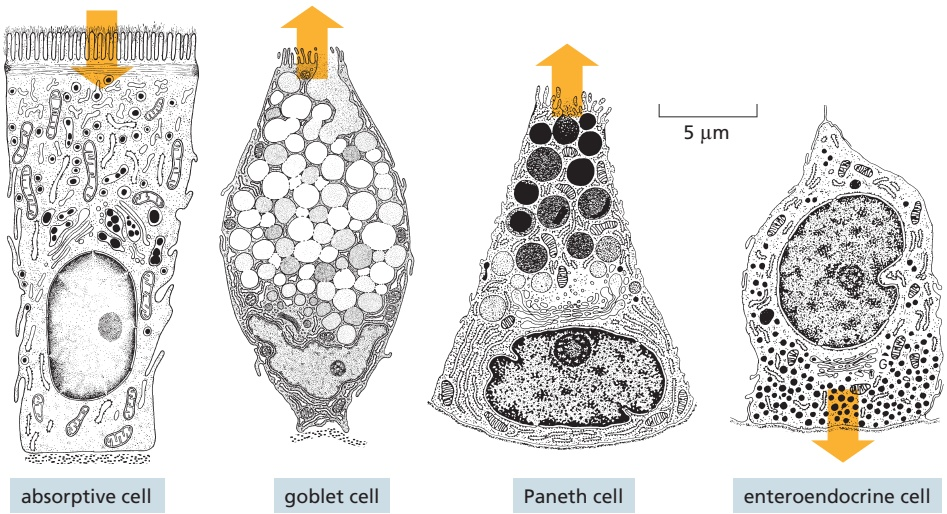

Even though the architecture of the epidermis is very different from that of the intestinal epithelium, many of the same basic principles apply. The stem cells are maintained by signals within a specific region of the tissue, which in the epidermis is the basal lamina and underlying connective tissue. The daughters of stem cells thatMBoC7 m22.02/22.05 are committed to differentiation undergo several divisions as transit-amplifying

Figure 22–6 The multilayered structure of the epidermis. The epidermis forms the outer covering of the skin, creating a waterproof barrier that is self-repairing and continually renewed. Beneath this lies a relatively thick layer of connective tissue, which includes the tough, collagen-rich dermis (from which leather is made). The cells of the epidermis are called keratinocytes, because their characteristic differentiated activity is the synthesis of keratin intermediate filament proteins, which give the epidermis its toughness. These cells change their appearance and properties from one layer to the next, progressing through a regular program of terminal differentiation. Those in the innermost layer, attached to an underlying basal lamina, are termed basal cells, and it is normally only these that divide: the basal-cell population includes relatively small numbers of stem cells MB C7 m22.10/22.06along with larger numbers of transit-amplifying progenitor cells derived from them. Above the basal cells are several layers of larger prickle cells. Beyond the prickle cells lies the thin, darkly staining granular-cell layer, where the cells are sealed together to form a waterproof barrier; this marks the boundary between the inner, metabolically active strata and the outermost layer of the epidermis, consisting of dead cells whose intracellular organelles have disappeared. These outermost cells are reduced to flattened scales, or squames, filled with densely packed keratin, which are eventually shed from the surface of the skin. The time from exit of a cell from the basal layer to its loss by shedding at the surface is a week or two, depending on body region and species.

Figure 22–5 The four main differentiated cell types found in the epithelial lining of the small intestine. All cells are oriented with the gut lumen at top. Broad orange arrows indicate direction of secretion or uptake of materials for each type of cell. All of these cells are generated from undifferentiated multipotent stem cells living near the bottoms of the crypts (see Figure 22–4). Absorptive (brush-border) cells outnumber the other cell types in the epithelium by about 10:1 or more. The microvilli on their apical surface provide a 30-fold increase in surface area, not only for the import of nutrients but also for the anchorage of enzymes that perform the final stages of extracellular digestion, breaking down small peptides and disaccharides into monomers that can be transported across the cell membrane. Goblet cells secrete mucus; these are the most common of the secretory cell types. Paneth cells secrete (along with some growth factors) cryptdins—proteins of the defensin family that kill bacteria. Different subtypes of enteroendocrine cells secrete serotonin and peptide hormones into the gut wall (and thence the blood). Cholecystokinin is a hormone released from enteroendocrine cells in response to the presence of nutrients in the gut. It binds to receptors on nearby sensory nerve endings and causes the release of digestive enzymes from the pancreas and bile from the gall bladder; it also signals to the brain to stop the feeling of hunger once one has eaten enough. (Absorptive and goblet cells, Don W. Fawcett/Science Source; Paneth and enteroendocrine cells, from R.V. Krstić, Illustrated Encyclopedia of Human Histology. Berlin: Springer-Verlag, 1964. With permission from Springer Nature.)

cells in the basal layer before differentiating. Moreover, most of the signaling pathways that organize the intestinal stem-cell system are also involved in regulating the epidermal stem-cell system, although with different individual roles.

#### Cell Lineage Tracing Reveals the Location of Stem Cells and Their Progeny

Stem cells in adult tissues are usually rare and difficult to identify in conventional tissue sections, unless a stem cell–specific marker like Lgr5 is available. Recombinant DNA technology provides a general and powerful way to identify stem cells and their progeny in any renewing tissues using a technique called cell lineage tracing. The method uses transgenic animals to create a visible genetic mark in just a few cells, which, over time, give rise to widely separated and easily distinguished clones of progeny cells, as explained in **Figure 22–7** and **Figure 22–8**. This approach does not require prior knowledge as to whether a tissue contains stem cells or not. If they exist, the stem cells will be marked randomly and will lead to a persistent clonal lineage that contains stem cells as well as differentiated cells (see Figure 22–7B); dividing progenitor cells will also be randomly marked and produce labeled clones, but all of these will eventually disappear (see Figure 22–7C). The analysis of the clones not only indicates whether stem cells are present, but also where the stem cells are located and whether they are unipotent or multipotent.

Figure 22–7 Clonal analysis using a genetic marker. (A) Transgenic animals containing two transgenes can be used to drive expression of a readily detected and heritable marker in a small set of cells. The first transgene encodes a marker gene, such as one that encodes green fluorescent protein (GFP). However, the expression of the GFP transgene, shown here in green, is prevented by a blocking sequence (red) that is flanked by $\mathsf { L O X P }$ sites (pink; see Figure 5–66). The second transgene, CreERT2 (brown), encodes a chimeric form of the Cre recombinase called CreERT, which consists of the Cre recombinase linked to the estrogen receptor protein; this enzyme becomes active as a recombinase only when it binds the artificial estrogen analog tamoxifen (red spheres). Addition of tamoxifen leads to a recombination event that removes the blocking DNA sequence. As a result, the GFP marker is expressed. Because the blocking DNA has been permanently removed from the genome, the marker continues to be expressed in all the descendants of a cell in which the recombination event has MBoC7 n22.102/22.07occurred. With a low dose of the inducer molecule tamoxifen, it is possible to activate the marker at random in just a few widely spaced cells, giving rise to distinguishable clones. (B) If the recombination event occurs in a stem cell, a clonal lineage will be marked, and the labeling will persist over time as the marked stem cell self-renews and produces differentiated cells. (C) If the recombination event occurs in a cell that is not a stem cell, the label will disappear over time as the marked cell differentiates and is eventually lost.

1 day

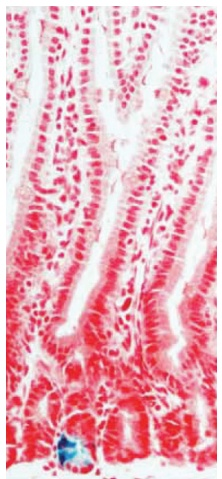

5 days

60 days

A more directed approach can be used for cell lineage tracing if a gene that is expressed specifically in the stem cells in a tissue is known, as is the case for the Lgr5 gene in the mouse intestine. In this case, one can use the gene’s promoter to express the genetic marker specifically in the stem cells. It was this type of exper-MBoC7 m22.06/22.08 iment that initially established that Lgr5-expressing cells in the mouse intestinal epithelium are stem cells and that they are multipotent (see Figure 22–8).

#### Quiescent Stem Cells Are Difficult to Identify by Lineage Tracing

The lineage tracing method just described assumes that the stem cells in a tissue are actively dividing to generate daughter cells that self-renew or differentiate. Some adult stem cells, however, reside in a quiescent state, serving as a “reservoir” for when they are needed: they divide only rarely or not at all, unless they are induced to do so by a stimulus, such as tissue injury. In these cases, it can require extra time or stimulation to reveal the stem cells by lineage tracing.

Human **skeletal muscle** provides an example. It consists of multinucleated muscle cells (muscle fibers) that form during development by the fusion of terminally differentiated myoblasts. Humans do not normally generate new skeletal muscle in adult life, but they still have the capacity to do so when there is a need for muscle growth or repair. Cells capable of serving as myoblasts are retained as small, flattened, and nondividing cells lying in close contact with the mature muscle fiber and contained within its sheath of basal lamina (**Figure 22–9**). If the muscle is damaged or stimulated to grow, these satellite cells are activated to proliferate, and their progeny can fuse with the existing muscle fiber to repair

Figure 22–8 Lgr5-expressing stem cells and their progeny in the small intestine. The basic method shown in Figure 22–7 was modified here to mark single intestinal stem cells and trace the fates of their progeny. The Lgr5 gene encodes a member of the family of G-protein-linked transmembrane receptors, and it is expressed specifically in stem cells near the crypt base. In this case, the Lgr5 promoter was used to drive expression of CreERT2, and treatment with a low dose of tamoxifen resulted in occasional stem cells expressing the marker protein LacZ (rather than GFP). These cells and all of their progeny could subsequently be detected with a blue histochemical stain. All of the blue cells in these images derive from a single Lgr5-expressing stem cell. After 60 days, the blue progeny of this cell are seen to extend almost all the way up a villus. These progeny can be shown to include all types of differentiated cells, as well as persistent Lgr5-expressing cells at the crypt base. This proves that Lgr5- expressing cells are multipotent stem cells. (From N. Barker et al., Nature 449:1003–1007, published 2007 by Nature Publishing Group. Reproduced with permission of SNCSC.)

Figure 22–9 The repair of skeletal muscle fibers by satellite cells. (A) The specimen is stained with an antibody (red) against a muscle cadherin, M-cadherin, which is present on both the satellite cell and the muscle fiber and is concentrated at the site where their membranes are in contact. The nuclei of the muscle fiber are stained green, and the nucleus of the satellite cell is stained blue. (B) Schematic drawing of the repair of a damaged muscle fiber by the proliferation and fusion of satellite cells. (A, courtesy of Terence Partridge.)

the damaged muscle or to allow muscle growth. Satellite cells or some subset of them are thus the stem cells of adult skeletal muscle, normally held in reserve in a quiescent state but available when needed as a self-renewing source of terminally differentiated myoblasts.

The process of muscle repair by means of satellite cells is limited in what it can achieve. In one form of muscular dystrophy, for example, a genetic defect in the cytoskeletal protein dystrophin slowly but progressively damages differentiated skeletal muscle cells. As a result, satellite cells proliferate to repair the damaged muscle fibers. But this regenerative response is unable to keep pace with the damage, and connective tissue eventually replaces the muscle fibers, blocking any further possibility of repair. A similar decline in the capacity for repair contributes to the progressive muscle weakening that occurs in the elderly.

#### Hematopoietic Stem Cells Can Be Identified by Transplantation

A different method to identify stem cells in adult tissues is by cell transplantation. The method was first used to identify the stem cells of the hematopoietic (blood-making) system, the most complex stem-cell system in the adult mammalian body. The **hematopoietic stem cells** that give rise to both the red blood cells (**erythrocytes**) and white blood cells (**leukocytes**) are located in the adult bone marrow, where they also produce blood platelets. There are many different white blood cell types, including monocytes that can exit the bloodstream and develop into macrophages, which are found in most organs. When an animal is exposed to a large dose of x-rays, most of the hematopoietic cells in the bone marrow are destroyed, and, as a result, the animal dies within days because of its inability to produce new blood cells. The animal can be saved, however, by a transfusion of cells taken from the bone marrow of a healthy donor mouse of the same inbred

<table><tbody><tr><td colspan="3">TABLE 22-1 Blood Cells</td></tr><tr><td>Type of cell</td><td>Main functions</td><td>Typical concentration in human blood (cells/liter)</td></tr><tr><td>Red blood cells (erythrocytes)</td><td>Transport O2 to and CO2 from tissues</td><td>5 × 1012</td></tr><tr><td colspan="3">White blood cells (leukocytes)</td></tr><tr><td colspan="3">Granulocytes</td></tr><tr><td>Neutrophils (polymorphonuclear leukocytes)</td><td>Phagocytose and kill invading bacteria</td><td>5 × 109</td></tr><tr><td>Eosinophils</td><td>Destroy larger parasites and modulate allergic inflammatory responses</td><td>2 × 108</td></tr><tr><td>Basophils</td><td>Release histamine (and in some species serotonin) in certain immune reactions</td><td>4 × 107</td></tr><tr><td>Monocytes</td><td>Become tissue macrophages, which phagocytose and digest invading microorganisms and foreign bodies as well as damaged senescent cells; some also differentiate into dendritic cells</td><td>4 × 108</td></tr><tr><td colspan="3">Lymphocytes</td></tr><tr><td>B cells</td><td>Make and secrete antibodies</td><td>∼0.3 × 109</td></tr><tr><td>T cells</td><td>Kill virus-infected cells and regulate activities of other leukocytes</td><td>∼2 × 109</td></tr><tr><td>Natural killer (NK) cells</td><td>Kill virus-infected cells and some tumor cells</td><td>1 × 108</td></tr><tr><td>Platelets (cell fragments arising from megakaryocytes in bone marrow)</td><td>Initiate blood clotting</td><td>3 × 1011</td></tr><tr><td colspan="3">Humans contain about 5 liters of blood, accounting for 7% of body weight. Red blood cells constitute about 45% of this volume and white blood cells about 1%, the rest being the liquid blood plasma.</td></tr></tbody></table>

Figure 22–10 Rescue of an irradiated mouse by a transfusion of bone marrow cells. An essentially similar procedure is used in the treatment of leukemia in humans by bone marrow transplantation after irradiation or chemotherapy.

x-irradiation halts blood cell production; mouse would die if no further treatment were given

strain. Among these cells there are some that can colonize the irradiated host and permanently re-equip it with hematopoietic tissue (**Figure 22–10**). Such experiments prove that the bone marrow contains an entire hematopoietic stem-cell system, and they have allowed scientists to isolate the relevant stem cells and discover the molecular features that distinguish them.

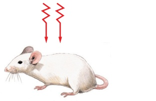

For this purpose, cells taken from mouse bone marrow are sorted (using a fluorescence-activated cell sorter) according to their cell-surface antigens, and the different fractions are transfused into irradiated mice. If a fraction rescues the irradiated mice, it must contain hematopoietic stem cells. In this way, it was shown that the hematopoietic stem cells display a specific combination of cell-surface proteins and that, by appropriate cell sorting, one can obtain virtually pure stemcell preparations. The stem cells turn out to be a tiny fraction of the mouse bone marrow population—about 1 cell in 50,000–100,000; but this is enough. Remarkably, a single such cell injected into a host mouse with defective hematopoiesis is sufficient to reconstitute its entire hematopoietic system, generating a complete set of blood-cell types, as well as fresh stem cells. This and lineage tracing experiments have established that an individual hematopoietic stem cell is multipotent and can self-renew and give rise to the complete range of blood-cell types.

INJECT BONE MARROW CELLS FROM HEALTHY DONOR

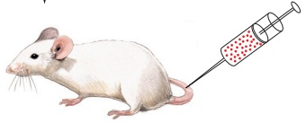

mouse survives; the injected stem cells colonize its hematopoietic tissues and generate a steady supply of new blood cells

(C)

(B)

Blood contains large numbers of many types of differentiated cells (**Table 22–1**), many of which can be seen in a standard, stained smear of human blood (**Figure 22–11**). Erythrocytes are homogeneous and remain in the blood vessels, where they transport $\mathrm { O } _ { 2 }$ and $\mathrm { C O _ { 2 } }$ bound to hemoglobin. By contrast, leukocytes are heterogeneous in morphology and function and must crawl across the walls of small blood vessels into tissues to function. Terminally differentiated blood cells have relatively short life spans and are produced throughout the life of the animal, so hematopoietic stem cells must generate enormous numbers of these differentiated cells each day. But they do not produce them directly. Instead, the stem cells continually produce large numbers of transit-amplifying progenitor cells in the bone marrow, which are committed to differentiation but go through multiple divisions before they terminally differentiate.

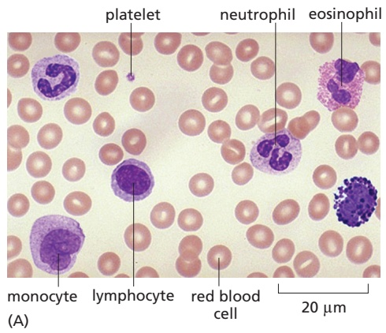

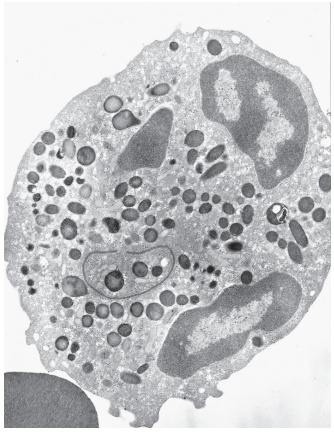

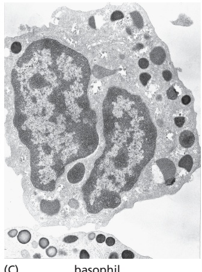

Figure 22–11 Human blood cells. (A) A light micrograph of a blood smear stained with the Romanowsky stain, which faintly colors the red blood cells red and strongly colors the white blood cells blue. (B–E) Electron micrographs of (B) a neutrophil, (C) a basophil, (D) an eosinophil, and (E) a monocyte. (Electron micrographs of lymphocytes are shown in Figure 24–14.) Each of the cell types shown here has a different function (see Table 22–1), which is reflected in the distinctive types of secretory granules and lysosomes each cell type contains. There is only one nucleus per cell, but it has an irregular lobed shape, and in panels B, C, and D the connections between the lobes are out of the plane of section. (A–D, courtesy of Dorothy Bainton; E, courtesy of David Mason.)

(D)

(E)

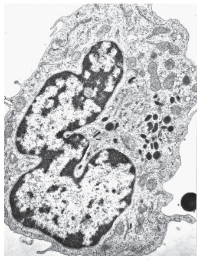

The stem cells, however, do not jump directly from a multipotent stem-cell state into a committed and specific pathway of differentiation; instead, they go through a number of cell divisions, in which they progressively restrict their developmental options in a series of steps (**Figure 22–12**). The first step is usually to become committed to either a myeloid or a lymphoid fate, by way of two kinds of multipotent transit-amplifying progenitor cells. One is capable of generating large numbers of all the different types of **myeloid cells**, including blood **granulocytes** (neutrophils, eosinophils, and basophils), **monocytes** (the precursors of macrophages and dendritic cells), erythrocytes, and **megakaryocytes** (which remain in the bone marrow and produce blood platelets by pinching off cell fragments) (**Movie 22.1**). The other type of multipotent progenitor cell gives rise to large numbers of different types of **lymphoid cells**, including the B and T lymphocytes of the adaptive immune system and the lymphocyte-like natural killer (NK) cells of the innate immune system (discussed in Chapter 24). Further commitment steps ultimately give rise to progenitor cells committed to the production of just one cell type, although this final commitment step occurs well before the cells cease proliferating and terminally differentiate. Many different signal molecules, produced inside and outside the bone marrow, control the survival, proliferation, and pathway commitment of hematopoietic cells and their committed progeny in the bone marrow and thereby regulate how many of each type of differentiated blood cell is eventually produced.

Figure 22–12 A simplified scheme of mouse and human hematopoiesis. A multipotent hematopoietic stem cell normally divides infrequently to generate either more multipotent stem cells, which are self-renewing, or multipotent progenitor cells, which give rise to all the cells of the blood and immune system. The progenitor cells divide a limited number of times and go through multiple stepwise intermediates before they develop into fully differentiated cells. As they go through their divisions, the progenitors become progressively more specialized in the range of cell types that they can give rise to, as indicated by the branching of this cell lineage diagram. In adult mammals, all of the cells shown develop mainly in the bone marrow—except for T lymphocytes, which as indicated develop in the thymus, and macrophages and some dendritic cells, which develop from monocytes that are circulating in the blood. Note that not all stem cells generate the identical patterns of progeny via precisely the same sequence.

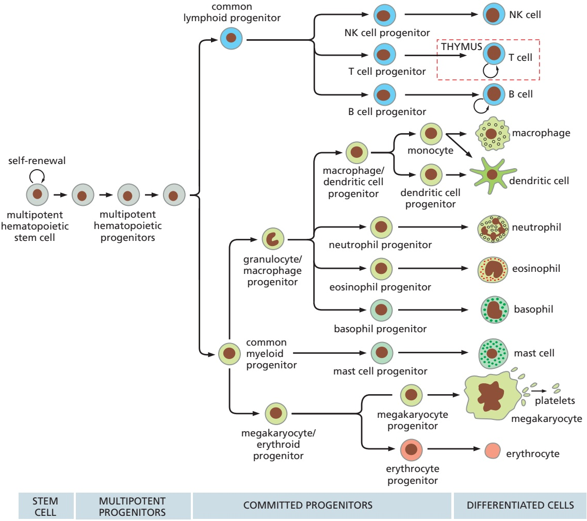

In this hierarchical hematopoietic system, only the stem cells can self-renew for the life of the individual, and a single stem-cell division can lead to the production of thousands to millions of differentiated progeny. This explains why the number of stem cells is such a tiny fraction of the total population of hematopoietic cells in the bone marrow. Keeping the number of stem-cell divisions low has important advantages. If these divisions on their own had to keep up with the high demand for terminally differentiated blood cells, they would result in rapid replicative cell senescence and exhaustion of the stem-cell pool, with dire consequences. Moreover, the lower the number of stem-cell divisions, the lower the risk of the cells accumulating dangerous mutations, which would persist in mutant clones; as discussed in Chapter 20, such clones are a particular danger in the hematopoietic system, where a relatively small number of mutations can be sufficient to cause blood-cell cancers.

#### Some Tissues Do Not Require Stem Cells for Their Maintenance

Some types of cells can divide even though fully differentiated, allowing for renewal and regeneration without the use of stem cells. The insulin-secreting **pancreatic b cells** are one example. Their mode of renewal has a special importance, because it is their loss through autoimmune attack that is responsible for type 1 (juvenile-onset) diabetes, and their functional decline with age and obesity is also a significant factor in type 2 (adult-onset) diabetes. The β cells are normally sequestered in cell clusters called islets of Langerhans. The islets seem not to contain stem cells, yet new β cells are continually generated within the islets. Lineage tracing studies, similar to those described earlier, show that the renewal of this population normally occurs by the simple division of differentiated insulin-producing β cells.

Another tissue that can renew by simple division of fully differentiated cells is the liver. The main cell type in the liver is the **hepatocyte**, a large cell that performs the liver’s many metabolic functions. Hepatocytes normally live for a year or more and divide at a very slow rate. Powerful homeostatic mechanisms operate to adjust both their rate of cell proliferation and their rate of cell death, to keep the liver at its normal size and to restore that size in the case of damage. A dramatic effect is seen if large numbers of hepatocytes are removed surgically or killed by poisoning with carbon tetrachloride. Within a day or so after either sort of damage, a surge of cell division occurs among the surviving hepatocytes, quickly replacing the lost tissue. If two-thirds of a rat’s liver is removed, for example, a liver of nearly normal size can regenerate by hepatocyte proliferation within about 2 weeks.

Both the pancreas and the liver also contain small populations of stem cells that can be called into play as a backup mechanism to produce the differentiated cell types in more extreme circumstances.

#### In Response to Injury, Some Differentiated Cells Can Revert to Progenitor Cells and Some Progenitor Cells Can Revert to Stem Cells

Although the pathways from stem cell to progenitor cell to differentiated cell are normally unidirectional, there are some cases where injury can reverse the direction. One striking example occurs when a myelinated mammalian nerve is cut: the axon distal to the cut degenerates, and the differentiated myelinating Schwann cells (see Figure 11–35) dedifferentiate to form proliferating Schwanncell progenitor cells. These progenitor cells help guide the regenerating axons back to their original targets and then remyelinate the axons to complete the regeneration process.

Similarly, in some tissues, when stem cells are lost, progenitor cells that have committed to differentiation can reprogram to revert to stem cells. In both the mouse and Drosophila testis, for example, spermatogonial cells typically follow a unidirectional development pathway from stem cell to proliferating progenitor cells, which undergo meiosis and finally differentiate into sperm. If stem cells are lost, either naturally or experimentally, the mitotically proliferating progenitor cells can reprogram and revert to stem cells. More generally, this process might contribute to the long-term maintenance of stem-cell populations, allowing the lifetime of individual stem cells to be shorter than the lifetime of the organism. Unfortunately, cancer cells often also acquire stem cell–like properties, allowing them to self-renew indefinitely (discussed in Chapter 20).

#### Some Tissues Lack Stem Cells and Are Not Renewable

Some adult tissues that lack stem cells are not able to regenerate. The remarkable variation in the ability of different tissues to regenerate is illustrated by comparing the olfactory epithelium in the nose, the auditory epithelium of the inner ear, and the photoreceptive epithelium of the retina, which exhibit striking differences in their renewal capacity. The olfactory epithelium contains a population of stem cells that give rise to differentiated cells that have a limited life span and are continually replaced. But unlike the epidermis discussed earlier, these differentiated olfactory cells are neurons; they have their cell bodies in the olfactory epithelium and extend their axons back to the olfactory bulbs in the brain. The renewal of this epithelium therefore involves the continual production of new axons that have to navigate back to specific sites in the brain, where they form new synapses.

In contrast, in mammals at least, the auditory epithelium and retinal photoreceptive epithelium lack stem cells, and their sensory receptor cells—the sensory hair cells in the ear and the photoreceptors in the retina—are irreplaceable. If they are destroyed—whether by too much exposure to loud noise, by looking into the beam of a laser, or through degenerative processes occurring in disease or in old age—the loss is permanent.

We will return to tissue regeneration later in the chapter.

#### Summary

Many adult tissues, particularly those with a high cell turnover rate such as the intestinal lining, skin epidermis, and blood, are continually renewed by stem cells to maintain tissue homeostasis throughout the lifetime of the organism. Stem cells are defined by their ability to both self-renew and to generate terminally differentiated cells, usually by way of rapidly dividing, transit-amplifying progenitor cells. These properties can be revealed experimentally through lineage-tracing or transplantation experiments. Tissue-specific, or adult, stem cells are restricted in their differentiation potential, only generating one or more of the specific cell types of a particular tissue.

In the single-layer lining of the small intestine, multipotent stem cells are located near the base of each crypt, where they self-renew and produce dividing committed progenitor cells, most of which flow upward and terminally differentiate into one of three main types of gut cells when they reach the villus; other progenitor cells move in the opposite direction and become Paneth cells, which remain at the base of the crypt and help maintain the stem cells. Other self-renewing epithelia, such as the epidermis, have a multilayered (stratified) architecture, with stem cells and their differentiating progeny arranged in different ways, but are governed by similar basic principles.

The hematopoietic system is the most complex mammalian stem-cell system; all the red blood cells and the many types of white blood cells derive from a common, multipotent, hematopoietic stem cell in the adult bone marrow, where it divides slowly and produces multipotent and unipotent progenitor (transit-amplifying) cells, which divide rapidly and differentiate into a large number and variety of terminally differentiated cell types every day. In other tissues, such as skeletal muscle, stem cells are quiescent and only divide and differentiate when tissue growth or repair is required. Adult tissue renewal and repair do not always depend on stem cells; in the pancreas and liver, for example, differentiated cells can divide throughout life to replace lost cells and maintain tissue homeostasis. In some cases, progenitor cells can be generated from differentiated cells, and stem cells can be

generated from progenitor cells. At the opposite extreme, some sensory epithelia of the adult mammalian ear and eye are not renewable; their sensory cells do not undergo turnover—once lost, they are lost forever.

#### CONTROL OF STEM-CELL FATE AND SELF-RENEWAL

Adult stem cells maintain tissue homeostasis in renewing tissues, owing to their ability both to self-renew and to produce differentiated cells for the lifetime of the organism. How do these cells maintain their stem-cell identity for so long, and how do their daughter cells choose between self-renewal and a commitment to differentiation? While maintaining a stem-cell population is critically important for self-renewing tissues, stem-cell proliferation must be kept in check, as uncontrolled production of undifferentiated cells is a hallmark of cancer (discussed in Chapter 20). In this section, we discuss the mechanisms that allow stem cells to maintain their identity while producing differentiated cells and keeping their own proliferation under control.

#### The Stem-Cell Niche Maintains Stem-Cell Self-Renewal

The identity and self-renewal of stem cells depend on extracellular signals from their environment that both promote their proliferation and inhibit their commitment to differentiation. In many tissues, stem cells inhabit a special microenvironment called the **stem-cell niche**, where these signal molecules are provided in high concentration (**Figure 22–13**). The stem cells remain in close physical proximity to the niche-supporting cells, which produce the signals and provide a local special environment. Outside this environment, the concentration of the signal molecules is insufficient to maintain the self-renewal of the stem cells, and their daughter cells therefore commit to differentiation.

The existence of the stem-cell niche was first inferred from the experiment in which bone marrow cells were transplanted into a mouse that had been subjected to a high dose of x-rays (see Figure 22–10). Without the prior irradiation, the transplanted cells were unable to reestablish hematopoiesis, suggesting that the resident hematopoietic stem cells first had to be removed before the transplanted stem cells could successfully seed the host’s bone marrow. The hypothetical special “place” occupied by either the host or donor hematopoietic stem cells was referred to as the stem-cell niche. Because of the complexity of bone marrow and the rarity of the stem cells there, the location of the niche remained unclear until many years later, when immunofluorescence microscopy and the use of cell markers provided evidence that the surface of sinusoids in the bone marrow is the likely site of the niche.

The molecular nature of stem cell–renewal signals provided within the niche varies across species and tissues, but they frequently are secreted signal proteins of the Wingless (Wnt), Hedgehog (Hh), or transforming growth factor (TGF) families (discussed in Chapter 15). Other niche signals are cell-surface proteins that depend on direct contact between the stem cells and the niche-supporting cells. The mammalian intestinal crypt provides a well-studied example (see

Figure 22–13 The stem-cell niche. Stem cells undergo self-renewal only in a specialized microenvironment where they are exposed to the necessary signal molecules. These signal molecules can be provided by niche-supporting cells or by a specialized extracellular matrix that serves to concentrate them. The niche environment can be very small. In some cases, a stem cell directly adjacent to the niche is capable of self-renewal, while a cell just one cell-diameter away from the niche is not.

Figure 22–14 Genesis of a minigut from a single Lgr5-expressing cell cultured in a cell-free matrix. (A) Schematic drawing and (B) phase-contrast micrographs of the developing organoid. The founder cell first divides to form a small sack or vesicle. At random, one or more of the cells in this vesicle differentiates as a Paneth cell (blue). The Paneth cells secrete Wnt proteins MBoC7 m22.08/22.14that stimulate stem-cell self-renewal and maintain Lgr5 expression (yellow) in their immediate neighbors; besides generating more stem cells, the stem cells produce progenitor cells that differentiate into the full range of intestinal epithelial-cell types. (C) Schematic diagram showing how Paneth cell–derived Wnt signals help organize the developing crypt: besides keeping neighboring cells in the crypt proliferating in a stem-cell state, these signals activate repulsive interactions mediated by membrane-bound ephrin and Eph proteins on contacting cells (discussed in Chapter 15). These interactions cause dividing crypt cell types (which express EphB, induced by Wnt) to segregate from the nondividing, terminally differentiated villus cell types (which express ephrinB). In many tissues, cells that interact via ephrin–Eph binding repel each other when they touch (see Figure 15–52 or Figure 21–47). (Adapted from T. Sato and H. Clevers, Science 340:1190–1194, 2013. With permission from AAAS.)

Figure 22–4). We saw earlier that the stem cells that give rise to all the terminally differentiated cells in the intestinal epithelium express the cell-surface receptor protein Lgr5 and are located just above the base of the crypt, interspersed among the Paneth cells. The Paneth cells help create the stem-cell niche in two ways. They secrete Wnt proteins that act over a short range to stimulate stem-cell self-renewal. They also express Delta, a ligand for the signaling receptor Notch, on their surface, which activates Notch on the stem cells they directly contact, thereby inhibiting the cells from differentiating—an example of lateral inhibition (see Figure 15–59).

Remarkably, a single Lgr5-expressing stem cell embedded in a cell-free extracellular matrix can proliferate in a culture dish and form a tiny gut-like structure, an organoid, containing all the cell types normally found in gut tissue, including stem cells. **Figure 22–14** shows this process and outlines the key signaling events that establish the crypt stem-cell niche, where different cell types are produced that arrange themselves into miniature villi to form the three-dimensional organoid structure.

#### The Size of the Niche Can Determine the Number of Stem Cells

In each intestinal crypt, the stem-cell niche is created by 15 Paneth cells, and it only has space for a limited number of stem cells. When the stem cells divide, it is a random matter as to which of the daughter cells are pushed out of the nest; failing to get the signals they need to maintain their stem-cell identity, they are condemned to commit to differentiation. In most other stem-cell systems where this question of balance between self-renewal and commitment to differentiation has been examined, it appears that a similar mechanism operates.

The Caenorhabditis elegans germ-line cell lineage provides a visually striking example (**Figure 22–15**). In this system, the stem cells are maintained within a niche that is formed by a large somatic cell called a distal tip cell, which forms long, thin cellular processes. Notch ligand located on the surface of the distal tip cell signals to Notch on the stem cells to maintain their stem-cell identity. As in the intestinal crypt, the stem cells undergo self-renewal proliferation in the niche, until some of their progeny are pushed out of range of the distal tip cell processes, and, as a result, they begin to differentiate. In this way, a steady stream of cells at different stages of differentiation move away from the distal tip cell and the stem cells, as if on a conveyor belt, on their way to becoming terminally differentiated germ cells—either eggs or sperm.

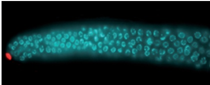

(A)

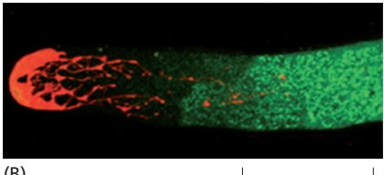

(B)

50 µm

Figure 22–15 Stem-cell niche of the C. elegans gonad. (A) Fluorescence micrograph showing the nuclei (blue) in a portion of the C. elegans gonad. The nucleus of the distal tip cell is shown in red. (B) The same tissue is stained to show the cytoplasm and processes of the distal tip cell in red and the differentiated germ cells in green. The distal tip cell processes extend across multiple stem-cell diameters,. / . maintaining stem-cell identity through Notch signaling. Those cells moved out of reach of the distal tip cell processes initiate meiosis and begin the differentiation program that will produce either eggs or sperm. (Courtesy of Judith Kimble and Sarah Crittenden.)

Niche size, however, is not the only way to control stem-cell numbers— asymmetric stem-cell division is another, as we now discuss.

#### Asymmetric Stem-Cell Division Can Maintain Stem-Cell Number

As discussed earlier, when a stem cell divides, the two daughter cells must make a choice between remaining a stem cell or committing to differentiation. The balance between these two fates is critically important for tissue homeostasis, because excessive self-renewal would lead to an excess of stem cells, whereas excessive differentiation would deplete the stem-cell pool. We have just discussed how the size of the stem-cell niche can help control stem-cell numbers. Asymmetric stem-cell division is another mechanism for such control.

In an asymmetric stem-cell division, a process internal to the dividing stem cell causes a biased inheritance of one or more important molecules that influences the fate of the two daughter cells. For example, only one of the two daughter cells might inherit a cell-fate determinant that is required to maintain stem-cell identity, causing the other daughter to commit to differentiation (**Figure 22–16A**). Each such asymmetric stem-cell division produces one stem cell and one cell committed to differentiation; as a result, the number of stem cells is preserved irrespective of how many cell divisions the stem cells undergo. In symmetric stem-cell divisions, both daughters inherit such cell-fate determinants and remain stem cells, thereby increasing the pool of stem cells (**Figure 22–16B**).

As shown in Figure 22–16, prior to an asymmetric stem-cell division, the cell becomes polarized, with the cell-fate determinant localized on one side of the cell. The cell then positions the mitotic spindle to orient the plane of cell division so that only one daughter inherits the fate determinant.

Another way the orientation of the division plane in a stem cell can influence the fate of the daughter cells is to determine their position relative to the stem-cell

both daughters self-renew

Figure 22–16 Asymmetric and symmetric stem-cell divisions. (A) In the asymmetric stem-cell division schematized here, a cell-fate determinant (red) that maintains stem-cell identity is localized to the cell cortex at one side of the cell. When the cell divides, only one daughter cell inherits the determinant and remains a stem cell, while the other daughter commits to differentiation, differentiating after a number of progenitor-cell divisions (not shown). (B) In the symmetric stem-cell division shown, both daughter cells inherit such determinants and remain stem cells.

niche, such that the niche is asymmetrically inherited. In the Drosophila testis, for example, the germ-line stem cells orient their spindles perpendicular to the niche-supporting cells: as a result, when the stem cell divides, one daughter cell remains attached to the niche and adopts a stem-cell fate, while the other daughter is displaced away from the niche, where it is deprived of self-renewal signals and therefore commits to differentiation (Figure 22–17).MBoC7 n22.106/22.17

Figure 22–17 How the plane of division in a dividing, germ-line stem cell in the Drosophila testis determines which daughter cell maintains contact with the niche. (A) The niche consists of a hub of somatic cells, and the germ-line stem cells are arranged in a ring around the hub. When a stem cell divides, its mitotic spindle is oriented perpendicular to the niche, so that only one daughter cell maintains contact with the niche and remains a stem cell; the other daughter loses contact with the niche cells and is therefore deprived of self-renewal signals and commits to differentiation. (B) The light micrograph shows germ-line stem cells surrounding the niche and a dividing stem cell with its mitotic spindle oriented perpendicular to the niche. The stem cells have been genetically engineered to express fluorescently labeled tubulin. (B, from Y.M. Yamashita et al., Science 301: 1547–1550, 2003. With permission from AAAS.)

#### In Many Symmetric Stem-Cell Divisions, Daughter Cells Choose Their Fates Independently and Stochastically

As we have seen, asymmetric stem-cell division provides a straightforward way to maintain stem-cell numbers while generating differentiated cells in a self-renewing adult tissue. However, it leaves little room for a tissue to adapt to changing conditions, such as fluctuating nutrient availability or in response to tissue injury. In many self-renewing adult tissues, the mode of stem-cell division changes to adapt to such altered conditions. And similar adaptive changes occur during tissue development: for example, both the neural and epidermal stem cells in early developing mice mainly divide symmetrically to expand the stemcell pool to support the rapidly growing organs; later in development, however, the stem cells shift to more asymmetric cell divisions to produce more differentiated cells (see Figure 22–16).

Stem cells in many renewing tissues, including the intestinal epithelium, adopt an even more flexible strategy. In these cases, when the stem cells divide, they do so symmetrically, and each daughter cell makes the choice between remaining a stem cell (self-renewal) and committing to differentiation, independently of its sister. In this independent-choice mechanism, sometimes the two daughter cells make the same choice, other times the opposite choice. The choice each cell makes might either be stochastic (probabilistic), like the flip of a coin, or governed by the environment the daughter cell finds itself in (**Figure 22–18**). Compared to the asymmetric-division strategy, the independent-choice mechanism is flexible, allowing local and more general environmental factors to regulate the balance of probabilities according to need—adjusting them in favor of the stem-cell option where more stem cells are required, as they often are, either for growth or for damage repair, or in favor of differentiated cells when they have been lost.

Lineage tracing experiments in the small intestine of mice reveal that some stem-cell lineages disappear while others expand and persist, as expected if the daughter cells of the stem-cell divisions make their choices stochastically (see Figure 22–18).

<!-- END EN EN22-H000-H016 -->

### 英文补充：再生修复、胚胎干细胞、iPSC与谱系重编程

> 对应中文板块：再生修复、胚胎干细胞、iPSC与谱系重编程。英文来源：Molecular Biology of the Cell，第7版，第22章；[本章完整原文](../来源/英文教材/22_Stem_Cells_in_Tissue_Homeostasis_and_Regeneration/chapter.md)。物理PDF页码范围：1318–1351（整章范围）。

<!-- BEGIN EN EN22-H018-H035 -->
#### Summary

Multiple extracellular signals operate in each stem-cell niche, enabling tissuespecific stem cells to maintain adult tissue homeostasis throughout an organism’s life. These signals regulate when and where the stem cells self-renew and their daughter cells commit to differentiation. An individual stem cell’s decision to self-renew or commit to differentiation is controlled to ensure the tissue maintains an adequate number of stem cells and produces an appropriate number of terminally differentiated cells. In some cases, asymmetric stem-cell divisions that produce one stem cell and one differentiating cell at each division achieve this balance. In other cases, the stem-cell divisions are symmetric, and the two daughter cells independently choose between self-renewal and commitment to differentiation, with the choice being either stochastic or in response to local environmental signals. The ability of adult stem cells to self-renew and produce terminally differentiated cells declines over time, contributing to tissue aging.

#### REGENERATION AND REPAIR

As we have seen, many of the tissues of the body are not only self-renewing but also self-repairing, and this is largely thanks to stem cells and the feedback controls that regulate the stem cells’ behavior to maintain tissue homeostasis. There are, however, limits to what these natural repair mechanisms can achieve. In most parts of the human brain, for example, nerve cells that die, as in Alzheimer’s disease, are not replaced. Likewise, when heart muscle cells die for lack of oxygen during a heart attack, they are replaced by scar tissue rather than by new heart muscle cells.

Some animals do far better than humans and can regenerate entire organs, such as whole limbs after amputation. Among the invertebrates, there are some species that can even regenerate all the tissues of the body from a single somatic cell. These phenomena encourage the hope that human cells might be coaxed by artificial measures into similar feats of repair and regeneration, to replace the nerve cells that die in individuals with Alzheimer’s disease or Parkinson’s disease, the insulin-secreting β cells that are lost in type 1 diabetes, the heart muscle cells that die in a heart attack, and so on. As we learn more about the basic cell biology of regeneration, these goals, once only a dream, are beginning to seem attainable.

In this section, we start with some examples of the remarkable regenerative abilities of some animal species, as an indication of what is possible in principle. We then discuss how we can improve on the natural repair processes of the human body and treat disease by exploiting the properties of the various types of stem cells found in adult human tissues.

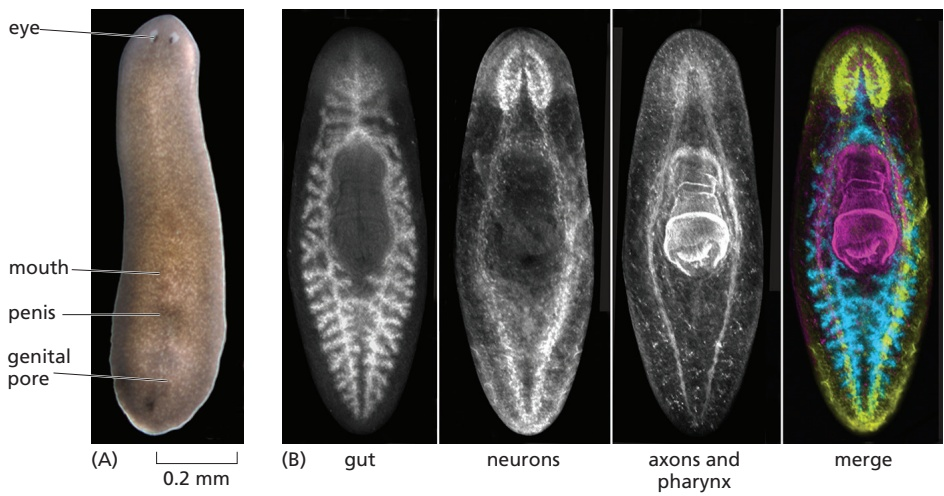

Figure 22–20 The planarian worm, Schmidtea mediterranea. (A) External view. (B) Immunostaining with three different antibodies, revealing the internal anatomy. (A, courtesy of A. Sánchez Alvarado; B, from A. Sánchez Alvarado, BMC Biol. 10:88, 2012. With permission from the author.)

#### Planarian Flatworms Contain Stem Cells That Can Regenerate a Whole New Body

Schmidtea mediterranea is a small freshwater flatworm, or planarian, a centimeter or so long when grown to full size (**Figure 22–20**). It has an epidermis, a gut,MBoC7 m22.35/22.20 a brain, a pair of primitive eyes, a peripheral nervous system, musculature, and excretory and reproductive organs—most of the basic body parts familiar in other animals, although all relatively simple by vertebrate standards and built from about 20–25 distinct differentiated cell types. For more than a century, planarians such as Schmidtea have intrigued biologists because of their extraordinary capacity for regeneration: a small tissue fragment taken from almost any part of the body will grow and regenerate a complete new animal. This property goes with another: when the animal is starved, it gets smaller and smaller, by reducing its cell numbers while maintaining essentially normal body proportions. This behavior is called degrowth, and it can continue until the animal is as little as one-twentieth of its full size. Supplied with food, it will grow back to full size again. Cycles of degrowth and growth can be repeated indefinitely, without impairing survival or fertility.

Underlying this behavior is a process of continual cell turnover. Along with the differentiated cells, which do not divide, there is a population of small, undifferentiated dividing cells called neoblasts. The neoblasts constitute about 20% of the cells in the body and are widely distributed within it; by cell division, they serve as stem cells for the production of new differentiated cells. The differentiated cells, meanwhile, are continually dying by apoptosis, allowing their corpses to be phagocytosed and digested by neighboring cells (discussed in Chapter 18). Through this cell cannibalism, the constituents of the dying cells can be efficiently recycled. Cell division continues in a dynamic balance with cell death and cell cannibalism, no matter whether the animal is fed or starved. In conditions of starvation, the balance is tilted toward cell death and cannibalism, and in conditions of plenty, toward cell growth and division.

A high dose of x-rays halts all cell division, putting a stop to cell turnover and destroying the capacity for regeneration. The result is death after a delay of several weeks. The animal can be rescued, however, by an injection into it of a single neoblast isolated from an unirradiated donor (**Figure 22–21**). In a certain proportion of cases, the injected cell divides to form a clone of progeny that eventually repopulates the entire body, creating a healthy regenerative individual with an apparently complete set of terminally differentiated cell types, as well as dividing neoblasts. A gradient of positional information regarding head-to-tail identity is continually expressed by the muscle cells along the worm’s body and instructs the neuroblasts’ appropriate development. Genetic markers prove that the differentiated cells are all derived from the single neoblast that was injected, suggesting that at least some neoblasts are totipotent stem cells, in that they are able to give

Figure 22–21 Regeneration of a planarian from a single somatic cell. (A) The distribution of dividing cells (neoblasts; blue) in the adult body. Irradiation blocks all cell division and prevents regeneration. (B) A single unirradiated neoblast cell injected into the irradiated animal is able to proliferate and reconstitute all tissues. This eventually produces a complete animal that consists entirely of the progeny of this one cell and can regenerate normally. A gradient of information concerning headto-tail identity is continually expressed in muscle cells along the body and instructs the neuroblasts. (Adapted from E.M. Tanaka and P.W. Reddien, Dev. Cell 21:172–185, 2011.)

rise to all the cell types that make up the body of the flatworm, including more neoblasts like themselves.

#### Some Vertebrates Can Regenerate Entire Limbs and Organs

One might think that such powers of regeneration would be a prerogative of only small, simple, primitive animals. But some vertebrates, too, especially fish and amphibians, show remarkable regenerative abilities. Salamanders, including newts and axolotls, for example, can regenerate a whole or a part of an amputated limb, as well as many other body parts, including brain tissue and spinal cord (**Figure 22–22**). In the process of limb regeneration, a blastema—a small bud resembling an embryonic limb bud—forms at the site of amputation. The rapid lateral migration of adjacent epidermal cells serves to seal the wound site. The underlying blastema cells are mostly derived from activated stem cells and progenitor cells in the stump that are highly proliferative. Although the cells all look alike, they retain a memory of their tissue of origin and enough positional information to enable them to differentiate into the appropriate cell types and to form a correctly patterned replacement for the limb or the part of the limb that was amputated. The regenerative process looks like a recapitulation of embryonic limb development. As in the developing limb, all of the required cell behaviors are orchestrated by intercellular signals that are produced by the overlying epidermis, the ingrowing nerves, the proliferating lineage-restricted stem cells, and the transit-amplifying progenitor cells and their differentiated progeny. Most of the signaling pathways involved are the same as those used in limb development, including those activated by Hedgehog, Wnt, and FGF family members.

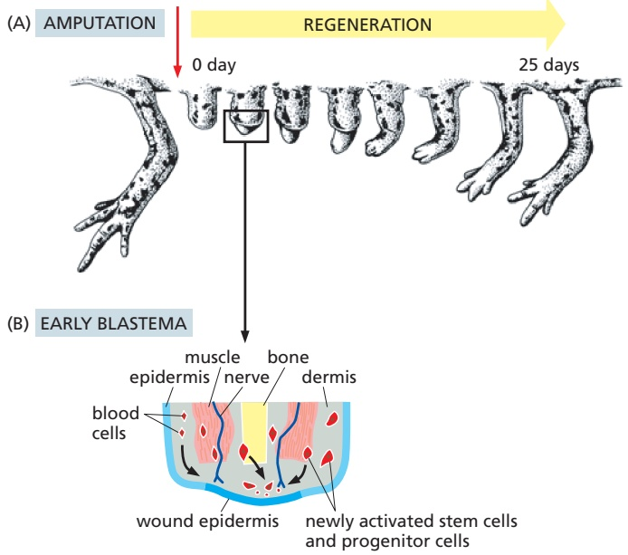

Figure 22–22 Newt limb regeneration. (A) The time-lapse sequence shows the stages of regeneration after amputation at the mid-humerus level. The sequence spans the events of wound healing, activation and proliferation of stump stem cells and progenitor cells in the process of blastema formation, and differentiation of various limb-cell types. (B) Schematic diagram of the early blastema. (A, courtesy of Susan Bryant and David Gardiner.)

Why a salamander can regenerate so many body parts whereas a mammal cannot remains a profound mystery.

#### Stem Cells Can Be Used Clinically to Replace Lost Hematopoietic or Skin Cells

Earlier in this chapter, we saw how mice can be irradiated to kill off their hematopoietic stem and progenitor cells and then rescued by a transfusion of new stem cells, which repopulate the bone marrow and restore blood-cell production (see Figure 22–10). In the same way, human individuals with some forms of leukemia or lymphoma can be irradiated or chemically treated to destroy their cancer cells, along with the rest of their hematopoietic tissue, and then can be rescued by a transfusion of healthy, noncancerous hematopoietic stem cells. In favorable cases, the stem cells can be sorted out from samples of an individual’s own hematopoietic tissue before it is ablated; the stem cells are then transfused back afterward, thereby avoiding problems of immune rejection.

Another example of the use of stem cells is in the repair of the skin after extensive burns. By culturing cells from undamaged regions of the burned person’s skin, it is possible to generate enough epidermal stem cells by long and complicated procedures to repopulate the damaged body surface.

#### Neural Stem Cells Can Be Manipulated in Culture and Used to Repopulate a Diseased Central Nervous System

The vertebrate central nervous system (the CNS) is the most complex tissue in the body, at an opposite extreme from the epidermis. And yet fish and amphibians can regenerate large parts of their brain, spinal cord, and eyes after these have been cut away. In adult mammals, however, these tissues have very little capacity for self-repair, and stem cells capable of generating new neurons are hard to find—so hard to find that for many years they were thought to be absent.

We now know, however, that neural stem cells that generate neurons, glial cells, or both, do persist in certain parts of the adult mammalian brain, as shown in **Figure 22–23** for stem cells that give rise to neurons in the mouse olfactory bulb. In both the adult mouse and human brain, there is also a continual turnover of neurons in the hippocampus, a region specifically concerned with learning and memory. Here, plasticity of adult brain function is associated with turnover of a particular subset of neurons: about 1400 new neurons in this class are generated every day, which is a turnover rate of 1.75% of the cells per year.

A more dramatic neuronal turnover is observed in the brains of certain songbirds. In these birds, large numbers of neurons die each year and are replaced by new neurons, as part of a process by which the birds refine their song for each new breeding season.

Brain neural stem cells can be studied in culture. Fragments taken from self-renewing regions of the adult or fetal mammalian brain, for example, can be dissociated and cultured under conditions where they form floating “neurospheres”—clusters consisting of a mixture of neural stem cells and their neuronal and glial progeny cells. The neurospheres can be propagated through many cell generations, and their cells can be taken at any time and implanted back into the brain of an intact animal, where they will produce differentiated neurons and glial cells.

Using slightly different culture conditions, with the right combination of growth factors in the culture medium, the neural stem cells can be grown as dissociated cells in a culture dish and induced to proliferate as an almost pure stem-cell population without attendant differentiated progeny. By a further change in the culture conditions, these cells can be induced at any time to differentiate to give

Figure 22–23 The continuing production of neurons in an adult mouse brain. The brain is viewed from above, in a cutaway section, to show the region lining the ventricles of the forebrain where neural stem cells are found. These cells continually produce progeny that migrate to the olfactory bulb, where they terminally differentiate into neurons. The constant turnover of neurons in the olfactory bulb is presumably linked in some way to 7 22.38/22.23the turnover of the olfactory receptor neurons that project to it from the olfactory epithelium in the nose. In adult mice and humans, there is also a continuing turnover of neurons in the hippocampus (not shown), a region specially concerned with learning and memory. (Adapted from B. Barres, Cell 97:667–670, 1999.)

fetal brain or ES cells

neurospheres (A)

dissociate cells and culture in suspension in medium 1

dissociate and culture as monolayer in medium 2

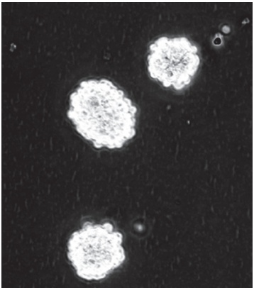

switch to medium 3

mixture (C) of differentiated neurons (red) and glial cells (green); cell nucleiare blue

(A)

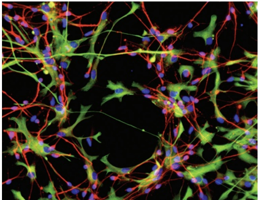

(B)

(C)

either a mixture of neurons and glial cells (**Figure 22–24**) or just one of these two classes of cells, according to the composition of the medium.

Neural stem cells, whether derived as above or from the pluripotent stem cells that we describe in the final section of this chapter, can be grafted into an adult brain. Once there, they show a remarkable ability to adjust their behavior to match their new location. Stem cells from the mouse hippocampus, for example, when implanted into the migration pathway of the mouse olfactory-bulb precursor cells (see Figure 22–23), give rise to neurons that become correctly incorporated into. / . the olfactory bulb. This capacity of neural stem cells and their progeny to adapt to a new environment in animals suggests applications in the treatment for central nervous system diseases or injury.

#### Summary

Animals vary in their capacity for regeneration. At one extreme, planarian flatworms contain stem cells (neoblasts) that support the continual turnover of all cell types, and an entire worm can be regenerated from practically any small body fragment or even from a single neoblast cell. Salamanders can regenerate limbs and other large body parts after amputation, but the regenerating cells remain restricted according to their origins: muscle cells in the regenerate derive from muscle, epidermis from epidermis, and so on. In mammals, regeneration is more limited. Nevertheless, it is becoming possible to go beyond the natural limits of wound healing by exploiting stem-cell biology. Certain regions of the nervous system contain stem cells that support production of neurons in these sites throughout life. Neural stem cells can be obtained from these sites or from fetal brains, grown in culture, and then grafted back into other sites in the brain, where they are able to generate neurons appropriate to the new location.

#### CELL REPROGRAMMING AND PLURIPOTENT STEM CELLS

When cells are transplanted from one site in the mammalian body to another or are removed from the body and maintained in culture, they remain largely faithful to their origins. Each type of specialized cell has a memory of its developmental history and seems fixed in its fate. Some limited transformations can certainly occur, and, as we have seen, some stem cells can generate a variety of differentiated cell types, but the possibilities are restricted. Each type of adult stem cell serves for the renewal of one particular type of tissue, and the whole pattern of self-renewing stem cells to differentiated cells in the adult body is amazingly stable. What, at a fundamental molecular level, is the nature of these stable differences between cell types and cell states? Is there any way to override

Figure 22–24 Neural stem cells. Shown are the steps leading from fetal brain tissue or embryonic stem cells, via neurospheres (A), to a pure culture of neural stem cells (B). These stem cells can be kept proliferating as such indefinitely or, through a change of medium, can be caused to differentiate (C) into neurons (red) and glial cells (green). Neural stem cells with the same properties can also be derived, via a similar series of steps, from embryonic stem (ES) or induced pluripotent stem (iPS) cells (discussed later in this chapter). (Micrographs from L. Conti et al., PLoS Biol. 3:e283, 2005. With permission from the authors.)

the cell-memory mechanisms and force a switch from one state to another that is radically different?

We have already discussed these fundamental questions from a general standpoint in Chapter 7. Here we consider them more closely in the context of stem-cell biology, where there has been a recent revolution in our understanding and in our ability to manipulate states of cell differentiation. With further research, these advances will likely have many important medical applications.

#### Nuclei Can Be Reprogrammed by Transplantation into Foreign Cytoplasm

If we cannot switch the basic character of a specialized cell by changing its environment, can we do so by interfering with its inner workings in a more direct and drastic way? An extreme treatment of this sort is to take the nucleus of the cell and transplant it into the cytoplasm of a large cell of a different type. If the factors that define and maintain a particular cell type are in the cytoplasm, the transplanted nucleus should switch its pattern of gene expression to conform with that of the host cell. In Chapter 7, we described a famous experiment of this sort, using the frog Xenopus. In this experiment, the nucleus of a differentiated cell (a cell from the lining of a tadpole’s gut) was used to replace the nucleus of an oocyte (an egg-cell precursor arrested in prophase of the first meiotic division, in readiness for fertilization). The resulting hybrid cell went on, in a certain fraction of cases, to develop into a completely normal frog (see Figure 7–2A). This was crucial evidence for what is now a central principle of developmental biology: the cell nucleus, even that of a differentiated cell, contains a complete genome, capable of supporting development of all the normal cell types of the organism. At the same time, the experiment showed that cytoplasmic factors can indeed reprogram a nucleus: the oocyte cytoplasm can drive the gut-cell nucleus back to an early embryonic state, from which it can then step through the changing patterns of gene expression that lead all the way to a complete adult organism.

The full story, however, is not quite so simple. First, the reprogramming in such experiments is not perfect. When the transplanted nucleus is taken from a gut cell, for example, a gene that is normally specific to the gut is found to be expressed persistently, even in the muscle cells of the final animal. Second, the experiment succeeds in only a limited proportion of cases, and this success rate becomes lower and lower, the more mature the animal from which the transplanted nucleus is taken: very large numbers of transplantations must be performed to achieve a single success if the nucleus comes from a differentiated cell of an adult frog.

Nuclear transplantation can be done in mammals too, with basically similar results. For example, a nucleus taken from a differentiated cell in the mammary gland of an adult sheep and transplanted into an enucleated sheep’s egg was able to support development of an apparently normal sheep—the famous Dolly. Again, the success rate is low: many transplantations have to be done to obtain one such individual.

#### Reprogramming of a Transplanted Nucleus Involves Drastic Changes in Chromatin

In a typical fully differentiated cell, there seem to be mechanisms maintaining the pattern of gene expression that cytoplasmic factors cannot easily override. An obvious possibility is that the stability of the pattern of gene expression in an adult cell may depend, in part at least, on self-perpetuating modifications of chromatin, as discussed in Chapter 4 (see Figure 4–44). As explained in Chapter 7, the phenomenon of X-inactivation in mammals provides a clear example of such epigenetic control. Two X chromosomes are present in each female cell, exposed to the same chemical environment, but while one remains active, the other persists from one cell generation to the next in a condensed inactive state; cytoplasmic factors cannot be responsible for the difference, which must instead reflect mechanisms intrinsic to the individual chromosome. Elsewhere in the genome also, controls at the level of chromatin act in combination with other forms of regulation to govern the expression of each gene. Genes can be shut down completely, or switched on constitutively, or maintained in a labile state where they can be readily switched on or off according to changing circumstances.

The reprogramming of a nucleus transplanted into an oocyte involves dramatic changes in chromatin. The nucleus swells, increasing its volume 50-fold as the chromosomes decondense; there is a wholesale alteration in patterns of methylation of DNA and histones; the linker histone H1 (the histone that links adjacent nucleosomes) is replaced by a variant form that is peculiar to the oocyte and early embryo; and the preexisting type of histone H3 is also replaced at many sites by a distinct isoform. Evidently, the egg contains factors that reset the state of the chromatin in the nucleus, wiping out old histone modifications on chromatin and imposing new ones. Reprogrammed in this way, the genome becomes competent once again to initiate embryonic development and to give rise to the full range of differentiated cell types.

#### Embryonic Stem (ES) Cells Can Generate Any Part of the Body

A fertilized egg, or an equivalent cell produced by nuclear transplantation, is a remarkable thing: it can generate a whole new multicellular individual, which means that it can give rise to every normal type of specialized cell, including even egg or sperm cells for production of the next generation. A cell in such a state is said to be **totipotent**; a cell that can give rise to most cell types but not absolutely all is said to be **pluripotent**. Nevertheless, such a totipotent or pluripotent cell is not a stem cell as it is not self-renewing, but is instead dedicated to a program of progressive differentiation. If it were the only available starting point for study and exploitation of pluripotent cells, the enterprise would require a continual supply of fresh fertilized eggs or fresh nuclear transplantation procedures—an awkward requirement for studies in experimental animals, and unacceptable for practical applications in humans.

Here, however, nature has been unexpectedly kind to scientists. It is possible to take an early mouse embryo, at the blastocyst stage, and through cell culture to derive from it a class of stem cells called **embryonic stem cells**, or **ES cells**. ES cells originate from the inner cell mass of the early embryo (the cluster of cells that give rise to the body of the embryo proper, as opposed to extraembryonic structures), and they have an extraordinary property: given suitable culture conditions, they will continue proliferating indefinitely and yet retain an unrestricted developmental potential. Their only limitation is that they do not give rise to extraembryonic tissues such as those of the placenta. Thus they are classified as pluripotent, rather than totipotent. But this is a minor restriction. If ES cells are put back into a blastocyst, they become incorporated into the embryo and can give rise to all the tissues and cell types in the body, integrating perfectly into whatever site they may come to occupy, and adopting the character and behavior that normal cells would show at that site (**Figure 22–25**). They can even give rise to germ cells, from which a new generation of animals can be derived.

Figure 22–25 Production and pluripotency of ES cells. ES cells are derived from the inner cell mass (ICM) of the early embryo. The ICM cells are transferred to a culture dish containing an appropriate medium, where they become converted to ES cells and can be kept proliferating indefinitely without differentiating. The ES cells can be taken at any time—after genetic manipulation, if desired—and injected back into a developing blastocyst. There they incorporate into the inner cell mass and take part in formation of a well-formed chimeric animal that is a mixture of ordinary and ES-derived cells. The ES-derived cells can differentiate into any of the cell types in the body, including germ cells from which a new generation of mice can be produced, which are no longer chimeric, but consist of cells that all inherit half their genes from the cultured ES cell line.

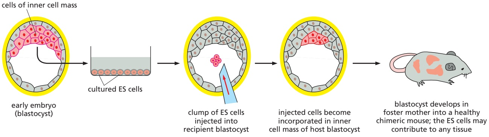

ES cells let us move between cell culture, where we can use powerful techniques for genetic transformation and selection, and the intact organism, where we can discover how such genetic manipulations affect development and physiology. Thus, ES cells opened the way to efficient genetic engineering in mammals, leading to a revolution in our understanding of mammalian molecular and developmental biology.

Cells with properties similar to those of mouse ES cells can also be derived from early human embryos and from human fetal germ cells, and even, as we explain shortly, from differentiated cells taken from adult mammalian tissues. In this way, one can obtain a potentially inexhaustible supply of pluripotent cells. Grown in culture, these cells can be manipulated, by suitable choice of culture conditions, to give rise to large quantities of almost any type of differentiated cell, opening the way to many practical applications. Before discussing them, however, we consider the underlying biology.

#### A Core Set of Transcription Regulators Defines and Maintains the ES-Cell State

What is it that gives ES cells and related types of pluripotent stem cells their extraordinary developmental potential? And what can they tell us about the fundamental mechanisms underlying stemness, commitment to differentiation, and the stability of the differentiated state?

For some ES-cell attributes, the answer is simple. For example, an essential feature of ES cells is that they must avoid replicative cell senescence. As discussed in Chapter 17, this is the fate of fibroblasts and many other types of proliferating somatic cells: such cells are limited in the number of times they will divide, in part at least because they lack telomerase activity, with the result that their telomeres become shorter with each division cycle, leading eventually to a permanent cellcycle arrest. ES cells, by contrast, express high levels of active telomerase, allowing them to escape replicative cell senescence and continue to divide indefinitely. This is a property shared with other, more developmentally restricted types of stem cells, such as those of the adult intestine, which similarly can carry on dividing for hundreds or thousands of cell cycles.

The deeper problem is to explain how the whole complex pattern of gene expression in an ES cell is organized and maintained. As a first step, one can look for genes expressed specifically in ES cells or in the corresponding pluripotent cells of the early embryo. This approach identifies a relatively small number of candidate ES-critical genes; that is, genes that seem to be essential in one way or another for the peculiar character of ES cells. A gene called Oct4, for example, is exclusively expressed in ES cells and in related classes of cells in the intact organism—specifically, in the germ-cell lineage and in the inner cell mass and its precursors. Oct4 codes for a transcription regulator. When it is lost from ES cells, they lose their ES-cell character, and when it is missing in an embryo, the cells that should specialize as inner cell mass are diverted into an extraembryonic pathway of differentiation, and the embryo’s development is aborted.

#### Fibroblasts Can Be Reprogrammed to Create Induced Pluripotent Stem (iPS) Cells

In Chapter 7, we saw that fibroblasts and some other cell types can be driven to switch their character and differentiate as muscle cells if the master musclespecific transcription regulator MyoD is artificially expressed in them. Could the same technique be used to convert fibroblasts and other cell types into ES cells, through forced expression of ES-critical genes such as Oct4? This question was tackled by transfecting mouse fibroblasts with retroviral vectors carrying genes that one might hope to have such an effect. A total of 24 candidate ES-critical genes were tested in this way. None of them was able by itself to cause the conversion, but in certain combinations they could do so. In 2006, the first breakthrough experiments whittled down the requirement to a core set of four genes, all of them encoding transcription regulators—Oct4, Sox2, Klf4, and Myc, known as the OSKM factors for short. When co-expressed, these could reprogram mouse fibroblasts, permanently converting them into cells very similar to ES cells (**Figure 22–26**). ES-like cells created in this way are called **induced pluripotent stem cells**, or **iPS cells**. Like ES cells, iPS cells can continue dividing indefinitely in culture, and when incorporated into a mouse blastocyst they can participate in creation of a perfectly formed chimeric animal. In this animal, they can contribute to the development of any tissue and can turn into any differentiated cell type, including functional germ cells from which a new generation of mice can be raised (see Figure 22–25).

iPS cells can now be derived from adult human cells, including from various differentiated cell types besides fibroblasts. Numerous methods can be used to drive expression of the transforming OSKM factors, including methods that leave no trace of foreign DNA in the reprogrammed cells. Variations of the original cocktail of transcription regulators can drive the conversion, with different specialized cell types having somewhat different requirements. Myc overexpression, for example, turns out not to be absolutely necessary, although it enhances the efficiency of the process. And differentiated cell types may express some of the required factors as part of their normal phenotype. For example, certain cells of hair follicles already express Sox2, Klf4, and Myc; to convert them into iPS cells, it is enough to force them artificially to express Oct4.

#### Reprogramming Involves a Massive Upheaval of the Gene Control System

Converting a differentiated cell into an iPS cell is not like flicking a switch on some predictable, precisely engineered piece of machinery. Only a few of the cells that receive the OSKM factors will actually become iPS cells—one in several thousand in the original experiments, and still only a small minority with more recent, improved techniques. In fact, the success of the original experiments depended on clever selection strategies to pick out those few cells where the conversion had occurred (**Figure 22–27**).

Conversion to an iPS state by the OSKM factors is not only inefficient but also slow: fibroblasts take 10 days or more from introduction of the conversion factors before they begin to express markers characteristic of iPS cells. This suggests the transformation involves a long cascade of changes. These changes have been extensively studied, and they affect both the expression of individual genes and the state of the chromatin. The time course is outlined in **Figure 22–28**. The process begins with a Myc-induced cell proliferation and loosening of chromatin structure that promotes the binding of the other three transcription regulators to many hundreds of different sites in the genome. At a large proportion of these sites, Oct4, Sox2, and Klf4 all bind in concert. The binding sites include the endogenous Oct4, Sox2, and Klf4 genes themselves, which eventually creates positive feedback loops like those just described, making expression of these genes self-sustaining (see Figure 22–26). But self-induction

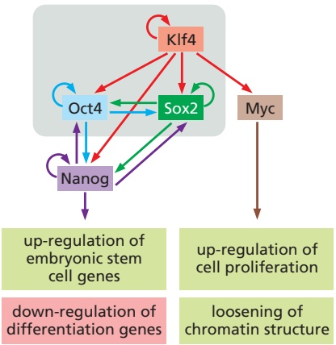

Figure 22–26 Reprogramming fibroblasts to iPS cells with the OSKM factors. As indicated, the transcription regulatory proteins Oct4, Sox2, and Klf4 (OSK factors) induce both their own and each other’s synthesis (gray shading). This generates a self-sustaining feedback loop that helps to maintain cells in an ES cell–like state, even after all of the experimentally added OSKM initiators have been removed. Myc overexpression speeds up early stages of the reprogramming process through the mechanisms shown (see Figure 17–59). Stable reprogramming also involves the permanently induced expression of the Nanog gene, which encodes an additional transcription regulator (see Figure 7–10). (Adapted from J. Kim et al., Cell 132: 1049–1061, 2008.)

Figure 22–27 A strategy used to select cells that have converted into iPS cells. The experiment makes use of a gene (Fbx15) that is present in all cells but is normally expressed only in ES and early embryonic cells (although not required for their survival). G418 is an aminoglycoside antibiotic that blocks protein synthesis in both bacteria and eukaryotic cells. A fibroblast cell line is genetically engineered to contain a gene that produces an enzyme that degrades G418 under the control of the Fbx15 regulatory sequence. When the OSKM factors are artificially expressed in this cell line, a small proportion of the cells undergo a change of state and activate the Fbx15 regulatory sequence, driving expression of the G418-resistance gene. When G418 is added to the culture medium, these are the only cells that survive and proliferate. When tested, they turn out to have iPS-cell characteristics.

of Oct4, Sox2, and Klf4 is only a small part of the transformation that occurs. These three core factors activate some target genes and repress others, producing a cascade of effects that reorganize the gene control system globally and at every level, changing the patterns of histone modification, DNA methylation,MBoC7 n22.109/22.28 and chromatin compaction, as well as the expression of innumerable proteins and noncoding RNAs. By the end of this complex process, the resulting iPS cell is no longer dependent on the artificially generated OSKM factors that triggered the change: it has settled into a stable, self-sustaining state of coordinated gene expression, making its own OSKM factors (and all the other essential ingredients of a pluripotent stem cell) from its own endogenous copies of the genes.

Figure 22–28 A summary of some of the major events that accompany the reprogramming of fibroblasts to iPS cells. Expression of the OSKM factors induces a series of events over a period of days to weeks. Reprogramming begins with down-regulation of somaticcell markers. Morphological changes characteristic of a mesenchymal-to-epithelial transition ensue (see p. 1197), driven in part by changes in the expression of cell adhesion and signal proteins. Induction of early pluripotency markers is followed by the expression of pluripotency genes such as Nanog and Oct4. With similar timing, cells become immortalized as telomerase is induced and cell-cycle genes are regulated to enable stem-cell self-renewal. Stable reprogramming occurs in the time window when cells activate endogenous pluripotency genes and become independent of the OSKM factors. Notably, the vast majority of fibroblasts expressing the OSKM factors fail to downregulate somatic markers and activate pluripotency genes and do not convert to iPS cells. (Adapted from M. Stadtfeld et al., Cell Stem Cell 2:230–240, 2008. With permission from Elsevier.)

#### An Experimental Manipulation of Factors That Modify Chromatin Can Increase Reprogramming Efficiencies

The low efficiency and slow rate of conversion in early iPS-cell studies suggested that there are barriers that normally block the switch from the differentiated state to the iPS state in these experiments, and that overcoming them can be a difficult process that involves a large element of chance. This probably helps explain why the outcome is often variable, with significant differences between the individual iPS cell lines generated, even when the initial differentiated cells are genetically and phenotypically identical. Only some of the candidate iPS lines produced have passed all the tests of pluripotency. Moreover, at a molecular level, there are differences even among the fully validated iPS lines: although they share many features, they vary in details of their gene expression patterns and, for example, in their patterns of DNA methylation.

Overcoming these difficulties is critical for improving our understanding of how cell specialization is controlled and organized in multicellular organisms; it should also facilitate many medical advances. Thus, intensive research is being carried out on the reprogramming process. One approach aims at obtaining a much clearer picture of the role that chromatin structures play in gene regulation in eukaryotes.

From our discussion of nuclear transplantation, one might expect that any reprogramming of a differentiated cell would require a radical and widespread change in the chromatin structure associated with selected genes. Not only are such changes observed, but a large number of different experiments reveal that the efficiency of the reprogramming process can be substantially increased by altering the activity of proteins that affect chromatin structure. **Figure 22–29** categorizes some of the factors that when manipulated can enhance the transformation of fibroblasts to iPS cells; those in the top three rows—chromatin remodelers, histone modifiers, and histone variants—are especially well known to have profound effects on the organization of nucleosomes in chromatin (discussed in Chapter 4).

Figure 22–29 Factors that have been observed to enhance reprogramming efficiency. Emphasized here are those factors that can alter chromatin states, with those in the top three rows having the most direct effects. An up arrow indicates that reprogramming is increased when the activity of the indicated factor is increased; a down arrow indicates that reprogramming is increased when the activity of the indicated factor is decreased. Thus, for example, increased activity of histone acetyl transferases and increased activity of histone deacetylases have opposite effects, as expected from their biochemical activities (see p. 206). Note that histone chaperones also contribute to programming efficiency and may do so either positively or negatively depending on the histone variants assembled into chromatin.

ES and iPS Cells Can Be Guided to Generate Specific Adult Cell Types and Even Organoids

We can think of embryonic development in terms of a series of choices presented to cells as they follow a road that leads from the fertilized egg to terminal differentiation. After their long sojourn in culture, the ES cells or iPS cells and their progeny can still read the signs at each branch in the highway and respond as nor-MBoC7 m22.44/22.29 mal early embryonic cells would. If ES or iPS cells are implanted directly into an embryo at a later stage of development or into an adult tissue, however, they fail to receive the appropriate sequence of cues; their differentiation then is not properly controlled, and they will often give rise to a tumor called a teratoma, containing a mixture of cell types inappropriate to the site in the body (**Figure 22–30**).

By exposing ES or iPS cells in culture to an appropriate sequence of growth factors and other signal proteins, delivered with the right timing, it is possible to guide the cells along a pathway that approximates a normal developmental pathway and convert them into standard, differentiated, adult cell types (**Figure 22–31** and **Movie 22.2**). Success requires trial and error but has now been achieved for many differentiated mouse and human cell types, including human dopaminergic neurons and human insulin-producing β cells, the cells lost in Parkinson’s disease and type 1 diabetes, respectively.

Remarkably, under appropriate conditions, mouse or human ES and iPS cells and their progeny can proliferate, differentiate, and self-assemble in culture to form miniature, three-dimensional organs called **organoids**, which closely resemble the normal organ in its organization. An early striking example is shown in **Figure 22–32**, where a developing eye organoid is formed from human ES cells.

Mouse and human ES and iPS cells, and progenitor cells derived from them, have been used to form organoids that resemble a large variety of developing organs, including important parts of the human brain, arguably the most complex and sophisticated structure on Earth. Such organoids provide powerful models for studying organ development in a culture dish, where one can identify and study the genes involved and explore the roles of cell–cell interactions in ways not possible in the intact organism. We discussed earlier the remarkable demonstration that a single multipotent intestinal stem cell can form a complex intestinal organoid under appropriate conditions in culture (see Figure 22–14).

#### Cells of One Specialized Type Can Be Forced to Transdifferentiate Directly into Another

The route we have just described, from one type of differentiated cell to another type of differentiated cell via conversion to an iPS cell, seems needlessly roundabout. Could we not convert differentiated cell type A into differentiated cell type B directly, without backtracking to a pluripotent stem cell? For many years, it has been known that such transdifferentiation can be achieved in a few special cases, such as the conversion of fibroblasts into skeletal muscle cells by forced expression of MyoD (see p. 428). But now, with the insights that have come from the study of ES and iPS cells, ways have been found to bring about such interconversions in a much wider range of cases, including conversion of fibroblasts intoMBoC7 m22.45/22.31 neurons, hepatocytes, and intestinal epithelial cells.

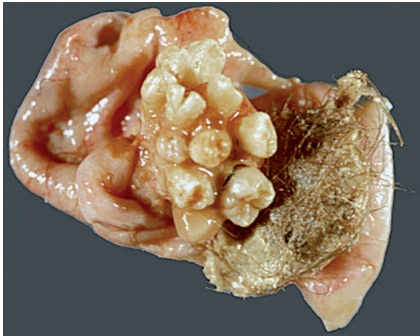

Figure 22–30 A teratoma. These tumors contain tissues derived from each of the embryonic germ layers: endoderm, mesoderm, and ectoderm (including hair and teeth, as seen here). The tumors are usually benign and can develop when ES or iPS cells are injected into an immunocompatible adult animal, MBoC7 n22.108/22.30demonstrating the pluripotency of these stem cells. (Courtesy of Cao Xuan Cu.)

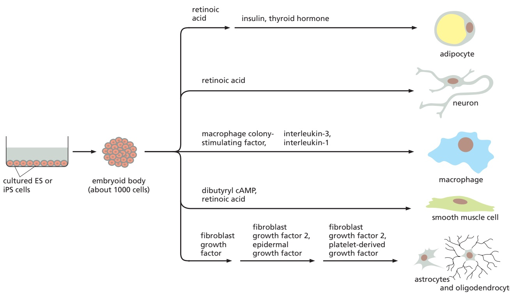

Figure 22–31 Production of differentiated cells from mouse or human ES or iPS cells in culture. ES and iPS cells can be cultured indefinitely as pluripotent cells when attached as a monolayer to a dish. Alternatively they can be detached and allowed to form aggregates called embryoid bodies, which causes the cells to begin to specialize. Cells from embryoid bodies, cultured in media with different factors added, can then be driven to differentiate in various ways. Notably, it takes very much longer to generate the differentiated cells from human compared to mouse pluripotent stem cells, reflecting the much slower rate of human development compared to a mouse. (Based on E. Fuchs and J.A. Segre, Cell 100:143–155, 2000.)

An elegant example with special medical relevance comes from studies of the heart. By forcing expression of an appropriate combination of transcription regulators—not Oct4, Sox2, Klf4, and Myc, but Gata4, Mef2c, and Tbx5—it is possible to convert heart fibroblasts directly into heart muscle cells. This has been done in the living mouse, using retroviral vectors, and the transformation occurs with high efficiency when the vectors carrying the transgenes are injected directly into the heart muscle tissue itself. Although fibroblasts occupy only a small fraction of the heart tissue volume, they outnumber the heart muscle cells in the normal heart, and they survive in large numbers in areas of the heart where heart muscle cells have died. Thus, in a typical nonfatal heart attack, when heart muscle cells have died for lack of oxygen, the fibroblasts proliferate and make collagenous extracellular matrix, replacing the lost muscle with a fibrous scar. This is a poor sort of repair. By forcing expression of the appropriate factors in the heart, as described above, it has proved possible, in the mouse at least, to do better than nature and regenerate lost heart muscle through transdifferentiation of heart fibroblasts.

Figure 22–32 Cultured human ES cells can give rise to a three-dimensional organoid. (A) Schematic drawing shows how, under appropriate conditions, mouse or human pluripotent stem cells and their progeny in culture can proliferate, differentiate, and self-assemble into a three-dimensional eye-like structure (an optic cup), which includes a multilayered retina similar in organization to the one that forms during normal eye development in vivo. (B) Fluorescence micrograph of an optic cup formed by human ES cells in culture. The structure includes a developing retina containing multiple layers of neural cells (stained green) and an underlying layer of pigmented epithelium, the apical surface of which is stained red. All nuclei are stained blue. (A, adapted from M. Eiraku and Y. Sasai, Curr. Opin. Neurobiol. 22:768–777, 2012; B, from T. Nakano et al., Cell Stem Cell 10:771–785, 2012. With permission from Elsevier.)

We are still a long way from putting this technique into practice as a treatment for heart attacks in humans, but it shows what the future may hold—not only for this medical problem but also for many others.

#### ES and iPS Cells Are Also Useful for Drug Discovery and Analysis of Disease

A large part of the excitement surrounding ES and iPS cells and the technology of transdifferentiation comes from the prospect of using the artificially generated cells for tissue repair. It begins to seem that virtually any type of tissue might be replaceable, allowing treatment of degenerative diseases that have previously had no cure, other than by organ transplantation. Research in this area is moving rapidly, but there are many difficulties to be overcome.

With the advent of iPS cells and direct transdifferentiation, at least one major hurdle that has challenged organ transplantation has been surmounted, in principle at least: the problem of immune rejection. ES cells, because they are created from early embryos that generally come from unrelated donors, will never be genetically identical to the cells of the individual receiving the cell transplant. The transplanted cells and their progeny are therefore prone to rejection by the immune system. Both iPS and transdifferentiated cells, in contrast, can be generated from a small sample of the individual’s own tissue and so should escape immune attack when transplanted back into the same individual.

Tissue repair by cell and organoid transplantation, however, is not the only application for which ES, iPS, and transdifferentiated cells can be used: there are other ways that promise to be more immediately valuable. In particular, the cells can be used to generate large, homogeneous populations of specialized cells of any chosen type in culture, and these can serve both for investigation of disease mechanisms and for the search for new drugs acting on a specific cell defect (**Figure 22–33**).

Where a disease has a genetic cause, one can derive iPS cells from an affected individual and use the cells to produce the specific cell types that malfunction, to investigate how the malfunction occurs, and to screen for drugs that might help to put it right. Timothy syndrome provides an example. In this rare genetic condition, there is a severe, life-threatening disorder in the rhythm of the heartbeat (as well as several other abnormalities) as a result of a mutation in a specific type of $\mathrm { C a ^ { 2 + } }$ channel. To study the underlying pathology, researchers took skin fibroblasts from individuals with the disorder, generated iPS cells from the fibroblasts, and induced the iPS cells to differentiate into heart muscle cells. These cells, when compared with heart muscle cells prepared similarly from normal control individuals, showed irregular heart muscle contractions and abnormal patterns of $\mathrm { C a ^ { 2 + } }$ influx and electrical activity that could be characterized in detail. From these findings, it is a small step to development of an in vitro assay for drugs that might correct the misbehavior of the heart muscle cells.

Even in human disorders without a known genetic cause, iPS cells can be useful in understanding the condition. In one example, brain organoids were

individual-specific iPS cells

Figure 22–33 Use of iPS cells for drug discovery and for analysis and treatment of genetic disease. The left side of the diagram shows how differentiated cells that are generated from iPS cells derived from an individual with a genetic disease can be used for analysis of the disease mechanism and for discovery of therapeutic drugs. The right side of the diagram shows how the genetic defect might be repaired in the iPS cells, which could then be induced to differentiate in an appropriate way and grafted back into the individual without danger of immune rejection. (Adapted from D.A. Robinton and G.Q. Daley, Nature 481:295–305. Reproduced with permission of SNCSC.)

produced using iPS cells from an individual with microcephaly, a condition characterized by severely stunted brain growth and development. Careful analysis of these developing brain organoids revealed that the microcephaly in this case seemed to be caused by the premature cessation of proliferation and dif-MBoC7 m22.47/22.33 ferentiation of brain progenitor cells, resulting in abnormally small numbers of differentiated brain cells.

#### Summary

In the adult mammalian body, the various types of tissue-specific stem cells are highly specialized, each giving rise to a limited range of differentiated cell types. Cells become restricted to specific pathways of differentiation during embryonic development. One way to force a return to a pluripotent or totipotent state is by nuclear transplantation: the nucleus of a differentiated cell can be injected into an enucleated oocyte, whose cytoplasm reprograms the genome of the injected nucleus back to an approximation of an early embryonic state. This allows the injected oocyte to develop into an entire new individual. The reversion of the genome to this state involves radical, genome-wide changes in chromatin structure and DNA methylation.

Remarkably, cells taken from the inner cell mass of an early mammalian embryo can be propagated in culture indefinitely in a pluripotent state. When transplanted back into a host early embryo, these embryonic stem (ES) cells can contribute cells to any tissue, including the germ line. ES cells have been invaluable for genetic engineering in mice. Cells with similar properties, called induced pluripotent stem (iPS) cells, can be generated from adult differentiated cells such as fibroblasts by forced expression of a cocktail of key transcription regulators. A similar method can be used to reprogram differentiated adult cells directly from one specialized cell type to another. In principle, iPS cells generated from cells taken from an adult human individual could be used for tissue repair in that same individual, avoiding the problem of immune rejection. More immediately, iPS cells provide a source of specialized cells that can be used to analyze in vitro the effects of mutations affecting human cells and to screen for drugs for treatment of genetic diseases. Both ES and iPS cells and their progeny can form tiny organs (organoids) in culture, which can serve as powerful models for studies of human development and disease.

<!-- END EN EN22-H018-H035 -->

## 跨章相关英文内容

- 肿瘤干细胞：[EN第20章 · 癌细胞特征、克隆演化与肿瘤干细胞](../13_细胞增殖调控与癌细胞/小节/02_第二节%20癌细胞.md#EN20-H000-H009)。
- 干细胞与组织衰老：[EN第22章 · 干细胞功能下降与组织衰老](../15_细胞衰老与细胞程序性死亡/小节/01_第一节%20细胞衰老.md#EN22-H017-H017)。
