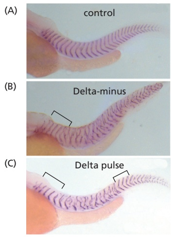
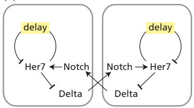
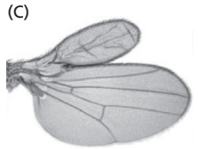
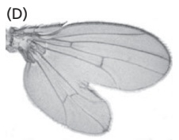
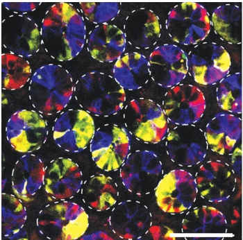
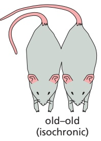
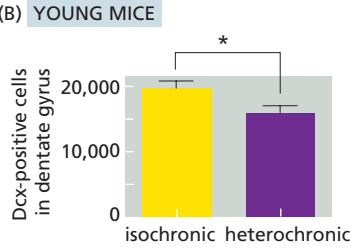
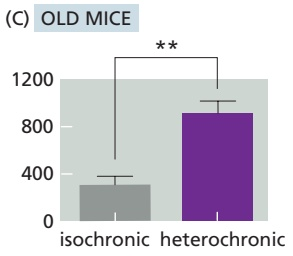

# 第14章 细胞分化与干细胞 · 英文习题与参考文献

### 英文补充：习题与参考文献

> 对应中文板块：习题与参考文献。英文来源：Molecular Biology of the Cell，第7版，第21章；[本章完整原文](../来源/英文教材/21_Development_of_Multicellular_Organisms/chapter.md)。物理PDF页码范围：1256–1317（整章范围）。

<!-- BEGIN EN EN21-EXERCISES -->
#### PROBLEMS

Which statements are true? Explain why or why not.

21–1 In the early cleavage stages, when the embryo cannot yet feed, the developmental program is driven and controlled entirely by the material deposited in the egg by the mother.

21–2 Because of the many later developmental transformations that produce the elaborately structured organs, the body plan set up during gastrulation bears little resemblance to the body plan in the adult.

21–3 As development progresses, individual cells within a lineage become more and more restricted in the range of cell types they can give rise to.

21–4 At different stages of embryonic development, the same signals are used over and over again by different cells, but with different biological outcomes.

21–5 Changes in the coding regions of genes involved in development are primarily responsible for the differences between species.

21–6 The cell cycle is the ticking clock that sets the tempo of developmental processes, with maturational changes in gene expression being dependent on cell-cycle progression.

Discuss the following problems.

21–7 Name the three processes that are fundamental to animal development, and describe each of them in a single sentence.

21–8 Name the three germ layers of the early embryo that are formed during gastrulation, and list the principal structures each gives rise to in the adult.

21–9 In the early Drosophila embryo, there seems to be no requirement for the usual forms of cell–cell signaling; instead, transcriptional regulators and mRNA molecules move freely between nuclei. How can that be?

21–10 Morphogens play a key role in development, creating concentration gradients that inform cells of where they are and how to behave. Examine the simple patterns represented by the flags in **Figure Q21–1**. Which do you suppose could be created by a gradient of a single morphogen? Which would require gradients of two morphogens? Assuming that such patterns were present in a sheet of cells, explain how they could be created by morphogens.

Japan

France

Norway

Figure Q21–1 National flags from three countries (Problem 21–10). (Left, railway fx/Shutterstock; center, Creative Photo Corner/Shutterstock; right, Derek Brumby/Shutterstock.)

21–11 Two adjacent cells in the nematode worm normally differentiate into an anchor cell (AC) and a ventral uterine precursor (VU) cell, but which of the two becomes the AC and which becomes the VU cell is completely random. The cells have an equal chance of adopting either fate, but they always adopt opposite fates. Mutations of the Lin12 gene alter these fates. In hyperactive Lin12 mutants, both cells become VU cells, while in inactive Lin12 mutants, both cells become ACs. Thus, Lin12 is central to the decision-making process. In genetic mosaics in which one precursor cell has the hyperactive Lin12 and the other precursor has the inactive Lin12, the cell with the hyperactive Lin12 gene always becomes the VU cell, and the cell with the inactive Lin12 gene always becomes the AC. Assuming that one cell sends a signal and the other cell receives it, explain how these results suggest that the Lin12 gene encodes a protein required to receive the signal. Offer a suggestion for how the fates of these two precursor cells are normally decided in wild-type worms.

21–12 It was clear from the early days of studying development that certain “morphogenetic” substances were present in the egg and segregated asymmetrically into cells of the developing embryo. One such investigation in ascidian (sea squirt) embryos examined endodermal alkaline phosphatase, which could be visualized using a histochemical stain. Treatment of embryos with cytochalasin B stopped cell division but did not block expression of alkaline phosphatase at the appropriate time. Treatment with actinomycin D, which blocks transcription, did not interfere with expression of alkaline phosphatase. Treatment with puromycin, which blocks translation, eliminated expression of alkaline phosphatase. What is the likely nature of the morphogenetic substance that gives rise to alkaline phosphatase?

21–13 The mouse HoxA3 and HoxD3 genes are paralogs that occupy equivalent positions in their respective Hox gene clusters and share roughly 50% identity in their protein-coding sequences. Mice with defects in HoxA3 have deficiencies in pharyngeal tissues, whereas mice with defects in HoxD3 have deficiencies in the axial skeleton, suggesting quite different functions for the paralogs. Thus, it came as a surprise when it was found that replacing a defective HoxD3 gene with the normal HoxA3 gene corrected the deficiency, as did the reciprocal experiment of replacing a mutant HoxA3 gene with a normal HoxD3 gene. Neither transplaced gene, however, could supply its normal function; that is, a normal HoxA3 gene at the HoxD3 locus could not correct the deficiency caused by a mutant HoxA3 gene at the HoxA3 locus. The same was true for the HoxD3 gene. If the HoxA3 and HoxD3 genes are equivalent, how do you suppose they can play such distinct roles in development? Why do you suppose they cannot perform their normal function in a new location?

21–14 The segmentation of somites in vertebrate embryos is thought to depend on oscillations in the expression of the Hes7 gene. Mathematical modeling explains

these oscillations in terms of the delays in production of the unstable Hes7 protein, which acts as a transcription regulator to shut off its own expression. Once Hes7 decays, with a half-life of about 20 minutes, its transcription resumes. To test this model, you decide to reduce the total delay by removing one, two, or all three of the introns from the Hes7 gene in mice. Why do you expect that intron removal would reduce the delay? What would you predict would happen to the oscillation time, and somite formation, if the model were correct?

21–15 The oscillatory clock that drives somite formation in vertebrates involves three essential components: Her7 (an unstable repressor of its own synthesis), Delta (a transmembrane signaling molecule), and Notch (a transmembrane receptor for Delta). Notch is bound by Delta on neighboring cells, activating the Notch signaling pathway, which then activates Her7 transcription. Normally, this system works flawlessly to create sharply defined somites (**Figure Q21–2A**). In the absence of Delta, however, only the first five somites form normally, and the rest are poorly defined (**Figure Q21–2B**). If a pulse of Delta is supplied later, somite formation returns to normal in the regions where Delta was present (**Figure Q21–2C**). A diagram of the connections between the components of the clock and how they interact in adjacent cells is shown in **Figure Q21–2D**. In the absence of Delta, why do the cells become unsynchronized?

(D)

Figure Q21–2 Somite formation in zebrafish embryos (Problem 21–15). (A) Wild-type embryos with normal somites. (B) Somite formation in embryos lacking Delta. The bracket indicates normal-looking somites where they initially form. (C) Somite formation in embryos lacking Delta but receiving a pulse of Delta expression at the time indicated by the right-hand bracket. (D) Interactions among components of the oscillatory clock in adjacent cells. (Adapted from C. Soza-Ried et al., Development 141:1780–1788, 2014. With permission from the Company of Biologists.)

What is it about the presence of Delta that keeps adjacent cells oscillating in synchrony?

21–16 The extracellular protein factor Decapentaplegic (Dpp) is critical for proper wing development in Drosophila (**Figure Q21–3A**). It is normally expressed in a narrow stripe in the middle of the wing, along the anterior– posterior boundary. Flies that are defective for Dpp form stunted “wings” (**Figure Q21–3B**). If an additional copy of the gene is placed under control of a promoter that is active in the anterior part of the wing or in the posterior part of the wing, a large mass of wing tissue composed of normal-looking cells is produced at the site of Dpp expression (**Figure Q21–3C and D**). Does Dpp stimulate cell division, cell growth, or both? How can you tell?

Figure Q21–3 Effects of Dpp expression on wing development in Drosophila (Problem 21–16). (A) Normal Dpp expression. (B) Absence of Dpp expression. (C) Additional anterior Dpp expression. (D) Additional posterior Dpp expression. (From M. Zecca et al., Development 121:2265–2278, 1995. With permission from the Company of Biologists.)

#### REFERENCES

#### General

Baressi MJ & Gilbert SF (2019) Developmental Biology, 12th ed. Sunderland, MA: Sinauer Associates.

Carroll SB (2006) Endless Forms Most Beautiful: The New Science of Evo Devo. New York: Norton.

Wallingford JD (2019) We Are All Developmental Biologists. Dev. Cell 50(2), 132–137.

Wolpert L, Tickle C & Martinez-Arias A (2019) Principles of Development, 6th ed. Oxford: Oxford University Press.

#### Overview of Development

Gurdon JB (2013) The egg and the nucleus: a battle for supremacy (Nobel Lecture). Angew. Chem. Int. Ed. Engl. 52, 13890–13899.

Istrail S & Davidson EH (2005) Logic functions of the genomic cisregulatory code. Proc. Natl. Acad. Sci. USA 102, 4954–4959.

Levine M (2010) Transcriptional enhancers in animal development and evolution. Curr. Biol. 20, R754–R763.

Lewis J (2008) From signals to patterns: space, time, and mathematics in developmental biology. Science 322, 399–403.

Meinhardt H & Gierer A (2000) Pattern formation by local self-activation and lateral inhibition. Bioessays 22, 753–760.

Rogers KW & Schier AF (2011) Morphogen gradients: from generation to interpretation. Annu. Rev. Cell Dev. Biol. 27, 377–407.

Shubin N, Tabin C & Carroll S (2009) Deep homology and the origins of evolutionary novelty. Nature 457, 818–823.

#### Mechanisms of Pattern Formation

Andrey G & Duboule D (2014) SnapShot: Hox gene regulation. Cell 156, 856–856.e1.

Chan YF, Marks ME, Jones FC . . . Kingsley DM (2010) Adaptive evolution of pelvic reduction in sticklebacks by recurrent deletion of a Pitx1 enhancer. Science 327, 302–305.

Davis RL, Weintraub H & Lassar AB (1987) Expression of a single transfected cDNA converts fibroblasts to myoblasts. Cell 51, 987–1000.

De Robertis EM (2006) Spemann’s organizer and self-regulation in amphibian embryos. Nat. Rev. Mol. Cell Biol. 4, 296–302.

Driever W & Nüsslein-Volhard C (1988) A gradient of bicoid protein in Drosophila embryos. Cell 54, 83–93.

Halder G, Callaerts P & Gehring WJ (1995) Induction of ectopic eyes by targeted expression of the eyeless gene in Drosophila. Science 267, 1788–1792.

Jaeger J (2011) The gap gene network. Cell. Mol. Life Sci. 68, 243–274.

Knoblich JA (2010) Asymmetric cell division: recent developments and their implications for tumour biology. Nat. Rev. Mol. Cell Biol. 11, 849–860.

Lander AD (2013) How cells know where they are. Science 339, 923–927.

Lawrence PA (1992) The Making of a Fly: The Genetics of Animal Design. Oxford: Wiley-Blackwell

Lewis EB (1978) A gene complex controlling segmentation in Drosophila. Nature 276, 565–570.

Müller P, Rogers KW, Jordan BM . . . Schier AF (2012) Differential diffusivity of Nodal and Lefty underlies a reaction-diffusion patterning system. Science 336, 721–724.

Nüsslein-Volhard C & Wieschaus E (1980) Mutations affecting segment number and polarity in Drosophila. Nature 287, 795–801.

Schuettengruber B, Bourbon HM, Di Croce L & Cavalli G (2017) Genome regulation by polycomb and trithorax: 70 years and counting. Cell 171, 34–57.

Sjöqvist M & Andersson ER (2019) Do as I say, Not(ch) as I do: lateral control of cell fate. Dev. Biol. 447(1), 58–70.

von Dassow G, Meir E, Munro EM & Odell GM (2000) The segment polarity network is a robust developmental module. Nature 406, 188–192.

#### Developmental Timing

Brown DD & Cai L (2007) Amphibian metamorphosis. Dev. Biol. 306, 20–33.

Giraldez AJ, Mishima Y, Rihel J . . . Schier AF (2006) Zebrafish MiR-430 promotes deadenylation and clearance of maternal mRNAs. Science 312, 75–79.

Holguera I & Desplan C (2018) Neuronal specification in space and time. Science 362, 176–180.

Hubaud A & Pourquié O (2014) Signalling dynamics in vertebrate segmentation. Nat. Rev. Mol. Cell Biol. 15, 709–721.

Isshiki T, Pearson B, Holbrook S & Doe CQ (2001) Drosophila neuroblasts sequentially express transcription factors which specify the temporal identity of their neuronal progeny. Cell 106, 511–521.

Jukam D, Shariati SAM & Skotheim JM (2017) Zygotic genome activation in vertebrates. Dev. Cell 42, 316–332.

Lee RC, Feinbaum RL & Ambros V (1993) The C. elegans heterochronic gene lin-4 encodes small RNAs with antisense complementarity to lin-14. Cell 75, 843–854.

Oates AC (2020) Waiting on the Fringe: cell autonomy and signaling delays in segmentation clocks. Curr. Opin. Genet. Dev. 63, 61–70.

Song J, Irwin J & Dean C (2013) Remembering the prolonged cold of winter. Curr. Biol. 23, R807–R811.

Wightman B, Ha I & Ruvkun G (1993) Posttranscriptional regulation of the heterochronic gene lin-14 by lin-4 mediates temporal pattern formation in C. elegans. Cell 75, 855–862.

#### Morphogenesis

Bussmann J & Raz E (2015) Chemokine-guided cell migration and motility in zebrafish development. EMBO J. 34, 1309–1318.

Butler MT & Wallingford JB (2017) Planar cell polarity in development and disease. Nat. Rev. Mol. Cell Biol. 18, 375–388.

Glimour D, Rembold M & Leptin M (2017) From morphogen to morphogenesis and back. Nature 541, 311–320.

Goodwin K & Nelson CM (2020) Branching morphogenesis. Development 147, dev184499.

Lecuit T & Lenne PF (2007) Cell surface mechanics and the control of cell shape, tissue patterns and morphogenesis. Nat. Rev. Mol. Cell Biol. 8, 633–644.

Le Douarin NM & Kalcheim C (1999) The Neural Crest, 2nd ed. Cambridge: Cambridge University Press.

Solnica-Krezel L & Sepich DS (2012) Gastrulation: making and shaping germ layers. Annu. Rev. Cell Dev. Biol. 28, 687–717.

Takeichi M (2011) Self-organization of animal tissues: cadherinmediated processes. Dev. Cell 21, 24–26.

Te Boekhorst V, Preziosi L & Friedl P (2016) Plasticity of cell migration in vivo and in silico. Annu. Rev. Cell Dev. Biol. 32, 491–526.

Walck-Shannon E & Hardin J (2014) Cell intercalation from top to bottom. Nature 15, 34–48.

#### Growth

Andersen DS, Colombani J & Léopold P (2013) Coordination of organ growth: principles and outstanding questions from the world of insects. Trends Cell Biol. 23, 336–344.

Conlon I & Raff M (1999) Size control in animal development. Cell 96, 235–244.

Hariharan IK & Bilder D (2006) Regulation of imaginal disc growth by tumorsuppressor genes in Drosophila. Annu. Rev. Genet. 40, 335–361.

Øvrebø JI & Edgar BA (2018) Polyploidy in tissue homeostasis and regeneration. Development 145, dev156034.

Penzo-Méndez AI & Stanger BZ (2015) Organ-size regulation in mammals. Cold Spring Harb. Perspect. Biol. 7, a019240.

Restrepo S, Zartman JJ & Basler K (2014) Coordination of patterning and growth by the morphogen DPP. Curr. Biol. 24, R245–R255.

Zheng Y & Pan D (2019) The hippo signaling pathway in development and disease. Dev. Cell 50, 264–282.
<!-- END EN EN21-EXERCISES -->

### 英文补充：习题与参考文献

> 对应中文板块：习题与参考文献。英文来源：Molecular Biology of the Cell，第7版，第22章；[本章完整原文](../来源/英文教材/22_Stem_Cells_in_Tissue_Homeostasis_and_Regeneration/chapter.md)。物理PDF页码范围：1318–1351（整章范围）。

<!-- BEGIN EN EN22-EXERCISES -->
#### PROBLEMS

Which statements are true? Explain why or why not.

22–1 In the mouse small intestine, stem cells in the crypts divide asymmetrically to maintain the population of cells that make up the crypts and villi; after each division, one daughter remains a stem cell and the other begins to divide rapidly to produce differentiated progeny.

22–2 Stem cells are the same in all tissues.

22–3 Every tissue that can be renewed is renewed from a tissue-specific population of stem cells.

22–4 Although mice continually replace neurons in their olfactory bulbs and songbirds replace large numbers of neurons to refine their songs for each mating season, humans do not have the ability to replace neurons in their brains.

Discuss the following problems.

22–5 In the 1950s, scientists fed 3H-thymidine to rats to label cells that were synthesizing DNA, and then followed the fates of labeled cells for periods of up to a year. They found three patterns of cell labeling in different tissues. Cells in some tissues such as neurons in the central nervous system and the retina did not get labeled. Muscle, kidney, and liver, by contrast, each showed a small number of labeled cells that retained their label, apparently without further division or loss. Finally, cells such as those in the squamous epithelia of the tongue and esophagus were labeled in fairly large numbers, with radioactive pairs of nuclei visible in 12 hours; however, the labeled cells disappeared over time. Which of these three patterns of labeling would you expect to see if the labeled cells were generated by stem cells? Explain your answer.

22–6 At any given time, a single intestinal crypt of mice comprises about 15 stem cells and 10 Paneth cells. After cell division, which occurs about once a day, the daughter cells remain stem cells only if they maintain contact with a Paneth cell. This constant competition for Paneth-cell contact raises the possibility that crypts might become monoclonal over time; that is, the crypt cells at one point in time might derive from only one of the 15 stem cells that existed at some earlier time. To test this possibility, you use the so-called confetti marker that upon activation expresses one of three fluorescent proteins in the stem cells of the crypt. You then examine crypts at various times to determine whether they contain cells with multi-ple colors or only one color (**Figure Q22–1**). Do the crypts become monoclonal over time or not? How can you tell?

22–7 The origin of new β cells of the pancreas—from stem cells or from preexisting β cells—was not resolved until recently, when the technique of lineage tracing was used to decide the issue. Transgenic mice were engineered to express a tamoxifen-activated form of Cre recombinase under the control of the insulin promoter, which is

Figure Q22–1 Fluorescent cells in crypts in mouse intestines at various times after activation of expression of fluorescent proteins (Problem 22–6). The images are taken in the X–Z plane, which cuts through multiple crypts, as indicated in the schematic drawing. Roughly 50 crypts are visible in each section. Dotted white circles identify some individual crypts. Scale bars are 100 μm. (Adapted from H.J. Snippert et al., Cell 143:134–144, 2010. With permission from Elsevier.)

4 days

4 weeks

30 weeks

active only in β cells. In these mice, investigators could remove an inhibitory segment of DNA by adding tamoxifen and thereby allow expression of human placental alkaline phosphatase (HPAP), which can be detected by histochemical staining. After a pulse of tamoxifen that converted about 30% of β cells in young mice to cells thatFigure Q22.01/Q22.01 express HPAP, the investigators followed the percentage of labeled β cells for a year, during which time the total number of β cells in the pancreas increased by 6.5-fold. How do you suppose the percentage of β cells would change over time if new β cells were derived from stem cells? What if new β cells were derived from preexisting β cells? Which hypothesis do the results in **Figure Q22–2** support?

22–8 One of the earliest assays for hematopoietic stem cells made use of their ability to form colonies in the spleens of heavily irradiated mice. By varying the amounts of transplanted bone marrow cells, investigators showed that the number of spleen colonies varied linearly with dose and that the curve passed through the origin, suggesting that single cells were capable of forming individual colonies. However, because colony formation was rare relative to the numbers of transplanted cells, it was possible that undispersed clumps of two or more cells were the actual initiators.Figure mQ

Figure Q22–2 Percentage of labeled β cells in pancreatic islets of mice at different ages (Problem 22–7). All mice were injected with a pulse of tamoxifen at 6–8 weeks of age, and then their pancreatic cells were stained for HPAP at various times afterward. Error bars represent standard deviations for all animals analyzed for that time point. (Adapted from Figure 2 of Y. Dor et al., Nature 429:41–46, 2004.)

A classic paper resolved this issue by exploiting rare, cytologically visible genome rearrangements generated by irradiation. Recipient mice were first irradiated to deplete bone marrow cells, and then they were irradiated a second time after transplantation to generate rare genome rearrangements in the transplanted cell population. Spleen colonies were then screened to find ones that carried genome rearrangements. How do you suppose this experiment distinguishes between colonization by single cells versus cellular aggregates?

22–9 It is possible to purify hematopoietic stem cells using a combination of antibodies directed against cell-surface targets. By removing cells that expressed surface markers characteristic of specific lineages such as B cells, granulocytes, myelomonocytic cells, and T cells, investigators generated a population of cells enriched for stem cells. They further enriched this population for putative stem cells by positively selecting for cells that expressed suspected stem-cell surface markers. Spleen colony formation in irradiated mice by these putative stem cells and the unfractionated bone marrow cells is shown in **Figure Q22–3**. Given that only about 1 in 10 cells lodges in the spleen, do these results support the idea that the enriched population consists mostly of hematopoietic stem cells? What additional information would you need to have to feel confident that the enriched cells are true stem cells? What proportion of bone marrow cells are hematopoietic stem cells?

Figure Q22–3 Spleen colony formation by cells enriched for stem cells and by unfractionated bone marrow cells (Problem 22–9).

22–10 Generation of induced pluripotent stem (iPS) cells was first accomplished using retroviral vectors to carry the OSKM (Oct4, Sox2, Klf4, and Myc) set of transcription regulators into cells. The efficiency of fibroblast reprogramming was typically low (0.01%), in part because large numbers of retroviruses must integrate to bring about reprogramming, and each integration event carries with it the risk of inappropriately disrupting or activating a critical gene. In what other ways, or other forms, do you suppose you might deliver the OSKM transcription regulators so as to avoid these problems?

22–11 To test whether blood-borne factors alter neurogenesis in the central nervous system in mice, you use the technique of parabiosis—linking of circulatory systems in two individuals—to measure effects on the neurogenic niche in the dentate gyrus of the hippocampus. As indicated in **Figure Q22–4A**, you link the circulatory systems of two young mice, or two old mice, or a young mouse with an old mouse. Five weeks later, you stain slices of the dentate gyrus with antibodies to doublecortin (Dcx), a marker for newly born neurons, and count the new neurons, as summarized in **Figure Q22–4B and C**. Results in young–young parabionts and old–old parabionts were no different than in individual young or old mice. Do these results support the idea that blood-borne factors affect neurogenesis in the dentate gyrus of the hippocampus? Why or why not? Which, if either, mouse benefits in the parabiosis of a young mouse with an old mouse?

Figure Q22–4 Effects of parabiosis on the number of newly born neurons in the dentate gyrus of the mouse hippocampus (Problem 22–11). (A) Linked circulatory systems (parabiosis) between pairs of mice. (B) Dcx-positive cells (newly born neurons) in a young mouse paired with a young mouse (isochronic) or in a young mouse paired with an old mouse (heterochronic). (C) Dcx-positive cells in an old mouse paired with an old mouse (isochronic) or in an old mouse paired with a young mouse (heterochronic). Isochronic refers to parabiosis between mice of the same age; heterochronic refers to parabiosis between mice of different ages. Figure nQ22-101/Q22-4Asterisks refer to statistical significance of the results: \* is for P < 0.05, which means the result would be expected to occur by chance in less than 1 in 20 repeats; \*\* is for < 0.01, which means the result would be expected to occur by chance in less than 1 in 100 repeats.

#### REFERENCES

#### General

Gurdon JB & Melton DA (2008) Nuclear reprogramming in cells. Science 322, 1811–1815.

He S, Nakada D & Morrison SJ (2009) Mechanisms of stem-cell renewal. Annu. Rev. Cell Dev. Biol. 25, 377–406.

Karagiannis P, Takahashi K, Saito M . . . Osafune K (2019) Induced pluripotent stem cells and their use in human models of disease and development. Physiol. Rev. 99, 79–114.

Morrison SJ & Spradling AC (2008) Stem cells and niches: mechanisms that promote stem cell maintenance throughout life. Cell 132, 598–611.

#### Stem Cells and Tissue Homeostasis

Barker N, van Es JH, Kuipers J . . . Clevers H (2007) Identification of stem cells in small intestine and colon by marker gene Lgr5. Nature 449, 1003–1007.

Baron CS & van Oudenaarden A (2019) Unravelling cellular relationships during development and regeneration using genetic lineage tracing. Nat. Rev. Mol. Cell Biol. 20, 753–765.

Blanpain C & Fuchs E (2014) Plasticity of epithelial stem cells in tissue regeneration. Science 344, 1242281.

Morrison SJ, Uchida N & Weissman IL (1995) The biology of hematopoietic stem cells. Annu. Rev. Cell Dev. Biol. 11, 35–70.

Taub R (2004) Liver regeneration: from myth to mechanism. Nat. Rev. Mol. Cell Biol. 5, 836–847.

#### Control of Stem-Cell Fate and Self-Renewal

Crane GM, Jeffery E & Morrison SJ (2017) Adult haematopoeitic stem cell niches. Nat. Rev. Immunol. 17(9), 573–590.

Goodell MA & Rando TA (2015) Stem cells and healthy aging. Science 350, 1199–1204.

Losick VP, Morris LX, Fox DT & Spradling A (2011) Drosophila stem cell niches: a decade of discovery suggests a unified view of stem cell regulation. Dev. Cell 21, 159–171.

Sato T, Van Es JH, Snippert HJ . . . Clevers H (2011) Paneth cells constitute the niche for Lgr5 stem cells in intestinal crypts. Nature 469, 415–418.

Sunchu B & Cabernard C (2020) Principles and mechanism of asymmetric cell division. Development 147(13), dev167650.

Venkei ZG & Yamashita Y (2018) Emerging mechanisms of asymmetric stem cell division. J. Cell Biol. 217(11), 3785–3795.

Yoshida S (2019) Heterogeneous, dynamic, and stochastic nature of mammalian spermatogenic stem cells. Curr. Top. Dev. Biol. 135, 245–285.

#### Regeneration and Repair

Brockes JP & Kumar A (2008) Comparative aspects of animal regeneration. Annu. Rev. Cell Dev. Biol. 24, 525–549.

Tanaka EM (2016) The molecular and cellular choreography of appendage regeneration. Cell 165(7), 1598–1608.

Tanaka EM & Reddien PW (2011) The cellular basis for animal regeneration. Dev. Cell 21, 172–185.

Wagner DE, Wang IE & Reddien PW (2011) Clonogenic neoblasts are pluripotent adult stem cells that underlie planarian regeneration. Science 332, 811–816.

#### Cell Reprogramming and Pluripotent Stem Cells

Apostolou E & Hochedlinger K (2013) Chromatin dynamics during cellular reprogramming. Nature 502, 462–471.

Fox IJ, Daley GQ, Goldman SA . . . Trucco M (2014) Stem cell therapy. Use of differentiated pluripotent stem cells as replacement therapy for treating disease. Science 345, 1247391.

Hoechedlinger K & Jaenisch R (2015) Induced pluripotency and epigenetic reprogramming. Cold Spring Harb. Perspect. Biol. 7, a019448.

Inoue H, Nagata N, Kurokawa H & Yamanaka S (2014) IPS cells: a game changer for future medicine. EMBO J. 33, 409–417.

Radzisheuskaya A & Silver JCR (2014) Do all roads lead to Oct4? The emerging concepts of induced pluripotency. Trends Cell Biol. 24, 275–284.

Sasai Y, Eiraku M & Suga H (2012) In vitro organogenesis in three dimensions: self-organising stem cells. Development 139, 4111–4121.

Takahashi K & Yamanaka S (2006) Induction of pluripotent stem cells from mouse embryonic and adult fibroblast cultures by defined factors. Cell 126, 663–676.

Theunissen TW & Jaenisch R (2014) Molecular control of induced pluripotency. Cell Stem Cell 14, 720–734.
<!-- END EN EN22-EXERCISES -->
