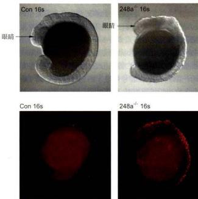
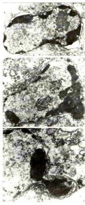
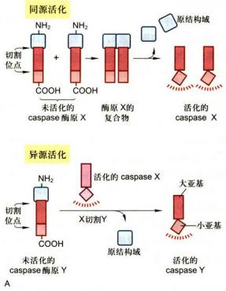
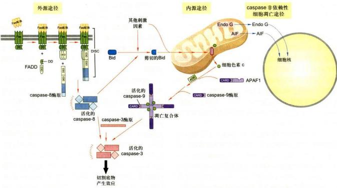

# 第15章 细胞衰老与细胞程序性死亡

<!-- 章节边界按正文内容恢复；原始 MinerU 内容保留如下。 -->

# 细胞衰老与细胞程序性死亡

细胞衰老和细胞程序性死亡是正常的细胞生命活动，发生在生物个体生长发育和衰老死亡的整个生命进程中。

多细胞生物（如人体）由不同类型的细胞构成。终末分化的细胞（如神经细胞）终生不分裂，随着个体年龄增长，这些细胞的功能逐渐衰退，进入衰老状态；而各种组织中的干细胞（如骨髓细胞）可持续增殖，不断产生新生细胞，替代衰老和死亡的细胞。正常状态下这类细胞的增殖能力是有限的，当细胞失去复制能力，进入不可逆的增殖停滞状态，就称为细胞衰老，又称复制衰老。干细胞的复制衰老以及各类体细胞的功能衰退是个体衰老的根源。本章将重点介绍细胞复制衰老的特征及其分子机制。

但凡生命，最终都会死亡，细胞作为生命的基本单位也不例外。对于多细胞生物，部分细胞程序性死亡是维持生物个体正常发育生存的必要条件，其重要性不亚于细胞增殖。不同类型的细胞在不同生理条件下存在不同的死亡方式，其生理功能、形态特征和分子机制各异，但均受到细胞内在基因的控制，是程序性而非随机的细胞死亡，因而称为细胞程序性死亡。本章介绍几种典型的细胞程序性死亡方式，并重点介绍细胞凋亡的分子机制。

## 第一节 细胞衰老

## 一、细胞衰老的概念

在之前的章节中我们了解了真核细胞如何通过有丝分裂的方式自我复制，那么细胞是否具有无限的自我复制能力，可以无限次地分裂下去呢？对于正常细胞而言，答案是否定的。除了生殖干细胞，绝大多数正常细胞在经历有限次数的分裂后会进入“衰老”状态，不再具有增殖能力，细胞的形态结构和代谢活动也发生显著改变，这一现象称为细胞衰老（cell senescence），也称为复制衰老（replicative senescence, RS）。“senescence”一词源于拉丁语“senex”，含义是逐渐衰老。细胞衰老与 $G_{0}$ 期的细胞静止（cell quiescence）状态不同，后者在特定生理条件下可以返回细胞周期继续增殖，而衰老细胞是不可逆地处于增殖停滞状态。

在细胞生物学研究史上，细胞是否具有无限的增殖能力这一问题经历了曲折的认识过程。早在1881年，德国生物学家Weissman就提出“有机体终究会死亡，因为组织不可能永远能够自我更新，而细胞凭借分裂来增加数量的能力也是有限的”。后来这一观点受到法国外科医生、诺贝尔奖获得者Carrel的挑战，以至于一度被研究者们抛弃。Carrel认为，体外培养的细胞是能够永生不死的，如果它停止增殖是因为培养条件不适宜了。他声称在纽约洛克菲勒研究所里培养的鸡心脏成纤维细胞持续分裂了34年。这使得当时人们普遍认为，所有脊椎动物的细胞在体外培养时均能够无限次分裂。但事实上没有研究者能够重复Carrel的工作。有人开始质疑Carrel的细胞培养实验，认为培养液中每天添加的鸡胚提取物中可能混有鸡胚细胞（胚胎干细胞）。1958年，美国生物学家L.Hayflick在Wistar研究所从事癌症研究时，将癌细胞的提取物加到人正常细胞的培养基中，希望看到正常细胞发生癌变。结果非他所愿，细胞不但没有癌变，还停止了分裂。起初Hayflick相信Carrel的理论，认为自己细胞培养的技术不过关。后来他与合作者一起精心设计了一系列实验，证实大多数正常细胞只能进行有限次数的分裂。在体外培养时，无论培养条件如何优化，如果将细胞以 $1:2$ 的比率（即一瓶细胞分为两瓶细胞）连续进行传代（群体倍增），平均只能传代 $40\sim 60$ 次，之后细胞就不再分裂。Hayflick的实验结果发表后得到许多研究者的证实：除了生殖干细胞和肿瘤细胞，来自不同生物、不同年龄供体的原代培养细胞均存在复制衰老现象。1974年，澳大利亚生物学家M.Burnett在他的著作《内在变异》(Intrinsic Mutagenesis)中首次将这一发现称为“Hayflick界限”(Hayflick limit)，表示细胞在进入增殖停滞状态前的有限倍增次数。

## 二、细胞复制衰老的特征

Hayflick 及其后续的研究者们对培养细胞在衰老过程中发生的变化进行了详细的观察，发现了衰老细胞形态结构方面的各种变化。与年轻细胞相比，衰老细胞变得大而扁平，如曾有报道年轻成纤维细胞的表面区域一般小于 $1000 \mu m^{2}$ ，而衰老细胞可达到 $9000 \mu m^{2}$ ；同时衰老细胞质膜的流动性降低，细胞骨架结构改变，细胞黏附性增强，细胞内溶酶体体积增大，内部含有大量未分解的脂质成分如脂褐质（lipofuscin），这是老年斑的成因。

A  

B  

随着研究的深入，更多细胞衰老的分子特征被发现。主要包括：①细胞不可逆地停止分裂，即使添加生长因子也无济于事。②若干细胞周期的负调节因子如p21、p16、p53表达上调或活性增强。③衰老相关的β-半乳糖苷酶（senescence-associated β-galactosidase, SABG）活化。β-半乳糖苷酶是溶酶体内的水解酶，通常在pH 4.0的条件下表现活性，而衰老细胞的SABG在pH 6.0条件下表现出活性。目前尚不清楚这一现象的分子机制，可能反映了溶酶体在细胞衰老过程中的变化。用底物染色的方法可以观察到随着培养细胞传代次数的增加，细胞群体中表达SABG的细胞日益增多（图15-1）。体内衰老细胞同样具有这一特征，年老小鼠的肝脏有17%的细胞显示SABG阳性；而年轻小鼠仅有8%。④衰老细胞端粒（telemere）长度明显减少（短于原有长度的50%)。目前可以运用定量荧光原位杂交技术（quantitative fluorescence in situ hybridization technique）便捷准确地测定端粒长度。该方法用荧光标记的端粒序列作为探针与细胞染色体的端粒进行原位杂交后，通过荧光显微镜对荧光强度进行测定，再借助标准曲线测算端粒的长度。⑤出现衰老相关异染色质集中（senescence-associated heterochromatin foci, SAHF）现象。用DNA荧光染料如DAPI对细胞核进行染色，年轻细胞细胞核的荧光均匀分布，而衰老细胞细胞核的荧光会出现点状聚集。这些聚集的染色质包括了细胞周期正向调控蛋白的编码基因，这些DNA被多种蛋白质包裹，处于转录失活状态。⑥衰老细胞还会产生一系列衰老特征性分泌物（senescence-associated secretory phenotype, SASP），包括炎性因子、金属蛋白酶等，招募免疫细胞前来吞噬衰老细胞，同时改变了周围细胞的微环境。

图 15-1 衰老相关 β-半乳糖苷酶（SABG）
染色区分年轻和衰老的人胚胎成纤维细胞 IMR-90

A. 第20代的年轻细胞，细胞体积较小，SABG呈阴性。B. 第55代的衰老细胞，细胞体积明显增大，多数表达SABG。（陈丹英博士提供）

## 三、细胞复制衰老的机制

细胞衰老是如何发生的呢？为了确定原因是在干细胞本身还是培养环境的恶化，Hayflick设计了一个巧妙的实验。他以有无巴氏小体作为标记，将男性已分裂40次的成纤维细胞与女性已分裂10次的成纤维细胞混合培养，同时用单独培养的细胞作为对照统计倍增次数。他发现混合培养的女性年轻细胞仍然旺盛增殖的时候，男性衰老细胞已停止分裂了，并且混合培养的两类细胞倍增次数与各自单独培养时相同。说明细胞衰老由细胞自身因素决定，与环境条件无关。Hayflick进而将年轻细胞除去细胞核的原生质体与衰老的完整细胞融合，形成的“杂合”细胞仍旧不能增殖；反之，将衰老细胞的原生质体与年轻的完整细胞融合时，“杂合”细胞的分裂能力与年轻细胞几乎相同，由此说明细胞核而不是细胞质决定了细胞的分裂能力。正常细胞甚至冻存后仍然“记得”之前复制了多少次，继续复制的次数累计与未冻存的细胞一致。显然细胞核内存在某种计算复制次数的机制，细胞的这种“计数”机制究竟是什么呢？

前文已提到过端粒缩短是细胞衰老的特征之一。端粒是染色体末端的特殊结构，由连续重复的核苷酸构成（参见第九章）。真核细胞DNA复制过程中存在所谓末端复制问题（the end replication problem）。由于DNA聚合酶不能从头合成子链，复制母链3'末端时，子链5'末端与之配对的RNA引物被切除后会产生末端缺失，导致子链的5'末端随着细胞分裂次数的增加而逐渐缩短（每次缺失约 $30\sim 120$ bp），而端粒的存在使得染色体5'末端的缩短不会影响到编码区域。1972年，苏联理论生物学家A.Olovnikov提出，随着复制不断缩短的DNA末端可能是正常端粒有限分裂的原因。1978年，Blackburn发现四膜虫的端粒由TTGGGG重复序列构成，而哺乳动物细胞的端粒序列是类似的TTAGGG，这一发现使得端粒的长度得以准确测算；继而研究者发现了一系列端粒与细胞衰老和个体衰老相关的证据，包括体外培养的人体细胞的端粒长度随着分裂次数增加不断缩短，年老个体细胞的端粒短于年轻个体，沃纳综合征（Werner's syndrome）患者体细胞的端粒明显短于正常人等，人们开始认同端粒在细胞衰老过程中的作用。1998年，C.Greide获得了端粒缩短能够导致细胞衰老的直接证据。能够持续增殖的干细胞以及癌细胞中存在一种酶，称为端粒酶(telomerase)，它能够以自身含有的 RNA 为模板，反转录出端粒 DNA，从而避免端粒的缩短。大多数正常细胞如成纤维细胞、内皮细胞、上皮细胞、软骨细胞、淋巴细胞中，端粒酶的活性很低，无法有效地延长端粒。Greide 将活化的端粒酶导入人成纤维细胞并使其持续表达，细胞的端粒就不再缩短，而细胞的复制寿命延长了 5 倍；相应地，使癌细胞中的端粒酶失活能够导致癌细胞增殖停滞，引发癌细胞的衰老。三位美国科学家 Blackburn、Greide 和 Szostak 因上述端粒和端粒酶的发现分享了 2009 年诺贝尔生理学或医学奖。

端粒的缩短如何引发细胞的复制衰老呢？简而言之，当端粒随着细胞增殖缩短到一定程度，会触发细胞内p53信号通路介导的DNA损伤“警报”系统，导致细胞周期的停滞。p53是著名的肿瘤抑制因子，通过诱导细胞凋亡（见本章第二节）或细胞衰老，避免细胞因为DNA的损伤而发生癌变。研究发现，端粒的缩短（可视作一种DNA损伤）会使细胞中的p53含量、磷酸化程度及稳定性明显增加，继而活化细胞周期抑制蛋白p21，使细胞停留在细胞周期的 $G_{1}$ 检查点，细胞分裂停滞，最终导致细胞衰老（图15-2）。

  
图 15-2 细胞衰老的信号通路

A. 正常年轻细胞中，CDK 的活化导致 Rb 蛋白磷酸化，与转录因子 E2F 分离，被释放的 E2F 活化下游基因的转录，促使细胞从 G₁ 期进入 S 期，细胞周期正常运行。B. 随着细胞增殖，端粒的缩短会导致细胞内 DNA 修复体系包括 p53 的活化，p53 继而诱导 p21 的表达，p21 使得 CDK 失去活性，从而阻止 Rb 蛋白的磷酸化，Rb 不能与 E2F 分离，E2F 处于持续失活状态，不能正常起始 G₁/S 检查点若干关键因子的转录，细胞周期停滞导致细胞衰老。在细胞衰老的另一条信号通路中，氧化损伤等因素可以通过诱导 p16 的表达导致细胞衰老。

除了端粒缩短诱发细胞衰老以外，细胞内另一些刺激因素，如超量的过氧化物，原癌基因的非正常活化，非端粒的DNA损伤（包括核DNA和线粒体DNA损伤）等也能够缩短细胞的复制寿命，使细胞提前进入衰老状态。研究者们将这一类型的细胞衰老称为胁迫诱导的早熟性衰老（stress-induced premature senescence, SIPS）。研究发现SIPS的发生可能通过活化另一种周期抑制蛋白p16信号途径，引发细胞周期停滞（图15-2）。p16高表达不仅是细胞衰老的典型特征之一，在人和小鼠的检测中均发现p16的表达量与个体衰老程度呈显著的正相关。

## 四、细胞衰老与个体衰老

个体的衰老(aging)是指随着年龄的增加，机体功能呈现退行性变化的现象。对人类而言，个体衰老伴随着生殖能力的下降、死亡率的上升以及对一系列疾病，如癌症、糖尿病、心血管系统功能障碍、神经退行性疾病等的易感性增加。个体衰老的机制非常复杂，涉及分子、细胞、组织、器官各个层面。近年来研究者归纳了各类生物特别是哺乳动物共有的个体衰老在分子及细胞水平上的主要标志(hallmark)，它们既是个体衰老的特征，也是个体衰老的成因，并且相互关联。这些标志可分为两类：①基因和蛋白质水平上衰老的标志，包括：基因组DNA损伤在衰老个体中明显积累；衰老个体的染色体端粒长度明显缩短；衰老个体的DNA及组蛋白某些位点甲基化或乙酰化修饰发生改变，染色质高级结构变化等表观遗传修饰的改变，及其引起的基因表达异常；衰老个体细胞内协助蛋白质折叠的体系（如分子伴侣）以及降解非正常折叠蛋白质的体系（如泛素-蛋白酶体，自噬体-溶酶体）发生障碍，导致错误蛋白的堆积。②细胞水平上衰老的标志，包括：衰老个体中失去增殖能力和功能减退的细胞累积，不能被免疫系统及时清除，同时，衰老细胞的分泌物又造成周围细胞及组织器官生存微环境的恶化，出现个体衰老的体征；成体干细胞因为细胞衰老而减弱甚至丧失组织更新的能力；细胞通信的失调，尤其是涉及传递营养信号的多条信号通路，如感受葡萄糖浓度的胰岛素及胰岛素样生长因子信号通路，感受氨基酸浓度的mTOR信号通路等，营养过剩导致上述信号通路持续活化，加速了个体衰老；线粒体功能障碍，衰老个体中线粒体损伤的累积造成能量代谢等功能性障碍。

可见，细胞衰老（复制衰老）是导致个体衰老的重要因素之一，与个体衰老的其他标志直接或间接相关。Hayflick曾发现，从胎儿肺得到的成纤维细胞可以在体外条件下传代约50次，而从成人肺得到的成纤维细胞只能传代20次，表明细胞的增殖能力与供体的年龄相关；此外他还发现似乎寿命越长的生物其培养细胞的增殖能力越强。例如取自龟的培养细胞体外传代达90～125次，而来自小鼠的细胞体外传代次数只有14～28次。这些结果一度让人们认为细胞的复制“寿命”能够表征个体的年龄及寿命。但事实上多细胞生物个体由不同类型的细胞构成，其增殖状况各异。这些不同类型的细胞既有持续分裂的细胞如某些组织干细胞，不断更新的细胞如上皮细胞、淋巴细胞，又有处于终末分化阶段的神经细胞、心肌细胞、骨骼肌细胞等，它们在发育早期就已停止分裂并且在整个生命过程中几乎不被更新。个体的衰老是各种细胞功能变化的综合表现，认为与某种细胞的复制“寿命”直接关联则失之偏颇。

细胞的复制衰老主要表现在各类持续分裂的组织干细胞如造血干细胞、上皮干细胞、神经干细胞中。这些组织干细胞的衰老导致细胞再生受阻，器官机能下降，进而影响全身各系统之间的协调配合，是人及其他动物个体衰老的主要原因。干细胞的增殖能力远远强于大多数体细胞，为何会发生复制衰老呢？原因在于除了生殖干细胞之外，多数单能和多能干细胞如表皮、骨髓和神经干细胞具有一定活性的端粒酶，但活性不足以完全弥补细胞复制过程中端粒的缩短，它们的增殖能力随着个体生命进程也会下降。而生殖干细胞及癌细胞中高活性的端粒酶使它们具有永生化（immortality）的增殖能力。已发现组织干细胞的端粒酶缺失会导致相关器官的功能障碍，产生局部的“早老”症状，如肺纤维化（pulmonary fibrosis）、表皮先天性角化不良（dyskeratosis congenita）、再生障碍性贫血（aplastic anemia）等。此外，近年迅猛发展的诱导性多潜能干细胞（见第十四章）制备过程中也需要克服复制衰老。已发现导入外源基因将已分化体细胞重编程为多潜能干细胞的最后阶段，端粒酶被活化，原来体细胞的端粒延长，使体细胞在具备分化潜能的同时具备增殖潜能。现已运用重编程技术在体外成功地使早老症患者的衰老细胞重新获得增殖能力，希望这一成果在不久的将来能用于早老症的临床治疗。

另一方面，大量已分化的组织细胞如上皮细胞、血细胞，如果因衰老功能减退，在正常状态下会被免疫细胞清除，由干细胞产生的新生细胞替代。但随着个体年龄的增长，未及时清除而存积的衰老细胞会越来越多。如前所述，衰老细胞会产生包括炎症因子和金属蛋白酶在内的特征性分泌物SASP，影响周围细胞的正常生理功能，损坏组织结构，促进个体衰老表征的显现。例如促进平滑肌细胞增生和血管壁增厚而引发心血管疾病，或者分解胶原蛋白，引起真皮及表皮塌陷而产生皱纹。同时SASP还可通过体液循环影响其它组织器官，引起慢性炎症样变化，加速整体衰老。

对于机体内大量的终末分化细胞，如神经细胞、心肌和骨骼肌细胞、红细胞等，它们不存在复制衰老现象，但随着个体生命进程其功能活性的逐渐下降是个体衰老的重要原因。例如骨骼肌和心肌细胞的衰老使得老年人肌肉松弛萎缩、心肌功能下降而导致心血管疾病，而神经元数量的减少会引发脑功能衰退等。这些细胞衰老失能的某些特征与复制衰老相似，例如细胞内出现大量被脂褐质充填的溶酶体等。而终末分化细胞衰老的机制目前没有定论，氧化损伤可能发挥了重要作用。细胞吸收的氧中约有2%\~3%转变为活性氧成分（reactive oxygen species, ROS），包括超氧阴离子、过氧化氢和羟自由基。过量的ROS对生物大分子如蛋白质、脂质、核酸等均有损伤作用，例如使蛋白质或脂质发生异常的共价修饰，失去活性并且不能被正常降解，导致溶酶体失去功能，还会使线粒体DNA发生特异性的突变，使细胞内的能量和物质代谢失常。由于终末分化细胞不能通过分裂自我更新，它们对ROS的累积损伤较之持续分裂细胞更为敏感，最终导致细胞失去功能。

由此可见，细胞衰老是个体衰老的根源。那么细胞衰老对个体有何益处，为何在演化过程中被保留下来？Hayflick曾注意到：正常细胞分裂次数有限，而癌细胞能够在体外无限增殖，细胞癌化与细胞衰老是结果相反的两个过程。通过对细胞衰老分子机制的研究，人们认识到细胞衰老是机体防止细胞癌变的重要途径。如前所述，抑癌基因p53和p16的活化介导了细胞的复制衰老。随着生命进程而积累的各种损伤，包括DNA的突变等既是细胞癌变的诱因，也会引发细胞衰老。机体通过细胞衰老，阻断潜在的恶性细胞早期的癌化进程，并能够招募免疫细胞对其进行清除，从而维护机体内环境的平衡。

细胞衰老对细胞癌化的拮抗作用对个体生存有利；同时细胞衰老导致的组织器官功能退化对个体又是不利的，生物体必须在细胞衰老的多种效应之间建立平衡，目前尚不知晓这种平衡的机制。生物体的衰老特别是人体的衰老历来是人们特别关注的生理现象，人们越来越意识到，体内体外细胞衰老机制的研究对于深入剖析个体衰老及癌症的发生，促进人类老年期的生理健康，治疗老年相关疾病，延长人类的健康寿命（healthy lifespan）具有重要意义。

## 第二节 细胞程序性死亡

## 一、多种形式的细胞死亡及其生物学意义

但凡生命，最终都会死亡，细胞作为生命的基本单位也不例外。区别于物理或化学因素导致的随机被动性死亡，如高温使得生物大分子瞬间发生化学改变而导致的细胞死亡，细胞具有内在遗传机制控制的主动性死亡方式，称为程序性死亡（programmed cell death, PCD）。细胞程序性死亡是维持生物体正常生长发育及生命活动的必要条件，其重要性不亚于细胞的增殖。现在发现细胞程序性死亡的形式多种多样，其形态特征、分子机制和生理效应各异，如动物细胞的凋亡、程序性坏死，植物细胞的程序性死亡等，但均受到某些基因的控制，经历一系列有序的信号传递。细胞以何种形式“结束生命”取决于细胞类型、生理状态、周围环境以及外界刺激等多种因素。

## (一) 凋亡

动物细胞的凋亡是研究得最为深入的程序性死亡方式。早在1885年德国生物学家Flemming就曾描述过卵巢滤泡细胞的凋亡形态特征。他观察到细胞死亡时伴随染色质的水解，因此将这种细胞死亡称作“染色质溶解”(chromatolysis)。80年后的1965年，澳大利亚病理学家J.Kerr观察到结扎大鼠肝门静脉后，在局部缺血的情况下，大鼠肝细胞连续不断地转化为小的圆形的细胞质团，从周围的组织中脱离。这些细胞质团由质膜包裹，内含细胞碎片（细胞器和染色质等）。在这一过程中死亡细胞的质膜及溶酶体保持完整，细胞内含物不会释放到膜外，不会诱导机体发生炎症反应。1972年Kerr将这一现象命名为细胞凋亡(apoptosis)。“apoptosis”一词源自古希腊语，意指花瓣或树叶的脱落、凋零，这一命名意在强调这种细胞死亡方式是正常的生理过程。此后，研究者们在各种生理或病理过程中发现了凋亡现象的存在。三位学者S. Brenner、J. Sulston和R. Horvitz以线虫的发育为研究模式，利用一系列突变体，发现了发育过程中控制细胞凋亡的关键基因，使原先侧重于形态学描述的细胞凋亡概念在基因水平上得以阐释，即细胞凋亡是受基因调控的主动的生理性自杀行为。三人因此获得了2002年诺贝尔生理学或医学奖。此后，对细胞凋亡分子机制的解析迅速展开，成为20世纪90年代生命科学的一大研究热点。

细胞凋亡具有重要的生理意义，主要表现在如下几个方面：

（1）保证正常的胚胎发育进程，塑造个体及器官形态，形成免疫耐受。在动物个体发育的组织形成时期，一开始往往制造数量过多的细胞，继而再依据需求选择最后留存的功能细胞，而多余的细胞通过细胞凋亡去除（图15-3）。例如在脊椎动物神经系统的发育过程中，

  
图 15-3 原位末端标记法显示斑马鱼胚胎发育过程中的细胞凋亡

正常16体节期的斑马鱼胚胎（Con 16s）在发育过程中部分细胞发生凋亡，突变体（248a $^{-/-}$ 16s）有大量细胞发生凋亡。原位末端标记法即转移酶介导的dUTP缺口末端标记法（terminal deoxynucleotidyl transferase-mediated dUTP nick end labeling, TUNEL）。这一方法能对DNA分子断裂缺口中的3'-OH进行原位荧光标记，用荧光显微镜能观察到单个凋亡细胞。（祖尧博士和佟向军博士提供）

约有 $50\%$ 的原始神经元存活并且与靶细胞建立了连接，而没有建立连接的神经元则发生凋亡。这与靶细胞（肌细胞）分泌的一种存活因子——神经生长因子（nerve growth factor, NGF）有关。只有接受了足够量存活因子的神经元才能生存，其它的神经元则发生凋亡。动物体通过这种方式来调节神经细胞的数量，使之与需要支配的靶细胞数量相适应，以最终建立正确的神经网络联系（图15-4）。

细胞凋亡是塑造个体及器官形态的途径之一。哺乳动物指（趾）间蹼的消失、颚融合、肠腔管道的形成、视网膜发育等过程都必须有细胞凋亡的参与。动物蜕变过程中幼体器官的缩小和退化（如蝌蚪尾的消失等）也是通过细胞凋亡来实现的。

细胞凋亡还参与了免疫耐受的形成。例如胸腺细胞经过一系列的发育进程成为各种类型的免疫活性细胞；同时通过细胞凋亡，对识别自身抗原的T细胞克隆进行选择性消除。这样形成了既有免疫活性又对自身抗原免疫耐受的淋巴细胞。

(2) 维持生物体内的自稳态。Kerr等建立细胞凋亡的概念时就提出：“细胞凋亡降低细胞数量，细胞分裂增加细胞数量，同为控制细胞族群大小的两大原动力。”细胞凋亡不诱发炎症，是“安全”的细胞死亡方式。动物成体通过调节细胞凋亡和增殖的速率来维持组织器官细胞数量的稳定以及成体细胞的自然更新。健康成人体内每秒分裂产生约十万个新细胞，同时有相当数量的细胞发生凋亡。正常的T淋巴细胞在受到入侵的抗原刺激后被激活，产生免疫应答。机体为了防止免疫过激，会通过诱导T细胞凋亡来控制T细胞的寿命。细胞凋亡不足会导致多种疾患，例如在自身免疫性淋巴增生综合征（ALPS）患者体内，增生的T淋巴细胞无法正常凋亡，造成淋巴细胞增殖性的自身免疫病。另一方面，细胞凋亡过度也会导致组织器官功能缺失。例如人免疫缺陷病毒HIV特异性感染CD4+T淋巴细胞，能够直接诱发T细胞凋亡或使其对凋亡信号的敏感性增强，致使T细胞相关的免疫功能缺陷，极大地增加了艾滋病患者机会性感染及肿瘤的发生概率。多种急慢性疾病如败血症、心肌梗死、急性肝损伤、亨廷顿病，以及神经退行性疾病帕金森病、阿尔茨海默病等都与细胞的过度凋亡相关。目前知道阿尔茨海默病的发生主要是由于海马及基底神经核内的神经细胞大量丧失，其原因可能是β-淀粉样蛋白过量表达，沉积于神经组织内，激活周围的吞噬细胞释放炎症因子，促进神经细胞凋亡的发生，从而导致

  
图 15-4 细胞凋亡使得神经细胞与靶细胞的数量相匹配  
发育过程中神经细胞的数量较靶细胞多。靶细胞通过分泌存活因子来调节神经细胞的数量。不能获得足够存活因子的神经细胞发生凋亡，使得剩下的神经细胞与靶细胞的数量相当。

神经细胞的大量丧失。

(3) 生理保护, 肿瘤监控。细胞凋亡能够清除体内受损或危险的细胞而不对周围的细胞或组织产生损害。例如杀伤性 T 淋巴细胞能够分泌一种细胞因子——Fas 配体, 与被病原体感染的细胞表面的死亡受体——Fas 蛋白结合, 启动细胞内的凋亡程序, 使被感染细胞发生凋亡 (见后文)。一些细胞在受损伤或受胁迫的情况下能够同时产生 Fas 配体和 Fas 蛋白, 导致自身的凋亡。

凋亡也是机体预防癌症发生的重要手段。DNA损伤等致癌因素会诱发细胞凋亡，遏制细胞的癌变。临床研究发现，相当多的恶性肿瘤细胞的正常凋亡机制受到抑制，使机体不能早期清除可能有癌变危险的细胞。例如哺乳动物中第一个被发现的凋亡抑制基因Bcl2在滤泡泡淋巴瘤（follicular lymphomas）细胞中高表达。由于染色体重排，Bcl2基因的编码区与免疫球蛋白的增强子相连，导致Bcl2蛋白的过量表达，使肿瘤细胞能够免于凋亡，持续增殖。

## （二）程序性坏死

坏死 (necrosis) 一词源于希腊语 “nekros”，意为尸体。19世纪初被用于描述外科手术中观察到的组织溃烂，后来用于描述病理性的细胞死亡。细胞坏死具有与细胞凋亡迥然不同的特征：细胞膜破裂，细胞内含物释放，周围组织发生炎症反应，动物血液中可检测到原本定位于细胞内部的分子，如细胞核内的高速泳动族蛋白 B1 (nuclear high mobility group box 1 protein) 和线粒体 DNA 等。作为机体内源性的危险信号，这些分子被称为损伤相关分子模式（damage-associatedmolecular pattern, DAMP)，对应于病原体入侵产生的外源性危险信号：病原相关分子模式（pathogen-associated molecular pattern, PAMP），如细菌或病毒的核酸及蛋白质成分。

细胞坏死曾长期被认为是一种区别于细胞凋亡的、被动的细胞死亡方式。近年的研究确立了细胞程序性坏死（programmed necrosis）的概念，即与细胞凋亡类似，这种细胞膜破裂的死亡过程，也受到细胞内特异基因的控制。现在发现程序性坏死可以由不同信号触发，由细胞内不同的信号传递分子介导。

典型的程序性坏死证据来自于肿瘤坏死因子(tumor necrosis factor, TNF)的效应。TNF是一种多效的细胞因子，在感染和损伤诱导的机体炎症发生过程中发挥重要作用。通过它的主要受体TNFR1（TNF receptor 1）可以诱导多种炎症因子的表达及某些敏感细胞的死亡，包括质膜保持完整的凋亡和质膜破裂的坏死两种形式；当细胞内的凋亡信号通路受阻或不完整时，TNF诱导的细胞坏死现象就变得非常明显（图15-5）。2005年袁钧瑛研究团队将这种细胞死亡方式命名为“necroptosis”。2009年包括韩家淮和王晓东在内的三个研究团队，发现并报道了激酶RIPK（receptor interacting kinase）家族成员RIPK3在necroptosis信号通路中发挥重要作用（见后文）。以上研究证明细胞坏死是可调控的，即确立了程序性坏死的概念。

另一种程序性坏死的方式是细胞焦亡（pyroptosis），与细胞的免疫反应密切相关。20世纪80年代发现，某些细菌感染巨噬细胞会导致伴随大量炎性因子释放的死亡，2001年这种死亡方式被命名为“pyroptosis”。

  
图 15-5 细胞程序性坏死的电镜照片。鼠成纤维细胞 L929 在 TNF 及凋亡抑制剂的作用下发生坏死。细胞质出现空泡，细胞质膜破损，细胞内含物，包括膨大和破碎的细胞器释放到胞外。（韩家淮博士惠赠）

“pyro”在希腊语中表示“发热”，暗示这种细胞死亡方式导致炎症。细胞焦亡表现为，受到病原体感染后，细胞膜在短时间内形成孔洞，细胞膨胀至细胞膜破裂，白介素1β（interleukin-1β, IL1β）等炎性因子大量释放，激活机体产生强烈的炎症反应并诱导免疫吞噬作用，破裂的细胞膜包裹着细菌等病原体被吞噬细胞吞噬消灭。2015年邵峰研究团队等解析了介导细胞焦亡的关键信号分子（见后文），再次确认了细胞程序性坏死的概念。

由于缺乏特异性的分子标记和抑制剂，目前对程序性坏死生理功能的了解还较为有限。程序性坏死可能在机体免疫反应中发挥重要作用。一方面，细胞感染病原体后如果需要通过“自杀”方式消灭病原体，由于某种原因凋亡不能正常发生时，程序性坏死可以作为凋亡的“替补”方式被细胞采用。已发现病毒为了保障复制顺利完成，防止宿主细胞提前“自杀”，除了携带抑制凋亡的基因，还会携带抑制坏死的基因，这从侧面证明程序性坏死是细胞抗感染的途径之一。另一方面，被感染的细胞发生坏死后，来自细胞和病毒的内源外源损伤信号DAMP、PAMP释放出来，能够强烈促发免疫反应，有利于机体对病原体发动更有效的进攻。但若干人类疾病包括急性肝损伤、急性胰腺炎、系统性炎症等也涉及不受控制的细胞坏死。深入解析细胞坏死的分子机制可能有助于这些疾病治疗药物的开发。

## （三）植物细胞的程序性死亡

最早关于植物细胞程序性死亡的相关报道发表于1994年，研究者在拟南芥的超敏反应中发现类似动物细胞凋亡的现象，之后逐渐证明细胞程序性死亡在植物中也广泛存在。主要生理功能包括：①植物防御病原体的反应或称超敏反应（hypersensitive response, HR）。植物在病原体侵染部位发生细胞程序性死亡，阻止病原体侵染其他部位。②植物对环境胁迫的反应，如缺氧、高盐等引发细胞程序性死亡。③在植物发育进程中发挥作用。如配子体发育过程中非功能性大孢子的死亡，绒毡层细胞的死亡；种子发育早期珠心的退化，胚乳、胚柄、种皮的发育，根冠的形成，维管组织的形成等。例如木质部管状细胞（tracheary element, TE）是植物体负责运输及机械支持的厚壁组织细胞，管状细胞的成熟包括细胞伸长、细胞壁增厚、木质化和细胞程序性死亡过程。

植物细胞程序性死亡的方式与动物细胞差别较大。植物细胞被固定在细胞壁中，没有类似动物巨噬细胞的可移动细胞来清除死亡残余物，因此植物细胞往往利用溶酶体（液泡）中的水解酶来消化分解死亡细胞，主要包括两种方式：①植物细胞内液泡膜破裂，水解酶释放出来消化细胞内含物，整个细胞被迅速直接地分解而死亡。这种方式的细胞死亡一般发生在植物发育进程中。②液泡膜与细胞膜发生融合，水解酶释放到细胞外触发细胞死亡。植物被细胞外复制的病原体感染时会诱发这种反应，往往在消灭病原体的同时引发间接的细胞死亡。

## 二、细胞凋亡的过程及分子机制

在已知的各种细胞程序性死亡方式中，人们对细胞凋亡了解得最为深入。下面重点介绍凋亡的生物学特征及分子机制。

典型动物细胞的凋亡过程，在形态学上可分为三个阶段（图 15-6A）：

(1) 调亡的起始。细胞表面的特化结构如微绒毛等消失，细胞间连接消失，细胞质中核糖体逐渐与内质网脱离，内质网囊腔膨胀，并逐渐与质膜融合；细胞核内染色质固缩凝集，形成新月形帽状结构，沿着核膜分布（图 15-6B、[图 15-7]）。这一阶段历时数分钟，然后进入第二阶段。

  
图 15-6 细胞凋亡的过程及特征

A. 细胞凋亡过程模式图。1. 正常细胞；2. 细胞凋亡的起始，染色质固缩并沿核膜分布，细胞皱缩；3. 凋亡中的细胞，细胞质膜反折，包裹染色质片段和细胞器等细胞碎片，形成芽状突起并逐渐脱离，形成凋亡小体；4. 凋亡小体被吞噬细胞吞噬。B. 凋亡细胞的电镜照片，显示染色质的变化。上：染色质凝集并沿核膜分布；中、下：染色质片段逐渐“离开”原来的细胞核，进入核膜包围的泡状结构。（电镜照片由丁明孝提供）

  
图 15-7 DAPI 染色显示凋亡细胞的染色质凝集  
A. 正常细胞核。B. 凋亡细胞核。4', 6-二脒基-2-苯基吲哚（4', 6-diamidino-2-phenylindole, DAPI），是常用的一种与 DNA 结合的荧光染料（丁明孝提供）。

(2) 凋亡小体的形成。核染色质断裂为大小不等的片段，与某些细胞器如线粒体等聚集在一起，被反折的细胞质膜包裹，形成膜包裹的球形结构，称为凋亡小体(apoptotic body)。扫描电镜下可以观察到细胞表面产生许多泡状或芽状突起，随后逐渐脱离细胞，形成单个的凋亡小体。

(3) 凋亡小体被吞噬。凋亡小体逐渐被邻近细胞或巨噬细胞吞噬，在溶酶体内被消化分解。

细胞凋亡发生的整个过程中，细胞内含物始终被膜包裹，不泄漏到细胞外，因此不会引发机体的炎症反应。凋亡的过程往往很迅速，从细胞凋亡启动到凋亡小体的出现不过数分钟，大约半小时到几个小时后，整个凋亡细胞便被吞噬灭迹。因此细胞凋亡虽然是机体中频繁发生的生理现象，但在组织学水平上却难以观察到，也正是由于这个原因迟迟未引起早期研究者们的注意。

在分子水平上，细胞凋亡过程包括接受凋亡信号、凋亡相关分子的活化、凋亡的执行、凋亡细胞的清除4个阶段。蛋白酶caspase（cysteine aspartic acic specific protease）家族成员在其中发挥了重要作用，大部分凋亡过程依赖于caspase的活性，称为caspase依赖性凋亡（caspase dependent apoptosis）。caspase失活或者被抑制，细胞凋亡往往不能发生。

## 1. caspase 及其基本类型简介

caspase 是一组天冬氨酸特异性的半胱氨酸蛋白水解酶，存在于细胞质中。它们的活性位点均包含半胱氨酸残基，能够特异地切割靶蛋白天冬氨酸残基后的肽键，切割的结果是使靶蛋白活化或失活，而非完全降解。

caspase 的发现源于秀丽隐杆线虫（Caenorhabditis elegans）发育的研究。线虫从胚胎发育到成体的过程中共产生 1090 个体细胞，其中 131 个体细胞发生凋亡后消失。1986 年美国麻省理工学院 Horvitz 实验室发现，当 Ced3 或 Ced4 突变后，原先应该凋亡的 131 个细胞依然存活；与之相反，Ced9 的突变导致所有细胞在胚胎期死亡，无法得到成虫。这一结果证明，Ced3 和 Ced4 是线虫发育过程中细胞凋亡的必需基因，Ced9 的功能是抑制细胞凋亡。线虫凋亡基因的发现促进了哺乳动物细胞凋亡机制的研究。胎生哺乳动物 caspase 家族成员有十余种（表 15-1），按照功能可以分为两大类：① 炎症 caspase，包括 caspase-1、4、5、11、12，负责产生有活性的白介素 1（interleukin-1，IL1）。IL1 和肿瘤坏死因子 TNF 都是重要的炎症因子，与 TNF 不同的是，IL1 表达量的调控主要发生在翻译后阶段。IL1 前体蛋白需要被 caspase 在特异位点切割后才成为成熟有活性的细胞因子被分泌到细胞外。② 调亡 caspase，包括caspase-2、3、6、7、8、9、10，负责介导细胞凋亡。按照在凋亡过程中发挥的不同功能，凋亡caspase又可分为两类：起始caspase和效应caspase。起始酶（caspase-2等）负责对效应酶的前体进行切割，产生有活性的效应caspase；效应酶（caspase-3等）负责切割细胞核内、细胞质中的结构蛋白和调节蛋白，使其失活或活化，保证凋亡程序的正常进行。除了上述炎症和凋亡相关的功能，近年的证据显示caspase家族成员还参与了细胞自噬、坏死、分化等生命活动的调控。

表 15-1 caspase 家族部分成员及其功能

<table><tr><td>名称</td><td>物种分布</td><td>功能</td></tr><tr><td>caspase-1</td><td>小鼠,人</td><td>参与炎症信号通路</td></tr><tr><td>caspase-2</td><td>小鼠,人</td><td>起始 caspase</td></tr><tr><td>caspase-3</td><td>小鼠,人</td><td>执行 caspase</td></tr><tr><td>caspase-4</td><td>人</td><td>参与炎症信号通路</td></tr><tr><td>caspase-5</td><td>人</td><td>参与炎症信号通路</td></tr><tr><td>caspase-6</td><td>小鼠,人</td><td>执行 caspase</td></tr><tr><td>caspase-7</td><td>小鼠,人</td><td>执行 caspase</td></tr><tr><td>caspase-8</td><td>小鼠,人</td><td>起始 caspase</td></tr><tr><td>caspase-9</td><td>小鼠,人</td><td>起始 caspase</td></tr><tr><td>caspase-10</td><td>人</td><td>起始 caspase</td></tr><tr><td>caspase-11</td><td>小鼠</td><td>参与炎症信号通路</td></tr><tr><td>caspase-12</td><td>小鼠,人</td><td>参与炎症信号通路</td></tr><tr><td>caspase-13</td><td>牛</td><td>未知</td></tr><tr><td>caspase-14</td><td>小鼠,人</td><td>未知</td></tr><tr><td>caspase-16</td><td>小鼠,人</td><td>未知</td></tr></table>

## 2. caspase 在细胞凋亡中的作用机制

不论起始 caspase 或效应 caspase，通常均以无活性的酶原形式存在于细胞质中。接受调亡信号刺激后，酶原分子在特异的天冬氨酸位点被切割，产生的两段多肽形成大小两个亚基，再聚合成异二聚体，此即具有活性的酶（图 15-8A）。起始 caspase 的活化属于同源活化（homo-activation），即同一种酶原分子彼此结合或与接头蛋白结合形成复合物，在复合物中构象改变而活化，进而彼此切割产生有活性的异二聚体。起始 caspase 中，caspase-8 和 caspase-10 含有串联重复的死亡效应结构域（death effector domain, DED），而 caspase-2 和 caspase-9 则含有 caspase 募集结构域（caspase recruitment domain, CARD）。这两种结构域也存在于一些负责传递凋亡信号的接头蛋白分子结构中，通过结构域之间的聚合，caspase能够彼此结合或与接头蛋白结合，被招募到上游信号复合物中发生同源活化（图15-8A）。

效应 caspase 的活化属于异源活化 (hetero-activation)。已活化的起始 caspase 招募效应 caspase 酶原分子后，对其进行切割，产生活性的效应 caspase (图 15-8A)。效应 caspase 负责切割细胞中的结构蛋白和调节蛋白，使其失活或活化，此时细胞进入凋亡的执行阶段。

目前已知的效应 caspase 底物约 280 种，可以分为被活化和被失活两大类。caspase 对于这些底物的切割使得细胞呈现出凋亡的一系列形态学和分子生物学特征。被 caspase 活化的代表分子是 caspase 激活的 DNA 内切酶（caspase activated DNase, CAD）。CAD 一般与其抑制因子 ICAD（inhibitor of CAD）结合在一起，处于失活状态。细胞启动凋亡程序后，活化的 caspase-3 降解 ICAD，使有活性的 CAD 释放出来，在核小体间切割 DNA，形成间隔 200 bp 的 DNA 片段。因此，提取凋亡细胞的 DNA 进行琼脂糖凝胶电泳时会观察到 DNA 梯状条带（DNA ladder）（图 15-16），这是细胞凋亡的标志之一。另一个 caspase 的重要底物是聚腺苷酸二磷酸核糖转移酶 [poly (ADP-ribose) polymerase, PARP]。PARP 能够识别损伤的 DNA，使组蛋白发生 ADP- 核糖基化，从 DNA 上脱离下来，有助于修复蛋白与 DNA 结合进行损伤修复，因此被认为是 DNA 损伤的感受器。在凋亡过程中 PARP 被 caspase 切割后失活，使细胞对 DNA 的降解不再敏感。效应 caspase 还通过切割细胞骨架蛋白使细胞的骨架体系发生结构变化，便于细胞改变形态以及形成凋亡小体等。例如通过切割核纤层蛋白使核纤层解聚，导致核膜收缩；切割核孔蛋白以及细胞质骨架蛋白，使细胞核与细胞质的信号传递中断。此外，黏着斑激酶（focal adhesion kinase, FAK）参与黏着斑形成和调节，是整联蛋白介导的信号转导中的重要成员，它同样也是效应 caspase 的底物，FAK 被切割失活导致凋亡细胞与胞外基质以及其它细胞解离。

起始 caspase 和效应 caspase 组成细胞内凋亡信号的级联分子网络（图 15-8B），凋亡程序一旦启动，级联网络“顶端”的起始 caspase 首先活化，切割下游 caspase 酶原，使得凋亡信号在短时间内迅速放大并传递到整个细胞，产生凋亡效应。这一过程是不可逆转的。

由于 caspase 在细胞凋亡途径中发挥关键作用，可将其作为药物设计的靶标分子来对凋亡相关疾病进行控制。在动物模型中，caspase的抑制剂已被证实对细胞过度凋亡引发的疾病有疗效，例如可以降低急性心脏和肝脏损伤时的损伤度。另一方面，选择性地激活caspase或降低其活化的能障，可用于治疗癌症，例如将肿瘤细胞胞内或胞外的特异性蛋白与caspase连接形成融合蛋白，通过特异性蛋白的聚合作用引发caspase的活化，从而选择性杀死肿瘤细胞；或者将肿瘤细胞中失活的caspase替换成活性形式，用RNA干扰降低肿瘤细胞中caspase抑制因子的表达等方法，促进肿瘤细胞的凋亡。

  
图 15-8 细胞凋亡过程中 caspase 的活化

  
A. caspase 酶原的活化。被凋亡信号刺激后，酶原分子在特异的天冬氨酸位点被切割，产生的两段多肽形成大小两个亚基，聚合成异二聚体即有活性的酶。其中起始 caspase 酶原的活化属于同源活化，即同一种酶原分子（X）彼此结合或与接头蛋白结合形成复合物，在复合物中构象改变被活化而彼此切削产生活性形式。效应 caspase 酶原的活化属于异源活化，由已活化的起始 caspase（X）切割效应 caspase 酶原分子（Y），产生活性的效应 caspase。B. caspase 级联活化效应。少量活化的起始 caspase（X）能够切割许多下游 caspase 前体（Y），进而通过级联放大作用，产生更大的活化的下游 caspase（Z）。其中的效应 caspase 切割细胞质内及细胞核内重要的结构蛋白和调节蛋白，产生凋亡效应。

## 3. 细胞凋亡信号通路

细胞内外的凋亡信号主要通过两条通路诱导caspase活化，引发细胞凋亡：由死亡受体（death receptor）引发的外源途径和由线粒体引发的内源途径（图15-10）。

死亡受体引发的凋亡起始于死亡配体与受体的结合。死亡配体主要是肿瘤坏死因子家族成员，包括TNF、Fas配体（Fas ligand）、TRAIL等。它们的受体包括TNFR1、Fas、DR-4、DR-5等。死亡受体的胞质部分均含有死亡结构域（death domain, DD），负责招募凋亡信号通路中的接头蛋白。Fas是死亡受体家族中的代表成员。Fas配体与之结合后引起Fas的聚合，聚合后的Fas通过死亡结构域招募接头蛋白FADD和caspase-8酶原，形成死亡诱导信号复合物（death inducing signaling complex, DISC）（图15-10）。caspase-8酶原在复合物中通过自身切割（同源活化）而被激活，进而切割效应caspase；caspase-3酶原，产生有活性的caspase-3，导致细胞凋亡。另一方面，活化的caspase-8还通过切割信号分子Bid将凋亡信号传递到线粒体，引发凋亡的内源途径，使凋亡信号进一步扩大。通过以上途径，分泌Fas配体的杀伤性T淋巴细胞可以诱导被病原体感染的靶细胞发生凋亡；而被损伤的细胞可以通过

图 15-9 细胞凋亡的典型特征——DNA 梯状条带（DNA ladder）
A. DNA 梯状条带产生过程示意图。细胞凋亡时，细胞内特异性 DNA 内切酶消化，染色质 DNA 被随机地在核小体间切割，降解成 180\~200 bp 或其整数倍片段。
B. 正常细胞与凋亡细胞的 DNA 电泳照片。
a. 对照的正常人胚肾 293 细胞 DNA；b. 过量表达肿瘤坏死因子受体（T NFR1）诱导凋亡的 293 细胞 DNA。由于提取 DNA 过程中保持细胞核膜的完整，因此正常细胞的提取物中几乎没有 DNA；而凋亡细胞凋亡体中的 DNA 被提取出来，长度相差 200 bp 或其整数倍的 DNA 分子经琼脂糖凝胶电泳分离，呈现梯状条带。（电泳照片由陈丹英博士提供）

自己产生 Fas 配体和 Fas，触发自身的凋亡。

在凋亡的内源途径中，线粒体处于中心地位。当细胞受到内部凋亡信号（如不可修复的DNA损伤）刺激时，线粒体膜通透性会发生改变，向细胞质中释放出凋亡相关因子，引发细胞凋亡。线粒体释放到胞质中的凋亡因子有多种，其中最“著名”的是细胞色素c。1996年王晓东领导的研究团队发现，在HeLa细胞提取物中加入dATP能够诱发外源细胞核DNA断裂。他们将HeLa细胞提取物经过柱层析后分为两种组分——流出组分和吸附组分，并发现这两种组分只有合并起来才能诱导凋亡。他们进而对吸附组分进行了分级纯化，最终发现分子质量为 15 kDa 的蛋白质是凋亡的必需因子。出乎大家的预料，序列测定结果表明这一蛋白质是线粒体电子传递链的组分细胞色素 c。紧接着，他们从流出组分中分离克隆到了另外两个凋亡的必需因子——APAF1 (apoptosis protease activating factor 1) 和 caspase-9，从而建立了细胞凋亡内源途径的模型（图 15-10）。细胞接受内源性凋亡信号刺激后，细胞色素 c 从线粒体释放到细胞质中与 APAF1 结合。APAF1 是线虫凋亡分子 Ced4 在哺乳动物细胞中的同源蛋白，分子质量为 130 kDa，N 端含有 caspase 募集结构域（CARD）。它与细胞色素 c 结合后发生自身聚合，形成一个很大的复合物，称为凋亡复合体（apoptosome）（图 15-10），分子质量约为 700\~1 400 kDa。之后，APAF1 通过 CARD 结构域招募细胞质中的 caspase-9 酶原，caspase-9 酶原在凋亡复合体中发生同源活化，活化的 caspase-9 再进一步切割并激活 caspase-3 和 caspase-7 酶原，引发细胞凋亡。

细胞凋亡的内源途径中，细胞色素c的释放是关键步骤，源于线粒体膜通透性的改变，主要受到Bcl2（the B-cell lymphoma gene 2）蛋白家族的调控。Bcl2是线虫凋亡抑制分子Ced9在哺乳动物中的同源分子，家族成员大多定位在线粒体外膜上，或受信号刺激后转移到线粒体外膜上。按照功能，可将Bcl2家族成员分为3个亚族：Bcl2亚族，包括Bcl2、Bcl-xL、Bcl-w、Mcl1等，对细胞凋亡发挥抑制作用；Bax亚族，包括Bax、Bak、Bok，功能与Bcl2亚家族相反，促进细胞凋亡；BH3亚族，包括Bad、Bid、Bik、Puma、Noxa等，它们能够充当细胞内凋亡信号的“感受器”，作用也是促进细胞凋亡。Bcl2家族成员可以通过彼此间的聚合及解聚来调节线粒体的通透性。细胞接受内源的凋亡信号后，Bax亚族的促凋亡因子Bax和Bak发生寡聚化，从细胞质中转移到线粒体外膜上，并与膜上的电压依赖性阴离子通道（voltage-dependent anion channel, VDAC）相互作用，使通道开放到足以使线粒体内的凋亡因子如细胞色素c等释放到细胞质中，引发细胞凋亡。正常状态下Bcl2与Bax/Bak形成复合体，阻碍Bax和Bak的寡聚化，防止线粒体膜通道的开启；而BH3亚族成员如Bid被活化后又可以解除Bcl2对Bax/Bak的抑制。

上述两种看似迥异的 caspase 依赖性细胞凋亡途径亦有相似之处。即起始 caspase 如 caspase-8、caspase-9 等，均在一些大的多成分复合物中被活化，如 DISC、apoptosome 等。在复合物的形成过程中，多种接头蛋白如 FADD、APAF1 等发挥了关键作用，它们负责引导起始 caspase 进入复合物的适当位置，进而使之发生同源活化。

  
图15-10 凋亡信号通路  
在凋亡的外源途径中，死亡受体如Fas在Fas配体的刺激下，通过接头蛋白FADD将caspase-8酶原拟感到细胞膜上，形成死亡诱导信号复合物DISC3。caspase-8酶原在这个复合物中活化，进而活化caspase-3酶原。在凋亡的内源途径中，线粒体接收到凋亡信号后，向细胞质内释放细胞色素 $c_{0}$ 细胞色素c与APAF1和caspase-9酶原形成凋亡复合体apoptosome，并活化caspase-9酶原，进而活化caspase-3酶原。外源途径中的caspase-8也可以切割并活化Bcl2家族的促凋亡因子Bid，激活内源凋亡途径。在caspase非依赖性细胞凋亡途径中，线粒体释放凋亡因于EndoG、AIF等，直接进入细胞核，导致DNA断裂。

细胞凋亡的外源途径和内源途径彼此关联。当caspase-8通过外源途径被活化后，能够切割BH3亚族成员Bid使其活化，被激活的Bid从细胞质转移到线粒体，释放出被Bcl2束缚的Bax/Bak，活化内源途径，从而放大外源凋亡信号的效应（图15-10）；另一方面，凋亡的内源途径被激活后，线粒体释放的促凋亡因子Smac（见后文）也能够活化caspase-8，从而与外源途径交汇。

研究表明当使用 caspase 的抑制剂，或者将 caspase 敲除之后，一些细胞仍然可以发生凋亡。线粒体在其中同样发挥了关键作用。除了细胞色素 c，线粒体能够向细胞质内释放多个凋亡相关因子，如凋亡诱导因子（apoptosis inducing factor, AIF），限制性内切核酸酶 G（endonuclease G, Endo G），它们从线粒体中释放出来进入细胞核，对核 DNA 进行切割，引发 caspase 非依赖性细胞凋亡（caspase independent apoptosis）（图 15-10）。

不论是caspase依赖性还是非依赖性的细胞凋亡，都会归结到最终阶段：凋亡细胞的清除。凋亡细胞形成的凋亡小体可迅速被周围细胞或巨噬细胞等专职吞噬细胞识别并吞噬。凋亡细胞表面具有引发吞噬作用的信号分子，如磷脂酰丝氨酸（phosphatidylserine）。它一般存在于正常细胞膜脂双层的内叶，细胞发生凋亡时外翻定位到脂双层外叶，向吞噬细胞发出“吃掉我”的信号。磷脂酰丝氨酸的细胞表面定位也是凋亡标志之一。

## 4. 生死抉择：细胞凋亡的调控

生物体是高度有序的细胞群体，细胞的生存、增殖和死亡都受到严格的信号控制。大多数细胞都需要获得存活信号来维持生存，这类信号主要来自于其它细胞分泌的细胞因子，包括多种有丝分裂原和生长因子。如果细胞接受不到足够的存活信号，就会激活自杀程序，这种依赖性保证了细胞仅生存于适当的时间和地点。例如发育过程中神经细胞的存活依赖靶细胞分泌的神经生长因子，神经生长因子与神经细胞表面的受体结合后，激活PI3K途径，活化了蛋白激酶PKB，活化的PKB磷酸化Bcl2家族BH3亚族成员Bad， bad能够抑制Bcl2促进细胞凋亡，被磷酸化后Bad失去活性，导致Bcl2持续抑制Bax/Bak，神经细胞不会发生凋亡。而接受不到足够生长因子的多余神经元，Bcl2的保护作用被解除，凋亡后使得神经细胞的数量与靶细胞匹配。此外，多种细胞存活及生长必需的细胞因子，还能通过激活NFκB等转录因子，增加凋亡抑制因子的表达量来抑制细胞凋亡（图15-11）。

作为细胞凋亡的核心分子，caspase本身的活性在细胞中也受到严格调控，以保证在必需的情况下凋亡程序才能启动。细胞中存在一类caspase抑制因子(inhibitor of apoptosis, cIAP)，能够直接与caspase活性分子结合，阻抑其对底物的切割。而当凋亡程序启动后，有两种蛋白质与细胞色素c一起从线粒体中释放出来：其一是Smac（second mitochondria derived activator of caspase），又称DIABLO（direct IAP binding protein with low pI）。该蛋白含有IAP结合结构域，通常情况下存在于线粒体的膜间隙中。它从线粒体释放出来后能与cIAP结合，释放出被封闭的caspase。其二是丝氨酸蛋白酶Htra2/Omi，接受凋亡信号后从线粒体释放出来，通过切割cIAP解除其抑制凋亡的作用。对细胞色素c和Smac的双重需要确保了caspase级联反应仅在信号充分的情况下才被活化。

  
图15-11 存活因子通过调节Bcl2家族成员的活性及表达抑制细胞凋亡的发生

存活因子与受体的结合，可以通过活化蛋白激酶PKB促进Bcl2的活性，抑制细胞凋亡。也可激活NFκB等转录因子，启动Bcl2亚族成员基因的转录，抑制细胞凋亡。

病毒为了保证能在细胞中顺利复制，也演化出相应的对抗机制来抑制caspase的活性，阻止宿主细胞发生凋亡，如天花病毒蛋白CrmA和杆病毒蛋白p35就是天然的caspase抑制剂，疱疹病毒和痘病毒携带caspase抑制因子v-FLIP，可与死亡受体Fas的接头蛋白FADD发生相互作用，通过抑制凋亡的外源途径来抑制宿主细胞的凋亡。

线粒体获得的促凋亡信号往往来自于细胞内的转录因子 p53。p53 是重要的肿瘤抑制基因，如上节所述可以通过阻断细胞周期引发细胞复制衰老，而 p53 的活化也能诱导细胞凋亡。在 p53 依赖性的细胞凋亡过程中，p53 能够直接解除 Bcl2 对 Bax/Bak 的抑制作用触发凋亡内源途径；或者发挥转录因子的功效，激活凋亡正调节因子，抑制负调节因子的表达来促进凋亡。p53 的活性对癌的放射和化疗疗法的效果起关键作用。具有 p53 基因野生型拷贝的肿瘤，如睾丸癌和儿童急性淋巴母细胞白血病等，对放疗和化疗诱导的细胞凋亡较为敏感；而缺少功能性 p53 基因的肿瘤，如黑色素瘤、结肠癌、前列腺癌和胰腺癌等通常不能被诱发凋亡，对放疗和化疗具有抵抗性。

哺乳动物细胞中抗凋亡和促凋亡的调控因子多种多样，因此细胞的命运——生存或者死亡，可能取决于细胞中这两类调控因子的相对含量以及胞外信号对它们进行活性调控的综合效应。

## 三、细胞程序性坏死的分子机制

被称为“necroptosis”的细胞程序性坏死。在TNF和某些病原体的诱导下，蛋白激酶RIPK3及其上游信号分子会聚合形成坏死复合物（necrosome），RIPK3在复合物中发生磷酸化而活化，进而招募并磷酸化下游分子MLKL (mixed-lineage kinase domain-like)。MLKL被RIPK3磷酸化后发生寡聚化，通过与质膜中的磷脂酰肌醇磷酸（phosphatidylinositol phosphate, PIP）结合，在细胞膜上形成通道，导致细胞膜屏障作用消失，细胞坏死。RIPK3在necroptosis信号通路中起决定作用，它在不同类型细胞中表达量不同，仅当RIPK3蛋白含量足够时细胞才会被诱导发生necroptosis。

另一种伴随炎性因子大量释放的程序性坏死，即细胞焦亡的分子机制最近也取得了重要进展。如前所述，caspase 家族包括十多个成员，其中大部分在凋亡过程中发挥作用，而 caspase-1 和 caspase-4/5/11 则参与炎症信号通路。caspase-1的功能主要是在特异位点切割炎性因子的前体蛋白pro-IL1β和pro-IL18，产生具有活性的IL1β和IL18。与其他caspase类似，caspase-1通常以无活性的前体形式存在，需要聚合后发生切割才被活化，这一过程依赖于细胞内称为炎性小体(inflammasome)的蛋白复合体。当病原体入侵到细胞内部，一系列蛋白质包括感知信号的受体、接头蛋白、caspase-1前体等会组装形成炎性小体，促使其中的caspase-1前体发生同源活化（见前文），切割pro-IL1β和pro-IL18，使之成熟并分泌到胞外，诱导机体发生炎症。20世纪80年代研究者发现了依赖caspase-1活化、伴随IL1β大量释放的细胞死亡现象，但其机制一直不明了。2015年发现GSDM（gasdermin）家族成员GSDMD（gasdermin D）可能是细胞焦亡重要的执行分子。免疫细胞、消化道上皮细胞中的GSDMD通常处于自抑制构象。病原体侵染导致caspase-1经由炎性小体被活化，而caspase-4/5/11可以与病原体成分如细菌脂多糖直接结合而被诱导活化，以上活化的炎性caspase切割GSDMD分子中部的特异位点，产生N端片段，迁移到细胞膜，聚合形成直径为 $10\sim 20\mathrm{nm}$ 的质膜孔洞，为 $\mathrm{IL1}\beta$ 释放提供通道，同时可能导致钠离子伴随大量水分子内流，细胞膨胀破裂死亡。

与我们熟知的细胞凋亡相比，细胞程序性坏死在形态特征界定、分子机制等方面尚存诸多科学问题待解决。

## 四、植物细胞程序性死亡的分子机制

近年来发现了众多在植物细胞程序性死亡过程中发挥作用的信号分子，包括各种转录因子、激酶、核酸酶、蛋白酶、膜泡运输蛋白等。这些分子彼此间的上下游关系以及信号网络仍不够清晰，还需要确认它们在不

## 思考题

1. 什么是“Hayflick界限”？细胞衰老的分子机制是什么？

2. 个体衰老在细胞和分子水平上有哪些标志？与细胞衰老有何联系？

3. 什么是细胞程序性死亡？有哪些形式？生理意义是什么？

4. 现在已知的细胞凋亡、细胞程序性坏死的基本信号通路有哪些？

5. 细胞程序性死亡受到哪些因素的调控？

同植物种类间功能的保守性。现有植物基因组中未发现动物 caspase 的同家族成员，但植物有一类蛋白酶称为 metacaspase，在植物细胞程序性死亡信号途径中发挥作用。metacaspase 与动物 caspase 具有类似的酶活性中心，都含有半胱氨酸残基；它们与动物 caspase 切割底物的位点不同，切割精氨酸或赖氨酸形成的肽键。例如液泡膜破裂型的程序性死亡源于液泡酶 VPE（vacuolar enzyme）的活化，VPE 具有 caspase-1 的类似活性中心；液泡膜与细胞膜融合型的程序性死亡源于膜融合的抑制蛋白被蛋白酶体降解了，而参与这一过程的蛋白酶体成分之一 PBA1 具有 caspase-3 的类似活性中心。

由基因控制的程序性死亡不仅存在于动物、植物等多细胞生物，单细胞生物如细菌和酵母也存在程序性死亡。越来越多的实验证据表明，细胞程序性死亡机制在细胞生命的演化过程中具有共同的起源。而不同物种研究体系的建立，将有助于揭示各种程序性死亡途径之间的复杂关系。

本章介绍了细胞两种重要的生命活动：细胞衰老和细胞程序性死亡。它们被细胞内外危机信号引发，可以视为细胞的“应激”反应，并且均由细胞内精密信号通路控制。可以预见，将发现更多由不同分子介导的、不同形式的细胞衰老和程序性死亡方式，在各种生理病理状态下发挥功能。另一方面，现在发现相同的信号如DNA损伤既可以诱导细胞衰老，又可以触发细胞凋亡；TNF刺激可以诱发细胞凋亡和细胞坏死两种方式的程序性死亡；而一些胞内信号传递分子如p53、RIP1为多条信号通路共享。由此可见在不同的细胞程序性死亡途径之间，乃至细胞衰老和凋亡程序之间均存在广泛的“交叉对话”，细胞如何应对不同的危机信号，如何在各种程序性死亡以及细胞衰老的命运间进行抉择，有待研究者们深入解析。

1. Cho Y, Challa S, Moquin D, et al. Phosphorylation-driven assembly of the RIP1-RIP3 complex regulates programmed necrosis and virus-induced inflammation. Cell, 2009, 137(6): 1112-1123.

2. Degterev A, Huang Z, Boyce M, et al. Chemical inhibitor of nonapoptotic cell death with therapeutic potential for ischemic brain injury. Nature Chemical Biology, 2005, 1(2):112-119.

3. Ellis H M, Horvitz H R. Genetic control of programmed cell death in the nematode C. elegans. Cell. 1986, 44(6): 817-829.

4. Greider C W, Blackburn E H. Identification of a specific telomere terminal transferase activity in Tetrahymena extracts. Cell, 1985, 43(2): 405-413.

5. Greider C W, Blackburn E H. A telomeric sequence in the RNA of Tetrahymena telomerase required for telomere repeat synthesis. Nature, 1989, 337(6205): 331-337.

6. Hayflick L, Moorhead P S. The serial cultivation of human diploid cell strains. Experimental Cell Research, 1961, 25(3): 585-621.

7. He S, Wang L, Miao L, et al. Receptor interacting protein kinase-3 determines cellular necrotic response to TNF- $\alpha$ . Cell, 2009, 137(6): 1100-1111.

8. Hengartner M O, Ellis R E, Horvitz H R. Caenorhabditis elegans gene ced-9 protects cells from programmed cell death. Nature, 1992, 356(6369): 494-499.

9. Hengartner M O, Horvitz H R. C. elegans cell survival gene ced-9 encodes a functional homolog of the mammalian proto-oncogene bcl-2. Cell, 1994, 76(4): 665-676.

10. Kayagaki N, Stowe I B, Lee B L, et al. Caspase-11 cleaves gasdermin D for non-canonical inflammasome signalling. Nature, 2015, 526(7575): 666-671.

11. Kerr J F R, Wyllie A H, Currie A R. Apoptosis: a basic biological phenomenon with wide-ranging implications in tissue kinetics. British Journal of Cancer, 1972, 26: 239-257.

12. Li P, Nijhawan D, Budihardjo I, et al. Cytochrome c and dATP-dependent formation of Apaf-1/caspase-9 complex initiates an apoptotic protease cascade. Cell, 1997, 91(4): 479-489.

13. López-Otín C, Blasco M A, Partridge L, et al. The hallmarks of aging. Cell, 2013, 153(6): 1194-1217.

14. Shi J, Gao W, Shao F. Pyroptosis: gasdermin-mediated programmed necrotic cell death. Trends in Biochemical Sciences, 2017, 42(4): 245-254.

15. Shi J, Zhao Y, Wang K, et al. Cleavage of GSDMD by inflammatory caspases determines pyroptotic cell death. Nature, 2015, 526(7575): 660-665.

16. Sulston J E. Post-embryonic development in the ventral cord of Caenorhabditis elegans. Philosophical Transactions of the Royal Society of London. Series B, Biological Sciences, 1976, 275(938): 287-297.

17. Sun L, Wang H, Wang Z, et al. Mixed lineage kinase domain-like protein mediates necrosis signaling downstream of RIP3 kinase. Cell, 2012, 148(1-2), 213-227.

18. Wei M C, Zong W, Cheng E H, et al. Proapoptotic BAX and BAK: a requisite gateway to mitochondrial dysfunction and death. Science, 2001, 292(5517): 727-730.

19. Yuan J, Shaham S, Ledoux S, et al. The C. elegans cell death gene ced-3 encodes a protein similar to mammalian interleukin-1 $\beta$ -converting enzyme. Cell, 1993, 75(4): 641-752.

20. Zhang D, Shao J, Lin J, et al. RIP3, an energy metabolism regulator that switches TNF-induced cell death from apoptosis to necrosis. Science, 2009, 325(5938): 332-336.

21. Zhang Y, Chen X, Gueydan C, et al. Plasma membrane changes during programmed cell deaths. Cell Research, 2018, 28: 9-21.
