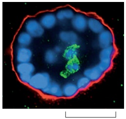
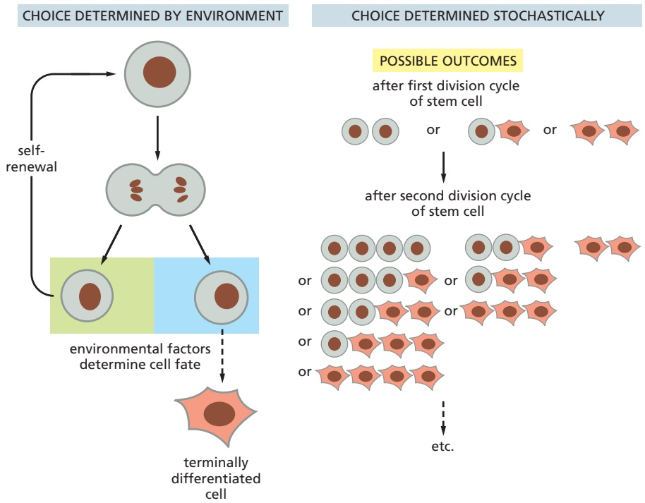
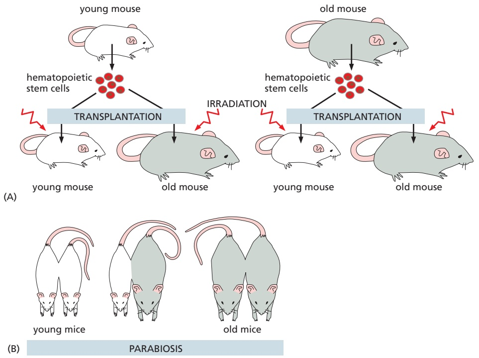

# 第15章 细胞衰老与细胞程序性死亡 · 第一节 细胞衰老

[返回本章](../README.md) · [中文本章原文](../中文原文.md)

<!-- BEGIN CN CN15-S01 -->
## 第一节 细胞衰老

## 一、细胞衰老的概念

在之前的章节中我们了解了真核细胞如何通过有丝分裂的方式自我复制，那么细胞是否具有无限的自我复制能力，可以无限次地分裂下去呢？对于正常细胞而言，答案是否定的。除了生殖干细胞，绝大多数正常细胞在经历有限次数的分裂后会进入“衰老”状态，不再具有增殖能力，细胞的形态结构和代谢活动也发生显著改变，这一现象称为细胞衰老（cell senescence），也称为复制衰老（replicative senescence, RS）。“senescence”一词源于拉丁语“senex”，含义是逐渐衰老。细胞衰老与 $G_{0}$ 期的细胞静止（cell quiescence）状态不同，后者在特定生理条件下可以返回细胞周期继续增殖，而衰老细胞是不可逆地处于增殖停滞状态。

在细胞生物学研究史上，细胞是否具有无限的增殖能力这一问题经历了曲折的认识过程。早在1881年，德国生物学家Weissman就提出“有机体终究会死亡，因为组织不可能永远能够自我更新，而细胞凭借分裂来增加数量的能力也是有限的”。后来这一观点受到法国外科医生、诺贝尔奖获得者Carrel的挑战，以至于一度被研究者们抛弃。Carrel认为，体外培养的细胞是能够永生不死的，如果它停止增殖是因为培养条件不适宜了。他声称在纽约洛克菲勒研究所里培养的鸡心脏成纤维细胞持续分裂了34年。这使得当时人们普遍认为，所有脊椎动物的细胞在体外培养时均能够无限次分裂。但事实上没有研究者能够重复Carrel的工作。有人开始质疑Carrel的细胞培养实验，认为培养液中每天添加的鸡胚提取物中可能混有鸡胚细胞（胚胎干细胞）。1958年，美国生物学家L.Hayflick在Wistar研究所从事癌症研究时，将癌细胞的提取物加到人正常细胞的培养基中，希望看到正常细胞发生癌变。结果非他所愿，细胞不但没有癌变，还停止了分裂。起初Hayflick相信Carrel的理论，认为自己细胞培养的技术不过关。后来他与合作者一起精心设计了一系列实验，证实大多数正常细胞只能进行有限次数的分裂。在体外培养时，无论培养条件如何优化，如果将细胞以 $1:2$ 的比率（即一瓶细胞分为两瓶细胞）连续进行传代（群体倍增），平均只能传代 $40\sim 60$ 次，之后细胞就不再分裂。Hayflick的实验结果发表后得到许多研究者的证实：除了生殖干细胞和肿瘤细胞，来自不同生物、不同年龄供体的原代培养细胞均存在复制衰老现象。1974年，澳大利亚生物学家M.Burnett在他的著作《内在变异》(Intrinsic Mutagenesis)中首次将这一发现称为“Hayflick界限”(Hayflick limit)，表示细胞在进入增殖停滞状态前的有限倍增次数。

## 二、细胞复制衰老的特征

Hayflick 及其后续的研究者们对培养细胞在衰老过程中发生的变化进行了详细的观察，发现了衰老细胞形态结构方面的各种变化。与年轻细胞相比，衰老细胞变得大而扁平，如曾有报道年轻成纤维细胞的表面区域一般小于 $1000 \mu m^{2}$ ，而衰老细胞可达到 $9000 \mu m^{2}$ ；同时衰老细胞质膜的流动性降低，细胞骨架结构改变，细胞黏附性增强，细胞内溶酶体体积增大，内部含有大量未分解的脂质成分如脂褐质（lipofuscin），这是老年斑的成因。

A  

B  

随着研究的深入，更多细胞衰老的分子特征被发现。主要包括：①细胞不可逆地停止分裂，即使添加生长因子也无济于事。②若干细胞周期的负调节因子如p21、p16、p53表达上调或活性增强。③衰老相关的β-半乳糖苷酶（senescence-associated β-galactosidase, SABG）活化。β-半乳糖苷酶是溶酶体内的水解酶，通常在pH 4.0的条件下表现活性，而衰老细胞的SABG在pH 6.0条件下表现出活性。目前尚不清楚这一现象的分子机制，可能反映了溶酶体在细胞衰老过程中的变化。用底物染色的方法可以观察到随着培养细胞传代次数的增加，细胞群体中表达SABG的细胞日益增多（图15-1）。体内衰老细胞同样具有这一特征，年老小鼠的肝脏有17%的细胞显示SABG阳性；而年轻小鼠仅有8%。④衰老细胞端粒（telemere）长度明显减少（短于原有长度的50%)。目前可以运用定量荧光原位杂交技术（quantitative fluorescence in situ hybridization technique）便捷准确地测定端粒长度。该方法用荧光标记的端粒序列作为探针与细胞染色体的端粒进行原位杂交后，通过荧光显微镜对荧光强度进行测定，再借助标准曲线测算端粒的长度。⑤出现衰老相关异染色质集中（senescence-associated heterochromatin foci, SAHF）现象。用DNA荧光染料如DAPI对细胞核进行染色，年轻细胞细胞核的荧光均匀分布，而衰老细胞细胞核的荧光会出现点状聚集。这些聚集的染色质包括了细胞周期正向调控蛋白的编码基因，这些DNA被多种蛋白质包裹，处于转录失活状态。⑥衰老细胞还会产生一系列衰老特征性分泌物（senescence-associated secretory phenotype, SASP），包括炎性因子、金属蛋白酶等，招募免疫细胞前来吞噬衰老细胞，同时改变了周围细胞的微环境。

图 15-1 衰老相关 β-半乳糖苷酶（SABG）
染色区分年轻和衰老的人胚胎成纤维细胞 IMR-90

A. 第20代的年轻细胞，细胞体积较小，SABG呈阴性。B. 第55代的衰老细胞，细胞体积明显增大，多数表达SABG。（陈丹英博士提供）

## 三、细胞复制衰老的机制

细胞衰老是如何发生的呢？为了确定原因是在干细胞本身还是培养环境的恶化，Hayflick设计了一个巧妙的实验。他以有无巴氏小体作为标记，将男性已分裂40次的成纤维细胞与女性已分裂10次的成纤维细胞混合培养，同时用单独培养的细胞作为对照统计倍增次数。他发现混合培养的女性年轻细胞仍然旺盛增殖的时候，男性衰老细胞已停止分裂了，并且混合培养的两类细胞倍增次数与各自单独培养时相同。说明细胞衰老由细胞自身因素决定，与环境条件无关。Hayflick进而将年轻细胞除去细胞核的原生质体与衰老的完整细胞融合，形成的“杂合”细胞仍旧不能增殖；反之，将衰老细胞的原生质体与年轻的完整细胞融合时，“杂合”细胞的分裂能力与年轻细胞几乎相同，由此说明细胞核而不是细胞质决定了细胞的分裂能力。正常细胞甚至冻存后仍然“记得”之前复制了多少次，继续复制的次数累计与未冻存的细胞一致。显然细胞核内存在某种计算复制次数的机制，细胞的这种“计数”机制究竟是什么呢？

前文已提到过端粒缩短是细胞衰老的特征之一。端粒是染色体末端的特殊结构，由连续重复的核苷酸构成（参见第九章）。真核细胞DNA复制过程中存在所谓末端复制问题（the end replication problem）。由于DNA聚合酶不能从头合成子链，复制母链3'末端时，子链5'末端与之配对的RNA引物被切除后会产生末端缺失，导致子链的5'末端随着细胞分裂次数的增加而逐渐缩短（每次缺失约 $30\sim 120$ bp），而端粒的存在使得染色体5'末端的缩短不会影响到编码区域。1972年，苏联理论生物学家A.Olovnikov提出，随着复制不断缩短的DNA末端可能是正常端粒有限分裂的原因。1978年，Blackburn发现四膜虫的端粒由TTGGGG重复序列构成，而哺乳动物细胞的端粒序列是类似的TTAGGG，这一发现使得端粒的长度得以准确测算；继而研究者发现了一系列端粒与细胞衰老和个体衰老相关的证据，包括体外培养的人体细胞的端粒长度随着分裂次数增加不断缩短，年老个体细胞的端粒短于年轻个体，沃纳综合征（Werner's syndrome）患者体细胞的端粒明显短于正常人等，人们开始认同端粒在细胞衰老过程中的作用。1998年，C.Greide获得了端粒缩短能够导致细胞衰老的直接证据。能够持续增殖的干细胞以及癌细胞中存在一种酶，称为端粒酶(telomerase)，它能够以自身含有的 RNA 为模板，反转录出端粒 DNA，从而避免端粒的缩短。大多数正常细胞如成纤维细胞、内皮细胞、上皮细胞、软骨细胞、淋巴细胞中，端粒酶的活性很低，无法有效地延长端粒。Greide 将活化的端粒酶导入人成纤维细胞并使其持续表达，细胞的端粒就不再缩短，而细胞的复制寿命延长了 5 倍；相应地，使癌细胞中的端粒酶失活能够导致癌细胞增殖停滞，引发癌细胞的衰老。三位美国科学家 Blackburn、Greide 和 Szostak 因上述端粒和端粒酶的发现分享了 2009 年诺贝尔生理学或医学奖。

端粒的缩短如何引发细胞的复制衰老呢？简而言之，当端粒随着细胞增殖缩短到一定程度，会触发细胞内p53信号通路介导的DNA损伤“警报”系统，导致细胞周期的停滞。p53是著名的肿瘤抑制因子，通过诱导细胞凋亡（见本章第二节）或细胞衰老，避免细胞因为DNA的损伤而发生癌变。研究发现，端粒的缩短（可视作一种DNA损伤）会使细胞中的p53含量、磷酸化程度及稳定性明显增加，继而活化细胞周期抑制蛋白p21，使细胞停留在细胞周期的 $G_{1}$ 检查点，细胞分裂停滞，最终导致细胞衰老（图15-2）。

  
图 15-2 细胞衰老的信号通路

A. 正常年轻细胞中，CDK 的活化导致 Rb 蛋白磷酸化，与转录因子 E2F 分离，被释放的 E2F 活化下游基因的转录，促使细胞从 G₁ 期进入 S 期，细胞周期正常运行。B. 随着细胞增殖，端粒的缩短会导致细胞内 DNA 修复体系包括 p53 的活化，p53 继而诱导 p21 的表达，p21 使得 CDK 失去活性，从而阻止 Rb 蛋白的磷酸化，Rb 不能与 E2F 分离，E2F 处于持续失活状态，不能正常起始 G₁/S 检查点若干关键因子的转录，细胞周期停滞导致细胞衰老。在细胞衰老的另一条信号通路中，氧化损伤等因素可以通过诱导 p16 的表达导致细胞衰老。

除了端粒缩短诱发细胞衰老以外，细胞内另一些刺激因素，如超量的过氧化物，原癌基因的非正常活化，非端粒的DNA损伤（包括核DNA和线粒体DNA损伤）等也能够缩短细胞的复制寿命，使细胞提前进入衰老状态。研究者们将这一类型的细胞衰老称为胁迫诱导的早熟性衰老（stress-induced premature senescence, SIPS）。研究发现SIPS的发生可能通过活化另一种周期抑制蛋白p16信号途径，引发细胞周期停滞（图15-2）。p16高表达不仅是细胞衰老的典型特征之一，在人和小鼠的检测中均发现p16的表达量与个体衰老程度呈显著的正相关。

## 四、细胞衰老与个体衰老

个体的衰老(aging)是指随着年龄的增加，机体功能呈现退行性变化的现象。对人类而言，个体衰老伴随着生殖能力的下降、死亡率的上升以及对一系列疾病，如癌症、糖尿病、心血管系统功能障碍、神经退行性疾病等的易感性增加。个体衰老的机制非常复杂，涉及分子、细胞、组织、器官各个层面。近年来研究者归纳了各类生物特别是哺乳动物共有的个体衰老在分子及细胞水平上的主要标志(hallmark)，它们既是个体衰老的特征，也是个体衰老的成因，并且相互关联。这些标志可分为两类：①基因和蛋白质水平上衰老的标志，包括：基因组DNA损伤在衰老个体中明显积累；衰老个体的染色体端粒长度明显缩短；衰老个体的DNA及组蛋白某些位点甲基化或乙酰化修饰发生改变，染色质高级结构变化等表观遗传修饰的改变，及其引起的基因表达异常；衰老个体细胞内协助蛋白质折叠的体系（如分子伴侣）以及降解非正常折叠蛋白质的体系（如泛素-蛋白酶体，自噬体-溶酶体）发生障碍，导致错误蛋白的堆积。②细胞水平上衰老的标志，包括：衰老个体中失去增殖能力和功能减退的细胞累积，不能被免疫系统及时清除，同时，衰老细胞的分泌物又造成周围细胞及组织器官生存微环境的恶化，出现个体衰老的体征；成体干细胞因为细胞衰老而减弱甚至丧失组织更新的能力；细胞通信的失调，尤其是涉及传递营养信号的多条信号通路，如感受葡萄糖浓度的胰岛素及胰岛素样生长因子信号通路，感受氨基酸浓度的mTOR信号通路等，营养过剩导致上述信号通路持续活化，加速了个体衰老；线粒体功能障碍，衰老个体中线粒体损伤的累积造成能量代谢等功能性障碍。

可见，细胞衰老（复制衰老）是导致个体衰老的重要因素之一，与个体衰老的其他标志直接或间接相关。Hayflick曾发现，从胎儿肺得到的成纤维细胞可以在体外条件下传代约50次，而从成人肺得到的成纤维细胞只能传代20次，表明细胞的增殖能力与供体的年龄相关；此外他还发现似乎寿命越长的生物其培养细胞的增殖能力越强。例如取自龟的培养细胞体外传代达90～125次，而来自小鼠的细胞体外传代次数只有14～28次。这些结果一度让人们认为细胞的复制“寿命”能够表征个体的年龄及寿命。但事实上多细胞生物个体由不同类型的细胞构成，其增殖状况各异。这些不同类型的细胞既有持续分裂的细胞如某些组织干细胞，不断更新的细胞如上皮细胞、淋巴细胞，又有处于终末分化阶段的神经细胞、心肌细胞、骨骼肌细胞等，它们在发育早期就已停止分裂并且在整个生命过程中几乎不被更新。个体的衰老是各种细胞功能变化的综合表现，认为与某种细胞的复制“寿命”直接关联则失之偏颇。

细胞的复制衰老主要表现在各类持续分裂的组织干细胞如造血干细胞、上皮干细胞、神经干细胞中。这些组织干细胞的衰老导致细胞再生受阻，器官机能下降，进而影响全身各系统之间的协调配合，是人及其他动物个体衰老的主要原因。干细胞的增殖能力远远强于大多数体细胞，为何会发生复制衰老呢？原因在于除了生殖干细胞之外，多数单能和多能干细胞如表皮、骨髓和神经干细胞具有一定活性的端粒酶，但活性不足以完全弥补细胞复制过程中端粒的缩短，它们的增殖能力随着个体生命进程也会下降。而生殖干细胞及癌细胞中高活性的端粒酶使它们具有永生化（immortality）的增殖能力。已发现组织干细胞的端粒酶缺失会导致相关器官的功能障碍，产生局部的“早老”症状，如肺纤维化（pulmonary fibrosis）、表皮先天性角化不良（dyskeratosis congenita）、再生障碍性贫血（aplastic anemia）等。此外，近年迅猛发展的诱导性多潜能干细胞（见第十四章）制备过程中也需要克服复制衰老。已发现导入外源基因将已分化体细胞重编程为多潜能干细胞的最后阶段，端粒酶被活化，原来体细胞的端粒延长，使体细胞在具备分化潜能的同时具备增殖潜能。现已运用重编程技术在体外成功地使早老症患者的衰老细胞重新获得增殖能力，希望这一成果在不久的将来能用于早老症的临床治疗。

另一方面，大量已分化的组织细胞如上皮细胞、血细胞，如果因衰老功能减退，在正常状态下会被免疫细胞清除，由干细胞产生的新生细胞替代。但随着个体年龄的增长，未及时清除而存积的衰老细胞会越来越多。如前所述，衰老细胞会产生包括炎症因子和金属蛋白酶在内的特征性分泌物SASP，影响周围细胞的正常生理功能，损坏组织结构，促进个体衰老表征的显现。例如促进平滑肌细胞增生和血管壁增厚而引发心血管疾病，或者分解胶原蛋白，引起真皮及表皮塌陷而产生皱纹。同时SASP还可通过体液循环影响其它组织器官，引起慢性炎症样变化，加速整体衰老。

对于机体内大量的终末分化细胞，如神经细胞、心肌和骨骼肌细胞、红细胞等，它们不存在复制衰老现象，但随着个体生命进程其功能活性的逐渐下降是个体衰老的重要原因。例如骨骼肌和心肌细胞的衰老使得老年人肌肉松弛萎缩、心肌功能下降而导致心血管疾病，而神经元数量的减少会引发脑功能衰退等。这些细胞衰老失能的某些特征与复制衰老相似，例如细胞内出现大量被脂褐质充填的溶酶体等。而终末分化细胞衰老的机制目前没有定论，氧化损伤可能发挥了重要作用。细胞吸收的氧中约有2%\~3%转变为活性氧成分（reactive oxygen species, ROS），包括超氧阴离子、过氧化氢和羟自由基。过量的ROS对生物大分子如蛋白质、脂质、核酸等均有损伤作用，例如使蛋白质或脂质发生异常的共价修饰，失去活性并且不能被正常降解，导致溶酶体失去功能，还会使线粒体DNA发生特异性的突变，使细胞内的能量和物质代谢失常。由于终末分化细胞不能通过分裂自我更新，它们对ROS的累积损伤较之持续分裂细胞更为敏感，最终导致细胞失去功能。

由此可见，细胞衰老是个体衰老的根源。那么细胞衰老对个体有何益处，为何在演化过程中被保留下来？Hayflick曾注意到：正常细胞分裂次数有限，而癌细胞能够在体外无限增殖，细胞癌化与细胞衰老是结果相反的两个过程。通过对细胞衰老分子机制的研究，人们认识到细胞衰老是机体防止细胞癌变的重要途径。如前所述，抑癌基因p53和p16的活化介导了细胞的复制衰老。随着生命进程而积累的各种损伤，包括DNA的突变等既是细胞癌变的诱因，也会引发细胞衰老。机体通过细胞衰老，阻断潜在的恶性细胞早期的癌化进程，并能够招募免疫细胞对其进行清除，从而维护机体内环境的平衡。

细胞衰老对细胞癌化的拮抗作用对个体生存有利；同时细胞衰老导致的组织器官功能退化对个体又是不利的，生物体必须在细胞衰老的多种效应之间建立平衡，目前尚不知晓这种平衡的机制。生物体的衰老特别是人体的衰老历来是人们特别关注的生理现象，人们越来越意识到，体内体外细胞衰老机制的研究对于深入剖析个体衰老及癌症的发生，促进人类老年期的生理健康，治疗老年相关疾病，延长人类的健康寿命（healthy lifespan）具有重要意义。

<!-- END CN CN15-S01 -->

---

## 对应英文内容

### 英文补充：细胞复制次数的内在限制

> 对应中文板块：细胞复制次数的内在限制。英文来源：Molecular Biology of the Cell，第7版，第17章；[本章完整原文](../../来源/英文教材/17_The_Cell_Cycle/chapter.md)。物理PDF页码范围：1066–1127（整章范围）。

<!-- BEGIN EN EN17-H067-H067 -->
#### Many Human Cells Have a Built-In Limitation on the Number of Times They Can Divide

Many human cells divide a limited number of times before they stop and undergo a permanent cell-cycle arrest. Fibroblasts taken from normal human tissue, for example, go through only about 25–50 population doublings when cultured in a standard mitogenic medium. Toward the end of this time, proliferation slows down and finally halts, and the cells enter a nondividing state from which they never recover. This phenomenon is called **replicative cell senescence**.

Replicative cell senescence in human fibroblasts seems to be caused by changes in the structure of the **telomeres**, the repetitive DNA sequences and associated proteins at the ends of chromosomes. As discussed in Chapter 5, when a cell divides, telomeric DNA sequences are not replicated in the same manner as the rest of the genome but instead are synthesized by the enzyme **telomerase**. Telomerase also promotes the formation of protein cap structures that protect the chromosome ends. Because human fibroblasts, and many other human somatic cells, do not produce telomerase, their telomeres become shorter with every cell division, and their protective protein caps progressively deteriorate. Eventually, the exposed chromosome ends are sensed as DNA damage, which activates a p53-dependent cell-cycle arrest (see Figure 17–60). Rodent cells, by contrast, maintain telomerase activity when they proliferate in culture and therefore do not have such a telomere-dependent mechanism for limiting proliferation. The forced expression of telomerase in normal human fibroblasts, using genetic engineering techniques, blocks this form of senescence. Unfortunately, most cancer cells have regained the ability to produce telomerase and therefore maintain telomere function as they proliferate; as a result, they do not undergo replicative cell senescence.

<!-- END EN EN17-H067-H067 -->

### 英文补充：癌细胞如何绕过复制衰老

> 对应中文板块：癌细胞如何绕过复制衰老。英文来源：Molecular Biology of the Cell，第7版，第20章；[本章完整原文](../../来源/英文教材/20_Cancer/chapter.md)。物理PDF页码范围：1202–1255（整章范围）。

<!-- BEGIN EN EN20-H010-H010 -->
#### Human Cancer Cells Escape a Built-in Limit to Cell Proliferation

Many normal human cells have a built-in limit to the number of times that they can divide when stimulated to proliferate in culture: they permanently stop dividing after a certain number of population doublings (25–50 for human fibroblasts, for example). This cell-division-counting mechanism is termed **replicative cell senescence**, and it generally depends on the progressive shortening of the telomeres at the ends of chromosomes, a process that eventually changes their structure (discussed in Chapter 17). As discussed in Chapter $5 ,$ the maintenance

apical extrusion extracellular(A) 7 matrix

loss of anchorage-dependent survival signals, apoptosis

(B)

apical extrusion of tumor cell(C)

up-regulated survival signals; cell bypasses apoptosis and escapes

Figure 20–16 The direction in which a cell extrudes from an epithelium has important consequences for its fate. (A) Under normal conditions, as cells proliferate in a tissue such as the gut or mammary epithelium and become more crowded, they are extruded into the lumen to maintain cell number. Extruded cells generally undergo apoptosis due to loss of survival signals. (B) Fluorescence micrograph of a cluster of mammary epithelial cells grown in three-dimensional (3D) culture and stained for its basal boundary (red) and nuclei (blue). As the sac of tissue grows, the central cells occupying the lumen undergo apoptosis as shown by staining with caspase-3 (green). (C) Tumor cells with up-regulated survival signals that have been extruded apically might survive but are likely to be eliminated nevertheless; for example, by excretion through the digestive tract or by secretion from the mammary gland. In contrast, tumor cells that have been extruded basally can more readily initiate invasion. (B, courtesy of J. Debnath.)

of telomere DNA during S phase depends on the enzyme telomerase, which maintains a special telomeric DNA sequence that promotes the formation of protein cap structures to protect chromosome ends. Because many proliferating human cells (stem cells being an exception) are deficient in telomerase, their telomeres shorten with every division, and their protective caps deteriorate, creating a DNA damage signal because the unprotected chromosome ends resemble double-strand breaks. Eventually, the altered chromosome ends trigger a permanent cell-cycle arrest or cause the cell to die.

Human cancer cells avoid replicative cell senescence in one of two ways. Most often, they reactivate the telomerase gene as they proliferate, so that their telomeres do not shorten or become uncapped; alternatively, they can evoke a mechanism based on a DNA repair process that depends on homologous recombination for elongating their chromosome ends (called ALT). Regardless of the strategy used, the result is that the cancer cells continue to proliferate under conditions when normal cells would stop due to telomere erosion.

<!-- END EN EN20-H010-H010 -->

### 英文补充：干细胞功能下降与组织衰老

> 对应中文板块：干细胞功能下降与组织衰老。英文来源：Molecular Biology of the Cell，第7版，第22章；[本章完整原文](../../来源/英文教材/22_Stem_Cells_in_Tissue_Homeostasis_and_Regeneration/chapter.md)。物理PDF页码范围：1318–1351（整章范围）。

<!-- BEGIN EN EN22-H017-H017 -->
#### A Decline in Stem-Cell Function Contributes to Tissue Aging

Despite the remarkable ability of adult stem cells to persist and maintain tissue homeostasis, this ability often declines over time, contributing to tissue aging. In the case of the hematopoietic stem cells, this decline can be demonstrated experimentally using serial transplantation. In these experiments, the stem cells are transplanted from donor mice to irradiated host mice of the same inbred strain.

After the donor cells have repopulated the hematopoietic system of the host mice (see Figure 22–10), the hosts’ hematopoietic stem cells are then transplanted into new irradiated hosts, and this sequence is repeated again and again. After multiple rounds of transplantation, the stem cells gradually lose their ability to repopulate the hematopoietic system of the new hosts, demonstrating that the stem cells change with age, apparently undergoing replicative cell senescence after repeated divisions.

To investigate whether the supportive functions of the hematopoietic stemcell niche also decline with age, hematopoietic stem cells from young or old donor mice are transplanted into irradiated young or old host mice. Comparisons. / . of the results from these four types of experiments (young-to-young, young-to-old, old-to-young, old-to-old—**Figure 22–19A**) indicate that a young stem-cell

Figure 22–18 The independent-choice mechanism for how the two daughters of a stem-cell division choose their fates. The outcomes of this mechanism are more variable than that of symmetric stem-cell divisions. The choice might be determined by the local environment a daughter finds itself in (left side of the drawing) or it might be entirely stochastic (right side of drawing). With a choice made stochastically by each daughter and with a 50% probability for each one to remain a stem cell or commit to differentiation, there is, for example, a 25% chance at the first division that both daughters will commit to differentiation, so that the clone will eventually disappear. Or, at this division or later, a preponderance of daughters might choose to remain stem cells, creating a clone that persists and increases in size. With the help of some mathematics, the probability distribution of clone sizes generated from a single stem cell at any given time can be predicted on this stochastic assumption. The observations in the gut and often elsewhere fit this stochastic independent-choice strategy.

Figure 22–19 Methods to distinguish the contribution of cell-autonomous versus environmental factors to declines in hematopoietic stem-cell function during aging. (A) Hematopoietic stem cells are transplanted from young or old donor to young or old host, so that the function of stem cells can be assessed. A four-way comparison will reveal the contribution of the autonomous aging of stem cells versus the aging of the environment or niche in the decline of stem-cell function. (B) In parabiosis, animals are joined to develop a shared circulatory system. Cells in one animal will be exposed to the systemic environment of the other animal. The cellular functions in young or old partners in the heterochronic pairs (young-to-old) are compared with those in isochronic pairs (young-to-young and oldto-old). Such comparisons reveal the role of autonomous stem-cell aging compared to the role of circulating factors or the stem-cell niche in the decline of stem-cell function. [Based on M.A. Goodell and T.A. Rando, Science 350(6265):1199–1204, 2015, doi 10.1126/science.aab3388.]

niche cannot rescue old hematopoietic stem cells and that an old stem-cell niche can support young hematopoietic stem cells, suggesting that niche changes do not contribute to the decline of hematopoiesis with age, at least in mice.

A more general method for studying stem-cell function in aging is parabiosis, in which the circulatory systems of two mice of different age are connected— young-with-young, young-with-old, or old-with-old (**Figure 22–19B**). This three-way comparison provides a way of determining the contributions of different factors to a decline in stem-cell function with aging: the stem cells themselves, the stem-cell niche, and circulating factors in the blood. There is evidence from such studies, for example, that circulating factors from old mice can decrease neurogenesis in the hippocampus of the brain in young mice, impairing their learning and memory, mimicking the decline that occurs in the normal mouse brain during aging. Conversely, other studies find that circulating factors from young mice can restore skeletal muscle stem-cell function in old mice and can counteract age-related dysfunction in tissues including liver, pancreas, bone, and heart. Blood components that contribute to tissue aging or rejuvenation are likely to include molecules with direct actions on stem cells, and identification of these circulating factors is an active area of research.

<!-- END EN EN22-H017-H017 -->

## 跨章相关英文内容

- 端粒、端粒酶与复制衰老：[EN第5章 · 端粒、端粒酶与染色体末端保护](../../09_细胞核与染色质/小节/04_第四节%20染色体.md#EN05-H031-H033)。
