# 第15章 细胞衰老与细胞程序性死亡 · 第二节 细胞程序性死亡

[返回本章](../README.md) · [中文本章原文](../中文原文.md)

<!-- BEGIN CN CN15-S02 -->
## 第二节 细胞程序性死亡

## 一、多种形式的细胞死亡及其生物学意义

但凡生命，最终都会死亡，细胞作为生命的基本单位也不例外。区别于物理或化学因素导致的随机被动性死亡，如高温使得生物大分子瞬间发生化学改变而导致的细胞死亡，细胞具有内在遗传机制控制的主动性死亡方式，称为程序性死亡（programmed cell death, PCD）。细胞程序性死亡是维持生物体正常生长发育及生命活动的必要条件，其重要性不亚于细胞的增殖。现在发现细胞程序性死亡的形式多种多样，其形态特征、分子机制和生理效应各异，如动物细胞的凋亡、程序性坏死，植物细胞的程序性死亡等，但均受到某些基因的控制，经历一系列有序的信号传递。细胞以何种形式“结束生命”取决于细胞类型、生理状态、周围环境以及外界刺激等多种因素。

## (一) 凋亡

动物细胞的凋亡是研究得最为深入的程序性死亡方式。早在1885年德国生物学家Flemming就曾描述过卵巢滤泡细胞的凋亡形态特征。他观察到细胞死亡时伴随染色质的水解，因此将这种细胞死亡称作“染色质溶解”(chromatolysis)。80年后的1965年，澳大利亚病理学家J.Kerr观察到结扎大鼠肝门静脉后，在局部缺血的情况下，大鼠肝细胞连续不断地转化为小的圆形的细胞质团，从周围的组织中脱离。这些细胞质团由质膜包裹，内含细胞碎片（细胞器和染色质等）。在这一过程中死亡细胞的质膜及溶酶体保持完整，细胞内含物不会释放到膜外，不会诱导机体发生炎症反应。1972年Kerr将这一现象命名为细胞凋亡(apoptosis)。“apoptosis”一词源自古希腊语，意指花瓣或树叶的脱落、凋零，这一命名意在强调这种细胞死亡方式是正常的生理过程。此后，研究者们在各种生理或病理过程中发现了凋亡现象的存在。三位学者S. Brenner、J. Sulston和R. Horvitz以线虫的发育为研究模式，利用一系列突变体，发现了发育过程中控制细胞凋亡的关键基因，使原先侧重于形态学描述的细胞凋亡概念在基因水平上得以阐释，即细胞凋亡是受基因调控的主动的生理性自杀行为。三人因此获得了2002年诺贝尔生理学或医学奖。此后，对细胞凋亡分子机制的解析迅速展开，成为20世纪90年代生命科学的一大研究热点。

细胞凋亡具有重要的生理意义，主要表现在如下几个方面：

（1）保证正常的胚胎发育进程，塑造个体及器官形态，形成免疫耐受。在动物个体发育的组织形成时期，一开始往往制造数量过多的细胞，继而再依据需求选择最后留存的功能细胞，而多余的细胞通过细胞凋亡去除（图15-3）。例如在脊椎动物神经系统的发育过程中，

  
图 15-3 原位末端标记法显示斑马鱼胚胎发育过程中的细胞凋亡

正常16体节期的斑马鱼胚胎（Con 16s）在发育过程中部分细胞发生凋亡，突变体（248a $^{-/-}$ 16s）有大量细胞发生凋亡。原位末端标记法即转移酶介导的dUTP缺口末端标记法（terminal deoxynucleotidyl transferase-mediated dUTP nick end labeling, TUNEL）。这一方法能对DNA分子断裂缺口中的3'-OH进行原位荧光标记，用荧光显微镜能观察到单个凋亡细胞。（祖尧博士和佟向军博士提供）

约有 $50\%$ 的原始神经元存活并且与靶细胞建立了连接，而没有建立连接的神经元则发生凋亡。这与靶细胞（肌细胞）分泌的一种存活因子——神经生长因子（nerve growth factor, NGF）有关。只有接受了足够量存活因子的神经元才能生存，其它的神经元则发生凋亡。动物体通过这种方式来调节神经细胞的数量，使之与需要支配的靶细胞数量相适应，以最终建立正确的神经网络联系（图15-4）。

细胞凋亡是塑造个体及器官形态的途径之一。哺乳动物指（趾）间蹼的消失、颚融合、肠腔管道的形成、视网膜发育等过程都必须有细胞凋亡的参与。动物蜕变过程中幼体器官的缩小和退化（如蝌蚪尾的消失等）也是通过细胞凋亡来实现的。

细胞凋亡还参与了免疫耐受的形成。例如胸腺细胞经过一系列的发育进程成为各种类型的免疫活性细胞；同时通过细胞凋亡，对识别自身抗原的T细胞克隆进行选择性消除。这样形成了既有免疫活性又对自身抗原免疫耐受的淋巴细胞。

(2) 维持生物体内的自稳态。Kerr等建立细胞凋亡的概念时就提出：“细胞凋亡降低细胞数量，细胞分裂增加细胞数量，同为控制细胞族群大小的两大原动力。”细胞凋亡不诱发炎症，是“安全”的细胞死亡方式。动物成体通过调节细胞凋亡和增殖的速率来维持组织器官细胞数量的稳定以及成体细胞的自然更新。健康成人体内每秒分裂产生约十万个新细胞，同时有相当数量的细胞发生凋亡。正常的T淋巴细胞在受到入侵的抗原刺激后被激活，产生免疫应答。机体为了防止免疫过激，会通过诱导T细胞凋亡来控制T细胞的寿命。细胞凋亡不足会导致多种疾患，例如在自身免疫性淋巴增生综合征（ALPS）患者体内，增生的T淋巴细胞无法正常凋亡，造成淋巴细胞增殖性的自身免疫病。另一方面，细胞凋亡过度也会导致组织器官功能缺失。例如人免疫缺陷病毒HIV特异性感染CD4+T淋巴细胞，能够直接诱发T细胞凋亡或使其对凋亡信号的敏感性增强，致使T细胞相关的免疫功能缺陷，极大地增加了艾滋病患者机会性感染及肿瘤的发生概率。多种急慢性疾病如败血症、心肌梗死、急性肝损伤、亨廷顿病，以及神经退行性疾病帕金森病、阿尔茨海默病等都与细胞的过度凋亡相关。目前知道阿尔茨海默病的发生主要是由于海马及基底神经核内的神经细胞大量丧失，其原因可能是β-淀粉样蛋白过量表达，沉积于神经组织内，激活周围的吞噬细胞释放炎症因子，促进神经细胞凋亡的发生，从而导致

  
图 15-4 细胞凋亡使得神经细胞与靶细胞的数量相匹配  
发育过程中神经细胞的数量较靶细胞多。靶细胞通过分泌存活因子来调节神经细胞的数量。不能获得足够存活因子的神经细胞发生凋亡，使得剩下的神经细胞与靶细胞的数量相当。

神经细胞的大量丧失。

(3) 生理保护, 肿瘤监控。细胞凋亡能够清除体内受损或危险的细胞而不对周围的细胞或组织产生损害。例如杀伤性 T 淋巴细胞能够分泌一种细胞因子——Fas 配体, 与被病原体感染的细胞表面的死亡受体——Fas 蛋白结合, 启动细胞内的凋亡程序, 使被感染细胞发生凋亡 (见后文)。一些细胞在受损伤或受胁迫的情况下能够同时产生 Fas 配体和 Fas 蛋白, 导致自身的凋亡。

凋亡也是机体预防癌症发生的重要手段。DNA损伤等致癌因素会诱发细胞凋亡，遏制细胞的癌变。临床研究发现，相当多的恶性肿瘤细胞的正常凋亡机制受到抑制，使机体不能早期清除可能有癌变危险的细胞。例如哺乳动物中第一个被发现的凋亡抑制基因Bcl2在滤泡泡淋巴瘤（follicular lymphomas）细胞中高表达。由于染色体重排，Bcl2基因的编码区与免疫球蛋白的增强子相连，导致Bcl2蛋白的过量表达，使肿瘤细胞能够免于凋亡，持续增殖。

## （二）程序性坏死

坏死 (necrosis) 一词源于希腊语 “nekros”，意为尸体。19世纪初被用于描述外科手术中观察到的组织溃烂，后来用于描述病理性的细胞死亡。细胞坏死具有与细胞凋亡迥然不同的特征：细胞膜破裂，细胞内含物释放，周围组织发生炎症反应，动物血液中可检测到原本定位于细胞内部的分子，如细胞核内的高速泳动族蛋白 B1 (nuclear high mobility group box 1 protein) 和线粒体 DNA 等。作为机体内源性的危险信号，这些分子被称为损伤相关分子模式（damage-associatedmolecular pattern, DAMP)，对应于病原体入侵产生的外源性危险信号：病原相关分子模式（pathogen-associated molecular pattern, PAMP），如细菌或病毒的核酸及蛋白质成分。

细胞坏死曾长期被认为是一种区别于细胞凋亡的、被动的细胞死亡方式。近年的研究确立了细胞程序性坏死（programmed necrosis）的概念，即与细胞凋亡类似，这种细胞膜破裂的死亡过程，也受到细胞内特异基因的控制。现在发现程序性坏死可以由不同信号触发，由细胞内不同的信号传递分子介导。

典型的程序性坏死证据来自于肿瘤坏死因子(tumor necrosis factor, TNF)的效应。TNF是一种多效的细胞因子，在感染和损伤诱导的机体炎症发生过程中发挥重要作用。通过它的主要受体TNFR1（TNF receptor 1）可以诱导多种炎症因子的表达及某些敏感细胞的死亡，包括质膜保持完整的凋亡和质膜破裂的坏死两种形式；当细胞内的凋亡信号通路受阻或不完整时，TNF诱导的细胞坏死现象就变得非常明显（图15-5）。2005年袁钧瑛研究团队将这种细胞死亡方式命名为“necroptosis”。2009年包括韩家淮和王晓东在内的三个研究团队，发现并报道了激酶RIPK（receptor interacting kinase）家族成员RIPK3在necroptosis信号通路中发挥重要作用（见后文）。以上研究证明细胞坏死是可调控的，即确立了程序性坏死的概念。

另一种程序性坏死的方式是细胞焦亡（pyroptosis），与细胞的免疫反应密切相关。20世纪80年代发现，某些细菌感染巨噬细胞会导致伴随大量炎性因子释放的死亡，2001年这种死亡方式被命名为“pyroptosis”。

  
图 15-5 细胞程序性坏死的电镜照片。鼠成纤维细胞 L929 在 TNF 及凋亡抑制剂的作用下发生坏死。细胞质出现空泡，细胞质膜破损，细胞内含物，包括膨大和破碎的细胞器释放到胞外。（韩家淮博士惠赠）

“pyro”在希腊语中表示“发热”，暗示这种细胞死亡方式导致炎症。细胞焦亡表现为，受到病原体感染后，细胞膜在短时间内形成孔洞，细胞膨胀至细胞膜破裂，白介素1β（interleukin-1β, IL1β）等炎性因子大量释放，激活机体产生强烈的炎症反应并诱导免疫吞噬作用，破裂的细胞膜包裹着细菌等病原体被吞噬细胞吞噬消灭。2015年邵峰研究团队等解析了介导细胞焦亡的关键信号分子（见后文），再次确认了细胞程序性坏死的概念。

由于缺乏特异性的分子标记和抑制剂，目前对程序性坏死生理功能的了解还较为有限。程序性坏死可能在机体免疫反应中发挥重要作用。一方面，细胞感染病原体后如果需要通过“自杀”方式消灭病原体，由于某种原因凋亡不能正常发生时，程序性坏死可以作为凋亡的“替补”方式被细胞采用。已发现病毒为了保障复制顺利完成，防止宿主细胞提前“自杀”，除了携带抑制凋亡的基因，还会携带抑制坏死的基因，这从侧面证明程序性坏死是细胞抗感染的途径之一。另一方面，被感染的细胞发生坏死后，来自细胞和病毒的内源外源损伤信号DAMP、PAMP释放出来，能够强烈促发免疫反应，有利于机体对病原体发动更有效的进攻。但若干人类疾病包括急性肝损伤、急性胰腺炎、系统性炎症等也涉及不受控制的细胞坏死。深入解析细胞坏死的分子机制可能有助于这些疾病治疗药物的开发。

## （三）植物细胞的程序性死亡

最早关于植物细胞程序性死亡的相关报道发表于1994年，研究者在拟南芥的超敏反应中发现类似动物细胞凋亡的现象，之后逐渐证明细胞程序性死亡在植物中也广泛存在。主要生理功能包括：①植物防御病原体的反应或称超敏反应（hypersensitive response, HR）。植物在病原体侵染部位发生细胞程序性死亡，阻止病原体侵染其他部位。②植物对环境胁迫的反应，如缺氧、高盐等引发细胞程序性死亡。③在植物发育进程中发挥作用。如配子体发育过程中非功能性大孢子的死亡，绒毡层细胞的死亡；种子发育早期珠心的退化，胚乳、胚柄、种皮的发育，根冠的形成，维管组织的形成等。例如木质部管状细胞（tracheary element, TE）是植物体负责运输及机械支持的厚壁组织细胞，管状细胞的成熟包括细胞伸长、细胞壁增厚、木质化和细胞程序性死亡过程。

植物细胞程序性死亡的方式与动物细胞差别较大。植物细胞被固定在细胞壁中，没有类似动物巨噬细胞的可移动细胞来清除死亡残余物，因此植物细胞往往利用溶酶体（液泡）中的水解酶来消化分解死亡细胞，主要包括两种方式：①植物细胞内液泡膜破裂，水解酶释放出来消化细胞内含物，整个细胞被迅速直接地分解而死亡。这种方式的细胞死亡一般发生在植物发育进程中。②液泡膜与细胞膜发生融合，水解酶释放到细胞外触发细胞死亡。植物被细胞外复制的病原体感染时会诱发这种反应，往往在消灭病原体的同时引发间接的细胞死亡。

## 二、细胞凋亡的过程及分子机制

在已知的各种细胞程序性死亡方式中，人们对细胞凋亡了解得最为深入。下面重点介绍凋亡的生物学特征及分子机制。

典型动物细胞的凋亡过程，在形态学上可分为三个阶段（图 15-6A）：

(1) 调亡的起始。细胞表面的特化结构如微绒毛等消失，细胞间连接消失，细胞质中核糖体逐渐与内质网脱离，内质网囊腔膨胀，并逐渐与质膜融合；细胞核内染色质固缩凝集，形成新月形帽状结构，沿着核膜分布（图 15-6B、[图 15-7]）。这一阶段历时数分钟，然后进入第二阶段。

  
图 15-6 细胞凋亡的过程及特征

A. 细胞凋亡过程模式图。1. 正常细胞；2. 细胞凋亡的起始，染色质固缩并沿核膜分布，细胞皱缩；3. 凋亡中的细胞，细胞质膜反折，包裹染色质片段和细胞器等细胞碎片，形成芽状突起并逐渐脱离，形成凋亡小体；4. 凋亡小体被吞噬细胞吞噬。B. 凋亡细胞的电镜照片，显示染色质的变化。上：染色质凝集并沿核膜分布；中、下：染色质片段逐渐“离开”原来的细胞核，进入核膜包围的泡状结构。（电镜照片由丁明孝提供）

  
图 15-7 DAPI 染色显示凋亡细胞的染色质凝集  
A. 正常细胞核。B. 凋亡细胞核。4', 6-二脒基-2-苯基吲哚（4', 6-diamidino-2-phenylindole, DAPI），是常用的一种与 DNA 结合的荧光染料（丁明孝提供）。

(2) 凋亡小体的形成。核染色质断裂为大小不等的片段，与某些细胞器如线粒体等聚集在一起，被反折的细胞质膜包裹，形成膜包裹的球形结构，称为凋亡小体(apoptotic body)。扫描电镜下可以观察到细胞表面产生许多泡状或芽状突起，随后逐渐脱离细胞，形成单个的凋亡小体。

(3) 凋亡小体被吞噬。凋亡小体逐渐被邻近细胞或巨噬细胞吞噬，在溶酶体内被消化分解。

细胞凋亡发生的整个过程中，细胞内含物始终被膜包裹，不泄漏到细胞外，因此不会引发机体的炎症反应。凋亡的过程往往很迅速，从细胞凋亡启动到凋亡小体的出现不过数分钟，大约半小时到几个小时后，整个凋亡细胞便被吞噬灭迹。因此细胞凋亡虽然是机体中频繁发生的生理现象，但在组织学水平上却难以观察到，也正是由于这个原因迟迟未引起早期研究者们的注意。

在分子水平上，细胞凋亡过程包括接受凋亡信号、凋亡相关分子的活化、凋亡的执行、凋亡细胞的清除4个阶段。蛋白酶caspase（cysteine aspartic acic specific protease）家族成员在其中发挥了重要作用，大部分凋亡过程依赖于caspase的活性，称为caspase依赖性凋亡（caspase dependent apoptosis）。caspase失活或者被抑制，细胞凋亡往往不能发生。

## 1. caspase 及其基本类型简介

caspase 是一组天冬氨酸特异性的半胱氨酸蛋白水解酶，存在于细胞质中。它们的活性位点均包含半胱氨酸残基，能够特异地切割靶蛋白天冬氨酸残基后的肽键，切割的结果是使靶蛋白活化或失活，而非完全降解。

caspase 的发现源于秀丽隐杆线虫（Caenorhabditis elegans）发育的研究。线虫从胚胎发育到成体的过程中共产生 1090 个体细胞，其中 131 个体细胞发生凋亡后消失。1986 年美国麻省理工学院 Horvitz 实验室发现，当 Ced3 或 Ced4 突变后，原先应该凋亡的 131 个细胞依然存活；与之相反，Ced9 的突变导致所有细胞在胚胎期死亡，无法得到成虫。这一结果证明，Ced3 和 Ced4 是线虫发育过程中细胞凋亡的必需基因，Ced9 的功能是抑制细胞凋亡。线虫凋亡基因的发现促进了哺乳动物细胞凋亡机制的研究。胎生哺乳动物 caspase 家族成员有十余种（表 15-1），按照功能可以分为两大类：① 炎症 caspase，包括 caspase-1、4、5、11、12，负责产生有活性的白介素 1（interleukin-1，IL1）。IL1 和肿瘤坏死因子 TNF 都是重要的炎症因子，与 TNF 不同的是，IL1 表达量的调控主要发生在翻译后阶段。IL1 前体蛋白需要被 caspase 在特异位点切割后才成为成熟有活性的细胞因子被分泌到细胞外。② 调亡 caspase，包括caspase-2、3、6、7、8、9、10，负责介导细胞凋亡。按照在凋亡过程中发挥的不同功能，凋亡caspase又可分为两类：起始caspase和效应caspase。起始酶（caspase-2等）负责对效应酶的前体进行切割，产生有活性的效应caspase；效应酶（caspase-3等）负责切割细胞核内、细胞质中的结构蛋白和调节蛋白，使其失活或活化，保证凋亡程序的正常进行。除了上述炎症和凋亡相关的功能，近年的证据显示caspase家族成员还参与了细胞自噬、坏死、分化等生命活动的调控。

表 15-1 caspase 家族部分成员及其功能

<table><tr><td>名称</td><td>物种分布</td><td>功能</td></tr><tr><td>caspase-1</td><td>小鼠,人</td><td>参与炎症信号通路</td></tr><tr><td>caspase-2</td><td>小鼠,人</td><td>起始 caspase</td></tr><tr><td>caspase-3</td><td>小鼠,人</td><td>执行 caspase</td></tr><tr><td>caspase-4</td><td>人</td><td>参与炎症信号通路</td></tr><tr><td>caspase-5</td><td>人</td><td>参与炎症信号通路</td></tr><tr><td>caspase-6</td><td>小鼠,人</td><td>执行 caspase</td></tr><tr><td>caspase-7</td><td>小鼠,人</td><td>执行 caspase</td></tr><tr><td>caspase-8</td><td>小鼠,人</td><td>起始 caspase</td></tr><tr><td>caspase-9</td><td>小鼠,人</td><td>起始 caspase</td></tr><tr><td>caspase-10</td><td>人</td><td>起始 caspase</td></tr><tr><td>caspase-11</td><td>小鼠</td><td>参与炎症信号通路</td></tr><tr><td>caspase-12</td><td>小鼠,人</td><td>参与炎症信号通路</td></tr><tr><td>caspase-13</td><td>牛</td><td>未知</td></tr><tr><td>caspase-14</td><td>小鼠,人</td><td>未知</td></tr><tr><td>caspase-16</td><td>小鼠,人</td><td>未知</td></tr></table>

## 2. caspase 在细胞凋亡中的作用机制

不论起始 caspase 或效应 caspase，通常均以无活性的酶原形式存在于细胞质中。接受调亡信号刺激后，酶原分子在特异的天冬氨酸位点被切割，产生的两段多肽形成大小两个亚基，再聚合成异二聚体，此即具有活性的酶（图 15-8A）。起始 caspase 的活化属于同源活化（homo-activation），即同一种酶原分子彼此结合或与接头蛋白结合形成复合物，在复合物中构象改变而活化，进而彼此切割产生有活性的异二聚体。起始 caspase 中，caspase-8 和 caspase-10 含有串联重复的死亡效应结构域（death effector domain, DED），而 caspase-2 和 caspase-9 则含有 caspase 募集结构域（caspase recruitment domain, CARD）。这两种结构域也存在于一些负责传递凋亡信号的接头蛋白分子结构中，通过结构域之间的聚合，caspase能够彼此结合或与接头蛋白结合，被招募到上游信号复合物中发生同源活化（图15-8A）。

效应 caspase 的活化属于异源活化 (hetero-activation)。已活化的起始 caspase 招募效应 caspase 酶原分子后，对其进行切割，产生活性的效应 caspase (图 15-8A)。效应 caspase 负责切割细胞中的结构蛋白和调节蛋白，使其失活或活化，此时细胞进入凋亡的执行阶段。

目前已知的效应 caspase 底物约 280 种，可以分为被活化和被失活两大类。caspase 对于这些底物的切割使得细胞呈现出凋亡的一系列形态学和分子生物学特征。被 caspase 活化的代表分子是 caspase 激活的 DNA 内切酶（caspase activated DNase, CAD）。CAD 一般与其抑制因子 ICAD（inhibitor of CAD）结合在一起，处于失活状态。细胞启动凋亡程序后，活化的 caspase-3 降解 ICAD，使有活性的 CAD 释放出来，在核小体间切割 DNA，形成间隔 200 bp 的 DNA 片段。因此，提取凋亡细胞的 DNA 进行琼脂糖凝胶电泳时会观察到 DNA 梯状条带（DNA ladder）（图 15-16），这是细胞凋亡的标志之一。另一个 caspase 的重要底物是聚腺苷酸二磷酸核糖转移酶 [poly (ADP-ribose) polymerase, PARP]。PARP 能够识别损伤的 DNA，使组蛋白发生 ADP- 核糖基化，从 DNA 上脱离下来，有助于修复蛋白与 DNA 结合进行损伤修复，因此被认为是 DNA 损伤的感受器。在凋亡过程中 PARP 被 caspase 切割后失活，使细胞对 DNA 的降解不再敏感。效应 caspase 还通过切割细胞骨架蛋白使细胞的骨架体系发生结构变化，便于细胞改变形态以及形成凋亡小体等。例如通过切割核纤层蛋白使核纤层解聚，导致核膜收缩；切割核孔蛋白以及细胞质骨架蛋白，使细胞核与细胞质的信号传递中断。此外，黏着斑激酶（focal adhesion kinase, FAK）参与黏着斑形成和调节，是整联蛋白介导的信号转导中的重要成员，它同样也是效应 caspase 的底物，FAK 被切割失活导致凋亡细胞与胞外基质以及其它细胞解离。

起始 caspase 和效应 caspase 组成细胞内凋亡信号的级联分子网络（图 15-8B），凋亡程序一旦启动，级联网络“顶端”的起始 caspase 首先活化，切割下游 caspase 酶原，使得凋亡信号在短时间内迅速放大并传递到整个细胞，产生凋亡效应。这一过程是不可逆转的。

由于 caspase 在细胞凋亡途径中发挥关键作用，可将其作为药物设计的靶标分子来对凋亡相关疾病进行控制。在动物模型中，caspase的抑制剂已被证实对细胞过度凋亡引发的疾病有疗效，例如可以降低急性心脏和肝脏损伤时的损伤度。另一方面，选择性地激活caspase或降低其活化的能障，可用于治疗癌症，例如将肿瘤细胞胞内或胞外的特异性蛋白与caspase连接形成融合蛋白，通过特异性蛋白的聚合作用引发caspase的活化，从而选择性杀死肿瘤细胞；或者将肿瘤细胞中失活的caspase替换成活性形式，用RNA干扰降低肿瘤细胞中caspase抑制因子的表达等方法，促进肿瘤细胞的凋亡。

  
图 15-8 细胞凋亡过程中 caspase 的活化

  
A. caspase 酶原的活化。被凋亡信号刺激后，酶原分子在特异的天冬氨酸位点被切割，产生的两段多肽形成大小两个亚基，聚合成异二聚体即有活性的酶。其中起始 caspase 酶原的活化属于同源活化，即同一种酶原分子（X）彼此结合或与接头蛋白结合形成复合物，在复合物中构象改变被活化而彼此切削产生活性形式。效应 caspase 酶原的活化属于异源活化，由已活化的起始 caspase（X）切割效应 caspase 酶原分子（Y），产生活性的效应 caspase。B. caspase 级联活化效应。少量活化的起始 caspase（X）能够切割许多下游 caspase 前体（Y），进而通过级联放大作用，产生更大的活化的下游 caspase（Z）。其中的效应 caspase 切割细胞质内及细胞核内重要的结构蛋白和调节蛋白，产生凋亡效应。

## 3. 细胞凋亡信号通路

细胞内外的凋亡信号主要通过两条通路诱导caspase活化，引发细胞凋亡：由死亡受体（death receptor）引发的外源途径和由线粒体引发的内源途径（图15-10）。

死亡受体引发的凋亡起始于死亡配体与受体的结合。死亡配体主要是肿瘤坏死因子家族成员，包括TNF、Fas配体（Fas ligand）、TRAIL等。它们的受体包括TNFR1、Fas、DR-4、DR-5等。死亡受体的胞质部分均含有死亡结构域（death domain, DD），负责招募凋亡信号通路中的接头蛋白。Fas是死亡受体家族中的代表成员。Fas配体与之结合后引起Fas的聚合，聚合后的Fas通过死亡结构域招募接头蛋白FADD和caspase-8酶原，形成死亡诱导信号复合物（death inducing signaling complex, DISC）（图15-10）。caspase-8酶原在复合物中通过自身切割（同源活化）而被激活，进而切割效应caspase；caspase-3酶原，产生有活性的caspase-3，导致细胞凋亡。另一方面，活化的caspase-8还通过切割信号分子Bid将凋亡信号传递到线粒体，引发凋亡的内源途径，使凋亡信号进一步扩大。通过以上途径，分泌Fas配体的杀伤性T淋巴细胞可以诱导被病原体感染的靶细胞发生凋亡；而被损伤的细胞可以通过

图 15-9 细胞凋亡的典型特征——DNA 梯状条带（DNA ladder）
A. DNA 梯状条带产生过程示意图。细胞凋亡时，细胞内特异性 DNA 内切酶消化，染色质 DNA 被随机地在核小体间切割，降解成 180\~200 bp 或其整数倍片段。
B. 正常细胞与凋亡细胞的 DNA 电泳照片。
a. 对照的正常人胚肾 293 细胞 DNA；b. 过量表达肿瘤坏死因子受体（T NFR1）诱导凋亡的 293 细胞 DNA。由于提取 DNA 过程中保持细胞核膜的完整，因此正常细胞的提取物中几乎没有 DNA；而凋亡细胞凋亡体中的 DNA 被提取出来，长度相差 200 bp 或其整数倍的 DNA 分子经琼脂糖凝胶电泳分离，呈现梯状条带。（电泳照片由陈丹英博士提供）

自己产生 Fas 配体和 Fas，触发自身的凋亡。

在凋亡的内源途径中，线粒体处于中心地位。当细胞受到内部凋亡信号（如不可修复的DNA损伤）刺激时，线粒体膜通透性会发生改变，向细胞质中释放出凋亡相关因子，引发细胞凋亡。线粒体释放到胞质中的凋亡因子有多种，其中最“著名”的是细胞色素c。1996年王晓东领导的研究团队发现，在HeLa细胞提取物中加入dATP能够诱发外源细胞核DNA断裂。他们将HeLa细胞提取物经过柱层析后分为两种组分——流出组分和吸附组分，并发现这两种组分只有合并起来才能诱导凋亡。他们进而对吸附组分进行了分级纯化，最终发现分子质量为 15 kDa 的蛋白质是凋亡的必需因子。出乎大家的预料，序列测定结果表明这一蛋白质是线粒体电子传递链的组分细胞色素 c。紧接着，他们从流出组分中分离克隆到了另外两个凋亡的必需因子——APAF1 (apoptosis protease activating factor 1) 和 caspase-9，从而建立了细胞凋亡内源途径的模型（图 15-10）。细胞接受内源性凋亡信号刺激后，细胞色素 c 从线粒体释放到细胞质中与 APAF1 结合。APAF1 是线虫凋亡分子 Ced4 在哺乳动物细胞中的同源蛋白，分子质量为 130 kDa，N 端含有 caspase 募集结构域（CARD）。它与细胞色素 c 结合后发生自身聚合，形成一个很大的复合物，称为凋亡复合体（apoptosome）（图 15-10），分子质量约为 700\~1 400 kDa。之后，APAF1 通过 CARD 结构域招募细胞质中的 caspase-9 酶原，caspase-9 酶原在凋亡复合体中发生同源活化，活化的 caspase-9 再进一步切割并激活 caspase-3 和 caspase-7 酶原，引发细胞凋亡。

细胞凋亡的内源途径中，细胞色素c的释放是关键步骤，源于线粒体膜通透性的改变，主要受到Bcl2（the B-cell lymphoma gene 2）蛋白家族的调控。Bcl2是线虫凋亡抑制分子Ced9在哺乳动物中的同源分子，家族成员大多定位在线粒体外膜上，或受信号刺激后转移到线粒体外膜上。按照功能，可将Bcl2家族成员分为3个亚族：Bcl2亚族，包括Bcl2、Bcl-xL、Bcl-w、Mcl1等，对细胞凋亡发挥抑制作用；Bax亚族，包括Bax、Bak、Bok，功能与Bcl2亚家族相反，促进细胞凋亡；BH3亚族，包括Bad、Bid、Bik、Puma、Noxa等，它们能够充当细胞内凋亡信号的“感受器”，作用也是促进细胞凋亡。Bcl2家族成员可以通过彼此间的聚合及解聚来调节线粒体的通透性。细胞接受内源的凋亡信号后，Bax亚族的促凋亡因子Bax和Bak发生寡聚化，从细胞质中转移到线粒体外膜上，并与膜上的电压依赖性阴离子通道（voltage-dependent anion channel, VDAC）相互作用，使通道开放到足以使线粒体内的凋亡因子如细胞色素c等释放到细胞质中，引发细胞凋亡。正常状态下Bcl2与Bax/Bak形成复合体，阻碍Bax和Bak的寡聚化，防止线粒体膜通道的开启；而BH3亚族成员如Bid被活化后又可以解除Bcl2对Bax/Bak的抑制。

上述两种看似迥异的 caspase 依赖性细胞凋亡途径亦有相似之处。即起始 caspase 如 caspase-8、caspase-9 等，均在一些大的多成分复合物中被活化，如 DISC、apoptosome 等。在复合物的形成过程中，多种接头蛋白如 FADD、APAF1 等发挥了关键作用，它们负责引导起始 caspase 进入复合物的适当位置，进而使之发生同源活化。

  
图15-10 凋亡信号通路  
在凋亡的外源途径中，死亡受体如Fas在Fas配体的刺激下，通过接头蛋白FADD将caspase-8酶原拟感到细胞膜上，形成死亡诱导信号复合物DISC3。caspase-8酶原在这个复合物中活化，进而活化caspase-3酶原。在凋亡的内源途径中，线粒体接收到凋亡信号后，向细胞质内释放细胞色素 $c_{0}$ 细胞色素c与APAF1和caspase-9酶原形成凋亡复合体apoptosome，并活化caspase-9酶原，进而活化caspase-3酶原。外源途径中的caspase-8也可以切割并活化Bcl2家族的促凋亡因子Bid，激活内源凋亡途径。在caspase非依赖性细胞凋亡途径中，线粒体释放凋亡因于EndoG、AIF等，直接进入细胞核，导致DNA断裂。

细胞凋亡的外源途径和内源途径彼此关联。当caspase-8通过外源途径被活化后，能够切割BH3亚族成员Bid使其活化，被激活的Bid从细胞质转移到线粒体，释放出被Bcl2束缚的Bax/Bak，活化内源途径，从而放大外源凋亡信号的效应（图15-10）；另一方面，凋亡的内源途径被激活后，线粒体释放的促凋亡因子Smac（见后文）也能够活化caspase-8，从而与外源途径交汇。

研究表明当使用 caspase 的抑制剂，或者将 caspase 敲除之后，一些细胞仍然可以发生凋亡。线粒体在其中同样发挥了关键作用。除了细胞色素 c，线粒体能够向细胞质内释放多个凋亡相关因子，如凋亡诱导因子（apoptosis inducing factor, AIF），限制性内切核酸酶 G（endonuclease G, Endo G），它们从线粒体中释放出来进入细胞核，对核 DNA 进行切割，引发 caspase 非依赖性细胞凋亡（caspase independent apoptosis）（图 15-10）。

不论是caspase依赖性还是非依赖性的细胞凋亡，都会归结到最终阶段：凋亡细胞的清除。凋亡细胞形成的凋亡小体可迅速被周围细胞或巨噬细胞等专职吞噬细胞识别并吞噬。凋亡细胞表面具有引发吞噬作用的信号分子，如磷脂酰丝氨酸（phosphatidylserine）。它一般存在于正常细胞膜脂双层的内叶，细胞发生凋亡时外翻定位到脂双层外叶，向吞噬细胞发出“吃掉我”的信号。磷脂酰丝氨酸的细胞表面定位也是凋亡标志之一。

## 4. 生死抉择：细胞凋亡的调控

生物体是高度有序的细胞群体，细胞的生存、增殖和死亡都受到严格的信号控制。大多数细胞都需要获得存活信号来维持生存，这类信号主要来自于其它细胞分泌的细胞因子，包括多种有丝分裂原和生长因子。如果细胞接受不到足够的存活信号，就会激活自杀程序，这种依赖性保证了细胞仅生存于适当的时间和地点。例如发育过程中神经细胞的存活依赖靶细胞分泌的神经生长因子，神经生长因子与神经细胞表面的受体结合后，激活PI3K途径，活化了蛋白激酶PKB，活化的PKB磷酸化Bcl2家族BH3亚族成员Bad， bad能够抑制Bcl2促进细胞凋亡，被磷酸化后Bad失去活性，导致Bcl2持续抑制Bax/Bak，神经细胞不会发生凋亡。而接受不到足够生长因子的多余神经元，Bcl2的保护作用被解除，凋亡后使得神经细胞的数量与靶细胞匹配。此外，多种细胞存活及生长必需的细胞因子，还能通过激活NFκB等转录因子，增加凋亡抑制因子的表达量来抑制细胞凋亡（图15-11）。

作为细胞凋亡的核心分子，caspase本身的活性在细胞中也受到严格调控，以保证在必需的情况下凋亡程序才能启动。细胞中存在一类caspase抑制因子(inhibitor of apoptosis, cIAP)，能够直接与caspase活性分子结合，阻抑其对底物的切割。而当凋亡程序启动后，有两种蛋白质与细胞色素c一起从线粒体中释放出来：其一是Smac（second mitochondria derived activator of caspase），又称DIABLO（direct IAP binding protein with low pI）。该蛋白含有IAP结合结构域，通常情况下存在于线粒体的膜间隙中。它从线粒体释放出来后能与cIAP结合，释放出被封闭的caspase。其二是丝氨酸蛋白酶Htra2/Omi，接受凋亡信号后从线粒体释放出来，通过切割cIAP解除其抑制凋亡的作用。对细胞色素c和Smac的双重需要确保了caspase级联反应仅在信号充分的情况下才被活化。

  
图15-11 存活因子通过调节Bcl2家族成员的活性及表达抑制细胞凋亡的发生

存活因子与受体的结合，可以通过活化蛋白激酶PKB促进Bcl2的活性，抑制细胞凋亡。也可激活NFκB等转录因子，启动Bcl2亚族成员基因的转录，抑制细胞凋亡。

病毒为了保证能在细胞中顺利复制，也演化出相应的对抗机制来抑制caspase的活性，阻止宿主细胞发生凋亡，如天花病毒蛋白CrmA和杆病毒蛋白p35就是天然的caspase抑制剂，疱疹病毒和痘病毒携带caspase抑制因子v-FLIP，可与死亡受体Fas的接头蛋白FADD发生相互作用，通过抑制凋亡的外源途径来抑制宿主细胞的凋亡。

线粒体获得的促凋亡信号往往来自于细胞内的转录因子 p53。p53 是重要的肿瘤抑制基因，如上节所述可以通过阻断细胞周期引发细胞复制衰老，而 p53 的活化也能诱导细胞凋亡。在 p53 依赖性的细胞凋亡过程中，p53 能够直接解除 Bcl2 对 Bax/Bak 的抑制作用触发凋亡内源途径；或者发挥转录因子的功效，激活凋亡正调节因子，抑制负调节因子的表达来促进凋亡。p53 的活性对癌的放射和化疗疗法的效果起关键作用。具有 p53 基因野生型拷贝的肿瘤，如睾丸癌和儿童急性淋巴母细胞白血病等，对放疗和化疗诱导的细胞凋亡较为敏感；而缺少功能性 p53 基因的肿瘤，如黑色素瘤、结肠癌、前列腺癌和胰腺癌等通常不能被诱发凋亡，对放疗和化疗具有抵抗性。

哺乳动物细胞中抗凋亡和促凋亡的调控因子多种多样，因此细胞的命运——生存或者死亡，可能取决于细胞中这两类调控因子的相对含量以及胞外信号对它们进行活性调控的综合效应。

## 三、细胞程序性坏死的分子机制

被称为“necroptosis”的细胞程序性坏死。在TNF和某些病原体的诱导下，蛋白激酶RIPK3及其上游信号分子会聚合形成坏死复合物（necrosome），RIPK3在复合物中发生磷酸化而活化，进而招募并磷酸化下游分子MLKL (mixed-lineage kinase domain-like)。MLKL被RIPK3磷酸化后发生寡聚化，通过与质膜中的磷脂酰肌醇磷酸（phosphatidylinositol phosphate, PIP）结合，在细胞膜上形成通道，导致细胞膜屏障作用消失，细胞坏死。RIPK3在necroptosis信号通路中起决定作用，它在不同类型细胞中表达量不同，仅当RIPK3蛋白含量足够时细胞才会被诱导发生necroptosis。

另一种伴随炎性因子大量释放的程序性坏死，即细胞焦亡的分子机制最近也取得了重要进展。如前所述，caspase 家族包括十多个成员，其中大部分在凋亡过程中发挥作用，而 caspase-1 和 caspase-4/5/11 则参与炎症信号通路。caspase-1的功能主要是在特异位点切割炎性因子的前体蛋白pro-IL1β和pro-IL18，产生具有活性的IL1β和IL18。与其他caspase类似，caspase-1通常以无活性的前体形式存在，需要聚合后发生切割才被活化，这一过程依赖于细胞内称为炎性小体(inflammasome)的蛋白复合体。当病原体入侵到细胞内部，一系列蛋白质包括感知信号的受体、接头蛋白、caspase-1前体等会组装形成炎性小体，促使其中的caspase-1前体发生同源活化（见前文），切割pro-IL1β和pro-IL18，使之成熟并分泌到胞外，诱导机体发生炎症。20世纪80年代研究者发现了依赖caspase-1活化、伴随IL1β大量释放的细胞死亡现象，但其机制一直不明了。2015年发现GSDM（gasdermin）家族成员GSDMD（gasdermin D）可能是细胞焦亡重要的执行分子。免疫细胞、消化道上皮细胞中的GSDMD通常处于自抑制构象。病原体侵染导致caspase-1经由炎性小体被活化，而caspase-4/5/11可以与病原体成分如细菌脂多糖直接结合而被诱导活化，以上活化的炎性caspase切割GSDMD分子中部的特异位点，产生N端片段，迁移到细胞膜，聚合形成直径为 $10\sim 20\mathrm{nm}$ 的质膜孔洞，为 $\mathrm{IL1}\beta$ 释放提供通道，同时可能导致钠离子伴随大量水分子内流，细胞膨胀破裂死亡。

与我们熟知的细胞凋亡相比，细胞程序性坏死在形态特征界定、分子机制等方面尚存诸多科学问题待解决。

## 四、植物细胞程序性死亡的分子机制

近年来发现了众多在植物细胞程序性死亡过程中发挥作用的信号分子，包括各种转录因子、激酶、核酸酶、蛋白酶、膜泡运输蛋白等。这些分子彼此间的上下游关系以及信号网络仍不够清晰，还需要确认它们在不

## 思考题

1. 什么是“Hayflick界限”？细胞衰老的分子机制是什么？

2. 个体衰老在细胞和分子水平上有哪些标志？与细胞衰老有何联系？

3. 什么是细胞程序性死亡？有哪些形式？生理意义是什么？

4. 现在已知的细胞凋亡、细胞程序性坏死的基本信号通路有哪些？

5. 细胞程序性死亡受到哪些因素的调控？

同植物种类间功能的保守性。现有植物基因组中未发现动物 caspase 的同家族成员，但植物有一类蛋白酶称为 metacaspase，在植物细胞程序性死亡信号途径中发挥作用。metacaspase 与动物 caspase 具有类似的酶活性中心，都含有半胱氨酸残基；它们与动物 caspase 切割底物的位点不同，切割精氨酸或赖氨酸形成的肽键。例如液泡膜破裂型的程序性死亡源于液泡酶 VPE（vacuolar enzyme）的活化，VPE 具有 caspase-1 的类似活性中心；液泡膜与细胞膜融合型的程序性死亡源于膜融合的抑制蛋白被蛋白酶体降解了，而参与这一过程的蛋白酶体成分之一 PBA1 具有 caspase-3 的类似活性中心。

由基因控制的程序性死亡不仅存在于动物、植物等多细胞生物，单细胞生物如细菌和酵母也存在程序性死亡。越来越多的实验证据表明，细胞程序性死亡机制在细胞生命的演化过程中具有共同的起源。而不同物种研究体系的建立，将有助于揭示各种程序性死亡途径之间的复杂关系。

本章介绍了细胞两种重要的生命活动：细胞衰老和细胞程序性死亡。它们被细胞内外危机信号引发，可以视为细胞的“应激”反应，并且均由细胞内精密信号通路控制。可以预见，将发现更多由不同分子介导的、不同形式的细胞衰老和程序性死亡方式，在各种生理病理状态下发挥功能。另一方面，现在发现相同的信号如DNA损伤既可以诱导细胞衰老，又可以触发细胞凋亡；TNF刺激可以诱发细胞凋亡和细胞坏死两种方式的程序性死亡；而一些胞内信号传递分子如p53、RIP1为多条信号通路共享。由此可见在不同的细胞程序性死亡途径之间，乃至细胞衰老和凋亡程序之间均存在广泛的“交叉对话”，细胞如何应对不同的危机信号，如何在各种程序性死亡以及细胞衰老的命运间进行抉择，有待研究者们深入解析。

1. Cho Y, Challa S, Moquin D, et al. Phosphorylation-driven assembly of the RIP1-RIP3 complex regulates programmed necrosis and virus-induced inflammation. Cell, 2009, 137(6): 1112-1123.

2. Degterev A, Huang Z, Boyce M, et al. Chemical inhibitor of nonapoptotic cell death with therapeutic potential for ischemic brain injury. Nature Chemical Biology, 2005, 1(2):112-119.

3. Ellis H M, Horvitz H R. Genetic control of programmed cell death in the nematode C. elegans. Cell. 1986, 44(6): 817-829.

4. Greider C W, Blackburn E H. Identification of a specific telomere terminal transferase activity in Tetrahymena extracts. Cell, 1985, 43(2): 405-413.

5. Greider C W, Blackburn E H. A telomeric sequence in the RNA of Tetrahymena telomerase required for telomere repeat synthesis. Nature, 1989, 337(6205): 331-337.

6. Hayflick L, Moorhead P S. The serial cultivation of human diploid cell strains. Experimental Cell Research, 1961, 25(3): 585-621.

7. He S, Wang L, Miao L, et al. Receptor interacting protein kinase-3 determines cellular necrotic response to TNF- $\alpha$ . Cell, 2009, 137(6): 1100-1111.

8. Hengartner M O, Ellis R E, Horvitz H R. Caenorhabditis elegans gene ced-9 protects cells from programmed cell death. Nature, 1992, 356(6369): 494-499.

9. Hengartner M O, Horvitz H R. C. elegans cell survival gene ced-9 encodes a functional homolog of the mammalian proto-oncogene bcl-2. Cell, 1994, 76(4): 665-676.

10. Kayagaki N, Stowe I B, Lee B L, et al. Caspase-11 cleaves gasdermin D for non-canonical inflammasome signalling. Nature, 2015, 526(7575): 666-671.

11. Kerr J F R, Wyllie A H, Currie A R. Apoptosis: a basic biological phenomenon with wide-ranging implications in tissue kinetics. British Journal of Cancer, 1972, 26: 239-257.

12. Li P, Nijhawan D, Budihardjo I, et al. Cytochrome c and dATP-dependent formation of Apaf-1/caspase-9 complex initiates an apoptotic protease cascade. Cell, 1997, 91(4): 479-489.

13. López-Otín C, Blasco M A, Partridge L, et al. The hallmarks of aging. Cell, 2013, 153(6): 1194-1217.

14. Shi J, Gao W, Shao F. Pyroptosis: gasdermin-mediated programmed necrotic cell death. Trends in Biochemical Sciences, 2017, 42(4): 245-254.

15. Shi J, Zhao Y, Wang K, et al. Cleavage of GSDMD by inflammatory caspases determines pyroptotic cell death. Nature, 2015, 526(7575): 660-665.

16. Sulston J E. Post-embryonic development in the ventral cord of Caenorhabditis elegans. Philosophical Transactions of the Royal Society of London. Series B, Biological Sciences, 1976, 275(938): 287-297.

17. Sun L, Wang H, Wang Z, et al. Mixed lineage kinase domain-like protein mediates necrosis signaling downstream of RIP3 kinase. Cell, 2012, 148(1-2), 213-227.

18. Wei M C, Zong W, Cheng E H, et al. Proapoptotic BAX and BAK: a requisite gateway to mitochondrial dysfunction and death. Science, 2001, 292(5517): 727-730.

19. Yuan J, Shaham S, Ledoux S, et al. The C. elegans cell death gene ced-3 encodes a protein similar to mammalian interleukin-1 $\beta$ -converting enzyme. Cell, 1993, 75(4): 641-752.

20. Zhang D, Shao J, Lin J, et al. RIP3, an energy metabolism regulator that switches TNF-induced cell death from apoptosis to necrosis. Science, 2009, 325(5938): 332-336.

21. Zhang Y, Chen X, Gueydan C, et al. Plasma membrane changes during programmed cell deaths. Cell Research, 2018, 28: 9-21.

<!-- END CN CN15-S02 -->

---

## 对应英文内容

### 英文补充：细胞凋亡、caspase、Bcl2、生存因子与清除

> 对应中文板块：细胞凋亡、caspase、Bcl2、生存因子与清除。英文来源：Molecular Biology of the Cell，第7版，第18章；[本章完整原文](../../来源/英文教材/18_Cell_Death/chapter.md)。物理PDF页码范围：1128–1143（整章范围）。

<!-- BEGIN EN EN18-H000-H010 -->
#### Cell Death

The development and maintenance of multicellular organisms depend not only on cell growth and cell division but also on cell death. During animal development, for example, carefully orchestrated patterns of cell growth, division, and death help determine the size and shape of limbs and organs. The maintenance of tissue size in adult animals often requires that cells die at the same rate as they are produced—a process called cell turnover. Such “normal” cell death also occurs in plants during development and in the senescence of flowers and leaves, and it can also occur in unicellular organisms, including yeasts and bacteria. Most of these normal cell deaths are suicides, in which a sequence of molecular events destroys the cells from within, but the molecular mechanisms can differ widely. In this chapter, we focus on a molecularly distinct form of cell suicide called **apoptosis** (from the Greek word meaning “falling off,” as leaves from a tree), even though it occurs only in animal cells. Apoptosis is thought to occur in all animals, and it is by far the most common way for our cells to die. It has also been the most intensely studied form of cell death.

A cell dying by apoptosis undergoes characteristic morphological and biochemical changes, in part, to package itself to be eaten and digested quickly by a nearby cell. **Figure 18–1** shows a normal rat cell (panel A) and rat cells of the same type undergoing two different forms of cell death (panels B–D). In apoptosis, the cell shrinks and condenses, the cytoskeleton collapses, the nuclear envelope disassembles, and the nuclear chromatin condenses and fragments (Figure 18–1B). The apoptotic cell surface often forms multiple large protrusions called blebs (**Movie 18.1**), and, if the cell is large, it breaks up into membraneenclosed fragments called apoptotic bodies. Importantly, the surface of the cell and its fragments become chemically altered, so that a neighboring cell, often a macrophage in vertebrates, rapidly engulfs the cell and fragments before they can spill their contents (Figure 18–1C). In this way, the cell dies neatly, and the cell and its fragments are rapidly cleared away, without causing a damaging inflammatory response. Because apoptotic cells are eaten and digested so quickly, there are often few dead cells to be seen, even in a tissue where large numbers of cells have died by apoptosis.

Damaged or infected cells can also die by apoptosis, ensuring that they are eliminated before they can threaten the health of the animal. There are, however, many non-apoptotic ways for severely damaged or stressed animal cells to die. These are usually lumped together under the umbrella term cell necrosis. A common, largely passive form of cell necrosis occurs when cells lyse in response to an acute tissue insult, such as trauma or a blocked blood supply: the cells swell and burst (Figure 18–1D), spilling their contents over their neighbors and eliciting an inflammatory response. In other forms of cell necrosis, the cell takes an active part in the death process, and they are given special names such as necroptosis or pyroptosis, depending on the nature of the inducing stress and the molecular mechanisms involved.

In this chapter, we discuss the major functions of apoptosis in vertebrates, its molecular mechanism and regulation, and how excessive or insufficient apoptosis can contribute to human disease.

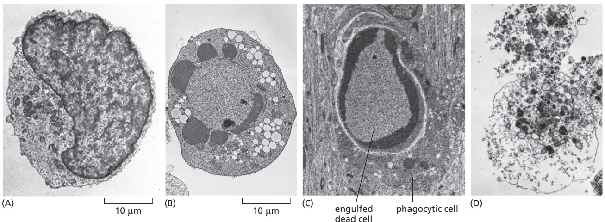

Figure 18–1 Two distinct forms of cell death. These electron micrographs show developing rat oligodendrocyte precursor cells in different states: (A) a normal cell in culture; (B) a cell in culture that has died by apoptosis because it was deprived of extracellular survival signals (discussed later); (C) a cell in a normal developing optic nerve that has died by apoptosis and has been engulfed by a neighboring phagocytic cell; (D) a cell in culture that died by necrosis. Note that the apoptotic cells in B and C have an intact plasma membrane, but the chromatin has become condensed and distorted and concentrated at the margin of the nucleus, whereas the necrotic cell in D seems to have exploded. The large vacuoles visible in the cytoplasm of the cell in B are a variable feature of apoptosis. (Courtesy of Julia Burne and Martin Raff.)

#### Apoptosis Eliminates Unwanted Cells

The amount of apoptotic cell death that occurs in many developing and adult vertebrate tissues is astonishing: at least a million cells die this way each second in a healthy adult human (and are replaced by cell division). It seems remarkably wasteful for so many cells to die, especially as the vast majority are perfectly healthy at the time they kill themselves. What is the benefit of such massive cell death?

In some cases, especially in animal development, the function of cell death is clear. Apoptosis helps sculpt our hands and feet during embryonic development: these appendages start out as spade-like structures, and the individualMBoC7 m18.01/18.01 digits separate only as the cells between them die, as illustrated for a mouse paw in **Figure 18–2**. In other cases, cells die by apoptosis when the structure they form is no longer needed. When a tadpole changes into a frog at metamorphosis, for example, the cells in the tail die by apoptosis, and the tail, which is not needed in the frog, disappears. Apoptosis also functions as a qualitycontrol process in development, eliminating cells that are abnormal, misplaced, nonfunctional, or potentially dangerous to the animal. Striking examples occur in the vertebrate adaptive immune system, where apoptosis eliminates developing T and B lymphocytes that either fail to produce potentially useful antigen-specific receptors or produce self-reactive receptors that make the cells potentially dangerous (discussed in Chapter 24); it also eliminates most of the lymphocytes activated to proliferate by an infection, after they have helped destroy the responsible microbes.

In adult tissues that are neither growing nor shrinking, cell death and cell division must be tightly regulated to ensure they are in balance. If part of the liver is removed in an adult rat, for example, liver cell proliferation increases to make up the loss. Conversely, if a rat is treated with the drug phenobarbital—which stimulates liver cell growth and division (and thereby liver enlargement)—and then the phenobarbital treatment is stopped, apoptosis in the liver greatly increases until the liver cell number has returned to normal, usually within a week or so. Thus, liver cell number is kept constant through the regulation of both the cell death rate and the cell birthrate. The control mechanisms responsible for such remarkable regulation are largely unknown.

Animal cells can recognize damage in their various organelles and, if the damage is great enough, they can kill themselves by undergoing apoptosis. An important example is DNA damage, which can produce cancer-promoting mutations if not repaired. Cells have various ways of detecting DNA damage (see Figure 17–60) and can die by apoptosis if they cannot repair it.

(A)

Figure 18–2 Sculpting the digits in the developing mouse paw by apoptosis. (A) The paw in this mouse fetus has been stained with the dye acridine orange, whichMBoC7 m18.02/18.02 enters apoptotic cells and thereby brightly labels them in the normal developing paw. The apoptotic cells appear as bright green dots concentrated between the developing digits. (B) The interdigital cell death has eliminated much of the tissue between the developing digits, as seen one day later, when there are very few apoptotic cells. (From W. Wood et al., Development 127:5245–5252, 2000. With permission from the Company of Biologists.)

#### Apoptosis Depends on an Intracellular Proteolytic Cascade Mediated by Caspases

A family of specialized intracellular proteases triggers apoptosis by cleaving numerous, but specific, intracellular proteins at specific amino acid sequences, thereby bringing about the dramatic changes that occur during apoptosis. Because these proteases have a cysteine at their active site and cleave their target proteins at specific aspartic acids, they are called **caspases** (c for cysteine and asp for aspartic acid). Not all caspases are involved in apoptosis: indeed, the first human caspase identified, caspase-1, mainly helps stimulate inflammatory responses by cleaving the precursors of two pro-inflammatory, extracellular signal molecules (cytokines, discussed in Chapter 24). The caspases involved in apoptosis preexist in the cytosol of nearly all our cells as inactive precursors (often called procaspases), which are activated during apoptosis. There are two major classes of these apoptotic caspases: initiator caspases and executioner caspases.

**Initiator caspases**, as their name implies, begin the apoptotic program. In mammals, they are mainly caspase-8 and caspase-9. They are made as inactive soluble monomers and are activated only when the monomers dimerize. The dimerization occurs when an apoptotic signal triggers the assembly of a specific adaptor-protein complex, which then recruits multiple copies of identical initiator caspase monomers to form larger activation complexes, within which the monomers dimerize and become activated. Each monomer in the activated caspase dimer then cleaves its partner at specific sites to form the mature, activated, initiator caspase dimer (**Figure 18–3**).

The major function of initiator caspases is to activate the **executioner caspases**, which orchestrate the apoptosis program. There are three executioner caspases in vertebrates—caspase-3, caspase-6, and caspase-7. Unlike initiator caspases, executioner caspases normally exist as inactive soluble dimers, which are activated by cleavage, almost always mediated by an initiator caspase (**Figure 18–4**). Each initiator caspase can activate many copies of one or more executioner caspases, resulting in an amplifying caspase cascade. Once activated, executioner caspases catalyze the widespread protein cleavage events that are responsible for killing the cell in a characteristic way and preparing it for rapid engulfment and digestion by neighboring cells. The caspase-initiated proteolytic cascade is not only self-amplifying and destructive but also irreversible, so that once a cell starts out along the path to apoptotic death, it cannot turn back.

Figure 18–3 Activation of an initiator caspase at the start of apoptosis. An initiator caspase contains a protease domain in its large carboxyl-terminal region and a smaller, adaptor-protein-binding prodomain in its amino-terminal region. The caspase is made as an inactive monomer, which is activated by dimerization. The dimerization and activation only occurs when apoptotic signals trigger the assembly of specific adaptor-protein complexes (shown here as a hypothetical simplest form—a homodimer). Each type of adaptor complex then recruits multiple copies of one type of initiator caspase monomer, allowing them to dimerize and thereby become active. In the case shown, once activated, each monomer in the activated caspase dimer cross-cleaves its partner at specific sites; the cleavage in the protease domain enables the large and small MBoC7 18.03top/18.03caspase subunits to rearrange, and cleavage between the large protease domain and the prodomain releases the mature, active caspase dimer from the prodomain–adaptor complex.

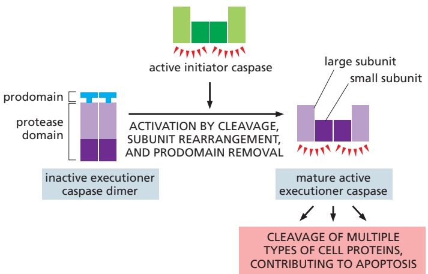

Figure 18–4 Executioner caspase activation during apoptosis. Executioner caspases have very short prodomains, which lack sites for interacting with other proteins. They are initially formed as inactive dimers, which are activated by cleavage at a site in each protease domain, almost always by an initiator caspase. The cleavages allow the large and small subunits to rearrange to form two active protease sites, each of which then cleaves off the prodomain of its partner monomer to produce the mature, active executioner caspase, as shown. The mature activated caspase then cleaves a variety of cell target proteins, leading to the controlled apoptotic death of the cell.

Executioner caspases cleave hundreds of different cell proteins during apoptosis, but the roles of these target proteins in apoptosis are known in only aMBoC7 m18.03bottom/18.04 minority of cases, several of which we mention here. The cleavage of nuclear lamins by caspase-6, for example, causes the irreversible breakdown of the nuclear lamina (discussed in Chapter 12). The cleavage by caspase-3 of an inhibitor protein that normally holds a particular DNA-degrading endonuclease in an inactive form frees the endonuclease to cut up the DNA in the cell nucleus during apoptosis (**Figure 18–5**). The cleavage of certain proteins that regulate the actin cytoskeleton results in the actin polymerization in the cell cortex that is responsible for the surface blebbing in apoptosis, mentioned earlier (and see Movie 18.1). The cleavage of other actin regulators and some cell–cell adhesion proteins that attach cells to their neighbors helps an apoptotic cell round up and detach from its neighbors, making it easier for a neighboring cell to engulf it. As we discuss later, the cleavage of two phospholipid transfer proteins in the plasma membrane results in the exposure of phosphatidylserine on the surface of apoptotic cells, where it serves as an “eat me” signal to neighboring phagocytic cells. Importantly, preventing any one of these individual protein-cleavage steps does not stop apoptotic cell death, although it changes its characteristics as expected in each case.

How is an initiator caspase first activated in response to an apoptotic signal? Our cells use two main activation pathways: one is signaled from outside the cell and is called the extrinsic pathway, and the other is signaled from mitochondria inside the cell and is called the intrinsic, or mitochondrial, pathway. Each uses its own initiator caspase and adaptor proteins, as we now discuss.

(A)

(B)

Figure 18–5 DNA fragmentation during apoptosis. (A) In healthy cells, a caspaseactivated DNase (CAD) is held in an inactive state by an inhibitor protein, iCAD. Activation of an executioner caspase, caspase-3, during apoptosis leads to cleavage of iCAD, releasing the active DNase to cut the chromosomal DNA between nucleosomes. (B) Because the DNA cleavage occurs only at accessible sites in linker regions between nucleosomes, the DNA is cut into fragments of variable size, equivalent to the DNA associated with either one or multiple nucleosomes (as shown in A), producing a ladder pattern upon DNA gel electrophoresis. The pattern shown was obtained by inducing apoptosis in mouse thymus lymphocytes with dexamethasone, extracting DNA at the times indicated at the top of the gel, separating the fragments by size by electrophoresis in an agarose gel, and staining the DNA in the gel with ethidium bromide. (B, from D. McIlroy et al., Genes Dev. 14:549–558, 2000. With permission from Cold Spring Harbor Laboratory Press.)

#### Activation of Cell-Surface Death Receptors Initiates the Extrinsic Pathway of Apoptosis

Extracellular signal proteins binding to cell-surface **death receptors** trigger the **extrinsic pathway** of apoptosis. Death receptors are transmembrane proteins containing an extracellular ligand-binding domain, a single transmembrane domain, and an intracellular death domain that is required for the receptors to activate the apoptotic program. The receptors are homotrimers and belong to the tumor necrosis factor (TNF) receptor family, which has eight members, including a receptor for TNF itself and the Fas death receptor. The ligands that activate the death receptors are also homotrimers, belonging to the TNF family of signal proteins.

A relatively well-understood example of how death receptors trigger the extrinsic pathway of apoptosis is the activation of the **Fas receptor** on the surface of a target cell by **Fas ligand** on the surface of a killer (cytotoxic) lymphocyte (discussed in Chapter 24). Fas signaling has a role in regulating the numbers of T and B lymphocytes, as indicated by the finding that inactivation of Fas signaling results in an abnormal increase in these cells. As shown in **Figure 18–6**, the binding of trimeric Fas ligands to the trimeric Fas receptors clusters the receptors, exposing death domains on the receptor tails, which then bind and cluster a small intracellular adaptor protein called FADD. The clustered FADD proteins, in turn, recruit multiple copies of an inactive, monomeric initiator caspase (mainly caspase-8), which oligomerize, completing the formation of a large **death-inducing signaling complex (DISC)** on the cytoplasmic face of the target-cell plasma membrane. The oligomerization of caspase-8 allows the dimerization and activation of the caspase, which then cleaves itself to form mature, active caspase-8 dimers that can cleave and activate downstream executioner caspases to induce apoptosis.

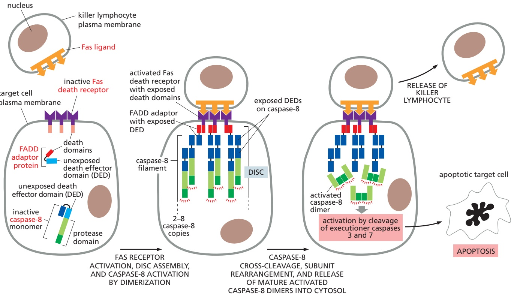

Figure 18–6 The extrinsic pathway of apoptosis activated through Fas death receptors. Trimeric Fas ligands on the surface of a killer lymphocyte bind to trimeric Fas death receptors on the surface of a target cell, inducing the target cell to kill itself by undergoing apoptosis by the extrinsic pathway. Although not shown, at least two trimeric Fas ligands have to bind to and cluster at least two trimeric Fas receptors to activate the pathway; for clarity, only a single copy of the ligand and receptor is shown. The ligand-induced receptor clustering (not shown) exposes a death domain on the receptor tails, as indicated here by the change in the color of the domain from light red to dark red upon exposure. Each exposed death domain binds to a similar exposed death domain on the cytosolic adaptor protein FADD (for Fas-associated death domain). The bound FADD MBoC7 m18.05/18.06protein then exposes a death effector domain (DED; dark blue), enabling FADD to recruit an inactive, monomeric initiator caspase (mainly caspase-8) by binding to an exposed DED (dark blue) on the prodomain of the caspase. Each caspase-8 monomer has two DEDs, and, when one binds to an exposed DED, the other becomes exposed (as indicated by the change in the DED color from light blue to dark blue) and can recruit another caspase-8 monomer; this results in a chain reaction in which the caspase-8 monomers oligomerize into a three-dimensional helical filament (not shown), with each FADD protein attached to up to eight caspase-8 molecules. The end result is the assembly of a large death-inducing signaling complex (DISC) composed of multiple copies of Fas, FADD, and caspase-8. Within the DISC, neighboring caspase-8 monomers interact to form activated dimers, which can now cross-cleave their partner monomers (not shown, but see Figure 18–3), cleaving off the prodomain and forming the mature activated dimers, which are released into the cytosol, where they can cleave and activate executioner caspases to induce apoptosis. In human cells, the caspase-10 initiator caspase can also be incorporated into the DISC, but, unlike caspase-8, it is not essential for Fas-induced apoptosis.

The sensitivity of different cell types to Fas-induced apoptosis varies. Many cells produce inhibitory proteins that act to restrain the extrinsic apoptotic pathway. Some cells, for example, produce a protein called FLIP, which resembles caspase-8 but lacks protease activity because it is missing the key cysteine required in the active site. FLIP dimerizes with caspase-8 in the DISC and pre-vents it from activating executioner caspases to initiate apoptosis. In this way, FLIP sets an inhibitory threshold that the extrinsic pathway, through activated caspase-8, must overcome to trigger apoptosis. As we discuss later, for the extrinsic pathway to kill some cell types, it has to overcome another caspase inhibitor, which it does by recruiting the intrinsic apoptotic pathway—the pathway we now discuss.

#### The Intrinsic Pathway of Apoptosis Depends on Proteins Released from Mitochondria

Cells can also activate their apoptosis program from inside the cell, often in response to developmental signals or to injury such as DNA damage. In vertebrate cells, these apoptotic responses are mediated by the **intrinsic pathway** of apoptosis, which is also called the **mitochondrial pathway**, as it depends on the release into the cytosol of mitochondrial proteins that normally reside in the intermembrane space of these organelles (see Figure 12–47). The most important of these released proteins is **cytochrome c**, which is a water-soluble component of the mitochondrial electron-transport chain and therefore has a central role in ATP production by oxidative phosphorylation in mitochondria (see Figure 14–18). When released into the cytosol (**Figure 18–7**), however, it takes on an entirely new function: it can induce apoptosis, independent of its electron-transport activity.

(A) CONTROL CELLS

cytochrome c–GFP

mitochondrial dye

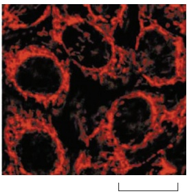

10 µm

(B) UV-TREATED CELLS

cytochrome c–GFP

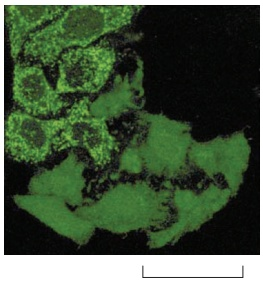

25 µm

Figure 18–7 Release of cytochrome c from mitochondria into the cytosol during the intrinsic pathway of apoptosis. These fluorescence micrographs show human cancer cells in culture. The cells were transfected with a gene encoding a fusion protein consisting of cytochrome c linked to green fluorescent protein (cytochrome c–GFP), and they were also treated with a red dye that accumulates in mitochondria. (A) Unstimulated control cells: the overlapping distribution MBoC7 m18.06/18.07of the green and red confirms that the cytochrome c–GFP is located in mitochondria. (B) Cells were irradiated with ultraviolet (UV) light to induce the intrinsic pathway of apoptosis and were photographed 5 hours later. The seven cells in the bottom right of this micrograph have released their cytochrome c from mitochondria into the cytosol, whereas the other cells in the micrograph have not yet done so. (From J.C. Goldstein et al., Nat. Cell Biol. 2:156–162, published 2000 by Nature Publishing Group. Reprinted with permission of SNCSC.)

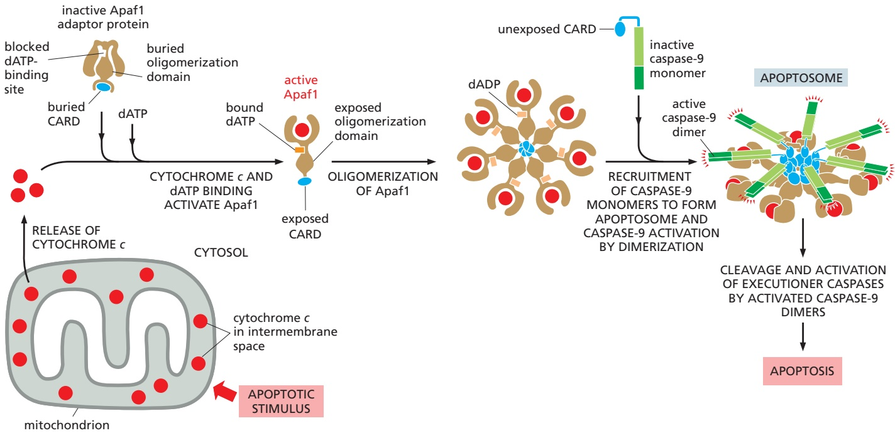

Figure 18–8 The intrinsic pathway of apoptosis. Intracellular apoptotic stimuli cause mitochondria to release cytochrome c. The binding of cytochrome c to the cytosolic adaptor protein Apaf1 induces a conformational change in Apaf1, which activates it, exposing a binding site for deoxy-ATP (dATP), an oligomerization domain, and a caspase recruitment domain (CARD). The exposed oligomerization domain mediates the assembly of Apaf1 into a wheel-like heptamer. Each CARD in the heptamer then recruits an inactive caspase-9 monomer through its own CARD, forming a large apoptosome, with the interacting CARDs clustered above the central hub of the apoptosome. The dATP is hydrolyzed to dADP during the assembly process. Within the apoptosome, the caspase-9 monomers are activated by dimerization. Activated caspase-9 dimers then cleave and activate downstream executioner caspases, leading to apoptosis. Note that the CARD domain is related in structure and function to the death effector domain (DED) of caspase-8 (see Figure 18–6).

(It remains an important mystery how, during evolution, mitochondria and cytochrome c came to acquire their surprising role in apoptosis.)

Once released, into the cytosol, cytochrome c binds to an adaptor proteinMBoC7 m18.07/18.08 called **Apaf1** (apoptotic protease activating factor 1), causing the adaptor to bind deoxy-ATP and oligomerize into a large, wheel-like heptamer. The heptamer then recruits inactive initiator caspase-9 monomers into the complex, forming an even larger structure called an **apoptosome** (**Figure 18–8**). Caspase-9 is activated by dimerization within the apoptosome, just as the other major initiator caspase, caspase-8, is activated by dimerization within the DISC (see Figure 18–6). Once activated, caspase-9 cleaves and activates the downstream executioner caspases that mediate apoptosis.

The intrinsic pathway is responsible for the great majority of apoptotic cell deaths in vertebrates. For upstream signals to activate the intrinsic pathway, they have to alter the outer mitochondrial membrane so that the soluble proteins in the intermembrane space such as cytochrome c can diffuse into the cytosol. This crucial outer membrane permeabilization step is controlled by interactions between members of the Bcl2 family of proteins, as we now discuss.

#### Bcl2 Proteins Are the Critical Controllers of the Intrinsic Pathway of Apoptosis

The intrinsic pathway is tightly regulated to ensure that cells kill themselves by apoptosis only when it is appropriate. This regulation is largely the function of the **Bcl2 family** of proteins, which are named after the first family member described (B cell lymphoma-2), as explained later. In mammalian cells, complex interactions between these proteins control the permeabilization of the outer mitochondrial membrane and thereby govern the release into the cytosol of cytochrome c and other soluble proteins in the intermembrane space, a process called **mitochondrial outer membrane permeabilization (MOMP)**. Like the caspase family, the Bcl2 family of proteins is found in all animals and has been remarkably conserved; a human Bcl2 protein, for example, can suppress apoptosis when expressed in the worm Caenorhabditis elegans.

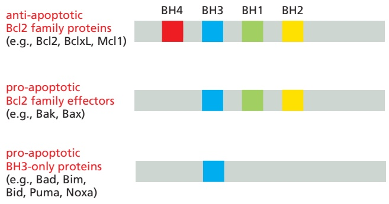

Figure 18–9 Schematic drawing of the BH domains in the three classes of Bcl2 family proteins. Note that the BH3 domain is the only one of the four BH domains shared by all Bcl2 family members; it mediates the direct interactions between pro-apoptotic and anti-apoptotic family members (see Figure 18–10C and D).

There are three structural and functional classes of mammalian Bcl2 family proteins: (1) Anti-apoptotic Bcl2 family proteins, including Bcl2 itself, inhibit apoptosis by preventing MOMP. (2) Pro-apoptotic Bcl2 family effectors can directly induce MOMP by creating openings in the outer mitochondrial membrane. (3) A second class of pro-apoptotic Bcl2 family proteins, called BH3-only proteins (for reasons explained shortly), promotes apoptosis by regulating the other two classes. The balance between the activities of these three classes largely determines whether MOMP occurs or not and, therefore, whether a mammalian cell lives or dies by the intrinsic pathway of apoptosis.

As illustrated in **Figure 18–9**, the anti-apoptotic Bcl2 family proteins, including Bcl2 itself and Bcl extra-large (BclxL), share four distinctive Bcl2 homology (BH) domains (BH1–4). The two main pro-apoptotic Bcl2 family effectors, Bak and Bax, are structurally similar to Bcl2 but lack the BH4 domain. The members of the second class of pro-apoptotic Bcl2 family proteins share sequence homology with Bcl2 in only the BH3 domain and are therefore called BH3-only proteins; they are by far the largest class of Bcl2 proteins.

When an apoptotic stimulus triggers the intrinsic pathway, the **pro-apoptotic Bcl2 family effectors**, **Bak** and **Bax**, become activated and trigger MOMP by aggregating into oligomers of various sizes in the mitochondrial outer membrane, producing openings in the membrane by an uncertain mechanism, allowing cytochrome c and other intermembrane proteins to escape into the cytosol (**Figure 18–10A and B**). At least one of these pro-apoptotic effectors is required for the intrinsic pathway of apoptosis to operate in mammalian cells: mutant mouse cells that lack both proteins do not undergo MOMP or engage the intrinsic apoptotic pathway. Whereas Bak is bound to the mitochondrial outer membrane even in the absence of an apoptotic signal (see Figure 18–10A and B), Bax is mainly located in the cytosol until an apoptotic signal activates it, causing it to relocate to the outer membrane, where it oligomerizes. As we discuss below, the activation of Bak and Bax usually depends on activated BH3-only proteins.

The **anti-apoptotic Bcl2 family proteins** such as **Bcl2** and **BclxL** are also located on the cytosolic surface of the outer mitochondrial membrane, where they help prevent inappropriate MOMP. They do so by binding to the BH3 domain of active pro-apoptotic effectors Bak and Bax, thereby preventing their oligomerization (**Figure 18–10C**). There are at least five mammalian anti-apoptotic Bcl2 family proteins, and every mammalian cell requires at least one to avoid apoptosis and therefore to survive. Moreover, a number of these anti-apoptotic proteins must be inhibited for the intrinsic pathway to induce apoptosis, and BH3-only proteins mediate this inhibition.

The **BH3-only proteins**, the largest subclass of Bcl2 family proteins, promote MOMP and thereby apoptosis when they are either produced or activated in cells in response to an apoptotic stimulus. They do so in at least two ways. (1) Some BH3-only proteins, including Bad (see Figure 18–9), inhibit certain anti-apoptotic Bcl2 family proteins by binding via their BH3 domain to the BH3-binding groove on the anti-apoptotic protein. This binding blocks the anti-apoptotic activity of the Bcl2 family protein, thereby allowing Bax and/or Bak to oligomerize in the outer mitochondrial membrane to trigger MOMPMBoC7 m18.09/18.10 (**Figure 18–10D**). (2) Some BH3-only proteins, including Bim and Bid (see Figure 18–9), can directly bind to and activate Bak and Bax, stimulating them to oligomerize and trigger MOMP.

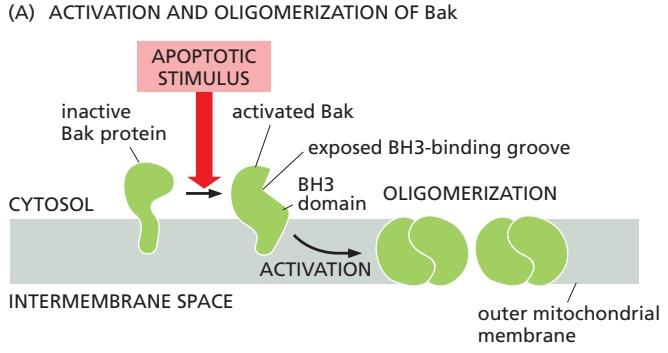

(C) PREVENTION OF MOMP BY BclxL

(B) INDUCTION OF MOMP BY Bak OLIGOMERS

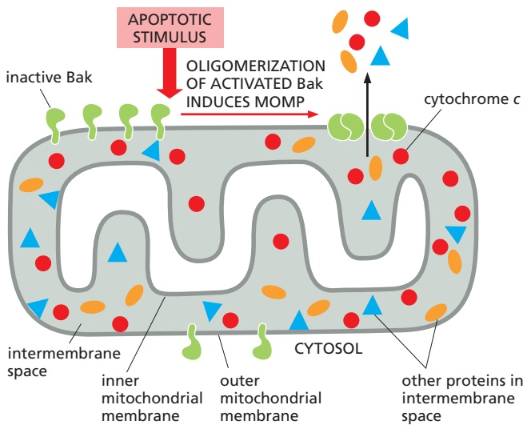

(D) INDUCTION OF MOMP BY A BH3-ONLY PROTEIN (SUCH AS Bad)

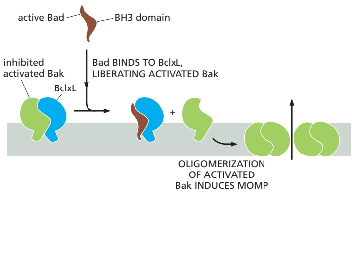

Figure 18–10 How pro-apoptotic Bcl2 family effectors induce MOMP and how anti-apoptotic Bcl2 family proteins block it. (A) Most of the pro-apoptotic effector Bak is already attached to the outer mitochondrial membrane before the protein is activated. When activated by an apoptotic stimulus, the protein undergoes a conformational change that both exposes a BH3 domain and creates a BH3-binding groove, allowing Bak–Bak oligomerization in the outer membrane. (B) The Bak oligomers induce MOMP by creating openings in the outer membrane that allow cytochrome c and other soluble proteins in the intermembrane space to diffuse into the cytosol; although the details of how Bak (and Bax) oligomers produce the openings are uncertain, it is thought that they form large ring structures that disrupt the integrity of the outer membrane. Once released into the cytosol, cytochrome c stimulates the assembly of apoptosomes (see Figure 18–8). (C) The anti-apoptotic Bcl2 family protein BclxL, like Bak, is normally bound to the outer mitochondrial membrane, where it can interact via its BH3-binding groove to the exposed BH3 domain on activated Bak, thereby blocking Bak–Bak oligomerization, MOMP, and apoptosis. (D) One way BH3-only proteins such as Bad are thought to indirectly induce MOMP and apoptosis is by inhibiting certain anti-apoptotic Bcl2 family proteins such as BclxL.

In these ways, BH3-only proteins provide the crucial link between apoptotic stimuli and the intrinsic pathway of apoptosis, with different stimuli activating or inducing the production of different BH3-only proteins. When a cell suffers DNA damage that it cannot repair, for example, the tumor suppressor protein p53 (discussed in Chapters 17 and 20) accumulates in the nucleus and activates the transcription of genes that encode the BH3-only proteins Puma and Noxa (see Figure 18–9), which then trigger MOMP and apoptosis, thereby eliminating a potentially dangerous cell that could become cancerous. As we will see, some extracellular survival signals promote a cell’s survival by preventing it from undergoing apoptosis by inhibiting the synthesis or activity of certain BH3-only proteins (see Figure 18–13B).

As mentioned earlier, in some cells the extrinsic apoptotic pathway has to recruit the intrinsic pathway to help kill the target cell; the BH3-only protein Bid is the link between the two pathways. Bid is normally inactive in these cells, but, when death receptors activate the extrinsic pathway (see Figure 18–6), the initiator caspase, caspase-8, cleaves Bid, creating an active form of the protein that translocates to the outer mitochondrial membrane to activate Bax and/or Bak, causing them to oligomerize and trigger MOMP. MOMP is required for activated death receptors to kill these cells because it releases proteins from the mitochondrial intermembrane space that neutralize an inhibitory protein present in the cytosol of these cells that normally blocks apoptosis, as we explain next.

#### An Inhibitor of Apoptosis (an IAP) and Two Anti-IAP Proteins Help Control Caspase Activation in the Cytosol of Some Mammalian Cells

Because activation of an apoptotic caspase cascade leads to certain cell death, cells employ multiple mechanisms to help ensure that these proteases are activated only when appropriate. The inhibition of caspase-8 by the FLIP protein in the extrinsic apoptotic pathway is one example discussed earlier (see p. 1095). Another line of defense against inappropriate caspase activation is provided by caspase inhibitor proteins called **inhibitors of apoptosis (IAPs)**. These proteins were first identified in certain insect viruses (baculoviruses), which encode IAP proteins to prevent a host cell that is infected by the virus from activating caspases and killing itself by apoptosis, which would curtail the virus’s replication. Most animal cells also make IAP proteins, although most of these proteins do not regulate caspases and apoptosis.

Mammalian cells seem to have only one IAP that can directly inhibit caspase activity. It is called **XIAP** (because it is encoded on the X chromosome), and it resides in the cytosol of many of our cells. It binds to and inhibits caspase-9, an initiator caspase, and the executioner caspases, caspase-3 and caspase-7, thereby setting an inhibitory threshold that these caspases must overcome to trigger apoptosis. In these cells, XIAP also helps regulate the levels of the three caspase proteins: it has a ubiquitin-ligase domain that polyubiquitylates the caspases that XIAP binds to, marking them for destruction in proteasomes (see Figure 3–67).

When the intrinsic pathway of apoptosis is activated, among the proteins released from the mitochondrial intermembrane space by MOMP are two **anti-IAP proteins** called Smac and Omi. In cells with XIAP in their cytosol, these anti-IAP proteins bind to XIAP and prevent it from inhibiting caspases, thereby promoting caspase activation and apoptosis (**Figure 18–11**). This is why the extrinsic apoptotic pathway needs to recruit the intrinsic pathway (involving MOMP and caspases 9, 3, and 7) to induce apoptosis in some cells, as mentioned earlier; these are cells that express XIAP in their cytosol.

#### Extracellular Survival Factors Inhibit Apoptosis in Various Ways

As discussed in Chapters 15 and 21, extracellular signals regulate most activities of animal cells, including apoptosis. They are part of the normal “social” controls that ensure individual cells behave for the good of the organism as a whole—in this case, by surviving when the cells are needed and killing themselves when they are not. Some extracellular signal molecules stimulate apoptosis, whereas others inhibit it. We have discussed signal proteins such as Fas ligand that activate death receptors to trigger the extrinsic pathway of apoptosis. Other extracellular signal molecules that stimulate apoptosis are especially important during vertebrate development: a surge of thyroid hormone in the bloodstream, for example, signals cells in the tadpole tail to undergo apoptosis at metamorphosis. In mice, locally produced signal proteins stimulate cells between developing fingers and toes to kill themselves, thereby sculpting these digits (see Figure 18–2). Here, however, we focus on extracellular signal molecules that promote cell survival by inhibiting apoptosis and are collectively called **survival factors**.

Figure 18–11 How MOMP overcomes XIAP inhibition. In some mammalian cells, the presence of XIAP in the cytosol inhibits initiator caspase-9 and executioner caspases 3 and 7; the XIAP binds to the active site of the three enzymes, blocking their activities. However, as well as MBoC7 n18.103/18.11releasing cytochrome c, MOMP releases two anti-IAP proteins, Smac and Omi, which inhibit the anti-caspase activity of XIAP, thereby allowing the activation of these caspases in the cytosol during the intrinsic pathway of apoptosis (see Figure 18–8).

Figure 18–12 How survival factors and apoptosis can help adjust the number of developing nerve cells to the size of the target tissue the nerve cells innervate. In this example, more nerve cells are produced than can be supported by the limited amount of survival factors produced by the cells in a target tissue. As a result, some nerve cells receive an insufficient amount of survival factor to avoid apoptosis. This strategy of overproduction followed by culling during development helps ensure that all the appropriate target cells are contacted by appropriate nerve cells and that surplus nerve cells are automatically eliminated.

Most animal cells require such signals from other cells to avoid undergoing apoptosis, usually by the intrinsic pathway. This surprising arrangement appar-MBoC7 m18.11/18.12 ently helps ensure that cells survive only when and where they are needed. Some nerve cells, for example, are produced in excess in the developing nervous system and then compete for limited amounts of survival factors that are secreted by the target cells they normally connect to. Nerve cells that receive enough survival signals live, while the others die by apoptosis. In this way, the number of surviving neurons is automatically adjusted so that it is appropriate for the number of target cells they connect with (**Figure 18–12**). A similar competition for limited amounts of survival factors produced locally or systemically might help control cell numbers in other tissues, both during development and in adulthood.

Survival factors usually bind to cell-surface receptors, which activate intracellular signaling pathways (discussed in Chapter 15) that suppress the apoptotic program, usually by regulating the expression or activity of members of the Bcl2 family of proteins. Some survival factors, for example, stimulate the synthesis of anti-apoptotic Bcl2 family proteins such as Bcl2 itself or BclxL (**Figure 18–13A**). Some others act by inhibiting the function of pro-apoptotic BH3-only proteins such as Bad (**Figure 18–13B**). Some developing neurons, like those illustrated in Figure 18–12, use a counterintuitive alternative strategy, in which survival-factor receptors stimulate apoptosis when they are unoccupied and stop doing so when survival factors bind. The end result in all these cases is the same: cell survival depends on survival-factor binding to cell-surface receptors.

Figure 18–13 Two of the various ways that extracellular survival factors can inhibit apoptosis. (A) Some survival factors suppress apoptosis by stimulating the transcription of genes that encode anti-apoptotic Bcl2 family proteins such as Bcl2 (as shown here) or BclxL. (B) Many others activate the serine/threonine protein kinase Akt, which, among many other targets, phosphorylates and inactivates the pro-apoptotic BH3-only protein Bad (see Figure 18–9). When not phosphorylated, Bad promotes apoptosis by binding to and inhibiting an anti-apoptotic Bcl2 family protein such as Bcl2 itself. Once phosphorylated, Bad dissociates, freeing Bcl2 to suppress apoptosis (see Figure 18–10C and Figure 15–54). Akt can also suppress apoptosis by phosphorylating and inactivating transcription regulatory proteins that stimulate the transcription of genes encoding proteins that promote apoptosis, such as the BH3-only protein Bim (not shown). There are also many other ways that survival factors can inhibit apoptosis that are not illustrated here.

#### Healthy Neighbors Phagocytose and Digest Apoptotic Cells

Apoptotic cell death is a tidy process. The apoptotic cell and its fragments do not break open and release their contents. Instead, they usually remain intact until they are rapidly phagocytosed and digested by neighboring cells (usually macrophages in humans), leaving no trace. In this way, apoptosis avoids triggering a destructive inflammatory response. The engulfment process depends on chemical changes on the surface of the apoptotic cell, which displays various “eat me” signals that are recognized by the phagocytic cells.

The most important of these signals is the negatively charged phospholipid **phosphatidylserine**. In healthy cells, phosphatidylserine is normally located exclusively in the inner leaflet of the lipid bilayer of the plasma membrane (see Figure 10–15); it is kept there by a specific phospholipid flippase that uses ATP hydrolysis to flip phosphatidylserine (PS) and phosphatidylethanolamine (PE) from the outer to the inner leaflet. In cells undergoing apoptosis, however, PS accumulates on the cell surface by two mechanisms. First, executioner caspases cleave the phospholipid flippase, thereby inactivating it, preventing PS and PE from being transferred from the outer to the inner leaflet. Second, executioner caspases cleave and thereby activate a phospholipid scramblase that transfers plasma membrane phospholipids nonspecifically between the inner and outer lipid leaflets, thereby scrambling them between the two leaflets. These two mechanisms responsible for the exposure of PS on the surface of apoptotic cells are illustrated in **Figure 18–14** and **Movie 18.2**. The appearance of PS on the cell surface also occurs in some forms of necrotic cell death, even in the absence of caspase activation; disruption of the plasma membrane is sufficient to do it.

The PS on apoptotic and necrotic cells is recognized by a variety of soluble “bridging” proteins that interact with both the exposed PS and specific receptors on the surface of a neighboring phagocytic cell, triggering the cytoskeletal and other changes that initiate the engulfment process.

Macrophages are professional phagocytes and will phagocytose dead cells, microbes, cell debris, latex beads, and almost any other particles, but they do not phagocytose healthy cells within the organism’s own body—even those healthy cells that transiently expose phosphatidylserine on their surface when activated, such as platelets and some T lymphocytes. One reason is that almost all of our cells display signal proteins on their surface that bind to inhibitory receptors on the surface of macrophages, stimulating the receptors to block phagocytosis. Thus, in addition to expressing cell-surface “eat me” signals such as phosphatidylserine that stimulate phagocytosis, apoptotic cells must also remove or inactivate the “don’t eat me” signals that block phagocytosis.

#### Either Excessive or Insufficient Apoptosis Can Contribute to Disease

There are many human disorders in which too many cells undergo apoptosis and thereby contribute to pathological tissue loss. Among the most common and dramatic examples are heart attacks and strokes caused by an acute interruption of the blood supply to the heart or brain, respectively. In these conditions, many cells initially die by necrosis. If the blocked blood vessel is unblocked, either through an arterial catheter or with clot-disrupting drugs, some of the surviving cells in the oxygen-deprived tissue die by apoptosis, contributing to the tissue loss. It is hoped that, in the future, drugs that can block the apoptotic cell deaths, as well as drugs that can block some forms of necrotic cell death, will be able to decrease the tissue loss and its debilitating consequences.

There are other disorders in which too few cells die by apoptosis. For example, as mentioned earlier, mutations in mice and humans that inactivate the genes that encode either the Fas death receptor or its ligand prevent the normal deaths of some types of lymphocytes, resulting in the abnormal accumulation of these cells in the spleen and lymph glands. In many cases, this leads to autoimmune disorders, because some self-reactive lymphocytes fail to be eliminated and react

Figure 18–14 The two caspase-dependent mechanisms responsible for the accumulation of phosphatidylserine on the surface of apoptotic cells. In healthy cells (top half of figure), an ATP-dependent aminophospholipid flippase (ATP11C) actively flips phosphatidylserine (PS) and phosphatidylethanolamine (PE) from the outer to the inner leaflet of the plasma membrane lipid bilayer, keeping these lipids mainly confined to the inner leaflet. During apoptosis (bottom half MBoC7 n18.104/18.14of figure), activated executioner caspases (caspase-3, caspase-7, or both) cleave and thereby inactivate the ATP11C flippase, preventing its lipid translocation activity; at the same time, the activated executioner caspases cleave and thereby activate a phospholipid scramblase (Xkr8) in the plasma membrane that nonspecifically flips phospholipids between the two lipid leaflets of the membrane, scrambling them between the leaflets. (Although not shown, the ATP11C flippase is tightly associated with a smaller transmembrane protein, CDC50, which is required to chaperone the flippase to the plasma membrane and possibly to assist in the lipid translocation process.)

With the flippase permanently inactivated and the scramblase permanently activated, PS and PE become rapidly and irreversibly exposed on the apoptotic cell surface, where the PS serves as an “eat me” signal to neighboring phagocytic cells. Both of these caspase-dependent mechanisms are required to create this rapid and effective “eat me” signal: if only the flippase were inactivated, it could take a very long time for PS to accumulate in effective amounts on the apoptotic cell surface, because phospholipids rarely flip spontaneously between the two leaflets of a lipid bilayer without an enzyme (such as the scramblase) catalyzing it (see Figure 10–10B). Similarly, if only the scramblase were activated, the active flippase would rapidly return any scrambled PS from the external leaflet to the internal one, thereby removing the PS from the cell surface. Figure 12–39 illustrates the actions of phospholipid scramblases in lipid bilayer synthesis in the ER membrane and of phospholipid scramblases in generating lipid bilayer asymmetry in some other intraceullar membranes. (Modified from S. Nagata et al., Cell Death Differ. 23:952–961, 2016.)

against the individual’s own tissues. The increase in lymphocytes can also lead to lymphocyte cancers called lymphomas.

Indeed, decreased apoptosis makes an important contribution to many types of cancer, because the normal inhibitory controls on apoptosis are often defective in cancer cells. The Bcl2 gene, for example, was first identified in a common form of human lymphoma, in which a chromosome translocation causes excessive production of the anti-apoptotic Bcl2 protein (as mentioned earlier, Bcl2 gets its name from this B cell lymphoma). The increased amount of Bcl2 protein in the lymphocytes that carry the translocation promotes the development of cancer by inhibiting apoptosis, thereby abnormally prolonging the cells’ survival and increasing their number; the increase in Bcl2 also decreases the cells’ sensitivity to anticancer drugs, which often work by causing cancer cells to undergo apoptosis (discussed in Chapter 20).

(A)

Similarly, the gene encoding the tumor suppressor protein p53 is mutated in about 50% of human cancers so that it no longer promotes apoptosis or cell-cycle arrest in response to DNA damage (as discussed in Chapters 17 and 20). The lack of p53 function, therefore, enables the cancer cells to survive and proliferate even when their DNA is damaged; in this way, the cells progressively accumulate more mutations, some of which make the cancer more malignant. As many anticancer drugs induce apoptosis (and cell-cycle arrest) by p53-dependent mechanisms, the loss of p53 function also makes cancer cells less sensitive to these drugs.

If decreased apoptosis contributes to a cancer, then we should be able to treat the cancer with drugs that promote apoptosis. This approach has recently led to the development of small chemicals that block the function of anti-apoptotic Bcl2 family proteins such as Bcl2 and BclxL, by binding with high affinity to the BH3-binding groove of these proteins, in much the same way that pro-apoptotic BH3-only proteins do (see Figure 18–10D). These BH3-mimetic drugs (**Figure 18–15**) activate the intrinsic pathway of apoptosis, increasing the amount of tumor cell death in certain cancers, especially those that depend on particular anti-apoptotic Bcl2 family proteins for their survival.

Most human cancers are carcinomas, which arise in epithelial tissues such as those in the lung, intestinal tract, breast, and prostate (discussed in Chapter 20). Such epithelial cancer cells display many abnormalities in their behavior, including a decreased ability to adhere to the extracellular matrix and to one another at specialized cell–cell junctions. In the next chapter, we discuss these vitally important structures, which are responsible for holding our cells in tissues and organs in their proper place.

#### Summary

Animal cells can activate various intracellular death programs and kill themselves when they are seriously damaged or stressed, no longer needed, or are a threat to the organism. In most cases, these deaths occur by apoptosis, in which the cells shrink, the nucleus and cells condense and often fragment, and neighboring phagocytic cells rapidly engulf the cells or fragments before there is any leakage of cytoplasmic contents. Apoptosis is mediated by proteolytic enzymes called caspases, which cleave specific intracellular proteins to kill the cell quickly and neatly.

Apoptotic caspases are present as inactive precursors in almost all nucleated animal cells. The activation of initiator caspases occurs when an apoptotic stimulus activates adaptor proteins, which bring inactive initiator caspase monomers into proximity within large activation complexes, in which the monomers are activated by dimerization. The activated initiator caspase dimers cleave themselves and then activate downstream executioner caspase dimers by cleaving them; the activated executioner caspases then cleave hundreds of target proteins in the cell. The amplifying, irreversible caspase cascade is responsible for all the events of apoptosis, including those that collectively kill the cell and prepare it for being phagocytosed and rapidly digested by a neighboring cell.

Cells use two distinct pathways to activate initiator caspases to trigger apoptosis: the extrinsic pathway is activated by extracellular ligands binding to cell-surface death receptors; the intrinsic pathway is activated from within the cell by developmental signals or stress signals. Each pathway uses its own initiator caspases, adaptor proteins, and activation complexes. In the extrinsic pathway, the death receptors recruit caspase-8 via adaptor proteins to form the activation complex called the DISC. In the intrinsic pathway, intracellular signals induce mitochondrial outer membrane permeabilization (MOMP), which releases soluble proteins from the mitochondrial intermembrane space into the cytosol; released cytochrome c activates the adaptor protein Apaf1, which recruits caspase-9 monomers to form a large activation complex called an apoptosome. Anti-apoptotic and proapoptotic intracellular Bcl2 family proteins interact with one another to tightly control MOMP to ensure that the intrinsic pathway of apoptosis is normally only activated when the death of the cell benefits the animal.

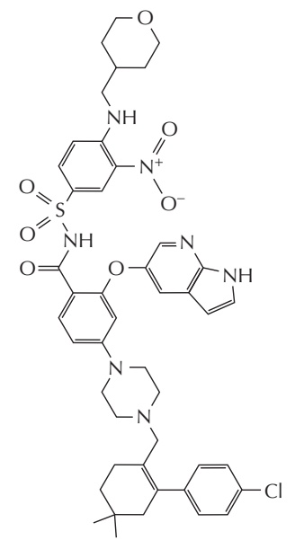

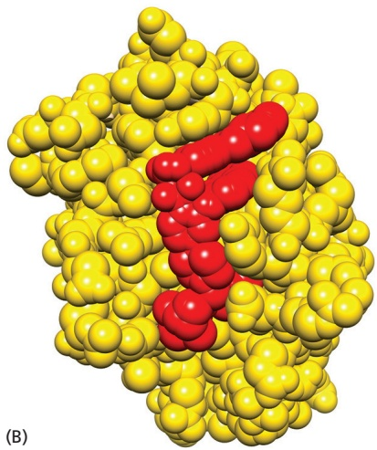

Figure 18–15 A BH3-mimetic drug that specifically inhibits the Bcl2 anti-apoptotic Bcl2 family protein. As shown in Figure 18–10D, one way BH3-only proteins can promote apoptosis is by MBoC7 m18.13/18.15binding to the long BH3-binding groove in anti-apoptotic Bcl2 family proteins such as Bcl2 itself, thereby preventing the protein from blocking apoptosis. (A) The chemical structure of venetoclax, which was designed and synthesized to bind tightly and specifically in the BH3-binding groove of Bcl2. (B) Crystal structure of venetoclax (red) bound to the human Bcl2 protein (yellow). By inhibiting the activity of Bcl2, the drug promotes apoptosis in any cell that depends on this protein for survival, as is the case for cells of human chronic lymphocytic leukemia, for which this drug is in clinical use. (PDB code: 60OK.)

<!-- END EN EN18-H000-H010 -->

### 英文补充：自然杀伤细胞诱导感染细胞死亡

> 对应中文板块：自然杀伤细胞诱导感染细胞死亡。英文来源：Molecular Biology of the Cell，第7版，第24章；[本章完整原文](../../来源/英文教材/24_The_Innate_and_Adaptive_Immune_Systems/chapter.md)。物理PDF页码范围：1392–1443（整章范围）。

<!-- BEGIN EN EN24-H009-H009 -->
#### Natural Killer Cells Induce Virus-infected Cells to Kill Themselves

An indirect way that type I interferons block viral replication is by enhancing the activity of **natural killer cells (NK cells)**. These lymphocyte-like leukocytes are part of the innate immune system. They are recruited early to sites of inflammation by cytokines secreted by activated resident macrophages; once there, they secrete cytokines that further activate macrophages to increase their ability to ingest and destroy pathogens and secrete cytokines—yet another positive feedback loop that amplifies the inflammatory response. Like cytotoxic T cells of the adaptive immune system (discussed later), NK cells also directly destroy virus-infected cells by inducing the infected cells to kill themselves by undergoing apoptosis. Thus NK cells help defend us against both extracellular and intracellular pathogens. We consider later how NK cells induce apoptosis when we discuss how cytotoxic T cells do it (see Figure 24–43). Although the two types of killer cells kill in the same ways, the means by which they distinguish the surface of virus-infected cells from that of uninfected cells are different (**Movie 24.2**).

Both cytotoxic T cells and NK cells recognize the same special class of cellsurface proteins on a host cell to help determine if the cell is virus-infected, but they use distinct receptors to do so. The special cell-surface proteins recognized are called class I MHC proteins. As we discuss in detail later, MHC proteins are so called because they are encoded by a cluster of genes in the major histocompatibility complex. Class I MHC proteins are present on almost all nucleated cells in vertebrates, and cytotoxic T cells use specific T cell receptors (TCRs) to recognize peptide fragments of viral proteins bound to these MHC proteins on the surface of virus-infected host cells to induce the cells to undergo apoptosis (discussed later). By contrast, NK cells have a variety of cell-surface inhibitory receptors that monitor the level of class I MHC proteins on the surface of other host cells: the high levels of these MHC proteins normally present on healthy host cells engage these receptors and thereby inhibit the killing activity of the NK cells. The NK cells thus focus primarily on host cells expressing abnormally low levels of class I MHC proteins and induce the cells to kill themselves; these are mainly virus-infected cells and some cancer cells (**Figure 24–9**). NK-cell killing activity is stimulated when various activating receptors on the NK cell surface recognize specific proteins that are greatly increased on the surface of virus-infected cells and some cancer cells.

The reason that class I MHC protein levels are often low on virus-infected cells is that many viruses have developed a variety of mechanisms to inhibit the expression of these proteins on the surface of the host cells they infect, in order to avoid detection by cytotoxic T cells: some viruses encode proteins that block class I MHC gene transcription; others block the intracellular assembly of peptide–MHC complexes; still others block the transport of these complexes to the cell surface. By evading recognition by cytotoxic T cells in these ways, however, a virus incurs the wrath of NK cells, which recognize the infected cells as being different—both because the infected cells express little class I MHC protein and because they express large amounts of other cell-surface proteins that are recognized by the activating receptors on the NK cells (**Figure 24–10**).

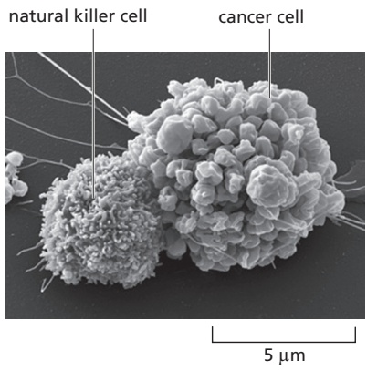

Figure 24–9 A natural killer (NK) cell attacking a cancer cell. This scanning electron micrograph was taken shortly after the NK cell attached to the cancer cell, causing the cancer cell to undergo MBoC7 m24.09/24.09apoptosis. The blebbing of the cancer cell’s plasma membrane is characteristic of cells dying in this way (discussed in Chapter 18; see Movie 18.1). (From Eye of Science/ Science Source.)

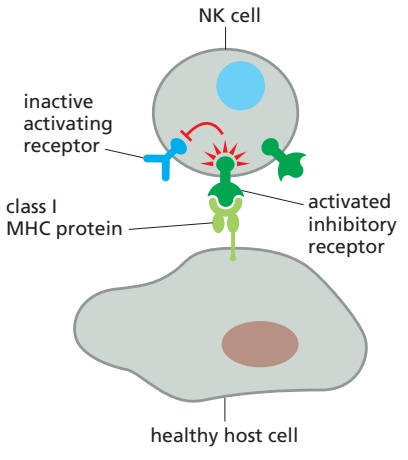

(A) HEALTHY HOST CELL NOT KILLED

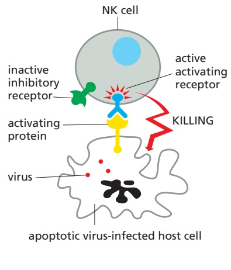

(B) VIRUS-INFECTED HOST CELL KILLED

Figure 24–10 How an NK cell recognizes its target. An NK cell displays a variety of activating and inhibitory receptors on its surface, and the decision to kill or not kill a host cell depends on the sum of interactions between these receptors and the molecules they recognize on the host cell. One simplified example is shown here. (A) The high levels of class I MHC proteins found on healthy host cells activate inhibitory receptors on the NK cell, suppressing the NK cell’s killing activity. (B) In contrast, the high levels of activating proteins and abnormally low level of class I MHC proteins on infected cells stimulate the NK cell to kill the virus-infected host cell by inducing the host cell to kill itself by undergoing apoptosis.

NK cells belong to a large class of lymphocyte-like cells of the innate immune system, collectively called innate lymphoid cells (ILCs); although these cells share some characteristics with T cells, they lack TCRs. Besides NK cells, the ILCs include more recently discovered cell types with diverse distributions and functions: some promote the early development of lymphoid tissues; some secrete various cytokines during innate immune responses to a wide variety of pathogens; others promote the repair of damaged tissues; and some help prevent adaptive immune responses against commensal microbes in the gut. And new ILCs and functions are still being discovered.

<!-- END EN EN24-H009-H009 -->

### 英文补充：细胞毒性T细胞诱导靶细胞凋亡

> 对应中文板块：细胞毒性T细胞诱导靶细胞凋亡。英文来源：Molecular Biology of the Cell，第7版，第24章；[本章完整原文](../../来源/英文教材/24_The_Innate_and_Adaptive_Immune_Systems/chapter.md)。物理PDF页码范围：1392–1443（整章范围）。

<!-- BEGIN EN EN24-H033-H033 -->
#### Cytotoxic T Cells Induce Infected Target Cells to Undergo Apoptosis

**Cytotoxic T cells** $( \mathbf { T _ { C } }$ **cells)**, like the NK cells discussed earlier, protect us against intracellular pathogens (including viruses, bacteria, and parasites) that multi-ply in the cytoplasm of a host cell. Both types of cytotoxic cells kill infected host cells before the pathogen can escape to infect neighboring host cells. Before a naïve $\mathrm { T _ { C } }$ cell can kill, however, it has to become an effector cell by activation on an $\mathrm { A P C } ,$ usually an activated dendritic cell that has pathogen-derived peptides bound to class I MHC proteins on its surface. The effector $\mathrm { T _ { C } }$ cell can then recognize any target cell harboring the same pathogen and expressing some of the same peptide–MHC complexes on its surface: its TCRs cluster, along with CD8 co-receptors, adhesion molecules, and intracellular signaling proteins (discussed later), at the interface between the two cells, forming an **immunological synapse**. In this process, the effector $\mathrm { T _ { C } }$ cell reorganizes its cytoskeleton to focus its killing apparatus on the target cell, secreting its toxic proteins into a confined space (**Figure 24–42**); in this way, it avoids killing neighboring cells. A similar synapse forms when an effector helper T cell interacts with its target cell, except that the co-receptor is CD4 (**Movie 24.11**).

An effector $\mathrm { T _ { C } }$ cell (or an NK cell) can employ one of two strategies to kill the target, both of which operate by inducing the target cell to activate caspases and kill itself by undergoing apoptosis. One mechanism uses a protein called Fas ligand on the killer-cell surface, which binds to a transmembrane receptor protein called Fas on the target cell; this mechanism is discussed in Chapter 18 (see Figure 18–6). The other mechanism is the main one used by both NK cells and $\mathrm { T _ { C } }$ cells to kill an infected target cell. The killer cell stores various toxic proteins within secretory vesicles in its cytoplasm that it releases into the synaptic space by exocytosis. The toxic proteins include perforin and proteases called granzymes. The perforin is homologous to complement component C9 and polymerizes in the target-cell plasma membrane (see Figure 24–8), forming a transmembrane pore that locally disrupts the membrane and allows the granzymes to enter the target cell. Once in the cytosol, one of the granzymes, granzyme $\mathbf { B } ,$ cleaves and activates executioner caspases, thereby inducing apoptosis (**Figure 24–43**).

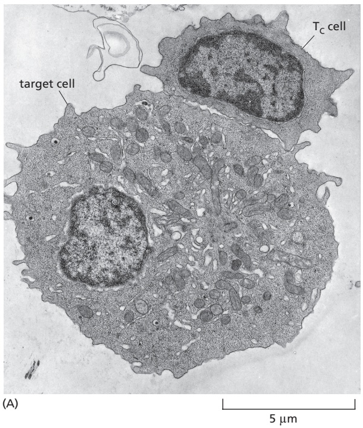

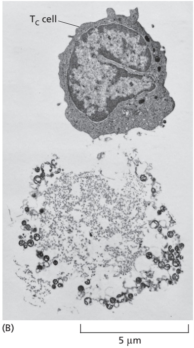

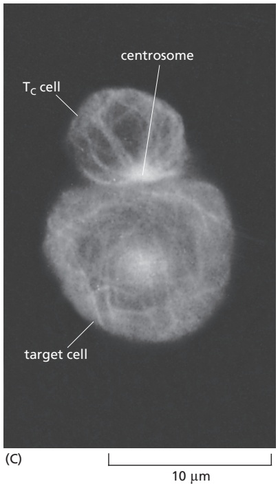

Figure 24–42 Effector cytotoxic T cells killing target cells in culture. (A) Electron micrograph showing an effector cytotoxic T cell (TC cell) binding to a target cell in culture. The TC cells were obtained from mice immunized with the target cells, which are foreign tumor cells. (B) Electron micrograph showing a $\top _ { \mathrm { C } }$ cell and a tumor cell that the $\top _ { \mathrm { C } }$ cell has killed. In an animal, as opposed to in a culture dish, the killed target cell would be phagocytosed by a neighboring cell (often a macrophage) long before it disintegrated in the way that it has here. (C) Micrograph of a $\mathsf { T } _ { \mathsf { C } }$ cell and a tumor cell after immunofluorescence staining with anti-tubulin antibodies. Note that the centrosome in the $\top _ { \mathrm { C } }$ cell is located at the point of cell–cell contact with the target cell—called an immunological synapse. The secretory granules (not visible) in the $\top _ { \mathrm { C } }$ cell are initially transported along microtubules to the centrosome, which then moves to the synapse, delivering the granules to where they can release their contents directly onto the target-cell surface. (A and B, from D. Zagury et al., Eur. J. Immunol. 5:818–822, 1975. With permission from John Wiley & Sons; $\mathrm { C } ,$ © 1982 B. Geiger et al. Originally published in J. Cell Biol. https://doi.org/10.1083/jcb.95.1.137. With permission from Rockefeller University Press.)

<!-- END EN EN24-H033-H033 -->

## 跨章相关英文内容

- 自噬机制；不可直接等同于自噬性细胞死亡：[EN第13章 · 自噬、选择性自噬与溶酶体胞吐](../../05_细胞质基质与内膜系统/小节/02_第二节%20细胞内膜系统及其功能.md#EN13-H063-H067)。
