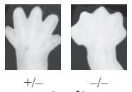
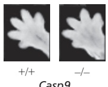
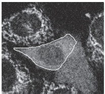
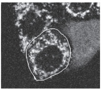

# 第15章 细胞衰老与细胞程序性死亡 · 英文习题与参考文献

### 英文补充：习题与参考文献

> 对应中文板块：习题与参考文献。英文来源：Molecular Biology of the Cell，第7版，第18章；[本章完整原文](../来源/英文教材/18_Cell_Death/chapter.md)。物理PDF页码范围：1128–1143（整章范围）。

<!-- BEGIN EN EN18-EXERCISES -->
#### PROBLEMS

Which statements are true? Explain why or why not.

18–1 In normal adult tissues, cell death usually balances cell division.

18–2 Mammalian cells that do not have cytochrome c should be resistant to apoptosis induced by DNA damage.

Discuss the following problems.

18–3 Fas ligand is a homotrimeric plasma membrane protein on killer lymphocytes that binds to a homotrimeric death receptor, Fas, on the surface of target cells, including some lymphocytes (**Figure Q18–1**). The clustering of trimeric Fas by the binding of clusters of Fas ligand alters the conformation of Fas so that it binds an adaptor protein, which then recruits and activates caspase-8, triggering a caspase cascade that leads to apoptotic cell death.

Figure Q18–1 The binding of trimeric Fas ligand to Fas (Problem 18–3). Although not shown, at least two trimeric Fas ligands have to bind to and cluster at least two trimeric Fas receptors to activate the pathway; for clarity, only a single copy of the ligand and receptor is shown.

In humans, the autoimmune lymphoproliferative syndrome (ALPS) is associated with dominant mutations in Fas that include point mutations and C-terminal truncations. In individuals that are heterozygous for such mutations, some lymphocytes do not die at their normal rate and accumulate in abnormally large numbers, causing a variety of clinical problems. In contrast to these patients, individuals heterozygous for mutations that eliminate Fas expression entirely do not have these clinical problems.

Assuming that the normal and dominant forms of Fas are expressed to the same level and assemble randomly into trimers, what fraction of Fas–Fas ligand complexes on a lymphocyte from a heterozygous ALPS patient would be expected to be composed entirely of normal Fas subunits? Does your calculation suggest an explanation for why individuals heterozygous for expressed Fas mutants have clinical problems, whereas heterozygous individuals with unexpressed Fas mutants have no clinical problems?

18–4 In contrast to their similar brain abnormalities, newborn mice deficient in Apaf1 or caspase-9 have distinctive abnormalities in their paws. Apaf1-deficient mice fail to eliminate the webs between their developing digits, whereas caspase-9–deficient mice have normally formed digits (**Figure Q18–2**). If Apaf1 and caspase-9 function in the same apoptotic pathway, how is it possible for these deficient mice to differ in web-cell apoptosis?

Figure Q18–2 Appearance of paws in Apaf1–/– and Casp9–/– newborn mice relative to normal newborn mice (Problem 18–4). (From H. Yoshida et al., Cell 94:739–750, 1998. With permission from Elsevier.)

Apaf1

Casp9

18–5 When human cancer cells are exposed to ultraviolet (UV) light at 90 mJ/cm2, most of the cells undergo apoptosis within 24 hours. Release of cytochrome c from mitochondria can be detected as early as 6 hours after exposure of a population of such cells to UV light, and it continues to increase for more than 10 hours thereafter. Does this mean that individual cells slowly release their cytochrome c over this time period? Or, alternatively, do individual cells release their cytochrome c rapidly but with different cells being triggered at variable times?

To answer this fundamental question, you have fused the gene for green fluorescent protein (GFP) to the gene for cytochrome $c _ { r }$ so that you can observe the behavior of individual cells by confocal fluorescence microscopy. In cells that are expressing the cytochrome c– GFP fusion protein, fluorescence shows the punctate pattern typical of mitochondrial proteins. You then irradiate these cells with UV light and observe individual cells for changes in the punctate pattern. Two such cells (outlined in white) are shown in **Figure Q18–3A and B**. Release of cytochrome c–GFP is detected as a change from a punctate to a diffuse pattern of fluorescence characteristic of a cytosolic protein. Times after UV exposure are indicated as hours:minutes below the individual panels.

(A)

10:09

(B)

17:10

10:15

17:18

Figure Q18–3 Analysis of cytochrome c–GFP release from mitochondria of individual cells by time-lapse video fluorescence microscopy (Problem 18–5). (A) Cells observed for 6 minutes, 10 hours after UV irradiation. (B) Cells observed for 8 minutes, 17 hours after UV irradiation. One cell in A and one in B, each outlined in white, have released their cytochrome c–GFP during the time frame of the observation, which is shown as hours:minutes below each panel. (From J.C. Goldstein et al., Nat. Cell Biol. 2:156–162, published 2000 by. / . Nature Publishing Group. Reproduced with permission from SNCSC.)

Which model for cytochrome c release do these observations support? Explain your reasoning.

18–6 Imagine that you could microinject cytochrome c into the cytosol of wild-type mammalian cells, or into the cytosol of cells that were defective for the process of mitochondrial outer membrane permeabilization (MOMP). Would you expect the injected wild-type cells or the injected MOMP-defective cells to undergo apoptosis? Explain your reasoning.

18–7 Which one of the following statements about Bcl2 family members is correct?

A. Bak is pro-apoptotic and Bax is anti-apoptotic.

B. Bax is pro-apoptotic and BclxL is anti-apoptotic.

C. Bcl2 is pro-apoptotic and Bak is anti-apoptotic.

18–8 One important role of Fas and Fas ligand is to mediate the elimination of tumor cells by killer lymphocytes. In a study of 35 primary lung and colon tumors, half the tumors were found to have amplified and overexpressed a gene for a secreted protein that binds to Fas ligand. How do you suppose that overexpression of this protein might contribute to the survival of these tumor cells? Explain your reasoning.

D. BclxL is pro-apoptotic and Bcl2 is anti-apoptotic.

#### REFERENCES

Adams JM & Cory S (2017) The BCL-2 arbiters of apoptosis and their growing role as cancer targets. Cell Death Differ. 25, 27–36.

Birkinshaw RW & Czabotar PE (2017) The BCL-2 family of proteins and mitochondrial outer membrane permeabilization. Semin. Cell Dev. Biol. 72, 152–162.

Czabotar PE, Lessene G, Strasser A & Adams JM (2014) Control of apoptosis by the BCL-2 protein family: implications for physiology and therapy. Nat. Rev. Mol. Cell Biol. 5, 49–63.

Danial NN & Korsmeyer SJ (2004) Cell death: critical control points. Cell 116, 205–219.

Datta SR, Ranger AM, Lin MZ . . . Greenberg ME (2002) Survival factor-mediated BAD phosphorylation raises the mitochondrial threshold for apoptosis. Dev. Cell 3, 631–643.

Davies AM (1996) The neurotrophic hypothesis: where does it stand? Philos. Trans. R. Soc. Lond. B Biol. Sci. 351, 389–394.

Dorstyn L, Akey WA & Kumar S (2018) New insights into apoptosome structure and function. Cell Death Differ. 25, 1194–1208.

Ellis RE, Yuan JY & Horvitz HR (1991) Mechanisms and functions of cell death. Annu. Rev. Cell Biol. 7, 663–698.

Fu T-M, Li Y, Lu A . . . Wu H (2016) Cryo-EM structure of caspase-8 tandem DED filament reveals assembly and regulation mechanisms of the death-inducing signaling complex. Mol. Cell 64, 236–250.

Galluzzi L, Vitale I, Aaronson SA . . . Kroemer G (2018) Molecular mechanisms of cell death: recommendations of the Nomenclature Committee on Cell Death. Cell Death Differ. 25, 486–541.

Green DR (2018) Cell Death: Apoptosis and Other Means to an End, 2nd ed. Cold Spring Harbor, NY: Cold Spring Harbor Laboratory Press.

Ha HJ, Chun HL & Park HH (2020) Assembly of platforms for signal transduction in the new era: dimerization, helical filament assembly, and beyond. Exp. Mol. Med. 52, 356–366.

Jiang X & Wang X (2004) Cytochrome C-mediated apoptosis. Annu. Rev. Biochem. 73, 87–108.

Jost PJ, Grabow S, Gray D . . . Kaufmann T (2009) XIAP discriminates between type I and type II FAS-induced apoptosis. Nature 460, 1935–1039.

Julien O & Wells JA (2017) Caspases and their substrates. Cell Death Differ. 24, 1380–1389.

Jullien M, Gomez-Bougie, Chiron D & Touzeau C (2020) Restoring apoptosis with BH3 mimetics in mature B-cell malignancies. Cells 9, 717.

Kale J, Osterlund EJ & Andrews DW (2018) BCL-2 family proteins: changing partners in the dance towards death. Cell Death Differ. 25, 65–80.

Kalkavan H & Green DR (2018) MOMP, cell suicide as a BCL-2 family business. Cell Death Differ. 25, 46–55.

Kerr JF, Wylie AH & Currie AR (1972) Apoptosis: a basic biological phenomenon with wide-ranging implications in tissue kinetics. Br. J. Cancer 26, 239–257.

Mandal R, Barron JC, Kostova I . . . Strebhardt K (2020) Caspase-8: the double-edged sword. Biochim. Biophys. Acta Rev. Cancer 1873, 1–18.

Nagata S (2005) DNA degradation in development and programmed cell death. Annu. Rev. Immunol. 23, 853–875.

Nagata S, Suzuki J & Fujii T (2016) Exposure of phosphatidylserine on the cell surface. Cell Death Differ. 23, 952–961.

Silke J & Vince J (2017) IAPs and cell death. Curr. Top. Microbiol. Immunol. 403, 96–117.

Voss AK & Strasser A (2020) The essentials of developmental apoptosis. F1000Res. 9, F1000 Faculty Rev-148.
<!-- END EN EN18-EXERCISES -->
