# 第16章 细胞的社会联系 · 双教材整合

按中文节顺序保留正文，在每节末插入对应英文内容。

---

## 第16章 细胞的社会联系 · 章首导读

[返回本章](README.md) · [中文本章原文](中文原文.md)

<!-- BEGIN CN CN16-S00 -->
# 第16章 细胞的社会联系

<!-- 章节边界按正文内容恢复；原始 MinerU 内容保留如下。 -->

# 细胞的社会联系

在多细胞生物体内，没有哪个细胞是“孤立”的，它们通过细胞通信、细胞黏着、细胞连接以及细胞与胞外基质的相互作用，构成了复杂的细胞社会。细胞的社会联系体现在细胞与细胞间、细胞与胞外环境甚至机体间的相互作用、相互制约和相互依存。细胞的形态结构、生命活动以及在机体中的位置均受到机体、局部组织、周围细胞以及细胞外信号分子的调节与控制。不言而喻，细胞社会联系在胚胎发育、组织构建等过程中尤为重要。在胚胎发育过程中，胚胎细胞通过细胞社会的联系彼此交流信息，以决定细胞的行为和命运，包括结构与功能分化、位置以及生死抉择等。细胞社会联系是组织建成、维持及修复的最主要保障。神经细胞、免疫细胞以及内分泌细胞通过社会性联系，共同参与并维持机体的稳态平衡。细胞社会联系的破坏往往导致细胞病变甚至死亡。

细胞通信和信号转导是细胞社会性联系的核心内容，有关知识已在第十一章描述，本章重点从细胞连接、细胞黏着和细胞外基质等方面介绍细胞的社会联系。

<!-- END CN CN16-S00 -->

---

## 第16章 细胞的社会联系 · 第一节 细胞连接

[返回本章](README.md) · [中文本章原文](中文原文.md)

<!-- BEGIN CN CN16-S01 -->
## 第一节 细胞连接

细胞连接（cell junction）是指在细胞质膜的特化区域，通过膜蛋白、细胞骨架蛋白或者胞外基质形成的细胞与细胞之间、细胞与胞外基质之间的连接结构。细胞连接是细胞社会性的结构基础，是多细胞有机体中相邻细胞之间协同作用的重要组织方式，主要存在于上皮细胞间。根据行使功能的不同，细胞连接可分为三大类：

（1）封闭连接（occluding junction）将相邻上皮细胞的质膜紧密地连接在一起，阻止溶液中的小分子沿细胞间隙从细胞一侧渗透到另一侧。紧密连接是这种连接的典型代表。

(2) 锚定连接（anchoring junction）通过细胞膜蛋白及细胞骨架系统将相邻细胞，或细胞与胞外基质间黏着起来。根据直接参与细胞连接的细胞骨架纤维类型的不同，锚定连接又分为与中间丝相关的锚定连接和与肌动蛋白纤维相关的锚定连接。前者包括桥粒和半桥粒；后者主要有黏着带和黏着斑。

(3) 通信连接（communicating junction）介导相邻细胞间的物质转运、化学或电信号的传递，主要包括动物细胞间的间隙连接、神经元之间或神经元与效应细胞之间的化学突触和植物细胞间的胞间连丝。

通过基因敲除、生化分析及酵母双杂交系统等技术可以研究细胞连接的功能，揭示参与细胞连接的相关蛋白质等。

## 一、封闭连接

紧密连接（tight junction）是封闭连接的主要类型，一般存在于上皮细胞之间。在光镜下，小肠上皮细胞之间的闭锁堤区域便是紧密连接存在的部位。电镜下，紧密连接处的相邻细胞质膜紧紧地靠在一起，没有间隙。冷冻断裂复型技术显示出它是由围绕在细胞四周的“焊接线”形成。焊接线又称为嵴线，它由成串排列的特殊跨膜蛋白组成。相邻细胞的嵴线相互交联封闭了细胞之间的间隙，其形态结构如图16-1所示。

紧密连接有两个主要功能。一是形成渗透屏障，阻止可溶性物质从上皮细胞层一侧通过细胞间隙扩散到另一侧，起封闭作用。如将电子致密物氢氧化镧加入上皮细胞一侧作为示踪物，电镜观察发现这些示踪物不能够通过细胞间形成的紧密连接进入细胞的另一侧。紧密连接不但在上皮细胞间存在，也存在于血管内皮细胞间，特别是在大脑的血管内皮细胞间更为明显。紧密连接的大脑毛细血管内皮细胞参与形成血脑屏障，阻止离子或水分子等通过血管内皮组织进入脑组织，从而保证大脑内环境的稳定性。但血脑屏障的形成也阻止了多种药物从血管进入中枢神经系统。非常有趣的是，尽管离子或水分子等小分子物质不能通过血脑屏障，但免疫细胞却能够顺利通过内皮细胞间的紧密连接。目前认为这可能是因为免疫细胞分泌了信号分子，从而打开紧密连接。这也提示紧密连接形成的渗透屏障是相对的。某些小分子可以通过相邻细胞间的紧密连接，以细胞旁路途径(paracellular pathway)从上皮细胞层一侧转运或“渗漏”到另一侧，如小肠上皮和肾小管组织中存在细胞旁路转运方式。这种转运方式的调节与构成紧密连接的密封蛋白(claudin)组成有关，也与G蛋白-cAMP信号通路的调节有关。一种遗传性低镁血症就涉及Claudin-16基因的变异，导致镁离子不能借助细胞旁路转运方式通过肾小管进入血液，引起抽搐；因Claudin-14基因突变引起的遗传性耳聋也与细胞旁路转运异常有关。

紧密连接的第二个功能是形成上皮细胞膜蛋白与膜脂分子侧向扩散的屏障，从而维持上皮细胞的极性。小肠上皮细胞是极性细胞，有面向肠腔的顶面（apical face）或游离面，以及基底面（basolateral face）。游离面质膜与基底面质膜担负不同的功能，游离面含有大量吸收葡萄糖分子的协同转运载体，完成 $\mathrm{Na}^+$ 驱动的葡萄糖同向转运；而基底面含有执行被动运输的葡萄糖转运载体，将葡萄糖转运到细胞外液，从而完成葡萄糖的吸收和转运功能。正是由于紧密连接限制了膜蛋白和膜脂分子的流动性，使得上皮细胞游离面与基底面的膜蛋白以及膜脂分子只能够在各自的膜区域流动以行使各自不同的功能。因此，紧密连接不仅仅是细胞间的一个机械

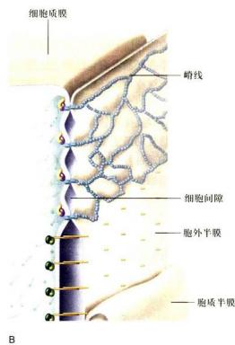  
图 16-1 小肠上皮细胞紧密连接结构

A. 小肠上皮细胞紧密连接的冷冻断裂复型电镜照片，示细胞微绒毛和细胞紧密连接区。B. 紧密连接模式图，两个相邻细胞的质膜通过崎线紧密连接在一起。（A 图由 Bechara Kachar 博士惠赠）

连接装置，而且还能维持上皮细胞极性，保证细胞正常行使功能。

紧密连接通过相邻细胞膜上的跨膜蛋白形成嵴线而相互作用，从而将两个细胞的质膜紧密地连接在一起。目前从紧密连接的嵴线中至少确定了两类蛋白：一类称为闭合蛋白（occludin），是分子质量为 $60\mathrm{kDa}$ 的4次跨膜蛋白；另一类称为密封蛋白，也是4次跨膜的蛋白家族（现已鉴定20种以上）。闭合蛋白和密封蛋白形成嵴线的相互作用还依赖于其他蛋白质，如细胞膜的外周蛋白ZO，将嵴线锚定在微丝上。近年发现，claudin-1和闭合蛋白还是丙型肝炎病毒（hepatitis C virus, HCV）入侵细胞所必需的受体，意味着紧密连接很有可能和HCV入侵细胞的过程相关。

## 二、锚定连接

单纯的细胞质膜并不能有效地将机械压力从一个细胞传递到另一个细胞或者胞外基质，因此其承受机械力的强度很低。但当细胞形成组织后，由于细胞间或者细胞与胞外基质间通过锚定连接分散作用力，从而增强细胞承受机械力的能力。锚定连接在机体组织内广泛分布，在那些需要承受机械力的组织内尤其丰富，如心脏、肌肉及上皮组织等。锚定连接由两类蛋白质构成。第一类统称细胞内锚蛋白（anchor protein），这类蛋白质形成独特的盘状致密斑（胞质斑），一侧与细胞内的骨架纤维如中间丝或者微丝相连，另一侧与跨膜黏着蛋白质相连。第二类统称跨膜黏着蛋白质（adhesion protein），这类蛋白质是细胞膜蛋白，一端与胞内锚蛋白相连，另一端与胞外基质蛋白或与相邻细胞特异的跨膜黏着蛋白质相连。

## （一）与中间丝相连的锚定连接：桥粒与半桥粒

桥粒（desmosome）是连接相邻细胞间的锚定连接方式，最明显的形态特征是细胞内锚蛋白形成独特的盘状致密斑，一侧与细胞内的中间丝相连，另一侧与跨膜黏着蛋白质相连，在两个细胞之间形成纽扣样结构，将相邻细胞铆接在一起（图16-2）。胞内锚蛋白包括桥粒斑珠蛋白（plakoglobin）和桥粒斑蛋白（desmoplakin）。跨膜黏着蛋白质属于钙黏蛋白家族（cadherin family），包括桥粒芯蛋白（desmoglein）和桥粒芯胶黏蛋白（desmocollin）等。细胞内中间丝依据细胞类型不同而种类有异，在上皮细胞主要是角蛋白丝

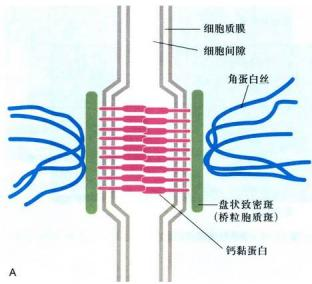

  
图 16-2 桥粒结构  
A. 上皮细胞桥粒结构示意图。B. 小鼠膀胱上皮细胞桥粒电镜图（何万中博士惠赠）。

(keratin filament)。

从桥粒结构上看，一个细胞内的中间丝与相邻细胞内的中间丝通过桥粒相互作用，从而将相邻细胞连成一体，增强了细胞抵抗外界压力与张力的机械强度。临床上有一种自身免疫缺陷病——天疱疮（pemphigus），其病因是患者自身抗体结合桥粒跨膜黏着蛋白质，从而破坏桥粒结构，导致上皮细胞间锚定连接丧失，体液渗漏

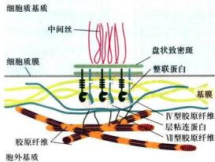  
图 16-3 半桥粒结构模式图

而产生严重的皮肤水疱病。

半桥粒（hemidesmosome）在形态上与桥粒类似，但功能和化学组成不同。半桥粒是细胞与胞外基质间的连接形式，参与的细胞骨架仍然是中间丝，但其细胞膜上的跨膜黏着蛋白质是整联蛋白（integrin），与整联蛋白相连的胞外基质是层粘连蛋白。通过半桥粒，上皮细胞可以黏着在基膜上（图16-3）。

## （二）与肌动蛋白纤维相连的锚定连接：黏着带与黏着斑

黏着带（adhesion belt）位于上皮细胞紧密连接的下方，相邻细胞间形成一个连续的带状结构（图16-4）。黏着带处的相邻细胞间隙约 $30\mathrm{nm}$ ，其间由 $\mathrm{Ca^{2+}}$ 依赖的跨膜黏着蛋白质（钙黏蛋白）形成胞间横桥相连。细胞内的锚蛋白有联蛋白（catenin）、黏着斑蛋白(vinculin) 及 $\alpha$ -辅肌动蛋白 ( $\alpha$ -actinin) 等。与黏着带相连的骨架纤维是肌动蛋白纤维。联蛋白介导钙黏蛋白与微丝的连接。由于平行排列的微丝及其结合的肌球蛋白能够产生相对运动，导致微丝收缩，因此推测在动物胚胎发育形态建成过程中，黏着带能促使上皮细胞层弯曲形成神经管等结构。

  
图16-4 小肠上皮细胞之间黏着带示意图

黏着斑（focal adhesion）是细胞与胞外基质之间的连接方式，参与的细胞骨架组分是微丝，跨膜黏着蛋白质是整联蛋白，胞外基质主要是胶原和纤连蛋白，胞内锚蛋白有踝蛋白(talin)、α-辅肌动蛋白、细丝蛋白和组蛋白等。这种连接形式在肌肉与肌腱（主要成分是胶原）很常见。体外培养的成纤维细胞通过黏着斑贴附在培养皿基质上，微丝终止于黏着斑处，这种结构有助于维持细胞在运动过程中的张力以及影响细胞生长的信号传递（图16-5）。

## 三、通信连接

## （一）间隙连接

间隙连接（gap junction）在动物组织细胞间分布非常广泛。除骨骼肌细胞及血细胞外，几乎所有的动物组织细胞都利用间隙连接来进行通信联系。

## 1. 结构与成分

间隙连接的基本结构单位是连接子（connexon）。每个连接子由6个相同或相似的连接子蛋白（connexin）呈环状排列而成，中央形成一个直径约1.5 nm的亲水性通道。相邻细胞质膜上的两个连接子对接便形成完整的间隙连接结构（图16-6）。间隙连接处相邻细胞质膜间的间隙为2\~3 nm，因而间隙连接也称缝隙连接。许多间隙连接单位往往集结在一起形成大小不一的片状结构（图16-6A），最大直径可达0.3 μm，因此通过密度梯度离心技术可将质膜上的间隙连接区域的膜片分离出来。目前已从不同动物或不同组织中分离出20余种构成连接子的蛋白质，它们属于同一类蛋白质家族，其分子质量从26 kDa至60 kDa不等。这类蛋白质较一般蛋白质更能抗去垢剂抽提和蛋白酶的消化，所以比较容易纯化。尽管连接子蛋白的分子质量差异较大，但所有连接子蛋白都具有4个保守的α螺旋跨膜区（图16-6C）。连接子蛋白的一级结构比较保守，其氨基酸序列具有相似的亲水性与疏水性分布。然而不同类型细胞表达不同的连接子蛋白，多数细胞表达一种或几种，它们所组装的间隙连接的孔径与调控机制也有所不同。

  
图16-5 黏着斑结构与功能示意图

  
图16-6 间隙连接  
A. 间隙连接结构示意图。B. 间隙连接的蛋白组成。C. 4次跨膜的连接子蛋白结构示意图。D. 豚鼠上皮细胞冷冻蚀刻电镜照片显示间隙连接成片分布区域。（D图由Bechara Kachar博士惠赠）

## 2. 功能

相邻细胞通过间隙连接可以实现代谢偶联或电偶联。通过向细胞内注射不同分子量的染料，证明间隙连接的通道可以允许分子量小于1000的分子通过，这表明细胞内的小分子，如无机盐离子、糖、氨基酸、核苷酸、维生素、cAMP和 $\mathrm{IP}_3$ 等小分子物质能从一个细胞通过间隙连接的通道进入另一个细胞，而蛋白质、核酸、多糖等生物大分子则不能通过。

（1）间隙连接在代谢偶联中的作用 间隙连接允许通过小分子代谢物和信号分子，以实现细胞间代谢偶联或细胞通信。代谢偶联现象在体外培养细胞中已得到实验证实，缺乏胸苷激酶的突变细胞株，不能利用胸苷合成DNA。将突变细胞与含有胸苷激酶的正常细胞共培养，两种细胞相互接触并形成间隙连接，此时向培养液中加入放射性标记的胸苷，结果显示放射性标记的胸苷不仅可掺入到正常细胞的DNA中，也可掺入到突变细胞的DNA中，表明放射性标记的胸苷进入正常细胞后在胸苷激酶的作用下形成三磷酸胸苷（TTP），然后作为DNA合成的前体物，通过间隙连接进入突变细胞中参与DNA合成。代谢偶联作用在协调细胞群体的生物学功能方面起重要的作用，如当促细胞分泌的激素促胰液素（secretin）作用于胰腺泡胞细胞，其基底面质膜上的受体与激素分子结合，激发细胞内作为第二信使的cAMP和 $\mathrm{Ca^{2+}}$ 浓度增高，促使贮存在分泌泡中的胰蛋白酶向胞外释放。cAMP和 $\mathrm{Ca^{2+}}$ 都可通过间隙连接从一个细胞进入相邻的细胞中。因此，只要有部分细胞接受信号分子的作用后，便可使所有腺泡细胞同时向外分泌消化酶。

(2) 间隙连接在神经冲动信息传递中的作用 神经元之间或神经元与效应细胞（如肌细胞）之间通过突触（synapse）完成神经冲动的传导。突触可分为电突触（electronic synapse）和化学突触（chemical synapse）两种基本类型。电突触是指细胞间形成间隙连接，电冲动可直接通过间隙连接从突触前向突触后传导（图16-7）。与化学突触传递信号不同，电突触的间隙连接有利于细胞间的快速通信，让动作电位（离子流）从一个细胞直接通过间隙连接通道迅速传递到另一个细胞。而化学突触传递信号时，神经冲动传递到轴突末端，引起神经递质小泡释放神经递质，然后神经递质作用于突触后细胞，引起新的神经冲动。这种信号传递涉及将电信号转变为化学信号，再将化学信号转变为电信号的过程。

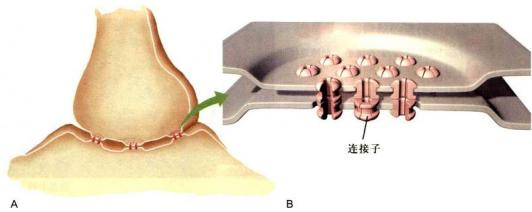  
图 16-7 电突触结构示意图  
A. 电突触结构示意图。B. 电突触的间隙连接示意图。

而电突触传递信号时是通过间隙连接直接将电信号从一个细胞传递到另一个细胞，相对来讲，信号传递速度快了很多。这对于某些无脊椎动物和鱼类快速准确地逃避反射十分重要，如龙虾在外界刺激后的15 ms内即可作出反应。

此外，间隙连接在协调心肌细胞的收缩，保证心脏正常跳动，协调小肠平滑肌的收缩，控制小肠蠕动等过程中也都能通过电偶联的方式来协调细胞群体行为。

(3) 间隙连接在胚胎早期发育中的作用 间隙连接出现在动物胚胎发育的早期, 如在小鼠胚胎八细胞阶段, 细胞之间普遍建立了电偶联。但是当细胞开始分化后, 不同细胞群之间电偶联逐渐消失, 说明间隙连接存在于发育与分化的特定阶段的细胞之间。若将抗连接子蛋白的抗体注射到八细胞蛙胚的某个细胞中, 则细胞间的电偶联被选择性阻断, 注射的染料只存留在被注射细胞及其子细胞中, 并且使胚胎发育出现明显的缺陷。很可能胚胎发育中细胞间的代谢偶联或电偶联为影响细胞分化的信号物质的传递提供了重要的通路。

有趣的是，除了依赖亲水性通道发挥通信功能外，最近发现，间隙连接还有黏着特性。在大脑发育过程中，神经元与放射状纤维形成间隙连接而黏着在一起，通过连接子蛋白与细胞内的微丝相互作用，介导了神经元沿放射状纤维的迁移。

## 3. 间隙连接通透性的调节

间隙连接允许分子量小于 1 000 的无机离子及小分子物质通过，但间隙连接的通透性也是可变的，表现在以下两个方面：

（1）间隙连接对小分子物质的通透能力具有底物选择性 如豚鼠耳蜗支持细胞间的间隙连接对阳离子通透性明显比阴离子大。同样，耳蜗感觉上皮细胞的间隙连接（连接子蛋白主要为 Cx26）也表现出对带正电荷的分子通透性大。

(2) 间隙连接通透性受细胞质 $Ca^{2+}$ 浓度和 pH 调节降低胞质中的 pH 和提高胞质中自由 $Ca^{2+}$ 的浓度都可以使间隙连接通透性降低。在某些组织中，间隙连接的通透性还受两侧电压梯度的调控及细胞外化学信号的调控。这些现象表明，间隙连接通道是一种动态结构，其构象可发生可逆性变化。电压和 pH 对间隙连接通透性调节的意义尚不清楚。 $Ca^{2+}$ 浓度的升高关闭了间隙连接的通道，至少可阻止细胞高浓度的 $Ca^{2+}$ 进入相邻细胞而影响其正常细胞代谢活动。

间隙连接通透性还受胞外化学信号的调节，有助于细胞间的代谢偶联。例如，当胰高血糖素作用于肝细胞时，使肝细胞内cAMP水平增高，cAMP激活了依赖于cAMP的蛋白激酶，蛋白激酶又使间隙连接蛋白磷酸化，导致其构象发生改变，从而使间隙连接通透性增加，这样cAMP就可以迅速从一个细胞扩散到周围的肝细胞，最终使肝细胞共同对胰高血糖素的刺激作出应答反应。

## （二）胞间连丝

植物细胞具有坚韧的细胞壁，因此相邻细胞的质膜无法形成像动物细胞间的紧密连接和间隙连接，也不需要形成锚定连接，但植物细胞间仍然需要通信。除极少数特化的细胞外，高等植物细胞之间通过胞间连丝(plasmodesma）相互连接，完成细胞间的通信联络。胞间连丝穿越细胞壁，由相邻细胞的细胞质膜共同组成直径为20\~40 nm的管状结构，中央是由光面内质网延伸形成的链样管（desmotubule）。在链样管与管状质膜之间是由细胞液构成的环孔（图16-8）。环孔两端狭窄，可能用以调节细胞间的物质交换。胞间连丝可在植物细胞胞质分裂中细胞板形成后期产生，也可在非姐妹细胞之间形成，而且还可以通过修饰改变它的结构和运输功能。

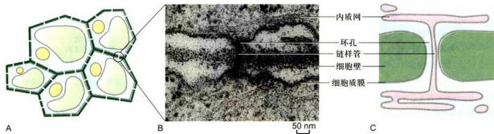  
图 16-8 胞间连丝  
A. 植物细胞之间形成众多胞间连丝。B. 马铃薯细胞胞间连丝电镜照片。C. 胞间连丝的结构示意图。(B图由袁明博士惠赠)

胞间连丝形成了物质从一个细胞进入另一个细胞的通路，所以在植物细胞的物质运输和信号传递中起着非常重要的作用。例如，在分泌旺盛的细胞中，胞间连丝的数目可达15个/μm²，而一般细胞中约为1个/μm²。同间隙连接一样，可用荧光染料扩散实验和脉冲电流传导实验来研究胞间连丝的通信功能。向一个细胞中注入荧光染料则染料迅速扩散到相邻的细胞内，同样，向某个细胞加上一定大小的脉冲电流，在相邻细胞中则可检测到脉冲电流的存在，检测到的脉冲电流强度减小的程度与细胞间的胞间连丝数量有关。

胞间连丝介导的细胞间的物质运输也是有选择性的，并且是可以调节的。显微注射荧光染料标记的多肽实验表明，正常情况下，胞间连丝可以允许分子量小于1000的分子自由通过。但是，在有些组织的细胞之间，即使是很小的分子也不能通过胞间连丝，其调节机制至今并不十分清楚。很多植物病毒编码一种特殊的运动蛋白，分子质量大多在 $30\mathrm{kDa}$ 左右，可以使胞间连丝的通透性增大，进而使病毒蛋白和核酸通过胞间连丝感染相邻的细胞。例如烟草花叶病毒可通过其自身的p30运动蛋白调节胞间连丝孔径，使病毒粒子从一个细胞进入另一个细胞。p30蛋白缺陷突变株不能完成对植株的感染，而在有p30蛋白少量表达的转基因植株中，突变株病毒又可以恢复感染。实验表明，某些细胞蛋白与核酸等生物大分子均可通过胞间连丝进入相邻细胞，因此植物细胞胞间连丝在协调其基因表达与生理功能中起着重要作用。绿色荧光蛋白标记技术发现，在烟草叶肉组织的发育过程中，早期细胞间的胞间连丝可允许50 kDa的蛋白质通过，而在成熟细胞中，胞间连丝呈分枝状，只能允许通过分子量为400的物质，显示在发育过程中，胞间连丝结构的改变可以调节植物细胞间的物质运输。

## （三）化学突触

化学突触是存在于可兴奋细胞之间的细胞连接方式，它通过释放神经递质来传导神经冲动并因此而得名。在信息传递中，有一个将电信号转化为化学信号，再将化学信号转化为电信号的过程，因此表现出动作电位在传递中的延迟现象。化学突触是相对电突触而言的，相关知识参见生理学有关内容。

<!-- END CN CN16-S01 -->

---

## 对应英文内容

### 英文补充：细胞连接概述

> 对应中文板块：细胞连接概述。英文来源：Molecular Biology of the Cell，第7版，第19章；[本章完整原文](../来源/英文教材/19_Cell_Junctions_and_the_Extracellular_Matrix/chapter.md)。物理PDF页码范围：1144–1201（整章范围）。

<!-- BEGIN EN EN19-H000-H001 -->
CELLS IN THEIR SOCIAL CONTEXT

#### Cell Junctions and the Extracellular Matrix

Of all the social interactions between cells in a multicellular organism, the most fundamental are those that hold the cells together. Cells may be linked by direct interactions or they may be held together within the extracellular matrix, a complex network of proteins and polysaccharide chains that the cells secrete. By one means or another, cells must cohere if they are to form an organized multicellular structure that can withstand and respond to the various external forces that try to pull it apart.

Mechanisms of cell cohesion govern the architecture of tissues and organs— their shape, strength, and the arrangement of different cell types. The making and breaking of the attachments between cells and the modeling of the extracellular matrix govern the way cells move within the organism, guiding them as the body grows, develops, and repairs itself. Attachments to other cells and to the extracellular matrix control the orientation and behavior of the cell’s cytoskeleton, thereby allowing cells to sense and respond to changes in the mechanical features of their environment. Thus, the apparatus of cell junctions and the extracellular matrix is critical for every aspect of the organization, function, and dynamics of multicellular structures. Defects in this apparatus underlie an enormous variety of diseases.

The key features of cell junctions and the extracellular matrix are best illustrated by considering two broad categories of tissues that are found in all animals (**Figure 19–1**). **Connective tissues**, such as bone or tendon, are formed from an extracellular matrix produced by cells that are distributed sparsely in the matrix. It is the matrix—rather than the cells—that bears most of the mechanical stress to which the tissue is subjected. Cell–matrix junctions link connective tissue cells to the matrix, allowing the cells to move through the matrix and monitor changes in its mechanical properties.

In **epithelial tissues**, such as the lining of the gut or the epidermal covering of the skin, cells are tightly bound together into sheets called **epithelia**. The extracellular matrix is less pronounced, consisting mainly of a thin mat called the basal lamina (or basement membrane) underlying the sheet. Within the epithelium, cells are attached to each other directly by cell–cell junctions, where cytoskeletal filaments are anchored, transmitting stresses across the interiors of the cells, from

C HAP T E R

19

IN THIS CHAPTER

Cell–Cell Junctions

The Extracellular Matrix of Animals

Cell–Matrix Junctions

The Plant Cell Wall

mechanical stresses are transmitted from cell to cell by cytoskeletal filaments anchored to cell–matrix and cell–cell adhesion sites

extracellular matrix directly bears mechanical stresses of tension and compression

adhesion site to adhesion site. The cytoskeletons of epithelial cells are also linked to the basal lamina through cell–matrix junctions.

**Figure 19–2** provides a closer view of epithelial cells to illustrate the major types of cell–cell and cell–matrix junctions that we will discuss in this chapter. The diagram shows the typical arrangement of junctions in a simple columnar epithelium such as the lining of the small intestine of a vertebrate. Here, a single layer of tall cells stands on a basal lamina, with the cells’ uppermost surface, orMBoC7 m19.01/19.01 **apical** surface, free and exposed to the extracellular medium. On their sides, or lateral surfaces, the cells make junctions with one another. Two types of cell–cell junctions link the cytoskeletons of adjacent cells: **adherens junctions** are connected to actin filaments, and **desmosomes** are linked to intermediate filaments. Because these junctions anchor the cells strongly to each other and thus help the tissue withstand mechanical stress, they are sometimes called **anchoring junctions**. At the **basal** surface of the cells, two additional types of anchoring junctions link the cytoskeleton of the epithelial cell to the basal lamina: actin-linked cell– matrix junctions anchor actin filaments to the matrix, while hemidesmosomes anchor intermediate filaments to it.

Figure 19–1 How animal cells are bound together in two major tissue types. In connective tissue, the extracellular matrix is the main stress-bearing component. In epithelial tissue, the cytoskeleton of the cell is the main stress-bearing component: the cytoskeletons of cells are linked from cell to cell by adhesive junctions and transmit mechanical stresses across the interiors of the cells. Cell–matrix attachments bond epithelial tissue to the connective tissue beneath it.

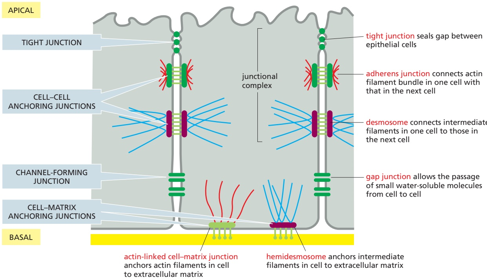

Figure 19–2 A summary of the various cell junctions found in a vertebrate epithelial cell. In the apical region of the cell, the relative positions of the junctions are the same in nearly all vertebrate epithelia. The tight junction occupies the most apical position, followed by the adherens junction (adhesion belt) and then by a special parallel row of desmosomes; together, these three junctions form a structure called a junctional complex. Gap junctions and additional desmosomes are less regularly organized. Two types of cell–matrix anchoring junctions tether the basal surface of the cell to the basal lamina. The drawing is based on epithelial cells of the small intestine.

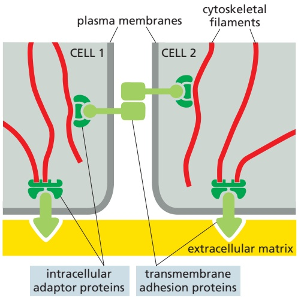

Figure 19–3 Transmembrane adhesion proteins link the cytoskeleton to extracellular structures. The external linkage may be either to other cells (cell–cell junctions, mediated typically by cadherins) or to extracellular matrix (cell–matrix junctions, mediated typically by integrins). The internal linkage to the cytoskeleton is generally indirect, via intracellular adaptor proteins, to be discussed later.

Two other types of cell–cell junctions are shown in Figure 19–2. Tight junctions hold the cells closely together near the apical surface, sealing the gap between the cells and thereby preventing molecules from leaking across the epithelium. Near the basal end of the cells are channel-forming junctions, called gap junctions, that create passageways linking the cytoplasms of adjacent cells.

Each of the four major anchoring junction types depends on **transmembrane adhesion proteins** that span the plasma membrane, with one end linking to the cytoskeleton inside the cell and the other end linking to other structures outside it (**Figure 19–3**). These cytoskeleton-linked transmembrane proteins fall neatly into two superfamilies, corresponding to the two basic kinds of external attachment. Proteins of the **cadherin** superfamily chiefly mediate attachment of cell to cell (**Movie 19.1**). Proteins of the **integrin** superfamily chiefly mediate attachment of cells to matrix. There is specialization within each family: some cadherins link to actin and form adherens junctions, while others link to intermediate filaments and form desmosomes; likewise, some integrins link to actin and form actinlinked cell–matrix junctions, while others link to intermediate filaments and form hemidesmosomes (**Table 19–1**).

<table><tbody><tr><td colspan="5">TABLE 19-1 Anchoring Junctions</td></tr><tr><td>Junction</td><td>Transmembrane adhesion protein</td><td>Extracellular ligand</td><td>Intracellular cytoskeletal attachment</td><td>Intracellular adaptor proteins</td></tr><tr><td colspan="5">Cell-cell</td></tr><tr><td>Adherens junction</td><td>Classical cadherins</td><td>Classical cadherin on neighboring cell</td><td>Actin filaments</td><td>α-Catenin, β-catenin, p120-catenin, vinculin</td></tr><tr><td>Desmosome</td><td>Nonclassical cadherins (desmoglein, desmocollin)</td><td>Desmoglein and desmocollin on neighboring cell</td><td>Intermediate filaments</td><td>Plakoglobin, plakophilin, desmoplakin</td></tr><tr><td colspan="5">Cell-matrix</td></tr><tr><td>Actin-linked cell-matrix junction</td><td>Integrin</td><td>Extracellular matrix proteins</td><td>Actin filaments</td><td>Talin, kindlin, vinculin, paxillin, focal adhesion kinase (FAK), numerous others</td></tr><tr><td>Hemidesmosome</td><td>α6β4 integrin, type XVII collagen</td><td>Extracellular matrix proteins</td><td>Intermediate filaments</td><td>Plectin, BP230</td></tr></tbody></table>

There are some exceptions to these rules. Some integrins, for example, mediate cell–cell rather than cell–matrix attachment. Moreover, there are other types of cell adhesion molecules that can provide transient cell–cell attachments more flimsy than anchoring junctions but sufficient to stick cells together in special circumstances.

We begin the chapter with a discussion of the major forms of cell–cell junctions. We then consider in turn the extracellular matrix of animals, the structure and function of integrin-mediated cell–matrix junctions, and, finally, the plant cell wall, a special form of extracellular matrix.

#### CELL–CELL JUNCTIONS

Cell–cell junctions come in many forms and can be regulated by a variety of mechanisms. The best understood and most common are the two types of cell– cell anchoring junctions, which employ cadherins to link the cytoskeleton of one cell with that of its neighbor. Their primary function is to resist the external forces that pull cells apart. The epithelial cells of your skin, for example, must remain tightly linked when they are stretched, pinched, or poked. Cell–cell anchoring junctions must also be dynamic and adaptable, so that they can be altered or rearranged when tissues are remodeled or repaired or when there are changes in the forces acting on them.

In this section, we focus primarily on the cadherin-based anchoring junctions. We then briefly describe tight junctions and gap junctions. Finally, we consider the more transient cell–cell adhesion mechanisms employed by some cells in the bloodstream.

<!-- END EN EN19-H000-H001 -->

### 英文补充：黏着连接、桥粒、紧密连接与通信连接

> 对应中文板块：黏着连接、桥粒、紧密连接与通信连接。英文来源：Molecular Biology of the Cell，第7版，第19章；[本章完整原文](../来源/英文教材/19_Cell_Junctions_and_the_Extracellular_Matrix/chapter.md)。物理PDF页码范围：1144–1201（整章范围）。

<!-- BEGIN EN EN19-H005-H015 -->
#### Assembly of Strong Cell–Cell Adhesions Requires Changes in the Actin Cytoskeleton

In their mature form, adherens junctions are enormous protein complexes containing hundreds to thousands of cadherin molecules, packed into dense, regular arrays that are linked on the extracellular side by lateral interactions between cadherin domains (see Figure 19–6C). The assembly of these junctions over a large surface area is not simply a matter of adding more cadherins to an initial attachment site, but also requires changes in the underlying actin cytoskeleton. Most important, strong adhesion requires a decrease in cortical tension at the site of the adhesion.

Cortical tension in a cell is much like the surface tension of a water droplet. In water, binding between water molecules at the air–water interface pulls the surface inward, resulting in a spherical shape that resists disruption by other surfaces that do not interact with the water molecules (**Figure 19–10A**). Similarly, an unattached cell in suspension assumes a spherical shape because of cortical tension, which results from the contractile activity generated by bundles of actin and non-muscle myosin II at the cell cortex, just beneath the plasma membrane (**Figure 19–10B**). This cortical tension is so strong that when two cells initially interact through binding of cadherins on their surfaces, cortical tension prevents the spreading of the adhesion surface—and the cells interact at a single point.

Assembly of a large adhesion surface therefore depends on local reduction of cortical tension, which is achieved by inhibition of cortical actin–myosin fiber formation. These changes depend in part on two small GTPases called Rac and Rho. As we discussed in Chapter 16 (see Figure 16–75), signals generated by these GTPases govern local actin filament behavior: Rho generally promotes the formation of actin–myosin stress fibers at the cell cortex, while Rac inhibits the formation of these fibers and instead promotes branched actin networks. When two epithelial precursor cells first interact at a small cluster of cadherin linkages, the cadherins generate intracellular signals that promote local activation of Rac and inhibition of Rho. The result is disassembly of actin–myosin fibers and loss of local cortical tension—which then allows further cadherin recruitment to spread the adhesion to a larger surface area (**Figure 19–10C**). Rac activation has the added benefit of stimulating local actin protrusions from the cell, which also contributes to expansion of the junction. The implications of this mechanism are clear: the development of strong adhesions depends not only on the cell adhesion molecules themselves but also on the associated regulatory systems that govern actin behavior.

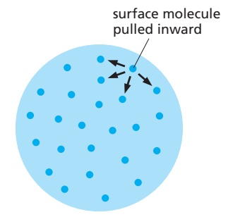

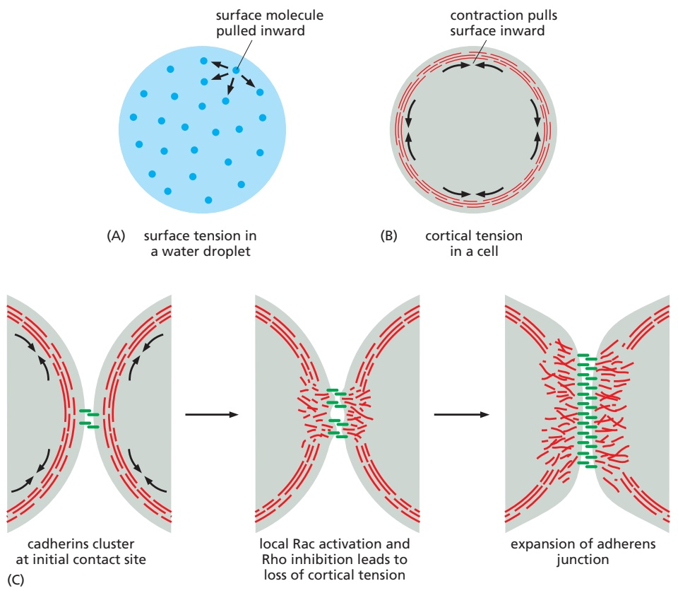

Figure 19–10 Local changes in cortical tension help promote the initial formation of an adherens junction. (A) Surface tension of a water droplet results from binding among water molecules at the air–water interface, pulling the surface inward. (B) In an unattached cell, the contraction of actin–myosin bundles at the cell cortex (red) creates cortical tension, drawing the surface inward. (C) When two epithelial cell precursors first interact, small cadherin clusters (green) assemble at the contact site. Cortical tension prevents this initial interaction site from spreading. The cadherins generate local signals to inhibit the GTPase Rho and activate the GTPase Rac, leading to localized disassembly of actin–myosin fibers, loss of cortical tension, and formation of branched actin networks and cell protrusions––all of which allow the recruitment of more cadherins and the spreading of the cell–cell junction over a greater surface area. In the long term (not shown), the large adherens junction inhibits Rac and stimulates Rho, thereby promoting formation of local actin–myosin fibers that interact with the cadherins (see Figure 19–11).

Eventually, after large numbers of cadherin molecules are aligned at a nascent adherens junction, Rac is inhibited and Rho is activated, which promotes the assembly of linear, contractile actin filament bundles that link the adherens junction to the actin cytoskeleton. These new linkages pull the junction inward, generating tension that stimulates further actin recruitment and expansion of the junction, as we describe in the next sections.

#### Catenins Link Classical Cadherins to the Actin Cytoskeleton

The extracellular domains of cadherins mediate homophilic binding at adherens junctions. The intracellular domains of typical cadherins, including all classical and some nonclassical ones, interact with filaments of the cytoskeleton: actin at adherens junctions and intermediate filaments at desmosomes (see Table 19–1). These cytoskeletal linkages are essential for efficient cell–cell adhesion, as cadherins that lack their cytoplasmic domains cannot stably hold cells together.

The linkage of cadherins to the cytoskeleton depends on adaptor proteins that assemble on the cytoplasmic tail of the cadherin. At adherens junctions, the cadherin tail binds two such proteins, b-catenin and a distant relative called p120-catenin; a third protein called a-catenin interacts with β-catenin and recruits other proteins to provide a dynamic linkage to actin filaments (**Figure 19–11**). At desmosomes, cadherins are linked to intermediate filaments through other adaptor proteins, including a β-catenin–related protein called plakoglobin, as we discuss later.

#### Adherens Junctions Respond to Tension from Inside and Outside the Tissue

Figure 19–11 The linkage of classical cadherins to actin filaments. The cadherins are coupled indirectly to actin filaments through an adaptor proteinBoC7 m19.10/19.11 complex containing p120-catenin, β-catenin, and α-catenin. Other proteins, including vinculin, associate with α-catenin and help provide the linkage to actin. β-Catenin has a second, and very important, function in intracellular signaling, as we discuss in Chapter 15 (see Figure 15–61). For clarity, this diagram does not show the cadherin of the adjacent cell in the junction.

The protein complexes that mediate junctions either between cells or between cells and the extracellular matrix are dynamic machines that have the remarkable ability to sense mechanical stresses and generate biochemical signals that lead to an appropriate response. We call this mechanotransduction.

As we discussed in the previous sections, adherens junctions are linked through catenins to contractile bundles of actin and myosin II. These junctions are therefore subjected to pulling forces generated by the attached actin. The pulling forces are important for junction assembly and maintenance: inhibition of myosin activity, for example, results in the disassembly of many adherens junctions. Furthermore, the contractile forces acting on a junction in one cell are balanced by contractile forces at the junction of the neighboring cell, so that no cell pulls others toward it.

Adherens junctions sense the forces acting on them and modify local actin and myosin behavior to balance the forces on both sides of the junction. Evidence for these mechanisms comes from studies of pairs of cultured mammalian cells connected by adherens junctions. If contractile activity in one cell is increased experimentally, the adherens junctions linking the two cells increase in size, and the contractile activity of the second cell increases to match that of the first— resulting in a balance of forces across the junction. These and other experiments reveal that adherens junctions are not simply passive sites of protein–protein binding but are tension sensors that regulate their behavior in response to changing mechanical conditions.

Mechanotransduction at cell–cell junctions is thought to depend, at least in part, on proteins in the cadherin complex that alter their shape when stretched by tension. The protein α-catenin, for example, is stretched from a folded to an extended conformation when contractile activity increases at the junction. The unfolding exposes a cryptic binding site for another protein, vinculin, which promotes the recruitment of more actin to the junction (**Figure 19–12**). It is likely that these changes also lead to local regulation of the small GTPases that control actin and myosin behavior. By mechanisms such as this, pulling on a junction alters local actin behavior to make the junction stronger. Furthermore, as noted above, pulling on a junction in one cell will increase the contractile force generated in the attached cell.

Figure 19–12 Mechanotransduction in an adherens junction. Cell–cell junctions are able to sense increased tension and respond by strengthening their actin linkages. When actin filaments are pulled from within the cell by non-muscle myosin II, the resulting force unfolds a domain in α-catenin, thereby exposing an otherwise hidden binding site for the adaptor protein vinculin. Vinculin then promotes additional actin recruitment, strengthening the linkages between the junction and the cytoskeleton.

Because all the cells in an epithelium are mechanically linked through their cell–cell junctions and cytoskeletons, mechanotransduction can also work over long distances. In the developing wing of Drosophila, for example, contraction of cells in the hinge of the wing results in mechanical stresses that spreadMBoC7 m19.12/19.12 throughout the wing, triggering changes in cell movement and orientation that are important for wing formation. It is likely that tension sensors throughout the tissue detect shifts in mechanical stress and trigger a molecular response. Because tension spreads quickly through all connected cells in a tissue, it provides an unusually rapid and effective signal for modifying cell behavior throughout the tissue.

#### Tissue Remodeling Depends on the Coordination of Actin-mediated Contraction with Cell–Cell Adhesion

Adherens junctions are an essential part of the machinery for modeling the shapes of multicellular structures in the animal body. By indirectly linking the actin filaments in one cell to those in its neighbors, they enable the cells in the tissue to use their actin cytoskeletons in a coordinated way.

Adherens junctions occur in various forms. In many nonepithelial tissues, they appear as small punctate or linear attachments that connect the cortical actin filaments beneath the plasma membranes of two interacting cells. In heart muscle, they anchor the actin bundles of the contractile apparatus and act in parallel with desmosomes to link the contractile cells end-to-end. But the prototypical examples of adherens junctions occur in epithelia, where they often form a continuous **adhesion belt** (or zonula adherens) that encircles each of the cells just beneath the apical surface of the epithelium (**Figure 19–13**). Within each cell, a contractile bundle of actin filaments and myosin II lies adjacent to the adhesion belt, oriented parallel to the plasma membrane and tethered to it by the cadherins and their associated intracellular adaptor proteins. The actin–myosin bundles are thus linked, via the cadherins, into an extensive transcellular network. Coordinated contraction of this network provides the motile force for a fundamentalMBoC7 m19.13/19.13 process in animal morphogenesis—the folding of epithelial-cell sheets into tubes, spheres, and related structures (**Figure 19–14**).

Figure 19–13 Adherens junctions between epithelial cells in the small intestine. These cells are specialized for absorption of nutrients; at their apical surfaces, facing the lumen of the gut, they have many microvilli (protrusions that increase the absorptive surface area). The adherens junction takes the form of an adhesion belt, encircling each of the interacting cells. Its most obvious feature is a contractile bundle of actin filaments running along the cytoplasmic surface of the junctional plasma membrane. The actin filament bundles are tethered by adaptor proteins to cadherins, which bind to cadherins on the adjacent cell. In this way, the actin filament bundles in adjacent cells are tied together. For clarity, this drawing does not show most of the other cell–cell and cell–matrix junctions of epithelial cells (see Figure 19–2).

In some forms of tissue remodeling, actin–myosin contractility is coordinated with major changes in local cell–cell adhesion patterns. An example can be found in cellular rearrangements that occur early in the development of the fruit fly Drosophila melanogaster. Soon after gastrulation, the outer epithelium of the embryo is elongated by a process called germ-band extension, in which the cells converge inward along the dorsal–ventral axis and extend along the anterior– posterior axis. Actin-dependent contraction along dorsal–ventral cell boundaries is accompanied by a loss of specific adherens junctions to allow cells to insert themselves between other cells (a process called intercalation), resulting in a longer and narrower epithelium (**Figure 19–15**). We do not fully understand the mechanisms underlying the disassembly of adherens junctions along dorsal–ventral cell boundaries, but one possibility is that actin-based contractile forces pull sufficiently hard on the edges of cell–cell adhesions to peel them apart, particularly if contraction is coupled to additional regulatory mechanisms that weaken the adhesion. There is evidence, for example, that remodeling of these and other adhesions during development depends on removal of cadherins from the cell surface by clathrin-mediated endocytosis.

Figure 19–14 The folding of an epithelial sheet to form an epithelial tube. The oriented contraction of the bundles of actin and myosin filaments running along adhesion belts causes the epithelial cells to narrow at their apical surfaces, thereby helping the epithelial sheet to roll up into a tube. An example is the formation of the neural tube in early vertebrate development (see Figure 19–8).

Figure 19–15 Remodeling of cell–cell adhesions in embryonic Drosophila epithelium. Depicted at left is a group of cells in the outer epithelium of a Drosophila embryo. During germ-band extension, cells converge toward each other (middle) on the dorsal–ventral axis and then extend (right) along the anterior–posterior axis. The result is intercalation: cells that were originally far apart along the dorsal–ventral axis (green) are inserted between the cells (gray) that separated them. These rearrangements depend on the spatial regulation of actin–myosin contractile bundles, which are localized primarily at the vertical cell boundaries (red, left). Contraction of these bundles is accompanied by removal of E-cadherin (not shown) at the same cell boundaries, resulting in shrinkage and loss of adhesion along the vertical axis (middle). New cadherin-based adhesions (blue, right) then form and expand along horizontal boundaries, resulting in extension of the cells in the anterior–posterior dimension.

#### Desmosomes Give Epithelia Mechanical Strength

Desmosomes are structurally similar to adherens junctions but contain specialized cadherins that link to intermediate filaments instead of actin filaments. Their main function is to provide mechanical strength. Desmosomes are important in vertebrates but are not found, for example, in Drosophila. They are present in most mature vertebrate epithelia and are particularly plentiful in tissues that are subject to high levels of mechanical stress, such as heart muscle and the epidermis, the epithelium that forms the outer layer of the skin.

**Figure 19–16A** shows the general structure of a desmosome, and **Figure 19–16B** shows some of the proteins that form it. Desmosomes typically appear as buttonlike spots of adhesion, riveting the cells together (**Figure 19–16C**). Inside the cell, the bundles of rope-like intermediate filaments that are anchored to the desmosomes form a structural framework of great tensile strength (**Figure 19–16D**), with linkage to similar bundles in adjacent cells, creating a network that extends throughout the tissue (**Figure 19–17**). The particular type of intermediate filaments attached to the desmosomes depends on the cell type: they are keratin filaments in most epithelial cells, for example, and desmin filaments in heart muscle cells.

The importance of desmosomes is demonstrated by some forms of the potentially fatal skin disease pemphigus. Affected individuals make antibodies against one of their own desmosomal cadherin proteins. These antibodies bind to and disrupt the desmosomes that hold their epidermal cells (keratinocytes) together. This results in a severe blistering of the skin, with leakage of body fluids into the loosened epithelium.

#### Tight Junctions Form a Seal Between Cells and a Fence Between Plasma Membrane Domains

Sheets of epithelial cells enclose and partition the animal body, lining all its surfaces and cavities, and creating internal compartments where specialized processes occur. The epithelial sheet seems to be one of the inventions that lie at the origin of animal evolution, diversifying in a huge variety of ways but retaining an organization that is based on a set of conserved molecular mechanisms.

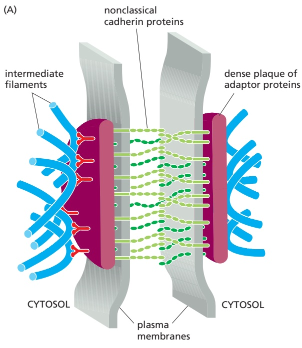

Figure 19–16 Desmosomes. (A) The structural components of a desmosome. On the cytoplasmic surface of each interacting plasma membrane is a dense plaque composed of a mixture of intracellular adaptor proteins. A bundle of intermediate filaments is attached to the surface of each plaque. Transmembrane nonclassical cadherins bind to the plaques and interact through their extracellular domains to hold the adjacent membranes together. (B) Some of the molecular components of a desmosome. Desmoglein and desmocollin are nonclassical cadherins. Their cytoplasmic tails bind plakoglobin (γ-catenin) and plakophilin (a distant relative of p120-catenin), which in turn bind to desmoplakin. Desmoplakin binds to the sides of intermediate filaments, thereby tying the desmosome to these filaments. (C) An electron micrograph of desmosome junctions between three epidermal cells in the skin of a baby mouse. (D) Part of the same tissue at higher magnification, showing a single desmosome, with intermediate filaments attached to it. (C and D, from W. He et al., Science 302:109–113, 2003. With permission from AAAS.)

Essentially all epithelia are anchored to other tissue on one side (the basal. / . side) and free of such attachment on their opposite side (the apical side). A basal lamina lies at the interface with the underlying tissue, mediating the attachment, while the apical surface of the epithelium is generally bathed in extracellular fluid. Thus, as discussed in Chapter 16, all epithelia are structurally **polarized**, and so are their individual cells: the basal end of a cell, adherent to the basal lamina below, differs from the apical end, exposed to the medium above.

Correspondingly, all epithelia have at least one function in common: they serve as selective permeability barriers, separating the fluid that permeates the tissue on their basal side from fluid with a different chemical composition on their apical side. This barrier function requires that the adjacent cells be sealed together by **tight junctions**, so that molecules cannot leak freely across the cell sheet.

The epithelium of the small intestine provides a good illustration of tightjunction structure and function (see Figure 19–2). This epithelium has a simple columnar structure; that is, it consists of a single layer of tall (columnar) cells. These are of several differentiated types, but the majority are absorptive cells, specialized for uptake of nutrients from the internal cavity, or lumen, of the gut.

Figure 19–17 Desmosomes, hemidesmosomes, and the intermediate filament network. The keratin intermediate filament networks of adjacent cells—in this example, epithelial cells of the small intestine—are indirectly connected to one another through desmosomes, and to the basal lamina through hemidesmosomes.

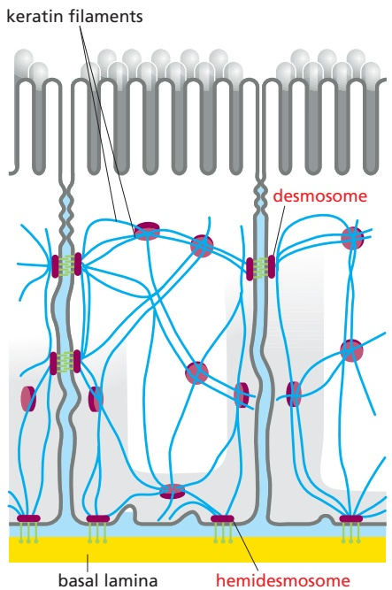

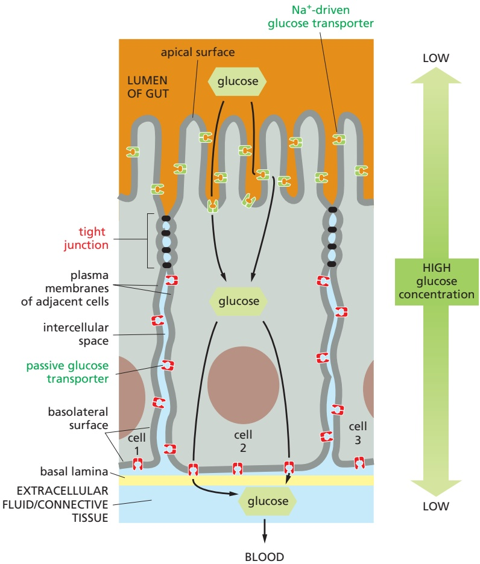

Figure 19–18 The role of tight junctions in transcellular transport. For clarity, only the tight junctions are shown. Transport proteins are confined to different regions of the plasma membrane in epithelial cells of the small intestine. This segregation results in the one-way transfer of nutrients across the epithelium from the gut lumen to the blood. In the example shown, glucose is actively transported into the cell by Na+-driven glucose transporters at its apical surface, and it leaves the cell through passive glucose transporters in its basolateral membrane. Tight junctions are thought to confine the transport proteins to their appropriate membrane domains by acting as diffusion barriers, or “fences,” within the lipid bilayer of the plasma membrane; these junctions also block the backflow of glucose from the basal side of the epithelium into the gut lumen (see Movie 11.2).

The absorptive cells have to transport selected nutrients across the epithelium from the lumen into the extracellular fluid on the other side. From there, these nutrients diffuse into small blood vessels to provide nourishment to the organism. This transcellular transport depends on two sets of transport proteins in the plasma membrane of the absorptive cell. One set is confined to the apical surface of the cell (facing the lumen) and actively transports selected molecules into theMBoC7 m19.18/19.18 cell from the gut. The other set is confined to the basolateral (basal and lateral) surfaces of the cell, and it allows the same molecules to leave the cell by passive transport into the extracellular fluid on the other side of the epithelium. For this transport activity to be effective, the spaces between the epithelial cells must be tightly sealed, so that the transported molecules cannot leak back into the gut lumen through these spaces (**Figure 19–18**). Moreover, the transport proteins must be correctly distributed in the plasma membranes: the apical transporters must be delivered to the apical membrane and must not be allowed to drift to the basolateral membrane, and the basolateral transporters must be delivered to and remain in the basolateral membrane. Tight junctions, besides sealing the gaps between the cells, also function as “fences” that help prevent apical or basolateral proteins from diffusing into the wrong region.

The sealing function of tight junctions is easy to demonstrate experimentally: a low-molecular-mass tracer added to one side of an epithelium will generally not pass beyond the tight junction (**Figure 19–19**). This seal is not absolute, however. Although all tight junctions are impermeable to macromolecules, their permeability to ions and other small molecules varies. Tight junctions in the epithelium lining the small intestine, for example, are 10,000 times more permeable to inorganic ions, such as $\mathrm { N a } ^ { + }$ , than the tight junctions in the epithelium lining the urinary bladder. The movement of ions and other molecules between epithelial cells is called paracellular transport, and tissue-specific differences in transport rates generally result from differences in the proteins that form tight junctions.

lateral plasma membrane

microvilli

Figure 19–19 The role of tight junctions in allowing epithelia to serve as barriers to solute diffusion. (A) The drawing shows how a small extracellular tracer molecule added on one side of an epithelium is prevented from crossing the epithelium by the tight junctions that seal adjacent cells together. Adherens junctions and other cell junctions are not shown for clarity. (B) Electron micrographs of cells in an epithelium in which a small, extracellular, electron-dense tracer molecule has been added to either the apical side (on the left) or the basolateral side (on the right). The tight junction blocks passage of the tracer in both directions. (B, courtesy of Daniel Friend, by permission of E.L. Bearer.)

#### Tight Junctions Contain Strands of Transmembrane Adhesion Proteins

When tight junctions are visualized by freeze-fracture electron microscopy, they are seen as a branching network of sealing strands that completely encircles the apical end of each cell in the epithelial sheet (**Figure 19–20A and B**). In conventional electron micrographs, the outer leaflets of the two interacting plasma membranesMBoC7 m19.19/19.19 are tightly apposed where sealing strands are present (**Figure 19–20C**). Each sealing strand is composed of a long row of transmembrane homophilic adhesion proteins embedded in each of the two interacting plasma membranes. The extracellular domains of these proteins adhere directly to one another to occlude the intercellular space (**Figure 19–21**).

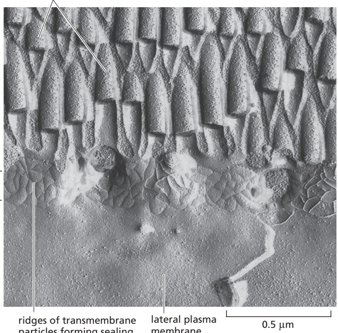

(A)

(B)

ridges of transmembrane particles forming sealing strands

cell 1

cell 2

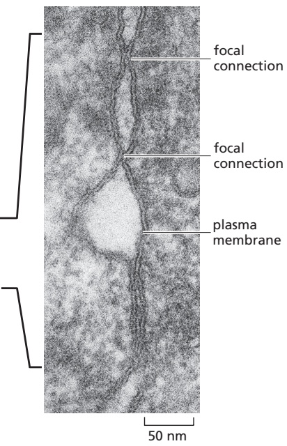

(C)

Figure 19–20 The structure of a tight junction between epithelial cells of the small intestine. The junctions are shown (A) schematically, (B) in a freeze-fracture electron micrograph, and (C) in a conventional electron micrograph. In B, the plane of the micrograph is parallel to the plane of the membrane, and the tight junction appears as a band of branching sealing strands that encircle each cell in the epithelium (see Figure 19–21A). In C, the junction is seen in cross section as a series of focal connections between the outer leaflets of the two interacting plasma membranes, each connection corresponding to a sealing strand in cross section. [B and C, from N.B. Gilula, in Cell Communication (R.P. Cox, ed.), pp. 1–29. New York: Wiley, 1974. With permission from John Wiley & Sons.]

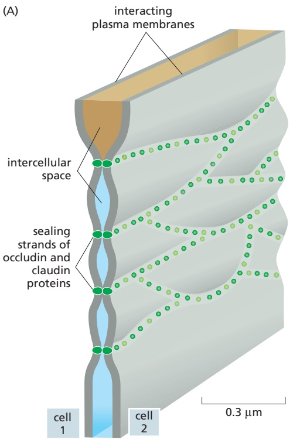

(B)

Figure 19–21 A model of a tight junction. (A) The sealing strands hold adjacent plasma membranes together. The strands are composed of transmembrane proteins that make contact across the intercellular space and create a seal. (B) The molecular composition of a sealing strand. The major extracellular components of the tight junction are members of a family of proteins with four transmembrane domains. One of these proteins, claudin, is the most important for the assembly and structure of the sealing strands, whereas the related protein occludin governs junction permeability. The two termini of these proteins are both on the cytoplasmic side of the membrane, where they interact with large scaffolding proteins that organize the sealing strands and link the tight junction to the actin cytoskeleton (not shown here, but see Figure 19–22).

The main transmembrane proteins forming these strands are the claudins, which are essential for tight-junction formation and function. Mice that lack the claudin-1 gene, for example, fail to make tight junctions between the cells in the epidermal layer of the skin; as a result, the baby mice lose water rapidlyMBoC7 m19.21/19.21 by evaporation through the skin and die within a day after birth. Conversely, if nonepithelial cells such as fibroblasts are artificially caused to express claudin genes, they will form tight-junctional connections with one another. Normal tight junctions also contain a second major transmembrane protein called occludin, which is not essential for the assembly or structure of the tight junction but is important for limiting junctional permeability. A third transmembrane protein, tricellulin, is required to seal cell membranes together and prevent transepithelial leakage at the points where three cells meet.

The claudin protein family has many members (24 in humans), and these are expressed in different combinations in different epithelia to confer particular permeability properties on the epithelial sheet. They are thought to form paracellular pores—selective channels allowing specific ions to cross the tight-junctional barrier, from one extracellular space to another. A specific claudin found in kidney epithelial cells, for example, is needed to let $\mathrm { M g } ^ { 2 ^ { \dot { + } } }$ pass between the cells of the kidney tubules so that this ion can be resorbed from the urine into the blood. A mutation in the gene encoding this claudin results in excessive loss of $\mathrm { M g ^ { 2 + } }$ in the urine.

#### Scaffold Proteins Organize Junctional Protein Complexes

Like the cadherin molecules of an adherens junction, the claudins and occludins of a tight junction interact with each other on their extracellular sides to promote junction assembly. Also as in adherens junctions, the organization of adhesion proteins in a tight junction depends on additional proteins that bind the cytoplasmic side of the adhesion proteins. The key organizational proteins at tight junctions are the zonula occludens (ZO) proteins. The three major members of the ZO family—ZO-1, ZO-2, and ZO-3—are large scaffold proteins that provide a structural support on which the tight junction is built. These intracellular molecules consist of strings of protein-binding domains, typically including several **PDZ domains** that can recognize and bind the C-terminal tails of specific partner proteins (**Figure 19–22**). One domain of these scaffold proteins can attach to a claudin protein, while others can attach to occludin or the actin cytoskeleton. Moreover, one molecule of scaffold protein can bind to another. In this way, the cell assembles a meshwork of intracellular proteins that organizes and positions the sealing strands of the tight junction.

Figure 19–22 Scaffold proteins at the tight junction. The scaffold proteins ZO-1, ZO-2, and ZO-3 are concentrated beneath the plasma membrane at tight junctions. Each of the proteins contains multiple protein-binding domains, including three PDZ domains, an SH3 domain, a GK domain, and a proline-rich domain (P), linked together like beads on a flexible string. These domains enable the proteins to interact with each other and with numerous other partners, as indicated here by arrows, to generate a tightly woven protein network that organizes the sealing strands of the tight junction and links them to the actin cytoskeleton. Scaffold proteins with similar structure help organize other junctional complexes, including those at neural synapses.

The tight-junctional network of sealing strands usually lies just apical to adherens and desmosome junctions that bond the cells together mechanically; the whole assembly is called a junctional complex (see Figure 19–2). The parts of this junctional complex depend on each other for their formation. For example, anti-cadherin antibodies that block the formation of adherens junctions also inhibit the formation of tight junctions.

#### Gap Junctions Couple Cells Both Electrically and Metabolically

Tight junctions block the passageways through the gaps between epithelial cells, preventing extracellular molecules from leaking from one side of an epithelium to the other. Another type of junctional structure has a radically different function: it bridges gaps between adjacent cells so as to create direct channels from the cytoplasm of one to that of the other. These channels are called **gap junctions**.

Gap junctions are present in most animal tissues, including connective tissues as well as epithelia and heart muscle. Each gap junction appears in conventional electron micrographs as a patch where the membranes of two adjacent cells are separated by a uniform narrow gap of about 2–4 nm (**Figure 19–23**). The gap is spanned by channel-forming proteins, of which there are two distinct families, called the connexins and the innexins. Connexins are the predominant gapjunction proteins in vertebrates, with 21 isoforms in humans. Innexins are found in the gap junctions of invertebrates.

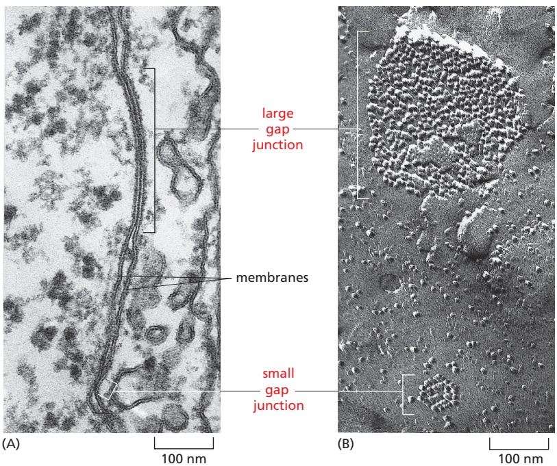

Figure 19–23 Gap junctions as seen in the electron microscope. (A) Thinsection and (B) freeze-fracture electron micrographs of a large and a small gap-junction plaque between fibroblasts in culture. In B, each gap junction is seen as a cluster of homogeneous intramembrane particles. Each intramembrane particle corresponds to a connexon (see Figure 19–25). [From N.B. Gilula, in Cell Communication (R.P. Cox, ed.), pp. 1–29. New York: Wiley, 1974. With permission from John WIley and Sons.]

Gap junctions have a pore size of about 1.4 nm, which allows the exchange of inorganic ions and other small water-soluble molecules, but not of macromolecules such as proteins or nucleic acids (**Figure 19–24**). An electric current injected into one cell through a microelectrode causes an electrical disturbance in the neighboring cell, due to the flow of ions carrying electric charge through gap junctions. This electrical coupling via gap junctions serves an obvious purpose in tissues containing electrically excitable cells: action potentials can spread rapidly from cell to cell, without the delay that occurs at chemical synapses. In vertebrates, for example, electrical coupling through gap junctions synchronizes the contractions of heart muscle cells as well as those of the smooth muscle cells responsible for the peristaltic movements of the intestine. Gap junctions also occur in many tissues whose cells are not electrically excitable. In principle, the sharing of small metabolites and ions provides a mechanism for coordinating the activities of individual cells in such tissues and for smoothing out random fluctuations in small-molecule concentrations in different cells.

#### A Gap-Junction Connexon Is Made of Six Transmembrane Connexin Subunits

Figure 19–24 Determining the size of a gap-junction channel. When fluorescent molecules of various sizes are injected into one of two cells coupled by gap junctions, molecules with a mass of less than about 1000 daltons can pass into the other cell, but larger molecules cannot. Thus, the coupled cells share their small molecules (such as inorganic ions, sugars, amino acids, nucleotides, vitamins, and the intracellular signaling molecules cyclic AMP and inositol trisphosphate) but not their macromolecules (proteins, nucleic acids, and polysaccharides).

**Connexins** are four-pass transmembrane proteins, six of which assemble to form a hemichannel, or **connexon**. When the connexons in the plasma membranes of two cells in contact are aligned, they form a continuous aqueous channel that connects the two cell interiors (**Figure 19–25**). A gap junction consists of many such connexon pairs, forming a sort of molecular sieve. Not only does this sieve provide a communication channel between cells, but it also provides a form of cell–cell adhesion that supplements the cadherin- and claudin-mediated adhesions we discussed earlier.

Figure 19–25 Gap junctions. (A) A drawing of the interacting plasma membranes of two adjacent cells connected by gap junctions. Each lipid bilayer is shown as a gray sheet. Protein assemblies called connexons (green), each of which is formed by six connexin subunits, penetrate the apposed lipid bilayers. Two connexons join across the intercellular gap to form a continuous aqueous channel connecting the two cells. (B) The organization of connexins into connexons, and connexons into intercellular channels. The connexons can be homomeric or heteromeric, and the intercellular channels can be homotypic or heterotypic. (C) The highresolution structure of a homomeric gapjunction channel, determined by x-ray crystallography of human connexin 26. In this view, we are looking down on the pore, formed from six connexin subunits. The structure illustrates the general features of the channel and suggests a pore size of about 1.4 nm, as predicted from studies of gap-junction permeability with molecules of various sizes (see Figure 19–24). (PDB code: 2ZW3.)

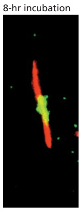

1 µm

2 µm

Gap junctions in different tissues can have different properties because they are formed from different combinations of connexins, creating channels that differ in permeability and regulation. Most cell types express more than one type of connexin, and two different connexin proteins can assemble into a heteromeric connexon, with its own distinct properties. Moreover, adjacent cells expressing different connexins can form intercellular channels in which the two aligned half-channels are different (see Figure 19–25B).

Like conventional ion channels (discussed in Chapter 11), individual gapjunction channels do not remain open all the time; instead, they flip between open and closed states. These changes are triggered by a variety of stimuli, including the voltage difference between the two connected cells, the membraneMBoC7 m19.26/19.26 potential of each cell, and various chemical properties of the cytoplasm, including the pH and concentration of free $\mathrm { C a ^ { 2 + } }$ . Some subtypes of gap junctions can also be regulated by extracellular signals such as neurotransmitters. We are only just beginning to understand the physiological functions and structural basis of these various gating mechanisms.

Each gap-junctional plaque is a dynamic structure that can readily assemble, disassemble, or be remodeled, and it can contain a cluster of a few to many thousands of connexons (see Figure 19–23B). Studies with fluorescently labeled connexins in living cells show that new connexons are continually added around the periphery of an existing junctional plaque, while old connexons are removed from the middle of it and destroyed (**Figure 19–26**). This turnover is rapid: the connexin molecules have a half-life of only a few hours.

The mechanism of removal of old connexons from the middle of the plaque is not known, but the route of delivery of new connexons to its periphery seems clear: they are inserted into the plasma membrane by exocytosis, like other integral membrane proteins, and then diffuse in the plane of the membrane until they bump into the periphery of a connexon plaque and become trapped. This has a corollary: the plasma membrane away from the gap junction should contain connexons—hemichannels—that have not yet paired with their counterparts on another cell. It is thought that these unpaired hemichannels are normally held in a closed conformation, preventing the cell from losing its small molecules by leakage through them. But there is also evidence that in some circumstances they can open and serve as channels for the release of small signal molecules.

#### In Plants, Plasmodesmata Perform Many of the Same Functions as Gap Junctions

The tissues of a plant are organized on different principles from those of an animal. Plant cells are imprisoned within tough cell walls composed of an extracellular matrix rich in cellulose and other polysaccharides, as we discuss later.

Figure 19–26 Connexin turnover at a gap junction. Cells were transfected with a slightly modified connexin gene, coding for a connexin with a short amino acid tag containing four cysteines in the sequence Cys-Cys-X-X-Cys-Cys (where X denotes an arbitrary amino acid). This tetracysteine tag can bind strongly to certain small fluorescent dye molecules, which can be added to the culture medium and will readily enter cells by diffusing across the plasma membrane. In the experiment shown, a green dye was added first to label all the connexin molecules in the cells, and the cells were then washed and incubated for 4 or 8 hours. At the end of this time, a red dye was added to the medium and the cells were washed again and fixed. Connexin molecules already present at the beginning of the experiment are labeled green (and take up no red dye because their tetracysteine tags are already saturated with green dye), while connexins synthesized subsequently, during the 4- or 8-hour incubation, are labeled red. The fluorescence images show gap junctions between pairs of cells treated in this way. The central part of the gap-junction plaque is green, indicating that it consists of old connexin molecules, while the periphery is red, indicating that it consists of connexins synthesized during the previous 4 or 8 hours. The longer the time of incubation, the smaller the green central patch of old molecules, and the larger the peripheral ring of new molecules that have been recruited to replace the old ones. (From G. Gaietta et al., Science 296:503–507, 2002. With permission from AAAS.)

Figure 19–27 Plasmodesmata. (A) The cytoplasmic channels of plasmodesmata pierce the plant cell wall and connect cells in a plant together. (B) Each plasmodesma is lined with plasma membrane that is common to the two connected cells. It usually also contains a fine tubular structure, the desmotubule, derived from smooth endoplasmic reticulum. (C) Electron micrograph of a longitudinal section of a plasmodesma from a water fern. The plasma membrane lines the pore and is continuous from one cell to the next. Endoplasmic reticulum and its association with the central desmotubule can also be seen. (D) A similar plasmodesma seen in cross section. (C and D, from R. Overall et al., Protoplasma 111:134–150, 1982.)

The cell walls of adjacent cells are firmly cemented to one another, which eliminates the need for anchoring junctions to hold the cells in place. But a need for direct cell–cell communication remains. Thus, plant cells have only one class of intercellular junctions, **plasmodesmata**. Like gap junctions, they directly connect the cytoplasms of adjacent cells.

In plants, the cell wall between a typical pair of adjacent cells is at least 0.1 μm thick, and so a structure very different from a gap junction is required to mediate communication across it. Plasmodesmata solve the problem. With a few specialized exceptions, every cell in a higher plant is connected to its neighbors by these structures, which form fine cytoplasmic channels through the intervening cell walls. As shown in **Figure 19–27A**, the plasma membrane of one cell is continuous with that of its neighbor at each plasmodesma, which connects the cytoplasms of the two cells by a roughly cylindrical channel with a diameter of 20–40 nm.MBoC6 e20.31/19.27

Running through the center of the channel in most plasmodesmata is a narrower cylindrical structure, the desmotubule, which is continuous with elements of the smooth endoplasmic reticulum (ER) in each of the connected cells (**Figure 19–27B, C, and D**). Between the outside of the desmotubule and the inner face of the cylindrical channel formed by plasma membrane is an annulus of cytosol through which small molecules can pass from cell to cell. As each new cell wall is assembled during the cytokinesis phase of cell division, plasmodesmata are created within it. They form around elements of smooth ER that become trapped across the developing cell plate (discussed in Chapter 17). They can also be inserted de novo through preexisting cell walls, where they are commonly found in dense clusters called pit fields. When no longer required, plasmodesmata can be removed.

In spite of the radical difference in structure between plasmodesmata and gap junctions, they seem to function in remarkably similar ways. Evidence obtained by injecting tracer molecules of different sizes suggests that plasmodesmata allow the passage of molecules with a mass of less than about 800 daltons, which is similar to the size cutoff for gap junctions. As with gap junctions, transport through plasmodesmata is regulated. Dye-injection experiments, for example, show that there can be barriers to the movement of even low-molecular-mass molecules between certain cells or groups of cells that are connected by apparently normal plasmodesmata; the mechanisms that restrict communication in these cases are not understood.

0.1 µm

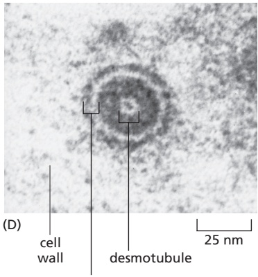

<!-- END EN EN19-H005-H015 -->

### 英文补充：上皮屏障与病原体入侵

> 对应中文板块：上皮屏障与病原体入侵。英文来源：Molecular Biology of the Cell，第7版，第23章；[本章完整原文](../来源/英文教材/23_Pathogens_and_Infection/chapter.md)。物理PDF页码范围：1352–1391（整章范围）。

<!-- BEGIN EN EN23-H011-H012 -->
#### Pathogens Breach Epithelial Barriers to Infect the Host

The first step in infection is for the pathogen to gain access to the host. A thick covering of skin protects most parts of the human body from the environment. The protective boundaries of some other human tissues (eyes, nasal passages, respiratory tract, mouth, digestive tract, urinary tract, and female genital tract) are less robust. In the lungs and small intestine, for example, the barrier is just a single monolayer of epithelial cells. Nonetheless, all these epithelia serve as barriers to infection.

Wounds in barrier epithelia are one way for pathogens to gain direct access to unoccupied niches within otherwise sterile host tissues. This avenue of entry requires little in the way of pathogen specialization, and some pathogens can cause serious illness if they enter through such wounds. Staphylococci from the skin and nose and streptococci from the throat and mouth are two examples of opportunistic bacterial pathogens that can be residents of the normal microbiota (described in more detail in the final section of this chapter) in certain individuals, yet are also responsible for many serious infections resulting from breaches in epithelial barriers. The emergence of bacterial strains of Staphylococcus that are resistant to the antibiotics commonly used for treatment (for example, methicillinresistant Staphylococcus aureus, or MRSA, which can cause serious skin and tissue infections) is of particular concern. Papillomaviruses, which cause warts and cervical cancer, also take advantage of breaches in epithelial barriers.

Another efficient way for a pathogen to cross the skin is to catch a ride in the saliva of a biting arthropod. A diverse group of bacteria, viruses, and protozoa has developed the ability to survive in arthropods that they use as vectors for transmission to a mammalian host. Many zoonoses, a term that refers to diseases spread to humans from other animals, are spread in this way. As discussed earlier, the Plasmodium protozoan that causes malaria develops through several forms in its life cycle, including some that are specialized for survival in a human and others that are specialized for survival in a mosquito vector (see Figure 23–9). Viruses that are spread by mosquito bites also cause yellow fever, dengue fever, as well as Zika virus disease—the latter garnered worldwide attention during an epidemic in 2015–2016, and although Zika infection is often asymptomatic in adults, in pregnant women it can cause birth defects in the fetus. These three viruses replicate in both insect cells and mammalian cells, as required for their transmission by an insect vector.

The efficient spread of a pathogen via an insect vector requires that an individual insect consumes a blood meal from an infected host and transfers the pathogen to a nonimmune host. In a few striking cases, the behavior of the insect is altered by the pathogen so that its transmission to a new host is more likely. An example is the bacterium Yersinia pestis, which causes bubonic plague. It multiplies in the flea’s foregut to form aggregated masses that physically block the digestive tract; during each repeated, but futile, attempt at feeding, some of the bacteria in the foregut are flushed into the bite site, thus transmitting plague to a new host (**Figure 23–14**).

#### Pathogens That Colonize an Epithelium Must Overcome Its Protective Mechanisms

Epithelial barriers such as the skin lining of the mouth and large intestine are densely populated by the microbiota, whereas others, including the lining of the lower lung and the bladder, are more sparsely populated. Nevertheless, these epithelial barriers have mechanisms to prevent excessive microbial colonization. A layer of protective mucus covers the respiratory epithelium, and the coordinated beating of motile cilia sweeps the mucus and trapped bacteria up and out of the lung. The epithelial lining of the bladder and the upper gastrointestinal tract also has a thick layer of mucus, and these organs are periodically flushed by urination and by peristalsis, respectively, which washes away microbes.

Pathogens that infect these epithelial surfaces, including pathogenic bacteria and eukaryotic parasites, have evolved specific features to overcome these protective mechanisms. Those that infect the urinary tract, for example, adhere

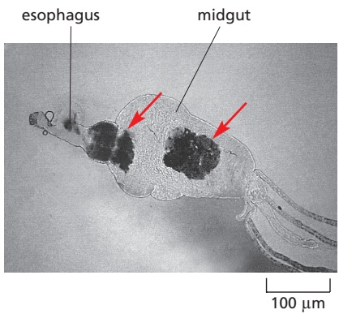

Figure 23–14 Plague bacteria within a flea. This light micrograph shows the digestive tract dissected from a flea that had dined about 2 weeks previously on the blood of an animal infected with the plague bacterium, Yersinia pestis. The bacteria multiplied in the flea gut to produce large cohesive aggregates (red arrows); the bacterial mass on the left is occluding the passage between the esophagus and MB C7 23.14/23.14the midgut. This type of blockage prevents a flea from digesting its blood meals, so that hunger causes it to bite repeatedly, disseminating the infection. (From B.J. Hinnebusch, E.R. Fischer, and T.G. Schwan, J. Infect. Dis. 178:1406–1415, 1998.)

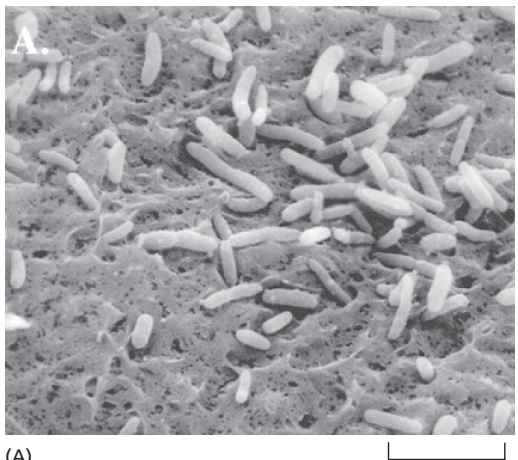

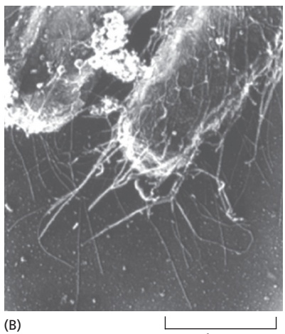

(A)

tightly to the epithelial lining via specific adhesins, which are proteins or protein complexes that recognize and bind to cell-surface molecules on the epithelium. An important group of adhesins in E. coli strains that infect the kidney are components of pili—surface projections that can be several micrometers long and thus able to span the thickness of the protective mucus layer; at the tip of each pilus is an adhesin protein that binds tightly to the d-galactose–d-galactose disaccharide on glycolipids on the surface of kidney cells (Figure 23–15). Strains of E. coli that infect the bladder rather than the kidney express a second kind of pilus with a different adhesin protein that binds to d-mannose–decorated proteins on bladder epithelial cells. It is the specificity of the adhesin proteins on the tips of the two types of pili that is responsible for the bacteria colonizing different parts of the urinary tract.

The epithelial lining of the stomach is an especially hostile environment for microbes. Besides the thick layer of mucus and peristaltic washing, the acidic pH (average pH ≈ 2) is lethal to almost all bacteria ingested in food. Yet, the stomach is home to resident microbial species including H. pylori, which persists for life as part of the stomach microbiota of approximately half of all humans on Earth. Although it does not cause disease in most individuals, H. pylori can cause stomach ulcers and cancers. The hypothesis that a persistent bacterial infection could cause stomach ulcers was initially met with skepticism. The young Australian doctor who made the initial discovery finally proved the point: he drank a pure culture of bacteria and developed inflammation of the stomach, which often pre-cedes the development of ulcers. Antibiotics can now effectively cure a patient of recurrent ulcers. H. pylori has several adaptations that allow it to colonize the harsh environment in the stomach (**Figure 23–16**). One is to use its flagella for chemotactic motility, allowing it to penetrate mucus and seek out the more neutral pH near the surface of gastric epithelial cells. Another is to produce the enzyme urease, which converts urea to ammonia to neutralize the acid in its immediate vicinity.

Figure 23–15 Pathogenic E. coli in the infected bladder of a mouse. (A) Scanning electron micrograph of uropathogenic E. coli, a common cause of bladder and kidney infections. The bacteria are attached to the surface of epithelial cells lining the infected bladder. (B) A closeup view of one of the bacteria showing the pili on its surface. (C) An E. coli pilus spans the mucus layer and has adaptor proteins on its tip that bind to glycolipids on the surface of kidney cells. (A, from G.E. Soto and S.J. Hultgren, J. Bacteriol. 181:1059–1071, 1999. With permission from the American Society for Microbiology; B, from D.G. Thanassi and S.J. Hultgren, Methods 20:111–126, 2000. With permission from Elsevier.)

Figure 23–16 H. pylori interaction with epithelial cells in the stomach lining. These bacteria colonize the gastric epithelium by using their flagella to swim through the mucus layer lining the stomach and attach to the surface of epithelial cells. H. pylori produces the enzyme urease, which converts urea obtained from the environment into ammonia that is released and neutralizes acid surrounding the bacterium, raising the pH in its local environment. H. pylori also uses its type IV secretion system to secrete the effector protein CagA, which assists in colonization but also causes chronic disruption of hostcell pathways and prolonged inflammation, which predisposes infected individuals to gastric ulcers and cancer.

<!-- END EN EN23-H011-H012 -->

### 英文补充：上皮表面的感染屏障

> 对应中文板块：上皮表面的感染屏障。英文来源：Molecular Biology of the Cell，第7版，第24章；[本章完整原文](../来源/英文教材/24_The_Innate_and_Adaptive_Immune_Systems/chapter.md)。物理PDF页码范围：1392–1443（整章范围）。

<!-- BEGIN EN EN24-H002-H002 -->
#### Epithelial Surfaces Serve as Barriers to Infection

Our first encounters with infectious organisms are typically at the epithelial surfaces that form our skin and line our respiratory, digestive, and genitourinary tracts. These epithelia provide both physical and chemical barriers to invasion by pathogens: tight junctions between epithelial cells bar entry between the cells, and a variety of substances secreted by the cells discourage the attachment and entry of pathogens. The keratinized epithelial cells of the skin, for example, form a thick physical barrier, and the sebaceous glands in the skin secrete fatty acids and lactic acid, which inhibit bacterial growth. In addition, epithelial cells in all tissues, including those in plants and invertebrates, secrete antimicrobial molecules called **defensins**. Defensins are positively charged, amphipathic peptides that bind to and disrupt the membranes of many pathogens, including enveloped viruses, bacteria, fungi, and parasites.

The epithelial cells that line internal organs such as the respiratory and digestive tracts also secrete slimy mucus, which sticks to the epithelial surface and makes it difficult for pathogens to adhere. The beating of cilia on the surface of the epithelial cells lining the respiratory tract and the peristaltic action of the intestine also discourage the adherence of pathogens. Moreover, as we discuss in Chapter 23, healthy skin and gut are normally populated by enormous numbers of harmless (and often helpful) commensal microbes, collectively called the flora, which compete for nutrients with pathogens; some also produce antimicrobial peptides that actively inhibit pathogen proliferation. Commensal microbes also bring other benefits to their host: some of those in the gut, for example, help digest food and make several vitamins; some are also needed for the normal development of the gut’s innate and adaptive immune systems.

<!-- END EN EN24-H002-H002 -->

## 跨章相关英文内容

- 化学突触与突触可塑性：[EN第11章 · 膜电位、Nernst方程、动作电位与离子通道](../04_物质的跨膜运输/小节/02_第二节%20ATP%20驱动泵与主动运输.md#EN11-H017-H039)。
- 细胞-基质锚定连接：[EN第19章 · 整联蛋白、细胞-基质黏着与机械信号](小节/02_第二节%20细胞黏着及其分子基础.md#EN19-H038-H046)。

---

## 第16章 细胞的社会联系 · 第二节 细胞黏着及其分子基础

[返回本章](README.md) · [中文本章原文](中文原文.md)

<!-- BEGIN CN CN16-S02 -->
## 第二节 细胞黏着及其分子基础

同种类型细胞间的彼此黏着是许多组织结构的基本特征。实验表明，细胞可以特异性识别某些细胞的表面，并与其选择性地相互作用而忽视另一些细胞。如将发育中的鸡胚或两栖类胚胎组织取出并解离制备成单细胞悬液，然后将不同器官来源的细胞混合以研究在培养条件下细胞重新聚集的情况。结果发现，两种不同器官来源的细胞最初聚集形成混合的细胞团块，经过一段时间后，同一器官来源的细胞相互识别、黏着，最后从混合团块中自行分选出来。这就是同类细胞的识别与黏着（图16-9）。同种组织类型细胞的黏着甚至超越物种的界限，如鼠肝细胞倾向于与鸡肝细胞黏着，而不与鼠肾细胞黏着。在发育过程中，细胞间的识别、黏着、分离以及迁移对胚胎发育及形态建成具有重要作用。无论是受精，还是胚泡植入、形态发生、器官形成或成体结构与功能的维持，都离不开细胞识别与黏着。在胚胎发育过程中，具有相同表面特性的细胞通过特异性识别并黏着在一起形成三个不同胚层：内胚层、中胚层和外胚层。在器官形成过程中，同样通过细胞识别与黏着使具有相同表面特性的细胞聚集在一起形成组织和器官。

  
图16-9 细胞识别与细胞黏着实验示意图  
将两栖动物早期胚胎的外胚层和中胚层细胞解离为单细胞并混合在一起，起初细胞形成一个混合的聚合体，然后从其他类型细胞中分选出来。外胚层细胞移动到聚合体的外表面，中胚层细胞移动到聚合体的内部，这正反映出它们在胚胎中所占据的位置。

细胞识别与黏着的分子基础是细胞表面的细胞黏着分子 (cell adhesion molecule, CAM)。细胞黏着分子都是整合膜蛋白，介导细胞与细胞间的黏着或细胞与细胞外基质间的黏着。这种黏着不仅将细胞连结成组织，而且提供了细胞与周围环境双向通信的基础。目前已在高等动物发现很多种细胞黏着分子。这些分子通过三种方式介导细胞识别与黏着：相邻细胞表面的同种黏着分子间的识别与黏着（同亲型结合）；相邻细胞表面的不同黏着分子间的相互识别与黏着（异亲型结合），相邻细胞表面的同种黏着分子借助其他衔接分子的相互识别与黏着（衔接分子依赖性结合）。根据其结构与功能特性，细胞黏着分子分为4大类：钙黏蛋白、选择素、整联蛋白及免疫球蛋白超家族。细胞黏着分子多数需要依赖 $\mathrm{Ca^{2+}}$ 或 $\mathrm{Mg^{2+}}$ 才起作用，这些分子介导的细胞识别与黏着还能在细胞骨架的参与下，形成细胞连接，如桥粒、半桥粒、黏着带以及黏着斑等结构（表16-1）。

## 一、钙黏蛋白

钙黏蛋白（cadherin）是一种同亲型结合、Ca $^{2+}$ 依赖的细胞黏着糖蛋白，对胚胎发育中的细胞识别、迁移和组织分化以及成体组织器官构成具有重要作用。最先发现的钙黏蛋白常根据其发现的组织类型命名，如上皮组织中的钙黏蛋白称E-钙黏蛋白，神经组织的称N-钙黏蛋白，胎盘及表皮细胞的称P-钙黏蛋白。表16-2列出了钙黏蛋白家族部分成员及其分布。这些钙黏蛋白又称为典型钙黏蛋白，具有细胞黏着和信号转导功能，其胞内或胞外结构域在序列组成上高度相似。而非典型钙黏蛋白在序列组成上差异较大，主要功能是介导细胞黏着，包括分布于大脑的原钙黏蛋白（protocadherin）

表 16-1 细胞表面主要的黏着分子家族

<table><tr><td>细胞黏着分子家族</td><td>主要成员</td><td> ${\mathrm{{Ca}}}^{2 + }$  或  ${\mathrm{{Mg}}}^{2 + }$  依赖性</td><td>胞内骨架成分</td><td>参与细胞连接类型</td></tr><tr><td rowspan="2">钙黏蛋白</td><td>E、N、P-钙黏蛋白</td><td>+</td><td>肌动蛋白丝</td><td>黏着带</td></tr><tr><td>桥粒 - 钙黏蛋白</td><td>+</td><td>中间丝</td><td>桥粒</td></tr><tr><td>选择素</td><td>P-选择素</td><td>+</td><td>肌动蛋白丝</td><td>-</td></tr><tr><td>免疫球蛋白类</td><td>N-细胞黏着分子</td><td>-</td><td>-</td><td>-</td></tr><tr><td>血细胞整联蛋白</td><td> ${\alpha }_{\mathrm{s}}{\beta }_{2}$ </td><td>+</td><td>肌动蛋白丝</td><td>-</td></tr><tr><td rowspan="2">整联蛋白</td><td>20 多种类型</td><td>+</td><td>肌动蛋白丝</td><td>黏着斑</td></tr><tr><td> ${\alpha }_{\mathrm{s}}\beta$ </td><td>+</td><td>中间丝</td><td>半桥粒</td></tr></table>

表 16-2 钙黏蛋白家族部分成员

<table><tr><td>名称</td><td>主要分布</td><td>参与细胞连接类型</td><td>在小鼠中失活后的表型</td></tr><tr><td>E-钙黏蛋白</td><td>上皮细胞</td><td>黏着连接</td><td>胚泡细胞不能聚集在一起,死于胚泡时期</td></tr><tr><td>N-钙黏蛋白</td><td>神经、心脏、骨骼肌及成纤维细胞</td><td>黏着连接、化学突触</td><td>因心脏缺陷而死于胚胎时期</td></tr><tr><td>P-钙黏蛋白</td><td>胎盘、表皮</td><td>黏着连接</td><td>异常乳腺发育</td></tr><tr><td>VE-钙黏蛋白</td><td>内皮细胞</td><td>黏着连接</td><td>血管异常发育(因为内皮细胞凋亡)</td></tr></table>

以及形成桥粒连接的桥粒芯蛋白和桥粒芯胶黏蛋白。目前已在人类中发现了约200种钙黏蛋白成员。

典型钙黏蛋白胞外部分形成5个重复结构域（cadherin repeat），非典型钙黏蛋白胞外部分一般有4\~5个重复结构域，个别甚至高达30个重复结构域。每个重复结构域类似一个刚性结构，它们之间是具有一定韧性的铰链区域，铰链区是 $Ca^{2+}$ 结合位点。有模型认为，钙黏蛋白胞外（N端）最后一个重复结构域形成一个把手样结构和口袋状结构，当 $Ca^{2+}$ 结合在重复结构域之间的铰链区域后，赋予了整个钙黏蛋白胞外部分的刚性，使得一个细胞钙黏蛋白的把手样结构和另一个细胞钙黏蛋白的口袋状结构彼此“嵌合”在一起，从而实现 $Ca^{2+}$ 依赖性的细胞黏着。而去除 $Ca^{2+}$ 后，钙黏蛋白铰链区变得松软，胞外部分刚性随之变小，同时，N端构象发生改变，钙黏蛋白彼此间的嵌合力降低（图16-10）。因此，阳离子螯合剂EDTA能破坏 $Ca^{2+}$ 或 $Mg^{2+}$ 依赖性的细胞黏着。钙黏蛋白胞内结构域为微丝或中间丝提供了镇定位点，它们之间的相互连接是非直接性的，依赖连环蛋白等衔接。

钙黏蛋白介导高度选择性的细胞识别与黏着。通过调控钙黏蛋白的种类与数量能影响细胞间的黏着与迁移，从而影响组织分化。如外胚层发育成神经管时，神经管细胞停止表达E-钙黏蛋白转而表达N-钙黏蛋白，而当神经嵴细胞从神经管迁移出来时，神经嵴细胞则很少表达N-钙黏蛋白，转而主要表达钙黏蛋白-7。E-钙黏蛋白是哺乳动物发育过程中第一个表达的钙黏蛋白，当小鼠发育进入八细胞胚胎时期，E-钙黏蛋白的表达将松散联系的分裂球细胞变成紧密黏合的细胞。若用E-钙黏蛋白的抗体处理胚胎细胞，则会阻止分裂球细胞间的紧密黏合。如果E-钙黏蛋白突变，将会导致胚胎细胞的分离和死亡。

上皮细胞转型为间质细胞或间质细胞转型为上皮细胞是一个受控的可逆过程，称之上皮-间质转型(epithelial-mesenchymal transition, EMT)，其分子机制涉及E-钙黏蛋白的表达与否。表达E-钙黏蛋白后，分散的间质细胞会聚集在一起形成上皮组织；不表达E-钙黏蛋白的上皮细胞则改变其命运，从上皮组织迁移出来形成游离的间质细胞。E-钙黏蛋白的表达既受启动子区甲基化影响，又受多种转录调控因子如Snail、Slug、Twist等的负调控而起抑制作用。这种上皮-间质转型是细胞转分化的一种方式，在胚胎发育、器官的细胞更新和再生，以及某些多能干细胞的分化等过程中均发挥重要的生理作用。我们知道，大多数肿瘤起源于上皮组织，当肿瘤细胞逃逸原发上皮组织而入侵其他组织时，就成为恶性肿瘤。上皮组织获得侵润和转移能力是细胞癌变的关键特征，所以癌细胞演进与EMT有关。此外，医学上脏器纤维化病变也与EMT有关，例如与肾纤维化病变直接相关的肾间质成纤维细胞绝大多数由肾上皮细胞经EMT而来。

  
图16-10 钙黏蛋白结构及功能

## 二、选择素

20世纪60年代，人们发现从外周淋巴结中分离出来的淋巴细胞经过放射性标记后注射到体内，这些淋巴细胞会回到它们最初衍生出来的位点，这种现象称为“淋巴细胞归巢”（lymphocyte homing）。之后又发现这种归巢现象能在体外进行研究，让淋巴细胞黏附到淋巴器官组织的冰冻切片上。在实验条件下，淋巴细胞会选择性地黏附在外周淋巴结小静脉的内皮上。淋巴细胞与小静脉的结合可以被抗体阻断，这些抗体与淋巴细胞表面上特异的糖蛋白结合，这种糖蛋白后来被称为L-选凝素（L-selectin）。

选凝素（selectin）是一类异亲型结合、 $\mathrm{Ca^{2+}}$ 依赖性的细胞黏着分子，能与特异糖基识别并结合。除了L-选凝素外，还有位于血小板和内皮细胞上的P-选凝素以及位于内皮细胞上的E-选凝素。选凝素是跨膜蛋白，其胞外部分具有高度保守并能识别其他细胞表面特异性寡糖链的凝集素(lectin)结构域（图16-11A）。选凝素主要参与白细胞与血管内皮细胞之间的识别与黏着，帮助白细胞经血流进入炎症部位。在炎症病灶部位，血管内皮细胞表达选凝素，被白细胞识别（依靠自身寡糖链）。由于选凝素与白细胞表面糖脂或糖蛋白的特异糖侧链亲和力较小，加上血流速度的影响，白细胞在血管中黏着一分离一再黏着一再分离，呈现滚动式运动，直到活化自身整联蛋白后，最终才与血管内皮细胞较强地结合在一起，并于相邻的血管内皮细胞间内皮间隙进入组织（图16-11B）。白细胞就是以这种机制富集到炎症发生的部位。

## 三、免疫球蛋白超家族

免疫球蛋白超家族（immunoglobulin superfamily，

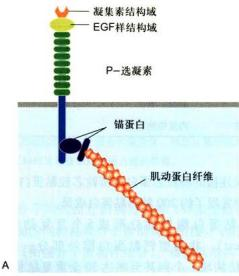

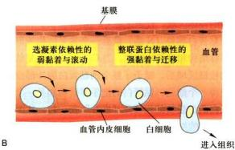  
图 16-11 选凝素的结构及功能示意图  
A. P-选凝素结构。B. 选凝素及整联蛋白介导的细胞黏着，帮助白细胞从血液进入组织。

IgSF)指分子结构中具有与免疫球蛋白类似结构域的细胞黏着分子超家族。其中有的介导同亲型细胞黏着，有的介导异亲型细胞黏着，但免疫球蛋白超家族成员介导的黏着都不依赖于 $\mathrm{Ca^{2+}}$ ，其中了解最多的是神经细胞黏着分子（neural cell adhesion molecule, NCAM），它在神经组织细胞间的黏着中起主要作用。不同的NCAM由单一基因编码，但由于其mRNA拼接不同和糖基化各异而产生20余种不同的NCAM。分析发现，所有神经细胞黏着分子的胞外部分都有5个免疫球蛋白样的结构域（Ig-like domain），如图16-12所示。

大多数 IgSF 细胞黏着分子介导淋巴细胞和免疫应答所需要的细胞（如巨噬细胞、淋巴细胞和靶细胞）之间的黏着。但是，一些 IgSF 成员如 VCAM（血管细胞黏着因子）、NCAM 和 L1 介导非免疫细胞的黏着，在神经系统发育中有重要作用。因此，L1 基因的突变会产生破坏性的后果。典型的病例是新生婴儿患有致死性的脑积水。LI缺失病患者的尸体解剖发现，他们常常失去两条大的神经管道，一条往返于脑的两半球之间，另一条往返于脑和脊髓之间。这两条神经管道的缺失，表明L1参与胚胎神经系统中轴突的生长。

  
图 16-12 神经细胞黏着分子的结构示意图  
A. 4种神经细胞黏着分子免疫球蛋白样结构域，每个结构域在环区末端形成二硫键。B. 同亲型结合模型。

## 四、整联蛋白

整联蛋白（integrin）普遍存在于脊椎动物细胞表面，属于异亲型结合、 $\mathrm{Ca^{2+}}$ 或 $\mathrm{Mg^{2+}}$ 依赖性的细胞黏着分子，主要介导细胞与胞外基质间的黏着。整联蛋白由 $\alpha$ 、 $\beta$ 两个亚基形成跨膜异二聚体（图16-13）。目前至少已鉴定出人有24种不同的 $\alpha$ 亚基和9种不同的 $\beta$ 亚基，可与胞外基质配体结合，有时也与其他细胞表面配体结合（表16-3）。

整联蛋白通过与胞内骨架蛋白的相互作用介导细胞与胞外基质的黏着。如图16-5所示，大多数整联蛋白β亚基的胞内部分通过踝蛋白、α-辅肌动蛋白、细丝蛋白、黏着斑蛋白等与细胞内的肌动蛋白纤维相互作用，而胞外部分则通过自身结构域与纤连蛋白、层粘连蛋白等含有Arg-Gly-Asp（RGD）三肽序列的胞外基质成分结合，介导细胞与胞外基质的黏着。整联蛋白介导细胞与胞外基质黏着的典型结构有黏着斑和半桥粒。因此，如果细胞在含有RGD序列的合成肽的培养基中培养，由于合成肽的RGD序列与纤连蛋白中的RGD序列竞争性地结合在细胞表面的整联蛋白上，阻断细胞与纤连蛋白的结合，导致细胞不能贴壁和生长。据估计大约半数

  
图16-13 整联蛋白分子结构示意图

整联蛋白是由 $\alpha$ 、 $\beta$ 两个亚基形成跨膜异二聚体， $\alpha$ 、 $\beta$ 两个亚基均具有较大的胞外配体结合区、单跨膜区和较小的可结合细胞骨架及信号分子的胞内区，其中含 $\beta_{1}$ 亚基的各种整联蛋白是多种胞外基质成分的受体。

表 16-3 整联蛋白主要类型

<table><tr><td>整联蛋白</td><td>主要配体</td><td>分布</td></tr><tr><td> ${\alpha }_{5}{\beta }_{1}$ </td><td>纤连蛋白</td><td>广泛</td></tr><tr><td> ${\alpha }_{6}{\beta }_{1}$ </td><td>层粘连蛋白</td><td>广泛</td></tr><tr><td> ${\alpha }_{7}{\beta }_{1}$ </td><td>层粘连蛋白</td><td>肌细胞</td></tr><tr><td> ${\alpha }_{8}{\beta }_{2}$ </td><td>IgSF</td><td>白细胞</td></tr><tr><td> ${\alpha }_{9}{\beta }_{3}$ </td><td>纤维蛋白原</td><td>血小板</td></tr><tr><td> ${\alpha }_{10}{\beta }_{4}$ </td><td>层粘连蛋白</td><td>半桥粒</td></tr></table>

的整联蛋白含有结合RGD的结构域。RGD序列的发现开辟了以受体一配体相互作用为基础的新的治疗手段。在病变的动脉中，血栓的形成会阻断血液流向器官，是造成心脏病发作或卒中的病因之一。血凝块的形成始于血小板的凝聚，而血小板的凝聚需要血小板特异的整联蛋白 $\alpha_{bb}\beta_{3}$ 与含RGD序列的可溶性血液蛋白（如纤维蛋白原，fibrinogen）的相互作用，后者作为衔接蛋白把血小板聚集在一起。动物实验表明，含RGD序列的肽可竞争性地阻止血小板整联蛋白与纤维蛋白原等结合，从而预防血凝块的形成。针对 $\alpha_{bb}\beta_{3}$ 整联蛋白的特异性抗体可防止接受高风险血管外科手术病人的血栓形成。

尽管特定的胞外基质蛋白可与多个不同的整联蛋白结合，一种整联蛋白也可与多个不同配体相结合，但不少整联蛋白表现出各自独特的功能，如 $\alpha_{8}$ 基因敲除小鼠表现为肾缺陷， $\alpha_{4}$ 基因敲除小鼠表现为心脏缺陷， $\alpha_{5}$ 基因敲除小鼠表现为血管缺陷。

由于整联蛋白参与细胞信号转导，从而在调节细胞增殖、死亡、黏着、迁移以及生长等过程中发挥重要作用。整联蛋白参与的信号传递方向有“由内向外”（inside out）及“由外向内”（outside in）两种形式。研究发现，血小板及白细胞的整联蛋白往往以无活性的形式存在于细胞表面。当细胞内信号传递启动后，如 $\mathrm{PIP}_2$ 激活踝蛋白，引起踝蛋白与整联蛋白β链的结合能力增强，导致整联蛋白胞外构象的改变而增强与其他胞外配体的结合能力，最后介导细胞黏着。这种由细胞内部信号传递的启动而调节细胞表面整联蛋白活性的方式称为“由内向外”的信号转导。例如，血液凝固过程中，血小板结合于受损血管或被其他可溶性信号分子作用后引起细胞内信号的传递，诱导血小板膜上的 $\alpha_{\mathrm{BB}}$ 、 $\beta_{3}$ 整联蛋白构象发生改变而被激活。活化的整联蛋白与血液凝固蛋白——纤维蛋白原结合后导致血小板彼此粘连在一起形成血凝块。

整联蛋白还可作为受体介导信号从细胞外环境到细胞内的转导，这种方式称为“由外向内”的信号转导。整联蛋白参与的这种信号转导现象最先发现于对肿瘤细胞的研究。大多数正常细胞必须附着在胞外基质上才能生长，如果细胞不能贴附在胞外基质上就会停止分裂直至死亡，这种现象叫做锚定依赖性生长。然而，肿瘤细胞在不与胞外基质牢固附着的情况下仍然会继续生长。正常贴壁细胞在悬浮培养时死亡是因为它们的整联蛋白不能与胞外基质配体相互作用，致使无法向细胞内传递“救生信号”，而当细胞恶变时，它们的存活不再依赖于整联蛋白与配体的结合。现在知道，这种整联蛋白介导的“由外向内”的典型信号转导通路依赖细胞内酪氨酸激酶——黏着斑激酶（focal adhesion kinase, FAK）。一旦与配体结合，整联蛋白就会快速与肌动蛋白骨架产生联系，并聚集在一起形成黏着斑。在黏着斑形成部位，还有结构蛋白如黏着斑蛋白、踝蛋白及α-辅肌动蛋白。此时，FAK借助踝蛋白等结构蛋白被募集到黏着斑部位，并相互磷酸化使彼此特异的酪氨酸带上磷酸基团，为细胞内酪氨酸激酶Src家族成员提供停泊位点。Src又使FAK其他酪氨酸带上磷酸基团，为胞内多种信号传递蛋白提供停泊位点，同时，Src激酶还活化黏着斑部位的其他蛋白（参见图16-5）。通过这种方式，信号不断向细胞内进行传递，调节细胞增殖、生长、生存、凋亡等重要生命活动。

整联蛋白与传统的信号受体通过多种协同方式刺激细胞产生广泛的应答。如整联蛋白与生长因子受体共同作用，调节细胞生长、增殖。这种依赖细胞附着在胞外基质上才能生存、增殖的生物学意义可能确保细胞定位于适当的位置。

<!-- END CN CN16-S02 -->

---

## 对应英文内容

### 英文补充：钙黏蛋白与同嗜性黏着

> 对应中文板块：钙黏蛋白与同嗜性黏着。英文来源：Molecular Biology of the Cell，第7版，第19章；[本章完整原文](../来源/英文教材/19_Cell_Junctions_and_the_Extracellular_Matrix/chapter.md)。物理PDF页码范围：1144–1201（整章范围）。

<!-- BEGIN EN EN19-H002-H004 -->
#### Cadherins Form a Diverse Family of Adhesion Molecules

Cadherins are present in all multicellular animals. They are also present in the choanoflagellates, which are closely related to animals but can exist either as free-living unicellular organisms or as multicellular colonies. Other eukaryotes, including fungi and plants, lack cadherins, and they are also absent from bacteria and archaea. Cadherins therefore seem to be part of the essence of what it is to be an animal.

The cadherins take their name from their dependence on $\mathrm { C a ^ { 2 + } }$ ions: removing $\mathrm { C a ^ { 2 + } }$ from the extracellular medium causes adhesions mediated by cadherins to come apart. The first three cadherins to be discovered were named according to the main tissues in which they were found: E-cadherin is present on many types of epithelial cells; N-cadherin on nerve, muscle, and lens cells; and P-cadherin on cells in the placenta and epidermis. All are also found in other tissues. These and other **classical cadherins** are closely related in sequence throughout their extracellular and intracellular domains.

There are also a large number of **nonclassical cadherins** that are more distantly related in sequence, with more than 50 expressed in the brain alone. The non-classical cadherins include proteins with known adhesive function, such as the diverse protocadherins found in the brain, and the desmocollins and desmogleins that form desmosomes (see Table 19–1). Together, the classical and nonclassical cadherin proteins constitute the **cadherin superfamily** (**Figure 19–4**), with more than 180 members in humans.

#### Cadherins Mediate Homophilic Adhesion

Anchoring junctions between cells are usually symmetrical: if the linkage is to actin in the cell on one side of the junction, it will be to actin in the cell on the other side. In fact, the binding between cadherins is generally **homophilic** (liketo-like; **Figure 19–5**): cadherin molecules of a specific subtype on one cell bind to cadherin molecules of the same or closely related subtype on adjacent cells.

The spacing between the cell membranes at an anchoring junction is precisely defined and depends on the structure of the participating cadherin molecules. All the members of the superfamily, by definition, have an extracellular portion consisting of several copies of the extracellular cadherin (EC) domain. Homophilic binding occurs at the N-terminal tips of the cadherin molecules—the cadherin domains that lie farthest from the membrane. These terminal domains each form a knob and a nearby pocket, and the cadherin molecules protruding from oppo-MBoC7 m19.04/19.4 site cell membranes bind by insertion of the knob of one domain into the pocket of the other (**Figure 19–6A**).

HETEROPHILIC BINDING

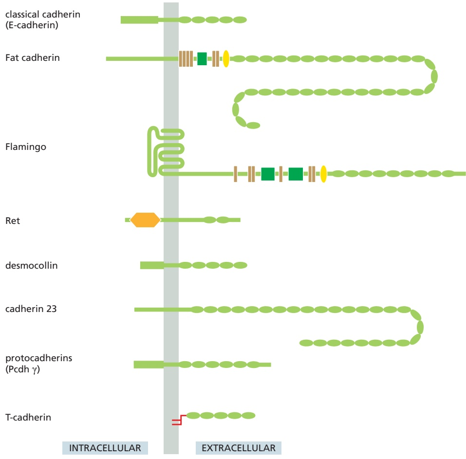

Figure 19–4 The cadherin superfamily. The diagram shows some of the diversity among cadherin superfamily members. These proteins all have extracellular portions containing multiple copies of the extracellular cadherin domain (green ovals). In the classical cadherins of vertebrates there are 5 of these domains, and in desmogleins and desmocollins there are 4 or 5, but some nonclassical cadherins have more than 30. The intracellular portions are more varied, reflecting interactions with a wide variety of intracellular ligands, including signaling molecules and adaptor proteins that connect the cadherin to the cytoskeleton. In some cases, such as T-cadherin, a transmembrane domain is not present, and the protein is attached to the plasma membrane by a glycosylphosphatidylinositol (GPI) anchor. The differently colored motifs in Fat, Flamingo, and Ret represent conserved domains that are also found in other protein families.

Each cadherin domain forms a more-or-less rigid unit, joined to the next cadherin domain by a hinge. Ca2+ ions bind to sites near each hinge and prevent it from flexing, so that the whole string of cadherin domains behaves as a rigid and slightly curved rod. When Ca2+ is removed, the hinges can flex, and the structure becomes floppy (**Figure 19–6B**). At the same time, the conformation at the N-terminus is thought to change slightly, weakening the binding affinity for the matching cadherin molecule on the opposite cell.

Unlike receptors for soluble signaling molecules, which bind their specific ligand with high affinity, cadherins (and most other cell–cell adhesion proteins) typically bind to their partners with relatively low affinity. Strong attachments result from the formation of many such weak bonds in parallel. When binding to oppositely oriented partners on another cell, cadherin molecules are often clustered side-to-side with many other cadherin molecules on the same cell (**Figure 19–6C**). The strength of this junction is far greater than that of any individual intermolecular bond, and yet regulatory mechanisms can easily disassemble the junction by separating the molecules sequentially, just as two pieces of fabric can be joined strongly by Velcro and yet easily peeled apart from the sides. A similar “Velcro principle” also operates at cell–cell and cell–matrix adhesions formed by other types of transmembrane adhesion proteins.

Figure 19–5 Homophilic versus heterophilic binding. Cadherins in general bind homophilically; some other cell adhesion molecules, discussed later, bind heterophilically.

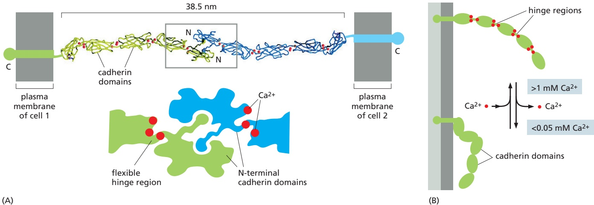

Figure 19–6 Cadherin structure and function. (A) The extracellular region of a classical cadherin contains five copies of the extracellular cadherin domain (see Figure 19–4) separated by flexible hinge regions. At a typical extracellular $\tilde { \mathrm { C a } ^ { 2 + } }$ concentration (>1 mM), $\mathrm { C a ^ { 2 + } }$ ions (red dots) bind in the neighborhood of each hinge, preventing it from flexing. To generate cell– cell adhesion, the cadherin domain at the N-terminal tip of one cadherin molecule binds the cadherin domain at the N-terminal tip of a cadherin molecule on another cell. The structure was determined by x-ray diffraction of the crystallized C-cadherin extracellular region. The two cadherins shown here, although identical, are colored differently for clarity. (B) If the extracellular $\mathrm { C a ^ { 2 + } }$ concentration is decreased artificially in an experiment, $\mathrm { C a ^ { 2 - } }$ + binding decreases. As a result, increased flexibility in the hinge regions results in a floppier molecule that is no longer oriented correctly to interact with a cadherin on another cell—and adhesion fails. (C) At a typical cell–cell junction, an organized array of cadherin molecules functions like Velcro to hold cells together. Cadherins on the same cell are thought to be coupled by side-to-side interactions between their N-terminal head regions, resulting in a linear array like the alternating green and light green cadherins on the lower cell shown here. These arrays are thought to interact with perpendicular arrays on an adjacent cell (blue cadherin molecules, top cell). Multiple perpendicular arrays on both cells interact to form a tight-knit mat of cadherin proteins. (A, based on T.J. Boggon et al., Science 296:1308–1313, 2002; C, based on O.J. Harrison et al., Structure 19:244–256, 2011.)

#### Cadherin-dependent Cell–Cell Adhesion Guides the Organization of Developing Tissues

Cadherins form specific homophilic attachments, explaining why there are so many different family members. Cadherins are not like glue, making cell surfacesMB C7 19.06/19.06 generally sticky. Rather, they mediate highly selective recognition, enabling cells of a similar type to stick together and to stay segregated from other types of cells.

Selectivity in the way that animal cells consort with one another was first demonstrated in the 1950s, long before the discovery of cadherins, in experiments in which amphibian embryos were dissociated into single cells. These cells were then mixed up and allowed to reassociate. Remarkably, the dissociated cells often reassembled into structures resembling those of the original embryo (**Figure 19–7**).

Figure 19–7 Sorting out. Cells from different layers of an early amphibian embryo will sort out according to their origins. In the classical experiment shown here, mesoderm cells (green), neural plate cells (blue), and epidermal cells (red) have been disaggregated and then reaggregated in a random mixture. They sort out into an arrangement reminiscent of a normal embryo, with a “neural tube” internally, epidermis externally, and mesoderm in between. (Modified from P.L. Townes and J. Holtfreter, J. Exp. Zool. 128:53–120, 1955. With permission from John Wiley & Sons.)

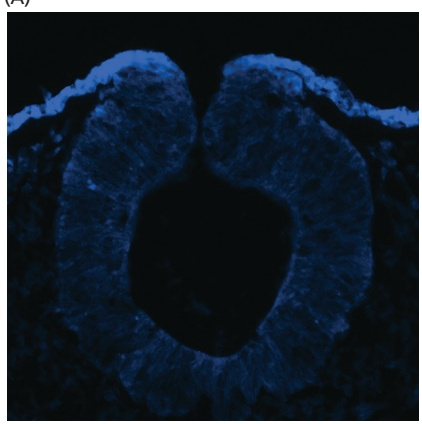

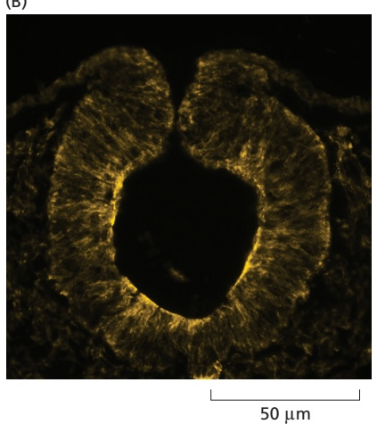

Figure 19–8 Changing patterns of cadherin expression during construction of the vertebrate nervous system. The figure shows cross sections of the early chick embryo, as the neural tube detaches from the ectoderm and then as neural crest cells detach from the neural tube. (A, B) Immunofluorescence micrographs showing the developing neural tube labeled with antibodies against (A) E-cadherin (blue) and (B) N-cadherin (yellow). (C) As the patterns of gene expression change, the different groups of cells segregate from one another according to the cadherins they express. (Micrographs courtesy of Miwako Nomura and Masatoshi Takeichi.)

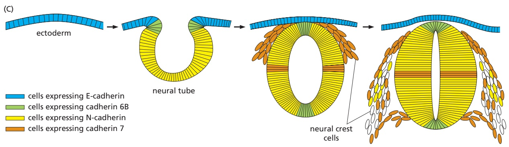

These experiments, together with numerous more recent experiments, reveal that selective cell–cell recognition systems make cells of the same differentiated tissue preferentially adhere to one another.

Cadherins play a crucial part in these cell-sorting processes. The appearance and disappearance of specific cadherins correlate with steps in embryonic development where cells regroup and change their contacts to create new tissue structures. In the vertebrate embryo, for example, changes in cadherin expression are seen when the neural tube forms and pinches off from the overlying ectoderm: neural tube cells lose E-cadherin and acquire other cadherins, including N-cadherin, while the cells in the overlying ectoderm continue to express E-cadherin (**Figure 19–8A and B**). Then, when the neural crest cells migrate away from the neural tube, these cadherins become scarcely detectable, and another cadherin (cadherin 7) appears that helps hold the migrating cells together as loosely associated cell groups (**Figure 19–8C**). Finally, when some of the neural crest cells aggregate to form a ganglion, they switch on expression of N-cadherin again. If N-cadherin is artificially overexpressed in the emerging neural crest cells, the cells fail to escape from the neural tube.

Studies with cultured cells further support the importance of homophilic cadherin binding in tissue segregation. In a line of cultured fibroblasts called L cells, for example, cadherins are not expressed and the cells do not adhere to one another. When these cells are transfected with DNA encoding E-cadherin, E-cadherins on one cell bind to E-cadherins on another, resulting in cell–cell adhesion. If L cells expressing different cadherins are mixed together, they sort out and aggregate separately, indicating that different cadherins preferentially bind to their own type (**Figure 19–9A**), mimicking what happens when cells derived from tissues that express different cadherins are mixed together. A similar segregation of cells occurs if L cells expressing different amounts of the same cadherin are mixed together (**Figure 19–9B**). It therefore seems likely that both qualitative and quantitative differences in the expression of cadherins have a role in organizing tissues.

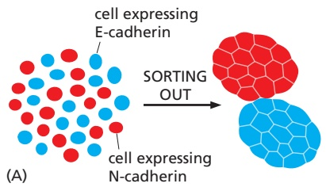

Figure 19–9 Cadherin-dependent cell sorting. Cells in culture can sort themselves out according to the type and level of cadherins they express. This can be visualized by labeling different MBoC7 m19.09/19.09populations of cells with dyes of different colors. (A) Cells expressing N-cadherin sort out from cells expressing E-cadherin. (B) Cells expressing high levels of E-cadherin sort out from cells expressing low levels of E-cadherin. The cells expressing high levels adhere more strongly and congregate internally.

<!-- END EN EN19-H002-H004 -->

### 英文补充：选择素与免疫球蛋白超家族黏着分子

> 对应中文板块：选择素与免疫球蛋白超家族黏着分子。英文来源：Molecular Biology of the Cell，第7版，第19章；[本章完整原文](../来源/英文教材/19_Cell_Junctions_and_the_Extracellular_Matrix/chapter.md)。物理PDF页码范围：1144–1201（整章范围）。

<!-- BEGIN EN EN19-H016-H017 -->
#### Selectins Mediate Transient Cell–Cell Adhesions in the Bloodstream

We now complete our overview of cell–cell junctions and adhesion by briefly describing some of the more specialized adhesion mechanisms used in some tissues. In addition to those we have already discussed, at least three other superfamilies of cell–cell adhesion proteins are important: the integrins, the selectins, and the adhesive immunoglobulin (Ig) superfamily members. We shall discuss integrins in more detail later: their main function is in cell–matrix adhesion, but a few of them mediate cell–cell adhesion in specialized circumstances. $\mathrm { C a ^ { 2 + } }$ dependence provides one simple way to distinguish among these classes of adhesion proteins experimentally. Selectins, like cadherins and integrins, require $\mathrm { C a ^ { 2 + } }$ for their adhesive function; Ig superfamily members do not.

**Selectins** are cell-surface carbohydrate-binding proteins (lectins) that mediate a variety of transient cell–cell adhesion interactions in the bloodstream. Their main role, in vertebrates at least, is in governing the traffic of white blood cells into lymphoid organs and inflamed tissues. White blood cells lead a nomadic life, roving between the bloodstream and the tissues, and this necessitates special adhesive behavior. The selectins control the binding of white blood cells to the endothelial cells lining blood vessels, thereby enabling the blood cells to migrate out of the bloodstream into a tissue.

Each selectin is a transmembrane protein with a conserved lectin domain that binds to a specific oligosaccharide on another cell (**Figure 19–28A**). There are at least three types: L-selectin on white blood cells, P-selectin on blood platelets and on endothelial cells that have been locally activated by an inflammatory response, and E-selectin on endothelial cells later in the inflammatory response. In a lymphoid organ, such as a lymph node or the spleen, the endothelial cells express oligosaccharides that are recognized by L-selectin on lymphocytes, causing the lymphocytes to loiter and become trapped. At sites of inflammation, the roles are reversed: the endothelial cells switch on expression of selectins that recognize the oligosaccharides on white blood cells and platelets, flagging the cells down to help deal with the local emergency. Selectins do not act alone, however; they collaborate with integrins, which strengthen the binding of the blood cells to the endothelium. The cell–cell adhesions mediated by both selectins and integrins are heterophilic; that $\mathbf { i } \mathbf { s } ,$ the binding is to a molecule of a different type. Selectins bind to specific oligosaccharides on glycoproteins and glycolipids, while integrins bind to specific Ig-family proteins.

Selectins and integrins act in sequence to let white blood cells leave the bloodstream and enter tissues (**Figure 19–28B**). The selectins mediate a weak adhesion because the binding of the lectin domain of the selectin to its carbohydrate ligand is of low affinity. This allows the white blood cell to adhere weakly and reversibly to the endothelium, rolling along the surface of the blood vessel, propelled by the flow of blood. The rolling continues until the blood cell activates its integrins. As we discuss later, these transmembrane molecules can be switched into an adhesive conformation that enables them to latch onto specific macromolecules external to the cell—in the present case, proteins on the surfaces of the endothelial cells. Once it has attached in this way, the white blood cell escapes from the bloodstream into the tissue by crawling out of the blood vessel between adjacent endothelial cells.

Figure 19–28 The structure and function of selectins. (A) Diagram of P-selectin, which attaches to the actin cytoskeleton through adaptor proteins. (B) How selectins and integrins mediate the cell–cell adhesions required for a white blood cell to migrate out of the bloodstream into a tissue. Selectins on endothelial cells bind weakly to oligosaccharides on the white blood cell, so that it becomes loosely attached and rolls along the vessel wall. The white blood cell then activates a cellsurface integrin called LFA1, which binds to a protein called ICAM1 (belonging to the Ig superfamily) on the membrane of the endothelial cell. The white blood cell adheres to the vessel wall and then crawls out of the vessel (Movie 19.2).

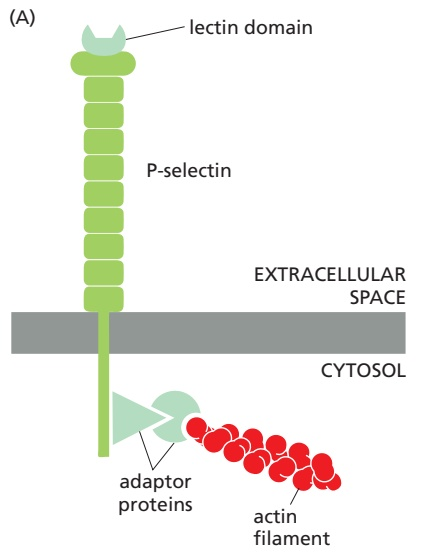

(B)

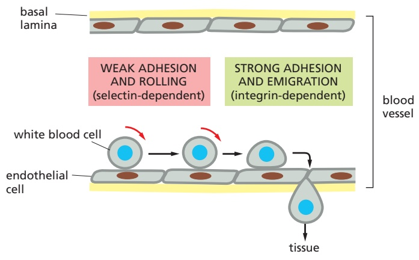

#### Members of the Immunoglobulin Superfamily Mediate Ca2+-independent Cell–Cell Adhesion

The chief endothelial-cell proteins that are recognized by the white blood cell integrins are called ICAMs (intercellular cell adhesion molecules) or VCAMs (vascular cell adhesion molecules). They are members of another large and ancient family of cell-surface molecules—the **immunoglobulin (Ig) superfamily**. These contain one or more extracellular Ig-like domains that are characteristic of anti-body molecules. They have many functions outside the immune system that are unrelated to immune defenses.

While ICAMs and VCAMs on endothelial cells both mediate heterophilic binding to integrins, many other Ig superfamily members appear to mediate homophilic binding. An example is the neural cell adhesion molecule (NCAM), which is expressed by various cell types, including most nerve cells (**Figure 19–29**). NCAM can take different forms, generated by alternative splicing of an RNA transcript produced from a single gene. Some forms of NCAM carry an unusually large quantity of sialic acid (with chains containing hundreds of repeating sialic acid units). By virtue of their negative charge, the long polysialic acid chains can interfere with cell adhesion (because like charges repel one another); thus, these forms of NCAM can serve to inhibit adhesion rather than cause it.

Another group of Ig superfamily members, the nectins, collaborates with cadherins to help build and strengthen adherens junctions in many tissues. Members of the nectin family contain three Ig-like domains (see Figure 19–29) and interact with other nectins, sometimes with the same family member (homophilic) and sometimes with a different family member (heterophilic). Their short intracellular tail binds to an adaptor protein that links the nectin to the actin cytoskeleton and to cadherin at adherens junctions. Nectins help set up cell–cell interactions during embryonic development. In auditory and olfactory epithelia, for example, sensory cells are distributed as single cells in a field of larger support cells. The distribution of these cell types in the epithelium depends on specific interactions between nectin family members on the surfaces of the sensory and support cells. The formation of these epithelia is defective when nectin expression is experimentally reduced.

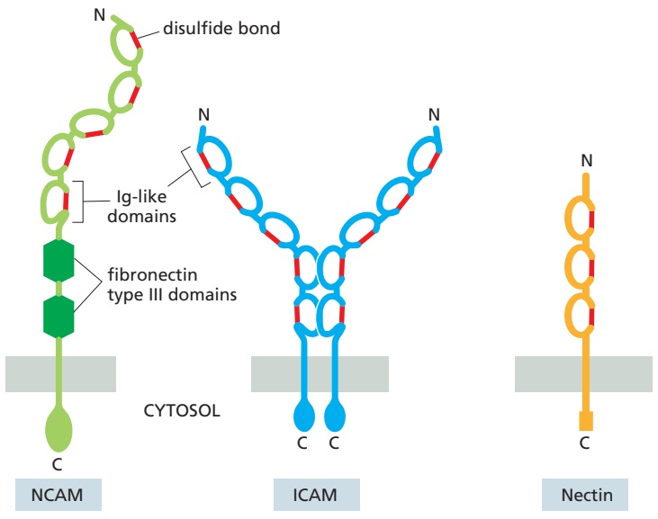

Figure 19–29 Members of the Ig superfamily of cell–cell adhesion molecules. NCAM is expressed on neurons and many other cell types, and it mediates homophilic binding. ICAM is expressed on endothelial cells and some other cell types and binds heterophilically to an integrin on white blood cells. Nectin is expressed in many cell types and is often found at adherens junctions, where it interacts with cadherins to help establish and strengthen specific cell–cell interactions during tissue formation.

A cell of a given type generally uses an assortment of different adhesion proteins to interact with other cells, just as each cell uses an assortment of different receptors to respond to the many soluble extracellular signal molecules in its environment. Although cadherins and Ig superfamily members are frequently expressed on the same cells, the adhesions mediated by cadherins are much stronger, and they are largely responsible for holding cells together, segregating cell collectives into discrete tissues, and maintaining tissue integrity. Members of the Ig superfamily seem to contribute more to the fine-tuning of these adhesive interactions during development and regeneration, playing a part in various specialized adhesive phenomena, such as that discussed for blood cells and specialized epithelia. Thus, while mutant mice that lack N-cadherin die early in development, those that lack Ig superfamily members develop relatively normally but show moderate abnormalities in the development of certain tissues.

<!-- END EN EN19-H016-H017 -->

### 英文补充：整联蛋白、细胞-基质黏着与机械信号

> 对应中文板块：整联蛋白、细胞-基质黏着与机械信号。英文来源：Molecular Biology of the Cell，第7版，第19章；[本章完整原文](../来源/英文教材/19_Cell_Junctions_and_the_Extracellular_Matrix/chapter.md)。物理PDF页码范围：1144–1201（整章范围）。

<!-- BEGIN EN EN19-H038-H046 -->
#### CELL–MATRIX JUNCTIONS

Cells make extracellular matrix, organize it, and degrade it. The matrix in turn exerts powerful influences on the cells. The influences are exerted chiefly through transmembrane cell adhesion proteins that act as matrix receptors. These proteins tie the matrix outside the cell to the cytoskeleton inside it, but their role goes far beyond simple passive mechanical attachment. Through them, components of the matrix can affect almost any aspect of a cell’s behavior. The matrix receptors have a crucial role in epithelial cells, mediating their interactions with the basal lamina beneath them. They are no less important in connective-tissue cells, mediating the cells’ interactions with the matrix that surrounds them.

Several types of molecules can function as matrix receptors or co-receptors, including the transmembrane proteoglycans. But the principal receptors on animal cells for binding most extracellular matrix proteins are the integrins. Like the cadherins and the key components of the basal lamina, integrins are part of the fundamental architectural tool kit that is characteristic of multicellular animals. The members of this large family of transmembrane adhesion molecules have a remarkable ability to transmit signals in both directions across the plasma membrane. The binding of a matrix component to an integrin can send a message into the interior of the cell, and conditions in the cell interior can send a signal outward to control binding of the integrin to the matrix. Tension applied to an integrin can cause it to tighten its grip on intracellular and extracellular structures, and loss of tension can loosen its hold, so that molecular signaling complexes fall apart on either side of the membrane. In this way, integrins can serve not only to transmit mechanical and molecular signals but also to convert one type of signal into the other.

#### Integrins Are Transmembrane Heterodimers That Link the Extracellular Matrix to the Cytoskeleton

There are many varieties of integrins, but they all operate in a similar fashion. An integrin molecule is composed of two noncovalently associated glycoprotein subunits called α and β. Both subunits span the cell membrane and have short intracellular C-terminal tails and large N-terminal extracellular domains (**Figure 19–56**). The extracellular domains bind to specific amino acid sequence motifs in extracellular matrix proteins or, in some cases, in proteins on the surfaces

Figure 19–56 The subunit structure of an active integrin molecule, linking extracellular matrix to the actin cytoskeleton. The N-terminal heads of the integrin chains attach directly to an extracellular protein such as fibronectin; the C-terminal intracellular tail of the integrin β subunit binds to adaptor proteins that interact with filamentous actin. The best-understood adaptor is a giant protein called talin, which contains a string of multiple domains for binding actin and other proteins, such as vinculin, that help reinforce and regulate the linkage to actin filaments. One end of talin binds to a specific site on the integrin β-subunit cytoplasmic tail; other regulatory proteins, such as kindlin, bind at another site on the tail.

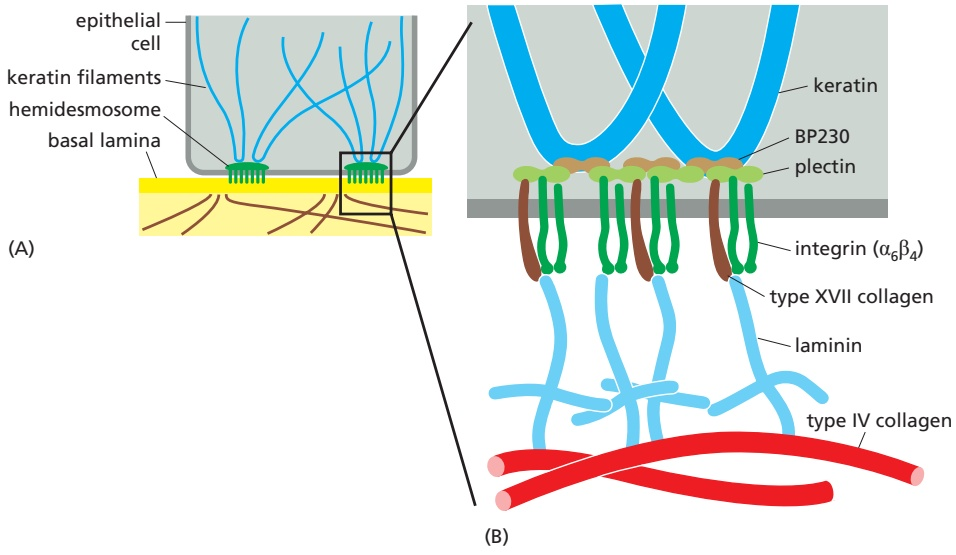

Figure 19–57 Hemidesmosomes. (A) Hemidesmosomes spot-weld epithelial cells to the basal lamina, linking laminin outside the cell to keratin filaments inside it. (B) Molecular components of a hemidesmosome. A specialized integrin (α6β4 integrin) spans the membrane, attaching to keratin filaments intracellularly via adaptor proteins called plectin and BP230, and attaching to laminin extracellularly. The adhesive complex also contains, in parallel with the integrin, an unusual collagen family member known as collagen type XVII; this has a membrane-spanning domain attached to its extracellular collagen region. Defects in any of these components can give rise to a blistering disease of the skin. One such disease, called bullous pemphigoid, is an autoimmune disease in which the immune system develops antibodies against collagen XVII or BP230.

of other cells. The best-understood binding site for integrins is the RGD sequence mentioned earlier (see Figure 19–48), which is found in fibronectin and other extracellular matrix proteins. Some integrins bind a Leu-Asp-Val (LDV) sequence in fibronectin and other proteins. Additional integrin-binding sequences exist in laminins and collagens.

Humans contain 24 types of integrins, which are formed from the products of 8 different β-chain genes and 18 different α-chain genes that are dimerized in different combinations. Each integrin dimer has specific properties and functions. Moreover, because the same integrin molecule in different cell types can haveMBoC7 m19.56/19.57 different ligand-binding specificities, it seems that additional cell type–specific factors can interact with integrins to modulate their binding activity. The binding of integrins to their matrix ligands is also affected by the concentration of $\mathrm { C a ^ { 2 + } }$ and $\tilde { \mathrm { M g } ^ { 2 + } }$ in the extracellular medium, reflecting the presence of divalent cationbinding domains in the α and β subunits. The divalent cations influence both the affinity and the specificity of the binding of an integrin to its extracellular ligands.

The intracellular portion of an integrin dimer binds to a complex of several different proteins, which together form a linkage to the cytoskeleton. For all but one of the 24 varieties of human integrins, this intracellular linkage is to actin filaments. These linkages depend on proteins that assemble at the short cytoplasmic tails of the integrin subunits (see Figure 19–56). A large adaptor protein called talin is a component of the linkage in many cases, but numerous additional proteins are also involved. Like the actin-linked cell–cell junctions formed by cadherins, the actin-linked cell–matrix junctions formed by integrins may be either small, inconspicuous, and transient or large, prominent, and durable. Examples of the latter are the focal adhesions that form when fibroblasts have sufficient time to establish strong attachments to the rigid surface of a culture dish, and the myotendinous junctions that attach muscle cells to their tendons.

In epithelia, the most prominent cell–matrix attachment sites are the hemidesmosomes, where a specific type of integrin anchors the cells to laminin in the basal lamina. Here, uniquely, the intracellular attachment is to keratin intermediate filaments, via the intracellular adaptor proteins plectin and BP230 (**Figure 19–57**).

#### Integrin Defects Are Responsible for Many Genetic Diseases

Although there is some overlap in the activities of the different integrins—at least five bind laminin, for example—it is the diversity of integrin functions that is more remarkable. **Table 19–3** lists some varieties of integrins and the problems that result when individual integrin α or β chains are defective.

The β1 subunit forms dimers with at least 12 distinct α subunits and is found on almost all vertebrate cells: $\alpha _ { 5 } \beta _ { 1 }$ is a fibronectin receptor and $\alpha _ { 6 } \beta _ { 1 }$ is a laminin receptor on many types of cells. Mutant mice that cannot make any $\beta _ { 1 }$ integrins die early in embryonic development. Mice that are only unable to make the $\alpha _ { 7 }$ subunit (the partner for $\beta _ { 1 }$ in muscle) survive but develop muscular dystrophy (as do mice that cannot make the laminin ligand for the $\alpha _ { 7 } \beta _ { 1 }$ integrin).

<table><tbody><tr><td colspan="5">TABLE 19-3 Some Types of Integrins</td></tr><tr><td>Integrin</td><td>Ligand*</td><td>Distribution</td><td>Phenotype when α subunit is mutated</td><td>Phenotype when β subunit is mutated</td></tr><tr><td>α5β1</td><td>Fibronectin</td><td>Ubiquitous</td><td>Death of embryo; defects in blood vessels, somites, neural crest</td><td>Early death of embryo (at implantation)</td></tr><tr><td>α6β1</td><td>Laminin</td><td>Ubiquitous</td><td>Severe skin blistering; defects in other epithelia also</td><td>Early death of embryo (at implantation)</td></tr><tr><td>α7β1</td><td>Laminin</td><td>Muscle</td><td>Muscular dystrophy; defective myotendinous junctions</td><td>Early death of embryo (at implantation)</td></tr><tr><td>αLβ2 (LFA1)</td><td>Ig superfamily counterreceptors(ICAM1)</td><td>White blood cells</td><td>Impaired recruitment of leukocytes</td><td>Leukocyte adhesion deficiency (LAD); impaired inflammatory responses; recurrent life-threatening infections</td></tr><tr><td>αIIbβ3</td><td>Fibrinogen</td><td>Platelets</td><td>Bleeding; no platelet aggregation (Glanzmann disease)</td><td>Bleeding; no platelet aggregation (Glanzmann disease); mild osteopetrosis</td></tr><tr><td>α6β4</td><td>Laminin</td><td>Hemidesmosomes in epithelia</td><td>Severe skin blistering; defects in other epithelia also</td><td>Severe skin blistering; defects in other epithelia also</td></tr><tr><td colspan="5">*Not all ligands are listed.</td></tr></tbody></table>

The $\beta _ { 2 }$ subunit forms dimers with at least four types of α subunit and is expressed exclusively on the surface of white blood cells, where it has an essential role in enabling these cells to fight infection. The $\beta _ { 2 }$ integrins mainly mediate cell–cell rather than cell–matrix interactions, binding to specific ligands on another cell, such as an endothelial cell. The ligands are members of the Ig superfamily of cell–cell adhesion molecules. We have already described an example earlier in the chapter: an integrin of this class $\left( \alpha _ { \mathrm { L } } \beta _ { \mathrm { 2 } } , \right.$ also known as LFA1) on white blood cells enables them to attach firmly to the Ig family protein ICAM1 on vascular endothelial cells at sites of infection (see Figure 19–28B). People with the genetic disease leukocyte adhesion deficiency fail to synthesize functional $\beta _ { 2 }$ subunits. As a consequence, their white blood cells lack the entire family of $\beta _ { 2 }$ receptors, and they suffer repeated bacterial infections.

The $\beta _ { 3 }$ integrins are found on blood platelets (as well as various other cells), and they bind several matrix proteins, including the blood clotting factor fibrinogen. Platelets have to interact with fibrinogen to mediate normal blood clotting, and humans with Glanzmann disease, who are genetically deficient in $\beta _ { 3 }$ integrins, suffer from defective clotting and bleed excessively.

#### Integrins Can Switch Between an Active and an Inactive Conformation

A cell crawling through a tissue—a fibroblast or a macrophage, for example, or an epithelial cell migrating along a basal lamina—has to be able both to make and to break attachments to the matrix, and to do so rapidly if it is to travel quickly. Similarly, a circulating white blood cell has to be able to switch on or off its tendency to bind to endothelial cells in order to crawl out of a blood vessel at a site of inflammation. Furthermore, the making and breaking of the extracellular attachments in all these cases has to be coupled to the prompt assembly and disassembly of cytoskeletal attachments inside the cell. The integrin molecules that span the membrane and mediate the attachments cannot simply be passive, rigid objects with sticky patches at their two ends. They must be able to switch between an active state, where they readily form attachments, and an inactive state, where they do not.

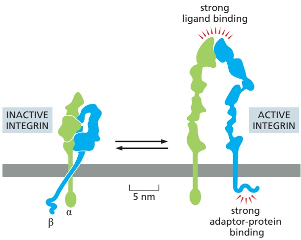

Figure 19–58 Integrins exist in two major activity states. Inactive (folded) and active (extended) structures of an integrin molecule, based on data from x-ray crystallography and other methods.

Structural studies, using a combination of electron microscopy and x-ray crystallography, suggest that integrins exist in multiple structural conformations that reflect different states of activity (**Figure 19–58**). In the inactive state, the external segments of the integrin dimer are folded together into a compactMBoC7 m19.57/19.58 structure that binds poorly to matrix proteins. In this state, the cytoplasmic tails of the dimer are hooked together, preventing their interaction with cytoskeletal linker proteins. In the active state, the two integrin subunits are unhooked at the membrane to expose the intracellular binding sites for cytoplasmic adaptor proteins, and the external domains unfold and extend, like a pair of legs, to expose a high-affinity matrix-binding site at the tips of the subunits. Thus, the switch from inactive to active states depends on a major conformational change that simultaneously exposes the external and internal ligand-binding sites at the ends of the integrin molecule. External matrix binding and internal cytoskeleton linkages are thereby coupled.

Switching between the inactive and active states is regulated by a variety of mechanisms, depending on the needs of the cell. In some cases, activation occurs by an “outside-in” mechanism: the binding of an external matrix protein, such as the RGD sequence of fibronectin, can drive some integrins to switch from the low-affinity inactive state to the high-affinity active state. As a result, binding sites for talin and other cytoplasmic adaptor proteins are exposed on the tail of the β chain. The binding of these adaptor proteins then leads to attachment of actin filaments to the intracellular end of the integrin molecule (see Figure 19–56). In this way, when the integrin catches hold of its ligand outside the cell, the cell reacts by tying the integrin molecule to the cytoskeleton, so that force can be applied at the point of cell attachment.

The chain of cause and effect can also operate in reverse. This “inside-out” integrin-activation process generally depends on intracellular regulatory signals that stimulate the ability of talin and other proteins to interact with the β chain of the integrin. Talin competes with the integrin α chain for its binding site on the tail of the β chain. Thus, when talin binds to the β chain, it blocks the intracellular α–β linkage, allowing the two legs of the integrin molecule to spring apart.

The regulation of “inside-out” integrin activation is particularly well understood in platelets, where an extracellular signal protein called thrombin binds to a specific G-protein-coupled receptor (GPCR) on the cell surface and thereby activates an intracellular signaling pathway that leads to integrin activation (**Figure 19–59**). It is likely that similar signaling pathways govern integrin activation in numerous other cell types.

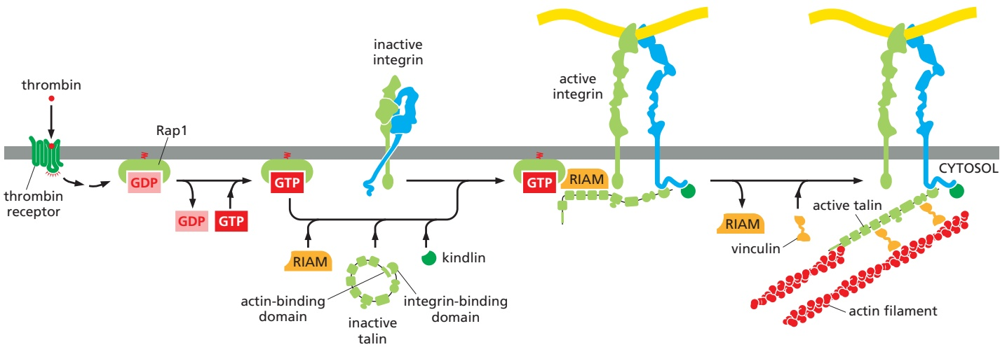

Figure 19–59 Activation of integrins by intracellular signaling. Signals received from outside the cell can act through intracellular signaling proteins to stimulate integrin activation. In platelets, as illustrated here, the extracellular signal protein thrombin activates a G-protein–coupled receptor on the cell surface, thereby initiating a signaling pathway that leads to activation of Rap1, a member of the monomeric GTPase family. Activated Rap1 interacts with the protein RIAM, which then recruits talin to the plasma membrane. Prior to this recruitment, talin is held in an inactive state by an interaction between its C-terminal actin-binding domain and its N-terminal integrin-binding domain. When it is recruited by RIAM to the plasma membrane, talin unfolds to expose its binding sites for integrin and actin. Together with another protein called kindlin, talin interacts with the integrin β chain to trigger integrin activation. Talin then interacts with actin and with adaptor proteins such as vinculin, resulting in the formation of multiple actin linkages (see Figure 19–56 and Figure 19–61).

#### Integrins Cluster to Form Strong Adhesions

Integrins, like other cell adhesion molecules, differ from cell-surface receptors for hormones and for other extracellular soluble signal molecules in that they usually bind their ligand with lower affinity and are present at a 10- to 100-fold higher concentration on the cell surface. The Velcro principle, mentioned earlier in the context of cadherin adhesion (see Figure 19–6C), operates here too. After their activation, integrins cluster together to create a dense plaque in which many integrin molecules are anchored to cytoskeletal filaments. The resulting protein structure can be remarkably large and complex, as seen in the focal adhesion made by a fibroblast on the fibronectin-coated surface of a culture dish.

The assembly of mature cell–matrix junctional complexes depends on the recruitment of dozens of different scaffolding and signaling proteins. Talin is a major component of many cell–matrix complexes, but numerous other proteins also make important contributions. These include the integrin-linked kinase (ILK) and its binding partners pinch and parvin, which together form a trimeric complex that serves as an organizing hub at many junctions. Cell–matrix junctions also employ several actin-binding proteins, such as vinculin, zyxin, VASP, and a-actinin, to promote the assembly and organization of actin filaments. Another critical component of many cell–matrix junctions is the focal adhesion kinase (FAK), which interacts with multiple components in the junction and serves an important function in signaling, as we describe shortly.

#### Extracellular Matrix Attachments Act Through Integrins to Control Cell Proliferation and Survival

Like other transmembrane cell adhesion proteins, integrins do more than just create attachments. They also activate intracellular signaling pathways and thereby allow control of almost any aspect of the cell’s behavior according to the nature of the surrounding matrix and the state of the cell’s attachments to it.

Many cells will not grow or proliferate in culture unless they are attached to extracellular matrix; nutrients and soluble mitogens in the culture medium are not enough. For some cell types, including epithelial, endothelial, and muscle cells, even cell survival depends on such attachments. When these cells lose contact with the extracellular matrix, they undergo apoptosis. This dependence of cell growth, proliferation, and survival on attachment to a substratum is known as **anchorage dependence**, and it is mediated mainly by integrins and the intracellular signals they generate. Mutations that disrupt or override this form of control, allowing cells to escape from anchorage dependence, occur in cancer cells and play a major part in their invasive behavior.

Our understanding of anchorage dependence has come mainly from studies of cells living on the surface of matrix-coated culture dishes. For connectivetissue cells that are normally surrounded by matrix on all sides, this is a far cry from the natural environment. Walking over a two-dimensional plain is very different from clambering through a three-dimensional jungle. The types of contacts that cells make with a rigid substratum are not the same as those, much less well studied, that they make with the deformable web of fibers of the extracellular matrix, and there are substantial differences in cell behavior in the two contexts. Nevertheless, it is likely that the same basic principles apply. Both in vitro and in vivo, intracellular signals generated at cell–matrix adhesion sites are crucial for cell proliferation and survival.

#### Integrins Recruit Intracellular Signaling Proteins at Sites of Cell–Matrix Adhesion

The mechanisms by which integrins signal into the cell interior are complex, involving several pathways, and integrins and conventional signaling receptors often influence one another and work together to regulate cell behavior, as we have already emphasized. The Ras–MAP kinase pathway (see Figure 15–50), for example, can be activated both by conventional signaling receptors and by integrins, but cells often need both kinds of stimulation of this pathway at the same time to give sufficient activation to induce cell proliferation. Integrins and conventional signaling receptors also cooperate to promote cell survival (discussed in Chapters 15 and 18).

One of the best-studied modes of integrin signaling depends on a cytoplasmic protein tyrosine kinase called focal adhesion kinase (FAK). In studies of cells cultured on plastic dishes, focal adhesions are often prominent sites of tyrosine phosphorylation (**Figure 19–60**), and FAK is one of the major tyrosine-phosphorylated proteins found at these sites. When integrins cluster at cell–matrix contacts, FAK is recruited to the integrin β subunit by intracellular adaptor proteins such as talin or paxillin (which binds to one type of integrin α subunit). The clustered FAK molecules phosphorylate each other on a specific tyrosine, creating a

10 µm

Figure 19–60 Tyrosine phosphorylation at focal adhesions. A fibroblast cultured on a fibronectin-coated substratum and stained with fluorescent antibodies: actin filaments are stained green and proteins that contain phosphotyrosine are red, giving orange where the two components overlap. The actin filaments terminate at focal adhesions, where the cell attaches to the substratum by means of integrins. Proteins containing phosphotyrosine are also concentrated at these sites, reflecting the local activation of FAK and other protein kinases. Signals generated at such adhesion sites help regulate cell division, growth, and survival. (Courtesy of Keith Burridge.)

phosphotyrosine-docking site for members of the Src family of cytoplasmic tyrosine kinases. In addition to phosphorylating other proteins at the adhesion sites, these kinases then phosphorylate FAK on additional tyrosines, creating docking sites for a variety of additional intracellular signaling proteins. In this way, outside-in signaling from integrins, via FAK and Src family kinases, is relayed into the cell in much the same way as receptor tyrosine kinases generate signals (as discussed in Chapter 15).

#### Cell–Matrix Adhesions Respond to Mechanical Forces

Like the cell–cell junctions we described earlier, cell–matrix junctions can sense and respond to the mechanical forces that act on them. Most cell–matrix junctions, for example, are connected to a contractile actin network that tends to pull the junctions inward. When cells are attached to a rigid matrix that strongly resists such pulling forces, the cell–matrix junction is able to sense the resulting high tension and trigger a response in which it recruits additional integrins and other proteins to increase the junction’s ability to withstand that tension. Cell attachment to a relatively soft matrix generates less tension and therefore a less robust response. These mechanisms allow cells to sense and respond to differences in the rigidity of extracellular matrices in different tissues.

We saw earlier that mechanotransduction at cadherin-based cell–cell junctions likely depends on junctional proteins that change their structure when the junction is stretched by tension (see Figure 19–12). The same is true for cell– matrix junctions. Talin, for example, includes a large number of binding sites for the actin-regulatory protein vinculin. Many of these sites are hidden inside folded protein domains but are exposed when those domains are unfolded by stretching the protein (**Figure 19–61**). The N-terminal end of talin binds integrin and the C-terminal end binds actin (see Figure 19–56); thus, when actin filaments are pulled by myosin motors inside the cell, the resulting tension stretches the talin rod, thereby exposing vinculin-binding sites. The vinculin molecules then recruit

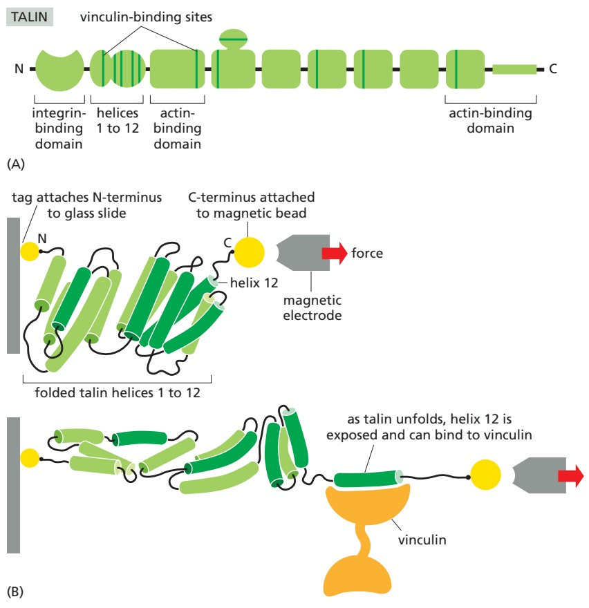

Figure 19–61 Talin is a tension sensor at cell–matrix junctions. Tension across cell–matrix junctions stimulates the local recruitment of vinculin and other actin-regulatory proteins, thereby strengthening the junction’s attachment to the cytoskeleton. The experiment presented here tested the hypothesis that tension is sensed by the talin adaptor protein that links integrins to actin filaments (see Figure 19–56). (A) The long, flexible talin protein is divided into a series of folded domains, some of which contain vinculin-binding sites (dark green lines) that are thought to be hidden and therefore inaccessible. One domain near the N-terminus, for example, comprises a folded bundle of 12 α helices containing five vinculin-binding sites. (B) This experiment tested the hypothesis that tension stretches the 12-helix domain, thereby exposing vinculin-binding sites. A fragment of talin containing this domain was attached to an apparatus in which the domain could be stretched, as shown here. The fragment was labeled at its N-terminus with a tag that sticks to the surface of a glass slide on a microscope stage. The C-terminal end of the fragment was bound to a tiny magnetic bead, so the talin fragment could be stretched using a small magnetic electrode. The solution around the protein contained fluorescently tagged vinculin proteins. After the talin protein was stretched, excess vinculin solution was washed away, and the microscope was used to determine if any fluorescent vinculin proteins were bound to the talin protein. In the absence of stretching (top), most talin molecules did not bind vinculin. When the protein was stretched (bottom), two or three vinculin molecules were bound (only one is shown here for clarity). (Adapted from A. del Rio et al., Science 323:638–641, 2009.)

and organize additional actin filaments. Tension thereby increases the strength of the junction.

#### Summary

Integrins are the principal cell-surface receptors used by animal cells to bind to the extracellular matrix: they function as transmembrane linkers between the extracellular matrix and the cytoskeleton. Most integrins connect to actin filaments, while those at hemidesmosomes bind to intermediate filaments. Integrin molecules are heterodimers, and the binding of extracellular matrix ligands or intracellular activator proteins such as talin results in a dramatic conformational switch from an inactive to an active state. This creates an allosteric coupling between binding to matrix outside the cell and binding to the cytoskeleton inside it, allowing the integrin to convey signals in both directions across the plasma membrane. Complex assemblies of proteins become organized around the intracellular tails of activated integrins, producing intracellular signals that can influence almost any aspect of cell behavior, from proliferation and survival, as in the phenomenon of anchorage dependence, to cell polarity and guidance of migration. Integrin-based cell–matrix junctions are also capable of mechanotransduction: they can sense and respond to mechanical forces acting across the junction.

<!-- END EN EN19-H038-H046 -->

### 英文补充：扩展：黏着、机械力与组织形态发生

> 对应中文板块：扩展：黏着、机械力与组织形态发生。英文来源：Molecular Biology of the Cell，第7版，第21章；[本章完整原文](../来源/英文教材/21_Development_of_Multicellular_Organisms/chapter.md)。物理PDF页码范围：1256–1317（整章范围）。

<!-- BEGIN EN EN21-H044-H059 -->
#### MORPHOGENESIS

The specialization of cells into distinct types at specific times is important, but it is only one aspect of animal development. Equally important are the movements and deformations that cells go through to assemble into tissues and organs with specific shapes and sizes. These physical forms, which are a central output of cell-fate programs, are essential for each organ’s physiological function. Like developmental timing, the process of morphogenesis (“form generation”) is less well understood than the processes of differential gene expression and inductive signaling that lead to cell-type specialization. The cell movements can be readily described, and the underlying molecular mechanisms that coordinate the movements are now being deciphered.

In Chapter 19, we saw how cells cohere to form epithelial sheets or surround themselves with extracellular matrix to create connective tissues. We also discussed how the basic features of tissues, such as the polarity of epithelia, arise from the properties of individual cells. In this section, we consider how the dynamic rearrangements of cells during animal development give shape to the embryo and all the individual organs and appendages of the body.

A small number of cell behaviors are basic to morphogenesis. Cells can change shape, and coordinated shape changes can bend an epithelial sheet into a tube or a hollow ball. Cells can rearrange with respect to their neighbors, causing elongation, constriction, or thickening of a tissue. By stretching out while holding onto their companions, specialized sets of cells can form growing tubular networks such as the system of blood or lymph vessels. Individual cells can also extract themselves from their neighbors and form physically separate groups that then migrate through the embryo along defined tracks. Group migrations, as occur in gastrulation, can transform the entire topology of the embryo. Underlying all these processes are changes in physical forces that alter cell shape and cell contacts—either with other cells or with extracellular matrix. We begin by considering how these forces are generated.

#### Imbalance in Physical Forces Acting on Cells Drives Morphogenesis

Although it is alive, a cell is governed by the same physical principles that shape inanimate objects. Cells and tissues possess specific mechanical properties, and their shapes reflect the forces exerted upon them. At rest, a cell is in a mechanical equilibrium in which all forces are balanced. Morphogenesis entails a shift in that balance, as new forces are generated in an oriented way. These organized force changes then play out across increasing distances. For example, the activity of myosin motor proteins on the actin cytoskeleton may change the shape of a cell, which in turn affects its interactions with neighboring cells and thus the shape of a tissue. Such coordinated changes act to sculpt entire organs and animal bodies.

While some proteins, such as actin and myosin, generate forces within cells, others act to sense the applied forces. Such proteins, called mechanotransducers, initiate intracellular signaling in response to mechanical stimuli, just as the molecules described in Chapter 15 trigger signaling pathways in response to chemical cues. α-Catenin and Talin are mechanotransducers that bind to the cytosolic tail of cell adhesion molecules (see Chapter 19); these unfold in response to tension exerted by neighboring cells, and this conformational change sends biochemical signals that can elicit rapid responses in cellular mechanics as well as long-term effects on gene expression. Piezo (see p. 660) is a mechanosensitive ion channel that spans the cell membrane; it opens in response to shear stress or stretching of the plasma membrane, passing ions that then initiate signaling cascades. Through such mechanosensitive molecules, cells and tissues can read the physical environment within which they exist and respond accordingly.

#### Tension and Adhesion Determine Cell Packing Within Epithelial Sheets

The two-dimensional epithelial sheet found in many tissues is a simple system to illustrate principles of morphogenesis. Across animal species, stable epithelial sheets display a remarkably consistent pattern of cell shapes, in which most

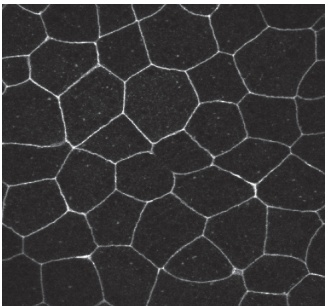

(A) Xenopus epithelium

(B)

soap bubble raft

adhesive interactions (C)

Figure 21–46 Regular distribution of cell shapes in epithelia. (A) Fluorescence micrograph of cell membranes in an early Xenopus embryo shows that most epithelial cells have hexagonal profiles, with six neighbors forming three-way junctions where cells meet. (B) A two-dimensional “raft” of soap bubbles on the surface of water shows a similar organization. (C) The length and geometry of cell–cell contacts are set by opposing activities. The contractile network of the cortical actomyosin cytoskeleton within each cell tends to pull cells apart, while adhesive interactions mediated by cadherins and other molecules tend to hold cell surfaces together. (A, courtesy of Saranyaraajan Varadarajan and Ann Miller; B, Shebeko/Shutterstock.)

cells possess a hexagonal profile at their apical surface (Figure 21–46A). This arrangement is determined by the mechanical properties of the cells and their connections with neighbors, which are mediated primarily by adherens junctions (see Chapter 19). Contractility of an actomyosin ring underlying the plasma membrane adjacent to the junctions generates cortical tension within each cell, which tends to pull it away from its neighbors. However, this force is opposed byMBoC7 n21.103/21.46 cell–cell adhesion, mediated by molecules such as cadherins within the junctions. The balance between these inward and outward forces generates a predictable configuration of cells, which can be mathematically modeled and is analogous to the packing arrangement of inorganic entities such as soap bubbles (Figure 21–46B and C). Although the physical mechanisms that balance surfacetension minimization and contact interfaces in bubbles are very different from those that shape cells, the mathematical solution representing a minimal energy of arrangement is similar.

#### Changing Patterns of Cell Adhesion Molecules Force Cells into New Arrangements

The shapes of tissues are ultimately determined by patterns of gene expression, which produce molecules that change the physical properties of cells in which they are expressed. One important class of genes that contributes to these properties codes for the adhesion molecules that cells display on their surface. Through changes in its surface molecules, a cell can break old attachments and make new ones. For example, cells in one region of a tissue may develop surface properties that make them cohere with one another and become segregated from a neighboring group of cells that possess different surface molecules. Cadherins and other cell–cell adhesion proteins that are differentially expressed in the various tissues of a developing animal play important roles. In Chapter 19, we saw how selective cell–cell adhesion is sufficient to drive the sorting of cells dissociated from an embryo into groups of a similar type (see Figure 19–7); treatment with antibodies that bind cadherins interferes with this process. Changes in expression of the various cadherin genes correlate closely with the different modes of association among cells during embryogenesis, as occurs, for example, during gastrulation, neural tube formation, and somitogenesis. Cadherins also control the formation and dissolution of epithelial sheets and clusters of cells (see Movie 19.1). Finally, because adhesion molecules not only glue one cell to another but also provide anchorage for intracellular actin filaments, the sites of cell–cell adhesion influence tension and cell movements in the developing tissue.

#### Repulsive Interactions Help Maintain Tissue Boundaries

The different types of cadherins enable different types of cells to cohere selectively: cells expressing one type of cadherin will maximize their contact with cells expressing the same cadherin and thereby segregate from other cells, creating specific tissue boundaries. Cell mixing can be inhibited and boundaries created and maintained in another way as well: cells of different types can sometimes actively repel one another. The bidirectional activation of Eph receptors and ephrins discussed in Chapter 15 often mediates such repulsion, acting at interfaces between different groups of cells to keep the groups fromMBoC7 m21.49/21.47 mixing, and repelling invasion by inappropriate visitors. Ephrin–Eph signaling operates at the boundaries of the somites in the vertebrate embryo discussed earlier (see Figure 21–38). By modulating the cortical actomyosin cytoskeleton, ephrin–Eph signaling is thought to induce differences in cortical tension between cells, thereby decreasing the force of the cell–cell contact. Another example is in rhombomeres, which are segmented regions of the developing vertebrate brain. Neighboring rhombomeres express complementary combinations of ephrins and Eph receptors, and this keeps the cells in adjacent rhombomeres strictly segregated, with a boundary between them that is sharply defined (**Figure 21–47**).

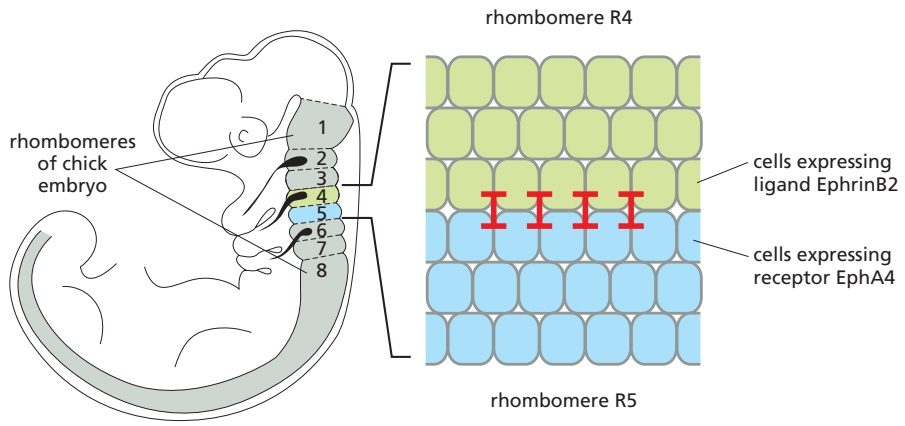

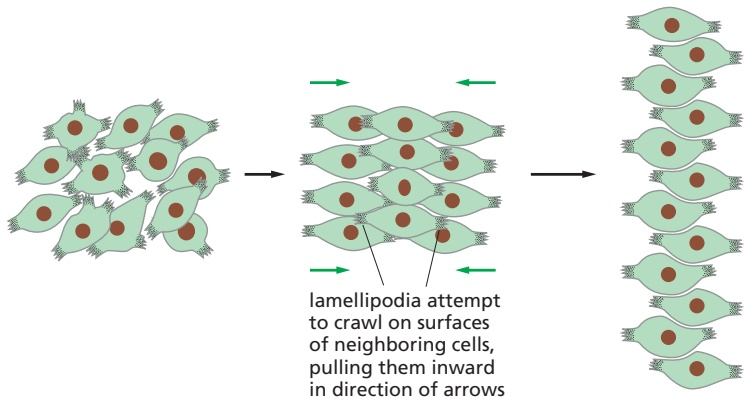

lamellipodia attempt to crawl on surfaces of neighboring cells, pulling them inward in direction of arrows

(A)

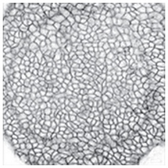

(B)

(C)

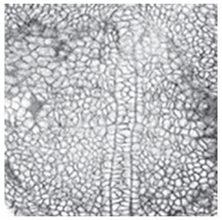

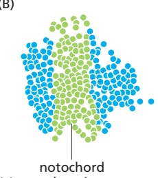

(D)

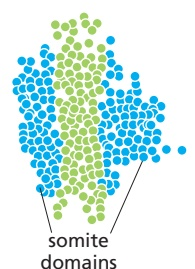

(E)

(F)

(G)

Figure 21–47 Sorting out by repulsion. Ephrin–Eph signaling in hindbrain segmentation in a chick embryo. Each pair of rhombomeres (segments in the hindbrain) is associated with a branchial arch (a modified gill rudiment) to which the pair sends innervation. Rhombomeres are distinguished from one another by expression of different Hox genes (see Figure 21–30). Differences in surface tension at the interface between cells that express EphrinB2 in rhombomere R4 and EphA4 in rhombomere R5 lead to mutual repulsion (red bars), creating a sharp boundary.

Figure 21–48 Convergent extension by mesenchymal cell migration. (A) A population of cells form lamellipodia, with which they attempt to crawl over one another. Alignment of the lamellipodial movements along a common axis, controlled by planar-polarity signaling (discussed shortly), leads to convergent extension. (B–G) The pattern of convergent extension of dorsal mesoderm during zebrafish gastrulation at 8.8 (B, E), 9.3 (C, F), and 11.3 (D, G) hours after fertilization. Cells that will give rise to the notochord are labeled in green, and cells that will give rise to somites and muscle are labeled in blue. The notochord and somite domains are spatially separate from the start of the recording (B, E), but their boundaries are at first barely visible and only a little later become obvious. Convergence narrows the notochord domain to a width of about two cells at the last time point (D, G). (A, after J. Shih and R. Keller, Development 116:901–914, 1992. With permission from the Company of Biologists; B–G, after N.S. Glickman et al., Development 130:873–887, 2003. With permission from the Company of Biologists.)

#### Groups of Similar Cells Can Perform Dramatic Collective Rearrangements

Cell sorting mediated by cadherin and repulsion mediated by ephrin–Eph exemplify how differences in cell-surface properties can drive tissue arrangements, causing cells that express different sets of genes to separate from one another. However, groups of cells that are all similar can also undergo dramatic rearrangements. Many animal embryos extend their major body axis through such rearrangements, in a process called **convergent extension**. Convergent extension occurs when a population of cells moves coordinately toward a specific boundary, intercalating between each other as they do so. This causes the tissue to narrow along one axis (converge) and elongate along another (extend). The overall change in tissue shape results from cell displacement, rather than a change in shape of individual cells, and is largely autonomous to the group of cells involved. A striking demonstration is seen when small, square fragments of tissue from the appropriate region of a frog embryo are isolated in culture. These will spontaneously narrow and elongate, just as they would in the developing animal.

Convergent extension is a common movement that elongates many organs, although the cell behaviors that underlie it can differ. During frog gastrulation, for example, cells in one region of the surface epithelium lose their epithelial character as they migrate into the interior of the embryo. The loosely connected cells, called mesenchymal cells, form actin-based protrusions called lamellipodia that are oriented so that they crawl over one another and interdigitate as they converge toward the embryonic midline (**Figure 21–48**). In contrast, when the Drosophila embryo extends its anteroposterior axis, the cells involved remain epithelial. These cells maintain tight adhesive junctions but rearrange the relationships to their neighbors by shrinking cell junctions along one axis while extending them in another axis to accomplish cell intercalation (**Figure 21–49**; see also Figure 19–15). Remodeling of the junctions involves differential contractile tension on them that is generated by localized myosin activity. In both cases, whether mesenchymal migration or epithelial junction remodeling, the coordination of cell behaviors depends on a signaling pathway that can generate planar cell polarity, as we discuss next.

#### Planar Cell Polarity Orients Cell Behaviors Within an Embryo

Just as a compass allows us to orient ourselves in a landscape, cells undergoing morphogenetic movements must have a system to orient themselves with respect to the different body axes of the animal. We discussed in Chapter 19 how all

(A)

0 min

4 min

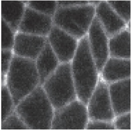

9 min

(B)

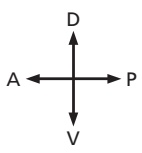

Figure 21–49 Convergent extension by t f ith li l ti rearrangemen o ep e a junc ons.

Shown in (A) are fluorescence images of the Drosophila embryonic epidermis over a 9-minute period, with drawings in (B) that colorize specific cells and cell junctions (Movie 21.6). As in other epithelia, most cells are initially hexagonal, and their junctions are shared between three neighbors. To elongate the tissue along the anteroposterior axis, some of the dorsoventral-oriented junctions (green) shrink, forming a transient arrangement in which cells are pentagonal or quadrilateral, and a junction is shared between four neighbors. A new junction (blue) then forms along the anteroposterior axis, now shared between two cells that did not previously contact each other and separating two cells that previously did contact each other. This process of shrinking and elongating junctions in a planar-polarized fashion, occurring all along the epidermis, narrows and extends the tissue while maintaining epithelial integrity throughout. (Images courtesy of Huapeng Yu and Jennifer Zallen.)

#### WILD TYPE

epidermal cells in fly wing

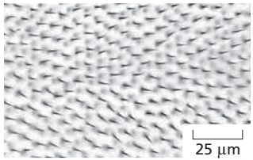

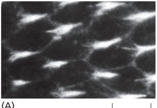

sensory hair cells in mouse ear

(A)

5 µm

(B)

10 µm

epidermal cells in fly wing

(C)

#### Flamingo MUTANT

sensory hair cells in mouse ear

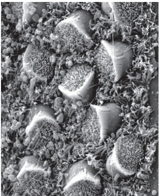

(D)

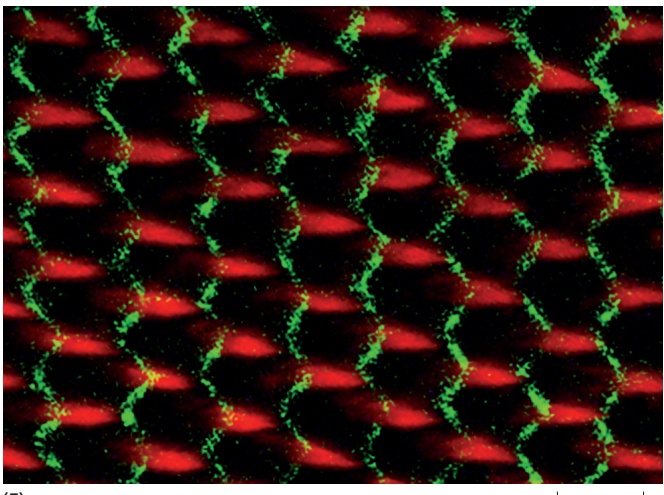

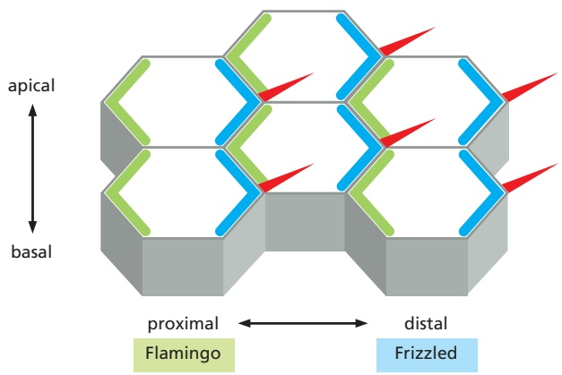

(E)

5 µm

(F)

Figure 21–50 Planar cell polarity. (A) Wing hairs on the wing of a fly. Each cell in the wing epithelium forms a small, spiky protrusion or $`` \mathrm{h} \mathrm{air} ''$ at its apex, and all the hairs point the same way, toward the tip of the wing. This reflects a planar polarity in the structure of each cell. (B) Sensory hair cells in the inner ear of a mouse similarly have a well-defined planar polarity, manifest in the oriented pattern of stereocilia (actin-filled protrusions) on their surface. The detection of sound depends on the correct, coordinated orientation of the hair cells. (C) A mutation in the gene Flamingo in the $们 ,$ coding for a nonclassical cadherin, disrupts the pattern of planar cell polarity in the wing. (D) A mutation in a homologous Flamingo gene in the mouse randomizes the orientation of the planar cell polarity vector of the hair cells in the ear. The mutant mice are deaf. (E) Micrograph showing localization of Flamingo (green) in a pupal fly wing, in relation to the hair growing from each cell (red). (F) Diagram illustrating planar-polarized localization of Flamingo to one side of each epithelial cell, and localization of another planar polarity–regulating protein called Frizzled to the opposite side, from which the hair will form. (A and C, from J. Chae et al., Development 126:5421–5429, 1999. With permission from the Company of Biologists; B and D, from J.A. Curtin et al., Curr. Biol. 13:1129–1133, 2003. With permission from Elsevier; E, courtesy of Paul Adler.)

epithelial cells have apical–basal polarity, but the cells of many epithelia show an additional polarity at right angles to this axis: the cells are arranged as if they had an arrow written on them, all pointing in a common direction in the plane of the epithelium. This type of polarity is called **planar cell polarity**. In the wing of a fly, for example, each epithelial cell has a tiny asymmetric projection, called a wingMBoC7 m21.51/21.50 hair, on its surface, and the hairs all point toward the tip of the wing. Similarly, in the inner ear of a vertebrate, each mechanosensory hair cell has a precisely oriented asymmetric bundle of actin-filled, rodlike protrusions called stereocilia sticking up from its apical plasma membrane as a detector of sound and of forces such as gravity. Tilting the bundle in one direction causes ion channels in the membrane to open, electrically activating the cell; tilting in the opposite direction has the opposite effect. For the ear to function properly, the hair cells must be oriented correctly. Planar cell polarity is also important in the respiratory tract, where every ciliated cell must orient the beating of its cilia so as to sweep mucus upward, away from the lungs.

Screens for mutants with misoriented wing hairs in Drosophila have identified a set of genes that control planar cell polarity in many tissues. Some of these genes code for components of the Wnt signaling pathway, and others code for transmembrane proteins such as specialized members of the cadherin superfamily that interact across neighboring cell–cell junctions. Together with intracellular proteins that influence the localization of the transmembrane proteins, two complementary, mutually exclusive domains are defined along the apical surface in such a way as to exert a polarizing influence that propagates from cell to cell, leading to polarization of the entire epithelial tissue. Essentially the same system of proteins controls planar cell polarity in vertebrates; mice deficient in homologs of the Drosophila planar-polarity genes have a variety of defects, including incorrectly oriented hair cells in the inner ear, making them deaf (**Figure 21–50**).

#### An Epithelium Can Bend During Development to Form a Tube

Convergent extension is an example of morphogenesis in two dimensions. When cells need to leave the plane of a tissue and produce three-dimensional structures, they engage in additional cell behaviors. The universal process of gastrulation involves future endodermal and/or mesodermal cells migrating into the interior of the embryo, and this is often initiated by a localized bending of the blastula epithelium. Similar bending can generate biological tubes from flat epithelial sheets, including the neural tube characteristic of chordates, although there are other routes to tube formation as sketched in **Figure 21–51**.

Tissues can be bent by a widely used cell behavior called apical constriction, which occurs when cells use myosin motor proteins to contract bundles of actin filaments anchored at adherens junctions near their apical surface. Shortening of these filament bundles causes the epithelial cells to narrow at their apex, transforming the cell from a columnar shape into a distinctive wedge or bottle shape. Because the cells are connected to each other by adherens junctions, coordinated contraction in a group can result in the entire sheet bending or even rolling up into a tube (**Figure 21–52**). The cell groups that undergo apical constriction are selected by localized expression of patterning genes that trigger the activity of the contractile actomyosin networks. In Drosophila embryos, the ventrally restricted transcription regulator Twist (Figure 21–26) controls myosin behavior in pre-sumptive mesodermal cells, which then gastrulate by creating a transient tube-like invagination. In vertebrate embryos, patterns of Sonic hedgehog (Shh) and BMP signaling induce apical constriction at three hinge points that transform the neural plate into a closed neural tube.

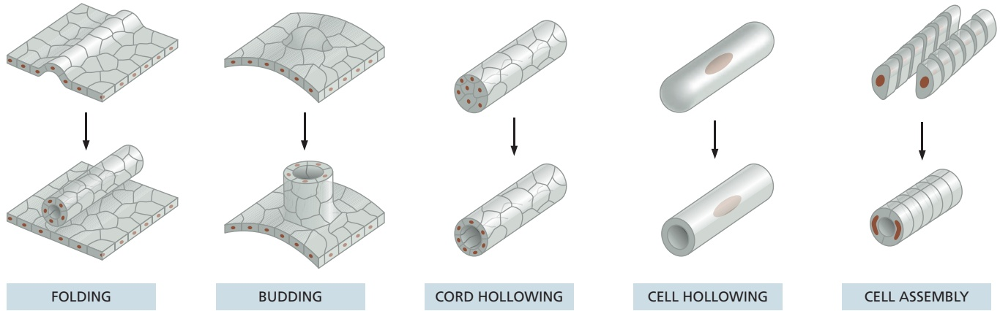

Figure 21–51 Cell behaviors involved in tube formation. Folding generates the neural tube, budding underlies the formation of lungs and trachea, cord hollowing occurs during the formation of mammalian salivary glands, cell hollowing is involved in the formation of tracheal terminal cell tubes, and cell assembly generates the heart tube that forms at the earliest stage of heart development.

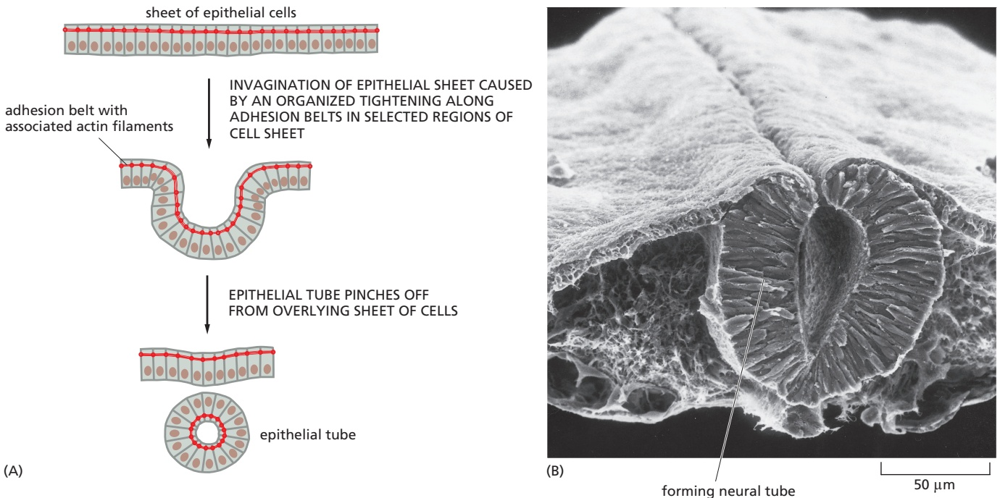

Figure 21–52 Bending of an epithelial sheet to form a tube. Contraction of apical bundles of actin filaments linked from cell to cell by adherens junctions causes the epithelial cells to narrow at their apex. Depending on the number and arrangement of cells in which the contraction occurs, the invaginated epithelium can remain connected to the original sheet or alternatively can roll up into a separated tube or a hollow sphere. (A) Diagram showing how an apical contraction along one axis of an epithelial sheet can cause the sheet to form a tube. (B) Scanning electron micrograph of a cross section through the trunk of a 2-day chick embryo, showing the formation of the neural tube by the process diagrammed in panel A. The vertebrate neural tube gives rise to the brain and spinal cord. (B, courtesy of Jean-Paul Revel.)

#### Interactions Between an Epithelium and Mesenchyme Generate Branching Tubular Structures

Embryos often develop branching tubular structures when large surfaces are required for functions such as excretion, absorption of nutrients, and gas exchange. The lungs are an example. They originate from epithelial buds that grow out from the floor of the foregut and penetrate neighboring mesenchyme to form the bronchial trees, systems of tubes that branch repeatedly as they extend, eventually making an estimated 17 million branches in humans. Endothelial cells that form the lining of blood vessels invade the same mesenchyme, thereby creating a system of closely apposed airways and blood vessels, as required for gas exchange in the lung (**Figure 21–53**). This whole process of branching morphogenesis depends on signals that pass in both directions between the growing epithelial buds and the mesenchyme. Genetic studies in mice indicate that fibroblast growth factor (FGF) proteins and their receptor tyrosine kinases play a central part in these signaling processes. FGF signaling has various roles in development, but it is especially important in the many interactions that occur between a developing epithelium and mesenchyme.

In the case of lung development, FGF10 is expressed in clusters of mesenchyme cells that lie near the tips of the growing epithelial tubes, and its receptor is expressed in the invading epithelial cells. In FGF10-deficient mutant mice, primary buds of the lung epithelium form, but fail to grow out of the mesenchyme to create branching bronchial trees. Conversely, a microscopic bead soaked in FGF10 and placed near embryonic lung epithelium in culture will induce a bud to form and grow out from the epithelium toward the bead. Evidently, the epithelium enters the mesenchyme only by invitation, in response to FGF10.

Figure 21–53 The airways of the lungs, shown in a cast of the adult human bronchial trees. Resins of different colors have been injected into different large branches of the trees. (James Cavallini/ Science Source.)

Figure 21–54 Branching morphogenesis of the lung. How FGF10 and Sonic hedgehog are thought to induce the growth and branching of the buds of the bronchial tree. Many other signal molecules, such as BMP4, are also expressed in this system, and the illustrated branching mechanism is only one of several possibilities. As indicated, FGF10 protein is expressed in clusters of mesenchyme cells near the tips of the growing epithelial tubes, and its receptor is expressed in the epithelial cells themselves. The Sonic hedgehog signal is sent in the opposite direction, from the epithelial cells at the tips of the buds back to the mesenchyme. The patterns of gene expression and their timing suggest that the Sonic hedgehog signal may serve to shut off FGF10 expression in the mesenchyme cells closest to the growing tip of a bud, splitting the FGF10-secreting cluster into two separate clusters, which in turn cause the bud to branch into two.

But what makes the growing epithelial tubes of the lung branch repeatedly as they invade the mesenchyme? This depends on a Sonic hedgehog signal that is sent in the opposite direction, from the epithelial cells at the tips of the buds back to the mesenchyme, where it inhibits FGF10 production to promote bifurcation as shown in **Figure 21–54**. In mice lacking Sonic hedgehog, the lung epithelium grows and differentiates, but it forms a sac instead of a branching. / . tree of tubules.

FGF is also the major signal in formation of the air-exchange system of insects, which consists of a pattern of fine, air-filled channels called tracheae and tracheoles. These originate from the epidermis covering the surface of the body and extend inward to invade the underlying tissues, branching and narrowing as they go (**Figure 21–55**). The FGF acts on cells at the tips of the advancing tracheae, causing them to extend filopodia and migrate toward the source of the FGF signal. Because the tip cells remain connected to the remainder of the tracheal epithelium, the pulling force that they generate elongates the tracheal tube.

Initially, the pattern of FGF production in fly embryos is defined by the D-V and A-P patterning systems discussed earlier. In later stages of development, however, FGF expression is induced by transcription regulators called hypoxiainducible factors (HIFs) that are activated by hypoxia (low oxygen levels). In this way, hypoxia stimulates the formation of finer and finer and more extensively branched trachea, until the oxygen supply is sufficient to stop the process.

#### The Extracellular Matrix Also Influences Tissue Shape

So far, we have considered only forces generated by cells during morphogenesis. However, we must not ignore another important constituent of organs: the extracellular matrix. As detailed in Chapter 19, this network of insoluble molecules is found in most animal tissues, and a specialized matrix called the basal lamina underlies all epithelial sheets. Extracellular matrices provide substrates for morphogenetic cell-migration events, as we will discuss shortly. Furthermore, the mechanical stiffness of the matrix can provide instructive signals for shaping organs by modifying the resistance against which cellular forces are generated. During branching morphogenesis of the mammalian salivary gland, for example, the basal lamina surrounding the growing bud is perforated by matrixdegrading enzymes. This localized softening of the matrix encourages preferential outgrowth of the epithelium into the more pliable regions. Changes in extracellular resistance, as well as dynamic intracellular forces, can therefore create force imbalances that drive morphogenetic events.

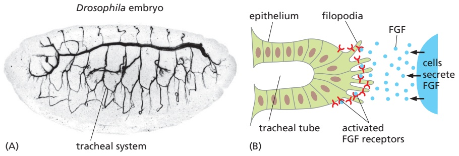

Figure 21–55 Branching morphogenesis of airways in a fly. (A) Drosophila embryonic tracheal system. (B) FGF (produced in Drosophila by the Branchless gene) signals from surrounding cells to the tracheal epithelium and activates its FGF receptors, leading to filopodia formation and tube elongation. [A, from G. Manning and M.A. Krasnow, in The Development of Drosophila melanogaster (A. Martinez-Arias and M. Bate, eds.), Vol. 1, pp. 609–685. New York: Cold Spring Harbor Laboratory Press, 1993. With permission from Cold Spring Harbor Laboratory Press.]

#### Cell Migration Is Guided by Environmental Signals

The birthplace of cells is often far from their ultimate location in the body. Our skeletal muscles, for example, derive from muscle-cell precursors, or myoblasts, in somites from which they migrate into the limbs and other regions. The routes that the migrant cells follow and the selection of sites that they colonize determine the eventual pattern of muscles in the body. The embryonic connective tissues form the framework through which the myoblasts travel, and these tissues provide the cues that guide myoblast distribution. No matter which somite they come from, the myoblasts that migrate into a forelimb bud will form the pattern of muscles appropriate to a forelimb, and those that migrate into a hindlimb bud will form the pattern appropriate to a hindlimb. It is the connective tissue that provides the patterning information.

As a migrant cell travels through the embryonic tissues, it repeatedly extends surface projections that probe its immediate surroundings, testing for cues to which it is particularly sensitive by virtue of its specific assortment of cell-surface receptor proteins. Inside the cell, these receptors are connected to the cortical actin and myosin cytoskeleton, which moves the cell along (see Chapter 16). Some extracellular matrix molecules, such as the protein fibronectin, provide adhesive sites that help the cell advance; others, such as chondroitin sulfate proteoglycan, inhibit locomotion and repel immigration. The nonmigrant cells along the migration pathway may likewise have inviting or repellent macromolecules on their surface; some may even extend filopodia to make their presence known.

In addition to general adhesive molecules, migratory cells can also be guided by specific chemical or mechanical signals that are sensed by dedicated receptors. Among many such influences, a few stand out as especially important. In particular, many types of migrating cells are guided by chemotaxis that depends on a G-protein-coupled receptor, called CXCR4, which is activated by an extracellular ligand, CXCL12. Cells expressing this receptor can shuffle their way along tracks marked out by CXCL12 **(Figure 21–56**). Chemotaxis toward sources of CXCL12 plays a major part in guiding the migrations of lymphocytes and various other white blood cells; of neurons in the developing brain; of myoblasts entering limb buds; of primordial germ cells as they travel toward the developing gonads; and of cancer cells when they metastasize.

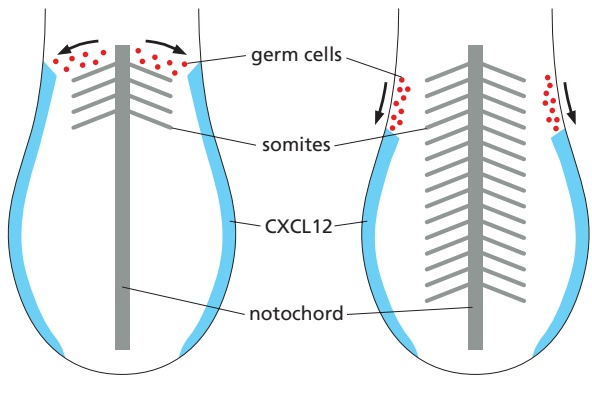

(A) 4-somite stage

(B) 15-somite stage

Figure 21–56 CXCL12 guides migrating germ cells. Zebrafish germ cells migrate to domains that express CXCL12. As the sites of CXCL12 expression change, cells follow the CXCL12 track and are guided to the region where the gonad develops at a later developmental stage. (A) At the 4-somite stage, germ cells move from a position that is close to the midline to more lateral regions where CXCL12 is expressed. (B) As the CXCL12 expression retracts, germ cells are guided to more posterior positions, where the gonads are developing.

Figure 21–57 Directional migration by local blebbing. (A) Germ cells migrate via protrusions at the leading edge of the cell called blebs, where the plasma membrane detaches locally from the underlying actin cortex and is pushed outward (see Figure 16–18). (B) The persistence and site of the protrusions are biased toward higher levels of CXCL12. Thus, germ cells migrate up the CXCL12 gradient. Note that this form of cell migration is distinct from that based on actin-rich lamellipodia (see Figures 21–48 and 21–59).

Detailed studies of primordial-germ-cell migration have shown that CXCL12 signaling does not induce cell migration per se but rather serves to control itsMBoC7 m21.46/21.57 direction. In the absence of CXCL12 signaling, germ cells still display the membrane blebbing associated with cell migration, but the position of the cell front where blebs form is randomly chosen (**Figure 21–57**), and migration is more of a random walk; if CXCL12 signaling is intact, blebbing is more frequent on the side of the cell that faces the source of CXCL12, resulting in directional migration.

#### The Distribution of Migrant Cells Depends on Survival Factors

The final distribution of migrant cells depends not only on the routes they take, but also on whether they survive the journey and thrive in the environment they find at their journey’s end. Specific sites provide survival factors needed for specific types of migrant cells to survive.

Among the most important sets of migrant cells in the vertebrate embryo is that of the **neural crest**. They arise from the border region between the part of the ectoderm that will form epidermis and the part that will form the central nervous system. As the neural ectoderm rolls up to form the neural tube, the neural crest cells break loose from the epithelial sheet along this border region and set out on their long migrations (see Figure 19–8 and **Movie 21.7**). They settle ultimately in many sites and give rise to a surprising diversity of cell types. Some will differentiate into the neurons and glial cells of the peripheral nervous system—not only in the sensory ganglia that lie close to the spinal cord, but also, following a much longer migration, in the wall of the gut. Others will form skeletal tissue in the face; still others will lodge in the skin and specialize as pigment cells.

A signaling pathway required for neural crest cell survival was identified by studying animals with defective pigmentation. Many naturally occurring mouse mutants that show white spots on their normally black coat of hair are defective in a gene that encodes a secreted peptide called Stem cell factor. Stem cell factor is produced by tissues along the migration pathways and acts as a survival factor for the migrating neural crest cells. In animals defective for Stem cell factor or its receptor, a transmembrane tyrosine kinase called Kit, many of the migrating neural crest cells die by apoptosis. As a result, the mutant individuals have nonpigmented (albino) patches of skin (**Figure 21–58**). Stem cell factor is an important survival signal for other types of migratory cells as well, including

(C) sheet

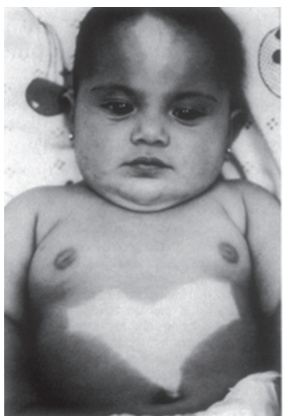

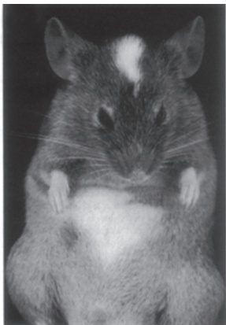

Figure 21–58 Effect of mutations in the Kit gene. Both the baby and the mouse are heterozygous for a loss-of-function mutation that leaves them with only half the normal quantity of Kit gene product, which is the receptor for stem cell factor (SCF). In both cases, pigmentation is defective because pigment cells depend on SCF for their survival. (Courtesy of R.A. Fleischman, from R.A. Fleischman et al., Proc. Natl. Acad. Sci. USA 88:10885–10889, 1991.)

primordial germ cells and blood-cell precursors. Mice completely lacking Stem cell factor or Kit are sterile and eventually die of anemia.

#### Cells Migrate in Groups to Achieve Large-Scale MorphogeneticMBoC7 m21.47/21.58 Movements

In addition to traveling solo, cells can migrate in groups, maintaining contact with one another and exhibiting coordinated behaviors that differ from those of independently migrating cells. These movements are termed collective cell migration, and they come in several forms distinguished by how the cells are organized. For example, neural crest cells undergo chain migration, in which cells follow one another in streamlike files (**Figure 21–59A**). Although their association is loose, contact between the cells is required for directed migration along paths determined by chemotactic factors such as CXCL12. Whereas individual neural crest cells respond poorly to this signal, head-to-tail cell contact induces polarity within the group that drives protrusion at the leading edge of each cell in the migrating chain.

Zebrafish development provides a good example of a second form of collective cell movement, called clustered migration (**Figure 21–59B**). Such migration occurs in groups of cohesive cells that are usually mesenchymal in origin, with leader cells of the group exhibiting the most protrusive behavior. In the zebrafish embryo, a cell cluster called the lateral line primordium migrates from a position just behind the ear and crosses the trunk musculature toward the tail. Cells in the migrating primordium continue to divide, and some are left behind to form sensory structures in its wake. The specific migratory route is laid out by a prepatterned stripe of CXCL12, but interestingly this ligand is not expressed in a gradient. Instead, the cell cluster itself generates a local gradient. Leader and follower cells both express the CXCR4 receptor, but in addition the followers express a nonfunctional CXCL12 receptor called CXCL7, which acts as a “sink” to diminish the effect of the CXCL12 signal at the rear of the cluster. The result is differential signaling within the cell cluster that orients the direction of travel.

Entire epithelia can move in a third form of collective migration called sheet migration (see **Figure 21–59C**). Here, strong adhesion and apical–basal polarity are maintained in the group; cells at the leading edge of the sheet extend robust protrusions that explore the environment, while follower cells create short basal protrusions that are also oriented in the direction of migration. Collective sheet migration can fuse flanking epithelia together, sealing gaps that have formed during development, as seen at the end of Drosophila and C. elegans embryogenesis or during wound healing. It can also create single organs from bilateral primordia, such as through the fusion that forms the mammalian palate. Interestingly, epithelial migrations can occur in the absence of a free leading edge, as seen in the spherical epithelium of the developing Drosophila egg chamber. In this case, collective epithelial migration driven by oriented basal protrusions drives repeated rounds of rotation of the entire tissue, a process required to shape the mature egg. Migration of cells to the top of mammalian gut villi, which preserves intestinal homeostasis (see Figure 22–4), appears to involve a similar movement of a continuous epithelial sheet.

Figure 21–59 Collective cell migration. Cell protrusions are shown in red. (A) Cells undergoing chain migration are connected only loosely, but transient contact with the cell ahead polarizes the protrusions (red) of the cell behind, promoting a shared trajectory. (B) Clustered migration involves groups of adherent cells in which a few “leader” cells extend protrusions in the direction of travel. (C) In sheet migration, large groups of tightly adherent epithelial cells move coherently together, usually with a free edge where cells take on a partially mesenchymal morphology with robust protrusions that lead to migration. Smaller oriented protrusions are also seen in cells behind the leading edge.

#### Summary

Animal tissues are sculpted by dramatic changes in cell shape, arrangement, or position. These changes result from shifts in the balance of forces on cells, often triggered by the expression of genes that regulate actomyosin contractility or cell adhesion. Cells that have similar adhesion molecules on their surfaces cohere and tend to segregate from other cell groups with different surface properties. Selective cell–cell adhesion is often mediated by cadherins; repulsion is often driven by ephrin–Eph signaling. Within a tissue, cells can rearrange themselves to drive convergence and extension movements that result in elongation of a tissue along a body axis. Many movements are coordinated through a planar-polarity signaling pathway that is also responsible for orienting cells correctly in various types of epithelium. Epithelial tubes can originate in various ways, most simply by the rolling up and pinching off of a segment of epithelium due to constriction of the apical surface. Elaborate branched tubular structures, such as the airways of the lung, are generated through bidirectional signaling between an epithelial bud and the mesenchyme that it invades in a process called branching morphogenesis. Branching and other morphogenetic events are regulated by changes both in the extracellular matrix and within the cells themselves. Longrange migrating cells, such as those of the neural crest, break loose from their original neighbors and travel through the embryo to colonize new sites. Many migrant cells, including primordial germ cells, are guided by chemotaxis dependent on the receptor CXCR4 and its ligand CXCL12. Interconnected groups of cells can also migrate, with leader and follower cells showing distinctive behaviors. Such collective cell migrations accomplish large-scale tissue shaping.

Figure 21–60 Members of the same species can have dramatically different sizes. The Chihuahua weighs 2–5 kg, whereas a Great Dane weighs 45–90 kg. (Courtesy of Deanne Fitzmaurice.)

<!-- END EN EN21-H044-H059 -->

### 英文补充：免疫球蛋白超家族的细胞表面蛋白

> 对应中文板块：免疫球蛋白超家族的细胞表面蛋白。英文来源：Molecular Biology of the Cell，第7版，第24章；[本章完整原文](../来源/英文教材/24_The_Innate_and_Adaptive_Immune_Systems/chapter.md)。物理PDF页码范围：1392–1443（整章范围）。

<!-- BEGIN EN EN24-H037-H037 -->
#### Many Cell-Surface Proteins Belong to the Ig Superfamily

Figure 24–47 Comparison of the co-stimulatory proteins required to activate a helper T cell and a B cell in response to the same foreign protein. (A) A naïve helper T cell (TH) is activated by a peptide fragment of a foreign protein bound to a class II MHC protein on the surface of an activated dendritic cell. The co-stimulatory protein on the dendritic cell (a B7 protein— either CD80 or CD86) binds to the CD28 co-receptor on the TH cell, providing a necessary co-stimulatory signal to the TH cell; in addition, cytokines secreted by the dendritic cell (and by other nearby innate immune cells) influence what subtype of effector helper cell the TH cell becomes (see Figure 24–44). (B) Once activated to become an effector cell, the TH cell—most commonly a follicular TH cell (TFH; see Figure 24–44)—can help activate B cells that have the same peptide–MHC protein complexes on their surface as the dendritic cell that activated the naïve TH cell. These B cells have BCRs that bind an antigenic determinant on the surface of a folded foreign protein, and the B cells endocytose the protein (red arrow); the protein is then cleaved into peptides, some of which are carried to the B cell surface by class II MHC proteins. There, some of the peptide–MHC complexes are recognized by the TCRs on the TFH cell (see Figure 24–39). Note that the BCRs and TCRs recognize different antigenic determinants of the protein. As indicated, the co-stimulatory protein used by the effector TFH cell is CD40 ligand, which binds to the CD40 co-receptor on the B cell; the TFH cell also secretes cytokines (green arrow) including IL21 (see Figure 24–44) to help stimulate the B cell to undergo somatic hypermutation and class switching (not shown). The CD4 co-receptor on TH cells and the invariant chains associated with the TCRs and BCRs are omitted in both A and B for simplicity.

Most of the proteins that mediate antigen recognition and cell–cell recognition in the adaptive immune system contain one or more Ig or Ig-like domains, suggesting that the proteins have a common evolutionary history. Included in this very large **Ig superfamily** are antibodies, TCRs, MHC proteins, the CD4, CD8, and CD28 co-receptors, the B7 co-stimulatory proteins, and most of the invariant polypeptide chains associated with TCRs and BCRs, as well as the various Fc receptors on lymphocytes and other leukocytes. Many of these proteins are dimers or higher oligomers, in which Ig or Ig-like domains of one chain interact with those in another (**Figure 24–48**).

In both vertebrates and invertebrates, many proteins in the Ig superfamily are also found outside immune systems, where they often function in cell–cell recognition and adhesion processes, both during development and in adult tissues. It seems likely that the entire gene superfamily evolved from a primordial gene coding for a single Ig-like domain, similar to that encoding β2-microglobulin (see Figure 24–36). In present-day family members, a separate exon usually encodes the amino acids in each Ig-like domain, consistent with the likelihood that new family members arose during evolution by exon and gene duplications.

<!-- END EN EN24-H037-H037 -->

---

## 第16章 细胞的社会联系 · 第三节 细胞外基质

[返回本章](README.md) · [中文本章原文](中文原文.md)

<!-- BEGIN CN CN16-S03 -->
## 第三节 细胞外基质

多细胞生物体的组成除细胞之外，还包括由细胞分泌的蛋白质和多糖所构成的细胞外基质(extracellular matrix, ECM)。细胞外基质在结缔组织中含量最为丰富，主要由成纤维细胞（fibroblast）所分泌，占据结缔组织的大部分胞外空间（图16-14）。

胞外基质的分子类型、不同组分的含量和组装形式具有组织器官特异性，并与组织器官的发育阶段及功能状态相适应。各种结缔组织的胞外基质变化多样，如：骨组织胞外基质表现为刚硬，以确保其支撑等作用；软骨具有一定的韧性；角膜中胞外基质是透明而柔软的；肌腱和韧带中的胞外基质组装成绳索状，具有高度抗张强度；在上皮层和结缔组织间的胞外基质特化为基膜。尽管如此多样，但根据其组成成分的功能进行划分，动物细胞的胞外基质成分主要有三种类型：①结构蛋白，

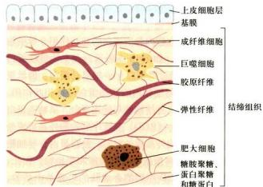  
图 16-14 结缔组织示意图

上皮组织下的结缔组织由多种细胞和胞外基质成分构成，细胞主要是分泌胞外基质的成纤维细胞。

包括胶原和弹性蛋白，分别赋予胞外基质强度和韧性；② 蛋白聚糖，由蛋白质和多糖共价形成，具有高度亲水性，从而赋予胞外基质抗压的能力；③ 粘连糖蛋白，包括纤连蛋白和层粘连蛋白，有助于细胞粘连到胞外基质上。

动物组织的构建既是多细胞相互作用的结果，也是细胞与胞外基质相互作用的结果。胞外基质不仅为组织的构建提供了支撑框架，还对与其接触的细胞的存活、发育、迁移、增殖、形态以及其他功能产生重要的调控作用。很多编码胞外基质成分的基因或某些胞外基质受体基因突变，或者胞外基质的装配与降解过程紊乱，可导致脏器纤维化等多种疾病甚至肿瘤的发生，因此对胞外基质功能的研究越来越受到关注。

## 一、胶原

## （一）结构与类型

胶原（collagen）是胞外基质最基本的成分之一，也是动物体内含量最丰富的蛋白质，占人体蛋白质总量的25%以上。典型的胶原分子呈纤维状。胶原纤维的基本结构单位是原胶原（tropocollagen）。原胶原由3条α链多肽盘绕而成三股螺旋结构，长300 nm，直径1.5 nm。不同的α链由不同的基因编码，目前已发现人基因组中有42个编码基因。α链的氨基酸组成及排列独特，甘氨酸含量占1/3，脯氨酸及羟脯氨酸约占1/4，α链的一级结构具有Gly-X-Y三肽重复序列，其中X常为脯氨酸（Pro），Y常为羟脯氨酸（Hypro）或羟赖氨酸（Hylys），其典型结构如图16-15所示。这种三肽重复序列有利于形成三股螺旋胶原分子，也有

  
图16-15 典型的胶原分子结构

A. 一条胶原 $\alpha$ 链，呈左手螺旋，具有Gly-X-Y三肽重复序列特征。B. 胶原分子模式图，由3条 $\alpha$ 链螺旋盘绕形成。

助于胶原纤维高级结构的形成，因此，其氨基酸残基突变，尤其是 Lys 残基的突变往往导致三股螺旋形成障碍。

值得一提的是，并非所有类型的胶原都由相同的 $\alpha$ 链螺旋盘绕形成，如I、IV、V、IX型胶原由两种或3种 $\alpha$ 链螺旋形成，而Ⅱ、Ⅲ、Ⅶ、XII、XVII和XVIII型胶原仅由一种 $\alpha$ 链形成。目前已发现的人胶原类型多达27种，几种常见的胶原类型及其组织分布见表16-4。

表 16-4 胶原的类型及其特性

<table><tr><td>类型</td><td>多聚体形式</td><td>组织分布</td><td>突变表型</td></tr><tr><td>I</td><td>纤维</td><td>皮肤、肌腱、骨、韧带、角膜等</td><td>严重的骨缺陷和断裂</td></tr><tr><td>II</td><td>纤维</td><td>软骨、脊索、人眼玻璃体</td><td>软骨缺陷、矮小症状</td></tr><tr><td>III</td><td>纤维</td><td>皮肤、血管、体内器官</td><td>皮肤易损、关节松软、血管易破</td></tr><tr><td>V</td><td>纤维(结合I型胶原)</td><td>与I型胶原共分布</td><td>皮肤易损、关节松软、血管易破</td></tr><tr><td>XI</td><td>纤维(结合II型胶原)</td><td>与II型胶原共分布</td><td>近视、失明</td></tr><tr><td>IX</td><td>与II型胶原侧面结合</td><td>软骨</td><td>骨关节炎</td></tr><tr><td>IV</td><td>片层状(形成网络)</td><td>基膜</td><td>血管球型肾炎、耳聋</td></tr><tr><td>VII</td><td>锚定纤维</td><td>鳞状上皮下</td><td>皮肤起疱</td></tr><tr><td>XVII</td><td>非纤维状</td><td>半桥粒</td><td>皮肤起疱</td></tr><tr><td>XVIII</td><td>非纤维状</td><td>基膜</td><td>近视、视网膜脱离、脑积水</td></tr></table>

A

## （二）合成与装配

与大多数分泌蛋白的合成，修饰类似，胶原的合成与组装始于内质网，并在高尔基体中进行修饰，最后在细胞外组装成胶原纤维。每一条胶原肽链以前α链（pro-α chain）的形式在rER膜结合的核糖体上合成。前α链不仅含有内质网信号肽，而且在其N端以及C端还含有前肽（propeptide）序列。N端前肽约150个氨基酸残基，而C端前肽约250个氨基酸残基。前α链进入rER腔后信号肽被切除，其脯氨酸、赖氨酸被羟基化形成羟脯氨酸和羟赖氨酸，有些羟赖氨酸还被糖基化。然后，带有前肽的3条前α链在ER腔内装配形成三股螺旋的前胶原分子（procollagen），通过高尔基体分泌到细胞外，在两种Zn²⁻依赖性的前胶原N-蛋白酶和前胶原C-蛋白酶作用下，分别切去N端前肽及C端前肽，成为胶原分子（collagen molecule）。切除前肽的胶原分子以1/4交替平行排列的方式自我装配形成直径10\~30 nm的胶原原纤维（collagen fibril），胶原原纤维进一步聚合成500\~3 000 nm的胶原纤维（图16-16）。

在上述合成、加工与装配过程中，脯氨酸和赖氨酸残基的羟基化有助于羟基间形成氢键，以稳定胶原三股螺旋结构。缺少维生素C（抗坏血病）时，脯氨酸的羟基化受到影响，从而引起坏血病。这是由于未羟基化的前α链不能形成稳定的三股螺旋结构而很快在细胞中被降解，结果导致胞外基质中胶原的不断丢失而引起血管脆性增加、牙齿松脱以及创伤不能修复。此外，前α链的前肽不仅有助于形成三股螺旋结构，而且阻止了细胞内形成胶原原纤维，因此，前胶原分泌到细胞外后才被切除前肽，这对胶原原纤维的正常组装是必需的。在Ehlers-Danlos综合征中，由于缺乏一种切除前肽的酶，导致胶原不能正常组装为高度有序的纤维而出现皮肤和血管脆弱、皮肤弹性过强等症状。

胶原纤维的强度还可通过胶原分子间以及胶原分子内赖氨酸残基之间形成共价键而得到极大增强。在跟腱部位，这种共价键特别丰富，因此跟腱具有极强的抗张能力。

## （三）胶原的空间排布形式

同一组织中常含有几种不同类型的胶原，但常以某一种类型为主。在不同组织中，胶原组装成不同的纤维形式，以适应特定功能的需要，最显著的是在骨和角膜中，胶原纤维分层排布，同一层的胶原彼此平行，而相邻两层的纤维彼此垂直，形成夹层板样的结构，使组织具有牢固、不易变形的特性。

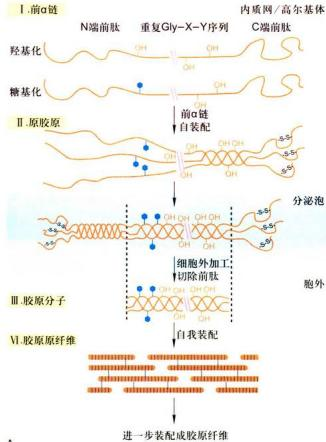

  
图 16-16 胶原合成与装配  
A. 胶原纤维的合成与装配过程。B. 小鼠胶原纤维电镜超薄切片照片。(B图由梁凤霞博士惠赠)

胶原纤维的大小和空间排布形式在不同结缔组织中存在巨大差异，这至少与两方面因素有关：一是细胞分泌的胞外基质中一些纤维结合胶原（fibril-associated collagen）。如IX型和XII型胶原，前者结合在Ⅱ型胶原表面，后者结合在I型胶原表面，介导胶原分子间或者胶原与其他胞外基质大分子间的相互作用，从而影响胶原的排布形式。二是分泌胶原的细胞对胶原在胞外基质中排布的影响。如成纤维细胞，通过对分泌的胶原进行“梳理”，从而影响胶原纤维大小、强度以及空间排布形式。

## （四）功能

胶原在胞外基质中含量最高，刚性及抗张力强度最大，构成细胞外基质的骨架结构。细胞外基质中的其他组分通过与胶原结合形成结构与功能的复合体。胶原纤维具有很强的抗张能力，特别是I型胶原。胶原纤维束构成肌腱，连接肌肉和骨骼。单位横截面的I型胶原抗张能力比铁还强。当I型胶原发生突变后，常导致成骨不全（osteogenesis imperfecta），患者很容易发生骨折。

## 二、弹性蛋白

弹性蛋白 (elastin) 是弹性纤维的主要成分。弹性纤维主要存在于脉管壁及肺组织，也少量存在于皮肤、肌腱及疏松结缔组织中。弹性纤维与胶原纤维共同存在，分别赋予组织弹性及抗张性。弹性蛋白是高度疏水的非糖基化蛋白，约含 750 个氨基酸残基。它的氨基酸组成像胶原一样富含甘氨酸和脯氨酸，但很少含羟脯氨酸，不含羟赖氨酸，没有 Gly-X-Y 序列。弹性蛋白在组成上主要由两种不同类型的区域交替排列而成：疏水区域，赋予分子弹性；富含丙氨酸和赖氨酸的 α 螺旋区域，有助于相邻分子形成交联。正因为如此，弹性蛋白才具有两个明显的特征：一是构象呈无规则卷曲状态；二是通过 Lys 残基相互交连成网状结构（图 16-17）。

  
图 16-17 弹性蛋白伸展及收缩示意图  
弹性蛋白分子通过共价键相互连接在一起形成卷曲的网状结构，从而可以随意的伸展及回缩。

胶原和弹性蛋白的重要性在年老个体中表现得更为明显。随着年龄的增长，胶原的交联度越来越大，而韧性却越来越低，弹性蛋白也从皮肤等组织中逐渐丧失。结果，老年人关节灵活性降低，皮肤起皱，弹性降低。

## 三、糖胺聚糖和蛋白聚糖

## （一）糖胺聚糖

糖胺聚糖（glycosaminoglycan, GAG）是由重复的二糖单位构成的不分支的长链多糖，其二糖单位之一是氨基己糖（N-乙酰氨基葡糖或N-乙酰氨基半乳糖），故又称氨基聚糖，另一个是糖醛酸。由于其糖基通常带有硫酸基团或羧基，因此糖胺聚糖带有大量负电荷（图16-18）。根据糖、糖基连接类型和硫酸基团的数量与位置，糖胺聚糖可分为透明质酸（hyaluronan）、硫酸软骨素（chondroitin sulfate）和硫酸皮肤素（dermatan sulfate）、硫酸乙酰肝素（heparan sulfate）以及硫酸角质素（keratan sulfate）4类。

由于高度亲水性的糖胺聚糖带有大量负电荷，因而能够吸引大量的阳离子（如Na⁺），这些阳离子再结合大量水分子。结果，糖胺聚糖就像海绵一样吸水产生膨压，赋予胞外基质抗压的能力。尽管结缔组织中的糖胺聚糖含量很少，但由于它们能形成多孔的水合胶体，体积增大数倍，糖胺聚糖填充了胞外基质的大部分空间，为组织提供了机械支撑作用。一种严重的硫酸皮肤素合成缺陷遗传病显示，患者身材矮小，外貌早熟，其皮肤、关节、肌肉和骨等都不正常。

透明质酸是一种重要的糖胺聚糖，是增殖细胞和迁移细胞的胞外基质主要成分，在早期胚胎中含量特别丰富。与其他糖胺聚糖相比，透明质酸不被硫酸化，而且通常不与任何核心蛋白（core protein）共价连接。

与其他糖胺聚糖一样，透明质酸分子表面含有大量亲水的羧基基团，吸引阳离子，结合大量水分子，形成水合胶体。因此在胞外基质中，透明质酸向外产生膨压，赋予结缔组织抗压能力。此外，透明质酸形成的水合空间有利于细胞保持彼此分离，使细胞易于运动迁移和增殖。一旦细胞迁移停止或增殖够数，便由透明质酸酶(hyaluronidase)将其降解。透明质酸还是关节液的一种重要成分，起到润滑关节的作用。透明质酸的许多作用都不是独立完成的，还依赖于与其他蛋白质及蛋白聚糖的相互作用。

  
图16-18 糖胺聚糖结构示意图

## （二）蛋白聚糖

蛋白聚糖（proteoglycan）位于结缔组织、细胞外基质及许多细胞表面，由糖胺聚糖（除透明质酸外）与核心蛋白的丝氨酸残基共价连接形成的大分子（图16-19），其含糖量可达 $90\% \sim 95\%$ 。一个核心蛋白上可连接数百个不同的糖胺聚糖形成蛋白聚糖。蛋白聚糖的核心蛋白在ER上合成，其与多糖链结合的糖基化过程发生在高尔基复合体中，首先是一个特异的连接四糖(link tetrasaccharide)与核心蛋白的丝氨酸残基共价结合，然后每次由糖基转移酶（glycosyl-transferase）将糖胺聚糖一个个地添加到四糖末端（图16-19）。

在很多组织中，蛋白聚糖以单分子形式存在。但在软骨中，大量蛋白聚糖借助连接蛋白（linker protein）以非共价键的形式与透明质酸结合形成很大的复合体（图16-20）。每个复合体分子量高达数百万，长达几个微米。蛋白聚糖的一个显著特点是多态性，可以含有不同的核心蛋白以及长度和成分不同的多糖链。这些蛋白聚糖赋予软骨凝胶样特性和抗变形能力。此外，蛋白聚糖可与FGF、TGFβ等多种生长因子结合，有利于激素分子与细胞表面受体结合，有效完成信号转导。

并非所有蛋白聚糖都形成巨大的聚合物，如基膜中的蛋白聚糖，由一个20\~400 kDa的核心蛋白和连

## 图 16-19 蛋白聚糖结构示意图

蛋白聚糖由糖胺聚糖（GAG）与核心蛋白的丝氨酸残基共价连接形成，其中糖胺聚糖通过一个连接四糖与核心蛋白相连。

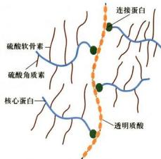  
图16-20 蛋白聚糖复合体结构示意图  
蛋白聚糖通过连接蛋白与透明质酸结合在一起。

接的几个硫酸肝素链构成。这种蛋白聚糖与IV型胶原结合，构成基膜的结构组分。还有个别蛋白聚糖并不被分泌到细胞外，而是通过自身核心蛋白插入到脂双层中或者通过核心蛋白与糖基化磷脂酰肌醇相连而成为质膜的整合成分，充当其他受体的辅助受体，在信号转导以及信号分子活性与分布的调节等方面发挥重要作用。

## 四、纤连蛋白和层粘连蛋白

纤连蛋白与层粘连蛋白具有多个结构域，与胞外基质中其他大分子和细胞表面的黏分子（如整联蛋白）结合，从而帮助细胞粘连在胞外基质上。

## （一）纤连蛋白

纤连蛋白（fibronectin, FN）是高分子量糖蛋白，含糖4.5%\~9.5%，由两个亚基通过C端形成的二硫键交联形成，每个亚基的分子质量为220\~250 kDa，整个分子呈V形（图16-21）。

纤连蛋白一般由两个相似的亚基组成，每个亚基都是同一基因的表达产物，只是转录后差别剪接而产生不同的mRNA。用低浓度蛋白酶从纤连蛋白各个结构域间的特异位点切断后，就可确定每个结构域的结合活性。分析发现，纤连蛋白的每个亚基有数个结构域。这些结构域有的能识别并结合胞外基质组分，如能结合I、Ⅱ及Ⅳ型胶原、肝素及凝血蛋白——血纤维蛋白（fibrin），有的能识别并结合细胞表面受体（图16-21）。这些与细胞表面受体结合的结构域中含有RGD三肽序列。如

  
图16-21 纤连蛋白二聚体结构示意图

两个亚基在 C 端通过两个二硫键连接在一起形成二聚体，每个亚基折叠后形成 5\~6 个结构域，每个结构域能够结合特异的分子或者细胞。

果将人工合成的含有 RGD 三肽序列的短肽偶联在固体物表面，则细胞很容易附着上去。

纤连蛋白的细胞表面受体是整联蛋白家族成员，受体的胞外功能域有与RGD三肽序列高亲和性的结合部位，因此纤连蛋白具有介导细胞黏着的功能。纯化的纤连蛋白可增强细胞间黏着及细胞与胞外基质的黏着。

纤连蛋白有助于维持细胞形态。纤连蛋白能结合细胞表面受体和胶原等胞外基质，因此纤连蛋白就像一个分子“桥”，将细胞锚定在胞外基质上。这种锚定作用可以通过实验加以说明，如将细胞培养在有纤连蛋白的表面上，细胞很容易就贴壁生长，形态变得扁平，而且细胞内的肌动蛋白纤维的排列形式与胞外纤连蛋白的排列形式类似，由此认为肌动蛋白纤维的定向与组织形式对细胞形态及其维持具有明显的决定作用。研究还发现，很多种癌细胞不能合成纤连蛋白，不但丧失了正常的细胞形态，还脱离胞外基质。如果为这些癌细胞提供纤连蛋白，则细胞形态和结合胞外基质的能力都可以恢复到正常水平。这说明纤连蛋白可能涉及细胞癌变与迁移过程。

纤连蛋白还促进细胞迁移。一个典型的例子是两栖类胚胎发生早期神经嵴细胞的迁移。在神经管形成时，神经嵴细胞从神经管的背侧迁移到胚胎各个区域，分化成神经节、色素细胞等不同类型的细胞。显微注射抗纤连蛋白受体的抗体或含RGD序列的短脉，可以阻断细胞与纤连蛋白的结合，从而阻止细胞的迁移，形成

异常胚胎。

此外，纤连蛋白还有助于血液凝固和创伤修复。血浆纤连蛋白（plasma fibronectin）是在血液中存在的一种可溶性的纤连蛋白。在血凝块形成过程中，血浆纤连蛋白能结合血纤维蛋白，并促进血小板附着于血纤维蛋白上。纤连蛋白还指引巨噬细胞和其他免疫细胞迁移到受损部位，促进创伤修复。

## （二）层粘连蛋白

层粘连蛋白（laminin, LN）是另外一种粘连蛋白，不像纤连蛋白那样分布广泛，层粘连蛋白主要分布于各种动物胚胎及成体组织的基膜。层粘连蛋白是高分子量糖蛋白（820 kDa），不仅含糖量很高（占25%\~30%），而且糖链结构也最为复杂，层粘连蛋白通过二硫键将一条α链（400 kDa）、一条β链（220 kDa）及γ链（210 kDa）连在一起，分子外形以“十”字形状，3条短臂各由3条肽链的N端序列构成（图16-22）。如纤连蛋白一样，层粘连蛋白也有多个不同的结构域，可与IV型胶原、肝素等胞外基质组分结合，还可通过自身的

  
图 16-22 层粘连蛋白分子结构示意图

  
图16-23 基膜的三种组织形式

RGD 三肽序列与细胞质膜上的整联蛋白结合。因此，层粘连蛋白也是分子“桥”，将细胞锚定在基膜上。

## 五、基膜与细胞外被

## (一) 基膜

基膜（basal lamina, basement membrane）是一种特化的胞外基质结构，通常位于上皮层的基底面，厚40～120 nm，将上皮细胞与结缔组织分开。此外，在肌细胞和脂肪细胞表面、血管内皮细胞下面、施万细胞（Schwann cell）的表面也有基膜（图16-23）。

基膜主要成分为IV型胶原、层粘连蛋白、巢蛋白（nidogen）以及基膜蛋白聚糖等。层粘连蛋白在基膜中发挥了重要作用，因为层粘连蛋白具有多个不同的功能结构域，既能与IV型胶原结合，也能与细胞表面受体结合，从而将细胞与基膜紧密结合在一起。

基膜不仅对组织起结构支撑作用，同时还具有调节分子通透性以及作为细胞运动的选择性通透屏障。如在肾中，基膜参与构成一种过滤装置，可允许小分子从血液进入尿液，而阻止血液中蛋白质进入尿液。在表皮细胞层下的基膜可阻止结缔组织中的细胞进入表皮，而允许参与免疫作用的白细胞进入。此外，基膜还能决定细胞的形态与极性，影响细胞代谢，促进细胞存活、增殖、分化甚至迁移，在组织再生中也发挥了重要作用。

## （二）细胞外被

细胞外被（cell coat）又称糖萼（glycocalyx），指细胞质膜外表面覆盖的一层黏多糖物质（图16-24A）。几乎所有的整合膜蛋白及某些膜脂分子都与糖链分子共价相连形成糖蛋白和糖脂，这些突出于细胞表面的糖链分子就形成了糖萼（图16-24B）。所以，细胞外被是细胞质膜的正常结构组分，它与胞外基质在空间分布、成分及功能等方面都不一样。细胞外被不仅对细胞膜起保护作用，而且在细胞识别中起重要作用。

  
图16-24 细胞外被  
A. 小鼠膀胱上皮细胞表面的糖萼，钉红染色的电镜超薄切片。B. 蛙小肠上皮细胞表面突出的与膜脂及膜蛋白共价连接的糖萼（糖链分子）。(A 图由梁凤霞博士和丁明孝提供；B 图由 Bechara Kachar 博士惠赠)

## 六、植物细胞壁

动物细胞具有不同组织形式的胞外基质，而对植物、真菌、藻类和原核细胞而言，其胞外基质不但与动物细胞胞外基质在成分上不同，而且组织形式也不一样。植物、真菌、藻类和原核细胞的胞外基质形成不同类型的细胞壁（cell wall）。植物细胞坚韧的细胞壁赋予细胞强度，保护细胞免受机械损伤以及病原体感染。此外，细胞壁还发挥渗透屏障作用，小分子物质，如水、离子、单糖、氨基酸等都能顺利通过细胞壁，而分子质量高于20 kDa的蛋白质则很难通过细胞壁。正因为细胞壁对物质通透的渗透屏障性，在植物细胞间起信号作用的激素的分子量都小于1 000。

## （一）细胞壁的化学组成与结构

植物细胞壁与动物细胞胞外基质的来源一样，也是由细胞分泌的。植物细胞壁由大分子构成，主要成分是多糖，包括纤维素、半纤维素、果胶质等。

## 1. 纤维素

纤维素（cellulose）是由葡萄糖分子以 $\beta(1\rightarrow4)$ 糖苷键连接起来的线性多聚体分子。纤维素分子集聚成束，形成长的微原纤维（microfibre），微原纤维的走向受细胞质中微管网架的影响。纤维素分子为细胞壁提供了抗张强度。

## 2. 半纤维素

半纤维素（hemicellulose）是由木糖、半乳糖和葡萄糖等组成的高度分支的多糖，通过氢键与纤维素微原纤维连接。半纤维素的分支有助于将微原纤维彼此连接或介导微原纤维与其他基质成分（例如果胶质）连接。果胶质像透明质酸一样，含有大量携带负电荷的糖基，如半乳糖醛酸等。果胶质结合诸如 $\mathrm{Ca^{2+}}$ 等阳离子，被高度水化，可形成凝胶，常用于食品加工。果胶质与半纤维素横向连接，参与细胞壁复杂网架的形成。

## 3. 伸展蛋白

伸展蛋白（extensin）是由大约300个氨基酸残基组成的糖蛋白，在植物细胞壁中含量可高达15%。伸展蛋白含有大量羟脯氨酸残基，其肽链长度的一半是Ser-Hyp-Hyp-Hyp四肽序列的重复。大多羟脯氨酸含有3\~4个阿拉伯糖残基的寡糖链，丝氨酸连接有半乳糖，糖的总量约占65%。

## 4. 木质素

木质素（lignin）是由酚残基形成的水不溶性多聚体。次生细胞壁形成时，木质素开始合成，并以共价键与细胞壁多糖交联，大大增加了细胞壁的强度与抗降解力。

## （二）初生细胞壁与次生细胞壁

植物细胞有两种细胞壁，即初生细胞壁（primary cell wall）和次生细胞壁（secondary cell wall）（图 16-25）。二者是在不同阶段由细胞分泌而成。

植物细胞壁最先形成的是中间层（middle lamella）（图 16-25），主要成分为果胶（pectin）。果胶是相邻细胞壁所共有的，起到将相邻细胞壁粘连在一起的作用。

分泌合成的第二个区域是初生细胞壁。初生细胞壁是在细胞生长时期合成的，由纤维素、半纤维素、果胶和糖蛋白等组成。初生细胞壁可看成为凝胶样基质，纤维素埋于其中。

当细胞停止生长后，多数细胞会分泌合成次生细胞壁。次生细胞壁与初生细胞壁相比，往往还含有木质素，但基本不含有果胶。这使得次生细胞壁非常坚硬。

细胞壁中某些寡糖成分可作为信号物质，当外界病原体入侵时，真菌或植物细胞壁中的多糖水解产生特定的寡糖组分，它们可诱导编码植保素合成酶的基因表达，产生植保素（phytoalexin）杀死病原体。有证据显示，细胞壁多糖中的某些寡糖片段可以作为细

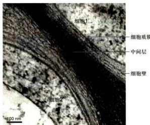  
图 16-25 拟南芥细胞壁与中间层（祝建博士惠赠）

胞生长和发育的信号物质。在植物细胞壁中，也发现类似动物细胞的蛋白聚糖，如阿拉伯半乳聚糖蛋白（arabinogalactan protein），其分布广泛且含量丰富，它们与植物组织发育、细胞增殖及胚胎发生中所涉及的细胞间信号转导和细胞与胞外基质的相互作用相关。

## 思考题

1. 细胞通过哪些方式产生社会联系？细胞社会联系有何生物学意义？

2. 细胞连接有哪几种类型，各有什么功能？

3. 细胞黏着分子与胞外基质成分有哪些，分别有什么功能？

4. 密封蛋白 -1（claudin-1）是形成紧密连接并发挥其功能的主要蛋白。试推测缺失 claudin-1 的小鼠出生后，其皮肤保持水份的能力发生什么变化。在体外，若小鼠成纤维细胞表达 claudin-1 蛋白，那么成纤维细胞间是否会形成紧密连接？细胞分泌胞外基质是否发生改变？

## - 参考文献

1. Boggon T J, Murray J, Chappuis-Flament S, et al. C-cadherin ectodomain structure and implications for cell adhesion mechanisms. Science, 2002, 296(5571): 1308-1313.

2. Elias L A B, Wang D D, Kriegstein K R. Gap junction adhesion is necessary for radial migration in the neocortex. Nature, 2007, 448 (7156): 901-907.

3. Gallant N D, Michael K E, García A J. Cell adhesion strengthening: contributions of adhesive area, integrin binding, and focal adhesion assembly. Molecular Biology of the Cell, 2005, 16(9): 4329-4340.

4. Geiger B, Bershadsky A, Pankov R, et al. Transmembrane crosstalk between the extracellular matrix and the cytoskeleton. Nature Reviews Molecular Cell Biology, 2001, 2(11): 793-805.

5. Gelse K, Pöschl E, Aigner T. Collagens—structure, function, and biosynthesis. Advanced Drug Delivery Reviews, 2003, 55(12): 1531-1546.

6. Green K J, Gaudry C A. Are desmosomes more than tethers for intermediate filaments? Nature Reviews Molecular Cell Biology, 2000, 1(3): 208-216.

7. Ploss A, Evans M J, Gaysinskaya V A, et al. Human occludin is a hepatitis C virus entry factor required for infection of mouse cells. Nature, 2009, 457(7231): 882-886.

8. Ross T D, Coon B G, Yun S, et al. Integrins in mechanotransduction. Current Opinion in Cell Biology, 2013, 25(5): 613-618.

<table><tr><td>年份</td><td>获奖人</td><td>奖项</td><td>获奖者研究领域</td></tr><tr><td>2019</td><td>William G. Kaelin Jr, Peter J. Ratcliffe, Gregg L. Semenza</td><td>P/M</td><td>细胞如何感知和适应氧气供应</td></tr><tr><td rowspan="3">2018</td><td>James P. Allison, 本庶佑</td><td>P/M</td><td>通过抑制负向免疫调节来治疗癌症</td></tr><tr><td>Frances H. Arnold</td><td>C</td><td>酶的定向进化</td></tr><tr><td>George P. Smith, Gregory P. Winter</td><td></td><td>噬菌体展示技术</td></tr><tr><td rowspan="2">2017</td><td>Jeffrey C. Hall, Michael Rosbash, Michael W. Young</td><td>P/M</td><td>发现了控制昼夜节律的分子机制</td></tr><tr><td>Jacques Dubochel, Joachim Frank, Richard Henderson</td><td>C</td><td>开发冷冻电子显微镜用于溶液中生物分子的高分辨率结构测定</td></tr><tr><td>2016</td><td>大陽良典</td><td>P/M</td><td>发现了细胞自噬的机制</td></tr><tr><td rowspan="3">2015</td><td>William C. Campbell, 大村智</td><td>P/M</td><td>发现治疗丝虫寄生虫新疗法</td></tr><tr><td>屠呦呦</td><td rowspan="2">C</td><td>发现治疗疟疾的新疗法</td></tr><tr><td>Tomas Lindahl, Paul Modrich, Aziz Sancar</td><td>DNA 修复的细胞机制研究</td></tr><tr><td rowspan="2">2014</td><td>John O'Keefe, May-Britt Moser, Edvard I. Moser</td><td>P/M</td><td>发现构成大脑定位系统的细胞</td></tr><tr><td>Eric Betzig, Stefan W. Hell, William E. Moerner</td><td>C</td><td>超分辨率荧光显微技术领域取得的成就</td></tr><tr><td>2013</td><td>James E. Rothman, Randy W. Schekman, Thomas C. Südhof</td><td>P/M</td><td>发现了细胞囊泡运输与调节机制</td></tr><tr><td rowspan="3">2012</td><td>Sir John B. Gurdon</td><td>P/M</td><td>细胞核重编程技术</td></tr><tr><td>山中伸弥</td><td rowspan="2">C</td><td>发现成熟细胞可被重写成多功能细胞</td></tr><tr><td>Robert J. Lefkowitz, Brian K. Kobilka</td><td>对G蛋白偶联受体的研究</td></tr><tr><td rowspan="2">2011</td><td>Bruce A. Beutler, Jules A. Hoffmann</td><td rowspan="2">P/M</td><td>对于先天免疫机制激活的发现</td></tr><tr><td>Ralph M. Steinman</td><td>发现树突细胞和其在获得性免疫中的作用</td></tr><tr><td>2010</td><td>Robert G. Edwards</td><td>P/M</td><td>体外受精技术和试管婴儿技术</td></tr><tr><td rowspan="2">2009</td><td>Elizabeth H. Blackburn, Carol W. Greider</td><td>P/M</td><td>端粒和端粒酶在保护染色体结构完整中的作用</td></tr><tr><td>Venkatraman Ramakrishnan, Thomas A. Steitz, Ada E. Yonath</td><td>C</td><td>对核糖体结构与功能的研究</td></tr><tr><td rowspan="3">2008</td><td>Harald zur Hausen</td><td>P/M</td><td>发现乳头瘤病毒导致宫颈癌</td></tr><tr><td>Françoise Barré-Sinoussi, Luc Montagnier</td><td rowspan="2">C</td><td>发现人类免疫缺陷病毒HIV</td></tr><tr><td>Osamu Shimomura, Martin Chalfie, Roger Y. Tsien</td><td>绿色荧光蛋白(GFP)的发现和应用</td></tr><tr><td>2007</td><td>Mario R. Capecchi, Sir Martin J. Evans, Oliver Smithies</td><td>P/M</td><td>发明利用胚胎干细胞在小鼠中进行特异的基因修饰(即基因敲除技术)</td></tr><tr><td rowspan="2">2006</td><td>Andrew Z. Fire, Craig C. Mello</td><td>P/M</td><td>RNA干扰——双链RNA能够沉默基因表达</td></tr><tr><td>Roger D. Kornberg</td><td>C</td><td>真核生物转录的分子基础</td></tr><tr><td>2005</td><td>Barry J. Marshall, J. Robin Warren</td><td>P/M</td><td>发现幽门螺旋菌(Helicobacter pylori)及其在胃肠道疾病中的作用</td></tr><tr><td rowspan="2">2004</td><td>Richard Axel, Linda B. Buck</td><td>P/M</td><td>发现气味分子受体和嗅觉系统的组成</td></tr><tr><td>Aaron Ciechanover, Avram Hershko, Irwin Rose</td><td>C</td><td>发现泛素介导的蛋白质降解途径</td></tr><tr><td rowspan="2">2003</td><td>Peter Agre</td><td rowspan="2">C</td><td>发现水通道</td></tr><tr><td>Roderick MacKinnon</td><td>离子通道的结构和功能</td></tr><tr><td>2002</td><td>Sydney Brenner, H. Robert Horvitz, John E. Sulston</td><td>P/M</td><td>器官发育的遗传基础和细胞的程序化死亡</td></tr><tr><td>2001</td><td>Leland H. Hartwell, R. Timothy Hunt, Paul M. Nurse</td><td>P/M</td><td>发现细胞周期的关键调控因子</td></tr><tr><td>2000</td><td>Arvid Carlsson, Paul Greengard, Eric R. Kandel</td><td>P/M</td><td>神经系统的信号转导</td></tr><tr><td>1999</td><td>Günter Blobel</td><td>P/M</td><td>蛋白质固有的信号控制及其在细胞内的转移与定位</td></tr><tr><td>1998</td><td>Robert F. Furchgott, Louis J. Ignarro, Ferid Murad</td><td>P/M</td><td>NO 是体内重要的信号分子</td></tr><tr><td>1997</td><td>Stanley B. PrusinerJens C. SkouPaul D. Boyer, John E. Walker</td><td>P/MCC</td><td>发现朊病毒 $Na^+ -K^+$  ATP 酶ATP 合成机制</td></tr><tr><td>1996</td><td>Rolf M. Zinkernagel, Peter C. Doherty</td><td>P/M</td><td>免疫系统对病毒感染细胞的识别</td></tr><tr><td>1995</td><td>Edward B. Lewis, Christiane Nüsslein-Volhard, Eric F. Wieschaus</td><td>P/M</td><td>胚胎发育的基因调控</td></tr><tr><td>1994</td><td>Alfred Gilman, Martin Rodbell</td><td>P/M</td><td>G 蛋白的结构与功能</td></tr><tr><td>1993</td><td>Richard J. Roberts, Phillip A. SharpKary B. MullisMichael Smith</td><td>P/MCC</td><td>断裂基因和 RNA 合成多聚酶链反应 (PCR)点突变 (SDM)</td></tr><tr><td>1992</td><td>Edmond H. Fischer, Edwin G. Krebs</td><td>P/M</td><td>磷酸化与去磷酸化对酶活性的影响</td></tr><tr><td>1991</td><td>Erwin Neher, Bert Sakmann</td><td>P/M</td><td>膜片夹测定膜离子流量</td></tr><tr><td>1989</td><td>J. Michael Bishop, Harold E.VarmusThomas R. Cech, Sidney Altman</td><td>P/MCC</td><td>导致恶性转变的胞内基因具有催化能力的 RNA</td></tr><tr><td>1988</td><td>Johann Deisenhofer, Robert Huber, Hartmut Michel</td><td>C</td><td>细菌光合作用反应中心</td></tr><tr><td>1987</td><td>Susumu Toneqawa</td><td>P/M</td><td>基因重排导致抗体的多样性</td></tr><tr><td>1986</td><td>Rita Levi-Montalcini, Tanley Cohen</td><td>P/M</td><td>神经生长因子</td></tr><tr><td>1985</td><td>Michael S. Brown, Joseph L. Goldstein</td><td>P/M</td><td>胆固醇代谢调节与胞吞作用的关系</td></tr><tr><td>1984</td><td>George Köhler, César MilsteinNiels K. Jerne</td><td>P/M</td><td>单克隆抗体抗体形成</td></tr><tr><td>1982</td><td>Aaron Klug</td><td>C</td><td>核酸蛋白复合物的结构</td></tr><tr><td>1980</td><td>Paul BergWalter Gilbert, Frederick SangerBaruj Bennnacerral, Jean Daussel, George D. Snell</td><td>CP/M</td><td>重组 DNA 技术DNA 测序技术主要组织相容性复合物</td></tr><tr><td>1978</td><td>Werner Arber, Daniel Nathans, Hamilton SmithPeter Mitchell</td><td>P/CC</td><td>限制性内切酶技术氧化磷酸化的化学渗透学说</td></tr><tr><td>1975</td><td>David Baltimore, Renato Dulbecco, Howard M. Temin</td><td>P/M</td><td>反转录酶与反转录病毒活性</td></tr><tr><td>1974</td><td>Albert Claude, Christian de Duve, George E. Palade</td><td>P/M</td><td>细胞内部组分的结构与功能</td></tr><tr><td>1972</td><td>Gerald M. Edelman, Rodney R. PorterChristian B. Anfinsen</td><td>P/MCC</td><td>免疫球蛋白结构蛋白质一级结构与四级结构的关系</td></tr><tr><td>1971</td><td>Earl W. Sutherland</td><td>P/M</td><td>激素作用机制及其与 cAMP 的关系</td></tr><tr><td>1970</td><td>Bernard Katz, Ulf S. von Euler, Julius Axelrod</td><td>P/M</td><td>神经冲动的扩大及传递</td></tr><tr><td>1969</td><td>Max Delbrück, Alfred D. Hershey, Salvador E. Luria</td><td>P/M</td><td>病毒的遗传结构</td></tr><tr><td>1968</td><td>H. Gobind Khorana, Marshall W. Nirenberg, Robert W. Holley</td><td>P/M</td><td>遗传密码 tRNA 的结构</td></tr><tr><td>1966</td><td>Peyton RousCharles Brenton Huggins</td><td>P/M</td><td>致癌病毒前列腺癌的激素治疗</td></tr><tr><td>1965</td><td>François Jacob, André M. Lwoff, Jacques L. Monod</td><td>P/M</td><td>细菌操纵子及其信使 RNA</td></tr><tr><td>1963</td><td>John C. Eccles, Alan L. Hodgkin, Andrew F.Huxley</td><td>P/M</td><td>神经膜电位的离子作用机制</td></tr><tr><td rowspan="2">1962</td><td>Francis H. C. Crick, James D.Watson, Maurice H. F. Wilkins</td><td>P/M</td><td>DNA 的三维结构</td></tr><tr><td>John C. Kendrew, Max F. Perutz</td><td>C</td><td>球蛋白的三维结构</td></tr><tr><td>1961</td><td>Melvin Calvin</td><td>C</td><td>光合作用中  ${\mathrm{{CO}}}_{2}$  同化作用的生化机制</td></tr><tr><td>1960</td><td>F. Mac Burnet, Peter B. Medawar</td><td>P/M</td><td>抗体形成过程中克隆选择理论</td></tr><tr><td rowspan="2">1958</td><td>George W. Beadle, Edward L.Tatum Joshua Lederberg</td><td>P/M</td><td>基因决定蛋白质遗传重组</td></tr><tr><td>Frederick Sanger</td><td>C</td><td>蛋白质一级结构</td></tr></table>

P/M: Physiology or Medicine Prize (生理学或医学奖); C: Chemistry Prize (化学奖)。

## 索引

<table><tr><td colspan="2">ABC转运蛋白 65</td><td colspan="2">C带 207</td><td colspan="2">IκB激酶复合物 255</td></tr><tr><td colspan="2">ABC超家族 62</td><td colspan="2">desmuslin 172</td><td colspan="2">JNK 84</td></tr><tr><td colspan="2">ABO血型抗原 51</td><td colspan="2">DISC 333</td><td colspan="2">LRP5/6 253</td></tr><tr><td colspan="2">ABO血型糖脂 43</td><td colspan="2">Dishevelled 253</td><td colspan="2">Mcm蛋白 297</td></tr><tr><td colspan="2">ADAM 256</td><td colspan="2">DNA 177</td><td colspan="2">MLKL 336</td></tr><tr><td colspan="2">APAF1 334</td><td colspan="2">DNA结合基序 201</td><td colspan="2">MPF 287</td></tr><tr><td colspan="2">APC 253</td><td colspan="2">DNA合成期 262</td><td colspan="2">mTOR 6</td></tr><tr><td colspan="2">Arp2/3复合物 146</td><td colspan="2">DNA甲基化 201</td><td colspan="2">M期 262</td></tr><tr><td colspan="2">ATP合酶 122</td><td colspan="2">DNA结合域 200</td><td colspan="2">N-连接的糖基化 81</td></tr><tr><td colspan="2">ATP结合盒 270</td><td colspan="2">DSL 256</td><td colspan="2">Na+-K+ATP酶 62</td></tr><tr><td colspan="2">ATP驱动泵 61</td><td colspan="2">E位点 216</td><td colspan="2">Na+-K+泵 58</td></tr><tr><td colspan="2">Axin 253</td><td colspan="2">FADD 333</td><td colspan="2">necroptosis 329</td></tr><tr><td colspan="2">A位点 216</td><td colspan="2">Fas 333</td><td colspan="2">NF-H 172</td></tr><tr><td colspan="2">Bcl2 334</td><td colspan="2"> ${\mathrm{F}},\mathrm{F},\mathrm{F}$  -ATP合酶 65</td><td colspan="2">NF-L 172</td></tr><tr><td colspan="2">BiP 83</td><td colspan="2">Frzzled 253</td><td colspan="2">NF-M 172</td></tr><tr><td colspan="2">c-onc 300</td><td colspan="2">F型质子泵 62</td><td colspan="2">NFκB 255</td></tr><tr><td colspan="2">c-Rel 255</td><td colspan="2"> ${\mathrm{G}}_{0}$ 期 262</td><td colspan="2">NFκB信号通路 255</td></tr><tr><td colspan="2">Ca2+泵 64</td><td colspan="2"> ${\mathrm{G}}_{1}$ 期 262</td><td colspan="2">Notch 71, 255</td></tr><tr><td colspan="2">CAD 332</td><td colspan="2"> ${\mathrm{G}}_{2}$ 期 262</td><td colspan="2">Notch信号通路 256</td></tr><tr><td colspan="2">CaM 64</td><td colspan="2">GEMS 210</td><td colspan="2">NO合酶 243</td></tr><tr><td colspan="2">CapZ 153</td><td colspan="2">GLUT 59</td><td colspan="2">N带 207</td></tr><tr><td colspan="2">caspase 331</td><td colspan="2">Glut1 59</td><td colspan="2">O-连接的糖基化 81</td></tr><tr><td colspan="2">caspase非依赖性细胞凋亡 335</td><td colspan="2">GSDMD 337</td><td colspan="2">p21 325</td></tr><tr><td colspan="2">caspase激活的DNA内切酶 332</td><td colspan="2">GTP酶促进蛋白 229</td><td colspan="2">p34Cdc2 289</td></tr><tr><td colspan="2">caspase募集结构域 332</td><td colspan="2">G带 207</td><td colspan="2">p34Cdc28 289</td></tr><tr><td colspan="2">caspase依赖性凋亡 331</td><td colspan="2">G蛋白 233</td><td colspan="2">p50 255</td></tr><tr><td colspan="2">caspase抑制因子 336</td><td colspan="2">G蛋白偶联受体 227, 233</td><td colspan="2">p52 255</td></tr><tr><td colspan="2">Cdc2 289</td><td colspan="2">G蛋白信号调节子 229</td><td colspan="2">p53 302, 325</td></tr><tr><td colspan="2">Cdc28 289</td><td colspan="2">H+-ATP酶 65</td><td colspan="2">PALM/STORM 23</td></tr><tr><td colspan="2">CDC基因 263</td><td colspan="2">H+-ATP合酶 65</td><td colspan="2">Patched 254</td></tr><tr><td colspan="2">CDK 264, 291</td><td colspan="2">H+泵 65</td><td colspan="2">PI3K 249</td></tr><tr><td colspan="2">Cdk1 291</td><td colspan="2">Hayflick界限 324</td><td colspan="2">P位点 216</td></tr><tr><td colspan="2">Ci 254</td><td colspan="2">Hedgehog受体 252</td><td colspan="2">P型泵 62</td></tr><tr><td colspan="2">cIAP 336</td><td colspan="2">Hedgehog信号通路 254</td><td colspan="2">Q带 207</td></tr><tr><td colspan="2">COP I包被膜泡 109</td><td colspan="2">HIV 15</td><td colspan="2">R-Smad 252</td></tr><tr><td colspan="2">COP II包被膜泡 109</td><td colspan="2">I-Smad 252</td><td colspan="2">Ras蛋白 246</td></tr><tr><td colspan="2">Costal-2 254</td><td colspan="2">iHog 254</td><td colspan="2">RelA 255</td></tr><tr><td colspan="2">CRISPR技术 38</td><td colspan="2">iPS细胞 307</td><td colspan="2">RelB 255</td></tr></table>

RIPK 329
RNA 182
RNA 世界 222
RNA 编辑 139
RNA 自剪接 221
rRNA 213
R 带 207
Smac 336
Smad 251
SMC 蛋白复合物 269
Smoothened 254
Sos 蛋白 247
S 期 262
t-SNARE 112, 114
tau 蛋白 162
TFC 253
TGFβ 251
TOC/TIC 107
TOM/TIM 105
T 带 207
T 细胞因子 253
v-onc 300
v-SNARE 112, 114
V 型质子泵 62
Wnt 253
Wnt-β-catenin 信号通路 253
Wnt 受体 252
X 染色体失活 199
α-辅肌动蛋白 149, 153
α-丝联蛋白 172
α-微管蛋白 156
α 螺旋 46
β-catenin 253
β-微管蛋白 156
β 折叠片 46
γ 分泌酶 256
14-3-3 蛋白 173
Ⅱ型肌球蛋白 151

## B

巴氏小体 193  
白介素1 331  
白介素 $1\beta$ 330  
白色体 128  
白细胞介素 248  
百日咳毒素 240  
半桥粒 342  
半纤维素 357  
半自主性细胞器 137  
伴肌动蛋白 155  
胞间连丝 224, 345  
胞膜察 54, 69  
胞吐 56, 68  
胞吞 56, 68  
胞吞泡 68  
胞饮作用 68  
胞质分裂 269  
胞质分裂环 151  
胞质环 180  
胞质酪氨酸激酶 245  
胞质内结构域 46  
胞质外结构域 46  
被动运输 56  
必需基因 185  
闭合蛋白 341  
鞭毛 8, 168  
鞭毛内运输复合体 169  
扁平膜囊 87  
表观基因组 203  
表观遗传 202  
病毒 14  
病原相关分子模式 329  
波形蛋白 172  
捕鱼笼 180  
步行模型 166长效信号 226  
肠道菌群 14  
常染色质 192  
超薄切片 25  
超薄切片技术 25  
超高分辨率显微术 22  
超极化 66, 235  
超离心技术 30  
超螺线管 191  
成束蛋白 148  
成体干细胞 314  
程序性死亡 327  
尺蠖爬行模型 166  
重编程 310  
重复基因 186  
初级溶酶体 92  
传代细胞 32  
传导素 235  
次级溶酶体 92  
次缢痕 204  
刺激型G蛋白 237  
刺激型激素的受体 237  
粗线期 282  
促分裂原活化的蛋白激酶 248  
促红细胞生成素 248

## D

## A

## C

蛋白酶体 77  
蛋白质靶向转运 100  
蛋白质分选 100  
蛋白质降解途径 77  
蛋白质模式结合域 230  
灯刷染色体 207  
低密度脂蛋白 69  
低温电镜单颗粒分析技术 47  
低温电镜技术 27  
递质门控通道 227  
第一间隔期 262  
第二间隔期 262  
第二信使 228  
第二信使学说 228  
电磁透镜 24  
电化学梯度 58  
电突触 343  
电压门控通道 58  
电子传递复合物 125  
电子传递链 124  
电子断层成像技术 27  
电子显微镜 24  
电子载体 124  
凋亡 caspase 331  
凋亡复合体 334  
凋亡小体 331  
凋亡诱导因子 335  
定量荧光原位杂交技术 324  
动力蛋白 151  
动力蛋白激活蛋白 167  
动粒 204  
动粒微管 271  
动作电位 66  
端粒 205, 324, 325  
端粒酶 206, 325  
多核糖体 218  
多基因 186  
多级螺旋模型 191  
多能干细胞 313  
多潜能干细胞 313  
多线染色体 207

## E

二价体 281

## F

## G

高尔基体 86  
高速泳动族蛋白 188  
革兰氏阳性菌 8  
革兰氏阴性菌 8  
古细菌 7  
骨架-放射环结构模型 191  
固醇 42, 43  
固碳反应 132  
光-电关联技术 29  
光反应 132  
光合电子传递链 133  
光合磷酸化 134  
光激活定位显微术 23  
光面内质网 79  
光驱动泵 62  
光受体 235  
光学显微镜 18  
鬼笔环肽 147  
果胶 357  
过氧化物酶体 96

## H

核体 177, 210

化学诱导的多潜能干细胞 319

## J

## K

## L

酪蛋白激酶 1 254
类核 8
类囊体 9, 130
冷冻蚀刻技术 27
离子泵 58
离子通道 57
离子通道偶联受体 227
离子型去垢剂 48
连接蛋白 169
联会 281
联会复合体 282
联丝蛋白 α 172
亮氨酸拉链 201
列文虎克 2
磷脂交换蛋白 81
磷脂酶 C 234
磷脂双分子层 41
磷脂酰肌醇 3 激酶 249
磷脂酰丝氨酸 335
磷脂转位蛋白 81
流动镶嵌模型 40
流式细胞术 32
螺线管 190
螺旋 - 转角 - 螺旋 201

## M

膜电位 63

膜骨架 52

膜间隙 121

膜窖体 71

膜囊成熟模型 88

膜泡运输 103

膜泡运输模型 88

膜脂 42

膜脂的不对称性 51

膜脂的流动性 49

膜脂的运动 44

膜转运蛋白 56

摩尔根 3

木质素 357

## N

纳米生物学 12

囊膜 15

囊胚 314

囊性纤维化 66

脑苷脂 43

内分泌 224

内共生起源 137

内膜系统 74, 78

内体 69

内在膜蛋白 45

内质网 78

内质网超负荷反应 83

内质网应激 83

黏连蛋白 276

黏着斑 342

黏着斑激酶 350

黏着带 342

鸟苷酸环化酶 243

鸟苷酸交换因子 229

鸟苷酸解离抑制物 229

凝胶形成蛋白 148

纽蛋白 155

诺考达唑 159,265

## 0

偶线期 281

## P

袢环结构域 191

旁侧抑制 71

旁分泌 224

胚胎干细胞 314

配体门控通道 58, 227

批量膜流 259

批量运输 68

葡糖转运蛋白 59

## Q

气体性信号分子 226

起始 caspase 332

起始因子 219

牵拉假说 274

前纤维蛋白 147

羟基化 82

桥粒 341

鞘磷脂 43

鞘脂 42，43

亲核蛋白 183

亲水性信号分子 226

秋水仙碱 159, 265

秋水仙酰胺 265

驱动蛋白 80, 151, 164

驱动蛋白超家族 164

去垢剂 48

去极化 66

全内反射荧光显微术 22

## R

染色单体 191，203

染色体骨架 191

染色体整列 273

染色质 177, 185

染色质间颗粒 210

染色质修复 195

染色中心 192

热激蛋白 78

绒毛蛋白 149

溶酶体 92

(线粒体) 融合与分裂装置 120

软脂酰化 254

## s

三联体密码 185

扫描电镜 28

扫描隧道显微镜 29

伸展蛋白 357

神经递质 226

神经上皮干细胞蛋白 172

神经细胞黏着分子 348

生物膜 11

施莱登 2

施万 2

视蛋白 235

视紫红质 235

适应 235, 258

释放因子 221

收缩环 277

受激发射损耗 24

受体 226

受体酪氨酸激酶 244

疏水性信号分子 226

衰老 326

衰老特征性分泌物 324

衰老相关的 $\beta$ -半乳糖苷酶 324

衰老相关异染色质集中 324

栓 180

双线期 282

双信使系统 241

水孔蛋白 47,57

(高尔基体) 顺面 87

顺面网状结构 87

丝束蛋白 149

丝足 150

死亡配体 333

死亡受体 333

死亡效应结构域 332

死亡诱导信号复合物 333

四分体 281

酸性磷酸酶 93

随机光学重构显微术 23

损伤相关分子模式 329

## T

踏车行为 147, 158

## X

## w

胁迫诱导的早熟性衰老 326

抑微管装配蛋白 159

质膜的原生质表面 50

心房钠尿肽 243

抑制型G蛋白 237

质体 13

锌指 201

抑制型激素的受体 237

(核仁) 致密纤维组分 209

锌指蛋白 254

应力激活通道 58

中间丝 144

信号分子 226

应力纤维 150

中间纤维 171

信号识别颗粒 100

荧光共振能量转移技术 36

中体 277

信号肽 100

荧光漂白恢复技术 35, 50

中心法则 202

信号网络系统 257

荧光显微镜 20

中心粒膜泡 169

信号转导子和转录激活子 248

有丝分裂 3,264,269

中心粒周蛋白 271

信息素 224

有丝分裂期 262

中心体 159

星体 271

有效放大倍数 25

中心体蛋白 271

形成蛋白 148

诱导性多潜能干细胞 307, 318

中心体列队 272

形态生成素 254

域 7

终变期 283

胸腺素 $\beta_{4}$ 147

原代细胞 32

终末分化 313

选凝素 348

原肌球蛋白 153

肿瘤干细胞 303

血影蛋白 52, 149

原肌球调节蛋白 148

肿瘤坏死因子 329

原生质 3

肿瘤细胞 299

## Y

原位杂交技术 32

肿瘤抑制基因 301

延伸因子 220

原纤丝 156

周边膜蛋白 45

炎性小体 337

原质体 128

周期蛋白框 290

炎症 caspase 331

原子力显微镜 30

轴丝动力蛋白 167

氧化磷酸化 124

主动运输 56

叶绿体 13, 126

## z

主缢痕 203

叶绿体的分裂环 129

载体蛋白 57

转分化 310

叶绿体定位 127

早期内体 69

转化生长因子 $\beta$ 251

叶绿体分裂装置 129

造粉质体 128

转录抑制因子 200

叶绿体基因组 138

增强子 200

转录因子 200, 231

叶绿体基质 130

整合膜蛋白 45

转位酶 81

叶绿体膜 130

整联蛋白 257,349

着丝点 204

液泡 12

支架蛋白 253

着丝粒 203

衣壳 14

支原体 5

紫杉醇 159

移位子 79

脂滴 50

自分泌 224

乙酰胆碱受体 235

脂筏 54,71

自磷酸化 232

异染色质 192

脂筏模型 41

自噬溶酶体 92, 94

异噬溶酶体 93

脂锚定膜蛋白 45

组成型分泌 89

异肽键 78

脂质体 44

组成型异染色质 192

异形胞 9

植保素 357

组蛋白 177, 187

异源活化 332

质粒 9

祖细胞 316

抑癌基因 301

质膜的细胞外表面 50

## Cell Biology

Fifth Edition

第1版1998年获教育部科技进步奖一等奖，1999年获国家科技进步奖三等奖（著作类）。

第2版入选普通高等教育“九五”国家级重点教材和教育部“面向21世纪课程教材”，2002年获国家级优秀教材一等奖和国家级教学成果奖二等奖。

■ 第3版入选普通高等教育“十一五”国家级规划教材和高等教育出版社“百门精品教材”，2009年获国家级教学成果奖二等奖。

第4版入选“十二五”普通高等教育本科国家级规划教材

<!-- END OFFICIAL API PART part_004 -->

<!-- END CN CN16-S03 -->

---

## 对应英文内容

### 英文补充：细胞外基质、胶原、蛋白聚糖与基膜

> 对应中文板块：细胞外基质、胶原、蛋白聚糖与基膜。英文来源：Molecular Biology of the Cell，第7版，第19章；[本章完整原文](../来源/英文教材/19_Cell_Junctions_and_the_Extracellular_Matrix/chapter.md)。物理PDF页码范围：1144–1201（整章范围）。

<!-- BEGIN EN EN19-H018-H037 -->
#### Summary

In epithelia, as well as in some other tissues, cells are directly attached to one another through strong cell–cell adhesions, mediated by transmembrane proteins called cadherins, which are anchored intracellularly to the cytoskeleton. Cadherins generally bind to one another homophilically: the head of one cadherin molecule binds to the head of a similar cadherin on an opposite cell. This selectivity enables mixed populations of cells of different types to sort out from one another according to the specific cadherins they express, and it helps to control cell rearrangements during development.

The “classical” cadherins at adherens junctions are linked to the actin cytoskeleton by intracellular adaptor proteins called catenins. These form an anchoring complex on the intracellular tail of the cadherin molecule and are involved not only in physical anchorage but also in the detection of and response to tension and other regulatory signals at the junction.

Tight junctions seal the gaps between cells in epithelia, creating a barrier to the diffusion of molecules across the cell sheet and also helping to separate the populations of proteins in the apical and basolateral plasma membrane domains of the epithelial cell. Claudins are the major transmembrane proteins forming tight junctions. Intracellular scaffold proteins organize the claudins and other junctional proteins into a complex protein network that is linked to the actin cytoskeleton.

The cells of many animal tissues are coupled by gap junctions, which take the form of plaques of clustered connexons, which usually allow molecules smaller than about 1000 daltons to pass directly from the inside of one cell to the inside of the next. Cells connected by gap junctions share many of their inorganic ions and other small molecules and are therefore chemically and electrically coupled.

Three additional classes of transmembrane adhesion proteins mediate more transient cell–cell adhesion: selectins, immunoglobulin (Ig) superfamily members, and integrins. Selectins are expressed on white blood cells, blood platelets, and endothelial cells; they bind heterophilically to carbohydrate groups on cell surfaces, helping to mediate the adhesive interactions between these cells. Ig superfamily proteins also play a part in these interactions, as well as in many other adhesive processes; some of them bind homophilically, some heterophilically. Integrins, though they mainly serve to attach cells to the extracellular matrix, can also mediate cell–cell adhesion by binding to specific Ig superfamily proteins.

#### THE EXTRACELLULAR MATRIX OF ANIMALS

Tissues are not made up solely of cells. They also contain a remarkably complex and intricate network of macromolecules constituting the extracellular matrix. This matrix is composed of many different proteins and polysaccharides that are

Figure 19–30 Fibroblasts in connective tissue. This scanning electron micrograph shows tissue from the cornea of a rat. The extracellular matrix surrounding the fibroblasts is here composed largely of collagen fibrils. The glycoproteins, hyaluronan, and proteoglycans, which normally form a hydrated gel filling the interstices of the fibrous network, have been removed by enzyme and acid treatment. (Courtesy of T. Nishida.)

secreted locally and assembled into an organized meshwork in close association with the surfaces of the cells that produce them.

The classes of macromolecules constituting the extracellular matrix in different animal tissues are broadly similar, but variations in the relative amounts of these different classes of molecules and in the ways in which they are organized give rise to an amazing diversity of materials. The matrix can become calcified to form the rock-hard structures of bone or teeth, or it can form the transparent substance of the cornea, or it can adopt the rope-like organization that gives tendons their enormous tensile strength. It forms the jelly in a jellyfish. Covering the body of a beetle or a lobster, it forms a rigid carapace. Moreover, the extracellular matrix is more than a passive scaffold to provide physical support. It has an active and complex role in regulating the behavior of the cells that touch it, inhabit it, or crawl through its meshes, influencing their survival, development, migration, proliferation, shape, and function.

In this section, we describe the major features of the extracellular matrix in animal tissues, with an emphasis on vertebrates. We begin with an overview of the major classes of macromolecules in the matrix, after which we turn to the structure and function of the basal lamina, the thin layer of specialized extracellular matrix that lies beneath all epithelial cells. In the next section, we then describe the varied types of junctions that connect cells to the matrix.

#### The Extracellular Matrix Is Made and Oriented by the Cells Within It

The macromolecules that constitute the extracellular matrix are mainly produced locally by cells in the matrix. These cells also help to organize the matrix: the orientation of the cytoskeleton inside the cell can control the orientation of the matrix produced outside. In most connective tissues, the matrix macromolecules are secreted by cells called **fibroblasts** (**Figure 19–30**). In certain specialized types of connective tissues, such as cartilage and bone, however, they are secreted by cells of the fibroblast family that have more specific names: chondrocytes, for example, form cartilage, and osteoblasts form bone.

The extracellular matrix is constructed from three major classes of macromolecules: (1) glycosaminoglycans (GAGs), which are large and highly charged polysaccharides that are usually covalently linked to protein in the form of proteoglycans; (2) fibrous proteins, which are primarily members of the collagen family; and (3) a large class of noncollagen glycoproteins, which carry conventional asparagine-linked oligosaccharides (described in Chapter 12). All three classes of macromolecule have many members and come in a great variety of shapes and sizes (**Figure 19–31**). Mammals are thought to have almost 300 matrix proteins, including about 36 proteoglycans, about 40 collagens, and more than 200 glycoproteins, which usually contain multiple subdomains and self-associate to form multimers. Add to this the large number of matrix-associated proteins and enzymes that can modify matrix behavior by cross-linking, degradation, or other mechanisms, and one begins to see that the matrix is an almost infinitely variable material. Each tissue contains its own unique blend of matrix components, resulting in an extracellular matrix that is specialized for the needs of that tissue.

The proteoglycan molecules in connective tissue typically form a highly hydrated, gel-like “ground substance” in which collagens and glycoproteins are embedded. The polysaccharide gel resists compressive forces on the matrix while permitting the rapid diffusion of nutrients, metabolites, and hormones between the blood and the tissue cells. The collagen fibers strengthen and help organize

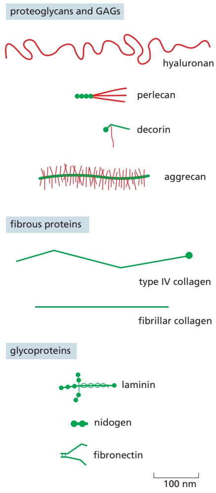

Figure 19–31 The comparative shapes and sizes of some of the major extracellular matrix macromolecules. Protein is shown in green, and glycosaminoglycan (GAG) in red.

the matrix, while other fibrous proteins, such as the rubberlike elastin, give it resilience. Finally, the many matrix glycoproteins help cells migrate, settle, and differentiate in the appropriate locations.MBoC7 m19.32/

Figure 19–32 The repeating disaccharide sequence of a heparin glycosaminoglycan (GAG) chain. These chains can consist of as many as 75 disaccharide units but are typically less than half that size. There is a high density of negative charges along the chain because of the presence of both carboxyl and sulfate groups; indeed, heparin is the most densely charged biological molecule known. The most common form of heparin carries three sulfate groups in each disaccharide, as shown here. In vivo, the proportion of sulfated and nonsulfated groups is highly variable. Heparin has an average of about 2.7 sulfates per disaccharide. Heparan sulfate is a closely related GAG that is generally about twice the length of heparin and less charged, with an average of about 1 sulfate per disaccharide.

#### Glycosaminoglycan (GAG) Chains Occupy Large Amounts of Space and Form Hydrated Gels

**Glycosaminoglycans (GAGs)** are unbranched polysaccharide chains composed of repeating disaccharide units. One of the two sugars in the repeating disaccharide is always an amino sugar (N-acetylglucosamine or N-acetylgalactosamine), which in most cases is sulfated. The second sugar is usually a uronic acid (glucuronic or iduronic). Because there are sulfate or carboxyl groups on most of their sugars, GAGs are highly negatively charged (**Figure 19–32**). Indeed, they are the most anionic molecules produced by animal cells. Four main groups of GAGs are distinguished by their sugars, the type of linkage between the sugars, and the number and location of sulfate groups: (1) hyaluronan, (2) chondroitin sulfate and dermatan sulfate, (3) heparin and heparan sulfate, and (4) keratan sulfate.

Polysaccharide chains are too stiff to fold into compact globular structures, and they are strongly hydrophilic. Thus, GAGs tend to adopt highly extended conformations that occupy a huge volume relative to their mass (**Figure 19–33**), and they form hydrated gels even at very low concentrations. The weight of GAGs in connective tissue is usually less than 10% of the weight of proteins, but GAG chains fill most of the extracellular space. Their high density of negative charges attracts a cloud of cations, especially Na+, that are osmotically active, causing large amounts of water to be sucked into the matrix. This creates a swelling pressure, or turgor, that enables the matrix to withstand compressive forces (in contrast to collagen fibrils, which resist stretching forces). The cartilage matrix that lines the knee joint, for example, can support pressures of hundreds of atmospheres in this way.

Defects in the production of GAGs can affect many different body systems. In one rare human genetic disease, for example, there is a severe deficiency in the synthesis of dermatan sulfate disaccharide. The affected individuals have a short stature, a prematurely aged appearance, and generalized defects in their skin, joints, muscles, and bones.

#### Hyaluronan Acts as a Space Filler During Tissue Morphogenesis and Repair

**Hyaluronan** (also called hyaluronic acid or hyaluronate) is the simplest of the GAGs (**Figure 19–34**). It consists of a regular repeating sequence of up to 25,000 disaccharide units, is found in variable amounts in all tissues and fluids in adult animals, and is especially abundant in early embryos. Hyaluronan is not a typical GAG because it contains no sulfated sugars, all its disaccharide units are identical, its chain length is enormous, and it is not generally linked covalently to any core protein. Moreover, whereas other GAGs are synthesized inside the cell and released by exocytosis, hyaluronan is spun out directly from the cell surface by an enzyme complex embedded in the plasma membrane.

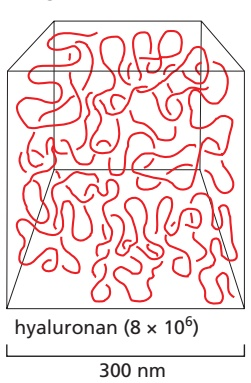

Figure 19–33 The relative dimensions and volumes occupied by various macromolecules. Several proteins and a single hydrated molecule of hyaluronan are shown, with molecular mass in daltons.

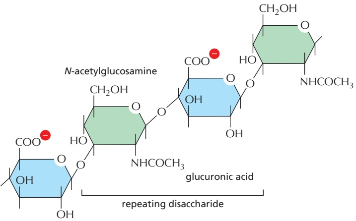

Figure 19–34 The repeating disaccharide sequence in hyaluronan, a relatively simple GAG. This ubiquitous molecule in vertebrates consists of a single long chain of up to 25,000 disaccharides. Note the absence of sulfate groups.

Hyaluronan is thought to have a role in resisting compressive forces in tissues and joints. It is also important as a space filler during embryonic development, where it can be used to force a change in the shape of a structure, as a small quantity expands with water to occupy a large volume. Hyaluronan synthesized locally from the basal side of an epithelium can deform the epithelium by creating a cellfree space beneath it, into which cells subsequently migrate. In the developing heart, for example, hyaluronan synthesis helps in this way to drive formation of the valves and septa that separate the heart’s chambers. Similar processes occur in several other organs. When cell migration ends, the excess hyaluronan is generally degraded by the enzyme hyaluronidase. Hyaluronan is also produced in large quantities during wound healing, and it is an important constituent of joint fluid, in which it serves as a lubricant.MBoC7 m19.34

#### Proteoglycans Are Composed of GAG Chains Covalently Linked to a Core Protein

Except for hyaluronan, all GAGs are covalently attached to protein as **proteoglycans**, which are produced by most animal cells. Membrane-bound ribosomes make the polypeptide chain, or core protein, of a proteoglycan, which is then threaded into the lumen of the endoplasmic reticulum. The polysaccharide chains are mainly assembled on this core protein in the Golgi apparatus before delivery to the exterior of the cell by exocytosis. First, a special linkage tetrasaccharide is attached to a serine side chain on the core protein to serve as a primer for polysaccharide growth; then, one sugar at a time is added by specific glycosyl transferases (**Figure 19–35**). While still in the Golgi apparatus, many of the polymerized sugars are covalently modified by a sequential and coordinated series of reactions. These modifications include sulfation, which increases the negative charge, and

Figure 19–35 The linkage between a GAG chain and its core protein in a proteoglycan molecule. A specific linkage tetrasaccharide is first assembled on a serine side chain. The rest of the GAG chain, consisting mainly of a repeating disaccharide unit, is then synthesized, with one sugar added at a time. In chondroitin sulfate, the disaccharide is composed of d-glucuronic acid and N-acetyl-dgalactosamine; in heparan sulfate, it is either d-glucuronic acid or l-iduronic acid and N-acetyl-d-glucosamine.

epimerization, which alters the configuration of the substituents around individual carbon atoms in the sugar molecule.

Proteoglycans are clearly distinguished from other glycoproteins by the nature, quantity, and arrangement of their sugar side chains. By definition, at least one of the sugar side chains of a proteoglycan must be a GAG. Whereas glycoproteins generally contain relatively short, branched oligosaccharide chains that contribute only a small fraction of their mass, proteoglycans can contain as much as 95% carbohydrate by mass, mostly in the form of long, unbranched GAG chains, each typically about 80 sugars long.

In principle, proteoglycans have the potential for almost limitless heterogeneity. Even a single type of core protein can carry highly variable numbers and types of attached GAG chains. Moreover, the underlying repeating sequence of disaccharides in each GAG can be modified by a complex pattern of sulfate groups. The core proteins, too, are diverse, though many of them belong to structurally related families that share specific domains involved in binding to GAGs or other proteins.

Proteoglycans can be huge. The proteoglycan aggrecan, for example, which is a major component of cartilage, has a mass of about $3 \times 1 0 ^ { 6 }$ daltons with more than 100 GAG chains. Other proteoglycans are much smaller and have only 1–10 GAG chains; an example is decorin, which is secreted by fibroblasts and has a single GAG chain (see Figure 19–31). Decorin binds to collagen fibrils and regulates fibril assembly and fibril diameter; mice that cannot make decorin have fragile skin that has reduced tensile strength. The GAGs and proteoglycans of these various types can associate to form even larger polymeric complexes in the extracellular matrix. Molecules of aggrecan, for example, assemble with hyaluronan in cartilage matrix to form aggregates that are as big as a bacterium (**Figure 19–36**). Moreover, besides associating with one another, GAGs and proteoglycans associate with fibrous matrix proteins such as collagen and with protein meshworks such as the basal lamina, creating extremely complex composites (**Figure 19–37**).

Not all proteoglycans are secreted components of the extracellular matrix. Some are integral components of plasma membranes and have their core protein

Figure 19–36 An aggrecan aggregate from fetal bovine cartilage. (A) An electron micrograph of an aggrecan aggregate shadowed with platinum. Many free aggrecan molecules are also visible. (B) A drawing of the giant aggrecan aggregate shown in A. It consists of about 100 aggrecan monomers (see Figure 19–31) noncovalently bound through the N-terminal domain of the core protein to a single hyaluronan molecule. A link protein binds both to the core protein of the proteoglycan and to the hyaluronan molecule, thereby stabilizing the aggregate. The molecular mass of such a complex can be 108 daltons or more, and it occupies a volume equivalent to that of a bacterium, which is about 2 μm3. (A, courtesy of Lawrence Rosenberg.)

0.5 µm collagen fibril

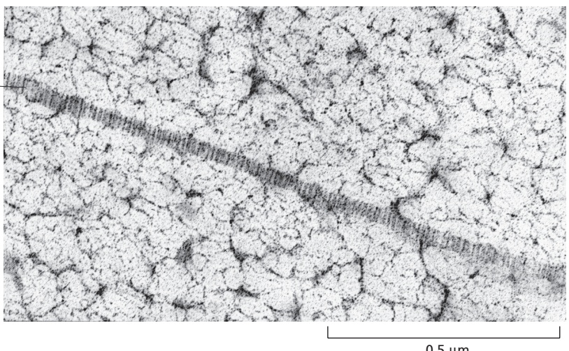

Figure 19–37 Proteoglycans in the extracellular matrix of rat cartilage. The tissue was rapidly frozen at –196°C and fixed and stained while still frozen (a process called freeze substitution) to prevent the GAG chains from collapsing. In this electron micrograph, the proteoglycan molecules are seen to form a fine filamentous network in which a single striated collagen fibril is embedded. The more darkly stained parts of the proteoglycan molecules are the core proteins; the faintly stained threads are the GAG chains. (© 1984 E.B. Hunziker and R.K. Schenk. Originally published in J. Cell Biol. https://doi.org/10.1083/jcb.98.1.277.With permission from Rockefeller University Press.)

either inserted across the lipid bilayer or attached to the lipid bilayer by a glycosylphosphatidylinositol (GPI) anchor. Among the best-characterized plasma membrane proteoglycans are the syndecans, which have a membrane-spanning core protein whose intracellular domain interacts with the actin cytoskeleton and with signaling molecules in the cell cortex. The extracellular domain is linked to multiple GAG chains (primarily heparan sulfate). Syndecans are located on the surface of many types of cells, including fibroblasts and epithelial cells. In fibro-. / . blasts, syndecans can be found in cell–matrix adhesions, where they modulate integrin function by interacting with fibronectin on the cell surface and with cytoskeletal and signaling proteins inside the cell. As we discuss later, syndecans and related proteoglycans called glypicans also interact with soluble peptide growth factors, influencing their effects on cell growth and proliferation.

#### Collagens Are the Major Proteins of the Extracellular Matrix

The **collagens** are a family of fibrous proteins found in all multicellular animals. They are secreted in large quantities by connective-tissue cells and in smaller quantities by many other cell types. As a major component of skin and bone, collagens are the most abundant proteins in mammals, where they constitute 25% of the total protein mass.

The primary feature of a typical collagen molecule is its long, stiff, triplestranded helical structure, in which three collagen polypeptide chains, called α chains, are wound around one another in a rope-like superhelix (**Figure 19–38**). Collagens are extremely rich in proline and glycine, both of which are important in the formation of the triple-stranded helix.

The human genome contains 42 distinct genes coding for different collagen α chains. Different combinations of these genes are expressed in different tissues. Although in principle thousands of types of triple-stranded collagen molecules could be assembled from various combinations of the 42 α chains, only a limited number of triple-helical combinations are possible, and roughly 40 types of collagen molecules have been found. Type I is by far the most common, being the principal collagen of skin and bone. It belongs to the class of **fibrillar collagens**, or fibril-forming collagens: after being secreted into the extracellular space, they assemble into higher-order polymers called **collagen fibrils**, which are thin structures (10–300 nm in diameter) many hundreds of micrometers long in mature tissues, where they are clearly visible in electron micrographs (**Figure 19–39**; see also Figure 19–37). Collagen fibrils often aggregate into larger, cablelike bundles, several micrometers in diameter, that are visible in the light microscope as collagen fibers.

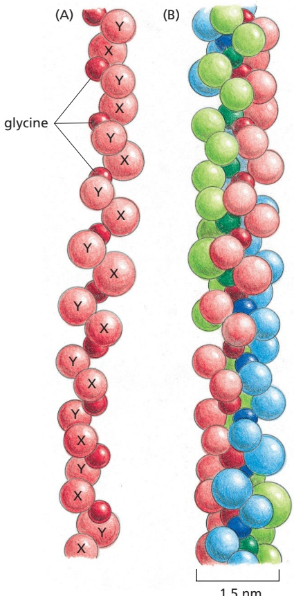

<small>Figure 19–38 The structure of a typical collagen molecule. (A) A model of part of a single collagen α chain, in which each amino acid is represented by a sphere. The chain is about 1000 amino acids long. It is arranged as a left-handed helix, with three amino acids per turn and with glycine as every third amino acid. Therefore, an α chain is composed of a series of triplet Gly-X-Y sequences, in which X and Y can be any amino acid (although X is commonly proline and Y is commonly hydroxyproline, a form of proline that is chemically modified during collagen synthesis in the cell). (B) A model of part of a collagen molecule, in which three α chains, each shown in a different color, are wrapped around one another to form a triple-stranded helical rod. Glycine is the only amino acid small enough to occupy the crowded interior of the triple helix. Only a short length of the molecule is shown; the entire molecule is 300 nm long. (From a model by B.L. Trus.)</small>

Figure 19–39 A fibroblast surrounded by collagen fibrils in the connective tissue of embryonic chick skin. In this electron micrograph, the fibrils are organized into bundles that run approximately at right angles to one another. Therefore, some bundles are oriented longitudinally, whereas others are seen in cross section. The collagen fibrils are produced by fibroblasts. (From C. Ploetz et al., J. Struct. Biol. 106:73–81, 1991. With permission from Elsevier.)

Collagen types IX and XII are called fibril-associated collagens because they decorate the surface of collagen fibrils. They are thought to link these fibrils to one another and to other components in the extracellular matrix. Types IV and VII are network-forming collagens: type IV forms a major part of the basal lamina, while type VII molecules form dimers that assemble into specialized structures called anchoring fibrils. Anchoring fibrils help attach the basal lamina of multi-layered epithelia to the underlying connective tissue and therefore are especially abundant in the skin. There are also a number of “collagen-like” proteins containing short collagen-like segments. These include collagen type XVII, which has a transmembrane domain and is found in hemidesmosomes, and type XVIII, the core protein of a proteoglycan in the basal lamina.

Many proteins appear to have evolved by repeated duplications of an original DNA sequence, giving rise to a repetitive pattern of amino acids. The genes that encode the α chains of most of the fibrillar collagens provide a good example: they are very large (up to 44 kilobases in length) and contain about 50 exons. Most of the exons are 54 or multiples of 54 nucleotides long, suggesting that these collagens originated through multiple duplications of a primordial gene containing 54 nucleotides and encoding exactly six Gly-X-Y repeats (see Figure 19–38).

**Table 19–2** provides additional details for some of the collagen types discussed in this chapter.

#### Collagen Chains Undergo a Series of Post-translational Modifications

Individual collagen polypeptide chains are synthesized on membrane-bound ribosomes and injected into the lumen of the endoplasmic reticulum (ER) as larger precursors, called pro-a chains. These precursors not only have the short amino-terminal signal peptide required to direct the nascent polypeptide to the

hydroxyproline in protein

hydroxylysine in protein

<table><tbody><tr><td colspan="5">TABLE 19-2 Some Types of Collagen and Their Properties</td></tr><tr><td></td><td>Type</td><td>Polymerized form</td><td>Tissue distribution</td><td>Mutant phenotype</td></tr><tr><td rowspan="5">Fibril-forming (fibrillar)</td><td>I</td><td>Fibril</td><td>Bone, skin, tendons, ligaments, cornea, internal organs (accounts for 90% of body collagen)</td><td>Severe bone defects, fractures (osteogenesis imperfecta)</td></tr><tr><td>II</td><td>Fibril</td><td>Cartilage, intervertebral disc, notochord, vitreous humor of the eye</td><td>Cartilage deficiency, dwarfism (chondrodysplasia)</td></tr><tr><td>III</td><td>Fibril</td><td>Skin, blood vessels, internal organs</td><td>Fragile skin, loose joints, blood vessels prone to rupture (vascular Ehlers-Danlos syndrome)</td></tr><tr><td>V</td><td>Fibril (with type I)</td><td>As for type I</td><td>Fragile skin, loose joints (classical Ehlers-Danlos syndrome)</td></tr><tr><td>XI</td><td>Fibril (with type II)</td><td>As for type II</td><td>Myopia, blindness</td></tr><tr><td rowspan="2">Fibril-associated</td><td>IX</td><td>Lateral association with type II fibrils</td><td>Cartilage</td><td>Osteoarthritis</td></tr><tr><td>XII</td><td>Lateral association with type I fibrils</td><td>Tendons</td><td>Skeletal and muscle abnormalities</td></tr><tr><td rowspan="2">Network-forming</td><td>IV</td><td>Sheetlike network</td><td>Basal lamina</td><td>Kidney disease (glomerulonephritis), deafness</td></tr><tr><td>VII</td><td>Anchoring fibrils</td><td>Beneath stratified squamous epithelia</td><td>Skin blistering</td></tr><tr><td>Transmembrane</td><td>XVII</td><td>Nonfibrillar</td><td>Hemidesmosomes</td><td>Skin blistering</td></tr><tr><td>Proteoglycan core protein</td><td>XVIII</td><td>Nonfibrillar</td><td>Basal lamina</td><td>Myopia, detached retina, hydrocephalus</td></tr><tr><td colspan="5">Note that types I, IV, V, IX, and XI are each composed of two or three types of α chains (distinct, nonoverlapping sets in each case), whereas types II, III, VII, XII, XVII, and XVIII are composed of only one type of α chain each.</td></tr></tbody></table>

ER but also have, at both their N- and C-terminal ends, additional amino acids, called propeptides, that are clipped off at a later step of collagen assembly. Moreover, in the lumen of the ER, selected prolines and lysines are hydroxylated to form hydroxyproline and hydroxylysine, respectively, and some hydroxylysines are then glycosylated.

Each pro-α chain combines with two others to form a triple-stranded, helical molecule known as procollagen. The hydroxyl groups of hydroxyprolines and hydroxylysines (**Figure 19–40**) form interchain hydrogen bonds that help stabilize the triple-stranded helix. The enzyme that catalyzes proline hydroxylation requires ascorbic acid (vitamin C). In scurvy, the disease caused by a dietary deficiency of vitamin C that was common in sailors until the nineteenth century, defective pro-α chains fail to form a stable triple helix and are degraded, thereby inhibiting the production of new collagen fibrils. In healthy tissues, collagen is continually degraded and replaced (with a turnover time of months or years, depending on the tissue). In scurvy, replacement fails, and within a few months, with the gradual loss of the preexisting normal collagen in the matrix, blood vessels become fragile, teeth become loose in their sockets, and wounds cease to heal.

After secretion, the propeptides of the fibrillar procollagen molecules are removed by specific proteolytic enzymes outside the cell. This converts the procollagen molecules to collagen, which assemble in the extracellular space to form much larger collagen fibrils. The propeptides have at least two functions. First,

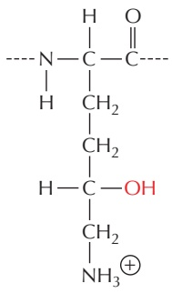

Figure 19–40 Hydroxylysine and

hydroxyproline. These modified amino acids are common in collagen. They are formed by enzymes that act after the lysine and proline have been incorporated into procollagen molecules.

Figure 19–41 Cross-links formed between modified lysine side chains within a collagen fibril. Covalent intramolecular and intermolecular cross-links are formed in several steps. First, the extracellular enzyme lysyl oxidase deaminates certain lysines and hydroxylysines to yield highly reactive aldehyde groups. The aldehydes then react spontaneously to form covalent bonds with each other or with other lysines or hydroxylysines. Most of the cross-links form between the short nonhelical segments at each end of the collagen molecules.

they guide the intracellular formation of the triple-stranded collagen molecules.MBoC7 m19.65(5thEd)/19.41 Second, because they are retained until after secretion, they prevent the intracellular formation of large collagen fibrils, which could be catastrophic for the cell.

After the fibrils have formed in the extracellular space, they are greatly strengthened by the formation of covalent cross-links between lysine residues of the constituent collagen molecules (**Figure 19–41**). The types of covalent bonds involved are found only in collagen and elastin. If cross-linking is inhibited, the tensile strength of the fibrils is drastically reduced: collagenous tissues become fragile, and structures such as skin, tendons, and blood vessels tend to tear. The extent and type of cross-linking vary from tissue to tissue. Collagen is especially highly cross-linked in the Achilles tendon, for example, where tensile strength is crucial.

#### Secreted Fibril-associated Collagens Help Organize the Fibrils

In contrast to GAGs, which resist compressive forces, collagen fibrils form structures that resist tensile forces. The fibrils have various diameters and are organized in different ways in different tissues. In mammalian skin, for example, they are woven in a wickerwork pattern so that they resist tensile stress in multiple directions; leather consists of this material, suitably preserved. In tendons, collagen fibrils are organized in parallel bundles aligned along the major axis of tension. In mature bone and in the cornea, they are arranged in orderly plywoodlike layers, with the fibrils in each layer lying parallel to one another but nearly at right angles to the fibrils in the layers on either side. The same arrangement occurs in tadpole skin (**Figure 19–42**).

The connective-tissue cells themselves determine the size and arrangement of the collagen fibrils. The cells can express one or more genes for the different types of fibrillar collagen molecules. But even fibrils composed of the same mixture of collagens have different arrangements in different tissues. How is this achieved? Part of the answer is that cells can regulate the disposition of the collagen molecules after secretion by guiding collagen fibril formation near the plasma membrane. In addition, cells can influence this organization by secreting, along with their fibrillar collagens, different kinds and amounts of other matrix macromolecules. In particular, they secrete the fibrous protein fibronectin, as we discuss later, and this precedes the formation of collagen fibrils and helps guide their organization.

**Fibril-associated collagens**, such as types IX and XII collagens, are thought to be especially important in organizing collagen fibrils. They differ from fibrillar collagens in the following ways. First, their triple-stranded helical structure is interrupted by one or two short nonhelical domains, which makes the molecules more flexible than fibrillar collagen molecules. Second, they do not aggregate with one another to form fibrils in the extracellular space. Instead, they bind in a periodic manner to the surface of fibrils formed by the fibrillar collagens. Type IX molecules bind to type II collagen–containing fibrils in cartilage, the cornea, and the vitreous of the eye (**Figure 19–43**), whereas type XII molecules bind to type I collagen–containing fibrils in tendons and various other tissues.

Figure 19–42 Collagen fibrils in the tadpole skin. This electron micrograph shows the plywoodlike arrangement of the fibrils: successive layers of fibrils are laid down nearly at right angles to each other. This organization is also found in mature bone and in the cornea. (Courtesy of Jerome Gross.)

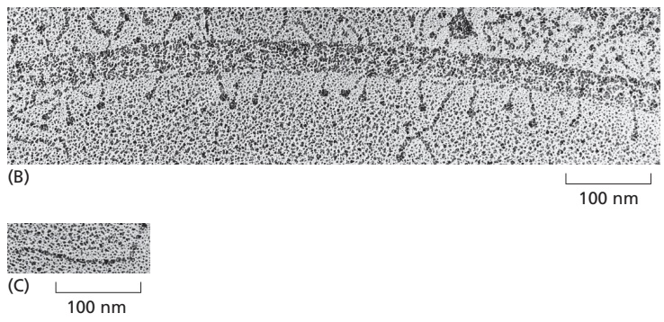

Figure 19–43 Type IX collagen. (A) Type IX collagen molecules binding in a periodic pattern to the surface of a fibril containing type II collagen. (B) Electron micrograph of a rotary-shadowed type II collagen–containing fibril in cartilage, decorated by type IX collagen molecules. (C) An individual type IX collagen molecule. (B and C, © 1988, L. Vaughan et al. Originally published in J. Cell Biol. https://doi.org/10.1083/jcb.106.3.991. With permission from Rockefeller University Press.)

Fibril-associated collagens are thought to mediate the interactions of collagen fibrils with one another and with other matrix macromolecules to help determine the organization of the fibrils in the matrix.

#### Elastin Gives Tissues Their Elasticity

Many vertebrate tissues, such as skin, blood vessels, and lungs, need to be both strong and elastic in order to function. A network of **elastic fibers** in the extracellular matrix of these tissues gives them the resilience to recoil after transient stretch (**Figure 19–44**). Elastic fibers are at least five times more extensible than a rubber band of the same cross-sectional area. Long, inelastic collagen fibrils are interwoven with the elastic fibers to limit the extent of stretching and prevent the tissue from tearing.

The main component of elastic fibers is **elastin**, a highly hydrophobic protein (about 750 amino acids long), which, like collagen, is unusually rich in proline and glycine but, unlike collagen, is not glycosylated. Soluble tropoelastin (the biosynthetic precursor of elastin) is secreted into the extracellular space and assembled into elastic fibers close to the plasma membrane, generally in cell-surface infoldings. After secretion, the tropoelastin molecules become highly cross-linked to one another, generating an extensive network of elastin fibers and sheets. A mechanism similar to the one that operates in cross-linking collagen molecules forms cross-links between lysines in elastin molecules.

(A)

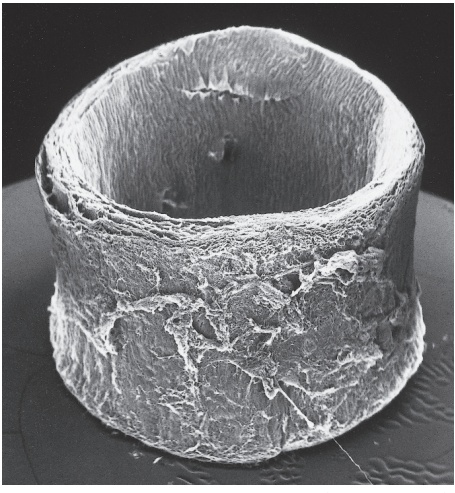

(B)

1 mm

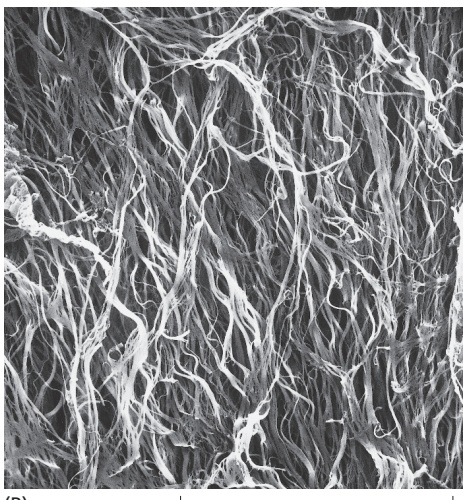

100 µm

Figure 19–44 Elastic fibers. These scanning electron micrographs show (A) a low-power view of a segment of a dog’s aorta and (B) a high-power view of the dense network of longitudinally oriented elastic fibers in the outer layer of the same blood vessel. All the other components have been digested away with enzymes and formic acid. (From K.S. Haas et al., Anat. Rec. 230:86–96, 1991. With permission from Wiley-Liss.)

Figure 19–45 Stretching a network of elastin molecules. The molecules are joined together by covalent bonds (red) to generate a cross-linked network. In this model, each elastin molecule in the network can extend and contract in a manner resembling a random coil, so that the entire assembly can stretch and recoil like a rubber band.

The elastin protein is composed largely of two types of short segments that alternate along the polypeptide chain: hydrophobic segments, which are responsible for the elastic properties of the molecule; and alanine- and lysine-rich α-helical segments, which are cross-linked to adjacent molecules. Each segment is encoded by a separate exon. There is still uncertainty concerning the confor-MBoC7 m19.45/19.45 mation of elastin molecules in elastic fibers and how the structure of these fibers accounts for their rubberlike properties. However, it seems that parts of the elastin polypeptide chain, like the polymer chains in ordinary rubber, adopt a loose “random-coil” conformation, and it is the random-coil nature of the component molecules cross-linked into the elastic fiber network that allows the network to stretch and recoil like a rubber band (**Figure 19–45**).

Elastin is the dominant extracellular matrix protein in arteries, comprising 50% of the dry weight of the largest artery—the aorta (see Figure 19–44). Mutations in the elastin gene causing a deficiency of the protein in mice or humans result in narrowing of the aorta and other arteries and excessive proliferation of smooth muscle cells in the arterial wall. Apparently, the normal elasticity of an artery is required to restrain the proliferation of these cells.

Elastic fibers do not consist solely of elastin. The elastin core is covered with a sheath of microfibrils, each of which has a diameter of about 10 nm. The microfibrils appear before elastin in developing tissues and seem to provide scaffolding to guide elastin deposition. Arrays of microfibrils are elastic in their own right, and in some places they persist in the absence of elastin: they help to hold the lens in its place in the eye, for example. Microfibrils are composed of a number of distinct glycoproteins, including the large glycoprotein fibrillin, which binds to elastin and is essential for the integrity of elastic fibers. Mutations in the fibrillin gene result in Marfan syndrome, a relatively common human disorder. In the most severely affected individuals, the aorta is prone to rupture; other common effects include displacement of the lens and abnormalities of the skeleton and joints. Affected individuals are often unusually tall and lanky: Abraham Lincoln is suspected to have had the condition.

#### Cells Govern and Respond to the Mechanical Properties of the Matrix

Cells interact with the extracellular matrix mechanically as well as chemically, and studies in culture suggest that the mechanical interaction can have dramatic effects on the architecture of connective tissue. Thus, when fibroblasts are mixed with a meshwork of randomly oriented collagen fibrils that form a gel in a culture dish, the fibroblasts tug on the meshwork, drawing in collagen from their surroundings and thereby causing the gel to contract to a small fraction of its initial volume. By similar activities, a cluster of fibroblasts surrounds itself with a capsule of densely packed and circumferentially oriented collagen fibers.

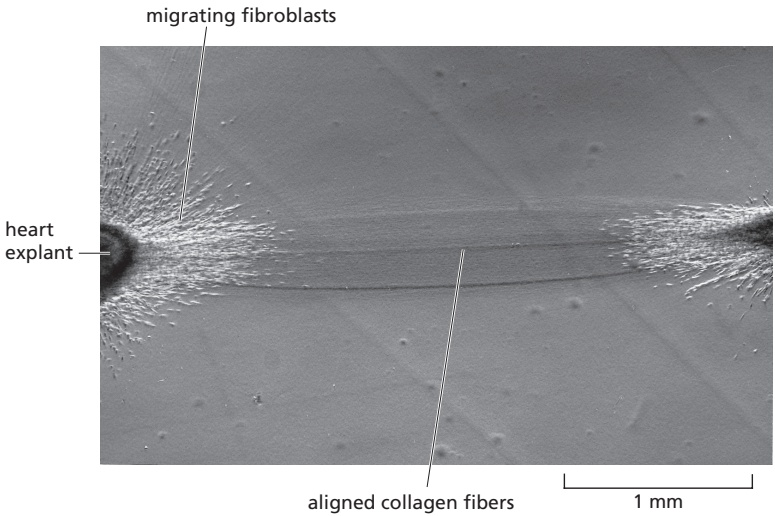

Figure 19–46 The shaping of the extracellular matrix by cells. This micrograph shows a region between two pieces of embryonic chick heart (rich in fibroblasts as well as heart muscle cells) that were cultured on a collagen gel for 4 days. A dense tract of aligned collagen fibers has formed between the explants, presumably as a result of the fibroblasts in the explants tugging on the collagen. (From D. Stopak and A.K. Harris, Dev. Biol. 90:383–398, 1982. With permission from Elsevier.)

If two small pieces of embryonic tissue containing fibroblasts are placed farMBoC7 e20.13/19.46 apart on a collagen gel, the intervening collagen becomes organized into a compact band of aligned fibers that connect the two explants (**Figure 19–46**). The fibroblasts subsequently migrate out from the explants along the aligned collagen fibers. Thus, the fibroblasts influence the alignment of the collagen fibers, and the collagen fibers in turn affect the distribution of the fibroblasts.

Fibroblasts may have a similar role in organizing the extracellular matrix inside the body. First they synthesize the collagen fibrils and deposit them in the correct orientation. Then they work on the matrix they have secreted, crawling over it and tugging on it so as to create tendons and ligaments and the tough, dense layers of connective tissue that surround and bind together most organs.

In addition to determining the orientation of the collagen fibrils they produce, fibroblasts control the overall density and composition of the extracellular matrix, which varies dramatically in different tissues. Some tissues, such as tendons and cartilage, are composed of dense matrix that is far more rigid and resistant to deformation than the soft, elastic matrix of tissues like fat and the brain. These differences depend on the ability of cells in these tissues to regulate the types of collagen and other proteins produced, the relative rates of matrix protein synthesis and degradation, and the amount of collagen and elastin cross-linking. The density of the matrix, in turn, regulates the behavior of the fibroblasts and other cells that travel through it; for example, the proliferation, migration, and developmental fate of stem cells are influenced by matrix composition and density. Abnormally high matrix density is associated with certain fibrotic diseases and appears to be a risk factor in some forms of cancer.

#### Fibronectin and Other Multidomain Glycoproteins Help Organize the Matrix

In addition to proteoglycans, collagens, and elastic fibers, the extracellular matrix contains a large and varied assortment of glycoproteins that typically have multiple domains, each with specific binding sites for other matrix macromolecules and for receptors on the surface of cells (**Figure 19–47**). These proteins therefore contribute to both organizing the matrix and helping cells attach to it. Like the proteoglycans, they also guide cell movements in developing tissues by serving as tracks along which cells can migrate or as repellents that keep cells out of forbidden areas. They can also bind and thereby influence the function of peptide growth factors and other small molecules produced by nearby cells.

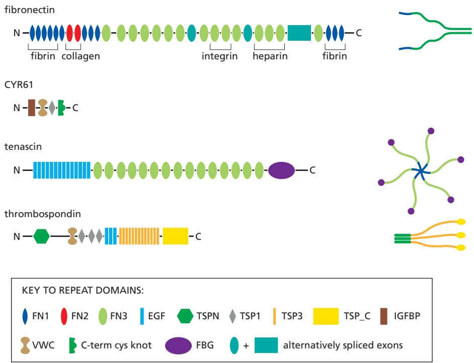

The best-understood member of this class of matrix proteins is **fibronectin**, a large glycoprotein found in all vertebrates and important for many cell–matrix interactions. Mutant mice that are unable to make fibronectin die early in embryogenesis because their endothelial cells fail to form proper blood vessels. The defect is thought to result from abnormalities in the interactions of these cells with the surrounding extracellular matrix, which normally contains fibronectin.

Fibronectin is a dimer composed of two very large subunits joined by disulfide bonds at their C-terminal ends. Each subunit contains a series of small repeated domains, or modules, separated by short stretches of flexible polypeptide chain (**Figure 19–48**). Each domain is usually encoded by a separate exon, suggesting that the fibronectin gene, like the genes encoding many matrix proteins, evolved by multiple exon duplications. In the human genome, there is only one fibronectin gene, containing about 50 exons of similar size, but the transcripts can be spliced in different ways to produce multiple fibronectin isoforms (see Figure 19–48B). The major repeat domain in fibronectin is called the **type III fibronectin repeat**, which is about 90 amino acids long and occurs at least 15 times in each subunit. This repeat is among the most common of all protein domains in vertebrates.

#### Fibronectin Binds to Integrins

One way to analyze a complex multifunctional protein molecule such as fibronectin is to synthesize individual regions of the protein and test their ability to bind other proteins. By these and other methods, it was possible to show that one region of fibronectin binds to collagen, another to proteoglycans, and another to specific integrins on the surface of various types of cells (see Figure 19–48B). Synthetic peptides corresponding to different segments of the integrin-binding domain were then used to show that binding depends on a specific tripeptide sequence (Arg-Gly-Asp, or RGD) that is found in one of the type III repeats (see Figure 19–48C). Even very short peptides containing this **RGD sequence** can compete with fibronectin for the binding site on cells, thereby inhibiting the attachment of the cells to a fibronectin matrix.

Several extracellular proteins besides fibronectin also have an RGD sequence that mediates cell-surface binding. Many of these proteins are components of the

Figure 19–47 Complex glycoproteins of the extracellular matrix. Many matrix glycoproteins are large scaffold proteins containing multiple copies of specific protein-interaction domains. Each domain is folded into a discrete globular structure, and many such domains are arrayed along the protein like beads on a string. This diagram shows four representative proteins among the roughly 200 matrix glycoproteins that are found in mammals. Each protein contains multiple repeat domains, with the names listed in the key at the bottom. Fibronectin, for example, contains numerous copies of three different fibronectin repeats (types I–III, labeled here as FN1, FN2, and FN3). Two type III repeats near the center of the protein contain important binding sites for cell-surface integrins, whereas three nearby type III repeats form a binding site for heparin or heparan sulfate proteoglycans. FN repeats at the N-terminus are involved in binding fibrin or collagen. Other matrix proteins contain repeated sequences resembling those of epidermal growth factor (EGF), a major regulator of cell growth and proliferation; these repeats might serve a similar signaling function in matrix proteins. Other proteins contain domains, such as the insulin-like growth factor–binding protein (IGFBP) repeat, that bind and regulate the function of soluble growth factors. To add more structural diversity, many of these proteins are encoded by RNA transcripts that can be spliced in different ways, adding or removing exons, such as those in fibronectin. Finally, the scaffolding and regulatory functions of many matrix proteins are further expanded by assembly into multimeric forms, as shown at the right: fibronectin forms dimers linked at the C-termini, whereas tenascin and thrombospondin form N-terminally linked hexamers and trimers, respectively. Other domains include four repeats from thrombospondin (TSPN, TSP1, TSP3, TSP\_C). VWC, von Willebrand type C; FBG, fibrinogen-like. (Adapted from R.O. Hynes and A. Naba, Cold Spring Harb. Perspect. Biol. 4:a004903, 2012. With permission from Cold Spring Harbor Laboratory Press.)

extracellular matrix, while others are involved in blood clotting. Peptides containing the RGD sequence have been useful in the development of anti-clotting drugs. Some snakes use a similar strategy to cause their victims to bleed: they secrete RGD-containing anti-clotting proteins called disintegrins into their venom.

The cell-surface receptors that bind RGD-containing proteins are members of the integrin family, which we describe in detail later. Each integrin specifically recognizes its own small set of matrix molecules, indicating that tight binding requires more than just the RGD sequence. Moreover, RGD sequences are not the only sequence motifs used for binding to integrins: many integrins recognize andMBoC7 m19.47/19.48 bind to other motifs instead.

#### Tension Exerted by Cells Regulates the Assembly of Fibronectin Fibrils

Fibronectin can exist both in a soluble form, circulating in the blood and other body fluids, and as insoluble fibronectin fibrils, in which fibronectin dimers are cross-linked to one another by additional disulfide bonds and form part of the extracellular matrix. Unlike fibrillar collagen molecules, however, which can self-assemble into fibrils in a test tube, fibronectin molecules assemble into fibrils only on the surface of cells, and only where those cells possess appropriate fibronectin-binding proteins—in particular, integrins. The integrins provide a linkage from the fibronectin outside the cell to the actin cytoskeleton inside it. The linkage transmits tension to the fibronectin molecules—provided that they also have an attachment to some other structure—and stretches them, exposing cryptic binding sites in the fibronectin molecules (**Figure 19–49**). This allows them

Figure 19–48 The structure of a fibronectin dimer. (A) Electron micrographs of individual fibronectin dimer molecules shadowed with platinum; red arrows mark the joined C-termini. (B) The two polypeptide chains are similar but generally not identical (being made from the same gene but from differently spliced mRNAs). They are joined by two disulfide bonds near the C-termini. Each chain is almost 2500 amino acids long and is folded into multiple domains (see Figure 19–47). As indicated, some domains are specialized for binding to a particular molecule. For simplicity, not all of the known binding sites are shown. (C) The three-dimensional structure of the ninth and tenth type III fibronectin repeats, as determined by x-ray crystallography. Both the Arg-Gly-Asp (RGD) and the “synergy” sequences shown in red are important for binding to integrins on cell surfaces. (A, from J. Engel et al., J. Mol. Biol. 150:97–120, 1981. With permission from Elsevier; C, from D.J. Leahy, Annu. Rev. Cell Dev. Biol. 13:363–393, 1997. With permission from Annual Reviews.)

Figure 19–49 Tension-sensing by fibronectin. Some type III fibronectin repeats are thought to unfold when fibronectin is stretched. The unfolding exposes cryptic binding sites that interact with other fibronectin molecules resulting in the formation of fibronectin filaments like those shown in Figure 19–50. (From V. Vogel and M. Sheetz, Nat. Rev. Mol. Cell Biol. 7:265–275, 2006. With permission from Springer Nature.)

to bind directly to one another and to recruit additional fibronectin molecules to form a fibril (**Figure 19–50**). This dependence on tension and interaction with cell surfaces ensures that fibronectin fibrils assemble where there is a mechanical need for them and not in inappropriate locations such as the bloodstream.

Many other extracellular matrix proteins contain multiple copies of the type III fibronectin repeat (see Figure 19–47), and it is possible that tension exerted on these proteins also uncovers cryptic binding sites and thereby influences their behavior.

#### The Basal Lamina Is a Specialized Form of Extracellular Matrix

Thus far in this section, we have reviewed the general principles underlying the structure and function of the major classes of extracellular matrix components. We now describe how some of these components are assembled into a specialized type of extracellular matrix called the **basal lamina** (also known as the **basement membrane**). This exceedingly thin, tough, flexible sheet of matrix molecules is an essential underpinning of all epithelia. Although small in volume, it has a critical role in the architecture of the body. Like the cadherins, it seems to be one of the defining features common to all multicellular animals, and it seems to have appeared very early in their evolution. The major molecular components of the basal lamina are among the most ancient extracellular matrix macromolecules.

The basal lamina is typically 40–120 nm thick. It lies beneath epithelial cells and also surrounds individual muscle cells, fat cells, and Schwann cells (which wrap around peripheral nerve cell axons to form myelin). The basal lamina thus separates these cells and epithelia from the underlying or surrounding connective tissue and forms the mechanical connection between them. In other locations, such as the kidney glomerulus, a basal lamina lies between two cell sheets and functions as a selective filter (**Figure 19–51**). Basal laminae have more than simple structural and filtering roles, however. They are able to determine cell polarity; influence cell metabolism; organize the proteins in adjacent plasma membranes; promote cell survival, proliferation, or differentiation; and serve as highways for cell migration.

Figure 19–50 Organization of fibronectin into fibrils at the cell surface. This fluorescence micrograph shows the front end of a migrating mouse fibroblast. Extracellular fibronectin is stained green, and intracellular actin filaments are stainedMBoC7 m19.49/19.50 red. The fibronectin is initially present as small dotlike aggregates near the leading edge of the cell. It accumulates at focal adhesions (sites of anchorage of actin filaments, discussed later) and becomes organized into fibrils parallel to the actin filaments. Integrin molecules spanning the cell membrane link the fibronectin outside the cell to the actin filaments inside it (see Figure 19–56). Tension exerted on the fibronectin molecules through this linkage is thought to stretch them, exposing binding sites that promote fibril formation. (Courtesy of Roumen Pankov and Kenneth Yamada.)

#### Laminin and Type IV Collagen Are Major Components of the Basal Lamina

The basal lamina is synthesized by the cells on each side of it: the epithelial cells contribute one set of basal lamina components, while cells of the underlying bed of connective tissue (called the stroma, Greek for “bedding”) contribute another set (**Figure 19–52**). Although the precise composition of the mature basal lamina varies from tissue to tissue and even from region to region in the same lamina, it typically contains the glycoproteins laminin, type IV collagen, and nidogen, along with the proteoglycan perlecan. Other common basal lamina components are fibronectin and type XVIII collagen (an atypical member of the collagen family, forming the core protein of a proteoglycan).

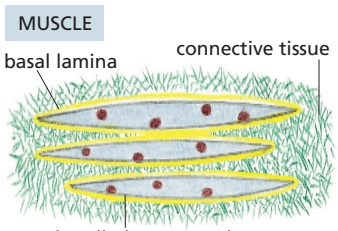

muscle cell plasma membrane

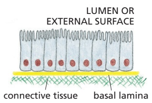

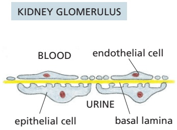

Figure 19–51 Three ways in which the basal lamina is organized. Sheets of basal lamina (yellow) surround certain cells (such as skeletal muscle cells), underlie epithelia, and are interposed between two cell sheets (as in the kidney glomerulus). Note that, in the kidney glomerulus, both cell sheets have gaps in them, and the basal lamina has a filtering as well as a supportive function, helping to determine which molecules will pass into the urine from the blood. The filtration also depends on other protein-based structures, called slit diaphragms, that span the intercellular gaps in the epithelial sheet.

overlying epithelial cells

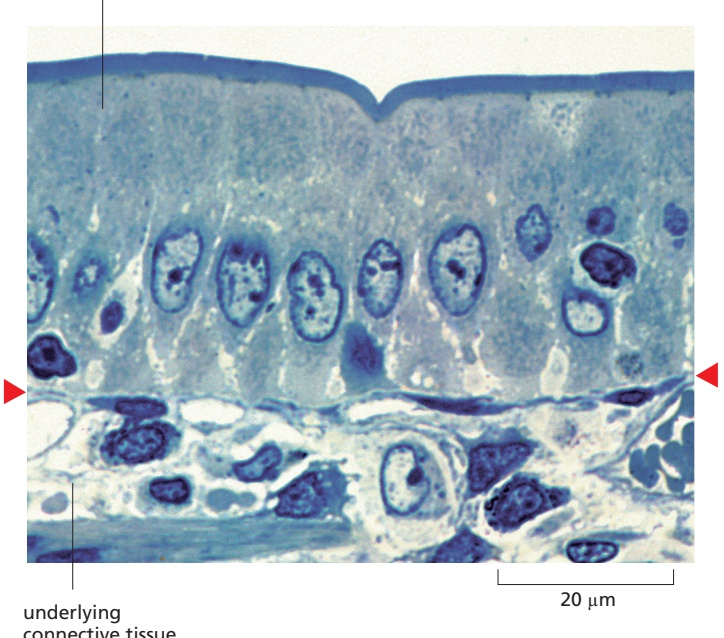

Figure 19–52 The basal lamina supports a sheet of epithelial cells. In this light micrograph of a cross section of the small intestine, the sheet of columnar epithelial cells rests on the basal lamina (red arrowheads). A network of collagen fibrils and other fibers in the underlying connective tissue interacts with the lower face of the basal lamina. (Jose Luis Calvo/ Shutterstock.)

underlying connective tissue

**Laminin** is the primary organizer of the sheet structure, and, early in development, the basal lamina consists mainly of laminin molecules. Laminins constitute a large family of proteins, each composed of three long polypeptide chains (α, β, and γ) held together by disulfide bonds and arranged in the shape of an asymmetric bouquet, like a bunch of three flowers whose stems are twisted together at the foot but whose heads remain separate (**Figure 19–53**). These heterotrimers can self-assemble in vitro into a network, largely through interactions between their heads, although interaction with cells is needed to organize the network into an orderly sheet. Because there are several isoforms of each type of chain, and these can associate in various combinations, many different laminins can be produced, creating basal laminae with distinctive properties. The laminin γ1 chain is, however, a component of most laminin heterotrimers; mice lacking it die during embryogenesis because they are unable to make a basal lamina.

Figure 19–53 The structure of laminin. (A) The best-understood family member is laminin-111, shown here with some of its binding sites for other molecules (gray boxes). Laminins are multidomain glycoproteins composed of three polypeptides (α, β, and γ) that are disulfide-bonded into an asymmetric crosslike structure. Each of the polypeptide chains is more than 1500 amino acids long. Five types of α chains, four types of β chains, and three types of γ chains are known, and various combinations of these subunits can assemble to form a large variety of different laminins, which are named according to numbers assigned to each of their three subunits: laminin-111, for example, contains α1, β1, and γ1 subunits. Each isoform tends to have a specific tissue distribution: laminin-332 is found in skin, laminin-211 in muscle, and laminin-411 in endothelial cells of blood vessels. Through their binding sites for other proteins, laminin molecules play a central part in organizing the basal lamina and anchoring it to cells. (B) Electron micrographs of laminin molecules shadowed with platinum. (B, from J. Engel et al., J. Mol. Biol. 150:97–120, 1981. With permission from Elsevier.)

(B)

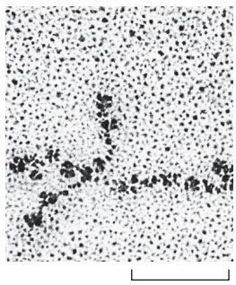

50 nm

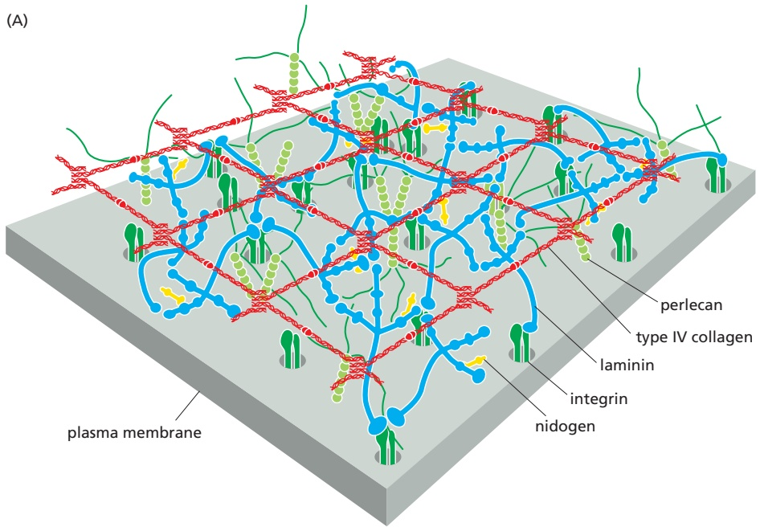

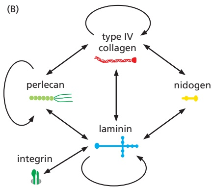

Figure 19–54 A model of the molecular structure of a basal lamina. (A) The basal lamina is formed by specific interactions (B) between the proteins laminin, type IV collagen, and nidogen and the proteoglycan perlecan. Arrows in B connect molecules that can bind directly to each other. There are various isoforms of type IV collagen and laminin, each with a distinctive tissue distribution. Transmembrane laminin receptors (integrins and dystroglycan) in the plasma membrane are thought to organize the assembly of the basal lamina; only the integrins are shown. (Based on H. Colognato and P.D. Yurchenco, Dev. Dyn. 218:213–234, 2000. With permission from John Wiley & Sons.)

**Type IV collagen** is a second essential component of a mature basal lamina, and it, too, exists in several isoforms. Like the fibrillar collagens that constitute the bulk of the protein in connective tissues such as bone or tendon, type IV collagen molecules consist of three separately synthesized long protein chains that twist together to form a rope-like superhelix; however, they differ from the fibrillar collagens in that the triple-stranded helical structure is interrupted in more than 20 regions, allowing multiple bends. Type IV collagen molecules interact via their terminal domains to assemble extracellularly into a flexible, felt-like network that gives the basal lamina tensile strength.

Laminin and type IV collagen interact with other basal lamina components, such as the glycoprotein nidogen and the proteoglycan perlecan, resulting in a highly cross-linked network of proteins and proteoglycans (**Figure 19–54**). The laminin molecules that generate the initial sheet structure first join to each other while bound to receptors on the surface of the cells. The cell-surface receptors are primarily members of the integrin family, but another important type of laminin receptor is dystroglycan, a highly glycosylated transmembrane protein. Together, these receptors organize basal lamina assembly: they hold the laminin molecules by their feet, leaving the laminin heads positioned to interact so as to form a two-dimensional network. This laminin network then coordinates the assemblyMBoC7 m19.53/19.54 of the other basal lamina components.

Interactions between laminin and cell-surface receptors are critical for the adhesion of epithelia to the underlying connective tissue. In the skin, for example, the epithelial outer layer—the epidermis—depends on tight interactions with the basal lamina to keep it attached to the underlying dermis. In people with genetic defects in laminin-332, a key component of the skin basal lamina, the epidermis is poorly attached to the dermis. This causes a blistering disease called junctional epidermolysis bullosa, a severe and sometimes lethal condition.

#### Basal Laminae Have Diverse Functions

The basal lamina can act as a selective barrier to the movement of cells, as well as a filter for molecules. The lamina beneath an epithelium, for example, usually prevents fibroblasts in the underlying connective tissue from making contact with the epithelial cells. It does not, however, stop macrophages, lymphocytes, or nerve processes from passing through it, using specialized protease enzymes to cut a hole for their transit. The basal lamina is also important in tissue regeneration after injury. When cells in tissues such as muscles, nerves, and epithelia areMB C7 m19.54/19.55 damaged or killed, the basal lamina often survives and provides a scaffold along which regenerating cells can migrate. In this way, the original tissue architecture is readily reconstructed.

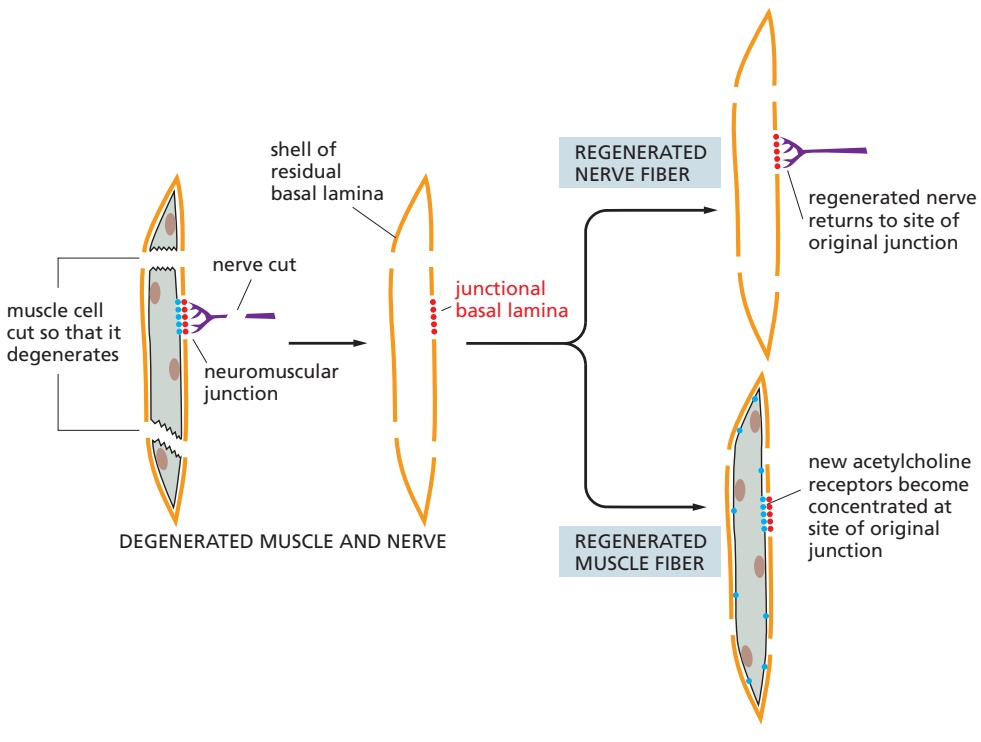

A particularly striking example of the role of the basal lamina in regeneration comes from studies of the neuromuscular junction, the site where the nerve terminals of a motor neuron form a chemical synapse with a skeletal muscle cell (discussed in Chapter 11). In vertebrates, the basal lamina that surrounds the muscle cell separates the nerve-cell and muscle-cell plasma membranes at the synapse, and the synaptic region of the lamina has a distinctive chemical character, with special isoforms of type IV collagen and laminin and a proteoglycan called agrin. After a nerve or muscle injury, the basal lamina at the synapse has a central role in reconstructing the synapse at the correct location (**Figure 19–55**). Defects in components of the basal lamina at the synapse are responsible for some forms of muscular dystrophy, in which muscles develop normally but then degenerate later in life.

#### Cells Have to Be Able to Degrade Matrix, as Well as Make It

Figure 19–55 Regeneration experiments demonstrating the special character of the junctional basal lamina at a neuromuscular junction. If a frog muscle and its motor nerve are destroyed, the basal lamina around each muscle cell remains intact, and the sites of the old neuromuscular junctions are still recognizable. When the nerve, but not the muscle, is allowed to regenerate (upper right), the junctional basal lamina directs the regenerating nerve to the original synaptic site. When the muscle, but not the nerve, is allowed to regenerate (lower right), the junctional basal lamina causes newly made acetylcholine receptors (blue) to accumulate at the original synaptic site. These experiments show that the junctional basal lamina controls the localization of synaptic components on both sides of the lamina. Some of the molecules responsible for these effects have been identified. Motor neuron axons, for example, deposit agrin in the junctional basal lamina, where it regulates the assembly of acetylcholine receptors and other proteins in the junctional plasma membrane of the muscle cell. Reciprocally, muscle cells deposit a particular isoform of laminin in the junctional basal lamina, and this molecule is likely to interact with specific ion channels on the presynaptic membrane of the neuron.

The ability of cells to degrade and destroy extracellular matrix is as important as their ability to make it and bind to it. Rapid matrix degradation is required in processes such as tissue repair, and even in the seemingly static extracellular matrix of adult animals there is a slow, continual turnover, with matrix macromolecules being degraded and resynthesized. This allows bone, for example, to be remodeled so as to adapt to changes in the stresses on it.

From the point of view of individual cells, the ability to cut through matrix is crucial in two ways: it enables them to divide while embedded in matrix, and it enables them to travel through it. Cells in connective tissues generally need to be able to stretch out in order to divide. If a cell lacks the enzymes needed to degrade the surrounding matrix, it is strongly inhibited from dividing and hindered from migrating.

Localized degradation of matrix components is also required wherever cells have to escape from confinement by a basal lamina. It is needed during normal branching growth of epithelial structures such as glands, for example, to allow the population of epithelial cells to increase, and needed also when white blood cells migrate across the basal lamina of a blood vessel into tissues in response to infection or injury. Matrix degradation is important both for the spread of cancer cells through the body and for their ability to proliferate in the tissues that they invade (discussed in Chapter 20).

In general, matrix components are degraded by extracellular proteolytic enzymes (proteases) that act close to the cells that produce them. Many of these proteases belong to one of two general classes. The largest group, with about 50 members in vertebrates, is the **matrix metalloproteases**, which depend on bound $\mathrm { C a ^ { 2 + } }$ or $\mathrm { Z n ^ { 2 + } }$ for activity. The second group is the **serine proteases**, which have a reactive serine in their active site. Together, metalloproteases and serine proteases cooperate to degrade matrix proteins such as collagen, laminin, and fibronectin. Some metalloproteases, such as the collagenases, are highly specific, cleaving particular proteins at a small number of sites. In this way, the structural integrity of the matrix is largely retained, while the limited amount of proteolysis that occurs is sufficient for cell migration. Other metalloproteases may be less specific, but, because they are anchored to the plasma membrane, act just where they are needed; it is this type of matrix metalloprotease that is crucial for a cell’s ability to divide when embedded in matrix.

Clearly, the activities of the proteases that degrade the matrix must be tightly controlled if the fabric of the body is not to collapse in a heap. Numerous mechanisms are therefore employed to ensure that matrix proteases are activated only at the correct time and place. Protease activity is generally confined to the cell surface by specific anchoring proteins, by membrane-associated activators, and by the production of specific protease inhibitors in regions where protease activity is not needed.

The proteolytic cleavage of matrix proteins does not always lead simply to their destruction, but sometimes generates protein fragments with specific biological activities. For example, cleavage of type IV collagen by matrix metalloproteases leads to the release of protein fragments that inhibit the local formation of blood vessels. Similarly, cleavage of laminin in certain tissues can generate protein fragments that help govern local cell proliferation.

#### Matrix Proteoglycans and Glycoproteins Regulate the Activities of Secreted Proteins

The physical properties of extracellular matrix are important for its fundamental roles as a scaffold for tissue structure and as a substrate for cell anchorage and migration. The matrix also has an important impact on cell signaling. Cells communicate with each other by secreting peptide signal molecules, like growth factors and morphogens, that diffuse through the extracellular fluid to influence other cells (discussed in Chapter 15). On the way to their targets, the signal molecules encounter the tightly woven meshwork of the extracellular matrix, which contains a high density of negative charges and protein-interaction domains that can interact with the signal molecules, thereby altering their function in a variety of ways.

The highly charged heparan sulfate chains of proteoglycans, for example, interact with numerous secreted signal molecules, including fibroblast growth factors (FGFs) and vascular endothelial growth factor (VEGF), which (among other effects) stimulate a variety of cell types to proliferate. By providing a dense array of growth factor–binding sites, proteoglycans are thought to generate large local reservoirs of these factors, limiting their diffusion and focusing their actions on nearby cells. Similarly, proteoglycans might help generate steep morphogen gradients in an embryo, which can be important in the patterning of tissues during development. FGF activity can also be enhanced by proteoglycans, which oligomerize the FGF molecules and also interact with cell-surface FGF receptors, enabling the FGF to cross-link and activate its receptors more effectively.

The importance of proteoglycans as regulators of the distribution and activity of signal molecules is illustrated by the severe developmental defects that can occur when specific proteoglycans are inactivated by mutation. In Drosophila, for example, the function of several signal proteins during development is governed by interactions with the membrane-associated proteoglycans Dally and Dally-like. These members of the glypican family, like the syndecan proteoglycans described earlier, are membrane-associated proteins linked to multiple heparan sulfate molecules. They are thought to concentrate signal proteins in specific locations and act as co-receptors that collaborate with conventional cell-surface receptor proteins; as a result, they promote signaling in the correct location and prevent it in the wrong locations. In the Drosophila ovary, Dally is partly responsible for the restricted localization and function of a signaling protein called Dpp, which blocks differentiation of the germ-line stem cells: when the gene encoding Dally is mutated, Dpp activity is greatly reduced and oocyte development is abnormal.

Several other matrix molecules interact with signal proteins. The type IV collagen of the basal lamina interacts with Dpp in Drosophila, for example. Fibronectin contains a type III fibronectin repeat that interacts with VEGF and another domain that interacts with hepatocyte growth factor (HGF), thereby promoting the activities of these factors. As discussed earlier, many matrix glycoproteins contain extensive arrays of binding domains, and the arrangement of these domains is likely to influence the presentation of signal proteins to their target cells (see Figure 19–47).

Finally, many matrix glycoproteins contain domains that bind directly to specific cell-surface receptors, thereby generating signals that influence the behavior of the cells, as we describe in the next section.

#### Summary

Cells are embedded in an intricate extracellular matrix, which not only binds the cells together but also influences their survival, development, shape, polarity, and migratory behavior. The matrix contains various protein fibers interwoven in a network of glycosaminoglycan (GAG) chains. GAGs are negatively charged polysaccharide chains that (except for hyaluronan) are covalently linked to protein to form proteoglycan molecules. GAGs attract water and occupy a large volume of extracellular space. Proteoglycans are also found on the surface of cells, where they often function as co-receptors to help cells respond to secreted signal proteins. Fiber-forming proteins give the matrix strength and resilience. The fibrillar collagens are rope-like, triple-stranded helical molecules that aggregate into long fibrils in the extracellular space, thereby providing tensile strength. They also form structures to which cells can be anchored, often via large multidomain glycoproteins, such as laminin and fibronectin, that bind to integrins on the cell surface. Elasticity is provided by elastin molecules, which form an extensive cross-linked network of fibers and sheets that can stretch and recoil.

The basal lamina is a specialized form of extracellular matrix that underlies epithelial cells or is wrapped around certain other cell types, such as muscle cells. The basal lamina is organized on a framework of laminin molecules, which are linked together by their side-arms and bind to integrins and other receptors in the basal plasma membrane of overlying epithelial cells. Type IV collagen molecules, together with the protein nidogen and the large proteoglycan perlecan, assemble into a sheetlike mesh that is an essential component of the mature basal lamina. Basal laminae provide mechanical support for epithelia; they form the interface and attachment between epithelia and connective tissue; they serve as filters in the kidney; they act as barriers to keep cells in their proper compartments; they influence cell polarity and cell differentiation; and they guide cell migration during development and tissue regeneration.

<!-- END EN EN19-H018-H037 -->

### 英文补充：植物细胞壁与纤维素微纤丝

> 对应中文板块：植物细胞壁与纤维素微纤丝。英文来源：Molecular Biology of the Cell，第7版，第19章；[本章完整原文](../来源/英文教材/19_Cell_Junctions_and_the_Extracellular_Matrix/chapter.md)。物理PDF页码范围：1144–1201（整章范围）。

<!-- BEGIN EN EN19-H047-H053 -->
#### THE PLANT CELL WALL

Each cell in a plant deposits, and is in turn completely enclosed by, an elaborate extracellular matrix called the plant cell wall. It was the thick cell walls of cork, visible in a primitive microscope, that in 1665 enabled Robert Hooke to observe and name cells for the first time. The walls of neighboring plant cells, cemented together to form the intact plant (**Figure 19–62**), are generally thicker, stronger,

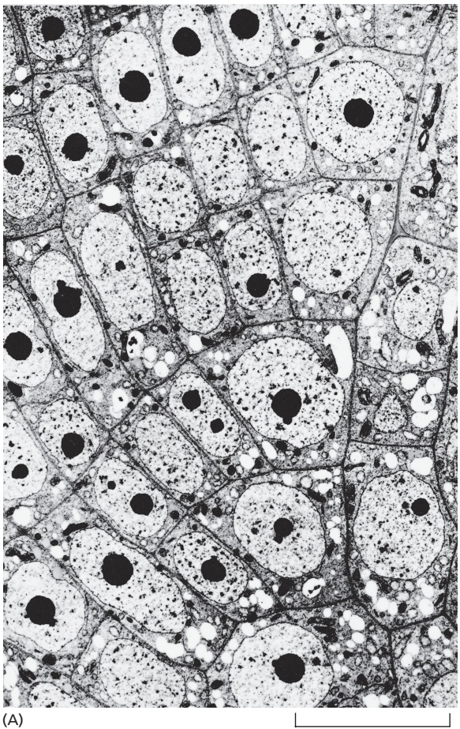

10 µm

(B)

200 nm

Figure 19–62 Plant cell walls. (A) Electron micrograph of the root tip of a rush, showing the organized pattern of cells that results from an ordered sequence of cell divisions in cells with relatively rigid cell walls. In this growing tissue, the cell walls are still relatively thin, appearing as fine black lines between the cells in the micrograph. (B) Section of a typical cell wall separating two adjacent plant cells. The two dark transverse bands correspond to plasmodesmata that span the wall (see Figure 19–27). (A, courtesy of C. Busby and B. Gunning, Eur. J. Cell Biol. 21: 214–223, 1980. With permission from Elsevier. B, courtesy of Jeremy Burgess.)

and, most important of all, more rigid than the extracellular matrix produced by animal cells. In evolving relatively rigid walls, which can be up to many micrometers thick, early plant cells forfeited the ability to crawl about and adopted a sedentary lifestyle that has persisted in all present-day plants.

#### The Composition of the Cell Wall Depends on the Cell Type

All cell walls in plants have their origin in dividing cells, as the cell plate forms during cytokinesis to create a new partition wall between the daughter cells (discussed in Chapter 17). The new cells are usually produced in special regions called meristems, and they are generally small in comparison with their final size. To accommodate subsequent cell growth, the walls of the newborn cells, called **primary cell walls**, are thin and extensible, although tough. Once cell growth stops, the primary wall is sometimes retained without major modification, but, more commonly, a rigid **secondary cell wall** is produced by depositing new layers of matrix inside the old ones. These new layers generally have a composition that is significantly different from that of the primary wall. The most common additional polymer in secondary walls is **lignin**, a complex network of covalently linked phenolic compounds found in the walls of the xylem vessels and fiber cells of woody tissues.

Although the cell walls of higher plants vary in both composition and organization, they are all constructed, like animal extracellular matrices, using a structural principle common to all fiber-composites, including fiberglass and reinforced concrete. One component provides tensile strength, while another, in which the first is embedded, provides resistance to compression. While the principle is the same in plants and animals, the chemistry is different. Unlike the animal extracellular matrix, which is rich in protein and other nitrogen-containing polymers, the plant cell wall is made almost entirely of polymers that contain no nitrogen, including cellulose and lignin. For a sedentary organism that depends on $\mathrm { C O _ { 2 } , H _ { 2 } O } ,$ and sunlight, these two abundant biopolymers represent “cheap,” carbon-based structural materials, helping to conserve the scarce fixed nitrogen available in the soil that generally limits plant growth. Thus trees, for example, make a huge investment in the cellulose and lignin that compose the bulk of their biomass.

In the cell walls of higher plants, the tensile fibers are made from the polysaccharide cellulose, the most abundant organic macromolecule on Earth, tightly linked into a network by cross-linking glycans. In primary cell walls, the matrix in which the cross-linked cellulose network is embedded is composed of pectin, a highly hydrated network of polysaccharides rich in galacturonic acid. Secondary cell walls contain additional molecules to make them rigid and permanent; lignin, in particular, forms a hard, waterproof filler in the interstices between the other components. All of these molecules are held together by a combination of covalent and noncovalent bonds to form a highly complex structure, whose composition, thickness, and architecture depend on the cell type.

The plant cell wall thus has a “skeletal” role in supporting the structure of the plant as a whole, a protective role as an enclosure for each cell individually, and a transport role, helping to form channels for the movement of fluid in the plant. When plant cells become specialized, they generally adopt a specific shape and produce specially adapted types of walls, according to which the different types of cells in a plant can be recognized and classified. We focus here, however, on the primary cell wall and the molecular architecture that underlies its remarkable combination of strength, resilience, and plasticity, as seen in the growing parts of a plant.

#### The Tensile Strength of the Cell Wall Allows Plant Cells to Develop Turgor Pressure

The aqueous extracellular environment of a plant cell consists of the fluid contained in the walls that surround the cell. Although the fluid in the plant cell wall contains more solutes than does the water in the plant’s external milieu (for example, soil), it is still hypotonic in comparison with the cell interior. This osmotic imbalance causes the cell to develop a large internal hydrostatic pressure, or **turgor pressure**, which pushes outward on the cell wall, just as an inner tube pushes outward on a bicycle tire. The turgor pressure increases just to the point where the cell is in osmotic equilibrium, with no net influx of water despite the salt imbalance. The turgor pressure generated in this way may reach 10 or more atmospheres, about five times that in the average car tire. This pressure is vital to plants because it is the main driving force for cell expansion during growth, and it provides much of the mechanical rigidity of living plant tissues. Compare the wilted leaf of a dehydrated plant, for example, with the turgid leaf of a wellwatered one. It is the mechanical strength of the cell wall that allows plant cells toMBoC7 m19.62/19.63 sustain this internal pressure.

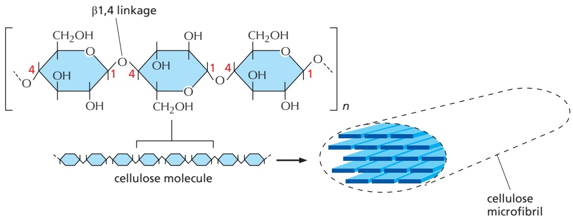

Figure 19–63 Cellulose. Cellulose molecules are long, unbranched chains of β1,4-linked glucose units. Each glucose residue is inverted with respect to its neighbors, and the resulting disaccharide repeat occurs hundreds of times in a single cellulose molecule. In most higher plant cells, about 18 individual cellulose molecules assemble in parallel to form a strong, hydrogen-bonded cellulose microfibril.

#### The Primary Cell Wall Is Built from Cellulose Microfibrils Interwoven with a Network of Pectic Polysaccharides

**Cellulose** gives the primary cell wall tensile strength. Each cellulose molecule consists of a linear chain of at least 500 glucose residues that are covalently linked to one another to form a ribbonlike structure, which is stabilized by hydrogen bonds within the chain (**Figure 19–63**). In addition, hydrogen bonds between adjacent cellulose molecules cause them to stick together in overlapping parallel arrays, forming bundles of about 18 cellulose chains, all of which have the same polarity. These highly ordered crystalline aggregates, many micrometers long, are called **cellulose microfibrils**, and they have a tensile strength comparable to that of steel. Sets of microfibrils are arranged in layers, or lamellae, with each microfibril about 20–40 nm from its neighbors and connected to them by long cross-linking glycan molecules, which are attached by hydrogen bonds to the surface of the microfibrils. The primary cell wall consists of several such lamellae arranged in a plywoodlike network (**Figure 19–64**).

Figure 19–64 Scale model of a portion of a primary plant cell wall showing the two major polysaccharide networks. The orthogonally arranged layers of cellulose microfibrils (blue) are tied into a network by the cross-linking glycans (red) that form hydrogen bonds with the microfibrils. This network is accompanied by a network of pectin polysaccharides (green). The network of cellulose and cross-linking glycans provides tensile strength, while the pectin network resists compression. Cellulose, cross-linking glycans, and pectin are typically present in roughly equal amounts in a primary cell wall. The middle lamella is especially rich in pectin, and it cements adjacent cells together.

The **cross-linking glycans** are a heterogeneous group of branched polysaccharides that bind tightly to the surface of each cellulose microfibril and thereby help to cross-link the microfibrils into a complex network. There are many classes of cross-linking glycans, but they all have a long linear backbone composed of one type of sugar (glucose, xylose, or mannose) from which short side chains of other sugars protrude. The backbone sugar molecules form hydrogen bonds with the surface of cellulose microfibrils, cross-linking them in the process. Both the backbone and the side-chain sugars vary according to the plant species and its stage of development.

The network of cellulose microfibrils and cross-linking glycans includes another cross-linked polysaccharide network that is based on **pectins** (see Figure 19–64). Pectins are a heterogeneous group of branched polysaccharides that contain many negatively charged galacturonic acid units. Because of their negative charge, pectins are highly hydrated and associated with a cloud of cations, resembling the glycosaminoglycans of animal cells in the large amount of space they occupy (see Figure 19–33). When $\mathrm { C a ^ { 2 + } }$ is added to a solution of pectin molecules, it cross-links them to produce a semirigid gel (it is pectin that is added to fruit juice to make jam or jelly). Certain pectins are particularly abundant in the middle lamella, the specialized region that cements together the walls of adjacent cells (see Figure 19–64); here, $\overset { \circ } { \mathrm { C a ^ { 2 + } } }$ cross-links are thought to help hold cell wall components together. Although covalent bonds also play a part in linking the components, very little is known about their nature. Regulated separation of cells at the middle lamella underlies such processes as the ripening of tomatoes and the abscission (detachment) of leaves in the fall.

In addition to the two polysaccharide-based networks that form the bulk of all plant primary cell walls, proteins are present, contributing up to about 5% of the wall’s dry mass. Many of these proteins are enzymes, responsible for wall turnover and remodeling, particularly during growth. Another class of wall proteins, like collagen, contains high levels of hydroxyproline. These proteins are thought to strengthen the wall, and they are produced in greatly increased amounts as a local response to attack by pathogens. From the genome sequence of Arabidopsis, it has been estimated that more than 700 genes are required to synthesize, assemble, and remodel the plant cell wall.

#### Oriented Cell Wall Deposition Controls Plant Cell Growth

Once a plant cell has left the meristem where it is generated, it can grow dramatically, commonly by more than a thousand times in volume. The manner of this expansion determines the final shape of each cell, and hence the final form of the plant as a whole. Turgor pressure inside the cell drives the expansion, but it is the behavior of the cell wall that governs its direction and extent. Complex wallremodeling activities are required, as well as the deposition of new wall materials. Because of their crystalline structure, the individual cellulose microfibrils in the wall are unable to stretch, and this gives them a crucial role in the process. For the cell wall to stretch or deform, the microfibrils must either slide past one another or become more widely separated, or both. The orientation of the microfibrils in the innermost layers of the wall governs the direction in which the cell expands. Cells in plants therefore anticipate their future morphology by controlling the orientation of the cellulose microfibrils that they deposit in the wall (**Figure 19–65**).

Unlike most other matrix macromolecules, which are made in the endoplasmic reticulum and Golgi apparatus and are secreted, cellulose is spun out from the surface of the cell by a plasma membrane–bound enzyme complex (cellulose synthase), which uses as its substrate the sugar nucleotide UDP-glucose supplied from the cytosol. Each enzyme complex, or rosette, is a radial array of six trimers, each containing the protein products of three separate cellulose synthase (CESA) genes (see Figure 19–66). Three CESA genes are required for primary cell wall synthesis and a different three for secondary cell wall synthesis.

As they are being synthesized, the nascent cellulose chains assemble into microfibrils. These are spun out on the extracellular surface of the plasma membrane, forming a layer, or lamella, in which all the microfibrils have more or less the same alignment (see Figure 19–64). Each new lamella is deposited internally to the previous one, so that the wall consists of concentrically arranged lamellae, with the oldest on the outside. The most recently deposited microfibrils in elongating cells commonly lie perpendicular to the axis of cell elongation, although the orientation of the microfibrils in the outer lamellae that were laid down earlier may be different (see Figure 19–65B and C).

200 nm

#### Microtubules Orient Cell Wall Deposition

An important clue to the mechanism that dictates microfibril orientation came from observations of the microtubules in plant cells. These are frequently arrangedMBoC7 m19.64/19.65 in the cortical cytoplasm with the same orientation as the cellulose microfibrils that are currently being deposited in the cell wall in that region. These cortical microtubules form a cortical array close to the cytosolic face of the plasma membrane, held there by poorly characterized proteins. The congruent orientation of the cortical array of microtubules (lying just inside the plasma membrane) and cellulose microfibrils (lying just outside) is seen in many types and shapes of plant cells and is present during both primary and secondary cell wall deposition, suggesting a causal relationship.

This suggestion can be tested by treating a plant tissue with a microtubule-depolymerizing drug so as to disassemble the entire system of cortical microtubules. The consequences for subsequent cellulose deposition, however, are not as straightforward as might be expected. The drug treatment does not disrupt the production of new cellulose microfibrils, and in some cases cells can continue to deposit new microfibrils in the preexisting orientation. Any developmental switch in the orientation of the microfibril pattern that would normally occur between successive lamellae, however, is invariably blocked. It seems that a preexisting orientation of microfibrils can be propagated even in the absence of microtubules, but any change in the deposition of cellulose microfibrils requires that intact microtubules be present to determine the new orientation.

These observations are consistent with the following model. The cellulosesynthesizing rosettes embedded in the plasma membrane spin out long cellulose

Figure 19–65 Cellulose microfibrils influence the direction of cell elongation. (A) The orientation of cellulose microfibrils in the primary cell wall of an elongating carrot cell is shown in this electron micrograph of a shadowed replica from a rapidly frozen and deep-etched cell wall. The cellulose microfibrils are aligned parallel to one another and perpendicular to the axis of cell elongation. The microfibrils are cross-linked by, and interwoven with, a complex web of matrix molecules (compare with Figure 19–64). (B, C) The cells in B and C start off with identical shapes (shown here as cubes) but with different net orientations of cellulose microfibrils in their walls. Although turgor pressure is uniform in all directions, cell wall loosening allows each cell to elongate only in a direction perpendicular to the orientation of the innermost layer of microfibrils, which have great tensile strength. Cell expansion occurs in concert with the insertion of new wall material. The final shape of an organ, such as a shoot, is determined in part by the direction in which its component cells can expand. (A, courtesy of Brian Wells and Keith Roberts.)

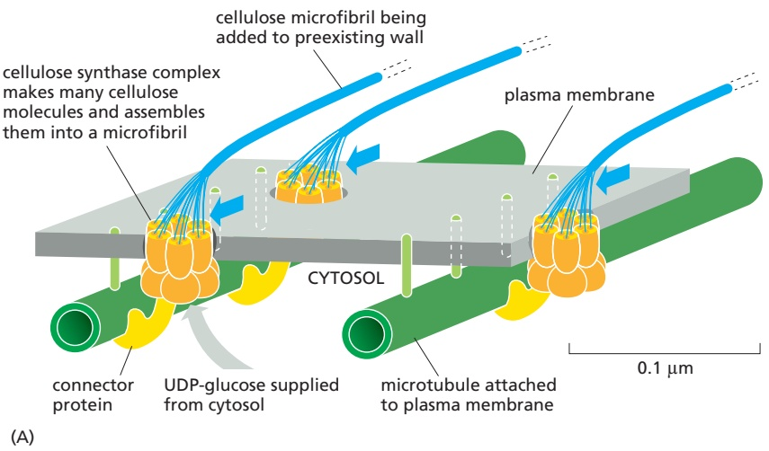

molecules. As the synthesis of cellulose molecules and their self-assembly into microfibrils proceeds, the distal end of each microfibril presumably forms indirect cross-links to the previous layer of wall material, orienting the new microfibril in parallel with the old ones as it becomes integrated into the texture of the wall. Because the microfibril is stiff, the rosette at its growing, proximal end has to move as it deposits the new material. Traveling in the plane of the membrane, the rosette moves in the direction defined by the way in which the far end of theMBoC7 m19.65/19.66 microfibril is anchored in the existing wall. In this way, each layer of microfibrils would tend to be spun out from the membrane in the same orientation as the layer laid down previously, with the rosettes following the direction of the preexisting oriented microfibrils outside the cell. Oriented microtubules inside the cell, however, can force a change in the direction in which the rosettes move: they can create boundaries in the plasma membrane that act like the banks of a canal to constrain rosette movement (**Figure 19–66**). In this view, cellulose synthesis can occur independently of microtubules; but it is constrained spatially when cortical microtubules are present to define membrane microdomains within which the enzyme complex can move.

In this way, plant cells can change their direction of expansion by a sudden change in the orientation of their cortical array of microtubules. Because plant cells cannot move (being constrained by their walls), the entire morphology of a multicellular plant presumably depends on a coordinated, highly patterned deployment of cortical microtubule orientations during plant development. It is not known how these orientations are controlled, although it has been shown that the microtubules can reorient rapidly in response to extracellular stimuli, including plant growth regulators such as ethylene and auxins (discussed in Chapter 15).

Microtubules are not, however, the only cytoskeletal elements that influence wall deposition. Local foci of cortical actin filaments can also direct the deposition of new wall material at specific sites on the cell surface, contributing to the elaborate final shaping of many differentiated plant cells.

Figure 19–66 One model of how the orientation of newly deposited cellulose microfibrils might be determined by the orientation of cortical microtubules. (A) The large cellulose synthase complexes, or rosettes, are integral membrane proteins that synthesize cellulose microfibrils on the outer face of the plasma membrane. Each rosette contains six enzyme trimers, resulting in the synthesis of the 18 cellulose chains that make up a cellulose microfibril in many plant cells (see Figure 19–63). The distal ends of the stiff microfibrils become integrated into the texture of the wall, and their elongation at the proximal end pushes the synthase complex along in the plane of the membrane. Because the cortical array of microtubules is attached to the plasma membrane in a way that confines this complex to defined membrane channels, the orientation of these microtubules—when they are present—determines the axis along which the new microfibrils are laid down. (B, C) Two electron micrographs show the tight association of the cortical microtubules with the plasma membrane. One shows the microtubules in cross section while the other shows a microtubule in longitudinal section. Both emphasize the constant gap of about 20 nm between membrane and microtubule. (B and C, courtesy of Andrew Staehelin.)

#### Summary

Plant cells are surrounded by a tough extracellular matrix, or cell wall, which is responsible for many of the unique features of a plant’s lifestyle. The wall is composed of a network of cellulose microfibrils and cross-linking glycans, embedded in a highly cross-linked matrix of pectin polysaccharides. In secondary cell walls, lignin may be deposited to make them waterproof, hard, and woody. A cortical array of microtubules can control the orientation of newly deposited cellulose microfibrils, which in turn determine the direction of cell expansion and therefore the final shape of the cell and, ultimately, of the plant as a whole.

<!-- END EN EN19-H047-H053 -->
