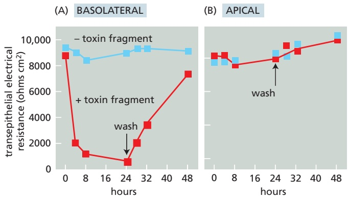
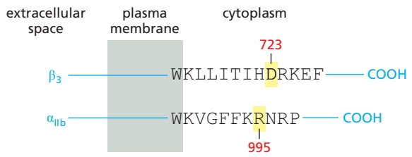

# 第16章 细胞的社会联系 · 英文习题与参考文献

### 英文补充：习题与参考文献

> 对应中文板块：习题与参考文献。英文来源：Molecular Biology of the Cell，第7版，第19章；[本章完整原文](../来源/英文教材/19_Cell_Junctions_and_the_Extracellular_Matrix/chapter.md)。物理PDF页码范围：1144–1201（整章范围）。

<!-- BEGIN EN EN19-EXERCISES -->
#### PROBLEMS

Which statements are true? Explain why or why not.

19–1 Given the numerous processes inside cells that are regulated by changes in $\mathrm { C \hat { a } ^ { 2 + } }$ concentration, it seems likely that $\mathrm { C a ^ { 2 + } }$ -dependent cell–cell adhesions are also regulated by changes in $\mathrm { C a ^ { 2 + } }$ concentration.

19–2 Tight junctions perform two distinct functions: they seal the space between cells to restrict paracellular flow, and they fence off plasma membrane domains to prevent the mixing of apical and basolateral membrane proteins.

19–3 The elasticity of elastin derives from its high content of α helices, which act as molecular springs.

19–4 Integrins can convert mechanical signals into intracellular molecular signals.

19–5 If the entire cortical array of microtubules were disassembled by drug treatment, new cellulose microfibrils would be laid down in random orientations.

Discuss the following problems.

19–6 Comment on the following (1922) quote from Warren Lewis, who was one of the pioneers of cell biology. “Were the various types of cells to lose their stickiness for one another and for the supporting extracellular matrix, our bodies would at once disintegrate and flow off into the ground in a mixed stream of cells.”

19–7 Cell adhesion molecules were originally identified using antibodies raised against cell-surface components to block cell aggregation. In the adhesionblocking assays, the researchers found it necessary to use antibody fragments, each with a single binding site (so-called Fab fragments), rather than intact IgG antibodies, which are Y-shaped molecules with two identical binding sites. The Fab fragments were generated by digesting the IgG antibodies with papain, a protease, to separate the two binding sites (**Figure Q19–1**). Why do you suppose it was necessary to use Fab fragments to block cell aggregation?

Figure Q19–1 Production of Fab fragments from IgG antibodies by digestion with papain (Problem 19–7).

19–8 The food-poisoning bacterium Clostridium perfringens makes a toxin that binds to members of the claudin family of proteins, which are the main constituents of tight junctions. When the C-terminus of the toxin is bound to a claudin, the N-terminus can insert into the adjacent cell membrane, forming holes that kill the cell. The portion of the toxin that binds to the claudins has proven to be a valuable reagent for investigating the properties of tight junctions. MDCK cells are a common choice for studies of tight junctions because they can form an intact epithelial sheet with high transepithelial electrical resistance (low ion permeability). MDCK cells express two claudins: claudin-1, which is not bound by the toxin, and claudin-4, which is.

When an intact MDCK epithelial sheet is incubated with the C-terminal toxin fragment, claudin-4 disappears, becoming undetectable within 24 hours. In the absence of claudin-4, the cells remain healthy and the epithelial sheet appears intact. The mean number of strands in the tight junctions that link the cells also decreases over 24 hours from about four to about two, and they are less highly branched. A functional assay for the integrity of the tight junctions shows that transepithelial resistance decreases dramatically in the presence of the toxin fragment, but the resistance can be restored by washing out the toxin fragment (**Figure Q19–2A**). Curiously, the toxin fragment produces these effects only when it is added to the basolateral side of the sheet; it has no effect when added to the apical surface (**Figure Q19–2B**).

Figure Q19–2 Effects of Clostridium toxin fragment on the barrier function of MDCK cells (Problem 19–8). (A) Addition of toxin fragment from the basolateral side of the epithelial sheet. (B) Addition of toxin fragment from the apical side of the epithelial sheet. For a given voltage, a higher resistance (ohms cm2) gives less paracellular current.

A. How can it be that two tight-junction strandsMBoC7 Q19.02 remain, even though all of the claudin-4 has disappeared?

B. Why do you suppose the toxin fragment works when it is added to the basolateral side of the epithelial sheet but not when added to the apical side?

19–9 The glycosaminoglycan polysaccharide chains that are linked to specific core proteins to form the proteoglycan components of the extracellular space are highly negatively charged. How do you suppose these negatively charged polysaccharide chains help to establish a hydrated gel-like environment around the cell? How would the properties of these molecules differ if the polysaccharide chains were uncharged?

19–10 At body temperature, l-aspartate in proteins is converted to its optimal isomer d-aspartate at an appreciable rate. Most proteins in the body have a very low level of d-aspartate, if it can be detected at all. Elastin, however, has a fairly high level of d-aspartate. Moreover, the amount of d-aspartate increases in direct proportion to the age of the person from whom the sample was taken. Why do you suppose that most proteins have little if any d-aspartate, while elastin has levels of d-aspartate that increase steadily with age?

19–11 It is not an easy matter to assign particular functions to specific components of the basal lamina, because the overall structure is a complicated composite material with both mechanical and signaling properties. Nidogen, for example, cross-links two central components of the basal lamina by binding to the laminin γ chain and to type IV collagen. Given such a key role, it was surprising that mice with a homozygous knockout of the gene for nidogen-1 were entirely healthy, with no abnormal phenotype. Similarly, mice homozygous for a knockout of the gene for nidogen-2 also appeared completely normal. By contrast, mice that were homozygous for a defined mutation in the gene for the laminin γ chain, which eliminated just the binding site for nidogen, died at birth with severe defects in lung and kidney formation. The mutant portion of the laminin γ chain is thought to have no other function than to bind nidogen and does not affect laminin structure or its ability to assemble into the basal lamina. How would you explain these genetic observations, which are summarized in **Table Q19–1**? What would you predict would be the phenotype of a mouse that was homozygous for knockouts of both nidogen genes?

TABLE Q19–1 Phenotypes of mice with genetic defects in components of the basal lamina (Problem 19–11)

<table><tr><td>Protein</td><td>Genetic defect</td><td>Phenotype</td></tr><tr><td>Nidogen-1</td><td>Gene knockout (-/-)</td><td>None</td></tr><tr><td>Nidogen-2</td><td>Gene knockout (-/-)</td><td>None</td></tr><tr><td>Laminin γ chain</td><td>Nidogen binding-site deletion (+/-)</td><td>None</td></tr><tr><td>Laminin γ chain</td><td>Nidogen binding-site deletion (-/-)</td><td>Dead at birth</td></tr><tr><td colspan="3">+/- stands for heterozygous, -/- stands for homozygous.</td></tr></table>

19–12 Discuss the following statement: “The basal lamina of muscle fibers serves as a molecular bulletin board, in which adjoining cells can post messages that direct the differentiation and function of the underlying cells.”

19–13 Platelets are flat, disc-like cells with a surface area of about 20 $\mu \mathrm { m } ^ { 2 } .$ They have about 80,000 integrin molecules on their surface. If the transmembrane portion of an integrin approximates a cylinder with a 10-nm diameter, how tightly packed are integrins on the surface of a platelet? Imagine that the surface area of the platelet is represented as a grid containing 80,000 squares, each containing one integrin. What is the average distance from one integrin to its neighbor? (Assume each integrin is at the center of its square.)

19–14 The affinity of integrins for matrix components can be modulated by changes to their cytoplasmic domains: a process known as inside-out signaling. You have identified a key region in the cytoplasmic domains of αIIbβ3 integrin that seems to be required for inside-out signaling (**Figure Q19–3**). Substitution of alanine for either D723 in the β chain or R995 in the α chain leads to a high level of spontaneous activation, under conditions where the wildtype chains are inactive. Your advisor suggests that you convert the aspartate in the β chain to an arginine (D723R) and the arginine in the α chain to an aspartate (R995D). You compare all three α chains (R995, R995A, and R995D) against all three β chains (D723, D723A, and D723R). You find that all pairs have a high level of spontaneous activation, except D723 versus R995 (the wild type) and D723R versus R995D, which have low levels. On the basis of these results, how do you think the αIIbβ3 integrin is held in its inactive state?

Figure Q19–3 Schematic representation of $\alpha _ { \parallel \parallel } \beta _ { 3 }$ integrin (Problem 19–14). (From P.E. Hughes et $\mathfrak { a l } . , J .$ Biol. Chem. 271:6571–6574, 1996. With permission from American Society for Biochemistry and Molecular Biology.)

19–15 Your boss is coming to dinner! All you have for a MBoC7 Q19.03salad is some wilted, day-old lettuce. You vaguely recall that there is a trick to rejuvenating wilted lettuce, but you cannot remember what it is. Should you soak the lettuce in saltwater, soak it in tap water, or soak it in sugar water, or maybe just shine a bright light on it and hope that photosynthesis will perk it up?

19–16 A plant must be able to respond to changes in the water status of its surroundings. It does so by the flow of water molecules through water channels called aquaporins. The hydraulic conductivity of a single aquaporin is $4 . 4 \times 1 0 ^ { - 2 2 }   \mathrm { { \bar { m } } ^ { 3 } }$ per second per MPa (megapascal) of pressure. What does this correspond to in terms of water molecules per second at atmospheric pressure? [Atmospheric pressure is 0.1 MPa (1 bar) and the concentration of water is 55.5 M.]

#### REFERENCES

#### General

Beckerle M (ed.) (2002) Cell Adhesion. Oxford: Oxford University Press. Hynes RO & Yamada KM (eds.) (2011) Extracellular Matrix Biology (Cold Spring Harbor Perspectives in Biology). Cold Spring Harbor, NY: Cold Spring Harbor Laboratory Press.

#### Cell–Cell Junctions

Brasch J, Harrison OJ, Honig B & Shapiro L (2012) Thinking outside the cell: how cadherins drive adhesion. Trends Cell Biol. 22, 299–310.

Bruser L & Bogdan S (2017) Adherens junctions on the move— membrane trafficking of E-cadherin. Cold Spring Harb. Perspect. Biol. 9, a0219140.

Garcia MA, Nelson WJ & Chavez N (2018) Cell-cell junctions organize structural and signaling networks. Cold Spring Harb. Perspect. Biol. 10, a029181.

Goodenough DA & Paul DL (2009) Gap junctions. Cold Spring Harb. Perspect. Biol. 1, a002576.

Harris TJ & Tepass U (2010) Adherens junctions: from molecules to morphogenesis. Nat. Rev. Mol. Cell Biol. 11, 502–514.

Honig B & Shapiro L (2020) Adhesion protein structure, molecular affinities, and principles of cell-cell recognition. Cell 181, 520–535.

Lecuit T, Lenne PF & Munro E (2011) Force generation, transmission, and integration during cell and tissue morphogenesis. Annu. Rev. Cell Dev. Biol. 27, 157–184.

Lu KJ, Danila FR, Cho Y & Faulkner C (2018) Peeking at a plant through the holes in the wall—exploring the roles of plasmodesmata. New Phytol. 218, 1310–1314.

Maule AJ, Benitez-Alfonso Y & Faulkner C (2011) Plasmodesmata— membrane tunnels with attitude. Curr. Opin. Plant Biol. 14, 683–690.

McEver RP & Zhu C (2010) Rolling cell adhesion. Annu. Rev. Cell Dev. Biol. 26, 363–396.

Najor NA (2018) Desmosomes in human disease. Annu. Rev. Pathol. 13, 51–70.

Nakagawa S, Maeda S & Tsukihara T (2010) Structural and functional studies of gap junction channels. Curr. Opin. Struct. Biol. 20, 423–430.

Pinheiro D & Bellaïche Y (2018) Mechanical force-driven adherens junction remodeling and epithelial dynamics. Dev. Cell 47, 3–19.

Takeichi M (2014) Dynamic contacts: rearranging adherens junctions to drive epithelial remodelling. Nat. Rev. Mol. Cell Biol. 15, 397–410.

Yap AS, Duszyc K & Viasnoff V (2018) Mechanosensing and mechanotransduction at cell-cell junctions. Cold Spring Harb. Perspect. Biol. 10, a028761.

#### The Extracellular Matrix of Animals

Couchman JR (2010) Transmembrane signaling proteoglycans. Annu. Rev. Cell Dev. Biol. 26, 89–114.

Domogatskaya A, Rodin S & Tryggvason K (2012) Functional diversity of laminins. Annu. Rev. Cell Dev. Biol. 28, 523–553.

Fidler AL, Boudko SP, Rokas A & Hudson BG (2018) The triple helix of collagens—an ancient protein structure that enabled animal multicellularity and tissue evolution. J. Cell Sci. 131, jcs203950.

Fidler AL, Darris CE, Chetyrkin SV . . . Hudson BG (2017) Collagen IV and basement membrane at the evolutionary dawn of metazoan tissues. eLife 6, e24176.

Hynes RO & Naba A (2012) Overview of the matrisome—an inventory of extracellular matrix constituents and functions. Cold Spring Harb. Perspect. Biol. 4, a004903.

Jayadev R & Sherwood DR (2017) Basement membranes. Curr. Biol. 27, R207–R211.

Karamanos NK, Theocharis AD, Piperigkou Z . . . Onisto M (2021) A guide to the composition and functions of the extracellular matrix. FEBS J. (in press). Available at https://febs.onlinelibrary.wiley.com/doi/epdf/10.1111/febs.15776

Lu P, Takai K, Weaver VM & Werb Z (2011) Extracellular matrix degradation and remodeling in development and disease. Cold Spring Harb. Perspect. Biol. 3, a005058.

Mouw JK, Ou G & Weaver VM (2014) Extracellular matrix assembly: a multiscale deconstruction. Nat. Rev. Mol. Cell Biol. 15, 771–785.

Muncie JM & Weaver VM (2018) The physical and biochemical properties of the extracellular matrix regulate cell fate. Curr. Top. Dev. Biol. 130, 1–37.

Pozzi A, Yurchenco PD & Iozzo RV (2017) The nature and biology of basement membranes. Matrix Biol. 57–58, 1–11.

Ricard-Blum S (2011) The collagen family. Cold Spring Harb. Perspect. Biol. 3, a004978.

Schmelzer CEH & Duca L (2021) Elastic fibers: formation, function and fate during aging and disease. FEBS J. (in press). Available at https://febs.onlinelibrary.wiley.com/doi/epdf/10.1111/febs.15899

Townley RA & Bülow HE (2018) Deciphering functional glycosaminoglycan motifs in development. Curr. Opin. Struct. Biol. 50, 144–154.

#### Cell–Matrix Junctions

Bachmann M, Kukkurainen S, Hytonen VP & Wehrle-Haller B (2019) Cell adhesion by integrins. Physiol. Rev. 99, 1655–1699.

Calderwood DA, Campbell ID & Critchley DR (2013) Talins and kindlins: partners in integrin-mediated adhesion. Nat. Rev. Mol. Cell Biol. 14, 503–517.

Goult BT, Yan J & Schwartz MA (2018) Talin as a mechanosensitive signaling hub. J. Cell Biol. 217, 3776–3784.

Hogg N, Patzak I & Willenbrock F (2011) The insider’s guide to leukocyte integrin signalling and function. Nat. Rev. Immunol. 11, 416–426.

Humphrey JD, Dufresne ER & Schwartz MA (2014) Mechanotransduction and extracellular matrix homeostasis. Nat. Rev. Mol. Cell Biol. 15, 802–812.

Jansen KA, Atherton P & Ballestrem C (2017) Mechanotransduction at the cell-matrix interface. Semin. Cell Dev. Biol. 71, 75–83.

Matellan C & Del Rio Hernandez AE (2019) Engineering the cellular mechanical microenvironment—from bulk mechanics to the nanoscale. J. Cell Sci. 132, jcs229013.

Ross TD, Coon BG, Yun S, . . . Schwartz MA (2013) Integrins in mechanotransduction. Curr. Opin. Cell Biol. 25, 613–618.

Shattil SJ, Kim C & Ginsberg MH (2010) The final steps of integrin activation: the end game. Nat. Rev. Mol. Cell Biol. 11, 288–300.

Sun Z, Costell M & Fässler R (2019) Integrin activation by talin, kindlin and mechanical forces. Nat. Cell Biol. 21, 25–31.

#### The Plant Cell Wall

Albersheim P, Darvill A, Roberts K et al. (2011) Plant Cell Walls: From Chemistry to Biology. New York: Garland Science.

Braidwood L, Breuer C & Sugimoto K (2014) My body is a cage: mechanisms and modulation of plant cell growth. New Phytol. 201, 388–402.

Keegstra K (2010) Plant cell walls. Plant Physiol. 154, 483–486.

Lampugnani ER, Khan GA, Somssich M & Persson S (2018) Building a plant cell wall at a glance. J. Cell Sci. 131, jcs207373.

Lloyd C (2011) Dynamic microtubules and the texture of plant cell walls. Int. Rev. Cell Mol. Biol. 287, 287–329.

McFarlane HE, Doring A & Persson S (2014) The cell biology of cellulose synthesis. Annu. Rev. Plant Biol. 65, 69–94.

Meents MJ, Watanabe Y & Samuels AL (2018) The cell biology of secondary cell wall biosynthesis. Ann. Bot. 121, 1107–1125.

Polko JK & Kieber JJ (2019) The regulation of cellulose biosynthesis in plants. Plant Cell 31, 282–296.

Szymanski DB & Cosgrove DJ (2009) Dynamic coordination of cytoskeletal and cell wall systems during plant cell morphogenesis. Curr. Biol. 19, R800–R811.

Wolf S, Hematy K & Hofte H (2012) Growth control and cell wall signaling in plants. Annu. Rev. Plant Biol. 63, 381–407.
<!-- END EN EN19-EXERCISES -->
