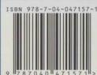

# 中文附录：诺贝尔奖获奖情况与索引

<table><tr><td>年份</td><td>获奖人</td><td>奖项</td><td>获奖者研究领域</td></tr><tr><td>2019</td><td>William G. Kaelin Jr, Peter J. Ratcliffe, Gregg L. Semenza</td><td>P/M</td><td>细胞如何感知和适应氧气供应</td></tr><tr><td rowspan="3">2018</td><td>James P. Allison, 本庶佑</td><td>P/M</td><td>通过抑制负向免疫调节来治疗癌症</td></tr><tr><td>Frances H. Arnold</td><td>C</td><td>酶的定向进化</td></tr><tr><td>George P. Smith, Gregory P. Winter</td><td></td><td>噬菌体展示技术</td></tr><tr><td rowspan="2">2017</td><td>Jeffrey C. Hall, Michael Rosbash, Michael W. Young</td><td>P/M</td><td>发现了控制昼夜节律的分子机制</td></tr><tr><td>Jacques Dubochel, Joachim Frank, Richard Henderson</td><td>C</td><td>开发冷冻电子显微镜用于溶液中生物分子的高分辨率结构测定</td></tr><tr><td>2016</td><td>大陽良典</td><td>P/M</td><td>发现了细胞自噬的机制</td></tr><tr><td rowspan="3">2015</td><td>William C. Campbell, 大村智</td><td>P/M</td><td>发现治疗丝虫寄生虫新疗法</td></tr><tr><td>屠呦呦</td><td rowspan="2">C</td><td>发现治疗疟疾的新疗法</td></tr><tr><td>Tomas Lindahl, Paul Modrich, Aziz Sancar</td><td>DNA 修复的细胞机制研究</td></tr><tr><td rowspan="2">2014</td><td>John O'Keefe, May-Britt Moser, Edvard I. Moser</td><td>P/M</td><td>发现构成大脑定位系统的细胞</td></tr><tr><td>Eric Betzig, Stefan W. Hell, William E. Moerner</td><td>C</td><td>超分辨率荧光显微技术领域取得的成就</td></tr><tr><td>2013</td><td>James E. Rothman, Randy W. Schekman, Thomas C. Südhof</td><td>P/M</td><td>发现了细胞囊泡运输与调节机制</td></tr><tr><td rowspan="3">2012</td><td>Sir John B. Gurdon</td><td>P/M</td><td>细胞核重编程技术</td></tr><tr><td>山中伸弥</td><td rowspan="2">C</td><td>发现成熟细胞可被重写成多功能细胞</td></tr><tr><td>Robert J. Lefkowitz, Brian K. Kobilka</td><td>对G蛋白偶联受体的研究</td></tr><tr><td rowspan="2">2011</td><td>Bruce A. Beutler, Jules A. Hoffmann</td><td rowspan="2">P/M</td><td>对于先天免疫机制激活的发现</td></tr><tr><td>Ralph M. Steinman</td><td>发现树突细胞和其在获得性免疫中的作用</td></tr><tr><td>2010</td><td>Robert G. Edwards</td><td>P/M</td><td>体外受精技术和试管婴儿技术</td></tr><tr><td rowspan="2">2009</td><td>Elizabeth H. Blackburn, Carol W. Greider</td><td>P/M</td><td>端粒和端粒酶在保护染色体结构完整中的作用</td></tr><tr><td>Venkatraman Ramakrishnan, Thomas A. Steitz, Ada E. Yonath</td><td>C</td><td>对核糖体结构与功能的研究</td></tr><tr><td rowspan="3">2008</td><td>Harald zur Hausen</td><td>P/M</td><td>发现乳头瘤病毒导致宫颈癌</td></tr><tr><td>Françoise Barré-Sinoussi, Luc Montagnier</td><td rowspan="2">C</td><td>发现人类免疫缺陷病毒HIV</td></tr><tr><td>Osamu Shimomura, Martin Chalfie, Roger Y. Tsien</td><td>绿色荧光蛋白(GFP)的发现和应用</td></tr><tr><td>2007</td><td>Mario R. Capecchi, Sir Martin J. Evans, Oliver Smithies</td><td>P/M</td><td>发明利用胚胎干细胞在小鼠中进行特异的基因修饰(即基因敲除技术)</td></tr><tr><td rowspan="2">2006</td><td>Andrew Z. Fire, Craig C. Mello</td><td>P/M</td><td>RNA干扰——双链RNA能够沉默基因表达</td></tr><tr><td>Roger D. Kornberg</td><td>C</td><td>真核生物转录的分子基础</td></tr><tr><td>2005</td><td>Barry J. Marshall, J. Robin Warren</td><td>P/M</td><td>发现幽门螺旋菌(Helicobacter pylori)及其在胃肠道疾病中的作用</td></tr><tr><td rowspan="2">2004</td><td>Richard Axel, Linda B. Buck</td><td>P/M</td><td>发现气味分子受体和嗅觉系统的组成</td></tr><tr><td>Aaron Ciechanover, Avram Hershko, Irwin Rose</td><td>C</td><td>发现泛素介导的蛋白质降解途径</td></tr><tr><td rowspan="2">2003</td><td>Peter Agre</td><td rowspan="2">C</td><td>发现水通道</td></tr><tr><td>Roderick MacKinnon</td><td>离子通道的结构和功能</td></tr><tr><td>2002</td><td>Sydney Brenner, H. Robert Horvitz, John E. Sulston</td><td>P/M</td><td>器官发育的遗传基础和细胞的程序化死亡</td></tr><tr><td>2001</td><td>Leland H. Hartwell, R. Timothy Hunt, Paul M. Nurse</td><td>P/M</td><td>发现细胞周期的关键调控因子</td></tr><tr><td>2000</td><td>Arvid Carlsson, Paul Greengard, Eric R. Kandel</td><td>P/M</td><td>神经系统的信号转导</td></tr><tr><td>1999</td><td>Günter Blobel</td><td>P/M</td><td>蛋白质固有的信号控制及其在细胞内的转移与定位</td></tr><tr><td>1998</td><td>Robert F. Furchgott, Louis J. Ignarro, Ferid Murad</td><td>P/M</td><td>NO 是体内重要的信号分子</td></tr><tr><td>1997</td><td>Stanley B. PrusinerJens C. SkouPaul D. Boyer, John E. Walker</td><td>P/MCC</td><td>发现朊病毒 $Na^+ -K^+$  ATP 酶ATP 合成机制</td></tr><tr><td>1996</td><td>Rolf M. Zinkernagel, Peter C. Doherty</td><td>P/M</td><td>免疫系统对病毒感染细胞的识别</td></tr><tr><td>1995</td><td>Edward B. Lewis, Christiane Nüsslein-Volhard, Eric F. Wieschaus</td><td>P/M</td><td>胚胎发育的基因调控</td></tr><tr><td>1994</td><td>Alfred Gilman, Martin Rodbell</td><td>P/M</td><td>G 蛋白的结构与功能</td></tr><tr><td>1993</td><td>Richard J. Roberts, Phillip A. SharpKary B. MullisMichael Smith</td><td>P/MCC</td><td>断裂基因和 RNA 合成多聚酶链反应 (PCR)点突变 (SDM)</td></tr><tr><td>1992</td><td>Edmond H. Fischer, Edwin G. Krebs</td><td>P/M</td><td>磷酸化与去磷酸化对酶活性的影响</td></tr><tr><td>1991</td><td>Erwin Neher, Bert Sakmann</td><td>P/M</td><td>膜片夹测定膜离子流量</td></tr><tr><td>1989</td><td>J. Michael Bishop, Harold E.VarmusThomas R. Cech, Sidney Altman</td><td>P/MCC</td><td>导致恶性转变的胞内基因具有催化能力的 RNA</td></tr><tr><td>1988</td><td>Johann Deisenhofer, Robert Huber, Hartmut Michel</td><td>C</td><td>细菌光合作用反应中心</td></tr><tr><td>1987</td><td>Susumu Toneqawa</td><td>P/M</td><td>基因重排导致抗体的多样性</td></tr><tr><td>1986</td><td>Rita Levi-Montalcini, Tanley Cohen</td><td>P/M</td><td>神经生长因子</td></tr><tr><td>1985</td><td>Michael S. Brown, Joseph L. Goldstein</td><td>P/M</td><td>胆固醇代谢调节与胞吞作用的关系</td></tr><tr><td>1984</td><td>George Köhler, César MilsteinNiels K. Jerne</td><td>P/M</td><td>单克隆抗体抗体形成</td></tr><tr><td>1982</td><td>Aaron Klug</td><td>C</td><td>核酸蛋白复合物的结构</td></tr><tr><td>1980</td><td>Paul BergWalter Gilbert, Frederick SangerBaruj Bennnacerral, Jean Daussel, George D. Snell</td><td>CP/M</td><td>重组 DNA 技术DNA 测序技术主要组织相容性复合物</td></tr><tr><td>1978</td><td>Werner Arber, Daniel Nathans, Hamilton SmithPeter Mitchell</td><td>P/CC</td><td>限制性内切酶技术氧化磷酸化的化学渗透学说</td></tr><tr><td>1975</td><td>David Baltimore, Renato Dulbecco, Howard M. Temin</td><td>P/M</td><td>反转录酶与反转录病毒活性</td></tr><tr><td>1974</td><td>Albert Claude, Christian de Duve, George E. Palade</td><td>P/M</td><td>细胞内部组分的结构与功能</td></tr><tr><td>1972</td><td>Gerald M. Edelman, Rodney R. PorterChristian B. Anfinsen</td><td>P/MCC</td><td>免疫球蛋白结构蛋白质一级结构与四级结构的关系</td></tr><tr><td>1971</td><td>Earl W. Sutherland</td><td>P/M</td><td>激素作用机制及其与 cAMP 的关系</td></tr><tr><td>1970</td><td>Bernard Katz, Ulf S. von Euler, Julius Axelrod</td><td>P/M</td><td>神经冲动的扩大及传递</td></tr><tr><td>1969</td><td>Max Delbrück, Alfred D. Hershey, Salvador E. Luria</td><td>P/M</td><td>病毒的遗传结构</td></tr><tr><td>1968</td><td>H. Gobind Khorana, Marshall W. Nirenberg, Robert W. Holley</td><td>P/M</td><td>遗传密码 tRNA 的结构</td></tr><tr><td>1966</td><td>Peyton RousCharles Brenton Huggins</td><td>P/M</td><td>致癌病毒前列腺癌的激素治疗</td></tr><tr><td>1965</td><td>François Jacob, André M. Lwoff, Jacques L. Monod</td><td>P/M</td><td>细菌操纵子及其信使 RNA</td></tr><tr><td>1963</td><td>John C. Eccles, Alan L. Hodgkin, Andrew F.Huxley</td><td>P/M</td><td>神经膜电位的离子作用机制</td></tr><tr><td rowspan="2">1962</td><td>Francis H. C. Crick, James D.Watson, Maurice H. F. Wilkins</td><td>P/M</td><td>DNA 的三维结构</td></tr><tr><td>John C. Kendrew, Max F. Perutz</td><td>C</td><td>球蛋白的三维结构</td></tr><tr><td>1961</td><td>Melvin Calvin</td><td>C</td><td>光合作用中  ${\mathrm{{CO}}}_{2}$  同化作用的生化机制</td></tr><tr><td>1960</td><td>F. Mac Burnet, Peter B. Medawar</td><td>P/M</td><td>抗体形成过程中克隆选择理论</td></tr><tr><td rowspan="2">1958</td><td>George W. Beadle, Edward L.Tatum Joshua Lederberg</td><td>P/M</td><td>基因决定蛋白质遗传重组</td></tr><tr><td>Frederick Sanger</td><td>C</td><td>蛋白质一级结构</td></tr></table>

P/M: Physiology or Medicine Prize (生理学或医学奖); C: Chemistry Prize (化学奖)。

## 索引

<table><tr><td colspan="2">ABC转运蛋白 65</td><td colspan="2">C带 207</td><td colspan="2">IκB激酶复合物 255</td></tr><tr><td colspan="2">ABC超家族 62</td><td colspan="2">desmuslin 172</td><td colspan="2">JNK 84</td></tr><tr><td colspan="2">ABO血型抗原 51</td><td colspan="2">DISC 333</td><td colspan="2">LRP5/6 253</td></tr><tr><td colspan="2">ABO血型糖脂 43</td><td colspan="2">Dishevelled 253</td><td colspan="2">Mcm蛋白 297</td></tr><tr><td colspan="2">ADAM 256</td><td colspan="2">DNA 177</td><td colspan="2">MLKL 336</td></tr><tr><td colspan="2">APAF1 334</td><td colspan="2">DNA结合基序 201</td><td colspan="2">MPF 287</td></tr><tr><td colspan="2">APC 253</td><td colspan="2">DNA合成期 262</td><td colspan="2">mTOR 6</td></tr><tr><td colspan="2">Arp2/3复合物 146</td><td colspan="2">DNA甲基化 201</td><td colspan="2">M期 262</td></tr><tr><td colspan="2">ATP合酶 122</td><td colspan="2">DNA结合域 200</td><td colspan="2">N-连接的糖基化 81</td></tr><tr><td colspan="2">ATP结合盒 270</td><td colspan="2">DSL 256</td><td colspan="2">Na+-K+ATP酶 62</td></tr><tr><td colspan="2">ATP驱动泵 61</td><td colspan="2">E位点 216</td><td colspan="2">Na+-K+泵 58</td></tr><tr><td colspan="2">Axin 253</td><td colspan="2">FADD 333</td><td colspan="2">necroptosis 329</td></tr><tr><td colspan="2">A位点 216</td><td colspan="2">Fas 333</td><td colspan="2">NF-H 172</td></tr><tr><td colspan="2">Bcl2 334</td><td colspan="2"> ${\mathrm{F}},\mathrm{F},\mathrm{F}$  -ATP合酶 65</td><td colspan="2">NF-L 172</td></tr><tr><td colspan="2">BiP 83</td><td colspan="2">Frzzled 253</td><td colspan="2">NF-M 172</td></tr><tr><td colspan="2">c-onc 300</td><td colspan="2">F型质子泵 62</td><td colspan="2">NFκB 255</td></tr><tr><td colspan="2">c-Rel 255</td><td colspan="2"> ${\mathrm{G}}_{0}$ 期 262</td><td colspan="2">NFκB信号通路 255</td></tr><tr><td colspan="2">Ca2+泵 64</td><td colspan="2"> ${\mathrm{G}}_{1}$ 期 262</td><td colspan="2">Notch 71, 255</td></tr><tr><td colspan="2">CAD 332</td><td colspan="2"> ${\mathrm{G}}_{2}$ 期 262</td><td colspan="2">Notch信号通路 256</td></tr><tr><td colspan="2">CaM 64</td><td colspan="2">GEMS 210</td><td colspan="2">NO合酶 243</td></tr><tr><td colspan="2">CapZ 153</td><td colspan="2">GLUT 59</td><td colspan="2">N带 207</td></tr><tr><td colspan="2">caspase 331</td><td colspan="2">Glut1 59</td><td colspan="2">O-连接的糖基化 81</td></tr><tr><td colspan="2">caspase非依赖性细胞凋亡 335</td><td colspan="2">GSDMD 337</td><td colspan="2">p21 325</td></tr><tr><td colspan="2">caspase激活的DNA内切酶 332</td><td colspan="2">GTP酶促进蛋白 229</td><td colspan="2">p34Cdc2 289</td></tr><tr><td colspan="2">caspase募集结构域 332</td><td colspan="2">G带 207</td><td colspan="2">p34Cdc28 289</td></tr><tr><td colspan="2">caspase依赖性凋亡 331</td><td colspan="2">G蛋白 233</td><td colspan="2">p50 255</td></tr><tr><td colspan="2">caspase抑制因子 336</td><td colspan="2">G蛋白偶联受体 227, 233</td><td colspan="2">p52 255</td></tr><tr><td colspan="2">Cdc2 289</td><td colspan="2">G蛋白信号调节子 229</td><td colspan="2">p53 302, 325</td></tr><tr><td colspan="2">Cdc28 289</td><td colspan="2">H+-ATP酶 65</td><td colspan="2">PALM/STORM 23</td></tr><tr><td colspan="2">CDC基因 263</td><td colspan="2">H+-ATP合酶 65</td><td colspan="2">Patched 254</td></tr><tr><td colspan="2">CDK 264, 291</td><td colspan="2">H+泵 65</td><td colspan="2">PI3K 249</td></tr><tr><td colspan="2">Cdk1 291</td><td colspan="2">Hayflick界限 324</td><td colspan="2">P位点 216</td></tr><tr><td colspan="2">Ci 254</td><td colspan="2">Hedgehog受体 252</td><td colspan="2">P型泵 62</td></tr><tr><td colspan="2">cIAP 336</td><td colspan="2">Hedgehog信号通路 254</td><td colspan="2">Q带 207</td></tr><tr><td colspan="2">COP I包被膜泡 109</td><td colspan="2">HIV 15</td><td colspan="2">R-Smad 252</td></tr><tr><td colspan="2">COP II包被膜泡 109</td><td colspan="2">I-Smad 252</td><td colspan="2">Ras蛋白 246</td></tr><tr><td colspan="2">Costal-2 254</td><td colspan="2">iHog 254</td><td colspan="2">RelA 255</td></tr><tr><td colspan="2">CRISPR技术 38</td><td colspan="2">iPS细胞 307</td><td colspan="2">RelB 255</td></tr></table>

RIPK 329
RNA 182
RNA 世界 222
RNA 编辑 139
RNA 自剪接 221
rRNA 213
R 带 207
Smac 336
Smad 251
SMC 蛋白复合物 269
Smoothened 254
Sos 蛋白 247
S 期 262
t-SNARE 112, 114
tau 蛋白 162
TFC 253
TGFβ 251
TOC/TIC 107
TOM/TIM 105
T 带 207
T 细胞因子 253
v-onc 300
v-SNARE 112, 114
V 型质子泵 62
Wnt 253
Wnt-β-catenin 信号通路 253
Wnt 受体 252
X 染色体失活 199
α-辅肌动蛋白 149, 153
α-丝联蛋白 172
α-微管蛋白 156
α 螺旋 46
β-catenin 253
β-微管蛋白 156
β 折叠片 46
γ 分泌酶 256
14-3-3 蛋白 173
Ⅱ型肌球蛋白 151

## B

巴氏小体 193  
白介素1 331  
白介素 $1\beta$ 330  
白色体 128  
白细胞介素 248  
百日咳毒素 240  
半桥粒 342  
半纤维素 357  
半自主性细胞器 137  
伴肌动蛋白 155  
胞间连丝 224, 345  
胞膜察 54, 69  
胞吐 56, 68  
胞吞 56, 68  
胞吞泡 68  
胞饮作用 68  
胞质分裂 269  
胞质分裂环 151  
胞质环 180  
胞质酪氨酸激酶 245  
胞质内结构域 46  
胞质外结构域 46  
被动运输 56  
必需基因 185  
闭合蛋白 341  
鞭毛 8, 168  
鞭毛内运输复合体 169  
扁平膜囊 87  
表观基因组 203  
表观遗传 202  
病毒 14  
病原相关分子模式 329  
波形蛋白 172  
捕鱼笼 180  
步行模型 166长效信号 226  
肠道菌群 14  
常染色质 192  
超薄切片 25  
超薄切片技术 25  
超高分辨率显微术 22  
超极化 66, 235  
超离心技术 30  
超螺线管 191  
成束蛋白 148  
成体干细胞 314  
程序性死亡 327  
尺蠖爬行模型 166  
重编程 310  
重复基因 186  
初级溶酶体 92  
传代细胞 32  
传导素 235  
次级溶酶体 92  
次缢痕 204  
刺激型G蛋白 237  
刺激型激素的受体 237  
粗线期 282  
促分裂原活化的蛋白激酶 248  
促红细胞生成素 248

## D

## A

## C

蛋白酶体 77  
蛋白质靶向转运 100  
蛋白质分选 100  
蛋白质降解途径 77  
蛋白质模式结合域 230  
灯刷染色体 207  
低密度脂蛋白 69  
低温电镜单颗粒分析技术 47  
低温电镜技术 27  
递质门控通道 227  
第一间隔期 262  
第二间隔期 262  
第二信使 228  
第二信使学说 228  
电磁透镜 24  
电化学梯度 58  
电突触 343  
电压门控通道 58  
电子传递复合物 125  
电子传递链 124  
电子断层成像技术 27  
电子显微镜 24  
电子载体 124  
凋亡 caspase 331  
凋亡复合体 334  
凋亡小体 331  
凋亡诱导因子 335  
定量荧光原位杂交技术 324  
动力蛋白 151  
动力蛋白激活蛋白 167  
动粒 204  
动粒微管 271  
动作电位 66  
端粒 205, 324, 325  
端粒酶 206, 325  
多核糖体 218  
多基因 186  
多级螺旋模型 191  
多能干细胞 313  
多潜能干细胞 313  
多线染色体 207

## E

二价体 281

## F

## G

高尔基体 86  
高速泳动族蛋白 188  
革兰氏阳性菌 8  
革兰氏阴性菌 8  
古细菌 7  
骨架-放射环结构模型 191  
固醇 42, 43  
固碳反应 132  
光-电关联技术 29  
光反应 132  
光合电子传递链 133  
光合磷酸化 134  
光激活定位显微术 23  
光面内质网 79  
光驱动泵 62  
光受体 235  
光学显微镜 18  
鬼笔环肽 147  
果胶 357  
过氧化物酶体 96

## H

核体 177, 210

化学诱导的多潜能干细胞 319

## J

## K

## L

酪蛋白激酶 1 254
类核 8
类囊体 9, 130
冷冻蚀刻技术 27
离子泵 58
离子通道 57
离子通道偶联受体 227
离子型去垢剂 48
连接蛋白 169
联会 281
联会复合体 282
联丝蛋白 α 172
亮氨酸拉链 201
列文虎克 2
磷脂交换蛋白 81
磷脂酶 C 234
磷脂双分子层 41
磷脂酰肌醇 3 激酶 249
磷脂酰丝氨酸 335
磷脂转位蛋白 81
流动镶嵌模型 40
流式细胞术 32
螺线管 190
螺旋 - 转角 - 螺旋 201

## M

膜电位 63

膜骨架 52

膜间隙 121

膜窖体 71

膜囊成熟模型 88

膜泡运输 103

膜泡运输模型 88

膜脂 42

膜脂的不对称性 51

膜脂的流动性 49

膜脂的运动 44

膜转运蛋白 56

摩尔根 3

木质素 357

## N

纳米生物学 12

囊膜 15

囊胚 314

囊性纤维化 66

脑苷脂 43

内分泌 224

内共生起源 137

内膜系统 74, 78

内体 69

内在膜蛋白 45

内质网 78

内质网超负荷反应 83

内质网应激 83

黏连蛋白 276

黏着斑 342

黏着斑激酶 350

黏着带 342

鸟苷酸环化酶 243

鸟苷酸交换因子 229

鸟苷酸解离抑制物 229

凝胶形成蛋白 148

纽蛋白 155

诺考达唑 159,265

## 0

偶线期 281

## P

袢环结构域 191

旁侧抑制 71

旁分泌 224

胚胎干细胞 314

配体门控通道 58, 227

批量膜流 259

批量运输 68

葡糖转运蛋白 59

## Q

气体性信号分子 226

起始 caspase 332

起始因子 219

牵拉假说 274

前纤维蛋白 147

羟基化 82

桥粒 341

鞘磷脂 43

鞘脂 42，43

亲核蛋白 183

亲水性信号分子 226

秋水仙碱 159, 265

秋水仙酰胺 265

驱动蛋白 80, 151, 164

驱动蛋白超家族 164

去垢剂 48

去极化 66

全内反射荧光显微术 22

## R

染色单体 191，203

染色体骨架 191

染色体整列 273

染色质 177, 185

染色质间颗粒 210

染色质修复 195

染色中心 192

热激蛋白 78

绒毛蛋白 149

溶酶体 92

(线粒体) 融合与分裂装置 120

软脂酰化 254

## s

三联体密码 185

扫描电镜 28

扫描隧道显微镜 29

伸展蛋白 357

神经递质 226

神经上皮干细胞蛋白 172

神经细胞黏着分子 348

生物膜 11

施莱登 2

施万 2

视蛋白 235

视紫红质 235

适应 235, 258

释放因子 221

收缩环 277

受激发射损耗 24

受体 226

受体酪氨酸激酶 244

疏水性信号分子 226

衰老 326

衰老特征性分泌物 324

衰老相关的 $\beta$ -半乳糖苷酶 324

衰老相关异染色质集中 324

栓 180

双线期 282

双信使系统 241

水孔蛋白 47,57

(高尔基体) 顺面 87

顺面网状结构 87

丝束蛋白 149

丝足 150

死亡配体 333

死亡受体 333

死亡效应结构域 332

死亡诱导信号复合物 333

四分体 281

酸性磷酸酶 93

随机光学重构显微术 23

损伤相关分子模式 329

## T

踏车行为 147, 158

## X

## w

胁迫诱导的早熟性衰老 326

抑微管装配蛋白 159

质膜的原生质表面 50

心房钠尿肽 243

抑制型G蛋白 237

质体 13

锌指 201

抑制型激素的受体 237

(核仁) 致密纤维组分 209

锌指蛋白 254

应力激活通道 58

中间丝 144

信号分子 226

应力纤维 150

中间纤维 171

信号识别颗粒 100

荧光共振能量转移技术 36

中体 277

信号肽 100

荧光漂白恢复技术 35, 50

中心法则 202

信号网络系统 257

荧光显微镜 20

中心粒膜泡 169

信号转导子和转录激活子 248

有丝分裂 3,264,269

中心粒周蛋白 271

信息素 224

有丝分裂期 262

中心体 159

星体 271

有效放大倍数 25

中心体蛋白 271

形成蛋白 148

诱导性多潜能干细胞 307, 318

中心体列队 272

形态生成素 254

域 7

终变期 283

胸腺素 $\beta_{4}$ 147

原代细胞 32

终末分化 313

选凝素 348

原肌球蛋白 153

肿瘤干细胞 303

血影蛋白 52, 149

原肌球调节蛋白 148

肿瘤坏死因子 329

原生质 3

肿瘤细胞 299

## Y

原位杂交技术 32

肿瘤抑制基因 301

延伸因子 220

原纤丝 156

周边膜蛋白 45

炎性小体 337

原质体 128

周期蛋白框 290

炎症 caspase 331

原子力显微镜 30

轴丝动力蛋白 167

氧化磷酸化 124

主动运输 56

叶绿体 13, 126

## z

主缢痕 203

叶绿体的分裂环 129

载体蛋白 57

转分化 310

叶绿体定位 127

早期内体 69

转化生长因子 $\beta$ 251

叶绿体分裂装置 129

造粉质体 128

转录抑制因子 200

叶绿体基因组 138

增强子 200

转录因子 200, 231

叶绿体基质 130

整合膜蛋白 45

转位酶 81

叶绿体膜 130

整联蛋白 257,349

着丝点 204

液泡 12

支架蛋白 253

着丝粒 203

衣壳 14

支原体 5

紫杉醇 159

移位子 79

脂滴 50

自分泌 224

乙酰胆碱受体 235

脂筏 54,71

自磷酸化 232

异染色质 192

脂筏模型 41

自噬溶酶体 92, 94

异噬溶酶体 93

脂锚定膜蛋白 45

组成型分泌 89

异肽键 78

脂质体 44

组成型异染色质 192

异形胞 9

植保素 357

组蛋白 177, 187

异源活化 332

质粒 9

祖细胞 316

抑癌基因 301

质膜的细胞外表面 50

## Cell Biology

Fifth Edition

第1版1998年获教育部科技进步奖一等奖，1999年获国家科技进步奖三等奖（著作类）。

第2版入选普通高等教育“九五”国家级重点教材和教育部“面向21世纪课程教材”，2002年获国家级优秀教材一等奖和国家级教学成果奖二等奖。

■ 第3版入选普通高等教育“十一五”国家级规划教材和高等教育出版社“百门精品教材”，2009年获国家级教学成果奖二等奖。

第4版入选“十二五”普通高等教育本科国家级规划教材

<!-- END OFFICIAL API PART part_004 -->
