# 补充专题：免疫系统

中文教材没有独立免疫学章节。直接对应吞噬、信号、细胞死亡、黏着的内容已插入对应中文节；其余部分完整保留在这里。

### 英文补充：免疫学独立专题概述

> 对应中文板块：免疫学独立专题概述。英文来源：Molecular Biology of the Cell，第7版，第24章；[本章完整原文](../来源/英文教材/24_The_Innate_and_Adaptive_Immune_Systems/chapter.md)。物理PDF页码范围：1392–1443（整章范围）。

<!-- BEGIN EN EN24-H000-H001 -->
#### The Innate and Adaptive Immune Systems

As we discussed in Chapter 23, all living organisms serve as hosts for other species, usually in relationships that are benign or even mutually helpful. But all organisms, and all cells in a multicellular organism, need to defend themselves against infection by harmful invaders, collectively called **pathogens**, which can be microbes (bacteria, viruses, or fungi) or larger parasites. The first line of defense against pathogens is provided by the **innate immune responses**, which can include protective barriers, toxic molecules, and phagocytic cells that ingest and destroy the invading pathogen. These and other innate immune defenses are not pathogen specific, but they usually can prevent or halt an infection early; if they fail to do so, some organisms, including all vertebrates and some bacteria and archaea (see Figure 7–81), can activate more sophisticated, powerful, and pathogen-specific adaptive immune responses. In this chapter, we mainly discuss the innate and adaptive immune systems of humans.

The diverse cells of our innate immune system can respond directly to a pathogen, and some of them can then help activate adaptive immune responses. The innate and adaptive immune responses then work together to help eliminate the pathogen (**Figure 24–1**). Unlike the innate responses, our adaptive responses are highly specific to the particular pathogen that induced them, and they depend on white blood cells called B and T lymphocytes. B lymphocytes (B cells) secrete anti-bodies that bind specifically to the pathogen. T lymphocytes (T cells) can either directly kill cells infected with the pathogen (**Figure 24–2**) or produce secreted or cell-surface signal proteins that stimulate other host cells to help destroy the pathogen. Whereas innate immune responses are generally brief, the adaptive responses provide long-lasting protection: a person who recovers from measles or is vaccinated specifically against it, for example, is protected for life against measles by the adaptive immune system, although not against other common viruses, such as those that cause mumps or chickenpox.

Both the innate and adaptive immune systems have evolved sensing mechanisms that enable the systems to recognize pathogens and their harmful products, and distinguish them from both the host’s own cells and molecules and from harmless or beneficial foreign organisms and their molecules. The innate system relies on various sensor proteins to distinguish self from nonself by recognizing particular types or patterns of molecules that are common to microbes but are absent or sequestered in the host. Our adaptive system, by contrast, uses unique genetic mechanisms to produce a virtually limitless diversity of related proteins—receptors on T and B cells and secreted antibodies—that, among them, can bind almost any foreign molecule. This remarkable strategy enables our adaptive immune system to react specifically against any pathogen, even if we never encountered it before. However, it also requires that the system learn not to react against self molecules or harmless foreign ones; if these learning mechanisms fail, harmful autoimmune or allergic responses result.

In this chapter, we focus mainly on features of our immune responses that distinguish them from other kinds of human cell and tissue responses. We begin with innate immune defenses and then discuss the highly specialized properties of our adaptive immune system.

C HAP T E R

IN THIS CHAPTER The Innate Immune System Overview of the Adaptive Immune System B Cells and Immunoglobulins T Cells and MHC Proteins

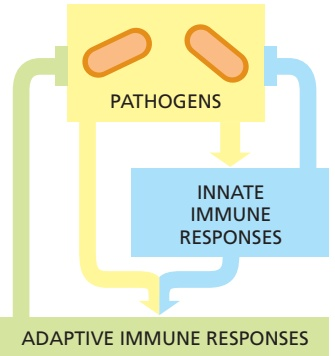

Figure 24–1 Innate and adaptive immune responses. Innate immune responses are activated directly by pathogens and defend all multicellular organisms against infection. In vertebrates, pathogens, together with the innate immune responses they MBoC7 m24.01/24.01activate, also stimulate adaptive immune responses, which then work together with innate immune responses to help fight the infection. Whereas adaptive responses are specific to a particular pathogen, innate responses are not.

#### THE INNATE IMMUNE SYSTEM

Our adaptive immune responses are slow to develop when we first encounter a new pathogen. This is because the specific B cells and T cells that can respond to a particular pathogen are initially few in number and must be stimulated to proliferate and differentiate before they can mount effective adaptive immune responses, which can take days. By contrast, a single bacterium that divides every hour can generate almost 20 million progeny in a single day, producing a full-blown infection. We therefore rely on our **innate immune system** to defend us against infection during the first critical hours and days of exposure to a new pathogen.

In this section, we consider some of the strategies our innate immune system uses to recognize pathogens and to provide a first line of defense against them.

<!-- END EN EN24-H000-H001 -->

### 英文补充：补体与抗病毒防御

> 对应中文板块：补体与抗病毒防御。英文来源：Molecular Biology of the Cell，第7版，第24章；[本章完整原文](../来源/英文教材/24_The_Innate_and_Adaptive_Immune_Systems/chapter.md)。物理PDF页码范围：1392–1443（整章范围）。

<!-- BEGIN EN EN24-H007-H008 -->
#### Complement Activation Targets Pathogens for Phagocytosis or Lysis

The blood and other extracellular fluids contain numerous proteins with antimicrobial activity, some of which are produced in response to an infection, while others are produced constitutively. The most important of these are components of the **complement system**, which consists of more than 30 interacting soluble proteins that are mainly made continually by the liver and are inactive until an infection or another trigger activates them. They were originally identified by their ability to amplify and thereby “complement” the action of antibodies made by B cells, but some are also secreted PRRs, which directly recognize PAMPs on microbes.

Figure 24–5 Phagocytosis of an antibody-coated pathogen. Electron micrograph of a neutrophil phagocytosing an antibody-coated bacterium, which is in the process of dividing. The process in which antibody (or complement) coating of a pathogen increases the efficiency with which the pathogen is phagocytosed is called opsonization. (Courtesy of Dorothy F. Bainton, from. / . R.C. Williams, Jr., and H.H. Fudenberg, Phagocytic Mechanisms in Health and Disease. New York: Intercontinental Medical Book Corporation, 1971.)

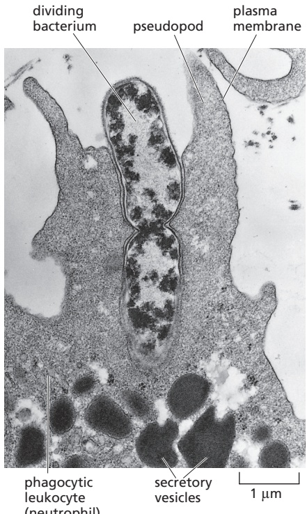

Figure 24–6 Eosinophils attacking a parasite. Phagocytes cannot ingest large parasites such as the schistosome larva shown here. When such a parasite is coated with antibody or complement components, however, eosinophils (and other leukocytes) can recognize it and collectively kill it by secreting a large variety of toxic molecules. (Courtesy of Anthony Butterworth.)

Figure 24–7 The principal stages in complement activation by the classical, lectin, and alternative pathways. In all three pathways, the reactions of complement activation usually take place on the surface of an invading microbe, such as a bacterium, and lead to the cleavage of C3 and the various consequences shown. As indicated, the complement proteins C1 to C9, mannose-binding lectin (MBL), MBL-associated serine protease (MASP), and factors B and D are the central components of the complement system. The early components are shown within gray arrows, while the late components are shown within a brown arrow. The black arrows indicate the functions of the protein fragments produced during complement activation. The various complement proteins that regulate the system are omitted. C-reactive protein is a secreted PRR protein that is made by the liver; it increases in the blood during an infection (and other inflammatory conditions) and binds to the surface of some bacteria.

The early complement components consist of three sets of proteins, belonging to three distinct pathways of complement activation—the classical pathway, the lectin pathway, and the alternative pathway. The early components of all three pathways act locally to cleave and activate C3, which is the pivotal complement component (**Figure 24–7**); individuals with a C3 deficiency are subject to repeated severe infections. The early components are proenzymes, which are activated sequentially by proteolytic cleavage. The cleavage of each proenzyme in the series activates the next component to generate a serine protease, which cleaves the next proenzyme in the series, and so on. Because each activated enzyme cleaves many molecules of the next proenzyme in the chain, the activation of the early components consists of an amplifying proteolytic cascade.

Many of these protein cleavages liberate a biologically active small fragment, which can attract neutrophils, plus a membrane-binding larger fragment. The binding of the large fragment to a cell membrane, usually the surface of a pathogen, helps stimulate the next reaction in the sequence. In this way, complement activation is largely kept confined to the cell surface where it began. In particular, the large fragment of C3, called C3b, binds covalently to the surface of the pathogen. Here, it recruits protein fragments produced by cleavage of other early complement components to form proteolytic complexes that catalyze the subsequent steps in the complement cascade. The early events in complement activation have diverse functions: C3b-binding receptors on phagocytic cells enhance the ability of these cells to phagocytose the pathogen, and similar receptors on B cells enhance the ability of these cells to make antibodies against various microbial molecules on C3b-coated pathogens. The smaller fragment of C3 (called C3a), as well as small fragments of C4 and C5, act independently as diffusible signals to promote an inflammatory response by recruiting leukocytes to the site of infection.

As indicated in Figure 24–7, C-reactive protein or antibodies bound to the surface of a pathogen activate the classical pathway. Mannose-binding lectin, mentioned earlier, is a secreted PRR that initiates the lectin pathway of complement activation when it recognizes bacterial or fungal glycolipids and glycoproteins bearing terminal mannose and fucose sugars in a particular spatial conformation. These initial binding events in the classical and lectin pathways cause the recruitment and activation of the early complement components. Because molecules on the surface of pathogens can directly activate the alternative pathway, it is usually the first complement pathway activated at the start of an infection.

Membrane-immobilized C3b, produced by any of the three pathways, triggers a further cascade of reactions that leads to the assembly of the late complement components to form membrane attack complexes. These protein complexes assemble in the pathogen membrane near the site of C3 activation, forming aqueous pores through the membrane (**Figure 24–8**). For this reason, and because they perturb the structure of the lipid bilayer in their vicinity, they make the membrane leaky and can, in some cases, cause the microbe to lyse.

The self-amplifying, inflammatory, and destructive properties of the complement cascade make it essential that the cascade is tightly controlled, which is achieved in various ways. One way is that key activated components are unstableMBoC7 m24.08/24.08 and rapidly inactivate after they are generated, unless they bind immediately to either the next component in the cascade or to a nearby membrane. In addition, specific inhibitor proteins in the blood or on the surface of host cells abort the cascade by inactivating certain complement components once the components have been activated by proteolytic cleavage. One such inhibitor protein in the blood is recruited to sialic acid on host-cell glycoproteins and glycolipids (see Figure 10–16); because pathogens generally lack sialic acid, they are singled out for complement-mediated phagocytosis and destruction, while host cells are spared. Some pathogens, including the bacterium Neisseria gonorrhoeae that causes the sexually transmitted disease gonorrhea, coat themselves with a layer of sialic acid to effectively hide from the complement system.

#### Virus-infected Cells Take Drastic Measures to Prevent Viral Replication

A common way for a host-cell PRR to recognize the presence of an infecting virus is to detect unusual elements of the viral genome, such as the double-stranded RNA (dsRNA) that is an intermediate in the life cycle of many viruses and is recognized by several PRRs, including the Toll-like receptor TLR3 (see Figure 24–4A). In addition, DNA virus genomes frequently contain significant amounts of the CpG motifs mentioned earlier, which can be recognized by TLR9 (see Table 24–1, p. 1356).

Mammalian cells are particularly adept at recognizing the presence of dsRNA, which activates intracellular PRRs that induce the host cell to produce and secrete two antiviral cytokines: **interferon-a (IFNa)** and **interferon-b (IFNb)**. These interferons are referred to as type I interferons to distinguish them from IFNγ, which is a type II interferon and has different functions, as we discuss later. A type I interferon acts in both an autocrine fashion on the infected cells that produced it and a paracrine fashion on uninfected neighbors. Type I interferons bind to a common cell-surface receptor, which activates the JAK–STAT intracellular signaling pathway (see Figure 15–57) to stimulate the transcription of many specific genes and thereby promote the production of hundreds of proteins, including many cytokines, reflecting the complexity of the cell’s acute response to a viral infection.

The production of type I interferons appears to be a general response of our cells to a viral infection, and viral components other than dsRNA and CpG motifs

Figure 24–8 Assembly of the late complement components to form a membrane attack complex in the membrane of a pathogen. The cleavage of the early complement components (shown within gray arrows in Figure 24–7) results in the formation of C3b-containing proteolytic complexes on the pathogen membrane (not shown). These then cleave the first of the late components, C5, to produce C5a (not shown) and C5b. As illustrated, C5b rapidly assembles with C6 and C7 to form C567, which then binds firmly via C7 to the pathogen membrane. One molecule of C8 binds to the complex to form C5678. The binding of a molecule of C9 to C5678 induces a conformational change in C9 that exposes a hydrophobic region and causes C9 to insert into the target membrane. This starts a chain reaction in which the altered C9 binds a second molecule of C9, which can then bind another molecule of C9, and so on. In this way, a ring of C9 molecules forms a large, transmembrane aqueous channel in the pathogen membrane.

in viral DNA can trigger it. The type I interferons help block viral replication in multiple ways. They activate a latent ribonuclease, for example, that nonspecifically degrades single-stranded RNAs of both the virus and host cell. They also indirectly activate a protein kinase that phosphorylates and inactivates the protein synthesis initiation factor eIF2 (discussed in Chapter 6), thereby shutting down most protein synthesis in the infected host cell. Apparently, by destroying most of its own RNA and transiently halting most of its protein synthesis, the host cell inhibits viral replication without killing itself. If these measures fail, the cell takes an even more extreme step to prevent the virus from replicating: it kills itself by undergoing apoptosis, often with the help of immune killer cells that are activated by type I interferons, as we discuss next.

<!-- END EN EN24-H007-H008 -->

### 英文补充：适应性免疫、B细胞、抗体、T细胞与MHC

> 对应中文板块：适应性免疫、B细胞、抗体、T细胞与MHC。英文来源：Molecular Biology of the Cell，第7版，第24章；[本章完整原文](../来源/英文教材/24_The_Innate_and_Adaptive_Immune_Systems/chapter.md)。物理PDF页码范围：1392–1443（整章范围）。

<!-- BEGIN EN EN24-H010-H032 -->
#### Dendritic Cells Provide the Link Between the Innate and Adaptive Immune Systems

Dendritic cells are crucially important components of the innate immune system. Like macrophages, they are made in the bone marrow, are resident in most of our tissues, express a large variety of PRRs that enable them to recognize and phagocytose invading pathogens or their products, and they become activated during the encounter with pathogens. But, unlike macrophages, which kill the pathogens they ingest, dendritic cells act indirectly to fight the pathogens they ingest by activating T cells of the adaptive immune system to join the fight.

As discussed later, an activated dendritic cell cleaves the proteins of the ingested pathogen or its products into peptide fragments, which bind to newly synthesized MHC proteins that then carry the fragments to the dendritic-cell surface. The activated cells then migrate to a nearby lymphoid organ such as a lymph node (also called a lymph gland), where they present the peptide–MHC complexes to T cells, activating the T cells to proliferate and help fight the specific pathogen (**Figure 24–11**).

In addition to the complexes of MHC proteins and microbial peptides displayed on their cell surface, activated dendritic cells also display cell-surface co-stimulatory proteins that help activate T cells (see Figure 24–11). The activated dendritic cells also secrete a variety of cytokines that influence the type of T cell response induced, ensuring that it is appropriate to fight the particular pathogen. In these ways, dendritic cells serve as crucial links between the innate immune system, which provides a rapid first line of defense against invading pathogens, and the adaptive immune system, which mounts slower but more powerful and highly specific responses to attack a particular invader, as we discuss next.

#### Summary

All multicellular organisms possess innate immune defenses against invading pathogens; these defenses include physical and chemical barriers and various defensive cell responses that are not specific to a particular pathogen. In vertebrates, these innate immune responses can also recruit more powerful adaptive immune responses, which are pathogen-specific and help fight the infection. Innate immune responses rely on the ability of host cells to recognize characteristic features of microbial molecules called pathogen-associated molecular patterns, or PAMPs, which can be associated with a pathogen’s proteins, lipids, sugars, or nucleic acids. PAMPs are mainly recognized by a variety of pattern recognition receptors (PRRs), including the Toll-like receptors (TLRs) found on or in both plant and animal cells. In vertebrates, some PRRs are secreted and can activate complement when they bind to PAMPs on the pathogen surface. The complement system, which can also be activated by antimicrobial antibodies bound to pathogens, consists of a group of blood proteins that are activated in sequence to help fight infections by disrupting the pathogen’s membrane, stimulating an inflammatory response, or, most important, by targeting the microbe for phagocytosis—mainly by macrophages and neutrophils. The phagocytes use a combination of hydrolytic enzymes, antimicrobial peptides, and oxygen-derived toxic molecules to kill invading pathogens; in addition, they secrete various signal molecules that help trigger an inflammatory response.

Figure 24–11 Dendritic cells as functional links between the innate and adaptive immune systems. Dendritic cells pick up invading pathogens or their products at the site of an infection. The pathogen PAMPs activate the dendritic cells to express co-stimulatory proteins and increased amounts of MHC proteins on their surface and to migrate via lymphatic vessels to a nearby lymph node. In the lymph node, the activated dendritic cells activate T cells that express appropriate receptors for the co-stimulatory proteins and the pathogen peptides bound to MHC proteins on the dendritic-cell surface. The activated T cells proliferate, and some of their progeny migrate via lymphatic and blood vessels to the original site of infection, where they help eliminate the pathogen, either by activating local macrophages to engulf and kill the pathogen or by directly killing infected host cells (not shown). In addition, some of the activated T cells help stimulate specific B cells in the lymph node to secrete antibodies against the pathogen (not shown).

A crucial feature of dendritic-cell activation is that the pathogen provides an individual dendritic cell with both the peptides for presentation to T cells and the PAMP signals that activate the dendritic cell to express co-stimulatory proteins. In this way, the individual dendritic cell has all it needs to activate specific T cells that recognize the peptide–MHC complexes on its surface (Movie 24.3).

Cells infected by a virus produce and secrete type I interferons (IFNa and IFNb), which induce a complex set of host-cell responses that inhibit viral replication. The interferons also enhance the killing activity of natural killer (NK) cells. An NK cell kills infected host cells because they express large amounts of surface proteins that activate the NK cell; the killing is especially efficient when infected cells express reduced amounts of class I MHC proteins, which, when present in normal amounts on the surface of a healthy host cell, inhibit the killing activity of NK cells.

Dendritic cells of the innate immune system functionally link innate immune responses to adaptive immune responses. They become activated when their PRRs recognize pathogens and the products of pathogens at sites of infection and phagocytose them. The activated dendritic cells cleave the pathogen proteins into peptide fragments, which bind to newly made MHC proteins, which transport the fragments to the dendritic-cell surface. The activated cells then carry the peptide– MHC complexes to a lymph organ, where they activate appropriate T cells to make pathogen-specific adaptive immune responses against the invading microbes.

#### OVERVIEW OF THE ADAPTIVE IMMUNE SYSTEM

A dramatic “big bang” in the evolution of animal immune defense mechanisms occurred when jawed vertebrates acquired an **adaptive immune system**. This sophisticated defense system depends on B and T lymphocytes (B and T cells), which, during their development, rearrange specific DNA sequences in various combinations so that, together, the cells can produce an almost limitless variety of B and T cell receptors and secreted antibodies. Collectively, these cell-surface and secreted proteins can bind to essentially any molecule—operationally referred to as an **antigen**—including small chemicals, carbohydrates, lipids, and proteins. Individually, the receptors and antibodies can distinguish between antigens that are very similar—such as between two proteins or peptides that differ in only a single amino acid or between two optical isomers of the same small molecule. By this strategy, the adaptive immune system can recognize and respond specifically to any pathogen, including new mutant forms. However, because the genetic rearrangement processes involved produce receptors that can bind to self molecules as well as receptors that can bind to foreign molecules, vertebrates have had to evolve special mechanisms to ensure that B and T cells do not react against the host’s own molecules and cells—a process called immunological self-tolerance.

Moreover, many harmless foreign substances enter the body, for example, as food or inhaled material, and it would be pointless and potentially dangerous to mount adaptive immune responses against them. Such inappropriate responses are normally avoided because innate immune responses are required to call adaptive immune responses into play and do so only when the innate cells’ PRRs recognize microbial PAMPs, as we discussed earlier. One can trick the adaptive immune system into responding to a harmless foreign molecule, such as a foreign protein, by co-injecting a molecule (often of microbial origin) called an adjuvant, which activates PRRs. This trick is called **immunization**, and it can be exploited in vaccination (discussed later).

There are two broad classes of adaptive immune responses—antibody responses and T cell–mediated immune responses—and most pathogens induce both classes of responses. In **antibody responses**, B cells are activated to secrete antibodies, which are proteins that circulate in the bloodstream and permeate other body fluids, where they can bind specifically to the foreign antigen that stimulated their production. Binding of antibody can neutralize extracellular viruses (see Figure 24–2) and microbial toxins (such as tetanus toxin or cholera toxin) by blocking their ability to bind to receptors on host cells. Antibody binding can also mark invading pathogens for destruction, both by making it easier for phagocytes of the innate immune system to ingest and destroy them and by activating the complement system by the classical pathway (see Figure 24–7).

In **T cell–mediated immune responses**, T cells recognize foreign antigens that are bound to MHC proteins on the surface of host cells such as dendritic cells, which are specialized for presenting antigen to T cells and are therefore often referred to as “professional” antigen-presenting cells (APCs). Because MHC proteins carry fragments of pathogen proteins from inside a host cell to the cell surface, T cells can detect pathogens hiding inside a host cell and either kill the infected cell (see Figure 24–2) or stimulate phagocytes or B cells to help eliminate the pathogens.

In this section, we discuss the origins and general properties of B and T cells. In later sections, we consider the specific properties and functions of these cells.

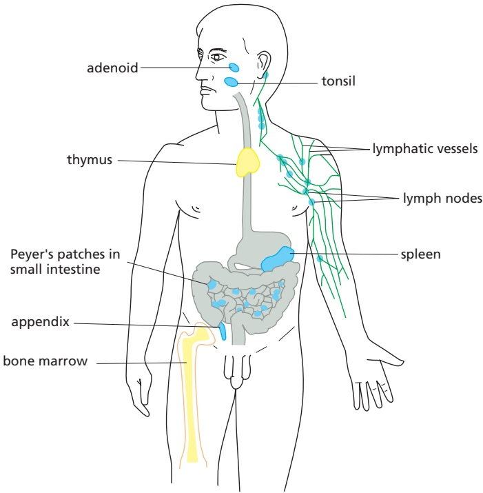

Figure 24–12 Human lymphoid organs. Lymphocytes develop from lymphoid progenitor cells in the thymus and bone marrow (yellow), which are therefore called central (or primary) lymphoid organs. Newly formed lymphocytes migrate from these primary organs to peripheral (or secondary) lymphoid organs (blue), where B and T cells respond to foreign antigen. Only some of the peripheral lymphoid organs and lymphatic vessels (green) are shown; many lymphocytes, for example, are found in the skin and respiratory tract. As we discuss later, the lymphatic vessels ultimately empty into the bloodstream (not shown).

#### B Cells Develop in the Bone Marrow, T Cells in the Thymus

There are about $2 \times 1 0 ^ { 1 2 }$ lymphocytes in the human body, making the immune system comparable in cell mass to the liver or the brain. They occur in large numbers in the blood and lymph (the colorless fluid in the lymphatic vessels, which connect the lymph nodes in the body to each other and to the bloodstream). They. / . are also concentrated in **lymphoid organs**, such as the thymus, lymph nodes, and spleen (**Figure 24–12**), and many are also found in other organs, including skin, lung, and gut.

T cells and B cells derive their names from the organs in which they develop: T cells develop in the thymus, and B cells, in adult mammals, develop in the bone marrow. Both types of cells develop from lymphoid progenitor cells that are produced from multipotent hematopoietic stem cells, which, in adults, are found mainly in the bone marrow (**Figure 24–13**). The hematopoietic stem cells give rise

Figure 24–13 The development of B and T cells in adult humans. The central lymphoid organs, where lymphocytes develop from lymphoid progenitor cells, are labeled in yellow boxes. The lymphoid progenitor cells develop from multipotent hematopoietic stem cells in the bone marrow. Some lymphoid progenitor cells develop locally in the bone marrow into immature B cells, while others migrate via the bloodstream to the thymus where they develop into thymocytes (developing T cells). Foreign antigens activate B cells and T cells mainly in peripheral lymphoid organs, such as lymph nodes and the spleen.

Figure 24–14 Electron micrographs of resting and effector B and T cells. (A) This resting lymphocyte could be either a B cell or a T cell, as these cells are difficult to distinguish morphologically until antigen activates them to become effector cells. (B) An effector B cell (a plasma cell). It is filled with an extensive rough endoplasmic reticulum (ER), which is distended with antibody molecules that are secreted in large amounts. (C) An effector T cell, which has relatively little rough ER but is filled with free ribosomes; it secretes cytokines, but in relatively small amounts. The three cells are shown at the same magnification. (A and B, from D. Zucker-Franklin et al., Atlas of Blood Cells: Function and Pathology, 2nd ed. Philadelphia: Lea & Febiger, 1988. Reprinted with permission of Wolters Kluwer; C, David M. Phillips/Science Source.)

to more than just lymphocytes: as discussed in Chapter 22, they produce all of the cells of the hematopoietic system, including erythrocytes, leukocytes, and platelets (see Figure 22–12).

Because they are sites where B and T lymphocytes (as well as innate lymphoid cells, such as NK cells) develop from lymphoid progenitor cells, the thymus and bone marrow are referred to as **central, or primary, lymphoid organs** (see Figure 24–12). Here, lymphocytes differentiate and then migrate via the blood to the **peripheral, or secondary, lymphoid organs**—mainly the lymph nodes, spleen, and epithelium-associated lymphoid tissues in the gastrointestinal tract, respiratory tract, and skin. It is in these peripheral lymphoid organs that foreign antigens activate B and T cells (see Figure 24–13).

B and T cells become morphologically distinguishable from each other only after antigen has activated them: resting B and T cells look very similar, even in an electron microscope (**Figure 24–14A**). After activation by an antigen, both B andMBoC7 m24.14/24.14 T cells proliferate and mature into effector cells. Effector B cells secrete antibodies; in their most mature form, called plasma cells, they are filled with an extensive rough endoplasmic reticulum that is busily making antibodies (**Figure 24–14B**). In contrast, effector T cells (**Figure 24–14C**) contain very little endoplasmic reticulum and secrete a variety of cytokines rather than antibodies. Whereas B cell–derived antibodies are widely distributed by the bloodstream, T cell–derived cytokines mainly act locally, on cells the T cell contacts or on noncontacted neighboring cells, although some are carried via the blood and act on distant host cells.

#### Immunological Memory Depends on Both Clonal Expansion and Lymphocyte Differentiation

The most remarkable feature of the adaptive immune system is that it can respond to millions of different foreign antigens in a highly specific way. Human B cells, for example, collectively can make more than 1012 different antibody molecules that react specifically with the antigen that induced their production. How can B cells and T cells respond specifically to such an enormous diversity of foreign antigens? The answer for both B and T cells is the same. As each lymphocyte develops in a central lymphoid organ, it becomes committed to react with a particular antigen before ever being exposed to it. The cell expresses this commitment in the form of cell-surface receptors that specifically bind the antigen. When a lymphocyte encounters its antigen in a peripheral lymphoid organ, the binding of the antigen to the receptors, with help from co-stimulatory signals (see Figure 24–11, and discussed later), activates the lymphocyte; this causes the lymphocyte to proliferate, thereby producing many more cells with the same antigen-specific receptors—a process called clonal expansion. The encounter with antigen also causes some of the cells to differentiate into effector cells. An antigen therefore selectively stimulates those cells that express complementary antigen-specific receptors and are

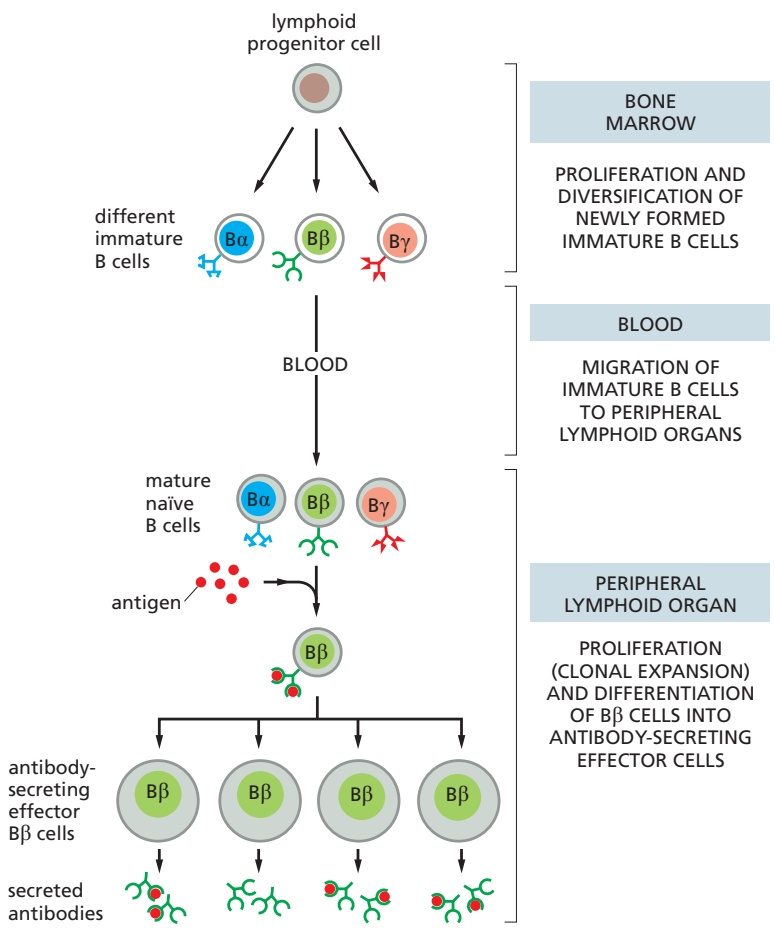

Figure 24–15 Clonal selection. An antigen activates only those B and T cells that are already committed to respond to it. The committed cell expresses cell-surface receptors that specifically recognize the antigen. The human adaptive immune system consists of many millions of different B and T cell clones, with cells within a clone expressing the same unique antigen receptor. Before its first encounter with antigen, a clone would usually contain only one or a small number of cells. A particular antigen may activate hundreds of different clones, each expressing a different antigen receptor that binds either a different part of the antigen or the same part with a different binding affinity. Although only B cells are shown here, T cells are selected in a similar way. Note that the antigen receptors on the B cells labeled Bβ in this diagram have the same antigen-binding site as the antibodies secreted by the effector Bβ cells. As we discuss later, B cells require co-stimulatory signals from T cells to become activated by antigen to proliferate and differentiate into antibody-secreting cells (not shown).

thus already committed to respond to it (**Figure 24–15**). This arrangement, called **clonal selection**, provides an explanation for **immunological memory**, whereby we develop longlasting immunity to many common infectious diseases after our initial exposure to the pathogen—either through natural infection or vaccination.

It is easy to demonstrate such immunological memory in experimental animals. If an animal is immunized once with antigen A, an adaptive immune response (antibody, T cell–mediated, or both) can be detected after several days; the response rises rapidly and exponentially, and then, more gradually, declines.MBoC7 m24.15/24.15 This is the characteristic course of a **primary immune response**, occurring on an animal’s first exposure to an antigen. If, after some weeks, months, or even years have elapsed, the animal is immunized again with antigen A, it will usually produce a **secondary immune response** that differs from the primary response: the lag period is shorter, because there are now many more preexisting B or T cells (or both) with specificity for antigen A, and the response is greater and more efficient. These differences indicate that the animal has “remembered” its first exposure to antigen A. If the animal is given a different antigen (for example, antigen B) instead of a second immunization with antigen A, the response is typical of a primary, and not a secondary, immune response. The secondary response therefore reflects antigen-specific immunological memory for antigen A (**Figure 24–16**).

Immunological memory depends on both lymphocyte proliferation and differentiation. In an adult animal, the peripheral lymphoid organs contain a mixture of B and T cells in at least three stages of maturation: naïve cells, effector cells, and memory cells. When **naïve cells** encounter their specific foreign antigen for the first time, the antigen stimulates some of them to proliferate and differentiate into **effector cells**, which then carry out an immune response: effector B cells secrete antibody, whereas effector T cells either kill infected cells (see Figure 24–2) or influence the response of other immune cells—by secreting cytokines, for example. Whereas most of the effector cells die after the pathogen has been eliminated, a long-lived population of **memory cells** usually persists, which can more easily and more quickly be induced to become effector cells by a later encounter with the same antigen: like naïve cells, when memory cells encounter their antigen, they give rise to effector cells and more memory cells (**Figure 24–17**).

Thus, during the primary response, clonal expansion and differentiation creates many antigen-specific memory cells, some of which can persist as a pop-MBoC7 m24.16/24.16 ulation for the lifetime of the animal, even in the absence of their specific antigen, thereby providing lifelong protection against the pathogen. Whereas many newly formed memory T and B cells join the pool of T and B cells that continually recirculate through peripheral lymphoid organs (discussed shortly), some memory T cells remain permanently at the site of pathogen entry as tissue-resident memory T cells, which provide long-term local protection against reinfection. In addition, a small proportion of the plasma cells produced in a primary B cell response in a peripheral lymphoid organ migrate to the bone marrow, where they can survive for years and continue to secrete their specific antibodies into the bloodstream, contributing to long-term immunological memory.

#### Most B and T Cells Continually Recirculate Through Peripheral Lymphoid Organs

Pathogens generally enter the body through an epithelial surface, usually through the skin, gut, or respiratory tract. To induce an adaptive immune response, pathogenic microbes or their products must travel from these entry points to a peripheral lymphoid organ such as a lymph node, where B and T cells become activated (see Figure 24–11). The route and destination depend on the site of entry. Lymphatic vessels carry antigens that enter through the skin or respiratory tract to local lymph nodes; antigens that enter through the gut end up in gut-associated peripheral lymphoid organs such as Peyer’s patches; and the spleen filters out antigens that enter the blood (see Figure 24–12). As discussed earlier (see Figure 24–11), in many cases, activated dendritic cells will carry the antigen from the site of infection to the peripheral lymphoid organ, where they play a crucial part in activating T cells, as we discuss later.

But only a tiny fraction of naïve B and T cells can recognize a particular microbial antigen in a peripheral lymphoid organ, a reasonable estimate being between $1 / 1 0 { , } 0 0 \bar { 0 }$ and 1/1,000,000 of each class of lymphocyte, depending on the antigen. How do these rare cells find an antigen-presenting cell displaying their specific antigen? The answer is that the lymphocytes continually recirculate between one peripheral lymphoid organ and another via the lymph and blood. In a lymph node, for example, lymphocytes continually leave the bloodstream by squeezing out between specialized endothelial cells lining small veins called postcapillary venules. After percolating through the node, they accumulate in small lymphatic vessels that leave the node and connect with other lymphatic vessels that pass through other lymph nodes downstream (see Figure 24–12). Passing into larger and larger vessels, the lymphocytes eventually enter the main lymphatic vessel (the thoracic duct), which carries them back into the blood (**Figure 24–18**).

Figure 24–16 Immunological memory: primary and secondary antibody responses. The secondary response induced by a second exposure to antigen A is faster and greater than the primary response and is specific for A, indicating that the adaptive immune system has specifically remembered its previous encounter with antigen A. The same type of immunological memory is observed in T cell–mediated responses (not shown). As we discuss later, the types of antibodies produced in the secondary response are different from those produced in the primary response, and these antibodies bind the antigen more tightly.

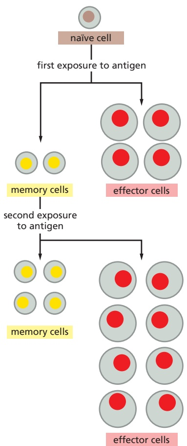

Figure 24–17 Clonal expansion and production of memory cells as the cellular basis of immunological memory. When stimulated by their specific antigen and co-stimulatory signals, both naïve B and T cells proliferate and differentiate, MBoC7 m24.17/24.17producing both effector cells and memory cells. In principle, memory cells could form either directly from naïve cells, as shown here, or from “retired” effector cells (not shown); for some types of T cells, at least, effector cells can become memory cells. When exposed to the same antigen in the presence of co-stimulatory signals, memory cells respond more readily, rapidly, and efficiently than do naïve cells.

The continual recirculation of a lymphocyte between the blood and lymph ends only if its specific antigen activates it in a peripheral lymphoid organ. In that case, the lymphocyte remains in the peripheral lymphoid organ, where it proliferates and differentiates to produce effector and memory T and B cells. Many of the effector T cells leave the lymphoid organ via the lymph and migrate through the blood to the site of infection (see Figure 24–11), whereas others stay in the lymphoid organ and help activate B cells to differentiate into antibody-secreting cells and undergo further maturation (discussed later). Some effector B cells (including some of the most mature, plasma cells) remain in the peripheral lymphoid organ and secrete antibodies into the blood and undergo further maturation (discussed later). Many of the memory B and T cells produced in a peripheral lymphoid organ join the recirculating pool of naïve and memory lymphocytes.

Lymphocyte recirculation depends on specific interactions between the lymphocyte cell surface and the surface of the endothelial cells lining the blood vessels in the peripheral lymphoid organs. Lymphocytes that enter a lymph node via the blood, for example, adhere weakly to specialized endothelial cells lining the postcapillary venules via homing receptors that belong to the selectin family of cell-surface lectins that bind to specific sugar groups on the endothelial cell surface (see Figure 19–28). The lymphocytes roll slowly along the surface of the endothelial cells until another, much stronger adhesion system, dependent on an integrin protein, is called into play by chemokines secreted by the endothelial cells. Now, the lymphocytes stop rolling, and they crawl out of the blood vessel into the lymph node by using yet another cell adhesion protein called CD31 (**Figure 24–19**). Although B and T cells initially enter the same region of a lymph node, different chemokines guide them to separate regions of the node—B cells to lymphoid follicles and T cells to the paracortex (**Figure 24–20**).

Unless they encounter their antigen, both B and T cells soon leave the lymph node via efferent lymphatic vessels. If they encounter their antigen, however, they are stimulated to display adhesion receptors that trap the cells in the node; the cells accumulate at the junction between the B cell and T cell areas, where the

Figure 24–18 The path followed by lymphocytes that continually recirculate between the lymph and blood. The circulation through a lymph node (yellow) is shown here. Microbial antigens are usually carried into the lymph node by activated dendritic cells (not shown), which enter the node via afferent lymphatic vessels draining MBoC7 m24.18/24.18an infected tissue (green). B and T cells, by contrast, enter via the blood, migrating out of the bloodstream into the lymph node through postcapillary venules. Unless they encounter their antigen, the B and T cells leave the lymph node via efferent lymphatic vessels, which eventually join the thoracic duct. The thoracic duct empties into a large vein carrying blood to the heart, completing the recirculation cycle for T and B cells. A typical recirculation cycle for these lymphocytes takes about 12–24 hours.

Figure 24–19 Migration of a lymphocyte out of the bloodstream into a lymph node. A recirculating lymphocyte adheres weakly to the surface of the specialized endothelial cells lining a postcapillary venule in a lymph node (see Figure 24–18). This initial adhesion is mediated by L-selectin (discussed in Chapter 19) on the lymphocyte surface. The adhesion is sufficiently weak to enable the lymphocyte, pushed by the flow of blood, to roll along the surface of the endothelial cells. Stimulated by chemokines secreted by specialized endothelial cells in the node (curved red arrow), the lymphocyte rapidly activates a stronger adhesion system, mediated by an integrin protein. This strong adhesion enables the cell to stop rolling. The lymphocyte then uses MBoC7 m24.19/24.19an immunoglobulin-like cell adhesion protein (CD31) to bind to the junctions between adjacent endothelial cells and migrate out of the venule. The subsequent migration of the lymphocyte in the lymph node is directed by chemokines produced within the node (straight red arrow). The migration of other types of leukocytes out of the bloodstream into sites of infection occurs in a similar way (see Figure 19–28 and Movie 19.2).

rare antigen-specific B and T cells can interact, leading to their proliferation and differentiation into either effector cells or memory cells. Many of the effector cells leave the node, expressing different chemokine receptors that help guide them to their new destinations—effector plasma cells to the bone marrow, for example, and effector T cells to sites of infection.MBoC7 m24.

Figure 24–20 A simplified drawing of a human lymph node. B cells are mainly found in lymphoid follicles, whereas T cells are found mainly in the paracortex. Some of the lymphoid follicles contain germinal centers, where B cells, activated by their specific antigen (with the help of activated T cells), proliferate rapidly and differentiate into memory and effector cells (as discussed later). Chemokines attract resting B and T cells into the lymph node from the blood via postcapillary venules (see Figure 24–19), after which the two cell types migrate to their respective areas, attracted by different chemokines. If they do not encounter their specific antigen, both B and T cells then migrate to the medullary sinus and leave the node via the efferent lymphatic vessel, which carries the lymph away from the node to a downstream lymph node (not shown). After traveling from node to node, the lymph enters a large lymphatic vessel, the thoracic duct, that empties into the bloodstream to begin another cycle of B and T cell circulation through peripheral lymphoid organs (see Figure 24–18).

#### Immunological Self-tolerance Ensures That B and T Cells Do Not Attack Normal Host Cells and Molecules

As discussed earlier, cells of the innate immune system use PRRs to distinguish microbial molecules from self molecules made by the host. The adaptive immune system has the far more difficult recognition task of responding specifically to an almost unlimited number of foreign molecules while not responding to the large number of self molecules. How does it accomplish this feat? It helps that self molecules normally do not induce the innate immune reactions required to activate adaptive immune responses. But even when an infection or tissue injury triggers innate reactions, the vast majority of self molecules normally still fail to induce an adaptive immune response. Why?

One important reason is that the adaptive immune system “learns” not to respond to self molecules. Normal mice, for example, cannot mount an immune response against one of their own protein components of the complement system called C5 (see Figure 24–7). However, mutant mice that lack the gene encoding C5 but are otherwise genetically identical to normal mice of the same strain can make a strong immune response to this blood protein when immunized with it. The **immunological self-tolerance** exhibited by normal mice persists only for as long as the self molecule remains in the body: if a self molecule such as C5 is experimentally removed from an adult mouse, the animal gains the ability to respond to it after a few weeks or months, as new B and T cells develop in the absence of C5. Thus, the adaptive immune system is genetically capable of responding to self molecules but deploys multiple strategies to avoid doing so.

Self-tolerance depends on a number of distinct mechanisms, including the following (**Figure 24–21**):

1. In receptor editing, developing B cells that recognize self molecules change their antigen receptors so that the cells no longer do so.

2. In clonal deletion, large numbers of developing, potentially self-reactive B and T cells die by apoptosis when they encounter their particular self molecule.

3. In clonal inactivation (also called clonal anergy), self-reactive B and T cells become functionally inactivated when they encounter their self molecule.

4. In clonal suppression, self-reactive regulatory T cells (discussed later) suppress the activity of other types of potentially self-reactive lymphocytes.

As we discuss later, some of these mechanisms—especially the first two, receptor editing in B cells and clonal deletion of B and T cells—operate in central lymphoid organs when self-reactive developing B and T cells first encounter their self molecules, and they are largely responsible for the process called central tolerance. Clonal inactivation and clonal suppression, by contrast, operate mainly when mature B and T cells encounter their self molecules in peripheral lymphoid organs, and they are largely responsible for the process called peripheral tolerance. Clonal deletion, however, can also operate peripherally, and clonal inactivation can also operate centrally.

Why does the binding of a self molecule lead to tolerance rather than activation? The answer is still not completely known. As we discuss later, the activation of a B or T cell by its antigen in a peripheral lymphoid organ requires more than just antigen binding: it requires co-stimulatory signals, which are provided by a helper T cell in the case of a B cell and by an activated dendritic cell in the case of a naïve T cell. The production of such signals is usually triggered by exposure to a pathogen, but a self-reactive lymphocyte normally encounters its self antigen in the absence of such signals. Under these conditions, the lymphocyte will not only fail to be activated, it will often be rendered tolerant—being killed (deleted), or inactivated, or suppressed by a regulatory T cell (see Figure 24–21). In peripheral lymphoid organs, both T cell tolerance and activation usually occur through interactions with a dendritic cell, although the type or state of the dendritic cell is different in the two cases.

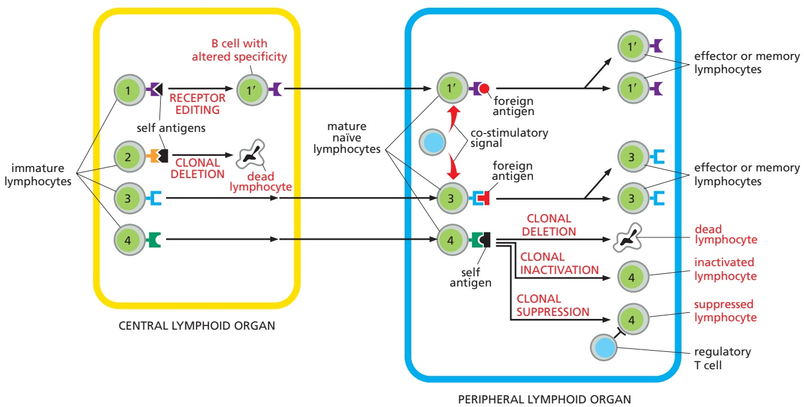

Figure 24–21 Mechanisms of immunological self-tolerance. When a potentially self-reactive immature B cell recognizes a specific self antigen in the central lymphoid organ (the bone marrow) where the cell is produced, it may alter its antigen receptor so that it no longer recognizes the self antigen (cell 1); this process is called receptor editing. Alternatively, when either a potentially self-reactive developing B or T cell recognizes a specific self antigen in a central lymphoid organ, it may die by apoptosis, a process called clonal deletion (cell 2). Because these two forms of tolerance (shown on the left) occur in central lymphoid organs, they are called central tolerance.

When a potentially self-reactive developing B or T cell escapes tolerance in the central lymphoid organ and binds its specific self antigen in a peripheral lymphoid organ (cell 4) or in a nonlymphoid peripheral tissue (not shown), it will generally not be activated, because the binding usually occurs in the absence of sufficient co-stimulatory signals; instead, the cell may die by apoptosis (often after a period of proliferation), be inactivated, or be suppressed by a regulatory T cell. These forms of tolerance (shown on the right) are called peripheral tolerance. As discussed later, the cells providing the co-stimulatory signals are T lymphocytes for B cells and usually dendritic cells for T cells (not shown).

For reasons that are usually unknown, self-tolerance mechanisms sometimes fail, causing T or B cells (or both) to react against the animal’s own molecules. Myasthenia gravis is an example of such an **autoimmune disease**. Most of the affected individuals make antibodies against the acetylcholine receptors on their own skeletal muscle cells; these receptors are required for the muscle to contract normally in response to nerve stimulation, which releases acetylcholine (see Figure 11–39). The antibodies interfere with the normal functioning of the receptors so that the individuals become weak and may die because they cannot breathe. Similarly, in juvenile (type 1) diabetes, adaptive immune reactions against insulin-secreting β cells in the pancreas kill these cells, leading to severe insulin deficiency.

#### Summary

The human adaptive immune system is composed of many millions of B and T cell clones, with the cells in each clone sharing a unique cell-surface receptor that enables them to bind a particular pathogen antigen. The binding of antigen to these receptors, with the help of membrane-bound co-stimulatory signals, activates the lymphocyte to proliferate and differentiate into an effector cell that helps eliminate the pathogen. Effector B cells secrete antibodies, which can act over long distances to help eliminate extracellular pathogens and to neutralize their toxins. Effector T cells, by contrast, produce cell-surface co-stimulatory molecules and secreted cytokines, which act locally to help other immune cells eliminate the pathogen; in addition, some T cells induce infected host cells to kill themselves.

During a primary adaptive immune response to an antigen, B and T cells that recognize the antigen proliferate, so there are more of them to respond the next time, during a secondary response to the same antigen. Moreover, although most effector cells produced during a primary response die after the pathogen is eliminated, some of the lymphocytes activated during the primary response become long-lived memory cells, which can respond faster and more efficiently the next time the same pathogen invades. These two mechanisms—clonal expansion and differentiation into memory cells—are largely responsible for immunological memory. Both B and T cells circulate continually between one peripheral lymphoid organ and another via the blood and lymph; only if they encounter their specific foreign antigen in a peripheral lymphoid organ do they stop migrating, proliferate, and differentiate into effector cells and memory cells. B and T cells that would react against self molecules either alter their receptors (in the case of B cells) or are eliminated, inactivated, or suppressed by regulatory T cells. These mechanisms collectively are responsible for immunological self-tolerance, which helps ensure that the adaptive immune system normally avoids attacking the molecules and cells of the host.

#### B CELLS AND IMMUNOGLOBULINS

We would die of infection if we were unable to make antibodies. **Antibodies** are secreted proteins that defend us against extracellular pathogens in several ways. They bind to viruses and microbial toxins, thereby preventing them from binding to host cells (see Figure 24–2). When bound to an extracellular pathogen or its products, antibodies also recruit some of the components of the innate immune system, including various types of leukocytes and components of the complement system, which work together to inactivate or eliminate the invaders.

Antibodies are synthesized exclusively by B cells. They are produced in billions of different varieties, each with a unique antigen-binding site formed by one or more unique amino acid sequences. They belong to the class of proteins called **immunoglobulins** (abbreviated as **Igs**) and are among the most abundant protein components in the blood. In this section, we discuss the structure and function of immunoglobulins and how each of us can make them with so many different antigen-binding sites.

#### B Cells Make Immunoglobulins (Igs) as both Cell-Surface Antigen Receptors and Secreted Antibodies

The first Igs made by a developing B cell are not secreted but are instead inserted into the plasma membrane, where they serve as receptors for antigen. They are called **B cell receptors (BCRs)**, and each B cell has approximately $\tilde { 1 0 ^ { 5 } }$ of them on its surface. Each BCR is stably associated with invariant transmembrane proteins that activate intracellular signaling pathways when antigen binds to the BCR; we discuss these invariant proteins later, when we consider how B cells are activated with the assistance of helper T cells.

Each B cell clone produces a single species of BCR, with a unique antigen-binding site. When an antigen and a helper T cell activate a naïve or a memory B cell, the B cell proliferates and differentiates into an effector cell, which then produces and secretes large amounts of soluble (rather than membrane-bound) Ig. The secreted Ig is now called an antibody, and it has the same unique antigen-binding site as the BCR (**Figure 24–22**; and see Figure 24–15).

A typical Ig molecule is bivalent, with two identical antigen-binding sites. It consists of four polypeptide chains—two identical light chains and two identical heavy chains. The N-terminal parts of both light and heavy chains usually cooperate to form the antigen-binding surface, while the more C-terminal parts of the heavy chains form the tail of the Y-shaped protein (**Figure 24–23**). The tail mediates many of the activities of antibodies, and antibodies with the same antigen-binding sites can have any one of a number of different tail regions, each of which gives the antibody different functional properties, such as the ability to activate complement or to bind to receptor proteins on various immune cells that bind a specific type of antibody tail.

#### Mammals Make Five Classes of Igs

We can make five major classes of Igs, each of which mediates a characteristic biological response after antigen binding to an antibody: IgA, IgD, IgE, IgG, and IgM, each with its own class of heavy chain (α, δ, ε, γ, and $\mu ,$ respectively). IgA molecules have α chains, IgG molecules have γ chains, and so on. Moreover, there are four IgG subclasses (IgG1, IgG2, IgG3, and IgG4), with $\gamma _ { 1 } ,$ γ2, γ3, and $\gamma _ { 4 }$ heavy chains, respectively, and there are two IgA subclasses. In addition to the various classes and subclasses of heavy chains, we make two types of light chains, κ and $\lambda ,$ which seem to be functionally indistinguishable. Either type of light chain can be associated with any of the heavy chains, but an individual Ig molecule always contains identical light chains and identical heavy chains: an IgG molecule, for instance, can have either κ or λ light chains, but not one of each. As a result, an Ig’s antigen-binding sites are always identical (see Figures 24–22 and 24–23).

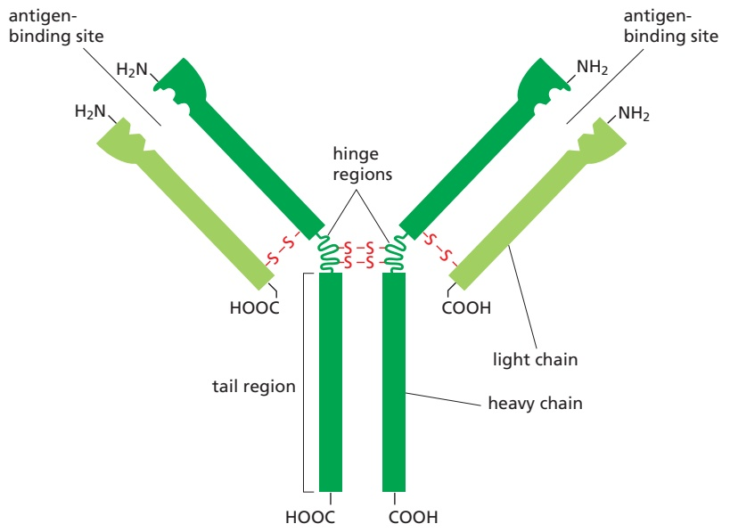

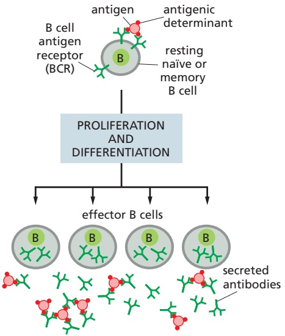

Figure 24–22 Activation of a B cell by antigen. The binding of an antigen to the B cell receptors (BCRs) on either a naïve or a memory B cell (together with co-stimulatory signals provided by helper T cells—not shown) activates the cell to proliferate and differentiate into antibody-MBoC7 m24.22/24.22secreting, effector B cells. The effector cells produce and secrete antibodies with a unique antigen-binding site, which is the same as that of the cell-surface BCRs. Because typical antibodies have two identical antigen-binding sites, they can cross-link antigens, as shown for an antigen with multiple, identical, antigenic determinants—the parts of an antigen an antibody or antigen receptor binds to.

Figure 24–23 A schematic drawing of a bivalent antibody molecule. The distal ends of the light and heavy chains together form the two antigen-binding sites. The two heavy chains each have a hinge region (not present in all classes of heavy chains), which, because of its flexibility, improves the efficiency with which the antibody can cross-link antigens (see Figure 24–22). The two heavy chains also form the tail of the antibody, which determines the functional properties of the antibody. The heavy and light chains are held together by a combination of covalent S–S bonds (red) and noncovalent bonds (not shown).

All classes of human Ig can be made in a membrane-bound BCR form, as well as in a soluble, secreted antibody form. The two forms differ only in the C-terminus of their heavy chain. The heavy chains of membrane-bound Ig molecules (BCRs) have a transmembrane hydrophobic C-terminus, which anchors them in the lipid bilayer of the B cell’s plasma membrane. The heavy chains of secreted antibody molecules, by contrast, have instead a hydrophilic C-terminus, which allows them to escape from the cell. The switch in the character of the Ig molecules made occurs because the activation of B cells by antigen and helper T cells induces a change in the way in which the heavy-chain RNA transcripts are made and processed in the nucleus (see Figure 7–62).MBoC7 m24.24/24.24

The various Ig heavy chains give a distinctive conformation to the tail region of secreted antibodies, so that each class (and subclass) has characteristic properties of its own. **IgM** is always the first class of Ig that a developing B cell in the bone marrow makes. It forms the BCRs on the surface of immature naïve B cells. After these cells leave the bone marrow, they start to produce **IgD** BCRs as well, with the same antigen-binding site as the IgM BCRs. These cells are now called mature naïve B cells, as they can now respond to their specific foreign anti-gen if they encounter it in a peripheral lymphoid organ (**Figure 24–24**). IgM is also the major class of antibody secreted into the blood in the early stages of a primary antibody response on first exposure to an antigen. In its secreted form, IgM is a wheel-like pentamer composed of five four-chain units, giving it a total of 10 antigen-binding sites that allow it to bind strongly to pathogens; in its antigen-bound form, IgM is highly efficient at activating complement, which is important in early antibody responses to pathogens.

IgM and IgD are the only classes of Igs made before a B cell is activated by antigen, at which stage they are made only as BCRs. All the other Ig classes are made only after antigen stimulation, as both BCRs and antibodies. **IgG** antibodies are four-chain monomers (see Figure 24–23), and they are secreted into the blood in especially large quantities during secondary antibody responses to most anti-gens. The tail region of some subclasses of IgG antibodies that are bound to antigen can activate complement and also bind to specific receptors on macrophages and neutrophils. Largely by means of such **Fc receptors** (so named because antibody tails are called Fc regions), these phagocytic cells bind, ingest, and destroy infecting microorganisms that have become coated with the IgG antibodies produced in response to the infection (see Figure 24–5); the activated Fc receptors also signal the phagocyte to secrete pro-inflammatory cytokines (**Movie 24.4**).

**IgE** antibodies are produced in response to parasites and, in genetically susceptible individuals, to otherwise harmless environmental antigens (allergens) such as pollen, foods, and drugs. The IgE tail region binds to another class of Fc receptors on the surface of mast cells in tissues and of basophils in the blood (see Figures 22–11 and 22–12). Because antigen-free IgE antibodies bind with high affinity to such Fc receptors, the antibodies act as acquired antigen receptors on these cells. Antigen binding to the bound antibodies activates the Fc receptors and stimulates the cells to secrete a variety of cytokines and biologically active amines, especially histamine, which causes blood vessels to dilate and become leaky; this helps leukocytes, antibodies, and complement components to enter sites

Figure 24–24 Stages of B cell development. All of the stages shown occur before the B cells bind their specific foreign antigen. The first cells in the B cell lineage that make Ig are called pro-B cells; they make μ heavy chains, which remain in the membrane of the endoplasmic reticulum until a special type of light (L) chain is made, called a surrogate light chain. The surrogate light chains substitute for genuine light chains and assemble with μ chains to form a temporary receptor molecule that is delivered to the plasma membrane. The cells are now called pre-B cells. Signaling from this pre-B cell receptor allows the cells to make bona fide light chains, which combine with μ chains to form four-chain IgM molecules that serve as antigen-specific, cell-surface BCRs on immature naïve B cells. After these cells leave the bone marrow (labeled in yellow shading), they start to express IgD BCRs as well, which have the same antigen-binding sites as the IgM BCRs; it is this mature naïve B cell that reacts with its specific foreign antigen in peripheral lymphoid organs (labeled in blue shading).

<table><tbody><tr><td colspan="6">TABLE 24-2 Properties of the Major Classes of Antibodies in Humans</td></tr><tr><td rowspan="2">Properties</td><td colspan="5">Class of antibody</td></tr><tr><td>IgM</td><td>IgD</td><td>IgG (1-4)</td><td>IgA (1, 2)</td><td>IgE</td></tr><tr><td>Heavy chains</td><td>μ</td><td>δ</td><td>γ (1-4)</td><td>α (1, 2)</td><td>ε</td></tr><tr><td>Light chains</td><td>κ or λ</td><td>κ or λ</td><td>κ or λ</td><td>κ or λ</td><td>κ or λ</td></tr><tr><td>Number of four-chain units</td><td>5</td><td>1</td><td>1</td><td>1 or 2</td><td>1</td></tr><tr><td>Mean blood serum level (mg/mL)</td><td>1.5</td><td>0.04</td><td>IgG1 = 9 IgG2 = 3 IgG3 = 1 IG4 = 0.5</td><td>2.1</td><td>3 × 10-5</td></tr><tr><td>Activates classical complement pathway</td><td>+</td><td>-</td><td>+ (IgG1-3)</td><td>-</td><td>-</td></tr><tr><td>Crosses from mother to fetus</td><td>-</td><td>-</td><td>+ (all subclasses)</td><td>-</td><td>-</td></tr><tr><td>Binds to macrophages and neutrophils</td><td>+ (macrophages only)</td><td>-</td><td>+ (all subclasses)</td><td>+</td><td>-</td></tr><tr><td>Binds to mast cells and basophils</td><td>-</td><td>-</td><td>+ (IgG1 and IgG3)</td><td>-</td><td>+</td></tr></tbody></table>

where mast cells have been activated. The release of amines from mast cells and basophils is largely responsible for the symptoms of such allergic reactions as hay fever, asthma, and hives. In addition, mast cells secrete factors that attract and activate eosinophils (see Figures 22–11 and 22–12), which also have Fc receptors that bind IgE molecules and can kill extracellular parasitic worms, especially if the worms are coated with IgE antibodies (see Figure 24–6).

**IgA** is the principal antibody class in secretions, including saliva, tears, milk, and respiratory and intestinal tract secretions. Yet another class of Fc receptors, located on the relevant epithelial cells, guides the secretion by binding antigen-free IgA dimers and transporting them from the extracellular fluid across the epithelium by the process of transcytosis (see Figure 13–56). Some of this IgA is directed against commensal microbes and keeps them in check by preventing them from binding to mucosal epithelial cells. The properties of the various classes of antibodies in humans are summarized in **Table 24–2**.

#### Ig Light and Heavy Chains of Antibodies Consist of Constant and Variable Regions

Both the light and heavy chains of antibodies have a variable amino acid sequence at their N-terminal ends but a constant sequence at their C-terminal ends. Whereas the **constant region** and **variable region** of a light chain are the same size, the constant region of a heavy chain is about three or four times longer than its variable region, depending on the class (**Figure 24–25**).

The variable regions of the light and heavy chains come together to form the antigen-binding sites, and the variability of their amino acid sequences provides the structural basis for the diversity of these binding sites. The greatest diversity occurs in three small **hypervariable regions** in the variable regions of both light and heavy chains. Only about 5–10 amino acids in each hypervariable region form the actual antigen-binding site (**Figure 24–26**). As a result, the size of the **antigenic determinant** that an Ig molecule recognizes is generally small: it can consist of fewer than 10 amino acids on the surface of a globular protein, forMBoC7 24.26/24.26 example (see Figure 24–22).

Figure 24–25 Constant and variable regions of antibody chains. The variable regions of both the light and heavy chains form the antigen-binding sites, while the constant regions of the heavy chains determine the other functional properties of an antibody molecule. The different subclasses of IgG antibodies have different γ-chain constant regions. An individual Ig protein has either κ or λ light chains but not both. Note that the heavy chain of the BCR form of each class of Ig has an additional, transmembrane domain at its C-terminus (not shown), and the constant regions of the μ and ε heavy chains do not have a hinge region (not shown).

Figure 24–26 Ig hypervariable regions. Highly schematized drawing of how the three hypervariable regions in each light and heavy chain together form each antigen-binding site of an Ig protein.

Both light and heavy chains are made up of repeating segments—each about 110 amino acids long and each containing one intrachain disulfide bond. Each repeating segment folds independently to form a compact functional unit called an **immunoglobulin (Ig) domain**. As shown in **Figure 24–27A**, a light chain consists of one variable $\left( \mathrm { V _ { L } } \right)$ and one constant (CL) domain, whereas a heavy chain

Figure 24–27 Ig domains. $( \mathsf { A } )$ The light and heavy chains in an Ig protein are each folded into similar repeating domains. The variable domains (shaded in blue) of the light and heavy chains (VL and $\nabla _ { \mathsf { H } } )$ make up the antigen-binding sites, while the constant domains (shaded in gray) of the heavy chains (mainly $\mathsf { C } _ { \mathsf { H } } 2$ and $\mathbb { C } \mathbb { H } \mathbb { 3 } )$ determine the other functional properties of the protein. The heavy chains of IgM and IgE do not have a hinge region and have an extra constant domain $( \mathbb { C } _ { \mathbb { H } } 4 { \mathrm { - } } { \mathsf { n o t } }$ shown). Hydrophobic interactions between domains on adjacent chains help hold the chains together in the $1 \mathrm { g }$ molecule: VL binds to $\nabla _ { \mathbb { H } } ,   \mathbb { C } _ { \mathbb { L } }$ binds to $\mathbb { C } _ { \mathbb { H } } 1$ , and so on. (B) $X - r a y$ crystallography–based structures of the Ig domains of a light chain (Movie 24.5). The variable and constant domains have a similar overall structure, consisting of two β sheets joined by a disulfide bond (red). Note that all the hypervariable regions (black) form loops at the far end of the variable domain, where they come together to form part of the antigen-binding site. All Igs are glycosylated on their $\mathbb { C } _ { \mathbb { H } } 2$ domains (not shown); the attached oligosaccharide chains vary from Ig to Ig and can greatly influence the functional properties of the protein, mainly by affecting its binding to Fc receptors on immune cells.

has one variable and three or four constant domains: the variable domains of the light and heavy chains pair to form the antigen-binding region. Each Ig domain has a very similar three-dimensional structure, consisting of a sandwich of two β sheets held together by a disulfide bond; the variable domains are unique in that each has its particular set of hypervariable regions, which are arranged in three hypervariable loops that cluster together at the ends of the variable domains to form the antigen-binding site (**Figure 24–27B**).

#### Ig Genes Are Assembled from Separate Gene Segments During B Cell Development

Prior to antigen stimulation, the human **primary Ig repertoire** is probably composed of more than $1 0 ^ { \dot { 1 2 } }$ different BCRs. This repertoire consists of IgM and IgD proteins and is apparently large enough to ensure that there will be an antigen-binding site to fit almost any potential antigenic determinant, albeit with low affinity $\widetilde{K_{a}} \approx 10^{5}-10^{7}$ liters/mole). After stimulation by antigen and helper T cells, B cells can switch from making IgM and IgD to making other classes of $\mathrm { I g } \mathrm { { \_ a } }$ process called class switching. In addition, the binding affinity of these Igs for their antigen progressively increases over time—a process called affinity maturation. Thus, antigen stimulation generates a **secondary Ig repertoire**, with a greatly increased affinity $( K _ { \mathrm { a } }$ up to $\widetilde { 1 0 ^ { 1 1 } }$ liters/mole) and a greater diversity of both Ig classes and antigen-binding sites.

How can each of us make so many different Igs? The problem is not quite as formidable as it might first appear. Recall that the variable regions of the Ig light and heavy chains usually combine to form the antigen-binding site. Thus, if we had 1000 genes encoding light chains and 1000 genes encoding heavy chains, we could, in principle, combine their products in 1000 × 1000 different ways to make $1 0 ^ { 6 }$ different antigen-binding sites. Nonetheless, we have evolved special genetic mechanisms to enable our B cells to generate an almost unlimited number of different light and heavy chains in a remarkably economical way. We do so in two steps. First, before antigen stimulation, developing B cells join together separate gene segments in DNA to create the genes that encode the primary repertoire of low-affinity IgM and IgD proteins. Second, after antigen stimulation, the assembled Ig genes can undergo two further changes—point mutations that can increase the affinity of their antigen-binding site and DNA rearrangements that switch the class of Ig made. Together, these changes produce the secondary repertoire of high-affinity IgG, IgE, and IgA proteins.

We produce our primary Ig repertoire by joining separate **Ig gene segments** together during B cell development. Each type of Ig chain—κ light chains, λ light chains, and heavy chains—is encoded by a separate locus on a separate chromosome. Each locus contains a large number of gene segments encoding the V region of an Ig chain and one or more gene segments encoding the C region. During the development of a B cell in the bone marrow, a complete coding sequence for each of the two Ig chains to be synthesized is assembled by site-specific genetic recombination (discussed in Chapter 5). Once a V-region coding sequence is assembled next to a C-region sequence, it can then be co-transcribed and the resulting RNA transcript processed to produce an mRNA molecule that codes for the complete Ig polypeptide chain.

Each light-chain V region, for example, is encoded by a DNA sequence assembled from two gene segments—a long **V gene segment** and a short joining segment, or **J gene segment** (**Figure 24–28**). Each heavy-chain V region is similarly constructed by combining gene segments, but here an additional diversity segment, or **D gene segment**, is also required (**Figure 24–29**). In addition to bringing together the separate gene segments of the Ig gene, these rearrangements also activate transcription from the gene promoter through changes in the relative positions of the cis-regulatory DNA sequences acting on the gene. Thus, a complete Ig chain can be synthesized only after the DNA has been rearranged.

The large number of inherited V, J, and D gene segments available for encoding Ig chains contributes substantially to Ig diversity, and the combinatorial joining of

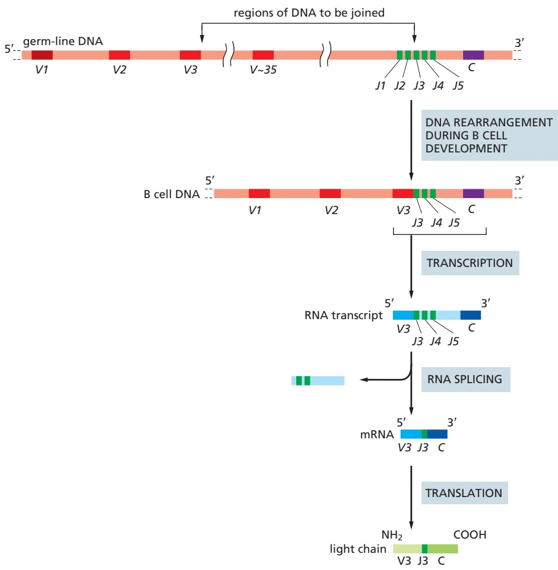

these segments (called combinatorial diversification) greatly increases this contribution. Any of the 35 or so functional V segments in our κ light-chain locus, for example, can be joined to any of the 5 J segments (see Figure 24–28), so that this locus can encode at least 175 (35 × 5) different κ-chain V regions. Similarly, any of the 40 V segments in the human heavy-chain locus can be joined to any of the 23 or so D segments and to any of the 6 J segments to encode at least 5520 (40 × $2 3 \times 6 )$ different heavy-chain V regions. By this mechanism alone, called V(D)J recombination, a human can produce 295 different $\mathrm { V _ { L } }$ regions (175 κ and 120 λ) and 5520 different $\mathrm { V _ { H } }$ regions. In principle, these could then be combined to make more than $1 . 6 \times 1 0 ^ { 6 }   ( 2 9 \bar { 5 } \times 5 5 2 0 )$ different antigen-binding sites.

V(D)J recombination is mediated by an enzyme complex called V(D)J recombinase, which recognizes recombination signal sequences in the DNA that flanks each gene segment to be joined. Although the process ensures that only appropriate gene segments recombine, a variable number of nucleotides are often lost from the ends of the recombining gene segments, and one or more randomly chosen nucleotides are also inserted. This random loss and gain of nucleotides at joining sites is called junctional diversification, and it greatly increases the diversity of V-region coding sequences created by V(D)J recombination (between $1 0 ^ { 7 } \cdot$ -fold and $\mathrm { 1 0 ^ { 8 } \mathrm { - f o l d ) } }$ , specifically in the third hypervariable region. This increased diversification comes at a price, however. In many cases, it shifts the reading frame to produce a nonfunctional gene, in which case the developing B cell fails to make a functional Ig molecule and consequently dies in the bone marrow by apoptosis. Once a B cell makes a functional heavy chain and light chain that form an antigen-binding site, it turns off the V(D)J recombination process, thereby ensuring that the cell makes Ig of only one antigen-binding specificity.

Figure 24–28 The V–J joining process involved in making a human k light chain. In the “germ-line” DNA (where the Ig gene segments are not rearranged and are therefore not being expressed), the cluster of five J gene segments (green) is separated from the C-region coding sequence (purple) by a short intron and from the 35 or so functional V gene segments (red) by thousands of nucleotide pairs. During the development of a B cell, a randomly chosen V gene segment (V3 in this case) is moved to lie precisely next to one of the J gene segments (J3 in this case). The “extra” J gene segments (J4 and J5) and the intron sequence are transcribed (along with the joined V3 and J3 gene segments and the C-region coding sequence) and then removed by RNA splicing to generate mRNA molecules with contiguous $V _ { } { 3 } , J _ { } { 3 } ,$ and C sequences, as shown. These mRNAs are then translated into κ light chains. A J gene segment encodes the 15 or so C-terminal amino acids of the V region, and a short sequence containing the V–J segment junction encodes the third hypervariable region, which is the most variable part of the light-chain V region.

Figure 24–29 The human heavy-chain locus. There are 40 V segments, about 23 D segments, 6 J segments, and an ordered cluster of C-region coding sequences, each cluster encoding a different class of heavy chain. The D segment (and part of the J segment) encodes amino acids in the third hypervariable region, which is the most variable part of the heavychain V region. The genetic mechanisms involved in producing a heavy chain are the same as those shown in Figure 24–28 for light chains, except that two DNA rearrangement steps are required instead of one: first a D segment joins to a J segment, and then a V segment joins to the rearranged DJ segment. The rearrangements lead to the production of a VDJC mRNA that encodes a complete Ig heavy chain. The figure is not drawn to scale: the total length of the heavychain locus is more than 2 megabases. Moreover, a number of details are omitted; for example, the exons encoding each C-region Ig domain and the hinge region (see Figure 24–27) and the different subclasses of $\mathsf { C } _ { \gamma }$ -coding segments are not shown.

B cells making BCRs that bind strongly to self antigens in the bone marrow would be dangerous. Such B cells are signaled by the self-binding to maintain expression of an active V(D)J recombinase and undergo a second round of V(D)J recombination in a light-chain locus, thereby changing the specificity of its BCR—in the process of **receptor editing** discussed earlier; self-reactive B cells that fail to change their specificity die by apoptosis, in the process of clonal deletion (see Figure 24–21).

#### Antigen-driven Somatic Hypermutation Fine-Tunes Antibody Responses

As mentioned earlier, with the passage of time after an infection or vaccination, there is usually a progressive increase in the affinity of the antibodies produced against the pathogen. This phenomenon of **affinity maturation** is due to the accumulation of point mutations in both heavy-chain and light-chain V-region coding sequences. The mutations occur long after the coding regions have been assembled. After B cells have been stimulated by both antigen and helper T cells in a peripheral lymphoid organ, some of the activated B cells proliferate rapidly in some lymphoid follicles and form germinal centers (see Figure 24–20). Here, the B cells mutate at the rate of about one mutation per V-region coding sequence per cell generation. Because this is about a million times greater than the spontaneous mutation rate in other genes and occurs in somatic cells rather than germ cells, the process is called **somatic hypermutation**.

Very few of the altered Igs generated by hypermutation will have an increased affinity for the antigen. However, the antigen will stimulate preferentially those few B cells that do make BCRs with increased affinity for the antigen. Clones of these altered B cells will preferentially survive and proliferate, especially as the amount of antigen decreases to very low levels late in the response. Most other B cells in the germinal center will die by apoptosis. Thus, as a result of repeated cycles of somatic hypermutation followed by antigen-driven proliferation of selected clones of effector and memory B cells, BCRs and antibodies of increasingly higher affinity become abundant during an adaptive immune response, providing progressively better protection against the pathogen (**Movie 24.6**).

A breakthrough in understanding the molecular mechanism of somatic hypermutation came with the identification of an enzyme that is required for the process. It is called **activation-induced deaminase (AID)** because it is expressed specifically in activated B cells and deaminates cytosine (C) to uracil (U) during transcription of V-region coding DNA. The deamination produces U:G mismatches in the DNA double helix, and the repair of these mismatches produces various types of mutations, depending on the repair pathway used. Somatic hypermutation affects only actively transcribed DNA, both because AID works only on single-stranded DNA (which is transiently exposed during transcription) and because proteins involved in the transcription of V-region coding sequences are required to recruit the AID enzyme. AID is also required for activated B cells to switch from IgM and IgD production to the production of the other classes of Ig, as we now discuss.

#### B Cells Can Switch the Class of Ig They Make

After a developing B cell leaves the bone marrow, but before it interacts with antigen, it expresses both IgM and IgD BCRs on its surface, both with the same antigen-binding sites (see Figure 24–24). Stimulation by antigen and helper T cells in a peripheral lymphoid organ activates many of these mature naïve B cells to become IgM-secreting effector cells, so that IgM antibodies dominate the primary antibody response. Later in the immune response, however, when the activated B cells are undergoing somatic hypermutation in germinal centers, the combination of antigen and cytokines derived from helper T cells (discussed later)

stimulates many of the B cells to switch from making membrane-bound IgM and IgD to making IgG, IgE, or IgA, in the process of **class switching**. Some of these cells become memory cells that express the corresponding class of Ig as BCRs on their surface, while others become effector cells that secrete the Ig molecules as antibodies. The $\operatorname { I g G } ,$ IgE, and IgA molecules initially retain their original anti-gen-binding sites, which can then undergo affinity maturation in the germinal centers. These class-switched Igs are collectively referred to as secondary classes of Igs, because they are produced only after antigen stimulation, dominate secondary antibody responses, and make up the secondary Ig repertoire.

As discussed earlier, the constant region of an Ig heavy chain determines the class of the Ig and hence the Ig’s functional properties. Thus, the ability of B cells to switch the class of Ig they make without changing their antigen specificity implies that the same assembled $\mathrm { V _ { H ^ { - } r e g i o n } }$ coding sequence (which specifies the antigen-binding part of the heavy chain) can sequentially associate with different $\mathrm { C _ { H ^ { \prime } } }$ -coding sequences. This has important functional implications. It means that, in an individual animal, a particular antigen-binding site that has been selected by environmental antigens can be distributed among the various classes of antibodies, thereby acquiring the different functional properties of each class. In this way, antipathogen antibodies harness a variety of effector mechanisms to help clear the pathogen, including activation of the complement system and Fc receptors on phagocytes and other innate immune cells (see Table 24–2).

When a B cell switches from making IgM and IgD to one of the secondary classes of $\mathrm { I g } ,$ an irreversible change occurs in the DNA—a process called **class switch recombination**. It entails the deletion of all the $\mathrm { C _ { H ^ { - } } }$ coding sequences between the assembled VDJ-coding sequence and the particular CH-coding sequence that the cell is destined to express. Class switch recombination differs from V(D)J recombination in several ways. (1) It happens after antigen stimulation, mainly in germinal centers, and depends on helper T cells. (2) It uses different recombination signal sequences, called switch sequences, which flank the different $\mathrm{C_H-c o d i n g}$ segments. (3) It involves cutting and joining the switch sequences, which are noncoding sequences, and leaves the assembled VH-region coding sequence unchanged (**Figure 24–30**). (4) Most important, the molecular mechanism is different. It depends on AID, which is also involved in somatic hypermutation, rather than on the V(D)J recombinase. The cytokines that activate class switching induce the production of transcription regulators that activate transcription from the relevant switch sequences, allowing the recruitment of

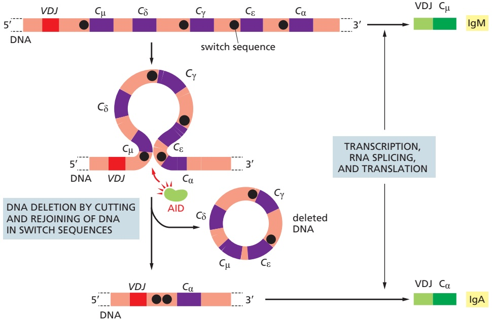

Figure 24–30 An example of the DNA rearrangement that occurs in class switch recombination. A B cell making IgM (and IgD—not shown) molecules with the same heavy-chain V region encoded by a particular assembled VDJ DNA sequence is stimulated to switch to making IgA molecules with the same heavy-chain V region. In the process, it deletes the DNA between the VDJ sequence and the $C _ { \alpha } \mathrm { - c o d i n g }$ sequence. Specific DNA sequences (switch sequences) located upstream of each CH-coding sequence (except $\mathbb { C } _ { \delta } ,$ as B cells don’t switch from $\mathsf { C } _ { \mu }$ to $\mathrm { C _ { \hat { \delta } } ) }$ can recombine with one another, with the deletion of the intervening DNA, as shown here. As discussed in the text, the recombination process depends on AID, the same enzyme that is involved in somatic hypermutation. When switching from IgM and IgD to IgG or IgE, the C-region coding sequences downstream of $\mathsf { C } _ { \gamma }$ or $\mathsf { C } _ { \mathrm { { \varepsilon } } } ,$ which remain after the DNA deletion, are removed during RNA splicing.

AID to these sites. Once bound, AID initiates switch recombination by deaminating some cytosines to uracil in the vicinity of these switch sequences. Excision of these uracils is thought to lead to double-strand breaks in the participating switch regions, which are then joined by a form of nonhomologous end joining (discussed in Chapter 5).

Thus, whereas the primary Ig repertoire in humans (and mice) is generated by V(D)J joining mediated by V(D)J recombinase, the secondary antibody repertoire is generated by somatic hypermutation and class switch recombination, both of which are mediated by AID. **Figure 24–31** lists the main mechanisms for diversifying Igs that we have discussed in this chapter.

#### Summary

Each B cell clone makes Ig molecules with a unique antigen-binding site. Initially, the Ig molecules are inserted into the plasma membrane and serve as B cell receptors (BCRs) for antigen. Antigen binding to the BCRs, together with co-stimulatory signals from helper T cells, activate the B cells to proliferate and differentiate into antibody-secreting effector cells or memory cells. The effector cells secrete large amounts of antibodies with the same antigen-binding site as the BCRs.

A typical Ig molecule is composed of four polypeptide chains—two identical heavy chains and two identical light chains. Parts of both the heavy and light chains form the two identical antigen-binding sites. There are multiple classes of Ig (IgA, IgD, IgE, IgG, and IgM), each with a distinctive heavy chain, which determines the functional properties of the Ig class. Each light and heavy chain is composed of a number of similarly folded Ig domains. The amino acid sequence variation in the variable domains of both light and heavy chains is concentrated in several small hypervariable regions, which form loops at one end of these domains to form the antigen-binding site.

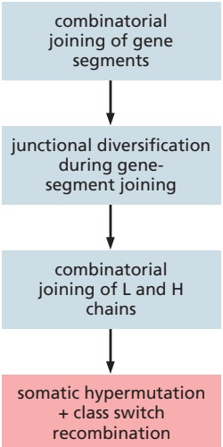

Figure 24–31 The main mechanisms of Ig diversification in mice and humans. Those shaded in gray occur during B cell development in the bone marrow, whereas the two mechanisms shaded in red occur when B cells are stimulated by foreign antigen and helper T cells in germinal centers in peripheral lymphoid organs, MBoC7 m24.31/24.31either late in a primary response or in a secondary response.

Igs are encoded by loci on three different chromosomes, each of which is responsible for producing a different polypeptide chain—a k light chain, a l light chain, or a heavy chain. Each locus contains separate gene segments that encode different parts of the variable region of the particular Ig chain. Each light-chain locus contains one or more constant (C)-region coding sequences and sets of variable (V) and joining (J) gene segments. The heavy-chain locus contains sets of C-region coding sequences and sets of V, diversity (D), and J gene segments.

During B cell development in the bone marrow, before foreign antigen stimulation, separate gene segments are brought together by site-specific recombination mediated by V(D)J recombinase. A VL gene segment recombines with a JL gene segment to produce a DNA sequence coding for the V region of a light chain, and a VH gene segment recombines with a D and a JH gene segment to produce a DNA sequence coding for the V region of a heavy chain. Each of the newly assembled V-region coding sequences is then co-transcribed with the appropriate C-region sequence to produce an RNA molecule that codes for the complete Ig polypeptide chain.

By randomly combining inherited gene segments that code for the variable regions during B cell development, we can make hundreds of different light chains and thousands of different heavy chains. Because the antigen-binding site is formed where the hypervariable loops of the VL and VH domains come together in the final Ig molecule, the heavy and light chains can potentially pair to form Igs with more than a million different antigen-binding sites. A loss or gain of nucleotides at the site of gene-segment joining increases this number enormously. The Igs made by such V(D)J recombination before antigen stimulation are IgMs and IgDs with low affinity for binding antigen, and they constitute the primary Ig repertoire.

Igs are further diversified after antigen stimulation in peripheral lymphoid organs by the AID-mediated and helper T cell–dependent processes of somatic hypermutation and class switch recombination, which together produce the high-affinity IgG, IgE, and IgA Igs that constitute the secondary Ig repertoire. The process of class switching allows the same antigen-binding site to be incorporated into antibodies that have different tails and therefore different functional properties.

#### T CELLS AND MHC PROTEINS

Like antibody responses, T cell–mediated immune responses are exquisitely antigen specific, and they are at least as important as antibodies in defending vertebrates against infection. Indeed, most adaptive immune responses, including most antibody responses, require helper T cells for their initiation. Most important, unlike B cells, T cells can help eliminate pathogens that have entered the interior of host cells, where they are invisible to B cells and antibodies. Much of the rest of this chapter is concerned with how T cells accomplish this feat.

T cell responses differ from B cell responses in at least two crucial ways. First, a T cell is activated by foreign antigen to proliferate and differentiate into effector cells only when the antigen is displayed on the surface of an antigen-presenting cell (APC), usually a dendritic cell in a peripheral lymphoid organ. One reason T cells require APCs for activation is that the form of antigen they recognize is different from that recognized by the Igs produced by B cells. Whereas Igs can recognize antigenic determinants on the surface of pathogens and soluble folded proteins, for example, T cells can only recognize fragments of protein antigens that have been produced by partial proteolysis inside a host cell. As mentioned earlier, newly formed MHC proteins capture these peptide fragments and carry them to the surface of the host cell, where T cells can recognize them.

The second difference is that, once activated, effector T cells act mainly at short range, usually contacting the cells they influence, either within a secondary lymphoid organ or after they have migrated to a site of infection. Effector B cells, by contrast, secrete antibodies that can act far away. Effector T cells interact directly with another host cell in the body, which they either kill (if it is an infected host cell, for example) or signal in some way (if it is a B cell or macrophage, for example). We will refer to such host cells as target cells. As is the case with APCs, target cells must display an antigen bound to an MHC protein on their surface for a T cell to recognize them.

There are three main classes of T cells—cytotoxic T cells, helper T cells, and regulatory T cells. When activated, they develop into effector cells, each class having its own distinct activities. Effector cytotoxic T cells directly kill cells that are infected with an intracellular pathogen. Effector helper T cells help stimulate the responses of other immune cells—mainly macrophages, dendritic cells, and B cells; as we will see, there are various functionally distinct subtypes of effector helper T cells. Effector regulatory T cells suppress the activity of other immune cells. After functioning, some effector T cells become memory T cells.

In this section, we discuss how T cells recognize foreign antigens on the surface of APCs or target cells and the crucial part played by MHC proteins in the recognition process. We describe the different classes and subclasses of T cells and their respective functions and how T cells start their development in the thymus. We begin by considering the cell-surface receptors that T cells use to recognize antigen.

#### T Cell Receptors (TCRs) Are Ig-like Heterodimers

**T cell receptors (TCRs)**, unlike Igs made by B cells, exist only in membrane-bound form. They are composed of two transmembrane, disulfide-linked polypeptide chains, each of which contains two Ig-like domains—one variable and one constant. On most T cells, the TCRs have one α chain and one β chain (**Figure 24–32**).

The genetic loci that encode the α and β chains are located on different chromosomes. Like an Ig heavy-chain locus (see Figure 24–29), the TCR loci contain separate V, D, and J gene segments (or just V and J gene segments in the case of the α-chain locus), which are brought together by site-specific recombination during T cell development in the thymus. With one exception, T cells use the same mechanisms to generate antigen-binding-site diversity of their TCRs as B cells use to generate antigen-binding-site diversity of their Igs, and they use the same V(D)J recombinase; thus, humans or mice deficient in this recombinase cannot make functional B or T cells. The mechanism that does not operate in TCR diversification is antigen-driven somatic hypermutation. Therefore, the affinities of TCRs tend to be low $K _ { \mathrm { a } } \approx 1 0 ^ { 5 } \mathrm { - 1 0 ^ { 7 } }$ liters/mole). Various co-receptors and cell– cell adhesion proteins, however, greatly strengthen the binding of a T cell to an APC or target cell. TCRs also do not diversify by class switching.

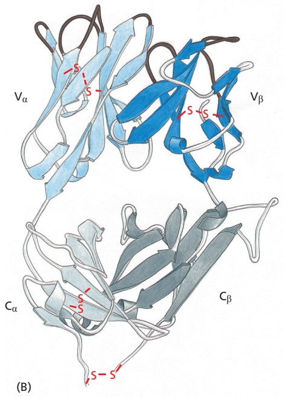

(A)

Instead of making TCR α and β chains, a minority of T cells makes a different but related type of TCR heterodimer, composed of γ chains and δ chains.MBoC7 m24.32/24.32 Although these gd T cells normally make up only 5–10% of the T cells in human blood, they can be the dominant T cell population in epithelia such as the skin. They differ from conventional αβ T cells in other important ways: their surface receptors have restricted diversity and generally do not recognize antigens as peptides presented by MHC proteins. We will not discuss them further, so that, from here on, when we refer to T cells, we mean T cells with αβ TCRs.

As with BCRs, TCRs are tightly associated in the plasma membrane with a number of invariant membrane-bound proteins that are involved in passing the signal from an antigen-activated receptor to the cell interior. We will discuss these proteins in more detail later, when we consider some of the molecular events involved in T and B cell activation. First, we consider the special ways in which T cells recognize foreign antigen on the surface of an APC or target cell.

#### Activated Dendritic Cells Activate Naïve T Cells

Generally, naïve T cells, including naïve helper and cytotoxic T cells, proliferate and differentiate into effector cells and memory cells only when they see their specific antigen on the surface of an activated **dendritic cell** in a peripheral lymphoid organ (**Figure 24–33**). The activated dendritic cell displays the antigen in a complex with MHC proteins on its surface, along with co-stimulatory proteins (see Figure 24–11). The memory T cells that develop, however, can be re-activated by the same antigen–MHC complex on the surface of other types of APCs (target cells), including macrophages and B cells—as well as by dendritic cells.

Immature dendritic cells are located in most tissues—underlying epithelial layers of the skin and gut, for example—where they are constantly sampling and processing proteins in their environment. They become activated to mature when their pattern recognition receptors (PRRs) encounter pathogen-associated molecular patterns (PAMPs) on an invading pathogen or its products. The pathogen or products are ingested, and the microbial proteins are cleaved into peptide fragments, which are loaded onto MHC proteins, as we discuss later. The activated dendritic cells then migrate via the lymph from the site of infection to local lymph nodes or gut-associated lymphoid organs, a process aided by the expression of the chemokine receptor CCR7. Here, they present the foreign antigens, displayed

Figure 24–32 A T cell receptor (TCR) heterodimer. (A) Schematic drawing of a TCR composed of an α and a β polypeptide chain. Each chain has a large extracellular part that is folded into two Ig-like domains—one variable and one constant. A $\nabla _ { \alpha }$ and a $1   \nabla _ { \beta }$ domain (shaded in blue) form the antigen-binding site. Unlike Igs, which have two binding sites for antigen, TCRs have only one. Although not shown, the αβ-heterodimer is noncovalently associated with a large set of invariant membrane-bound proteins that help activate the T cell when the TCRs bind their specific antigen (see Figure 24–45B). A typical T cell has about 30,000 TCRs on its surface. (B) The three-dimensional structure of the extracellular part of a TCR. The antigen-binding site is formed by the hypervariable loops of both the $\nabla _ { \alpha }$ and $\nabla _ { \beta }$ domains (black), located at the distal end of the domains, and it is similar in its overall dimensions and geometry to the antigen-binding site of an Ig molecule. (B, PDB code: 1TCR.)

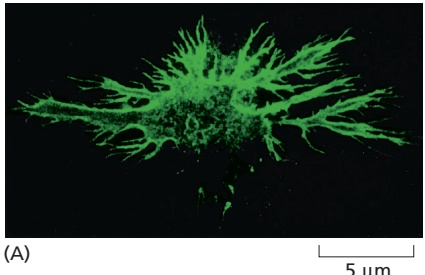

Figure 24–33 Dendritic cells.

(A) Immunofluorescence micrograph of a mouse dendritic cell in culture. These APCs derive their name from their long processes, or “dendrites.” The cell has been labeled with a monoclonal antibody MB C7 24.33/24.33that recognizes a surface antigen on these cells. (B) Scanning electron micrograph of T cells bound to the surface of an activated dendritic cell in a mouse lymph node. (A, courtesy of David Katz; B, courtesy of I. Mellman, P. Pierres, and S. Turley.)

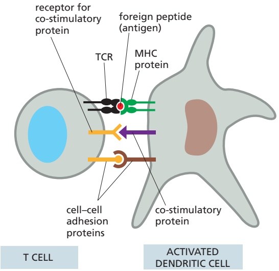

Figure 24–34 The three general types of proteins on the surface of an activated dendritic cell involved in activating a T cell. Although not shown, activated dendritic cells also secrete soluble cytokines that influence the T cell activation process. The invariant polypeptide chains that are always stably associated with the TCR are also not shown; they are discussed later and illustrated in Figure 24–45B and Movie 24.7.

as peptide–MHC complexes on the dendritic cell surface, for recognition by the relevant T cells (see Figure 24–11).

Activated dendritic cells display three types of protein molecules on their surface that have a role in activating a T cell to become an effector cell or memory cell (**Figure 24–34**): (1) MHC proteins, which present foreign peptides to the TCRs; (2) co-stimulatory proteins, which bind to complementary receptors on the T cell surface; and (3) cell–cell adhesion molecules, which enable a T cell to bind to the dendritic cell for long enough to become activated, typically several hours. / . or more. In addition, activated dendritic cells secrete a variety of cytokines that influence the type of effector helper T cell that develops, and different types of dendritic cells promote different outcomes (discussed later).

#### T Cells Recognize Foreign Peptides Bound to MHC Proteins

As discussed earlier (see Figure 24–11), **MHC proteins** capture intracellular peptide fragments of foreign proteins and display them on a cell surface for presentation to T cells. There are two main classes of MHC proteins, which are structurally and functionally distinct. **Class I MHC proteins** mainly present foreign peptides to cytotoxic T cells, whereas **class II MHC proteins** mainly present foreign peptides to helper and regulatory T cells (**Figure 24–35**). Some class I–like MHC proteins present microbial lipid and glycolipid antigens to T cells, but these proteins are not encoded within the MHC region of the genome, and we will not consider them further.

Both class I and class II MHC proteins are heterodimers, in which two extracellular domains form a peptide-binding groove, which always has a variable small peptide noncovalently bound in it. In class I MHC proteins, the two domains that form the peptide-binding groove are provided by the transmembrane α chain, which is noncovalently associated with a small subunit called $\beta _ { 2 }$ -microglobulin;

Figure 24–35 Recognition by T cells of peptides bound to MHC proteins. Cytotoxic T (TC) cells recognize foreign peptides in association with class I MHC proteins, whereas helper T (TH) cells recognize foreign peptides in association with class II MHC proteins; regulatory T cells also recognize self or foreign peptides in association with class II MHC proteins. In all cases, the T cell recognizes the peptide–MHC complexes on the surface of an APC—either a dendritic cell or a target cell. Different types of dendritic cells activate naïve cytotoxic and helper T cells (not shown).

Figure 24–36 Class I and class II MHC proteins. (A) The transmembrane α chain of the class I molecule has three extracellular domains, α1, α2, and α3, each encoded by a separate exon. The α chain is noncovalently associated with a smaller, nontransmembrane polypeptide chain, β2-microglobulin, which is not encoded within the MHC region of the genome. The $\alpha _ { 3 }$ domain and β2-microglobulin are Ig-like. While β2-microglobulin is invariant, the α chain is extremely polymorphic, mainly in the $\alpha _ { 1 }$ and α2 domains. (B) In class II MHC proteins, both the α chain and the β chain are transmembrane polypeptides encoded within the MHC and are polymorphic, mainly in the α1 and β1 domains; the α2 and β2 domains are MBoC7 m24.36/24.36Ig-like. Thus, there are striking similarities between class I and class II MHC proteins: in both, the two outermost domains (shaded in blue) are polymorphic and interact to form a groove that binds peptide fragments. The S–S disulfide bonds in A and B are shown in red. (C) Top view of the three-dimensional structure of the peptide-binding groove of a human class I MHC protein (green) with a bound peptide (red), as would be seen by a TCR on a cytotoxic T cell. Two α helices form the sides of the groove, and a β pleated sheet forms the groove’s floor (Movie 24.8 and Movie 24.9). (C, PDB code: 1FZK.)

in class II MHC proteins, a different α chain and a large, noncovalently associated β chain each contribute an extracellular domain to form the peptide-binding groove (**Figure 24–36**). A TCR binds to both the peptide and the ridges of the binding groove. Humans have three major class I proteins, called HLA-A, HLA-B, and HLA-C, and three class II proteins, called HLA-DP, HLA-DQ, and HLA-DR (HLA stands for human leukocyte antigen, as these proteins were first demonstrated on human leukocytes). **Figure 24–37** shows how the genes that encode these proteins are arranged in the MHC region of human chromosome 6.

There are important differences between the class I and class II MHC proteins with regard to the cell types that express them and the origin of the peptides in their peptide-binding grooves. Almost all of our nucleated cells express class I proteins. Their peptide-binding groove displays one of a diverse collection of peptides (typically 8–10 amino acids in length). In a healthy cell, the peptides originate from the

Figure 24–37 Human MHC genes. This simplified schematic drawing shows the location of the genes that encode the transmembrane subunits of class I (light green) and class II (dark green) MHC proteins. The genes shown encode the three main types of class I MHC proteins (HLA-A, HLA-B, and HLA-C) and three types of class II MHC proteins (HLA-DP, HLA-DQ, and HLA-DR). An individual can therefore make six types of class I MHC proteins (three encoded by maternal genes and three by paternal genes) and more than six types of class II MHC proteins. Because of the extreme polymorphism of the MHC genes, the chances are very low that the maternal and paternal alleles will be the same. The number of class II MHC proteins that an individual can make is greater than six because there are two DRb genes and because maternally encoded and paternally encoded polypeptide chains can sometimes pair. The entire region shown spans about 7 million base pairs and contains other genes that are not shown.

cell’s own cytosolic and nuclear proteins that have undergone partial degradation in proteasomes in the processes of normal protein turnover and quality control mechanisms. Some of the peptide fragments produced in this way are actively transported into the lumen of the endoplasmic reticulum (ER) by a specialized transporter in the ER membrane; there, they are loaded onto newly synthesized class I MHC α chains. This process depends on a peptide-loading complex that assembles transiently in the ER membrane; the complex consists of the transporter, chaperone proteins, and other proteins that assist in peptide selection by the class I MHC α chain and its partner β2-microglobulin. The self-peptide– MHC complex produced is then transported through the Golgi apparatus to the cell surface. Such complexes are not dangerous, however, because the cytotoxic T cells that could recognize them have been eliminated or inactivated or sup-MBoC7 m24.38/24.38 pressed by regulatory T cells in the process of self-tolerance (see Figure 24–21). By contrast, in a cell infected by a pathogen such as a virus, the pathogen proteins will be processed in the same way, and peptides derived from them will be displayed on the infected cell surface bound to class I MHC proteins; there, they are recognized by effector cytotoxic T cells expressing the appropriate TCRs, thereby targeting the infected cell for destruction (**Figure 24–38**).

In general, **antigen-presenting cells (APCs)** are the main cells that express class II MHC proteins. Dendritic cells are the major APCs, as they are specialized for this function, and only they can activate naïve T cells. Other immune cells that are targets of effector T cell regulation, including B cells and macrophages, are also APCs and express class II MHC proteins, as do thymus epithelial cells (discussed later). Other epithelial cells can also be induced to express class II MHC proteins and act as APCs, but only when they encounter infection or inflammation. All APCs load their newly synthesized class II MHC proteins with peptides derived mainly from extracellular proteins that are endocytosed and delivered to endosomes. The newly synthesized class II MHC proteins initially contain an invariant chain, which acts as both a guide and a guardian of the peptide-binding

Figure 24–38 A simplified drawing of antigen processing of an internal viral protein for presentation by class I MHC proteins to a cytotoxic T cell. An effector cytotoxic T cell kills a virus-infected cell when it recognizes fragments of an internal viral protein bound to class I MHC proteins on the surface of the infected cell. Not all viruses enter the cell in the way that this enveloped RNA virus does, but fragments of internal viral proteins always follow the pathway shown. Only a small proportion of the viral proteins synthesized in the cytosol are degraded and transported to the cell surface, but this is sufficient to attract an attack by a cytotoxic T cell. Several chaperone and other proteins in the ER lumen combine with the ABC transporter and MHC protein to form a peptide-loading complex that aids peptide selection (editing) and the assembly of peptide–class I MHC protein complexes (not shown). Both the final assembly of a class I MHC protein and its transport in vesicles to the cell surface require the presence of either a self or foreign peptide in the peptide-binding groove of the MHC protein (Movie 24.10).

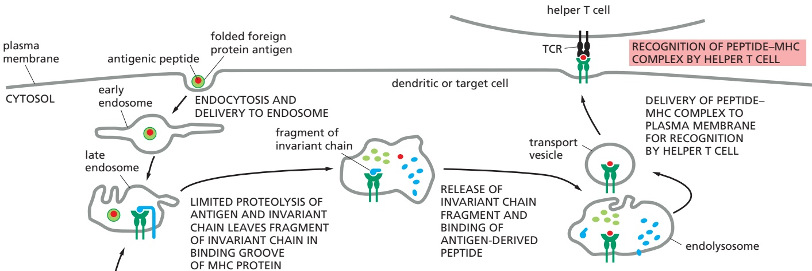

Figure 24–39 A simplified drawing of antigen processing of a foreign extracellular protein for presentation by class II MHC proteins to a helper T cell. Peptide–class II MHC complexes are formed in endosomes and delivered via transport vesicles from endolysosomes to the cell surface. As in the previous figure, the chaperones and other proteins that operate to select (edit) peptides for high-affinity binding to the groove of class II MHC proteins are not shown. Also not shown is how viral envelope glycoproteins can be processed by this pathway for presentation to helper T cells: these glycoproteins are normally made in the ER and transported via the Golgi apparatus for insertion into the plasma membrane; although most of these glycoproteins will be incorporated into the envelope of budding viral particles, some will be endocytosed and enter endosomes, from where they can enter the last part of the pathway illustrated here.

groove, preventing the groove from prematurely binding a peptide until the class II MHC protein reaches the endocytic pathway. Here, invariant chain removal is initiated by proteolysis and completed by the action of a chaperone protein, allowing peptide fragments (typically 12–20 amino acids long) produced from endocytosed proteins to bind to the groove of the class II MHC proteins. TheseMBoC7 m24.39/24.39 peptide–MHC complexes are then transported to the plasma membrane for display on the surface of the APC. In a healthy host cell, class II MHC protein grooves are loaded with self peptides derived from normal proteins and will be ignored by most T cells because of self-tolerance mechanisms (although they will be recognized by regulatory T cells as part of these self-tolerance mechanisms—see Figure 24–21). During an infection, however, pathogen proteins are also endocytosed and processed in the same way, enabling APCs to present pathogen peptides bound to class II MHC proteins to T cells expressing an appropriate TCR (**Figure 24–39**).

The distinction just discussed between the antigen-processing pathways for loading peptides onto class I and class II MHC proteins is not absolute. Dendritic cells, for example, need to be able to activate cytotoxic T cells to kill virus-infected cells even when the virus does not infect dendritic cells themselves. To do so, a specialized subset of dendritic cells uses a process called **cross-presentation**, which begins when these noninfected dendritic cells phagocytose virus-infected host cells or their fragments. In one pathway, at least, the ingested viral proteins are transported by a special mechanism from phagolysosomes into the cytosol, where they are degraded in proteasomes; the resulting protein fragments are then transported into the ER lumen and loaded onto assembling class I MHC proteins, as described earlier (see Figure 24–38). Cross-presentation by dendritic cells is not confined to endocytosed pathogens and their products: it also operates to activate cytotoxic T cells against tumor antigens of cancer cells and the foreign MHC proteins on the cells of foreign organ grafts.

During an infection, only a small fraction of the many thousands of MHC proteins on the surface of an APC or target cell will have pathogen peptides bound to them. This is sufficient, however: fewer than 50 copies of the same peptide–MHC complex on a dendritic cell, for example, can activate a helper T cell that has a

<table><tbody><tr><td colspan="3">TABLE 24-3 Properties of Human Class I and Class II MHC Proteins</td></tr><tr><td></td><td>Class I</td><td>Class II</td></tr><tr><td>Genetic loci</td><td>HLA-A, HLA-B, HLA-C</td><td>HLA-DM, HLA-DO, HLA-DP, HLA-DQ, HLA-DR</td></tr><tr><td>Chain structure</td><td>α chain + β2-microglobulin</td><td>α chain + β chain</td></tr><tr><td>Cell distribution</td><td>Most nucleated cells</td><td>Dendritic cells, B cells, macrophages, thymus epithelial cells, some others</td></tr><tr><td>Presents antigen to</td><td>Cytotoxic T cells</td><td>Helper T cells, regulatory T cells</td></tr><tr><td>Source of peptide fragments</td><td>Mainly proteins made in cytoplasm</td><td>Mainly endocytosed plasma membrane and extracellular proteins</td></tr><tr><td>Polymorphic domains</td><td>α1 + α2</td><td>α1 + β1</td></tr><tr><td>Recognition by co-receptor</td><td>CD8</td><td>CD4</td></tr></tbody></table>

TCR that binds the complex with a high-enough affinity. **Table 24–3** compares the properties of class I and class II MHC proteins.

#### MHC Proteins Are the Most Polymorphic Human Proteins Known

Although any individual can make only a small number of different class I and class II MHC proteins, together these proteins must be able to present peptide fragments from almost any foreign protein to T cells. Thus, unlike the antigen-binding site of an Ig protein, the peptide-binding groove of each MHC protein must be able to bind a very large number of different peptides. The genes encoding class I and class II MHC proteins (see Figure 24–37) are the most polymorphic known in higher vertebrates: in the human population, for example, there are more than 2000 allelic variants of these genes. The corresponding variations in the MHC proteins are functionally important, as they are concentrated in the floor and walls of the peptide-binding grooves and allow MHC molecules in different individuals to bind different arrays of peptides.

It is thought that infectious diseases have been an important driving force for generating this remarkable MHC polymorphism. In the evolutionary war between pathogens and the adaptive immune system, pathogens will tend to change their proteins through mutation so that the peptides derived from them will not fit in the MHC peptide-binding grooves. When a pathogen succeeds, it can sweep through a population as an epidemic. In such circumstances, the few individuals who produce a new allelic form of MHC protein that can bind peptides derived from the altered pathogen will have a large selective advantage. This type of selection will tend to promote and maintain a large diversity of MHC proteins in the population. In West Africa, for example, individuals with a specific MHC allele (HLA-B53) have a reduced susceptibility to a severe form of malaria that is endemic there; although this allele is rare elsewhere, it is found in 25% of the West African population.

The extensive diversity of human MHC proteins is the main reason that individuals who receive a foreign organ transplant must be treated with strong immunosuppressive drugs to prevent the immunological rejection of the grafted organ. Of all the foreign proteins that the graft expresses, the MHC proteins are by far the most powerful stimulators of the recipient’s T cells, which would rapidly destroy the graft if they were not prevented from doing so by such drugs. Foreign MHC proteins are powerful T cell stimulants because T cells respond to them in the same way they respond to self MHC proteins that have foreign peptides bound to them; for this reason, the proportion of a person’s T cells that can specifically recognize any foreign MHC protein is relatively high.

class II MHC protein

#### CD4 and CD8 Co-receptors on T Cells Bind to Invariant Parts of MHC Proteins

The affinity of TCRs for peptide–MHC complexes on an APC is usually too low by itself to mediate a functional interaction between the two cells. T cells normally require accessory receptors to help stabilize the interaction by increasing the overall strength of the cell–cell adhesion. Unlike TCRs or MHC proteins, the accessory receptors are invariant and do not bind to foreign peptides. Once bound to the surface of a dendritic cell, for example, a T cell increases the strength of the binding by activating an integrin adhesion protein, which then binds more strongly to an Ig-like protein on the surface of the dendritic cell. This increased adhesion enables the T cell to remain bound long enough to become activated.

When an accessory receptor has a direct role in activating the T cell by generating its own intracellular signals, it is called a **co-receptor**. The most important and best understood of the co-receptors on T cells are the CD4 and CD8 proteins, both of which are single-pass transmembrane proteins with extracellular Ig-like domains. Like TCRs, they recognize MHC proteins, but, unlike TCRs, they bind to invariant parts of the MHC protein, far away from the peptide-binding groove. **CD4** is expressed on both helper T cells and regulatory T cells and binds to class II MHC proteins, whereas **CD8** is expressed on cytotoxic T cells and binds to class I MHC proteins (**Figure 24–40**).

Figure 24–40 CD4 and CD8 co-receptors on the surface of T cells. Cytotoxic T (TC) cells express CD8, which recognizes class I MHC proteins, whereas helper T (TH) cells and regulatory T cells (not shown) express CD4, which recognizes class II MHC proteins. Note that the co-receptors bind to the same MHC protein that the TCR has engaged, so that they are brought together with TCRs during the antigen recognition process. Whereas the TCR binds to the variable (polymorphic) parts of the MHC protein that form the peptidebinding groove, the co-receptor binds to the invariant part, well away from the binding groove.

CD4 and CD8 contribute to T cell recognition by helping the T cell to focus on particular MHC proteins, and thereby on particular types of target cells. Thus, the recognition of class I MHC proteins by CD8 allows cytotoxic T cells to focus on any type of infected host cell, while the recognition of class II MHC proteins by CD4 allows helper and regulatory T cells to focus on the target immune cells that they help or suppress, respectively. The cytoplasmic tail of the CD4 and CD8 proteins is associated with a member of the Src family of cytoplasmic tyrosine kinases (discussed in Chapter 15) called Lck, which phosphorylates various intracellular signaling proteins on tyrosines and thereby participates in the activation of the T cell (discussed later).

The AIDS virus (HIV) uses CD4 molecules (as well as chemokine receptors) to gain entry to helper T cells (see Figure 23–18). Individuals with AIDS are susceptible to infection by microbes that are not normally dangerous because HIV depletes helper T cells. As a result, most individuals with AIDS die of infection within several years of the onset of symptoms, unless they are treated with a combination of anti-HIV drugs. HIV also uses CD4 and chemokine receptors to enter macrophages, which also have both of these types of receptors on their surface.

#### Developing Thymocytes Undergo Positive and Negative Selection

The development of αβ T cells begins when bone marrow–derived lymphoid progenitor cells enter the outer part of the thymus, the cortex, from the bloodstream. There, the progenitor cells develop into thymus lymphocytes, **thymocytes**, which undergo stepwise development under the influence of a variety of signals from thymus epithelial cells, dendritic cells, macrophages, fibroblasts, and other stromal cells.

In an early step, the thymocytes are induced to express V(D)J recombinase, which enables them to begin to rearrange their TCR gene segments and make αβ TCRs. If the cells fail to express such a cell-surface TCR, they will not receive the signals they need to survive and continue to develop, and they will die by apoptosis by default. Because peripheral αβ T cells can only see pathogen-derived peptides in the context of self MHC proteins, developing αβ thymocytes need to express TCRs that have some affinity for self MHC proteins to be potentially useful; those expressing TCRs unable to bind to any self-peptide–self-MHC complex would generally also fail to receive survival signals and therefore also die by apoptosis.

Soon after producing αβ TCRs, the developing thymocytes express both CD4 and CD8 co-receptors. These so-called double-positive thymocytes interact with epithelial cells in the thymus cortex that express self peptides bound to class I and class II MHC proteins. In a process called **positive selection**, a thymocyte expressing a TCR that binds with an appropriate affinity to a self peptide bound to either a class I MHC protein (using CD8 as a co-receptor) or a class II MHC protein (using CD4 as a co-receptor) on cortical epithelial cells is signaled to survive and continue to mature. As part of this process, depending on the TCR’s preference for class I or class II MHC proteins, the CD4 or CD8 co-receptor thatMBoC7 m24.41/24.41 will not be needed is silenced by DNA methylation of the respective gene. The resulting CD4 or CD8 single-positive thymocytes ultimately leave the inner part of the thymus (the medulla) to become naïve T cells: the CD4 cells become either helper T cells or regulatory T cells (discussed later), while the CD8 cells become cytotoxic T cells.

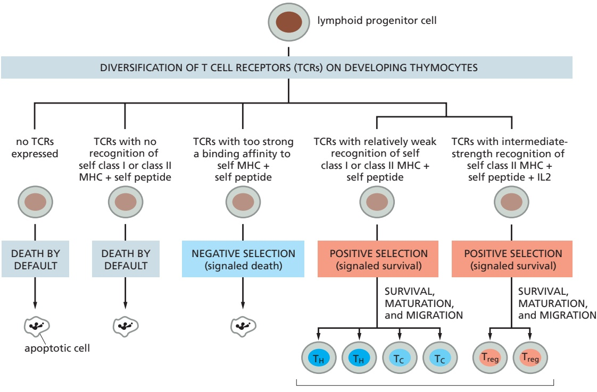

naïve T cells among recirculating lymphocytes

Before that, however, after the developing single-positive thymocytes move from the cortex into the medulla, they undergo two more selection processes (on the surface of medullary epithelial and dendritic cells) that have crucial roles in immunological self-tolerance. Thymocytes with TCRs that bind too strongly to self peptides bound to class I or class II MHC proteins could be dangerous if they were to continue to mature and leave the thymus, as they could then potentially attack similar self complexes on normal cells in peripheral tissues and thereby cause an autoimmune disease. Such strong binding (via TCRs and either CD4 or CD8 co-receptors) signals such thymocytes to undergo apoptosis in a process called **negative selection**, an example of clonal deletion acting in central immunological self-tolerance (see Figure 24–21). In a second form of positive selection, some CD4-positive thymocytes that bind strongly to self peptides bound to class II MHC proteins (but not strongly enough for negative selection to operate) in the presence of secreted IL2 develop into regulatory T cells $( T _ { r e g }$ cells), which mediate clonal suppression in peripheral lymphoid tissues, an important mechanism in peripheral self-tolerance (see Figure 24–21). The various positive and negative selection processes that operate during thymocyte development are summarized in **Figure 24–41**.

For negative selection in the thymus to be an effective mechanism of peripheral T cell self-tolerance, APCs in the thymus must display an array of self peptides bound to self MHC molecules that reflect the self peptides derived from self proteins in peripheral tissues, as well as in the thymus. The thymus, however, would

Figure 24–41 Negative and positive selection in the thymus. Developing thymocytes with no TCRs or with TCRs that have no recognition of MHC proteins with a peptide bound would be of no use and fail to receive survival signals and die by default (“from neglect”) by apoptosis. In the process of negative selection, thymocytes with TCRs with such strong binding affinity to self-peptide–self-MHC complexes that the cells would be potentially dangerous are actively signaled to die by apoptosis. In the process of positive selection, thymocytes with TCRs with appropriate binding affinity for self-peptide–self-MHC complexes are signaled to survive, mature, and migrate to peripheral lymphoid organs, where they function as helper (TH), cytotoxic (TC), or regulatory T $[ \left( \mathbb { T } _ { r e g } \right)$ cells, depending on the class of MHC they recognize and the binding affinity of their TCRs: TC cells recognize peptides in association with class I MHC proteins, whereas $\top _ { \mathsf { H } }$ and $\mathsf { T } _ { \mathsf { r e g } }$ cells recognize peptides in association with class II MHC proteins. As indicated, whereas thymocytes with TCRs that bind weakly to self peptides bound to self class II MHC proteins end up as TH cells, those with TCRs that bind with intermediate strength to self peptides bound to self class II MHC proteins (in the presence of IL2) end up as $\mathsf { T } _ { \mathsf { r e g } }$ cells.

not be expected to produce many of the proteins that are specifically expressed in other organs. As an example, it would not be expected to produce insulin, and yet it is crucial to delete thymocytes with TCRs that could recognize insulin-derived peptides bound to self MHC proteins on the surface of insulin-secreting β cells in the pancreas; a failure to do so would result in the T cell–dependent destruction of the β cells and, as a consequence, type 1 (or juvenile) diabetes.

The mechanism that enables the deletion of such cells in the thymus depends on a subpopulation of epithelial cells in the thymus medulla that expresses a promiscuous transcriptional regulator called **AIRE** (autoimmune regulator), which is specific to these epithelial cells. The AIRE protein acts as part of a multiprotein complex to induce the production of small amounts of mRNA from 75 to 90% of all genes, including those that encode tissue-restricted proteins such as insulin. When the peptides derived from the proteins encoded by these genes are bound to MHC proteins and displayed on the surface of these epithelial cells, this is sufficient to ensure the deletion of most of the potentially self-reactive thymocytes. Mutations that inactivate the AIRE gene cause a severe multi-organ autoimmune disease in both mice and humans, indicating the importance of AIRE in self-tolerance.

Having left the thymus, naïve helper and cytotoxic T cells continually receive survival signals as a result of weak binding to self-peptide–self-MHC-protein complexes. These naïve T cells, however, are normally only activated to proliferate and differentiate into effector and memory T cells in a peripheral lymphoid organ and only when their TCRs bind with high affinity to a pathogen-derived peptide in the binding groove of an MHC protein on the surface of an activated dendritic cell that expresses co-stimulatory signals. We now consider the functions of the different subclasses of effector T cells, beginning with cytotoxic T cells.

<!-- END EN EN24-H010-H032 -->

### 英文补充：疫苗与免疫学小结

> 对应中文板块：疫苗与免疫学小结。英文来源：Molecular Biology of the Cell，第7版，第24章；[本章完整原文](../来源/英文教材/24_The_Innate_and_Adaptive_Immune_Systems/chapter.md)。物理PDF页码范围：1392–1443（整章范围）。

<!-- BEGIN EN EN24-H038-H039 -->
#### Vaccination Against Pathogens Has Been Immunology’s Greatest Contribution to Human Health

As all organisms do, we continually battle with our pathogens. Despite the sophistication of our immune defenses described in this chapter, this battle has been remarkably evenly matched. As discussed in Chapter 23, all pathogens have developed multiple ways of overcoming their host’s defenses, at least for long enough to replicate and establish an infection. Most pathogens have the important advantage of multiplying and evolving much more rapidly than humans; in particular, viruses, as a collection, have evolved mechanisms for blocking essentially every step of our innate and adaptive immune responses. In response, humans have developed public health measures and powerful antipathogen drugs and vaccines that reinforce our natural immunological defenses.

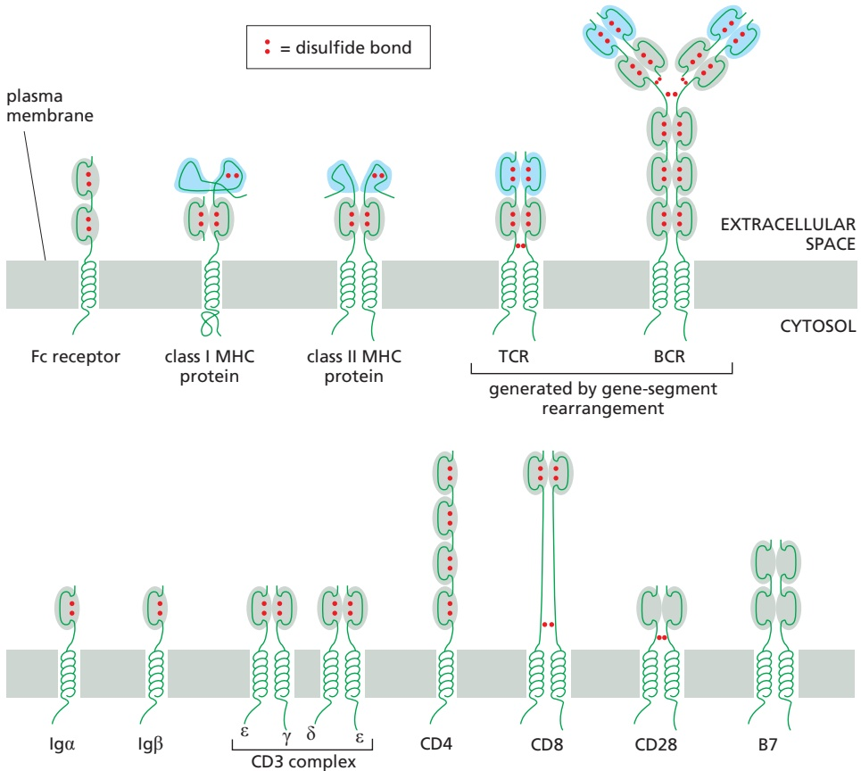

Figure 24–48 Some of the cell-surface proteins discussed in this chapter that belong to the Ig superfamily. The Ig and Ig-like domains are shaded in gray, except for the antigen-binding Ig and Ig-like domains of BCRs and TCRs, respectively, which are shaded in blue. Note that the antigen-binding domains of class I and class II MHC proteins (also shaded in blue) are not Ig-like. The Ig superfamily also includes many cell-surface proteins involved in cell–cell interactions outside the immune system, such as the neural cell adhesion molecules (NCAMs; see Figure 19–29) and the receptors for various protein growth factors discussed in Chapter 15 (not shown). There are more than 750 members of the Ig superfamily in humans, making it the most populous family of proteins encoded in the human genome.

The modern era of **vaccination** began in 1796, when Edward Jenner reported that material from skin lesions in cattle suffering from cowpox protects humans against smallpox, which at that time was a devastating epidemic disease. Although the cowpox virus is closely related to the smallpox virus, it does not cause disease in humans. Smallpox was officially eradicated worldwide by 1980 through widespread and coordinated vaccination with intact vaccinia virus (a relative of the cowpox virus), after the disease had killed roughly 500 million people in the preceding 100 years. Today, vaccination (from the Latin word vaccus, meaning “cow”) is widely used to control the spread of many different pathogens, saving millions of human lives a year worldwide. In the best cases, a vaccine induces strong, long-lasting, adaptive immunological memory, mimicking and often bettering the protection induced by the natural infection, but without causing disease; that is, it is strongly immunogenic but not pathogenic.

There are currently three classes of vaccines approved for use against different pathogens in humans (**Table 24–4**). In the first class are whole microbe vaccines. These are generally strongly immunogenic but require specific manipulations to avoid pathogenicity. A common method is attenuation, in which the pathogen is passaged repeatedly through either a foreign host or cultured foreign cells until it accumulates mutations that render it no longer pathogenic in humans. To eliminate the risk of a genetic reversion to a pathogenic form, some vaccines of this class consist of either extracts of the pathogen or whole pathogens that have been inactivated by heating, chemical treatment, or, now commonly, by genetic manipulation.

The second class, subunit vaccines, are even safer, consisting of one or more individual components of the pathogen—either purified from the pathogen or, more commonly, produced by recombinant DNA technology. Most subunit vaccines are composed of viral proteins: common examples consist of viral coat proteins self-assembled in vitro to form virus-like particles. Other subunit vaccines are composed of bacterial macromolecules: examples are inactivated forms of secreted protein toxins (toxoids), which in their active forms cause diseases such as tetanus and diphtheria, and the capsular polysaccharides that surround various bacteria (see Table 24–4).

<table><tbody><tr><td colspan="2">TABLE 24-4 Some Vaccines Approved for Human Use</td></tr><tr><td>Class of vaccine</td><td>Diseases (pathogens)*</td></tr><tr><td colspan="2">Whole microbe (or microbial extract)</td></tr><tr><td>Attenuated bacteria</td><td>Tuberculosis (BCG, attenuated bovine Mycobacterium tuberculosis), typhoid fever (Salmonella enterica serovar Typhi, oral vaccine)</td></tr><tr><td>Killed bacteria</td><td>Pertussis (whooping cough; Bordetella pertussis), cholera (Vibrio cholerae)</td></tr><tr><td>Bacterial extract</td><td>Cholera (Vibrio cholerae)</td></tr><tr><td>Attenuated virus</td><td>Measles, mumps, rubella (German measles), varicella (chickenpox, shingles), influenza, rotavirus, polio (oral vaccine), hepatitis A and B</td></tr><tr><td>Inactivated virus</td><td>Rabies, influenza, polio, hepatitis A and B</td></tr><tr><td colspan="2">Subunit</td></tr><tr><td>Bacterial capsular polysaccharide</td><td>Meningitis (Neisseria meningitidis), typhoid fever (Salmonella enterica serovar Typhi), bacterial pneumonia (Streptococcus pneumoniae)</td></tr><tr><td>Bacterial polysaccharide-protein conjugate</td><td>Meningitis (Haemophilus influenzae), bacterial pneumonia (Streptococcus pneumoniae)</td></tr><tr><td>Bacterial protein toxids</td><td>Tetanus (Clostridium tetani), diphtheria (Corynebacterium diphtheriae), pertussis (toxoid + other bacterial proteins)</td></tr><tr><td>Viral protein (usually recombinant)</td><td>Hepatitis A and B, human influenza viruses</td></tr><tr><td>Virus-like particles composed of viral coat proteins</td><td>Cervical cancer (human papillomavirus types 16 and 18)</td></tr><tr><td colspan="2">Nucleic acid**</td></tr><tr><td>Recombinant RNA virus vector, based on vesicular stomatitis virus, engineered to express an Ebola virus surface protein***</td><td>Ebola hemorrhagic fever (Ebola virus)</td></tr><tr><td>Recombinant DNA virus vector, based on adenovirus, engineered to express a form of SARS-CoV-2 spike protein (see Figure 24-50)****</td><td>COVID-19 (SARS-CoV-2 coronavirus)</td></tr><tr><td>Lipid nanoparticles containing modified mRNA that encodes a form of SARS-CoV-2 spike protein (see Figure 24-50)****</td><td>COVID-19 (SARS-CoV-2 coronavirus)</td></tr><tr><td colspan="2">*There are often different types of vaccines available for the same disease. **Some (such as the Ebola vaccine) can replicate in recipient cells, others (including those shown in Figure 24-50) cannot. ***This was the first nucleic acid vaccine approved (in 2019) for human use. ****These vaccines were given Emergency Use Authorization at the end of 2020 or in 2021 and were approved in 2021.</td></tr></tbody></table>

To be maximally effective, a vaccine needs to stimulate both B cell and T cell immune responses. Subunit vaccines composed solely of bacterial capsular polysaccharides, for example, are relatively ineffective because they only activate B cells. Because helper T cells are required to induce B cell memory, antibody affinity maturation, and Ig class switching, such polysaccharide vaccines only induce short-lived, low-affinity, IgM anti-polysaccharide antibodies, providing weak and brief protection. Chemically coupling (conjugating) the polysaccharide to a protein such as tetanus or diphtheria toxoid to produce a conjugate vaccine solves this problem: the protein component provides the foreign peptides that

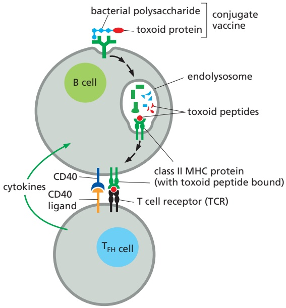

Figure 24–49 How conjugate vaccines against bacterial polysaccharide antigens activate both B cells and helper T cells. In this case, the polysaccharide is chemically coupled to a protein toxoid. The B cells recognize the polysaccharide part of the conjugate, endocytose the conjugate, and cleave the protein part into peptide fragments in endolysosomes. The peptide fragments are then transported by class II MHC proteins to the B cell surface, where the peptide–MHC complexes are recognized by helper T cells (see Figure 24–39). The helper T cells (TFH cells) help activate the B cells to produce both high-affinity IgG anti-polysaccharide antibodies (see Figure 24–47B) and memory B cells (not shown).

activate the helper T cells required for optimal stimulation of the appropriate polysaccharide-specific B cells, as illustrated in **Figure 24–49**.

As discussed earlier in the chapter, for a vaccine to activate adaptive immune responses, it first must activate dendritic cells. A vaccine composed of a whole microbe or a microbial extract fulfills this requirement because it contains pathogen-associated molecular patterns (PAMPs) that activate pattern recognition receptors (PRRs) on innate immune cells, especially dendritic cells. Subunit vaccines that lack PAMPs require the addition of an adjuvant, a substance thatMBoC7 n24.108/24.49 enhances the immunogenicity of antigens, usually by activating PRRs.

The third and most recent type of vaccines contains genetically engineered DNA or RNA molecules that encode pathogen proteins or parts of such proteins. The development of these nucleic acid vaccines has required the knowledge and tools produced by decades of fundamental research to make the vaccines tolerable, safe, and effective. The first such vaccine approved for human use (in 2019) was a recombinant RNA virus vector vaccine encoding an Ebola virus surface protein (see Table 24–4). But the use of nucleic acid vaccines only took off in 2021, in response to the COVID-19 pandemic, which has infected hundreds of millions of people and caused millions of deaths. Because only a pathogen’s genome sequence is needed to develop a nucleic acid vaccine against the pathogen, it was possible to produce the first safe and effective DNA- and RNA-based vaccines for large-scale human use within a year from the publication (in January 2020) of the RNA genome sequence of the causative SARS-CoV-2 virus.

**Figure 24–50** illustrates how two different kinds of nucleic acid vaccines against COVID-19 work: both encode forms of the protein “spike” found on the surface of the SARS-CoV-2 virus (see Figure 1–49). A number of whole microbe and subunit vaccines are also in wide use or in development around the world to fight the COVID-19 pandemic. But, given the recent success of nucleic acid vaccines, it seems likely that they will revolutionize how most new vaccines are produced in the future.

A successful vaccination program against a pathogen usually requires that most of the population becomes immune to it, either naturally by infection or by vaccination. Such herd immunity slows the spread of an infection by decreasing the number of susceptible individuals in the population. To produce herd immunity, a vaccine needs to be well tolerated, safe and effective, and widely perceived to be so. The importance of both herd immunity and the public acceptance of a vaccine was inadvertently demonstrated by the response to a false and fraudulent report of a link between a measles vaccine and autism. After publication of the report in 1998, the uptake of the vaccine in Britain decreased substantially, leading to an increase in both the size and frequency of measles outbreaks (**Figure 24–51**).

Figure 24–50 How two kinds of widely used nucleic acid COVID-19 vaccines work. In both, the nucleic acids encode forms of the spike (S) protein, which normally protrudes from the surface of the SARS-CoV-2 coronavirus (see Figure 1–49 and Figure 9–50); these spikes on the virus bind to receptors on various human cells and help the virus enter the cells. The DNA virus vector vaccine shown on the left is representative of two COVID-19 vaccines that received early authorization for emergency use in humans—known as the Oxford–AstraZeneca vaccine and the Janssen– Johnson & Johnson vaccine—both of which are based on adenovirus vectors (chimpanzee and human, respectively). These vectors, which have been genetically engineered to prevent their replication in human cells, transfer their DNA into the nucleus of these cells, where it produces mRNAs. As indicated, the vector-encoded mRNAs move to the cytoplasm, where they are translated on endoplasmic reticulum (ER)-bound ribosomes to produce the spike proteins. After glycosylation in the ER and Golgi apparatus, the spike proteins are transported to the cell surface as trimeric spikes.

The mRNA lipid nanoparticle vaccine shown on the right is representative of the first COVID-19 vaccines of this kind authorized for emergency use in humans—known as the Pfizer–BioNTech and the Moderna vaccines. The mRNA is synthesized in vitro with nucleoside modifications (uridines replaced by methylpseudouridines) to prevent the mRNA from binding to PRRs and triggering a destructive inflammatory response, which would otherwise decrease the vaccine’s tolerability and the mRNA’s translation. In addition, the mRNA is designed with a nucleotide sequence that maximizes its translation efficiency. Finally, the mRNA molecules are encapsulated in tiny, complex lipid nanoparticles: this coating protects the mRNAs, enhances the vaccine’s uptake into host-cell endosomes, and mediates the release of the mRNA from the endosomes into the cytosol.

In all cases the vaccine is injected into an arm muscle, from where it is carried via lymphatic vessels to local lymph nodes. Both in the muscle and in lymph nodes, antigen-presenting cells (most important, dendritic cells) take up the vaccine and are activated in the process. In these cells, the mRNAs are translated into spike protein, which is then glycosylated and transported to the cell surface as indicated. In the lymph nodes, the activated dendritic cells present peptide fragments of the spike protein, bound to MHC proteins on the dendritic-cell surface, to spike-specific helper and cytotoxic T cells, which are thereby activated to proliferate and differentiate into effector cells. The effective helper T cells then help stimulate spike-specific B cells to proliferate and differentiate into effector cells that secrete neutralizing anti-spike antibodies, while the cytotoxic T cells kill any host cells that subsequently become infected with the SARS-CoV-2 virus. At the same time, the activated dendritic cells stimulate the production of spike-specific memory B and T cells, which a second immunization can further increase in number and effectiveness. Later, a natural encounter with the SARS-CoV-2 virus will call these memory cells into action to protect vaccinated individuals against COVID-19 disease.

It remains to be seen how long the protection lasts and how effective it will be against new mutant SARS-CoV-2 virus variants, as they arise and are selected to resist our collective adaptive immune responses to either immunization or natural infection. Fortunately, the nucleic acid vaccines, especially mRNA vaccines, can be resynthesized rapidly to increase their effectiveness against any such genetic variants.

#### Summary

There are three main functionally distinct classes of T cells. Cytotoxic T cells $( T _ { C }   c e l l s )$ directly kill infected host cells by the targeted secretion of perforins and granzymes onto the surface of the infected cells, inducing them to kill themselves by undergoing apoptosis. Helper T cells (TH cells) help B cells to make antibody responses, macrophages to destroy the microorganisms they harbor, and dendritic cells to activate TC cells. By contrast, regulatory T cells $( T _ { r e g }$ cells) produce suppressive proteins (such as the cytokines IL10 and TGFb) to inhibit other immune cells.

All T cells express cell-surface antigen receptors (TCRs), which are encoded by genes that are assembled from multiple gene segments during T cell development in the thymus. ab TCRs recognize peptide fragments of foreign proteins that are displayed in association with MHC proteins on the surface of antigen-presenting cells (APCs), including T cell targets. Naïve T cells are activated in peripheral

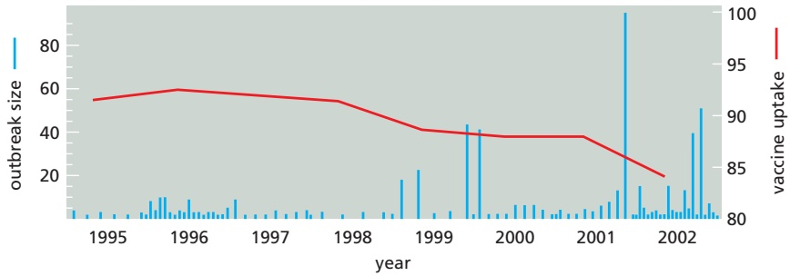

lymphoid organs by activated dendritic cells, which secrete cytokines and express peptide–MHC complexes, co-stimulatory proteins, and various cell–cell adhesion molecules on their surface.

Class I MHC proteins present foreign peptides to MBoC7 n24.110/24.51 $T _ { C }$ cells, whereas class II MHC proteins present foreign peptides to $T _ { H }$ cells and self and foreign peptides to $T _ { r e g }$ cells. Whereas class I MHC proteins are expressed on almost all nucleated vertebrate cells, class II MHC proteins are normally restricted to APCs, including dendritic cells, macrophages, and B lymphocytes. Both classes of MHC proteins have a single peptide-binding groove, which binds a large set of small peptide fragments produced intracellularly by normal protein-degradation processes: class I MHC proteins mainly bind fragments produced in the cytosol, whereas class II MHC proteins mainly bind fragments produced in endocytic compartments. The peptide–MHC complexes are transported to the cell surface, where complexes that contain a peptide derived from a foreign protein are recognized by TCRs, which interact with both the peptide and the walls of the peptide-binding groove. T cells also express CD4 or CD8 co-receptors, which recognize invariant regions of MHC proteins: $T _ { H }$ cells and $T _ { r e g }$ cells express CD4, which recognizes class II MHC proteins; $T _ { C }$ cells express CD8, which recognizes class I MHC proteins.

Figure 24–51 The importance of herd immunity and public acceptance of a vaccine. After the publication in 1998 of a false link between measles vaccination and autism, fewer children in Britain were vaccinated against the measles virus (red line), and outbreaks of measles (blue bars) increased in both frequency and size. About 95% of a population needs to be immune to measles to achieve herd immunity (the comparable value for COVID-19 is estimated to be between 65 and 90%, depending on the virus variant). The vaccine uptake shown is the percentage of children completing a primary course of the measles, mumps, and rubella (MMR) vaccine at their second birthday. (Data courtesy of V.A.A. Jansen and M.E. Ramsey. Adapted from V.A.A. Jansen et al., Science 301:804, 2003. With permission from AAAS.)

A combination of positive and negative selection processes operate during thymocyte development to help ensure that only T cells with potentially useful TCRs survive, mature, and emigrate from the thymus, while all other thymocytes die by apoptosis. After leaving the thymus, the naïve TH and $T _ { C }$ cells continually receive survival signals when their TCRs recognize self-peptide–self-MHC complexes, but they can only be activated to become effector cells when their TCRs encounter foreign peptides in the grooves of MHC proteins on an activated dendritic cell. The cells that leave the thymus as natural $T _ { r e g }$ cells help maintain self-tolerance by suppressing self-reactive T cells that escape negative selection in the thymus.

The production of an effector T cell from a naïve T cell requires multiple signals from an activated dendritic cell. MHC–peptide complexes on the dendritic cell surface provide one signal, by binding to both TCRs and to either a CD4 co-receptor on a TH or $T _ { r e g }$ cell or to a CD8 co-receptor on a $T _ { C }$ cell; co-stimulatory proteins on the dendritic cell surface and secreted cytokines provide the other signals. When naïve $T _ { H }$ cells are initially activated on a dendritic cell in a peripheral lymphoid organ, they can differentiate into various types of effector T cells, depending on the invading pathogen and the cytokines in their environment. They can become effector TFH cells, which remain in the lymphoid organ to support B cell antibody production in lymph follicles, or they can develop into effector $T _ { H } I ,$ , TH2, or $T _ { H } I 7$ cells, which mainly migrate to sites of infection, where they help other immune cells fight the pathogen; alternatively, they can develop into induced $T _ { r e g }$ cells, which suppress other immune cells. The various effector $T _ { H }$ cells recognize the same complex of foreign peptide and class II MHC protein on the surface of the target cell they are helping as they initially recognized on the dendritic cell that activated them; they activate their target cells by a combination of membrane-bound co-stimulatory proteins and secreted cytokines. $T _ { r e g }$ cells use cell-surface and secreted inhibitory proteins to suppress their target cells.

Both T cells and B cells require multiple signals for activation. Antigen binding to the TCRs or BCRs provides one signal, while co-stimulatory proteins binding to co-receptors and cytokines binding to their complementary cell-surface receptors provide the others. Effector TH cells provide the co-stimulatory signals and secreted cytokines for B cells, whereas APCs provide them for T cells.

<!-- END EN EN24-H038-H039 -->

### 英文补充：习题与参考文献

> 对应中文板块：习题与参考文献。英文来源：Molecular Biology of the Cell，第7版，第24章；[本章完整原文](../来源/英文教材/24_The_Innate_and_Adaptive_Immune_Systems/chapter.md)。物理PDF页码范围：1392–1443（整章范围）。

<!-- BEGIN EN EN24-EXERCISES -->
#### PROBLEMS

Which statements are true? Explain why or why not.

24–1 T cells whose receptors strongly bind a self-peptide–self-MHC complex are killed off in peripheral lymphoid organs when they encounter the self peptide on an antigen-presenting dendritic cell.

24–2 To guarantee that the antigen-presenting cells in the thymus will display a complete repertoire of self peptides to allow elimination of self-reactive T cells, the thymus recruits dendritic cells from all over the body.

24–3 The antibody diversity created by the combinatorial joining of V, D, and J segments by V(D)J recombination pales in comparison to the enormous diversity created by the random gain and loss of nucleotides at V, D, and J joining sites.

#### Discuss the following problems.

24–4 Why do living trees not rot? Redwood trees, for example, can live for centuries, but once they die they decay fairly quickly. What might this suggest?

24–5 It would be disastrous if a complement lytic attack were not confined to the surface of the pathogen that is the target of the attack. Yet, the proteolytic cascade involved in the attack liberates biologically active molecules at several steps: one that diffuses away and one that remains bound to the target surface. How does the complement attack remain localized to the pathogen when active products leave the pathogen surface?

24–6 On the basis of its sequence similarity to Apobec1, which deaminates C to U in RNA, activation-induced deaminase (AID) was originally proposed to work on RNA. But definitive experiments in Escherichia coli demonstrated that AID deaminates C to U in DNA. The authors of the paper expressed AID in bacteria and followed mutations in a selectable gene. They found that AID expression increased mutations about fivefold above the background level in the absence of AID expression. More important, they found that 80% of the induced mutations were G → A or C → T. Does this fit with your expectation if AID-induced mutations arose by deamination of C to U in the DNA?

[Hint: Imagine what would happen if the G:U mismatch created by AID was replicated several times; how would the sequences of the final mutations relate to the original G-C base pair?]

24–7 For many years it was a complete mystery how cytotoxic T cells could recognize and respond to a viral protein in a virus-infected cell when the protein seemed to be present only in the nucleus of the cell. The answer was revealed in a classic paper that took advantage of a clone of cytotoxic T cells whose T cell receptor (TCR) was directed against an antigen associated with the nuclear protein of the 1968 strain of influenza virus. The authors of the paper found that when they incubated noninfected living cells in high concentrations of certain peptides derived from the viral nuclear protein, the cells became sensitive to lysis by subsequent incubation with the cytotoxic T cells. Using various peptides from the 1968 strain and the 1934 strain (with which the cytotoxic T cells did not react), the authors defined the particular peptide responsible for the killing response of the T cell (**Figure Q24–1**).

A. Which part of the viral protein gives rise to the peptide that is recognized by the clone of cytotoxic T cells? Why do not all of the viral peptides sensitize the target cells for lysis by the cytotoxic T cells?

B. It is known that the MHC proteins come to the cell surface with peptides already bound. How then do you imagine that these experiments worked when the peptides were added to the outside of the living target cells?

Figure Q24–1 Viral nuclear protein recognition by cytotoxic T cells (Problem 24–7). (A) Sequences of a segment of the nuclear protein from the 1968 and 1934 strains of influenza virus. Peptides used in the experiments in B are highlighted by pink bars. The amino acid MBoC7 Q24.01/Q24.01differences between the viral proteins are highlighted in blue. (B) Cytotoxic T cell–mediated lysis of target cells. The target cells were untreated (none), transfected with nuclear protein genes (1968 or 1934 strain), or preincubated with high concentrations of nuclear protein peptides from the 1968 or 1934 strain, as indicated by the yellow highlights.

24–8 Working out the roles of MHC proteins in T cell antigen recognition was complicated. One of the key observations came from studying how different kinds of class I MHC proteins influence the way cytotoxic T cells killed cells infected with lymphocytic choriomeningitis virus (LCMV). Cytotoxic T cells derived from mice expressing “k-type” class I MHC proteins lysed LCMV-infected cells expressing the same k-type MHC protein, but they did not lyse LCMV-infected cells from mice expressing “d-type” class I MHC proteins (**Figure Q24–2**). Similarly, cytotoxic T cells from d-type mice infected with LCMV lysed infected d-type cells, but not infected k-type cells. LCMV can kill both k-type and d-type mice.

A. If homozygous d-type mice were bred to homozygous k-type mice to generate d-type/k-type heterozygous progeny, would you expect that cytotoxic T cells derived from these LCMV-infected heterozygotes would be able to lyse LCMV-infected d-type cells? How about LCMV-in-fected k-type cells? Explain your answers.

Figure Q24–2 Pattern of killing of LCMV-infected fibroblasts by cytotoxic T cells from an LCMV-infected k-type mouse (Problem 24–8).

B. Oddly enough, LCMV infection does not kill mice that lack a thymus (and therefore lack T cells)—such as “nude” mice, so called because they also lack hair. If a thymus is transplanted back into a nude mouse, the mouse will then die when infected with LCMV. Suppose that a developing d-type/k-type heterozygous nude mouse was given a thymus from a d-type donor and was later infected with LCMV. Would you expect its cytotoxic T cells to be able to lyse LCMV-infected d-type cells? How about infected k-type cells? Explain your answers.

24–9 Before exposure to a foreign antigen, T cells with receptors specific for the antigen are a tiny fraction of the T cells—of the order 1 in $1 \widetilde { 0 } ^ { 5 }$ or 1 in $1 0 ^ { 6 } \mathrm {  ~ \dot { T } ~ }$ cells. After exposure to the antigen, only a small number of dendritic cells typically display the antigen on their surface. How long does it take for such antigen-presenting dendritic cells to interact with the antigen-specific T cells,MBoC7 Q24.02/24.02 which is the key first step in T cell activation and clonal expansion? To begin to address this question, scientists studied T-cell–dendritic-cell interactions in the absence of specific antigen. They isolated T cells and dendritic cells from unimmunized mice, labeled the T cells green and the dendritic cells red, and injected them into an unimmunized mouse. After 20 hours, they isolated a local lymph node and scored the contacts between the two cell types visually using two-photon fluorescence microscopy (**Figure Q24–3A**). The frequency of contacts between the two types of cells is given in **Figure Q24–3B**. Assuming that 100 dendritic cells present a specific antigen in an immunized mouse, how long would it take them to scan $1 0 ^ { 5 }$ T cells to find one or more antigen-specific T cells? How long to scan $1 0 ^ { 6 }   \mathrm { T }$ cells?

(A)

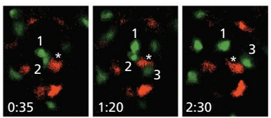

(B)

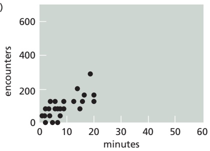

Figure Q24–3 Scanning of the T cell repertoire by dendritic cells in the absence of antigen (Problem 24–9). (A) Contacts between different T cells and one dendritic cell. T cells are green and dendritic cells are red. The dendritic cell labeled with an asterisk contacts a total of three T cells (numbered) over time in this sequence of images. Times are shown as hours:minutes. (B) Plot of T cell contacts for individual dendritic cells over time. (A, from P. Bousso and E. Robey, Nat. MBoC7 Q24.03/24.03Immunol. 4:579–585, published 2003 by Nature Publishing Group. Reproduced with permission of SNCSC.)

24–10 At first glance, it would seem a dangerous strategy for the thymus to actively promote the survival, maturation, and emigration of developing T cells that bind weakly to self peptides bound to self MHC proteins. Would it not be safer to get rid of these T cells, along with those that bind strongly to such self-peptide–self-MHC complexes, as this would seem a more secure way to avoid autoimmune reactions?

24–11 CD4 proteins on helper and regulatory T cells serve as co-receptors that bind to invariant parts of class II MHC proteins. CD4 is thought to increase the adhesion between T cells and antigen-presenting cells (APCs) that are initially connected only weakly by the TCR bound to its specific peptide–MHC complex. To test this possibility, you label cell-surface MHC proteins with a fluorescently labeled peptide so that you can detect individual peptide– MHC complexes at the interface between the APCs and the T cells in a culture dish. To detect T cell responses— the sign of a productive contact—you load them with a $\mathrm { C a ^ { 2 + } }$ indicator dye to detect the increase in cytosolic $\mathrm { C a ^ { 2 + } }$ that occurs when lymphocytes are activated. You now count the peptide–MHC complexes at a large number of interfaces (immunological synapses) and measure the $\mathrm { C a ^ { 2 + } }$ signal in the adherent T cells (**Figure Q24–4**, red dots). When you repeat the experiment in the presence of blocking antibodies against CD4, you get a different result (blue dots). Do these results support or refute the notion that CD4 augments T-cell–APC binding? Explain your answer.

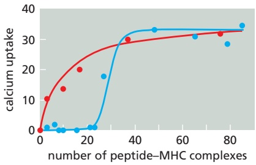

Figure Q24–4 Role of CD4 in the T cell response (Problem 24–11). The uptake of $\mathrm { C a ^ { 2 + } }$ in cells with different numbers of fluorescently labeled peptide–MHC complexes at the interface between the T cells and the antigen-presenting cells. The results in the absence of CD4-blocking. / . antibodies are shown by the red curve; results in the presence of CD4 antibodies are shown by the blue curve.

#### REFERENCES

#### General

Abbas AK, Lichtman AH & Pillai S (2019) Basic Immunology: Functions and Disorders of the Immune System, 6th ed. Philadelphia: Elsevier.

Murphy K, Weaver C & Berg L (2022) Janeway’s Immunobiology, 10th ed. New York: Norton.

Parham P (2021) The Immune System, 5th ed. New York: Norton.

#### The Innate Immune System

Chan AH & Schroder K (2020) Inflammasome signaling and regulation of interleukin-1 cytokines. J. Exp. Med. 217, e20190314.

Chao S & Pamer EG (2011) Monocyte recruitment during infection and inflammation. Nat. Rev. Immunol. 11, 762–774.

Gallo RL & Hooper LV (2012) Epithelial antimicrobial defence of the skin and intestine. Nat. Rev. Immunol. 12, 503–516.

Iwasaki A & Medzhitov R (2015) Control of adaptive immunity by the innate immune system. Nat. Immunol. 16, 343–353.

Janeway CA, Jr & Medzhitov R (2002) Innate immune recognition. Adv. Immunol. 109, 87–124.

Kumar H, Kawai T & Akira S (2011) Pathogen recognition by the innate immune system. Int. Rev. Immunol. 30, 16–34.

Kumar S (2018) Natural killer cell toxicity and its regulation by inhibitory receptors. Immunology 154, 383–393.

Liew PX & Kubes P (2019) The neutrophil’s role during health and disease. Physiol. Rev. 99, 1223–1248.

Mandal A & Viswanathan C (2015) Natural killer cells: in health and disease. Hematol. Oncol. Stem Cell Ther. 8, 47–55.

McNab F, Mayer-Barber K, Sher A . . . O’Garra A (2015) Type I interferons in infectious disease. Nat. Rev. Immunol. 15, 87–103.

Meffre E & Iwasaki A (2020) Interferon deficiency can lead to severe COVID. Nature 587, 374–376.

Newton K & Dixit VM (2012) Signaling in innate immunity and inflammation. Cold Spring Harb. Perspect. Biol. 4, a006049.

Reis ES, Mastellos DC, Hajishengallis G & Lambris JD (2019) New insights into the immune functions of complement. Nat. Rev. Immunol. 19, 503–516.

Vijay K (2018) Toll-like receptors in immunity and inflammatory diseases: past, present, and future. Int. Immunopharmacol. 59, 391–412.

Vivier E, Artis D, Colonna M . . . Spits H (2018) Innate lymphoid cells: 10 years on. Cell 174, 1054–1066.

Zhao L & Lu W (2014) Defensins in innate immunity. Curr. Opin. Hematol. 2, 37–42.

#### Overview of the Adaptive Immune System

Clark RA (2015) Resident memory T cells in human health and disease. Sci. Transl. Med. 7, 269rv1.

Eckert N, Permanyer M, Yu K, Werth K & Förster R (2019) Chemokines and other mediators in the development and functional organization of lymph nodes. Immunol. Rev. 289, 62–83.

Farber DL, Netea MG, Radbruch A . . . Zinkernagel RM (2016) Immunological memory: lessons from the past and a look to the future. Nat. Rev. Immunol. 16, 124–128.

Mueller SN & Mackay LK (2016) Tissue-resident memory T cells: local specialists in immune defence. Nat. Rev. Immunol. 16, 79–89.

Nguyen QP, Deng TZ, Witherden DA & Goldrath AW (2019) Origins of CD4+ circulating and tissue-resident memory T-cells. Immunology 157, 3–12.

Palm AE & Henry C (2019) Remembrance of things past: long-term B cell memory after infection and vaccination. Front. Immunol. 10, 1787.

Pradeu T & Du Pasquier L (2018) Immunological memory: what’s in a name? Immunol. Rev. 283, 7–20.

Schwartz RH (2012) Historical overview of immunological tolerance. Cold Spring Harb. Perspect. Biol. 4, a006908.

Weisel F & Shlomchik M (2017) Memory B cells of mice and humans. Annu. Rev. Immunol. 35, 255–284.

#### B Cells and Immunoglobulins

Bournazos S, Wang TT, Dahan R . . . Ravetch JV (2017) Signaling by antibodies: recent progress. Annu. Rev. Immunol. 35, 285–311.

Carmona LM & Schatz DG (2017) New insights into the evolutionary origins of the recombination-activating gene proteins and V(D)J recombination. FEBS J. 284, 1590–1605.

Ebert A, Hill L & Busslinger M (2015) Spatial regulation of V-(D)J recombination at antigen receptor loci. Adv. Immunol. 128, 93–121.

Eibel H, Kraus H, Sic H . . . Rizzi M (2014) B cell biology: an overview. Curr. Allergy Asthma Rep. 14, 434–444.

Gitlin AD, Shulman Z & Nussenzweig MC (2014) Clonal selection in the germinal centre by regulated proliferation and hypermutation. Nature 29, 509, 637–640.

Imkeller K & Wardemann H (2018) Assessing human B cell repertoire diversity and convergence. Immunol. Rev. 284, 51–66.

Kwak K, Akkaya M & Pierce SK (2020) B cell signaling in context. Nat. Immunol. 20, 963–969.

Lu LL, Suscovich TJ, Fortune SM & Alter G (2018) Beyond binding: antibody effector functions in infectious diseases. Nat. Rev. Immunol. 18, 46–61.

Methot SP & Di Noia JM (2017) Molecular mechanisms of somatic hypermutation and class switch recombination. Adv. Immunol. 133, 37–87.

Wang L & Müschen M (2018) Portending death in germinal centers— when B cells know their time is up. Cell Res. 28, 5–6.

#### T Cells and MHC Proteins

Alcover A, Alarcón B & Di Bartolo V (2018) Cell biology of T cell receptor expression and regulation. Annu. Rev. Immunol. 36, 103–125.

Blum JS, Wearsch PA & Cresswell P (2013) Pathways of antigen processing. Annu. Rev. Immunol. 31, 443–473.

Chudnovskiy A, Pasqual G & Victora GD (2019) Studying interactions between dendritic cells and T cells in vivo. Curr. Opin. Immunol. 58, 24–30.

DiToro D, Winstead CJ, Pham D . . . Weaver CT (2018) Differential IL-2 expression defines developmental fates of follicular versus nonfollicular helper T cells. Science 361(6407), eaao2933.

Dustin ML & Choudhuri K (2016) Signaling and polarized communication across the T cell immunological synapse. Annu. Rev. Cell Dev. Biol. 32, 303–325.

Eisenbarth SC (2019) Dendritic cell subsets in T cell programming: location dictates function. Nat. Rev. Immunol. 19, 89–103.

Gascoigne NR, Rybakin V, Acuto O & Brzostek J (2016) TCR signal strength and T cell development. Annu. Rev. Cell Dev. Biol. 32, 327–348.

Halle S, Halle O & Förster R (2017) Mechanisms and dynamics of T cell-mediated cytotoxicity In vivo. Trends Immunol. 38, 432–443.

Kotsias F, Cebrian I & Alloatti A (2019) Antigen processing and presentation. Int. Rev. Cell Mol. Biol. 348, 69–121.

Perniola R (2018) Twenty years of AIRE. Front. Immunol. 9, 98.

Plitas G & Rudensky AY (2016) Regulatory T cells: differentiation and function. Cancer Immunol. Res. 4, 721–725.

Pollard AJ & Bijker EM (2021) A guide to vaccinology: from basic principles to new developments. Nat. Rev. Immunol. 21, 83–100.

Rossjohn J, Gras S, Miles JJ . . . McCluskey J (2015) T cell antigen receptor recognition of antigen-presenting molecules. Annu. Rev. Immunol. 33, 169–200.

Sakaguchi S, Mikami N, Wing JB. . . Ohkura N (2020) Regulatory T cells and human disease. Annu. Rev. Immunol. 38, 541–566.

Steinman RM (2012) Decisions about dendritic cells: past, present, and future. Annu. Rev. Immunol. 30, 1–22.
<!-- END EN EN24-EXERCISES -->
