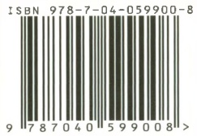

## 后记

本教材在高校思想政治理论课教材编写领导小组领导下组织编写。在编写过程中，得到了马克思主义理论研究和建设工程咨询委员会的指导，得到了中央有关部门和有关专家学者的帮助和支持。同时，广泛听取了高校思想政治理论课教师和大学生的意见和建议。

本教材2007年出版，由首席专家逄锦聚主持编写。首席专家陶德麟、王展飞、许征帆、李毅，主要成员石云霞、刘建军、吴倬、何自力、张澍军、陈路、郝立新、洪银兴、顾海良、寇清杰参加编写。对本教材提出修改意见并给予多方面支持的还有:吴树青、黄楠森、陈先达、庄福龄、赵曜、杨瑞森、马绍孟、朱光华、胡培兆、赵家祥、李崇富、严书翰、杨金海、侯惠勤、丰子义、梁树发、刘书林、张新、柴方国、徐洋、张西明、徐维凡、王心富、邵文辉、刘贵芹、陈矛、陈睿、葛海彦、胡长栓、田哲、李向阳、马德富、刘辉、冯素杰等。

本教材2007年出版以来，为了更及时、更充分地反映党的理论创新和实践创新成果，中宣部、教育部组织课题组在广泛调研的基础上，分别于2008年1月、2009年5月、2010年5月、2013年7月、2015年8月、2018年3月、2021年8月组织了7次修订。2008年，由首席专家逄锦聚主持修订，首席专家陶德麟、王展飞、许征帆、李毅、韦建桦、李忠杰，主要成员石云霞、刘建军、吴倬、何自力、张澍军、陈路、郝立新、洪银兴、顾海良、寇清杰参加修订。2009年、2010年，课题组又分别对教材进行了修订。2013年，由逄锦聚主持修订，王展飞、李毅、刘建军、石云霞、吴倬、何自力、张澍军、陈路、郝立新、寇清杰参加具体修订工作；参加审看的有:赵家祥、杨瑞森、钱淦荣、白暴力、周春明、蒋红、王岩、周向军等。2015年，由逄锦聚主持修订，刘建军、石云霞、何自力、郝立新、寇清杰、张澍军、吴倬、李朝东、孙来斌、侯惠勤、孙熙国、袁久红、熊晓琳、蒋红、郝清杰参加修订；参加审看的有:王展飞、杨瑞森、赵家祥、曹长盛、闫志民、朱景文、常光民、张新、秦宣、颜晓峰、于沛、姜辉、郑镇、白暴力、张宇、孙蚌珠、黄秋生、杨慧民、刘震等。2018年，由刘建军主持修订，郝立新、寇清杰、熊晓琳、崔建霞、蒋红、沈江平、宫长瑞参加修订；参加审看的有:韩震、杨河、张宇、姜辉、孙来斌、袁久红等。2021年，由刘建军主持修订，郝立新、寇清杰、熊晓琳、崔建霞、蒋红、孙来斌、袁久红、刘凤义、杨慧民、沈江平、宫长瑞、张明明参加修订。

马克思主义理论研究和建设工程办公室具体组织实施了本教材编写和历次审阅修订工作。其中，2013年，张磊主持审阅修改工作，宋凌云、邵文辉、王昆、田岩、冯静、潘顺照、吴伟珍、范为、李军、魏学江、宋义栋参加了具体审改工作。2015年，夏伟东、邵文辉主持审改定稿工作，宋凌云、王昆、田岩、冯静、陈硕、杨荣、沈永福、邢国忠、曹守亮、陈培永、严文波、冯潇然参加了具体审改工作。2018年，夏伟东、邵文辉主持工程办公室组织的审改定稿工作，宋凌云、王昆、王勇、田岩、冯静、曹守亮、陈瑞来、刘小丰、薛向军、蒋岩桦、卢江、马文武等参加了具体审改工作。2021年，徐李孙、陈启清主持工程办公室组织的审改定稿工作，王昆、王勇、田岩、冯静、石文磊、吴学锐、刘志刚、张明、贾鹏飞、刘儒鹏、余立等参加了具体审改工作。

2022年10月，为进一步推动习近平新时代中国特色社会主义思想进教材、进课堂、进头脑，贯彻落实党的二十大和十九届六中全会精神，中宣部、教育部组织对教材进行修订。刘建军主持修订，郝立新、寇清杰、熊晓琳、崔建霞、蒋红、孙来斌、袁久红、刘凤义、杨慧民、沈江平、宫长瑞、张明明、闫方洁参加修订。徐李孙、陈启清主持工程办公室组织的审改定

稿工作，王昆、王勇、石文磊、吴学锐、刘水静、黄刚、曾庆桃、史泽源、胡晓宇等参加了具体审改工作。参加审看的有:逄锦聚、孙熙国、艾四林、张晖等。

2023年1月

## 郑重声明

高等教育出版社依法对本书享有专有出版权。任何未经许可的复制、销售行为均违反《中华人民共和国著作权法》，其行为人将承担相应的民事责任和行政责任；构成犯罪的，将被依法追究刑事责任。为了维护市场秩序，保护读者的合法权益，避免读者误用盗版书造成不良后果，我社将配合行政执法部门和司法机关对违法犯罪的单位和个人进行严厉打击。社会各界人士如发现上述侵权行为，希望及时举报，我社将奖励举报有功人员。

反盗版举报电话 （010）58581999 58582371

反盗版举报邮箱 dd@hep.com.cn

通信地址 北京市西城区德外大街4号 高等教育出版社法律事务部

邮政编码 100120

## 读者意见反馈

为收集对教材的意见建议，进一步完善教材编写并做好服务工作，读者可将对本教材的意见建议通过如下渠道反馈至我社。

咨询电话 400-810-0598

反馈邮箱 gjdzfwb@pub.hep.cn

通信地址 北京市朝阳区惠新东街4号富盛大厦1座高等教育出版社总编辑办公室

邮政编码 100029

防伪查询说明

用户购书后刮开封底防伪涂层，使用手机微信等软件扫描二维码，会跳转至防伪查询网页，获得所购图书详细信息。

防伪客服电话 (010)58582300

# 本教材2018年版曾获首届全国教材建设奖全国优秀教材特等奖

seal

G
品惠
心电

定价23.00元