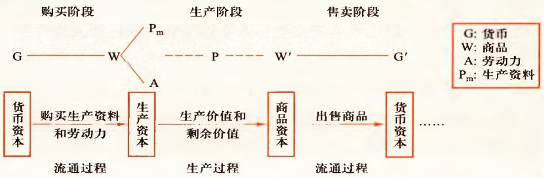

第二节 资本主义经济制度

203

西方殖民者在300多年时间里，仅从中南美洲就抢走了250万公斤黄金、1亿公斤白银。1783年到1793年的十年间，英国仅利物浦一地就贩运了33万多名黑人，奴隶贸易使非洲丧失的人口超过1亿。马克思指出:“美洲金银产地的发现，土著居民的被剿灭、被奴役和被埋葬于矿井，对东印度开始进行的征服和掠夺，非洲变成商业性地猎获黑人的场所——这一切标志着资本主义生产时代的曙光。” $^{①}$ 新兴资产阶级在国外进行疯狂掠夺的同时，还通过国债制度、课税制度和保护关税制度，加强对国内人民的剥削，积累起巨额货币资本。这一切都大大促进了资本主义的发展，缩短了封建生产方式转变为资本主义生产方式的历史进程。资本原始积累的事实表明，资产阶级的发家史就是一部罪恶的掠夺史。

## （四）资本主义所有制的确立

生产资料所有制是指事实上生产资料归谁所有、归谁支配，并凭借这种所有和支配实现生产和获得剩余产品，生产资料所有制性质决定生产关系的性质。

从历史上看，奴隶制度、封建制度和资本主义制度都是剥削制度，其区别在于对生产资料的占有方式不同以及由此决定的劳动者与生产资料的结合方式不同。在奴隶社会，奴隶主占有土地及其他生产资料，并完全占有奴隶的人身及其劳动成果，奴隶与生产资料的结合是以剥削者对被剥削者的完全人身占有为基础的。在封建社会，封建主占有基本生产资料即土地，而农民为了生存，不得不依附于封建主，封建主对农民进行残酷的剥削，农民与土地的结合是以农民对封建主的人身依附为条件的。

在资本主义社会，经过资本原始积累过程，资本主义所有制得以确

<small>①《马克思恩格斯选集》第二卷，人民出版社2012年版，第296页。</small>

---

204

第四章 资本主义的本质及规律

立。资本家拥有生产资料的所有权，劳动者与生产资料相分离，为了维持生存，劳动者不得不通过将劳动力出卖给资本家来实现与生产资料的结合，资本家与工人的关系变成雇佣劳动关系。在这种关系中，生产资料和货币采取了资本的形式，资本家不但拥有生产资料的所有权，而且拥有对雇佣劳动者的支配权，并凭借这种所有权和支配权实现对全部劳动产品的占有和支配，从而无偿占有雇佣工人创造的剩余价值。资本主义所有制决定的资本与雇佣劳动之间剥削与被剥削的关系，反映了资本主义经济制度的本质。与以往的剥削制度不同，资本家与雇佣工人的关系不是完全占有，也不是人身依附，而是基于劳动者人身自由基础上的“平等”关系，剥削带有一定的隐蔽性。

## 二、劳动力成为商品与货币转化为资本

资本首先表现为一定量的货币，但货币本身并不就是资本。作为货币的货币和作为资本的货币，在形式上有明显区别。在“W—G—W”这个公式中，W代表商品，G代表流通中的货币。这是简单商品流通公式，这个公式表明商品流通的目的是获得使用价值。在“G—W—G”这个公式中，W代表商品，G代表的不是一般意义上的货币，而是作为资本的货币，G'代表的是价值增殖后的货币。这个公式表明资本运动的一般目的是价值增殖，因此被称为“资本总公式”。

从形式上看，资本总公式与商品交换的原则是矛盾的。价值规律要求商品交换遵循等价交换原则，交换领域不能创造新价值，但资本总公式却表明，资本在流通中创造了新价值。如何理解这个矛盾呢？问题的关键在于劳动力成为商品。

## （一）劳动力成为商品的基本条件

劳动力是指人的劳动能力，是人的脑力和体力的总和。劳动力的使用

---

第二节 资本主义经济制度

205

即劳动。人的劳动是任何社会进行生产都不可缺少的基本条件、基本要素，没有劳动就不可能有人类社会的生存与发展。

劳动力成为商品，要具备两个基本条件:其一，劳动者在法律上是自由人，能够把自己的劳动力当作自己的商品来支配；其二，劳动者没有任何生产资料，没有生活资料来源，因而不得不依靠出卖劳动力为生。劳动力成为商品的两个条件并不是自古以来就有的，而是在封建社会后期发生的资本原始积累过程中逐渐形成的。劳动力成为商品，标志着简单商品生产发展到资本主义商品生产的新阶段。在这一阶段，资本家与工人的关系，形式上是“自由”“平等”的买卖关系，而实质上是资本家支配和剥削工人的雇佣劳动关系。马克思说:“罗马的奴隶是由锁链，雇佣工人则由看不见的线系在自己的所有者手里。”①

## （二）劳动力商品的特点与货币转化为资本

像任何商品一样，劳动力商品也具有价值和使用价值。但是，劳动力是特殊的商品，它的价值和使用价值具有不同于普通商品的特点。“劳动力的价值，是由生产、发展、维持和延续劳动力所必需的生活必需品的价值决定的。”②它包括三个部分:（1）维持劳动者本人生存所必需的生活资料的价值；（2）维持劳动者家属的生存所必需的生活资料的价值；（3）劳动者接受教育和训练所支出的费用。由于劳动力价值的构成包含历史和道德的因素，在不同的国家或在同一国家的不同历史时期，劳动者所必需的生活资料的数量和构成是有区别的，所以劳动力价值的最低界限是由生活上不可缺少的生活资料的价值决定的。一旦劳动力价值降低到这个界限以下，劳动力就只能在萎缩的状态下维持。

<small>① 《马克思恩格斯选集》第二卷，人民出版社2012年版，第258页。</small>

<small>②《马克思恩格斯选集》第二卷，人民出版社2012年版，第47页。</small>

---

206

第四章 资本主义的本质及规律

劳动力这种特殊商品具有独特的使用价值，它能提供劳动，从而能创造价值，但这并不触犯商品生产的一般规律。所以，如果说预付在工资上的价值额不仅在产品中简单地再现出来，而且还增加了一个剩余价值，那么，这也并不是由于卖者被欺诈，——他已获得了自己商品的价值，——而只是由于买者消费了这种商品。

——马克思:《资本论》第一卷

劳动力商品在使用价值上有一个很突出的特点，就是它的使用价值是价值的源泉，在消费过程中能够创造新的价值，而且这个新的价值比劳动力本身的价值更大。正是由于这一特点，货币所有者购买到劳动力以后，在消费过程中，不仅能够收回他在购买这种特殊商品时支付的价值，还能得到一个增殖的价值即剩余价值（用 $\mathrm{m}$ 表示）。而一旦货币购买的劳动力带来剩余价值，货币也就变成了资本。

资本是能够带来剩余价值的价值。剩余价值是由雇佣工人的剩余劳动创造的。在资本主义社会，资本总是通过各种物品表现出来，“但资本不是物，而是一定的、社会的、属于一定历史社会形态的生产关系，后者体现在一个物上，并赋予这个物以独特的社会性质” $^{①}$ 。“这是资产阶级的生产关系，是资产阶级社会的生产关系。” $^{②}$

## 三、生产剩余价值是资本主义生产方式的绝对规律

资本主义生产的直接目的和决定性动机，就是无休止地获取尽可能多的剩余价值。这种不以人的意志为转移的客观必然性就是剩余价

<small>①《马克思恩格斯选集》第二卷，人民出版社2012年版，第644页。</small>

<small>②《马克思恩格斯选集》第一卷，人民出版社2012年版，第341页。</small>

---

第二节 资本主义经济制度

207

值规律。马克思指出:“生产剩余价值或赚钱，是这个生产方式的绝对规律。”①

（一）剩余价值的生产过程和资本的不同部分在剩余价值生产中的作用

剩余价值是在资本主义生产过程中生产出来的。资本主义生产过程具有二重性，一方面是生产物质资料的劳动过程；另一方面是生产剩余价值的过程，即价值增殖过程。资本主义生产过程是劳动过程和价值增殖过程的统一。

生产物质资料的劳动过程包括三个基本要素，即劳动者的劳动、劳动对象和劳动资料。劳动过程是劳动者通过有目的的活动，即运用劳动资料对劳动对象进行加工，改变自然界的物质形态，创造出满足人们某种需要的使用价值的过程。由于资本主义劳动过程的要素都为资本家所占有，这就决定了资本主义劳动过程的两个特点:其一，工人在资本家的监督下劳动，他们的劳动隶属于资本家；其二，劳动的成果或者产品全部归资本家所有。

价值增殖过程是剩余价值的生产过程，这是资本主义生产过程的主要方面。所谓价值增殖过程，是超过劳动力价值的补偿这个一定点而延长了的价值形成过程。如果劳动者创造的价值刚好补偿资本家所预付的劳动力价值，那就是单纯的价值形成过程；如果价值形成过程超过了这个一定点，就变成了价值增殖过程。马克思指出:“作为劳动过程和价值形成过程的统一，生产过程是商品生产过程；作为劳动过程和价值增殖过程的统一，生产过程是资本主义生产过程，是商品生产的资本主义形式。”②在价值增殖过程中，雇佣工人的劳动分为两部分:一部分是必要劳动，用于

<small>①《马克思恩格斯选集》第二卷，人民出版社2012年版，第276页。</small>

<small>②《马克思恩格斯选集》第二卷，人民出版社2012年版，第180页。</small>

---

208

第四章 资本主义的本质及规律

再生产劳动力的价值；另一部分是剩余劳动，用于无偿地为资本家生产剩余价值。因此，剩余价值是雇佣工人所创造并被资本家无偿占有的超过劳动力价值的那部分价值，它是雇佣工人剩余劳动的凝结，体现了资本家与雇佣工人之间剥削与被剥削的关系。

黑人就是黑人。只有在一定的关系下，他才成为奴隶。纺纱机是纺棉花的机器。只有在一定的关系下，它才成为资本。脱离了这种关系，它也就不是资本了，就像黄金本身并不是货币，砂糖并不是砂糖的价格一样。

——马克思:《雇佣劳动与资本》

根据资本在剩余价值生产中所起的不同作用，可以将资本划分为不变资本与可变资本。

不变资本是以生产资料形态存在的资本。生产资料的价值通过工人的具体劳动被转移到新产品中，其转移的价值量不会大于它原有的价值量。尽管不同形式的生产资料转移价值的形式有所不同，有的是在一次生产过程中全部转移，如原材料和燃料；有的是在多次生产过程中逐渐转移，如机器、厂房等，但是转移的总是生产资料原有的价值量。以生产资料形式存在的资本在生产过程中只转移自己的价值量，不发生增殖，这部分资本叫作不变资本（用c表示）。

可变资本是用来购买劳动力的那部分资本。可变资本的价值在生产过程中不是被转移到新产品中去，而是由工人的劳动再生产出来。在生产过程中，工人所创造的新价值不仅包括相当于劳动力价值的价值，而且还包括一定量的剩余价值。由于这部分资本的价值是一个可变的量，因此叫作可变资本（用 v 表示）。我们可以把资本主义商品的价值构成用公式表示:

$$
\mathrm{W} = \mathrm{c} + \mathrm{v} + \mathrm{m}
$$

---

第二节 资本主义经济制度

209

把资本划分为不变资本和可变资本，进一步揭示了剩余价值的源泉。这表明，剩余价值既不是由全部资本创造的，也不是由不变资本创造的，而是由可变资本雇佣的劳动者创造的。雇佣劳动者的剩余劳动是剩余价值的唯一源泉。这种划分也为确定资本家对雇佣劳动者的剥削程度提供了科学依据。

由于剩余价值不是由全部资本创造的，而仅仅是由可变资本雇佣的劳动者创造的，因此，要确定资本家对工人的剥削程度，就应该用剩余价值和雇佣劳动者的可变资本相比，而不应该把它去同全部资本相比。用公式表示:

$$
\mathrm{m} ^{\prime} = \mathrm{m} / v
$$

在该公式中，$\mathrm{m}'$ 为剩余价值率，$\mathrm{m}$ 为剩余价值，$\upsilon$ 为可变资本。由于工人的必要劳动是用来再生产劳动力价值或可变资本的价值的，而剩余劳动则是生产剩余价值的，因此，剩余价值率还可以用剩余劳动与必要劳动的比率，或者剩余劳动时间与必要劳动时间的比率来表示:

$$
\mathrm{m} ^ {\prime} = \text {剩余劳动 / 必要劳动} = \text {剩余劳动时间 / 必要劳动时间}
$$

这两个公式是以不同的形式表示同一个关系:前一个公式是以物化劳动的形式表示资本家对工人的剥削程度，而后一个公式则是以活劳动的形式表示资本家对工人的剥削程度。

资本不是一种物，而是一种以物为中介的人和人之间的社会关系。

——马克思:《资本论》第一卷

## （二）剩余价值生产的两种基本方法

资本家提高对工人剥削程度的方法是多种多样的，最基本的方法有两种，即绝对剩余价值的生产和相对剩余价值的生产。

---

210

第四章 资本主义的本质及规律

绝对剩余价值是指在必要劳动时间不变的条件下，由于延长工作日的长度或提高劳动强度而生产的剩余价值。在资本主义制度下，工人的工作日包括必要劳动时间和剩余劳动时间两个部分。在必要劳动时间既定的条件下，工作日越长，剩余劳动时间越长，资本家从工人身上榨取的剩余价值就越多，从而剩余价值率就越高。这种生产剩余价值的方法叫作绝对剩余价值生产方法。

为了让工人生产更多的剩余价值，除了使用延长劳动时间的方法，资本家还使用提高工人劳动强度的方法，迫使工人更加紧张地劳动，让他们在同样长的劳动时间内比以前耗费更多的脑力和体力，这和延长工作日并没有本质的区别。因此，通过提高劳动强度生产剩余价值的方法同样是绝对剩余价值生产方法。

在资本主义发展的初期，生产技术以手工劳动为基础，资本家增加生产主要靠增加劳动量来实现，因此延长工作日就成为资本家提高剥削程度的基本方法。由于那个时期无产阶级还没有成长为一支自觉的政治力量，难以与资产阶级相抗衡，所以资本家能够凭借经济关系的强制力和国家法律的支持来延长工作日。在英国，从14世纪末到18世纪中叶这段时期，政府就曾经颁布各种劳工法令，强迫工人延长工作日。在18世纪后期至19世纪上半叶，资本家依然强迫工人每日劳动12、14、16个小时，有的时候甚至达到18个小时以上。马克思对资本主义发展过程中由于过度延长劳动时间给工人阶级带来的损害作出这样的抨击:“资本主义生产——实质上就是剩余价值的生产，就是剩余劳动的吮吸——通过延长工作日，不仅使人的劳动力由于被夺去了道德上和身体上正常的发展和活动的条件而处于萎缩状态，而且使劳动力本身未老先衰和过早死亡。它靠缩短工人的寿命，在一定期限内延长工人的生产时间。”①

相对剩余价值是指在工作日长度不变的条件下，通过缩短必要劳动时

<small>①《马克思恩格斯选集》第二卷，人民出版社2012年版，第192页。</small>

---

第二节 资本主义经济制度

211

间而相对延长剩余劳动时间所生产的剩余价值。通过延长劳动时间或提高劳动强度来生产剩余价值的方法受到工作日时间长度的限制，也容易引起工人阶级的反抗。为了在工作日长度既定的条件下提高剥削程度，资本家在调整必要劳动时间与剩余劳动时间的比例上下功夫，通过缩短必要劳动时间、相对延长剩余劳动时间，增加剩余价值的生产。这种生产剩余价值的方法叫作相对剩余价值生产方法。

缩短必要劳动时间是通过全社会劳动生产率的提高实现的。由于社会劳动生产率的提高，降低了劳动力的价值，从而缩短了必要劳动时间，相对延长了剩余劳动时间。全社会劳动生产率的提高是资本家追逐超额剩余价值的结果。超额剩余价值是指企业由于提高劳动生产率而使商品的个别价值低于社会价值的差额。在资本主义商品生产条件下，每个资本家总是力图不断改进技术，改善经营管理，提高劳动生产率，使其生产的商品的个别劳动时间少于社会必要劳动时间，个别价值低于社会价值，从而获得超额剩余价值。为了追求超额剩余价值，资本家之间进行着激烈的竞争。某个企业采取先进的技术，其他企业也会竞相采用新技术。当先进技术在部门内部普及后，部门平均劳动生产率就会提高，此时生产商品的社会必要劳动时间就会减少，商品价值就相应下降。当生活资料以及有关的生产部门的劳动生产率提高以后，用于补偿劳动力再生产所需要的生活资料的价值就会降低，用于补偿劳动力价值的必要劳动时间就会减少，而生产剩余价值的剩余劳动时间则会相对延长，由此所产生的剩余价值就是相对剩余价值。由此可见，在资本主义商品生产条件下，单个资本家改进技术、改善管理的主观动机是追求超额剩余价值，但其客观后果则是整个社会各个生产部门的劳动生产率普遍提高，导致生活资料的价值下降和补偿劳动力价值的必要劳动时间缩短，而剩余劳动时间相对延长，整个资本家阶级普遍获得更多的相对剩余价值。

绝对剩余价值生产和相对剩余价值生产在资本主义发展的不同阶段起着不同的作用。在资本主义发展的初期，资本家主要依靠绝对剩余价值生

---

212

第四章 资本主义的本质及规律

产来提高剥削程度。随着生产技术条件的不断改进和工人阶级反抗资本家延长工作日的斗争力量的增强，相对剩余价值生产的作用就日益突出了。

第二次世界大战以后，资本主义国家经历了第三次科学技术革命，电子计算机、数控机床等自动化装置在生产中得到比较普遍的应用，机器大工业发展到自动化阶段。生产自动化主要表现为:一是工业机器人的开发和利用，代替了工人大量的体力劳动和部分脑力劳动；二是自动化生产线的广泛使用，使直接从事生产操作的工人大大减少，甚至出现了少数所谓的“无人工厂”。资产阶级经济学家根据这些情况，宣称技术和科学“成为独立的剩余价值源泉”，马克思的剩余价值学说已不适用于现代资本主义。这种观点是错误的。

资本主义条件下的生产自动化只是意味着剩余价值生产所使用的生产工具更加先进了，不论是机器人、自动化生产线还是“无人工厂”，在本质上依然是物化劳动或不变资本的实物形式，它们在参加产品的生产时，只是把原有的价值转移到产品中去，而不创造新价值，更不能创造剩余价值。在生产自动化条件下，直接从事生产劳动的工人相对减少，而从事科研、设计、技术和管理劳动的人员日益增加，“总体工人”中脑力劳动者的比重不断增大。劳动的复杂程度和强度日益提高，生产力日益提升，从而创造出更多的价值和剩余价值。总之，资本主义条件下的生产自动化是人类社会科学技术进步的结晶，它的普遍采用会大幅度提高劳动生产率，使资本家获得比过去更多的剩余价值。资本主义条件下的生产自动化是资本家获取高额剩余价值的手段，而雇佣工人的剩余劳动仍然是这种剩余价值的唯一源泉。

需要指出的是，资本主义生产的根本目的是追求剩余价值，但客观上也会促进生产力的发展和社会进步。马克思指出:“资本的文明面之一是，它榨取这种剩余劳动的方式和条件，同以前的奴隶制、农奴制等形式相比，都更有利于生产力的发展，有利于社会关系的发展，有利于更高级的新形态的各种要素的创造。因此，资本一方面会导致这样一个阶段，在

---

第二节 资本主义经济制度

213

这个阶段上，社会上的一部分人靠牺牲另一部分人来强制和垄断社会发展（包括这种发展的物质方面和精神方面的利益）的现象将会消灭；另一方面，这个阶段又会为这样一些关系创造出物质手段和萌芽，这些关系在一个更高级的社会形式中，使这种剩余劳动能够同物质劳动一般所占用的时间的更大的节制结合在一起。”①

## （三）资本积累

把剩余价值转化为资本，或者说，剩余价值的资本化，就是资本积累。

资本家瓜分到剩余价值后，如果将其完全用于个人消费，则生产就在原有规模的基础上重复进行，这叫资本主义简单再生产。资本主义简单再生产不仅生产商品、生产剩余价值，而且还生产和再生产资本主义生产关系本身:一方面是资本家，另一方面是雇佣工人。因此，资本主义简单再生产就其实质而言，是物质资料再生产和资本主义生产关系再生产的统一。但是，资本主义再生产的特点是扩大再生产。资本家获得无偿占有的剩余价值后，并不是将其完全用于个人消费，而是将一部分转化为资本，用以购买追加的生产资料和劳动力，使生产在扩大的规模上重复进行，这就是资本主义扩大再生产。在这里，资本积累是资本主义扩大再生产的源泉。剩余价值本来是雇佣工人的剩余劳动创造的并为资本家所无偿占有的那部分新价值，现在，资本家又用从工人那里剥削获得的收益，再来购买工人的劳动力，进行更大规模的生产，以榨取更多的剩余价值。所以，资本积累的本质，就是资本家不断地利用无偿占有的工人创造的剩余价值来扩大自己的资本规模，从而进一步扩大和加强对工人的剥削和统治。

资本积累的源泉是剩余价值，资本积累规模的大小取决于资本家对

<small>①《马克思恩格斯文集》第七卷，人民出版社2009年版，第927—928页。</small>

---

214

第四章 资本主义的本质及规律

工人的剥削程度、劳动生产率的高低、所用资本和所费资本之间的差额以及资本家预付资本的大小。这些因素都是加强和扩大对工人剥削的因素。因此，资本积累就是依靠剥削工人所创造的剩余价值而实现的，没有剩余价值，就不可能有资本积累。随着资本积累和生产规模的扩大，社会财富日益集中到资产阶级手中，而社会财富的直接创造者即无产阶级则只占有少部分社会财富。这样必然加剧社会的两极分化，即一极是财富越来越集中于少数人手中，另一极是多数人只拥有社会财富的较小部分。

在一极是财富的积累，同时在另一极，即在把自己的产品作为资本来生产的阶级方面，是贫困、劳动折磨、受奴役、无知、粗野和道德堕落的积累。

——马克思:《资本论》第一卷

资本积累不但是社会财富占有两极分化的重要原因，而且是资本主义社会失业现象产生的根源。随着资本积累而产生的失业是由资本追逐剩余价值引起资本有机构成的提高所导致的。在资本主义企业内部，资本家投入资本主义生产过程的资本，从自然形式上看，总是由一定数量的生产资料和劳动力构成的。在生产资料和劳动力之间，存在着一定比例，这个比例取决于生产技术的发展水平。生产技术水平越高，每个劳动力所推动的生产资料的数量就越多；生产技术水平越低，每个劳动力所推动的生产资料的数量就越少。这种由生产的技术水平所决定的生产资料和劳动力之间的比例，叫作资本的技术构成。从价值形式上看，资本可分为不变资本和可变资本，这两部分资本价值之间的比例，叫作资本的价值构成。在资本的技术构成和资本的价值构成之间，存在密切的联系。一般来说，资本的技术构成决定资本的价值构成，技术构成的变化往往会引起价值构成的相应变化，而价值构成的变化通常反映技术构

---

第二节 资本主义经济制度

215

成的变化。这种由资本的技术构成决定并反映技术构成变化的资本价值构成，叫作资本的有机构成。

在资本主义生产过程中，资本有机构成的提高是一般趋势，这是由资本的本性决定的。资本主义生产的唯一动机和直接目的就是追求剩余价值。为了达到这一目的，资本家便尽可能改进技术，提高劳动生产率，加快资本积累，通过资本积聚和资本集中扩大生产规模。资本积聚是指个别资本通过剩余价值的资本化来增大资本的总量。资本积累是资本积聚的基础，资本积聚是资本积累的直接结果，资本积累越多，资本积聚的规模就越大，个别资本总额就越大。资本集中是指个别资本通过结合而形成较大的资本。竞争和信用是资本集中最强有力的杠杆。在生产技术水平不断提高的条件下，随着资本积累的增长，必然伴随着资本的积聚和集中，使个别资本的规模日益增大。在自然形式上，每个劳动力所推动的生产资料的数量大幅度增加；在价值形式上，不变资本部分日益增多，可变资本在资本总额中所占的比重日益下降，从而资本有机构成得以不断提高。在资本有机构成提高的情况下，由于可变资本的相对量的减少，资本对劳动力的需求日益相对减少，其结果就是不可避免地造成大批工人失业，形成相对过剩人口。所谓相对过剩人口，就是劳动力供给超过了资本的需要。这种过剩人口之所以是相对的，是因为他们并不是社会生产发展所绝对不需要的，而是由于不为资本价值增殖所需要，才成为“过剩”或“多余”的。正如马克思所说:“资本主义积累不断地并且同它的能力和规模成比例地生产出相对的，即超过资本增殖的平均需要的，因而是过剩的或追加的工人人口。” $^{①}$ 在资本主义发展过程中，相对过剩人口基本上有三种形式:第一种是流动的过剩人口，第二种是潜在的过剩人口，第三种是停滞的过剩人口。经常性的庞大失业人口的存在，是资本主义的痼疾。资产阶级政府通过各种干预措施能在一定程度上缓解失业，但不可能彻底消灭失业。

<small>①《马克思恩格斯选集》第二卷，人民出版社2012年版，第284页。</small>

---

216

第四章 资本主义的本质及规律

资本积累的历史趋势是资本主义制度的必然灭亡和社会主义制度的必然胜利。随着资本积累的增长，一方面，资本主义生产越来越具有社会性，其表现是:生产资料的使用社会化，生产过程成为许多人协同进行的社会化的大生产；各个企业、各个部门之间的相互联系和相互依赖的程度日益加强；社会分工不断扩大，生产的范围从一个企业扩展到一个国家，甚至扩展到全球，整个社会的经济活动密切地联结成一个整体。另一方面，资本越来越集中于少数资本家手中，生产什么、生产多少、如何生产，完全服从于资本家追逐剩余价值的目的，按照资本家个人的意愿来进行；生产出来的产品完全由资本家所占有，并按照他们的私利来进行交换和分配。这样，在生产社会化和生产资料资本主义私人占有之间便产生了深刻的矛盾。随着资本积累的不断增长，这种矛盾日益加剧，资本主义最终会被新的、更能适应社会化大生产要求的社会形态所取代。

马克思关于资本积累的理论是剩余价值学说的重要组成部分，它揭露了资本主义制度下贫富两极分化的原因，揭示了资本主义失业现象的本质，深刻地阐明了资本主义制度必然走向灭亡的历史命运。

## （四）资本的循环周转与再生产

资本作为一种能够增殖的价值，不仅在生产过程内运动，而且也在流通过程内运动，要深刻认识资本价值增殖的秘密，还必须考察资本的流通。马克思在分析资本流通过程中，首先详尽地分析了个别资本的运动，即资本的循环和周转过程，揭示了资本循环周转规律。

资本循环是资本从一种形式出发，经过一系列形式的变化，又回到原来出发点的运动。产业资本在循环过程中要经历三个不同的阶段，与此相联系的是资本依次执行三种不同的职能。第一个阶段是购买阶段，即生产资料和劳动力的购买阶段。它属于商品的流通过程。在这一阶段，产业资本执行的是货币资本的职能。第二个阶段是生产阶段，即生产资料与劳动力按比例结合在一起从事资本主义生产的阶段。在这个阶段上，生产资料

---

第二节 资本主义经济制度

217

与劳动者相结合生产物质财富并使生产资本得以增殖，产业资本执行的是生产资本的职能。第三个阶段是售卖阶段，即商品资本向货币资本的转化阶段。在此阶段，产业资本执行的是商品资本的职能，通过商品售卖不仅要实现商品的价值，还要实现剩余价值。见下图。

产业资本的运动，必须具备两个基本前提条件:一是产业资本的三种职能形式必须在空间上并存，也就是说，产业资本必须按照一定比例同时存在于货币资本、生产资本和商品资本三种形式中。二是产业资本的三种职能形式必须在时间上继起，也就是说，产业资本循环中三种职能形式的转化必须保持时间上的依次连续性。货币资本、生产资本、商品资本三种职能形式在空间上的并存性与在时间上的继起性表明，产业资本的连续循环是流通过程和生产过程的统一，也是它的三种职能形式循环，即货币资本循环、生产资本循环和商品资本循环的统一。

资本是在运动中增殖的，必须不断地、周而复始地循环，才能不断地带来剩余价值。这种周而复始、不断反复着的资本循环，就叫作资本的周转。如果每次资本周转带来的剩余价值一定，则资本周转越快，在一定时期内带来的剩余价值就越多。影响资本周转快慢的因素有许多，关键的因素有两个:一是资本周转的时间，二是生产资本的固定资本和流动资本的构成。要加快资本周转速度，获得更多剩余价值，就要缩短资本周转时间，加快流动资本的周转速度。

资本循环与周转规律作用的发挥，必然受到经济制度因素的制约。在

---

218

第四章 资本主义的本质及规律

资本主义条件下，该规律的存在对资本家追逐剩余价值有重要影响。资本在运动过程中，必须保持三种职能形式在空间上的并存性；必须保持每一种职能形式的依次转化，即在时间上的继起性。只有这样，才能保证资本无止境的价值增殖运动。然而，这个条件在资本主义制度下并不总是能够具备的。由于资本主义各种矛盾的存在，特别是资本主义基本矛盾的存在，周期性爆发的经济危机和波动使得资本连续和高速运动的条件经常遭到破坏。

在对个别资本的再生产和流通的规律性进行分析的基础上，马克思对社会总资本的再生产和流通也进行了深入分析，阐明了社会总资本再生产和流通的规律性，进一步揭露了资本主义经济所包含的对抗性矛盾。

社会生产是连续不断地进行的，这种连续不断重复的生产就是再生产。社会再生产的核心问题是社会总产品的实现问题，即社会总产品的价值补偿和实物补偿问题。为了深刻阐明社会总产品的实现问题，进而揭示再生产的一般规律，马克思将社会总产品在物质上划分为两大部类，在价值上划分为三个组成部分。所谓社会总产品就是社会在一定时期（通常为一年）所生产的全部物质资料的总和。社会总产品在价值形态上又叫社会总价值，划分为包括在产品中的生产资料的转移价值（c）、凝结在产品中的由工人必要劳动时间创造的价值（v），以及凝结在产品中的由工人在剩余劳动时间里创造的价值（m）。社会总产品在物质形态上，根据其最终用途可以划分为用于生产消费的生产资料和用于生活消费的消费资料。相应地，社会生产可以划分为两大部类:第一部类（Ⅰ）由生产生产资料的部门所构成，其产品进入生产消费领域；第二部类（Ⅱ）由生产消费资料的部门所构成，其产品进入生活消费领域。

社会再生产的顺利进行，要求生产中所耗费的资本在价值上得到补偿，同时还要求实际生产过程中所耗费的生产资料和消费资料得到实物的替换，否则社会再生产就会停顿，人类社会的生存和发展就会受到威胁。所以，使社会总产品在价值上得到补偿，在实物上得到替换，以使社会再

---

第二节 资本主义经济制度

219

生产顺利进行，是不以人的意志为转移的客观规律。

社会总产品在实物上得到替换，在价值上实现补偿，客观上就要求两大部类内部各个产业部门之间和两大部类之间保持一定的比例关系。生产资料的生产和消费资料的生产既要保证简单再生产的实现，更要保证扩大再生产的实现。生产资料的生产既要满足两大部类对所耗费掉的生产资料的补偿，也要保证两大部类扩大生产规模后对追加生产资料的需求。消费资料的生产则既要满足两大部类劳动者的个人消费和社会消费，也要满足扩大生产规模后对追加消费资料的需求。上述比例不只是总量上的比例，还是结构上的比例。只有两大部类的生产不仅在规模上而且在结构上保持一定的比例，社会总产品的价值补偿和实物替换才能正常实现，社会再生产才能顺利进行。

在资本主义发展相当长的时期内，由生产资料的私有制和雇佣劳动制度所决定，两大部类的生产都是在价值规律和剩余价值规律的作用下自发进行的，具有严重的盲目性，这就导致了两大部类生产在规模上和结构上经常处于失衡状态。这种失衡和脱节经常表现为生产过剩，以至于社会总产品的实现，即实物替换和价值补偿难以顺利进行，最严重的就是引发经济危机。经济危机实际上是资本主义条件下以强制的方式解决社会再生产的实现问题的途径，这种解决方式虽然最终也能够使社会再生产由失衡慢慢转变为平衡，却是以社会经济生活的严重混乱甚至瘫痪以及社会资源和财富的极大浪费为代价的。

## （五）工资与剩余价值的分配

在资本主义制度下，工人的工资是劳动力的价值或价格，这是资本主义工资的本质。在这种制度下，资本家购买工人的劳动力是以货币工资形式支付的，工人为资本家劳动，资本家付给工人工资，工资表现为“劳动的价格”或工人全部劳动的报酬，这就模糊了工人必要劳动和剩余劳动的界限，掩盖了资本主义的剥削关系。“这种假象，就是雇佣劳动和历史上

---

220

第四章 资本主义的本质及规律

其他形式的劳动的不同之处。”①

资本主义工资的形式主要有两种，即计时工资和计件工资。除此之外，资本家还建立了各种形式的血汗工资制度，其特点是利用“科学的劳动组织”，最大限度地提高工人的劳动强度，从他们身上榨取更多的血汗。这种工资制度的典型形式，就是19世纪末20世纪初流行的“泰罗制”和“福特制”。关于血汗工资制度的实质，列宁曾一针见血地指出，它的实行“意味着榨取血汗的艺术的进步”②。

在当代资本主义国家，随着社会生产力的发展、科学技术的进步、劳动过程的复杂化和脑力劳动作用的加强，工人的实际工资呈现出不断提高的趋势，但是与其创造的剩余价值的增长幅度相比，实际工资提高的幅度还是较小的。只要资本和雇佣劳动的基本经济关系不变，资本主义工资的本质就不会发生根本变化。

在现实的资本主义经济生活中，资本家并不是把剩余价值看作可变资本的产物，而是把它看作全部预付资本的产物或增加额，剩余价值便取得了利润的形态。当剩余价值转化为利润时，剩余价值率也转化为利润率。剩余价值率是剩余价值与可变资本的比率，反映的是资本家对工人的剥削程度；利润率则是剩余价值与全部预付资本的比率，反映的是预付总资本的增殖程度，掩盖了资本家对工人的剥削。资本主义生产的目的是获得利润。为了得到尽可能高的利润率和尽可能多的利润，不同生产部门的资本家之间必然展开激烈的竞争，大量资本必然从利润率低的部门转投到利润率高的部门，从而导致利润率平均化。在利润率平均化的过程中，形成了社会的平均利润率，按照平均利润率计算和获得的利润，叫作平均利润。

利润转化为平均利润，是剩余价值规律和竞争规律作用的必然结果，

<small>① 《马克思恩格斯选集》第二卷，人民出版社2012年版，第50页。</small>

<small>②《列宁全集》第二十三卷，人民出版社2017年版，第19页。</small>

---

第二节 资本主义经济制度

221

体现着不同部门的资本家集团要求按照等量资本获得等量利润的原则来瓜分剩余价值的关系。在利润率平均化的过程中，产业资本家得到产业利润，商业资本家得到商业利润，银行资本家得到银行利润，农业资本家得到农业利润，这些不同部门的资本家瓜分到的利润只是平均利润。平均利润率规律的作用表明，平均利润率是剩余价值总量与社会总资本的比率。每个资本家所得利润多少不仅取决于他对本企业工人的剥削程度，而且取决于整个资产阶级对整个工人阶级的剥削程度。资本家之间在瓜分剩余价值上固然有一定程度的利害冲突，但在加强对工人阶级的剥削以榨取更多的剩余价值这一点上，有着共同的阶级利益。

利润转化为平均利润，价值也就转化为生产价格。生产价格是商品价值的转化形式，是生产成本与平均利润之和。生产成本是由生产中实际耗费的不变资本和可变资本所构成的。在价值转化为生产价格的条件下，价值规律作用的形式发生了变化。商品不再以价值而是以生产价格为基础进行交换，市场价格的变动不再以价值为中心，而是以生产价格为中心。从价值到生产价格的转化，是随着资本主义大工业的出现和发展而完成的，反映了从小商品生产到资本主义商品生产的历史发展过程。

生产价格是价值的转化形式，商品按照生产价格而不是价值出售并不违背价值规律，而是价值规律的实现形式发生了变化。虽然从个别部门来看，资本家获得的平均利润与本部门工人创造的剩余价值可能不一致，但从全社会来看，整个资本家阶级获得的利润总额与雇佣工人所创造的剩余价值总额是相等的；虽然从个别部门看，商品的生产价格同价值可能不一致，但从全社会来看，商品的生产价格总额和价值总额是相等的。生产价格随着商品价值的变化而变动，生产商品的社会必要劳动时间减少，生产价格就会降低；反之，生产价格就会提高。

## （六）剩余价值理论的意义

马克思通过分析剩余价值的生产、积累、流通以及分配过程，揭示了

---

222

第四章 资本主义的本质及规律

剩余价值的运动规律及其作用，创立了剩余价值理论。剩余价值理论深刻揭露了资本主义生产关系的剥削本质，阐明了资产阶级与无产阶级之间阶级斗争的经济根源，指出了无产阶级革命的历史必然性。剩余价值理论是马克思经济学说的核心内容和基石，是无产阶级反对资产阶级、揭示资本主义制度剥削本质的锐利武器。由于唯物史观和剩余价值理论的发现，社会主义由空想变为科学。

马克思在分析剩余价值的生产、积累、流通以及分配过程，揭示资本主义经济特殊规律的同时，也揭示了商品经济和社会化生产的一般规律，这些一般规律在社会主义市场经济中也发挥作用。

## 四、资本主义的基本矛盾与经济危机

认识资本主义经济制度的本质，揭示资本主义经济危机的根源，预见资本主义的发展趋势，都必须把握资本主义基本矛盾。

## （一）资本主义基本矛盾

生产社会化和生产资料资本主义私人占有之间的矛盾，是资本主义的基本矛盾。

在资本主义条件下，随着科学技术的进步和社会生产力的不断发展，资本主义生产不断社会化。但是，在资本家私人占有生产资料和剥削雇佣劳动者的生产关系中，社会化的生产力却变成资本的生产力，变成资本高效能地榨取剩余劳动、占有剩余价值、实现价值增殖的能力。这样，已经社会化的、由劳动者共同使用的生产资料，本应该由劳动者共同所有，却被少数资本家私人占有；已经在社会范围内实行严密分工、协作而社会化了的生产过程，本应按照社会需要进行管理、调节和控制，却分别由各自追求最大限度利润和私人利益的少数资本家进行管理；共同劳动生产的社会化产品，本应由劳动者共同占有，用于满足社会需要，

---

第二节 资本主义经济制度

223

却被少数资本家私人占有、私人支配，成为他们的私有财产。这就形成了资本主义所特有的生产社会化和生产资料资本主义私人占有之间的矛盾。这是生产力和生产关系之间的矛盾在资本主义社会的具体体现。资本主义越发展，科学技术以至社会生产力越发展，生产社会化的程度越高，不断发展的社会生产力就越成为资本的生产力，资本、生产资料、劳动产品就越来越集中在少数资本家的手里，资本主义基本矛盾的尖锐化就越是不可避免。

## （二）资本主义经济危机

资本主义发展到一定阶段，就会发生以生产过剩为基本特征的经济危机。当经济危机发生时，大量商品积压，大批生产企业减产或停工，许多金融机构倒闭，整个社会经济生活一片混乱。生产过剩是资本主义经济危机的本质特征，但是这种过剩是相对过剩，即相对于劳动人民有支付能力的需求来说社会生产的商品显得过剩，而不是与劳动人民的实际需要相比的绝对过剩。

经济危机的抽象的一般的可能性，首先是由货币作为流通手段和支付手段引起的。以货币为媒介的商品买卖在时间上分为两个相互独立的行为。如果有一些商品生产者在出卖了自己的商品后不接着购买他人生产的商品，就会有另一些商品生产者的商品卖不出去。同时，在商品买卖有更多的部分采取赊购赊销方式的情况下，如果某些债务人在债务到期时不能支付，就会使整个信用关系遭到破坏。但是，这仅仅是危机在形式上的可能性。资本主义经济危机爆发的根本原因是资本主义的基本矛盾，这一基本矛盾具体表现在以下两个方面:其一，生产无限扩大的趋势与劳动人民有支付能力的需求相对缩小的矛盾；其二，单个企业内部生产的有组织性和整个社会生产的无政府状态之间的矛盾。

正如马克思所指出的:“一切现实的危机的最终原因始终是:群众贫穷和群众的消费受到限制，而与此相对立，资本主义生产却竭力发展生产

---

224

第四章 资本主义的本质及规律

力，好像只有社会的绝对的消费能力才是生产力发展的界限。”①

## 资本主义世界的经济危机

1825年英国爆发了第一次全国性的经济危机，之后在英国、美国、法国、德国等主要资本主义国家，每隔 $8\sim 10$ 年就周期性地爆发一次经济危机。1847—1848年爆发的危机，是第一次世界性的经济危机。1929—1933年爆发的经济危机，是资本主义历史上最严重的危机，不仅席卷了主要资本主义国家，而且由于一些资本主义国家为摆脱危机而走上战争之路，导致了第二次世界大战的爆发。这次大危机也使垄断资本主义从私人垄断发展到国家垄断阶段。第二次世界大战后，资本主义世界相继爆发了1957—1958年危机、1973—1975年危机、1982—1983年危机、2008年国际金融危机等经济危机，每一次危机都给世界经济带来了重大灾难。

资本主义经济危机具有周期性，这是由资本主义基本矛盾运动的阶段性决定的。当资本主义基本矛盾达到尖锐化程度时，社会生产结构严重失调，引发了经济危机。而经济危机的爆发，使企业纷纷倒闭，生产大幅下降，从而使供求矛盾得到缓解，逐步渡过经济危机。但是，经济危机只能得到暂时缓解，而资本主义基本矛盾无法根除。随着资本主义经济的恢复和高涨，资本主义基本矛盾又重新激化，必然导致再一次经济危机的爆发。只要存在资本主义制度，经济危机就是不可避免的。

资本主义经济危机周期性爆发的特点，使社会资本再生产也呈现出周期性的特点，从一次危机开始到另一次危机的爆发，就是再生产的一个周期。社会资本再生产的周期一般包括四个阶段，即危机、萧条、复苏和高涨。这四个阶段是相互联系的，其中危机阶段是周期的基本阶段。资本主义的再生产不一定都经过四个阶段，但是危机阶段是必经阶段，没有危机

<small>①《马克思恩格斯选集》第二卷，人民出版社2012年版，第586页。</small>

---

第三节 资本主义上层建筑

225

阶段，就不存在资本主义再生产的周期性。

在社会主义市场经济体制下，资本是带动各类生产要素集聚配置的重要纽带，是促进社会生产力发展的重要力量。既要发挥资本的积极作用，同时也必须认识到，资本具有逐利本性，如不加以规范和约束，就会给经济社会发展带来不可估量的危害，要依法规范和引导各类资本健康发展。

## 第三节 资本主义上层建筑

资本主义上层建筑包括资本主义的政治上层建筑和观念上层建筑，前者集中体现为资本主义政治制度，后者主要体现为资本主义意识形态。那么，我们应该如何看待资本主义政治制度的本质，又该如何看待资本主义意识形态的历史进步性与历史局限性？

## 一、资本主义政治制度及其本质

资本主义政治制度是在资本主义经济基础之上建立的，它反映了资本主义社会的经济关系，反映了政治上占统治地位的资产阶级的要求。同时，资本主义政治制度作为上层建筑，又反过来保护其经济基础，为巩固和发展资本主义经济基础提供政治保障。

## （一）资本主义国家的职能和本质

资本主义国家的职能以服务于资本主义制度和资产阶级利益为根本内容，包括对内和对外两个基本方面，即对内实行政治统治和社会管理，对外进行国际交往和维护国家安全及利益。

---

226

第四章 资本主义的本质及规律

资本主义国家的对内职能主要是政治统治职能，即资产阶级作为统治阶级，运用手中掌握的政府机构和军队、警察、法庭、监狱等国家机器，对被统治阶级进行压迫、控制，使社会生活保持在统治阶级所制定的秩序要求之内。为了做到这一点，统治阶级必然要把国家政权牢牢掌握在自己手中，对人民群众实行资产阶级专政。因此对于国家来说，政治制度的制定、权力的运用等，都必然要直接反映统治阶级的意志，维护统治阶级的利益。

由于资本主义国家作为上层建筑的重要组成部分是根据资本主义经济基础的要求建立起来的，这就决定了资本主义国家在运用各种政治手段和政治权力进行统治时，必然要以保护资本主义经济基础不受破坏和伤害为主要任务。

除了对内发挥政治统治职能之外，由于国家是从社会分化出来的社会管理机构，所以还具有社会管理职能，即国家要运用各种权力和资源对通信、交通、水利、文化教育、卫生保健、社会福利等事业进行管理，以保证社会生活的正常进行。国家的社会管理职能与政治统治职能是紧密联系的，从根本上说，国家的社会管理职能是服务于其政治统治职能的。

资本主义国家的对外职能，是指资本主义国家对外进行国际交往和维护国家安全及利益的职能。资本主义国家在国际社会活动中，要经常调整与其他国家之间的交往关系。由于国家之间常常会发生各种矛盾和冲突，甚至会发生军事冲突和战争，因此，资本主义国家要承担起保卫本国领土和主权完整、抵御外来侵略的任务，甚至为维护自己的既得利益，获取新的经济和政治利益，不惜发动对其他国家或地区的战争。显然，资本主义国家的对外职能是国家对内政治统治职能的延伸，是服务于其政治统治的。

资本主义国家本质上是资产阶级进行阶级统治的工具。从历史唯物主义的观点看，资本主义国家作为资产阶级利益的集中体现，在经济上要求自由竞争、等价交换，在政治上要求形式上的自由、民主、平等、人权，

---

第三节 资本主义上层建筑

227

这些特征与奴隶制和封建制国家相比，显然是人类社会政治生活上的一大进步。但是，这种进步并没有改变资本主义国家作为剥削阶级对人民群众进行阶级统治和阶级压迫的工具的性质，并没有改变在政治生活方面实际上不自由、不民主、不平等、不尊重人权的本质。其实，资本主义国家的建立只是以一种新的阶级剥削和压迫形式取代了以往旧的阶级剥削和压迫形式而已。正如恩格斯所说:“现代国家，不管它的形式如何，本质上都是资本主义的机器，资本家的国家，理想的总资本家。”①

## （二）资本主义的民主制度及其本质

资本主义国家的政治统治是通过具体的政治制度实现的，主要有资本主义法律制度、政权组织形式、选举制度、政党制度等。所有这些，也就是资产阶级所标榜的资本主义民主制度。

资本主义民主制度是与资本主义生产方式相适应而发展起来的。随着资本主义生产方式的发展，资产阶级在反对封建专制主义的斗争中提出了符合自身利益和要求的“主权在民”“天赋人权”“分权制衡”“社会契约论”“自由、平等、博爱”等政治思想，并在这些思想的指导下建立起了资本主义民主制的国家。资本主义民主制的国家在不危及资本主义国家安全和资产阶级根本利益的前提下，给予民众一定的选举、言论、出版、集会、结社、游行示威、自由迁徙等权利和自由。

资本主义法律制度是资本主义民主制度的重要内容。宪法是资本主义国家法律制度的核心，规定了国家的社会、经济和政治制度，规定了国家权力结构及国家权力运作的原则，规定了公民的权利与义务。资本主义国家的宪法是在以下基本原则的基础上建立起来的:第一，私有制原则。私有制原则是整个资本主义法律体系的支柱，“私有财产不可侵犯”是资产阶级最强烈要求保障的权利。正如列宁所说:“以前所有一切宪法，以

<small>①《马克思恩格斯选集》第三卷，人民出版社2012年版，第810页。</small>

---

228

第四章 资本主义的本质及规律

至最民主的共和宪法的精神和基本内容都归结在所有制这一点上。” $^{①}$ 第二，主权在民原则。这个原则主要是指由选民每隔数年进行一次议会、总统选举或公民投票，以决定谁来统治、管理国家。但是，这种民主形式并未改变国家权力实际上直接或间接地控制在资产阶级手中的状况。正如马克思、恩格斯所说:“现代的国家政权不过是管理整个资产阶级的共同事务的委员会罢了。” $^{②}$ 第三，分权制衡原则。这个原则强调立法、行政、司法是三种不同的、相互制约的政治活动方式，必须由不同的人组成的机关分别行使其职能。事实上，这种所谓的制衡，往往成为资产阶级内部不同集团之间利益分配的工具。第四，人权原则。这个原则强调“自由的和自主的个人”具有不可侵犯的基本权利，但强调的其实只是政治权利，而忽视和不承认人的生存权、发展权。

资本主义国家政权采取分权制衡的组织形式，即国家的立法权、行政权、司法权分别由三个权力主体独立行使，形成各主体之间的“制衡”。以美国为例，在这种政权结构中，立法权属于由参、众两院组成的合众国国会，国会的立法权受到宪法保护和严格限制；行政权由行政首脑即总统来行使；司法权属于最高法院及下级法院，法院独立于总统和国会。由于资本主义国家内部存在不同的利益集团，而这些利益集团直接或间接左右着国家政权的运行，因此，国家政权的意志和行使实际上常常是各种不同利益集团政治合力的结果。各个利益集团之间存在实力上的差别和利害关系，由此产生的资本主义国家内部的冲突不断推动政治制度的变化。

资本主义国家的选举制度，是资产阶级制定某种原则和程序，通过竞选产生议会和国家元首的一种政治机制。在资本主义国家中，选举已经成为国家政治制度运行中对社会发展和稳定产生举足轻重影响的一个不可或缺的政治机制。从形式上看，竞选制度是公民参与国家事务的重要形式。

<small>①《列宁选集》第四卷，人民出版社2012年版，第122页。</small>

<small>②《马克思恩格斯选集》第一卷，人民出版社2012年版，第402页。</small>

---

第三节 资本主义上层建筑

229

公民主要通过竞选参与政治活动，表达自己的愿望和要求，对国家公职人员的产生及其政治决策施加影响。从实际政治作用看，选举制是协调统治阶级内部利益关系和矛盾的重要措施。在当代资本主义国家，统治阶级内部的利益冲突和矛盾在很大程度上是通过选举制度来平衡和调节的。哪个政党执政还是下野，由哪个代表资产阶级不同利益集团要求的政治人物充当国家元首，一般都是通过选举制度的运行，根据竞选结果来决定的。

政党是特定阶级利益的集中代表，是代表一定阶级、阶层或集团的根本利益，为达到政治目的，特别是为了取得政权和保持政权而建立的一种政治组织。资本主义国家的政党是阶级和阶级斗争发展到一定历史阶段的产物，在国家政治生活中发挥着很重要的作用，如代表资产阶级执掌政权，对政府施加政治影响，控制议会；制定和推行符合资产阶级利益的方针、政策；操纵选举；控制群众团体和舆论宣传等。当代资本主义国家基本上实行政党制度。从政党制度的类型上看，大致有两党制和多党制等形式。两党制是由两个势均力敌的主要政党通过竞选争夺执政地位、交替组织政府、轮流执掌政权的政党制度，表现为一党执政时，另一党就成为反对党，可以对执政党的行为进行批评和攻击，并在一定程度上对执政党起牵制和监督的作用。实行两党制的国家有英国、美国、加拿大、新西兰、澳大利亚等。多党制是指资本主义国家中由两个以上政党轮流或联合执政的政党制度。当今世界上的资本主义国家大多实行的是多党制，如法国、意大利、日本、德国、西班牙、瑞典等。

以上所列举的资本主义的诸项政治制度是在资产阶级反对封建专制主义、维护自身利益和巩固自己政治统治的过程中逐渐形成、发展和完善起来的，是资产阶级革命最重要的政治成果。资本主义政治制度的形成和发展在人类社会历史的发展进程中曾经起过重要的进步作用。这种进步作用表现在:第一，资本主义政治制度作为上层建筑，在战胜封建社会的生产方式，保护、促进和完善资本主义生产方式方面起了重要作用，推动社会生产力大幅度发展，促进了社会进步。第二，由于资本主义政治制度使人

---

230

第四章 资本主义的本质及规律

们摆脱了封建专制主义条件下的分封割据状态、等级压迫制度和人身依附关系，因而使人们享有了比在封建专制主义条件下更多的政治自由。同时，由于人们的社会活动获得了更有利的条件、更广阔的空间，因而历史性地推进了人的发展，促进了人类的进步。第三，资本主义政治制度在其历史发展进程中积累了相当丰富的政治统治和社会管理经验，这对推动社会进步同样具有十分重要的积极意义。

但是，由于资本主义政治制度本质上是资产阶级实行政治统治和社会管理的手段和方式，是为资产阶级专政服务的，因此它不可避免地有其阶级的和历史的局限性。

第一，资本主义的民主是金钱操纵下的民主，实际是资产阶级精英统治下的民主。民主是具体的、相对的，而不是抽象的、绝对的。任何一种民主的本质、内容和形式，都是由特定的社会制度所决定的，并且都是随着经济文化的发展而发展的。资本主义的民主制度建立在资本主义私有制基础之上，本质上是为资产阶级专政服务的。选举是资本主义政治制度的重要形式，但是常常被金钱、媒体、利益集团等影响和操纵。在实际的选举过程中，为了得到选民的了解和支持，参选者往往要支付巨额竞选活动经费，这笔经费是普通公民根本没有能力支付的，只有大财团才能支付得起。资本主义政治制度中的选举事实上是有钱人的游戏，是资本玩弄民意的过程。

资产阶级民主同中世纪制度比较起来，在历史上是一大进步，但它始终是而且在资本主义制度下不能不是狭隘的、残缺不全的、虚伪的、骗人的民主，对富人是天堂，对被剥削者、对穷人是陷阱和骗局。

——列宁:《无产阶级革命和叛徒考茨基》

第二，法律名义上的平等掩盖着事实上的不平等。资产阶级名义上标榜“法律面前人人平等”，但是，由于资本主义社会建立在私有制和资本

---

第三节 资本主义上层建筑

231

特权的基础上，资本家和劳动者之间、富人和穷人之间存在着事实上严重的不平等，资产阶级法律的实质是将存在于资本家和劳动者之间、富人和穷人之间经济利益的不平等合法化。马克思、恩格斯在《共产党宣言》中揭露资产阶级法律的本质时深刻指出:“你们的观念本身是资产阶级的生产关系和所有制关系的产物，正像你们的法不过是被奉为法律的你们这个阶级的意志一样，而这种意志的内容是由你们这个阶级的物质生活条件来决定的。”①

第三，资本主义国家的政党制是一种维护资产阶级统治的政治制度。从表面上看，资本主义的两党制或多党制允许工人阶级及其政党参与国家政治生活，甚至在工人阶级政党力量比较强大的国家还会出现工人阶级政党与资产阶级政党联合执政的情况，但是工人阶级政党参政的程度必然受到国家政权的资本主义性质制约，不可能出现由于工人阶级政党参政就改变资本主义国家性质，使国家政权能够真正维护工人阶级利益的现象。资产阶级政党只是在维护资产阶级的私利，不论哪个党派上台执政，都不能代表人民的利益。从本质上说，资本主义国家多党制仍然是资产阶级选择自己的国家管理者、实现其内部利益平衡的政治机制。

第四，政党恶斗相互掣肘，决策效率低下，激化社会矛盾。在资本主义国家，资产阶级政党被金钱、媒体、利益集团等所控制，常常为一己私利进行无休止的恶斗，使议会政治流于形式、议而不决，决策效率十分低下。为了筹集竞选经费和赢得选票，各政党一味讨好选民，作出过高的许诺，而置民众和国家的整体利益和长远利益于不顾，使得政府债台高筑，使各种社会矛盾不断积累和尖锐化。

由于人民群众的长期斗争以及资产阶级在长期的政治统治过程中积累了不少经验，资本主义政治制度中有一些符合政治统治和社会管理一般规律的内容，对此我们应加以借鉴。但是，由于资本主义的政治制度本质上

<small>①《马克思恩格斯选集》第一卷，人民出版社2012年版，第417页。</small>

---

232

第四章 资本主义的本质及规律

是为资产阶级利益服务的，是服从于资产阶级进行统治和压迫需要的政治工具，对于资本主义的政治制度应该坚持辩证批判的态度和方法。我们要深刻认识资本主义政治制度作为资产阶级政治统治工具的阶级本质，坚定不移地走中国特色社会主义民主政治道路，建设社会主义法治国家。

## 美国还是民主国家吗？

从历史上看，美国民主的产生发展有其进步性，但随着时间的推移，美国的民主制度逐渐异化和蜕变，已经越来越背离民主制度的内核和制度设计的初衷。金钱政治、身份政治、政党对立、政治极化、社会撕裂、种族矛盾、贫富分化等问题愈演愈烈，民主制度的功能出现衰退。美国还以民主为名频频干涉他国内政，引发地区国家政局动荡和民不聊生，破坏世界和平稳定和各国社会安定。美国和世界上的许多人都在问，美国还是一个民主国家吗？

## 二、资本主义意识形态及其本质

资本主义意识形态是在资本主义国家中占统治地位、反映了作为统治阶级的资产阶级利益和要求的各种思想理论和观念的总和。在资本主义国家中，占统治地位的政治、经济、法律、哲学、伦理、历史、文学、宗教等大多数人文社会科学的理论和学说，都属于资本主义意识形态的范畴，其中一以贯之的核心思想，主要是私有制神圣不可侵犯观念和个人主义价值观。

## （一）资本主义意识形态的形成

资产阶级的各种思想理论和观念，最初是资产阶级在反对封建专制主义和宗教神学的长期斗争中逐步形成和发展起来的。而这些思想理论和观念后来成为资本主义占统治地位的意识形态，则是在资本主义国家产生之