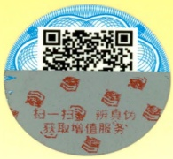

后记

353

稿工作，王昆、王勇、石文磊、吴学锐、刘水静、黄刚、曾庆桃、史泽源、胡晓宇等参加了具体审改工作。参加审看的有:逄锦聚、孙熙国、艾四林、张晖等。

2023年1月

---

## 郑重声明

高等教育出版社依法对本书享有专有出版权。任何未经许可的复制、销售行为均违反《中华人民共和国著作权法》，其行为人将承担相应的民事责任和行政责任；构成犯罪的，将被依法追究刑事责任。为了维护市场秩序，保护读者的合法权益，避免读者误用盗版书造成不良后果，我社将配合行政执法部门和司法机关对违法犯罪的单位和个人进行严厉打击。社会各界人士如发现上述侵权行为，希望及时举报，我社将奖励举报有功人员。

反盗版举报电话 （010）58581999 58582371

反盗版举报邮箱 dd@hep.com.cn

通信地址 北京市西城区德外大街4号 高等教育出版社法律事务部

邮政编码 100120

## 读者意见反馈

为收集对教材的意见建议，进一步完善教材编写并做好服务工作，读者可将对本教材的意见建议通过如下渠道反馈至我社。

咨询电话 400-810-0598

反馈邮箱 gjdzfwb@pub.hep.cn

通信地址 北京市朝阳区惠新东街4号富盛大厦1座高等教育出版社总编辑办公室

邮政编码 100029

防伪查询说明

用户购书后刮开封底防伪涂层，使用手机微信等软件扫描二维码，会跳转至防伪查询网页，获得所购图书详细信息。

防伪客服电话 (010)58582300

---

# 本教材2018年版曾获首届全国教材建设奖全国优秀教材特等奖

seal

G
品惠
心电

定价23.00元